<div align="center">


</div>

# PMax24h Station (Rain): 35217030

Maximum Precipitation in 24 hours (PMax24h) is the greatest amount of rainfall for a specific duration that is meteorologically possible for a given location, acting as a "worst-case" scenario for extreme storms, crucial for designing safety-critical infrastructure like bridges, river deviations, dams, spillways, and nuclear plants to prevent catastrophic failure. The PMax24h is related with the Probable Maximum Precipitation (PMP) and it is calculated by hydrologists using meteorological data to determine the upper limit of extreme rainfall, often leading to the Probable Maximum Flood (PMF) for flood control design, and is increasingly being studied for climate change impacts. Probable Maximum Precipitation (PMP) is the theoretical upper limit of rainfall, a deterministic estimate for extreme events, while probability distributions (like GEV, Gumbel) describe the likelihood and frequency of various precipitation amounts, including rare ones, showing how often events occur, with PMP representing the extreme end of these distributions, used for critical infrastructure design to ensure safety against the worst conceivable weather, unlike standard statistical forecasts which cover typical probabilities.

The most common probability distributions in hydrology, used for analyzing floods, rainfall, and streamflow, include the Normal, Log-Normal, Gumbel, Gamma (including Log-Pearson Type III), and Generalized Extreme Value (GEV) distributions, often chosen based on the data´s skewness and whether modeling extremes or general conditions, with Gumbel and GEV popular for extreme events like floods, while the Normal distribution serves as a baseline, though often requiring transformations for skewed hydrological data. These distributions help in designing water infrastructure, managing water resources, and forecasting hydrologic events.

> Hydrological data often isn´t perfectly normal (it´s skewed), so different distributions are needed for different applications, such as: **Flood Frequency Analysis**: Using Gumbel, GEV, or Log-Pearson Type III for predicting extreme flood magnitudes and their return periods, **Rainfall Analysis**: Normal for annual totals, but Log-Normal, Weibull, or GEV for intensity or extreme daily rainfall, **Streamflow Modeling**: Gamma and Log-Normal for maximum flows, GEV for minimum flows, and Kappa for daily flows.

<div align="center">

</img>

</div>


## A. General information


### 1. General running parameters

• app_version: _v20260312_. • runtime: _2026-03-12 07:15:23.203550_. • Python version: _3.14.0_. • SciPy version: _1.16.3_. • Pandas version: _2.3.3_. • NumPy version: _2.3.5_. • Stations dataset (station_dataset_file): _dataset/pmax24h_in/automatic_colombia_2003_2025.csv_. • Stations catalog (station_catalog_file): _dataset/CNE.xls_. • Minimum year to eval til year_max (date_min): _1900_. • Maximum year to eval since year_min (date_max): _2025_. • Creates, save and include plots into reports (create_plot): _True_. • Plot only fit distributions with Δo > Δ (plot_only_fit): _True_. • Plot only simple graphs avoiding multiple CDFs and multiple Extreme values plots (plot_only_simple): _True_. • Eval low extreme values, if False, evaluates high extreme values (low_extreme): _False_. • Eval every SciPy distribution as logarithmic (pdist_logarithmic_on): _True_. • Standard deviation normalized (ddof): _1.0_. • Return periods to eval in years (Tr): _[2, 2.33, 5, 10, 15, 20, 25, 50, 75, 100, 200, 250, 500, 750, 1000]_. • Minimum data sample per station, 0 means any (minimum_sample): _5_. • Z-Score maximum threshold to adjust a value, 0 means disable (zscore_max): _3.5_. • Z-Score minimum threshold to adjust a value, 0 means disable (zscore_min): _-2.5_. • Avoid zeros, e.g. rain = 0 (avoid_zeros): _True_. • Avoid null values (avoid_nans): _True_. 

:file_folder:Table: [dataset.csv](../../dataset/pmax24h_in/automatic_colombia_2003_2025.csv)

> Delta Degrees of Freedom (DDOF): is a parameter used in the formulas for calculating variance and standard deviation. When ddof=0, the divisor is $N$ (the total number of observations) and this is used when your data set is the entire population. When ddof=1, the divisor is $N-1$ and this is used when your data set is a sample drawn from a larger population. Using $N-1$ provides an unbiased estimate of the population variance (known as Bessel´s correction).


### 2. Station info and location

|   id |   CODIGO | NOMBRE                      | CATEGORIA    | TECNOLOGIA                              | ESTADO   | FECHA_INSTALACION   |   FECHA_SUSPENSION |   ALTITUD |   LATITUD |   LONGITUD | DEPARTAMENTO   | MUNICIPIO   | AREA_OPERATIVA                              | ENTIDAD                                                     | AREA_HIDROGRAFICA   | ZONA_HIDROGRAFICA   | SUBZONA_HIDROGRAFICA   | CORRIENTE   | Catalogo   |   Version |
|-----:|---------:|:----------------------------|:-------------|:----------------------------------------|:---------|:--------------------|-------------------:|----------:|----------:|-----------:|:---------------|:------------|:--------------------------------------------|:------------------------------------------------------------|:--------------------|:--------------------|:-----------------------|:------------|:-----------|----------:|
|    0 | 35217030 | PUENTE LA CABANA [35217030] | Limnigráfica | Automática con Telemetría, Convencional | Activa   | 15/12/1979          |                nan |       497 |   5.43794 |   -72.4552 | Casanare       | Yopal       | Area Operativa 06 - Boyacá-Casanare-Vichada | INSTITUTO DE HIDROLOGIA METEOROLOGIA Y ESTUDIOS AMBIENTALES | Orinoco             | Meta                | Río Cravo Sur          | Cravo Sur   | CNE_IDEAM  |  20251226 |

<div align="center">

Dynamic map: [:earth_americas:Google](http://maps.google.com/maps?q=5.437944444,-72.45522222) [:earth_americas:OSM](https://www.openstreetmap.org/#map=18/5.437944444/-72.45522222&layers=P) [:earth_americas:Bing](https://www.bing.com/maps?cp=5.437944444~-72.45522222&lvl=18) [:earth_americas:Apple](https://maps.apple.com/frame?center=5.437944444%2C-72.45522222&span=0.003%2C0.006)

</div>


<div align="center">

```geojson
{
  "type": "Feature",
  "geometry": {
    "type": "Point", 
    "coordinates": [-72.45522222, 5.437944444]
  }, 
  "properties": {
    "Name": "35217030"
  }
}
```

</div>


### 3. Discrete values table and plot

<div align="center">

|               |           0 |           1 |           2 |           3 |           4 |          5 |           6 |
|:--------------|------------:|------------:|------------:|------------:|------------:|-----------:|------------:|
| Date          | 2019        | 2020        | 2021        | 2022        | 2023        | 2024       | 2025        |
| Value         |   74.4      |  104.3      |   81.8      |  130.5      |   80.2      |  523.8     |   84.5      |
| Value_initial |   74.4      |  104.3      |   81.8      |  130.5      |   80.2      |  523.8     |   84.5      |
| count         |    7        |    7        |    7        |    7        |    7        |    7       |    7        |
| mean          |  154.214    |  154.214    |  154.214    |  154.214    |  154.214    |  154.214   |  154.214    |
| std           |  164.114    |  164.114    |  164.114    |  164.114    |  164.114    |  164.114   |  164.114    |
| zscore        |   -0.486335 |   -0.304145 |   -0.441245 |   -0.144499 |   -0.450994 |    2.25201 |   -0.424793 |


</div>


<div align="center">

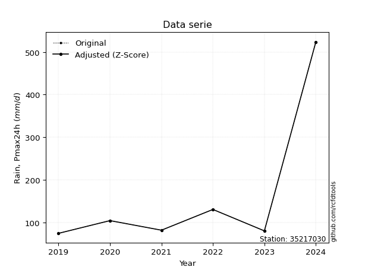</img>

</div>


> The initial value (value_initial) correspond to the initial obtained or null completed value, and value (value) is adjusted only when the initial value is outside the valid range (outlier) definite through the Z-Score value. If Z-Score is active, values out of range or outliers are replaced with the station mean value. A Z-Score (or standard score) measures how many standard deviations a data point is from the mean of a dataset, indicating its relative position; positive scores mean above the mean, negative mean below, and a score of zero is exactly at the mean, allowing for comparison of values from different distributions. It´s calculated using the formula $z=(x–μ)/σ$, where $x$ is the data point, $μ$ is the mean, and $σ$ is the standard deviation, helping identify outliers and understand probability.
>
> <sub>**Note**: In this study, "completing" (filling gaps in) and "extending" (forecasting or lengthening the historical record) rainfall data series are avoided for certain critical analyses because they introduce artificial bias and uncertainty, which can distort the statistics of rare events (extremes), alter day-to-day variability, and compromise the integrity and homogeneity of the original data. Some reasons against Completing/Extending rainfall data are: **Distortion of Extremes and Variability**: The primary issue is that most gap-filling or extension methods rely on averaging or regression with nearby stations, which inherently smooths the data. Rainfall is highly variable in space and time, with a large percentage of zero values and occasional large storms. Infilling methods often underestimate the highest values and overestimate the lowest (zero) values, which severely distorts analyses focused on flood frequency, drought severity, and intensity-duration-frequency (IDF) curves, **Loss of Data Homogeneity**: Infilled or extended data are synthetic estimates, not actual measurements. Combining these estimates with observed data can violate the assumption of data homogeneity, which requires that the data properties do not change over time. Inhomogeneity can lead to incorrect conclusions about long-term trends or changes in climate patterns, **Propagation of Errors**: Errors and biases from the original data (e.g., wind-induced undercatch, instrument errors, site changes) or the data used for imputation can propagate through the analysis, leading to unreliable hydrological models and inaccurate predictions, **Compromised Statistical Integrity**: For statistical analyses, especially those involving the frequency of events, using artificial data can introduce time bias or autocorrelation that doesn´t exist in reality, making it difficult to assess the true probability of events, **Difficulty in Validation**: It is difficult to accurately validate the quality of filled or extended data, especially for past periods where ground-truth measurements are unavailable. The reliability of imputation techniques heavily depends on the density of the surrounding station network and the complexity of the local topography.</sub>


### 4. Active continuous probability distributions from SciPy (80 of 104 available)

A Probability Density Function (PDF) describes the relative likelihood of a continuous random variable falling within a specific range, where the total area under its curve equals 1, and the area over any interval gives the actual probability for that range. Unlike discrete probabilities (like rolling a die), a PDF shows density, not direct probability for a single point (which is zero), with higher points indicating higher likelihood, often visualized as a bell curve for normal distributions.

A log of a probability density function (log-PDF) is simply the logarithm of the PDF´s value, denoted as $log(f(x))$, useful for converting multiplication of probabilities into addition, improving numerical stability with tiny numbers, and connecting to information theory concepts like entropy. Instead of dealing with very small probabilities (e.g., 0.000001), log-PDFs use negative numbers (e.g., $log(0.00001) ≈ -11.51$ that are easier for computers to handle, preventing underflow errors and simplifying complex calculations. In this study, each active probability distribution from SciPy is also evaluated in the $log$ form.

[scipy.stats](https://docs.scipy.org/doc/scipy/reference/stats.html) is a Python´s powerful submodule within the SciPy library for comprehensive statistical analysis, offering over 130 probability distributions (like Normal, Poisson, etc.), functions for descriptive stats (mean, variance), hypothesis testing (t-tests, chi-square), random variable generation, and statistical tests, making it essential for data science, modeling, and research. It provides tools to explore, model, and draw conclusions from data efficiently, working seamlessly with [NumPy](https://numpy.org/).

<div align="center">

|   id | p_dist           |   n_parameter | fit_method   | label                                                                       | active   | ref                                                                                                      |
|-----:|:-----------------|--------------:|:-------------|:----------------------------------------------------------------------------|:---------|:---------------------------------------------------------------------------------------------------------|
|    0 | alpha            |             3 | MLE          | Alpha                                                                       | True     | [:mortar_board:](https://docs.scipy.org/doc/scipy/reference/generated/scipy.stats.alpha.html)            |
|    1 | anglit           |             2 | MM           | Anglit                                                                      | True     | [:mortar_board:](https://docs.scipy.org/doc/scipy/reference/generated/scipy.stats.anglit.html)           |
|    2 | arcsine          |             2 | MM           | Arcsine                                                                     | True     | [:mortar_board:](https://docs.scipy.org/doc/scipy/reference/generated/scipy.stats.arcsine.html)          |
|    3 | argus            |             3 | MLE          | Argus                                                                       | True     | [:mortar_board:](https://docs.scipy.org/doc/scipy/reference/generated/scipy.stats.argus.html)            |
|    4 | beta             |             4 | MLE          | Beta                                                                        | True     | [:mortar_board:](https://docs.scipy.org/doc/scipy/reference/generated/scipy.stats.beta.html)             |
|    5 | betaprime        |             4 | MLE          | Beta prime                                                                  | True     | [:mortar_board:](https://docs.scipy.org/doc/scipy/reference/generated/scipy.stats.betaprime.html)        |
|    6 | bradford         |             3 | MLE          | Bradford                                                                    | True     | [:mortar_board:](https://docs.scipy.org/doc/scipy/reference/generated/scipy.stats.bradford.html)         |
|    7 | burr             |             4 | MLE          | Burr (Type III)                                                             | True     | [:mortar_board:](https://docs.scipy.org/doc/scipy/reference/generated/scipy.stats.burr.html)             |
|    8 | burr12           |             4 | MLE          | Burr (Type III) 12                                                          | True     | [:mortar_board:](https://docs.scipy.org/doc/scipy/reference/generated/scipy.stats.burr12.html)           |
|    9 | cosine           |             2 | MLE          | Cosine                                                                      | True     | [:mortar_board:](https://docs.scipy.org/doc/scipy/reference/generated/scipy.stats.cosine.html)           |
|   10 | crystalball      |             4 | MLE          | Crystalball                                                                 | True     | [:mortar_board:](https://docs.scipy.org/doc/scipy/reference/generated/scipy.stats.crystalball.html)      |
|   11 | dgamma           |             3 | MLE          | Double gamma                                                                | True     | [:mortar_board:](https://docs.scipy.org/doc/scipy/reference/generated/scipy.stats.dgamma.html)           |
|   12 | dweibull         |             3 | MLE          | Double Weibull                                                              | True     | [:mortar_board:](https://docs.scipy.org/doc/scipy/reference/generated/scipy.stats.dweibull.html)         |
|   13 | erlang           |             3 | MLE          | Erlang                                                                      | True     | [:mortar_board:](https://docs.scipy.org/doc/scipy/reference/generated/scipy.stats.erlang.html)           |
|   14 | exponnorm        |             3 | MLE          | Exponentially modified Normal                                               | True     | [:mortar_board:](https://docs.scipy.org/doc/scipy/reference/generated/scipy.stats.exponnorm.html)        |
|   15 | exponpow         |             3 | MLE          | Exponential power                                                           | True     | [:mortar_board:](https://docs.scipy.org/doc/scipy/reference/generated/scipy.stats.exponpow.html)         |
|   16 | exponweib        |             4 | MLE          | Exponentiated Weibull                                                       | True     | [:mortar_board:](https://docs.scipy.org/doc/scipy/reference/generated/scipy.stats.exponweib.html)        |
|   17 | f                |             4 | MLE          | F                                                                           | True     | [:mortar_board:](https://docs.scipy.org/doc/scipy/reference/generated/scipy.stats.f.html)                |
|   18 | fatiguelife      |             3 | MLE          | Fatigue-life (Birnbaum-Saunders)                                            | True     | [:mortar_board:](https://docs.scipy.org/doc/scipy/reference/generated/scipy.stats.fatiguelife.html)      |
|   19 | foldnorm         |             3 | MM           | Fold Normal                                                                 | True     | [:mortar_board:](https://docs.scipy.org/doc/scipy/reference/generated/scipy.stats.foldnorm.html)         |
|   20 | gamma            |             3 | MLE          | Gamma                                                                       | True     | [:mortar_board:](https://docs.scipy.org/doc/scipy/reference/generated/scipy.stats.gamma.html)            |
|   21 | gausshyper       |             6 | MLE          | Gauss hypergeometric                                                        | True     | [:mortar_board:](https://docs.scipy.org/doc/scipy/reference/generated/scipy.stats.gausshyper.html)       |
|   22 | genexpon         |             5 | MLE          | Generalized exponential                                                     | True     | [:mortar_board:](https://docs.scipy.org/doc/scipy/reference/generated/scipy.stats.genexpon.html)         |
|   23 | genextreme       |             3 | MLE          | Generalized exponential                                                     | True     | [:mortar_board:](https://docs.scipy.org/doc/scipy/reference/generated/scipy.stats.genextreme.html)       |
|   24 | gengamma         |             4 | MLE          | Generalized gamma                                                           | True     | [:mortar_board:](https://docs.scipy.org/doc/scipy/reference/generated/scipy.stats.gengamma.html)         |
|   25 | genhalflogistic  |             3 | MLE          | Generalized half-logistic                                                   | True     | [:mortar_board:](https://docs.scipy.org/doc/scipy/reference/generated/scipy.stats.genhalflogistic.html)  |
|   26 | genlogistic      |             3 | MLE          | Generalized logistic                                                        | True     | [:mortar_board:](https://docs.scipy.org/doc/scipy/reference/generated/scipy.stats.genlogistic.html)      |
|   27 | gennorm          |             3 | MLE          | Generalized Normal                                                          | True     | [:mortar_board:](https://docs.scipy.org/doc/scipy/reference/generated/scipy.stats.gennorm.html)          |
|   28 | genpareto        |             3 | MLE          | Generalized Pareto                                                          | True     | [:mortar_board:](https://docs.scipy.org/doc/scipy/reference/generated/scipy.stats.genpareto.html)        |
|   29 | gompertz         |             3 | MLE          | Gompertz (or truncated Gumbel)                                              | True     | [:mortar_board:](https://docs.scipy.org/doc/scipy/reference/generated/scipy.stats.gompertz.html)         |
|   30 | gumbel_l         |             2 | MM           | Gumbel Left Skew                                                            | True     | [:mortar_board:](https://docs.scipy.org/doc/scipy/reference/generated/scipy.stats.gumbel_l.html)         |
|   31 | gumbel_r         |             2 | MM           | Gumbel Right Skew                                                           | True     | [:mortar_board:](https://docs.scipy.org/doc/scipy/reference/generated/scipy.stats.gumbel_r.html)         |
|   32 | halfgennorm      |             3 | MLE          | Upper half of a generalized normal                                          | True     | [:mortar_board:](https://docs.scipy.org/doc/scipy/reference/generated/scipy.stats.halfgennorm.html)      |
|   33 | halflogistic     |             2 | MM           | Half-logistic                                                               | True     | [:mortar_board:](https://docs.scipy.org/doc/scipy/reference/generated/scipy.stats.halflogistic.html)     |
|   34 | halfnorm         |             2 | MM           | Half Normal                                                                 | True     | [:mortar_board:](https://docs.scipy.org/doc/scipy/reference/generated/scipy.stats.halfnorm.html)         |
|   35 | hypsecant        |             2 | MM           | hyperbolic secant                                                           | True     | [:mortar_board:](https://docs.scipy.org/doc/scipy/reference/generated/scipy.stats.hypsecant.html)        |
|   36 | invgamma         |             3 | MLE          | Inverted gamma                                                              | True     | [:mortar_board:](https://docs.scipy.org/doc/scipy/reference/generated/scipy.stats.invgamma.html)         |
|   37 | invgauss         |             3 | MLE          | Inverse Gaussian                                                            | True     | [:mortar_board:](https://docs.scipy.org/doc/scipy/reference/generated/scipy.stats.invgauss.html)         |
|   38 | invweibull       |             3 | MLE          | Inverted Weibull                                                            | True     | [:mortar_board:](https://docs.scipy.org/doc/scipy/reference/generated/scipy.stats.invweibull.html)       |
|   39 | johnsonsb        |             4 | MLE          | Johnson SB                                                                  | True     | [:mortar_board:](https://docs.scipy.org/doc/scipy/reference/generated/scipy.stats.johnsonsb.html)        |
|   40 | johnsonsu        |             4 | MLE          | Johnson Su                                                                  | True     | [:mortar_board:](https://docs.scipy.org/doc/scipy/reference/generated/scipy.stats.johnsonsu.html)        |
|   41 | kappa3           |             3 | MLE          | Kappa 3                                                                     | True     | [:mortar_board:](https://docs.scipy.org/doc/scipy/reference/generated/scipy.stats.kappa3.html)           |
|   42 | kappa4           |             4 | MLE          | Kappa 4                                                                     | True     | [:mortar_board:](https://docs.scipy.org/doc/scipy/reference/generated/scipy.stats.kappa4.html)           |
|   43 | ksone            |             3 | MLE          | Kolmogorov-Smirnov one-sided test statistic distribution                    | True     | [:mortar_board:](https://docs.scipy.org/doc/scipy/reference/generated/scipy.stats.ksone.html)            |
|   44 | kstwobign        |             2 | MLE          | Limiting distribution of scaled Kolmogorov-Smirnov two-sided test statistic | True     | [:mortar_board:](https://docs.scipy.org/doc/scipy/reference/generated/scipy.stats.kstwobign.html)        |
|   45 | laplace          |             2 | MM           | Laplace                                                                     | True     | [:mortar_board:](https://docs.scipy.org/doc/scipy/reference/generated/scipy.stats.laplace.html)          |
|   46 | levy_l           |             2 | MLE          | Left-skewed Levy                                                            | True     | [:mortar_board:](https://docs.scipy.org/doc/scipy/reference/generated/scipy.stats.levy_l.html)           |
|   47 | loggamma         |             3 | MLE          | Log gamma                                                                   | True     | [:mortar_board:](https://docs.scipy.org/doc/scipy/reference/generated/scipy.stats.loggamma.html)         |
|   48 | logistic         |             2 | MM           | Logistic (or Sech-squared)                                                  | True     | [:mortar_board:](https://docs.scipy.org/doc/scipy/reference/generated/scipy.stats.logistic.html)         |
|   49 | loglaplace       |             3 | MLE          | Log-Laplace                                                                 | True     | [:mortar_board:](https://docs.scipy.org/doc/scipy/reference/generated/scipy.stats.loglaplace.html)       |
|   50 | lomax            |             3 | MLE          | Lomax (Pareto of the second kind)                                           | True     | [:mortar_board:](https://docs.scipy.org/doc/scipy/reference/generated/scipy.stats.lomax.html)            |
|   51 | maxwell          |             2 | MM           | Maxwell                                                                     | True     | [:mortar_board:](https://docs.scipy.org/doc/scipy/reference/generated/scipy.stats.maxwell.html)          |
|   52 | mielke           |             4 | MLE          | Mielke Beta-Kappa / Dagum                                                   | True     | [:mortar_board:](https://docs.scipy.org/doc/scipy/reference/generated/scipy.stats.mielke.html)           |
|   53 | moyal            |             2 | MM           | Moyal                                                                       | True     | [:mortar_board:](https://docs.scipy.org/doc/scipy/reference/generated/scipy.stats.moyal.html)            |
|   54 | nakagami         |             3 | MLE          | Nakagami                                                                    | True     | [:mortar_board:](https://docs.scipy.org/doc/scipy/reference/generated/scipy.stats.nakagami.html)         |
|   55 | ncf              |             5 | MLE          | Non-central F distribution                                                  | True     | [:mortar_board:](https://docs.scipy.org/doc/scipy/reference/generated/scipy.stats.ncf.html)              |
|   56 | nct              |             4 | MLE          | Non-central Student’s t                                                     | True     | [:mortar_board:](https://docs.scipy.org/doc/scipy/reference/generated/scipy.stats.nct.html)              |
|   57 | norm             |             2 | MM           | Normal                                                                      | True     | [:mortar_board:](https://docs.scipy.org/doc/scipy/reference/generated/scipy.stats.norm.html)             |
|   58 | pearson3         |             3 | MM           | Pearson type III                                                            | True     | [:mortar_board:](https://docs.scipy.org/doc/scipy/reference/generated/scipy.stats.pearson3.html)         |
|   59 | powerlaw         |             3 | MLE          | Power-function                                                              | True     | [:mortar_board:](https://docs.scipy.org/doc/scipy/reference/generated/scipy.stats.powerlaw.html)         |
|   60 | rayleigh         |             2 | MM           | Rayleigh                                                                    | True     | [:mortar_board:](https://docs.scipy.org/doc/scipy/reference/generated/scipy.stats.rayleigh.html)         |
|   61 | rdist            |             3 | MLE          | R-distributed (symmetric beta)                                              | True     | [:mortar_board:](https://docs.scipy.org/doc/scipy/reference/generated/scipy.stats.rdist.html)            |
|   62 | rice             |             3 | MLE          | Rice                                                                        | True     | [:mortar_board:](https://docs.scipy.org/doc/scipy/reference/generated/scipy.stats.rice.html)             |
|   63 | semicircular     |             2 | MM           | Semicircular                                                                | True     | [:mortar_board:](https://docs.scipy.org/doc/scipy/reference/generated/scipy.stats.semicircular.html)     |
|   64 | skewnorm         |             3 | MLE          | Skew normal                                                                 | True     | [:mortar_board:](https://docs.scipy.org/doc/scipy/reference/generated/scipy.stats.skewnorm.html)         |
|   65 | t                |             3 | MLE          | Student’s t                                                                 | True     | [:mortar_board:](https://docs.scipy.org/doc/scipy/reference/generated/scipy.stats.t.html)                |
|   66 | trapezoid        |             4 | MLE          | Trapezoid                                                                   | True     | [:mortar_board:](https://docs.scipy.org/doc/scipy/reference/generated/scipy.stats.trapezoid.html)        |
|   67 | triang           |             3 | MLE          | Triangular                                                                  | True     | [:mortar_board:](https://docs.scipy.org/doc/scipy/reference/generated/scipy.stats.triang.html)           |
|   68 | truncexpon       |             3 | MLE          | Truncated exponential                                                       | True     | [:mortar_board:](https://docs.scipy.org/doc/scipy/reference/generated/scipy.stats.truncexpon.html)       |
|   69 | truncnorm        |             4 | MLE          | Truncated normal                                                            | True     | [:mortar_board:](https://docs.scipy.org/doc/scipy/reference/generated/scipy.stats.truncnorm.html)        |
|   70 | truncpareto      |             4 | MLE          | Upper truncated Pareto                                                      | True     | [:mortar_board:](https://docs.scipy.org/doc/scipy/reference/generated/scipy.stats.truncpareto.html)      |
|   71 | truncweibull_min |             5 | MLE          | Doubly truncated Weibull minimum                                            | True     | [:mortar_board:](https://docs.scipy.org/doc/scipy/reference/generated/scipy.stats.truncweibull_min.html) |
|   72 | tukeylambda      |             3 | MLE          | Tukey-Lamdba                                                                | True     | [:mortar_board:](https://docs.scipy.org/doc/scipy/reference/generated/scipy.stats.tukeylambda.html)      |
|   73 | uniform          |             2 | MLE          | Uniform                                                                     | True     | [:mortar_board:](https://docs.scipy.org/doc/scipy/reference/generated/scipy.stats.uniform.html)          |
|   74 | vonmises         |             3 | MLE          | Von Mises                                                                   | True     | [:mortar_board:](https://docs.scipy.org/doc/scipy/reference/generated/scipy.stats.vonmises.html)         |
|   75 | vonmises_line    |             3 | MLE          | Von Mises line                                                              | True     | [:mortar_board:](https://docs.scipy.org/doc/scipy/reference/generated/scipy.stats.vonmises_line.html)    |
|   76 | wald             |             2 | MM           | Wald                                                                        | True     | [:mortar_board:](https://docs.scipy.org/doc/scipy/reference/generated/scipy.stats.wald.html)             |
|   77 | weibull_max      |             3 | MLE          | Weibull maximum                                                             | True     | [:mortar_board:](https://docs.scipy.org/doc/scipy/reference/generated/scipy.stats.weibull_max.html)      |
|   78 | weibull_min      |             3 | MLE          | Weibull minimum                                                             | True     | [:mortar_board:](https://docs.scipy.org/doc/scipy/reference/generated/scipy.stats.weibull_min.html)      |
|   79 | wrapcauchy       |             3 | MLE          | Wrapped  Cauchy                                                             | True     | [:mortar_board:](https://docs.scipy.org/doc/scipy/reference/generated/scipy.stats.wrapcauchy.html)       |

</div>

> **n_parameter:** # arguments & localization & scale.
>
> **Fit methods:** (MLE) maximum likelihood, (MM) L-moments.
>
>**Inactive** (With the only purpose of prevent loops, zero divisions, infinite values, over high estimated values or horizontal trending for recurrence intervals estimations, the follow distributions were disabled.)**:** lognorm, norminvgauss, powernorm, powerlognorm, cauchy, halfcauchy, foldcauchy, skewcauchy, chi2, expon, fisk, genhyperbolic, geninvgauss, gibrat, kstwo, laplace_asymmetric, levy, levy_stable, ncx2, pareto, rel_breitwigner, recipinvgauss, studentized_range, loguniform, 


## B. Probability (PDF) vs. Empirical (EDF) distributions functions

A continuous probability distribution (CPD) describes probabilities for variables that can take any value within a range (like rain any time), unlike discrete variables with specific outcomes (like temperature). It uses a Probability Density Function (PDF), a curve where the total area under it equals 1, and the probability of the variable falling within an interval (a to b) is found by calculating the area under the curve between those points. A key feature is that the probability of hitting any single exact value is zero, so probabilities are always expressed for ranges, e.g., $P(a ≤ X ≤ b)$.

<div align="center">

Distributions parameters from station values
|     |   station | p_dist              |   n |             loc |           scale | shape                  | shape1                 | shape2                 | shape3              |
|----:|----------:|:--------------------|----:|----------------:|----------------:|:-----------------------|:-----------------------|:-----------------------|:--------------------|
|   0 |  35217030 | alpha               |   7 |      67.6973    |    13.5315      | 1.253322351983636e-09  |                        |                        |                     |
|   1 |  35217030 | anglit              |   7 |     154.214     |   444.484       |                        |                        |                        |                     |
|   2 |  35217030 | arcsine             |   7 |     -60.6609    |   429.75        |                        |                        |                        |                     |
|   3 |  35217030 | argus               |   7 |    -210.156     |   761.947       | 6.354692084423564e-07  |                        |                        |                     |
|   4 |  35217030 | beta                |   7 |      31.3695    |   492.431       | 0.012235776306452438   | 0.0676470271179434     |                        |                     |
|   5 |  35217030 | betaprime           |   7 |      -0.650166  |     1.2986      | 291.84849568876587     | 3.70851500130936       |                        |                     |
|   6 |  35217030 | bradford            |   7 |      74.4       |   449.4         | 2.7086920587421357     |                        |                        |                     |
|   7 |  35217030 | burr                |   7 |      52.1627    |     4.24914     | 2.340795034240485      | 108.62265364295752     |                        |                     |
|   8 |  35217030 | burr12              |   7 |      -0.433889  |    74.1925      | 363.0091562530779      | 0.006029420957626552   |                        |                     |
|   9 |  35217030 | cosine              |   7 |     195.294     |   141.858       |                        |                        |                        |                     |
|  10 |  35217030 | crystalball         |   7 |       0.0110678 |   216.432       | 4.861188756100981      | 1.142412917570034      |                        |                     |
|  11 |  35217030 | dgamma              |   7 |      81.8       |    89.59        | 0.572041129215707      |                        |                        |                     |
|  12 |  35217030 | dweibull            |   7 |      80.2       |    77.0253      | 0.48794302352731245    |                        |                        |                     |
|  13 |  35217030 | erlang              |   7 |      74.4       |   106.985       | 0.49474886772965665    |                        |                        |                     |
|  14 |  35217030 | exponnorm           |   7 |      74.3301    |     0.0216815   | 3698.5937409682065     |                        |                        |                     |
|  15 |  35217030 | exponpow            |   7 |      74.4       |   156.329       | 0.38019174476079387    |                        |                        |                     |
|  16 |  35217030 | exponweib           |   7 |      74.3923    |     6.20502e-08 | 67.12163119843409      | 0.08260337665094715    |                        |                     |
|  17 |  35217030 | f                   |   7 |      71.9497    |     9.20503     | 5694.007154789131      | 1.4199995567457262     |                        |                     |
|  18 |  35217030 | fatiguelife         |   7 |      73.6703    |    18.5012      | 2.6623899795511683     |                        |                        |                     |
|  19 |  35217030 | foldnorm            |   7 |     -67.7079    |   274.238       | 0.0021394789248356     |                        |                        |                     |
|  20 |  35217030 | gamma               |   7 |      74.4       |   137.589       | 0.48347110875425703    |                        |                        |                     |
|  21 |  35217030 | gausshyper          |   7 |      74.4       |   449.712       | 0.30025545541451165    | 0.4547336003601692     | 1.13697208901017       | 0.44922888465946886 |
|  22 |  35217030 | genexpon            |   7 |      74.4       |   122.755       | 1.538009714957721      | 2.6693275154090598e-12 | 1.5092607700186025     |                     |
|  23 |  35217030 | genextreme          |   7 |      75.1504    |     4.46922     | -5.955731117749892     |                        |                        |                     |
|  24 |  35217030 | gengamma            |   7 |      14.1932    |     0.000396408 | 27.176440653927337     | 0.2638271469726934     |                        |                     |
|  25 |  35217030 | genhalflogistic     |   7 |      29.9852    |   514.799       | 1.0424934911590529     |                        |                        |                     |
|  26 |  35217030 | genlogistic         |   7 |    -423.649     |    66.2312      | 2724.888858309284      |                        |                        |                     |
|  27 |  35217030 | gennorm             |   7 |      84.5       |     0.098573    | 0.26373938880499587    |                        |                        |                     |
|  28 |  35217030 | genpareto           |   7 |      74.392     |    18.6192      | 0.9267629767133783     |                        |                        |                     |
|  29 |  35217030 | gompertz            |   7 |      74.4       |     3.02359e+12 | 28083838734.40591      |                        |                        |                     |
|  30 |  35217030 | gumbel_l            |   7 |     222.595     |   118.467       |                        |                        |                        |                     |
|  31 |  35217030 | gumbel_r            |   7 |      85.8333    |   118.467       |                        |                        |                        |                     |
|  32 |  35217030 | halfgennorm         |   7 |      74.3997    |     2.57007e-08 | 0.11096915934683382    |                        |                        |                     |
|  33 |  35217030 | halflogistic        |   7 |     -25.8696    |   129.903       |                        |                        |                        |                     |
|  34 |  35217030 | halfnorm            |   7 |     -46.8944    |   252.052       |                        |                        |                        |                     |
|  35 |  35217030 | hypsecant           |   7 |     154.214     |    96.7278      |                        |                        |                        |                     |
|  36 |  35217030 | invgamma            |   7 |      71.9485    |     6.53522     | 0.7099977513805941     |                        |                        |                     |
|  37 |  35217030 | invgauss            |   7 |      72.4996    |     8.61898     | 9.480754537247634      |                        |                        |                     |
|  38 |  35217030 | invweibull          |   7 |      74.4       |     0.0872728   | 0.0591367998754552     |                        |                        |                     |
|  39 |  35217030 | johnsonsb           |   7 |      74.4       |   449.4         | 1.3256591715871542     | 0.13354142652440038    |                        |                     |
|  40 |  35217030 | johnsonsu           |   7 |      80.3789    |     1.24461     | -0.7826910088039258    | 0.3632771109106634     |                        |                     |
|  41 |  35217030 | kappa3              |   7 |      74.4       |    26.5163      | 0.752766634135657      |                        |                        |                     |
|  42 |  35217030 | kappa4              |   7 |      29.1631    |   494.557       | 1.100643742916125      | 0.9933370013089539     |                        |                     |
|  43 |  35217030 | ksone               |   7 |      29.46      |   539.28        | 1.0                    |                        |                        |                     |
|  44 |  35217030 | kstwobign           |   7 |    -192.947     |   411.278       |                        |                        |                        |                     |
|  45 |  35217030 | laplace             |   7 |     154.214     |   107.438       |                        |                        |                        |                     |
|  46 |  35217030 | levy_l              |   7 |     568.814     |   200.937       |                        |                        |                        |                     |
|  47 |  35217030 | loggamma            |   7 |  -27912.7       |  4241.84        | 747.8592022613775      |                        |                        |                     |
|  48 |  35217030 | logistic            |   7 |     154.214     |    83.7688      |                        |                        |                        |                     |
|  49 |  35217030 | loglaplace          |   7 |      -0.244612  |    84.7446      | 2.614421433145206      |                        |                        |                     |
|  50 |  35217030 | lomax               |   7 |      74.4       |     7.84055e+09 | 44492765.89884567      |                        |                        |                     |
|  51 |  35217030 | maxwell             |   7 |    -205.819     |   225.617       |                        |                        |                        |                     |
|  52 |  35217030 | mielke              |   7 |      -0.381826  |    17.673       | 498.65993936369887     | 3.0862932645530305     |                        |                     |
|  53 |  35217030 | moyal               |   7 |      67.3254    |    68.3969      |                        |                        |                        |                     |
|  54 |  35217030 | nakagami            |   7 |      74.4       |   240.955       | 0.10191710672247642    |                        |                        |                     |
|  55 |  35217030 | ncf                 |   7 |      -1.2051    |   102.895       | 376.96870163503667     | 7.47371766134391       | 5.7842941172921505e-05 |                     |
|  56 |  35217030 | nct                 |   7 |      -0.265525  |     1.80519     | 2.6926482598944315     | 52.656946843997105     |                        |                     |
|  57 |  35217030 | norm                |   7 |     154.214     |   151.94        |                        |                        |                        |                     |
|  58 |  35217030 | pearson3            |   7 |     154.214     |   151.94        | 1.9839579126079232     |                        |                        |                     |
|  59 |  35217030 | powerlaw            |   7 |      74.4       |   449.4         | 0.12719090229020147    |                        |                        |                     |
|  60 |  35217030 | rayleigh            |   7 |    -136.455     |   231.921       |                        |                        |                        |                     |
|  61 |  35217030 | rdist               |   7 |      38.1643    |    92.3357      | 1.3748726797003443     |                        |                        |                     |
|  62 |  35217030 | rice                |   7 |     -51.5325    |   180.855       | 0.0002336053501283702  |                        |                        |                     |
|  63 |  35217030 | semicircular        |   7 |     154.214     |   303.879       |                        |                        |                        |                     |
|  64 |  35217030 | skewnorm            |   7 |      74.3999    |   171.617       | 8797511.913140789      |                        |                        |                     |
|  65 |  35217030 | t                   |   7 |      81.5611    |     3.21572     | 0.43840455294832503    |                        |                        |                     |
|  66 |  35217030 | trapezoid           |   7 |      29.46      |   539.28        | 1.0                    | 1.0                    |                        |                     |
|  67 |  35217030 | triang              |   7 |    -278.63      |   802.44        | 0.9999879609866116     |                        |                        |                     |
|  68 |  35217030 | truncexpon          |   7 |      33.0936    |   392.553       | 1.2500401779858472     |                        |                        |                     |
|  69 |  35217030 | truncnorm           |   7 | -841453         | 11310.9         | 74.39943716333923      | 74.43916875896883      |                        |                     |
|  70 |  35217030 | truncpareto         |   7 |      65.31      |     9.09003     | 0.7622513878209753     | 50.438800368494        |                        |                     |
|  71 |  35217030 | truncweibull_min    |   7 |      71.7067    |   310.217       | 0.016032082439482093   | 0.008604345238473893   | 1.457343154319036      |                     |
|  72 |  35217030 | tukeylambda         |   7 |     102.467     |    35.4264      | 1.2622308668766995     |                        |                        |                     |
|  73 |  35217030 | uniform             |   7 |      74.4       |   449.4         |                        |                        |                        |                     |
|  74 |  35217030 | vonmises            |   7 |      -1.86378   |     1           | 0.7067128860785596     |                        |                        |                     |
|  75 |  35217030 | vonmises_line       |   7 |     115.332     |   130.019       | 1.964597755370845      |                        |                        |                     |
|  76 |  35217030 | wald                |   7 |       2.27457   |   151.94        |                        |                        |                        |                     |
|  77 |  35217030 | weibull_max         |   7 |     523.8       |     1.66873     | 0.1601046537035598     |                        |                        |                     |
|  78 |  35217030 | weibull_min         |   7 |      74.4       |    84.8652      | 0.5660705508884769     |                        |                        |                     |
|  79 |  35217030 | wrapcauchy          |   7 |      74.4       |    71.5246      | 0.9032959642936738     |                        |                        |                     |
|  80 |  35217030 | logalpha            |   7 |       4.2299    |     0.162761    | 5.384790577307865e-05  |                        |                        |                     |
|  81 |  35217030 | loganglit           |   7 |       4.75925   |     1.86774     |                        |                        |                        |                     |
|  82 |  35217030 | logarcsine          |   7 |       3.85634   |     1.80583     |                        |                        |                        |                     |
|  83 |  35217030 | logargus            |   7 |       3.24372   |     3.13332     | 6.228181526864057e-05  |                        |                        |                     |
|  84 |  35217030 | logbeta             |   7 |       4.30946   |    34.7649      | 0.14536385480354663    | 11.560764264178324     |                        |                     |
|  85 |  35217030 | logbetaprime        |   7 |       1.22816   |    11.9373      | 52.8524440068643       | 180.0907331175884      |                        |                     |
|  86 |  35217030 | logbradford         |   7 |       4.30946   |     1.95194     | 161.44781876263994     |                        |                        |                     |
|  87 |  35217030 | logburr             |   7 |       4.26232   |     0.000578122 | 1.0369875863988165     | 313.03917157099323     |                        |                     |
|  88 |  35217030 | logburr12           |   7 |       3.45546   |     0.84924     | 593.9362882948571      | 0.004919107330661952   |                        |                     |
|  89 |  35217030 | logcosine           |   7 |       4.91519   |     0.58617     |                        |                        |                        |                     |
|  90 |  35217030 | logcrystalball      |   7 |       4.75925   |     0.638462    | 7.770314997197216      | 3438.2761978910817     |                        |                     |
|  91 |  35217030 | logdgamma           |   7 |       4.40428   |     0.559244    | 0.7587086353672564     |                        |                        |                     |
|  92 |  35217030 | logdweibull         |   7 |       4.43675   |     0.649007    | 0.582799286929734      |                        |                        |                     |
|  93 |  35217030 | logerlang           |   7 |       4.30946   |     0.601437    | 0.5618152589621945     |                        |                        |                     |
|  94 |  35217030 | logexponnorm        |   7 |       4.30884   |     0.000195225 | 2295.703989107471      |                        |                        |                     |
|  95 |  35217030 | logexponpow         |   7 |       4.30946   |     1.68203     | 0.9377111812318675     |                        |                        |                     |
|  96 |  35217030 | logexponweib        |   7 |       4.30946   |     0.712933    | 0.7520733459875986     | 0.24632110048461234    |                        |                     |
|  97 |  35217030 | logf                |   7 |       4.30946   |     0.342135    | 0.2833785985941957     | 186.28009734035103     |                        |                     |
|  98 |  35217030 | logfatiguelife      |   7 |       4.29506   |     0.175579    | 1.789013495220596      |                        |                        |                     |
|  99 |  35217030 | logfoldnorm         |   7 |       3.78923   |     0.815979    | 1.0289479362478726     |                        |                        |                     |
| 100 |  35217030 | loggamma            |   7 |       4.30946   |     0.654897    | 0.18450114235187026    |                        |                        |                     |
| 101 |  35217030 | loggausshyper       |   7 |       4.30946   |     2.15151     | 0.5867730073296529     | 0.9480577014822131     | 1.4629870929976079     | 1.1270995957365635  |
| 102 |  35217030 | loggenexpon         |   7 |       4.30946   |     0.683831    | 1.520556646557952      | 1.8538412017969439e-07 | 0.45477364726550307    |                     |
| 103 |  35217030 | loggenextreme       |   7 |       4.40952   |     0.142153    | -0.9637030565931881    |                        |                        |                     |
| 104 |  35217030 | loggengamma         |   7 |       4.30946   |     0.725107    | 1.1383848894196102     | 0.17622068982078393    |                        |                     |
| 105 |  35217030 | loggenhalflogistic  |   7 |       4.14258   |     2.25896     | 1.066285269878396      |                        |                        |                     |
| 106 |  35217030 | loggenlogistic      |   7 |       2.06059   |     0.330846    | 1658.8578965437548     |                        |                        |                     |
| 107 |  35217030 | loggennorm          |   7 |       4.38452   |     0.0126702   | 0.3811792692570594     |                        |                        |                     |
| 108 |  35217030 | loggenpareto        |   7 |      -0.0310022 |    13.51        | -2.1471360632512955    |                        |                        |                     |
| 109 |  35217030 | loggompertz         |   7 |       4.30946   | 70127.2         | 157964.73241693672     |                        |                        |                     |
| 110 |  35217030 | loggumbel_l         |   7 |       5.04659   |     0.497807    |                        |                        |                        |                     |
| 111 |  35217030 | loggumbel_r         |   7 |       4.47191   |     0.497807    |                        |                        |                        |                     |
| 112 |  35217030 | loghalfgennorm      |   7 |       4.30946   |     0.608705    | 1.026833652260894      |                        |                        |                     |
| 113 |  35217030 | loghalflogistic     |   7 |       4.00253   |     0.545863    |                        |                        |                        |                     |
| 114 |  35217030 | loghalfnorm         |   7 |       3.91418   |     1.05914     |                        |                        |                        |                     |
| 115 |  35217030 | loghypsecant        |   7 |       4.75925   |     0.406458    |                        |                        |                        |                     |
| 116 |  35217030 | loginvgamma         |   7 |       4.26058   |     0.167979    | 1.1011177927386948     |                        |                        |                     |
| 117 |  35217030 | loginvgauss         |   7 |       4.27806   |     0.152772    | 3.1497696369789066     |                        |                        |                     |
| 118 |  35217030 | loginvweibull       |   7 |       4.26201   |     0.147504    | 1.0377249008133176     |                        |                        |                     |
| 119 |  35217030 | logjohnsonsb        |   7 |       4.30946   |     7.4102      | 1.05871821037198       | 0.09291633897374565    |                        |                     |
| 120 |  35217030 | logjohnsonsu        |   7 |       4.38394   |     0.0259      | -0.803469411736487     | 0.4669078149151647     |                        |                     |
| 121 |  35217030 | logkappa3           |   7 |       4.30946   |     1.92903     | 164.67122326861647     |                        |                        |                     |
| 122 |  35217030 | logkappa4           |   7 |       4.10337   |     2.25572     | 1.0984391059824752     | 1.045407953055907      |                        |                     |
| 123 |  35217030 | logksone            |   7 |       4.11429   |     2.34198     | 1.0                    |                        |                        |                     |
| 124 |  35217030 | logkstwobign        |   7 |       3.18757   |     1.84397     |                        |                        |                        |                     |
| 125 |  35217030 | loglaplace          |   7 |       4.75925   |     0.451461    |                        |                        |                        |                     |
| 126 |  35217030 | loglevy_l           |   7 |       6.44234   |     0.808752    |                        |                        |                        |                     |
| 127 |  35217030 | logloggamma         |   7 |    -170.508     |    24.3513      | 1336.3594927643617     |                        |                        |                     |
| 128 |  35217030 | loglogistic         |   7 |       4.75925   |     0.352003    |                        |                        |                        |                     |
| 129 |  35217030 | logloglaplace       |   7 |       0.0190282 |     4.41772     | 12.877635801095138     |                        |                        |                     |
| 130 |  35217030 | loglomax            |   7 |       4.30946   |     6.11306     | 15.441023298994295     |                        |                        |                     |
| 131 |  35217030 | logmaxwell          |   7 |       3.24636   |     0.948062    |                        |                        |                        |                     |
| 132 |  35217030 | logmielke           |   7 |       4.26539   |     0.00643846  | 26.09072742602308      | 1.0328137556597503     |                        |                     |
| 133 |  35217030 | logmoyal            |   7 |       4.39414   |     0.287409    |                        |                        |                        |                     |
| 134 |  35217030 | lognakagami         |   7 |       4.30946   |     1.1336      | 0.07101142350118236    |                        |                        |                     |
| 135 |  35217030 | logncf              |   7 |       3.29575   |     0.0124187   | 0.27832085054922284    | 603.8820976854686      | 32.60737131848593      |                     |
| 136 |  35217030 | lognct              |   7 |      -0.0881046 |     0.073772    | 40.78587246528356      | 64.41608998040135      |                        |                     |
| 137 |  35217030 | lognorm             |   7 |       4.75925   |     0.638462    |                        |                        |                        |                     |
| 138 |  35217030 | logpearson3         |   7 |       4.75925   |     0.638462    | 1.7376732658479543     |                        |                        |                     |
| 139 |  35217030 | logpowerlaw         |   7 |       4.30946   |     1.95165     | 0.147874463841512      |                        |                        |                     |
| 140 |  35217030 | lograyleigh         |   7 |       3.53784   |     0.974549    |                        |                        |                        |                     |
| 141 |  35217030 | logrdist            |   7 |       5.43051   |     1.12105     | 1.0413271843814984     |                        |                        |                     |
| 142 |  35217030 | logrice             |   7 |       3.85804   |     0.780968    | 0.00019803469429898287 |                        |                        |                     |
| 143 |  35217030 | logsemicircular     |   7 |       4.75925   |     1.27696     |                        |                        |                        |                     |
| 144 |  35217030 | logskewnorm         |   7 |       4.30946   |     0.780871    | 9471388.74582263       |                        |                        |                     |
| 145 |  35217030 | logt                |   7 |       4.75521   |     0.635074    | 10.208893425874379     |                        |                        |                     |
| 146 |  35217030 | logtrapezoid        |   7 |       4.11429   |     2.34198     | 1.0                    | 1.0                    |                        |                     |
| 147 |  35217030 | logtriang           |   7 |       2.9685    |     3.29261     | 0.9999999751325015     |                        |                        |                     |
| 148 |  35217030 | logtruncexpon       |   7 |       4.30946   |     1.68686     | 1.1569762082837078     |                        |                        |                     |
| 149 |  35217030 | logtruncnorm        |   7 |     -10.1711    |     2.82585     | 5.124305932011928      | 5.814982893514844      |                        |                     |
| 150 |  35217030 | logtruncpareto      |   7 |       4.04151   |     0.267943    | 0.9846303804926488     | 8.28384442751101       |                        |                     |
| 151 |  35217030 | logtruncweibull_min |   7 |       4.30785   |     1.31601     | 0.3865840825747944     | 0.0012169727235809913  | 1.4842285977212715     |                     |
| 152 |  35217030 | logtukeylambda      |   7 |       5.28528   |     1.10012     | 1.127370906037719      |                        |                        |                     |
| 153 |  35217030 | loguniform          |   7 |       4.30946   |     1.95165     |                        |                        |                        |                     |
| 154 |  35217030 | logvonmises         |   7 |      -1.60474   |     1           | 3.25980197468674       |                        |                        |                     |
| 155 |  35217030 | logvonmises_line    |   7 |       4.66827   |     0.507016    | 1.031350145005106      |                        |                        |                     |
| 156 |  35217030 | logwald             |   7 |       4.12079   |     0.638462    |                        |                        |                        |                     |
| 157 |  35217030 | logweibull_max      |   7 |       6.26111   |     1.30934     | 0.8831128652753475     |                        |                        |                     |
| 158 |  35217030 | logweibull_min      |   7 |       4.30946   |     0.872588    | 0.5744711018225938     |                        |                        |                     |
| 159 |  35217030 | logwrapcauchy       |   7 |       4.30946   |     0.310615    | 0.525                  |                        |                        |                     |

</div>

> **loc** (Location parameter): This shifts the distribution along the x-axis. For many common distributions, like the normal (Gaussian) distribution, loc represents the mean $μ$. For others, like the uniform distribution, it might represent the minimum value, or for the beta distribution, the left end of the support interval.
>
> **scale** (Scale parameter): This determines the width or spread of the distribution. For the normal distribution, scale represents the standard deviation $σ$. For a uniform distribution, it defines the length of the interval (from $loc$ to $loc + scale$).
>
> **shape** (Shape parameters): Refers to parameters that define the specific form of a probability distribution, distinct from its location (loc) and scale (scale). These parameters are required arguments for most distribution functions. For example, a normal (Gaussian) distribution is fully defined by its location (mean) and scale (standard deviation), so it has no specific shape parameters beyond loc and scale. However, other distributions have intrinsic properties that need specification, as Gamma distribution that takes a shape parameter, often named $a$ or $alpha$.


### 0. Cumulative distribution values - CDF (160 evaluated)

Cumulative Distribution Function (CDF), denoted as $F$<sub>$X$</sub>$(x)$, is a function that gives the probability that a random variable $X$ will take a value less than or equal to a specific value, $x$ (i.e., $(P(X≥x)$. It essentially "accumulates" probabilities from a given point up to the far right (positive infinity), providing a complete picture of the distribution´s probabilities for both discrete (like rain) and continuous (like temperature) variables, helping to find probabilities over ranges or above certain values. Each station is evaluated separately ordering the $x$ values ascending, calculating the CDF and PDF values for the activated distributions and their logarithmic forms.

<div align="center">

CDF ordered by x ascending and calculating $log(f(x))$ separately
|   id |   Station |   date |     x |   count |    mean |     std |    zscore |   Value_initial |   station |   m |     alpha |   alpha_pdf |   anglit |   anglit_pdf |   arcsine |   arcsine_pdf |    argus |   argus_pdf |     beta |    beta_pdf |   betaprime |   betaprime_pdf |    bradford |   bradford_pdf |     burr |    burr_pdf |    burr12 |   burr12_pdf |   cosine |   cosine_pdf |   crystalball |   crystalball_pdf |   dgamma |     dgamma_pdf |   dweibull |     dweibull_pdf |      erlang |       erlang_pdf |   exponnorm |   exponnorm_pdf |    exponpow |   exponpow_pdf |   exponweib |   exponweib_pdf |         f |       f_pdf |   fatiguelife |   fatiguelife_pdf |   foldnorm |   foldnorm_pdf |       gamma |        gamma_pdf |   gausshyper |   gausshyper_pdf |    genexpon |   genexpon_pdf |   genextreme |   genextreme_pdf |   gengamma |   gengamma_pdf |   genhalflogistic |   genhalflogistic_pdf |   genlogistic |   genlogistic_pdf |   gennorm |   gennorm_pdf |   genpareto |   genpareto_pdf |    gompertz |   gompertz_pdf |   gumbel_l |   gumbel_l_pdf |   gumbel_r |   gumbel_r_pdf |   halfgennorm |   halfgennorm_pdf |   halflogistic |   halflogistic_pdf |   halfnorm |   halfnorm_pdf |   hypsecant |   hypsecant_pdf |   invgamma |   invgamma_pdf |   invgauss |   invgauss_pdf |   invweibull |   invweibull_pdf |   johnsonsb |   johnsonsb_pdf |   johnsonsu |   johnsonsu_pdf |      kappa3 |   kappa3_pdf |      kappa4 |   kappa4_pdf |     ksone |   ksone_pdf |   kstwobign |   kstwobign_pdf |   laplace |   laplace_pdf |   levy_l |   levy_l_pdf |   loggamma |   loggamma_pdf |   logistic |   logistic_pdf |   loglaplace |   loglaplace_pdf |      lomax |   lomax_pdf |   maxwell |   maxwell_pdf |   mielke |   mielke_pdf |    moyal |   moyal_pdf |    nakagami |   nakagami_pdf |      ncf |     ncf_pdf |      nct |    nct_pdf |     norm |    norm_pdf |   pearson3 |   pearson3_pdf |   powerlaw |   powerlaw_pdf |   rayleigh |   rayleigh_pdf |    rdist |    rdist_pdf |     rice |    rice_pdf |   semicircular |   semicircular_pdf |   skewnorm |   skewnorm_pdf |        t |      t_pdf |   trapezoid |   trapezoid_pdf |   triang |   triang_pdf |   truncexpon |   truncexpon_pdf |   truncnorm |   truncnorm_pdf |   truncpareto |   truncpareto_pdf |   truncweibull_min |   truncweibull_min_pdf |   tukeylambda |   tukeylambda_pdf |   uniform |   uniform_pdf |   vonmises |   vonmises_pdf |   vonmises_line |   vonmises_line_pdf |     wald |    wald_pdf |   weibull_max |   weibull_max_pdf |   weibull_min |   weibull_min_pdf |   wrapcauchy |   wrapcauchy_pdf |   logalpha |   logalpha_pdf |   loganglit |   loganglit_pdf |   logarcsine |   logarcsine_pdf |   logargus |   logargus_pdf |    logbeta |   logbeta_pdf |   logbetaprime |   logbetaprime_pdf |   logbradford |   logbradford_pdf |   logburr |   logburr_pdf |   logburr12 |   logburr12_pdf |   logcosine |   logcosine_pdf |   logcrystalball |   logcrystalball_pdf |   logdgamma |   logdgamma_pdf |   logdweibull |   logdweibull_pdf |   logerlang |   logerlang_pdf |   logexponnorm |   logexponnorm_pdf |   logexponpow |   logexponpow_pdf |   logexponweib |   logexponweib_pdf |       logf |    logf_pdf |   logfatiguelife |   logfatiguelife_pdf |   logfoldnorm |   logfoldnorm_pdf |   loggausshyper |   loggausshyper_pdf |   loggenexpon |   loggenexpon_pdf |   loggenextreme |   loggenextreme_pdf |   loggengamma |   loggengamma_pdf |   loggenhalflogistic |   loggenhalflogistic_pdf |   loggenlogistic |   loggenlogistic_pdf |   loggennorm |   loggennorm_pdf |   loggenpareto |   loggenpareto_pdf |   loggompertz |   loggompertz_pdf |   loggumbel_l |   loggumbel_l_pdf |   loggumbel_r |   loggumbel_r_pdf |   loghalfgennorm |   loghalfgennorm_pdf |   loghalflogistic |   loghalflogistic_pdf |   loghalfnorm |   loghalfnorm_pdf |   loghypsecant |   loghypsecant_pdf |   loginvgamma |   loginvgamma_pdf |   loginvgauss |   loginvgauss_pdf |   loginvweibull |   loginvweibull_pdf |   logjohnsonsb |   logjohnsonsb_pdf |   logjohnsonsu |   logjohnsonsu_pdf |   logkappa3 |   logkappa3_pdf |   logkappa4 |   logkappa4_pdf |   logksone |   logksone_pdf |   logkstwobign |   logkstwobign_pdf |   loglevy_l |   loglevy_l_pdf |   logloggamma |   logloggamma_pdf |   loglogistic |   loglogistic_pdf |   logloglaplace |   logloglaplace_pdf |    loglomax |   loglomax_pdf |   logmaxwell |   logmaxwell_pdf |   logmielke |   logmielke_pdf |   logmoyal |   logmoyal_pdf |   lognakagami |   lognakagami_pdf |   logncf |   logncf_pdf |   lognct |   lognct_pdf |   lognorm |   lognorm_pdf |   logpearson3 |   logpearson3_pdf |   logpowerlaw |   logpowerlaw_pdf |   lograyleigh |   lograyleigh_pdf |    logrdist |   logrdist_pdf |   logrice |   logrice_pdf |   logsemicircular |   logsemicircular_pdf |   logskewnorm |   logskewnorm_pdf |     logt |   logt_pdf |   logtrapezoid |   logtrapezoid_pdf |   logtriang |   logtriang_pdf |   logtruncexpon |   logtruncexpon_pdf |   logtruncnorm |   logtruncnorm_pdf |   logtruncpareto |   logtruncpareto_pdf |   logtruncweibull_min |   logtruncweibull_min_pdf |   logtukeylambda |   logtukeylambda_pdf |   loguniform |   loguniform_pdf |   logvonmises |   logvonmises_pdf |   logvonmises_line |   logvonmises_line_pdf |   logwald |   logwald_pdf |   logweibull_max |   logweibull_max_pdf |   logweibull_min |   logweibull_min_pdf |   logwrapcauchy |   logwrapcauchy_pdf |
|-----:|----------:|-------:|------:|--------:|--------:|--------:|----------:|----------------:|----------:|----:|----------:|------------:|---------:|-------------:|----------:|--------------:|---------:|------------:|---------:|------------:|------------:|----------------:|------------:|---------------:|---------:|------------:|----------:|-------------:|---------:|-------------:|--------------:|------------------:|---------:|---------------:|-----------:|-----------------:|------------:|-----------------:|------------:|----------------:|------------:|---------------:|------------:|----------------:|----------:|------------:|--------------:|------------------:|-----------:|---------------:|------------:|-----------------:|-------------:|-----------------:|------------:|---------------:|-------------:|-----------------:|-----------:|---------------:|------------------:|----------------------:|--------------:|------------------:|----------:|--------------:|------------:|----------------:|------------:|---------------:|-----------:|---------------:|-----------:|---------------:|--------------:|------------------:|---------------:|-------------------:|-----------:|---------------:|------------:|----------------:|-----------:|---------------:|-----------:|---------------:|-------------:|-----------------:|------------:|----------------:|------------:|----------------:|------------:|-------------:|------------:|-------------:|----------:|------------:|------------:|----------------:|----------:|--------------:|---------:|-------------:|-----------:|---------------:|-----------:|---------------:|-------------:|-----------------:|-----------:|------------:|----------:|--------------:|---------:|-------------:|---------:|------------:|------------:|---------------:|---------:|------------:|---------:|-----------:|---------:|------------:|-----------:|---------------:|-----------:|---------------:|-----------:|---------------:|---------:|-------------:|---------:|------------:|---------------:|-------------------:|-----------:|---------------:|---------:|-----------:|------------:|----------------:|---------:|-------------:|-------------:|-----------------:|------------:|----------------:|--------------:|------------------:|-------------------:|-----------------------:|--------------:|------------------:|----------:|--------------:|-----------:|---------------:|----------------:|--------------------:|---------:|------------:|--------------:|------------------:|--------------:|------------------:|-------------:|-----------------:|-----------:|---------------:|------------:|----------------:|-------------:|-----------------:|-----------:|---------------:|-----------:|--------------:|---------------:|-------------------:|--------------:|------------------:|----------:|--------------:|------------:|----------------:|------------:|----------------:|-----------------:|---------------------:|------------:|----------------:|--------------:|------------------:|------------:|----------------:|---------------:|-------------------:|--------------:|------------------:|---------------:|-------------------:|-----------:|------------:|-----------------:|---------------------:|--------------:|------------------:|----------------:|--------------------:|--------------:|------------------:|----------------:|--------------------:|--------------:|------------------:|---------------------:|-------------------------:|-----------------:|---------------------:|-------------:|-----------------:|---------------:|-------------------:|--------------:|------------------:|--------------:|------------------:|--------------:|------------------:|-----------------:|---------------------:|------------------:|----------------------:|--------------:|------------------:|---------------:|-------------------:|--------------:|------------------:|--------------:|------------------:|----------------:|--------------------:|---------------:|-------------------:|---------------:|-------------------:|------------:|----------------:|------------:|----------------:|-----------:|---------------:|---------------:|-------------------:|------------:|----------------:|--------------:|------------------:|--------------:|------------------:|----------------:|--------------------:|------------:|---------------:|-------------:|-----------------:|------------:|----------------:|-----------:|---------------:|--------------:|------------------:|---------:|-------------:|---------:|-------------:|----------:|--------------:|--------------:|------------------:|--------------:|------------------:|--------------:|------------------:|------------:|---------------:|----------:|--------------:|------------------:|----------------------:|--------------:|------------------:|---------:|-----------:|---------------:|-------------------:|------------:|----------------:|----------------:|--------------------:|---------------:|-------------------:|-----------------:|---------------------:|----------------------:|--------------------------:|-----------------:|---------------------:|-------------:|-----------------:|--------------:|------------------:|-------------------:|-----------------------:|----------:|--------------:|-----------------:|---------------------:|-----------------:|---------------------:|----------------:|--------------------:|
|    0 |  35217030 |   2019 |  74.4 |       7 | 154.214 | 164.114 | -0.486335 |            74.4 |  35217030 |   1 | 0.0435063 | 0.0313169   | 0.324269 |   0.00210627 |  0.378863 |    0.00159552 | 0.201733 |  0.00136402 | 0.823851 | 0.000254849 |    0.215399 |     0.00819771  | 1.73197e-08 |     0.00459865 | 0.107184 | 0.0249393   | 0.0189184 |   0.0274866  | 0.244563 |  0.00186052  |      0.634468 |       0.00173754  | 0.369144 |     0.00959486 |   0.376722 |      0.00897227  | 1.57598e-08 | 548676           | 0.000870982 |      0.0124514  | 7.96498e-07 |    2.13092e+07 |  0.00674183 |     0.991961    | 0.0376142 | 0.0443708   |     0.0346284 |       0.103186    |   0.395675 |    0.00254391  | 2.10819e-08 | 717232           |  9.12555e-06 |       1.9281e+08 | 2.78824e-13 |    0.0125291   |  0.000904928 |    154.155       |   0.235379 |    0.00667086  |         0.045172  |            0.00106507 |      0.228304 |       0.00509022  |  0.257997 |   0.00969845  | 0.000429499 |     0.0536636   | 8.90165e-13 |    0.00928823  |   0.248914 |    0.00181474  |   0.332432 |    0.00309043  |    0.00225157 |       6.525       |       0.367855 |        0.00332818  |   0.369645 |    0.00281944  |    0.262908 |     0.00241935  |  0.0376144 |    0.0443709   |  0.0368603 |    0.0513815   |   0.00332923 |      7.90384e+10 |    0.101883 | 14706.4         |   0.0538627 |     0.00650868  | 5.02755e-11 |  0.0549967   | 3.19382e-15 |   0.0581308  | 0.0833333 |  0.00185432 |    0.208049 |     0.00376592  |  0.237869 |   0.00221402  | 0.476205 |  0.000419809 | 0.00195868 |    4.06876e+11 |   0.278323 |    0.00239779  |     0.184619 |         0.408938 | 2.1162e-10 | 0.0056747   |  0.327524 |   0.0025226   |      nan |          nan | 0.342317 | 0.00352861  | 0.000410057 |    5.88168e+09 | 0.216587 | 0.00814874  | 0.187546 | 0.00968291 | 0.299687 | 0.00228728  |   0.377465 |    0.0040678   | 0.00796798 |    7.13156e+10 |   0.338533 |    0.00259307  | 0.657418 |   0.00450042 | 0.21528  | 0.00302127  |       0.334734 |         0.00202142 |  0         |    0.00464921  | 0.227717 | 0.0132626  |  0.00694444 |     0.000309054 | 0.193555 |   0.00109653 |     0.139982 |       0.0032137  | 1.75079e-10 |     0.00693939  |   2.33819e-16 |       0.0883025   |         0.00174832 |            0.0722059   |   7.10543e-15 |         0.028222  | 0         |    0.00222519 |    12.7279 |      0.22292   |        0.344378 |         0.00356386  | 0.342318 | 0.00600323  |     0.0863287 |       7.53391e-05 |   1.17384e-09 |   46758.4         |  1.36332e-10 |      0.0437952   |  0.0407713 |      2.53093   |    0.268379 |        0.474495 |     0.33401  |         0.406575 |   0.168412 |       0.306241 | 0.00588264 |   9.62783e+11 |       0.217309 |          0.594745  |   1.12485e-05 |         16.2478   | 0.0389285 |      2.76583  |   0.0163568 |       3.24742   |    0.198813 |       0.410511  |         0.240561 |            0.487529  |    0.36856  |       0.953842  |      0.339547 |         0.601606  | 5.23125e-09 |     3.30902e+06 |     0.00137505 |          2.22642   |    4.7236e-15 |          4.98703  |      0.0017333 |        3.61485e+11 | 0.00694437 | 1.10782e+12 |        0.0365719 |             5.87537  |      0.299941 |         0.574808  |     1.37804e-09 |       914830        |   3.10508e-08 |         2.22358   |       0.0389614 |           2.76568   |   0.000955008 |       2.15464e+11 |            0.038454  |                 0.239912 |         0.156995 |            0.878112  |     0.295655 |        1.44118   |       0.420274 |        0.138344    |   3.97127e-07 |         2.25254   |      0.203448 |       0.363968    |      0.250102 |         0.69628   |      6.23185e-10 |            1.66072   |          0.273962 |             0.847232  |      0.291005 |         0.702653  |       0.203308 |           0.466872 |     0.0392576 |         2.69506   |     0.0373236 |         3.34474   |        0.038971 |           2.76598   |     0.00944702 |        2.65301e+12 |      0.0511456 |          0.621752  |  1.5583e-12 |        0.502574 |  0.00369937 |        0.772681 |  0.0833333 |       0.426988 |       0.147042 |          0.742594  |    0.461959 |       0.0952859 |      0.250519 |         0.474597  |      0.217922 |         0.484178  |        0.343123 |           1.02988   | 2.28882e-10 |      2.52591   |     0.260724 |         0.564331 |   0.0388826 |       2.7769    |   0.246569 |      0.821937  |    0.00615317 |       9.83914e+11 | 0.192606 |     0.634758 | 0.216826 |    0.627031  |  0.240561 |     0.487529  |      0.263376 |         0.971655  |    0.00538672 |       8.96845e+11 |      0.26908  |         0.593836  | 3.19083e-09 |    6.67414e+06 |  0.153848 |     0.62627   |          0.280486 |              0.466591 |     0         |         1.02179   | 0.249217 |  0.470713  |     0.00694444 |          0.0711647 |    0.165862 |        0.24738  |     3.54613e-07 |            0.864715 |    5.53265e-07 |          1.91688   |      6.86438e-08 |            4.19833   |           2.26275e-09 |                 27.1544   |      6.30708e-07 |             0.782073 |    0         |         0.512386 |       1.26414 |         0.551244  |           0.273177 |              0.535226  |  0.160901 |      1.67965  |         0.241083 |             0.155191 |      2.43979e-09 |          1.57805e+06 |        0        |            1.64503  |
|    1 |  35217030 |   2023 |  80.2 |       7 | 154.214 | 164.114 | -0.450994 |            80.2 |  35217030 |   2 | 0.279125  | 0.0384525   | 0.336544 |   0.00212618 |  0.388065 |    0.00157793 | 0.209712 |  0.00138717 | 0.825247 | 0.000227667 |    0.2633   |     0.00828294  | 0.0262165   |     0.00444331 | 0.271522 | 0.0293772   | 0.166587  |   0.0226223  | 0.255453 |  0.00189442  |      0.644498 |       0.00172099  | 0.444226 |     0.0197149  |   0.5      | 360925           | 0.262117    |      0.0215598   | 0.0705837   |      0.01159    | 0.281689    |    0.0179106   |  0.491766   |     0.0227306   | 0.311638  | 0.0362699   |     0.341232  |       0.0240329   |   0.410348 |    0.00251562  | 0.240924    |      0.0195186   |  0.222475    |       0.0115217  | 0.0700911   |    0.0116509   |  0.49195     |      0.0101026   |   0.274028 |    0.00664167  |         0.0513878 |            0.00107834 |      0.258397 |       0.00527834  |  0.335905 |   0.0192147   | 0.239671    |     0.0316779   | 0.0524464   |    0.0088011   |   0.259624 |    0.00187863  |   0.350393 |    0.00310177  |    0.468777   |       0.0222941   |       0.386998 |        0.00327257  |   0.385906 |    0.00278765  |    0.277224 |     0.0025172   |  0.311638  |    0.0362698   |  0.32147   |    0.0346312   |   0.458303   |      0.00364588  |    0.772312 |     0.00704267  |   0.201933  |     0.0813517   | 0.199617    |  0.0241843   | 0.0192014   |   0.00300774 | 0.0940884 |  0.00185432 |    0.230208 |     0.00387177  |  0.251063 |   0.00233682  | 0.478658 |  0.000426277 | 0.714359   |    1.59319     |   0.292442 |    0.00247013  |     0.218017 |         0.482915 | 0.0323775  | 0.00549097  |  0.34222  |   0.00254468  |      nan |          nan | 0.362729 | 0.00350841  | 0.389964    |    0.0137041   | 0.264194 | 0.00823097  | 0.244691 | 0.00994586 | 0.313083 | 0.0023319   |   0.400625 |    0.00391908  | 0.575056   |    0.0126107   |   0.353605 |    0.00260368  | 0.683778 |   0.00459279 | 0.233003 | 0.00308904  |       0.346489 |         0.00203188 |  0.0269608 |    0.00464656  | 0.399139 | 0.0630621  |  0.00885263 |     0.000348941 | 0.199967 |   0.00111455 |     0.158485 |       0.00316657 | 0.0394904   |     0.00667964  |   0.330148    |       0.0370057   |         0.225241   |            0.0229245   |   0.114241    |         0.0183912 | 0.0129061 |    0.00222519 |    13.6075 |      0.271615  |        0.365318 |         0.00365507  | 0.376177 | 0.00567227  |     0.0867692 |       7.65541e-05 |   0.196643    |       0.0171675   |  0.214474    |      0.0267891   |  0.292521  |      3.12134   |    0.304708 |        0.492879 |     0.363775 |         0.387482 |   0.192096 |       0.324669 | 0.620577   |   1.17798     |       0.264042 |          0.6486    |   0.388054    |          2.25394  | 0.297431  |      3.05461  |   0.230848  |       2.41876   |    0.23072  |       0.439161  |         0.278628 |            0.525984  |    0.457687 |       1.59277   |      0.397164 |         1.02047   | 0.334028    |     2.3063      |     0.155382   |          1.88456   |    0.0541398  |          0.675616 |      0.536506  |        0.979954    | 0.650527   | 1.19481     |        0.350468  |             2.44815  |      0.342982 |         0.571654  |     0.201629    |            1.5228   |   0.153732    |         1.88175   |       0.297443  |           3.0549    |   0.423776    |       0.812967    |            0.0568041 |                 0.249072 |         0.228583 |            1.01922   |     0.5      |       10.3337    |       0.430768 |        0.141274    |   0.15557     |         1.90212   |      0.232398 |       0.407826    |      0.303646 |         0.727016  |      0.117764    |            1.47796   |          0.33629  |             0.812392  |      0.343016 |         0.682594  |       0.241001 |           0.537883 |     0.293835  |         3.0579    |     0.310817  |         2.90511   |        0.297465 |           3.05498   |     0.736624   |        0.408292    |      0.213892  |          5.25029   |  0.037727   |        0.502574 |  0.0520096  |        0.596673 |  0.115386  |       0.426988 |       0.206621 |          0.838237  |    0.469281 |       0.0998541 |      0.287464 |         0.50908   |      0.256439 |         0.541695  |        0.428999 |           1.26549   | 0.171766    |      2.06667   |     0.3041   |         0.590035 |   0.297875  |       3.05367   |   0.309217 |      0.841665  |    0.584838   |       1.10615     | 0.24278  |     0.699549 | 0.266025 |    0.681509  |  0.278628 |     0.525984  |      0.334296 |         0.915604  |    0.617682   |       1.21676     |      0.314363 |         0.611238  | 0.110971    |    0.778014    |  0.203267 |     0.687754  |          0.3159   |              0.476593 |     0.0765856 |         1.01708   | 0.286049 |  0.509995  |     0.013314   |          0.0985372 |    0.184952 |        0.261228 |     0.0634893   |            0.827078 |    0.134517    |          1.67233   |      0.246635    |            2.57155   |           0.343152    |                  1.95424  |      0.0428849   |             0.546269 |    0.0384636 |         0.512386 |       1.30727 |         0.596925  |           0.315289 |              0.585825  |  0.283664 |      1.55111  |         0.253046 |             0.163641 |      0.216774    |          1.46449     |        0.118324 |            1.44905  |
|    2 |  35217030 |   2021 |  81.8 |       7 | 154.214 | 164.114 | -0.441245 |            81.8 |  35217030 |   3 | 0.337308  | 0.0342585   | 0.33995  |   0.00213142 |  0.390586 |    0.00157341 | 0.211936 |  0.00139351 | 0.825606 | 0.000221275 |    0.276545 |     0.00826978  | 0.0332929   |     0.00440229 | 0.317995 | 0.0286243   | 0.201668  |   0.0212484  | 0.258491 |  0.00190355  |      0.647248 |       0.00171624  | 0.5      | 20702.1        |   0.570084 |      0.0197999   | 0.294257    |      0.0187798   | 0.0889439   |      0.0113611  | 0.30808     |    0.0152518   |  0.523741   |     0.017638    | 0.364854  | 0.0304644   |     0.375379  |       0.0190272   |   0.414366 |    0.00250768  | 0.270028    |      0.0170117   |  0.239367    |       0.00971748 | 0.0885469   |    0.0114197   |  0.506138    |      0.00782014  |   0.284637 |    0.00661891  |         0.0531161 |            0.00108205 |      0.266877 |       0.00532151  |  0.371677 |   0.026267    | 0.287295    |     0.027966    | 0.066424    |    0.00867127  |   0.262644 |    0.0018964   |   0.355357 |    0.00310352  |    0.500486   |       0.0176849   |       0.392222 |        0.0032569   |   0.390359 |    0.00277869  |    0.281273 |     0.00254396  |  0.364854  |    0.0304643   |  0.371912  |    0.0286979   |   0.463446   |      0.00284832  |    0.782157 |     0.0054021   |   0.334563  |     0.0700241   | 0.23576     |  0.0211231   | 0.0239584   |   0.00294141 | 0.0970553 |  0.00185432 |    0.236424 |     0.00389724  |  0.25483  |   0.00237189  | 0.479342 |  0.00042809  | 0.742495   |    1.27771     |   0.296409 |    0.0024896   |     0.227768 |         0.504514 | 0.0411233  | 0.00544134  |  0.346296 |   0.00255014  |      nan |          nan | 0.368337 | 0.00350098  | 0.409817    |    0.0112875   | 0.277355 | 0.00821785  | 0.260606 | 0.00994404 | 0.316824 | 0.00234377  |   0.406863 |    0.00387895  | 0.593154   |    0.0101951   |   0.357773 |    0.002606    | 0.69115  |   0.0046223  | 0.23796  | 0.00310635  |       0.349742 |         0.00203462 |  0.034394  |    0.00464489  | 0.51922  | 0.0799604  |  0.00941974 |     0.000359944 | 0.201754 |   0.00111952 |     0.163541 |       0.00315369 | 0.0501218   |     0.00660971  |   0.384255    |       0.030914    |         0.258849   |            0.0192935   |   0.143407    |         0.0180812 | 0.0164664 |    0.00222519 |    13.9057 |      0.106271  |        0.371185 |         0.0036782   | 0.38518  | 0.00558147  |     0.086892  |       7.68955e-05 |   0.222237    |       0.0149533   |  0.253003    |      0.021542    |  0.350632  |      2.76271   |    0.314487 |        0.497192 |     0.371388 |         0.383409 |   0.198557 |       0.329408 | 0.641528   |   0.959001    |       0.276977 |          0.660934  |   0.428185    |          1.83749  | 0.354036  |      2.68103  |   0.276703  |       2.2272    |    0.239465 |       0.446262  |         0.289111 |            0.535366  |    0.5      |    2741.86      |      0.419913 |         1.31548   | 0.376556    |     2.01463     |     0.1918     |          1.8033    |    0.06738    |          0.665302 |      0.553806  |        0.786002    | 0.671746   | 0.969756    |        0.394404  |             2.02554  |      0.354264 |         0.570546  |     0.230053    |            1.36345  |   0.190099    |         1.80088   |       0.354056  |           2.68145   |   0.438168    |       0.655742    |            0.0617488 |                 0.251573 |         0.248988 |            1.04591   |     0.58945  |        3.16223   |       0.433567 |        0.142075    |   0.19232     |         1.81934   |      0.240572 |       0.419816    |      0.318058 |         0.731894  |      0.146504    |            1.43198   |          0.352239 |             0.802334  |      0.356444 |         0.676846  |       0.251814 |           0.556904 |     0.350677  |         2.70017   |     0.364096  |         2.50162   |        0.354078 |           2.68151   |     0.743743   |        0.319557    |      0.320315  |          5.07271   |  0.0476548  |        0.502574 |  0.0636778  |        0.585171 |  0.123821  |       0.426988 |       0.223367 |          0.85684   |    0.471266 |       0.101117  |      0.297604 |         0.517488  |      0.267285 |         0.55637   |        0.45468  |           1.3352    | 0.211538    |      1.96116   |     0.31581  |         0.595478 |   0.354444  |       2.67845   |   0.325846 |      0.841645  |    0.604559   |       0.905086    | 0.256744 |     0.714006 | 0.279607 |    0.693494  |  0.289111 |     0.535366  |      0.352219 |         0.899028  |    0.639392   |       0.997137    |      0.326469 |         0.614454  | 0.12551     |    0.698656    |  0.216988 |     0.70127   |          0.325337 |              0.478892 |     0.0966501 |         1.01428   | 0.29622  |  0.519678  |     0.0153316  |          0.10574   |    0.190148 |        0.264872 |     0.0797319   |            0.817449 |    0.166963    |          1.61315   |      0.294687    |            2.30109   |           0.378519    |                  1.64625  |      0.053616    |             0.540457 |    0.0485851 |         0.512386 |       1.31917 |         0.607795  |           0.326983 |              0.598056  |  0.313719 |      1.49108  |         0.256302 |             0.165951 |      0.243782    |          1.28019     |        0.146021 |            1.35375  |
|    3 |  35217030 |   2025 |  84.5 |       7 | 154.214 | 164.114 | -0.424793 |            84.5 |  35217030 |   4 | 0.420637  | 0.0276503   | 0.345717 |   0.00214001 |  0.394824 |    0.00156609 | 0.215713 |  0.00140414 | 0.82619  | 0.000211368 |    0.29881  |     0.00821729  | 0.0450875   |     0.00433476 | 0.39254  | 0.026457    | 0.256167  |   0.0191685  | 0.263651 |  0.00191872  |      0.651871 |       0.00170803  | 0.574902 |     0.0155672  |   0.608507 |      0.0108681   | 0.340419    |      0.0156487   | 0.119108    |      0.0109849  | 0.345065    |    0.0123831   |  0.56393    |     0.0126409   | 0.436701  | 0.0232213   |     0.419346  |       0.0140415   |   0.421119 |    0.00249413  | 0.311882    |      0.0142052   |  0.262816    |       0.00781907 | 0.118864    |    0.0110398   |  0.523984    |      0.00562978  |   0.302443 |    0.00656827  |         0.0560461 |            0.00108835 |      0.281335 |       0.0053858   |  0.5      |   0.28769     | 0.355803    |     0.0230178   | 0.0895453   |    0.00845651  |   0.267805 |    0.00192654  |   0.363739 |    0.00310514  |    0.541353   |       0.0130362   |       0.400979 |        0.00323016  |   0.397841 |    0.00276337  |    0.288203 |     0.0025888   |  0.436701  |    0.0232212   |  0.439251  |    0.0216934   |   0.469988   |      0.00207777  |    0.79442  |     0.00384951  |   0.464968  |     0.0335355   | 0.287355    |  0.0173231   | 0.0317824   |   0.00285881 | 0.102062  |  0.00185432 |    0.247    |     0.00393663  |  0.261315 |   0.00243225  | 0.480502 |  0.000431178 | 0.778306   |    0.956288    |   0.303175 |    0.00252194  |     0.244756 |         0.542141 | 0.0557029  | 0.0053586   |  0.353193 |   0.00255872  |      nan |          nan | 0.377771 | 0.00348674  | 0.436639    |    0.00881063  | 0.299481 | 0.0081661   | 0.287386 | 0.00988137 | 0.323179 | 0.00236333  |   0.417246 |    0.00381212  | 0.617092   |    0.00777113  |   0.364813 |    0.00260931  | 0.703702 |   0.00467662 | 0.246385 | 0.00313422  |       0.355242 |         0.0020391  |  0.0469304 |    0.00464117  | 0.678523 | 0.0374683  |  0.0104167  |     0.000378512 | 0.204788 |   0.00112791 |     0.172027 |       0.00313207 | 0.0678105   |     0.00649336  |   0.457254    |       0.0236649   |         0.305015   |            0.0152246   |   0.191688    |         0.0177067 | 0.0224744 |    0.00222519 |    14.1405 |      0.138034  |        0.381166 |         0.00371515  | 0.400044 | 0.00542954  |     0.0871004 |       7.74776e-05 |   0.258976    |       0.012448    |  0.301698    |      0.0149836   |  0.431381  |      2.22706   |    0.330742 |        0.503798 |     0.38374  |         0.377432 |   0.209379 |       0.337095 | 0.668762   |   0.738256    |       0.298746 |          0.679352  |   0.480292    |          1.40939  | 0.432189  |      2.15256  |   0.344435  |       1.95184   |    0.254141 |       0.457501  |         0.306737 |            0.55001   |    0.561101 |       1.38096   |      0.5      |    713520         | 0.436152    |     1.67764     |     0.24829    |          1.67726   |    0.0887609  |          0.65207  |      0.575914  |        0.59366     | 0.699223   | 0.743073    |        0.452208  |             1.57148  |      0.372759 |         0.568444  |     0.271158    |            1.18013  |   0.24652     |         1.67543   |       0.432224  |           2.15304   |   0.456685    |       0.499252    |            0.0699864 |                 0.255773 |         0.283537 |            1.07977   |     0.667041 |        1.85876   |       0.438203 |        0.14342     |   0.249293    |         1.691     |      0.25453  |       0.439879    |      0.341919 |         0.737115  |      0.191812    |            1.35896   |          0.378016 |             0.785091  |      0.378265 |         0.666997  |       0.270406 |           0.588096 |     0.429672  |         2.18299   |     0.436526  |         1.98702   |        0.432248 |           2.15308   |     0.752604   |        0.234695    |      0.451707  |          3.1436    |  0.0639755  |        0.502574 |  0.0824373  |        0.570922 |  0.137687  |       0.426988 |       0.251613 |          0.881519  |    0.474584 |       0.10325   |      0.314624 |         0.530612  |      0.285735 |         0.579799  |        0.499999 |           1.45749   | 0.272568    |      1.79995   |     0.335278 |         0.603208 |   0.432494  |       2.14903   |   0.353124 |      0.837509  |    0.630367   |       0.702708    | 0.280283 |     0.735204 | 0.302418 |    0.710888  |  0.306737 |     0.55001   |      0.380959 |         0.870797  |    0.667854   |       0.775821    |      0.346494 |         0.618531  | 0.146672    |    0.611118    |  0.240091 |     0.72104   |          0.340947 |              0.482381 |     0.129496  |         1.0083    | 0.313345 |  0.534864  |     0.0189577  |          0.117582  |    0.198847 |        0.270863 |     0.106024    |            0.801862 |    0.217826    |          1.52021   |      0.363318    |            1.94105   |           0.426241    |                  1.31944  |      0.0710436   |             0.53323  |    0.0652245 |         0.512386 |       1.33918 |         0.62443   |           0.346715 |              0.616889  |  0.360459 |      1.38698  |         0.261754 |             0.169831 |      0.281749    |          1.07269     |        0.187291 |            1.18744  |
|    4 |  35217030 |   2020 | 104.3 |       7 | 154.214 | 164.114 | -0.304145 |           104.3 |  35217030 |   5 | 0.711617  | 0.00752632  | 0.388645 |   0.00219329 |  0.425377 |    0.00152303 | 0.244273 |  0.00148008 | 0.829827 | 0.000161373 |    0.452032 |     0.00710379  | 0.126422    |     0.00389644 | 0.735963 | 0.0101157   | 0.529796  |   0.00982636 | 0.30268  |  0.00202086  |      0.685047 |       0.00164123  | 0.733083 |     0.00503683 |   0.716459 |      0.00325644  | 0.549436    |      0.00751539  | 0.311838    |      0.00858153 | 0.505575    |    0.00571314  |  0.693649   |     0.00366453  | 0.675018  | 0.00632602  |     0.57588   |       0.00495675  |   0.469485 |    0.00238993  | 0.503845    |      0.00702236  |  0.364265    |       0.00367002 | 0.312449    |    0.00861438  |  0.583549    |      0.00176506  |   0.426426 |    0.00588429  |         0.0780653 |            0.00113634 |      0.390411 |       0.0055433   |  0.80907  |   0.00501931  | 0.62611     |     0.00806896  | 0.24249     |    0.00703593  |   0.308169 |    0.00215148  |   0.425002 |    0.0030697   |    0.681304   |       0.00412575  |       0.462924 |        0.00302419  |   0.451396 |    0.00264432  |    0.342582 |     0.0028965   |  0.675017  |    0.00632601  |  0.665153  |    0.00620911  |   0.492574   |      0.000689857 |    0.834711 |     0.00118904  |   0.706498  |     0.00522049  | 0.498947    |  0.00679964  | 0.0851876   |   0.00258796 | 0.138778  |  0.00185432 |    0.326878 |     0.00409481  |  0.314197 |   0.00292446  | 0.489272 |  0.000454998 | 0.891986   |    0.312838    |   0.355292 |    0.00273443  |     0.390164 |         0.864226 | 0.15606    | 0.00478911  |  0.404312 |   0.00259784  |      nan |          nan | 0.445371 | 0.00332674  | 0.544683    |    0.00370792  | 0.451848 | 0.00707076  | 0.468204 | 0.00813442 | 0.371262 | 0.00248773  |   0.488102 |    0.0033544   | 0.708437   |    0.0030136   |   0.416563 |    0.0026115   | 0.801944 |   0.00534838 | 0.310103 | 0.00328684  |       0.395903 |         0.00206652 |  0.138312  |    0.00457918  | 0.861416 | 0.00265816 |  0.0192592  |     0.000514677 | 0.227729 |   0.00118941 |     0.232503 |       0.00297801 | 0.188358    |     0.00570042  |   0.705971    |       0.00678493  |         0.487226   |            0.00597969  |   0.53104     |         0.0169334 | 0.0665332 |    0.00222519 |    17.3228 |      0.247437  |        0.4568   |         0.00389748  | 0.497097 | 0.00440335  |     0.0886784 |       8.19967e-05 |   0.425373    |       0.00602729  |  0.425165    |      0.00248334  |  0.69657   |      0.690899  |    0.440188 |        0.531563 |     0.460421 |         0.355278 |   0.285334 |       0.383448 | 0.764627   |   0.300604    |       0.449677 |          0.735683  |   0.661107    |          0.561436 | 0.691129  |      0.687393 |   0.628463  |       0.910795  |    0.357016 |       0.515162  |         0.430386 |            0.615311  |    0.741109 |       0.583171  |      0.702396 |         0.427466  | 0.67327     |     0.770819    |     0.53005    |          1.04858   |    0.220045   |          0.599963 |      0.650742  |        0.22876     | 0.794604   | 0.294673    |        0.654327  |             0.620949 |      0.490273 |         0.544934  |     0.456612    |            0.686659 |   0.528182    |         1.04913   |       0.691228  |           0.687533  |   0.520662    |       0.199298    |            0.126908  |                 0.285881 |         0.513151 |            1.03461   |     0.849932 |        0.431468  |       0.469385 |        0.15313     |   0.532776    |         1.05245   |      0.361324 |       0.575234    |      0.495052 |         0.699201  |      0.43386     |            0.961727  |          0.530309 |             0.658382  |      0.511161 |         0.592863  |       0.413393 |           0.754323 |     0.693989  |         0.703255  |     0.681669  |         0.687312  |        0.691253 |           0.687521  |     0.78116    |        0.0850719   |      0.72712   |          0.586542  |  0.169777   |        0.502574 |  0.197137   |        0.526764 |  0.227577  |       0.426988 |       0.442144 |          0.88977   |    0.497922 |       0.119087  |      0.433401 |         0.589564  |      0.421133 |         0.692551  |        0.725454 |           0.763898  | 0.56419     |      1.04317   |     0.464787 |         0.61676  |   0.690882  |       0.685918  |   0.519707 |      0.726368  |    0.72383    |       0.302523    | 0.44334  |     0.78977  | 0.45844  |    0.750052  |  0.430386 |     0.615311  |      0.544255 |         0.681187  |    0.771544   |       0.337734    |      0.476903 |         0.611051  | 0.247906    |    0.402512    |  0.399889 |     0.776553  |          0.444245 |              0.496621 |     0.334705  |         0.930509  | 0.43418  |  0.603379  |     0.0517911  |          0.194345  |    0.259957 |        0.3097   |     0.264723    |            0.707783 |    0.483219    |          1.03145   |      0.63075     |            0.831776  |           0.60858     |                  0.60555  |      0.180516    |             0.510944 |    0.173092  |         0.512386 |       1.47861 |         0.685403  |           0.485605 |              0.685038  |  0.587847 |      0.819034 |         0.300352 |             0.197688 |      0.439964    |          0.552139    |        0.348572 |            0.471162 |
|    5 |  35217030 |   2022 | 130.5 |       7 | 154.214 | 164.114 | -0.144499 |           130.5 |  35217030 |   6 | 0.829408  | 0.00267454  | 0.446749 |   0.002237   |  0.464799 |    0.00149048 | 0.284305 |  0.00157457 | 0.83355  | 0.000126555 |    0.611948 |     0.00512346  | 0.222233    |     0.00343661 | 0.888422 | 0.00313901  | 0.711559  |   0.00482167 | 0.357113 |  0.00212885  |      0.726717 |       0.00153693  | 0.829241 |     0.00270169 |   0.778075 |      0.00174867  | 0.697525    |      0.0042807   | 0.503638    |      0.00618974 | 0.620374    |    0.0034303   |  0.758225   |     0.00170065  | 0.778851  | 0.00251083  |     0.671471  |       0.00277533  |   0.530171 |    0.00224067  | 0.645184    |      0.00419393  |  0.440487    |       0.0023785  | 0.504843    |    0.00620385  |  0.615931    |      0.000893378 |   0.564942 |    0.00467988  |         0.108724  |            0.00120506 |      0.530838 |       0.00507525  |  0.887748 |   0.00183153  | 0.762702    |     0.0033603   | 0.406115    |    0.00551614  |   0.368466 |    0.00245009  |   0.503642 |    0.00291594  |    0.755344   |       0.00198159  |       0.538379 |        0.00273338  |   0.518443 |    0.00247109  |    0.422732 |     0.0031943   |  0.77885   |    0.00251083  |  0.770244  |    0.00263496  |   0.505482   |      0.000363529 |    0.856697 |     0.000615039 |   0.791519  |     0.00207933  | 0.622821    |  0.00332871  | 0.150868    |   0.00244225 | 0.187361  |  0.00185432 |    0.433652 |     0.00400792  |  0.400968 |   0.0037321   | 0.501642 |  0.000490021 | 0.940298   |    0.146719    |   0.429696 |    0.0029254   |     0.609957 |         0.863956 | 0.272652   | 0.00412748  |  0.472386 |   0.00258707  |      nan |          nan | 0.528607 | 0.00301359  | 0.619001    |    0.00223783  | 0.611236 | 0.00511413  | 0.643127 | 0.00532292 | 0.437986 | 0.00259387  |   0.568922 |    0.00282954  | 0.76747    |    0.00174002  |   0.484425 |    0.00255889  | 1        | 216.323      | 0.397417 | 0.00335353  |       0.45037  |         0.00208859 |  0.25625   |    0.00440733  | 0.900881 | 0.00088694 |  0.0351041  |     0.000694856 | 0.259958 |   0.00127078 |     0.307981 |       0.00278574 | 0.325548    |     0.00479798  |   0.818473    |       0.0027426   |         0.602218   |            0.00331594  |   0.99917     |         0.0244311 | 0.124833  |    0.00222519 |    21.6168 |      0.26905   |        0.559272 |         0.00387306  | 0.597794 | 0.00333823  |     0.090913  |       8.87419e-05 |   0.546661    |       0.00361885  |  0.461092    |      0.000762471 |  0.799711  |      0.305592  |    0.559886 |        0.531553 |     0.539629 |         0.355285 |   0.376088 |       0.424992 | 0.816583   |   0.181624    |       0.610017 |          0.677094  |   0.758345    |          0.342242 | 0.794837  |      0.310632 |   0.775416  |       0.463413  |    0.476215 |       0.542275  |         0.5697   |            0.615287  |    0.840395 |       0.333644  |      0.773443 |         0.24049   | 0.802204    |     0.424907    |     0.714969   |          0.635977  |    0.349498   |          0.555242 |      0.690007  |        0.136831    | 0.844934   | 0.17353     |        0.759337  |             0.356881 |      0.607599 |         0.498319  |     0.585601    |            0.487512 |   0.713343    |         0.637405  |       0.79495   |           0.310645  |   0.555288    |       0.122245    |            0.195164  |                 0.324563 |         0.712529 |            0.729874  |     0.913584 |        0.185932  |       0.505074 |        0.165862    |   0.717972    |         0.635286  |      0.505046 |       0.69926     |      0.638757 |         0.575144  |      0.613671    |            0.661062  |          0.661709 |             0.51491   |      0.633869 |         0.50076   |       0.586713 |           0.754252 |     0.799816  |         0.315645  |     0.789695  |         0.338822  |        0.794971 |           0.310632  |     0.795709   |        0.0507322   |      0.813489  |          0.256622  |  0.282405   |        0.502574 |  0.312691   |        0.506657 |  0.323265  |       0.426988 |       0.625154 |          0.727443  |    0.526937 |       0.140857  |      0.566971 |         0.591282  |      0.578965 |         0.692508  |        0.850663 |           0.396325  | 0.742789    |      0.594999  |     0.598702 |         0.569093 |   0.794402  |       0.310216  |   0.662876 |      0.550267  |    0.777505   |       0.193336    | 0.613235 |     0.706502 | 0.619246 |    0.667689  |  0.5697   |     0.615287  |      0.676214 |         0.502523  |    0.83184    |       0.218907    |      0.607889 |         0.550563  | 0.329405    |    0.334898    |  0.569067 |     0.715973  |          0.555826 |              0.496616 |     0.528231  |         0.788707  | 0.570776 |  0.601872  |     0.104501   |          0.276061  |    0.333994 |        0.351042 |     0.413254    |            0.619731 |    0.672153    |          0.678389  |      0.767128    |            0.445345  |           0.716618    |                  0.390305 |      0.293835    |             0.501591 |    0.287918  |         0.512386 |       1.62982 |         0.646204  |           0.635536 |              0.631888  |  0.72984  |      0.483819 |         0.348529 |             0.233441 |      0.540033    |          0.365191    |        0.423555 |            0.243635 |
|    6 |  35217030 |   2024 | 523.8 |       7 | 154.214 | 164.114 |  2.25201  |           523.8 |  35217030 |   7 | 0.976332  | 5.18763e-05 | 1        |   0          |  1        |    0          | 0.98063  |  0.00101855 | 0.987222 | 1.58107e+10 |    0.988933 |     6.64676e-05 | 1           |     0.00123996 | 0.99823  | 8.77514e-06 | 0.986152  |   5.7819e-05 | 0.98556  |  0.000361341 |      0.992242 |       9.85752e-05 | 0.998913 |     1.3036e-05 |   0.952301 |      0.000123282 | 0.99632     |      3.78771e-05 | 0.996321    |      4.5884e-05 | 0.96841     |    0.000177873 |  0.90604    |     0.000107269 | 0.946065  | 8.40342e-05 |     0.962176  |       0.000176406 |   0.968987 |    0.000284176 | 0.989989    |      8.21137e-05 |  0.986984    |       0.0190102  | 0.996413    |    4.49361e-05 |  0.710547    |      9.07183e-05 |   0.990578 |    7.85339e-05 |         1         |            0.017367   |      0.998331 |       2.51713e-05 |  0.99255  |   2.99605e-05 | 0.966642    |     7.66653e-05 | 0.984611    |    0.000142933 |   0.999997 |    3.23585e-07 |   0.975506 |    0.000204205 |    0.927603   |       0.000117636 |       0.971352 |        0.000217376 |   0.976438 |    0.000243911 |    0.986055 |     0.000144123 |  0.946065  |    8.40346e-05 |  0.960845  |    0.000100486 |   0.54703    |      4.34245e-05 |    1        |  3946.31        |   0.945601  |     9.03472e-05 | 0.892463    |  0.000162998 | 0.993711    |   0.0019561  | 0.916667  |  0.00185432 |    0.995397 |     7.80158e-05 |  0.983968 |   0.000149224 | 0.965381 |  0.00200956  | 0.996587   |    0.00636676  |   0.988014 |    0.000141367 |     0.982044 |         0.039774 | 0.921935   | 0.000442997 |  0.984951 |   0.000198197 |      nan |          nan | 0.971645 | 0.000207195 | 0.918113    |    0.000301155 | 0.988961 | 6.65847e-05 | 0.987766 | 6.1676e-05 | 0.992501 | 0.000136276 |   0.967782 |    0.000212954 | 1          |    0.000283024 |   0.98262  |    0.000213348 | 1        |   0          | 0.993654 | 0.000111624 |       1        |         0          |  0.991171  |    0.000150787 | 0.96223  | 3.7442e-05 |  0.840278   |     0.00339959  | 0.999988 |   0.0024924  |     1        |       0.00102287 | 0.999999    |     0.000360749 |   1           |       8.81604e-05 |         1          |            0.000431371 |   1           |         0         | 1         |    0.00222519 |    84.0799 |      0.0972731 |        1        |         7.71659e-05 | 0.967231 | 0.000174388 |     0.992233  |       1.08959e+10 |   0.923395    |       0.000247898 |  0.999887    |      0.0437952   |  0.936136  |      0.0313741 |    1        |        0        |     1        |         0        |   0.980425 |       0.248488 | 0.933868   |   0.0404385   |       0.992138 |          0.0290949 |   0.999972    |          0.100038 | 0.935218  |      0.032493 |   0.969545  |       0.0317143 |    0.984532 |       0.0913985 |         0.990671 |            0.0392849 |    0.989474 |       0.0199264 |      0.919504 |         0.0469656 | 0.986758    |     0.0244249   |     0.987171   |          0.0286258 |    0.88432    |          0.201714 |      0.783042  |        0.036605    | 0.951072   | 0.0335982   |        0.955755  |             0.048451 |      0.977246 |         0.0662452 |     0.966412    |            0.168958 |   0.986959    |         0.0289975 |       0.935301  |           0.0324727 |   0.641839    |       0.035736    |            1         |                 8.68827  |         0.994933 |            0.0152775 |     0.988463 |        0.0124695 |       1        |        1.37527e+07 |   0.987677    |         0.0277599 |      0.99999  |       0.000240523 |      0.972891 |         0.0537128 |      0.965309    |            0.0607605 |          0.968581 |             0.0566549 |      0.9733   |         0.0646796 |       0.984185 |           0.038894 |     0.940247  |         0.0315915 |     0.953261  |         0.0383684 |        0.935312 |           0.0324689 |     0.832265   |        0.0162148   |      0.935755  |          0.0312496 |  0.980609   |        0.482464 |  1          |        2.18631  |  0.916667  |       0.426988 |       0.992275 |          0.0279301 |    0.965355 |       0.499386  |      0.988637 |         0.0456486 |      0.986165 |         0.0387604 |        0.99417  |           0.0120267 | 0.986133    |      0.0265499 |     0.982361 |         0.054223 |   0.934798  |       0.0325745 |   0.969007 |      0.0538917 |    0.916675   |       0.0547702   | 0.992372 |     0.02759  | 0.989121 |    0.0337649 |  0.990671 |     0.0392849 |      0.966599 |         0.0562427 |    1          |       0.0757688   |      0.979845 |         0.0577909 | 0.77173     |    0.427674    |  0.99121  |     0.0346343 |          1        |              0        |     0.987557  |         0.0449694 | 0.980642 |  0.0524282 |     0.840278   |          0.782812  |    1        |        0.607421 |     1           |            0.271897 |    0.999996    |          0.0438553 |      1           |            0.0632012 |           1           |                  0.116739 |      1           |             0.894878 |    1         |         0.512386 |       1.99149 |         0.0253585 |           1        |              0.0871525 |  0.965029 |      0.0446   |         1        |            39.9919   |      0.795652    |          0.0955141   |        1        |            1.64503  |


</div>

An Empirical Distribution Function (EDF) is a step-function estimate of a true cumulative distribution function (CDF) based on observed sample data, representing the proportion of data points less than or equal to a given value. It is calculated by ordering your data and jumping up by $1/n$ (where $n$ is sample size) at each unique data point, allowing analysis without assuming an underlying population distribution, and it gets closer to the true CDF as the sample size grows. For the empirical probability calculations, the parameter $m$ correspond to the order number which means the position of the $x$ values in an ascending order list.

The Kolmogorov-Smirnov (K-S) test is a non-parametric statistical test used to determine if a sample data set comes from a specific theoretical distribution (one-sample) or if two different samples come from the same underlying distribution (two-sample), by comparing their cumulative distribution functions (CDFs). It calculates the maximum vertical difference (D statistic) between these functions, with a small p-value indicating a significant difference and rejection of the null hypothesis (that the data/samples match).


### 1. EDF California (1923)

California´s estimates the true probability distribution of water-related data (like rainfall, streamflow) using observed samples, crucial for risk assessment.

<div align="center">


$P=m/n$


</div>


**1.1. Empirical values**

<div align="center">

|                | 0                   | 1                  | 2                   | 3                  | 4                  | 5                  | 6              |
|:---------------|:--------------------|:-------------------|:--------------------|:-------------------|:-------------------|:-------------------|:---------------|
| date           | 2019                | 2023               | 2021                | 2025               | 2020               | 2022               | 2024           |
| x              | 74.4                | 80.2               | 81.8                | 84.5               | 104.3              | 130.5              | 523.8          |
| m              | 1                   | 2                  | 3                   | 4                  | 5                  | 6                  | 7              |
| empirical_dist | edf_california      | edf_california     | edf_california      | edf_california     | edf_california     | edf_california     | edf_california |
| empirical      | 0.14285714285714285 | 0.2857142857142857 | 0.42857142857142855 | 0.5714285714285714 | 0.7142857142857143 | 0.8571428571428571 | 1.0            |
| empirical_tr   | 1.1666666666666665  | 1.4                | 1.75                | 2.333333333333333  | 3.5                | 6.999999999999997  | inf            |

</div>


**1.2. Kolmogorov-Smirnov fit test (sorted by Δ)**


<div align="center">

|                | 0                   | 1                   | 2                   | 3                   | 4                   | 5                   | 6                   | 7                   | 8                   | 9                   | 10                  | 11                  | 12                  | 13                  | 14                  | 15                  | 16                  | 17                  | 18                  | 19                  | 20                  | 21                  | 22                  | 23                  | 24                  | 25                  | 26                  | 27                  | 28                  | 29                  | 30                  | 31                  | 32                  | 33                  | 34                  | 35                  | 36                  | 37                  | 38                  | 39                  | 40                  | 41                  | 42                  | 43                  | 44                  | 45                  | 46                  | 47                  | 48                  | 49                  | 50                  | 51                  | 52                  | 53                  | 54                  | 55                  | 56                  | 57                  | 58                  | 59                  | 60                  | 61                  | 62                  | 63                  | 64                  | 65                  | 66                  | 67                  | 68                  | 69                  | 70                  | 71                  | 72                  | 73                  | 74                  | 75                  | 76                  | 77                  | 78                  | 79                  | 80                  | 81                  | 82                  | 83                  | 84                  | 85                  | 86                  | 87                  | 88                  | 89                  | 90                  | 91                  | 92                  | 93                  | 94                  | 95                  | 96                  | 97                  | 98                  | 99                  | 100                 | 101                 | 102                 | 103                 | 104                 | 105                 | 106                 | 107                 | 108                 | 109                 | 110                 | 111                 | 112                 | 113                 | 114                 | 115                 | 116                 | 117                 | 118                 | 119                 | 120                 | 121                 | 122                 | 123                 | 124                 | 125                 | 126                 | 127                 | 128                 | 129                 | 130                 | 131                 | 132                 | 133                 | 134                 | 135                 | 136                 | 137                 | 138                 | 139                 | 140                 | 141                 | 142                 | 143                 | 144                 | 145                 | 146                 | 147                 | 148                 | 149                 | 150                 | 151                 | 152                 | 153                 | 154                 | 155                 | 156                 | 157                 | 158                 | 159                 |
|:---------------|:--------------------|:--------------------|:--------------------|:--------------------|:--------------------|:--------------------|:--------------------|:--------------------|:--------------------|:--------------------|:--------------------|:--------------------|:--------------------|:--------------------|:--------------------|:--------------------|:--------------------|:--------------------|:--------------------|:--------------------|:--------------------|:--------------------|:--------------------|:--------------------|:--------------------|:--------------------|:--------------------|:--------------------|:--------------------|:--------------------|:--------------------|:--------------------|:--------------------|:--------------------|:--------------------|:--------------------|:--------------------|:--------------------|:--------------------|:--------------------|:--------------------|:--------------------|:--------------------|:--------------------|:--------------------|:--------------------|:--------------------|:--------------------|:--------------------|:--------------------|:--------------------|:--------------------|:--------------------|:--------------------|:--------------------|:--------------------|:--------------------|:--------------------|:--------------------|:--------------------|:--------------------|:--------------------|:--------------------|:--------------------|:--------------------|:--------------------|:--------------------|:--------------------|:--------------------|:--------------------|:--------------------|:--------------------|:--------------------|:--------------------|:--------------------|:--------------------|:--------------------|:--------------------|:--------------------|:--------------------|:--------------------|:--------------------|:--------------------|:--------------------|:--------------------|:--------------------|:--------------------|:--------------------|:--------------------|:--------------------|:--------------------|:--------------------|:--------------------|:--------------------|:--------------------|:--------------------|:--------------------|:--------------------|:--------------------|:--------------------|:--------------------|:--------------------|:--------------------|:--------------------|:--------------------|:--------------------|:--------------------|:--------------------|:--------------------|:--------------------|:--------------------|:--------------------|:--------------------|:--------------------|:--------------------|:--------------------|:--------------------|:--------------------|:--------------------|:--------------------|:--------------------|:--------------------|:--------------------|:--------------------|:--------------------|:--------------------|:--------------------|:--------------------|:--------------------|:--------------------|:--------------------|:--------------------|:--------------------|:--------------------|:--------------------|:--------------------|:--------------------|:--------------------|:--------------------|:--------------------|:--------------------|:--------------------|:--------------------|:--------------------|:--------------------|:--------------------|:--------------------|:--------------------|:--------------------|:--------------------|:--------------------|:--------------------|:--------------------|:--------------------|:--------------------|:--------------------|:--------------------|:--------------------|:--------------------|:--------------------|
| station        | 35217030            | 35217030            | 35217030            | 35217030            | 35217030            | 35217030            | 35217030            | 35217030            | 35217030            | 35217030            | 35217030            | 35217030            | 35217030            | 35217030            | 35217030            | 35217030            | 35217030            | 35217030            | 35217030            | 35217030            | 35217030            | 35217030            | 35217030            | 35217030            | 35217030            | 35217030            | 35217030            | 35217030            | 35217030            | 35217030            | 35217030            | 35217030            | 35217030            | 35217030            | 35217030            | 35217030            | 35217030            | 35217030            | 35217030            | 35217030            | 35217030            | 35217030            | 35217030            | 35217030            | 35217030            | 35217030            | 35217030            | 35217030            | 35217030            | 35217030            | 35217030            | 35217030            | 35217030            | 35217030            | 35217030            | 35217030            | 35217030            | 35217030            | 35217030            | 35217030            | 35217030            | 35217030            | 35217030            | 35217030            | 35217030            | 35217030            | 35217030            | 35217030            | 35217030            | 35217030            | 35217030            | 35217030            | 35217030            | 35217030            | 35217030            | 35217030            | 35217030            | 35217030            | 35217030            | 35217030            | 35217030            | 35217030            | 35217030            | 35217030            | 35217030            | 35217030            | 35217030            | 35217030            | 35217030            | 35217030            | 35217030            | 35217030            | 35217030            | 35217030            | 35217030            | 35217030            | 35217030            | 35217030            | 35217030            | 35217030            | 35217030            | 35217030            | 35217030            | 35217030            | 35217030            | 35217030            | 35217030            | 35217030            | 35217030            | 35217030            | 35217030            | 35217030            | 35217030            | 35217030            | 35217030            | 35217030            | 35217030            | 35217030            | 35217030            | 35217030            | 35217030            | 35217030            | 35217030            | 35217030            | 35217030            | 35217030            | 35217030            | 35217030            | 35217030            | 35217030            | 35217030            | 35217030            | 35217030            | 35217030            | 35217030            | 35217030            | 35217030            | 35217030            | 35217030            | 35217030            | 35217030            | 35217030            | 35217030            | 35217030            | 35217030            | 35217030            | 35217030            | 35217030            | 35217030            | 35217030            | 35217030            | 35217030            | 35217030            | 35217030            | 35217030            | 35217030            | 35217030            | 35217030            | 35217030            | 35217030            |
| empirical_dist | edf_california      | edf_california      | edf_california      | edf_california      | edf_california      | edf_california      | edf_california      | edf_california      | edf_california      | edf_california      | edf_california      | edf_california      | edf_california      | edf_california      | edf_california      | edf_california      | edf_california      | edf_california      | edf_california      | edf_california      | edf_california      | edf_california      | edf_california      | edf_california      | edf_california      | edf_california      | edf_california      | edf_california      | edf_california      | edf_california      | edf_california      | edf_california      | edf_california      | edf_california      | edf_california      | edf_california      | edf_california      | edf_california      | edf_california      | edf_california      | edf_california      | edf_california      | edf_california      | edf_california      | edf_california      | edf_california      | edf_california      | edf_california      | edf_california      | edf_california      | edf_california      | edf_california      | edf_california      | edf_california      | edf_california      | edf_california      | edf_california      | edf_california      | edf_california      | edf_california      | edf_california      | edf_california      | edf_california      | edf_california      | edf_california      | edf_california      | edf_california      | edf_california      | edf_california      | edf_california      | edf_california      | edf_california      | edf_california      | edf_california      | edf_california      | edf_california      | edf_california      | edf_california      | edf_california      | edf_california      | edf_california      | edf_california      | edf_california      | edf_california      | edf_california      | edf_california      | edf_california      | edf_california      | edf_california      | edf_california      | edf_california      | edf_california      | edf_california      | edf_california      | edf_california      | edf_california      | edf_california      | edf_california      | edf_california      | edf_california      | edf_california      | edf_california      | edf_california      | edf_california      | edf_california      | edf_california      | edf_california      | edf_california      | edf_california      | edf_california      | edf_california      | edf_california      | edf_california      | edf_california      | edf_california      | edf_california      | edf_california      | edf_california      | edf_california      | edf_california      | edf_california      | edf_california      | edf_california      | edf_california      | edf_california      | edf_california      | edf_california      | edf_california      | edf_california      | edf_california      | edf_california      | edf_california      | edf_california      | edf_california      | edf_california      | edf_california      | edf_california      | edf_california      | edf_california      | edf_california      | edf_california      | edf_california      | edf_california      | edf_california      | edf_california      | edf_california      | edf_california      | edf_california      | edf_california      | edf_california      | edf_california      | edf_california      | edf_california      | edf_california      | edf_california      | edf_california      | edf_california      | edf_california      | edf_california      | edf_california      |
| p_dist         | johnsonsu           | gennorm             | logfatiguelife      | logjohnsonsu        | invgauss            | f                   | invgamma            | loginvgauss         | logmielke           | loginvweibull       | loggenextreme       | logburr             | logalpha            | loginvgamma         | logbradford         | logerlang           | truncpareto         | logtruncweibull_min | t                   | alpha               | burr                | halfgennorm         | fatiguelife         | logpearson3         | loghalflogistic     | logdweibull         | logloglaplace       | exponweib           | logtruncpareto      | logwald             | loggennorm          | genpareto           | logmoyal            | loghalfnorm         | logdgamma           | dgamma              | logburr12           | logvonmises_line    | loggumbel_r         | erlang              | dweibull            | exponpow            | nakagami            | lograyleigh         | logfoldnorm         | logexponweib        | logmaxwell          | wald                | gamma               | truncweibull_min    | lognct              | ncf                 | betaprime           | logbetaprime        | nct                 | kappa3              | logt                | lognorm             | logcrystalball      | loggenlogistic      | pearson3            | powerlaw            | genextreme          | logloggamma         | logncf              | gengamma            | loglogistic         | loganglit           | vonmises_line       | loglomax            | lognakagami         | loggausshyper       | loghypsecant        | logsemicircular     | weibull_min         | burr12              | logweibull_min      | logarcsine          | halflogistic        | logkstwobign        | loggompertz         | logexponnorm        | loggenexpon         | genlogistic         | loglaplace          | loglaplace          | foldnorm            | moyal               | loglevy_l           | logrice             | logpowerlaw         | logbeta             | halfnorm            | loggenpareto        | loggumbel_l         | gumbel_r            | logtruncnorm        | levy_l              | loggengamma         | logf                | rayleigh            | loghalfgennorm      | tukeylambda         | logcosine           | maxwell             | arcsine             | wrapcauchy          | semicircular        | anglit              | gausshyper          | norm                | kstwobign           | logistic            | loggamma            | loggamma            | logwrapcauchy       | hypsecant           | logskewnorm         | logjohnsonsb        | exponnorm           | genexpon            | invweibull          | laplace             | rice                | logtruncexpon       | logargus            | gompertz            | johnsonsb           | gumbel_l            | crystalball         | cosine              | logexponpow         | logweibull_max      | rdist               | logtriang           | logrdist            | truncnorm           | logksone            | logkappa4           | truncexpon          | logtukeylambda      | loguniform          | argus               | logkappa3           | lomax               | triang              | skewnorm            | bradford            | loggenhalflogistic  | ksone               | beta                | kappa4              | uniform             | genhalflogistic     | logtrapezoid        | weibull_max         | trapezoid           | logvonmises         | vonmises            | mielke              |
| delta          | 0.10646027583394818 | 0.1151401913963242  | 0.1192210227243688  | 0.11972121311358541 | 0.1321773793716181  | 0.13472744156399286 | 0.1347277577258852  | 0.13490255510764892 | 0.13893487303012042 | 0.13918055987007372 | 0.13920455166101686 | 0.1392394110962621  | 0.14004744497483573 | 0.1417567042186786  | 0.1428458943316351  | 0.14285713762589064 | 0.14285714285714263 | 0.14518778395924736 | 0.1471307750729055  | 0.1507917319419791  | 0.17888878036995254 | 0.18306300364015715 | 0.18567201130018351 | 0.1904694905874812  | 0.19543352178451012 | 0.1966896802397431  | 0.20026576666076934 | 0.2060517541668782  | 0.2081107682759648  | 0.21096989523743281 | 0.21428571420010184 | 0.21562600892553435 | 0.21830486205101396 | 0.2232734682685178  | 0.2257024051150323  | 0.22628650892812135 | 0.22699343135390954 | 0.22868067717183665 | 0.2295090979329626  | 0.2310093652260795  | 0.2338651024362557  | 0.2367690837608568  | 0.23814231230056904 | 0.24925414236124854 | 0.2495434892704136  | 0.25079143294883965 | 0.2584406667244228  | 0.25934861659019204 | 0.2595462704369878  | 0.26641329780254136 | 0.26901047094463826 | 0.27194765425470663 | 0.27261837096013314 | 0.27268280386415134 | 0.2840421040915243  | 0.2840740365407321  | 0.28636682968221583 | 0.2874424006578673  | 0.2874424050765858  | 0.28789191204594816 | 0.2882203788662845  | 0.28934192988401963 | 0.2894526211482341  | 0.290172276527755   | 0.2911451851004761  | 0.2922012313884764  | 0.29315265539617097 | 0.29725663336714403 | 0.2978708424111388  | 0.2988603652006694  | 0.2991237980055719  | 0.3002708286978996  | 0.3010223127781219  | 0.3013168171002696  | 0.31245223826075497 | 0.3152611747119163  | 0.3171101030712443  | 0.31751367005238296 | 0.31876374720588585 | 0.3198154929104277  | 0.3221356966515656  | 0.32313852497260653 | 0.32490881374852265 | 0.32630513062357025 | 0.3266729652355133  | 0.3266729652355133  | 0.3269722340886778  | 0.32853563119989404 | 0.3302061215344799  | 0.33133760932665485 | 0.3319677361626133  | 0.3348631101077363  | 0.33870032742174416 | 0.35206868797907387 | 0.3529616844881265  | 0.35350065217790316 | 0.35360256514686583 | 0.3555008898352058  | 0.3581612757726902  | 0.36481286269664515 | 0.37271791045044267 | 0.37961690116408103 | 0.3797405261127642  | 0.3809274685037283  | 0.3847573337123042  | 0.3923442057176901  | 0.39605101956021643 | 0.4067732484615751  | 0.41039401643026807 | 0.4166554770384636  | 0.41915666773620863 | 0.423490567003862   | 0.4274470226172638  | 0.4286444679460095  | 0.4286444679460095  | 0.43358749774969996 | 0.43441110820596307 | 0.44193282028486736 | 0.4509096317154838  | 0.4523204609923295  | 0.4525642842158828  | 0.45297018450627047 | 0.45617471413030264 | 0.4597262518973536  | 0.4654045367331533  | 0.48105509053818163 | 0.48188328178146345 | 0.48659735743459354 | 0.48867714462758516 | 0.4916108718613756  | 0.5000299659962479  | 0.5076445089787669  | 0.5086139422139688  | 0.5145612129870694  | 0.5231488646855716  | 0.5277373994222576  | 0.531594668136943   | 0.5338774423821162  | 0.5444517117902017  | 0.549162315311319   | 0.5633082950235776  | 0.5692243594299679  | 0.5728380298804473  | 0.5747376389536101  | 0.5844905291005542  | 0.5971849575916218  | 0.6008932824458676  | 0.6349096671181205  | 0.6619788939876828  | 0.6697819314641744  | 0.6809939417455291  | 0.7062751503233958  | 0.7323097463284378  | 0.7484187850051989  | 0.7526423287624232  | 0.7662298298941727  | 0.8220387406716843  | 1.1212782344230037  | 83.07989632578253   | nan                 |
| deltao         | 0.48442053926100004 | 0.48442053926100004 | 0.48442053926100004 | 0.48442053926100004 | 0.48442053926100004 | 0.48442053926100004 | 0.48442053926100004 | 0.48442053926100004 | 0.48442053926100004 | 0.48442053926100004 | 0.48442053926100004 | 0.48442053926100004 | 0.48442053926100004 | 0.48442053926100004 | 0.48442053926100004 | 0.48442053926100004 | 0.48442053926100004 | 0.48442053926100004 | 0.48442053926100004 | 0.48442053926100004 | 0.48442053926100004 | 0.48442053926100004 | 0.48442053926100004 | 0.48442053926100004 | 0.48442053926100004 | 0.48442053926100004 | 0.48442053926100004 | 0.48442053926100004 | 0.48442053926100004 | 0.48442053926100004 | 0.48442053926100004 | 0.48442053926100004 | 0.48442053926100004 | 0.48442053926100004 | 0.48442053926100004 | 0.48442053926100004 | 0.48442053926100004 | 0.48442053926100004 | 0.48442053926100004 | 0.48442053926100004 | 0.48442053926100004 | 0.48442053926100004 | 0.48442053926100004 | 0.48442053926100004 | 0.48442053926100004 | 0.48442053926100004 | 0.48442053926100004 | 0.48442053926100004 | 0.48442053926100004 | 0.48442053926100004 | 0.48442053926100004 | 0.48442053926100004 | 0.48442053926100004 | 0.48442053926100004 | 0.48442053926100004 | 0.48442053926100004 | 0.48442053926100004 | 0.48442053926100004 | 0.48442053926100004 | 0.48442053926100004 | 0.48442053926100004 | 0.48442053926100004 | 0.48442053926100004 | 0.48442053926100004 | 0.48442053926100004 | 0.48442053926100004 | 0.48442053926100004 | 0.48442053926100004 | 0.48442053926100004 | 0.48442053926100004 | 0.48442053926100004 | 0.48442053926100004 | 0.48442053926100004 | 0.48442053926100004 | 0.48442053926100004 | 0.48442053926100004 | 0.48442053926100004 | 0.48442053926100004 | 0.48442053926100004 | 0.48442053926100004 | 0.48442053926100004 | 0.48442053926100004 | 0.48442053926100004 | 0.48442053926100004 | 0.48442053926100004 | 0.48442053926100004 | 0.48442053926100004 | 0.48442053926100004 | 0.48442053926100004 | 0.48442053926100004 | 0.48442053926100004 | 0.48442053926100004 | 0.48442053926100004 | 0.48442053926100004 | 0.48442053926100004 | 0.48442053926100004 | 0.48442053926100004 | 0.48442053926100004 | 0.48442053926100004 | 0.48442053926100004 | 0.48442053926100004 | 0.48442053926100004 | 0.48442053926100004 | 0.48442053926100004 | 0.48442053926100004 | 0.48442053926100004 | 0.48442053926100004 | 0.48442053926100004 | 0.48442053926100004 | 0.48442053926100004 | 0.48442053926100004 | 0.48442053926100004 | 0.48442053926100004 | 0.48442053926100004 | 0.48442053926100004 | 0.48442053926100004 | 0.48442053926100004 | 0.48442053926100004 | 0.48442053926100004 | 0.48442053926100004 | 0.48442053926100004 | 0.48442053926100004 | 0.48442053926100004 | 0.48442053926100004 | 0.48442053926100004 | 0.48442053926100004 | 0.48442053926100004 | 0.48442053926100004 | 0.48442053926100004 | 0.48442053926100004 | 0.48442053926100004 | 0.48442053926100004 | 0.48442053926100004 | 0.48442053926100004 | 0.48442053926100004 | 0.48442053926100004 | 0.48442053926100004 | 0.48442053926100004 | 0.48442053926100004 | 0.48442053926100004 | 0.48442053926100004 | 0.48442053926100004 | 0.48442053926100004 | 0.48442053926100004 | 0.48442053926100004 | 0.48442053926100004 | 0.48442053926100004 | 0.48442053926100004 | 0.48442053926100004 | 0.48442053926100004 | 0.48442053926100004 | 0.48442053926100004 | 0.48442053926100004 | 0.48442053926100004 | 0.48442053926100004 | 0.48442053926100004 | 0.48442053926100004 | 0.48442053926100004 | 0.48442053926100004 | 0.48442053926100004 |
| eval           | Δo > Δ              | Δo > Δ              | Δo > Δ              | Δo > Δ              | Δo > Δ              | Δo > Δ              | Δo > Δ              | Δo > Δ              | Δo > Δ              | Δo > Δ              | Δo > Δ              | Δo > Δ              | Δo > Δ              | Δo > Δ              | Δo > Δ              | Δo > Δ              | Δo > Δ              | Δo > Δ              | Δo > Δ              | Δo > Δ              | Δo > Δ              | Δo > Δ              | Δo > Δ              | Δo > Δ              | Δo > Δ              | Δo > Δ              | Δo > Δ              | Δo > Δ              | Δo > Δ              | Δo > Δ              | Δo > Δ              | Δo > Δ              | Δo > Δ              | Δo > Δ              | Δo > Δ              | Δo > Δ              | Δo > Δ              | Δo > Δ              | Δo > Δ              | Δo > Δ              | Δo > Δ              | Δo > Δ              | Δo > Δ              | Δo > Δ              | Δo > Δ              | Δo > Δ              | Δo > Δ              | Δo > Δ              | Δo > Δ              | Δo > Δ              | Δo > Δ              | Δo > Δ              | Δo > Δ              | Δo > Δ              | Δo > Δ              | Δo > Δ              | Δo > Δ              | Δo > Δ              | Δo > Δ              | Δo > Δ              | Δo > Δ              | Δo > Δ              | Δo > Δ              | Δo > Δ              | Δo > Δ              | Δo > Δ              | Δo > Δ              | Δo > Δ              | Δo > Δ              | Δo > Δ              | Δo > Δ              | Δo > Δ              | Δo > Δ              | Δo > Δ              | Δo > Δ              | Δo > Δ              | Δo > Δ              | Δo > Δ              | Δo > Δ              | Δo > Δ              | Δo > Δ              | Δo > Δ              | Δo > Δ              | Δo > Δ              | Δo > Δ              | Δo > Δ              | Δo > Δ              | Δo > Δ              | Δo > Δ              | Δo > Δ              | Δo > Δ              | Δo > Δ              | Δo > Δ              | Δo > Δ              | Δo > Δ              | Δo > Δ              | Δo > Δ              | Δo > Δ              | Δo > Δ              | Δo > Δ              | Δo > Δ              | Δo > Δ              | Δo > Δ              | Δo > Δ              | Δo > Δ              | Δo > Δ              | Δo > Δ              | Δo > Δ              | Δo > Δ              | Δo > Δ              | Δo > Δ              | Δo > Δ              | Δo > Δ              | Δo > Δ              | Δo > Δ              | Δo > Δ              | Δo > Δ              | Δo > Δ              | Δo > Δ              | Δo > Δ              | Δo > Δ              | Δo > Δ              | Δo > Δ              | Δo > Δ              | Δo > Δ              | Δo > Δ              | Δo > Δ              | Δo <= Δ             | Δo <= Δ             | Δo <= Δ             | Δo <= Δ             | Δo <= Δ             | Δo <= Δ             | Δo <= Δ             | Δo <= Δ             | Δo <= Δ             | Δo <= Δ             | Δo <= Δ             | Δo <= Δ             | Δo <= Δ             | Δo <= Δ             | Δo <= Δ             | Δo <= Δ             | Δo <= Δ             | Δo <= Δ             | Δo <= Δ             | Δo <= Δ             | Δo <= Δ             | Δo <= Δ             | Δo <= Δ             | Δo <= Δ             | Δo <= Δ             | Δo <= Δ             | Δo <= Δ             | Δo <= Δ             | Δo <= Δ             | Δo <= Δ             | Δo <= Δ             | Δo <= Δ             | Δo <= Δ             |
| fit            | 1                   | 1                   | 1                   | 1                   | 1                   | 1                   | 1                   | 1                   | 1                   | 1                   | 1                   | 1                   | 1                   | 1                   | 1                   | 1                   | 1                   | 1                   | 1                   | 1                   | 1                   | 1                   | 1                   | 1                   | 1                   | 1                   | 1                   | 1                   | 1                   | 1                   | 1                   | 1                   | 1                   | 1                   | 1                   | 1                   | 1                   | 1                   | 1                   | 1                   | 1                   | 1                   | 1                   | 1                   | 1                   | 1                   | 1                   | 1                   | 1                   | 1                   | 1                   | 1                   | 1                   | 1                   | 1                   | 1                   | 1                   | 1                   | 1                   | 1                   | 1                   | 1                   | 1                   | 1                   | 1                   | 1                   | 1                   | 1                   | 1                   | 1                   | 1                   | 1                   | 1                   | 1                   | 1                   | 1                   | 1                   | 1                   | 1                   | 1                   | 1                   | 1                   | 1                   | 1                   | 1                   | 1                   | 1                   | 1                   | 1                   | 1                   | 1                   | 1                   | 1                   | 1                   | 1                   | 1                   | 1                   | 1                   | 1                   | 1                   | 1                   | 1                   | 1                   | 1                   | 1                   | 1                   | 1                   | 1                   | 1                   | 1                   | 1                   | 1                   | 1                   | 1                   | 1                   | 1                   | 1                   | 1                   | 1                   | 1                   | 1                   | 1                   | 1                   | 1                   | 1                   | 1                   | 1                   | 0                   | 0                   | 0                   | 0                   | 0                   | 0                   | 0                   | 0                   | 0                   | 0                   | 0                   | 0                   | 0                   | 0                   | 0                   | 0                   | 0                   | 0                   | 0                   | 0                   | 0                   | 0                   | 0                   | 0                   | 0                   | 0                   | 0                   | 0                   | 0                   | 0                   | 0                   | 0                   | 0                   |
| n              | 7                   | 7                   | 7                   | 7                   | 7                   | 7                   | 7                   | 7                   | 7                   | 7                   | 7                   | 7                   | 7                   | 7                   | 7                   | 7                   | 7                   | 7                   | 7                   | 7                   | 7                   | 7                   | 7                   | 7                   | 7                   | 7                   | 7                   | 7                   | 7                   | 7                   | 7                   | 7                   | 7                   | 7                   | 7                   | 7                   | 7                   | 7                   | 7                   | 7                   | 7                   | 7                   | 7                   | 7                   | 7                   | 7                   | 7                   | 7                   | 7                   | 7                   | 7                   | 7                   | 7                   | 7                   | 7                   | 7                   | 7                   | 7                   | 7                   | 7                   | 7                   | 7                   | 7                   | 7                   | 7                   | 7                   | 7                   | 7                   | 7                   | 7                   | 7                   | 7                   | 7                   | 7                   | 7                   | 7                   | 7                   | 7                   | 7                   | 7                   | 7                   | 7                   | 7                   | 7                   | 7                   | 7                   | 7                   | 7                   | 7                   | 7                   | 7                   | 7                   | 7                   | 7                   | 7                   | 7                   | 7                   | 7                   | 7                   | 7                   | 7                   | 7                   | 7                   | 7                   | 7                   | 7                   | 7                   | 7                   | 7                   | 7                   | 7                   | 7                   | 7                   | 7                   | 7                   | 7                   | 7                   | 7                   | 7                   | 7                   | 7                   | 7                   | 7                   | 7                   | 7                   | 7                   | 7                   | 7                   | 7                   | 7                   | 7                   | 7                   | 7                   | 7                   | 7                   | 7                   | 7                   | 7                   | 7                   | 7                   | 7                   | 7                   | 7                   | 7                   | 7                   | 7                   | 7                   | 7                   | 7                   | 7                   | 7                   | 7                   | 7                   | 7                   | 7                   | 7                   | 7                   | 7                   | 7                   | 7                   |
| best_fit       | 1                   | 0                   | 0                   | 0                   | 0                   | 0                   | 0                   | 0                   | 0                   | 0                   | 0                   | 0                   | 0                   | 0                   | 0                   | 0                   | 0                   | 0                   | 0                   | 0                   | 0                   | 0                   | 0                   | 0                   | 0                   | 0                   | 0                   | 0                   | 0                   | 0                   | 0                   | 0                   | 0                   | 0                   | 0                   | 0                   | 0                   | 0                   | 0                   | 0                   | 0                   | 0                   | 0                   | 0                   | 0                   | 0                   | 0                   | 0                   | 0                   | 0                   | 0                   | 0                   | 0                   | 0                   | 0                   | 0                   | 0                   | 0                   | 0                   | 0                   | 0                   | 0                   | 0                   | 0                   | 0                   | 0                   | 0                   | 0                   | 0                   | 0                   | 0                   | 0                   | 0                   | 0                   | 0                   | 0                   | 0                   | 0                   | 0                   | 0                   | 0                   | 0                   | 0                   | 0                   | 0                   | 0                   | 0                   | 0                   | 0                   | 0                   | 0                   | 0                   | 0                   | 0                   | 0                   | 0                   | 0                   | 0                   | 0                   | 0                   | 0                   | 0                   | 0                   | 0                   | 0                   | 0                   | 0                   | 0                   | 0                   | 0                   | 0                   | 0                   | 0                   | 0                   | 0                   | 0                   | 0                   | 0                   | 0                   | 0                   | 0                   | 0                   | 0                   | 0                   | 0                   | 0                   | 0                   | 0                   | 0                   | 0                   | 0                   | 0                   | 0                   | 0                   | 0                   | 0                   | 0                   | 0                   | 0                   | 0                   | 0                   | 0                   | 0                   | 0                   | 0                   | 0                   | 0                   | 0                   | 0                   | 0                   | 0                   | 0                   | 0                   | 0                   | 0                   | 0                   | 0                   | 0                   | 0                   | 0                   |
| best_fit_sort  | 1                   | 2                   | 3                   | 4                   | 5                   | 6                   | 7                   | 8                   | 9                   | 10                  | 11                  | 12                  | 13                  | 14                  | 15                  | 16                  | 17                  | 18                  | 19                  | 20                  | 21                  | 22                  | 23                  | 24                  | 25                  | 26                  | 27                  | 28                  | 29                  | 30                  | 31                  | 32                  | 33                  | 34                  | 35                  | 36                  | 37                  | 38                  | 39                  | 40                  | 41                  | 42                  | 43                  | 44                  | 45                  | 46                  | 47                  | 48                  | 49                  | 50                  | 51                  | 52                  | 53                  | 54                  | 55                  | 56                  | 57                  | 58                  | 59                  | 60                  | 61                  | 62                  | 63                  | 64                  | 65                  | 66                  | 67                  | 68                  | 69                  | 70                  | 71                  | 72                  | 73                  | 74                  | 75                  | 76                  | 77                  | 78                  | 79                  | 80                  | 81                  | 82                  | 83                  | 84                  | 85                  | 86                  | 87                  | 88                  | 89                  | 90                  | 91                  | 92                  | 93                  | 94                  | 95                  | 96                  | 97                  | 98                  | 99                  | 100                 | 101                 | 102                 | 103                 | 104                 | 105                 | 106                 | 107                 | 108                 | 109                 | 110                 | 111                 | 112                 | 113                 | 114                 | 115                 | 116                 | 117                 | 118                 | 119                 | 120                 | 121                 | 122                 | 123                 | 124                 | 125                 | 126                 | 127                 | 128                 | 129                 | 130                 | 131                 | 132                 | 133                 | 134                 | 135                 | 136                 | 137                 | 138                 | 139                 | 140                 | 141                 | 142                 | 143                 | 144                 | 145                 | 146                 | 147                 | 148                 | 149                 | 150                 | 151                 | 152                 | 153                 | 154                 | 155                 | 156                 | 157                 | 158                 | 159                 | 160                 |

</div>


**1.3. Best fit**

<div align="center">

|   id |   station | empirical_dist   | p_dist    |   delta |   deltao | eval   |   fit |   n |   best_fit |   best_fit_sort |
|-----:|----------:|:-----------------|:----------|--------:|---------:|:-------|------:|----:|-----------:|----------------:|
|    0 |  35217030 | edf_california   | johnsonsu | 0.10646 | 0.484421 | Δo > Δ |     1 |   7 |          1 |               1 |

</div>


<div align="center">

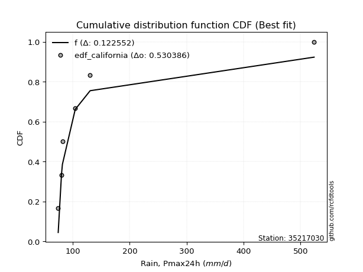</img>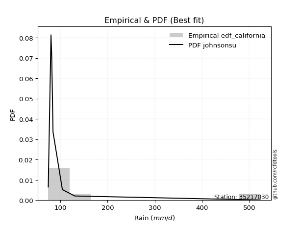</img>

</div>


### 2. EDF Hazen (1930)

Hazen method for plotting positions is a formula used to estimate the empirical cumulative probability distribution of flood events or other hydrological data. This formula often results in biased estimations, particularly when extrapolating to extreme events (high return periods).

<div align="center">


$P=(m-0.5)/n$


</div>


**2.1. Empirical values**

<div align="center">

|                | 0                   | 1                   | 2                   | 3         | 4                  | 5                  | 6                  |
|:---------------|:--------------------|:--------------------|:--------------------|:----------|:-------------------|:-------------------|:-------------------|
| date           | 2019                | 2023                | 2021                | 2025      | 2020               | 2022               | 2024               |
| x              | 74.4                | 80.2                | 81.8                | 84.5      | 104.3              | 130.5              | 523.8              |
| m              | 1                   | 2                   | 3                   | 4         | 5                  | 6                  | 7                  |
| empirical_dist | edf_hazen           | edf_hazen           | edf_hazen           | edf_hazen | edf_hazen          | edf_hazen          | edf_hazen          |
| empirical      | 0.07142857142857142 | 0.21428571428571427 | 0.35714285714285715 | 0.5       | 0.6428571428571429 | 0.7857142857142857 | 0.9285714285714286 |
| empirical_tr   | 1.0769230769230769  | 1.2727272727272727  | 1.5555555555555558  | 2.0       | 2.8000000000000003 | 4.666666666666666  | 14.000000000000007 |

</div>


**2.2. Kolmogorov-Smirnov fit test (sorted by Δ)**


<div align="center">

|                | 0                   | 1                   | 2                   | 3                   | 4                   | 5                   | 6                   | 7                   | 8                   | 9                   | 10                  | 11                  | 12                  | 13                  | 14                  | 15                  | 16                  | 17                  | 18                  | 19                  | 20                  | 21                  | 22                  | 23                  | 24                  | 25                  | 26                  | 27                  | 28                  | 29                  | 30                  | 31                  | 32                  | 33                  | 34                  | 35                  | 36                  | 37                  | 38                  | 39                  | 40                  | 41                  | 42                  | 43                  | 44                  | 45                  | 46                  | 47                  | 48                  | 49                  | 50                  | 51                  | 52                  | 53                  | 54                  | 55                  | 56                  | 57                  | 58                  | 59                  | 60                  | 61                  | 62                  | 63                  | 64                  | 65                  | 66                  | 67                  | 68                  | 69                  | 70                  | 71                  | 72                  | 73                  | 74                  | 75                  | 76                  | 77                  | 78                  | 79                  | 80                  | 81                  | 82                  | 83                  | 84                  | 85                  | 86                  | 87                  | 88                  | 89                  | 90                  | 91                  | 92                  | 93                  | 94                  | 95                  | 96                  | 97                  | 98                  | 99                  | 100                 | 101                 | 102                 | 103                 | 104                 | 105                 | 106                 | 107                 | 108                 | 109                 | 110                 | 111                 | 112                 | 113                 | 114                 | 115                 | 116                 | 117                 | 118                 | 119                 | 120                 | 121                 | 122                 | 123                 | 124                 | 125                 | 126                 | 127                 | 128                 | 129                 | 130                 | 131                 | 132                 | 133                 | 134                 | 135                 | 136                 | 137                 | 138                 | 139                 | 140                 | 141                 | 142                 | 143                 | 144                 | 145                 | 146                 | 147                 | 148                 | 149                 | 150                 | 151                 | 152                 | 153                 | 154                 | 155                 | 156                 | 157                 | 158                 | 159                 |
|:---------------|:--------------------|:--------------------|:--------------------|:--------------------|:--------------------|:--------------------|:--------------------|:--------------------|:--------------------|:--------------------|:--------------------|:--------------------|:--------------------|:--------------------|:--------------------|:--------------------|:--------------------|:--------------------|:--------------------|:--------------------|:--------------------|:--------------------|:--------------------|:--------------------|:--------------------|:--------------------|:--------------------|:--------------------|:--------------------|:--------------------|:--------------------|:--------------------|:--------------------|:--------------------|:--------------------|:--------------------|:--------------------|:--------------------|:--------------------|:--------------------|:--------------------|:--------------------|:--------------------|:--------------------|:--------------------|:--------------------|:--------------------|:--------------------|:--------------------|:--------------------|:--------------------|:--------------------|:--------------------|:--------------------|:--------------------|:--------------------|:--------------------|:--------------------|:--------------------|:--------------------|:--------------------|:--------------------|:--------------------|:--------------------|:--------------------|:--------------------|:--------------------|:--------------------|:--------------------|:--------------------|:--------------------|:--------------------|:--------------------|:--------------------|:--------------------|:--------------------|:--------------------|:--------------------|:--------------------|:--------------------|:--------------------|:--------------------|:--------------------|:--------------------|:--------------------|:--------------------|:--------------------|:--------------------|:--------------------|:--------------------|:--------------------|:--------------------|:--------------------|:--------------------|:--------------------|:--------------------|:--------------------|:--------------------|:--------------------|:--------------------|:--------------------|:--------------------|:--------------------|:--------------------|:--------------------|:--------------------|:--------------------|:--------------------|:--------------------|:--------------------|:--------------------|:--------------------|:--------------------|:--------------------|:--------------------|:--------------------|:--------------------|:--------------------|:--------------------|:--------------------|:--------------------|:--------------------|:--------------------|:--------------------|:--------------------|:--------------------|:--------------------|:--------------------|:--------------------|:--------------------|:--------------------|:--------------------|:--------------------|:--------------------|:--------------------|:--------------------|:--------------------|:--------------------|:--------------------|:--------------------|:--------------------|:--------------------|:--------------------|:--------------------|:--------------------|:--------------------|:--------------------|:--------------------|:--------------------|:--------------------|:--------------------|:--------------------|:--------------------|:--------------------|:--------------------|:--------------------|:--------------------|:--------------------|:--------------------|:--------------------|
| station        | 35217030            | 35217030            | 35217030            | 35217030            | 35217030            | 35217030            | 35217030            | 35217030            | 35217030            | 35217030            | 35217030            | 35217030            | 35217030            | 35217030            | 35217030            | 35217030            | 35217030            | 35217030            | 35217030            | 35217030            | 35217030            | 35217030            | 35217030            | 35217030            | 35217030            | 35217030            | 35217030            | 35217030            | 35217030            | 35217030            | 35217030            | 35217030            | 35217030            | 35217030            | 35217030            | 35217030            | 35217030            | 35217030            | 35217030            | 35217030            | 35217030            | 35217030            | 35217030            | 35217030            | 35217030            | 35217030            | 35217030            | 35217030            | 35217030            | 35217030            | 35217030            | 35217030            | 35217030            | 35217030            | 35217030            | 35217030            | 35217030            | 35217030            | 35217030            | 35217030            | 35217030            | 35217030            | 35217030            | 35217030            | 35217030            | 35217030            | 35217030            | 35217030            | 35217030            | 35217030            | 35217030            | 35217030            | 35217030            | 35217030            | 35217030            | 35217030            | 35217030            | 35217030            | 35217030            | 35217030            | 35217030            | 35217030            | 35217030            | 35217030            | 35217030            | 35217030            | 35217030            | 35217030            | 35217030            | 35217030            | 35217030            | 35217030            | 35217030            | 35217030            | 35217030            | 35217030            | 35217030            | 35217030            | 35217030            | 35217030            | 35217030            | 35217030            | 35217030            | 35217030            | 35217030            | 35217030            | 35217030            | 35217030            | 35217030            | 35217030            | 35217030            | 35217030            | 35217030            | 35217030            | 35217030            | 35217030            | 35217030            | 35217030            | 35217030            | 35217030            | 35217030            | 35217030            | 35217030            | 35217030            | 35217030            | 35217030            | 35217030            | 35217030            | 35217030            | 35217030            | 35217030            | 35217030            | 35217030            | 35217030            | 35217030            | 35217030            | 35217030            | 35217030            | 35217030            | 35217030            | 35217030            | 35217030            | 35217030            | 35217030            | 35217030            | 35217030            | 35217030            | 35217030            | 35217030            | 35217030            | 35217030            | 35217030            | 35217030            | 35217030            | 35217030            | 35217030            | 35217030            | 35217030            | 35217030            | 35217030            |
| empirical_dist | edf_hazen           | edf_hazen           | edf_hazen           | edf_hazen           | edf_hazen           | edf_hazen           | edf_hazen           | edf_hazen           | edf_hazen           | edf_hazen           | edf_hazen           | edf_hazen           | edf_hazen           | edf_hazen           | edf_hazen           | edf_hazen           | edf_hazen           | edf_hazen           | edf_hazen           | edf_hazen           | edf_hazen           | edf_hazen           | edf_hazen           | edf_hazen           | edf_hazen           | edf_hazen           | edf_hazen           | edf_hazen           | edf_hazen           | edf_hazen           | edf_hazen           | edf_hazen           | edf_hazen           | edf_hazen           | edf_hazen           | edf_hazen           | edf_hazen           | edf_hazen           | edf_hazen           | edf_hazen           | edf_hazen           | edf_hazen           | edf_hazen           | edf_hazen           | edf_hazen           | edf_hazen           | edf_hazen           | edf_hazen           | edf_hazen           | edf_hazen           | edf_hazen           | edf_hazen           | edf_hazen           | edf_hazen           | edf_hazen           | edf_hazen           | edf_hazen           | edf_hazen           | edf_hazen           | edf_hazen           | edf_hazen           | edf_hazen           | edf_hazen           | edf_hazen           | edf_hazen           | edf_hazen           | edf_hazen           | edf_hazen           | edf_hazen           | edf_hazen           | edf_hazen           | edf_hazen           | edf_hazen           | edf_hazen           | edf_hazen           | edf_hazen           | edf_hazen           | edf_hazen           | edf_hazen           | edf_hazen           | edf_hazen           | edf_hazen           | edf_hazen           | edf_hazen           | edf_hazen           | edf_hazen           | edf_hazen           | edf_hazen           | edf_hazen           | edf_hazen           | edf_hazen           | edf_hazen           | edf_hazen           | edf_hazen           | edf_hazen           | edf_hazen           | edf_hazen           | edf_hazen           | edf_hazen           | edf_hazen           | edf_hazen           | edf_hazen           | edf_hazen           | edf_hazen           | edf_hazen           | edf_hazen           | edf_hazen           | edf_hazen           | edf_hazen           | edf_hazen           | edf_hazen           | edf_hazen           | edf_hazen           | edf_hazen           | edf_hazen           | edf_hazen           | edf_hazen           | edf_hazen           | edf_hazen           | edf_hazen           | edf_hazen           | edf_hazen           | edf_hazen           | edf_hazen           | edf_hazen           | edf_hazen           | edf_hazen           | edf_hazen           | edf_hazen           | edf_hazen           | edf_hazen           | edf_hazen           | edf_hazen           | edf_hazen           | edf_hazen           | edf_hazen           | edf_hazen           | edf_hazen           | edf_hazen           | edf_hazen           | edf_hazen           | edf_hazen           | edf_hazen           | edf_hazen           | edf_hazen           | edf_hazen           | edf_hazen           | edf_hazen           | edf_hazen           | edf_hazen           | edf_hazen           | edf_hazen           | edf_hazen           | edf_hazen           | edf_hazen           | edf_hazen           | edf_hazen           | edf_hazen           | edf_hazen           | edf_hazen           |
| p_dist         | johnsonsu           | logalpha            | alpha               | loginvgamma         | logburr             | loggenextreme       | loginvweibull       | logmielke           | logjohnsonsu        | loginvgauss         | invgamma            | f                   | invgauss            | burr                | truncpareto         | logerlang           | fatiguelife         | logtruncweibull_min | logfatiguelife      | logtruncpareto      | logwald             | genpareto           | logburr12           | erlang              | exponpow            | logbradford         | logmoyal            | nakagami            | loggumbel_r         | gennorm             | gamma               | logmaxwell          | logpearson3         | truncweibull_min    | lognct              | lograyleigh         | ncf                 | betaprime           | logbetaprime        | logvonmises_line    | loghalflogistic     | nct                 | kappa3              | logt                | lognorm             | logcrystalball      | loggenlogistic      | t                   | logloggamma         | loghalfnorm         | logncf              | gengamma            | loglogistic         | loganglit           | loglomax            | logfoldnorm         | loggausshyper       | loghypsecant        | logsemicircular     | weibull_min         | burr12              | logweibull_min      | logkstwobign        | loggompertz         | logexponnorm        | loggenexpon         | halfgennorm         | genlogistic         | loglaplace          | loglaplace          | logrice             | logarcsine          | logdweibull         | moyal               | wald                | logloglaplace       | vonmises_line       | exponweib           | genextreme          | loggumbel_l         | gumbel_r            | logtruncnorm        | loggennorm          | loggengamma         | halflogistic        | logdgamma           | dgamma              | halfnorm            | rayleigh            | dweibull            | pearson3            | loghalfgennorm      | tukeylambda         | logcosine           | maxwell             | arcsine             | logexponweib        | foldnorm            | wrapcauchy          | semicircular        | anglit              | gausshyper          | norm                | loggenpareto        | kstwobign           | logistic            | powerlaw            | logwrapcauchy       | hypsecant           | logskewnorm         | lognakagami         | exponnorm           | genexpon            | invweibull          | laplace             | rice                | loglevy_l           | logtruncexpon       | logpowerlaw         | levy_l              | logbeta             | logargus            | gompertz            | gumbel_l            | cosine              | logexponpow         | logf                | logweibull_max      | logtriang           | logrdist            | truncnorm           | logksone            | logkappa4           | truncexpon          | logtukeylambda      | loguniform          | loggamma            | loggamma            | argus               | logkappa3           | lomax               | logjohnsonsb        | triang              | skewnorm            | johnsonsb           | crystalball         | bradford            | rdist               | loggenhalflogistic  | ksone               | kappa4              | uniform             | genhalflogistic     | logtrapezoid        | weibull_max         | trapezoid           | beta                | logvonmises         | vonmises            | mielke              |
| delta          | 0.06364089886970004 | 0.0782356929224626  | 0.0793631605134077  | 0.07954924827391333 | 0.0831450613717781  | 0.0831576169895433  | 0.08317879560164984 | 0.08358963928948857 | 0.08426324737100999 | 0.0965313752999831  | 0.09735203059555073 | 0.09735212224140125 | 0.10718387186576575 | 0.10746020894138114 | 0.11586207525309353 | 0.11974245146512638 | 0.1269460049798958  | 0.12886614658589848 | 0.13618233832160206 | 0.1366821968473934  | 0.13954132380886142 | 0.14419743749696295 | 0.15556485992533814 | 0.1595807937975081  | 0.16534051233228542 | 0.17376812661564625 | 0.17513994193596535 | 0.1756783453590968  | 0.17867379008679904 | 0.18656876282489562 | 0.1881176990084164  | 0.1892950265883027  | 0.19194717159913174 | 0.19498472637396996 | 0.19758189951606686 | 0.1976512527262336  | 0.20051908282613523 | 0.20118979953156174 | 0.20125423243557994 | 0.20174817314313678 | 0.20253363030293445 | 0.2126135326629529  | 0.2126454651121607  | 0.21493825825364443 | 0.2160138292292959  | 0.2160138336480144  | 0.21646334061737676 | 0.2185593465014769  | 0.21874370509918362 | 0.21957596451900305 | 0.2197166136719047  | 0.22077265995990503 | 0.22172408396759957 | 0.22582806193857263 | 0.227431793772098   | 0.22851285019466758 | 0.22884225726932822 | 0.22959374134955052 | 0.2298882456716982  | 0.24102366683218357 | 0.24383260328334488 | 0.24568153164267292 | 0.24838692148185632 | 0.2507071252229942  | 0.25170995354403514 | 0.25348024231995125 | 0.25449157506872855 | 0.25487655919499885 | 0.2552443938069419  | 0.2552443938069419  | 0.25990903789808345 | 0.26258100728318234 | 0.2681182516683145  | 0.2708883277161125  | 0.2708896779836629  | 0.27169433808934074 | 0.2729489814133075  | 0.27748032559544966 | 0.2776643243214868  | 0.2815331130595551  | 0.28207208074933177 | 0.28217399371829444 | 0.2857142856286733  | 0.2867327043441188  | 0.2964263582646146  | 0.29713097654360376 | 0.2977150803566928  | 0.2982162059353203  | 0.30128933902187127 | 0.3052936738648271  | 0.3060366996176077  | 0.30818832973550964 | 0.3083119546841928  | 0.3094988970751569  | 0.3133287622837328  | 0.3209156342891187  | 0.32222000437741105 | 0.3242460068536671  | 0.32462244813164504 | 0.3353446770330037  | 0.3389654450016967  | 0.3452269056098922  | 0.34772809630763724 | 0.3488458732482864  | 0.3520619955752906  | 0.3560184511886924  | 0.36077050131259103 | 0.36215892632112856 | 0.3629825367773917  | 0.37050424885629596 | 0.37055236943414327 | 0.3808918895637581  | 0.3811357127873114  | 0.38154161307769907 | 0.38474614270173124 | 0.3882976804687822  | 0.390530289360578   | 0.3939759653045819  | 0.4033963075911847  | 0.4047762609944685  | 0.4062916815363077  | 0.40962651910961023 | 0.41045471035289205 | 0.41724857319901376 | 0.42860139456767654 | 0.4362159375501955  | 0.43624143412521654 | 0.43718537078539743 | 0.45172029325700025 | 0.4563088279936863  | 0.46016609670837155 | 0.46244887095354476 | 0.47302314036163023 | 0.47773374388274753 | 0.4918797235950062  | 0.49779578800139646 | 0.5000730393745809  | 0.5000730393745809  | 0.5014094584518759  | 0.5033090675250387  | 0.5130619576719828  | 0.5223382031440552  | 0.5257563861630504  | 0.5294647110172962  | 0.5580259288631649  | 0.563039443289947   | 0.5634810956895491  | 0.5859897844156408  | 0.5905503225591114  | 0.598353360035603   | 0.6348465788948244  | 0.6608811748998664  | 0.6769902135766275  | 0.6812137573338518  | 0.6948012584656013  | 0.7506101692431129  | 0.7524225131741005  | 1.192706805851575   | 83.1513248972111    | nan                 |
| deltao         | 0.48442053926100004 | 0.48442053926100004 | 0.48442053926100004 | 0.48442053926100004 | 0.48442053926100004 | 0.48442053926100004 | 0.48442053926100004 | 0.48442053926100004 | 0.48442053926100004 | 0.48442053926100004 | 0.48442053926100004 | 0.48442053926100004 | 0.48442053926100004 | 0.48442053926100004 | 0.48442053926100004 | 0.48442053926100004 | 0.48442053926100004 | 0.48442053926100004 | 0.48442053926100004 | 0.48442053926100004 | 0.48442053926100004 | 0.48442053926100004 | 0.48442053926100004 | 0.48442053926100004 | 0.48442053926100004 | 0.48442053926100004 | 0.48442053926100004 | 0.48442053926100004 | 0.48442053926100004 | 0.48442053926100004 | 0.48442053926100004 | 0.48442053926100004 | 0.48442053926100004 | 0.48442053926100004 | 0.48442053926100004 | 0.48442053926100004 | 0.48442053926100004 | 0.48442053926100004 | 0.48442053926100004 | 0.48442053926100004 | 0.48442053926100004 | 0.48442053926100004 | 0.48442053926100004 | 0.48442053926100004 | 0.48442053926100004 | 0.48442053926100004 | 0.48442053926100004 | 0.48442053926100004 | 0.48442053926100004 | 0.48442053926100004 | 0.48442053926100004 | 0.48442053926100004 | 0.48442053926100004 | 0.48442053926100004 | 0.48442053926100004 | 0.48442053926100004 | 0.48442053926100004 | 0.48442053926100004 | 0.48442053926100004 | 0.48442053926100004 | 0.48442053926100004 | 0.48442053926100004 | 0.48442053926100004 | 0.48442053926100004 | 0.48442053926100004 | 0.48442053926100004 | 0.48442053926100004 | 0.48442053926100004 | 0.48442053926100004 | 0.48442053926100004 | 0.48442053926100004 | 0.48442053926100004 | 0.48442053926100004 | 0.48442053926100004 | 0.48442053926100004 | 0.48442053926100004 | 0.48442053926100004 | 0.48442053926100004 | 0.48442053926100004 | 0.48442053926100004 | 0.48442053926100004 | 0.48442053926100004 | 0.48442053926100004 | 0.48442053926100004 | 0.48442053926100004 | 0.48442053926100004 | 0.48442053926100004 | 0.48442053926100004 | 0.48442053926100004 | 0.48442053926100004 | 0.48442053926100004 | 0.48442053926100004 | 0.48442053926100004 | 0.48442053926100004 | 0.48442053926100004 | 0.48442053926100004 | 0.48442053926100004 | 0.48442053926100004 | 0.48442053926100004 | 0.48442053926100004 | 0.48442053926100004 | 0.48442053926100004 | 0.48442053926100004 | 0.48442053926100004 | 0.48442053926100004 | 0.48442053926100004 | 0.48442053926100004 | 0.48442053926100004 | 0.48442053926100004 | 0.48442053926100004 | 0.48442053926100004 | 0.48442053926100004 | 0.48442053926100004 | 0.48442053926100004 | 0.48442053926100004 | 0.48442053926100004 | 0.48442053926100004 | 0.48442053926100004 | 0.48442053926100004 | 0.48442053926100004 | 0.48442053926100004 | 0.48442053926100004 | 0.48442053926100004 | 0.48442053926100004 | 0.48442053926100004 | 0.48442053926100004 | 0.48442053926100004 | 0.48442053926100004 | 0.48442053926100004 | 0.48442053926100004 | 0.48442053926100004 | 0.48442053926100004 | 0.48442053926100004 | 0.48442053926100004 | 0.48442053926100004 | 0.48442053926100004 | 0.48442053926100004 | 0.48442053926100004 | 0.48442053926100004 | 0.48442053926100004 | 0.48442053926100004 | 0.48442053926100004 | 0.48442053926100004 | 0.48442053926100004 | 0.48442053926100004 | 0.48442053926100004 | 0.48442053926100004 | 0.48442053926100004 | 0.48442053926100004 | 0.48442053926100004 | 0.48442053926100004 | 0.48442053926100004 | 0.48442053926100004 | 0.48442053926100004 | 0.48442053926100004 | 0.48442053926100004 | 0.48442053926100004 | 0.48442053926100004 | 0.48442053926100004 | 0.48442053926100004 |
| eval           | Δo > Δ              | Δo > Δ              | Δo > Δ              | Δo > Δ              | Δo > Δ              | Δo > Δ              | Δo > Δ              | Δo > Δ              | Δo > Δ              | Δo > Δ              | Δo > Δ              | Δo > Δ              | Δo > Δ              | Δo > Δ              | Δo > Δ              | Δo > Δ              | Δo > Δ              | Δo > Δ              | Δo > Δ              | Δo > Δ              | Δo > Δ              | Δo > Δ              | Δo > Δ              | Δo > Δ              | Δo > Δ              | Δo > Δ              | Δo > Δ              | Δo > Δ              | Δo > Δ              | Δo > Δ              | Δo > Δ              | Δo > Δ              | Δo > Δ              | Δo > Δ              | Δo > Δ              | Δo > Δ              | Δo > Δ              | Δo > Δ              | Δo > Δ              | Δo > Δ              | Δo > Δ              | Δo > Δ              | Δo > Δ              | Δo > Δ              | Δo > Δ              | Δo > Δ              | Δo > Δ              | Δo > Δ              | Δo > Δ              | Δo > Δ              | Δo > Δ              | Δo > Δ              | Δo > Δ              | Δo > Δ              | Δo > Δ              | Δo > Δ              | Δo > Δ              | Δo > Δ              | Δo > Δ              | Δo > Δ              | Δo > Δ              | Δo > Δ              | Δo > Δ              | Δo > Δ              | Δo > Δ              | Δo > Δ              | Δo > Δ              | Δo > Δ              | Δo > Δ              | Δo > Δ              | Δo > Δ              | Δo > Δ              | Δo > Δ              | Δo > Δ              | Δo > Δ              | Δo > Δ              | Δo > Δ              | Δo > Δ              | Δo > Δ              | Δo > Δ              | Δo > Δ              | Δo > Δ              | Δo > Δ              | Δo > Δ              | Δo > Δ              | Δo > Δ              | Δo > Δ              | Δo > Δ              | Δo > Δ              | Δo > Δ              | Δo > Δ              | Δo > Δ              | Δo > Δ              | Δo > Δ              | Δo > Δ              | Δo > Δ              | Δo > Δ              | Δo > Δ              | Δo > Δ              | Δo > Δ              | Δo > Δ              | Δo > Δ              | Δo > Δ              | Δo > Δ              | Δo > Δ              | Δo > Δ              | Δo > Δ              | Δo > Δ              | Δo > Δ              | Δo > Δ              | Δo > Δ              | Δo > Δ              | Δo > Δ              | Δo > Δ              | Δo > Δ              | Δo > Δ              | Δo > Δ              | Δo > Δ              | Δo > Δ              | Δo > Δ              | Δo > Δ              | Δo > Δ              | Δo > Δ              | Δo > Δ              | Δo > Δ              | Δo > Δ              | Δo > Δ              | Δo > Δ              | Δo > Δ              | Δo > Δ              | Δo > Δ              | Δo > Δ              | Δo > Δ              | Δo > Δ              | Δo <= Δ             | Δo <= Δ             | Δo <= Δ             | Δo <= Δ             | Δo <= Δ             | Δo <= Δ             | Δo <= Δ             | Δo <= Δ             | Δo <= Δ             | Δo <= Δ             | Δo <= Δ             | Δo <= Δ             | Δo <= Δ             | Δo <= Δ             | Δo <= Δ             | Δo <= Δ             | Δo <= Δ             | Δo <= Δ             | Δo <= Δ             | Δo <= Δ             | Δo <= Δ             | Δo <= Δ             | Δo <= Δ             | Δo <= Δ             | Δo <= Δ             | Δo <= Δ             |
| fit            | 1                   | 1                   | 1                   | 1                   | 1                   | 1                   | 1                   | 1                   | 1                   | 1                   | 1                   | 1                   | 1                   | 1                   | 1                   | 1                   | 1                   | 1                   | 1                   | 1                   | 1                   | 1                   | 1                   | 1                   | 1                   | 1                   | 1                   | 1                   | 1                   | 1                   | 1                   | 1                   | 1                   | 1                   | 1                   | 1                   | 1                   | 1                   | 1                   | 1                   | 1                   | 1                   | 1                   | 1                   | 1                   | 1                   | 1                   | 1                   | 1                   | 1                   | 1                   | 1                   | 1                   | 1                   | 1                   | 1                   | 1                   | 1                   | 1                   | 1                   | 1                   | 1                   | 1                   | 1                   | 1                   | 1                   | 1                   | 1                   | 1                   | 1                   | 1                   | 1                   | 1                   | 1                   | 1                   | 1                   | 1                   | 1                   | 1                   | 1                   | 1                   | 1                   | 1                   | 1                   | 1                   | 1                   | 1                   | 1                   | 1                   | 1                   | 1                   | 1                   | 1                   | 1                   | 1                   | 1                   | 1                   | 1                   | 1                   | 1                   | 1                   | 1                   | 1                   | 1                   | 1                   | 1                   | 1                   | 1                   | 1                   | 1                   | 1                   | 1                   | 1                   | 1                   | 1                   | 1                   | 1                   | 1                   | 1                   | 1                   | 1                   | 1                   | 1                   | 1                   | 1                   | 1                   | 1                   | 1                   | 1                   | 1                   | 1                   | 1                   | 1                   | 1                   | 0                   | 0                   | 0                   | 0                   | 0                   | 0                   | 0                   | 0                   | 0                   | 0                   | 0                   | 0                   | 0                   | 0                   | 0                   | 0                   | 0                   | 0                   | 0                   | 0                   | 0                   | 0                   | 0                   | 0                   | 0                   | 0                   |
| n              | 7                   | 7                   | 7                   | 7                   | 7                   | 7                   | 7                   | 7                   | 7                   | 7                   | 7                   | 7                   | 7                   | 7                   | 7                   | 7                   | 7                   | 7                   | 7                   | 7                   | 7                   | 7                   | 7                   | 7                   | 7                   | 7                   | 7                   | 7                   | 7                   | 7                   | 7                   | 7                   | 7                   | 7                   | 7                   | 7                   | 7                   | 7                   | 7                   | 7                   | 7                   | 7                   | 7                   | 7                   | 7                   | 7                   | 7                   | 7                   | 7                   | 7                   | 7                   | 7                   | 7                   | 7                   | 7                   | 7                   | 7                   | 7                   | 7                   | 7                   | 7                   | 7                   | 7                   | 7                   | 7                   | 7                   | 7                   | 7                   | 7                   | 7                   | 7                   | 7                   | 7                   | 7                   | 7                   | 7                   | 7                   | 7                   | 7                   | 7                   | 7                   | 7                   | 7                   | 7                   | 7                   | 7                   | 7                   | 7                   | 7                   | 7                   | 7                   | 7                   | 7                   | 7                   | 7                   | 7                   | 7                   | 7                   | 7                   | 7                   | 7                   | 7                   | 7                   | 7                   | 7                   | 7                   | 7                   | 7                   | 7                   | 7                   | 7                   | 7                   | 7                   | 7                   | 7                   | 7                   | 7                   | 7                   | 7                   | 7                   | 7                   | 7                   | 7                   | 7                   | 7                   | 7                   | 7                   | 7                   | 7                   | 7                   | 7                   | 7                   | 7                   | 7                   | 7                   | 7                   | 7                   | 7                   | 7                   | 7                   | 7                   | 7                   | 7                   | 7                   | 7                   | 7                   | 7                   | 7                   | 7                   | 7                   | 7                   | 7                   | 7                   | 7                   | 7                   | 7                   | 7                   | 7                   | 7                   | 7                   |
| best_fit       | 1                   | 0                   | 0                   | 0                   | 0                   | 0                   | 0                   | 0                   | 0                   | 0                   | 0                   | 0                   | 0                   | 0                   | 0                   | 0                   | 0                   | 0                   | 0                   | 0                   | 0                   | 0                   | 0                   | 0                   | 0                   | 0                   | 0                   | 0                   | 0                   | 0                   | 0                   | 0                   | 0                   | 0                   | 0                   | 0                   | 0                   | 0                   | 0                   | 0                   | 0                   | 0                   | 0                   | 0                   | 0                   | 0                   | 0                   | 0                   | 0                   | 0                   | 0                   | 0                   | 0                   | 0                   | 0                   | 0                   | 0                   | 0                   | 0                   | 0                   | 0                   | 0                   | 0                   | 0                   | 0                   | 0                   | 0                   | 0                   | 0                   | 0                   | 0                   | 0                   | 0                   | 0                   | 0                   | 0                   | 0                   | 0                   | 0                   | 0                   | 0                   | 0                   | 0                   | 0                   | 0                   | 0                   | 0                   | 0                   | 0                   | 0                   | 0                   | 0                   | 0                   | 0                   | 0                   | 0                   | 0                   | 0                   | 0                   | 0                   | 0                   | 0                   | 0                   | 0                   | 0                   | 0                   | 0                   | 0                   | 0                   | 0                   | 0                   | 0                   | 0                   | 0                   | 0                   | 0                   | 0                   | 0                   | 0                   | 0                   | 0                   | 0                   | 0                   | 0                   | 0                   | 0                   | 0                   | 0                   | 0                   | 0                   | 0                   | 0                   | 0                   | 0                   | 0                   | 0                   | 0                   | 0                   | 0                   | 0                   | 0                   | 0                   | 0                   | 0                   | 0                   | 0                   | 0                   | 0                   | 0                   | 0                   | 0                   | 0                   | 0                   | 0                   | 0                   | 0                   | 0                   | 0                   | 0                   | 0                   |
| best_fit_sort  | 1                   | 2                   | 3                   | 4                   | 5                   | 6                   | 7                   | 8                   | 9                   | 10                  | 11                  | 12                  | 13                  | 14                  | 15                  | 16                  | 17                  | 18                  | 19                  | 20                  | 21                  | 22                  | 23                  | 24                  | 25                  | 26                  | 27                  | 28                  | 29                  | 30                  | 31                  | 32                  | 33                  | 34                  | 35                  | 36                  | 37                  | 38                  | 39                  | 40                  | 41                  | 42                  | 43                  | 44                  | 45                  | 46                  | 47                  | 48                  | 49                  | 50                  | 51                  | 52                  | 53                  | 54                  | 55                  | 56                  | 57                  | 58                  | 59                  | 60                  | 61                  | 62                  | 63                  | 64                  | 65                  | 66                  | 67                  | 68                  | 69                  | 70                  | 71                  | 72                  | 73                  | 74                  | 75                  | 76                  | 77                  | 78                  | 79                  | 80                  | 81                  | 82                  | 83                  | 84                  | 85                  | 86                  | 87                  | 88                  | 89                  | 90                  | 91                  | 92                  | 93                  | 94                  | 95                  | 96                  | 97                  | 98                  | 99                  | 100                 | 101                 | 102                 | 103                 | 104                 | 105                 | 106                 | 107                 | 108                 | 109                 | 110                 | 111                 | 112                 | 113                 | 114                 | 115                 | 116                 | 117                 | 118                 | 119                 | 120                 | 121                 | 122                 | 123                 | 124                 | 125                 | 126                 | 127                 | 128                 | 129                 | 130                 | 131                 | 132                 | 133                 | 134                 | 135                 | 136                 | 137                 | 138                 | 139                 | 140                 | 141                 | 142                 | 143                 | 144                 | 145                 | 146                 | 147                 | 148                 | 149                 | 150                 | 151                 | 152                 | 153                 | 154                 | 155                 | 156                 | 157                 | 158                 | 159                 | 160                 |

</div>


**2.3. Best fit**

<div align="center">

|   id |   station | empirical_dist   | p_dist    |     delta |   deltao | eval   |   fit |   n |   best_fit |   best_fit_sort |
|-----:|----------:|:-----------------|:----------|----------:|---------:|:-------|------:|----:|-----------:|----------------:|
|    0 |  35217030 | edf_hazen        | johnsonsu | 0.0636409 | 0.484421 | Δo > Δ |     1 |   7 |          1 |               1 |

</div>


<div align="center">

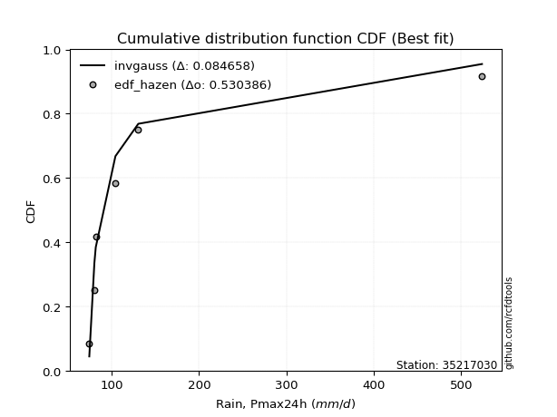</img>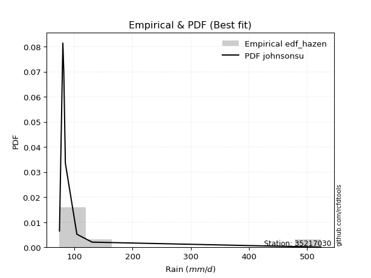</img>

</div>


### 3. EDF Weibull (1939)

Weibull plotting position formula is an empirical method used to estimate the non-exceedance probability or plotting position for a set of observed data, is often recommended or widely used in practice, particularly in flood frequency analysis.

<div align="center">


$P=m/(n+1)$


</div>


**3.1. Empirical values**

<div align="center">

|                | 0                  | 1                  | 2           | 3           | 4                  | 5           | 6           |
|:---------------|:-------------------|:-------------------|:------------|:------------|:-------------------|:------------|:------------|
| date           | 2019               | 2023               | 2021        | 2025        | 2020               | 2022        | 2024        |
| x              | 74.4               | 80.2               | 81.8        | 84.5        | 104.3              | 130.5       | 523.8       |
| m              | 1                  | 2                  | 3           | 4           | 5                  | 6           | 7           |
| empirical_dist | edf_weibull        | edf_weibull        | edf_weibull | edf_weibull | edf_weibull        | edf_weibull | edf_weibull |
| empirical      | 0.125              | 0.25               | 0.375       | 0.5         | 0.625              | 0.75        | 0.875       |
| empirical_tr   | 1.1428571428571428 | 1.3333333333333333 | 1.6         | 2.0         | 2.6666666666666665 | 4.0         | 8.0         |

</div>


**3.2. Kolmogorov-Smirnov fit test (sorted by Δ)**


<div align="center">

|                | 0                   | 1                   | 2                   | 3                   | 4                   | 5                   | 6                   | 7                   | 8                   | 9                   | 10                  | 11                  | 12                  | 13                  | 14                  | 15                  | 16                  | 17                  | 18                  | 19                  | 20                  | 21                  | 22                  | 23                  | 24                  | 25                  | 26                  | 27                  | 28                  | 29                  | 30                  | 31                  | 32                  | 33                  | 34                  | 35                  | 36                  | 37                  | 38                  | 39                  | 40                  | 41                  | 42                  | 43                  | 44                  | 45                  | 46                  | 47                  | 48                  | 49                  | 50                  | 51                  | 52                  | 53                  | 54                  | 55                  | 56                  | 57                  | 58                  | 59                  | 60                  | 61                  | 62                  | 63                  | 64                  | 65                  | 66                  | 67                  | 68                  | 69                  | 70                  | 71                  | 72                  | 73                  | 74                  | 75                  | 76                  | 77                  | 78                  | 79                  | 80                  | 81                  | 82                  | 83                  | 84                  | 85                  | 86                  | 87                  | 88                  | 89                  | 90                  | 91                  | 92                  | 93                  | 94                  | 95                  | 96                  | 97                  | 98                  | 99                  | 100                 | 101                 | 102                 | 103                 | 104                 | 105                 | 106                 | 107                 | 108                 | 109                 | 110                 | 111                 | 112                 | 113                 | 114                 | 115                 | 116                 | 117                 | 118                 | 119                 | 120                 | 121                 | 122                 | 123                 | 124                 | 125                 | 126                 | 127                 | 128                 | 129                 | 130                 | 131                 | 132                 | 133                 | 134                 | 135                 | 136                 | 137                 | 138                 | 139                 | 140                 | 141                 | 142                 | 143                 | 144                 | 145                 | 146                 | 147                 | 148                 | 149                 | 150                 | 151                 | 152                 | 153                 | 154                 | 155                 | 156                 | 157                 | 158                 | 159                 |
|:---------------|:--------------------|:--------------------|:--------------------|:--------------------|:--------------------|:--------------------|:--------------------|:--------------------|:--------------------|:--------------------|:--------------------|:--------------------|:--------------------|:--------------------|:--------------------|:--------------------|:--------------------|:--------------------|:--------------------|:--------------------|:--------------------|:--------------------|:--------------------|:--------------------|:--------------------|:--------------------|:--------------------|:--------------------|:--------------------|:--------------------|:--------------------|:--------------------|:--------------------|:--------------------|:--------------------|:--------------------|:--------------------|:--------------------|:--------------------|:--------------------|:--------------------|:--------------------|:--------------------|:--------------------|:--------------------|:--------------------|:--------------------|:--------------------|:--------------------|:--------------------|:--------------------|:--------------------|:--------------------|:--------------------|:--------------------|:--------------------|:--------------------|:--------------------|:--------------------|:--------------------|:--------------------|:--------------------|:--------------------|:--------------------|:--------------------|:--------------------|:--------------------|:--------------------|:--------------------|:--------------------|:--------------------|:--------------------|:--------------------|:--------------------|:--------------------|:--------------------|:--------------------|:--------------------|:--------------------|:--------------------|:--------------------|:--------------------|:--------------------|:--------------------|:--------------------|:--------------------|:--------------------|:--------------------|:--------------------|:--------------------|:--------------------|:--------------------|:--------------------|:--------------------|:--------------------|:--------------------|:--------------------|:--------------------|:--------------------|:--------------------|:--------------------|:--------------------|:--------------------|:--------------------|:--------------------|:--------------------|:--------------------|:--------------------|:--------------------|:--------------------|:--------------------|:--------------------|:--------------------|:--------------------|:--------------------|:--------------------|:--------------------|:--------------------|:--------------------|:--------------------|:--------------------|:--------------------|:--------------------|:--------------------|:--------------------|:--------------------|:--------------------|:--------------------|:--------------------|:--------------------|:--------------------|:--------------------|:--------------------|:--------------------|:--------------------|:--------------------|:--------------------|:--------------------|:--------------------|:--------------------|:--------------------|:--------------------|:--------------------|:--------------------|:--------------------|:--------------------|:--------------------|:--------------------|:--------------------|:--------------------|:--------------------|:--------------------|:--------------------|:--------------------|:--------------------|:--------------------|:--------------------|:--------------------|:--------------------|:--------------------|
| station        | 35217030            | 35217030            | 35217030            | 35217030            | 35217030            | 35217030            | 35217030            | 35217030            | 35217030            | 35217030            | 35217030            | 35217030            | 35217030            | 35217030            | 35217030            | 35217030            | 35217030            | 35217030            | 35217030            | 35217030            | 35217030            | 35217030            | 35217030            | 35217030            | 35217030            | 35217030            | 35217030            | 35217030            | 35217030            | 35217030            | 35217030            | 35217030            | 35217030            | 35217030            | 35217030            | 35217030            | 35217030            | 35217030            | 35217030            | 35217030            | 35217030            | 35217030            | 35217030            | 35217030            | 35217030            | 35217030            | 35217030            | 35217030            | 35217030            | 35217030            | 35217030            | 35217030            | 35217030            | 35217030            | 35217030            | 35217030            | 35217030            | 35217030            | 35217030            | 35217030            | 35217030            | 35217030            | 35217030            | 35217030            | 35217030            | 35217030            | 35217030            | 35217030            | 35217030            | 35217030            | 35217030            | 35217030            | 35217030            | 35217030            | 35217030            | 35217030            | 35217030            | 35217030            | 35217030            | 35217030            | 35217030            | 35217030            | 35217030            | 35217030            | 35217030            | 35217030            | 35217030            | 35217030            | 35217030            | 35217030            | 35217030            | 35217030            | 35217030            | 35217030            | 35217030            | 35217030            | 35217030            | 35217030            | 35217030            | 35217030            | 35217030            | 35217030            | 35217030            | 35217030            | 35217030            | 35217030            | 35217030            | 35217030            | 35217030            | 35217030            | 35217030            | 35217030            | 35217030            | 35217030            | 35217030            | 35217030            | 35217030            | 35217030            | 35217030            | 35217030            | 35217030            | 35217030            | 35217030            | 35217030            | 35217030            | 35217030            | 35217030            | 35217030            | 35217030            | 35217030            | 35217030            | 35217030            | 35217030            | 35217030            | 35217030            | 35217030            | 35217030            | 35217030            | 35217030            | 35217030            | 35217030            | 35217030            | 35217030            | 35217030            | 35217030            | 35217030            | 35217030            | 35217030            | 35217030            | 35217030            | 35217030            | 35217030            | 35217030            | 35217030            | 35217030            | 35217030            | 35217030            | 35217030            | 35217030            | 35217030            |
| empirical_dist | edf_weibull         | edf_weibull         | edf_weibull         | edf_weibull         | edf_weibull         | edf_weibull         | edf_weibull         | edf_weibull         | edf_weibull         | edf_weibull         | edf_weibull         | edf_weibull         | edf_weibull         | edf_weibull         | edf_weibull         | edf_weibull         | edf_weibull         | edf_weibull         | edf_weibull         | edf_weibull         | edf_weibull         | edf_weibull         | edf_weibull         | edf_weibull         | edf_weibull         | edf_weibull         | edf_weibull         | edf_weibull         | edf_weibull         | edf_weibull         | edf_weibull         | edf_weibull         | edf_weibull         | edf_weibull         | edf_weibull         | edf_weibull         | edf_weibull         | edf_weibull         | edf_weibull         | edf_weibull         | edf_weibull         | edf_weibull         | edf_weibull         | edf_weibull         | edf_weibull         | edf_weibull         | edf_weibull         | edf_weibull         | edf_weibull         | edf_weibull         | edf_weibull         | edf_weibull         | edf_weibull         | edf_weibull         | edf_weibull         | edf_weibull         | edf_weibull         | edf_weibull         | edf_weibull         | edf_weibull         | edf_weibull         | edf_weibull         | edf_weibull         | edf_weibull         | edf_weibull         | edf_weibull         | edf_weibull         | edf_weibull         | edf_weibull         | edf_weibull         | edf_weibull         | edf_weibull         | edf_weibull         | edf_weibull         | edf_weibull         | edf_weibull         | edf_weibull         | edf_weibull         | edf_weibull         | edf_weibull         | edf_weibull         | edf_weibull         | edf_weibull         | edf_weibull         | edf_weibull         | edf_weibull         | edf_weibull         | edf_weibull         | edf_weibull         | edf_weibull         | edf_weibull         | edf_weibull         | edf_weibull         | edf_weibull         | edf_weibull         | edf_weibull         | edf_weibull         | edf_weibull         | edf_weibull         | edf_weibull         | edf_weibull         | edf_weibull         | edf_weibull         | edf_weibull         | edf_weibull         | edf_weibull         | edf_weibull         | edf_weibull         | edf_weibull         | edf_weibull         | edf_weibull         | edf_weibull         | edf_weibull         | edf_weibull         | edf_weibull         | edf_weibull         | edf_weibull         | edf_weibull         | edf_weibull         | edf_weibull         | edf_weibull         | edf_weibull         | edf_weibull         | edf_weibull         | edf_weibull         | edf_weibull         | edf_weibull         | edf_weibull         | edf_weibull         | edf_weibull         | edf_weibull         | edf_weibull         | edf_weibull         | edf_weibull         | edf_weibull         | edf_weibull         | edf_weibull         | edf_weibull         | edf_weibull         | edf_weibull         | edf_weibull         | edf_weibull         | edf_weibull         | edf_weibull         | edf_weibull         | edf_weibull         | edf_weibull         | edf_weibull         | edf_weibull         | edf_weibull         | edf_weibull         | edf_weibull         | edf_weibull         | edf_weibull         | edf_weibull         | edf_weibull         | edf_weibull         | edf_weibull         | edf_weibull         | edf_weibull         |
| p_dist         | johnsonsu           | logalpha            | loginvgamma         | loginvweibull       | loggenextreme       | logburr             | logmielke           | invgamma            | f                   | loginvgauss         | invgauss            | fatiguelife         | logfatiguelife      | alpha               | logjohnsonsu        | logerlang           | logtruncweibull_min | truncpareto         | logtruncpareto      | logbradford         | logpearson3         | burr                | logwald             | nakagami            | genpareto           | logmoyal            | loghalflogistic     | logvonmises_line    | lograyleigh         | exponpow            | logburr12           | loggumbel_r         | erlang              | logmaxwell          | loghalfnorm         | logfoldnorm         | gennorm             | gamma               | loganglit           | logt                | logloggamma         | logsemicircular     | lognorm             | logcrystalball      | truncweibull_min    | lognct              | gengamma            | ncf                 | betaprime           | logbetaprime        | logarcsine          | nct                 | kappa3              | loglogistic         | logdweibull         | loggenlogistic      | wald                | logloglaplace       | logweibull_min      | halfgennorm         | vonmises_line       | logncf              | moyal               | loglomax            | loggausshyper       | loghypsecant        | loggengamma         | genlogistic         | t                   | weibull_min         | exponweib           | genextreme          | halflogistic        | logdgamma           | burr12              | dgamma              | halfnorm            | gumbel_r            | logkstwobign        | loggennorm          | loggompertz         | logexponnorm        | dweibull            | pearson3            | loggenexpon         | loglaplace          | loglaplace          | logrice             | loggumbel_l         | rayleigh            | foldnorm            | logcosine           | maxwell             | logtruncnorm        | arcsine             | logexponweib        | wrapcauchy          | loggenpareto        | semicircular        | anglit              | loghalfgennorm      | tukeylambda         | gausshyper          | norm                | kstwobign           | logistic            | powerlaw            | logwrapcauchy       | hypsecant           | invweibull          | lognakagami         | loglevy_l           | laplace             | levy_l              | rice                | logpowerlaw         | logskewnorm         | logbeta             | logargus            | exponnorm           | genexpon            | gumbel_l            | cosine              | logtruncexpon       | logf                | logweibull_max      | gompertz            | logexponpow         | logtriang           | logrdist            | logksone            | truncnorm           | logkappa4           | truncexpon          | logtukeylambda      | loguniform          | loggamma            | loggamma            | argus               | logkappa3           | lomax               | logjohnsonsb        | triang              | skewnorm            | crystalball         | johnsonsb           | bradford            | rdist               | loggenhalflogistic  | ksone               | kappa4              | uniform             | genhalflogistic     | logtrapezoid        | weibull_max         | beta                | trapezoid           | logvonmises         | vonmises            | mielke              |
| delta          | 0.08149804172684294 | 0.08422867804873987 | 0.08574240393284636 | 0.0860290428999366  | 0.08603864583377083 | 0.08607145490614607 | 0.08611738974306155 | 0.08738561183869106 | 0.08738578935344016 | 0.08767637287529159 | 0.08813973092416652 | 0.09123171926561008 | 0.10046805260731634 | 0.10133213051522749 | 0.10212039022815289 | 0.12499999476874779 | 0.1249999977372465  | 0.125               | 0.1366821968473934  | 0.13805384090136052 | 0.13837574302770317 | 0.13842213737942133 | 0.13954132380886142 | 0.13996405964481107 | 0.14419743749696295 | 0.14687629062244256 | 0.14896220173150587 | 0.15328501268812278 | 0.15350635214689018 | 0.15493450411317183 | 0.15556485992533814 | 0.1580805265043912  | 0.1595807937975081  | 0.16472215632588533 | 0.16600453594757447 | 0.174941421623239   | 0.18407042897601933 | 0.1881176990084164  | 0.19011377622428693 | 0.19081970680066468 | 0.19159893538777673 | 0.1941739599574125  | 0.19461373352810035 | 0.19461373799455262 | 0.19498472637396996 | 0.19758189951606686 | 0.1985743360371724  | 0.20051908282613523 | 0.20118979953156174 | 0.20125423243557994 | 0.21037081290952586 | 0.2126135326629529  | 0.2126454651121607  | 0.21426450170531308 | 0.21454682309688594 | 0.21646334061737676 | 0.21731824941223432 | 0.2181229095179122  | 0.21825086383830428 | 0.21877728935444285 | 0.21937755284187888 | 0.2197166136719047  | 0.22139277405703695 | 0.227431793772098   | 0.22884225726932822 | 0.22959374134955052 | 0.2331612757726902  | 0.23458882720216334 | 0.2364164893586198  | 0.24102366683218357 | 0.2417660398811639  | 0.24195003860720105 | 0.242854929693186   | 0.24355954797217516 | 0.24383260328334488 | 0.2441436517852642  | 0.24464477736389173 | 0.24635779503504607 | 0.24838692148185632 | 0.24999999991438754 | 0.2507071252229942  | 0.25170995354403514 | 0.25172224529339854 | 0.25246527104617916 | 0.25348024231995125 | 0.2552443938069419  | 0.2552443938069419  | 0.25990903789808345 | 0.2636759702024122  | 0.2655750533075856  | 0.27067457828223856 | 0.2737846113608712  | 0.2776144765694471  | 0.28217399371829444 | 0.285201348574833   | 0.28650571866312535 | 0.28890816241735934 | 0.2952744446768579  | 0.299630391318718   | 0.303251159287411   | 0.30818832973550964 | 0.3083119546841928  | 0.3095126198956065  | 0.31201381059335154 | 0.3163477098610049  | 0.3203041654744067  | 0.32505621559830533 | 0.32644464060684286 | 0.327268251063106   | 0.32797018450627047 | 0.33483808371985757 | 0.3369588607891494  | 0.34903185698744554 | 0.3512048324230399  | 0.3525833947544965  | 0.367682021876899   | 0.37050424885629596 | 0.370577395822022   | 0.37391223339532453 | 0.3808918895637581  | 0.3811357127873114  | 0.38153428748472806 | 0.39288710885339084 | 0.3939759653045819  | 0.40052714841093084 | 0.40147108507111173 | 0.41045471035289205 | 0.41123910133644714 | 0.41600600754271455 | 0.4205945422794006  | 0.42673458523925906 | 0.43664150500173393 | 0.43730885464734454 | 0.44201945816846183 | 0.4561654378807205  | 0.46208150228711076 | 0.4643587536602952  | 0.4643587536602952  | 0.4656951727375902  | 0.4675947818107529  | 0.4773476719576971  | 0.4866239174297695  | 0.49004210044876473 | 0.4937504253030105  | 0.5094680147185184  | 0.5223116431488792  | 0.5277668099752634  | 0.5324183558442122  | 0.5548360368448257  | 0.5626390743213173  | 0.5991322931805387  | 0.6251668891855808  | 0.6412759278623419  | 0.6454994716195661  | 0.6590869727513156  | 0.6988510846026719  | 0.7148958835288272  | 1.1391353772801465  | 83.20489632578253   | nan                 |
| deltao         | 0.48442053926100004 | 0.48442053926100004 | 0.48442053926100004 | 0.48442053926100004 | 0.48442053926100004 | 0.48442053926100004 | 0.48442053926100004 | 0.48442053926100004 | 0.48442053926100004 | 0.48442053926100004 | 0.48442053926100004 | 0.48442053926100004 | 0.48442053926100004 | 0.48442053926100004 | 0.48442053926100004 | 0.48442053926100004 | 0.48442053926100004 | 0.48442053926100004 | 0.48442053926100004 | 0.48442053926100004 | 0.48442053926100004 | 0.48442053926100004 | 0.48442053926100004 | 0.48442053926100004 | 0.48442053926100004 | 0.48442053926100004 | 0.48442053926100004 | 0.48442053926100004 | 0.48442053926100004 | 0.48442053926100004 | 0.48442053926100004 | 0.48442053926100004 | 0.48442053926100004 | 0.48442053926100004 | 0.48442053926100004 | 0.48442053926100004 | 0.48442053926100004 | 0.48442053926100004 | 0.48442053926100004 | 0.48442053926100004 | 0.48442053926100004 | 0.48442053926100004 | 0.48442053926100004 | 0.48442053926100004 | 0.48442053926100004 | 0.48442053926100004 | 0.48442053926100004 | 0.48442053926100004 | 0.48442053926100004 | 0.48442053926100004 | 0.48442053926100004 | 0.48442053926100004 | 0.48442053926100004 | 0.48442053926100004 | 0.48442053926100004 | 0.48442053926100004 | 0.48442053926100004 | 0.48442053926100004 | 0.48442053926100004 | 0.48442053926100004 | 0.48442053926100004 | 0.48442053926100004 | 0.48442053926100004 | 0.48442053926100004 | 0.48442053926100004 | 0.48442053926100004 | 0.48442053926100004 | 0.48442053926100004 | 0.48442053926100004 | 0.48442053926100004 | 0.48442053926100004 | 0.48442053926100004 | 0.48442053926100004 | 0.48442053926100004 | 0.48442053926100004 | 0.48442053926100004 | 0.48442053926100004 | 0.48442053926100004 | 0.48442053926100004 | 0.48442053926100004 | 0.48442053926100004 | 0.48442053926100004 | 0.48442053926100004 | 0.48442053926100004 | 0.48442053926100004 | 0.48442053926100004 | 0.48442053926100004 | 0.48442053926100004 | 0.48442053926100004 | 0.48442053926100004 | 0.48442053926100004 | 0.48442053926100004 | 0.48442053926100004 | 0.48442053926100004 | 0.48442053926100004 | 0.48442053926100004 | 0.48442053926100004 | 0.48442053926100004 | 0.48442053926100004 | 0.48442053926100004 | 0.48442053926100004 | 0.48442053926100004 | 0.48442053926100004 | 0.48442053926100004 | 0.48442053926100004 | 0.48442053926100004 | 0.48442053926100004 | 0.48442053926100004 | 0.48442053926100004 | 0.48442053926100004 | 0.48442053926100004 | 0.48442053926100004 | 0.48442053926100004 | 0.48442053926100004 | 0.48442053926100004 | 0.48442053926100004 | 0.48442053926100004 | 0.48442053926100004 | 0.48442053926100004 | 0.48442053926100004 | 0.48442053926100004 | 0.48442053926100004 | 0.48442053926100004 | 0.48442053926100004 | 0.48442053926100004 | 0.48442053926100004 | 0.48442053926100004 | 0.48442053926100004 | 0.48442053926100004 | 0.48442053926100004 | 0.48442053926100004 | 0.48442053926100004 | 0.48442053926100004 | 0.48442053926100004 | 0.48442053926100004 | 0.48442053926100004 | 0.48442053926100004 | 0.48442053926100004 | 0.48442053926100004 | 0.48442053926100004 | 0.48442053926100004 | 0.48442053926100004 | 0.48442053926100004 | 0.48442053926100004 | 0.48442053926100004 | 0.48442053926100004 | 0.48442053926100004 | 0.48442053926100004 | 0.48442053926100004 | 0.48442053926100004 | 0.48442053926100004 | 0.48442053926100004 | 0.48442053926100004 | 0.48442053926100004 | 0.48442053926100004 | 0.48442053926100004 | 0.48442053926100004 | 0.48442053926100004 | 0.48442053926100004 | 0.48442053926100004 |
| eval           | Δo > Δ              | Δo > Δ              | Δo > Δ              | Δo > Δ              | Δo > Δ              | Δo > Δ              | Δo > Δ              | Δo > Δ              | Δo > Δ              | Δo > Δ              | Δo > Δ              | Δo > Δ              | Δo > Δ              | Δo > Δ              | Δo > Δ              | Δo > Δ              | Δo > Δ              | Δo > Δ              | Δo > Δ              | Δo > Δ              | Δo > Δ              | Δo > Δ              | Δo > Δ              | Δo > Δ              | Δo > Δ              | Δo > Δ              | Δo > Δ              | Δo > Δ              | Δo > Δ              | Δo > Δ              | Δo > Δ              | Δo > Δ              | Δo > Δ              | Δo > Δ              | Δo > Δ              | Δo > Δ              | Δo > Δ              | Δo > Δ              | Δo > Δ              | Δo > Δ              | Δo > Δ              | Δo > Δ              | Δo > Δ              | Δo > Δ              | Δo > Δ              | Δo > Δ              | Δo > Δ              | Δo > Δ              | Δo > Δ              | Δo > Δ              | Δo > Δ              | Δo > Δ              | Δo > Δ              | Δo > Δ              | Δo > Δ              | Δo > Δ              | Δo > Δ              | Δo > Δ              | Δo > Δ              | Δo > Δ              | Δo > Δ              | Δo > Δ              | Δo > Δ              | Δo > Δ              | Δo > Δ              | Δo > Δ              | Δo > Δ              | Δo > Δ              | Δo > Δ              | Δo > Δ              | Δo > Δ              | Δo > Δ              | Δo > Δ              | Δo > Δ              | Δo > Δ              | Δo > Δ              | Δo > Δ              | Δo > Δ              | Δo > Δ              | Δo > Δ              | Δo > Δ              | Δo > Δ              | Δo > Δ              | Δo > Δ              | Δo > Δ              | Δo > Δ              | Δo > Δ              | Δo > Δ              | Δo > Δ              | Δo > Δ              | Δo > Δ              | Δo > Δ              | Δo > Δ              | Δo > Δ              | Δo > Δ              | Δo > Δ              | Δo > Δ              | Δo > Δ              | Δo > Δ              | Δo > Δ              | Δo > Δ              | Δo > Δ              | Δo > Δ              | Δo > Δ              | Δo > Δ              | Δo > Δ              | Δo > Δ              | Δo > Δ              | Δo > Δ              | Δo > Δ              | Δo > Δ              | Δo > Δ              | Δo > Δ              | Δo > Δ              | Δo > Δ              | Δo > Δ              | Δo > Δ              | Δo > Δ              | Δo > Δ              | Δo > Δ              | Δo > Δ              | Δo > Δ              | Δo > Δ              | Δo > Δ              | Δo > Δ              | Δo > Δ              | Δo > Δ              | Δo > Δ              | Δo > Δ              | Δo > Δ              | Δo > Δ              | Δo > Δ              | Δo > Δ              | Δo > Δ              | Δo > Δ              | Δo > Δ              | Δo > Δ              | Δo > Δ              | Δo > Δ              | Δo > Δ              | Δo > Δ              | Δo <= Δ             | Δo <= Δ             | Δo <= Δ             | Δo <= Δ             | Δo <= Δ             | Δo <= Δ             | Δo <= Δ             | Δo <= Δ             | Δo <= Δ             | Δo <= Δ             | Δo <= Δ             | Δo <= Δ             | Δo <= Δ             | Δo <= Δ             | Δo <= Δ             | Δo <= Δ             | Δo <= Δ             | Δo <= Δ             | Δo <= Δ             |
| fit            | 1                   | 1                   | 1                   | 1                   | 1                   | 1                   | 1                   | 1                   | 1                   | 1                   | 1                   | 1                   | 1                   | 1                   | 1                   | 1                   | 1                   | 1                   | 1                   | 1                   | 1                   | 1                   | 1                   | 1                   | 1                   | 1                   | 1                   | 1                   | 1                   | 1                   | 1                   | 1                   | 1                   | 1                   | 1                   | 1                   | 1                   | 1                   | 1                   | 1                   | 1                   | 1                   | 1                   | 1                   | 1                   | 1                   | 1                   | 1                   | 1                   | 1                   | 1                   | 1                   | 1                   | 1                   | 1                   | 1                   | 1                   | 1                   | 1                   | 1                   | 1                   | 1                   | 1                   | 1                   | 1                   | 1                   | 1                   | 1                   | 1                   | 1                   | 1                   | 1                   | 1                   | 1                   | 1                   | 1                   | 1                   | 1                   | 1                   | 1                   | 1                   | 1                   | 1                   | 1                   | 1                   | 1                   | 1                   | 1                   | 1                   | 1                   | 1                   | 1                   | 1                   | 1                   | 1                   | 1                   | 1                   | 1                   | 1                   | 1                   | 1                   | 1                   | 1                   | 1                   | 1                   | 1                   | 1                   | 1                   | 1                   | 1                   | 1                   | 1                   | 1                   | 1                   | 1                   | 1                   | 1                   | 1                   | 1                   | 1                   | 1                   | 1                   | 1                   | 1                   | 1                   | 1                   | 1                   | 1                   | 1                   | 1                   | 1                   | 1                   | 1                   | 1                   | 1                   | 1                   | 1                   | 1                   | 1                   | 1                   | 1                   | 0                   | 0                   | 0                   | 0                   | 0                   | 0                   | 0                   | 0                   | 0                   | 0                   | 0                   | 0                   | 0                   | 0                   | 0                   | 0                   | 0                   | 0                   | 0                   |
| n              | 7                   | 7                   | 7                   | 7                   | 7                   | 7                   | 7                   | 7                   | 7                   | 7                   | 7                   | 7                   | 7                   | 7                   | 7                   | 7                   | 7                   | 7                   | 7                   | 7                   | 7                   | 7                   | 7                   | 7                   | 7                   | 7                   | 7                   | 7                   | 7                   | 7                   | 7                   | 7                   | 7                   | 7                   | 7                   | 7                   | 7                   | 7                   | 7                   | 7                   | 7                   | 7                   | 7                   | 7                   | 7                   | 7                   | 7                   | 7                   | 7                   | 7                   | 7                   | 7                   | 7                   | 7                   | 7                   | 7                   | 7                   | 7                   | 7                   | 7                   | 7                   | 7                   | 7                   | 7                   | 7                   | 7                   | 7                   | 7                   | 7                   | 7                   | 7                   | 7                   | 7                   | 7                   | 7                   | 7                   | 7                   | 7                   | 7                   | 7                   | 7                   | 7                   | 7                   | 7                   | 7                   | 7                   | 7                   | 7                   | 7                   | 7                   | 7                   | 7                   | 7                   | 7                   | 7                   | 7                   | 7                   | 7                   | 7                   | 7                   | 7                   | 7                   | 7                   | 7                   | 7                   | 7                   | 7                   | 7                   | 7                   | 7                   | 7                   | 7                   | 7                   | 7                   | 7                   | 7                   | 7                   | 7                   | 7                   | 7                   | 7                   | 7                   | 7                   | 7                   | 7                   | 7                   | 7                   | 7                   | 7                   | 7                   | 7                   | 7                   | 7                   | 7                   | 7                   | 7                   | 7                   | 7                   | 7                   | 7                   | 7                   | 7                   | 7                   | 7                   | 7                   | 7                   | 7                   | 7                   | 7                   | 7                   | 7                   | 7                   | 7                   | 7                   | 7                   | 7                   | 7                   | 7                   | 7                   | 7                   |
| best_fit       | 1                   | 0                   | 0                   | 0                   | 0                   | 0                   | 0                   | 0                   | 0                   | 0                   | 0                   | 0                   | 0                   | 0                   | 0                   | 0                   | 0                   | 0                   | 0                   | 0                   | 0                   | 0                   | 0                   | 0                   | 0                   | 0                   | 0                   | 0                   | 0                   | 0                   | 0                   | 0                   | 0                   | 0                   | 0                   | 0                   | 0                   | 0                   | 0                   | 0                   | 0                   | 0                   | 0                   | 0                   | 0                   | 0                   | 0                   | 0                   | 0                   | 0                   | 0                   | 0                   | 0                   | 0                   | 0                   | 0                   | 0                   | 0                   | 0                   | 0                   | 0                   | 0                   | 0                   | 0                   | 0                   | 0                   | 0                   | 0                   | 0                   | 0                   | 0                   | 0                   | 0                   | 0                   | 0                   | 0                   | 0                   | 0                   | 0                   | 0                   | 0                   | 0                   | 0                   | 0                   | 0                   | 0                   | 0                   | 0                   | 0                   | 0                   | 0                   | 0                   | 0                   | 0                   | 0                   | 0                   | 0                   | 0                   | 0                   | 0                   | 0                   | 0                   | 0                   | 0                   | 0                   | 0                   | 0                   | 0                   | 0                   | 0                   | 0                   | 0                   | 0                   | 0                   | 0                   | 0                   | 0                   | 0                   | 0                   | 0                   | 0                   | 0                   | 0                   | 0                   | 0                   | 0                   | 0                   | 0                   | 0                   | 0                   | 0                   | 0                   | 0                   | 0                   | 0                   | 0                   | 0                   | 0                   | 0                   | 0                   | 0                   | 0                   | 0                   | 0                   | 0                   | 0                   | 0                   | 0                   | 0                   | 0                   | 0                   | 0                   | 0                   | 0                   | 0                   | 0                   | 0                   | 0                   | 0                   | 0                   |
| best_fit_sort  | 1                   | 2                   | 3                   | 4                   | 5                   | 6                   | 7                   | 8                   | 9                   | 10                  | 11                  | 12                  | 13                  | 14                  | 15                  | 16                  | 17                  | 18                  | 19                  | 20                  | 21                  | 22                  | 23                  | 24                  | 25                  | 26                  | 27                  | 28                  | 29                  | 30                  | 31                  | 32                  | 33                  | 34                  | 35                  | 36                  | 37                  | 38                  | 39                  | 40                  | 41                  | 42                  | 43                  | 44                  | 45                  | 46                  | 47                  | 48                  | 49                  | 50                  | 51                  | 52                  | 53                  | 54                  | 55                  | 56                  | 57                  | 58                  | 59                  | 60                  | 61                  | 62                  | 63                  | 64                  | 65                  | 66                  | 67                  | 68                  | 69                  | 70                  | 71                  | 72                  | 73                  | 74                  | 75                  | 76                  | 77                  | 78                  | 79                  | 80                  | 81                  | 82                  | 83                  | 84                  | 85                  | 86                  | 87                  | 88                  | 89                  | 90                  | 91                  | 92                  | 93                  | 94                  | 95                  | 96                  | 97                  | 98                  | 99                  | 100                 | 101                 | 102                 | 103                 | 104                 | 105                 | 106                 | 107                 | 108                 | 109                 | 110                 | 111                 | 112                 | 113                 | 114                 | 115                 | 116                 | 117                 | 118                 | 119                 | 120                 | 121                 | 122                 | 123                 | 124                 | 125                 | 126                 | 127                 | 128                 | 129                 | 130                 | 131                 | 132                 | 133                 | 134                 | 135                 | 136                 | 137                 | 138                 | 139                 | 140                 | 141                 | 142                 | 143                 | 144                 | 145                 | 146                 | 147                 | 148                 | 149                 | 150                 | 151                 | 152                 | 153                 | 154                 | 155                 | 156                 | 157                 | 158                 | 159                 | 160                 |

</div>


**3.3. Best fit**

<div align="center">

|   id |   station | empirical_dist   | p_dist    |    delta |   deltao | eval   |   fit |   n |   best_fit |   best_fit_sort |
|-----:|----------:|:-----------------|:----------|---------:|---------:|:-------|------:|----:|-----------:|----------------:|
|    0 |  35217030 | edf_weibull      | johnsonsu | 0.081498 | 0.484421 | Δo > Δ |     1 |   7 |          1 |               1 |

</div>


<div align="center">

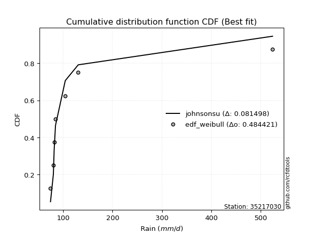</img>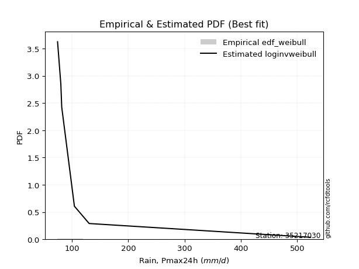</img>

</div>


### 4. EDF Beard (1943)

The Beard formula (or Beard´s plotting position formula) in hydrology is used to estimate the empirical non-exceedance probability _(P)_ of a flood event (or other extreme hydrological data point) within a given dataset.

<div align="center">


$P=(m-0.31)/(n+0.38)$


</div>


**4.1. Empirical values**

<div align="center">

|                | 0                   | 1                   | 2                   | 3         | 4                  | 5                  | 6                  |
|:---------------|:--------------------|:--------------------|:--------------------|:----------|:-------------------|:-------------------|:-------------------|
| date           | 2019                | 2023                | 2021                | 2025      | 2020               | 2022               | 2024               |
| x              | 74.4                | 80.2                | 81.8                | 84.5      | 104.3              | 130.5              | 523.8              |
| m              | 1                   | 2                   | 3                   | 4         | 5                  | 6                  | 7                  |
| empirical_dist | edf_beard           | edf_beard           | edf_beard           | edf_beard | edf_beard          | edf_beard          | edf_beard          |
| empirical      | 0.09349593495934959 | 0.22899728997289973 | 0.36449864498644985 | 0.5       | 0.6355013550135502 | 0.7710027100271003 | 0.9065040650406505 |
| empirical_tr   | 1.1031390134529149  | 1.29701230228471    | 1.5735607675906182  | 2.0       | 2.743494423791822  | 4.366863905325444  | 10.695652173913055 |

</div>


**4.2. Kolmogorov-Smirnov fit test (sorted by Δ)**


<div align="center">

|                | 0                   | 1                   | 2                   | 3                   | 4                   | 5                   | 6                   | 7                   | 8                   | 9                   | 10                  | 11                  | 12                  | 13                  | 14                  | 15                  | 16                  | 17                  | 18                  | 19                  | 20                  | 21                  | 22                  | 23                  | 24                  | 25                  | 26                  | 27                  | 28                  | 29                  | 30                  | 31                  | 32                  | 33                  | 34                  | 35                  | 36                  | 37                  | 38                  | 39                  | 40                  | 41                  | 42                  | 43                  | 44                  | 45                  | 46                  | 47                  | 48                  | 49                  | 50                  | 51                  | 52                  | 53                  | 54                  | 55                  | 56                  | 57                  | 58                  | 59                  | 60                  | 61                  | 62                  | 63                  | 64                  | 65                  | 66                  | 67                  | 68                  | 69                  | 70                  | 71                  | 72                  | 73                  | 74                  | 75                  | 76                  | 77                  | 78                  | 79                  | 80                  | 81                  | 82                  | 83                  | 84                  | 85                  | 86                  | 87                  | 88                  | 89                  | 90                  | 91                  | 92                  | 93                  | 94                  | 95                  | 96                  | 97                  | 98                  | 99                  | 100                 | 101                 | 102                 | 103                 | 104                 | 105                 | 106                 | 107                 | 108                 | 109                 | 110                 | 111                 | 112                 | 113                 | 114                 | 115                 | 116                 | 117                 | 118                 | 119                 | 120                 | 121                 | 122                 | 123                 | 124                 | 125                 | 126                 | 127                 | 128                 | 129                 | 130                 | 131                 | 132                 | 133                 | 134                 | 135                 | 136                 | 137                 | 138                 | 139                 | 140                 | 141                 | 142                 | 143                 | 144                 | 145                 | 146                 | 147                 | 148                 | 149                 | 150                 | 151                 | 152                 | 153                 | 154                 | 155                 | 156                 | 157                 | 158                 | 159                 |
|:---------------|:--------------------|:--------------------|:--------------------|:--------------------|:--------------------|:--------------------|:--------------------|:--------------------|:--------------------|:--------------------|:--------------------|:--------------------|:--------------------|:--------------------|:--------------------|:--------------------|:--------------------|:--------------------|:--------------------|:--------------------|:--------------------|:--------------------|:--------------------|:--------------------|:--------------------|:--------------------|:--------------------|:--------------------|:--------------------|:--------------------|:--------------------|:--------------------|:--------------------|:--------------------|:--------------------|:--------------------|:--------------------|:--------------------|:--------------------|:--------------------|:--------------------|:--------------------|:--------------------|:--------------------|:--------------------|:--------------------|:--------------------|:--------------------|:--------------------|:--------------------|:--------------------|:--------------------|:--------------------|:--------------------|:--------------------|:--------------------|:--------------------|:--------------------|:--------------------|:--------------------|:--------------------|:--------------------|:--------------------|:--------------------|:--------------------|:--------------------|:--------------------|:--------------------|:--------------------|:--------------------|:--------------------|:--------------------|:--------------------|:--------------------|:--------------------|:--------------------|:--------------------|:--------------------|:--------------------|:--------------------|:--------------------|:--------------------|:--------------------|:--------------------|:--------------------|:--------------------|:--------------------|:--------------------|:--------------------|:--------------------|:--------------------|:--------------------|:--------------------|:--------------------|:--------------------|:--------------------|:--------------------|:--------------------|:--------------------|:--------------------|:--------------------|:--------------------|:--------------------|:--------------------|:--------------------|:--------------------|:--------------------|:--------------------|:--------------------|:--------------------|:--------------------|:--------------------|:--------------------|:--------------------|:--------------------|:--------------------|:--------------------|:--------------------|:--------------------|:--------------------|:--------------------|:--------------------|:--------------------|:--------------------|:--------------------|:--------------------|:--------------------|:--------------------|:--------------------|:--------------------|:--------------------|:--------------------|:--------------------|:--------------------|:--------------------|:--------------------|:--------------------|:--------------------|:--------------------|:--------------------|:--------------------|:--------------------|:--------------------|:--------------------|:--------------------|:--------------------|:--------------------|:--------------------|:--------------------|:--------------------|:--------------------|:--------------------|:--------------------|:--------------------|:--------------------|:--------------------|:--------------------|:--------------------|:--------------------|:--------------------|
| station        | 35217030            | 35217030            | 35217030            | 35217030            | 35217030            | 35217030            | 35217030            | 35217030            | 35217030            | 35217030            | 35217030            | 35217030            | 35217030            | 35217030            | 35217030            | 35217030            | 35217030            | 35217030            | 35217030            | 35217030            | 35217030            | 35217030            | 35217030            | 35217030            | 35217030            | 35217030            | 35217030            | 35217030            | 35217030            | 35217030            | 35217030            | 35217030            | 35217030            | 35217030            | 35217030            | 35217030            | 35217030            | 35217030            | 35217030            | 35217030            | 35217030            | 35217030            | 35217030            | 35217030            | 35217030            | 35217030            | 35217030            | 35217030            | 35217030            | 35217030            | 35217030            | 35217030            | 35217030            | 35217030            | 35217030            | 35217030            | 35217030            | 35217030            | 35217030            | 35217030            | 35217030            | 35217030            | 35217030            | 35217030            | 35217030            | 35217030            | 35217030            | 35217030            | 35217030            | 35217030            | 35217030            | 35217030            | 35217030            | 35217030            | 35217030            | 35217030            | 35217030            | 35217030            | 35217030            | 35217030            | 35217030            | 35217030            | 35217030            | 35217030            | 35217030            | 35217030            | 35217030            | 35217030            | 35217030            | 35217030            | 35217030            | 35217030            | 35217030            | 35217030            | 35217030            | 35217030            | 35217030            | 35217030            | 35217030            | 35217030            | 35217030            | 35217030            | 35217030            | 35217030            | 35217030            | 35217030            | 35217030            | 35217030            | 35217030            | 35217030            | 35217030            | 35217030            | 35217030            | 35217030            | 35217030            | 35217030            | 35217030            | 35217030            | 35217030            | 35217030            | 35217030            | 35217030            | 35217030            | 35217030            | 35217030            | 35217030            | 35217030            | 35217030            | 35217030            | 35217030            | 35217030            | 35217030            | 35217030            | 35217030            | 35217030            | 35217030            | 35217030            | 35217030            | 35217030            | 35217030            | 35217030            | 35217030            | 35217030            | 35217030            | 35217030            | 35217030            | 35217030            | 35217030            | 35217030            | 35217030            | 35217030            | 35217030            | 35217030            | 35217030            | 35217030            | 35217030            | 35217030            | 35217030            | 35217030            | 35217030            |
| empirical_dist | edf_beard           | edf_beard           | edf_beard           | edf_beard           | edf_beard           | edf_beard           | edf_beard           | edf_beard           | edf_beard           | edf_beard           | edf_beard           | edf_beard           | edf_beard           | edf_beard           | edf_beard           | edf_beard           | edf_beard           | edf_beard           | edf_beard           | edf_beard           | edf_beard           | edf_beard           | edf_beard           | edf_beard           | edf_beard           | edf_beard           | edf_beard           | edf_beard           | edf_beard           | edf_beard           | edf_beard           | edf_beard           | edf_beard           | edf_beard           | edf_beard           | edf_beard           | edf_beard           | edf_beard           | edf_beard           | edf_beard           | edf_beard           | edf_beard           | edf_beard           | edf_beard           | edf_beard           | edf_beard           | edf_beard           | edf_beard           | edf_beard           | edf_beard           | edf_beard           | edf_beard           | edf_beard           | edf_beard           | edf_beard           | edf_beard           | edf_beard           | edf_beard           | edf_beard           | edf_beard           | edf_beard           | edf_beard           | edf_beard           | edf_beard           | edf_beard           | edf_beard           | edf_beard           | edf_beard           | edf_beard           | edf_beard           | edf_beard           | edf_beard           | edf_beard           | edf_beard           | edf_beard           | edf_beard           | edf_beard           | edf_beard           | edf_beard           | edf_beard           | edf_beard           | edf_beard           | edf_beard           | edf_beard           | edf_beard           | edf_beard           | edf_beard           | edf_beard           | edf_beard           | edf_beard           | edf_beard           | edf_beard           | edf_beard           | edf_beard           | edf_beard           | edf_beard           | edf_beard           | edf_beard           | edf_beard           | edf_beard           | edf_beard           | edf_beard           | edf_beard           | edf_beard           | edf_beard           | edf_beard           | edf_beard           | edf_beard           | edf_beard           | edf_beard           | edf_beard           | edf_beard           | edf_beard           | edf_beard           | edf_beard           | edf_beard           | edf_beard           | edf_beard           | edf_beard           | edf_beard           | edf_beard           | edf_beard           | edf_beard           | edf_beard           | edf_beard           | edf_beard           | edf_beard           | edf_beard           | edf_beard           | edf_beard           | edf_beard           | edf_beard           | edf_beard           | edf_beard           | edf_beard           | edf_beard           | edf_beard           | edf_beard           | edf_beard           | edf_beard           | edf_beard           | edf_beard           | edf_beard           | edf_beard           | edf_beard           | edf_beard           | edf_beard           | edf_beard           | edf_beard           | edf_beard           | edf_beard           | edf_beard           | edf_beard           | edf_beard           | edf_beard           | edf_beard           | edf_beard           | edf_beard           | edf_beard           | edf_beard           |
| p_dist         | logburr             | loggenextreme       | loginvweibull       | logalpha            | logmielke           | loginvgamma         | johnsonsu           | alpha               | loginvgauss         | invgamma            | f                   | logjohnsonsu        | invgauss            | truncpareto         | logerlang           | fatiguelife         | logtruncweibull_min | burr                | logfatiguelife      | logtruncpareto      | logwald             | genpareto           | logmoyal            | exponpow            | logburr12           | loggumbel_r         | logbradford         | erlang              | nakagami            | logpearson3         | logmaxwell          | gennorm             | lograyleigh         | logvonmises_line    | loghalflogistic     | gamma               | truncweibull_min    | loghalfnorm         | lognct              | ncf                 | betaprime           | logbetaprime        | logt                | logloggamma         | lognorm             | logcrystalball      | logfoldnorm         | gengamma            | loganglit           | nct                 | kappa3              | loglogistic         | logsemicircular     | loggenlogistic      | logncf              | t                   | loglomax            | loggausshyper       | loghypsecant        | logweibull_min      | halfgennorm         | logarcsine          | weibull_min         | burr12              | genlogistic         | logdweibull         | logkstwobign        | moyal               | wald                | logloglaplace       | loggompertz         | vonmises_line       | logexponnorm        | loggenexpon         | loglaplace          | loglaplace          | logrice             | exponweib           | genextreme          | loggengamma         | gumbel_r            | loggennorm          | loggumbel_l         | halflogistic        | logdgamma           | dgamma              | halfnorm            | logtruncnorm        | dweibull            | pearson3            | rayleigh            | logcosine           | maxwell             | foldnorm            | arcsine             | logexponweib        | loghalfgennorm      | tukeylambda         | wrapcauchy          | semicircular        | anglit              | loggenpareto        | gausshyper          | norm                | kstwobign           | logistic            | powerlaw            | logwrapcauchy       | hypsecant           | lognakagami         | invweibull          | loglevy_l           | laplace             | logskewnorm         | rice                | exponnorm           | genexpon            | levy_l              | logpowerlaw         | logbeta             | logtruncexpon       | logargus            | gumbel_l            | gompertz            | cosine              | logexponpow         | logf                | logweibull_max      | logtriang           | logrdist            | truncnorm           | logksone            | logkappa4           | truncexpon          | logtukeylambda      | loguniform          | loggamma            | loggamma            | argus               | logkappa3           | lomax               | logjohnsonsb        | triang              | skewnorm            | crystalball         | johnsonsb           | bradford            | rdist               | loggenhalflogistic  | ksone               | kappa4              | uniform             | genhalflogistic     | logtrapezoid        | weibull_max         | beta                | trapezoid           | logvonmises         | vonmises            | mielke              |
| delta          | 0.06843348568459265 | 0.06844604130235785 | 0.06846721991446439 | 0.06861887354626434 | 0.06887806360230311 | 0.07032813279010719 | 0.07099668671329273 | 0.0793631605134077  | 0.08181979961279764 | 0.08264045490836527 | 0.0826405465542158  | 0.09161903521460268 | 0.0924722961785803  | 0.10115049956590808 | 0.10503087577794093 | 0.11223442929271035 | 0.11415457089871303 | 0.11741942735232103 | 0.12147076263441661 | 0.1366821968473934  | 0.13954132380886142 | 0.14419743749696295 | 0.15307257840518718 | 0.15493450411317183 | 0.15556485992533814 | 0.1580805265043912  | 0.1590565509284608  | 0.1595807937975081  | 0.16096676967191134 | 0.16987980806835357 | 0.172300519608666   | 0.17356907396246912 | 0.17558388919545542 | 0.1796808096123586  | 0.18046626677215627 | 0.1881176990084164  | 0.19498472637396996 | 0.19750860098822487 | 0.19758189951606686 | 0.20051908282613523 | 0.20118979953156174 | 0.20125423243557994 | 0.20132106181421489 | 0.20403212941199822 | 0.20511508854165056 | 0.20511509300810282 | 0.2064454866638894  | 0.2090756910507226  | 0.21111648625138724 | 0.2126135326629529  | 0.2126454651121607  | 0.21436829612400687 | 0.2151766699845128  | 0.21646334061737676 | 0.2197166136719047  | 0.2259151343450696  | 0.227431793772098   | 0.22884225726932822 | 0.22959374134955052 | 0.23096995595548753 | 0.23977999938154312 | 0.2405136437524042  | 0.24102366683218357 | 0.24383260328334488 | 0.24509018221571355 | 0.24605088813753634 | 0.24838692148185632 | 0.24882096418533428 | 0.24882231445288472 | 0.2496269745585626  | 0.2507071252229942  | 0.2508816178825293  | 0.25170995354403514 | 0.25348024231995125 | 0.2552443938069419  | 0.2552443938069419  | 0.25990903789808345 | 0.26276874990826415 | 0.2629527486343013  | 0.2646653408133407  | 0.26736050506214637 | 0.2710027099414878  | 0.2741773252159624  | 0.2743589947338364  | 0.27506361301282556 | 0.2756477168259146  | 0.2761488424045421  | 0.28217399371829444 | 0.28322631033404894 | 0.28396933608682956 | 0.2865777633346859  | 0.2947873213879715  | 0.2986171865965474  | 0.30217864332288896 | 0.3062040586019333  | 0.30750842869022565 | 0.30818832973550964 | 0.3083119546841928  | 0.30991087244445964 | 0.3206331013458183  | 0.3242538693145113  | 0.32677850971750827 | 0.3305153299227068  | 0.33301652062045184 | 0.3373504198881052  | 0.341306875501507   | 0.34605892562540563 | 0.34744735063394316 | 0.3482709610902063  | 0.3558407937469579  | 0.359474249546921   | 0.3684629258297998  | 0.37003456701454585 | 0.37050424885629596 | 0.3735861047815968  | 0.3808918895637581  | 0.3811357127873114  | 0.3827088974636903  | 0.3886847319039993  | 0.3915801058491223  | 0.3939759653045819  | 0.39491494342242484 | 0.40253699751182836 | 0.41045471035289205 | 0.41388981888049114 | 0.4215043618630101  | 0.42152985843803115 | 0.42247379509821203 | 0.43700871756981485 | 0.4415972523065009  | 0.44714286001528414 | 0.44773729526635936 | 0.45831156467444484 | 0.46302216819556213 | 0.4771681479078208  | 0.48308421231421106 | 0.4853614636873955  | 0.4853614636873955  | 0.4866978827646905  | 0.4885974918378532  | 0.4983503819847974  | 0.5076266274568698  | 0.511044810475865   | 0.5147531353301108  | 0.5409720797591688  | 0.5433143531759795  | 0.5487695200023637  | 0.5639224208848626  | 0.575838746871926   | 0.5836417843484176  | 0.620135003207639   | 0.646169599212681   | 0.6622786378894421  | 0.6665021816466664  | 0.6800896827784159  | 0.7303551496433223  | 0.7358985935559275  | 1.1706394423207969  | 83.17339226074188   | nan                 |
| deltao         | 0.48442053926100004 | 0.48442053926100004 | 0.48442053926100004 | 0.48442053926100004 | 0.48442053926100004 | 0.48442053926100004 | 0.48442053926100004 | 0.48442053926100004 | 0.48442053926100004 | 0.48442053926100004 | 0.48442053926100004 | 0.48442053926100004 | 0.48442053926100004 | 0.48442053926100004 | 0.48442053926100004 | 0.48442053926100004 | 0.48442053926100004 | 0.48442053926100004 | 0.48442053926100004 | 0.48442053926100004 | 0.48442053926100004 | 0.48442053926100004 | 0.48442053926100004 | 0.48442053926100004 | 0.48442053926100004 | 0.48442053926100004 | 0.48442053926100004 | 0.48442053926100004 | 0.48442053926100004 | 0.48442053926100004 | 0.48442053926100004 | 0.48442053926100004 | 0.48442053926100004 | 0.48442053926100004 | 0.48442053926100004 | 0.48442053926100004 | 0.48442053926100004 | 0.48442053926100004 | 0.48442053926100004 | 0.48442053926100004 | 0.48442053926100004 | 0.48442053926100004 | 0.48442053926100004 | 0.48442053926100004 | 0.48442053926100004 | 0.48442053926100004 | 0.48442053926100004 | 0.48442053926100004 | 0.48442053926100004 | 0.48442053926100004 | 0.48442053926100004 | 0.48442053926100004 | 0.48442053926100004 | 0.48442053926100004 | 0.48442053926100004 | 0.48442053926100004 | 0.48442053926100004 | 0.48442053926100004 | 0.48442053926100004 | 0.48442053926100004 | 0.48442053926100004 | 0.48442053926100004 | 0.48442053926100004 | 0.48442053926100004 | 0.48442053926100004 | 0.48442053926100004 | 0.48442053926100004 | 0.48442053926100004 | 0.48442053926100004 | 0.48442053926100004 | 0.48442053926100004 | 0.48442053926100004 | 0.48442053926100004 | 0.48442053926100004 | 0.48442053926100004 | 0.48442053926100004 | 0.48442053926100004 | 0.48442053926100004 | 0.48442053926100004 | 0.48442053926100004 | 0.48442053926100004 | 0.48442053926100004 | 0.48442053926100004 | 0.48442053926100004 | 0.48442053926100004 | 0.48442053926100004 | 0.48442053926100004 | 0.48442053926100004 | 0.48442053926100004 | 0.48442053926100004 | 0.48442053926100004 | 0.48442053926100004 | 0.48442053926100004 | 0.48442053926100004 | 0.48442053926100004 | 0.48442053926100004 | 0.48442053926100004 | 0.48442053926100004 | 0.48442053926100004 | 0.48442053926100004 | 0.48442053926100004 | 0.48442053926100004 | 0.48442053926100004 | 0.48442053926100004 | 0.48442053926100004 | 0.48442053926100004 | 0.48442053926100004 | 0.48442053926100004 | 0.48442053926100004 | 0.48442053926100004 | 0.48442053926100004 | 0.48442053926100004 | 0.48442053926100004 | 0.48442053926100004 | 0.48442053926100004 | 0.48442053926100004 | 0.48442053926100004 | 0.48442053926100004 | 0.48442053926100004 | 0.48442053926100004 | 0.48442053926100004 | 0.48442053926100004 | 0.48442053926100004 | 0.48442053926100004 | 0.48442053926100004 | 0.48442053926100004 | 0.48442053926100004 | 0.48442053926100004 | 0.48442053926100004 | 0.48442053926100004 | 0.48442053926100004 | 0.48442053926100004 | 0.48442053926100004 | 0.48442053926100004 | 0.48442053926100004 | 0.48442053926100004 | 0.48442053926100004 | 0.48442053926100004 | 0.48442053926100004 | 0.48442053926100004 | 0.48442053926100004 | 0.48442053926100004 | 0.48442053926100004 | 0.48442053926100004 | 0.48442053926100004 | 0.48442053926100004 | 0.48442053926100004 | 0.48442053926100004 | 0.48442053926100004 | 0.48442053926100004 | 0.48442053926100004 | 0.48442053926100004 | 0.48442053926100004 | 0.48442053926100004 | 0.48442053926100004 | 0.48442053926100004 | 0.48442053926100004 | 0.48442053926100004 | 0.48442053926100004 | 0.48442053926100004 |
| eval           | Δo > Δ              | Δo > Δ              | Δo > Δ              | Δo > Δ              | Δo > Δ              | Δo > Δ              | Δo > Δ              | Δo > Δ              | Δo > Δ              | Δo > Δ              | Δo > Δ              | Δo > Δ              | Δo > Δ              | Δo > Δ              | Δo > Δ              | Δo > Δ              | Δo > Δ              | Δo > Δ              | Δo > Δ              | Δo > Δ              | Δo > Δ              | Δo > Δ              | Δo > Δ              | Δo > Δ              | Δo > Δ              | Δo > Δ              | Δo > Δ              | Δo > Δ              | Δo > Δ              | Δo > Δ              | Δo > Δ              | Δo > Δ              | Δo > Δ              | Δo > Δ              | Δo > Δ              | Δo > Δ              | Δo > Δ              | Δo > Δ              | Δo > Δ              | Δo > Δ              | Δo > Δ              | Δo > Δ              | Δo > Δ              | Δo > Δ              | Δo > Δ              | Δo > Δ              | Δo > Δ              | Δo > Δ              | Δo > Δ              | Δo > Δ              | Δo > Δ              | Δo > Δ              | Δo > Δ              | Δo > Δ              | Δo > Δ              | Δo > Δ              | Δo > Δ              | Δo > Δ              | Δo > Δ              | Δo > Δ              | Δo > Δ              | Δo > Δ              | Δo > Δ              | Δo > Δ              | Δo > Δ              | Δo > Δ              | Δo > Δ              | Δo > Δ              | Δo > Δ              | Δo > Δ              | Δo > Δ              | Δo > Δ              | Δo > Δ              | Δo > Δ              | Δo > Δ              | Δo > Δ              | Δo > Δ              | Δo > Δ              | Δo > Δ              | Δo > Δ              | Δo > Δ              | Δo > Δ              | Δo > Δ              | Δo > Δ              | Δo > Δ              | Δo > Δ              | Δo > Δ              | Δo > Δ              | Δo > Δ              | Δo > Δ              | Δo > Δ              | Δo > Δ              | Δo > Δ              | Δo > Δ              | Δo > Δ              | Δo > Δ              | Δo > Δ              | Δo > Δ              | Δo > Δ              | Δo > Δ              | Δo > Δ              | Δo > Δ              | Δo > Δ              | Δo > Δ              | Δo > Δ              | Δo > Δ              | Δo > Δ              | Δo > Δ              | Δo > Δ              | Δo > Δ              | Δo > Δ              | Δo > Δ              | Δo > Δ              | Δo > Δ              | Δo > Δ              | Δo > Δ              | Δo > Δ              | Δo > Δ              | Δo > Δ              | Δo > Δ              | Δo > Δ              | Δo > Δ              | Δo > Δ              | Δo > Δ              | Δo > Δ              | Δo > Δ              | Δo > Δ              | Δo > Δ              | Δo > Δ              | Δo > Δ              | Δo > Δ              | Δo > Δ              | Δo > Δ              | Δo > Δ              | Δo > Δ              | Δo > Δ              | Δo <= Δ             | Δo <= Δ             | Δo <= Δ             | Δo <= Δ             | Δo <= Δ             | Δo <= Δ             | Δo <= Δ             | Δo <= Δ             | Δo <= Δ             | Δo <= Δ             | Δo <= Δ             | Δo <= Δ             | Δo <= Δ             | Δo <= Δ             | Δo <= Δ             | Δo <= Δ             | Δo <= Δ             | Δo <= Δ             | Δo <= Δ             | Δo <= Δ             | Δo <= Δ             | Δo <= Δ             | Δo <= Δ             | Δo <= Δ             |
| fit            | 1                   | 1                   | 1                   | 1                   | 1                   | 1                   | 1                   | 1                   | 1                   | 1                   | 1                   | 1                   | 1                   | 1                   | 1                   | 1                   | 1                   | 1                   | 1                   | 1                   | 1                   | 1                   | 1                   | 1                   | 1                   | 1                   | 1                   | 1                   | 1                   | 1                   | 1                   | 1                   | 1                   | 1                   | 1                   | 1                   | 1                   | 1                   | 1                   | 1                   | 1                   | 1                   | 1                   | 1                   | 1                   | 1                   | 1                   | 1                   | 1                   | 1                   | 1                   | 1                   | 1                   | 1                   | 1                   | 1                   | 1                   | 1                   | 1                   | 1                   | 1                   | 1                   | 1                   | 1                   | 1                   | 1                   | 1                   | 1                   | 1                   | 1                   | 1                   | 1                   | 1                   | 1                   | 1                   | 1                   | 1                   | 1                   | 1                   | 1                   | 1                   | 1                   | 1                   | 1                   | 1                   | 1                   | 1                   | 1                   | 1                   | 1                   | 1                   | 1                   | 1                   | 1                   | 1                   | 1                   | 1                   | 1                   | 1                   | 1                   | 1                   | 1                   | 1                   | 1                   | 1                   | 1                   | 1                   | 1                   | 1                   | 1                   | 1                   | 1                   | 1                   | 1                   | 1                   | 1                   | 1                   | 1                   | 1                   | 1                   | 1                   | 1                   | 1                   | 1                   | 1                   | 1                   | 1                   | 1                   | 1                   | 1                   | 1                   | 1                   | 1                   | 1                   | 1                   | 1                   | 0                   | 0                   | 0                   | 0                   | 0                   | 0                   | 0                   | 0                   | 0                   | 0                   | 0                   | 0                   | 0                   | 0                   | 0                   | 0                   | 0                   | 0                   | 0                   | 0                   | 0                   | 0                   | 0                   | 0                   |
| n              | 7                   | 7                   | 7                   | 7                   | 7                   | 7                   | 7                   | 7                   | 7                   | 7                   | 7                   | 7                   | 7                   | 7                   | 7                   | 7                   | 7                   | 7                   | 7                   | 7                   | 7                   | 7                   | 7                   | 7                   | 7                   | 7                   | 7                   | 7                   | 7                   | 7                   | 7                   | 7                   | 7                   | 7                   | 7                   | 7                   | 7                   | 7                   | 7                   | 7                   | 7                   | 7                   | 7                   | 7                   | 7                   | 7                   | 7                   | 7                   | 7                   | 7                   | 7                   | 7                   | 7                   | 7                   | 7                   | 7                   | 7                   | 7                   | 7                   | 7                   | 7                   | 7                   | 7                   | 7                   | 7                   | 7                   | 7                   | 7                   | 7                   | 7                   | 7                   | 7                   | 7                   | 7                   | 7                   | 7                   | 7                   | 7                   | 7                   | 7                   | 7                   | 7                   | 7                   | 7                   | 7                   | 7                   | 7                   | 7                   | 7                   | 7                   | 7                   | 7                   | 7                   | 7                   | 7                   | 7                   | 7                   | 7                   | 7                   | 7                   | 7                   | 7                   | 7                   | 7                   | 7                   | 7                   | 7                   | 7                   | 7                   | 7                   | 7                   | 7                   | 7                   | 7                   | 7                   | 7                   | 7                   | 7                   | 7                   | 7                   | 7                   | 7                   | 7                   | 7                   | 7                   | 7                   | 7                   | 7                   | 7                   | 7                   | 7                   | 7                   | 7                   | 7                   | 7                   | 7                   | 7                   | 7                   | 7                   | 7                   | 7                   | 7                   | 7                   | 7                   | 7                   | 7                   | 7                   | 7                   | 7                   | 7                   | 7                   | 7                   | 7                   | 7                   | 7                   | 7                   | 7                   | 7                   | 7                   | 7                   |
| best_fit       | 1                   | 0                   | 0                   | 0                   | 0                   | 0                   | 0                   | 0                   | 0                   | 0                   | 0                   | 0                   | 0                   | 0                   | 0                   | 0                   | 0                   | 0                   | 0                   | 0                   | 0                   | 0                   | 0                   | 0                   | 0                   | 0                   | 0                   | 0                   | 0                   | 0                   | 0                   | 0                   | 0                   | 0                   | 0                   | 0                   | 0                   | 0                   | 0                   | 0                   | 0                   | 0                   | 0                   | 0                   | 0                   | 0                   | 0                   | 0                   | 0                   | 0                   | 0                   | 0                   | 0                   | 0                   | 0                   | 0                   | 0                   | 0                   | 0                   | 0                   | 0                   | 0                   | 0                   | 0                   | 0                   | 0                   | 0                   | 0                   | 0                   | 0                   | 0                   | 0                   | 0                   | 0                   | 0                   | 0                   | 0                   | 0                   | 0                   | 0                   | 0                   | 0                   | 0                   | 0                   | 0                   | 0                   | 0                   | 0                   | 0                   | 0                   | 0                   | 0                   | 0                   | 0                   | 0                   | 0                   | 0                   | 0                   | 0                   | 0                   | 0                   | 0                   | 0                   | 0                   | 0                   | 0                   | 0                   | 0                   | 0                   | 0                   | 0                   | 0                   | 0                   | 0                   | 0                   | 0                   | 0                   | 0                   | 0                   | 0                   | 0                   | 0                   | 0                   | 0                   | 0                   | 0                   | 0                   | 0                   | 0                   | 0                   | 0                   | 0                   | 0                   | 0                   | 0                   | 0                   | 0                   | 0                   | 0                   | 0                   | 0                   | 0                   | 0                   | 0                   | 0                   | 0                   | 0                   | 0                   | 0                   | 0                   | 0                   | 0                   | 0                   | 0                   | 0                   | 0                   | 0                   | 0                   | 0                   | 0                   |
| best_fit_sort  | 1                   | 2                   | 3                   | 4                   | 5                   | 6                   | 7                   | 8                   | 9                   | 10                  | 11                  | 12                  | 13                  | 14                  | 15                  | 16                  | 17                  | 18                  | 19                  | 20                  | 21                  | 22                  | 23                  | 24                  | 25                  | 26                  | 27                  | 28                  | 29                  | 30                  | 31                  | 32                  | 33                  | 34                  | 35                  | 36                  | 37                  | 38                  | 39                  | 40                  | 41                  | 42                  | 43                  | 44                  | 45                  | 46                  | 47                  | 48                  | 49                  | 50                  | 51                  | 52                  | 53                  | 54                  | 55                  | 56                  | 57                  | 58                  | 59                  | 60                  | 61                  | 62                  | 63                  | 64                  | 65                  | 66                  | 67                  | 68                  | 69                  | 70                  | 71                  | 72                  | 73                  | 74                  | 75                  | 76                  | 77                  | 78                  | 79                  | 80                  | 81                  | 82                  | 83                  | 84                  | 85                  | 86                  | 87                  | 88                  | 89                  | 90                  | 91                  | 92                  | 93                  | 94                  | 95                  | 96                  | 97                  | 98                  | 99                  | 100                 | 101                 | 102                 | 103                 | 104                 | 105                 | 106                 | 107                 | 108                 | 109                 | 110                 | 111                 | 112                 | 113                 | 114                 | 115                 | 116                 | 117                 | 118                 | 119                 | 120                 | 121                 | 122                 | 123                 | 124                 | 125                 | 126                 | 127                 | 128                 | 129                 | 130                 | 131                 | 132                 | 133                 | 134                 | 135                 | 136                 | 137                 | 138                 | 139                 | 140                 | 141                 | 142                 | 143                 | 144                 | 145                 | 146                 | 147                 | 148                 | 149                 | 150                 | 151                 | 152                 | 153                 | 154                 | 155                 | 156                 | 157                 | 158                 | 159                 | 160                 |

</div>


**4.3. Best fit**

<div align="center">

|   id |   station | empirical_dist   | p_dist   |     delta |   deltao | eval   |   fit |   n |   best_fit |   best_fit_sort |
|-----:|----------:|:-----------------|:---------|----------:|---------:|:-------|------:|----:|-----------:|----------------:|
|    0 |  35217030 | edf_beard        | logburr  | 0.0684335 | 0.484421 | Δo > Δ |     1 |   7 |          1 |               1 |

</div>


<div align="center">

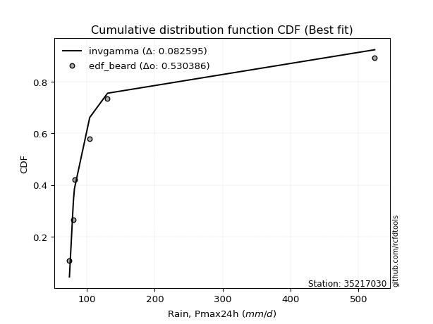</img>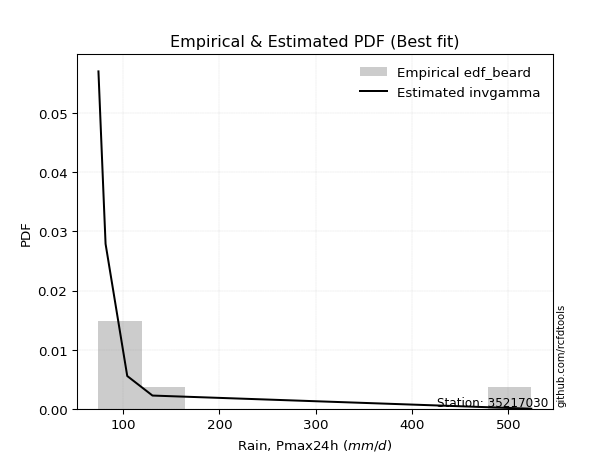</img>

</div>


### 5. EDF Chegodayev (1955)

The Chegodayev formula is an empirical plotting position formula used in hydrological frequency analysis to estimate the exceedance probability or return period of a specific event from a set of observed data. It is primarily used for plotting observed data points on probability paper to fit a theoretical distribution, particularly for analyzing extreme events like maximum flood flows or rainfall intensities. The constant _b_ value in the generalized plotting position formula is 0.3.

<div align="center">


$P=(m-b)/(n+1-2b)$


</div>


**5.1. Empirical values**

<div align="center">

|                | 0                   | 1                   | 2                   | 3              | 4                  | 5                  | 6                  |
|:---------------|:--------------------|:--------------------|:--------------------|:---------------|:-------------------|:-------------------|:-------------------|
| date           | 2019                | 2023                | 2021                | 2025           | 2020               | 2022               | 2024               |
| x              | 74.4                | 80.2                | 81.8                | 84.5           | 104.3              | 130.5              | 523.8              |
| m              | 1                   | 2                   | 3                   | 4              | 5                  | 6                  | 7                  |
| empirical_dist | edf_chegodayev      | edf_chegodayev      | edf_chegodayev      | edf_chegodayev | edf_chegodayev     | edf_chegodayev     | edf_chegodayev     |
| empirical      | 0.09459459459459459 | 0.22972972972972971 | 0.36486486486486486 | 0.5            | 0.6351351351351351 | 0.7702702702702703 | 0.9054054054054054 |
| empirical_tr   | 1.1044776119402986  | 1.2982456140350878  | 1.574468085106383   | 2.0            | 2.7407407407407405 | 4.352941176470589  | 10.571428571428568 |

</div>


**5.2. Kolmogorov-Smirnov fit test (sorted by Δ)**


<div align="center">

|                | 0                   | 1                   | 2                   | 3                   | 4                   | 5                   | 6                   | 7                   | 8                   | 9                   | 10                  | 11                  | 12                  | 13                  | 14                  | 15                  | 16                  | 17                  | 18                  | 19                  | 20                  | 21                  | 22                  | 23                  | 24                  | 25                  | 26                  | 27                  | 28                  | 29                  | 30                  | 31                  | 32                  | 33                  | 34                  | 35                  | 36                  | 37                  | 38                  | 39                  | 40                  | 41                  | 42                  | 43                  | 44                  | 45                  | 46                  | 47                  | 48                  | 49                  | 50                  | 51                  | 52                  | 53                  | 54                  | 55                  | 56                  | 57                  | 58                  | 59                  | 60                  | 61                  | 62                  | 63                  | 64                  | 65                  | 66                  | 67                  | 68                  | 69                  | 70                  | 71                  | 72                  | 73                  | 74                  | 75                  | 76                  | 77                  | 78                  | 79                  | 80                  | 81                  | 82                  | 83                  | 84                  | 85                  | 86                  | 87                  | 88                  | 89                  | 90                  | 91                  | 92                  | 93                  | 94                  | 95                  | 96                  | 97                  | 98                  | 99                  | 100                 | 101                 | 102                 | 103                 | 104                 | 105                 | 106                 | 107                 | 108                 | 109                 | 110                 | 111                 | 112                 | 113                 | 114                 | 115                 | 116                 | 117                 | 118                 | 119                 | 120                 | 121                 | 122                 | 123                 | 124                 | 125                 | 126                 | 127                 | 128                 | 129                 | 130                 | 131                 | 132                 | 133                 | 134                 | 135                 | 136                 | 137                 | 138                 | 139                 | 140                 | 141                 | 142                 | 143                 | 144                 | 145                 | 146                 | 147                 | 148                 | 149                 | 150                 | 151                 | 152                 | 153                 | 154                 | 155                 | 156                 | 157                 | 158                 | 159                 |
|:---------------|:--------------------|:--------------------|:--------------------|:--------------------|:--------------------|:--------------------|:--------------------|:--------------------|:--------------------|:--------------------|:--------------------|:--------------------|:--------------------|:--------------------|:--------------------|:--------------------|:--------------------|:--------------------|:--------------------|:--------------------|:--------------------|:--------------------|:--------------------|:--------------------|:--------------------|:--------------------|:--------------------|:--------------------|:--------------------|:--------------------|:--------------------|:--------------------|:--------------------|:--------------------|:--------------------|:--------------------|:--------------------|:--------------------|:--------------------|:--------------------|:--------------------|:--------------------|:--------------------|:--------------------|:--------------------|:--------------------|:--------------------|:--------------------|:--------------------|:--------------------|:--------------------|:--------------------|:--------------------|:--------------------|:--------------------|:--------------------|:--------------------|:--------------------|:--------------------|:--------------------|:--------------------|:--------------------|:--------------------|:--------------------|:--------------------|:--------------------|:--------------------|:--------------------|:--------------------|:--------------------|:--------------------|:--------------------|:--------------------|:--------------------|:--------------------|:--------------------|:--------------------|:--------------------|:--------------------|:--------------------|:--------------------|:--------------------|:--------------------|:--------------------|:--------------------|:--------------------|:--------------------|:--------------------|:--------------------|:--------------------|:--------------------|:--------------------|:--------------------|:--------------------|:--------------------|:--------------------|:--------------------|:--------------------|:--------------------|:--------------------|:--------------------|:--------------------|:--------------------|:--------------------|:--------------------|:--------------------|:--------------------|:--------------------|:--------------------|:--------------------|:--------------------|:--------------------|:--------------------|:--------------------|:--------------------|:--------------------|:--------------------|:--------------------|:--------------------|:--------------------|:--------------------|:--------------------|:--------------------|:--------------------|:--------------------|:--------------------|:--------------------|:--------------------|:--------------------|:--------------------|:--------------------|:--------------------|:--------------------|:--------------------|:--------------------|:--------------------|:--------------------|:--------------------|:--------------------|:--------------------|:--------------------|:--------------------|:--------------------|:--------------------|:--------------------|:--------------------|:--------------------|:--------------------|:--------------------|:--------------------|:--------------------|:--------------------|:--------------------|:--------------------|:--------------------|:--------------------|:--------------------|:--------------------|:--------------------|:--------------------|
| station        | 35217030            | 35217030            | 35217030            | 35217030            | 35217030            | 35217030            | 35217030            | 35217030            | 35217030            | 35217030            | 35217030            | 35217030            | 35217030            | 35217030            | 35217030            | 35217030            | 35217030            | 35217030            | 35217030            | 35217030            | 35217030            | 35217030            | 35217030            | 35217030            | 35217030            | 35217030            | 35217030            | 35217030            | 35217030            | 35217030            | 35217030            | 35217030            | 35217030            | 35217030            | 35217030            | 35217030            | 35217030            | 35217030            | 35217030            | 35217030            | 35217030            | 35217030            | 35217030            | 35217030            | 35217030            | 35217030            | 35217030            | 35217030            | 35217030            | 35217030            | 35217030            | 35217030            | 35217030            | 35217030            | 35217030            | 35217030            | 35217030            | 35217030            | 35217030            | 35217030            | 35217030            | 35217030            | 35217030            | 35217030            | 35217030            | 35217030            | 35217030            | 35217030            | 35217030            | 35217030            | 35217030            | 35217030            | 35217030            | 35217030            | 35217030            | 35217030            | 35217030            | 35217030            | 35217030            | 35217030            | 35217030            | 35217030            | 35217030            | 35217030            | 35217030            | 35217030            | 35217030            | 35217030            | 35217030            | 35217030            | 35217030            | 35217030            | 35217030            | 35217030            | 35217030            | 35217030            | 35217030            | 35217030            | 35217030            | 35217030            | 35217030            | 35217030            | 35217030            | 35217030            | 35217030            | 35217030            | 35217030            | 35217030            | 35217030            | 35217030            | 35217030            | 35217030            | 35217030            | 35217030            | 35217030            | 35217030            | 35217030            | 35217030            | 35217030            | 35217030            | 35217030            | 35217030            | 35217030            | 35217030            | 35217030            | 35217030            | 35217030            | 35217030            | 35217030            | 35217030            | 35217030            | 35217030            | 35217030            | 35217030            | 35217030            | 35217030            | 35217030            | 35217030            | 35217030            | 35217030            | 35217030            | 35217030            | 35217030            | 35217030            | 35217030            | 35217030            | 35217030            | 35217030            | 35217030            | 35217030            | 35217030            | 35217030            | 35217030            | 35217030            | 35217030            | 35217030            | 35217030            | 35217030            | 35217030            | 35217030            |
| empirical_dist | edf_chegodayev      | edf_chegodayev      | edf_chegodayev      | edf_chegodayev      | edf_chegodayev      | edf_chegodayev      | edf_chegodayev      | edf_chegodayev      | edf_chegodayev      | edf_chegodayev      | edf_chegodayev      | edf_chegodayev      | edf_chegodayev      | edf_chegodayev      | edf_chegodayev      | edf_chegodayev      | edf_chegodayev      | edf_chegodayev      | edf_chegodayev      | edf_chegodayev      | edf_chegodayev      | edf_chegodayev      | edf_chegodayev      | edf_chegodayev      | edf_chegodayev      | edf_chegodayev      | edf_chegodayev      | edf_chegodayev      | edf_chegodayev      | edf_chegodayev      | edf_chegodayev      | edf_chegodayev      | edf_chegodayev      | edf_chegodayev      | edf_chegodayev      | edf_chegodayev      | edf_chegodayev      | edf_chegodayev      | edf_chegodayev      | edf_chegodayev      | edf_chegodayev      | edf_chegodayev      | edf_chegodayev      | edf_chegodayev      | edf_chegodayev      | edf_chegodayev      | edf_chegodayev      | edf_chegodayev      | edf_chegodayev      | edf_chegodayev      | edf_chegodayev      | edf_chegodayev      | edf_chegodayev      | edf_chegodayev      | edf_chegodayev      | edf_chegodayev      | edf_chegodayev      | edf_chegodayev      | edf_chegodayev      | edf_chegodayev      | edf_chegodayev      | edf_chegodayev      | edf_chegodayev      | edf_chegodayev      | edf_chegodayev      | edf_chegodayev      | edf_chegodayev      | edf_chegodayev      | edf_chegodayev      | edf_chegodayev      | edf_chegodayev      | edf_chegodayev      | edf_chegodayev      | edf_chegodayev      | edf_chegodayev      | edf_chegodayev      | edf_chegodayev      | edf_chegodayev      | edf_chegodayev      | edf_chegodayev      | edf_chegodayev      | edf_chegodayev      | edf_chegodayev      | edf_chegodayev      | edf_chegodayev      | edf_chegodayev      | edf_chegodayev      | edf_chegodayev      | edf_chegodayev      | edf_chegodayev      | edf_chegodayev      | edf_chegodayev      | edf_chegodayev      | edf_chegodayev      | edf_chegodayev      | edf_chegodayev      | edf_chegodayev      | edf_chegodayev      | edf_chegodayev      | edf_chegodayev      | edf_chegodayev      | edf_chegodayev      | edf_chegodayev      | edf_chegodayev      | edf_chegodayev      | edf_chegodayev      | edf_chegodayev      | edf_chegodayev      | edf_chegodayev      | edf_chegodayev      | edf_chegodayev      | edf_chegodayev      | edf_chegodayev      | edf_chegodayev      | edf_chegodayev      | edf_chegodayev      | edf_chegodayev      | edf_chegodayev      | edf_chegodayev      | edf_chegodayev      | edf_chegodayev      | edf_chegodayev      | edf_chegodayev      | edf_chegodayev      | edf_chegodayev      | edf_chegodayev      | edf_chegodayev      | edf_chegodayev      | edf_chegodayev      | edf_chegodayev      | edf_chegodayev      | edf_chegodayev      | edf_chegodayev      | edf_chegodayev      | edf_chegodayev      | edf_chegodayev      | edf_chegodayev      | edf_chegodayev      | edf_chegodayev      | edf_chegodayev      | edf_chegodayev      | edf_chegodayev      | edf_chegodayev      | edf_chegodayev      | edf_chegodayev      | edf_chegodayev      | edf_chegodayev      | edf_chegodayev      | edf_chegodayev      | edf_chegodayev      | edf_chegodayev      | edf_chegodayev      | edf_chegodayev      | edf_chegodayev      | edf_chegodayev      | edf_chegodayev      | edf_chegodayev      | edf_chegodayev      | edf_chegodayev      | edf_chegodayev      |
| p_dist         | loginvweibull       | loggenextreme       | logburr             | logmielke           | logalpha            | loginvgamma         | johnsonsu           | alpha               | loginvgauss         | invgamma            | f                   | invgauss            | logjohnsonsu        | truncpareto         | logerlang           | fatiguelife         | logtruncweibull_min | burr                | logfatiguelife      | logtruncpareto      | logwald             | genpareto           | logmoyal            | exponpow            | logburr12           | loggumbel_r         | logbradford         | erlang              | nakagami            | logpearson3         | logmaxwell          | gennorm             | lograyleigh         | logvonmises_line    | loghalflogistic     | gamma               | truncweibull_min    | loghalfnorm         | lognct              | ncf                 | logt                | betaprime           | logbetaprime        | logloggamma         | lognorm             | logcrystalball      | logfoldnorm         | gengamma            | loganglit           | nct                 | kappa3              | loglogistic         | logsemicircular     | loggenlogistic      | logncf              | t                   | loglomax            | loggausshyper       | loghypsecant        | logweibull_min      | halfgennorm         | logarcsine          | weibull_min         | burr12              | genlogistic         | logdweibull         | moyal               | wald                | logkstwobign        | logloglaplace       | vonmises_line       | loggompertz         | logexponnorm        | loggenexpon         | loglaplace          | loglaplace          | logrice             | exponweib           | genextreme          | loggengamma         | gumbel_r            | loggennorm          | halflogistic        | loggumbel_l         | logdgamma           | dgamma              | halfnorm            | dweibull            | logtruncnorm        | pearson3            | rayleigh            | logcosine           | maxwell             | foldnorm            | arcsine             | logexponweib        | loghalfgennorm      | tukeylambda         | wrapcauchy          | semicircular        | anglit              | loggenpareto        | gausshyper          | norm                | kstwobign           | logistic            | powerlaw            | logwrapcauchy       | hypsecant           | lognakagami         | invweibull          | loglevy_l           | laplace             | logskewnorm         | rice                | exponnorm           | genexpon            | levy_l              | logpowerlaw         | logbeta             | logtruncexpon       | logargus            | gumbel_l            | gompertz            | cosine              | logexponpow         | logf                | logweibull_max      | logtriang           | logrdist            | truncnorm           | logksone            | logkappa4           | truncexpon          | logtukeylambda      | loguniform          | loggamma            | loggamma            | argus               | logkappa3           | lomax               | logjohnsonsb        | triang              | skewnorm            | crystalball         | johnsonsb           | bradford            | rdist               | loggenhalflogistic  | ksone               | kappa4              | uniform             | genhalflogistic     | logtrapezoid        | weibull_max         | beta                | trapezoid           | logvonmises         | vonmises            | mielke              |
| delta          | 0.06775198844150232 | 0.06777598023244547 | 0.06781083966769069 | 0.06814562384547312 | 0.06861887354626434 | 0.07032813279010719 | 0.07136290659170785 | 0.0793631605134077  | 0.08108735985596766 | 0.08190801515153529 | 0.0819081067973858  | 0.09173985642175031 | 0.0919852550930178  | 0.10041805980907809 | 0.10429843602111094 | 0.11150198953588036 | 0.11342213114188304 | 0.11815186710915104 | 0.12073832287758662 | 0.1366821968473934  | 0.13954132380886142 | 0.14419743749696295 | 0.1519739187699422  | 0.15493450411317183 | 0.15556485992533814 | 0.1580805265043912  | 0.1583241111716308  | 0.1595807937975081  | 0.16023432991508135 | 0.1687811484331086  | 0.17156807985183598 | 0.17393529384088424 | 0.17448522956021045 | 0.17858214997711364 | 0.1793676071369113  | 0.1881176990084164  | 0.19498472637396996 | 0.1964099413529799  | 0.19758189951606686 | 0.20051908282613523 | 0.20095484193579977 | 0.20118979953156174 | 0.20125423243557994 | 0.2032996896551682  | 0.20474886866323544 | 0.2047488731296877  | 0.20534682702864443 | 0.20870947117230748 | 0.21038404649455722 | 0.2126135326629529  | 0.2126454651121607  | 0.21426450170531308 | 0.21444423022768277 | 0.21646334061737676 | 0.2197166136719047  | 0.22628135422348472 | 0.227431793772098   | 0.22884225726932822 | 0.22959374134955052 | 0.2302375161986575  | 0.23904755962471314 | 0.23941498411715922 | 0.24102366683218357 | 0.24383260328334488 | 0.24472396233729843 | 0.24495222850229137 | 0.2477223045500893  | 0.24772365481763975 | 0.24838692148185632 | 0.24852831492331762 | 0.2497829582472843  | 0.2507071252229942  | 0.25170995354403514 | 0.25348024231995125 | 0.2552443938069419  | 0.2552443938069419  | 0.25990903789808345 | 0.2620363101514342  | 0.26222030887747133 | 0.26356668117809556 | 0.26662806530531635 | 0.2702702701846578  | 0.27326033509859143 | 0.27381110533754727 | 0.2739649533775806  | 0.27454905719066963 | 0.27505018276929716 | 0.28212765069880397 | 0.28217399371829444 | 0.2828706764515846  | 0.28584532357785586 | 0.29405488163114146 | 0.2978847468397174  | 0.301079983687644   | 0.30547161884510327 | 0.30677598893339564 | 0.30818832973550964 | 0.3083119546841928  | 0.3091784326876296  | 0.3199006615889883  | 0.32352142955768126 | 0.3256798500822633  | 0.3297828901658768  | 0.3322840808636218  | 0.3366179801312752  | 0.340574435744677   | 0.3453264858685756  | 0.34671491087711315 | 0.34753852133337626 | 0.35510835399012786 | 0.35837558991167584 | 0.3673642661945548  | 0.36930212725771583 | 0.37050424885629596 | 0.3728536650247668  | 0.3808918895637581  | 0.3811357127873114  | 0.38161023782844533 | 0.3879522921471693  | 0.39084766609229227 | 0.3939759653045819  | 0.3941825036655948  | 0.40180455775499835 | 0.41045471035289205 | 0.41315737912366113 | 0.4207719221061801  | 0.42079741868120113 | 0.421741355341382   | 0.43627627781298484 | 0.44086481254967086 | 0.446776640136869   | 0.44700485550952934 | 0.4575791249176148  | 0.4622897284387321  | 0.4764357081509908  | 0.48235177255738104 | 0.4846290239305655  | 0.4846290239305655  | 0.4859654430078605  | 0.4878650520810232  | 0.4976179422279674  | 0.5068941877000398  | 0.510312370719035   | 0.5140206955732808  | 0.5398734201239238  | 0.5425819134191495  | 0.5480370802455337  | 0.5628237612496175  | 0.575106307115096   | 0.5829093445915876  | 0.619402563450809   | 0.645437159455851   | 0.6615461981326121  | 0.6657697418898364  | 0.6793572430215858  | 0.7292564900080772  | 0.7351661537990974  | 1.169540782685552   | 83.17449092037712   | nan                 |
| deltao         | 0.48442053926100004 | 0.48442053926100004 | 0.48442053926100004 | 0.48442053926100004 | 0.48442053926100004 | 0.48442053926100004 | 0.48442053926100004 | 0.48442053926100004 | 0.48442053926100004 | 0.48442053926100004 | 0.48442053926100004 | 0.48442053926100004 | 0.48442053926100004 | 0.48442053926100004 | 0.48442053926100004 | 0.48442053926100004 | 0.48442053926100004 | 0.48442053926100004 | 0.48442053926100004 | 0.48442053926100004 | 0.48442053926100004 | 0.48442053926100004 | 0.48442053926100004 | 0.48442053926100004 | 0.48442053926100004 | 0.48442053926100004 | 0.48442053926100004 | 0.48442053926100004 | 0.48442053926100004 | 0.48442053926100004 | 0.48442053926100004 | 0.48442053926100004 | 0.48442053926100004 | 0.48442053926100004 | 0.48442053926100004 | 0.48442053926100004 | 0.48442053926100004 | 0.48442053926100004 | 0.48442053926100004 | 0.48442053926100004 | 0.48442053926100004 | 0.48442053926100004 | 0.48442053926100004 | 0.48442053926100004 | 0.48442053926100004 | 0.48442053926100004 | 0.48442053926100004 | 0.48442053926100004 | 0.48442053926100004 | 0.48442053926100004 | 0.48442053926100004 | 0.48442053926100004 | 0.48442053926100004 | 0.48442053926100004 | 0.48442053926100004 | 0.48442053926100004 | 0.48442053926100004 | 0.48442053926100004 | 0.48442053926100004 | 0.48442053926100004 | 0.48442053926100004 | 0.48442053926100004 | 0.48442053926100004 | 0.48442053926100004 | 0.48442053926100004 | 0.48442053926100004 | 0.48442053926100004 | 0.48442053926100004 | 0.48442053926100004 | 0.48442053926100004 | 0.48442053926100004 | 0.48442053926100004 | 0.48442053926100004 | 0.48442053926100004 | 0.48442053926100004 | 0.48442053926100004 | 0.48442053926100004 | 0.48442053926100004 | 0.48442053926100004 | 0.48442053926100004 | 0.48442053926100004 | 0.48442053926100004 | 0.48442053926100004 | 0.48442053926100004 | 0.48442053926100004 | 0.48442053926100004 | 0.48442053926100004 | 0.48442053926100004 | 0.48442053926100004 | 0.48442053926100004 | 0.48442053926100004 | 0.48442053926100004 | 0.48442053926100004 | 0.48442053926100004 | 0.48442053926100004 | 0.48442053926100004 | 0.48442053926100004 | 0.48442053926100004 | 0.48442053926100004 | 0.48442053926100004 | 0.48442053926100004 | 0.48442053926100004 | 0.48442053926100004 | 0.48442053926100004 | 0.48442053926100004 | 0.48442053926100004 | 0.48442053926100004 | 0.48442053926100004 | 0.48442053926100004 | 0.48442053926100004 | 0.48442053926100004 | 0.48442053926100004 | 0.48442053926100004 | 0.48442053926100004 | 0.48442053926100004 | 0.48442053926100004 | 0.48442053926100004 | 0.48442053926100004 | 0.48442053926100004 | 0.48442053926100004 | 0.48442053926100004 | 0.48442053926100004 | 0.48442053926100004 | 0.48442053926100004 | 0.48442053926100004 | 0.48442053926100004 | 0.48442053926100004 | 0.48442053926100004 | 0.48442053926100004 | 0.48442053926100004 | 0.48442053926100004 | 0.48442053926100004 | 0.48442053926100004 | 0.48442053926100004 | 0.48442053926100004 | 0.48442053926100004 | 0.48442053926100004 | 0.48442053926100004 | 0.48442053926100004 | 0.48442053926100004 | 0.48442053926100004 | 0.48442053926100004 | 0.48442053926100004 | 0.48442053926100004 | 0.48442053926100004 | 0.48442053926100004 | 0.48442053926100004 | 0.48442053926100004 | 0.48442053926100004 | 0.48442053926100004 | 0.48442053926100004 | 0.48442053926100004 | 0.48442053926100004 | 0.48442053926100004 | 0.48442053926100004 | 0.48442053926100004 | 0.48442053926100004 | 0.48442053926100004 | 0.48442053926100004 | 0.48442053926100004 |
| eval           | Δo > Δ              | Δo > Δ              | Δo > Δ              | Δo > Δ              | Δo > Δ              | Δo > Δ              | Δo > Δ              | Δo > Δ              | Δo > Δ              | Δo > Δ              | Δo > Δ              | Δo > Δ              | Δo > Δ              | Δo > Δ              | Δo > Δ              | Δo > Δ              | Δo > Δ              | Δo > Δ              | Δo > Δ              | Δo > Δ              | Δo > Δ              | Δo > Δ              | Δo > Δ              | Δo > Δ              | Δo > Δ              | Δo > Δ              | Δo > Δ              | Δo > Δ              | Δo > Δ              | Δo > Δ              | Δo > Δ              | Δo > Δ              | Δo > Δ              | Δo > Δ              | Δo > Δ              | Δo > Δ              | Δo > Δ              | Δo > Δ              | Δo > Δ              | Δo > Δ              | Δo > Δ              | Δo > Δ              | Δo > Δ              | Δo > Δ              | Δo > Δ              | Δo > Δ              | Δo > Δ              | Δo > Δ              | Δo > Δ              | Δo > Δ              | Δo > Δ              | Δo > Δ              | Δo > Δ              | Δo > Δ              | Δo > Δ              | Δo > Δ              | Δo > Δ              | Δo > Δ              | Δo > Δ              | Δo > Δ              | Δo > Δ              | Δo > Δ              | Δo > Δ              | Δo > Δ              | Δo > Δ              | Δo > Δ              | Δo > Δ              | Δo > Δ              | Δo > Δ              | Δo > Δ              | Δo > Δ              | Δo > Δ              | Δo > Δ              | Δo > Δ              | Δo > Δ              | Δo > Δ              | Δo > Δ              | Δo > Δ              | Δo > Δ              | Δo > Δ              | Δo > Δ              | Δo > Δ              | Δo > Δ              | Δo > Δ              | Δo > Δ              | Δo > Δ              | Δo > Δ              | Δo > Δ              | Δo > Δ              | Δo > Δ              | Δo > Δ              | Δo > Δ              | Δo > Δ              | Δo > Δ              | Δo > Δ              | Δo > Δ              | Δo > Δ              | Δo > Δ              | Δo > Δ              | Δo > Δ              | Δo > Δ              | Δo > Δ              | Δo > Δ              | Δo > Δ              | Δo > Δ              | Δo > Δ              | Δo > Δ              | Δo > Δ              | Δo > Δ              | Δo > Δ              | Δo > Δ              | Δo > Δ              | Δo > Δ              | Δo > Δ              | Δo > Δ              | Δo > Δ              | Δo > Δ              | Δo > Δ              | Δo > Δ              | Δo > Δ              | Δo > Δ              | Δo > Δ              | Δo > Δ              | Δo > Δ              | Δo > Δ              | Δo > Δ              | Δo > Δ              | Δo > Δ              | Δo > Δ              | Δo > Δ              | Δo > Δ              | Δo > Δ              | Δo > Δ              | Δo > Δ              | Δo > Δ              | Δo > Δ              | Δo <= Δ             | Δo <= Δ             | Δo <= Δ             | Δo <= Δ             | Δo <= Δ             | Δo <= Δ             | Δo <= Δ             | Δo <= Δ             | Δo <= Δ             | Δo <= Δ             | Δo <= Δ             | Δo <= Δ             | Δo <= Δ             | Δo <= Δ             | Δo <= Δ             | Δo <= Δ             | Δo <= Δ             | Δo <= Δ             | Δo <= Δ             | Δo <= Δ             | Δo <= Δ             | Δo <= Δ             | Δo <= Δ             | Δo <= Δ             |
| fit            | 1                   | 1                   | 1                   | 1                   | 1                   | 1                   | 1                   | 1                   | 1                   | 1                   | 1                   | 1                   | 1                   | 1                   | 1                   | 1                   | 1                   | 1                   | 1                   | 1                   | 1                   | 1                   | 1                   | 1                   | 1                   | 1                   | 1                   | 1                   | 1                   | 1                   | 1                   | 1                   | 1                   | 1                   | 1                   | 1                   | 1                   | 1                   | 1                   | 1                   | 1                   | 1                   | 1                   | 1                   | 1                   | 1                   | 1                   | 1                   | 1                   | 1                   | 1                   | 1                   | 1                   | 1                   | 1                   | 1                   | 1                   | 1                   | 1                   | 1                   | 1                   | 1                   | 1                   | 1                   | 1                   | 1                   | 1                   | 1                   | 1                   | 1                   | 1                   | 1                   | 1                   | 1                   | 1                   | 1                   | 1                   | 1                   | 1                   | 1                   | 1                   | 1                   | 1                   | 1                   | 1                   | 1                   | 1                   | 1                   | 1                   | 1                   | 1                   | 1                   | 1                   | 1                   | 1                   | 1                   | 1                   | 1                   | 1                   | 1                   | 1                   | 1                   | 1                   | 1                   | 1                   | 1                   | 1                   | 1                   | 1                   | 1                   | 1                   | 1                   | 1                   | 1                   | 1                   | 1                   | 1                   | 1                   | 1                   | 1                   | 1                   | 1                   | 1                   | 1                   | 1                   | 1                   | 1                   | 1                   | 1                   | 1                   | 1                   | 1                   | 1                   | 1                   | 1                   | 1                   | 0                   | 0                   | 0                   | 0                   | 0                   | 0                   | 0                   | 0                   | 0                   | 0                   | 0                   | 0                   | 0                   | 0                   | 0                   | 0                   | 0                   | 0                   | 0                   | 0                   | 0                   | 0                   | 0                   | 0                   |
| n              | 7                   | 7                   | 7                   | 7                   | 7                   | 7                   | 7                   | 7                   | 7                   | 7                   | 7                   | 7                   | 7                   | 7                   | 7                   | 7                   | 7                   | 7                   | 7                   | 7                   | 7                   | 7                   | 7                   | 7                   | 7                   | 7                   | 7                   | 7                   | 7                   | 7                   | 7                   | 7                   | 7                   | 7                   | 7                   | 7                   | 7                   | 7                   | 7                   | 7                   | 7                   | 7                   | 7                   | 7                   | 7                   | 7                   | 7                   | 7                   | 7                   | 7                   | 7                   | 7                   | 7                   | 7                   | 7                   | 7                   | 7                   | 7                   | 7                   | 7                   | 7                   | 7                   | 7                   | 7                   | 7                   | 7                   | 7                   | 7                   | 7                   | 7                   | 7                   | 7                   | 7                   | 7                   | 7                   | 7                   | 7                   | 7                   | 7                   | 7                   | 7                   | 7                   | 7                   | 7                   | 7                   | 7                   | 7                   | 7                   | 7                   | 7                   | 7                   | 7                   | 7                   | 7                   | 7                   | 7                   | 7                   | 7                   | 7                   | 7                   | 7                   | 7                   | 7                   | 7                   | 7                   | 7                   | 7                   | 7                   | 7                   | 7                   | 7                   | 7                   | 7                   | 7                   | 7                   | 7                   | 7                   | 7                   | 7                   | 7                   | 7                   | 7                   | 7                   | 7                   | 7                   | 7                   | 7                   | 7                   | 7                   | 7                   | 7                   | 7                   | 7                   | 7                   | 7                   | 7                   | 7                   | 7                   | 7                   | 7                   | 7                   | 7                   | 7                   | 7                   | 7                   | 7                   | 7                   | 7                   | 7                   | 7                   | 7                   | 7                   | 7                   | 7                   | 7                   | 7                   | 7                   | 7                   | 7                   | 7                   |
| best_fit       | 1                   | 0                   | 0                   | 0                   | 0                   | 0                   | 0                   | 0                   | 0                   | 0                   | 0                   | 0                   | 0                   | 0                   | 0                   | 0                   | 0                   | 0                   | 0                   | 0                   | 0                   | 0                   | 0                   | 0                   | 0                   | 0                   | 0                   | 0                   | 0                   | 0                   | 0                   | 0                   | 0                   | 0                   | 0                   | 0                   | 0                   | 0                   | 0                   | 0                   | 0                   | 0                   | 0                   | 0                   | 0                   | 0                   | 0                   | 0                   | 0                   | 0                   | 0                   | 0                   | 0                   | 0                   | 0                   | 0                   | 0                   | 0                   | 0                   | 0                   | 0                   | 0                   | 0                   | 0                   | 0                   | 0                   | 0                   | 0                   | 0                   | 0                   | 0                   | 0                   | 0                   | 0                   | 0                   | 0                   | 0                   | 0                   | 0                   | 0                   | 0                   | 0                   | 0                   | 0                   | 0                   | 0                   | 0                   | 0                   | 0                   | 0                   | 0                   | 0                   | 0                   | 0                   | 0                   | 0                   | 0                   | 0                   | 0                   | 0                   | 0                   | 0                   | 0                   | 0                   | 0                   | 0                   | 0                   | 0                   | 0                   | 0                   | 0                   | 0                   | 0                   | 0                   | 0                   | 0                   | 0                   | 0                   | 0                   | 0                   | 0                   | 0                   | 0                   | 0                   | 0                   | 0                   | 0                   | 0                   | 0                   | 0                   | 0                   | 0                   | 0                   | 0                   | 0                   | 0                   | 0                   | 0                   | 0                   | 0                   | 0                   | 0                   | 0                   | 0                   | 0                   | 0                   | 0                   | 0                   | 0                   | 0                   | 0                   | 0                   | 0                   | 0                   | 0                   | 0                   | 0                   | 0                   | 0                   | 0                   |
| best_fit_sort  | 1                   | 2                   | 3                   | 4                   | 5                   | 6                   | 7                   | 8                   | 9                   | 10                  | 11                  | 12                  | 13                  | 14                  | 15                  | 16                  | 17                  | 18                  | 19                  | 20                  | 21                  | 22                  | 23                  | 24                  | 25                  | 26                  | 27                  | 28                  | 29                  | 30                  | 31                  | 32                  | 33                  | 34                  | 35                  | 36                  | 37                  | 38                  | 39                  | 40                  | 41                  | 42                  | 43                  | 44                  | 45                  | 46                  | 47                  | 48                  | 49                  | 50                  | 51                  | 52                  | 53                  | 54                  | 55                  | 56                  | 57                  | 58                  | 59                  | 60                  | 61                  | 62                  | 63                  | 64                  | 65                  | 66                  | 67                  | 68                  | 69                  | 70                  | 71                  | 72                  | 73                  | 74                  | 75                  | 76                  | 77                  | 78                  | 79                  | 80                  | 81                  | 82                  | 83                  | 84                  | 85                  | 86                  | 87                  | 88                  | 89                  | 90                  | 91                  | 92                  | 93                  | 94                  | 95                  | 96                  | 97                  | 98                  | 99                  | 100                 | 101                 | 102                 | 103                 | 104                 | 105                 | 106                 | 107                 | 108                 | 109                 | 110                 | 111                 | 112                 | 113                 | 114                 | 115                 | 116                 | 117                 | 118                 | 119                 | 120                 | 121                 | 122                 | 123                 | 124                 | 125                 | 126                 | 127                 | 128                 | 129                 | 130                 | 131                 | 132                 | 133                 | 134                 | 135                 | 136                 | 137                 | 138                 | 139                 | 140                 | 141                 | 142                 | 143                 | 144                 | 145                 | 146                 | 147                 | 148                 | 149                 | 150                 | 151                 | 152                 | 153                 | 154                 | 155                 | 156                 | 157                 | 158                 | 159                 | 160                 |

</div>


**5.3. Best fit**

<div align="center">

|   id |   station | empirical_dist   | p_dist        |    delta |   deltao | eval   |   fit |   n |   best_fit |   best_fit_sort |
|-----:|----------:|:-----------------|:--------------|---------:|---------:|:-------|------:|----:|-----------:|----------------:|
|    0 |  35217030 | edf_chegodayev   | loginvweibull | 0.067752 | 0.484421 | Δo > Δ |     1 |   7 |          1 |               1 |

</div>


<div align="center">

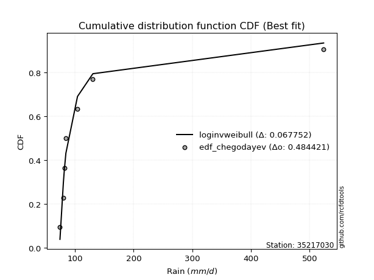</img></img>

</div>


### 6. EDF Blom (1958)

The Blom formula is a specific "plotting position" formula used in hydrology and statistical analysis to estimate the empirical cumulative probability (or non-exceedance probability) of a data series. It is particularly recommended for data that are approximately normally distributed. The constant _a_ is set to 0.375 (or 3/8).

<div align="center">


$P=(m-a)/(n+1-2a)$


</div>


**6.1. Empirical values**

<div align="center">

|                | 0                   | 1                   | 2                  | 3        | 4                  | 5                  | 6                  |
|:---------------|:--------------------|:--------------------|:-------------------|:---------|:-------------------|:-------------------|:-------------------|
| date           | 2019                | 2023                | 2021               | 2025     | 2020               | 2022               | 2024               |
| x              | 74.4                | 80.2                | 81.8               | 84.5     | 104.3              | 130.5              | 523.8              |
| m              | 1                   | 2                   | 3                  | 4        | 5                  | 6                  | 7                  |
| empirical_dist | edf_blom            | edf_blom            | edf_blom           | edf_blom | edf_blom           | edf_blom           | edf_blom           |
| empirical      | 0.08620689655172414 | 0.22413793103448276 | 0.3620689655172414 | 0.5      | 0.6379310344827587 | 0.7758620689655172 | 0.9137931034482759 |
| empirical_tr   | 1.0943396226415094  | 1.288888888888889   | 1.5675675675675675 | 2.0      | 2.7619047619047623 | 4.461538461538462  | 11.600000000000007 |

</div>


**6.2. Kolmogorov-Smirnov fit test (sorted by Δ)**


<div align="center">

|                | 0                   | 1                   | 2                   | 3                   | 4                   | 5                   | 6                   | 7                   | 8                   | 9                   | 10                  | 11                  | 12                  | 13                  | 14                  | 15                  | 16                  | 17                  | 18                  | 19                  | 20                  | 21                  | 22                  | 23                  | 24                  | 25                  | 26                  | 27                  | 28                  | 29                  | 30                  | 31                  | 32                  | 33                  | 34                  | 35                  | 36                  | 37                  | 38                  | 39                  | 40                  | 41                  | 42                  | 43                  | 44                  | 45                  | 46                  | 47                  | 48                  | 49                  | 50                  | 51                  | 52                  | 53                  | 54                  | 55                  | 56                  | 57                  | 58                  | 59                  | 60                  | 61                  | 62                  | 63                  | 64                  | 65                  | 66                  | 67                  | 68                  | 69                  | 70                  | 71                  | 72                  | 73                  | 74                  | 75                  | 76                  | 77                  | 78                  | 79                  | 80                  | 81                  | 82                  | 83                  | 84                  | 85                  | 86                  | 87                  | 88                  | 89                  | 90                  | 91                  | 92                  | 93                  | 94                  | 95                  | 96                  | 97                  | 98                  | 99                  | 100                 | 101                 | 102                 | 103                 | 104                 | 105                 | 106                 | 107                 | 108                 | 109                 | 110                 | 111                 | 112                 | 113                 | 114                 | 115                 | 116                 | 117                 | 118                 | 119                 | 120                 | 121                 | 122                 | 123                 | 124                 | 125                 | 126                 | 127                 | 128                 | 129                 | 130                 | 131                 | 132                 | 133                 | 134                 | 135                 | 136                 | 137                 | 138                 | 139                 | 140                 | 141                 | 142                 | 143                 | 144                 | 145                 | 146                 | 147                 | 148                 | 149                 | 150                 | 151                 | 152                 | 153                 | 154                 | 155                 | 156                 | 157                 | 158                 | 159                 |
|:---------------|:--------------------|:--------------------|:--------------------|:--------------------|:--------------------|:--------------------|:--------------------|:--------------------|:--------------------|:--------------------|:--------------------|:--------------------|:--------------------|:--------------------|:--------------------|:--------------------|:--------------------|:--------------------|:--------------------|:--------------------|:--------------------|:--------------------|:--------------------|:--------------------|:--------------------|:--------------------|:--------------------|:--------------------|:--------------------|:--------------------|:--------------------|:--------------------|:--------------------|:--------------------|:--------------------|:--------------------|:--------------------|:--------------------|:--------------------|:--------------------|:--------------------|:--------------------|:--------------------|:--------------------|:--------------------|:--------------------|:--------------------|:--------------------|:--------------------|:--------------------|:--------------------|:--------------------|:--------------------|:--------------------|:--------------------|:--------------------|:--------------------|:--------------------|:--------------------|:--------------------|:--------------------|:--------------------|:--------------------|:--------------------|:--------------------|:--------------------|:--------------------|:--------------------|:--------------------|:--------------------|:--------------------|:--------------------|:--------------------|:--------------------|:--------------------|:--------------------|:--------------------|:--------------------|:--------------------|:--------------------|:--------------------|:--------------------|:--------------------|:--------------------|:--------------------|:--------------------|:--------------------|:--------------------|:--------------------|:--------------------|:--------------------|:--------------------|:--------------------|:--------------------|:--------------------|:--------------------|:--------------------|:--------------------|:--------------------|:--------------------|:--------------------|:--------------------|:--------------------|:--------------------|:--------------------|:--------------------|:--------------------|:--------------------|:--------------------|:--------------------|:--------------------|:--------------------|:--------------------|:--------------------|:--------------------|:--------------------|:--------------------|:--------------------|:--------------------|:--------------------|:--------------------|:--------------------|:--------------------|:--------------------|:--------------------|:--------------------|:--------------------|:--------------------|:--------------------|:--------------------|:--------------------|:--------------------|:--------------------|:--------------------|:--------------------|:--------------------|:--------------------|:--------------------|:--------------------|:--------------------|:--------------------|:--------------------|:--------------------|:--------------------|:--------------------|:--------------------|:--------------------|:--------------------|:--------------------|:--------------------|:--------------------|:--------------------|:--------------------|:--------------------|:--------------------|:--------------------|:--------------------|:--------------------|:--------------------|:--------------------|
| station        | 35217030            | 35217030            | 35217030            | 35217030            | 35217030            | 35217030            | 35217030            | 35217030            | 35217030            | 35217030            | 35217030            | 35217030            | 35217030            | 35217030            | 35217030            | 35217030            | 35217030            | 35217030            | 35217030            | 35217030            | 35217030            | 35217030            | 35217030            | 35217030            | 35217030            | 35217030            | 35217030            | 35217030            | 35217030            | 35217030            | 35217030            | 35217030            | 35217030            | 35217030            | 35217030            | 35217030            | 35217030            | 35217030            | 35217030            | 35217030            | 35217030            | 35217030            | 35217030            | 35217030            | 35217030            | 35217030            | 35217030            | 35217030            | 35217030            | 35217030            | 35217030            | 35217030            | 35217030            | 35217030            | 35217030            | 35217030            | 35217030            | 35217030            | 35217030            | 35217030            | 35217030            | 35217030            | 35217030            | 35217030            | 35217030            | 35217030            | 35217030            | 35217030            | 35217030            | 35217030            | 35217030            | 35217030            | 35217030            | 35217030            | 35217030            | 35217030            | 35217030            | 35217030            | 35217030            | 35217030            | 35217030            | 35217030            | 35217030            | 35217030            | 35217030            | 35217030            | 35217030            | 35217030            | 35217030            | 35217030            | 35217030            | 35217030            | 35217030            | 35217030            | 35217030            | 35217030            | 35217030            | 35217030            | 35217030            | 35217030            | 35217030            | 35217030            | 35217030            | 35217030            | 35217030            | 35217030            | 35217030            | 35217030            | 35217030            | 35217030            | 35217030            | 35217030            | 35217030            | 35217030            | 35217030            | 35217030            | 35217030            | 35217030            | 35217030            | 35217030            | 35217030            | 35217030            | 35217030            | 35217030            | 35217030            | 35217030            | 35217030            | 35217030            | 35217030            | 35217030            | 35217030            | 35217030            | 35217030            | 35217030            | 35217030            | 35217030            | 35217030            | 35217030            | 35217030            | 35217030            | 35217030            | 35217030            | 35217030            | 35217030            | 35217030            | 35217030            | 35217030            | 35217030            | 35217030            | 35217030            | 35217030            | 35217030            | 35217030            | 35217030            | 35217030            | 35217030            | 35217030            | 35217030            | 35217030            | 35217030            |
| empirical_dist | edf_blom            | edf_blom            | edf_blom            | edf_blom            | edf_blom            | edf_blom            | edf_blom            | edf_blom            | edf_blom            | edf_blom            | edf_blom            | edf_blom            | edf_blom            | edf_blom            | edf_blom            | edf_blom            | edf_blom            | edf_blom            | edf_blom            | edf_blom            | edf_blom            | edf_blom            | edf_blom            | edf_blom            | edf_blom            | edf_blom            | edf_blom            | edf_blom            | edf_blom            | edf_blom            | edf_blom            | edf_blom            | edf_blom            | edf_blom            | edf_blom            | edf_blom            | edf_blom            | edf_blom            | edf_blom            | edf_blom            | edf_blom            | edf_blom            | edf_blom            | edf_blom            | edf_blom            | edf_blom            | edf_blom            | edf_blom            | edf_blom            | edf_blom            | edf_blom            | edf_blom            | edf_blom            | edf_blom            | edf_blom            | edf_blom            | edf_blom            | edf_blom            | edf_blom            | edf_blom            | edf_blom            | edf_blom            | edf_blom            | edf_blom            | edf_blom            | edf_blom            | edf_blom            | edf_blom            | edf_blom            | edf_blom            | edf_blom            | edf_blom            | edf_blom            | edf_blom            | edf_blom            | edf_blom            | edf_blom            | edf_blom            | edf_blom            | edf_blom            | edf_blom            | edf_blom            | edf_blom            | edf_blom            | edf_blom            | edf_blom            | edf_blom            | edf_blom            | edf_blom            | edf_blom            | edf_blom            | edf_blom            | edf_blom            | edf_blom            | edf_blom            | edf_blom            | edf_blom            | edf_blom            | edf_blom            | edf_blom            | edf_blom            | edf_blom            | edf_blom            | edf_blom            | edf_blom            | edf_blom            | edf_blom            | edf_blom            | edf_blom            | edf_blom            | edf_blom            | edf_blom            | edf_blom            | edf_blom            | edf_blom            | edf_blom            | edf_blom            | edf_blom            | edf_blom            | edf_blom            | edf_blom            | edf_blom            | edf_blom            | edf_blom            | edf_blom            | edf_blom            | edf_blom            | edf_blom            | edf_blom            | edf_blom            | edf_blom            | edf_blom            | edf_blom            | edf_blom            | edf_blom            | edf_blom            | edf_blom            | edf_blom            | edf_blom            | edf_blom            | edf_blom            | edf_blom            | edf_blom            | edf_blom            | edf_blom            | edf_blom            | edf_blom            | edf_blom            | edf_blom            | edf_blom            | edf_blom            | edf_blom            | edf_blom            | edf_blom            | edf_blom            | edf_blom            | edf_blom            | edf_blom            | edf_blom            | edf_blom            |
| p_dist         | johnsonsu           | logalpha            | loginvgamma         | logburr             | loggenextreme       | loginvweibull       | logmielke           | alpha               | loginvgauss         | invgamma            | f                   | logjohnsonsu        | invgauss            | truncpareto         | logerlang           | burr                | fatiguelife         | logtruncweibull_min | logfatiguelife      | logtruncpareto      | logwald             | genpareto           | exponpow            | logburr12           | erlang              | logmoyal            | loggumbel_r         | logbradford         | nakagami            | gennorm             | logmaxwell          | logpearson3         | lograyleigh         | logvonmises_line    | loghalflogistic     | gamma               | truncweibull_min    | lognct              | ncf                 | betaprime           | logbetaprime        | loghalfnorm         | logt                | lognorm             | logcrystalball      | logloggamma         | gengamma            | nct                 | kappa3              | logfoldnorm         | loganglit           | loggenlogistic      | loglogistic         | logncf              | logsemicircular     | t                   | loglomax            | loggausshyper       | loghypsecant        | logweibull_min      | weibull_min         | burr12              | halfgennorm         | genlogistic         | logarcsine          | logkstwobign        | loggompertz         | logexponnorm        | logdweibull         | loggenexpon         | loglaplace          | loglaplace          | moyal               | wald                | logloglaplace       | vonmises_line       | logrice             | exponweib           | genextreme          | loggengamma         | gumbel_r            | loggennorm          | loggumbel_l         | halflogistic        | logtruncnorm        | logdgamma           | dgamma              | halfnorm            | dweibull            | pearson3            | rayleigh            | logcosine           | maxwell             | loghalfgennorm      | tukeylambda         | foldnorm            | arcsine             | logexponweib        | wrapcauchy          | semicircular        | anglit              | loggenpareto        | gausshyper          | norm                | kstwobign           | logistic            | powerlaw            | logwrapcauchy       | hypsecant           | lognakagami         | invweibull          | logskewnorm         | laplace             | loglevy_l           | rice                | exponnorm           | genexpon            | levy_l              | logpowerlaw         | logtruncexpon       | logbeta             | logargus            | gumbel_l            | gompertz            | cosine              | logexponpow         | logf                | logweibull_max      | logtriang           | logrdist            | truncnorm           | logksone            | logkappa4           | truncexpon          | logtukeylambda      | loguniform          | loggamma            | loggamma            | argus               | logkappa3           | lomax               | logjohnsonsb        | triang              | skewnorm            | johnsonsb           | crystalball         | bradford            | rdist               | loggenhalflogistic  | ksone               | kappa4              | uniform             | genhalflogistic     | logtrapezoid        | weibull_max         | beta                | trapezoid           | logvonmises         | vonmises            | mielke              |
| delta          | 0.06856700724408427 | 0.06861887354626434 | 0.07032813279010719 | 0.07329284462300961 | 0.07330540024077481 | 0.07332657885288135 | 0.07373742254072008 | 0.0793631605134077  | 0.08667915855121461 | 0.08749981384678224 | 0.08749990549263276 | 0.08918935574539422 | 0.09733165511699726 | 0.10600985850432504 | 0.10989023471635789 | 0.11256006841390409 | 0.11709378823112732 | 0.11901392983713    | 0.12633012157283358 | 0.1366821968473934  | 0.13954132380886142 | 0.14419743749696295 | 0.15548829558351696 | 0.15556485992533814 | 0.1595807937975081  | 0.16036161681281264 | 0.16389546496364632 | 0.16391590986687776 | 0.1658261286103283  | 0.1717904377017429  | 0.17715987854708293 | 0.17716884647597902 | 0.18287292760308088 | 0.18696984801998406 | 0.18775530517978173 | 0.1881176990084164  | 0.19498472637396996 | 0.19758189951606686 | 0.20051908282613523 | 0.20118979953156174 | 0.20125423243557994 | 0.20479763939585033 | 0.20508604150487597 | 0.20754476801085903 | 0.2075447724773113  | 0.20889148835041516 | 0.21150537051993107 | 0.2126135326629529  | 0.2126454651121607  | 0.21373452507151486 | 0.21597584518980417 | 0.21646334061737676 | 0.21679797559321534 | 0.2197166136719047  | 0.22003602892292973 | 0.22348545487586113 | 0.227431793772098   | 0.22884225726932822 | 0.22959374134955052 | 0.23582931489390446 | 0.24102366683218357 | 0.24383260328334488 | 0.2446393583199601  | 0.24751986168492202 | 0.24780268216002965 | 0.24838692148185632 | 0.2507071252229942  | 0.25170995354403514 | 0.2533399265451618  | 0.25348024231995125 | 0.2552443938069419  | 0.2552443938069419  | 0.25611000259295974 | 0.2561113528605102  | 0.25691601296618805 | 0.25817065629015473 | 0.25990903789808345 | 0.26762810884668115 | 0.2678121075727183  | 0.2719543792209661  | 0.2722198640005633  | 0.2758620688799048  | 0.27660700468517085 | 0.28164803314146186 | 0.28217399371829444 | 0.282352651420451   | 0.28293675523354006 | 0.2834378808121676  | 0.2905153487416744  | 0.291258374494455   | 0.2914371222731028  | 0.2996466803263884  | 0.30347654553496434 | 0.30818832973550964 | 0.3083119546841928  | 0.3094676817305144  | 0.3110634175403502  | 0.3123677876286426  | 0.3147702313828766  | 0.32549246028423523 | 0.3291132282529282  | 0.33406754812513373 | 0.33537468886112376 | 0.3378758795588688  | 0.34220977882652215 | 0.34616623443992395 | 0.35091828456382257 | 0.3523067095723601  | 0.3531303200286232  | 0.3607001526853748  | 0.3667632879545464  | 0.37050424885629596 | 0.3748939259529628  | 0.37575196423742524 | 0.37844546372001375 | 0.3808918895637581  | 0.3811357127873114  | 0.38999793587131576 | 0.39354409084241626 | 0.3939759653045819  | 0.3964394647875392  | 0.39977430236084177 | 0.4073963564502453  | 0.41045471035289205 | 0.4187491778189081  | 0.42636372080142704 | 0.4263892173764481  | 0.42733315403662897 | 0.4418680765082318  | 0.4464566112449178  | 0.4503138799596031  | 0.4525966542047763  | 0.4631709236128618  | 0.46788152713397907 | 0.48202750684623774 | 0.487943571252628   | 0.49022082262581246 | 0.49022082262581246 | 0.49155724170310744 | 0.49345685077627016 | 0.5032097409232144  | 0.5124859863952868  | 0.515904169414282   | 0.5196124942685277  | 0.5481737121143965  | 0.5482611181667942  | 0.5536288789407806  | 0.571211459292488   | 0.580698105810343   | 0.5885011432868346  | 0.624994362146056   | 0.651028958151098   | 0.667137996827859   | 0.6713615405850833  | 0.6849490417168328  | 0.7376441880509477  | 0.7407579524943444  | 1.1779284807284223  | 83.16610322233426   | nan                 |
| deltao         | 0.48442053926100004 | 0.48442053926100004 | 0.48442053926100004 | 0.48442053926100004 | 0.48442053926100004 | 0.48442053926100004 | 0.48442053926100004 | 0.48442053926100004 | 0.48442053926100004 | 0.48442053926100004 | 0.48442053926100004 | 0.48442053926100004 | 0.48442053926100004 | 0.48442053926100004 | 0.48442053926100004 | 0.48442053926100004 | 0.48442053926100004 | 0.48442053926100004 | 0.48442053926100004 | 0.48442053926100004 | 0.48442053926100004 | 0.48442053926100004 | 0.48442053926100004 | 0.48442053926100004 | 0.48442053926100004 | 0.48442053926100004 | 0.48442053926100004 | 0.48442053926100004 | 0.48442053926100004 | 0.48442053926100004 | 0.48442053926100004 | 0.48442053926100004 | 0.48442053926100004 | 0.48442053926100004 | 0.48442053926100004 | 0.48442053926100004 | 0.48442053926100004 | 0.48442053926100004 | 0.48442053926100004 | 0.48442053926100004 | 0.48442053926100004 | 0.48442053926100004 | 0.48442053926100004 | 0.48442053926100004 | 0.48442053926100004 | 0.48442053926100004 | 0.48442053926100004 | 0.48442053926100004 | 0.48442053926100004 | 0.48442053926100004 | 0.48442053926100004 | 0.48442053926100004 | 0.48442053926100004 | 0.48442053926100004 | 0.48442053926100004 | 0.48442053926100004 | 0.48442053926100004 | 0.48442053926100004 | 0.48442053926100004 | 0.48442053926100004 | 0.48442053926100004 | 0.48442053926100004 | 0.48442053926100004 | 0.48442053926100004 | 0.48442053926100004 | 0.48442053926100004 | 0.48442053926100004 | 0.48442053926100004 | 0.48442053926100004 | 0.48442053926100004 | 0.48442053926100004 | 0.48442053926100004 | 0.48442053926100004 | 0.48442053926100004 | 0.48442053926100004 | 0.48442053926100004 | 0.48442053926100004 | 0.48442053926100004 | 0.48442053926100004 | 0.48442053926100004 | 0.48442053926100004 | 0.48442053926100004 | 0.48442053926100004 | 0.48442053926100004 | 0.48442053926100004 | 0.48442053926100004 | 0.48442053926100004 | 0.48442053926100004 | 0.48442053926100004 | 0.48442053926100004 | 0.48442053926100004 | 0.48442053926100004 | 0.48442053926100004 | 0.48442053926100004 | 0.48442053926100004 | 0.48442053926100004 | 0.48442053926100004 | 0.48442053926100004 | 0.48442053926100004 | 0.48442053926100004 | 0.48442053926100004 | 0.48442053926100004 | 0.48442053926100004 | 0.48442053926100004 | 0.48442053926100004 | 0.48442053926100004 | 0.48442053926100004 | 0.48442053926100004 | 0.48442053926100004 | 0.48442053926100004 | 0.48442053926100004 | 0.48442053926100004 | 0.48442053926100004 | 0.48442053926100004 | 0.48442053926100004 | 0.48442053926100004 | 0.48442053926100004 | 0.48442053926100004 | 0.48442053926100004 | 0.48442053926100004 | 0.48442053926100004 | 0.48442053926100004 | 0.48442053926100004 | 0.48442053926100004 | 0.48442053926100004 | 0.48442053926100004 | 0.48442053926100004 | 0.48442053926100004 | 0.48442053926100004 | 0.48442053926100004 | 0.48442053926100004 | 0.48442053926100004 | 0.48442053926100004 | 0.48442053926100004 | 0.48442053926100004 | 0.48442053926100004 | 0.48442053926100004 | 0.48442053926100004 | 0.48442053926100004 | 0.48442053926100004 | 0.48442053926100004 | 0.48442053926100004 | 0.48442053926100004 | 0.48442053926100004 | 0.48442053926100004 | 0.48442053926100004 | 0.48442053926100004 | 0.48442053926100004 | 0.48442053926100004 | 0.48442053926100004 | 0.48442053926100004 | 0.48442053926100004 | 0.48442053926100004 | 0.48442053926100004 | 0.48442053926100004 | 0.48442053926100004 | 0.48442053926100004 | 0.48442053926100004 | 0.48442053926100004 | 0.48442053926100004 |
| eval           | Δo > Δ              | Δo > Δ              | Δo > Δ              | Δo > Δ              | Δo > Δ              | Δo > Δ              | Δo > Δ              | Δo > Δ              | Δo > Δ              | Δo > Δ              | Δo > Δ              | Δo > Δ              | Δo > Δ              | Δo > Δ              | Δo > Δ              | Δo > Δ              | Δo > Δ              | Δo > Δ              | Δo > Δ              | Δo > Δ              | Δo > Δ              | Δo > Δ              | Δo > Δ              | Δo > Δ              | Δo > Δ              | Δo > Δ              | Δo > Δ              | Δo > Δ              | Δo > Δ              | Δo > Δ              | Δo > Δ              | Δo > Δ              | Δo > Δ              | Δo > Δ              | Δo > Δ              | Δo > Δ              | Δo > Δ              | Δo > Δ              | Δo > Δ              | Δo > Δ              | Δo > Δ              | Δo > Δ              | Δo > Δ              | Δo > Δ              | Δo > Δ              | Δo > Δ              | Δo > Δ              | Δo > Δ              | Δo > Δ              | Δo > Δ              | Δo > Δ              | Δo > Δ              | Δo > Δ              | Δo > Δ              | Δo > Δ              | Δo > Δ              | Δo > Δ              | Δo > Δ              | Δo > Δ              | Δo > Δ              | Δo > Δ              | Δo > Δ              | Δo > Δ              | Δo > Δ              | Δo > Δ              | Δo > Δ              | Δo > Δ              | Δo > Δ              | Δo > Δ              | Δo > Δ              | Δo > Δ              | Δo > Δ              | Δo > Δ              | Δo > Δ              | Δo > Δ              | Δo > Δ              | Δo > Δ              | Δo > Δ              | Δo > Δ              | Δo > Δ              | Δo > Δ              | Δo > Δ              | Δo > Δ              | Δo > Δ              | Δo > Δ              | Δo > Δ              | Δo > Δ              | Δo > Δ              | Δo > Δ              | Δo > Δ              | Δo > Δ              | Δo > Δ              | Δo > Δ              | Δo > Δ              | Δo > Δ              | Δo > Δ              | Δo > Δ              | Δo > Δ              | Δo > Δ              | Δo > Δ              | Δo > Δ              | Δo > Δ              | Δo > Δ              | Δo > Δ              | Δo > Δ              | Δo > Δ              | Δo > Δ              | Δo > Δ              | Δo > Δ              | Δo > Δ              | Δo > Δ              | Δo > Δ              | Δo > Δ              | Δo > Δ              | Δo > Δ              | Δo > Δ              | Δo > Δ              | Δo > Δ              | Δo > Δ              | Δo > Δ              | Δo > Δ              | Δo > Δ              | Δo > Δ              | Δo > Δ              | Δo > Δ              | Δo > Δ              | Δo > Δ              | Δo > Δ              | Δo > Δ              | Δo > Δ              | Δo > Δ              | Δo > Δ              | Δo > Δ              | Δo > Δ              | Δo > Δ              | Δo <= Δ             | Δo <= Δ             | Δo <= Δ             | Δo <= Δ             | Δo <= Δ             | Δo <= Δ             | Δo <= Δ             | Δo <= Δ             | Δo <= Δ             | Δo <= Δ             | Δo <= Δ             | Δo <= Δ             | Δo <= Δ             | Δo <= Δ             | Δo <= Δ             | Δo <= Δ             | Δo <= Δ             | Δo <= Δ             | Δo <= Δ             | Δo <= Δ             | Δo <= Δ             | Δo <= Δ             | Δo <= Δ             | Δo <= Δ             | Δo <= Δ             |
| fit            | 1                   | 1                   | 1                   | 1                   | 1                   | 1                   | 1                   | 1                   | 1                   | 1                   | 1                   | 1                   | 1                   | 1                   | 1                   | 1                   | 1                   | 1                   | 1                   | 1                   | 1                   | 1                   | 1                   | 1                   | 1                   | 1                   | 1                   | 1                   | 1                   | 1                   | 1                   | 1                   | 1                   | 1                   | 1                   | 1                   | 1                   | 1                   | 1                   | 1                   | 1                   | 1                   | 1                   | 1                   | 1                   | 1                   | 1                   | 1                   | 1                   | 1                   | 1                   | 1                   | 1                   | 1                   | 1                   | 1                   | 1                   | 1                   | 1                   | 1                   | 1                   | 1                   | 1                   | 1                   | 1                   | 1                   | 1                   | 1                   | 1                   | 1                   | 1                   | 1                   | 1                   | 1                   | 1                   | 1                   | 1                   | 1                   | 1                   | 1                   | 1                   | 1                   | 1                   | 1                   | 1                   | 1                   | 1                   | 1                   | 1                   | 1                   | 1                   | 1                   | 1                   | 1                   | 1                   | 1                   | 1                   | 1                   | 1                   | 1                   | 1                   | 1                   | 1                   | 1                   | 1                   | 1                   | 1                   | 1                   | 1                   | 1                   | 1                   | 1                   | 1                   | 1                   | 1                   | 1                   | 1                   | 1                   | 1                   | 1                   | 1                   | 1                   | 1                   | 1                   | 1                   | 1                   | 1                   | 1                   | 1                   | 1                   | 1                   | 1                   | 1                   | 1                   | 1                   | 0                   | 0                   | 0                   | 0                   | 0                   | 0                   | 0                   | 0                   | 0                   | 0                   | 0                   | 0                   | 0                   | 0                   | 0                   | 0                   | 0                   | 0                   | 0                   | 0                   | 0                   | 0                   | 0                   | 0                   | 0                   |
| n              | 7                   | 7                   | 7                   | 7                   | 7                   | 7                   | 7                   | 7                   | 7                   | 7                   | 7                   | 7                   | 7                   | 7                   | 7                   | 7                   | 7                   | 7                   | 7                   | 7                   | 7                   | 7                   | 7                   | 7                   | 7                   | 7                   | 7                   | 7                   | 7                   | 7                   | 7                   | 7                   | 7                   | 7                   | 7                   | 7                   | 7                   | 7                   | 7                   | 7                   | 7                   | 7                   | 7                   | 7                   | 7                   | 7                   | 7                   | 7                   | 7                   | 7                   | 7                   | 7                   | 7                   | 7                   | 7                   | 7                   | 7                   | 7                   | 7                   | 7                   | 7                   | 7                   | 7                   | 7                   | 7                   | 7                   | 7                   | 7                   | 7                   | 7                   | 7                   | 7                   | 7                   | 7                   | 7                   | 7                   | 7                   | 7                   | 7                   | 7                   | 7                   | 7                   | 7                   | 7                   | 7                   | 7                   | 7                   | 7                   | 7                   | 7                   | 7                   | 7                   | 7                   | 7                   | 7                   | 7                   | 7                   | 7                   | 7                   | 7                   | 7                   | 7                   | 7                   | 7                   | 7                   | 7                   | 7                   | 7                   | 7                   | 7                   | 7                   | 7                   | 7                   | 7                   | 7                   | 7                   | 7                   | 7                   | 7                   | 7                   | 7                   | 7                   | 7                   | 7                   | 7                   | 7                   | 7                   | 7                   | 7                   | 7                   | 7                   | 7                   | 7                   | 7                   | 7                   | 7                   | 7                   | 7                   | 7                   | 7                   | 7                   | 7                   | 7                   | 7                   | 7                   | 7                   | 7                   | 7                   | 7                   | 7                   | 7                   | 7                   | 7                   | 7                   | 7                   | 7                   | 7                   | 7                   | 7                   | 7                   |
| best_fit       | 1                   | 0                   | 0                   | 0                   | 0                   | 0                   | 0                   | 0                   | 0                   | 0                   | 0                   | 0                   | 0                   | 0                   | 0                   | 0                   | 0                   | 0                   | 0                   | 0                   | 0                   | 0                   | 0                   | 0                   | 0                   | 0                   | 0                   | 0                   | 0                   | 0                   | 0                   | 0                   | 0                   | 0                   | 0                   | 0                   | 0                   | 0                   | 0                   | 0                   | 0                   | 0                   | 0                   | 0                   | 0                   | 0                   | 0                   | 0                   | 0                   | 0                   | 0                   | 0                   | 0                   | 0                   | 0                   | 0                   | 0                   | 0                   | 0                   | 0                   | 0                   | 0                   | 0                   | 0                   | 0                   | 0                   | 0                   | 0                   | 0                   | 0                   | 0                   | 0                   | 0                   | 0                   | 0                   | 0                   | 0                   | 0                   | 0                   | 0                   | 0                   | 0                   | 0                   | 0                   | 0                   | 0                   | 0                   | 0                   | 0                   | 0                   | 0                   | 0                   | 0                   | 0                   | 0                   | 0                   | 0                   | 0                   | 0                   | 0                   | 0                   | 0                   | 0                   | 0                   | 0                   | 0                   | 0                   | 0                   | 0                   | 0                   | 0                   | 0                   | 0                   | 0                   | 0                   | 0                   | 0                   | 0                   | 0                   | 0                   | 0                   | 0                   | 0                   | 0                   | 0                   | 0                   | 0                   | 0                   | 0                   | 0                   | 0                   | 0                   | 0                   | 0                   | 0                   | 0                   | 0                   | 0                   | 0                   | 0                   | 0                   | 0                   | 0                   | 0                   | 0                   | 0                   | 0                   | 0                   | 0                   | 0                   | 0                   | 0                   | 0                   | 0                   | 0                   | 0                   | 0                   | 0                   | 0                   | 0                   |
| best_fit_sort  | 1                   | 2                   | 3                   | 4                   | 5                   | 6                   | 7                   | 8                   | 9                   | 10                  | 11                  | 12                  | 13                  | 14                  | 15                  | 16                  | 17                  | 18                  | 19                  | 20                  | 21                  | 22                  | 23                  | 24                  | 25                  | 26                  | 27                  | 28                  | 29                  | 30                  | 31                  | 32                  | 33                  | 34                  | 35                  | 36                  | 37                  | 38                  | 39                  | 40                  | 41                  | 42                  | 43                  | 44                  | 45                  | 46                  | 47                  | 48                  | 49                  | 50                  | 51                  | 52                  | 53                  | 54                  | 55                  | 56                  | 57                  | 58                  | 59                  | 60                  | 61                  | 62                  | 63                  | 64                  | 65                  | 66                  | 67                  | 68                  | 69                  | 70                  | 71                  | 72                  | 73                  | 74                  | 75                  | 76                  | 77                  | 78                  | 79                  | 80                  | 81                  | 82                  | 83                  | 84                  | 85                  | 86                  | 87                  | 88                  | 89                  | 90                  | 91                  | 92                  | 93                  | 94                  | 95                  | 96                  | 97                  | 98                  | 99                  | 100                 | 101                 | 102                 | 103                 | 104                 | 105                 | 106                 | 107                 | 108                 | 109                 | 110                 | 111                 | 112                 | 113                 | 114                 | 115                 | 116                 | 117                 | 118                 | 119                 | 120                 | 121                 | 122                 | 123                 | 124                 | 125                 | 126                 | 127                 | 128                 | 129                 | 130                 | 131                 | 132                 | 133                 | 134                 | 135                 | 136                 | 137                 | 138                 | 139                 | 140                 | 141                 | 142                 | 143                 | 144                 | 145                 | 146                 | 147                 | 148                 | 149                 | 150                 | 151                 | 152                 | 153                 | 154                 | 155                 | 156                 | 157                 | 158                 | 159                 | 160                 |

</div>


**6.3. Best fit**

<div align="center">

|   id |   station | empirical_dist   | p_dist    |    delta |   deltao | eval   |   fit |   n |   best_fit |   best_fit_sort |
|-----:|----------:|:-----------------|:----------|---------:|---------:|:-------|------:|----:|-----------:|----------------:|
|    0 |  35217030 | edf_blom         | johnsonsu | 0.068567 | 0.484421 | Δo > Δ |     1 |   7 |          1 |               1 |

</div>


<div align="center">

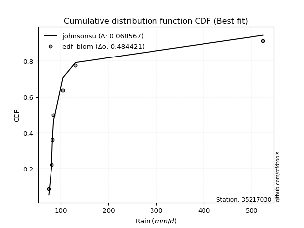</img></img>

</div>


### 7. EDF Tukey (1962)

In hydrology, the Tukey formula is used as a plotting position formula to estimate the empirical probability or frequency of a flood event (or other hydrological data). The formula parameter is given as _c=0.333_ (or 1/3).

<div align="center">


$P=(m-c)/(n+1-2c)$


</div>


**7.1. Empirical values**

<div align="center">

|                | 0                   | 1                   | 2                   | 3         | 4                  | 5                  | 6                  |
|:---------------|:--------------------|:--------------------|:--------------------|:----------|:-------------------|:-------------------|:-------------------|
| date           | 2019                | 2023                | 2021                | 2025      | 2020               | 2022               | 2024               |
| x              | 74.4                | 80.2                | 81.8                | 84.5      | 104.3              | 130.5              | 523.8              |
| m              | 1                   | 2                   | 3                   | 4         | 5                  | 6                  | 7                  |
| empirical_dist | edf_tukey           | edf_tukey           | edf_tukey           | edf_tukey | edf_tukey          | edf_tukey          | edf_tukey          |
| empirical      | 0.09090909090909091 | 0.22727272727272727 | 0.36363636363636365 | 0.5       | 0.6363636363636364 | 0.7727272727272727 | 0.9090909090909091 |
| empirical_tr   | 1.1                 | 1.2941176470588236  | 1.5714285714285714  | 2.0       | 2.75               | 4.3999999999999995 | 10.999999999999996 |

</div>


**7.2. Kolmogorov-Smirnov fit test (sorted by Δ)**


<div align="center">

|                | 0                   | 1                   | 2                   | 3                   | 4                   | 5                   | 6                   | 7                   | 8                   | 9                   | 10                  | 11                  | 12                  | 13                  | 14                  | 15                  | 16                  | 17                  | 18                  | 19                  | 20                  | 21                  | 22                  | 23                  | 24                  | 25                  | 26                  | 27                  | 28                  | 29                  | 30                  | 31                  | 32                  | 33                  | 34                  | 35                  | 36                  | 37                  | 38                  | 39                  | 40                  | 41                  | 42                  | 43                  | 44                  | 45                  | 46                  | 47                  | 48                  | 49                  | 50                  | 51                  | 52                  | 53                  | 54                  | 55                  | 56                  | 57                  | 58                  | 59                  | 60                  | 61                  | 62                  | 63                  | 64                  | 65                  | 66                  | 67                  | 68                  | 69                  | 70                  | 71                  | 72                  | 73                  | 74                  | 75                  | 76                  | 77                  | 78                  | 79                  | 80                  | 81                  | 82                  | 83                  | 84                  | 85                  | 86                  | 87                  | 88                  | 89                  | 90                  | 91                  | 92                  | 93                  | 94                  | 95                  | 96                  | 97                  | 98                  | 99                  | 100                 | 101                 | 102                 | 103                 | 104                 | 105                 | 106                 | 107                 | 108                 | 109                 | 110                 | 111                 | 112                 | 113                 | 114                 | 115                 | 116                 | 117                 | 118                 | 119                 | 120                 | 121                 | 122                 | 123                 | 124                 | 125                 | 126                 | 127                 | 128                 | 129                 | 130                 | 131                 | 132                 | 133                 | 134                 | 135                 | 136                 | 137                 | 138                 | 139                 | 140                 | 141                 | 142                 | 143                 | 144                 | 145                 | 146                 | 147                 | 148                 | 149                 | 150                 | 151                 | 152                 | 153                 | 154                 | 155                 | 156                 | 157                 | 158                 | 159                 |
|:---------------|:--------------------|:--------------------|:--------------------|:--------------------|:--------------------|:--------------------|:--------------------|:--------------------|:--------------------|:--------------------|:--------------------|:--------------------|:--------------------|:--------------------|:--------------------|:--------------------|:--------------------|:--------------------|:--------------------|:--------------------|:--------------------|:--------------------|:--------------------|:--------------------|:--------------------|:--------------------|:--------------------|:--------------------|:--------------------|:--------------------|:--------------------|:--------------------|:--------------------|:--------------------|:--------------------|:--------------------|:--------------------|:--------------------|:--------------------|:--------------------|:--------------------|:--------------------|:--------------------|:--------------------|:--------------------|:--------------------|:--------------------|:--------------------|:--------------------|:--------------------|:--------------------|:--------------------|:--------------------|:--------------------|:--------------------|:--------------------|:--------------------|:--------------------|:--------------------|:--------------------|:--------------------|:--------------------|:--------------------|:--------------------|:--------------------|:--------------------|:--------------------|:--------------------|:--------------------|:--------------------|:--------------------|:--------------------|:--------------------|:--------------------|:--------------------|:--------------------|:--------------------|:--------------------|:--------------------|:--------------------|:--------------------|:--------------------|:--------------------|:--------------------|:--------------------|:--------------------|:--------------------|:--------------------|:--------------------|:--------------------|:--------------------|:--------------------|:--------------------|:--------------------|:--------------------|:--------------------|:--------------------|:--------------------|:--------------------|:--------------------|:--------------------|:--------------------|:--------------------|:--------------------|:--------------------|:--------------------|:--------------------|:--------------------|:--------------------|:--------------------|:--------------------|:--------------------|:--------------------|:--------------------|:--------------------|:--------------------|:--------------------|:--------------------|:--------------------|:--------------------|:--------------------|:--------------------|:--------------------|:--------------------|:--------------------|:--------------------|:--------------------|:--------------------|:--------------------|:--------------------|:--------------------|:--------------------|:--------------------|:--------------------|:--------------------|:--------------------|:--------------------|:--------------------|:--------------------|:--------------------|:--------------------|:--------------------|:--------------------|:--------------------|:--------------------|:--------------------|:--------------------|:--------------------|:--------------------|:--------------------|:--------------------|:--------------------|:--------------------|:--------------------|:--------------------|:--------------------|:--------------------|:--------------------|:--------------------|:--------------------|
| station        | 35217030            | 35217030            | 35217030            | 35217030            | 35217030            | 35217030            | 35217030            | 35217030            | 35217030            | 35217030            | 35217030            | 35217030            | 35217030            | 35217030            | 35217030            | 35217030            | 35217030            | 35217030            | 35217030            | 35217030            | 35217030            | 35217030            | 35217030            | 35217030            | 35217030            | 35217030            | 35217030            | 35217030            | 35217030            | 35217030            | 35217030            | 35217030            | 35217030            | 35217030            | 35217030            | 35217030            | 35217030            | 35217030            | 35217030            | 35217030            | 35217030            | 35217030            | 35217030            | 35217030            | 35217030            | 35217030            | 35217030            | 35217030            | 35217030            | 35217030            | 35217030            | 35217030            | 35217030            | 35217030            | 35217030            | 35217030            | 35217030            | 35217030            | 35217030            | 35217030            | 35217030            | 35217030            | 35217030            | 35217030            | 35217030            | 35217030            | 35217030            | 35217030            | 35217030            | 35217030            | 35217030            | 35217030            | 35217030            | 35217030            | 35217030            | 35217030            | 35217030            | 35217030            | 35217030            | 35217030            | 35217030            | 35217030            | 35217030            | 35217030            | 35217030            | 35217030            | 35217030            | 35217030            | 35217030            | 35217030            | 35217030            | 35217030            | 35217030            | 35217030            | 35217030            | 35217030            | 35217030            | 35217030            | 35217030            | 35217030            | 35217030            | 35217030            | 35217030            | 35217030            | 35217030            | 35217030            | 35217030            | 35217030            | 35217030            | 35217030            | 35217030            | 35217030            | 35217030            | 35217030            | 35217030            | 35217030            | 35217030            | 35217030            | 35217030            | 35217030            | 35217030            | 35217030            | 35217030            | 35217030            | 35217030            | 35217030            | 35217030            | 35217030            | 35217030            | 35217030            | 35217030            | 35217030            | 35217030            | 35217030            | 35217030            | 35217030            | 35217030            | 35217030            | 35217030            | 35217030            | 35217030            | 35217030            | 35217030            | 35217030            | 35217030            | 35217030            | 35217030            | 35217030            | 35217030            | 35217030            | 35217030            | 35217030            | 35217030            | 35217030            | 35217030            | 35217030            | 35217030            | 35217030            | 35217030            | 35217030            |
| empirical_dist | edf_tukey           | edf_tukey           | edf_tukey           | edf_tukey           | edf_tukey           | edf_tukey           | edf_tukey           | edf_tukey           | edf_tukey           | edf_tukey           | edf_tukey           | edf_tukey           | edf_tukey           | edf_tukey           | edf_tukey           | edf_tukey           | edf_tukey           | edf_tukey           | edf_tukey           | edf_tukey           | edf_tukey           | edf_tukey           | edf_tukey           | edf_tukey           | edf_tukey           | edf_tukey           | edf_tukey           | edf_tukey           | edf_tukey           | edf_tukey           | edf_tukey           | edf_tukey           | edf_tukey           | edf_tukey           | edf_tukey           | edf_tukey           | edf_tukey           | edf_tukey           | edf_tukey           | edf_tukey           | edf_tukey           | edf_tukey           | edf_tukey           | edf_tukey           | edf_tukey           | edf_tukey           | edf_tukey           | edf_tukey           | edf_tukey           | edf_tukey           | edf_tukey           | edf_tukey           | edf_tukey           | edf_tukey           | edf_tukey           | edf_tukey           | edf_tukey           | edf_tukey           | edf_tukey           | edf_tukey           | edf_tukey           | edf_tukey           | edf_tukey           | edf_tukey           | edf_tukey           | edf_tukey           | edf_tukey           | edf_tukey           | edf_tukey           | edf_tukey           | edf_tukey           | edf_tukey           | edf_tukey           | edf_tukey           | edf_tukey           | edf_tukey           | edf_tukey           | edf_tukey           | edf_tukey           | edf_tukey           | edf_tukey           | edf_tukey           | edf_tukey           | edf_tukey           | edf_tukey           | edf_tukey           | edf_tukey           | edf_tukey           | edf_tukey           | edf_tukey           | edf_tukey           | edf_tukey           | edf_tukey           | edf_tukey           | edf_tukey           | edf_tukey           | edf_tukey           | edf_tukey           | edf_tukey           | edf_tukey           | edf_tukey           | edf_tukey           | edf_tukey           | edf_tukey           | edf_tukey           | edf_tukey           | edf_tukey           | edf_tukey           | edf_tukey           | edf_tukey           | edf_tukey           | edf_tukey           | edf_tukey           | edf_tukey           | edf_tukey           | edf_tukey           | edf_tukey           | edf_tukey           | edf_tukey           | edf_tukey           | edf_tukey           | edf_tukey           | edf_tukey           | edf_tukey           | edf_tukey           | edf_tukey           | edf_tukey           | edf_tukey           | edf_tukey           | edf_tukey           | edf_tukey           | edf_tukey           | edf_tukey           | edf_tukey           | edf_tukey           | edf_tukey           | edf_tukey           | edf_tukey           | edf_tukey           | edf_tukey           | edf_tukey           | edf_tukey           | edf_tukey           | edf_tukey           | edf_tukey           | edf_tukey           | edf_tukey           | edf_tukey           | edf_tukey           | edf_tukey           | edf_tukey           | edf_tukey           | edf_tukey           | edf_tukey           | edf_tukey           | edf_tukey           | edf_tukey           | edf_tukey           | edf_tukey           | edf_tukey           |
| p_dist         | logalpha            | johnsonsu           | logburr             | loggenextreme       | loginvweibull       | loginvgamma         | logmielke           | alpha               | loginvgauss         | invgamma            | f                   | logjohnsonsu        | invgauss            | truncpareto         | logerlang           | fatiguelife         | burr                | logtruncweibull_min | logfatiguelife      | logtruncpareto      | logwald             | genpareto           | exponpow            | logburr12           | logmoyal            | loggumbel_r         | erlang              | logbradford         | nakagami            | logpearson3         | gennorm             | logmaxwell          | lograyleigh         | logvonmises_line    | loghalflogistic     | gamma               | truncweibull_min    | lognct              | loghalfnorm         | ncf                 | betaprime           | logbetaprime        | logt                | logloggamma         | lognorm             | logcrystalball      | logfoldnorm         | gengamma            | nct                 | kappa3              | loganglit           | loglogistic         | loggenlogistic      | logsemicircular     | logncf              | t                   | loglomax            | loggausshyper       | loghypsecant        | logweibull_min      | weibull_min         | halfgennorm         | logarcsine          | burr12              | genlogistic         | logkstwobign        | logdweibull         | loggompertz         | moyal               | wald                | logexponnorm        | logloglaplace       | vonmises_line       | loggenexpon         | loglaplace          | loglaplace          | logrice             | exponweib           | genextreme          | loggengamma         | gumbel_r            | loggennorm          | loggumbel_l         | halflogistic        | logdgamma           | dgamma              | halfnorm            | logtruncnorm        | dweibull            | pearson3            | rayleigh            | logcosine           | maxwell             | foldnorm            | arcsine             | loghalfgennorm      | tukeylambda         | logexponweib        | wrapcauchy          | semicircular        | anglit              | loggenpareto        | gausshyper          | norm                | kstwobign           | logistic            | powerlaw            | logwrapcauchy       | hypsecant           | lognakagami         | invweibull          | logskewnorm         | loglevy_l           | laplace             | rice                | exponnorm           | genexpon            | levy_l              | logpowerlaw         | logbeta             | logtruncexpon       | logargus            | gumbel_l            | gompertz            | cosine              | logexponpow         | logf                | logweibull_max      | logtriang           | logrdist            | truncnorm           | logksone            | logkappa4           | truncexpon          | logtukeylambda      | loguniform          | loggamma            | loggamma            | argus               | logkappa3           | lomax               | logjohnsonsb        | triang              | skewnorm            | crystalball         | johnsonsb           | bradford            | rdist               | loggenhalflogistic  | ksone               | kappa4              | uniform             | genhalflogistic     | logtrapezoid        | weibull_max         | beta                | trapezoid           | logvonmises         | vonmises            | mielke              |
| delta          | 0.06861887354626434 | 0.07013440536320659 | 0.07015804838476511 | 0.0701706040025303  | 0.07019178261463685 | 0.07032813279010719 | 0.07060262630247557 | 0.0793631605134077  | 0.0835443623129701  | 0.08436501760853773 | 0.08436510925438825 | 0.09075675386451654 | 0.09419685887875276 | 0.10287506226608054 | 0.10675543847811339 | 0.11395899199288281 | 0.11569486465214862 | 0.11587913359888549 | 0.12319532533458907 | 0.1366821968473934  | 0.13954132380886142 | 0.14419743749696295 | 0.15493450411317183 | 0.15556485992533814 | 0.15565942245544587 | 0.15919327060627955 | 0.1595807937975081  | 0.16078111362863326 | 0.1626913323720838  | 0.17246665211861226 | 0.17270679261238298 | 0.1740250823088384  | 0.1781707332457141  | 0.1822676536626173  | 0.18305311082241496 | 0.1881176990084164  | 0.19498472637396996 | 0.19758189951606686 | 0.20009544503848356 | 0.20051908282613523 | 0.20118979953156174 | 0.20125423243557994 | 0.20218334316430103 | 0.20575669211217062 | 0.2059773698917367  | 0.20597737435818897 | 0.2090323307141481  | 0.20993797240080875 | 0.2126135326629529  | 0.2126454651121607  | 0.21284104895155964 | 0.21523057747409302 | 0.21646334061737676 | 0.2169012326846852  | 0.2197166136719047  | 0.22505285299498345 | 0.227431793772098   | 0.22884225726932822 | 0.22959374134955052 | 0.23269451865565993 | 0.24102366683218357 | 0.24150456208171558 | 0.24310048780266288 | 0.24383260328334488 | 0.2459524635657997  | 0.24838692148185632 | 0.24863773218779503 | 0.2507071252229942  | 0.25140780823559294 | 0.2514091585031434  | 0.25170995354403514 | 0.2522138186088213  | 0.25346846193278794 | 0.25348024231995125 | 0.2552443938069419  | 0.2552443938069419  | 0.25990903789808345 | 0.26449331260843667 | 0.2646773113344738  | 0.26725218486359925 | 0.2690850677623188  | 0.2727272726416603  | 0.27503960656604853 | 0.27694583878409507 | 0.2776504570630842  | 0.27823456087617326 | 0.27873568645480085 | 0.28217399371829444 | 0.28581315438430765 | 0.2865561801370883  | 0.2883023260348583  | 0.2965118840881439  | 0.3003417492967198  | 0.3047654873731477  | 0.3079286213021057  | 0.30818832973550964 | 0.3083119546841928  | 0.30923299139039806 | 0.31163543514463204 | 0.3223576640459907  | 0.3259784320146837  | 0.329365353767767   | 0.33223989262287923 | 0.33474108332062424 | 0.3390749825882776  | 0.3430314382016794  | 0.34778348832557804 | 0.34917191333411557 | 0.3499955237903787  | 0.3575653564471303  | 0.36206109359717953 | 0.37050424885629596 | 0.37104976988005844 | 0.37175912971471825 | 0.3753106674817692  | 0.3808918895637581  | 0.3811357127873114  | 0.38529574151394896 | 0.39040929460417173 | 0.3933046685492947  | 0.3939759653045819  | 0.39663950612259724 | 0.40426156021200077 | 0.41045471035289205 | 0.41561438158066355 | 0.4232289245631825  | 0.42325442113820355 | 0.42419835779838444 | 0.43873328026998726 | 0.4433218150066733  | 0.4480051413653703  | 0.44946185796653176 | 0.46003612737461724 | 0.46474673089573454 | 0.4788927106079932  | 0.48480877501438346 | 0.4870860263875679  | 0.4870860263875679  | 0.4884224454648629  | 0.49032205453802563 | 0.5000749446849698  | 0.5093511901570422  | 0.5127693731760374  | 0.5164776980302832  | 0.5435589238094275  | 0.5450389158761519  | 0.5504940827025361  | 0.5665092649351212  | 0.5775633095720984  | 0.58536634704859    | 0.6218595659078114  | 0.6478941619128535  | 0.6640032005896146  | 0.6682267443468388  | 0.6818142454785883  | 0.7329419936935809  | 0.7376231562560999  | 1.1732262863710556  | 83.17080541669162   | nan                 |
| deltao         | 0.48442053926100004 | 0.48442053926100004 | 0.48442053926100004 | 0.48442053926100004 | 0.48442053926100004 | 0.48442053926100004 | 0.48442053926100004 | 0.48442053926100004 | 0.48442053926100004 | 0.48442053926100004 | 0.48442053926100004 | 0.48442053926100004 | 0.48442053926100004 | 0.48442053926100004 | 0.48442053926100004 | 0.48442053926100004 | 0.48442053926100004 | 0.48442053926100004 | 0.48442053926100004 | 0.48442053926100004 | 0.48442053926100004 | 0.48442053926100004 | 0.48442053926100004 | 0.48442053926100004 | 0.48442053926100004 | 0.48442053926100004 | 0.48442053926100004 | 0.48442053926100004 | 0.48442053926100004 | 0.48442053926100004 | 0.48442053926100004 | 0.48442053926100004 | 0.48442053926100004 | 0.48442053926100004 | 0.48442053926100004 | 0.48442053926100004 | 0.48442053926100004 | 0.48442053926100004 | 0.48442053926100004 | 0.48442053926100004 | 0.48442053926100004 | 0.48442053926100004 | 0.48442053926100004 | 0.48442053926100004 | 0.48442053926100004 | 0.48442053926100004 | 0.48442053926100004 | 0.48442053926100004 | 0.48442053926100004 | 0.48442053926100004 | 0.48442053926100004 | 0.48442053926100004 | 0.48442053926100004 | 0.48442053926100004 | 0.48442053926100004 | 0.48442053926100004 | 0.48442053926100004 | 0.48442053926100004 | 0.48442053926100004 | 0.48442053926100004 | 0.48442053926100004 | 0.48442053926100004 | 0.48442053926100004 | 0.48442053926100004 | 0.48442053926100004 | 0.48442053926100004 | 0.48442053926100004 | 0.48442053926100004 | 0.48442053926100004 | 0.48442053926100004 | 0.48442053926100004 | 0.48442053926100004 | 0.48442053926100004 | 0.48442053926100004 | 0.48442053926100004 | 0.48442053926100004 | 0.48442053926100004 | 0.48442053926100004 | 0.48442053926100004 | 0.48442053926100004 | 0.48442053926100004 | 0.48442053926100004 | 0.48442053926100004 | 0.48442053926100004 | 0.48442053926100004 | 0.48442053926100004 | 0.48442053926100004 | 0.48442053926100004 | 0.48442053926100004 | 0.48442053926100004 | 0.48442053926100004 | 0.48442053926100004 | 0.48442053926100004 | 0.48442053926100004 | 0.48442053926100004 | 0.48442053926100004 | 0.48442053926100004 | 0.48442053926100004 | 0.48442053926100004 | 0.48442053926100004 | 0.48442053926100004 | 0.48442053926100004 | 0.48442053926100004 | 0.48442053926100004 | 0.48442053926100004 | 0.48442053926100004 | 0.48442053926100004 | 0.48442053926100004 | 0.48442053926100004 | 0.48442053926100004 | 0.48442053926100004 | 0.48442053926100004 | 0.48442053926100004 | 0.48442053926100004 | 0.48442053926100004 | 0.48442053926100004 | 0.48442053926100004 | 0.48442053926100004 | 0.48442053926100004 | 0.48442053926100004 | 0.48442053926100004 | 0.48442053926100004 | 0.48442053926100004 | 0.48442053926100004 | 0.48442053926100004 | 0.48442053926100004 | 0.48442053926100004 | 0.48442053926100004 | 0.48442053926100004 | 0.48442053926100004 | 0.48442053926100004 | 0.48442053926100004 | 0.48442053926100004 | 0.48442053926100004 | 0.48442053926100004 | 0.48442053926100004 | 0.48442053926100004 | 0.48442053926100004 | 0.48442053926100004 | 0.48442053926100004 | 0.48442053926100004 | 0.48442053926100004 | 0.48442053926100004 | 0.48442053926100004 | 0.48442053926100004 | 0.48442053926100004 | 0.48442053926100004 | 0.48442053926100004 | 0.48442053926100004 | 0.48442053926100004 | 0.48442053926100004 | 0.48442053926100004 | 0.48442053926100004 | 0.48442053926100004 | 0.48442053926100004 | 0.48442053926100004 | 0.48442053926100004 | 0.48442053926100004 | 0.48442053926100004 | 0.48442053926100004 |
| eval           | Δo > Δ              | Δo > Δ              | Δo > Δ              | Δo > Δ              | Δo > Δ              | Δo > Δ              | Δo > Δ              | Δo > Δ              | Δo > Δ              | Δo > Δ              | Δo > Δ              | Δo > Δ              | Δo > Δ              | Δo > Δ              | Δo > Δ              | Δo > Δ              | Δo > Δ              | Δo > Δ              | Δo > Δ              | Δo > Δ              | Δo > Δ              | Δo > Δ              | Δo > Δ              | Δo > Δ              | Δo > Δ              | Δo > Δ              | Δo > Δ              | Δo > Δ              | Δo > Δ              | Δo > Δ              | Δo > Δ              | Δo > Δ              | Δo > Δ              | Δo > Δ              | Δo > Δ              | Δo > Δ              | Δo > Δ              | Δo > Δ              | Δo > Δ              | Δo > Δ              | Δo > Δ              | Δo > Δ              | Δo > Δ              | Δo > Δ              | Δo > Δ              | Δo > Δ              | Δo > Δ              | Δo > Δ              | Δo > Δ              | Δo > Δ              | Δo > Δ              | Δo > Δ              | Δo > Δ              | Δo > Δ              | Δo > Δ              | Δo > Δ              | Δo > Δ              | Δo > Δ              | Δo > Δ              | Δo > Δ              | Δo > Δ              | Δo > Δ              | Δo > Δ              | Δo > Δ              | Δo > Δ              | Δo > Δ              | Δo > Δ              | Δo > Δ              | Δo > Δ              | Δo > Δ              | Δo > Δ              | Δo > Δ              | Δo > Δ              | Δo > Δ              | Δo > Δ              | Δo > Δ              | Δo > Δ              | Δo > Δ              | Δo > Δ              | Δo > Δ              | Δo > Δ              | Δo > Δ              | Δo > Δ              | Δo > Δ              | Δo > Δ              | Δo > Δ              | Δo > Δ              | Δo > Δ              | Δo > Δ              | Δo > Δ              | Δo > Δ              | Δo > Δ              | Δo > Δ              | Δo > Δ              | Δo > Δ              | Δo > Δ              | Δo > Δ              | Δo > Δ              | Δo > Δ              | Δo > Δ              | Δo > Δ              | Δo > Δ              | Δo > Δ              | Δo > Δ              | Δo > Δ              | Δo > Δ              | Δo > Δ              | Δo > Δ              | Δo > Δ              | Δo > Δ              | Δo > Δ              | Δo > Δ              | Δo > Δ              | Δo > Δ              | Δo > Δ              | Δo > Δ              | Δo > Δ              | Δo > Δ              | Δo > Δ              | Δo > Δ              | Δo > Δ              | Δo > Δ              | Δo > Δ              | Δo > Δ              | Δo > Δ              | Δo > Δ              | Δo > Δ              | Δo > Δ              | Δo > Δ              | Δo > Δ              | Δo > Δ              | Δo > Δ              | Δo > Δ              | Δo > Δ              | Δo > Δ              | Δo <= Δ             | Δo <= Δ             | Δo <= Δ             | Δo <= Δ             | Δo <= Δ             | Δo <= Δ             | Δo <= Δ             | Δo <= Δ             | Δo <= Δ             | Δo <= Δ             | Δo <= Δ             | Δo <= Δ             | Δo <= Δ             | Δo <= Δ             | Δo <= Δ             | Δo <= Δ             | Δo <= Δ             | Δo <= Δ             | Δo <= Δ             | Δo <= Δ             | Δo <= Δ             | Δo <= Δ             | Δo <= Δ             | Δo <= Δ             | Δo <= Δ             |
| fit            | 1                   | 1                   | 1                   | 1                   | 1                   | 1                   | 1                   | 1                   | 1                   | 1                   | 1                   | 1                   | 1                   | 1                   | 1                   | 1                   | 1                   | 1                   | 1                   | 1                   | 1                   | 1                   | 1                   | 1                   | 1                   | 1                   | 1                   | 1                   | 1                   | 1                   | 1                   | 1                   | 1                   | 1                   | 1                   | 1                   | 1                   | 1                   | 1                   | 1                   | 1                   | 1                   | 1                   | 1                   | 1                   | 1                   | 1                   | 1                   | 1                   | 1                   | 1                   | 1                   | 1                   | 1                   | 1                   | 1                   | 1                   | 1                   | 1                   | 1                   | 1                   | 1                   | 1                   | 1                   | 1                   | 1                   | 1                   | 1                   | 1                   | 1                   | 1                   | 1                   | 1                   | 1                   | 1                   | 1                   | 1                   | 1                   | 1                   | 1                   | 1                   | 1                   | 1                   | 1                   | 1                   | 1                   | 1                   | 1                   | 1                   | 1                   | 1                   | 1                   | 1                   | 1                   | 1                   | 1                   | 1                   | 1                   | 1                   | 1                   | 1                   | 1                   | 1                   | 1                   | 1                   | 1                   | 1                   | 1                   | 1                   | 1                   | 1                   | 1                   | 1                   | 1                   | 1                   | 1                   | 1                   | 1                   | 1                   | 1                   | 1                   | 1                   | 1                   | 1                   | 1                   | 1                   | 1                   | 1                   | 1                   | 1                   | 1                   | 1                   | 1                   | 1                   | 1                   | 0                   | 0                   | 0                   | 0                   | 0                   | 0                   | 0                   | 0                   | 0                   | 0                   | 0                   | 0                   | 0                   | 0                   | 0                   | 0                   | 0                   | 0                   | 0                   | 0                   | 0                   | 0                   | 0                   | 0                   | 0                   |
| n              | 7                   | 7                   | 7                   | 7                   | 7                   | 7                   | 7                   | 7                   | 7                   | 7                   | 7                   | 7                   | 7                   | 7                   | 7                   | 7                   | 7                   | 7                   | 7                   | 7                   | 7                   | 7                   | 7                   | 7                   | 7                   | 7                   | 7                   | 7                   | 7                   | 7                   | 7                   | 7                   | 7                   | 7                   | 7                   | 7                   | 7                   | 7                   | 7                   | 7                   | 7                   | 7                   | 7                   | 7                   | 7                   | 7                   | 7                   | 7                   | 7                   | 7                   | 7                   | 7                   | 7                   | 7                   | 7                   | 7                   | 7                   | 7                   | 7                   | 7                   | 7                   | 7                   | 7                   | 7                   | 7                   | 7                   | 7                   | 7                   | 7                   | 7                   | 7                   | 7                   | 7                   | 7                   | 7                   | 7                   | 7                   | 7                   | 7                   | 7                   | 7                   | 7                   | 7                   | 7                   | 7                   | 7                   | 7                   | 7                   | 7                   | 7                   | 7                   | 7                   | 7                   | 7                   | 7                   | 7                   | 7                   | 7                   | 7                   | 7                   | 7                   | 7                   | 7                   | 7                   | 7                   | 7                   | 7                   | 7                   | 7                   | 7                   | 7                   | 7                   | 7                   | 7                   | 7                   | 7                   | 7                   | 7                   | 7                   | 7                   | 7                   | 7                   | 7                   | 7                   | 7                   | 7                   | 7                   | 7                   | 7                   | 7                   | 7                   | 7                   | 7                   | 7                   | 7                   | 7                   | 7                   | 7                   | 7                   | 7                   | 7                   | 7                   | 7                   | 7                   | 7                   | 7                   | 7                   | 7                   | 7                   | 7                   | 7                   | 7                   | 7                   | 7                   | 7                   | 7                   | 7                   | 7                   | 7                   | 7                   |
| best_fit       | 1                   | 0                   | 0                   | 0                   | 0                   | 0                   | 0                   | 0                   | 0                   | 0                   | 0                   | 0                   | 0                   | 0                   | 0                   | 0                   | 0                   | 0                   | 0                   | 0                   | 0                   | 0                   | 0                   | 0                   | 0                   | 0                   | 0                   | 0                   | 0                   | 0                   | 0                   | 0                   | 0                   | 0                   | 0                   | 0                   | 0                   | 0                   | 0                   | 0                   | 0                   | 0                   | 0                   | 0                   | 0                   | 0                   | 0                   | 0                   | 0                   | 0                   | 0                   | 0                   | 0                   | 0                   | 0                   | 0                   | 0                   | 0                   | 0                   | 0                   | 0                   | 0                   | 0                   | 0                   | 0                   | 0                   | 0                   | 0                   | 0                   | 0                   | 0                   | 0                   | 0                   | 0                   | 0                   | 0                   | 0                   | 0                   | 0                   | 0                   | 0                   | 0                   | 0                   | 0                   | 0                   | 0                   | 0                   | 0                   | 0                   | 0                   | 0                   | 0                   | 0                   | 0                   | 0                   | 0                   | 0                   | 0                   | 0                   | 0                   | 0                   | 0                   | 0                   | 0                   | 0                   | 0                   | 0                   | 0                   | 0                   | 0                   | 0                   | 0                   | 0                   | 0                   | 0                   | 0                   | 0                   | 0                   | 0                   | 0                   | 0                   | 0                   | 0                   | 0                   | 0                   | 0                   | 0                   | 0                   | 0                   | 0                   | 0                   | 0                   | 0                   | 0                   | 0                   | 0                   | 0                   | 0                   | 0                   | 0                   | 0                   | 0                   | 0                   | 0                   | 0                   | 0                   | 0                   | 0                   | 0                   | 0                   | 0                   | 0                   | 0                   | 0                   | 0                   | 0                   | 0                   | 0                   | 0                   | 0                   |
| best_fit_sort  | 1                   | 2                   | 3                   | 4                   | 5                   | 6                   | 7                   | 8                   | 9                   | 10                  | 11                  | 12                  | 13                  | 14                  | 15                  | 16                  | 17                  | 18                  | 19                  | 20                  | 21                  | 22                  | 23                  | 24                  | 25                  | 26                  | 27                  | 28                  | 29                  | 30                  | 31                  | 32                  | 33                  | 34                  | 35                  | 36                  | 37                  | 38                  | 39                  | 40                  | 41                  | 42                  | 43                  | 44                  | 45                  | 46                  | 47                  | 48                  | 49                  | 50                  | 51                  | 52                  | 53                  | 54                  | 55                  | 56                  | 57                  | 58                  | 59                  | 60                  | 61                  | 62                  | 63                  | 64                  | 65                  | 66                  | 67                  | 68                  | 69                  | 70                  | 71                  | 72                  | 73                  | 74                  | 75                  | 76                  | 77                  | 78                  | 79                  | 80                  | 81                  | 82                  | 83                  | 84                  | 85                  | 86                  | 87                  | 88                  | 89                  | 90                  | 91                  | 92                  | 93                  | 94                  | 95                  | 96                  | 97                  | 98                  | 99                  | 100                 | 101                 | 102                 | 103                 | 104                 | 105                 | 106                 | 107                 | 108                 | 109                 | 110                 | 111                 | 112                 | 113                 | 114                 | 115                 | 116                 | 117                 | 118                 | 119                 | 120                 | 121                 | 122                 | 123                 | 124                 | 125                 | 126                 | 127                 | 128                 | 129                 | 130                 | 131                 | 132                 | 133                 | 134                 | 135                 | 136                 | 137                 | 138                 | 139                 | 140                 | 141                 | 142                 | 143                 | 144                 | 145                 | 146                 | 147                 | 148                 | 149                 | 150                 | 151                 | 152                 | 153                 | 154                 | 155                 | 156                 | 157                 | 158                 | 159                 | 160                 |

</div>


**7.3. Best fit**

<div align="center">

|   id |   station | empirical_dist   | p_dist   |     delta |   deltao | eval   |   fit |   n |   best_fit |   best_fit_sort |
|-----:|----------:|:-----------------|:---------|----------:|---------:|:-------|------:|----:|-----------:|----------------:|
|    0 |  35217030 | edf_tukey        | logalpha | 0.0686189 | 0.484421 | Δo > Δ |     1 |   7 |          1 |               1 |

</div>


<div align="center">

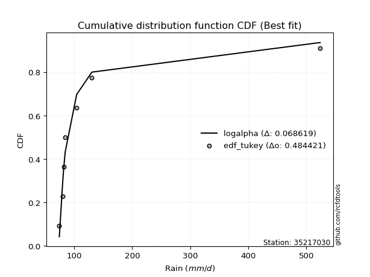</img>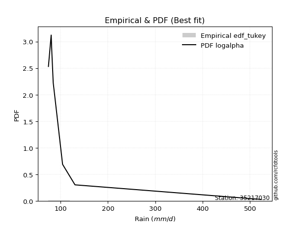</img>

</div>


### 8. EDF Gringorten (1963)

Gringorten plotting position formula is essential for estimating the probability and return periods of extreme events like floods and heavy rainfall. The constant _a=0.44_.

<div align="center">


$P=(m-a)/(n+1-2a)$


</div>


**8.1. Empirical values**

<div align="center">

|                | 0                   | 1                   | 2                  | 3              | 4                  | 5                  | 6                  |
|:---------------|:--------------------|:--------------------|:-------------------|:---------------|:-------------------|:-------------------|:-------------------|
| date           | 2019                | 2023                | 2021               | 2025           | 2020               | 2022               | 2024               |
| x              | 74.4                | 80.2                | 81.8               | 84.5           | 104.3              | 130.5              | 523.8              |
| m              | 1                   | 2                   | 3                  | 4              | 5                  | 6                  | 7                  |
| empirical_dist | edf_gringorten      | edf_gringorten      | edf_gringorten     | edf_gringorten | edf_gringorten     | edf_gringorten     | edf_gringorten     |
| empirical      | 0.07865168539325844 | 0.21910112359550563 | 0.3595505617977528 | 0.5            | 0.6404494382022471 | 0.7808988764044943 | 0.9213483146067415 |
| empirical_tr   | 1.0853658536585364  | 1.2805755395683454  | 1.5614035087719298 | 2.0            | 2.781249999999999  | 4.564102564102562  | 12.714285714285701 |

</div>


**8.2. Kolmogorov-Smirnov fit test (sorted by Δ)**


<div align="center">

|                | 0                   | 1                   | 2                   | 3                   | 4                   | 5                   | 6                   | 7                   | 8                   | 9                   | 10                  | 11                  | 12                  | 13                  | 14                  | 15                  | 16                  | 17                  | 18                  | 19                  | 20                  | 21                  | 22                  | 23                  | 24                  | 25                  | 26                  | 27                  | 28                  | 29                  | 30                  | 31                  | 32                  | 33                  | 34                  | 35                  | 36                  | 37                  | 38                  | 39                  | 40                  | 41                  | 42                  | 43                  | 44                  | 45                  | 46                  | 47                  | 48                  | 49                  | 50                  | 51                  | 52                  | 53                  | 54                  | 55                  | 56                  | 57                  | 58                  | 59                  | 60                  | 61                  | 62                  | 63                  | 64                  | 65                  | 66                  | 67                  | 68                  | 69                  | 70                  | 71                  | 72                  | 73                  | 74                  | 75                  | 76                  | 77                  | 78                  | 79                  | 80                  | 81                  | 82                  | 83                  | 84                  | 85                  | 86                  | 87                  | 88                  | 89                  | 90                  | 91                  | 92                  | 93                  | 94                  | 95                  | 96                  | 97                  | 98                  | 99                  | 100                 | 101                 | 102                 | 103                 | 104                 | 105                 | 106                 | 107                 | 108                 | 109                 | 110                 | 111                 | 112                 | 113                 | 114                 | 115                 | 116                 | 117                 | 118                 | 119                 | 120                 | 121                 | 122                 | 123                 | 124                 | 125                 | 126                 | 127                 | 128                 | 129                 | 130                 | 131                 | 132                 | 133                 | 134                 | 135                 | 136                 | 137                 | 138                 | 139                 | 140                 | 141                 | 142                 | 143                 | 144                 | 145                 | 146                 | 147                 | 148                 | 149                 | 150                 | 151                 | 152                 | 153                 | 154                 | 155                 | 156                 | 157                 | 158                 | 159                 |
|:---------------|:--------------------|:--------------------|:--------------------|:--------------------|:--------------------|:--------------------|:--------------------|:--------------------|:--------------------|:--------------------|:--------------------|:--------------------|:--------------------|:--------------------|:--------------------|:--------------------|:--------------------|:--------------------|:--------------------|:--------------------|:--------------------|:--------------------|:--------------------|:--------------------|:--------------------|:--------------------|:--------------------|:--------------------|:--------------------|:--------------------|:--------------------|:--------------------|:--------------------|:--------------------|:--------------------|:--------------------|:--------------------|:--------------------|:--------------------|:--------------------|:--------------------|:--------------------|:--------------------|:--------------------|:--------------------|:--------------------|:--------------------|:--------------------|:--------------------|:--------------------|:--------------------|:--------------------|:--------------------|:--------------------|:--------------------|:--------------------|:--------------------|:--------------------|:--------------------|:--------------------|:--------------------|:--------------------|:--------------------|:--------------------|:--------------------|:--------------------|:--------------------|:--------------------|:--------------------|:--------------------|:--------------------|:--------------------|:--------------------|:--------------------|:--------------------|:--------------------|:--------------------|:--------------------|:--------------------|:--------------------|:--------------------|:--------------------|:--------------------|:--------------------|:--------------------|:--------------------|:--------------------|:--------------------|:--------------------|:--------------------|:--------------------|:--------------------|:--------------------|:--------------------|:--------------------|:--------------------|:--------------------|:--------------------|:--------------------|:--------------------|:--------------------|:--------------------|:--------------------|:--------------------|:--------------------|:--------------------|:--------------------|:--------------------|:--------------------|:--------------------|:--------------------|:--------------------|:--------------------|:--------------------|:--------------------|:--------------------|:--------------------|:--------------------|:--------------------|:--------------------|:--------------------|:--------------------|:--------------------|:--------------------|:--------------------|:--------------------|:--------------------|:--------------------|:--------------------|:--------------------|:--------------------|:--------------------|:--------------------|:--------------------|:--------------------|:--------------------|:--------------------|:--------------------|:--------------------|:--------------------|:--------------------|:--------------------|:--------------------|:--------------------|:--------------------|:--------------------|:--------------------|:--------------------|:--------------------|:--------------------|:--------------------|:--------------------|:--------------------|:--------------------|:--------------------|:--------------------|:--------------------|:--------------------|:--------------------|:--------------------|
| station        | 35217030            | 35217030            | 35217030            | 35217030            | 35217030            | 35217030            | 35217030            | 35217030            | 35217030            | 35217030            | 35217030            | 35217030            | 35217030            | 35217030            | 35217030            | 35217030            | 35217030            | 35217030            | 35217030            | 35217030            | 35217030            | 35217030            | 35217030            | 35217030            | 35217030            | 35217030            | 35217030            | 35217030            | 35217030            | 35217030            | 35217030            | 35217030            | 35217030            | 35217030            | 35217030            | 35217030            | 35217030            | 35217030            | 35217030            | 35217030            | 35217030            | 35217030            | 35217030            | 35217030            | 35217030            | 35217030            | 35217030            | 35217030            | 35217030            | 35217030            | 35217030            | 35217030            | 35217030            | 35217030            | 35217030            | 35217030            | 35217030            | 35217030            | 35217030            | 35217030            | 35217030            | 35217030            | 35217030            | 35217030            | 35217030            | 35217030            | 35217030            | 35217030            | 35217030            | 35217030            | 35217030            | 35217030            | 35217030            | 35217030            | 35217030            | 35217030            | 35217030            | 35217030            | 35217030            | 35217030            | 35217030            | 35217030            | 35217030            | 35217030            | 35217030            | 35217030            | 35217030            | 35217030            | 35217030            | 35217030            | 35217030            | 35217030            | 35217030            | 35217030            | 35217030            | 35217030            | 35217030            | 35217030            | 35217030            | 35217030            | 35217030            | 35217030            | 35217030            | 35217030            | 35217030            | 35217030            | 35217030            | 35217030            | 35217030            | 35217030            | 35217030            | 35217030            | 35217030            | 35217030            | 35217030            | 35217030            | 35217030            | 35217030            | 35217030            | 35217030            | 35217030            | 35217030            | 35217030            | 35217030            | 35217030            | 35217030            | 35217030            | 35217030            | 35217030            | 35217030            | 35217030            | 35217030            | 35217030            | 35217030            | 35217030            | 35217030            | 35217030            | 35217030            | 35217030            | 35217030            | 35217030            | 35217030            | 35217030            | 35217030            | 35217030            | 35217030            | 35217030            | 35217030            | 35217030            | 35217030            | 35217030            | 35217030            | 35217030            | 35217030            | 35217030            | 35217030            | 35217030            | 35217030            | 35217030            | 35217030            |
| empirical_dist | edf_gringorten      | edf_gringorten      | edf_gringorten      | edf_gringorten      | edf_gringorten      | edf_gringorten      | edf_gringorten      | edf_gringorten      | edf_gringorten      | edf_gringorten      | edf_gringorten      | edf_gringorten      | edf_gringorten      | edf_gringorten      | edf_gringorten      | edf_gringorten      | edf_gringorten      | edf_gringorten      | edf_gringorten      | edf_gringorten      | edf_gringorten      | edf_gringorten      | edf_gringorten      | edf_gringorten      | edf_gringorten      | edf_gringorten      | edf_gringorten      | edf_gringorten      | edf_gringorten      | edf_gringorten      | edf_gringorten      | edf_gringorten      | edf_gringorten      | edf_gringorten      | edf_gringorten      | edf_gringorten      | edf_gringorten      | edf_gringorten      | edf_gringorten      | edf_gringorten      | edf_gringorten      | edf_gringorten      | edf_gringorten      | edf_gringorten      | edf_gringorten      | edf_gringorten      | edf_gringorten      | edf_gringorten      | edf_gringorten      | edf_gringorten      | edf_gringorten      | edf_gringorten      | edf_gringorten      | edf_gringorten      | edf_gringorten      | edf_gringorten      | edf_gringorten      | edf_gringorten      | edf_gringorten      | edf_gringorten      | edf_gringorten      | edf_gringorten      | edf_gringorten      | edf_gringorten      | edf_gringorten      | edf_gringorten      | edf_gringorten      | edf_gringorten      | edf_gringorten      | edf_gringorten      | edf_gringorten      | edf_gringorten      | edf_gringorten      | edf_gringorten      | edf_gringorten      | edf_gringorten      | edf_gringorten      | edf_gringorten      | edf_gringorten      | edf_gringorten      | edf_gringorten      | edf_gringorten      | edf_gringorten      | edf_gringorten      | edf_gringorten      | edf_gringorten      | edf_gringorten      | edf_gringorten      | edf_gringorten      | edf_gringorten      | edf_gringorten      | edf_gringorten      | edf_gringorten      | edf_gringorten      | edf_gringorten      | edf_gringorten      | edf_gringorten      | edf_gringorten      | edf_gringorten      | edf_gringorten      | edf_gringorten      | edf_gringorten      | edf_gringorten      | edf_gringorten      | edf_gringorten      | edf_gringorten      | edf_gringorten      | edf_gringorten      | edf_gringorten      | edf_gringorten      | edf_gringorten      | edf_gringorten      | edf_gringorten      | edf_gringorten      | edf_gringorten      | edf_gringorten      | edf_gringorten      | edf_gringorten      | edf_gringorten      | edf_gringorten      | edf_gringorten      | edf_gringorten      | edf_gringorten      | edf_gringorten      | edf_gringorten      | edf_gringorten      | edf_gringorten      | edf_gringorten      | edf_gringorten      | edf_gringorten      | edf_gringorten      | edf_gringorten      | edf_gringorten      | edf_gringorten      | edf_gringorten      | edf_gringorten      | edf_gringorten      | edf_gringorten      | edf_gringorten      | edf_gringorten      | edf_gringorten      | edf_gringorten      | edf_gringorten      | edf_gringorten      | edf_gringorten      | edf_gringorten      | edf_gringorten      | edf_gringorten      | edf_gringorten      | edf_gringorten      | edf_gringorten      | edf_gringorten      | edf_gringorten      | edf_gringorten      | edf_gringorten      | edf_gringorten      | edf_gringorten      | edf_gringorten      | edf_gringorten      | edf_gringorten      |
| p_dist         | johnsonsu           | logalpha            | loginvgamma         | logburr             | loggenextreme       | loginvweibull       | logmielke           | alpha               | logjohnsonsu        | loginvgauss         | invgamma            | f                   | invgauss            | burr                | truncpareto         | logerlang           | fatiguelife         | logtruncweibull_min | logfatiguelife      | logtruncpareto      | logwald             | genpareto           | logburr12           | erlang              | exponpow            | logmoyal            | logbradford         | nakagami            | loggumbel_r         | gennorm             | logmaxwell          | logpearson3         | gamma               | lograyleigh         | logvonmises_line    | truncweibull_min    | loghalflogistic     | lognct              | ncf                 | betaprime           | logbetaprime        | logt                | lognorm             | logcrystalball      | loghalfnorm         | nct                 | kappa3              | logloggamma         | gengamma            | loggenlogistic      | loglogistic         | logncf              | t                   | loganglit           | logfoldnorm         | logsemicircular     | loglomax            | loggausshyper       | loghypsecant        | logweibull_min      | weibull_min         | burr12              | logkstwobign        | halfgennorm         | genlogistic         | loggompertz         | logexponnorm        | loggenexpon         | loglaplace          | loglaplace          | logarcsine          | logrice             | logdweibull         | moyal               | wald                | logloglaplace       | vonmises_line       | exponweib           | genextreme          | gumbel_r            | loggumbel_l         | loggengamma         | loggennorm          | logtruncnorm        | halflogistic        | logdgamma           | dgamma              | halfnorm            | rayleigh            | dweibull            | pearson3            | logcosine           | loghalfgennorm      | tukeylambda         | maxwell             | arcsine             | foldnorm            | logexponweib        | wrapcauchy          | semicircular        | anglit              | gausshyper          | loggenpareto        | norm                | kstwobign           | logistic            | powerlaw            | logwrapcauchy       | hypsecant           | lognakagami         | logskewnorm         | invweibull          | laplace             | exponnorm           | genexpon            | loglevy_l           | rice                | logtruncexpon       | levy_l              | logpowerlaw         | logbeta             | logargus            | gompertz            | gumbel_l            | cosine              | logexponpow         | logf                | logweibull_max      | logtriang           | logrdist            | truncnorm           | logksone            | logkappa4           | truncexpon          | logtukeylambda      | loguniform          | loggamma            | loggamma            | argus               | logkappa3           | lomax               | logjohnsonsb        | triang              | skewnorm            | johnsonsb           | crystalball         | bradford            | rdist               | loggenhalflogistic  | ksone               | kappa4              | uniform             | genhalflogistic     | logtrapezoid        | weibull_max         | beta                | trapezoid           | logvonmises         | vonmises            | mielke              |
| delta          | 0.06604860352459585 | 0.07342028361267125 | 0.07473383896412197 | 0.07832965206198675 | 0.07834220767975195 | 0.07836338629185849 | 0.07877422997969721 | 0.0793631605134077  | 0.0866709520259058  | 0.09171596599019174 | 0.09253662128575937 | 0.0925367129316099  | 0.1023684625559744  | 0.10752326097492704 | 0.11104666594330218 | 0.11492704215533503 | 0.12213059567010445 | 0.12405073727610713 | 0.1313669290118107  | 0.1366821968473934  | 0.13954132380886142 | 0.14419743749696295 | 0.15556485992533814 | 0.1595807937975081  | 0.160525103022494   | 0.16791682797127833 | 0.1689527173058549  | 0.17086293604930544 | 0.171450676122112   | 0.1793456488602086  | 0.18219668598605998 | 0.18472405763444472 | 0.1881176990084164  | 0.19042813876154657 | 0.19452505917844976 | 0.19498472637396996 | 0.19531051633824742 | 0.19758189951606686 | 0.20051908282613523 | 0.20118979953156174 | 0.20125423243557994 | 0.21012284894385302 | 0.2111984199195045  | 0.211198424338223   | 0.21235285055431602 | 0.2126135326629529  | 0.2126454651121607  | 0.2139282957893922  | 0.21595725065011362 | 0.21646334061737676 | 0.21931637931270376 | 0.2197166136719047  | 0.22096705115637272 | 0.22101265262878123 | 0.22128973622998055 | 0.22507283636190678 | 0.227431793772098   | 0.22884225726932822 | 0.22959374134955052 | 0.24086612233288152 | 0.24102366683218357 | 0.24383260328334488 | 0.24838692148185632 | 0.24967616575893722 | 0.25006114988520745 | 0.2507071252229942  | 0.25170995354403514 | 0.25348024231995125 | 0.2552443938069419  | 0.2552443938069419  | 0.25535789331849534 | 0.25990903789808345 | 0.2608951377036275  | 0.26366521375142543 | 0.26366656401897587 | 0.26447122412465374 | 0.2657258674486204  | 0.27266491628565825 | 0.2728489150116954  | 0.27725667143954036 | 0.27912540840465927 | 0.2795095903794317  | 0.2808988763188819  | 0.28217399371829444 | 0.28920324429992755 | 0.2899078625789167  | 0.29049196639200575 | 0.2909930919706333  | 0.29647392971207986 | 0.2980705599001401  | 0.2988135856529207  | 0.30468348776536547 | 0.30818832973550964 | 0.3083119546841928  | 0.3085133529739414  | 0.31610022497932727 | 0.3170228928889801  | 0.31740459506761975 | 0.31980703882185363 | 0.3305292677232123  | 0.33415003569190527 | 0.3404114963001008  | 0.3416227592835994  | 0.34291268699784583 | 0.3472465862654992  | 0.351203041878901   | 0.35595509200279973 | 0.35734351701133715 | 0.35816712746760027 | 0.365736960124352   | 0.37050424885629596 | 0.37431849911301196 | 0.37993073339193983 | 0.3808918895637581  | 0.3811357127873114  | 0.38330717539589093 | 0.3834822711589908  | 0.3939759653045819  | 0.39755314702978145 | 0.3985808982813934  | 0.4014762722265164  | 0.4048111097998188  | 0.41045471035289205 | 0.41243316388922235 | 0.42378598525788513 | 0.4314005282404041  | 0.43142602481542525 | 0.432369961475606   | 0.44690488394720884 | 0.45149341868389486 | 0.45535068739858015 | 0.45763346164375335 | 0.4682077310518388  | 0.4729183345729561  | 0.4870643142852148  | 0.49298037869160505 | 0.4952576300647896  | 0.4952576300647896  | 0.4965940491420845  | 0.4984936582152472  | 0.5082465483621914  | 0.5175227938342639  | 0.520940976853259   | 0.5246493017075048  | 0.5532105195533736  | 0.55581632932526    | 0.5586656863797577  | 0.5787666704509538  | 0.58573491324932    | 0.5935379507258116  | 0.630031169585033   | 0.656065765590075   | 0.6721748042668361  | 0.6763983480240604  | 0.6899858491558098  | 0.7451993992094135  | 0.7457947599333214  | 1.185483691886888   | 83.15854801117578   | nan                 |
| deltao         | 0.48442053926100004 | 0.48442053926100004 | 0.48442053926100004 | 0.48442053926100004 | 0.48442053926100004 | 0.48442053926100004 | 0.48442053926100004 | 0.48442053926100004 | 0.48442053926100004 | 0.48442053926100004 | 0.48442053926100004 | 0.48442053926100004 | 0.48442053926100004 | 0.48442053926100004 | 0.48442053926100004 | 0.48442053926100004 | 0.48442053926100004 | 0.48442053926100004 | 0.48442053926100004 | 0.48442053926100004 | 0.48442053926100004 | 0.48442053926100004 | 0.48442053926100004 | 0.48442053926100004 | 0.48442053926100004 | 0.48442053926100004 | 0.48442053926100004 | 0.48442053926100004 | 0.48442053926100004 | 0.48442053926100004 | 0.48442053926100004 | 0.48442053926100004 | 0.48442053926100004 | 0.48442053926100004 | 0.48442053926100004 | 0.48442053926100004 | 0.48442053926100004 | 0.48442053926100004 | 0.48442053926100004 | 0.48442053926100004 | 0.48442053926100004 | 0.48442053926100004 | 0.48442053926100004 | 0.48442053926100004 | 0.48442053926100004 | 0.48442053926100004 | 0.48442053926100004 | 0.48442053926100004 | 0.48442053926100004 | 0.48442053926100004 | 0.48442053926100004 | 0.48442053926100004 | 0.48442053926100004 | 0.48442053926100004 | 0.48442053926100004 | 0.48442053926100004 | 0.48442053926100004 | 0.48442053926100004 | 0.48442053926100004 | 0.48442053926100004 | 0.48442053926100004 | 0.48442053926100004 | 0.48442053926100004 | 0.48442053926100004 | 0.48442053926100004 | 0.48442053926100004 | 0.48442053926100004 | 0.48442053926100004 | 0.48442053926100004 | 0.48442053926100004 | 0.48442053926100004 | 0.48442053926100004 | 0.48442053926100004 | 0.48442053926100004 | 0.48442053926100004 | 0.48442053926100004 | 0.48442053926100004 | 0.48442053926100004 | 0.48442053926100004 | 0.48442053926100004 | 0.48442053926100004 | 0.48442053926100004 | 0.48442053926100004 | 0.48442053926100004 | 0.48442053926100004 | 0.48442053926100004 | 0.48442053926100004 | 0.48442053926100004 | 0.48442053926100004 | 0.48442053926100004 | 0.48442053926100004 | 0.48442053926100004 | 0.48442053926100004 | 0.48442053926100004 | 0.48442053926100004 | 0.48442053926100004 | 0.48442053926100004 | 0.48442053926100004 | 0.48442053926100004 | 0.48442053926100004 | 0.48442053926100004 | 0.48442053926100004 | 0.48442053926100004 | 0.48442053926100004 | 0.48442053926100004 | 0.48442053926100004 | 0.48442053926100004 | 0.48442053926100004 | 0.48442053926100004 | 0.48442053926100004 | 0.48442053926100004 | 0.48442053926100004 | 0.48442053926100004 | 0.48442053926100004 | 0.48442053926100004 | 0.48442053926100004 | 0.48442053926100004 | 0.48442053926100004 | 0.48442053926100004 | 0.48442053926100004 | 0.48442053926100004 | 0.48442053926100004 | 0.48442053926100004 | 0.48442053926100004 | 0.48442053926100004 | 0.48442053926100004 | 0.48442053926100004 | 0.48442053926100004 | 0.48442053926100004 | 0.48442053926100004 | 0.48442053926100004 | 0.48442053926100004 | 0.48442053926100004 | 0.48442053926100004 | 0.48442053926100004 | 0.48442053926100004 | 0.48442053926100004 | 0.48442053926100004 | 0.48442053926100004 | 0.48442053926100004 | 0.48442053926100004 | 0.48442053926100004 | 0.48442053926100004 | 0.48442053926100004 | 0.48442053926100004 | 0.48442053926100004 | 0.48442053926100004 | 0.48442053926100004 | 0.48442053926100004 | 0.48442053926100004 | 0.48442053926100004 | 0.48442053926100004 | 0.48442053926100004 | 0.48442053926100004 | 0.48442053926100004 | 0.48442053926100004 | 0.48442053926100004 | 0.48442053926100004 | 0.48442053926100004 | 0.48442053926100004 |
| eval           | Δo > Δ              | Δo > Δ              | Δo > Δ              | Δo > Δ              | Δo > Δ              | Δo > Δ              | Δo > Δ              | Δo > Δ              | Δo > Δ              | Δo > Δ              | Δo > Δ              | Δo > Δ              | Δo > Δ              | Δo > Δ              | Δo > Δ              | Δo > Δ              | Δo > Δ              | Δo > Δ              | Δo > Δ              | Δo > Δ              | Δo > Δ              | Δo > Δ              | Δo > Δ              | Δo > Δ              | Δo > Δ              | Δo > Δ              | Δo > Δ              | Δo > Δ              | Δo > Δ              | Δo > Δ              | Δo > Δ              | Δo > Δ              | Δo > Δ              | Δo > Δ              | Δo > Δ              | Δo > Δ              | Δo > Δ              | Δo > Δ              | Δo > Δ              | Δo > Δ              | Δo > Δ              | Δo > Δ              | Δo > Δ              | Δo > Δ              | Δo > Δ              | Δo > Δ              | Δo > Δ              | Δo > Δ              | Δo > Δ              | Δo > Δ              | Δo > Δ              | Δo > Δ              | Δo > Δ              | Δo > Δ              | Δo > Δ              | Δo > Δ              | Δo > Δ              | Δo > Δ              | Δo > Δ              | Δo > Δ              | Δo > Δ              | Δo > Δ              | Δo > Δ              | Δo > Δ              | Δo > Δ              | Δo > Δ              | Δo > Δ              | Δo > Δ              | Δo > Δ              | Δo > Δ              | Δo > Δ              | Δo > Δ              | Δo > Δ              | Δo > Δ              | Δo > Δ              | Δo > Δ              | Δo > Δ              | Δo > Δ              | Δo > Δ              | Δo > Δ              | Δo > Δ              | Δo > Δ              | Δo > Δ              | Δo > Δ              | Δo > Δ              | Δo > Δ              | Δo > Δ              | Δo > Δ              | Δo > Δ              | Δo > Δ              | Δo > Δ              | Δo > Δ              | Δo > Δ              | Δo > Δ              | Δo > Δ              | Δo > Δ              | Δo > Δ              | Δo > Δ              | Δo > Δ              | Δo > Δ              | Δo > Δ              | Δo > Δ              | Δo > Δ              | Δo > Δ              | Δo > Δ              | Δo > Δ              | Δo > Δ              | Δo > Δ              | Δo > Δ              | Δo > Δ              | Δo > Δ              | Δo > Δ              | Δo > Δ              | Δo > Δ              | Δo > Δ              | Δo > Δ              | Δo > Δ              | Δo > Δ              | Δo > Δ              | Δo > Δ              | Δo > Δ              | Δo > Δ              | Δo > Δ              | Δo > Δ              | Δo > Δ              | Δo > Δ              | Δo > Δ              | Δo > Δ              | Δo > Δ              | Δo > Δ              | Δo > Δ              | Δo > Δ              | Δo > Δ              | Δo > Δ              | Δo <= Δ             | Δo <= Δ             | Δo <= Δ             | Δo <= Δ             | Δo <= Δ             | Δo <= Δ             | Δo <= Δ             | Δo <= Δ             | Δo <= Δ             | Δo <= Δ             | Δo <= Δ             | Δo <= Δ             | Δo <= Δ             | Δo <= Δ             | Δo <= Δ             | Δo <= Δ             | Δo <= Δ             | Δo <= Δ             | Δo <= Δ             | Δo <= Δ             | Δo <= Δ             | Δo <= Δ             | Δo <= Δ             | Δo <= Δ             | Δo <= Δ             | Δo <= Δ             |
| fit            | 1                   | 1                   | 1                   | 1                   | 1                   | 1                   | 1                   | 1                   | 1                   | 1                   | 1                   | 1                   | 1                   | 1                   | 1                   | 1                   | 1                   | 1                   | 1                   | 1                   | 1                   | 1                   | 1                   | 1                   | 1                   | 1                   | 1                   | 1                   | 1                   | 1                   | 1                   | 1                   | 1                   | 1                   | 1                   | 1                   | 1                   | 1                   | 1                   | 1                   | 1                   | 1                   | 1                   | 1                   | 1                   | 1                   | 1                   | 1                   | 1                   | 1                   | 1                   | 1                   | 1                   | 1                   | 1                   | 1                   | 1                   | 1                   | 1                   | 1                   | 1                   | 1                   | 1                   | 1                   | 1                   | 1                   | 1                   | 1                   | 1                   | 1                   | 1                   | 1                   | 1                   | 1                   | 1                   | 1                   | 1                   | 1                   | 1                   | 1                   | 1                   | 1                   | 1                   | 1                   | 1                   | 1                   | 1                   | 1                   | 1                   | 1                   | 1                   | 1                   | 1                   | 1                   | 1                   | 1                   | 1                   | 1                   | 1                   | 1                   | 1                   | 1                   | 1                   | 1                   | 1                   | 1                   | 1                   | 1                   | 1                   | 1                   | 1                   | 1                   | 1                   | 1                   | 1                   | 1                   | 1                   | 1                   | 1                   | 1                   | 1                   | 1                   | 1                   | 1                   | 1                   | 1                   | 1                   | 1                   | 1                   | 1                   | 1                   | 1                   | 1                   | 1                   | 0                   | 0                   | 0                   | 0                   | 0                   | 0                   | 0                   | 0                   | 0                   | 0                   | 0                   | 0                   | 0                   | 0                   | 0                   | 0                   | 0                   | 0                   | 0                   | 0                   | 0                   | 0                   | 0                   | 0                   | 0                   | 0                   |
| n              | 7                   | 7                   | 7                   | 7                   | 7                   | 7                   | 7                   | 7                   | 7                   | 7                   | 7                   | 7                   | 7                   | 7                   | 7                   | 7                   | 7                   | 7                   | 7                   | 7                   | 7                   | 7                   | 7                   | 7                   | 7                   | 7                   | 7                   | 7                   | 7                   | 7                   | 7                   | 7                   | 7                   | 7                   | 7                   | 7                   | 7                   | 7                   | 7                   | 7                   | 7                   | 7                   | 7                   | 7                   | 7                   | 7                   | 7                   | 7                   | 7                   | 7                   | 7                   | 7                   | 7                   | 7                   | 7                   | 7                   | 7                   | 7                   | 7                   | 7                   | 7                   | 7                   | 7                   | 7                   | 7                   | 7                   | 7                   | 7                   | 7                   | 7                   | 7                   | 7                   | 7                   | 7                   | 7                   | 7                   | 7                   | 7                   | 7                   | 7                   | 7                   | 7                   | 7                   | 7                   | 7                   | 7                   | 7                   | 7                   | 7                   | 7                   | 7                   | 7                   | 7                   | 7                   | 7                   | 7                   | 7                   | 7                   | 7                   | 7                   | 7                   | 7                   | 7                   | 7                   | 7                   | 7                   | 7                   | 7                   | 7                   | 7                   | 7                   | 7                   | 7                   | 7                   | 7                   | 7                   | 7                   | 7                   | 7                   | 7                   | 7                   | 7                   | 7                   | 7                   | 7                   | 7                   | 7                   | 7                   | 7                   | 7                   | 7                   | 7                   | 7                   | 7                   | 7                   | 7                   | 7                   | 7                   | 7                   | 7                   | 7                   | 7                   | 7                   | 7                   | 7                   | 7                   | 7                   | 7                   | 7                   | 7                   | 7                   | 7                   | 7                   | 7                   | 7                   | 7                   | 7                   | 7                   | 7                   | 7                   |
| best_fit       | 1                   | 0                   | 0                   | 0                   | 0                   | 0                   | 0                   | 0                   | 0                   | 0                   | 0                   | 0                   | 0                   | 0                   | 0                   | 0                   | 0                   | 0                   | 0                   | 0                   | 0                   | 0                   | 0                   | 0                   | 0                   | 0                   | 0                   | 0                   | 0                   | 0                   | 0                   | 0                   | 0                   | 0                   | 0                   | 0                   | 0                   | 0                   | 0                   | 0                   | 0                   | 0                   | 0                   | 0                   | 0                   | 0                   | 0                   | 0                   | 0                   | 0                   | 0                   | 0                   | 0                   | 0                   | 0                   | 0                   | 0                   | 0                   | 0                   | 0                   | 0                   | 0                   | 0                   | 0                   | 0                   | 0                   | 0                   | 0                   | 0                   | 0                   | 0                   | 0                   | 0                   | 0                   | 0                   | 0                   | 0                   | 0                   | 0                   | 0                   | 0                   | 0                   | 0                   | 0                   | 0                   | 0                   | 0                   | 0                   | 0                   | 0                   | 0                   | 0                   | 0                   | 0                   | 0                   | 0                   | 0                   | 0                   | 0                   | 0                   | 0                   | 0                   | 0                   | 0                   | 0                   | 0                   | 0                   | 0                   | 0                   | 0                   | 0                   | 0                   | 0                   | 0                   | 0                   | 0                   | 0                   | 0                   | 0                   | 0                   | 0                   | 0                   | 0                   | 0                   | 0                   | 0                   | 0                   | 0                   | 0                   | 0                   | 0                   | 0                   | 0                   | 0                   | 0                   | 0                   | 0                   | 0                   | 0                   | 0                   | 0                   | 0                   | 0                   | 0                   | 0                   | 0                   | 0                   | 0                   | 0                   | 0                   | 0                   | 0                   | 0                   | 0                   | 0                   | 0                   | 0                   | 0                   | 0                   | 0                   |
| best_fit_sort  | 1                   | 2                   | 3                   | 4                   | 5                   | 6                   | 7                   | 8                   | 9                   | 10                  | 11                  | 12                  | 13                  | 14                  | 15                  | 16                  | 17                  | 18                  | 19                  | 20                  | 21                  | 22                  | 23                  | 24                  | 25                  | 26                  | 27                  | 28                  | 29                  | 30                  | 31                  | 32                  | 33                  | 34                  | 35                  | 36                  | 37                  | 38                  | 39                  | 40                  | 41                  | 42                  | 43                  | 44                  | 45                  | 46                  | 47                  | 48                  | 49                  | 50                  | 51                  | 52                  | 53                  | 54                  | 55                  | 56                  | 57                  | 58                  | 59                  | 60                  | 61                  | 62                  | 63                  | 64                  | 65                  | 66                  | 67                  | 68                  | 69                  | 70                  | 71                  | 72                  | 73                  | 74                  | 75                  | 76                  | 77                  | 78                  | 79                  | 80                  | 81                  | 82                  | 83                  | 84                  | 85                  | 86                  | 87                  | 88                  | 89                  | 90                  | 91                  | 92                  | 93                  | 94                  | 95                  | 96                  | 97                  | 98                  | 99                  | 100                 | 101                 | 102                 | 103                 | 104                 | 105                 | 106                 | 107                 | 108                 | 109                 | 110                 | 111                 | 112                 | 113                 | 114                 | 115                 | 116                 | 117                 | 118                 | 119                 | 120                 | 121                 | 122                 | 123                 | 124                 | 125                 | 126                 | 127                 | 128                 | 129                 | 130                 | 131                 | 132                 | 133                 | 134                 | 135                 | 136                 | 137                 | 138                 | 139                 | 140                 | 141                 | 142                 | 143                 | 144                 | 145                 | 146                 | 147                 | 148                 | 149                 | 150                 | 151                 | 152                 | 153                 | 154                 | 155                 | 156                 | 157                 | 158                 | 159                 | 160                 |

</div>


**8.3. Best fit**

<div align="center">

|   id |   station | empirical_dist   | p_dist    |     delta |   deltao | eval   |   fit |   n |   best_fit |   best_fit_sort |
|-----:|----------:|:-----------------|:----------|----------:|---------:|:-------|------:|----:|-----------:|----------------:|
|    0 |  35217030 | edf_gringorten   | johnsonsu | 0.0660486 | 0.484421 | Δo > Δ |     1 |   7 |          1 |               1 |

</div>


<div align="center">

</img></img>

</div>


### 9. EDF Filliben (1975)

The specific values of the constants (0.3175) (often denoted as $alpha$) and (0.365) are derived from a method proposed by James J. Filliben in a 1975 paper. This particular formula is the mean value of the $i$-th order statistic of the normal distribution and is considered a robust and effective plotting position formula for the normal probability plot correlation coefficient test for normality.

<div align="center">


$P=(m-0.3175)/(n+0.365)$


</div>


**9.1. Empirical values**

<div align="center">

|                | 0                   | 1                   | 2                   | 3            | 4                  | 5                  | 6                  |
|:---------------|:--------------------|:--------------------|:--------------------|:-------------|:-------------------|:-------------------|:-------------------|
| date           | 2019                | 2023                | 2021                | 2025         | 2020               | 2022               | 2024               |
| x              | 74.4                | 80.2                | 81.8                | 84.5         | 104.3              | 130.5              | 523.8              |
| m              | 1                   | 2                   | 3                   | 4            | 5                  | 6                  | 7                  |
| empirical_dist | edf_filliben        | edf_filliben        | edf_filliben        | edf_filliben | edf_filliben       | edf_filliben       | edf_filliben       |
| empirical      | 0.09266802443991853 | 0.22844534962661237 | 0.36422267481330617 | 0.5          | 0.6357773251866938 | 0.7715546503733877 | 0.9073319755600815 |
| empirical_tr   | 1.1021324354657687  | 1.2960844698636163  | 1.5728777362520021  | 2.0          | 2.7455731593662627 | 4.377414561664191  | 10.791208791208794 |

</div>


**9.2. Kolmogorov-Smirnov fit test (sorted by Δ)**


<div align="center">

|                | 0                   | 1                   | 2                   | 3                   | 4                   | 5                   | 6                   | 7                   | 8                   | 9                   | 10                  | 11                  | 12                  | 13                  | 14                  | 15                  | 16                  | 17                  | 18                  | 19                  | 20                  | 21                  | 22                  | 23                  | 24                  | 25                  | 26                  | 27                  | 28                  | 29                  | 30                  | 31                  | 32                  | 33                  | 34                  | 35                  | 36                  | 37                  | 38                  | 39                  | 40                  | 41                  | 42                  | 43                  | 44                  | 45                  | 46                  | 47                  | 48                  | 49                  | 50                  | 51                  | 52                  | 53                  | 54                  | 55                  | 56                  | 57                  | 58                  | 59                  | 60                  | 61                  | 62                  | 63                  | 64                  | 65                  | 66                  | 67                  | 68                  | 69                  | 70                  | 71                  | 72                  | 73                  | 74                  | 75                  | 76                  | 77                  | 78                  | 79                  | 80                  | 81                  | 82                  | 83                  | 84                  | 85                  | 86                  | 87                  | 88                  | 89                  | 90                  | 91                  | 92                  | 93                  | 94                  | 95                  | 96                  | 97                  | 98                  | 99                  | 100                 | 101                 | 102                 | 103                 | 104                 | 105                 | 106                 | 107                 | 108                 | 109                 | 110                 | 111                 | 112                 | 113                 | 114                 | 115                 | 116                 | 117                 | 118                 | 119                 | 120                 | 121                 | 122                 | 123                 | 124                 | 125                 | 126                 | 127                 | 128                 | 129                 | 130                 | 131                 | 132                 | 133                 | 134                 | 135                 | 136                 | 137                 | 138                 | 139                 | 140                 | 141                 | 142                 | 143                 | 144                 | 145                 | 146                 | 147                 | 148                 | 149                 | 150                 | 151                 | 152                 | 153                 | 154                 | 155                 | 156                 | 157                 | 158                 | 159                 |
|:---------------|:--------------------|:--------------------|:--------------------|:--------------------|:--------------------|:--------------------|:--------------------|:--------------------|:--------------------|:--------------------|:--------------------|:--------------------|:--------------------|:--------------------|:--------------------|:--------------------|:--------------------|:--------------------|:--------------------|:--------------------|:--------------------|:--------------------|:--------------------|:--------------------|:--------------------|:--------------------|:--------------------|:--------------------|:--------------------|:--------------------|:--------------------|:--------------------|:--------------------|:--------------------|:--------------------|:--------------------|:--------------------|:--------------------|:--------------------|:--------------------|:--------------------|:--------------------|:--------------------|:--------------------|:--------------------|:--------------------|:--------------------|:--------------------|:--------------------|:--------------------|:--------------------|:--------------------|:--------------------|:--------------------|:--------------------|:--------------------|:--------------------|:--------------------|:--------------------|:--------------------|:--------------------|:--------------------|:--------------------|:--------------------|:--------------------|:--------------------|:--------------------|:--------------------|:--------------------|:--------------------|:--------------------|:--------------------|:--------------------|:--------------------|:--------------------|:--------------------|:--------------------|:--------------------|:--------------------|:--------------------|:--------------------|:--------------------|:--------------------|:--------------------|:--------------------|:--------------------|:--------------------|:--------------------|:--------------------|:--------------------|:--------------------|:--------------------|:--------------------|:--------------------|:--------------------|:--------------------|:--------------------|:--------------------|:--------------------|:--------------------|:--------------------|:--------------------|:--------------------|:--------------------|:--------------------|:--------------------|:--------------------|:--------------------|:--------------------|:--------------------|:--------------------|:--------------------|:--------------------|:--------------------|:--------------------|:--------------------|:--------------------|:--------------------|:--------------------|:--------------------|:--------------------|:--------------------|:--------------------|:--------------------|:--------------------|:--------------------|:--------------------|:--------------------|:--------------------|:--------------------|:--------------------|:--------------------|:--------------------|:--------------------|:--------------------|:--------------------|:--------------------|:--------------------|:--------------------|:--------------------|:--------------------|:--------------------|:--------------------|:--------------------|:--------------------|:--------------------|:--------------------|:--------------------|:--------------------|:--------------------|:--------------------|:--------------------|:--------------------|:--------------------|:--------------------|:--------------------|:--------------------|:--------------------|:--------------------|:--------------------|
| station        | 35217030            | 35217030            | 35217030            | 35217030            | 35217030            | 35217030            | 35217030            | 35217030            | 35217030            | 35217030            | 35217030            | 35217030            | 35217030            | 35217030            | 35217030            | 35217030            | 35217030            | 35217030            | 35217030            | 35217030            | 35217030            | 35217030            | 35217030            | 35217030            | 35217030            | 35217030            | 35217030            | 35217030            | 35217030            | 35217030            | 35217030            | 35217030            | 35217030            | 35217030            | 35217030            | 35217030            | 35217030            | 35217030            | 35217030            | 35217030            | 35217030            | 35217030            | 35217030            | 35217030            | 35217030            | 35217030            | 35217030            | 35217030            | 35217030            | 35217030            | 35217030            | 35217030            | 35217030            | 35217030            | 35217030            | 35217030            | 35217030            | 35217030            | 35217030            | 35217030            | 35217030            | 35217030            | 35217030            | 35217030            | 35217030            | 35217030            | 35217030            | 35217030            | 35217030            | 35217030            | 35217030            | 35217030            | 35217030            | 35217030            | 35217030            | 35217030            | 35217030            | 35217030            | 35217030            | 35217030            | 35217030            | 35217030            | 35217030            | 35217030            | 35217030            | 35217030            | 35217030            | 35217030            | 35217030            | 35217030            | 35217030            | 35217030            | 35217030            | 35217030            | 35217030            | 35217030            | 35217030            | 35217030            | 35217030            | 35217030            | 35217030            | 35217030            | 35217030            | 35217030            | 35217030            | 35217030            | 35217030            | 35217030            | 35217030            | 35217030            | 35217030            | 35217030            | 35217030            | 35217030            | 35217030            | 35217030            | 35217030            | 35217030            | 35217030            | 35217030            | 35217030            | 35217030            | 35217030            | 35217030            | 35217030            | 35217030            | 35217030            | 35217030            | 35217030            | 35217030            | 35217030            | 35217030            | 35217030            | 35217030            | 35217030            | 35217030            | 35217030            | 35217030            | 35217030            | 35217030            | 35217030            | 35217030            | 35217030            | 35217030            | 35217030            | 35217030            | 35217030            | 35217030            | 35217030            | 35217030            | 35217030            | 35217030            | 35217030            | 35217030            | 35217030            | 35217030            | 35217030            | 35217030            | 35217030            | 35217030            |
| empirical_dist | edf_filliben        | edf_filliben        | edf_filliben        | edf_filliben        | edf_filliben        | edf_filliben        | edf_filliben        | edf_filliben        | edf_filliben        | edf_filliben        | edf_filliben        | edf_filliben        | edf_filliben        | edf_filliben        | edf_filliben        | edf_filliben        | edf_filliben        | edf_filliben        | edf_filliben        | edf_filliben        | edf_filliben        | edf_filliben        | edf_filliben        | edf_filliben        | edf_filliben        | edf_filliben        | edf_filliben        | edf_filliben        | edf_filliben        | edf_filliben        | edf_filliben        | edf_filliben        | edf_filliben        | edf_filliben        | edf_filliben        | edf_filliben        | edf_filliben        | edf_filliben        | edf_filliben        | edf_filliben        | edf_filliben        | edf_filliben        | edf_filliben        | edf_filliben        | edf_filliben        | edf_filliben        | edf_filliben        | edf_filliben        | edf_filliben        | edf_filliben        | edf_filliben        | edf_filliben        | edf_filliben        | edf_filliben        | edf_filliben        | edf_filliben        | edf_filliben        | edf_filliben        | edf_filliben        | edf_filliben        | edf_filliben        | edf_filliben        | edf_filliben        | edf_filliben        | edf_filliben        | edf_filliben        | edf_filliben        | edf_filliben        | edf_filliben        | edf_filliben        | edf_filliben        | edf_filliben        | edf_filliben        | edf_filliben        | edf_filliben        | edf_filliben        | edf_filliben        | edf_filliben        | edf_filliben        | edf_filliben        | edf_filliben        | edf_filliben        | edf_filliben        | edf_filliben        | edf_filliben        | edf_filliben        | edf_filliben        | edf_filliben        | edf_filliben        | edf_filliben        | edf_filliben        | edf_filliben        | edf_filliben        | edf_filliben        | edf_filliben        | edf_filliben        | edf_filliben        | edf_filliben        | edf_filliben        | edf_filliben        | edf_filliben        | edf_filliben        | edf_filliben        | edf_filliben        | edf_filliben        | edf_filliben        | edf_filliben        | edf_filliben        | edf_filliben        | edf_filliben        | edf_filliben        | edf_filliben        | edf_filliben        | edf_filliben        | edf_filliben        | edf_filliben        | edf_filliben        | edf_filliben        | edf_filliben        | edf_filliben        | edf_filliben        | edf_filliben        | edf_filliben        | edf_filliben        | edf_filliben        | edf_filliben        | edf_filliben        | edf_filliben        | edf_filliben        | edf_filliben        | edf_filliben        | edf_filliben        | edf_filliben        | edf_filliben        | edf_filliben        | edf_filliben        | edf_filliben        | edf_filliben        | edf_filliben        | edf_filliben        | edf_filliben        | edf_filliben        | edf_filliben        | edf_filliben        | edf_filliben        | edf_filliben        | edf_filliben        | edf_filliben        | edf_filliben        | edf_filliben        | edf_filliben        | edf_filliben        | edf_filliben        | edf_filliben        | edf_filliben        | edf_filliben        | edf_filliben        | edf_filliben        | edf_filliben        | edf_filliben        |
| p_dist         | logalpha            | logburr             | loggenextreme       | loginvweibull       | logmielke           | loginvgamma         | johnsonsu           | alpha               | loginvgauss         | invgamma            | f                   | logjohnsonsu        | invgauss            | truncpareto         | logerlang           | fatiguelife         | logtruncweibull_min | burr                | logfatiguelife      | logtruncpareto      | logwald             | genpareto           | logmoyal            | exponpow            | logburr12           | loggumbel_r         | erlang              | logbradford         | nakagami            | logpearson3         | logmaxwell          | gennorm             | lograyleigh         | logvonmises_line    | loghalflogistic     | gamma               | truncweibull_min    | lognct              | loghalfnorm         | ncf                 | betaprime           | logbetaprime        | logt                | logloggamma         | lognorm             | logcrystalball      | logfoldnorm         | gengamma            | loganglit           | nct                 | kappa3              | loglogistic         | logsemicircular     | loggenlogistic      | logncf              | t                   | loglomax            | loggausshyper       | loghypsecant        | logweibull_min      | halfgennorm         | weibull_min         | logarcsine          | burr12              | genlogistic         | logdweibull         | logkstwobign        | moyal               | wald                | logloglaplace       | loggompertz         | vonmises_line       | logexponnorm        | loggenexpon         | loglaplace          | loglaplace          | logrice             | exponweib           | genextreme          | loggengamma         | gumbel_r            | loggennorm          | loggumbel_l         | halflogistic        | logdgamma           | dgamma              | halfnorm            | logtruncnorm        | dweibull            | pearson3            | rayleigh            | logcosine           | maxwell             | foldnorm            | arcsine             | logexponweib        | loghalfgennorm      | tukeylambda         | wrapcauchy          | semicircular        | anglit              | loggenpareto        | gausshyper          | norm                | kstwobign           | logistic            | powerlaw            | logwrapcauchy       | hypsecant           | lognakagami         | invweibull          | loglevy_l           | logskewnorm         | laplace             | rice                | exponnorm           | genexpon            | levy_l              | logpowerlaw         | logbeta             | logtruncexpon       | logargus            | gumbel_l            | gompertz            | cosine              | logexponpow         | logf                | logweibull_max      | logtriang           | logrdist            | truncnorm           | logksone            | logkappa4           | truncexpon          | logtukeylambda      | loguniform          | loggamma            | loggamma            | argus               | logkappa3           | lomax               | logjohnsonsb        | triang              | skewnorm            | crystalball         | johnsonsb           | bradford            | rdist               | loggenhalflogistic  | ksone               | kappa4              | uniform             | genhalflogistic     | logtrapezoid        | weibull_max         | beta                | trapezoid           | logvonmises         | vonmises            | mielke              |
| delta          | 0.06861887354626434 | 0.06898542603088001 | 0.0689979816486452  | 0.06901916026075175 | 0.06943000394859047 | 0.07032813279010719 | 0.07072071654014911 | 0.0793631605134077  | 0.082371739959085   | 0.08319239525465263 | 0.08319248690050315 | 0.09134306504145906 | 0.09302423652486766 | 0.10170243991219544 | 0.10558281612422829 | 0.11278636963899771 | 0.11470651124500039 | 0.11686748700603367 | 0.12202270298070397 | 0.1366821968473934  | 0.13954132380886142 | 0.14419743749696295 | 0.15390048892461825 | 0.15493450411317183 | 0.15556485992533814 | 0.1580805265043912  | 0.1595807937975081  | 0.15960849127474816 | 0.1615187100181987  | 0.17070771858778463 | 0.17285245995495335 | 0.1732931037893255  | 0.1764117997148865  | 0.18050872013178967 | 0.18129417729158734 | 0.1881176990084164  | 0.19498472637396996 | 0.19758189951606686 | 0.19833651150765594 | 0.20051908282613523 | 0.20118979953156174 | 0.20125423243557994 | 0.2015970319873585  | 0.20458406975828558 | 0.20539105871479418 | 0.20539106318124645 | 0.20727339718332047 | 0.20935166122386623 | 0.2116684265976746  | 0.2126135326629529  | 0.2126454651121607  | 0.2146442662971505  | 0.21572861033080015 | 0.21646334061737676 | 0.2197166136719047  | 0.22563916417192598 | 0.227431793772098   | 0.22884225726932822 | 0.22959374134955052 | 0.2315218963017749  | 0.24033193972783048 | 0.24102366683218357 | 0.24134155427183526 | 0.24383260328334488 | 0.24536615238885717 | 0.2468787986569674  | 0.24838692148185632 | 0.24964887470476535 | 0.2496502249723158  | 0.2504548850779936  | 0.2507071252229942  | 0.25170952840196037 | 0.25170995354403514 | 0.25348024231995125 | 0.2552443938069419  | 0.2552443938069419  | 0.25990903789808345 | 0.2633206902545515  | 0.26350468898058865 | 0.2654932513327717  | 0.26791244540843373 | 0.27155465028777515 | 0.274453295389106   | 0.2751869052532675  | 0.27589152353225666 | 0.2764756273453457  | 0.27697675292397317 | 0.28217399371829444 | 0.28405422085348    | 0.2847972466062606  | 0.28712970368097324 | 0.29533926173425884 | 0.29916912694283476 | 0.30300655384232    | 0.30675599894822064 | 0.308060369036513   | 0.30818832973550964 | 0.3083119546841928  | 0.310462812790747   | 0.32118504169210566 | 0.32480580966079864 | 0.3276064202369393  | 0.3310672702689942  | 0.3335684609667392  | 0.3379023602343926  | 0.3418588158477944  | 0.346610865971693   | 0.3479992909802305  | 0.34882290143649364 | 0.35639273409324523 | 0.36030216006635196 | 0.3692908363492309  | 0.37050424885629596 | 0.3705865073608332  | 0.3741380451278842  | 0.3808918895637581  | 0.3811357127873114  | 0.3835368079831214  | 0.3892366722502867  | 0.39213204619540964 | 0.3939759653045819  | 0.3954668837687122  | 0.4030889378581157  | 0.41045471035289205 | 0.4144417592267785  | 0.42205630220929746 | 0.4220817987843185  | 0.4230257354444994  | 0.4375606579161022  | 0.44214919265278824 | 0.44741883018842776 | 0.4482892356126467  | 0.4588635050207322  | 0.4635741085418495  | 0.47772008825410817 | 0.4836361526604984  | 0.4859134040336829  | 0.4859134040336829  | 0.48724982311097786 | 0.4891494321841406  | 0.4989023223310848  | 0.5081785678031572  | 0.5115967508221524  | 0.5153050756763982  | 0.5417999902785999  | 0.5438662935222669  | 0.549321460348651   | 0.5647503314042936  | 0.5763906872182134  | 0.584193724694705   | 0.6206869435539264  | 0.6467215395589685  | 0.6628305782357296  | 0.6670541219929538  | 0.6806416231247032  | 0.7311830601627534  | 0.7364505339022148  | 1.171467352840228   | 83.17256435022244   | nan                 |
| deltao         | 0.48442053926100004 | 0.48442053926100004 | 0.48442053926100004 | 0.48442053926100004 | 0.48442053926100004 | 0.48442053926100004 | 0.48442053926100004 | 0.48442053926100004 | 0.48442053926100004 | 0.48442053926100004 | 0.48442053926100004 | 0.48442053926100004 | 0.48442053926100004 | 0.48442053926100004 | 0.48442053926100004 | 0.48442053926100004 | 0.48442053926100004 | 0.48442053926100004 | 0.48442053926100004 | 0.48442053926100004 | 0.48442053926100004 | 0.48442053926100004 | 0.48442053926100004 | 0.48442053926100004 | 0.48442053926100004 | 0.48442053926100004 | 0.48442053926100004 | 0.48442053926100004 | 0.48442053926100004 | 0.48442053926100004 | 0.48442053926100004 | 0.48442053926100004 | 0.48442053926100004 | 0.48442053926100004 | 0.48442053926100004 | 0.48442053926100004 | 0.48442053926100004 | 0.48442053926100004 | 0.48442053926100004 | 0.48442053926100004 | 0.48442053926100004 | 0.48442053926100004 | 0.48442053926100004 | 0.48442053926100004 | 0.48442053926100004 | 0.48442053926100004 | 0.48442053926100004 | 0.48442053926100004 | 0.48442053926100004 | 0.48442053926100004 | 0.48442053926100004 | 0.48442053926100004 | 0.48442053926100004 | 0.48442053926100004 | 0.48442053926100004 | 0.48442053926100004 | 0.48442053926100004 | 0.48442053926100004 | 0.48442053926100004 | 0.48442053926100004 | 0.48442053926100004 | 0.48442053926100004 | 0.48442053926100004 | 0.48442053926100004 | 0.48442053926100004 | 0.48442053926100004 | 0.48442053926100004 | 0.48442053926100004 | 0.48442053926100004 | 0.48442053926100004 | 0.48442053926100004 | 0.48442053926100004 | 0.48442053926100004 | 0.48442053926100004 | 0.48442053926100004 | 0.48442053926100004 | 0.48442053926100004 | 0.48442053926100004 | 0.48442053926100004 | 0.48442053926100004 | 0.48442053926100004 | 0.48442053926100004 | 0.48442053926100004 | 0.48442053926100004 | 0.48442053926100004 | 0.48442053926100004 | 0.48442053926100004 | 0.48442053926100004 | 0.48442053926100004 | 0.48442053926100004 | 0.48442053926100004 | 0.48442053926100004 | 0.48442053926100004 | 0.48442053926100004 | 0.48442053926100004 | 0.48442053926100004 | 0.48442053926100004 | 0.48442053926100004 | 0.48442053926100004 | 0.48442053926100004 | 0.48442053926100004 | 0.48442053926100004 | 0.48442053926100004 | 0.48442053926100004 | 0.48442053926100004 | 0.48442053926100004 | 0.48442053926100004 | 0.48442053926100004 | 0.48442053926100004 | 0.48442053926100004 | 0.48442053926100004 | 0.48442053926100004 | 0.48442053926100004 | 0.48442053926100004 | 0.48442053926100004 | 0.48442053926100004 | 0.48442053926100004 | 0.48442053926100004 | 0.48442053926100004 | 0.48442053926100004 | 0.48442053926100004 | 0.48442053926100004 | 0.48442053926100004 | 0.48442053926100004 | 0.48442053926100004 | 0.48442053926100004 | 0.48442053926100004 | 0.48442053926100004 | 0.48442053926100004 | 0.48442053926100004 | 0.48442053926100004 | 0.48442053926100004 | 0.48442053926100004 | 0.48442053926100004 | 0.48442053926100004 | 0.48442053926100004 | 0.48442053926100004 | 0.48442053926100004 | 0.48442053926100004 | 0.48442053926100004 | 0.48442053926100004 | 0.48442053926100004 | 0.48442053926100004 | 0.48442053926100004 | 0.48442053926100004 | 0.48442053926100004 | 0.48442053926100004 | 0.48442053926100004 | 0.48442053926100004 | 0.48442053926100004 | 0.48442053926100004 | 0.48442053926100004 | 0.48442053926100004 | 0.48442053926100004 | 0.48442053926100004 | 0.48442053926100004 | 0.48442053926100004 | 0.48442053926100004 | 0.48442053926100004 | 0.48442053926100004 |
| eval           | Δo > Δ              | Δo > Δ              | Δo > Δ              | Δo > Δ              | Δo > Δ              | Δo > Δ              | Δo > Δ              | Δo > Δ              | Δo > Δ              | Δo > Δ              | Δo > Δ              | Δo > Δ              | Δo > Δ              | Δo > Δ              | Δo > Δ              | Δo > Δ              | Δo > Δ              | Δo > Δ              | Δo > Δ              | Δo > Δ              | Δo > Δ              | Δo > Δ              | Δo > Δ              | Δo > Δ              | Δo > Δ              | Δo > Δ              | Δo > Δ              | Δo > Δ              | Δo > Δ              | Δo > Δ              | Δo > Δ              | Δo > Δ              | Δo > Δ              | Δo > Δ              | Δo > Δ              | Δo > Δ              | Δo > Δ              | Δo > Δ              | Δo > Δ              | Δo > Δ              | Δo > Δ              | Δo > Δ              | Δo > Δ              | Δo > Δ              | Δo > Δ              | Δo > Δ              | Δo > Δ              | Δo > Δ              | Δo > Δ              | Δo > Δ              | Δo > Δ              | Δo > Δ              | Δo > Δ              | Δo > Δ              | Δo > Δ              | Δo > Δ              | Δo > Δ              | Δo > Δ              | Δo > Δ              | Δo > Δ              | Δo > Δ              | Δo > Δ              | Δo > Δ              | Δo > Δ              | Δo > Δ              | Δo > Δ              | Δo > Δ              | Δo > Δ              | Δo > Δ              | Δo > Δ              | Δo > Δ              | Δo > Δ              | Δo > Δ              | Δo > Δ              | Δo > Δ              | Δo > Δ              | Δo > Δ              | Δo > Δ              | Δo > Δ              | Δo > Δ              | Δo > Δ              | Δo > Δ              | Δo > Δ              | Δo > Δ              | Δo > Δ              | Δo > Δ              | Δo > Δ              | Δo > Δ              | Δo > Δ              | Δo > Δ              | Δo > Δ              | Δo > Δ              | Δo > Δ              | Δo > Δ              | Δo > Δ              | Δo > Δ              | Δo > Δ              | Δo > Δ              | Δo > Δ              | Δo > Δ              | Δo > Δ              | Δo > Δ              | Δo > Δ              | Δo > Δ              | Δo > Δ              | Δo > Δ              | Δo > Δ              | Δo > Δ              | Δo > Δ              | Δo > Δ              | Δo > Δ              | Δo > Δ              | Δo > Δ              | Δo > Δ              | Δo > Δ              | Δo > Δ              | Δo > Δ              | Δo > Δ              | Δo > Δ              | Δo > Δ              | Δo > Δ              | Δo > Δ              | Δo > Δ              | Δo > Δ              | Δo > Δ              | Δo > Δ              | Δo > Δ              | Δo > Δ              | Δo > Δ              | Δo > Δ              | Δo > Δ              | Δo > Δ              | Δo > Δ              | Δo > Δ              | Δo > Δ              | Δo > Δ              | Δo <= Δ             | Δo <= Δ             | Δo <= Δ             | Δo <= Δ             | Δo <= Δ             | Δo <= Δ             | Δo <= Δ             | Δo <= Δ             | Δo <= Δ             | Δo <= Δ             | Δo <= Δ             | Δo <= Δ             | Δo <= Δ             | Δo <= Δ             | Δo <= Δ             | Δo <= Δ             | Δo <= Δ             | Δo <= Δ             | Δo <= Δ             | Δo <= Δ             | Δo <= Δ             | Δo <= Δ             | Δo <= Δ             | Δo <= Δ             |
| fit            | 1                   | 1                   | 1                   | 1                   | 1                   | 1                   | 1                   | 1                   | 1                   | 1                   | 1                   | 1                   | 1                   | 1                   | 1                   | 1                   | 1                   | 1                   | 1                   | 1                   | 1                   | 1                   | 1                   | 1                   | 1                   | 1                   | 1                   | 1                   | 1                   | 1                   | 1                   | 1                   | 1                   | 1                   | 1                   | 1                   | 1                   | 1                   | 1                   | 1                   | 1                   | 1                   | 1                   | 1                   | 1                   | 1                   | 1                   | 1                   | 1                   | 1                   | 1                   | 1                   | 1                   | 1                   | 1                   | 1                   | 1                   | 1                   | 1                   | 1                   | 1                   | 1                   | 1                   | 1                   | 1                   | 1                   | 1                   | 1                   | 1                   | 1                   | 1                   | 1                   | 1                   | 1                   | 1                   | 1                   | 1                   | 1                   | 1                   | 1                   | 1                   | 1                   | 1                   | 1                   | 1                   | 1                   | 1                   | 1                   | 1                   | 1                   | 1                   | 1                   | 1                   | 1                   | 1                   | 1                   | 1                   | 1                   | 1                   | 1                   | 1                   | 1                   | 1                   | 1                   | 1                   | 1                   | 1                   | 1                   | 1                   | 1                   | 1                   | 1                   | 1                   | 1                   | 1                   | 1                   | 1                   | 1                   | 1                   | 1                   | 1                   | 1                   | 1                   | 1                   | 1                   | 1                   | 1                   | 1                   | 1                   | 1                   | 1                   | 1                   | 1                   | 1                   | 1                   | 1                   | 0                   | 0                   | 0                   | 0                   | 0                   | 0                   | 0                   | 0                   | 0                   | 0                   | 0                   | 0                   | 0                   | 0                   | 0                   | 0                   | 0                   | 0                   | 0                   | 0                   | 0                   | 0                   | 0                   | 0                   |
| n              | 7                   | 7                   | 7                   | 7                   | 7                   | 7                   | 7                   | 7                   | 7                   | 7                   | 7                   | 7                   | 7                   | 7                   | 7                   | 7                   | 7                   | 7                   | 7                   | 7                   | 7                   | 7                   | 7                   | 7                   | 7                   | 7                   | 7                   | 7                   | 7                   | 7                   | 7                   | 7                   | 7                   | 7                   | 7                   | 7                   | 7                   | 7                   | 7                   | 7                   | 7                   | 7                   | 7                   | 7                   | 7                   | 7                   | 7                   | 7                   | 7                   | 7                   | 7                   | 7                   | 7                   | 7                   | 7                   | 7                   | 7                   | 7                   | 7                   | 7                   | 7                   | 7                   | 7                   | 7                   | 7                   | 7                   | 7                   | 7                   | 7                   | 7                   | 7                   | 7                   | 7                   | 7                   | 7                   | 7                   | 7                   | 7                   | 7                   | 7                   | 7                   | 7                   | 7                   | 7                   | 7                   | 7                   | 7                   | 7                   | 7                   | 7                   | 7                   | 7                   | 7                   | 7                   | 7                   | 7                   | 7                   | 7                   | 7                   | 7                   | 7                   | 7                   | 7                   | 7                   | 7                   | 7                   | 7                   | 7                   | 7                   | 7                   | 7                   | 7                   | 7                   | 7                   | 7                   | 7                   | 7                   | 7                   | 7                   | 7                   | 7                   | 7                   | 7                   | 7                   | 7                   | 7                   | 7                   | 7                   | 7                   | 7                   | 7                   | 7                   | 7                   | 7                   | 7                   | 7                   | 7                   | 7                   | 7                   | 7                   | 7                   | 7                   | 7                   | 7                   | 7                   | 7                   | 7                   | 7                   | 7                   | 7                   | 7                   | 7                   | 7                   | 7                   | 7                   | 7                   | 7                   | 7                   | 7                   | 7                   |
| best_fit       | 1                   | 0                   | 0                   | 0                   | 0                   | 0                   | 0                   | 0                   | 0                   | 0                   | 0                   | 0                   | 0                   | 0                   | 0                   | 0                   | 0                   | 0                   | 0                   | 0                   | 0                   | 0                   | 0                   | 0                   | 0                   | 0                   | 0                   | 0                   | 0                   | 0                   | 0                   | 0                   | 0                   | 0                   | 0                   | 0                   | 0                   | 0                   | 0                   | 0                   | 0                   | 0                   | 0                   | 0                   | 0                   | 0                   | 0                   | 0                   | 0                   | 0                   | 0                   | 0                   | 0                   | 0                   | 0                   | 0                   | 0                   | 0                   | 0                   | 0                   | 0                   | 0                   | 0                   | 0                   | 0                   | 0                   | 0                   | 0                   | 0                   | 0                   | 0                   | 0                   | 0                   | 0                   | 0                   | 0                   | 0                   | 0                   | 0                   | 0                   | 0                   | 0                   | 0                   | 0                   | 0                   | 0                   | 0                   | 0                   | 0                   | 0                   | 0                   | 0                   | 0                   | 0                   | 0                   | 0                   | 0                   | 0                   | 0                   | 0                   | 0                   | 0                   | 0                   | 0                   | 0                   | 0                   | 0                   | 0                   | 0                   | 0                   | 0                   | 0                   | 0                   | 0                   | 0                   | 0                   | 0                   | 0                   | 0                   | 0                   | 0                   | 0                   | 0                   | 0                   | 0                   | 0                   | 0                   | 0                   | 0                   | 0                   | 0                   | 0                   | 0                   | 0                   | 0                   | 0                   | 0                   | 0                   | 0                   | 0                   | 0                   | 0                   | 0                   | 0                   | 0                   | 0                   | 0                   | 0                   | 0                   | 0                   | 0                   | 0                   | 0                   | 0                   | 0                   | 0                   | 0                   | 0                   | 0                   | 0                   |
| best_fit_sort  | 1                   | 2                   | 3                   | 4                   | 5                   | 6                   | 7                   | 8                   | 9                   | 10                  | 11                  | 12                  | 13                  | 14                  | 15                  | 16                  | 17                  | 18                  | 19                  | 20                  | 21                  | 22                  | 23                  | 24                  | 25                  | 26                  | 27                  | 28                  | 29                  | 30                  | 31                  | 32                  | 33                  | 34                  | 35                  | 36                  | 37                  | 38                  | 39                  | 40                  | 41                  | 42                  | 43                  | 44                  | 45                  | 46                  | 47                  | 48                  | 49                  | 50                  | 51                  | 52                  | 53                  | 54                  | 55                  | 56                  | 57                  | 58                  | 59                  | 60                  | 61                  | 62                  | 63                  | 64                  | 65                  | 66                  | 67                  | 68                  | 69                  | 70                  | 71                  | 72                  | 73                  | 74                  | 75                  | 76                  | 77                  | 78                  | 79                  | 80                  | 81                  | 82                  | 83                  | 84                  | 85                  | 86                  | 87                  | 88                  | 89                  | 90                  | 91                  | 92                  | 93                  | 94                  | 95                  | 96                  | 97                  | 98                  | 99                  | 100                 | 101                 | 102                 | 103                 | 104                 | 105                 | 106                 | 107                 | 108                 | 109                 | 110                 | 111                 | 112                 | 113                 | 114                 | 115                 | 116                 | 117                 | 118                 | 119                 | 120                 | 121                 | 122                 | 123                 | 124                 | 125                 | 126                 | 127                 | 128                 | 129                 | 130                 | 131                 | 132                 | 133                 | 134                 | 135                 | 136                 | 137                 | 138                 | 139                 | 140                 | 141                 | 142                 | 143                 | 144                 | 145                 | 146                 | 147                 | 148                 | 149                 | 150                 | 151                 | 152                 | 153                 | 154                 | 155                 | 156                 | 157                 | 158                 | 159                 | 160                 |

</div>


**9.3. Best fit**

<div align="center">

|   id |   station | empirical_dist   | p_dist   |     delta |   deltao | eval   |   fit |   n |   best_fit |   best_fit_sort |
|-----:|----------:|:-----------------|:---------|----------:|---------:|:-------|------:|----:|-----------:|----------------:|
|    0 |  35217030 | edf_filliben     | logalpha | 0.0686189 | 0.484421 | Δo > Δ |     1 |   7 |          1 |               1 |

</div>


<div align="center">

</img></img>

</div>


### 10. EDF Jenkinson (1977)

The Jenkinson formula in hydrology is an empirical plotting position formula used to estimate the non-exceedance probability _(P)_ or return period _(T)_ of a given ordered observation within a sample. It is a widely used method in the frequency analysis of extreme events such as floods and rainfall, as it provides a distribution-free way to plot data. _a≈0.31_ and _b≈0.38_ are constants derived to approximate the median of the probability distribution for the given rank.

<div align="center">


$P=(m-a)/(n+b)$


</div>


**10.1. Empirical values**

<div align="center">

|                | 0                   | 1                   | 2                   | 3             | 4                  | 5                  | 6                  |
|:---------------|:--------------------|:--------------------|:--------------------|:--------------|:-------------------|:-------------------|:-------------------|
| date           | 2019                | 2023                | 2021                | 2025          | 2020               | 2022               | 2024               |
| x              | 74.4                | 80.2                | 81.8                | 84.5          | 104.3              | 130.5              | 523.8              |
| m              | 1                   | 2                   | 3                   | 4             | 5                  | 6                  | 7                  |
| empirical_dist | edf_jenkinson       | edf_jenkinson       | edf_jenkinson       | edf_jenkinson | edf_jenkinson      | edf_jenkinson      | edf_jenkinson      |
| empirical      | 0.09349593495934959 | 0.22899728997289973 | 0.36449864498644985 | 0.5           | 0.6355013550135502 | 0.7710027100271003 | 0.9065040650406505 |
| empirical_tr   | 1.1031390134529149  | 1.29701230228471    | 1.5735607675906182  | 2.0           | 2.743494423791822  | 4.366863905325444  | 10.695652173913055 |

</div>


**10.2. Kolmogorov-Smirnov fit test (sorted by Δ)**


<div align="center">

|                | 0                   | 1                   | 2                   | 3                   | 4                   | 5                   | 6                   | 7                   | 8                   | 9                   | 10                  | 11                  | 12                  | 13                  | 14                  | 15                  | 16                  | 17                  | 18                  | 19                  | 20                  | 21                  | 22                  | 23                  | 24                  | 25                  | 26                  | 27                  | 28                  | 29                  | 30                  | 31                  | 32                  | 33                  | 34                  | 35                  | 36                  | 37                  | 38                  | 39                  | 40                  | 41                  | 42                  | 43                  | 44                  | 45                  | 46                  | 47                  | 48                  | 49                  | 50                  | 51                  | 52                  | 53                  | 54                  | 55                  | 56                  | 57                  | 58                  | 59                  | 60                  | 61                  | 62                  | 63                  | 64                  | 65                  | 66                  | 67                  | 68                  | 69                  | 70                  | 71                  | 72                  | 73                  | 74                  | 75                  | 76                  | 77                  | 78                  | 79                  | 80                  | 81                  | 82                  | 83                  | 84                  | 85                  | 86                  | 87                  | 88                  | 89                  | 90                  | 91                  | 92                  | 93                  | 94                  | 95                  | 96                  | 97                  | 98                  | 99                  | 100                 | 101                 | 102                 | 103                 | 104                 | 105                 | 106                 | 107                 | 108                 | 109                 | 110                 | 111                 | 112                 | 113                 | 114                 | 115                 | 116                 | 117                 | 118                 | 119                 | 120                 | 121                 | 122                 | 123                 | 124                 | 125                 | 126                 | 127                 | 128                 | 129                 | 130                 | 131                 | 132                 | 133                 | 134                 | 135                 | 136                 | 137                 | 138                 | 139                 | 140                 | 141                 | 142                 | 143                 | 144                 | 145                 | 146                 | 147                 | 148                 | 149                 | 150                 | 151                 | 152                 | 153                 | 154                 | 155                 | 156                 | 157                 | 158                 | 159                 |
|:---------------|:--------------------|:--------------------|:--------------------|:--------------------|:--------------------|:--------------------|:--------------------|:--------------------|:--------------------|:--------------------|:--------------------|:--------------------|:--------------------|:--------------------|:--------------------|:--------------------|:--------------------|:--------------------|:--------------------|:--------------------|:--------------------|:--------------------|:--------------------|:--------------------|:--------------------|:--------------------|:--------------------|:--------------------|:--------------------|:--------------------|:--------------------|:--------------------|:--------------------|:--------------------|:--------------------|:--------------------|:--------------------|:--------------------|:--------------------|:--------------------|:--------------------|:--------------------|:--------------------|:--------------------|:--------------------|:--------------------|:--------------------|:--------------------|:--------------------|:--------------------|:--------------------|:--------------------|:--------------------|:--------------------|:--------------------|:--------------------|:--------------------|:--------------------|:--------------------|:--------------------|:--------------------|:--------------------|:--------------------|:--------------------|:--------------------|:--------------------|:--------------------|:--------------------|:--------------------|:--------------------|:--------------------|:--------------------|:--------------------|:--------------------|:--------------------|:--------------------|:--------------------|:--------------------|:--------------------|:--------------------|:--------------------|:--------------------|:--------------------|:--------------------|:--------------------|:--------------------|:--------------------|:--------------------|:--------------------|:--------------------|:--------------------|:--------------------|:--------------------|:--------------------|:--------------------|:--------------------|:--------------------|:--------------------|:--------------------|:--------------------|:--------------------|:--------------------|:--------------------|:--------------------|:--------------------|:--------------------|:--------------------|:--------------------|:--------------------|:--------------------|:--------------------|:--------------------|:--------------------|:--------------------|:--------------------|:--------------------|:--------------------|:--------------------|:--------------------|:--------------------|:--------------------|:--------------------|:--------------------|:--------------------|:--------------------|:--------------------|:--------------------|:--------------------|:--------------------|:--------------------|:--------------------|:--------------------|:--------------------|:--------------------|:--------------------|:--------------------|:--------------------|:--------------------|:--------------------|:--------------------|:--------------------|:--------------------|:--------------------|:--------------------|:--------------------|:--------------------|:--------------------|:--------------------|:--------------------|:--------------------|:--------------------|:--------------------|:--------------------|:--------------------|:--------------------|:--------------------|:--------------------|:--------------------|:--------------------|:--------------------|
| station        | 35217030            | 35217030            | 35217030            | 35217030            | 35217030            | 35217030            | 35217030            | 35217030            | 35217030            | 35217030            | 35217030            | 35217030            | 35217030            | 35217030            | 35217030            | 35217030            | 35217030            | 35217030            | 35217030            | 35217030            | 35217030            | 35217030            | 35217030            | 35217030            | 35217030            | 35217030            | 35217030            | 35217030            | 35217030            | 35217030            | 35217030            | 35217030            | 35217030            | 35217030            | 35217030            | 35217030            | 35217030            | 35217030            | 35217030            | 35217030            | 35217030            | 35217030            | 35217030            | 35217030            | 35217030            | 35217030            | 35217030            | 35217030            | 35217030            | 35217030            | 35217030            | 35217030            | 35217030            | 35217030            | 35217030            | 35217030            | 35217030            | 35217030            | 35217030            | 35217030            | 35217030            | 35217030            | 35217030            | 35217030            | 35217030            | 35217030            | 35217030            | 35217030            | 35217030            | 35217030            | 35217030            | 35217030            | 35217030            | 35217030            | 35217030            | 35217030            | 35217030            | 35217030            | 35217030            | 35217030            | 35217030            | 35217030            | 35217030            | 35217030            | 35217030            | 35217030            | 35217030            | 35217030            | 35217030            | 35217030            | 35217030            | 35217030            | 35217030            | 35217030            | 35217030            | 35217030            | 35217030            | 35217030            | 35217030            | 35217030            | 35217030            | 35217030            | 35217030            | 35217030            | 35217030            | 35217030            | 35217030            | 35217030            | 35217030            | 35217030            | 35217030            | 35217030            | 35217030            | 35217030            | 35217030            | 35217030            | 35217030            | 35217030            | 35217030            | 35217030            | 35217030            | 35217030            | 35217030            | 35217030            | 35217030            | 35217030            | 35217030            | 35217030            | 35217030            | 35217030            | 35217030            | 35217030            | 35217030            | 35217030            | 35217030            | 35217030            | 35217030            | 35217030            | 35217030            | 35217030            | 35217030            | 35217030            | 35217030            | 35217030            | 35217030            | 35217030            | 35217030            | 35217030            | 35217030            | 35217030            | 35217030            | 35217030            | 35217030            | 35217030            | 35217030            | 35217030            | 35217030            | 35217030            | 35217030            | 35217030            |
| empirical_dist | edf_jenkinson       | edf_jenkinson       | edf_jenkinson       | edf_jenkinson       | edf_jenkinson       | edf_jenkinson       | edf_jenkinson       | edf_jenkinson       | edf_jenkinson       | edf_jenkinson       | edf_jenkinson       | edf_jenkinson       | edf_jenkinson       | edf_jenkinson       | edf_jenkinson       | edf_jenkinson       | edf_jenkinson       | edf_jenkinson       | edf_jenkinson       | edf_jenkinson       | edf_jenkinson       | edf_jenkinson       | edf_jenkinson       | edf_jenkinson       | edf_jenkinson       | edf_jenkinson       | edf_jenkinson       | edf_jenkinson       | edf_jenkinson       | edf_jenkinson       | edf_jenkinson       | edf_jenkinson       | edf_jenkinson       | edf_jenkinson       | edf_jenkinson       | edf_jenkinson       | edf_jenkinson       | edf_jenkinson       | edf_jenkinson       | edf_jenkinson       | edf_jenkinson       | edf_jenkinson       | edf_jenkinson       | edf_jenkinson       | edf_jenkinson       | edf_jenkinson       | edf_jenkinson       | edf_jenkinson       | edf_jenkinson       | edf_jenkinson       | edf_jenkinson       | edf_jenkinson       | edf_jenkinson       | edf_jenkinson       | edf_jenkinson       | edf_jenkinson       | edf_jenkinson       | edf_jenkinson       | edf_jenkinson       | edf_jenkinson       | edf_jenkinson       | edf_jenkinson       | edf_jenkinson       | edf_jenkinson       | edf_jenkinson       | edf_jenkinson       | edf_jenkinson       | edf_jenkinson       | edf_jenkinson       | edf_jenkinson       | edf_jenkinson       | edf_jenkinson       | edf_jenkinson       | edf_jenkinson       | edf_jenkinson       | edf_jenkinson       | edf_jenkinson       | edf_jenkinson       | edf_jenkinson       | edf_jenkinson       | edf_jenkinson       | edf_jenkinson       | edf_jenkinson       | edf_jenkinson       | edf_jenkinson       | edf_jenkinson       | edf_jenkinson       | edf_jenkinson       | edf_jenkinson       | edf_jenkinson       | edf_jenkinson       | edf_jenkinson       | edf_jenkinson       | edf_jenkinson       | edf_jenkinson       | edf_jenkinson       | edf_jenkinson       | edf_jenkinson       | edf_jenkinson       | edf_jenkinson       | edf_jenkinson       | edf_jenkinson       | edf_jenkinson       | edf_jenkinson       | edf_jenkinson       | edf_jenkinson       | edf_jenkinson       | edf_jenkinson       | edf_jenkinson       | edf_jenkinson       | edf_jenkinson       | edf_jenkinson       | edf_jenkinson       | edf_jenkinson       | edf_jenkinson       | edf_jenkinson       | edf_jenkinson       | edf_jenkinson       | edf_jenkinson       | edf_jenkinson       | edf_jenkinson       | edf_jenkinson       | edf_jenkinson       | edf_jenkinson       | edf_jenkinson       | edf_jenkinson       | edf_jenkinson       | edf_jenkinson       | edf_jenkinson       | edf_jenkinson       | edf_jenkinson       | edf_jenkinson       | edf_jenkinson       | edf_jenkinson       | edf_jenkinson       | edf_jenkinson       | edf_jenkinson       | edf_jenkinson       | edf_jenkinson       | edf_jenkinson       | edf_jenkinson       | edf_jenkinson       | edf_jenkinson       | edf_jenkinson       | edf_jenkinson       | edf_jenkinson       | edf_jenkinson       | edf_jenkinson       | edf_jenkinson       | edf_jenkinson       | edf_jenkinson       | edf_jenkinson       | edf_jenkinson       | edf_jenkinson       | edf_jenkinson       | edf_jenkinson       | edf_jenkinson       | edf_jenkinson       | edf_jenkinson       | edf_jenkinson       |
| p_dist         | logburr             | loggenextreme       | loginvweibull       | logalpha            | logmielke           | loginvgamma         | johnsonsu           | alpha               | loginvgauss         | invgamma            | f                   | logjohnsonsu        | invgauss            | truncpareto         | logerlang           | fatiguelife         | logtruncweibull_min | burr                | logfatiguelife      | logtruncpareto      | logwald             | genpareto           | logmoyal            | exponpow            | logburr12           | loggumbel_r         | logbradford         | erlang              | nakagami            | logpearson3         | logmaxwell          | gennorm             | lograyleigh         | logvonmises_line    | loghalflogistic     | gamma               | truncweibull_min    | loghalfnorm         | lognct              | ncf                 | betaprime           | logbetaprime        | logt                | logloggamma         | lognorm             | logcrystalball      | logfoldnorm         | gengamma            | loganglit           | nct                 | kappa3              | loglogistic         | logsemicircular     | loggenlogistic      | logncf              | t                   | loglomax            | loggausshyper       | loghypsecant        | logweibull_min      | halfgennorm         | logarcsine          | weibull_min         | burr12              | genlogistic         | logdweibull         | logkstwobign        | moyal               | wald                | logloglaplace       | loggompertz         | vonmises_line       | logexponnorm        | loggenexpon         | loglaplace          | loglaplace          | logrice             | exponweib           | genextreme          | loggengamma         | gumbel_r            | loggennorm          | loggumbel_l         | halflogistic        | logdgamma           | dgamma              | halfnorm            | logtruncnorm        | dweibull            | pearson3            | rayleigh            | logcosine           | maxwell             | foldnorm            | arcsine             | logexponweib        | loghalfgennorm      | tukeylambda         | wrapcauchy          | semicircular        | anglit              | loggenpareto        | gausshyper          | norm                | kstwobign           | logistic            | powerlaw            | logwrapcauchy       | hypsecant           | lognakagami         | invweibull          | loglevy_l           | laplace             | logskewnorm         | rice                | exponnorm           | genexpon            | levy_l              | logpowerlaw         | logbeta             | logtruncexpon       | logargus            | gumbel_l            | gompertz            | cosine              | logexponpow         | logf                | logweibull_max      | logtriang           | logrdist            | truncnorm           | logksone            | logkappa4           | truncexpon          | logtukeylambda      | loguniform          | loggamma            | loggamma            | argus               | logkappa3           | lomax               | logjohnsonsb        | triang              | skewnorm            | crystalball         | johnsonsb           | bradford            | rdist               | loggenhalflogistic  | ksone               | kappa4              | uniform             | genhalflogistic     | logtrapezoid        | weibull_max         | beta                | trapezoid           | logvonmises         | vonmises            | mielke              |
| delta          | 0.06843348568459265 | 0.06844604130235785 | 0.06846721991446439 | 0.06861887354626434 | 0.06887806360230311 | 0.07032813279010719 | 0.07099668671329273 | 0.0793631605134077  | 0.08181979961279764 | 0.08264045490836527 | 0.0826405465542158  | 0.09161903521460268 | 0.0924722961785803  | 0.10115049956590808 | 0.10503087577794093 | 0.11223442929271035 | 0.11415457089871303 | 0.11741942735232103 | 0.12147076263441661 | 0.1366821968473934  | 0.13954132380886142 | 0.14419743749696295 | 0.15307257840518718 | 0.15493450411317183 | 0.15556485992533814 | 0.1580805265043912  | 0.1590565509284608  | 0.1595807937975081  | 0.16096676967191134 | 0.16987980806835357 | 0.172300519608666   | 0.17356907396246912 | 0.17558388919545542 | 0.1796808096123586  | 0.18046626677215627 | 0.1881176990084164  | 0.19498472637396996 | 0.19750860098822487 | 0.19758189951606686 | 0.20051908282613523 | 0.20118979953156174 | 0.20125423243557994 | 0.20132106181421489 | 0.20403212941199822 | 0.20511508854165056 | 0.20511509300810282 | 0.2064454866638894  | 0.2090756910507226  | 0.21111648625138724 | 0.2126135326629529  | 0.2126454651121607  | 0.21436829612400687 | 0.2151766699845128  | 0.21646334061737676 | 0.2197166136719047  | 0.2259151343450696  | 0.227431793772098   | 0.22884225726932822 | 0.22959374134955052 | 0.23096995595548753 | 0.23977999938154312 | 0.2405136437524042  | 0.24102366683218357 | 0.24383260328334488 | 0.24509018221571355 | 0.24605088813753634 | 0.24838692148185632 | 0.24882096418533428 | 0.24882231445288472 | 0.2496269745585626  | 0.2507071252229942  | 0.2508816178825293  | 0.25170995354403514 | 0.25348024231995125 | 0.2552443938069419  | 0.2552443938069419  | 0.25990903789808345 | 0.26276874990826415 | 0.2629527486343013  | 0.2646653408133407  | 0.26736050506214637 | 0.2710027099414878  | 0.2741773252159624  | 0.2743589947338364  | 0.27506361301282556 | 0.2756477168259146  | 0.2761488424045421  | 0.28217399371829444 | 0.28322631033404894 | 0.28396933608682956 | 0.2865777633346859  | 0.2947873213879715  | 0.2986171865965474  | 0.30217864332288896 | 0.3062040586019333  | 0.30750842869022565 | 0.30818832973550964 | 0.3083119546841928  | 0.30991087244445964 | 0.3206331013458183  | 0.3242538693145113  | 0.32677850971750827 | 0.3305153299227068  | 0.33301652062045184 | 0.3373504198881052  | 0.341306875501507   | 0.34605892562540563 | 0.34744735063394316 | 0.3482709610902063  | 0.3558407937469579  | 0.359474249546921   | 0.3684629258297998  | 0.37003456701454585 | 0.37050424885629596 | 0.3735861047815968  | 0.3808918895637581  | 0.3811357127873114  | 0.3827088974636903  | 0.3886847319039993  | 0.3915801058491223  | 0.3939759653045819  | 0.39491494342242484 | 0.40253699751182836 | 0.41045471035289205 | 0.41388981888049114 | 0.4215043618630101  | 0.42152985843803115 | 0.42247379509821203 | 0.43700871756981485 | 0.4415972523065009  | 0.44714286001528414 | 0.44773729526635936 | 0.45831156467444484 | 0.46302216819556213 | 0.4771681479078208  | 0.48308421231421106 | 0.4853614636873955  | 0.4853614636873955  | 0.4866978827646905  | 0.4885974918378532  | 0.4983503819847974  | 0.5076266274568698  | 0.511044810475865   | 0.5147531353301108  | 0.5409720797591688  | 0.5433143531759795  | 0.5487695200023637  | 0.5639224208848626  | 0.575838746871926   | 0.5836417843484176  | 0.620135003207639   | 0.646169599212681   | 0.6622786378894421  | 0.6665021816466664  | 0.6800896827784159  | 0.7303551496433223  | 0.7358985935559275  | 1.1706394423207969  | 83.17339226074188   | nan                 |
| deltao         | 0.48442053926100004 | 0.48442053926100004 | 0.48442053926100004 | 0.48442053926100004 | 0.48442053926100004 | 0.48442053926100004 | 0.48442053926100004 | 0.48442053926100004 | 0.48442053926100004 | 0.48442053926100004 | 0.48442053926100004 | 0.48442053926100004 | 0.48442053926100004 | 0.48442053926100004 | 0.48442053926100004 | 0.48442053926100004 | 0.48442053926100004 | 0.48442053926100004 | 0.48442053926100004 | 0.48442053926100004 | 0.48442053926100004 | 0.48442053926100004 | 0.48442053926100004 | 0.48442053926100004 | 0.48442053926100004 | 0.48442053926100004 | 0.48442053926100004 | 0.48442053926100004 | 0.48442053926100004 | 0.48442053926100004 | 0.48442053926100004 | 0.48442053926100004 | 0.48442053926100004 | 0.48442053926100004 | 0.48442053926100004 | 0.48442053926100004 | 0.48442053926100004 | 0.48442053926100004 | 0.48442053926100004 | 0.48442053926100004 | 0.48442053926100004 | 0.48442053926100004 | 0.48442053926100004 | 0.48442053926100004 | 0.48442053926100004 | 0.48442053926100004 | 0.48442053926100004 | 0.48442053926100004 | 0.48442053926100004 | 0.48442053926100004 | 0.48442053926100004 | 0.48442053926100004 | 0.48442053926100004 | 0.48442053926100004 | 0.48442053926100004 | 0.48442053926100004 | 0.48442053926100004 | 0.48442053926100004 | 0.48442053926100004 | 0.48442053926100004 | 0.48442053926100004 | 0.48442053926100004 | 0.48442053926100004 | 0.48442053926100004 | 0.48442053926100004 | 0.48442053926100004 | 0.48442053926100004 | 0.48442053926100004 | 0.48442053926100004 | 0.48442053926100004 | 0.48442053926100004 | 0.48442053926100004 | 0.48442053926100004 | 0.48442053926100004 | 0.48442053926100004 | 0.48442053926100004 | 0.48442053926100004 | 0.48442053926100004 | 0.48442053926100004 | 0.48442053926100004 | 0.48442053926100004 | 0.48442053926100004 | 0.48442053926100004 | 0.48442053926100004 | 0.48442053926100004 | 0.48442053926100004 | 0.48442053926100004 | 0.48442053926100004 | 0.48442053926100004 | 0.48442053926100004 | 0.48442053926100004 | 0.48442053926100004 | 0.48442053926100004 | 0.48442053926100004 | 0.48442053926100004 | 0.48442053926100004 | 0.48442053926100004 | 0.48442053926100004 | 0.48442053926100004 | 0.48442053926100004 | 0.48442053926100004 | 0.48442053926100004 | 0.48442053926100004 | 0.48442053926100004 | 0.48442053926100004 | 0.48442053926100004 | 0.48442053926100004 | 0.48442053926100004 | 0.48442053926100004 | 0.48442053926100004 | 0.48442053926100004 | 0.48442053926100004 | 0.48442053926100004 | 0.48442053926100004 | 0.48442053926100004 | 0.48442053926100004 | 0.48442053926100004 | 0.48442053926100004 | 0.48442053926100004 | 0.48442053926100004 | 0.48442053926100004 | 0.48442053926100004 | 0.48442053926100004 | 0.48442053926100004 | 0.48442053926100004 | 0.48442053926100004 | 0.48442053926100004 | 0.48442053926100004 | 0.48442053926100004 | 0.48442053926100004 | 0.48442053926100004 | 0.48442053926100004 | 0.48442053926100004 | 0.48442053926100004 | 0.48442053926100004 | 0.48442053926100004 | 0.48442053926100004 | 0.48442053926100004 | 0.48442053926100004 | 0.48442053926100004 | 0.48442053926100004 | 0.48442053926100004 | 0.48442053926100004 | 0.48442053926100004 | 0.48442053926100004 | 0.48442053926100004 | 0.48442053926100004 | 0.48442053926100004 | 0.48442053926100004 | 0.48442053926100004 | 0.48442053926100004 | 0.48442053926100004 | 0.48442053926100004 | 0.48442053926100004 | 0.48442053926100004 | 0.48442053926100004 | 0.48442053926100004 | 0.48442053926100004 | 0.48442053926100004 | 0.48442053926100004 |
| eval           | Δo > Δ              | Δo > Δ              | Δo > Δ              | Δo > Δ              | Δo > Δ              | Δo > Δ              | Δo > Δ              | Δo > Δ              | Δo > Δ              | Δo > Δ              | Δo > Δ              | Δo > Δ              | Δo > Δ              | Δo > Δ              | Δo > Δ              | Δo > Δ              | Δo > Δ              | Δo > Δ              | Δo > Δ              | Δo > Δ              | Δo > Δ              | Δo > Δ              | Δo > Δ              | Δo > Δ              | Δo > Δ              | Δo > Δ              | Δo > Δ              | Δo > Δ              | Δo > Δ              | Δo > Δ              | Δo > Δ              | Δo > Δ              | Δo > Δ              | Δo > Δ              | Δo > Δ              | Δo > Δ              | Δo > Δ              | Δo > Δ              | Δo > Δ              | Δo > Δ              | Δo > Δ              | Δo > Δ              | Δo > Δ              | Δo > Δ              | Δo > Δ              | Δo > Δ              | Δo > Δ              | Δo > Δ              | Δo > Δ              | Δo > Δ              | Δo > Δ              | Δo > Δ              | Δo > Δ              | Δo > Δ              | Δo > Δ              | Δo > Δ              | Δo > Δ              | Δo > Δ              | Δo > Δ              | Δo > Δ              | Δo > Δ              | Δo > Δ              | Δo > Δ              | Δo > Δ              | Δo > Δ              | Δo > Δ              | Δo > Δ              | Δo > Δ              | Δo > Δ              | Δo > Δ              | Δo > Δ              | Δo > Δ              | Δo > Δ              | Δo > Δ              | Δo > Δ              | Δo > Δ              | Δo > Δ              | Δo > Δ              | Δo > Δ              | Δo > Δ              | Δo > Δ              | Δo > Δ              | Δo > Δ              | Δo > Δ              | Δo > Δ              | Δo > Δ              | Δo > Δ              | Δo > Δ              | Δo > Δ              | Δo > Δ              | Δo > Δ              | Δo > Δ              | Δo > Δ              | Δo > Δ              | Δo > Δ              | Δo > Δ              | Δo > Δ              | Δo > Δ              | Δo > Δ              | Δo > Δ              | Δo > Δ              | Δo > Δ              | Δo > Δ              | Δo > Δ              | Δo > Δ              | Δo > Δ              | Δo > Δ              | Δo > Δ              | Δo > Δ              | Δo > Δ              | Δo > Δ              | Δo > Δ              | Δo > Δ              | Δo > Δ              | Δo > Δ              | Δo > Δ              | Δo > Δ              | Δo > Δ              | Δo > Δ              | Δo > Δ              | Δo > Δ              | Δo > Δ              | Δo > Δ              | Δo > Δ              | Δo > Δ              | Δo > Δ              | Δo > Δ              | Δo > Δ              | Δo > Δ              | Δo > Δ              | Δo > Δ              | Δo > Δ              | Δo > Δ              | Δo > Δ              | Δo > Δ              | Δo > Δ              | Δo <= Δ             | Δo <= Δ             | Δo <= Δ             | Δo <= Δ             | Δo <= Δ             | Δo <= Δ             | Δo <= Δ             | Δo <= Δ             | Δo <= Δ             | Δo <= Δ             | Δo <= Δ             | Δo <= Δ             | Δo <= Δ             | Δo <= Δ             | Δo <= Δ             | Δo <= Δ             | Δo <= Δ             | Δo <= Δ             | Δo <= Δ             | Δo <= Δ             | Δo <= Δ             | Δo <= Δ             | Δo <= Δ             | Δo <= Δ             |
| fit            | 1                   | 1                   | 1                   | 1                   | 1                   | 1                   | 1                   | 1                   | 1                   | 1                   | 1                   | 1                   | 1                   | 1                   | 1                   | 1                   | 1                   | 1                   | 1                   | 1                   | 1                   | 1                   | 1                   | 1                   | 1                   | 1                   | 1                   | 1                   | 1                   | 1                   | 1                   | 1                   | 1                   | 1                   | 1                   | 1                   | 1                   | 1                   | 1                   | 1                   | 1                   | 1                   | 1                   | 1                   | 1                   | 1                   | 1                   | 1                   | 1                   | 1                   | 1                   | 1                   | 1                   | 1                   | 1                   | 1                   | 1                   | 1                   | 1                   | 1                   | 1                   | 1                   | 1                   | 1                   | 1                   | 1                   | 1                   | 1                   | 1                   | 1                   | 1                   | 1                   | 1                   | 1                   | 1                   | 1                   | 1                   | 1                   | 1                   | 1                   | 1                   | 1                   | 1                   | 1                   | 1                   | 1                   | 1                   | 1                   | 1                   | 1                   | 1                   | 1                   | 1                   | 1                   | 1                   | 1                   | 1                   | 1                   | 1                   | 1                   | 1                   | 1                   | 1                   | 1                   | 1                   | 1                   | 1                   | 1                   | 1                   | 1                   | 1                   | 1                   | 1                   | 1                   | 1                   | 1                   | 1                   | 1                   | 1                   | 1                   | 1                   | 1                   | 1                   | 1                   | 1                   | 1                   | 1                   | 1                   | 1                   | 1                   | 1                   | 1                   | 1                   | 1                   | 1                   | 1                   | 0                   | 0                   | 0                   | 0                   | 0                   | 0                   | 0                   | 0                   | 0                   | 0                   | 0                   | 0                   | 0                   | 0                   | 0                   | 0                   | 0                   | 0                   | 0                   | 0                   | 0                   | 0                   | 0                   | 0                   |
| n              | 7                   | 7                   | 7                   | 7                   | 7                   | 7                   | 7                   | 7                   | 7                   | 7                   | 7                   | 7                   | 7                   | 7                   | 7                   | 7                   | 7                   | 7                   | 7                   | 7                   | 7                   | 7                   | 7                   | 7                   | 7                   | 7                   | 7                   | 7                   | 7                   | 7                   | 7                   | 7                   | 7                   | 7                   | 7                   | 7                   | 7                   | 7                   | 7                   | 7                   | 7                   | 7                   | 7                   | 7                   | 7                   | 7                   | 7                   | 7                   | 7                   | 7                   | 7                   | 7                   | 7                   | 7                   | 7                   | 7                   | 7                   | 7                   | 7                   | 7                   | 7                   | 7                   | 7                   | 7                   | 7                   | 7                   | 7                   | 7                   | 7                   | 7                   | 7                   | 7                   | 7                   | 7                   | 7                   | 7                   | 7                   | 7                   | 7                   | 7                   | 7                   | 7                   | 7                   | 7                   | 7                   | 7                   | 7                   | 7                   | 7                   | 7                   | 7                   | 7                   | 7                   | 7                   | 7                   | 7                   | 7                   | 7                   | 7                   | 7                   | 7                   | 7                   | 7                   | 7                   | 7                   | 7                   | 7                   | 7                   | 7                   | 7                   | 7                   | 7                   | 7                   | 7                   | 7                   | 7                   | 7                   | 7                   | 7                   | 7                   | 7                   | 7                   | 7                   | 7                   | 7                   | 7                   | 7                   | 7                   | 7                   | 7                   | 7                   | 7                   | 7                   | 7                   | 7                   | 7                   | 7                   | 7                   | 7                   | 7                   | 7                   | 7                   | 7                   | 7                   | 7                   | 7                   | 7                   | 7                   | 7                   | 7                   | 7                   | 7                   | 7                   | 7                   | 7                   | 7                   | 7                   | 7                   | 7                   | 7                   |
| best_fit       | 1                   | 0                   | 0                   | 0                   | 0                   | 0                   | 0                   | 0                   | 0                   | 0                   | 0                   | 0                   | 0                   | 0                   | 0                   | 0                   | 0                   | 0                   | 0                   | 0                   | 0                   | 0                   | 0                   | 0                   | 0                   | 0                   | 0                   | 0                   | 0                   | 0                   | 0                   | 0                   | 0                   | 0                   | 0                   | 0                   | 0                   | 0                   | 0                   | 0                   | 0                   | 0                   | 0                   | 0                   | 0                   | 0                   | 0                   | 0                   | 0                   | 0                   | 0                   | 0                   | 0                   | 0                   | 0                   | 0                   | 0                   | 0                   | 0                   | 0                   | 0                   | 0                   | 0                   | 0                   | 0                   | 0                   | 0                   | 0                   | 0                   | 0                   | 0                   | 0                   | 0                   | 0                   | 0                   | 0                   | 0                   | 0                   | 0                   | 0                   | 0                   | 0                   | 0                   | 0                   | 0                   | 0                   | 0                   | 0                   | 0                   | 0                   | 0                   | 0                   | 0                   | 0                   | 0                   | 0                   | 0                   | 0                   | 0                   | 0                   | 0                   | 0                   | 0                   | 0                   | 0                   | 0                   | 0                   | 0                   | 0                   | 0                   | 0                   | 0                   | 0                   | 0                   | 0                   | 0                   | 0                   | 0                   | 0                   | 0                   | 0                   | 0                   | 0                   | 0                   | 0                   | 0                   | 0                   | 0                   | 0                   | 0                   | 0                   | 0                   | 0                   | 0                   | 0                   | 0                   | 0                   | 0                   | 0                   | 0                   | 0                   | 0                   | 0                   | 0                   | 0                   | 0                   | 0                   | 0                   | 0                   | 0                   | 0                   | 0                   | 0                   | 0                   | 0                   | 0                   | 0                   | 0                   | 0                   | 0                   |
| best_fit_sort  | 1                   | 2                   | 3                   | 4                   | 5                   | 6                   | 7                   | 8                   | 9                   | 10                  | 11                  | 12                  | 13                  | 14                  | 15                  | 16                  | 17                  | 18                  | 19                  | 20                  | 21                  | 22                  | 23                  | 24                  | 25                  | 26                  | 27                  | 28                  | 29                  | 30                  | 31                  | 32                  | 33                  | 34                  | 35                  | 36                  | 37                  | 38                  | 39                  | 40                  | 41                  | 42                  | 43                  | 44                  | 45                  | 46                  | 47                  | 48                  | 49                  | 50                  | 51                  | 52                  | 53                  | 54                  | 55                  | 56                  | 57                  | 58                  | 59                  | 60                  | 61                  | 62                  | 63                  | 64                  | 65                  | 66                  | 67                  | 68                  | 69                  | 70                  | 71                  | 72                  | 73                  | 74                  | 75                  | 76                  | 77                  | 78                  | 79                  | 80                  | 81                  | 82                  | 83                  | 84                  | 85                  | 86                  | 87                  | 88                  | 89                  | 90                  | 91                  | 92                  | 93                  | 94                  | 95                  | 96                  | 97                  | 98                  | 99                  | 100                 | 101                 | 102                 | 103                 | 104                 | 105                 | 106                 | 107                 | 108                 | 109                 | 110                 | 111                 | 112                 | 113                 | 114                 | 115                 | 116                 | 117                 | 118                 | 119                 | 120                 | 121                 | 122                 | 123                 | 124                 | 125                 | 126                 | 127                 | 128                 | 129                 | 130                 | 131                 | 132                 | 133                 | 134                 | 135                 | 136                 | 137                 | 138                 | 139                 | 140                 | 141                 | 142                 | 143                 | 144                 | 145                 | 146                 | 147                 | 148                 | 149                 | 150                 | 151                 | 152                 | 153                 | 154                 | 155                 | 156                 | 157                 | 158                 | 159                 | 160                 |

</div>


**10.3. Best fit**

<div align="center">

|   id |   station | empirical_dist   | p_dist   |     delta |   deltao | eval   |   fit |   n |   best_fit |   best_fit_sort |
|-----:|----------:|:-----------------|:---------|----------:|---------:|:-------|------:|----:|-----------:|----------------:|
|    0 |  35217030 | edf_jenkinson    | logburr  | 0.0684335 | 0.484421 | Δo > Δ |     1 |   7 |          1 |               1 |

</div>


<div align="center">

</img></img>

</div>


### 11. EDF Cunnane (1978)

Cunnane´s work in statistical hydrology has focused on the performance and evaluation of different probability distributions (such as GEV, Gumbel, Lognormal) for flood frequency estimation. _b_ is a constant, typically set to 0.4.

<div align="center">


$P=(m-b)/(n+1-2b)$


</div>


**11.1. Empirical values**

<div align="center">

|                | 0                   | 1                   | 2                  | 3           | 4                  | 5                  | 6                  |
|:---------------|:--------------------|:--------------------|:-------------------|:------------|:-------------------|:-------------------|:-------------------|
| date           | 2019                | 2023                | 2021               | 2025        | 2020               | 2022               | 2024               |
| x              | 74.4                | 80.2                | 81.8               | 84.5        | 104.3              | 130.5              | 523.8              |
| m              | 1                   | 2                   | 3                  | 4           | 5                  | 6                  | 7                  |
| empirical_dist | edf_cunnane         | edf_cunnane         | edf_cunnane        | edf_cunnane | edf_cunnane        | edf_cunnane        | edf_cunnane        |
| empirical      | 0.08333333333333333 | 0.22222222222222224 | 0.3611111111111111 | 0.5         | 0.6388888888888888 | 0.7777777777777777 | 0.9166666666666666 |
| empirical_tr   | 1.090909090909091   | 1.2857142857142856  | 1.565217391304348  | 2.0         | 2.7692307692307687 | 4.499999999999998  | 11.999999999999995 |

</div>


**11.2. Kolmogorov-Smirnov fit test (sorted by Δ)**


<div align="center">

|                | 0                   | 1                   | 2                   | 3                   | 4                   | 5                   | 6                   | 7                   | 8                   | 9                   | 10                  | 11                  | 12                  | 13                  | 14                  | 15                  | 16                  | 17                  | 18                  | 19                  | 20                  | 21                  | 22                  | 23                  | 24                  | 25                  | 26                  | 27                  | 28                  | 29                  | 30                  | 31                  | 32                  | 33                  | 34                  | 35                  | 36                  | 37                  | 38                  | 39                  | 40                  | 41                  | 42                  | 43                  | 44                  | 45                  | 46                  | 47                  | 48                  | 49                  | 50                  | 51                  | 52                  | 53                  | 54                  | 55                  | 56                  | 57                  | 58                  | 59                  | 60                  | 61                  | 62                  | 63                  | 64                  | 65                  | 66                  | 67                  | 68                  | 69                  | 70                  | 71                  | 72                  | 73                  | 74                  | 75                  | 76                  | 77                  | 78                  | 79                  | 80                  | 81                  | 82                  | 83                  | 84                  | 85                  | 86                  | 87                  | 88                  | 89                  | 90                  | 91                  | 92                  | 93                  | 94                  | 95                  | 96                  | 97                  | 98                  | 99                  | 100                 | 101                 | 102                 | 103                 | 104                 | 105                 | 106                 | 107                 | 108                 | 109                 | 110                 | 111                 | 112                 | 113                 | 114                 | 115                 | 116                 | 117                 | 118                 | 119                 | 120                 | 121                 | 122                 | 123                 | 124                 | 125                 | 126                 | 127                 | 128                 | 129                 | 130                 | 131                 | 132                 | 133                 | 134                 | 135                 | 136                 | 137                 | 138                 | 139                 | 140                 | 141                 | 142                 | 143                 | 144                 | 145                 | 146                 | 147                 | 148                 | 149                 | 150                 | 151                 | 152                 | 153                 | 154                 | 155                 | 156                 | 157                 | 158                 | 159                 |
|:---------------|:--------------------|:--------------------|:--------------------|:--------------------|:--------------------|:--------------------|:--------------------|:--------------------|:--------------------|:--------------------|:--------------------|:--------------------|:--------------------|:--------------------|:--------------------|:--------------------|:--------------------|:--------------------|:--------------------|:--------------------|:--------------------|:--------------------|:--------------------|:--------------------|:--------------------|:--------------------|:--------------------|:--------------------|:--------------------|:--------------------|:--------------------|:--------------------|:--------------------|:--------------------|:--------------------|:--------------------|:--------------------|:--------------------|:--------------------|:--------------------|:--------------------|:--------------------|:--------------------|:--------------------|:--------------------|:--------------------|:--------------------|:--------------------|:--------------------|:--------------------|:--------------------|:--------------------|:--------------------|:--------------------|:--------------------|:--------------------|:--------------------|:--------------------|:--------------------|:--------------------|:--------------------|:--------------------|:--------------------|:--------------------|:--------------------|:--------------------|:--------------------|:--------------------|:--------------------|:--------------------|:--------------------|:--------------------|:--------------------|:--------------------|:--------------------|:--------------------|:--------------------|:--------------------|:--------------------|:--------------------|:--------------------|:--------------------|:--------------------|:--------------------|:--------------------|:--------------------|:--------------------|:--------------------|:--------------------|:--------------------|:--------------------|:--------------------|:--------------------|:--------------------|:--------------------|:--------------------|:--------------------|:--------------------|:--------------------|:--------------------|:--------------------|:--------------------|:--------------------|:--------------------|:--------------------|:--------------------|:--------------------|:--------------------|:--------------------|:--------------------|:--------------------|:--------------------|:--------------------|:--------------------|:--------------------|:--------------------|:--------------------|:--------------------|:--------------------|:--------------------|:--------------------|:--------------------|:--------------------|:--------------------|:--------------------|:--------------------|:--------------------|:--------------------|:--------------------|:--------------------|:--------------------|:--------------------|:--------------------|:--------------------|:--------------------|:--------------------|:--------------------|:--------------------|:--------------------|:--------------------|:--------------------|:--------------------|:--------------------|:--------------------|:--------------------|:--------------------|:--------------------|:--------------------|:--------------------|:--------------------|:--------------------|:--------------------|:--------------------|:--------------------|:--------------------|:--------------------|:--------------------|:--------------------|:--------------------|:--------------------|
| station        | 35217030            | 35217030            | 35217030            | 35217030            | 35217030            | 35217030            | 35217030            | 35217030            | 35217030            | 35217030            | 35217030            | 35217030            | 35217030            | 35217030            | 35217030            | 35217030            | 35217030            | 35217030            | 35217030            | 35217030            | 35217030            | 35217030            | 35217030            | 35217030            | 35217030            | 35217030            | 35217030            | 35217030            | 35217030            | 35217030            | 35217030            | 35217030            | 35217030            | 35217030            | 35217030            | 35217030            | 35217030            | 35217030            | 35217030            | 35217030            | 35217030            | 35217030            | 35217030            | 35217030            | 35217030            | 35217030            | 35217030            | 35217030            | 35217030            | 35217030            | 35217030            | 35217030            | 35217030            | 35217030            | 35217030            | 35217030            | 35217030            | 35217030            | 35217030            | 35217030            | 35217030            | 35217030            | 35217030            | 35217030            | 35217030            | 35217030            | 35217030            | 35217030            | 35217030            | 35217030            | 35217030            | 35217030            | 35217030            | 35217030            | 35217030            | 35217030            | 35217030            | 35217030            | 35217030            | 35217030            | 35217030            | 35217030            | 35217030            | 35217030            | 35217030            | 35217030            | 35217030            | 35217030            | 35217030            | 35217030            | 35217030            | 35217030            | 35217030            | 35217030            | 35217030            | 35217030            | 35217030            | 35217030            | 35217030            | 35217030            | 35217030            | 35217030            | 35217030            | 35217030            | 35217030            | 35217030            | 35217030            | 35217030            | 35217030            | 35217030            | 35217030            | 35217030            | 35217030            | 35217030            | 35217030            | 35217030            | 35217030            | 35217030            | 35217030            | 35217030            | 35217030            | 35217030            | 35217030            | 35217030            | 35217030            | 35217030            | 35217030            | 35217030            | 35217030            | 35217030            | 35217030            | 35217030            | 35217030            | 35217030            | 35217030            | 35217030            | 35217030            | 35217030            | 35217030            | 35217030            | 35217030            | 35217030            | 35217030            | 35217030            | 35217030            | 35217030            | 35217030            | 35217030            | 35217030            | 35217030            | 35217030            | 35217030            | 35217030            | 35217030            | 35217030            | 35217030            | 35217030            | 35217030            | 35217030            | 35217030            |
| empirical_dist | edf_cunnane         | edf_cunnane         | edf_cunnane         | edf_cunnane         | edf_cunnane         | edf_cunnane         | edf_cunnane         | edf_cunnane         | edf_cunnane         | edf_cunnane         | edf_cunnane         | edf_cunnane         | edf_cunnane         | edf_cunnane         | edf_cunnane         | edf_cunnane         | edf_cunnane         | edf_cunnane         | edf_cunnane         | edf_cunnane         | edf_cunnane         | edf_cunnane         | edf_cunnane         | edf_cunnane         | edf_cunnane         | edf_cunnane         | edf_cunnane         | edf_cunnane         | edf_cunnane         | edf_cunnane         | edf_cunnane         | edf_cunnane         | edf_cunnane         | edf_cunnane         | edf_cunnane         | edf_cunnane         | edf_cunnane         | edf_cunnane         | edf_cunnane         | edf_cunnane         | edf_cunnane         | edf_cunnane         | edf_cunnane         | edf_cunnane         | edf_cunnane         | edf_cunnane         | edf_cunnane         | edf_cunnane         | edf_cunnane         | edf_cunnane         | edf_cunnane         | edf_cunnane         | edf_cunnane         | edf_cunnane         | edf_cunnane         | edf_cunnane         | edf_cunnane         | edf_cunnane         | edf_cunnane         | edf_cunnane         | edf_cunnane         | edf_cunnane         | edf_cunnane         | edf_cunnane         | edf_cunnane         | edf_cunnane         | edf_cunnane         | edf_cunnane         | edf_cunnane         | edf_cunnane         | edf_cunnane         | edf_cunnane         | edf_cunnane         | edf_cunnane         | edf_cunnane         | edf_cunnane         | edf_cunnane         | edf_cunnane         | edf_cunnane         | edf_cunnane         | edf_cunnane         | edf_cunnane         | edf_cunnane         | edf_cunnane         | edf_cunnane         | edf_cunnane         | edf_cunnane         | edf_cunnane         | edf_cunnane         | edf_cunnane         | edf_cunnane         | edf_cunnane         | edf_cunnane         | edf_cunnane         | edf_cunnane         | edf_cunnane         | edf_cunnane         | edf_cunnane         | edf_cunnane         | edf_cunnane         | edf_cunnane         | edf_cunnane         | edf_cunnane         | edf_cunnane         | edf_cunnane         | edf_cunnane         | edf_cunnane         | edf_cunnane         | edf_cunnane         | edf_cunnane         | edf_cunnane         | edf_cunnane         | edf_cunnane         | edf_cunnane         | edf_cunnane         | edf_cunnane         | edf_cunnane         | edf_cunnane         | edf_cunnane         | edf_cunnane         | edf_cunnane         | edf_cunnane         | edf_cunnane         | edf_cunnane         | edf_cunnane         | edf_cunnane         | edf_cunnane         | edf_cunnane         | edf_cunnane         | edf_cunnane         | edf_cunnane         | edf_cunnane         | edf_cunnane         | edf_cunnane         | edf_cunnane         | edf_cunnane         | edf_cunnane         | edf_cunnane         | edf_cunnane         | edf_cunnane         | edf_cunnane         | edf_cunnane         | edf_cunnane         | edf_cunnane         | edf_cunnane         | edf_cunnane         | edf_cunnane         | edf_cunnane         | edf_cunnane         | edf_cunnane         | edf_cunnane         | edf_cunnane         | edf_cunnane         | edf_cunnane         | edf_cunnane         | edf_cunnane         | edf_cunnane         | edf_cunnane         | edf_cunnane         | edf_cunnane         |
| p_dist         | johnsonsu           | logalpha            | loginvgamma         | logburr             | loggenextreme       | loginvweibull       | logmielke           | alpha               | logjohnsonsu        | loginvgauss         | invgamma            | f                   | invgauss            | truncpareto         | burr                | logerlang           | fatiguelife         | logtruncweibull_min | logfatiguelife      | logtruncpareto      | logwald             | genpareto           | logburr12           | exponpow            | erlang              | logmoyal            | logbradford         | loggumbel_r         | nakagami            | gennorm             | logmaxwell          | logpearson3         | lograyleigh         | gamma               | logvonmises_line    | loghalflogistic     | truncweibull_min    | lognct              | ncf                 | betaprime           | logbetaprime        | logt                | loghalfnorm         | lognorm             | logcrystalball      | logloggamma         | nct                 | kappa3              | gengamma            | loggenlogistic      | logfoldnorm         | loglogistic         | loganglit           | logncf              | logsemicircular     | t                   | loglomax            | loggausshyper       | loghypsecant        | logweibull_min      | weibull_min         | burr12              | halfgennorm         | logkstwobign        | genlogistic         | logarcsine          | loggompertz         | logexponnorm        | loggenexpon         | loglaplace          | loglaplace          | logdweibull         | moyal               | wald                | logloglaplace       | logrice             | vonmises_line       | exponweib           | genextreme          | gumbel_r            | loggengamma         | loggumbel_l         | loggennorm          | logtruncnorm        | halflogistic        | logdgamma           | dgamma              | halfnorm            | rayleigh            | dweibull            | pearson3            | logcosine           | maxwell             | loghalfgennorm      | tukeylambda         | foldnorm            | arcsine             | logexponweib        | wrapcauchy          | semicircular        | anglit              | loggenpareto        | gausshyper          | norm                | kstwobign           | logistic            | powerlaw            | logwrapcauchy       | hypsecant           | lognakagami         | invweibull          | logskewnorm         | laplace             | loglevy_l           | rice                | exponnorm           | genexpon            | levy_l              | logtruncexpon       | logpowerlaw         | logbeta             | logargus            | gumbel_l            | gompertz            | cosine              | logexponpow         | logf                | logweibull_max      | logtriang           | logrdist            | truncnorm           | logksone            | logkappa4           | truncexpon          | logtukeylambda      | loguniform          | loggamma            | loggamma            | argus               | logkappa3           | lomax               | logjohnsonsb        | triang              | skewnorm            | johnsonsb           | crystalball         | bradford            | rdist               | loggenhalflogistic  | ksone               | kappa4              | uniform             | genhalflogistic     | logtrapezoid        | weibull_max         | beta                | trapezoid           | logvonmises         | vonmises            | mielke              |
| delta          | 0.0676091528379541  | 0.07029918498595464 | 0.07161274033740536 | 0.07520855343527014 | 0.07522110905303533 | 0.07524228766514188 | 0.0756531313529806  | 0.0793631605134077  | 0.08823150133926405 | 0.08859486736347513 | 0.08941552265904276 | 0.08941561430489328 | 0.09924736392925779 | 0.10792556731658556 | 0.11064435960164365 | 0.11180594352861842 | 0.11900949704338784 | 0.12092963864939052 | 0.1282458303850941  | 0.1366821968473934  | 0.13954132380886142 | 0.14419743749696295 | 0.15556485992533814 | 0.1574040043957774  | 0.1595807937975081  | 0.16323518003120346 | 0.1658316186791383  | 0.16676902818203715 | 0.16774183742258883 | 0.17466400092013373 | 0.17907558735934337 | 0.18004240969436985 | 0.1857464908214717  | 0.1881176990084164  | 0.1898434112383749  | 0.19062886839817256 | 0.19498472637396996 | 0.19758189951606686 | 0.20051908282613523 | 0.20118979953156174 | 0.20125423243557994 | 0.2070017503171364  | 0.20767120261424116 | 0.2085026224169892  | 0.20850262688344146 | 0.2108071971626756  | 0.2126135326629529  | 0.2126454651121607  | 0.212836152023397   | 0.21646334061737676 | 0.2166080882899057  | 0.2177558299993455  | 0.2178915540020646  | 0.2197166136719047  | 0.22195173773519017 | 0.22252760046973097 | 0.227431793772098   | 0.22884225726932822 | 0.22959374134955052 | 0.2377450237061649  | 0.24102366683218357 | 0.24383260328334488 | 0.2465550671322206  | 0.24838692148185632 | 0.24847771609105218 | 0.2506762453784205  | 0.2507071252229942  | 0.25170995354403514 | 0.25348024231995125 | 0.2552443938069419  | 0.2552443938069419  | 0.2562134897635526  | 0.25898356581135057 | 0.258984916078901   | 0.2597895761845789  | 0.25990903789808345 | 0.26104421950854556 | 0.26954381765894164 | 0.2697278163849788  | 0.27413557281282375 | 0.2748279424393568  | 0.277564859091301   | 0.2777777776921653  | 0.28217399371829444 | 0.2845215963598527  | 0.28522621463884185 | 0.2858103184519309  | 0.2863114440305584  | 0.29335283108536325 | 0.2933889119600652  | 0.29413193771284585 | 0.30156238913864886 | 0.3053922543472248  | 0.30818832973550964 | 0.3083119546841928  | 0.31234124494890525 | 0.31297912635261066 | 0.31428349644090314 | 0.316685940195137   | 0.32740816909649567 | 0.33102893706518866 | 0.33694111134352456 | 0.3372903976733842  | 0.3397915883711292  | 0.3441254876387826  | 0.3480819432521844  | 0.3528339933760831  | 0.35422241838462054 | 0.35504602884088365 | 0.36261586149763536 | 0.3696368511729371  | 0.37050424885629596 | 0.3768096347652232  | 0.37862552745581607 | 0.3803611725322742  | 0.3808918895637581  | 0.3811357127873114  | 0.3928714990897066  | 0.3939759653045819  | 0.3954597996546768  | 0.3983551735997998  | 0.4016900111731022  | 0.40931206526250574 | 0.41045471035289205 | 0.4206648866311685  | 0.4282794296136875  | 0.42830492618870863 | 0.4292488628488894  | 0.44378378532049223 | 0.44837232005717825 | 0.45222958877186353 | 0.45451236301703674 | 0.4650866324251222  | 0.4697972359462395  | 0.4839432156584982  | 0.48985928006488844 | 0.492136531438073   | 0.492136531438073   | 0.4934729505153679  | 0.4953725595885306  | 0.5051254497354748  | 0.5144016952075473  | 0.5178198782265424  | 0.5215282030807882  | 0.550089420926657   | 0.5511346813851851  | 0.555544587753041   | 0.5740850225108788  | 0.5826138146226034  | 0.590416852099095   | 0.6269100709583164  | 0.6529446669633585  | 0.6690537056401196  | 0.6732772493973438  | 0.6868647505290932  | 0.7405177512693385  | 0.7426736613066048  | 1.1808020439468132  | 83.16322965911586   | nan                 |
| deltao         | 0.48442053926100004 | 0.48442053926100004 | 0.48442053926100004 | 0.48442053926100004 | 0.48442053926100004 | 0.48442053926100004 | 0.48442053926100004 | 0.48442053926100004 | 0.48442053926100004 | 0.48442053926100004 | 0.48442053926100004 | 0.48442053926100004 | 0.48442053926100004 | 0.48442053926100004 | 0.48442053926100004 | 0.48442053926100004 | 0.48442053926100004 | 0.48442053926100004 | 0.48442053926100004 | 0.48442053926100004 | 0.48442053926100004 | 0.48442053926100004 | 0.48442053926100004 | 0.48442053926100004 | 0.48442053926100004 | 0.48442053926100004 | 0.48442053926100004 | 0.48442053926100004 | 0.48442053926100004 | 0.48442053926100004 | 0.48442053926100004 | 0.48442053926100004 | 0.48442053926100004 | 0.48442053926100004 | 0.48442053926100004 | 0.48442053926100004 | 0.48442053926100004 | 0.48442053926100004 | 0.48442053926100004 | 0.48442053926100004 | 0.48442053926100004 | 0.48442053926100004 | 0.48442053926100004 | 0.48442053926100004 | 0.48442053926100004 | 0.48442053926100004 | 0.48442053926100004 | 0.48442053926100004 | 0.48442053926100004 | 0.48442053926100004 | 0.48442053926100004 | 0.48442053926100004 | 0.48442053926100004 | 0.48442053926100004 | 0.48442053926100004 | 0.48442053926100004 | 0.48442053926100004 | 0.48442053926100004 | 0.48442053926100004 | 0.48442053926100004 | 0.48442053926100004 | 0.48442053926100004 | 0.48442053926100004 | 0.48442053926100004 | 0.48442053926100004 | 0.48442053926100004 | 0.48442053926100004 | 0.48442053926100004 | 0.48442053926100004 | 0.48442053926100004 | 0.48442053926100004 | 0.48442053926100004 | 0.48442053926100004 | 0.48442053926100004 | 0.48442053926100004 | 0.48442053926100004 | 0.48442053926100004 | 0.48442053926100004 | 0.48442053926100004 | 0.48442053926100004 | 0.48442053926100004 | 0.48442053926100004 | 0.48442053926100004 | 0.48442053926100004 | 0.48442053926100004 | 0.48442053926100004 | 0.48442053926100004 | 0.48442053926100004 | 0.48442053926100004 | 0.48442053926100004 | 0.48442053926100004 | 0.48442053926100004 | 0.48442053926100004 | 0.48442053926100004 | 0.48442053926100004 | 0.48442053926100004 | 0.48442053926100004 | 0.48442053926100004 | 0.48442053926100004 | 0.48442053926100004 | 0.48442053926100004 | 0.48442053926100004 | 0.48442053926100004 | 0.48442053926100004 | 0.48442053926100004 | 0.48442053926100004 | 0.48442053926100004 | 0.48442053926100004 | 0.48442053926100004 | 0.48442053926100004 | 0.48442053926100004 | 0.48442053926100004 | 0.48442053926100004 | 0.48442053926100004 | 0.48442053926100004 | 0.48442053926100004 | 0.48442053926100004 | 0.48442053926100004 | 0.48442053926100004 | 0.48442053926100004 | 0.48442053926100004 | 0.48442053926100004 | 0.48442053926100004 | 0.48442053926100004 | 0.48442053926100004 | 0.48442053926100004 | 0.48442053926100004 | 0.48442053926100004 | 0.48442053926100004 | 0.48442053926100004 | 0.48442053926100004 | 0.48442053926100004 | 0.48442053926100004 | 0.48442053926100004 | 0.48442053926100004 | 0.48442053926100004 | 0.48442053926100004 | 0.48442053926100004 | 0.48442053926100004 | 0.48442053926100004 | 0.48442053926100004 | 0.48442053926100004 | 0.48442053926100004 | 0.48442053926100004 | 0.48442053926100004 | 0.48442053926100004 | 0.48442053926100004 | 0.48442053926100004 | 0.48442053926100004 | 0.48442053926100004 | 0.48442053926100004 | 0.48442053926100004 | 0.48442053926100004 | 0.48442053926100004 | 0.48442053926100004 | 0.48442053926100004 | 0.48442053926100004 | 0.48442053926100004 | 0.48442053926100004 | 0.48442053926100004 |
| eval           | Δo > Δ              | Δo > Δ              | Δo > Δ              | Δo > Δ              | Δo > Δ              | Δo > Δ              | Δo > Δ              | Δo > Δ              | Δo > Δ              | Δo > Δ              | Δo > Δ              | Δo > Δ              | Δo > Δ              | Δo > Δ              | Δo > Δ              | Δo > Δ              | Δo > Δ              | Δo > Δ              | Δo > Δ              | Δo > Δ              | Δo > Δ              | Δo > Δ              | Δo > Δ              | Δo > Δ              | Δo > Δ              | Δo > Δ              | Δo > Δ              | Δo > Δ              | Δo > Δ              | Δo > Δ              | Δo > Δ              | Δo > Δ              | Δo > Δ              | Δo > Δ              | Δo > Δ              | Δo > Δ              | Δo > Δ              | Δo > Δ              | Δo > Δ              | Δo > Δ              | Δo > Δ              | Δo > Δ              | Δo > Δ              | Δo > Δ              | Δo > Δ              | Δo > Δ              | Δo > Δ              | Δo > Δ              | Δo > Δ              | Δo > Δ              | Δo > Δ              | Δo > Δ              | Δo > Δ              | Δo > Δ              | Δo > Δ              | Δo > Δ              | Δo > Δ              | Δo > Δ              | Δo > Δ              | Δo > Δ              | Δo > Δ              | Δo > Δ              | Δo > Δ              | Δo > Δ              | Δo > Δ              | Δo > Δ              | Δo > Δ              | Δo > Δ              | Δo > Δ              | Δo > Δ              | Δo > Δ              | Δo > Δ              | Δo > Δ              | Δo > Δ              | Δo > Δ              | Δo > Δ              | Δo > Δ              | Δo > Δ              | Δo > Δ              | Δo > Δ              | Δo > Δ              | Δo > Δ              | Δo > Δ              | Δo > Δ              | Δo > Δ              | Δo > Δ              | Δo > Δ              | Δo > Δ              | Δo > Δ              | Δo > Δ              | Δo > Δ              | Δo > Δ              | Δo > Δ              | Δo > Δ              | Δo > Δ              | Δo > Δ              | Δo > Δ              | Δo > Δ              | Δo > Δ              | Δo > Δ              | Δo > Δ              | Δo > Δ              | Δo > Δ              | Δo > Δ              | Δo > Δ              | Δo > Δ              | Δo > Δ              | Δo > Δ              | Δo > Δ              | Δo > Δ              | Δo > Δ              | Δo > Δ              | Δo > Δ              | Δo > Δ              | Δo > Δ              | Δo > Δ              | Δo > Δ              | Δo > Δ              | Δo > Δ              | Δo > Δ              | Δo > Δ              | Δo > Δ              | Δo > Δ              | Δo > Δ              | Δo > Δ              | Δo > Δ              | Δo > Δ              | Δo > Δ              | Δo > Δ              | Δo > Δ              | Δo > Δ              | Δo > Δ              | Δo > Δ              | Δo > Δ              | Δo > Δ              | Δo <= Δ             | Δo <= Δ             | Δo <= Δ             | Δo <= Δ             | Δo <= Δ             | Δo <= Δ             | Δo <= Δ             | Δo <= Δ             | Δo <= Δ             | Δo <= Δ             | Δo <= Δ             | Δo <= Δ             | Δo <= Δ             | Δo <= Δ             | Δo <= Δ             | Δo <= Δ             | Δo <= Δ             | Δo <= Δ             | Δo <= Δ             | Δo <= Δ             | Δo <= Δ             | Δo <= Δ             | Δo <= Δ             | Δo <= Δ             | Δo <= Δ             |
| fit            | 1                   | 1                   | 1                   | 1                   | 1                   | 1                   | 1                   | 1                   | 1                   | 1                   | 1                   | 1                   | 1                   | 1                   | 1                   | 1                   | 1                   | 1                   | 1                   | 1                   | 1                   | 1                   | 1                   | 1                   | 1                   | 1                   | 1                   | 1                   | 1                   | 1                   | 1                   | 1                   | 1                   | 1                   | 1                   | 1                   | 1                   | 1                   | 1                   | 1                   | 1                   | 1                   | 1                   | 1                   | 1                   | 1                   | 1                   | 1                   | 1                   | 1                   | 1                   | 1                   | 1                   | 1                   | 1                   | 1                   | 1                   | 1                   | 1                   | 1                   | 1                   | 1                   | 1                   | 1                   | 1                   | 1                   | 1                   | 1                   | 1                   | 1                   | 1                   | 1                   | 1                   | 1                   | 1                   | 1                   | 1                   | 1                   | 1                   | 1                   | 1                   | 1                   | 1                   | 1                   | 1                   | 1                   | 1                   | 1                   | 1                   | 1                   | 1                   | 1                   | 1                   | 1                   | 1                   | 1                   | 1                   | 1                   | 1                   | 1                   | 1                   | 1                   | 1                   | 1                   | 1                   | 1                   | 1                   | 1                   | 1                   | 1                   | 1                   | 1                   | 1                   | 1                   | 1                   | 1                   | 1                   | 1                   | 1                   | 1                   | 1                   | 1                   | 1                   | 1                   | 1                   | 1                   | 1                   | 1                   | 1                   | 1                   | 1                   | 1                   | 1                   | 1                   | 1                   | 0                   | 0                   | 0                   | 0                   | 0                   | 0                   | 0                   | 0                   | 0                   | 0                   | 0                   | 0                   | 0                   | 0                   | 0                   | 0                   | 0                   | 0                   | 0                   | 0                   | 0                   | 0                   | 0                   | 0                   | 0                   |
| n              | 7                   | 7                   | 7                   | 7                   | 7                   | 7                   | 7                   | 7                   | 7                   | 7                   | 7                   | 7                   | 7                   | 7                   | 7                   | 7                   | 7                   | 7                   | 7                   | 7                   | 7                   | 7                   | 7                   | 7                   | 7                   | 7                   | 7                   | 7                   | 7                   | 7                   | 7                   | 7                   | 7                   | 7                   | 7                   | 7                   | 7                   | 7                   | 7                   | 7                   | 7                   | 7                   | 7                   | 7                   | 7                   | 7                   | 7                   | 7                   | 7                   | 7                   | 7                   | 7                   | 7                   | 7                   | 7                   | 7                   | 7                   | 7                   | 7                   | 7                   | 7                   | 7                   | 7                   | 7                   | 7                   | 7                   | 7                   | 7                   | 7                   | 7                   | 7                   | 7                   | 7                   | 7                   | 7                   | 7                   | 7                   | 7                   | 7                   | 7                   | 7                   | 7                   | 7                   | 7                   | 7                   | 7                   | 7                   | 7                   | 7                   | 7                   | 7                   | 7                   | 7                   | 7                   | 7                   | 7                   | 7                   | 7                   | 7                   | 7                   | 7                   | 7                   | 7                   | 7                   | 7                   | 7                   | 7                   | 7                   | 7                   | 7                   | 7                   | 7                   | 7                   | 7                   | 7                   | 7                   | 7                   | 7                   | 7                   | 7                   | 7                   | 7                   | 7                   | 7                   | 7                   | 7                   | 7                   | 7                   | 7                   | 7                   | 7                   | 7                   | 7                   | 7                   | 7                   | 7                   | 7                   | 7                   | 7                   | 7                   | 7                   | 7                   | 7                   | 7                   | 7                   | 7                   | 7                   | 7                   | 7                   | 7                   | 7                   | 7                   | 7                   | 7                   | 7                   | 7                   | 7                   | 7                   | 7                   | 7                   |
| best_fit       | 1                   | 0                   | 0                   | 0                   | 0                   | 0                   | 0                   | 0                   | 0                   | 0                   | 0                   | 0                   | 0                   | 0                   | 0                   | 0                   | 0                   | 0                   | 0                   | 0                   | 0                   | 0                   | 0                   | 0                   | 0                   | 0                   | 0                   | 0                   | 0                   | 0                   | 0                   | 0                   | 0                   | 0                   | 0                   | 0                   | 0                   | 0                   | 0                   | 0                   | 0                   | 0                   | 0                   | 0                   | 0                   | 0                   | 0                   | 0                   | 0                   | 0                   | 0                   | 0                   | 0                   | 0                   | 0                   | 0                   | 0                   | 0                   | 0                   | 0                   | 0                   | 0                   | 0                   | 0                   | 0                   | 0                   | 0                   | 0                   | 0                   | 0                   | 0                   | 0                   | 0                   | 0                   | 0                   | 0                   | 0                   | 0                   | 0                   | 0                   | 0                   | 0                   | 0                   | 0                   | 0                   | 0                   | 0                   | 0                   | 0                   | 0                   | 0                   | 0                   | 0                   | 0                   | 0                   | 0                   | 0                   | 0                   | 0                   | 0                   | 0                   | 0                   | 0                   | 0                   | 0                   | 0                   | 0                   | 0                   | 0                   | 0                   | 0                   | 0                   | 0                   | 0                   | 0                   | 0                   | 0                   | 0                   | 0                   | 0                   | 0                   | 0                   | 0                   | 0                   | 0                   | 0                   | 0                   | 0                   | 0                   | 0                   | 0                   | 0                   | 0                   | 0                   | 0                   | 0                   | 0                   | 0                   | 0                   | 0                   | 0                   | 0                   | 0                   | 0                   | 0                   | 0                   | 0                   | 0                   | 0                   | 0                   | 0                   | 0                   | 0                   | 0                   | 0                   | 0                   | 0                   | 0                   | 0                   | 0                   |
| best_fit_sort  | 1                   | 2                   | 3                   | 4                   | 5                   | 6                   | 7                   | 8                   | 9                   | 10                  | 11                  | 12                  | 13                  | 14                  | 15                  | 16                  | 17                  | 18                  | 19                  | 20                  | 21                  | 22                  | 23                  | 24                  | 25                  | 26                  | 27                  | 28                  | 29                  | 30                  | 31                  | 32                  | 33                  | 34                  | 35                  | 36                  | 37                  | 38                  | 39                  | 40                  | 41                  | 42                  | 43                  | 44                  | 45                  | 46                  | 47                  | 48                  | 49                  | 50                  | 51                  | 52                  | 53                  | 54                  | 55                  | 56                  | 57                  | 58                  | 59                  | 60                  | 61                  | 62                  | 63                  | 64                  | 65                  | 66                  | 67                  | 68                  | 69                  | 70                  | 71                  | 72                  | 73                  | 74                  | 75                  | 76                  | 77                  | 78                  | 79                  | 80                  | 81                  | 82                  | 83                  | 84                  | 85                  | 86                  | 87                  | 88                  | 89                  | 90                  | 91                  | 92                  | 93                  | 94                  | 95                  | 96                  | 97                  | 98                  | 99                  | 100                 | 101                 | 102                 | 103                 | 104                 | 105                 | 106                 | 107                 | 108                 | 109                 | 110                 | 111                 | 112                 | 113                 | 114                 | 115                 | 116                 | 117                 | 118                 | 119                 | 120                 | 121                 | 122                 | 123                 | 124                 | 125                 | 126                 | 127                 | 128                 | 129                 | 130                 | 131                 | 132                 | 133                 | 134                 | 135                 | 136                 | 137                 | 138                 | 139                 | 140                 | 141                 | 142                 | 143                 | 144                 | 145                 | 146                 | 147                 | 148                 | 149                 | 150                 | 151                 | 152                 | 153                 | 154                 | 155                 | 156                 | 157                 | 158                 | 159                 | 160                 |

</div>


**11.3. Best fit**

<div align="center">

|   id |   station | empirical_dist   | p_dist    |     delta |   deltao | eval   |   fit |   n |   best_fit |   best_fit_sort |
|-----:|----------:|:-----------------|:----------|----------:|---------:|:-------|------:|----:|-----------:|----------------:|
|    0 |  35217030 | edf_cunnane      | johnsonsu | 0.0676092 | 0.484421 | Δo > Δ |     1 |   7 |          1 |               1 |

</div>


<div align="center">

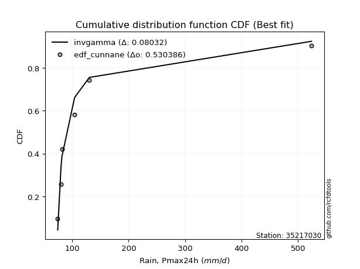</img>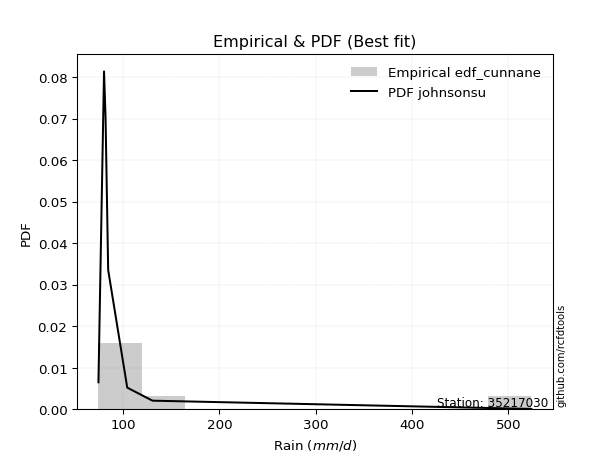</img>

</div>


### 12. EDF Adamowski (1981)

The Adamowski formula in hydrology refers to a specific plotting position formula used for estimating the non-parametric empirical distribution of hydrological events (like flood peaks) to calculate their return periods. This formula provides an alternative to traditional parametric methods (like the Gumbel or Log Pearson Type III distributions). 

<div align="center">


$P=(m-0.25)/(n+0.5)$


</div>


**12.1. Empirical values**

<div align="center">

|                | 0                  | 1                   | 2                   | 3             | 4                  | 5                  | 6                  |
|:---------------|:-------------------|:--------------------|:--------------------|:--------------|:-------------------|:-------------------|:-------------------|
| date           | 2019               | 2023                | 2021                | 2025          | 2020               | 2022               | 2024               |
| x              | 74.4               | 80.2                | 81.8                | 84.5          | 104.3              | 130.5              | 523.8              |
| m              | 1                  | 2                   | 3                   | 4             | 5                  | 6                  | 7                  |
| empirical_dist | edf_adamowski      | edf_adamowski       | edf_adamowski       | edf_adamowski | edf_adamowski      | edf_adamowski      | edf_adamowski      |
| empirical      | 0.1                | 0.23333333333333334 | 0.36666666666666664 | 0.5           | 0.6333333333333333 | 0.7666666666666667 | 0.9                |
| empirical_tr   | 1.1111111111111112 | 1.3043478260869565  | 1.5789473684210527  | 2.0           | 2.727272727272727  | 4.2857142857142865 | 10.000000000000002 |

</div>


**12.2. Kolmogorov-Smirnov fit test (sorted by Δ)**


<div align="center">

|                | 0                   | 1                   | 2                   | 3                   | 4                   | 5                   | 6                   | 7                   | 8                   | 9                   | 10                  | 11                  | 12                  | 13                  | 14                  | 15                  | 16                  | 17                  | 18                  | 19                  | 20                  | 21                  | 22                  | 23                  | 24                  | 25                  | 26                  | 27                  | 28                  | 29                  | 30                  | 31                  | 32                  | 33                  | 34                  | 35                  | 36                  | 37                  | 38                  | 39                  | 40                  | 41                  | 42                  | 43                  | 44                  | 45                  | 46                  | 47                  | 48                  | 49                  | 50                  | 51                  | 52                  | 53                  | 54                  | 55                  | 56                  | 57                  | 58                  | 59                  | 60                  | 61                  | 62                  | 63                  | 64                  | 65                  | 66                  | 67                  | 68                  | 69                  | 70                  | 71                  | 72                  | 73                  | 74                  | 75                  | 76                  | 77                  | 78                  | 79                  | 80                  | 81                  | 82                  | 83                  | 84                  | 85                  | 86                  | 87                  | 88                  | 89                  | 90                  | 91                  | 92                  | 93                  | 94                  | 95                  | 96                  | 97                  | 98                  | 99                  | 100                 | 101                 | 102                 | 103                 | 104                 | 105                 | 106                 | 107                 | 108                 | 109                 | 110                 | 111                 | 112                 | 113                 | 114                 | 115                 | 116                 | 117                 | 118                 | 119                 | 120                 | 121                 | 122                 | 123                 | 124                 | 125                 | 126                 | 127                 | 128                 | 129                 | 130                 | 131                 | 132                 | 133                 | 134                 | 135                 | 136                 | 137                 | 138                 | 139                 | 140                 | 141                 | 142                 | 143                 | 144                 | 145                 | 146                 | 147                 | 148                 | 149                 | 150                 | 151                 | 152                 | 153                 | 154                 | 155                 | 156                 | 157                 | 158                 | 159                 |
|:---------------|:--------------------|:--------------------|:--------------------|:--------------------|:--------------------|:--------------------|:--------------------|:--------------------|:--------------------|:--------------------|:--------------------|:--------------------|:--------------------|:--------------------|:--------------------|:--------------------|:--------------------|:--------------------|:--------------------|:--------------------|:--------------------|:--------------------|:--------------------|:--------------------|:--------------------|:--------------------|:--------------------|:--------------------|:--------------------|:--------------------|:--------------------|:--------------------|:--------------------|:--------------------|:--------------------|:--------------------|:--------------------|:--------------------|:--------------------|:--------------------|:--------------------|:--------------------|:--------------------|:--------------------|:--------------------|:--------------------|:--------------------|:--------------------|:--------------------|:--------------------|:--------------------|:--------------------|:--------------------|:--------------------|:--------------------|:--------------------|:--------------------|:--------------------|:--------------------|:--------------------|:--------------------|:--------------------|:--------------------|:--------------------|:--------------------|:--------------------|:--------------------|:--------------------|:--------------------|:--------------------|:--------------------|:--------------------|:--------------------|:--------------------|:--------------------|:--------------------|:--------------------|:--------------------|:--------------------|:--------------------|:--------------------|:--------------------|:--------------------|:--------------------|:--------------------|:--------------------|:--------------------|:--------------------|:--------------------|:--------------------|:--------------------|:--------------------|:--------------------|:--------------------|:--------------------|:--------------------|:--------------------|:--------------------|:--------------------|:--------------------|:--------------------|:--------------------|:--------------------|:--------------------|:--------------------|:--------------------|:--------------------|:--------------------|:--------------------|:--------------------|:--------------------|:--------------------|:--------------------|:--------------------|:--------------------|:--------------------|:--------------------|:--------------------|:--------------------|:--------------------|:--------------------|:--------------------|:--------------------|:--------------------|:--------------------|:--------------------|:--------------------|:--------------------|:--------------------|:--------------------|:--------------------|:--------------------|:--------------------|:--------------------|:--------------------|:--------------------|:--------------------|:--------------------|:--------------------|:--------------------|:--------------------|:--------------------|:--------------------|:--------------------|:--------------------|:--------------------|:--------------------|:--------------------|:--------------------|:--------------------|:--------------------|:--------------------|:--------------------|:--------------------|:--------------------|:--------------------|:--------------------|:--------------------|:--------------------|:--------------------|
| station        | 35217030            | 35217030            | 35217030            | 35217030            | 35217030            | 35217030            | 35217030            | 35217030            | 35217030            | 35217030            | 35217030            | 35217030            | 35217030            | 35217030            | 35217030            | 35217030            | 35217030            | 35217030            | 35217030            | 35217030            | 35217030            | 35217030            | 35217030            | 35217030            | 35217030            | 35217030            | 35217030            | 35217030            | 35217030            | 35217030            | 35217030            | 35217030            | 35217030            | 35217030            | 35217030            | 35217030            | 35217030            | 35217030            | 35217030            | 35217030            | 35217030            | 35217030            | 35217030            | 35217030            | 35217030            | 35217030            | 35217030            | 35217030            | 35217030            | 35217030            | 35217030            | 35217030            | 35217030            | 35217030            | 35217030            | 35217030            | 35217030            | 35217030            | 35217030            | 35217030            | 35217030            | 35217030            | 35217030            | 35217030            | 35217030            | 35217030            | 35217030            | 35217030            | 35217030            | 35217030            | 35217030            | 35217030            | 35217030            | 35217030            | 35217030            | 35217030            | 35217030            | 35217030            | 35217030            | 35217030            | 35217030            | 35217030            | 35217030            | 35217030            | 35217030            | 35217030            | 35217030            | 35217030            | 35217030            | 35217030            | 35217030            | 35217030            | 35217030            | 35217030            | 35217030            | 35217030            | 35217030            | 35217030            | 35217030            | 35217030            | 35217030            | 35217030            | 35217030            | 35217030            | 35217030            | 35217030            | 35217030            | 35217030            | 35217030            | 35217030            | 35217030            | 35217030            | 35217030            | 35217030            | 35217030            | 35217030            | 35217030            | 35217030            | 35217030            | 35217030            | 35217030            | 35217030            | 35217030            | 35217030            | 35217030            | 35217030            | 35217030            | 35217030            | 35217030            | 35217030            | 35217030            | 35217030            | 35217030            | 35217030            | 35217030            | 35217030            | 35217030            | 35217030            | 35217030            | 35217030            | 35217030            | 35217030            | 35217030            | 35217030            | 35217030            | 35217030            | 35217030            | 35217030            | 35217030            | 35217030            | 35217030            | 35217030            | 35217030            | 35217030            | 35217030            | 35217030            | 35217030            | 35217030            | 35217030            | 35217030            |
| empirical_dist | edf_adamowski       | edf_adamowski       | edf_adamowski       | edf_adamowski       | edf_adamowski       | edf_adamowski       | edf_adamowski       | edf_adamowski       | edf_adamowski       | edf_adamowski       | edf_adamowski       | edf_adamowski       | edf_adamowski       | edf_adamowski       | edf_adamowski       | edf_adamowski       | edf_adamowski       | edf_adamowski       | edf_adamowski       | edf_adamowski       | edf_adamowski       | edf_adamowski       | edf_adamowski       | edf_adamowski       | edf_adamowski       | edf_adamowski       | edf_adamowski       | edf_adamowski       | edf_adamowski       | edf_adamowski       | edf_adamowski       | edf_adamowski       | edf_adamowski       | edf_adamowski       | edf_adamowski       | edf_adamowski       | edf_adamowski       | edf_adamowski       | edf_adamowski       | edf_adamowski       | edf_adamowski       | edf_adamowski       | edf_adamowski       | edf_adamowski       | edf_adamowski       | edf_adamowski       | edf_adamowski       | edf_adamowski       | edf_adamowski       | edf_adamowski       | edf_adamowski       | edf_adamowski       | edf_adamowski       | edf_adamowski       | edf_adamowski       | edf_adamowski       | edf_adamowski       | edf_adamowski       | edf_adamowski       | edf_adamowski       | edf_adamowski       | edf_adamowski       | edf_adamowski       | edf_adamowski       | edf_adamowski       | edf_adamowski       | edf_adamowski       | edf_adamowski       | edf_adamowski       | edf_adamowski       | edf_adamowski       | edf_adamowski       | edf_adamowski       | edf_adamowski       | edf_adamowski       | edf_adamowski       | edf_adamowski       | edf_adamowski       | edf_adamowski       | edf_adamowski       | edf_adamowski       | edf_adamowski       | edf_adamowski       | edf_adamowski       | edf_adamowski       | edf_adamowski       | edf_adamowski       | edf_adamowski       | edf_adamowski       | edf_adamowski       | edf_adamowski       | edf_adamowski       | edf_adamowski       | edf_adamowski       | edf_adamowski       | edf_adamowski       | edf_adamowski       | edf_adamowski       | edf_adamowski       | edf_adamowski       | edf_adamowski       | edf_adamowski       | edf_adamowski       | edf_adamowski       | edf_adamowski       | edf_adamowski       | edf_adamowski       | edf_adamowski       | edf_adamowski       | edf_adamowski       | edf_adamowski       | edf_adamowski       | edf_adamowski       | edf_adamowski       | edf_adamowski       | edf_adamowski       | edf_adamowski       | edf_adamowski       | edf_adamowski       | edf_adamowski       | edf_adamowski       | edf_adamowski       | edf_adamowski       | edf_adamowski       | edf_adamowski       | edf_adamowski       | edf_adamowski       | edf_adamowski       | edf_adamowski       | edf_adamowski       | edf_adamowski       | edf_adamowski       | edf_adamowski       | edf_adamowski       | edf_adamowski       | edf_adamowski       | edf_adamowski       | edf_adamowski       | edf_adamowski       | edf_adamowski       | edf_adamowski       | edf_adamowski       | edf_adamowski       | edf_adamowski       | edf_adamowski       | edf_adamowski       | edf_adamowski       | edf_adamowski       | edf_adamowski       | edf_adamowski       | edf_adamowski       | edf_adamowski       | edf_adamowski       | edf_adamowski       | edf_adamowski       | edf_adamowski       | edf_adamowski       | edf_adamowski       | edf_adamowski       | edf_adamowski       |
| p_dist         | logmielke           | loginvweibull       | loggenextreme       | logburr             | logalpha            | loginvgamma         | johnsonsu           | loginvgauss         | invgamma            | f                   | alpha               | invgauss            | logjohnsonsu        | truncpareto         | logerlang           | fatiguelife         | logtruncweibull_min | logfatiguelife      | burr                | logtruncpareto      | logwald             | genpareto           | logmoyal            | logbradford         | exponpow            | logburr12           | nakagami            | loggumbel_r         | erlang              | logpearson3         | logmaxwell          | lograyleigh         | logvonmises_line    | loghalflogistic     | gennorm             | gamma               | loghalfnorm         | truncweibull_min    | lognct              | logt                | logloggamma         | logfoldnorm         | ncf                 | betaprime           | logbetaprime        | lognorm             | logcrystalball      | loganglit           | gengamma            | logsemicircular     | nct                 | kappa3              | loglogistic         | loggenlogistic      | logncf              | logweibull_min      | loglomax            | t                   | loggausshyper       | loghypsecant        | logarcsine          | halfgennorm         | logdweibull         | weibull_min         | moyal               | wald                | genlogistic         | logloglaplace       | burr12              | vonmises_line       | logkstwobign        | loggompertz         | logexponnorm        | loggenexpon         | loglaplace          | loglaplace          | loggengamma         | exponweib           | genextreme          | logrice             | gumbel_r            | loggennorm          | halflogistic        | logdgamma           | dgamma              | halfnorm            | loggumbel_l         | dweibull            | pearson3            | logtruncnorm        | rayleigh            | logcosine           | maxwell             | foldnorm            | arcsine             | logexponweib        | wrapcauchy          | loghalfgennorm      | tukeylambda         | semicircular        | anglit              | loggenpareto        | gausshyper          | norm                | kstwobign           | logistic            | powerlaw            | logwrapcauchy       | hypsecant           | lognakagami         | invweibull          | loglevy_l           | laplace             | rice                | logskewnorm         | levy_l              | exponnorm           | genexpon            | logpowerlaw         | logbeta             | logargus            | logtruncexpon       | gumbel_l            | cosine              | gompertz            | logexponpow         | logf                | logweibull_max      | logtriang           | logrdist            | logksone            | truncnorm           | logkappa4           | truncexpon          | logtukeylambda      | loguniform          | loggamma            | loggamma            | argus               | logkappa3           | lomax               | logjohnsonsb        | triang              | skewnorm            | crystalball         | johnsonsb           | bradford            | rdist               | loggenhalflogistic  | ksone               | kappa4              | uniform             | genhalflogistic     | logtrapezoid        | weibull_max         | beta                | trapezoid           | logvonmises         | vonmises            | mielke              |
| delta          | 0.06750630160154902 | 0.06775198844150232 | 0.06777598023244547 | 0.06781083966769069 | 0.06861887354626434 | 0.07032813279010719 | 0.07316470839350964 | 0.07748375625236403 | 0.07830441154793166 | 0.07830450319378218 | 0.0793631605134077  | 0.08813625281814669 | 0.09378705689481959 | 0.09999999999999998 | 0.10069483241750732 | 0.10789838593227674 | 0.10981852753827942 | 0.117134719273983   | 0.12175547071275461 | 0.1366821968473934  | 0.13954132380886142 | 0.14419743749696295 | 0.14687629062244256 | 0.1547205075680272  | 0.15493450411317183 | 0.15556485992533814 | 0.15663072631147773 | 0.1580805265043912  | 0.1595807937975081  | 0.16337574302770316 | 0.16854665911302552 | 0.16907982415480502 | 0.1731767445717082  | 0.17396220173150587 | 0.17573709564268603 | 0.1881176990084164  | 0.19100453594757447 | 0.19498472637396996 | 0.19758189951606686 | 0.19915304013399798 | 0.19993226872111003 | 0.199941421623239   | 0.20051908282613523 | 0.20118979953156174 | 0.20125423243557994 | 0.20294706686143366 | 0.20294707132788592 | 0.20678044289095365 | 0.2069076693705057  | 0.2108406266240792  | 0.2126135326629529  | 0.2126454651121607  | 0.21426450170531308 | 0.21646334061737676 | 0.2197166136719047  | 0.22663391259505394 | 0.227431793772098   | 0.2280831560252865  | 0.22884225726932822 | 0.22959374134955052 | 0.2340095787117538  | 0.2354439560211095  | 0.23954682309688594 | 0.24102366683218357 | 0.24231689914468388 | 0.24231824941223432 | 0.24292216053549665 | 0.24312290951791218 | 0.24383260328334488 | 0.24437755284187887 | 0.24838692148185632 | 0.2507071252229942  | 0.25170995354403514 | 0.25348024231995125 | 0.2552443938069419  | 0.2552443938069419  | 0.2581612757726902  | 0.25843270654783057 | 0.2586167052738677  | 0.25990903789808345 | 0.2630244617017128  | 0.2666666665810542  | 0.26785492969318603 | 0.2685595479721752  | 0.2691436517852642  | 0.2696447773638917  | 0.2720093035357455  | 0.2767222452933985  | 0.27746527104617913 | 0.28217399371829444 | 0.2822417199742523  | 0.2904512780275379  | 0.2942811432361138  | 0.29567457828223853 | 0.3018680152414997  | 0.303172385329792   | 0.30557482908402606 | 0.30818832973550964 | 0.3083119546841928  | 0.3162970579853847  | 0.3199178259540777  | 0.32027444467685784 | 0.32617928656227324 | 0.32868047726001826 | 0.33301437652767163 | 0.33697083214107343 | 0.341722882264972   | 0.3431113072735096  | 0.3439349177297727  | 0.35150475038652423 | 0.3529701845062705  | 0.3619588607891494  | 0.36569852365411226 | 0.36925006142116323 | 0.37050424885629596 | 0.3762048324230399  | 0.3808918895637581  | 0.3811357127873114  | 0.3843486885435657  | 0.38724406248868865 | 0.39057890006199125 | 0.3939759653045819  | 0.3982009541513948  | 0.40955377552005756 | 0.41045471035289205 | 0.4171683185025765  | 0.4171938150775975  | 0.41813775173777845 | 0.43267267420938127 | 0.4372612089460673  | 0.4434012519059258  | 0.44497483833506724 | 0.45397552131401125 | 0.45868612483512855 | 0.4728321045473872  | 0.4787481689537775  | 0.4810254203269619  | 0.4810254203269619  | 0.4823618394042569  | 0.48426144847741964 | 0.49401433862436384 | 0.5032905840964361  | 0.5067087671154314  | 0.5104170919696772  | 0.5344680147185185  | 0.5389783098155458  | 0.5444334766419301  | 0.5574183558442122  | 0.5715027035114925  | 0.579305740987984   | 0.6157989598472055  | 0.6418335558522474  | 0.6579425945290085  | 0.6621661382862328  | 0.6757536394179823  | 0.7238510846026719  | 0.7315625501954939  | 1.1641353772801464  | 83.17989632578252   | nan                 |
| deltao         | 0.48442053926100004 | 0.48442053926100004 | 0.48442053926100004 | 0.48442053926100004 | 0.48442053926100004 | 0.48442053926100004 | 0.48442053926100004 | 0.48442053926100004 | 0.48442053926100004 | 0.48442053926100004 | 0.48442053926100004 | 0.48442053926100004 | 0.48442053926100004 | 0.48442053926100004 | 0.48442053926100004 | 0.48442053926100004 | 0.48442053926100004 | 0.48442053926100004 | 0.48442053926100004 | 0.48442053926100004 | 0.48442053926100004 | 0.48442053926100004 | 0.48442053926100004 | 0.48442053926100004 | 0.48442053926100004 | 0.48442053926100004 | 0.48442053926100004 | 0.48442053926100004 | 0.48442053926100004 | 0.48442053926100004 | 0.48442053926100004 | 0.48442053926100004 | 0.48442053926100004 | 0.48442053926100004 | 0.48442053926100004 | 0.48442053926100004 | 0.48442053926100004 | 0.48442053926100004 | 0.48442053926100004 | 0.48442053926100004 | 0.48442053926100004 | 0.48442053926100004 | 0.48442053926100004 | 0.48442053926100004 | 0.48442053926100004 | 0.48442053926100004 | 0.48442053926100004 | 0.48442053926100004 | 0.48442053926100004 | 0.48442053926100004 | 0.48442053926100004 | 0.48442053926100004 | 0.48442053926100004 | 0.48442053926100004 | 0.48442053926100004 | 0.48442053926100004 | 0.48442053926100004 | 0.48442053926100004 | 0.48442053926100004 | 0.48442053926100004 | 0.48442053926100004 | 0.48442053926100004 | 0.48442053926100004 | 0.48442053926100004 | 0.48442053926100004 | 0.48442053926100004 | 0.48442053926100004 | 0.48442053926100004 | 0.48442053926100004 | 0.48442053926100004 | 0.48442053926100004 | 0.48442053926100004 | 0.48442053926100004 | 0.48442053926100004 | 0.48442053926100004 | 0.48442053926100004 | 0.48442053926100004 | 0.48442053926100004 | 0.48442053926100004 | 0.48442053926100004 | 0.48442053926100004 | 0.48442053926100004 | 0.48442053926100004 | 0.48442053926100004 | 0.48442053926100004 | 0.48442053926100004 | 0.48442053926100004 | 0.48442053926100004 | 0.48442053926100004 | 0.48442053926100004 | 0.48442053926100004 | 0.48442053926100004 | 0.48442053926100004 | 0.48442053926100004 | 0.48442053926100004 | 0.48442053926100004 | 0.48442053926100004 | 0.48442053926100004 | 0.48442053926100004 | 0.48442053926100004 | 0.48442053926100004 | 0.48442053926100004 | 0.48442053926100004 | 0.48442053926100004 | 0.48442053926100004 | 0.48442053926100004 | 0.48442053926100004 | 0.48442053926100004 | 0.48442053926100004 | 0.48442053926100004 | 0.48442053926100004 | 0.48442053926100004 | 0.48442053926100004 | 0.48442053926100004 | 0.48442053926100004 | 0.48442053926100004 | 0.48442053926100004 | 0.48442053926100004 | 0.48442053926100004 | 0.48442053926100004 | 0.48442053926100004 | 0.48442053926100004 | 0.48442053926100004 | 0.48442053926100004 | 0.48442053926100004 | 0.48442053926100004 | 0.48442053926100004 | 0.48442053926100004 | 0.48442053926100004 | 0.48442053926100004 | 0.48442053926100004 | 0.48442053926100004 | 0.48442053926100004 | 0.48442053926100004 | 0.48442053926100004 | 0.48442053926100004 | 0.48442053926100004 | 0.48442053926100004 | 0.48442053926100004 | 0.48442053926100004 | 0.48442053926100004 | 0.48442053926100004 | 0.48442053926100004 | 0.48442053926100004 | 0.48442053926100004 | 0.48442053926100004 | 0.48442053926100004 | 0.48442053926100004 | 0.48442053926100004 | 0.48442053926100004 | 0.48442053926100004 | 0.48442053926100004 | 0.48442053926100004 | 0.48442053926100004 | 0.48442053926100004 | 0.48442053926100004 | 0.48442053926100004 | 0.48442053926100004 | 0.48442053926100004 | 0.48442053926100004 |
| eval           | Δo > Δ              | Δo > Δ              | Δo > Δ              | Δo > Δ              | Δo > Δ              | Δo > Δ              | Δo > Δ              | Δo > Δ              | Δo > Δ              | Δo > Δ              | Δo > Δ              | Δo > Δ              | Δo > Δ              | Δo > Δ              | Δo > Δ              | Δo > Δ              | Δo > Δ              | Δo > Δ              | Δo > Δ              | Δo > Δ              | Δo > Δ              | Δo > Δ              | Δo > Δ              | Δo > Δ              | Δo > Δ              | Δo > Δ              | Δo > Δ              | Δo > Δ              | Δo > Δ              | Δo > Δ              | Δo > Δ              | Δo > Δ              | Δo > Δ              | Δo > Δ              | Δo > Δ              | Δo > Δ              | Δo > Δ              | Δo > Δ              | Δo > Δ              | Δo > Δ              | Δo > Δ              | Δo > Δ              | Δo > Δ              | Δo > Δ              | Δo > Δ              | Δo > Δ              | Δo > Δ              | Δo > Δ              | Δo > Δ              | Δo > Δ              | Δo > Δ              | Δo > Δ              | Δo > Δ              | Δo > Δ              | Δo > Δ              | Δo > Δ              | Δo > Δ              | Δo > Δ              | Δo > Δ              | Δo > Δ              | Δo > Δ              | Δo > Δ              | Δo > Δ              | Δo > Δ              | Δo > Δ              | Δo > Δ              | Δo > Δ              | Δo > Δ              | Δo > Δ              | Δo > Δ              | Δo > Δ              | Δo > Δ              | Δo > Δ              | Δo > Δ              | Δo > Δ              | Δo > Δ              | Δo > Δ              | Δo > Δ              | Δo > Δ              | Δo > Δ              | Δo > Δ              | Δo > Δ              | Δo > Δ              | Δo > Δ              | Δo > Δ              | Δo > Δ              | Δo > Δ              | Δo > Δ              | Δo > Δ              | Δo > Δ              | Δo > Δ              | Δo > Δ              | Δo > Δ              | Δo > Δ              | Δo > Δ              | Δo > Δ              | Δo > Δ              | Δo > Δ              | Δo > Δ              | Δo > Δ              | Δo > Δ              | Δo > Δ              | Δo > Δ              | Δo > Δ              | Δo > Δ              | Δo > Δ              | Δo > Δ              | Δo > Δ              | Δo > Δ              | Δo > Δ              | Δo > Δ              | Δo > Δ              | Δo > Δ              | Δo > Δ              | Δo > Δ              | Δo > Δ              | Δo > Δ              | Δo > Δ              | Δo > Δ              | Δo > Δ              | Δo > Δ              | Δo > Δ              | Δo > Δ              | Δo > Δ              | Δo > Δ              | Δo > Δ              | Δo > Δ              | Δo > Δ              | Δo > Δ              | Δo > Δ              | Δo > Δ              | Δo > Δ              | Δo > Δ              | Δo > Δ              | Δo > Δ              | Δo > Δ              | Δo > Δ              | Δo > Δ              | Δo > Δ              | Δo > Δ              | Δo <= Δ             | Δo <= Δ             | Δo <= Δ             | Δo <= Δ             | Δo <= Δ             | Δo <= Δ             | Δo <= Δ             | Δo <= Δ             | Δo <= Δ             | Δo <= Δ             | Δo <= Δ             | Δo <= Δ             | Δo <= Δ             | Δo <= Δ             | Δo <= Δ             | Δo <= Δ             | Δo <= Δ             | Δo <= Δ             | Δo <= Δ             | Δo <= Δ             |
| fit            | 1                   | 1                   | 1                   | 1                   | 1                   | 1                   | 1                   | 1                   | 1                   | 1                   | 1                   | 1                   | 1                   | 1                   | 1                   | 1                   | 1                   | 1                   | 1                   | 1                   | 1                   | 1                   | 1                   | 1                   | 1                   | 1                   | 1                   | 1                   | 1                   | 1                   | 1                   | 1                   | 1                   | 1                   | 1                   | 1                   | 1                   | 1                   | 1                   | 1                   | 1                   | 1                   | 1                   | 1                   | 1                   | 1                   | 1                   | 1                   | 1                   | 1                   | 1                   | 1                   | 1                   | 1                   | 1                   | 1                   | 1                   | 1                   | 1                   | 1                   | 1                   | 1                   | 1                   | 1                   | 1                   | 1                   | 1                   | 1                   | 1                   | 1                   | 1                   | 1                   | 1                   | 1                   | 1                   | 1                   | 1                   | 1                   | 1                   | 1                   | 1                   | 1                   | 1                   | 1                   | 1                   | 1                   | 1                   | 1                   | 1                   | 1                   | 1                   | 1                   | 1                   | 1                   | 1                   | 1                   | 1                   | 1                   | 1                   | 1                   | 1                   | 1                   | 1                   | 1                   | 1                   | 1                   | 1                   | 1                   | 1                   | 1                   | 1                   | 1                   | 1                   | 1                   | 1                   | 1                   | 1                   | 1                   | 1                   | 1                   | 1                   | 1                   | 1                   | 1                   | 1                   | 1                   | 1                   | 1                   | 1                   | 1                   | 1                   | 1                   | 1                   | 1                   | 1                   | 1                   | 1                   | 1                   | 1                   | 1                   | 0                   | 0                   | 0                   | 0                   | 0                   | 0                   | 0                   | 0                   | 0                   | 0                   | 0                   | 0                   | 0                   | 0                   | 0                   | 0                   | 0                   | 0                   | 0                   | 0                   |
| n              | 7                   | 7                   | 7                   | 7                   | 7                   | 7                   | 7                   | 7                   | 7                   | 7                   | 7                   | 7                   | 7                   | 7                   | 7                   | 7                   | 7                   | 7                   | 7                   | 7                   | 7                   | 7                   | 7                   | 7                   | 7                   | 7                   | 7                   | 7                   | 7                   | 7                   | 7                   | 7                   | 7                   | 7                   | 7                   | 7                   | 7                   | 7                   | 7                   | 7                   | 7                   | 7                   | 7                   | 7                   | 7                   | 7                   | 7                   | 7                   | 7                   | 7                   | 7                   | 7                   | 7                   | 7                   | 7                   | 7                   | 7                   | 7                   | 7                   | 7                   | 7                   | 7                   | 7                   | 7                   | 7                   | 7                   | 7                   | 7                   | 7                   | 7                   | 7                   | 7                   | 7                   | 7                   | 7                   | 7                   | 7                   | 7                   | 7                   | 7                   | 7                   | 7                   | 7                   | 7                   | 7                   | 7                   | 7                   | 7                   | 7                   | 7                   | 7                   | 7                   | 7                   | 7                   | 7                   | 7                   | 7                   | 7                   | 7                   | 7                   | 7                   | 7                   | 7                   | 7                   | 7                   | 7                   | 7                   | 7                   | 7                   | 7                   | 7                   | 7                   | 7                   | 7                   | 7                   | 7                   | 7                   | 7                   | 7                   | 7                   | 7                   | 7                   | 7                   | 7                   | 7                   | 7                   | 7                   | 7                   | 7                   | 7                   | 7                   | 7                   | 7                   | 7                   | 7                   | 7                   | 7                   | 7                   | 7                   | 7                   | 7                   | 7                   | 7                   | 7                   | 7                   | 7                   | 7                   | 7                   | 7                   | 7                   | 7                   | 7                   | 7                   | 7                   | 7                   | 7                   | 7                   | 7                   | 7                   | 7                   |
| best_fit       | 1                   | 0                   | 0                   | 0                   | 0                   | 0                   | 0                   | 0                   | 0                   | 0                   | 0                   | 0                   | 0                   | 0                   | 0                   | 0                   | 0                   | 0                   | 0                   | 0                   | 0                   | 0                   | 0                   | 0                   | 0                   | 0                   | 0                   | 0                   | 0                   | 0                   | 0                   | 0                   | 0                   | 0                   | 0                   | 0                   | 0                   | 0                   | 0                   | 0                   | 0                   | 0                   | 0                   | 0                   | 0                   | 0                   | 0                   | 0                   | 0                   | 0                   | 0                   | 0                   | 0                   | 0                   | 0                   | 0                   | 0                   | 0                   | 0                   | 0                   | 0                   | 0                   | 0                   | 0                   | 0                   | 0                   | 0                   | 0                   | 0                   | 0                   | 0                   | 0                   | 0                   | 0                   | 0                   | 0                   | 0                   | 0                   | 0                   | 0                   | 0                   | 0                   | 0                   | 0                   | 0                   | 0                   | 0                   | 0                   | 0                   | 0                   | 0                   | 0                   | 0                   | 0                   | 0                   | 0                   | 0                   | 0                   | 0                   | 0                   | 0                   | 0                   | 0                   | 0                   | 0                   | 0                   | 0                   | 0                   | 0                   | 0                   | 0                   | 0                   | 0                   | 0                   | 0                   | 0                   | 0                   | 0                   | 0                   | 0                   | 0                   | 0                   | 0                   | 0                   | 0                   | 0                   | 0                   | 0                   | 0                   | 0                   | 0                   | 0                   | 0                   | 0                   | 0                   | 0                   | 0                   | 0                   | 0                   | 0                   | 0                   | 0                   | 0                   | 0                   | 0                   | 0                   | 0                   | 0                   | 0                   | 0                   | 0                   | 0                   | 0                   | 0                   | 0                   | 0                   | 0                   | 0                   | 0                   | 0                   |
| best_fit_sort  | 1                   | 2                   | 3                   | 4                   | 5                   | 6                   | 7                   | 8                   | 9                   | 10                  | 11                  | 12                  | 13                  | 14                  | 15                  | 16                  | 17                  | 18                  | 19                  | 20                  | 21                  | 22                  | 23                  | 24                  | 25                  | 26                  | 27                  | 28                  | 29                  | 30                  | 31                  | 32                  | 33                  | 34                  | 35                  | 36                  | 37                  | 38                  | 39                  | 40                  | 41                  | 42                  | 43                  | 44                  | 45                  | 46                  | 47                  | 48                  | 49                  | 50                  | 51                  | 52                  | 53                  | 54                  | 55                  | 56                  | 57                  | 58                  | 59                  | 60                  | 61                  | 62                  | 63                  | 64                  | 65                  | 66                  | 67                  | 68                  | 69                  | 70                  | 71                  | 72                  | 73                  | 74                  | 75                  | 76                  | 77                  | 78                  | 79                  | 80                  | 81                  | 82                  | 83                  | 84                  | 85                  | 86                  | 87                  | 88                  | 89                  | 90                  | 91                  | 92                  | 93                  | 94                  | 95                  | 96                  | 97                  | 98                  | 99                  | 100                 | 101                 | 102                 | 103                 | 104                 | 105                 | 106                 | 107                 | 108                 | 109                 | 110                 | 111                 | 112                 | 113                 | 114                 | 115                 | 116                 | 117                 | 118                 | 119                 | 120                 | 121                 | 122                 | 123                 | 124                 | 125                 | 126                 | 127                 | 128                 | 129                 | 130                 | 131                 | 132                 | 133                 | 134                 | 135                 | 136                 | 137                 | 138                 | 139                 | 140                 | 141                 | 142                 | 143                 | 144                 | 145                 | 146                 | 147                 | 148                 | 149                 | 150                 | 151                 | 152                 | 153                 | 154                 | 155                 | 156                 | 157                 | 158                 | 159                 | 160                 |

</div>


**12.3. Best fit**

<div align="center">

|   id |   station | empirical_dist   | p_dist    |     delta |   deltao | eval   |   fit |   n |   best_fit |   best_fit_sort |
|-----:|----------:|:-----------------|:----------|----------:|---------:|:-------|------:|----:|-----------:|----------------:|
|    0 |  35217030 | edf_adamowski    | logmielke | 0.0675063 | 0.484421 | Δo > Δ |     1 |   7 |          1 |               1 |

</div>


<div align="center">

</img>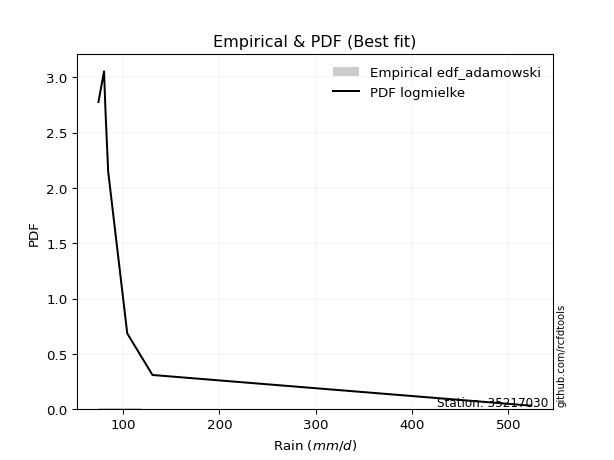</img>

</div>


## C. Best fit & Estimate extreme values for specific return periods - Tr

Best fit in probability distribution analysis means finding the theoretical distribution (like Normal, Poisson, Exponential, etc.) that most accurately mirrors your real-world data´s patterns (shape, center, spread) for better predictions, using methods like visual checks (Q-Q plots), goodness-of-fit tests (Kolmogorov-Smirnov, Chi-Squared), and information criteria (AIC) to score and select the simplest, most representative model.


### 1. Best fit (ordered by delta Δ)

:file_folder:Table: [bestfit_35217030.csv](table/bestfit_35217030.csv)

<div align="center">

|   id |   station | empirical_dist   | p_dist        |     delta |   deltao | eval   |   fit |   n |   best_fit |   best_fit_sort |
|-----:|----------:|:-----------------|:--------------|----------:|---------:|:-------|------:|----:|-----------:|----------------:|
|    0 |  35217030 | edf_hazen        | johnsonsu     | 0.0636409 | 0.484421 | Δo > Δ |     1 |   7 |          1 |               1 |
|    1 |  35217030 | edf_gringorten   | johnsonsu     | 0.0660486 | 0.484421 | Δo > Δ |     1 |   7 |          1 |               2 |
|    2 |  35217030 | edf_adamowski    | logmielke     | 0.0675063 | 0.484421 | Δo > Δ |     1 |   7 |          1 |               3 |
|    3 |  35217030 | edf_cunnane      | johnsonsu     | 0.0676092 | 0.484421 | Δo > Δ |     1 |   7 |          1 |               4 |
|    4 |  35217030 | edf_chegodayev   | loginvweibull | 0.067752  | 0.484421 | Δo > Δ |     1 |   7 |          1 |               5 |
|    5 |  35217030 | edf_jenkinson    | logburr       | 0.0684335 | 0.484421 | Δo > Δ |     1 |   7 |          1 |               6 |
|    6 |  35217030 | edf_beard        | logburr       | 0.0684335 | 0.484421 | Δo > Δ |     1 |   7 |          1 |               7 |
|    7 |  35217030 | edf_blom         | johnsonsu     | 0.068567  | 0.484421 | Δo > Δ |     1 |   7 |          1 |               8 |
|    8 |  35217030 | edf_tukey        | logalpha      | 0.0686189 | 0.484421 | Δo > Δ |     1 |   7 |          1 |               9 |
|    9 |  35217030 | edf_filliben     | logalpha      | 0.0686189 | 0.484421 | Δo > Δ |     1 |   7 |          1 |              10 |
|   10 |  35217030 | edf_weibull      | johnsonsu     | 0.081498  | 0.484421 | Δo > Δ |     1 |   7 |          1 |              11 |
|   11 |  35217030 | edf_california   | johnsonsu     | 0.10646   | 0.484421 | Δo > Δ |     1 |   7 |          1 |              12 |

</div>


### 2. Extreme values and % difference analysis

In hydrology, a return period (or recurrence interval $Tr$) is the statistical average time between extreme events like floods or droughts of a specific magnitude, indicating how rare an event is, with a 100-year flood, for example, having a 1% chance of occurring in any given year, not that it happens exactly every century. It is a key tool for infrastructure design (like bridges or dams) and risk assessment, calculated from historical data to determine the probability of future events, although it is important to remember it is statistical average, and events can cluster or be missed.

The extreme value porcentage difference is evaluated as $pdiff = 1 - (ETrBf / ETr) * 100$, where _ETrBf_ correspond to the bestfit extreme value for a specific recurrence interval and _ETr_ correspond to the extreme value for one of the most used PDFsused in hydrology.

> risk_rate: assuming the return period as the project useful life.

:file_folder:Table: [extreme_35217030.csv](table/extreme_35217030.csv), all PDFs.  
:file_folder:Table: [extremepdiff_35217030.csv](table/extremepdiff_35217030.csv), % difference between bestfit and most used PDFs in Hydrology.

<div align="center">

Extreme values table for only best fit PDFs
|   id |      tr |   prob_l |     prob_g |      alpha |   anglit |   arcsine |   argus |     beta |   betaprime |   bradford |     burr |   burr12 |   cosine |   crystalball |   dgamma |   dweibull |   erlang |   exponnorm |   exponpow |   exponweib |           f |   fatiguelife |   foldnorm |   gamma |   gausshyper |   genexpon |       genextreme |   gengamma |   genhalflogistic |   genlogistic |   gennorm |   genpareto |   gompertz |   gumbel_l |   gumbel_r |   halfgennorm |   halflogistic |   halfnorm |   hypsecant |    invgamma |   invgauss |     invweibull |   johnsonsb |   johnsonsu |     kappa3 |   kappa4 |   ksone |   kstwobign |   laplace |   levy_l |   loggamma |   logistic |   loglaplace |    lomax |   maxwell |   mielke |   moyal |   nakagami |      ncf |      nct |    norm |   pearson3 |   powerlaw |   rayleigh |    rdist |    rice |   semicircular |   skewnorm |                t |   trapezoid |   triang |   truncexpon |   truncnorm |   truncpareto |   truncweibull_min |   tukeylambda |   uniform |   vonmises |   vonmises_line |     wald |   weibull_max |   weibull_min |   wrapcauchy |        logalpha |   loganglit |   logarcsine |   logargus |          logbeta |   logbetaprime |   logbradford |          logburr |   logburr12 |   logcosine |   logcrystalball |   logdgamma |      logdweibull |   logerlang |   logexponnorm |   logexponpow |   logexponweib |        logf |   logfatiguelife |   logfoldnorm |   loggausshyper |   loggenexpon |    loggenextreme |    loggengamma |   loggenhalflogistic |   loggenlogistic |   loggennorm |   loggenpareto |   loggompertz |   loggumbel_l |   loggumbel_r |   loghalfgennorm |   loghalflogistic |   loghalfnorm |   loghypsecant |      loginvgamma |   loginvgauss |    loginvweibull |   logjohnsonsb |     logjohnsonsu |   logkappa3 |   logkappa4 |   logksone |   logkstwobign |   loglevy_l |   logloggamma |   loglogistic |   logloglaplace |   loglomax |   logmaxwell |        logmielke |   logmoyal |   lognakagami |   logncf |   lognct |   lognorm |   logpearson3 |   logpowerlaw |   lograyleigh |   logrdist |   logrice |   logsemicircular |   logskewnorm |     logt |   logtrapezoid |   logtriang |   logtruncexpon |   logtruncnorm |   logtruncpareto |   logtruncweibull_min |   logtukeylambda |   loguniform |   logvonmises |   logvonmises_line |    logwald |   logweibull_max |   logweibull_min |   logwrapcauchy |   station |   n |   risk_rate |
|-----:|--------:|---------:|-----------:|-----------:|---------:|----------:|--------:|---------:|------------:|-----------:|---------:|---------:|---------:|--------------:|---------:|-----------:|---------:|------------:|-----------:|------------:|------------:|--------------:|-----------:|--------:|-------------:|-----------:|-----------------:|-----------:|------------------:|--------------:|----------:|------------:|-----------:|-----------:|-----------:|--------------:|---------------:|-----------:|------------:|------------:|-----------:|---------------:|------------:|------------:|-----------:|---------:|--------:|------------:|----------:|---------:|-----------:|-----------:|-------------:|---------:|----------:|---------:|--------:|-----------:|---------:|---------:|--------:|-----------:|-----------:|-----------:|---------:|--------:|---------------:|-----------:|-----------------:|------------:|---------:|-------------:|------------:|--------------:|-------------------:|--------------:|----------:|-----------:|----------------:|---------:|--------------:|--------------:|-------------:|----------------:|------------:|-------------:|-----------:|-----------------:|---------------:|--------------:|-----------------:|------------:|------------:|-----------------:|------------:|-----------------:|------------:|---------------:|--------------:|---------------:|------------:|-----------------:|--------------:|----------------:|--------------:|-----------------:|---------------:|---------------------:|-----------------:|-------------:|---------------:|--------------:|--------------:|--------------:|-----------------:|------------------:|--------------:|---------------:|-----------------:|--------------:|-----------------:|---------------:|-----------------:|------------:|------------:|-----------:|---------------:|------------:|--------------:|--------------:|----------------:|-----------:|-------------:|-----------------:|-----------:|--------------:|---------:|---------:|----------:|--------------:|--------------:|--------------:|-----------:|----------:|------------------:|--------------:|---------:|---------------:|------------:|----------------:|---------------:|-----------------:|----------------------:|-----------------:|-------------:|--------------:|-------------------:|-----------:|-----------------:|-----------------:|----------------:|----------:|----:|------------:|
|    0 |    2    | 0.5      | 0.5        |    87.7591 |  154.214 |   154.214 | 253.343 |  31.3695 |     111.315 |    227.999 |  88.9303 |  101.401 |  195.294 |    0.00990663 |  81.8    |    80.2    |  98.2544 |     129.914 |    103.336 |     80.5742 |     87.6306 |       92.1716 |    117.263 | 103.756 |      159.497 |    129.723 |     81.0573      |    117.464 |           366.703 |       124.519 |   84.5    |     92.4937 |    149.026 |    179.176 |    129.253 |       81.7726 |        116.844 |    123.112 |     154.214 |     87.6307 |    87.7289 |  117.305       |     74.4219 |     85.6734 |    104.455 |  284.456 | 299.1   |     147.416 |   154.214 |  127.133 |    75.1479 |    154.214 |      116.659 |  196.547 |   141.219 |  102.924 | 121.195 |    94.0392 |  111.374 |  108.323 | 154.214 |    107.888 |    76.3314 |    136.611 |  38.1643 | 161.409 |        154.214 |    190.154 |     81.5611      |     410.789 |  288.777 |      206.298 |     172.055 |       86.469  |            106.508 |       102.467 |   299.1   | -1.86378   |         115.332 |  104.962 |       523.631 |       118.816 |      299.101 |    87.4619      |     116.659 |      116.659 |    172.388 |     75.6546      |        111.706 |       85.7521 |     87.5353      |     92.9523 |     136.346 |          116.659 |     81.8    |     84.5         |     88.1255 |        101.443 |       173.861 |  77.8502       |     75.2568 |          87.4124 |       106.183 |         111.527 |       101.614 |     87.5327      |  95.3366       |              271.654 |          102.991 |      80.2    |        126.545 |       101.207 |       129.56  |       105.042 |          112.203 |           99.7051 |       102.366 |        116.659 |     87.6054      |       87.5807 |     87.5315      |        74.4062 |     85.9705      |     201.207 |     190.179 |    197.41  |        111.452 |     106.125 |       116.64  |       116.659 |         84.5001 |    98.5066 |      110.459 |     87.5262      |    101.545 |       76.2755 |  112.113 |  110.279 |   116.659 |       97.9867 |       75.7495 |       108.341 |    228.265 |   118.814 |           116.658 |       125.983 |  116.188 |        320.642 |     199.682 |         151.033 |        106.037 |          92.0454 |               90.2784 |          197.41  |      197.41  |      0.200942 |            106.514 |    94.8492 |          220.637 |    117.977       |         197.41  |  35217030 |   7 |    0.75     |
|    1 |    2.33 | 0.570815 | 0.429185   |    91.5686 |  185.797 |   201.625 | 290.079 |  31.3695 |     122.881 |    259.075 |  92.4274 |  108.76  |  226.985 |   38.6324     |  84.2434 |    81.8372 | 107.254  |     142.161 |    117.543 |     85.061  |     92.4488 |      103.294  |    149.102 | 115.054 |      205.093 |    141.912 |     97.9418      |    131.763 |           396.115 |       138.566 |   85.5029 |     98.3006 |    165.469 |    202.765 |    154.377 |       87.0347 |        142.675 |    152.375 |     175.913 |     92.4489 |    92.9619 | 1623.11        |     74.4835 |     89.1056 |    117.185 |  317.517 | 337.289 |     166.631 |   170.622 |  247.33  |    75.9631 |    178.103 |      124.986 |  223.46  |   169.389 |  110.287 | 144.978 |   112.044  |  122.991 |  118.287 | 181.328 |    131.17  |    79.8721 |    165.197 |  54.6882 | 183.7   |        188.087 |    210.078 |     82.4758      |     436.899 |  327.628 |      238.412 |     192.809 |       90.6359 |            121.753 |       106.647 |   330.924 | -1.61422   |         133.489 |  122.74  |       523.755 |       137.54  |      492.198 |    91.5627      |     133.215 |      142.376 |    200.501 |     77.5815      |        123.292 |       91.6833 |     91.8067      |     98.4808 |     155.422 |          130.737 |     85.1156 |     86.7101      |     93.333  |        108.629 |       201.84  |  83.8001       |     76.6162 |          93.3493 |       121.373 |         126.676 |       108.838 |     91.8018      | 150.408        |              307.962 |          110.478 |      81.3508 |        188.244 |       108.307 |       143.06  |       116.738 |          122.712 |          111.137  |       115.761 |        127.796 |     91.802       |       92.2316 |     91.8         |        74.4424 |     88.9819      |     231.653 |     219.827 |    233.022 |        121.479 |     172.155 |       131.352 |       128.977 |         89.073  |   104.97   |      124.34  |     91.8049      |    112.217 |       79.2597 |  123.068 |  121.614 |   130.737 |      108.557  |       77.7487 |       122.168 |    290.39  |   130.819 |           134.504 |       137.938 |  130.509 |        359.141 |     234.193 |         171.906 |        114.4   |          97.7902 |               98.4461 |          227.665 |      226.669 |      0.222912 |            118.191 |   102.207  |          265.363 |    142.805       |         291.636 |  35217030 |   7 |    0.729209 |
|    2 |    5    | 0.8      | 0.2        |   121.108  |  297.227 |   328.052 | 407.917 |  35.5779 |     182.554 |    381.913 | 111.887  |  154.344 |  341.188 |  182.164      | 120.73   |   144.591  | 161.291  |     203.393 |    214.481 |    163.696  |    140.009  |      200.874  |    283.743 | 183.474 |      418.891 |    202.856 |   5762.32        |    202.16  |           473.823 |       199.593 |  102.577  |    143.585  |    247.677 |    278.972 |    263.527 |      159.873  |        259.557 |    276.124 |     262.954 |    140.009  |   143.64   |    9.04236e+09 |     86.0695 |    134.804  |    248.077 |  427.462 | 460.884 |     248.251 |   252.658 |  446.469 |    86.6293 |    270.342 |      176.43  |  358.016 |   280.261 |  148.836 | 255.143 |   277.866  |  182.836 |  171.816 | 282.09  |    247.235 |   152.151  |    279.639 | 103.936  | 272.944 |        303.681 |    294.336 |     91.2992      |     511.807 |  439.09  |      365.132 |     290.309 |      124.329  |            233.83  |       119.963 |   433.92  | -0.639484  |         203.031 |  222.266 |       523.8   |       271.113 |      518.524 |   130.624       |     212.767 |      242.191 |    325.51  |    119.968       |        181.573 |      149.448  |    132.743       |    138.198  |     249.147 |          199.656 |    117.311  |    147.725       |    129.829  |        152.957 |       371.774 | 890.201        |    106.281  |         148.497  |       204.574 |         237.092 |       153.432 |    132.692       |   1.11061e+11  |              427.358 |          149.856 |      95.2021 |        429.445 |       152.011 |       197.057 |       184.674 |          191.394 |          181.619  |       194.713 |        184.23  |    130.576       |      134.701  |    132.682       |       142.971  |    124.281       |     365.498 |     352.263 |    398.568 |        175.158 |     383.719 |       203.902 |       190.039 |        117.043  |   145.623  |      198.127 |    132.942       |    178.281 |      148.288  |  178.853 |  180.309 |   199.656 |      177.064  |      114.551  |       197.61  |    557.83  |   192.326 |           218.621 |       202.387 |  202.952 |        497.216 |     369.999 |         284.471 |        164.754 |         141.504  |              168.295  |          359.63  |      354.525 |      0.329692 |            177.62  |   155.277  |          412.216 |    548.592       |         456.165 |  35217030 |   7 |    0.67232  |
|    3 |   10    | 0.9      | 0.1        |   175.379  |  360.298 |   358.573 | 464.741 | 522.917  |     244.04  |    448.214 | 134.479  |  212.01  |  410.186 |  277.379      | 166.262  |   284.466  | 217.919  |     258.977 |    324.007 |    472.084  |    259.095  |      324.694  |    383.375 | 255.621 |      497.679 |    258.179 | 496626           |    268.102 |           500.866 |       249.296 |  137.905  |    224.03   |    322.304 |    321.4   |    352.427 |      356.813  |        356.622 |    367.695 |     332.458 |    259.096  |   247.764  |    2.9332e+15  |    262.325  |    263.097  |    574.192 |  476.741 | 514.812 |     310.395 |   327.128 |  494.546 |   107.153  |    338.273 |      241.254 |  480.163 |   358.287 |  189.932 | 351.058 |   469.023  |  244.378 |  230.838 | 348.933 |    352.331 |   270.681  |    361.239 | 120.632  | 336.577 |        362.994 |    356.685 |    129.521       |     541.066 |  482.627 |      436.503 |     366.034 |      179.468  |            342.438 |       125.504 |   478.86  |  0.0656078 |         253.927 |  327.887 |       523.8   |       444.745 |      521.441 |   250.908       |     277.334 |      275.331 |    411.195 |    276.763       |        239.134 |      239.342  |    258.148       |    205.028  |     331.34  |          264.403 |    163.944  |    366.958       |    181.488  |        208.681 |       568.429 |   2.5596e+07   |    204.799  |         255.821  |       291.923 |         364.635 |       209.555 |    257.811       |   1.35469e+64  |              477.889 |          192.09  |     122.218  |        500.832 |       206.782 |       235.517 |       268.314 |          285.555 |          273.085  |       286.092 |        246.717 |    240.541       |      231.553  |    257.76        |     66324.9    |    247.173       |     445.963 |     431.725 |    503.748 |        231.438 |     465.641 |       272.573 |       252.821 |        152.149  |   198.844  |      275.003 |    259.779       |    266.775 |      397.007  |  234.814 |  241.102 |   264.403 |      271.241  |      193.752  |       278.435 |    658.508 |   253.146 |           280.504 |       268.775 |  277.381 |        564.586 |     442.369 |         375.554 |        223.011 |         207.457  |              263.06   |          436.611 |      430.93  |      0.432802 |            242.655 |   242.024  |          472.809 |   3090.85        |         491.987 |  35217030 |   7 |    0.651322 |
|    4 |   15    | 0.933333 | 0.0666667  |   229.457  |  387.231 |   364.394 | 486.343 | 523.798  |     284.704 |    472.317 | 150.806  |  255.247 |  441.615 |  324.893      | 195.257  |   403.926  | 252.988  |     291.492 |    392.772 |    931.854  |    406.203  |      405.138  |    435.223 | 300.402 |      512.995 |    290.541 |      6.18119e+06 |    308.321 |           509.042 |       277.337 |  169.252  |    301.445  |    365.957 |    340.615 |    402.584 |      576.868  |        411.552 |    415.348 |     372.123 |    406.206  |   345.785  |    3.77255e+18 |    428.583  |    414.757  |    967.78  |  493.357 | 532.788 |     343.385 |   370.691 |  509.069 |   124.838  |    375.285 |      289.716 |  551.615 |   398.321 |  217.924 | 406.724 |   579.164  |  285.025 |  271.977 | 382.289 |    413.743 |   335.65   |    403.283 | 125.004  | 369.364 |        386.124 |    389.131 |    202.553       |     550.454 |  496.596 |      463.501 |     402.879 |      222.883  |            392.901 |       127.272 |   493.84  |  0.401704  |         282.162 |  395.711 |       523.8   |       567.626 |      522.258 |   480.834       |     310.566 |      282.149 |    449.396 |    516.95        |        275.962 |      297.734  |    495.076       |    270.749  |     377.29  |          304.186 |    200.903  |    732.173       |    222.767  |        250.267 |       701.852 |   2.18022e+13  |    339.76   |         362.545  |       348.925 |         433.824 |       251.472 |    493.873       |   6.51954e+150 |              494.067 |          220.974 |     148.3    |        514.058 |       247.563 |       255.322 |       331.266 |          360.445 |          343.988  |       349.518 |        291.465 |    430.085       |      347.94   |    493.705       |    115472      |    486.022       |     476.544 |     461.439 |    544.65  |        268.332 |     493.672 |       314.921 |       295.364 |        178.57   |   240.165  |      325.385 |    501.251       |    337.078 |      734.83   |  270.975 |  281.459 |   304.186 |      346.598  |      253.013  |       332.24  |    680.726 |   291.648 |           309.137 |       311.533 |  327.33  |        588.08  |     468.466 |         416.623 |        261.672 |         255.836  |              320.176  |          464.987 |      459.896 |      0.499143 |            287.597 |   321.835  |          491.617 |  10425.2         |         502.724 |  35217030 |   7 |    0.644736 |
|    5 |   20    | 0.95     | 0.05       |   283.487  |  403.074 |   366.444 | 498.201 | 523.8    |     316.066 |    484.769 | 164.128  |  291.162 |  460.944 |  356.009      | 216.515  |   505.764  | 278.497  |     314.561 |    442.763 |   1502.91   |    575.111  |      464.609  |    469.79  | 333.009 |      518.157 |    313.502 |      3.61268e+07 |    337.707 |           512.963 |       296.971 |  196.968  |    376.957  |    396.93  |    352.576 |    437.703 |      802.073  |        450.038 |    447.119 |     400.105 |    575.117  |   434.777  |    5.6713e+20  |    486.086  |    577.098  |   1410.8   |  501.706 | 541.776 |     365.609 |   401.599 |  516.507 |   140.45   |    400.866 |      329.897 |  602.31  |   424.891 |  239.936 | 446.147 |   654.574  |  316.349 |  304.803 | 404.133 |    457.294 |   374.656  |    431.228 | 126.877  | 391.156 |        398.954 |    410.763 |    314.784       |     555.085 |  503.487 |      477.73  |     425.302 |      257.138  |            421.558 |       128.134 |   501.33  |  0.596985  |         302.176 |  446.254 |       523.8   |       663.926 |      522.651 |   920.933       |     331.945 |      284.59  |    471.852 |    839.397       |        303.759 |      336.991  |    941.576       |    338.062  |     408.659 |          333.429 |    232.575  |   1276.26        |    258.381  |        284.707 |       804.674 |   6.93783e+19  |    507.561  |         468.709  |       392.227 |         476.125 |       286.205 |    938.109       |   4.04488e+258 |              501.95  |          243.745 |     173.847  |        518.524 |       281.287 |       268.482 |       383.943 |          425.027 |          404.369  |       399.439 |        327.833 |    755.168       |      482.889  |    937.644       |    121320      |    930.943       |     492.614 |     476.844 |    566.33  |        296.446 |     508.674 |       346.105 |       328.883 |        200.675  |   275.427  |      363.819 |    959.922       |    397.81  |     1130.52   |  298.426 |  312.661 |   333.429 |      411.872  |      295.62   |       373.637 |    688.963 |   320.425 |           326.261 |       343.757 |  366.453 |        600.027 |     481.901 |         439.909 |        290.313 |         292.016  |              357.249  |          479.607 |      475.101 |      0.549908 |            321.456 |   397.989  |          500.587 |  26946.2         |         508.003 |  35217030 |   7 |    0.641514 |
|    6 |   25    | 0.96     | 0.04       |   337.498  |  413.811 |   367.395 | 505.847 | 523.8    |     341.982 |    492.372 | 175.603  |  322.458 |  474.498 |  378.914      | 233.313  |   594.59   | 298.582  |     332.455 |    481.997 |   2161.26   |    762.338  |      511.831  |    495.51  | 358.697 |      520.453 |    331.313 |      1.40746e+08 |    361.015 |           515.258 |       312.095 |  221.868  |    451.083  |    420.954 |    361.087 |    464.754 |     1026.82   |        479.69  |    470.758 |     421.761 |    762.345  |   515.527  |    2.69514e+22 |    505.905  |    745.09   |   1893.93  |  506.732 | 547.169 |     382.255 |   425.573 |  521.175 |   154.585  |    420.436 |      364.862 |  641.633 |   444.616 |  258.393 | 476.703 |   711.297  |  342.218 |  332.624 | 420.213 |    491.065 |   400.421  |    451.991 | 127.878  | 407.347 |        407.277 |    426.859 |    469.559       |     557.844 |  507.592 |      486.522 |     440.538 |      284.632  |            439.964 |       128.641 |   505.824 |  0.723104  |         317.874 |  486.738 |       523.8   |       743.702 |      522.884 |  1763.44        |     347.264 |      285.73  |    486.925 |   1244.66        |        326.36  |      364.882  |   1780.05        |    407.954  |     432.2   |          356.737 |    260.795  |   2035.83        |    290.282  |        314.653 |       889.069 |   3.67202e+26  |    707.2    |         574.539  |       427.527 |         504.418 |       316.418 |   1771.11        | inf            |              506.592 |          262.872 |     199.156  |        520.526 |       310.578 |       278.257 |       430.162 |          482.878 |          458.025  |       441.153 |        359.065 |   1308.81        |      635.974  |   1769.95        |    122435      |   1737.34        |     502.52  |     486.235 |    579.749 |        319.417 |     518.321 |       370.987 |       357.071 |        220.087  |   306.85   |      395.259 |   1828.37        |    452.314 |     1567.84   |  320.837 |  338.493 |   356.737 |      470.543  |      327.114  |       407.7   |    692.9   |   343.63  |           337.873 |       369.876 |  399.24  |        607.26  |     490.088 |         454.892 |        312.746 |         319.854  |              383.057  |          488.488 |      484.464 |      0.591823 |            347.696 |   471.793  |          505.783 |  59072.9         |         511.158 |  35217030 |   7 |    0.639603 |
|    7 |   50    | 0.98     | 0.02       |   607.469  |  440.24  |   368.665 | 523.184 | 523.8    |     432.527 |    507.88  | 218.879  |  442.76  |  509.991 |  444.507      | 286.824  |   925.737  | 362.314  |     388.04  |    605.255 |   6333      |   1910.94   |      663.237  |    570.267 | 440.273 |      523.311 |    386.636 |      9.28585e+09 |    436.44  |           519.697 |       358.682 |  320.193  |    808.585  |    495.581 |    384.191 |    548.084 |     2100.89   |        571.051 |    539.467 |     488.903 |   1910.96   |   832.712  |    3.94738e+27 |    521.882  |   1611.26   |   4754.65  |  516.827 | 557.954 |     431.137 |   500.043 |  531.685 |   212.458  |    480.227 |      498.922 |  763.78  |   501.822 |  324.64  | 571.565 |   877.616  |  432.505 |  434.508 | 466.26  |    595.921 |   457.799  |    512.262 | 129.542  | 454.347 |        426.29  |    473.641 |   1967.3         |     563.32  |  515.74  |      504.718 |     476.537 |      366.608  |            479.735 |       129.625 |   514.812 |  0.99297   |         368.338 |  618.917 |       523.8   |      1018.99  |      523.345 | 45350.8         |     388.053 |      287.259 |    522.907 |   4529.02        |        402.972 |      433.236  |  40611.3         |    inf      |     500.47  |          432.894 |    373.767  |  10515.8         |    419.343  |        429.286 |      1176.94  |   9.18442e+59  |   2173.65   |        1102.23   |       547.291 |         568.187 |       432.157 |  40101.5         | inf            |              515.599 |          331.752 |     326.516  |        523.059 |       422.482 |       306.626 |       610.527 |          716.964 |          672.384  |       588.816 |        476.106 |  18116.3         |     1667.53   |  40039.8         |    122945      |  28887.3         |     523.14  |     505.231 |    607.551 |        397.685 |     540.719 |       452.421 |       459.061 |        296.268  |   433.581  |      502.666 |  43542.5         |    673.839 |     4121.59   |  397.347 |  429.084 |   432.894 |      709.501  |      408.252  |       525.208 |    698.362 |   420.953 |           365.976 |       457.617 |  517.521 |        621.874 |     506.75  |         487.413 |        379.523 |         396.983  |              444.74   |          506.375 |      503.748 |      0.740087 |            419.512 |   822.187  |          515.598 | 878114           |         517.463 |  35217030 |   7 |    0.63583  |
|    8 |   75    | 0.986667 | 0.0133333  |   877.402  |  451.872 |   368.901 | 530.06  | 523.8    |     493.524 |    513.14  | 250.698  |  inf     |  526.941 |  479.702      | 318.849  |  1158.47   | 400.355  |     420.554 |    677.689 |  11426.4    |   3330.23   |      754.377  |    610.962 | 488.999 |      523.783 |    418.998 |      1.06003e+11 |    482.775 |           521.121 |       385.761 |  394.028  |   1152.62   |    539.234 |    395.874 |    596.519 |     3084.97   |        624.158 |    576.869 |     528.141 |   3330.28   |  1063.52   |    3.97034e+30 |    523.231  |   2475.6    |   8158.29  |  520.21  | 561.55  |     458.032 |   543.605 |  536.005 |   258.79   |    514.76  |      599.143 |  835.231 |   532.924 |  370.681 | 627.038 |   968.404  |  493.255 |  506.997 | 490.968 |    657.233 |   478.79   |    545.052 | 129.969  | 479.917 |        433.885 |    499.108 |   4836.51        |     565.133 |  518.437 |      510.976 |     490.719 |      406.925  |            493.924 |       129.941 |   517.808 |  1.08692   |         398.703 |  700.254 |       523.8   |      1198.76  |      523.498 |     1.16577e+06 |     407.491 |      287.544 |    537.903 |   9925.58        |        452.758 |      460.593  | 873742           |    inf      |     536.779 |          480.254 |    462.399  |  31248.6         |    521.849  |        514.834 |      1363.27  |   1.14471e+91  |   4418.81   |        1630.65   |       624.885 |         591.567 |       518.601 | 855496           | inf            |              518.482 |          379.804 |     459.319  |        523.49  |       505.802 |       322.055 |       748.333 |          902.816 |          840.497  |       689.028 |        561.448 | 221570           |     3138.88   | 853360           |    122962      | 335692           |     530.631 |     511.567 |    617.111 |        448.65  |     550.201 |       503.139 |       530.752 |        355.207  |   534.657  |      572.847 | 983374           |    850.728 |     7000.15   |  447.463 |  490.399 |   480.254 |      900.616  |      442.197  |       602.797 |    699.429 |   470.096 |           377.846 |       513.838 |  600.816 |        626.789 |     512.39  |         499.082 |        413.558 |         431.959  |              468.886  |          512.319 |      510.345 |      0.843472 |            450.533 |  1157.19   |          518.623 |      5.08362e+06 |         519.569 |  35217030 |   7 |    0.634587 |
|    9 |  100    | 0.99     | 0.01       |  1147.33   |  458.789 |   368.983 | 533.898 | 523.8    |     540.903 |    515.788 | 276.823  |  inf     |  537.564 |  503.506      | 341.823  |  1341.19   | 427.62   |     443.624 |    729.017 |  17084.6    |   4959.92   |      819.944  |    638.684 | 523.936 |      523.937 |    441.959 |      5.9398e+11  |    516.676 |           521.818 |       404.926 |  454.492  |   1488.2    |    570.207 |    403.516 |    630.799 |     3995.12   |        661.747 |    602.349 |     555.974 |   4960      |  1246.27   |    5.29535e+32 |    523.55   |   3322.52   |  11967.6   |  521.906 | 563.347 |     476.459 |   574.513 |  538.529 |   298.869  |    539.142 |      682.238 |  885.927 |   554.109 |  407.155 | 666.394 |  1030.18   |  540.406 |  565.303 | 507.679 |    700.724 |   489.656  |    567.39  | 130.15   | 497.338 |        438.139 |    516.457 |   9246.53        |     566.037 |  519.783 |      514.143 |     498.339 |      430.821  |            501.202 |       130.095 |   519.306 |  1.13437   |         419.761 |  759.557 |       523.8   |      1334.47  |      523.574 |     2.99632e+07 |     419.508 |      287.643 |    546.461 |  17430.3         |        490.539 |      475.287  |      1.81105e+07 |    inf      |     560.867 |          515.191 |    538.184  |  71522.5         |    610.22   |        585.682 |      1503.48  |   5.89167e+119 |   7451.68   |        2161      |       683.525 |         603.594 |       590.231 |      1.75731e+07 | inf            |              519.889 |          417.962 |     599.359  |        523.633 |       574.704 |       332.565 |       864.28  |         1062.91  |          984.312  |       766.895 |        631.108 |      2.50895e+06 |     5052.78   |      1.75116e+07 |    122964      |      3.07623e+06 |     534.778 |     514.715 |    621.947 |        487.291 |     555.82  |       540.581 |       588.012 |        405.427  |   622.456  |      626.181 |      2.14715e+07 |   1003.72  |    10039.7    |  485.678 |  538.179 |   515.191 |     1066.01   |      460.758  |       662.122 |    699.814 |   506.823 |           384.66  |       556.043 |  667.676 |        629.255 |     515.226 |         505.085 |        434.452 |         451.845  |              481.743  |          515.268 |      513.676 |      0.926828 |            467.481 |  1484.67   |          520.064 |      1.90849e+07 |         520.625 |  35217030 |   7 |    0.633968 |
|   10 |  200    | 0.995    | 0.005      |  2227      |  471.855 |   369.063 | 540.569 | 523.8    |     670.987 |    519.781 | 354.575  |  inf     |  559.165 |  557.502      | 397.877  |  1841.78   | 494.095  |     499.208 |    851.995 |  42772.7    |  13053.5    |      980.413  |    702.09  | 609.15  |      524.073 |    497.282 |      3.74225e+13 |    601.96  |           522.84  |       451.001 |  630.415  |   2780.15   |    644.833 |    420.126 |    713.212 |     7138.6    |        752.115 |    660.625 |     623.026 |  13053.7    |  1745.55   |    6.8041e+37  |    523.761  |   6523.33   |  30117.3   |  524.459 | 566.044 |     518.9   |   648.983 |  543.313 |   427.595  |    597.628 |      932.908 | 1008.07  |   602.577 |  510.195 | 761.215 |  1171.01   |  669.729 |  733.758 | 545.585 |    805.487 |   506.434  |    618.504 | 130.372  | 537.197 |        445.554 |    556.135 |  44624.6         |     567.39  |  521.796 |      518.942 |     510.538 |      472.683  |            512.356 |       130.321 |   521.553 |  1.20596   |         463.485 |  907.273 |       523.8   |      1688.63  |      523.688 |     1.3073e+13  |     443.186 |      287.74  |    561.659 |  68103.8         |        590.778 |      498.715  |      2.66927e+12 |    inf      |     613.231 |          604.15  |    777.503  | 631018           |    892.819  |        799.056 |      1868.43  |   2.43743e+217 |  27725.5    |        4303.3    |       837.782 |         621.896 |       806.125 |      2.49022e+12 | inf            |              521.933 |          526.13  |    1237.84   |        523.762 |       781.772 |       356.606 |      1221.95  |         1573.71  |         1438.96   |       979.682 |        836.508 |      2.61885e+10 |    17274.8    |      2.47087e+12 |    122965      |      5.31828e+09 |     542.509 |     519.377 |    629.273 |        589.426 |     566.625 |       635.999 |       751.83  |        564.515  |   908.568  |      767.628 |      3.97899e+12 |   1495.05  |    22830.1    |  587.749 |  670.049 |   604.15  |     1597.39   |      490.813  |       820.762 |    700.198 |   602.014 |           396.835 |       666.064 |  861.555 |        632.964 |     519.501 |         514.307 |        472.836 |         485.268  |              502.087  |          519.635 |      518.713 |      1.1752   |            494.657 |  2761.86   |          522.097 |      5.96943e+08 |         522.21  |  35217030 |   7 |    0.633042 |
|   11 |  250    | 0.996    | 0.004      |  2766.83   |  475.181 |   369.073 | 542.13  | 523.8    |     718.219 |    520.583 | 384.895  |  inf     |  565.087 |  574.003      | 416.099  |  2021.16   | 515.697  |     517.102 |    891.288 |  56661.1    |  17848.7    |     1032.7    |    721.596 | 636.851 |      524.088 |    515.092 |      1.41775e+14 |    630.521 |           523.04  |       465.813 |  696.867  |   3406.38   |    668.858 |    425.013 |    739.706 |     8507.37   |        781.167 |    678.553 |     644.611 |  17849.1    |  1922.4    |    2.98675e+39 |    523.778  |   8027.86   |  40530.9   |  524.972 | 566.583 |     532.035 |   672.957 |  544.558 |   481.232  |    616.404 |     1031.79  | 1047.4   |   617.496 |  548.568 | 791.74  |  1214.16   |  716.64  |  797.77  | 557.169 |    839.206 |   509.859  |    634.238 | 130.408  | 549.466 |        447.294 |    568.342 |  74183.8         |     567.66  |  522.198 |      519.909 |     513.099 |      482.08   |            514.622 |       130.365 |   522.002 |  1.22032   |         474.385 |  956.141 |       523.8   |      1810.66  |      523.711 |     8.63466e+15 |     449.423 |      287.751 |    565.277 | 105473           |        626.049 |      503.612  |      9.37106e+14 |    inf      |     628.42  |          634.285 |    875.749  |      1.34161e+06 |   1010.13   |        883.1   |      1994.06  |   1.05531e+259 |  42933.6    |        5385.77   |       891.542 |         625.561 |       891.22  |      8.56147e+14 | inf            |              522.329 |          566.536 |    1604.37   |        523.777 |       863.18  |       364.005 |      1365.85  |         1785.17  |         1625.8    |      1056.34  |        915.928 |      2.24205e+12 |    26237.2    |      8.47579e+14 |    122965      |      1.29772e+11 |     544.586 |     520.294 |    630.749 |        625.179 |     569.471 |       668.342 |       813.553 |        630.416  |  1029.96   |      817.294 |      1.57922e+15 |   1699.66  |    29357.8    |  623.877 |  718.171 |   634.285 |     1818.66   |      497.165  |       876.861 |    700.246 |   634.77  |           399.746 |       704.105 |  935.847 |        633.707 |     520.359 |         516.184 |        481.829 |         492.533  |              506.317  |          520.494 |      519.727 |      1.2744   |            500.335 |  3391.44   |          522.478 |      1.94974e+09 |         522.528 |  35217030 |   7 |    0.632858 |
|   12 |  500    | 0.998    | 0.002      |  5465.97   |  483.427 |   369.085 | 545.72  | 523.8    |     884.212 |    522.189 | 499.756  |  inf     |  580.845 |  622.936      | 473.148  |  2635.33   | 583.321  |     572.687 |   1012.17  | 130439      |  47267.1    |     1196.73   |    779.754 | 723.588 |      524.106 |    570.415 |      8.85213e+15 |    722.764 |           523.431 |       511.787 |  936.855  |   6426.62   |    743.484 |    439.023 |    821.94  |    14226.1    |        871.339 |    732.006 |     711.659 |  47268.2    |  2515.4    |    3.74078e+44 |    523.796  |  14889.2    | 101910     |  526     | 567.661 |     571.397 |   747.427 |  547.773 |   699.743  |    674.637 |     1410.89  | 1169.54  |   662.017 |  687.022 | 886.558 |  1342.27   |  881.342 | 1033.77  | 591.521 |    943.928 |   516.782  |    681.184 | 130.466  | 586.075 |        451.299 |    604.737 | 360229           |     568.2   |  523.002 |      521.85  |     518.356 |      502.064  |            519.187 |       130.451 |   522.901 |  1.24906   |         498.21  | 1111.53  |       523.8   |      2214.07  |      523.757 |     1.08531e+30 |     465.268 |      287.766 |    573.682 | 404861           |        745.962 |      513.628  |      2.99566e+27 |    inf      |     670.701 |          732.783 |   1269.17   |      1.64008e+07 |   1485.87   |       1204.83  |      2409.5   | inf            | 173404      |       10885.2    |      1072.13  |         632.82  |      1217.21  |      2.44769e+27 | inf            |              523.098 |          712.798 |    3901.03   |        523.795 |      1174.18  |       386.078 |      1929.64  |         2639.09  |         2374.79   |      1322.36  |       1214     |      3.85778e+21 |   101999      |      2.39458e+27 |    122965      |      7.07777e+16 |     550.378 |     522.098 |    633.71  |        745.845 |     576.888 |       774.095 |      1039.1   |        899.479  |  1538.55   |      985.43  |      9.75936e+27 |   2531.63  |    61875.8    |  747.426 |  888.283 |   732.783 |     2717.92   |      510.232  |      1068.08  |    700.312 |   743.484 |           406.532 |       830.915 | 1214.23  |        635.195 |     522.077 |         519.97  |        501.501 |         507.708  |              514.944  |          522.187 |      521.759 |      1.67176  |            511.921 |  6515.61   |          523.197 |      9.67557e+10 |         523.164 |  35217030 |   7 |    0.632489 |
|   13 |  750    | 0.998667 | 0.00133333 |  8165.12   |  487.078 |   369.088 | 547.162 | 523.8    |     996.568 |    522.726 | 584.483  |  inf     |  588.481 |  650.119      | 506.789  |  3034.71   | 623.196  |     605.201 |   1081.97  | 207098      |  83618.6    |     1293.64   |    812.244 | 774.747 |      524.109 |    602.777 |      9.92346e+16 |    779.24  |           523.559 |       538.664 | 1102.6    |   9333.12   |    787.138 |    446.51  |    870.014 |    18851.9    |        924.053 |    761.868 |     750.879 |  83620.6    |  2889.47   |    3.57361e+47 |    523.798  |  21005.6    | 174722     |  526.344 | 568.021 |     593.51  |   790.989 |  549.298 |   874.88   |    708.658 |     1694.31  | 1240.99  |   686.918 |  783.617 | 942.024 |  1413.46   |  992.698 | 1202.57  | 610.605 |   1005.18  |   519.11   |    707.435 | 130.481  | 606.547 |        452.911 |    625.069 | 908204           |     568.38  |  523.27  |      522.499 |     520.15  |      509.104  |            520.72  |       130.479 |   523.201 |  1.25864   |         506.62  | 1204.69  |       523.8   |      2466.82  |      523.772 |     1.3641e+44  |     472.46  |      287.769 |    577.095 | 877275           |        824.012 |      517.033  |      5.61723e+39 |    inf      |     692.202 |          793.965 |   1578.17   |      7.91703e+07 |   1864.95   |       1444.93  |      2670.15  | inf            | 401638      |       16494.3    |      1187.82  |         635.193 |      1460.69  |      4.07527e+39 | inf            |              523.344 |          815.218 |    6962.14   |        523.798 |      1405.75  |       398.418 |      2361.61  |         3315.59  |         2963.65   |      1499.16  |       1431.51  |      2.4422e+30  |   234251      |      3.93736e+39 |    122965      |      2.90403e+21 |     553.49  |     522.686 |    634.7   |        823.579 |     580.441 |       839.804 |      1198.79  |       1117.42   |  1962.24   |     1094.13  |      3.70775e+40 |   3196.1   |    93573.6    |  828.379 | 1004.28  |   793.965 |     3435.39   |      514.698  |      1192.64  |    700.325 |   812.2   |           409.295 |       911.454 | 1418.53  |        635.692 |     522.651 |         521.241 |        508.625 |         512.967  |              517.87   |          522.74  |      522.439 |      1.98665  |            515.849 |  9637.78   |          523.419 |      1.11086e+12 |         523.376 |  35217030 |   7 |    0.632366 |
|   14 | 1000    | 0.999    | 0.001      | 10864.3    |  489.253 |   369.088 | 547.972 | 523.8    |    1084.02  |    522.994 | 654.138  |  inf     |  593.298 |  668.835      | 530.76   |  3336.1    | 651.612  |     628.271 |   1131.05  | 284511      | 125359      |     1362.76   |    834.682 | 811.21  |      524.11  |    625.738 |      5.51057e+17 |    820.458 |           523.621 |       557.728 | 1232.42   |  12168.1    |    818.111 |    451.55  |    904.115 |    22844.6    |        961.446 |    782.49  |     778.706 | 125362      |  3165.6    |    4.64557e+49 |    523.799  |  26629.4    | 256113     |  526.516 | 568.201 |     608.829 |   821.897 |  550.256 |  1026.86   |    732.785 |     1929.29  | 1291.69  |   704.128 |  860.256 | 981.377 |  1462.46   | 1079.31  | 1338.66  | 623.743 |   1048.63  |   520.279  |    725.576 | 130.488  | 620.693 |        453.817 |    639.111 |      1.75045e+06 |     568.47  |  523.404 |      522.824 |     521.055 |      512.699  |            521.488 |       130.493 |   523.351 |  1.26343   |         510.883 | 1271.71  |       523.8   |      2653.52  |      523.78  |     1.71447e+58 |     476.8   |      287.77  |    579.021 |      1.50714e+06 |        883.251 |      518.749  |      7.49109e+51 |    inf      |     706.118 |          839.032 |   1842.63   |      2.53813e+08 |   2192.49   |       1643.77  |      2862.95  | inf            | 735666      |       22185.6    |      1274.65  |         636.362 |      1662.44  |      4.80386e+51 | inf            |              523.465 |          896.671 |   10791.4    |        523.799 |      1597.24  |       406.945 |      2725.45  |         3897.56  |         3467.89   |      1634.87  |       1609.07  |      8.29045e+38 |   428820      |      4.58193e+51 |    122965      |      2.77067e+25 |     555.629 |     522.975 |    635.196 |        882.134 |     582.684 |       888.211 |      1326.7   |       1308.86   |  2341.02   |     1176.19  |      1.03176e+53 |   3770.84  |   124358      |  890.074 | 1095.03  |   839.032 |     4055.4    |      516.952  |      1287.11  |    700.329 |   863.362 |           410.856 |       971.588 | 1586.76  |        635.94  |     522.938 |         521.879 |        512.304 |         515.635  |              519.343  |          523.012 |      522.779 |      2.25225  |            517.825 | 12772.6    |          523.525 |      6.7239e+12  |         523.482 |  35217030 |   7 |    0.632305 |


</div>


<div align="center">

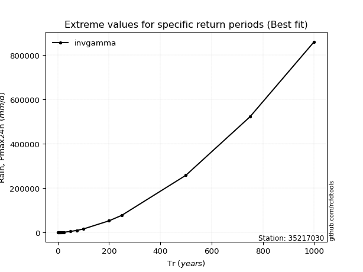</img>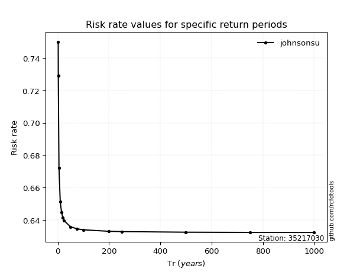</img>

</div>


<sub>**APP DISCLAIMER**: NO WARRANTY - This software is provided by [github.com/rcfdtools](https://github.com/rcfdtools) "as is", without any express or implied warranty, including warranties of merchantability, fitness for a particular purpose, or non-infringement. There is no guarantee that the software will be error-free or operate without interruption. LIMITATION OF LIABILITY - Neither the authors nor copyright holders will be liable for claims or damages arising from the software or its use. You are responsible for determining if the software is appropriate for your use and assume all associated risks, including errors, legal compliance, and data loss. NO PROFESSIONAL ADVICE - The software provides general information and does not offer professional advice. It should not replace consultation with professional advisors.</sub>