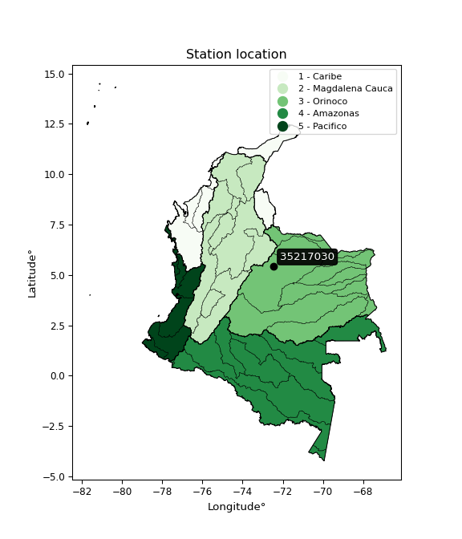

<div align="center">


</div>

# PMP Station (Rain, Pmax24h): 35217030

Probable Maximum Precipitation (PMP) is the greatest amount of rainfall for a specific duration that is meteorologically possible for a given location, acting as a "worst-case" scenario for extreme storms, crucial for designing safety-critical infrastructure like bridges, river deviations, dams, spillways, and nuclear plants to prevent catastrophic failure. PMP is calculated by hydrologists using meteorological data to determine the upper limit of extreme rainfall, often leading to the Probable Maximum Flood (PMF) for flood control design, and is increasingly being studied for climate change impacts.

<div align="center">

</img>

</div>


## A. General information


### 1. General running parameters

• app_version: _v20260103_. • runtime: _2026-01-03 07:24:50.581521_. • Python version: _3.14.0_. • SciPy version: _1.16.3_. • Pandas version: _2.3.3_. • NumPy version: _2.3.5_. • Stations dataset (station_dataset_file): _dataset/pmax24h_in/automatic_colombia_2003_2024.csv_. • Stations catalog (station_catalog_file): _dataset/CNE.xls_. • Minimum year to eval til year_max (date_min): _1900_. • Maximum year to eval since year_min (date_max): _2024_. • Creates, save and include plots into reports (create_plot): _False_. • Plot only fit distributions with Δo > Δ (plot_only_fit): _True_. • Eval low extreme values, if False, evaluates high extreme values (low_extreme): _False_. • Eval every SciPy distribution as logarithmic (pdist_logarithmic_on): _True_. • Standard deviation normalized (ddof): _1.0_. • Return periods to eval in years (Tr): _[2, 2.33, 5, 10, 15, 20, 25, 50, 75, 100, 200, 250, 500, 750, 1000]_. • Minimum data sample per station, 0 means any (minimum_sample): _5_. • Z-Score maximum threshold to adjust a value, 0 means disable (zscore_max): _3.5_. • Z-Score minimum threshold to adjust a value, 0 means disable (zscore_min): _-2.5_. • Avoid zeros, e.g. rain = 0 (avoid_zeros): _True_. • Avoid null values (avoid_nans): _True_. [:file_folder:Dataset file.](../../dataset/pmax24h_in/automatic_colombia_2003_2024.csv)

> Delta Degrees of Freedom (DDOF): is a parameter used in the formulas for calculating variance and standard deviation. When ddof=0, the divisor is $N$ (the total number of observations) and this is used when your data set is the entire population. When ddof=1, the divisor is $N-1$ and this is used when your data set is a sample drawn from a larger population. Using $N-1$ provides an unbiased estimate of the population variance (known as Bessel´s correction).


### 2. Station info and location

|   id |   CODIGO | NOMBRE                      | CATEGORIA    | TECNOLOGIA                              | ESTADO   | FECHA_INSTALACION   |   FECHA_SUSPENSION |   ALTITUD |   LATITUD |   LONGITUD | DEPARTAMENTO   | MUNICIPIO   | AREA_OPERATIVA                              | ENTIDAD                                                     | AREA_HIDROGRAFICA   | ZONA_HIDROGRAFICA   | SUBZONA_HIDROGRAFICA   | CORRIENTE   | Catalogo   |   Version |
|-----:|---------:|:----------------------------|:-------------|:----------------------------------------|:---------|:--------------------|-------------------:|----------:|----------:|-----------:|:---------------|:------------|:--------------------------------------------|:------------------------------------------------------------|:--------------------|:--------------------|:-----------------------|:------------|:-----------|----------:|
|    0 | 35217030 | PUENTE LA CABANA [35217030] | Limnigráfica | Automática con Telemetría, Convencional | Activa   | 15/12/1979          |                nan |       497 |   5.43794 |   -72.4552 | Casanare       | Yopal       | Area Operativa 06 - Boyacá-Casanare-Vichada | INSTITUTO DE HIDROLOGIA METEOROLOGIA Y ESTUDIOS AMBIENTALES | Orinoco             | Meta                | Río Cravo Sur          | Cravo Sur   | CNE_IDEAM  |  20251226 |

<div align="center">

Dynamic map: [:earth_americas:Google](http://maps.google.com/maps?q=5.437944444,-72.45522222) [:earth_americas:OSM](https://www.openstreetmap.org/#map=18/5.437944444/-72.45522222&layers=P) [:earth_americas:Bing](https://www.bing.com/maps?cp=5.437944444~-72.45522222&lvl=18) [:earth_americas:Apple](https://maps.apple.com/frame?center=5.437944444%2C-72.45522222&span=0.003%2C0.006)

</div>


<div align="center">

```geojson
{
  "type": "Feature",
  "geometry": {
    "type": "Point", 
    "coordinates": [-72.45522222, 5.437944444]
  }, 
  "properties": {
    "Name": "35217030"
  }
}
```

</div>


### 3. Discrete values table and plot

<div align="center">

|               |           0 |           1 |           2 |           3 |           4 |          5 |
|:--------------|------------:|------------:|------------:|------------:|------------:|-----------:|
| Date          | 2019        | 2020        | 2021        | 2022        | 2023        | 2024       |
| Value         |   74.4      |  104.3      |   81.8      |  130.5      |   80.2      |  523.8     |
| Value_initial |   74.4      |  104.3      |   81.8      |  130.5      |   80.2      |  523.8     |
| count         |    6        |    6        |    6        |    6        |    6        |    6       |
| mean          |  165.833    |  165.833    |  165.833    |  165.833    |  165.833    |  165.833   |
| std           |  176.595    |  176.595    |  176.595    |  176.595    |  176.595    |  176.595   |
| zscore        |   -0.517756 |   -0.348442 |   -0.475852 |   -0.200081 |   -0.484913 |    2.02704 |


</div>


> The initial value (value_initial) correspond to the initial obtained or null completed value, and value (value) is adjusted only when the initial value is outside the valid range definite through the Z-Score value. If Z-Score is active, values out of range or outliers are replaced with the station mean value


### 4. Active continuous probability distributions from SciPy (44 of 104 available)

A Probability Density Function (PDF) describes the relative likelihood of a continuous random variable falling within a specific range, where the total area under its curve equals 1, and the area over any interval gives the actual probability for that range. Unlike discrete probabilities (like rolling a die), a PDF shows density, not direct probability for a single point (which is zero), with higher points indicating higher likelihood, often visualized as a bell curve for normal distributions.

A log of a probability density function (log-PDF) is simply the logarithm of the PDF´s value, denoted as $log(f(x))$, useful for converting multiplication of probabilities into addition, improving numerical stability with tiny numbers, and connecting to information theory concepts like entropy. Instead of dealing with very small probabilities (e.g., 0.000001), log-PDFs use negative numbers (e.g., $log(0.00001) ≈ -11.51$ that are easier for computers to handle, preventing underflow errors and simplifying complex calculations. In this study, each active probability distribution from SciPy is also evaluated in the $log$ form.

[scipy.stats](https://docs.scipy.org/doc/scipy/reference/stats.html) is a Python´s powerful submodule within the SciPy library for comprehensive statistical analysis, offering over 130 probability distributions (like Normal, Poisson), functions for descriptive stats (mean, variance), hypothesis testing (t-tests, chi-square), random variable generation, and statistical tests, making it essential for data science, modeling, and research. It provides tools to explore, model, and draw conclusions from data efficiently, working seamlessly with NumPy.

<div align="center">

|   id | p_dist             |   n_parameter | fit_method   | label                                                                       | active   | ref                                                                                                        |
|-----:|:-------------------|--------------:|:-------------|:----------------------------------------------------------------------------|:---------|:-----------------------------------------------------------------------------------------------------------|
|    0 | alpha              |             3 | MLE          | Alpha                                                                       | True     | [:mortar_board:](https://docs.scipy.org/doc/scipy/reference/generated/scipy.stats.alpha.html)              |
|    1 | betaprime          |             4 | MLE          | Beta prime                                                                  | True     | [:mortar_board:](https://docs.scipy.org/doc/scipy/reference/generated/scipy.stats.betaprime.html)          |
|    2 | chi2               |             3 | MLE          | Chi²                                                                        | True     | [:mortar_board:](https://docs.scipy.org/doc/scipy/reference/generated/scipy.stats.chi2.html)               |
|    3 | crystalball        |             4 | MLE          | Crystalball                                                                 | True     | [:mortar_board:](https://docs.scipy.org/doc/scipy/reference/generated/scipy.stats.crystalball.html)        |
|    4 | erlang             |             3 | MLE          | Erlang                                                                      | True     | [:mortar_board:](https://docs.scipy.org/doc/scipy/reference/generated/scipy.stats.erlang.html)             |
|    5 | expon              |             2 | MLE          | Exponential                                                                 | True     | [:mortar_board:](https://docs.scipy.org/doc/scipy/reference/generated/scipy.stats.expon.html)              |
|    6 | exponnorm          |             3 | MLE          | Exponentially modified Normal                                               | True     | [:mortar_board:](https://docs.scipy.org/doc/scipy/reference/generated/scipy.stats.exponnorm.html)          |
|    7 | f                  |             4 | MLE          | F                                                                           | True     | [:mortar_board:](https://docs.scipy.org/doc/scipy/reference/generated/scipy.stats.f.html)                  |
|    8 | fatiguelife        |             3 | MLE          | Fatigue-life (Birnbaum-Saunders)                                            | True     | [:mortar_board:](https://docs.scipy.org/doc/scipy/reference/generated/scipy.stats.fatiguelife.html)        |
|    9 | fisk               |             3 | MLE          | Fisk                                                                        | True     | [:mortar_board:](https://docs.scipy.org/doc/scipy/reference/generated/scipy.stats.fisk.html)               |
|   10 | gamma              |             3 | MLE          | Gamma                                                                       | True     | [:mortar_board:](https://docs.scipy.org/doc/scipy/reference/generated/scipy.stats.gamma.html)              |
|   11 | genexpon           |             5 | MLE          | Generalized exponential                                                     | True     | [:mortar_board:](https://docs.scipy.org/doc/scipy/reference/generated/scipy.stats.genexpon.html)           |
|   12 | genlogistic        |             3 | MLE          | Generalized logistic                                                        | True     | [:mortar_board:](https://docs.scipy.org/doc/scipy/reference/generated/scipy.stats.genlogistic.html)        |
|   13 | gibrat             |             2 | MM           | Gibrat                                                                      | True     | [:mortar_board:](https://docs.scipy.org/doc/scipy/reference/generated/scipy.stats.gibrat.html)             |
|   14 | gompertz           |             3 | MLE          | Gompertz (or truncated Gumbel)                                              | True     | [:mortar_board:](https://docs.scipy.org/doc/scipy/reference/generated/scipy.stats.gompertz.html)           |
|   15 | gumbel_l           |             2 | MM           | Gumbel Left Skew                                                            | True     | [:mortar_board:](https://docs.scipy.org/doc/scipy/reference/generated/scipy.stats.gumbel_l.html)           |
|   16 | gumbel_r           |             2 | MM           | Gumbel Right Skew                                                           | True     | [:mortar_board:](https://docs.scipy.org/doc/scipy/reference/generated/scipy.stats.gumbel_r.html)           |
|   17 | halflogistic       |             2 | MM           | Half-logistic                                                               | True     | [:mortar_board:](https://docs.scipy.org/doc/scipy/reference/generated/scipy.stats.halflogistic.html)       |
|   18 | halfnorm           |             2 | MM           | Half Normal                                                                 | True     | [:mortar_board:](https://docs.scipy.org/doc/scipy/reference/generated/scipy.stats.halfnorm.html)           |
|   19 | hypsecant          |             2 | MM           | hyperbolic secant                                                           | True     | [:mortar_board:](https://docs.scipy.org/doc/scipy/reference/generated/scipy.stats.hypsecant.html)          |
|   20 | invgamma           |             3 | MLE          | Inverted gamma                                                              | True     | [:mortar_board:](https://docs.scipy.org/doc/scipy/reference/generated/scipy.stats.invgamma.html)           |
|   21 | invgauss           |             3 | MLE          | Inverse Gaussian                                                            | True     | [:mortar_board:](https://docs.scipy.org/doc/scipy/reference/generated/scipy.stats.invgauss.html)           |
|   22 | invweibull         |             3 | MLE          | Inverted Weibull                                                            | True     | [:mortar_board:](https://docs.scipy.org/doc/scipy/reference/generated/scipy.stats.invweibull.html)         |
|   23 | johnsonsu          |             4 | MLE          | Johnson Su                                                                  | True     | [:mortar_board:](https://docs.scipy.org/doc/scipy/reference/generated/scipy.stats.johnsonsu.html)          |
|   24 | kstwobign          |             2 | MLE          | Limiting distribution of scaled Kolmogorov-Smirnov two-sided test statistic | True     | [:mortar_board:](https://docs.scipy.org/doc/scipy/reference/generated/scipy.stats.kstwobign.html)          |
|   25 | laplace            |             2 | MM           | Laplace                                                                     | True     | [:mortar_board:](https://docs.scipy.org/doc/scipy/reference/generated/scipy.stats.laplace.html)            |
|   26 | laplace_asymmetric |             3 | MLE          | Asymmetric Laplace                                                          | True     | [:mortar_board:](https://docs.scipy.org/doc/scipy/reference/generated/scipy.stats.laplace_asymmetric.html) |
|   27 | loggamma           |             3 | MLE          | Log gamma                                                                   | True     | [:mortar_board:](https://docs.scipy.org/doc/scipy/reference/generated/scipy.stats.loggamma.html)           |
|   28 | logistic           |             2 | MM           | Logistic (or Sech-squared)                                                  | True     | [:mortar_board:](https://docs.scipy.org/doc/scipy/reference/generated/scipy.stats.logistic.html)           |
|   29 | lognorm            |             3 | MLE          | Log Normal                                                                  | True     | [:mortar_board:](https://docs.scipy.org/doc/scipy/reference/generated/scipy.stats.lognorm.html)            |
|   30 | maxwell            |             2 | MM           | Maxwell                                                                     | True     | [:mortar_board:](https://docs.scipy.org/doc/scipy/reference/generated/scipy.stats.maxwell.html)            |
|   31 | mielke             |             4 | MLE          | Mielke Beta-Kappa / Dagum                                                   | True     | [:mortar_board:](https://docs.scipy.org/doc/scipy/reference/generated/scipy.stats.mielke.html)             |
|   32 | moyal              |             2 | MM           | Moyal                                                                       | True     | [:mortar_board:](https://docs.scipy.org/doc/scipy/reference/generated/scipy.stats.moyal.html)              |
|   33 | nakagami           |             3 | MLE          | Nakagami                                                                    | True     | [:mortar_board:](https://docs.scipy.org/doc/scipy/reference/generated/scipy.stats.nakagami.html)           |
|   34 | ncf                |             5 | MLE          | Non-central F distribution                                                  | True     | [:mortar_board:](https://docs.scipy.org/doc/scipy/reference/generated/scipy.stats.ncf.html)                |
|   35 | nct                |             4 | MLE          | Non-central Student’s t                                                     | True     | [:mortar_board:](https://docs.scipy.org/doc/scipy/reference/generated/scipy.stats.nct.html)                |
|   36 | norm               |             2 | MM           | Normal                                                                      | True     | [:mortar_board:](https://docs.scipy.org/doc/scipy/reference/generated/scipy.stats.norm.html)               |
|   37 | pearson3           |             3 | MM           | Pearson type III                                                            | True     | [:mortar_board:](https://docs.scipy.org/doc/scipy/reference/generated/scipy.stats.pearson3.html)           |
|   38 | rayleigh           |             2 | MM           | Rayleigh                                                                    | True     | [:mortar_board:](https://docs.scipy.org/doc/scipy/reference/generated/scipy.stats.rayleigh.html)           |
|   39 | rice               |             3 | MLE          | Rice                                                                        | True     | [:mortar_board:](https://docs.scipy.org/doc/scipy/reference/generated/scipy.stats.rice.html)               |
|   40 | t                  |             3 | MLE          | Student’s t                                                                 | True     | [:mortar_board:](https://docs.scipy.org/doc/scipy/reference/generated/scipy.stats.t.html)                  |
|   41 | truncnorm          |             4 | MLE          | Truncated normal                                                            | True     | [:mortar_board:](https://docs.scipy.org/doc/scipy/reference/generated/scipy.stats.truncnorm.html)          |
|   42 | wald               |             2 | MM           | Wald                                                                        | True     | [:mortar_board:](https://docs.scipy.org/doc/scipy/reference/generated/scipy.stats.wald.html)               |
|   43 | weibull_min        |             3 | MLE          | Weibull minimum                                                             | True     | [:mortar_board:](https://docs.scipy.org/doc/scipy/reference/generated/scipy.stats.weibull_min.html)        |

</div>

> **n_parameter:** # arguments & localization & scale.
>
> **Fit methods:** (MLE) maximum likelihood, (MM) L-moments.
>
>**Inactive** (With the only purpose of prevent loops, zero divisions, infinite values, over high estimated values or horizontal trending for recurrence intervals estimations, the follow distributions were disabled.)**:** foldnorm, gennorm, norminvgauss, powernorm, powerlognorm, skewnorm, genextreme, anglit, arcsine, argus, beta, bradford, burr, burr12, cauchy, cosine, halfcauchy, foldcauchy, skewcauchy, wrapcauchy, dgamma, gengamma, exponweib, exponpow, truncexpon, gausshyper, genhalflogistic, genhyperbolic, geninvgauss, halfgennorm, johnsonsb, kappa4, kappa3, ksone, kstwo, loglaplace, levy, levy_l, levy_stable, ncx2, pareto, genpareto, truncpareto, lomax, powerlaw, rdist, rel_breitwigner, recipinvgauss, semicircular, studentized_range, trapezoid, triang, truncweibull_min, tukeylambda, uniform, loguniform, vonmises, vonmises_line, weibull_max, dweibull, 


## B. Probability distributions vs. Empirical distributions

A continuous probability distribution (CPD) describes probabilities for variables that can take any value within a range (like rain any time), unlike discrete variables with specific outcomes (like temperature). It uses a Probability Density Function (PDF), a curve where the total area under it equals 1, and the probability of the variable falling within an interval (a to b) is found by calculating the area under the curve between those points. A key feature is that the probability of hitting any single exact value is zero, so probabilities are always expressed for ranges, e.g., $P(a ≤ X ≤ b)$.

<div align="center">

Distributions parameters from station values
|    |   station | p_dist                |   n |            loc |           scale | shape                  | shape1                | shape2             | shape3   |
|---:|----------:|:----------------------|----:|---------------:|----------------:|:-----------------------|:----------------------|:-------------------|:---------|
|  0 |  35217030 | alpha                 |   6 |      66.6865   |    14.7398      | 2.94966502690517e-09   |                       |                    |          |
|  1 |  35217030 | betaprime             |   6 |      -0.484953 |     0.935897    | 367.620747284823       | 3.2633062143312745    |                    |          |
|  2 |  35217030 | chi2                  |   6 |      74.4      |    88.225       | 1.1999422464512288     |                       |                    |          |
|  3 |  35217030 | crystalball           |   6 |     176.238    |   164.87        | 465.985418507895       | 23177.872815489187    |                    |          |
|  4 |  35217030 | erlang                |   6 |      74.4      |   232.894       | 0.3484841629177634     |                       |                    |          |
|  5 |  35217030 | expon                 |   6 |      74.4      |    91.4333      |                        |                       |                    |          |
|  6 |  35217030 | exponnorm             |   6 |      74.3024   |     0.0284371   | 3200.344143435261      |                       |                    |          |
|  7 |  35217030 | f                     |   6 |      72.4398   |     7.53547     | 3587.137469069072      | 1.1516575706173489    |                    |          |
|  8 |  35217030 | fatiguelife           |   6 |      74.4      |     0.000284968 | 585.5976518440217      |                       |                    |          |
|  9 |  35217030 | fisk                  |   6 |      74.4      |    22.3351      | 0.5702295579584793     |                       |                    |          |
| 10 |  35217030 | gamma                 |   6 |      74.4      |   110.614       | 0.5270396328980854     |                       |                    |          |
| 11 |  35217030 | genexpon              |   6 |      74.4      |   231.611       | 2.5331127468024364     | 2.459922346980277e-11 | 1.2919739270495803 |          |
| 12 |  35217030 | genlogistic           |   6 |    -487.584    |    76.1882      | 2404.9830469770995     |                       |                    |          |
| 13 |  35217030 | gibrat                |   6 |      42.8513   |    74.5924      |                        |                       |                    |          |
| 14 |  35217030 | gompertz              |   6 |      74.4      |     2.05225e+09 | 22251323.033232328     |                       |                    |          |
| 15 |  35217030 | gumbel_l              |   6 |     238.386    |   125.694       |                        |                       |                    |          |
| 16 |  35217030 | gumbel_r              |   6 |      93.2808   |   125.694       |                        |                       |                    |          |
| 17 |  35217030 | halflogistic          |   6 |     -25.2365   |   137.828       |                        |                       |                    |          |
| 18 |  35217030 | halfnorm              |   6 |     -47.5439   |   267.429       |                        |                       |                    |          |
| 19 |  35217030 | hypsecant             |   6 |     165.833    |   102.629       |                        |                       |                    |          |
| 20 |  35217030 | invgamma              |   6 |      72.4386   |     4.33862     | 0.5758279516567302     |                       |                    |          |
| 21 |  35217030 | invgauss              |   6 |      72.4927   |     8.02011     | 11.638321260202865     |                       |                    |          |
| 22 |  35217030 | invweibull            |   6 |      74.4      |     0.0690389   | 0.05922583997069478    |                       |                    |          |
| 23 |  35217030 | johnsonsu             |   6 |      80.2      |     3.43169e-11 | -0.6247512608139802    | 0.09170646758149582   |                    |          |
| 24 |  35217030 | kstwobign             |   6 |    -214.463    |   447.759       |                        |                       |                    |          |
| 25 |  35217030 | laplace               |   6 |     165.833    |   113.992       |                        |                       |                    |          |
| 26 |  35217030 | laplace_asymmetric    |   6 |      74.4      |     0.00381466  | 4.17205856707463e-05   |                       |                    |          |
| 27 |  35217030 | loggamma              |   6 |  -45220.5      |  6275.2         | 1383.9674925920526     |                       |                    |          |
| 28 |  35217030 | logistic              |   6 |     165.833    |    88.8791      |                        |                       |                    |          |
| 29 |  35217030 | lognorm               |   6 |      74.4      |     0.0878533   | 13.249617217474361     |                       |                    |          |
| 30 |  35217030 | maxwell               |   6 |    -216.164    |   239.381       |                        |                       |                    |          |
| 31 |  35217030 | mielke                |   6 |       5.33847  |    10.69        | 264.9921303856568      | 2.2576218159486965    |                    |          |
| 32 |  35217030 | moyal                 |   6 |      73.6438   |    72.5695      |                        |                       |                    |          |
| 33 |  35217030 | nakagami              |   6 |      74.4      |   256.993       | 0.2243187511665741     |                       |                    |          |
| 34 |  35217030 | ncf                   |   6 |      -0.217085 |     2.68514e-08 | 9.202089500873307e-09  | 7.781520594181466     | 38.01185612196612  |          |
| 35 |  35217030 | nct                   |   6 |       0.62569  |     1.20503     | 2.329813667948229      | 79.59900771977868     |                    |          |
| 36 |  35217030 | norm                  |   6 |     165.833    |   161.209       |                        |                       |                    |          |
| 37 |  35217030 | pearson3              |   6 |     165.833    |   161.209       | 1.7347565963324447     |                       |                    |          |
| 38 |  35217030 | rayleigh              |   6 |    -142.569    |   246.069       |                        |                       |                    |          |
| 39 |  35217030 | rice                  |   6 |     -57.0439   |   194.503       | 0.0003021083194410255  |                       |                    |          |
| 40 |  35217030 | t                     |   6 |      87.5962   |    12.8285      | 0.7060796193500793     |                       |                    |          |
| 41 |  35217030 | truncnorm             |   6 | -892790        | 12000.9         | 74.39958148094522      | 74.4370288650483      |                    |          |
| 42 |  35217030 | wald                  |   6 |       4.62454  |   161.209       |                        |                       |                    |          |
| 43 |  35217030 | weibull_min           |   6 |      74.4      |    27.6746      | 0.4599639831776545     |                       |                    |          |
| 44 |  35217030 | logalpha              |   6 |       4.22041  |     0.17231     | 2.906336533271413e-07  |                       |                    |          |
| 45 |  35217030 | logbetaprime          |   6 |      -0.938262 |     1.04972     | 530.8345332702277      | 98.20209906224201     |                    |          |
| 46 |  35217030 | logchi2               |   6 |       4.30946  |     0.94614     | 1.084275367862804      |                       |                    |          |
| 47 |  35217030 | logcrystalball        |   6 |       4.813    |     0.674796    | 7.556236975595841      | 399.3710406689029     |                    |          |
| 48 |  35217030 | logerlang             |   6 |       4.30946  |     0.540621    | 0.5908927769457026     |                       |                    |          |
| 49 |  35217030 | logexpon              |   6 |       4.30946  |     0.503546    |                        |                       |                    |          |
| 50 |  35217030 | logexponnorm          |   6 |       4.30885  |     0.00018552  | 2696.3913544605066     |                       |                    |          |
| 51 |  35217030 | logf                  |   6 |       4.30946  |     0.458136    | 0.2630333249307324     | 2795.9407277659193    |                    |          |
| 52 |  35217030 | logfatiguelife        |   6 |       4.30946  |     1.84157e-06 | 418.5702812168604      |                       |                    |          |
| 53 |  35217030 | logfisk               |   6 |       4.30946  |     0.198814    | 0.5258576909097266     |                       |                    |          |
| 54 |  35217030 | loggamma              |   6 |       4.30946  |     0.602849    | 0.6544023605824978     |                       |                    |          |
| 55 |  35217030 | loggenexpon           |   6 |       4.30946  |     1.11663     | 2.217555558980828      | 6.486276094071264e-08 | 2.055934978288975  |          |
| 56 |  35217030 | loggenlogistic        |   6 |       1.67979  |     0.376169    | 2014.395776283579      |                       |                    |          |
| 57 |  35217030 | loggibrat             |   6 |       4.29822  |     0.312233    |                        |                       |                    |          |
| 58 |  35217030 | loggompertz           |   6 |       4.30946  |     1.30598     | 1.1865006868877666     |                       |                    |          |
| 59 |  35217030 | loggumbel_l           |   6 |       5.1167   |     0.526136    |                        |                       |                    |          |
| 60 |  35217030 | loggumbel_r           |   6 |       4.50931  |     0.526136    |                        |                       |                    |          |
| 61 |  35217030 | loghalflogistic       |   6 |       4.01321  |     0.576927    |                        |                       |                    |          |
| 62 |  35217030 | loghalfnorm           |   6 |       3.91984  |     1.11942     |                        |                       |                    |          |
| 63 |  35217030 | loghypsecant          |   6 |       4.813    |     0.429589    |                        |                       |                    |          |
| 64 |  35217030 | loginvgamma           |   6 |       4.26529  |     0.127768    | 0.9154731071674905     |                       |                    |          |
| 65 |  35217030 | loginvgauss           |   6 |       4.27836  |     0.138882    | 3.8495644571364567     |                       |                    |          |
| 66 |  35217030 | loginvweibull         |   6 |       4.27751  |     0.124275    | 0.8358182696962811     |                       |                    |          |
| 67 |  35217030 | logjohnsonsu          |   6 |       4.30946  |     3.55752e-13 | -2.0881539922788654    | 0.10779240731877163   |                    |          |
| 68 |  35217030 | logkstwobign          |   6 |       3.09031  |     2.0104      |                        |                       |                    |          |
| 69 |  35217030 | loglaplace            |   6 |       4.813    |     0.477153    |                        |                       |                    |          |
| 70 |  35217030 | loglaplace_asymmetric |   6 |       4.30946  |     0.000126045 | 0.00025025598622086247 |                       |                    |          |
| 71 |  35217030 | logloggamma           |   6 |    -197.083    |    27.3246      | 1618.8518502761117     |                       |                    |          |
| 72 |  35217030 | loglogistic           |   6 |       4.813    |     0.372035    |                        |                       |                    |          |
| 73 |  35217030 | loglognorm            |   6 |       4.30946  |     0.0011524   | 12.521174090872643     |                       |                    |          |
| 74 |  35217030 | logmaxwell            |   6 |       3.21402  |     1.00201     |                        |                       |                    |          |
| 75 |  35217030 | logmielke             |   6 |       4.23487  |     0.0143561   | 25.340310410494787     | 1.2039783619071098    |                    |          |
| 76 |  35217030 | logmoyal              |   6 |       4.42711  |     0.303765    |                        |                       |                    |          |
| 77 |  35217030 | lognakagami           |   6 |       4.30946  |     0.985946    | 0.06462436645578046    |                       |                    |          |
| 78 |  35217030 | logncf                |   6 |       4.26669  |     0.0467352   | 50.515894821214346     | 1.8310157939195173    | 100.49114353819067 |          |
| 79 |  35217030 | lognct                |   6 |      -0.468698 |     0.127382    | 40.980672160669826     | 40.66655983542762     |                    |          |
| 80 |  35217030 | lognorm               |   6 |       4.813    |     0.674796    |                        |                       |                    |          |
| 81 |  35217030 | logpearson3           |   6 |       4.813    |     0.674795    | 1.495897617606902      |                       |                    |          |
| 82 |  35217030 | lograyleigh           |   6 |       3.52208  |     1.03001     |                        |                       |                    |          |
| 83 |  35217030 | logrice               |   6 |       3.83694  |     0.839062    | 0.00023081020777728688 |                       |                    |          |
| 84 |  35217030 | logt                  |   6 |       4.39206  |     0.0388107   | 0.4433511766075181     |                       |                    |          |
| 85 |  35217030 | logtruncnorm          |   6 |      -7.90397  |     2.61655     | 4.667754278729058      | 9.433542789479809     |                    |          |
| 86 |  35217030 | logwald               |   6 |       4.13821  |     0.674796    |                        |                       |                    |          |
| 87 |  35217030 | logweibull_min        |   6 |       4.30946  |     0.943119    | 0.6352544039551506     |                       |                    |          |

</div>

> **loc** (Location parameter): This shifts the distribution along the x-axis. For many common distributions, like the normal (Gaussian) distribution, loc represents the mean $μ$. For others, like the uniform distribution, it might represent the minimum value, or for the beta distribution, the left end of the support interval.
>
> **scale** (Scale parameter): This determines the width or spread of the distribution. For the normal distribution, scale represents the standard deviation $σ$. For a uniform distribution, it defines the length of the interval (from $loc$ to $loc + scale$).
>
> **shape** (Shape parameters): Refers to parameters that define the specific form of a probability distribution, distinct from its location (loc) and scale (scale). These parameters are required arguments for most distribution functions. For example, a normal (Gaussian) distribution is fully defined by its location (mean) and scale (standard deviation), so it has no specific shape parameters beyond loc and scale. However, other distributions have intrinsic properties that need specification, as Gamma distribution that takes a shape parameter, often named $a$ or $alpha$.


### 0. Cumulative distribution values - CDF (88 evaluated)

Cumulative Distribution Function (CDF), denoted as $F$<sub>$X$</sub>$(x)$, is a function that gives the probability that a random variable $X$ will take a value less than or equal to a specific value, $x$ (i.e., $(P(X≥x)$. It essentially "accumulates" probabilities from a given point up to the far right (positive infinity), providing a complete picture of the distribution´s probabilities for both discrete (like rain) and continuous (like temperature) variables, helping to find probabilities over ranges or above certain values. Each station is evaluated separately ordering the $x$ values ascending, calculating the CDF and PDF values for the activated distributions and their logarithmic forms.

<div align="center">

CDF ordered by x ascending and calculating $log(f(x))$ separately
|   id |   Station |   date |     x |   count |    mean |     std |    zscore |   Value_initial |   station |   m |     alpha |   alpha_pdf |   betaprime |   betaprime_pdf |        chi2 |        chi2_pdf |   crystalball |   crystalball_pdf |      erlang |   erlang_pdf |     expon |   expon_pdf |   exponnorm |   exponnorm_pdf |         f |       f_pdf |   fatiguelife |   fatiguelife_pdf |        fisk |        fisk_pdf |       gamma |        gamma_pdf |   genexpon |   genexpon_pdf |   genlogistic |   genlogistic_pdf |   gibrat |   gibrat_pdf |    gompertz |   gompertz_pdf |   gumbel_l |   gumbel_l_pdf |   gumbel_r |   gumbel_r_pdf |   halflogistic |   halflogistic_pdf |   halfnorm |   halfnorm_pdf |   hypsecant |   hypsecant_pdf |   invgamma |   invgamma_pdf |   invgauss |   invgauss_pdf |   invweibull |   invweibull_pdf |   johnsonsu |   johnsonsu_pdf |   kstwobign |   kstwobign_pdf |   laplace |   laplace_pdf |   laplace_asymmetric |   laplace_asymmetric_pdf |   loggamma |   loggamma_pdf |   logistic |   logistic_pdf |   lognorm |   lognorm_pdf |   maxwell |   maxwell_pdf |     mielke |   mielke_pdf |    moyal |   moyal_pdf |    nakagami |   nakagami_pdf |      ncf |     ncf_pdf |      nct |     nct_pdf |     norm |    norm_pdf |   pearson3 |   pearson3_pdf |   rayleigh |   rayleigh_pdf |     rice |   rice_pdf |        t |       t_pdf |   truncnorm |   truncnorm_pdf |     wald |    wald_pdf |   weibull_min |   weibull_min_pdf |   logalpha |   logalpha_pdf |   logbetaprime |   logbetaprime_pdf |     logchi2 |   logchi2_pdf |   logcrystalball |   logcrystalball_pdf |   logerlang |   logerlang_pdf |   logexpon |   logexpon_pdf |   logexponnorm |   logexponnorm_pdf |       logf |   logf_pdf |   logfatiguelife |   logfatiguelife_pdf |     logfisk |   logfisk_pdf |   loggenexpon |   loggenexpon_pdf |   loggenlogistic |   loggenlogistic_pdf |   loggibrat |   loggibrat_pdf |   loggompertz |   loggompertz_pdf |   loggumbel_l |   loggumbel_l_pdf |   loggumbel_r |   loggumbel_r_pdf |   loghalflogistic |   loghalflogistic_pdf |   loghalfnorm |   loghalfnorm_pdf |   loghypsecant |   loghypsecant_pdf |   loginvgamma |   loginvgamma_pdf |   loginvgauss |   loginvgauss_pdf |   loginvweibull |   loginvweibull_pdf |   logjohnsonsu |   logjohnsonsu_pdf |   logkstwobign |   logkstwobign_pdf |   loglaplace |   loglaplace_pdf |   loglaplace_asymmetric |   loglaplace_asymmetric_pdf |   logloggamma |   logloggamma_pdf |   loglogistic |   loglogistic_pdf |   loglognorm |   loglognorm_pdf |   logmaxwell |   logmaxwell_pdf |   logmielke |   logmielke_pdf |   logmoyal |   logmoyal_pdf |   lognakagami |   lognakagami_pdf |    logncf |   logncf_pdf |   lognct |   lognct_pdf |   logpearson3 |   logpearson3_pdf |   lograyleigh |   lograyleigh_pdf |   logrice |   logrice_pdf |     logt |   logt_pdf |   logtruncnorm |   logtruncnorm_pdf |   logwald |   logwald_pdf |   logweibull_min |   logweibull_min_pdf |
|-----:|----------:|-------:|------:|--------:|--------:|--------:|----------:|----------------:|----------:|----:|----------:|------------:|------------:|----------------:|------------:|----------------:|--------------:|------------------:|------------:|-------------:|----------:|------------:|------------:|----------------:|----------:|------------:|--------------:|------------------:|------------:|----------------:|------------:|-----------------:|-----------:|---------------:|--------------:|------------------:|---------:|-------------:|------------:|---------------:|-----------:|---------------:|-----------:|---------------:|---------------:|-------------------:|-----------:|---------------:|------------:|----------------:|-----------:|---------------:|-----------:|---------------:|-------------:|-----------------:|------------:|----------------:|------------:|----------------:|----------:|--------------:|---------------------:|-------------------------:|-----------:|---------------:|-----------:|---------------:|----------:|--------------:|----------:|--------------:|-----------:|-------------:|---------:|------------:|------------:|---------------:|---------:|------------:|---------:|------------:|---------:|------------:|-----------:|---------------:|-----------:|---------------:|---------:|-----------:|---------:|------------:|------------:|----------------:|---------:|------------:|--------------:|------------------:|-----------:|---------------:|---------------:|-------------------:|------------:|--------------:|-----------------:|---------------------:|------------:|----------------:|-----------:|---------------:|---------------:|-------------------:|-----------:|-----------:|-----------------:|---------------------:|------------:|--------------:|--------------:|------------------:|-----------------:|---------------------:|------------:|----------------:|--------------:|------------------:|--------------:|------------------:|--------------:|------------------:|------------------:|----------------------:|--------------:|------------------:|---------------:|-------------------:|--------------:|------------------:|--------------:|------------------:|----------------:|--------------------:|---------------:|-------------------:|---------------:|-------------------:|-------------:|-----------------:|------------------------:|----------------------------:|--------------:|------------------:|--------------:|------------------:|-------------:|-----------------:|-------------:|-----------------:|------------:|----------------:|-----------:|---------------:|--------------:|------------------:|----------:|-------------:|---------:|-------------:|--------------:|------------------:|--------------:|------------------:|----------:|--------------:|---------:|-----------:|---------------:|-------------------:|----------:|--------------:|-----------------:|---------------------:|
|    0 |  35217030 |   2019 |  74.4 |       6 | 165.833 | 176.595 | -0.517756 |            74.4 |  35217030 |   1 | 0.0560162 | 0.0318418   |    0.203476 |     0.0075534   | 2.47152e-10 | 10434.5         |      0.26839  |        0.00199949 | 2.50878e-06 |  6.15214e+07 | 0         | 0.0109369   |   0.0010713 |     0.0109729   | 0.0441143 | 0.0569791   |      0.115771 |       2.00954e+08 | 9.73056e-09 | 27889.4         | 4.74889e-09 | 176123           | 1.6164e-13 |    0.0109369   |      0.222042 |       0.00438446  | 0.194755 |  0.00873248  | 6.87051e-09 |    0.0108424   |   0.237589 |    0.00164541  |   0.312834 |     0.00289225 |       0.346493 |         0.00319218 |   0.3516   |    0.00268894  |    0.24786  |     0.00217835  |   0.044114 |    0.056979    |  0.0438907 |    0.0570435   |   0.00354881 |      8.34336e+10 |  0.00110955 |     5.85639e-05 |    0.200485 |     0.00342064  |  0.224192 |   0.00196674  |          1.76892e-09 |              0.0109369   | 2.1851e-10 | 160996         |   0.263329 |    0.00218259  |  0.227767 |     0.447528  |  0.311563 |   0.00235083  |   0.177932 |   0.00996803 | 0.319832 | 0.00333424  | 3.98769e-08 |    1.25891e+06 | 0.228553 | 0.00681707  | 0.178918 | 0.00897293  | 0.285298 | 0.00210702  |   0.345702 |     0.00358028 |   0.322084 |    0.00242918  | 0.204154 | 0.00276515 | 0.270618 | 0.010538    | 4.43475e-08 |     0.00660756  | 0.302986 | 0.00599325  |    9.2768e-08 |       3.00263e+06 |  0.0529732 |      2.66618   |       0.228846 |          0.534394  | 5.51165e-09 |   3.36427e+06 |         0.227767 |             0.447528 | 2.05774e-09 |     1.36898e+06 |   0        |      1.98592   |     0.00121058 |           1.99556  | 0.00946956 | 1.4022e+12 |        0.0419481 |          2.20022e+10 | 2.84427e-08 |   1.68398e+07 |   2.56265e-09 |         1.98593   |         0.156724 |            0.771776  | 0.000443036 |       0.141372  |   1.82616e-08 |         0.908512  |      0.193951 |        0.330319   |      0.231758 |          0.644024 |          0.251247 |             0.811953  |      0.272202 |         0.670876  |       0.191196 |          0.418783  |     0.0468867 |         3.14094   |     0.0445571 |         3.73981   |       0.0445068 |           3.62341   |      0.0224973 |        1.23244e+10 |       0.144329 |          0.67593   |     0.174042 |         0.36475  |             7.23023e-08 |                   1.98544   |      0.224264 |         0.437995  |      0.2053   |         0.43854   |    0.0129555 |      3.00118e+12 |     0.245836 |        0.523561  |   0.0663931 |       2.7272    |   0.224869 |      0.763157  |    0.00984653 |       1.43288e+12 | 0.0468814 |    3.14099   | 0.211386 |    0.56105   |      0.242931 |         0.804691  |      0.253368 |         0.554126  |  0.146636 |     0.572749  | 0.230706 |  1.17195   |    1.86745e-08 |          1.8596    |  0.116619 |     1.54379   |      2.84856e-10 |        203738        |
|    1 |  35217030 |   2023 |  80.2 |       6 | 165.833 | 176.595 | -0.484913 |            80.2 |  35217030 |   2 | 0.275384  | 0.0355262   |    0.247624 |     0.00763844  | 0.14246     |     0.0144362   |      0.280111 |        0.00204215 | 0.307832    |  0.0181567   | 0.0614641 | 0.0102647   |   0.0627472 |     0.0102985   | 0.336446  | 0.0340601   |      0.596234 |       0.00813399  | 0.31673     |     0.0212766   | 0.234024    |      0.0205452   | 0.0614641  |    0.0102647   |      0.247929 |       0.00453699  | 0.24455  |  0.0084087   | 0.0609494   |    0.0101816   |   0.247293 |    0.00170119  |   0.329666 |     0.00291042 |       0.364871 |         0.00314475 |   0.367118 |    0.00266186  |    0.260748 |     0.00226593  |   0.336445 |    0.0340601   |  0.334658  |    0.0340772   |   0.463391   |      0.00363966  |  0.268026   |     8.78494e+08 |    0.220612 |     0.00351693  |  0.235895 |   0.0020694   |          0.0614639   |              0.0102647   | 0.270528   |      2.18582   |   0.276182 |    0.00224918  |  0.262723 |     0.483265  |  0.325267 |   0.00237404  |   0.236748 |   0.0102237  | 0.339157 | 0.00332774  | 0.143109    |    0.0110687   | 0.268267 | 0.00685729  | 0.231796 | 0.00919571  | 0.297642 | 0.00214906  |   0.366245 |     0.00350288 |   0.336212 |    0.00244213  | 0.220378 | 0.00282831 | 0.348015 | 0.0165611   | 0.0376431   |     0.00637419  | 0.33692  | 0.00570604  |    0.38575    |       0.0237402   |  0.293734  |      2.94165   |       0.270495 |          0.574     | 0.193011    |   1.35843     |         0.262722 |             0.483265 | 0.331667    |     2.39044     |   0.138498 |      1.71087   |     0.14039    |           1.71842  | 0.641022   | 1.10186    |        0.685218  |          1.14099     | 0.374684    |   1.64127     |   0.138499    |         1.71088   |         0.219122 |            0.883991  | 0.099248    |       2.02226   |   0.0677908   |         0.897031  |      0.220168 |        0.368585   |      0.28149  |          0.678214 |          0.311135 |             0.782764  |      0.321943 |         0.653927  |       0.224951 |          0.481131  |     0.307335  |         2.8963    |     0.32291   |         2.82375   |       0.322034  |           2.84987   |      0.787352  |        0.416888    |       0.198389 |          0.759363  |     0.203694 |         0.426894 |             0.138467    |                   1.71052   |      0.258497 |         0.473599  |      0.240176 |         0.490522  |    0.630644  |      0.401469    |     0.286142 |        0.549225  |   0.296461  |       2.81767   |   0.283445 |      0.792479  |    0.621318   |       1.06939     | 0.307327  |    2.89626   | 0.255313 |    0.607677  |      0.303067 |         0.794409  |      0.295701 |         0.572542  |  0.191806 |     0.628607  | 0.450452 |  6.32429   |    0.130635    |          1.62586   |  0.234796 |     1.54312   |      0.181553    |             1.38761  |
|    2 |  35217030 |   2021 |  81.8 |       6 | 165.833 | 176.595 | -0.475852 |            81.8 |  35217030 |   3 | 0.329424  | 0.0320007   |    0.259841 |     0.00763071  | 0.164327    |     0.0129775   |      0.283388 |        0.00205363 | 0.334519    |  0.0153858   | 0.0777448 | 0.0100866   |   0.0790808 |     0.0101191   | 0.385762  | 0.0278911   |      0.608407 |       0.00714236  | 0.347528    |     0.0174731   | 0.264782    |      0.0180463   | 0.0777448  |    0.0100866   |      0.255218 |       0.00457336  | 0.257913 |  0.00829337  | 0.0770994   |    0.0100065   |   0.250028 |    0.00171672  |   0.334325 |     0.00291422 |       0.369892 |         0.00313137 |   0.371371 |    0.00265421  |    0.264393 |     0.00229003  |   0.385762 |    0.0278911   |  0.384132  |    0.0280612   |   0.468526   |      0.002843    |  0.954641   |     0.00546772  |    0.226258 |     0.00354059  |  0.239229 |   0.00209865  |          0.0777446   |              0.0100866   | 0.311282   |      1.95129   |   0.279795 |    0.00226723  |  0.272357 |     0.492121  |  0.32907  |   0.00237992  |   0.253097 |   0.0102079  | 0.344478 | 0.0033242   | 0.159636    |    0.00967671  | 0.279232 | 0.00684839  | 0.246511 | 0.00919358  | 0.301089 | 0.00216032  |   0.371832 |     0.00348113 |   0.340122 |    0.00244519  | 0.224916 | 0.00284462 | 0.376089 | 0.0185322   | 0.0477913   |     0.00631127  | 0.345985 | 0.00562516  |    0.42024    |       0.0196449   |  0.348676  |      2.62146   |       0.281924 |          0.583123  | 0.218277    |   1.20795     |         0.272356 |             0.492121 | 0.375819    |     2.09461     |   0.17164  |      1.64505   |     0.173673   |           1.65188  | 0.660591   | 0.89444    |        0.706126  |          0.984597    | 0.403878    |   1.3352      |   0.171641    |         1.64506   |         0.236812 |            0.906516  | 0.140128    |       2.0999    |   0.0854753   |         0.893426  |      0.227552 |        0.379063   |      0.294951 |          0.68446  |          0.326514 |             0.774265  |      0.334812 |         0.649053  |       0.234621 |          0.498026  |     0.360696  |         2.51455   |     0.374465  |         2.41069   |       0.373995  |           2.42513   |      0.794589  |        0.323377    |       0.213559 |          0.776266  |     0.212304 |         0.444938 |             0.171603    |                   1.64474   |      0.26794  |         0.482475  |      0.249999 |         0.503983  |    0.637662  |      0.315806    |     0.297048 |        0.554882  |   0.349455  |       2.54703   |   0.299131 |      0.795419  |    0.640355   |       0.872364    | 0.360687  |    2.51453   | 0.267422 |    0.618265  |      0.318707 |         0.788895  |      0.307048 |         0.57622   |  0.204349 |     0.641176  | 0.578003 |  5.79876   |    0.162189    |          1.56918   |  0.264863 |     1.49953   |      0.207369    |             1.23408  |
|    3 |  35217030 |   2020 | 104.3 |       6 | 165.833 | 176.595 | -0.348442 |           104.3 |  35217030 |   4 | 0.69515   | 0.00769836  |    0.422998 |     0.00667478  | 0.362504    |     0.00653459  |      0.331297 |        0.00220002 | 0.531109    |  0.00562418  | 0.278927  | 0.00788633  |   0.280798  |     0.00790259  | 0.660965  | 0.00561544  |      0.709916 |       0.00316674  | 0.541488    |     0.00473498  | 0.516805    |      0.00760722  | 0.278927   |    0.00788633  |      0.361857 |       0.00482689  | 0.423152 |  0.00637146  | 0.276886    |    0.0078403   |   0.291156 |    0.00194065  |   0.40009  |     0.00291588 |       0.438136 |         0.00293133 |   0.429824 |    0.00253937  |    0.319654 |     0.00261693  |   0.660965 |    0.00561544  |  0.667651  |    0.00596233  |   0.497587   |      0.000687947 |  0.973831   |     0.000231071 |    0.308666 |     0.00374595  |  0.291431 |   0.0025566   |          0.278926    |              0.00788631  | 0.617316   |      0.840576  |   0.333516 |    0.00250096  |  0.402996 |     0.57364   |  0.383358 |   0.00243817  |   0.463257 |   0.00810546 | 0.418172 | 0.00320698  | 0.298521    |    0.00446809  | 0.426885 | 0.00613013  | 0.439505 | 0.0076391   | 0.351342 | 0.00230083  |   0.446627 |     0.00316504 |   0.39544  |    0.00246485  | 0.291108 | 0.0030233  | 0.761831 | 0.00810046  | 0.180336    |     0.00548955  | 0.459931 | 0.00452433  |    0.645205   |       0.00565562  |  0.686455  |      0.695504  |       0.432929 |          0.64295   | 0.416011    |   0.593807    |         0.402995 |             0.57364  | 0.684399    |     0.794633    |   0.488738 |      1.01532   |     0.49162    |           1.01628  | 0.774582   | 0.276725   |        0.846901  |          0.357953    | 0.569245    |   0.381697    |   0.48874     |         1.01533   |         0.469933 |            0.943222  | 0.544381    |       1.13584   |   0.295494    |         0.828997  |      0.336183 |        0.516973   |      0.463318 |          0.677486 |          0.500157 |             0.64986   |      0.4842   |         0.577099  |       0.380137 |          0.689049  |     0.675118  |         0.650751  |     0.676566  |         0.651629  |       0.668994  |           0.607871  |      0.831321  |        0.0803426   |       0.413791 |          0.827568  |     0.353285 |         0.740403 |             0.488656    |                   1.01524   |      0.396434 |         0.566245  |      0.390438 |         0.639715  |    0.674972  |      0.0850923   |     0.437078 |        0.585718  |   0.693394  |       0.734807  |   0.486421 |      0.717457  |    0.754316   |       0.286553    | 0.675113  |    0.650767  | 0.427951 |    0.681896  |      0.497196 |         0.668151  |      0.449364 |         0.583996  |  0.37271  |     0.722011  | 0.858541 |  0.244263  |    0.47072     |          1.00943   |  0.549001 |     0.866908  |      0.40601     |             0.581829 |
|    4 |  35217030 |   2022 | 130.5 |       6 | 165.833 | 176.595 | -0.200081 |           130.5 |  35217030 |   5 | 0.817328  | 0.00281204  |    0.575517 |     0.00497385  | 0.501752    |     0.00437933  |      0.390728 |        0.0023284  | 0.643444    |  0.0033354   | 0.458581  | 0.00592146  |   0.460708  |     0.00592574  | 0.754715  | 0.00231939  |      0.775677 |       0.00202184  | 0.628355    |     0.00237367  | 0.668809    |      0.00445762  | 0.458581   |    0.00592146  |      0.486383 |       0.00460061  | 0.564071 |  0.00449278  | 0.455702    |    0.0059015   |   0.345493 |    0.00220717  |   0.475349 |     0.00281254 |       0.511654 |         0.00267802 |   0.494437 |    0.00239047  |    0.392514 |     0.00292641  |   0.754715 |    0.00231939  |  0.768554  |    0.00253206  |   0.510456   |      0.000362383 |  0.977669   |     9.69046e-05 |    0.407073 |     0.00372547  |  0.366737 |   0.00321722  |          0.45858     |              0.00592145  | 0.761292   |      0.486137  |   0.401903 |    0.00270454  |  0.534466 |     0.588996  |  0.447518 |   0.00244956  |   0.635457 |   0.00518704 | 0.499115 | 0.00295686  | 0.395345    |    0.00313412  | 0.569919 | 0.00477223  | 0.606407 | 0.0051805   | 0.413256 | 0.00241596  |   0.524678 |     0.00279475 |   0.45976  |    0.00243637  | 0.371779 | 0.00311433 | 0.86931  | 0.00206951  | 0.313089    |     0.00466651  | 0.564134 | 0.00347803  |    0.74944    |       0.00284333  |  0.79124   |      0.313276  |       0.574823 |          0.610438  | 0.527115    |   0.417857    |         0.534466 |             0.588997 | 0.815787    |     0.426314    |   0.672386 |      0.650613  |     0.675192   |           0.649313 | 0.822343   | 0.166794   |        0.906531  |          0.196111    | 0.63329     |   0.217331    |   0.672389    |         0.650613  |         0.659519 |            0.729707  | 0.72821     |       0.578791  |   0.471619    |         0.738141  |      0.465988 |        0.636727   |      0.605016 |          0.577836 |          0.631397 |             0.521157  |      0.604691 |         0.496648  |       0.543119 |          0.734177  |     0.77478   |         0.304156  |     0.779468  |         0.325112  |       0.762971  |           0.290505  |      0.844768  |        0.0457557   |       0.587544 |          0.707215  |     0.557573 |         0.927223 |             0.672299    |                   0.650631  |      0.52675  |         0.586389  |      0.539144 |         0.667862  |    0.689461  |      0.0501801   |     0.565821 |        0.554727  |   0.804199  |       0.329768  |   0.630302 |      0.562973  |    0.804943   |       0.181532    | 0.774777  |    0.304165  | 0.577169 |    0.635075  |      0.63127  |         0.528327  |      0.576004 |         0.539247  |  0.532313 |     0.68718   | 0.892924 |  0.0988722 |    0.656023    |          0.666897  |  0.700486 |     0.520231  |      0.513088    |             0.396151 |
|    5 |  35217030 |   2024 | 523.8 |       6 | 165.833 | 176.595 |  2.02704  |           523.8 |  35217030 |   6 | 0.974276  | 5.62547e-05 |    0.981599 |     9.73239e-05 | 0.967751    |     0.000205064 |      0.982489 |        0.00026227 | 0.970466    |  0.000158846 | 0.992665  | 8.02257e-05 |   0.992839  |     7.86873e-05 | 0.922902  | 9.77598e-05 |      0.984002 |       9.54914e-05 | 0.847055    |     0.000164385 | 0.995203    |      4.75906e-05 | 0.992665   |    8.02256e-05 |      0.995879 |       5.39822e-05 | 0.96882  |  0.000146069 | 0.992346    |    8.29837e-05 |   0.999938 |    4.78806e-06 |   0.967979 |     0.00025063 |       0.96344  |         0.00026041 |   0.967356 |    0.000304506 |    0.980549 |     0.000189407 |   0.922902 |    9.77599e-05 |  0.954671  |    0.000103404 |   0.551847   |      4.32352e-05 |  0.986359   |     7.21415e-06 |    0.991295 |     0.000128214 |  0.978365 |   0.000189797 |          0.992665    |              8.02267e-05 | 0.9825     |      0.0315292 |   0.982494 |    0.000193513 |  0.984063 |     0.0591169 |  0.977249 |   0.000268041 | nan        | nan          | 0.964124 | 0.000247018 | 0.901457    |    0.000506531 | 0.98367  | 9.56948e-05 | 0.979214 | 9.08972e-05 | 0.986808 | 0.000210298 |   0.96154  |     0.00025611 |   0.974441 |    0.000281279 | 0.988426 | 0.0001777  | 0.974239 | 4.16837e-05 | 0.999999    |     0.000407165 | 0.961042 | 0.000199148 |    0.972791   |       0.000100372 |  0.932709  |      0.0328962 |       0.981324 |          0.0546116 | 0.832978    |   0.113368    |         0.984063 |             0.059117 | 0.99031     |     0.0195931   |   0.979263 |      0.0411825 |     0.979813   |           0.040356 | 0.930607   | 0.0379605  |        0.993043  |          0.0122128   | 0.768719    |   0.0479041   |   0.979263    |         0.0411819 |         0.989704 |            0.0272292 | 0.967       |       0.0375057 |   0.983449    |         0.0670136 |      0.99985  |        0.00251373 |      0.964825 |          0.065666 |          0.960177 |             0.0676525 |      0.963518 |         0.0799935 |       0.978136 |          0.0508562 |     0.918999  |         0.0359271 |     0.942069  |         0.0411854 |       0.905987  |           0.0376903 |      0.874611  |        0.0113943   |       0.986184 |          0.0433542 |     0.97596  |         0.050382 |             0.979244    |                   0.0412108 |      0.983494 |         0.0616021 |      0.980011 |         0.0526539 |    0.723664  |      0.0136869   |     0.973825 |        0.0722812 |   0.947184  |       0.0304998 |   0.96103  |      0.0640935 |    0.93303    |       0.0486695   | 0.919     |    0.0359278 | 0.980659 |    0.0528969 |      0.960037 |         0.0680924 |      0.970863 |         0.0752237 |  0.984603 |     0.0530167 | 0.94141  |  0.0138964 |    0.97972     |          0.0433075 |  0.958566 |     0.0509598 |      0.795506    |             0.105648 |


</div>

An Empirical Distribution Function (EDF) is a step-function estimate of a true cumulative distribution function (CDF) based on observed sample data, representing the proportion of data points less than or equal to a given value. It is calculated by ordering your data and jumping up by $1/n$ (where $n$ is sample size) at each unique data point, allowing analysis without assuming an underlying population distribution, and it gets closer to the true CDF as the sample size grows. For the empirical probability calculations, the parameter $m$ correspond to the order number which means the position of the $x$ values in an ascending order list.


### 1. Empirical - EDF California (1923)

California´s estimates the true probability distribution of water-related data (like rainfall, streamflow) using observed samples, crucial for risk assessment.

<div align="center">


$P=m/n$


</div>


**1.1. Empirical values**

<div align="center">

|                | 0                   | 1                  | 2              | 3                  | 4                  | 5              |
|:---------------|:--------------------|:-------------------|:---------------|:-------------------|:-------------------|:---------------|
| date           | 2019                | 2023               | 2021           | 2020               | 2022               | 2024           |
| x              | 74.4                | 80.2               | 81.8           | 104.3              | 130.5              | 523.8          |
| m              | 1                   | 2                  | 3              | 4                  | 5                  | 6              |
| empirical_dist | edf_california      | edf_california     | edf_california | edf_california     | edf_california     | edf_california |
| empirical      | 0.16666666666666666 | 0.3333333333333333 | 0.5            | 0.6666666666666666 | 0.8333333333333334 | 1.0            |
| empirical_tr   | 1.2                 | 1.4999999999999998 | 2.0            | 2.9999999999999996 | 6.000000000000002  | inf            |

</div>


**1.2. Kolmogorov-Smirnov fit test (sorted by Δ)**


<div align="center">

|                | 0                   | 1                   | 2                   | 3                   | 4                   | 5                   | 6                   | 7                   | 8                   | 9                   | 10                  | 11                  | 12                  | 13                  | 14                  | 15                 | 16                  | 17                  | 18                  | 19                  | 20                  | 21                  | 22                  | 23                  | 24                  | 25                  | 26                  | 27                 | 28                  | 29                 | 30                 | 31                  | 32                  | 33                  | 34                 | 35                | 36                 | 37                  | 38                 | 39                 | 40                  | 41                | 42                | 43                  | 44                  | 45                 | 46                  | 47                  | 48                  | 49                  | 50                 | 51                 | 52                 | 53                  | 54                  | 55                 | 56                  | 57                    | 58                 | 59                | 60                 | 61                 | 62                 | 63                  | 64                  | 65                 | 66                 | 67                 | 68                  | 69                 | 70                  | 71                  | 72                 | 73                 | 74                  | 75                  | 76                  | 77                | 78                  | 79                  | 80                 | 81                  | 82                  | 83                  | 84                 | 85                | 86                  | 87                 |
|:---------------|:--------------------|:--------------------|:--------------------|:--------------------|:--------------------|:--------------------|:--------------------|:--------------------|:--------------------|:--------------------|:--------------------|:--------------------|:--------------------|:--------------------|:--------------------|:-------------------|:--------------------|:--------------------|:--------------------|:--------------------|:--------------------|:--------------------|:--------------------|:--------------------|:--------------------|:--------------------|:--------------------|:-------------------|:--------------------|:-------------------|:-------------------|:--------------------|:--------------------|:--------------------|:-------------------|:------------------|:-------------------|:--------------------|:-------------------|:-------------------|:--------------------|:------------------|:------------------|:--------------------|:--------------------|:-------------------|:--------------------|:--------------------|:--------------------|:--------------------|:-------------------|:-------------------|:-------------------|:--------------------|:--------------------|:-------------------|:--------------------|:----------------------|:-------------------|:------------------|:-------------------|:-------------------|:-------------------|:--------------------|:--------------------|:-------------------|:-------------------|:-------------------|:--------------------|:-------------------|:--------------------|:--------------------|:-------------------|:-------------------|:--------------------|:--------------------|:--------------------|:------------------|:--------------------|:--------------------|:-------------------|:--------------------|:--------------------|:--------------------|:-------------------|:------------------|:--------------------|:-------------------|
| station        | 35217030            | 35217030            | 35217030            | 35217030            | 35217030            | 35217030            | 35217030            | 35217030            | 35217030            | 35217030            | 35217030            | 35217030            | 35217030            | 35217030            | 35217030            | 35217030           | 35217030            | 35217030            | 35217030            | 35217030            | 35217030            | 35217030            | 35217030            | 35217030            | 35217030            | 35217030            | 35217030            | 35217030           | 35217030            | 35217030           | 35217030           | 35217030            | 35217030            | 35217030            | 35217030           | 35217030          | 35217030           | 35217030            | 35217030           | 35217030           | 35217030            | 35217030          | 35217030          | 35217030            | 35217030            | 35217030           | 35217030            | 35217030            | 35217030            | 35217030            | 35217030           | 35217030           | 35217030           | 35217030            | 35217030            | 35217030           | 35217030            | 35217030              | 35217030           | 35217030          | 35217030           | 35217030           | 35217030           | 35217030            | 35217030            | 35217030           | 35217030           | 35217030           | 35217030            | 35217030           | 35217030            | 35217030            | 35217030           | 35217030           | 35217030            | 35217030            | 35217030            | 35217030          | 35217030            | 35217030            | 35217030           | 35217030            | 35217030            | 35217030            | 35217030           | 35217030          | 35217030            | 35217030           |
| empirical_dist | edf_california      | edf_california      | edf_california      | edf_california      | edf_california      | edf_california      | edf_california      | edf_california      | edf_california      | edf_california      | edf_california      | edf_california      | edf_california      | edf_california      | edf_california      | edf_california     | edf_california      | edf_california      | edf_california      | edf_california      | edf_california      | edf_california      | edf_california      | edf_california      | edf_california      | edf_california      | edf_california      | edf_california     | edf_california      | edf_california     | edf_california     | edf_california      | edf_california      | edf_california      | edf_california     | edf_california    | edf_california     | edf_california      | edf_california     | edf_california     | edf_california      | edf_california    | edf_california    | edf_california      | edf_california      | edf_california     | edf_california      | edf_california      | edf_california      | edf_california      | edf_california     | edf_california     | edf_california     | edf_california      | edf_california      | edf_california     | edf_california      | edf_california        | edf_california     | edf_california    | edf_california     | edf_california     | edf_california     | edf_california      | edf_california      | edf_california     | edf_california     | edf_california     | edf_california      | edf_california     | edf_california      | edf_california      | edf_california     | edf_california     | edf_california      | edf_california      | edf_california      | edf_california    | edf_california      | edf_california      | edf_california     | edf_california      | edf_california      | edf_california      | edf_california     | edf_california    | edf_california      | edf_california     |
| p_dist         | f                   | invgamma            | invgauss            | t                   | loginvgauss         | loginvweibull       | loginvgamma         | logncf              | logmielke           | logalpha            | weibull_min         | logerlang           | alpha               | loggamma            | loggamma            | erlang             | logt                | loghalflogistic     | logpearson3         | logmoyal            | fisk                | loggumbel_r         | loghalfnorm         | logfisk             | logwald             | gamma               | mielke              | nct                | lognct              | lograyleigh        | betaprime          | logbetaprime        | fatiguelife         | loggenlogistic      | ncf                | logmaxwell        | wald               | gibrat              | logkstwobign       | lognakagami        | loghypsecant        | loglogistic       | loglognorm        | lognorm             | lognorm             | logcrystalball     | logrice             | logchi2             | logloggamma         | logf                | pearson3           | loglaplace         | logweibull_min     | halflogistic        | logexponnorm        | loggenexpon        | logexpon            | loglaplace_asymmetric | moyal              | chi2              | logtruncnorm       | halfnorm           | genlogistic        | logfatiguelife      | gumbel_r            | loggibrat          | loggumbel_l        | rayleigh           | maxwell             | loggompertz        | norm                | exponnorm           | genexpon           | expon              | laplace_asymmetric  | gompertz            | kstwobign           | logistic          | nakagami            | hypsecant           | crystalball        | invweibull          | logjohnsonsu        | johnsonsu           | rice               | laplace           | gumbel_l            | truncnorm          |
| delta          | 0.12255239848489874 | 0.12255271167648807 | 0.12277591809474235 | 0.12391069164817547 | 0.12553531413330848 | 0.12600473641423038 | 0.13930408153350604 | 0.13931263340733552 | 0.15054496221606412 | 0.15132383863820448 | 0.16666657389867115 | 0.16666666460892848 | 0.17057616115997548 | 0.18871802772841278 | 0.18871802772841278 | 0.1898888686436897 | 0.19187456972687678 | 0.20193664931687016 | 0.20206323423516326 | 0.20303115804867755 | 0.20497799423233698 | 0.22831728193737277 | 0.22864230621077752 | 0.23128099417260484 | 0.23513689691161083 | 0.23521769080008703 | 0.24690252641113059 | 0.2534889350546412 | 0.25616476038470937 | 0.2573297831986118 | 0.2578159017784343 | 0.25851058369855795 | 0.26290032855811735 | 0.26318801996314367 | 0.2634141743177867 | 0.267512289261853 | 0.2691988584120061 | 0.26926253339984696 | 0.2864407776322693 | 0.2879851255193568 | 0.29021470486082834 | 0.294189186816861 | 0.297310307362834 | 0.29886693233371264 | 0.29886693233371264 | 0.2988671230881541 | 0.30102057761176615 | 0.30621862895783647 | 0.30658316230683047 | 0.30768884695317805 | 0.3086556915920049 | 0.3133813375607648 | 0.3202449297161597 | 0.32167923210314386 | 0.32632656820043116 | 0.3283593485252225 | 0.32836023219630606 | 0.32839741529563693   | 0.3342178930882449 | 0.335672643602356 | 0.3378109434710159 | 0.3388964816792978 | 0.3469500378822614 | 0.35188417157452506 | 0.35798426801895056 | 0.3598722029493312 | 0.3673456063304542 | 0.3735729066598885 | 0.38581564776875904 | 0.4145247434673682 | 0.42007742477975896 | 0.42091915779527256 | 0.4222551883428606 | 0.4222552179029176 | 0.42225544996863873 | 0.42290056281483224 | 0.42626082915385616 | 0.431430752958362 | 0.43798830584779963 | 0.44081914298360847 | 0.4426051368027243 | 0.44815257066914016 | 0.45401894715344143 | 0.45464073215908685 | 0.4615544811630469 | 0.466596553522423 | 0.48784040870254575 | 0.5202448092050069 |
| deltao         | 0.530385761606      | 0.530385761606      | 0.530385761606      | 0.530385761606      | 0.530385761606      | 0.530385761606      | 0.530385761606      | 0.530385761606      | 0.530385761606      | 0.530385761606      | 0.530385761606      | 0.530385761606      | 0.530385761606      | 0.530385761606      | 0.530385761606      | 0.530385761606     | 0.530385761606      | 0.530385761606      | 0.530385761606      | 0.530385761606      | 0.530385761606      | 0.530385761606      | 0.530385761606      | 0.530385761606      | 0.530385761606      | 0.530385761606      | 0.530385761606      | 0.530385761606     | 0.530385761606      | 0.530385761606     | 0.530385761606     | 0.530385761606      | 0.530385761606      | 0.530385761606      | 0.530385761606     | 0.530385761606    | 0.530385761606     | 0.530385761606      | 0.530385761606     | 0.530385761606     | 0.530385761606      | 0.530385761606    | 0.530385761606    | 0.530385761606      | 0.530385761606      | 0.530385761606     | 0.530385761606      | 0.530385761606      | 0.530385761606      | 0.530385761606      | 0.530385761606     | 0.530385761606     | 0.530385761606     | 0.530385761606      | 0.530385761606      | 0.530385761606     | 0.530385761606      | 0.530385761606        | 0.530385761606     | 0.530385761606    | 0.530385761606     | 0.530385761606     | 0.530385761606     | 0.530385761606      | 0.530385761606      | 0.530385761606     | 0.530385761606     | 0.530385761606     | 0.530385761606      | 0.530385761606     | 0.530385761606      | 0.530385761606      | 0.530385761606     | 0.530385761606     | 0.530385761606      | 0.530385761606      | 0.530385761606      | 0.530385761606    | 0.530385761606      | 0.530385761606      | 0.530385761606     | 0.530385761606      | 0.530385761606      | 0.530385761606      | 0.530385761606     | 0.530385761606    | 0.530385761606      | 0.530385761606     |
| eval           | Δo > Δ              | Δo > Δ              | Δo > Δ              | Δo > Δ              | Δo > Δ              | Δo > Δ              | Δo > Δ              | Δo > Δ              | Δo > Δ              | Δo > Δ              | Δo > Δ              | Δo > Δ              | Δo > Δ              | Δo > Δ              | Δo > Δ              | Δo > Δ             | Δo > Δ              | Δo > Δ              | Δo > Δ              | Δo > Δ              | Δo > Δ              | Δo > Δ              | Δo > Δ              | Δo > Δ              | Δo > Δ              | Δo > Δ              | Δo > Δ              | Δo > Δ             | Δo > Δ              | Δo > Δ             | Δo > Δ             | Δo > Δ              | Δo > Δ              | Δo > Δ              | Δo > Δ             | Δo > Δ            | Δo > Δ             | Δo > Δ              | Δo > Δ             | Δo > Δ             | Δo > Δ              | Δo > Δ            | Δo > Δ            | Δo > Δ              | Δo > Δ              | Δo > Δ             | Δo > Δ              | Δo > Δ              | Δo > Δ              | Δo > Δ              | Δo > Δ             | Δo > Δ             | Δo > Δ             | Δo > Δ              | Δo > Δ              | Δo > Δ             | Δo > Δ              | Δo > Δ                | Δo > Δ             | Δo > Δ            | Δo > Δ             | Δo > Δ             | Δo > Δ             | Δo > Δ              | Δo > Δ              | Δo > Δ             | Δo > Δ             | Δo > Δ             | Δo > Δ              | Δo > Δ             | Δo > Δ              | Δo > Δ              | Δo > Δ             | Δo > Δ             | Δo > Δ              | Δo > Δ              | Δo > Δ              | Δo > Δ            | Δo > Δ              | Δo > Δ              | Δo > Δ             | Δo > Δ              | Δo > Δ              | Δo > Δ              | Δo > Δ             | Δo > Δ            | Δo > Δ              | Δo > Δ             |
| fit            | 1                   | 1                   | 1                   | 1                   | 1                   | 1                   | 1                   | 1                   | 1                   | 1                   | 1                   | 1                   | 1                   | 1                   | 1                   | 1                  | 1                   | 1                   | 1                   | 1                   | 1                   | 1                   | 1                   | 1                   | 1                   | 1                   | 1                   | 1                  | 1                   | 1                  | 1                  | 1                   | 1                   | 1                   | 1                  | 1                 | 1                  | 1                   | 1                  | 1                  | 1                   | 1                 | 1                 | 1                   | 1                   | 1                  | 1                   | 1                   | 1                   | 1                   | 1                  | 1                  | 1                  | 1                   | 1                   | 1                  | 1                   | 1                     | 1                  | 1                 | 1                  | 1                  | 1                  | 1                   | 1                   | 1                  | 1                  | 1                  | 1                   | 1                  | 1                   | 1                   | 1                  | 1                  | 1                   | 1                   | 1                   | 1                 | 1                   | 1                   | 1                  | 1                   | 1                   | 1                   | 1                  | 1                 | 1                   | 1                  |
| n              | 6                   | 6                   | 6                   | 6                   | 6                   | 6                   | 6                   | 6                   | 6                   | 6                   | 6                   | 6                   | 6                   | 6                   | 6                   | 6                  | 6                   | 6                   | 6                   | 6                   | 6                   | 6                   | 6                   | 6                   | 6                   | 6                   | 6                   | 6                  | 6                   | 6                  | 6                  | 6                   | 6                   | 6                   | 6                  | 6                 | 6                  | 6                   | 6                  | 6                  | 6                   | 6                 | 6                 | 6                   | 6                   | 6                  | 6                   | 6                   | 6                   | 6                   | 6                  | 6                  | 6                  | 6                   | 6                   | 6                  | 6                   | 6                     | 6                  | 6                 | 6                  | 6                  | 6                  | 6                   | 6                   | 6                  | 6                  | 6                  | 6                   | 6                  | 6                   | 6                   | 6                  | 6                  | 6                   | 6                   | 6                   | 6                 | 6                   | 6                   | 6                  | 6                   | 6                   | 6                   | 6                  | 6                 | 6                   | 6                  |
| best_fit       | 1                   | 0                   | 0                   | 0                   | 0                   | 0                   | 0                   | 0                   | 0                   | 0                   | 0                   | 0                   | 0                   | 0                   | 0                   | 0                  | 0                   | 0                   | 0                   | 0                   | 0                   | 0                   | 0                   | 0                   | 0                   | 0                   | 0                   | 0                  | 0                   | 0                  | 0                  | 0                   | 0                   | 0                   | 0                  | 0                 | 0                  | 0                   | 0                  | 0                  | 0                   | 0                 | 0                 | 0                   | 0                   | 0                  | 0                   | 0                   | 0                   | 0                   | 0                  | 0                  | 0                  | 0                   | 0                   | 0                  | 0                   | 0                     | 0                  | 0                 | 0                  | 0                  | 0                  | 0                   | 0                   | 0                  | 0                  | 0                  | 0                   | 0                  | 0                   | 0                   | 0                  | 0                  | 0                   | 0                   | 0                   | 0                 | 0                   | 0                   | 0                  | 0                   | 0                   | 0                   | 0                  | 0                 | 0                   | 0                  |
| best_fit_sort  | 1                   | 2                   | 3                   | 4                   | 5                   | 6                   | 7                   | 8                   | 9                   | 10                  | 11                  | 12                  | 13                  | 14                  | 15                  | 16                 | 17                  | 18                  | 19                  | 20                  | 21                  | 22                  | 23                  | 24                  | 25                  | 26                  | 27                  | 28                 | 29                  | 30                 | 31                 | 32                  | 33                  | 34                  | 35                 | 36                | 37                 | 38                  | 39                 | 40                 | 41                  | 42                | 43                | 44                  | 45                  | 46                 | 47                  | 48                  | 49                  | 50                  | 51                 | 52                 | 53                 | 54                  | 55                  | 56                 | 57                  | 58                    | 59                 | 60                | 61                 | 62                 | 63                 | 64                  | 65                  | 66                 | 67                 | 68                 | 69                  | 70                 | 71                  | 72                  | 73                 | 74                 | 75                  | 76                  | 77                  | 78                | 79                  | 80                  | 81                 | 82                  | 83                  | 84                  | 85                 | 86                | 87                  | 88                 |

</div>


**1.3. Best fit**

<div align="center">

|   id |   station | empirical_dist   | p_dist   |    delta |   deltao | eval   |   fit |   n |   best_fit |   best_fit_sort |
|-----:|----------:|:-----------------|:---------|---------:|---------:|:-------|------:|----:|-----------:|----------------:|
|    0 |  35217030 | edf_california   | f        | 0.122552 | 0.530386 | Δo > Δ |     1 |   6 |          1 |               1 |

</div>


### 2. Empirical - EDF Hazen (1930)

Hazen method for plotting positions is a formula used to estimate the empirical cumulative probability distribution of flood events or other hydrological data. This formula often results in biased estimations, particularly when extrapolating to extreme events (high return periods).

<div align="center">


$P=(m-0.5)/n$


</div>


**2.1. Empirical values**

<div align="center">

|                | 0                   | 1                  | 2                  | 3                  | 4         | 5                  |
|:---------------|:--------------------|:-------------------|:-------------------|:-------------------|:----------|:-------------------|
| date           | 2019                | 2023               | 2021               | 2020               | 2022      | 2024               |
| x              | 74.4                | 80.2               | 81.8               | 104.3              | 130.5     | 523.8              |
| m              | 1                   | 2                  | 3                  | 4                  | 5         | 6                  |
| empirical_dist | edf_hazen           | edf_hazen          | edf_hazen          | edf_hazen          | edf_hazen | edf_hazen          |
| empirical      | 0.08333333333333333 | 0.25               | 0.4166666666666667 | 0.5833333333333334 | 0.75      | 0.9166666666666666 |
| empirical_tr   | 1.090909090909091   | 1.3333333333333333 | 1.7142857142857144 | 2.4000000000000004 | 4.0       | 11.999999999999995 |

</div>


**2.2. Kolmogorov-Smirnov fit test (sorted by Δ)**


<div align="center">

|                | 0                  | 1                   | 2                   | 3                   | 4                   | 5                   | 6                 | 7                  | 8                   | 9                   | 10                  | 11                  | 12                  | 13                 | 14                  | 15                  | 16                 | 17                  | 18                  | 19                 | 20                  | 21                 | 22                  | 23                 | 24                 | 25                | 26                 | 27                 | 28                  | 29                  | 30                  | 31                  | 32                 | 33                  | 34                  | 35                  | 36                  | 37                  | 38                  | 39                  | 40                  | 41                  | 42                  | 43                 | 44                 | 45                  | 46                  | 47                  | 48                 | 49                  | 50                    | 51                  | 52                 | 53                  | 54                  | 55                  | 56                  | 57                 | 58                 | 59                  | 60                 | 61                  | 62                  | 63                  | 64                  | 65                 | 66                  | 67                  | 68                 | 69                 | 70                 | 71                 | 72                  | 73                 | 74                  | 75                 | 76                 | 77                 | 78                 | 79                  | 80                 | 81                  | 82                  | 83                 | 84                 | 85                 | 86                 | 87                 |
|:---------------|:-------------------|:--------------------|:--------------------|:--------------------|:--------------------|:--------------------|:------------------|:-------------------|:--------------------|:--------------------|:--------------------|:--------------------|:--------------------|:-------------------|:--------------------|:--------------------|:-------------------|:--------------------|:--------------------|:-------------------|:--------------------|:-------------------|:--------------------|:-------------------|:-------------------|:------------------|:-------------------|:-------------------|:--------------------|:--------------------|:--------------------|:--------------------|:-------------------|:--------------------|:--------------------|:--------------------|:--------------------|:--------------------|:--------------------|:--------------------|:--------------------|:--------------------|:--------------------|:-------------------|:-------------------|:--------------------|:--------------------|:--------------------|:-------------------|:--------------------|:----------------------|:--------------------|:-------------------|:--------------------|:--------------------|:--------------------|:--------------------|:-------------------|:-------------------|:--------------------|:-------------------|:--------------------|:--------------------|:--------------------|:--------------------|:-------------------|:--------------------|:--------------------|:-------------------|:-------------------|:-------------------|:-------------------|:--------------------|:-------------------|:--------------------|:-------------------|:-------------------|:-------------------|:-------------------|:--------------------|:-------------------|:--------------------|:--------------------|:-------------------|:-------------------|:-------------------|:-------------------|:-------------------|
| station        | 35217030           | 35217030            | 35217030            | 35217030            | 35217030            | 35217030            | 35217030          | 35217030           | 35217030            | 35217030            | 35217030            | 35217030            | 35217030            | 35217030           | 35217030            | 35217030            | 35217030           | 35217030            | 35217030            | 35217030           | 35217030            | 35217030           | 35217030            | 35217030           | 35217030           | 35217030          | 35217030           | 35217030           | 35217030            | 35217030            | 35217030            | 35217030            | 35217030           | 35217030            | 35217030            | 35217030            | 35217030            | 35217030            | 35217030            | 35217030            | 35217030            | 35217030            | 35217030            | 35217030           | 35217030           | 35217030            | 35217030            | 35217030            | 35217030           | 35217030            | 35217030              | 35217030            | 35217030           | 35217030            | 35217030            | 35217030            | 35217030            | 35217030           | 35217030           | 35217030            | 35217030           | 35217030            | 35217030            | 35217030            | 35217030            | 35217030           | 35217030            | 35217030            | 35217030           | 35217030           | 35217030           | 35217030           | 35217030            | 35217030           | 35217030            | 35217030           | 35217030           | 35217030           | 35217030           | 35217030            | 35217030           | 35217030            | 35217030            | 35217030           | 35217030           | 35217030           | 35217030           | 35217030           |
| empirical_dist | edf_hazen          | edf_hazen           | edf_hazen           | edf_hazen           | edf_hazen           | edf_hazen           | edf_hazen         | edf_hazen          | edf_hazen           | edf_hazen           | edf_hazen           | edf_hazen           | edf_hazen           | edf_hazen          | edf_hazen           | edf_hazen           | edf_hazen          | edf_hazen           | edf_hazen           | edf_hazen          | edf_hazen           | edf_hazen          | edf_hazen           | edf_hazen          | edf_hazen          | edf_hazen         | edf_hazen          | edf_hazen          | edf_hazen           | edf_hazen           | edf_hazen           | edf_hazen           | edf_hazen          | edf_hazen           | edf_hazen           | edf_hazen           | edf_hazen           | edf_hazen           | edf_hazen           | edf_hazen           | edf_hazen           | edf_hazen           | edf_hazen           | edf_hazen          | edf_hazen          | edf_hazen           | edf_hazen           | edf_hazen           | edf_hazen          | edf_hazen           | edf_hazen             | edf_hazen           | edf_hazen          | edf_hazen           | edf_hazen           | edf_hazen           | edf_hazen           | edf_hazen          | edf_hazen          | edf_hazen           | edf_hazen          | edf_hazen           | edf_hazen           | edf_hazen           | edf_hazen           | edf_hazen          | edf_hazen           | edf_hazen           | edf_hazen          | edf_hazen          | edf_hazen          | edf_hazen          | edf_hazen           | edf_hazen          | edf_hazen           | edf_hazen          | edf_hazen          | edf_hazen          | edf_hazen          | edf_hazen           | edf_hazen          | edf_hazen           | edf_hazen           | edf_hazen          | edf_hazen          | edf_hazen          | edf_hazen          | edf_hazen          |
| p_dist         | invgauss           | loginvweibull       | invgamma            | f                   | logncf              | loginvgamma         | loginvgauss       | logerlang          | logalpha            | loggamma            | loggamma            | erlang              | logmielke           | alpha              | fisk                | weibull_min         | logmoyal           | logfisk             | loggumbel_r         | logwald            | gamma               | logpearson3        | mielke              | loghalflogistic    | nct                | lognct            | lograyleigh        | betaprime          | logbetaprime        | loggenlogistic      | ncf                 | logmaxwell          | gibrat             | t                   | loghalfnorm         | logkstwobign        | loghypsecant        | loglogistic         | lognorm             | lognorm             | logcrystalball      | logrice             | wald                | logchi2            | logloggamma        | loglaplace          | logweibull_min      | logexponnorm        | loggenexpon        | logexpon            | loglaplace_asymmetric | moyal               | chi2               | logtruncnorm        | pearson3            | halflogistic        | genlogistic         | halfnorm           | gumbel_r           | logt                | loggibrat          | loggumbel_l         | rayleigh            | maxwell             | loggompertz         | norm               | exponnorm           | genexpon            | expon              | laplace_asymmetric | gompertz           | kstwobign          | fatiguelife         | logistic           | nakagami            | hypsecant          | crystalball        | invweibull         | lognakagami        | rice                | loglognorm         | laplace             | logf                | gumbel_l           | logfatiguelife     | truncnorm          | logjohnsonsu       | johnsonsu          |
| delta          | 0.0846583347142783 | 0.08566098490409368 | 0.08644536357970295 | 0.08644562238216291 | 0.09177918166743748 | 0.09178501241820614 | 0.093232545949411 | 0.1010652949186901 | 0.10312172773439554 | 0.10538469439507947 | 0.10538469439507947 | 0.10655553531035633 | 0.11006079147374215 | 0.1118164111992549 | 0.12164466089900361 | 0.13574976633591218 | 0.1415352994871782 | 0.14794766083927147 | 0.14842453526199195 | 0.1518035635782775 | 0.15188435746675372 | 0.1595973305345934 | 0.16356919307779727 | 0.1679137116215717 | 0.1701556017213079 | 0.172831427051376 | 0.1739964498652784 | 0.1744825684451009 | 0.17517725036522458 | 0.17985468662981036 | 0.18008084098445332 | 0.18417895592851963 | 0.1859292000665136 | 0.18728495801419925 | 0.18886843519016966 | 0.20310744429893599 | 0.20688137152749497 | 0.21085585348352764 | 0.21553359900037927 | 0.21553359900037927 | 0.21553378975482074 | 0.21768724427843278 | 0.21965296791536448 | 0.2228852956245031 | 0.2232498289734971 | 0.23004800422743155 | 0.23691159638282633 | 0.24299323486709784 | 0.2450260151918892 | 0.24502689886297271 | 0.24506408196230361   | 0.25088455975491153 | 0.2523393102690227 | 0.25447761013768266 | 0.26236915702507096 | 0.26315995160900635 | 0.26361670454892805 | 0.2682670767580757 | 0.2746509346856172 | 0.27520790306021004 | 0.2765388696159979 | 0.28401227299712084 | 0.29023957332655514 | 0.30248231443542567 | 0.33119141013403486 | 0.3367440914464256 | 0.33758582446193924 | 0.33892185500952726 | 0.3389218845695843 | 0.3389221166353054 | 0.3395672294814989 | 0.3429274958205228 | 0.34623366189145066 | 0.3480974196250286 | 0.35465497251446626 | 0.3574858096502751 | 0.3592718034693909 | 0.3648192373358068 | 0.3713184588526901 | 0.37822114782971356 | 0.3806436406961673 | 0.38326322018908965 | 0.39102218028651137 | 0.4045070753692124 | 0.4352175049078584 | 0.4369114758716736 | 0.5373522804867747 | 0.5379740654924201 |
| deltao         | 0.530385761606     | 0.530385761606      | 0.530385761606      | 0.530385761606      | 0.530385761606      | 0.530385761606      | 0.530385761606    | 0.530385761606     | 0.530385761606      | 0.530385761606      | 0.530385761606      | 0.530385761606      | 0.530385761606      | 0.530385761606     | 0.530385761606      | 0.530385761606      | 0.530385761606     | 0.530385761606      | 0.530385761606      | 0.530385761606     | 0.530385761606      | 0.530385761606     | 0.530385761606      | 0.530385761606     | 0.530385761606     | 0.530385761606    | 0.530385761606     | 0.530385761606     | 0.530385761606      | 0.530385761606      | 0.530385761606      | 0.530385761606      | 0.530385761606     | 0.530385761606      | 0.530385761606      | 0.530385761606      | 0.530385761606      | 0.530385761606      | 0.530385761606      | 0.530385761606      | 0.530385761606      | 0.530385761606      | 0.530385761606      | 0.530385761606     | 0.530385761606     | 0.530385761606      | 0.530385761606      | 0.530385761606      | 0.530385761606     | 0.530385761606      | 0.530385761606        | 0.530385761606      | 0.530385761606     | 0.530385761606      | 0.530385761606      | 0.530385761606      | 0.530385761606      | 0.530385761606     | 0.530385761606     | 0.530385761606      | 0.530385761606     | 0.530385761606      | 0.530385761606      | 0.530385761606      | 0.530385761606      | 0.530385761606     | 0.530385761606      | 0.530385761606      | 0.530385761606     | 0.530385761606     | 0.530385761606     | 0.530385761606     | 0.530385761606      | 0.530385761606     | 0.530385761606      | 0.530385761606     | 0.530385761606     | 0.530385761606     | 0.530385761606     | 0.530385761606      | 0.530385761606     | 0.530385761606      | 0.530385761606      | 0.530385761606     | 0.530385761606     | 0.530385761606     | 0.530385761606     | 0.530385761606     |
| eval           | Δo > Δ             | Δo > Δ              | Δo > Δ              | Δo > Δ              | Δo > Δ              | Δo > Δ              | Δo > Δ            | Δo > Δ             | Δo > Δ              | Δo > Δ              | Δo > Δ              | Δo > Δ              | Δo > Δ              | Δo > Δ             | Δo > Δ              | Δo > Δ              | Δo > Δ             | Δo > Δ              | Δo > Δ              | Δo > Δ             | Δo > Δ              | Δo > Δ             | Δo > Δ              | Δo > Δ             | Δo > Δ             | Δo > Δ            | Δo > Δ             | Δo > Δ             | Δo > Δ              | Δo > Δ              | Δo > Δ              | Δo > Δ              | Δo > Δ             | Δo > Δ              | Δo > Δ              | Δo > Δ              | Δo > Δ              | Δo > Δ              | Δo > Δ              | Δo > Δ              | Δo > Δ              | Δo > Δ              | Δo > Δ              | Δo > Δ             | Δo > Δ             | Δo > Δ              | Δo > Δ              | Δo > Δ              | Δo > Δ             | Δo > Δ              | Δo > Δ                | Δo > Δ              | Δo > Δ             | Δo > Δ              | Δo > Δ              | Δo > Δ              | Δo > Δ              | Δo > Δ             | Δo > Δ             | Δo > Δ              | Δo > Δ             | Δo > Δ              | Δo > Δ              | Δo > Δ              | Δo > Δ              | Δo > Δ             | Δo > Δ              | Δo > Δ              | Δo > Δ             | Δo > Δ             | Δo > Δ             | Δo > Δ             | Δo > Δ              | Δo > Δ             | Δo > Δ              | Δo > Δ             | Δo > Δ             | Δo > Δ             | Δo > Δ             | Δo > Δ              | Δo > Δ             | Δo > Δ              | Δo > Δ              | Δo > Δ             | Δo > Δ             | Δo > Δ             | Δo <= Δ            | Δo <= Δ            |
| fit            | 1                  | 1                   | 1                   | 1                   | 1                   | 1                   | 1                 | 1                  | 1                   | 1                   | 1                   | 1                   | 1                   | 1                  | 1                   | 1                   | 1                  | 1                   | 1                   | 1                  | 1                   | 1                  | 1                   | 1                  | 1                  | 1                 | 1                  | 1                  | 1                   | 1                   | 1                   | 1                   | 1                  | 1                   | 1                   | 1                   | 1                   | 1                   | 1                   | 1                   | 1                   | 1                   | 1                   | 1                  | 1                  | 1                   | 1                   | 1                   | 1                  | 1                   | 1                     | 1                   | 1                  | 1                   | 1                   | 1                   | 1                   | 1                  | 1                  | 1                   | 1                  | 1                   | 1                   | 1                   | 1                   | 1                  | 1                   | 1                   | 1                  | 1                  | 1                  | 1                  | 1                   | 1                  | 1                   | 1                  | 1                  | 1                  | 1                  | 1                   | 1                  | 1                   | 1                   | 1                  | 1                  | 1                  | 0                  | 0                  |
| n              | 6                  | 6                   | 6                   | 6                   | 6                   | 6                   | 6                 | 6                  | 6                   | 6                   | 6                   | 6                   | 6                   | 6                  | 6                   | 6                   | 6                  | 6                   | 6                   | 6                  | 6                   | 6                  | 6                   | 6                  | 6                  | 6                 | 6                  | 6                  | 6                   | 6                   | 6                   | 6                   | 6                  | 6                   | 6                   | 6                   | 6                   | 6                   | 6                   | 6                   | 6                   | 6                   | 6                   | 6                  | 6                  | 6                   | 6                   | 6                   | 6                  | 6                   | 6                     | 6                   | 6                  | 6                   | 6                   | 6                   | 6                   | 6                  | 6                  | 6                   | 6                  | 6                   | 6                   | 6                   | 6                   | 6                  | 6                   | 6                   | 6                  | 6                  | 6                  | 6                  | 6                   | 6                  | 6                   | 6                  | 6                  | 6                  | 6                  | 6                   | 6                  | 6                   | 6                   | 6                  | 6                  | 6                  | 6                  | 6                  |
| best_fit       | 1                  | 0                   | 0                   | 0                   | 0                   | 0                   | 0                 | 0                  | 0                   | 0                   | 0                   | 0                   | 0                   | 0                  | 0                   | 0                   | 0                  | 0                   | 0                   | 0                  | 0                   | 0                  | 0                   | 0                  | 0                  | 0                 | 0                  | 0                  | 0                   | 0                   | 0                   | 0                   | 0                  | 0                   | 0                   | 0                   | 0                   | 0                   | 0                   | 0                   | 0                   | 0                   | 0                   | 0                  | 0                  | 0                   | 0                   | 0                   | 0                  | 0                   | 0                     | 0                   | 0                  | 0                   | 0                   | 0                   | 0                   | 0                  | 0                  | 0                   | 0                  | 0                   | 0                   | 0                   | 0                   | 0                  | 0                   | 0                   | 0                  | 0                  | 0                  | 0                  | 0                   | 0                  | 0                   | 0                  | 0                  | 0                  | 0                  | 0                   | 0                  | 0                   | 0                   | 0                  | 0                  | 0                  | 0                  | 0                  |
| best_fit_sort  | 1                  | 2                   | 3                   | 4                   | 5                   | 6                   | 7                 | 8                  | 9                   | 10                  | 11                  | 12                  | 13                  | 14                 | 15                  | 16                  | 17                 | 18                  | 19                  | 20                 | 21                  | 22                 | 23                  | 24                 | 25                 | 26                | 27                 | 28                 | 29                  | 30                  | 31                  | 32                  | 33                 | 34                  | 35                  | 36                  | 37                  | 38                  | 39                  | 40                  | 41                  | 42                  | 43                  | 44                 | 45                 | 46                  | 47                  | 48                  | 49                 | 50                  | 51                    | 52                  | 53                 | 54                  | 55                  | 56                  | 57                  | 58                 | 59                 | 60                  | 61                 | 62                  | 63                  | 64                  | 65                  | 66                 | 67                  | 68                  | 69                 | 70                 | 71                 | 72                 | 73                  | 74                 | 75                  | 76                 | 77                 | 78                 | 79                 | 80                  | 81                 | 82                  | 83                  | 84                 | 85                 | 86                 | 87                 | 88                 |

</div>


**2.3. Best fit**

<div align="center">

|   id |   station | empirical_dist   | p_dist   |     delta |   deltao | eval   |   fit |   n |   best_fit |   best_fit_sort |
|-----:|----------:|:-----------------|:---------|----------:|---------:|:-------|------:|----:|-----------:|----------------:|
|    0 |  35217030 | edf_hazen        | invgauss | 0.0846583 | 0.530386 | Δo > Δ |     1 |   6 |          1 |               1 |

</div>


### 3. Empirical - EDF Weibull (1939)

Weibull plotting position formula is an empirical method used to estimate the non-exceedance probability or plotting position for a set of observed data, is often recommended or widely used in practice, particularly in flood frequency analysis.

<div align="center">


$P=m/(n+1)$


</div>


**3.1. Empirical values**

<div align="center">

|                | 0                   | 1                  | 2                   | 3                  | 4                  | 5                  |
|:---------------|:--------------------|:-------------------|:--------------------|:-------------------|:-------------------|:-------------------|
| date           | 2019                | 2023               | 2021                | 2020               | 2022               | 2024               |
| x              | 74.4                | 80.2               | 81.8                | 104.3              | 130.5              | 523.8              |
| m              | 1                   | 2                  | 3                   | 4                  | 5                  | 6                  |
| empirical_dist | edf_weibull         | edf_weibull        | edf_weibull         | edf_weibull        | edf_weibull        | edf_weibull        |
| empirical      | 0.14285714285714285 | 0.2857142857142857 | 0.42857142857142855 | 0.5714285714285714 | 0.7142857142857143 | 0.8571428571428571 |
| empirical_tr   | 1.1666666666666665  | 1.4                | 1.75                | 2.333333333333333  | 3.5                | 6.999999999999997  |

</div>


**3.2. Kolmogorov-Smirnov fit test (sorted by Δ)**


<div align="center">

|                | 0                   | 1                   | 2                   | 3                   | 4                   | 5                   | 6                   | 7                   | 8                  | 9                   | 10                  | 11                  | 12                  | 13                  | 14                 | 15                 | 16                  | 17                  | 18                  | 19                 | 20                  | 21                  | 22                  | 23                 | 24                  | 25                  | 26                  | 27                  | 28                  | 29                  | 30                  | 31                  | 32                  | 33                  | 34                  | 35                  | 36                  | 37                  | 38                 | 39                  | 40                  | 41                  | 42                  | 43                  | 44                  | 45                  | 46                  | 47                  | 48                  | 49                  | 50                  | 51                  | 52                 | 53                  | 54                  | 55                 | 56                 | 57                  | 58                    | 59                  | 60                 | 61                  | 62                | 63                  | 64                 | 65                  | 66                 | 67                  | 68                 | 69                  | 70                 | 71                 | 72                 | 73                  | 74                 | 75                 | 76                  | 77                 | 78                 | 79                  | 80                 | 81                 | 82                  | 83                 | 84                 | 85                 | 86                | 87                 |
|:---------------|:--------------------|:--------------------|:--------------------|:--------------------|:--------------------|:--------------------|:--------------------|:--------------------|:-------------------|:--------------------|:--------------------|:--------------------|:--------------------|:--------------------|:-------------------|:-------------------|:--------------------|:--------------------|:--------------------|:-------------------|:--------------------|:--------------------|:--------------------|:-------------------|:--------------------|:--------------------|:--------------------|:--------------------|:--------------------|:--------------------|:--------------------|:--------------------|:--------------------|:--------------------|:--------------------|:--------------------|:--------------------|:--------------------|:-------------------|:--------------------|:--------------------|:--------------------|:--------------------|:--------------------|:--------------------|:--------------------|:--------------------|:--------------------|:--------------------|:--------------------|:--------------------|:--------------------|:-------------------|:--------------------|:--------------------|:-------------------|:-------------------|:--------------------|:----------------------|:--------------------|:-------------------|:--------------------|:------------------|:--------------------|:-------------------|:--------------------|:-------------------|:--------------------|:-------------------|:--------------------|:-------------------|:-------------------|:-------------------|:--------------------|:-------------------|:-------------------|:--------------------|:-------------------|:-------------------|:--------------------|:-------------------|:-------------------|:--------------------|:-------------------|:-------------------|:-------------------|:------------------|:-------------------|
| station        | 35217030            | 35217030            | 35217030            | 35217030            | 35217030            | 35217030            | 35217030            | 35217030            | 35217030           | 35217030            | 35217030            | 35217030            | 35217030            | 35217030            | 35217030           | 35217030           | 35217030            | 35217030            | 35217030            | 35217030           | 35217030            | 35217030            | 35217030            | 35217030           | 35217030            | 35217030            | 35217030            | 35217030            | 35217030            | 35217030            | 35217030            | 35217030            | 35217030            | 35217030            | 35217030            | 35217030            | 35217030            | 35217030            | 35217030           | 35217030            | 35217030            | 35217030            | 35217030            | 35217030            | 35217030            | 35217030            | 35217030            | 35217030            | 35217030            | 35217030            | 35217030            | 35217030            | 35217030           | 35217030            | 35217030            | 35217030           | 35217030           | 35217030            | 35217030              | 35217030            | 35217030           | 35217030            | 35217030          | 35217030            | 35217030           | 35217030            | 35217030           | 35217030            | 35217030           | 35217030            | 35217030           | 35217030           | 35217030           | 35217030            | 35217030           | 35217030           | 35217030            | 35217030           | 35217030           | 35217030            | 35217030           | 35217030           | 35217030            | 35217030           | 35217030           | 35217030           | 35217030          | 35217030           |
| empirical_dist | edf_weibull         | edf_weibull         | edf_weibull         | edf_weibull         | edf_weibull         | edf_weibull         | edf_weibull         | edf_weibull         | edf_weibull        | edf_weibull         | edf_weibull         | edf_weibull         | edf_weibull         | edf_weibull         | edf_weibull        | edf_weibull        | edf_weibull         | edf_weibull         | edf_weibull         | edf_weibull        | edf_weibull         | edf_weibull         | edf_weibull         | edf_weibull        | edf_weibull         | edf_weibull         | edf_weibull         | edf_weibull         | edf_weibull         | edf_weibull         | edf_weibull         | edf_weibull         | edf_weibull         | edf_weibull         | edf_weibull         | edf_weibull         | edf_weibull         | edf_weibull         | edf_weibull        | edf_weibull         | edf_weibull         | edf_weibull         | edf_weibull         | edf_weibull         | edf_weibull         | edf_weibull         | edf_weibull         | edf_weibull         | edf_weibull         | edf_weibull         | edf_weibull         | edf_weibull         | edf_weibull        | edf_weibull         | edf_weibull         | edf_weibull        | edf_weibull        | edf_weibull         | edf_weibull           | edf_weibull         | edf_weibull        | edf_weibull         | edf_weibull       | edf_weibull         | edf_weibull        | edf_weibull         | edf_weibull        | edf_weibull         | edf_weibull        | edf_weibull         | edf_weibull        | edf_weibull        | edf_weibull        | edf_weibull         | edf_weibull        | edf_weibull        | edf_weibull         | edf_weibull        | edf_weibull        | edf_weibull         | edf_weibull        | edf_weibull        | edf_weibull         | edf_weibull        | edf_weibull        | edf_weibull        | edf_weibull       | edf_weibull        |
| p_dist         | loginvweibull       | f                   | invgamma            | invgauss            | logncf              | loginvgamma         | loginvgauss         | loghalflogistic     | logpearson3        | logalpha            | logmielke           | alpha               | loghalfnorm         | logmoyal            | loggumbel_r        | lograyleigh        | erlang              | weibull_min         | logfisk             | fisk               | logerlang           | loggamma            | loggamma            | logbetaprime       | logmaxwell          | ncf                 | wald                | lognct              | logwald             | gamma               | betaprime           | gibrat              | mielke              | lognorm             | lognorm             | logcrystalball      | loglogistic         | nct                 | logloggamma        | t                   | loggenlogistic      | loghypsecant        | pearson3            | halflogistic        | logchi2             | logkstwobign        | moyal               | loglaplace          | halfnorm            | logweibull_min      | logrice             | genlogistic         | gumbel_r           | loggumbel_l         | rayleigh            | logexponnorm       | loggenexpon        | logexpon            | loglaplace_asymmetric | chi2                | logtruncnorm       | maxwell             | logt              | loggibrat           | norm               | invweibull          | kstwobign          | fatiguelife         | logistic           | nakagami            | hypsecant          | crystalball        | lognakagami        | rice                | loggompertz        | loglognorm         | laplace             | exponnorm          | genexpon           | expon               | laplace_asymmetric | gompertz           | logf                | gumbel_l           | logfatiguelife     | truncnorm          | logjohnsonsu      | johnsonsu          |
| delta          | 0.09835030198996425 | 0.09874287467537493 | 0.09874318786696426 | 0.09896639428521854 | 0.10368394357219946 | 0.10368977432296811 | 0.10513730785417297 | 0.10838990209776217 | 0.1098642367169349 | 0.11502648963915751 | 0.12196555337850412 | 0.12372117310401687 | 0.12934462566636012 | 0.12944023882294048 | 0.1336204081281126 | 0.1382821641509927 | 0.14285463407261675 | 0.14285705008914734 | 0.14285711441448468 | 0.1428571331265812 | 0.14285714079940467 | 0.14285714263863286 | 0.14285714263863286 | 0.1466470183615297 | 0.14846467021423393 | 0.14933923857280829 | 0.16012915839155495 | 0.16114904490428572 | 0.16370832548303937 | 0.16378911937151558 | 0.16873042493715396 | 0.17065863759939853 | 0.17547395498255913 | 0.17981931328609357 | 0.17981931328609357 | 0.17981950404053504 | 0.18099038271808027 | 0.18206036362606975 | 0.1875355432592114 | 0.19040212684159963 | 0.19175944853457222 | 0.19395000671704074 | 0.20284534750126143 | 0.20363614208519681 | 0.21029467593016535 | 0.21501220620369785 | 0.21517027404062583 | 0.21814324232266957 | 0.21984886263167874 | 0.22120230485870887 | 0.22422222135512432 | 0.22790241883464235 | 0.2389366489713315 | 0.24829798728283514 | 0.25452528761226945 | 0.2548979967718597 | 0.2569307770966511 | 0.25693166076773455 | 0.2569688438670655    | 0.26424407217378454 | 0.2663823720424445 | 0.26676802872113997 | 0.287112664964972 | 0.28844363152075975 | 0.3010298057321399 | 0.30529542781199726 | 0.3072132101062371 | 0.31051937617716496 | 0.3123831339107429 | 0.31894068680018056 | 0.3217715239359894 | 0.3235575177551052 | 0.3356041731384044 | 0.34250686211542786 | 0.3430961720387967 | 0.3449293549818816 | 0.34754893447480395 | 0.3494905863667011 | 0.3508266169142891 | 0.35082664647434614 | 0.3508268785400673 | 0.3514719913862608 | 0.35530789457222567 | 0.3687927896549267 | 0.3995032191935727 | 0.4011971901573879 | 0.501637994772489 | 0.5260693035876582 |
| deltao         | 0.530385761606      | 0.530385761606      | 0.530385761606      | 0.530385761606      | 0.530385761606      | 0.530385761606      | 0.530385761606      | 0.530385761606      | 0.530385761606     | 0.530385761606      | 0.530385761606      | 0.530385761606      | 0.530385761606      | 0.530385761606      | 0.530385761606     | 0.530385761606     | 0.530385761606      | 0.530385761606      | 0.530385761606      | 0.530385761606     | 0.530385761606      | 0.530385761606      | 0.530385761606      | 0.530385761606     | 0.530385761606      | 0.530385761606      | 0.530385761606      | 0.530385761606      | 0.530385761606      | 0.530385761606      | 0.530385761606      | 0.530385761606      | 0.530385761606      | 0.530385761606      | 0.530385761606      | 0.530385761606      | 0.530385761606      | 0.530385761606      | 0.530385761606     | 0.530385761606      | 0.530385761606      | 0.530385761606      | 0.530385761606      | 0.530385761606      | 0.530385761606      | 0.530385761606      | 0.530385761606      | 0.530385761606      | 0.530385761606      | 0.530385761606      | 0.530385761606      | 0.530385761606      | 0.530385761606     | 0.530385761606      | 0.530385761606      | 0.530385761606     | 0.530385761606     | 0.530385761606      | 0.530385761606        | 0.530385761606      | 0.530385761606     | 0.530385761606      | 0.530385761606    | 0.530385761606      | 0.530385761606     | 0.530385761606      | 0.530385761606     | 0.530385761606      | 0.530385761606     | 0.530385761606      | 0.530385761606     | 0.530385761606     | 0.530385761606     | 0.530385761606      | 0.530385761606     | 0.530385761606     | 0.530385761606      | 0.530385761606     | 0.530385761606     | 0.530385761606      | 0.530385761606     | 0.530385761606     | 0.530385761606      | 0.530385761606     | 0.530385761606     | 0.530385761606     | 0.530385761606    | 0.530385761606     |
| eval           | Δo > Δ              | Δo > Δ              | Δo > Δ              | Δo > Δ              | Δo > Δ              | Δo > Δ              | Δo > Δ              | Δo > Δ              | Δo > Δ             | Δo > Δ              | Δo > Δ              | Δo > Δ              | Δo > Δ              | Δo > Δ              | Δo > Δ             | Δo > Δ             | Δo > Δ              | Δo > Δ              | Δo > Δ              | Δo > Δ             | Δo > Δ              | Δo > Δ              | Δo > Δ              | Δo > Δ             | Δo > Δ              | Δo > Δ              | Δo > Δ              | Δo > Δ              | Δo > Δ              | Δo > Δ              | Δo > Δ              | Δo > Δ              | Δo > Δ              | Δo > Δ              | Δo > Δ              | Δo > Δ              | Δo > Δ              | Δo > Δ              | Δo > Δ             | Δo > Δ              | Δo > Δ              | Δo > Δ              | Δo > Δ              | Δo > Δ              | Δo > Δ              | Δo > Δ              | Δo > Δ              | Δo > Δ              | Δo > Δ              | Δo > Δ              | Δo > Δ              | Δo > Δ              | Δo > Δ             | Δo > Δ              | Δo > Δ              | Δo > Δ             | Δo > Δ             | Δo > Δ              | Δo > Δ                | Δo > Δ              | Δo > Δ             | Δo > Δ              | Δo > Δ            | Δo > Δ              | Δo > Δ             | Δo > Δ              | Δo > Δ             | Δo > Δ              | Δo > Δ             | Δo > Δ              | Δo > Δ             | Δo > Δ             | Δo > Δ             | Δo > Δ              | Δo > Δ             | Δo > Δ             | Δo > Δ              | Δo > Δ             | Δo > Δ             | Δo > Δ              | Δo > Δ             | Δo > Δ             | Δo > Δ              | Δo > Δ             | Δo > Δ             | Δo > Δ             | Δo > Δ            | Δo > Δ             |
| fit            | 1                   | 1                   | 1                   | 1                   | 1                   | 1                   | 1                   | 1                   | 1                  | 1                   | 1                   | 1                   | 1                   | 1                   | 1                  | 1                  | 1                   | 1                   | 1                   | 1                  | 1                   | 1                   | 1                   | 1                  | 1                   | 1                   | 1                   | 1                   | 1                   | 1                   | 1                   | 1                   | 1                   | 1                   | 1                   | 1                   | 1                   | 1                   | 1                  | 1                   | 1                   | 1                   | 1                   | 1                   | 1                   | 1                   | 1                   | 1                   | 1                   | 1                   | 1                   | 1                   | 1                  | 1                   | 1                   | 1                  | 1                  | 1                   | 1                     | 1                   | 1                  | 1                   | 1                 | 1                   | 1                  | 1                   | 1                  | 1                   | 1                  | 1                   | 1                  | 1                  | 1                  | 1                   | 1                  | 1                  | 1                   | 1                  | 1                  | 1                   | 1                  | 1                  | 1                   | 1                  | 1                  | 1                  | 1                 | 1                  |
| n              | 6                   | 6                   | 6                   | 6                   | 6                   | 6                   | 6                   | 6                   | 6                  | 6                   | 6                   | 6                   | 6                   | 6                   | 6                  | 6                  | 6                   | 6                   | 6                   | 6                  | 6                   | 6                   | 6                   | 6                  | 6                   | 6                   | 6                   | 6                   | 6                   | 6                   | 6                   | 6                   | 6                   | 6                   | 6                   | 6                   | 6                   | 6                   | 6                  | 6                   | 6                   | 6                   | 6                   | 6                   | 6                   | 6                   | 6                   | 6                   | 6                   | 6                   | 6                   | 6                   | 6                  | 6                   | 6                   | 6                  | 6                  | 6                   | 6                     | 6                   | 6                  | 6                   | 6                 | 6                   | 6                  | 6                   | 6                  | 6                   | 6                  | 6                   | 6                  | 6                  | 6                  | 6                   | 6                  | 6                  | 6                   | 6                  | 6                  | 6                   | 6                  | 6                  | 6                   | 6                  | 6                  | 6                  | 6                 | 6                  |
| best_fit       | 1                   | 0                   | 0                   | 0                   | 0                   | 0                   | 0                   | 0                   | 0                  | 0                   | 0                   | 0                   | 0                   | 0                   | 0                  | 0                  | 0                   | 0                   | 0                   | 0                  | 0                   | 0                   | 0                   | 0                  | 0                   | 0                   | 0                   | 0                   | 0                   | 0                   | 0                   | 0                   | 0                   | 0                   | 0                   | 0                   | 0                   | 0                   | 0                  | 0                   | 0                   | 0                   | 0                   | 0                   | 0                   | 0                   | 0                   | 0                   | 0                   | 0                   | 0                   | 0                   | 0                  | 0                   | 0                   | 0                  | 0                  | 0                   | 0                     | 0                   | 0                  | 0                   | 0                 | 0                   | 0                  | 0                   | 0                  | 0                   | 0                  | 0                   | 0                  | 0                  | 0                  | 0                   | 0                  | 0                  | 0                   | 0                  | 0                  | 0                   | 0                  | 0                  | 0                   | 0                  | 0                  | 0                  | 0                 | 0                  |
| best_fit_sort  | 1                   | 2                   | 3                   | 4                   | 5                   | 6                   | 7                   | 8                   | 9                  | 10                  | 11                  | 12                  | 13                  | 14                  | 15                 | 16                 | 17                  | 18                  | 19                  | 20                 | 21                  | 22                  | 23                  | 24                 | 25                  | 26                  | 27                  | 28                  | 29                  | 30                  | 31                  | 32                  | 33                  | 34                  | 35                  | 36                  | 37                  | 38                  | 39                 | 40                  | 41                  | 42                  | 43                  | 44                  | 45                  | 46                  | 47                  | 48                  | 49                  | 50                  | 51                  | 52                  | 53                 | 54                  | 55                  | 56                 | 57                 | 58                  | 59                    | 60                  | 61                 | 62                  | 63                | 64                  | 65                 | 66                  | 67                 | 68                  | 69                 | 70                  | 71                 | 72                 | 73                 | 74                  | 75                 | 76                 | 77                  | 78                 | 79                 | 80                  | 81                 | 82                 | 83                  | 84                 | 85                 | 86                 | 87                | 88                 |

</div>


**3.3. Best fit**

<div align="center">

|   id |   station | empirical_dist   | p_dist        |     delta |   deltao | eval   |   fit |   n |   best_fit |   best_fit_sort |
|-----:|----------:|:-----------------|:--------------|----------:|---------:|:-------|------:|----:|-----------:|----------------:|
|    0 |  35217030 | edf_weibull      | loginvweibull | 0.0983503 | 0.530386 | Δo > Δ |     1 |   6 |          1 |               1 |

</div>


### 4. Empirical - EDF Beard (1943)

The Beard formula (or Beard´s plotting position formula) in hydrology is used to estimate the empirical non-exceedance probability _(P)_ of a flood event (or other extreme hydrological data point) within a given dataset.

<div align="center">


$P=(m-0.31)/(n+0.38)$


</div>


**4.1. Empirical values**

<div align="center">

|                | 0                   | 1                   | 2                  | 3                  | 4                  | 5                  |
|:---------------|:--------------------|:--------------------|:-------------------|:-------------------|:-------------------|:-------------------|
| date           | 2019                | 2023                | 2021               | 2020               | 2022               | 2024               |
| x              | 74.4                | 80.2                | 81.8               | 104.3              | 130.5              | 523.8              |
| m              | 1                   | 2                   | 3                  | 4                  | 5                  | 6                  |
| empirical_dist | edf_beard           | edf_beard           | edf_beard          | edf_beard          | edf_beard          | edf_beard          |
| empirical      | 0.10815047021943573 | 0.26489028213166144 | 0.4216300940438871 | 0.5783699059561128 | 0.7351097178683387 | 0.8918495297805643 |
| empirical_tr   | 1.1212653778558874  | 1.3603411513859276  | 1.7289972899728996 | 2.3717472118959106 | 3.7751479289940844 | 9.246376811594207  |

</div>


**4.2. Kolmogorov-Smirnov fit test (sorted by Δ)**


<div align="center">

|                | 0                   | 1                   | 2                   | 3                   | 4                   | 5                   | 6                   | 7                  | 8                   | 9                   | 10                  | 11                  | 12                  | 13                 | 14                  | 15                  | 16                  | 17                  | 18                  | 19                  | 20                  | 21                  | 22                  | 23                  | 24                  | 25                  | 26                  | 27                  | 28                | 29                 | 30                 | 31                  | 32                  | 33                 | 34                 | 35                  | 36                  | 37                 | 38                  | 39                  | 40                 | 41                  | 42                  | 43                  | 44                 | 45                | 46                | 47                 | 48                  | 49                  | 50                  | 51                  | 52                  | 53                  | 54                  | 55                    | 56                 | 57                 | 58                  | 59                 | 60                 | 61                 | 62                 | 63                  | 64                  | 65                  | 66                 | 67                 | 68                 | 69                  | 70                  | 71                 | 72                 | 73                 | 74                 | 75                  | 76                 | 77                  | 78                  | 79                  | 80                  | 81                 | 82                  | 83                  | 84                  | 85                 | 86                 | 87                 |
|:---------------|:--------------------|:--------------------|:--------------------|:--------------------|:--------------------|:--------------------|:--------------------|:-------------------|:--------------------|:--------------------|:--------------------|:--------------------|:--------------------|:-------------------|:--------------------|:--------------------|:--------------------|:--------------------|:--------------------|:--------------------|:--------------------|:--------------------|:--------------------|:--------------------|:--------------------|:--------------------|:--------------------|:--------------------|:------------------|:-------------------|:-------------------|:--------------------|:--------------------|:-------------------|:-------------------|:--------------------|:--------------------|:-------------------|:--------------------|:--------------------|:-------------------|:--------------------|:--------------------|:--------------------|:-------------------|:------------------|:------------------|:-------------------|:--------------------|:--------------------|:--------------------|:--------------------|:--------------------|:--------------------|:--------------------|:----------------------|:-------------------|:-------------------|:--------------------|:-------------------|:-------------------|:-------------------|:-------------------|:--------------------|:--------------------|:--------------------|:-------------------|:-------------------|:-------------------|:--------------------|:--------------------|:-------------------|:-------------------|:-------------------|:-------------------|:--------------------|:-------------------|:--------------------|:--------------------|:--------------------|:--------------------|:-------------------|:--------------------|:--------------------|:--------------------|:-------------------|:-------------------|:-------------------|
| station        | 35217030            | 35217030            | 35217030            | 35217030            | 35217030            | 35217030            | 35217030            | 35217030           | 35217030            | 35217030            | 35217030            | 35217030            | 35217030            | 35217030           | 35217030            | 35217030            | 35217030            | 35217030            | 35217030            | 35217030            | 35217030            | 35217030            | 35217030            | 35217030            | 35217030            | 35217030            | 35217030            | 35217030            | 35217030          | 35217030           | 35217030           | 35217030            | 35217030            | 35217030           | 35217030           | 35217030            | 35217030            | 35217030           | 35217030            | 35217030            | 35217030           | 35217030            | 35217030            | 35217030            | 35217030           | 35217030          | 35217030          | 35217030           | 35217030            | 35217030            | 35217030            | 35217030            | 35217030            | 35217030            | 35217030            | 35217030              | 35217030           | 35217030           | 35217030            | 35217030           | 35217030           | 35217030           | 35217030           | 35217030            | 35217030            | 35217030            | 35217030           | 35217030           | 35217030           | 35217030            | 35217030            | 35217030           | 35217030           | 35217030           | 35217030           | 35217030            | 35217030           | 35217030            | 35217030            | 35217030            | 35217030            | 35217030           | 35217030            | 35217030            | 35217030            | 35217030           | 35217030           | 35217030           |
| empirical_dist | edf_beard           | edf_beard           | edf_beard           | edf_beard           | edf_beard           | edf_beard           | edf_beard           | edf_beard          | edf_beard           | edf_beard           | edf_beard           | edf_beard           | edf_beard           | edf_beard          | edf_beard           | edf_beard           | edf_beard           | edf_beard           | edf_beard           | edf_beard           | edf_beard           | edf_beard           | edf_beard           | edf_beard           | edf_beard           | edf_beard           | edf_beard           | edf_beard           | edf_beard         | edf_beard          | edf_beard          | edf_beard           | edf_beard           | edf_beard          | edf_beard          | edf_beard           | edf_beard           | edf_beard          | edf_beard           | edf_beard           | edf_beard          | edf_beard           | edf_beard           | edf_beard           | edf_beard          | edf_beard         | edf_beard         | edf_beard          | edf_beard           | edf_beard           | edf_beard           | edf_beard           | edf_beard           | edf_beard           | edf_beard           | edf_beard             | edf_beard          | edf_beard          | edf_beard           | edf_beard          | edf_beard          | edf_beard          | edf_beard          | edf_beard           | edf_beard           | edf_beard           | edf_beard          | edf_beard          | edf_beard          | edf_beard           | edf_beard           | edf_beard          | edf_beard          | edf_beard          | edf_beard          | edf_beard           | edf_beard          | edf_beard           | edf_beard           | edf_beard           | edf_beard           | edf_beard          | edf_beard           | edf_beard           | edf_beard           | edf_beard          | edf_beard          | edf_beard          |
| p_dist         | invgamma            | f                   | invgauss            | loginvweibull       | logncf              | loginvgamma         | loginvgauss         | logalpha           | erlang              | fisk                | logerlang           | loggamma            | loggamma            | logmielke          | alpha               | weibull_min         | logmoyal            | logfisk             | loggumbel_r         | logpearson3         | loghalflogistic     | logwald             | gamma               | lognct              | lograyleigh         | logbetaprime        | betaprime           | loghalfnorm         | ncf               | mielke             | logmaxwell         | gibrat              | nct                 | t                  | loggenlogistic     | wald                | loglogistic         | loghypsecant       | lognorm             | lognorm             | logcrystalball     | logchi2             | logkstwobign        | logloggamma         | logrice            | logweibull_min    | loglaplace        | moyal              | pearson3            | halflogistic        | halfnorm            | logexponnorm        | genlogistic         | loggenexpon         | logexpon            | loglaplace_asymmetric | chi2               | logtruncnorm       | gumbel_r            | loggumbel_l        | rayleigh           | logt               | loggibrat          | maxwell             | norm                | kstwobign           | fatiguelife        | logistic           | loggompertz        | nakagami            | invweibull          | exponnorm          | hypsecant          | genexpon           | expon              | laplace_asymmetric  | crystalball        | gompertz            | lognakagami         | rice                | loglognorm          | laplace            | logf                | gumbel_l            | logfatiguelife      | truncnorm          | logjohnsonsu       | johnsonsu          |
| delta          | 0.08259508421134543 | 0.08259539409053696 | 0.08928087917841498 | 0.09062441228131424 | 0.09674260904465803 | 0.09674843979542669 | 0.09819597332663155 | 0.1080851551116161 | 0.10814796143490964 | 0.10815046048887408 | 0.10815046816169757 | 0.11034812177229991 | 0.11034812177229991 | 0.1150242188509627 | 0.11677983857647545 | 0.12085948420425074 | 0.12249890429539906 | 0.12313052395316915 | 0.13009366647237808 | 0.13478019364849103 | 0.14309657473546927 | 0.15676699095549795 | 0.15684778484397416 | 0.15794114491971467 | 0.15910616773361708 | 0.16028696823356325 | 0.16178909040961253 | 0.16405129830406723 | 0.165190558852792 | 0.1685326204550177 | 0.1692886737968583 | 0.17103891793485226 | 0.17511902909852833 | 0.1834607923140582 | 0.1848181140070308 | 0.19483583102926205 | 0.19596557135186632 | 0.1982328692374059 | 0.20064331686871795 | 0.20064331686871795 | 0.2006435076231594 | 0.20799501349284177 | 0.20807087167615643 | 0.20835954684183577 | 0.2172808868275829 | 0.222021314251165 | 0.225084576850211 | 0.2359942776232502 | 0.23755202013896853 | 0.23834281472290392 | 0.24344993987197328 | 0.24795666224431828 | 0.24872642241726672 | 0.24998944256910965 | 0.24999032624019316 | 0.25002750933952406   | 0.2573027376462431 | 0.2594410375149031 | 0.25976065255395586 | 0.2691219908654595 | 0.2753492911948938 | 0.2801713304374306 | 0.2815022969932183 | 0.28759203230376434 | 0.32185380931476426 | 0.32803721368886146 | 0.3313433797597892 | 0.3332071374933673 | 0.3361548375112553 | 0.33976469038280493 | 0.34000210044970447 | 0.3425492518391597 | 0.3425955275186138 | 0.3438852823867477 | 0.3438853119468047 | 0.34388554401252586 | 0.3443815213377296 | 0.34453065685871936 | 0.35642817672102867 | 0.36333086569805223 | 0.36575335856450586 | 0.3683729380574283 | 0.37613189815484993 | 0.38961679323755105 | 0.42032722277619694 | 0.4220211937400123 | 0.5224619983551133 | 0.5330106381151998 |
| deltao         | 0.530385761606      | 0.530385761606      | 0.530385761606      | 0.530385761606      | 0.530385761606      | 0.530385761606      | 0.530385761606      | 0.530385761606     | 0.530385761606      | 0.530385761606      | 0.530385761606      | 0.530385761606      | 0.530385761606      | 0.530385761606     | 0.530385761606      | 0.530385761606      | 0.530385761606      | 0.530385761606      | 0.530385761606      | 0.530385761606      | 0.530385761606      | 0.530385761606      | 0.530385761606      | 0.530385761606      | 0.530385761606      | 0.530385761606      | 0.530385761606      | 0.530385761606      | 0.530385761606    | 0.530385761606     | 0.530385761606     | 0.530385761606      | 0.530385761606      | 0.530385761606     | 0.530385761606     | 0.530385761606      | 0.530385761606      | 0.530385761606     | 0.530385761606      | 0.530385761606      | 0.530385761606     | 0.530385761606      | 0.530385761606      | 0.530385761606      | 0.530385761606     | 0.530385761606    | 0.530385761606    | 0.530385761606     | 0.530385761606      | 0.530385761606      | 0.530385761606      | 0.530385761606      | 0.530385761606      | 0.530385761606      | 0.530385761606      | 0.530385761606        | 0.530385761606     | 0.530385761606     | 0.530385761606      | 0.530385761606     | 0.530385761606     | 0.530385761606     | 0.530385761606     | 0.530385761606      | 0.530385761606      | 0.530385761606      | 0.530385761606     | 0.530385761606     | 0.530385761606     | 0.530385761606      | 0.530385761606      | 0.530385761606     | 0.530385761606     | 0.530385761606     | 0.530385761606     | 0.530385761606      | 0.530385761606     | 0.530385761606      | 0.530385761606      | 0.530385761606      | 0.530385761606      | 0.530385761606     | 0.530385761606      | 0.530385761606      | 0.530385761606      | 0.530385761606     | 0.530385761606     | 0.530385761606     |
| eval           | Δo > Δ              | Δo > Δ              | Δo > Δ              | Δo > Δ              | Δo > Δ              | Δo > Δ              | Δo > Δ              | Δo > Δ             | Δo > Δ              | Δo > Δ              | Δo > Δ              | Δo > Δ              | Δo > Δ              | Δo > Δ             | Δo > Δ              | Δo > Δ              | Δo > Δ              | Δo > Δ              | Δo > Δ              | Δo > Δ              | Δo > Δ              | Δo > Δ              | Δo > Δ              | Δo > Δ              | Δo > Δ              | Δo > Δ              | Δo > Δ              | Δo > Δ              | Δo > Δ            | Δo > Δ             | Δo > Δ             | Δo > Δ              | Δo > Δ              | Δo > Δ             | Δo > Δ             | Δo > Δ              | Δo > Δ              | Δo > Δ             | Δo > Δ              | Δo > Δ              | Δo > Δ             | Δo > Δ              | Δo > Δ              | Δo > Δ              | Δo > Δ             | Δo > Δ            | Δo > Δ            | Δo > Δ             | Δo > Δ              | Δo > Δ              | Δo > Δ              | Δo > Δ              | Δo > Δ              | Δo > Δ              | Δo > Δ              | Δo > Δ                | Δo > Δ             | Δo > Δ             | Δo > Δ              | Δo > Δ             | Δo > Δ             | Δo > Δ             | Δo > Δ             | Δo > Δ              | Δo > Δ              | Δo > Δ              | Δo > Δ             | Δo > Δ             | Δo > Δ             | Δo > Δ              | Δo > Δ              | Δo > Δ             | Δo > Δ             | Δo > Δ             | Δo > Δ             | Δo > Δ              | Δo > Δ             | Δo > Δ              | Δo > Δ              | Δo > Δ              | Δo > Δ              | Δo > Δ             | Δo > Δ              | Δo > Δ              | Δo > Δ              | Δo > Δ             | Δo > Δ             | Δo <= Δ            |
| fit            | 1                   | 1                   | 1                   | 1                   | 1                   | 1                   | 1                   | 1                  | 1                   | 1                   | 1                   | 1                   | 1                   | 1                  | 1                   | 1                   | 1                   | 1                   | 1                   | 1                   | 1                   | 1                   | 1                   | 1                   | 1                   | 1                   | 1                   | 1                   | 1                 | 1                  | 1                  | 1                   | 1                   | 1                  | 1                  | 1                   | 1                   | 1                  | 1                   | 1                   | 1                  | 1                   | 1                   | 1                   | 1                  | 1                 | 1                 | 1                  | 1                   | 1                   | 1                   | 1                   | 1                   | 1                   | 1                   | 1                     | 1                  | 1                  | 1                   | 1                  | 1                  | 1                  | 1                  | 1                   | 1                   | 1                   | 1                  | 1                  | 1                  | 1                   | 1                   | 1                  | 1                  | 1                  | 1                  | 1                   | 1                  | 1                   | 1                   | 1                   | 1                   | 1                  | 1                   | 1                   | 1                   | 1                  | 1                  | 0                  |
| n              | 6                   | 6                   | 6                   | 6                   | 6                   | 6                   | 6                   | 6                  | 6                   | 6                   | 6                   | 6                   | 6                   | 6                  | 6                   | 6                   | 6                   | 6                   | 6                   | 6                   | 6                   | 6                   | 6                   | 6                   | 6                   | 6                   | 6                   | 6                   | 6                 | 6                  | 6                  | 6                   | 6                   | 6                  | 6                  | 6                   | 6                   | 6                  | 6                   | 6                   | 6                  | 6                   | 6                   | 6                   | 6                  | 6                 | 6                 | 6                  | 6                   | 6                   | 6                   | 6                   | 6                   | 6                   | 6                   | 6                     | 6                  | 6                  | 6                   | 6                  | 6                  | 6                  | 6                  | 6                   | 6                   | 6                   | 6                  | 6                  | 6                  | 6                   | 6                   | 6                  | 6                  | 6                  | 6                  | 6                   | 6                  | 6                   | 6                   | 6                   | 6                   | 6                  | 6                   | 6                   | 6                   | 6                  | 6                  | 6                  |
| best_fit       | 1                   | 0                   | 0                   | 0                   | 0                   | 0                   | 0                   | 0                  | 0                   | 0                   | 0                   | 0                   | 0                   | 0                  | 0                   | 0                   | 0                   | 0                   | 0                   | 0                   | 0                   | 0                   | 0                   | 0                   | 0                   | 0                   | 0                   | 0                   | 0                 | 0                  | 0                  | 0                   | 0                   | 0                  | 0                  | 0                   | 0                   | 0                  | 0                   | 0                   | 0                  | 0                   | 0                   | 0                   | 0                  | 0                 | 0                 | 0                  | 0                   | 0                   | 0                   | 0                   | 0                   | 0                   | 0                   | 0                     | 0                  | 0                  | 0                   | 0                  | 0                  | 0                  | 0                  | 0                   | 0                   | 0                   | 0                  | 0                  | 0                  | 0                   | 0                   | 0                  | 0                  | 0                  | 0                  | 0                   | 0                  | 0                   | 0                   | 0                   | 0                   | 0                  | 0                   | 0                   | 0                   | 0                  | 0                  | 0                  |
| best_fit_sort  | 1                   | 2                   | 3                   | 4                   | 5                   | 6                   | 7                   | 8                  | 9                   | 10                  | 11                  | 12                  | 13                  | 14                 | 15                  | 16                  | 17                  | 18                  | 19                  | 20                  | 21                  | 22                  | 23                  | 24                  | 25                  | 26                  | 27                  | 28                  | 29                | 30                 | 31                 | 32                  | 33                  | 34                 | 35                 | 36                  | 37                  | 38                 | 39                  | 40                  | 41                 | 42                  | 43                  | 44                  | 45                 | 46                | 47                | 48                 | 49                  | 50                  | 51                  | 52                  | 53                  | 54                  | 55                  | 56                    | 57                 | 58                 | 59                  | 60                 | 61                 | 62                 | 63                 | 64                  | 65                  | 66                  | 67                 | 68                 | 69                 | 70                  | 71                  | 72                 | 73                 | 74                 | 75                 | 76                  | 77                 | 78                  | 79                  | 80                  | 81                  | 82                 | 83                  | 84                  | 85                  | 86                 | 87                 | 88                 |

</div>


**4.3. Best fit**

<div align="center">

|   id |   station | empirical_dist   | p_dist   |     delta |   deltao | eval   |   fit |   n |   best_fit |   best_fit_sort |
|-----:|----------:|:-----------------|:---------|----------:|---------:|:-------|------:|----:|-----------:|----------------:|
|    0 |  35217030 | edf_beard        | invgamma | 0.0825951 | 0.530386 | Δo > Δ |     1 |   6 |          1 |               1 |

</div>


### 5. Empirical - EDF Chegodayev (1955)

The Chegodayev formula is an empirical plotting position formula used in hydrological frequency analysis to estimate the exceedance probability or return period of a specific event from a set of observed data. It is primarily used for plotting observed data points on probability paper to fit a theoretical distribution, particularly for analyzing extreme events like maximum flood flows or rainfall intensities. The constant _b_ value in the generalized plotting position formula is 0.3.

<div align="center">


$P=(m-b)/(n+1-2b)$


</div>


**5.1. Empirical values**

<div align="center">

|                | 0                   | 1                  | 2                  | 3                  | 4                 | 5                 |
|:---------------|:--------------------|:-------------------|:-------------------|:-------------------|:------------------|:------------------|
| date           | 2019                | 2023               | 2021               | 2020               | 2022              | 2024              |
| x              | 74.4                | 80.2               | 81.8               | 104.3              | 130.5             | 523.8             |
| m              | 1                   | 2                  | 3                  | 4                  | 5                 | 6                 |
| empirical_dist | edf_chegodayev      | edf_chegodayev     | edf_chegodayev     | edf_chegodayev     | edf_chegodayev    | edf_chegodayev    |
| empirical      | 0.10937499999999999 | 0.265625           | 0.421875           | 0.578125           | 0.734375          | 0.890625          |
| empirical_tr   | 1.1228070175438596  | 1.3617021276595744 | 1.7297297297297298 | 2.3703703703703702 | 3.764705882352941 | 9.142857142857142 |

</div>


**5.2. Kolmogorov-Smirnov fit test (sorted by Δ)**


<div align="center">

|                | 0                   | 1                   | 2                  | 3                   | 4                   | 5                  | 6                   | 7                   | 8                   | 9                   | 10                  | 11                  | 12                  | 13                  | 14                  | 15                  | 16                  | 17                  | 18                 | 19                  | 20                  | 21                  | 22                  | 23                | 24                 | 25                  | 26                 | 27                  | 28                  | 29                  | 30                  | 31                 | 32                 | 33                  | 34                  | 35                 | 36                  | 37                 | 38                  | 39                  | 40                  | 41                 | 42                 | 43                 | 44                  | 45                  | 46                  | 47                  | 48                  | 49                  | 50                  | 51                  | 52                  | 53                 | 54                  | 55                    | 56                | 57                 | 58                 | 59                  | 60                  | 61                 | 62                 | 63                  | 64                 | 65                 | 66                  | 67                 | 68                 | 69                  | 70                  | 71                 | 72                  | 73                 | 74                 | 75                 | 76                  | 77                  | 78                 | 79                  | 80                 | 81                  | 82                  | 83                 | 84                 | 85                 | 86                 | 87                 |
|:---------------|:--------------------|:--------------------|:-------------------|:--------------------|:--------------------|:-------------------|:--------------------|:--------------------|:--------------------|:--------------------|:--------------------|:--------------------|:--------------------|:--------------------|:--------------------|:--------------------|:--------------------|:--------------------|:-------------------|:--------------------|:--------------------|:--------------------|:--------------------|:------------------|:-------------------|:--------------------|:-------------------|:--------------------|:--------------------|:--------------------|:--------------------|:-------------------|:-------------------|:--------------------|:--------------------|:-------------------|:--------------------|:-------------------|:--------------------|:--------------------|:--------------------|:-------------------|:-------------------|:-------------------|:--------------------|:--------------------|:--------------------|:--------------------|:--------------------|:--------------------|:--------------------|:--------------------|:--------------------|:-------------------|:--------------------|:----------------------|:------------------|:-------------------|:-------------------|:--------------------|:--------------------|:-------------------|:-------------------|:--------------------|:-------------------|:-------------------|:--------------------|:-------------------|:-------------------|:--------------------|:--------------------|:-------------------|:--------------------|:-------------------|:-------------------|:-------------------|:--------------------|:--------------------|:-------------------|:--------------------|:-------------------|:--------------------|:--------------------|:-------------------|:-------------------|:-------------------|:-------------------|:-------------------|
| station        | 35217030            | 35217030            | 35217030           | 35217030            | 35217030            | 35217030           | 35217030            | 35217030            | 35217030            | 35217030            | 35217030            | 35217030            | 35217030            | 35217030            | 35217030            | 35217030            | 35217030            | 35217030            | 35217030           | 35217030            | 35217030            | 35217030            | 35217030            | 35217030          | 35217030           | 35217030            | 35217030           | 35217030            | 35217030            | 35217030            | 35217030            | 35217030           | 35217030           | 35217030            | 35217030            | 35217030           | 35217030            | 35217030           | 35217030            | 35217030            | 35217030            | 35217030           | 35217030           | 35217030           | 35217030            | 35217030            | 35217030            | 35217030            | 35217030            | 35217030            | 35217030            | 35217030            | 35217030            | 35217030           | 35217030            | 35217030              | 35217030          | 35217030           | 35217030           | 35217030            | 35217030            | 35217030           | 35217030           | 35217030            | 35217030           | 35217030           | 35217030            | 35217030           | 35217030           | 35217030            | 35217030            | 35217030           | 35217030            | 35217030           | 35217030           | 35217030           | 35217030            | 35217030            | 35217030           | 35217030            | 35217030           | 35217030            | 35217030            | 35217030           | 35217030           | 35217030           | 35217030           | 35217030           |
| empirical_dist | edf_chegodayev      | edf_chegodayev      | edf_chegodayev     | edf_chegodayev      | edf_chegodayev      | edf_chegodayev     | edf_chegodayev      | edf_chegodayev      | edf_chegodayev      | edf_chegodayev      | edf_chegodayev      | edf_chegodayev      | edf_chegodayev      | edf_chegodayev      | edf_chegodayev      | edf_chegodayev      | edf_chegodayev      | edf_chegodayev      | edf_chegodayev     | edf_chegodayev      | edf_chegodayev      | edf_chegodayev      | edf_chegodayev      | edf_chegodayev    | edf_chegodayev     | edf_chegodayev      | edf_chegodayev     | edf_chegodayev      | edf_chegodayev      | edf_chegodayev      | edf_chegodayev      | edf_chegodayev     | edf_chegodayev     | edf_chegodayev      | edf_chegodayev      | edf_chegodayev     | edf_chegodayev      | edf_chegodayev     | edf_chegodayev      | edf_chegodayev      | edf_chegodayev      | edf_chegodayev     | edf_chegodayev     | edf_chegodayev     | edf_chegodayev      | edf_chegodayev      | edf_chegodayev      | edf_chegodayev      | edf_chegodayev      | edf_chegodayev      | edf_chegodayev      | edf_chegodayev      | edf_chegodayev      | edf_chegodayev     | edf_chegodayev      | edf_chegodayev        | edf_chegodayev    | edf_chegodayev     | edf_chegodayev     | edf_chegodayev      | edf_chegodayev      | edf_chegodayev     | edf_chegodayev     | edf_chegodayev      | edf_chegodayev     | edf_chegodayev     | edf_chegodayev      | edf_chegodayev     | edf_chegodayev     | edf_chegodayev      | edf_chegodayev      | edf_chegodayev     | edf_chegodayev      | edf_chegodayev     | edf_chegodayev     | edf_chegodayev     | edf_chegodayev      | edf_chegodayev      | edf_chegodayev     | edf_chegodayev      | edf_chegodayev     | edf_chegodayev      | edf_chegodayev      | edf_chegodayev     | edf_chegodayev     | edf_chegodayev     | edf_chegodayev     | edf_chegodayev     |
| p_dist         | invgamma            | f                   | invgauss           | loginvweibull       | logncf              | loginvgamma        | loginvgauss         | logalpha            | erlang              | fisk                | logerlang           | loggamma            | loggamma            | logmielke           | alpha               | weibull_min         | logfisk             | logmoyal            | loggumbel_r        | logpearson3         | loghalflogistic     | logwald             | gamma               | lognct            | lograyleigh        | logbetaprime        | betaprime          | loghalfnorm         | ncf                 | logmaxwell          | mielke              | gibrat             | nct                | t                   | loggenlogistic      | wald               | loglogistic         | loghypsecant       | lognorm             | lognorm             | logcrystalball      | logchi2            | logloggamma        | logkstwobign       | logrice             | logweibull_min      | loglaplace          | moyal               | pearson3            | halflogistic        | halfnorm            | genlogistic         | logexponnorm        | loggenexpon        | logexpon            | loglaplace_asymmetric | chi2              | gumbel_r           | logtruncnorm       | loggumbel_l         | rayleigh            | logt               | loggibrat          | maxwell             | norm               | kstwobign          | fatiguelife         | logistic           | loggompertz        | invweibull          | nakagami            | hypsecant          | exponnorm           | crystalball        | genexpon           | expon              | laplace_asymmetric  | gompertz            | lognakagami        | rice                | loglognorm         | laplace             | logf                | gumbel_l           | logfatiguelife     | truncnorm          | logjohnsonsu       | johnsonsu          |
| delta          | 0.08283999016745824 | 0.08284030004664977 | 0.0895257851345278 | 0.09086931823742705 | 0.09698751500077085 | 0.0969933457515395 | 0.09844087928274436 | 0.10833006106772891 | 0.10937249121547389 | 0.10937499026943834 | 0.10937499794226183 | 0.11059302772841278 | 0.11059302772841278 | 0.11526912480707552 | 0.11702474453258827 | 0.12012476633591218 | 0.12190599417260484 | 0.12274381025151193 | 0.1293589486040394 | 0.13355566386792678 | 0.14187204495490502 | 0.15701189691161083 | 0.15709269080008703 | 0.157206427051376 | 0.1583714498652784 | 0.15955225036522458 | 0.1620339963657254 | 0.16282676852350297 | 0.16445584098445332 | 0.16855395592851963 | 0.16877752641113059 | 0.1703042000665136 | 0.1753639350546412 | 0.18370569827017103 | 0.18506301996314367 | 0.1936113012486978 | 0.19523085348352764 | 0.1979879632812931 | 0.19990859900037927 | 0.19990859900037927 | 0.19990878975482074 | 0.2072602956245031 | 0.2076248289734971 | 0.2083157776322693 | 0.21752579278369577 | 0.22128659638282633 | 0.22483967089409818 | 0.23525955975491153 | 0.23632749035840428 | 0.23711828494233966 | 0.24222541009140902 | 0.24799170454892805 | 0.24820156820043116 | 0.2502343485252225 | 0.25023523219630606 | 0.25027241529563693   | 0.257547643602356 | 0.2590259346856172 | 0.2596859434710159 | 0.26838727299712084 | 0.27461457332655514 | 0.2804162363935434 | 0.2817472029493312 | 0.28685731443542567 | 0.3211190914464256 | 0.3273024958205228 | 0.33060866189145066 | 0.3324724196250286 | 0.3363997434673682 | 0.33877757066914016 | 0.33902997251446626 | 0.3418608096502751 | 0.34279415779527256 | 0.3436468034693909 | 0.3441301883428606 | 0.3441302179029176 | 0.34413044996863873 | 0.34477556281483224 | 0.3556934588526901 | 0.36259614782971356 | 0.3650186406961673 | 0.36763822018908965 | 0.37539718028651137 | 0.3888820753692124 | 0.4195925049078584 | 0.4212864758716736 | 0.5217272804867747 | 0.5327657321590868 |
| deltao         | 0.530385761606      | 0.530385761606      | 0.530385761606     | 0.530385761606      | 0.530385761606      | 0.530385761606     | 0.530385761606      | 0.530385761606      | 0.530385761606      | 0.530385761606      | 0.530385761606      | 0.530385761606      | 0.530385761606      | 0.530385761606      | 0.530385761606      | 0.530385761606      | 0.530385761606      | 0.530385761606      | 0.530385761606     | 0.530385761606      | 0.530385761606      | 0.530385761606      | 0.530385761606      | 0.530385761606    | 0.530385761606     | 0.530385761606      | 0.530385761606     | 0.530385761606      | 0.530385761606      | 0.530385761606      | 0.530385761606      | 0.530385761606     | 0.530385761606     | 0.530385761606      | 0.530385761606      | 0.530385761606     | 0.530385761606      | 0.530385761606     | 0.530385761606      | 0.530385761606      | 0.530385761606      | 0.530385761606     | 0.530385761606     | 0.530385761606     | 0.530385761606      | 0.530385761606      | 0.530385761606      | 0.530385761606      | 0.530385761606      | 0.530385761606      | 0.530385761606      | 0.530385761606      | 0.530385761606      | 0.530385761606     | 0.530385761606      | 0.530385761606        | 0.530385761606    | 0.530385761606     | 0.530385761606     | 0.530385761606      | 0.530385761606      | 0.530385761606     | 0.530385761606     | 0.530385761606      | 0.530385761606     | 0.530385761606     | 0.530385761606      | 0.530385761606     | 0.530385761606     | 0.530385761606      | 0.530385761606      | 0.530385761606     | 0.530385761606      | 0.530385761606     | 0.530385761606     | 0.530385761606     | 0.530385761606      | 0.530385761606      | 0.530385761606     | 0.530385761606      | 0.530385761606     | 0.530385761606      | 0.530385761606      | 0.530385761606     | 0.530385761606     | 0.530385761606     | 0.530385761606     | 0.530385761606     |
| eval           | Δo > Δ              | Δo > Δ              | Δo > Δ             | Δo > Δ              | Δo > Δ              | Δo > Δ             | Δo > Δ              | Δo > Δ              | Δo > Δ              | Δo > Δ              | Δo > Δ              | Δo > Δ              | Δo > Δ              | Δo > Δ              | Δo > Δ              | Δo > Δ              | Δo > Δ              | Δo > Δ              | Δo > Δ             | Δo > Δ              | Δo > Δ              | Δo > Δ              | Δo > Δ              | Δo > Δ            | Δo > Δ             | Δo > Δ              | Δo > Δ             | Δo > Δ              | Δo > Δ              | Δo > Δ              | Δo > Δ              | Δo > Δ             | Δo > Δ             | Δo > Δ              | Δo > Δ              | Δo > Δ             | Δo > Δ              | Δo > Δ             | Δo > Δ              | Δo > Δ              | Δo > Δ              | Δo > Δ             | Δo > Δ             | Δo > Δ             | Δo > Δ              | Δo > Δ              | Δo > Δ              | Δo > Δ              | Δo > Δ              | Δo > Δ              | Δo > Δ              | Δo > Δ              | Δo > Δ              | Δo > Δ             | Δo > Δ              | Δo > Δ                | Δo > Δ            | Δo > Δ             | Δo > Δ             | Δo > Δ              | Δo > Δ              | Δo > Δ             | Δo > Δ             | Δo > Δ              | Δo > Δ             | Δo > Δ             | Δo > Δ              | Δo > Δ             | Δo > Δ             | Δo > Δ              | Δo > Δ              | Δo > Δ             | Δo > Δ              | Δo > Δ             | Δo > Δ             | Δo > Δ             | Δo > Δ              | Δo > Δ              | Δo > Δ             | Δo > Δ              | Δo > Δ             | Δo > Δ              | Δo > Δ              | Δo > Δ             | Δo > Δ             | Δo > Δ             | Δo > Δ             | Δo <= Δ            |
| fit            | 1                   | 1                   | 1                  | 1                   | 1                   | 1                  | 1                   | 1                   | 1                   | 1                   | 1                   | 1                   | 1                   | 1                   | 1                   | 1                   | 1                   | 1                   | 1                  | 1                   | 1                   | 1                   | 1                   | 1                 | 1                  | 1                   | 1                  | 1                   | 1                   | 1                   | 1                   | 1                  | 1                  | 1                   | 1                   | 1                  | 1                   | 1                  | 1                   | 1                   | 1                   | 1                  | 1                  | 1                  | 1                   | 1                   | 1                   | 1                   | 1                   | 1                   | 1                   | 1                   | 1                   | 1                  | 1                   | 1                     | 1                 | 1                  | 1                  | 1                   | 1                   | 1                  | 1                  | 1                   | 1                  | 1                  | 1                   | 1                  | 1                  | 1                   | 1                   | 1                  | 1                   | 1                  | 1                  | 1                  | 1                   | 1                   | 1                  | 1                   | 1                  | 1                   | 1                   | 1                  | 1                  | 1                  | 1                  | 0                  |
| n              | 6                   | 6                   | 6                  | 6                   | 6                   | 6                  | 6                   | 6                   | 6                   | 6                   | 6                   | 6                   | 6                   | 6                   | 6                   | 6                   | 6                   | 6                   | 6                  | 6                   | 6                   | 6                   | 6                   | 6                 | 6                  | 6                   | 6                  | 6                   | 6                   | 6                   | 6                   | 6                  | 6                  | 6                   | 6                   | 6                  | 6                   | 6                  | 6                   | 6                   | 6                   | 6                  | 6                  | 6                  | 6                   | 6                   | 6                   | 6                   | 6                   | 6                   | 6                   | 6                   | 6                   | 6                  | 6                   | 6                     | 6                 | 6                  | 6                  | 6                   | 6                   | 6                  | 6                  | 6                   | 6                  | 6                  | 6                   | 6                  | 6                  | 6                   | 6                   | 6                  | 6                   | 6                  | 6                  | 6                  | 6                   | 6                   | 6                  | 6                   | 6                  | 6                   | 6                   | 6                  | 6                  | 6                  | 6                  | 6                  |
| best_fit       | 1                   | 0                   | 0                  | 0                   | 0                   | 0                  | 0                   | 0                   | 0                   | 0                   | 0                   | 0                   | 0                   | 0                   | 0                   | 0                   | 0                   | 0                   | 0                  | 0                   | 0                   | 0                   | 0                   | 0                 | 0                  | 0                   | 0                  | 0                   | 0                   | 0                   | 0                   | 0                  | 0                  | 0                   | 0                   | 0                  | 0                   | 0                  | 0                   | 0                   | 0                   | 0                  | 0                  | 0                  | 0                   | 0                   | 0                   | 0                   | 0                   | 0                   | 0                   | 0                   | 0                   | 0                  | 0                   | 0                     | 0                 | 0                  | 0                  | 0                   | 0                   | 0                  | 0                  | 0                   | 0                  | 0                  | 0                   | 0                  | 0                  | 0                   | 0                   | 0                  | 0                   | 0                  | 0                  | 0                  | 0                   | 0                   | 0                  | 0                   | 0                  | 0                   | 0                   | 0                  | 0                  | 0                  | 0                  | 0                  |
| best_fit_sort  | 1                   | 2                   | 3                  | 4                   | 5                   | 6                  | 7                   | 8                   | 9                   | 10                  | 11                  | 12                  | 13                  | 14                  | 15                  | 16                  | 17                  | 18                  | 19                 | 20                  | 21                  | 22                  | 23                  | 24                | 25                 | 26                  | 27                 | 28                  | 29                  | 30                  | 31                  | 32                 | 33                 | 34                  | 35                  | 36                 | 37                  | 38                 | 39                  | 40                  | 41                  | 42                 | 43                 | 44                 | 45                  | 46                  | 47                  | 48                  | 49                  | 50                  | 51                  | 52                  | 53                  | 54                 | 55                  | 56                    | 57                | 58                 | 59                 | 60                  | 61                  | 62                 | 63                 | 64                  | 65                 | 66                 | 67                  | 68                 | 69                 | 70                  | 71                  | 72                 | 73                  | 74                 | 75                 | 76                 | 77                  | 78                  | 79                 | 80                  | 81                 | 82                  | 83                  | 84                 | 85                 | 86                 | 87                 | 88                 |

</div>


**5.3. Best fit**

<div align="center">

|   id |   station | empirical_dist   | p_dist   |   delta |   deltao | eval   |   fit |   n |   best_fit |   best_fit_sort |
|-----:|----------:|:-----------------|:---------|--------:|---------:|:-------|------:|----:|-----------:|----------------:|
|    0 |  35217030 | edf_chegodayev   | invgamma | 0.08284 | 0.530386 | Δo > Δ |     1 |   6 |          1 |               1 |

</div>


### 6. Empirical - EDF Blom (1958)

The Blom formula is a specific "plotting position" formula used in hydrology and statistical analysis to estimate the empirical cumulative probability (or non-exceedance probability) of a data series. It is particularly recommended for data that are approximately normally distributed. The constant _a_ is set to 0.375 (or 3/8).

<div align="center">


$P=(m-a)/(n+1-2a)$


</div>


**6.1. Empirical values**

<div align="center">

|                | 0                  | 1                  | 2                  | 3                 | 4                 | 5                  |
|:---------------|:-------------------|:-------------------|:-------------------|:------------------|:------------------|:-------------------|
| date           | 2019               | 2023               | 2021               | 2020              | 2022              | 2024               |
| x              | 74.4               | 80.2               | 81.8               | 104.3             | 130.5             | 523.8              |
| m              | 1                  | 2                  | 3                  | 4                 | 5                 | 6                  |
| empirical_dist | edf_blom           | edf_blom           | edf_blom           | edf_blom          | edf_blom          | edf_blom           |
| empirical      | 0.1                | 0.26               | 0.42               | 0.58              | 0.74              | 0.9                |
| empirical_tr   | 1.1111111111111112 | 1.3513513513513513 | 1.7241379310344827 | 2.380952380952381 | 3.846153846153846 | 10.000000000000002 |

</div>


**6.2. Kolmogorov-Smirnov fit test (sorted by Δ)**


<div align="center">

|                | 0                   | 1                   | 2                   | 3                  | 4                   | 5                   | 6                  | 7                   | 8                  | 9                   | 10                  | 11                  | 12                 | 13                  | 14                 | 15                 | 16                  | 17                  | 18                 | 19                  | 20                | 21                 | 22                  | 23                | 24                 | 25                 | 26                  | 27                  | 28                 | 29                  | 30                 | 31                  | 32                  | 33                  | 34                  | 35                  | 36                  | 37                 | 38                  | 39                  | 40                  | 41                  | 42                 | 43                 | 44                  | 45                  | 46                  | 47                  | 48                  | 49                  | 50                  | 51                 | 52                | 53                    | 54                | 55                  | 56                | 57                  | 58                 | 59                  | 60                  | 61                 | 62                  | 63                  | 64                 | 65                 | 66                  | 67                  | 68                 | 69                  | 70                  | 71                 | 72                 | 73                 | 74                  | 75                 | 76                 | 77                 | 78                 | 79                  | 80                 | 81                  | 82                  | 83                  | 84                  | 85                 | 86                 | 87                 |
|:---------------|:--------------------|:--------------------|:--------------------|:-------------------|:--------------------|:--------------------|:-------------------|:--------------------|:-------------------|:--------------------|:--------------------|:--------------------|:-------------------|:--------------------|:-------------------|:-------------------|:--------------------|:--------------------|:-------------------|:--------------------|:------------------|:-------------------|:--------------------|:------------------|:-------------------|:-------------------|:--------------------|:--------------------|:-------------------|:--------------------|:-------------------|:--------------------|:--------------------|:--------------------|:--------------------|:--------------------|:--------------------|:-------------------|:--------------------|:--------------------|:--------------------|:--------------------|:-------------------|:-------------------|:--------------------|:--------------------|:--------------------|:--------------------|:--------------------|:--------------------|:--------------------|:-------------------|:------------------|:----------------------|:------------------|:--------------------|:------------------|:--------------------|:-------------------|:--------------------|:--------------------|:-------------------|:--------------------|:--------------------|:-------------------|:-------------------|:--------------------|:--------------------|:-------------------|:--------------------|:--------------------|:-------------------|:-------------------|:-------------------|:--------------------|:-------------------|:-------------------|:-------------------|:-------------------|:--------------------|:-------------------|:--------------------|:--------------------|:--------------------|:--------------------|:-------------------|:-------------------|:-------------------|
| station        | 35217030            | 35217030            | 35217030            | 35217030           | 35217030            | 35217030            | 35217030           | 35217030            | 35217030           | 35217030            | 35217030            | 35217030            | 35217030           | 35217030            | 35217030           | 35217030           | 35217030            | 35217030            | 35217030           | 35217030            | 35217030          | 35217030           | 35217030            | 35217030          | 35217030           | 35217030           | 35217030            | 35217030            | 35217030           | 35217030            | 35217030           | 35217030            | 35217030            | 35217030            | 35217030            | 35217030            | 35217030            | 35217030           | 35217030            | 35217030            | 35217030            | 35217030            | 35217030           | 35217030           | 35217030            | 35217030            | 35217030            | 35217030            | 35217030            | 35217030            | 35217030            | 35217030           | 35217030          | 35217030              | 35217030          | 35217030            | 35217030          | 35217030            | 35217030           | 35217030            | 35217030            | 35217030           | 35217030            | 35217030            | 35217030           | 35217030           | 35217030            | 35217030            | 35217030           | 35217030            | 35217030            | 35217030           | 35217030           | 35217030           | 35217030            | 35217030           | 35217030           | 35217030           | 35217030           | 35217030            | 35217030           | 35217030            | 35217030            | 35217030            | 35217030            | 35217030           | 35217030           | 35217030           |
| empirical_dist | edf_blom            | edf_blom            | edf_blom            | edf_blom           | edf_blom            | edf_blom            | edf_blom           | edf_blom            | edf_blom           | edf_blom            | edf_blom            | edf_blom            | edf_blom           | edf_blom            | edf_blom           | edf_blom           | edf_blom            | edf_blom            | edf_blom           | edf_blom            | edf_blom          | edf_blom           | edf_blom            | edf_blom          | edf_blom           | edf_blom           | edf_blom            | edf_blom            | edf_blom           | edf_blom            | edf_blom           | edf_blom            | edf_blom            | edf_blom            | edf_blom            | edf_blom            | edf_blom            | edf_blom           | edf_blom            | edf_blom            | edf_blom            | edf_blom            | edf_blom           | edf_blom           | edf_blom            | edf_blom            | edf_blom            | edf_blom            | edf_blom            | edf_blom            | edf_blom            | edf_blom           | edf_blom          | edf_blom              | edf_blom          | edf_blom            | edf_blom          | edf_blom            | edf_blom           | edf_blom            | edf_blom            | edf_blom           | edf_blom            | edf_blom            | edf_blom           | edf_blom           | edf_blom            | edf_blom            | edf_blom           | edf_blom            | edf_blom            | edf_blom           | edf_blom           | edf_blom           | edf_blom            | edf_blom           | edf_blom           | edf_blom           | edf_blom           | edf_blom            | edf_blom           | edf_blom            | edf_blom            | edf_blom            | edf_blom            | edf_blom           | edf_blom           | edf_blom           |
| p_dist         | invgamma            | f                   | invgauss            | loginvweibull      | logncf              | loginvgamma         | loginvgauss        | erlang              | logerlang          | logalpha            | loggamma            | loggamma            | fisk               | logmielke           | alpha              | logmoyal           | weibull_min         | logfisk             | loggumbel_r        | logpearson3         | loghalflogistic   | logwald            | gamma               | lognct            | lograyleigh        | betaprime          | logbetaprime        | mielke              | ncf                | loghalfnorm         | nct                | logmaxwell          | gibrat              | t                   | loggenlogistic      | loghypsecant        | loglogistic         | wald               | lognorm             | lognorm             | logcrystalball      | logkstwobign        | logchi2            | logloggamma        | logrice             | loglaplace          | logweibull_min      | moyal               | pearson3            | logexponnorm        | halflogistic        | loggenexpon        | logexpon          | loglaplace_asymmetric | halfnorm          | genlogistic         | chi2              | logtruncnorm        | gumbel_r           | loggumbel_l         | logt                | loggibrat          | rayleigh            | maxwell             | norm               | kstwobign          | loggompertz         | fatiguelife         | logistic           | exponnorm           | genexpon            | expon              | laplace_asymmetric | gompertz           | nakagami            | hypsecant          | invweibull         | crystalball        | lognakagami        | rice                | loglognorm         | laplace             | logf                | gumbel_l            | logfatiguelife      | truncnorm          | logjohnsonsu       | johnsonsu          |
| delta          | 0.08096499016745828 | 0.08096530004664981 | 0.08765078513452784 | 0.0889943182374271 | 0.09511251500077089 | 0.09511834575153955 | 0.0965658792827444 | 0.09999749121547391 | 0.1043986282520235 | 0.10645506106772895 | 0.10871802772841277 | 0.10871802772841277 | 0.1116446608990036 | 0.11339412480707556 | 0.1151497445325883 | 0.1248686328205115 | 0.12574976633591217 | 0.13128099417260486 | 0.1349839486040394 | 0.14293066386792674 | 0.151247044954905 | 0.1551368969116108 | 0.15521769080008702 | 0.162831427051376 | 0.1639964498652784 | 0.1644825684451009 | 0.16517725036522457 | 0.16690252641113057 | 0.1700808409844533 | 0.17220176852350297 | 0.1734889350546412 | 0.17417895592851962 | 0.17592920006651358 | 0.18183069827017107 | 0.18318801996314366 | 0.19986296328129305 | 0.20085585348352764 | 0.2029863012486978 | 0.20553359900037926 | 0.20553359900037926 | 0.20553378975482073 | 0.20644077763226928 | 0.2128852956245031 | 0.2132498289734971 | 0.21565079278369575 | 0.22671467089409814 | 0.22691159638282632 | 0.24088455975491152 | 0.24570249035840427 | 0.24632656820043114 | 0.24649328494233966 | 0.2483593485252225 | 0.248360232196306 | 0.24839741529563691   | 0.251600410091409 | 0.25361670454892804 | 0.255672643602356 | 0.25781094347101596 | 0.2646509346856172 | 0.27401227299712083 | 0.27854123639354345 | 0.2798722029493312 | 0.28023957332655514 | 0.29248231443542566 | 0.3267440914464256 | 0.3329274958205228 | 0.33452474346736816 | 0.33623366189145065 | 0.3380974196250286 | 0.34091915779527254 | 0.34225518834286056 | 0.3422552179029176 | 0.3422554499686387 | 0.3429005628148322 | 0.34465497251446625 | 0.3474858096502751 | 0.3481525706691402 | 0.3492718034693909 | 0.3613184588526901 | 0.36822114782971355 | 0.3706436406961673 | 0.37326322018908964 | 0.38102218028651136 | 0.39450707536921237 | 0.42521750490785837 | 0.4269114758716736 | 0.5273522804867747 | 0.5346407321590869 |
| deltao         | 0.530385761606      | 0.530385761606      | 0.530385761606      | 0.530385761606     | 0.530385761606      | 0.530385761606      | 0.530385761606     | 0.530385761606      | 0.530385761606     | 0.530385761606      | 0.530385761606      | 0.530385761606      | 0.530385761606     | 0.530385761606      | 0.530385761606     | 0.530385761606     | 0.530385761606      | 0.530385761606      | 0.530385761606     | 0.530385761606      | 0.530385761606    | 0.530385761606     | 0.530385761606      | 0.530385761606    | 0.530385761606     | 0.530385761606     | 0.530385761606      | 0.530385761606      | 0.530385761606     | 0.530385761606      | 0.530385761606     | 0.530385761606      | 0.530385761606      | 0.530385761606      | 0.530385761606      | 0.530385761606      | 0.530385761606      | 0.530385761606     | 0.530385761606      | 0.530385761606      | 0.530385761606      | 0.530385761606      | 0.530385761606     | 0.530385761606     | 0.530385761606      | 0.530385761606      | 0.530385761606      | 0.530385761606      | 0.530385761606      | 0.530385761606      | 0.530385761606      | 0.530385761606     | 0.530385761606    | 0.530385761606        | 0.530385761606    | 0.530385761606      | 0.530385761606    | 0.530385761606      | 0.530385761606     | 0.530385761606      | 0.530385761606      | 0.530385761606     | 0.530385761606      | 0.530385761606      | 0.530385761606     | 0.530385761606     | 0.530385761606      | 0.530385761606      | 0.530385761606     | 0.530385761606      | 0.530385761606      | 0.530385761606     | 0.530385761606     | 0.530385761606     | 0.530385761606      | 0.530385761606     | 0.530385761606     | 0.530385761606     | 0.530385761606     | 0.530385761606      | 0.530385761606     | 0.530385761606      | 0.530385761606      | 0.530385761606      | 0.530385761606      | 0.530385761606     | 0.530385761606     | 0.530385761606     |
| eval           | Δo > Δ              | Δo > Δ              | Δo > Δ              | Δo > Δ             | Δo > Δ              | Δo > Δ              | Δo > Δ             | Δo > Δ              | Δo > Δ             | Δo > Δ              | Δo > Δ              | Δo > Δ              | Δo > Δ             | Δo > Δ              | Δo > Δ             | Δo > Δ             | Δo > Δ              | Δo > Δ              | Δo > Δ             | Δo > Δ              | Δo > Δ            | Δo > Δ             | Δo > Δ              | Δo > Δ            | Δo > Δ             | Δo > Δ             | Δo > Δ              | Δo > Δ              | Δo > Δ             | Δo > Δ              | Δo > Δ             | Δo > Δ              | Δo > Δ              | Δo > Δ              | Δo > Δ              | Δo > Δ              | Δo > Δ              | Δo > Δ             | Δo > Δ              | Δo > Δ              | Δo > Δ              | Δo > Δ              | Δo > Δ             | Δo > Δ             | Δo > Δ              | Δo > Δ              | Δo > Δ              | Δo > Δ              | Δo > Δ              | Δo > Δ              | Δo > Δ              | Δo > Δ             | Δo > Δ            | Δo > Δ                | Δo > Δ            | Δo > Δ              | Δo > Δ            | Δo > Δ              | Δo > Δ             | Δo > Δ              | Δo > Δ              | Δo > Δ             | Δo > Δ              | Δo > Δ              | Δo > Δ             | Δo > Δ             | Δo > Δ              | Δo > Δ              | Δo > Δ             | Δo > Δ              | Δo > Δ              | Δo > Δ             | Δo > Δ             | Δo > Δ             | Δo > Δ              | Δo > Δ             | Δo > Δ             | Δo > Δ             | Δo > Δ             | Δo > Δ              | Δo > Δ             | Δo > Δ              | Δo > Δ              | Δo > Δ              | Δo > Δ              | Δo > Δ             | Δo > Δ             | Δo <= Δ            |
| fit            | 1                   | 1                   | 1                   | 1                  | 1                   | 1                   | 1                  | 1                   | 1                  | 1                   | 1                   | 1                   | 1                  | 1                   | 1                  | 1                  | 1                   | 1                   | 1                  | 1                   | 1                 | 1                  | 1                   | 1                 | 1                  | 1                  | 1                   | 1                   | 1                  | 1                   | 1                  | 1                   | 1                   | 1                   | 1                   | 1                   | 1                   | 1                  | 1                   | 1                   | 1                   | 1                   | 1                  | 1                  | 1                   | 1                   | 1                   | 1                   | 1                   | 1                   | 1                   | 1                  | 1                 | 1                     | 1                 | 1                   | 1                 | 1                   | 1                  | 1                   | 1                   | 1                  | 1                   | 1                   | 1                  | 1                  | 1                   | 1                   | 1                  | 1                   | 1                   | 1                  | 1                  | 1                  | 1                   | 1                  | 1                  | 1                  | 1                  | 1                   | 1                  | 1                   | 1                   | 1                   | 1                   | 1                  | 1                  | 0                  |
| n              | 6                   | 6                   | 6                   | 6                  | 6                   | 6                   | 6                  | 6                   | 6                  | 6                   | 6                   | 6                   | 6                  | 6                   | 6                  | 6                  | 6                   | 6                   | 6                  | 6                   | 6                 | 6                  | 6                   | 6                 | 6                  | 6                  | 6                   | 6                   | 6                  | 6                   | 6                  | 6                   | 6                   | 6                   | 6                   | 6                   | 6                   | 6                  | 6                   | 6                   | 6                   | 6                   | 6                  | 6                  | 6                   | 6                   | 6                   | 6                   | 6                   | 6                   | 6                   | 6                  | 6                 | 6                     | 6                 | 6                   | 6                 | 6                   | 6                  | 6                   | 6                   | 6                  | 6                   | 6                   | 6                  | 6                  | 6                   | 6                   | 6                  | 6                   | 6                   | 6                  | 6                  | 6                  | 6                   | 6                  | 6                  | 6                  | 6                  | 6                   | 6                  | 6                   | 6                   | 6                   | 6                   | 6                  | 6                  | 6                  |
| best_fit       | 1                   | 0                   | 0                   | 0                  | 0                   | 0                   | 0                  | 0                   | 0                  | 0                   | 0                   | 0                   | 0                  | 0                   | 0                  | 0                  | 0                   | 0                   | 0                  | 0                   | 0                 | 0                  | 0                   | 0                 | 0                  | 0                  | 0                   | 0                   | 0                  | 0                   | 0                  | 0                   | 0                   | 0                   | 0                   | 0                   | 0                   | 0                  | 0                   | 0                   | 0                   | 0                   | 0                  | 0                  | 0                   | 0                   | 0                   | 0                   | 0                   | 0                   | 0                   | 0                  | 0                 | 0                     | 0                 | 0                   | 0                 | 0                   | 0                  | 0                   | 0                   | 0                  | 0                   | 0                   | 0                  | 0                  | 0                   | 0                   | 0                  | 0                   | 0                   | 0                  | 0                  | 0                  | 0                   | 0                  | 0                  | 0                  | 0                  | 0                   | 0                  | 0                   | 0                   | 0                   | 0                   | 0                  | 0                  | 0                  |
| best_fit_sort  | 1                   | 2                   | 3                   | 4                  | 5                   | 6                   | 7                  | 8                   | 9                  | 10                  | 11                  | 12                  | 13                 | 14                  | 15                 | 16                 | 17                  | 18                  | 19                 | 20                  | 21                | 22                 | 23                  | 24                | 25                 | 26                 | 27                  | 28                  | 29                 | 30                  | 31                 | 32                  | 33                  | 34                  | 35                  | 36                  | 37                  | 38                 | 39                  | 40                  | 41                  | 42                  | 43                 | 44                 | 45                  | 46                  | 47                  | 48                  | 49                  | 50                  | 51                  | 52                 | 53                | 54                    | 55                | 56                  | 57                | 58                  | 59                 | 60                  | 61                  | 62                 | 63                  | 64                  | 65                 | 66                 | 67                  | 68                  | 69                 | 70                  | 71                  | 72                 | 73                 | 74                 | 75                  | 76                 | 77                 | 78                 | 79                 | 80                  | 81                 | 82                  | 83                  | 84                  | 85                  | 86                 | 87                 | 88                 |

</div>


**6.3. Best fit**

<div align="center">

|   id |   station | empirical_dist   | p_dist   |    delta |   deltao | eval   |   fit |   n |   best_fit |   best_fit_sort |
|-----:|----------:|:-----------------|:---------|---------:|---------:|:-------|------:|----:|-----------:|----------------:|
|    0 |  35217030 | edf_blom         | invgamma | 0.080965 | 0.530386 | Δo > Δ |     1 |   6 |          1 |               1 |

</div>


### 7. Empirical - EDF Tukey (1962)

In hydrology, the Tukey formula is used as a plotting position formula to estimate the empirical probability or frequency of a flood event (or other hydrological data). The formula parameter is given as _c=0.333_ (or 1/3).

<div align="center">


$P=(m-c)/(n+1-2c)$


</div>


**7.1. Empirical values**

<div align="center">

|                | 0                   | 1                  | 2                   | 3                  | 4                  | 5                  |
|:---------------|:--------------------|:-------------------|:--------------------|:-------------------|:-------------------|:-------------------|
| date           | 2019                | 2023               | 2021                | 2020               | 2022               | 2024               |
| x              | 74.4                | 80.2               | 81.8                | 104.3              | 130.5              | 523.8              |
| m              | 1                   | 2                  | 3                   | 4                  | 5                  | 6                  |
| empirical_dist | edf_tukey           | edf_tukey          | edf_tukey           | edf_tukey          | edf_tukey          | edf_tukey          |
| empirical      | 0.10526315789473684 | 0.2631578947368421 | 0.42105263157894735 | 0.5789473684210527 | 0.7368421052631579 | 0.8947368421052632 |
| empirical_tr   | 1.1176470588235294  | 1.357142857142857  | 1.7272727272727273  | 2.375              | 3.7999999999999994 | 9.5                |

</div>


**7.2. Kolmogorov-Smirnov fit test (sorted by Δ)**


<div align="center">

|                | 0                   | 1                   | 2                   | 3                  | 4                  | 5                   | 6                   | 7                   | 8                   | 9                   | 10                  | 11                  | 12                  | 13                  | 14                  | 15                  | 16                  | 17                | 18                  | 19                 | 20                  | 21                  | 22                  | 23                  | 24                  | 25                  | 26                  | 27                  | 28                  | 29                  | 30                  | 31                  | 32                  | 33                  | 34                  | 35                 | 36                  | 37                  | 38                  | 39                  | 40                 | 41                  | 42                  | 43                  | 44                  | 45                  | 46                  | 47                  | 48                  | 49                  | 50                  | 51                 | 52                  | 53                  | 54                    | 55                 | 56                  | 57                  | 58                  | 59                 | 60                | 61                  | 62                  | 63                 | 64                  | 65                  | 66                  | 67                  | 68                 | 69                 | 70                 | 71                 | 72                 | 73                  | 74                 | 75                 | 76                  | 77                  | 78                | 79                 | 80                 | 81                 | 82                 | 83                  | 84                 | 85                  | 86                 | 87                 |
|:---------------|:--------------------|:--------------------|:--------------------|:-------------------|:-------------------|:--------------------|:--------------------|:--------------------|:--------------------|:--------------------|:--------------------|:--------------------|:--------------------|:--------------------|:--------------------|:--------------------|:--------------------|:------------------|:--------------------|:-------------------|:--------------------|:--------------------|:--------------------|:--------------------|:--------------------|:--------------------|:--------------------|:--------------------|:--------------------|:--------------------|:--------------------|:--------------------|:--------------------|:--------------------|:--------------------|:-------------------|:--------------------|:--------------------|:--------------------|:--------------------|:-------------------|:--------------------|:--------------------|:--------------------|:--------------------|:--------------------|:--------------------|:--------------------|:--------------------|:--------------------|:--------------------|:-------------------|:--------------------|:--------------------|:----------------------|:-------------------|:--------------------|:--------------------|:--------------------|:-------------------|:------------------|:--------------------|:--------------------|:-------------------|:--------------------|:--------------------|:--------------------|:--------------------|:-------------------|:-------------------|:-------------------|:-------------------|:-------------------|:--------------------|:-------------------|:-------------------|:--------------------|:--------------------|:------------------|:-------------------|:-------------------|:-------------------|:-------------------|:--------------------|:-------------------|:--------------------|:-------------------|:-------------------|
| station        | 35217030            | 35217030            | 35217030            | 35217030           | 35217030           | 35217030            | 35217030            | 35217030            | 35217030            | 35217030            | 35217030            | 35217030            | 35217030            | 35217030            | 35217030            | 35217030            | 35217030            | 35217030          | 35217030            | 35217030           | 35217030            | 35217030            | 35217030            | 35217030            | 35217030            | 35217030            | 35217030            | 35217030            | 35217030            | 35217030            | 35217030            | 35217030            | 35217030            | 35217030            | 35217030            | 35217030           | 35217030            | 35217030            | 35217030            | 35217030            | 35217030           | 35217030            | 35217030            | 35217030            | 35217030            | 35217030            | 35217030            | 35217030            | 35217030            | 35217030            | 35217030            | 35217030           | 35217030            | 35217030            | 35217030              | 35217030           | 35217030            | 35217030            | 35217030            | 35217030           | 35217030          | 35217030            | 35217030            | 35217030           | 35217030            | 35217030            | 35217030            | 35217030            | 35217030           | 35217030           | 35217030           | 35217030           | 35217030           | 35217030            | 35217030           | 35217030           | 35217030            | 35217030            | 35217030          | 35217030           | 35217030           | 35217030           | 35217030           | 35217030            | 35217030           | 35217030            | 35217030           | 35217030           |
| empirical_dist | edf_tukey           | edf_tukey           | edf_tukey           | edf_tukey          | edf_tukey          | edf_tukey           | edf_tukey           | edf_tukey           | edf_tukey           | edf_tukey           | edf_tukey           | edf_tukey           | edf_tukey           | edf_tukey           | edf_tukey           | edf_tukey           | edf_tukey           | edf_tukey         | edf_tukey           | edf_tukey          | edf_tukey           | edf_tukey           | edf_tukey           | edf_tukey           | edf_tukey           | edf_tukey           | edf_tukey           | edf_tukey           | edf_tukey           | edf_tukey           | edf_tukey           | edf_tukey           | edf_tukey           | edf_tukey           | edf_tukey           | edf_tukey          | edf_tukey           | edf_tukey           | edf_tukey           | edf_tukey           | edf_tukey          | edf_tukey           | edf_tukey           | edf_tukey           | edf_tukey           | edf_tukey           | edf_tukey           | edf_tukey           | edf_tukey           | edf_tukey           | edf_tukey           | edf_tukey          | edf_tukey           | edf_tukey           | edf_tukey             | edf_tukey          | edf_tukey           | edf_tukey           | edf_tukey           | edf_tukey          | edf_tukey         | edf_tukey           | edf_tukey           | edf_tukey          | edf_tukey           | edf_tukey           | edf_tukey           | edf_tukey           | edf_tukey          | edf_tukey          | edf_tukey          | edf_tukey          | edf_tukey          | edf_tukey           | edf_tukey          | edf_tukey          | edf_tukey           | edf_tukey           | edf_tukey         | edf_tukey          | edf_tukey          | edf_tukey          | edf_tukey          | edf_tukey           | edf_tukey          | edf_tukey           | edf_tukey          | edf_tukey          |
| p_dist         | invgamma            | f                   | invgauss            | loginvweibull      | logncf             | loginvgamma         | loginvgauss         | erlang              | logerlang           | logalpha            | fisk                | loggamma            | loggamma            | logmielke           | alpha               | logmoyal            | weibull_min         | logfisk           | loggumbel_r         | logpearson3        | loghalflogistic     | logwald             | gamma               | lognct              | lograyleigh         | betaprime           | logbetaprime        | ncf                 | loghalfnorm         | mielke              | logmaxwell          | gibrat              | nct                 | t                   | loggenlogistic      | loglogistic        | wald                | loghypsecant        | lognorm             | lognorm             | logcrystalball     | logkstwobign        | logchi2             | logloggamma         | logrice             | logweibull_min      | loglaplace          | moyal               | pearson3            | halflogistic        | halfnorm            | logexponnorm       | loggenexpon         | logexpon            | loglaplace_asymmetric | genlogistic        | chi2                | logtruncnorm        | gumbel_r            | loggumbel_l        | rayleigh          | logt                | loggibrat           | maxwell            | norm                | kstwobign           | fatiguelife         | logistic            | loggompertz        | nakagami           | exponnorm          | invweibull         | genexpon           | expon               | laplace_asymmetric | gompertz           | hypsecant           | crystalball         | lognakagami       | rice               | loglognorm         | laplace            | logf               | gumbel_l            | logfatiguelife     | truncnorm           | logjohnsonsu       | johnsonsu          |
| delta          | 0.08201762174640559 | 0.08201793162559712 | 0.08870341671347515 | 0.0900469498163744 | 0.0961651465797182 | 0.09617097733048685 | 0.09761851086169171 | 0.10526064911021074 | 0.10545125983097081 | 0.10750769264667626 | 0.10848676616216146 | 0.10977065930736013 | 0.10977065930736013 | 0.11444675638602286 | 0.11620237611153561 | 0.12192144183045928 | 0.12259187159907009 | 0.126017836277868 | 0.13182605386719726 | 0.1376675059731899 | 0.14598388706016818 | 0.15618952849055817 | 0.15627032237903438 | 0.15967353231453385 | 0.16083855512843626 | 0.16132467370825876 | 0.16201935562838243 | 0.16692294624761117 | 0.16693861062876614 | 0.16795515799007793 | 0.17102106119167748 | 0.17277130532967144 | 0.17454156663358855 | 0.18288332984911837 | 0.18424065154209102 | 0.1976979587466855 | 0.19772314335396096 | 0.19881033170234574 | 0.20237570426353713 | 0.20237570426353713 | 0.2023758950179786 | 0.20749340921121665 | 0.20972740088766095 | 0.21009193423665495 | 0.21670342436264312 | 0.22375370164598418 | 0.22566203931515083 | 0.23772666501806938 | 0.24043933246366744 | 0.24123012704760283 | 0.24633725219667219 | 0.2473791997793785 | 0.24941198010416987 | 0.24941286377525337 | 0.24945004687458427   | 0.2504588098120859 | 0.25672527518130334 | 0.25886357504996327 | 0.26149303994877504 | 0.2708543782602787 | 0.277081678589713 | 0.27959386797249075 | 0.28092483452827854 | 0.2893244196985835 | 0.32358619670958344 | 0.32976960108368064 | 0.33307576715460857 | 0.33493952488818646 | 0.3355773750463155 | 0.3414970777776241 | 0.3419717893742199 | 0.3428894127744033 | 0.3433078199218079 | 0.34330784948186494 | 0.3433080815475861 | 0.3439531943937796 | 0.34432791491343295 | 0.34611390873254877 | 0.358160564115848 | 0.3650632530928714 | 0.3674857459593252 | 0.3701053254522475 | 0.3778642855496693 | 0.39134918063237023 | 0.4220596101710163 | 0.42375358113483147 | 0.5241943857499327 | 0.5335881005801395 |
| deltao         | 0.530385761606      | 0.530385761606      | 0.530385761606      | 0.530385761606     | 0.530385761606     | 0.530385761606      | 0.530385761606      | 0.530385761606      | 0.530385761606      | 0.530385761606      | 0.530385761606      | 0.530385761606      | 0.530385761606      | 0.530385761606      | 0.530385761606      | 0.530385761606      | 0.530385761606      | 0.530385761606    | 0.530385761606      | 0.530385761606     | 0.530385761606      | 0.530385761606      | 0.530385761606      | 0.530385761606      | 0.530385761606      | 0.530385761606      | 0.530385761606      | 0.530385761606      | 0.530385761606      | 0.530385761606      | 0.530385761606      | 0.530385761606      | 0.530385761606      | 0.530385761606      | 0.530385761606      | 0.530385761606     | 0.530385761606      | 0.530385761606      | 0.530385761606      | 0.530385761606      | 0.530385761606     | 0.530385761606      | 0.530385761606      | 0.530385761606      | 0.530385761606      | 0.530385761606      | 0.530385761606      | 0.530385761606      | 0.530385761606      | 0.530385761606      | 0.530385761606      | 0.530385761606     | 0.530385761606      | 0.530385761606      | 0.530385761606        | 0.530385761606     | 0.530385761606      | 0.530385761606      | 0.530385761606      | 0.530385761606     | 0.530385761606    | 0.530385761606      | 0.530385761606      | 0.530385761606     | 0.530385761606      | 0.530385761606      | 0.530385761606      | 0.530385761606      | 0.530385761606     | 0.530385761606     | 0.530385761606     | 0.530385761606     | 0.530385761606     | 0.530385761606      | 0.530385761606     | 0.530385761606     | 0.530385761606      | 0.530385761606      | 0.530385761606    | 0.530385761606     | 0.530385761606     | 0.530385761606     | 0.530385761606     | 0.530385761606      | 0.530385761606     | 0.530385761606      | 0.530385761606     | 0.530385761606     |
| eval           | Δo > Δ              | Δo > Δ              | Δo > Δ              | Δo > Δ             | Δo > Δ             | Δo > Δ              | Δo > Δ              | Δo > Δ              | Δo > Δ              | Δo > Δ              | Δo > Δ              | Δo > Δ              | Δo > Δ              | Δo > Δ              | Δo > Δ              | Δo > Δ              | Δo > Δ              | Δo > Δ            | Δo > Δ              | Δo > Δ             | Δo > Δ              | Δo > Δ              | Δo > Δ              | Δo > Δ              | Δo > Δ              | Δo > Δ              | Δo > Δ              | Δo > Δ              | Δo > Δ              | Δo > Δ              | Δo > Δ              | Δo > Δ              | Δo > Δ              | Δo > Δ              | Δo > Δ              | Δo > Δ             | Δo > Δ              | Δo > Δ              | Δo > Δ              | Δo > Δ              | Δo > Δ             | Δo > Δ              | Δo > Δ              | Δo > Δ              | Δo > Δ              | Δo > Δ              | Δo > Δ              | Δo > Δ              | Δo > Δ              | Δo > Δ              | Δo > Δ              | Δo > Δ             | Δo > Δ              | Δo > Δ              | Δo > Δ                | Δo > Δ             | Δo > Δ              | Δo > Δ              | Δo > Δ              | Δo > Δ             | Δo > Δ            | Δo > Δ              | Δo > Δ              | Δo > Δ             | Δo > Δ              | Δo > Δ              | Δo > Δ              | Δo > Δ              | Δo > Δ             | Δo > Δ             | Δo > Δ             | Δo > Δ             | Δo > Δ             | Δo > Δ              | Δo > Δ             | Δo > Δ             | Δo > Δ              | Δo > Δ              | Δo > Δ            | Δo > Δ             | Δo > Δ             | Δo > Δ             | Δo > Δ             | Δo > Δ              | Δo > Δ             | Δo > Δ              | Δo > Δ             | Δo <= Δ            |
| fit            | 1                   | 1                   | 1                   | 1                  | 1                  | 1                   | 1                   | 1                   | 1                   | 1                   | 1                   | 1                   | 1                   | 1                   | 1                   | 1                   | 1                   | 1                 | 1                   | 1                  | 1                   | 1                   | 1                   | 1                   | 1                   | 1                   | 1                   | 1                   | 1                   | 1                   | 1                   | 1                   | 1                   | 1                   | 1                   | 1                  | 1                   | 1                   | 1                   | 1                   | 1                  | 1                   | 1                   | 1                   | 1                   | 1                   | 1                   | 1                   | 1                   | 1                   | 1                   | 1                  | 1                   | 1                   | 1                     | 1                  | 1                   | 1                   | 1                   | 1                  | 1                 | 1                   | 1                   | 1                  | 1                   | 1                   | 1                   | 1                   | 1                  | 1                  | 1                  | 1                  | 1                  | 1                   | 1                  | 1                  | 1                   | 1                   | 1                 | 1                  | 1                  | 1                  | 1                  | 1                   | 1                  | 1                   | 1                  | 0                  |
| n              | 6                   | 6                   | 6                   | 6                  | 6                  | 6                   | 6                   | 6                   | 6                   | 6                   | 6                   | 6                   | 6                   | 6                   | 6                   | 6                   | 6                   | 6                 | 6                   | 6                  | 6                   | 6                   | 6                   | 6                   | 6                   | 6                   | 6                   | 6                   | 6                   | 6                   | 6                   | 6                   | 6                   | 6                   | 6                   | 6                  | 6                   | 6                   | 6                   | 6                   | 6                  | 6                   | 6                   | 6                   | 6                   | 6                   | 6                   | 6                   | 6                   | 6                   | 6                   | 6                  | 6                   | 6                   | 6                     | 6                  | 6                   | 6                   | 6                   | 6                  | 6                 | 6                   | 6                   | 6                  | 6                   | 6                   | 6                   | 6                   | 6                  | 6                  | 6                  | 6                  | 6                  | 6                   | 6                  | 6                  | 6                   | 6                   | 6                 | 6                  | 6                  | 6                  | 6                  | 6                   | 6                  | 6                   | 6                  | 6                  |
| best_fit       | 1                   | 0                   | 0                   | 0                  | 0                  | 0                   | 0                   | 0                   | 0                   | 0                   | 0                   | 0                   | 0                   | 0                   | 0                   | 0                   | 0                   | 0                 | 0                   | 0                  | 0                   | 0                   | 0                   | 0                   | 0                   | 0                   | 0                   | 0                   | 0                   | 0                   | 0                   | 0                   | 0                   | 0                   | 0                   | 0                  | 0                   | 0                   | 0                   | 0                   | 0                  | 0                   | 0                   | 0                   | 0                   | 0                   | 0                   | 0                   | 0                   | 0                   | 0                   | 0                  | 0                   | 0                   | 0                     | 0                  | 0                   | 0                   | 0                   | 0                  | 0                 | 0                   | 0                   | 0                  | 0                   | 0                   | 0                   | 0                   | 0                  | 0                  | 0                  | 0                  | 0                  | 0                   | 0                  | 0                  | 0                   | 0                   | 0                 | 0                  | 0                  | 0                  | 0                  | 0                   | 0                  | 0                   | 0                  | 0                  |
| best_fit_sort  | 1                   | 2                   | 3                   | 4                  | 5                  | 6                   | 7                   | 8                   | 9                   | 10                  | 11                  | 12                  | 13                  | 14                  | 15                  | 16                  | 17                  | 18                | 19                  | 20                 | 21                  | 22                  | 23                  | 24                  | 25                  | 26                  | 27                  | 28                  | 29                  | 30                  | 31                  | 32                  | 33                  | 34                  | 35                  | 36                 | 37                  | 38                  | 39                  | 40                  | 41                 | 42                  | 43                  | 44                  | 45                  | 46                  | 47                  | 48                  | 49                  | 50                  | 51                  | 52                 | 53                  | 54                  | 55                    | 56                 | 57                  | 58                  | 59                  | 60                 | 61                | 62                  | 63                  | 64                 | 65                  | 66                  | 67                  | 68                  | 69                 | 70                 | 71                 | 72                 | 73                 | 74                  | 75                 | 76                 | 77                  | 78                  | 79                | 80                 | 81                 | 82                 | 83                 | 84                  | 85                 | 86                  | 87                 | 88                 |

</div>


**7.3. Best fit**

<div align="center">

|   id |   station | empirical_dist   | p_dist   |     delta |   deltao | eval   |   fit |   n |   best_fit |   best_fit_sort |
|-----:|----------:|:-----------------|:---------|----------:|---------:|:-------|------:|----:|-----------:|----------------:|
|    0 |  35217030 | edf_tukey        | invgamma | 0.0820176 | 0.530386 | Δo > Δ |     1 |   6 |          1 |               1 |

</div>


### 8. Empirical - EDF Gringorten (1963)

Gringorten plotting position formula is essential for estimating the probability and return periods of extreme events like floods and heavy rainfall. The constant _a=0.44_.

<div align="center">


$P=(m-a)/(n+1-2a)$


</div>


**8.1. Empirical values**

<div align="center">

|                | 0                   | 1                  | 2                   | 3                  | 4                  | 5                  |
|:---------------|:--------------------|:-------------------|:--------------------|:-------------------|:-------------------|:-------------------|
| date           | 2019                | 2023               | 2021                | 2020               | 2022               | 2024               |
| x              | 74.4                | 80.2               | 81.8                | 104.3              | 130.5              | 523.8              |
| m              | 1                   | 2                  | 3                   | 4                  | 5                  | 6                  |
| empirical_dist | edf_gringorten      | edf_gringorten     | edf_gringorten      | edf_gringorten     | edf_gringorten     | edf_gringorten     |
| empirical      | 0.09150326797385622 | 0.2549019607843137 | 0.41830065359477125 | 0.5816993464052288 | 0.7450980392156862 | 0.9084967320261437 |
| empirical_tr   | 1.1007194244604317  | 1.3421052631578947 | 1.7191011235955058  | 2.3906250000000004 | 3.9230769230769216 | 10.928571428571415 |

</div>


**8.2. Kolmogorov-Smirnov fit test (sorted by Δ)**


<div align="center">

|                | 0                   | 1                  | 2                 | 3                   | 4                   | 5                  | 6                   | 7                   | 8                   | 9                   | 10                  | 11                  | 12                  | 13                  | 14                  | 15                  | 16                 | 17                 | 18                  | 19                  | 20                  | 21                  | 22                 | 23                  | 24                  | 25                  | 26                  | 27                  | 28                  | 29                 | 30                 | 31                  | 32                  | 33                  | 34                  | 35                  | 36                  | 37                  | 38                  | 39                  | 40                  | 41                  | 42                  | 43                  | 44                  | 45                  | 46                 | 47                 | 48                 | 49                  | 50                  | 51                    | 52                  | 53                  | 54                  | 55                  | 56                  | 57                 | 58                  | 59                 | 60                  | 61                | 62                 | 63                  | 64                  | 65                 | 66                  | 67                 | 68                  | 69                  | 70                 | 71                 | 72                  | 73                 | 74                  | 75                 | 76                 | 77                  | 78                 | 79                  | 80                 | 81                  | 82                  | 83                  | 84                  | 85                 | 86                | 87                 |
|:---------------|:--------------------|:-------------------|:------------------|:--------------------|:--------------------|:-------------------|:--------------------|:--------------------|:--------------------|:--------------------|:--------------------|:--------------------|:--------------------|:--------------------|:--------------------|:--------------------|:-------------------|:-------------------|:--------------------|:--------------------|:--------------------|:--------------------|:-------------------|:--------------------|:--------------------|:--------------------|:--------------------|:--------------------|:--------------------|:-------------------|:-------------------|:--------------------|:--------------------|:--------------------|:--------------------|:--------------------|:--------------------|:--------------------|:--------------------|:--------------------|:--------------------|:--------------------|:--------------------|:--------------------|:--------------------|:--------------------|:-------------------|:-------------------|:-------------------|:--------------------|:--------------------|:----------------------|:--------------------|:--------------------|:--------------------|:--------------------|:--------------------|:-------------------|:--------------------|:-------------------|:--------------------|:------------------|:-------------------|:--------------------|:--------------------|:-------------------|:--------------------|:-------------------|:--------------------|:--------------------|:-------------------|:-------------------|:--------------------|:-------------------|:--------------------|:-------------------|:-------------------|:--------------------|:-------------------|:--------------------|:-------------------|:--------------------|:--------------------|:--------------------|:--------------------|:-------------------|:------------------|:-------------------|
| station        | 35217030            | 35217030           | 35217030          | 35217030            | 35217030            | 35217030           | 35217030            | 35217030            | 35217030            | 35217030            | 35217030            | 35217030            | 35217030            | 35217030            | 35217030            | 35217030            | 35217030           | 35217030           | 35217030            | 35217030            | 35217030            | 35217030            | 35217030           | 35217030            | 35217030            | 35217030            | 35217030            | 35217030            | 35217030            | 35217030           | 35217030           | 35217030            | 35217030            | 35217030            | 35217030            | 35217030            | 35217030            | 35217030            | 35217030            | 35217030            | 35217030            | 35217030            | 35217030            | 35217030            | 35217030            | 35217030            | 35217030           | 35217030           | 35217030           | 35217030            | 35217030            | 35217030              | 35217030            | 35217030            | 35217030            | 35217030            | 35217030            | 35217030           | 35217030            | 35217030           | 35217030            | 35217030          | 35217030           | 35217030            | 35217030            | 35217030           | 35217030            | 35217030           | 35217030            | 35217030            | 35217030           | 35217030           | 35217030            | 35217030           | 35217030            | 35217030           | 35217030           | 35217030            | 35217030           | 35217030            | 35217030           | 35217030            | 35217030            | 35217030            | 35217030            | 35217030           | 35217030          | 35217030           |
| empirical_dist | edf_gringorten      | edf_gringorten     | edf_gringorten    | edf_gringorten      | edf_gringorten      | edf_gringorten     | edf_gringorten      | edf_gringorten      | edf_gringorten      | edf_gringorten      | edf_gringorten      | edf_gringorten      | edf_gringorten      | edf_gringorten      | edf_gringorten      | edf_gringorten      | edf_gringorten     | edf_gringorten     | edf_gringorten      | edf_gringorten      | edf_gringorten      | edf_gringorten      | edf_gringorten     | edf_gringorten      | edf_gringorten      | edf_gringorten      | edf_gringorten      | edf_gringorten      | edf_gringorten      | edf_gringorten     | edf_gringorten     | edf_gringorten      | edf_gringorten      | edf_gringorten      | edf_gringorten      | edf_gringorten      | edf_gringorten      | edf_gringorten      | edf_gringorten      | edf_gringorten      | edf_gringorten      | edf_gringorten      | edf_gringorten      | edf_gringorten      | edf_gringorten      | edf_gringorten      | edf_gringorten     | edf_gringorten     | edf_gringorten     | edf_gringorten      | edf_gringorten      | edf_gringorten        | edf_gringorten      | edf_gringorten      | edf_gringorten      | edf_gringorten      | edf_gringorten      | edf_gringorten     | edf_gringorten      | edf_gringorten     | edf_gringorten      | edf_gringorten    | edf_gringorten     | edf_gringorten      | edf_gringorten      | edf_gringorten     | edf_gringorten      | edf_gringorten     | edf_gringorten      | edf_gringorten      | edf_gringorten     | edf_gringorten     | edf_gringorten      | edf_gringorten     | edf_gringorten      | edf_gringorten     | edf_gringorten     | edf_gringorten      | edf_gringorten     | edf_gringorten      | edf_gringorten     | edf_gringorten      | edf_gringorten      | edf_gringorten      | edf_gringorten      | edf_gringorten     | edf_gringorten    | edf_gringorten     |
| p_dist         | invgamma            | f                  | invgauss          | loginvweibull       | logncf              | loginvgamma        | loginvgauss         | erlang              | logerlang           | logalpha            | loggamma            | loggamma            | logmielke           | alpha               | fisk                | weibull_min         | logmoyal           | logfisk            | loggumbel_r         | logpearson3         | logwald             | gamma               | loghalflogistic    | mielke              | lognct              | lograyleigh         | betaprime           | logbetaprime        | nct                 | ncf                | logmaxwell         | t                   | loghalfnorm         | gibrat              | loggenlogistic      | loghypsecant        | logkstwobign        | loglogistic         | lognorm             | lognorm             | logcrystalball      | wald                | logrice             | logchi2             | logloggamma         | loglaplace          | logweibull_min     | logexponnorm       | moyal              | loggenexpon         | logexpon            | loglaplace_asymmetric | chi2                | pearson3            | halflogistic        | logtruncnorm        | genlogistic         | halfnorm           | gumbel_r            | logt               | loggibrat           | loggumbel_l       | rayleigh           | maxwell             | norm                | loggompertz        | kstwobign           | exponnorm          | genexpon            | expon               | laplace_asymmetric | gompertz           | fatiguelife         | logistic           | nakagami            | hypsecant          | crystalball        | invweibull          | lognakagami        | rice                | loglognorm         | laplace             | logf                | gumbel_l            | logfatiguelife      | truncnorm          | logjohnsonsu      | johnsonsu          |
| delta          | 0.08154340279538924 | 0.0815436615978492 | 0.085951438729299 | 0.08729497183219825 | 0.09341316859554205 | 0.0934189993463107 | 0.09486653287751556 | 0.10165357452604251 | 0.10269928184679467 | 0.10475571466250011 | 0.10701868132318404 | 0.10701868132318404 | 0.11169477840184672 | 0.11345039812735946 | 0.11674270011468979 | 0.13084780555159847 | 0.1333653648466553 | 0.1397777261987485 | 0.14025460062146905 | 0.15142739589407053 | 0.15343755050638208 | 0.15351834439485829 | 0.1597437769810488 | 0.16520318000590184 | 0.16792946626706218 | 0.16909448908096458 | 0.16958060766078709 | 0.17027528958091076 | 0.17178958864941246 | 0.1751788802001395 | 0.1792769951442058 | 0.18013135186494222 | 0.18069850054964676 | 0.18102723928219977 | 0.18148867355791493 | 0.20197941074318115 | 0.20474143122704055 | 0.20595389269921383 | 0.21063163821606545 | 0.21063163821606545 | 0.21063182897050692 | 0.21148303327484158 | 0.21395144637846703 | 0.21798333484018928 | 0.21834786818918328 | 0.22841401729932698 | 0.2320096355985125 | 0.2446272217952024 | 0.2459825989705977 | 0.24666000211999378 | 0.24666088579107728 | 0.24669806889040818   | 0.25397329719712725 | 0.25419922238454806 | 0.25499001696848345 | 0.25611159706578723 | 0.25871474376461423 | 0.2600971421175528 | 0.26974897390130337 | 0.2768418899883146 | 0.27817285654410245 | 0.279110312212807 | 0.2853376125422413 | 0.29758035365111185 | 0.33184213066211177 | 0.3328253970621394 | 0.33802553503620897 | 0.3392198113900438 | 0.34055584193763183 | 0.34055587149768884 | 0.34055610356341   | 0.3412012164096035 | 0.34133170110713695 | 0.3431954588407148 | 0.34975301173015244 | 0.3525838488659613 | 0.3543698426850771 | 0.35664930269528383 | 0.3664164980683764 | 0.37331918704539974 | 0.3757416799118536 | 0.37836125940477583 | 0.38612021950219766 | 0.39960511458489856 | 0.43031554412354467 | 0.4320095150873598 | 0.532450319702461 | 0.5363400785643155 |
| deltao         | 0.530385761606      | 0.530385761606     | 0.530385761606    | 0.530385761606      | 0.530385761606      | 0.530385761606     | 0.530385761606      | 0.530385761606      | 0.530385761606      | 0.530385761606      | 0.530385761606      | 0.530385761606      | 0.530385761606      | 0.530385761606      | 0.530385761606      | 0.530385761606      | 0.530385761606     | 0.530385761606     | 0.530385761606      | 0.530385761606      | 0.530385761606      | 0.530385761606      | 0.530385761606     | 0.530385761606      | 0.530385761606      | 0.530385761606      | 0.530385761606      | 0.530385761606      | 0.530385761606      | 0.530385761606     | 0.530385761606     | 0.530385761606      | 0.530385761606      | 0.530385761606      | 0.530385761606      | 0.530385761606      | 0.530385761606      | 0.530385761606      | 0.530385761606      | 0.530385761606      | 0.530385761606      | 0.530385761606      | 0.530385761606      | 0.530385761606      | 0.530385761606      | 0.530385761606      | 0.530385761606     | 0.530385761606     | 0.530385761606     | 0.530385761606      | 0.530385761606      | 0.530385761606        | 0.530385761606      | 0.530385761606      | 0.530385761606      | 0.530385761606      | 0.530385761606      | 0.530385761606     | 0.530385761606      | 0.530385761606     | 0.530385761606      | 0.530385761606    | 0.530385761606     | 0.530385761606      | 0.530385761606      | 0.530385761606     | 0.530385761606      | 0.530385761606     | 0.530385761606      | 0.530385761606      | 0.530385761606     | 0.530385761606     | 0.530385761606      | 0.530385761606     | 0.530385761606      | 0.530385761606     | 0.530385761606     | 0.530385761606      | 0.530385761606     | 0.530385761606      | 0.530385761606     | 0.530385761606      | 0.530385761606      | 0.530385761606      | 0.530385761606      | 0.530385761606     | 0.530385761606    | 0.530385761606     |
| eval           | Δo > Δ              | Δo > Δ             | Δo > Δ            | Δo > Δ              | Δo > Δ              | Δo > Δ             | Δo > Δ              | Δo > Δ              | Δo > Δ              | Δo > Δ              | Δo > Δ              | Δo > Δ              | Δo > Δ              | Δo > Δ              | Δo > Δ              | Δo > Δ              | Δo > Δ             | Δo > Δ             | Δo > Δ              | Δo > Δ              | Δo > Δ              | Δo > Δ              | Δo > Δ             | Δo > Δ              | Δo > Δ              | Δo > Δ              | Δo > Δ              | Δo > Δ              | Δo > Δ              | Δo > Δ             | Δo > Δ             | Δo > Δ              | Δo > Δ              | Δo > Δ              | Δo > Δ              | Δo > Δ              | Δo > Δ              | Δo > Δ              | Δo > Δ              | Δo > Δ              | Δo > Δ              | Δo > Δ              | Δo > Δ              | Δo > Δ              | Δo > Δ              | Δo > Δ              | Δo > Δ             | Δo > Δ             | Δo > Δ             | Δo > Δ              | Δo > Δ              | Δo > Δ                | Δo > Δ              | Δo > Δ              | Δo > Δ              | Δo > Δ              | Δo > Δ              | Δo > Δ             | Δo > Δ              | Δo > Δ             | Δo > Δ              | Δo > Δ            | Δo > Δ             | Δo > Δ              | Δo > Δ              | Δo > Δ             | Δo > Δ              | Δo > Δ             | Δo > Δ              | Δo > Δ              | Δo > Δ             | Δo > Δ             | Δo > Δ              | Δo > Δ             | Δo > Δ              | Δo > Δ             | Δo > Δ             | Δo > Δ              | Δo > Δ             | Δo > Δ              | Δo > Δ             | Δo > Δ              | Δo > Δ              | Δo > Δ              | Δo > Δ              | Δo > Δ             | Δo <= Δ           | Δo <= Δ            |
| fit            | 1                   | 1                  | 1                 | 1                   | 1                   | 1                  | 1                   | 1                   | 1                   | 1                   | 1                   | 1                   | 1                   | 1                   | 1                   | 1                   | 1                  | 1                  | 1                   | 1                   | 1                   | 1                   | 1                  | 1                   | 1                   | 1                   | 1                   | 1                   | 1                   | 1                  | 1                  | 1                   | 1                   | 1                   | 1                   | 1                   | 1                   | 1                   | 1                   | 1                   | 1                   | 1                   | 1                   | 1                   | 1                   | 1                   | 1                  | 1                  | 1                  | 1                   | 1                   | 1                     | 1                   | 1                   | 1                   | 1                   | 1                   | 1                  | 1                   | 1                  | 1                   | 1                 | 1                  | 1                   | 1                   | 1                  | 1                   | 1                  | 1                   | 1                   | 1                  | 1                  | 1                   | 1                  | 1                   | 1                  | 1                  | 1                   | 1                  | 1                   | 1                  | 1                   | 1                   | 1                   | 1                   | 1                  | 0                 | 0                  |
| n              | 6                   | 6                  | 6                 | 6                   | 6                   | 6                  | 6                   | 6                   | 6                   | 6                   | 6                   | 6                   | 6                   | 6                   | 6                   | 6                   | 6                  | 6                  | 6                   | 6                   | 6                   | 6                   | 6                  | 6                   | 6                   | 6                   | 6                   | 6                   | 6                   | 6                  | 6                  | 6                   | 6                   | 6                   | 6                   | 6                   | 6                   | 6                   | 6                   | 6                   | 6                   | 6                   | 6                   | 6                   | 6                   | 6                   | 6                  | 6                  | 6                  | 6                   | 6                   | 6                     | 6                   | 6                   | 6                   | 6                   | 6                   | 6                  | 6                   | 6                  | 6                   | 6                 | 6                  | 6                   | 6                   | 6                  | 6                   | 6                  | 6                   | 6                   | 6                  | 6                  | 6                   | 6                  | 6                   | 6                  | 6                  | 6                   | 6                  | 6                   | 6                  | 6                   | 6                   | 6                   | 6                   | 6                  | 6                 | 6                  |
| best_fit       | 1                   | 0                  | 0                 | 0                   | 0                   | 0                  | 0                   | 0                   | 0                   | 0                   | 0                   | 0                   | 0                   | 0                   | 0                   | 0                   | 0                  | 0                  | 0                   | 0                   | 0                   | 0                   | 0                  | 0                   | 0                   | 0                   | 0                   | 0                   | 0                   | 0                  | 0                  | 0                   | 0                   | 0                   | 0                   | 0                   | 0                   | 0                   | 0                   | 0                   | 0                   | 0                   | 0                   | 0                   | 0                   | 0                   | 0                  | 0                  | 0                  | 0                   | 0                   | 0                     | 0                   | 0                   | 0                   | 0                   | 0                   | 0                  | 0                   | 0                  | 0                   | 0                 | 0                  | 0                   | 0                   | 0                  | 0                   | 0                  | 0                   | 0                   | 0                  | 0                  | 0                   | 0                  | 0                   | 0                  | 0                  | 0                   | 0                  | 0                   | 0                  | 0                   | 0                   | 0                   | 0                   | 0                  | 0                 | 0                  |
| best_fit_sort  | 1                   | 2                  | 3                 | 4                   | 5                   | 6                  | 7                   | 8                   | 9                   | 10                  | 11                  | 12                  | 13                  | 14                  | 15                  | 16                  | 17                 | 18                 | 19                  | 20                  | 21                  | 22                  | 23                 | 24                  | 25                  | 26                  | 27                  | 28                  | 29                  | 30                 | 31                 | 32                  | 33                  | 34                  | 35                  | 36                  | 37                  | 38                  | 39                  | 40                  | 41                  | 42                  | 43                  | 44                  | 45                  | 46                  | 47                 | 48                 | 49                 | 50                  | 51                  | 52                    | 53                  | 54                  | 55                  | 56                  | 57                  | 58                 | 59                  | 60                 | 61                  | 62                | 63                 | 64                  | 65                  | 66                 | 67                  | 68                 | 69                  | 70                  | 71                 | 72                 | 73                  | 74                 | 75                  | 76                 | 77                 | 78                  | 79                 | 80                  | 81                 | 82                  | 83                  | 84                  | 85                  | 86                 | 87                | 88                 |

</div>


**8.3. Best fit**

<div align="center">

|   id |   station | empirical_dist   | p_dist   |     delta |   deltao | eval   |   fit |   n |   best_fit |   best_fit_sort |
|-----:|----------:|:-----------------|:---------|----------:|---------:|:-------|------:|----:|-----------:|----------------:|
|    0 |  35217030 | edf_gringorten   | invgamma | 0.0815434 | 0.530386 | Δo > Δ |     1 |   6 |          1 |               1 |

</div>


### 9. Empirical - EDF Filliben (1975)

The specific values of the constants (0.3175) (often denoted as $alpha$) and (0.365) are derived from a method proposed by James J. Filliben in a 1975 paper. This particular formula is the mean value of the $i$-th order statistic of the normal distribution and is considered a robust and effective plotting position formula for the normal probability plot correlation coefficient test for normality.

<div align="center">


$P=(m-0.3175)/(n+0.365)$


</div>


**9.1. Empirical values**

<div align="center">

|                | 0                   | 1                   | 2                  | 3                  | 4                  | 5                  |
|:---------------|:--------------------|:--------------------|:-------------------|:-------------------|:-------------------|:-------------------|
| date           | 2019                | 2023                | 2021               | 2020               | 2022               | 2024               |
| x              | 74.4                | 80.2                | 81.8               | 104.3              | 130.5              | 523.8              |
| m              | 1                   | 2                   | 3                  | 4                  | 5                  | 6                  |
| empirical_dist | edf_filliben        | edf_filliben        | edf_filliben       | edf_filliben       | edf_filliben       | edf_filliben       |
| empirical      | 0.10722702278083267 | 0.26433621366849963 | 0.4214454045561665 | 0.5785545954438335 | 0.7356637863315004 | 0.8927729772191673 |
| empirical_tr   | 1.1201055873295205  | 1.3593166043780034  | 1.7284453496266123 | 2.3727865796831313 | 3.783060921248143  | 9.326007326007321  |

</div>


**9.2. Kolmogorov-Smirnov fit test (sorted by Δ)**


<div align="center">

|                | 0                   | 1                  | 2                   | 3                   | 4                   | 5                   | 6                   | 7                   | 8                   | 9                   | 10                  | 11                  | 12                  | 13                  | 14                  | 15                  | 16                  | 17                 | 18                  | 19                 | 20                  | 21                  | 22                  | 23                  | 24                  | 25                | 26                  | 27                 | 28                  | 29                 | 30                  | 31                | 32                  | 33                  | 34                 | 35                  | 36                  | 37                  | 38                 | 39                 | 40                  | 41                  | 42                  | 43                  | 44                 | 45                  | 46                  | 47                  | 48                 | 49                  | 50                  | 51                  | 52                  | 53                  | 54                  | 55                    | 56                 | 57                  | 58                 | 59                  | 60                  | 61                  | 62                 | 63                 | 64                | 65                 | 66                  | 67                  | 68                 | 69                 | 70                 | 71                 | 72                 | 73                 | 74                 | 75                  | 76                  | 77                  | 78                  | 79                | 80                  | 81                 | 82                  | 83                 | 84                  | 85                  | 86                 | 87                 |
|:---------------|:--------------------|:-------------------|:--------------------|:--------------------|:--------------------|:--------------------|:--------------------|:--------------------|:--------------------|:--------------------|:--------------------|:--------------------|:--------------------|:--------------------|:--------------------|:--------------------|:--------------------|:-------------------|:--------------------|:-------------------|:--------------------|:--------------------|:--------------------|:--------------------|:--------------------|:------------------|:--------------------|:-------------------|:--------------------|:-------------------|:--------------------|:------------------|:--------------------|:--------------------|:-------------------|:--------------------|:--------------------|:--------------------|:-------------------|:-------------------|:--------------------|:--------------------|:--------------------|:--------------------|:-------------------|:--------------------|:--------------------|:--------------------|:-------------------|:--------------------|:--------------------|:--------------------|:--------------------|:--------------------|:--------------------|:----------------------|:-------------------|:--------------------|:-------------------|:--------------------|:--------------------|:--------------------|:-------------------|:-------------------|:------------------|:-------------------|:--------------------|:--------------------|:-------------------|:-------------------|:-------------------|:-------------------|:-------------------|:-------------------|:-------------------|:--------------------|:--------------------|:--------------------|:--------------------|:------------------|:--------------------|:-------------------|:--------------------|:-------------------|:--------------------|:--------------------|:-------------------|:-------------------|
| station        | 35217030            | 35217030           | 35217030            | 35217030            | 35217030            | 35217030            | 35217030            | 35217030            | 35217030            | 35217030            | 35217030            | 35217030            | 35217030            | 35217030            | 35217030            | 35217030            | 35217030            | 35217030           | 35217030            | 35217030           | 35217030            | 35217030            | 35217030            | 35217030            | 35217030            | 35217030          | 35217030            | 35217030           | 35217030            | 35217030           | 35217030            | 35217030          | 35217030            | 35217030            | 35217030           | 35217030            | 35217030            | 35217030            | 35217030           | 35217030           | 35217030            | 35217030            | 35217030            | 35217030            | 35217030           | 35217030            | 35217030            | 35217030            | 35217030           | 35217030            | 35217030            | 35217030            | 35217030            | 35217030            | 35217030            | 35217030              | 35217030           | 35217030            | 35217030           | 35217030            | 35217030            | 35217030            | 35217030           | 35217030           | 35217030          | 35217030           | 35217030            | 35217030            | 35217030           | 35217030           | 35217030           | 35217030           | 35217030           | 35217030           | 35217030           | 35217030            | 35217030            | 35217030            | 35217030            | 35217030          | 35217030            | 35217030           | 35217030            | 35217030           | 35217030            | 35217030            | 35217030           | 35217030           |
| empirical_dist | edf_filliben        | edf_filliben       | edf_filliben        | edf_filliben        | edf_filliben        | edf_filliben        | edf_filliben        | edf_filliben        | edf_filliben        | edf_filliben        | edf_filliben        | edf_filliben        | edf_filliben        | edf_filliben        | edf_filliben        | edf_filliben        | edf_filliben        | edf_filliben       | edf_filliben        | edf_filliben       | edf_filliben        | edf_filliben        | edf_filliben        | edf_filliben        | edf_filliben        | edf_filliben      | edf_filliben        | edf_filliben       | edf_filliben        | edf_filliben       | edf_filliben        | edf_filliben      | edf_filliben        | edf_filliben        | edf_filliben       | edf_filliben        | edf_filliben        | edf_filliben        | edf_filliben       | edf_filliben       | edf_filliben        | edf_filliben        | edf_filliben        | edf_filliben        | edf_filliben       | edf_filliben        | edf_filliben        | edf_filliben        | edf_filliben       | edf_filliben        | edf_filliben        | edf_filliben        | edf_filliben        | edf_filliben        | edf_filliben        | edf_filliben          | edf_filliben       | edf_filliben        | edf_filliben       | edf_filliben        | edf_filliben        | edf_filliben        | edf_filliben       | edf_filliben       | edf_filliben      | edf_filliben       | edf_filliben        | edf_filliben        | edf_filliben       | edf_filliben       | edf_filliben       | edf_filliben       | edf_filliben       | edf_filliben       | edf_filliben       | edf_filliben        | edf_filliben        | edf_filliben        | edf_filliben        | edf_filliben      | edf_filliben        | edf_filliben       | edf_filliben        | edf_filliben       | edf_filliben        | edf_filliben        | edf_filliben       | edf_filliben       |
| p_dist         | invgamma            | f                  | invgauss            | loginvweibull       | logncf              | loginvgamma         | loginvgauss         | erlang              | logerlang           | fisk                | logalpha            | loggamma            | loggamma            | logmielke           | alpha               | weibull_min         | logmoyal            | logfisk            | loggumbel_r         | logpearson3        | loghalflogistic     | logwald             | gamma               | lognct              | lograyleigh         | logbetaprime      | betaprime           | loghalfnorm        | ncf                 | mielke             | logmaxwell          | gibrat            | nct                 | t                   | loggenlogistic     | wald                | loglogistic         | loghypsecant        | lognorm            | lognorm            | logcrystalball      | logkstwobign        | logchi2             | logloggamma         | logrice            | logweibull_min      | loglaplace          | moyal               | pearson3           | halflogistic        | halfnorm            | logexponnorm        | genlogistic         | loggenexpon         | logexpon            | loglaplace_asymmetric | chi2               | logtruncnorm        | gumbel_r           | loggumbel_l         | rayleigh            | logt                | loggibrat          | maxwell            | norm              | kstwobign          | fatiguelife         | logistic            | loggompertz        | nakagami           | invweibull         | exponnorm          | hypsecant          | genexpon           | expon              | laplace_asymmetric  | gompertz            | crystalball         | lognakagami         | rice              | loglognorm          | laplace            | logf                | gumbel_l           | logfatiguelife      | truncnorm           | logjohnsonsu       | johnsonsu          |
| delta          | 0.08241039472362477 | 0.0824107046028163 | 0.08909618969069433 | 0.09043972279359358 | 0.09655791955693738 | 0.09656375030770603 | 0.09801128383891089 | 0.10722451399630657 | 0.10722702072309451 | 0.10730844723050403 | 0.10790046562389544 | 0.11016343228457931 | 0.11016343228457931 | 0.11483952936324204 | 0.11659514908875479 | 0.12141355266741255 | 0.12231421480767846 | 0.1240539713917721 | 0.13064773493553983 | 0.1357036410870941 | 0.14402002217407234 | 0.15658230146777735 | 0.15666309535625356 | 0.15849521338287642 | 0.15966023619677883 | 0.160841036696725 | 0.16160440092189193 | 0.1649747457426703 | 0.16574462731595374 | 0.1683479309672971 | 0.16984274226002005 | 0.171592986398014 | 0.17493433961080773 | 0.18327610282633755 | 0.1846334245193102 | 0.19575927846786512 | 0.19651963981502807 | 0.19841755872512656 | 0.2011973853318797 | 0.2011973853318797 | 0.20119757608632116 | 0.20788618218843583 | 0.20854908195600352 | 0.20891361530499752 | 0.2170961973398623 | 0.22257538271432675 | 0.22526926633793165 | 0.23654834608641195 | 0.2384754675775716 | 0.23926626216150698 | 0.24437338731057634 | 0.24777197275659768 | 0.24928049088042847 | 0.24980475308138905 | 0.24980563675247255 | 0.24984281985180345   | 0.2571180481585225 | 0.25925634802718245 | 0.2603147210171176 | 0.26967605932862126 | 0.27590335965805557 | 0.27998664094970993 | 0.2813176075054977 | 0.2881461007669261 | 0.322407877777926 | 0.3285912821520232 | 0.33189744822295103 | 0.33376120595652903 | 0.3359701480235347 | 0.3403187588459667 | 0.3409255478883074 | 0.3423645623514391 | 0.3431495959817755 | 0.3437005928990271 | 0.3437006224590841 | 0.34370085452480525 | 0.34434596737099876 | 0.34493558980089134 | 0.35698224518419047 | 0.363884934161214 | 0.36630742702766766 | 0.3689270065205901 | 0.37668596661801174 | 0.3901708617007128 | 0.42088129123935875 | 0.42257526220317404 | 0.5230160668182751 | 0.5331953276029203 |
| deltao         | 0.530385761606      | 0.530385761606     | 0.530385761606      | 0.530385761606      | 0.530385761606      | 0.530385761606      | 0.530385761606      | 0.530385761606      | 0.530385761606      | 0.530385761606      | 0.530385761606      | 0.530385761606      | 0.530385761606      | 0.530385761606      | 0.530385761606      | 0.530385761606      | 0.530385761606      | 0.530385761606     | 0.530385761606      | 0.530385761606     | 0.530385761606      | 0.530385761606      | 0.530385761606      | 0.530385761606      | 0.530385761606      | 0.530385761606    | 0.530385761606      | 0.530385761606     | 0.530385761606      | 0.530385761606     | 0.530385761606      | 0.530385761606    | 0.530385761606      | 0.530385761606      | 0.530385761606     | 0.530385761606      | 0.530385761606      | 0.530385761606      | 0.530385761606     | 0.530385761606     | 0.530385761606      | 0.530385761606      | 0.530385761606      | 0.530385761606      | 0.530385761606     | 0.530385761606      | 0.530385761606      | 0.530385761606      | 0.530385761606     | 0.530385761606      | 0.530385761606      | 0.530385761606      | 0.530385761606      | 0.530385761606      | 0.530385761606      | 0.530385761606        | 0.530385761606     | 0.530385761606      | 0.530385761606     | 0.530385761606      | 0.530385761606      | 0.530385761606      | 0.530385761606     | 0.530385761606     | 0.530385761606    | 0.530385761606     | 0.530385761606      | 0.530385761606      | 0.530385761606     | 0.530385761606     | 0.530385761606     | 0.530385761606     | 0.530385761606     | 0.530385761606     | 0.530385761606     | 0.530385761606      | 0.530385761606      | 0.530385761606      | 0.530385761606      | 0.530385761606    | 0.530385761606      | 0.530385761606     | 0.530385761606      | 0.530385761606     | 0.530385761606      | 0.530385761606      | 0.530385761606     | 0.530385761606     |
| eval           | Δo > Δ              | Δo > Δ             | Δo > Δ              | Δo > Δ              | Δo > Δ              | Δo > Δ              | Δo > Δ              | Δo > Δ              | Δo > Δ              | Δo > Δ              | Δo > Δ              | Δo > Δ              | Δo > Δ              | Δo > Δ              | Δo > Δ              | Δo > Δ              | Δo > Δ              | Δo > Δ             | Δo > Δ              | Δo > Δ             | Δo > Δ              | Δo > Δ              | Δo > Δ              | Δo > Δ              | Δo > Δ              | Δo > Δ            | Δo > Δ              | Δo > Δ             | Δo > Δ              | Δo > Δ             | Δo > Δ              | Δo > Δ            | Δo > Δ              | Δo > Δ              | Δo > Δ             | Δo > Δ              | Δo > Δ              | Δo > Δ              | Δo > Δ             | Δo > Δ             | Δo > Δ              | Δo > Δ              | Δo > Δ              | Δo > Δ              | Δo > Δ             | Δo > Δ              | Δo > Δ              | Δo > Δ              | Δo > Δ             | Δo > Δ              | Δo > Δ              | Δo > Δ              | Δo > Δ              | Δo > Δ              | Δo > Δ              | Δo > Δ                | Δo > Δ             | Δo > Δ              | Δo > Δ             | Δo > Δ              | Δo > Δ              | Δo > Δ              | Δo > Δ             | Δo > Δ             | Δo > Δ            | Δo > Δ             | Δo > Δ              | Δo > Δ              | Δo > Δ             | Δo > Δ             | Δo > Δ             | Δo > Δ             | Δo > Δ             | Δo > Δ             | Δo > Δ             | Δo > Δ              | Δo > Δ              | Δo > Δ              | Δo > Δ              | Δo > Δ            | Δo > Δ              | Δo > Δ             | Δo > Δ              | Δo > Δ             | Δo > Δ              | Δo > Δ              | Δo > Δ             | Δo <= Δ            |
| fit            | 1                   | 1                  | 1                   | 1                   | 1                   | 1                   | 1                   | 1                   | 1                   | 1                   | 1                   | 1                   | 1                   | 1                   | 1                   | 1                   | 1                   | 1                  | 1                   | 1                  | 1                   | 1                   | 1                   | 1                   | 1                   | 1                 | 1                   | 1                  | 1                   | 1                  | 1                   | 1                 | 1                   | 1                   | 1                  | 1                   | 1                   | 1                   | 1                  | 1                  | 1                   | 1                   | 1                   | 1                   | 1                  | 1                   | 1                   | 1                   | 1                  | 1                   | 1                   | 1                   | 1                   | 1                   | 1                   | 1                     | 1                  | 1                   | 1                  | 1                   | 1                   | 1                   | 1                  | 1                  | 1                 | 1                  | 1                   | 1                   | 1                  | 1                  | 1                  | 1                  | 1                  | 1                  | 1                  | 1                   | 1                   | 1                   | 1                   | 1                 | 1                   | 1                  | 1                   | 1                  | 1                   | 1                   | 1                  | 0                  |
| n              | 6                   | 6                  | 6                   | 6                   | 6                   | 6                   | 6                   | 6                   | 6                   | 6                   | 6                   | 6                   | 6                   | 6                   | 6                   | 6                   | 6                   | 6                  | 6                   | 6                  | 6                   | 6                   | 6                   | 6                   | 6                   | 6                 | 6                   | 6                  | 6                   | 6                  | 6                   | 6                 | 6                   | 6                   | 6                  | 6                   | 6                   | 6                   | 6                  | 6                  | 6                   | 6                   | 6                   | 6                   | 6                  | 6                   | 6                   | 6                   | 6                  | 6                   | 6                   | 6                   | 6                   | 6                   | 6                   | 6                     | 6                  | 6                   | 6                  | 6                   | 6                   | 6                   | 6                  | 6                  | 6                 | 6                  | 6                   | 6                   | 6                  | 6                  | 6                  | 6                  | 6                  | 6                  | 6                  | 6                   | 6                   | 6                   | 6                   | 6                 | 6                   | 6                  | 6                   | 6                  | 6                   | 6                   | 6                  | 6                  |
| best_fit       | 1                   | 0                  | 0                   | 0                   | 0                   | 0                   | 0                   | 0                   | 0                   | 0                   | 0                   | 0                   | 0                   | 0                   | 0                   | 0                   | 0                   | 0                  | 0                   | 0                  | 0                   | 0                   | 0                   | 0                   | 0                   | 0                 | 0                   | 0                  | 0                   | 0                  | 0                   | 0                 | 0                   | 0                   | 0                  | 0                   | 0                   | 0                   | 0                  | 0                  | 0                   | 0                   | 0                   | 0                   | 0                  | 0                   | 0                   | 0                   | 0                  | 0                   | 0                   | 0                   | 0                   | 0                   | 0                   | 0                     | 0                  | 0                   | 0                  | 0                   | 0                   | 0                   | 0                  | 0                  | 0                 | 0                  | 0                   | 0                   | 0                  | 0                  | 0                  | 0                  | 0                  | 0                  | 0                  | 0                   | 0                   | 0                   | 0                   | 0                 | 0                   | 0                  | 0                   | 0                  | 0                   | 0                   | 0                  | 0                  |
| best_fit_sort  | 1                   | 2                  | 3                   | 4                   | 5                   | 6                   | 7                   | 8                   | 9                   | 10                  | 11                  | 12                  | 13                  | 14                  | 15                  | 16                  | 17                  | 18                 | 19                  | 20                 | 21                  | 22                  | 23                  | 24                  | 25                  | 26                | 27                  | 28                 | 29                  | 30                 | 31                  | 32                | 33                  | 34                  | 35                 | 36                  | 37                  | 38                  | 39                 | 40                 | 41                  | 42                  | 43                  | 44                  | 45                 | 46                  | 47                  | 48                  | 49                 | 50                  | 51                  | 52                  | 53                  | 54                  | 55                  | 56                    | 57                 | 58                  | 59                 | 60                  | 61                  | 62                  | 63                 | 64                 | 65                | 66                 | 67                  | 68                  | 69                 | 70                 | 71                 | 72                 | 73                 | 74                 | 75                 | 76                  | 77                  | 78                  | 79                  | 80                | 81                  | 82                 | 83                  | 84                 | 85                  | 86                  | 87                 | 88                 |

</div>


**9.3. Best fit**

<div align="center">

|   id |   station | empirical_dist   | p_dist   |     delta |   deltao | eval   |   fit |   n |   best_fit |   best_fit_sort |
|-----:|----------:|:-----------------|:---------|----------:|---------:|:-------|------:|----:|-----------:|----------------:|
|    0 |  35217030 | edf_filliben     | invgamma | 0.0824104 | 0.530386 | Δo > Δ |     1 |   6 |          1 |               1 |

</div>


### 10. Empirical - EDF Jenkinson (1977)

The Jenkinson formula in hydrology is an empirical plotting position formula used to estimate the non-exceedance probability _(P)_ or return period _(T)_ of a given ordered observation within a sample. It is a widely used method in the frequency analysis of extreme events such as floods and rainfall, as it provides a distribution-free way to plot data. _a≈0.31_ and _b≈0.38_ are constants derived to approximate the median of the probability distribution for the given rank.

<div align="center">


$P=(m-a)/(n+b)$


</div>


**10.1. Empirical values**

<div align="center">

|                | 0                   | 1                   | 2                  | 3                  | 4                  | 5                  |
|:---------------|:--------------------|:--------------------|:-------------------|:-------------------|:-------------------|:-------------------|
| date           | 2019                | 2023                | 2021               | 2020               | 2022               | 2024               |
| x              | 74.4                | 80.2                | 81.8               | 104.3              | 130.5              | 523.8              |
| m              | 1                   | 2                   | 3                  | 4                  | 5                  | 6                  |
| empirical_dist | edf_jenkinson       | edf_jenkinson       | edf_jenkinson      | edf_jenkinson      | edf_jenkinson      | edf_jenkinson      |
| empirical      | 0.10815047021943573 | 0.26489028213166144 | 0.4216300940438871 | 0.5783699059561128 | 0.7351097178683387 | 0.8918495297805643 |
| empirical_tr   | 1.1212653778558874  | 1.3603411513859276  | 1.7289972899728996 | 2.3717472118959106 | 3.7751479289940844 | 9.246376811594207  |

</div>


**10.2. Kolmogorov-Smirnov fit test (sorted by Δ)**


<div align="center">

|                | 0                   | 1                   | 2                   | 3                   | 4                   | 5                   | 6                   | 7                  | 8                   | 9                   | 10                  | 11                  | 12                  | 13                 | 14                  | 15                  | 16                  | 17                  | 18                  | 19                  | 20                  | 21                  | 22                  | 23                  | 24                  | 25                  | 26                  | 27                  | 28                | 29                 | 30                 | 31                  | 32                  | 33                 | 34                 | 35                  | 36                  | 37                 | 38                  | 39                  | 40                 | 41                  | 42                  | 43                  | 44                 | 45                | 46                | 47                 | 48                  | 49                  | 50                  | 51                  | 52                  | 53                  | 54                  | 55                    | 56                 | 57                 | 58                  | 59                 | 60                 | 61                 | 62                 | 63                  | 64                  | 65                  | 66                 | 67                 | 68                 | 69                  | 70                  | 71                 | 72                 | 73                 | 74                 | 75                  | 76                 | 77                  | 78                  | 79                  | 80                  | 81                 | 82                  | 83                  | 84                  | 85                 | 86                 | 87                 |
|:---------------|:--------------------|:--------------------|:--------------------|:--------------------|:--------------------|:--------------------|:--------------------|:-------------------|:--------------------|:--------------------|:--------------------|:--------------------|:--------------------|:-------------------|:--------------------|:--------------------|:--------------------|:--------------------|:--------------------|:--------------------|:--------------------|:--------------------|:--------------------|:--------------------|:--------------------|:--------------------|:--------------------|:--------------------|:------------------|:-------------------|:-------------------|:--------------------|:--------------------|:-------------------|:-------------------|:--------------------|:--------------------|:-------------------|:--------------------|:--------------------|:-------------------|:--------------------|:--------------------|:--------------------|:-------------------|:------------------|:------------------|:-------------------|:--------------------|:--------------------|:--------------------|:--------------------|:--------------------|:--------------------|:--------------------|:----------------------|:-------------------|:-------------------|:--------------------|:-------------------|:-------------------|:-------------------|:-------------------|:--------------------|:--------------------|:--------------------|:-------------------|:-------------------|:-------------------|:--------------------|:--------------------|:-------------------|:-------------------|:-------------------|:-------------------|:--------------------|:-------------------|:--------------------|:--------------------|:--------------------|:--------------------|:-------------------|:--------------------|:--------------------|:--------------------|:-------------------|:-------------------|:-------------------|
| station        | 35217030            | 35217030            | 35217030            | 35217030            | 35217030            | 35217030            | 35217030            | 35217030           | 35217030            | 35217030            | 35217030            | 35217030            | 35217030            | 35217030           | 35217030            | 35217030            | 35217030            | 35217030            | 35217030            | 35217030            | 35217030            | 35217030            | 35217030            | 35217030            | 35217030            | 35217030            | 35217030            | 35217030            | 35217030          | 35217030           | 35217030           | 35217030            | 35217030            | 35217030           | 35217030           | 35217030            | 35217030            | 35217030           | 35217030            | 35217030            | 35217030           | 35217030            | 35217030            | 35217030            | 35217030           | 35217030          | 35217030          | 35217030           | 35217030            | 35217030            | 35217030            | 35217030            | 35217030            | 35217030            | 35217030            | 35217030              | 35217030           | 35217030           | 35217030            | 35217030           | 35217030           | 35217030           | 35217030           | 35217030            | 35217030            | 35217030            | 35217030           | 35217030           | 35217030           | 35217030            | 35217030            | 35217030           | 35217030           | 35217030           | 35217030           | 35217030            | 35217030           | 35217030            | 35217030            | 35217030            | 35217030            | 35217030           | 35217030            | 35217030            | 35217030            | 35217030           | 35217030           | 35217030           |
| empirical_dist | edf_jenkinson       | edf_jenkinson       | edf_jenkinson       | edf_jenkinson       | edf_jenkinson       | edf_jenkinson       | edf_jenkinson       | edf_jenkinson      | edf_jenkinson       | edf_jenkinson       | edf_jenkinson       | edf_jenkinson       | edf_jenkinson       | edf_jenkinson      | edf_jenkinson       | edf_jenkinson       | edf_jenkinson       | edf_jenkinson       | edf_jenkinson       | edf_jenkinson       | edf_jenkinson       | edf_jenkinson       | edf_jenkinson       | edf_jenkinson       | edf_jenkinson       | edf_jenkinson       | edf_jenkinson       | edf_jenkinson       | edf_jenkinson     | edf_jenkinson      | edf_jenkinson      | edf_jenkinson       | edf_jenkinson       | edf_jenkinson      | edf_jenkinson      | edf_jenkinson       | edf_jenkinson       | edf_jenkinson      | edf_jenkinson       | edf_jenkinson       | edf_jenkinson      | edf_jenkinson       | edf_jenkinson       | edf_jenkinson       | edf_jenkinson      | edf_jenkinson     | edf_jenkinson     | edf_jenkinson      | edf_jenkinson       | edf_jenkinson       | edf_jenkinson       | edf_jenkinson       | edf_jenkinson       | edf_jenkinson       | edf_jenkinson       | edf_jenkinson         | edf_jenkinson      | edf_jenkinson      | edf_jenkinson       | edf_jenkinson      | edf_jenkinson      | edf_jenkinson      | edf_jenkinson      | edf_jenkinson       | edf_jenkinson       | edf_jenkinson       | edf_jenkinson      | edf_jenkinson      | edf_jenkinson      | edf_jenkinson       | edf_jenkinson       | edf_jenkinson      | edf_jenkinson      | edf_jenkinson      | edf_jenkinson      | edf_jenkinson       | edf_jenkinson      | edf_jenkinson       | edf_jenkinson       | edf_jenkinson       | edf_jenkinson       | edf_jenkinson      | edf_jenkinson       | edf_jenkinson       | edf_jenkinson       | edf_jenkinson      | edf_jenkinson      | edf_jenkinson      |
| p_dist         | invgamma            | f                   | invgauss            | loginvweibull       | logncf              | loginvgamma         | loginvgauss         | logalpha           | erlang              | fisk                | logerlang           | loggamma            | loggamma            | logmielke          | alpha               | weibull_min         | logmoyal            | logfisk             | loggumbel_r         | logpearson3         | loghalflogistic     | logwald             | gamma               | lognct              | lograyleigh         | logbetaprime        | betaprime           | loghalfnorm         | ncf               | mielke             | logmaxwell         | gibrat              | nct                 | t                  | loggenlogistic     | wald                | loglogistic         | loghypsecant       | lognorm             | lognorm             | logcrystalball     | logchi2             | logkstwobign        | logloggamma         | logrice            | logweibull_min    | loglaplace        | moyal              | pearson3            | halflogistic        | halfnorm            | logexponnorm        | genlogistic         | loggenexpon         | logexpon            | loglaplace_asymmetric | chi2               | logtruncnorm       | gumbel_r            | loggumbel_l        | rayleigh           | logt               | loggibrat          | maxwell             | norm                | kstwobign           | fatiguelife        | logistic           | loggompertz        | nakagami            | invweibull          | exponnorm          | hypsecant          | genexpon           | expon              | laplace_asymmetric  | crystalball        | gompertz            | lognakagami         | rice                | loglognorm          | laplace            | logf                | gumbel_l            | logfatiguelife      | truncnorm          | logjohnsonsu       | johnsonsu          |
| delta          | 0.08259508421134543 | 0.08259539409053696 | 0.08928087917841498 | 0.09062441228131424 | 0.09674260904465803 | 0.09674843979542669 | 0.09819597332663155 | 0.1080851551116161 | 0.10814796143490964 | 0.10815046048887408 | 0.10815046816169757 | 0.11034812177229991 | 0.11034812177229991 | 0.1150242188509627 | 0.11677983857647545 | 0.12085948420425074 | 0.12249890429539906 | 0.12313052395316915 | 0.13009366647237808 | 0.13478019364849103 | 0.14309657473546927 | 0.15676699095549795 | 0.15684778484397416 | 0.15794114491971467 | 0.15910616773361708 | 0.16028696823356325 | 0.16178909040961253 | 0.16405129830406723 | 0.165190558852792 | 0.1685326204550177 | 0.1692886737968583 | 0.17103891793485226 | 0.17511902909852833 | 0.1834607923140582 | 0.1848181140070308 | 0.19483583102926205 | 0.19596557135186632 | 0.1982328692374059 | 0.20064331686871795 | 0.20064331686871795 | 0.2006435076231594 | 0.20799501349284177 | 0.20807087167615643 | 0.20835954684183577 | 0.2172808868275829 | 0.222021314251165 | 0.225084576850211 | 0.2359942776232502 | 0.23755202013896853 | 0.23834281472290392 | 0.24344993987197328 | 0.24795666224431828 | 0.24872642241726672 | 0.24998944256910965 | 0.24999032624019316 | 0.25002750933952406   | 0.2573027376462431 | 0.2594410375149031 | 0.25976065255395586 | 0.2691219908654595 | 0.2753492911948938 | 0.2801713304374306 | 0.2815022969932183 | 0.28759203230376434 | 0.32185380931476426 | 0.32803721368886146 | 0.3313433797597892 | 0.3332071374933673 | 0.3361548375112553 | 0.33976469038280493 | 0.34000210044970447 | 0.3425492518391597 | 0.3425955275186138 | 0.3438852823867477 | 0.3438853119468047 | 0.34388554401252586 | 0.3443815213377296 | 0.34453065685871936 | 0.35642817672102867 | 0.36333086569805223 | 0.36575335856450586 | 0.3683729380574283 | 0.37613189815484993 | 0.38961679323755105 | 0.42032722277619694 | 0.4220211937400123 | 0.5224619983551133 | 0.5330106381151998 |
| deltao         | 0.530385761606      | 0.530385761606      | 0.530385761606      | 0.530385761606      | 0.530385761606      | 0.530385761606      | 0.530385761606      | 0.530385761606     | 0.530385761606      | 0.530385761606      | 0.530385761606      | 0.530385761606      | 0.530385761606      | 0.530385761606     | 0.530385761606      | 0.530385761606      | 0.530385761606      | 0.530385761606      | 0.530385761606      | 0.530385761606      | 0.530385761606      | 0.530385761606      | 0.530385761606      | 0.530385761606      | 0.530385761606      | 0.530385761606      | 0.530385761606      | 0.530385761606      | 0.530385761606    | 0.530385761606     | 0.530385761606     | 0.530385761606      | 0.530385761606      | 0.530385761606     | 0.530385761606     | 0.530385761606      | 0.530385761606      | 0.530385761606     | 0.530385761606      | 0.530385761606      | 0.530385761606     | 0.530385761606      | 0.530385761606      | 0.530385761606      | 0.530385761606     | 0.530385761606    | 0.530385761606    | 0.530385761606     | 0.530385761606      | 0.530385761606      | 0.530385761606      | 0.530385761606      | 0.530385761606      | 0.530385761606      | 0.530385761606      | 0.530385761606        | 0.530385761606     | 0.530385761606     | 0.530385761606      | 0.530385761606     | 0.530385761606     | 0.530385761606     | 0.530385761606     | 0.530385761606      | 0.530385761606      | 0.530385761606      | 0.530385761606     | 0.530385761606     | 0.530385761606     | 0.530385761606      | 0.530385761606      | 0.530385761606     | 0.530385761606     | 0.530385761606     | 0.530385761606     | 0.530385761606      | 0.530385761606     | 0.530385761606      | 0.530385761606      | 0.530385761606      | 0.530385761606      | 0.530385761606     | 0.530385761606      | 0.530385761606      | 0.530385761606      | 0.530385761606     | 0.530385761606     | 0.530385761606     |
| eval           | Δo > Δ              | Δo > Δ              | Δo > Δ              | Δo > Δ              | Δo > Δ              | Δo > Δ              | Δo > Δ              | Δo > Δ             | Δo > Δ              | Δo > Δ              | Δo > Δ              | Δo > Δ              | Δo > Δ              | Δo > Δ             | Δo > Δ              | Δo > Δ              | Δo > Δ              | Δo > Δ              | Δo > Δ              | Δo > Δ              | Δo > Δ              | Δo > Δ              | Δo > Δ              | Δo > Δ              | Δo > Δ              | Δo > Δ              | Δo > Δ              | Δo > Δ              | Δo > Δ            | Δo > Δ             | Δo > Δ             | Δo > Δ              | Δo > Δ              | Δo > Δ             | Δo > Δ             | Δo > Δ              | Δo > Δ              | Δo > Δ             | Δo > Δ              | Δo > Δ              | Δo > Δ             | Δo > Δ              | Δo > Δ              | Δo > Δ              | Δo > Δ             | Δo > Δ            | Δo > Δ            | Δo > Δ             | Δo > Δ              | Δo > Δ              | Δo > Δ              | Δo > Δ              | Δo > Δ              | Δo > Δ              | Δo > Δ              | Δo > Δ                | Δo > Δ             | Δo > Δ             | Δo > Δ              | Δo > Δ             | Δo > Δ             | Δo > Δ             | Δo > Δ             | Δo > Δ              | Δo > Δ              | Δo > Δ              | Δo > Δ             | Δo > Δ             | Δo > Δ             | Δo > Δ              | Δo > Δ              | Δo > Δ             | Δo > Δ             | Δo > Δ             | Δo > Δ             | Δo > Δ              | Δo > Δ             | Δo > Δ              | Δo > Δ              | Δo > Δ              | Δo > Δ              | Δo > Δ             | Δo > Δ              | Δo > Δ              | Δo > Δ              | Δo > Δ             | Δo > Δ             | Δo <= Δ            |
| fit            | 1                   | 1                   | 1                   | 1                   | 1                   | 1                   | 1                   | 1                  | 1                   | 1                   | 1                   | 1                   | 1                   | 1                  | 1                   | 1                   | 1                   | 1                   | 1                   | 1                   | 1                   | 1                   | 1                   | 1                   | 1                   | 1                   | 1                   | 1                   | 1                 | 1                  | 1                  | 1                   | 1                   | 1                  | 1                  | 1                   | 1                   | 1                  | 1                   | 1                   | 1                  | 1                   | 1                   | 1                   | 1                  | 1                 | 1                 | 1                  | 1                   | 1                   | 1                   | 1                   | 1                   | 1                   | 1                   | 1                     | 1                  | 1                  | 1                   | 1                  | 1                  | 1                  | 1                  | 1                   | 1                   | 1                   | 1                  | 1                  | 1                  | 1                   | 1                   | 1                  | 1                  | 1                  | 1                  | 1                   | 1                  | 1                   | 1                   | 1                   | 1                   | 1                  | 1                   | 1                   | 1                   | 1                  | 1                  | 0                  |
| n              | 6                   | 6                   | 6                   | 6                   | 6                   | 6                   | 6                   | 6                  | 6                   | 6                   | 6                   | 6                   | 6                   | 6                  | 6                   | 6                   | 6                   | 6                   | 6                   | 6                   | 6                   | 6                   | 6                   | 6                   | 6                   | 6                   | 6                   | 6                   | 6                 | 6                  | 6                  | 6                   | 6                   | 6                  | 6                  | 6                   | 6                   | 6                  | 6                   | 6                   | 6                  | 6                   | 6                   | 6                   | 6                  | 6                 | 6                 | 6                  | 6                   | 6                   | 6                   | 6                   | 6                   | 6                   | 6                   | 6                     | 6                  | 6                  | 6                   | 6                  | 6                  | 6                  | 6                  | 6                   | 6                   | 6                   | 6                  | 6                  | 6                  | 6                   | 6                   | 6                  | 6                  | 6                  | 6                  | 6                   | 6                  | 6                   | 6                   | 6                   | 6                   | 6                  | 6                   | 6                   | 6                   | 6                  | 6                  | 6                  |
| best_fit       | 1                   | 0                   | 0                   | 0                   | 0                   | 0                   | 0                   | 0                  | 0                   | 0                   | 0                   | 0                   | 0                   | 0                  | 0                   | 0                   | 0                   | 0                   | 0                   | 0                   | 0                   | 0                   | 0                   | 0                   | 0                   | 0                   | 0                   | 0                   | 0                 | 0                  | 0                  | 0                   | 0                   | 0                  | 0                  | 0                   | 0                   | 0                  | 0                   | 0                   | 0                  | 0                   | 0                   | 0                   | 0                  | 0                 | 0                 | 0                  | 0                   | 0                   | 0                   | 0                   | 0                   | 0                   | 0                   | 0                     | 0                  | 0                  | 0                   | 0                  | 0                  | 0                  | 0                  | 0                   | 0                   | 0                   | 0                  | 0                  | 0                  | 0                   | 0                   | 0                  | 0                  | 0                  | 0                  | 0                   | 0                  | 0                   | 0                   | 0                   | 0                   | 0                  | 0                   | 0                   | 0                   | 0                  | 0                  | 0                  |
| best_fit_sort  | 1                   | 2                   | 3                   | 4                   | 5                   | 6                   | 7                   | 8                  | 9                   | 10                  | 11                  | 12                  | 13                  | 14                 | 15                  | 16                  | 17                  | 18                  | 19                  | 20                  | 21                  | 22                  | 23                  | 24                  | 25                  | 26                  | 27                  | 28                  | 29                | 30                 | 31                 | 32                  | 33                  | 34                 | 35                 | 36                  | 37                  | 38                 | 39                  | 40                  | 41                 | 42                  | 43                  | 44                  | 45                 | 46                | 47                | 48                 | 49                  | 50                  | 51                  | 52                  | 53                  | 54                  | 55                  | 56                    | 57                 | 58                 | 59                  | 60                 | 61                 | 62                 | 63                 | 64                  | 65                  | 66                  | 67                 | 68                 | 69                 | 70                  | 71                  | 72                 | 73                 | 74                 | 75                 | 76                  | 77                 | 78                  | 79                  | 80                  | 81                  | 82                 | 83                  | 84                  | 85                  | 86                 | 87                 | 88                 |

</div>


**10.3. Best fit**

<div align="center">

|   id |   station | empirical_dist   | p_dist   |     delta |   deltao | eval   |   fit |   n |   best_fit |   best_fit_sort |
|-----:|----------:|:-----------------|:---------|----------:|---------:|:-------|------:|----:|-----------:|----------------:|
|    0 |  35217030 | edf_jenkinson    | invgamma | 0.0825951 | 0.530386 | Δo > Δ |     1 |   6 |          1 |               1 |

</div>


### 11. Empirical - EDF Cunnane (1978)

Cunnane´s work in statistical hydrology has focused on the performance and evaluation of different probability distributions (such as GEV, Gumbel, Lognormal) for flood frequency estimation. _b_ is a constant, typically set to 0.4.

<div align="center">


$P=(m-b)/(n+1-2b)$


</div>


**11.1. Empirical values**

<div align="center">

|                | 0                  | 1                   | 2                   | 3                  | 4                  | 5                  |
|:---------------|:-------------------|:--------------------|:--------------------|:-------------------|:-------------------|:-------------------|
| date           | 2019               | 2023                | 2021                | 2020               | 2022               | 2024               |
| x              | 74.4               | 80.2                | 81.8                | 104.3              | 130.5              | 523.8              |
| m              | 1                  | 2                   | 3                   | 4                  | 5                  | 6                  |
| empirical_dist | edf_cunnane        | edf_cunnane         | edf_cunnane         | edf_cunnane        | edf_cunnane        | edf_cunnane        |
| empirical      | 0.0967741935483871 | 0.25806451612903225 | 0.41935483870967744 | 0.5806451612903226 | 0.7419354838709676 | 0.9032258064516128 |
| empirical_tr   | 1.1071428571428572 | 1.3478260869565217  | 1.7222222222222225  | 2.384615384615385  | 3.8749999999999982 | 10.333333333333318 |

</div>


**11.2. Kolmogorov-Smirnov fit test (sorted by Δ)**


<div align="center">

|                | 0                   | 1                   | 2                   | 3                   | 4                   | 5                   | 6                   | 7                   | 8                   | 9                   | 10                  | 11                  | 12                 | 13                  | 14                  | 15                  | 16                 | 17                 | 18                  | 19                  | 20                  | 21                  | 22                  | 23                  | 24                  | 25                  | 26                  | 27                  | 28                  | 29                  | 30                  | 31                  | 32                  | 33                 | 34                 | 35                 | 36                  | 37                  | 38                 | 39                 | 40                 | 41                  | 42                  | 43                 | 44                  | 45                 | 46                  | 47                  | 48                 | 49                  | 50                  | 51                    | 52                  | 53                  | 54                  | 55                 | 56                 | 57                 | 58                 | 59                 | 60                 | 61                  | 62                 | 63                 | 64                 | 65                 | 66                 | 67                 | 68                  | 69               | 70                | 71                | 72                  | 73                 | 74                 | 75                  | 76                  | 77                 | 78                  | 79                 | 80                  | 81                 | 82                 | 83               | 84                 | 85                  | 86                 | 87                 |
|:---------------|:--------------------|:--------------------|:--------------------|:--------------------|:--------------------|:--------------------|:--------------------|:--------------------|:--------------------|:--------------------|:--------------------|:--------------------|:-------------------|:--------------------|:--------------------|:--------------------|:-------------------|:-------------------|:--------------------|:--------------------|:--------------------|:--------------------|:--------------------|:--------------------|:--------------------|:--------------------|:--------------------|:--------------------|:--------------------|:--------------------|:--------------------|:--------------------|:--------------------|:-------------------|:-------------------|:-------------------|:--------------------|:--------------------|:-------------------|:-------------------|:-------------------|:--------------------|:--------------------|:-------------------|:--------------------|:-------------------|:--------------------|:--------------------|:-------------------|:--------------------|:--------------------|:----------------------|:--------------------|:--------------------|:--------------------|:-------------------|:-------------------|:-------------------|:-------------------|:-------------------|:-------------------|:--------------------|:-------------------|:-------------------|:-------------------|:-------------------|:-------------------|:-------------------|:--------------------|:-----------------|:------------------|:------------------|:--------------------|:-------------------|:-------------------|:--------------------|:--------------------|:-------------------|:--------------------|:-------------------|:--------------------|:-------------------|:-------------------|:-----------------|:-------------------|:--------------------|:-------------------|:-------------------|
| station        | 35217030            | 35217030            | 35217030            | 35217030            | 35217030            | 35217030            | 35217030            | 35217030            | 35217030            | 35217030            | 35217030            | 35217030            | 35217030           | 35217030            | 35217030            | 35217030            | 35217030           | 35217030           | 35217030            | 35217030            | 35217030            | 35217030            | 35217030            | 35217030            | 35217030            | 35217030            | 35217030            | 35217030            | 35217030            | 35217030            | 35217030            | 35217030            | 35217030            | 35217030           | 35217030           | 35217030           | 35217030            | 35217030            | 35217030           | 35217030           | 35217030           | 35217030            | 35217030            | 35217030           | 35217030            | 35217030           | 35217030            | 35217030            | 35217030           | 35217030            | 35217030            | 35217030              | 35217030            | 35217030            | 35217030            | 35217030           | 35217030           | 35217030           | 35217030           | 35217030           | 35217030           | 35217030            | 35217030           | 35217030           | 35217030           | 35217030           | 35217030           | 35217030           | 35217030            | 35217030         | 35217030          | 35217030          | 35217030            | 35217030           | 35217030           | 35217030            | 35217030            | 35217030           | 35217030            | 35217030           | 35217030            | 35217030           | 35217030           | 35217030         | 35217030           | 35217030            | 35217030           | 35217030           |
| empirical_dist | edf_cunnane         | edf_cunnane         | edf_cunnane         | edf_cunnane         | edf_cunnane         | edf_cunnane         | edf_cunnane         | edf_cunnane         | edf_cunnane         | edf_cunnane         | edf_cunnane         | edf_cunnane         | edf_cunnane        | edf_cunnane         | edf_cunnane         | edf_cunnane         | edf_cunnane        | edf_cunnane        | edf_cunnane         | edf_cunnane         | edf_cunnane         | edf_cunnane         | edf_cunnane         | edf_cunnane         | edf_cunnane         | edf_cunnane         | edf_cunnane         | edf_cunnane         | edf_cunnane         | edf_cunnane         | edf_cunnane         | edf_cunnane         | edf_cunnane         | edf_cunnane        | edf_cunnane        | edf_cunnane        | edf_cunnane         | edf_cunnane         | edf_cunnane        | edf_cunnane        | edf_cunnane        | edf_cunnane         | edf_cunnane         | edf_cunnane        | edf_cunnane         | edf_cunnane        | edf_cunnane         | edf_cunnane         | edf_cunnane        | edf_cunnane         | edf_cunnane         | edf_cunnane           | edf_cunnane         | edf_cunnane         | edf_cunnane         | edf_cunnane        | edf_cunnane        | edf_cunnane        | edf_cunnane        | edf_cunnane        | edf_cunnane        | edf_cunnane         | edf_cunnane        | edf_cunnane        | edf_cunnane        | edf_cunnane        | edf_cunnane        | edf_cunnane        | edf_cunnane         | edf_cunnane      | edf_cunnane       | edf_cunnane       | edf_cunnane         | edf_cunnane        | edf_cunnane        | edf_cunnane         | edf_cunnane         | edf_cunnane        | edf_cunnane         | edf_cunnane        | edf_cunnane         | edf_cunnane        | edf_cunnane        | edf_cunnane      | edf_cunnane        | edf_cunnane         | edf_cunnane        | edf_cunnane        |
| p_dist         | invgamma            | f                   | invgauss            | loginvweibull       | logncf              | loginvgamma         | loginvgauss         | erlang              | logerlang           | logalpha            | loggamma            | loggamma            | logmielke          | fisk                | alpha               | weibull_min         | logmoyal           | logfisk            | loggumbel_r         | logpearson3         | loghalflogistic     | logwald             | gamma               | lognct              | lograyleigh         | mielke              | betaprime           | logbetaprime        | ncf                 | nct                 | loghalfnorm         | logmaxwell          | gibrat              | t                  | loggenlogistic     | loghypsecant       | loglogistic         | logkstwobign        | wald               | lognorm            | lognorm            | logcrystalball      | logchi2             | logrice            | logloggamma         | loglaplace         | logweibull_min      | moyal               | logexponnorm       | loggenexpon         | logexpon            | loglaplace_asymmetric | pearson3            | halflogistic        | halfnorm            | chi2               | genlogistic        | logtruncnorm       | gumbel_r           | loggumbel_l        | logt               | loggibrat           | rayleigh           | maxwell            | norm               | loggompertz        | kstwobign          | fatiguelife        | logistic            | exponnorm        | genexpon          | expon             | laplace_asymmetric  | gompertz           | nakagami           | hypsecant           | crystalball         | invweibull         | lognakagami         | rice               | loglognorm          | laplace            | logf               | gumbel_l         | logfatiguelife     | truncnorm           | logjohnsonsu       | johnsonsu          |
| delta          | 0.08031982887713562 | 0.08032013875632715 | 0.08700562384420518 | 0.08834915694710443 | 0.09446735371044823 | 0.09447318446121689 | 0.09592071799242174 | 0.09849101918132397 | 0.10375346696170085 | 0.10580989977740629 | 0.10807286643809022 | 0.10807286643809022 | 0.1127489635167529 | 0.11358014476997125 | 0.11450458324226565 | 0.12768525020687993 | 0.1280944392721244 | 0.1345068006242176 | 0.13691943247500704 | 0.14615647031953966 | 0.15447285140651792 | 0.15449173562128826 | 0.15457252950976447 | 0.16476691092234363 | 0.16593193373624604 | 0.16625736512080802 | 0.16641805231606854 | 0.16711273423619222 | 0.17201632485542095 | 0.17284377376431864 | 0.17542757497511588 | 0.17611443979948727 | 0.17786468393748123 | 0.1811855369798484 | 0.1825428586728211 | 0.2005081245716157 | 0.20279133735449528 | 0.20579561634194674 | 0.2062121077003107 | 0.2074690828713469 | 0.2074690828713469 | 0.20746927362578838 | 0.21482077949547074 | 0.2150056314933732 | 0.21518531284446474 | 0.2273598321844208 | 0.22884708025379397 | 0.24282004362587917 | 0.2456814069101086 | 0.24771418723489996 | 0.24771507090598346 | 0.24775225400531437   | 0.24892829681001719 | 0.24971909139395257 | 0.25482621654302196 | 0.2550274823120334 | 0.2555521884198957 | 0.2571657821806934 | 0.2665864185565848 | 0.2759477568680885 | 0.2778960751032208 | 0.27922704165900863 | 0.2821750571975228 | 0.2944177983063933 | 0.3286795753173932 | 0.3338795821770456 | 0.3348629796914904 | 0.3381691457624184 | 0.34003290349599624 | 0.34027399650495 | 0.341610027052538 | 0.341610056612595 | 0.34161028867831617 | 0.3422554015245097 | 0.3465904563854339 | 0.34942129352124274 | 0.35120728734035855 | 0.3513783771207529 | 0.36325394272365785 | 0.3701566317006812 | 0.37257912456713504 | 0.3751987040600573 | 0.3829576641574791 | 0.39644255924018 | 0.4271529887788261 | 0.42884695974264125 | 0.5292877643577425 | 0.5352858934494094 |
| deltao         | 0.530385761606      | 0.530385761606      | 0.530385761606      | 0.530385761606      | 0.530385761606      | 0.530385761606      | 0.530385761606      | 0.530385761606      | 0.530385761606      | 0.530385761606      | 0.530385761606      | 0.530385761606      | 0.530385761606     | 0.530385761606      | 0.530385761606      | 0.530385761606      | 0.530385761606     | 0.530385761606     | 0.530385761606      | 0.530385761606      | 0.530385761606      | 0.530385761606      | 0.530385761606      | 0.530385761606      | 0.530385761606      | 0.530385761606      | 0.530385761606      | 0.530385761606      | 0.530385761606      | 0.530385761606      | 0.530385761606      | 0.530385761606      | 0.530385761606      | 0.530385761606     | 0.530385761606     | 0.530385761606     | 0.530385761606      | 0.530385761606      | 0.530385761606     | 0.530385761606     | 0.530385761606     | 0.530385761606      | 0.530385761606      | 0.530385761606     | 0.530385761606      | 0.530385761606     | 0.530385761606      | 0.530385761606      | 0.530385761606     | 0.530385761606      | 0.530385761606      | 0.530385761606        | 0.530385761606      | 0.530385761606      | 0.530385761606      | 0.530385761606     | 0.530385761606     | 0.530385761606     | 0.530385761606     | 0.530385761606     | 0.530385761606     | 0.530385761606      | 0.530385761606     | 0.530385761606     | 0.530385761606     | 0.530385761606     | 0.530385761606     | 0.530385761606     | 0.530385761606      | 0.530385761606   | 0.530385761606    | 0.530385761606    | 0.530385761606      | 0.530385761606     | 0.530385761606     | 0.530385761606      | 0.530385761606      | 0.530385761606     | 0.530385761606      | 0.530385761606     | 0.530385761606      | 0.530385761606     | 0.530385761606     | 0.530385761606   | 0.530385761606     | 0.530385761606      | 0.530385761606     | 0.530385761606     |
| eval           | Δo > Δ              | Δo > Δ              | Δo > Δ              | Δo > Δ              | Δo > Δ              | Δo > Δ              | Δo > Δ              | Δo > Δ              | Δo > Δ              | Δo > Δ              | Δo > Δ              | Δo > Δ              | Δo > Δ             | Δo > Δ              | Δo > Δ              | Δo > Δ              | Δo > Δ             | Δo > Δ             | Δo > Δ              | Δo > Δ              | Δo > Δ              | Δo > Δ              | Δo > Δ              | Δo > Δ              | Δo > Δ              | Δo > Δ              | Δo > Δ              | Δo > Δ              | Δo > Δ              | Δo > Δ              | Δo > Δ              | Δo > Δ              | Δo > Δ              | Δo > Δ             | Δo > Δ             | Δo > Δ             | Δo > Δ              | Δo > Δ              | Δo > Δ             | Δo > Δ             | Δo > Δ             | Δo > Δ              | Δo > Δ              | Δo > Δ             | Δo > Δ              | Δo > Δ             | Δo > Δ              | Δo > Δ              | Δo > Δ             | Δo > Δ              | Δo > Δ              | Δo > Δ                | Δo > Δ              | Δo > Δ              | Δo > Δ              | Δo > Δ             | Δo > Δ             | Δo > Δ             | Δo > Δ             | Δo > Δ             | Δo > Δ             | Δo > Δ              | Δo > Δ             | Δo > Δ             | Δo > Δ             | Δo > Δ             | Δo > Δ             | Δo > Δ             | Δo > Δ              | Δo > Δ           | Δo > Δ            | Δo > Δ            | Δo > Δ              | Δo > Δ             | Δo > Δ             | Δo > Δ              | Δo > Δ              | Δo > Δ             | Δo > Δ              | Δo > Δ             | Δo > Δ              | Δo > Δ             | Δo > Δ             | Δo > Δ           | Δo > Δ             | Δo > Δ              | Δo > Δ             | Δo <= Δ            |
| fit            | 1                   | 1                   | 1                   | 1                   | 1                   | 1                   | 1                   | 1                   | 1                   | 1                   | 1                   | 1                   | 1                  | 1                   | 1                   | 1                   | 1                  | 1                  | 1                   | 1                   | 1                   | 1                   | 1                   | 1                   | 1                   | 1                   | 1                   | 1                   | 1                   | 1                   | 1                   | 1                   | 1                   | 1                  | 1                  | 1                  | 1                   | 1                   | 1                  | 1                  | 1                  | 1                   | 1                   | 1                  | 1                   | 1                  | 1                   | 1                   | 1                  | 1                   | 1                   | 1                     | 1                   | 1                   | 1                   | 1                  | 1                  | 1                  | 1                  | 1                  | 1                  | 1                   | 1                  | 1                  | 1                  | 1                  | 1                  | 1                  | 1                   | 1                | 1                 | 1                 | 1                   | 1                  | 1                  | 1                   | 1                   | 1                  | 1                   | 1                  | 1                   | 1                  | 1                  | 1                | 1                  | 1                   | 1                  | 0                  |
| n              | 6                   | 6                   | 6                   | 6                   | 6                   | 6                   | 6                   | 6                   | 6                   | 6                   | 6                   | 6                   | 6                  | 6                   | 6                   | 6                   | 6                  | 6                  | 6                   | 6                   | 6                   | 6                   | 6                   | 6                   | 6                   | 6                   | 6                   | 6                   | 6                   | 6                   | 6                   | 6                   | 6                   | 6                  | 6                  | 6                  | 6                   | 6                   | 6                  | 6                  | 6                  | 6                   | 6                   | 6                  | 6                   | 6                  | 6                   | 6                   | 6                  | 6                   | 6                   | 6                     | 6                   | 6                   | 6                   | 6                  | 6                  | 6                  | 6                  | 6                  | 6                  | 6                   | 6                  | 6                  | 6                  | 6                  | 6                  | 6                  | 6                   | 6                | 6                 | 6                 | 6                   | 6                  | 6                  | 6                   | 6                   | 6                  | 6                   | 6                  | 6                   | 6                  | 6                  | 6                | 6                  | 6                   | 6                  | 6                  |
| best_fit       | 1                   | 0                   | 0                   | 0                   | 0                   | 0                   | 0                   | 0                   | 0                   | 0                   | 0                   | 0                   | 0                  | 0                   | 0                   | 0                   | 0                  | 0                  | 0                   | 0                   | 0                   | 0                   | 0                   | 0                   | 0                   | 0                   | 0                   | 0                   | 0                   | 0                   | 0                   | 0                   | 0                   | 0                  | 0                  | 0                  | 0                   | 0                   | 0                  | 0                  | 0                  | 0                   | 0                   | 0                  | 0                   | 0                  | 0                   | 0                   | 0                  | 0                   | 0                   | 0                     | 0                   | 0                   | 0                   | 0                  | 0                  | 0                  | 0                  | 0                  | 0                  | 0                   | 0                  | 0                  | 0                  | 0                  | 0                  | 0                  | 0                   | 0                | 0                 | 0                 | 0                   | 0                  | 0                  | 0                   | 0                   | 0                  | 0                   | 0                  | 0                   | 0                  | 0                  | 0                | 0                  | 0                   | 0                  | 0                  |
| best_fit_sort  | 1                   | 2                   | 3                   | 4                   | 5                   | 6                   | 7                   | 8                   | 9                   | 10                  | 11                  | 12                  | 13                 | 14                  | 15                  | 16                  | 17                 | 18                 | 19                  | 20                  | 21                  | 22                  | 23                  | 24                  | 25                  | 26                  | 27                  | 28                  | 29                  | 30                  | 31                  | 32                  | 33                  | 34                 | 35                 | 36                 | 37                  | 38                  | 39                 | 40                 | 41                 | 42                  | 43                  | 44                 | 45                  | 46                 | 47                  | 48                  | 49                 | 50                  | 51                  | 52                    | 53                  | 54                  | 55                  | 56                 | 57                 | 58                 | 59                 | 60                 | 61                 | 62                  | 63                 | 64                 | 65                 | 66                 | 67                 | 68                 | 69                  | 70               | 71                | 72                | 73                  | 74                 | 75                 | 76                  | 77                  | 78                 | 79                  | 80                 | 81                  | 82                 | 83                 | 84               | 85                 | 86                  | 87                 | 88                 |

</div>


**11.3. Best fit**

<div align="center">

|   id |   station | empirical_dist   | p_dist   |     delta |   deltao | eval   |   fit |   n |   best_fit |   best_fit_sort |
|-----:|----------:|:-----------------|:---------|----------:|---------:|:-------|------:|----:|-----------:|----------------:|
|    0 |  35217030 | edf_cunnane      | invgamma | 0.0803198 | 0.530386 | Δo > Δ |     1 |   6 |          1 |               1 |

</div>


### 12. Empirical - EDF Adamowski (1981)

The Adamowski formula in hydrology refers to a specific plotting position formula used for estimating the non-parametric empirical distribution of hydrological events (like flood peaks) to calculate their return periods. This formula provides an alternative to traditional parametric methods (like the Gumbel or Log Pearson Type III distributions). 

<div align="center">


$P=(m-0.25)/(n+0.5)$


</div>


**12.1. Empirical values**

<div align="center">

|                | 0                   | 1                  | 2                  | 3                  | 4                  | 5                  |
|:---------------|:--------------------|:-------------------|:-------------------|:-------------------|:-------------------|:-------------------|
| date           | 2019                | 2023               | 2021               | 2020               | 2022               | 2024               |
| x              | 74.4                | 80.2               | 81.8               | 104.3              | 130.5              | 523.8              |
| m              | 1                   | 2                  | 3                  | 4                  | 5                  | 6                  |
| empirical_dist | edf_adamowski       | edf_adamowski      | edf_adamowski      | edf_adamowski      | edf_adamowski      | edf_adamowski      |
| empirical      | 0.11538461538461539 | 0.2692307692307692 | 0.4230769230769231 | 0.5769230769230769 | 0.7307692307692307 | 0.8846153846153846 |
| empirical_tr   | 1.1304347826086958  | 1.3684210526315788 | 1.7333333333333334 | 2.3636363636363633 | 3.7142857142857135 | 8.666666666666664  |

</div>


**12.2. Kolmogorov-Smirnov fit test (sorted by Δ)**


<div align="center">

|                | 0                   | 1                  | 2                   | 3                   | 4                   | 5                   | 6                   | 7                   | 8                  | 9                   | 10                  | 11                  | 12                  | 13                  | 14                  | 15                  | 16                 | 17                | 18                  | 19                  | 20                  | 21                  | 22                  | 23                 | 24                  | 25                 | 26                 | 27                  | 28                  | 29                  | 30                  | 31                  | 32                  | 33                  | 34                  | 35                 | 36                  | 37               | 38               | 39                  | 40                  | 41                  | 42                  | 43                  | 44                  | 45                  | 46                  | 47                 | 48                  | 49                  | 50                  | 51                  | 52                  | 53                 | 54                 | 55                    | 56                 | 57                  | 58                  | 59                  | 60                  | 61                  | 62                  | 63                 | 64                 | 65                 | 66                  | 67                  | 68                  | 69                | 70                  | 71                 | 72                  | 73                  | 74                  | 75                  | 76                 | 77                 | 78                 | 79                 | 80                 | 81                 | 82                  | 83                 | 84                  | 85                  | 86                 | 87                 |
|:---------------|:--------------------|:-------------------|:--------------------|:--------------------|:--------------------|:--------------------|:--------------------|:--------------------|:-------------------|:--------------------|:--------------------|:--------------------|:--------------------|:--------------------|:--------------------|:--------------------|:-------------------|:------------------|:--------------------|:--------------------|:--------------------|:--------------------|:--------------------|:-------------------|:--------------------|:-------------------|:-------------------|:--------------------|:--------------------|:--------------------|:--------------------|:--------------------|:--------------------|:--------------------|:--------------------|:-------------------|:--------------------|:-----------------|:-----------------|:--------------------|:--------------------|:--------------------|:--------------------|:--------------------|:--------------------|:--------------------|:--------------------|:-------------------|:--------------------|:--------------------|:--------------------|:--------------------|:--------------------|:-------------------|:-------------------|:----------------------|:-------------------|:--------------------|:--------------------|:--------------------|:--------------------|:--------------------|:--------------------|:-------------------|:-------------------|:-------------------|:--------------------|:--------------------|:--------------------|:------------------|:--------------------|:-------------------|:--------------------|:--------------------|:--------------------|:--------------------|:-------------------|:-------------------|:-------------------|:-------------------|:-------------------|:-------------------|:--------------------|:-------------------|:--------------------|:--------------------|:-------------------|:-------------------|
| station        | 35217030            | 35217030           | 35217030            | 35217030            | 35217030            | 35217030            | 35217030            | 35217030            | 35217030           | 35217030            | 35217030            | 35217030            | 35217030            | 35217030            | 35217030            | 35217030            | 35217030           | 35217030          | 35217030            | 35217030            | 35217030            | 35217030            | 35217030            | 35217030           | 35217030            | 35217030           | 35217030           | 35217030            | 35217030            | 35217030            | 35217030            | 35217030            | 35217030            | 35217030            | 35217030            | 35217030           | 35217030            | 35217030         | 35217030         | 35217030            | 35217030            | 35217030            | 35217030            | 35217030            | 35217030            | 35217030            | 35217030            | 35217030           | 35217030            | 35217030            | 35217030            | 35217030            | 35217030            | 35217030           | 35217030           | 35217030              | 35217030           | 35217030            | 35217030            | 35217030            | 35217030            | 35217030            | 35217030            | 35217030           | 35217030           | 35217030           | 35217030            | 35217030            | 35217030            | 35217030          | 35217030            | 35217030           | 35217030            | 35217030            | 35217030            | 35217030            | 35217030           | 35217030           | 35217030           | 35217030           | 35217030           | 35217030           | 35217030            | 35217030           | 35217030            | 35217030            | 35217030           | 35217030           |
| empirical_dist | edf_adamowski       | edf_adamowski      | edf_adamowski       | edf_adamowski       | edf_adamowski       | edf_adamowski       | edf_adamowski       | edf_adamowski       | edf_adamowski      | edf_adamowski       | edf_adamowski       | edf_adamowski       | edf_adamowski       | edf_adamowski       | edf_adamowski       | edf_adamowski       | edf_adamowski      | edf_adamowski     | edf_adamowski       | edf_adamowski       | edf_adamowski       | edf_adamowski       | edf_adamowski       | edf_adamowski      | edf_adamowski       | edf_adamowski      | edf_adamowski      | edf_adamowski       | edf_adamowski       | edf_adamowski       | edf_adamowski       | edf_adamowski       | edf_adamowski       | edf_adamowski       | edf_adamowski       | edf_adamowski      | edf_adamowski       | edf_adamowski    | edf_adamowski    | edf_adamowski       | edf_adamowski       | edf_adamowski       | edf_adamowski       | edf_adamowski       | edf_adamowski       | edf_adamowski       | edf_adamowski       | edf_adamowski      | edf_adamowski       | edf_adamowski       | edf_adamowski       | edf_adamowski       | edf_adamowski       | edf_adamowski      | edf_adamowski      | edf_adamowski         | edf_adamowski      | edf_adamowski       | edf_adamowski       | edf_adamowski       | edf_adamowski       | edf_adamowski       | edf_adamowski       | edf_adamowski      | edf_adamowski      | edf_adamowski      | edf_adamowski       | edf_adamowski       | edf_adamowski       | edf_adamowski     | edf_adamowski       | edf_adamowski      | edf_adamowski       | edf_adamowski       | edf_adamowski       | edf_adamowski       | edf_adamowski      | edf_adamowski      | edf_adamowski      | edf_adamowski      | edf_adamowski      | edf_adamowski      | edf_adamowski       | edf_adamowski      | edf_adamowski       | edf_adamowski       | edf_adamowski      | edf_adamowski      |
| p_dist         | invgamma            | f                  | invgauss            | loginvweibull       | logncf              | loginvgamma         | loginvgauss         | logalpha            | erlang             | fisk                | logerlang           | loggamma            | loggamma            | logfisk             | logmielke           | weibull_min         | alpha              | logmoyal          | logpearson3         | loggumbel_r         | loghalflogistic     | lograyleigh         | lognct              | logbetaprime       | loghalfnorm         | logwald            | gamma              | ncf                 | betaprime           | logmaxwell          | gibrat              | mielke              | nct                 | t                   | loggenlogistic      | wald               | loglogistic         | lognorm          | lognorm          | logcrystalball      | loghypsecant        | logloggamma         | logchi2             | logkstwobign        | logweibull_min      | logrice             | loglaplace          | pearson3           | halflogistic        | moyal               | halfnorm            | genlogistic         | logexponnorm        | loggenexpon        | logexpon           | loglaplace_asymmetric | gumbel_r           | chi2                | logtruncnorm        | loggumbel_l         | rayleigh            | logt                | loggibrat           | maxwell            | norm               | kstwobign          | fatiguelife         | logistic            | invweibull          | nakagami          | loggompertz         | hypsecant          | crystalball         | exponnorm           | genexpon            | expon               | laplace_asymmetric | gompertz           | lognakagami        | rice               | loglognorm         | laplace            | logf                | gumbel_l           | logfatiguelife      | truncnorm           | logjohnsonsu       | johnsonsu          |
| delta          | 0.08404191324438137 | 0.0840422231235729 | 0.09072770821145093 | 0.09207124131435018 | 0.09818943807769398 | 0.09819526882846263 | 0.09964280235966749 | 0.10953198414465204 | 0.1153821066000893 | 0.11538460565405374 | 0.11538461332687723 | 0.11538461516610542 | 0.11538461516610542 | 0.11589637878798942 | 0.11647104788399865 | 0.11651899710514296 | 0.1182266676095114 | 0.123945733328435 | 0.12754604848331136 | 0.12812590263360712 | 0.13586242957028963 | 0.15476568063450913 | 0.15565453940978025 | 0.1559464811344553 | 0.15681715313888758 | 0.1582138199885339 | 0.1582946138770101 | 0.16085007175368404 | 0.16323591944264848 | 0.16494818669775035 | 0.16669843083574432 | 0.16997944948805366 | 0.17656585813156428 | 0.18490762134709415 | 0.18626494304006674 | 0.1876016858640824 | 0.19162508425275837 | 0.19630282976961 | 0.19630282976961 | 0.19630302052405146 | 0.19678604020436996 | 0.20401905974272783 | 0.20480017043565987 | 0.20951770070919237 | 0.21768082715205705 | 0.21872771586061884 | 0.22363774781717505 | 0.2303178749737889 | 0.23110866955772427 | 0.23165379052414226 | 0.23633237911519517 | 0.24438593531815878 | 0.24940349127735423 | 0.2514362716021456 | 0.2514371552732291 | 0.25147433837256      | 0.2554201654548479 | 0.25874956667927906 | 0.26088786654793905 | 0.26478150376635157 | 0.27100880409578587 | 0.28161815947046653 | 0.28294912602625427 | 0.2832515452046564 | 0.3175133222156563 | 0.3236967265897535 | 0.32700289266068144 | 0.32886665039425933 | 0.33276795528452474 | 0.335424203283697 | 0.33760166654429125 | 0.3382550404195058 | 0.34004103423862164 | 0.34399608087219563 | 0.34533211141978365 | 0.34533214097984066 | 0.3453323730455618 | 0.3459774858917553 | 0.3520876896219209 | 0.3589903785989443 | 0.3614128714653981 | 0.3640324509583204 | 0.37179141105574215 | 0.3852763061384431 | 0.41598673567708916 | 0.41768070664090434 | 0.5181215112560056 | 0.5315638090821637 |
| deltao         | 0.530385761606      | 0.530385761606     | 0.530385761606      | 0.530385761606      | 0.530385761606      | 0.530385761606      | 0.530385761606      | 0.530385761606      | 0.530385761606     | 0.530385761606      | 0.530385761606      | 0.530385761606      | 0.530385761606      | 0.530385761606      | 0.530385761606      | 0.530385761606      | 0.530385761606     | 0.530385761606    | 0.530385761606      | 0.530385761606      | 0.530385761606      | 0.530385761606      | 0.530385761606      | 0.530385761606     | 0.530385761606      | 0.530385761606     | 0.530385761606     | 0.530385761606      | 0.530385761606      | 0.530385761606      | 0.530385761606      | 0.530385761606      | 0.530385761606      | 0.530385761606      | 0.530385761606      | 0.530385761606     | 0.530385761606      | 0.530385761606   | 0.530385761606   | 0.530385761606      | 0.530385761606      | 0.530385761606      | 0.530385761606      | 0.530385761606      | 0.530385761606      | 0.530385761606      | 0.530385761606      | 0.530385761606     | 0.530385761606      | 0.530385761606      | 0.530385761606      | 0.530385761606      | 0.530385761606      | 0.530385761606     | 0.530385761606     | 0.530385761606        | 0.530385761606     | 0.530385761606      | 0.530385761606      | 0.530385761606      | 0.530385761606      | 0.530385761606      | 0.530385761606      | 0.530385761606     | 0.530385761606     | 0.530385761606     | 0.530385761606      | 0.530385761606      | 0.530385761606      | 0.530385761606    | 0.530385761606      | 0.530385761606     | 0.530385761606      | 0.530385761606      | 0.530385761606      | 0.530385761606      | 0.530385761606     | 0.530385761606     | 0.530385761606     | 0.530385761606     | 0.530385761606     | 0.530385761606     | 0.530385761606      | 0.530385761606     | 0.530385761606      | 0.530385761606      | 0.530385761606     | 0.530385761606     |
| eval           | Δo > Δ              | Δo > Δ             | Δo > Δ              | Δo > Δ              | Δo > Δ              | Δo > Δ              | Δo > Δ              | Δo > Δ              | Δo > Δ             | Δo > Δ              | Δo > Δ              | Δo > Δ              | Δo > Δ              | Δo > Δ              | Δo > Δ              | Δo > Δ              | Δo > Δ             | Δo > Δ            | Δo > Δ              | Δo > Δ              | Δo > Δ              | Δo > Δ              | Δo > Δ              | Δo > Δ             | Δo > Δ              | Δo > Δ             | Δo > Δ             | Δo > Δ              | Δo > Δ              | Δo > Δ              | Δo > Δ              | Δo > Δ              | Δo > Δ              | Δo > Δ              | Δo > Δ              | Δo > Δ             | Δo > Δ              | Δo > Δ           | Δo > Δ           | Δo > Δ              | Δo > Δ              | Δo > Δ              | Δo > Δ              | Δo > Δ              | Δo > Δ              | Δo > Δ              | Δo > Δ              | Δo > Δ             | Δo > Δ              | Δo > Δ              | Δo > Δ              | Δo > Δ              | Δo > Δ              | Δo > Δ             | Δo > Δ             | Δo > Δ                | Δo > Δ             | Δo > Δ              | Δo > Δ              | Δo > Δ              | Δo > Δ              | Δo > Δ              | Δo > Δ              | Δo > Δ             | Δo > Δ             | Δo > Δ             | Δo > Δ              | Δo > Δ              | Δo > Δ              | Δo > Δ            | Δo > Δ              | Δo > Δ             | Δo > Δ              | Δo > Δ              | Δo > Δ              | Δo > Δ              | Δo > Δ             | Δo > Δ             | Δo > Δ             | Δo > Δ             | Δo > Δ             | Δo > Δ             | Δo > Δ              | Δo > Δ             | Δo > Δ              | Δo > Δ              | Δo > Δ             | Δo <= Δ            |
| fit            | 1                   | 1                  | 1                   | 1                   | 1                   | 1                   | 1                   | 1                   | 1                  | 1                   | 1                   | 1                   | 1                   | 1                   | 1                   | 1                   | 1                  | 1                 | 1                   | 1                   | 1                   | 1                   | 1                   | 1                  | 1                   | 1                  | 1                  | 1                   | 1                   | 1                   | 1                   | 1                   | 1                   | 1                   | 1                   | 1                  | 1                   | 1                | 1                | 1                   | 1                   | 1                   | 1                   | 1                   | 1                   | 1                   | 1                   | 1                  | 1                   | 1                   | 1                   | 1                   | 1                   | 1                  | 1                  | 1                     | 1                  | 1                   | 1                   | 1                   | 1                   | 1                   | 1                   | 1                  | 1                  | 1                  | 1                   | 1                   | 1                   | 1                 | 1                   | 1                  | 1                   | 1                   | 1                   | 1                   | 1                  | 1                  | 1                  | 1                  | 1                  | 1                  | 1                   | 1                  | 1                   | 1                   | 1                  | 0                  |
| n              | 6                   | 6                  | 6                   | 6                   | 6                   | 6                   | 6                   | 6                   | 6                  | 6                   | 6                   | 6                   | 6                   | 6                   | 6                   | 6                   | 6                  | 6                 | 6                   | 6                   | 6                   | 6                   | 6                   | 6                  | 6                   | 6                  | 6                  | 6                   | 6                   | 6                   | 6                   | 6                   | 6                   | 6                   | 6                   | 6                  | 6                   | 6                | 6                | 6                   | 6                   | 6                   | 6                   | 6                   | 6                   | 6                   | 6                   | 6                  | 6                   | 6                   | 6                   | 6                   | 6                   | 6                  | 6                  | 6                     | 6                  | 6                   | 6                   | 6                   | 6                   | 6                   | 6                   | 6                  | 6                  | 6                  | 6                   | 6                   | 6                   | 6                 | 6                   | 6                  | 6                   | 6                   | 6                   | 6                   | 6                  | 6                  | 6                  | 6                  | 6                  | 6                  | 6                   | 6                  | 6                   | 6                   | 6                  | 6                  |
| best_fit       | 1                   | 0                  | 0                   | 0                   | 0                   | 0                   | 0                   | 0                   | 0                  | 0                   | 0                   | 0                   | 0                   | 0                   | 0                   | 0                   | 0                  | 0                 | 0                   | 0                   | 0                   | 0                   | 0                   | 0                  | 0                   | 0                  | 0                  | 0                   | 0                   | 0                   | 0                   | 0                   | 0                   | 0                   | 0                   | 0                  | 0                   | 0                | 0                | 0                   | 0                   | 0                   | 0                   | 0                   | 0                   | 0                   | 0                   | 0                  | 0                   | 0                   | 0                   | 0                   | 0                   | 0                  | 0                  | 0                     | 0                  | 0                   | 0                   | 0                   | 0                   | 0                   | 0                   | 0                  | 0                  | 0                  | 0                   | 0                   | 0                   | 0                 | 0                   | 0                  | 0                   | 0                   | 0                   | 0                   | 0                  | 0                  | 0                  | 0                  | 0                  | 0                  | 0                   | 0                  | 0                   | 0                   | 0                  | 0                  |
| best_fit_sort  | 1                   | 2                  | 3                   | 4                   | 5                   | 6                   | 7                   | 8                   | 9                  | 10                  | 11                  | 12                  | 13                  | 14                  | 15                  | 16                  | 17                 | 18                | 19                  | 20                  | 21                  | 22                  | 23                  | 24                 | 25                  | 26                 | 27                 | 28                  | 29                  | 30                  | 31                  | 32                  | 33                  | 34                  | 35                  | 36                 | 37                  | 38               | 39               | 40                  | 41                  | 42                  | 43                  | 44                  | 45                  | 46                  | 47                  | 48                 | 49                  | 50                  | 51                  | 52                  | 53                  | 54                 | 55                 | 56                    | 57                 | 58                  | 59                  | 60                  | 61                  | 62                  | 63                  | 64                 | 65                 | 66                 | 67                  | 68                  | 69                  | 70                | 71                  | 72                 | 73                  | 74                  | 75                  | 76                  | 77                 | 78                 | 79                 | 80                 | 81                 | 82                 | 83                  | 84                 | 85                  | 86                  | 87                 | 88                 |

</div>


**12.3. Best fit**

<div align="center">

|   id |   station | empirical_dist   | p_dist   |     delta |   deltao | eval   |   fit |   n |   best_fit |   best_fit_sort |
|-----:|----------:|:-----------------|:---------|----------:|---------:|:-------|------:|----:|-----------:|----------------:|
|    0 |  35217030 | edf_adamowski    | invgamma | 0.0840419 | 0.530386 | Δo > Δ |     1 |   6 |          1 |               1 |

</div>


## C. Best fit & Estimate extreme values for specific return periods - Tr

Best fit in probability distribution analysis means finding the theoretical distribution (like Normal, Poisson, Exponential) that most accurately mirrors your real-world data´s patterns (shape, center, spread) for better predictions, using methods like visual checks (Q-Q plots), goodness-of-fit tests (Kolmogorov-Smirnov, Chi-Squared), and information criteria (AIC) to score and select the simplest, most representative model.


### 1. Best fit (ordered by delta Δ)

<div align="center">

|   id |   station | empirical_dist   | p_dist        |     delta |   deltao | eval   |   fit |   n |   best_fit |   best_fit_sort |
|-----:|----------:|:-----------------|:--------------|----------:|---------:|:-------|------:|----:|-----------:|----------------:|
|    0 |  35217030 | edf_cunnane      | invgamma      | 0.0803198 | 0.530386 | Δo > Δ |     1 |   6 |          1 |               1 |
|    1 |  35217030 | edf_blom         | invgamma      | 0.080965  | 0.530386 | Δo > Δ |     1 |   6 |          1 |               2 |
|    2 |  35217030 | edf_gringorten   | invgamma      | 0.0815434 | 0.530386 | Δo > Δ |     1 |   6 |          1 |               3 |
|    3 |  35217030 | edf_tukey        | invgamma      | 0.0820176 | 0.530386 | Δo > Δ |     1 |   6 |          1 |               4 |
|    4 |  35217030 | edf_filliben     | invgamma      | 0.0824104 | 0.530386 | Δo > Δ |     1 |   6 |          1 |               5 |
|    5 |  35217030 | edf_jenkinson    | invgamma      | 0.0825951 | 0.530386 | Δo > Δ |     1 |   6 |          1 |               6 |
|    6 |  35217030 | edf_beard        | invgamma      | 0.0825951 | 0.530386 | Δo > Δ |     1 |   6 |          1 |               7 |
|    7 |  35217030 | edf_chegodayev   | invgamma      | 0.08284   | 0.530386 | Δo > Δ |     1 |   6 |          1 |               8 |
|    8 |  35217030 | edf_adamowski    | invgamma      | 0.0840419 | 0.530386 | Δo > Δ |     1 |   6 |          1 |               9 |
|    9 |  35217030 | edf_hazen        | invgauss      | 0.0846583 | 0.530386 | Δo > Δ |     1 |   6 |          1 |              10 |
|   10 |  35217030 | edf_weibull      | loginvweibull | 0.0983503 | 0.530386 | Δo > Δ |     1 |   6 |          1 |              11 |
|   11 |  35217030 | edf_california   | f             | 0.122552  | 0.530386 | Δo > Δ |     1 |   6 |          1 |              12 |

</div>

:file_folder:Tables: [bestfit_35217030.csv](table/bestfit_35217030.csv) | [extreme_35217030.csv](table/extreme_35217030.csv)


### 2. Extreme values

In hydrology, a return period (or recurrence interval $Tr$) is the statistical average time between extreme events like floods or droughts of a specific magnitude, indicating how rare an event is, with a 100-year flood, for example, having a 1% chance of occurring in any given year, not that it happens exactly every century. It is a key tool for infrastructure design (like bridges or dams) and risk assessment, calculated from historical data to determine the probability of future events, although it is important to remember it is statistical average, and events can cluster or be missed.

> risk_rate: assuming the return period as the project useful life.

|   id |      tr |   prob_l |     prob_g |      alpha |   betaprime |     chi2 |   crystalball |    erlang |   expon |   exponnorm |           f |   fatiguelife |             fisk |   gamma |   genexpon |   genlogistic |   gibrat |   gompertz |   gumbel_l |   gumbel_r |   halflogistic |   halfnorm |   hypsecant |    invgamma |   invgauss |     invweibull |        johnsonsu |   kstwobign |   laplace |   laplace_asymmetric |   loggamma |   logistic |   lognorm |   maxwell |   mielke |    moyal |   nakagami |      ncf |      nct |    norm |   pearson3 |   rayleigh |    rice |          t |   truncnorm |     wald |   weibull_min |        logalpha |   logbetaprime |          logchi2 |   logcrystalball |   logerlang |   logexpon |   logexponnorm |             logf |   logfatiguelife |         logfisk |   loggenexpon |   loggenlogistic |   loggibrat |   loggompertz |   loggumbel_l |   loggumbel_r |   loghalflogistic |   loghalfnorm |   loghypsecant |       loginvgamma |      loginvgauss |   loginvweibull |     logjohnsonsu |   logkstwobign |   loglaplace |   loglaplace_asymmetric |   logloggamma |   loglogistic |    loglognorm |   logmaxwell |        logmielke |   logmoyal |   lognakagami |            logncf |   lognct |   logpearson3 |   lograyleigh |   logrice |           logt |   logtruncnorm |   logwald |   logweibull_min |   station |   n |   risk_rate |
|-----:|--------:|---------:|-----------:|-----------:|------------:|---------:|--------------:|----------:|--------:|------------:|------------:|--------------:|-----------------:|--------:|-----------:|--------------:|---------:|-----------:|-----------:|-----------:|---------------:|-----------:|------------:|------------:|-----------:|---------------:|-----------------:|------------:|----------:|---------------------:|-----------:|-----------:|----------:|----------:|---------:|---------:|-----------:|---------:|---------:|--------:|-----------:|-----------:|--------:|-----------:|------------:|---------:|--------------:|----------------:|---------------:|-----------------:|-----------------:|------------:|-----------:|---------------:|-----------------:|-----------------:|----------------:|--------------:|-----------------:|------------:|--------------:|--------------:|--------------:|------------------:|--------------:|---------------:|------------------:|-----------------:|----------------:|-----------------:|---------------:|-------------:|------------------------:|--------------:|--------------:|--------------:|-------------:|-----------------:|-----------:|--------------:|------------------:|---------:|--------------:|--------------:|----------:|---------------:|---------------:|----------:|-----------------:|----------:|----:|------------:|
|    0 |    2    | 0.5      | 0.5        |    88.5398 |     116.564 |  130.101 |       176.238 |   99.1508 | 137.777 |     137.385 |     87.1964 |       74.4003 |     96.7351      | 102.15  |    137.777 |       133.476 |  117.444 |    138.329 |    192.317 |    139.349 |        126.183 |    132.834 |     165.833 |     87.1964 |    87.1954 |  108.026       |     80.2         |     156.091 |   165.833 |              137.777 |    92.7267 |    165.833 |   123.101 |   152.046 |  109.002 |  130.799 |    169.871 |  116.871 |  112.674 | 165.833 |    121.856 |    147.156 | 171.965 |    87.5962 |     176.542 |  113.576 |       86.8745 |    87.8719      |        115.791 |    122.636       |          123.101 |     87.8556 |    105.476 |        105.171 |     75.2356      |          74.4001 |   90.7647       |       105.476 |          107.718 |     100.529 |       135.681 |       137.532 |       110.183 |           104.275 |       107.219 |        123.101 |     87.7238       |     87.3263      |    87.3725      |    74.4034       |        116.055 |      123.101 |                 105.485 |       124.687 |       123.101 |  74.4858      |      116.197 |     87.885       |    106.31  |       75.4472 |     87.7243       |  115.991 |       104.739 |       113.843 |   124.569 |   80.8065      |        107.456 |    98.915 |    126.358       |  35217030 |   6 |    0.75     |
|    1 |    2.33 | 0.570815 | 0.429185   |    92.6895 |     129.56  |  148.009 |       205.659 |  112.05   | 151.741 |     151.284 |     92.6034 |       77.5125 |    111.229       | 112.073 |    151.741 |       149.636 |  132.016 |    152.415 |    217.346 |    166.006 |        153.59  |    163.882 |     188.856 |     92.6035 |    92.4056 | 1281.65        |     80.2         |     177.01  |   183.242 |              151.741 |    99.0636 |    191.18  |   138.854 |   181.934 |  119.24  |  156.033 |    204.013 |  130.688 |  123.977 | 194.601 |    147.737 |    177.486 | 195.939 |    90.7462 |     198.111 |  132.439 |       93.6323 |    92.2397      |        129.648 |    146.02        |          138.854 |     92.7401 |    113.908 |        113.52  |     76.7217      |          75.1686 |  104.733        |       113.908 |          116.664 |     106.852 |       150.254 |       152.723 |       123.19  |           116.951 |       122.099 |        135.554 |     92.4685       |     92.1684      |    92.3726      |    74.4179       |        127.484 |      132.406 |                 113.919 |       140.741 |       136.879 |  75.2052      |      131.683 |     92.1332      |    118.153 |       77.3552 |     92.4692       |  129.205 |       117.185 |       129.254 |   138.142 |   81.7         |        116.367 |   107.042 |    153.562       |  35217030 |   6 |    0.729209 |
|    2 |    5    | 0.8      | 0.2        |   124.867  |     198.329 |  248.899 |       314.996 |  202.813  | 221.556 |     220.775 |    156.399  |      143.62   |    328.385       | 170.33  |    221.556 |       219.838 |  215.915 |    222.839 |    298.202 |    281.814 |        277.602 |    295.18  |     281.206 |    156.4    |   145.173  |    6.8855e+09  |     80.2002      |     265.871 |   270.283 |              221.557 |   142.464  |    289.046 |   217.223 |   299.57  |  176.752 |  272.919 |    377.592 |  201.356 |  186.935 | 301.51  |    271.265 |    298.91  | 291.918 |   109.995  |     298.417 |  238.037 |      152.277  |   134.363       |        202.323 |    402.934       |          217.223 |    125.966  |    167.316 |        166.325 |    115.863       |          93.5034 | 1193.99         |       167.315 |          164.995 |     151.811 |       227.896 |       214.236 |       200.033 |           196.537 |       211.543 |        199.524 |    143.34         |    139.785       |   152.21        |    83.3239       |        189.989 |      190.607 |                 167.348 |       220.399 |       206.18  |   5.65349e+20 |      215.466 |    128.88        |    192.721 |      127.07   |    143.341        |  199.4   |       196.245 |       214.871 |   208.997 |   90.7026      |        172.134 |   166.54  |    546.915       |  35217030 |   6 |    0.67232  |
|    3 |   10    | 0.9      | 0.1        |   183.985  |     271.698 |  349.741 |       387.527 |  308.921  | 284.933 |     283.857 |    358.749  |      234.897  |   1127.39        | 230.392 |    284.933 |       277.013 |  311.55  |    286.769 |    343.219 |    376.138 |        380.589 |    392.337 |     354.95  |    358.75   |   261.033  |    2.19134e+15 |     80.2183      |     333.527 |   349.296 |              284.934 |   203.447  |    361.121 |   292.302 |   382.356 |  244.395 |  374.686 |    520.941 |  273.303 |  260.002 | 372.431 |    378.907 |    385.487 | 360.352 |   150.929  |     374.572 |  350.1   |      244.056  |   268.175       |        278.225 |   1138.98        |          292.302 |    171.253  |    237.202 |        235.258 |    280.76        |         126.389  |    3.20834e+07  |       237.201 |          218.812 |     226.546 |       304.335 |       258.659 |       296.874 |           302.456 |       317.702 |        271.678 |    342.65         |    263.636       |   451.559       | 60959.5          |        257.427 |      265.324 |                 237.268 |       296.375 |       278.786 | inf           |      304.701 |    221.715       |    295.074 |      301.884  |    342.647        |  274.542 |       302.721 |       308.722 |   280.77  |  141.376       |        243.335 |   266.218 |   2477.51        |  35217030 |   6 |    0.651322 |
|    4 |   15    | 0.933333 | 0.0666667  |   242.891  |     321.379 |  411.073 |       423.722 |  377.284  | 322.006 |     320.758 |    654.215  |      294.594  |   2359.63        | 267.357 |    322.006 |       309.271 |  377.514 |    324.165 |    363.606 |    429.355 |        438.87  |    442.898 |     397.036 |    654.219  |   375.401  |    2.78824e+18 |     80.4004      |     369.444 |   395.516 |              322.007 |   252.273  |    400.39  |   338.976 |   424.832 |  293.726 |  433.747 |    597.426 |  320.498 |  312.777 | 407.822 |    440.768 |    430.096 | 395.613 |   200.758  |     410.799 |  422.063 |      315.787  |   533.929       |        328.618 |   2155.39        |          338.976 |    206.478  |    290.93  |        288.158 |    563.903       |         153.925  |    8.44133e+14  |       290.928 |          256.591 |     298.589 |       351.323 |       281.702 |       370.95  |           386.022 |       392.584 |        324.012 |    854.373        |    432.189       |  1514.93        |     1.59505e+24  |        302.475 |      321.957 |                 291.025 |       343.444 |       328.594 | inf           |      363.992 |    362.919       |    377.832 |      527.077  |    854.328        |  325.494 |       386.8   |       372.102 |   326.897 |  326.609       |        296.816 |   359.797 |   6868.55        |  35217030 |   6 |    0.644736 |
|    5 |   20    | 0.95     | 0.05       |   301.746  |     360.25  |  455.346 |       447.425 |  427.834  | 348.31  |     346.939 |   1033.03   |      338.793  |   3978.42        | 294.177 |    348.31  |       331.857 |  429.258 |    350.698 |    376.296 |    466.616 |        479.704 |    476.607 |     426.725 |   1033.03   |   482.169  |    4.1601e+20  |     81.1608      |     393.639 |   428.309 |              348.311 |   294.502  |    427.532 |   373.509 |   453.022 |  334.203 |  475.575 |    648.759 |  356.717 |  355.823 | 430.998 |    484.304 |    459.746 | 419.049 |   257.945  |     432.506 |  475.689 |      375.035  |  1062.4         |        367.504 |   3421.97        |          373.509 |    236.346  |    336.28  |        332.758 |    983.863       |         178.108  |    1.60345e+25  |       336.277 |          286.861 |     370.799 |       385.592 |       297.07  |       433.562 |           457.977 |       452.077 |        366.887 |   2192.78         |    648.05        |  5539.71        |     4.20431e+86  |        337.185 |      369.329 |                 336.401 |       378.195 |       368.13  | inf           |      409.58  |    577.189       |    450.129 |      780.918  |   2192.55         |  365.385 |       459.015 |       421.272 |   361.676 | 1169.94        |        341.19  |   450.344 |  14975.9         |  35217030 |   6 |    0.641514 |
|    6 |   25    | 0.96     | 0.04       |   360.581  |     392.705 |  490.046 |       464.873 |  468.013  | 368.713 |     367.247 |   1489      |      373.91   |   5955.2         | 315.261 |    368.712 |       349.253 |  472.395 |    371.278 |    385.326 |    495.317 |        511.164 |    501.688 |     449.702 |   1489.01   |   580.866  |    1.96554e+22 |     83.2468      |     411.761 |   453.746 |              368.713 |   332.408  |    448.296 |   401.159 |   473.951 |  369.212 |  507.996 |    687.056 |  386.538 |  392.895 | 448.059 |    517.903 |    481.776 | 436.462 |   321.397  |     447.087 |  518.642 |      425.858  |  2113.41        |        399.628 |   4920.26        |          401.159 |    262.755  |    376.27  |        372.055 |   1560.61        |         200.004  |    1.80353e+38  |       376.267 |          312.59  |     444.178 |       412.677 |       308.514 |       488.907 |           522.438 |       502.119 |        403.927 |   5754            |    914.328       | 21672.7         |     1.26076e+228 |        365.769 |      410.822 |                 376.416 |       405.974 |       401.556 | inf           |      447.079 |    899.744       |    515.555 |     1053.54   |   5752.99         |  398.706 |       523.514 |       461.965 |   389.891 | 6722.44        |        379.784 |   539.049 |  28264.9         |  35217030 |   6 |    0.639603 |
|    7 |   50    | 0.98     | 0.02       |   654.659  |     508.238 |  599.455 |       514.839 |  597.177  | 432.089 |     430.329 |   4799.62   |      486.582  |  20635.7         | 382.02  |    432.089 |       402.845 |  624.454 |    435.208 |    409.839 |    583.731 |        608.099 |    574.588 |     520.94  |   4799.66   |   979.994  |    2.82776e+27 |    163.196       |     464.979 |   532.759 |              432.09  |   486.424  |    511.735 |   492.189 |   534.647 |  502.251 |  608.644 |    798.596 |  490.057 |  532.683 | 496.916 |    621.507 |    545.723 | 487.009 |   711.958  |     480.925 |  658.885 |      611.447  | 65766.6         |        511.638 |  15519.9         |          492.19  |    367.002  |    533.436 |        526.25  |   7470.24        |         290.134  |    1.80264e+143 |       533.43  |          407.276 |     839.426 |       499.448 |       341.851 |       707.869 |           783.882 |       681.291 |        544.259 | 896888            |   3112.62        |     4.0477e+07  |   inf            |        464.493 |      571.862 |                 533.687 |       497.163 |       523.687 | inf           |      576.399 |   6914.58        |    785.675 |     2559.75   | 896321            |  517.418 |       782.98  |       603.753 |   484.889 |    1.19185e+11 |        527.225 |   969.561 | 238905           |  35217030 |   6 |    0.63583  |
|    8 |   75    | 0.986667 | 0.0133333  |   948.697  |     587.74  |  664.374 |       541.649 |  675.188  | 469.162 |     467.23  |   9634.14   |      554.439  |  42440.8         | 421.789 |    469.162 |       433.994 |  727.154 |    472.604 |    422.235 |    635.12  |        664.446 |    614.273 |     562.571 |   9634.23   |  1278.13   |    2.8148e+30  |    569.018       |     494.259 |   578.979 |              469.164 |   609.357  |    548.375 |   549.273 |   567.646 |  600.91  |  667.501 |    859.331 |  559.281 |  635.468 | 523.131 |    681.674 |    580.514 | 514.508 |  1196.41   |     493.99  |  745.184 |      739.869  |     2.04559e+06 |        586.801 |  30748.5         |          549.273 |    447.522  |    654.263 |        644.583 |  20106.9         |         362.992  |  inf            |       654.255 |          474.987 |    1290.27  |       551.94  |       360.057 |       877.755 |           992.396 |       804.404 |        647.869 |      1.79365e+08  |   7038.53        |     1.71711e+11 |   inf            |        529.753 |      693.927 |                 654.603 |       554.15  |       610.491 | inf           |      661.779 |  44574.9         |   1005.17  |     4167.02   |      1.79146e+08  |  599.192 |       987.551 |       698.4   |   545.962 |    6.15794e+24 |        636.661 |  1391.42  | 927132           |  35217030 |   6 |    0.634587 |
|    9 |  100    | 0.99     | 0.01       |  1242.72   |     650.321 |  710.768 |       559.782 |  731.423  | 495.466 |     493.412 |  15832.4    |      603.264  |  70656.3         | 450.265 |    495.466 |       456.04  |  806.712 |    499.137 |    430.343 |    671.492 |        704.328 |    641.307 |     592.102 |  15832.6    |  1517.3    |    3.72666e+32 |   1702.03        |     514.321 |   611.772 |              495.467 |   715.676  |    574.243 |   591.589 |   590.123 |  682.359 |  709.258 |    900.679 |  612.802 |  719.875 | 540.861 |    724.203 |    604.215 | 533.243 |  1754.12   |     500.943 |  808.104 |      840.056  |     6.36177e+07 |        644.988 |  50159.5         |          591.589 |    515.695  |    756.249 |        744.35  |  41678.6         |         426.488  |  inf            |       756.239 |          529.608 |    1800.15  |       589.914 |       372.486 |      1022.1   |          1172.7   |       900.782 |        733.113 |      4.24613e+10  |  13066           |     1.3003e+15  |   inf            |        579.685 |      796.029 |                 756.668 |       596.303 |       680.308 | inf           |      727.066 | 258661           |   1197.15  |     5806.84   |      4.238e+10    |  663.61  |      1162.92  |       771.243 |   591.918 |    4.89559e+45 |        726.803 |  1810.67  |      2.5402e+06  |  35217030 |   6 |    0.633968 |
|   10 |  200    | 0.995    | 0.005      |  2418.81   |     825.464 |  823.501 |       600.914 |  869.418  | 558.843 |     556.494 |  52599.9    |      722.779  | 240201           | 519.614 |    558.843 |       509.042 | 1023.16  |    563.066 |    447.967 |    758.933 |        800.209 |    703.138 |     663.245 |  52600.5    |  2180.28   |    4.70452e+37 |  24710.7         |     560.527 |   690.785 |              558.844 |  1057.25   |    636.297 |   700.057 |   641.548 |  926.698 |  809.864 |    995.109 |  758.786 |  971.187 | 581.08  |    826.216 |    658.447 | 576.11  |  4535.51   |     511.968 |  964.832 |     1112.93   |     5.94961e+13 |        803.81  | 165074           |          700.057 |    727.881  |   1072.13  |       1052.84  | 259748           |         632.817  |  inf            |      1072.11  |          688.025 |    4454.38  |       683.761 |       401.004 |      1473.84  |          1751.81  |      1166.87  |        987.419 |      3.9485e+20   |  65394.4         |     2.13375e+32 |   inf            |        713.333 |     1108.07  |                1072.81  |       704.018 |       882.09  | inf           |      901.692 |      1.61551e+08 |   1824.06  |    12366.3    |      3.92759e+20  |  844.147 |      1718.18  |       967.785 |   712.152 |    9.443e+210  |        995.366 |  3489.42  |      3.34535e+07 |  35217030 |   6 |    0.633042 |
|   11 |  250    | 0.996    | 0.004      |  3006.85   |     890.148 |  860.038 |       613.484 |  914.487  | 579.246 |     576.802 |  77463.4    |      761.729  | 355832           | 542.131 |    579.245 |       526.081 | 1100.82  |    583.647 |    453.152 |    787.043 |        831.033 |    722.159 |     686.147 |  77464.4    |  2417.59   |    2.0534e+39  |  56642.4         |     574.827 |   716.222 |              579.247 |  1199.61   |    656.219 |   737.015 |   657.378 | 1022.65  |  842.251 |   1024.11  |  811.479 | 1069.23  | 593.37  |    858.937 |    675.141 | 589.306 |  6188.68   |     514.267 | 1016.68  |     1210.38   |     5.75334e+16 |        861.13  | 242986           |          737.015 |    813.914  |   1199.63  |       1177.17  | 476962           |         719.661  |  inf            |      1199.61  |          748.412 |    6165.5   |       714.649 |       409.802 |      1657.88  |          1993.07  |      1263.57  |       1086.76  |      6.00049e+25  | 113436           |     4.75986e+41 |   inf            |        760.634 |     1232.56  |                1200.42  |       740.615 |       958.803 | inf           |      963.463 |      3.22534e+09 |   2088.88  |    15585.2    |      5.95695e+25  |  910.924 |      1946.44  |      1037.83  |   753.867 |  inf           |       1099.94  |  4335.22  |      8.01158e+07 |  35217030 |   6 |    0.632858 |
|   12 |  500    | 0.998    | 0.002      |  5947.03   |    1121.52  |  974.171 |       650.76  | 1056.14   | 642.622 |     639.884 | 257988      |      883.915  |      1.20398e+06 | 612.568 |    642.622 |       578.967 | 1369.22  |    647.576 |    468.017 |    874.294 |        926.706 |    778.873 |     757.285 | 257992      |  3219.64   |    2.52681e+44 | 665706           |     617.68  |   795.235 |              642.624 |  1779.27   |    718.004 |   858.489 |   704.615 | 1388.86  |  942.854 |   1110.44  |  995.542 | 1440.91  | 629.818 |    960.267 |    724.95  | 628.677 | 16371.1    |     518.965 | 1181.55  |     1543.43   |     4.86443e+31 |       1061.13  | 814046           |          858.489 |   1153.88   |   1700.7   |       1665.04  |      3.30245e+06 |        1077.28   |  inf            |      1700.67  |          971.723 |   18962.1   |       812.58  |       436.111 |      2388.72  |          2974.71  |      1602.14  |       1463.71  |      7.93209e+52  | 684759           |     1.67252e+93 |   inf            |        922.014 |     1715.71  |                1701.97  |       860.558 |      1241.79  | inf           |     1174.1   |      3.09267e+15 |   3182.73  |    30937.1    |      7.78361e+52  | 1150.27  |      2860.67  |      1278.42  |   893.421 |  inf           |       1494.21  |  8644.08  |      1.37404e+09 |  35217030 |   6 |    0.632489 |
|   13 |  750    | 0.998667 | 0.00133333 |  8887.2    |    1281.35  | 1041.32  |       671.467 | 1140      | 679.695 |     676.785 | 521610      |      956.107  |      2.45427e+06 | 654.072 |    679.695 |       609.884 | 1546.72  |    684.972 |    475.961 |    925.3   |        982.637 |    810.557 |     798.897 | 521618      |  3729.32   |    2.38912e+47 |      2.61838e+06 |     641.754 |   841.454 |              679.697 |  2243.22   |    754.101 |   934.421 |   731.034 | 1661.3   | 1001.7   |   1158.56  | 1119.26  | 1715.31  | 650.066 |   1019.35  |    752.803 | 650.693 | 29003.8    |     520.561 | 1280.4   |     1759.81   |     4.11267e+46 |       1195.29  |      1.65936e+06 |          934.421 |   1416.98   |   2085.92  |       2039.45  |      1.05372e+07 |        1367.24   |  inf            |      2085.88  |         1131.98  |   39862.5   |       871.2   |       450.857 |      2957.26  |          3759.42  |      1829.35  |       1742.22  |      2.2906e+81   |      2.06912e+06 |     2.1251e+150 |   inf            |       1027.26  |     2081.93  |                2087.58  |       935.278 |      1444.33  | inf           |     1311.4   |      9.16347e+20 |   4071.75  |    45247.6    |      2.21735e+81  | 1316.08  |      3578.03  |      1436.51  |   982.434 |  inf           |       1782.68  | 13074.2   |      7.90953e+09 |  35217030 |   6 |    0.632366 |
|   14 | 1000    | 0.999    | 0.001      | 11827.4    |    1407.36  | 1089.12  |       685.724 | 1199.9    | 705.999 |     702.966 | 859597      |     1007.6    |      4.06699e+06 | 683.637 |    705.999 |       631.815 | 1682.55  |    711.506 |    481.308 |    961.481 |       1022.31  |    832.437 |     828.422 | 859610      |  4106.94   |    3.08313e+49 |      6.72261e+06 |     658.433 |   874.248 |              706.001 |  2645.21   |    779.699 |   990.568 |   749.295 | 1886.48  | 1043.46  |   1191.74  | 1215.13  | 1941.02  | 664.006 |   1061.19  |    772.051 | 665.907 | 43547.4    |     521.366 | 1351.5   |     1923.12   |     3.47704e+61 |       1299.07  |      2.75565e+06 |          990.568 |   1640.07   |   2411.08  |       2355.11  |      2.42636e+07 |        1620.64   |  inf            |      2411.03  |         1261.43  |   70387.4   |       913.362 |       461.061 |      3440.82  |          4438.57  |      2004.82  |       1971.4   |      5.33022e+110 |      4.63269e+06 |     2.333e+211  |   inf            |       1107.14  |     2388.26  |                2413.08  |       990.411 |      1607.69  | inf           |     1415.57  |      1.33957e+26 |   4849.37  |    58762.5    |      5.08302e+110 | 1447.09  |      4191.19  |      1557.04  |  1049.08  |  inf           |       2018.2   | 17606.7   |      2.84469e+10 |  35217030 |   6 |    0.632305 |

<sub>**APP DISCLAIMER**: NO WARRANTY - This software is provided by [github.com/rcfdtools](https://github.com/rcfdtools) "as is", without any express or implied warranty, including warranties of merchantability, fitness for a particular purpose, or non-infringement. There is no guarantee that the software will be error-free or operate without interruption. LIMITATION OF LIABILITY - Neither the authors nor copyright holders will be liable for claims or damages arising from the software or its use. You are responsible for determining if the software is appropriate for your use and assume all associated risks, including errors, legal compliance, and data loss. NO PROFESSIONAL ADVICE - The software provides general information and does not offer professional advice. It should not replace consultation with professional advisors.</sub>