<div align="center">


</div>

# PMax24h Station (Rain): 35217060

Maximum Precipitation in 24 hours (PMax24h) is the greatest amount of rainfall for a specific duration that is meteorologically possible for a given location, acting as a "worst-case" scenario for extreme storms, crucial for designing safety-critical infrastructure like bridges, river deviations, dams, spillways, and nuclear plants to prevent catastrophic failure. The PMax24h is related with the Probable Maximum Precipitation (PMP) and it is calculated by hydrologists using meteorological data to determine the upper limit of extreme rainfall, often leading to the Probable Maximum Flood (PMF) for flood control design, and is increasingly being studied for climate change impacts. Probable Maximum Precipitation (PMP) is the theoretical upper limit of rainfall, a deterministic estimate for extreme events, while probability distributions (like GEV, Gumbel) describe the likelihood and frequency of various precipitation amounts, including rare ones, showing how often events occur, with PMP representing the extreme end of these distributions, used for critical infrastructure design to ensure safety against the worst conceivable weather, unlike standard statistical forecasts which cover typical probabilities.

The most common probability distributions in hydrology, used for analyzing floods, rainfall, and streamflow, include the Normal, Log-Normal, Gumbel, Gamma (including Log-Pearson Type III), and Generalized Extreme Value (GEV) distributions, often chosen based on the data´s skewness and whether modeling extremes or general conditions, with Gumbel and GEV popular for extreme events like floods, while the Normal distribution serves as a baseline, though often requiring transformations for skewed hydrological data. These distributions help in designing water infrastructure, managing water resources, and forecasting hydrologic events.

> Hydrological data often isn´t perfectly normal (it´s skewed), so different distributions are needed for different applications, such as: **Flood Frequency Analysis**: Using Gumbel, GEV, or Log-Pearson Type III for predicting extreme flood magnitudes and their return periods, **Rainfall Analysis**: Normal for annual totals, but Log-Normal, Weibull, or GEV for intensity or extreme daily rainfall, **Streamflow Modeling**: Gamma and Log-Normal for maximum flows, GEV for minimum flows, and Kappa for daily flows.

<div align="center">

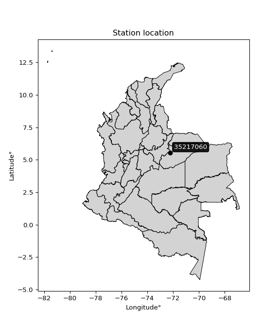</img>

</div>


## A. General information


### 1. General running parameters

• app_version: _v20260312_. • runtime: _2026-03-12 07:15:23.203550_. • Python version: _3.14.0_. • SciPy version: _1.16.3_. • Pandas version: _2.3.3_. • NumPy version: _2.3.5_. • Stations dataset (station_dataset_file): _dataset/pmax24h_in/automatic_colombia_2003_2025.csv_. • Stations catalog (station_catalog_file): _dataset/CNE.xls_. • Minimum year to eval til year_max (date_min): _1900_. • Maximum year to eval since year_min (date_max): _2025_. • Creates, save and include plots into reports (create_plot): _True_. • Plot only fit distributions with Δo > Δ (plot_only_fit): _True_. • Plot only simple graphs avoiding multiple CDFs and multiple Extreme values plots (plot_only_simple): _True_. • Eval low extreme values, if False, evaluates high extreme values (low_extreme): _False_. • Eval every SciPy distribution as logarithmic (pdist_logarithmic_on): _True_. • Standard deviation normalized (ddof): _1.0_. • Return periods to eval in years (Tr): _[2, 2.33, 5, 10, 15, 20, 25, 50, 75, 100, 200, 250, 500, 750, 1000]_. • Minimum data sample per station, 0 means any (minimum_sample): _5_. • Z-Score maximum threshold to adjust a value, 0 means disable (zscore_max): _3.5_. • Z-Score minimum threshold to adjust a value, 0 means disable (zscore_min): _-2.5_. • Avoid zeros, e.g. rain = 0 (avoid_zeros): _True_. • Avoid null values (avoid_nans): _True_. 

:file_folder:Table: [dataset.csv](../../dataset/pmax24h_in/automatic_colombia_2003_2025.csv)

> Delta Degrees of Freedom (DDOF): is a parameter used in the formulas for calculating variance and standard deviation. When ddof=0, the divisor is $N$ (the total number of observations) and this is used when your data set is the entire population. When ddof=1, the divisor is $N-1$ and this is used when your data set is a sample drawn from a larger population. Using $N-1$ provides an unbiased estimate of the population variance (known as Bessel´s correction).


### 2. Station info and location

|   id |   CODIGO | NOMBRE                   | CATEGORIA    | TECNOLOGIA                              | ESTADO   | FECHA_INSTALACION   |   FECHA_SUSPENSION |   ALTITUD |   LATITUD |   LONGITUD | DEPARTAMENTO   | MUNICIPIO   | AREA_OPERATIVA                              | ENTIDAD                                                     | AREA_HIDROGRAFICA   | ZONA_HIDROGRAFICA   | SUBZONA_HIDROGRAFICA   | CORRIENTE   | Catalogo   |   Version |
|-----:|---------:|:-------------------------|:-------------|:----------------------------------------|:---------|:--------------------|-------------------:|----------:|----------:|-----------:|:---------------|:------------|:--------------------------------------------|:------------------------------------------------------------|:--------------------|:--------------------|:-----------------------|:------------|:-----------|----------:|
|    0 | 35217060 | PLAYON EL AUT [35217060] | Limnigráfica | Automática con Telemetría, Convencional | Activa   | 15/12/2016          |                nan |       271 |    5.5405 |   -72.2317 | Casanare       | Nunchía     | Area Operativa 06 - Boyacá-Casanare-Vichada | INSTITUTO DE HIDROLOGIA METEOROLOGIA Y ESTUDIOS AMBIENTALES | Orinoco             | Meta                | Río Cravo Sur          | Tocaria     | CNE_IDEAM  |  20251226 |

<div align="center">

Dynamic map: [:earth_americas:Google](http://maps.google.com/maps?q=5.5405,-72.23172222) [:earth_americas:OSM](https://www.openstreetmap.org/#map=18/5.5405/-72.23172222&layers=P) [:earth_americas:Bing](https://www.bing.com/maps?cp=5.5405~-72.23172222&lvl=18) [:earth_americas:Apple](https://maps.apple.com/frame?center=5.5405%2C-72.23172222&span=0.003%2C0.006)

</div>


<div align="center">

```geojson
{
  "type": "Feature",
  "geometry": {
    "type": "Point", 
    "coordinates": [-72.23172222, 5.5405]
  }, 
  "properties": {
    "Name": "35217060"
  }
}
```

</div>


### 3. Discrete values table and plot

<div align="center">

|               |          0 |            1 |          2 |          3 |            4 |            5 |            6 |          7 |           8 |
|:--------------|-----------:|-------------:|-----------:|-----------:|-------------:|-------------:|-------------:|-----------:|------------:|
| Date          | 2017       | 2018         | 2019       | 2020       | 2021         | 2022         | 2023         | 2024       | 2025        |
| Value         |   20.7     |   77.6       |  139.8     |    1       |   72.1       |   76.8       |   78.2       |  120.6     |   96.6      |
| Value_initial |   20.7     |   77.6       |  139.8     |    1       |   72.1       |   76.8       |   78.2       |  120.6     |   96.6      |
| count         |    9       |    9         |    9       |    9       |    9         |    9         |    9         |    9       |    9        |
| mean          |   75.9333  |   75.9333    |   75.9333  |   75.9333  |   75.9333    |   75.9333    |   75.9333    |   75.9333  |   75.9333   |
| std           |   43.575   |   43.575     |   43.575   |   43.575   |   43.575     |   43.575     |   43.575     |   43.575   |   43.575    |
| zscore        |   -1.26755 |    0.0382482 |    1.46567 |   -1.71964 |   -0.0879709 |    0.0198891 |    0.0520176 |    1.02505 |    0.474278 |


</div>


<div align="center">

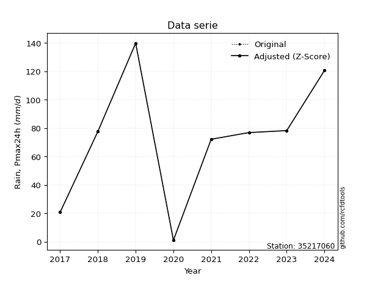</img>

</div>


> The initial value (value_initial) correspond to the initial obtained or null completed value, and value (value) is adjusted only when the initial value is outside the valid range (outlier) definite through the Z-Score value. If Z-Score is active, values out of range or outliers are replaced with the station mean value. A Z-Score (or standard score) measures how many standard deviations a data point is from the mean of a dataset, indicating its relative position; positive scores mean above the mean, negative mean below, and a score of zero is exactly at the mean, allowing for comparison of values from different distributions. It´s calculated using the formula $z=(x–μ)/σ$, where $x$ is the data point, $μ$ is the mean, and $σ$ is the standard deviation, helping identify outliers and understand probability.
>
> <sub>**Note**: In this study, "completing" (filling gaps in) and "extending" (forecasting or lengthening the historical record) rainfall data series are avoided for certain critical analyses because they introduce artificial bias and uncertainty, which can distort the statistics of rare events (extremes), alter day-to-day variability, and compromise the integrity and homogeneity of the original data. Some reasons against Completing/Extending rainfall data are: **Distortion of Extremes and Variability**: The primary issue is that most gap-filling or extension methods rely on averaging or regression with nearby stations, which inherently smooths the data. Rainfall is highly variable in space and time, with a large percentage of zero values and occasional large storms. Infilling methods often underestimate the highest values and overestimate the lowest (zero) values, which severely distorts analyses focused on flood frequency, drought severity, and intensity-duration-frequency (IDF) curves, **Loss of Data Homogeneity**: Infilled or extended data are synthetic estimates, not actual measurements. Combining these estimates with observed data can violate the assumption of data homogeneity, which requires that the data properties do not change over time. Inhomogeneity can lead to incorrect conclusions about long-term trends or changes in climate patterns, **Propagation of Errors**: Errors and biases from the original data (e.g., wind-induced undercatch, instrument errors, site changes) or the data used for imputation can propagate through the analysis, leading to unreliable hydrological models and inaccurate predictions, **Compromised Statistical Integrity**: For statistical analyses, especially those involving the frequency of events, using artificial data can introduce time bias or autocorrelation that doesn´t exist in reality, making it difficult to assess the true probability of events, **Difficulty in Validation**: It is difficult to accurately validate the quality of filled or extended data, especially for past periods where ground-truth measurements are unavailable. The reliability of imputation techniques heavily depends on the density of the surrounding station network and the complexity of the local topography.</sub>


### 4. Active continuous probability distributions from SciPy (80 of 104 available)

A Probability Density Function (PDF) describes the relative likelihood of a continuous random variable falling within a specific range, where the total area under its curve equals 1, and the area over any interval gives the actual probability for that range. Unlike discrete probabilities (like rolling a die), a PDF shows density, not direct probability for a single point (which is zero), with higher points indicating higher likelihood, often visualized as a bell curve for normal distributions.

A log of a probability density function (log-PDF) is simply the logarithm of the PDF´s value, denoted as $log(f(x))$, useful for converting multiplication of probabilities into addition, improving numerical stability with tiny numbers, and connecting to information theory concepts like entropy. Instead of dealing with very small probabilities (e.g., 0.000001), log-PDFs use negative numbers (e.g., $log(0.00001) ≈ -11.51$ that are easier for computers to handle, preventing underflow errors and simplifying complex calculations. In this study, each active probability distribution from SciPy is also evaluated in the $log$ form.

[scipy.stats](https://docs.scipy.org/doc/scipy/reference/stats.html) is a Python´s powerful submodule within the SciPy library for comprehensive statistical analysis, offering over 130 probability distributions (like Normal, Poisson, etc.), functions for descriptive stats (mean, variance), hypothesis testing (t-tests, chi-square), random variable generation, and statistical tests, making it essential for data science, modeling, and research. It provides tools to explore, model, and draw conclusions from data efficiently, working seamlessly with [NumPy](https://numpy.org/).

<div align="center">

|   id | p_dist           |   n_parameter | fit_method   | label                                                                       | active   | ref                                                                                                      |
|-----:|:-----------------|--------------:|:-------------|:----------------------------------------------------------------------------|:---------|:---------------------------------------------------------------------------------------------------------|
|    0 | alpha            |             3 | MLE          | Alpha                                                                       | True     | [:mortar_board:](https://docs.scipy.org/doc/scipy/reference/generated/scipy.stats.alpha.html)            |
|    1 | anglit           |             2 | MM           | Anglit                                                                      | True     | [:mortar_board:](https://docs.scipy.org/doc/scipy/reference/generated/scipy.stats.anglit.html)           |
|    2 | arcsine          |             2 | MM           | Arcsine                                                                     | True     | [:mortar_board:](https://docs.scipy.org/doc/scipy/reference/generated/scipy.stats.arcsine.html)          |
|    3 | argus            |             3 | MLE          | Argus                                                                       | True     | [:mortar_board:](https://docs.scipy.org/doc/scipy/reference/generated/scipy.stats.argus.html)            |
|    4 | beta             |             4 | MLE          | Beta                                                                        | True     | [:mortar_board:](https://docs.scipy.org/doc/scipy/reference/generated/scipy.stats.beta.html)             |
|    5 | betaprime        |             4 | MLE          | Beta prime                                                                  | True     | [:mortar_board:](https://docs.scipy.org/doc/scipy/reference/generated/scipy.stats.betaprime.html)        |
|    6 | bradford         |             3 | MLE          | Bradford                                                                    | True     | [:mortar_board:](https://docs.scipy.org/doc/scipy/reference/generated/scipy.stats.bradford.html)         |
|    7 | burr             |             4 | MLE          | Burr (Type III)                                                             | True     | [:mortar_board:](https://docs.scipy.org/doc/scipy/reference/generated/scipy.stats.burr.html)             |
|    8 | burr12           |             4 | MLE          | Burr (Type III) 12                                                          | True     | [:mortar_board:](https://docs.scipy.org/doc/scipy/reference/generated/scipy.stats.burr12.html)           |
|    9 | cosine           |             2 | MLE          | Cosine                                                                      | True     | [:mortar_board:](https://docs.scipy.org/doc/scipy/reference/generated/scipy.stats.cosine.html)           |
|   10 | crystalball      |             4 | MLE          | Crystalball                                                                 | True     | [:mortar_board:](https://docs.scipy.org/doc/scipy/reference/generated/scipy.stats.crystalball.html)      |
|   11 | dgamma           |             3 | MLE          | Double gamma                                                                | True     | [:mortar_board:](https://docs.scipy.org/doc/scipy/reference/generated/scipy.stats.dgamma.html)           |
|   12 | dweibull         |             3 | MLE          | Double Weibull                                                              | True     | [:mortar_board:](https://docs.scipy.org/doc/scipy/reference/generated/scipy.stats.dweibull.html)         |
|   13 | erlang           |             3 | MLE          | Erlang                                                                      | True     | [:mortar_board:](https://docs.scipy.org/doc/scipy/reference/generated/scipy.stats.erlang.html)           |
|   14 | exponnorm        |             3 | MLE          | Exponentially modified Normal                                               | True     | [:mortar_board:](https://docs.scipy.org/doc/scipy/reference/generated/scipy.stats.exponnorm.html)        |
|   15 | exponpow         |             3 | MLE          | Exponential power                                                           | True     | [:mortar_board:](https://docs.scipy.org/doc/scipy/reference/generated/scipy.stats.exponpow.html)         |
|   16 | exponweib        |             4 | MLE          | Exponentiated Weibull                                                       | True     | [:mortar_board:](https://docs.scipy.org/doc/scipy/reference/generated/scipy.stats.exponweib.html)        |
|   17 | f                |             4 | MLE          | F                                                                           | True     | [:mortar_board:](https://docs.scipy.org/doc/scipy/reference/generated/scipy.stats.f.html)                |
|   18 | fatiguelife      |             3 | MLE          | Fatigue-life (Birnbaum-Saunders)                                            | True     | [:mortar_board:](https://docs.scipy.org/doc/scipy/reference/generated/scipy.stats.fatiguelife.html)      |
|   19 | foldnorm         |             3 | MM           | Fold Normal                                                                 | True     | [:mortar_board:](https://docs.scipy.org/doc/scipy/reference/generated/scipy.stats.foldnorm.html)         |
|   20 | gamma            |             3 | MLE          | Gamma                                                                       | True     | [:mortar_board:](https://docs.scipy.org/doc/scipy/reference/generated/scipy.stats.gamma.html)            |
|   21 | gausshyper       |             6 | MLE          | Gauss hypergeometric                                                        | True     | [:mortar_board:](https://docs.scipy.org/doc/scipy/reference/generated/scipy.stats.gausshyper.html)       |
|   22 | genexpon         |             5 | MLE          | Generalized exponential                                                     | True     | [:mortar_board:](https://docs.scipy.org/doc/scipy/reference/generated/scipy.stats.genexpon.html)         |
|   23 | genextreme       |             3 | MLE          | Generalized exponential                                                     | True     | [:mortar_board:](https://docs.scipy.org/doc/scipy/reference/generated/scipy.stats.genextreme.html)       |
|   24 | gengamma         |             4 | MLE          | Generalized gamma                                                           | True     | [:mortar_board:](https://docs.scipy.org/doc/scipy/reference/generated/scipy.stats.gengamma.html)         |
|   25 | genhalflogistic  |             3 | MLE          | Generalized half-logistic                                                   | True     | [:mortar_board:](https://docs.scipy.org/doc/scipy/reference/generated/scipy.stats.genhalflogistic.html)  |
|   26 | genlogistic      |             3 | MLE          | Generalized logistic                                                        | True     | [:mortar_board:](https://docs.scipy.org/doc/scipy/reference/generated/scipy.stats.genlogistic.html)      |
|   27 | gennorm          |             3 | MLE          | Generalized Normal                                                          | True     | [:mortar_board:](https://docs.scipy.org/doc/scipy/reference/generated/scipy.stats.gennorm.html)          |
|   28 | genpareto        |             3 | MLE          | Generalized Pareto                                                          | True     | [:mortar_board:](https://docs.scipy.org/doc/scipy/reference/generated/scipy.stats.genpareto.html)        |
|   29 | gompertz         |             3 | MLE          | Gompertz (or truncated Gumbel)                                              | True     | [:mortar_board:](https://docs.scipy.org/doc/scipy/reference/generated/scipy.stats.gompertz.html)         |
|   30 | gumbel_l         |             2 | MM           | Gumbel Left Skew                                                            | True     | [:mortar_board:](https://docs.scipy.org/doc/scipy/reference/generated/scipy.stats.gumbel_l.html)         |
|   31 | gumbel_r         |             2 | MM           | Gumbel Right Skew                                                           | True     | [:mortar_board:](https://docs.scipy.org/doc/scipy/reference/generated/scipy.stats.gumbel_r.html)         |
|   32 | halfgennorm      |             3 | MLE          | Upper half of a generalized normal                                          | True     | [:mortar_board:](https://docs.scipy.org/doc/scipy/reference/generated/scipy.stats.halfgennorm.html)      |
|   33 | halflogistic     |             2 | MM           | Half-logistic                                                               | True     | [:mortar_board:](https://docs.scipy.org/doc/scipy/reference/generated/scipy.stats.halflogistic.html)     |
|   34 | halfnorm         |             2 | MM           | Half Normal                                                                 | True     | [:mortar_board:](https://docs.scipy.org/doc/scipy/reference/generated/scipy.stats.halfnorm.html)         |
|   35 | hypsecant        |             2 | MM           | hyperbolic secant                                                           | True     | [:mortar_board:](https://docs.scipy.org/doc/scipy/reference/generated/scipy.stats.hypsecant.html)        |
|   36 | invgamma         |             3 | MLE          | Inverted gamma                                                              | True     | [:mortar_board:](https://docs.scipy.org/doc/scipy/reference/generated/scipy.stats.invgamma.html)         |
|   37 | invgauss         |             3 | MLE          | Inverse Gaussian                                                            | True     | [:mortar_board:](https://docs.scipy.org/doc/scipy/reference/generated/scipy.stats.invgauss.html)         |
|   38 | invweibull       |             3 | MLE          | Inverted Weibull                                                            | True     | [:mortar_board:](https://docs.scipy.org/doc/scipy/reference/generated/scipy.stats.invweibull.html)       |
|   39 | johnsonsb        |             4 | MLE          | Johnson SB                                                                  | True     | [:mortar_board:](https://docs.scipy.org/doc/scipy/reference/generated/scipy.stats.johnsonsb.html)        |
|   40 | johnsonsu        |             4 | MLE          | Johnson Su                                                                  | True     | [:mortar_board:](https://docs.scipy.org/doc/scipy/reference/generated/scipy.stats.johnsonsu.html)        |
|   41 | kappa3           |             3 | MLE          | Kappa 3                                                                     | True     | [:mortar_board:](https://docs.scipy.org/doc/scipy/reference/generated/scipy.stats.kappa3.html)           |
|   42 | kappa4           |             4 | MLE          | Kappa 4                                                                     | True     | [:mortar_board:](https://docs.scipy.org/doc/scipy/reference/generated/scipy.stats.kappa4.html)           |
|   43 | ksone            |             3 | MLE          | Kolmogorov-Smirnov one-sided test statistic distribution                    | True     | [:mortar_board:](https://docs.scipy.org/doc/scipy/reference/generated/scipy.stats.ksone.html)            |
|   44 | kstwobign        |             2 | MLE          | Limiting distribution of scaled Kolmogorov-Smirnov two-sided test statistic | True     | [:mortar_board:](https://docs.scipy.org/doc/scipy/reference/generated/scipy.stats.kstwobign.html)        |
|   45 | laplace          |             2 | MM           | Laplace                                                                     | True     | [:mortar_board:](https://docs.scipy.org/doc/scipy/reference/generated/scipy.stats.laplace.html)          |
|   46 | levy_l           |             2 | MLE          | Left-skewed Levy                                                            | True     | [:mortar_board:](https://docs.scipy.org/doc/scipy/reference/generated/scipy.stats.levy_l.html)           |
|   47 | loggamma         |             3 | MLE          | Log gamma                                                                   | True     | [:mortar_board:](https://docs.scipy.org/doc/scipy/reference/generated/scipy.stats.loggamma.html)         |
|   48 | logistic         |             2 | MM           | Logistic (or Sech-squared)                                                  | True     | [:mortar_board:](https://docs.scipy.org/doc/scipy/reference/generated/scipy.stats.logistic.html)         |
|   49 | loglaplace       |             3 | MLE          | Log-Laplace                                                                 | True     | [:mortar_board:](https://docs.scipy.org/doc/scipy/reference/generated/scipy.stats.loglaplace.html)       |
|   50 | lomax            |             3 | MLE          | Lomax (Pareto of the second kind)                                           | True     | [:mortar_board:](https://docs.scipy.org/doc/scipy/reference/generated/scipy.stats.lomax.html)            |
|   51 | maxwell          |             2 | MM           | Maxwell                                                                     | True     | [:mortar_board:](https://docs.scipy.org/doc/scipy/reference/generated/scipy.stats.maxwell.html)          |
|   52 | mielke           |             4 | MLE          | Mielke Beta-Kappa / Dagum                                                   | True     | [:mortar_board:](https://docs.scipy.org/doc/scipy/reference/generated/scipy.stats.mielke.html)           |
|   53 | moyal            |             2 | MM           | Moyal                                                                       | True     | [:mortar_board:](https://docs.scipy.org/doc/scipy/reference/generated/scipy.stats.moyal.html)            |
|   54 | nakagami         |             3 | MLE          | Nakagami                                                                    | True     | [:mortar_board:](https://docs.scipy.org/doc/scipy/reference/generated/scipy.stats.nakagami.html)         |
|   55 | ncf              |             5 | MLE          | Non-central F distribution                                                  | True     | [:mortar_board:](https://docs.scipy.org/doc/scipy/reference/generated/scipy.stats.ncf.html)              |
|   56 | nct              |             4 | MLE          | Non-central Student’s t                                                     | True     | [:mortar_board:](https://docs.scipy.org/doc/scipy/reference/generated/scipy.stats.nct.html)              |
|   57 | norm             |             2 | MM           | Normal                                                                      | True     | [:mortar_board:](https://docs.scipy.org/doc/scipy/reference/generated/scipy.stats.norm.html)             |
|   58 | pearson3         |             3 | MM           | Pearson type III                                                            | True     | [:mortar_board:](https://docs.scipy.org/doc/scipy/reference/generated/scipy.stats.pearson3.html)         |
|   59 | powerlaw         |             3 | MLE          | Power-function                                                              | True     | [:mortar_board:](https://docs.scipy.org/doc/scipy/reference/generated/scipy.stats.powerlaw.html)         |
|   60 | rayleigh         |             2 | MM           | Rayleigh                                                                    | True     | [:mortar_board:](https://docs.scipy.org/doc/scipy/reference/generated/scipy.stats.rayleigh.html)         |
|   61 | rdist            |             3 | MLE          | R-distributed (symmetric beta)                                              | True     | [:mortar_board:](https://docs.scipy.org/doc/scipy/reference/generated/scipy.stats.rdist.html)            |
|   62 | rice             |             3 | MLE          | Rice                                                                        | True     | [:mortar_board:](https://docs.scipy.org/doc/scipy/reference/generated/scipy.stats.rice.html)             |
|   63 | semicircular     |             2 | MM           | Semicircular                                                                | True     | [:mortar_board:](https://docs.scipy.org/doc/scipy/reference/generated/scipy.stats.semicircular.html)     |
|   64 | skewnorm         |             3 | MLE          | Skew normal                                                                 | True     | [:mortar_board:](https://docs.scipy.org/doc/scipy/reference/generated/scipy.stats.skewnorm.html)         |
|   65 | t                |             3 | MLE          | Student’s t                                                                 | True     | [:mortar_board:](https://docs.scipy.org/doc/scipy/reference/generated/scipy.stats.t.html)                |
|   66 | trapezoid        |             4 | MLE          | Trapezoid                                                                   | True     | [:mortar_board:](https://docs.scipy.org/doc/scipy/reference/generated/scipy.stats.trapezoid.html)        |
|   67 | triang           |             3 | MLE          | Triangular                                                                  | True     | [:mortar_board:](https://docs.scipy.org/doc/scipy/reference/generated/scipy.stats.triang.html)           |
|   68 | truncexpon       |             3 | MLE          | Truncated exponential                                                       | True     | [:mortar_board:](https://docs.scipy.org/doc/scipy/reference/generated/scipy.stats.truncexpon.html)       |
|   69 | truncnorm        |             4 | MLE          | Truncated normal                                                            | True     | [:mortar_board:](https://docs.scipy.org/doc/scipy/reference/generated/scipy.stats.truncnorm.html)        |
|   70 | truncpareto      |             4 | MLE          | Upper truncated Pareto                                                      | True     | [:mortar_board:](https://docs.scipy.org/doc/scipy/reference/generated/scipy.stats.truncpareto.html)      |
|   71 | truncweibull_min |             5 | MLE          | Doubly truncated Weibull minimum                                            | True     | [:mortar_board:](https://docs.scipy.org/doc/scipy/reference/generated/scipy.stats.truncweibull_min.html) |
|   72 | tukeylambda      |             3 | MLE          | Tukey-Lamdba                                                                | True     | [:mortar_board:](https://docs.scipy.org/doc/scipy/reference/generated/scipy.stats.tukeylambda.html)      |
|   73 | uniform          |             2 | MLE          | Uniform                                                                     | True     | [:mortar_board:](https://docs.scipy.org/doc/scipy/reference/generated/scipy.stats.uniform.html)          |
|   74 | vonmises         |             3 | MLE          | Von Mises                                                                   | True     | [:mortar_board:](https://docs.scipy.org/doc/scipy/reference/generated/scipy.stats.vonmises.html)         |
|   75 | vonmises_line    |             3 | MLE          | Von Mises line                                                              | True     | [:mortar_board:](https://docs.scipy.org/doc/scipy/reference/generated/scipy.stats.vonmises_line.html)    |
|   76 | wald             |             2 | MM           | Wald                                                                        | True     | [:mortar_board:](https://docs.scipy.org/doc/scipy/reference/generated/scipy.stats.wald.html)             |
|   77 | weibull_max      |             3 | MLE          | Weibull maximum                                                             | True     | [:mortar_board:](https://docs.scipy.org/doc/scipy/reference/generated/scipy.stats.weibull_max.html)      |
|   78 | weibull_min      |             3 | MLE          | Weibull minimum                                                             | True     | [:mortar_board:](https://docs.scipy.org/doc/scipy/reference/generated/scipy.stats.weibull_min.html)      |
|   79 | wrapcauchy       |             3 | MLE          | Wrapped  Cauchy                                                             | True     | [:mortar_board:](https://docs.scipy.org/doc/scipy/reference/generated/scipy.stats.wrapcauchy.html)       |

</div>

> **n_parameter:** # arguments & localization & scale.
>
> **Fit methods:** (MLE) maximum likelihood, (MM) L-moments.
>
>**Inactive** (With the only purpose of prevent loops, zero divisions, infinite values, over high estimated values or horizontal trending for recurrence intervals estimations, the follow distributions were disabled.)**:** lognorm, norminvgauss, powernorm, powerlognorm, cauchy, halfcauchy, foldcauchy, skewcauchy, chi2, expon, fisk, genhyperbolic, geninvgauss, gibrat, kstwo, laplace_asymmetric, levy, levy_stable, ncx2, pareto, rel_breitwigner, recipinvgauss, studentized_range, loguniform, 


## B. Probability (PDF) vs. Empirical (EDF) distributions functions

A continuous probability distribution (CPD) describes probabilities for variables that can take any value within a range (like rain any time), unlike discrete variables with specific outcomes (like temperature). It uses a Probability Density Function (PDF), a curve where the total area under it equals 1, and the probability of the variable falling within an interval (a to b) is found by calculating the area under the curve between those points. A key feature is that the probability of hitting any single exact value is zero, so probabilities are always expressed for ranges, e.g., $P(a ≤ X ≤ b)$.

<div align="center">

Distributions parameters from station values
|     |   station | p_dist              |   n |               loc |            scale | shape                  | shape1                 | shape2                 | shape3             |
|----:|----------:|:--------------------|----:|------------------:|-----------------:|:-----------------------|:-----------------------|:-----------------------|:-------------------|
|   0 |  35217060 | alpha               |   9 |   -414.721        |   5370.97        | 11.060893629585618     |                        |                        |                    |
|   1 |  35217060 | anglit              |   9 |     75.9333       |    120.184       |                        |                        |                        |                    |
|   2 |  35217060 | arcsine             |   9 |     17.8333       |    116.2         |                        |                        |                        |                    |
|   3 |  35217060 | argus               |   9 |    -24.0123       |    170.247       | 0.28933336173924884    |                        |                        |                    |
|   4 |  35217060 | beta                |   9 |    -54.5474       |    194.347       | 1.7367151519218793     | 0.8287587035319411     |                        |                    |
|   5 |  35217060 | betaprime           |   9 |  -1192.34         | 120799           | 933.5376739160934      | 88922.49081656226      |                        |                    |
|   6 |  35217060 | bradford            |   9 |      0.999994     |    138.8         | 0.16352234204749022    |                        |                        |                    |
|   7 |  35217060 | burr                |   9 |     -0.127927     |    142.647       | 146.64953307571113     | 0.006234496013179549   |                        |                    |
|   8 |  35217060 | burr12              |   9 |   -131.438        |   1246.64        | 5.995734874175319      | 29582.431524109154     |                        |                    |
|   9 |  35217060 | cosine              |   9 |     73.7278       |     34.8313      |                        |                        |                        |                    |
|  10 |  35217060 | crystalball         |   9 |     75.9333       |     41.0829      | 6937.231361142033      | 44.094321564495175     |                        |                    |
|  11 |  35217060 | dgamma              |   9 |     78.2          |     31.3886      | 0.9283867611951278     |                        |                        |                    |
|  12 |  35217060 | dweibull            |   9 |     78.2          |     31.3872      | 0.9288536370227011     |                        |                        |                    |
|  13 |  35217060 | erlang              |   9 |   -638.118        |      2.4274      | 293.968183794639       |                        |                        |                    |
|  14 |  35217060 | exponnorm           |   9 |     75.8998       |     41.0828      | 0.0008156330708551845  |                        |                        |                    |
|  15 |  35217060 | exponpow            |   9 |      1            |      3.66054     | 0.11500162010876666    |                        |                        |                    |
|  16 |  35217060 | exponweib           |   9 |  -1646.55         |   1213.76        | 1368.5477236198894     | 5.832830762048205      |                        |                    |
|  17 |  35217060 | f                   |   9 | -11631.5          |  11707.6         | 170998.81110113132     | 3144945.3693115064     |                        |                    |
|  18 |  35217060 | fatiguelife         |   9 |  -5517.18         |   5592.65        | 0.007355514748374488   |                        |                        |                    |
|  19 |  35217060 | foldnorm            |   9 |   -237.309        |     39.4107      | 7.95818202350283       |                        |                        |                    |
|  20 |  35217060 | gamma               |   9 |   -658.161        |      2.32168     | 316.1553252399283      |                        |                        |                    |
|  21 |  35217060 | gausshyper          |   9 |     -7.39774      |    147.198       | 1.5210154458496654     | 0.7565909951402338     | 1.032947720515931      | 1.0346720954305242 |
|  22 |  35217060 | genexpon            |   9 |      0.999998     |      2.55732     | 0.03408902158381395    | 1.3083254482734019e-05 | 2.191682028944122      |                    |
|  23 |  35217060 | genextreme          |   9 |     66.2856       |     44.8591      | 0.5176050726430339     |                        |                        |                    |
|  24 |  35217060 | gengamma            |   9 |   -122.354        |     75.664       | 6.58191848157556       | 1.9146060810633383     |                        |                    |
|  25 |  35217060 | genhalflogistic     |   9 |    -13.2963       |    159.398       | 1.041161812182926      |                        |                        |                    |
|  26 |  35217060 | genlogistic         |   9 |     96.566        |     17.8936      | 0.552672246337378      |                        |                        |                    |
|  27 |  35217060 | gennorm             |   9 |     76.8          |      0.0020254   | 0.19370276353044819    |                        |                        |                    |
|  28 |  35217060 | genpareto           |   9 |     -1.36907      |    203.053       | -1.4383697565275742    |                        |                        |                    |
|  29 |  35217060 | gompertz            |   9 |     72.1          |     39.5733      | 0.84976457821707       |                        |                        |                    |
|  30 |  35217060 | gumbel_l            |   9 |     94.4228       |     32.0322      |                        |                        |                        |                    |
|  31 |  35217060 | gumbel_r            |   9 |     57.4438       |     32.0322      |                        |                        |                        |                    |
|  32 |  35217060 | halfgennorm         |   9 |      1            |      3.7069      | 0.3964354247077312     |                        |                        |                    |
|  33 |  35217060 | halflogistic        |   9 |     27.2405       |     35.1244      |                        |                        |                        |                    |
|  34 |  35217060 | halfnorm            |   9 |     21.5557       |     68.1523      |                        |                        |                        |                    |
|  35 |  35217060 | hypsecant           |   9 |     75.9333       |     26.1542      |                        |                        |                        |                    |
|  36 |  35217060 | invgamma            |   9 |   -436.328        |  72853.6         | 143.5147392383657      |                        |                        |                    |
|  37 |  35217060 | invgauss            |   9 |   -172.143        |   7251.1         | 0.03403433827279499    |                        |                        |                    |
|  38 |  35217060 | invweibull          |   9 |      1            |      4.23285     | 0.047820166568314976   |                        |                        |                    |
|  39 |  35217060 | johnsonsb           |   9 |      0.999673     |    138.8         | -0.341958160885224     | 0.1887349243721112     |                        |                    |
|  40 |  35217060 | johnsonsu           |   9 |    272.559        |     30.5416      | 12.288685264054486     | 4.83791758630457       |                        |                    |
|  41 |  35217060 | kappa3              |   9 |      0.997695     |    138.802       | 526456.8459021688      |                        |                        |                    |
|  42 |  35217060 | kappa4              |   9 |    -13.0339       |    154.724       | 1.0998140053705194     | 1.0122820170239737     |                        |                    |
|  43 |  35217060 | ksone               |   9 |    -12.88         |    166.56        | 1.0                    |                        |                        |                    |
|  44 |  35217060 | kstwobign           |   9 |    -91.5655       |    191.408       |                        |                        |                        |                    |
|  45 |  35217060 | laplace             |   9 |     75.9333       |     29.05        |                        |                        |                        |                    |
|  46 |  35217060 | levy_l              |   9 |    146.095        |     30.9877      |                        |                        |                        |                    |
|  47 |  35217060 | loggamma            |   9 |      7.70253      |     68.4801      | 3.1932386908127413     |                        |                        |                    |
|  48 |  35217060 | logistic            |   9 |     75.9333       |     22.6502      |                        |                        |                        |                    |
|  49 |  35217060 | loglaplace          |   9 |     -0.203641     |     77.8037      | 1.3196869712414205     |                        |                        |                    |
|  50 |  35217060 | lomax               |   9 |      0.999996     |  15801           | 205.77874220282058     |                        |                        |                    |
|  51 |  35217060 | maxwell             |   9 |    -21.4159       |     61.0046      |                        |                        |                        |                    |
|  52 |  35217060 | mielke              |   9 |      1            |    141.315       | 0.7076177497026079     | 161.71329921468282     |                        |                    |
|  53 |  35217060 | moyal               |   9 |     52.4395       |     18.4938      |                        |                        |                        |                    |
|  54 |  35217060 | nakagami            |   9 |      1            |     87.9728      | 0.2744280520802278     |                        |                        |                    |
|  55 |  35217060 | ncf                 |   9 |      0.115927     |     10.1204      | 0.9845310590322913     | 91.65474042930785      | 6.312479593326947      |                    |
|  56 |  35217060 | nct                 |   9 |  -1574.83         |     41.0229      | 181868.14926310966     | 40.239691522662625     |                        |                    |
|  57 |  35217060 | norm                |   9 |     75.9333       |     41.0829      |                        |                        |                        |                    |
|  58 |  35217060 | pearson3            |   9 |     75.9333       |     41.083       | -0.3699011531493779    |                        |                        |                    |
|  59 |  35217060 | powerlaw            |   9 |      1            |    138.8         | 0.19313741355108932    |                        |                        |                    |
|  60 |  35217060 | rayleigh            |   9 |     -2.6607       |     62.709       |                        |                        |                        |                    |
|  61 |  35217060 | rdist               |   9 |    -11.8708       |     90.0708      | 1.0218767102809858     |                        |                        |                    |
|  62 |  35217060 | rice                |   9 |    -21.7606       |     45.3136      | 1.862826810933393      |                        |                        |                    |
|  63 |  35217060 | semicircular        |   9 |     75.9333       |     82.1658      |                        |                        |                        |                    |
|  64 |  35217060 | skewnorm            |   9 |    120.085        |     60.3092      | -2.2754559107846353    |                        |                        |                    |
|  65 |  35217060 | t                   |   9 |     75.9334       |     41.0836      | 56819479.92955435      |                        |                        |                    |
|  66 |  35217060 | trapezoid           |   9 |    -13.524        |    166.56        | 1.0                    | 1.0                    |                        |                    |
|  67 |  35217060 | triang              |   9 |    -14.7277       |    154.528       | 0.9999999825294692     |                        |                        |                    |
|  68 |  35217060 | truncexpon          |   9 |      0.99999      |    224.888       | 0.617196158666784      |                        |                        |                    |
|  69 |  35217060 | truncnorm           |   9 |      2.21967      |     12.8077      | -5.634231701774921     | 10.741985607129326     |                        |                    |
|  70 |  35217060 | truncpareto         |   9 |      0.990634     |      0.0093663   | 0.12517128011814072    | 14820.089293939845     |                        |                    |
|  71 |  35217060 | truncweibull_min    |   9 |     -5.06548      |    250.26        | 1.3238653993992182     | 0.0010226639688850035  | 0.5788598426388569     |                    |
|  72 |  35217060 | tukeylambda         |   9 |     -6.73096      |    106.08        | 1.2490087055103927     |                        |                        |                    |
|  73 |  35217060 | uniform             |   9 |      1            |    138.8         |                        |                        |                        |                    |
|  74 |  35217060 | vonmises            |   9 |      1.91938      |      1           | 2.8241823381997326     |                        |                        |                    |
|  75 |  35217060 | vonmises_line       |   9 |     70.4          |     22.0907      | 0.7924723662182414     |                        |                        |                    |
|  76 |  35217060 | wald                |   9 |     34.8505       |     41.0829      |                        |                        |                        |                    |
|  77 |  35217060 | weibull_max         |   9 |    139.8          |      1.74157     | 0.19992793324444125    |                        |                        |                    |
|  78 |  35217060 | weibull_min         |   9 |   -131.412        |    223.863       | 5.994763249379359      |                        |                        |                    |
|  79 |  35217060 | wrapcauchy          |   9 |      0.999999     |     22.204       | 1.0280739712132594e-05 |                        |                        |                    |
|  80 |  35217060 | logalpha            |   9 |    -19.8194       |    334.247       | 14.270042705549844     |                        |                        |                    |
|  81 |  35217060 | loganglit           |   9 |      3.8515       |      4.25342     |                        |                        |                        |                    |
|  82 |  35217060 | logarcsine          |   9 |      1.79531      |      4.11238     |                        |                        |                        |                    |
|  83 |  35217060 | logargus            |   9 |     -1.85312      |      6.86169     | 3.3003748231118335     |                        |                        |                    |
|  84 |  35217060 | logbeta             |   9 |     -0.511318     |      5.45153     | 0.4938964586142609     | 0.08920222684383033    |                        |                    |
|  85 |  35217060 | logbetaprime        |   9 |     -0.349233     |      2.61688e+12 | 1.6811383314493487     | 911143688939.0469      |                        |                    |
|  86 |  35217060 | logbradford         |   9 |     -0.670648     |      5.61086     | 4.135445990008042e-05  |                        |                        |                    |
|  87 |  35217060 | logburr             |   9 |     -6.64551e+07  |      6.64551e+07 | 95626432.84422933      | 0.6466170203392957     |                        |                    |
|  88 |  35217060 | logburr12           |   9 |  -9464.09         |   9475.59        | 13096.325310386597     | 18595.276219783445     |                        |                    |
|  89 |  35217060 | logcosine           |   9 |      3.43347      |      1.40879     |                        |                        |                        |                    |
|  90 |  35217060 | logcrystalball      |   9 |      3.8515       |      1.45397     | 300.0965415124891      | 13.472056777309632     |                        |                    |
|  91 |  35217060 | logdgamma           |   9 |      4.35157      |      1.5372      | 0.3243923130822868     |                        |                        |                    |
|  92 |  35217060 | logdweibull         |   9 |      4.35157      |      0.652744    | 0.5992465201100781     |                        |                        |                    |
|  93 |  35217060 | logerlang           |   9 |    -22.7613       |      0.090637    | 293.3982176528281      |                        |                        |                    |
|  94 |  35217060 | logexponnorm        |   9 |      3.85053      |      1.45396     | 0.0006734736837639728  |                        |                        |                    |
|  95 |  35217060 | logexponpow         |   9 |     -4.1599e-27   |      3.30076     | 0.678599422371144      |                        |                        |                    |
|  96 |  35217060 | logexponweib        |   9 |     -1.41943e+08  |      1.41943e+08 | 0.3139277172853174     | 447463972.4004956      |                        |                    |
|  97 |  35217060 | logf                |   9 |     -2.12015e-30  |      1.34585     | 1.558784263151722      | 1.1093379600345314     |                        |                    |
|  98 |  35217060 | logfatiguelife      |   9 |  -1147.07         |   1150.92        | 0.00126599686507552    |                        |                        |                    |
|  99 |  35217060 | logfoldnorm         |   9 |     -1.9089       |      1.18331     | 4.9136799098756985     |                        |                        |                    |
| 100 |  35217060 | loggamma            |   9 |    -19.375        |      0.102321    | 227.07590793693112     |                        |                        |                    |
| 101 |  35217060 | loggausshyper       |   9 |     -0.613495     |      5.55371     | 1.5307747326473709     | 0.5689897619175253     | 0.9298545838983998     | 0.7074643664744609 |
| 102 |  35217060 | loggenexpon         |   9 |     -5.7372e-06   |      0.038609    | 0.002337299851857875   | 1.315977051200202      | 0.00010282282995370128 |                    |
| 103 |  35217060 | loggenextreme       |   9 |      3.8163       |      1.60726     | 1.4300545420429707     |                        |                        |                    |
| 104 |  35217060 | loggengamma         |   9 |    -11.0729       |      0.00457767  | 230.22510314412074     | 0.6731591792595464     |                        |                    |
| 105 |  35217060 | loggenhalflogistic  |   9 |     -0.449911     |      8.05591     | 1.4945686177693536     |                        |                        |                    |
| 106 |  35217060 | loggenlogistic      |   9 |      4.94024      |      1.69636e-06 | 1.5525077036088647e-06 |                        |                        |                    |
| 107 |  35217060 | loggennorm          |   9 |      4.35157      |      0.00738519  | 0.3225811653922059     |                        |                        |                    |
| 108 |  35217060 | loggenpareto        |   9 |     -0.902846     |     10.947       | -1.8735015908236983    |                        |                        |                    |
| 109 |  35217060 | loggompertz         |   9 |     -0.883433     |      0.728396    | 0.0007177065122251261  |                        |                        |                    |
| 110 |  35217060 | loggumbel_l         |   9 |      4.50586      |      1.13365     |                        |                        |                        |                    |
| 111 |  35217060 | loggumbel_r         |   9 |      3.19714      |      1.13365     |                        |                        |                        |                    |
| 112 |  35217060 | loghalfgennorm      |   9 |     -6.78029e-10  |      1.91884     | 0.6955725344530785     |                        |                        |                    |
| 113 |  35217060 | loghalflogistic     |   9 |      2.12821      |      1.2431      |                        |                        |                        |                    |
| 114 |  35217060 | loghalfnorm         |   9 |      1.92708      |      2.41192     |                        |                        |                        |                    |
| 115 |  35217060 | loghypsecant        |   9 |      3.8515       |      0.925624    |                        |                        |                        |                    |
| 116 |  35217060 | loginvgamma         |   9 |    -33.3723       |  21971.8         | 591.1793018983963      |                        |                        |                    |
| 117 |  35217060 | loginvgauss         |   9 |    -13.7604       |   1919.57        | 0.009165089785600624   |                        |                        |                    |
| 118 |  35217060 | loginvweibull       |   9 |     -1.82751e+08  |      1.82751e+08 | 95016168.05564603      |                        |                        |                    |
| 119 |  35217060 | logjohnsonsb        |   9 |     -0.593501     |      5.53371     | -0.44363387785922204   | 0.13367004926233828    |                        |                    |
| 120 |  35217060 | logjohnsonsu        |   9 |      5.00226      |      0.00216393  | 5.4076934366212255     | 0.8545919297119383     |                        |                    |
| 121 |  35217060 | logkappa3           |   9 |     -2.8978e-05   |      4.9368      | 2646.3286925230755     |                        |                        |                    |
| 122 |  35217060 | logkappa4           |   9 |     -0.421513     |      5.91274     | 1.0770540052925845     | 1.1027683297513788     |                        |                    |
| 123 |  35217060 | logksone            |   9 |     -0.494021     |      5.92826     | 1.0                    |                        |                        |                    |
| 124 |  35217060 | logkstwobign        |   9 |     -4.0578       |      9.07527     |                        |                        |                        |                    |
| 125 |  35217060 | loglaplace          |   9 |      3.8515       |      1.02811     |                        |                        |                        |                    |
| 126 |  35217060 | loglevy_l           |   9 |      5.00198      |      0.300269    |                        |                        |                        |                    |
| 127 |  35217060 | logloggamma         |   9 |      4.94024      |      1.82315e-06 | 1.6716341851045868e-06 |                        |                        |                    |
| 128 |  35217060 | loglogistic         |   9 |      3.8515       |      0.801614    |                        |                        |                        |                    |
| 129 |  35217060 | logloglaplace       |   9 |     -4.54003e-29  |      3.86255     | 0.754499725276776      |                        |                        |                    |
| 130 |  35217060 | loglomax            |   9 |     -6.32612e-06  | 212138           | 38029.10516580826      |                        |                        |                    |
| 131 |  35217060 | logmaxwell          |   9 |      0.406215     |      2.15901     |                        |                        |                        |                    |
| 132 |  35217060 | logmielke           |   9 |     -6.41172e-29  |      9.83472     | 0.49420550202705305    | 2.6713179685736184     |                        |                    |
| 133 |  35217060 | logmoyal            |   9 |      3.02003      |      0.654515    |                        |                        |                        |                    |
| 134 |  35217060 | lognakagami         |   9 |     -9.2491e-31   |      4.03695     | 0.23713182230886834    |                        |                        |                    |
| 135 |  35217060 | logncf              |   9 |     -3.12851e-30  |      1.1784      | 0.9868014530716183     | 1.5861602833560822     | 1.174051365769591      |                    |
| 136 |  35217060 | lognct              |   9 |    -82.3608       |      1.4049      | 22296.26747824285      | 61.362731026830176     |                        |                    |
| 137 |  35217060 | lognorm             |   9 |      3.8515       |      1.45397     |                        |                        |                        |                    |
| 138 |  35217060 | logpearson3         |   9 |      3.8515       |      1.45396     | -1.9788056849956703    |                        |                        |                    |
| 139 |  35217060 | logpowerlaw         |   9 |     -2.22507e-308 |      4.94021     | 0.012656164757519902   |                        |                        |                    |
| 140 |  35217060 | lograyleigh         |   9 |      1.06997      |      2.21934     |                        |                        |                        |                    |
| 141 |  35217060 | logrdist            |   9 |      0.52727      |      2.50286     | 1.0528666398934672     |                        |                        |                    |
| 142 |  35217060 | logrice             |   9 |   -623.035        |      1.45396     | 431.1565140170361      |                        |                        |                    |
| 143 |  35217060 | logsemicircular     |   9 |      3.8515       |      2.90791     |                        |                        |                        |                    |
| 144 |  35217060 | logskewnorm         |   9 |      4.94021      |      1.81652     | -10965799.26859162     |                        |                        |                    |
| 145 |  35217060 | logt                |   9 |      4.35087      |      0.0182029   | 0.3110383132504403     |                        |                        |                    |
| 146 |  35217060 | logtrapezoid        |   9 |     -0.273985     |      6.16866     | 1.0                    | 1.0                    |                        |                    |
| 147 |  35217060 | logtriang           |   9 |     -0.307445     |      5.24776     | 0.9999826891385792     |                        |                        |                    |
| 148 |  35217060 | logtruncexpon       |   9 |     -7.23776e-06  |      5.37813     | 0.9186036325182474     |                        |                        |                    |
| 149 |  35217060 | logtruncnorm        |   9 |      0.00547308   |      5.36048     | -0.003109488258589985  | 0.9205778341733106     |                        |                    |
| 150 |  35217060 | logtruncpareto      |   9 |     -0.000698642  |      0.000520704 | 1.9176097499863894e-11 | 9488.912542417347      |                        |                    |
| 151 |  35217060 | logtruncweibull_min |   9 |    -23.6209       |     32.3292      | 29.314543925478546     | 0.019124556054270124   | 0.8834458477191964     |                    |
| 152 |  35217060 | logtukeylambda      |   9 |      4.35032      |      0.00465954  | -2.457219214797569     |                        |                        |                    |
| 153 |  35217060 | loguniform          |   9 |      0            |      4.94021     |                        |                        |                        |                    |
| 154 |  35217060 | logvonmises         |   9 |     -1.76807      |      1           | 2.3175354739201532     |                        |                        |                    |
| 155 |  35217060 | logvonmises_line    |   9 |      4.17553      |      1.32911     | 2.021531601497194      |                        |                        |                    |
| 156 |  35217060 | logwald             |   9 |      2.39752      |      1.45398     |                        |                        |                        |                    |
| 157 |  35217060 | logweibull_max      |   9 |      4.94021      |      1.73971     | 0.23718255400584937    |                        |                        |                    |
| 158 |  35217060 | logweibull_min      |   9 |     -8.05738e+07  |      8.05738e+07 | 111755544.55546686     |                        |                        |                    |
| 159 |  35217060 | logwrapcauchy       |   9 |     -4.1788e-10   |      0.786259    | 0.6009257640793892     |                        |                        |                    |

</div>

> **loc** (Location parameter): This shifts the distribution along the x-axis. For many common distributions, like the normal (Gaussian) distribution, loc represents the mean $μ$. For others, like the uniform distribution, it might represent the minimum value, or for the beta distribution, the left end of the support interval.
>
> **scale** (Scale parameter): This determines the width or spread of the distribution. For the normal distribution, scale represents the standard deviation $σ$. For a uniform distribution, it defines the length of the interval (from $loc$ to $loc + scale$).
>
> **shape** (Shape parameters): Refers to parameters that define the specific form of a probability distribution, distinct from its location (loc) and scale (scale). These parameters are required arguments for most distribution functions. For example, a normal (Gaussian) distribution is fully defined by its location (mean) and scale (standard deviation), so it has no specific shape parameters beyond loc and scale. However, other distributions have intrinsic properties that need specification, as Gamma distribution that takes a shape parameter, often named $a$ or $alpha$.


### 0. Cumulative distribution values - CDF (160 evaluated)

Cumulative Distribution Function (CDF), denoted as $F$<sub>$X$</sub>$(x)$, is a function that gives the probability that a random variable $X$ will take a value less than or equal to a specific value, $x$ (i.e., $(P(X≥x)$. It essentially "accumulates" probabilities from a given point up to the far right (positive infinity), providing a complete picture of the distribution´s probabilities for both discrete (like rain) and continuous (like temperature) variables, helping to find probabilities over ranges or above certain values. Each station is evaluated separately ordering the $x$ values ascending, calculating the CDF and PDF values for the activated distributions and their logarithmic forms.

<div align="center">

CDF ordered by x ascending and calculating $log(f(x))$ separately
|   id |   Station |   date |     x |   count |    mean |    std |     zscore |   Value_initial |   station |   m |     alpha |   alpha_pdf |    anglit |   anglit_pdf |   arcsine |   arcsine_pdf |     argus |   argus_pdf |      beta |   beta_pdf |   betaprime |   betaprime_pdf |    bradford |   bradford_pdf |      burr |     burr_pdf |    burr12 |   burr12_pdf |    cosine |   cosine_pdf |   crystalball |   crystalball_pdf |    dgamma |   dgamma_pdf |   dweibull |   dweibull_pdf |    erlang |   erlang_pdf |   exponnorm |   exponnorm_pdf |   exponpow |   exponpow_pdf |   exponweib |   exponweib_pdf |         f |      f_pdf |   fatiguelife |   fatiguelife_pdf |   foldnorm |   foldnorm_pdf |     gamma |   gamma_pdf |   gausshyper |   gausshyper_pdf |    genexpon |   genexpon_pdf |   genextreme |   genextreme_pdf |   gengamma |   gengamma_pdf |   genhalflogistic |   genhalflogistic_pdf |   genlogistic |   genlogistic_pdf |   gennorm |   gennorm_pdf |   genpareto |   genpareto_pdf |    gompertz |   gompertz_pdf |   gumbel_l |   gumbel_l_pdf |   gumbel_r |   gumbel_r_pdf |   halfgennorm |   halfgennorm_pdf |   halflogistic |   halflogistic_pdf |   halfnorm |   halfnorm_pdf |   hypsecant |   hypsecant_pdf |   invgamma |   invgamma_pdf |   invgauss |   invgauss_pdf |   invweibull |   invweibull_pdf |   johnsonsb |   johnsonsb_pdf |   johnsonsu |   johnsonsu_pdf |      kappa3 |   kappa3_pdf |     kappa4 |   kappa4_pdf |     ksone |   ksone_pdf |   kstwobign |   kstwobign_pdf |   laplace |   laplace_pdf |   levy_l |   levy_l_pdf |   loggamma |   loggamma_pdf |   logistic |   logistic_pdf |   loglaplace |   loglaplace_pdf |       lomax |   lomax_pdf |   maxwell |   maxwell_pdf |      mielke |   mielke_pdf |       moyal |   moyal_pdf |   nakagami |    nakagami_pdf |       ncf |    ncf_pdf |       nct |    nct_pdf |      norm |   norm_pdf |   pearson3 |   pearson3_pdf |    powerlaw |   powerlaw_pdf |   rayleigh |   rayleigh_pdf |    rdist |      rdist_pdf |      rice |   rice_pdf |   semicircular |   semicircular_pdf |   skewnorm |   skewnorm_pdf |         t |      t_pdf |   trapezoid |   trapezoid_pdf |    triang |   triang_pdf |   truncexpon |   truncexpon_pdf |   truncnorm |   truncnorm_pdf |   truncpareto |   truncpareto_pdf |   truncweibull_min |   truncweibull_min_pdf |   tukeylambda |   tukeylambda_pdf |   uniform |   uniform_pdf |   vonmises |   vonmises_pdf |   vonmises_line |   vonmises_line_pdf |     wald |   wald_pdf |   weibull_max |   weibull_max_pdf |   weibull_min |   weibull_min_pdf |   wrapcauchy |   wrapcauchy_pdf |   logalpha |   logalpha_pdf |   loganglit |   loganglit_pdf |   logarcsine |   logarcsine_pdf |   logargus |   logargus_pdf |   logbeta |   logbeta_pdf |   logbetaprime |   logbetaprime_pdf |   logbradford |   logbradford_pdf |   logburr |   logburr_pdf |   logburr12 |   logburr12_pdf |   logcosine |   logcosine_pdf |   logcrystalball |   logcrystalball_pdf |   logdgamma |   logdgamma_pdf |   logdweibull |   logdweibull_pdf |   logerlang |   logerlang_pdf |   logexponnorm |   logexponnorm_pdf |   logexponpow |   logexponpow_pdf |   logexponweib |   logexponweib_pdf |        logf |    logf_pdf |   logfatiguelife |   logfatiguelife_pdf |   logfoldnorm |   logfoldnorm_pdf |   loggausshyper |   loggausshyper_pdf |   loggenexpon |   loggenexpon_pdf |   loggenextreme |   loggenextreme_pdf |   loggengamma |   loggengamma_pdf |   loggenhalflogistic |   loggenhalflogistic_pdf |   loggenlogistic |   loggenlogistic_pdf |   loggennorm |   loggennorm_pdf |   loggenpareto |   loggenpareto_pdf |   loggompertz |   loggompertz_pdf |   loggumbel_l |   loggumbel_l_pdf |   loggumbel_r |   loggumbel_r_pdf |   loghalfgennorm |   loghalfgennorm_pdf |   loghalflogistic |   loghalflogistic_pdf |   loghalfnorm |   loghalfnorm_pdf |   loghypsecant |   loghypsecant_pdf |   loginvgamma |   loginvgamma_pdf |   loginvgauss |   loginvgauss_pdf |   loginvweibull |   loginvweibull_pdf |   logjohnsonsb |   logjohnsonsb_pdf |   logjohnsonsu |   logjohnsonsu_pdf |   logkappa3 |   logkappa3_pdf |   logkappa4 |   logkappa4_pdf |   logksone |   logksone_pdf |   logkstwobign |   logkstwobign_pdf |   loglevy_l |   loglevy_l_pdf |   logloggamma |   logloggamma_pdf |   loglogistic |   loglogistic_pdf |   logloglaplace |   logloglaplace_pdf |    loglomax |   loglomax_pdf |   logmaxwell |   logmaxwell_pdf |   logmielke |   logmielke_pdf |    logmoyal |   logmoyal_pdf |   lognakagami |   lognakagami_pdf |      logncf |   logncf_pdf |     lognct |   lognct_pdf |    lognorm |   lognorm_pdf |   logpearson3 |   logpearson3_pdf |   logpowerlaw |   logpowerlaw_pdf |   lograyleigh |   lograyleigh_pdf |   logrdist |   logrdist_pdf |    logrice |   logrice_pdf |   logsemicircular |   logsemicircular_pdf |   logskewnorm |   logskewnorm_pdf |      logt |    logt_pdf |   logtrapezoid |   logtrapezoid_pdf |   logtriang |   logtriang_pdf |   logtruncexpon |   logtruncexpon_pdf |   logtruncnorm |   logtruncnorm_pdf |   logtruncpareto |   logtruncpareto_pdf |   logtruncweibull_min |   logtruncweibull_min_pdf |   logtukeylambda |   logtukeylambda_pdf |   loguniform |   loguniform_pdf |   logvonmises |   logvonmises_pdf |   logvonmises_line |   logvonmises_line_pdf |   logwald |   logwald_pdf |   logweibull_max |   logweibull_max_pdf |   logweibull_min |   logweibull_min_pdf |   logwrapcauchy |   logwrapcauchy_pdf |
|-----:|----------:|-------:|------:|--------:|--------:|-------:|-----------:|----------------:|----------:|----:|----------:|------------:|----------:|-------------:|----------:|--------------:|----------:|------------:|----------:|-----------:|------------:|----------------:|------------:|---------------:|----------:|-------------:|----------:|-------------:|----------:|-------------:|--------------:|------------------:|----------:|-------------:|-----------:|---------------:|----------:|-------------:|------------:|----------------:|-----------:|---------------:|------------:|----------------:|----------:|-----------:|--------------:|------------------:|-----------:|---------------:|----------:|------------:|-------------:|-----------------:|------------:|---------------:|-------------:|-----------------:|-----------:|---------------:|------------------:|----------------------:|--------------:|------------------:|----------:|--------------:|------------:|----------------:|------------:|---------------:|-----------:|---------------:|-----------:|---------------:|--------------:|------------------:|---------------:|-------------------:|-----------:|---------------:|------------:|----------------:|-----------:|---------------:|-----------:|---------------:|-------------:|-----------------:|------------:|----------------:|------------:|----------------:|------------:|-------------:|-----------:|-------------:|----------:|------------:|------------:|----------------:|----------:|--------------:|---------:|-------------:|-----------:|---------------:|-----------:|---------------:|-------------:|-----------------:|------------:|------------:|----------:|--------------:|------------:|-------------:|------------:|------------:|-----------:|----------------:|----------:|-----------:|----------:|-----------:|----------:|-----------:|-----------:|---------------:|------------:|---------------:|-----------:|---------------:|---------:|---------------:|----------:|-----------:|---------------:|-------------------:|-----------:|---------------:|----------:|-----------:|------------:|----------------:|----------:|-------------:|-------------:|-----------------:|------------:|----------------:|--------------:|------------------:|-------------------:|-----------------------:|--------------:|------------------:|----------:|--------------:|-----------:|---------------:|----------------:|--------------------:|---------:|-----------:|--------------:|------------------:|--------------:|------------------:|-------------:|-----------------:|-----------:|---------------:|------------:|----------------:|-------------:|-----------------:|-----------:|---------------:|----------:|--------------:|---------------:|-------------------:|--------------:|------------------:|----------:|--------------:|------------:|----------------:|------------:|----------------:|-----------------:|---------------------:|------------:|----------------:|--------------:|------------------:|------------:|----------------:|---------------:|-------------------:|--------------:|------------------:|---------------:|-------------------:|------------:|------------:|-----------------:|---------------------:|--------------:|------------------:|----------------:|--------------------:|--------------:|------------------:|----------------:|--------------------:|--------------:|------------------:|---------------------:|-------------------------:|-----------------:|---------------------:|-------------:|-----------------:|---------------:|-------------------:|--------------:|------------------:|--------------:|------------------:|--------------:|------------------:|-----------------:|---------------------:|------------------:|----------------------:|--------------:|------------------:|---------------:|-------------------:|--------------:|------------------:|--------------:|------------------:|----------------:|--------------------:|---------------:|-------------------:|---------------:|-------------------:|------------:|----------------:|------------:|----------------:|-----------:|---------------:|---------------:|-------------------:|------------:|----------------:|--------------:|------------------:|--------------:|------------------:|----------------:|--------------------:|------------:|---------------:|-------------:|-----------------:|------------:|----------------:|------------:|---------------:|--------------:|------------------:|------------:|-------------:|-----------:|-------------:|-----------:|--------------:|--------------:|------------------:|--------------:|------------------:|--------------:|------------------:|-----------:|---------------:|-----------:|--------------:|------------------:|----------------------:|--------------:|------------------:|----------:|------------:|---------------:|-------------------:|------------:|----------------:|----------------:|--------------------:|---------------:|-------------------:|-----------------:|---------------------:|----------------------:|--------------------------:|-----------------:|---------------------:|-------------:|-----------------:|--------------:|------------------:|-------------------:|-----------------------:|----------:|--------------:|-----------------:|---------------------:|-----------------:|---------------------:|----------------:|--------------------:|
|    0 |  35217060 |   2020 |   1   |       9 | 75.9333 | 43.575 | -1.71964   |             1   |  35217060 |   1 | 0.0315304 |  0.00220351 | 0.0259864 |   0.00264752 |  0        |    0          | 0.0316797 |  0.00252042 | 0.0909068 | 0.00290729 |   0.0343685 |      0.00190087 | 4.90389e-08 |     0.0077788  | 0.0119726 | nan          | 0.0420271 |   0.0018621  | 0.0293459 |   0.00230999 |     0.0340796 |        0.0018401  | 0.0374533 |   0.00121959 |  0.0497774 |     0.00138172 | 0.0331922 |   0.00191335 |   0.0340792 |      0.00184009 |  0.0136456 |    7.06691e+12 |   0.0274937 |      0.00208185 | 0.0336621 | 0.00182842 |     0.0341918 |        0.00186758 |  0.0279779 |     0.0016292  | 0.031451  |  0.00184184 |    0.0146047 |       0.00259926 | 3.05864e-08 |     0.01333    |    0.0518789 |       0.00195167 |  0.024761  |     0.00171984 |          0.047044 |            0.00345223 |     0.0521122 |        0.0016019  | 0.0665986 |   0.000712517 |   0.0116973 |      0.00495028 | 0           |     0          |  0.0526829 |     0.00160058 |  0.0029539 |    0.000537127 |   6.43771e-12 |        0.0791739  |       0        |         0          |   0        |     0          |   0.0362353 |      0.00138246 |  0.0315148 |     0.00204124 |  0.0323023 |     0.00231051 |    0.0024661 |      3.18936e+12 |  0.00265652 |      4.72504    |   0.0493474 |      0.00180685 | 1.66092e-05 |   0.00720431 | 3.1144e-15 |   0.181516   | 0.0833333 |  0.00600384 |    0.026524 |      0.00273656 | 0.0379075 |    0.0013049  | 0.356016 |   0.00114196 |  0.0042117 |     0.00908965 |   0.035288 |     0.00150298 |    0.0118037 |         0.011481 | 5.24813e-08 |  0.0130231  | 0.012673  |    0.00165062 | 1.54432e-13 | 984.297      | 5.87573e-05 | 2.70777e-05 | 1.1665e-10 | 576679          | 0.0109785 | 0.00701414 | 0.0341829 | 0.001844   | 0.0340796 | 0.0018401  |  0.0434677 |     0.00185095 | 0.000319739 |    5.56227e+11 | 0.00170243 |    0.000929319 | 0.546326 |     0.00362368 | 0.023227  | 0.0021219  |      0.0154661 |         0.00317855 |  0.0483159 |     0.00188324 | 0.0340819 | 0.00184017 |  0.00760381 |      0.00104707 | 0.010359  |   0.0013173  |  9.30179e-08 |       0.0096552  |    0.462066 |     0.0310077   |      0        |      19.1067      |          0.0185582 |             0.00409811 |      0.543314 |        0.00560536 |  0        |    0.00720461 |  0.0815566 |       0.208122 |     2.24954e-07 |          0.00280389 | 0        | 0          |     0.0907473 |       0.000313668 |     0.0420314 |        0.00186235 |  4.84328e-09 |       0.00716799 | 0.00473496 |       0.011721 |    0        |        0        |     0        |         0        | 0.00549707 |     0.00706081 | 0.0515447 |   0.0528818   |      0.0176346 |          0.0810872 |      0.119529 |          0.178229 | 0.0145474 |     0.0135163 |  0.00229171 |      0.00316761 |  0.00904423 |       0.0268885 |       0.00403698 |           0.00821551 |  0.00444715 |     0.00344511  |     0.0221474 |        0.00950614 |  0.00497152 |       0.0102852 |     0.00403679 |          0.0082152 |   5.57178e-19 |       9.08918e+07 |     0.00867023 |         0.00858032 | 4.63851e-24 | 1.70517e+06 |       0.00406353 |           0.00827398 |   0.000482578 |        0.00145336 |       0.0241943 |           0.0599617 |   3.47319e-07 |         0.0605382 |       0.0598414 |           0.0238531 |     0.0022897 |        0.00620254 |            0.0291506 |                0.0676611 |         0        |           0.00995259 |   0.00891573 |       0.00396016 |      0.0856936 |        0.0987852   |    0.00169453 |        0.00330807 |     0.0186107 |         0.0162629 |   5.15686e-08 |        7.6332e-07 |      2.77454e-10 |            0.409207  |          0        |              0        |      0        |          0        |     0.00992556 |          0.0107214 |     0.0036885 |         0.0083221 |    0.00573042 |          0.0125   |      0.00833236 |           0.0207407 |       0.233644 |        0.0772783   |      0.0356083 |          0.0133888 | 5.85233e-06 |        0.201958 | 3.85802e-05 |        0.372918 |  0.0833333 |       0.168684 |      0.0117131 |          0.0327389 |    0.193551 |       0.0189634 |     0.0107844 |         0.0098881 |    0.00812474 |         0.0100531 |      7.4376e-23 |         1.23604e+06 | 1.13406e-06 |      0.179266  |     0        |         0        | 3.76898e-15 |     2.90507e+13 | 9.66535e-24 |    7.52263e-22 |   2.30006e-15 |       1.17939e+15 | 9.73214e-16 |  1.53487e+14 | 0.00414941 |   0.00842382 | 0.00403698 |    0.00821552 |      0.02589  |         0.0179119 |   0.000125175 |      7.11992e+301 |      0        |          0        |    0.43002 |    0.134643    | 0.00403712 |    0.00821581 |          0        |              0        |    0.00653607 |          0.01088  | 0.0632113 |  0.00451889 |     0.00197275 |          0.0144004 |  0.00343237 |       0.0223284 |     2.23951e-06 |            0.30942  |     0.00258267 |           0.230693 |        0.0320987 |          156.297     |            0.00387154 |                 0.0048045 |        0.0428807 |           0.00400937 |     0        |          0.20242 |      0.982678 |         0.0352513 |         1.8069e-10 |             0.00685363 |  0        |      0        |         0.277794 |          0.0170831   |       0.00225819 |           0.00312856 |     3.39331e-10 |           0.81203   |
|    1 |  35217060 |   2017 |  20.7 |       9 | 75.9333 | 43.575 | -1.26755   |            20.7 |  35217060 |   2 | 0.101291  |  0.00501845 | 0.102458  |   0.00504642 |  0.100409 |    0.0176595  | 0.100108  |  0.0044038  | 0.156315  | 0.00373243 |   0.0916048 |      0.00406335 | 0.151491    |     0.00760236 | 0.17219   |   0.00755863 | 0.0939024 |   0.00352122 | 0.0987306 |   0.00479027 |     0.0894038 |        0.00393327 | 0.0712528 |   0.00233317 |  0.0864771 |     0.00245127 | 0.0915191 |   0.00416695 |   0.0894033 |      0.00393326 |  0.906089  |    0.00223898  |   0.0958979 |      0.00501493 | 0.088755  | 0.00392211 |     0.0904525 |        0.00400154 |  0.0790462 |     0.00373815 | 0.0881652 |  0.00408132 |    0.0866003 |       0.00445841 | 0.231024    |     0.0102544  |    0.104075  |       0.00344002 |  0.0808411 |     0.00415808 |          0.120007 |            0.00397411 |     0.0952592 |        0.00290044 | 0.0840333 |   0.00110125  |   0.111469  |      0.00518669 | 0           |     0          |  0.0952589 |     0.00282748 |  0.0428944 |    0.00421685  |   0.426771    |        0.0113887  |       0        |         0          |   0        |     0          |   0.0766682 |      0.00290313 |  0.0954097 |     0.00460328 |  0.10482   |     0.00516651 |    0.394908  |      0.000890645 |  0.24776    |      0.00353101 |   0.0986413 |      0.0033133  | 0.141941    |   0.00720431 | 0.167699   |   0.00774746 | 0.201609  |  0.00600384 |    0.118391 |      0.00650929 | 0.0746858 |    0.00257094 | 0.380891 |   0.00139774 |  0.300707  |     0.231258   |   0.080281 |     0.00325983 |    0.22491   |         0.21876  | 0.226164    |  0.0100652  | 0.0760019 |    0.0049119  | 0.248014    |   0.00890858 | 0.0183391   | 0.00315112  | 0.341076   |      0.00940051 | 0.137583  | 0.00755824 | 0.089592  | 0.00393757 | 0.0894038 | 0.00393327 |  0.0955511 |     0.00356456 | 0.685858    |    0.0067241   | 0.0670351  |    0.00554232  | 0.61949  |     0.00384179 | 0.0876854 | 0.00451402 |      0.106926  |         0.00573625 |  0.0993656 |     0.00340265 | 0.0894075 | 0.00393332 |  0.0422202  |      0.00246729 | 0.0525623 |   0.00296729 |  0.182115    |       0.0088454  |    0.925477 |     0.0109987   |      0.881067 |       0.00348436  |          0.124945  |             0.00627726 |      0.654119 |        0.00565367 |  0.141931 |    0.00720461 |  3.45648   |       0.628453 |     0.0613488   |          0.00376515 | 0        | 0          |     0.0975538 |       0.000381125 |     0.0939134 |        0.00352164 |  0.141209    |       0.00716794 | 0.360119   |       0.239536 |    0.311657 |        0.217787 |     0.369197 |         0.168864 | 0.135612   |     0.143943   | 0.173937  |   0.0471858   |      0.43229   |          0.132486  |      0.659579 |          0.178225 | 0.227818  |     0.190458  |  0.140876   |      0.180459   |  0.409487   |       0.221347  |       0.286066   |           0.233915   |  0.0568995  |     0.0553323   |     0.108703  |        0.0752235  |  0.307867   |       0.231208  |     0.286063   |          0.233915  |   0.791792    |       0.113042    |     0.173818   |         0.171689   | 0.608927    | 0.0566109   |       0.286751   |           0.233849   |   0.22972     |        0.256434   |       0.378531  |           0.17492   |   0.450667    |         0.183746  |       0.234815  |           0.12456   |     0.324581  |        0.257772   |            0.33377   |                0.155635  |         0        |           0.159336   |   0.0546791  |       0.048172   |      0.449431  |        0.153853    |    0.142669   |        0.182024   |     0.238189  |         0.182821  |   0.313888    |        0.320828   |      0.590243    |            0.103557  |          0.347655 |              0.353608 |      0.35257  |          0.297961 |     0.248654   |          0.242135  |     0.301456  |         0.234349  |    0.32977    |          0.225556 |      0.371336   |           0.19126   |       0.360156 |        0.0399879   |      0.156569  |          0.103946  | 0.611966    |        0.201958 | 0.6007      |        0.19366  |  0.594467  |       0.168684 |      0.424685  |          0.182447  |    0.303632 |       0.0731625 |     0.173539  |         0.159116  |    0.264124   |         0.242464  |      0.416329   |         0.103665    | 0.419112    |      0.104132  |     0.312419 |         0.260821 | 0.55453     |     0.0867078   | 0.321046    |    0.369673    |   0.665592    |       0.0934548   | 0.556161    |  0.0650487   | 0.287719   |   0.233439   | 0.286066   |    0.233915   |      0.209891 |         0.144559  |   0.993833    |      0.00415101   |      0.32297  |          0.269435 |    1       |    2.45637e+06 | 0.286074   |    0.233919   |          0.322601 |              0.210012 |    0.293027   |          0.252702 | 0.0915875 |  0.0215685  |     0.2869     |          0.173662  |  0.404503   |       0.242393  |     0.716797    |            0.176141 |     0.666292   |           0.196743 |        0.946635  |            0.0360282 |            0.132968   |                 0.146003  |        0.0696314 |           0.0214252  |     0.613361 |          0.20242 |      1.03139  |         0.0677175 |         0.140756   |             0.192965   |  0.305169 |      0.662542 |         0.359728 |          0.0456698   |       0.140308   |           0.180267   |     0.529433    |           0.0569516 |
|    2 |  35217060 |   2021 |  72.1 |       9 | 75.9333 | 43.575 | -0.0879709 |            72.1 |  35217060 |   3 | 0.511228  |  0.00903758 | 0.468126  |   0.00830365 |  0.478983 |    0.00549061 | 0.433164  |  0.00818283 | 0.405517  | 0.00603359 |   0.468397  |      0.00955016 | 0.531126    |     0.00717758 | 0.536754  |   0.00679442 | 0.43147   |   0.00945726 | 0.485127  |   0.00913364 |     0.46283   |        0.00966848 | 0.397444  |   0.0140895  |  0.401914  |     0.0133642  | 0.475504  |   0.00959676 |   0.46283   |      0.0096685  |  0.954128  |    0.000425993 |   0.505644  |      0.00890136 | 0.461746  | 0.0096611  |     0.467346  |        0.00967126 |  0.457274  |     0.0100646  | 0.471189  |  0.00967093 |    0.378943  |       0.00669794 | 0.612531    |     0.00516694 |    0.417094  |       0.00871515 |  0.474397  |     0.00976255 |          0.372963 |            0.00610682 |     0.414322  |        0.0101985  | 0.282289  |   0.0175095   |   0.400048  |      0.00616108 | 7.81327e-10 |     0.0214732  |  0.392336  |     0.00944979 |  0.531084  |    0.0104922   |   0.730467    |        0.00314685 |       0.563931 |         0.00970807 |   0.541693 |     0.00889248 |   0.453513  |      0.0120409  |  0.496325  |     0.00939293 |  0.514047  |     0.00888574 |    0.417365  |      0.000245283 |  0.369677   |      0.00205426 |   0.422627  |      0.00933874 | 0.512243    |   0.00720431 | 0.540141   |   0.00694117 | 0.510207  |  0.00600384 |    0.542334 |      0.00786942 | 0.43819   |    0.015084   | 0.482455 |   0.00282988 |  0.614785  |     0.244992   |   0.457791 |     0.0109588  |    0.669794  |         0.321178 | 0.603019    |  0.00514677 | 0.496968  |    0.0094919  | 0.615041    |   0.00612116 | 0.556735    | 0.0106669   | 0.666521   |      0.00446487 | 0.550613  | 0.00710205 | 0.462992  | 0.0096617  | 0.46283   | 0.00966848 |  0.438652  |     0.00947787 | 0.878799    |    0.00238719  | 0.508677   |    0.00934074  | 0.8855   |     0.00969839 | 0.476508  | 0.00944305 |      0.47031   |         0.00773955 |  0.423135  |     0.00930176 | 0.46283   | 0.00966831 |  0.264271   |      0.00617283 | 0.315721  |   0.00727236 |  0.588553    |       0.00703811 |    1        |     1.06943e-08 |      0.962473 |       0.000822464 |          0.494147  |             0.00762054 |      0.957685 |        0.00652712 |  0.512248 |    0.00720461 | 11.9442    |       0.147331 |     0.523238    |          0.0136482  | 0.628117 | 0.0111937  |     0.125079  |       0.000767863 |     0.431504  |        0.00945746 |  0.509634    |       0.0071677  | 0.655201   |       0.21203  |    0.599613 |        0.230392 |     0.566515 |         0.158248 | 0.52694    |     0.566386   | 0.257106  |   0.106295    |      0.581503  |          0.106277  |      0.881988 |          0.178223 | 0.557368  |     0.308595  |  0.57396    |      0.502779   |  0.685216   |       0.206245  |       0.615381   |           0.262825   |  0.293827   |     0.877436    |     0.381613  |        0.840525   |  0.620011   |       0.24252   |     0.61538    |          0.262826  |   0.899246    |       0.0627952   |     0.580313   |         0.520282   | 0.665507    | 0.0364852   |       0.615509   |           0.262143   |   0.623555    |        0.320839   |       0.653999  |           0.293367  |   0.662605    |         0.150704  |       0.501195  |           0.365611  |     0.659143  |        0.246086   |            0.605306  |                0.320118  |         0        |           0.499252   |   0.336638   |       1.21862    |      0.687223  |        0.252127    |    0.575613   |        0.499798   |     0.558666  |         0.318431  |   0.68018     |        0.231234   |      0.697783    |            0.0713488 |          0.698679 |              0.205876 |      0.670307 |          0.205714 |     0.641754   |          0.310347  |     0.618053  |         0.245198  |    0.621419   |          0.220499 |      0.595845   |           0.160402  |       0.429804 |        0.0900612   |      0.43938   |          0.465318  | 0.863993    |        0.201958 | 0.849003    |        0.208132 |  0.804971  |       0.168684 |      0.632332  |          0.146005  |    0.480445 |       0.28844   |     0.544903  |         0.499617  |    0.629977   |         0.290796  |      0.537096   |         0.0816401   | 0.535551    |      0.0832583 |     0.640503 |         0.23804  | 0.650252    |     0.0677829   | 0.702093    |    0.216695    |   0.765536    |       0.0682688   | 0.623351    |  0.0446597   | 0.615315   |   0.261008   | 0.615381   |    0.262825   |      0.494612 |         0.338398  |   0.99818     |      0.00295301   |      0.648223 |          0.229122 |    1       |    0           | 0.615392   |    0.262824   |          0.593048 |              0.216559 |    0.715469   |          0.411004 | 0.225201  |  0.951518   |     0.544541   |          0.239252  |  0.763541   |       0.333024  |     0.912968    |            0.139665 |     0.894375   |           0.167913 |        0.984288  |            0.0255204 |            0.506072   |                 0.528223  |        0.222923  |           1.18123    |     0.865966 |          0.20242 |      1.36924  |         0.52818   |         0.539971   |             0.388321   |  0.763382 |      0.180434 |         0.451473 |          0.128603    |       0.574076   |           0.504206   |     0.661664    |           0.230582  |
|    3 |  35217060 |   2022 |  76.8 |       9 | 75.9333 | 43.575 |  0.0198891 |            76.8 |  35217060 |   4 | 0.553158  |  0.00879023 | 0.507211  |   0.00831971 |  0.504748 |    0.00547926 | 0.472124  |  0.00839062 | 0.434438  | 0.00627459 |   0.513333  |      0.00955099 | 0.564775    |     0.00714109 | 0.568601  |   0.0067578  | 0.476665  |   0.00975709 | 0.528057  |   0.00912086 |     0.508415  |        0.0097085  | 0.471934  |   0.0181845  |  0.472935  |     0.0174618  | 0.52057   |   0.00955998 |   0.508415  |      0.00970852 |  0.956043  |    0.000389757 |   0.546882  |      0.00863342 | 0.507298  | 0.0097014  |     0.512896  |        0.00969057 |  0.504769  |     0.010122   | 0.516634  |  0.00964645 |    0.410833  |       0.00687284 | 0.63607     |     0.00485304 |    0.45891   |       0.00906835 |  0.520146  |     0.0096847  |          0.40232  |            0.00638891 |     0.46363   |        0.0107562  | 0.5       |   1.54456     |   0.429321  |      0.00629768 | 0.10162     |     0.0217239  |  0.43834   |     0.0101148  |  0.578989  |    0.00987759  |   0.744657    |        0.00289651 |       0.607837 |         0.00897571 |   0.582405 |     0.00842903 |   0.510546  |      0.0121638  |  0.540136  |     0.00923182 |  0.555263  |     0.0086393  |    0.418481  |      0.000229984 |  0.379403   |      0.0020877  |   0.467429  |      0.00970899 | 0.546103    |   0.00720431 | 0.572682   |   0.00690678 | 0.538425  |  0.00600384 |    0.578515 |      0.00752183 | 0.514696  |    0.0167058  | 0.496327 |   0.00307858 |  0.630147  |     0.241492   |   0.509565 |     0.0110334  |    0.689466  |         0.302043 | 0.626483    |  0.00484113 | 0.54111   |    0.0092761  | 0.64354     |   0.00600766 | 0.604759    | 0.00976524  | 0.686955   |      0.00423287 | 0.583215  | 0.00676897 | 0.508544  | 0.00970101 | 0.508415  | 0.0097085  |  0.483809  |     0.00971877 | 0.889731    |    0.00226702  | 0.551934   |    0.00905388  | 0.946258 |     0.019663   | 0.520826  | 0.00939725 |      0.506715  |         0.00774755 |  0.46783   |     0.00970207 | 0.508415  | 0.00970833 |  0.29408    |      0.00651166 | 0.350827  |   0.00766602 |  0.621289    |       0.00689254 |    1        |     1.35008e-09 |      0.966202 |       0.000765318 |          0.530004  |             0.00763578 |      0.989494 |        0.00714712 |  0.54611  |    0.00720461 | 12.2091    |       0.437038 |     0.586597    |          0.0132358  | 0.676386 | 0.00940925 |     0.128848  |       0.000837874 |     0.4767    |        0.00975718 |  0.543322    |       0.0071677  | 0.668457   |       0.207754 |    0.614116 |        0.2289   |     0.576544 |         0.159392 | 0.563766   |     0.599908   | 0.264106  |   0.115685    |      0.588171  |          0.10493   |      0.893243 |          0.178223 | 0.576828  |     0.307523  |  0.605879   |      0.507558   |  0.698148   |       0.203295  |       0.631868   |           0.259252   |  0.389708   |     3.43498     |     0.459936  |        2.22138    |  0.635217   |       0.238996  |     0.631867   |          0.259254  |   0.903148    |       0.0607997   |     0.613747   |         0.538188   | 0.667789    | 0.0357905   |       0.631953   |           0.258571   |   0.643638    |        0.315045   |       0.672946  |           0.306996  |   0.672048    |         0.148345  |       0.525186  |           0.394835  |     0.67452   |        0.24087    |            0.626121  |                0.339551  |         0        |           0.528956   |   0.454619   |       3.25729    |      0.703516  |        0.264188    |    0.607336   |        0.50432    |     0.578869  |         0.321261  |   0.694533    |        0.223321   |      0.702248    |            0.0700834 |          0.711451 |              0.198632 |      0.683132 |          0.200462 |     0.661056   |          0.300799  |     0.633422  |         0.24149   |    0.635238   |          0.21712  |      0.605894   |           0.157839  |       0.43575  |        0.0985338   |      0.470278  |          0.514303  | 0.876747    |        0.201958 | 0.862199    |        0.209835 |  0.815624  |       0.168684 |      0.641478  |          0.14366   |    0.499756 |       0.324271  |     0.577385  |         0.529399  |    0.648146   |         0.284492  |      0.542186   |         0.0795679   | 0.540779    |      0.082321  |     0.655384 |         0.233204 | 0.654507    |     0.0669729   | 0.715498    |    0.207883    |   0.769813    |       0.0672105   | 0.626147    |  0.0439071   | 0.631688   |   0.25746    | 0.631868   |    0.259252   |      0.516443 |         0.353109  |   0.998365    |      0.00291059   |      0.662535 |          0.224127 |    1       |    0           | 0.631879   |    0.259251   |          0.6067   |              0.2158   |    0.741584   |          0.415994 | 0.394014  |  8.3568     |     0.559755   |          0.242571  |  0.784716   |       0.33761   |     0.921736    |            0.138035 |     0.904929   |           0.166332 |        0.985888  |            0.0251492 |            0.540505   |                 0.562633  |        0.417077  |           7.94271    |     0.878749 |          0.20242 |      1.40312  |         0.544189  |         0.564384   |             0.384582   |  0.774448 |      0.170147 |         0.459987 |          0.141439    |       0.606086   |           0.508999   |     0.677221    |           0.263123  |
|    4 |  35217060 |   2018 |  77.6 |       9 | 75.9333 | 43.575 |  0.0382482 |            77.6 |  35217060 |   5 | 0.56017   |  0.00873954 | 0.513866  |   0.00831738 |  0.509132 |    0.00548091 | 0.47885   |  0.00842271 | 0.439474  | 0.00631654 |   0.520969  |      0.00953907 | 0.570486    |     0.00713492 | 0.574005  |   0.00675181 | 0.484487  |   0.00979713 | 0.53535   |   0.00911042 |     0.51618   |        0.00970267 | 0.487062  |   0.0198208  |  0.487493  |     0.0191177  | 0.528211  |   0.00954164 |   0.51618   |      0.00970269 |  0.956353  |    0.00038409  |   0.553768  |      0.00858007 | 0.515057  | 0.00969565 |     0.520645  |        0.00968126 |  0.512865  |     0.0101174  | 0.524344  |  0.00962987 |    0.416343  |       0.00690311 | 0.639932    |     0.00480154 |    0.466186  |       0.00912191 |  0.527884  |     0.00965921 |          0.407451 |            0.006439   |     0.472266  |        0.0108332  | 0.596919  |   0.0644228   |   0.434369  |      0.00632225 | 0.119005    |     0.0217385  |  0.446474  |     0.0102204  |  0.586846  |    0.00976469  |   0.746958    |        0.00285682 |       0.614968 |         0.00885159 |   0.589116 |     0.00834863 |   0.52027   |      0.0121458  |  0.547506  |     0.00919385 |  0.562154  |     0.00858947 |    0.418664  |      0.000227567 |  0.381076   |      0.00209528 |   0.475217  |      0.00976162 | 0.551867    |   0.00720431 | 0.578206   |   0.00690124 | 0.543228  |  0.00600384 |    0.584508 |      0.00745987 | 0.527879  |    0.016252   | 0.498808 |   0.0031245  |  0.632647  |     0.240885   |   0.518387 |     0.0110225  |    0.692581  |         0.299014 | 0.630336    |  0.00479095 | 0.548513  |    0.00923008 | 0.648339    |   0.00598925 | 0.612509    | 0.00961064  | 0.690326   |      0.0041947  | 0.588607  | 0.00671095 | 0.516302  | 0.00969509 | 0.51618   | 0.00970267 |  0.491596  |     0.00974815 | 0.891537    |    0.0022479   | 0.559155   |    0.00899766  | 0.965168 |     0.0296937  | 0.528336  | 0.00937859 |      0.512912  |         0.00774639 |  0.475615  |     0.00976044 | 0.516179  | 0.0097025  |  0.299312   |      0.00656933 | 0.356986  |   0.00773302 |  0.626793    |       0.00686807 |    1        |     9.36593e-10 |      0.96681  |       0.000756331 |          0.536113  |             0.00763729 |      0.995325 |        0.00747151 |  0.551873 |    0.00720461 | 12.6722    |       0.565723 |     0.59714     |          0.0131213  | 0.683806 | 0.00914113 |     0.129524  |       0.000850922 |     0.484522  |        0.00979721 |  0.549056    |       0.0071677  | 0.670606   |       0.207036 |    0.616487 |        0.228636 |     0.578197 |         0.159597 | 0.570011   |     0.605396   | 0.265313  |   0.117412    |      0.589258  |          0.104709  |      0.89509  |          0.178223 | 0.580013  |     0.30725   |  0.611142   |      0.50801    |  0.700252   |       0.202793  |       0.634552   |           0.258624   |  0.499991   |     1.10829e+09 |     0.5       |   416420          |  0.637691   |       0.238386  |     0.63455    |          0.258626  |   0.903777    |       0.0604768   |     0.619338   |         0.54087    | 0.668159    | 0.0356785   |       0.634629   |           0.257944   |   0.646897    |        0.314018   |       0.67614   |           0.309424  |   0.673583    |         0.147954  |       0.529304  |           0.400025  |     0.677011  |        0.239985   |            0.629658  |                0.343005  |         0        |           0.533997   |   0.5        |       9.93383    |      0.706265  |        0.266347    |    0.612565   |        0.504734   |     0.5822    |         0.321647  |   0.696841    |        0.222024   |      0.702974    |            0.0698785 |          0.713503 |              0.197456 |      0.685205 |          0.1996   |     0.664164   |          0.299157  |     0.635921  |         0.24085   |    0.637485   |          0.216544 |      0.607528   |           0.157414  |       0.436779 |        0.1001      |      0.475653  |          0.522972  | 0.87884     |        0.201958 | 0.864375    |        0.210136 |  0.817372  |       0.168684 |      0.642965  |          0.143273  |    0.50315  |       0.330851  |     0.582898  |         0.534454  |    0.651088   |         0.283394  |      0.543009   |         0.0792358   | 0.541631    |      0.0821683 |     0.657797 |         0.23239  | 0.6552      |     0.0668409   | 0.717645    |    0.206459    |   0.770509    |       0.0670384   | 0.626602    |  0.0437855   | 0.634353   |   0.256837   | 0.634552   |    0.258624   |      0.520115 |         0.35558   |   0.998396    |      0.00290375   |      0.664853 |          0.223293 |    1       |    0           | 0.634562   |    0.258623   |          0.608936 |              0.215665 |    0.745899   |          0.416771 | 0.508892  | 12.7169     |     0.562271   |          0.243115  |  0.788219   |       0.338363  |     0.923165    |            0.137769 |     0.906652   |           0.166072 |        0.986148  |            0.0250894 |            0.546366   |                 0.568478  |        0.512151  |           9.7258     |     0.880846 |          0.20242 |      1.40877  |         0.546388  |         0.568366   |             0.383806   |  0.776203 |      0.168529 |         0.461465 |          0.143795    |       0.611363   |           0.50945    |     0.679979    |           0.269067  |
|    5 |  35217060 |   2023 |  78.2 |       9 | 75.9333 | 43.575 |  0.0520176 |            78.2 |  35217060 |   6 | 0.565402  |  0.0087     | 0.518856  |   0.00831466 |  0.512421 |    0.00548283 | 0.483911  |  0.00844613 | 0.443274  | 0.00634818 |   0.526689  |      0.00952785 | 0.574765    |     0.0071303  | 0.578054  |   0.00674736 | 0.490374  |   0.00982493 | 0.540814  |   0.00910101 |     0.522     |        0.00969589 | 0.5       |   0.191069   |  0.5       |     0.182744   | 0.533931  |   0.00952563 |   0.522     |      0.00969591 |  0.956582  |    0.000379928 |   0.558904  |      0.00853869 | 0.520872  | 0.00968893 |     0.526451  |        0.00967189 |  0.518934  |     0.0101113  | 0.530118  |  0.00961511 |    0.420492  |       0.00692594 | 0.642801    |     0.00476328 |    0.471671  |       0.00916073 |  0.533673  |     0.00963783 |          0.411326 |            0.00647699 |     0.478783  |        0.0108872  | 0.628871  |   0.0447428   |   0.438168  |      0.00634096 | 0.13205     |     0.0217438  |  0.452629  |     0.0102978  |  0.592679  |    0.00967875  |   0.748663    |        0.00282757 |       0.620251 |         0.00875869 |   0.594107 |     0.00828809 |   0.527552  |      0.0121249  |  0.553014  |     0.00916344 |  0.567296  |     0.0085507  |    0.4188    |      0.000225788 |  0.382335   |      0.00210133 |   0.481085  |      0.00979894 | 0.556189    |   0.00720431 | 0.582345   |   0.00689714 | 0.54683   |  0.00600384 |    0.58897  |      0.00741294 | 0.53753   |    0.0159198  | 0.500693 |   0.00315969 |  0.6345    |     0.240429   |   0.524997 |     0.0110098  |    0.694875  |         0.296783 | 0.633199    |  0.00475366 | 0.55404   |    0.00919388 | 0.651929    |   0.0059756  | 0.618241    | 0.00949479  | 0.692834   |      0.0041663  | 0.592621  | 0.00666724 | 0.522117  | 0.00968825 | 0.522     | 0.00969589 |  0.497451  |     0.00976786 | 0.892882    |    0.00223379  | 0.564541   |    0.00895418  | 1        | 82390.8        | 0.533959  | 0.00936254 |      0.51756   |         0.00774504 |  0.481484  |     0.00980215 | 0.521999  | 0.00969572 |  0.303267   |      0.00661259 | 0.361641  |   0.00778328 |  0.630908    |       0.00684977 |    1        |     7.10119e-10 |      0.967262 |       0.000749721 |          0.540696  |             0.00763823 |      1        |        0.00942406 |  0.556196 |    0.00720461 | 12.9104    |       0.225879 |     0.604985    |          0.0130275  | 0.689232 | 0.00894617 |     0.130037  |       0.000860947 |     0.490409  |        0.00982499 |  0.553356    |       0.0071677  | 0.672199   |       0.2065   |    0.618247 |        0.228436 |     0.579427 |         0.159753 | 0.574689   |     0.609466   | 0.266223  |   0.118734    |      0.590064  |          0.104546  |      0.896463 |          0.178223 | 0.582379  |     0.307029  |  0.615055   |      0.508282   |  0.701813   |       0.202417  |       0.636542   |           0.25815    |  0.600213   |     4.20471     |     0.533764  |        2.53613    |  0.639525   |       0.237927  |     0.63654    |          0.258151  |   0.904242    |       0.0602376   |     0.623512   |         0.54281    | 0.668433    | 0.0355957   |       0.636614   |           0.25747    |   0.649313    |        0.313242   |       0.67853   |           0.311268  |   0.674722    |         0.147663  |       0.532401  |           0.403962  |     0.678857  |        0.239323   |            0.63231   |                0.345625  |         0        |           0.537774   |   0.536273   |       3.6064     |      0.708323  |        0.267987    |    0.616453   |        0.50498    |     0.584678  |         0.321919  |   0.698547    |        0.22106    |      0.703511    |            0.0697266 |          0.71502  |              0.196584 |      0.68674  |          0.198959 |     0.666464   |          0.297924  |     0.637774  |         0.240368  |    0.639152   |          0.216113 |      0.608739   |           0.157098  |       0.437555 |        0.101301    |      0.479706  |          0.529538  | 0.880395    |        0.201958 | 0.865995    |        0.210364 |  0.818671  |       0.168684 |      0.644068  |          0.142986  |    0.505717 |       0.335886  |     0.587029  |         0.538241  |    0.653268   |         0.282566  |      0.543618   |         0.0789903   | 0.542264    |      0.0820549 |     0.659584 |         0.23178  | 0.655715    |     0.0667431   | 0.719231    |    0.205405    |   0.771025    |       0.0669107   | 0.626938    |  0.0436954   | 0.636329   |   0.256366   | 0.636542   |    0.25815    |      0.522861 |         0.357428  |   0.998418    |      0.00289868   |      0.666571 |          0.22267  |    1       |    0           | 0.636552   |    0.258149   |          0.610597 |              0.215563 |    0.749111   |          0.41734  | 0.594973  |  9.0624     |     0.564145   |          0.24352   |  0.790827   |       0.338922  |     0.924225    |            0.137572 |     0.90793    |           0.165878 |        0.986341  |            0.025045  |            0.550761   |                 0.57286   |        0.581572  |           7.99493    |     0.882405 |          0.20242 |      1.41299  |         0.547941  |         0.57132    |             0.3832     |  0.777497 |      0.167339 |         0.462579 |          0.145598    |       0.615288   |           0.509721   |     0.682068    |           0.273605  |
|    6 |  35217060 |   2025 |  96.6 |       9 | 75.9333 | 43.575 |  0.474278  |            96.6 |  35217060 |   7 | 0.711162  |  0.00701873 | 0.668589  |   0.00783333 |  0.61576  |    0.00586205 | 0.644027  |  0.0088478  | 0.569613  | 0.00742282 |   0.693308  |      0.008324   | 0.704676    |     0.00699138 | 0.701051  |   0.00662643 | 0.672505  |   0.00961183 | 0.70167   |   0.00818838 |     0.692535  |        0.00855654 | 0.739774  |   0.00879781 |  0.728034  |     0.0083601  | 0.699295  |   0.00820128 |   0.692535  |      0.00855655 |  0.962585  |    0.000280709 |   0.701626  |      0.00687191 | 0.691315  | 0.00855454 |     0.695916  |        0.0084716  |  0.696498  |     0.00886843 | 0.6973    |  0.00830032 |    0.554846  |       0.00771274 | 0.720521    |     0.00372688 |    0.64704   |       0.00965732 |  0.699712  |     0.00817455 |          0.542438 |            0.00784559 |     0.682114  |        0.0105241  | 0.839902  |   0.00414318  |   0.560991  |      0.00706511 | 0.517355    |     0.0192486  |  0.657105  |     0.0114576  |  0.744887  |    0.00684892  |   0.793582    |        0.00210582 |       0.756225 |         0.00609437 |   0.729159 |     0.00638517 |   0.728815  |      0.00915914 |  0.708773  |     0.00758501 |  0.71078   |     0.00692991 |    0.422524  |      0.000182081 |  0.423856   |      0.00248429 |   0.665416  |      0.00986429 | 0.688749    |   0.00720431 | 0.708232   |   0.00679289 | 0.657301  |  0.00600384 |    0.711394 |      0.00587493 | 0.754526  |    0.00845005 | 0.571204 |   0.00466355 |  0.683853  |     0.226138   |   0.713497 |     0.00902505 |    0.751563  |         0.241645 | 0.71098     |  0.00374131 | 0.709349  |    0.00753478 | 0.758395    |   0.00561354 | 0.761868    | 0.0062435   | 0.762027   |      0.00337989 | 0.702718  | 0.00529888 | 0.692509  | 0.00854939 | 0.692535  | 0.00855654 |  0.676295  |     0.00932837 | 0.930518    |    0.00187989  | 0.714283   |    0.00721198  | 1        |     0          | 0.696788  | 0.00810781 |      0.65842   |         0.0074989  |  0.666964  |     0.00996092 | 0.692531  | 0.00855643 |  0.437142   |      0.00793909 | 0.519032  |   0.00932439 |  0.751926    |       0.00631164 |    1        |     5.03281e-14 |      0.979471 |       0.000589454 |          0.681035  |             0.00759391 |      1        |        0          |  0.688761 |    0.00720461 | 15.7517    |       0.487611 |     0.804755    |          0.00833896 | 0.811376 | 0.00484429 |     0.149533  |       0.00131503  |     0.672537  |        0.00961145 |  0.685243    |       0.00716779 | 0.714222   |       0.191007 |    0.665855 |        0.221794 |     0.613721 |         0.165239 | 0.714679   |     0.710568   | 0.296439  |   0.175423    |      0.611682  |          0.100078  |      0.934123 |          0.178222 | 0.646201  |     0.29521   |  0.721606   |      0.492358   |  0.743423   |       0.1911    |       0.689546   |           0.242797   |  0.787253   |     0.381771    |     0.702664  |        0.422841   |  0.688346   |       0.223625  |     0.689545   |          0.242798  |   0.916296    |       0.0539448   |     0.742086   |         0.569454   | 0.675724    | 0.0334413   |       0.689477   |           0.242152   |   0.712956    |        0.287883   |       0.750881  |           0.380856  |   0.705065    |         0.139478  |       0.631605  |           0.549033  |     0.727399  |        0.21968    |            0.714597  |                0.442897  |         0        |           0.652512   |   0.77481    |       0.502504   |      0.770865  |        0.330877    |    0.722258   |        0.488751   |     0.65311   |         0.323969  |   0.742491    |        0.195009   |      0.717816    |            0.0657163 |          0.754092 |              0.173496 |      0.726928 |          0.181438 |     0.725608   |          0.261066  |     0.687044  |         0.225437  |    0.683482   |          0.203112 |      0.641002   |           0.148213  |       0.463687 |        0.153954    |      0.613942  |          0.757328  | 0.923071    |        0.201958 | 0.911235    |        0.218558 |  0.854315  |       0.168684 |      0.673443  |          0.135027  |    0.595879 |       0.544754  |     0.712529  |         0.653312  |    0.710341   |         0.256678  |      0.55963    |         0.0726952   | 0.559278    |      0.0790047 |     0.706716 |         0.213994 | 0.669538    |     0.0641165   | 0.759682    |    0.17793     |   0.7848      |       0.0634985   | 0.635919    |  0.0413349   | 0.688971   |   0.241173   | 0.689546   |    0.242797   |      0.604004 |         0.411776  |   0.999016    |      0.00276633   |      0.711763 |          0.204855 |    1       |    0           | 0.689556   |    0.242795   |          0.655806 |              0.212128 |    0.838756   |          0.430238 | 0.840027  |  0.226197   |     0.616777   |          0.254626  |  0.864066   |       0.354269  |     0.952732    |            0.132271 |     0.942418   |           0.160527 |        0.991509  |            0.0238873 |            0.68545    |                 0.706343  |        0.856321  |           0.261622   |     0.925179 |          0.20242 |      1.53122  |         0.561546  |         0.649875   |             0.357525   |  0.809677 |      0.138371 |         0.500303 |          0.222326    |       0.722124   |           0.493552   |     0.756376    |           0.446495  |
|    7 |  35217060 |   2024 | 120.6 |       9 | 75.9333 | 43.575 |  1.02505   |           120.6 |  35217060 |   8 | 0.847957  |  0.00440946 | 0.838362  |   0.00612591 |  0.77914  |    0.00856705 | 0.850369  |  0.00800532 | 0.770127  | 0.00950669 |   0.857839  |      0.00526572 | 0.870373    |     0.00681811 | 0.858529  |   0.00650173 | 0.869179  |   0.00632957 | 0.869313  |   0.00558922 |     0.861533  |        0.00537731 | 0.882991  |   0.00385785 |  0.866735  |     0.00386026 | 0.86034   |   0.00512525 |   0.861533  |      0.00537731 |  0.968304  |    0.000202594 |   0.836536  |      0.00440853 | 0.860418  | 0.00538838 |     0.862732  |        0.0052958  |  0.869351  |     0.00538624 | 0.860232  |  0.00517735 |    0.75829   |       0.00951041 | 0.797065    |     0.00270615 |    0.86156   |       0.00766653 |  0.859392  |     0.00506618 |          0.760348 |            0.0105519  |     0.879699  |        0.00562412 | 0.899929  |   0.00154645  |   0.750181  |      0.00904593 | 0.870573    |     0.00946633 |  0.896085  |     0.00734518 |  0.87003   |    0.00378157  |   0.836329    |        0.00150368 |       0.869    |         0.0034853  |   0.853854 |     0.0040723  |   0.885845  |      0.00427172 |  0.856609  |     0.00471819 |  0.846652  |     0.00441429 |    0.42642   |      0.00014532  |  0.50131    |      0.00455111 |   0.869626  |      0.00661607 | 0.861652    |   0.00720431 | 0.870223   |   0.00672042 | 0.801393  |  0.00600384 |    0.828775 |      0.00395876 | 0.89255   |    0.00369881 | 0.729748 |   0.00939506 |  0.732077  |     0.208064   |   0.877828 |     0.00473488 |    0.799792  |         0.194734 | 0.788112    |  0.00273871 | 0.856459  |    0.00471764 | 0.888644    |   0.0052577  | 0.874162    | 0.00337382  | 0.832743   |      0.00254379 | 0.809741  | 0.00367135 | 0.861396  | 0.00537553 | 0.861533  | 0.00537731 |  0.865911  |     0.00611254 | 0.971655    |    0.00156909  | 0.855111   |    0.0045415   | 1        |     0          | 0.857355  | 0.00516792 |      0.828182  |         0.00650315 |  0.871577  |     0.00651222 | 0.861528  | 0.00537733 |  0.648443   |      0.0096693  | 0.766939  |   0.0113345  |  0.895602    |       0.00567276 |    1        |     8.7565e-21  |      0.991918 |       0.000458153 |          0.860933  |             0.0073721  |      1        |        0          |  0.861671 |    0.00720461 | 19.1396    |       0.325714 |     0.940521    |          0.00371343 | 0.894605 | 0.00242613 |     0.198725  |       0.00334365  |     0.869198  |        0.00632895 |  0.857272    |       0.00716794 | 0.754689   |       0.173584 |    0.71408  |        0.212465 |     0.651302 |         0.174107 | 0.877497   |     0.728162   | 0.352837  |   0.395782    |      0.633376  |          0.095463  |      0.97367  |          0.178222 | 0.709313  |     0.271966  |  0.824135   |      0.422736   |  0.784334   |       0.177333  |       0.741243   |           0.222538   |  0.848756   |     0.20597     |     0.773188  |        0.243677   |  0.73602    |       0.205626  |     0.741242   |          0.22254   |   0.927584    |       0.0478777   |     0.863328   |         0.501887   | 0.682914    | 0.0314008   |       0.741039   |           0.221974   |   0.773242    |        0.25457    |       0.851828  |           0.569212  |   0.735033    |         0.130577  |       0.78508   |           0.899174  |     0.773642  |        0.19683    |            0.834667  |                0.686897  |         0        |           0.799441   |   0.850773   |       0.236007   |      0.859557  |        0.507418    |    0.82405    |        0.419894   |     0.724084  |         0.313399  |   0.78285     |        0.169058   |      0.731959    |            0.061808  |          0.790074 |              0.151148 |      0.765173 |          0.163342 |     0.778983   |          0.220047  |     0.735049  |         0.206811  |    0.726852   |          0.187512 |      0.672829   |           0.13862   |       0.514783 |        0.370611    |      0.817606  |          1.07776   | 0.967885    |        0.201958 | 0.961435    |        0.237077 |  0.891746  |       0.168684 |      0.702471  |          0.126607  |    0.768765 |       1.11341   |     0.8733    |         0.800721  |    0.763841   |         0.225031  |      0.575103   |         0.0668933   | 0.576466    |      0.0759236 |     0.751971 |         0.193689 | 0.68347     |     0.0614711   | 0.796252    |    0.15222     |   0.798509    |       0.0600911   | 0.644835    |  0.0390655   | 0.740336   |   0.221184   | 0.741243   |    0.222538   |      0.702442 |         0.476841  |   0.999616    |      0.00263982   |      0.755045 |          0.18513  |    1       |    0           | 0.741252   |    0.222536   |          0.702351 |              0.207148 |    0.935181   |          0.437787 | 0.871233  |  0.0906668  |     0.674573   |          0.266289  |  0.944466   |       0.370384  |     0.981486    |            0.126925 |     0.977408   |           0.154833 |        0.996685  |            0.0227815 |            0.860564   |                 0.877813  |        0.891498  |           0.0992328  |     0.970096 |          0.20242 |      1.6518   |         0.515782  |         0.724768   |             0.315432   |  0.837606 |      0.114295 |         0.572835 |          0.512402    |       0.824847   |           0.423219   |     0.884966    |           0.716822  |
|    8 |  35217060 |   2019 | 139.8 |       9 | 75.9333 | 43.575 |  1.46567   |           139.8 |  35217060 |   9 | 0.915451  |  0.0027072  | 0.936864  |   0.00404725 |  1        |    0          | 0.97933   |  0.00471991 | 1         | 3.72606    |   0.935494  |      0.00292252 | 1           |     0.00668556 | 0.982203  |   0.00605756 | 0.957516  |   0.00296615 | 0.952671  |   0.00310542 |     0.939977  |        0.00290045 | 0.937693  |   0.0020374  |  0.922989  |     0.00217227 | 0.935874  |   0.00284638 |   0.939977  |      0.00290044 |  0.971783  |    0.000162218 |   0.905077  |      0.00280809 | 0.939152  | 0.0029183  |     0.940014  |        0.00286236 |  0.946356  |     0.00276743 | 0.936354  |  0.00285825 |    1         |      37.4916     | 0.842905    |     0.00209488 |    0.974158  |       0.00374654 |  0.934223  |     0.0028349  |          1        |            0.0536172  |     0.953845  |        0.00241426 | 0.922963  |   0.000933916 |   1         |    358.795      | 0.978764    |     0.00252307 |  0.983806  |     0.00208445 |  0.926394  |    0.00221116  |   0.861938    |        0.00118167 |       0.922013 |         0.00213372 |   0.917259 |     0.00259894 |   0.944758  |      0.00210159 |  0.927406  |     0.00275311 |  0.9146    |     0.00274251 |    0.429006  |      0.000125084 |  1          |   4142.93       |   0.961089  |      0.0029924  | 0.999975    |   0.0072043  | 0.999908   |   0.00724461 | 0.916667  |  0.00600384 |    0.892383 |      0.00271716 | 0.944516  |    0.00190996 | 0.973498 |   0.0119964  |  0.761843  |     0.194766   |   0.943731 |     0.00234448 |    0.826589  |         0.168669 | 0.834654    |  0.00213457 | 0.927583  |    0.00278073 | 0.987143    |   0.0047711  | 0.924917    | 0.00202396  | 0.876159   |      0.00199484 | 0.869833  | 0.00263039 | 0.939844  | 0.00290225 | 0.939977  | 0.00290045 |  0.952704  |     0.00301713 | 1           |    0.00139148  | 0.924263   |    0.00274376  | 1        |     0          | 0.934117  | 0.00291824 |      0.939068  |         0.00487459 |  0.960273  |     0.00286561 | 0.939973  | 0.00290053 |  0.847381   |      0.0110535  | 1         |   0.0129427  |  1           |       0.00520855 |    1        |     2.73378e-27 |      1        |       0.000387493 |          1         |             0.00710322 |      1        |        0          |  1        |    0.00720461 | 22.2909    |       0.5334   |     1           |          0.00280389 | 0.931249 | 0.00148198 |     0.99825   |       1.23026e+10 |     0.957524  |        0.00296572 |  0.994897    |       0.00716799 | 0.779454   |       0.161669 |    0.744927 |        0.204966 |     0.677612 |         0.182484 | 0.974662   |     0.529611   | 0.96634   |   4.96096e+12 |      0.647255  |          0.0924434 |      1        |          0.178222 | 0.748036  |     0.251754  |  0.881403   |      0.349691   |  0.809796   |       0.167261  |       0.773008   |           0.207303   |  0.875029   |     0.153913    |     0.804674  |        0.186901   |  0.765431   |       0.192416  |     0.773007   |          0.207304  |   0.934377    |       0.0441323   |     0.929208   |         0.379837   | 0.68746     | 0.0301533   |       0.772726   |           0.206811   |   0.809053    |        0.230028   |       1         |      900987         |   0.753879    |         0.124548  |       1         |       39072.7       |     0.801551  |        0.180953   |            1         |            47256.2       |         0.999975 |           0.915178   |   0.879805   |       0.163765   |      1         |        2.50828e+06 |    0.880974   |        0.347918   |     0.769358  |         0.298439  |   0.806621    |        0.152908   |      0.740909    |            0.0593642 |          0.811378 |              0.137425 |      0.788433 |          0.151594 |     0.809529   |          0.193714  |     0.764608  |         0.19323   |    0.753736   |          0.176359 |      0.692833   |           0.132188  |       0.999996 |        4.03263e+09 |      0.974236  |          0.825004  | 0.997721    |        0.201476 | 1           |        5.18846  |  0.916667  |       0.168684 |      0.720762  |          0.121021  |    0.972533 |       1.25291   |     0.99998   |         0.91687   |    0.795459   |         0.20297   |      0.584726   |         0.0634233   | 0.587535    |      0.0739393 |     0.779553 |         0.179675 | 0.692425    |     0.0597687   | 0.817591    |    0.136894    |   0.807225    |       0.0579151   | 0.650502    |  0.0376613   | 0.771917   |   0.20617    | 0.773008   |    0.207303   |      0.77638  |         0.524696  |   1           |      0.00256187   |      0.781408 |          0.171762 |    1       |    0           | 0.773016   |    0.207299   |          0.732656 |              0.203004 |    1          |          0.439238 | 0.882286  |  0.0621158  |     0.714486   |          0.274054  |  0.999977   |       0.381114  |     0.999982    |            0.123486 |     1          |           0.151012 |        1         |            0.0221003 |            1          |                 1.01287   |        0.903448  |           0.0663084  |     1        |          0.20242 |      1.72397  |         0.458517  |         0.768942   |             0.282139   |  0.85349  |      0.101072 |         0.999764 |          6.30216e+10 |       0.882141   |           0.349543   |     1           |           0.81203   |


</div>

An Empirical Distribution Function (EDF) is a step-function estimate of a true cumulative distribution function (CDF) based on observed sample data, representing the proportion of data points less than or equal to a given value. It is calculated by ordering your data and jumping up by $1/n$ (where $n$ is sample size) at each unique data point, allowing analysis without assuming an underlying population distribution, and it gets closer to the true CDF as the sample size grows. For the empirical probability calculations, the parameter $m$ correspond to the order number which means the position of the $x$ values in an ascending order list.

The Kolmogorov-Smirnov (K-S) test is a non-parametric statistical test used to determine if a sample data set comes from a specific theoretical distribution (one-sample) or if two different samples come from the same underlying distribution (two-sample), by comparing their cumulative distribution functions (CDFs). It calculates the maximum vertical difference (D statistic) between these functions, with a small p-value indicating a significant difference and rejection of the null hypothesis (that the data/samples match).


### 1. EDF California (1923)

California´s estimates the true probability distribution of water-related data (like rainfall, streamflow) using observed samples, crucial for risk assessment.

<div align="center">


$P=m/n$


</div>


**1.1. Empirical values**

<div align="center">

|                | 0                  | 1                  | 2                  | 3                  | 4                  | 5                  | 6                  | 7                  | 8              |
|:---------------|:-------------------|:-------------------|:-------------------|:-------------------|:-------------------|:-------------------|:-------------------|:-------------------|:---------------|
| date           | 2020               | 2017               | 2021               | 2022               | 2018               | 2023               | 2025               | 2024               | 2019           |
| x              | 1.0                | 20.7               | 72.1               | 76.8               | 77.6               | 78.2               | 96.6               | 120.6              | 139.8          |
| m              | 1                  | 2                  | 3                  | 4                  | 5                  | 6                  | 7                  | 8                  | 9              |
| empirical_dist | edf_california     | edf_california     | edf_california     | edf_california     | edf_california     | edf_california     | edf_california     | edf_california     | edf_california |
| empirical      | 0.1111111111111111 | 0.2222222222222222 | 0.3333333333333333 | 0.4444444444444444 | 0.5555555555555556 | 0.6666666666666666 | 0.7777777777777778 | 0.8888888888888888 | 1.0            |
| empirical_tr   | 1.125              | 1.2857142857142856 | 1.4999999999999998 | 1.7999999999999998 | 2.25               | 2.9999999999999996 | 4.5                | 8.999999999999996  | inf            |

</div>


**1.2. Kolmogorov-Smirnov fit test (sorted by Δ)**


<div align="center">

|                | 0                   | 1                   | 2                   | 3                   | 4                   | 5                   | 6                   | 7                   | 8                   | 9                   | 10                  | 11                  | 12                  | 13                  | 14                  | 15                  | 16                  | 17                  | 18                  | 19                  | 20                  | 21                  | 22                  | 23                  | 24                  | 25                  | 26                  | 27                  | 28                  | 29                  | 30                  | 31                  | 32                  | 33                  | 34                  | 35                  | 36                  | 37                  | 38                  | 39                  | 40                  | 41                  | 42                  | 43                  | 44                  | 45                  | 46                  | 47                  | 48                  | 49                  | 50                  | 51                  | 52                  | 53                  | 54                  | 55                  | 56                  | 57                  | 58                  | 59                  | 60                  | 61                  | 62                  | 63                  | 64                  | 65                  | 66                  | 67                  | 68                  | 69                  | 70                  | 71                  | 72                  | 73                  | 74                  | 75                  | 76                  | 77                  | 78                  | 79                  | 80                  | 81                  | 82                  | 83                  | 84                  | 85                  | 86                  | 87                  | 88                  | 89                  | 90                  | 91                  | 92                  | 93                  | 94                  | 95                  | 96                  | 97                  | 98                  | 99                  | 100                 | 101                 | 102                 | 103                 | 104                 | 105                 | 106                 | 107                 | 108                 | 109                 | 110                 | 111                 | 112                 | 113                 | 114                 | 115                 | 116                 | 117                 | 118                 | 119                 | 120                 | 121                 | 122                 | 123                 | 124                 | 125                 | 126                 | 127                 | 128                 | 129                 | 130                 | 131                 | 132                 | 133                 | 134                 | 135                 | 136                 | 137                 | 138                 | 139                 | 140                 | 141                 | 142                 | 143                 | 144                 | 145                 | 146                 | 147                 | 148                 | 149                 | 150                 | 151                 | 152                 | 153                 | 154                 | 155                 | 156                 | 157                 | 158                 | 159                 |
|:---------------|:--------------------|:--------------------|:--------------------|:--------------------|:--------------------|:--------------------|:--------------------|:--------------------|:--------------------|:--------------------|:--------------------|:--------------------|:--------------------|:--------------------|:--------------------|:--------------------|:--------------------|:--------------------|:--------------------|:--------------------|:--------------------|:--------------------|:--------------------|:--------------------|:--------------------|:--------------------|:--------------------|:--------------------|:--------------------|:--------------------|:--------------------|:--------------------|:--------------------|:--------------------|:--------------------|:--------------------|:--------------------|:--------------------|:--------------------|:--------------------|:--------------------|:--------------------|:--------------------|:--------------------|:--------------------|:--------------------|:--------------------|:--------------------|:--------------------|:--------------------|:--------------------|:--------------------|:--------------------|:--------------------|:--------------------|:--------------------|:--------------------|:--------------------|:--------------------|:--------------------|:--------------------|:--------------------|:--------------------|:--------------------|:--------------------|:--------------------|:--------------------|:--------------------|:--------------------|:--------------------|:--------------------|:--------------------|:--------------------|:--------------------|:--------------------|:--------------------|:--------------------|:--------------------|:--------------------|:--------------------|:--------------------|:--------------------|:--------------------|:--------------------|:--------------------|:--------------------|:--------------------|:--------------------|:--------------------|:--------------------|:--------------------|:--------------------|:--------------------|:--------------------|:--------------------|:--------------------|:--------------------|:--------------------|:--------------------|:--------------------|:--------------------|:--------------------|:--------------------|:--------------------|:--------------------|:--------------------|:--------------------|:--------------------|:--------------------|:--------------------|:--------------------|:--------------------|:--------------------|:--------------------|:--------------------|:--------------------|:--------------------|:--------------------|:--------------------|:--------------------|:--------------------|:--------------------|:--------------------|:--------------------|:--------------------|:--------------------|:--------------------|:--------------------|:--------------------|:--------------------|:--------------------|:--------------------|:--------------------|:--------------------|:--------------------|:--------------------|:--------------------|:--------------------|:--------------------|:--------------------|:--------------------|:--------------------|:--------------------|:--------------------|:--------------------|:--------------------|:--------------------|:--------------------|:--------------------|:--------------------|:--------------------|:--------------------|:--------------------|:--------------------|:--------------------|:--------------------|:--------------------|:--------------------|:--------------------|:--------------------|
| station        | 35217060            | 35217060            | 35217060            | 35217060            | 35217060            | 35217060            | 35217060            | 35217060            | 35217060            | 35217060            | 35217060            | 35217060            | 35217060            | 35217060            | 35217060            | 35217060            | 35217060            | 35217060            | 35217060            | 35217060            | 35217060            | 35217060            | 35217060            | 35217060            | 35217060            | 35217060            | 35217060            | 35217060            | 35217060            | 35217060            | 35217060            | 35217060            | 35217060            | 35217060            | 35217060            | 35217060            | 35217060            | 35217060            | 35217060            | 35217060            | 35217060            | 35217060            | 35217060            | 35217060            | 35217060            | 35217060            | 35217060            | 35217060            | 35217060            | 35217060            | 35217060            | 35217060            | 35217060            | 35217060            | 35217060            | 35217060            | 35217060            | 35217060            | 35217060            | 35217060            | 35217060            | 35217060            | 35217060            | 35217060            | 35217060            | 35217060            | 35217060            | 35217060            | 35217060            | 35217060            | 35217060            | 35217060            | 35217060            | 35217060            | 35217060            | 35217060            | 35217060            | 35217060            | 35217060            | 35217060            | 35217060            | 35217060            | 35217060            | 35217060            | 35217060            | 35217060            | 35217060            | 35217060            | 35217060            | 35217060            | 35217060            | 35217060            | 35217060            | 35217060            | 35217060            | 35217060            | 35217060            | 35217060            | 35217060            | 35217060            | 35217060            | 35217060            | 35217060            | 35217060            | 35217060            | 35217060            | 35217060            | 35217060            | 35217060            | 35217060            | 35217060            | 35217060            | 35217060            | 35217060            | 35217060            | 35217060            | 35217060            | 35217060            | 35217060            | 35217060            | 35217060            | 35217060            | 35217060            | 35217060            | 35217060            | 35217060            | 35217060            | 35217060            | 35217060            | 35217060            | 35217060            | 35217060            | 35217060            | 35217060            | 35217060            | 35217060            | 35217060            | 35217060            | 35217060            | 35217060            | 35217060            | 35217060            | 35217060            | 35217060            | 35217060            | 35217060            | 35217060            | 35217060            | 35217060            | 35217060            | 35217060            | 35217060            | 35217060            | 35217060            | 35217060            | 35217060            | 35217060            | 35217060            | 35217060            | 35217060            |
| empirical_dist | edf_california      | edf_california      | edf_california      | edf_california      | edf_california      | edf_california      | edf_california      | edf_california      | edf_california      | edf_california      | edf_california      | edf_california      | edf_california      | edf_california      | edf_california      | edf_california      | edf_california      | edf_california      | edf_california      | edf_california      | edf_california      | edf_california      | edf_california      | edf_california      | edf_california      | edf_california      | edf_california      | edf_california      | edf_california      | edf_california      | edf_california      | edf_california      | edf_california      | edf_california      | edf_california      | edf_california      | edf_california      | edf_california      | edf_california      | edf_california      | edf_california      | edf_california      | edf_california      | edf_california      | edf_california      | edf_california      | edf_california      | edf_california      | edf_california      | edf_california      | edf_california      | edf_california      | edf_california      | edf_california      | edf_california      | edf_california      | edf_california      | edf_california      | edf_california      | edf_california      | edf_california      | edf_california      | edf_california      | edf_california      | edf_california      | edf_california      | edf_california      | edf_california      | edf_california      | edf_california      | edf_california      | edf_california      | edf_california      | edf_california      | edf_california      | edf_california      | edf_california      | edf_california      | edf_california      | edf_california      | edf_california      | edf_california      | edf_california      | edf_california      | edf_california      | edf_california      | edf_california      | edf_california      | edf_california      | edf_california      | edf_california      | edf_california      | edf_california      | edf_california      | edf_california      | edf_california      | edf_california      | edf_california      | edf_california      | edf_california      | edf_california      | edf_california      | edf_california      | edf_california      | edf_california      | edf_california      | edf_california      | edf_california      | edf_california      | edf_california      | edf_california      | edf_california      | edf_california      | edf_california      | edf_california      | edf_california      | edf_california      | edf_california      | edf_california      | edf_california      | edf_california      | edf_california      | edf_california      | edf_california      | edf_california      | edf_california      | edf_california      | edf_california      | edf_california      | edf_california      | edf_california      | edf_california      | edf_california      | edf_california      | edf_california      | edf_california      | edf_california      | edf_california      | edf_california      | edf_california      | edf_california      | edf_california      | edf_california      | edf_california      | edf_california      | edf_california      | edf_california      | edf_california      | edf_california      | edf_california      | edf_california      | edf_california      | edf_california      | edf_california      | edf_california      | edf_california      | edf_california      | edf_california      | edf_california      | edf_california      |
| p_dist         | logt                | gamma               | gennorm             | betaprime           | fatiguelife         | gengamma            | logistic            | erlang              | rice                | nct                 | crystalball         | norm                | exponnorm           | t                   | hypsecant           | f                   | laplace             | foldnorm            | anglit              | semicircular        | cosine              | logtukeylambda      | truncweibull_min    | arcsine             | invgamma            | maxwell             | logdgamma           | dweibull            | dgamma              | loggennorm          | loggenextreme       | pearson3            | exponweib           | logtruncweibull_min | rayleigh            | weibull_min         | burr12              | wrapcauchy          | ksone               | alpha               | kappa3              | uniform             | invgauss            | loglevy_l           | argus               | skewnorm            | johnsonsu           | logjohnsonsu        | genlogistic         | vonmises_line       | logargus            | genextreme          | logdweibull         | gumbel_r            | bradford            | burr                | kappa4              | kstwobign           | logloggamma         | gumbel_l            | ncf                 | halfnorm            | beta                | moyal               | logpearson3         | genpareto           | halflogistic        | loggumbel_l         | logvonmises_line    | logburr12           | logweibull_min      | loggompertz         | levy_l              | gausshyper          | logexponweib        | logburr             | truncexpon          | genhalflogistic     | loganglit           | logsemicircular     | lomax               | loggenhalflogistic  | genexpon            | loggamma            | loggamma            | mielke              | lognct              | logexponnorm        | logcrystalball      | lognorm             | logrice             | logfatiguelife      | loginvgamma         | logtrapezoid        | logerlang           | loginvgauss         | logfoldnorm         | wald                | loglogistic         | logkstwobign        | triang              | loginvweibull       | logmaxwell          | loghypsecant        | lograyleigh         | logweibull_max      | loggausshyper       | logalpha            | logarcsine          | loggengamma         | logwrapcauchy       | loggenexpon         | logmielke           | nakagami            | loglaplace          | loglaplace          | loghalfnorm         | loggumbel_r         | logncf              | logcosine           | logbetaprime        | loggenpareto        | trapezoid           | loghalflogistic     | loghalfgennorm      | logmoyal            | logjohnsonsb        | logskewnorm         | logf                | johnsonsb           | halfgennorm         | loglomax            | logloglaplace       | logwald             | logtriang           | lognakagami         | logksone            | logkappa4           | logkappa3           | loguniform          | gompertz            | logbeta             | powerlaw            | logbradford         | rdist               | logtruncnorm        | logexponpow         | invweibull          | logtruncexpon       | tukeylambda         | truncpareto         | exponpow            | weibull_max         | truncnorm           | logtruncpareto      | logpowerlaw         | logrdist            | loggenlogistic      | logvonmises         | vonmises            |
| delta          | 0.13063475152501142 | 0.1378553180026555  | 0.13818895753521715 | 0.13997750250969232 | 0.14021531143905386 | 0.14138112542115863 | 0.14194127180330707 | 0.1421701918446831  | 0.14317463886801135 | 0.14454921150854216 | 0.1446669978464198  | 0.14466700086783268 | 0.144667072183154   | 0.14466775573935886 | 0.14555397405911086 | 0.14579443178131746 | 0.14753646009953475 | 0.1477330445628665  | 0.1478111608042415  | 0.14910679480266797 | 0.15179338545387444 | 0.1525907990720875  | 0.16081411309052135 | 0.16201742742564595 | 0.1629918677190877  | 0.16363433905402258 | 0.16532268625584579 | 0.16666666666666385 | 0.16666666666666957 | 0.167543103667519   | 0.16786207693025962 | 0.16921593323776435 | 0.1723104568254799  | 0.17273878610910848 | 0.1753432890726277  | 0.17625803375232707 | 0.1762929351077016  | 0.17630017431318407 | 0.17687319884726221 | 0.17789426310736095 | 0.17890961630194874 | 0.17891450528338132 | 0.1807133156203639  | 0.18189898052359965 | 0.18275614178107746 | 0.18518232504953203 | 0.18558120580999854 | 0.18696068109276143 | 0.18788399869955652 | 0.18990503694799926 | 0.1936064400202548  | 0.19499556185158406 | 0.19532555037028754 | 0.1977503570165517  | 0.19779314144605104 | 0.20342064531033127 | 0.20680764844815952 | 0.2090002555425206  | 0.21156958631094575 | 0.21403739226861884 | 0.21727940445566146 | 0.2222222222222222  | 0.2233930972684614  | 0.22340211636811463 | 0.22361966827167323 | 0.22849833877785425 | 0.2305981030984529  | 0.2306423569209124  | 0.2310575217322276  | 0.24062660916308304 | 0.2407423969378774  | 0.2422799080642168  | 0.24490460687226762 | 0.2461750849761889  | 0.24697955506553976 | 0.2519641161527095  | 0.2552195543448856  | 0.25534046149689765 | 0.26627970615400504 | 0.26734365254330617 | 0.26968551338093233 | 0.2719726477204935  | 0.27919761260500836 | 0.2814511765615874  | 0.2814511765615874  | 0.2817079538399752  | 0.28198163000048554 | 0.282046355245035   | 0.2820479454484935  | 0.2820480156521034  | 0.2820582159842729  | 0.28217548919028673 | 0.2847191732984456  | 0.2855139614846004  | 0.2866779418120617  | 0.2880859701826996  | 0.29022179665733455 | 0.294783481491161   | 0.2966439099313875  | 0.29899874526541986 | 0.30502556333808695 | 0.30716688568296646 | 0.3071699715895499  | 0.30842091124615106 | 0.31488927744796386 | 0.3160536909675755  | 0.320666045710471   | 0.3218680691835148  | 0.32238756645624955 | 0.32580920369700633 | 0.32833094337993257 | 0.32927171776850667 | 0.3323074583177722  | 0.33318747075379923 | 0.3364607435545823  | 0.3364607435545823  | 0.33697370651979025 | 0.3468470719217726  | 0.3494980193005617  | 0.35188266788273087 | 0.3527449399600955  | 0.35388956460390636 | 0.3634000913322277  | 0.3653454528691454  | 0.3680212432986594  | 0.36876000963910643 | 0.37410631428706864 | 0.3821358761803471  | 0.3867048051627323  | 0.3875786400893859  | 0.39713331221650344 | 0.41246519003848214 | 0.41527435448651495 | 0.43004915225484924 | 0.430207549273855   | 0.4433694088949899  | 0.4716379455161294  | 0.5156696164613217  | 0.5306598006316396  | 0.5326322012860218  | 0.5346165759622481  | 0.5360515843468208  | 0.5454660522580272  | 0.5486547040910623  | 0.5521663051960926  | 0.5610420778572305  | 0.5695699658449496  | 0.5709939512475142  | 0.5796343807372106  | 0.6243513755624572  | 0.6588452468410124  | 0.6838665338238833  | 0.6901641608494157  | 0.7032542812466427  | 0.7244124466563042  | 0.7716105194109737  | 0.7777777751846295  | 0.8888888888888888  | 1.0359045637246116  | 21.29091335500241   |
| deltao         | 0.41761268023100007 | 0.41761268023100007 | 0.41761268023100007 | 0.41761268023100007 | 0.41761268023100007 | 0.41761268023100007 | 0.41761268023100007 | 0.41761268023100007 | 0.41761268023100007 | 0.41761268023100007 | 0.41761268023100007 | 0.41761268023100007 | 0.41761268023100007 | 0.41761268023100007 | 0.41761268023100007 | 0.41761268023100007 | 0.41761268023100007 | 0.41761268023100007 | 0.41761268023100007 | 0.41761268023100007 | 0.41761268023100007 | 0.41761268023100007 | 0.41761268023100007 | 0.41761268023100007 | 0.41761268023100007 | 0.41761268023100007 | 0.41761268023100007 | 0.41761268023100007 | 0.41761268023100007 | 0.41761268023100007 | 0.41761268023100007 | 0.41761268023100007 | 0.41761268023100007 | 0.41761268023100007 | 0.41761268023100007 | 0.41761268023100007 | 0.41761268023100007 | 0.41761268023100007 | 0.41761268023100007 | 0.41761268023100007 | 0.41761268023100007 | 0.41761268023100007 | 0.41761268023100007 | 0.41761268023100007 | 0.41761268023100007 | 0.41761268023100007 | 0.41761268023100007 | 0.41761268023100007 | 0.41761268023100007 | 0.41761268023100007 | 0.41761268023100007 | 0.41761268023100007 | 0.41761268023100007 | 0.41761268023100007 | 0.41761268023100007 | 0.41761268023100007 | 0.41761268023100007 | 0.41761268023100007 | 0.41761268023100007 | 0.41761268023100007 | 0.41761268023100007 | 0.41761268023100007 | 0.41761268023100007 | 0.41761268023100007 | 0.41761268023100007 | 0.41761268023100007 | 0.41761268023100007 | 0.41761268023100007 | 0.41761268023100007 | 0.41761268023100007 | 0.41761268023100007 | 0.41761268023100007 | 0.41761268023100007 | 0.41761268023100007 | 0.41761268023100007 | 0.41761268023100007 | 0.41761268023100007 | 0.41761268023100007 | 0.41761268023100007 | 0.41761268023100007 | 0.41761268023100007 | 0.41761268023100007 | 0.41761268023100007 | 0.41761268023100007 | 0.41761268023100007 | 0.41761268023100007 | 0.41761268023100007 | 0.41761268023100007 | 0.41761268023100007 | 0.41761268023100007 | 0.41761268023100007 | 0.41761268023100007 | 0.41761268023100007 | 0.41761268023100007 | 0.41761268023100007 | 0.41761268023100007 | 0.41761268023100007 | 0.41761268023100007 | 0.41761268023100007 | 0.41761268023100007 | 0.41761268023100007 | 0.41761268023100007 | 0.41761268023100007 | 0.41761268023100007 | 0.41761268023100007 | 0.41761268023100007 | 0.41761268023100007 | 0.41761268023100007 | 0.41761268023100007 | 0.41761268023100007 | 0.41761268023100007 | 0.41761268023100007 | 0.41761268023100007 | 0.41761268023100007 | 0.41761268023100007 | 0.41761268023100007 | 0.41761268023100007 | 0.41761268023100007 | 0.41761268023100007 | 0.41761268023100007 | 0.41761268023100007 | 0.41761268023100007 | 0.41761268023100007 | 0.41761268023100007 | 0.41761268023100007 | 0.41761268023100007 | 0.41761268023100007 | 0.41761268023100007 | 0.41761268023100007 | 0.41761268023100007 | 0.41761268023100007 | 0.41761268023100007 | 0.41761268023100007 | 0.41761268023100007 | 0.41761268023100007 | 0.41761268023100007 | 0.41761268023100007 | 0.41761268023100007 | 0.41761268023100007 | 0.41761268023100007 | 0.41761268023100007 | 0.41761268023100007 | 0.41761268023100007 | 0.41761268023100007 | 0.41761268023100007 | 0.41761268023100007 | 0.41761268023100007 | 0.41761268023100007 | 0.41761268023100007 | 0.41761268023100007 | 0.41761268023100007 | 0.41761268023100007 | 0.41761268023100007 | 0.41761268023100007 | 0.41761268023100007 | 0.41761268023100007 | 0.41761268023100007 | 0.41761268023100007 | 0.41761268023100007 | 0.41761268023100007 |
| eval           | Δo > Δ              | Δo > Δ              | Δo > Δ              | Δo > Δ              | Δo > Δ              | Δo > Δ              | Δo > Δ              | Δo > Δ              | Δo > Δ              | Δo > Δ              | Δo > Δ              | Δo > Δ              | Δo > Δ              | Δo > Δ              | Δo > Δ              | Δo > Δ              | Δo > Δ              | Δo > Δ              | Δo > Δ              | Δo > Δ              | Δo > Δ              | Δo > Δ              | Δo > Δ              | Δo > Δ              | Δo > Δ              | Δo > Δ              | Δo > Δ              | Δo > Δ              | Δo > Δ              | Δo > Δ              | Δo > Δ              | Δo > Δ              | Δo > Δ              | Δo > Δ              | Δo > Δ              | Δo > Δ              | Δo > Δ              | Δo > Δ              | Δo > Δ              | Δo > Δ              | Δo > Δ              | Δo > Δ              | Δo > Δ              | Δo > Δ              | Δo > Δ              | Δo > Δ              | Δo > Δ              | Δo > Δ              | Δo > Δ              | Δo > Δ              | Δo > Δ              | Δo > Δ              | Δo > Δ              | Δo > Δ              | Δo > Δ              | Δo > Δ              | Δo > Δ              | Δo > Δ              | Δo > Δ              | Δo > Δ              | Δo > Δ              | Δo > Δ              | Δo > Δ              | Δo > Δ              | Δo > Δ              | Δo > Δ              | Δo > Δ              | Δo > Δ              | Δo > Δ              | Δo > Δ              | Δo > Δ              | Δo > Δ              | Δo > Δ              | Δo > Δ              | Δo > Δ              | Δo > Δ              | Δo > Δ              | Δo > Δ              | Δo > Δ              | Δo > Δ              | Δo > Δ              | Δo > Δ              | Δo > Δ              | Δo > Δ              | Δo > Δ              | Δo > Δ              | Δo > Δ              | Δo > Δ              | Δo > Δ              | Δo > Δ              | Δo > Δ              | Δo > Δ              | Δo > Δ              | Δo > Δ              | Δo > Δ              | Δo > Δ              | Δo > Δ              | Δo > Δ              | Δo > Δ              | Δo > Δ              | Δo > Δ              | Δo > Δ              | Δo > Δ              | Δo > Δ              | Δo > Δ              | Δo > Δ              | Δo > Δ              | Δo > Δ              | Δo > Δ              | Δo > Δ              | Δo > Δ              | Δo > Δ              | Δo > Δ              | Δo > Δ              | Δo > Δ              | Δo > Δ              | Δo > Δ              | Δo > Δ              | Δo > Δ              | Δo > Δ              | Δo > Δ              | Δo > Δ              | Δo > Δ              | Δo > Δ              | Δo > Δ              | Δo > Δ              | Δo > Δ              | Δo > Δ              | Δo > Δ              | Δo > Δ              | Δo > Δ              | Δo > Δ              | Δo > Δ              | Δo <= Δ             | Δo <= Δ             | Δo <= Δ             | Δo <= Δ             | Δo <= Δ             | Δo <= Δ             | Δo <= Δ             | Δo <= Δ             | Δo <= Δ             | Δo <= Δ             | Δo <= Δ             | Δo <= Δ             | Δo <= Δ             | Δo <= Δ             | Δo <= Δ             | Δo <= Δ             | Δo <= Δ             | Δo <= Δ             | Δo <= Δ             | Δo <= Δ             | Δo <= Δ             | Δo <= Δ             | Δo <= Δ             | Δo <= Δ             | Δo <= Δ             | Δo <= Δ             | Δo <= Δ             |
| fit            | 1                   | 1                   | 1                   | 1                   | 1                   | 1                   | 1                   | 1                   | 1                   | 1                   | 1                   | 1                   | 1                   | 1                   | 1                   | 1                   | 1                   | 1                   | 1                   | 1                   | 1                   | 1                   | 1                   | 1                   | 1                   | 1                   | 1                   | 1                   | 1                   | 1                   | 1                   | 1                   | 1                   | 1                   | 1                   | 1                   | 1                   | 1                   | 1                   | 1                   | 1                   | 1                   | 1                   | 1                   | 1                   | 1                   | 1                   | 1                   | 1                   | 1                   | 1                   | 1                   | 1                   | 1                   | 1                   | 1                   | 1                   | 1                   | 1                   | 1                   | 1                   | 1                   | 1                   | 1                   | 1                   | 1                   | 1                   | 1                   | 1                   | 1                   | 1                   | 1                   | 1                   | 1                   | 1                   | 1                   | 1                   | 1                   | 1                   | 1                   | 1                   | 1                   | 1                   | 1                   | 1                   | 1                   | 1                   | 1                   | 1                   | 1                   | 1                   | 1                   | 1                   | 1                   | 1                   | 1                   | 1                   | 1                   | 1                   | 1                   | 1                   | 1                   | 1                   | 1                   | 1                   | 1                   | 1                   | 1                   | 1                   | 1                   | 1                   | 1                   | 1                   | 1                   | 1                   | 1                   | 1                   | 1                   | 1                   | 1                   | 1                   | 1                   | 1                   | 1                   | 1                   | 1                   | 1                   | 1                   | 1                   | 1                   | 1                   | 1                   | 1                   | 0                   | 0                   | 0                   | 0                   | 0                   | 0                   | 0                   | 0                   | 0                   | 0                   | 0                   | 0                   | 0                   | 0                   | 0                   | 0                   | 0                   | 0                   | 0                   | 0                   | 0                   | 0                   | 0                   | 0                   | 0                   | 0                   | 0                   |
| n              | 9                   | 9                   | 9                   | 9                   | 9                   | 9                   | 9                   | 9                   | 9                   | 9                   | 9                   | 9                   | 9                   | 9                   | 9                   | 9                   | 9                   | 9                   | 9                   | 9                   | 9                   | 9                   | 9                   | 9                   | 9                   | 9                   | 9                   | 9                   | 9                   | 9                   | 9                   | 9                   | 9                   | 9                   | 9                   | 9                   | 9                   | 9                   | 9                   | 9                   | 9                   | 9                   | 9                   | 9                   | 9                   | 9                   | 9                   | 9                   | 9                   | 9                   | 9                   | 9                   | 9                   | 9                   | 9                   | 9                   | 9                   | 9                   | 9                   | 9                   | 9                   | 9                   | 9                   | 9                   | 9                   | 9                   | 9                   | 9                   | 9                   | 9                   | 9                   | 9                   | 9                   | 9                   | 9                   | 9                   | 9                   | 9                   | 9                   | 9                   | 9                   | 9                   | 9                   | 9                   | 9                   | 9                   | 9                   | 9                   | 9                   | 9                   | 9                   | 9                   | 9                   | 9                   | 9                   | 9                   | 9                   | 9                   | 9                   | 9                   | 9                   | 9                   | 9                   | 9                   | 9                   | 9                   | 9                   | 9                   | 9                   | 9                   | 9                   | 9                   | 9                   | 9                   | 9                   | 9                   | 9                   | 9                   | 9                   | 9                   | 9                   | 9                   | 9                   | 9                   | 9                   | 9                   | 9                   | 9                   | 9                   | 9                   | 9                   | 9                   | 9                   | 9                   | 9                   | 9                   | 9                   | 9                   | 9                   | 9                   | 9                   | 9                   | 9                   | 9                   | 9                   | 9                   | 9                   | 9                   | 9                   | 9                   | 9                   | 9                   | 9                   | 9                   | 9                   | 9                   | 9                   | 9                   | 9                   | 9                   |
| best_fit       | 1                   | 0                   | 0                   | 0                   | 0                   | 0                   | 0                   | 0                   | 0                   | 0                   | 0                   | 0                   | 0                   | 0                   | 0                   | 0                   | 0                   | 0                   | 0                   | 0                   | 0                   | 0                   | 0                   | 0                   | 0                   | 0                   | 0                   | 0                   | 0                   | 0                   | 0                   | 0                   | 0                   | 0                   | 0                   | 0                   | 0                   | 0                   | 0                   | 0                   | 0                   | 0                   | 0                   | 0                   | 0                   | 0                   | 0                   | 0                   | 0                   | 0                   | 0                   | 0                   | 0                   | 0                   | 0                   | 0                   | 0                   | 0                   | 0                   | 0                   | 0                   | 0                   | 0                   | 0                   | 0                   | 0                   | 0                   | 0                   | 0                   | 0                   | 0                   | 0                   | 0                   | 0                   | 0                   | 0                   | 0                   | 0                   | 0                   | 0                   | 0                   | 0                   | 0                   | 0                   | 0                   | 0                   | 0                   | 0                   | 0                   | 0                   | 0                   | 0                   | 0                   | 0                   | 0                   | 0                   | 0                   | 0                   | 0                   | 0                   | 0                   | 0                   | 0                   | 0                   | 0                   | 0                   | 0                   | 0                   | 0                   | 0                   | 0                   | 0                   | 0                   | 0                   | 0                   | 0                   | 0                   | 0                   | 0                   | 0                   | 0                   | 0                   | 0                   | 0                   | 0                   | 0                   | 0                   | 0                   | 0                   | 0                   | 0                   | 0                   | 0                   | 0                   | 0                   | 0                   | 0                   | 0                   | 0                   | 0                   | 0                   | 0                   | 0                   | 0                   | 0                   | 0                   | 0                   | 0                   | 0                   | 0                   | 0                   | 0                   | 0                   | 0                   | 0                   | 0                   | 0                   | 0                   | 0                   | 0                   |
| best_fit_sort  | 1                   | 2                   | 3                   | 4                   | 5                   | 6                   | 7                   | 8                   | 9                   | 10                  | 11                  | 12                  | 13                  | 14                  | 15                  | 16                  | 17                  | 18                  | 19                  | 20                  | 21                  | 22                  | 23                  | 24                  | 25                  | 26                  | 27                  | 28                  | 29                  | 30                  | 31                  | 32                  | 33                  | 34                  | 35                  | 36                  | 37                  | 38                  | 39                  | 40                  | 41                  | 42                  | 43                  | 44                  | 45                  | 46                  | 47                  | 48                  | 49                  | 50                  | 51                  | 52                  | 53                  | 54                  | 55                  | 56                  | 57                  | 58                  | 59                  | 60                  | 61                  | 62                  | 63                  | 64                  | 65                  | 66                  | 67                  | 68                  | 69                  | 70                  | 71                  | 72                  | 73                  | 74                  | 75                  | 76                  | 77                  | 78                  | 79                  | 80                  | 81                  | 82                  | 83                  | 84                  | 85                  | 86                  | 87                  | 88                  | 89                  | 90                  | 91                  | 92                  | 93                  | 94                  | 95                  | 96                  | 97                  | 98                  | 99                  | 100                 | 101                 | 102                 | 103                 | 104                 | 105                 | 106                 | 107                 | 108                 | 109                 | 110                 | 111                 | 112                 | 113                 | 114                 | 115                 | 116                 | 117                 | 118                 | 119                 | 120                 | 121                 | 122                 | 123                 | 124                 | 125                 | 126                 | 127                 | 128                 | 129                 | 130                 | 131                 | 132                 | 133                 | 134                 | 135                 | 136                 | 137                 | 138                 | 139                 | 140                 | 141                 | 142                 | 143                 | 144                 | 145                 | 146                 | 147                 | 148                 | 149                 | 150                 | 151                 | 152                 | 153                 | 154                 | 155                 | 156                 | 157                 | 158                 | 159                 | 160                 |

</div>


**1.3. Best fit**

<div align="center">

|   id |   station | empirical_dist   | p_dist   |    delta |   deltao | eval   |   fit |   n |   best_fit |   best_fit_sort |
|-----:|----------:|:-----------------|:---------|---------:|---------:|:-------|------:|----:|-----------:|----------------:|
|    0 |  35217060 | edf_california   | logt     | 0.130635 | 0.417613 | Δo > Δ |     1 |   9 |          1 |               1 |

</div>


<div align="center">

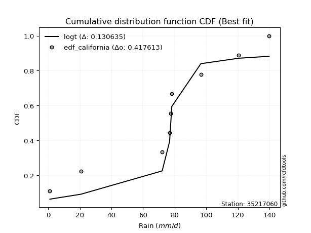</img>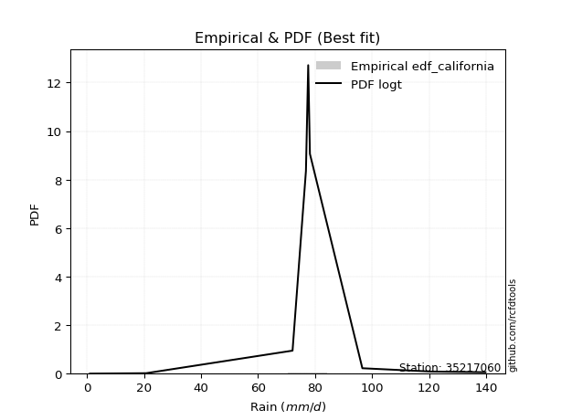</img>

</div>


### 2. EDF Hazen (1930)

Hazen method for plotting positions is a formula used to estimate the empirical cumulative probability distribution of flood events or other hydrological data. This formula often results in biased estimations, particularly when extrapolating to extreme events (high return periods).

<div align="center">


$P=(m-0.5)/n$


</div>


**2.1. Empirical values**

<div align="center">

|                | 0                   | 1                   | 2                  | 3                  | 4         | 5                  | 6                  | 7                  | 8                  |
|:---------------|:--------------------|:--------------------|:-------------------|:-------------------|:----------|:-------------------|:-------------------|:-------------------|:-------------------|
| date           | 2020                | 2017                | 2021               | 2022               | 2018      | 2023               | 2025               | 2024               | 2019               |
| x              | 1.0                 | 20.7                | 72.1               | 76.8               | 77.6      | 78.2               | 96.6               | 120.6              | 139.8              |
| m              | 1                   | 2                   | 3                  | 4                  | 5         | 6                  | 7                  | 8                  | 9                  |
| empirical_dist | edf_hazen           | edf_hazen           | edf_hazen          | edf_hazen          | edf_hazen | edf_hazen          | edf_hazen          | edf_hazen          | edf_hazen          |
| empirical      | 0.05555555555555555 | 0.16666666666666666 | 0.2777777777777778 | 0.3888888888888889 | 0.5       | 0.6111111111111112 | 0.7222222222222222 | 0.8333333333333334 | 0.9444444444444444 |
| empirical_tr   | 1.0588235294117647  | 1.2                 | 1.3846153846153846 | 1.6363636363636362 | 2.0       | 2.5714285714285716 | 3.5999999999999996 | 6.000000000000002  | 17.999999999999993 |

</div>


**2.2. Kolmogorov-Smirnov fit test (sorted by Δ)**


<div align="center">

|                | 0                   | 1                   | 2                   | 3                   | 4                   | 5                   | 6                   | 7                   | 8                   | 9                   | 10                  | 11                  | 12                  | 13                  | 14                  | 15                  | 16                  | 17                  | 18                  | 19                  | 20                  | 21                  | 22                  | 23                  | 24                  | 25                  | 26                  | 27                  | 28                  | 29                  | 30                  | 31                  | 32                  | 33                  | 34                  | 35                  | 36                  | 37                  | 38                  | 39                  | 40                  | 41                  | 42                  | 43                  | 44                  | 45                  | 46                  | 47                  | 48                  | 49                  | 50                  | 51                  | 52                  | 53                  | 54                  | 55                  | 56                  | 57                  | 58                  | 59                  | 60                  | 61                  | 62                  | 63                  | 64                  | 65                  | 66                  | 67                  | 68                  | 69                  | 70                  | 71                  | 72                  | 73                  | 74                  | 75                  | 76                  | 77                  | 78                  | 79                  | 80                  | 81                  | 82                  | 83                  | 84                  | 85                  | 86                  | 87                  | 88                  | 89                  | 90                  | 91                  | 92                  | 93                  | 94                  | 95                  | 96                  | 97                  | 98                  | 99                  | 100                 | 101                 | 102                 | 103                 | 104                 | 105                 | 106                 | 107                 | 108                 | 109                 | 110                 | 111                 | 112                 | 113                 | 114                 | 115                 | 116                 | 117                 | 118                 | 119                 | 120                 | 121                 | 122                 | 123                 | 124                 | 125                 | 126                 | 127                 | 128                 | 129                 | 130                 | 131                 | 132                 | 133                 | 134                 | 135                 | 136                 | 137                 | 138                 | 139                 | 140                 | 141                 | 142                 | 143                 | 144                 | 145                 | 146                 | 147                 | 148                 | 149                 | 150                 | 151                 | 152                 | 153                 | 154                 | 155                 | 156                 | 157                 | 158                 | 159                 |
|:---------------|:--------------------|:--------------------|:--------------------|:--------------------|:--------------------|:--------------------|:--------------------|:--------------------|:--------------------|:--------------------|:--------------------|:--------------------|:--------------------|:--------------------|:--------------------|:--------------------|:--------------------|:--------------------|:--------------------|:--------------------|:--------------------|:--------------------|:--------------------|:--------------------|:--------------------|:--------------------|:--------------------|:--------------------|:--------------------|:--------------------|:--------------------|:--------------------|:--------------------|:--------------------|:--------------------|:--------------------|:--------------------|:--------------------|:--------------------|:--------------------|:--------------------|:--------------------|:--------------------|:--------------------|:--------------------|:--------------------|:--------------------|:--------------------|:--------------------|:--------------------|:--------------------|:--------------------|:--------------------|:--------------------|:--------------------|:--------------------|:--------------------|:--------------------|:--------------------|:--------------------|:--------------------|:--------------------|:--------------------|:--------------------|:--------------------|:--------------------|:--------------------|:--------------------|:--------------------|:--------------------|:--------------------|:--------------------|:--------------------|:--------------------|:--------------------|:--------------------|:--------------------|:--------------------|:--------------------|:--------------------|:--------------------|:--------------------|:--------------------|:--------------------|:--------------------|:--------------------|:--------------------|:--------------------|:--------------------|:--------------------|:--------------------|:--------------------|:--------------------|:--------------------|:--------------------|:--------------------|:--------------------|:--------------------|:--------------------|:--------------------|:--------------------|:--------------------|:--------------------|:--------------------|:--------------------|:--------------------|:--------------------|:--------------------|:--------------------|:--------------------|:--------------------|:--------------------|:--------------------|:--------------------|:--------------------|:--------------------|:--------------------|:--------------------|:--------------------|:--------------------|:--------------------|:--------------------|:--------------------|:--------------------|:--------------------|:--------------------|:--------------------|:--------------------|:--------------------|:--------------------|:--------------------|:--------------------|:--------------------|:--------------------|:--------------------|:--------------------|:--------------------|:--------------------|:--------------------|:--------------------|:--------------------|:--------------------|:--------------------|:--------------------|:--------------------|:--------------------|:--------------------|:--------------------|:--------------------|:--------------------|:--------------------|:--------------------|:--------------------|:--------------------|:--------------------|:--------------------|:--------------------|:--------------------|:--------------------|:--------------------|
| station        | 35217060            | 35217060            | 35217060            | 35217060            | 35217060            | 35217060            | 35217060            | 35217060            | 35217060            | 35217060            | 35217060            | 35217060            | 35217060            | 35217060            | 35217060            | 35217060            | 35217060            | 35217060            | 35217060            | 35217060            | 35217060            | 35217060            | 35217060            | 35217060            | 35217060            | 35217060            | 35217060            | 35217060            | 35217060            | 35217060            | 35217060            | 35217060            | 35217060            | 35217060            | 35217060            | 35217060            | 35217060            | 35217060            | 35217060            | 35217060            | 35217060            | 35217060            | 35217060            | 35217060            | 35217060            | 35217060            | 35217060            | 35217060            | 35217060            | 35217060            | 35217060            | 35217060            | 35217060            | 35217060            | 35217060            | 35217060            | 35217060            | 35217060            | 35217060            | 35217060            | 35217060            | 35217060            | 35217060            | 35217060            | 35217060            | 35217060            | 35217060            | 35217060            | 35217060            | 35217060            | 35217060            | 35217060            | 35217060            | 35217060            | 35217060            | 35217060            | 35217060            | 35217060            | 35217060            | 35217060            | 35217060            | 35217060            | 35217060            | 35217060            | 35217060            | 35217060            | 35217060            | 35217060            | 35217060            | 35217060            | 35217060            | 35217060            | 35217060            | 35217060            | 35217060            | 35217060            | 35217060            | 35217060            | 35217060            | 35217060            | 35217060            | 35217060            | 35217060            | 35217060            | 35217060            | 35217060            | 35217060            | 35217060            | 35217060            | 35217060            | 35217060            | 35217060            | 35217060            | 35217060            | 35217060            | 35217060            | 35217060            | 35217060            | 35217060            | 35217060            | 35217060            | 35217060            | 35217060            | 35217060            | 35217060            | 35217060            | 35217060            | 35217060            | 35217060            | 35217060            | 35217060            | 35217060            | 35217060            | 35217060            | 35217060            | 35217060            | 35217060            | 35217060            | 35217060            | 35217060            | 35217060            | 35217060            | 35217060            | 35217060            | 35217060            | 35217060            | 35217060            | 35217060            | 35217060            | 35217060            | 35217060            | 35217060            | 35217060            | 35217060            | 35217060            | 35217060            | 35217060            | 35217060            | 35217060            | 35217060            |
| empirical_dist | edf_hazen           | edf_hazen           | edf_hazen           | edf_hazen           | edf_hazen           | edf_hazen           | edf_hazen           | edf_hazen           | edf_hazen           | edf_hazen           | edf_hazen           | edf_hazen           | edf_hazen           | edf_hazen           | edf_hazen           | edf_hazen           | edf_hazen           | edf_hazen           | edf_hazen           | edf_hazen           | edf_hazen           | edf_hazen           | edf_hazen           | edf_hazen           | edf_hazen           | edf_hazen           | edf_hazen           | edf_hazen           | edf_hazen           | edf_hazen           | edf_hazen           | edf_hazen           | edf_hazen           | edf_hazen           | edf_hazen           | edf_hazen           | edf_hazen           | edf_hazen           | edf_hazen           | edf_hazen           | edf_hazen           | edf_hazen           | edf_hazen           | edf_hazen           | edf_hazen           | edf_hazen           | edf_hazen           | edf_hazen           | edf_hazen           | edf_hazen           | edf_hazen           | edf_hazen           | edf_hazen           | edf_hazen           | edf_hazen           | edf_hazen           | edf_hazen           | edf_hazen           | edf_hazen           | edf_hazen           | edf_hazen           | edf_hazen           | edf_hazen           | edf_hazen           | edf_hazen           | edf_hazen           | edf_hazen           | edf_hazen           | edf_hazen           | edf_hazen           | edf_hazen           | edf_hazen           | edf_hazen           | edf_hazen           | edf_hazen           | edf_hazen           | edf_hazen           | edf_hazen           | edf_hazen           | edf_hazen           | edf_hazen           | edf_hazen           | edf_hazen           | edf_hazen           | edf_hazen           | edf_hazen           | edf_hazen           | edf_hazen           | edf_hazen           | edf_hazen           | edf_hazen           | edf_hazen           | edf_hazen           | edf_hazen           | edf_hazen           | edf_hazen           | edf_hazen           | edf_hazen           | edf_hazen           | edf_hazen           | edf_hazen           | edf_hazen           | edf_hazen           | edf_hazen           | edf_hazen           | edf_hazen           | edf_hazen           | edf_hazen           | edf_hazen           | edf_hazen           | edf_hazen           | edf_hazen           | edf_hazen           | edf_hazen           | edf_hazen           | edf_hazen           | edf_hazen           | edf_hazen           | edf_hazen           | edf_hazen           | edf_hazen           | edf_hazen           | edf_hazen           | edf_hazen           | edf_hazen           | edf_hazen           | edf_hazen           | edf_hazen           | edf_hazen           | edf_hazen           | edf_hazen           | edf_hazen           | edf_hazen           | edf_hazen           | edf_hazen           | edf_hazen           | edf_hazen           | edf_hazen           | edf_hazen           | edf_hazen           | edf_hazen           | edf_hazen           | edf_hazen           | edf_hazen           | edf_hazen           | edf_hazen           | edf_hazen           | edf_hazen           | edf_hazen           | edf_hazen           | edf_hazen           | edf_hazen           | edf_hazen           | edf_hazen           | edf_hazen           | edf_hazen           | edf_hazen           | edf_hazen           | edf_hazen           | edf_hazen           |
| p_dist         | logdgamma           | loggennorm          | gennorm             | logt                | dgamma              | dweibull            | logtukeylambda      | genlogistic         | genextreme          | logdweibull         | johnsonsu           | skewnorm            | burr12              | weibull_min         | argus               | gumbel_l            | laplace             | pearson3            | logjohnsonsu        | beta                | genpareto           | hypsecant           | foldnorm            | logistic            | f                   | exponnorm           | norm                | crystalball         | t                   | nct                 | fatiguelife         | anglit              | gausshyper          | betaprime           | semicircular        | gamma               | gengamma            | erlang              | rice                | genhalflogistic     | arcsine             | loglevy_l           | cosine              | truncweibull_min    | logpearson3         | invgamma            | maxwell             | loggenextreme       | exponweib           | logtruncweibull_min | rayleigh            | wrapcauchy          | ksone               | alpha               | kappa3              | uniform             | invgauss            | vonmises_line       | logargus            | triang              | gumbel_r            | bradford            | burr                | logweibull_max      | logvonmises_line    | kappa4              | halfnorm            | kstwobign           | logtrapezoid        | logloggamma         | ncf                 | moyal               | logburr             | loggumbel_l         | halflogistic        | logarcsine          | logburr12           | logweibull_min      | loggompertz         | levy_l              | logexponweib        | logbetaprime        | trapezoid           | truncexpon          | logsemicircular     | loginvweibull       | logjohnsonsb        | loganglit           | lomax               | loggenhalflogistic  | johnsonsb           | genexpon            | loggamma            | loggamma            | mielke              | lognct              | logexponnorm        | logcrystalball      | lognorm             | logrice             | logfatiguelife      | loginvgamma         | logerlang           | loginvgauss         | logfoldnorm         | wald                | loglogistic         | logkstwobign        | loglomax            | logloglaplace       | logmaxwell          | loghypsecant        | lograyleigh         | loggausshyper       | logalpha            | loggengamma         | logwrapcauchy       | loggenexpon         | logmielke           | nakagami            | logncf              | loglaplace          | loglaplace          | loghalfnorm         | loggumbel_r         | logcosine           | loggenpareto        | loghalflogistic     | loghalfgennorm      | logmoyal            | logskewnorm         | logf                | halfgennorm         | gompertz            | logbeta             | logwald             | logtriang           | lognakagami         | invweibull          | logksone            | logkappa4           | logkappa3           | loguniform          | powerlaw            | logbradford         | rdist               | logtruncnorm        | logexponpow         | weibull_max         | logtruncexpon       | tukeylambda         | truncpareto         | exponpow            | truncnorm           | logtruncpareto      | logpowerlaw         | logrdist            | loggenlogistic      | logvonmises         | vonmises            |
| delta          | 0.10976713070029023 | 0.11198754811196346 | 0.11767962652775743 | 0.11780521855292303 | 0.119666063972037   | 0.1241362745298289  | 0.13409885939611776 | 0.13654388135321027 | 0.1394400062960286  | 0.13976999481473196 | 0.1448497061084667  | 0.14535733667831868 | 0.15369192903163498 | 0.15372602173751793 | 0.15538645745020863 | 0.15848183671306337 | 0.16041185426821325 | 0.16087440755765392 | 0.16160238433785645 | 0.16783754171290594 | 0.17294278322229878 | 0.17573475594040833 | 0.17949660185436522 | 0.18001277961419038 | 0.18396851143513648 | 0.18505176569844284 | 0.18505197157041753 | 0.18505197386542854 | 0.18505225429871675 | 0.18521399542196193 | 0.18956871812200016 | 0.1903482991505333  | 0.19061952942063343 | 0.19061970076681695 | 0.19253239028217262 | 0.19341087355821102 | 0.19661890162278656 | 0.19772574740023863 | 0.19873019442356687 | 0.19978490594134218 | 0.20120547967826258 | 0.2026676471191412  | 0.20734894100942997 | 0.21636966864607687 | 0.2168338875848138  | 0.21854742327464322 | 0.2191898946095781  | 0.22341763248581514 | 0.22786601238103543 | 0.228294341664664   | 0.23089884462818322 | 0.2318557298687396  | 0.23242875440281774 | 0.23344981866291648 | 0.23446517185750426 | 0.23447006083893684 | 0.23626887117591944 | 0.2454605925035548  | 0.2491619955758103  | 0.24947000778253148 | 0.2533059125721072  | 0.25334869700160656 | 0.2589762008658868  | 0.26049813541202005 | 0.26219286726139135 | 0.26236320400371504 | 0.2639154448550697  | 0.26455581109807613 | 0.26676335126307604 | 0.26712514186650127 | 0.272834960011217   | 0.27895767192367016 | 0.2795907089757834  | 0.28088801681678244 | 0.28615365865400844 | 0.2887376059447311  | 0.29618216471863856 | 0.29629795249343294 | 0.2978354636197723  | 0.30046016242782314 | 0.3025351106210953  | 0.3037247467522144  | 0.30784453577667226 | 0.3107751099004411  | 0.31527002389359693 | 0.31806751286434154 | 0.3185507587315132  | 0.32183526170956056 | 0.32524106893648785 | 0.32752820327604903 | 0.33202308453383045 | 0.3347531681605639  | 0.33700673211714294 | 0.33700673211714294 | 0.33726350939553074 | 0.33753718555604106 | 0.33760191080059054 | 0.337603501004049   | 0.33760357120765894 | 0.3376137715398284  | 0.33773104474584226 | 0.3402747288540011  | 0.3422334973676172  | 0.3436415257382551  | 0.3457773522128901  | 0.35033903704671654 | 0.35219946548694303 | 0.3545543008209754  | 0.35690963448292656 | 0.35971879893095937 | 0.3627255271451054  | 0.3639764668017066  | 0.3704448330035194  | 0.37622160126602655 | 0.3774236247390703  | 0.38136475925256186 | 0.3838864989354881  | 0.3848272733240622  | 0.3878630138733278  | 0.38874302630935476 | 0.3894942684408341  | 0.3920162991101378  | 0.3920162991101378  | 0.3925292620753458  | 0.40240262747732813 | 0.4074382234382864  | 0.4094451201594619  | 0.4209010084247009  | 0.42357679885421495 | 0.42431556519466196 | 0.43769143173590264 | 0.4422603607182879  | 0.45268886777205897 | 0.4790610204066927  | 0.4804960287912653  | 0.48560470781040477 | 0.48576310482941054 | 0.49892496445054546 | 0.5154383956919586  | 0.527193501071685   | 0.5712251720168773  | 0.5862153561871951  | 0.5881877568415774  | 0.6010216078135828  | 0.6042102596466178  | 0.6077218607516481  | 0.6165976334127861  | 0.6251255214005051  | 0.6346086052938602  | 0.6351899362927661  | 0.6799069311180127  | 0.714400802396568   | 0.7394220893794389  | 0.7588098368021983  | 0.7799680022118598  | 0.8271660749665293  | 0.8333333307401851  | 0.8333333333333334  | 1.0914601192801672  | 21.346468910557967  |
| deltao         | 0.41761268023100007 | 0.41761268023100007 | 0.41761268023100007 | 0.41761268023100007 | 0.41761268023100007 | 0.41761268023100007 | 0.41761268023100007 | 0.41761268023100007 | 0.41761268023100007 | 0.41761268023100007 | 0.41761268023100007 | 0.41761268023100007 | 0.41761268023100007 | 0.41761268023100007 | 0.41761268023100007 | 0.41761268023100007 | 0.41761268023100007 | 0.41761268023100007 | 0.41761268023100007 | 0.41761268023100007 | 0.41761268023100007 | 0.41761268023100007 | 0.41761268023100007 | 0.41761268023100007 | 0.41761268023100007 | 0.41761268023100007 | 0.41761268023100007 | 0.41761268023100007 | 0.41761268023100007 | 0.41761268023100007 | 0.41761268023100007 | 0.41761268023100007 | 0.41761268023100007 | 0.41761268023100007 | 0.41761268023100007 | 0.41761268023100007 | 0.41761268023100007 | 0.41761268023100007 | 0.41761268023100007 | 0.41761268023100007 | 0.41761268023100007 | 0.41761268023100007 | 0.41761268023100007 | 0.41761268023100007 | 0.41761268023100007 | 0.41761268023100007 | 0.41761268023100007 | 0.41761268023100007 | 0.41761268023100007 | 0.41761268023100007 | 0.41761268023100007 | 0.41761268023100007 | 0.41761268023100007 | 0.41761268023100007 | 0.41761268023100007 | 0.41761268023100007 | 0.41761268023100007 | 0.41761268023100007 | 0.41761268023100007 | 0.41761268023100007 | 0.41761268023100007 | 0.41761268023100007 | 0.41761268023100007 | 0.41761268023100007 | 0.41761268023100007 | 0.41761268023100007 | 0.41761268023100007 | 0.41761268023100007 | 0.41761268023100007 | 0.41761268023100007 | 0.41761268023100007 | 0.41761268023100007 | 0.41761268023100007 | 0.41761268023100007 | 0.41761268023100007 | 0.41761268023100007 | 0.41761268023100007 | 0.41761268023100007 | 0.41761268023100007 | 0.41761268023100007 | 0.41761268023100007 | 0.41761268023100007 | 0.41761268023100007 | 0.41761268023100007 | 0.41761268023100007 | 0.41761268023100007 | 0.41761268023100007 | 0.41761268023100007 | 0.41761268023100007 | 0.41761268023100007 | 0.41761268023100007 | 0.41761268023100007 | 0.41761268023100007 | 0.41761268023100007 | 0.41761268023100007 | 0.41761268023100007 | 0.41761268023100007 | 0.41761268023100007 | 0.41761268023100007 | 0.41761268023100007 | 0.41761268023100007 | 0.41761268023100007 | 0.41761268023100007 | 0.41761268023100007 | 0.41761268023100007 | 0.41761268023100007 | 0.41761268023100007 | 0.41761268023100007 | 0.41761268023100007 | 0.41761268023100007 | 0.41761268023100007 | 0.41761268023100007 | 0.41761268023100007 | 0.41761268023100007 | 0.41761268023100007 | 0.41761268023100007 | 0.41761268023100007 | 0.41761268023100007 | 0.41761268023100007 | 0.41761268023100007 | 0.41761268023100007 | 0.41761268023100007 | 0.41761268023100007 | 0.41761268023100007 | 0.41761268023100007 | 0.41761268023100007 | 0.41761268023100007 | 0.41761268023100007 | 0.41761268023100007 | 0.41761268023100007 | 0.41761268023100007 | 0.41761268023100007 | 0.41761268023100007 | 0.41761268023100007 | 0.41761268023100007 | 0.41761268023100007 | 0.41761268023100007 | 0.41761268023100007 | 0.41761268023100007 | 0.41761268023100007 | 0.41761268023100007 | 0.41761268023100007 | 0.41761268023100007 | 0.41761268023100007 | 0.41761268023100007 | 0.41761268023100007 | 0.41761268023100007 | 0.41761268023100007 | 0.41761268023100007 | 0.41761268023100007 | 0.41761268023100007 | 0.41761268023100007 | 0.41761268023100007 | 0.41761268023100007 | 0.41761268023100007 | 0.41761268023100007 | 0.41761268023100007 | 0.41761268023100007 | 0.41761268023100007 | 0.41761268023100007 |
| eval           | Δo > Δ              | Δo > Δ              | Δo > Δ              | Δo > Δ              | Δo > Δ              | Δo > Δ              | Δo > Δ              | Δo > Δ              | Δo > Δ              | Δo > Δ              | Δo > Δ              | Δo > Δ              | Δo > Δ              | Δo > Δ              | Δo > Δ              | Δo > Δ              | Δo > Δ              | Δo > Δ              | Δo > Δ              | Δo > Δ              | Δo > Δ              | Δo > Δ              | Δo > Δ              | Δo > Δ              | Δo > Δ              | Δo > Δ              | Δo > Δ              | Δo > Δ              | Δo > Δ              | Δo > Δ              | Δo > Δ              | Δo > Δ              | Δo > Δ              | Δo > Δ              | Δo > Δ              | Δo > Δ              | Δo > Δ              | Δo > Δ              | Δo > Δ              | Δo > Δ              | Δo > Δ              | Δo > Δ              | Δo > Δ              | Δo > Δ              | Δo > Δ              | Δo > Δ              | Δo > Δ              | Δo > Δ              | Δo > Δ              | Δo > Δ              | Δo > Δ              | Δo > Δ              | Δo > Δ              | Δo > Δ              | Δo > Δ              | Δo > Δ              | Δo > Δ              | Δo > Δ              | Δo > Δ              | Δo > Δ              | Δo > Δ              | Δo > Δ              | Δo > Δ              | Δo > Δ              | Δo > Δ              | Δo > Δ              | Δo > Δ              | Δo > Δ              | Δo > Δ              | Δo > Δ              | Δo > Δ              | Δo > Δ              | Δo > Δ              | Δo > Δ              | Δo > Δ              | Δo > Δ              | Δo > Δ              | Δo > Δ              | Δo > Δ              | Δo > Δ              | Δo > Δ              | Δo > Δ              | Δo > Δ              | Δo > Δ              | Δo > Δ              | Δo > Δ              | Δo > Δ              | Δo > Δ              | Δo > Δ              | Δo > Δ              | Δo > Δ              | Δo > Δ              | Δo > Δ              | Δo > Δ              | Δo > Δ              | Δo > Δ              | Δo > Δ              | Δo > Δ              | Δo > Δ              | Δo > Δ              | Δo > Δ              | Δo > Δ              | Δo > Δ              | Δo > Δ              | Δo > Δ              | Δo > Δ              | Δo > Δ              | Δo > Δ              | Δo > Δ              | Δo > Δ              | Δo > Δ              | Δo > Δ              | Δo > Δ              | Δo > Δ              | Δo > Δ              | Δo > Δ              | Δo > Δ              | Δo > Δ              | Δo > Δ              | Δo > Δ              | Δo > Δ              | Δo > Δ              | Δo > Δ              | Δo > Δ              | Δo > Δ              | Δo > Δ              | Δo > Δ              | Δo <= Δ             | Δo <= Δ             | Δo <= Δ             | Δo <= Δ             | Δo <= Δ             | Δo <= Δ             | Δo <= Δ             | Δo <= Δ             | Δo <= Δ             | Δo <= Δ             | Δo <= Δ             | Δo <= Δ             | Δo <= Δ             | Δo <= Δ             | Δo <= Δ             | Δo <= Δ             | Δo <= Δ             | Δo <= Δ             | Δo <= Δ             | Δo <= Δ             | Δo <= Δ             | Δo <= Δ             | Δo <= Δ             | Δo <= Δ             | Δo <= Δ             | Δo <= Δ             | Δo <= Δ             | Δo <= Δ             | Δo <= Δ             | Δo <= Δ             | Δo <= Δ             | Δo <= Δ             | Δo <= Δ             |
| fit            | 1                   | 1                   | 1                   | 1                   | 1                   | 1                   | 1                   | 1                   | 1                   | 1                   | 1                   | 1                   | 1                   | 1                   | 1                   | 1                   | 1                   | 1                   | 1                   | 1                   | 1                   | 1                   | 1                   | 1                   | 1                   | 1                   | 1                   | 1                   | 1                   | 1                   | 1                   | 1                   | 1                   | 1                   | 1                   | 1                   | 1                   | 1                   | 1                   | 1                   | 1                   | 1                   | 1                   | 1                   | 1                   | 1                   | 1                   | 1                   | 1                   | 1                   | 1                   | 1                   | 1                   | 1                   | 1                   | 1                   | 1                   | 1                   | 1                   | 1                   | 1                   | 1                   | 1                   | 1                   | 1                   | 1                   | 1                   | 1                   | 1                   | 1                   | 1                   | 1                   | 1                   | 1                   | 1                   | 1                   | 1                   | 1                   | 1                   | 1                   | 1                   | 1                   | 1                   | 1                   | 1                   | 1                   | 1                   | 1                   | 1                   | 1                   | 1                   | 1                   | 1                   | 1                   | 1                   | 1                   | 1                   | 1                   | 1                   | 1                   | 1                   | 1                   | 1                   | 1                   | 1                   | 1                   | 1                   | 1                   | 1                   | 1                   | 1                   | 1                   | 1                   | 1                   | 1                   | 1                   | 1                   | 1                   | 1                   | 1                   | 1                   | 1                   | 1                   | 1                   | 1                   | 1                   | 1                   | 0                   | 0                   | 0                   | 0                   | 0                   | 0                   | 0                   | 0                   | 0                   | 0                   | 0                   | 0                   | 0                   | 0                   | 0                   | 0                   | 0                   | 0                   | 0                   | 0                   | 0                   | 0                   | 0                   | 0                   | 0                   | 0                   | 0                   | 0                   | 0                   | 0                   | 0                   | 0                   | 0                   |
| n              | 9                   | 9                   | 9                   | 9                   | 9                   | 9                   | 9                   | 9                   | 9                   | 9                   | 9                   | 9                   | 9                   | 9                   | 9                   | 9                   | 9                   | 9                   | 9                   | 9                   | 9                   | 9                   | 9                   | 9                   | 9                   | 9                   | 9                   | 9                   | 9                   | 9                   | 9                   | 9                   | 9                   | 9                   | 9                   | 9                   | 9                   | 9                   | 9                   | 9                   | 9                   | 9                   | 9                   | 9                   | 9                   | 9                   | 9                   | 9                   | 9                   | 9                   | 9                   | 9                   | 9                   | 9                   | 9                   | 9                   | 9                   | 9                   | 9                   | 9                   | 9                   | 9                   | 9                   | 9                   | 9                   | 9                   | 9                   | 9                   | 9                   | 9                   | 9                   | 9                   | 9                   | 9                   | 9                   | 9                   | 9                   | 9                   | 9                   | 9                   | 9                   | 9                   | 9                   | 9                   | 9                   | 9                   | 9                   | 9                   | 9                   | 9                   | 9                   | 9                   | 9                   | 9                   | 9                   | 9                   | 9                   | 9                   | 9                   | 9                   | 9                   | 9                   | 9                   | 9                   | 9                   | 9                   | 9                   | 9                   | 9                   | 9                   | 9                   | 9                   | 9                   | 9                   | 9                   | 9                   | 9                   | 9                   | 9                   | 9                   | 9                   | 9                   | 9                   | 9                   | 9                   | 9                   | 9                   | 9                   | 9                   | 9                   | 9                   | 9                   | 9                   | 9                   | 9                   | 9                   | 9                   | 9                   | 9                   | 9                   | 9                   | 9                   | 9                   | 9                   | 9                   | 9                   | 9                   | 9                   | 9                   | 9                   | 9                   | 9                   | 9                   | 9                   | 9                   | 9                   | 9                   | 9                   | 9                   | 9                   |
| best_fit       | 1                   | 0                   | 0                   | 0                   | 0                   | 0                   | 0                   | 0                   | 0                   | 0                   | 0                   | 0                   | 0                   | 0                   | 0                   | 0                   | 0                   | 0                   | 0                   | 0                   | 0                   | 0                   | 0                   | 0                   | 0                   | 0                   | 0                   | 0                   | 0                   | 0                   | 0                   | 0                   | 0                   | 0                   | 0                   | 0                   | 0                   | 0                   | 0                   | 0                   | 0                   | 0                   | 0                   | 0                   | 0                   | 0                   | 0                   | 0                   | 0                   | 0                   | 0                   | 0                   | 0                   | 0                   | 0                   | 0                   | 0                   | 0                   | 0                   | 0                   | 0                   | 0                   | 0                   | 0                   | 0                   | 0                   | 0                   | 0                   | 0                   | 0                   | 0                   | 0                   | 0                   | 0                   | 0                   | 0                   | 0                   | 0                   | 0                   | 0                   | 0                   | 0                   | 0                   | 0                   | 0                   | 0                   | 0                   | 0                   | 0                   | 0                   | 0                   | 0                   | 0                   | 0                   | 0                   | 0                   | 0                   | 0                   | 0                   | 0                   | 0                   | 0                   | 0                   | 0                   | 0                   | 0                   | 0                   | 0                   | 0                   | 0                   | 0                   | 0                   | 0                   | 0                   | 0                   | 0                   | 0                   | 0                   | 0                   | 0                   | 0                   | 0                   | 0                   | 0                   | 0                   | 0                   | 0                   | 0                   | 0                   | 0                   | 0                   | 0                   | 0                   | 0                   | 0                   | 0                   | 0                   | 0                   | 0                   | 0                   | 0                   | 0                   | 0                   | 0                   | 0                   | 0                   | 0                   | 0                   | 0                   | 0                   | 0                   | 0                   | 0                   | 0                   | 0                   | 0                   | 0                   | 0                   | 0                   | 0                   |
| best_fit_sort  | 1                   | 2                   | 3                   | 4                   | 5                   | 6                   | 7                   | 8                   | 9                   | 10                  | 11                  | 12                  | 13                  | 14                  | 15                  | 16                  | 17                  | 18                  | 19                  | 20                  | 21                  | 22                  | 23                  | 24                  | 25                  | 26                  | 27                  | 28                  | 29                  | 30                  | 31                  | 32                  | 33                  | 34                  | 35                  | 36                  | 37                  | 38                  | 39                  | 40                  | 41                  | 42                  | 43                  | 44                  | 45                  | 46                  | 47                  | 48                  | 49                  | 50                  | 51                  | 52                  | 53                  | 54                  | 55                  | 56                  | 57                  | 58                  | 59                  | 60                  | 61                  | 62                  | 63                  | 64                  | 65                  | 66                  | 67                  | 68                  | 69                  | 70                  | 71                  | 72                  | 73                  | 74                  | 75                  | 76                  | 77                  | 78                  | 79                  | 80                  | 81                  | 82                  | 83                  | 84                  | 85                  | 86                  | 87                  | 88                  | 89                  | 90                  | 91                  | 92                  | 93                  | 94                  | 95                  | 96                  | 97                  | 98                  | 99                  | 100                 | 101                 | 102                 | 103                 | 104                 | 105                 | 106                 | 107                 | 108                 | 109                 | 110                 | 111                 | 112                 | 113                 | 114                 | 115                 | 116                 | 117                 | 118                 | 119                 | 120                 | 121                 | 122                 | 123                 | 124                 | 125                 | 126                 | 127                 | 128                 | 129                 | 130                 | 131                 | 132                 | 133                 | 134                 | 135                 | 136                 | 137                 | 138                 | 139                 | 140                 | 141                 | 142                 | 143                 | 144                 | 145                 | 146                 | 147                 | 148                 | 149                 | 150                 | 151                 | 152                 | 153                 | 154                 | 155                 | 156                 | 157                 | 158                 | 159                 | 160                 |

</div>


**2.3. Best fit**

<div align="center">

|   id |   station | empirical_dist   | p_dist    |    delta |   deltao | eval   |   fit |   n |   best_fit |   best_fit_sort |
|-----:|----------:|:-----------------|:----------|---------:|---------:|:-------|------:|----:|-----------:|----------------:|
|    0 |  35217060 | edf_hazen        | logdgamma | 0.109767 | 0.417613 | Δo > Δ |     1 |   9 |          1 |               1 |

</div>


<div align="center">

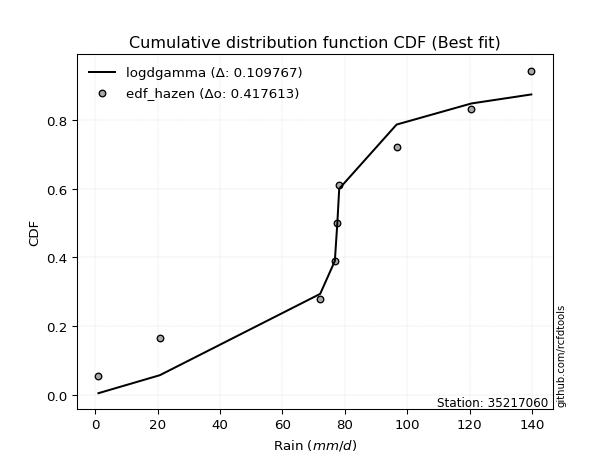</img>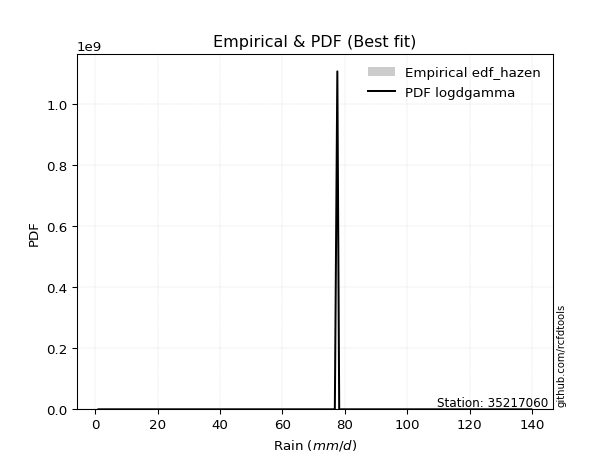</img>

</div>


### 3. EDF Weibull (1939)

Weibull plotting position formula is an empirical method used to estimate the non-exceedance probability or plotting position for a set of observed data, is often recommended or widely used in practice, particularly in flood frequency analysis.

<div align="center">


$P=m/(n+1)$


</div>


**3.1. Empirical values**

<div align="center">

|                | 0                  | 1           | 2                  | 3                  | 4           | 5           | 6                 | 7                 | 8                  |
|:---------------|:-------------------|:------------|:-------------------|:-------------------|:------------|:------------|:------------------|:------------------|:-------------------|
| date           | 2020               | 2017        | 2021               | 2022               | 2018        | 2023        | 2025              | 2024              | 2019               |
| x              | 1.0                | 20.7        | 72.1               | 76.8               | 77.6        | 78.2        | 96.6              | 120.6             | 139.8              |
| m              | 1                  | 2           | 3                  | 4                  | 5           | 6           | 7                 | 8                 | 9                  |
| empirical_dist | edf_weibull        | edf_weibull | edf_weibull        | edf_weibull        | edf_weibull | edf_weibull | edf_weibull       | edf_weibull       | edf_weibull        |
| empirical      | 0.1                | 0.2         | 0.3                | 0.4                | 0.5         | 0.6         | 0.7               | 0.8               | 0.9                |
| empirical_tr   | 1.1111111111111112 | 1.25        | 1.4285714285714286 | 1.6666666666666667 | 2.0         | 2.5         | 3.333333333333333 | 5.000000000000001 | 10.000000000000002 |

</div>


**3.2. Kolmogorov-Smirnov fit test (sorted by Δ)**


<div align="center">

|                | 0                   | 1                   | 2                   | 3                   | 4                   | 5                   | 6                   | 7                   | 8                   | 9                   | 10                  | 11                  | 12                  | 13                  | 14                  | 15                  | 16                  | 17                  | 18                  | 19                  | 20                  | 21                  | 22                  | 23                  | 24                  | 25                  | 26                  | 27                  | 28                  | 29                  | 30                  | 31                  | 32                  | 33                  | 34                  | 35                  | 36                  | 37                  | 38                  | 39                  | 40                  | 41                  | 42                  | 43                  | 44                  | 45                  | 46                  | 47                  | 48                  | 49                  | 50                  | 51                  | 52                  | 53                  | 54                  | 55                  | 56                  | 57                  | 58                  | 59                  | 60                  | 61                  | 62                  | 63                  | 64                  | 65                  | 66                  | 67                  | 68                  | 69                  | 70                  | 71                  | 72                  | 73                  | 74                  | 75                  | 76                  | 77                  | 78                  | 79                  | 80                  | 81                  | 82                  | 83                  | 84                  | 85                  | 86                  | 87                  | 88                  | 89                  | 90                  | 91                  | 92                  | 93                  | 94                  | 95                  | 96                  | 97                  | 98                  | 99                  | 100                 | 101                 | 102                 | 103                 | 104                 | 105                 | 106                 | 107                 | 108                 | 109                 | 110                 | 111                 | 112                 | 113                 | 114                 | 115                 | 116                 | 117                 | 118                 | 119                 | 120                 | 121                 | 122                 | 123                 | 124                 | 125                 | 126                 | 127                 | 128                 | 129                 | 130                 | 131                 | 132                 | 133                 | 134                 | 135                 | 136                 | 137                 | 138                 | 139                 | 140                 | 141                 | 142                 | 143                 | 144                 | 145                 | 146                 | 147                 | 148                 | 149                 | 150                 | 151                 | 152                 | 153                 | 154                 | 155                 | 156                 | 157                 | 158                 | 159                 |
|:---------------|:--------------------|:--------------------|:--------------------|:--------------------|:--------------------|:--------------------|:--------------------|:--------------------|:--------------------|:--------------------|:--------------------|:--------------------|:--------------------|:--------------------|:--------------------|:--------------------|:--------------------|:--------------------|:--------------------|:--------------------|:--------------------|:--------------------|:--------------------|:--------------------|:--------------------|:--------------------|:--------------------|:--------------------|:--------------------|:--------------------|:--------------------|:--------------------|:--------------------|:--------------------|:--------------------|:--------------------|:--------------------|:--------------------|:--------------------|:--------------------|:--------------------|:--------------------|:--------------------|:--------------------|:--------------------|:--------------------|:--------------------|:--------------------|:--------------------|:--------------------|:--------------------|:--------------------|:--------------------|:--------------------|:--------------------|:--------------------|:--------------------|:--------------------|:--------------------|:--------------------|:--------------------|:--------------------|:--------------------|:--------------------|:--------------------|:--------------------|:--------------------|:--------------------|:--------------------|:--------------------|:--------------------|:--------------------|:--------------------|:--------------------|:--------------------|:--------------------|:--------------------|:--------------------|:--------------------|:--------------------|:--------------------|:--------------------|:--------------------|:--------------------|:--------------------|:--------------------|:--------------------|:--------------------|:--------------------|:--------------------|:--------------------|:--------------------|:--------------------|:--------------------|:--------------------|:--------------------|:--------------------|:--------------------|:--------------------|:--------------------|:--------------------|:--------------------|:--------------------|:--------------------|:--------------------|:--------------------|:--------------------|:--------------------|:--------------------|:--------------------|:--------------------|:--------------------|:--------------------|:--------------------|:--------------------|:--------------------|:--------------------|:--------------------|:--------------------|:--------------------|:--------------------|:--------------------|:--------------------|:--------------------|:--------------------|:--------------------|:--------------------|:--------------------|:--------------------|:--------------------|:--------------------|:--------------------|:--------------------|:--------------------|:--------------------|:--------------------|:--------------------|:--------------------|:--------------------|:--------------------|:--------------------|:--------------------|:--------------------|:--------------------|:--------------------|:--------------------|:--------------------|:--------------------|:--------------------|:--------------------|:--------------------|:--------------------|:--------------------|:--------------------|:--------------------|:--------------------|:--------------------|:--------------------|:--------------------|:--------------------|
| station        | 35217060            | 35217060            | 35217060            | 35217060            | 35217060            | 35217060            | 35217060            | 35217060            | 35217060            | 35217060            | 35217060            | 35217060            | 35217060            | 35217060            | 35217060            | 35217060            | 35217060            | 35217060            | 35217060            | 35217060            | 35217060            | 35217060            | 35217060            | 35217060            | 35217060            | 35217060            | 35217060            | 35217060            | 35217060            | 35217060            | 35217060            | 35217060            | 35217060            | 35217060            | 35217060            | 35217060            | 35217060            | 35217060            | 35217060            | 35217060            | 35217060            | 35217060            | 35217060            | 35217060            | 35217060            | 35217060            | 35217060            | 35217060            | 35217060            | 35217060            | 35217060            | 35217060            | 35217060            | 35217060            | 35217060            | 35217060            | 35217060            | 35217060            | 35217060            | 35217060            | 35217060            | 35217060            | 35217060            | 35217060            | 35217060            | 35217060            | 35217060            | 35217060            | 35217060            | 35217060            | 35217060            | 35217060            | 35217060            | 35217060            | 35217060            | 35217060            | 35217060            | 35217060            | 35217060            | 35217060            | 35217060            | 35217060            | 35217060            | 35217060            | 35217060            | 35217060            | 35217060            | 35217060            | 35217060            | 35217060            | 35217060            | 35217060            | 35217060            | 35217060            | 35217060            | 35217060            | 35217060            | 35217060            | 35217060            | 35217060            | 35217060            | 35217060            | 35217060            | 35217060            | 35217060            | 35217060            | 35217060            | 35217060            | 35217060            | 35217060            | 35217060            | 35217060            | 35217060            | 35217060            | 35217060            | 35217060            | 35217060            | 35217060            | 35217060            | 35217060            | 35217060            | 35217060            | 35217060            | 35217060            | 35217060            | 35217060            | 35217060            | 35217060            | 35217060            | 35217060            | 35217060            | 35217060            | 35217060            | 35217060            | 35217060            | 35217060            | 35217060            | 35217060            | 35217060            | 35217060            | 35217060            | 35217060            | 35217060            | 35217060            | 35217060            | 35217060            | 35217060            | 35217060            | 35217060            | 35217060            | 35217060            | 35217060            | 35217060            | 35217060            | 35217060            | 35217060            | 35217060            | 35217060            | 35217060            | 35217060            |
| empirical_dist | edf_weibull         | edf_weibull         | edf_weibull         | edf_weibull         | edf_weibull         | edf_weibull         | edf_weibull         | edf_weibull         | edf_weibull         | edf_weibull         | edf_weibull         | edf_weibull         | edf_weibull         | edf_weibull         | edf_weibull         | edf_weibull         | edf_weibull         | edf_weibull         | edf_weibull         | edf_weibull         | edf_weibull         | edf_weibull         | edf_weibull         | edf_weibull         | edf_weibull         | edf_weibull         | edf_weibull         | edf_weibull         | edf_weibull         | edf_weibull         | edf_weibull         | edf_weibull         | edf_weibull         | edf_weibull         | edf_weibull         | edf_weibull         | edf_weibull         | edf_weibull         | edf_weibull         | edf_weibull         | edf_weibull         | edf_weibull         | edf_weibull         | edf_weibull         | edf_weibull         | edf_weibull         | edf_weibull         | edf_weibull         | edf_weibull         | edf_weibull         | edf_weibull         | edf_weibull         | edf_weibull         | edf_weibull         | edf_weibull         | edf_weibull         | edf_weibull         | edf_weibull         | edf_weibull         | edf_weibull         | edf_weibull         | edf_weibull         | edf_weibull         | edf_weibull         | edf_weibull         | edf_weibull         | edf_weibull         | edf_weibull         | edf_weibull         | edf_weibull         | edf_weibull         | edf_weibull         | edf_weibull         | edf_weibull         | edf_weibull         | edf_weibull         | edf_weibull         | edf_weibull         | edf_weibull         | edf_weibull         | edf_weibull         | edf_weibull         | edf_weibull         | edf_weibull         | edf_weibull         | edf_weibull         | edf_weibull         | edf_weibull         | edf_weibull         | edf_weibull         | edf_weibull         | edf_weibull         | edf_weibull         | edf_weibull         | edf_weibull         | edf_weibull         | edf_weibull         | edf_weibull         | edf_weibull         | edf_weibull         | edf_weibull         | edf_weibull         | edf_weibull         | edf_weibull         | edf_weibull         | edf_weibull         | edf_weibull         | edf_weibull         | edf_weibull         | edf_weibull         | edf_weibull         | edf_weibull         | edf_weibull         | edf_weibull         | edf_weibull         | edf_weibull         | edf_weibull         | edf_weibull         | edf_weibull         | edf_weibull         | edf_weibull         | edf_weibull         | edf_weibull         | edf_weibull         | edf_weibull         | edf_weibull         | edf_weibull         | edf_weibull         | edf_weibull         | edf_weibull         | edf_weibull         | edf_weibull         | edf_weibull         | edf_weibull         | edf_weibull         | edf_weibull         | edf_weibull         | edf_weibull         | edf_weibull         | edf_weibull         | edf_weibull         | edf_weibull         | edf_weibull         | edf_weibull         | edf_weibull         | edf_weibull         | edf_weibull         | edf_weibull         | edf_weibull         | edf_weibull         | edf_weibull         | edf_weibull         | edf_weibull         | edf_weibull         | edf_weibull         | edf_weibull         | edf_weibull         | edf_weibull         | edf_weibull         | edf_weibull         |
| p_dist         | logdweibull         | dweibull            | genlogistic         | johnsonsu           | skewnorm            | genextreme          | dgamma              | burr12              | weibull_min         | argus               | laplace             | pearson3            | logjohnsonsu        | gennorm             | logt                | logdgamma           | loggennorm          | gumbel_l            | hypsecant           | logtukeylambda      | beta                | foldnorm            | logistic            | f                   | genpareto           | exponnorm           | norm                | crystalball         | t                   | nct                 | fatiguelife         | anglit              | betaprime           | semicircular        | gamma               | gengamma            | erlang              | rice                | arcsine             | gausshyper          | loglevy_l           | cosine              | genhalflogistic     | truncweibull_min    | logpearson3         | invgamma            | maxwell             | loggenextreme       | exponweib           | logtruncweibull_min | rayleigh            | wrapcauchy          | ksone               | alpha               | kappa3              | uniform             | invgauss            | vonmises_line       | logargus            | logweibull_max      | gumbel_r            | bradford            | burr                | triang              | logvonmises_line    | kappa4              | halfnorm            | kstwobign           | logtrapezoid        | logloggamma         | ncf                 | levy_l              | moyal               | logburr             | loggumbel_l         | halflogistic        | logarcsine          | logburr12           | logweibull_min      | loggompertz         | logexponweib        | logbetaprime        | logjohnsonsb        | truncexpon          | logsemicircular     | loginvweibull       | trapezoid           | johnsonsb           | loganglit           | lomax               | loggenhalflogistic  | loglomax            | genexpon            | loggamma            | loggamma            | mielke              | logloglaplace       | lognct              | logexponnorm        | logcrystalball      | lognorm             | logrice             | logfatiguelife      | loginvgamma         | logerlang           | loginvgauss         | logfoldnorm         | wald                | loglogistic         | logkstwobign        | logmaxwell          | loghypsecant        | lograyleigh         | loggausshyper       | logmielke           | logalpha            | logncf              | loggengamma         | logwrapcauchy       | loggenexpon         | nakagami            | loglaplace          | loglaplace          | loghalfnorm         | loggumbel_r         | logcosine           | loggenpareto        | loghalfgennorm      | loghalflogistic     | logmoyal            | logf                | logskewnorm         | halfgennorm         | logbeta             | logwald             | logtriang           | lognakagami         | gompertz            | invweibull          | logksone            | logkappa4           | logkappa3           | loguniform          | powerlaw            | logbradford         | rdist               | logtruncnorm        | logexponpow         | weibull_max         | logtruncexpon       | tukeylambda         | truncpareto         | exponpow            | truncnorm           | logtruncpareto      | logpowerlaw         | logrdist            | loggenlogistic      | logvonmises         | vonmises            |
| delta          | 0.09532555037028756 | 0.1135229439900804  | 0.12121733203288987 | 0.1226274838862445  | 0.12313511445609648 | 0.1283288951849174  | 0.12874716009387632 | 0.13146970680941278 | 0.13150379951529573 | 0.13316423522798643 | 0.13818963204599105 | 0.13865218533543172 | 0.13938016211563425 | 0.13990184874997968 | 0.14002744077514528 | 0.1431004640336236  | 0.1453208814452968  | 0.1473707256019522  | 0.15351253371818613 | 0.15632108161834002 | 0.15672643060179475 | 0.15727437963214302 | 0.15779055739196818 | 0.16174628921291428 | 0.1618316721111876  | 0.16282954347622064 | 0.16282974934819533 | 0.16282975164320634 | 0.16283003207649455 | 0.16299177319973973 | 0.16734649589977796 | 0.1681260769283111  | 0.16839747854459475 | 0.17031016805995042 | 0.17118865133598882 | 0.17439667940056436 | 0.17550352517801643 | 0.17650797220134468 | 0.17898325745604038 | 0.17950841830952224 | 0.180445424896919   | 0.18512671878720777 | 0.188673794830231   | 0.19414744642385467 | 0.1946116653625916  | 0.19632520105242102 | 0.1969676723873559  | 0.20119541026359294 | 0.20564379015881323 | 0.2060721194424418  | 0.20867662240596102 | 0.2096335076465174  | 0.21020653218059554 | 0.21122759644069428 | 0.21224294963528206 | 0.21224783861671465 | 0.21404664895369724 | 0.2232383702813326  | 0.22693977335358811 | 0.22716480207868672 | 0.23108369034988502 | 0.23112647477938436 | 0.2367539786436646  | 0.2383588966714203  | 0.23997064503916915 | 0.24014098178149285 | 0.24169322263284748 | 0.24233358887585393 | 0.24454112904085384 | 0.24490291964427907 | 0.2506127377889948  | 0.25601571798337874 | 0.25673544970144796 | 0.2573684867535612  | 0.25866579459456024 | 0.26393143643178624 | 0.2665153837225089  | 0.27395994249641636 | 0.27407573027121074 | 0.2756132413975501  | 0.2803128883988731  | 0.2815025245299922  | 0.28521742539817985 | 0.2885528876782189  | 0.29304780167137473 | 0.29584529064211934 | 0.2967334246655611  | 0.2986897512004971  | 0.29961303948733836 | 0.30301884671426565 | 0.30530598105382684 | 0.31246519003848217 | 0.3125309459383417  | 0.31478450989492074 | 0.31478450989492074 | 0.31504128717330854 | 0.315274354486515   | 0.31531496333381887 | 0.31537968857836834 | 0.3153812787818268  | 0.31538134898543674 | 0.3153915493176062  | 0.31550882252362006 | 0.3180525066317789  | 0.320011275145395   | 0.32141930351603293 | 0.3235551299906679  | 0.32811681482449434 | 0.32997724326472083 | 0.3323320785987532  | 0.3405033049228832  | 0.3417542445794844  | 0.3482226107812972  | 0.35399937904380435 | 0.3545296805399944  | 0.3552014025168481  | 0.35616093510750074 | 0.35914253703033966 | 0.3616642767132659  | 0.36260505110184    | 0.36652080408713256 | 0.3697940768879156  | 0.3697940768879156  | 0.3703070398531236  | 0.38018040525510594 | 0.3852160012160642  | 0.3872228979372397  | 0.3977826897523407  | 0.3986787862024787  | 0.40209334297243976 | 0.4089270273849545  | 0.41546920951368044 | 0.43046664554983677 | 0.44716269545793197 | 0.46338248558818257 | 0.46354088260718834 | 0.4655916311172121  | 0.4679499092955815  | 0.4709939512475142  | 0.5049712788494627  | 0.5490029497946551  | 0.5639931339649729  | 0.5659655346193553  | 0.5787993855913607  | 0.5819880374243955  | 0.585499638529426   | 0.5943754111905639  | 0.5992460890251947  | 0.6012752719605269  | 0.6129677140705438  | 0.6576847088957904  | 0.6810674690632346  | 0.7060887560461055  | 0.7254765034688648  | 0.7466346688785264  | 0.7938327416331958  | 0.7999999974068517  | 0.8                 | 1.0692378970579448  | 21.39091335500241   |
| deltao         | 0.41761268023100007 | 0.41761268023100007 | 0.41761268023100007 | 0.41761268023100007 | 0.41761268023100007 | 0.41761268023100007 | 0.41761268023100007 | 0.41761268023100007 | 0.41761268023100007 | 0.41761268023100007 | 0.41761268023100007 | 0.41761268023100007 | 0.41761268023100007 | 0.41761268023100007 | 0.41761268023100007 | 0.41761268023100007 | 0.41761268023100007 | 0.41761268023100007 | 0.41761268023100007 | 0.41761268023100007 | 0.41761268023100007 | 0.41761268023100007 | 0.41761268023100007 | 0.41761268023100007 | 0.41761268023100007 | 0.41761268023100007 | 0.41761268023100007 | 0.41761268023100007 | 0.41761268023100007 | 0.41761268023100007 | 0.41761268023100007 | 0.41761268023100007 | 0.41761268023100007 | 0.41761268023100007 | 0.41761268023100007 | 0.41761268023100007 | 0.41761268023100007 | 0.41761268023100007 | 0.41761268023100007 | 0.41761268023100007 | 0.41761268023100007 | 0.41761268023100007 | 0.41761268023100007 | 0.41761268023100007 | 0.41761268023100007 | 0.41761268023100007 | 0.41761268023100007 | 0.41761268023100007 | 0.41761268023100007 | 0.41761268023100007 | 0.41761268023100007 | 0.41761268023100007 | 0.41761268023100007 | 0.41761268023100007 | 0.41761268023100007 | 0.41761268023100007 | 0.41761268023100007 | 0.41761268023100007 | 0.41761268023100007 | 0.41761268023100007 | 0.41761268023100007 | 0.41761268023100007 | 0.41761268023100007 | 0.41761268023100007 | 0.41761268023100007 | 0.41761268023100007 | 0.41761268023100007 | 0.41761268023100007 | 0.41761268023100007 | 0.41761268023100007 | 0.41761268023100007 | 0.41761268023100007 | 0.41761268023100007 | 0.41761268023100007 | 0.41761268023100007 | 0.41761268023100007 | 0.41761268023100007 | 0.41761268023100007 | 0.41761268023100007 | 0.41761268023100007 | 0.41761268023100007 | 0.41761268023100007 | 0.41761268023100007 | 0.41761268023100007 | 0.41761268023100007 | 0.41761268023100007 | 0.41761268023100007 | 0.41761268023100007 | 0.41761268023100007 | 0.41761268023100007 | 0.41761268023100007 | 0.41761268023100007 | 0.41761268023100007 | 0.41761268023100007 | 0.41761268023100007 | 0.41761268023100007 | 0.41761268023100007 | 0.41761268023100007 | 0.41761268023100007 | 0.41761268023100007 | 0.41761268023100007 | 0.41761268023100007 | 0.41761268023100007 | 0.41761268023100007 | 0.41761268023100007 | 0.41761268023100007 | 0.41761268023100007 | 0.41761268023100007 | 0.41761268023100007 | 0.41761268023100007 | 0.41761268023100007 | 0.41761268023100007 | 0.41761268023100007 | 0.41761268023100007 | 0.41761268023100007 | 0.41761268023100007 | 0.41761268023100007 | 0.41761268023100007 | 0.41761268023100007 | 0.41761268023100007 | 0.41761268023100007 | 0.41761268023100007 | 0.41761268023100007 | 0.41761268023100007 | 0.41761268023100007 | 0.41761268023100007 | 0.41761268023100007 | 0.41761268023100007 | 0.41761268023100007 | 0.41761268023100007 | 0.41761268023100007 | 0.41761268023100007 | 0.41761268023100007 | 0.41761268023100007 | 0.41761268023100007 | 0.41761268023100007 | 0.41761268023100007 | 0.41761268023100007 | 0.41761268023100007 | 0.41761268023100007 | 0.41761268023100007 | 0.41761268023100007 | 0.41761268023100007 | 0.41761268023100007 | 0.41761268023100007 | 0.41761268023100007 | 0.41761268023100007 | 0.41761268023100007 | 0.41761268023100007 | 0.41761268023100007 | 0.41761268023100007 | 0.41761268023100007 | 0.41761268023100007 | 0.41761268023100007 | 0.41761268023100007 | 0.41761268023100007 | 0.41761268023100007 | 0.41761268023100007 | 0.41761268023100007 | 0.41761268023100007 |
| eval           | Δo > Δ              | Δo > Δ              | Δo > Δ              | Δo > Δ              | Δo > Δ              | Δo > Δ              | Δo > Δ              | Δo > Δ              | Δo > Δ              | Δo > Δ              | Δo > Δ              | Δo > Δ              | Δo > Δ              | Δo > Δ              | Δo > Δ              | Δo > Δ              | Δo > Δ              | Δo > Δ              | Δo > Δ              | Δo > Δ              | Δo > Δ              | Δo > Δ              | Δo > Δ              | Δo > Δ              | Δo > Δ              | Δo > Δ              | Δo > Δ              | Δo > Δ              | Δo > Δ              | Δo > Δ              | Δo > Δ              | Δo > Δ              | Δo > Δ              | Δo > Δ              | Δo > Δ              | Δo > Δ              | Δo > Δ              | Δo > Δ              | Δo > Δ              | Δo > Δ              | Δo > Δ              | Δo > Δ              | Δo > Δ              | Δo > Δ              | Δo > Δ              | Δo > Δ              | Δo > Δ              | Δo > Δ              | Δo > Δ              | Δo > Δ              | Δo > Δ              | Δo > Δ              | Δo > Δ              | Δo > Δ              | Δo > Δ              | Δo > Δ              | Δo > Δ              | Δo > Δ              | Δo > Δ              | Δo > Δ              | Δo > Δ              | Δo > Δ              | Δo > Δ              | Δo > Δ              | Δo > Δ              | Δo > Δ              | Δo > Δ              | Δo > Δ              | Δo > Δ              | Δo > Δ              | Δo > Δ              | Δo > Δ              | Δo > Δ              | Δo > Δ              | Δo > Δ              | Δo > Δ              | Δo > Δ              | Δo > Δ              | Δo > Δ              | Δo > Δ              | Δo > Δ              | Δo > Δ              | Δo > Δ              | Δo > Δ              | Δo > Δ              | Δo > Δ              | Δo > Δ              | Δo > Δ              | Δo > Δ              | Δo > Δ              | Δo > Δ              | Δo > Δ              | Δo > Δ              | Δo > Δ              | Δo > Δ              | Δo > Δ              | Δo > Δ              | Δo > Δ              | Δo > Δ              | Δo > Δ              | Δo > Δ              | Δo > Δ              | Δo > Δ              | Δo > Δ              | Δo > Δ              | Δo > Δ              | Δo > Δ              | Δo > Δ              | Δo > Δ              | Δo > Δ              | Δo > Δ              | Δo > Δ              | Δo > Δ              | Δo > Δ              | Δo > Δ              | Δo > Δ              | Δo > Δ              | Δo > Δ              | Δo > Δ              | Δo > Δ              | Δo > Δ              | Δo > Δ              | Δo > Δ              | Δo > Δ              | Δo > Δ              | Δo > Δ              | Δo > Δ              | Δo > Δ              | Δo > Δ              | Δo > Δ              | Δo > Δ              | Δo > Δ              | Δo <= Δ             | Δo <= Δ             | Δo <= Δ             | Δo <= Δ             | Δo <= Δ             | Δo <= Δ             | Δo <= Δ             | Δo <= Δ             | Δo <= Δ             | Δo <= Δ             | Δo <= Δ             | Δo <= Δ             | Δo <= Δ             | Δo <= Δ             | Δo <= Δ             | Δo <= Δ             | Δo <= Δ             | Δo <= Δ             | Δo <= Δ             | Δo <= Δ             | Δo <= Δ             | Δo <= Δ             | Δo <= Δ             | Δo <= Δ             | Δo <= Δ             | Δo <= Δ             | Δo <= Δ             | Δo <= Δ             |
| fit            | 1                   | 1                   | 1                   | 1                   | 1                   | 1                   | 1                   | 1                   | 1                   | 1                   | 1                   | 1                   | 1                   | 1                   | 1                   | 1                   | 1                   | 1                   | 1                   | 1                   | 1                   | 1                   | 1                   | 1                   | 1                   | 1                   | 1                   | 1                   | 1                   | 1                   | 1                   | 1                   | 1                   | 1                   | 1                   | 1                   | 1                   | 1                   | 1                   | 1                   | 1                   | 1                   | 1                   | 1                   | 1                   | 1                   | 1                   | 1                   | 1                   | 1                   | 1                   | 1                   | 1                   | 1                   | 1                   | 1                   | 1                   | 1                   | 1                   | 1                   | 1                   | 1                   | 1                   | 1                   | 1                   | 1                   | 1                   | 1                   | 1                   | 1                   | 1                   | 1                   | 1                   | 1                   | 1                   | 1                   | 1                   | 1                   | 1                   | 1                   | 1                   | 1                   | 1                   | 1                   | 1                   | 1                   | 1                   | 1                   | 1                   | 1                   | 1                   | 1                   | 1                   | 1                   | 1                   | 1                   | 1                   | 1                   | 1                   | 1                   | 1                   | 1                   | 1                   | 1                   | 1                   | 1                   | 1                   | 1                   | 1                   | 1                   | 1                   | 1                   | 1                   | 1                   | 1                   | 1                   | 1                   | 1                   | 1                   | 1                   | 1                   | 1                   | 1                   | 1                   | 1                   | 1                   | 1                   | 1                   | 1                   | 1                   | 1                   | 1                   | 0                   | 0                   | 0                   | 0                   | 0                   | 0                   | 0                   | 0                   | 0                   | 0                   | 0                   | 0                   | 0                   | 0                   | 0                   | 0                   | 0                   | 0                   | 0                   | 0                   | 0                   | 0                   | 0                   | 0                   | 0                   | 0                   | 0                   | 0                   |
| n              | 9                   | 9                   | 9                   | 9                   | 9                   | 9                   | 9                   | 9                   | 9                   | 9                   | 9                   | 9                   | 9                   | 9                   | 9                   | 9                   | 9                   | 9                   | 9                   | 9                   | 9                   | 9                   | 9                   | 9                   | 9                   | 9                   | 9                   | 9                   | 9                   | 9                   | 9                   | 9                   | 9                   | 9                   | 9                   | 9                   | 9                   | 9                   | 9                   | 9                   | 9                   | 9                   | 9                   | 9                   | 9                   | 9                   | 9                   | 9                   | 9                   | 9                   | 9                   | 9                   | 9                   | 9                   | 9                   | 9                   | 9                   | 9                   | 9                   | 9                   | 9                   | 9                   | 9                   | 9                   | 9                   | 9                   | 9                   | 9                   | 9                   | 9                   | 9                   | 9                   | 9                   | 9                   | 9                   | 9                   | 9                   | 9                   | 9                   | 9                   | 9                   | 9                   | 9                   | 9                   | 9                   | 9                   | 9                   | 9                   | 9                   | 9                   | 9                   | 9                   | 9                   | 9                   | 9                   | 9                   | 9                   | 9                   | 9                   | 9                   | 9                   | 9                   | 9                   | 9                   | 9                   | 9                   | 9                   | 9                   | 9                   | 9                   | 9                   | 9                   | 9                   | 9                   | 9                   | 9                   | 9                   | 9                   | 9                   | 9                   | 9                   | 9                   | 9                   | 9                   | 9                   | 9                   | 9                   | 9                   | 9                   | 9                   | 9                   | 9                   | 9                   | 9                   | 9                   | 9                   | 9                   | 9                   | 9                   | 9                   | 9                   | 9                   | 9                   | 9                   | 9                   | 9                   | 9                   | 9                   | 9                   | 9                   | 9                   | 9                   | 9                   | 9                   | 9                   | 9                   | 9                   | 9                   | 9                   | 9                   |
| best_fit       | 1                   | 0                   | 0                   | 0                   | 0                   | 0                   | 0                   | 0                   | 0                   | 0                   | 0                   | 0                   | 0                   | 0                   | 0                   | 0                   | 0                   | 0                   | 0                   | 0                   | 0                   | 0                   | 0                   | 0                   | 0                   | 0                   | 0                   | 0                   | 0                   | 0                   | 0                   | 0                   | 0                   | 0                   | 0                   | 0                   | 0                   | 0                   | 0                   | 0                   | 0                   | 0                   | 0                   | 0                   | 0                   | 0                   | 0                   | 0                   | 0                   | 0                   | 0                   | 0                   | 0                   | 0                   | 0                   | 0                   | 0                   | 0                   | 0                   | 0                   | 0                   | 0                   | 0                   | 0                   | 0                   | 0                   | 0                   | 0                   | 0                   | 0                   | 0                   | 0                   | 0                   | 0                   | 0                   | 0                   | 0                   | 0                   | 0                   | 0                   | 0                   | 0                   | 0                   | 0                   | 0                   | 0                   | 0                   | 0                   | 0                   | 0                   | 0                   | 0                   | 0                   | 0                   | 0                   | 0                   | 0                   | 0                   | 0                   | 0                   | 0                   | 0                   | 0                   | 0                   | 0                   | 0                   | 0                   | 0                   | 0                   | 0                   | 0                   | 0                   | 0                   | 0                   | 0                   | 0                   | 0                   | 0                   | 0                   | 0                   | 0                   | 0                   | 0                   | 0                   | 0                   | 0                   | 0                   | 0                   | 0                   | 0                   | 0                   | 0                   | 0                   | 0                   | 0                   | 0                   | 0                   | 0                   | 0                   | 0                   | 0                   | 0                   | 0                   | 0                   | 0                   | 0                   | 0                   | 0                   | 0                   | 0                   | 0                   | 0                   | 0                   | 0                   | 0                   | 0                   | 0                   | 0                   | 0                   | 0                   |
| best_fit_sort  | 1                   | 2                   | 3                   | 4                   | 5                   | 6                   | 7                   | 8                   | 9                   | 10                  | 11                  | 12                  | 13                  | 14                  | 15                  | 16                  | 17                  | 18                  | 19                  | 20                  | 21                  | 22                  | 23                  | 24                  | 25                  | 26                  | 27                  | 28                  | 29                  | 30                  | 31                  | 32                  | 33                  | 34                  | 35                  | 36                  | 37                  | 38                  | 39                  | 40                  | 41                  | 42                  | 43                  | 44                  | 45                  | 46                  | 47                  | 48                  | 49                  | 50                  | 51                  | 52                  | 53                  | 54                  | 55                  | 56                  | 57                  | 58                  | 59                  | 60                  | 61                  | 62                  | 63                  | 64                  | 65                  | 66                  | 67                  | 68                  | 69                  | 70                  | 71                  | 72                  | 73                  | 74                  | 75                  | 76                  | 77                  | 78                  | 79                  | 80                  | 81                  | 82                  | 83                  | 84                  | 85                  | 86                  | 87                  | 88                  | 89                  | 90                  | 91                  | 92                  | 93                  | 94                  | 95                  | 96                  | 97                  | 98                  | 99                  | 100                 | 101                 | 102                 | 103                 | 104                 | 105                 | 106                 | 107                 | 108                 | 109                 | 110                 | 111                 | 112                 | 113                 | 114                 | 115                 | 116                 | 117                 | 118                 | 119                 | 120                 | 121                 | 122                 | 123                 | 124                 | 125                 | 126                 | 127                 | 128                 | 129                 | 130                 | 131                 | 132                 | 133                 | 134                 | 135                 | 136                 | 137                 | 138                 | 139                 | 140                 | 141                 | 142                 | 143                 | 144                 | 145                 | 146                 | 147                 | 148                 | 149                 | 150                 | 151                 | 152                 | 153                 | 154                 | 155                 | 156                 | 157                 | 158                 | 159                 | 160                 |

</div>


**3.3. Best fit**

<div align="center">

|   id |   station | empirical_dist   | p_dist      |     delta |   deltao | eval   |   fit |   n |   best_fit |   best_fit_sort |
|-----:|----------:|:-----------------|:------------|----------:|---------:|:-------|------:|----:|-----------:|----------------:|
|    0 |  35217060 | edf_weibull      | logdweibull | 0.0953256 | 0.417613 | Δo > Δ |     1 |   9 |          1 |               1 |

</div>


<div align="center">

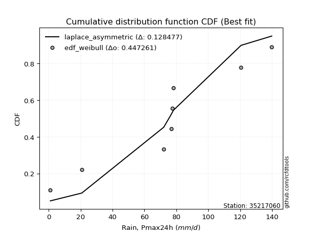</img>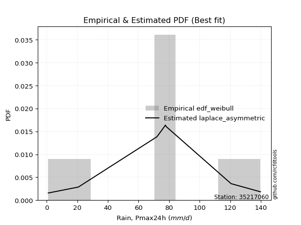</img>

</div>


### 4. EDF Beard (1943)

The Beard formula (or Beard´s plotting position formula) in hydrology is used to estimate the empirical non-exceedance probability _(P)_ of a flood event (or other extreme hydrological data point) within a given dataset.

<div align="center">


$P=(m-0.31)/(n+0.38)$


</div>


**4.1. Empirical values**

<div align="center">

|                | 0                   | 1                   | 2                  | 3                   | 4         | 5                  | 6                  | 7                  | 8                  |
|:---------------|:--------------------|:--------------------|:-------------------|:--------------------|:----------|:-------------------|:-------------------|:-------------------|:-------------------|
| date           | 2020                | 2017                | 2021               | 2022                | 2018      | 2023               | 2025               | 2024               | 2019               |
| x              | 1.0                 | 20.7                | 72.1               | 76.8                | 77.6      | 78.2               | 96.6               | 120.6              | 139.8              |
| m              | 1                   | 2                   | 3                  | 4                   | 5         | 6                  | 7                  | 8                  | 9                  |
| empirical_dist | edf_beard           | edf_beard           | edf_beard          | edf_beard           | edf_beard | edf_beard          | edf_beard          | edf_beard          | edf_beard          |
| empirical      | 0.07356076759061833 | 0.18017057569296374 | 0.2867803837953091 | 0.39339019189765456 | 0.5       | 0.6066098081023454 | 0.7132196162046908 | 0.8198294243070362 | 0.9264392324093815 |
| empirical_tr   | 1.0794016110471807  | 1.2197659297789336  | 1.4020926756352765 | 1.6485061511423549  | 2.0       | 2.542005420054201  | 3.486988847583642  | 5.550295857988164  | 13.5942028985507   |

</div>


**4.2. Kolmogorov-Smirnov fit test (sorted by Δ)**


<div align="center">

|                | 0                   | 1                   | 2                   | 3                   | 4                   | 5                   | 6                   | 7                   | 8                   | 9                   | 10                  | 11                  | 12                  | 13                  | 14                  | 15                  | 16                  | 17                  | 18                  | 19                  | 20                  | 21                  | 22                  | 23                  | 24                  | 25                  | 26                  | 27                  | 28                  | 29                  | 30                  | 31                  | 32                  | 33                  | 34                  | 35                  | 36                  | 37                  | 38                  | 39                  | 40                  | 41                  | 42                  | 43                  | 44                  | 45                  | 46                  | 47                  | 48                  | 49                  | 50                  | 51                  | 52                  | 53                  | 54                  | 55                  | 56                  | 57                  | 58                  | 59                  | 60                  | 61                  | 62                  | 63                  | 64                  | 65                  | 66                  | 67                  | 68                  | 69                  | 70                  | 71                  | 72                  | 73                  | 74                  | 75                  | 76                  | 77                  | 78                  | 79                  | 80                  | 81                  | 82                  | 83                  | 84                  | 85                  | 86                  | 87                  | 88                  | 89                  | 90                  | 91                  | 92                  | 93                  | 94                  | 95                  | 96                  | 97                  | 98                  | 99                  | 100                 | 101                 | 102                 | 103                 | 104                 | 105                 | 106                 | 107                 | 108                 | 109                 | 110                 | 111                 | 112                 | 113                 | 114                 | 115                 | 116                 | 117                 | 118                 | 119                 | 120                 | 121                 | 122                 | 123                 | 124                 | 125                 | 126                 | 127                 | 128                 | 129                 | 130                 | 131                 | 132                 | 133                 | 134                 | 135                 | 136                 | 137                 | 138                 | 139                 | 140                 | 141                 | 142                 | 143                 | 144                 | 145                 | 146                 | 147                 | 148                 | 149                 | 150                 | 151                 | 152                 | 153                 | 154                 | 155                 | 156                 | 157                 | 158                 | 159                 |
|:---------------|:--------------------|:--------------------|:--------------------|:--------------------|:--------------------|:--------------------|:--------------------|:--------------------|:--------------------|:--------------------|:--------------------|:--------------------|:--------------------|:--------------------|:--------------------|:--------------------|:--------------------|:--------------------|:--------------------|:--------------------|:--------------------|:--------------------|:--------------------|:--------------------|:--------------------|:--------------------|:--------------------|:--------------------|:--------------------|:--------------------|:--------------------|:--------------------|:--------------------|:--------------------|:--------------------|:--------------------|:--------------------|:--------------------|:--------------------|:--------------------|:--------------------|:--------------------|:--------------------|:--------------------|:--------------------|:--------------------|:--------------------|:--------------------|:--------------------|:--------------------|:--------------------|:--------------------|:--------------------|:--------------------|:--------------------|:--------------------|:--------------------|:--------------------|:--------------------|:--------------------|:--------------------|:--------------------|:--------------------|:--------------------|:--------------------|:--------------------|:--------------------|:--------------------|:--------------------|:--------------------|:--------------------|:--------------------|:--------------------|:--------------------|:--------------------|:--------------------|:--------------------|:--------------------|:--------------------|:--------------------|:--------------------|:--------------------|:--------------------|:--------------------|:--------------------|:--------------------|:--------------------|:--------------------|:--------------------|:--------------------|:--------------------|:--------------------|:--------------------|:--------------------|:--------------------|:--------------------|:--------------------|:--------------------|:--------------------|:--------------------|:--------------------|:--------------------|:--------------------|:--------------------|:--------------------|:--------------------|:--------------------|:--------------------|:--------------------|:--------------------|:--------------------|:--------------------|:--------------------|:--------------------|:--------------------|:--------------------|:--------------------|:--------------------|:--------------------|:--------------------|:--------------------|:--------------------|:--------------------|:--------------------|:--------------------|:--------------------|:--------------------|:--------------------|:--------------------|:--------------------|:--------------------|:--------------------|:--------------------|:--------------------|:--------------------|:--------------------|:--------------------|:--------------------|:--------------------|:--------------------|:--------------------|:--------------------|:--------------------|:--------------------|:--------------------|:--------------------|:--------------------|:--------------------|:--------------------|:--------------------|:--------------------|:--------------------|:--------------------|:--------------------|:--------------------|:--------------------|:--------------------|:--------------------|:--------------------|:--------------------|
| station        | 35217060            | 35217060            | 35217060            | 35217060            | 35217060            | 35217060            | 35217060            | 35217060            | 35217060            | 35217060            | 35217060            | 35217060            | 35217060            | 35217060            | 35217060            | 35217060            | 35217060            | 35217060            | 35217060            | 35217060            | 35217060            | 35217060            | 35217060            | 35217060            | 35217060            | 35217060            | 35217060            | 35217060            | 35217060            | 35217060            | 35217060            | 35217060            | 35217060            | 35217060            | 35217060            | 35217060            | 35217060            | 35217060            | 35217060            | 35217060            | 35217060            | 35217060            | 35217060            | 35217060            | 35217060            | 35217060            | 35217060            | 35217060            | 35217060            | 35217060            | 35217060            | 35217060            | 35217060            | 35217060            | 35217060            | 35217060            | 35217060            | 35217060            | 35217060            | 35217060            | 35217060            | 35217060            | 35217060            | 35217060            | 35217060            | 35217060            | 35217060            | 35217060            | 35217060            | 35217060            | 35217060            | 35217060            | 35217060            | 35217060            | 35217060            | 35217060            | 35217060            | 35217060            | 35217060            | 35217060            | 35217060            | 35217060            | 35217060            | 35217060            | 35217060            | 35217060            | 35217060            | 35217060            | 35217060            | 35217060            | 35217060            | 35217060            | 35217060            | 35217060            | 35217060            | 35217060            | 35217060            | 35217060            | 35217060            | 35217060            | 35217060            | 35217060            | 35217060            | 35217060            | 35217060            | 35217060            | 35217060            | 35217060            | 35217060            | 35217060            | 35217060            | 35217060            | 35217060            | 35217060            | 35217060            | 35217060            | 35217060            | 35217060            | 35217060            | 35217060            | 35217060            | 35217060            | 35217060            | 35217060            | 35217060            | 35217060            | 35217060            | 35217060            | 35217060            | 35217060            | 35217060            | 35217060            | 35217060            | 35217060            | 35217060            | 35217060            | 35217060            | 35217060            | 35217060            | 35217060            | 35217060            | 35217060            | 35217060            | 35217060            | 35217060            | 35217060            | 35217060            | 35217060            | 35217060            | 35217060            | 35217060            | 35217060            | 35217060            | 35217060            | 35217060            | 35217060            | 35217060            | 35217060            | 35217060            | 35217060            |
| empirical_dist | edf_beard           | edf_beard           | edf_beard           | edf_beard           | edf_beard           | edf_beard           | edf_beard           | edf_beard           | edf_beard           | edf_beard           | edf_beard           | edf_beard           | edf_beard           | edf_beard           | edf_beard           | edf_beard           | edf_beard           | edf_beard           | edf_beard           | edf_beard           | edf_beard           | edf_beard           | edf_beard           | edf_beard           | edf_beard           | edf_beard           | edf_beard           | edf_beard           | edf_beard           | edf_beard           | edf_beard           | edf_beard           | edf_beard           | edf_beard           | edf_beard           | edf_beard           | edf_beard           | edf_beard           | edf_beard           | edf_beard           | edf_beard           | edf_beard           | edf_beard           | edf_beard           | edf_beard           | edf_beard           | edf_beard           | edf_beard           | edf_beard           | edf_beard           | edf_beard           | edf_beard           | edf_beard           | edf_beard           | edf_beard           | edf_beard           | edf_beard           | edf_beard           | edf_beard           | edf_beard           | edf_beard           | edf_beard           | edf_beard           | edf_beard           | edf_beard           | edf_beard           | edf_beard           | edf_beard           | edf_beard           | edf_beard           | edf_beard           | edf_beard           | edf_beard           | edf_beard           | edf_beard           | edf_beard           | edf_beard           | edf_beard           | edf_beard           | edf_beard           | edf_beard           | edf_beard           | edf_beard           | edf_beard           | edf_beard           | edf_beard           | edf_beard           | edf_beard           | edf_beard           | edf_beard           | edf_beard           | edf_beard           | edf_beard           | edf_beard           | edf_beard           | edf_beard           | edf_beard           | edf_beard           | edf_beard           | edf_beard           | edf_beard           | edf_beard           | edf_beard           | edf_beard           | edf_beard           | edf_beard           | edf_beard           | edf_beard           | edf_beard           | edf_beard           | edf_beard           | edf_beard           | edf_beard           | edf_beard           | edf_beard           | edf_beard           | edf_beard           | edf_beard           | edf_beard           | edf_beard           | edf_beard           | edf_beard           | edf_beard           | edf_beard           | edf_beard           | edf_beard           | edf_beard           | edf_beard           | edf_beard           | edf_beard           | edf_beard           | edf_beard           | edf_beard           | edf_beard           | edf_beard           | edf_beard           | edf_beard           | edf_beard           | edf_beard           | edf_beard           | edf_beard           | edf_beard           | edf_beard           | edf_beard           | edf_beard           | edf_beard           | edf_beard           | edf_beard           | edf_beard           | edf_beard           | edf_beard           | edf_beard           | edf_beard           | edf_beard           | edf_beard           | edf_beard           | edf_beard           | edf_beard           | edf_beard           | edf_beard           |
| p_dist         | dgamma              | dweibull            | logdweibull         | logdgamma           | loggennorm          | gennorm             | logt                | genlogistic         | genextreme          | johnsonsu           | skewnorm            | logtukeylambda      | burr12              | weibull_min         | argus               | laplace             | pearson3            | logjohnsonsu        | gumbel_l            | beta                | hypsecant           | genpareto           | foldnorm            | logistic            | f                   | exponnorm           | norm                | crystalball         | t                   | nct                 | fatiguelife         | anglit              | betaprime           | semicircular        | gamma               | gausshyper          | gengamma            | erlang              | rice                | arcsine             | loglevy_l           | genhalflogistic     | cosine              | truncweibull_min    | logpearson3         | invgamma            | maxwell             | loggenextreme       | exponweib           | logtruncweibull_min | rayleigh            | wrapcauchy          | ksone               | alpha               | kappa3              | uniform             | invgauss            | vonmises_line       | logargus            | gumbel_r            | bradford            | triang              | logweibull_max      | burr                | logvonmises_line    | kappa4              | halfnorm            | kstwobign           | logtrapezoid        | logloggamma         | ncf                 | moyal               | logburr             | loggumbel_l         | halflogistic        | logarcsine          | levy_l              | logburr12           | logweibull_min      | loggompertz         | logexponweib        | logbetaprime        | truncexpon          | trapezoid           | logjohnsonsb        | logsemicircular     | loginvweibull       | loganglit           | lomax               | johnsonsb           | loggenhalflogistic  | genexpon            | loggamma            | loggamma            | mielke              | lognct              | logexponnorm        | logcrystalball      | lognorm             | logrice             | logfatiguelife      | loginvgamma         | logerlang           | loginvgauss         | logfoldnorm         | loglomax            | wald                | logloglaplace       | loglogistic         | logkstwobign        | logmaxwell          | loghypsecant        | lograyleigh         | loggausshyper       | logalpha            | loggengamma         | logmielke           | logwrapcauchy       | loggenexpon         | logncf              | nakagami            | loglaplace          | loglaplace          | loghalfnorm         | loggumbel_r         | logcosine           | loggenpareto        | loghalfgennorm      | loghalflogistic     | logmoyal            | logskewnorm         | logf                | halfgennorm         | logbeta             | gompertz            | logwald             | logtriang           | lognakagami         | invweibull          | logksone            | logkappa4           | logkappa3           | loguniform          | powerlaw            | logbradford         | rdist               | logtruncnorm        | logexponpow         | weibull_max         | logtruncexpon       | tukeylambda         | truncpareto         | exponpow            | truncnorm           | logtruncpareto      | logpowerlaw         | logrdist            | loggenlogistic      | logvonmises         | vonmises            |
| delta          | 0.11066345795450566 | 0.11513366851229756 | 0.12176478277966907 | 0.12327103972658732 | 0.12549145713826054 | 0.12668223254528888 | 0.12680782457045447 | 0.12782714013523533 | 0.13493870328726287 | 0.13584710009093537 | 0.13635473066078735 | 0.1431014654136492  | 0.14468932301410364 | 0.1447234157199866  | 0.1463838514326773  | 0.15140924825068192 | 0.1518718015401226  | 0.15259977832032512 | 0.15398053370429765 | 0.1633362387041402  | 0.166732149922877   | 0.16844148021353306 | 0.1704939958368339  | 0.17101017359665904 | 0.17496590541760515 | 0.1760491596809115  | 0.1760493655528862  | 0.1760493678478972  | 0.1760496482811854  | 0.1762113894044306  | 0.18056611210446882 | 0.18134569313300197 | 0.1816170947492856  | 0.18352978426464128 | 0.18440826754067968 | 0.1861182264118677  | 0.18761629560525522 | 0.1887231413827073  | 0.18972758840603554 | 0.19220287366073124 | 0.19366504110160987 | 0.19528360293257646 | 0.19834633499189863 | 0.20736706262854554 | 0.20783128156728248 | 0.20954481725711188 | 0.21018728859204677 | 0.2144150264682838  | 0.2188634063635041  | 0.21929173564713267 | 0.22189623861065189 | 0.22285312385120826 | 0.2234261483852864  | 0.22444721264538514 | 0.22546256583997293 | 0.2254674548214055  | 0.2272662651583881  | 0.23645798648602345 | 0.24015938955827898 | 0.24430330655457588 | 0.24434609098407523 | 0.24496870477376576 | 0.24699422638572288 | 0.24997359484835546 | 0.25319026124386    | 0.2533605979861837  | 0.25491283883753835 | 0.2555532050805448  | 0.2577607452455447  | 0.25812253584896994 | 0.26383235399368565 | 0.2699550659061388  | 0.2705881029582521  | 0.2718854107992511  | 0.2771510526364771  | 0.27973499992719975 | 0.28245495039276036 | 0.28717955870110723 | 0.2872953464759016  | 0.288832857602241   | 0.29353250460356395 | 0.29472214073468306 | 0.30177250388290977 | 0.30334323276790653 | 0.305046849705216   | 0.3062674178760656  | 0.3090649068468102  | 0.3128326556920292  | 0.3162384629189565  | 0.3185191755075333  | 0.3185255972585177  | 0.32575056214303255 | 0.3280041260996116  | 0.3280041260996116  | 0.3282609033779994  | 0.32853457953850973 | 0.3285993047830592  | 0.3286008949865177  | 0.3286009651901276  | 0.3286111655222971  | 0.3287284387283109  | 0.3312721228364698  | 0.3332308913500859  | 0.3346389197207238  | 0.33677474619535874 | 0.3389044224478637  | 0.3413364310291852  | 0.3417135868958965  | 0.3431968594694117  | 0.34555169480344405 | 0.3537229211275741  | 0.35497386078417525 | 0.36144222698598805 | 0.3672189952484952  | 0.368421018721539   | 0.3723621532350305  | 0.37435910484703067 | 0.37488389291795676 | 0.37582466730653086 | 0.375990359414537   | 0.3797404202918234  | 0.38301369309260647 | 0.38301369309260647 | 0.38352665605781444 | 0.3934000214597968  | 0.39843561742075506 | 0.40044251414193055 | 0.4110023059570316  | 0.4118984024071696  | 0.4153129591771306  | 0.4286888257183713  | 0.4287564516919908  | 0.44368626175452763 | 0.4669921197649681  | 0.47455971739792696 | 0.47660210179287343 | 0.4767604988118792  | 0.48542105542424835 | 0.4974331836568957  | 0.5181908950541536  | 0.562222565999346   | 0.5772127501696638  | 0.5791851508240461  | 0.5920190017960515  | 0.5952076536290865  | 0.5987192547341168  | 0.6075950273952547  | 0.6124657052298856  | 0.621104696267563   | 0.6261873302752348  | 0.6709043251004814  | 0.7008968933702708  | 0.7259181803531418  | 0.7453059277759011  | 0.7664640931855626  | 0.8136621659402321  | 0.819829421713888   | 0.8198294243070362  | 1.0824575132626357  | 21.364474122593027  |
| deltao         | 0.41761268023100007 | 0.41761268023100007 | 0.41761268023100007 | 0.41761268023100007 | 0.41761268023100007 | 0.41761268023100007 | 0.41761268023100007 | 0.41761268023100007 | 0.41761268023100007 | 0.41761268023100007 | 0.41761268023100007 | 0.41761268023100007 | 0.41761268023100007 | 0.41761268023100007 | 0.41761268023100007 | 0.41761268023100007 | 0.41761268023100007 | 0.41761268023100007 | 0.41761268023100007 | 0.41761268023100007 | 0.41761268023100007 | 0.41761268023100007 | 0.41761268023100007 | 0.41761268023100007 | 0.41761268023100007 | 0.41761268023100007 | 0.41761268023100007 | 0.41761268023100007 | 0.41761268023100007 | 0.41761268023100007 | 0.41761268023100007 | 0.41761268023100007 | 0.41761268023100007 | 0.41761268023100007 | 0.41761268023100007 | 0.41761268023100007 | 0.41761268023100007 | 0.41761268023100007 | 0.41761268023100007 | 0.41761268023100007 | 0.41761268023100007 | 0.41761268023100007 | 0.41761268023100007 | 0.41761268023100007 | 0.41761268023100007 | 0.41761268023100007 | 0.41761268023100007 | 0.41761268023100007 | 0.41761268023100007 | 0.41761268023100007 | 0.41761268023100007 | 0.41761268023100007 | 0.41761268023100007 | 0.41761268023100007 | 0.41761268023100007 | 0.41761268023100007 | 0.41761268023100007 | 0.41761268023100007 | 0.41761268023100007 | 0.41761268023100007 | 0.41761268023100007 | 0.41761268023100007 | 0.41761268023100007 | 0.41761268023100007 | 0.41761268023100007 | 0.41761268023100007 | 0.41761268023100007 | 0.41761268023100007 | 0.41761268023100007 | 0.41761268023100007 | 0.41761268023100007 | 0.41761268023100007 | 0.41761268023100007 | 0.41761268023100007 | 0.41761268023100007 | 0.41761268023100007 | 0.41761268023100007 | 0.41761268023100007 | 0.41761268023100007 | 0.41761268023100007 | 0.41761268023100007 | 0.41761268023100007 | 0.41761268023100007 | 0.41761268023100007 | 0.41761268023100007 | 0.41761268023100007 | 0.41761268023100007 | 0.41761268023100007 | 0.41761268023100007 | 0.41761268023100007 | 0.41761268023100007 | 0.41761268023100007 | 0.41761268023100007 | 0.41761268023100007 | 0.41761268023100007 | 0.41761268023100007 | 0.41761268023100007 | 0.41761268023100007 | 0.41761268023100007 | 0.41761268023100007 | 0.41761268023100007 | 0.41761268023100007 | 0.41761268023100007 | 0.41761268023100007 | 0.41761268023100007 | 0.41761268023100007 | 0.41761268023100007 | 0.41761268023100007 | 0.41761268023100007 | 0.41761268023100007 | 0.41761268023100007 | 0.41761268023100007 | 0.41761268023100007 | 0.41761268023100007 | 0.41761268023100007 | 0.41761268023100007 | 0.41761268023100007 | 0.41761268023100007 | 0.41761268023100007 | 0.41761268023100007 | 0.41761268023100007 | 0.41761268023100007 | 0.41761268023100007 | 0.41761268023100007 | 0.41761268023100007 | 0.41761268023100007 | 0.41761268023100007 | 0.41761268023100007 | 0.41761268023100007 | 0.41761268023100007 | 0.41761268023100007 | 0.41761268023100007 | 0.41761268023100007 | 0.41761268023100007 | 0.41761268023100007 | 0.41761268023100007 | 0.41761268023100007 | 0.41761268023100007 | 0.41761268023100007 | 0.41761268023100007 | 0.41761268023100007 | 0.41761268023100007 | 0.41761268023100007 | 0.41761268023100007 | 0.41761268023100007 | 0.41761268023100007 | 0.41761268023100007 | 0.41761268023100007 | 0.41761268023100007 | 0.41761268023100007 | 0.41761268023100007 | 0.41761268023100007 | 0.41761268023100007 | 0.41761268023100007 | 0.41761268023100007 | 0.41761268023100007 | 0.41761268023100007 | 0.41761268023100007 | 0.41761268023100007 | 0.41761268023100007 |
| eval           | Δo > Δ              | Δo > Δ              | Δo > Δ              | Δo > Δ              | Δo > Δ              | Δo > Δ              | Δo > Δ              | Δo > Δ              | Δo > Δ              | Δo > Δ              | Δo > Δ              | Δo > Δ              | Δo > Δ              | Δo > Δ              | Δo > Δ              | Δo > Δ              | Δo > Δ              | Δo > Δ              | Δo > Δ              | Δo > Δ              | Δo > Δ              | Δo > Δ              | Δo > Δ              | Δo > Δ              | Δo > Δ              | Δo > Δ              | Δo > Δ              | Δo > Δ              | Δo > Δ              | Δo > Δ              | Δo > Δ              | Δo > Δ              | Δo > Δ              | Δo > Δ              | Δo > Δ              | Δo > Δ              | Δo > Δ              | Δo > Δ              | Δo > Δ              | Δo > Δ              | Δo > Δ              | Δo > Δ              | Δo > Δ              | Δo > Δ              | Δo > Δ              | Δo > Δ              | Δo > Δ              | Δo > Δ              | Δo > Δ              | Δo > Δ              | Δo > Δ              | Δo > Δ              | Δo > Δ              | Δo > Δ              | Δo > Δ              | Δo > Δ              | Δo > Δ              | Δo > Δ              | Δo > Δ              | Δo > Δ              | Δo > Δ              | Δo > Δ              | Δo > Δ              | Δo > Δ              | Δo > Δ              | Δo > Δ              | Δo > Δ              | Δo > Δ              | Δo > Δ              | Δo > Δ              | Δo > Δ              | Δo > Δ              | Δo > Δ              | Δo > Δ              | Δo > Δ              | Δo > Δ              | Δo > Δ              | Δo > Δ              | Δo > Δ              | Δo > Δ              | Δo > Δ              | Δo > Δ              | Δo > Δ              | Δo > Δ              | Δo > Δ              | Δo > Δ              | Δo > Δ              | Δo > Δ              | Δo > Δ              | Δo > Δ              | Δo > Δ              | Δo > Δ              | Δo > Δ              | Δo > Δ              | Δo > Δ              | Δo > Δ              | Δo > Δ              | Δo > Δ              | Δo > Δ              | Δo > Δ              | Δo > Δ              | Δo > Δ              | Δo > Δ              | Δo > Δ              | Δo > Δ              | Δo > Δ              | Δo > Δ              | Δo > Δ              | Δo > Δ              | Δo > Δ              | Δo > Δ              | Δo > Δ              | Δo > Δ              | Δo > Δ              | Δo > Δ              | Δo > Δ              | Δo > Δ              | Δo > Δ              | Δo > Δ              | Δo > Δ              | Δo > Δ              | Δo > Δ              | Δo > Δ              | Δo > Δ              | Δo > Δ              | Δo > Δ              | Δo > Δ              | Δo > Δ              | Δo > Δ              | Δo > Δ              | Δo <= Δ             | Δo <= Δ             | Δo <= Δ             | Δo <= Δ             | Δo <= Δ             | Δo <= Δ             | Δo <= Δ             | Δo <= Δ             | Δo <= Δ             | Δo <= Δ             | Δo <= Δ             | Δo <= Δ             | Δo <= Δ             | Δo <= Δ             | Δo <= Δ             | Δo <= Δ             | Δo <= Δ             | Δo <= Δ             | Δo <= Δ             | Δo <= Δ             | Δo <= Δ             | Δo <= Δ             | Δo <= Δ             | Δo <= Δ             | Δo <= Δ             | Δo <= Δ             | Δo <= Δ             | Δo <= Δ             | Δo <= Δ             | Δo <= Δ             |
| fit            | 1                   | 1                   | 1                   | 1                   | 1                   | 1                   | 1                   | 1                   | 1                   | 1                   | 1                   | 1                   | 1                   | 1                   | 1                   | 1                   | 1                   | 1                   | 1                   | 1                   | 1                   | 1                   | 1                   | 1                   | 1                   | 1                   | 1                   | 1                   | 1                   | 1                   | 1                   | 1                   | 1                   | 1                   | 1                   | 1                   | 1                   | 1                   | 1                   | 1                   | 1                   | 1                   | 1                   | 1                   | 1                   | 1                   | 1                   | 1                   | 1                   | 1                   | 1                   | 1                   | 1                   | 1                   | 1                   | 1                   | 1                   | 1                   | 1                   | 1                   | 1                   | 1                   | 1                   | 1                   | 1                   | 1                   | 1                   | 1                   | 1                   | 1                   | 1                   | 1                   | 1                   | 1                   | 1                   | 1                   | 1                   | 1                   | 1                   | 1                   | 1                   | 1                   | 1                   | 1                   | 1                   | 1                   | 1                   | 1                   | 1                   | 1                   | 1                   | 1                   | 1                   | 1                   | 1                   | 1                   | 1                   | 1                   | 1                   | 1                   | 1                   | 1                   | 1                   | 1                   | 1                   | 1                   | 1                   | 1                   | 1                   | 1                   | 1                   | 1                   | 1                   | 1                   | 1                   | 1                   | 1                   | 1                   | 1                   | 1                   | 1                   | 1                   | 1                   | 1                   | 1                   | 1                   | 1                   | 1                   | 1                   | 1                   | 0                   | 0                   | 0                   | 0                   | 0                   | 0                   | 0                   | 0                   | 0                   | 0                   | 0                   | 0                   | 0                   | 0                   | 0                   | 0                   | 0                   | 0                   | 0                   | 0                   | 0                   | 0                   | 0                   | 0                   | 0                   | 0                   | 0                   | 0                   | 0                   | 0                   |
| n              | 9                   | 9                   | 9                   | 9                   | 9                   | 9                   | 9                   | 9                   | 9                   | 9                   | 9                   | 9                   | 9                   | 9                   | 9                   | 9                   | 9                   | 9                   | 9                   | 9                   | 9                   | 9                   | 9                   | 9                   | 9                   | 9                   | 9                   | 9                   | 9                   | 9                   | 9                   | 9                   | 9                   | 9                   | 9                   | 9                   | 9                   | 9                   | 9                   | 9                   | 9                   | 9                   | 9                   | 9                   | 9                   | 9                   | 9                   | 9                   | 9                   | 9                   | 9                   | 9                   | 9                   | 9                   | 9                   | 9                   | 9                   | 9                   | 9                   | 9                   | 9                   | 9                   | 9                   | 9                   | 9                   | 9                   | 9                   | 9                   | 9                   | 9                   | 9                   | 9                   | 9                   | 9                   | 9                   | 9                   | 9                   | 9                   | 9                   | 9                   | 9                   | 9                   | 9                   | 9                   | 9                   | 9                   | 9                   | 9                   | 9                   | 9                   | 9                   | 9                   | 9                   | 9                   | 9                   | 9                   | 9                   | 9                   | 9                   | 9                   | 9                   | 9                   | 9                   | 9                   | 9                   | 9                   | 9                   | 9                   | 9                   | 9                   | 9                   | 9                   | 9                   | 9                   | 9                   | 9                   | 9                   | 9                   | 9                   | 9                   | 9                   | 9                   | 9                   | 9                   | 9                   | 9                   | 9                   | 9                   | 9                   | 9                   | 9                   | 9                   | 9                   | 9                   | 9                   | 9                   | 9                   | 9                   | 9                   | 9                   | 9                   | 9                   | 9                   | 9                   | 9                   | 9                   | 9                   | 9                   | 9                   | 9                   | 9                   | 9                   | 9                   | 9                   | 9                   | 9                   | 9                   | 9                   | 9                   | 9                   |
| best_fit       | 1                   | 0                   | 0                   | 0                   | 0                   | 0                   | 0                   | 0                   | 0                   | 0                   | 0                   | 0                   | 0                   | 0                   | 0                   | 0                   | 0                   | 0                   | 0                   | 0                   | 0                   | 0                   | 0                   | 0                   | 0                   | 0                   | 0                   | 0                   | 0                   | 0                   | 0                   | 0                   | 0                   | 0                   | 0                   | 0                   | 0                   | 0                   | 0                   | 0                   | 0                   | 0                   | 0                   | 0                   | 0                   | 0                   | 0                   | 0                   | 0                   | 0                   | 0                   | 0                   | 0                   | 0                   | 0                   | 0                   | 0                   | 0                   | 0                   | 0                   | 0                   | 0                   | 0                   | 0                   | 0                   | 0                   | 0                   | 0                   | 0                   | 0                   | 0                   | 0                   | 0                   | 0                   | 0                   | 0                   | 0                   | 0                   | 0                   | 0                   | 0                   | 0                   | 0                   | 0                   | 0                   | 0                   | 0                   | 0                   | 0                   | 0                   | 0                   | 0                   | 0                   | 0                   | 0                   | 0                   | 0                   | 0                   | 0                   | 0                   | 0                   | 0                   | 0                   | 0                   | 0                   | 0                   | 0                   | 0                   | 0                   | 0                   | 0                   | 0                   | 0                   | 0                   | 0                   | 0                   | 0                   | 0                   | 0                   | 0                   | 0                   | 0                   | 0                   | 0                   | 0                   | 0                   | 0                   | 0                   | 0                   | 0                   | 0                   | 0                   | 0                   | 0                   | 0                   | 0                   | 0                   | 0                   | 0                   | 0                   | 0                   | 0                   | 0                   | 0                   | 0                   | 0                   | 0                   | 0                   | 0                   | 0                   | 0                   | 0                   | 0                   | 0                   | 0                   | 0                   | 0                   | 0                   | 0                   | 0                   |
| best_fit_sort  | 1                   | 2                   | 3                   | 4                   | 5                   | 6                   | 7                   | 8                   | 9                   | 10                  | 11                  | 12                  | 13                  | 14                  | 15                  | 16                  | 17                  | 18                  | 19                  | 20                  | 21                  | 22                  | 23                  | 24                  | 25                  | 26                  | 27                  | 28                  | 29                  | 30                  | 31                  | 32                  | 33                  | 34                  | 35                  | 36                  | 37                  | 38                  | 39                  | 40                  | 41                  | 42                  | 43                  | 44                  | 45                  | 46                  | 47                  | 48                  | 49                  | 50                  | 51                  | 52                  | 53                  | 54                  | 55                  | 56                  | 57                  | 58                  | 59                  | 60                  | 61                  | 62                  | 63                  | 64                  | 65                  | 66                  | 67                  | 68                  | 69                  | 70                  | 71                  | 72                  | 73                  | 74                  | 75                  | 76                  | 77                  | 78                  | 79                  | 80                  | 81                  | 82                  | 83                  | 84                  | 85                  | 86                  | 87                  | 88                  | 89                  | 90                  | 91                  | 92                  | 93                  | 94                  | 95                  | 96                  | 97                  | 98                  | 99                  | 100                 | 101                 | 102                 | 103                 | 104                 | 105                 | 106                 | 107                 | 108                 | 109                 | 110                 | 111                 | 112                 | 113                 | 114                 | 115                 | 116                 | 117                 | 118                 | 119                 | 120                 | 121                 | 122                 | 123                 | 124                 | 125                 | 126                 | 127                 | 128                 | 129                 | 130                 | 131                 | 132                 | 133                 | 134                 | 135                 | 136                 | 137                 | 138                 | 139                 | 140                 | 141                 | 142                 | 143                 | 144                 | 145                 | 146                 | 147                 | 148                 | 149                 | 150                 | 151                 | 152                 | 153                 | 154                 | 155                 | 156                 | 157                 | 158                 | 159                 | 160                 |

</div>


**4.3. Best fit**

<div align="center">

|   id |   station | empirical_dist   | p_dist   |    delta |   deltao | eval   |   fit |   n |   best_fit |   best_fit_sort |
|-----:|----------:|:-----------------|:---------|---------:|---------:|:-------|------:|----:|-----------:|----------------:|
|    0 |  35217060 | edf_beard        | dgamma   | 0.110663 | 0.417613 | Δo > Δ |     1 |   9 |          1 |               1 |

</div>


<div align="center">

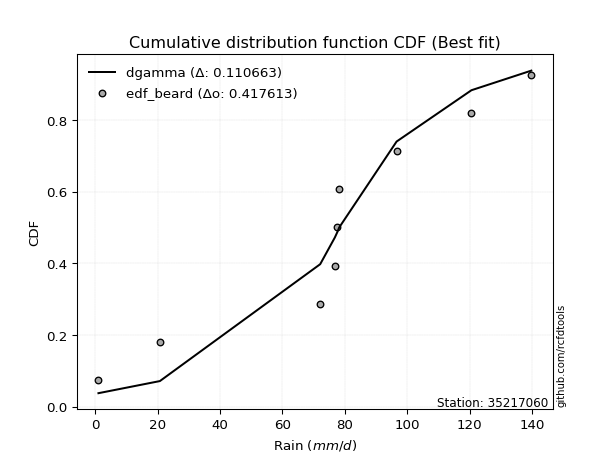</img></img>

</div>


### 5. EDF Chegodayev (1955)

The Chegodayev formula is an empirical plotting position formula used in hydrological frequency analysis to estimate the exceedance probability or return period of a specific event from a set of observed data. It is primarily used for plotting observed data points on probability paper to fit a theoretical distribution, particularly for analyzing extreme events like maximum flood flows or rainfall intensities. The constant _b_ value in the generalized plotting position formula is 0.3.

<div align="center">


$P=(m-b)/(n+1-2b)$


</div>


**5.1. Empirical values**

<div align="center">

|                | 0                   | 1                   | 2                  | 3                   | 4              | 5                  | 6                  | 7                  | 8                  |
|:---------------|:--------------------|:--------------------|:-------------------|:--------------------|:---------------|:-------------------|:-------------------|:-------------------|:-------------------|
| date           | 2020                | 2017                | 2021               | 2022                | 2018           | 2023               | 2025               | 2024               | 2019               |
| x              | 1.0                 | 20.7                | 72.1               | 76.8                | 77.6           | 78.2               | 96.6               | 120.6              | 139.8              |
| m              | 1                   | 2                   | 3                  | 4                   | 5              | 6                  | 7                  | 8                  | 9                  |
| empirical_dist | edf_chegodayev      | edf_chegodayev      | edf_chegodayev     | edf_chegodayev      | edf_chegodayev | edf_chegodayev     | edf_chegodayev     | edf_chegodayev     | edf_chegodayev     |
| empirical      | 0.07446808510638298 | 0.18085106382978722 | 0.2872340425531915 | 0.39361702127659576 | 0.5            | 0.6063829787234043 | 0.7127659574468085 | 0.8191489361702128 | 0.9255319148936169 |
| empirical_tr   | 1.0804597701149425  | 1.2207792207792207  | 1.4029850746268657 | 1.6491228070175437  | 2.0            | 2.540540540540541  | 3.481481481481481  | 5.529411764705883  | 13.428571428571399 |

</div>


**5.2. Kolmogorov-Smirnov fit test (sorted by Δ)**


<div align="center">

|                | 0                   | 1                   | 2                   | 3                   | 4                   | 5                   | 6                   | 7                   | 8                   | 9                   | 10                  | 11                  | 12                  | 13                  | 14                  | 15                  | 16                  | 17                  | 18                  | 19                  | 20                  | 21                  | 22                  | 23                  | 24                  | 25                  | 26                  | 27                  | 28                  | 29                  | 30                  | 31                  | 32                  | 33                  | 34                  | 35                  | 36                  | 37                  | 38                  | 39                  | 40                  | 41                  | 42                  | 43                  | 44                  | 45                  | 46                  | 47                  | 48                  | 49                  | 50                  | 51                  | 52                  | 53                  | 54                  | 55                  | 56                  | 57                  | 58                  | 59                  | 60                  | 61                  | 62                  | 63                  | 64                  | 65                  | 66                  | 67                  | 68                  | 69                  | 70                  | 71                  | 72                  | 73                  | 74                  | 75                  | 76                  | 77                  | 78                  | 79                  | 80                  | 81                  | 82                  | 83                  | 84                  | 85                  | 86                  | 87                  | 88                  | 89                  | 90                  | 91                  | 92                  | 93                  | 94                  | 95                  | 96                  | 97                  | 98                  | 99                  | 100                 | 101                 | 102                 | 103                 | 104                 | 105                 | 106                 | 107                 | 108                 | 109                 | 110                 | 111                 | 112                 | 113                 | 114                 | 115                 | 116                 | 117                 | 118                 | 119                 | 120                 | 121                 | 122                 | 123                 | 124                 | 125                 | 126                 | 127                 | 128                 | 129                 | 130                 | 131                 | 132                 | 133                 | 134                 | 135                 | 136                 | 137                 | 138                 | 139                 | 140                 | 141                 | 142                 | 143                 | 144                 | 145                 | 146                 | 147                 | 148                 | 149                 | 150                 | 151                 | 152                 | 153                 | 154                 | 155                 | 156                 | 157                 | 158                 | 159                 |
|:---------------|:--------------------|:--------------------|:--------------------|:--------------------|:--------------------|:--------------------|:--------------------|:--------------------|:--------------------|:--------------------|:--------------------|:--------------------|:--------------------|:--------------------|:--------------------|:--------------------|:--------------------|:--------------------|:--------------------|:--------------------|:--------------------|:--------------------|:--------------------|:--------------------|:--------------------|:--------------------|:--------------------|:--------------------|:--------------------|:--------------------|:--------------------|:--------------------|:--------------------|:--------------------|:--------------------|:--------------------|:--------------------|:--------------------|:--------------------|:--------------------|:--------------------|:--------------------|:--------------------|:--------------------|:--------------------|:--------------------|:--------------------|:--------------------|:--------------------|:--------------------|:--------------------|:--------------------|:--------------------|:--------------------|:--------------------|:--------------------|:--------------------|:--------------------|:--------------------|:--------------------|:--------------------|:--------------------|:--------------------|:--------------------|:--------------------|:--------------------|:--------------------|:--------------------|:--------------------|:--------------------|:--------------------|:--------------------|:--------------------|:--------------------|:--------------------|:--------------------|:--------------------|:--------------------|:--------------------|:--------------------|:--------------------|:--------------------|:--------------------|:--------------------|:--------------------|:--------------------|:--------------------|:--------------------|:--------------------|:--------------------|:--------------------|:--------------------|:--------------------|:--------------------|:--------------------|:--------------------|:--------------------|:--------------------|:--------------------|:--------------------|:--------------------|:--------------------|:--------------------|:--------------------|:--------------------|:--------------------|:--------------------|:--------------------|:--------------------|:--------------------|:--------------------|:--------------------|:--------------------|:--------------------|:--------------------|:--------------------|:--------------------|:--------------------|:--------------------|:--------------------|:--------------------|:--------------------|:--------------------|:--------------------|:--------------------|:--------------------|:--------------------|:--------------------|:--------------------|:--------------------|:--------------------|:--------------------|:--------------------|:--------------------|:--------------------|:--------------------|:--------------------|:--------------------|:--------------------|:--------------------|:--------------------|:--------------------|:--------------------|:--------------------|:--------------------|:--------------------|:--------------------|:--------------------|:--------------------|:--------------------|:--------------------|:--------------------|:--------------------|:--------------------|:--------------------|:--------------------|:--------------------|:--------------------|:--------------------|:--------------------|
| station        | 35217060            | 35217060            | 35217060            | 35217060            | 35217060            | 35217060            | 35217060            | 35217060            | 35217060            | 35217060            | 35217060            | 35217060            | 35217060            | 35217060            | 35217060            | 35217060            | 35217060            | 35217060            | 35217060            | 35217060            | 35217060            | 35217060            | 35217060            | 35217060            | 35217060            | 35217060            | 35217060            | 35217060            | 35217060            | 35217060            | 35217060            | 35217060            | 35217060            | 35217060            | 35217060            | 35217060            | 35217060            | 35217060            | 35217060            | 35217060            | 35217060            | 35217060            | 35217060            | 35217060            | 35217060            | 35217060            | 35217060            | 35217060            | 35217060            | 35217060            | 35217060            | 35217060            | 35217060            | 35217060            | 35217060            | 35217060            | 35217060            | 35217060            | 35217060            | 35217060            | 35217060            | 35217060            | 35217060            | 35217060            | 35217060            | 35217060            | 35217060            | 35217060            | 35217060            | 35217060            | 35217060            | 35217060            | 35217060            | 35217060            | 35217060            | 35217060            | 35217060            | 35217060            | 35217060            | 35217060            | 35217060            | 35217060            | 35217060            | 35217060            | 35217060            | 35217060            | 35217060            | 35217060            | 35217060            | 35217060            | 35217060            | 35217060            | 35217060            | 35217060            | 35217060            | 35217060            | 35217060            | 35217060            | 35217060            | 35217060            | 35217060            | 35217060            | 35217060            | 35217060            | 35217060            | 35217060            | 35217060            | 35217060            | 35217060            | 35217060            | 35217060            | 35217060            | 35217060            | 35217060            | 35217060            | 35217060            | 35217060            | 35217060            | 35217060            | 35217060            | 35217060            | 35217060            | 35217060            | 35217060            | 35217060            | 35217060            | 35217060            | 35217060            | 35217060            | 35217060            | 35217060            | 35217060            | 35217060            | 35217060            | 35217060            | 35217060            | 35217060            | 35217060            | 35217060            | 35217060            | 35217060            | 35217060            | 35217060            | 35217060            | 35217060            | 35217060            | 35217060            | 35217060            | 35217060            | 35217060            | 35217060            | 35217060            | 35217060            | 35217060            | 35217060            | 35217060            | 35217060            | 35217060            | 35217060            | 35217060            |
| empirical_dist | edf_chegodayev      | edf_chegodayev      | edf_chegodayev      | edf_chegodayev      | edf_chegodayev      | edf_chegodayev      | edf_chegodayev      | edf_chegodayev      | edf_chegodayev      | edf_chegodayev      | edf_chegodayev      | edf_chegodayev      | edf_chegodayev      | edf_chegodayev      | edf_chegodayev      | edf_chegodayev      | edf_chegodayev      | edf_chegodayev      | edf_chegodayev      | edf_chegodayev      | edf_chegodayev      | edf_chegodayev      | edf_chegodayev      | edf_chegodayev      | edf_chegodayev      | edf_chegodayev      | edf_chegodayev      | edf_chegodayev      | edf_chegodayev      | edf_chegodayev      | edf_chegodayev      | edf_chegodayev      | edf_chegodayev      | edf_chegodayev      | edf_chegodayev      | edf_chegodayev      | edf_chegodayev      | edf_chegodayev      | edf_chegodayev      | edf_chegodayev      | edf_chegodayev      | edf_chegodayev      | edf_chegodayev      | edf_chegodayev      | edf_chegodayev      | edf_chegodayev      | edf_chegodayev      | edf_chegodayev      | edf_chegodayev      | edf_chegodayev      | edf_chegodayev      | edf_chegodayev      | edf_chegodayev      | edf_chegodayev      | edf_chegodayev      | edf_chegodayev      | edf_chegodayev      | edf_chegodayev      | edf_chegodayev      | edf_chegodayev      | edf_chegodayev      | edf_chegodayev      | edf_chegodayev      | edf_chegodayev      | edf_chegodayev      | edf_chegodayev      | edf_chegodayev      | edf_chegodayev      | edf_chegodayev      | edf_chegodayev      | edf_chegodayev      | edf_chegodayev      | edf_chegodayev      | edf_chegodayev      | edf_chegodayev      | edf_chegodayev      | edf_chegodayev      | edf_chegodayev      | edf_chegodayev      | edf_chegodayev      | edf_chegodayev      | edf_chegodayev      | edf_chegodayev      | edf_chegodayev      | edf_chegodayev      | edf_chegodayev      | edf_chegodayev      | edf_chegodayev      | edf_chegodayev      | edf_chegodayev      | edf_chegodayev      | edf_chegodayev      | edf_chegodayev      | edf_chegodayev      | edf_chegodayev      | edf_chegodayev      | edf_chegodayev      | edf_chegodayev      | edf_chegodayev      | edf_chegodayev      | edf_chegodayev      | edf_chegodayev      | edf_chegodayev      | edf_chegodayev      | edf_chegodayev      | edf_chegodayev      | edf_chegodayev      | edf_chegodayev      | edf_chegodayev      | edf_chegodayev      | edf_chegodayev      | edf_chegodayev      | edf_chegodayev      | edf_chegodayev      | edf_chegodayev      | edf_chegodayev      | edf_chegodayev      | edf_chegodayev      | edf_chegodayev      | edf_chegodayev      | edf_chegodayev      | edf_chegodayev      | edf_chegodayev      | edf_chegodayev      | edf_chegodayev      | edf_chegodayev      | edf_chegodayev      | edf_chegodayev      | edf_chegodayev      | edf_chegodayev      | edf_chegodayev      | edf_chegodayev      | edf_chegodayev      | edf_chegodayev      | edf_chegodayev      | edf_chegodayev      | edf_chegodayev      | edf_chegodayev      | edf_chegodayev      | edf_chegodayev      | edf_chegodayev      | edf_chegodayev      | edf_chegodayev      | edf_chegodayev      | edf_chegodayev      | edf_chegodayev      | edf_chegodayev      | edf_chegodayev      | edf_chegodayev      | edf_chegodayev      | edf_chegodayev      | edf_chegodayev      | edf_chegodayev      | edf_chegodayev      | edf_chegodayev      | edf_chegodayev      | edf_chegodayev      | edf_chegodayev      | edf_chegodayev      | edf_chegodayev      |
| p_dist         | dgamma              | dweibull            | logdweibull         | logdgamma           | loggennorm          | gennorm             | logt                | genlogistic         | genextreme          | johnsonsu           | skewnorm            | logtukeylambda      | burr12              | weibull_min         | argus               | laplace             | pearson3            | logjohnsonsu        | gumbel_l            | beta                | hypsecant           | genpareto           | foldnorm            | logistic            | f                   | exponnorm           | norm                | crystalball         | t                   | nct                 | fatiguelife         | anglit              | betaprime           | semicircular        | gamma               | gausshyper          | gengamma            | erlang              | rice                | arcsine             | loglevy_l           | genhalflogistic     | cosine              | truncweibull_min    | logpearson3         | invgamma            | maxwell             | loggenextreme       | exponweib           | logtruncweibull_min | rayleigh            | wrapcauchy          | ksone               | alpha               | kappa3              | uniform             | invgauss            | vonmises_line       | logargus            | gumbel_r            | bradford            | triang              | logweibull_max      | burr                | logvonmises_line    | kappa4              | halfnorm            | kstwobign           | logtrapezoid        | logloggamma         | ncf                 | moyal               | logburr             | loggumbel_l         | halflogistic        | logarcsine          | levy_l              | logburr12           | logweibull_min      | loggompertz         | logexponweib        | logbetaprime        | truncexpon          | trapezoid           | logjohnsonsb        | logsemicircular     | loginvweibull       | loganglit           | lomax               | johnsonsb           | loggenhalflogistic  | genexpon            | loggamma            | loggamma            | mielke              | lognct              | logexponnorm        | logcrystalball      | lognorm             | logrice             | logfatiguelife      | loginvgamma         | logerlang           | loginvgauss         | logfoldnorm         | loglomax            | logloglaplace       | wald                | loglogistic         | logkstwobign        | logmaxwell          | loghypsecant        | lograyleigh         | loggausshyper       | logalpha            | loggengamma         | logmielke           | logwrapcauchy       | logncf              | loggenexpon         | nakagami            | loglaplace          | loglaplace          | loghalfnorm         | loggumbel_r         | logcosine           | loggenpareto        | loghalfgennorm      | loghalflogistic     | logmoyal            | logf                | logskewnorm         | halfgennorm         | logbeta             | gompertz            | logwald             | logtriang           | lognakagami         | invweibull          | logksone            | logkappa4           | logkappa3           | loguniform          | powerlaw            | logbradford         | rdist               | logtruncnorm        | logexponpow         | weibull_max         | logtruncexpon       | tukeylambda         | truncpareto         | exponpow            | truncnorm           | logtruncpareto      | logpowerlaw         | logrdist            | loggenlogistic      | logvonmises         | vonmises            |
| delta          | 0.11020979919662327 | 0.11468000975441517 | 0.1208574652639044  | 0.1239515278634108  | 0.12617194527508402 | 0.12713589130317116 | 0.12726148332833676 | 0.1276003107562942  | 0.13471187390832173 | 0.13539344133305298 | 0.13590107190290496 | 0.1435551241715315  | 0.14423566425622125 | 0.1442697569621042  | 0.1459301926747949  | 0.15095558949279952 | 0.1514181427822402  | 0.15214611956244273 | 0.1537537043253565  | 0.16310940932519907 | 0.1662784911649946  | 0.16821465083459192 | 0.1700403370789515  | 0.17055651483877665 | 0.17451224665972276 | 0.1755955009230291  | 0.1755957067950038  | 0.17559570909001482 | 0.17559598952330302 | 0.1757577306465482  | 0.18011245334658643 | 0.18089203437511958 | 0.18116343599140322 | 0.1830761255067589  | 0.1839546087827973  | 0.18589139703292656 | 0.18716263684737283 | 0.1882694826248249  | 0.18927392964815315 | 0.19174921490284885 | 0.19321138234372748 | 0.19505677355363532 | 0.19789267623401624 | 0.20691340387066315 | 0.2073776228094001  | 0.2090911584992295  | 0.20973362983416438 | 0.21396136771040142 | 0.2184097476056217  | 0.21883807688925028 | 0.2214425798527695  | 0.22239946509332587 | 0.222972489627404   | 0.22399355388750275 | 0.22500890708209054 | 0.22501379606352312 | 0.2268126064005057  | 0.23600432772814106 | 0.2397057308003966  | 0.2438496477966935  | 0.24389243222619283 | 0.24474187539482462 | 0.24631373824889946 | 0.24951993609047307 | 0.2527366024859776  | 0.2529069392283013  | 0.25445918007965596 | 0.2550995463226624  | 0.2573070864876623  | 0.25766887709108754 | 0.26337869523580326 | 0.26950140714825643 | 0.2701344442003697  | 0.2714317520413687  | 0.2766973938785947  | 0.27928134116931735 | 0.28154763287699575 | 0.28672589994322484 | 0.2868416877180192  | 0.2883791988443586  | 0.29307884584568156 | 0.29426848197680067 | 0.3013188451250274  | 0.3031164033889654  | 0.3043663615683926  | 0.3058137591181832  | 0.3086112480889278  | 0.31237899693414684 | 0.31578480416107413 | 0.31783868737070986 | 0.3180719385006353  | 0.32529690338515016 | 0.3275504673417292  | 0.3275504673417292  | 0.327807244620117   | 0.32808092078062734 | 0.3281456460251768  | 0.3281472362286353  | 0.3281473064322452  | 0.3281575067644147  | 0.32827477997042853 | 0.3308184640785874  | 0.3327772325922035  | 0.3341852609628414  | 0.33632108743747635 | 0.337997104932099   | 0.3408062693801318  | 0.3408827722713028  | 0.3427432007115293  | 0.34509803604556166 | 0.3532692623696917  | 0.35452020202629286 | 0.36098856822810566 | 0.3667653364906128  | 0.3679673599636566  | 0.37190849447714813 | 0.3736786167102072  | 0.37443023416007437 | 0.37530987127771354 | 0.37537100854864847 | 0.37928676153394103 | 0.3825600343347241  | 0.3825600343347241  | 0.38307299729993205 | 0.3929463627019144  | 0.39798195866287267 | 0.39998885538404816 | 0.4105486471991492  | 0.4114447436492872  | 0.41485930041924823 | 0.4280759635551673  | 0.4282351669604889  | 0.44323260299664524 | 0.4663116316281447  | 0.4743328880189858  | 0.47614844303499104 | 0.4763068400539968  | 0.4847405672874249  | 0.49652586614113103 | 0.5177372362962712  | 0.5617689072414636  | 0.5767590914117814  | 0.5787314920661637  | 0.5915653430381691  | 0.5947539948712041  | 0.5982655959762344  | 0.6071413686373723  | 0.6120120464720032  | 0.6204242081307396  | 0.6257336715173524  | 0.670450666342599   | 0.7002164052334474  | 0.7252376922163183  | 0.7446254396390777  | 0.7657836050487392  | 0.8129816778034087  | 0.8191489335770645  | 0.8191489361702128  | 1.0820038545047534  | 21.36538144010879   |
| deltao         | 0.41761268023100007 | 0.41761268023100007 | 0.41761268023100007 | 0.41761268023100007 | 0.41761268023100007 | 0.41761268023100007 | 0.41761268023100007 | 0.41761268023100007 | 0.41761268023100007 | 0.41761268023100007 | 0.41761268023100007 | 0.41761268023100007 | 0.41761268023100007 | 0.41761268023100007 | 0.41761268023100007 | 0.41761268023100007 | 0.41761268023100007 | 0.41761268023100007 | 0.41761268023100007 | 0.41761268023100007 | 0.41761268023100007 | 0.41761268023100007 | 0.41761268023100007 | 0.41761268023100007 | 0.41761268023100007 | 0.41761268023100007 | 0.41761268023100007 | 0.41761268023100007 | 0.41761268023100007 | 0.41761268023100007 | 0.41761268023100007 | 0.41761268023100007 | 0.41761268023100007 | 0.41761268023100007 | 0.41761268023100007 | 0.41761268023100007 | 0.41761268023100007 | 0.41761268023100007 | 0.41761268023100007 | 0.41761268023100007 | 0.41761268023100007 | 0.41761268023100007 | 0.41761268023100007 | 0.41761268023100007 | 0.41761268023100007 | 0.41761268023100007 | 0.41761268023100007 | 0.41761268023100007 | 0.41761268023100007 | 0.41761268023100007 | 0.41761268023100007 | 0.41761268023100007 | 0.41761268023100007 | 0.41761268023100007 | 0.41761268023100007 | 0.41761268023100007 | 0.41761268023100007 | 0.41761268023100007 | 0.41761268023100007 | 0.41761268023100007 | 0.41761268023100007 | 0.41761268023100007 | 0.41761268023100007 | 0.41761268023100007 | 0.41761268023100007 | 0.41761268023100007 | 0.41761268023100007 | 0.41761268023100007 | 0.41761268023100007 | 0.41761268023100007 | 0.41761268023100007 | 0.41761268023100007 | 0.41761268023100007 | 0.41761268023100007 | 0.41761268023100007 | 0.41761268023100007 | 0.41761268023100007 | 0.41761268023100007 | 0.41761268023100007 | 0.41761268023100007 | 0.41761268023100007 | 0.41761268023100007 | 0.41761268023100007 | 0.41761268023100007 | 0.41761268023100007 | 0.41761268023100007 | 0.41761268023100007 | 0.41761268023100007 | 0.41761268023100007 | 0.41761268023100007 | 0.41761268023100007 | 0.41761268023100007 | 0.41761268023100007 | 0.41761268023100007 | 0.41761268023100007 | 0.41761268023100007 | 0.41761268023100007 | 0.41761268023100007 | 0.41761268023100007 | 0.41761268023100007 | 0.41761268023100007 | 0.41761268023100007 | 0.41761268023100007 | 0.41761268023100007 | 0.41761268023100007 | 0.41761268023100007 | 0.41761268023100007 | 0.41761268023100007 | 0.41761268023100007 | 0.41761268023100007 | 0.41761268023100007 | 0.41761268023100007 | 0.41761268023100007 | 0.41761268023100007 | 0.41761268023100007 | 0.41761268023100007 | 0.41761268023100007 | 0.41761268023100007 | 0.41761268023100007 | 0.41761268023100007 | 0.41761268023100007 | 0.41761268023100007 | 0.41761268023100007 | 0.41761268023100007 | 0.41761268023100007 | 0.41761268023100007 | 0.41761268023100007 | 0.41761268023100007 | 0.41761268023100007 | 0.41761268023100007 | 0.41761268023100007 | 0.41761268023100007 | 0.41761268023100007 | 0.41761268023100007 | 0.41761268023100007 | 0.41761268023100007 | 0.41761268023100007 | 0.41761268023100007 | 0.41761268023100007 | 0.41761268023100007 | 0.41761268023100007 | 0.41761268023100007 | 0.41761268023100007 | 0.41761268023100007 | 0.41761268023100007 | 0.41761268023100007 | 0.41761268023100007 | 0.41761268023100007 | 0.41761268023100007 | 0.41761268023100007 | 0.41761268023100007 | 0.41761268023100007 | 0.41761268023100007 | 0.41761268023100007 | 0.41761268023100007 | 0.41761268023100007 | 0.41761268023100007 | 0.41761268023100007 | 0.41761268023100007 | 0.41761268023100007 |
| eval           | Δo > Δ              | Δo > Δ              | Δo > Δ              | Δo > Δ              | Δo > Δ              | Δo > Δ              | Δo > Δ              | Δo > Δ              | Δo > Δ              | Δo > Δ              | Δo > Δ              | Δo > Δ              | Δo > Δ              | Δo > Δ              | Δo > Δ              | Δo > Δ              | Δo > Δ              | Δo > Δ              | Δo > Δ              | Δo > Δ              | Δo > Δ              | Δo > Δ              | Δo > Δ              | Δo > Δ              | Δo > Δ              | Δo > Δ              | Δo > Δ              | Δo > Δ              | Δo > Δ              | Δo > Δ              | Δo > Δ              | Δo > Δ              | Δo > Δ              | Δo > Δ              | Δo > Δ              | Δo > Δ              | Δo > Δ              | Δo > Δ              | Δo > Δ              | Δo > Δ              | Δo > Δ              | Δo > Δ              | Δo > Δ              | Δo > Δ              | Δo > Δ              | Δo > Δ              | Δo > Δ              | Δo > Δ              | Δo > Δ              | Δo > Δ              | Δo > Δ              | Δo > Δ              | Δo > Δ              | Δo > Δ              | Δo > Δ              | Δo > Δ              | Δo > Δ              | Δo > Δ              | Δo > Δ              | Δo > Δ              | Δo > Δ              | Δo > Δ              | Δo > Δ              | Δo > Δ              | Δo > Δ              | Δo > Δ              | Δo > Δ              | Δo > Δ              | Δo > Δ              | Δo > Δ              | Δo > Δ              | Δo > Δ              | Δo > Δ              | Δo > Δ              | Δo > Δ              | Δo > Δ              | Δo > Δ              | Δo > Δ              | Δo > Δ              | Δo > Δ              | Δo > Δ              | Δo > Δ              | Δo > Δ              | Δo > Δ              | Δo > Δ              | Δo > Δ              | Δo > Δ              | Δo > Δ              | Δo > Δ              | Δo > Δ              | Δo > Δ              | Δo > Δ              | Δo > Δ              | Δo > Δ              | Δo > Δ              | Δo > Δ              | Δo > Δ              | Δo > Δ              | Δo > Δ              | Δo > Δ              | Δo > Δ              | Δo > Δ              | Δo > Δ              | Δo > Δ              | Δo > Δ              | Δo > Δ              | Δo > Δ              | Δo > Δ              | Δo > Δ              | Δo > Δ              | Δo > Δ              | Δo > Δ              | Δo > Δ              | Δo > Δ              | Δo > Δ              | Δo > Δ              | Δo > Δ              | Δo > Δ              | Δo > Δ              | Δo > Δ              | Δo > Δ              | Δo > Δ              | Δo > Δ              | Δo > Δ              | Δo > Δ              | Δo > Δ              | Δo > Δ              | Δo > Δ              | Δo > Δ              | Δo > Δ              | Δo <= Δ             | Δo <= Δ             | Δo <= Δ             | Δo <= Δ             | Δo <= Δ             | Δo <= Δ             | Δo <= Δ             | Δo <= Δ             | Δo <= Δ             | Δo <= Δ             | Δo <= Δ             | Δo <= Δ             | Δo <= Δ             | Δo <= Δ             | Δo <= Δ             | Δo <= Δ             | Δo <= Δ             | Δo <= Δ             | Δo <= Δ             | Δo <= Δ             | Δo <= Δ             | Δo <= Δ             | Δo <= Δ             | Δo <= Δ             | Δo <= Δ             | Δo <= Δ             | Δo <= Δ             | Δo <= Δ             | Δo <= Δ             | Δo <= Δ             |
| fit            | 1                   | 1                   | 1                   | 1                   | 1                   | 1                   | 1                   | 1                   | 1                   | 1                   | 1                   | 1                   | 1                   | 1                   | 1                   | 1                   | 1                   | 1                   | 1                   | 1                   | 1                   | 1                   | 1                   | 1                   | 1                   | 1                   | 1                   | 1                   | 1                   | 1                   | 1                   | 1                   | 1                   | 1                   | 1                   | 1                   | 1                   | 1                   | 1                   | 1                   | 1                   | 1                   | 1                   | 1                   | 1                   | 1                   | 1                   | 1                   | 1                   | 1                   | 1                   | 1                   | 1                   | 1                   | 1                   | 1                   | 1                   | 1                   | 1                   | 1                   | 1                   | 1                   | 1                   | 1                   | 1                   | 1                   | 1                   | 1                   | 1                   | 1                   | 1                   | 1                   | 1                   | 1                   | 1                   | 1                   | 1                   | 1                   | 1                   | 1                   | 1                   | 1                   | 1                   | 1                   | 1                   | 1                   | 1                   | 1                   | 1                   | 1                   | 1                   | 1                   | 1                   | 1                   | 1                   | 1                   | 1                   | 1                   | 1                   | 1                   | 1                   | 1                   | 1                   | 1                   | 1                   | 1                   | 1                   | 1                   | 1                   | 1                   | 1                   | 1                   | 1                   | 1                   | 1                   | 1                   | 1                   | 1                   | 1                   | 1                   | 1                   | 1                   | 1                   | 1                   | 1                   | 1                   | 1                   | 1                   | 1                   | 1                   | 0                   | 0                   | 0                   | 0                   | 0                   | 0                   | 0                   | 0                   | 0                   | 0                   | 0                   | 0                   | 0                   | 0                   | 0                   | 0                   | 0                   | 0                   | 0                   | 0                   | 0                   | 0                   | 0                   | 0                   | 0                   | 0                   | 0                   | 0                   | 0                   | 0                   |
| n              | 9                   | 9                   | 9                   | 9                   | 9                   | 9                   | 9                   | 9                   | 9                   | 9                   | 9                   | 9                   | 9                   | 9                   | 9                   | 9                   | 9                   | 9                   | 9                   | 9                   | 9                   | 9                   | 9                   | 9                   | 9                   | 9                   | 9                   | 9                   | 9                   | 9                   | 9                   | 9                   | 9                   | 9                   | 9                   | 9                   | 9                   | 9                   | 9                   | 9                   | 9                   | 9                   | 9                   | 9                   | 9                   | 9                   | 9                   | 9                   | 9                   | 9                   | 9                   | 9                   | 9                   | 9                   | 9                   | 9                   | 9                   | 9                   | 9                   | 9                   | 9                   | 9                   | 9                   | 9                   | 9                   | 9                   | 9                   | 9                   | 9                   | 9                   | 9                   | 9                   | 9                   | 9                   | 9                   | 9                   | 9                   | 9                   | 9                   | 9                   | 9                   | 9                   | 9                   | 9                   | 9                   | 9                   | 9                   | 9                   | 9                   | 9                   | 9                   | 9                   | 9                   | 9                   | 9                   | 9                   | 9                   | 9                   | 9                   | 9                   | 9                   | 9                   | 9                   | 9                   | 9                   | 9                   | 9                   | 9                   | 9                   | 9                   | 9                   | 9                   | 9                   | 9                   | 9                   | 9                   | 9                   | 9                   | 9                   | 9                   | 9                   | 9                   | 9                   | 9                   | 9                   | 9                   | 9                   | 9                   | 9                   | 9                   | 9                   | 9                   | 9                   | 9                   | 9                   | 9                   | 9                   | 9                   | 9                   | 9                   | 9                   | 9                   | 9                   | 9                   | 9                   | 9                   | 9                   | 9                   | 9                   | 9                   | 9                   | 9                   | 9                   | 9                   | 9                   | 9                   | 9                   | 9                   | 9                   | 9                   |
| best_fit       | 1                   | 0                   | 0                   | 0                   | 0                   | 0                   | 0                   | 0                   | 0                   | 0                   | 0                   | 0                   | 0                   | 0                   | 0                   | 0                   | 0                   | 0                   | 0                   | 0                   | 0                   | 0                   | 0                   | 0                   | 0                   | 0                   | 0                   | 0                   | 0                   | 0                   | 0                   | 0                   | 0                   | 0                   | 0                   | 0                   | 0                   | 0                   | 0                   | 0                   | 0                   | 0                   | 0                   | 0                   | 0                   | 0                   | 0                   | 0                   | 0                   | 0                   | 0                   | 0                   | 0                   | 0                   | 0                   | 0                   | 0                   | 0                   | 0                   | 0                   | 0                   | 0                   | 0                   | 0                   | 0                   | 0                   | 0                   | 0                   | 0                   | 0                   | 0                   | 0                   | 0                   | 0                   | 0                   | 0                   | 0                   | 0                   | 0                   | 0                   | 0                   | 0                   | 0                   | 0                   | 0                   | 0                   | 0                   | 0                   | 0                   | 0                   | 0                   | 0                   | 0                   | 0                   | 0                   | 0                   | 0                   | 0                   | 0                   | 0                   | 0                   | 0                   | 0                   | 0                   | 0                   | 0                   | 0                   | 0                   | 0                   | 0                   | 0                   | 0                   | 0                   | 0                   | 0                   | 0                   | 0                   | 0                   | 0                   | 0                   | 0                   | 0                   | 0                   | 0                   | 0                   | 0                   | 0                   | 0                   | 0                   | 0                   | 0                   | 0                   | 0                   | 0                   | 0                   | 0                   | 0                   | 0                   | 0                   | 0                   | 0                   | 0                   | 0                   | 0                   | 0                   | 0                   | 0                   | 0                   | 0                   | 0                   | 0                   | 0                   | 0                   | 0                   | 0                   | 0                   | 0                   | 0                   | 0                   | 0                   |
| best_fit_sort  | 1                   | 2                   | 3                   | 4                   | 5                   | 6                   | 7                   | 8                   | 9                   | 10                  | 11                  | 12                  | 13                  | 14                  | 15                  | 16                  | 17                  | 18                  | 19                  | 20                  | 21                  | 22                  | 23                  | 24                  | 25                  | 26                  | 27                  | 28                  | 29                  | 30                  | 31                  | 32                  | 33                  | 34                  | 35                  | 36                  | 37                  | 38                  | 39                  | 40                  | 41                  | 42                  | 43                  | 44                  | 45                  | 46                  | 47                  | 48                  | 49                  | 50                  | 51                  | 52                  | 53                  | 54                  | 55                  | 56                  | 57                  | 58                  | 59                  | 60                  | 61                  | 62                  | 63                  | 64                  | 65                  | 66                  | 67                  | 68                  | 69                  | 70                  | 71                  | 72                  | 73                  | 74                  | 75                  | 76                  | 77                  | 78                  | 79                  | 80                  | 81                  | 82                  | 83                  | 84                  | 85                  | 86                  | 87                  | 88                  | 89                  | 90                  | 91                  | 92                  | 93                  | 94                  | 95                  | 96                  | 97                  | 98                  | 99                  | 100                 | 101                 | 102                 | 103                 | 104                 | 105                 | 106                 | 107                 | 108                 | 109                 | 110                 | 111                 | 112                 | 113                 | 114                 | 115                 | 116                 | 117                 | 118                 | 119                 | 120                 | 121                 | 122                 | 123                 | 124                 | 125                 | 126                 | 127                 | 128                 | 129                 | 130                 | 131                 | 132                 | 133                 | 134                 | 135                 | 136                 | 137                 | 138                 | 139                 | 140                 | 141                 | 142                 | 143                 | 144                 | 145                 | 146                 | 147                 | 148                 | 149                 | 150                 | 151                 | 152                 | 153                 | 154                 | 155                 | 156                 | 157                 | 158                 | 159                 | 160                 |

</div>


**5.3. Best fit**

<div align="center">

|   id |   station | empirical_dist   | p_dist   |   delta |   deltao | eval   |   fit |   n |   best_fit |   best_fit_sort |
|-----:|----------:|:-----------------|:---------|--------:|---------:|:-------|------:|----:|-----------:|----------------:|
|    0 |  35217060 | edf_chegodayev   | dgamma   | 0.11021 | 0.417613 | Δo > Δ |     1 |   9 |          1 |               1 |

</div>


<div align="center">

</img>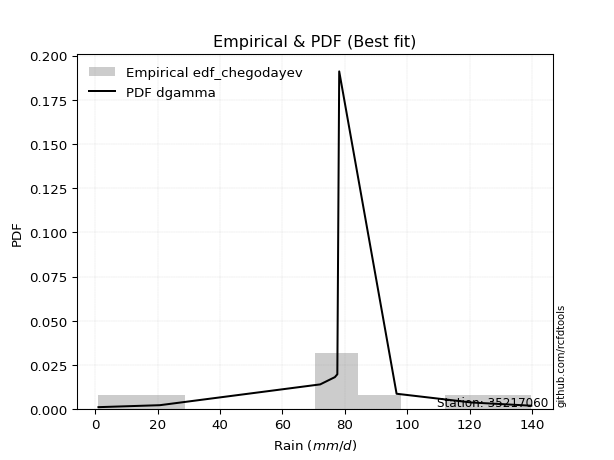</img>

</div>


### 6. EDF Blom (1958)

The Blom formula is a specific "plotting position" formula used in hydrology and statistical analysis to estimate the empirical cumulative probability (or non-exceedance probability) of a data series. It is particularly recommended for data that are approximately normally distributed. The constant _a_ is set to 0.375 (or 3/8).

<div align="center">


$P=(m-a)/(n+1-2a)$


</div>


**6.1. Empirical values**

<div align="center">

|                | 0                   | 1                   | 2                   | 3                  | 4        | 5                  | 6                  | 7                  | 8                  |
|:---------------|:--------------------|:--------------------|:--------------------|:-------------------|:---------|:-------------------|:-------------------|:-------------------|:-------------------|
| date           | 2020                | 2017                | 2021                | 2022               | 2018     | 2023               | 2025               | 2024               | 2019               |
| x              | 1.0                 | 20.7                | 72.1                | 76.8               | 77.6     | 78.2               | 96.6               | 120.6              | 139.8              |
| m              | 1                   | 2                   | 3                   | 4                  | 5        | 6                  | 7                  | 8                  | 9                  |
| empirical_dist | edf_blom            | edf_blom            | edf_blom            | edf_blom           | edf_blom | edf_blom           | edf_blom           | edf_blom           | edf_blom           |
| empirical      | 0.06756756756756757 | 0.17567567567567569 | 0.28378378378378377 | 0.3918918918918919 | 0.5      | 0.6081081081081081 | 0.7162162162162162 | 0.8243243243243243 | 0.9324324324324325 |
| empirical_tr   | 1.072463768115942   | 1.2131147540983607  | 1.3962264150943395  | 1.6444444444444444 | 2.0      | 2.5517241379310347 | 3.523809523809524  | 5.6923076923076925 | 14.800000000000006 |

</div>


**6.2. Kolmogorov-Smirnov fit test (sorted by Δ)**


<div align="center">

|                | 0                   | 1                   | 2                   | 3                   | 4                   | 5                   | 6                   | 7                   | 8                   | 9                   | 10                  | 11                  | 12                  | 13                  | 14                  | 15                  | 16                  | 17                  | 18                  | 19                  | 20                  | 21                  | 22                  | 23                  | 24                  | 25                  | 26                  | 27                  | 28                  | 29                  | 30                  | 31                  | 32                  | 33                  | 34                  | 35                  | 36                  | 37                  | 38                  | 39                  | 40                  | 41                  | 42                  | 43                  | 44                  | 45                  | 46                  | 47                  | 48                  | 49                  | 50                  | 51                  | 52                  | 53                  | 54                  | 55                  | 56                  | 57                  | 58                  | 59                  | 60                  | 61                  | 62                  | 63                  | 64                  | 65                  | 66                  | 67                  | 68                  | 69                  | 70                  | 71                  | 72                  | 73                  | 74                  | 75                  | 76                  | 77                  | 78                  | 79                  | 80                  | 81                  | 82                  | 83                  | 84                  | 85                  | 86                  | 87                  | 88                  | 89                  | 90                  | 91                  | 92                  | 93                  | 94                  | 95                  | 96                  | 97                  | 98                  | 99                  | 100                 | 101                 | 102                 | 103                 | 104                 | 105                 | 106                 | 107                 | 108                 | 109                 | 110                 | 111                 | 112                 | 113                 | 114                 | 115                 | 116                 | 117                 | 118                 | 119                 | 120                 | 121                 | 122                 | 123                 | 124                 | 125                 | 126                 | 127                 | 128                 | 129                 | 130                 | 131                 | 132                 | 133                 | 134                 | 135                 | 136                 | 137                 | 138                 | 139                 | 140                 | 141                 | 142                 | 143                 | 144                 | 145                 | 146                 | 147                 | 148                 | 149                 | 150                 | 151                 | 152                 | 153                 | 154                 | 155                 | 156                 | 157                 | 158                 | 159                 |
|:---------------|:--------------------|:--------------------|:--------------------|:--------------------|:--------------------|:--------------------|:--------------------|:--------------------|:--------------------|:--------------------|:--------------------|:--------------------|:--------------------|:--------------------|:--------------------|:--------------------|:--------------------|:--------------------|:--------------------|:--------------------|:--------------------|:--------------------|:--------------------|:--------------------|:--------------------|:--------------------|:--------------------|:--------------------|:--------------------|:--------------------|:--------------------|:--------------------|:--------------------|:--------------------|:--------------------|:--------------------|:--------------------|:--------------------|:--------------------|:--------------------|:--------------------|:--------------------|:--------------------|:--------------------|:--------------------|:--------------------|:--------------------|:--------------------|:--------------------|:--------------------|:--------------------|:--------------------|:--------------------|:--------------------|:--------------------|:--------------------|:--------------------|:--------------------|:--------------------|:--------------------|:--------------------|:--------------------|:--------------------|:--------------------|:--------------------|:--------------------|:--------------------|:--------------------|:--------------------|:--------------------|:--------------------|:--------------------|:--------------------|:--------------------|:--------------------|:--------------------|:--------------------|:--------------------|:--------------------|:--------------------|:--------------------|:--------------------|:--------------------|:--------------------|:--------------------|:--------------------|:--------------------|:--------------------|:--------------------|:--------------------|:--------------------|:--------------------|:--------------------|:--------------------|:--------------------|:--------------------|:--------------------|:--------------------|:--------------------|:--------------------|:--------------------|:--------------------|:--------------------|:--------------------|:--------------------|:--------------------|:--------------------|:--------------------|:--------------------|:--------------------|:--------------------|:--------------------|:--------------------|:--------------------|:--------------------|:--------------------|:--------------------|:--------------------|:--------------------|:--------------------|:--------------------|:--------------------|:--------------------|:--------------------|:--------------------|:--------------------|:--------------------|:--------------------|:--------------------|:--------------------|:--------------------|:--------------------|:--------------------|:--------------------|:--------------------|:--------------------|:--------------------|:--------------------|:--------------------|:--------------------|:--------------------|:--------------------|:--------------------|:--------------------|:--------------------|:--------------------|:--------------------|:--------------------|:--------------------|:--------------------|:--------------------|:--------------------|:--------------------|:--------------------|:--------------------|:--------------------|:--------------------|:--------------------|:--------------------|:--------------------|
| station        | 35217060            | 35217060            | 35217060            | 35217060            | 35217060            | 35217060            | 35217060            | 35217060            | 35217060            | 35217060            | 35217060            | 35217060            | 35217060            | 35217060            | 35217060            | 35217060            | 35217060            | 35217060            | 35217060            | 35217060            | 35217060            | 35217060            | 35217060            | 35217060            | 35217060            | 35217060            | 35217060            | 35217060            | 35217060            | 35217060            | 35217060            | 35217060            | 35217060            | 35217060            | 35217060            | 35217060            | 35217060            | 35217060            | 35217060            | 35217060            | 35217060            | 35217060            | 35217060            | 35217060            | 35217060            | 35217060            | 35217060            | 35217060            | 35217060            | 35217060            | 35217060            | 35217060            | 35217060            | 35217060            | 35217060            | 35217060            | 35217060            | 35217060            | 35217060            | 35217060            | 35217060            | 35217060            | 35217060            | 35217060            | 35217060            | 35217060            | 35217060            | 35217060            | 35217060            | 35217060            | 35217060            | 35217060            | 35217060            | 35217060            | 35217060            | 35217060            | 35217060            | 35217060            | 35217060            | 35217060            | 35217060            | 35217060            | 35217060            | 35217060            | 35217060            | 35217060            | 35217060            | 35217060            | 35217060            | 35217060            | 35217060            | 35217060            | 35217060            | 35217060            | 35217060            | 35217060            | 35217060            | 35217060            | 35217060            | 35217060            | 35217060            | 35217060            | 35217060            | 35217060            | 35217060            | 35217060            | 35217060            | 35217060            | 35217060            | 35217060            | 35217060            | 35217060            | 35217060            | 35217060            | 35217060            | 35217060            | 35217060            | 35217060            | 35217060            | 35217060            | 35217060            | 35217060            | 35217060            | 35217060            | 35217060            | 35217060            | 35217060            | 35217060            | 35217060            | 35217060            | 35217060            | 35217060            | 35217060            | 35217060            | 35217060            | 35217060            | 35217060            | 35217060            | 35217060            | 35217060            | 35217060            | 35217060            | 35217060            | 35217060            | 35217060            | 35217060            | 35217060            | 35217060            | 35217060            | 35217060            | 35217060            | 35217060            | 35217060            | 35217060            | 35217060            | 35217060            | 35217060            | 35217060            | 35217060            | 35217060            |
| empirical_dist | edf_blom            | edf_blom            | edf_blom            | edf_blom            | edf_blom            | edf_blom            | edf_blom            | edf_blom            | edf_blom            | edf_blom            | edf_blom            | edf_blom            | edf_blom            | edf_blom            | edf_blom            | edf_blom            | edf_blom            | edf_blom            | edf_blom            | edf_blom            | edf_blom            | edf_blom            | edf_blom            | edf_blom            | edf_blom            | edf_blom            | edf_blom            | edf_blom            | edf_blom            | edf_blom            | edf_blom            | edf_blom            | edf_blom            | edf_blom            | edf_blom            | edf_blom            | edf_blom            | edf_blom            | edf_blom            | edf_blom            | edf_blom            | edf_blom            | edf_blom            | edf_blom            | edf_blom            | edf_blom            | edf_blom            | edf_blom            | edf_blom            | edf_blom            | edf_blom            | edf_blom            | edf_blom            | edf_blom            | edf_blom            | edf_blom            | edf_blom            | edf_blom            | edf_blom            | edf_blom            | edf_blom            | edf_blom            | edf_blom            | edf_blom            | edf_blom            | edf_blom            | edf_blom            | edf_blom            | edf_blom            | edf_blom            | edf_blom            | edf_blom            | edf_blom            | edf_blom            | edf_blom            | edf_blom            | edf_blom            | edf_blom            | edf_blom            | edf_blom            | edf_blom            | edf_blom            | edf_blom            | edf_blom            | edf_blom            | edf_blom            | edf_blom            | edf_blom            | edf_blom            | edf_blom            | edf_blom            | edf_blom            | edf_blom            | edf_blom            | edf_blom            | edf_blom            | edf_blom            | edf_blom            | edf_blom            | edf_blom            | edf_blom            | edf_blom            | edf_blom            | edf_blom            | edf_blom            | edf_blom            | edf_blom            | edf_blom            | edf_blom            | edf_blom            | edf_blom            | edf_blom            | edf_blom            | edf_blom            | edf_blom            | edf_blom            | edf_blom            | edf_blom            | edf_blom            | edf_blom            | edf_blom            | edf_blom            | edf_blom            | edf_blom            | edf_blom            | edf_blom            | edf_blom            | edf_blom            | edf_blom            | edf_blom            | edf_blom            | edf_blom            | edf_blom            | edf_blom            | edf_blom            | edf_blom            | edf_blom            | edf_blom            | edf_blom            | edf_blom            | edf_blom            | edf_blom            | edf_blom            | edf_blom            | edf_blom            | edf_blom            | edf_blom            | edf_blom            | edf_blom            | edf_blom            | edf_blom            | edf_blom            | edf_blom            | edf_blom            | edf_blom            | edf_blom            | edf_blom            | edf_blom            | edf_blom            | edf_blom            |
| p_dist         | dgamma              | dweibull            | logdgamma           | loggennorm          | gennorm             | logt                | logdweibull         | genlogistic         | genextreme          | johnsonsu           | skewnorm            | logtukeylambda      | burr12              | weibull_min         | argus               | laplace             | pearson3            | gumbel_l            | logjohnsonsu        | beta                | hypsecant           | genpareto           | foldnorm            | logistic            | f                   | exponnorm           | norm                | crystalball         | t                   | nct                 | fatiguelife         | anglit              | betaprime           | semicircular        | gamma               | gausshyper          | gengamma            | erlang              | rice                | arcsine             | loglevy_l           | genhalflogistic     | cosine              | truncweibull_min    | logpearson3         | invgamma            | maxwell             | loggenextreme       | exponweib           | logtruncweibull_min | rayleigh            | wrapcauchy          | ksone               | alpha               | kappa3              | uniform             | invgauss            | vonmises_line       | logargus            | triang              | gumbel_r            | bradford            | logweibull_max      | burr                | logvonmises_line    | kappa4              | halfnorm            | kstwobign           | logtrapezoid        | logloggamma         | ncf                 | moyal               | logburr             | loggumbel_l         | halflogistic        | logarcsine          | levy_l              | logburr12           | logweibull_min      | loggompertz         | logexponweib        | logbetaprime        | truncexpon          | trapezoid           | logsemicircular     | logjohnsonsb        | loginvweibull       | loganglit           | lomax               | loggenhalflogistic  | johnsonsb           | genexpon            | loggamma            | loggamma            | mielke              | lognct              | logexponnorm        | logcrystalball      | lognorm             | logrice             | logfatiguelife      | loginvgamma         | logerlang           | loginvgauss         | logfoldnorm         | wald                | loglomax            | loglogistic         | logloglaplace       | logkstwobign        | logmaxwell          | loghypsecant        | lograyleigh         | loggausshyper       | logalpha            | loggengamma         | logwrapcauchy       | loggenexpon         | logmielke           | logncf              | nakagami            | loglaplace          | loglaplace          | loghalfnorm         | loggumbel_r         | logcosine           | loggenpareto        | loghalfgennorm      | loghalflogistic     | logmoyal            | logskewnorm         | logf                | halfgennorm         | logbeta             | gompertz            | logwald             | logtriang           | lognakagami         | invweibull          | logksone            | logkappa4           | logkappa3           | loguniform          | powerlaw            | logbradford         | rdist               | logtruncnorm        | logexponpow         | weibull_max         | logtruncexpon       | tukeylambda         | truncpareto         | exponpow            | truncnorm           | logtruncpareto      | logpowerlaw         | logrdist            | loggenlogistic      | logvonmises         | vonmises            |
| delta          | 0.11366005796603101 | 0.11813026852382291 | 0.11877613970929926 | 0.12099655712097249 | 0.12368563253376341 | 0.12381122455892901 | 0.12775798280272    | 0.1305378753472043  | 0.13643700329302555 | 0.13884370010246072 | 0.1393513306723127  | 0.14010486540212375 | 0.147685923025629   | 0.14772001573151194 | 0.14938045144420264 | 0.15440584826220727 | 0.15486840155164794 | 0.15547883371006033 | 0.15559637833185047 | 0.1648345387099029  | 0.16972874993440235 | 0.16993978021929573 | 0.17349059584835924 | 0.1740067736081844  | 0.1779625054291305  | 0.17904575969243686 | 0.17904596556441155 | 0.17904596785942256 | 0.17904624829271076 | 0.17920798941595595 | 0.18356271211599418 | 0.18434229314452732 | 0.18461369476081096 | 0.18652638427616663 | 0.18740486755220503 | 0.18761652641763038 | 0.19061289561678058 | 0.19171974139423265 | 0.1927241884175609  | 0.1951994736722566  | 0.19666164111313522 | 0.19678190293833914 | 0.20134293500342398 | 0.2103636626400709  | 0.21082788157880783 | 0.21254141726863723 | 0.21318388860357212 | 0.21741162647980916 | 0.22186000637502945 | 0.22228833565865802 | 0.22489283862217724 | 0.2258497238627336  | 0.22642274839681176 | 0.2274438126569105  | 0.22845916585149828 | 0.22846405483293086 | 0.23026286516991346 | 0.2394545864975488  | 0.24315598956980433 | 0.24646700477952843 | 0.24729990656610124 | 0.24734269099560058 | 0.251489126403011   | 0.2529701948598808  | 0.25618686125538537 | 0.25635719799770906 | 0.2579094388490637  | 0.25854980509207015 | 0.26075734525707006 | 0.2611191358604953  | 0.266828954005211   | 0.2729516659176642  | 0.27358470296977744 | 0.27488201081077646 | 0.28014765264800245 | 0.2827315999387251  | 0.2884481504158112  | 0.2901761587126326  | 0.29029194648742696 | 0.29182945761376633 | 0.2965291046150893  | 0.2977187407462084  | 0.3047691038944351  | 0.3048415327736692  | 0.30926401788759095 | 0.30954174972250414 | 0.31206150685833556 | 0.3158292557035546  | 0.31923506293048187 | 0.32152219727004305 | 0.3230140755248214  | 0.3287471621545579  | 0.33100072611113696 | 0.33100072611113696 | 0.33125750338952475 | 0.3315311795500351  | 0.33159590479458456 | 0.33159749499804303 | 0.33159756520165296 | 0.33160776553382243 | 0.3317250387398363  | 0.33426872284799514 | 0.33622749136161123 | 0.33763551973224915 | 0.3397713462068841  | 0.34433303104071056 | 0.3448976224709146  | 0.34619345948093705 | 0.3477067869189474  | 0.3485482948149694  | 0.35671952113909944 | 0.3579704607957006  | 0.3644388269975134  | 0.37021559526002057 | 0.37141761873306434 | 0.3753587532465559  | 0.3778804929294821  | 0.3788212673180562  | 0.37885400486431875 | 0.3804852594318251  | 0.3827370203033488  | 0.3860102931041318  | 0.3860102931041318  | 0.3865232560693398  | 0.39639662147132215 | 0.4014322174322804  | 0.4034391141534559  | 0.4145677898452059  | 0.4148950024186949  | 0.418309559188656   | 0.43168542572989665 | 0.43325135170927886 | 0.446682861766053   | 0.47148701978225627 | 0.47605801740368964 | 0.4795987018043988  | 0.47975709882340456 | 0.48991595544153643 | 0.5034263836799466  | 0.521187495065679   | 0.5652191660108713  | 0.5802093501811891  | 0.5821817508355714  | 0.5950156018075768  | 0.5982042536406118  | 0.6017158547456422  | 0.6105916274067801  | 0.6161165123914961  | 0.6255995962848512  | 0.6291839302867601  | 0.6739009251120067  | 0.705391793387559   | 0.7304130803704298  | 0.7498008277931892  | 0.7709589932028508  | 0.8181570659575202  | 0.8243243217311761  | 0.8243243243243243  | 1.085454113274161   | 21.358480922569978  |
| deltao         | 0.41761268023100007 | 0.41761268023100007 | 0.41761268023100007 | 0.41761268023100007 | 0.41761268023100007 | 0.41761268023100007 | 0.41761268023100007 | 0.41761268023100007 | 0.41761268023100007 | 0.41761268023100007 | 0.41761268023100007 | 0.41761268023100007 | 0.41761268023100007 | 0.41761268023100007 | 0.41761268023100007 | 0.41761268023100007 | 0.41761268023100007 | 0.41761268023100007 | 0.41761268023100007 | 0.41761268023100007 | 0.41761268023100007 | 0.41761268023100007 | 0.41761268023100007 | 0.41761268023100007 | 0.41761268023100007 | 0.41761268023100007 | 0.41761268023100007 | 0.41761268023100007 | 0.41761268023100007 | 0.41761268023100007 | 0.41761268023100007 | 0.41761268023100007 | 0.41761268023100007 | 0.41761268023100007 | 0.41761268023100007 | 0.41761268023100007 | 0.41761268023100007 | 0.41761268023100007 | 0.41761268023100007 | 0.41761268023100007 | 0.41761268023100007 | 0.41761268023100007 | 0.41761268023100007 | 0.41761268023100007 | 0.41761268023100007 | 0.41761268023100007 | 0.41761268023100007 | 0.41761268023100007 | 0.41761268023100007 | 0.41761268023100007 | 0.41761268023100007 | 0.41761268023100007 | 0.41761268023100007 | 0.41761268023100007 | 0.41761268023100007 | 0.41761268023100007 | 0.41761268023100007 | 0.41761268023100007 | 0.41761268023100007 | 0.41761268023100007 | 0.41761268023100007 | 0.41761268023100007 | 0.41761268023100007 | 0.41761268023100007 | 0.41761268023100007 | 0.41761268023100007 | 0.41761268023100007 | 0.41761268023100007 | 0.41761268023100007 | 0.41761268023100007 | 0.41761268023100007 | 0.41761268023100007 | 0.41761268023100007 | 0.41761268023100007 | 0.41761268023100007 | 0.41761268023100007 | 0.41761268023100007 | 0.41761268023100007 | 0.41761268023100007 | 0.41761268023100007 | 0.41761268023100007 | 0.41761268023100007 | 0.41761268023100007 | 0.41761268023100007 | 0.41761268023100007 | 0.41761268023100007 | 0.41761268023100007 | 0.41761268023100007 | 0.41761268023100007 | 0.41761268023100007 | 0.41761268023100007 | 0.41761268023100007 | 0.41761268023100007 | 0.41761268023100007 | 0.41761268023100007 | 0.41761268023100007 | 0.41761268023100007 | 0.41761268023100007 | 0.41761268023100007 | 0.41761268023100007 | 0.41761268023100007 | 0.41761268023100007 | 0.41761268023100007 | 0.41761268023100007 | 0.41761268023100007 | 0.41761268023100007 | 0.41761268023100007 | 0.41761268023100007 | 0.41761268023100007 | 0.41761268023100007 | 0.41761268023100007 | 0.41761268023100007 | 0.41761268023100007 | 0.41761268023100007 | 0.41761268023100007 | 0.41761268023100007 | 0.41761268023100007 | 0.41761268023100007 | 0.41761268023100007 | 0.41761268023100007 | 0.41761268023100007 | 0.41761268023100007 | 0.41761268023100007 | 0.41761268023100007 | 0.41761268023100007 | 0.41761268023100007 | 0.41761268023100007 | 0.41761268023100007 | 0.41761268023100007 | 0.41761268023100007 | 0.41761268023100007 | 0.41761268023100007 | 0.41761268023100007 | 0.41761268023100007 | 0.41761268023100007 | 0.41761268023100007 | 0.41761268023100007 | 0.41761268023100007 | 0.41761268023100007 | 0.41761268023100007 | 0.41761268023100007 | 0.41761268023100007 | 0.41761268023100007 | 0.41761268023100007 | 0.41761268023100007 | 0.41761268023100007 | 0.41761268023100007 | 0.41761268023100007 | 0.41761268023100007 | 0.41761268023100007 | 0.41761268023100007 | 0.41761268023100007 | 0.41761268023100007 | 0.41761268023100007 | 0.41761268023100007 | 0.41761268023100007 | 0.41761268023100007 | 0.41761268023100007 | 0.41761268023100007 | 0.41761268023100007 |
| eval           | Δo > Δ              | Δo > Δ              | Δo > Δ              | Δo > Δ              | Δo > Δ              | Δo > Δ              | Δo > Δ              | Δo > Δ              | Δo > Δ              | Δo > Δ              | Δo > Δ              | Δo > Δ              | Δo > Δ              | Δo > Δ              | Δo > Δ              | Δo > Δ              | Δo > Δ              | Δo > Δ              | Δo > Δ              | Δo > Δ              | Δo > Δ              | Δo > Δ              | Δo > Δ              | Δo > Δ              | Δo > Δ              | Δo > Δ              | Δo > Δ              | Δo > Δ              | Δo > Δ              | Δo > Δ              | Δo > Δ              | Δo > Δ              | Δo > Δ              | Δo > Δ              | Δo > Δ              | Δo > Δ              | Δo > Δ              | Δo > Δ              | Δo > Δ              | Δo > Δ              | Δo > Δ              | Δo > Δ              | Δo > Δ              | Δo > Δ              | Δo > Δ              | Δo > Δ              | Δo > Δ              | Δo > Δ              | Δo > Δ              | Δo > Δ              | Δo > Δ              | Δo > Δ              | Δo > Δ              | Δo > Δ              | Δo > Δ              | Δo > Δ              | Δo > Δ              | Δo > Δ              | Δo > Δ              | Δo > Δ              | Δo > Δ              | Δo > Δ              | Δo > Δ              | Δo > Δ              | Δo > Δ              | Δo > Δ              | Δo > Δ              | Δo > Δ              | Δo > Δ              | Δo > Δ              | Δo > Δ              | Δo > Δ              | Δo > Δ              | Δo > Δ              | Δo > Δ              | Δo > Δ              | Δo > Δ              | Δo > Δ              | Δo > Δ              | Δo > Δ              | Δo > Δ              | Δo > Δ              | Δo > Δ              | Δo > Δ              | Δo > Δ              | Δo > Δ              | Δo > Δ              | Δo > Δ              | Δo > Δ              | Δo > Δ              | Δo > Δ              | Δo > Δ              | Δo > Δ              | Δo > Δ              | Δo > Δ              | Δo > Δ              | Δo > Δ              | Δo > Δ              | Δo > Δ              | Δo > Δ              | Δo > Δ              | Δo > Δ              | Δo > Δ              | Δo > Δ              | Δo > Δ              | Δo > Δ              | Δo > Δ              | Δo > Δ              | Δo > Δ              | Δo > Δ              | Δo > Δ              | Δo > Δ              | Δo > Δ              | Δo > Δ              | Δo > Δ              | Δo > Δ              | Δo > Δ              | Δo > Δ              | Δo > Δ              | Δo > Δ              | Δo > Δ              | Δo > Δ              | Δo > Δ              | Δo > Δ              | Δo > Δ              | Δo > Δ              | Δo > Δ              | Δo > Δ              | Δo > Δ              | Δo <= Δ             | Δo <= Δ             | Δo <= Δ             | Δo <= Δ             | Δo <= Δ             | Δo <= Δ             | Δo <= Δ             | Δo <= Δ             | Δo <= Δ             | Δo <= Δ             | Δo <= Δ             | Δo <= Δ             | Δo <= Δ             | Δo <= Δ             | Δo <= Δ             | Δo <= Δ             | Δo <= Δ             | Δo <= Δ             | Δo <= Δ             | Δo <= Δ             | Δo <= Δ             | Δo <= Δ             | Δo <= Δ             | Δo <= Δ             | Δo <= Δ             | Δo <= Δ             | Δo <= Δ             | Δo <= Δ             | Δo <= Δ             | Δo <= Δ             | Δo <= Δ             |
| fit            | 1                   | 1                   | 1                   | 1                   | 1                   | 1                   | 1                   | 1                   | 1                   | 1                   | 1                   | 1                   | 1                   | 1                   | 1                   | 1                   | 1                   | 1                   | 1                   | 1                   | 1                   | 1                   | 1                   | 1                   | 1                   | 1                   | 1                   | 1                   | 1                   | 1                   | 1                   | 1                   | 1                   | 1                   | 1                   | 1                   | 1                   | 1                   | 1                   | 1                   | 1                   | 1                   | 1                   | 1                   | 1                   | 1                   | 1                   | 1                   | 1                   | 1                   | 1                   | 1                   | 1                   | 1                   | 1                   | 1                   | 1                   | 1                   | 1                   | 1                   | 1                   | 1                   | 1                   | 1                   | 1                   | 1                   | 1                   | 1                   | 1                   | 1                   | 1                   | 1                   | 1                   | 1                   | 1                   | 1                   | 1                   | 1                   | 1                   | 1                   | 1                   | 1                   | 1                   | 1                   | 1                   | 1                   | 1                   | 1                   | 1                   | 1                   | 1                   | 1                   | 1                   | 1                   | 1                   | 1                   | 1                   | 1                   | 1                   | 1                   | 1                   | 1                   | 1                   | 1                   | 1                   | 1                   | 1                   | 1                   | 1                   | 1                   | 1                   | 1                   | 1                   | 1                   | 1                   | 1                   | 1                   | 1                   | 1                   | 1                   | 1                   | 1                   | 1                   | 1                   | 1                   | 1                   | 1                   | 1                   | 1                   | 0                   | 0                   | 0                   | 0                   | 0                   | 0                   | 0                   | 0                   | 0                   | 0                   | 0                   | 0                   | 0                   | 0                   | 0                   | 0                   | 0                   | 0                   | 0                   | 0                   | 0                   | 0                   | 0                   | 0                   | 0                   | 0                   | 0                   | 0                   | 0                   | 0                   | 0                   |
| n              | 9                   | 9                   | 9                   | 9                   | 9                   | 9                   | 9                   | 9                   | 9                   | 9                   | 9                   | 9                   | 9                   | 9                   | 9                   | 9                   | 9                   | 9                   | 9                   | 9                   | 9                   | 9                   | 9                   | 9                   | 9                   | 9                   | 9                   | 9                   | 9                   | 9                   | 9                   | 9                   | 9                   | 9                   | 9                   | 9                   | 9                   | 9                   | 9                   | 9                   | 9                   | 9                   | 9                   | 9                   | 9                   | 9                   | 9                   | 9                   | 9                   | 9                   | 9                   | 9                   | 9                   | 9                   | 9                   | 9                   | 9                   | 9                   | 9                   | 9                   | 9                   | 9                   | 9                   | 9                   | 9                   | 9                   | 9                   | 9                   | 9                   | 9                   | 9                   | 9                   | 9                   | 9                   | 9                   | 9                   | 9                   | 9                   | 9                   | 9                   | 9                   | 9                   | 9                   | 9                   | 9                   | 9                   | 9                   | 9                   | 9                   | 9                   | 9                   | 9                   | 9                   | 9                   | 9                   | 9                   | 9                   | 9                   | 9                   | 9                   | 9                   | 9                   | 9                   | 9                   | 9                   | 9                   | 9                   | 9                   | 9                   | 9                   | 9                   | 9                   | 9                   | 9                   | 9                   | 9                   | 9                   | 9                   | 9                   | 9                   | 9                   | 9                   | 9                   | 9                   | 9                   | 9                   | 9                   | 9                   | 9                   | 9                   | 9                   | 9                   | 9                   | 9                   | 9                   | 9                   | 9                   | 9                   | 9                   | 9                   | 9                   | 9                   | 9                   | 9                   | 9                   | 9                   | 9                   | 9                   | 9                   | 9                   | 9                   | 9                   | 9                   | 9                   | 9                   | 9                   | 9                   | 9                   | 9                   | 9                   |
| best_fit       | 1                   | 0                   | 0                   | 0                   | 0                   | 0                   | 0                   | 0                   | 0                   | 0                   | 0                   | 0                   | 0                   | 0                   | 0                   | 0                   | 0                   | 0                   | 0                   | 0                   | 0                   | 0                   | 0                   | 0                   | 0                   | 0                   | 0                   | 0                   | 0                   | 0                   | 0                   | 0                   | 0                   | 0                   | 0                   | 0                   | 0                   | 0                   | 0                   | 0                   | 0                   | 0                   | 0                   | 0                   | 0                   | 0                   | 0                   | 0                   | 0                   | 0                   | 0                   | 0                   | 0                   | 0                   | 0                   | 0                   | 0                   | 0                   | 0                   | 0                   | 0                   | 0                   | 0                   | 0                   | 0                   | 0                   | 0                   | 0                   | 0                   | 0                   | 0                   | 0                   | 0                   | 0                   | 0                   | 0                   | 0                   | 0                   | 0                   | 0                   | 0                   | 0                   | 0                   | 0                   | 0                   | 0                   | 0                   | 0                   | 0                   | 0                   | 0                   | 0                   | 0                   | 0                   | 0                   | 0                   | 0                   | 0                   | 0                   | 0                   | 0                   | 0                   | 0                   | 0                   | 0                   | 0                   | 0                   | 0                   | 0                   | 0                   | 0                   | 0                   | 0                   | 0                   | 0                   | 0                   | 0                   | 0                   | 0                   | 0                   | 0                   | 0                   | 0                   | 0                   | 0                   | 0                   | 0                   | 0                   | 0                   | 0                   | 0                   | 0                   | 0                   | 0                   | 0                   | 0                   | 0                   | 0                   | 0                   | 0                   | 0                   | 0                   | 0                   | 0                   | 0                   | 0                   | 0                   | 0                   | 0                   | 0                   | 0                   | 0                   | 0                   | 0                   | 0                   | 0                   | 0                   | 0                   | 0                   | 0                   |
| best_fit_sort  | 1                   | 2                   | 3                   | 4                   | 5                   | 6                   | 7                   | 8                   | 9                   | 10                  | 11                  | 12                  | 13                  | 14                  | 15                  | 16                  | 17                  | 18                  | 19                  | 20                  | 21                  | 22                  | 23                  | 24                  | 25                  | 26                  | 27                  | 28                  | 29                  | 30                  | 31                  | 32                  | 33                  | 34                  | 35                  | 36                  | 37                  | 38                  | 39                  | 40                  | 41                  | 42                  | 43                  | 44                  | 45                  | 46                  | 47                  | 48                  | 49                  | 50                  | 51                  | 52                  | 53                  | 54                  | 55                  | 56                  | 57                  | 58                  | 59                  | 60                  | 61                  | 62                  | 63                  | 64                  | 65                  | 66                  | 67                  | 68                  | 69                  | 70                  | 71                  | 72                  | 73                  | 74                  | 75                  | 76                  | 77                  | 78                  | 79                  | 80                  | 81                  | 82                  | 83                  | 84                  | 85                  | 86                  | 87                  | 88                  | 89                  | 90                  | 91                  | 92                  | 93                  | 94                  | 95                  | 96                  | 97                  | 98                  | 99                  | 100                 | 101                 | 102                 | 103                 | 104                 | 105                 | 106                 | 107                 | 108                 | 109                 | 110                 | 111                 | 112                 | 113                 | 114                 | 115                 | 116                 | 117                 | 118                 | 119                 | 120                 | 121                 | 122                 | 123                 | 124                 | 125                 | 126                 | 127                 | 128                 | 129                 | 130                 | 131                 | 132                 | 133                 | 134                 | 135                 | 136                 | 137                 | 138                 | 139                 | 140                 | 141                 | 142                 | 143                 | 144                 | 145                 | 146                 | 147                 | 148                 | 149                 | 150                 | 151                 | 152                 | 153                 | 154                 | 155                 | 156                 | 157                 | 158                 | 159                 | 160                 |

</div>


**6.3. Best fit**

<div align="center">

|   id |   station | empirical_dist   | p_dist   |   delta |   deltao | eval   |   fit |   n |   best_fit |   best_fit_sort |
|-----:|----------:|:-----------------|:---------|--------:|---------:|:-------|------:|----:|-----------:|----------------:|
|    0 |  35217060 | edf_blom         | dgamma   | 0.11366 | 0.417613 | Δo > Δ |     1 |   9 |          1 |               1 |

</div>


<div align="center">

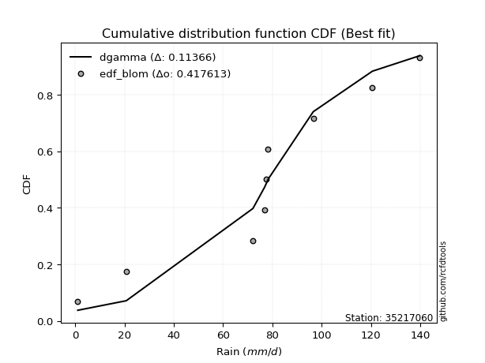</img>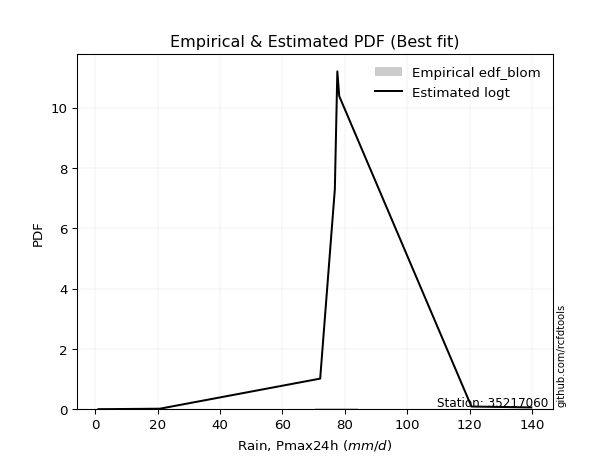</img>

</div>


### 7. EDF Tukey (1962)

In hydrology, the Tukey formula is used as a plotting position formula to estimate the empirical probability or frequency of a flood event (or other hydrological data). The formula parameter is given as _c=0.333_ (or 1/3).

<div align="center">


$P=(m-c)/(n+1-2c)$


</div>


**7.1. Empirical values**

<div align="center">

|                | 0                   | 1                   | 2                  | 3                   | 4         | 5                  | 6                  | 7                  | 8                  |
|:---------------|:--------------------|:--------------------|:-------------------|:--------------------|:----------|:-------------------|:-------------------|:-------------------|:-------------------|
| date           | 2020                | 2017                | 2021               | 2022                | 2018      | 2023               | 2025               | 2024               | 2019               |
| x              | 1.0                 | 20.7                | 72.1               | 76.8                | 77.6      | 78.2               | 96.6               | 120.6              | 139.8              |
| m              | 1                   | 2                   | 3                  | 4                   | 5         | 6                  | 7                  | 8                  | 9                  |
| empirical_dist | edf_tukey           | edf_tukey           | edf_tukey          | edf_tukey           | edf_tukey | edf_tukey          | edf_tukey          | edf_tukey          | edf_tukey          |
| empirical      | 0.07142857142857142 | 0.17857142857142858 | 0.2857142857142857 | 0.39285714285714285 | 0.5       | 0.6071428571428571 | 0.7142857142857143 | 0.8214285714285714 | 0.9285714285714286 |
| empirical_tr   | 1.0769230769230769  | 1.2173913043478262  | 1.4                | 1.6470588235294117  | 2.0       | 2.545454545454545  | 3.5                | 5.599999999999999  | 14.000000000000007 |

</div>


**7.2. Kolmogorov-Smirnov fit test (sorted by Δ)**


<div align="center">

|                | 0                   | 1                   | 2                   | 3                   | 4                   | 5                   | 6                   | 7                   | 8                   | 9                   | 10                  | 11                  | 12                  | 13                  | 14                  | 15                  | 16                  | 17                  | 18                  | 19                  | 20                  | 21                  | 22                  | 23                  | 24                  | 25                  | 26                  | 27                  | 28                  | 29                  | 30                  | 31                  | 32                  | 33                  | 34                  | 35                  | 36                  | 37                  | 38                  | 39                  | 40                  | 41                  | 42                  | 43                  | 44                  | 45                  | 46                  | 47                  | 48                  | 49                  | 50                  | 51                  | 52                  | 53                  | 54                  | 55                  | 56                  | 57                  | 58                  | 59                  | 60                  | 61                  | 62                  | 63                  | 64                  | 65                  | 66                  | 67                  | 68                  | 69                  | 70                  | 71                  | 72                  | 73                  | 74                  | 75                  | 76                  | 77                  | 78                  | 79                  | 80                  | 81                  | 82                  | 83                  | 84                  | 85                  | 86                  | 87                  | 88                  | 89                  | 90                  | 91                  | 92                  | 93                  | 94                  | 95                  | 96                  | 97                  | 98                  | 99                  | 100                 | 101                 | 102                 | 103                 | 104                 | 105                 | 106                 | 107                 | 108                 | 109                 | 110                 | 111                 | 112                 | 113                 | 114                 | 115                 | 116                 | 117                 | 118                 | 119                 | 120                 | 121                 | 122                 | 123                 | 124                 | 125                 | 126                 | 127                 | 128                 | 129                 | 130                 | 131                 | 132                 | 133                 | 134                 | 135                 | 136                 | 137                 | 138                 | 139                 | 140                 | 141                 | 142                 | 143                 | 144                 | 145                 | 146                 | 147                 | 148                 | 149                 | 150                 | 151                 | 152                 | 153                 | 154                 | 155                 | 156                 | 157                 | 158                 | 159                 |
|:---------------|:--------------------|:--------------------|:--------------------|:--------------------|:--------------------|:--------------------|:--------------------|:--------------------|:--------------------|:--------------------|:--------------------|:--------------------|:--------------------|:--------------------|:--------------------|:--------------------|:--------------------|:--------------------|:--------------------|:--------------------|:--------------------|:--------------------|:--------------------|:--------------------|:--------------------|:--------------------|:--------------------|:--------------------|:--------------------|:--------------------|:--------------------|:--------------------|:--------------------|:--------------------|:--------------------|:--------------------|:--------------------|:--------------------|:--------------------|:--------------------|:--------------------|:--------------------|:--------------------|:--------------------|:--------------------|:--------------------|:--------------------|:--------------------|:--------------------|:--------------------|:--------------------|:--------------------|:--------------------|:--------------------|:--------------------|:--------------------|:--------------------|:--------------------|:--------------------|:--------------------|:--------------------|:--------------------|:--------------------|:--------------------|:--------------------|:--------------------|:--------------------|:--------------------|:--------------------|:--------------------|:--------------------|:--------------------|:--------------------|:--------------------|:--------------------|:--------------------|:--------------------|:--------------------|:--------------------|:--------------------|:--------------------|:--------------------|:--------------------|:--------------------|:--------------------|:--------------------|:--------------------|:--------------------|:--------------------|:--------------------|:--------------------|:--------------------|:--------------------|:--------------------|:--------------------|:--------------------|:--------------------|:--------------------|:--------------------|:--------------------|:--------------------|:--------------------|:--------------------|:--------------------|:--------------------|:--------------------|:--------------------|:--------------------|:--------------------|:--------------------|:--------------------|:--------------------|:--------------------|:--------------------|:--------------------|:--------------------|:--------------------|:--------------------|:--------------------|:--------------------|:--------------------|:--------------------|:--------------------|:--------------------|:--------------------|:--------------------|:--------------------|:--------------------|:--------------------|:--------------------|:--------------------|:--------------------|:--------------------|:--------------------|:--------------------|:--------------------|:--------------------|:--------------------|:--------------------|:--------------------|:--------------------|:--------------------|:--------------------|:--------------------|:--------------------|:--------------------|:--------------------|:--------------------|:--------------------|:--------------------|:--------------------|:--------------------|:--------------------|:--------------------|:--------------------|:--------------------|:--------------------|:--------------------|:--------------------|:--------------------|
| station        | 35217060            | 35217060            | 35217060            | 35217060            | 35217060            | 35217060            | 35217060            | 35217060            | 35217060            | 35217060            | 35217060            | 35217060            | 35217060            | 35217060            | 35217060            | 35217060            | 35217060            | 35217060            | 35217060            | 35217060            | 35217060            | 35217060            | 35217060            | 35217060            | 35217060            | 35217060            | 35217060            | 35217060            | 35217060            | 35217060            | 35217060            | 35217060            | 35217060            | 35217060            | 35217060            | 35217060            | 35217060            | 35217060            | 35217060            | 35217060            | 35217060            | 35217060            | 35217060            | 35217060            | 35217060            | 35217060            | 35217060            | 35217060            | 35217060            | 35217060            | 35217060            | 35217060            | 35217060            | 35217060            | 35217060            | 35217060            | 35217060            | 35217060            | 35217060            | 35217060            | 35217060            | 35217060            | 35217060            | 35217060            | 35217060            | 35217060            | 35217060            | 35217060            | 35217060            | 35217060            | 35217060            | 35217060            | 35217060            | 35217060            | 35217060            | 35217060            | 35217060            | 35217060            | 35217060            | 35217060            | 35217060            | 35217060            | 35217060            | 35217060            | 35217060            | 35217060            | 35217060            | 35217060            | 35217060            | 35217060            | 35217060            | 35217060            | 35217060            | 35217060            | 35217060            | 35217060            | 35217060            | 35217060            | 35217060            | 35217060            | 35217060            | 35217060            | 35217060            | 35217060            | 35217060            | 35217060            | 35217060            | 35217060            | 35217060            | 35217060            | 35217060            | 35217060            | 35217060            | 35217060            | 35217060            | 35217060            | 35217060            | 35217060            | 35217060            | 35217060            | 35217060            | 35217060            | 35217060            | 35217060            | 35217060            | 35217060            | 35217060            | 35217060            | 35217060            | 35217060            | 35217060            | 35217060            | 35217060            | 35217060            | 35217060            | 35217060            | 35217060            | 35217060            | 35217060            | 35217060            | 35217060            | 35217060            | 35217060            | 35217060            | 35217060            | 35217060            | 35217060            | 35217060            | 35217060            | 35217060            | 35217060            | 35217060            | 35217060            | 35217060            | 35217060            | 35217060            | 35217060            | 35217060            | 35217060            | 35217060            |
| empirical_dist | edf_tukey           | edf_tukey           | edf_tukey           | edf_tukey           | edf_tukey           | edf_tukey           | edf_tukey           | edf_tukey           | edf_tukey           | edf_tukey           | edf_tukey           | edf_tukey           | edf_tukey           | edf_tukey           | edf_tukey           | edf_tukey           | edf_tukey           | edf_tukey           | edf_tukey           | edf_tukey           | edf_tukey           | edf_tukey           | edf_tukey           | edf_tukey           | edf_tukey           | edf_tukey           | edf_tukey           | edf_tukey           | edf_tukey           | edf_tukey           | edf_tukey           | edf_tukey           | edf_tukey           | edf_tukey           | edf_tukey           | edf_tukey           | edf_tukey           | edf_tukey           | edf_tukey           | edf_tukey           | edf_tukey           | edf_tukey           | edf_tukey           | edf_tukey           | edf_tukey           | edf_tukey           | edf_tukey           | edf_tukey           | edf_tukey           | edf_tukey           | edf_tukey           | edf_tukey           | edf_tukey           | edf_tukey           | edf_tukey           | edf_tukey           | edf_tukey           | edf_tukey           | edf_tukey           | edf_tukey           | edf_tukey           | edf_tukey           | edf_tukey           | edf_tukey           | edf_tukey           | edf_tukey           | edf_tukey           | edf_tukey           | edf_tukey           | edf_tukey           | edf_tukey           | edf_tukey           | edf_tukey           | edf_tukey           | edf_tukey           | edf_tukey           | edf_tukey           | edf_tukey           | edf_tukey           | edf_tukey           | edf_tukey           | edf_tukey           | edf_tukey           | edf_tukey           | edf_tukey           | edf_tukey           | edf_tukey           | edf_tukey           | edf_tukey           | edf_tukey           | edf_tukey           | edf_tukey           | edf_tukey           | edf_tukey           | edf_tukey           | edf_tukey           | edf_tukey           | edf_tukey           | edf_tukey           | edf_tukey           | edf_tukey           | edf_tukey           | edf_tukey           | edf_tukey           | edf_tukey           | edf_tukey           | edf_tukey           | edf_tukey           | edf_tukey           | edf_tukey           | edf_tukey           | edf_tukey           | edf_tukey           | edf_tukey           | edf_tukey           | edf_tukey           | edf_tukey           | edf_tukey           | edf_tukey           | edf_tukey           | edf_tukey           | edf_tukey           | edf_tukey           | edf_tukey           | edf_tukey           | edf_tukey           | edf_tukey           | edf_tukey           | edf_tukey           | edf_tukey           | edf_tukey           | edf_tukey           | edf_tukey           | edf_tukey           | edf_tukey           | edf_tukey           | edf_tukey           | edf_tukey           | edf_tukey           | edf_tukey           | edf_tukey           | edf_tukey           | edf_tukey           | edf_tukey           | edf_tukey           | edf_tukey           | edf_tukey           | edf_tukey           | edf_tukey           | edf_tukey           | edf_tukey           | edf_tukey           | edf_tukey           | edf_tukey           | edf_tukey           | edf_tukey           | edf_tukey           | edf_tukey           | edf_tukey           | edf_tukey           |
| p_dist         | dgamma              | dweibull            | logdgamma           | loggennorm          | logdweibull         | gennorm             | logt                | genlogistic         | genextreme          | johnsonsu           | skewnorm            | logtukeylambda      | burr12              | weibull_min         | argus               | laplace             | pearson3            | logjohnsonsu        | gumbel_l            | beta                | hypsecant           | genpareto           | foldnorm            | logistic            | f                   | exponnorm           | norm                | crystalball         | t                   | nct                 | fatiguelife         | anglit              | betaprime           | semicircular        | gamma               | gausshyper          | gengamma            | erlang              | rice                | arcsine             | loglevy_l           | genhalflogistic     | cosine              | truncweibull_min    | logpearson3         | invgamma            | maxwell             | loggenextreme       | exponweib           | logtruncweibull_min | rayleigh            | wrapcauchy          | ksone               | alpha               | kappa3              | uniform             | invgauss            | vonmises_line       | logargus            | gumbel_r            | bradford            | triang              | logweibull_max      | burr                | logvonmises_line    | kappa4              | halfnorm            | kstwobign           | logtrapezoid        | logloggamma         | ncf                 | moyal               | logburr             | loggumbel_l         | halflogistic        | logarcsine          | levy_l              | logburr12           | logweibull_min      | loggompertz         | logexponweib        | logbetaprime        | truncexpon          | trapezoid           | logjohnsonsb        | logsemicircular     | loginvweibull       | loganglit           | lomax               | loggenhalflogistic  | johnsonsb           | genexpon            | loggamma            | loggamma            | mielke              | lognct              | logexponnorm        | logcrystalball      | lognorm             | logrice             | logfatiguelife      | loginvgamma         | logerlang           | loginvgauss         | logfoldnorm         | loglomax            | wald                | logloglaplace       | loglogistic         | logkstwobign        | logmaxwell          | loghypsecant        | lograyleigh         | loggausshyper       | logalpha            | loggengamma         | logwrapcauchy       | logmielke           | loggenexpon         | logncf              | nakagami            | loglaplace          | loglaplace          | loghalfnorm         | loggumbel_r         | logcosine           | loggenpareto        | loghalfgennorm      | loghalflogistic     | logmoyal            | logskewnorm         | logf                | halfgennorm         | logbeta             | gompertz            | logwald             | logtriang           | lognakagami         | invweibull          | logksone            | logkappa4           | logkappa3           | loguniform          | powerlaw            | logbradford         | rdist               | logtruncnorm        | logexponpow         | weibull_max         | logtruncexpon       | tukeylambda         | truncpareto         | exponpow            | truncnorm           | logtruncpareto      | logpowerlaw         | logrdist            | loggenlogistic      | logvonmises         | vonmises            |
| delta          | 0.11172955603552909 | 0.11619976659332099 | 0.12167189260505215 | 0.12389231001672538 | 0.12389697894171614 | 0.12561613446426534 | 0.12574172648943094 | 0.12860737341670236 | 0.13547175232777453 | 0.1369131981719588  | 0.13742082874181077 | 0.14203536733262567 | 0.14575542109512707 | 0.14578951380101002 | 0.14744994951370072 | 0.15247534633170534 | 0.152937899621146   | 0.15366587640134854 | 0.1545135827448093  | 0.16386928774465187 | 0.16779824800390042 | 0.16897452925404471 | 0.17156009391785731 | 0.17207627167768247 | 0.17603200349862858 | 0.17711525776193493 | 0.17711546363390962 | 0.17711546592892063 | 0.17711574636220884 | 0.17727748748545402 | 0.18163221018549225 | 0.1824117912140254  | 0.18268319283030904 | 0.1845958823456647  | 0.1854743656217031  | 0.18665127545237936 | 0.18868239368627865 | 0.18978923946373072 | 0.19079368648705897 | 0.19326897174175467 | 0.1947311391826333  | 0.19581665197308812 | 0.19941243307292206 | 0.20843316070956897 | 0.2088973796483059  | 0.2106109153381353  | 0.2112533866730702  | 0.21548112454930723 | 0.21992950444452752 | 0.2203578337281561  | 0.2229623366916753  | 0.22391922193223168 | 0.22449224646630983 | 0.22551331072640857 | 0.22652866392099635 | 0.22653355290242894 | 0.22833236323941153 | 0.23752408456704688 | 0.2412254876393024  | 0.2453694046355993  | 0.24541218906509865 | 0.2455017538142774  | 0.24859337350725808 | 0.2510396929293789  | 0.25425635932488344 | 0.25442669606720714 | 0.2559789369185618  | 0.2566193031615682  | 0.25882684332656813 | 0.25918863392999336 | 0.2648984520747091  | 0.27102116398716225 | 0.2716542010392755  | 0.27295150888027453 | 0.2782171507175005  | 0.28080109800822317 | 0.2845871465548073  | 0.28824565678213065 | 0.28836144455692503 | 0.2898989556832644  | 0.2945986026845874  | 0.2957882388157065  | 0.3028386019639332  | 0.3038762818084182  | 0.3066459968267512  | 0.307333515957089   | 0.31013100492783363 | 0.31389875377305265 | 0.31730456099997995 | 0.3195916953395411  | 0.3201183226290685  | 0.326816660224056   | 0.32907022418063503 | 0.32907022418063503 | 0.32932700145902283 | 0.32960067761953316 | 0.32966540286408264 | 0.3296669930675411  | 0.32966706327115103 | 0.3296772636033205  | 0.32979453680933435 | 0.3323382209174932  | 0.3342969894311093  | 0.3357050178017472  | 0.33784084427638217 | 0.34103661860991075 | 0.34240252911020863 | 0.34384578305794355 | 0.3442629575504351  | 0.3466177928844675  | 0.3547890192085975  | 0.3560399588651987  | 0.36250832506701147 | 0.36828509332951864 | 0.3694871168025624  | 0.37342825131605395 | 0.3759499909989802  | 0.3759582519685658  | 0.3768907653875543  | 0.37758950653607215 | 0.38080651837284685 | 0.3840797911736299  | 0.3840797911736299  | 0.38459275413883787 | 0.3944661195408202  | 0.3995017155017785  | 0.401508612222954   | 0.412068404038055   | 0.412964500488193   | 0.41637905725815405 | 0.42975492379939473 | 0.4303555988135259  | 0.44475235983555106 | 0.4685912668865033  | 0.4750927664384386  | 0.47766819987389686 | 0.47782659689290263 | 0.4870202025457835  | 0.4995653798189428  | 0.519256993135177   | 0.5632886640803694  | 0.5782788482506872  | 0.5802512489050695  | 0.5930850998770749  | 0.5962737517101099  | 0.5997853528151402  | 0.6086611254762782  | 0.6135318033109091  | 0.6227038433890982  | 0.6272534283562582  | 0.6719704231815048  | 0.702496040491806   | 0.7275173274746769  | 0.7469050748974363  | 0.7680632403070978  | 0.8152613130617673  | 0.8214285688354231  | 0.8214285714285714  | 1.0835236113436593  | 21.362341926430982  |
| deltao         | 0.41761268023100007 | 0.41761268023100007 | 0.41761268023100007 | 0.41761268023100007 | 0.41761268023100007 | 0.41761268023100007 | 0.41761268023100007 | 0.41761268023100007 | 0.41761268023100007 | 0.41761268023100007 | 0.41761268023100007 | 0.41761268023100007 | 0.41761268023100007 | 0.41761268023100007 | 0.41761268023100007 | 0.41761268023100007 | 0.41761268023100007 | 0.41761268023100007 | 0.41761268023100007 | 0.41761268023100007 | 0.41761268023100007 | 0.41761268023100007 | 0.41761268023100007 | 0.41761268023100007 | 0.41761268023100007 | 0.41761268023100007 | 0.41761268023100007 | 0.41761268023100007 | 0.41761268023100007 | 0.41761268023100007 | 0.41761268023100007 | 0.41761268023100007 | 0.41761268023100007 | 0.41761268023100007 | 0.41761268023100007 | 0.41761268023100007 | 0.41761268023100007 | 0.41761268023100007 | 0.41761268023100007 | 0.41761268023100007 | 0.41761268023100007 | 0.41761268023100007 | 0.41761268023100007 | 0.41761268023100007 | 0.41761268023100007 | 0.41761268023100007 | 0.41761268023100007 | 0.41761268023100007 | 0.41761268023100007 | 0.41761268023100007 | 0.41761268023100007 | 0.41761268023100007 | 0.41761268023100007 | 0.41761268023100007 | 0.41761268023100007 | 0.41761268023100007 | 0.41761268023100007 | 0.41761268023100007 | 0.41761268023100007 | 0.41761268023100007 | 0.41761268023100007 | 0.41761268023100007 | 0.41761268023100007 | 0.41761268023100007 | 0.41761268023100007 | 0.41761268023100007 | 0.41761268023100007 | 0.41761268023100007 | 0.41761268023100007 | 0.41761268023100007 | 0.41761268023100007 | 0.41761268023100007 | 0.41761268023100007 | 0.41761268023100007 | 0.41761268023100007 | 0.41761268023100007 | 0.41761268023100007 | 0.41761268023100007 | 0.41761268023100007 | 0.41761268023100007 | 0.41761268023100007 | 0.41761268023100007 | 0.41761268023100007 | 0.41761268023100007 | 0.41761268023100007 | 0.41761268023100007 | 0.41761268023100007 | 0.41761268023100007 | 0.41761268023100007 | 0.41761268023100007 | 0.41761268023100007 | 0.41761268023100007 | 0.41761268023100007 | 0.41761268023100007 | 0.41761268023100007 | 0.41761268023100007 | 0.41761268023100007 | 0.41761268023100007 | 0.41761268023100007 | 0.41761268023100007 | 0.41761268023100007 | 0.41761268023100007 | 0.41761268023100007 | 0.41761268023100007 | 0.41761268023100007 | 0.41761268023100007 | 0.41761268023100007 | 0.41761268023100007 | 0.41761268023100007 | 0.41761268023100007 | 0.41761268023100007 | 0.41761268023100007 | 0.41761268023100007 | 0.41761268023100007 | 0.41761268023100007 | 0.41761268023100007 | 0.41761268023100007 | 0.41761268023100007 | 0.41761268023100007 | 0.41761268023100007 | 0.41761268023100007 | 0.41761268023100007 | 0.41761268023100007 | 0.41761268023100007 | 0.41761268023100007 | 0.41761268023100007 | 0.41761268023100007 | 0.41761268023100007 | 0.41761268023100007 | 0.41761268023100007 | 0.41761268023100007 | 0.41761268023100007 | 0.41761268023100007 | 0.41761268023100007 | 0.41761268023100007 | 0.41761268023100007 | 0.41761268023100007 | 0.41761268023100007 | 0.41761268023100007 | 0.41761268023100007 | 0.41761268023100007 | 0.41761268023100007 | 0.41761268023100007 | 0.41761268023100007 | 0.41761268023100007 | 0.41761268023100007 | 0.41761268023100007 | 0.41761268023100007 | 0.41761268023100007 | 0.41761268023100007 | 0.41761268023100007 | 0.41761268023100007 | 0.41761268023100007 | 0.41761268023100007 | 0.41761268023100007 | 0.41761268023100007 | 0.41761268023100007 | 0.41761268023100007 | 0.41761268023100007 | 0.41761268023100007 |
| eval           | Δo > Δ              | Δo > Δ              | Δo > Δ              | Δo > Δ              | Δo > Δ              | Δo > Δ              | Δo > Δ              | Δo > Δ              | Δo > Δ              | Δo > Δ              | Δo > Δ              | Δo > Δ              | Δo > Δ              | Δo > Δ              | Δo > Δ              | Δo > Δ              | Δo > Δ              | Δo > Δ              | Δo > Δ              | Δo > Δ              | Δo > Δ              | Δo > Δ              | Δo > Δ              | Δo > Δ              | Δo > Δ              | Δo > Δ              | Δo > Δ              | Δo > Δ              | Δo > Δ              | Δo > Δ              | Δo > Δ              | Δo > Δ              | Δo > Δ              | Δo > Δ              | Δo > Δ              | Δo > Δ              | Δo > Δ              | Δo > Δ              | Δo > Δ              | Δo > Δ              | Δo > Δ              | Δo > Δ              | Δo > Δ              | Δo > Δ              | Δo > Δ              | Δo > Δ              | Δo > Δ              | Δo > Δ              | Δo > Δ              | Δo > Δ              | Δo > Δ              | Δo > Δ              | Δo > Δ              | Δo > Δ              | Δo > Δ              | Δo > Δ              | Δo > Δ              | Δo > Δ              | Δo > Δ              | Δo > Δ              | Δo > Δ              | Δo > Δ              | Δo > Δ              | Δo > Δ              | Δo > Δ              | Δo > Δ              | Δo > Δ              | Δo > Δ              | Δo > Δ              | Δo > Δ              | Δo > Δ              | Δo > Δ              | Δo > Δ              | Δo > Δ              | Δo > Δ              | Δo > Δ              | Δo > Δ              | Δo > Δ              | Δo > Δ              | Δo > Δ              | Δo > Δ              | Δo > Δ              | Δo > Δ              | Δo > Δ              | Δo > Δ              | Δo > Δ              | Δo > Δ              | Δo > Δ              | Δo > Δ              | Δo > Δ              | Δo > Δ              | Δo > Δ              | Δo > Δ              | Δo > Δ              | Δo > Δ              | Δo > Δ              | Δo > Δ              | Δo > Δ              | Δo > Δ              | Δo > Δ              | Δo > Δ              | Δo > Δ              | Δo > Δ              | Δo > Δ              | Δo > Δ              | Δo > Δ              | Δo > Δ              | Δo > Δ              | Δo > Δ              | Δo > Δ              | Δo > Δ              | Δo > Δ              | Δo > Δ              | Δo > Δ              | Δo > Δ              | Δo > Δ              | Δo > Δ              | Δo > Δ              | Δo > Δ              | Δo > Δ              | Δo > Δ              | Δo > Δ              | Δo > Δ              | Δo > Δ              | Δo > Δ              | Δo > Δ              | Δo > Δ              | Δo > Δ              | Δo > Δ              | Δo > Δ              | Δo <= Δ             | Δo <= Δ             | Δo <= Δ             | Δo <= Δ             | Δo <= Δ             | Δo <= Δ             | Δo <= Δ             | Δo <= Δ             | Δo <= Δ             | Δo <= Δ             | Δo <= Δ             | Δo <= Δ             | Δo <= Δ             | Δo <= Δ             | Δo <= Δ             | Δo <= Δ             | Δo <= Δ             | Δo <= Δ             | Δo <= Δ             | Δo <= Δ             | Δo <= Δ             | Δo <= Δ             | Δo <= Δ             | Δo <= Δ             | Δo <= Δ             | Δo <= Δ             | Δo <= Δ             | Δo <= Δ             | Δo <= Δ             | Δo <= Δ             |
| fit            | 1                   | 1                   | 1                   | 1                   | 1                   | 1                   | 1                   | 1                   | 1                   | 1                   | 1                   | 1                   | 1                   | 1                   | 1                   | 1                   | 1                   | 1                   | 1                   | 1                   | 1                   | 1                   | 1                   | 1                   | 1                   | 1                   | 1                   | 1                   | 1                   | 1                   | 1                   | 1                   | 1                   | 1                   | 1                   | 1                   | 1                   | 1                   | 1                   | 1                   | 1                   | 1                   | 1                   | 1                   | 1                   | 1                   | 1                   | 1                   | 1                   | 1                   | 1                   | 1                   | 1                   | 1                   | 1                   | 1                   | 1                   | 1                   | 1                   | 1                   | 1                   | 1                   | 1                   | 1                   | 1                   | 1                   | 1                   | 1                   | 1                   | 1                   | 1                   | 1                   | 1                   | 1                   | 1                   | 1                   | 1                   | 1                   | 1                   | 1                   | 1                   | 1                   | 1                   | 1                   | 1                   | 1                   | 1                   | 1                   | 1                   | 1                   | 1                   | 1                   | 1                   | 1                   | 1                   | 1                   | 1                   | 1                   | 1                   | 1                   | 1                   | 1                   | 1                   | 1                   | 1                   | 1                   | 1                   | 1                   | 1                   | 1                   | 1                   | 1                   | 1                   | 1                   | 1                   | 1                   | 1                   | 1                   | 1                   | 1                   | 1                   | 1                   | 1                   | 1                   | 1                   | 1                   | 1                   | 1                   | 1                   | 1                   | 0                   | 0                   | 0                   | 0                   | 0                   | 0                   | 0                   | 0                   | 0                   | 0                   | 0                   | 0                   | 0                   | 0                   | 0                   | 0                   | 0                   | 0                   | 0                   | 0                   | 0                   | 0                   | 0                   | 0                   | 0                   | 0                   | 0                   | 0                   | 0                   | 0                   |
| n              | 9                   | 9                   | 9                   | 9                   | 9                   | 9                   | 9                   | 9                   | 9                   | 9                   | 9                   | 9                   | 9                   | 9                   | 9                   | 9                   | 9                   | 9                   | 9                   | 9                   | 9                   | 9                   | 9                   | 9                   | 9                   | 9                   | 9                   | 9                   | 9                   | 9                   | 9                   | 9                   | 9                   | 9                   | 9                   | 9                   | 9                   | 9                   | 9                   | 9                   | 9                   | 9                   | 9                   | 9                   | 9                   | 9                   | 9                   | 9                   | 9                   | 9                   | 9                   | 9                   | 9                   | 9                   | 9                   | 9                   | 9                   | 9                   | 9                   | 9                   | 9                   | 9                   | 9                   | 9                   | 9                   | 9                   | 9                   | 9                   | 9                   | 9                   | 9                   | 9                   | 9                   | 9                   | 9                   | 9                   | 9                   | 9                   | 9                   | 9                   | 9                   | 9                   | 9                   | 9                   | 9                   | 9                   | 9                   | 9                   | 9                   | 9                   | 9                   | 9                   | 9                   | 9                   | 9                   | 9                   | 9                   | 9                   | 9                   | 9                   | 9                   | 9                   | 9                   | 9                   | 9                   | 9                   | 9                   | 9                   | 9                   | 9                   | 9                   | 9                   | 9                   | 9                   | 9                   | 9                   | 9                   | 9                   | 9                   | 9                   | 9                   | 9                   | 9                   | 9                   | 9                   | 9                   | 9                   | 9                   | 9                   | 9                   | 9                   | 9                   | 9                   | 9                   | 9                   | 9                   | 9                   | 9                   | 9                   | 9                   | 9                   | 9                   | 9                   | 9                   | 9                   | 9                   | 9                   | 9                   | 9                   | 9                   | 9                   | 9                   | 9                   | 9                   | 9                   | 9                   | 9                   | 9                   | 9                   | 9                   |
| best_fit       | 1                   | 0                   | 0                   | 0                   | 0                   | 0                   | 0                   | 0                   | 0                   | 0                   | 0                   | 0                   | 0                   | 0                   | 0                   | 0                   | 0                   | 0                   | 0                   | 0                   | 0                   | 0                   | 0                   | 0                   | 0                   | 0                   | 0                   | 0                   | 0                   | 0                   | 0                   | 0                   | 0                   | 0                   | 0                   | 0                   | 0                   | 0                   | 0                   | 0                   | 0                   | 0                   | 0                   | 0                   | 0                   | 0                   | 0                   | 0                   | 0                   | 0                   | 0                   | 0                   | 0                   | 0                   | 0                   | 0                   | 0                   | 0                   | 0                   | 0                   | 0                   | 0                   | 0                   | 0                   | 0                   | 0                   | 0                   | 0                   | 0                   | 0                   | 0                   | 0                   | 0                   | 0                   | 0                   | 0                   | 0                   | 0                   | 0                   | 0                   | 0                   | 0                   | 0                   | 0                   | 0                   | 0                   | 0                   | 0                   | 0                   | 0                   | 0                   | 0                   | 0                   | 0                   | 0                   | 0                   | 0                   | 0                   | 0                   | 0                   | 0                   | 0                   | 0                   | 0                   | 0                   | 0                   | 0                   | 0                   | 0                   | 0                   | 0                   | 0                   | 0                   | 0                   | 0                   | 0                   | 0                   | 0                   | 0                   | 0                   | 0                   | 0                   | 0                   | 0                   | 0                   | 0                   | 0                   | 0                   | 0                   | 0                   | 0                   | 0                   | 0                   | 0                   | 0                   | 0                   | 0                   | 0                   | 0                   | 0                   | 0                   | 0                   | 0                   | 0                   | 0                   | 0                   | 0                   | 0                   | 0                   | 0                   | 0                   | 0                   | 0                   | 0                   | 0                   | 0                   | 0                   | 0                   | 0                   | 0                   |
| best_fit_sort  | 1                   | 2                   | 3                   | 4                   | 5                   | 6                   | 7                   | 8                   | 9                   | 10                  | 11                  | 12                  | 13                  | 14                  | 15                  | 16                  | 17                  | 18                  | 19                  | 20                  | 21                  | 22                  | 23                  | 24                  | 25                  | 26                  | 27                  | 28                  | 29                  | 30                  | 31                  | 32                  | 33                  | 34                  | 35                  | 36                  | 37                  | 38                  | 39                  | 40                  | 41                  | 42                  | 43                  | 44                  | 45                  | 46                  | 47                  | 48                  | 49                  | 50                  | 51                  | 52                  | 53                  | 54                  | 55                  | 56                  | 57                  | 58                  | 59                  | 60                  | 61                  | 62                  | 63                  | 64                  | 65                  | 66                  | 67                  | 68                  | 69                  | 70                  | 71                  | 72                  | 73                  | 74                  | 75                  | 76                  | 77                  | 78                  | 79                  | 80                  | 81                  | 82                  | 83                  | 84                  | 85                  | 86                  | 87                  | 88                  | 89                  | 90                  | 91                  | 92                  | 93                  | 94                  | 95                  | 96                  | 97                  | 98                  | 99                  | 100                 | 101                 | 102                 | 103                 | 104                 | 105                 | 106                 | 107                 | 108                 | 109                 | 110                 | 111                 | 112                 | 113                 | 114                 | 115                 | 116                 | 117                 | 118                 | 119                 | 120                 | 121                 | 122                 | 123                 | 124                 | 125                 | 126                 | 127                 | 128                 | 129                 | 130                 | 131                 | 132                 | 133                 | 134                 | 135                 | 136                 | 137                 | 138                 | 139                 | 140                 | 141                 | 142                 | 143                 | 144                 | 145                 | 146                 | 147                 | 148                 | 149                 | 150                 | 151                 | 152                 | 153                 | 154                 | 155                 | 156                 | 157                 | 158                 | 159                 | 160                 |

</div>


**7.3. Best fit**

<div align="center">

|   id |   station | empirical_dist   | p_dist   |   delta |   deltao | eval   |   fit |   n |   best_fit |   best_fit_sort |
|-----:|----------:|:-----------------|:---------|--------:|---------:|:-------|------:|----:|-----------:|----------------:|
|    0 |  35217060 | edf_tukey        | dgamma   | 0.11173 | 0.417613 | Δo > Δ |     1 |   9 |          1 |               1 |

</div>


<div align="center">

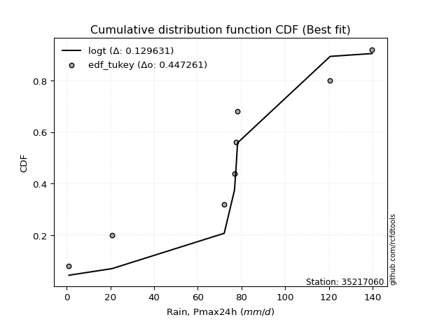</img></img>

</div>


### 8. EDF Gringorten (1963)

Gringorten plotting position formula is essential for estimating the probability and return periods of extreme events like floods and heavy rainfall. The constant _a=0.44_.

<div align="center">


$P=(m-a)/(n+1-2a)$


</div>


**8.1. Empirical values**

<div align="center">

|                | 0                    | 1                  | 2                   | 3                  | 4              | 5                  | 6                  | 7                  | 8                  |
|:---------------|:---------------------|:-------------------|:--------------------|:-------------------|:---------------|:-------------------|:-------------------|:-------------------|:-------------------|
| date           | 2020                 | 2017               | 2021                | 2022               | 2018           | 2023               | 2025               | 2024               | 2019               |
| x              | 1.0                  | 20.7               | 72.1                | 76.8               | 77.6           | 78.2               | 96.6               | 120.6              | 139.8              |
| m              | 1                    | 2                  | 3                   | 4                  | 5              | 6                  | 7                  | 8                  | 9                  |
| empirical_dist | edf_gringorten       | edf_gringorten     | edf_gringorten      | edf_gringorten     | edf_gringorten | edf_gringorten     | edf_gringorten     | edf_gringorten     | edf_gringorten     |
| empirical      | 0.061403508771929835 | 0.1710526315789474 | 0.28070175438596495 | 0.3903508771929825 | 0.5            | 0.6096491228070176 | 0.7192982456140351 | 0.8289473684210527 | 0.9385964912280703 |
| empirical_tr   | 1.0654205607476634   | 1.2063492063492063 | 1.3902439024390243  | 1.6402877697841727 | 2.0            | 2.561797752808989  | 3.5625             | 5.846153846153847  | 16.285714285714324 |

</div>


**8.2. Kolmogorov-Smirnov fit test (sorted by Δ)**


<div align="center">

|                | 0                   | 1                   | 2                   | 3                   | 4                   | 5                   | 6                   | 7                   | 8                   | 9                   | 10                  | 11                  | 12                  | 13                  | 14                  | 15                  | 16                  | 17                  | 18                  | 19                  | 20                  | 21                  | 22                  | 23                  | 24                  | 25                  | 26                  | 27                  | 28                  | 29                  | 30                  | 31                  | 32                  | 33                  | 34                  | 35                  | 36                  | 37                  | 38                  | 39                  | 40                  | 41                  | 42                  | 43                  | 44                  | 45                  | 46                  | 47                  | 48                  | 49                  | 50                  | 51                  | 52                  | 53                  | 54                  | 55                  | 56                  | 57                  | 58                  | 59                  | 60                  | 61                  | 62                  | 63                  | 64                  | 65                  | 66                  | 67                  | 68                  | 69                  | 70                  | 71                  | 72                  | 73                  | 74                  | 75                  | 76                  | 77                  | 78                  | 79                  | 80                  | 81                  | 82                  | 83                  | 84                  | 85                  | 86                  | 87                  | 88                  | 89                  | 90                  | 91                  | 92                  | 93                  | 94                  | 95                  | 96                  | 97                  | 98                  | 99                  | 100                 | 101                 | 102                 | 103                 | 104                 | 105                 | 106                 | 107                 | 108                 | 109                 | 110                 | 111                 | 112                 | 113                 | 114                 | 115                 | 116                 | 117                 | 118                 | 119                 | 120                 | 121                 | 122                 | 123                 | 124                 | 125                 | 126                 | 127                 | 128                 | 129                 | 130                 | 131                 | 132                 | 133                 | 134                 | 135                 | 136                 | 137                 | 138                 | 139                 | 140                 | 141                 | 142                 | 143                 | 144                 | 145                 | 146                 | 147                 | 148                 | 149                 | 150                 | 151                 | 152                 | 153                 | 154                 | 155                 | 156                 | 157                 | 158                 | 159                 |
|:---------------|:--------------------|:--------------------|:--------------------|:--------------------|:--------------------|:--------------------|:--------------------|:--------------------|:--------------------|:--------------------|:--------------------|:--------------------|:--------------------|:--------------------|:--------------------|:--------------------|:--------------------|:--------------------|:--------------------|:--------------------|:--------------------|:--------------------|:--------------------|:--------------------|:--------------------|:--------------------|:--------------------|:--------------------|:--------------------|:--------------------|:--------------------|:--------------------|:--------------------|:--------------------|:--------------------|:--------------------|:--------------------|:--------------------|:--------------------|:--------------------|:--------------------|:--------------------|:--------------------|:--------------------|:--------------------|:--------------------|:--------------------|:--------------------|:--------------------|:--------------------|:--------------------|:--------------------|:--------------------|:--------------------|:--------------------|:--------------------|:--------------------|:--------------------|:--------------------|:--------------------|:--------------------|:--------------------|:--------------------|:--------------------|:--------------------|:--------------------|:--------------------|:--------------------|:--------------------|:--------------------|:--------------------|:--------------------|:--------------------|:--------------------|:--------------------|:--------------------|:--------------------|:--------------------|:--------------------|:--------------------|:--------------------|:--------------------|:--------------------|:--------------------|:--------------------|:--------------------|:--------------------|:--------------------|:--------------------|:--------------------|:--------------------|:--------------------|:--------------------|:--------------------|:--------------------|:--------------------|:--------------------|:--------------------|:--------------------|:--------------------|:--------------------|:--------------------|:--------------------|:--------------------|:--------------------|:--------------------|:--------------------|:--------------------|:--------------------|:--------------------|:--------------------|:--------------------|:--------------------|:--------------------|:--------------------|:--------------------|:--------------------|:--------------------|:--------------------|:--------------------|:--------------------|:--------------------|:--------------------|:--------------------|:--------------------|:--------------------|:--------------------|:--------------------|:--------------------|:--------------------|:--------------------|:--------------------|:--------------------|:--------------------|:--------------------|:--------------------|:--------------------|:--------------------|:--------------------|:--------------------|:--------------------|:--------------------|:--------------------|:--------------------|:--------------------|:--------------------|:--------------------|:--------------------|:--------------------|:--------------------|:--------------------|:--------------------|:--------------------|:--------------------|:--------------------|:--------------------|:--------------------|:--------------------|:--------------------|:--------------------|
| station        | 35217060            | 35217060            | 35217060            | 35217060            | 35217060            | 35217060            | 35217060            | 35217060            | 35217060            | 35217060            | 35217060            | 35217060            | 35217060            | 35217060            | 35217060            | 35217060            | 35217060            | 35217060            | 35217060            | 35217060            | 35217060            | 35217060            | 35217060            | 35217060            | 35217060            | 35217060            | 35217060            | 35217060            | 35217060            | 35217060            | 35217060            | 35217060            | 35217060            | 35217060            | 35217060            | 35217060            | 35217060            | 35217060            | 35217060            | 35217060            | 35217060            | 35217060            | 35217060            | 35217060            | 35217060            | 35217060            | 35217060            | 35217060            | 35217060            | 35217060            | 35217060            | 35217060            | 35217060            | 35217060            | 35217060            | 35217060            | 35217060            | 35217060            | 35217060            | 35217060            | 35217060            | 35217060            | 35217060            | 35217060            | 35217060            | 35217060            | 35217060            | 35217060            | 35217060            | 35217060            | 35217060            | 35217060            | 35217060            | 35217060            | 35217060            | 35217060            | 35217060            | 35217060            | 35217060            | 35217060            | 35217060            | 35217060            | 35217060            | 35217060            | 35217060            | 35217060            | 35217060            | 35217060            | 35217060            | 35217060            | 35217060            | 35217060            | 35217060            | 35217060            | 35217060            | 35217060            | 35217060            | 35217060            | 35217060            | 35217060            | 35217060            | 35217060            | 35217060            | 35217060            | 35217060            | 35217060            | 35217060            | 35217060            | 35217060            | 35217060            | 35217060            | 35217060            | 35217060            | 35217060            | 35217060            | 35217060            | 35217060            | 35217060            | 35217060            | 35217060            | 35217060            | 35217060            | 35217060            | 35217060            | 35217060            | 35217060            | 35217060            | 35217060            | 35217060            | 35217060            | 35217060            | 35217060            | 35217060            | 35217060            | 35217060            | 35217060            | 35217060            | 35217060            | 35217060            | 35217060            | 35217060            | 35217060            | 35217060            | 35217060            | 35217060            | 35217060            | 35217060            | 35217060            | 35217060            | 35217060            | 35217060            | 35217060            | 35217060            | 35217060            | 35217060            | 35217060            | 35217060            | 35217060            | 35217060            | 35217060            |
| empirical_dist | edf_gringorten      | edf_gringorten      | edf_gringorten      | edf_gringorten      | edf_gringorten      | edf_gringorten      | edf_gringorten      | edf_gringorten      | edf_gringorten      | edf_gringorten      | edf_gringorten      | edf_gringorten      | edf_gringorten      | edf_gringorten      | edf_gringorten      | edf_gringorten      | edf_gringorten      | edf_gringorten      | edf_gringorten      | edf_gringorten      | edf_gringorten      | edf_gringorten      | edf_gringorten      | edf_gringorten      | edf_gringorten      | edf_gringorten      | edf_gringorten      | edf_gringorten      | edf_gringorten      | edf_gringorten      | edf_gringorten      | edf_gringorten      | edf_gringorten      | edf_gringorten      | edf_gringorten      | edf_gringorten      | edf_gringorten      | edf_gringorten      | edf_gringorten      | edf_gringorten      | edf_gringorten      | edf_gringorten      | edf_gringorten      | edf_gringorten      | edf_gringorten      | edf_gringorten      | edf_gringorten      | edf_gringorten      | edf_gringorten      | edf_gringorten      | edf_gringorten      | edf_gringorten      | edf_gringorten      | edf_gringorten      | edf_gringorten      | edf_gringorten      | edf_gringorten      | edf_gringorten      | edf_gringorten      | edf_gringorten      | edf_gringorten      | edf_gringorten      | edf_gringorten      | edf_gringorten      | edf_gringorten      | edf_gringorten      | edf_gringorten      | edf_gringorten      | edf_gringorten      | edf_gringorten      | edf_gringorten      | edf_gringorten      | edf_gringorten      | edf_gringorten      | edf_gringorten      | edf_gringorten      | edf_gringorten      | edf_gringorten      | edf_gringorten      | edf_gringorten      | edf_gringorten      | edf_gringorten      | edf_gringorten      | edf_gringorten      | edf_gringorten      | edf_gringorten      | edf_gringorten      | edf_gringorten      | edf_gringorten      | edf_gringorten      | edf_gringorten      | edf_gringorten      | edf_gringorten      | edf_gringorten      | edf_gringorten      | edf_gringorten      | edf_gringorten      | edf_gringorten      | edf_gringorten      | edf_gringorten      | edf_gringorten      | edf_gringorten      | edf_gringorten      | edf_gringorten      | edf_gringorten      | edf_gringorten      | edf_gringorten      | edf_gringorten      | edf_gringorten      | edf_gringorten      | edf_gringorten      | edf_gringorten      | edf_gringorten      | edf_gringorten      | edf_gringorten      | edf_gringorten      | edf_gringorten      | edf_gringorten      | edf_gringorten      | edf_gringorten      | edf_gringorten      | edf_gringorten      | edf_gringorten      | edf_gringorten      | edf_gringorten      | edf_gringorten      | edf_gringorten      | edf_gringorten      | edf_gringorten      | edf_gringorten      | edf_gringorten      | edf_gringorten      | edf_gringorten      | edf_gringorten      | edf_gringorten      | edf_gringorten      | edf_gringorten      | edf_gringorten      | edf_gringorten      | edf_gringorten      | edf_gringorten      | edf_gringorten      | edf_gringorten      | edf_gringorten      | edf_gringorten      | edf_gringorten      | edf_gringorten      | edf_gringorten      | edf_gringorten      | edf_gringorten      | edf_gringorten      | edf_gringorten      | edf_gringorten      | edf_gringorten      | edf_gringorten      | edf_gringorten      | edf_gringorten      | edf_gringorten      | edf_gringorten      | edf_gringorten      |
| p_dist         | logdgamma           | loggennorm          | dgamma              | gennorm             | logt                | dweibull            | genlogistic         | logdweibull         | logtukeylambda      | genextreme          | johnsonsu           | skewnorm            | burr12              | weibull_min         | argus               | gumbel_l            | laplace             | pearson3            | logjohnsonsu        | beta                | genpareto           | hypsecant           | foldnorm            | logistic            | f                   | exponnorm           | norm                | crystalball         | t                   | nct                 | fatiguelife         | anglit              | betaprime           | gausshyper          | semicircular        | gamma               | gengamma            | erlang              | rice                | arcsine             | genhalflogistic     | loglevy_l           | cosine              | truncweibull_min    | logpearson3         | invgamma            | maxwell             | loggenextreme       | exponweib           | logtruncweibull_min | rayleigh            | wrapcauchy          | ksone               | alpha               | kappa3              | uniform             | invgauss            | vonmises_line       | logargus            | triang              | gumbel_r            | bradford            | burr                | logweibull_max      | logvonmises_line    | kappa4              | halfnorm            | kstwobign           | logtrapezoid        | logloggamma         | ncf                 | moyal               | logburr             | loggumbel_l         | halflogistic        | logarcsine          | logburr12           | logweibull_min      | levy_l              | loggompertz         | logexponweib        | logbetaprime        | trapezoid           | truncexpon          | logsemicircular     | logjohnsonsb        | loginvweibull       | loganglit           | lomax               | loggenhalflogistic  | johnsonsb           | genexpon            | loggamma            | loggamma            | mielke              | lognct              | logexponnorm        | logcrystalball      | lognorm             | logrice             | logfatiguelife      | loginvgamma         | logerlang           | loginvgauss         | logfoldnorm         | wald                | loglogistic         | loglomax            | logkstwobign        | logloglaplace       | logmaxwell          | loghypsecant        | lograyleigh         | loggausshyper       | logalpha            | loggengamma         | logwrapcauchy       | loggenexpon         | logmielke           | logncf              | nakagami            | loglaplace          | loglaplace          | loghalfnorm         | loggumbel_r         | logcosine           | loggenpareto        | loghalflogistic     | loghalfgennorm      | logmoyal            | logskewnorm         | logf                | halfgennorm         | logbeta             | gompertz            | logwald             | logtriang           | lognakagami         | invweibull          | logksone            | logkappa4           | logkappa3           | loguniform          | powerlaw            | logbradford         | rdist               | logtruncnorm        | logexponpow         | weibull_max         | logtruncexpon       | tukeylambda         | truncpareto         | exponpow            | truncnorm           | logtruncpareto      | logpowerlaw         | logrdist            | loggenlogistic      | logvonmises         | vonmises            |
| delta          | 0.11415309561257098 | 0.1163735130242442  | 0.11674208736384983 | 0.12060360313594454 | 0.12072919516111014 | 0.12121229792164173 | 0.1336199047450231  | 0.13392204159835785 | 0.13702283600430487 | 0.137978017991935   | 0.14192572950027954 | 0.14243336007013152 | 0.15076795242344782 | 0.15080204512933076 | 0.15246248084202146 | 0.15701984840896976 | 0.1574878776600261  | 0.15795043094946676 | 0.1586784077296693  | 0.16637555340881233 | 0.17148079491820517 | 0.17281077933222116 | 0.17657262524617806 | 0.17708880300600321 | 0.18104453482694932 | 0.18212778909025568 | 0.18212799496223037 | 0.18212799725724138 | 0.18212827769052958 | 0.18229001881377477 | 0.186644741513813   | 0.18742432254234614 | 0.18769572415862978 | 0.18915754111653982 | 0.18960841367398545 | 0.19048689695002385 | 0.1936949250145994  | 0.19480177079205147 | 0.1958062178153797  | 0.19828150307007542 | 0.19832291763724857 | 0.19974367051095404 | 0.2044249644012428  | 0.2134456920378897  | 0.21390991097662665 | 0.21562344666645605 | 0.21626591800139094 | 0.22049365587762798 | 0.22494203577284827 | 0.22537036505647684 | 0.22797486801999606 | 0.22893175326055243 | 0.22950477779463058 | 0.2305258420547293  | 0.2315411952493171  | 0.23154608423074968 | 0.23334489456773228 | 0.24253661589536762 | 0.24623801896762315 | 0.24800801947843787 | 0.25038193596392005 | 0.2504247203934194  | 0.25605222425769963 | 0.25611217049973933 | 0.2592688906532042  | 0.2594392273955279  | 0.2609914682468825  | 0.26163183448988897 | 0.2638393746548889  | 0.2642011652583141  | 0.2699109834030298  | 0.276033695315483   | 0.27666673236759626 | 0.2779640402085953  | 0.2832296820458213  | 0.2858136293365439  | 0.2932581881104514  | 0.2933739758852458  | 0.29461220921144887 | 0.29491148701158515 | 0.2996111340129081  | 0.30080077014402723 | 0.30638254747257865 | 0.30785113329225394 | 0.31234604728540977 | 0.31416479381923246 | 0.3151435362561544  | 0.3189112851013734  | 0.3223170923283007  | 0.3246042266678619  | 0.32763711962154973 | 0.3318291915523767  | 0.3340827555089558  | 0.3340827555089558  | 0.3343395327873436  | 0.3346132089478539  | 0.3346779341924034  | 0.33467952439586185 | 0.3346795945994718  | 0.33468979493164125 | 0.3348070681376551  | 0.33735075224581396 | 0.33930952075943005 | 0.34071754913006796 | 0.3428533756047029  | 0.3474150604385294  | 0.34927548887875587 | 0.35106168126655246 | 0.3516303242127882  | 0.35387084571458527 | 0.35980155053691826 | 0.3610524901935194  | 0.3675208563953322  | 0.3732976246578394  | 0.37449964813088316 | 0.3784407826443747  | 0.38096252232730093 | 0.38190329671587503 | 0.383477048961047   | 0.38510830352855335 | 0.3858190497011676  | 0.38909232250195064 | 0.38909232250195064 | 0.3896052854671586  | 0.39947865086914097 | 0.40451424683009923 | 0.4065211435512747  | 0.41797703181651374 | 0.4191908339419342  | 0.4213915885864748  | 0.4347674551277155  | 0.4378743958060071  | 0.4497648911638718  | 0.4761100638789846  | 0.4775990321025991  | 0.4826807312022176  | 0.4828391282212234  | 0.4945389995382647  | 0.5095904424755845  | 0.5242695244634978  | 0.5683011954086901  | 0.583291379579008   | 0.5852637802333902  | 0.5980976312053956  | 0.6012862830384307  | 0.6047978841434609  | 0.6136736568045988  | 0.6207395564882243  | 0.6302226403815795  | 0.632265959684579   | 0.6769829545098256  | 0.7100148374842872  | 0.7350361244671582  | 0.7544238718899174  | 0.775582037299579   | 0.8227801100542484  | 0.8289473658279043  | 0.8289473684210527  | 1.08853614267198    | 21.352316863774337  |
| deltao         | 0.41761268023100007 | 0.41761268023100007 | 0.41761268023100007 | 0.41761268023100007 | 0.41761268023100007 | 0.41761268023100007 | 0.41761268023100007 | 0.41761268023100007 | 0.41761268023100007 | 0.41761268023100007 | 0.41761268023100007 | 0.41761268023100007 | 0.41761268023100007 | 0.41761268023100007 | 0.41761268023100007 | 0.41761268023100007 | 0.41761268023100007 | 0.41761268023100007 | 0.41761268023100007 | 0.41761268023100007 | 0.41761268023100007 | 0.41761268023100007 | 0.41761268023100007 | 0.41761268023100007 | 0.41761268023100007 | 0.41761268023100007 | 0.41761268023100007 | 0.41761268023100007 | 0.41761268023100007 | 0.41761268023100007 | 0.41761268023100007 | 0.41761268023100007 | 0.41761268023100007 | 0.41761268023100007 | 0.41761268023100007 | 0.41761268023100007 | 0.41761268023100007 | 0.41761268023100007 | 0.41761268023100007 | 0.41761268023100007 | 0.41761268023100007 | 0.41761268023100007 | 0.41761268023100007 | 0.41761268023100007 | 0.41761268023100007 | 0.41761268023100007 | 0.41761268023100007 | 0.41761268023100007 | 0.41761268023100007 | 0.41761268023100007 | 0.41761268023100007 | 0.41761268023100007 | 0.41761268023100007 | 0.41761268023100007 | 0.41761268023100007 | 0.41761268023100007 | 0.41761268023100007 | 0.41761268023100007 | 0.41761268023100007 | 0.41761268023100007 | 0.41761268023100007 | 0.41761268023100007 | 0.41761268023100007 | 0.41761268023100007 | 0.41761268023100007 | 0.41761268023100007 | 0.41761268023100007 | 0.41761268023100007 | 0.41761268023100007 | 0.41761268023100007 | 0.41761268023100007 | 0.41761268023100007 | 0.41761268023100007 | 0.41761268023100007 | 0.41761268023100007 | 0.41761268023100007 | 0.41761268023100007 | 0.41761268023100007 | 0.41761268023100007 | 0.41761268023100007 | 0.41761268023100007 | 0.41761268023100007 | 0.41761268023100007 | 0.41761268023100007 | 0.41761268023100007 | 0.41761268023100007 | 0.41761268023100007 | 0.41761268023100007 | 0.41761268023100007 | 0.41761268023100007 | 0.41761268023100007 | 0.41761268023100007 | 0.41761268023100007 | 0.41761268023100007 | 0.41761268023100007 | 0.41761268023100007 | 0.41761268023100007 | 0.41761268023100007 | 0.41761268023100007 | 0.41761268023100007 | 0.41761268023100007 | 0.41761268023100007 | 0.41761268023100007 | 0.41761268023100007 | 0.41761268023100007 | 0.41761268023100007 | 0.41761268023100007 | 0.41761268023100007 | 0.41761268023100007 | 0.41761268023100007 | 0.41761268023100007 | 0.41761268023100007 | 0.41761268023100007 | 0.41761268023100007 | 0.41761268023100007 | 0.41761268023100007 | 0.41761268023100007 | 0.41761268023100007 | 0.41761268023100007 | 0.41761268023100007 | 0.41761268023100007 | 0.41761268023100007 | 0.41761268023100007 | 0.41761268023100007 | 0.41761268023100007 | 0.41761268023100007 | 0.41761268023100007 | 0.41761268023100007 | 0.41761268023100007 | 0.41761268023100007 | 0.41761268023100007 | 0.41761268023100007 | 0.41761268023100007 | 0.41761268023100007 | 0.41761268023100007 | 0.41761268023100007 | 0.41761268023100007 | 0.41761268023100007 | 0.41761268023100007 | 0.41761268023100007 | 0.41761268023100007 | 0.41761268023100007 | 0.41761268023100007 | 0.41761268023100007 | 0.41761268023100007 | 0.41761268023100007 | 0.41761268023100007 | 0.41761268023100007 | 0.41761268023100007 | 0.41761268023100007 | 0.41761268023100007 | 0.41761268023100007 | 0.41761268023100007 | 0.41761268023100007 | 0.41761268023100007 | 0.41761268023100007 | 0.41761268023100007 | 0.41761268023100007 | 0.41761268023100007 | 0.41761268023100007 |
| eval           | Δo > Δ              | Δo > Δ              | Δo > Δ              | Δo > Δ              | Δo > Δ              | Δo > Δ              | Δo > Δ              | Δo > Δ              | Δo > Δ              | Δo > Δ              | Δo > Δ              | Δo > Δ              | Δo > Δ              | Δo > Δ              | Δo > Δ              | Δo > Δ              | Δo > Δ              | Δo > Δ              | Δo > Δ              | Δo > Δ              | Δo > Δ              | Δo > Δ              | Δo > Δ              | Δo > Δ              | Δo > Δ              | Δo > Δ              | Δo > Δ              | Δo > Δ              | Δo > Δ              | Δo > Δ              | Δo > Δ              | Δo > Δ              | Δo > Δ              | Δo > Δ              | Δo > Δ              | Δo > Δ              | Δo > Δ              | Δo > Δ              | Δo > Δ              | Δo > Δ              | Δo > Δ              | Δo > Δ              | Δo > Δ              | Δo > Δ              | Δo > Δ              | Δo > Δ              | Δo > Δ              | Δo > Δ              | Δo > Δ              | Δo > Δ              | Δo > Δ              | Δo > Δ              | Δo > Δ              | Δo > Δ              | Δo > Δ              | Δo > Δ              | Δo > Δ              | Δo > Δ              | Δo > Δ              | Δo > Δ              | Δo > Δ              | Δo > Δ              | Δo > Δ              | Δo > Δ              | Δo > Δ              | Δo > Δ              | Δo > Δ              | Δo > Δ              | Δo > Δ              | Δo > Δ              | Δo > Δ              | Δo > Δ              | Δo > Δ              | Δo > Δ              | Δo > Δ              | Δo > Δ              | Δo > Δ              | Δo > Δ              | Δo > Δ              | Δo > Δ              | Δo > Δ              | Δo > Δ              | Δo > Δ              | Δo > Δ              | Δo > Δ              | Δo > Δ              | Δo > Δ              | Δo > Δ              | Δo > Δ              | Δo > Δ              | Δo > Δ              | Δo > Δ              | Δo > Δ              | Δo > Δ              | Δo > Δ              | Δo > Δ              | Δo > Δ              | Δo > Δ              | Δo > Δ              | Δo > Δ              | Δo > Δ              | Δo > Δ              | Δo > Δ              | Δo > Δ              | Δo > Δ              | Δo > Δ              | Δo > Δ              | Δo > Δ              | Δo > Δ              | Δo > Δ              | Δo > Δ              | Δo > Δ              | Δo > Δ              | Δo > Δ              | Δo > Δ              | Δo > Δ              | Δo > Δ              | Δo > Δ              | Δo > Δ              | Δo > Δ              | Δo > Δ              | Δo > Δ              | Δo > Δ              | Δo > Δ              | Δo > Δ              | Δo > Δ              | Δo > Δ              | Δo <= Δ             | Δo <= Δ             | Δo <= Δ             | Δo <= Δ             | Δo <= Δ             | Δo <= Δ             | Δo <= Δ             | Δo <= Δ             | Δo <= Δ             | Δo <= Δ             | Δo <= Δ             | Δo <= Δ             | Δo <= Δ             | Δo <= Δ             | Δo <= Δ             | Δo <= Δ             | Δo <= Δ             | Δo <= Δ             | Δo <= Δ             | Δo <= Δ             | Δo <= Δ             | Δo <= Δ             | Δo <= Δ             | Δo <= Δ             | Δo <= Δ             | Δo <= Δ             | Δo <= Δ             | Δo <= Δ             | Δo <= Δ             | Δo <= Δ             | Δo <= Δ             | Δo <= Δ             | Δo <= Δ             |
| fit            | 1                   | 1                   | 1                   | 1                   | 1                   | 1                   | 1                   | 1                   | 1                   | 1                   | 1                   | 1                   | 1                   | 1                   | 1                   | 1                   | 1                   | 1                   | 1                   | 1                   | 1                   | 1                   | 1                   | 1                   | 1                   | 1                   | 1                   | 1                   | 1                   | 1                   | 1                   | 1                   | 1                   | 1                   | 1                   | 1                   | 1                   | 1                   | 1                   | 1                   | 1                   | 1                   | 1                   | 1                   | 1                   | 1                   | 1                   | 1                   | 1                   | 1                   | 1                   | 1                   | 1                   | 1                   | 1                   | 1                   | 1                   | 1                   | 1                   | 1                   | 1                   | 1                   | 1                   | 1                   | 1                   | 1                   | 1                   | 1                   | 1                   | 1                   | 1                   | 1                   | 1                   | 1                   | 1                   | 1                   | 1                   | 1                   | 1                   | 1                   | 1                   | 1                   | 1                   | 1                   | 1                   | 1                   | 1                   | 1                   | 1                   | 1                   | 1                   | 1                   | 1                   | 1                   | 1                   | 1                   | 1                   | 1                   | 1                   | 1                   | 1                   | 1                   | 1                   | 1                   | 1                   | 1                   | 1                   | 1                   | 1                   | 1                   | 1                   | 1                   | 1                   | 1                   | 1                   | 1                   | 1                   | 1                   | 1                   | 1                   | 1                   | 1                   | 1                   | 1                   | 1                   | 1                   | 1                   | 0                   | 0                   | 0                   | 0                   | 0                   | 0                   | 0                   | 0                   | 0                   | 0                   | 0                   | 0                   | 0                   | 0                   | 0                   | 0                   | 0                   | 0                   | 0                   | 0                   | 0                   | 0                   | 0                   | 0                   | 0                   | 0                   | 0                   | 0                   | 0                   | 0                   | 0                   | 0                   | 0                   |
| n              | 9                   | 9                   | 9                   | 9                   | 9                   | 9                   | 9                   | 9                   | 9                   | 9                   | 9                   | 9                   | 9                   | 9                   | 9                   | 9                   | 9                   | 9                   | 9                   | 9                   | 9                   | 9                   | 9                   | 9                   | 9                   | 9                   | 9                   | 9                   | 9                   | 9                   | 9                   | 9                   | 9                   | 9                   | 9                   | 9                   | 9                   | 9                   | 9                   | 9                   | 9                   | 9                   | 9                   | 9                   | 9                   | 9                   | 9                   | 9                   | 9                   | 9                   | 9                   | 9                   | 9                   | 9                   | 9                   | 9                   | 9                   | 9                   | 9                   | 9                   | 9                   | 9                   | 9                   | 9                   | 9                   | 9                   | 9                   | 9                   | 9                   | 9                   | 9                   | 9                   | 9                   | 9                   | 9                   | 9                   | 9                   | 9                   | 9                   | 9                   | 9                   | 9                   | 9                   | 9                   | 9                   | 9                   | 9                   | 9                   | 9                   | 9                   | 9                   | 9                   | 9                   | 9                   | 9                   | 9                   | 9                   | 9                   | 9                   | 9                   | 9                   | 9                   | 9                   | 9                   | 9                   | 9                   | 9                   | 9                   | 9                   | 9                   | 9                   | 9                   | 9                   | 9                   | 9                   | 9                   | 9                   | 9                   | 9                   | 9                   | 9                   | 9                   | 9                   | 9                   | 9                   | 9                   | 9                   | 9                   | 9                   | 9                   | 9                   | 9                   | 9                   | 9                   | 9                   | 9                   | 9                   | 9                   | 9                   | 9                   | 9                   | 9                   | 9                   | 9                   | 9                   | 9                   | 9                   | 9                   | 9                   | 9                   | 9                   | 9                   | 9                   | 9                   | 9                   | 9                   | 9                   | 9                   | 9                   | 9                   |
| best_fit       | 1                   | 0                   | 0                   | 0                   | 0                   | 0                   | 0                   | 0                   | 0                   | 0                   | 0                   | 0                   | 0                   | 0                   | 0                   | 0                   | 0                   | 0                   | 0                   | 0                   | 0                   | 0                   | 0                   | 0                   | 0                   | 0                   | 0                   | 0                   | 0                   | 0                   | 0                   | 0                   | 0                   | 0                   | 0                   | 0                   | 0                   | 0                   | 0                   | 0                   | 0                   | 0                   | 0                   | 0                   | 0                   | 0                   | 0                   | 0                   | 0                   | 0                   | 0                   | 0                   | 0                   | 0                   | 0                   | 0                   | 0                   | 0                   | 0                   | 0                   | 0                   | 0                   | 0                   | 0                   | 0                   | 0                   | 0                   | 0                   | 0                   | 0                   | 0                   | 0                   | 0                   | 0                   | 0                   | 0                   | 0                   | 0                   | 0                   | 0                   | 0                   | 0                   | 0                   | 0                   | 0                   | 0                   | 0                   | 0                   | 0                   | 0                   | 0                   | 0                   | 0                   | 0                   | 0                   | 0                   | 0                   | 0                   | 0                   | 0                   | 0                   | 0                   | 0                   | 0                   | 0                   | 0                   | 0                   | 0                   | 0                   | 0                   | 0                   | 0                   | 0                   | 0                   | 0                   | 0                   | 0                   | 0                   | 0                   | 0                   | 0                   | 0                   | 0                   | 0                   | 0                   | 0                   | 0                   | 0                   | 0                   | 0                   | 0                   | 0                   | 0                   | 0                   | 0                   | 0                   | 0                   | 0                   | 0                   | 0                   | 0                   | 0                   | 0                   | 0                   | 0                   | 0                   | 0                   | 0                   | 0                   | 0                   | 0                   | 0                   | 0                   | 0                   | 0                   | 0                   | 0                   | 0                   | 0                   | 0                   |
| best_fit_sort  | 1                   | 2                   | 3                   | 4                   | 5                   | 6                   | 7                   | 8                   | 9                   | 10                  | 11                  | 12                  | 13                  | 14                  | 15                  | 16                  | 17                  | 18                  | 19                  | 20                  | 21                  | 22                  | 23                  | 24                  | 25                  | 26                  | 27                  | 28                  | 29                  | 30                  | 31                  | 32                  | 33                  | 34                  | 35                  | 36                  | 37                  | 38                  | 39                  | 40                  | 41                  | 42                  | 43                  | 44                  | 45                  | 46                  | 47                  | 48                  | 49                  | 50                  | 51                  | 52                  | 53                  | 54                  | 55                  | 56                  | 57                  | 58                  | 59                  | 60                  | 61                  | 62                  | 63                  | 64                  | 65                  | 66                  | 67                  | 68                  | 69                  | 70                  | 71                  | 72                  | 73                  | 74                  | 75                  | 76                  | 77                  | 78                  | 79                  | 80                  | 81                  | 82                  | 83                  | 84                  | 85                  | 86                  | 87                  | 88                  | 89                  | 90                  | 91                  | 92                  | 93                  | 94                  | 95                  | 96                  | 97                  | 98                  | 99                  | 100                 | 101                 | 102                 | 103                 | 104                 | 105                 | 106                 | 107                 | 108                 | 109                 | 110                 | 111                 | 112                 | 113                 | 114                 | 115                 | 116                 | 117                 | 118                 | 119                 | 120                 | 121                 | 122                 | 123                 | 124                 | 125                 | 126                 | 127                 | 128                 | 129                 | 130                 | 131                 | 132                 | 133                 | 134                 | 135                 | 136                 | 137                 | 138                 | 139                 | 140                 | 141                 | 142                 | 143                 | 144                 | 145                 | 146                 | 147                 | 148                 | 149                 | 150                 | 151                 | 152                 | 153                 | 154                 | 155                 | 156                 | 157                 | 158                 | 159                 | 160                 |

</div>


**8.3. Best fit**

<div align="center">

|   id |   station | empirical_dist   | p_dist    |    delta |   deltao | eval   |   fit |   n |   best_fit |   best_fit_sort |
|-----:|----------:|:-----------------|:----------|---------:|---------:|:-------|------:|----:|-----------:|----------------:|
|    0 |  35217060 | edf_gringorten   | logdgamma | 0.114153 | 0.417613 | Δo > Δ |     1 |   9 |          1 |               1 |

</div>


<div align="center">

</img>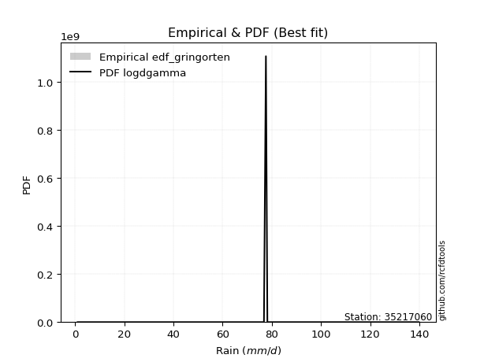</img>

</div>


### 9. EDF Filliben (1975)

The specific values of the constants (0.3175) (often denoted as $alpha$) and (0.365) are derived from a method proposed by James J. Filliben in a 1975 paper. This particular formula is the mean value of the $i$-th order statistic of the normal distribution and is considered a robust and effective plotting position formula for the normal probability plot correlation coefficient test for normality.

<div align="center">


$P=(m-0.3175)/(n+0.365)$


</div>


**9.1. Empirical values**

<div align="center">

|                | 0                   | 1                  | 2                   | 3                   | 4            | 5                  | 6                  | 7                  | 8                  |
|:---------------|:--------------------|:-------------------|:--------------------|:--------------------|:-------------|:-------------------|:-------------------|:-------------------|:-------------------|
| date           | 2020                | 2017               | 2021                | 2022                | 2018         | 2023               | 2025               | 2024               | 2019               |
| x              | 1.0                 | 20.7               | 72.1                | 76.8                | 77.6         | 78.2               | 96.6               | 120.6              | 139.8              |
| m              | 1                   | 2                  | 3                   | 4                   | 5            | 6                  | 7                  | 8                  | 9                  |
| empirical_dist | edf_filliben        | edf_filliben       | edf_filliben        | edf_filliben        | edf_filliben | edf_filliben       | edf_filliben       | edf_filliben       | edf_filliben       |
| empirical      | 0.07287773625200214 | 0.1796583021890016 | 0.28643886812600106 | 0.39321943406300053 | 0.5          | 0.6067805659369995 | 0.7135611318739989 | 0.8203416978109984 | 0.9271222637479978 |
| empirical_tr   | 1.0786063921681543  | 1.219004230393752  | 1.401421623643846   | 1.6480422349318082  | 2.0          | 2.5431093007467753 | 3.491146318732526  | 5.566121842496286  | 13.721611721611705 |

</div>


**9.2. Kolmogorov-Smirnov fit test (sorted by Δ)**


<div align="center">

|                | 0                   | 1                   | 2                   | 3                   | 4                   | 5                   | 6                   | 7                   | 8                   | 9                   | 10                  | 11                  | 12                  | 13                  | 14                  | 15                  | 16                  | 17                  | 18                  | 19                  | 20                  | 21                  | 22                  | 23                  | 24                  | 25                  | 26                  | 27                  | 28                  | 29                  | 30                  | 31                  | 32                  | 33                  | 34                  | 35                  | 36                  | 37                  | 38                  | 39                  | 40                  | 41                  | 42                  | 43                  | 44                  | 45                  | 46                  | 47                  | 48                  | 49                  | 50                  | 51                  | 52                  | 53                  | 54                  | 55                  | 56                  | 57                  | 58                  | 59                  | 60                  | 61                  | 62                  | 63                  | 64                  | 65                  | 66                  | 67                  | 68                  | 69                  | 70                  | 71                  | 72                  | 73                  | 74                  | 75                  | 76                  | 77                  | 78                  | 79                  | 80                  | 81                  | 82                  | 83                  | 84                  | 85                  | 86                  | 87                  | 88                  | 89                  | 90                  | 91                  | 92                  | 93                  | 94                  | 95                  | 96                  | 97                  | 98                  | 99                  | 100                 | 101                 | 102                 | 103                 | 104                 | 105                 | 106                 | 107                 | 108                 | 109                 | 110                 | 111                 | 112                 | 113                 | 114                 | 115                 | 116                 | 117                 | 118                 | 119                 | 120                 | 121                 | 122                 | 123                 | 124                 | 125                 | 126                 | 127                 | 128                 | 129                 | 130                 | 131                 | 132                 | 133                 | 134                 | 135                 | 136                 | 137                 | 138                 | 139                 | 140                 | 141                 | 142                 | 143                 | 144                 | 145                 | 146                 | 147                 | 148                 | 149                 | 150                 | 151                 | 152                 | 153                 | 154                 | 155                 | 156                 | 157                 | 158                 | 159                 |
|:---------------|:--------------------|:--------------------|:--------------------|:--------------------|:--------------------|:--------------------|:--------------------|:--------------------|:--------------------|:--------------------|:--------------------|:--------------------|:--------------------|:--------------------|:--------------------|:--------------------|:--------------------|:--------------------|:--------------------|:--------------------|:--------------------|:--------------------|:--------------------|:--------------------|:--------------------|:--------------------|:--------------------|:--------------------|:--------------------|:--------------------|:--------------------|:--------------------|:--------------------|:--------------------|:--------------------|:--------------------|:--------------------|:--------------------|:--------------------|:--------------------|:--------------------|:--------------------|:--------------------|:--------------------|:--------------------|:--------------------|:--------------------|:--------------------|:--------------------|:--------------------|:--------------------|:--------------------|:--------------------|:--------------------|:--------------------|:--------------------|:--------------------|:--------------------|:--------------------|:--------------------|:--------------------|:--------------------|:--------------------|:--------------------|:--------------------|:--------------------|:--------------------|:--------------------|:--------------------|:--------------------|:--------------------|:--------------------|:--------------------|:--------------------|:--------------------|:--------------------|:--------------------|:--------------------|:--------------------|:--------------------|:--------------------|:--------------------|:--------------------|:--------------------|:--------------------|:--------------------|:--------------------|:--------------------|:--------------------|:--------------------|:--------------------|:--------------------|:--------------------|:--------------------|:--------------------|:--------------------|:--------------------|:--------------------|:--------------------|:--------------------|:--------------------|:--------------------|:--------------------|:--------------------|:--------------------|:--------------------|:--------------------|:--------------------|:--------------------|:--------------------|:--------------------|:--------------------|:--------------------|:--------------------|:--------------------|:--------------------|:--------------------|:--------------------|:--------------------|:--------------------|:--------------------|:--------------------|:--------------------|:--------------------|:--------------------|:--------------------|:--------------------|:--------------------|:--------------------|:--------------------|:--------------------|:--------------------|:--------------------|:--------------------|:--------------------|:--------------------|:--------------------|:--------------------|:--------------------|:--------------------|:--------------------|:--------------------|:--------------------|:--------------------|:--------------------|:--------------------|:--------------------|:--------------------|:--------------------|:--------------------|:--------------------|:--------------------|:--------------------|:--------------------|:--------------------|:--------------------|:--------------------|:--------------------|:--------------------|:--------------------|
| station        | 35217060            | 35217060            | 35217060            | 35217060            | 35217060            | 35217060            | 35217060            | 35217060            | 35217060            | 35217060            | 35217060            | 35217060            | 35217060            | 35217060            | 35217060            | 35217060            | 35217060            | 35217060            | 35217060            | 35217060            | 35217060            | 35217060            | 35217060            | 35217060            | 35217060            | 35217060            | 35217060            | 35217060            | 35217060            | 35217060            | 35217060            | 35217060            | 35217060            | 35217060            | 35217060            | 35217060            | 35217060            | 35217060            | 35217060            | 35217060            | 35217060            | 35217060            | 35217060            | 35217060            | 35217060            | 35217060            | 35217060            | 35217060            | 35217060            | 35217060            | 35217060            | 35217060            | 35217060            | 35217060            | 35217060            | 35217060            | 35217060            | 35217060            | 35217060            | 35217060            | 35217060            | 35217060            | 35217060            | 35217060            | 35217060            | 35217060            | 35217060            | 35217060            | 35217060            | 35217060            | 35217060            | 35217060            | 35217060            | 35217060            | 35217060            | 35217060            | 35217060            | 35217060            | 35217060            | 35217060            | 35217060            | 35217060            | 35217060            | 35217060            | 35217060            | 35217060            | 35217060            | 35217060            | 35217060            | 35217060            | 35217060            | 35217060            | 35217060            | 35217060            | 35217060            | 35217060            | 35217060            | 35217060            | 35217060            | 35217060            | 35217060            | 35217060            | 35217060            | 35217060            | 35217060            | 35217060            | 35217060            | 35217060            | 35217060            | 35217060            | 35217060            | 35217060            | 35217060            | 35217060            | 35217060            | 35217060            | 35217060            | 35217060            | 35217060            | 35217060            | 35217060            | 35217060            | 35217060            | 35217060            | 35217060            | 35217060            | 35217060            | 35217060            | 35217060            | 35217060            | 35217060            | 35217060            | 35217060            | 35217060            | 35217060            | 35217060            | 35217060            | 35217060            | 35217060            | 35217060            | 35217060            | 35217060            | 35217060            | 35217060            | 35217060            | 35217060            | 35217060            | 35217060            | 35217060            | 35217060            | 35217060            | 35217060            | 35217060            | 35217060            | 35217060            | 35217060            | 35217060            | 35217060            | 35217060            | 35217060            |
| empirical_dist | edf_filliben        | edf_filliben        | edf_filliben        | edf_filliben        | edf_filliben        | edf_filliben        | edf_filliben        | edf_filliben        | edf_filliben        | edf_filliben        | edf_filliben        | edf_filliben        | edf_filliben        | edf_filliben        | edf_filliben        | edf_filliben        | edf_filliben        | edf_filliben        | edf_filliben        | edf_filliben        | edf_filliben        | edf_filliben        | edf_filliben        | edf_filliben        | edf_filliben        | edf_filliben        | edf_filliben        | edf_filliben        | edf_filliben        | edf_filliben        | edf_filliben        | edf_filliben        | edf_filliben        | edf_filliben        | edf_filliben        | edf_filliben        | edf_filliben        | edf_filliben        | edf_filliben        | edf_filliben        | edf_filliben        | edf_filliben        | edf_filliben        | edf_filliben        | edf_filliben        | edf_filliben        | edf_filliben        | edf_filliben        | edf_filliben        | edf_filliben        | edf_filliben        | edf_filliben        | edf_filliben        | edf_filliben        | edf_filliben        | edf_filliben        | edf_filliben        | edf_filliben        | edf_filliben        | edf_filliben        | edf_filliben        | edf_filliben        | edf_filliben        | edf_filliben        | edf_filliben        | edf_filliben        | edf_filliben        | edf_filliben        | edf_filliben        | edf_filliben        | edf_filliben        | edf_filliben        | edf_filliben        | edf_filliben        | edf_filliben        | edf_filliben        | edf_filliben        | edf_filliben        | edf_filliben        | edf_filliben        | edf_filliben        | edf_filliben        | edf_filliben        | edf_filliben        | edf_filliben        | edf_filliben        | edf_filliben        | edf_filliben        | edf_filliben        | edf_filliben        | edf_filliben        | edf_filliben        | edf_filliben        | edf_filliben        | edf_filliben        | edf_filliben        | edf_filliben        | edf_filliben        | edf_filliben        | edf_filliben        | edf_filliben        | edf_filliben        | edf_filliben        | edf_filliben        | edf_filliben        | edf_filliben        | edf_filliben        | edf_filliben        | edf_filliben        | edf_filliben        | edf_filliben        | edf_filliben        | edf_filliben        | edf_filliben        | edf_filliben        | edf_filliben        | edf_filliben        | edf_filliben        | edf_filliben        | edf_filliben        | edf_filliben        | edf_filliben        | edf_filliben        | edf_filliben        | edf_filliben        | edf_filliben        | edf_filliben        | edf_filliben        | edf_filliben        | edf_filliben        | edf_filliben        | edf_filliben        | edf_filliben        | edf_filliben        | edf_filliben        | edf_filliben        | edf_filliben        | edf_filliben        | edf_filliben        | edf_filliben        | edf_filliben        | edf_filliben        | edf_filliben        | edf_filliben        | edf_filliben        | edf_filliben        | edf_filliben        | edf_filliben        | edf_filliben        | edf_filliben        | edf_filliben        | edf_filliben        | edf_filliben        | edf_filliben        | edf_filliben        | edf_filliben        | edf_filliben        | edf_filliben        | edf_filliben        | edf_filliben        |
| p_dist         | dgamma              | dweibull            | logdweibull         | logdgamma           | loggennorm          | gennorm             | logt                | genlogistic         | genextreme          | johnsonsu           | skewnorm            | logtukeylambda      | burr12              | weibull_min         | argus               | laplace             | pearson3            | logjohnsonsu        | gumbel_l            | beta                | hypsecant           | genpareto           | foldnorm            | logistic            | f                   | exponnorm           | norm                | crystalball         | t                   | nct                 | fatiguelife         | anglit              | betaprime           | semicircular        | gamma               | gausshyper          | gengamma            | erlang              | rice                | arcsine             | loglevy_l           | genhalflogistic     | cosine              | truncweibull_min    | logpearson3         | invgamma            | maxwell             | loggenextreme       | exponweib           | logtruncweibull_min | rayleigh            | wrapcauchy          | ksone               | alpha               | kappa3              | uniform             | invgauss            | vonmises_line       | logargus            | gumbel_r            | bradford            | triang              | logweibull_max      | burr                | logvonmises_line    | kappa4              | halfnorm            | kstwobign           | logtrapezoid        | logloggamma         | ncf                 | moyal               | logburr             | loggumbel_l         | halflogistic        | logarcsine          | levy_l              | logburr12           | logweibull_min      | loggompertz         | logexponweib        | logbetaprime        | truncexpon          | trapezoid           | logjohnsonsb        | logsemicircular     | loginvweibull       | loganglit           | lomax               | loggenhalflogistic  | johnsonsb           | genexpon            | loggamma            | loggamma            | mielke              | lognct              | logexponnorm        | logcrystalball      | lognorm             | logrice             | logfatiguelife      | loginvgamma         | logerlang           | loginvgauss         | logfoldnorm         | loglomax            | wald                | logloglaplace       | loglogistic         | logkstwobign        | logmaxwell          | loghypsecant        | lograyleigh         | loggausshyper       | logalpha            | loggengamma         | logmielke           | logwrapcauchy       | loggenexpon         | logncf              | nakagami            | loglaplace          | loglaplace          | loghalfnorm         | loggumbel_r         | logcosine           | loggenpareto        | loghalfgennorm      | loghalflogistic     | logmoyal            | logskewnorm         | logf                | halfgennorm         | logbeta             | gompertz            | logwald             | logtriang           | lognakagami         | invweibull          | logksone            | logkappa4           | logkappa3           | loguniform          | powerlaw            | logbradford         | rdist               | logtruncnorm        | logexponpow         | weibull_max         | logtruncexpon       | tukeylambda         | truncpareto         | exponpow            | truncnorm           | logtruncpareto      | logpowerlaw         | logrdist            | loggenlogistic      | logvonmises         | vonmises            |
| delta          | 0.11100497362381373 | 0.11547518418160563 | 0.12244781411828531 | 0.12275876622262519 | 0.12497918363429841 | 0.1263407168759807  | 0.1264663089011463  | 0.12799789796988936 | 0.1351094611219169  | 0.13618861576024344 | 0.13669624633009542 | 0.14275994974434103 | 0.1450308386834117  | 0.14506493138929466 | 0.14672536710198536 | 0.15175076391998998 | 0.15221331720943065 | 0.1529412939896332  | 0.15415129153895168 | 0.16350699653879425 | 0.16707366559218506 | 0.1686122380481871  | 0.17083551150614196 | 0.1713516892659671  | 0.17530742108691322 | 0.17639067535021957 | 0.17639088122219426 | 0.17639088351720528 | 0.17639116395049348 | 0.17655290507373866 | 0.1809076277737769  | 0.18168720880231004 | 0.18195861041859368 | 0.18387129993394935 | 0.18474978320998775 | 0.18628898424652174 | 0.1879578112745633  | 0.18906465705201536 | 0.1900691040753436  | 0.1925443893300393  | 0.19400655677091794 | 0.1954543607672305  | 0.1986878506612067  | 0.2077085782978536  | 0.20817279723659055 | 0.20988633292641995 | 0.21052880426135484 | 0.21475654213759188 | 0.21920492203281217 | 0.21963325131644074 | 0.22223775427995995 | 0.22319463952051632 | 0.22376766405459447 | 0.2247887283146932  | 0.225804081509281   | 0.22580897049071358 | 0.22760778082769617 | 0.23679950215533152 | 0.24050090522758705 | 0.24464482222388395 | 0.2446876066533833  | 0.2451394626084198  | 0.2475064998896851  | 0.25031511051766353 | 0.2535317769131681  | 0.2537021136554918  | 0.2552543545068464  | 0.25589472074985287 | 0.2581022609148528  | 0.258464051518278   | 0.2641738696629937  | 0.2702965815754469  | 0.27092961862756015 | 0.27222692646855917 | 0.27749256830578517 | 0.2800765155965078  | 0.2831379817313766  | 0.2875210743704153  | 0.28763686214520967 | 0.28917437327154905 | 0.293874020272872   | 0.2950636564039911  | 0.30211401955221784 | 0.30351399060256057 | 0.3055591232091782  | 0.30660893354537366 | 0.3094064225161183  | 0.3131741713613373  | 0.3165799785882646  | 0.31886711292782577 | 0.3190314490114955  | 0.3260920778123406  | 0.32834564176891967 | 0.32834564176891967 | 0.32860241904730747 | 0.3288760952078178  | 0.3289408204523673  | 0.32894241065582575 | 0.32894248085943567 | 0.32895268119160515 | 0.329069954397619   | 0.33161363850577785 | 0.33357240701939395 | 0.33498043539003186 | 0.3371162618646668  | 0.3395874537864799  | 0.3416779466984933  | 0.34239661823451273 | 0.34353837513871976 | 0.3458932104727521  | 0.35406443679688215 | 0.3553153764534833  | 0.3617837426552961  | 0.3675605109178033  | 0.36876253439084705 | 0.3727036689043386  | 0.3748713783509928  | 0.37522540858726483 | 0.3761661829758389  | 0.37650263291849917 | 0.3800819359611315  | 0.38335520876191453 | 0.38335520876191453 | 0.3838681717271225  | 0.39374153712910487 | 0.39877713309006313 | 0.4007840298112386  | 0.41134382162633965 | 0.41223991807647764 | 0.4156544748464387  | 0.42903034138767937 | 0.42926872519595294 | 0.4440277774238357  | 0.46750439326893034 | 0.474730475232581   | 0.4769436174621815  | 0.4771020144811873  | 0.4859333289282105  | 0.49811621499551195 | 0.5185324107234617  | 0.562564081668654   | 0.5775542658389718  | 0.5795266664933542  | 0.5923605174653596  | 0.5955491692983945  | 0.5990607704034249  | 0.6079365430645628  | 0.6128072208991937  | 0.6216169697715253  | 0.6265288459445428  | 0.6712458407697894  | 0.701409166874233   | 0.7264304538571039  | 0.7458182012798633  | 0.7669763666895248  | 0.8141744394441943  | 0.8203416952178502  | 0.8203416978109984  | 1.0827990289319438  | 21.363791091254413  |
| deltao         | 0.41761268023100007 | 0.41761268023100007 | 0.41761268023100007 | 0.41761268023100007 | 0.41761268023100007 | 0.41761268023100007 | 0.41761268023100007 | 0.41761268023100007 | 0.41761268023100007 | 0.41761268023100007 | 0.41761268023100007 | 0.41761268023100007 | 0.41761268023100007 | 0.41761268023100007 | 0.41761268023100007 | 0.41761268023100007 | 0.41761268023100007 | 0.41761268023100007 | 0.41761268023100007 | 0.41761268023100007 | 0.41761268023100007 | 0.41761268023100007 | 0.41761268023100007 | 0.41761268023100007 | 0.41761268023100007 | 0.41761268023100007 | 0.41761268023100007 | 0.41761268023100007 | 0.41761268023100007 | 0.41761268023100007 | 0.41761268023100007 | 0.41761268023100007 | 0.41761268023100007 | 0.41761268023100007 | 0.41761268023100007 | 0.41761268023100007 | 0.41761268023100007 | 0.41761268023100007 | 0.41761268023100007 | 0.41761268023100007 | 0.41761268023100007 | 0.41761268023100007 | 0.41761268023100007 | 0.41761268023100007 | 0.41761268023100007 | 0.41761268023100007 | 0.41761268023100007 | 0.41761268023100007 | 0.41761268023100007 | 0.41761268023100007 | 0.41761268023100007 | 0.41761268023100007 | 0.41761268023100007 | 0.41761268023100007 | 0.41761268023100007 | 0.41761268023100007 | 0.41761268023100007 | 0.41761268023100007 | 0.41761268023100007 | 0.41761268023100007 | 0.41761268023100007 | 0.41761268023100007 | 0.41761268023100007 | 0.41761268023100007 | 0.41761268023100007 | 0.41761268023100007 | 0.41761268023100007 | 0.41761268023100007 | 0.41761268023100007 | 0.41761268023100007 | 0.41761268023100007 | 0.41761268023100007 | 0.41761268023100007 | 0.41761268023100007 | 0.41761268023100007 | 0.41761268023100007 | 0.41761268023100007 | 0.41761268023100007 | 0.41761268023100007 | 0.41761268023100007 | 0.41761268023100007 | 0.41761268023100007 | 0.41761268023100007 | 0.41761268023100007 | 0.41761268023100007 | 0.41761268023100007 | 0.41761268023100007 | 0.41761268023100007 | 0.41761268023100007 | 0.41761268023100007 | 0.41761268023100007 | 0.41761268023100007 | 0.41761268023100007 | 0.41761268023100007 | 0.41761268023100007 | 0.41761268023100007 | 0.41761268023100007 | 0.41761268023100007 | 0.41761268023100007 | 0.41761268023100007 | 0.41761268023100007 | 0.41761268023100007 | 0.41761268023100007 | 0.41761268023100007 | 0.41761268023100007 | 0.41761268023100007 | 0.41761268023100007 | 0.41761268023100007 | 0.41761268023100007 | 0.41761268023100007 | 0.41761268023100007 | 0.41761268023100007 | 0.41761268023100007 | 0.41761268023100007 | 0.41761268023100007 | 0.41761268023100007 | 0.41761268023100007 | 0.41761268023100007 | 0.41761268023100007 | 0.41761268023100007 | 0.41761268023100007 | 0.41761268023100007 | 0.41761268023100007 | 0.41761268023100007 | 0.41761268023100007 | 0.41761268023100007 | 0.41761268023100007 | 0.41761268023100007 | 0.41761268023100007 | 0.41761268023100007 | 0.41761268023100007 | 0.41761268023100007 | 0.41761268023100007 | 0.41761268023100007 | 0.41761268023100007 | 0.41761268023100007 | 0.41761268023100007 | 0.41761268023100007 | 0.41761268023100007 | 0.41761268023100007 | 0.41761268023100007 | 0.41761268023100007 | 0.41761268023100007 | 0.41761268023100007 | 0.41761268023100007 | 0.41761268023100007 | 0.41761268023100007 | 0.41761268023100007 | 0.41761268023100007 | 0.41761268023100007 | 0.41761268023100007 | 0.41761268023100007 | 0.41761268023100007 | 0.41761268023100007 | 0.41761268023100007 | 0.41761268023100007 | 0.41761268023100007 | 0.41761268023100007 | 0.41761268023100007 | 0.41761268023100007 |
| eval           | Δo > Δ              | Δo > Δ              | Δo > Δ              | Δo > Δ              | Δo > Δ              | Δo > Δ              | Δo > Δ              | Δo > Δ              | Δo > Δ              | Δo > Δ              | Δo > Δ              | Δo > Δ              | Δo > Δ              | Δo > Δ              | Δo > Δ              | Δo > Δ              | Δo > Δ              | Δo > Δ              | Δo > Δ              | Δo > Δ              | Δo > Δ              | Δo > Δ              | Δo > Δ              | Δo > Δ              | Δo > Δ              | Δo > Δ              | Δo > Δ              | Δo > Δ              | Δo > Δ              | Δo > Δ              | Δo > Δ              | Δo > Δ              | Δo > Δ              | Δo > Δ              | Δo > Δ              | Δo > Δ              | Δo > Δ              | Δo > Δ              | Δo > Δ              | Δo > Δ              | Δo > Δ              | Δo > Δ              | Δo > Δ              | Δo > Δ              | Δo > Δ              | Δo > Δ              | Δo > Δ              | Δo > Δ              | Δo > Δ              | Δo > Δ              | Δo > Δ              | Δo > Δ              | Δo > Δ              | Δo > Δ              | Δo > Δ              | Δo > Δ              | Δo > Δ              | Δo > Δ              | Δo > Δ              | Δo > Δ              | Δo > Δ              | Δo > Δ              | Δo > Δ              | Δo > Δ              | Δo > Δ              | Δo > Δ              | Δo > Δ              | Δo > Δ              | Δo > Δ              | Δo > Δ              | Δo > Δ              | Δo > Δ              | Δo > Δ              | Δo > Δ              | Δo > Δ              | Δo > Δ              | Δo > Δ              | Δo > Δ              | Δo > Δ              | Δo > Δ              | Δo > Δ              | Δo > Δ              | Δo > Δ              | Δo > Δ              | Δo > Δ              | Δo > Δ              | Δo > Δ              | Δo > Δ              | Δo > Δ              | Δo > Δ              | Δo > Δ              | Δo > Δ              | Δo > Δ              | Δo > Δ              | Δo > Δ              | Δo > Δ              | Δo > Δ              | Δo > Δ              | Δo > Δ              | Δo > Δ              | Δo > Δ              | Δo > Δ              | Δo > Δ              | Δo > Δ              | Δo > Δ              | Δo > Δ              | Δo > Δ              | Δo > Δ              | Δo > Δ              | Δo > Δ              | Δo > Δ              | Δo > Δ              | Δo > Δ              | Δo > Δ              | Δo > Δ              | Δo > Δ              | Δo > Δ              | Δo > Δ              | Δo > Δ              | Δo > Δ              | Δo > Δ              | Δo > Δ              | Δo > Δ              | Δo > Δ              | Δo > Δ              | Δo > Δ              | Δo > Δ              | Δo > Δ              | Δo > Δ              | Δo > Δ              | Δo <= Δ             | Δo <= Δ             | Δo <= Δ             | Δo <= Δ             | Δo <= Δ             | Δo <= Δ             | Δo <= Δ             | Δo <= Δ             | Δo <= Δ             | Δo <= Δ             | Δo <= Δ             | Δo <= Δ             | Δo <= Δ             | Δo <= Δ             | Δo <= Δ             | Δo <= Δ             | Δo <= Δ             | Δo <= Δ             | Δo <= Δ             | Δo <= Δ             | Δo <= Δ             | Δo <= Δ             | Δo <= Δ             | Δo <= Δ             | Δo <= Δ             | Δo <= Δ             | Δo <= Δ             | Δo <= Δ             | Δo <= Δ             | Δo <= Δ             |
| fit            | 1                   | 1                   | 1                   | 1                   | 1                   | 1                   | 1                   | 1                   | 1                   | 1                   | 1                   | 1                   | 1                   | 1                   | 1                   | 1                   | 1                   | 1                   | 1                   | 1                   | 1                   | 1                   | 1                   | 1                   | 1                   | 1                   | 1                   | 1                   | 1                   | 1                   | 1                   | 1                   | 1                   | 1                   | 1                   | 1                   | 1                   | 1                   | 1                   | 1                   | 1                   | 1                   | 1                   | 1                   | 1                   | 1                   | 1                   | 1                   | 1                   | 1                   | 1                   | 1                   | 1                   | 1                   | 1                   | 1                   | 1                   | 1                   | 1                   | 1                   | 1                   | 1                   | 1                   | 1                   | 1                   | 1                   | 1                   | 1                   | 1                   | 1                   | 1                   | 1                   | 1                   | 1                   | 1                   | 1                   | 1                   | 1                   | 1                   | 1                   | 1                   | 1                   | 1                   | 1                   | 1                   | 1                   | 1                   | 1                   | 1                   | 1                   | 1                   | 1                   | 1                   | 1                   | 1                   | 1                   | 1                   | 1                   | 1                   | 1                   | 1                   | 1                   | 1                   | 1                   | 1                   | 1                   | 1                   | 1                   | 1                   | 1                   | 1                   | 1                   | 1                   | 1                   | 1                   | 1                   | 1                   | 1                   | 1                   | 1                   | 1                   | 1                   | 1                   | 1                   | 1                   | 1                   | 1                   | 1                   | 1                   | 1                   | 0                   | 0                   | 0                   | 0                   | 0                   | 0                   | 0                   | 0                   | 0                   | 0                   | 0                   | 0                   | 0                   | 0                   | 0                   | 0                   | 0                   | 0                   | 0                   | 0                   | 0                   | 0                   | 0                   | 0                   | 0                   | 0                   | 0                   | 0                   | 0                   | 0                   |
| n              | 9                   | 9                   | 9                   | 9                   | 9                   | 9                   | 9                   | 9                   | 9                   | 9                   | 9                   | 9                   | 9                   | 9                   | 9                   | 9                   | 9                   | 9                   | 9                   | 9                   | 9                   | 9                   | 9                   | 9                   | 9                   | 9                   | 9                   | 9                   | 9                   | 9                   | 9                   | 9                   | 9                   | 9                   | 9                   | 9                   | 9                   | 9                   | 9                   | 9                   | 9                   | 9                   | 9                   | 9                   | 9                   | 9                   | 9                   | 9                   | 9                   | 9                   | 9                   | 9                   | 9                   | 9                   | 9                   | 9                   | 9                   | 9                   | 9                   | 9                   | 9                   | 9                   | 9                   | 9                   | 9                   | 9                   | 9                   | 9                   | 9                   | 9                   | 9                   | 9                   | 9                   | 9                   | 9                   | 9                   | 9                   | 9                   | 9                   | 9                   | 9                   | 9                   | 9                   | 9                   | 9                   | 9                   | 9                   | 9                   | 9                   | 9                   | 9                   | 9                   | 9                   | 9                   | 9                   | 9                   | 9                   | 9                   | 9                   | 9                   | 9                   | 9                   | 9                   | 9                   | 9                   | 9                   | 9                   | 9                   | 9                   | 9                   | 9                   | 9                   | 9                   | 9                   | 9                   | 9                   | 9                   | 9                   | 9                   | 9                   | 9                   | 9                   | 9                   | 9                   | 9                   | 9                   | 9                   | 9                   | 9                   | 9                   | 9                   | 9                   | 9                   | 9                   | 9                   | 9                   | 9                   | 9                   | 9                   | 9                   | 9                   | 9                   | 9                   | 9                   | 9                   | 9                   | 9                   | 9                   | 9                   | 9                   | 9                   | 9                   | 9                   | 9                   | 9                   | 9                   | 9                   | 9                   | 9                   | 9                   |
| best_fit       | 1                   | 0                   | 0                   | 0                   | 0                   | 0                   | 0                   | 0                   | 0                   | 0                   | 0                   | 0                   | 0                   | 0                   | 0                   | 0                   | 0                   | 0                   | 0                   | 0                   | 0                   | 0                   | 0                   | 0                   | 0                   | 0                   | 0                   | 0                   | 0                   | 0                   | 0                   | 0                   | 0                   | 0                   | 0                   | 0                   | 0                   | 0                   | 0                   | 0                   | 0                   | 0                   | 0                   | 0                   | 0                   | 0                   | 0                   | 0                   | 0                   | 0                   | 0                   | 0                   | 0                   | 0                   | 0                   | 0                   | 0                   | 0                   | 0                   | 0                   | 0                   | 0                   | 0                   | 0                   | 0                   | 0                   | 0                   | 0                   | 0                   | 0                   | 0                   | 0                   | 0                   | 0                   | 0                   | 0                   | 0                   | 0                   | 0                   | 0                   | 0                   | 0                   | 0                   | 0                   | 0                   | 0                   | 0                   | 0                   | 0                   | 0                   | 0                   | 0                   | 0                   | 0                   | 0                   | 0                   | 0                   | 0                   | 0                   | 0                   | 0                   | 0                   | 0                   | 0                   | 0                   | 0                   | 0                   | 0                   | 0                   | 0                   | 0                   | 0                   | 0                   | 0                   | 0                   | 0                   | 0                   | 0                   | 0                   | 0                   | 0                   | 0                   | 0                   | 0                   | 0                   | 0                   | 0                   | 0                   | 0                   | 0                   | 0                   | 0                   | 0                   | 0                   | 0                   | 0                   | 0                   | 0                   | 0                   | 0                   | 0                   | 0                   | 0                   | 0                   | 0                   | 0                   | 0                   | 0                   | 0                   | 0                   | 0                   | 0                   | 0                   | 0                   | 0                   | 0                   | 0                   | 0                   | 0                   | 0                   |
| best_fit_sort  | 1                   | 2                   | 3                   | 4                   | 5                   | 6                   | 7                   | 8                   | 9                   | 10                  | 11                  | 12                  | 13                  | 14                  | 15                  | 16                  | 17                  | 18                  | 19                  | 20                  | 21                  | 22                  | 23                  | 24                  | 25                  | 26                  | 27                  | 28                  | 29                  | 30                  | 31                  | 32                  | 33                  | 34                  | 35                  | 36                  | 37                  | 38                  | 39                  | 40                  | 41                  | 42                  | 43                  | 44                  | 45                  | 46                  | 47                  | 48                  | 49                  | 50                  | 51                  | 52                  | 53                  | 54                  | 55                  | 56                  | 57                  | 58                  | 59                  | 60                  | 61                  | 62                  | 63                  | 64                  | 65                  | 66                  | 67                  | 68                  | 69                  | 70                  | 71                  | 72                  | 73                  | 74                  | 75                  | 76                  | 77                  | 78                  | 79                  | 80                  | 81                  | 82                  | 83                  | 84                  | 85                  | 86                  | 87                  | 88                  | 89                  | 90                  | 91                  | 92                  | 93                  | 94                  | 95                  | 96                  | 97                  | 98                  | 99                  | 100                 | 101                 | 102                 | 103                 | 104                 | 105                 | 106                 | 107                 | 108                 | 109                 | 110                 | 111                 | 112                 | 113                 | 114                 | 115                 | 116                 | 117                 | 118                 | 119                 | 120                 | 121                 | 122                 | 123                 | 124                 | 125                 | 126                 | 127                 | 128                 | 129                 | 130                 | 131                 | 132                 | 133                 | 134                 | 135                 | 136                 | 137                 | 138                 | 139                 | 140                 | 141                 | 142                 | 143                 | 144                 | 145                 | 146                 | 147                 | 148                 | 149                 | 150                 | 151                 | 152                 | 153                 | 154                 | 155                 | 156                 | 157                 | 158                 | 159                 | 160                 |

</div>


**9.3. Best fit**

<div align="center">

|   id |   station | empirical_dist   | p_dist   |    delta |   deltao | eval   |   fit |   n |   best_fit |   best_fit_sort |
|-----:|----------:|:-----------------|:---------|---------:|---------:|:-------|------:|----:|-----------:|----------------:|
|    0 |  35217060 | edf_filliben     | dgamma   | 0.111005 | 0.417613 | Δo > Δ |     1 |   9 |          1 |               1 |

</div>


<div align="center">

</img>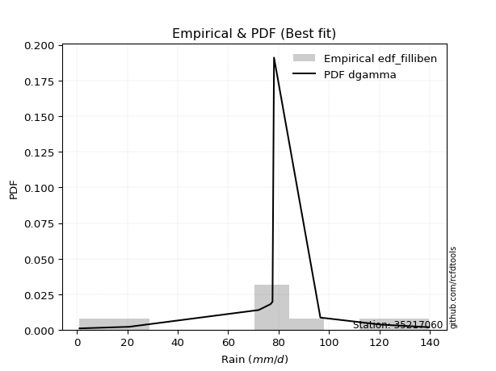</img>

</div>


### 10. EDF Jenkinson (1977)

The Jenkinson formula in hydrology is an empirical plotting position formula used to estimate the non-exceedance probability _(P)_ or return period _(T)_ of a given ordered observation within a sample. It is a widely used method in the frequency analysis of extreme events such as floods and rainfall, as it provides a distribution-free way to plot data. _a≈0.31_ and _b≈0.38_ are constants derived to approximate the median of the probability distribution for the given rank.

<div align="center">


$P=(m-a)/(n+b)$


</div>


**10.1. Empirical values**

<div align="center">

|                | 0                   | 1                   | 2                  | 3                   | 4             | 5                  | 6                  | 7                  | 8                  |
|:---------------|:--------------------|:--------------------|:-------------------|:--------------------|:--------------|:-------------------|:-------------------|:-------------------|:-------------------|
| date           | 2020                | 2017                | 2021               | 2022                | 2018          | 2023               | 2025               | 2024               | 2019               |
| x              | 1.0                 | 20.7                | 72.1               | 76.8                | 77.6          | 78.2               | 96.6               | 120.6              | 139.8              |
| m              | 1                   | 2                   | 3                  | 4                   | 5             | 6                  | 7                  | 8                  | 9                  |
| empirical_dist | edf_jenkinson       | edf_jenkinson       | edf_jenkinson      | edf_jenkinson       | edf_jenkinson | edf_jenkinson      | edf_jenkinson      | edf_jenkinson      | edf_jenkinson      |
| empirical      | 0.07356076759061833 | 0.18017057569296374 | 0.2867803837953091 | 0.39339019189765456 | 0.5           | 0.6066098081023454 | 0.7132196162046908 | 0.8198294243070362 | 0.9264392324093815 |
| empirical_tr   | 1.0794016110471807  | 1.2197659297789336  | 1.4020926756352765 | 1.6485061511423549  | 2.0           | 2.542005420054201  | 3.486988847583642  | 5.550295857988164  | 13.5942028985507   |

</div>


**10.2. Kolmogorov-Smirnov fit test (sorted by Δ)**


<div align="center">

|                | 0                   | 1                   | 2                   | 3                   | 4                   | 5                   | 6                   | 7                   | 8                   | 9                   | 10                  | 11                  | 12                  | 13                  | 14                  | 15                  | 16                  | 17                  | 18                  | 19                  | 20                  | 21                  | 22                  | 23                  | 24                  | 25                  | 26                  | 27                  | 28                  | 29                  | 30                  | 31                  | 32                  | 33                  | 34                  | 35                  | 36                  | 37                  | 38                  | 39                  | 40                  | 41                  | 42                  | 43                  | 44                  | 45                  | 46                  | 47                  | 48                  | 49                  | 50                  | 51                  | 52                  | 53                  | 54                  | 55                  | 56                  | 57                  | 58                  | 59                  | 60                  | 61                  | 62                  | 63                  | 64                  | 65                  | 66                  | 67                  | 68                  | 69                  | 70                  | 71                  | 72                  | 73                  | 74                  | 75                  | 76                  | 77                  | 78                  | 79                  | 80                  | 81                  | 82                  | 83                  | 84                  | 85                  | 86                  | 87                  | 88                  | 89                  | 90                  | 91                  | 92                  | 93                  | 94                  | 95                  | 96                  | 97                  | 98                  | 99                  | 100                 | 101                 | 102                 | 103                 | 104                 | 105                 | 106                 | 107                 | 108                 | 109                 | 110                 | 111                 | 112                 | 113                 | 114                 | 115                 | 116                 | 117                 | 118                 | 119                 | 120                 | 121                 | 122                 | 123                 | 124                 | 125                 | 126                 | 127                 | 128                 | 129                 | 130                 | 131                 | 132                 | 133                 | 134                 | 135                 | 136                 | 137                 | 138                 | 139                 | 140                 | 141                 | 142                 | 143                 | 144                 | 145                 | 146                 | 147                 | 148                 | 149                 | 150                 | 151                 | 152                 | 153                 | 154                 | 155                 | 156                 | 157                 | 158                 | 159                 |
|:---------------|:--------------------|:--------------------|:--------------------|:--------------------|:--------------------|:--------------------|:--------------------|:--------------------|:--------------------|:--------------------|:--------------------|:--------------------|:--------------------|:--------------------|:--------------------|:--------------------|:--------------------|:--------------------|:--------------------|:--------------------|:--------------------|:--------------------|:--------------------|:--------------------|:--------------------|:--------------------|:--------------------|:--------------------|:--------------------|:--------------------|:--------------------|:--------------------|:--------------------|:--------------------|:--------------------|:--------------------|:--------------------|:--------------------|:--------------------|:--------------------|:--------------------|:--------------------|:--------------------|:--------------------|:--------------------|:--------------------|:--------------------|:--------------------|:--------------------|:--------------------|:--------------------|:--------------------|:--------------------|:--------------------|:--------------------|:--------------------|:--------------------|:--------------------|:--------------------|:--------------------|:--------------------|:--------------------|:--------------------|:--------------------|:--------------------|:--------------------|:--------------------|:--------------------|:--------------------|:--------------------|:--------------------|:--------------------|:--------------------|:--------------------|:--------------------|:--------------------|:--------------------|:--------------------|:--------------------|:--------------------|:--------------------|:--------------------|:--------------------|:--------------------|:--------------------|:--------------------|:--------------------|:--------------------|:--------------------|:--------------------|:--------------------|:--------------------|:--------------------|:--------------------|:--------------------|:--------------------|:--------------------|:--------------------|:--------------------|:--------------------|:--------------------|:--------------------|:--------------------|:--------------------|:--------------------|:--------------------|:--------------------|:--------------------|:--------------------|:--------------------|:--------------------|:--------------------|:--------------------|:--------------------|:--------------------|:--------------------|:--------------------|:--------------------|:--------------------|:--------------------|:--------------------|:--------------------|:--------------------|:--------------------|:--------------------|:--------------------|:--------------------|:--------------------|:--------------------|:--------------------|:--------------------|:--------------------|:--------------------|:--------------------|:--------------------|:--------------------|:--------------------|:--------------------|:--------------------|:--------------------|:--------------------|:--------------------|:--------------------|:--------------------|:--------------------|:--------------------|:--------------------|:--------------------|:--------------------|:--------------------|:--------------------|:--------------------|:--------------------|:--------------------|:--------------------|:--------------------|:--------------------|:--------------------|:--------------------|:--------------------|
| station        | 35217060            | 35217060            | 35217060            | 35217060            | 35217060            | 35217060            | 35217060            | 35217060            | 35217060            | 35217060            | 35217060            | 35217060            | 35217060            | 35217060            | 35217060            | 35217060            | 35217060            | 35217060            | 35217060            | 35217060            | 35217060            | 35217060            | 35217060            | 35217060            | 35217060            | 35217060            | 35217060            | 35217060            | 35217060            | 35217060            | 35217060            | 35217060            | 35217060            | 35217060            | 35217060            | 35217060            | 35217060            | 35217060            | 35217060            | 35217060            | 35217060            | 35217060            | 35217060            | 35217060            | 35217060            | 35217060            | 35217060            | 35217060            | 35217060            | 35217060            | 35217060            | 35217060            | 35217060            | 35217060            | 35217060            | 35217060            | 35217060            | 35217060            | 35217060            | 35217060            | 35217060            | 35217060            | 35217060            | 35217060            | 35217060            | 35217060            | 35217060            | 35217060            | 35217060            | 35217060            | 35217060            | 35217060            | 35217060            | 35217060            | 35217060            | 35217060            | 35217060            | 35217060            | 35217060            | 35217060            | 35217060            | 35217060            | 35217060            | 35217060            | 35217060            | 35217060            | 35217060            | 35217060            | 35217060            | 35217060            | 35217060            | 35217060            | 35217060            | 35217060            | 35217060            | 35217060            | 35217060            | 35217060            | 35217060            | 35217060            | 35217060            | 35217060            | 35217060            | 35217060            | 35217060            | 35217060            | 35217060            | 35217060            | 35217060            | 35217060            | 35217060            | 35217060            | 35217060            | 35217060            | 35217060            | 35217060            | 35217060            | 35217060            | 35217060            | 35217060            | 35217060            | 35217060            | 35217060            | 35217060            | 35217060            | 35217060            | 35217060            | 35217060            | 35217060            | 35217060            | 35217060            | 35217060            | 35217060            | 35217060            | 35217060            | 35217060            | 35217060            | 35217060            | 35217060            | 35217060            | 35217060            | 35217060            | 35217060            | 35217060            | 35217060            | 35217060            | 35217060            | 35217060            | 35217060            | 35217060            | 35217060            | 35217060            | 35217060            | 35217060            | 35217060            | 35217060            | 35217060            | 35217060            | 35217060            | 35217060            |
| empirical_dist | edf_jenkinson       | edf_jenkinson       | edf_jenkinson       | edf_jenkinson       | edf_jenkinson       | edf_jenkinson       | edf_jenkinson       | edf_jenkinson       | edf_jenkinson       | edf_jenkinson       | edf_jenkinson       | edf_jenkinson       | edf_jenkinson       | edf_jenkinson       | edf_jenkinson       | edf_jenkinson       | edf_jenkinson       | edf_jenkinson       | edf_jenkinson       | edf_jenkinson       | edf_jenkinson       | edf_jenkinson       | edf_jenkinson       | edf_jenkinson       | edf_jenkinson       | edf_jenkinson       | edf_jenkinson       | edf_jenkinson       | edf_jenkinson       | edf_jenkinson       | edf_jenkinson       | edf_jenkinson       | edf_jenkinson       | edf_jenkinson       | edf_jenkinson       | edf_jenkinson       | edf_jenkinson       | edf_jenkinson       | edf_jenkinson       | edf_jenkinson       | edf_jenkinson       | edf_jenkinson       | edf_jenkinson       | edf_jenkinson       | edf_jenkinson       | edf_jenkinson       | edf_jenkinson       | edf_jenkinson       | edf_jenkinson       | edf_jenkinson       | edf_jenkinson       | edf_jenkinson       | edf_jenkinson       | edf_jenkinson       | edf_jenkinson       | edf_jenkinson       | edf_jenkinson       | edf_jenkinson       | edf_jenkinson       | edf_jenkinson       | edf_jenkinson       | edf_jenkinson       | edf_jenkinson       | edf_jenkinson       | edf_jenkinson       | edf_jenkinson       | edf_jenkinson       | edf_jenkinson       | edf_jenkinson       | edf_jenkinson       | edf_jenkinson       | edf_jenkinson       | edf_jenkinson       | edf_jenkinson       | edf_jenkinson       | edf_jenkinson       | edf_jenkinson       | edf_jenkinson       | edf_jenkinson       | edf_jenkinson       | edf_jenkinson       | edf_jenkinson       | edf_jenkinson       | edf_jenkinson       | edf_jenkinson       | edf_jenkinson       | edf_jenkinson       | edf_jenkinson       | edf_jenkinson       | edf_jenkinson       | edf_jenkinson       | edf_jenkinson       | edf_jenkinson       | edf_jenkinson       | edf_jenkinson       | edf_jenkinson       | edf_jenkinson       | edf_jenkinson       | edf_jenkinson       | edf_jenkinson       | edf_jenkinson       | edf_jenkinson       | edf_jenkinson       | edf_jenkinson       | edf_jenkinson       | edf_jenkinson       | edf_jenkinson       | edf_jenkinson       | edf_jenkinson       | edf_jenkinson       | edf_jenkinson       | edf_jenkinson       | edf_jenkinson       | edf_jenkinson       | edf_jenkinson       | edf_jenkinson       | edf_jenkinson       | edf_jenkinson       | edf_jenkinson       | edf_jenkinson       | edf_jenkinson       | edf_jenkinson       | edf_jenkinson       | edf_jenkinson       | edf_jenkinson       | edf_jenkinson       | edf_jenkinson       | edf_jenkinson       | edf_jenkinson       | edf_jenkinson       | edf_jenkinson       | edf_jenkinson       | edf_jenkinson       | edf_jenkinson       | edf_jenkinson       | edf_jenkinson       | edf_jenkinson       | edf_jenkinson       | edf_jenkinson       | edf_jenkinson       | edf_jenkinson       | edf_jenkinson       | edf_jenkinson       | edf_jenkinson       | edf_jenkinson       | edf_jenkinson       | edf_jenkinson       | edf_jenkinson       | edf_jenkinson       | edf_jenkinson       | edf_jenkinson       | edf_jenkinson       | edf_jenkinson       | edf_jenkinson       | edf_jenkinson       | edf_jenkinson       | edf_jenkinson       | edf_jenkinson       | edf_jenkinson       | edf_jenkinson       |
| p_dist         | dgamma              | dweibull            | logdweibull         | logdgamma           | loggennorm          | gennorm             | logt                | genlogistic         | genextreme          | johnsonsu           | skewnorm            | logtukeylambda      | burr12              | weibull_min         | argus               | laplace             | pearson3            | logjohnsonsu        | gumbel_l            | beta                | hypsecant           | genpareto           | foldnorm            | logistic            | f                   | exponnorm           | norm                | crystalball         | t                   | nct                 | fatiguelife         | anglit              | betaprime           | semicircular        | gamma               | gausshyper          | gengamma            | erlang              | rice                | arcsine             | loglevy_l           | genhalflogistic     | cosine              | truncweibull_min    | logpearson3         | invgamma            | maxwell             | loggenextreme       | exponweib           | logtruncweibull_min | rayleigh            | wrapcauchy          | ksone               | alpha               | kappa3              | uniform             | invgauss            | vonmises_line       | logargus            | gumbel_r            | bradford            | triang              | logweibull_max      | burr                | logvonmises_line    | kappa4              | halfnorm            | kstwobign           | logtrapezoid        | logloggamma         | ncf                 | moyal               | logburr             | loggumbel_l         | halflogistic        | logarcsine          | levy_l              | logburr12           | logweibull_min      | loggompertz         | logexponweib        | logbetaprime        | truncexpon          | trapezoid           | logjohnsonsb        | logsemicircular     | loginvweibull       | loganglit           | lomax               | johnsonsb           | loggenhalflogistic  | genexpon            | loggamma            | loggamma            | mielke              | lognct              | logexponnorm        | logcrystalball      | lognorm             | logrice             | logfatiguelife      | loginvgamma         | logerlang           | loginvgauss         | logfoldnorm         | loglomax            | wald                | logloglaplace       | loglogistic         | logkstwobign        | logmaxwell          | loghypsecant        | lograyleigh         | loggausshyper       | logalpha            | loggengamma         | logmielke           | logwrapcauchy       | loggenexpon         | logncf              | nakagami            | loglaplace          | loglaplace          | loghalfnorm         | loggumbel_r         | logcosine           | loggenpareto        | loghalfgennorm      | loghalflogistic     | logmoyal            | logskewnorm         | logf                | halfgennorm         | logbeta             | gompertz            | logwald             | logtriang           | lognakagami         | invweibull          | logksone            | logkappa4           | logkappa3           | loguniform          | powerlaw            | logbradford         | rdist               | logtruncnorm        | logexponpow         | weibull_max         | logtruncexpon       | tukeylambda         | truncpareto         | exponpow            | truncnorm           | logtruncpareto      | logpowerlaw         | logrdist            | loggenlogistic      | logvonmises         | vonmises            |
| delta          | 0.11066345795450566 | 0.11513366851229756 | 0.12176478277966907 | 0.12327103972658732 | 0.12549145713826054 | 0.12668223254528888 | 0.12680782457045447 | 0.12782714013523533 | 0.13493870328726287 | 0.13584710009093537 | 0.13635473066078735 | 0.1431014654136492  | 0.14468932301410364 | 0.1447234157199866  | 0.1463838514326773  | 0.15140924825068192 | 0.1518718015401226  | 0.15259977832032512 | 0.15398053370429765 | 0.1633362387041402  | 0.166732149922877   | 0.16844148021353306 | 0.1704939958368339  | 0.17101017359665904 | 0.17496590541760515 | 0.1760491596809115  | 0.1760493655528862  | 0.1760493678478972  | 0.1760496482811854  | 0.1762113894044306  | 0.18056611210446882 | 0.18134569313300197 | 0.1816170947492856  | 0.18352978426464128 | 0.18440826754067968 | 0.1861182264118677  | 0.18761629560525522 | 0.1887231413827073  | 0.18972758840603554 | 0.19220287366073124 | 0.19366504110160987 | 0.19528360293257646 | 0.19834633499189863 | 0.20736706262854554 | 0.20783128156728248 | 0.20954481725711188 | 0.21018728859204677 | 0.2144150264682838  | 0.2188634063635041  | 0.21929173564713267 | 0.22189623861065189 | 0.22285312385120826 | 0.2234261483852864  | 0.22444721264538514 | 0.22546256583997293 | 0.2254674548214055  | 0.2272662651583881  | 0.23645798648602345 | 0.24015938955827898 | 0.24430330655457588 | 0.24434609098407523 | 0.24496870477376576 | 0.24699422638572288 | 0.24997359484835546 | 0.25319026124386    | 0.2533605979861837  | 0.25491283883753835 | 0.2555532050805448  | 0.2577607452455447  | 0.25812253584896994 | 0.26383235399368565 | 0.2699550659061388  | 0.2705881029582521  | 0.2718854107992511  | 0.2771510526364771  | 0.27973499992719975 | 0.28245495039276036 | 0.28717955870110723 | 0.2872953464759016  | 0.288832857602241   | 0.29353250460356395 | 0.29472214073468306 | 0.30177250388290977 | 0.30334323276790653 | 0.305046849705216   | 0.3062674178760656  | 0.3090649068468102  | 0.3128326556920292  | 0.3162384629189565  | 0.3185191755075333  | 0.3185255972585177  | 0.32575056214303255 | 0.3280041260996116  | 0.3280041260996116  | 0.3282609033779994  | 0.32853457953850973 | 0.3285993047830592  | 0.3286008949865177  | 0.3286009651901276  | 0.3286111655222971  | 0.3287284387283109  | 0.3312721228364698  | 0.3332308913500859  | 0.3346389197207238  | 0.33677474619535874 | 0.3389044224478637  | 0.3413364310291852  | 0.3417135868958965  | 0.3431968594694117  | 0.34555169480344405 | 0.3537229211275741  | 0.35497386078417525 | 0.36144222698598805 | 0.3672189952484952  | 0.368421018721539   | 0.3723621532350305  | 0.37435910484703067 | 0.37488389291795676 | 0.37582466730653086 | 0.375990359414537   | 0.3797404202918234  | 0.38301369309260647 | 0.38301369309260647 | 0.38352665605781444 | 0.3934000214597968  | 0.39843561742075506 | 0.40044251414193055 | 0.4110023059570316  | 0.4118984024071696  | 0.4153129591771306  | 0.4286888257183713  | 0.4287564516919908  | 0.44368626175452763 | 0.4669921197649681  | 0.47455971739792696 | 0.47660210179287343 | 0.4767604988118792  | 0.48542105542424835 | 0.4974331836568957  | 0.5181908950541536  | 0.562222565999346   | 0.5772127501696638  | 0.5791851508240461  | 0.5920190017960515  | 0.5952076536290865  | 0.5987192547341168  | 0.6075950273952547  | 0.6124657052298856  | 0.621104696267563   | 0.6261873302752348  | 0.6709043251004814  | 0.7008968933702708  | 0.7259181803531418  | 0.7453059277759011  | 0.7664640931855626  | 0.8136621659402321  | 0.819829421713888   | 0.8198294243070362  | 1.0824575132626357  | 21.364474122593027  |
| deltao         | 0.41761268023100007 | 0.41761268023100007 | 0.41761268023100007 | 0.41761268023100007 | 0.41761268023100007 | 0.41761268023100007 | 0.41761268023100007 | 0.41761268023100007 | 0.41761268023100007 | 0.41761268023100007 | 0.41761268023100007 | 0.41761268023100007 | 0.41761268023100007 | 0.41761268023100007 | 0.41761268023100007 | 0.41761268023100007 | 0.41761268023100007 | 0.41761268023100007 | 0.41761268023100007 | 0.41761268023100007 | 0.41761268023100007 | 0.41761268023100007 | 0.41761268023100007 | 0.41761268023100007 | 0.41761268023100007 | 0.41761268023100007 | 0.41761268023100007 | 0.41761268023100007 | 0.41761268023100007 | 0.41761268023100007 | 0.41761268023100007 | 0.41761268023100007 | 0.41761268023100007 | 0.41761268023100007 | 0.41761268023100007 | 0.41761268023100007 | 0.41761268023100007 | 0.41761268023100007 | 0.41761268023100007 | 0.41761268023100007 | 0.41761268023100007 | 0.41761268023100007 | 0.41761268023100007 | 0.41761268023100007 | 0.41761268023100007 | 0.41761268023100007 | 0.41761268023100007 | 0.41761268023100007 | 0.41761268023100007 | 0.41761268023100007 | 0.41761268023100007 | 0.41761268023100007 | 0.41761268023100007 | 0.41761268023100007 | 0.41761268023100007 | 0.41761268023100007 | 0.41761268023100007 | 0.41761268023100007 | 0.41761268023100007 | 0.41761268023100007 | 0.41761268023100007 | 0.41761268023100007 | 0.41761268023100007 | 0.41761268023100007 | 0.41761268023100007 | 0.41761268023100007 | 0.41761268023100007 | 0.41761268023100007 | 0.41761268023100007 | 0.41761268023100007 | 0.41761268023100007 | 0.41761268023100007 | 0.41761268023100007 | 0.41761268023100007 | 0.41761268023100007 | 0.41761268023100007 | 0.41761268023100007 | 0.41761268023100007 | 0.41761268023100007 | 0.41761268023100007 | 0.41761268023100007 | 0.41761268023100007 | 0.41761268023100007 | 0.41761268023100007 | 0.41761268023100007 | 0.41761268023100007 | 0.41761268023100007 | 0.41761268023100007 | 0.41761268023100007 | 0.41761268023100007 | 0.41761268023100007 | 0.41761268023100007 | 0.41761268023100007 | 0.41761268023100007 | 0.41761268023100007 | 0.41761268023100007 | 0.41761268023100007 | 0.41761268023100007 | 0.41761268023100007 | 0.41761268023100007 | 0.41761268023100007 | 0.41761268023100007 | 0.41761268023100007 | 0.41761268023100007 | 0.41761268023100007 | 0.41761268023100007 | 0.41761268023100007 | 0.41761268023100007 | 0.41761268023100007 | 0.41761268023100007 | 0.41761268023100007 | 0.41761268023100007 | 0.41761268023100007 | 0.41761268023100007 | 0.41761268023100007 | 0.41761268023100007 | 0.41761268023100007 | 0.41761268023100007 | 0.41761268023100007 | 0.41761268023100007 | 0.41761268023100007 | 0.41761268023100007 | 0.41761268023100007 | 0.41761268023100007 | 0.41761268023100007 | 0.41761268023100007 | 0.41761268023100007 | 0.41761268023100007 | 0.41761268023100007 | 0.41761268023100007 | 0.41761268023100007 | 0.41761268023100007 | 0.41761268023100007 | 0.41761268023100007 | 0.41761268023100007 | 0.41761268023100007 | 0.41761268023100007 | 0.41761268023100007 | 0.41761268023100007 | 0.41761268023100007 | 0.41761268023100007 | 0.41761268023100007 | 0.41761268023100007 | 0.41761268023100007 | 0.41761268023100007 | 0.41761268023100007 | 0.41761268023100007 | 0.41761268023100007 | 0.41761268023100007 | 0.41761268023100007 | 0.41761268023100007 | 0.41761268023100007 | 0.41761268023100007 | 0.41761268023100007 | 0.41761268023100007 | 0.41761268023100007 | 0.41761268023100007 | 0.41761268023100007 | 0.41761268023100007 | 0.41761268023100007 |
| eval           | Δo > Δ              | Δo > Δ              | Δo > Δ              | Δo > Δ              | Δo > Δ              | Δo > Δ              | Δo > Δ              | Δo > Δ              | Δo > Δ              | Δo > Δ              | Δo > Δ              | Δo > Δ              | Δo > Δ              | Δo > Δ              | Δo > Δ              | Δo > Δ              | Δo > Δ              | Δo > Δ              | Δo > Δ              | Δo > Δ              | Δo > Δ              | Δo > Δ              | Δo > Δ              | Δo > Δ              | Δo > Δ              | Δo > Δ              | Δo > Δ              | Δo > Δ              | Δo > Δ              | Δo > Δ              | Δo > Δ              | Δo > Δ              | Δo > Δ              | Δo > Δ              | Δo > Δ              | Δo > Δ              | Δo > Δ              | Δo > Δ              | Δo > Δ              | Δo > Δ              | Δo > Δ              | Δo > Δ              | Δo > Δ              | Δo > Δ              | Δo > Δ              | Δo > Δ              | Δo > Δ              | Δo > Δ              | Δo > Δ              | Δo > Δ              | Δo > Δ              | Δo > Δ              | Δo > Δ              | Δo > Δ              | Δo > Δ              | Δo > Δ              | Δo > Δ              | Δo > Δ              | Δo > Δ              | Δo > Δ              | Δo > Δ              | Δo > Δ              | Δo > Δ              | Δo > Δ              | Δo > Δ              | Δo > Δ              | Δo > Δ              | Δo > Δ              | Δo > Δ              | Δo > Δ              | Δo > Δ              | Δo > Δ              | Δo > Δ              | Δo > Δ              | Δo > Δ              | Δo > Δ              | Δo > Δ              | Δo > Δ              | Δo > Δ              | Δo > Δ              | Δo > Δ              | Δo > Δ              | Δo > Δ              | Δo > Δ              | Δo > Δ              | Δo > Δ              | Δo > Δ              | Δo > Δ              | Δo > Δ              | Δo > Δ              | Δo > Δ              | Δo > Δ              | Δo > Δ              | Δo > Δ              | Δo > Δ              | Δo > Δ              | Δo > Δ              | Δo > Δ              | Δo > Δ              | Δo > Δ              | Δo > Δ              | Δo > Δ              | Δo > Δ              | Δo > Δ              | Δo > Δ              | Δo > Δ              | Δo > Δ              | Δo > Δ              | Δo > Δ              | Δo > Δ              | Δo > Δ              | Δo > Δ              | Δo > Δ              | Δo > Δ              | Δo > Δ              | Δo > Δ              | Δo > Δ              | Δo > Δ              | Δo > Δ              | Δo > Δ              | Δo > Δ              | Δo > Δ              | Δo > Δ              | Δo > Δ              | Δo > Δ              | Δo > Δ              | Δo > Δ              | Δo > Δ              | Δo > Δ              | Δo > Δ              | Δo <= Δ             | Δo <= Δ             | Δo <= Δ             | Δo <= Δ             | Δo <= Δ             | Δo <= Δ             | Δo <= Δ             | Δo <= Δ             | Δo <= Δ             | Δo <= Δ             | Δo <= Δ             | Δo <= Δ             | Δo <= Δ             | Δo <= Δ             | Δo <= Δ             | Δo <= Δ             | Δo <= Δ             | Δo <= Δ             | Δo <= Δ             | Δo <= Δ             | Δo <= Δ             | Δo <= Δ             | Δo <= Δ             | Δo <= Δ             | Δo <= Δ             | Δo <= Δ             | Δo <= Δ             | Δo <= Δ             | Δo <= Δ             | Δo <= Δ             |
| fit            | 1                   | 1                   | 1                   | 1                   | 1                   | 1                   | 1                   | 1                   | 1                   | 1                   | 1                   | 1                   | 1                   | 1                   | 1                   | 1                   | 1                   | 1                   | 1                   | 1                   | 1                   | 1                   | 1                   | 1                   | 1                   | 1                   | 1                   | 1                   | 1                   | 1                   | 1                   | 1                   | 1                   | 1                   | 1                   | 1                   | 1                   | 1                   | 1                   | 1                   | 1                   | 1                   | 1                   | 1                   | 1                   | 1                   | 1                   | 1                   | 1                   | 1                   | 1                   | 1                   | 1                   | 1                   | 1                   | 1                   | 1                   | 1                   | 1                   | 1                   | 1                   | 1                   | 1                   | 1                   | 1                   | 1                   | 1                   | 1                   | 1                   | 1                   | 1                   | 1                   | 1                   | 1                   | 1                   | 1                   | 1                   | 1                   | 1                   | 1                   | 1                   | 1                   | 1                   | 1                   | 1                   | 1                   | 1                   | 1                   | 1                   | 1                   | 1                   | 1                   | 1                   | 1                   | 1                   | 1                   | 1                   | 1                   | 1                   | 1                   | 1                   | 1                   | 1                   | 1                   | 1                   | 1                   | 1                   | 1                   | 1                   | 1                   | 1                   | 1                   | 1                   | 1                   | 1                   | 1                   | 1                   | 1                   | 1                   | 1                   | 1                   | 1                   | 1                   | 1                   | 1                   | 1                   | 1                   | 1                   | 1                   | 1                   | 0                   | 0                   | 0                   | 0                   | 0                   | 0                   | 0                   | 0                   | 0                   | 0                   | 0                   | 0                   | 0                   | 0                   | 0                   | 0                   | 0                   | 0                   | 0                   | 0                   | 0                   | 0                   | 0                   | 0                   | 0                   | 0                   | 0                   | 0                   | 0                   | 0                   |
| n              | 9                   | 9                   | 9                   | 9                   | 9                   | 9                   | 9                   | 9                   | 9                   | 9                   | 9                   | 9                   | 9                   | 9                   | 9                   | 9                   | 9                   | 9                   | 9                   | 9                   | 9                   | 9                   | 9                   | 9                   | 9                   | 9                   | 9                   | 9                   | 9                   | 9                   | 9                   | 9                   | 9                   | 9                   | 9                   | 9                   | 9                   | 9                   | 9                   | 9                   | 9                   | 9                   | 9                   | 9                   | 9                   | 9                   | 9                   | 9                   | 9                   | 9                   | 9                   | 9                   | 9                   | 9                   | 9                   | 9                   | 9                   | 9                   | 9                   | 9                   | 9                   | 9                   | 9                   | 9                   | 9                   | 9                   | 9                   | 9                   | 9                   | 9                   | 9                   | 9                   | 9                   | 9                   | 9                   | 9                   | 9                   | 9                   | 9                   | 9                   | 9                   | 9                   | 9                   | 9                   | 9                   | 9                   | 9                   | 9                   | 9                   | 9                   | 9                   | 9                   | 9                   | 9                   | 9                   | 9                   | 9                   | 9                   | 9                   | 9                   | 9                   | 9                   | 9                   | 9                   | 9                   | 9                   | 9                   | 9                   | 9                   | 9                   | 9                   | 9                   | 9                   | 9                   | 9                   | 9                   | 9                   | 9                   | 9                   | 9                   | 9                   | 9                   | 9                   | 9                   | 9                   | 9                   | 9                   | 9                   | 9                   | 9                   | 9                   | 9                   | 9                   | 9                   | 9                   | 9                   | 9                   | 9                   | 9                   | 9                   | 9                   | 9                   | 9                   | 9                   | 9                   | 9                   | 9                   | 9                   | 9                   | 9                   | 9                   | 9                   | 9                   | 9                   | 9                   | 9                   | 9                   | 9                   | 9                   | 9                   |
| best_fit       | 1                   | 0                   | 0                   | 0                   | 0                   | 0                   | 0                   | 0                   | 0                   | 0                   | 0                   | 0                   | 0                   | 0                   | 0                   | 0                   | 0                   | 0                   | 0                   | 0                   | 0                   | 0                   | 0                   | 0                   | 0                   | 0                   | 0                   | 0                   | 0                   | 0                   | 0                   | 0                   | 0                   | 0                   | 0                   | 0                   | 0                   | 0                   | 0                   | 0                   | 0                   | 0                   | 0                   | 0                   | 0                   | 0                   | 0                   | 0                   | 0                   | 0                   | 0                   | 0                   | 0                   | 0                   | 0                   | 0                   | 0                   | 0                   | 0                   | 0                   | 0                   | 0                   | 0                   | 0                   | 0                   | 0                   | 0                   | 0                   | 0                   | 0                   | 0                   | 0                   | 0                   | 0                   | 0                   | 0                   | 0                   | 0                   | 0                   | 0                   | 0                   | 0                   | 0                   | 0                   | 0                   | 0                   | 0                   | 0                   | 0                   | 0                   | 0                   | 0                   | 0                   | 0                   | 0                   | 0                   | 0                   | 0                   | 0                   | 0                   | 0                   | 0                   | 0                   | 0                   | 0                   | 0                   | 0                   | 0                   | 0                   | 0                   | 0                   | 0                   | 0                   | 0                   | 0                   | 0                   | 0                   | 0                   | 0                   | 0                   | 0                   | 0                   | 0                   | 0                   | 0                   | 0                   | 0                   | 0                   | 0                   | 0                   | 0                   | 0                   | 0                   | 0                   | 0                   | 0                   | 0                   | 0                   | 0                   | 0                   | 0                   | 0                   | 0                   | 0                   | 0                   | 0                   | 0                   | 0                   | 0                   | 0                   | 0                   | 0                   | 0                   | 0                   | 0                   | 0                   | 0                   | 0                   | 0                   | 0                   |
| best_fit_sort  | 1                   | 2                   | 3                   | 4                   | 5                   | 6                   | 7                   | 8                   | 9                   | 10                  | 11                  | 12                  | 13                  | 14                  | 15                  | 16                  | 17                  | 18                  | 19                  | 20                  | 21                  | 22                  | 23                  | 24                  | 25                  | 26                  | 27                  | 28                  | 29                  | 30                  | 31                  | 32                  | 33                  | 34                  | 35                  | 36                  | 37                  | 38                  | 39                  | 40                  | 41                  | 42                  | 43                  | 44                  | 45                  | 46                  | 47                  | 48                  | 49                  | 50                  | 51                  | 52                  | 53                  | 54                  | 55                  | 56                  | 57                  | 58                  | 59                  | 60                  | 61                  | 62                  | 63                  | 64                  | 65                  | 66                  | 67                  | 68                  | 69                  | 70                  | 71                  | 72                  | 73                  | 74                  | 75                  | 76                  | 77                  | 78                  | 79                  | 80                  | 81                  | 82                  | 83                  | 84                  | 85                  | 86                  | 87                  | 88                  | 89                  | 90                  | 91                  | 92                  | 93                  | 94                  | 95                  | 96                  | 97                  | 98                  | 99                  | 100                 | 101                 | 102                 | 103                 | 104                 | 105                 | 106                 | 107                 | 108                 | 109                 | 110                 | 111                 | 112                 | 113                 | 114                 | 115                 | 116                 | 117                 | 118                 | 119                 | 120                 | 121                 | 122                 | 123                 | 124                 | 125                 | 126                 | 127                 | 128                 | 129                 | 130                 | 131                 | 132                 | 133                 | 134                 | 135                 | 136                 | 137                 | 138                 | 139                 | 140                 | 141                 | 142                 | 143                 | 144                 | 145                 | 146                 | 147                 | 148                 | 149                 | 150                 | 151                 | 152                 | 153                 | 154                 | 155                 | 156                 | 157                 | 158                 | 159                 | 160                 |

</div>


**10.3. Best fit**

<div align="center">

|   id |   station | empirical_dist   | p_dist   |    delta |   deltao | eval   |   fit |   n |   best_fit |   best_fit_sort |
|-----:|----------:|:-----------------|:---------|---------:|---------:|:-------|------:|----:|-----------:|----------------:|
|    0 |  35217060 | edf_jenkinson    | dgamma   | 0.110663 | 0.417613 | Δo > Δ |     1 |   9 |          1 |               1 |

</div>


<div align="center">

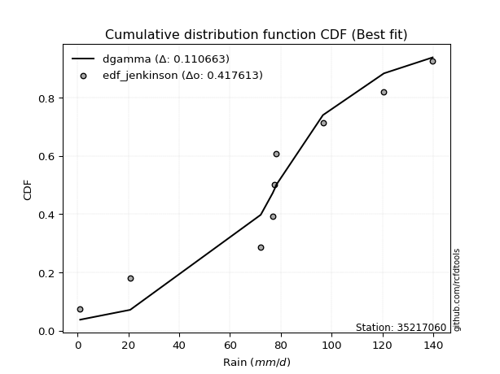</img>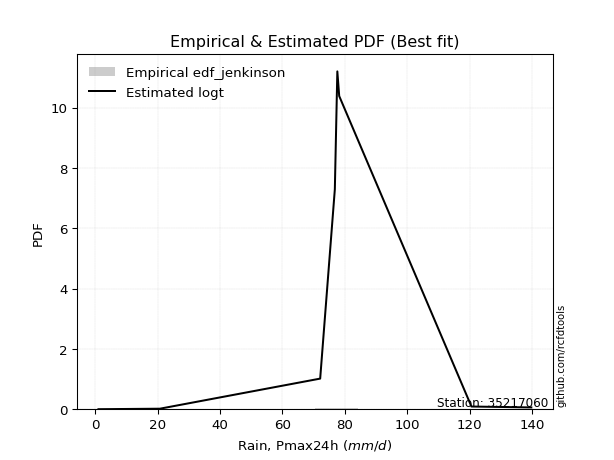</img>

</div>


### 11. EDF Cunnane (1978)

Cunnane´s work in statistical hydrology has focused on the performance and evaluation of different probability distributions (such as GEV, Gumbel, Lognormal) for flood frequency estimation. _b_ is a constant, typically set to 0.4.

<div align="center">


$P=(m-b)/(n+1-2b)$


</div>


**11.1. Empirical values**

<div align="center">

|                | 0                   | 1                  | 2                   | 3                  | 4           | 5                  | 6                 | 7                  | 8                  |
|:---------------|:--------------------|:-------------------|:--------------------|:-------------------|:------------|:-------------------|:------------------|:-------------------|:-------------------|
| date           | 2020                | 2017               | 2021                | 2022               | 2018        | 2023               | 2025              | 2024               | 2019               |
| x              | 1.0                 | 20.7               | 72.1                | 76.8               | 77.6        | 78.2               | 96.6              | 120.6              | 139.8              |
| m              | 1                   | 2                  | 3                   | 4                  | 5           | 6                  | 7                 | 8                  | 9                  |
| empirical_dist | edf_cunnane         | edf_cunnane        | edf_cunnane         | edf_cunnane        | edf_cunnane | edf_cunnane        | edf_cunnane       | edf_cunnane        | edf_cunnane        |
| empirical      | 0.06521739130434782 | 0.1739130434782609 | 0.28260869565217395 | 0.391304347826087  | 0.5         | 0.6086956521739131 | 0.717391304347826 | 0.8260869565217391 | 0.9347826086956522 |
| empirical_tr   | 1.069767441860465   | 1.2105263157894737 | 1.393939393939394   | 1.6428571428571428 | 2.0         | 2.555555555555556  | 3.538461538461538 | 5.75               | 15.333333333333343 |

</div>


**11.2. Kolmogorov-Smirnov fit test (sorted by Δ)**


<div align="center">

|                | 0                   | 1                   | 2                   | 3                   | 4                   | 5                   | 6                   | 7                   | 8                   | 9                   | 10                  | 11                  | 12                  | 13                  | 14                  | 15                  | 16                  | 17                  | 18                  | 19                  | 20                  | 21                  | 22                  | 23                  | 24                  | 25                  | 26                  | 27                  | 28                  | 29                  | 30                  | 31                  | 32                  | 33                  | 34                  | 35                  | 36                  | 37                  | 38                  | 39                  | 40                  | 41                  | 42                  | 43                  | 44                  | 45                  | 46                  | 47                  | 48                  | 49                  | 50                  | 51                  | 52                  | 53                  | 54                  | 55                  | 56                  | 57                  | 58                  | 59                  | 60                  | 61                  | 62                  | 63                  | 64                  | 65                  | 66                  | 67                  | 68                  | 69                  | 70                  | 71                  | 72                  | 73                  | 74                  | 75                  | 76                  | 77                  | 78                  | 79                  | 80                  | 81                  | 82                  | 83                  | 84                  | 85                  | 86                  | 87                  | 88                  | 89                  | 90                  | 91                  | 92                  | 93                  | 94                  | 95                  | 96                  | 97                  | 98                  | 99                  | 100                 | 101                 | 102                 | 103                 | 104                 | 105                 | 106                 | 107                 | 108                 | 109                 | 110                 | 111                 | 112                 | 113                 | 114                 | 115                 | 116                 | 117                 | 118                 | 119                 | 120                 | 121                 | 122                 | 123                 | 124                 | 125                 | 126                 | 127                 | 128                 | 129                 | 130                 | 131                 | 132                 | 133                 | 134                 | 135                 | 136                 | 137                 | 138                 | 139                 | 140                 | 141                 | 142                 | 143                 | 144                 | 145                 | 146                 | 147                 | 148                 | 149                 | 150                 | 151                 | 152                 | 153                 | 154                 | 155                 | 156                 | 157                 | 158                 | 159                 |
|:---------------|:--------------------|:--------------------|:--------------------|:--------------------|:--------------------|:--------------------|:--------------------|:--------------------|:--------------------|:--------------------|:--------------------|:--------------------|:--------------------|:--------------------|:--------------------|:--------------------|:--------------------|:--------------------|:--------------------|:--------------------|:--------------------|:--------------------|:--------------------|:--------------------|:--------------------|:--------------------|:--------------------|:--------------------|:--------------------|:--------------------|:--------------------|:--------------------|:--------------------|:--------------------|:--------------------|:--------------------|:--------------------|:--------------------|:--------------------|:--------------------|:--------------------|:--------------------|:--------------------|:--------------------|:--------------------|:--------------------|:--------------------|:--------------------|:--------------------|:--------------------|:--------------------|:--------------------|:--------------------|:--------------------|:--------------------|:--------------------|:--------------------|:--------------------|:--------------------|:--------------------|:--------------------|:--------------------|:--------------------|:--------------------|:--------------------|:--------------------|:--------------------|:--------------------|:--------------------|:--------------------|:--------------------|:--------------------|:--------------------|:--------------------|:--------------------|:--------------------|:--------------------|:--------------------|:--------------------|:--------------------|:--------------------|:--------------------|:--------------------|:--------------------|:--------------------|:--------------------|:--------------------|:--------------------|:--------------------|:--------------------|:--------------------|:--------------------|:--------------------|:--------------------|:--------------------|:--------------------|:--------------------|:--------------------|:--------------------|:--------------------|:--------------------|:--------------------|:--------------------|:--------------------|:--------------------|:--------------------|:--------------------|:--------------------|:--------------------|:--------------------|:--------------------|:--------------------|:--------------------|:--------------------|:--------------------|:--------------------|:--------------------|:--------------------|:--------------------|:--------------------|:--------------------|:--------------------|:--------------------|:--------------------|:--------------------|:--------------------|:--------------------|:--------------------|:--------------------|:--------------------|:--------------------|:--------------------|:--------------------|:--------------------|:--------------------|:--------------------|:--------------------|:--------------------|:--------------------|:--------------------|:--------------------|:--------------------|:--------------------|:--------------------|:--------------------|:--------------------|:--------------------|:--------------------|:--------------------|:--------------------|:--------------------|:--------------------|:--------------------|:--------------------|:--------------------|:--------------------|:--------------------|:--------------------|:--------------------|:--------------------|
| station        | 35217060            | 35217060            | 35217060            | 35217060            | 35217060            | 35217060            | 35217060            | 35217060            | 35217060            | 35217060            | 35217060            | 35217060            | 35217060            | 35217060            | 35217060            | 35217060            | 35217060            | 35217060            | 35217060            | 35217060            | 35217060            | 35217060            | 35217060            | 35217060            | 35217060            | 35217060            | 35217060            | 35217060            | 35217060            | 35217060            | 35217060            | 35217060            | 35217060            | 35217060            | 35217060            | 35217060            | 35217060            | 35217060            | 35217060            | 35217060            | 35217060            | 35217060            | 35217060            | 35217060            | 35217060            | 35217060            | 35217060            | 35217060            | 35217060            | 35217060            | 35217060            | 35217060            | 35217060            | 35217060            | 35217060            | 35217060            | 35217060            | 35217060            | 35217060            | 35217060            | 35217060            | 35217060            | 35217060            | 35217060            | 35217060            | 35217060            | 35217060            | 35217060            | 35217060            | 35217060            | 35217060            | 35217060            | 35217060            | 35217060            | 35217060            | 35217060            | 35217060            | 35217060            | 35217060            | 35217060            | 35217060            | 35217060            | 35217060            | 35217060            | 35217060            | 35217060            | 35217060            | 35217060            | 35217060            | 35217060            | 35217060            | 35217060            | 35217060            | 35217060            | 35217060            | 35217060            | 35217060            | 35217060            | 35217060            | 35217060            | 35217060            | 35217060            | 35217060            | 35217060            | 35217060            | 35217060            | 35217060            | 35217060            | 35217060            | 35217060            | 35217060            | 35217060            | 35217060            | 35217060            | 35217060            | 35217060            | 35217060            | 35217060            | 35217060            | 35217060            | 35217060            | 35217060            | 35217060            | 35217060            | 35217060            | 35217060            | 35217060            | 35217060            | 35217060            | 35217060            | 35217060            | 35217060            | 35217060            | 35217060            | 35217060            | 35217060            | 35217060            | 35217060            | 35217060            | 35217060            | 35217060            | 35217060            | 35217060            | 35217060            | 35217060            | 35217060            | 35217060            | 35217060            | 35217060            | 35217060            | 35217060            | 35217060            | 35217060            | 35217060            | 35217060            | 35217060            | 35217060            | 35217060            | 35217060            | 35217060            |
| empirical_dist | edf_cunnane         | edf_cunnane         | edf_cunnane         | edf_cunnane         | edf_cunnane         | edf_cunnane         | edf_cunnane         | edf_cunnane         | edf_cunnane         | edf_cunnane         | edf_cunnane         | edf_cunnane         | edf_cunnane         | edf_cunnane         | edf_cunnane         | edf_cunnane         | edf_cunnane         | edf_cunnane         | edf_cunnane         | edf_cunnane         | edf_cunnane         | edf_cunnane         | edf_cunnane         | edf_cunnane         | edf_cunnane         | edf_cunnane         | edf_cunnane         | edf_cunnane         | edf_cunnane         | edf_cunnane         | edf_cunnane         | edf_cunnane         | edf_cunnane         | edf_cunnane         | edf_cunnane         | edf_cunnane         | edf_cunnane         | edf_cunnane         | edf_cunnane         | edf_cunnane         | edf_cunnane         | edf_cunnane         | edf_cunnane         | edf_cunnane         | edf_cunnane         | edf_cunnane         | edf_cunnane         | edf_cunnane         | edf_cunnane         | edf_cunnane         | edf_cunnane         | edf_cunnane         | edf_cunnane         | edf_cunnane         | edf_cunnane         | edf_cunnane         | edf_cunnane         | edf_cunnane         | edf_cunnane         | edf_cunnane         | edf_cunnane         | edf_cunnane         | edf_cunnane         | edf_cunnane         | edf_cunnane         | edf_cunnane         | edf_cunnane         | edf_cunnane         | edf_cunnane         | edf_cunnane         | edf_cunnane         | edf_cunnane         | edf_cunnane         | edf_cunnane         | edf_cunnane         | edf_cunnane         | edf_cunnane         | edf_cunnane         | edf_cunnane         | edf_cunnane         | edf_cunnane         | edf_cunnane         | edf_cunnane         | edf_cunnane         | edf_cunnane         | edf_cunnane         | edf_cunnane         | edf_cunnane         | edf_cunnane         | edf_cunnane         | edf_cunnane         | edf_cunnane         | edf_cunnane         | edf_cunnane         | edf_cunnane         | edf_cunnane         | edf_cunnane         | edf_cunnane         | edf_cunnane         | edf_cunnane         | edf_cunnane         | edf_cunnane         | edf_cunnane         | edf_cunnane         | edf_cunnane         | edf_cunnane         | edf_cunnane         | edf_cunnane         | edf_cunnane         | edf_cunnane         | edf_cunnane         | edf_cunnane         | edf_cunnane         | edf_cunnane         | edf_cunnane         | edf_cunnane         | edf_cunnane         | edf_cunnane         | edf_cunnane         | edf_cunnane         | edf_cunnane         | edf_cunnane         | edf_cunnane         | edf_cunnane         | edf_cunnane         | edf_cunnane         | edf_cunnane         | edf_cunnane         | edf_cunnane         | edf_cunnane         | edf_cunnane         | edf_cunnane         | edf_cunnane         | edf_cunnane         | edf_cunnane         | edf_cunnane         | edf_cunnane         | edf_cunnane         | edf_cunnane         | edf_cunnane         | edf_cunnane         | edf_cunnane         | edf_cunnane         | edf_cunnane         | edf_cunnane         | edf_cunnane         | edf_cunnane         | edf_cunnane         | edf_cunnane         | edf_cunnane         | edf_cunnane         | edf_cunnane         | edf_cunnane         | edf_cunnane         | edf_cunnane         | edf_cunnane         | edf_cunnane         | edf_cunnane         | edf_cunnane         | edf_cunnane         |
| p_dist         | dgamma              | logdgamma           | loggennorm          | dweibull            | gennorm             | logt                | logdweibull         | genlogistic         | genextreme          | logtukeylambda      | johnsonsu           | skewnorm            | burr12              | weibull_min         | argus               | laplace             | pearson3            | gumbel_l            | logjohnsonsu        | beta                | genpareto           | hypsecant           | foldnorm            | logistic            | f                   | exponnorm           | norm                | crystalball         | t                   | nct                 | fatiguelife         | anglit              | betaprime           | semicircular        | gausshyper          | gamma               | gengamma            | erlang              | rice                | arcsine             | genhalflogistic     | loglevy_l           | cosine              | truncweibull_min    | logpearson3         | invgamma            | maxwell             | loggenextreme       | exponweib           | logtruncweibull_min | rayleigh            | wrapcauchy          | ksone               | alpha               | kappa3              | uniform             | invgauss            | vonmises_line       | logargus            | triang              | gumbel_r            | bradford            | logweibull_max      | burr                | logvonmises_line    | kappa4              | halfnorm            | kstwobign           | logtrapezoid        | logloggamma         | ncf                 | moyal               | logburr             | loggumbel_l         | halflogistic        | logarcsine          | levy_l              | logburr12           | logweibull_min      | loggompertz         | logexponweib        | logbetaprime        | trapezoid           | truncexpon          | logsemicircular     | logjohnsonsb        | loginvweibull       | loganglit           | lomax               | loggenhalflogistic  | johnsonsb           | genexpon            | loggamma            | loggamma            | mielke              | lognct              | logexponnorm        | logcrystalball      | lognorm             | logrice             | logfatiguelife      | loginvgamma         | logerlang           | loginvgauss         | logfoldnorm         | wald                | loglomax            | loglogistic         | logkstwobign        | logloglaplace       | logmaxwell          | loghypsecant        | lograyleigh         | loggausshyper       | logalpha            | loggengamma         | logwrapcauchy       | loggenexpon         | logmielke           | logncf              | nakagami            | loglaplace          | loglaplace          | loghalfnorm         | loggumbel_r         | logcosine           | loggenpareto        | loghalflogistic     | loghalfgennorm      | logmoyal            | logskewnorm         | logf                | halfgennorm         | logbeta             | gompertz            | logwald             | logtriang           | lognakagami         | invweibull          | logksone            | logkappa4           | logkappa3           | loguniform          | powerlaw            | logbradford         | rdist               | logtruncnorm        | logexponpow         | weibull_max         | logtruncexpon       | tukeylambda         | truncpareto         | exponpow            | truncnorm           | logtruncpareto      | logpowerlaw         | logrdist            | loggenlogistic      | logvonmises         | vonmises            |
| delta          | 0.11483514609764084 | 0.11701350751188447 | 0.1192339249235577  | 0.11930535665543274 | 0.12251054440215359 | 0.12263613642731919 | 0.13010815906593975 | 0.13171296347881412 | 0.13702454735883052 | 0.13892977727051392 | 0.14001878823407055 | 0.14052641880392253 | 0.14886101115723882 | 0.14889510386312177 | 0.15055553957581247 | 0.1555809363938171  | 0.15604348968325776 | 0.1560663777758653  | 0.1567714664634603  | 0.16542208277570786 | 0.1705273242851007  | 0.17090383806601217 | 0.17466568397996907 | 0.17518186173979422 | 0.17913759356074033 | 0.18022084782404668 | 0.18022105369602137 | 0.1802210559910324  | 0.1802213364243206  | 0.18038307754756577 | 0.184737800247604   | 0.18551738127613715 | 0.1857887828924208  | 0.18770147240777646 | 0.18820407048343535 | 0.18857995568381486 | 0.1917879837483904  | 0.19289482952584247 | 0.19389927654917072 | 0.19637456180386642 | 0.1973694470041441  | 0.19783672924474505 | 0.2025180231350338  | 0.21153875077168072 | 0.21200296971041765 | 0.21371650540024706 | 0.21435897673518195 | 0.218586714611419   | 0.22303509450663928 | 0.22346342379026785 | 0.22606792675378706 | 0.22702481199434343 | 0.22759783652842158 | 0.22861890078852032 | 0.2296342539831081  | 0.2296391429645407  | 0.23143795330152328 | 0.24062967462915863 | 0.24433107770141416 | 0.2470545488453334  | 0.24847499469771106 | 0.2485177791272104  | 0.2532517586004258  | 0.25414528299149064 | 0.2573619493869952  | 0.2575322861293189  | 0.2590845269806735  | 0.25972489322368    | 0.2619324333886799  | 0.2622942239921051  | 0.26800404213682083 | 0.274126754049274   | 0.27475979110138726 | 0.2760570989423863  | 0.2813227407796123  | 0.2839066880703349  | 0.2907983266790309  | 0.2913512468442424  | 0.2914670346190368  | 0.29300454574537615 | 0.2977041927466991  | 0.29889382887781824 | 0.3054290768394742  | 0.30594419202604495 | 0.3104391060192008  | 0.31130438191991894 | 0.3132365949899454  | 0.3170043438351644  | 0.3204101510620917  | 0.3226972854016529  | 0.3247767077222362  | 0.32992225028616773 | 0.3321758142427468  | 0.3321758142427468  | 0.3324325915211346  | 0.3327062676816449  | 0.3327709929261944  | 0.33277258312965285 | 0.3327726533332628  | 0.33278285366543225 | 0.3329001268714461  | 0.33544381097960496 | 0.33740257949322106 | 0.33881060786385897 | 0.3409464343384939  | 0.3455081191723204  | 0.34724779873413436 | 0.3473685476125469  | 0.34972338294657923 | 0.35005696318216717 | 0.35789460927070926 | 0.35914554892731043 | 0.3656139151291232  | 0.3713906833916304  | 0.37259270686467416 | 0.3765338413781657  | 0.37905558106109194 | 0.37999635544966603 | 0.38061663706173354 | 0.3822478916292399  | 0.3839121084349586  | 0.38718538123574164 | 0.38718538123574164 | 0.3876983442009496  | 0.397571709602932   | 0.40260730556389024 | 0.4046142022850657  | 0.41607009055030475 | 0.4163304220426207  | 0.4194846473202658  | 0.4328605138615065  | 0.43501398390669366 | 0.4478579498976628  | 0.47324965197967106 | 0.4766455614694946  | 0.4807737899360086  | 0.4809321869550144  | 0.4916785876389512  | 0.5057765599431664  | 0.5223625831972888  | 0.5663942541424811  | 0.581384438312799   | 0.5833568389671813  | 0.5961906899391867  | 0.5993793417722216  | 0.602890942877252   | 0.6117667155383899  | 0.6178791445889109  | 0.627362228482266   | 0.6303590184183699  | 0.6750760132436165  | 0.7071544255849738  | 0.7321757125678446  | 0.751563459990604   | 0.7727216254002656  | 0.819919698154935   | 0.8260869539285909  | 0.8260869565217391  | 1.086629201405771   | 21.356130746306757  |
| deltao         | 0.41761268023100007 | 0.41761268023100007 | 0.41761268023100007 | 0.41761268023100007 | 0.41761268023100007 | 0.41761268023100007 | 0.41761268023100007 | 0.41761268023100007 | 0.41761268023100007 | 0.41761268023100007 | 0.41761268023100007 | 0.41761268023100007 | 0.41761268023100007 | 0.41761268023100007 | 0.41761268023100007 | 0.41761268023100007 | 0.41761268023100007 | 0.41761268023100007 | 0.41761268023100007 | 0.41761268023100007 | 0.41761268023100007 | 0.41761268023100007 | 0.41761268023100007 | 0.41761268023100007 | 0.41761268023100007 | 0.41761268023100007 | 0.41761268023100007 | 0.41761268023100007 | 0.41761268023100007 | 0.41761268023100007 | 0.41761268023100007 | 0.41761268023100007 | 0.41761268023100007 | 0.41761268023100007 | 0.41761268023100007 | 0.41761268023100007 | 0.41761268023100007 | 0.41761268023100007 | 0.41761268023100007 | 0.41761268023100007 | 0.41761268023100007 | 0.41761268023100007 | 0.41761268023100007 | 0.41761268023100007 | 0.41761268023100007 | 0.41761268023100007 | 0.41761268023100007 | 0.41761268023100007 | 0.41761268023100007 | 0.41761268023100007 | 0.41761268023100007 | 0.41761268023100007 | 0.41761268023100007 | 0.41761268023100007 | 0.41761268023100007 | 0.41761268023100007 | 0.41761268023100007 | 0.41761268023100007 | 0.41761268023100007 | 0.41761268023100007 | 0.41761268023100007 | 0.41761268023100007 | 0.41761268023100007 | 0.41761268023100007 | 0.41761268023100007 | 0.41761268023100007 | 0.41761268023100007 | 0.41761268023100007 | 0.41761268023100007 | 0.41761268023100007 | 0.41761268023100007 | 0.41761268023100007 | 0.41761268023100007 | 0.41761268023100007 | 0.41761268023100007 | 0.41761268023100007 | 0.41761268023100007 | 0.41761268023100007 | 0.41761268023100007 | 0.41761268023100007 | 0.41761268023100007 | 0.41761268023100007 | 0.41761268023100007 | 0.41761268023100007 | 0.41761268023100007 | 0.41761268023100007 | 0.41761268023100007 | 0.41761268023100007 | 0.41761268023100007 | 0.41761268023100007 | 0.41761268023100007 | 0.41761268023100007 | 0.41761268023100007 | 0.41761268023100007 | 0.41761268023100007 | 0.41761268023100007 | 0.41761268023100007 | 0.41761268023100007 | 0.41761268023100007 | 0.41761268023100007 | 0.41761268023100007 | 0.41761268023100007 | 0.41761268023100007 | 0.41761268023100007 | 0.41761268023100007 | 0.41761268023100007 | 0.41761268023100007 | 0.41761268023100007 | 0.41761268023100007 | 0.41761268023100007 | 0.41761268023100007 | 0.41761268023100007 | 0.41761268023100007 | 0.41761268023100007 | 0.41761268023100007 | 0.41761268023100007 | 0.41761268023100007 | 0.41761268023100007 | 0.41761268023100007 | 0.41761268023100007 | 0.41761268023100007 | 0.41761268023100007 | 0.41761268023100007 | 0.41761268023100007 | 0.41761268023100007 | 0.41761268023100007 | 0.41761268023100007 | 0.41761268023100007 | 0.41761268023100007 | 0.41761268023100007 | 0.41761268023100007 | 0.41761268023100007 | 0.41761268023100007 | 0.41761268023100007 | 0.41761268023100007 | 0.41761268023100007 | 0.41761268023100007 | 0.41761268023100007 | 0.41761268023100007 | 0.41761268023100007 | 0.41761268023100007 | 0.41761268023100007 | 0.41761268023100007 | 0.41761268023100007 | 0.41761268023100007 | 0.41761268023100007 | 0.41761268023100007 | 0.41761268023100007 | 0.41761268023100007 | 0.41761268023100007 | 0.41761268023100007 | 0.41761268023100007 | 0.41761268023100007 | 0.41761268023100007 | 0.41761268023100007 | 0.41761268023100007 | 0.41761268023100007 | 0.41761268023100007 | 0.41761268023100007 | 0.41761268023100007 |
| eval           | Δo > Δ              | Δo > Δ              | Δo > Δ              | Δo > Δ              | Δo > Δ              | Δo > Δ              | Δo > Δ              | Δo > Δ              | Δo > Δ              | Δo > Δ              | Δo > Δ              | Δo > Δ              | Δo > Δ              | Δo > Δ              | Δo > Δ              | Δo > Δ              | Δo > Δ              | Δo > Δ              | Δo > Δ              | Δo > Δ              | Δo > Δ              | Δo > Δ              | Δo > Δ              | Δo > Δ              | Δo > Δ              | Δo > Δ              | Δo > Δ              | Δo > Δ              | Δo > Δ              | Δo > Δ              | Δo > Δ              | Δo > Δ              | Δo > Δ              | Δo > Δ              | Δo > Δ              | Δo > Δ              | Δo > Δ              | Δo > Δ              | Δo > Δ              | Δo > Δ              | Δo > Δ              | Δo > Δ              | Δo > Δ              | Δo > Δ              | Δo > Δ              | Δo > Δ              | Δo > Δ              | Δo > Δ              | Δo > Δ              | Δo > Δ              | Δo > Δ              | Δo > Δ              | Δo > Δ              | Δo > Δ              | Δo > Δ              | Δo > Δ              | Δo > Δ              | Δo > Δ              | Δo > Δ              | Δo > Δ              | Δo > Δ              | Δo > Δ              | Δo > Δ              | Δo > Δ              | Δo > Δ              | Δo > Δ              | Δo > Δ              | Δo > Δ              | Δo > Δ              | Δo > Δ              | Δo > Δ              | Δo > Δ              | Δo > Δ              | Δo > Δ              | Δo > Δ              | Δo > Δ              | Δo > Δ              | Δo > Δ              | Δo > Δ              | Δo > Δ              | Δo > Δ              | Δo > Δ              | Δo > Δ              | Δo > Δ              | Δo > Δ              | Δo > Δ              | Δo > Δ              | Δo > Δ              | Δo > Δ              | Δo > Δ              | Δo > Δ              | Δo > Δ              | Δo > Δ              | Δo > Δ              | Δo > Δ              | Δo > Δ              | Δo > Δ              | Δo > Δ              | Δo > Δ              | Δo > Δ              | Δo > Δ              | Δo > Δ              | Δo > Δ              | Δo > Δ              | Δo > Δ              | Δo > Δ              | Δo > Δ              | Δo > Δ              | Δo > Δ              | Δo > Δ              | Δo > Δ              | Δo > Δ              | Δo > Δ              | Δo > Δ              | Δo > Δ              | Δo > Δ              | Δo > Δ              | Δo > Δ              | Δo > Δ              | Δo > Δ              | Δo > Δ              | Δo > Δ              | Δo > Δ              | Δo > Δ              | Δo > Δ              | Δo > Δ              | Δo > Δ              | Δo > Δ              | Δo > Δ              | Δo <= Δ             | Δo <= Δ             | Δo <= Δ             | Δo <= Δ             | Δo <= Δ             | Δo <= Δ             | Δo <= Δ             | Δo <= Δ             | Δo <= Δ             | Δo <= Δ             | Δo <= Δ             | Δo <= Δ             | Δo <= Δ             | Δo <= Δ             | Δo <= Δ             | Δo <= Δ             | Δo <= Δ             | Δo <= Δ             | Δo <= Δ             | Δo <= Δ             | Δo <= Δ             | Δo <= Δ             | Δo <= Δ             | Δo <= Δ             | Δo <= Δ             | Δo <= Δ             | Δo <= Δ             | Δo <= Δ             | Δo <= Δ             | Δo <= Δ             | Δo <= Δ             |
| fit            | 1                   | 1                   | 1                   | 1                   | 1                   | 1                   | 1                   | 1                   | 1                   | 1                   | 1                   | 1                   | 1                   | 1                   | 1                   | 1                   | 1                   | 1                   | 1                   | 1                   | 1                   | 1                   | 1                   | 1                   | 1                   | 1                   | 1                   | 1                   | 1                   | 1                   | 1                   | 1                   | 1                   | 1                   | 1                   | 1                   | 1                   | 1                   | 1                   | 1                   | 1                   | 1                   | 1                   | 1                   | 1                   | 1                   | 1                   | 1                   | 1                   | 1                   | 1                   | 1                   | 1                   | 1                   | 1                   | 1                   | 1                   | 1                   | 1                   | 1                   | 1                   | 1                   | 1                   | 1                   | 1                   | 1                   | 1                   | 1                   | 1                   | 1                   | 1                   | 1                   | 1                   | 1                   | 1                   | 1                   | 1                   | 1                   | 1                   | 1                   | 1                   | 1                   | 1                   | 1                   | 1                   | 1                   | 1                   | 1                   | 1                   | 1                   | 1                   | 1                   | 1                   | 1                   | 1                   | 1                   | 1                   | 1                   | 1                   | 1                   | 1                   | 1                   | 1                   | 1                   | 1                   | 1                   | 1                   | 1                   | 1                   | 1                   | 1                   | 1                   | 1                   | 1                   | 1                   | 1                   | 1                   | 1                   | 1                   | 1                   | 1                   | 1                   | 1                   | 1                   | 1                   | 1                   | 1                   | 1                   | 1                   | 0                   | 0                   | 0                   | 0                   | 0                   | 0                   | 0                   | 0                   | 0                   | 0                   | 0                   | 0                   | 0                   | 0                   | 0                   | 0                   | 0                   | 0                   | 0                   | 0                   | 0                   | 0                   | 0                   | 0                   | 0                   | 0                   | 0                   | 0                   | 0                   | 0                   | 0                   |
| n              | 9                   | 9                   | 9                   | 9                   | 9                   | 9                   | 9                   | 9                   | 9                   | 9                   | 9                   | 9                   | 9                   | 9                   | 9                   | 9                   | 9                   | 9                   | 9                   | 9                   | 9                   | 9                   | 9                   | 9                   | 9                   | 9                   | 9                   | 9                   | 9                   | 9                   | 9                   | 9                   | 9                   | 9                   | 9                   | 9                   | 9                   | 9                   | 9                   | 9                   | 9                   | 9                   | 9                   | 9                   | 9                   | 9                   | 9                   | 9                   | 9                   | 9                   | 9                   | 9                   | 9                   | 9                   | 9                   | 9                   | 9                   | 9                   | 9                   | 9                   | 9                   | 9                   | 9                   | 9                   | 9                   | 9                   | 9                   | 9                   | 9                   | 9                   | 9                   | 9                   | 9                   | 9                   | 9                   | 9                   | 9                   | 9                   | 9                   | 9                   | 9                   | 9                   | 9                   | 9                   | 9                   | 9                   | 9                   | 9                   | 9                   | 9                   | 9                   | 9                   | 9                   | 9                   | 9                   | 9                   | 9                   | 9                   | 9                   | 9                   | 9                   | 9                   | 9                   | 9                   | 9                   | 9                   | 9                   | 9                   | 9                   | 9                   | 9                   | 9                   | 9                   | 9                   | 9                   | 9                   | 9                   | 9                   | 9                   | 9                   | 9                   | 9                   | 9                   | 9                   | 9                   | 9                   | 9                   | 9                   | 9                   | 9                   | 9                   | 9                   | 9                   | 9                   | 9                   | 9                   | 9                   | 9                   | 9                   | 9                   | 9                   | 9                   | 9                   | 9                   | 9                   | 9                   | 9                   | 9                   | 9                   | 9                   | 9                   | 9                   | 9                   | 9                   | 9                   | 9                   | 9                   | 9                   | 9                   | 9                   |
| best_fit       | 1                   | 0                   | 0                   | 0                   | 0                   | 0                   | 0                   | 0                   | 0                   | 0                   | 0                   | 0                   | 0                   | 0                   | 0                   | 0                   | 0                   | 0                   | 0                   | 0                   | 0                   | 0                   | 0                   | 0                   | 0                   | 0                   | 0                   | 0                   | 0                   | 0                   | 0                   | 0                   | 0                   | 0                   | 0                   | 0                   | 0                   | 0                   | 0                   | 0                   | 0                   | 0                   | 0                   | 0                   | 0                   | 0                   | 0                   | 0                   | 0                   | 0                   | 0                   | 0                   | 0                   | 0                   | 0                   | 0                   | 0                   | 0                   | 0                   | 0                   | 0                   | 0                   | 0                   | 0                   | 0                   | 0                   | 0                   | 0                   | 0                   | 0                   | 0                   | 0                   | 0                   | 0                   | 0                   | 0                   | 0                   | 0                   | 0                   | 0                   | 0                   | 0                   | 0                   | 0                   | 0                   | 0                   | 0                   | 0                   | 0                   | 0                   | 0                   | 0                   | 0                   | 0                   | 0                   | 0                   | 0                   | 0                   | 0                   | 0                   | 0                   | 0                   | 0                   | 0                   | 0                   | 0                   | 0                   | 0                   | 0                   | 0                   | 0                   | 0                   | 0                   | 0                   | 0                   | 0                   | 0                   | 0                   | 0                   | 0                   | 0                   | 0                   | 0                   | 0                   | 0                   | 0                   | 0                   | 0                   | 0                   | 0                   | 0                   | 0                   | 0                   | 0                   | 0                   | 0                   | 0                   | 0                   | 0                   | 0                   | 0                   | 0                   | 0                   | 0                   | 0                   | 0                   | 0                   | 0                   | 0                   | 0                   | 0                   | 0                   | 0                   | 0                   | 0                   | 0                   | 0                   | 0                   | 0                   | 0                   |
| best_fit_sort  | 1                   | 2                   | 3                   | 4                   | 5                   | 6                   | 7                   | 8                   | 9                   | 10                  | 11                  | 12                  | 13                  | 14                  | 15                  | 16                  | 17                  | 18                  | 19                  | 20                  | 21                  | 22                  | 23                  | 24                  | 25                  | 26                  | 27                  | 28                  | 29                  | 30                  | 31                  | 32                  | 33                  | 34                  | 35                  | 36                  | 37                  | 38                  | 39                  | 40                  | 41                  | 42                  | 43                  | 44                  | 45                  | 46                  | 47                  | 48                  | 49                  | 50                  | 51                  | 52                  | 53                  | 54                  | 55                  | 56                  | 57                  | 58                  | 59                  | 60                  | 61                  | 62                  | 63                  | 64                  | 65                  | 66                  | 67                  | 68                  | 69                  | 70                  | 71                  | 72                  | 73                  | 74                  | 75                  | 76                  | 77                  | 78                  | 79                  | 80                  | 81                  | 82                  | 83                  | 84                  | 85                  | 86                  | 87                  | 88                  | 89                  | 90                  | 91                  | 92                  | 93                  | 94                  | 95                  | 96                  | 97                  | 98                  | 99                  | 100                 | 101                 | 102                 | 103                 | 104                 | 105                 | 106                 | 107                 | 108                 | 109                 | 110                 | 111                 | 112                 | 113                 | 114                 | 115                 | 116                 | 117                 | 118                 | 119                 | 120                 | 121                 | 122                 | 123                 | 124                 | 125                 | 126                 | 127                 | 128                 | 129                 | 130                 | 131                 | 132                 | 133                 | 134                 | 135                 | 136                 | 137                 | 138                 | 139                 | 140                 | 141                 | 142                 | 143                 | 144                 | 145                 | 146                 | 147                 | 148                 | 149                 | 150                 | 151                 | 152                 | 153                 | 154                 | 155                 | 156                 | 157                 | 158                 | 159                 | 160                 |

</div>


**11.3. Best fit**

<div align="center">

|   id |   station | empirical_dist   | p_dist   |    delta |   deltao | eval   |   fit |   n |   best_fit |   best_fit_sort |
|-----:|----------:|:-----------------|:---------|---------:|---------:|:-------|------:|----:|-----------:|----------------:|
|    0 |  35217060 | edf_cunnane      | dgamma   | 0.114835 | 0.417613 | Δo > Δ |     1 |   9 |          1 |               1 |

</div>


<div align="center">

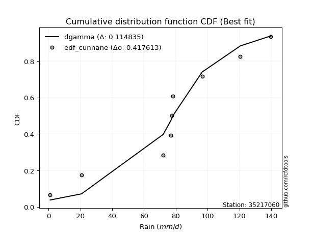</img>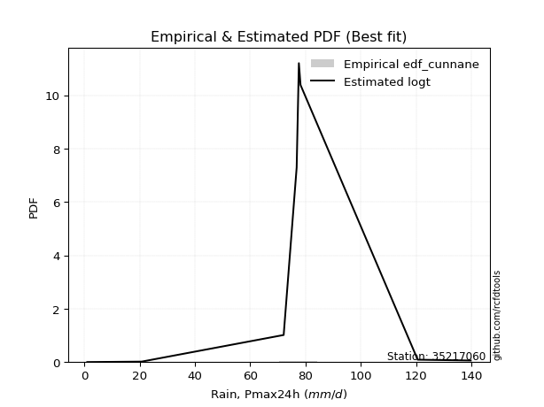</img>

</div>


### 12. EDF Adamowski (1981)

The Adamowski formula in hydrology refers to a specific plotting position formula used for estimating the non-parametric empirical distribution of hydrological events (like flood peaks) to calculate their return periods. This formula provides an alternative to traditional parametric methods (like the Gumbel or Log Pearson Type III distributions). 

<div align="center">


$P=(m-0.25)/(n+0.5)$


</div>


**12.1. Empirical values**

<div align="center">

|                | 0                   | 1                   | 2                  | 3                   | 4             | 5                  | 6                  | 7                  | 8                  |
|:---------------|:--------------------|:--------------------|:-------------------|:--------------------|:--------------|:-------------------|:-------------------|:-------------------|:-------------------|
| date           | 2020                | 2017                | 2021               | 2022                | 2018          | 2023               | 2025               | 2024               | 2019               |
| x              | 1.0                 | 20.7                | 72.1               | 76.8                | 77.6          | 78.2               | 96.6               | 120.6              | 139.8              |
| m              | 1                   | 2                   | 3                  | 4                   | 5             | 6                  | 7                  | 8                  | 9                  |
| empirical_dist | edf_adamowski       | edf_adamowski       | edf_adamowski      | edf_adamowski       | edf_adamowski | edf_adamowski      | edf_adamowski      | edf_adamowski      | edf_adamowski      |
| empirical      | 0.07894736842105263 | 0.18421052631578946 | 0.2894736842105263 | 0.39473684210526316 | 0.5           | 0.6052631578947368 | 0.7105263157894737 | 0.8157894736842105 | 0.9210526315789473 |
| empirical_tr   | 1.0857142857142856  | 1.2258064516129032  | 1.4074074074074074 | 1.6521739130434783  | 2.0           | 2.533333333333333  | 3.4545454545454546 | 5.428571428571428  | 12.666666666666663 |

</div>


**12.2. Kolmogorov-Smirnov fit test (sorted by Δ)**


<div align="center">

|                | 0                   | 1                   | 2                   | 3                   | 4                   | 5                   | 6                   | 7                   | 8                   | 9                   | 10                  | 11                  | 12                  | 13                  | 14                  | 15                  | 16                  | 17                  | 18                  | 19                  | 20                  | 21                  | 22                  | 23                  | 24                  | 25                  | 26                  | 27                  | 28                  | 29                  | 30                  | 31                  | 32                  | 33                  | 34                  | 35                  | 36                  | 37                  | 38                  | 39                  | 40                  | 41                  | 42                  | 43                  | 44                  | 45                  | 46                  | 47                  | 48                  | 49                  | 50                  | 51                  | 52                  | 53                  | 54                  | 55                  | 56                  | 57                  | 58                  | 59                  | 60                  | 61                  | 62                  | 63                  | 64                  | 65                  | 66                  | 67                  | 68                  | 69                  | 70                  | 71                  | 72                  | 73                  | 74                  | 75                  | 76                  | 77                  | 78                  | 79                  | 80                  | 81                  | 82                  | 83                  | 84                  | 85                  | 86                  | 87                  | 88                  | 89                  | 90                  | 91                  | 92                  | 93                  | 94                  | 95                  | 96                  | 97                  | 98                  | 99                  | 100                 | 101                 | 102                 | 103                 | 104                 | 105                 | 106                 | 107                 | 108                 | 109                 | 110                 | 111                 | 112                 | 113                 | 114                 | 115                 | 116                 | 117                 | 118                 | 119                 | 120                 | 121                 | 122                 | 123                 | 124                 | 125                 | 126                 | 127                 | 128                 | 129                 | 130                 | 131                 | 132                 | 133                 | 134                 | 135                 | 136                 | 137                 | 138                 | 139                 | 140                 | 141                 | 142                 | 143                 | 144                 | 145                 | 146                 | 147                 | 148                 | 149                 | 150                 | 151                 | 152                 | 153                 | 154                 | 155                 | 156                 | 157                 | 158                 | 159                 |
|:---------------|:--------------------|:--------------------|:--------------------|:--------------------|:--------------------|:--------------------|:--------------------|:--------------------|:--------------------|:--------------------|:--------------------|:--------------------|:--------------------|:--------------------|:--------------------|:--------------------|:--------------------|:--------------------|:--------------------|:--------------------|:--------------------|:--------------------|:--------------------|:--------------------|:--------------------|:--------------------|:--------------------|:--------------------|:--------------------|:--------------------|:--------------------|:--------------------|:--------------------|:--------------------|:--------------------|:--------------------|:--------------------|:--------------------|:--------------------|:--------------------|:--------------------|:--------------------|:--------------------|:--------------------|:--------------------|:--------------------|:--------------------|:--------------------|:--------------------|:--------------------|:--------------------|:--------------------|:--------------------|:--------------------|:--------------------|:--------------------|:--------------------|:--------------------|:--------------------|:--------------------|:--------------------|:--------------------|:--------------------|:--------------------|:--------------------|:--------------------|:--------------------|:--------------------|:--------------------|:--------------------|:--------------------|:--------------------|:--------------------|:--------------------|:--------------------|:--------------------|:--------------------|:--------------------|:--------------------|:--------------------|:--------------------|:--------------------|:--------------------|:--------------------|:--------------------|:--------------------|:--------------------|:--------------------|:--------------------|:--------------------|:--------------------|:--------------------|:--------------------|:--------------------|:--------------------|:--------------------|:--------------------|:--------------------|:--------------------|:--------------------|:--------------------|:--------------------|:--------------------|:--------------------|:--------------------|:--------------------|:--------------------|:--------------------|:--------------------|:--------------------|:--------------------|:--------------------|:--------------------|:--------------------|:--------------------|:--------------------|:--------------------|:--------------------|:--------------------|:--------------------|:--------------------|:--------------------|:--------------------|:--------------------|:--------------------|:--------------------|:--------------------|:--------------------|:--------------------|:--------------------|:--------------------|:--------------------|:--------------------|:--------------------|:--------------------|:--------------------|:--------------------|:--------------------|:--------------------|:--------------------|:--------------------|:--------------------|:--------------------|:--------------------|:--------------------|:--------------------|:--------------------|:--------------------|:--------------------|:--------------------|:--------------------|:--------------------|:--------------------|:--------------------|:--------------------|:--------------------|:--------------------|:--------------------|:--------------------|:--------------------|
| station        | 35217060            | 35217060            | 35217060            | 35217060            | 35217060            | 35217060            | 35217060            | 35217060            | 35217060            | 35217060            | 35217060            | 35217060            | 35217060            | 35217060            | 35217060            | 35217060            | 35217060            | 35217060            | 35217060            | 35217060            | 35217060            | 35217060            | 35217060            | 35217060            | 35217060            | 35217060            | 35217060            | 35217060            | 35217060            | 35217060            | 35217060            | 35217060            | 35217060            | 35217060            | 35217060            | 35217060            | 35217060            | 35217060            | 35217060            | 35217060            | 35217060            | 35217060            | 35217060            | 35217060            | 35217060            | 35217060            | 35217060            | 35217060            | 35217060            | 35217060            | 35217060            | 35217060            | 35217060            | 35217060            | 35217060            | 35217060            | 35217060            | 35217060            | 35217060            | 35217060            | 35217060            | 35217060            | 35217060            | 35217060            | 35217060            | 35217060            | 35217060            | 35217060            | 35217060            | 35217060            | 35217060            | 35217060            | 35217060            | 35217060            | 35217060            | 35217060            | 35217060            | 35217060            | 35217060            | 35217060            | 35217060            | 35217060            | 35217060            | 35217060            | 35217060            | 35217060            | 35217060            | 35217060            | 35217060            | 35217060            | 35217060            | 35217060            | 35217060            | 35217060            | 35217060            | 35217060            | 35217060            | 35217060            | 35217060            | 35217060            | 35217060            | 35217060            | 35217060            | 35217060            | 35217060            | 35217060            | 35217060            | 35217060            | 35217060            | 35217060            | 35217060            | 35217060            | 35217060            | 35217060            | 35217060            | 35217060            | 35217060            | 35217060            | 35217060            | 35217060            | 35217060            | 35217060            | 35217060            | 35217060            | 35217060            | 35217060            | 35217060            | 35217060            | 35217060            | 35217060            | 35217060            | 35217060            | 35217060            | 35217060            | 35217060            | 35217060            | 35217060            | 35217060            | 35217060            | 35217060            | 35217060            | 35217060            | 35217060            | 35217060            | 35217060            | 35217060            | 35217060            | 35217060            | 35217060            | 35217060            | 35217060            | 35217060            | 35217060            | 35217060            | 35217060            | 35217060            | 35217060            | 35217060            | 35217060            | 35217060            |
| empirical_dist | edf_adamowski       | edf_adamowski       | edf_adamowski       | edf_adamowski       | edf_adamowski       | edf_adamowski       | edf_adamowski       | edf_adamowski       | edf_adamowski       | edf_adamowski       | edf_adamowski       | edf_adamowski       | edf_adamowski       | edf_adamowski       | edf_adamowski       | edf_adamowski       | edf_adamowski       | edf_adamowski       | edf_adamowski       | edf_adamowski       | edf_adamowski       | edf_adamowski       | edf_adamowski       | edf_adamowski       | edf_adamowski       | edf_adamowski       | edf_adamowski       | edf_adamowski       | edf_adamowski       | edf_adamowski       | edf_adamowski       | edf_adamowski       | edf_adamowski       | edf_adamowski       | edf_adamowski       | edf_adamowski       | edf_adamowski       | edf_adamowski       | edf_adamowski       | edf_adamowski       | edf_adamowski       | edf_adamowski       | edf_adamowski       | edf_adamowski       | edf_adamowski       | edf_adamowski       | edf_adamowski       | edf_adamowski       | edf_adamowski       | edf_adamowski       | edf_adamowski       | edf_adamowski       | edf_adamowski       | edf_adamowski       | edf_adamowski       | edf_adamowski       | edf_adamowski       | edf_adamowski       | edf_adamowski       | edf_adamowski       | edf_adamowski       | edf_adamowski       | edf_adamowski       | edf_adamowski       | edf_adamowski       | edf_adamowski       | edf_adamowski       | edf_adamowski       | edf_adamowski       | edf_adamowski       | edf_adamowski       | edf_adamowski       | edf_adamowski       | edf_adamowski       | edf_adamowski       | edf_adamowski       | edf_adamowski       | edf_adamowski       | edf_adamowski       | edf_adamowski       | edf_adamowski       | edf_adamowski       | edf_adamowski       | edf_adamowski       | edf_adamowski       | edf_adamowski       | edf_adamowski       | edf_adamowski       | edf_adamowski       | edf_adamowski       | edf_adamowski       | edf_adamowski       | edf_adamowski       | edf_adamowski       | edf_adamowski       | edf_adamowski       | edf_adamowski       | edf_adamowski       | edf_adamowski       | edf_adamowski       | edf_adamowski       | edf_adamowski       | edf_adamowski       | edf_adamowski       | edf_adamowski       | edf_adamowski       | edf_adamowski       | edf_adamowski       | edf_adamowski       | edf_adamowski       | edf_adamowski       | edf_adamowski       | edf_adamowski       | edf_adamowski       | edf_adamowski       | edf_adamowski       | edf_adamowski       | edf_adamowski       | edf_adamowski       | edf_adamowski       | edf_adamowski       | edf_adamowski       | edf_adamowski       | edf_adamowski       | edf_adamowski       | edf_adamowski       | edf_adamowski       | edf_adamowski       | edf_adamowski       | edf_adamowski       | edf_adamowski       | edf_adamowski       | edf_adamowski       | edf_adamowski       | edf_adamowski       | edf_adamowski       | edf_adamowski       | edf_adamowski       | edf_adamowski       | edf_adamowski       | edf_adamowski       | edf_adamowski       | edf_adamowski       | edf_adamowski       | edf_adamowski       | edf_adamowski       | edf_adamowski       | edf_adamowski       | edf_adamowski       | edf_adamowski       | edf_adamowski       | edf_adamowski       | edf_adamowski       | edf_adamowski       | edf_adamowski       | edf_adamowski       | edf_adamowski       | edf_adamowski       | edf_adamowski       | edf_adamowski       |
| p_dist         | dweibull            | dgamma              | logdweibull         | genlogistic         | logdgamma           | gennorm             | logt                | loggennorm          | johnsonsu           | genextreme          | skewnorm            | burr12              | weibull_min         | argus               | logtukeylambda      | laplace             | pearson3            | logjohnsonsu        | gumbel_l            | beta                | hypsecant           | genpareto           | foldnorm            | logistic            | f                   | exponnorm           | norm                | crystalball         | t                   | nct                 | fatiguelife         | anglit              | betaprime           | semicircular        | gamma               | gausshyper          | gengamma            | erlang              | rice                | arcsine             | loglevy_l           | genhalflogistic     | cosine              | truncweibull_min    | logpearson3         | invgamma            | maxwell             | loggenextreme       | exponweib           | logtruncweibull_min | rayleigh            | wrapcauchy          | ksone               | alpha               | kappa3              | uniform             | invgauss            | vonmises_line       | logargus            | gumbel_r            | bradford            | logweibull_max      | triang              | burr                | logvonmises_line    | kappa4              | halfnorm            | kstwobign           | logtrapezoid        | logloggamma         | ncf                 | moyal               | logburr             | loggumbel_l         | halflogistic        | logarcsine          | levy_l              | logburr12           | logweibull_min      | loggompertz         | logexponweib        | logbetaprime        | truncexpon          | logjohnsonsb        | trapezoid           | logsemicircular     | loginvweibull       | loganglit           | lomax               | johnsonsb           | loggenhalflogistic  | genexpon            | loggamma            | loggamma            | mielke              | lognct              | logexponnorm        | logcrystalball      | lognorm             | logrice             | logfatiguelife      | loginvgamma         | logerlang           | loginvgauss         | loglomax            | logfoldnorm         | logloglaplace       | wald                | loglogistic         | logkstwobign        | logmaxwell          | loghypsecant        | lograyleigh         | loggausshyper       | logalpha            | loggengamma         | logmielke           | logncf              | logwrapcauchy       | loggenexpon         | nakagami            | loglaplace          | loglaplace          | loghalfnorm         | loggumbel_r         | logcosine           | loggenpareto        | loghalfgennorm      | loghalflogistic     | logmoyal            | logf                | logskewnorm         | halfgennorm         | logbeta             | gompertz            | logwald             | logtriang           | lognakagami         | invweibull          | logksone            | logkappa4           | logkappa3           | loguniform          | powerlaw            | logbradford         | rdist               | logtruncnorm        | logexponpow         | weibull_max         | logtruncexpon       | tukeylambda         | truncpareto         | exponpow            | truncnorm           | logtruncpareto      | logpowerlaw         | logrdist            | loggenlogistic      | logvonmises         | vonmises            |
| delta          | 0.11244036809708036 | 0.11295768640966578 | 0.11637818194923488 | 0.12648048992762673 | 0.12731099034941304 | 0.12937553296050597 | 0.12950112498567157 | 0.12953140776108626 | 0.13315379967571817 | 0.13359205307965427 | 0.13366143024557015 | 0.14199602259888644 | 0.1420301153047694  | 0.1436905510174601  | 0.1457947658288663  | 0.1487159478354647  | 0.14917850112490538 | 0.14990647790510792 | 0.15263388349668905 | 0.1619895884965316  | 0.1640388495076598  | 0.16709483000592446 | 0.16780069542161669 | 0.16831687318144184 | 0.17227260500238795 | 0.1733558592656943  | 0.173356065137669   | 0.17335606743268    | 0.1733563478659682  | 0.1735180889892134  | 0.17787281168925162 | 0.17865239271778477 | 0.1789237943340684  | 0.18083648384942408 | 0.18171496712546248 | 0.1847715762042591  | 0.18492299519003802 | 0.1860298409674901  | 0.18703428799081834 | 0.18950957324551404 | 0.19097174068639267 | 0.19393695272496786 | 0.19565303457668143 | 0.20467376221332834 | 0.20513798115206527 | 0.20685151684189468 | 0.20749398817682957 | 0.2117217260530666  | 0.2161701059482869  | 0.21659843523191546 | 0.21920293819543468 | 0.22015982343599105 | 0.2207328479700692  | 0.22175391223016794 | 0.22276926542475572 | 0.2227741544061883  | 0.2245729647431709  | 0.23376468607080625 | 0.23746608914306178 | 0.24161000613935868 | 0.24165279056885802 | 0.2429542757628972  | 0.24362205456615715 | 0.24728029443313826 | 0.2504969608286428  | 0.2506672975709665  | 0.25221953842232114 | 0.2528599046653276  | 0.2550674448303275  | 0.25542923543375273 | 0.26113905357846845 | 0.2672617654909216  | 0.2678948025430349  | 0.2691921103840339  | 0.2744577522212599  | 0.27704169951198254 | 0.27706834956232607 | 0.28448625828589    | 0.2846020460606844  | 0.2861395571870238  | 0.29083920418834674 | 0.29202884031946585 | 0.29907920346769257 | 0.3010068990823903  | 0.30199658256029793 | 0.3035741174608484  | 0.306371606431593   | 0.310139355276812   | 0.3135451625037393  | 0.3144792248847076  | 0.3158322968433005  | 0.32305726172781535 | 0.3253108256843944  | 0.3253108256843944  | 0.3255676029627822  | 0.3258412791232925  | 0.325906004367842   | 0.3259075945713005  | 0.3259076647749104  | 0.3259178651070799  | 0.3260351383130937  | 0.3285788224212526  | 0.3305375909348687  | 0.3319456193055066  | 0.3335178216174295  | 0.33408144578014154 | 0.3363269860654623  | 0.338643130613968   | 0.3405035590541945  | 0.34285839438822685 | 0.3510296207123569  | 0.35228056036895805 | 0.35874892657077084 | 0.364525694833278   | 0.3657277183063218  | 0.3696688528198133  | 0.3703191542242049  | 0.37195040879171126 | 0.37219059250273956 | 0.37313136689131365 | 0.3770471198766062  | 0.38032039267738926 | 0.38032039267738926 | 0.38083335564259724 | 0.3907067210445796  | 0.39574231700553786 | 0.39774921372671335 | 0.4083090055418144  | 0.40920510199195237 | 0.4126196587619134  | 0.42471650106916503 | 0.4259955253031541  | 0.44099296133931043 | 0.46295216914214243 | 0.47321306719031836 | 0.47390880137765623 | 0.474067198396662   | 0.4813811048014226  | 0.4920465828264615  | 0.5154975946389364  | 0.5595292655841287  | 0.5745194497544466  | 0.5764918504088289  | 0.5893257013808343  | 0.5925143532138692  | 0.5960259543188996  | 0.6049017269800375  | 0.6097724048146684  | 0.6170647456447373  | 0.6234940298600176  | 0.6682110246852642  | 0.6968569427474451  | 0.721878229730316   | 0.7412659771530754  | 0.7624241425627369  | 0.8096222153174064  | 0.8157894710910623  | 0.8157894736842105  | 1.0797642128474185  | 21.36986072342346   |
| deltao         | 0.41761268023100007 | 0.41761268023100007 | 0.41761268023100007 | 0.41761268023100007 | 0.41761268023100007 | 0.41761268023100007 | 0.41761268023100007 | 0.41761268023100007 | 0.41761268023100007 | 0.41761268023100007 | 0.41761268023100007 | 0.41761268023100007 | 0.41761268023100007 | 0.41761268023100007 | 0.41761268023100007 | 0.41761268023100007 | 0.41761268023100007 | 0.41761268023100007 | 0.41761268023100007 | 0.41761268023100007 | 0.41761268023100007 | 0.41761268023100007 | 0.41761268023100007 | 0.41761268023100007 | 0.41761268023100007 | 0.41761268023100007 | 0.41761268023100007 | 0.41761268023100007 | 0.41761268023100007 | 0.41761268023100007 | 0.41761268023100007 | 0.41761268023100007 | 0.41761268023100007 | 0.41761268023100007 | 0.41761268023100007 | 0.41761268023100007 | 0.41761268023100007 | 0.41761268023100007 | 0.41761268023100007 | 0.41761268023100007 | 0.41761268023100007 | 0.41761268023100007 | 0.41761268023100007 | 0.41761268023100007 | 0.41761268023100007 | 0.41761268023100007 | 0.41761268023100007 | 0.41761268023100007 | 0.41761268023100007 | 0.41761268023100007 | 0.41761268023100007 | 0.41761268023100007 | 0.41761268023100007 | 0.41761268023100007 | 0.41761268023100007 | 0.41761268023100007 | 0.41761268023100007 | 0.41761268023100007 | 0.41761268023100007 | 0.41761268023100007 | 0.41761268023100007 | 0.41761268023100007 | 0.41761268023100007 | 0.41761268023100007 | 0.41761268023100007 | 0.41761268023100007 | 0.41761268023100007 | 0.41761268023100007 | 0.41761268023100007 | 0.41761268023100007 | 0.41761268023100007 | 0.41761268023100007 | 0.41761268023100007 | 0.41761268023100007 | 0.41761268023100007 | 0.41761268023100007 | 0.41761268023100007 | 0.41761268023100007 | 0.41761268023100007 | 0.41761268023100007 | 0.41761268023100007 | 0.41761268023100007 | 0.41761268023100007 | 0.41761268023100007 | 0.41761268023100007 | 0.41761268023100007 | 0.41761268023100007 | 0.41761268023100007 | 0.41761268023100007 | 0.41761268023100007 | 0.41761268023100007 | 0.41761268023100007 | 0.41761268023100007 | 0.41761268023100007 | 0.41761268023100007 | 0.41761268023100007 | 0.41761268023100007 | 0.41761268023100007 | 0.41761268023100007 | 0.41761268023100007 | 0.41761268023100007 | 0.41761268023100007 | 0.41761268023100007 | 0.41761268023100007 | 0.41761268023100007 | 0.41761268023100007 | 0.41761268023100007 | 0.41761268023100007 | 0.41761268023100007 | 0.41761268023100007 | 0.41761268023100007 | 0.41761268023100007 | 0.41761268023100007 | 0.41761268023100007 | 0.41761268023100007 | 0.41761268023100007 | 0.41761268023100007 | 0.41761268023100007 | 0.41761268023100007 | 0.41761268023100007 | 0.41761268023100007 | 0.41761268023100007 | 0.41761268023100007 | 0.41761268023100007 | 0.41761268023100007 | 0.41761268023100007 | 0.41761268023100007 | 0.41761268023100007 | 0.41761268023100007 | 0.41761268023100007 | 0.41761268023100007 | 0.41761268023100007 | 0.41761268023100007 | 0.41761268023100007 | 0.41761268023100007 | 0.41761268023100007 | 0.41761268023100007 | 0.41761268023100007 | 0.41761268023100007 | 0.41761268023100007 | 0.41761268023100007 | 0.41761268023100007 | 0.41761268023100007 | 0.41761268023100007 | 0.41761268023100007 | 0.41761268023100007 | 0.41761268023100007 | 0.41761268023100007 | 0.41761268023100007 | 0.41761268023100007 | 0.41761268023100007 | 0.41761268023100007 | 0.41761268023100007 | 0.41761268023100007 | 0.41761268023100007 | 0.41761268023100007 | 0.41761268023100007 | 0.41761268023100007 | 0.41761268023100007 | 0.41761268023100007 |
| eval           | Δo > Δ              | Δo > Δ              | Δo > Δ              | Δo > Δ              | Δo > Δ              | Δo > Δ              | Δo > Δ              | Δo > Δ              | Δo > Δ              | Δo > Δ              | Δo > Δ              | Δo > Δ              | Δo > Δ              | Δo > Δ              | Δo > Δ              | Δo > Δ              | Δo > Δ              | Δo > Δ              | Δo > Δ              | Δo > Δ              | Δo > Δ              | Δo > Δ              | Δo > Δ              | Δo > Δ              | Δo > Δ              | Δo > Δ              | Δo > Δ              | Δo > Δ              | Δo > Δ              | Δo > Δ              | Δo > Δ              | Δo > Δ              | Δo > Δ              | Δo > Δ              | Δo > Δ              | Δo > Δ              | Δo > Δ              | Δo > Δ              | Δo > Δ              | Δo > Δ              | Δo > Δ              | Δo > Δ              | Δo > Δ              | Δo > Δ              | Δo > Δ              | Δo > Δ              | Δo > Δ              | Δo > Δ              | Δo > Δ              | Δo > Δ              | Δo > Δ              | Δo > Δ              | Δo > Δ              | Δo > Δ              | Δo > Δ              | Δo > Δ              | Δo > Δ              | Δo > Δ              | Δo > Δ              | Δo > Δ              | Δo > Δ              | Δo > Δ              | Δo > Δ              | Δo > Δ              | Δo > Δ              | Δo > Δ              | Δo > Δ              | Δo > Δ              | Δo > Δ              | Δo > Δ              | Δo > Δ              | Δo > Δ              | Δo > Δ              | Δo > Δ              | Δo > Δ              | Δo > Δ              | Δo > Δ              | Δo > Δ              | Δo > Δ              | Δo > Δ              | Δo > Δ              | Δo > Δ              | Δo > Δ              | Δo > Δ              | Δo > Δ              | Δo > Δ              | Δo > Δ              | Δo > Δ              | Δo > Δ              | Δo > Δ              | Δo > Δ              | Δo > Δ              | Δo > Δ              | Δo > Δ              | Δo > Δ              | Δo > Δ              | Δo > Δ              | Δo > Δ              | Δo > Δ              | Δo > Δ              | Δo > Δ              | Δo > Δ              | Δo > Δ              | Δo > Δ              | Δo > Δ              | Δo > Δ              | Δo > Δ              | Δo > Δ              | Δo > Δ              | Δo > Δ              | Δo > Δ              | Δo > Δ              | Δo > Δ              | Δo > Δ              | Δo > Δ              | Δo > Δ              | Δo > Δ              | Δo > Δ              | Δo > Δ              | Δo > Δ              | Δo > Δ              | Δo > Δ              | Δo > Δ              | Δo > Δ              | Δo > Δ              | Δo > Δ              | Δo > Δ              | Δo > Δ              | Δo > Δ              | Δo > Δ              | Δo <= Δ             | Δo <= Δ             | Δo <= Δ             | Δo <= Δ             | Δo <= Δ             | Δo <= Δ             | Δo <= Δ             | Δo <= Δ             | Δo <= Δ             | Δo <= Δ             | Δo <= Δ             | Δo <= Δ             | Δo <= Δ             | Δo <= Δ             | Δo <= Δ             | Δo <= Δ             | Δo <= Δ             | Δo <= Δ             | Δo <= Δ             | Δo <= Δ             | Δo <= Δ             | Δo <= Δ             | Δo <= Δ             | Δo <= Δ             | Δo <= Δ             | Δo <= Δ             | Δo <= Δ             | Δo <= Δ             | Δo <= Δ             | Δo <= Δ             |
| fit            | 1                   | 1                   | 1                   | 1                   | 1                   | 1                   | 1                   | 1                   | 1                   | 1                   | 1                   | 1                   | 1                   | 1                   | 1                   | 1                   | 1                   | 1                   | 1                   | 1                   | 1                   | 1                   | 1                   | 1                   | 1                   | 1                   | 1                   | 1                   | 1                   | 1                   | 1                   | 1                   | 1                   | 1                   | 1                   | 1                   | 1                   | 1                   | 1                   | 1                   | 1                   | 1                   | 1                   | 1                   | 1                   | 1                   | 1                   | 1                   | 1                   | 1                   | 1                   | 1                   | 1                   | 1                   | 1                   | 1                   | 1                   | 1                   | 1                   | 1                   | 1                   | 1                   | 1                   | 1                   | 1                   | 1                   | 1                   | 1                   | 1                   | 1                   | 1                   | 1                   | 1                   | 1                   | 1                   | 1                   | 1                   | 1                   | 1                   | 1                   | 1                   | 1                   | 1                   | 1                   | 1                   | 1                   | 1                   | 1                   | 1                   | 1                   | 1                   | 1                   | 1                   | 1                   | 1                   | 1                   | 1                   | 1                   | 1                   | 1                   | 1                   | 1                   | 1                   | 1                   | 1                   | 1                   | 1                   | 1                   | 1                   | 1                   | 1                   | 1                   | 1                   | 1                   | 1                   | 1                   | 1                   | 1                   | 1                   | 1                   | 1                   | 1                   | 1                   | 1                   | 1                   | 1                   | 1                   | 1                   | 1                   | 1                   | 0                   | 0                   | 0                   | 0                   | 0                   | 0                   | 0                   | 0                   | 0                   | 0                   | 0                   | 0                   | 0                   | 0                   | 0                   | 0                   | 0                   | 0                   | 0                   | 0                   | 0                   | 0                   | 0                   | 0                   | 0                   | 0                   | 0                   | 0                   | 0                   | 0                   |
| n              | 9                   | 9                   | 9                   | 9                   | 9                   | 9                   | 9                   | 9                   | 9                   | 9                   | 9                   | 9                   | 9                   | 9                   | 9                   | 9                   | 9                   | 9                   | 9                   | 9                   | 9                   | 9                   | 9                   | 9                   | 9                   | 9                   | 9                   | 9                   | 9                   | 9                   | 9                   | 9                   | 9                   | 9                   | 9                   | 9                   | 9                   | 9                   | 9                   | 9                   | 9                   | 9                   | 9                   | 9                   | 9                   | 9                   | 9                   | 9                   | 9                   | 9                   | 9                   | 9                   | 9                   | 9                   | 9                   | 9                   | 9                   | 9                   | 9                   | 9                   | 9                   | 9                   | 9                   | 9                   | 9                   | 9                   | 9                   | 9                   | 9                   | 9                   | 9                   | 9                   | 9                   | 9                   | 9                   | 9                   | 9                   | 9                   | 9                   | 9                   | 9                   | 9                   | 9                   | 9                   | 9                   | 9                   | 9                   | 9                   | 9                   | 9                   | 9                   | 9                   | 9                   | 9                   | 9                   | 9                   | 9                   | 9                   | 9                   | 9                   | 9                   | 9                   | 9                   | 9                   | 9                   | 9                   | 9                   | 9                   | 9                   | 9                   | 9                   | 9                   | 9                   | 9                   | 9                   | 9                   | 9                   | 9                   | 9                   | 9                   | 9                   | 9                   | 9                   | 9                   | 9                   | 9                   | 9                   | 9                   | 9                   | 9                   | 9                   | 9                   | 9                   | 9                   | 9                   | 9                   | 9                   | 9                   | 9                   | 9                   | 9                   | 9                   | 9                   | 9                   | 9                   | 9                   | 9                   | 9                   | 9                   | 9                   | 9                   | 9                   | 9                   | 9                   | 9                   | 9                   | 9                   | 9                   | 9                   | 9                   |
| best_fit       | 1                   | 0                   | 0                   | 0                   | 0                   | 0                   | 0                   | 0                   | 0                   | 0                   | 0                   | 0                   | 0                   | 0                   | 0                   | 0                   | 0                   | 0                   | 0                   | 0                   | 0                   | 0                   | 0                   | 0                   | 0                   | 0                   | 0                   | 0                   | 0                   | 0                   | 0                   | 0                   | 0                   | 0                   | 0                   | 0                   | 0                   | 0                   | 0                   | 0                   | 0                   | 0                   | 0                   | 0                   | 0                   | 0                   | 0                   | 0                   | 0                   | 0                   | 0                   | 0                   | 0                   | 0                   | 0                   | 0                   | 0                   | 0                   | 0                   | 0                   | 0                   | 0                   | 0                   | 0                   | 0                   | 0                   | 0                   | 0                   | 0                   | 0                   | 0                   | 0                   | 0                   | 0                   | 0                   | 0                   | 0                   | 0                   | 0                   | 0                   | 0                   | 0                   | 0                   | 0                   | 0                   | 0                   | 0                   | 0                   | 0                   | 0                   | 0                   | 0                   | 0                   | 0                   | 0                   | 0                   | 0                   | 0                   | 0                   | 0                   | 0                   | 0                   | 0                   | 0                   | 0                   | 0                   | 0                   | 0                   | 0                   | 0                   | 0                   | 0                   | 0                   | 0                   | 0                   | 0                   | 0                   | 0                   | 0                   | 0                   | 0                   | 0                   | 0                   | 0                   | 0                   | 0                   | 0                   | 0                   | 0                   | 0                   | 0                   | 0                   | 0                   | 0                   | 0                   | 0                   | 0                   | 0                   | 0                   | 0                   | 0                   | 0                   | 0                   | 0                   | 0                   | 0                   | 0                   | 0                   | 0                   | 0                   | 0                   | 0                   | 0                   | 0                   | 0                   | 0                   | 0                   | 0                   | 0                   | 0                   |
| best_fit_sort  | 1                   | 2                   | 3                   | 4                   | 5                   | 6                   | 7                   | 8                   | 9                   | 10                  | 11                  | 12                  | 13                  | 14                  | 15                  | 16                  | 17                  | 18                  | 19                  | 20                  | 21                  | 22                  | 23                  | 24                  | 25                  | 26                  | 27                  | 28                  | 29                  | 30                  | 31                  | 32                  | 33                  | 34                  | 35                  | 36                  | 37                  | 38                  | 39                  | 40                  | 41                  | 42                  | 43                  | 44                  | 45                  | 46                  | 47                  | 48                  | 49                  | 50                  | 51                  | 52                  | 53                  | 54                  | 55                  | 56                  | 57                  | 58                  | 59                  | 60                  | 61                  | 62                  | 63                  | 64                  | 65                  | 66                  | 67                  | 68                  | 69                  | 70                  | 71                  | 72                  | 73                  | 74                  | 75                  | 76                  | 77                  | 78                  | 79                  | 80                  | 81                  | 82                  | 83                  | 84                  | 85                  | 86                  | 87                  | 88                  | 89                  | 90                  | 91                  | 92                  | 93                  | 94                  | 95                  | 96                  | 97                  | 98                  | 99                  | 100                 | 101                 | 102                 | 103                 | 104                 | 105                 | 106                 | 107                 | 108                 | 109                 | 110                 | 111                 | 112                 | 113                 | 114                 | 115                 | 116                 | 117                 | 118                 | 119                 | 120                 | 121                 | 122                 | 123                 | 124                 | 125                 | 126                 | 127                 | 128                 | 129                 | 130                 | 131                 | 132                 | 133                 | 134                 | 135                 | 136                 | 137                 | 138                 | 139                 | 140                 | 141                 | 142                 | 143                 | 144                 | 145                 | 146                 | 147                 | 148                 | 149                 | 150                 | 151                 | 152                 | 153                 | 154                 | 155                 | 156                 | 157                 | 158                 | 159                 | 160                 |

</div>


**12.3. Best fit**

<div align="center">

|   id |   station | empirical_dist   | p_dist   |   delta |   deltao | eval   |   fit |   n |   best_fit |   best_fit_sort |
|-----:|----------:|:-----------------|:---------|--------:|---------:|:-------|------:|----:|-----------:|----------------:|
|    0 |  35217060 | edf_adamowski    | dweibull | 0.11244 | 0.417613 | Δo > Δ |     1 |   9 |          1 |               1 |

</div>


<div align="center">

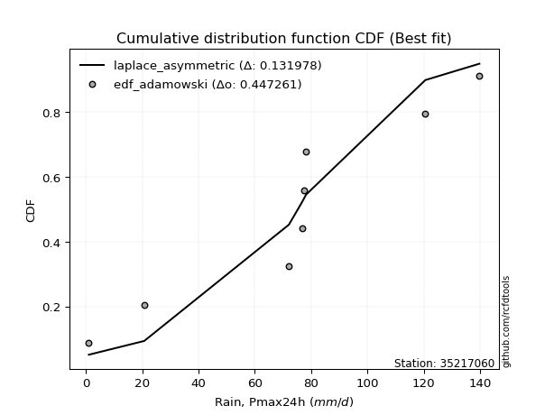</img>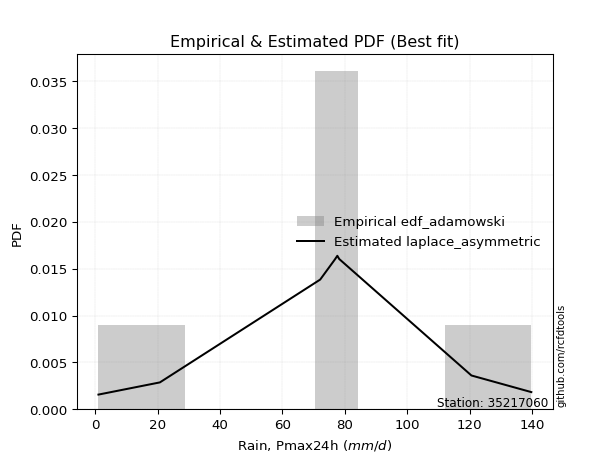</img>

</div>


## C. Best fit & Estimate extreme values for specific return periods - Tr

Best fit in probability distribution analysis means finding the theoretical distribution (like Normal, Poisson, Exponential, etc.) that most accurately mirrors your real-world data´s patterns (shape, center, spread) for better predictions, using methods like visual checks (Q-Q plots), goodness-of-fit tests (Kolmogorov-Smirnov, Chi-Squared), and information criteria (AIC) to score and select the simplest, most representative model.


### 1. Best fit (ordered by delta Δ)

:file_folder:Table: [bestfit_35217060.csv](table/bestfit_35217060.csv)

<div align="center">

|   id |   station | empirical_dist   | p_dist      |     delta |   deltao | eval   |   fit |   n |   best_fit |   best_fit_sort |
|-----:|----------:|:-----------------|:------------|----------:|---------:|:-------|------:|----:|-----------:|----------------:|
|    0 |  35217060 | edf_weibull      | logdweibull | 0.0953256 | 0.417613 | Δo > Δ |     1 |   9 |          1 |               1 |
|    1 |  35217060 | edf_hazen        | logdgamma   | 0.109767  | 0.417613 | Δo > Δ |     1 |   9 |          1 |               2 |
|    2 |  35217060 | edf_chegodayev   | dgamma      | 0.11021   | 0.417613 | Δo > Δ |     1 |   9 |          1 |               3 |
|    3 |  35217060 | edf_jenkinson    | dgamma      | 0.110663  | 0.417613 | Δo > Δ |     1 |   9 |          1 |               4 |
|    4 |  35217060 | edf_beard        | dgamma      | 0.110663  | 0.417613 | Δo > Δ |     1 |   9 |          1 |               5 |
|    5 |  35217060 | edf_filliben     | dgamma      | 0.111005  | 0.417613 | Δo > Δ |     1 |   9 |          1 |               6 |
|    6 |  35217060 | edf_tukey        | dgamma      | 0.11173   | 0.417613 | Δo > Δ |     1 |   9 |          1 |               7 |
|    7 |  35217060 | edf_adamowski    | dweibull    | 0.11244   | 0.417613 | Δo > Δ |     1 |   9 |          1 |               8 |
|    8 |  35217060 | edf_blom         | dgamma      | 0.11366   | 0.417613 | Δo > Δ |     1 |   9 |          1 |               9 |
|    9 |  35217060 | edf_gringorten   | logdgamma   | 0.114153  | 0.417613 | Δo > Δ |     1 |   9 |          1 |              10 |
|   10 |  35217060 | edf_cunnane      | dgamma      | 0.114835  | 0.417613 | Δo > Δ |     1 |   9 |          1 |              11 |
|   11 |  35217060 | edf_california   | logt        | 0.130635  | 0.417613 | Δo > Δ |     1 |   9 |          1 |              12 |

</div>


### 2. Extreme values and % difference analysis

In hydrology, a return period (or recurrence interval $Tr$) is the statistical average time between extreme events like floods or droughts of a specific magnitude, indicating how rare an event is, with a 100-year flood, for example, having a 1% chance of occurring in any given year, not that it happens exactly every century. It is a key tool for infrastructure design (like bridges or dams) and risk assessment, calculated from historical data to determine the probability of future events, although it is important to remember it is statistical average, and events can cluster or be missed.

The extreme value porcentage difference is evaluated as $pdiff = 1 - (ETrBf / ETr) * 100$, where _ETrBf_ correspond to the bestfit extreme value for a specific recurrence interval and _ETr_ correspond to the extreme value for one of the most used PDFsused in hydrology.

> risk_rate: assuming the return period as the project useful life.

:file_folder:Table: [extreme_35217060.csv](table/extreme_35217060.csv), all PDFs.  
:file_folder:Table: [extremepdiff_35217060.csv](table/extremepdiff_35217060.csv), % difference between bestfit and most used PDFs in Hydrology.

<div align="center">

Extreme values table for only best fit PDFs
|   id |      tr |   prob_l |     prob_g |    alpha |   anglit |   arcsine |    argus |     beta |   betaprime |   bradford |     burr |   burr12 |   cosine |   crystalball |   dgamma |   dweibull |   erlang |   exponnorm |   exponpow |   exponweib |        f |   fatiguelife |   foldnorm |    gamma |   gausshyper |   genexpon |   genextreme |   gengamma |   genhalflogistic |   genlogistic |   gennorm |   genpareto |   gompertz |   gumbel_l |   gumbel_r |   halfgennorm |   halflogistic |   halfnorm |   hypsecant |   invgamma |   invgauss |       invweibull |   johnsonsb |   johnsonsu |     kappa3 |   kappa4 |   ksone |   kstwobign |   laplace |   levy_l |   loggamma |   logistic |   loglaplace |    lomax |   maxwell |   mielke |    moyal |   nakagami |      ncf |      nct |     norm |   pearson3 |   powerlaw |   rayleigh |     rdist |     rice |   semicircular |   skewnorm |        t |   trapezoid |   triang |   truncexpon |   truncnorm |   truncpareto |   truncweibull_min |   tukeylambda |   uniform |   vonmises |   vonmises_line |     wald |   weibull_max |   weibull_min |   wrapcauchy |   logalpha |   loganglit |   logarcsine |   logargus |   logbeta |     logbetaprime |   logbradford |   logburr |   logburr12 |   logcosine |   logcrystalball |   logdgamma |      logdweibull |   logerlang |   logexponnorm |   logexponpow |   logexponweib |              logf |   logfatiguelife |   logfoldnorm |   loggausshyper |   loggenexpon |   loggenextreme |   loggengamma |   loggenhalflogistic |   loggenlogistic |       loggennorm |   loggenpareto |   loggompertz |   loggumbel_l |   loggumbel_r |   loghalfgennorm |   loghalflogistic |   loghalfnorm |   loghypsecant |   loginvgamma |   loginvgauss |    loginvweibull |   logjohnsonsb |   logjohnsonsu |   logkappa3 |   logkappa4 |   logksone |   logkstwobign |   loglevy_l |   logloggamma |   loglogistic |     logloglaplace |         loglomax |   logmaxwell |        logmielke |    logmoyal |      lognakagami |            logncf |    lognct |   lognorm |   logpearson3 |   logpowerlaw |   lograyleigh |   logrdist |   logrice |   logsemicircular |   logskewnorm |              logt |   logtrapezoid |   logtriang |   logtruncexpon |   logtruncnorm |   logtruncpareto |   logtruncweibull_min |   logtukeylambda |   loguniform |   logvonmises |   logvonmises_line |          logwald |   logweibull_max |   logweibull_min |   logwrapcauchy |   station |   n |   risk_rate |
|-----:|--------:|---------:|-----------:|---------:|---------:|----------:|---------:|---------:|------------:|-----------:|---------:|---------:|---------:|--------------:|---------:|-----------:|---------:|------------:|-----------:|------------:|---------:|--------------:|-----------:|---------:|-------------:|-----------:|-------------:|-----------:|------------------:|--------------:|----------:|------------:|-----------:|-----------:|-----------:|--------------:|---------------:|-----------:|------------:|-----------:|-----------:|-----------------:|------------:|------------:|-----------:|---------:|--------:|------------:|----------:|---------:|-----------:|-----------:|-------------:|---------:|----------:|---------:|---------:|-----------:|---------:|---------:|---------:|-----------:|-----------:|-----------:|----------:|---------:|---------------:|-----------:|---------:|------------:|---------:|-------------:|------------:|--------------:|-------------------:|--------------:|----------:|-----------:|----------------:|---------:|--------------:|--------------:|-------------:|-----------:|------------:|-------------:|-----------:|----------:|-----------------:|--------------:|----------:|------------:|------------:|-----------------:|------------:|-----------------:|------------:|---------------:|--------------:|---------------:|------------------:|-----------------:|--------------:|----------------:|--------------:|----------------:|--------------:|---------------------:|-----------------:|-----------------:|---------------:|--------------:|--------------:|--------------:|-----------------:|------------------:|--------------:|---------------:|--------------:|--------------:|-----------------:|---------------:|---------------:|------------:|------------:|-----------:|---------------:|------------:|--------------:|--------------:|------------------:|-----------------:|-------------:|-----------------:|------------:|-----------------:|------------------:|----------:|----------:|--------------:|--------------:|--------------:|-----------:|----------:|------------------:|--------------:|------------------:|---------------:|------------:|----------------:|---------------:|-----------------:|----------------------:|-----------------:|-------------:|--------------:|-------------------:|-----------------:|-----------------:|-----------------:|----------------:|----------:|----:|------------:|
|    0 |    2    | 0.5      | 0.5        |  70.8612 |  75.9333 |   75.9333 |  80.097  |  86.8181 |     75.4051 |    67.7736 |  66.7083 |  79.1777 |  73.7278 |       75.9333 |  78.2    |    78.2    |  74.6524 |     75.9333 |    1.01385 |     71.467  |  76.0479 |       75.4698 |    76.3289 |  75.078  |      89.3264 |    52.9796 |      81.2616 |    74.7255 |           91.0242 |       80.135  |   76.8    |     87.7109 |    95.7042 |    82.6826 |    69.1841 |       28.0288 |        65.8287 |    67.5237 |     75.9333 |    72.4914 |    70.525  |   9021.69        |     120.31  |     80.1195 |   0.997695 |  66.336  |  70.4   |     66.8391 |   75.9333 |  77.9802 |    45.86   |    75.9333 |      47.0636 |  54.3141 |   72.4197 |  54.061  |  67.0052 |    41.2225 |  65.1983 |  75.9194 |  75.9333 |    78.4609 |    4.83494 |    71.1735 | -11.8708  |  74.5885 |        75.9333 |    80.0773 |  75.9334 |     104.252 |  94.5399 |      59.8574 |     2.21967 |       1.28219 |            72.8678 |      -6.73096 |   70.4    |    1.91938 |         70.4    |  62.616  |       139.522 |       79.1741 |      70.756  |    36.7301 |     47.0638 |      47.0638 |    68.675  |   138.646 |     35.2615      |       8.45497 |   59.8466 |     62.0434 |     30.984  |          47.0636 |     77.6    |     77.6         |     44.7565 |        47.064  |       3.60682 |        61.2823 |      5.26607      |          46.9942 |       49.6754 |         38.7929 |       27.1543 |         71.8642 |       39.495  |              49.2384 |          inf     |     77.6         |        28.3771 |       61.7777 |       59.7616 |       37.0636 |      9.60901     |           32.9137 |       34.9491 |        47.0636 |       45.3649 |       42.6278 |     41.1408      |        115.229 |        81.1616 |    0.999971 |     12.2756 |    11.8237 |        31.5842 |     76.8579 |       65.6449 |       47.0636 |     47.5864       |     47.7802      |      41.5603 |     11.4818      |     34.313  |      4.93397     |      9.75352      |   46.9428 |   47.0636 |       73.251  |       1       |       39.7671 |    1.6943  |   47.0619 |           47.0637 |       41.0581 |     77.5459       |        59.6154 |     30.0617 |         6.83316 |        9.18325 |          1.0513  |               71.2712 |     77.5034      |      11.8237 |      0.170663 |            65.0746 |     29.3761      |          96.4683 |           62.055 |         11.8237 |  35217060 |   9 |    0.75     |
|    1 |    2.33 | 0.570815 | 0.429185   |  78.8238 |  84.4729 |   88.7527 |  88.2907 |  96.7619 |     82.864  |    77.6462 |  77.1278 |  86.2899 |  81.5091 |       83.2646 |  82.1549 |    82.3509 |  82.1002 |     83.2646 |    1.05189 |     79.6033 |  83.3862 |       82.8155 |    83.3618 |  82.4648 |      98.6567 |    64.4322 |      88.7146 |    82.0883 |          100.146  |       86.4709 |   77.2539 |     97.9837 |    99.4393 |    89.0609 |    75.9773 |       37.2664 |        72.8132 |    75.4361 |     81.8005 |    80.1542 |    78.6122 | 760803           |     131.517 |     87.1773 |   0.997695 |  76.5297 |  82.195 |     75.7817 |   80.3699 |  96.5165 |    60.4365 |    82.3927 |      55.065  |  66.085  |   80.0364 |  64.9838 |  73.4358 |    52.957  |  74.9856 |  83.2564 |  83.2646 |    85.6629 |    8.6139  |    78.9028 |   7.71556 |  82.1656 |        85.0922 |    87.1061 |  83.2648 |     112.316 | 102.022  |      69.5938 |     4.50521 |       1.53968 |            82.1424 |       5.90352 |   80.2292 |    2.03198 |         75.6145 |  67.4232 |       139.704 |       86.2864 |      80.6358 |    49.4131 |     63.6709 |      74.0831 |    77.7031 |   139.591 |     65.2674      |      12.5798  |   75.3141 |     71.6502 |     42.4444 |          61.0053 |     77.8047 |     79.8331      |     59.09   |        61.0058 |       4.97571 |        70.7888 |     11.4619       |          60.9509 |       61.3548 |         52.822  |       40.7108 |         85.5294 |       51.2015 |              64.3908 |          inf     |     79.1083      |        42.1981 |       71.4105 |       74.8958 |       47.1369 |     17.2515      |           42.1434 |       46.2431 |        57.9249 |       59.6845 |       57.6226 |     61.8616      |        132.688 |        90.9775 |    0.999971 |     17.7352 |    17.9918 |        48.2624 |     91.9802 |       75.8474 |       59.1516 |    113.197        |    112.006       |      54.4187 |     25.0714      |     43.0822 |      8.45744     |     26.1619       |   60.951  |   61.0053 |       88.9194 |       1       |       52.2787 |    2.88852 |   61.003  |           65.0815 |       49.9247 |     78.0072       |        80.365  |     38.7576 |         9.57665 |       12.8871  |          1.10111 |               80.9377 |     78.0974      |      16.776  |      0.193664 |            78.0972 |     34.8243      |         120.12   |           71.635 |         37.6736 |  35217060 |   9 |    0.729209 |
|    2 |    5    | 0.8      | 0.2        | 110.852  | 114.603  |  122.937  | 114.481  | 123.677  |    110.842  |   110.333  | 111.627  | 110.949  | 109.55   |      110.51   | 104.436  |   106.768  | 110.232  |    110.51   |    3.54671 |    112.958  | 110.686  |      110.199  |   109.498  | 110.35   |     124.857  |   121.692  |     113.08   |   110.276  |          124.26   |      109.061  |   89.1329 |    125.857  |   114.152  |   109.666  |   105.49   |       99.7192 |       104.417  |   108.896  |    105.335  |   110.016  |   111.074  |      1.77349e+14 |     139.538 |    111.268  |   0.997695 | 110.165  | 120.368 |    113.768  |  102.552  | 127.227  |   171.817  |   107.333  |     120.729  | 125.068  |  110.015  | 104.095  | 103.223  |   108.637  | 118.003  | 110.525  | 110.51   |   111.038  |   44.7142  |   109.847  |  60.4244  | 110.724  |       116.348  |   110.972  | 110.51   |     135.452 | 123.486  |     104.349  |    12.9989  |       7.54485 |           112.388  |      46.164   |  112.04   |    2.45812 |         96.0351 |  94.3339 |       139.799 |      110.946  |     112.61   |   159.433  |    184.942  |     248.389  |   108.6    |   139.8   |   1126.35        |      45.5142  |  174.432  |    114.08   |    131.94   |         160.002  |    100.097  |    136.416       |    168.761  |       160.003  |      22.2852  |       107.051  | 171567            |         160.289  |      134.479  |        108.797  |      207.76   |        122.565  |      138.61   |             114.226  |          inf     |    102.188       |       104.974  |      114.059  |      155.299  |      133.961  |    444.302       |          128.969  |      151.12   |       133.228  |      169.446  |      184.914  |    363.945       |        139.748 |       118.628  |   52.5198   |     56.8029 |    70.0061 |       292.274  |    123.86   |      109.603  |      142.99   | 447110            |   7927.64        |     157.226  |   1278.28        |    123.633  |    123.639       | 261812            |  161.034  |  160.002  |      146.145  |       1       |      156.293  |   12.3541  |  159.996  |          196.722  |       88.235  |     86.2995       |       189.318  |     80.3391 |        33.9383  |       41.987   |          2.20482 |              112.287  |     85.2844      |      52.0482 |      0.313402 |           156.943  |     90.2624      |         139.365  |          113.906 |        105.474  |  35217060 |   9 |    0.67232  |
|    3 |   10    | 0.9      | 0.1        | 134.495  | 131.656  |  131.19   | 127.054  | 132.951  |    129.628  |   124.955  | 126.993  | 125.87   | 126.492  |      128.583  | 125.37   |   130.591  | 129.291  |    128.583  |   18.1937  |    138.032  | 128.82   |      128.438  |   126.836  | 129.228  |     133.824  |   173.672  |     125.914  |   129.641  |          132.662  |      124.49   |  120.646  |    134.655  |   123.978  |   121.139  |   129.528  |      179.944  |       130.662  |   133.656  |    124.128  |   131.102  |   134.822  |      1.15899e+21 |     139.775 |    125.549  |   0.997695 | 125.032  | 137.024 |    142.689  |  122.688  | 134.641  |   349.43   |   125.701  |     246.208  | 178.8    |  131.113  | 122.766  | 129.158  |   152.816  | 152.681  | 128.617  | 128.583  |   126.689  |   81.4401  |   131.911  |  73.508   | 129.909  |       132.385  |   125.308  | 128.584  |     144.489 | 131.87   |     121.377  |    18.6334  |      27.0831  |           125.923  |      62.9406  |  125.92   |    2.75779 |        111.173  | 122.892  |       139.8   |      125.867  |     126.561  |   370.442  |    338.185  |     332.639  |   124.428  |   139.8   |  12554.7         |      79.7677  |  313.88   |    147.8    |    261.795  |         303.334  |    169.004  |    328.911       |    343.594  |       303.334  |      72.9735  |       130.273  |      1.40748e+19  |         304.553  |      226.328  |        129.838  |      667.727  |        133.65   |      275.889  |             130.854  |          inf     |    161.319       |       129.286  |      148.041  |      233.076  |      313.649  |  12474.2         |          326.499  |      362.975  |       259.09   |      345.909  |      417.563  |   1541.26        |        139.798 |       129.936  |   86.1718   |     91.7326 |   126.648  |      1151.65   |    133.086  |      124.627  |      273.917  |      1.44508e+14  | 378849           |     331.737  |  52021.2         |    309.566  |   1102.82        |      2.97255e+14  |  307.063  |  303.334  |      174.175  |       1.0012  |      341.242  |   17.9642  |  303.319  |          347.019  |      111.269  |    209.879        |       264.573  |    106.802  |        65.7591  |       74.5623  |          7.21858 |              126.021  |    133.122       |      85.3015 |      0.44267  |           261.085  |    248.005       |         139.782  |          147.465 |        123.116  |  35217060 |   9 |    0.651322 |
|    4 |   15    | 0.933333 | 0.0666667  | 147.108  | 138.939  |  132.764  | 131.824  | 135.625  |    139.07   |   129.878  | 132.151  | 132.926  | 134.209  |      137.602  | 137.732  |   144.928  | 138.921  |    137.602  |   39.4362  |    151.461  | 137.877  |      137.562  |   135.488  | 138.762  |     136.303  |   204.077  |     131.235  |   139.488  |          135.204  |      132.67   |  152.505  |    136.929  |   128.767  |   126.334  |   143.09   |      237.463  |       145.515  |   146.541  |    134.854  |   142.03   |   147.37   |      8.1131e+24  |     139.792 |    132.213  |   0.997695 | 129.99   | 142.576 |    158.043  |  134.466  | 136.881  |   500.485  |   135.709  |     373.546  | 210.316  |  141.937  | 129.187  | 144.209  |   176.179  | 171.951  | 137.646  | 137.602  |   134.155  |   98.1069  |   143.279  |  76.0682  | 139.533  |       138.639  |   132.141  | 137.603  |     147.388 | 134.56   |     127.352  |    21.4452  |      44.8457  |           130.507  |      68.3029  |  130.547  |    2.91689 |        118.715  | 141.232  |       139.8   |      132.923  |     131.211  |   576.594  |    437.606  |     351.694  |   130.587  |   139.8   |  49295.5         |      96.1732  |  429.757  |    166.192  |    357.697  |         417.393  |    247.821  |    634.466       |    492.111  |       417.393  |     136.553   |       141.35   |      1.4402e+40   |         419.593  |      293.466  |        134.826  |     1220.01   |        136.409  |      392.264  |             134.971  |          inf     |    234.751       |       134.779  |      166.6    |      280.126  |      506.865  | 101406           |          552.293  |      572.683  |       378.701  |      497.147  |      634.939  |   3479.62        |        139.8   |       133.979  |  101.636    |    106.739  |   154.318  |      2384.94   |    136.006  |      129.669  |      390.335  |      1.71901e+24  |      3.63765e+06 |     486.601  | 562079           |    527.344  |   3533.45        |      7.00552e+24  |  423.87   |  417.393  |      183.972  |       1.02142 |      510.262  |   19.3792  |  417.373  |          432.992  |      120.092  |   3033.5          |       294.566  |    117.018  |        83.5868  |       91.3082  |         14.6222  |              130.609  |    336.889       |     100.571  |      0.533991 |           345.908  |    474.61        |         139.797  |          165.759 |        128.634  |  35217060 |   9 |    0.644736 |
|    5 |   20    | 0.95     | 0.05       | 155.686  | 143.222  |  133.318  | 134.439  | 136.857  |    145.278  |   132.349  | 134.737  | 137.415  | 138.954  |      143.509  | 146.536  |   155.239  | 145.271  |    143.509  |   63.2507  |    160.583  | 143.81   |      143.544  |   141.154  | 145.048  |     137.409  |   225.651  |     134.324  |   146      |          136.424  |      138.266  |  182.759  |    137.902  |   131.844  |   129.568  |   152.586  |      283.111  |       155.921  |   155.132  |    142.42   |   149.338  |   155.846  |      3.99422e+27 |     139.796 |    136.42   |   0.997695 | 132.465  | 145.352 |    168.386  |  142.823  | 138.028  |   634.402  |   142.625  |     502.105  | 232.714  |  149.121  | 132.434  | 154.869  |   191.823  | 185.314  | 143.559  | 143.509  |   138.922  |  107.427   |   150.835  |  76.984   | 145.85   |       142.108  |   136.522  | 143.51   |     148.819 | 135.887  |     130.4    |    23.2865  |      58.6033  |           132.813  |      70.9154  |  132.86   |    3.02608 |        123.243  | 154.898  |       139.8   |      137.412  |     133.537  |   776.829  |    509.245  |     358.661  |   133.999  |   139.8   | 128319           |     105.601   |  533.197  |    178.778  |    433.388  |         514.431  |    332.803  |   1071.66        |    623.641  |       514.43   |     207.543   |       148.4    |      5.00357e+67  |         517.589  |      347.89   |        136.779  |     1821.85   |        137.571  |      495.464  |             136.679  |          inf     |    322.699       |       136.849  |      179.31   |      314.094  |      709.321  | 475761           |          798.205  |      776.157  |       494.981  |      631.967  |      839.341  |   6153.95        |        139.8   |       136.166  |  110.379    |    114.846  |   170.344  |      3894.48   |    137.526  |      132.197  |      498.599  |      3.05187e+35  |      1.81058e+07 |     627.47   |      3.52402e+06 |    769.011  |   7715.43        |      1.50309e+36  |  523.557  |  514.431  |      188.971  |       1.08962 |      666.702  |   19.9234  |  514.406  |          489.55   |      124.749  | 803501            |       310.591  |    122.413  |        94.629   |      101.29    |         22.7598  |              132.905  |   1528.87        |     109.202  |      0.608742 |           422.059  |    769.822       |         139.799  |          178.274 |        131.389  |  35217060 |   9 |    0.641514 |
|    6 |   25    | 0.96     | 0.04       | 162.17   | 146.126  |  133.575  | 136.124  | 137.555  |    149.86   |   133.835  | 136.292  | 140.656  | 142.282  |      147.857  | 153.38   |   163.306  | 149.967  |    147.856  |   87.9881  |    167.461  | 148.18   |      147.953  |   145.325  | 149.695  |     138.02   |   242.384  |     136.401  |   150.825  |          137.138  |      142.524  |  211.281  |    138.423  |   134.076  |   131.87   |   159.9    |      321.322  |       163.939  |   161.523  |    148.275  |   154.796  |   162.219  |      4.73334e+29 |     139.798 |    139.44   |   0.997695 | 133.948  | 147.018 |    176.133  |  149.306  | 138.748  |   756.082  |   147.917  |     631.581  | 250.11   |  154.455  | 134.393  | 163.131  |   203.484  | 195.537  | 147.912  | 147.857  |   142.37   |  113.356   |   156.449  |  77.4137  | 150.508  |       144.359  |   139.705  | 147.858  |     149.671 | 136.678  |     132.249  |    24.642   |      69.1631  |           134.203  |      72.454   |  134.248  |    3.10962 |        126.228  | 165.844  |       139.8   |      140.653  |     134.932  |   971.677  |    564.349  |     361.941  |   136.212  |   139.8   | 267750           |     111.695   |  628.457  |    188.311  |    495.835  |         600.006  |    422.786  |   1660.97        |    743.047  |       600.004  |     283.332   |       153.486  |      2.53954e+101 |         604.087  |      394.302  |        137.752  |     2454.6    |        138.189  |      589.337  |             137.574  |          inf     |    426.105       |       137.85   |      188.941  |      340.747  |      918.889  |      1.62935e+06 |         1060.09   |      973.167  |       608.96   |      754.995  |     1033.21   |   9547.46        |        139.8   |       137.576  |  115.982    |    119.871  |   180.748  |      5623.08   |    138.489  |      133.715  |      601.286  |      4.96628e+47  |      6.28718e+07 |     757.823  |      1.62329e+07 |   1030.21   |  13814.1         |      1.90409e+48  |  611.664  |  600.005  |      192.006  |       1.21691 |      813.244  |   20.1879  |  599.976  |          530.135  |      127.627  |      1.31127e+10  |       320.551  |    125.744  |       102.085   |      107.887   |         30.7154  |              134.283  |  13517.3         |     114.733  |      0.673928 |           493.245  |   1134.07        |         139.8    |          187.752 |        133.048  |  35217060 |   9 |    0.639603 |
|    7 |   50    | 0.98     | 0.02       | 181.58   | 153.272  |  133.919  | 139.943  | 138.83   |    163.04   |   136.813  | 139.44   | 149.653  | 150.997  |      160.307  | 174.703  |   188.695  | 163.517  |    160.307  |  209.354   |    187.89   | 160.698  |      160.595  |   157.269  | 163.102  |     139.088  |   294.363  |     141.452  |   164.783  |          138.52   |      155.447  |  333.51   |    139.292  |   140.301  |   138.117  |   182.432  |      455.941  |       188.642  |   180.102  |    166.43   |   170.802  |   181.108  |      1.15708e+36 |     139.8   |    147.74   |   0.997695 | 136.902  | 150.349 |    198.883  |  169.442  | 140.369  |  1255.09   |   164.084  |    1288.01   | 304.264  |  169.923  | 138.346  | 188.781  |   237.421  | 226.69   | 160.377  | 160.307  |   151.958  |  126.015   |   172.746  |  77.9973  | 163.873  |       149.5    |   148.645  | 160.309  |     151.362 | 138.247  |     135.993  |    28.5235  |      97.5022  |           136.993  |      75.4425  |  137.024  |    3.36881 |        132.762  | 201.584  |       139.8   |      149.65   |     137.722  |  1884.39   |    726.751  |     366.367  |   141.261  |   139.8   |      2.55345e+06 |     124.96    | 1036.14   |    216.832  |    705.369  |         932.232  |    930.785  |   7656.74        |   1231.84   |       932.228  |     697.497   |       167.573  |    inf            |         940.456  |      564.384  |        139.191  |     5836.46   |        139.208  |      975.829  |             139.018  |          inf     |   1214.6         |       139.265  |      217.775  |      425.058  |     2039.75   |      8.82376e+07 |         2541.17   |     1878.15   |      1157.78   |     1263.89   |     1894.59   |  36935.9         |        139.8   |       140.823  |  128.056    |    130.131  |   203.501  |     16535.5    |    140.681  |      136.756  |     1065.54   |      3.35622e+119 |      3.00503e+09 |    1310.12   |      3.85239e+09 |   2553.65   |  75320.5         |      1.5648e+117  |  955.112  |  932.232  |      198.177  |       2.72137 |     1447.78   |   20.5613  |  932.184  |          635.921  |      133.577  |      1.97237e+78  |       341.27   |    132.626  |       119.198   |      122.639   |         61.147   |              137.041  |      1.59657e+14 |     126.648  |      0.932351 |           814.47   |   4017.63        |         139.8    |          216.098 |        136.395  |  35217060 |   9 |    0.63583  |
|    8 |   75    | 0.986667 | 0.0133333  | 192.544  | 156.417  |  133.982  | 141.456  | 139.206  |    170.148  |   137.808  | 140.559  | 154.315  | 155.159  |      166.988  | 187.211  |   203.75   | 170.851  |    166.988  |  319.014   |    199.278  | 167.419  |      167.39   |   163.677  | 170.356  |     139.383  |   324.769  |     143.645  |   172.356  |          138.964  |      162.873  |  433.175  |    139.516  |   143.535  |   141.276  |   195.528  |      546.087  |       203.001  |   190.215  |    177.039  |   179.628  |   191.641  |      5.97625e+39 |     139.8   |    151.989  |   0.997695 | 137.881  | 151.459 |    211.4    |  181.22   | 141.035  |  1651.72   |   173.421  |    1954.17   | 336.027  |  178.333  | 139.701  | 203.78   |   255.899  | 244.598  | 167.066  | 166.988  |   156.931  |  130.481   |   181.612  |  78.1083  | 171.06   |       151.554  |   153.35   | 166.99   |     151.922 | 138.766  |     137.255  |    30.6062  |     109.733   |           137.927  |      76.4015  |  137.949  |    3.52458 |        135.073  | 223.577  |       139.8   |      154.312  |     138.652  |  2725.69   |    812.317  |     367.194  |   143.276  |   139.8   |      9.39067e+06 |     129.723   | 1381.67   |    232.86   |    834.68   |        1180.88   |   1513.93   |  20924.4         |   1619.47   |      1180.88   |    1134.47    |       174.853  |    inf            |        1192.66   |      684.137  |        139.501  |     9354.05   |        139.47   |     1284.93   |             139.375  |          inf     |   2571.01        |       139.549  |      233.991  |      475.338  |     3242.41   |      1.01854e+09 |         4224.23   |     2686.39   |      1685.37   |     1672.45   |     2641.33   |  81088.9         |        139.8   |       142.166  |  132.353    |    133.535  |   211.704  |     29933.1    |    141.592  |      137.771  |     1482.81   |      3.74772e+204 |      2.88566e+10 |    1764.29   |      1.77463e+11 |   4342.13   | 189662           |      1.32384e+196 | 1213.3    | 1180.88   |      200.273  |       5.53202 |     1981.41   |   20.6357  | 1180.82   |          683.863  |      135.62   |      1.78169e+283 |       348.42   |    134.986  |       125.644   |      128.07    |         79.2254  |              137.96   |      1.73904e+35 |     130.888  |      1.13952  |          1104.78   |   8749.92        |         139.8    |          232.022 |        137.522  |  35217060 |   9 |    0.634587 |
|    9 |  100    | 0.99     | 0.01       | 200.191  | 158.287  |  134.005  | 142.3    | 139.38   |    174.969  |   138.305  | 141.174  | 157.406  | 157.767  |      171.507  | 196.097  |   214.51   | 175.836  |    171.506  |  417.564   |    207.137  | 171.966  |      171.991  |   168.012  | 175.286  |     139.515  |   346.343  |     144.94   |   177.51   |          139.181  |      168.105  |  518.827  |    139.613  |   145.679  |   143.342  |   204.797  |      615.259  |       213.165  |   197.104  |    184.565  |   185.694  |   198.925  |      2.53742e+42 |     139.8   |    154.786  |   0.997695 | 138.369  | 152.014 |    219.975  |  189.578  | 141.424  |  1990.94   |   180.014  |    2626.71   | 358.602  |  184.061  | 140.414  | 214.421  |   268.481  | 257.201  | 171.591  | 171.507  |   160.227  |  132.762   |   187.652  |  78.1478  | 175.927  |       152.704  |   156.5    | 171.508  |     152.201 | 139.025  |     137.888  |    32.0149  |     116.496   |           138.394  |      76.8707  |  138.412  |    3.639   |        136.246  | 239.611  |       139.8   |      157.403  |     139.117  |  3518.65   |    867.901  |     367.484  |   144.404  |   139.8   |      2.35116e+07 |     132.172   | 1692.49   |    243.98   |    927.554  |        1385.66   |   2156.47   |  44781.9         |   1950.48   |      1385.65   |    1576.84    |       179.672  |    inf            |        1400.61   |      779.229  |        139.62   |    12901.4    |        139.582  |     1550.62   |             139.524  |          inf     |   4671.68        |       139.654  |      245.246  |      511.401  |     4501.25   |      6.05486e+09 |         6052.9    |     3428.14   |      2199.71   |     2024.25   |     3316.15   | 141472           |        139.8   |       142.947  |  134.556    |    135.209  |   215.929  |     44951      |    142.128  |      138.279  |     1872.46   |      3.39442e+299 |      1.43639e+11 |    2160.79   |      3.79659e+12 |   6327.95   | 355664           |      2.22057e+282 | 1426.52   | 1385.66   |      201.331  |       9.3269  |     2453.65   |   20.6627  | 1385.58   |          712.272  |      136.653  |    inf            |       352.042  |    136.179  |       129.022   |      130.891   |         90.7248  |              138.42   |      3.27882e+69 |     133.061  |      1.32113  |          1369.44   |  15433.4         |         139.8    |          243.068 |        138.088  |  35217060 |   9 |    0.633968 |
|   10 |  200    | 0.995    | 0.005      | 218.27   | 161.82   |  134.026  | 143.768  | 139.618  |    185.948  |   139.052  | 142.315  | 164.24   | 163.071  |      181.756  | 217.542  |   240.68   | 187.219  |    181.756  |  736.964   |    225.398  | 182.285  |      182.44   |   177.844  | 186.541  |     139.686  |   398.322  |     147.363  |   189.294  |          139.5    |      180.635  |  784.893  |    139.731  |   150.413  |   147.833  |   227.08   |      800.064  |       237.599  |   212.861  |    202.695  |   199.748  |   215.938  |      5.27573e+48 |     139.8   |    160.906  |   0.997695 | 139.097  | 152.847 |    239.728  |  209.714  | 142.162  |  3051.03   |   195.828  |    5356.78   | 413.122  |  197.166  | 141.65   | 240.06   |   297.228  | 287.311  | 181.854  | 181.756  |   167.505  |  136.244   |   201.472  |  78.1866  | 186.981  |       154.709  |   163.559  | 181.758  |     152.619 | 139.413  |     138.842  |    35.2102  |     127.546   |           139.097  |      77.5564  |  139.106  |    3.93393 |        138.018  | 279.552  |       139.8   |      164.237  |     139.814  |  6392.37   |    983.501  |     367.764  |   146.369  |   139.8   |      2.10825e+08 |     135.933   | 2752.09   |    270.016  |   1149.49   |        1991.55   |   5178.34   | 327353           |   2982.41   |      1991.54   |    3323.41    |       190.314  |    inf            |        2016.87   |     1046.83   |        139.747  |    26937.4    |        139.719  |     2388.15   |             139.702  |          inf     |  24916.6         |       139.76   |      271.612  |      599.504  |     9904.56   |      5.16917e+11 |        14372.3    |     5987.44   |      4178.61   |     3135.08   |     5603.06   | 539219           |        139.8   |       144.396  |  137.929    |    137.643  |   222.426  |    114674      |    143.147  |      139.041  |     3277.01   |    inf            |      6.86636e+12 |    3435.89   |      2.54334e+16 |  15679.5    |      1.49531e+06 |    inf            | 2059.88   | 1991.55   |      202.938  |      27.7882  |     4001.64   |   20.69    | 1991.44   |          764.651  |      138.218  |    inf            |       357.534  |    137.984  |       134.293   |      135.26    |        112.065   |              139.11   |    inf           |     136.389  |      1.89524  |          2169.73   |  63440.1         |         139.8    |          268.924 |        138.942  |  35217060 |   9 |    0.633042 |
|   11 |  250    | 0.996    | 0.004      | 224.01   | 162.719  |  134.029  | 144.111  | 139.661  |    189.315  |   139.202  | 142.62   | 166.282  | 164.525  |      184.888  | 224.455  |   249.171  | 190.718  |    184.888  |  867.232   |    231.09   | 185.44   |      185.637  |   180.849  | 190.001  |     139.715  |   415.055  |     147.974  |   192.921  |          139.562  |      184.653  |  890.96   |    139.75   |   151.824  |   149.154  |   234.244  |      865.11   |       245.455  |   217.709  |    208.532  |   204.127  |   221.275  |      5.6675e+50  |     139.8   |    162.717  |   0.997695 | 139.241  | 153.014 |    245.841  |  216.196  | 142.354  |  3479.24   |   200.905  |    6738.11   | 430.713  |  201.2    | 141.962  | 248.314  |   306.062  | 296.948  | 184.99   | 184.888  |   169.675  |  136.949   |   205.727  |  78.1913  | 190.363  |       155.179  |   165.695  | 184.89   |     152.703 | 139.491  |     139.033  |    36.1866  |     129.896   |           139.237  |      77.69    |  139.245  |    4.03532 |        138.374  | 292.766  |       139.8   |      166.279  |     139.954  |  7711.17   |   1015.3    |     367.797  |   146.83   |   139.8   |      4.25195e+08 |     136.698   | 3216.59   |    278.193  |   1219.11   |        2225.02   |   6906.47   | 649937           |   3398.32   |      2225      |    4170.62    |       193.491  |    inf            |        2254.67   |     1145.66   |        139.764  |    33793.4    |        139.741  |     2729.27   |             139.73   |          inf     |  45992.9         |       139.774  |      279.896  |      628.207  |    12762.8    |      2.26082e+12 |        18978.7    |     7107.99   |      5137.32   |     3587.93   |     6592.61   | 829045           |        139.8   |       144.764  |  138.613    |    138.111  |   223.748  |    153228      |    143.414  |      139.193  |     3922.03   |    inf            |      2.3845e+13  |    3963.19   |      7.18169e+17 |  20998.6    |      2.32444e+06 |    inf            | 2304.76   | 2225.02   |      203.263  |      36.5705  |     4651.86   |   20.6935  | 2224.89   |          777.486  |      138.533  |    inf            |       358.641  |    138.347  |       135.377   |      136.154   |        117.039   |              139.248  |    inf           |     137.065  |      2.11357  |          2442.2    | 101265           |         139.8    |          277.043 |        139.113  |  35217060 |   9 |    0.632858 |
|   12 |  500    | 0.998    | 0.002      | 241.658  | 164.949  |  134.032  | 144.9    | 139.74   |    199.332  |   139.501  | 143.467  | 172.213  | 168.394  |      194.177  | 245.949  |   275.735  | 201.153  |    194.176  | 1368.02    |    248.245  | 194.799  |      195.128  |   189.759  | 200.314  |     139.766  |   467.034  |     149.476  |   203.742  |          139.685  |      197.106  | 1294.92   |    139.781  |   155.911  |   152.943  |   256.479  |     1084.8    |       269.836  |   232.162  |    226.661  |   217.347  |   237.484  |      1.14167e+57 |     139.8   |    167.927  |   0.997695 | 139.529  | 153.347 |    264.16   |  236.332  | 142.85   |  5148.52   |   216.65   |   13741.4    | 485.477  |  213.238  | 142.792  | 273.952  |   332.368  | 326.772  | 194.292  | 194.177  |   175.961  |  138.369   |   218.42   |  78.1978  | 200.402  |       156.262  |   171.977  | 194.179  |     152.869 | 139.645  |     139.416  |    39.0824  |     134.745   |           139.519  |      77.9518  |  139.522  |    4.35978 |        139.087  | 334.781  |       139.8   |      172.21   |     140.233  | 13648.9    |   1098.66   |     367.842  |   147.892  |   139.8   |      3.71272e+09 |     138.24    | 5216.34   |    303.033  |   1425.63   |        3091      |  17148.3    |      6.26788e+06 |   5015.7    |      3090.97   |    8151.04    |       202.719  |    inf            |        3138.01   |     1497.08   |        139.789  |    66498.9    |        139.778  |     4072.52   |             139.775  |          inf     | 394005           |       139.793  |      305.072  |      718.335  |    28035.1    |      2.51994e+14 |        44979.6    |    11854.6    |      9758.46   |     5371.61   |    10748.7    |      3.15071e+06 |        139.8   |       145.684  |  139.994    |    139.011  |   226.417  |    365215      |    144.104  |      139.498  |     6847.3    |    inf            |      1.13996e+15 |    6068.33   |      1.59235e+23 |  52029.5    |      8.64231e+06 |    inf            | 3216.29   | 3091      |      203.919  |      67.8584  |     7290.02   |   20.6982  | 3090.82   |          807.865  |      139.165  |    inf            |       360.864  |    139.076  |       137.578   |      137.963   |        127.809   |              139.524  |    inf           |     138.426  |      2.78666  |          3177.42   | 447960           |         139.8    |          301.701 |        139.456  |  35217060 |   9 |    0.632489 |
|   13 |  750    | 0.998667 | 0.00133333 | 251.89   | 165.936  |  134.033  | 145.217  | 139.763  |    204.917  |   139.601  | 143.92   | 175.431  | 170.269  |      199.337  | 258.535  |   291.395  | 206.987  |    199.336  | 1734.2     |    257.936  | 200      |      200.407  |   194.709  | 206.079  |     139.78   |   497.44   |     150.135  |   209.795  |          139.724  |      204.378  | 1590.39   |    139.79   |   158.119  |   154.967  |   269.478  |     1225.91   |       284.09   |   240.236  |    237.265  |   224.848  |   246.74   |      5.53267e+60 |     139.8   |    170.721  | 139.618    | 139.625  | 153.458 |    274.451  |  248.111  | 143.085  |  6410.82   |   225.849  |   20848.3    | 517.598  |  219.971  | 143.219  | 288.949  |   347.042  | 344.171  | 199.459  | 199.337  |   179.358  |  138.844   |   225.518  |  78.199   | 205.985  |       156.698  |   175.435  | 199.339  |     152.925 | 139.697  |     139.544  |    40.691   |     136.407   |           139.612  |      78.0368  |  139.615  |    4.53767 |        139.325  | 359.972  |       139.8   |      175.428  |     140.326  | 18930      |   1137.72   |     367.85   |   148.319  |   139.8   |      1.30904e+10 |     138.758   | 6918.25   |    317.206  |   1537.95   |        3710.29   |  29452.8    |      2.58897e+07 |   6235.23   |      3710.25   |   11795.9     |       207.73   |    inf            |        3770.75   |     1736.96   |        139.795  |    97120      |        139.788  |     5100.71   |             139.786  |          inf     |      1.65538e+06 |       139.797  |      319.443  |      771.693  |    44411.2    |      4.33553e+15 |        74489.3    |    15775.7    |     14202.9    |     6736.59   |    14162.5    |      6.87663e+06 |        139.8   |       146.102  |  140.464    |    139.295  |   227.313  |    594917      |    144.433  |      139.6    |     9482.2    |    inf            |      1.09483e+16 |    7701.13   |      1.06349e+27 |  88462.4    |      1.79727e+07 |    inf            | 3870.74   | 3710.29   |      204.141  |      85.2786  |     9371.91   |   20.6992  | 3710.07   |          820.424  |      139.376  |    inf            |       361.607  |    139.32   |       138.321   |      138.572   |        131.664   |              139.616  |    inf           |     138.882  |      3.11141  |          3490.87   |      1.09253e+06 |         139.8    |          315.767 |        139.571  |  35217060 |   9 |    0.632366 |
|   14 | 1000    | 0.999    | 0.001      | 259.122  | 166.524  |  134.033  | 145.395  | 139.774  |    208.772  |   139.65   | 144.23   | 177.617  | 171.452  |      202.889  | 267.471  |   302.556  | 211.019  |    202.889  | 2029.33    |    264.669  | 203.582  |      204.045  |   198.117  | 210.063  |     139.786  |   519.014  |     150.525  |   213.98   |          139.744  |      209.535  | 1829.98   |    139.793  |   159.615  |   156.33   |   278.699  |     1331.77   |       294.2    |   245.813  |    244.789  |   230.078  |   253.219  |      2.27577e+63 |     139.8   |    172.606  | 139.665    | 139.672  | 153.513 |    281.58   |  256.468  | 143.233  |  7460.44   |   232.373  |   28023.5    | 540.426  |  224.624  | 143.508  | 299.589  |   357.167  | 356.508  | 203.017  | 202.889  |   181.658  |  139.083   |   230.424  |  78.1994  | 209.831  |       156.943  |   177.804  | 202.891  |     152.953 | 139.723  |     139.608  |    41.7985  |     137.246   |           139.659  |      78.0787  |  139.661  |    4.64778 |        139.443  | 378.092  |       139.8   |      177.613  |     140.372  | 23812.8    |   1161.66   |     367.853  |   148.558  |   139.8   |      3.19125e+10 |     139.018   | 8451.82   |    327.116  |   1613.32   |        4207.37   |  43377.9    |      7.37441e+07 |   7247.39   |      4207.33   |   15194.8     |       211.136  |    inf            |        4279.16   |     1924.11   |        139.797  |   126190      |        139.792  |     5962.77   |             139.791  |          139.651 |      4.98454e+06 |       139.798  |      329.495  |      809.819  |    61547.7    |      3.39012e+16 |       106536      |    19217.3    |     18536.3    |     7880.5    |    17154.9    |      1.19624e+07 |        139.8   |       146.356  |  140.707    |    139.432  |   227.763  |    834187      |    144.64   |      139.651  |    11944.8    |    inf            |      5.45025e+16 |    9079.86   |      1.29384e+30 | 128916      |      2.97815e+07 |    inf            | 4397.36   | 4207.37   |      204.252  |      96.0352  |    11148.6    |   20.6995  | 4207.12   |          827.566  |      139.482  |    inf            |       361.979  |    139.442  |       138.694   |      138.878   |        133.643   |              139.662  |    inf           |     139.111  |      3.29692  |          3661.93   |      2.07469e+06 |         139.8    |          325.601 |        139.628  |  35217060 |   9 |    0.632305 |


</div>


<div align="center">

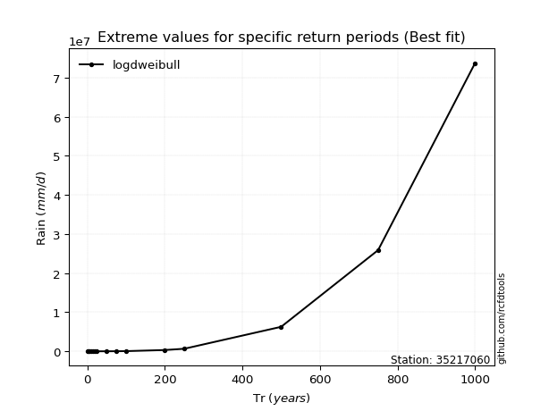</img>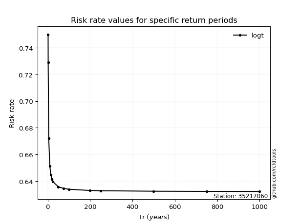</img>

</div>


<sub>**APP DISCLAIMER**: NO WARRANTY - This software is provided by [github.com/rcfdtools](https://github.com/rcfdtools) "as is", without any express or implied warranty, including warranties of merchantability, fitness for a particular purpose, or non-infringement. There is no guarantee that the software will be error-free or operate without interruption. LIMITATION OF LIABILITY - Neither the authors nor copyright holders will be liable for claims or damages arising from the software or its use. You are responsible for determining if the software is appropriate for your use and assume all associated risks, including errors, legal compliance, and data loss. NO PROFESSIONAL ADVICE - The software provides general information and does not offer professional advice. It should not replace consultation with professional advisors.</sub>