<div align="center">


</div>

# PMax24h Station (Rain): 35217090

Maximum Precipitation in 24 hours (PMax24h) is the greatest amount of rainfall for a specific duration that is meteorologically possible for a given location, acting as a "worst-case" scenario for extreme storms, crucial for designing safety-critical infrastructure like bridges, river deviations, dams, spillways, and nuclear plants to prevent catastrophic failure. The PMax24h is related with the Probable Maximum Precipitation (PMP) and it is calculated by hydrologists using meteorological data to determine the upper limit of extreme rainfall, often leading to the Probable Maximum Flood (PMF) for flood control design, and is increasingly being studied for climate change impacts. Probable Maximum Precipitation (PMP) is the theoretical upper limit of rainfall, a deterministic estimate for extreme events, while probability distributions (like GEV, Gumbel) describe the likelihood and frequency of various precipitation amounts, including rare ones, showing how often events occur, with PMP representing the extreme end of these distributions, used for critical infrastructure design to ensure safety against the worst conceivable weather, unlike standard statistical forecasts which cover typical probabilities.

The most common probability distributions in hydrology, used for analyzing floods, rainfall, and streamflow, include the Normal, Log-Normal, Gumbel, Gamma (including Log-Pearson Type III), and Generalized Extreme Value (GEV) distributions, often chosen based on the data´s skewness and whether modeling extremes or general conditions, with Gumbel and GEV popular for extreme events like floods, while the Normal distribution serves as a baseline, though often requiring transformations for skewed hydrological data. These distributions help in designing water infrastructure, managing water resources, and forecasting hydrologic events.

> Hydrological data often isn´t perfectly normal (it´s skewed), so different distributions are needed for different applications, such as: **Flood Frequency Analysis**: Using Gumbel, GEV, or Log-Pearson Type III for predicting extreme flood magnitudes and their return periods, **Rainfall Analysis**: Normal for annual totals, but Log-Normal, Weibull, or GEV for intensity or extreme daily rainfall, **Streamflow Modeling**: Gamma and Log-Normal for maximum flows, GEV for minimum flows, and Kappa for daily flows.

<div align="center">

</img>

</div>


## A. General information


### 1. General running parameters

• app_version: _v20260312_. • runtime: _2026-03-12 07:15:23.203550_. • Python version: _3.14.0_. • SciPy version: _1.16.3_. • Pandas version: _2.3.3_. • NumPy version: _2.3.5_. • Stations dataset (station_dataset_file): _dataset/pmax24h_in/automatic_colombia_2003_2025.csv_. • Stations catalog (station_catalog_file): _dataset/CNE.xls_. • Minimum year to eval til year_max (date_min): _1900_. • Maximum year to eval since year_min (date_max): _2025_. • Creates, save and include plots into reports (create_plot): _True_. • Plot only fit distributions with Δo > Δ (plot_only_fit): _True_. • Plot only simple graphs avoiding multiple CDFs and multiple Extreme values plots (plot_only_simple): _True_. • Eval low extreme values, if False, evaluates high extreme values (low_extreme): _False_. • Eval every SciPy distribution as logarithmic (pdist_logarithmic_on): _True_. • Standard deviation normalized (ddof): _1.0_. • Return periods to eval in years (Tr): _[2, 2.33, 5, 10, 15, 20, 25, 50, 75, 100, 200, 250, 500, 750, 1000]_. • Minimum data sample per station, 0 means any (minimum_sample): _5_. • Z-Score maximum threshold to adjust a value, 0 means disable (zscore_max): _3.5_. • Z-Score minimum threshold to adjust a value, 0 means disable (zscore_min): _-2.5_. • Avoid zeros, e.g. rain = 0 (avoid_zeros): _True_. • Avoid null values (avoid_nans): _True_. 

:file_folder:Table: [dataset.csv](../../dataset/pmax24h_in/automatic_colombia_2003_2025.csv)

> Delta Degrees of Freedom (DDOF): is a parameter used in the formulas for calculating variance and standard deviation. When ddof=0, the divisor is $N$ (the total number of observations) and this is used when your data set is the entire population. When ddof=1, the divisor is $N-1$ and this is used when your data set is a sample drawn from a larger population. Using $N-1$ provides an unbiased estimate of the population variance (known as Bessel´s correction).


### 2. Station info and location

|   id |   CODIGO | NOMBRE                         | CATEGORIA    | TECNOLOGIA                              | ESTADO   | FECHA_INSTALACION   |   FECHA_SUSPENSION |   ALTITUD |   LATITUD |   LONGITUD | DEPARTAMENTO   | MUNICIPIO      | AREA_OPERATIVA                              | ENTIDAD                                                     | AREA_HIDROGRAFICA   | ZONA_HIDROGRAFICA   | SUBZONA_HIDROGRAFICA   | CORRIENTE     | Catalogo   |   Version |
|-----:|---------:|:-------------------------------|:-------------|:----------------------------------------|:---------|:--------------------|-------------------:|----------:|----------:|-----------:|:---------------|:---------------|:--------------------------------------------|:------------------------------------------------------------|:--------------------|:--------------------|:-----------------------|:--------------|:-----------|----------:|
|    0 | 35217090 | LABRANZA GRANDE AUT [35217090] | Limnigráfica | Automática con Telemetría, Convencional | Activa   | 15/12/2016          |                nan |      1125 |   5.56692 |   -72.5836 | Boyacá         | Labranzagrande | Area Operativa 06 - Boyacá-Casanare-Vichada | INSTITUTO DE HIDROLOGIA METEOROLOGIA Y ESTUDIOS AMBIENTALES | Orinoco             | Meta                | Río Cravo Sur          | Rio Cravo Sur | CNE_IDEAM  |  20251226 |

<div align="center">

Dynamic map: [:earth_americas:Google](http://maps.google.com/maps?q=5.566916667,-72.58355556) [:earth_americas:OSM](https://www.openstreetmap.org/#map=18/5.566916667/-72.58355556&layers=P) [:earth_americas:Bing](https://www.bing.com/maps?cp=5.566916667~-72.58355556&lvl=18) [:earth_americas:Apple](https://maps.apple.com/frame?center=5.566916667%2C-72.58355556&span=0.003%2C0.006)

</div>


<div align="center">

```geojson
{
  "type": "Feature",
  "geometry": {
    "type": "Point", 
    "coordinates": [-72.58355556, 5.566916667]
  }, 
  "properties": {
    "Name": "35217090"
  }
}
```

</div>


### 3. Discrete values table and plot

<div align="center">

|               |          0 |           1 |           2 |           3 |           4 |           5 |           6 |          7 |           8 |
|:--------------|-----------:|------------:|------------:|------------:|------------:|------------:|------------:|-----------:|------------:|
| Date          | 2017       | 2018        | 2019        | 2020        | 2021        | 2022        | 2023        | 2024       | 2025        |
| Value         |   14.7     |   49        |   60.7      |   36.4      |   42.6      |   56.5      |   54.7      |   91.6     |   63.8      |
| Value_initial |   14.7     |   49        |   60.7      |   36.4      |   42.6      |   56.5      |   54.7      |   91.6     |   63.8      |
| count         |    9       |    9        |    9        |    9        |    9        |    9        |    9        |    9       |    9        |
| mean          |   52.2222  |   52.2222   |   52.2222   |   52.2222   |   52.2222   |   52.2222   |   52.2222   |   52.2222  |   52.2222   |
| std           |   21.0422  |   21.0422   |   21.0422   |   21.0422   |   21.0422   |   21.0422   |   21.0422   |   21.0422  |   21.0422   |
| zscore        |   -1.78319 |   -0.153131 |    0.402894 |   -0.751928 |   -0.457282 |    0.203295 |    0.117753 |    1.87137 |    0.550217 |


</div>


<div align="center">

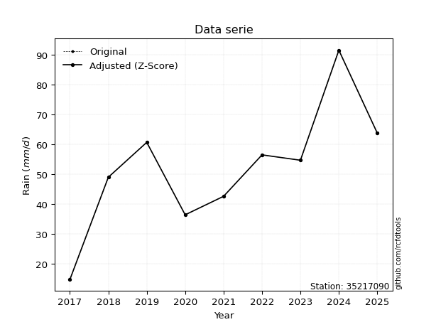</img>

</div>


> The initial value (value_initial) correspond to the initial obtained or null completed value, and value (value) is adjusted only when the initial value is outside the valid range (outlier) definite through the Z-Score value. If Z-Score is active, values out of range or outliers are replaced with the station mean value. A Z-Score (or standard score) measures how many standard deviations a data point is from the mean of a dataset, indicating its relative position; positive scores mean above the mean, negative mean below, and a score of zero is exactly at the mean, allowing for comparison of values from different distributions. It´s calculated using the formula $z=(x–μ)/σ$, where $x$ is the data point, $μ$ is the mean, and $σ$ is the standard deviation, helping identify outliers and understand probability.
>
> <sub>**Note**: In this study, "completing" (filling gaps in) and "extending" (forecasting or lengthening the historical record) rainfall data series are avoided for certain critical analyses because they introduce artificial bias and uncertainty, which can distort the statistics of rare events (extremes), alter day-to-day variability, and compromise the integrity and homogeneity of the original data. Some reasons against Completing/Extending rainfall data are: **Distortion of Extremes and Variability**: The primary issue is that most gap-filling or extension methods rely on averaging or regression with nearby stations, which inherently smooths the data. Rainfall is highly variable in space and time, with a large percentage of zero values and occasional large storms. Infilling methods often underestimate the highest values and overestimate the lowest (zero) values, which severely distorts analyses focused on flood frequency, drought severity, and intensity-duration-frequency (IDF) curves, **Loss of Data Homogeneity**: Infilled or extended data are synthetic estimates, not actual measurements. Combining these estimates with observed data can violate the assumption of data homogeneity, which requires that the data properties do not change over time. Inhomogeneity can lead to incorrect conclusions about long-term trends or changes in climate patterns, **Propagation of Errors**: Errors and biases from the original data (e.g., wind-induced undercatch, instrument errors, site changes) or the data used for imputation can propagate through the analysis, leading to unreliable hydrological models and inaccurate predictions, **Compromised Statistical Integrity**: For statistical analyses, especially those involving the frequency of events, using artificial data can introduce time bias or autocorrelation that doesn´t exist in reality, making it difficult to assess the true probability of events, **Difficulty in Validation**: It is difficult to accurately validate the quality of filled or extended data, especially for past periods where ground-truth measurements are unavailable. The reliability of imputation techniques heavily depends on the density of the surrounding station network and the complexity of the local topography.</sub>


### 4. Active continuous probability distributions from SciPy (80 of 104 available)

A Probability Density Function (PDF) describes the relative likelihood of a continuous random variable falling within a specific range, where the total area under its curve equals 1, and the area over any interval gives the actual probability for that range. Unlike discrete probabilities (like rolling a die), a PDF shows density, not direct probability for a single point (which is zero), with higher points indicating higher likelihood, often visualized as a bell curve for normal distributions.

A log of a probability density function (log-PDF) is simply the logarithm of the PDF´s value, denoted as $log(f(x))$, useful for converting multiplication of probabilities into addition, improving numerical stability with tiny numbers, and connecting to information theory concepts like entropy. Instead of dealing with very small probabilities (e.g., 0.000001), log-PDFs use negative numbers (e.g., $log(0.00001) ≈ -11.51$ that are easier for computers to handle, preventing underflow errors and simplifying complex calculations. In this study, each active probability distribution from SciPy is also evaluated in the $log$ form.

[scipy.stats](https://docs.scipy.org/doc/scipy/reference/stats.html) is a Python´s powerful submodule within the SciPy library for comprehensive statistical analysis, offering over 130 probability distributions (like Normal, Poisson, etc.), functions for descriptive stats (mean, variance), hypothesis testing (t-tests, chi-square), random variable generation, and statistical tests, making it essential for data science, modeling, and research. It provides tools to explore, model, and draw conclusions from data efficiently, working seamlessly with [NumPy](https://numpy.org/).

<div align="center">

|   id | p_dist           |   n_parameter | fit_method   | label                                                                       | active   | ref                                                                                                      |
|-----:|:-----------------|--------------:|:-------------|:----------------------------------------------------------------------------|:---------|:---------------------------------------------------------------------------------------------------------|
|    0 | alpha            |             3 | MLE          | Alpha                                                                       | True     | [:mortar_board:](https://docs.scipy.org/doc/scipy/reference/generated/scipy.stats.alpha.html)            |
|    1 | anglit           |             2 | MM           | Anglit                                                                      | True     | [:mortar_board:](https://docs.scipy.org/doc/scipy/reference/generated/scipy.stats.anglit.html)           |
|    2 | arcsine          |             2 | MM           | Arcsine                                                                     | True     | [:mortar_board:](https://docs.scipy.org/doc/scipy/reference/generated/scipy.stats.arcsine.html)          |
|    3 | argus            |             3 | MLE          | Argus                                                                       | True     | [:mortar_board:](https://docs.scipy.org/doc/scipy/reference/generated/scipy.stats.argus.html)            |
|    4 | beta             |             4 | MLE          | Beta                                                                        | True     | [:mortar_board:](https://docs.scipy.org/doc/scipy/reference/generated/scipy.stats.beta.html)             |
|    5 | betaprime        |             4 | MLE          | Beta prime                                                                  | True     | [:mortar_board:](https://docs.scipy.org/doc/scipy/reference/generated/scipy.stats.betaprime.html)        |
|    6 | bradford         |             3 | MLE          | Bradford                                                                    | True     | [:mortar_board:](https://docs.scipy.org/doc/scipy/reference/generated/scipy.stats.bradford.html)         |
|    7 | burr             |             4 | MLE          | Burr (Type III)                                                             | True     | [:mortar_board:](https://docs.scipy.org/doc/scipy/reference/generated/scipy.stats.burr.html)             |
|    8 | burr12           |             4 | MLE          | Burr (Type III) 12                                                          | True     | [:mortar_board:](https://docs.scipy.org/doc/scipy/reference/generated/scipy.stats.burr12.html)           |
|    9 | cosine           |             2 | MLE          | Cosine                                                                      | True     | [:mortar_board:](https://docs.scipy.org/doc/scipy/reference/generated/scipy.stats.cosine.html)           |
|   10 | crystalball      |             4 | MLE          | Crystalball                                                                 | True     | [:mortar_board:](https://docs.scipy.org/doc/scipy/reference/generated/scipy.stats.crystalball.html)      |
|   11 | dgamma           |             3 | MLE          | Double gamma                                                                | True     | [:mortar_board:](https://docs.scipy.org/doc/scipy/reference/generated/scipy.stats.dgamma.html)           |
|   12 | dweibull         |             3 | MLE          | Double Weibull                                                              | True     | [:mortar_board:](https://docs.scipy.org/doc/scipy/reference/generated/scipy.stats.dweibull.html)         |
|   13 | erlang           |             3 | MLE          | Erlang                                                                      | True     | [:mortar_board:](https://docs.scipy.org/doc/scipy/reference/generated/scipy.stats.erlang.html)           |
|   14 | exponnorm        |             3 | MLE          | Exponentially modified Normal                                               | True     | [:mortar_board:](https://docs.scipy.org/doc/scipy/reference/generated/scipy.stats.exponnorm.html)        |
|   15 | exponpow         |             3 | MLE          | Exponential power                                                           | True     | [:mortar_board:](https://docs.scipy.org/doc/scipy/reference/generated/scipy.stats.exponpow.html)         |
|   16 | exponweib        |             4 | MLE          | Exponentiated Weibull                                                       | True     | [:mortar_board:](https://docs.scipy.org/doc/scipy/reference/generated/scipy.stats.exponweib.html)        |
|   17 | f                |             4 | MLE          | F                                                                           | True     | [:mortar_board:](https://docs.scipy.org/doc/scipy/reference/generated/scipy.stats.f.html)                |
|   18 | fatiguelife      |             3 | MLE          | Fatigue-life (Birnbaum-Saunders)                                            | True     | [:mortar_board:](https://docs.scipy.org/doc/scipy/reference/generated/scipy.stats.fatiguelife.html)      |
|   19 | foldnorm         |             3 | MM           | Fold Normal                                                                 | True     | [:mortar_board:](https://docs.scipy.org/doc/scipy/reference/generated/scipy.stats.foldnorm.html)         |
|   20 | gamma            |             3 | MLE          | Gamma                                                                       | True     | [:mortar_board:](https://docs.scipy.org/doc/scipy/reference/generated/scipy.stats.gamma.html)            |
|   21 | gausshyper       |             6 | MLE          | Gauss hypergeometric                                                        | True     | [:mortar_board:](https://docs.scipy.org/doc/scipy/reference/generated/scipy.stats.gausshyper.html)       |
|   22 | genexpon         |             5 | MLE          | Generalized exponential                                                     | True     | [:mortar_board:](https://docs.scipy.org/doc/scipy/reference/generated/scipy.stats.genexpon.html)         |
|   23 | genextreme       |             3 | MLE          | Generalized exponential                                                     | True     | [:mortar_board:](https://docs.scipy.org/doc/scipy/reference/generated/scipy.stats.genextreme.html)       |
|   24 | gengamma         |             4 | MLE          | Generalized gamma                                                           | True     | [:mortar_board:](https://docs.scipy.org/doc/scipy/reference/generated/scipy.stats.gengamma.html)         |
|   25 | genhalflogistic  |             3 | MLE          | Generalized half-logistic                                                   | True     | [:mortar_board:](https://docs.scipy.org/doc/scipy/reference/generated/scipy.stats.genhalflogistic.html)  |
|   26 | genlogistic      |             3 | MLE          | Generalized logistic                                                        | True     | [:mortar_board:](https://docs.scipy.org/doc/scipy/reference/generated/scipy.stats.genlogistic.html)      |
|   27 | gennorm          |             3 | MLE          | Generalized Normal                                                          | True     | [:mortar_board:](https://docs.scipy.org/doc/scipy/reference/generated/scipy.stats.gennorm.html)          |
|   28 | genpareto        |             3 | MLE          | Generalized Pareto                                                          | True     | [:mortar_board:](https://docs.scipy.org/doc/scipy/reference/generated/scipy.stats.genpareto.html)        |
|   29 | gompertz         |             3 | MLE          | Gompertz (or truncated Gumbel)                                              | True     | [:mortar_board:](https://docs.scipy.org/doc/scipy/reference/generated/scipy.stats.gompertz.html)         |
|   30 | gumbel_l         |             2 | MM           | Gumbel Left Skew                                                            | True     | [:mortar_board:](https://docs.scipy.org/doc/scipy/reference/generated/scipy.stats.gumbel_l.html)         |
|   31 | gumbel_r         |             2 | MM           | Gumbel Right Skew                                                           | True     | [:mortar_board:](https://docs.scipy.org/doc/scipy/reference/generated/scipy.stats.gumbel_r.html)         |
|   32 | halfgennorm      |             3 | MLE          | Upper half of a generalized normal                                          | True     | [:mortar_board:](https://docs.scipy.org/doc/scipy/reference/generated/scipy.stats.halfgennorm.html)      |
|   33 | halflogistic     |             2 | MM           | Half-logistic                                                               | True     | [:mortar_board:](https://docs.scipy.org/doc/scipy/reference/generated/scipy.stats.halflogistic.html)     |
|   34 | halfnorm         |             2 | MM           | Half Normal                                                                 | True     | [:mortar_board:](https://docs.scipy.org/doc/scipy/reference/generated/scipy.stats.halfnorm.html)         |
|   35 | hypsecant        |             2 | MM           | hyperbolic secant                                                           | True     | [:mortar_board:](https://docs.scipy.org/doc/scipy/reference/generated/scipy.stats.hypsecant.html)        |
|   36 | invgamma         |             3 | MLE          | Inverted gamma                                                              | True     | [:mortar_board:](https://docs.scipy.org/doc/scipy/reference/generated/scipy.stats.invgamma.html)         |
|   37 | invgauss         |             3 | MLE          | Inverse Gaussian                                                            | True     | [:mortar_board:](https://docs.scipy.org/doc/scipy/reference/generated/scipy.stats.invgauss.html)         |
|   38 | invweibull       |             3 | MLE          | Inverted Weibull                                                            | True     | [:mortar_board:](https://docs.scipy.org/doc/scipy/reference/generated/scipy.stats.invweibull.html)       |
|   39 | johnsonsb        |             4 | MLE          | Johnson SB                                                                  | True     | [:mortar_board:](https://docs.scipy.org/doc/scipy/reference/generated/scipy.stats.johnsonsb.html)        |
|   40 | johnsonsu        |             4 | MLE          | Johnson Su                                                                  | True     | [:mortar_board:](https://docs.scipy.org/doc/scipy/reference/generated/scipy.stats.johnsonsu.html)        |
|   41 | kappa3           |             3 | MLE          | Kappa 3                                                                     | True     | [:mortar_board:](https://docs.scipy.org/doc/scipy/reference/generated/scipy.stats.kappa3.html)           |
|   42 | kappa4           |             4 | MLE          | Kappa 4                                                                     | True     | [:mortar_board:](https://docs.scipy.org/doc/scipy/reference/generated/scipy.stats.kappa4.html)           |
|   43 | ksone            |             3 | MLE          | Kolmogorov-Smirnov one-sided test statistic distribution                    | True     | [:mortar_board:](https://docs.scipy.org/doc/scipy/reference/generated/scipy.stats.ksone.html)            |
|   44 | kstwobign        |             2 | MLE          | Limiting distribution of scaled Kolmogorov-Smirnov two-sided test statistic | True     | [:mortar_board:](https://docs.scipy.org/doc/scipy/reference/generated/scipy.stats.kstwobign.html)        |
|   45 | laplace          |             2 | MM           | Laplace                                                                     | True     | [:mortar_board:](https://docs.scipy.org/doc/scipy/reference/generated/scipy.stats.laplace.html)          |
|   46 | levy_l           |             2 | MLE          | Left-skewed Levy                                                            | True     | [:mortar_board:](https://docs.scipy.org/doc/scipy/reference/generated/scipy.stats.levy_l.html)           |
|   47 | loggamma         |             3 | MLE          | Log gamma                                                                   | True     | [:mortar_board:](https://docs.scipy.org/doc/scipy/reference/generated/scipy.stats.loggamma.html)         |
|   48 | logistic         |             2 | MM           | Logistic (or Sech-squared)                                                  | True     | [:mortar_board:](https://docs.scipy.org/doc/scipy/reference/generated/scipy.stats.logistic.html)         |
|   49 | loglaplace       |             3 | MLE          | Log-Laplace                                                                 | True     | [:mortar_board:](https://docs.scipy.org/doc/scipy/reference/generated/scipy.stats.loglaplace.html)       |
|   50 | lomax            |             3 | MLE          | Lomax (Pareto of the second kind)                                           | True     | [:mortar_board:](https://docs.scipy.org/doc/scipy/reference/generated/scipy.stats.lomax.html)            |
|   51 | maxwell          |             2 | MM           | Maxwell                                                                     | True     | [:mortar_board:](https://docs.scipy.org/doc/scipy/reference/generated/scipy.stats.maxwell.html)          |
|   52 | mielke           |             4 | MLE          | Mielke Beta-Kappa / Dagum                                                   | True     | [:mortar_board:](https://docs.scipy.org/doc/scipy/reference/generated/scipy.stats.mielke.html)           |
|   53 | moyal            |             2 | MM           | Moyal                                                                       | True     | [:mortar_board:](https://docs.scipy.org/doc/scipy/reference/generated/scipy.stats.moyal.html)            |
|   54 | nakagami         |             3 | MLE          | Nakagami                                                                    | True     | [:mortar_board:](https://docs.scipy.org/doc/scipy/reference/generated/scipy.stats.nakagami.html)         |
|   55 | ncf              |             5 | MLE          | Non-central F distribution                                                  | True     | [:mortar_board:](https://docs.scipy.org/doc/scipy/reference/generated/scipy.stats.ncf.html)              |
|   56 | nct              |             4 | MLE          | Non-central Student’s t                                                     | True     | [:mortar_board:](https://docs.scipy.org/doc/scipy/reference/generated/scipy.stats.nct.html)              |
|   57 | norm             |             2 | MM           | Normal                                                                      | True     | [:mortar_board:](https://docs.scipy.org/doc/scipy/reference/generated/scipy.stats.norm.html)             |
|   58 | pearson3         |             3 | MM           | Pearson type III                                                            | True     | [:mortar_board:](https://docs.scipy.org/doc/scipy/reference/generated/scipy.stats.pearson3.html)         |
|   59 | powerlaw         |             3 | MLE          | Power-function                                                              | True     | [:mortar_board:](https://docs.scipy.org/doc/scipy/reference/generated/scipy.stats.powerlaw.html)         |
|   60 | rayleigh         |             2 | MM           | Rayleigh                                                                    | True     | [:mortar_board:](https://docs.scipy.org/doc/scipy/reference/generated/scipy.stats.rayleigh.html)         |
|   61 | rdist            |             3 | MLE          | R-distributed (symmetric beta)                                              | True     | [:mortar_board:](https://docs.scipy.org/doc/scipy/reference/generated/scipy.stats.rdist.html)            |
|   62 | rice             |             3 | MLE          | Rice                                                                        | True     | [:mortar_board:](https://docs.scipy.org/doc/scipy/reference/generated/scipy.stats.rice.html)             |
|   63 | semicircular     |             2 | MM           | Semicircular                                                                | True     | [:mortar_board:](https://docs.scipy.org/doc/scipy/reference/generated/scipy.stats.semicircular.html)     |
|   64 | skewnorm         |             3 | MLE          | Skew normal                                                                 | True     | [:mortar_board:](https://docs.scipy.org/doc/scipy/reference/generated/scipy.stats.skewnorm.html)         |
|   65 | t                |             3 | MLE          | Student’s t                                                                 | True     | [:mortar_board:](https://docs.scipy.org/doc/scipy/reference/generated/scipy.stats.t.html)                |
|   66 | trapezoid        |             4 | MLE          | Trapezoid                                                                   | True     | [:mortar_board:](https://docs.scipy.org/doc/scipy/reference/generated/scipy.stats.trapezoid.html)        |
|   67 | triang           |             3 | MLE          | Triangular                                                                  | True     | [:mortar_board:](https://docs.scipy.org/doc/scipy/reference/generated/scipy.stats.triang.html)           |
|   68 | truncexpon       |             3 | MLE          | Truncated exponential                                                       | True     | [:mortar_board:](https://docs.scipy.org/doc/scipy/reference/generated/scipy.stats.truncexpon.html)       |
|   69 | truncnorm        |             4 | MLE          | Truncated normal                                                            | True     | [:mortar_board:](https://docs.scipy.org/doc/scipy/reference/generated/scipy.stats.truncnorm.html)        |
|   70 | truncpareto      |             4 | MLE          | Upper truncated Pareto                                                      | True     | [:mortar_board:](https://docs.scipy.org/doc/scipy/reference/generated/scipy.stats.truncpareto.html)      |
|   71 | truncweibull_min |             5 | MLE          | Doubly truncated Weibull minimum                                            | True     | [:mortar_board:](https://docs.scipy.org/doc/scipy/reference/generated/scipy.stats.truncweibull_min.html) |
|   72 | tukeylambda      |             3 | MLE          | Tukey-Lamdba                                                                | True     | [:mortar_board:](https://docs.scipy.org/doc/scipy/reference/generated/scipy.stats.tukeylambda.html)      |
|   73 | uniform          |             2 | MLE          | Uniform                                                                     | True     | [:mortar_board:](https://docs.scipy.org/doc/scipy/reference/generated/scipy.stats.uniform.html)          |
|   74 | vonmises         |             3 | MLE          | Von Mises                                                                   | True     | [:mortar_board:](https://docs.scipy.org/doc/scipy/reference/generated/scipy.stats.vonmises.html)         |
|   75 | vonmises_line    |             3 | MLE          | Von Mises line                                                              | True     | [:mortar_board:](https://docs.scipy.org/doc/scipy/reference/generated/scipy.stats.vonmises_line.html)    |
|   76 | wald             |             2 | MM           | Wald                                                                        | True     | [:mortar_board:](https://docs.scipy.org/doc/scipy/reference/generated/scipy.stats.wald.html)             |
|   77 | weibull_max      |             3 | MLE          | Weibull maximum                                                             | True     | [:mortar_board:](https://docs.scipy.org/doc/scipy/reference/generated/scipy.stats.weibull_max.html)      |
|   78 | weibull_min      |             3 | MLE          | Weibull minimum                                                             | True     | [:mortar_board:](https://docs.scipy.org/doc/scipy/reference/generated/scipy.stats.weibull_min.html)      |
|   79 | wrapcauchy       |             3 | MLE          | Wrapped  Cauchy                                                             | True     | [:mortar_board:](https://docs.scipy.org/doc/scipy/reference/generated/scipy.stats.wrapcauchy.html)       |

</div>

> **n_parameter:** # arguments & localization & scale.
>
> **Fit methods:** (MLE) maximum likelihood, (MM) L-moments.
>
>**Inactive** (With the only purpose of prevent loops, zero divisions, infinite values, over high estimated values or horizontal trending for recurrence intervals estimations, the follow distributions were disabled.)**:** lognorm, norminvgauss, powernorm, powerlognorm, cauchy, halfcauchy, foldcauchy, skewcauchy, chi2, expon, fisk, genhyperbolic, geninvgauss, gibrat, kstwo, laplace_asymmetric, levy, levy_stable, ncx2, pareto, rel_breitwigner, recipinvgauss, studentized_range, loguniform, 


## B. Probability (PDF) vs. Empirical (EDF) distributions functions

A continuous probability distribution (CPD) describes probabilities for variables that can take any value within a range (like rain any time), unlike discrete variables with specific outcomes (like temperature). It uses a Probability Density Function (PDF), a curve where the total area under it equals 1, and the probability of the variable falling within an interval (a to b) is found by calculating the area under the curve between those points. A key feature is that the probability of hitting any single exact value is zero, so probabilities are always expressed for ranges, e.g., $P(a ≤ X ≤ b)$.

<div align="center">

Distributions parameters from station values
|     |   station | p_dist              |   n |              loc |           scale | shape                 | shape1                 | shape2                 | shape3             |
|----:|----------:|:--------------------|----:|-----------------:|----------------:|:----------------------|:-----------------------|:-----------------------|:-------------------|
|   0 |  35217090 | alpha               |   9 |   -273.785       |  5315.22        | 16.389021608486157    |                        |                        |                    |
|   1 |  35217090 | anglit              |   9 |     52.2222      |    58.0364      |                       |                        |                        |                    |
|   2 |  35217090 | arcsine             |   9 |     24.166       |    56.1125      |                       |                        |                        |                    |
|   3 |  35217090 | argus               |   9 |      0.757549    |    93.8904      | 8.187376222878272e-06 |                        |                        |                    |
|   4 |  35217090 | beta                |   9 |   -442.923       |  3660.1         | 538.577697813005      | 3442.5696972534697     |                        |                    |
|   5 |  35217090 | betaprime           |   9 |   -270.017       | 38525.6         | 263.8681537287538     | 31550.844240174003     |                        |                    |
|   6 |  35217090 | bradford            |   9 |     14.7         |    76.9         | 0.9298726791367251    |                        |                        |                    |
|   7 |  35217090 | burr                |   9 |     -0.207941    |    66.3535      | 7.691986671667003     | 0.3333163639729282     |                        |                    |
|   8 |  35217090 | burr12              |   9 |     -1.48461     |    16.0297      | 403.49959945649596    | 0.002211118232310613   |                        |                    |
|   9 |  35217090 | cosine              |   9 |     52.5672      |    17.8392      |                       |                        |                        |                    |
|  10 |  35217090 | crystalball         |   9 |     52.2222      |    19.8388      | 24202.49778490849     | 185.38521413719786     |                        |                    |
|  11 |  35217090 | dgamma              |   9 |     54.7         |    14.8379      | 0.9191735061017567    |                        |                        |                    |
|  12 |  35217090 | dweibull            |   9 |     54.7         |    13.1999      | 0.9329513850806453    |                        |                        |                    |
|  13 |  35217090 | erlang              |   9 |   -501.528       |     0.710759    | 779.0975133294751     |                        |                        |                    |
|  14 |  35217090 | exponnorm           |   9 |     44.6848      |    18.3655      | 0.4104092954198306    |                        |                        |                    |
|  15 |  35217090 | exponpow            |   9 |      9.95676     |    61.9646      | 1.552566011978885     |                        |                        |                    |
|  16 |  35217090 | exponweib           |   9 |     14.7         |    54.3518      | 0.6326401956075494    | 1.335150573978152      |                        |                    |
|  17 |  35217090 | f                   |   9 |   -524.766       |   576.983       | 1702.7092678418671    | 267619.3650498474      |                        |                    |
|  18 |  35217090 | fatiguelife         |   9 |     14.7         |     1.3874e-05  | 1374.737467070744     |                        |                        |                    |
|  19 |  35217090 | foldnorm            |   9 |     57.3142      |     0.0203862   | 0.05552471917645925   |                        |                        |                    |
|  20 |  35217090 | gamma               |   9 |   -501.793       |     0.710434    | 779.8207235051555     |                        |                        |                    |
|  21 |  35217090 | gausshyper          |   9 |      9.71393     |    81.8861      | 1.2338620093518808    | 0.7652600524141402     | 0.8687989889299664     | 0.919177855877251  |
|  22 |  35217090 | genexpon            |   9 |     14.7         |     2.22129     | 0.05927464821197795   | 0.00010610342718648177 | 0.8492158489139927     |                    |
|  23 |  35217090 | genextreme          |   9 |     16.5546      |    17.9593      | -9.683579631517091    |                        |                        |                    |
|  24 |  35217090 | gengamma            |   9 |   -125.155       |    59.4341      | 14.064668627033065    | 2.399212984945252      |                        |                    |
|  25 |  35217090 | genhalflogistic     |   9 |      7.16219     |    87.844       | 1.040340170946608     |                        |                        |                    |
|  26 |  35217090 | genlogistic         |   9 |     53.2549      |    10.5057      | 0.933820073994118     |                        |                        |                    |
|  27 |  35217090 | gennorm             |   9 |     54.7         |     9.03983     | 0.7654247882319836    |                        |                        |                    |
|  28 |  35217090 | genpareto           |   9 |     -0.444157    |   134.881       | -1.4653944254543185   |                        |                        |                    |
|  29 |  35217090 | gompertz            |   9 |    -69.3783      |    20.1606      | 0.0014623346436508696 |                        |                        |                    |
|  30 |  35217090 | gumbel_l            |   9 |     61.1507      |    15.4682      |                       |                        |                        |                    |
|  31 |  35217090 | gumbel_r            |   9 |     43.2937      |    15.4682      |                       |                        |                        |                    |
|  32 |  35217090 | halfgennorm         |   9 |     14.7         |     0.816691    | 0.32840181596800855   |                        |                        |                    |
|  33 |  35217090 | halflogistic        |   9 |     28.7086      |    16.9615      |                       |                        |                        |                    |
|  34 |  35217090 | halfnorm            |   9 |     25.9635      |    32.9105      |                       |                        |                        |                    |
|  35 |  35217090 | hypsecant           |   9 |     52.2222      |    12.6298      |                       |                        |                        |                    |
|  36 |  35217090 | invgamma            |   9 |   -163.665       | 24689.9         | 115.29393265458958    |                        |                        |                    |
|  37 |  35217090 | invgauss            |   9 |    -80.1821      |  5401.85        | 0.02445000564525784   |                        |                        |                    |
|  38 |  35217090 | invweibull          |   9 |     14.7         |     1.98772     | 0.06044433605314832   |                        |                        |                    |
|  39 |  35217090 | johnsonsb           |   9 |   -521.853       |  2123.62        | 20.9707613712418      | 21.10791513576899      |                        |                    |
|  40 |  35217090 | johnsonsu           |   9 |     54.3383      |    14.6865      | 0.11590036085043798   | 1.0676198807730568     |                        |                    |
|  41 |  35217090 | kappa3              |   9 |     14.7         |    48.2769      | 7.027961620970147     |                        |                        |                    |
|  42 |  35217090 | kappa4              |   9 |      7.32496     |    83.4898      | 1.0968044990081067    | 0.9815540289965752     |                        |                    |
|  43 |  35217090 | ksone               |   9 |      7.01        |    92.28        | 1.0                   |                        |                        |                    |
|  44 |  35217090 | kstwobign           |   9 |    -28.2117      |    92.3723      |                       |                        |                        |                    |
|  45 |  35217090 | laplace             |   9 |     52.2222      |    14.0281      |                       |                        |                        |                    |
|  46 |  35217090 | levy_l              |   9 |     96.1405      |    22.6332      |                       |                        |                        |                    |
|  47 |  35217090 | loggamma            |   9 |  -4635           |   667.58        | 1120.616466041285     |                        |                        |                    |
|  48 |  35217090 | logistic            |   9 |     52.2222      |    10.9377      |                       |                        |                        |                    |
|  49 |  35217090 | loglaplace          |   9 |     -0.153116    |    54.8531      | 2.898123694227529     |                        |                        |                    |
|  50 |  35217090 | lomax               |   9 |     14.7         |  7270.38        | 193.36581316307894    |                        |                        |                    |
|  51 |  35217090 | maxwell             |   9 |      5.21264     |    29.4589      |                       |                        |                        |                    |
|  52 |  35217090 | mielke              |   9 |     -0.214143    |    66.358       | 2.564396054925944     | 7.69271707595605       |                        |                    |
|  53 |  35217090 | moyal               |   9 |     40.8771      |     8.93059     |                       |                        |                        |                    |
|  54 |  35217090 | nakagami            |   9 |     36.4         |    25.094       | 0.08758835561822129   |                        |                        |                    |
|  55 |  35217090 | ncf                 |   9 |     -0.607907    |     5.11036e-07 | 2.4462926989083e-07   | 1152.710722060328      | 25.257206321358105     |                    |
|  56 |  35217090 | nct                 |   9 |     47.9517      |    18.0177      | 7.98338430632494      | 0.23530800215396241    |                        |                    |
|  57 |  35217090 | norm                |   9 |     52.2222      |    19.8388      |                       |                        |                        |                    |
|  58 |  35217090 | pearson3            |   9 |     52.2222      |    19.8388      | 0.07968147429327019   |                        |                        |                    |
|  59 |  35217090 | powerlaw            |   9 |     14.7         |    76.9         | 0.20633258391107323   |                        |                        |                    |
|  60 |  35217090 | rayleigh            |   9 |     14.2695      |    30.2819      |                       |                        |                        |                    |
|  61 |  35217090 | rdist               |   9 |      7.24501     |    49.255       | 1.0317336906359014    |                        |                        |                    |
|  62 |  35217090 | rice                |   9 |      3.66976     |    21.6304      | 1.9696669863219158    |                        |                        |                    |
|  63 |  35217090 | semicircular        |   9 |     52.2222      |    39.6776      |                       |                        |                        |                    |
|  64 |  35217090 | skewnorm            |   9 |     39.9213      |    23.3429      | 0.8803025402204695    |                        |                        |                    |
|  65 |  35217090 | t                   |   9 |     52.2221      |    19.8369      | 11833.410838510186    |                        |                        |                    |
|  66 |  35217090 | trapezoid           |   9 |      7.01        |    92.28        | 1.0                   | 1.0                    |                        |                    |
|  67 |  35217090 | triang              |   9 |      7.69282     |    83.9072      | 0.999999913422889     |                        |                        |                    |
|  68 |  35217090 | truncexpon          |   9 |      8.28905     |   108.711       | 0.7663521243418514    |                        |                        |                    |
|  69 |  35217090 | truncnorm           |   9 |     52.2222      |    19.8388      | -189.890343344558     | 528.1583920351368      |                        |                    |
|  70 |  35217090 | truncpareto         |   9 |     14.6951      |     0.00493876  | 0.12514939630836253   | 15571.697993701222     |                        |                    |
|  71 |  35217090 | truncweibull_min    |   9 |      8.89977     |   116.719       | 1.4287053824784293    | 3.495165422691356e-12  | 0.7085436876224693     |                    |
|  72 |  35217090 | tukeylambda         |   9 |     52.4965      |     8.22988     | -0.17885429186933482  |                        |                        |                    |
|  73 |  35217090 | uniform             |   9 |     14.7         |    76.9         |                       |                        |                        |                    |
|  74 |  35217090 | vonmises            |   9 |     -1.54231     |     1           | 0.8631279329894886    |                        |                        |                    |
|  75 |  35217090 | vonmises_line       |   9 |     53.1502      |    12.2391      | 0.7644454404231227    |                        |                        |                    |
|  76 |  35217090 | wald                |   9 |     32.3834      |    19.8388      |                       |                        |                        |                    |
|  77 |  35217090 | weibull_max         |   9 |     91.6         |     1.54631     | 0.227864030037014     |                        |                        |                    |
|  78 |  35217090 | weibull_min         |   9 |     -5.41974     |    64.301       | 3.1690221762065147    |                        |                        |                    |
|  79 |  35217090 | wrapcauchy          |   9 |     14.552       |    12.2626      | 3.085546364011244e-08 |                        |                        |                    |
|  80 |  35217090 | logalpha            |   9 |    -14.0244      |   629.905       | 35.259738682235636    |                        |                        |                    |
|  81 |  35217090 | loganglit           |   9 |      3.86015     |     1.40894     |                       |                        |                        |                    |
|  82 |  35217090 | logarcsine          |   9 |      3.17899     |     1.36232     |                       |                        |                        |                    |
|  83 |  35217090 | logargus            |   9 |      2.26431     |     2.29619     | 1.8878330185566425    |                        |                        |                    |
|  84 |  35217090 | logbeta             |   9 |      2.22779     |     2.28964     | 3.5119973157342352    | 0.770257536273952      |                        |                    |
|  85 |  35217090 | logbetaprime        |   9 |    -30.6063      |   212.076       | 5714.490902355904     | 35178.31769859402      |                        |                    |
|  86 |  35217090 | logbradford         |   9 |      2.68785     |     1.83052     | 0.001317519620286358  |                        |                        |                    |
|  87 |  35217090 | logburr             |   9 |  -7797.88        |  7802.08        | 62523.062189633085    | 0.3153188853638661     |                        |                    |
|  88 |  35217090 | logburr12           |   9 |   -191.735       |   199.823       | 557.4628704465374     | 82807.92064861176      |                        |                    |
|  89 |  35217090 | logcosine           |   9 |      3.76201     |     0.450735    |                       |                        |                        |                    |
|  90 |  35217090 | logcrystalball      |   9 |      3.86015     |     0.481636    | 12.647943014204348    | 966.9703730006829      |                        |                    |
|  91 |  35217090 | logdgamma           |   9 |      4.00186     |     0.43691     | 0.6450330502667337    |                        |                        |                    |
|  92 |  35217090 | logdweibull         |   9 |      4.00186     |     0.373166    | 0.9386015920086705    |                        |                        |                    |
|  93 |  35217090 | logerlang           |   9 |     -4.55327     |     0.0302151   | 278.2458633752045     |                        |                        |                    |
|  94 |  35217090 | logexponnorm        |   9 |      3.85979     |     0.481634    | 0.0007451840946431939 |                        |                        |                    |
|  95 |  35217090 | logexponpow         |   9 |      2.68785     |     1.48065     | 0.7901268445769282    |                        |                        |                    |
|  96 |  35217090 | logexponweib        |   9 |     -7.23502e+06 |     7.23502e+06 | 0.7820656417450091    | 23746167.89352484      |                        |                    |
|  97 |  35217090 | logf                |   9 |   -691.737       |   695.595       | 6215684.940645905     | 12716868.556199795     |                        |                    |
|  98 |  35217090 | logfatiguelife      |   9 |   -315.701       |   319.56        | 0.0015027641223729982 |                        |                        |                    |
|  99 |  35217090 | logfoldnorm         |   9 |      3.20201     |     0.569857    | 0.9885641424380296    |                        |                        |                    |
| 100 |  35217090 | loggamma            |   9 |     -5.23965     |     0.0272845   | 333.32882405740315    |                        |                        |                    |
| 101 |  35217090 | loggausshyper       |   9 |      2.1258      |     2.39164     | 2.3850576610049403    | 0.788415719175492      | 0.11768138326513132    | 2.5987715662865485 |
| 102 |  35217090 | loggenexpon         |   9 |      2.6828      |     0.00552469  | 0.0010987016702811675 | 2.7684784064635206     | 1.0454218298363193e-05 |                    |
| 103 |  35217090 | loggenextreme       |   9 |      3.7881      |     0.528155    | 0.6765984247977608    |                        |                        |                    |
| 104 |  35217090 | loggengamma         |   9 |     -2.96872e+07 |     2.96872e+07 | 3.4556283529339034    | 38394254.35745964      |                        |                    |
| 105 |  35217090 | loggenhalflogistic  |   9 |      2.67869     |     2.00759     | 1.0918329813921057    |                        |                        |                    |
| 106 |  35217090 | loggenlogistic      |   9 |      4.19265     |     0.130319    | 0.33186238826411363   |                        |                        |                    |
| 107 |  35217090 | loggennorm          |   9 |      4.03424     |     0.00137486  | 0.27350334286179845   |                        |                        |                    |
| 108 |  35217090 | loggenpareto        |   9 |     -0.00677757  |    13.4198      | -2.966212003895998    |                        |                        |                    |
| 109 |  35217090 | loggompertz         |   9 |      2.68785     |     0.377342    | 0.02716522757935491   |                        |                        |                    |
| 110 |  35217090 | loggumbel_l         |   9 |      4.07691     |     0.37553     |                       |                        |                        |                    |
| 111 |  35217090 | loggumbel_r         |   9 |      3.64339     |     0.37553     |                       |                        |                        |                    |
| 112 |  35217090 | loghalfgennorm      |   9 |      2.68764     |     1.83719     | 1419.2736725224077    |                        |                        |                    |
| 113 |  35217090 | loghalflogistic     |   9 |      3.28932     |     0.411763    |                       |                        |                        |                    |
| 114 |  35217090 | loghalfnorm         |   9 |      3.22264     |     0.798993    |                       |                        |                        |                    |
| 115 |  35217090 | loghypsecant        |   9 |      3.86015     |     0.306619    |                       |                        |                        |                    |
| 116 |  35217090 | loginvgamma         |   9 |    -10.1535      | 10907.3         | 779.3890028770988     |                        |                        |                    |
| 117 |  35217090 | loginvgauss         |   9 |     -1.66939     |   628.209       | 0.008804195446342523  |                        |                        |                    |
| 118 |  35217090 | loginvweibull       |   9 |     -4.63615e+08 |     4.63615e+08 | 752882366.8991745     |                        |                        |                    |
| 119 |  35217090 | logjohnsonsb        |   9 |    -88.4065      |    93.3934      | -10.977435145954166   | 2.446077461473215      |                        |                    |
| 120 |  35217090 | logjohnsonsu        |   9 |      4.07689     |     0.148318    | 0.47223532775742827   | 0.7512150779187985     |                        |                    |
| 121 |  35217090 | logkappa3           |   9 |      2.68617     |     1.83074     | 2423.3587516748257    |                        |                        |                    |
| 122 |  35217090 | logkappa4           |   9 |      2.60172     |     2.02849     | 1.0397360830092093    | 1.0588664262067278     |                        |                    |
| 123 |  35217090 | logksone            |   9 |      2.50489     |     2.1955      | 1.0                   |                        |                        |                    |
| 124 |  35217090 | logkstwobign        |   9 |      1.43542     |     2.78207     |                       |                        |                        |                    |
| 125 |  35217090 | loglaplace          |   9 |      3.86015     |     0.340568    |                       |                        |                        |                    |
| 126 |  35217090 | loglevy_l           |   9 |      4.5842      |     0.331877    |                       |                        |                        |                    |
| 127 |  35217090 | logloggamma         |   9 |      4.17537     |     0.297331    | 0.7602204229175695    |                        |                        |                    |
| 128 |  35217090 | loglogistic         |   9 |      3.86015     |     0.26554     |                       |                        |                        |                    |
| 129 |  35217090 | logloglaplace       |   9 |     -0.119517    |     4.12138     | 11.81328760717431     |                        |                        |                    |
| 130 |  35217090 | loglomax            |   9 |      2.68785     |   347.977       | 297.83205262091656    |                        |                        |                    |
| 131 |  35217090 | logmaxwell          |   9 |      2.71891     |     0.715166    |                       |                        |                        |                    |
| 132 |  35217090 | logmielke           |   9 |   -339.554       |   343.755       | 859.0903158320214     | 2677.858255234026      |                        |                    |
| 133 |  35217090 | logmoyal            |   9 |      3.58472     |     0.216813    |                       |                        |                        |                    |
| 134 |  35217090 | lognakagami         |   9 |      3.59457     |     0.484039    | 0.4510134993515505    |                        |                        |                    |
| 135 |  35217090 | logncf              |   9 |     -4.503       |     8.35442     | 528.3410584078013     | 1191.1575913891093     | 0.0020268049697342617  |                    |
| 136 |  35217090 | lognct              |   9 |     31.4465      |     0.480367    | 329082.1707360302     | -57.42735992486011     |                        |                    |
| 137 |  35217090 | lognorm             |   9 |      3.86015     |     0.481636    |                       |                        |                        |                    |
| 138 |  35217090 | logpearson3         |   9 |      3.86015     |     0.481636    | -1.2911127174408292   |                        |                        |                    |
| 139 |  35217090 | logpowerlaw         |   9 |      2.68785     |     1.82958     | 0.23237922335386305   |                        |                        |                    |
| 140 |  35217090 | lograyleigh         |   9 |      2.93874     |     0.735174    |                       |                        |                        |                    |
| 141 |  35217090 | logrdist            |   9 |      3.49838     |     1.01906     | 1.0607657462711217    |                        |                        |                    |
| 142 |  35217090 | logrice             |   9 |   -194.202       |     0.481671    | 411.197169997222      |                        |                        |                    |
| 143 |  35217090 | logsemicircular     |   9 |      3.86015     |     0.963234    |                       |                        |                        |                    |
| 144 |  35217090 | logskewnorm         |   9 |      4.51743     |     0.814801    | -50980499.38240092    |                        |                        |                    |
| 145 |  35217090 | logt                |   9 |      3.98455     |     0.213489    | 1.6135044621599137    |                        |                        |                    |
| 146 |  35217090 | logtrapezoid        |   9 |      2.49787     |     2.04341     | 1.0                   | 1.0                    |                        |                    |
| 147 |  35217090 | logtriang           |   9 |      2.44286     |     2.07458     | 0.9999992335398544    |                        |                        |                    |
| 148 |  35217090 | logtruncexpon       |   9 |      2.68768     |     2.18155     | 0.8387351658411877    |                        |                        |                    |
| 149 |  35217090 | logtruncnorm        |   9 |     -0.18035     |     1.27145     | 2.9689873761755905    | 4.067391188532978      |                        |                    |
| 150 |  35217090 | logtruncpareto      |   9 |      2.68769     |     0.000161276 | 0.12514310750037608   | 11345.417496106475     |                        |                    |
| 151 |  35217090 | logtruncweibull_min |   9 |      1.5468      |     3.76588     | 3.894303172727607     | 0.005257793604851246   | 0.7890084740926393     |                    |
| 152 |  35217090 | logtukeylambda      |   9 |      3.60267     |     1.01461     | 1.109080482215489     |                        |                        |                    |
| 153 |  35217090 | loguniform          |   9 |      2.68785     |     1.82958     |                       |                        |                        |                    |
| 154 |  35217090 | logvonmises         |   9 |     -2.39822     |     1           | 5.008282549221849     |                        |                        |                    |
| 155 |  35217090 | logvonmises_line    |   9 |      3.93829     |     0.398028    | 1.5049622687242135    |                        |                        |                    |
| 156 |  35217090 | logwald             |   9 |      3.37854     |     0.481611    |                       |                        |                        |                    |
| 157 |  35217090 | logweibull_max      |   9 |      4.56873     |     0.780625    | 1.478000167602708     |                        |                        |                    |
| 158 |  35217090 | logweibull_min      |   9 | -23908.3         | 23912.3         | 68042.59614945337     |                        |                        |                    |
| 159 |  35217090 | logwrapcauchy       |   9 |      2.68785     |     0.291187    | 0.5                   |                        |                        |                    |

</div>

> **loc** (Location parameter): This shifts the distribution along the x-axis. For many common distributions, like the normal (Gaussian) distribution, loc represents the mean $μ$. For others, like the uniform distribution, it might represent the minimum value, or for the beta distribution, the left end of the support interval.
>
> **scale** (Scale parameter): This determines the width or spread of the distribution. For the normal distribution, scale represents the standard deviation $σ$. For a uniform distribution, it defines the length of the interval (from $loc$ to $loc + scale$).
>
> **shape** (Shape parameters): Refers to parameters that define the specific form of a probability distribution, distinct from its location (loc) and scale (scale). These parameters are required arguments for most distribution functions. For example, a normal (Gaussian) distribution is fully defined by its location (mean) and scale (standard deviation), so it has no specific shape parameters beyond loc and scale. However, other distributions have intrinsic properties that need specification, as Gamma distribution that takes a shape parameter, often named $a$ or $alpha$.


### 0. Cumulative distribution values - CDF (160 evaluated)

Cumulative Distribution Function (CDF), denoted as $F$<sub>$X$</sub>$(x)$, is a function that gives the probability that a random variable $X$ will take a value less than or equal to a specific value, $x$ (i.e., $(P(X≥x)$. It essentially "accumulates" probabilities from a given point up to the far right (positive infinity), providing a complete picture of the distribution´s probabilities for both discrete (like rain) and continuous (like temperature) variables, helping to find probabilities over ranges or above certain values. Each station is evaluated separately ordering the $x$ values ascending, calculating the CDF and PDF values for the activated distributions and their logarithmic forms.

<div align="center">

CDF ordered by x ascending and calculating $log(f(x))$ separately
|   id |   Station |   date |    x |   count |    mean |     std |    zscore |   Value_initial |   station |   m |    alpha |   alpha_pdf |    anglit |   anglit_pdf |   arcsine |   arcsine_pdf |     argus |   argus_pdf |      beta |   beta_pdf |   betaprime |   betaprime_pdf |    bradford |   bradford_pdf |      burr |   burr_pdf |     burr12 |   burr12_pdf |    cosine |   cosine_pdf |   crystalball |   crystalball_pdf |    dgamma |   dgamma_pdf |   dweibull |   dweibull_pdf |    erlang |   erlang_pdf |   exponnorm |   exponnorm_pdf |   exponpow |   exponpow_pdf |   exponweib |   exponweib_pdf |         f |      f_pdf |   fatiguelife |   fatiguelife_pdf |   foldnorm |   foldnorm_pdf |     gamma |   gamma_pdf |   gausshyper |   gausshyper_pdf |    genexpon |   genexpon_pdf |   genextreme |   genextreme_pdf |   gengamma |   gengamma_pdf |   genhalflogistic |   genhalflogistic_pdf |   genlogistic |   genlogistic_pdf |   gennorm |   gennorm_pdf |   genpareto |   genpareto_pdf |   gompertz |   gompertz_pdf |   gumbel_l |   gumbel_l_pdf |   gumbel_r |   gumbel_r_pdf |   halfgennorm |   halfgennorm_pdf |   halflogistic |   halflogistic_pdf |   halfnorm |   halfnorm_pdf |   hypsecant |   hypsecant_pdf |   invgamma |   invgamma_pdf |   invgauss |   invgauss_pdf |   invweibull |   invweibull_pdf |   johnsonsb |   johnsonsb_pdf |   johnsonsu |   johnsonsu_pdf |      kappa3 |   kappa3_pdf |      kappa4 |   kappa4_pdf |     ksone |   ksone_pdf |   kstwobign |   kstwobign_pdf |   laplace |   laplace_pdf |   levy_l |   levy_l_pdf |   loggamma |   loggamma_pdf |   logistic |   logistic_pdf |   loglaplace |   loglaplace_pdf |       lomax |   lomax_pdf |    maxwell |   maxwell_pdf |    mielke |   mielke_pdf |       moyal |   moyal_pdf |   nakagami |   nakagami_pdf |       ncf |    ncf_pdf |       nct |    nct_pdf |      norm |   norm_pdf |   pearson3 |   pearson3_pdf |    powerlaw |   powerlaw_pdf |   rayleigh |   rayleigh_pdf |    rdist |       rdist_pdf |      rice |   rice_pdf |   semicircular |   semicircular_pdf |   skewnorm |   skewnorm_pdf |         t |      t_pdf |   trapezoid |   trapezoid_pdf |     triang |   triang_pdf |   truncexpon |   truncexpon_pdf |   truncnorm |   truncnorm_pdf |   truncpareto |   truncpareto_pdf |   truncweibull_min |   truncweibull_min_pdf |   tukeylambda |   tukeylambda_pdf |   uniform |   uniform_pdf |   vonmises |   vonmises_pdf |   vonmises_line |   vonmises_line_pdf |     wald |   wald_pdf |   weibull_max |   weibull_max_pdf |   weibull_min |   weibull_min_pdf |   wrapcauchy |   wrapcauchy_pdf |   logalpha |   logalpha_pdf |   loganglit |   loganglit_pdf |   logarcsine |   logarcsine_pdf |   logargus |   logargus_pdf |    logbeta |   logbeta_pdf |   logbetaprime |   logbetaprime_pdf |   logbradford |   logbradford_pdf |   logburr |   logburr_pdf |   logburr12 |   logburr12_pdf |   logcosine |   logcosine_pdf |   logcrystalball |   logcrystalball_pdf |   logdgamma |   logdgamma_pdf |   logdweibull |   logdweibull_pdf |   logerlang |   logerlang_pdf |   logexponnorm |   logexponnorm_pdf |   logexponpow |   logexponpow_pdf |   logexponweib |   logexponweib_pdf |       logf |   logf_pdf |   logfatiguelife |   logfatiguelife_pdf |   logfoldnorm |   logfoldnorm_pdf |   loggausshyper |   loggausshyper_pdf |   loggenexpon |   loggenexpon_pdf |   loggenextreme |   loggenextreme_pdf |   loggengamma |   loggengamma_pdf |   loggenhalflogistic |   loggenhalflogistic_pdf |   loggenlogistic |   loggenlogistic_pdf |   loggennorm |   loggennorm_pdf |   loggenpareto |   loggenpareto_pdf |   loggompertz |   loggompertz_pdf |   loggumbel_l |   loggumbel_l_pdf |   loggumbel_r |   loggumbel_r_pdf |   loghalfgennorm |   loghalfgennorm_pdf |   loghalflogistic |   loghalflogistic_pdf |   loghalfnorm |   loghalfnorm_pdf |   loghypsecant |   loghypsecant_pdf |   loginvgamma |   loginvgamma_pdf |   loginvgauss |   loginvgauss_pdf |   loginvweibull |   loginvweibull_pdf |   logjohnsonsb |   logjohnsonsb_pdf |   logjohnsonsu |   logjohnsonsu_pdf |   logkappa3 |   logkappa3_pdf |   logkappa4 |   logkappa4_pdf |   logksone |   logksone_pdf |   logkstwobign |   logkstwobign_pdf |   loglevy_l |   loglevy_l_pdf |   logloggamma |   logloggamma_pdf |   loglogistic |   loglogistic_pdf |   logloglaplace |   logloglaplace_pdf |    loglomax |   loglomax_pdf |   logmaxwell |   logmaxwell_pdf |   logmielke |   logmielke_pdf |    logmoyal |   logmoyal_pdf |   lognakagami |   lognakagami_pdf |    logncf |   logncf_pdf |     lognct |   lognct_pdf |    lognorm |   lognorm_pdf |   logpearson3 |   logpearson3_pdf |   logpowerlaw |   logpowerlaw_pdf |   lograyleigh |   lograyleigh_pdf |   logrdist |   logrdist_pdf |    logrice |   logrice_pdf |   logsemicircular |   logsemicircular_pdf |   logskewnorm |   logskewnorm_pdf |      logt |   logt_pdf |   logtrapezoid |   logtrapezoid_pdf |   logtriang |   logtriang_pdf |   logtruncexpon |   logtruncexpon_pdf |   logtruncnorm |   logtruncnorm_pdf |   logtruncpareto |   logtruncpareto_pdf |   logtruncweibull_min |   logtruncweibull_min_pdf |   logtukeylambda |   logtukeylambda_pdf |   loguniform |   loguniform_pdf |   logvonmises |   logvonmises_pdf |   logvonmises_line |   logvonmises_line_pdf |   logwald |   logwald_pdf |   logweibull_max |   logweibull_max_pdf |   logweibull_min |   logweibull_min_pdf |   logwrapcauchy |   logwrapcauchy_pdf |
|-----:|----------:|-------:|-----:|--------:|--------:|--------:|----------:|----------------:|----------:|----:|---------:|------------:|----------:|-------------:|----------:|--------------:|----------:|------------:|----------:|-----------:|------------:|----------------:|------------:|---------------:|----------:|-----------:|-----------:|-------------:|----------:|-------------:|--------------:|------------------:|----------:|-------------:|-----------:|---------------:|----------:|-------------:|------------:|----------------:|-----------:|---------------:|------------:|----------------:|----------:|-----------:|--------------:|------------------:|-----------:|---------------:|----------:|------------:|-------------:|-----------------:|------------:|---------------:|-------------:|-----------------:|-----------:|---------------:|------------------:|----------------------:|--------------:|------------------:|----------:|--------------:|------------:|----------------:|-----------:|---------------:|-----------:|---------------:|-----------:|---------------:|--------------:|------------------:|---------------:|-------------------:|-----------:|---------------:|------------:|----------------:|-----------:|---------------:|-----------:|---------------:|-------------:|-----------------:|------------:|----------------:|------------:|----------------:|------------:|-------------:|------------:|-------------:|----------:|------------:|------------:|----------------:|----------:|--------------:|---------:|-------------:|-----------:|---------------:|-----------:|---------------:|-------------:|-----------------:|------------:|------------:|-----------:|--------------:|----------:|-------------:|------------:|------------:|-----------:|---------------:|----------:|-----------:|----------:|-----------:|----------:|-----------:|-----------:|---------------:|------------:|---------------:|-----------:|---------------:|---------:|----------------:|----------:|-----------:|---------------:|-------------------:|-----------:|---------------:|----------:|-----------:|------------:|----------------:|-----------:|-------------:|-------------:|-----------------:|------------:|----------------:|--------------:|------------------:|-------------------:|-----------------------:|--------------:|------------------:|----------:|--------------:|-----------:|---------------:|----------------:|--------------------:|---------:|-----------:|--------------:|------------------:|--------------:|------------------:|-------------:|-----------------:|-----------:|---------------:|------------:|----------------:|-------------:|-----------------:|-----------:|---------------:|-----------:|--------------:|---------------:|-------------------:|--------------:|------------------:|----------:|--------------:|------------:|----------------:|------------:|----------------:|-----------------:|---------------------:|------------:|----------------:|--------------:|------------------:|------------:|----------------:|---------------:|-------------------:|--------------:|------------------:|---------------:|-------------------:|-----------:|-----------:|-----------------:|---------------------:|--------------:|------------------:|----------------:|--------------------:|--------------:|------------------:|----------------:|--------------------:|--------------:|------------------:|---------------------:|-------------------------:|-----------------:|---------------------:|-------------:|-----------------:|---------------:|-------------------:|--------------:|------------------:|--------------:|------------------:|--------------:|------------------:|-----------------:|---------------------:|------------------:|----------------------:|--------------:|------------------:|---------------:|-------------------:|--------------:|------------------:|--------------:|------------------:|----------------:|--------------------:|---------------:|-------------------:|---------------:|-------------------:|------------:|----------------:|------------:|----------------:|-----------:|---------------:|---------------:|-------------------:|------------:|----------------:|--------------:|------------------:|--------------:|------------------:|----------------:|--------------------:|------------:|---------------:|-------------:|-----------------:|------------:|----------------:|------------:|---------------:|--------------:|------------------:|----------:|-------------:|-----------:|-------------:|-----------:|--------------:|--------------:|------------------:|--------------:|------------------:|--------------:|------------------:|-----------:|---------------:|-----------:|--------------:|------------------:|----------------------:|--------------:|------------------:|----------:|-----------:|---------------:|-------------------:|------------:|----------------:|----------------:|--------------------:|---------------:|-------------------:|-----------------:|---------------------:|----------------------:|--------------------------:|-----------------:|---------------------:|-------------:|-----------------:|--------------:|------------------:|-------------------:|-----------------------:|----------:|--------------:|-----------------:|---------------------:|-----------------:|---------------------:|----------------:|--------------------:|
|    0 |  35217090 |   2017 | 14.7 |       9 | 52.2222 | 21.0422 | -1.78319  |            14.7 |  35217090 |   1 | 0.020897 |  0.00320943 | 0.0191608 |   0.00472428 |  0        |     0         | 0.0328941 |  0.0046922  | 0.0272964 | 0.00331565 |   0.0261635 |      0.00331339 | 2.91725e-07 |     0.0183921  | 0.0217506 | 0.00374062 | 0.00858952 |   0.0535474  | 0.0266366 |   0.00424393 |     0.0292883 |        0.00336209 | 0.0288897 |   0.00199216 |  0.0300052 |     0.0019688  | 0.0271882 |   0.00331181 |   0.0267533 |      0.00325263 |  0.0185014 |     0.00605523 | 1.18861e-14 |      5.65191    | 0.0272543 | 0.00331317 |     0.0534602 |       3.10434e+10 |          0 |              0 | 0.0272017 |  0.00331307 |    0.0330866 |       0.00807126 | 1.50151e-07 |     0.0266848  |  1.80788e-05 | 124492           |  0.0271916 |     0.00333953 |         0.0449115 |            0.00623723 |      0.031729 |        0.00275022 | 0.0377482 |    0.00208176 |    0.115446 |      0.00784953 |  0.0890021 |     0.00427819 |  0.0484273 |    0.00305369  | 0.00174576 |     0.00071673 |   8.90388e-15 |        0.192784   |       0        |         0          |   0        |     0          |   0.0326016 |      0.00257682 |  0.0199186 |     0.00308933 |  0.0200015 |     0.00331914 |  0.000297194 |      8.21261e+10 |   0.0274068 |      0.00332231 |   0.0428067 |      0.00229939 | 1.33234e-09 |   0.0156952  | 7.73714e-15 |    0.277764  | 0.0833333 |   0.0108366 |   0.0177561 |      0.00431712 | 0.0344609 |    0.00245656 | 0.401926 |   0.00224737 | 0.00748375 |      0.0454929 |  0.0313545 |     0.00277676 |    0.0159973 |        0.0469725 | 3.77957e-16 |  0.0265964  | 0.00861257 |    0.00266723 | 0.0217527 |   0.00374021 | 1.49049e-05 | 1.64092e-05 | 0          |    0           | 0.0145939 | 0.00319816 | 0.0321092 | 0.00291971 | 0.0292883 | 0.00336209 |  0.0269464 |     0.00330529 | 0.000369292 |     4.2895e+10 | 0.00010106 |     0.00046945 | 0.549413 |      0.00667805 | 0.0197781 | 0.00377449 |     0.00753685 |         0.00521622 |  0.0263377 |     0.003256   | 0.0292892 | 0.00336165 |  0.00694444 |      0.0018061  | 0.00697409 |   0.00199056 |     0.106983 |       0.0162003  |   0.0292883 |      0.00336209 |      0        |      36.1366      |          0.0297989 |             0.00728979 |     0.0343311 |        0.0022386  |  0        |     0.0130039 |    3.03128 |      0.0633603 |     3.12302e-09 |          0.00525783 | 0        | 0          |     0.0875477 |       0.000631822 |     0.0248583 |        0.00386631 |   0.00192095 |        0.0129789 | 0.00751814 |      0.0468053 |    0        |        0        |     0        |         0        |  0.0228514 |       0.110255 | 0.00226176 |      0.017478 |     0.00864531 |          0.0490093 |   4.82793e-07 |          0.546652 | 0.0219343 |     0.0554351 |   0.0190957 |       0.0542265 |   0.0112451 |       0.0967858 |       0.00746662 |            0.0428292 |   0.0109556 |        0.027436 |     0.0192065 |         0.0447158 |    0.007976 |       0.0479407 |     0.00746643 |          0.0428284 |   5.43093e-13 |        966.275    |      0.0239582 |          0.0612356 | 0.00747385 |  0.0429472 |       0.00730861 |            0.0423081 |      0        |          0        |        0.024408 |            0.103935 |     0.0010145 |          0.203447 |       0.0255168 |           0.0735559 |     0.0126628 |         0.0485458 |           0.00228545 |                 0.250299 |        0.0216653 |            0.0551711 |    0.0396145 |        0.0349282 |       0.263041 |        0.135797    |    2.6684e-08 |         0.0719911 |     0.0244462 |         0.0642954 |   2.94065e-06 |       9.97383e-05 |         0        |             0.544531 |          0        |              0        |      0        |          0        |      0.0139114 |          0.0453557 |    0.00718406 |         0.0446151 |      0.00614  |         0.0427985 |       0.0116798 |           0.0844023 |      0.0239989 |          0.0616011 |      0.0417191 |          0.0479501 | 0.000915241 |        0.544472 |  0.00549497 |        0.607776 |  0.0833333 |       0.455477 |      0.0126452 |           0.11283  |    0.324301 |       0.0806336 |     0.0241282 |          0.061456 |     0.0119527 |         0.0444747 |      0.00536013 |           0.0225552 | 7.22179e-15 |       0.855896 |     0        |         0        |   0.0225691 |       0.0566524 | 2.54505e-15 |    3.73053e-13 |   0           |          0        | 0.0228203 |    0.0997531 | 0.00746541 |    0.0428103 | 0.00746664 |     0.0428293 |     0.0266666 |         0.0691457 |   0.000235194 |        1.2307e+11 |      0        |          0        |   0.197978 |    0.520644    | 0.00747067 |     0.0428466 |          0        |              0        |     0.0247402 |         0.0787112 | 0.0211635 |  0.0255326 |     0.00864324 |           0.090994 |   0.0139454 |        0.113846 |      0.00013144 |            0.807327 |      0         |           0        |         0        |         1125.98      |              0.029021 |                 0.0985737 |      7.10543e-15 |             0.958179 |     0        |         0.546572 |       1.00748 |         0.0360911 |        3.70447e-10 |              0.0537531 |  0        |      0        |        0.0255171 |            0.0735567 |        0.0194211 |            0.0547257 |        0        |            1.63972  |
|    1 |  35217090 |   2020 | 36.4 |       9 | 52.2222 | 21.0422 | -0.751928 |            36.4 |  35217090 |   2 | 0.227648 |  0.016678   | 0.240683  |   0.0147321  |  0.309282 |     0.0137385 | 0.208179  |  0.0112216  | 0.213758  | 0.0149482  |   0.216079  |      0.0152169  | 0.354415    |     0.0145692  | 0.21692   | 0.0150371  | 0.535768   |   0.0109327  | 0.230472  |   0.0144235  |     0.212569  |        0.014631   | 0.13043   |   0.00916044 |  0.128801  |     0.00890627 | 0.213804  |   0.0149667  |   0.212602  |      0.0150391  |  0.263233  |     0.0150541  | 0.420581    |      0.014086   | 0.213748  | 0.0149554  |     0.818516  |       0.00552866  |          0 |              0 | 0.213858  |  0.0149686  |    0.245931  |       0.0107845  | 0.440086    |     0.0149679  |  0.460385    |      0.00169948  |  0.214673  |     0.0149826  |         0.20149   |            0.00835326 |      0.188392 |        0.0139428  | 0.134646  |    0.0084925  |    0.29455  |      0.00872112 |  0.241428  |     0.0104519  |  0.182804  |    0.0106652   | 0.209814   |     0.0211809  |   0.551583    |        0.0102316  |       0.222924 |         0.0280136  |   0.248847 |     0.0230552  |   0.177169  |      0.0133148  |  0.220753  |     0.0162858  |  0.234788  |     0.0169349  |  0.420853    |      0.00101456  |   0.213922  |      0.0149441  |   0.162723  |      0.0113287  | 0.34056     |   0.0156859  | 0.317128    |    0.0132811 | 0.318487  |   0.0108366 |   0.287884  |      0.0180146  | 0.161857  |    0.0115381  | 0.461785 |   0.00340104 | 0.305128   |      0.717018  |  0.190529  |     0.0141006  |    0.229247  |        0.67313   | 0.438016    |  0.0149023  | 0.227942   |    0.0173329  | 0.216907  |   0.0150367  | 0.198835    | 0.0251421   | 0.00159608 |    3.93495e+10 | 0.240247  | 0.0174151  | 0.198719  | 0.0143235  | 0.212569  | 0.014631   |  0.213939  |     0.0150052  | 0.770242    |     0.00732378 | 0.234363   |     0.0184777  | 0.705575 |      0.00813713 | 0.221566  | 0.0153742  |     0.253034   |         0.0147139  |  0.213448  |     0.0151121  | 0.212557  | 0.014631   |  0.101434   |      0.00690263 | 0.117053   |   0.00815497 |     0.425664 |       0.0132688  |   0.212569  |      0.014631   |      0.926915 |       0.00287803  |          0.260368  |             0.0126874  |     0.16364   |        0.0125504  |  0.282185 |     0.0130039 |    6.57613 |      0.307777  |     0.167537    |          0.0131667  | 0.065982 | 0.0458854  |     0.104523  |       0.000974403 |     0.225708  |        0.0150093  |   0.283563   |        0.0129789 | 0.311428   |      0.717303  |    0.315938 |        0.65991  |     0.372512 |         0.507467 |  0.272167  |       0.491557 | 0.115523   |      0.315253 |     0.306453   |          0.718342  |   0.4955      |          0.546295 | 0.216382  |     0.542547  |   0.227386  |       0.568838  |   0.383103  |       0.682116  |       0.290677   |            0.711487  |   0.117272  |        0.331271 |     0.168848  |         0.422417  |    0.308532 |       0.71322   |     0.290676   |          0.71149   |   0.621462    |          0.441402 |      0.231071  |          0.545031  | 0.291651   |  0.713131  |       0.291382   |            0.71498   |      0.335475 |          0.840781 |        0.251609 |            0.429606 |     0.437429  |          0.597841 |       0.249752  |           0.525683  |     0.253514  |         0.65229   |           0.305602   |                 0.449879 |        0.217319  |            0.547846  |    0.115597  |        0.197852  |       0.414882 |        0.213749    |    0.239027   |         0.605651  |     0.241801  |         0.558881  |   0.320197    |       0.971017    |         0        |             0.544531 |          0.354565 |              1.06163  |      0.358421 |          0.896076 |      0.253445  |          0.741968  |    0.3051     |         0.715608  |      0.31527  |         0.720505  |       0.360367  |           0.597288  |      0.233784  |          0.546456  |      0.170676  |          0.377683  | 0.4946      |        0.544472 |  0.492042   |        0.528081 |  0.496324  |       0.455477 |      0.41652   |           0.597341 |    0.437476 |       0.197408  |     0.231423  |          0.545422 |     0.268913  |         0.740374  |      0.146257   |           0.465196  | 0.539319    |       0.39327  |     0.317543 |         0.790397 |   0.218504  |       0.54226   | 0.328304    |    1.11547     |   2.15091e-14 |         43.6889   | 0.34017   |    0.609569  | 0.290575   |    0.7114    | 0.290677   |     0.711487  |     0.239377  |         0.521584  |   0.849479    |        0.217709   |      0.328267 |          0.81509  |   0.531337 |    0.326692    | 0.290699   |     0.711462  |          0.326723 |              0.635301 |     0.257373  |         0.515614  | 0.11926   |  0.372618  |     0.288045   |           0.525297 |   0.308196  |        0.535197 |      0.599083   |            0.532775 |      8.572e-08 |           2.6009   |         0.958584 |            0.0679619 |              0.271495 |                 0.492613  |      0.495696    |             0.531508 |     0.495589 |         0.546572 |       1.26457 |         0.703725  |        0.183173    |              0.643675  |  0.318028 |      1.96461  |        0.249751  |            0.525676  |        0.228076  |            0.568621  |        0.49853  |            0.182222 |
|    2 |  35217090 |   2021 | 42.6 |       9 | 52.2222 | 21.0422 | -0.457282 |            42.6 |  35217090 |   3 | 0.340603 |  0.0194693  | 0.337225  |   0.0162919  |  0.38857  |     0.012078  | 0.282587  |  0.0127473  | 0.316912  | 0.0181492  |   0.320706  |      0.0183378  | 0.442163    |     0.0137525  | 0.321445  | 0.0186128  | 0.594484   |   0.00820684 | 0.326706  |   0.0164866  |     0.313831  |        0.0178777  | 0.202124  |   0.0143849  |  0.198854  |     0.014137   | 0.317074  |   0.0181667  |   0.316624  |      0.0183334  |  0.360643  |     0.0162704  | 0.502235    |      0.0122971  | 0.316952  | 0.0181577  |     0.848854  |       0.00433213  |          0 |              0 | 0.317137  |  0.0181679  |    0.313884  |       0.0111296  | 0.525604    |     0.0126818  |  0.469626    |      0.0013138   |  0.31793   |     0.0181474  |         0.255742  |            0.0091669  |      0.290525 |        0.0189506  | 0.201456  |    0.0135292  |    0.349637 |      0.00905744 |  0.313629  |     0.0128623  |  0.260227  |    0.0144151   | 0.351386   |     0.0237586  |   0.607442    |        0.00794762 |       0.388046 |         0.0250397  |   0.386799 |     0.0213362  |   0.278032  |      0.0193197  |  0.33135   |     0.0191168  |  0.348141  |     0.0193277  |  0.42638     |      0.000787416 |   0.317043  |      0.0181432  |   0.252805  |      0.0181517  | 0.437708    |   0.0156413  | 0.398443    |    0.0129623 | 0.385674  |   0.0108366 |   0.400677  |      0.0180992  | 0.251813  |    0.0179505  | 0.484423 |   0.00392162 | 0.424772   |      0.792525  |  0.293234  |     0.018948   |    0.36381   |        1.06824   | 0.523181    |  0.0126332  | 0.343036   |    0.0194975  | 0.321432  |   0.018613   | 0.363853    | 0.026859    | 0.660917   |    0.0185822   | 0.355025  | 0.0192929  | 0.300908  | 0.018497   | 0.313831  | 0.0178777  |  0.317437  |     0.0181995  | 0.811236    |     0.00599944 | 0.354439   |     0.0199446  | 0.759466 |      0.00937604 | 0.326038  | 0.0181438  |     0.34714    |         0.0155659  |  0.317753  |     0.0183445  | 0.313822  | 0.0178785  |  0.148744   |      0.00835878 | 0.173074   |   0.00991623 |     0.505629 |       0.0125332  |   0.313831  |      0.0178777  |      0.942366 |       0.00216928  |          0.340947  |             0.0132638  |     0.261799  |        0.0193344  |  0.362809 |     0.0130039 |    7.55033 |      0.312233  |     0.265676    |          0.0185738  | 0.377992 | 0.0433027  |     0.11104   |       0.00113491  |     0.327288  |        0.0175999  |   0.364032   |        0.0129789 | 0.430353   |      0.783103  |    0.423441 |        0.701381 |     0.449178 |         0.473326 |  0.357576  |       0.596741 | 0.17396    |      0.432646 |     0.426767   |          0.799832  |   0.581419    |          0.546233 | 0.320013  |     0.786871  |   0.332397  |       0.769244  |   0.492828  |       0.706112  |       0.41105    |            0.807631  |   0.185622  |        0.564629 |     0.25163   |         0.648667  |    0.427237 |       0.784626  |     0.411051   |          0.807635  |   0.686583    |          0.387242 |      0.331629  |          0.737818  | 0.412238   |  0.808622  |       0.412299   |            0.810859  |      0.465167 |          0.803756 |        0.325414 |            0.510711 |     0.529563  |          0.569963 |       0.343219  |           0.664098  |     0.369667  |         0.819162  |           0.381021   |                 0.51133  |        0.321877  |            0.792748  |    0.156528  |        0.34372   |       0.450604 |        0.241933    |    0.348492   |         0.78668   |     0.343481  |         0.735668  |   0.472778    |       0.943125    |         0        |             0.544531 |          0.509198 |              0.899446 |      0.492251 |          0.801925 |      0.389845  |          0.976583  |    0.424288   |         0.788136  |      0.433768 |         0.774331  |       0.453586  |           0.582331  |      0.333941  |          0.730279  |      0.250089  |          0.668292  | 0.580237    |        0.544472 |  0.575255   |        0.530292 |  0.567964  |       0.455477 |      0.507922  |           0.561128 |    0.47225  |       0.247946  |     0.332076  |          0.738667 |     0.399435  |         0.903392  |      0.238731   |           0.728475  | 0.59719     |       0.343713 |     0.445276 |         0.82012  |   0.321759  |       0.781685  | 0.49641     |    0.993063    |   0.281854    |          1.56408  | 0.43937   |    0.645006  | 0.410943   |    0.807661  | 0.411051   |     0.807631  |     0.333841  |         0.682827  |   0.88165     |        0.192552   |      0.457536 |          0.816097 |   0.583283 |    0.335227    | 0.411066   |     0.807582  |          0.428577 |              0.656729 |     0.347429  |         0.629775  | 0.205948  |  0.784054  |     0.376592   |           0.600634 |   0.398123  |        0.608287 |      0.679931   |            0.495715 |      0.341578  |           1.78769  |         0.968343 |            0.0567693 |              0.35668  |                 0.59156   |      0.579327    |             0.532165 |     0.581557 |         0.546572 |       1.38616 |         0.830291  |        0.307253    |              0.927259  |  0.560933 |      1.17484  |        0.343217  |            0.664086  |        0.333024  |            0.768654  |        0.527726 |            0.193221 |
|    3 |  35217090 |   2018 | 49   |       9 | 52.2222 | 21.0422 | -0.153131 |            49   |  35217090 |   4 | 0.469025 |  0.0202905  | 0.444593  |   0.0171245  |  0.463362 |     0.011421  | 0.368592  |  0.0140846  | 0.439822  | 0.0199499  |   0.444299  |      0.0199646  | 0.527727    |     0.0130002  | 0.45009   | 0.0213129  | 0.640679   |   0.00635008 | 0.43656   |   0.0176655  |     0.435487  |        0.0198457  | 0.320614  |   0.0235317  |  0.316643  |     0.0236762  | 0.440071  |   0.0199586  |   0.440869  |      0.0201678  |  0.46704   |     0.0168563  | 0.575671    |      0.0106867  | 0.439911  | 0.0199561  |     0.873634  |       0.00345823  |          0 |              0 | 0.44014   |  0.0199588  |    0.386196  |       0.0114687  | 0.600204    |     0.0106876  |  0.477176    |      0.00106293  |  0.440713  |     0.0199143  |         0.317457  |            0.010145   |      0.425114 |        0.0226681  | 0.315818  |    0.02339    |    0.408881 |      0.00946914 |  0.403986  |     0.015342   |  0.366109  |    0.018682    | 0.500828   |     0.022389   |   0.6529      |        0.00635414 |       0.53574  |         0.0210177  |   0.516058 |     0.0189763  |   0.419657  |      0.0244046  |  0.457902  |     0.0200721  |  0.474371  |     0.0197706  |  0.430913    |      0.000639271 |   0.439917  |      0.0199452  |   0.395857  |      0.0263219  | 0.537365    |   0.0154674  | 0.480524    |    0.0126965 | 0.455028  |   0.0108366 |   0.512977  |      0.0168187  | 0.397387  |    0.0283279  | 0.511633 |   0.00461249 | 0.536628   |      0.795276  |  0.426879  |     0.0223679  |    0.544404  |        1.33775   | 0.59752     |  0.0106542  | 0.469891   |    0.0198259  | 0.45008   |   0.0213137  | 0.525697    | 0.023178    | 0.747336   |    0.0101812   | 0.479418  | 0.0192636  | 0.42901   | 0.0211315  | 0.435487  | 0.0198457  |  0.440586  |     0.0199711  | 0.846551    |     0.00509245 | 0.481957   |     0.0196205  | 0.827061 |      0.0122015  | 0.447602  | 0.0195589  |     0.448357   |         0.0159918  |  0.441787  |     0.0200911  | 0.435486  | 0.0198471  |  0.207051   |      0.0098619  | 0.242355   |   0.0117343  |     0.583526 |       0.0118167  |   0.435487  |      0.0198457  |      0.954705 |       0.00171956  |          0.427099  |             0.0136232  |     0.407555  |        0.0256643  |  0.446034 |     0.0130039 |    8.58644 |      0.305489  |     0.400786    |          0.0232215  | 0.594561 | 0.0258235  |     0.118971  |       0.00135475  |     0.445309  |        0.0190366  |   0.447097   |        0.0129789 | 0.540366   |      0.778865  |    0.522472 |        0.709034 |     0.514806 |         0.467812 |  0.448274  |       0.700573 | 0.243431   |      0.565106 |     0.539981   |          0.806992  |   0.657869    |          0.546178 | 0.448061  |     1.04347   |   0.452385  |       0.939703  |   0.591041  |       0.691659  |       0.526216   |            0.826517  |   0.292459  |        1.04088  |     0.363855  |         0.986439  |    0.537833 |       0.78554   |     0.526217   |          0.826521  |   0.73758     |          0.341903 |      0.44737   |          0.91296   | 0.527639   |  0.826643  |       0.527847   |            0.828632  |      0.573878 |          0.745426 |        0.40257  |            0.59383  |     0.606604  |          0.528722 |       0.444854  |           0.786794  |     0.492011  |         0.917421  |           0.457159   |                 0.579014 |        0.450442  |            1.04334   |    0.22537   |        0.71504   |       0.486755 |        0.276578    |    0.469045   |         0.929024  |     0.457121  |         0.883092  |   0.596876    |       0.820215    |         0.655715 |             0.544531 |          0.624047 |              0.741404 |      0.597702 |          0.703201 |      0.532823  |          1.03261   |    0.535375   |         0.788871  |      0.541882 |         0.761152  |       0.532679  |           0.544832  |      0.447832  |          0.893933  |      0.376879  |          1.20297   | 0.656445    |        0.544472 |  0.649698   |        0.533691 |  0.631715  |       0.455477 |      0.583288  |           0.514119 |    0.511272 |       0.313902  |     0.447966  |          0.914188 |     0.529784  |         0.938137  |      0.363179   |           1.06955   | 0.642527    |       0.304904 |     0.558033 |         0.781937 |   0.448532  |       1.02978   | 0.622353    |    0.802737    |   0.482329    |          1.30014  | 0.529775  |    0.641276  | 0.526121   |    0.826654  | 0.526216   |     0.826517  |     0.440024  |         0.833806  |   0.907337    |        0.175125   |      0.568429 |          0.761027 |   0.631198 |    0.350941    | 0.526224   |     0.826458  |          0.520929 |              0.660562 |     0.442601  |         0.729245  | 0.357541  |  1.39546   |     0.465352   |           0.667675 |   0.487814  |        0.673329 |      0.747136   |            0.464909 |      0.553257  |           1.26416  |         0.975751 |            0.0494007 |              0.445882 |                 0.68348   |      0.65393     |             0.534079 |     0.658058 |         0.546572 |       1.50595 |         0.8678    |        0.449503    |              1.07931   |  0.693093 |      0.751353 |        0.444849  |            0.786777  |        0.452915  |            0.938951  |        0.556878 |            0.228235 |
|    4 |  35217090 |   2023 | 54.7 |       9 | 52.2222 | 21.0422 |  0.117753 |            54.7 |  35217090 |   5 | 0.582392 |  0.0192311  | 0.542642  |   0.0171678  |  0.528148 |     0.0113899 | 0.45168   |  0.0150252  | 0.554078  | 0.0198651  |   0.558146  |      0.0197108  | 0.600079    |     0.0123963  | 0.573917  | 0.0217329  | 0.673387   |   0.00518646 | 0.53801   |   0.0177796  |     0.549697  |        0.019953   | 0.5       |   0.553539   |  0.5       |     0.37327    | 0.554344  |   0.0198623  |   0.556255  |      0.0200309  |  0.563039  |     0.0167172  | 0.632893    |      0.00941464 | 0.55419   | 0.0198668  |     0.891608  |       0.00287254  |          0 |              0 | 0.554412  |  0.0198616  |    0.452468  |       0.0117903  | 0.656709    |     0.00917704 |  0.482769    |      0.000907621 |  0.554721  |     0.0198168  |         0.37811   |            0.0111626  |      0.556962 |        0.0230536  | 0.5       |    0.0472233  |    0.464075 |      0.00991112 |  0.496946  |     0.0171802  |  0.482632  |    0.0220417   | 0.619802   |     0.0191674  |   0.686049    |        0.00532492 |       0.644708 |         0.0172259  |   0.617431 |     0.0165595  |   0.562051  |      0.0247258  |  0.570491  |     0.0191803  |  0.584216  |     0.0185491  |  0.434282    |      0.00054735  |   0.554155  |      0.0198636  |   0.556536  |      0.0287002  | 0.624489    |   0.0150415  | 0.552304    |    0.0124934 | 0.516797  |   0.0108366 |   0.603922  |      0.0150247  | 0.580955  |    0.0298718  | 0.54011  |   0.00541438 | 0.622237   |      0.754808  |  0.556393  |     0.022566   |    0.670199  |        0.968385  | 0.653869    |  0.00915545 | 0.580108   |    0.018642   | 0.573912  |   0.021734   | 0.644649    | 0.0185241   | 0.796278   |    0.00730252  | 0.585678  | 0.0178378  | 0.550585  | 0.0211296  | 0.549697  | 0.019953   |  0.554866  |     0.019852   | 0.873834    |     0.00450751 | 0.589876   |     0.0180825  | 0.917988 |      0.0236429  | 0.559036  | 0.0192974  |     0.53973    |         0.0160135  |  0.556559  |     0.0198989  | 0.549704  | 0.0199544  |  0.267079   |      0.0112006  | 0.313856   |   0.0133535  |     0.649146 |       0.0112131  |   0.549697  |      0.019953   |      0.963686 |       0.00144646  |          0.505267  |             0.0137813  |     0.55878   |        0.0263601  |  0.520156 |     0.0130039 |    9.40457 |      0.303259  |     0.537514    |          0.0241067  | 0.713595 | 0.0167384  |     0.127413  |       0.00162106  |     0.554294  |        0.0189854  |   0.521077   |        0.0129789 | 0.623992   |      0.735687  |    0.599906 |        0.695438 |     0.566712 |         0.47776  |  0.530041  |       0.785566 | 0.312471   |      0.693893 |     0.62697    |          0.767775  |   0.71797     |          0.546135 | 0.572392  |     1.19988   |   0.561285  |       1.02944   |   0.665444  |       0.657376  |       0.615713   |            0.793215  |   0.5       |   105317        |     0.5       |         9.94038   |    0.622366 |       0.745221  |     0.615714   |          0.793218  |   0.77333     |          0.308118 |      0.554081  |          1.01819   | 0.616955   |  0.792631  |       0.617509   |            0.794083  |      0.652567 |          0.682346 |        0.47198  |            0.669496 |     0.662626  |          0.488548 |       0.536241  |           0.871314  |     0.594488  |         0.934687  |           0.524341   |                 0.64403  |        0.574132  |            1.18739   |    0.36128   |        2.33919   |       0.519161 |        0.314421    |    0.575414   |         0.994461  |     0.559067  |         0.961476  |   0.680472    |       0.697575    |         0.715637 |             0.544531 |          0.698943 |              0.621084 |      0.670565 |          0.620676 |      0.642145  |          0.936325  |    0.620241   |         0.747915  |      0.62333  |         0.714415  |       0.590512  |           0.505144  |      0.552038  |          0.992654  |      0.542538  |          1.7928    | 0.71636     |        0.544472 |  0.708631   |        0.537604 |  0.681837  |       0.455477 |      0.637569  |           0.471919 |    0.549702 |       0.388938  |     0.554808  |          1.01924  |     0.630344  |         0.877497  |      0.499999   |           1.43317   | 0.674549    |       0.277504 |     0.640805 |         0.718332 |   0.570928  |       1.17885   | 0.702366    |    0.653621    |   0.61366     |          1.08585  | 0.599124  |    0.616073  | 0.615636   |    0.793412  | 0.615713   |     0.793215  |     0.53782   |         0.939935  |   0.925966    |        0.163754   |      0.648511 |          0.691377 |   0.670844 |    0.371014    | 0.615714   |     0.793158  |          0.593323 |              0.653727 |     0.526895  |         0.801582  | 0.527873  |  1.60383   |     0.541725   |           0.720384 |   0.564723  |        0.724466 |      0.797027   |            0.442039 |      0.674612  |           0.954531 |         0.980925 |            0.0447715 |              0.525124 |                 0.756739  |      0.712834    |             0.536673 |     0.718205 |         0.546572 |       1.60031 |         0.838736  |        0.568884    |              1.06974   |  0.763613 |      0.544076 |        0.536235  |            0.871293  |        0.561734  |            1.02876   |        0.584715 |            0.283013 |
|    5 |  35217090 |   2022 | 56.5 |       9 | 52.2222 | 21.0422 |  0.203295 |            56.5 |  35217090 |   6 | 0.616461 |  0.0186038  | 0.573442  |   0.0170437  |  0.548723 |     0.0114796 | 0.478945  |  0.0152649  | 0.589532  | 0.019503   |   0.593281  |      0.0193039  | 0.622231    |     0.0122171  | 0.612714  | 0.0213302  | 0.682448   |   0.00488604 | 0.56989   |   0.0176274  |     0.585361  |        0.0196471  | 0.570124  |   0.0335942  |  0.572158  |     0.0345612  | 0.58979   |   0.0194966  |   0.59198   |      0.0196376  |  0.592974  |     0.0165329  | 0.649501    |      0.00904109 | 0.589646  | 0.0195031  |     0.896635  |       0.0027152   |          0 |              0 | 0.589856  |  0.0194957  |    0.473789  |       0.0119008  | 0.672836    |     0.00874591 |  0.484366    |      0.000867458 |  0.590088  |     0.0194548  |         0.39852   |            0.011518   |      0.598011 |        0.0225053  | 0.572323  |    0.0353089  |    0.482057 |      0.0100698  |  0.528275  |     0.0176148  |  0.523042  |    0.0228277   | 0.653242   |     0.0179824  |   0.695386    |        0.00505379 |       0.674662 |         0.0160609  |   0.646523 |     0.0157636  |   0.605809  |      0.0238235  |  0.604518  |     0.0186081  |  0.617047  |     0.0179132  |  0.435245    |      0.000523548 |   0.589607  |      0.0195026  |   0.607374  |      0.0276459  | 0.65137     |   0.014817   | 0.574738    |    0.0124339 | 0.536303  |   0.0108366 |   0.630401  |      0.0143925  | 0.631417  |    0.0262745  | 0.550123 |   0.005716   | 0.646388   |      0.736623  |  0.596548  |     0.0220045  |    0.700108  |        0.880564  | 0.669961    |  0.00872766 | 0.613132   |    0.0180358  | 0.612712  |   0.0213313  | 0.676683    | 0.0170766   | 0.808861   |    0.00669407  | 0.617212  | 0.0171864  | 0.588217  | 0.0206478  | 0.585361  | 0.0196471  |  0.590287  |     0.0194797  | 0.881807    |     0.00435276 | 0.621835   |     0.0174157  | 1        | 127852          | 0.593452  | 0.0189194  |     0.568503   |         0.0159513  |  0.59204   |     0.0194984  | 0.58537   | 0.0196484  |  0.28762    |      0.0116234  | 0.338352   |   0.0138649  |     0.669163 |       0.0110289  |   0.585361  |      0.0196471  |      0.966226 |       0.00137658  |          0.530095  |             0.013804   |     0.60537   |        0.0253168  |  0.543563 |     0.0130039 |    9.86412 |      0.142334  |     0.580483    |          0.0235743  | 0.741859 | 0.0147194  |     0.130422  |       0.00172467  |     0.588229  |        0.0186989  |   0.544439   |        0.0129789 | 0.64752    |      0.717273  |    0.622308 |        0.688189 |     0.582267 |         0.48336  |  0.555876  |       0.81029  | 0.335628   |      0.737045 |     0.65154    |          0.749476  |   0.735652    |          0.546123 | 0.611617  |     1.22048   |   0.594844  |       1.04235   |   0.686511  |       0.643734  |       0.641123   |            0.775925  |   0.600816  |        1.91957  |     0.547949  |         1.32115   |    0.646211 |       0.727338  |     0.641124   |          0.775927  |   0.78315     |          0.298496 |      0.587378  |          1.03753   | 0.642343   |  0.775148  |       0.642942   |            0.776403  |      0.67432  |          0.66122  |        0.494051 |            0.694083 |     0.678239  |          0.475794 |       0.564797  |           0.892273  |     0.624648  |         0.9274    |           0.54554    |                 0.665689 |        0.612884  |            1.20376   |    0.5       |       25.0765    |       0.529561 |        0.328233    |    0.607737   |         1.00107   |     0.590409  |         0.973555  |   0.702459    |       0.660629    |         0.733267 |             0.544531 |          0.718504 |              0.587415 |      0.690263 |          0.596136 |      0.671737  |          0.890663  |    0.64417    |         0.729811  |      0.646163 |         0.69567   |       0.606661  |           0.492378  |      0.584499  |          1.01154   |      0.602223  |          1.87782   | 0.733989    |        0.544472 |  0.726059   |        0.539025 |  0.696584  |       0.455477 |      0.65264   |           0.459042 |    0.562736 |       0.416734  |     0.588136  |          1.03837  |     0.658276  |         0.847137  |      0.544148   |           1.29644   | 0.68341     |       0.269923 |     0.663696 |         0.695436 |   0.609452  |       1.19832   | 0.722863    |    0.61277     |   0.647788    |          1.02233  | 0.618901  |    0.605337  | 0.641053   |    0.776133  | 0.641123   |     0.775924  |     0.568679  |         0.965728  |   0.931219    |        0.160723   |      0.670517 |          0.667828 |   0.682979 |    0.378727    | 0.641123   |     0.77587   |          0.614431 |              0.650035 |     0.55317   |         0.821343  | 0.578981  |  1.54427   |     0.5653     |           0.735892 |   0.588423  |        0.739512 |      0.811233   |            0.435527 |      0.704255  |           0.877551 |         0.982354 |            0.0435621 |              0.549973 |                 0.778249  |      0.730226    |             0.537665 |     0.735901 |         0.546572 |       1.62719 |         0.820883  |        0.603128    |              1.04399   |  0.780453 |      0.497002 |        0.56479   |            0.892251  |        0.595272  |            1.04172   |        0.594243 |            0.306267 |
|    6 |  35217090 |   2019 | 60.7 |       9 | 52.2222 | 21.0422 |  0.402894 |            60.7 |  35217090 |   7 | 0.690853 |  0.0167404  | 0.644008  |   0.0165004  |  0.597711 |     0.0119018 | 0.544037  |  0.0157009  | 0.668762  | 0.0181057  |   0.671502  |      0.0178317  | 0.672696    |     0.0118184  | 0.698674  | 0.0193802  | 0.701655   |   0.00428046 | 0.642628  |   0.0169321  |     0.665432  |        0.0183544  | 0.68636   |   0.0229653  |  0.690369  |     0.0230724  | 0.668979  |   0.0180923  |   0.671594  |      0.0181506  |  0.661074  |     0.0158323  | 0.685722    |      0.00821793 | 0.668869  | 0.0181022  |     0.907335  |       0.00238906  |          1 |              0 | 0.669039  |  0.0180909  |    0.524354  |       0.0121846  | 0.707582    |     0.00781707 |  0.487833    |      0.000786086 |  0.669128  |     0.0180644  |         0.448755  |            0.0124216  |      0.688097 |        0.0201772  | 0.691101  |    0.0227411  |    0.525199 |      0.0104857  |  0.603756  |     0.0182233  |  0.621402  |    0.0237729   | 0.722847   |     0.0151669  |   0.715412    |        0.00449884 |       0.736625 |         0.013483   |   0.708797 |     0.0138897  |   0.699221  |      0.020426   |  0.679187  |     0.0168653  |  0.688616  |     0.0161019  |  0.437339    |      0.000475276 |   0.668841  |      0.0181076  |   0.713962  |      0.0226855  | 0.712131    |   0.0140568  | 0.626679    |    0.0123014 | 0.581816  |   0.0108366 |   0.687661  |      0.0128675  | 0.726783  |    0.0194764  | 0.575791 |   0.00653669 | 0.697524   |      0.687931  |  0.684623  |     0.0197404  |    0.757043  |        0.713386  | 0.704646    |  0.00780597 | 0.685381   |    0.0163039  | 0.698675  |   0.019381   | 0.741691    | 0.0139458   | 0.834507   |    0.00557765  | 0.685783  | 0.0154184  | 0.671341  | 0.0187798  | 0.665432  | 0.0183544  |  0.669377  |     0.0180632  | 0.8994      |     0.00403425 | 0.691325   |     0.0156292  | 1        |      0          | 0.670266  | 0.0175536  |     0.634982   |         0.0156743  |  0.67107   |     0.0180172  | 0.665445  | 0.0183553  |  0.33851    |      0.0126098  | 0.39909    |   0.015058   |     0.714601 |       0.010611   |   0.665432  |      0.0183544  |      0.971702 |       0.00123601  |          0.588111  |             0.0138123  |     0.703811  |        0.0212799  |  0.598179 |     0.0130039 |   10.3226  |      0.272891  |     0.674766    |          0.0210673  | 0.795549 | 0.0110618  |     0.138253  |       0.00201727  |     0.664594  |        0.0175611  |   0.59895    |        0.0129789 | 0.697276   |      0.669     |    0.670935 |        0.666986 |     0.617513 |         0.501066 |  0.615883  |       0.862754 | 0.392191   |      0.843309 |     0.703567   |          0.699738  |   0.77481     |          0.546094 | 0.698965  |     1.19899   |   0.669812  |       1.04147   |   0.73144   |       0.608298  |       0.695092   |            0.727171  |   0.701229  |        1.07626  |     0.630204  |         1.00598   |    0.696716 |       0.679673  |     0.695093   |          0.727172  |   0.803803    |          0.277715 |      0.662565  |          1.0526    | 0.696242   |  0.726016  |       0.696914   |            0.726801  |      0.719957 |          0.611006 |        0.545904 |            0.753492 |     0.711311  |          0.446466 |       0.630191  |           0.929339  |     0.689984  |         0.890188  |           0.595128   |                 0.718737 |        0.69875   |            1.17521   |    0.706737  |        1.31449   |       0.554359 |        0.365112    |    0.679333   |         0.989613  |     0.660535  |         0.976626  |   0.746931    |       0.580356    |         0.772311 |             0.544531 |          0.75805  |              0.516512 |      0.731064 |          0.54201  |      0.731547  |          0.775365  |    0.694834   |         0.681662  |      0.694376 |         0.647823  |       0.640921  |           0.463006  |      0.657889  |          1.02944   |      0.73187   |          1.63773   | 0.773029    |        0.544472 |  0.764837   |        0.542737 |  0.729244  |       0.455477 |      0.684522  |           0.430193 |    0.595167 |       0.491154  |     0.663358  |          1.05266  |     0.716192  |         0.765463  |      0.627594   |           1.04115   | 0.702183    |       0.253866 |     0.711604 |         0.639874 |   0.695225  |       1.17828   | 0.763731    |    0.528657    |   0.716089    |          0.88339  | 0.661322  |    0.576916  | 0.695038   |    0.727393  | 0.695092   |     0.72717   |     0.639589  |         1.00832   |   0.942514    |        0.154447   |      0.716437 |          0.612371 |   0.710855 |    0.399847    | 0.695088   |     0.727124  |          0.66067  |              0.639039 |     0.613548  |         0.861999  | 0.680702  |  1.27001   |     0.619297   |           0.770236 |   0.642643  |        0.772832 |      0.841954   |            0.421445 |      0.761618  |           0.726768 |         0.985388 |            0.0410921 |              0.607475 |                 0.825529  |      0.768869    |             0.540332 |     0.775092 |         0.546572 |       1.68427 |         0.768386  |        0.675062    |              0.956022  |  0.812824 |      0.409399 |        0.630182  |            0.929315  |        0.6702    |            1.04099   |        0.618507 |            0.375052 |
|    7 |  35217090 |   2025 | 63.8 |       9 | 52.2222 | 21.0422 |  0.550217 |            63.8 |  35217090 |   8 | 0.740275 |  0.01512    | 0.694241  |   0.0158772  |  0.635401 |     0.0124554 | 0.593045  |  0.0158987  | 0.722735  | 0.016667   |   0.724581  |      0.0163693  | 0.708899    |     0.0115404  | 0.755515  | 0.0172123  | 0.714327   |   0.00390403 | 0.693938  |   0.0161324  |     0.720253  |        0.0169605  | 0.749502  |   0.0180184  |  0.753392  |     0.0178701  | 0.722904  |   0.0166502  |   0.725595  |      0.0166404  |  0.70903   |     0.015074   | 0.710311    |      0.00765154 | 0.722828  | 0.0166614  |     0.91441   |       0.00217968  |          1 |              0 | 0.72296   |  0.0166485  |    0.562492  |       0.0124258  | 0.730838    |     0.00719538 |  0.490189    |      0.000735045 |  0.722986  |     0.0166349  |         0.488395  |            0.0131645  |      0.747074 |        0.0178102  | 0.752616  |    0.0172843  |    0.558247 |      0.0108438  |  0.66035   |     0.018217   |  0.694808  |    0.0234161   | 0.766733   |     0.0131661  |   0.728802    |        0.00414735 |       0.775684 |         0.0117417  |   0.749725 |     0.0125195  |   0.757853  |      0.0173763  |  0.729117  |     0.0153203  |  0.736188  |     0.0145715  |  0.438765    |      0.000444962 |   0.722822  |      0.01667    |   0.777357  |      0.0182182  | 0.754507    |   0.0132445  | 0.664668    |    0.0122078 | 0.61541   |   0.0108366 |   0.725793  |      0.0117353  | 0.780954  |    0.0156148  | 0.597163 |   0.00727269 | 0.730824   |      0.648491  |  0.742408  |     0.0174843  |    0.7901    |        0.616321  | 0.727875    |  0.007189   | 0.733664   |    0.014826   | 0.755519  |   0.0172129  | 0.781706    | 0.0119121   | 0.850777   |    0.00494038  | 0.731363  | 0.0139758  | 0.726746  | 0.0169141  | 0.720253  | 0.0169605  |  0.723204  |     0.016616   | 0.911585    |     0.00383075 | 0.737544   |     0.0141763  | 1        |      0          | 0.722632  | 0.0161881  |     0.683093   |         0.0153466  |  0.72469   |     0.0165305  | 0.720269  | 0.0169609  |  0.378729   |      0.0133379  | 0.447135   |   0.0159386  |     0.747031 |       0.0103126  |   0.720253  |      0.0169605  |      0.975395 |       0.00114856  |          0.630889  |             0.0137818  |     0.764252  |        0.0176979  |  0.638492 |     0.0130039 |   10.9624  |      0.0663402 |     0.736171    |          0.018486   | 0.826615 | 0.00906208 |     0.14492   |       0.0022944   |     0.717232  |        0.0163521  |   0.639185   |        0.0129789 | 0.729656   |      0.630551  |    0.703703 |        0.648178 |     0.642889 |         0.518696 |  0.659693  |       0.895707 | 0.436256   |      0.927717 |     0.737423   |          0.658971  |   0.80201     |          0.546075 | 0.756976  |     1.12176   |   0.721089  |       1.01347   |   0.761042  |       0.579828  |       0.730311   |            0.686109  |   0.748383  |        0.835826 |     0.676509  |         0.859133  |    0.729627 |       0.641186  |     0.730312   |          0.68611   |   0.817286    |          0.263718 |      0.714674  |          1.03559   | 0.731398   |  0.68474   |       0.732101   |            0.685193  |      0.749473 |          0.573878 |        0.584569 |            0.79985  |     0.733027  |          0.425456 |       0.676918  |           0.945362  |     0.73332   |         0.847688  |           0.63195    |                 0.760511 |        0.755541  |            1.09729   |    0.758515  |        0.831745  |       0.573328 |        0.397713    |    0.727925   |         0.958137  |     0.708764  |         0.956713  |   0.7745      |       0.527025    |         0.799434 |             0.544531 |          0.78262  |              0.470544 |      0.757135 |          0.504931 |      0.768072  |          0.69123   |    0.727837   |         0.642871  |      0.725727 |         0.610541  |       0.663462  |           0.442048  |      0.708972  |          1.01808   |      0.803701  |          1.23795   | 0.800149    |        0.544472 |  0.791947   |        0.545888 |  0.751931  |       0.455477 |      0.705449  |           0.410082 |    0.621201 |       0.556346  |     0.715451  |          1.03488  |     0.75273   |         0.700939  |      0.67574    |           0.895984  | 0.714562    |       0.243279 |     0.742451 |         0.598442 |   0.752314  |       1.10597   | 0.788725    |    0.47568     |   0.757747    |          0.789832 | 0.689495  |    0.5539    | 0.730268   |    0.686331  | 0.730311   |     0.686108  |     0.690216  |         1.02194   |   0.950106    |        0.150408   |      0.74594  |          0.572073 |   0.731226 |    0.418848    | 0.730305   |     0.686068  |          0.692259 |              0.629027 |     0.657126  |         0.887366  | 0.738226  |  1.04013   |     0.658256   |           0.794094 |   0.681713  |        0.795978 |      0.862708   |            0.411932 |      0.795521  |           0.636366 |         0.987395 |            0.0395267 |              0.649403 |                 0.857908  |      0.795839    |             0.542651 |     0.802317 |         0.546572 |       1.72144 |         0.72312   |        0.720735    |              0.875888  |  0.831941 |      0.359547 |        0.676908  |            0.945338  |        0.721455  |            1.01308   |        0.638779 |            0.442129 |
|    8 |  35217090 |   2024 | 91.6 |       9 | 52.2222 | 21.0422 |  1.87137  |            91.6 |  35217090 |   9 | 0.967271 |  0.0029111  | 0.988617  |   0.00365577 |  1        |     0         | 0.983858  |  0.00781304 | 0.974624  | 0.0028586  |   0.97276   |      0.00291797 | 1           |     0.00953022 | 0.973989  | 0.0020679  | 0.791833   |   0.00199521 | 0.978025  |   0.0037579  |     0.976422  |        0.00280467 | 0.964219  |   0.0024711  |  0.963207  |     0.00242731 | 0.974505  |   0.00286102 |   0.9736    |      0.0027972  |  0.973719  |     0.00355752 | 0.865555    |      0.00387386 | 0.974576  | 0.00285874 |     0.956602  |       0.00102504  |          1 |              0 | 0.974515  |  0.0028601  |    1         |      43.0406     | 0.871985    |     0.00342217 |  0.50627     |      0.000462771 |  0.974798  |     0.00285891 |         1         |            0.0946176  |      0.976322 |        0.00219859 | 0.955158  |    0.00250962 |    1        |    865.098      |  0.986323  |     0.0029128  |  0.999223  |    0.000359701 | 0.956927   |     0.00272374 |   0.813829    |        0.00225473 |       0.952116 |         0.00275549 |   0.953891 |     0.00331801 |   0.971847  |      0.00222622 |  0.964131  |     0.00312969 |  0.961513  |     0.00314441 |  0.448542    |      0.000282666 |   0.974719  |      0.00285449 |   0.970564  |      0.0017854  | 0.966931    |   0.00264664 | 0.991559    |    0.0109767 | 0.916667  |   0.0108366 |   0.930857  |      0.003883   | 0.969809  |    0.00215219 | 0.974429 |   0.0162256  | 0.906056   |      0.321122  |  0.973408  |     0.00236658 |    0.927423  |        0.213105  | 0.869257    |  0.0034409  | 0.96488    |    0.00316124 | 0.973991  |   0.00206776 | 0.953402    | 0.00260593  | 0.940009   |    0.0020144   | 0.954249  | 0.00338763 | 0.966304  | 0.00276086 | 0.976422  | 0.00280467 |  0.974295  |     0.00286655 | 1           |     0.00268313 | 0.961637   |     0.00323518 | 1        |      0          | 0.972514  | 0.00299906 |     0.999606   |         0.00196862 |  0.973547  |     0.00287202 | 0.976421  | 0.00280424 |  0.840278   |      0.0198671  | 1          |   0.0238359  |     1        |       0.00798566 |   0.976422  |      0.00280467 |      1        |       0.000693336 |          1         |             0.0125304  |     0.968456  |        0.00202979 |  1        |     0.0130039 |   15.2012  |      0.196163  |     0.999998    |          0.00525783 | 0.952588 | 0.00201553 |     0.999367  |       1.01467e+10 |     0.974835  |        0.00302674 |   0.999998   |        0.0129789 | 0.90106    |      0.31905   |    0.901709 |        0.422596 |     0.915473 |         1.78062  |  0.982078  |       0.602064 | 1          |   3691        |     0.913655   |          0.315758  |   0.999488    |          0.545933 | 0.976549  |     0.178882  |   0.971858  |       0.285414  |   0.925015  |       0.31603   |       0.913825   |            0.326423  |   0.913207  |        0.237804 |     0.870956  |         0.318198  |    0.903733 |       0.321931  |     0.913826   |          0.326421  |   0.895737    |          0.173547 |      0.975044  |          0.283449  | 0.914318   |  0.324884  |       0.914844   |            0.323813  |      0.906054 |          0.29609  |        1        |         1362.05     |     0.858976  |          0.272955 |       0.982284  |           0.506114  |     0.949265  |         0.318359  |           1          |                21.8917   |        0.973968  |            0.189505  |    0.892485  |        0.174318  |       1        |        2.80588e+09 |    0.967875   |         0.295016  |     0.960517  |         0.339797  |   0.907067    |       0.2356      |         0.996377 |             0.542757 |          0.90356  |              0.222919 |      0.89488  |          0.268625 |      0.925711  |          0.240092  |    0.902364   |         0.32305   |      0.893098 |         0.318156  |       0.796095  |           0.294808  |      0.974828  |          0.307789  |      0.966464  |          0.120566  | 0.997072    |        0.544025 |  1          |        3.80018  |  0.916667  |       0.455477 |      0.828296  |           0.272968 |    0.974212 |       1.10976   |     0.974947  |          0.282404 |     0.92239   |         0.269589  |      0.875762   |           0.316514  | 0.790248    |       0.178587 |     0.903148 |         0.298696 |   0.974042  |       0.191427  | 0.907358    |    0.212682    |   0.939286    |          0.267696 | 0.853541  |    0.347316  | 0.913841   |    0.326499  | 0.913825   |     0.326423  |     0.986413  |         0.336925  |   1           |        0.127012   |      0.900301 |          0.291212 |   1        |    3.80851e+06 | 0.913814   |     0.326432  |          0.897829 |              0.483136 |     1         |         0.979238  | 0.920461  |  0.204193  |     0.976791   |           0.967331 |   0.999995  |        0.964049 |      1          |            0.348999 |      0.941333  |           0.231643 |         1        |            0.0308516 |              0.99927  |                 1.0671    |      0.999959    |             0.739865 |     1        |         0.546572 |       1.91161 |         0.329419  |        0.922799    |              0.288068  |  0.918494 |      0.153639 |        0.982273  |            0.506186  |        0.972046  |            0.284537  |        1        |            1.63972  |


</div>

An Empirical Distribution Function (EDF) is a step-function estimate of a true cumulative distribution function (CDF) based on observed sample data, representing the proportion of data points less than or equal to a given value. It is calculated by ordering your data and jumping up by $1/n$ (where $n$ is sample size) at each unique data point, allowing analysis without assuming an underlying population distribution, and it gets closer to the true CDF as the sample size grows. For the empirical probability calculations, the parameter $m$ correspond to the order number which means the position of the $x$ values in an ascending order list.

The Kolmogorov-Smirnov (K-S) test is a non-parametric statistical test used to determine if a sample data set comes from a specific theoretical distribution (one-sample) or if two different samples come from the same underlying distribution (two-sample), by comparing their cumulative distribution functions (CDFs). It calculates the maximum vertical difference (D statistic) between these functions, with a small p-value indicating a significant difference and rejection of the null hypothesis (that the data/samples match).


### 1. EDF California (1923)

California´s estimates the true probability distribution of water-related data (like rainfall, streamflow) using observed samples, crucial for risk assessment.

<div align="center">


$P=m/n$


</div>


**1.1. Empirical values**

<div align="center">

|                | 0                  | 1                  | 2                  | 3                  | 4                  | 5                  | 6                  | 7                  | 8              |
|:---------------|:-------------------|:-------------------|:-------------------|:-------------------|:-------------------|:-------------------|:-------------------|:-------------------|:---------------|
| date           | 2017               | 2020               | 2021               | 2018               | 2023               | 2022               | 2019               | 2025               | 2024           |
| x              | 14.7               | 36.4               | 42.6               | 49.0               | 54.7               | 56.5               | 60.7               | 63.8               | 91.6           |
| m              | 1                  | 2                  | 3                  | 4                  | 5                  | 6                  | 7                  | 8                  | 9              |
| empirical_dist | edf_california     | edf_california     | edf_california     | edf_california     | edf_california     | edf_california     | edf_california     | edf_california     | edf_california |
| empirical      | 0.1111111111111111 | 0.2222222222222222 | 0.3333333333333333 | 0.4444444444444444 | 0.5555555555555556 | 0.6666666666666666 | 0.7777777777777778 | 0.8888888888888888 | 1.0            |
| empirical_tr   | 1.125              | 1.2857142857142856 | 1.4999999999999998 | 1.7999999999999998 | 2.25               | 2.9999999999999996 | 4.5                | 8.999999999999996  | inf            |

</div>


**1.2. Kolmogorov-Smirnov fit test (sorted by Δ)**


<div align="center">

|                | 0                   | 1                   | 2                   | 3                   | 4                   | 5                   | 6                   | 7                   | 8                   | 9                   | 10                  | 11                  | 12                  | 13                  | 14                  | 15                  | 16                  | 17                  | 18                  | 19                  | 20                  | 21                  | 22                  | 23                  | 24                  | 25                  | 26                  | 27                  | 28                  | 29                  | 30                  | 31                  | 32                  | 33                  | 34                  | 35                  | 36                  | 37                  | 38                  | 39                  | 40                  | 41                  | 42                  | 43                  | 44                  | 45                  | 46                  | 47                  | 48                  | 49                  | 50                  | 51                  | 52                  | 53                  | 54                  | 55                  | 56                  | 57                  | 58                  | 59                  | 60                  | 61                  | 62                  | 63                  | 64                  | 65                  | 66                  | 67                  | 68                  | 69                  | 70                  | 71                  | 72                  | 73                  | 74                  | 75                  | 76                  | 77                  | 78                  | 79                  | 80                  | 81                  | 82                  | 83                  | 84                  | 85                  | 86                  | 87                  | 88                  | 89                  | 90                  | 91                  | 92                  | 93                  | 94                  | 95                  | 96                  | 97                  | 98                  | 99                  | 100                 | 101                 | 102                 | 103                 | 104                 | 105                 | 106                 | 107                 | 108                 | 109                 | 110                 | 111                 | 112                 | 113                 | 114                 | 115                 | 116                 | 117                 | 118                 | 119                 | 120                 | 121                 | 122                 | 123                 | 124                 | 125                 | 126                 | 127                 | 128                 | 129                 | 130                 | 131                 | 132                 | 133                 | 134                 | 135                 | 136                 | 137                 | 138                 | 139                 | 140                 | 141                 | 142                 | 143                 | 144                 | 145                 | 146                 | 147                 | 148                 | 149                 | 150                 | 151                 | 152                 | 153                 | 154                 | 155                 | 156                 | 157                 | 158                 | 159                 |
|:---------------|:--------------------|:--------------------|:--------------------|:--------------------|:--------------------|:--------------------|:--------------------|:--------------------|:--------------------|:--------------------|:--------------------|:--------------------|:--------------------|:--------------------|:--------------------|:--------------------|:--------------------|:--------------------|:--------------------|:--------------------|:--------------------|:--------------------|:--------------------|:--------------------|:--------------------|:--------------------|:--------------------|:--------------------|:--------------------|:--------------------|:--------------------|:--------------------|:--------------------|:--------------------|:--------------------|:--------------------|:--------------------|:--------------------|:--------------------|:--------------------|:--------------------|:--------------------|:--------------------|:--------------------|:--------------------|:--------------------|:--------------------|:--------------------|:--------------------|:--------------------|:--------------------|:--------------------|:--------------------|:--------------------|:--------------------|:--------------------|:--------------------|:--------------------|:--------------------|:--------------------|:--------------------|:--------------------|:--------------------|:--------------------|:--------------------|:--------------------|:--------------------|:--------------------|:--------------------|:--------------------|:--------------------|:--------------------|:--------------------|:--------------------|:--------------------|:--------------------|:--------------------|:--------------------|:--------------------|:--------------------|:--------------------|:--------------------|:--------------------|:--------------------|:--------------------|:--------------------|:--------------------|:--------------------|:--------------------|:--------------------|:--------------------|:--------------------|:--------------------|:--------------------|:--------------------|:--------------------|:--------------------|:--------------------|:--------------------|:--------------------|:--------------------|:--------------------|:--------------------|:--------------------|:--------------------|:--------------------|:--------------------|:--------------------|:--------------------|:--------------------|:--------------------|:--------------------|:--------------------|:--------------------|:--------------------|:--------------------|:--------------------|:--------------------|:--------------------|:--------------------|:--------------------|:--------------------|:--------------------|:--------------------|:--------------------|:--------------------|:--------------------|:--------------------|:--------------------|:--------------------|:--------------------|:--------------------|:--------------------|:--------------------|:--------------------|:--------------------|:--------------------|:--------------------|:--------------------|:--------------------|:--------------------|:--------------------|:--------------------|:--------------------|:--------------------|:--------------------|:--------------------|:--------------------|:--------------------|:--------------------|:--------------------|:--------------------|:--------------------|:--------------------|:--------------------|:--------------------|:--------------------|:--------------------|:--------------------|:--------------------|
| station        | 35217090            | 35217090            | 35217090            | 35217090            | 35217090            | 35217090            | 35217090            | 35217090            | 35217090            | 35217090            | 35217090            | 35217090            | 35217090            | 35217090            | 35217090            | 35217090            | 35217090            | 35217090            | 35217090            | 35217090            | 35217090            | 35217090            | 35217090            | 35217090            | 35217090            | 35217090            | 35217090            | 35217090            | 35217090            | 35217090            | 35217090            | 35217090            | 35217090            | 35217090            | 35217090            | 35217090            | 35217090            | 35217090            | 35217090            | 35217090            | 35217090            | 35217090            | 35217090            | 35217090            | 35217090            | 35217090            | 35217090            | 35217090            | 35217090            | 35217090            | 35217090            | 35217090            | 35217090            | 35217090            | 35217090            | 35217090            | 35217090            | 35217090            | 35217090            | 35217090            | 35217090            | 35217090            | 35217090            | 35217090            | 35217090            | 35217090            | 35217090            | 35217090            | 35217090            | 35217090            | 35217090            | 35217090            | 35217090            | 35217090            | 35217090            | 35217090            | 35217090            | 35217090            | 35217090            | 35217090            | 35217090            | 35217090            | 35217090            | 35217090            | 35217090            | 35217090            | 35217090            | 35217090            | 35217090            | 35217090            | 35217090            | 35217090            | 35217090            | 35217090            | 35217090            | 35217090            | 35217090            | 35217090            | 35217090            | 35217090            | 35217090            | 35217090            | 35217090            | 35217090            | 35217090            | 35217090            | 35217090            | 35217090            | 35217090            | 35217090            | 35217090            | 35217090            | 35217090            | 35217090            | 35217090            | 35217090            | 35217090            | 35217090            | 35217090            | 35217090            | 35217090            | 35217090            | 35217090            | 35217090            | 35217090            | 35217090            | 35217090            | 35217090            | 35217090            | 35217090            | 35217090            | 35217090            | 35217090            | 35217090            | 35217090            | 35217090            | 35217090            | 35217090            | 35217090            | 35217090            | 35217090            | 35217090            | 35217090            | 35217090            | 35217090            | 35217090            | 35217090            | 35217090            | 35217090            | 35217090            | 35217090            | 35217090            | 35217090            | 35217090            | 35217090            | 35217090            | 35217090            | 35217090            | 35217090            | 35217090            |
| empirical_dist | edf_california      | edf_california      | edf_california      | edf_california      | edf_california      | edf_california      | edf_california      | edf_california      | edf_california      | edf_california      | edf_california      | edf_california      | edf_california      | edf_california      | edf_california      | edf_california      | edf_california      | edf_california      | edf_california      | edf_california      | edf_california      | edf_california      | edf_california      | edf_california      | edf_california      | edf_california      | edf_california      | edf_california      | edf_california      | edf_california      | edf_california      | edf_california      | edf_california      | edf_california      | edf_california      | edf_california      | edf_california      | edf_california      | edf_california      | edf_california      | edf_california      | edf_california      | edf_california      | edf_california      | edf_california      | edf_california      | edf_california      | edf_california      | edf_california      | edf_california      | edf_california      | edf_california      | edf_california      | edf_california      | edf_california      | edf_california      | edf_california      | edf_california      | edf_california      | edf_california      | edf_california      | edf_california      | edf_california      | edf_california      | edf_california      | edf_california      | edf_california      | edf_california      | edf_california      | edf_california      | edf_california      | edf_california      | edf_california      | edf_california      | edf_california      | edf_california      | edf_california      | edf_california      | edf_california      | edf_california      | edf_california      | edf_california      | edf_california      | edf_california      | edf_california      | edf_california      | edf_california      | edf_california      | edf_california      | edf_california      | edf_california      | edf_california      | edf_california      | edf_california      | edf_california      | edf_california      | edf_california      | edf_california      | edf_california      | edf_california      | edf_california      | edf_california      | edf_california      | edf_california      | edf_california      | edf_california      | edf_california      | edf_california      | edf_california      | edf_california      | edf_california      | edf_california      | edf_california      | edf_california      | edf_california      | edf_california      | edf_california      | edf_california      | edf_california      | edf_california      | edf_california      | edf_california      | edf_california      | edf_california      | edf_california      | edf_california      | edf_california      | edf_california      | edf_california      | edf_california      | edf_california      | edf_california      | edf_california      | edf_california      | edf_california      | edf_california      | edf_california      | edf_california      | edf_california      | edf_california      | edf_california      | edf_california      | edf_california      | edf_california      | edf_california      | edf_california      | edf_california      | edf_california      | edf_california      | edf_california      | edf_california      | edf_california      | edf_california      | edf_california      | edf_california      | edf_california      | edf_california      | edf_california      | edf_california      | edf_california      |
| p_dist         | logjohnsonsu        | laplace             | moyal               | johnsonsu           | halflogistic        | loglaplace          | loglaplace          | loghypsecant        | gumbel_r            | tukeylambda         | hypsecant           | logburr             | loggenlogistic      | mielke              | burr                | kappa3              | dweibull            | loglogistic         | gennorm             | logmielke           | halfnorm            | dgamma              | logfoldnorm         | genlogistic         | lograyleigh         | logmaxwell          | logistic            | alpha               | logt                | rayleigh            | logbetaprime        | logdgamma           | loggumbel_r         | invgauss            | vonmises_line       | maxwell             | loggengamma         | logfatiguelife      | logf                | ncf                 | wald                | loggamma            | loggamma            | logexponnorm        | lognorm             | logcrystalball      | logrice             | lognct              | loghalfnorm         | logalpha            | logerlang           | invgamma            | logcosine           | loggompertz         | loginvgamma         | nct                 | kstwobign           | loginvgauss         | exponnorm           | skewnorm            | betaprime           | pearson3            | gengamma            | gamma               | erlang              | f                   | johnsonsb           | beta                | rice                | logweibull_min      | logburr12           | logvonmises_line    | t                   | crystalball         | truncnorm           | norm                | weibull_min         | logloggamma         | logexponweib        | logmoyal            | loghalflogistic     | exponpow            | logjohnsonsb        | bradford            | loggumbel_l         | loganglit           | gumbel_l            | logkstwobign        | anglit              | cosine              | logsemicircular     | exponweib           | logpearson3         | logncf              | truncexpon          | semicircular        | logtriang           | loggenextreme       | logweibull_max      | logdweibull         | logloglaplace       | loggenexpon         | lomax               | genexpon            | loggennorm          | logtruncnorm        | lognakagami         | kappa4              | loginvweibull       | gompertz            | logargus            | logtrapezoid        | logskewnorm         | logtruncweibull_min | logarcsine          | logwald             | wrapcauchy          | uniform             | arcsine             | loggenhalflogistic  | truncweibull_min    | loglevy_l           | logkappa4           | logkappa3           | logbradford         | loguniform          | logtukeylambda      | ksone               | logksone            | logwrapcauchy       | levy_l              | argus               | loggausshyper       | logrdist            | burr12              | loggenpareto        | loglomax            | gausshyper          | nakagami            | halfgennorm         | genpareto           | loghalfgennorm      | logtruncexpon       | logexponpow         | genhalflogistic     | triang              | logbeta             | rdist               | genextreme          | trapezoid           | powerlaw            | invweibull          | fatiguelife         | logpowerlaw         | foldnorm            | truncpareto         | logtruncpareto      | weibull_max         | logvonmises         | vonmises            |
| delta          | 0.0851877960147539  | 0.10793510249576288 | 0.11109620621752855 | 0.11153199089208887 | 0.11320443620630061 | 0.11464328219884767 | 0.11464328219884767 | 0.12081667306520805 | 0.12215552295158372 | 0.12463689502971986 | 0.13103562420992487 | 0.1319131323273106  | 0.1333478814916682  | 0.13336996964040826 | 0.13337344278052576 | 0.13438180180089054 | 0.1354969231325488  | 0.13615879141430975 | 0.13627239509961886 | 0.13657512284154927 | 0.13916431610454982 | 0.1393872946306346  | 0.13941592654206403 | 0.1418148160819631  | 0.14294902449377767 | 0.146437488335734   | 0.14648110049858043 | 0.14861396760366474 | 0.1506632702732591  | 0.15134511645519144 | 0.15146557108005365 | 0.15198505747022328 | 0.15243119751992484 | 0.15270067215391547 | 0.15271794488564716 | 0.15522469027145336 | 0.15556871861439525 | 0.15678811894970823 | 0.15749078695482055 | 0.15752604698616057 | 0.1580397661671753  | 0.1580650569037788  | 0.1580650569037788  | 0.1585765440726704  | 0.15857790209177214 | 0.15857791387604148 | 0.158584038344189   | 0.15862124535477107 | 0.15891758173478154 | 0.15923333011042806 | 0.15926175767571582 | 0.1597720948221677  | 0.16088095032603794 | 0.1609641809076856  | 0.16105171723706757 | 0.1621429621516275  | 0.1630963567159649  | 0.16316195587892102 | 0.1632937077265455  | 0.16419887859444215 | 0.16430749008101087 | 0.16568526933852734 | 0.16590297605251425 | 0.16592891184052527 | 0.16598472785525653 | 0.1660609592238237  | 0.16606695526085236 | 0.1661537220493804  | 0.1662571966228641  | 0.16743376009996558 | 0.167799826911736   | 0.16815379519540863 | 0.1686203013829206  | 0.16863590730958933 | 0.1686359138063701  | 0.1686359185573718  | 0.17165695610749765 | 0.17343776552245227 | 0.1742149937759273  | 0.17790879677143612 | 0.17960225727922408 | 0.1798584476525582  | 0.17991735195544722 | 0.17999036854997164 | 0.18012483504903742 | 0.18518596074549754 | 0.19408122107772874 | 0.1942980290266889  | 0.19464789383979608 | 0.19495114262263158 | 0.19662976554715839 | 0.19835920632641507 | 0.19867316298503157 | 0.19939379425581638 | 0.2034420965680087  | 0.20579629752643347 | 0.2071755279354306  | 0.21197115591993454 | 0.21198088954802574 | 0.21237942014240407 | 0.2131488275174349  | 0.21520720497495494 | 0.21579373110052757 | 0.21786331851659202 | 0.21907475711094898 | 0.22222213650218586 | 0.2222222222222007  | 0.22422110717736332 | 0.22542667489308876 | 0.22853918651109195 | 0.22919608584215234 | 0.23063280194378322 | 0.2317631660136854  | 0.23948635897457182 | 0.2459998629266852  | 0.248648201552352   | 0.2497042700112051  | 0.25039734142464953 | 0.25348770395995    | 0.25693893345388774 | 0.2579996477040212  | 0.2676878522309609  | 0.26981962911716295 | 0.2723775123502561  | 0.2732773936745423  | 0.27336660612923136 | 0.2734738636317636  | 0.27347926600202266 | 0.2741018014039891  | 0.2763073035535191  | 0.2917256970704729  | 0.2958436850101246  | 0.3043198761910303  | 0.3091152434687967  | 0.3135458721074832  | 0.31556047084200745 | 0.3170968135826602  | 0.32639713296653394 | 0.3275841342247194  | 0.32936102225070574 | 0.3306422674022147  | 0.3333333333333333  | 0.3768610217163003  | 0.3992399934396472  | 0.4004941783136063  | 0.44175398853917197 | 0.45263240628301654 | 0.4833529276866708  | 0.49373048659735685 | 0.510159884947134   | 0.5480196698419568  | 0.5514578028249286  | 0.5962937939885861  | 0.6272566323564509  | 0.6666666666666666  | 0.7046924255789216  | 0.7363617385433634  | 0.7439693882120382  | 1.0615071482587721  | 14.201206089798589  |
| deltao         | 0.41761268023100007 | 0.41761268023100007 | 0.41761268023100007 | 0.41761268023100007 | 0.41761268023100007 | 0.41761268023100007 | 0.41761268023100007 | 0.41761268023100007 | 0.41761268023100007 | 0.41761268023100007 | 0.41761268023100007 | 0.41761268023100007 | 0.41761268023100007 | 0.41761268023100007 | 0.41761268023100007 | 0.41761268023100007 | 0.41761268023100007 | 0.41761268023100007 | 0.41761268023100007 | 0.41761268023100007 | 0.41761268023100007 | 0.41761268023100007 | 0.41761268023100007 | 0.41761268023100007 | 0.41761268023100007 | 0.41761268023100007 | 0.41761268023100007 | 0.41761268023100007 | 0.41761268023100007 | 0.41761268023100007 | 0.41761268023100007 | 0.41761268023100007 | 0.41761268023100007 | 0.41761268023100007 | 0.41761268023100007 | 0.41761268023100007 | 0.41761268023100007 | 0.41761268023100007 | 0.41761268023100007 | 0.41761268023100007 | 0.41761268023100007 | 0.41761268023100007 | 0.41761268023100007 | 0.41761268023100007 | 0.41761268023100007 | 0.41761268023100007 | 0.41761268023100007 | 0.41761268023100007 | 0.41761268023100007 | 0.41761268023100007 | 0.41761268023100007 | 0.41761268023100007 | 0.41761268023100007 | 0.41761268023100007 | 0.41761268023100007 | 0.41761268023100007 | 0.41761268023100007 | 0.41761268023100007 | 0.41761268023100007 | 0.41761268023100007 | 0.41761268023100007 | 0.41761268023100007 | 0.41761268023100007 | 0.41761268023100007 | 0.41761268023100007 | 0.41761268023100007 | 0.41761268023100007 | 0.41761268023100007 | 0.41761268023100007 | 0.41761268023100007 | 0.41761268023100007 | 0.41761268023100007 | 0.41761268023100007 | 0.41761268023100007 | 0.41761268023100007 | 0.41761268023100007 | 0.41761268023100007 | 0.41761268023100007 | 0.41761268023100007 | 0.41761268023100007 | 0.41761268023100007 | 0.41761268023100007 | 0.41761268023100007 | 0.41761268023100007 | 0.41761268023100007 | 0.41761268023100007 | 0.41761268023100007 | 0.41761268023100007 | 0.41761268023100007 | 0.41761268023100007 | 0.41761268023100007 | 0.41761268023100007 | 0.41761268023100007 | 0.41761268023100007 | 0.41761268023100007 | 0.41761268023100007 | 0.41761268023100007 | 0.41761268023100007 | 0.41761268023100007 | 0.41761268023100007 | 0.41761268023100007 | 0.41761268023100007 | 0.41761268023100007 | 0.41761268023100007 | 0.41761268023100007 | 0.41761268023100007 | 0.41761268023100007 | 0.41761268023100007 | 0.41761268023100007 | 0.41761268023100007 | 0.41761268023100007 | 0.41761268023100007 | 0.41761268023100007 | 0.41761268023100007 | 0.41761268023100007 | 0.41761268023100007 | 0.41761268023100007 | 0.41761268023100007 | 0.41761268023100007 | 0.41761268023100007 | 0.41761268023100007 | 0.41761268023100007 | 0.41761268023100007 | 0.41761268023100007 | 0.41761268023100007 | 0.41761268023100007 | 0.41761268023100007 | 0.41761268023100007 | 0.41761268023100007 | 0.41761268023100007 | 0.41761268023100007 | 0.41761268023100007 | 0.41761268023100007 | 0.41761268023100007 | 0.41761268023100007 | 0.41761268023100007 | 0.41761268023100007 | 0.41761268023100007 | 0.41761268023100007 | 0.41761268023100007 | 0.41761268023100007 | 0.41761268023100007 | 0.41761268023100007 | 0.41761268023100007 | 0.41761268023100007 | 0.41761268023100007 | 0.41761268023100007 | 0.41761268023100007 | 0.41761268023100007 | 0.41761268023100007 | 0.41761268023100007 | 0.41761268023100007 | 0.41761268023100007 | 0.41761268023100007 | 0.41761268023100007 | 0.41761268023100007 | 0.41761268023100007 | 0.41761268023100007 | 0.41761268023100007 | 0.41761268023100007 |
| eval           | Δo > Δ              | Δo > Δ              | Δo > Δ              | Δo > Δ              | Δo > Δ              | Δo > Δ              | Δo > Δ              | Δo > Δ              | Δo > Δ              | Δo > Δ              | Δo > Δ              | Δo > Δ              | Δo > Δ              | Δo > Δ              | Δo > Δ              | Δo > Δ              | Δo > Δ              | Δo > Δ              | Δo > Δ              | Δo > Δ              | Δo > Δ              | Δo > Δ              | Δo > Δ              | Δo > Δ              | Δo > Δ              | Δo > Δ              | Δo > Δ              | Δo > Δ              | Δo > Δ              | Δo > Δ              | Δo > Δ              | Δo > Δ              | Δo > Δ              | Δo > Δ              | Δo > Δ              | Δo > Δ              | Δo > Δ              | Δo > Δ              | Δo > Δ              | Δo > Δ              | Δo > Δ              | Δo > Δ              | Δo > Δ              | Δo > Δ              | Δo > Δ              | Δo > Δ              | Δo > Δ              | Δo > Δ              | Δo > Δ              | Δo > Δ              | Δo > Δ              | Δo > Δ              | Δo > Δ              | Δo > Δ              | Δo > Δ              | Δo > Δ              | Δo > Δ              | Δo > Δ              | Δo > Δ              | Δo > Δ              | Δo > Δ              | Δo > Δ              | Δo > Δ              | Δo > Δ              | Δo > Δ              | Δo > Δ              | Δo > Δ              | Δo > Δ              | Δo > Δ              | Δo > Δ              | Δo > Δ              | Δo > Δ              | Δo > Δ              | Δo > Δ              | Δo > Δ              | Δo > Δ              | Δo > Δ              | Δo > Δ              | Δo > Δ              | Δo > Δ              | Δo > Δ              | Δo > Δ              | Δo > Δ              | Δo > Δ              | Δo > Δ              | Δo > Δ              | Δo > Δ              | Δo > Δ              | Δo > Δ              | Δo > Δ              | Δo > Δ              | Δo > Δ              | Δo > Δ              | Δo > Δ              | Δo > Δ              | Δo > Δ              | Δo > Δ              | Δo > Δ              | Δo > Δ              | Δo > Δ              | Δo > Δ              | Δo > Δ              | Δo > Δ              | Δo > Δ              | Δo > Δ              | Δo > Δ              | Δo > Δ              | Δo > Δ              | Δo > Δ              | Δo > Δ              | Δo > Δ              | Δo > Δ              | Δo > Δ              | Δo > Δ              | Δo > Δ              | Δo > Δ              | Δo > Δ              | Δo > Δ              | Δo > Δ              | Δo > Δ              | Δo > Δ              | Δo > Δ              | Δo > Δ              | Δo > Δ              | Δo > Δ              | Δo > Δ              | Δo > Δ              | Δo > Δ              | Δo > Δ              | Δo > Δ              | Δo > Δ              | Δo > Δ              | Δo > Δ              | Δo > Δ              | Δo > Δ              | Δo > Δ              | Δo > Δ              | Δo > Δ              | Δo > Δ              | Δo > Δ              | Δo > Δ              | Δo > Δ              | Δo > Δ              | Δo > Δ              | Δo > Δ              | Δo <= Δ             | Δo <= Δ             | Δo <= Δ             | Δo <= Δ             | Δo <= Δ             | Δo <= Δ             | Δo <= Δ             | Δo <= Δ             | Δo <= Δ             | Δo <= Δ             | Δo <= Δ             | Δo <= Δ             | Δo <= Δ             | Δo <= Δ             | Δo <= Δ             |
| fit            | 1                   | 1                   | 1                   | 1                   | 1                   | 1                   | 1                   | 1                   | 1                   | 1                   | 1                   | 1                   | 1                   | 1                   | 1                   | 1                   | 1                   | 1                   | 1                   | 1                   | 1                   | 1                   | 1                   | 1                   | 1                   | 1                   | 1                   | 1                   | 1                   | 1                   | 1                   | 1                   | 1                   | 1                   | 1                   | 1                   | 1                   | 1                   | 1                   | 1                   | 1                   | 1                   | 1                   | 1                   | 1                   | 1                   | 1                   | 1                   | 1                   | 1                   | 1                   | 1                   | 1                   | 1                   | 1                   | 1                   | 1                   | 1                   | 1                   | 1                   | 1                   | 1                   | 1                   | 1                   | 1                   | 1                   | 1                   | 1                   | 1                   | 1                   | 1                   | 1                   | 1                   | 1                   | 1                   | 1                   | 1                   | 1                   | 1                   | 1                   | 1                   | 1                   | 1                   | 1                   | 1                   | 1                   | 1                   | 1                   | 1                   | 1                   | 1                   | 1                   | 1                   | 1                   | 1                   | 1                   | 1                   | 1                   | 1                   | 1                   | 1                   | 1                   | 1                   | 1                   | 1                   | 1                   | 1                   | 1                   | 1                   | 1                   | 1                   | 1                   | 1                   | 1                   | 1                   | 1                   | 1                   | 1                   | 1                   | 1                   | 1                   | 1                   | 1                   | 1                   | 1                   | 1                   | 1                   | 1                   | 1                   | 1                   | 1                   | 1                   | 1                   | 1                   | 1                   | 1                   | 1                   | 1                   | 1                   | 1                   | 1                   | 1                   | 1                   | 1                   | 1                   | 0                   | 0                   | 0                   | 0                   | 0                   | 0                   | 0                   | 0                   | 0                   | 0                   | 0                   | 0                   | 0                   | 0                   | 0                   |
| n              | 9                   | 9                   | 9                   | 9                   | 9                   | 9                   | 9                   | 9                   | 9                   | 9                   | 9                   | 9                   | 9                   | 9                   | 9                   | 9                   | 9                   | 9                   | 9                   | 9                   | 9                   | 9                   | 9                   | 9                   | 9                   | 9                   | 9                   | 9                   | 9                   | 9                   | 9                   | 9                   | 9                   | 9                   | 9                   | 9                   | 9                   | 9                   | 9                   | 9                   | 9                   | 9                   | 9                   | 9                   | 9                   | 9                   | 9                   | 9                   | 9                   | 9                   | 9                   | 9                   | 9                   | 9                   | 9                   | 9                   | 9                   | 9                   | 9                   | 9                   | 9                   | 9                   | 9                   | 9                   | 9                   | 9                   | 9                   | 9                   | 9                   | 9                   | 9                   | 9                   | 9                   | 9                   | 9                   | 9                   | 9                   | 9                   | 9                   | 9                   | 9                   | 9                   | 9                   | 9                   | 9                   | 9                   | 9                   | 9                   | 9                   | 9                   | 9                   | 9                   | 9                   | 9                   | 9                   | 9                   | 9                   | 9                   | 9                   | 9                   | 9                   | 9                   | 9                   | 9                   | 9                   | 9                   | 9                   | 9                   | 9                   | 9                   | 9                   | 9                   | 9                   | 9                   | 9                   | 9                   | 9                   | 9                   | 9                   | 9                   | 9                   | 9                   | 9                   | 9                   | 9                   | 9                   | 9                   | 9                   | 9                   | 9                   | 9                   | 9                   | 9                   | 9                   | 9                   | 9                   | 9                   | 9                   | 9                   | 9                   | 9                   | 9                   | 9                   | 9                   | 9                   | 9                   | 9                   | 9                   | 9                   | 9                   | 9                   | 9                   | 9                   | 9                   | 9                   | 9                   | 9                   | 9                   | 9                   | 9                   |
| best_fit       | 1                   | 0                   | 0                   | 0                   | 0                   | 0                   | 0                   | 0                   | 0                   | 0                   | 0                   | 0                   | 0                   | 0                   | 0                   | 0                   | 0                   | 0                   | 0                   | 0                   | 0                   | 0                   | 0                   | 0                   | 0                   | 0                   | 0                   | 0                   | 0                   | 0                   | 0                   | 0                   | 0                   | 0                   | 0                   | 0                   | 0                   | 0                   | 0                   | 0                   | 0                   | 0                   | 0                   | 0                   | 0                   | 0                   | 0                   | 0                   | 0                   | 0                   | 0                   | 0                   | 0                   | 0                   | 0                   | 0                   | 0                   | 0                   | 0                   | 0                   | 0                   | 0                   | 0                   | 0                   | 0                   | 0                   | 0                   | 0                   | 0                   | 0                   | 0                   | 0                   | 0                   | 0                   | 0                   | 0                   | 0                   | 0                   | 0                   | 0                   | 0                   | 0                   | 0                   | 0                   | 0                   | 0                   | 0                   | 0                   | 0                   | 0                   | 0                   | 0                   | 0                   | 0                   | 0                   | 0                   | 0                   | 0                   | 0                   | 0                   | 0                   | 0                   | 0                   | 0                   | 0                   | 0                   | 0                   | 0                   | 0                   | 0                   | 0                   | 0                   | 0                   | 0                   | 0                   | 0                   | 0                   | 0                   | 0                   | 0                   | 0                   | 0                   | 0                   | 0                   | 0                   | 0                   | 0                   | 0                   | 0                   | 0                   | 0                   | 0                   | 0                   | 0                   | 0                   | 0                   | 0                   | 0                   | 0                   | 0                   | 0                   | 0                   | 0                   | 0                   | 0                   | 0                   | 0                   | 0                   | 0                   | 0                   | 0                   | 0                   | 0                   | 0                   | 0                   | 0                   | 0                   | 0                   | 0                   | 0                   |
| best_fit_sort  | 1                   | 2                   | 3                   | 4                   | 5                   | 6                   | 7                   | 8                   | 9                   | 10                  | 11                  | 12                  | 13                  | 14                  | 15                  | 16                  | 17                  | 18                  | 19                  | 20                  | 21                  | 22                  | 23                  | 24                  | 25                  | 26                  | 27                  | 28                  | 29                  | 30                  | 31                  | 32                  | 33                  | 34                  | 35                  | 36                  | 37                  | 38                  | 39                  | 40                  | 41                  | 42                  | 43                  | 44                  | 45                  | 46                  | 47                  | 48                  | 49                  | 50                  | 51                  | 52                  | 53                  | 54                  | 55                  | 56                  | 57                  | 58                  | 59                  | 60                  | 61                  | 62                  | 63                  | 64                  | 65                  | 66                  | 67                  | 68                  | 69                  | 70                  | 71                  | 72                  | 73                  | 74                  | 75                  | 76                  | 77                  | 78                  | 79                  | 80                  | 81                  | 82                  | 83                  | 84                  | 85                  | 86                  | 87                  | 88                  | 89                  | 90                  | 91                  | 92                  | 93                  | 94                  | 95                  | 96                  | 97                  | 98                  | 99                  | 100                 | 101                 | 102                 | 103                 | 104                 | 105                 | 106                 | 107                 | 108                 | 109                 | 110                 | 111                 | 112                 | 113                 | 114                 | 115                 | 116                 | 117                 | 118                 | 119                 | 120                 | 121                 | 122                 | 123                 | 124                 | 125                 | 126                 | 127                 | 128                 | 129                 | 130                 | 131                 | 132                 | 133                 | 134                 | 135                 | 136                 | 137                 | 138                 | 139                 | 140                 | 141                 | 142                 | 143                 | 144                 | 145                 | 146                 | 147                 | 148                 | 149                 | 150                 | 151                 | 152                 | 153                 | 154                 | 155                 | 156                 | 157                 | 158                 | 159                 | 160                 |

</div>


**1.3. Best fit**

<div align="center">

|   id |   station | empirical_dist   | p_dist       |     delta |   deltao | eval   |   fit |   n |   best_fit |   best_fit_sort |
|-----:|----------:|:-----------------|:-------------|----------:|---------:|:-------|------:|----:|-----------:|----------------:|
|    0 |  35217090 | edf_california   | logjohnsonsu | 0.0851878 | 0.417613 | Δo > Δ |     1 |   9 |          1 |               1 |

</div>


<div align="center">

</img></img>

</div>


### 2. EDF Hazen (1930)

Hazen method for plotting positions is a formula used to estimate the empirical cumulative probability distribution of flood events or other hydrological data. This formula often results in biased estimations, particularly when extrapolating to extreme events (high return periods).

<div align="center">


$P=(m-0.5)/n$


</div>


**2.1. Empirical values**

<div align="center">

|                | 0                   | 1                   | 2                  | 3                  | 4         | 5                  | 6                  | 7                  | 8                  |
|:---------------|:--------------------|:--------------------|:-------------------|:-------------------|:----------|:-------------------|:-------------------|:-------------------|:-------------------|
| date           | 2017                | 2020                | 2021               | 2018               | 2023      | 2022               | 2019               | 2025               | 2024               |
| x              | 14.7                | 36.4                | 42.6               | 49.0               | 54.7      | 56.5               | 60.7               | 63.8               | 91.6               |
| m              | 1                   | 2                   | 3                  | 4                  | 5         | 6                  | 7                  | 8                  | 9                  |
| empirical_dist | edf_hazen           | edf_hazen           | edf_hazen          | edf_hazen          | edf_hazen | edf_hazen          | edf_hazen          | edf_hazen          | edf_hazen          |
| empirical      | 0.05555555555555555 | 0.16666666666666666 | 0.2777777777777778 | 0.3888888888888889 | 0.5       | 0.6111111111111112 | 0.7222222222222222 | 0.8333333333333334 | 0.9444444444444444 |
| empirical_tr   | 1.0588235294117647  | 1.2                 | 1.3846153846153846 | 1.6363636363636362 | 2.0       | 2.5714285714285716 | 3.5999999999999996 | 6.000000000000002  | 17.999999999999993 |

</div>


**2.2. Kolmogorov-Smirnov fit test (sorted by Δ)**


<div align="center">

|                | 0                   | 1                    | 2                   | 3                   | 4                   | 5                   | 6                   | 7                   | 8                   | 9                   | 10                  | 11                  | 12                  | 13                  | 14                  | 15                  | 16                  | 17                  | 18                  | 19                  | 20                  | 21                  | 22                  | 23                  | 24                  | 25                  | 26                  | 27                  | 28                  | 29                  | 30                  | 31                  | 32                  | 33                  | 34                  | 35                  | 36                  | 37                  | 38                  | 39                  | 40                  | 41                  | 42                  | 43                  | 44                  | 45                  | 46                  | 47                  | 48                  | 49                  | 50                  | 51                  | 52                  | 53                  | 54                  | 55                  | 56                  | 57                  | 58                  | 59                  | 60                  | 61                  | 62                  | 63                  | 64                  | 65                  | 66                  | 67                  | 68                  | 69                  | 70                  | 71                  | 72                  | 73                  | 74                  | 75                  | 76                  | 77                  | 78                  | 79                  | 80                  | 81                  | 82                  | 83                  | 84                  | 85                  | 86                  | 87                  | 88                  | 89                  | 90                  | 91                  | 92                  | 93                  | 94                  | 95                  | 96                  | 97                  | 98                  | 99                  | 100                 | 101                 | 102                 | 103                 | 104                 | 105                 | 106                 | 107                 | 108                 | 109                 | 110                 | 111                 | 112                 | 113                 | 114                 | 115                 | 116                 | 117                 | 118                 | 119                 | 120                 | 121                 | 122                 | 123                 | 124                 | 125                 | 126                 | 127                 | 128                 | 129                 | 130                 | 131                 | 132                 | 133                 | 134                 | 135                 | 136                 | 137                 | 138                 | 139                 | 140                 | 141                 | 142                 | 143                 | 144                 | 145                 | 146                 | 147                 | 148                 | 149                 | 150                 | 151                 | 152                 | 153                 | 154                 | 155                 | 156                 | 157                 | 158                 | 159                 |
|:---------------|:--------------------|:---------------------|:--------------------|:--------------------|:--------------------|:--------------------|:--------------------|:--------------------|:--------------------|:--------------------|:--------------------|:--------------------|:--------------------|:--------------------|:--------------------|:--------------------|:--------------------|:--------------------|:--------------------|:--------------------|:--------------------|:--------------------|:--------------------|:--------------------|:--------------------|:--------------------|:--------------------|:--------------------|:--------------------|:--------------------|:--------------------|:--------------------|:--------------------|:--------------------|:--------------------|:--------------------|:--------------------|:--------------------|:--------------------|:--------------------|:--------------------|:--------------------|:--------------------|:--------------------|:--------------------|:--------------------|:--------------------|:--------------------|:--------------------|:--------------------|:--------------------|:--------------------|:--------------------|:--------------------|:--------------------|:--------------------|:--------------------|:--------------------|:--------------------|:--------------------|:--------------------|:--------------------|:--------------------|:--------------------|:--------------------|:--------------------|:--------------------|:--------------------|:--------------------|:--------------------|:--------------------|:--------------------|:--------------------|:--------------------|:--------------------|:--------------------|:--------------------|:--------------------|:--------------------|:--------------------|:--------------------|:--------------------|:--------------------|:--------------------|:--------------------|:--------------------|:--------------------|:--------------------|:--------------------|:--------------------|:--------------------|:--------------------|:--------------------|:--------------------|:--------------------|:--------------------|:--------------------|:--------------------|:--------------------|:--------------------|:--------------------|:--------------------|:--------------------|:--------------------|:--------------------|:--------------------|:--------------------|:--------------------|:--------------------|:--------------------|:--------------------|:--------------------|:--------------------|:--------------------|:--------------------|:--------------------|:--------------------|:--------------------|:--------------------|:--------------------|:--------------------|:--------------------|:--------------------|:--------------------|:--------------------|:--------------------|:--------------------|:--------------------|:--------------------|:--------------------|:--------------------|:--------------------|:--------------------|:--------------------|:--------------------|:--------------------|:--------------------|:--------------------|:--------------------|:--------------------|:--------------------|:--------------------|:--------------------|:--------------------|:--------------------|:--------------------|:--------------------|:--------------------|:--------------------|:--------------------|:--------------------|:--------------------|:--------------------|:--------------------|:--------------------|:--------------------|:--------------------|:--------------------|:--------------------|:--------------------|
| station        | 35217090            | 35217090             | 35217090            | 35217090            | 35217090            | 35217090            | 35217090            | 35217090            | 35217090            | 35217090            | 35217090            | 35217090            | 35217090            | 35217090            | 35217090            | 35217090            | 35217090            | 35217090            | 35217090            | 35217090            | 35217090            | 35217090            | 35217090            | 35217090            | 35217090            | 35217090            | 35217090            | 35217090            | 35217090            | 35217090            | 35217090            | 35217090            | 35217090            | 35217090            | 35217090            | 35217090            | 35217090            | 35217090            | 35217090            | 35217090            | 35217090            | 35217090            | 35217090            | 35217090            | 35217090            | 35217090            | 35217090            | 35217090            | 35217090            | 35217090            | 35217090            | 35217090            | 35217090            | 35217090            | 35217090            | 35217090            | 35217090            | 35217090            | 35217090            | 35217090            | 35217090            | 35217090            | 35217090            | 35217090            | 35217090            | 35217090            | 35217090            | 35217090            | 35217090            | 35217090            | 35217090            | 35217090            | 35217090            | 35217090            | 35217090            | 35217090            | 35217090            | 35217090            | 35217090            | 35217090            | 35217090            | 35217090            | 35217090            | 35217090            | 35217090            | 35217090            | 35217090            | 35217090            | 35217090            | 35217090            | 35217090            | 35217090            | 35217090            | 35217090            | 35217090            | 35217090            | 35217090            | 35217090            | 35217090            | 35217090            | 35217090            | 35217090            | 35217090            | 35217090            | 35217090            | 35217090            | 35217090            | 35217090            | 35217090            | 35217090            | 35217090            | 35217090            | 35217090            | 35217090            | 35217090            | 35217090            | 35217090            | 35217090            | 35217090            | 35217090            | 35217090            | 35217090            | 35217090            | 35217090            | 35217090            | 35217090            | 35217090            | 35217090            | 35217090            | 35217090            | 35217090            | 35217090            | 35217090            | 35217090            | 35217090            | 35217090            | 35217090            | 35217090            | 35217090            | 35217090            | 35217090            | 35217090            | 35217090            | 35217090            | 35217090            | 35217090            | 35217090            | 35217090            | 35217090            | 35217090            | 35217090            | 35217090            | 35217090            | 35217090            | 35217090            | 35217090            | 35217090            | 35217090            | 35217090            | 35217090            |
| empirical_dist | edf_hazen           | edf_hazen            | edf_hazen           | edf_hazen           | edf_hazen           | edf_hazen           | edf_hazen           | edf_hazen           | edf_hazen           | edf_hazen           | edf_hazen           | edf_hazen           | edf_hazen           | edf_hazen           | edf_hazen           | edf_hazen           | edf_hazen           | edf_hazen           | edf_hazen           | edf_hazen           | edf_hazen           | edf_hazen           | edf_hazen           | edf_hazen           | edf_hazen           | edf_hazen           | edf_hazen           | edf_hazen           | edf_hazen           | edf_hazen           | edf_hazen           | edf_hazen           | edf_hazen           | edf_hazen           | edf_hazen           | edf_hazen           | edf_hazen           | edf_hazen           | edf_hazen           | edf_hazen           | edf_hazen           | edf_hazen           | edf_hazen           | edf_hazen           | edf_hazen           | edf_hazen           | edf_hazen           | edf_hazen           | edf_hazen           | edf_hazen           | edf_hazen           | edf_hazen           | edf_hazen           | edf_hazen           | edf_hazen           | edf_hazen           | edf_hazen           | edf_hazen           | edf_hazen           | edf_hazen           | edf_hazen           | edf_hazen           | edf_hazen           | edf_hazen           | edf_hazen           | edf_hazen           | edf_hazen           | edf_hazen           | edf_hazen           | edf_hazen           | edf_hazen           | edf_hazen           | edf_hazen           | edf_hazen           | edf_hazen           | edf_hazen           | edf_hazen           | edf_hazen           | edf_hazen           | edf_hazen           | edf_hazen           | edf_hazen           | edf_hazen           | edf_hazen           | edf_hazen           | edf_hazen           | edf_hazen           | edf_hazen           | edf_hazen           | edf_hazen           | edf_hazen           | edf_hazen           | edf_hazen           | edf_hazen           | edf_hazen           | edf_hazen           | edf_hazen           | edf_hazen           | edf_hazen           | edf_hazen           | edf_hazen           | edf_hazen           | edf_hazen           | edf_hazen           | edf_hazen           | edf_hazen           | edf_hazen           | edf_hazen           | edf_hazen           | edf_hazen           | edf_hazen           | edf_hazen           | edf_hazen           | edf_hazen           | edf_hazen           | edf_hazen           | edf_hazen           | edf_hazen           | edf_hazen           | edf_hazen           | edf_hazen           | edf_hazen           | edf_hazen           | edf_hazen           | edf_hazen           | edf_hazen           | edf_hazen           | edf_hazen           | edf_hazen           | edf_hazen           | edf_hazen           | edf_hazen           | edf_hazen           | edf_hazen           | edf_hazen           | edf_hazen           | edf_hazen           | edf_hazen           | edf_hazen           | edf_hazen           | edf_hazen           | edf_hazen           | edf_hazen           | edf_hazen           | edf_hazen           | edf_hazen           | edf_hazen           | edf_hazen           | edf_hazen           | edf_hazen           | edf_hazen           | edf_hazen           | edf_hazen           | edf_hazen           | edf_hazen           | edf_hazen           | edf_hazen           | edf_hazen           | edf_hazen           | edf_hazen           |
| p_dist         | logjohnsonsu        | johnsonsu            | tukeylambda         | hypsecant           | logburr             | loggenlogistic      | mielke              | burr                | dweibull            | gennorm             | laplace             | logmielke           | dgamma              | genlogistic         | logistic            | alpha               | logt                | rayleigh            | logdgamma           | invgauss            | vonmises_line       | maxwell             | ncf                 | loggengamma         | invgamma            | loggompertz         | nct                 | exponnorm           | skewnorm            | betaprime           | pearson3            | gengamma            | gamma               | erlang              | f                   | johnsonsb           | beta                | rice                | logweibull_min      | logburr12           | logvonmises_line    | t                   | crystalball         | truncnorm           | norm                | weibull_min         | logloggamma         | logexponweib        | gumbel_r            | kstwobign           | exponpow            | logjohnsonsb        | loggumbel_l         | halfnorm            | lognct              | logcrystalball      | lognorm             | logexponnorm        | logrice             | gumbel_l            | logf                | logfatiguelife      | anglit              | cosine              | loglogistic         | logpearson3         | loghypsecant        | moyal               | loginvgamma         | halflogistic        | loggamma            | loggamma            | loganglit           | logerlang           | semicircular        | logbetaprime        | logtriang           | logalpha            | loginvgauss         | loggenextreme       | logweibull_max      | logdweibull         | logloglaplace       | logsemicircular     | loggennorm          | lognakagami         | kappa4              | logmaxwell          | loglaplace          | loglaplace          | gompertz            | logncf              | logargus            | kappa3              | logtruncnorm        | logtrapezoid        | logskewnorm         | lograyleigh         | logtruncweibull_min | logfoldnorm         | bradford            | loginvweibull       | wrapcauchy          | uniform             | arcsine             | loggenhalflogistic  | truncweibull_min    | logarcsine          | loggumbel_r         | wald                | loghalfnorm         | logcosine           | ksone               | logmoyal            | loghalflogistic     | argus               | loggausshyper       | logkstwobign        | exponweib           | truncexpon          | loggenpareto        | loggenexpon         | loglevy_l           | gausshyper          | lomax               | genexpon            | genpareto           | loghalfgennorm      | logwald             | logkappa4           | logkappa3           | logbradford         | loguniform          | logtukeylambda      | logksone            | logwrapcauchy       | genhalflogistic     | levy_l              | logrdist            | burr12              | loglomax            | nakagami            | halfgennorm         | triang              | logbeta             | logtruncexpon       | genextreme          | trapezoid           | logexponpow         | invweibull          | rdist               | powerlaw            | foldnorm            | fatiguelife         | logpowerlaw         | weibull_max         | truncpareto         | logtruncpareto      | logvonmises         | vonmises            |
| delta          | 0.04253765184494118 | 0.056536244657701684 | 0.0690813394741644  | 0.0754800686543694  | 0.07635757677175514 | 0.07779232593611274 | 0.07781441408485279 | 0.0778178872249703  | 0.07994136757699333 | 0.08071683954406339 | 0.08095472684620575 | 0.0810195672859938  | 0.08383173907507913 | 0.08625926052640764 | 0.09092554494302496 | 0.09305841204810927 | 0.09510771471770363 | 0.09578956089963597 | 0.09642950191466776 | 0.09714511659836    | 0.09716238933009169 | 0.09966913471589789 | 0.1019704914306051  | 0.10312196081775937 | 0.10421653926661223 | 0.10540862535213014 | 0.10658740659607202 | 0.10773815217099003 | 0.10864332303888669 | 0.1087519345254554  | 0.11012971378297187 | 0.11034742049695878 | 0.1103733562849698  | 0.11042917229970106 | 0.11050540366826822 | 0.11051139970529689 | 0.11059816649382492 | 0.11070164106730862 | 0.11187820454441011 | 0.11224427135618054 | 0.11259823963985316 | 0.11306474582736514 | 0.11308035175403386 | 0.11308035825081464 | 0.11308036300181634 | 0.11610140055194218 | 0.1178822099668968  | 0.11865943822037184 | 0.11980166147702997 | 0.12408789541037851 | 0.12430289209700274 | 0.12436179639989176 | 0.12456927949348195 | 0.12716879269282438 | 0.13723210248000867 | 0.13732729406304484 | 0.13732736580001753 | 0.13732798357928594 | 0.13733526354417885 | 0.13852566552217327 | 0.1387496294022728  | 0.13895794154929558 | 0.1390923382842406  | 0.1393955870670761  | 0.14089547240738137 | 0.1431176074294761  | 0.14393367720364886 | 0.14464920905465672 | 0.1465102256565251  | 0.14685064580337587 | 0.14773930121366047 | 0.14773930121366047 | 0.14927123201832485 | 0.14945874785254049 | 0.150240741970878   | 0.15109236003100074 | 0.15161997237987512 | 0.15257566089210461 | 0.1559897550902703  | 0.15641560036437907 | 0.15642533399247027 | 0.1568238645868486  | 0.15759327196187944 | 0.16005648006202763 | 0.16351920155539346 | 0.16666666666664515 | 0.16866555162180785 | 0.16914457675488165 | 0.17019883775440325 | 0.17019883775440325 | 0.17298363095553648 | 0.17350314369395128 | 0.17364053028659687 | 0.17389371008639345 | 0.1746124386958684  | 0.17507724638822775 | 0.17620761045812994 | 0.17975776518487463 | 0.18393080341901635 | 0.18738909937218184 | 0.1877480267198061  | 0.1937007134216445  | 0.19414871445564963 | 0.19484178586909406 | 0.19793214840439455 | 0.20138337789833227 | 0.2024440921484657  | 0.2058455029070345  | 0.20798675307548037 | 0.21359532172273088 | 0.21447313729033707 | 0.2164365058815935  | 0.2179237104464672  | 0.23346435232699164 | 0.2351578128347796  | 0.24028812945456912 | 0.24876432063547482 | 0.24985358458224446 | 0.2539147618819706  | 0.2589976521235643  | 0.260004915286452   | 0.2707627605305105  | 0.2708091159436795  | 0.2708415774109785  | 0.27134928665608316 | 0.2734188740721476  | 0.2750867118466592  | 0.2777777777777778  | 0.30420375710790754 | 0.32537518467271853 | 0.32793306790581167 | 0.32883294923009787 | 0.32892216168478694 | 0.3290294191873192  | 0.3296573569595447  | 0.33186285910907465 | 0.3449386227580508  | 0.34637082305711786 | 0.3646707990243523  | 0.3691014276630388  | 0.37265236913821576 | 0.3831396897802749  | 0.3849165778062613  | 0.3861984329836165  | 0.3970768507274611  | 0.4324165772718559  | 0.4381749310418013  | 0.4546043293915785  | 0.4547955489952028  | 0.495902247269373   | 0.5389084832422264  | 0.6035752253975124  | 0.6111111111111112  | 0.6518493495441416  | 0.6828121879120065  | 0.6884138326564827  | 0.7602479811344772  | 0.791917294098919   | 1.1170627038143277  | 14.256761645354144  |
| deltao         | 0.41761268023100007 | 0.41761268023100007  | 0.41761268023100007 | 0.41761268023100007 | 0.41761268023100007 | 0.41761268023100007 | 0.41761268023100007 | 0.41761268023100007 | 0.41761268023100007 | 0.41761268023100007 | 0.41761268023100007 | 0.41761268023100007 | 0.41761268023100007 | 0.41761268023100007 | 0.41761268023100007 | 0.41761268023100007 | 0.41761268023100007 | 0.41761268023100007 | 0.41761268023100007 | 0.41761268023100007 | 0.41761268023100007 | 0.41761268023100007 | 0.41761268023100007 | 0.41761268023100007 | 0.41761268023100007 | 0.41761268023100007 | 0.41761268023100007 | 0.41761268023100007 | 0.41761268023100007 | 0.41761268023100007 | 0.41761268023100007 | 0.41761268023100007 | 0.41761268023100007 | 0.41761268023100007 | 0.41761268023100007 | 0.41761268023100007 | 0.41761268023100007 | 0.41761268023100007 | 0.41761268023100007 | 0.41761268023100007 | 0.41761268023100007 | 0.41761268023100007 | 0.41761268023100007 | 0.41761268023100007 | 0.41761268023100007 | 0.41761268023100007 | 0.41761268023100007 | 0.41761268023100007 | 0.41761268023100007 | 0.41761268023100007 | 0.41761268023100007 | 0.41761268023100007 | 0.41761268023100007 | 0.41761268023100007 | 0.41761268023100007 | 0.41761268023100007 | 0.41761268023100007 | 0.41761268023100007 | 0.41761268023100007 | 0.41761268023100007 | 0.41761268023100007 | 0.41761268023100007 | 0.41761268023100007 | 0.41761268023100007 | 0.41761268023100007 | 0.41761268023100007 | 0.41761268023100007 | 0.41761268023100007 | 0.41761268023100007 | 0.41761268023100007 | 0.41761268023100007 | 0.41761268023100007 | 0.41761268023100007 | 0.41761268023100007 | 0.41761268023100007 | 0.41761268023100007 | 0.41761268023100007 | 0.41761268023100007 | 0.41761268023100007 | 0.41761268023100007 | 0.41761268023100007 | 0.41761268023100007 | 0.41761268023100007 | 0.41761268023100007 | 0.41761268023100007 | 0.41761268023100007 | 0.41761268023100007 | 0.41761268023100007 | 0.41761268023100007 | 0.41761268023100007 | 0.41761268023100007 | 0.41761268023100007 | 0.41761268023100007 | 0.41761268023100007 | 0.41761268023100007 | 0.41761268023100007 | 0.41761268023100007 | 0.41761268023100007 | 0.41761268023100007 | 0.41761268023100007 | 0.41761268023100007 | 0.41761268023100007 | 0.41761268023100007 | 0.41761268023100007 | 0.41761268023100007 | 0.41761268023100007 | 0.41761268023100007 | 0.41761268023100007 | 0.41761268023100007 | 0.41761268023100007 | 0.41761268023100007 | 0.41761268023100007 | 0.41761268023100007 | 0.41761268023100007 | 0.41761268023100007 | 0.41761268023100007 | 0.41761268023100007 | 0.41761268023100007 | 0.41761268023100007 | 0.41761268023100007 | 0.41761268023100007 | 0.41761268023100007 | 0.41761268023100007 | 0.41761268023100007 | 0.41761268023100007 | 0.41761268023100007 | 0.41761268023100007 | 0.41761268023100007 | 0.41761268023100007 | 0.41761268023100007 | 0.41761268023100007 | 0.41761268023100007 | 0.41761268023100007 | 0.41761268023100007 | 0.41761268023100007 | 0.41761268023100007 | 0.41761268023100007 | 0.41761268023100007 | 0.41761268023100007 | 0.41761268023100007 | 0.41761268023100007 | 0.41761268023100007 | 0.41761268023100007 | 0.41761268023100007 | 0.41761268023100007 | 0.41761268023100007 | 0.41761268023100007 | 0.41761268023100007 | 0.41761268023100007 | 0.41761268023100007 | 0.41761268023100007 | 0.41761268023100007 | 0.41761268023100007 | 0.41761268023100007 | 0.41761268023100007 | 0.41761268023100007 | 0.41761268023100007 | 0.41761268023100007 | 0.41761268023100007 | 0.41761268023100007 |
| eval           | Δo > Δ              | Δo > Δ               | Δo > Δ              | Δo > Δ              | Δo > Δ              | Δo > Δ              | Δo > Δ              | Δo > Δ              | Δo > Δ              | Δo > Δ              | Δo > Δ              | Δo > Δ              | Δo > Δ              | Δo > Δ              | Δo > Δ              | Δo > Δ              | Δo > Δ              | Δo > Δ              | Δo > Δ              | Δo > Δ              | Δo > Δ              | Δo > Δ              | Δo > Δ              | Δo > Δ              | Δo > Δ              | Δo > Δ              | Δo > Δ              | Δo > Δ              | Δo > Δ              | Δo > Δ              | Δo > Δ              | Δo > Δ              | Δo > Δ              | Δo > Δ              | Δo > Δ              | Δo > Δ              | Δo > Δ              | Δo > Δ              | Δo > Δ              | Δo > Δ              | Δo > Δ              | Δo > Δ              | Δo > Δ              | Δo > Δ              | Δo > Δ              | Δo > Δ              | Δo > Δ              | Δo > Δ              | Δo > Δ              | Δo > Δ              | Δo > Δ              | Δo > Δ              | Δo > Δ              | Δo > Δ              | Δo > Δ              | Δo > Δ              | Δo > Δ              | Δo > Δ              | Δo > Δ              | Δo > Δ              | Δo > Δ              | Δo > Δ              | Δo > Δ              | Δo > Δ              | Δo > Δ              | Δo > Δ              | Δo > Δ              | Δo > Δ              | Δo > Δ              | Δo > Δ              | Δo > Δ              | Δo > Δ              | Δo > Δ              | Δo > Δ              | Δo > Δ              | Δo > Δ              | Δo > Δ              | Δo > Δ              | Δo > Δ              | Δo > Δ              | Δo > Δ              | Δo > Δ              | Δo > Δ              | Δo > Δ              | Δo > Δ              | Δo > Δ              | Δo > Δ              | Δo > Δ              | Δo > Δ              | Δo > Δ              | Δo > Δ              | Δo > Δ              | Δo > Δ              | Δo > Δ              | Δo > Δ              | Δo > Δ              | Δo > Δ              | Δo > Δ              | Δo > Δ              | Δo > Δ              | Δo > Δ              | Δo > Δ              | Δo > Δ              | Δo > Δ              | Δo > Δ              | Δo > Δ              | Δo > Δ              | Δo > Δ              | Δo > Δ              | Δo > Δ              | Δo > Δ              | Δo > Δ              | Δo > Δ              | Δo > Δ              | Δo > Δ              | Δo > Δ              | Δo > Δ              | Δo > Δ              | Δo > Δ              | Δo > Δ              | Δo > Δ              | Δo > Δ              | Δo > Δ              | Δo > Δ              | Δo > Δ              | Δo > Δ              | Δo > Δ              | Δo > Δ              | Δo > Δ              | Δo > Δ              | Δo > Δ              | Δo > Δ              | Δo > Δ              | Δo > Δ              | Δo > Δ              | Δo > Δ              | Δo > Δ              | Δo > Δ              | Δo > Δ              | Δo > Δ              | Δo > Δ              | Δo > Δ              | Δo > Δ              | Δo > Δ              | Δo > Δ              | Δo <= Δ             | Δo <= Δ             | Δo <= Δ             | Δo <= Δ             | Δo <= Δ             | Δo <= Δ             | Δo <= Δ             | Δo <= Δ             | Δo <= Δ             | Δo <= Δ             | Δo <= Δ             | Δo <= Δ             | Δo <= Δ             | Δo <= Δ             | Δo <= Δ             |
| fit            | 1                   | 1                    | 1                   | 1                   | 1                   | 1                   | 1                   | 1                   | 1                   | 1                   | 1                   | 1                   | 1                   | 1                   | 1                   | 1                   | 1                   | 1                   | 1                   | 1                   | 1                   | 1                   | 1                   | 1                   | 1                   | 1                   | 1                   | 1                   | 1                   | 1                   | 1                   | 1                   | 1                   | 1                   | 1                   | 1                   | 1                   | 1                   | 1                   | 1                   | 1                   | 1                   | 1                   | 1                   | 1                   | 1                   | 1                   | 1                   | 1                   | 1                   | 1                   | 1                   | 1                   | 1                   | 1                   | 1                   | 1                   | 1                   | 1                   | 1                   | 1                   | 1                   | 1                   | 1                   | 1                   | 1                   | 1                   | 1                   | 1                   | 1                   | 1                   | 1                   | 1                   | 1                   | 1                   | 1                   | 1                   | 1                   | 1                   | 1                   | 1                   | 1                   | 1                   | 1                   | 1                   | 1                   | 1                   | 1                   | 1                   | 1                   | 1                   | 1                   | 1                   | 1                   | 1                   | 1                   | 1                   | 1                   | 1                   | 1                   | 1                   | 1                   | 1                   | 1                   | 1                   | 1                   | 1                   | 1                   | 1                   | 1                   | 1                   | 1                   | 1                   | 1                   | 1                   | 1                   | 1                   | 1                   | 1                   | 1                   | 1                   | 1                   | 1                   | 1                   | 1                   | 1                   | 1                   | 1                   | 1                   | 1                   | 1                   | 1                   | 1                   | 1                   | 1                   | 1                   | 1                   | 1                   | 1                   | 1                   | 1                   | 1                   | 1                   | 1                   | 1                   | 0                   | 0                   | 0                   | 0                   | 0                   | 0                   | 0                   | 0                   | 0                   | 0                   | 0                   | 0                   | 0                   | 0                   | 0                   |
| n              | 9                   | 9                    | 9                   | 9                   | 9                   | 9                   | 9                   | 9                   | 9                   | 9                   | 9                   | 9                   | 9                   | 9                   | 9                   | 9                   | 9                   | 9                   | 9                   | 9                   | 9                   | 9                   | 9                   | 9                   | 9                   | 9                   | 9                   | 9                   | 9                   | 9                   | 9                   | 9                   | 9                   | 9                   | 9                   | 9                   | 9                   | 9                   | 9                   | 9                   | 9                   | 9                   | 9                   | 9                   | 9                   | 9                   | 9                   | 9                   | 9                   | 9                   | 9                   | 9                   | 9                   | 9                   | 9                   | 9                   | 9                   | 9                   | 9                   | 9                   | 9                   | 9                   | 9                   | 9                   | 9                   | 9                   | 9                   | 9                   | 9                   | 9                   | 9                   | 9                   | 9                   | 9                   | 9                   | 9                   | 9                   | 9                   | 9                   | 9                   | 9                   | 9                   | 9                   | 9                   | 9                   | 9                   | 9                   | 9                   | 9                   | 9                   | 9                   | 9                   | 9                   | 9                   | 9                   | 9                   | 9                   | 9                   | 9                   | 9                   | 9                   | 9                   | 9                   | 9                   | 9                   | 9                   | 9                   | 9                   | 9                   | 9                   | 9                   | 9                   | 9                   | 9                   | 9                   | 9                   | 9                   | 9                   | 9                   | 9                   | 9                   | 9                   | 9                   | 9                   | 9                   | 9                   | 9                   | 9                   | 9                   | 9                   | 9                   | 9                   | 9                   | 9                   | 9                   | 9                   | 9                   | 9                   | 9                   | 9                   | 9                   | 9                   | 9                   | 9                   | 9                   | 9                   | 9                   | 9                   | 9                   | 9                   | 9                   | 9                   | 9                   | 9                   | 9                   | 9                   | 9                   | 9                   | 9                   | 9                   |
| best_fit       | 1                   | 0                    | 0                   | 0                   | 0                   | 0                   | 0                   | 0                   | 0                   | 0                   | 0                   | 0                   | 0                   | 0                   | 0                   | 0                   | 0                   | 0                   | 0                   | 0                   | 0                   | 0                   | 0                   | 0                   | 0                   | 0                   | 0                   | 0                   | 0                   | 0                   | 0                   | 0                   | 0                   | 0                   | 0                   | 0                   | 0                   | 0                   | 0                   | 0                   | 0                   | 0                   | 0                   | 0                   | 0                   | 0                   | 0                   | 0                   | 0                   | 0                   | 0                   | 0                   | 0                   | 0                   | 0                   | 0                   | 0                   | 0                   | 0                   | 0                   | 0                   | 0                   | 0                   | 0                   | 0                   | 0                   | 0                   | 0                   | 0                   | 0                   | 0                   | 0                   | 0                   | 0                   | 0                   | 0                   | 0                   | 0                   | 0                   | 0                   | 0                   | 0                   | 0                   | 0                   | 0                   | 0                   | 0                   | 0                   | 0                   | 0                   | 0                   | 0                   | 0                   | 0                   | 0                   | 0                   | 0                   | 0                   | 0                   | 0                   | 0                   | 0                   | 0                   | 0                   | 0                   | 0                   | 0                   | 0                   | 0                   | 0                   | 0                   | 0                   | 0                   | 0                   | 0                   | 0                   | 0                   | 0                   | 0                   | 0                   | 0                   | 0                   | 0                   | 0                   | 0                   | 0                   | 0                   | 0                   | 0                   | 0                   | 0                   | 0                   | 0                   | 0                   | 0                   | 0                   | 0                   | 0                   | 0                   | 0                   | 0                   | 0                   | 0                   | 0                   | 0                   | 0                   | 0                   | 0                   | 0                   | 0                   | 0                   | 0                   | 0                   | 0                   | 0                   | 0                   | 0                   | 0                   | 0                   | 0                   |
| best_fit_sort  | 1                   | 2                    | 3                   | 4                   | 5                   | 6                   | 7                   | 8                   | 9                   | 10                  | 11                  | 12                  | 13                  | 14                  | 15                  | 16                  | 17                  | 18                  | 19                  | 20                  | 21                  | 22                  | 23                  | 24                  | 25                  | 26                  | 27                  | 28                  | 29                  | 30                  | 31                  | 32                  | 33                  | 34                  | 35                  | 36                  | 37                  | 38                  | 39                  | 40                  | 41                  | 42                  | 43                  | 44                  | 45                  | 46                  | 47                  | 48                  | 49                  | 50                  | 51                  | 52                  | 53                  | 54                  | 55                  | 56                  | 57                  | 58                  | 59                  | 60                  | 61                  | 62                  | 63                  | 64                  | 65                  | 66                  | 67                  | 68                  | 69                  | 70                  | 71                  | 72                  | 73                  | 74                  | 75                  | 76                  | 77                  | 78                  | 79                  | 80                  | 81                  | 82                  | 83                  | 84                  | 85                  | 86                  | 87                  | 88                  | 89                  | 90                  | 91                  | 92                  | 93                  | 94                  | 95                  | 96                  | 97                  | 98                  | 99                  | 100                 | 101                 | 102                 | 103                 | 104                 | 105                 | 106                 | 107                 | 108                 | 109                 | 110                 | 111                 | 112                 | 113                 | 114                 | 115                 | 116                 | 117                 | 118                 | 119                 | 120                 | 121                 | 122                 | 123                 | 124                 | 125                 | 126                 | 127                 | 128                 | 129                 | 130                 | 131                 | 132                 | 133                 | 134                 | 135                 | 136                 | 137                 | 138                 | 139                 | 140                 | 141                 | 142                 | 143                 | 144                 | 145                 | 146                 | 147                 | 148                 | 149                 | 150                 | 151                 | 152                 | 153                 | 154                 | 155                 | 156                 | 157                 | 158                 | 159                 | 160                 |

</div>


**2.3. Best fit**

<div align="center">

|   id |   station | empirical_dist   | p_dist       |     delta |   deltao | eval   |   fit |   n |   best_fit |   best_fit_sort |
|-----:|----------:|:-----------------|:-------------|----------:|---------:|:-------|------:|----:|-----------:|----------------:|
|    0 |  35217090 | edf_hazen        | logjohnsonsu | 0.0425377 | 0.417613 | Δo > Δ |     1 |   9 |          1 |               1 |

</div>


<div align="center">

</img>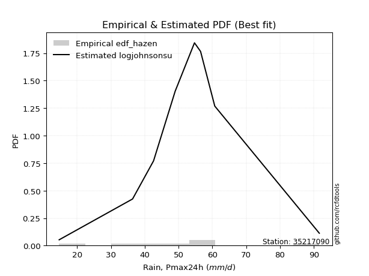</img>

</div>


### 3. EDF Weibull (1939)

Weibull plotting position formula is an empirical method used to estimate the non-exceedance probability or plotting position for a set of observed data, is often recommended or widely used in practice, particularly in flood frequency analysis.

<div align="center">


$P=m/(n+1)$


</div>


**3.1. Empirical values**

<div align="center">

|                | 0                  | 1           | 2                  | 3                  | 4           | 5           | 6                 | 7                 | 8                  |
|:---------------|:-------------------|:------------|:-------------------|:-------------------|:------------|:------------|:------------------|:------------------|:-------------------|
| date           | 2017               | 2020        | 2021               | 2018               | 2023        | 2022        | 2019              | 2025              | 2024               |
| x              | 14.7               | 36.4        | 42.6               | 49.0               | 54.7        | 56.5        | 60.7              | 63.8              | 91.6               |
| m              | 1                  | 2           | 3                  | 4                  | 5           | 6           | 7                 | 8                 | 9                  |
| empirical_dist | edf_weibull        | edf_weibull | edf_weibull        | edf_weibull        | edf_weibull | edf_weibull | edf_weibull       | edf_weibull       | edf_weibull        |
| empirical      | 0.1                | 0.2         | 0.3                | 0.4                | 0.5         | 0.6         | 0.7               | 0.8               | 0.9                |
| empirical_tr   | 1.1111111111111112 | 1.25        | 1.4285714285714286 | 1.6666666666666667 | 2.0         | 2.5         | 3.333333333333333 | 5.000000000000001 | 10.000000000000002 |

</div>


**3.2. Kolmogorov-Smirnov fit test (sorted by Δ)**


<div align="center">

|                | 0                   | 1                   | 2                   | 3                   | 4                   | 5                   | 6                   | 7                   | 8                   | 9                   | 10                  | 11                  | 12                  | 13                  | 14                  | 15                  | 16                  | 17                  | 18                  | 19                  | 20                  | 21                  | 22                  | 23                  | 24                  | 25                  | 26                  | 27                  | 28                  | 29                  | 30                  | 31                  | 32                  | 33                  | 34                  | 35                  | 36                  | 37                  | 38                  | 39                  | 40                  | 41                  | 42                  | 43                  | 44                  | 45                  | 46                  | 47                  | 48                  | 49                  | 50                  | 51                  | 52                  | 53                  | 54                  | 55                  | 56                  | 57                  | 58                  | 59                  | 60                  | 61                  | 62                  | 63                  | 64                  | 65                  | 66                  | 67                  | 68                  | 69                  | 70                  | 71                  | 72                  | 73                  | 74                  | 75                  | 76                  | 77                  | 78                  | 79                  | 80                  | 81                  | 82                  | 83                  | 84                  | 85                  | 86                  | 87                  | 88                  | 89                  | 90                  | 91                  | 92                  | 93                  | 94                  | 95                  | 96                  | 97                  | 98                  | 99                  | 100                 | 101                 | 102                 | 103                 | 104                 | 105                 | 106                 | 107                 | 108                 | 109                 | 110                 | 111                 | 112                 | 113                 | 114                 | 115                 | 116                 | 117                 | 118                 | 119                 | 120                 | 121                 | 122                 | 123                 | 124                 | 125                 | 126                 | 127                 | 128                 | 129                 | 130                 | 131                 | 132                 | 133                 | 134                 | 135                 | 136                 | 137                 | 138                 | 139                 | 140                 | 141                 | 142                 | 143                 | 144                 | 145                 | 146                 | 147                 | 148                 | 149                 | 150                 | 151                 | 152                 | 153                 | 154                 | 155                 | 156                 | 157                 | 158                 | 159                 |
|:---------------|:--------------------|:--------------------|:--------------------|:--------------------|:--------------------|:--------------------|:--------------------|:--------------------|:--------------------|:--------------------|:--------------------|:--------------------|:--------------------|:--------------------|:--------------------|:--------------------|:--------------------|:--------------------|:--------------------|:--------------------|:--------------------|:--------------------|:--------------------|:--------------------|:--------------------|:--------------------|:--------------------|:--------------------|:--------------------|:--------------------|:--------------------|:--------------------|:--------------------|:--------------------|:--------------------|:--------------------|:--------------------|:--------------------|:--------------------|:--------------------|:--------------------|:--------------------|:--------------------|:--------------------|:--------------------|:--------------------|:--------------------|:--------------------|:--------------------|:--------------------|:--------------------|:--------------------|:--------------------|:--------------------|:--------------------|:--------------------|:--------------------|:--------------------|:--------------------|:--------------------|:--------------------|:--------------------|:--------------------|:--------------------|:--------------------|:--------------------|:--------------------|:--------------------|:--------------------|:--------------------|:--------------------|:--------------------|:--------------------|:--------------------|:--------------------|:--------------------|:--------------------|:--------------------|:--------------------|:--------------------|:--------------------|:--------------------|:--------------------|:--------------------|:--------------------|:--------------------|:--------------------|:--------------------|:--------------------|:--------------------|:--------------------|:--------------------|:--------------------|:--------------------|:--------------------|:--------------------|:--------------------|:--------------------|:--------------------|:--------------------|:--------------------|:--------------------|:--------------------|:--------------------|:--------------------|:--------------------|:--------------------|:--------------------|:--------------------|:--------------------|:--------------------|:--------------------|:--------------------|:--------------------|:--------------------|:--------------------|:--------------------|:--------------------|:--------------------|:--------------------|:--------------------|:--------------------|:--------------------|:--------------------|:--------------------|:--------------------|:--------------------|:--------------------|:--------------------|:--------------------|:--------------------|:--------------------|:--------------------|:--------------------|:--------------------|:--------------------|:--------------------|:--------------------|:--------------------|:--------------------|:--------------------|:--------------------|:--------------------|:--------------------|:--------------------|:--------------------|:--------------------|:--------------------|:--------------------|:--------------------|:--------------------|:--------------------|:--------------------|:--------------------|:--------------------|:--------------------|:--------------------|:--------------------|:--------------------|:--------------------|
| station        | 35217090            | 35217090            | 35217090            | 35217090            | 35217090            | 35217090            | 35217090            | 35217090            | 35217090            | 35217090            | 35217090            | 35217090            | 35217090            | 35217090            | 35217090            | 35217090            | 35217090            | 35217090            | 35217090            | 35217090            | 35217090            | 35217090            | 35217090            | 35217090            | 35217090            | 35217090            | 35217090            | 35217090            | 35217090            | 35217090            | 35217090            | 35217090            | 35217090            | 35217090            | 35217090            | 35217090            | 35217090            | 35217090            | 35217090            | 35217090            | 35217090            | 35217090            | 35217090            | 35217090            | 35217090            | 35217090            | 35217090            | 35217090            | 35217090            | 35217090            | 35217090            | 35217090            | 35217090            | 35217090            | 35217090            | 35217090            | 35217090            | 35217090            | 35217090            | 35217090            | 35217090            | 35217090            | 35217090            | 35217090            | 35217090            | 35217090            | 35217090            | 35217090            | 35217090            | 35217090            | 35217090            | 35217090            | 35217090            | 35217090            | 35217090            | 35217090            | 35217090            | 35217090            | 35217090            | 35217090            | 35217090            | 35217090            | 35217090            | 35217090            | 35217090            | 35217090            | 35217090            | 35217090            | 35217090            | 35217090            | 35217090            | 35217090            | 35217090            | 35217090            | 35217090            | 35217090            | 35217090            | 35217090            | 35217090            | 35217090            | 35217090            | 35217090            | 35217090            | 35217090            | 35217090            | 35217090            | 35217090            | 35217090            | 35217090            | 35217090            | 35217090            | 35217090            | 35217090            | 35217090            | 35217090            | 35217090            | 35217090            | 35217090            | 35217090            | 35217090            | 35217090            | 35217090            | 35217090            | 35217090            | 35217090            | 35217090            | 35217090            | 35217090            | 35217090            | 35217090            | 35217090            | 35217090            | 35217090            | 35217090            | 35217090            | 35217090            | 35217090            | 35217090            | 35217090            | 35217090            | 35217090            | 35217090            | 35217090            | 35217090            | 35217090            | 35217090            | 35217090            | 35217090            | 35217090            | 35217090            | 35217090            | 35217090            | 35217090            | 35217090            | 35217090            | 35217090            | 35217090            | 35217090            | 35217090            | 35217090            |
| empirical_dist | edf_weibull         | edf_weibull         | edf_weibull         | edf_weibull         | edf_weibull         | edf_weibull         | edf_weibull         | edf_weibull         | edf_weibull         | edf_weibull         | edf_weibull         | edf_weibull         | edf_weibull         | edf_weibull         | edf_weibull         | edf_weibull         | edf_weibull         | edf_weibull         | edf_weibull         | edf_weibull         | edf_weibull         | edf_weibull         | edf_weibull         | edf_weibull         | edf_weibull         | edf_weibull         | edf_weibull         | edf_weibull         | edf_weibull         | edf_weibull         | edf_weibull         | edf_weibull         | edf_weibull         | edf_weibull         | edf_weibull         | edf_weibull         | edf_weibull         | edf_weibull         | edf_weibull         | edf_weibull         | edf_weibull         | edf_weibull         | edf_weibull         | edf_weibull         | edf_weibull         | edf_weibull         | edf_weibull         | edf_weibull         | edf_weibull         | edf_weibull         | edf_weibull         | edf_weibull         | edf_weibull         | edf_weibull         | edf_weibull         | edf_weibull         | edf_weibull         | edf_weibull         | edf_weibull         | edf_weibull         | edf_weibull         | edf_weibull         | edf_weibull         | edf_weibull         | edf_weibull         | edf_weibull         | edf_weibull         | edf_weibull         | edf_weibull         | edf_weibull         | edf_weibull         | edf_weibull         | edf_weibull         | edf_weibull         | edf_weibull         | edf_weibull         | edf_weibull         | edf_weibull         | edf_weibull         | edf_weibull         | edf_weibull         | edf_weibull         | edf_weibull         | edf_weibull         | edf_weibull         | edf_weibull         | edf_weibull         | edf_weibull         | edf_weibull         | edf_weibull         | edf_weibull         | edf_weibull         | edf_weibull         | edf_weibull         | edf_weibull         | edf_weibull         | edf_weibull         | edf_weibull         | edf_weibull         | edf_weibull         | edf_weibull         | edf_weibull         | edf_weibull         | edf_weibull         | edf_weibull         | edf_weibull         | edf_weibull         | edf_weibull         | edf_weibull         | edf_weibull         | edf_weibull         | edf_weibull         | edf_weibull         | edf_weibull         | edf_weibull         | edf_weibull         | edf_weibull         | edf_weibull         | edf_weibull         | edf_weibull         | edf_weibull         | edf_weibull         | edf_weibull         | edf_weibull         | edf_weibull         | edf_weibull         | edf_weibull         | edf_weibull         | edf_weibull         | edf_weibull         | edf_weibull         | edf_weibull         | edf_weibull         | edf_weibull         | edf_weibull         | edf_weibull         | edf_weibull         | edf_weibull         | edf_weibull         | edf_weibull         | edf_weibull         | edf_weibull         | edf_weibull         | edf_weibull         | edf_weibull         | edf_weibull         | edf_weibull         | edf_weibull         | edf_weibull         | edf_weibull         | edf_weibull         | edf_weibull         | edf_weibull         | edf_weibull         | edf_weibull         | edf_weibull         | edf_weibull         | edf_weibull         | edf_weibull         | edf_weibull         |
| p_dist         | logjohnsonsu        | tukeylambda         | johnsonsu           | hypsecant           | nct                 | logistic            | exponnorm           | skewnorm            | betaprime           | genlogistic         | pearson3            | gengamma            | gamma               | erlang              | f                   | johnsonsb           | beta                | logmielke           | logburr             | mielke              | burr                | loggenlogistic      | t                   | crystalball         | truncnorm           | norm                | invgamma            | rice                | logweibull_min      | logburr12           | laplace             | alpha               | weibull_min         | invgauss            | logloggamma         | logexponweib        | ncf                 | exponpow            | logjohnsonsb        | loggumbel_l         | maxwell             | logt                | loggengamma         | dgamma              | gennorm             | rayleigh            | loggompertz         | vonmises_line       | logvonmises_line    | dweibull            | gumbel_l            | anglit              | cosine              | logpearson3         | kstwobign           | logdgamma           | semicircular        | halfnorm            | logtriang           | gumbel_r            | loggenextreme       | logweibull_max      | loganglit           | logdweibull         | logloglaplace       | lognct              | logcrystalball      | lognorm             | logexponnorm        | logrice             | logf                | logfatiguelife      | logsemicircular     | loglogistic         | kappa4              | loginvgamma         | loggamma            | loggamma            | logerlang           | gompertz            | logbetaprime        | logncf              | logargus            | logalpha            | kappa3              | logtrapezoid        | loginvgauss         | loghypsecant        | logskewnorm         | moyal               | halflogistic        | logtruncweibull_min | bradford            | logmaxwell          | loginvweibull       | wrapcauchy          | uniform             | arcsine             | loggenhalflogistic  | lograyleigh         | truncweibull_min    | loglaplace          | loglaplace          | logarcsine          | logfoldnorm         | loggennorm          | ksone               | logcosine           | loggumbel_r         | loghalfnorm         | logtruncnorm        | lognakagami         | argus               | wald                | loggausshyper       | logkstwobign        | exponweib           | logmoyal            | loghalflogistic     | truncexpon          | loggenpareto        | loggenexpon         | loglevy_l           | gausshyper          | lomax               | genexpon            | genpareto           | logkappa4           | logwald             | logkappa3           | logbradford         | loguniform          | logtukeylambda      | logksone            | logwrapcauchy       | loghalfgennorm      | levy_l              | genhalflogistic     | logrdist            | burr12              | loglomax            | halfgennorm         | triang              | nakagami            | logbeta             | genextreme          | logtruncexpon       | trapezoid           | logexponpow         | invweibull          | rdist               | powerlaw            | foldnorm            | fatiguelife         | logpowerlaw         | weibull_max         | truncpareto         | logtruncpareto      | logvonmises         | vonmises            |
| delta          | 0.06646356427805589 | 0.06845578397664409 | 0.07056396677768706 | 0.07184670860149356 | 0.0732540732627387  | 0.07340792836548482 | 0.0744048188376567  | 0.07530998970555336 | 0.07541860119212207 | 0.07632203944601557 | 0.07679638044963855 | 0.07701408716362546 | 0.07704002295163648 | 0.07709583896636774 | 0.0771720703349349  | 0.07717806637196356 | 0.0772648331604916  | 0.07743085886596388 | 0.07806571731766768 | 0.07824730397415952 | 0.07824942258451766 | 0.07833471142539934 | 0.07973141249403182 | 0.07974701842070053 | 0.07974702491748131 | 0.07974702966848302 | 0.08008137998391485 | 0.08022191681177544 | 0.08057894166786503 | 0.08090428596986242 | 0.08095472684620575 | 0.08239160257600331 | 0.08276806721860885 | 0.08421616568248957 | 0.08454887663356347 | 0.08532610488703851 | 0.08567843023070298 | 0.09096955876366941 | 0.09102846306655843 | 0.09123594616014863 | 0.09138742710135082 | 0.09405207695008083 | 0.094487639281291   | 0.09787570616902613 | 0.09854448541477134 | 0.09989893952342432 | 0.09999997331595711 | 0.09999999687697748 | 0.09999999962955287 | 0.10114603352486307 | 0.10519233218883994 | 0.10575900495090729 | 0.10606225373374278 | 0.10978427409614278 | 0.11297678429926739 | 0.11437838123627614 | 0.11690740863754467 | 0.11743123028205738 | 0.1182866390465418  | 0.11980166147702997 | 0.12308226703104574 | 0.12309200065913695 | 0.12344052101051806 | 0.12349053125351528 | 0.12425993862854612 | 0.12612099136889754 | 0.1262161829519337  | 0.1262162546889064  | 0.1262168724681748  | 0.12622415243306773 | 0.12763851829116168 | 0.12784683043818446 | 0.12857719599132067 | 0.13034386535886922 | 0.13533221828847453 | 0.13537468771338756 | 0.13662819010254934 | 0.13662819010254934 | 0.13783335507700722 | 0.13965029762220316 | 0.1399812489198896  | 0.14016981036061793 | 0.14030719695326355 | 0.1403655120075803  | 0.1405603767530601  | 0.14174391305489442 | 0.14188202613776602 | 0.14214548045952424 | 0.1428742771247966  | 0.14464920905465672 | 0.1447077705866182  | 0.15059747008568303 | 0.15441469338647273 | 0.15803346564377052 | 0.16036738008831114 | 0.1608153811223163  | 0.16150845253576074 | 0.16459881507106122 | 0.16805004456499895 | 0.168429455102594   | 0.16911075881513238 | 0.17019883775440325 | 0.17019883775440325 | 0.17251216957370114 | 0.17387789954313027 | 0.17463031266650458 | 0.18459037711313386 | 0.19282823116468867 | 0.19687564196436924 | 0.19770230653709364 | 0.19999991427996366 | 0.1999999999999785  | 0.2069547961212358  | 0.21359532172273088 | 0.2154309873021415  | 0.2165202512489111  | 0.22058142854863727 | 0.22235324121588051 | 0.22404670172366847 | 0.2256643187902309  | 0.22667158195311865 | 0.23742942719717713 | 0.23747578261034613 | 0.23750824407764515 | 0.23801595332274977 | 0.24008554073881422 | 0.2417533785133259  | 0.29204185133938515 | 0.2930926459967964  | 0.2945997345724783  | 0.2954996158967645  | 0.29558882835145356 | 0.2956960858539858  | 0.2963240236262113  | 0.2985295257757413  | 0.3                 | 0.30192637861267346 | 0.3116052894247175  | 0.3313374656910189  | 0.3357680943297054  | 0.3393190358048824  | 0.35158324447292794 | 0.3528650996502832  | 0.3609174675580527  | 0.36374351739412775 | 0.3937304865973569  | 0.3990832439385225  | 0.4212709960582452  | 0.4214622156618694  | 0.4514578028249286  | 0.505575149908893   | 0.570241892064179   | 0.6                 | 0.6185160162108083  | 0.6494788545786732  | 0.6550804993231494  | 0.7269146478011439  | 0.7585839607655855  | 1.1059515927032164  | 14.301206089798589  |
| deltao         | 0.41761268023100007 | 0.41761268023100007 | 0.41761268023100007 | 0.41761268023100007 | 0.41761268023100007 | 0.41761268023100007 | 0.41761268023100007 | 0.41761268023100007 | 0.41761268023100007 | 0.41761268023100007 | 0.41761268023100007 | 0.41761268023100007 | 0.41761268023100007 | 0.41761268023100007 | 0.41761268023100007 | 0.41761268023100007 | 0.41761268023100007 | 0.41761268023100007 | 0.41761268023100007 | 0.41761268023100007 | 0.41761268023100007 | 0.41761268023100007 | 0.41761268023100007 | 0.41761268023100007 | 0.41761268023100007 | 0.41761268023100007 | 0.41761268023100007 | 0.41761268023100007 | 0.41761268023100007 | 0.41761268023100007 | 0.41761268023100007 | 0.41761268023100007 | 0.41761268023100007 | 0.41761268023100007 | 0.41761268023100007 | 0.41761268023100007 | 0.41761268023100007 | 0.41761268023100007 | 0.41761268023100007 | 0.41761268023100007 | 0.41761268023100007 | 0.41761268023100007 | 0.41761268023100007 | 0.41761268023100007 | 0.41761268023100007 | 0.41761268023100007 | 0.41761268023100007 | 0.41761268023100007 | 0.41761268023100007 | 0.41761268023100007 | 0.41761268023100007 | 0.41761268023100007 | 0.41761268023100007 | 0.41761268023100007 | 0.41761268023100007 | 0.41761268023100007 | 0.41761268023100007 | 0.41761268023100007 | 0.41761268023100007 | 0.41761268023100007 | 0.41761268023100007 | 0.41761268023100007 | 0.41761268023100007 | 0.41761268023100007 | 0.41761268023100007 | 0.41761268023100007 | 0.41761268023100007 | 0.41761268023100007 | 0.41761268023100007 | 0.41761268023100007 | 0.41761268023100007 | 0.41761268023100007 | 0.41761268023100007 | 0.41761268023100007 | 0.41761268023100007 | 0.41761268023100007 | 0.41761268023100007 | 0.41761268023100007 | 0.41761268023100007 | 0.41761268023100007 | 0.41761268023100007 | 0.41761268023100007 | 0.41761268023100007 | 0.41761268023100007 | 0.41761268023100007 | 0.41761268023100007 | 0.41761268023100007 | 0.41761268023100007 | 0.41761268023100007 | 0.41761268023100007 | 0.41761268023100007 | 0.41761268023100007 | 0.41761268023100007 | 0.41761268023100007 | 0.41761268023100007 | 0.41761268023100007 | 0.41761268023100007 | 0.41761268023100007 | 0.41761268023100007 | 0.41761268023100007 | 0.41761268023100007 | 0.41761268023100007 | 0.41761268023100007 | 0.41761268023100007 | 0.41761268023100007 | 0.41761268023100007 | 0.41761268023100007 | 0.41761268023100007 | 0.41761268023100007 | 0.41761268023100007 | 0.41761268023100007 | 0.41761268023100007 | 0.41761268023100007 | 0.41761268023100007 | 0.41761268023100007 | 0.41761268023100007 | 0.41761268023100007 | 0.41761268023100007 | 0.41761268023100007 | 0.41761268023100007 | 0.41761268023100007 | 0.41761268023100007 | 0.41761268023100007 | 0.41761268023100007 | 0.41761268023100007 | 0.41761268023100007 | 0.41761268023100007 | 0.41761268023100007 | 0.41761268023100007 | 0.41761268023100007 | 0.41761268023100007 | 0.41761268023100007 | 0.41761268023100007 | 0.41761268023100007 | 0.41761268023100007 | 0.41761268023100007 | 0.41761268023100007 | 0.41761268023100007 | 0.41761268023100007 | 0.41761268023100007 | 0.41761268023100007 | 0.41761268023100007 | 0.41761268023100007 | 0.41761268023100007 | 0.41761268023100007 | 0.41761268023100007 | 0.41761268023100007 | 0.41761268023100007 | 0.41761268023100007 | 0.41761268023100007 | 0.41761268023100007 | 0.41761268023100007 | 0.41761268023100007 | 0.41761268023100007 | 0.41761268023100007 | 0.41761268023100007 | 0.41761268023100007 | 0.41761268023100007 | 0.41761268023100007 | 0.41761268023100007 |
| eval           | Δo > Δ              | Δo > Δ              | Δo > Δ              | Δo > Δ              | Δo > Δ              | Δo > Δ              | Δo > Δ              | Δo > Δ              | Δo > Δ              | Δo > Δ              | Δo > Δ              | Δo > Δ              | Δo > Δ              | Δo > Δ              | Δo > Δ              | Δo > Δ              | Δo > Δ              | Δo > Δ              | Δo > Δ              | Δo > Δ              | Δo > Δ              | Δo > Δ              | Δo > Δ              | Δo > Δ              | Δo > Δ              | Δo > Δ              | Δo > Δ              | Δo > Δ              | Δo > Δ              | Δo > Δ              | Δo > Δ              | Δo > Δ              | Δo > Δ              | Δo > Δ              | Δo > Δ              | Δo > Δ              | Δo > Δ              | Δo > Δ              | Δo > Δ              | Δo > Δ              | Δo > Δ              | Δo > Δ              | Δo > Δ              | Δo > Δ              | Δo > Δ              | Δo > Δ              | Δo > Δ              | Δo > Δ              | Δo > Δ              | Δo > Δ              | Δo > Δ              | Δo > Δ              | Δo > Δ              | Δo > Δ              | Δo > Δ              | Δo > Δ              | Δo > Δ              | Δo > Δ              | Δo > Δ              | Δo > Δ              | Δo > Δ              | Δo > Δ              | Δo > Δ              | Δo > Δ              | Δo > Δ              | Δo > Δ              | Δo > Δ              | Δo > Δ              | Δo > Δ              | Δo > Δ              | Δo > Δ              | Δo > Δ              | Δo > Δ              | Δo > Δ              | Δo > Δ              | Δo > Δ              | Δo > Δ              | Δo > Δ              | Δo > Δ              | Δo > Δ              | Δo > Δ              | Δo > Δ              | Δo > Δ              | Δo > Δ              | Δo > Δ              | Δo > Δ              | Δo > Δ              | Δo > Δ              | Δo > Δ              | Δo > Δ              | Δo > Δ              | Δo > Δ              | Δo > Δ              | Δo > Δ              | Δo > Δ              | Δo > Δ              | Δo > Δ              | Δo > Δ              | Δo > Δ              | Δo > Δ              | Δo > Δ              | Δo > Δ              | Δo > Δ              | Δo > Δ              | Δo > Δ              | Δo > Δ              | Δo > Δ              | Δo > Δ              | Δo > Δ              | Δo > Δ              | Δo > Δ              | Δo > Δ              | Δo > Δ              | Δo > Δ              | Δo > Δ              | Δo > Δ              | Δo > Δ              | Δo > Δ              | Δo > Δ              | Δo > Δ              | Δo > Δ              | Δo > Δ              | Δo > Δ              | Δo > Δ              | Δo > Δ              | Δo > Δ              | Δo > Δ              | Δo > Δ              | Δo > Δ              | Δo > Δ              | Δo > Δ              | Δo > Δ              | Δo > Δ              | Δo > Δ              | Δo > Δ              | Δo > Δ              | Δo > Δ              | Δo > Δ              | Δo > Δ              | Δo > Δ              | Δo > Δ              | Δo > Δ              | Δo > Δ              | Δo > Δ              | Δo > Δ              | Δo > Δ              | Δo > Δ              | Δo <= Δ             | Δo <= Δ             | Δo <= Δ             | Δo <= Δ             | Δo <= Δ             | Δo <= Δ             | Δo <= Δ             | Δo <= Δ             | Δo <= Δ             | Δo <= Δ             | Δo <= Δ             | Δo <= Δ             | Δo <= Δ             |
| fit            | 1                   | 1                   | 1                   | 1                   | 1                   | 1                   | 1                   | 1                   | 1                   | 1                   | 1                   | 1                   | 1                   | 1                   | 1                   | 1                   | 1                   | 1                   | 1                   | 1                   | 1                   | 1                   | 1                   | 1                   | 1                   | 1                   | 1                   | 1                   | 1                   | 1                   | 1                   | 1                   | 1                   | 1                   | 1                   | 1                   | 1                   | 1                   | 1                   | 1                   | 1                   | 1                   | 1                   | 1                   | 1                   | 1                   | 1                   | 1                   | 1                   | 1                   | 1                   | 1                   | 1                   | 1                   | 1                   | 1                   | 1                   | 1                   | 1                   | 1                   | 1                   | 1                   | 1                   | 1                   | 1                   | 1                   | 1                   | 1                   | 1                   | 1                   | 1                   | 1                   | 1                   | 1                   | 1                   | 1                   | 1                   | 1                   | 1                   | 1                   | 1                   | 1                   | 1                   | 1                   | 1                   | 1                   | 1                   | 1                   | 1                   | 1                   | 1                   | 1                   | 1                   | 1                   | 1                   | 1                   | 1                   | 1                   | 1                   | 1                   | 1                   | 1                   | 1                   | 1                   | 1                   | 1                   | 1                   | 1                   | 1                   | 1                   | 1                   | 1                   | 1                   | 1                   | 1                   | 1                   | 1                   | 1                   | 1                   | 1                   | 1                   | 1                   | 1                   | 1                   | 1                   | 1                   | 1                   | 1                   | 1                   | 1                   | 1                   | 1                   | 1                   | 1                   | 1                   | 1                   | 1                   | 1                   | 1                   | 1                   | 1                   | 1                   | 1                   | 1                   | 1                   | 1                   | 1                   | 0                   | 0                   | 0                   | 0                   | 0                   | 0                   | 0                   | 0                   | 0                   | 0                   | 0                   | 0                   | 0                   |
| n              | 9                   | 9                   | 9                   | 9                   | 9                   | 9                   | 9                   | 9                   | 9                   | 9                   | 9                   | 9                   | 9                   | 9                   | 9                   | 9                   | 9                   | 9                   | 9                   | 9                   | 9                   | 9                   | 9                   | 9                   | 9                   | 9                   | 9                   | 9                   | 9                   | 9                   | 9                   | 9                   | 9                   | 9                   | 9                   | 9                   | 9                   | 9                   | 9                   | 9                   | 9                   | 9                   | 9                   | 9                   | 9                   | 9                   | 9                   | 9                   | 9                   | 9                   | 9                   | 9                   | 9                   | 9                   | 9                   | 9                   | 9                   | 9                   | 9                   | 9                   | 9                   | 9                   | 9                   | 9                   | 9                   | 9                   | 9                   | 9                   | 9                   | 9                   | 9                   | 9                   | 9                   | 9                   | 9                   | 9                   | 9                   | 9                   | 9                   | 9                   | 9                   | 9                   | 9                   | 9                   | 9                   | 9                   | 9                   | 9                   | 9                   | 9                   | 9                   | 9                   | 9                   | 9                   | 9                   | 9                   | 9                   | 9                   | 9                   | 9                   | 9                   | 9                   | 9                   | 9                   | 9                   | 9                   | 9                   | 9                   | 9                   | 9                   | 9                   | 9                   | 9                   | 9                   | 9                   | 9                   | 9                   | 9                   | 9                   | 9                   | 9                   | 9                   | 9                   | 9                   | 9                   | 9                   | 9                   | 9                   | 9                   | 9                   | 9                   | 9                   | 9                   | 9                   | 9                   | 9                   | 9                   | 9                   | 9                   | 9                   | 9                   | 9                   | 9                   | 9                   | 9                   | 9                   | 9                   | 9                   | 9                   | 9                   | 9                   | 9                   | 9                   | 9                   | 9                   | 9                   | 9                   | 9                   | 9                   | 9                   |
| best_fit       | 1                   | 0                   | 0                   | 0                   | 0                   | 0                   | 0                   | 0                   | 0                   | 0                   | 0                   | 0                   | 0                   | 0                   | 0                   | 0                   | 0                   | 0                   | 0                   | 0                   | 0                   | 0                   | 0                   | 0                   | 0                   | 0                   | 0                   | 0                   | 0                   | 0                   | 0                   | 0                   | 0                   | 0                   | 0                   | 0                   | 0                   | 0                   | 0                   | 0                   | 0                   | 0                   | 0                   | 0                   | 0                   | 0                   | 0                   | 0                   | 0                   | 0                   | 0                   | 0                   | 0                   | 0                   | 0                   | 0                   | 0                   | 0                   | 0                   | 0                   | 0                   | 0                   | 0                   | 0                   | 0                   | 0                   | 0                   | 0                   | 0                   | 0                   | 0                   | 0                   | 0                   | 0                   | 0                   | 0                   | 0                   | 0                   | 0                   | 0                   | 0                   | 0                   | 0                   | 0                   | 0                   | 0                   | 0                   | 0                   | 0                   | 0                   | 0                   | 0                   | 0                   | 0                   | 0                   | 0                   | 0                   | 0                   | 0                   | 0                   | 0                   | 0                   | 0                   | 0                   | 0                   | 0                   | 0                   | 0                   | 0                   | 0                   | 0                   | 0                   | 0                   | 0                   | 0                   | 0                   | 0                   | 0                   | 0                   | 0                   | 0                   | 0                   | 0                   | 0                   | 0                   | 0                   | 0                   | 0                   | 0                   | 0                   | 0                   | 0                   | 0                   | 0                   | 0                   | 0                   | 0                   | 0                   | 0                   | 0                   | 0                   | 0                   | 0                   | 0                   | 0                   | 0                   | 0                   | 0                   | 0                   | 0                   | 0                   | 0                   | 0                   | 0                   | 0                   | 0                   | 0                   | 0                   | 0                   | 0                   |
| best_fit_sort  | 1                   | 2                   | 3                   | 4                   | 5                   | 6                   | 7                   | 8                   | 9                   | 10                  | 11                  | 12                  | 13                  | 14                  | 15                  | 16                  | 17                  | 18                  | 19                  | 20                  | 21                  | 22                  | 23                  | 24                  | 25                  | 26                  | 27                  | 28                  | 29                  | 30                  | 31                  | 32                  | 33                  | 34                  | 35                  | 36                  | 37                  | 38                  | 39                  | 40                  | 41                  | 42                  | 43                  | 44                  | 45                  | 46                  | 47                  | 48                  | 49                  | 50                  | 51                  | 52                  | 53                  | 54                  | 55                  | 56                  | 57                  | 58                  | 59                  | 60                  | 61                  | 62                  | 63                  | 64                  | 65                  | 66                  | 67                  | 68                  | 69                  | 70                  | 71                  | 72                  | 73                  | 74                  | 75                  | 76                  | 77                  | 78                  | 79                  | 80                  | 81                  | 82                  | 83                  | 84                  | 85                  | 86                  | 87                  | 88                  | 89                  | 90                  | 91                  | 92                  | 93                  | 94                  | 95                  | 96                  | 97                  | 98                  | 99                  | 100                 | 101                 | 102                 | 103                 | 104                 | 105                 | 106                 | 107                 | 108                 | 109                 | 110                 | 111                 | 112                 | 113                 | 114                 | 115                 | 116                 | 117                 | 118                 | 119                 | 120                 | 121                 | 122                 | 123                 | 124                 | 125                 | 126                 | 127                 | 128                 | 129                 | 130                 | 131                 | 132                 | 133                 | 134                 | 135                 | 136                 | 137                 | 138                 | 139                 | 140                 | 141                 | 142                 | 143                 | 144                 | 145                 | 146                 | 147                 | 148                 | 149                 | 150                 | 151                 | 152                 | 153                 | 154                 | 155                 | 156                 | 157                 | 158                 | 159                 | 160                 |

</div>


**3.3. Best fit**

<div align="center">

|   id |   station | empirical_dist   | p_dist       |     delta |   deltao | eval   |   fit |   n |   best_fit |   best_fit_sort |
|-----:|----------:|:-----------------|:-------------|----------:|---------:|:-------|------:|----:|-----------:|----------------:|
|    0 |  35217090 | edf_weibull      | logjohnsonsu | 0.0664636 | 0.417613 | Δo > Δ |     1 |   9 |          1 |               1 |

</div>


<div align="center">

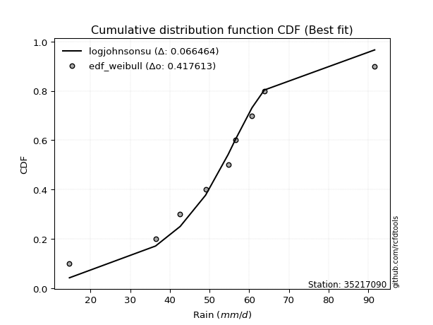</img>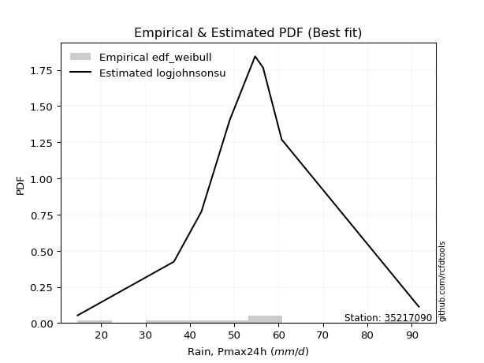</img>

</div>


### 4. EDF Beard (1943)

The Beard formula (or Beard´s plotting position formula) in hydrology is used to estimate the empirical non-exceedance probability _(P)_ of a flood event (or other extreme hydrological data point) within a given dataset.

<div align="center">


$P=(m-0.31)/(n+0.38)$


</div>


**4.1. Empirical values**

<div align="center">

|                | 0                   | 1                   | 2                  | 3                   | 4         | 5                  | 6                  | 7                  | 8                  |
|:---------------|:--------------------|:--------------------|:-------------------|:--------------------|:----------|:-------------------|:-------------------|:-------------------|:-------------------|
| date           | 2017                | 2020                | 2021               | 2018                | 2023      | 2022               | 2019               | 2025               | 2024               |
| x              | 14.7                | 36.4                | 42.6               | 49.0                | 54.7      | 56.5               | 60.7               | 63.8               | 91.6               |
| m              | 1                   | 2                   | 3                  | 4                   | 5         | 6                  | 7                  | 8                  | 9                  |
| empirical_dist | edf_beard           | edf_beard           | edf_beard          | edf_beard           | edf_beard | edf_beard          | edf_beard          | edf_beard          | edf_beard          |
| empirical      | 0.07356076759061833 | 0.18017057569296374 | 0.2867803837953091 | 0.39339019189765456 | 0.5       | 0.6066098081023454 | 0.7132196162046908 | 0.8198294243070362 | 0.9264392324093815 |
| empirical_tr   | 1.0794016110471807  | 1.2197659297789336  | 1.4020926756352765 | 1.6485061511423549  | 2.0       | 2.542005420054201  | 3.486988847583642  | 5.550295857988164  | 13.5942028985507   |

</div>


**4.2. Kolmogorov-Smirnov fit test (sorted by Δ)**


<div align="center">

|                | 0                   | 1                    | 2                   | 3                    | 4                   | 5                   | 6                   | 7                   | 8                   | 9                   | 10                  | 11                  | 12                  | 13                  | 14                  | 15                  | 16                  | 17                  | 18                  | 19                  | 20                  | 21                  | 22                  | 23                  | 24                  | 25                  | 26                  | 27                  | 28                  | 29                  | 30                  | 31                  | 32                  | 33                  | 34                  | 35                  | 36                  | 37                  | 38                  | 39                  | 40                  | 41                  | 42                  | 43                  | 44                  | 45                  | 46                  | 47                  | 48                  | 49                  | 50                  | 51                  | 52                  | 53                  | 54                  | 55                  | 56                  | 57                  | 58                  | 59                  | 60                  | 61                  | 62                  | 63                  | 64                  | 65                  | 66                  | 67                  | 68                  | 69                  | 70                  | 71                  | 72                  | 73                  | 74                  | 75                  | 76                  | 77                  | 78                  | 79                  | 80                  | 81                  | 82                  | 83                  | 84                  | 85                  | 86                  | 87                  | 88                  | 89                  | 90                  | 91                  | 92                  | 93                  | 94                  | 95                  | 96                  | 97                  | 98                  | 99                  | 100                 | 101                 | 102                 | 103                 | 104                 | 105                 | 106                 | 107                 | 108                 | 109                 | 110                 | 111                 | 112                 | 113                 | 114                 | 115                 | 116                 | 117                 | 118                 | 119                 | 120                 | 121                 | 122                 | 123                 | 124                 | 125                 | 126                 | 127                 | 128                 | 129                 | 130                 | 131                 | 132                 | 133                 | 134                 | 135                 | 136                 | 137                 | 138                 | 139                 | 140                 | 141                 | 142                 | 143                 | 144                 | 145                 | 146                 | 147                 | 148                 | 149                 | 150                 | 151                 | 152                 | 153                 | 154                 | 155                 | 156                 | 157                 | 158                 | 159                 |
|:---------------|:--------------------|:---------------------|:--------------------|:---------------------|:--------------------|:--------------------|:--------------------|:--------------------|:--------------------|:--------------------|:--------------------|:--------------------|:--------------------|:--------------------|:--------------------|:--------------------|:--------------------|:--------------------|:--------------------|:--------------------|:--------------------|:--------------------|:--------------------|:--------------------|:--------------------|:--------------------|:--------------------|:--------------------|:--------------------|:--------------------|:--------------------|:--------------------|:--------------------|:--------------------|:--------------------|:--------------------|:--------------------|:--------------------|:--------------------|:--------------------|:--------------------|:--------------------|:--------------------|:--------------------|:--------------------|:--------------------|:--------------------|:--------------------|:--------------------|:--------------------|:--------------------|:--------------------|:--------------------|:--------------------|:--------------------|:--------------------|:--------------------|:--------------------|:--------------------|:--------------------|:--------------------|:--------------------|:--------------------|:--------------------|:--------------------|:--------------------|:--------------------|:--------------------|:--------------------|:--------------------|:--------------------|:--------------------|:--------------------|:--------------------|:--------------------|:--------------------|:--------------------|:--------------------|:--------------------|:--------------------|:--------------------|:--------------------|:--------------------|:--------------------|:--------------------|:--------------------|:--------------------|:--------------------|:--------------------|:--------------------|:--------------------|:--------------------|:--------------------|:--------------------|:--------------------|:--------------------|:--------------------|:--------------------|:--------------------|:--------------------|:--------------------|:--------------------|:--------------------|:--------------------|:--------------------|:--------------------|:--------------------|:--------------------|:--------------------|:--------------------|:--------------------|:--------------------|:--------------------|:--------------------|:--------------------|:--------------------|:--------------------|:--------------------|:--------------------|:--------------------|:--------------------|:--------------------|:--------------------|:--------------------|:--------------------|:--------------------|:--------------------|:--------------------|:--------------------|:--------------------|:--------------------|:--------------------|:--------------------|:--------------------|:--------------------|:--------------------|:--------------------|:--------------------|:--------------------|:--------------------|:--------------------|:--------------------|:--------------------|:--------------------|:--------------------|:--------------------|:--------------------|:--------------------|:--------------------|:--------------------|:--------------------|:--------------------|:--------------------|:--------------------|:--------------------|:--------------------|:--------------------|:--------------------|:--------------------|:--------------------|
| station        | 35217090            | 35217090             | 35217090            | 35217090             | 35217090            | 35217090            | 35217090            | 35217090            | 35217090            | 35217090            | 35217090            | 35217090            | 35217090            | 35217090            | 35217090            | 35217090            | 35217090            | 35217090            | 35217090            | 35217090            | 35217090            | 35217090            | 35217090            | 35217090            | 35217090            | 35217090            | 35217090            | 35217090            | 35217090            | 35217090            | 35217090            | 35217090            | 35217090            | 35217090            | 35217090            | 35217090            | 35217090            | 35217090            | 35217090            | 35217090            | 35217090            | 35217090            | 35217090            | 35217090            | 35217090            | 35217090            | 35217090            | 35217090            | 35217090            | 35217090            | 35217090            | 35217090            | 35217090            | 35217090            | 35217090            | 35217090            | 35217090            | 35217090            | 35217090            | 35217090            | 35217090            | 35217090            | 35217090            | 35217090            | 35217090            | 35217090            | 35217090            | 35217090            | 35217090            | 35217090            | 35217090            | 35217090            | 35217090            | 35217090            | 35217090            | 35217090            | 35217090            | 35217090            | 35217090            | 35217090            | 35217090            | 35217090            | 35217090            | 35217090            | 35217090            | 35217090            | 35217090            | 35217090            | 35217090            | 35217090            | 35217090            | 35217090            | 35217090            | 35217090            | 35217090            | 35217090            | 35217090            | 35217090            | 35217090            | 35217090            | 35217090            | 35217090            | 35217090            | 35217090            | 35217090            | 35217090            | 35217090            | 35217090            | 35217090            | 35217090            | 35217090            | 35217090            | 35217090            | 35217090            | 35217090            | 35217090            | 35217090            | 35217090            | 35217090            | 35217090            | 35217090            | 35217090            | 35217090            | 35217090            | 35217090            | 35217090            | 35217090            | 35217090            | 35217090            | 35217090            | 35217090            | 35217090            | 35217090            | 35217090            | 35217090            | 35217090            | 35217090            | 35217090            | 35217090            | 35217090            | 35217090            | 35217090            | 35217090            | 35217090            | 35217090            | 35217090            | 35217090            | 35217090            | 35217090            | 35217090            | 35217090            | 35217090            | 35217090            | 35217090            | 35217090            | 35217090            | 35217090            | 35217090            | 35217090            | 35217090            |
| empirical_dist | edf_beard           | edf_beard            | edf_beard           | edf_beard            | edf_beard           | edf_beard           | edf_beard           | edf_beard           | edf_beard           | edf_beard           | edf_beard           | edf_beard           | edf_beard           | edf_beard           | edf_beard           | edf_beard           | edf_beard           | edf_beard           | edf_beard           | edf_beard           | edf_beard           | edf_beard           | edf_beard           | edf_beard           | edf_beard           | edf_beard           | edf_beard           | edf_beard           | edf_beard           | edf_beard           | edf_beard           | edf_beard           | edf_beard           | edf_beard           | edf_beard           | edf_beard           | edf_beard           | edf_beard           | edf_beard           | edf_beard           | edf_beard           | edf_beard           | edf_beard           | edf_beard           | edf_beard           | edf_beard           | edf_beard           | edf_beard           | edf_beard           | edf_beard           | edf_beard           | edf_beard           | edf_beard           | edf_beard           | edf_beard           | edf_beard           | edf_beard           | edf_beard           | edf_beard           | edf_beard           | edf_beard           | edf_beard           | edf_beard           | edf_beard           | edf_beard           | edf_beard           | edf_beard           | edf_beard           | edf_beard           | edf_beard           | edf_beard           | edf_beard           | edf_beard           | edf_beard           | edf_beard           | edf_beard           | edf_beard           | edf_beard           | edf_beard           | edf_beard           | edf_beard           | edf_beard           | edf_beard           | edf_beard           | edf_beard           | edf_beard           | edf_beard           | edf_beard           | edf_beard           | edf_beard           | edf_beard           | edf_beard           | edf_beard           | edf_beard           | edf_beard           | edf_beard           | edf_beard           | edf_beard           | edf_beard           | edf_beard           | edf_beard           | edf_beard           | edf_beard           | edf_beard           | edf_beard           | edf_beard           | edf_beard           | edf_beard           | edf_beard           | edf_beard           | edf_beard           | edf_beard           | edf_beard           | edf_beard           | edf_beard           | edf_beard           | edf_beard           | edf_beard           | edf_beard           | edf_beard           | edf_beard           | edf_beard           | edf_beard           | edf_beard           | edf_beard           | edf_beard           | edf_beard           | edf_beard           | edf_beard           | edf_beard           | edf_beard           | edf_beard           | edf_beard           | edf_beard           | edf_beard           | edf_beard           | edf_beard           | edf_beard           | edf_beard           | edf_beard           | edf_beard           | edf_beard           | edf_beard           | edf_beard           | edf_beard           | edf_beard           | edf_beard           | edf_beard           | edf_beard           | edf_beard           | edf_beard           | edf_beard           | edf_beard           | edf_beard           | edf_beard           | edf_beard           | edf_beard           | edf_beard           | edf_beard           | edf_beard           |
| p_dist         | logjohnsonsu        | johnsonsu            | tukeylambda         | hypsecant            | logmielke           | logburr             | genlogistic         | mielke              | burr                | loggenlogistic      | logistic            | laplace             | logt                | alpha               | vonmises_line       | invgauss            | dgamma              | gennorm             | maxwell             | dweibull            | ncf                 | rayleigh            | invgamma            | loggompertz         | nct                 | exponnorm           | skewnorm            | betaprime           | pearson3            | gengamma            | gamma               | erlang              | f                   | johnsonsb           | beta                | rice                | logweibull_min      | loggengamma         | logburr12           | logvonmises_line    | t                   | crystalball         | truncnorm           | norm                | logdgamma           | weibull_min         | logloggamma         | logexponweib        | exponpow            | logjohnsonsb        | loggumbel_l         | kstwobign           | gumbel_r            | halfnorm            | gumbel_l            | anglit              | cosine              | logpearson3         | lognct              | logcrystalball      | lognorm             | logexponnorm        | logrice             | logf                | logfatiguelife      | loglogistic         | loganglit           | semicircular        | logtriang           | loginvgamma         | loghypsecant        | loggenextreme       | logweibull_max      | loggamma            | loggamma            | logdweibull         | logloglaplace       | logerlang           | moyal               | halflogistic        | logsemicircular     | logbetaprime        | logalpha            | loginvgauss         | kappa4              | gompertz            | logncf              | logargus            | kappa3              | logtrapezoid        | logskewnorm         | logmaxwell          | loggennorm          | loglaplace          | loglaplace          | logtruncweibull_min | bradford            | lograyleigh         | logtruncnorm        | lognakagami         | loginvweibull       | logfoldnorm         | wrapcauchy          | uniform             | arcsine             | loggenhalflogistic  | truncweibull_min    | logarcsine          | loggumbel_r         | ksone               | loghalfnorm         | logcosine           | wald                | argus               | logmoyal            | loghalflogistic     | loggausshyper       | logkstwobign        | exponweib           | truncexpon          | loggenpareto        | loggenexpon         | loglevy_l           | gausshyper          | lomax               | genexpon            | genpareto           | loghalfgennorm      | logwald             | logkappa4           | logkappa3           | logbradford         | loguniform          | logtukeylambda      | logksone            | logwrapcauchy       | levy_l              | genhalflogistic     | logrdist            | burr12              | loglomax            | halfgennorm         | triang              | nakagami            | logbeta             | logtruncexpon       | genextreme          | trapezoid           | logexponpow         | invweibull          | rdist               | powerlaw            | foldnorm            | fatiguelife         | logpowerlaw         | weibull_max         | truncpareto         | logtruncpareto      | logvonmises         | vonmises            |
| delta          | 0.04253765184494118 | 0.056536244657701684 | 0.05878038843393796 | 0.062051050738793356 | 0.0709276446163637  | 0.07239196611574283 | 0.07275535150011048 | 0.07391233329174962 | 0.07391679507762328 | 0.07413204323468958 | 0.0774216359167278  | 0.08095472684620575 | 0.08160380569140646 | 0.08239160257600331 | 0.08365848030379452 | 0.08421616568248957 | 0.08465608996433527 | 0.08532486921008048 | 0.08616522568960072 | 0.0879264173201722  | 0.08846658240430794 | 0.08987632065450235 | 0.09071263024031506 | 0.09190471632583297 | 0.09308349756977485 | 0.09423424314469286 | 0.09513941401258952 | 0.09524802549915823 | 0.0966258047566747  | 0.09684351147066161 | 0.09686944725867264 | 0.0969252632734039  | 0.09700149464197105 | 0.09700749067899972 | 0.09709425746752776 | 0.09719773204101145 | 0.09837429551811294 | 0.0986206578089937  | 0.09874036232988337 | 0.09909433061355599 | 0.09956083680106798 | 0.09957644272773669 | 0.09957644922451747 | 0.09957645397551917 | 0.10115876503158527 | 0.10259749152564501 | 0.10437830094059963 | 0.10515552919407467 | 0.11079898307070557 | 0.11085788737359459 | 0.11106537046718479 | 0.11958659240161285 | 0.11980166147702997 | 0.12266748968405872 | 0.1250217564958761  | 0.12558842925794345 | 0.12589167804077894 | 0.12961369840317893 | 0.132730799471243   | 0.13282599105427917 | 0.13282606279125186 | 0.13282668057052027 | 0.1328339605354132  | 0.13424832639350714 | 0.13445663854052992 | 0.1363941693986157  | 0.13666013721520892 | 0.13673683294458083 | 0.13811606335357796 | 0.14198449581573303 | 0.14214548045952424 | 0.1429116913380819  | 0.1429214249661731  | 0.1432379982048948  | 0.1432379982048948  | 0.14331995556055144 | 0.14408936293558228 | 0.14444316317935268 | 0.14464920905465672 | 0.1447077705866182  | 0.14655257103573055 | 0.14659105702223507 | 0.14697532010992576 | 0.14849183424011148 | 0.15516164259551068 | 0.15947972192923932 | 0.1599992346676542  | 0.1601366212602997  | 0.16038980106009637 | 0.16157333736193058 | 0.16270370143183277 | 0.16464327374611598 | 0.16802050456415912 | 0.17019883775440325 | 0.17019883775440325 | 0.17042689439271919 | 0.174244117693509   | 0.17503926320493945 | 0.1801704899729274  | 0.18017057569294223 | 0.1801968043953474  | 0.18048770764547573 | 0.18064480542935246 | 0.1813378768427969  | 0.18442823937809738 | 0.1878794688720351  | 0.18894018312216854 | 0.1923415938807374  | 0.2034854500667147  | 0.20441980142017002 | 0.20547053127280573 | 0.20604784736937953 | 0.21359532172273088 | 0.22678422042827195 | 0.22896304931822598 | 0.23065650982601393 | 0.23526041160917766 | 0.23634967555594738 | 0.24041085285567354 | 0.24549374309726718 | 0.2465010062601548  | 0.2572588515042134  | 0.2573052069173824  | 0.2573376683846813  | 0.25784537762978604 | 0.2599149650458505  | 0.26158280282036206 | 0.2867803837953091  | 0.29970245409914187 | 0.3118712756464214  | 0.31442915887951456 | 0.31532904020380076 | 0.31541825265848983 | 0.3155255101610221  | 0.31615344793324757 | 0.3183589500827776  | 0.3283656110220551  | 0.33143471373175365 | 0.3511668899980552  | 0.35559751863674166 | 0.35914846011191864 | 0.3714126687799642  | 0.37269452395731933 | 0.37413708376274357 | 0.3835729417011639  | 0.4189126682455588  | 0.4201697190067384  | 0.44110042036528135 | 0.4412916399689057  | 0.4778970352343101  | 0.5254045742159292  | 0.5900713163712152  | 0.6066098081023454  | 0.6383454405178446  | 0.6693082788857094  | 0.6749099236301855  | 0.7467440721081802  | 0.7784133850726218  | 1.112561400805562   | 14.274766857389208  |
| deltao         | 0.41761268023100007 | 0.41761268023100007  | 0.41761268023100007 | 0.41761268023100007  | 0.41761268023100007 | 0.41761268023100007 | 0.41761268023100007 | 0.41761268023100007 | 0.41761268023100007 | 0.41761268023100007 | 0.41761268023100007 | 0.41761268023100007 | 0.41761268023100007 | 0.41761268023100007 | 0.41761268023100007 | 0.41761268023100007 | 0.41761268023100007 | 0.41761268023100007 | 0.41761268023100007 | 0.41761268023100007 | 0.41761268023100007 | 0.41761268023100007 | 0.41761268023100007 | 0.41761268023100007 | 0.41761268023100007 | 0.41761268023100007 | 0.41761268023100007 | 0.41761268023100007 | 0.41761268023100007 | 0.41761268023100007 | 0.41761268023100007 | 0.41761268023100007 | 0.41761268023100007 | 0.41761268023100007 | 0.41761268023100007 | 0.41761268023100007 | 0.41761268023100007 | 0.41761268023100007 | 0.41761268023100007 | 0.41761268023100007 | 0.41761268023100007 | 0.41761268023100007 | 0.41761268023100007 | 0.41761268023100007 | 0.41761268023100007 | 0.41761268023100007 | 0.41761268023100007 | 0.41761268023100007 | 0.41761268023100007 | 0.41761268023100007 | 0.41761268023100007 | 0.41761268023100007 | 0.41761268023100007 | 0.41761268023100007 | 0.41761268023100007 | 0.41761268023100007 | 0.41761268023100007 | 0.41761268023100007 | 0.41761268023100007 | 0.41761268023100007 | 0.41761268023100007 | 0.41761268023100007 | 0.41761268023100007 | 0.41761268023100007 | 0.41761268023100007 | 0.41761268023100007 | 0.41761268023100007 | 0.41761268023100007 | 0.41761268023100007 | 0.41761268023100007 | 0.41761268023100007 | 0.41761268023100007 | 0.41761268023100007 | 0.41761268023100007 | 0.41761268023100007 | 0.41761268023100007 | 0.41761268023100007 | 0.41761268023100007 | 0.41761268023100007 | 0.41761268023100007 | 0.41761268023100007 | 0.41761268023100007 | 0.41761268023100007 | 0.41761268023100007 | 0.41761268023100007 | 0.41761268023100007 | 0.41761268023100007 | 0.41761268023100007 | 0.41761268023100007 | 0.41761268023100007 | 0.41761268023100007 | 0.41761268023100007 | 0.41761268023100007 | 0.41761268023100007 | 0.41761268023100007 | 0.41761268023100007 | 0.41761268023100007 | 0.41761268023100007 | 0.41761268023100007 | 0.41761268023100007 | 0.41761268023100007 | 0.41761268023100007 | 0.41761268023100007 | 0.41761268023100007 | 0.41761268023100007 | 0.41761268023100007 | 0.41761268023100007 | 0.41761268023100007 | 0.41761268023100007 | 0.41761268023100007 | 0.41761268023100007 | 0.41761268023100007 | 0.41761268023100007 | 0.41761268023100007 | 0.41761268023100007 | 0.41761268023100007 | 0.41761268023100007 | 0.41761268023100007 | 0.41761268023100007 | 0.41761268023100007 | 0.41761268023100007 | 0.41761268023100007 | 0.41761268023100007 | 0.41761268023100007 | 0.41761268023100007 | 0.41761268023100007 | 0.41761268023100007 | 0.41761268023100007 | 0.41761268023100007 | 0.41761268023100007 | 0.41761268023100007 | 0.41761268023100007 | 0.41761268023100007 | 0.41761268023100007 | 0.41761268023100007 | 0.41761268023100007 | 0.41761268023100007 | 0.41761268023100007 | 0.41761268023100007 | 0.41761268023100007 | 0.41761268023100007 | 0.41761268023100007 | 0.41761268023100007 | 0.41761268023100007 | 0.41761268023100007 | 0.41761268023100007 | 0.41761268023100007 | 0.41761268023100007 | 0.41761268023100007 | 0.41761268023100007 | 0.41761268023100007 | 0.41761268023100007 | 0.41761268023100007 | 0.41761268023100007 | 0.41761268023100007 | 0.41761268023100007 | 0.41761268023100007 | 0.41761268023100007 | 0.41761268023100007 | 0.41761268023100007 |
| eval           | Δo > Δ              | Δo > Δ               | Δo > Δ              | Δo > Δ               | Δo > Δ              | Δo > Δ              | Δo > Δ              | Δo > Δ              | Δo > Δ              | Δo > Δ              | Δo > Δ              | Δo > Δ              | Δo > Δ              | Δo > Δ              | Δo > Δ              | Δo > Δ              | Δo > Δ              | Δo > Δ              | Δo > Δ              | Δo > Δ              | Δo > Δ              | Δo > Δ              | Δo > Δ              | Δo > Δ              | Δo > Δ              | Δo > Δ              | Δo > Δ              | Δo > Δ              | Δo > Δ              | Δo > Δ              | Δo > Δ              | Δo > Δ              | Δo > Δ              | Δo > Δ              | Δo > Δ              | Δo > Δ              | Δo > Δ              | Δo > Δ              | Δo > Δ              | Δo > Δ              | Δo > Δ              | Δo > Δ              | Δo > Δ              | Δo > Δ              | Δo > Δ              | Δo > Δ              | Δo > Δ              | Δo > Δ              | Δo > Δ              | Δo > Δ              | Δo > Δ              | Δo > Δ              | Δo > Δ              | Δo > Δ              | Δo > Δ              | Δo > Δ              | Δo > Δ              | Δo > Δ              | Δo > Δ              | Δo > Δ              | Δo > Δ              | Δo > Δ              | Δo > Δ              | Δo > Δ              | Δo > Δ              | Δo > Δ              | Δo > Δ              | Δo > Δ              | Δo > Δ              | Δo > Δ              | Δo > Δ              | Δo > Δ              | Δo > Δ              | Δo > Δ              | Δo > Δ              | Δo > Δ              | Δo > Δ              | Δo > Δ              | Δo > Δ              | Δo > Δ              | Δo > Δ              | Δo > Δ              | Δo > Δ              | Δo > Δ              | Δo > Δ              | Δo > Δ              | Δo > Δ              | Δo > Δ              | Δo > Δ              | Δo > Δ              | Δo > Δ              | Δo > Δ              | Δo > Δ              | Δo > Δ              | Δo > Δ              | Δo > Δ              | Δo > Δ              | Δo > Δ              | Δo > Δ              | Δo > Δ              | Δo > Δ              | Δo > Δ              | Δo > Δ              | Δo > Δ              | Δo > Δ              | Δo > Δ              | Δo > Δ              | Δo > Δ              | Δo > Δ              | Δo > Δ              | Δo > Δ              | Δo > Δ              | Δo > Δ              | Δo > Δ              | Δo > Δ              | Δo > Δ              | Δo > Δ              | Δo > Δ              | Δo > Δ              | Δo > Δ              | Δo > Δ              | Δo > Δ              | Δo > Δ              | Δo > Δ              | Δo > Δ              | Δo > Δ              | Δo > Δ              | Δo > Δ              | Δo > Δ              | Δo > Δ              | Δo > Δ              | Δo > Δ              | Δo > Δ              | Δo > Δ              | Δo > Δ              | Δo > Δ              | Δo > Δ              | Δo > Δ              | Δo > Δ              | Δo > Δ              | Δo > Δ              | Δo > Δ              | Δo > Δ              | Δo > Δ              | Δo > Δ              | Δo <= Δ             | Δo <= Δ             | Δo <= Δ             | Δo <= Δ             | Δo <= Δ             | Δo <= Δ             | Δo <= Δ             | Δo <= Δ             | Δo <= Δ             | Δo <= Δ             | Δo <= Δ             | Δo <= Δ             | Δo <= Δ             | Δo <= Δ             | Δo <= Δ             |
| fit            | 1                   | 1                    | 1                   | 1                    | 1                   | 1                   | 1                   | 1                   | 1                   | 1                   | 1                   | 1                   | 1                   | 1                   | 1                   | 1                   | 1                   | 1                   | 1                   | 1                   | 1                   | 1                   | 1                   | 1                   | 1                   | 1                   | 1                   | 1                   | 1                   | 1                   | 1                   | 1                   | 1                   | 1                   | 1                   | 1                   | 1                   | 1                   | 1                   | 1                   | 1                   | 1                   | 1                   | 1                   | 1                   | 1                   | 1                   | 1                   | 1                   | 1                   | 1                   | 1                   | 1                   | 1                   | 1                   | 1                   | 1                   | 1                   | 1                   | 1                   | 1                   | 1                   | 1                   | 1                   | 1                   | 1                   | 1                   | 1                   | 1                   | 1                   | 1                   | 1                   | 1                   | 1                   | 1                   | 1                   | 1                   | 1                   | 1                   | 1                   | 1                   | 1                   | 1                   | 1                   | 1                   | 1                   | 1                   | 1                   | 1                   | 1                   | 1                   | 1                   | 1                   | 1                   | 1                   | 1                   | 1                   | 1                   | 1                   | 1                   | 1                   | 1                   | 1                   | 1                   | 1                   | 1                   | 1                   | 1                   | 1                   | 1                   | 1                   | 1                   | 1                   | 1                   | 1                   | 1                   | 1                   | 1                   | 1                   | 1                   | 1                   | 1                   | 1                   | 1                   | 1                   | 1                   | 1                   | 1                   | 1                   | 1                   | 1                   | 1                   | 1                   | 1                   | 1                   | 1                   | 1                   | 1                   | 1                   | 1                   | 1                   | 1                   | 1                   | 1                   | 1                   | 0                   | 0                   | 0                   | 0                   | 0                   | 0                   | 0                   | 0                   | 0                   | 0                   | 0                   | 0                   | 0                   | 0                   | 0                   |
| n              | 9                   | 9                    | 9                   | 9                    | 9                   | 9                   | 9                   | 9                   | 9                   | 9                   | 9                   | 9                   | 9                   | 9                   | 9                   | 9                   | 9                   | 9                   | 9                   | 9                   | 9                   | 9                   | 9                   | 9                   | 9                   | 9                   | 9                   | 9                   | 9                   | 9                   | 9                   | 9                   | 9                   | 9                   | 9                   | 9                   | 9                   | 9                   | 9                   | 9                   | 9                   | 9                   | 9                   | 9                   | 9                   | 9                   | 9                   | 9                   | 9                   | 9                   | 9                   | 9                   | 9                   | 9                   | 9                   | 9                   | 9                   | 9                   | 9                   | 9                   | 9                   | 9                   | 9                   | 9                   | 9                   | 9                   | 9                   | 9                   | 9                   | 9                   | 9                   | 9                   | 9                   | 9                   | 9                   | 9                   | 9                   | 9                   | 9                   | 9                   | 9                   | 9                   | 9                   | 9                   | 9                   | 9                   | 9                   | 9                   | 9                   | 9                   | 9                   | 9                   | 9                   | 9                   | 9                   | 9                   | 9                   | 9                   | 9                   | 9                   | 9                   | 9                   | 9                   | 9                   | 9                   | 9                   | 9                   | 9                   | 9                   | 9                   | 9                   | 9                   | 9                   | 9                   | 9                   | 9                   | 9                   | 9                   | 9                   | 9                   | 9                   | 9                   | 9                   | 9                   | 9                   | 9                   | 9                   | 9                   | 9                   | 9                   | 9                   | 9                   | 9                   | 9                   | 9                   | 9                   | 9                   | 9                   | 9                   | 9                   | 9                   | 9                   | 9                   | 9                   | 9                   | 9                   | 9                   | 9                   | 9                   | 9                   | 9                   | 9                   | 9                   | 9                   | 9                   | 9                   | 9                   | 9                   | 9                   | 9                   |
| best_fit       | 1                   | 0                    | 0                   | 0                    | 0                   | 0                   | 0                   | 0                   | 0                   | 0                   | 0                   | 0                   | 0                   | 0                   | 0                   | 0                   | 0                   | 0                   | 0                   | 0                   | 0                   | 0                   | 0                   | 0                   | 0                   | 0                   | 0                   | 0                   | 0                   | 0                   | 0                   | 0                   | 0                   | 0                   | 0                   | 0                   | 0                   | 0                   | 0                   | 0                   | 0                   | 0                   | 0                   | 0                   | 0                   | 0                   | 0                   | 0                   | 0                   | 0                   | 0                   | 0                   | 0                   | 0                   | 0                   | 0                   | 0                   | 0                   | 0                   | 0                   | 0                   | 0                   | 0                   | 0                   | 0                   | 0                   | 0                   | 0                   | 0                   | 0                   | 0                   | 0                   | 0                   | 0                   | 0                   | 0                   | 0                   | 0                   | 0                   | 0                   | 0                   | 0                   | 0                   | 0                   | 0                   | 0                   | 0                   | 0                   | 0                   | 0                   | 0                   | 0                   | 0                   | 0                   | 0                   | 0                   | 0                   | 0                   | 0                   | 0                   | 0                   | 0                   | 0                   | 0                   | 0                   | 0                   | 0                   | 0                   | 0                   | 0                   | 0                   | 0                   | 0                   | 0                   | 0                   | 0                   | 0                   | 0                   | 0                   | 0                   | 0                   | 0                   | 0                   | 0                   | 0                   | 0                   | 0                   | 0                   | 0                   | 0                   | 0                   | 0                   | 0                   | 0                   | 0                   | 0                   | 0                   | 0                   | 0                   | 0                   | 0                   | 0                   | 0                   | 0                   | 0                   | 0                   | 0                   | 0                   | 0                   | 0                   | 0                   | 0                   | 0                   | 0                   | 0                   | 0                   | 0                   | 0                   | 0                   | 0                   |
| best_fit_sort  | 1                   | 2                    | 3                   | 4                    | 5                   | 6                   | 7                   | 8                   | 9                   | 10                  | 11                  | 12                  | 13                  | 14                  | 15                  | 16                  | 17                  | 18                  | 19                  | 20                  | 21                  | 22                  | 23                  | 24                  | 25                  | 26                  | 27                  | 28                  | 29                  | 30                  | 31                  | 32                  | 33                  | 34                  | 35                  | 36                  | 37                  | 38                  | 39                  | 40                  | 41                  | 42                  | 43                  | 44                  | 45                  | 46                  | 47                  | 48                  | 49                  | 50                  | 51                  | 52                  | 53                  | 54                  | 55                  | 56                  | 57                  | 58                  | 59                  | 60                  | 61                  | 62                  | 63                  | 64                  | 65                  | 66                  | 67                  | 68                  | 69                  | 70                  | 71                  | 72                  | 73                  | 74                  | 75                  | 76                  | 77                  | 78                  | 79                  | 80                  | 81                  | 82                  | 83                  | 84                  | 85                  | 86                  | 87                  | 88                  | 89                  | 90                  | 91                  | 92                  | 93                  | 94                  | 95                  | 96                  | 97                  | 98                  | 99                  | 100                 | 101                 | 102                 | 103                 | 104                 | 105                 | 106                 | 107                 | 108                 | 109                 | 110                 | 111                 | 112                 | 113                 | 114                 | 115                 | 116                 | 117                 | 118                 | 119                 | 120                 | 121                 | 122                 | 123                 | 124                 | 125                 | 126                 | 127                 | 128                 | 129                 | 130                 | 131                 | 132                 | 133                 | 134                 | 135                 | 136                 | 137                 | 138                 | 139                 | 140                 | 141                 | 142                 | 143                 | 144                 | 145                 | 146                 | 147                 | 148                 | 149                 | 150                 | 151                 | 152                 | 153                 | 154                 | 155                 | 156                 | 157                 | 158                 | 159                 | 160                 |

</div>


**4.3. Best fit**

<div align="center">

|   id |   station | empirical_dist   | p_dist       |     delta |   deltao | eval   |   fit |   n |   best_fit |   best_fit_sort |
|-----:|----------:|:-----------------|:-------------|----------:|---------:|:-------|------:|----:|-----------:|----------------:|
|    0 |  35217090 | edf_beard        | logjohnsonsu | 0.0425377 | 0.417613 | Δo > Δ |     1 |   9 |          1 |               1 |

</div>


<div align="center">

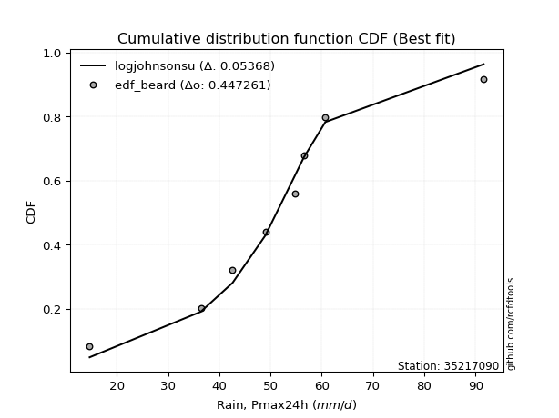</img>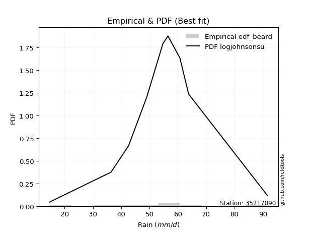</img>

</div>


### 5. EDF Chegodayev (1955)

The Chegodayev formula is an empirical plotting position formula used in hydrological frequency analysis to estimate the exceedance probability or return period of a specific event from a set of observed data. It is primarily used for plotting observed data points on probability paper to fit a theoretical distribution, particularly for analyzing extreme events like maximum flood flows or rainfall intensities. The constant _b_ value in the generalized plotting position formula is 0.3.

<div align="center">


$P=(m-b)/(n+1-2b)$


</div>


**5.1. Empirical values**

<div align="center">

|                | 0                   | 1                   | 2                  | 3                   | 4              | 5                  | 6                  | 7                  | 8                  |
|:---------------|:--------------------|:--------------------|:-------------------|:--------------------|:---------------|:-------------------|:-------------------|:-------------------|:-------------------|
| date           | 2017                | 2020                | 2021               | 2018                | 2023           | 2022               | 2019               | 2025               | 2024               |
| x              | 14.7                | 36.4                | 42.6               | 49.0                | 54.7           | 56.5               | 60.7               | 63.8               | 91.6               |
| m              | 1                   | 2                   | 3                  | 4                   | 5              | 6                  | 7                  | 8                  | 9                  |
| empirical_dist | edf_chegodayev      | edf_chegodayev      | edf_chegodayev     | edf_chegodayev      | edf_chegodayev | edf_chegodayev     | edf_chegodayev     | edf_chegodayev     | edf_chegodayev     |
| empirical      | 0.07446808510638298 | 0.18085106382978722 | 0.2872340425531915 | 0.39361702127659576 | 0.5            | 0.6063829787234043 | 0.7127659574468085 | 0.8191489361702128 | 0.9255319148936169 |
| empirical_tr   | 1.0804597701149425  | 1.2207792207792207  | 1.4029850746268657 | 1.6491228070175437  | 2.0            | 2.540540540540541  | 3.481481481481481  | 5.529411764705883  | 13.428571428571399 |

</div>


**5.2. Kolmogorov-Smirnov fit test (sorted by Δ)**


<div align="center">

|                | 0                   | 1                    | 2                   | 3                    | 4                   | 5                   | 6                   | 7                   | 8                   | 9                   | 10                  | 11                  | 12                  | 13                  | 14                  | 15                  | 16                  | 17                  | 18                  | 19                  | 20                  | 21                  | 22                  | 23                  | 24                  | 25                  | 26                  | 27                  | 28                  | 29                  | 30                  | 31                  | 32                  | 33                  | 34                  | 35                  | 36                  | 37                  | 38                  | 39                  | 40                  | 41                  | 42                  | 43                  | 44                  | 45                  | 46                  | 47                  | 48                  | 49                  | 50                  | 51                  | 52                  | 53                  | 54                  | 55                  | 56                  | 57                  | 58                  | 59                  | 60                  | 61                  | 62                  | 63                  | 64                  | 65                  | 66                  | 67                  | 68                  | 69                  | 70                  | 71                  | 72                  | 73                  | 74                  | 75                  | 76                  | 77                  | 78                  | 79                  | 80                  | 81                  | 82                  | 83                  | 84                  | 85                  | 86                  | 87                  | 88                  | 89                  | 90                  | 91                  | 92                  | 93                  | 94                  | 95                  | 96                  | 97                  | 98                  | 99                  | 100                 | 101                 | 102                 | 103                 | 104                 | 105                 | 106                 | 107                 | 108                 | 109                 | 110                 | 111                 | 112                 | 113                 | 114                 | 115                 | 116                 | 117                 | 118                 | 119                 | 120                 | 121                 | 122                 | 123                 | 124                 | 125                 | 126                 | 127                 | 128                 | 129                 | 130                 | 131                 | 132                 | 133                 | 134                 | 135                 | 136                 | 137                 | 138                 | 139                 | 140                 | 141                 | 142                 | 143                 | 144                 | 145                 | 146                 | 147                 | 148                 | 149                 | 150                 | 151                 | 152                 | 153                 | 154                 | 155                 | 156                 | 157                 | 158                 | 159                 |
|:---------------|:--------------------|:---------------------|:--------------------|:---------------------|:--------------------|:--------------------|:--------------------|:--------------------|:--------------------|:--------------------|:--------------------|:--------------------|:--------------------|:--------------------|:--------------------|:--------------------|:--------------------|:--------------------|:--------------------|:--------------------|:--------------------|:--------------------|:--------------------|:--------------------|:--------------------|:--------------------|:--------------------|:--------------------|:--------------------|:--------------------|:--------------------|:--------------------|:--------------------|:--------------------|:--------------------|:--------------------|:--------------------|:--------------------|:--------------------|:--------------------|:--------------------|:--------------------|:--------------------|:--------------------|:--------------------|:--------------------|:--------------------|:--------------------|:--------------------|:--------------------|:--------------------|:--------------------|:--------------------|:--------------------|:--------------------|:--------------------|:--------------------|:--------------------|:--------------------|:--------------------|:--------------------|:--------------------|:--------------------|:--------------------|:--------------------|:--------------------|:--------------------|:--------------------|:--------------------|:--------------------|:--------------------|:--------------------|:--------------------|:--------------------|:--------------------|:--------------------|:--------------------|:--------------------|:--------------------|:--------------------|:--------------------|:--------------------|:--------------------|:--------------------|:--------------------|:--------------------|:--------------------|:--------------------|:--------------------|:--------------------|:--------------------|:--------------------|:--------------------|:--------------------|:--------------------|:--------------------|:--------------------|:--------------------|:--------------------|:--------------------|:--------------------|:--------------------|:--------------------|:--------------------|:--------------------|:--------------------|:--------------------|:--------------------|:--------------------|:--------------------|:--------------------|:--------------------|:--------------------|:--------------------|:--------------------|:--------------------|:--------------------|:--------------------|:--------------------|:--------------------|:--------------------|:--------------------|:--------------------|:--------------------|:--------------------|:--------------------|:--------------------|:--------------------|:--------------------|:--------------------|:--------------------|:--------------------|:--------------------|:--------------------|:--------------------|:--------------------|:--------------------|:--------------------|:--------------------|:--------------------|:--------------------|:--------------------|:--------------------|:--------------------|:--------------------|:--------------------|:--------------------|:--------------------|:--------------------|:--------------------|:--------------------|:--------------------|:--------------------|:--------------------|:--------------------|:--------------------|:--------------------|:--------------------|:--------------------|:--------------------|
| station        | 35217090            | 35217090             | 35217090            | 35217090             | 35217090            | 35217090            | 35217090            | 35217090            | 35217090            | 35217090            | 35217090            | 35217090            | 35217090            | 35217090            | 35217090            | 35217090            | 35217090            | 35217090            | 35217090            | 35217090            | 35217090            | 35217090            | 35217090            | 35217090            | 35217090            | 35217090            | 35217090            | 35217090            | 35217090            | 35217090            | 35217090            | 35217090            | 35217090            | 35217090            | 35217090            | 35217090            | 35217090            | 35217090            | 35217090            | 35217090            | 35217090            | 35217090            | 35217090            | 35217090            | 35217090            | 35217090            | 35217090            | 35217090            | 35217090            | 35217090            | 35217090            | 35217090            | 35217090            | 35217090            | 35217090            | 35217090            | 35217090            | 35217090            | 35217090            | 35217090            | 35217090            | 35217090            | 35217090            | 35217090            | 35217090            | 35217090            | 35217090            | 35217090            | 35217090            | 35217090            | 35217090            | 35217090            | 35217090            | 35217090            | 35217090            | 35217090            | 35217090            | 35217090            | 35217090            | 35217090            | 35217090            | 35217090            | 35217090            | 35217090            | 35217090            | 35217090            | 35217090            | 35217090            | 35217090            | 35217090            | 35217090            | 35217090            | 35217090            | 35217090            | 35217090            | 35217090            | 35217090            | 35217090            | 35217090            | 35217090            | 35217090            | 35217090            | 35217090            | 35217090            | 35217090            | 35217090            | 35217090            | 35217090            | 35217090            | 35217090            | 35217090            | 35217090            | 35217090            | 35217090            | 35217090            | 35217090            | 35217090            | 35217090            | 35217090            | 35217090            | 35217090            | 35217090            | 35217090            | 35217090            | 35217090            | 35217090            | 35217090            | 35217090            | 35217090            | 35217090            | 35217090            | 35217090            | 35217090            | 35217090            | 35217090            | 35217090            | 35217090            | 35217090            | 35217090            | 35217090            | 35217090            | 35217090            | 35217090            | 35217090            | 35217090            | 35217090            | 35217090            | 35217090            | 35217090            | 35217090            | 35217090            | 35217090            | 35217090            | 35217090            | 35217090            | 35217090            | 35217090            | 35217090            | 35217090            | 35217090            |
| empirical_dist | edf_chegodayev      | edf_chegodayev       | edf_chegodayev      | edf_chegodayev       | edf_chegodayev      | edf_chegodayev      | edf_chegodayev      | edf_chegodayev      | edf_chegodayev      | edf_chegodayev      | edf_chegodayev      | edf_chegodayev      | edf_chegodayev      | edf_chegodayev      | edf_chegodayev      | edf_chegodayev      | edf_chegodayev      | edf_chegodayev      | edf_chegodayev      | edf_chegodayev      | edf_chegodayev      | edf_chegodayev      | edf_chegodayev      | edf_chegodayev      | edf_chegodayev      | edf_chegodayev      | edf_chegodayev      | edf_chegodayev      | edf_chegodayev      | edf_chegodayev      | edf_chegodayev      | edf_chegodayev      | edf_chegodayev      | edf_chegodayev      | edf_chegodayev      | edf_chegodayev      | edf_chegodayev      | edf_chegodayev      | edf_chegodayev      | edf_chegodayev      | edf_chegodayev      | edf_chegodayev      | edf_chegodayev      | edf_chegodayev      | edf_chegodayev      | edf_chegodayev      | edf_chegodayev      | edf_chegodayev      | edf_chegodayev      | edf_chegodayev      | edf_chegodayev      | edf_chegodayev      | edf_chegodayev      | edf_chegodayev      | edf_chegodayev      | edf_chegodayev      | edf_chegodayev      | edf_chegodayev      | edf_chegodayev      | edf_chegodayev      | edf_chegodayev      | edf_chegodayev      | edf_chegodayev      | edf_chegodayev      | edf_chegodayev      | edf_chegodayev      | edf_chegodayev      | edf_chegodayev      | edf_chegodayev      | edf_chegodayev      | edf_chegodayev      | edf_chegodayev      | edf_chegodayev      | edf_chegodayev      | edf_chegodayev      | edf_chegodayev      | edf_chegodayev      | edf_chegodayev      | edf_chegodayev      | edf_chegodayev      | edf_chegodayev      | edf_chegodayev      | edf_chegodayev      | edf_chegodayev      | edf_chegodayev      | edf_chegodayev      | edf_chegodayev      | edf_chegodayev      | edf_chegodayev      | edf_chegodayev      | edf_chegodayev      | edf_chegodayev      | edf_chegodayev      | edf_chegodayev      | edf_chegodayev      | edf_chegodayev      | edf_chegodayev      | edf_chegodayev      | edf_chegodayev      | edf_chegodayev      | edf_chegodayev      | edf_chegodayev      | edf_chegodayev      | edf_chegodayev      | edf_chegodayev      | edf_chegodayev      | edf_chegodayev      | edf_chegodayev      | edf_chegodayev      | edf_chegodayev      | edf_chegodayev      | edf_chegodayev      | edf_chegodayev      | edf_chegodayev      | edf_chegodayev      | edf_chegodayev      | edf_chegodayev      | edf_chegodayev      | edf_chegodayev      | edf_chegodayev      | edf_chegodayev      | edf_chegodayev      | edf_chegodayev      | edf_chegodayev      | edf_chegodayev      | edf_chegodayev      | edf_chegodayev      | edf_chegodayev      | edf_chegodayev      | edf_chegodayev      | edf_chegodayev      | edf_chegodayev      | edf_chegodayev      | edf_chegodayev      | edf_chegodayev      | edf_chegodayev      | edf_chegodayev      | edf_chegodayev      | edf_chegodayev      | edf_chegodayev      | edf_chegodayev      | edf_chegodayev      | edf_chegodayev      | edf_chegodayev      | edf_chegodayev      | edf_chegodayev      | edf_chegodayev      | edf_chegodayev      | edf_chegodayev      | edf_chegodayev      | edf_chegodayev      | edf_chegodayev      | edf_chegodayev      | edf_chegodayev      | edf_chegodayev      | edf_chegodayev      | edf_chegodayev      | edf_chegodayev      | edf_chegodayev      | edf_chegodayev      |
| p_dist         | logjohnsonsu        | johnsonsu            | tukeylambda         | hypsecant            | logmielke           | genlogistic         | logburr             | mielke              | burr                | loggenlogistic      | logistic            | laplace             | logt                | alpha               | vonmises_line       | invgauss            | dgamma              | maxwell             | gennorm             | ncf                 | dweibull            | rayleigh            | invgamma            | loggompertz         | nct                 | exponnorm           | skewnorm            | betaprime           | pearson3            | gengamma            | gamma               | erlang              | f                   | johnsonsb           | beta                | rice                | logweibull_min      | logburr12           | loggengamma         | logvonmises_line    | t                   | crystalball         | truncnorm           | norm                | logdgamma           | weibull_min         | logloggamma         | logexponweib        | exponpow            | logjohnsonsb        | loggumbel_l         | kstwobign           | gumbel_r            | halfnorm            | gumbel_l            | anglit              | cosine              | logpearson3         | lognct              | logcrystalball      | lognorm             | logexponnorm        | logrice             | logf                | logfatiguelife      | semicircular        | loglogistic         | loganglit           | logtriang           | loginvgamma         | loghypsecant        | loggenextreme       | logweibull_max      | logdweibull         | loggamma            | loggamma            | logloglaplace       | logerlang           | moyal               | halflogistic        | logsemicircular     | logbetaprime        | logalpha            | loginvgauss         | kappa4              | gompertz            | logncf              | logargus            | kappa3              | logtrapezoid        | logskewnorm         | logmaxwell          | loggennorm          | logtruncweibull_min | loglaplace          | loglaplace          | bradford            | lograyleigh         | loginvweibull       | wrapcauchy          | logfoldnorm         | uniform             | logtruncnorm        | lognakagami         | arcsine             | loggenhalflogistic  | truncweibull_min    | logarcsine          | loggumbel_r         | ksone               | loghalfnorm         | logcosine           | wald                | argus               | logmoyal            | loghalflogistic     | loggausshyper       | logkstwobign        | exponweib           | truncexpon          | loggenpareto        | loggenexpon         | loglevy_l           | gausshyper          | lomax               | genexpon            | genpareto           | loghalfgennorm      | logwald             | logkappa4           | logkappa3           | logbradford         | loguniform          | logtukeylambda      | logksone            | logwrapcauchy       | levy_l              | genhalflogistic     | logrdist            | burr12              | loglomax            | halfgennorm         | triang              | nakagami            | logbeta             | logtruncexpon       | genextreme          | trapezoid           | logexponpow         | invweibull          | rdist               | powerlaw            | foldnorm            | fatiguelife         | logpowerlaw         | weibull_max         | truncpareto         | logtruncpareto      | logvonmises         | vonmises            |
| delta          | 0.04253765184494118 | 0.056536244657701684 | 0.05878038843393796 | 0.062051050738793356 | 0.0709276446163637  | 0.07207486336328706 | 0.07239196611574283 | 0.07391233329174962 | 0.07391679507762328 | 0.07413204323468958 | 0.07674114777990437 | 0.08095472684620575 | 0.08128611950327236 | 0.08239160257600331 | 0.0829779921669711  | 0.08421616568248957 | 0.08510974872221766 | 0.0854847375527773  | 0.08577852796796287 | 0.08778609426748452 | 0.08838007607805459 | 0.08987632065450235 | 0.09003214210349164 | 0.09122422818900955 | 0.09240300943295143 | 0.09355375500786944 | 0.0944589258757661  | 0.09456753736233481 | 0.09594531661985128 | 0.0961630233338382  | 0.09618895912184922 | 0.09624477513658047 | 0.09632100650514763 | 0.0963270025421763  | 0.09641376933070434 | 0.09651724390418803 | 0.09769380738128952 | 0.09805987419305995 | 0.09839382843005251 | 0.09841384247673257 | 0.09888034866424456 | 0.09889595459091327 | 0.09889596108769405 | 0.09889596583869575 | 0.10161242378946767 | 0.10191700338882159 | 0.10369781280377621 | 0.10447504105725125 | 0.11011849493388215 | 0.11017739923677117 | 0.11038488233036137 | 0.11935976302267165 | 0.11980166147702997 | 0.12244066030511752 | 0.12434126835905268 | 0.12490794112112003 | 0.12521118990395552 | 0.1289332102663555  | 0.1325039700923018  | 0.13259916167533797 | 0.13259923341231067 | 0.13259985119157908 | 0.132607131156472   | 0.13402149701456595 | 0.13422980916158872 | 0.1360563448077574  | 0.1361673400196745  | 0.13620647845732653 | 0.13743557521675454 | 0.14175766643679183 | 0.14214548045952424 | 0.14223120320125848 | 0.14224093682934968 | 0.14263946742372802 | 0.1430111688259536  | 0.1430111688259536  | 0.14340887479875886 | 0.1442163338004115  | 0.14464920905465672 | 0.1447077705866182  | 0.14587208289890707 | 0.14636422764329388 | 0.14674849073098456 | 0.14826500486117028 | 0.15448115445868726 | 0.1587992337924159  | 0.15931874653083072 | 0.15945613312347628 | 0.1597093129232729  | 0.16089284922510716 | 0.16202321329500935 | 0.16441644436717479 | 0.16824733394310032 | 0.16974640625589577 | 0.17019883775440325 | 0.17019883775440325 | 0.17356362955668553 | 0.17481243382599826 | 0.17951631625852393 | 0.17996431729252904 | 0.18026087826653453 | 0.18065738870597348 | 0.18085097810975087 | 0.1808510638297657  | 0.18374775124127396 | 0.18719898073521168 | 0.18825969498534512 | 0.19166110574391393 | 0.2032586206877735  | 0.2037393132833466  | 0.20501687251492334 | 0.20559418861149714 | 0.21359532172273088 | 0.22610373229144853 | 0.22873621993928478 | 0.23042968044707274 | 0.23457992347235423 | 0.2356691874191239  | 0.23973036471885006 | 0.2448132549604437  | 0.2458205181233314  | 0.25657836336738993 | 0.2566247187805589  | 0.2566571802478579  | 0.25716488949296257 | 0.259234476909027   | 0.26090231468353864 | 0.2872340425531915  | 0.2994756247202007  | 0.31119078750959794 | 0.3137486707426911  | 0.3146485520669773  | 0.31473776452166635 | 0.3148450220241986  | 0.3154729597964241  | 0.3176784619459541  | 0.32745829350629047 | 0.33075422559493023 | 0.3504864018612317  | 0.3549170304999182  | 0.35846797197509517 | 0.37073218064314073 | 0.3720140358204959  | 0.3736834250048612  | 0.3828924535643405  | 0.4182321801087353  | 0.4192624014909737  | 0.44041993222845793 | 0.4406111518320822  | 0.4769897177185454  | 0.5247240860791058  | 0.5893908282343918  | 0.6063829787234043  | 0.637664952381021   | 0.6686277907488859  | 0.6742294354933621  | 0.7460635839713566  | 0.7777328969357984  | 1.1123345714266208  | 14.275674174904973  |
| deltao         | 0.41761268023100007 | 0.41761268023100007  | 0.41761268023100007 | 0.41761268023100007  | 0.41761268023100007 | 0.41761268023100007 | 0.41761268023100007 | 0.41761268023100007 | 0.41761268023100007 | 0.41761268023100007 | 0.41761268023100007 | 0.41761268023100007 | 0.41761268023100007 | 0.41761268023100007 | 0.41761268023100007 | 0.41761268023100007 | 0.41761268023100007 | 0.41761268023100007 | 0.41761268023100007 | 0.41761268023100007 | 0.41761268023100007 | 0.41761268023100007 | 0.41761268023100007 | 0.41761268023100007 | 0.41761268023100007 | 0.41761268023100007 | 0.41761268023100007 | 0.41761268023100007 | 0.41761268023100007 | 0.41761268023100007 | 0.41761268023100007 | 0.41761268023100007 | 0.41761268023100007 | 0.41761268023100007 | 0.41761268023100007 | 0.41761268023100007 | 0.41761268023100007 | 0.41761268023100007 | 0.41761268023100007 | 0.41761268023100007 | 0.41761268023100007 | 0.41761268023100007 | 0.41761268023100007 | 0.41761268023100007 | 0.41761268023100007 | 0.41761268023100007 | 0.41761268023100007 | 0.41761268023100007 | 0.41761268023100007 | 0.41761268023100007 | 0.41761268023100007 | 0.41761268023100007 | 0.41761268023100007 | 0.41761268023100007 | 0.41761268023100007 | 0.41761268023100007 | 0.41761268023100007 | 0.41761268023100007 | 0.41761268023100007 | 0.41761268023100007 | 0.41761268023100007 | 0.41761268023100007 | 0.41761268023100007 | 0.41761268023100007 | 0.41761268023100007 | 0.41761268023100007 | 0.41761268023100007 | 0.41761268023100007 | 0.41761268023100007 | 0.41761268023100007 | 0.41761268023100007 | 0.41761268023100007 | 0.41761268023100007 | 0.41761268023100007 | 0.41761268023100007 | 0.41761268023100007 | 0.41761268023100007 | 0.41761268023100007 | 0.41761268023100007 | 0.41761268023100007 | 0.41761268023100007 | 0.41761268023100007 | 0.41761268023100007 | 0.41761268023100007 | 0.41761268023100007 | 0.41761268023100007 | 0.41761268023100007 | 0.41761268023100007 | 0.41761268023100007 | 0.41761268023100007 | 0.41761268023100007 | 0.41761268023100007 | 0.41761268023100007 | 0.41761268023100007 | 0.41761268023100007 | 0.41761268023100007 | 0.41761268023100007 | 0.41761268023100007 | 0.41761268023100007 | 0.41761268023100007 | 0.41761268023100007 | 0.41761268023100007 | 0.41761268023100007 | 0.41761268023100007 | 0.41761268023100007 | 0.41761268023100007 | 0.41761268023100007 | 0.41761268023100007 | 0.41761268023100007 | 0.41761268023100007 | 0.41761268023100007 | 0.41761268023100007 | 0.41761268023100007 | 0.41761268023100007 | 0.41761268023100007 | 0.41761268023100007 | 0.41761268023100007 | 0.41761268023100007 | 0.41761268023100007 | 0.41761268023100007 | 0.41761268023100007 | 0.41761268023100007 | 0.41761268023100007 | 0.41761268023100007 | 0.41761268023100007 | 0.41761268023100007 | 0.41761268023100007 | 0.41761268023100007 | 0.41761268023100007 | 0.41761268023100007 | 0.41761268023100007 | 0.41761268023100007 | 0.41761268023100007 | 0.41761268023100007 | 0.41761268023100007 | 0.41761268023100007 | 0.41761268023100007 | 0.41761268023100007 | 0.41761268023100007 | 0.41761268023100007 | 0.41761268023100007 | 0.41761268023100007 | 0.41761268023100007 | 0.41761268023100007 | 0.41761268023100007 | 0.41761268023100007 | 0.41761268023100007 | 0.41761268023100007 | 0.41761268023100007 | 0.41761268023100007 | 0.41761268023100007 | 0.41761268023100007 | 0.41761268023100007 | 0.41761268023100007 | 0.41761268023100007 | 0.41761268023100007 | 0.41761268023100007 | 0.41761268023100007 | 0.41761268023100007 | 0.41761268023100007 |
| eval           | Δo > Δ              | Δo > Δ               | Δo > Δ              | Δo > Δ               | Δo > Δ              | Δo > Δ              | Δo > Δ              | Δo > Δ              | Δo > Δ              | Δo > Δ              | Δo > Δ              | Δo > Δ              | Δo > Δ              | Δo > Δ              | Δo > Δ              | Δo > Δ              | Δo > Δ              | Δo > Δ              | Δo > Δ              | Δo > Δ              | Δo > Δ              | Δo > Δ              | Δo > Δ              | Δo > Δ              | Δo > Δ              | Δo > Δ              | Δo > Δ              | Δo > Δ              | Δo > Δ              | Δo > Δ              | Δo > Δ              | Δo > Δ              | Δo > Δ              | Δo > Δ              | Δo > Δ              | Δo > Δ              | Δo > Δ              | Δo > Δ              | Δo > Δ              | Δo > Δ              | Δo > Δ              | Δo > Δ              | Δo > Δ              | Δo > Δ              | Δo > Δ              | Δo > Δ              | Δo > Δ              | Δo > Δ              | Δo > Δ              | Δo > Δ              | Δo > Δ              | Δo > Δ              | Δo > Δ              | Δo > Δ              | Δo > Δ              | Δo > Δ              | Δo > Δ              | Δo > Δ              | Δo > Δ              | Δo > Δ              | Δo > Δ              | Δo > Δ              | Δo > Δ              | Δo > Δ              | Δo > Δ              | Δo > Δ              | Δo > Δ              | Δo > Δ              | Δo > Δ              | Δo > Δ              | Δo > Δ              | Δo > Δ              | Δo > Δ              | Δo > Δ              | Δo > Δ              | Δo > Δ              | Δo > Δ              | Δo > Δ              | Δo > Δ              | Δo > Δ              | Δo > Δ              | Δo > Δ              | Δo > Δ              | Δo > Δ              | Δo > Δ              | Δo > Δ              | Δo > Δ              | Δo > Δ              | Δo > Δ              | Δo > Δ              | Δo > Δ              | Δo > Δ              | Δo > Δ              | Δo > Δ              | Δo > Δ              | Δo > Δ              | Δo > Δ              | Δo > Δ              | Δo > Δ              | Δo > Δ              | Δo > Δ              | Δo > Δ              | Δo > Δ              | Δo > Δ              | Δo > Δ              | Δo > Δ              | Δo > Δ              | Δo > Δ              | Δo > Δ              | Δo > Δ              | Δo > Δ              | Δo > Δ              | Δo > Δ              | Δo > Δ              | Δo > Δ              | Δo > Δ              | Δo > Δ              | Δo > Δ              | Δo > Δ              | Δo > Δ              | Δo > Δ              | Δo > Δ              | Δo > Δ              | Δo > Δ              | Δo > Δ              | Δo > Δ              | Δo > Δ              | Δo > Δ              | Δo > Δ              | Δo > Δ              | Δo > Δ              | Δo > Δ              | Δo > Δ              | Δo > Δ              | Δo > Δ              | Δo > Δ              | Δo > Δ              | Δo > Δ              | Δo > Δ              | Δo > Δ              | Δo > Δ              | Δo > Δ              | Δo > Δ              | Δo > Δ              | Δo > Δ              | Δo <= Δ             | Δo <= Δ             | Δo <= Δ             | Δo <= Δ             | Δo <= Δ             | Δo <= Δ             | Δo <= Δ             | Δo <= Δ             | Δo <= Δ             | Δo <= Δ             | Δo <= Δ             | Δo <= Δ             | Δo <= Δ             | Δo <= Δ             | Δo <= Δ             |
| fit            | 1                   | 1                    | 1                   | 1                    | 1                   | 1                   | 1                   | 1                   | 1                   | 1                   | 1                   | 1                   | 1                   | 1                   | 1                   | 1                   | 1                   | 1                   | 1                   | 1                   | 1                   | 1                   | 1                   | 1                   | 1                   | 1                   | 1                   | 1                   | 1                   | 1                   | 1                   | 1                   | 1                   | 1                   | 1                   | 1                   | 1                   | 1                   | 1                   | 1                   | 1                   | 1                   | 1                   | 1                   | 1                   | 1                   | 1                   | 1                   | 1                   | 1                   | 1                   | 1                   | 1                   | 1                   | 1                   | 1                   | 1                   | 1                   | 1                   | 1                   | 1                   | 1                   | 1                   | 1                   | 1                   | 1                   | 1                   | 1                   | 1                   | 1                   | 1                   | 1                   | 1                   | 1                   | 1                   | 1                   | 1                   | 1                   | 1                   | 1                   | 1                   | 1                   | 1                   | 1                   | 1                   | 1                   | 1                   | 1                   | 1                   | 1                   | 1                   | 1                   | 1                   | 1                   | 1                   | 1                   | 1                   | 1                   | 1                   | 1                   | 1                   | 1                   | 1                   | 1                   | 1                   | 1                   | 1                   | 1                   | 1                   | 1                   | 1                   | 1                   | 1                   | 1                   | 1                   | 1                   | 1                   | 1                   | 1                   | 1                   | 1                   | 1                   | 1                   | 1                   | 1                   | 1                   | 1                   | 1                   | 1                   | 1                   | 1                   | 1                   | 1                   | 1                   | 1                   | 1                   | 1                   | 1                   | 1                   | 1                   | 1                   | 1                   | 1                   | 1                   | 1                   | 0                   | 0                   | 0                   | 0                   | 0                   | 0                   | 0                   | 0                   | 0                   | 0                   | 0                   | 0                   | 0                   | 0                   | 0                   |
| n              | 9                   | 9                    | 9                   | 9                    | 9                   | 9                   | 9                   | 9                   | 9                   | 9                   | 9                   | 9                   | 9                   | 9                   | 9                   | 9                   | 9                   | 9                   | 9                   | 9                   | 9                   | 9                   | 9                   | 9                   | 9                   | 9                   | 9                   | 9                   | 9                   | 9                   | 9                   | 9                   | 9                   | 9                   | 9                   | 9                   | 9                   | 9                   | 9                   | 9                   | 9                   | 9                   | 9                   | 9                   | 9                   | 9                   | 9                   | 9                   | 9                   | 9                   | 9                   | 9                   | 9                   | 9                   | 9                   | 9                   | 9                   | 9                   | 9                   | 9                   | 9                   | 9                   | 9                   | 9                   | 9                   | 9                   | 9                   | 9                   | 9                   | 9                   | 9                   | 9                   | 9                   | 9                   | 9                   | 9                   | 9                   | 9                   | 9                   | 9                   | 9                   | 9                   | 9                   | 9                   | 9                   | 9                   | 9                   | 9                   | 9                   | 9                   | 9                   | 9                   | 9                   | 9                   | 9                   | 9                   | 9                   | 9                   | 9                   | 9                   | 9                   | 9                   | 9                   | 9                   | 9                   | 9                   | 9                   | 9                   | 9                   | 9                   | 9                   | 9                   | 9                   | 9                   | 9                   | 9                   | 9                   | 9                   | 9                   | 9                   | 9                   | 9                   | 9                   | 9                   | 9                   | 9                   | 9                   | 9                   | 9                   | 9                   | 9                   | 9                   | 9                   | 9                   | 9                   | 9                   | 9                   | 9                   | 9                   | 9                   | 9                   | 9                   | 9                   | 9                   | 9                   | 9                   | 9                   | 9                   | 9                   | 9                   | 9                   | 9                   | 9                   | 9                   | 9                   | 9                   | 9                   | 9                   | 9                   | 9                   |
| best_fit       | 1                   | 0                    | 0                   | 0                    | 0                   | 0                   | 0                   | 0                   | 0                   | 0                   | 0                   | 0                   | 0                   | 0                   | 0                   | 0                   | 0                   | 0                   | 0                   | 0                   | 0                   | 0                   | 0                   | 0                   | 0                   | 0                   | 0                   | 0                   | 0                   | 0                   | 0                   | 0                   | 0                   | 0                   | 0                   | 0                   | 0                   | 0                   | 0                   | 0                   | 0                   | 0                   | 0                   | 0                   | 0                   | 0                   | 0                   | 0                   | 0                   | 0                   | 0                   | 0                   | 0                   | 0                   | 0                   | 0                   | 0                   | 0                   | 0                   | 0                   | 0                   | 0                   | 0                   | 0                   | 0                   | 0                   | 0                   | 0                   | 0                   | 0                   | 0                   | 0                   | 0                   | 0                   | 0                   | 0                   | 0                   | 0                   | 0                   | 0                   | 0                   | 0                   | 0                   | 0                   | 0                   | 0                   | 0                   | 0                   | 0                   | 0                   | 0                   | 0                   | 0                   | 0                   | 0                   | 0                   | 0                   | 0                   | 0                   | 0                   | 0                   | 0                   | 0                   | 0                   | 0                   | 0                   | 0                   | 0                   | 0                   | 0                   | 0                   | 0                   | 0                   | 0                   | 0                   | 0                   | 0                   | 0                   | 0                   | 0                   | 0                   | 0                   | 0                   | 0                   | 0                   | 0                   | 0                   | 0                   | 0                   | 0                   | 0                   | 0                   | 0                   | 0                   | 0                   | 0                   | 0                   | 0                   | 0                   | 0                   | 0                   | 0                   | 0                   | 0                   | 0                   | 0                   | 0                   | 0                   | 0                   | 0                   | 0                   | 0                   | 0                   | 0                   | 0                   | 0                   | 0                   | 0                   | 0                   | 0                   |
| best_fit_sort  | 1                   | 2                    | 3                   | 4                    | 5                   | 6                   | 7                   | 8                   | 9                   | 10                  | 11                  | 12                  | 13                  | 14                  | 15                  | 16                  | 17                  | 18                  | 19                  | 20                  | 21                  | 22                  | 23                  | 24                  | 25                  | 26                  | 27                  | 28                  | 29                  | 30                  | 31                  | 32                  | 33                  | 34                  | 35                  | 36                  | 37                  | 38                  | 39                  | 40                  | 41                  | 42                  | 43                  | 44                  | 45                  | 46                  | 47                  | 48                  | 49                  | 50                  | 51                  | 52                  | 53                  | 54                  | 55                  | 56                  | 57                  | 58                  | 59                  | 60                  | 61                  | 62                  | 63                  | 64                  | 65                  | 66                  | 67                  | 68                  | 69                  | 70                  | 71                  | 72                  | 73                  | 74                  | 75                  | 76                  | 77                  | 78                  | 79                  | 80                  | 81                  | 82                  | 83                  | 84                  | 85                  | 86                  | 87                  | 88                  | 89                  | 90                  | 91                  | 92                  | 93                  | 94                  | 95                  | 96                  | 97                  | 98                  | 99                  | 100                 | 101                 | 102                 | 103                 | 104                 | 105                 | 106                 | 107                 | 108                 | 109                 | 110                 | 111                 | 112                 | 113                 | 114                 | 115                 | 116                 | 117                 | 118                 | 119                 | 120                 | 121                 | 122                 | 123                 | 124                 | 125                 | 126                 | 127                 | 128                 | 129                 | 130                 | 131                 | 132                 | 133                 | 134                 | 135                 | 136                 | 137                 | 138                 | 139                 | 140                 | 141                 | 142                 | 143                 | 144                 | 145                 | 146                 | 147                 | 148                 | 149                 | 150                 | 151                 | 152                 | 153                 | 154                 | 155                 | 156                 | 157                 | 158                 | 159                 | 160                 |

</div>


**5.3. Best fit**

<div align="center">

|   id |   station | empirical_dist   | p_dist       |     delta |   deltao | eval   |   fit |   n |   best_fit |   best_fit_sort |
|-----:|----------:|:-----------------|:-------------|----------:|---------:|:-------|------:|----:|-----------:|----------------:|
|    0 |  35217090 | edf_chegodayev   | logjohnsonsu | 0.0425377 | 0.417613 | Δo > Δ |     1 |   9 |          1 |               1 |

</div>


<div align="center">

</img>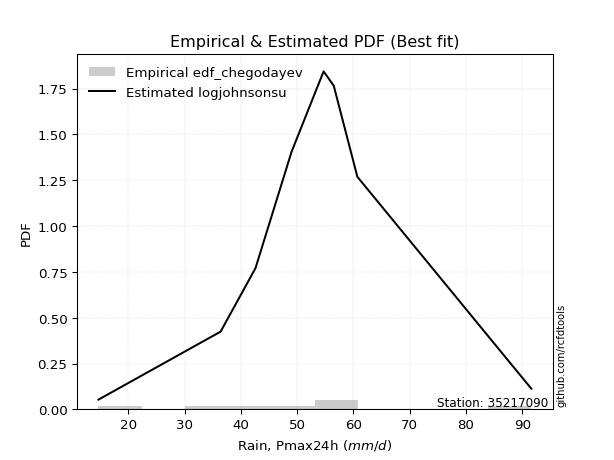</img>

</div>


### 6. EDF Blom (1958)

The Blom formula is a specific "plotting position" formula used in hydrology and statistical analysis to estimate the empirical cumulative probability (or non-exceedance probability) of a data series. It is particularly recommended for data that are approximately normally distributed. The constant _a_ is set to 0.375 (or 3/8).

<div align="center">


$P=(m-a)/(n+1-2a)$


</div>


**6.1. Empirical values**

<div align="center">

|                | 0                   | 1                   | 2                   | 3                  | 4        | 5                  | 6                  | 7                  | 8                  |
|:---------------|:--------------------|:--------------------|:--------------------|:-------------------|:---------|:-------------------|:-------------------|:-------------------|:-------------------|
| date           | 2017                | 2020                | 2021                | 2018               | 2023     | 2022               | 2019               | 2025               | 2024               |
| x              | 14.7                | 36.4                | 42.6                | 49.0               | 54.7     | 56.5               | 60.7               | 63.8               | 91.6               |
| m              | 1                   | 2                   | 3                   | 4                  | 5        | 6                  | 7                  | 8                  | 9                  |
| empirical_dist | edf_blom            | edf_blom            | edf_blom            | edf_blom           | edf_blom | edf_blom           | edf_blom           | edf_blom           | edf_blom           |
| empirical      | 0.06756756756756757 | 0.17567567567567569 | 0.28378378378378377 | 0.3918918918918919 | 0.5      | 0.6081081081081081 | 0.7162162162162162 | 0.8243243243243243 | 0.9324324324324325 |
| empirical_tr   | 1.072463768115942   | 1.2131147540983607  | 1.3962264150943395  | 1.6444444444444444 | 2.0      | 2.5517241379310347 | 3.523809523809524  | 5.6923076923076925 | 14.800000000000006 |

</div>


**6.2. Kolmogorov-Smirnov fit test (sorted by Δ)**


<div align="center">

|                | 0                   | 1                    | 2                    | 3                   | 4                   | 5                   | 6                   | 7                   | 8                   | 9                   | 10                  | 11                  | 12                  | 13                  | 14                  | 15                  | 16                  | 17                  | 18                  | 19                  | 20                  | 21                  | 22                  | 23                  | 24                  | 25                  | 26                  | 27                  | 28                  | 29                  | 30                  | 31                  | 32                  | 33                  | 34                  | 35                  | 36                  | 37                  | 38                  | 39                  | 40                  | 41                  | 42                  | 43                  | 44                  | 45                  | 46                  | 47                  | 48                  | 49                  | 50                  | 51                  | 52                  | 53                  | 54                  | 55                  | 56                  | 57                  | 58                  | 59                  | 60                  | 61                  | 62                  | 63                  | 64                  | 65                  | 66                  | 67                  | 68                  | 69                  | 70                  | 71                  | 72                  | 73                  | 74                  | 75                  | 76                  | 77                  | 78                  | 79                  | 80                  | 81                  | 82                  | 83                  | 84                  | 85                  | 86                  | 87                  | 88                  | 89                  | 90                  | 91                  | 92                  | 93                  | 94                  | 95                  | 96                  | 97                  | 98                  | 99                  | 100                 | 101                 | 102                 | 103                 | 104                 | 105                 | 106                 | 107                 | 108                 | 109                 | 110                 | 111                 | 112                 | 113                 | 114                 | 115                 | 116                 | 117                 | 118                 | 119                 | 120                 | 121                 | 122                 | 123                 | 124                 | 125                 | 126                 | 127                 | 128                 | 129                 | 130                 | 131                 | 132                 | 133                 | 134                 | 135                 | 136                 | 137                 | 138                 | 139                 | 140                 | 141                 | 142                 | 143                 | 144                 | 145                 | 146                 | 147                 | 148                 | 149                 | 150                 | 151                 | 152                 | 153                 | 154                 | 155                 | 156                 | 157                 | 158                 | 159                 |
|:---------------|:--------------------|:---------------------|:---------------------|:--------------------|:--------------------|:--------------------|:--------------------|:--------------------|:--------------------|:--------------------|:--------------------|:--------------------|:--------------------|:--------------------|:--------------------|:--------------------|:--------------------|:--------------------|:--------------------|:--------------------|:--------------------|:--------------------|:--------------------|:--------------------|:--------------------|:--------------------|:--------------------|:--------------------|:--------------------|:--------------------|:--------------------|:--------------------|:--------------------|:--------------------|:--------------------|:--------------------|:--------------------|:--------------------|:--------------------|:--------------------|:--------------------|:--------------------|:--------------------|:--------------------|:--------------------|:--------------------|:--------------------|:--------------------|:--------------------|:--------------------|:--------------------|:--------------------|:--------------------|:--------------------|:--------------------|:--------------------|:--------------------|:--------------------|:--------------------|:--------------------|:--------------------|:--------------------|:--------------------|:--------------------|:--------------------|:--------------------|:--------------------|:--------------------|:--------------------|:--------------------|:--------------------|:--------------------|:--------------------|:--------------------|:--------------------|:--------------------|:--------------------|:--------------------|:--------------------|:--------------------|:--------------------|:--------------------|:--------------------|:--------------------|:--------------------|:--------------------|:--------------------|:--------------------|:--------------------|:--------------------|:--------------------|:--------------------|:--------------------|:--------------------|:--------------------|:--------------------|:--------------------|:--------------------|:--------------------|:--------------------|:--------------------|:--------------------|:--------------------|:--------------------|:--------------------|:--------------------|:--------------------|:--------------------|:--------------------|:--------------------|:--------------------|:--------------------|:--------------------|:--------------------|:--------------------|:--------------------|:--------------------|:--------------------|:--------------------|:--------------------|:--------------------|:--------------------|:--------------------|:--------------------|:--------------------|:--------------------|:--------------------|:--------------------|:--------------------|:--------------------|:--------------------|:--------------------|:--------------------|:--------------------|:--------------------|:--------------------|:--------------------|:--------------------|:--------------------|:--------------------|:--------------------|:--------------------|:--------------------|:--------------------|:--------------------|:--------------------|:--------------------|:--------------------|:--------------------|:--------------------|:--------------------|:--------------------|:--------------------|:--------------------|:--------------------|:--------------------|:--------------------|:--------------------|:--------------------|:--------------------|
| station        | 35217090            | 35217090             | 35217090             | 35217090            | 35217090            | 35217090            | 35217090            | 35217090            | 35217090            | 35217090            | 35217090            | 35217090            | 35217090            | 35217090            | 35217090            | 35217090            | 35217090            | 35217090            | 35217090            | 35217090            | 35217090            | 35217090            | 35217090            | 35217090            | 35217090            | 35217090            | 35217090            | 35217090            | 35217090            | 35217090            | 35217090            | 35217090            | 35217090            | 35217090            | 35217090            | 35217090            | 35217090            | 35217090            | 35217090            | 35217090            | 35217090            | 35217090            | 35217090            | 35217090            | 35217090            | 35217090            | 35217090            | 35217090            | 35217090            | 35217090            | 35217090            | 35217090            | 35217090            | 35217090            | 35217090            | 35217090            | 35217090            | 35217090            | 35217090            | 35217090            | 35217090            | 35217090            | 35217090            | 35217090            | 35217090            | 35217090            | 35217090            | 35217090            | 35217090            | 35217090            | 35217090            | 35217090            | 35217090            | 35217090            | 35217090            | 35217090            | 35217090            | 35217090            | 35217090            | 35217090            | 35217090            | 35217090            | 35217090            | 35217090            | 35217090            | 35217090            | 35217090            | 35217090            | 35217090            | 35217090            | 35217090            | 35217090            | 35217090            | 35217090            | 35217090            | 35217090            | 35217090            | 35217090            | 35217090            | 35217090            | 35217090            | 35217090            | 35217090            | 35217090            | 35217090            | 35217090            | 35217090            | 35217090            | 35217090            | 35217090            | 35217090            | 35217090            | 35217090            | 35217090            | 35217090            | 35217090            | 35217090            | 35217090            | 35217090            | 35217090            | 35217090            | 35217090            | 35217090            | 35217090            | 35217090            | 35217090            | 35217090            | 35217090            | 35217090            | 35217090            | 35217090            | 35217090            | 35217090            | 35217090            | 35217090            | 35217090            | 35217090            | 35217090            | 35217090            | 35217090            | 35217090            | 35217090            | 35217090            | 35217090            | 35217090            | 35217090            | 35217090            | 35217090            | 35217090            | 35217090            | 35217090            | 35217090            | 35217090            | 35217090            | 35217090            | 35217090            | 35217090            | 35217090            | 35217090            | 35217090            |
| empirical_dist | edf_blom            | edf_blom             | edf_blom             | edf_blom            | edf_blom            | edf_blom            | edf_blom            | edf_blom            | edf_blom            | edf_blom            | edf_blom            | edf_blom            | edf_blom            | edf_blom            | edf_blom            | edf_blom            | edf_blom            | edf_blom            | edf_blom            | edf_blom            | edf_blom            | edf_blom            | edf_blom            | edf_blom            | edf_blom            | edf_blom            | edf_blom            | edf_blom            | edf_blom            | edf_blom            | edf_blom            | edf_blom            | edf_blom            | edf_blom            | edf_blom            | edf_blom            | edf_blom            | edf_blom            | edf_blom            | edf_blom            | edf_blom            | edf_blom            | edf_blom            | edf_blom            | edf_blom            | edf_blom            | edf_blom            | edf_blom            | edf_blom            | edf_blom            | edf_blom            | edf_blom            | edf_blom            | edf_blom            | edf_blom            | edf_blom            | edf_blom            | edf_blom            | edf_blom            | edf_blom            | edf_blom            | edf_blom            | edf_blom            | edf_blom            | edf_blom            | edf_blom            | edf_blom            | edf_blom            | edf_blom            | edf_blom            | edf_blom            | edf_blom            | edf_blom            | edf_blom            | edf_blom            | edf_blom            | edf_blom            | edf_blom            | edf_blom            | edf_blom            | edf_blom            | edf_blom            | edf_blom            | edf_blom            | edf_blom            | edf_blom            | edf_blom            | edf_blom            | edf_blom            | edf_blom            | edf_blom            | edf_blom            | edf_blom            | edf_blom            | edf_blom            | edf_blom            | edf_blom            | edf_blom            | edf_blom            | edf_blom            | edf_blom            | edf_blom            | edf_blom            | edf_blom            | edf_blom            | edf_blom            | edf_blom            | edf_blom            | edf_blom            | edf_blom            | edf_blom            | edf_blom            | edf_blom            | edf_blom            | edf_blom            | edf_blom            | edf_blom            | edf_blom            | edf_blom            | edf_blom            | edf_blom            | edf_blom            | edf_blom            | edf_blom            | edf_blom            | edf_blom            | edf_blom            | edf_blom            | edf_blom            | edf_blom            | edf_blom            | edf_blom            | edf_blom            | edf_blom            | edf_blom            | edf_blom            | edf_blom            | edf_blom            | edf_blom            | edf_blom            | edf_blom            | edf_blom            | edf_blom            | edf_blom            | edf_blom            | edf_blom            | edf_blom            | edf_blom            | edf_blom            | edf_blom            | edf_blom            | edf_blom            | edf_blom            | edf_blom            | edf_blom            | edf_blom            | edf_blom            | edf_blom            | edf_blom            | edf_blom            |
| p_dist         | logjohnsonsu        | johnsonsu            | tukeylambda          | hypsecant           | logmielke           | logburr             | mielke              | burr                | loggenlogistic      | genlogistic         | laplace             | dgamma              | logistic            | gennorm             | alpha               | dweibull            | logt                | invgauss            | vonmises_line       | rayleigh            | maxwell             | ncf                 | invgamma            | loggompertz         | nct                 | exponnorm           | logdgamma           | skewnorm            | betaprime           | loggengamma         | pearson3            | gengamma            | gamma               | erlang              | f                   | johnsonsb           | beta                | rice                | logweibull_min      | logburr12           | logvonmises_line    | t                   | crystalball         | truncnorm           | norm                | weibull_min         | logloggamma         | logexponweib        | exponpow            | logjohnsonsb        | loggumbel_l         | gumbel_r            | kstwobign           | halfnorm            | gumbel_l            | anglit              | cosine              | logpearson3         | lognct              | logcrystalball      | lognorm             | logexponnorm        | logrice             | logf                | logfatiguelife      | loglogistic         | loganglit           | semicircular        | loghypsecant        | logtriang           | loginvgamma         | moyal               | halflogistic        | loggamma            | loggamma            | logerlang           | loggenextreme       | logweibull_max      | logdweibull         | logbetaprime        | logalpha            | logloglaplace       | loginvgauss         | logsemicircular     | kappa4              | gompertz            | logncf              | logargus            | kappa3              | logtrapezoid        | logmaxwell          | loggennorm          | logskewnorm         | loglaplace          | loglaplace          | logtruncweibull_min | logtruncnorm        | lognakagami         | lograyleigh         | bradford            | logfoldnorm         | loginvweibull       | wrapcauchy          | uniform             | arcsine             | loggenhalflogistic  | truncweibull_min    | logarcsine          | loggumbel_r         | loghalfnorm         | ksone               | logcosine           | wald                | logmoyal            | argus               | loghalflogistic     | loggausshyper       | logkstwobign        | exponweib           | truncexpon          | loggenpareto        | loggenexpon         | loglevy_l           | gausshyper          | lomax               | genexpon            | genpareto           | loghalfgennorm      | logwald             | logkappa4           | logkappa3           | logbradford         | loguniform          | logtukeylambda      | logksone            | logwrapcauchy       | levy_l              | genhalflogistic     | logrdist            | burr12              | loglomax            | halfgennorm         | nakagami            | triang              | logbeta             | logtruncexpon       | genextreme          | trapezoid           | logexponpow         | invweibull          | rdist               | powerlaw            | foldnorm            | fatiguelife         | logpowerlaw         | weibull_max         | truncpareto         | logtruncpareto      | logvonmises         | vonmises            |
| delta          | 0.04253765184494118 | 0.056536244657701684 | 0.060072330465155366 | 0.06647105964536038 | 0.07201055827698477 | 0.07239196611574283 | 0.07391233329174962 | 0.07391679507762328 | 0.07413204323468958 | 0.07725025151739862 | 0.08095472684620575 | 0.08165948995280992 | 0.08191653593401593 | 0.08232826919855513 | 0.08404940303910025 | 0.08492981730864685 | 0.0860987057086946  | 0.08813610758935098 | 0.08815338032108266 | 0.09006531655908212 | 0.09066012570688886 | 0.09296148242159608 | 0.0952075302576032  | 0.09639961634312111 | 0.09757839758706299 | 0.098729143161981   | 0.09943250491767075 | 0.09963431402987766 | 0.09974292551644637 | 0.10011895781475638 | 0.10112070477396284 | 0.10133841148794975 | 0.10136434727596078 | 0.10142016329069203 | 0.10149639465925919 | 0.10150239069628786 | 0.1015891574848159  | 0.10169263205829959 | 0.10286919553540108 | 0.10323526234717151 | 0.10358923063084413 | 0.10405573681835611 | 0.10407134274502483 | 0.10407134924180561 | 0.10407135399280731 | 0.10709239154293315 | 0.10887320095788777 | 0.10965042921136281 | 0.11529388308799371 | 0.11535278739088273 | 0.11556027048447293 | 0.11980166147702997 | 0.12108489240737552 | 0.1241657896898214  | 0.12951665651316424 | 0.13008332927523159 | 0.13038657805806708 | 0.13410859842046707 | 0.13422909947700568 | 0.13432429106004184 | 0.13432436279701454 | 0.13432498057628295 | 0.13433226054117586 | 0.13574662639926982 | 0.1359549385462926  | 0.13789246940437838 | 0.14026222300931582 | 0.14123173296186897 | 0.14214548045952424 | 0.1426109633708661  | 0.1434827958214957  | 0.14464920905465672 | 0.1447077705866182  | 0.14473629821065748 | 0.14473629821065748 | 0.14594146318511536 | 0.14740659135537004 | 0.14741632498346124 | 0.14781485557783958 | 0.14808935702799775 | 0.14847362011568843 | 0.14858426295287042 | 0.14999013424587415 | 0.1510474710530186  | 0.15965654261279882 | 0.16397462194652745 | 0.16449413468494226 | 0.16463152127758784 | 0.16488470107738443 | 0.16606823737921872 | 0.16614157375187866 | 0.16652220455839645 | 0.1671986014491209  | 0.17019883775440325 | 0.17019883775440325 | 0.17492179441000733 | 0.17567558995563934 | 0.17567567567565417 | 0.17653756321070213 | 0.17873901771079706 | 0.1819860076512384  | 0.18469170441263547 | 0.1851397054466406  | 0.18583277686008504 | 0.18892313939538552 | 0.19237436888932324 | 0.19343508313945668 | 0.19683649389802546 | 0.20498375007247738 | 0.2084671312843311  | 0.20891470143745816 | 0.20904444738090489 | 0.21359532172273088 | 0.23046134932398865 | 0.2312791204455601  | 0.2321548098317766  | 0.2397553116264658  | 0.24084457557323544 | 0.2449057528729616  | 0.24998864311455524 | 0.25099590627744295 | 0.2617537515215015  | 0.2618001069346705  | 0.26183256840196945 | 0.2623402776470741  | 0.26440986506313857 | 0.2660777028376502  | 0.28378378378378377 | 0.30120075410490454 | 0.3163661756637095  | 0.31892405889680264 | 0.31982394022108884 | 0.3199131526757779  | 0.3200204101783102  | 0.32064834795053565 | 0.3228538501000656  | 0.3343588110451059  | 0.3359296137490418  | 0.35566179001534326 | 0.36009241865402974 | 0.3636433601292067  | 0.3759075687972523  | 0.3771336837742689  | 0.3771894239746075  | 0.38806784171845204 | 0.42340756826284687 | 0.4261629190297893  | 0.4455953203825695  | 0.4457865399861938  | 0.483890235257361   | 0.5298994742332174  | 0.5945662163885034  | 0.6081081081081081  | 0.6428403405351326  | 0.6738031789029975  | 0.6794048236474737  | 0.7512389721254682  | 0.78290828508991    | 1.1140597008113247  | 14.268773657366157  |
| deltao         | 0.41761268023100007 | 0.41761268023100007  | 0.41761268023100007  | 0.41761268023100007 | 0.41761268023100007 | 0.41761268023100007 | 0.41761268023100007 | 0.41761268023100007 | 0.41761268023100007 | 0.41761268023100007 | 0.41761268023100007 | 0.41761268023100007 | 0.41761268023100007 | 0.41761268023100007 | 0.41761268023100007 | 0.41761268023100007 | 0.41761268023100007 | 0.41761268023100007 | 0.41761268023100007 | 0.41761268023100007 | 0.41761268023100007 | 0.41761268023100007 | 0.41761268023100007 | 0.41761268023100007 | 0.41761268023100007 | 0.41761268023100007 | 0.41761268023100007 | 0.41761268023100007 | 0.41761268023100007 | 0.41761268023100007 | 0.41761268023100007 | 0.41761268023100007 | 0.41761268023100007 | 0.41761268023100007 | 0.41761268023100007 | 0.41761268023100007 | 0.41761268023100007 | 0.41761268023100007 | 0.41761268023100007 | 0.41761268023100007 | 0.41761268023100007 | 0.41761268023100007 | 0.41761268023100007 | 0.41761268023100007 | 0.41761268023100007 | 0.41761268023100007 | 0.41761268023100007 | 0.41761268023100007 | 0.41761268023100007 | 0.41761268023100007 | 0.41761268023100007 | 0.41761268023100007 | 0.41761268023100007 | 0.41761268023100007 | 0.41761268023100007 | 0.41761268023100007 | 0.41761268023100007 | 0.41761268023100007 | 0.41761268023100007 | 0.41761268023100007 | 0.41761268023100007 | 0.41761268023100007 | 0.41761268023100007 | 0.41761268023100007 | 0.41761268023100007 | 0.41761268023100007 | 0.41761268023100007 | 0.41761268023100007 | 0.41761268023100007 | 0.41761268023100007 | 0.41761268023100007 | 0.41761268023100007 | 0.41761268023100007 | 0.41761268023100007 | 0.41761268023100007 | 0.41761268023100007 | 0.41761268023100007 | 0.41761268023100007 | 0.41761268023100007 | 0.41761268023100007 | 0.41761268023100007 | 0.41761268023100007 | 0.41761268023100007 | 0.41761268023100007 | 0.41761268023100007 | 0.41761268023100007 | 0.41761268023100007 | 0.41761268023100007 | 0.41761268023100007 | 0.41761268023100007 | 0.41761268023100007 | 0.41761268023100007 | 0.41761268023100007 | 0.41761268023100007 | 0.41761268023100007 | 0.41761268023100007 | 0.41761268023100007 | 0.41761268023100007 | 0.41761268023100007 | 0.41761268023100007 | 0.41761268023100007 | 0.41761268023100007 | 0.41761268023100007 | 0.41761268023100007 | 0.41761268023100007 | 0.41761268023100007 | 0.41761268023100007 | 0.41761268023100007 | 0.41761268023100007 | 0.41761268023100007 | 0.41761268023100007 | 0.41761268023100007 | 0.41761268023100007 | 0.41761268023100007 | 0.41761268023100007 | 0.41761268023100007 | 0.41761268023100007 | 0.41761268023100007 | 0.41761268023100007 | 0.41761268023100007 | 0.41761268023100007 | 0.41761268023100007 | 0.41761268023100007 | 0.41761268023100007 | 0.41761268023100007 | 0.41761268023100007 | 0.41761268023100007 | 0.41761268023100007 | 0.41761268023100007 | 0.41761268023100007 | 0.41761268023100007 | 0.41761268023100007 | 0.41761268023100007 | 0.41761268023100007 | 0.41761268023100007 | 0.41761268023100007 | 0.41761268023100007 | 0.41761268023100007 | 0.41761268023100007 | 0.41761268023100007 | 0.41761268023100007 | 0.41761268023100007 | 0.41761268023100007 | 0.41761268023100007 | 0.41761268023100007 | 0.41761268023100007 | 0.41761268023100007 | 0.41761268023100007 | 0.41761268023100007 | 0.41761268023100007 | 0.41761268023100007 | 0.41761268023100007 | 0.41761268023100007 | 0.41761268023100007 | 0.41761268023100007 | 0.41761268023100007 | 0.41761268023100007 | 0.41761268023100007 | 0.41761268023100007 | 0.41761268023100007 |
| eval           | Δo > Δ              | Δo > Δ               | Δo > Δ               | Δo > Δ              | Δo > Δ              | Δo > Δ              | Δo > Δ              | Δo > Δ              | Δo > Δ              | Δo > Δ              | Δo > Δ              | Δo > Δ              | Δo > Δ              | Δo > Δ              | Δo > Δ              | Δo > Δ              | Δo > Δ              | Δo > Δ              | Δo > Δ              | Δo > Δ              | Δo > Δ              | Δo > Δ              | Δo > Δ              | Δo > Δ              | Δo > Δ              | Δo > Δ              | Δo > Δ              | Δo > Δ              | Δo > Δ              | Δo > Δ              | Δo > Δ              | Δo > Δ              | Δo > Δ              | Δo > Δ              | Δo > Δ              | Δo > Δ              | Δo > Δ              | Δo > Δ              | Δo > Δ              | Δo > Δ              | Δo > Δ              | Δo > Δ              | Δo > Δ              | Δo > Δ              | Δo > Δ              | Δo > Δ              | Δo > Δ              | Δo > Δ              | Δo > Δ              | Δo > Δ              | Δo > Δ              | Δo > Δ              | Δo > Δ              | Δo > Δ              | Δo > Δ              | Δo > Δ              | Δo > Δ              | Δo > Δ              | Δo > Δ              | Δo > Δ              | Δo > Δ              | Δo > Δ              | Δo > Δ              | Δo > Δ              | Δo > Δ              | Δo > Δ              | Δo > Δ              | Δo > Δ              | Δo > Δ              | Δo > Δ              | Δo > Δ              | Δo > Δ              | Δo > Δ              | Δo > Δ              | Δo > Δ              | Δo > Δ              | Δo > Δ              | Δo > Δ              | Δo > Δ              | Δo > Δ              | Δo > Δ              | Δo > Δ              | Δo > Δ              | Δo > Δ              | Δo > Δ              | Δo > Δ              | Δo > Δ              | Δo > Δ              | Δo > Δ              | Δo > Δ              | Δo > Δ              | Δo > Δ              | Δo > Δ              | Δo > Δ              | Δo > Δ              | Δo > Δ              | Δo > Δ              | Δo > Δ              | Δo > Δ              | Δo > Δ              | Δo > Δ              | Δo > Δ              | Δo > Δ              | Δo > Δ              | Δo > Δ              | Δo > Δ              | Δo > Δ              | Δo > Δ              | Δo > Δ              | Δo > Δ              | Δo > Δ              | Δo > Δ              | Δo > Δ              | Δo > Δ              | Δo > Δ              | Δo > Δ              | Δo > Δ              | Δo > Δ              | Δo > Δ              | Δo > Δ              | Δo > Δ              | Δo > Δ              | Δo > Δ              | Δo > Δ              | Δo > Δ              | Δo > Δ              | Δo > Δ              | Δo > Δ              | Δo > Δ              | Δo > Δ              | Δo > Δ              | Δo > Δ              | Δo > Δ              | Δo > Δ              | Δo > Δ              | Δo > Δ              | Δo > Δ              | Δo > Δ              | Δo > Δ              | Δo > Δ              | Δo > Δ              | Δo > Δ              | Δo > Δ              | Δo > Δ              | Δo > Δ              | Δo <= Δ             | Δo <= Δ             | Δo <= Δ             | Δo <= Δ             | Δo <= Δ             | Δo <= Δ             | Δo <= Δ             | Δo <= Δ             | Δo <= Δ             | Δo <= Δ             | Δo <= Δ             | Δo <= Δ             | Δo <= Δ             | Δo <= Δ             | Δo <= Δ             |
| fit            | 1                   | 1                    | 1                    | 1                   | 1                   | 1                   | 1                   | 1                   | 1                   | 1                   | 1                   | 1                   | 1                   | 1                   | 1                   | 1                   | 1                   | 1                   | 1                   | 1                   | 1                   | 1                   | 1                   | 1                   | 1                   | 1                   | 1                   | 1                   | 1                   | 1                   | 1                   | 1                   | 1                   | 1                   | 1                   | 1                   | 1                   | 1                   | 1                   | 1                   | 1                   | 1                   | 1                   | 1                   | 1                   | 1                   | 1                   | 1                   | 1                   | 1                   | 1                   | 1                   | 1                   | 1                   | 1                   | 1                   | 1                   | 1                   | 1                   | 1                   | 1                   | 1                   | 1                   | 1                   | 1                   | 1                   | 1                   | 1                   | 1                   | 1                   | 1                   | 1                   | 1                   | 1                   | 1                   | 1                   | 1                   | 1                   | 1                   | 1                   | 1                   | 1                   | 1                   | 1                   | 1                   | 1                   | 1                   | 1                   | 1                   | 1                   | 1                   | 1                   | 1                   | 1                   | 1                   | 1                   | 1                   | 1                   | 1                   | 1                   | 1                   | 1                   | 1                   | 1                   | 1                   | 1                   | 1                   | 1                   | 1                   | 1                   | 1                   | 1                   | 1                   | 1                   | 1                   | 1                   | 1                   | 1                   | 1                   | 1                   | 1                   | 1                   | 1                   | 1                   | 1                   | 1                   | 1                   | 1                   | 1                   | 1                   | 1                   | 1                   | 1                   | 1                   | 1                   | 1                   | 1                   | 1                   | 1                   | 1                   | 1                   | 1                   | 1                   | 1                   | 1                   | 0                   | 0                   | 0                   | 0                   | 0                   | 0                   | 0                   | 0                   | 0                   | 0                   | 0                   | 0                   | 0                   | 0                   | 0                   |
| n              | 9                   | 9                    | 9                    | 9                   | 9                   | 9                   | 9                   | 9                   | 9                   | 9                   | 9                   | 9                   | 9                   | 9                   | 9                   | 9                   | 9                   | 9                   | 9                   | 9                   | 9                   | 9                   | 9                   | 9                   | 9                   | 9                   | 9                   | 9                   | 9                   | 9                   | 9                   | 9                   | 9                   | 9                   | 9                   | 9                   | 9                   | 9                   | 9                   | 9                   | 9                   | 9                   | 9                   | 9                   | 9                   | 9                   | 9                   | 9                   | 9                   | 9                   | 9                   | 9                   | 9                   | 9                   | 9                   | 9                   | 9                   | 9                   | 9                   | 9                   | 9                   | 9                   | 9                   | 9                   | 9                   | 9                   | 9                   | 9                   | 9                   | 9                   | 9                   | 9                   | 9                   | 9                   | 9                   | 9                   | 9                   | 9                   | 9                   | 9                   | 9                   | 9                   | 9                   | 9                   | 9                   | 9                   | 9                   | 9                   | 9                   | 9                   | 9                   | 9                   | 9                   | 9                   | 9                   | 9                   | 9                   | 9                   | 9                   | 9                   | 9                   | 9                   | 9                   | 9                   | 9                   | 9                   | 9                   | 9                   | 9                   | 9                   | 9                   | 9                   | 9                   | 9                   | 9                   | 9                   | 9                   | 9                   | 9                   | 9                   | 9                   | 9                   | 9                   | 9                   | 9                   | 9                   | 9                   | 9                   | 9                   | 9                   | 9                   | 9                   | 9                   | 9                   | 9                   | 9                   | 9                   | 9                   | 9                   | 9                   | 9                   | 9                   | 9                   | 9                   | 9                   | 9                   | 9                   | 9                   | 9                   | 9                   | 9                   | 9                   | 9                   | 9                   | 9                   | 9                   | 9                   | 9                   | 9                   | 9                   |
| best_fit       | 1                   | 0                    | 0                    | 0                   | 0                   | 0                   | 0                   | 0                   | 0                   | 0                   | 0                   | 0                   | 0                   | 0                   | 0                   | 0                   | 0                   | 0                   | 0                   | 0                   | 0                   | 0                   | 0                   | 0                   | 0                   | 0                   | 0                   | 0                   | 0                   | 0                   | 0                   | 0                   | 0                   | 0                   | 0                   | 0                   | 0                   | 0                   | 0                   | 0                   | 0                   | 0                   | 0                   | 0                   | 0                   | 0                   | 0                   | 0                   | 0                   | 0                   | 0                   | 0                   | 0                   | 0                   | 0                   | 0                   | 0                   | 0                   | 0                   | 0                   | 0                   | 0                   | 0                   | 0                   | 0                   | 0                   | 0                   | 0                   | 0                   | 0                   | 0                   | 0                   | 0                   | 0                   | 0                   | 0                   | 0                   | 0                   | 0                   | 0                   | 0                   | 0                   | 0                   | 0                   | 0                   | 0                   | 0                   | 0                   | 0                   | 0                   | 0                   | 0                   | 0                   | 0                   | 0                   | 0                   | 0                   | 0                   | 0                   | 0                   | 0                   | 0                   | 0                   | 0                   | 0                   | 0                   | 0                   | 0                   | 0                   | 0                   | 0                   | 0                   | 0                   | 0                   | 0                   | 0                   | 0                   | 0                   | 0                   | 0                   | 0                   | 0                   | 0                   | 0                   | 0                   | 0                   | 0                   | 0                   | 0                   | 0                   | 0                   | 0                   | 0                   | 0                   | 0                   | 0                   | 0                   | 0                   | 0                   | 0                   | 0                   | 0                   | 0                   | 0                   | 0                   | 0                   | 0                   | 0                   | 0                   | 0                   | 0                   | 0                   | 0                   | 0                   | 0                   | 0                   | 0                   | 0                   | 0                   | 0                   |
| best_fit_sort  | 1                   | 2                    | 3                    | 4                   | 5                   | 6                   | 7                   | 8                   | 9                   | 10                  | 11                  | 12                  | 13                  | 14                  | 15                  | 16                  | 17                  | 18                  | 19                  | 20                  | 21                  | 22                  | 23                  | 24                  | 25                  | 26                  | 27                  | 28                  | 29                  | 30                  | 31                  | 32                  | 33                  | 34                  | 35                  | 36                  | 37                  | 38                  | 39                  | 40                  | 41                  | 42                  | 43                  | 44                  | 45                  | 46                  | 47                  | 48                  | 49                  | 50                  | 51                  | 52                  | 53                  | 54                  | 55                  | 56                  | 57                  | 58                  | 59                  | 60                  | 61                  | 62                  | 63                  | 64                  | 65                  | 66                  | 67                  | 68                  | 69                  | 70                  | 71                  | 72                  | 73                  | 74                  | 75                  | 76                  | 77                  | 78                  | 79                  | 80                  | 81                  | 82                  | 83                  | 84                  | 85                  | 86                  | 87                  | 88                  | 89                  | 90                  | 91                  | 92                  | 93                  | 94                  | 95                  | 96                  | 97                  | 98                  | 99                  | 100                 | 101                 | 102                 | 103                 | 104                 | 105                 | 106                 | 107                 | 108                 | 109                 | 110                 | 111                 | 112                 | 113                 | 114                 | 115                 | 116                 | 117                 | 118                 | 119                 | 120                 | 121                 | 122                 | 123                 | 124                 | 125                 | 126                 | 127                 | 128                 | 129                 | 130                 | 131                 | 132                 | 133                 | 134                 | 135                 | 136                 | 137                 | 138                 | 139                 | 140                 | 141                 | 142                 | 143                 | 144                 | 145                 | 146                 | 147                 | 148                 | 149                 | 150                 | 151                 | 152                 | 153                 | 154                 | 155                 | 156                 | 157                 | 158                 | 159                 | 160                 |

</div>


**6.3. Best fit**

<div align="center">

|   id |   station | empirical_dist   | p_dist       |     delta |   deltao | eval   |   fit |   n |   best_fit |   best_fit_sort |
|-----:|----------:|:-----------------|:-------------|----------:|---------:|:-------|------:|----:|-----------:|----------------:|
|    0 |  35217090 | edf_blom         | logjohnsonsu | 0.0425377 | 0.417613 | Δo > Δ |     1 |   9 |          1 |               1 |

</div>


<div align="center">

</img>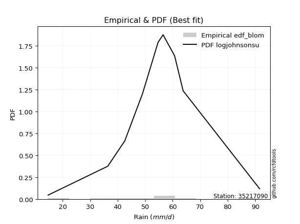</img>

</div>


### 7. EDF Tukey (1962)

In hydrology, the Tukey formula is used as a plotting position formula to estimate the empirical probability or frequency of a flood event (or other hydrological data). The formula parameter is given as _c=0.333_ (or 1/3).

<div align="center">


$P=(m-c)/(n+1-2c)$


</div>


**7.1. Empirical values**

<div align="center">

|                | 0                   | 1                   | 2                  | 3                   | 4         | 5                  | 6                  | 7                  | 8                  |
|:---------------|:--------------------|:--------------------|:-------------------|:--------------------|:----------|:-------------------|:-------------------|:-------------------|:-------------------|
| date           | 2017                | 2020                | 2021               | 2018                | 2023      | 2022               | 2019               | 2025               | 2024               |
| x              | 14.7                | 36.4                | 42.6               | 49.0                | 54.7      | 56.5               | 60.7               | 63.8               | 91.6               |
| m              | 1                   | 2                   | 3                  | 4                   | 5         | 6                  | 7                  | 8                  | 9                  |
| empirical_dist | edf_tukey           | edf_tukey           | edf_tukey          | edf_tukey           | edf_tukey | edf_tukey          | edf_tukey          | edf_tukey          | edf_tukey          |
| empirical      | 0.07142857142857142 | 0.17857142857142858 | 0.2857142857142857 | 0.39285714285714285 | 0.5       | 0.6071428571428571 | 0.7142857142857143 | 0.8214285714285714 | 0.9285714285714286 |
| empirical_tr   | 1.0769230769230769  | 1.2173913043478262  | 1.4                | 1.6470588235294117  | 2.0       | 2.545454545454545  | 3.5                | 5.599999999999999  | 14.000000000000007 |

</div>


**7.2. Kolmogorov-Smirnov fit test (sorted by Δ)**


<div align="center">

|                | 0                   | 1                    | 2                   | 3                   | 4                   | 5                   | 6                   | 7                   | 8                   | 9                   | 10                  | 11                  | 12                  | 13                  | 14                  | 15                  | 16                  | 17                  | 18                  | 19                  | 20                  | 21                  | 22                  | 23                  | 24                  | 25                  | 26                  | 27                  | 28                  | 29                  | 30                  | 31                  | 32                  | 33                  | 34                  | 35                  | 36                  | 37                  | 38                  | 39                  | 40                  | 41                  | 42                  | 43                  | 44                  | 45                  | 46                  | 47                  | 48                  | 49                  | 50                  | 51                  | 52                  | 53                  | 54                  | 55                  | 56                  | 57                  | 58                  | 59                  | 60                  | 61                  | 62                  | 63                  | 64                  | 65                  | 66                  | 67                  | 68                  | 69                  | 70                  | 71                  | 72                  | 73                  | 74                  | 75                  | 76                  | 77                  | 78                  | 79                  | 80                  | 81                  | 82                  | 83                  | 84                  | 85                  | 86                  | 87                  | 88                  | 89                  | 90                  | 91                  | 92                  | 93                  | 94                  | 95                  | 96                  | 97                  | 98                  | 99                  | 100                 | 101                 | 102                 | 103                 | 104                 | 105                 | 106                 | 107                 | 108                 | 109                 | 110                 | 111                 | 112                 | 113                 | 114                 | 115                 | 116                 | 117                 | 118                 | 119                 | 120                 | 121                 | 122                 | 123                 | 124                 | 125                 | 126                 | 127                 | 128                 | 129                 | 130                 | 131                 | 132                 | 133                 | 134                 | 135                 | 136                 | 137                 | 138                 | 139                 | 140                 | 141                 | 142                 | 143                 | 144                 | 145                 | 146                 | 147                 | 148                 | 149                 | 150                 | 151                 | 152                 | 153                 | 154                 | 155                 | 156                 | 157                 | 158                 | 159                 |
|:---------------|:--------------------|:---------------------|:--------------------|:--------------------|:--------------------|:--------------------|:--------------------|:--------------------|:--------------------|:--------------------|:--------------------|:--------------------|:--------------------|:--------------------|:--------------------|:--------------------|:--------------------|:--------------------|:--------------------|:--------------------|:--------------------|:--------------------|:--------------------|:--------------------|:--------------------|:--------------------|:--------------------|:--------------------|:--------------------|:--------------------|:--------------------|:--------------------|:--------------------|:--------------------|:--------------------|:--------------------|:--------------------|:--------------------|:--------------------|:--------------------|:--------------------|:--------------------|:--------------------|:--------------------|:--------------------|:--------------------|:--------------------|:--------------------|:--------------------|:--------------------|:--------------------|:--------------------|:--------------------|:--------------------|:--------------------|:--------------------|:--------------------|:--------------------|:--------------------|:--------------------|:--------------------|:--------------------|:--------------------|:--------------------|:--------------------|:--------------------|:--------------------|:--------------------|:--------------------|:--------------------|:--------------------|:--------------------|:--------------------|:--------------------|:--------------------|:--------------------|:--------------------|:--------------------|:--------------------|:--------------------|:--------------------|:--------------------|:--------------------|:--------------------|:--------------------|:--------------------|:--------------------|:--------------------|:--------------------|:--------------------|:--------------------|:--------------------|:--------------------|:--------------------|:--------------------|:--------------------|:--------------------|:--------------------|:--------------------|:--------------------|:--------------------|:--------------------|:--------------------|:--------------------|:--------------------|:--------------------|:--------------------|:--------------------|:--------------------|:--------------------|:--------------------|:--------------------|:--------------------|:--------------------|:--------------------|:--------------------|:--------------------|:--------------------|:--------------------|:--------------------|:--------------------|:--------------------|:--------------------|:--------------------|:--------------------|:--------------------|:--------------------|:--------------------|:--------------------|:--------------------|:--------------------|:--------------------|:--------------------|:--------------------|:--------------------|:--------------------|:--------------------|:--------------------|:--------------------|:--------------------|:--------------------|:--------------------|:--------------------|:--------------------|:--------------------|:--------------------|:--------------------|:--------------------|:--------------------|:--------------------|:--------------------|:--------------------|:--------------------|:--------------------|:--------------------|:--------------------|:--------------------|:--------------------|:--------------------|:--------------------|
| station        | 35217090            | 35217090             | 35217090            | 35217090            | 35217090            | 35217090            | 35217090            | 35217090            | 35217090            | 35217090            | 35217090            | 35217090            | 35217090            | 35217090            | 35217090            | 35217090            | 35217090            | 35217090            | 35217090            | 35217090            | 35217090            | 35217090            | 35217090            | 35217090            | 35217090            | 35217090            | 35217090            | 35217090            | 35217090            | 35217090            | 35217090            | 35217090            | 35217090            | 35217090            | 35217090            | 35217090            | 35217090            | 35217090            | 35217090            | 35217090            | 35217090            | 35217090            | 35217090            | 35217090            | 35217090            | 35217090            | 35217090            | 35217090            | 35217090            | 35217090            | 35217090            | 35217090            | 35217090            | 35217090            | 35217090            | 35217090            | 35217090            | 35217090            | 35217090            | 35217090            | 35217090            | 35217090            | 35217090            | 35217090            | 35217090            | 35217090            | 35217090            | 35217090            | 35217090            | 35217090            | 35217090            | 35217090            | 35217090            | 35217090            | 35217090            | 35217090            | 35217090            | 35217090            | 35217090            | 35217090            | 35217090            | 35217090            | 35217090            | 35217090            | 35217090            | 35217090            | 35217090            | 35217090            | 35217090            | 35217090            | 35217090            | 35217090            | 35217090            | 35217090            | 35217090            | 35217090            | 35217090            | 35217090            | 35217090            | 35217090            | 35217090            | 35217090            | 35217090            | 35217090            | 35217090            | 35217090            | 35217090            | 35217090            | 35217090            | 35217090            | 35217090            | 35217090            | 35217090            | 35217090            | 35217090            | 35217090            | 35217090            | 35217090            | 35217090            | 35217090            | 35217090            | 35217090            | 35217090            | 35217090            | 35217090            | 35217090            | 35217090            | 35217090            | 35217090            | 35217090            | 35217090            | 35217090            | 35217090            | 35217090            | 35217090            | 35217090            | 35217090            | 35217090            | 35217090            | 35217090            | 35217090            | 35217090            | 35217090            | 35217090            | 35217090            | 35217090            | 35217090            | 35217090            | 35217090            | 35217090            | 35217090            | 35217090            | 35217090            | 35217090            | 35217090            | 35217090            | 35217090            | 35217090            | 35217090            | 35217090            |
| empirical_dist | edf_tukey           | edf_tukey            | edf_tukey           | edf_tukey           | edf_tukey           | edf_tukey           | edf_tukey           | edf_tukey           | edf_tukey           | edf_tukey           | edf_tukey           | edf_tukey           | edf_tukey           | edf_tukey           | edf_tukey           | edf_tukey           | edf_tukey           | edf_tukey           | edf_tukey           | edf_tukey           | edf_tukey           | edf_tukey           | edf_tukey           | edf_tukey           | edf_tukey           | edf_tukey           | edf_tukey           | edf_tukey           | edf_tukey           | edf_tukey           | edf_tukey           | edf_tukey           | edf_tukey           | edf_tukey           | edf_tukey           | edf_tukey           | edf_tukey           | edf_tukey           | edf_tukey           | edf_tukey           | edf_tukey           | edf_tukey           | edf_tukey           | edf_tukey           | edf_tukey           | edf_tukey           | edf_tukey           | edf_tukey           | edf_tukey           | edf_tukey           | edf_tukey           | edf_tukey           | edf_tukey           | edf_tukey           | edf_tukey           | edf_tukey           | edf_tukey           | edf_tukey           | edf_tukey           | edf_tukey           | edf_tukey           | edf_tukey           | edf_tukey           | edf_tukey           | edf_tukey           | edf_tukey           | edf_tukey           | edf_tukey           | edf_tukey           | edf_tukey           | edf_tukey           | edf_tukey           | edf_tukey           | edf_tukey           | edf_tukey           | edf_tukey           | edf_tukey           | edf_tukey           | edf_tukey           | edf_tukey           | edf_tukey           | edf_tukey           | edf_tukey           | edf_tukey           | edf_tukey           | edf_tukey           | edf_tukey           | edf_tukey           | edf_tukey           | edf_tukey           | edf_tukey           | edf_tukey           | edf_tukey           | edf_tukey           | edf_tukey           | edf_tukey           | edf_tukey           | edf_tukey           | edf_tukey           | edf_tukey           | edf_tukey           | edf_tukey           | edf_tukey           | edf_tukey           | edf_tukey           | edf_tukey           | edf_tukey           | edf_tukey           | edf_tukey           | edf_tukey           | edf_tukey           | edf_tukey           | edf_tukey           | edf_tukey           | edf_tukey           | edf_tukey           | edf_tukey           | edf_tukey           | edf_tukey           | edf_tukey           | edf_tukey           | edf_tukey           | edf_tukey           | edf_tukey           | edf_tukey           | edf_tukey           | edf_tukey           | edf_tukey           | edf_tukey           | edf_tukey           | edf_tukey           | edf_tukey           | edf_tukey           | edf_tukey           | edf_tukey           | edf_tukey           | edf_tukey           | edf_tukey           | edf_tukey           | edf_tukey           | edf_tukey           | edf_tukey           | edf_tukey           | edf_tukey           | edf_tukey           | edf_tukey           | edf_tukey           | edf_tukey           | edf_tukey           | edf_tukey           | edf_tukey           | edf_tukey           | edf_tukey           | edf_tukey           | edf_tukey           | edf_tukey           | edf_tukey           | edf_tukey           | edf_tukey           | edf_tukey           |
| p_dist         | logjohnsonsu        | johnsonsu            | tukeylambda         | hypsecant           | logmielke           | logburr             | mielke              | burr                | loggenlogistic      | genlogistic         | logistic            | laplace             | alpha               | logt                | dgamma              | gennorm             | invgauss            | vonmises_line       | dweibull            | maxwell             | rayleigh            | ncf                 | invgamma            | loggompertz         | nct                 | exponnorm           | skewnorm            | betaprime           | pearson3            | gengamma            | gamma               | erlang              | f                   | johnsonsb           | beta                | rice                | loggengamma         | logweibull_min      | logburr12           | logdgamma           | logvonmises_line    | t                   | crystalball         | truncnorm           | norm                | weibull_min         | logloggamma         | logexponweib        | exponpow            | logjohnsonsb        | loggumbel_l         | gumbel_r            | kstwobign           | halfnorm            | gumbel_l            | anglit              | cosine              | logpearson3         | lognct              | logcrystalball      | lognorm             | logexponnorm        | logrice             | logf                | logfatiguelife      | loglogistic         | loganglit           | semicircular        | logtriang           | loghypsecant        | loginvgamma         | loggamma            | loggamma            | loggenextreme       | logweibull_max      | moyal               | halflogistic        | logdweibull         | logerlang           | logloglaplace       | logbetaprime        | logalpha            | logsemicircular     | loginvgauss         | kappa4              | gompertz            | logncf              | logargus            | kappa3              | logtrapezoid        | logskewnorm         | logmaxwell          | loggennorm          | loglaplace          | loglaplace          | logtruncweibull_min | lograyleigh         | bradford            | logtruncnorm        | lognakagami         | logfoldnorm         | loginvweibull       | wrapcauchy          | uniform             | arcsine             | loggenhalflogistic  | truncweibull_min    | logarcsine          | loggumbel_r         | ksone               | loghalfnorm         | logcosine           | wald                | argus               | logmoyal            | loghalflogistic     | loggausshyper       | logkstwobign        | exponweib           | truncexpon          | loggenpareto        | loggenexpon         | loglevy_l           | gausshyper          | lomax               | genexpon            | genpareto           | loghalfgennorm      | logwald             | logkappa4           | logkappa3           | logbradford         | loguniform          | logtukeylambda      | logksone            | logwrapcauchy       | levy_l              | genhalflogistic     | logrdist            | burr12              | loglomax            | halfgennorm         | triang              | nakagami            | logbeta             | logtruncexpon       | genextreme          | trapezoid           | logexponpow         | invweibull          | rdist               | powerlaw            | foldnorm            | fatiguelife         | logpowerlaw         | weibull_max         | truncpareto         | logtruncpareto      | logvonmises         | vonmises            |
| delta          | 0.04253765184494118 | 0.056536244657701684 | 0.05878038843393796 | 0.06357530674960743 | 0.0709276446163637  | 0.07239196611574283 | 0.07391233329174962 | 0.07391679507762328 | 0.07413204323468958 | 0.07435449862164567 | 0.07902078303826299 | 0.08095472684620575 | 0.08239160257600331 | 0.08320295281294166 | 0.08358999188331184 | 0.08425877112905705 | 0.08524035469359803 | 0.08525762742532972 | 0.08686031923914878 | 0.08776437281113592 | 0.08987632065450235 | 0.09006572952584313 | 0.09231177736185026 | 0.09350386344736816 | 0.09468264469131005 | 0.09583339026622806 | 0.09673856113412471 | 0.09684717262069342 | 0.0982249518782099  | 0.09844265859219681 | 0.09846859438020783 | 0.09852441039493909 | 0.09860064176350625 | 0.09860663780053491 | 0.09869340458906295 | 0.09879687916254665 | 0.09915370684950542 | 0.09997344263964814 | 0.10033950945141856 | 0.10039775588292171 | 0.10069347773509119 | 0.10115998392260317 | 0.10117558984927189 | 0.10117559634605267 | 0.10117560109705437 | 0.1041966386471802  | 0.10597744806213483 | 0.10675467631560986 | 0.11239813019224076 | 0.11245703449512978 | 0.11266451758871998 | 0.11980166147702997 | 0.12011964144212456 | 0.12320053872457043 | 0.1266209036174113  | 0.12718757637947864 | 0.12749082516231414 | 0.13121284552471413 | 0.1332638485117547  | 0.13335904009479088 | 0.13335911183176358 | 0.13335972961103199 | 0.1333670095759249  | 0.13478137543401886 | 0.13498968758104163 | 0.13692721843912742 | 0.13772623529623235 | 0.13833598006611603 | 0.13971521047511315 | 0.14214548045952424 | 0.14251754485624474 | 0.1437710472454065  | 0.1437710472454065  | 0.1445108384596171  | 0.1445205720877083  | 0.14464920905465672 | 0.1447077705866182  | 0.14491910268208663 | 0.1449762122198644  | 0.14568851005711747 | 0.14712410606274678 | 0.14750836915043747 | 0.14815171815726572 | 0.1490248832806232  | 0.15676078971704588 | 0.1610788690507745  | 0.16159838178918937 | 0.1617357683818349  | 0.16198894818163154 | 0.16317248448346577 | 0.16430284855336796 | 0.1651763227866277  | 0.1674874555236474  | 0.17019883775440325 | 0.17019883775440325 | 0.17202604151425438 | 0.17557231224545117 | 0.17584326481504417 | 0.17857134285139223 | 0.17857142857140706 | 0.18102075668598744 | 0.18179595151688258 | 0.18224395255088766 | 0.1829370239643321  | 0.18602738649963257 | 0.1894786159935703  | 0.19053933024370373 | 0.19394074100227257 | 0.20401849910722641 | 0.20601894854170522 | 0.20653662935382916 | 0.20711394545040296 | 0.21359532172273088 | 0.22838336754980715 | 0.2294960983587377  | 0.23118955886652565 | 0.23685955873071285 | 0.23794882267748255 | 0.2420099999772087  | 0.24709289021880235 | 0.24810015338169    | 0.25885799862574854 | 0.25890435403891754 | 0.2589368155062165  | 0.2594445247513212  | 0.2615141121673856  | 0.26318194994189725 | 0.2857142857142857  | 0.3002355031396536  | 0.31347042276795656 | 0.3160283060010497  | 0.3169281873253359  | 0.31701739978002497 | 0.31712465728255723 | 0.3177525950547827  | 0.3199580972043128  | 0.33049780718410204 | 0.33303386085328884 | 0.3527660371195903  | 0.3571966657582768  | 0.3607476072334538  | 0.37301181590149934 | 0.37429367107885453 | 0.375203181843767   | 0.3851720888226991  | 0.4205118153670939  | 0.42230191516878546 | 0.44269956748681655 | 0.44289078709044083 | 0.48002923139635717 | 0.5270037213374644  | 0.5916704634927504  | 0.6071428571428571  | 0.6399445876393797  | 0.6709074260072445  | 0.6765090707517207  | 0.7483432192297153  | 0.780012532194157   | 1.1130944498460738  | 14.27263466122716   |
| deltao         | 0.41761268023100007 | 0.41761268023100007  | 0.41761268023100007 | 0.41761268023100007 | 0.41761268023100007 | 0.41761268023100007 | 0.41761268023100007 | 0.41761268023100007 | 0.41761268023100007 | 0.41761268023100007 | 0.41761268023100007 | 0.41761268023100007 | 0.41761268023100007 | 0.41761268023100007 | 0.41761268023100007 | 0.41761268023100007 | 0.41761268023100007 | 0.41761268023100007 | 0.41761268023100007 | 0.41761268023100007 | 0.41761268023100007 | 0.41761268023100007 | 0.41761268023100007 | 0.41761268023100007 | 0.41761268023100007 | 0.41761268023100007 | 0.41761268023100007 | 0.41761268023100007 | 0.41761268023100007 | 0.41761268023100007 | 0.41761268023100007 | 0.41761268023100007 | 0.41761268023100007 | 0.41761268023100007 | 0.41761268023100007 | 0.41761268023100007 | 0.41761268023100007 | 0.41761268023100007 | 0.41761268023100007 | 0.41761268023100007 | 0.41761268023100007 | 0.41761268023100007 | 0.41761268023100007 | 0.41761268023100007 | 0.41761268023100007 | 0.41761268023100007 | 0.41761268023100007 | 0.41761268023100007 | 0.41761268023100007 | 0.41761268023100007 | 0.41761268023100007 | 0.41761268023100007 | 0.41761268023100007 | 0.41761268023100007 | 0.41761268023100007 | 0.41761268023100007 | 0.41761268023100007 | 0.41761268023100007 | 0.41761268023100007 | 0.41761268023100007 | 0.41761268023100007 | 0.41761268023100007 | 0.41761268023100007 | 0.41761268023100007 | 0.41761268023100007 | 0.41761268023100007 | 0.41761268023100007 | 0.41761268023100007 | 0.41761268023100007 | 0.41761268023100007 | 0.41761268023100007 | 0.41761268023100007 | 0.41761268023100007 | 0.41761268023100007 | 0.41761268023100007 | 0.41761268023100007 | 0.41761268023100007 | 0.41761268023100007 | 0.41761268023100007 | 0.41761268023100007 | 0.41761268023100007 | 0.41761268023100007 | 0.41761268023100007 | 0.41761268023100007 | 0.41761268023100007 | 0.41761268023100007 | 0.41761268023100007 | 0.41761268023100007 | 0.41761268023100007 | 0.41761268023100007 | 0.41761268023100007 | 0.41761268023100007 | 0.41761268023100007 | 0.41761268023100007 | 0.41761268023100007 | 0.41761268023100007 | 0.41761268023100007 | 0.41761268023100007 | 0.41761268023100007 | 0.41761268023100007 | 0.41761268023100007 | 0.41761268023100007 | 0.41761268023100007 | 0.41761268023100007 | 0.41761268023100007 | 0.41761268023100007 | 0.41761268023100007 | 0.41761268023100007 | 0.41761268023100007 | 0.41761268023100007 | 0.41761268023100007 | 0.41761268023100007 | 0.41761268023100007 | 0.41761268023100007 | 0.41761268023100007 | 0.41761268023100007 | 0.41761268023100007 | 0.41761268023100007 | 0.41761268023100007 | 0.41761268023100007 | 0.41761268023100007 | 0.41761268023100007 | 0.41761268023100007 | 0.41761268023100007 | 0.41761268023100007 | 0.41761268023100007 | 0.41761268023100007 | 0.41761268023100007 | 0.41761268023100007 | 0.41761268023100007 | 0.41761268023100007 | 0.41761268023100007 | 0.41761268023100007 | 0.41761268023100007 | 0.41761268023100007 | 0.41761268023100007 | 0.41761268023100007 | 0.41761268023100007 | 0.41761268023100007 | 0.41761268023100007 | 0.41761268023100007 | 0.41761268023100007 | 0.41761268023100007 | 0.41761268023100007 | 0.41761268023100007 | 0.41761268023100007 | 0.41761268023100007 | 0.41761268023100007 | 0.41761268023100007 | 0.41761268023100007 | 0.41761268023100007 | 0.41761268023100007 | 0.41761268023100007 | 0.41761268023100007 | 0.41761268023100007 | 0.41761268023100007 | 0.41761268023100007 | 0.41761268023100007 | 0.41761268023100007 | 0.41761268023100007 |
| eval           | Δo > Δ              | Δo > Δ               | Δo > Δ              | Δo > Δ              | Δo > Δ              | Δo > Δ              | Δo > Δ              | Δo > Δ              | Δo > Δ              | Δo > Δ              | Δo > Δ              | Δo > Δ              | Δo > Δ              | Δo > Δ              | Δo > Δ              | Δo > Δ              | Δo > Δ              | Δo > Δ              | Δo > Δ              | Δo > Δ              | Δo > Δ              | Δo > Δ              | Δo > Δ              | Δo > Δ              | Δo > Δ              | Δo > Δ              | Δo > Δ              | Δo > Δ              | Δo > Δ              | Δo > Δ              | Δo > Δ              | Δo > Δ              | Δo > Δ              | Δo > Δ              | Δo > Δ              | Δo > Δ              | Δo > Δ              | Δo > Δ              | Δo > Δ              | Δo > Δ              | Δo > Δ              | Δo > Δ              | Δo > Δ              | Δo > Δ              | Δo > Δ              | Δo > Δ              | Δo > Δ              | Δo > Δ              | Δo > Δ              | Δo > Δ              | Δo > Δ              | Δo > Δ              | Δo > Δ              | Δo > Δ              | Δo > Δ              | Δo > Δ              | Δo > Δ              | Δo > Δ              | Δo > Δ              | Δo > Δ              | Δo > Δ              | Δo > Δ              | Δo > Δ              | Δo > Δ              | Δo > Δ              | Δo > Δ              | Δo > Δ              | Δo > Δ              | Δo > Δ              | Δo > Δ              | Δo > Δ              | Δo > Δ              | Δo > Δ              | Δo > Δ              | Δo > Δ              | Δo > Δ              | Δo > Δ              | Δo > Δ              | Δo > Δ              | Δo > Δ              | Δo > Δ              | Δo > Δ              | Δo > Δ              | Δo > Δ              | Δo > Δ              | Δo > Δ              | Δo > Δ              | Δo > Δ              | Δo > Δ              | Δo > Δ              | Δo > Δ              | Δo > Δ              | Δo > Δ              | Δo > Δ              | Δo > Δ              | Δo > Δ              | Δo > Δ              | Δo > Δ              | Δo > Δ              | Δo > Δ              | Δo > Δ              | Δo > Δ              | Δo > Δ              | Δo > Δ              | Δo > Δ              | Δo > Δ              | Δo > Δ              | Δo > Δ              | Δo > Δ              | Δo > Δ              | Δo > Δ              | Δo > Δ              | Δo > Δ              | Δo > Δ              | Δo > Δ              | Δo > Δ              | Δo > Δ              | Δo > Δ              | Δo > Δ              | Δo > Δ              | Δo > Δ              | Δo > Δ              | Δo > Δ              | Δo > Δ              | Δo > Δ              | Δo > Δ              | Δo > Δ              | Δo > Δ              | Δo > Δ              | Δo > Δ              | Δo > Δ              | Δo > Δ              | Δo > Δ              | Δo > Δ              | Δo > Δ              | Δo > Δ              | Δo > Δ              | Δo > Δ              | Δo > Δ              | Δo > Δ              | Δo > Δ              | Δo > Δ              | Δo > Δ              | Δo > Δ              | Δo > Δ              | Δo <= Δ             | Δo <= Δ             | Δo <= Δ             | Δo <= Δ             | Δo <= Δ             | Δo <= Δ             | Δo <= Δ             | Δo <= Δ             | Δo <= Δ             | Δo <= Δ             | Δo <= Δ             | Δo <= Δ             | Δo <= Δ             | Δo <= Δ             | Δo <= Δ             |
| fit            | 1                   | 1                    | 1                   | 1                   | 1                   | 1                   | 1                   | 1                   | 1                   | 1                   | 1                   | 1                   | 1                   | 1                   | 1                   | 1                   | 1                   | 1                   | 1                   | 1                   | 1                   | 1                   | 1                   | 1                   | 1                   | 1                   | 1                   | 1                   | 1                   | 1                   | 1                   | 1                   | 1                   | 1                   | 1                   | 1                   | 1                   | 1                   | 1                   | 1                   | 1                   | 1                   | 1                   | 1                   | 1                   | 1                   | 1                   | 1                   | 1                   | 1                   | 1                   | 1                   | 1                   | 1                   | 1                   | 1                   | 1                   | 1                   | 1                   | 1                   | 1                   | 1                   | 1                   | 1                   | 1                   | 1                   | 1                   | 1                   | 1                   | 1                   | 1                   | 1                   | 1                   | 1                   | 1                   | 1                   | 1                   | 1                   | 1                   | 1                   | 1                   | 1                   | 1                   | 1                   | 1                   | 1                   | 1                   | 1                   | 1                   | 1                   | 1                   | 1                   | 1                   | 1                   | 1                   | 1                   | 1                   | 1                   | 1                   | 1                   | 1                   | 1                   | 1                   | 1                   | 1                   | 1                   | 1                   | 1                   | 1                   | 1                   | 1                   | 1                   | 1                   | 1                   | 1                   | 1                   | 1                   | 1                   | 1                   | 1                   | 1                   | 1                   | 1                   | 1                   | 1                   | 1                   | 1                   | 1                   | 1                   | 1                   | 1                   | 1                   | 1                   | 1                   | 1                   | 1                   | 1                   | 1                   | 1                   | 1                   | 1                   | 1                   | 1                   | 1                   | 1                   | 0                   | 0                   | 0                   | 0                   | 0                   | 0                   | 0                   | 0                   | 0                   | 0                   | 0                   | 0                   | 0                   | 0                   | 0                   |
| n              | 9                   | 9                    | 9                   | 9                   | 9                   | 9                   | 9                   | 9                   | 9                   | 9                   | 9                   | 9                   | 9                   | 9                   | 9                   | 9                   | 9                   | 9                   | 9                   | 9                   | 9                   | 9                   | 9                   | 9                   | 9                   | 9                   | 9                   | 9                   | 9                   | 9                   | 9                   | 9                   | 9                   | 9                   | 9                   | 9                   | 9                   | 9                   | 9                   | 9                   | 9                   | 9                   | 9                   | 9                   | 9                   | 9                   | 9                   | 9                   | 9                   | 9                   | 9                   | 9                   | 9                   | 9                   | 9                   | 9                   | 9                   | 9                   | 9                   | 9                   | 9                   | 9                   | 9                   | 9                   | 9                   | 9                   | 9                   | 9                   | 9                   | 9                   | 9                   | 9                   | 9                   | 9                   | 9                   | 9                   | 9                   | 9                   | 9                   | 9                   | 9                   | 9                   | 9                   | 9                   | 9                   | 9                   | 9                   | 9                   | 9                   | 9                   | 9                   | 9                   | 9                   | 9                   | 9                   | 9                   | 9                   | 9                   | 9                   | 9                   | 9                   | 9                   | 9                   | 9                   | 9                   | 9                   | 9                   | 9                   | 9                   | 9                   | 9                   | 9                   | 9                   | 9                   | 9                   | 9                   | 9                   | 9                   | 9                   | 9                   | 9                   | 9                   | 9                   | 9                   | 9                   | 9                   | 9                   | 9                   | 9                   | 9                   | 9                   | 9                   | 9                   | 9                   | 9                   | 9                   | 9                   | 9                   | 9                   | 9                   | 9                   | 9                   | 9                   | 9                   | 9                   | 9                   | 9                   | 9                   | 9                   | 9                   | 9                   | 9                   | 9                   | 9                   | 9                   | 9                   | 9                   | 9                   | 9                   | 9                   |
| best_fit       | 1                   | 0                    | 0                   | 0                   | 0                   | 0                   | 0                   | 0                   | 0                   | 0                   | 0                   | 0                   | 0                   | 0                   | 0                   | 0                   | 0                   | 0                   | 0                   | 0                   | 0                   | 0                   | 0                   | 0                   | 0                   | 0                   | 0                   | 0                   | 0                   | 0                   | 0                   | 0                   | 0                   | 0                   | 0                   | 0                   | 0                   | 0                   | 0                   | 0                   | 0                   | 0                   | 0                   | 0                   | 0                   | 0                   | 0                   | 0                   | 0                   | 0                   | 0                   | 0                   | 0                   | 0                   | 0                   | 0                   | 0                   | 0                   | 0                   | 0                   | 0                   | 0                   | 0                   | 0                   | 0                   | 0                   | 0                   | 0                   | 0                   | 0                   | 0                   | 0                   | 0                   | 0                   | 0                   | 0                   | 0                   | 0                   | 0                   | 0                   | 0                   | 0                   | 0                   | 0                   | 0                   | 0                   | 0                   | 0                   | 0                   | 0                   | 0                   | 0                   | 0                   | 0                   | 0                   | 0                   | 0                   | 0                   | 0                   | 0                   | 0                   | 0                   | 0                   | 0                   | 0                   | 0                   | 0                   | 0                   | 0                   | 0                   | 0                   | 0                   | 0                   | 0                   | 0                   | 0                   | 0                   | 0                   | 0                   | 0                   | 0                   | 0                   | 0                   | 0                   | 0                   | 0                   | 0                   | 0                   | 0                   | 0                   | 0                   | 0                   | 0                   | 0                   | 0                   | 0                   | 0                   | 0                   | 0                   | 0                   | 0                   | 0                   | 0                   | 0                   | 0                   | 0                   | 0                   | 0                   | 0                   | 0                   | 0                   | 0                   | 0                   | 0                   | 0                   | 0                   | 0                   | 0                   | 0                   | 0                   |
| best_fit_sort  | 1                   | 2                    | 3                   | 4                   | 5                   | 6                   | 7                   | 8                   | 9                   | 10                  | 11                  | 12                  | 13                  | 14                  | 15                  | 16                  | 17                  | 18                  | 19                  | 20                  | 21                  | 22                  | 23                  | 24                  | 25                  | 26                  | 27                  | 28                  | 29                  | 30                  | 31                  | 32                  | 33                  | 34                  | 35                  | 36                  | 37                  | 38                  | 39                  | 40                  | 41                  | 42                  | 43                  | 44                  | 45                  | 46                  | 47                  | 48                  | 49                  | 50                  | 51                  | 52                  | 53                  | 54                  | 55                  | 56                  | 57                  | 58                  | 59                  | 60                  | 61                  | 62                  | 63                  | 64                  | 65                  | 66                  | 67                  | 68                  | 69                  | 70                  | 71                  | 72                  | 73                  | 74                  | 75                  | 76                  | 77                  | 78                  | 79                  | 80                  | 81                  | 82                  | 83                  | 84                  | 85                  | 86                  | 87                  | 88                  | 89                  | 90                  | 91                  | 92                  | 93                  | 94                  | 95                  | 96                  | 97                  | 98                  | 99                  | 100                 | 101                 | 102                 | 103                 | 104                 | 105                 | 106                 | 107                 | 108                 | 109                 | 110                 | 111                 | 112                 | 113                 | 114                 | 115                 | 116                 | 117                 | 118                 | 119                 | 120                 | 121                 | 122                 | 123                 | 124                 | 125                 | 126                 | 127                 | 128                 | 129                 | 130                 | 131                 | 132                 | 133                 | 134                 | 135                 | 136                 | 137                 | 138                 | 139                 | 140                 | 141                 | 142                 | 143                 | 144                 | 145                 | 146                 | 147                 | 148                 | 149                 | 150                 | 151                 | 152                 | 153                 | 154                 | 155                 | 156                 | 157                 | 158                 | 159                 | 160                 |

</div>


**7.3. Best fit**

<div align="center">

|   id |   station | empirical_dist   | p_dist       |     delta |   deltao | eval   |   fit |   n |   best_fit |   best_fit_sort |
|-----:|----------:|:-----------------|:-------------|----------:|---------:|:-------|------:|----:|-----------:|----------------:|
|    0 |  35217090 | edf_tukey        | logjohnsonsu | 0.0425377 | 0.417613 | Δo > Δ |     1 |   9 |          1 |               1 |

</div>


<div align="center">

</img></img>

</div>


### 8. EDF Gringorten (1963)

Gringorten plotting position formula is essential for estimating the probability and return periods of extreme events like floods and heavy rainfall. The constant _a=0.44_.

<div align="center">


$P=(m-a)/(n+1-2a)$


</div>


**8.1. Empirical values**

<div align="center">

|                | 0                    | 1                  | 2                   | 3                  | 4              | 5                  | 6                  | 7                  | 8                  |
|:---------------|:---------------------|:-------------------|:--------------------|:-------------------|:---------------|:-------------------|:-------------------|:-------------------|:-------------------|
| date           | 2017                 | 2020               | 2021                | 2018               | 2023           | 2022               | 2019               | 2025               | 2024               |
| x              | 14.7                 | 36.4               | 42.6                | 49.0               | 54.7           | 56.5               | 60.7               | 63.8               | 91.6               |
| m              | 1                    | 2                  | 3                   | 4                  | 5              | 6                  | 7                  | 8                  | 9                  |
| empirical_dist | edf_gringorten       | edf_gringorten     | edf_gringorten      | edf_gringorten     | edf_gringorten | edf_gringorten     | edf_gringorten     | edf_gringorten     | edf_gringorten     |
| empirical      | 0.061403508771929835 | 0.1710526315789474 | 0.28070175438596495 | 0.3903508771929825 | 0.5            | 0.6096491228070176 | 0.7192982456140351 | 0.8289473684210527 | 0.9385964912280703 |
| empirical_tr   | 1.0654205607476634   | 1.2063492063492063 | 1.3902439024390243  | 1.6402877697841727 | 2.0            | 2.561797752808989  | 3.5625             | 5.846153846153847  | 16.285714285714324 |

</div>


**8.2. Kolmogorov-Smirnov fit test (sorted by Δ)**


<div align="center">

|                | 0                   | 1                    | 2                   | 3                   | 4                   | 5                   | 6                   | 7                   | 8                   | 9                   | 10                  | 11                  | 12                  | 13                  | 14                  | 15                  | 16                  | 17                  | 18                  | 19                  | 20                  | 21                  | 22                  | 23                  | 24                  | 25                  | 26                  | 27                  | 28                  | 29                  | 30                  | 31                  | 32                  | 33                  | 34                  | 35                  | 36                  | 37                  | 38                  | 39                  | 40                  | 41                  | 42                  | 43                  | 44                  | 45                  | 46                  | 47                  | 48                  | 49                  | 50                  | 51                  | 52                  | 53                  | 54                  | 55                  | 56                  | 57                  | 58                  | 59                  | 60                  | 61                  | 62                  | 63                  | 64                  | 65                  | 66                  | 67                  | 68                  | 69                  | 70                  | 71                  | 72                  | 73                  | 74                  | 75                  | 76                  | 77                  | 78                  | 79                  | 80                  | 81                  | 82                  | 83                  | 84                  | 85                  | 86                  | 87                  | 88                  | 89                  | 90                  | 91                  | 92                  | 93                  | 94                  | 95                  | 96                  | 97                  | 98                  | 99                  | 100                 | 101                 | 102                 | 103                 | 104                 | 105                 | 106                 | 107                 | 108                 | 109                 | 110                 | 111                 | 112                 | 113                 | 114                 | 115                 | 116                 | 117                 | 118                 | 119                 | 120                 | 121                 | 122                 | 123                 | 124                 | 125                 | 126                 | 127                 | 128                 | 129                 | 130                 | 131                 | 132                 | 133                 | 134                 | 135                 | 136                 | 137                 | 138                 | 139                 | 140                 | 141                 | 142                 | 143                 | 144                 | 145                 | 146                 | 147                 | 148                 | 149                 | 150                 | 151                 | 152                 | 153                 | 154                 | 155                 | 156                 | 157                 | 158                 | 159                 |
|:---------------|:--------------------|:---------------------|:--------------------|:--------------------|:--------------------|:--------------------|:--------------------|:--------------------|:--------------------|:--------------------|:--------------------|:--------------------|:--------------------|:--------------------|:--------------------|:--------------------|:--------------------|:--------------------|:--------------------|:--------------------|:--------------------|:--------------------|:--------------------|:--------------------|:--------------------|:--------------------|:--------------------|:--------------------|:--------------------|:--------------------|:--------------------|:--------------------|:--------------------|:--------------------|:--------------------|:--------------------|:--------------------|:--------------------|:--------------------|:--------------------|:--------------------|:--------------------|:--------------------|:--------------------|:--------------------|:--------------------|:--------------------|:--------------------|:--------------------|:--------------------|:--------------------|:--------------------|:--------------------|:--------------------|:--------------------|:--------------------|:--------------------|:--------------------|:--------------------|:--------------------|:--------------------|:--------------------|:--------------------|:--------------------|:--------------------|:--------------------|:--------------------|:--------------------|:--------------------|:--------------------|:--------------------|:--------------------|:--------------------|:--------------------|:--------------------|:--------------------|:--------------------|:--------------------|:--------------------|:--------------------|:--------------------|:--------------------|:--------------------|:--------------------|:--------------------|:--------------------|:--------------------|:--------------------|:--------------------|:--------------------|:--------------------|:--------------------|:--------------------|:--------------------|:--------------------|:--------------------|:--------------------|:--------------------|:--------------------|:--------------------|:--------------------|:--------------------|:--------------------|:--------------------|:--------------------|:--------------------|:--------------------|:--------------------|:--------------------|:--------------------|:--------------------|:--------------------|:--------------------|:--------------------|:--------------------|:--------------------|:--------------------|:--------------------|:--------------------|:--------------------|:--------------------|:--------------------|:--------------------|:--------------------|:--------------------|:--------------------|:--------------------|:--------------------|:--------------------|:--------------------|:--------------------|:--------------------|:--------------------|:--------------------|:--------------------|:--------------------|:--------------------|:--------------------|:--------------------|:--------------------|:--------------------|:--------------------|:--------------------|:--------------------|:--------------------|:--------------------|:--------------------|:--------------------|:--------------------|:--------------------|:--------------------|:--------------------|:--------------------|:--------------------|:--------------------|:--------------------|:--------------------|:--------------------|:--------------------|:--------------------|
| station        | 35217090            | 35217090             | 35217090            | 35217090            | 35217090            | 35217090            | 35217090            | 35217090            | 35217090            | 35217090            | 35217090            | 35217090            | 35217090            | 35217090            | 35217090            | 35217090            | 35217090            | 35217090            | 35217090            | 35217090            | 35217090            | 35217090            | 35217090            | 35217090            | 35217090            | 35217090            | 35217090            | 35217090            | 35217090            | 35217090            | 35217090            | 35217090            | 35217090            | 35217090            | 35217090            | 35217090            | 35217090            | 35217090            | 35217090            | 35217090            | 35217090            | 35217090            | 35217090            | 35217090            | 35217090            | 35217090            | 35217090            | 35217090            | 35217090            | 35217090            | 35217090            | 35217090            | 35217090            | 35217090            | 35217090            | 35217090            | 35217090            | 35217090            | 35217090            | 35217090            | 35217090            | 35217090            | 35217090            | 35217090            | 35217090            | 35217090            | 35217090            | 35217090            | 35217090            | 35217090            | 35217090            | 35217090            | 35217090            | 35217090            | 35217090            | 35217090            | 35217090            | 35217090            | 35217090            | 35217090            | 35217090            | 35217090            | 35217090            | 35217090            | 35217090            | 35217090            | 35217090            | 35217090            | 35217090            | 35217090            | 35217090            | 35217090            | 35217090            | 35217090            | 35217090            | 35217090            | 35217090            | 35217090            | 35217090            | 35217090            | 35217090            | 35217090            | 35217090            | 35217090            | 35217090            | 35217090            | 35217090            | 35217090            | 35217090            | 35217090            | 35217090            | 35217090            | 35217090            | 35217090            | 35217090            | 35217090            | 35217090            | 35217090            | 35217090            | 35217090            | 35217090            | 35217090            | 35217090            | 35217090            | 35217090            | 35217090            | 35217090            | 35217090            | 35217090            | 35217090            | 35217090            | 35217090            | 35217090            | 35217090            | 35217090            | 35217090            | 35217090            | 35217090            | 35217090            | 35217090            | 35217090            | 35217090            | 35217090            | 35217090            | 35217090            | 35217090            | 35217090            | 35217090            | 35217090            | 35217090            | 35217090            | 35217090            | 35217090            | 35217090            | 35217090            | 35217090            | 35217090            | 35217090            | 35217090            | 35217090            |
| empirical_dist | edf_gringorten      | edf_gringorten       | edf_gringorten      | edf_gringorten      | edf_gringorten      | edf_gringorten      | edf_gringorten      | edf_gringorten      | edf_gringorten      | edf_gringorten      | edf_gringorten      | edf_gringorten      | edf_gringorten      | edf_gringorten      | edf_gringorten      | edf_gringorten      | edf_gringorten      | edf_gringorten      | edf_gringorten      | edf_gringorten      | edf_gringorten      | edf_gringorten      | edf_gringorten      | edf_gringorten      | edf_gringorten      | edf_gringorten      | edf_gringorten      | edf_gringorten      | edf_gringorten      | edf_gringorten      | edf_gringorten      | edf_gringorten      | edf_gringorten      | edf_gringorten      | edf_gringorten      | edf_gringorten      | edf_gringorten      | edf_gringorten      | edf_gringorten      | edf_gringorten      | edf_gringorten      | edf_gringorten      | edf_gringorten      | edf_gringorten      | edf_gringorten      | edf_gringorten      | edf_gringorten      | edf_gringorten      | edf_gringorten      | edf_gringorten      | edf_gringorten      | edf_gringorten      | edf_gringorten      | edf_gringorten      | edf_gringorten      | edf_gringorten      | edf_gringorten      | edf_gringorten      | edf_gringorten      | edf_gringorten      | edf_gringorten      | edf_gringorten      | edf_gringorten      | edf_gringorten      | edf_gringorten      | edf_gringorten      | edf_gringorten      | edf_gringorten      | edf_gringorten      | edf_gringorten      | edf_gringorten      | edf_gringorten      | edf_gringorten      | edf_gringorten      | edf_gringorten      | edf_gringorten      | edf_gringorten      | edf_gringorten      | edf_gringorten      | edf_gringorten      | edf_gringorten      | edf_gringorten      | edf_gringorten      | edf_gringorten      | edf_gringorten      | edf_gringorten      | edf_gringorten      | edf_gringorten      | edf_gringorten      | edf_gringorten      | edf_gringorten      | edf_gringorten      | edf_gringorten      | edf_gringorten      | edf_gringorten      | edf_gringorten      | edf_gringorten      | edf_gringorten      | edf_gringorten      | edf_gringorten      | edf_gringorten      | edf_gringorten      | edf_gringorten      | edf_gringorten      | edf_gringorten      | edf_gringorten      | edf_gringorten      | edf_gringorten      | edf_gringorten      | edf_gringorten      | edf_gringorten      | edf_gringorten      | edf_gringorten      | edf_gringorten      | edf_gringorten      | edf_gringorten      | edf_gringorten      | edf_gringorten      | edf_gringorten      | edf_gringorten      | edf_gringorten      | edf_gringorten      | edf_gringorten      | edf_gringorten      | edf_gringorten      | edf_gringorten      | edf_gringorten      | edf_gringorten      | edf_gringorten      | edf_gringorten      | edf_gringorten      | edf_gringorten      | edf_gringorten      | edf_gringorten      | edf_gringorten      | edf_gringorten      | edf_gringorten      | edf_gringorten      | edf_gringorten      | edf_gringorten      | edf_gringorten      | edf_gringorten      | edf_gringorten      | edf_gringorten      | edf_gringorten      | edf_gringorten      | edf_gringorten      | edf_gringorten      | edf_gringorten      | edf_gringorten      | edf_gringorten      | edf_gringorten      | edf_gringorten      | edf_gringorten      | edf_gringorten      | edf_gringorten      | edf_gringorten      | edf_gringorten      | edf_gringorten      | edf_gringorten      |
| p_dist         | logjohnsonsu        | johnsonsu            | tukeylambda         | hypsecant           | logburr             | mielke              | burr                | loggenlogistic      | logmielke           | gennorm             | dgamma              | laplace             | dweibull            | genlogistic         | logistic            | alpha               | logt                | rayleigh            | invgauss            | vonmises_line       | maxwell             | ncf                 | logdgamma           | invgamma            | loggompertz         | loggengamma         | nct                 | exponnorm           | skewnorm            | betaprime           | pearson3            | gengamma            | gamma               | erlang              | f                   | johnsonsb           | beta                | rice                | logweibull_min      | logburr12           | logvonmises_line    | t                   | crystalball         | truncnorm           | norm                | weibull_min         | logloggamma         | logexponweib        | gumbel_r            | exponpow            | logjohnsonsb        | loggumbel_l         | kstwobign           | halfnorm            | gumbel_l            | anglit              | cosine              | lognct              | logcrystalball      | lognorm             | logexponnorm        | logrice             | logf                | logfatiguelife      | logpearson3         | loglogistic         | loghypsecant        | moyal               | loganglit           | loginvgamma         | halflogistic        | semicircular        | loggamma            | loggamma            | logtriang           | logerlang           | logbetaprime        | logalpha            | loggenextreme       | logweibull_max      | logdweibull         | loginvgauss         | logloglaplace       | logsemicircular     | kappa4              | loggennorm          | logmaxwell          | gompertz            | logncf              | logargus            | kappa3              | loglaplace          | loglaplace          | logtrapezoid        | lognakagami         | logskewnorm         | logtruncnorm        | lograyleigh         | logtruncweibull_min | bradford            | logfoldnorm         | loginvweibull       | wrapcauchy          | uniform             | arcsine             | loggenhalflogistic  | truncweibull_min    | logarcsine          | loggumbel_r         | loghalfnorm         | logcosine           | ksone               | wald                | logmoyal            | loghalflogistic     | argus               | loggausshyper       | logkstwobign        | exponweib           | truncexpon          | loggenpareto        | loggenexpon         | loglevy_l           | gausshyper          | lomax               | genexpon            | genpareto           | loghalfgennorm      | logwald             | logkappa4           | logkappa3           | logbradford         | loguniform          | logtukeylambda      | logksone            | logwrapcauchy       | levy_l              | genhalflogistic     | logrdist            | burr12              | loglomax            | nakagami            | halfgennorm         | triang              | logbeta             | logtruncexpon       | genextreme          | trapezoid           | logexponpow         | invweibull          | rdist               | powerlaw            | foldnorm            | fatiguelife         | logpowerlaw         | weibull_max         | truncpareto         | logtruncpareto      | logvonmises         | vonmises            |
| delta          | 0.04253765184494118 | 0.056536244657701684 | 0.06469537456188368 | 0.07109410374208869 | 0.07239196611574283 | 0.07391233329174962 | 0.07391679507762328 | 0.07413204323468958 | 0.07663360237371308 | 0.0792462398007363  | 0.07944577416279841 | 0.08095472684620575 | 0.08184778791082803 | 0.08187329561412693 | 0.08653958003074425 | 0.08867244713582856 | 0.09072174980542291 | 0.0916063312579915  | 0.09275915168607929 | 0.09277642441781098 | 0.09528316980361717 | 0.09758452651832439 | 0.09789149021876137 | 0.09983057435433151 | 0.10102266043984942 | 0.10165997251366576 | 0.1022014416837913  | 0.10335218725870932 | 0.10425735812660597 | 0.10436596961317468 | 0.10574374887069116 | 0.10596145558467807 | 0.10598739137268909 | 0.10604320738742035 | 0.1061194387559875  | 0.10612543479301617 | 0.10621220158154421 | 0.1063156761550279  | 0.1074922396321294  | 0.10785830644389982 | 0.10821227472757244 | 0.10867878091508443 | 0.10869438684175314 | 0.10869439333853392 | 0.10869439808953563 | 0.11171543563966146 | 0.11349624505461609 | 0.11427347330809112 | 0.11980166147702997 | 0.11991692718472202 | 0.11997583148761104 | 0.12018331458120124 | 0.1226259071062849  | 0.12570680438873078 | 0.13413970060989255 | 0.1347063733719599  | 0.1350096221547954  | 0.13577011417591506 | 0.13586530575895123 | 0.13586537749592392 | 0.13586599527519233 | 0.13587327524008525 | 0.1372876410981792  | 0.13749595324520197 | 0.13873164251719539 | 0.13943348410328776 | 0.14247168889955525 | 0.14464920905465672 | 0.1448852671060441  | 0.14502381052040508 | 0.14538865749928226 | 0.14585477705859728 | 0.14627731290956686 | 0.14627731290956686 | 0.1472340074675944  | 0.14748247788402474 | 0.14963037172690713 | 0.1500146348145978  | 0.15202963545209836 | 0.15203936908018956 | 0.1524378996745679  | 0.15306577848208314 | 0.15320730704959873 | 0.1556705151497469  | 0.16427958670952714 | 0.16498118985948707 | 0.16768258845078804 | 0.16859766604325577 | 0.16911717878167054 | 0.16925456537431616 | 0.1695077451741127  | 0.17019883775440325 | 0.17019883775440325 | 0.17069128147594703 | 0.1710526315789259  | 0.17182164554584922 | 0.1746124386958684  | 0.1780785779096115  | 0.17954483850673564 | 0.18336206180752535 | 0.18446512276399468 | 0.18931474850936375 | 0.1897627495433689  | 0.19045582095681335 | 0.19354618349211383 | 0.19699741298605156 | 0.198058127236185   | 0.20145953799475375 | 0.20652476477138676 | 0.2115491606821499  | 0.2121264767787237  | 0.21353774553418647 | 0.21359532172273088 | 0.23200236402289803 | 0.233695824530686   | 0.2359021645422884  | 0.2443783557231941  | 0.24546761966996372 | 0.24952879696968988 | 0.2546116872112835  | 0.25561895037417126 | 0.26637679561822974 | 0.26642315103139874 | 0.26645561249869776 | 0.2669633217438024  | 0.26903290915986683 | 0.2707007469343785  | 0.28070175438596495 | 0.3027417688038139  | 0.32098921976043776 | 0.3235471029935309  | 0.3244469843178171  | 0.32453619677250617 | 0.32464345427503843 | 0.3252713920472639  | 0.32747689419679393 | 0.3405228698407436  | 0.3405526578457701  | 0.3602848341120715  | 0.364715462750758   | 0.368266404225935   | 0.38021571317208774 | 0.38053061289398055 | 0.3818124680713358  | 0.39269088581518036 | 0.4280306123595751  | 0.43232697782542717 | 0.4502183644792978  | 0.45040958408292203 | 0.4900542940529989  | 0.5345225183299456  | 0.5991892604852316  | 0.6096491228070176  | 0.6474633846318609  | 0.6784262229997258  | 0.684027867744202   | 0.7558620162221965  | 0.7875313291866382  | 1.115600715510234   | 14.262609598570519  |
| deltao         | 0.41761268023100007 | 0.41761268023100007  | 0.41761268023100007 | 0.41761268023100007 | 0.41761268023100007 | 0.41761268023100007 | 0.41761268023100007 | 0.41761268023100007 | 0.41761268023100007 | 0.41761268023100007 | 0.41761268023100007 | 0.41761268023100007 | 0.41761268023100007 | 0.41761268023100007 | 0.41761268023100007 | 0.41761268023100007 | 0.41761268023100007 | 0.41761268023100007 | 0.41761268023100007 | 0.41761268023100007 | 0.41761268023100007 | 0.41761268023100007 | 0.41761268023100007 | 0.41761268023100007 | 0.41761268023100007 | 0.41761268023100007 | 0.41761268023100007 | 0.41761268023100007 | 0.41761268023100007 | 0.41761268023100007 | 0.41761268023100007 | 0.41761268023100007 | 0.41761268023100007 | 0.41761268023100007 | 0.41761268023100007 | 0.41761268023100007 | 0.41761268023100007 | 0.41761268023100007 | 0.41761268023100007 | 0.41761268023100007 | 0.41761268023100007 | 0.41761268023100007 | 0.41761268023100007 | 0.41761268023100007 | 0.41761268023100007 | 0.41761268023100007 | 0.41761268023100007 | 0.41761268023100007 | 0.41761268023100007 | 0.41761268023100007 | 0.41761268023100007 | 0.41761268023100007 | 0.41761268023100007 | 0.41761268023100007 | 0.41761268023100007 | 0.41761268023100007 | 0.41761268023100007 | 0.41761268023100007 | 0.41761268023100007 | 0.41761268023100007 | 0.41761268023100007 | 0.41761268023100007 | 0.41761268023100007 | 0.41761268023100007 | 0.41761268023100007 | 0.41761268023100007 | 0.41761268023100007 | 0.41761268023100007 | 0.41761268023100007 | 0.41761268023100007 | 0.41761268023100007 | 0.41761268023100007 | 0.41761268023100007 | 0.41761268023100007 | 0.41761268023100007 | 0.41761268023100007 | 0.41761268023100007 | 0.41761268023100007 | 0.41761268023100007 | 0.41761268023100007 | 0.41761268023100007 | 0.41761268023100007 | 0.41761268023100007 | 0.41761268023100007 | 0.41761268023100007 | 0.41761268023100007 | 0.41761268023100007 | 0.41761268023100007 | 0.41761268023100007 | 0.41761268023100007 | 0.41761268023100007 | 0.41761268023100007 | 0.41761268023100007 | 0.41761268023100007 | 0.41761268023100007 | 0.41761268023100007 | 0.41761268023100007 | 0.41761268023100007 | 0.41761268023100007 | 0.41761268023100007 | 0.41761268023100007 | 0.41761268023100007 | 0.41761268023100007 | 0.41761268023100007 | 0.41761268023100007 | 0.41761268023100007 | 0.41761268023100007 | 0.41761268023100007 | 0.41761268023100007 | 0.41761268023100007 | 0.41761268023100007 | 0.41761268023100007 | 0.41761268023100007 | 0.41761268023100007 | 0.41761268023100007 | 0.41761268023100007 | 0.41761268023100007 | 0.41761268023100007 | 0.41761268023100007 | 0.41761268023100007 | 0.41761268023100007 | 0.41761268023100007 | 0.41761268023100007 | 0.41761268023100007 | 0.41761268023100007 | 0.41761268023100007 | 0.41761268023100007 | 0.41761268023100007 | 0.41761268023100007 | 0.41761268023100007 | 0.41761268023100007 | 0.41761268023100007 | 0.41761268023100007 | 0.41761268023100007 | 0.41761268023100007 | 0.41761268023100007 | 0.41761268023100007 | 0.41761268023100007 | 0.41761268023100007 | 0.41761268023100007 | 0.41761268023100007 | 0.41761268023100007 | 0.41761268023100007 | 0.41761268023100007 | 0.41761268023100007 | 0.41761268023100007 | 0.41761268023100007 | 0.41761268023100007 | 0.41761268023100007 | 0.41761268023100007 | 0.41761268023100007 | 0.41761268023100007 | 0.41761268023100007 | 0.41761268023100007 | 0.41761268023100007 | 0.41761268023100007 | 0.41761268023100007 | 0.41761268023100007 | 0.41761268023100007 | 0.41761268023100007 |
| eval           | Δo > Δ              | Δo > Δ               | Δo > Δ              | Δo > Δ              | Δo > Δ              | Δo > Δ              | Δo > Δ              | Δo > Δ              | Δo > Δ              | Δo > Δ              | Δo > Δ              | Δo > Δ              | Δo > Δ              | Δo > Δ              | Δo > Δ              | Δo > Δ              | Δo > Δ              | Δo > Δ              | Δo > Δ              | Δo > Δ              | Δo > Δ              | Δo > Δ              | Δo > Δ              | Δo > Δ              | Δo > Δ              | Δo > Δ              | Δo > Δ              | Δo > Δ              | Δo > Δ              | Δo > Δ              | Δo > Δ              | Δo > Δ              | Δo > Δ              | Δo > Δ              | Δo > Δ              | Δo > Δ              | Δo > Δ              | Δo > Δ              | Δo > Δ              | Δo > Δ              | Δo > Δ              | Δo > Δ              | Δo > Δ              | Δo > Δ              | Δo > Δ              | Δo > Δ              | Δo > Δ              | Δo > Δ              | Δo > Δ              | Δo > Δ              | Δo > Δ              | Δo > Δ              | Δo > Δ              | Δo > Δ              | Δo > Δ              | Δo > Δ              | Δo > Δ              | Δo > Δ              | Δo > Δ              | Δo > Δ              | Δo > Δ              | Δo > Δ              | Δo > Δ              | Δo > Δ              | Δo > Δ              | Δo > Δ              | Δo > Δ              | Δo > Δ              | Δo > Δ              | Δo > Δ              | Δo > Δ              | Δo > Δ              | Δo > Δ              | Δo > Δ              | Δo > Δ              | Δo > Δ              | Δo > Δ              | Δo > Δ              | Δo > Δ              | Δo > Δ              | Δo > Δ              | Δo > Δ              | Δo > Δ              | Δo > Δ              | Δo > Δ              | Δo > Δ              | Δo > Δ              | Δo > Δ              | Δo > Δ              | Δo > Δ              | Δo > Δ              | Δo > Δ              | Δo > Δ              | Δo > Δ              | Δo > Δ              | Δo > Δ              | Δo > Δ              | Δo > Δ              | Δo > Δ              | Δo > Δ              | Δo > Δ              | Δo > Δ              | Δo > Δ              | Δo > Δ              | Δo > Δ              | Δo > Δ              | Δo > Δ              | Δo > Δ              | Δo > Δ              | Δo > Δ              | Δo > Δ              | Δo > Δ              | Δo > Δ              | Δo > Δ              | Δo > Δ              | Δo > Δ              | Δo > Δ              | Δo > Δ              | Δo > Δ              | Δo > Δ              | Δo > Δ              | Δo > Δ              | Δo > Δ              | Δo > Δ              | Δo > Δ              | Δo > Δ              | Δo > Δ              | Δo > Δ              | Δo > Δ              | Δo > Δ              | Δo > Δ              | Δo > Δ              | Δo > Δ              | Δo > Δ              | Δo > Δ              | Δo > Δ              | Δo > Δ              | Δo > Δ              | Δo > Δ              | Δo > Δ              | Δo > Δ              | Δo > Δ              | Δo > Δ              | Δo > Δ              | Δo > Δ              | Δo <= Δ             | Δo <= Δ             | Δo <= Δ             | Δo <= Δ             | Δo <= Δ             | Δo <= Δ             | Δo <= Δ             | Δo <= Δ             | Δo <= Δ             | Δo <= Δ             | Δo <= Δ             | Δo <= Δ             | Δo <= Δ             | Δo <= Δ             | Δo <= Δ             |
| fit            | 1                   | 1                    | 1                   | 1                   | 1                   | 1                   | 1                   | 1                   | 1                   | 1                   | 1                   | 1                   | 1                   | 1                   | 1                   | 1                   | 1                   | 1                   | 1                   | 1                   | 1                   | 1                   | 1                   | 1                   | 1                   | 1                   | 1                   | 1                   | 1                   | 1                   | 1                   | 1                   | 1                   | 1                   | 1                   | 1                   | 1                   | 1                   | 1                   | 1                   | 1                   | 1                   | 1                   | 1                   | 1                   | 1                   | 1                   | 1                   | 1                   | 1                   | 1                   | 1                   | 1                   | 1                   | 1                   | 1                   | 1                   | 1                   | 1                   | 1                   | 1                   | 1                   | 1                   | 1                   | 1                   | 1                   | 1                   | 1                   | 1                   | 1                   | 1                   | 1                   | 1                   | 1                   | 1                   | 1                   | 1                   | 1                   | 1                   | 1                   | 1                   | 1                   | 1                   | 1                   | 1                   | 1                   | 1                   | 1                   | 1                   | 1                   | 1                   | 1                   | 1                   | 1                   | 1                   | 1                   | 1                   | 1                   | 1                   | 1                   | 1                   | 1                   | 1                   | 1                   | 1                   | 1                   | 1                   | 1                   | 1                   | 1                   | 1                   | 1                   | 1                   | 1                   | 1                   | 1                   | 1                   | 1                   | 1                   | 1                   | 1                   | 1                   | 1                   | 1                   | 1                   | 1                   | 1                   | 1                   | 1                   | 1                   | 1                   | 1                   | 1                   | 1                   | 1                   | 1                   | 1                   | 1                   | 1                   | 1                   | 1                   | 1                   | 1                   | 1                   | 1                   | 0                   | 0                   | 0                   | 0                   | 0                   | 0                   | 0                   | 0                   | 0                   | 0                   | 0                   | 0                   | 0                   | 0                   | 0                   |
| n              | 9                   | 9                    | 9                   | 9                   | 9                   | 9                   | 9                   | 9                   | 9                   | 9                   | 9                   | 9                   | 9                   | 9                   | 9                   | 9                   | 9                   | 9                   | 9                   | 9                   | 9                   | 9                   | 9                   | 9                   | 9                   | 9                   | 9                   | 9                   | 9                   | 9                   | 9                   | 9                   | 9                   | 9                   | 9                   | 9                   | 9                   | 9                   | 9                   | 9                   | 9                   | 9                   | 9                   | 9                   | 9                   | 9                   | 9                   | 9                   | 9                   | 9                   | 9                   | 9                   | 9                   | 9                   | 9                   | 9                   | 9                   | 9                   | 9                   | 9                   | 9                   | 9                   | 9                   | 9                   | 9                   | 9                   | 9                   | 9                   | 9                   | 9                   | 9                   | 9                   | 9                   | 9                   | 9                   | 9                   | 9                   | 9                   | 9                   | 9                   | 9                   | 9                   | 9                   | 9                   | 9                   | 9                   | 9                   | 9                   | 9                   | 9                   | 9                   | 9                   | 9                   | 9                   | 9                   | 9                   | 9                   | 9                   | 9                   | 9                   | 9                   | 9                   | 9                   | 9                   | 9                   | 9                   | 9                   | 9                   | 9                   | 9                   | 9                   | 9                   | 9                   | 9                   | 9                   | 9                   | 9                   | 9                   | 9                   | 9                   | 9                   | 9                   | 9                   | 9                   | 9                   | 9                   | 9                   | 9                   | 9                   | 9                   | 9                   | 9                   | 9                   | 9                   | 9                   | 9                   | 9                   | 9                   | 9                   | 9                   | 9                   | 9                   | 9                   | 9                   | 9                   | 9                   | 9                   | 9                   | 9                   | 9                   | 9                   | 9                   | 9                   | 9                   | 9                   | 9                   | 9                   | 9                   | 9                   | 9                   |
| best_fit       | 1                   | 0                    | 0                   | 0                   | 0                   | 0                   | 0                   | 0                   | 0                   | 0                   | 0                   | 0                   | 0                   | 0                   | 0                   | 0                   | 0                   | 0                   | 0                   | 0                   | 0                   | 0                   | 0                   | 0                   | 0                   | 0                   | 0                   | 0                   | 0                   | 0                   | 0                   | 0                   | 0                   | 0                   | 0                   | 0                   | 0                   | 0                   | 0                   | 0                   | 0                   | 0                   | 0                   | 0                   | 0                   | 0                   | 0                   | 0                   | 0                   | 0                   | 0                   | 0                   | 0                   | 0                   | 0                   | 0                   | 0                   | 0                   | 0                   | 0                   | 0                   | 0                   | 0                   | 0                   | 0                   | 0                   | 0                   | 0                   | 0                   | 0                   | 0                   | 0                   | 0                   | 0                   | 0                   | 0                   | 0                   | 0                   | 0                   | 0                   | 0                   | 0                   | 0                   | 0                   | 0                   | 0                   | 0                   | 0                   | 0                   | 0                   | 0                   | 0                   | 0                   | 0                   | 0                   | 0                   | 0                   | 0                   | 0                   | 0                   | 0                   | 0                   | 0                   | 0                   | 0                   | 0                   | 0                   | 0                   | 0                   | 0                   | 0                   | 0                   | 0                   | 0                   | 0                   | 0                   | 0                   | 0                   | 0                   | 0                   | 0                   | 0                   | 0                   | 0                   | 0                   | 0                   | 0                   | 0                   | 0                   | 0                   | 0                   | 0                   | 0                   | 0                   | 0                   | 0                   | 0                   | 0                   | 0                   | 0                   | 0                   | 0                   | 0                   | 0                   | 0                   | 0                   | 0                   | 0                   | 0                   | 0                   | 0                   | 0                   | 0                   | 0                   | 0                   | 0                   | 0                   | 0                   | 0                   | 0                   |
| best_fit_sort  | 1                   | 2                    | 3                   | 4                   | 5                   | 6                   | 7                   | 8                   | 9                   | 10                  | 11                  | 12                  | 13                  | 14                  | 15                  | 16                  | 17                  | 18                  | 19                  | 20                  | 21                  | 22                  | 23                  | 24                  | 25                  | 26                  | 27                  | 28                  | 29                  | 30                  | 31                  | 32                  | 33                  | 34                  | 35                  | 36                  | 37                  | 38                  | 39                  | 40                  | 41                  | 42                  | 43                  | 44                  | 45                  | 46                  | 47                  | 48                  | 49                  | 50                  | 51                  | 52                  | 53                  | 54                  | 55                  | 56                  | 57                  | 58                  | 59                  | 60                  | 61                  | 62                  | 63                  | 64                  | 65                  | 66                  | 67                  | 68                  | 69                  | 70                  | 71                  | 72                  | 73                  | 74                  | 75                  | 76                  | 77                  | 78                  | 79                  | 80                  | 81                  | 82                  | 83                  | 84                  | 85                  | 86                  | 87                  | 88                  | 89                  | 90                  | 91                  | 92                  | 93                  | 94                  | 95                  | 96                  | 97                  | 98                  | 99                  | 100                 | 101                 | 102                 | 103                 | 104                 | 105                 | 106                 | 107                 | 108                 | 109                 | 110                 | 111                 | 112                 | 113                 | 114                 | 115                 | 116                 | 117                 | 118                 | 119                 | 120                 | 121                 | 122                 | 123                 | 124                 | 125                 | 126                 | 127                 | 128                 | 129                 | 130                 | 131                 | 132                 | 133                 | 134                 | 135                 | 136                 | 137                 | 138                 | 139                 | 140                 | 141                 | 142                 | 143                 | 144                 | 145                 | 146                 | 147                 | 148                 | 149                 | 150                 | 151                 | 152                 | 153                 | 154                 | 155                 | 156                 | 157                 | 158                 | 159                 | 160                 |

</div>


**8.3. Best fit**

<div align="center">

|   id |   station | empirical_dist   | p_dist       |     delta |   deltao | eval   |   fit |   n |   best_fit |   best_fit_sort |
|-----:|----------:|:-----------------|:-------------|----------:|---------:|:-------|------:|----:|-----------:|----------------:|
|    0 |  35217090 | edf_gringorten   | logjohnsonsu | 0.0425377 | 0.417613 | Δo > Δ |     1 |   9 |          1 |               1 |

</div>


<div align="center">

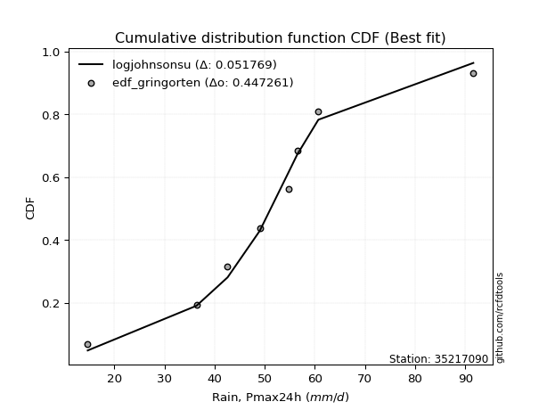</img></img>

</div>


### 9. EDF Filliben (1975)

The specific values of the constants (0.3175) (often denoted as $alpha$) and (0.365) are derived from a method proposed by James J. Filliben in a 1975 paper. This particular formula is the mean value of the $i$-th order statistic of the normal distribution and is considered a robust and effective plotting position formula for the normal probability plot correlation coefficient test for normality.

<div align="center">


$P=(m-0.3175)/(n+0.365)$


</div>


**9.1. Empirical values**

<div align="center">

|                | 0                   | 1                  | 2                   | 3                   | 4            | 5                  | 6                  | 7                  | 8                  |
|:---------------|:--------------------|:-------------------|:--------------------|:--------------------|:-------------|:-------------------|:-------------------|:-------------------|:-------------------|
| date           | 2017                | 2020               | 2021                | 2018                | 2023         | 2022               | 2019               | 2025               | 2024               |
| x              | 14.7                | 36.4               | 42.6                | 49.0                | 54.7         | 56.5               | 60.7               | 63.8               | 91.6               |
| m              | 1                   | 2                  | 3                   | 4                   | 5            | 6                  | 7                  | 8                  | 9                  |
| empirical_dist | edf_filliben        | edf_filliben       | edf_filliben        | edf_filliben        | edf_filliben | edf_filliben       | edf_filliben       | edf_filliben       | edf_filliben       |
| empirical      | 0.07287773625200214 | 0.1796583021890016 | 0.28643886812600106 | 0.39321943406300053 | 0.5          | 0.6067805659369995 | 0.7135611318739989 | 0.8203416978109984 | 0.9271222637479978 |
| empirical_tr   | 1.0786063921681543  | 1.219004230393752  | 1.401421623643846   | 1.6480422349318082  | 2.0          | 2.5431093007467753 | 3.491146318732526  | 5.566121842496286  | 13.721611721611705 |

</div>


**9.2. Kolmogorov-Smirnov fit test (sorted by Δ)**


<div align="center">

|                | 0                   | 1                    | 2                   | 3                   | 4                   | 5                   | 6                   | 7                   | 8                   | 9                   | 10                  | 11                  | 12                  | 13                  | 14                  | 15                  | 16                  | 17                  | 18                  | 19                  | 20                  | 21                  | 22                  | 23                  | 24                  | 25                  | 26                  | 27                  | 28                  | 29                  | 30                  | 31                  | 32                  | 33                  | 34                  | 35                  | 36                  | 37                  | 38                  | 39                  | 40                  | 41                  | 42                  | 43                  | 44                  | 45                  | 46                  | 47                  | 48                  | 49                  | 50                  | 51                  | 52                  | 53                  | 54                  | 55                  | 56                  | 57                  | 58                  | 59                  | 60                  | 61                  | 62                  | 63                  | 64                  | 65                  | 66                  | 67                  | 68                  | 69                  | 70                  | 71                  | 72                  | 73                  | 74                  | 75                  | 76                  | 77                  | 78                  | 79                  | 80                  | 81                  | 82                  | 83                  | 84                  | 85                  | 86                  | 87                  | 88                  | 89                  | 90                  | 91                  | 92                  | 93                  | 94                  | 95                  | 96                  | 97                  | 98                  | 99                  | 100                 | 101                 | 102                 | 103                 | 104                 | 105                 | 106                 | 107                 | 108                 | 109                 | 110                 | 111                 | 112                 | 113                 | 114                 | 115                 | 116                 | 117                 | 118                 | 119                 | 120                 | 121                 | 122                 | 123                 | 124                 | 125                 | 126                 | 127                 | 128                 | 129                 | 130                 | 131                 | 132                 | 133                 | 134                 | 135                 | 136                 | 137                 | 138                 | 139                 | 140                 | 141                 | 142                 | 143                 | 144                 | 145                 | 146                 | 147                 | 148                 | 149                 | 150                 | 151                 | 152                 | 153                 | 154                 | 155                 | 156                 | 157                 | 158                 | 159                 |
|:---------------|:--------------------|:---------------------|:--------------------|:--------------------|:--------------------|:--------------------|:--------------------|:--------------------|:--------------------|:--------------------|:--------------------|:--------------------|:--------------------|:--------------------|:--------------------|:--------------------|:--------------------|:--------------------|:--------------------|:--------------------|:--------------------|:--------------------|:--------------------|:--------------------|:--------------------|:--------------------|:--------------------|:--------------------|:--------------------|:--------------------|:--------------------|:--------------------|:--------------------|:--------------------|:--------------------|:--------------------|:--------------------|:--------------------|:--------------------|:--------------------|:--------------------|:--------------------|:--------------------|:--------------------|:--------------------|:--------------------|:--------------------|:--------------------|:--------------------|:--------------------|:--------------------|:--------------------|:--------------------|:--------------------|:--------------------|:--------------------|:--------------------|:--------------------|:--------------------|:--------------------|:--------------------|:--------------------|:--------------------|:--------------------|:--------------------|:--------------------|:--------------------|:--------------------|:--------------------|:--------------------|:--------------------|:--------------------|:--------------------|:--------------------|:--------------------|:--------------------|:--------------------|:--------------------|:--------------------|:--------------------|:--------------------|:--------------------|:--------------------|:--------------------|:--------------------|:--------------------|:--------------------|:--------------------|:--------------------|:--------------------|:--------------------|:--------------------|:--------------------|:--------------------|:--------------------|:--------------------|:--------------------|:--------------------|:--------------------|:--------------------|:--------------------|:--------------------|:--------------------|:--------------------|:--------------------|:--------------------|:--------------------|:--------------------|:--------------------|:--------------------|:--------------------|:--------------------|:--------------------|:--------------------|:--------------------|:--------------------|:--------------------|:--------------------|:--------------------|:--------------------|:--------------------|:--------------------|:--------------------|:--------------------|:--------------------|:--------------------|:--------------------|:--------------------|:--------------------|:--------------------|:--------------------|:--------------------|:--------------------|:--------------------|:--------------------|:--------------------|:--------------------|:--------------------|:--------------------|:--------------------|:--------------------|:--------------------|:--------------------|:--------------------|:--------------------|:--------------------|:--------------------|:--------------------|:--------------------|:--------------------|:--------------------|:--------------------|:--------------------|:--------------------|:--------------------|:--------------------|:--------------------|:--------------------|:--------------------|:--------------------|
| station        | 35217090            | 35217090             | 35217090            | 35217090            | 35217090            | 35217090            | 35217090            | 35217090            | 35217090            | 35217090            | 35217090            | 35217090            | 35217090            | 35217090            | 35217090            | 35217090            | 35217090            | 35217090            | 35217090            | 35217090            | 35217090            | 35217090            | 35217090            | 35217090            | 35217090            | 35217090            | 35217090            | 35217090            | 35217090            | 35217090            | 35217090            | 35217090            | 35217090            | 35217090            | 35217090            | 35217090            | 35217090            | 35217090            | 35217090            | 35217090            | 35217090            | 35217090            | 35217090            | 35217090            | 35217090            | 35217090            | 35217090            | 35217090            | 35217090            | 35217090            | 35217090            | 35217090            | 35217090            | 35217090            | 35217090            | 35217090            | 35217090            | 35217090            | 35217090            | 35217090            | 35217090            | 35217090            | 35217090            | 35217090            | 35217090            | 35217090            | 35217090            | 35217090            | 35217090            | 35217090            | 35217090            | 35217090            | 35217090            | 35217090            | 35217090            | 35217090            | 35217090            | 35217090            | 35217090            | 35217090            | 35217090            | 35217090            | 35217090            | 35217090            | 35217090            | 35217090            | 35217090            | 35217090            | 35217090            | 35217090            | 35217090            | 35217090            | 35217090            | 35217090            | 35217090            | 35217090            | 35217090            | 35217090            | 35217090            | 35217090            | 35217090            | 35217090            | 35217090            | 35217090            | 35217090            | 35217090            | 35217090            | 35217090            | 35217090            | 35217090            | 35217090            | 35217090            | 35217090            | 35217090            | 35217090            | 35217090            | 35217090            | 35217090            | 35217090            | 35217090            | 35217090            | 35217090            | 35217090            | 35217090            | 35217090            | 35217090            | 35217090            | 35217090            | 35217090            | 35217090            | 35217090            | 35217090            | 35217090            | 35217090            | 35217090            | 35217090            | 35217090            | 35217090            | 35217090            | 35217090            | 35217090            | 35217090            | 35217090            | 35217090            | 35217090            | 35217090            | 35217090            | 35217090            | 35217090            | 35217090            | 35217090            | 35217090            | 35217090            | 35217090            | 35217090            | 35217090            | 35217090            | 35217090            | 35217090            | 35217090            |
| empirical_dist | edf_filliben        | edf_filliben         | edf_filliben        | edf_filliben        | edf_filliben        | edf_filliben        | edf_filliben        | edf_filliben        | edf_filliben        | edf_filliben        | edf_filliben        | edf_filliben        | edf_filliben        | edf_filliben        | edf_filliben        | edf_filliben        | edf_filliben        | edf_filliben        | edf_filliben        | edf_filliben        | edf_filliben        | edf_filliben        | edf_filliben        | edf_filliben        | edf_filliben        | edf_filliben        | edf_filliben        | edf_filliben        | edf_filliben        | edf_filliben        | edf_filliben        | edf_filliben        | edf_filliben        | edf_filliben        | edf_filliben        | edf_filliben        | edf_filliben        | edf_filliben        | edf_filliben        | edf_filliben        | edf_filliben        | edf_filliben        | edf_filliben        | edf_filliben        | edf_filliben        | edf_filliben        | edf_filliben        | edf_filliben        | edf_filliben        | edf_filliben        | edf_filliben        | edf_filliben        | edf_filliben        | edf_filliben        | edf_filliben        | edf_filliben        | edf_filliben        | edf_filliben        | edf_filliben        | edf_filliben        | edf_filliben        | edf_filliben        | edf_filliben        | edf_filliben        | edf_filliben        | edf_filliben        | edf_filliben        | edf_filliben        | edf_filliben        | edf_filliben        | edf_filliben        | edf_filliben        | edf_filliben        | edf_filliben        | edf_filliben        | edf_filliben        | edf_filliben        | edf_filliben        | edf_filliben        | edf_filliben        | edf_filliben        | edf_filliben        | edf_filliben        | edf_filliben        | edf_filliben        | edf_filliben        | edf_filliben        | edf_filliben        | edf_filliben        | edf_filliben        | edf_filliben        | edf_filliben        | edf_filliben        | edf_filliben        | edf_filliben        | edf_filliben        | edf_filliben        | edf_filliben        | edf_filliben        | edf_filliben        | edf_filliben        | edf_filliben        | edf_filliben        | edf_filliben        | edf_filliben        | edf_filliben        | edf_filliben        | edf_filliben        | edf_filliben        | edf_filliben        | edf_filliben        | edf_filliben        | edf_filliben        | edf_filliben        | edf_filliben        | edf_filliben        | edf_filliben        | edf_filliben        | edf_filliben        | edf_filliben        | edf_filliben        | edf_filliben        | edf_filliben        | edf_filliben        | edf_filliben        | edf_filliben        | edf_filliben        | edf_filliben        | edf_filliben        | edf_filliben        | edf_filliben        | edf_filliben        | edf_filliben        | edf_filliben        | edf_filliben        | edf_filliben        | edf_filliben        | edf_filliben        | edf_filliben        | edf_filliben        | edf_filliben        | edf_filliben        | edf_filliben        | edf_filliben        | edf_filliben        | edf_filliben        | edf_filliben        | edf_filliben        | edf_filliben        | edf_filliben        | edf_filliben        | edf_filliben        | edf_filliben        | edf_filliben        | edf_filliben        | edf_filliben        | edf_filliben        | edf_filliben        | edf_filliben        | edf_filliben        |
| p_dist         | logjohnsonsu        | johnsonsu            | tukeylambda         | hypsecant           | logmielke           | logburr             | genlogistic         | mielke              | burr                | loggenlogistic      | logistic            | laplace             | logt                | alpha               | vonmises_line       | invgauss            | dgamma              | gennorm             | maxwell             | dweibull            | ncf                 | rayleigh            | invgamma            | loggompertz         | nct                 | exponnorm           | skewnorm            | betaprime           | pearson3            | gengamma            | gamma               | erlang              | f                   | johnsonsb           | beta                | rice                | loggengamma         | logweibull_min      | logburr12           | logvonmises_line    | t                   | crystalball         | truncnorm           | norm                | logdgamma           | weibull_min         | logloggamma         | logexponweib        | exponpow            | logjohnsonsb        | loggumbel_l         | kstwobign           | gumbel_r            | halfnorm            | gumbel_l            | anglit              | cosine              | logpearson3         | lognct              | logcrystalball      | lognorm             | logexponnorm        | logrice             | logf                | logfatiguelife      | loglogistic         | loganglit           | semicircular        | logtriang           | loghypsecant        | loginvgamma         | loggamma            | loggamma            | loggenextreme       | logweibull_max      | logdweibull         | logloglaplace       | logerlang           | moyal               | halflogistic        | logbetaprime        | logsemicircular     | logalpha            | loginvgauss         | kappa4              | gompertz            | logncf              | logargus            | kappa3              | logtrapezoid        | logskewnorm         | logmaxwell          | loggennorm          | loglaplace          | loglaplace          | logtruncweibull_min | bradford            | lograyleigh         | logtruncnorm        | lognakagami         | logfoldnorm         | loginvweibull       | wrapcauchy          | uniform             | arcsine             | loggenhalflogistic  | truncweibull_min    | logarcsine          | loggumbel_r         | ksone               | loghalfnorm         | logcosine           | wald                | argus               | logmoyal            | loghalflogistic     | loggausshyper       | logkstwobign        | exponweib           | truncexpon          | loggenpareto        | loggenexpon         | loglevy_l           | gausshyper          | lomax               | genexpon            | genpareto           | loghalfgennorm      | logwald             | logkappa4           | logkappa3           | logbradford         | loguniform          | logtukeylambda      | logksone            | logwrapcauchy       | levy_l              | genhalflogistic     | logrdist            | burr12              | loglomax            | halfgennorm         | triang              | nakagami            | logbeta             | logtruncexpon       | genextreme          | trapezoid           | logexponpow         | invweibull          | rdist               | powerlaw            | foldnorm            | fatiguelife         | logpowerlaw         | weibull_max         | truncpareto         | logtruncpareto      | logvonmises         | vonmises            |
| delta          | 0.04253765184494118 | 0.056536244657701684 | 0.05878038843393796 | 0.06248843313203445 | 0.0709276446163637  | 0.07239196611574283 | 0.07326762500407269 | 0.07391233329174962 | 0.07391679507762328 | 0.07413204323468958 | 0.07793390942069    | 0.08095472684620575 | 0.08211607919536867 | 0.08239160257600331 | 0.08417075380775674 | 0.08421616568248957 | 0.0843145742950272  | 0.08498335354077241 | 0.08667749919356293 | 0.08758490165086413 | 0.08897885590827015 | 0.08987632065450235 | 0.09122490374427727 | 0.09241698982979518 | 0.09359577107373707 | 0.09474651664865508 | 0.09565168751655173 | 0.09576029900312044 | 0.09713807826063692 | 0.09735578497462383 | 0.09738172076263485 | 0.09743753677736611 | 0.09751376814593327 | 0.09751976418296193 | 0.09760653097148997 | 0.09771000554497367 | 0.09879141564364774 | 0.09888656902207515 | 0.09925263583384558 | 0.0996066041175182  | 0.10007311030503019 | 0.1000887162316989  | 0.10008872272847968 | 0.10008872747948139 | 0.1008172493622772  | 0.10310976502960723 | 0.10489057444456185 | 0.10566780269803688 | 0.11131125657466778 | 0.1113701608775568  | 0.111577643971147   | 0.11975735023626688 | 0.11980166147702997 | 0.12283824751871275 | 0.12553402999983831 | 0.12610070276190566 | 0.12640395154474116 | 0.13012597190714115 | 0.13290155730589703 | 0.1329967488889332  | 0.1329968206259059  | 0.1329974384051743  | 0.13300471837006722 | 0.13441908422816118 | 0.13462739637518395 | 0.13656492723326974 | 0.137001652884517   | 0.13724910644854305 | 0.13862833685754017 | 0.14214548045952424 | 0.14215525365038706 | 0.14340875603954883 | 0.14340875603954883 | 0.14342396484204412 | 0.14343369847013532 | 0.14383222906451365 | 0.1446016364395445  | 0.14461392101400672 | 0.14464920905465672 | 0.1447077705866182  | 0.1467618148568891  | 0.14706484453969268 | 0.1471460779445798  | 0.1486625920747655  | 0.1556739160994729  | 0.15999199543320153 | 0.16051150817161633 | 0.16064889476426192 | 0.1609020745640585  | 0.1620856108658928  | 0.16321597493579498 | 0.16481403158077002 | 0.1678497467295051  | 0.17019883775440325 | 0.17019883775440325 | 0.1709391678966814  | 0.17475639119747113 | 0.1752100210395935  | 0.17965821646896526 | 0.1796583021889801  | 0.18065846548012976 | 0.18070907789930954 | 0.18115707893331467 | 0.1818501503467591  | 0.1849405128820596  | 0.18839174237599732 | 0.18945245662613075 | 0.19285386738469953 | 0.20365620790136874 | 0.20493207492413223 | 0.2058120469421138  | 0.2063893630386876  | 0.21359532172273088 | 0.22729649393223417 | 0.22913380715288    | 0.23082726766066797 | 0.23577268511313987 | 0.2368619490599095  | 0.24092312635963567 | 0.2460060166012293  | 0.24701327976411702 | 0.25777112500817556 | 0.25781748042134456 | 0.2578499418886435  | 0.2583576511337482  | 0.26042723854981265 | 0.26209507632432427 | 0.28643886812600106 | 0.2998732119337959  | 0.3123835491503836  | 0.3149414323834767  | 0.3158413137077629  | 0.315930526162452   | 0.31603778366498425 | 0.3166657214372097  | 0.3188712235867397  | 0.32904864236067133 | 0.33194698723571586 | 0.35167916350201733 | 0.3561097921407038  | 0.3596607336158808  | 0.37192494228392636 | 0.37320679746128155 | 0.37447859943205164 | 0.3840852152051261  | 0.41942494174952094 | 0.42085275034535463 | 0.44161269386924357 | 0.44180391347286785 | 0.47858006657292634 | 0.5259168477198914  | 0.5905835898751775  | 0.6067805659369995  | 0.6388577140218067  | 0.6698205523896715  | 0.6754221971341478  | 0.7472563456121423  | 0.778925658576584   | 1.112732158640216   | 14.27408382605059   |
| deltao         | 0.41761268023100007 | 0.41761268023100007  | 0.41761268023100007 | 0.41761268023100007 | 0.41761268023100007 | 0.41761268023100007 | 0.41761268023100007 | 0.41761268023100007 | 0.41761268023100007 | 0.41761268023100007 | 0.41761268023100007 | 0.41761268023100007 | 0.41761268023100007 | 0.41761268023100007 | 0.41761268023100007 | 0.41761268023100007 | 0.41761268023100007 | 0.41761268023100007 | 0.41761268023100007 | 0.41761268023100007 | 0.41761268023100007 | 0.41761268023100007 | 0.41761268023100007 | 0.41761268023100007 | 0.41761268023100007 | 0.41761268023100007 | 0.41761268023100007 | 0.41761268023100007 | 0.41761268023100007 | 0.41761268023100007 | 0.41761268023100007 | 0.41761268023100007 | 0.41761268023100007 | 0.41761268023100007 | 0.41761268023100007 | 0.41761268023100007 | 0.41761268023100007 | 0.41761268023100007 | 0.41761268023100007 | 0.41761268023100007 | 0.41761268023100007 | 0.41761268023100007 | 0.41761268023100007 | 0.41761268023100007 | 0.41761268023100007 | 0.41761268023100007 | 0.41761268023100007 | 0.41761268023100007 | 0.41761268023100007 | 0.41761268023100007 | 0.41761268023100007 | 0.41761268023100007 | 0.41761268023100007 | 0.41761268023100007 | 0.41761268023100007 | 0.41761268023100007 | 0.41761268023100007 | 0.41761268023100007 | 0.41761268023100007 | 0.41761268023100007 | 0.41761268023100007 | 0.41761268023100007 | 0.41761268023100007 | 0.41761268023100007 | 0.41761268023100007 | 0.41761268023100007 | 0.41761268023100007 | 0.41761268023100007 | 0.41761268023100007 | 0.41761268023100007 | 0.41761268023100007 | 0.41761268023100007 | 0.41761268023100007 | 0.41761268023100007 | 0.41761268023100007 | 0.41761268023100007 | 0.41761268023100007 | 0.41761268023100007 | 0.41761268023100007 | 0.41761268023100007 | 0.41761268023100007 | 0.41761268023100007 | 0.41761268023100007 | 0.41761268023100007 | 0.41761268023100007 | 0.41761268023100007 | 0.41761268023100007 | 0.41761268023100007 | 0.41761268023100007 | 0.41761268023100007 | 0.41761268023100007 | 0.41761268023100007 | 0.41761268023100007 | 0.41761268023100007 | 0.41761268023100007 | 0.41761268023100007 | 0.41761268023100007 | 0.41761268023100007 | 0.41761268023100007 | 0.41761268023100007 | 0.41761268023100007 | 0.41761268023100007 | 0.41761268023100007 | 0.41761268023100007 | 0.41761268023100007 | 0.41761268023100007 | 0.41761268023100007 | 0.41761268023100007 | 0.41761268023100007 | 0.41761268023100007 | 0.41761268023100007 | 0.41761268023100007 | 0.41761268023100007 | 0.41761268023100007 | 0.41761268023100007 | 0.41761268023100007 | 0.41761268023100007 | 0.41761268023100007 | 0.41761268023100007 | 0.41761268023100007 | 0.41761268023100007 | 0.41761268023100007 | 0.41761268023100007 | 0.41761268023100007 | 0.41761268023100007 | 0.41761268023100007 | 0.41761268023100007 | 0.41761268023100007 | 0.41761268023100007 | 0.41761268023100007 | 0.41761268023100007 | 0.41761268023100007 | 0.41761268023100007 | 0.41761268023100007 | 0.41761268023100007 | 0.41761268023100007 | 0.41761268023100007 | 0.41761268023100007 | 0.41761268023100007 | 0.41761268023100007 | 0.41761268023100007 | 0.41761268023100007 | 0.41761268023100007 | 0.41761268023100007 | 0.41761268023100007 | 0.41761268023100007 | 0.41761268023100007 | 0.41761268023100007 | 0.41761268023100007 | 0.41761268023100007 | 0.41761268023100007 | 0.41761268023100007 | 0.41761268023100007 | 0.41761268023100007 | 0.41761268023100007 | 0.41761268023100007 | 0.41761268023100007 | 0.41761268023100007 | 0.41761268023100007 | 0.41761268023100007 |
| eval           | Δo > Δ              | Δo > Δ               | Δo > Δ              | Δo > Δ              | Δo > Δ              | Δo > Δ              | Δo > Δ              | Δo > Δ              | Δo > Δ              | Δo > Δ              | Δo > Δ              | Δo > Δ              | Δo > Δ              | Δo > Δ              | Δo > Δ              | Δo > Δ              | Δo > Δ              | Δo > Δ              | Δo > Δ              | Δo > Δ              | Δo > Δ              | Δo > Δ              | Δo > Δ              | Δo > Δ              | Δo > Δ              | Δo > Δ              | Δo > Δ              | Δo > Δ              | Δo > Δ              | Δo > Δ              | Δo > Δ              | Δo > Δ              | Δo > Δ              | Δo > Δ              | Δo > Δ              | Δo > Δ              | Δo > Δ              | Δo > Δ              | Δo > Δ              | Δo > Δ              | Δo > Δ              | Δo > Δ              | Δo > Δ              | Δo > Δ              | Δo > Δ              | Δo > Δ              | Δo > Δ              | Δo > Δ              | Δo > Δ              | Δo > Δ              | Δo > Δ              | Δo > Δ              | Δo > Δ              | Δo > Δ              | Δo > Δ              | Δo > Δ              | Δo > Δ              | Δo > Δ              | Δo > Δ              | Δo > Δ              | Δo > Δ              | Δo > Δ              | Δo > Δ              | Δo > Δ              | Δo > Δ              | Δo > Δ              | Δo > Δ              | Δo > Δ              | Δo > Δ              | Δo > Δ              | Δo > Δ              | Δo > Δ              | Δo > Δ              | Δo > Δ              | Δo > Δ              | Δo > Δ              | Δo > Δ              | Δo > Δ              | Δo > Δ              | Δo > Δ              | Δo > Δ              | Δo > Δ              | Δo > Δ              | Δo > Δ              | Δo > Δ              | Δo > Δ              | Δo > Δ              | Δo > Δ              | Δo > Δ              | Δo > Δ              | Δo > Δ              | Δo > Δ              | Δo > Δ              | Δo > Δ              | Δo > Δ              | Δo > Δ              | Δo > Δ              | Δo > Δ              | Δo > Δ              | Δo > Δ              | Δo > Δ              | Δo > Δ              | Δo > Δ              | Δo > Δ              | Δo > Δ              | Δo > Δ              | Δo > Δ              | Δo > Δ              | Δo > Δ              | Δo > Δ              | Δo > Δ              | Δo > Δ              | Δo > Δ              | Δo > Δ              | Δo > Δ              | Δo > Δ              | Δo > Δ              | Δo > Δ              | Δo > Δ              | Δo > Δ              | Δo > Δ              | Δo > Δ              | Δo > Δ              | Δo > Δ              | Δo > Δ              | Δo > Δ              | Δo > Δ              | Δo > Δ              | Δo > Δ              | Δo > Δ              | Δo > Δ              | Δo > Δ              | Δo > Δ              | Δo > Δ              | Δo > Δ              | Δo > Δ              | Δo > Δ              | Δo > Δ              | Δo > Δ              | Δo > Δ              | Δo > Δ              | Δo > Δ              | Δo > Δ              | Δo > Δ              | Δo > Δ              | Δo <= Δ             | Δo <= Δ             | Δo <= Δ             | Δo <= Δ             | Δo <= Δ             | Δo <= Δ             | Δo <= Δ             | Δo <= Δ             | Δo <= Δ             | Δo <= Δ             | Δo <= Δ             | Δo <= Δ             | Δo <= Δ             | Δo <= Δ             | Δo <= Δ             |
| fit            | 1                   | 1                    | 1                   | 1                   | 1                   | 1                   | 1                   | 1                   | 1                   | 1                   | 1                   | 1                   | 1                   | 1                   | 1                   | 1                   | 1                   | 1                   | 1                   | 1                   | 1                   | 1                   | 1                   | 1                   | 1                   | 1                   | 1                   | 1                   | 1                   | 1                   | 1                   | 1                   | 1                   | 1                   | 1                   | 1                   | 1                   | 1                   | 1                   | 1                   | 1                   | 1                   | 1                   | 1                   | 1                   | 1                   | 1                   | 1                   | 1                   | 1                   | 1                   | 1                   | 1                   | 1                   | 1                   | 1                   | 1                   | 1                   | 1                   | 1                   | 1                   | 1                   | 1                   | 1                   | 1                   | 1                   | 1                   | 1                   | 1                   | 1                   | 1                   | 1                   | 1                   | 1                   | 1                   | 1                   | 1                   | 1                   | 1                   | 1                   | 1                   | 1                   | 1                   | 1                   | 1                   | 1                   | 1                   | 1                   | 1                   | 1                   | 1                   | 1                   | 1                   | 1                   | 1                   | 1                   | 1                   | 1                   | 1                   | 1                   | 1                   | 1                   | 1                   | 1                   | 1                   | 1                   | 1                   | 1                   | 1                   | 1                   | 1                   | 1                   | 1                   | 1                   | 1                   | 1                   | 1                   | 1                   | 1                   | 1                   | 1                   | 1                   | 1                   | 1                   | 1                   | 1                   | 1                   | 1                   | 1                   | 1                   | 1                   | 1                   | 1                   | 1                   | 1                   | 1                   | 1                   | 1                   | 1                   | 1                   | 1                   | 1                   | 1                   | 1                   | 1                   | 0                   | 0                   | 0                   | 0                   | 0                   | 0                   | 0                   | 0                   | 0                   | 0                   | 0                   | 0                   | 0                   | 0                   | 0                   |
| n              | 9                   | 9                    | 9                   | 9                   | 9                   | 9                   | 9                   | 9                   | 9                   | 9                   | 9                   | 9                   | 9                   | 9                   | 9                   | 9                   | 9                   | 9                   | 9                   | 9                   | 9                   | 9                   | 9                   | 9                   | 9                   | 9                   | 9                   | 9                   | 9                   | 9                   | 9                   | 9                   | 9                   | 9                   | 9                   | 9                   | 9                   | 9                   | 9                   | 9                   | 9                   | 9                   | 9                   | 9                   | 9                   | 9                   | 9                   | 9                   | 9                   | 9                   | 9                   | 9                   | 9                   | 9                   | 9                   | 9                   | 9                   | 9                   | 9                   | 9                   | 9                   | 9                   | 9                   | 9                   | 9                   | 9                   | 9                   | 9                   | 9                   | 9                   | 9                   | 9                   | 9                   | 9                   | 9                   | 9                   | 9                   | 9                   | 9                   | 9                   | 9                   | 9                   | 9                   | 9                   | 9                   | 9                   | 9                   | 9                   | 9                   | 9                   | 9                   | 9                   | 9                   | 9                   | 9                   | 9                   | 9                   | 9                   | 9                   | 9                   | 9                   | 9                   | 9                   | 9                   | 9                   | 9                   | 9                   | 9                   | 9                   | 9                   | 9                   | 9                   | 9                   | 9                   | 9                   | 9                   | 9                   | 9                   | 9                   | 9                   | 9                   | 9                   | 9                   | 9                   | 9                   | 9                   | 9                   | 9                   | 9                   | 9                   | 9                   | 9                   | 9                   | 9                   | 9                   | 9                   | 9                   | 9                   | 9                   | 9                   | 9                   | 9                   | 9                   | 9                   | 9                   | 9                   | 9                   | 9                   | 9                   | 9                   | 9                   | 9                   | 9                   | 9                   | 9                   | 9                   | 9                   | 9                   | 9                   | 9                   |
| best_fit       | 1                   | 0                    | 0                   | 0                   | 0                   | 0                   | 0                   | 0                   | 0                   | 0                   | 0                   | 0                   | 0                   | 0                   | 0                   | 0                   | 0                   | 0                   | 0                   | 0                   | 0                   | 0                   | 0                   | 0                   | 0                   | 0                   | 0                   | 0                   | 0                   | 0                   | 0                   | 0                   | 0                   | 0                   | 0                   | 0                   | 0                   | 0                   | 0                   | 0                   | 0                   | 0                   | 0                   | 0                   | 0                   | 0                   | 0                   | 0                   | 0                   | 0                   | 0                   | 0                   | 0                   | 0                   | 0                   | 0                   | 0                   | 0                   | 0                   | 0                   | 0                   | 0                   | 0                   | 0                   | 0                   | 0                   | 0                   | 0                   | 0                   | 0                   | 0                   | 0                   | 0                   | 0                   | 0                   | 0                   | 0                   | 0                   | 0                   | 0                   | 0                   | 0                   | 0                   | 0                   | 0                   | 0                   | 0                   | 0                   | 0                   | 0                   | 0                   | 0                   | 0                   | 0                   | 0                   | 0                   | 0                   | 0                   | 0                   | 0                   | 0                   | 0                   | 0                   | 0                   | 0                   | 0                   | 0                   | 0                   | 0                   | 0                   | 0                   | 0                   | 0                   | 0                   | 0                   | 0                   | 0                   | 0                   | 0                   | 0                   | 0                   | 0                   | 0                   | 0                   | 0                   | 0                   | 0                   | 0                   | 0                   | 0                   | 0                   | 0                   | 0                   | 0                   | 0                   | 0                   | 0                   | 0                   | 0                   | 0                   | 0                   | 0                   | 0                   | 0                   | 0                   | 0                   | 0                   | 0                   | 0                   | 0                   | 0                   | 0                   | 0                   | 0                   | 0                   | 0                   | 0                   | 0                   | 0                   | 0                   |
| best_fit_sort  | 1                   | 2                    | 3                   | 4                   | 5                   | 6                   | 7                   | 8                   | 9                   | 10                  | 11                  | 12                  | 13                  | 14                  | 15                  | 16                  | 17                  | 18                  | 19                  | 20                  | 21                  | 22                  | 23                  | 24                  | 25                  | 26                  | 27                  | 28                  | 29                  | 30                  | 31                  | 32                  | 33                  | 34                  | 35                  | 36                  | 37                  | 38                  | 39                  | 40                  | 41                  | 42                  | 43                  | 44                  | 45                  | 46                  | 47                  | 48                  | 49                  | 50                  | 51                  | 52                  | 53                  | 54                  | 55                  | 56                  | 57                  | 58                  | 59                  | 60                  | 61                  | 62                  | 63                  | 64                  | 65                  | 66                  | 67                  | 68                  | 69                  | 70                  | 71                  | 72                  | 73                  | 74                  | 75                  | 76                  | 77                  | 78                  | 79                  | 80                  | 81                  | 82                  | 83                  | 84                  | 85                  | 86                  | 87                  | 88                  | 89                  | 90                  | 91                  | 92                  | 93                  | 94                  | 95                  | 96                  | 97                  | 98                  | 99                  | 100                 | 101                 | 102                 | 103                 | 104                 | 105                 | 106                 | 107                 | 108                 | 109                 | 110                 | 111                 | 112                 | 113                 | 114                 | 115                 | 116                 | 117                 | 118                 | 119                 | 120                 | 121                 | 122                 | 123                 | 124                 | 125                 | 126                 | 127                 | 128                 | 129                 | 130                 | 131                 | 132                 | 133                 | 134                 | 135                 | 136                 | 137                 | 138                 | 139                 | 140                 | 141                 | 142                 | 143                 | 144                 | 145                 | 146                 | 147                 | 148                 | 149                 | 150                 | 151                 | 152                 | 153                 | 154                 | 155                 | 156                 | 157                 | 158                 | 159                 | 160                 |

</div>


**9.3. Best fit**

<div align="center">

|   id |   station | empirical_dist   | p_dist       |     delta |   deltao | eval   |   fit |   n |   best_fit |   best_fit_sort |
|-----:|----------:|:-----------------|:-------------|----------:|---------:|:-------|------:|----:|-----------:|----------------:|
|    0 |  35217090 | edf_filliben     | logjohnsonsu | 0.0425377 | 0.417613 | Δo > Δ |     1 |   9 |          1 |               1 |

</div>


<div align="center">

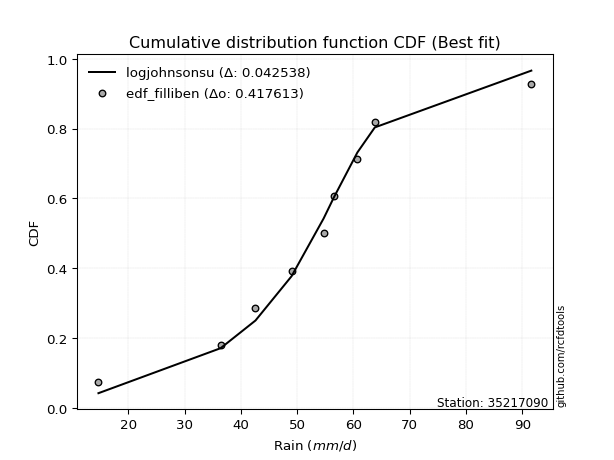</img>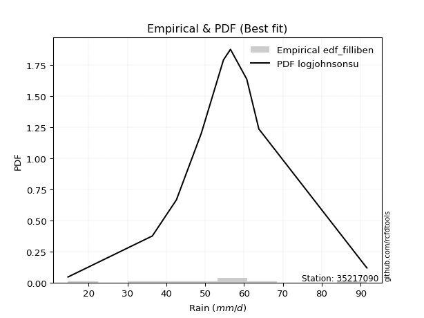</img>

</div>


### 10. EDF Jenkinson (1977)

The Jenkinson formula in hydrology is an empirical plotting position formula used to estimate the non-exceedance probability _(P)_ or return period _(T)_ of a given ordered observation within a sample. It is a widely used method in the frequency analysis of extreme events such as floods and rainfall, as it provides a distribution-free way to plot data. _a≈0.31_ and _b≈0.38_ are constants derived to approximate the median of the probability distribution for the given rank.

<div align="center">


$P=(m-a)/(n+b)$


</div>


**10.1. Empirical values**

<div align="center">

|                | 0                   | 1                   | 2                  | 3                   | 4             | 5                  | 6                  | 7                  | 8                  |
|:---------------|:--------------------|:--------------------|:-------------------|:--------------------|:--------------|:-------------------|:-------------------|:-------------------|:-------------------|
| date           | 2017                | 2020                | 2021               | 2018                | 2023          | 2022               | 2019               | 2025               | 2024               |
| x              | 14.7                | 36.4                | 42.6               | 49.0                | 54.7          | 56.5               | 60.7               | 63.8               | 91.6               |
| m              | 1                   | 2                   | 3                  | 4                   | 5             | 6                  | 7                  | 8                  | 9                  |
| empirical_dist | edf_jenkinson       | edf_jenkinson       | edf_jenkinson      | edf_jenkinson       | edf_jenkinson | edf_jenkinson      | edf_jenkinson      | edf_jenkinson      | edf_jenkinson      |
| empirical      | 0.07356076759061833 | 0.18017057569296374 | 0.2867803837953091 | 0.39339019189765456 | 0.5           | 0.6066098081023454 | 0.7132196162046908 | 0.8198294243070362 | 0.9264392324093815 |
| empirical_tr   | 1.0794016110471807  | 1.2197659297789336  | 1.4020926756352765 | 1.6485061511423549  | 2.0           | 2.542005420054201  | 3.486988847583642  | 5.550295857988164  | 13.5942028985507   |

</div>


**10.2. Kolmogorov-Smirnov fit test (sorted by Δ)**


<div align="center">

|                | 0                   | 1                    | 2                   | 3                    | 4                   | 5                   | 6                   | 7                   | 8                   | 9                   | 10                  | 11                  | 12                  | 13                  | 14                  | 15                  | 16                  | 17                  | 18                  | 19                  | 20                  | 21                  | 22                  | 23                  | 24                  | 25                  | 26                  | 27                  | 28                  | 29                  | 30                  | 31                  | 32                  | 33                  | 34                  | 35                  | 36                  | 37                  | 38                  | 39                  | 40                  | 41                  | 42                  | 43                  | 44                  | 45                  | 46                  | 47                  | 48                  | 49                  | 50                  | 51                  | 52                  | 53                  | 54                  | 55                  | 56                  | 57                  | 58                  | 59                  | 60                  | 61                  | 62                  | 63                  | 64                  | 65                  | 66                  | 67                  | 68                  | 69                  | 70                  | 71                  | 72                  | 73                  | 74                  | 75                  | 76                  | 77                  | 78                  | 79                  | 80                  | 81                  | 82                  | 83                  | 84                  | 85                  | 86                  | 87                  | 88                  | 89                  | 90                  | 91                  | 92                  | 93                  | 94                  | 95                  | 96                  | 97                  | 98                  | 99                  | 100                 | 101                 | 102                 | 103                 | 104                 | 105                 | 106                 | 107                 | 108                 | 109                 | 110                 | 111                 | 112                 | 113                 | 114                 | 115                 | 116                 | 117                 | 118                 | 119                 | 120                 | 121                 | 122                 | 123                 | 124                 | 125                 | 126                 | 127                 | 128                 | 129                 | 130                 | 131                 | 132                 | 133                 | 134                 | 135                 | 136                 | 137                 | 138                 | 139                 | 140                 | 141                 | 142                 | 143                 | 144                 | 145                 | 146                 | 147                 | 148                 | 149                 | 150                 | 151                 | 152                 | 153                 | 154                 | 155                 | 156                 | 157                 | 158                 | 159                 |
|:---------------|:--------------------|:---------------------|:--------------------|:---------------------|:--------------------|:--------------------|:--------------------|:--------------------|:--------------------|:--------------------|:--------------------|:--------------------|:--------------------|:--------------------|:--------------------|:--------------------|:--------------------|:--------------------|:--------------------|:--------------------|:--------------------|:--------------------|:--------------------|:--------------------|:--------------------|:--------------------|:--------------------|:--------------------|:--------------------|:--------------------|:--------------------|:--------------------|:--------------------|:--------------------|:--------------------|:--------------------|:--------------------|:--------------------|:--------------------|:--------------------|:--------------------|:--------------------|:--------------------|:--------------------|:--------------------|:--------------------|:--------------------|:--------------------|:--------------------|:--------------------|:--------------------|:--------------------|:--------------------|:--------------------|:--------------------|:--------------------|:--------------------|:--------------------|:--------------------|:--------------------|:--------------------|:--------------------|:--------------------|:--------------------|:--------------------|:--------------------|:--------------------|:--------------------|:--------------------|:--------------------|:--------------------|:--------------------|:--------------------|:--------------------|:--------------------|:--------------------|:--------------------|:--------------------|:--------------------|:--------------------|:--------------------|:--------------------|:--------------------|:--------------------|:--------------------|:--------------------|:--------------------|:--------------------|:--------------------|:--------------------|:--------------------|:--------------------|:--------------------|:--------------------|:--------------------|:--------------------|:--------------------|:--------------------|:--------------------|:--------------------|:--------------------|:--------------------|:--------------------|:--------------------|:--------------------|:--------------------|:--------------------|:--------------------|:--------------------|:--------------------|:--------------------|:--------------------|:--------------------|:--------------------|:--------------------|:--------------------|:--------------------|:--------------------|:--------------------|:--------------------|:--------------------|:--------------------|:--------------------|:--------------------|:--------------------|:--------------------|:--------------------|:--------------------|:--------------------|:--------------------|:--------------------|:--------------------|:--------------------|:--------------------|:--------------------|:--------------------|:--------------------|:--------------------|:--------------------|:--------------------|:--------------------|:--------------------|:--------------------|:--------------------|:--------------------|:--------------------|:--------------------|:--------------------|:--------------------|:--------------------|:--------------------|:--------------------|:--------------------|:--------------------|:--------------------|:--------------------|:--------------------|:--------------------|:--------------------|:--------------------|
| station        | 35217090            | 35217090             | 35217090            | 35217090             | 35217090            | 35217090            | 35217090            | 35217090            | 35217090            | 35217090            | 35217090            | 35217090            | 35217090            | 35217090            | 35217090            | 35217090            | 35217090            | 35217090            | 35217090            | 35217090            | 35217090            | 35217090            | 35217090            | 35217090            | 35217090            | 35217090            | 35217090            | 35217090            | 35217090            | 35217090            | 35217090            | 35217090            | 35217090            | 35217090            | 35217090            | 35217090            | 35217090            | 35217090            | 35217090            | 35217090            | 35217090            | 35217090            | 35217090            | 35217090            | 35217090            | 35217090            | 35217090            | 35217090            | 35217090            | 35217090            | 35217090            | 35217090            | 35217090            | 35217090            | 35217090            | 35217090            | 35217090            | 35217090            | 35217090            | 35217090            | 35217090            | 35217090            | 35217090            | 35217090            | 35217090            | 35217090            | 35217090            | 35217090            | 35217090            | 35217090            | 35217090            | 35217090            | 35217090            | 35217090            | 35217090            | 35217090            | 35217090            | 35217090            | 35217090            | 35217090            | 35217090            | 35217090            | 35217090            | 35217090            | 35217090            | 35217090            | 35217090            | 35217090            | 35217090            | 35217090            | 35217090            | 35217090            | 35217090            | 35217090            | 35217090            | 35217090            | 35217090            | 35217090            | 35217090            | 35217090            | 35217090            | 35217090            | 35217090            | 35217090            | 35217090            | 35217090            | 35217090            | 35217090            | 35217090            | 35217090            | 35217090            | 35217090            | 35217090            | 35217090            | 35217090            | 35217090            | 35217090            | 35217090            | 35217090            | 35217090            | 35217090            | 35217090            | 35217090            | 35217090            | 35217090            | 35217090            | 35217090            | 35217090            | 35217090            | 35217090            | 35217090            | 35217090            | 35217090            | 35217090            | 35217090            | 35217090            | 35217090            | 35217090            | 35217090            | 35217090            | 35217090            | 35217090            | 35217090            | 35217090            | 35217090            | 35217090            | 35217090            | 35217090            | 35217090            | 35217090            | 35217090            | 35217090            | 35217090            | 35217090            | 35217090            | 35217090            | 35217090            | 35217090            | 35217090            | 35217090            |
| empirical_dist | edf_jenkinson       | edf_jenkinson        | edf_jenkinson       | edf_jenkinson        | edf_jenkinson       | edf_jenkinson       | edf_jenkinson       | edf_jenkinson       | edf_jenkinson       | edf_jenkinson       | edf_jenkinson       | edf_jenkinson       | edf_jenkinson       | edf_jenkinson       | edf_jenkinson       | edf_jenkinson       | edf_jenkinson       | edf_jenkinson       | edf_jenkinson       | edf_jenkinson       | edf_jenkinson       | edf_jenkinson       | edf_jenkinson       | edf_jenkinson       | edf_jenkinson       | edf_jenkinson       | edf_jenkinson       | edf_jenkinson       | edf_jenkinson       | edf_jenkinson       | edf_jenkinson       | edf_jenkinson       | edf_jenkinson       | edf_jenkinson       | edf_jenkinson       | edf_jenkinson       | edf_jenkinson       | edf_jenkinson       | edf_jenkinson       | edf_jenkinson       | edf_jenkinson       | edf_jenkinson       | edf_jenkinson       | edf_jenkinson       | edf_jenkinson       | edf_jenkinson       | edf_jenkinson       | edf_jenkinson       | edf_jenkinson       | edf_jenkinson       | edf_jenkinson       | edf_jenkinson       | edf_jenkinson       | edf_jenkinson       | edf_jenkinson       | edf_jenkinson       | edf_jenkinson       | edf_jenkinson       | edf_jenkinson       | edf_jenkinson       | edf_jenkinson       | edf_jenkinson       | edf_jenkinson       | edf_jenkinson       | edf_jenkinson       | edf_jenkinson       | edf_jenkinson       | edf_jenkinson       | edf_jenkinson       | edf_jenkinson       | edf_jenkinson       | edf_jenkinson       | edf_jenkinson       | edf_jenkinson       | edf_jenkinson       | edf_jenkinson       | edf_jenkinson       | edf_jenkinson       | edf_jenkinson       | edf_jenkinson       | edf_jenkinson       | edf_jenkinson       | edf_jenkinson       | edf_jenkinson       | edf_jenkinson       | edf_jenkinson       | edf_jenkinson       | edf_jenkinson       | edf_jenkinson       | edf_jenkinson       | edf_jenkinson       | edf_jenkinson       | edf_jenkinson       | edf_jenkinson       | edf_jenkinson       | edf_jenkinson       | edf_jenkinson       | edf_jenkinson       | edf_jenkinson       | edf_jenkinson       | edf_jenkinson       | edf_jenkinson       | edf_jenkinson       | edf_jenkinson       | edf_jenkinson       | edf_jenkinson       | edf_jenkinson       | edf_jenkinson       | edf_jenkinson       | edf_jenkinson       | edf_jenkinson       | edf_jenkinson       | edf_jenkinson       | edf_jenkinson       | edf_jenkinson       | edf_jenkinson       | edf_jenkinson       | edf_jenkinson       | edf_jenkinson       | edf_jenkinson       | edf_jenkinson       | edf_jenkinson       | edf_jenkinson       | edf_jenkinson       | edf_jenkinson       | edf_jenkinson       | edf_jenkinson       | edf_jenkinson       | edf_jenkinson       | edf_jenkinson       | edf_jenkinson       | edf_jenkinson       | edf_jenkinson       | edf_jenkinson       | edf_jenkinson       | edf_jenkinson       | edf_jenkinson       | edf_jenkinson       | edf_jenkinson       | edf_jenkinson       | edf_jenkinson       | edf_jenkinson       | edf_jenkinson       | edf_jenkinson       | edf_jenkinson       | edf_jenkinson       | edf_jenkinson       | edf_jenkinson       | edf_jenkinson       | edf_jenkinson       | edf_jenkinson       | edf_jenkinson       | edf_jenkinson       | edf_jenkinson       | edf_jenkinson       | edf_jenkinson       | edf_jenkinson       | edf_jenkinson       | edf_jenkinson       | edf_jenkinson       |
| p_dist         | logjohnsonsu        | johnsonsu            | tukeylambda         | hypsecant            | logmielke           | logburr             | genlogistic         | mielke              | burr                | loggenlogistic      | logistic            | laplace             | logt                | alpha               | vonmises_line       | invgauss            | dgamma              | gennorm             | maxwell             | dweibull            | ncf                 | rayleigh            | invgamma            | loggompertz         | nct                 | exponnorm           | skewnorm            | betaprime           | pearson3            | gengamma            | gamma               | erlang              | f                   | johnsonsb           | beta                | rice                | logweibull_min      | loggengamma         | logburr12           | logvonmises_line    | t                   | crystalball         | truncnorm           | norm                | logdgamma           | weibull_min         | logloggamma         | logexponweib        | exponpow            | logjohnsonsb        | loggumbel_l         | kstwobign           | gumbel_r            | halfnorm            | gumbel_l            | anglit              | cosine              | logpearson3         | lognct              | logcrystalball      | lognorm             | logexponnorm        | logrice             | logf                | logfatiguelife      | loglogistic         | loganglit           | semicircular        | logtriang           | loginvgamma         | loghypsecant        | loggenextreme       | logweibull_max      | loggamma            | loggamma            | logdweibull         | logloglaplace       | logerlang           | moyal               | halflogistic        | logsemicircular     | logbetaprime        | logalpha            | loginvgauss         | kappa4              | gompertz            | logncf              | logargus            | kappa3              | logtrapezoid        | logskewnorm         | logmaxwell          | loggennorm          | loglaplace          | loglaplace          | logtruncweibull_min | bradford            | lograyleigh         | logtruncnorm        | lognakagami         | loginvweibull       | logfoldnorm         | wrapcauchy          | uniform             | arcsine             | loggenhalflogistic  | truncweibull_min    | logarcsine          | loggumbel_r         | ksone               | loghalfnorm         | logcosine           | wald                | argus               | logmoyal            | loghalflogistic     | loggausshyper       | logkstwobign        | exponweib           | truncexpon          | loggenpareto        | loggenexpon         | loglevy_l           | gausshyper          | lomax               | genexpon            | genpareto           | loghalfgennorm      | logwald             | logkappa4           | logkappa3           | logbradford         | loguniform          | logtukeylambda      | logksone            | logwrapcauchy       | levy_l              | genhalflogistic     | logrdist            | burr12              | loglomax            | halfgennorm         | triang              | nakagami            | logbeta             | logtruncexpon       | genextreme          | trapezoid           | logexponpow         | invweibull          | rdist               | powerlaw            | foldnorm            | fatiguelife         | logpowerlaw         | weibull_max         | truncpareto         | logtruncpareto      | logvonmises         | vonmises            |
| delta          | 0.04253765184494118 | 0.056536244657701684 | 0.05878038843393796 | 0.062051050738793356 | 0.0709276446163637  | 0.07239196611574283 | 0.07275535150011048 | 0.07391233329174962 | 0.07391679507762328 | 0.07413204323468958 | 0.0774216359167278  | 0.08095472684620575 | 0.08160380569140646 | 0.08239160257600331 | 0.08365848030379452 | 0.08421616568248957 | 0.08465608996433527 | 0.08532486921008048 | 0.08616522568960072 | 0.0879264173201722  | 0.08846658240430794 | 0.08987632065450235 | 0.09071263024031506 | 0.09190471632583297 | 0.09308349756977485 | 0.09423424314469286 | 0.09513941401258952 | 0.09524802549915823 | 0.0966258047566747  | 0.09684351147066161 | 0.09686944725867264 | 0.0969252632734039  | 0.09700149464197105 | 0.09700749067899972 | 0.09709425746752776 | 0.09719773204101145 | 0.09837429551811294 | 0.0986206578089937  | 0.09874036232988337 | 0.09909433061355599 | 0.09956083680106798 | 0.09957644272773669 | 0.09957644922451747 | 0.09957645397551917 | 0.10115876503158527 | 0.10259749152564501 | 0.10437830094059963 | 0.10515552919407467 | 0.11079898307070557 | 0.11085788737359459 | 0.11106537046718479 | 0.11958659240161285 | 0.11980166147702997 | 0.12266748968405872 | 0.1250217564958761  | 0.12558842925794345 | 0.12589167804077894 | 0.12961369840317893 | 0.132730799471243   | 0.13282599105427917 | 0.13282606279125186 | 0.13282668057052027 | 0.1328339605354132  | 0.13424832639350714 | 0.13445663854052992 | 0.1363941693986157  | 0.13666013721520892 | 0.13673683294458083 | 0.13811606335357796 | 0.14198449581573303 | 0.14214548045952424 | 0.1429116913380819  | 0.1429214249661731  | 0.1432379982048948  | 0.1432379982048948  | 0.14331995556055144 | 0.14408936293558228 | 0.14444316317935268 | 0.14464920905465672 | 0.1447077705866182  | 0.14655257103573055 | 0.14659105702223507 | 0.14697532010992576 | 0.14849183424011148 | 0.15516164259551068 | 0.15947972192923932 | 0.1599992346676542  | 0.1601366212602997  | 0.16038980106009637 | 0.16157333736193058 | 0.16270370143183277 | 0.16464327374611598 | 0.16802050456415912 | 0.17019883775440325 | 0.17019883775440325 | 0.17042689439271919 | 0.174244117693509   | 0.17503926320493945 | 0.1801704899729274  | 0.18017057569294223 | 0.1801968043953474  | 0.18048770764547573 | 0.18064480542935246 | 0.1813378768427969  | 0.18442823937809738 | 0.1878794688720351  | 0.18894018312216854 | 0.1923415938807374  | 0.2034854500667147  | 0.20441980142017002 | 0.20547053127280573 | 0.20604784736937953 | 0.21359532172273088 | 0.22678422042827195 | 0.22896304931822598 | 0.23065650982601393 | 0.23526041160917766 | 0.23634967555594738 | 0.24041085285567354 | 0.24549374309726718 | 0.2465010062601548  | 0.2572588515042134  | 0.2573052069173824  | 0.2573376683846813  | 0.25784537762978604 | 0.2599149650458505  | 0.26158280282036206 | 0.2867803837953091  | 0.29970245409914187 | 0.3118712756464214  | 0.31442915887951456 | 0.31532904020380076 | 0.31541825265848983 | 0.3155255101610221  | 0.31615344793324757 | 0.3183589500827776  | 0.3283656110220551  | 0.33143471373175365 | 0.3511668899980552  | 0.35559751863674166 | 0.35914846011191864 | 0.3714126687799642  | 0.37269452395731933 | 0.37413708376274357 | 0.3835729417011639  | 0.4189126682455588  | 0.4201697190067384  | 0.44110042036528135 | 0.4412916399689057  | 0.4778970352343101  | 0.5254045742159292  | 0.5900713163712152  | 0.6066098081023454  | 0.6383454405178446  | 0.6693082788857094  | 0.6749099236301855  | 0.7467440721081802  | 0.7784133850726218  | 1.112561400805562   | 14.274766857389208  |
| deltao         | 0.41761268023100007 | 0.41761268023100007  | 0.41761268023100007 | 0.41761268023100007  | 0.41761268023100007 | 0.41761268023100007 | 0.41761268023100007 | 0.41761268023100007 | 0.41761268023100007 | 0.41761268023100007 | 0.41761268023100007 | 0.41761268023100007 | 0.41761268023100007 | 0.41761268023100007 | 0.41761268023100007 | 0.41761268023100007 | 0.41761268023100007 | 0.41761268023100007 | 0.41761268023100007 | 0.41761268023100007 | 0.41761268023100007 | 0.41761268023100007 | 0.41761268023100007 | 0.41761268023100007 | 0.41761268023100007 | 0.41761268023100007 | 0.41761268023100007 | 0.41761268023100007 | 0.41761268023100007 | 0.41761268023100007 | 0.41761268023100007 | 0.41761268023100007 | 0.41761268023100007 | 0.41761268023100007 | 0.41761268023100007 | 0.41761268023100007 | 0.41761268023100007 | 0.41761268023100007 | 0.41761268023100007 | 0.41761268023100007 | 0.41761268023100007 | 0.41761268023100007 | 0.41761268023100007 | 0.41761268023100007 | 0.41761268023100007 | 0.41761268023100007 | 0.41761268023100007 | 0.41761268023100007 | 0.41761268023100007 | 0.41761268023100007 | 0.41761268023100007 | 0.41761268023100007 | 0.41761268023100007 | 0.41761268023100007 | 0.41761268023100007 | 0.41761268023100007 | 0.41761268023100007 | 0.41761268023100007 | 0.41761268023100007 | 0.41761268023100007 | 0.41761268023100007 | 0.41761268023100007 | 0.41761268023100007 | 0.41761268023100007 | 0.41761268023100007 | 0.41761268023100007 | 0.41761268023100007 | 0.41761268023100007 | 0.41761268023100007 | 0.41761268023100007 | 0.41761268023100007 | 0.41761268023100007 | 0.41761268023100007 | 0.41761268023100007 | 0.41761268023100007 | 0.41761268023100007 | 0.41761268023100007 | 0.41761268023100007 | 0.41761268023100007 | 0.41761268023100007 | 0.41761268023100007 | 0.41761268023100007 | 0.41761268023100007 | 0.41761268023100007 | 0.41761268023100007 | 0.41761268023100007 | 0.41761268023100007 | 0.41761268023100007 | 0.41761268023100007 | 0.41761268023100007 | 0.41761268023100007 | 0.41761268023100007 | 0.41761268023100007 | 0.41761268023100007 | 0.41761268023100007 | 0.41761268023100007 | 0.41761268023100007 | 0.41761268023100007 | 0.41761268023100007 | 0.41761268023100007 | 0.41761268023100007 | 0.41761268023100007 | 0.41761268023100007 | 0.41761268023100007 | 0.41761268023100007 | 0.41761268023100007 | 0.41761268023100007 | 0.41761268023100007 | 0.41761268023100007 | 0.41761268023100007 | 0.41761268023100007 | 0.41761268023100007 | 0.41761268023100007 | 0.41761268023100007 | 0.41761268023100007 | 0.41761268023100007 | 0.41761268023100007 | 0.41761268023100007 | 0.41761268023100007 | 0.41761268023100007 | 0.41761268023100007 | 0.41761268023100007 | 0.41761268023100007 | 0.41761268023100007 | 0.41761268023100007 | 0.41761268023100007 | 0.41761268023100007 | 0.41761268023100007 | 0.41761268023100007 | 0.41761268023100007 | 0.41761268023100007 | 0.41761268023100007 | 0.41761268023100007 | 0.41761268023100007 | 0.41761268023100007 | 0.41761268023100007 | 0.41761268023100007 | 0.41761268023100007 | 0.41761268023100007 | 0.41761268023100007 | 0.41761268023100007 | 0.41761268023100007 | 0.41761268023100007 | 0.41761268023100007 | 0.41761268023100007 | 0.41761268023100007 | 0.41761268023100007 | 0.41761268023100007 | 0.41761268023100007 | 0.41761268023100007 | 0.41761268023100007 | 0.41761268023100007 | 0.41761268023100007 | 0.41761268023100007 | 0.41761268023100007 | 0.41761268023100007 | 0.41761268023100007 | 0.41761268023100007 | 0.41761268023100007 | 0.41761268023100007 |
| eval           | Δo > Δ              | Δo > Δ               | Δo > Δ              | Δo > Δ               | Δo > Δ              | Δo > Δ              | Δo > Δ              | Δo > Δ              | Δo > Δ              | Δo > Δ              | Δo > Δ              | Δo > Δ              | Δo > Δ              | Δo > Δ              | Δo > Δ              | Δo > Δ              | Δo > Δ              | Δo > Δ              | Δo > Δ              | Δo > Δ              | Δo > Δ              | Δo > Δ              | Δo > Δ              | Δo > Δ              | Δo > Δ              | Δo > Δ              | Δo > Δ              | Δo > Δ              | Δo > Δ              | Δo > Δ              | Δo > Δ              | Δo > Δ              | Δo > Δ              | Δo > Δ              | Δo > Δ              | Δo > Δ              | Δo > Δ              | Δo > Δ              | Δo > Δ              | Δo > Δ              | Δo > Δ              | Δo > Δ              | Δo > Δ              | Δo > Δ              | Δo > Δ              | Δo > Δ              | Δo > Δ              | Δo > Δ              | Δo > Δ              | Δo > Δ              | Δo > Δ              | Δo > Δ              | Δo > Δ              | Δo > Δ              | Δo > Δ              | Δo > Δ              | Δo > Δ              | Δo > Δ              | Δo > Δ              | Δo > Δ              | Δo > Δ              | Δo > Δ              | Δo > Δ              | Δo > Δ              | Δo > Δ              | Δo > Δ              | Δo > Δ              | Δo > Δ              | Δo > Δ              | Δo > Δ              | Δo > Δ              | Δo > Δ              | Δo > Δ              | Δo > Δ              | Δo > Δ              | Δo > Δ              | Δo > Δ              | Δo > Δ              | Δo > Δ              | Δo > Δ              | Δo > Δ              | Δo > Δ              | Δo > Δ              | Δo > Δ              | Δo > Δ              | Δo > Δ              | Δo > Δ              | Δo > Δ              | Δo > Δ              | Δo > Δ              | Δo > Δ              | Δo > Δ              | Δo > Δ              | Δo > Δ              | Δo > Δ              | Δo > Δ              | Δo > Δ              | Δo > Δ              | Δo > Δ              | Δo > Δ              | Δo > Δ              | Δo > Δ              | Δo > Δ              | Δo > Δ              | Δo > Δ              | Δo > Δ              | Δo > Δ              | Δo > Δ              | Δo > Δ              | Δo > Δ              | Δo > Δ              | Δo > Δ              | Δo > Δ              | Δo > Δ              | Δo > Δ              | Δo > Δ              | Δo > Δ              | Δo > Δ              | Δo > Δ              | Δo > Δ              | Δo > Δ              | Δo > Δ              | Δo > Δ              | Δo > Δ              | Δo > Δ              | Δo > Δ              | Δo > Δ              | Δo > Δ              | Δo > Δ              | Δo > Δ              | Δo > Δ              | Δo > Δ              | Δo > Δ              | Δo > Δ              | Δo > Δ              | Δo > Δ              | Δo > Δ              | Δo > Δ              | Δo > Δ              | Δo > Δ              | Δo > Δ              | Δo > Δ              | Δo > Δ              | Δo > Δ              | Δo > Δ              | Δo <= Δ             | Δo <= Δ             | Δo <= Δ             | Δo <= Δ             | Δo <= Δ             | Δo <= Δ             | Δo <= Δ             | Δo <= Δ             | Δo <= Δ             | Δo <= Δ             | Δo <= Δ             | Δo <= Δ             | Δo <= Δ             | Δo <= Δ             | Δo <= Δ             |
| fit            | 1                   | 1                    | 1                   | 1                    | 1                   | 1                   | 1                   | 1                   | 1                   | 1                   | 1                   | 1                   | 1                   | 1                   | 1                   | 1                   | 1                   | 1                   | 1                   | 1                   | 1                   | 1                   | 1                   | 1                   | 1                   | 1                   | 1                   | 1                   | 1                   | 1                   | 1                   | 1                   | 1                   | 1                   | 1                   | 1                   | 1                   | 1                   | 1                   | 1                   | 1                   | 1                   | 1                   | 1                   | 1                   | 1                   | 1                   | 1                   | 1                   | 1                   | 1                   | 1                   | 1                   | 1                   | 1                   | 1                   | 1                   | 1                   | 1                   | 1                   | 1                   | 1                   | 1                   | 1                   | 1                   | 1                   | 1                   | 1                   | 1                   | 1                   | 1                   | 1                   | 1                   | 1                   | 1                   | 1                   | 1                   | 1                   | 1                   | 1                   | 1                   | 1                   | 1                   | 1                   | 1                   | 1                   | 1                   | 1                   | 1                   | 1                   | 1                   | 1                   | 1                   | 1                   | 1                   | 1                   | 1                   | 1                   | 1                   | 1                   | 1                   | 1                   | 1                   | 1                   | 1                   | 1                   | 1                   | 1                   | 1                   | 1                   | 1                   | 1                   | 1                   | 1                   | 1                   | 1                   | 1                   | 1                   | 1                   | 1                   | 1                   | 1                   | 1                   | 1                   | 1                   | 1                   | 1                   | 1                   | 1                   | 1                   | 1                   | 1                   | 1                   | 1                   | 1                   | 1                   | 1                   | 1                   | 1                   | 1                   | 1                   | 1                   | 1                   | 1                   | 1                   | 0                   | 0                   | 0                   | 0                   | 0                   | 0                   | 0                   | 0                   | 0                   | 0                   | 0                   | 0                   | 0                   | 0                   | 0                   |
| n              | 9                   | 9                    | 9                   | 9                    | 9                   | 9                   | 9                   | 9                   | 9                   | 9                   | 9                   | 9                   | 9                   | 9                   | 9                   | 9                   | 9                   | 9                   | 9                   | 9                   | 9                   | 9                   | 9                   | 9                   | 9                   | 9                   | 9                   | 9                   | 9                   | 9                   | 9                   | 9                   | 9                   | 9                   | 9                   | 9                   | 9                   | 9                   | 9                   | 9                   | 9                   | 9                   | 9                   | 9                   | 9                   | 9                   | 9                   | 9                   | 9                   | 9                   | 9                   | 9                   | 9                   | 9                   | 9                   | 9                   | 9                   | 9                   | 9                   | 9                   | 9                   | 9                   | 9                   | 9                   | 9                   | 9                   | 9                   | 9                   | 9                   | 9                   | 9                   | 9                   | 9                   | 9                   | 9                   | 9                   | 9                   | 9                   | 9                   | 9                   | 9                   | 9                   | 9                   | 9                   | 9                   | 9                   | 9                   | 9                   | 9                   | 9                   | 9                   | 9                   | 9                   | 9                   | 9                   | 9                   | 9                   | 9                   | 9                   | 9                   | 9                   | 9                   | 9                   | 9                   | 9                   | 9                   | 9                   | 9                   | 9                   | 9                   | 9                   | 9                   | 9                   | 9                   | 9                   | 9                   | 9                   | 9                   | 9                   | 9                   | 9                   | 9                   | 9                   | 9                   | 9                   | 9                   | 9                   | 9                   | 9                   | 9                   | 9                   | 9                   | 9                   | 9                   | 9                   | 9                   | 9                   | 9                   | 9                   | 9                   | 9                   | 9                   | 9                   | 9                   | 9                   | 9                   | 9                   | 9                   | 9                   | 9                   | 9                   | 9                   | 9                   | 9                   | 9                   | 9                   | 9                   | 9                   | 9                   | 9                   |
| best_fit       | 1                   | 0                    | 0                   | 0                    | 0                   | 0                   | 0                   | 0                   | 0                   | 0                   | 0                   | 0                   | 0                   | 0                   | 0                   | 0                   | 0                   | 0                   | 0                   | 0                   | 0                   | 0                   | 0                   | 0                   | 0                   | 0                   | 0                   | 0                   | 0                   | 0                   | 0                   | 0                   | 0                   | 0                   | 0                   | 0                   | 0                   | 0                   | 0                   | 0                   | 0                   | 0                   | 0                   | 0                   | 0                   | 0                   | 0                   | 0                   | 0                   | 0                   | 0                   | 0                   | 0                   | 0                   | 0                   | 0                   | 0                   | 0                   | 0                   | 0                   | 0                   | 0                   | 0                   | 0                   | 0                   | 0                   | 0                   | 0                   | 0                   | 0                   | 0                   | 0                   | 0                   | 0                   | 0                   | 0                   | 0                   | 0                   | 0                   | 0                   | 0                   | 0                   | 0                   | 0                   | 0                   | 0                   | 0                   | 0                   | 0                   | 0                   | 0                   | 0                   | 0                   | 0                   | 0                   | 0                   | 0                   | 0                   | 0                   | 0                   | 0                   | 0                   | 0                   | 0                   | 0                   | 0                   | 0                   | 0                   | 0                   | 0                   | 0                   | 0                   | 0                   | 0                   | 0                   | 0                   | 0                   | 0                   | 0                   | 0                   | 0                   | 0                   | 0                   | 0                   | 0                   | 0                   | 0                   | 0                   | 0                   | 0                   | 0                   | 0                   | 0                   | 0                   | 0                   | 0                   | 0                   | 0                   | 0                   | 0                   | 0                   | 0                   | 0                   | 0                   | 0                   | 0                   | 0                   | 0                   | 0                   | 0                   | 0                   | 0                   | 0                   | 0                   | 0                   | 0                   | 0                   | 0                   | 0                   | 0                   |
| best_fit_sort  | 1                   | 2                    | 3                   | 4                    | 5                   | 6                   | 7                   | 8                   | 9                   | 10                  | 11                  | 12                  | 13                  | 14                  | 15                  | 16                  | 17                  | 18                  | 19                  | 20                  | 21                  | 22                  | 23                  | 24                  | 25                  | 26                  | 27                  | 28                  | 29                  | 30                  | 31                  | 32                  | 33                  | 34                  | 35                  | 36                  | 37                  | 38                  | 39                  | 40                  | 41                  | 42                  | 43                  | 44                  | 45                  | 46                  | 47                  | 48                  | 49                  | 50                  | 51                  | 52                  | 53                  | 54                  | 55                  | 56                  | 57                  | 58                  | 59                  | 60                  | 61                  | 62                  | 63                  | 64                  | 65                  | 66                  | 67                  | 68                  | 69                  | 70                  | 71                  | 72                  | 73                  | 74                  | 75                  | 76                  | 77                  | 78                  | 79                  | 80                  | 81                  | 82                  | 83                  | 84                  | 85                  | 86                  | 87                  | 88                  | 89                  | 90                  | 91                  | 92                  | 93                  | 94                  | 95                  | 96                  | 97                  | 98                  | 99                  | 100                 | 101                 | 102                 | 103                 | 104                 | 105                 | 106                 | 107                 | 108                 | 109                 | 110                 | 111                 | 112                 | 113                 | 114                 | 115                 | 116                 | 117                 | 118                 | 119                 | 120                 | 121                 | 122                 | 123                 | 124                 | 125                 | 126                 | 127                 | 128                 | 129                 | 130                 | 131                 | 132                 | 133                 | 134                 | 135                 | 136                 | 137                 | 138                 | 139                 | 140                 | 141                 | 142                 | 143                 | 144                 | 145                 | 146                 | 147                 | 148                 | 149                 | 150                 | 151                 | 152                 | 153                 | 154                 | 155                 | 156                 | 157                 | 158                 | 159                 | 160                 |

</div>


**10.3. Best fit**

<div align="center">

|   id |   station | empirical_dist   | p_dist       |     delta |   deltao | eval   |   fit |   n |   best_fit |   best_fit_sort |
|-----:|----------:|:-----------------|:-------------|----------:|---------:|:-------|------:|----:|-----------:|----------------:|
|    0 |  35217090 | edf_jenkinson    | logjohnsonsu | 0.0425377 | 0.417613 | Δo > Δ |     1 |   9 |          1 |               1 |

</div>


<div align="center">

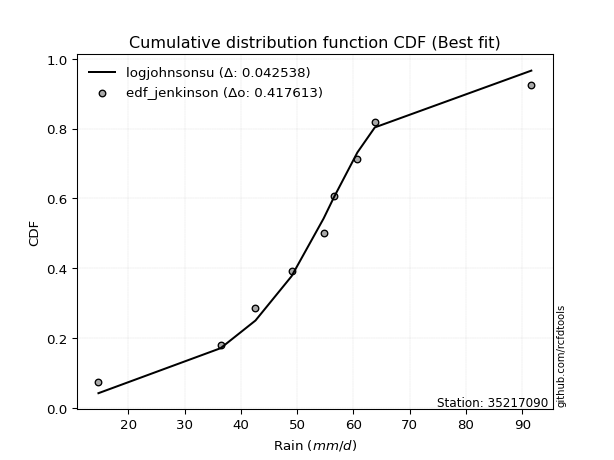</img>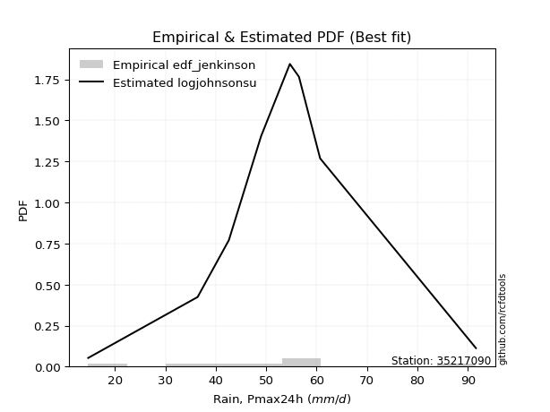</img>

</div>


### 11. EDF Cunnane (1978)

Cunnane´s work in statistical hydrology has focused on the performance and evaluation of different probability distributions (such as GEV, Gumbel, Lognormal) for flood frequency estimation. _b_ is a constant, typically set to 0.4.

<div align="center">


$P=(m-b)/(n+1-2b)$


</div>


**11.1. Empirical values**

<div align="center">

|                | 0                   | 1                  | 2                   | 3                  | 4           | 5                  | 6                 | 7                  | 8                  |
|:---------------|:--------------------|:-------------------|:--------------------|:-------------------|:------------|:-------------------|:------------------|:-------------------|:-------------------|
| date           | 2017                | 2020               | 2021                | 2018               | 2023        | 2022               | 2019              | 2025               | 2024               |
| x              | 14.7                | 36.4               | 42.6                | 49.0               | 54.7        | 56.5               | 60.7              | 63.8               | 91.6               |
| m              | 1                   | 2                  | 3                   | 4                  | 5           | 6                  | 7                 | 8                  | 9                  |
| empirical_dist | edf_cunnane         | edf_cunnane        | edf_cunnane         | edf_cunnane        | edf_cunnane | edf_cunnane        | edf_cunnane       | edf_cunnane        | edf_cunnane        |
| empirical      | 0.06521739130434782 | 0.1739130434782609 | 0.28260869565217395 | 0.391304347826087  | 0.5         | 0.6086956521739131 | 0.717391304347826 | 0.8260869565217391 | 0.9347826086956522 |
| empirical_tr   | 1.069767441860465   | 1.2105263157894737 | 1.393939393939394   | 1.6428571428571428 | 2.0         | 2.555555555555556  | 3.538461538461538 | 5.75               | 15.333333333333343 |

</div>


**11.2. Kolmogorov-Smirnov fit test (sorted by Δ)**


<div align="center">

|                | 0                   | 1                    | 2                   | 3                   | 4                   | 5                   | 6                   | 7                   | 8                   | 9                   | 10                  | 11                  | 12                  | 13                  | 14                  | 15                  | 16                  | 17                  | 18                  | 19                  | 20                  | 21                  | 22                  | 23                  | 24                  | 25                  | 26                  | 27                  | 28                  | 29                  | 30                  | 31                  | 32                  | 33                  | 34                  | 35                  | 36                  | 37                  | 38                  | 39                  | 40                  | 41                  | 42                  | 43                  | 44                  | 45                  | 46                  | 47                  | 48                  | 49                  | 50                  | 51                  | 52                  | 53                  | 54                  | 55                  | 56                  | 57                  | 58                  | 59                  | 60                  | 61                  | 62                  | 63                  | 64                  | 65                  | 66                  | 67                  | 68                  | 69                  | 70                  | 71                  | 72                  | 73                  | 74                  | 75                  | 76                  | 77                  | 78                  | 79                  | 80                  | 81                  | 82                  | 83                  | 84                  | 85                  | 86                  | 87                  | 88                  | 89                  | 90                  | 91                  | 92                  | 93                  | 94                  | 95                  | 96                  | 97                  | 98                  | 99                  | 100                 | 101                 | 102                 | 103                 | 104                 | 105                 | 106                 | 107                 | 108                 | 109                 | 110                 | 111                 | 112                 | 113                 | 114                 | 115                 | 116                 | 117                 | 118                 | 119                 | 120                 | 121                 | 122                 | 123                 | 124                 | 125                 | 126                 | 127                 | 128                 | 129                 | 130                 | 131                 | 132                 | 133                 | 134                 | 135                 | 136                 | 137                 | 138                 | 139                 | 140                 | 141                 | 142                 | 143                 | 144                 | 145                 | 146                 | 147                 | 148                 | 149                 | 150                 | 151                 | 152                 | 153                 | 154                 | 155                 | 156                 | 157                 | 158                 | 159                 |
|:---------------|:--------------------|:---------------------|:--------------------|:--------------------|:--------------------|:--------------------|:--------------------|:--------------------|:--------------------|:--------------------|:--------------------|:--------------------|:--------------------|:--------------------|:--------------------|:--------------------|:--------------------|:--------------------|:--------------------|:--------------------|:--------------------|:--------------------|:--------------------|:--------------------|:--------------------|:--------------------|:--------------------|:--------------------|:--------------------|:--------------------|:--------------------|:--------------------|:--------------------|:--------------------|:--------------------|:--------------------|:--------------------|:--------------------|:--------------------|:--------------------|:--------------------|:--------------------|:--------------------|:--------------------|:--------------------|:--------------------|:--------------------|:--------------------|:--------------------|:--------------------|:--------------------|:--------------------|:--------------------|:--------------------|:--------------------|:--------------------|:--------------------|:--------------------|:--------------------|:--------------------|:--------------------|:--------------------|:--------------------|:--------------------|:--------------------|:--------------------|:--------------------|:--------------------|:--------------------|:--------------------|:--------------------|:--------------------|:--------------------|:--------------------|:--------------------|:--------------------|:--------------------|:--------------------|:--------------------|:--------------------|:--------------------|:--------------------|:--------------------|:--------------------|:--------------------|:--------------------|:--------------------|:--------------------|:--------------------|:--------------------|:--------------------|:--------------------|:--------------------|:--------------------|:--------------------|:--------------------|:--------------------|:--------------------|:--------------------|:--------------------|:--------------------|:--------------------|:--------------------|:--------------------|:--------------------|:--------------------|:--------------------|:--------------------|:--------------------|:--------------------|:--------------------|:--------------------|:--------------------|:--------------------|:--------------------|:--------------------|:--------------------|:--------------------|:--------------------|:--------------------|:--------------------|:--------------------|:--------------------|:--------------------|:--------------------|:--------------------|:--------------------|:--------------------|:--------------------|:--------------------|:--------------------|:--------------------|:--------------------|:--------------------|:--------------------|:--------------------|:--------------------|:--------------------|:--------------------|:--------------------|:--------------------|:--------------------|:--------------------|:--------------------|:--------------------|:--------------------|:--------------------|:--------------------|:--------------------|:--------------------|:--------------------|:--------------------|:--------------------|:--------------------|:--------------------|:--------------------|:--------------------|:--------------------|:--------------------|:--------------------|
| station        | 35217090            | 35217090             | 35217090            | 35217090            | 35217090            | 35217090            | 35217090            | 35217090            | 35217090            | 35217090            | 35217090            | 35217090            | 35217090            | 35217090            | 35217090            | 35217090            | 35217090            | 35217090            | 35217090            | 35217090            | 35217090            | 35217090            | 35217090            | 35217090            | 35217090            | 35217090            | 35217090            | 35217090            | 35217090            | 35217090            | 35217090            | 35217090            | 35217090            | 35217090            | 35217090            | 35217090            | 35217090            | 35217090            | 35217090            | 35217090            | 35217090            | 35217090            | 35217090            | 35217090            | 35217090            | 35217090            | 35217090            | 35217090            | 35217090            | 35217090            | 35217090            | 35217090            | 35217090            | 35217090            | 35217090            | 35217090            | 35217090            | 35217090            | 35217090            | 35217090            | 35217090            | 35217090            | 35217090            | 35217090            | 35217090            | 35217090            | 35217090            | 35217090            | 35217090            | 35217090            | 35217090            | 35217090            | 35217090            | 35217090            | 35217090            | 35217090            | 35217090            | 35217090            | 35217090            | 35217090            | 35217090            | 35217090            | 35217090            | 35217090            | 35217090            | 35217090            | 35217090            | 35217090            | 35217090            | 35217090            | 35217090            | 35217090            | 35217090            | 35217090            | 35217090            | 35217090            | 35217090            | 35217090            | 35217090            | 35217090            | 35217090            | 35217090            | 35217090            | 35217090            | 35217090            | 35217090            | 35217090            | 35217090            | 35217090            | 35217090            | 35217090            | 35217090            | 35217090            | 35217090            | 35217090            | 35217090            | 35217090            | 35217090            | 35217090            | 35217090            | 35217090            | 35217090            | 35217090            | 35217090            | 35217090            | 35217090            | 35217090            | 35217090            | 35217090            | 35217090            | 35217090            | 35217090            | 35217090            | 35217090            | 35217090            | 35217090            | 35217090            | 35217090            | 35217090            | 35217090            | 35217090            | 35217090            | 35217090            | 35217090            | 35217090            | 35217090            | 35217090            | 35217090            | 35217090            | 35217090            | 35217090            | 35217090            | 35217090            | 35217090            | 35217090            | 35217090            | 35217090            | 35217090            | 35217090            | 35217090            |
| empirical_dist | edf_cunnane         | edf_cunnane          | edf_cunnane         | edf_cunnane         | edf_cunnane         | edf_cunnane         | edf_cunnane         | edf_cunnane         | edf_cunnane         | edf_cunnane         | edf_cunnane         | edf_cunnane         | edf_cunnane         | edf_cunnane         | edf_cunnane         | edf_cunnane         | edf_cunnane         | edf_cunnane         | edf_cunnane         | edf_cunnane         | edf_cunnane         | edf_cunnane         | edf_cunnane         | edf_cunnane         | edf_cunnane         | edf_cunnane         | edf_cunnane         | edf_cunnane         | edf_cunnane         | edf_cunnane         | edf_cunnane         | edf_cunnane         | edf_cunnane         | edf_cunnane         | edf_cunnane         | edf_cunnane         | edf_cunnane         | edf_cunnane         | edf_cunnane         | edf_cunnane         | edf_cunnane         | edf_cunnane         | edf_cunnane         | edf_cunnane         | edf_cunnane         | edf_cunnane         | edf_cunnane         | edf_cunnane         | edf_cunnane         | edf_cunnane         | edf_cunnane         | edf_cunnane         | edf_cunnane         | edf_cunnane         | edf_cunnane         | edf_cunnane         | edf_cunnane         | edf_cunnane         | edf_cunnane         | edf_cunnane         | edf_cunnane         | edf_cunnane         | edf_cunnane         | edf_cunnane         | edf_cunnane         | edf_cunnane         | edf_cunnane         | edf_cunnane         | edf_cunnane         | edf_cunnane         | edf_cunnane         | edf_cunnane         | edf_cunnane         | edf_cunnane         | edf_cunnane         | edf_cunnane         | edf_cunnane         | edf_cunnane         | edf_cunnane         | edf_cunnane         | edf_cunnane         | edf_cunnane         | edf_cunnane         | edf_cunnane         | edf_cunnane         | edf_cunnane         | edf_cunnane         | edf_cunnane         | edf_cunnane         | edf_cunnane         | edf_cunnane         | edf_cunnane         | edf_cunnane         | edf_cunnane         | edf_cunnane         | edf_cunnane         | edf_cunnane         | edf_cunnane         | edf_cunnane         | edf_cunnane         | edf_cunnane         | edf_cunnane         | edf_cunnane         | edf_cunnane         | edf_cunnane         | edf_cunnane         | edf_cunnane         | edf_cunnane         | edf_cunnane         | edf_cunnane         | edf_cunnane         | edf_cunnane         | edf_cunnane         | edf_cunnane         | edf_cunnane         | edf_cunnane         | edf_cunnane         | edf_cunnane         | edf_cunnane         | edf_cunnane         | edf_cunnane         | edf_cunnane         | edf_cunnane         | edf_cunnane         | edf_cunnane         | edf_cunnane         | edf_cunnane         | edf_cunnane         | edf_cunnane         | edf_cunnane         | edf_cunnane         | edf_cunnane         | edf_cunnane         | edf_cunnane         | edf_cunnane         | edf_cunnane         | edf_cunnane         | edf_cunnane         | edf_cunnane         | edf_cunnane         | edf_cunnane         | edf_cunnane         | edf_cunnane         | edf_cunnane         | edf_cunnane         | edf_cunnane         | edf_cunnane         | edf_cunnane         | edf_cunnane         | edf_cunnane         | edf_cunnane         | edf_cunnane         | edf_cunnane         | edf_cunnane         | edf_cunnane         | edf_cunnane         | edf_cunnane         | edf_cunnane         | edf_cunnane         | edf_cunnane         |
| p_dist         | logjohnsonsu        | johnsonsu            | tukeylambda         | hypsecant           | logburr             | logmielke           | mielke              | burr                | loggenlogistic      | genlogistic         | dgamma              | laplace             | gennorm             | logistic            | dweibull            | alpha               | logt                | invgauss            | vonmises_line       | rayleigh            | maxwell             | ncf                 | invgamma            | loggompertz         | logdgamma           | nct                 | exponnorm           | loggengamma         | skewnorm            | betaprime           | pearson3            | gengamma            | gamma               | erlang              | f                   | johnsonsb           | beta                | rice                | logweibull_min      | logburr12           | logvonmises_line    | t                   | crystalball         | truncnorm           | norm                | weibull_min         | logloggamma         | logexponweib        | exponpow            | logjohnsonsb        | loggumbel_l         | gumbel_r            | kstwobign           | halfnorm            | gumbel_l            | anglit              | cosine              | lognct              | logcrystalball      | lognorm             | logexponnorm        | logrice             | logpearson3         | logf                | logfatiguelife      | loglogistic         | loganglit           | loghypsecant        | semicircular        | loginvgamma         | logtriang           | moyal               | halflogistic        | loggamma            | loggamma            | logerlang           | logbetaprime        | logalpha            | loggenextreme       | logweibull_max      | logdweibull         | logloglaplace       | loginvgauss         | logsemicircular     | kappa4              | gompertz            | loggennorm          | logncf              | logargus            | kappa3              | logmaxwell          | logtrapezoid        | logskewnorm         | loglaplace          | loglaplace          | lognakagami         | logtruncnorm        | logtruncweibull_min | lograyleigh         | bradford            | logfoldnorm         | loginvweibull       | wrapcauchy          | uniform             | arcsine             | loggenhalflogistic  | truncweibull_min    | logarcsine          | loggumbel_r         | loghalfnorm         | logcosine           | ksone               | wald                | logmoyal            | loghalflogistic     | argus               | loggausshyper       | logkstwobign        | exponweib           | truncexpon          | loggenpareto        | loggenexpon         | loglevy_l           | gausshyper          | lomax               | genexpon            | genpareto           | loghalfgennorm      | logwald             | logkappa4           | logkappa3           | logbradford         | loguniform          | logtukeylambda      | logksone            | logwrapcauchy       | levy_l              | genhalflogistic     | logrdist            | burr12              | loglomax            | halfgennorm         | nakagami            | triang              | logbeta             | logtruncexpon       | genextreme          | trapezoid           | logexponpow         | invweibull          | rdist               | powerlaw            | foldnorm            | fatiguelife         | logpowerlaw         | weibull_max         | truncpareto         | logtruncpareto      | logvonmises         | vonmises            |
| delta          | 0.04253765184494118 | 0.056536244657701684 | 0.06183496266257016 | 0.06823369184277517 | 0.07239196611574283 | 0.07377319047439956 | 0.07391233329174962 | 0.07391679507762328 | 0.07413204323468958 | 0.07901288371481341 | 0.08048440182120009 | 0.08095472684620575 | 0.0811531810669453  | 0.08367916813143073 | 0.08375472917703702 | 0.08581203523651504 | 0.0878613379061094  | 0.08989873978676577 | 0.08991601251849746 | 0.09065286062488703 | 0.09242275790430365 | 0.09472411461901087 | 0.096970162455018   | 0.0981622485405359  | 0.09884496085186584 | 0.09934102978447779 | 0.1004917753593958  | 0.1007065018805613  | 0.10139694622729245 | 0.10150555771386116 | 0.10288333697137764 | 0.10310104368536455 | 0.10312697947337557 | 0.10318279548810683 | 0.10325902685667399 | 0.10326502289370265 | 0.10335178968223069 | 0.10345526425571439 | 0.10463182773281587 | 0.1049978945445863  | 0.10535186282825892 | 0.10581836901577091 | 0.10583397494243962 | 0.1058339814392204  | 0.1058339861902221  | 0.10885502374034794 | 0.11063583315530257 | 0.1114130614087776  | 0.1170565152854085  | 0.11711541958829752 | 0.11732290268188772 | 0.11980166147702997 | 0.12167243647318043 | 0.1247533337556263  | 0.13127928871057903 | 0.13184596147264638 | 0.13214921025548187 | 0.1348166435428106  | 0.13491183512584676 | 0.13491190686281945 | 0.13491252464208786 | 0.13491980460698078 | 0.13587123061788187 | 0.13633417046507473 | 0.1365424826120975  | 0.1384800134701833  | 0.1420248552067306  | 0.14214548045952424 | 0.14299436515928377 | 0.1440703398873006  | 0.1443735955682809  | 0.14464920905465672 | 0.1447077705866182  | 0.1453238422764624  | 0.1453238422764624  | 0.14652900725092027 | 0.14867690109380266 | 0.14906116418149334 | 0.14916922355278484 | 0.14917895718087604 | 0.14957748777525437 | 0.1503468951502852  | 0.15115883721587414 | 0.1528101032504334  | 0.16141917481021362 | 0.16573725414394225 | 0.16593466049259153 | 0.16625676688235705 | 0.16639415347500264 | 0.16664733327479922 | 0.16672911781768357 | 0.1678308695766335  | 0.1689612336465357  | 0.17019883775440325 | 0.17019883775440325 | 0.17391304347823938 | 0.1746124386958684  | 0.17668442660742212 | 0.17712510727650704 | 0.18050164990821185 | 0.18257355171704331 | 0.18645433661005026 | 0.1869023376440554  | 0.18759540905749983 | 0.1906857715928003  | 0.19413700108673804 | 0.19519771533687147 | 0.19859912609544025 | 0.2055712941382823  | 0.2096422194159409  | 0.2102195355125147  | 0.21067733363487295 | 0.21359532172273088 | 0.23104889338979356 | 0.23274235389758152 | 0.2330417526429749  | 0.2415179438238806  | 0.24260720777065023 | 0.2466683850703764  | 0.25175127531197006 | 0.25275853847485774 | 0.2635163837189163  | 0.2635627391320853  | 0.26359520059938424 | 0.2641029098444889  | 0.26617249726055336 | 0.267840335035065   | 0.28260869565217395 | 0.30178829817070946 | 0.3181288078611243  | 0.32068669109421744 | 0.32158657241850364 | 0.3216757848731927  | 0.32178304237572497 | 0.32241098014795044 | 0.3246164822974804  | 0.3367089873083256  | 0.3376922459464566  | 0.35742442221275805 | 0.36185505085144454 | 0.3654059923266215  | 0.3776702009946671  | 0.37830877190587875 | 0.37895205617202227 | 0.38983047391586684 | 0.42517020046026166 | 0.42851309529300907 | 0.4473579525799843  | 0.44754917218360857 | 0.4862404115205808  | 0.5316621064306322  | 0.5963288485859182  | 0.6086956521739131  | 0.6446029727325474  | 0.6755658111004123  | 0.6811674558448885  | 0.753001604322883   | 0.7846709172873247  | 1.1146472448771296  | 14.266423481102937  |
| deltao         | 0.41761268023100007 | 0.41761268023100007  | 0.41761268023100007 | 0.41761268023100007 | 0.41761268023100007 | 0.41761268023100007 | 0.41761268023100007 | 0.41761268023100007 | 0.41761268023100007 | 0.41761268023100007 | 0.41761268023100007 | 0.41761268023100007 | 0.41761268023100007 | 0.41761268023100007 | 0.41761268023100007 | 0.41761268023100007 | 0.41761268023100007 | 0.41761268023100007 | 0.41761268023100007 | 0.41761268023100007 | 0.41761268023100007 | 0.41761268023100007 | 0.41761268023100007 | 0.41761268023100007 | 0.41761268023100007 | 0.41761268023100007 | 0.41761268023100007 | 0.41761268023100007 | 0.41761268023100007 | 0.41761268023100007 | 0.41761268023100007 | 0.41761268023100007 | 0.41761268023100007 | 0.41761268023100007 | 0.41761268023100007 | 0.41761268023100007 | 0.41761268023100007 | 0.41761268023100007 | 0.41761268023100007 | 0.41761268023100007 | 0.41761268023100007 | 0.41761268023100007 | 0.41761268023100007 | 0.41761268023100007 | 0.41761268023100007 | 0.41761268023100007 | 0.41761268023100007 | 0.41761268023100007 | 0.41761268023100007 | 0.41761268023100007 | 0.41761268023100007 | 0.41761268023100007 | 0.41761268023100007 | 0.41761268023100007 | 0.41761268023100007 | 0.41761268023100007 | 0.41761268023100007 | 0.41761268023100007 | 0.41761268023100007 | 0.41761268023100007 | 0.41761268023100007 | 0.41761268023100007 | 0.41761268023100007 | 0.41761268023100007 | 0.41761268023100007 | 0.41761268023100007 | 0.41761268023100007 | 0.41761268023100007 | 0.41761268023100007 | 0.41761268023100007 | 0.41761268023100007 | 0.41761268023100007 | 0.41761268023100007 | 0.41761268023100007 | 0.41761268023100007 | 0.41761268023100007 | 0.41761268023100007 | 0.41761268023100007 | 0.41761268023100007 | 0.41761268023100007 | 0.41761268023100007 | 0.41761268023100007 | 0.41761268023100007 | 0.41761268023100007 | 0.41761268023100007 | 0.41761268023100007 | 0.41761268023100007 | 0.41761268023100007 | 0.41761268023100007 | 0.41761268023100007 | 0.41761268023100007 | 0.41761268023100007 | 0.41761268023100007 | 0.41761268023100007 | 0.41761268023100007 | 0.41761268023100007 | 0.41761268023100007 | 0.41761268023100007 | 0.41761268023100007 | 0.41761268023100007 | 0.41761268023100007 | 0.41761268023100007 | 0.41761268023100007 | 0.41761268023100007 | 0.41761268023100007 | 0.41761268023100007 | 0.41761268023100007 | 0.41761268023100007 | 0.41761268023100007 | 0.41761268023100007 | 0.41761268023100007 | 0.41761268023100007 | 0.41761268023100007 | 0.41761268023100007 | 0.41761268023100007 | 0.41761268023100007 | 0.41761268023100007 | 0.41761268023100007 | 0.41761268023100007 | 0.41761268023100007 | 0.41761268023100007 | 0.41761268023100007 | 0.41761268023100007 | 0.41761268023100007 | 0.41761268023100007 | 0.41761268023100007 | 0.41761268023100007 | 0.41761268023100007 | 0.41761268023100007 | 0.41761268023100007 | 0.41761268023100007 | 0.41761268023100007 | 0.41761268023100007 | 0.41761268023100007 | 0.41761268023100007 | 0.41761268023100007 | 0.41761268023100007 | 0.41761268023100007 | 0.41761268023100007 | 0.41761268023100007 | 0.41761268023100007 | 0.41761268023100007 | 0.41761268023100007 | 0.41761268023100007 | 0.41761268023100007 | 0.41761268023100007 | 0.41761268023100007 | 0.41761268023100007 | 0.41761268023100007 | 0.41761268023100007 | 0.41761268023100007 | 0.41761268023100007 | 0.41761268023100007 | 0.41761268023100007 | 0.41761268023100007 | 0.41761268023100007 | 0.41761268023100007 | 0.41761268023100007 | 0.41761268023100007 | 0.41761268023100007 |
| eval           | Δo > Δ              | Δo > Δ               | Δo > Δ              | Δo > Δ              | Δo > Δ              | Δo > Δ              | Δo > Δ              | Δo > Δ              | Δo > Δ              | Δo > Δ              | Δo > Δ              | Δo > Δ              | Δo > Δ              | Δo > Δ              | Δo > Δ              | Δo > Δ              | Δo > Δ              | Δo > Δ              | Δo > Δ              | Δo > Δ              | Δo > Δ              | Δo > Δ              | Δo > Δ              | Δo > Δ              | Δo > Δ              | Δo > Δ              | Δo > Δ              | Δo > Δ              | Δo > Δ              | Δo > Δ              | Δo > Δ              | Δo > Δ              | Δo > Δ              | Δo > Δ              | Δo > Δ              | Δo > Δ              | Δo > Δ              | Δo > Δ              | Δo > Δ              | Δo > Δ              | Δo > Δ              | Δo > Δ              | Δo > Δ              | Δo > Δ              | Δo > Δ              | Δo > Δ              | Δo > Δ              | Δo > Δ              | Δo > Δ              | Δo > Δ              | Δo > Δ              | Δo > Δ              | Δo > Δ              | Δo > Δ              | Δo > Δ              | Δo > Δ              | Δo > Δ              | Δo > Δ              | Δo > Δ              | Δo > Δ              | Δo > Δ              | Δo > Δ              | Δo > Δ              | Δo > Δ              | Δo > Δ              | Δo > Δ              | Δo > Δ              | Δo > Δ              | Δo > Δ              | Δo > Δ              | Δo > Δ              | Δo > Δ              | Δo > Δ              | Δo > Δ              | Δo > Δ              | Δo > Δ              | Δo > Δ              | Δo > Δ              | Δo > Δ              | Δo > Δ              | Δo > Δ              | Δo > Δ              | Δo > Δ              | Δo > Δ              | Δo > Δ              | Δo > Δ              | Δo > Δ              | Δo > Δ              | Δo > Δ              | Δo > Δ              | Δo > Δ              | Δo > Δ              | Δo > Δ              | Δo > Δ              | Δo > Δ              | Δo > Δ              | Δo > Δ              | Δo > Δ              | Δo > Δ              | Δo > Δ              | Δo > Δ              | Δo > Δ              | Δo > Δ              | Δo > Δ              | Δo > Δ              | Δo > Δ              | Δo > Δ              | Δo > Δ              | Δo > Δ              | Δo > Δ              | Δo > Δ              | Δo > Δ              | Δo > Δ              | Δo > Δ              | Δo > Δ              | Δo > Δ              | Δo > Δ              | Δo > Δ              | Δo > Δ              | Δo > Δ              | Δo > Δ              | Δo > Δ              | Δo > Δ              | Δo > Δ              | Δo > Δ              | Δo > Δ              | Δo > Δ              | Δo > Δ              | Δo > Δ              | Δo > Δ              | Δo > Δ              | Δo > Δ              | Δo > Δ              | Δo > Δ              | Δo > Δ              | Δo > Δ              | Δo > Δ              | Δo > Δ              | Δo > Δ              | Δo > Δ              | Δo > Δ              | Δo > Δ              | Δo > Δ              | Δo > Δ              | Δo > Δ              | Δo <= Δ             | Δo <= Δ             | Δo <= Δ             | Δo <= Δ             | Δo <= Δ             | Δo <= Δ             | Δo <= Δ             | Δo <= Δ             | Δo <= Δ             | Δo <= Δ             | Δo <= Δ             | Δo <= Δ             | Δo <= Δ             | Δo <= Δ             | Δo <= Δ             |
| fit            | 1                   | 1                    | 1                   | 1                   | 1                   | 1                   | 1                   | 1                   | 1                   | 1                   | 1                   | 1                   | 1                   | 1                   | 1                   | 1                   | 1                   | 1                   | 1                   | 1                   | 1                   | 1                   | 1                   | 1                   | 1                   | 1                   | 1                   | 1                   | 1                   | 1                   | 1                   | 1                   | 1                   | 1                   | 1                   | 1                   | 1                   | 1                   | 1                   | 1                   | 1                   | 1                   | 1                   | 1                   | 1                   | 1                   | 1                   | 1                   | 1                   | 1                   | 1                   | 1                   | 1                   | 1                   | 1                   | 1                   | 1                   | 1                   | 1                   | 1                   | 1                   | 1                   | 1                   | 1                   | 1                   | 1                   | 1                   | 1                   | 1                   | 1                   | 1                   | 1                   | 1                   | 1                   | 1                   | 1                   | 1                   | 1                   | 1                   | 1                   | 1                   | 1                   | 1                   | 1                   | 1                   | 1                   | 1                   | 1                   | 1                   | 1                   | 1                   | 1                   | 1                   | 1                   | 1                   | 1                   | 1                   | 1                   | 1                   | 1                   | 1                   | 1                   | 1                   | 1                   | 1                   | 1                   | 1                   | 1                   | 1                   | 1                   | 1                   | 1                   | 1                   | 1                   | 1                   | 1                   | 1                   | 1                   | 1                   | 1                   | 1                   | 1                   | 1                   | 1                   | 1                   | 1                   | 1                   | 1                   | 1                   | 1                   | 1                   | 1                   | 1                   | 1                   | 1                   | 1                   | 1                   | 1                   | 1                   | 1                   | 1                   | 1                   | 1                   | 1                   | 1                   | 0                   | 0                   | 0                   | 0                   | 0                   | 0                   | 0                   | 0                   | 0                   | 0                   | 0                   | 0                   | 0                   | 0                   | 0                   |
| n              | 9                   | 9                    | 9                   | 9                   | 9                   | 9                   | 9                   | 9                   | 9                   | 9                   | 9                   | 9                   | 9                   | 9                   | 9                   | 9                   | 9                   | 9                   | 9                   | 9                   | 9                   | 9                   | 9                   | 9                   | 9                   | 9                   | 9                   | 9                   | 9                   | 9                   | 9                   | 9                   | 9                   | 9                   | 9                   | 9                   | 9                   | 9                   | 9                   | 9                   | 9                   | 9                   | 9                   | 9                   | 9                   | 9                   | 9                   | 9                   | 9                   | 9                   | 9                   | 9                   | 9                   | 9                   | 9                   | 9                   | 9                   | 9                   | 9                   | 9                   | 9                   | 9                   | 9                   | 9                   | 9                   | 9                   | 9                   | 9                   | 9                   | 9                   | 9                   | 9                   | 9                   | 9                   | 9                   | 9                   | 9                   | 9                   | 9                   | 9                   | 9                   | 9                   | 9                   | 9                   | 9                   | 9                   | 9                   | 9                   | 9                   | 9                   | 9                   | 9                   | 9                   | 9                   | 9                   | 9                   | 9                   | 9                   | 9                   | 9                   | 9                   | 9                   | 9                   | 9                   | 9                   | 9                   | 9                   | 9                   | 9                   | 9                   | 9                   | 9                   | 9                   | 9                   | 9                   | 9                   | 9                   | 9                   | 9                   | 9                   | 9                   | 9                   | 9                   | 9                   | 9                   | 9                   | 9                   | 9                   | 9                   | 9                   | 9                   | 9                   | 9                   | 9                   | 9                   | 9                   | 9                   | 9                   | 9                   | 9                   | 9                   | 9                   | 9                   | 9                   | 9                   | 9                   | 9                   | 9                   | 9                   | 9                   | 9                   | 9                   | 9                   | 9                   | 9                   | 9                   | 9                   | 9                   | 9                   | 9                   |
| best_fit       | 1                   | 0                    | 0                   | 0                   | 0                   | 0                   | 0                   | 0                   | 0                   | 0                   | 0                   | 0                   | 0                   | 0                   | 0                   | 0                   | 0                   | 0                   | 0                   | 0                   | 0                   | 0                   | 0                   | 0                   | 0                   | 0                   | 0                   | 0                   | 0                   | 0                   | 0                   | 0                   | 0                   | 0                   | 0                   | 0                   | 0                   | 0                   | 0                   | 0                   | 0                   | 0                   | 0                   | 0                   | 0                   | 0                   | 0                   | 0                   | 0                   | 0                   | 0                   | 0                   | 0                   | 0                   | 0                   | 0                   | 0                   | 0                   | 0                   | 0                   | 0                   | 0                   | 0                   | 0                   | 0                   | 0                   | 0                   | 0                   | 0                   | 0                   | 0                   | 0                   | 0                   | 0                   | 0                   | 0                   | 0                   | 0                   | 0                   | 0                   | 0                   | 0                   | 0                   | 0                   | 0                   | 0                   | 0                   | 0                   | 0                   | 0                   | 0                   | 0                   | 0                   | 0                   | 0                   | 0                   | 0                   | 0                   | 0                   | 0                   | 0                   | 0                   | 0                   | 0                   | 0                   | 0                   | 0                   | 0                   | 0                   | 0                   | 0                   | 0                   | 0                   | 0                   | 0                   | 0                   | 0                   | 0                   | 0                   | 0                   | 0                   | 0                   | 0                   | 0                   | 0                   | 0                   | 0                   | 0                   | 0                   | 0                   | 0                   | 0                   | 0                   | 0                   | 0                   | 0                   | 0                   | 0                   | 0                   | 0                   | 0                   | 0                   | 0                   | 0                   | 0                   | 0                   | 0                   | 0                   | 0                   | 0                   | 0                   | 0                   | 0                   | 0                   | 0                   | 0                   | 0                   | 0                   | 0                   | 0                   |
| best_fit_sort  | 1                   | 2                    | 3                   | 4                   | 5                   | 6                   | 7                   | 8                   | 9                   | 10                  | 11                  | 12                  | 13                  | 14                  | 15                  | 16                  | 17                  | 18                  | 19                  | 20                  | 21                  | 22                  | 23                  | 24                  | 25                  | 26                  | 27                  | 28                  | 29                  | 30                  | 31                  | 32                  | 33                  | 34                  | 35                  | 36                  | 37                  | 38                  | 39                  | 40                  | 41                  | 42                  | 43                  | 44                  | 45                  | 46                  | 47                  | 48                  | 49                  | 50                  | 51                  | 52                  | 53                  | 54                  | 55                  | 56                  | 57                  | 58                  | 59                  | 60                  | 61                  | 62                  | 63                  | 64                  | 65                  | 66                  | 67                  | 68                  | 69                  | 70                  | 71                  | 72                  | 73                  | 74                  | 75                  | 76                  | 77                  | 78                  | 79                  | 80                  | 81                  | 82                  | 83                  | 84                  | 85                  | 86                  | 87                  | 88                  | 89                  | 90                  | 91                  | 92                  | 93                  | 94                  | 95                  | 96                  | 97                  | 98                  | 99                  | 100                 | 101                 | 102                 | 103                 | 104                 | 105                 | 106                 | 107                 | 108                 | 109                 | 110                 | 111                 | 112                 | 113                 | 114                 | 115                 | 116                 | 117                 | 118                 | 119                 | 120                 | 121                 | 122                 | 123                 | 124                 | 125                 | 126                 | 127                 | 128                 | 129                 | 130                 | 131                 | 132                 | 133                 | 134                 | 135                 | 136                 | 137                 | 138                 | 139                 | 140                 | 141                 | 142                 | 143                 | 144                 | 145                 | 146                 | 147                 | 148                 | 149                 | 150                 | 151                 | 152                 | 153                 | 154                 | 155                 | 156                 | 157                 | 158                 | 159                 | 160                 |

</div>


**11.3. Best fit**

<div align="center">

|   id |   station | empirical_dist   | p_dist       |     delta |   deltao | eval   |   fit |   n |   best_fit |   best_fit_sort |
|-----:|----------:|:-----------------|:-------------|----------:|---------:|:-------|------:|----:|-----------:|----------------:|
|    0 |  35217090 | edf_cunnane      | logjohnsonsu | 0.0425377 | 0.417613 | Δo > Δ |     1 |   9 |          1 |               1 |

</div>


<div align="center">

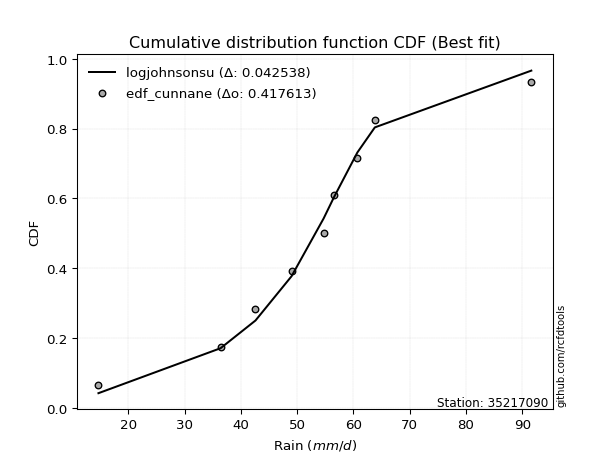</img>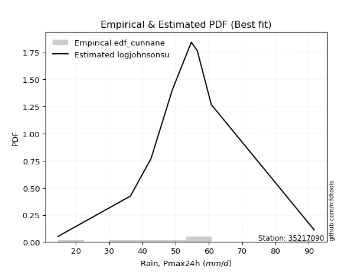</img>

</div>


### 12. EDF Adamowski (1981)

The Adamowski formula in hydrology refers to a specific plotting position formula used for estimating the non-parametric empirical distribution of hydrological events (like flood peaks) to calculate their return periods. This formula provides an alternative to traditional parametric methods (like the Gumbel or Log Pearson Type III distributions). 

<div align="center">


$P=(m-0.25)/(n+0.5)$


</div>


**12.1. Empirical values**

<div align="center">

|                | 0                   | 1                   | 2                  | 3                   | 4             | 5                  | 6                  | 7                  | 8                  |
|:---------------|:--------------------|:--------------------|:-------------------|:--------------------|:--------------|:-------------------|:-------------------|:-------------------|:-------------------|
| date           | 2017                | 2020                | 2021               | 2018                | 2023          | 2022               | 2019               | 2025               | 2024               |
| x              | 14.7                | 36.4                | 42.6               | 49.0                | 54.7          | 56.5               | 60.7               | 63.8               | 91.6               |
| m              | 1                   | 2                   | 3                  | 4                   | 5             | 6                  | 7                  | 8                  | 9                  |
| empirical_dist | edf_adamowski       | edf_adamowski       | edf_adamowski      | edf_adamowski       | edf_adamowski | edf_adamowski      | edf_adamowski      | edf_adamowski      | edf_adamowski      |
| empirical      | 0.07894736842105263 | 0.18421052631578946 | 0.2894736842105263 | 0.39473684210526316 | 0.5           | 0.6052631578947368 | 0.7105263157894737 | 0.8157894736842105 | 0.9210526315789473 |
| empirical_tr   | 1.0857142857142856  | 1.2258064516129032  | 1.4074074074074074 | 1.6521739130434783  | 2.0           | 2.533333333333333  | 3.4545454545454546 | 5.428571428571428  | 12.666666666666663 |

</div>


**12.2. Kolmogorov-Smirnov fit test (sorted by Δ)**


<div align="center">

|                | 0                    | 1                    | 2                   | 3                    | 4                   | 5                   | 6                   | 7                   | 8                   | 9                   | 10                  | 11                  | 12                  | 13                  | 14                  | 15                  | 16                  | 17                  | 18                  | 19                  | 20                  | 21                  | 22                  | 23                  | 24                  | 25                  | 26                  | 27                  | 28                  | 29                  | 30                  | 31                  | 32                  | 33                  | 34                  | 35                  | 36                  | 37                  | 38                  | 39                  | 40                  | 41                  | 42                  | 43                  | 44                  | 45                  | 46                  | 47                  | 48                  | 49                  | 50                  | 51                  | 52                  | 53                  | 54                  | 55                  | 56                  | 57                  | 58                  | 59                  | 60                  | 61                  | 62                  | 63                  | 64                  | 65                  | 66                  | 67                  | 68                  | 69                  | 70                  | 71                  | 72                  | 73                  | 74                  | 75                  | 76                  | 77                  | 78                  | 79                  | 80                  | 81                  | 82                  | 83                  | 84                  | 85                  | 86                  | 87                  | 88                  | 89                  | 90                  | 91                  | 92                  | 93                  | 94                  | 95                  | 96                  | 97                  | 98                  | 99                  | 100                 | 101                 | 102                 | 103                 | 104                 | 105                 | 106                 | 107                 | 108                 | 109                 | 110                 | 111                 | 112                 | 113                 | 114                 | 115                 | 116                 | 117                 | 118                 | 119                 | 120                 | 121                 | 122                 | 123                 | 124                 | 125                 | 126                 | 127                 | 128                 | 129                 | 130                 | 131                 | 132                 | 133                 | 134                 | 135                 | 136                 | 137                 | 138                 | 139                 | 140                 | 141                 | 142                 | 143                 | 144                 | 145                 | 146                 | 147                 | 148                 | 149                 | 150                 | 151                 | 152                 | 153                 | 154                 | 155                 | 156                 | 157                 | 158                 | 159                 |
|:---------------|:---------------------|:---------------------|:--------------------|:---------------------|:--------------------|:--------------------|:--------------------|:--------------------|:--------------------|:--------------------|:--------------------|:--------------------|:--------------------|:--------------------|:--------------------|:--------------------|:--------------------|:--------------------|:--------------------|:--------------------|:--------------------|:--------------------|:--------------------|:--------------------|:--------------------|:--------------------|:--------------------|:--------------------|:--------------------|:--------------------|:--------------------|:--------------------|:--------------------|:--------------------|:--------------------|:--------------------|:--------------------|:--------------------|:--------------------|:--------------------|:--------------------|:--------------------|:--------------------|:--------------------|:--------------------|:--------------------|:--------------------|:--------------------|:--------------------|:--------------------|:--------------------|:--------------------|:--------------------|:--------------------|:--------------------|:--------------------|:--------------------|:--------------------|:--------------------|:--------------------|:--------------------|:--------------------|:--------------------|:--------------------|:--------------------|:--------------------|:--------------------|:--------------------|:--------------------|:--------------------|:--------------------|:--------------------|:--------------------|:--------------------|:--------------------|:--------------------|:--------------------|:--------------------|:--------------------|:--------------------|:--------------------|:--------------------|:--------------------|:--------------------|:--------------------|:--------------------|:--------------------|:--------------------|:--------------------|:--------------------|:--------------------|:--------------------|:--------------------|:--------------------|:--------------------|:--------------------|:--------------------|:--------------------|:--------------------|:--------------------|:--------------------|:--------------------|:--------------------|:--------------------|:--------------------|:--------------------|:--------------------|:--------------------|:--------------------|:--------------------|:--------------------|:--------------------|:--------------------|:--------------------|:--------------------|:--------------------|:--------------------|:--------------------|:--------------------|:--------------------|:--------------------|:--------------------|:--------------------|:--------------------|:--------------------|:--------------------|:--------------------|:--------------------|:--------------------|:--------------------|:--------------------|:--------------------|:--------------------|:--------------------|:--------------------|:--------------------|:--------------------|:--------------------|:--------------------|:--------------------|:--------------------|:--------------------|:--------------------|:--------------------|:--------------------|:--------------------|:--------------------|:--------------------|:--------------------|:--------------------|:--------------------|:--------------------|:--------------------|:--------------------|:--------------------|:--------------------|:--------------------|:--------------------|:--------------------|:--------------------|
| station        | 35217090             | 35217090             | 35217090            | 35217090             | 35217090            | 35217090            | 35217090            | 35217090            | 35217090            | 35217090            | 35217090            | 35217090            | 35217090            | 35217090            | 35217090            | 35217090            | 35217090            | 35217090            | 35217090            | 35217090            | 35217090            | 35217090            | 35217090            | 35217090            | 35217090            | 35217090            | 35217090            | 35217090            | 35217090            | 35217090            | 35217090            | 35217090            | 35217090            | 35217090            | 35217090            | 35217090            | 35217090            | 35217090            | 35217090            | 35217090            | 35217090            | 35217090            | 35217090            | 35217090            | 35217090            | 35217090            | 35217090            | 35217090            | 35217090            | 35217090            | 35217090            | 35217090            | 35217090            | 35217090            | 35217090            | 35217090            | 35217090            | 35217090            | 35217090            | 35217090            | 35217090            | 35217090            | 35217090            | 35217090            | 35217090            | 35217090            | 35217090            | 35217090            | 35217090            | 35217090            | 35217090            | 35217090            | 35217090            | 35217090            | 35217090            | 35217090            | 35217090            | 35217090            | 35217090            | 35217090            | 35217090            | 35217090            | 35217090            | 35217090            | 35217090            | 35217090            | 35217090            | 35217090            | 35217090            | 35217090            | 35217090            | 35217090            | 35217090            | 35217090            | 35217090            | 35217090            | 35217090            | 35217090            | 35217090            | 35217090            | 35217090            | 35217090            | 35217090            | 35217090            | 35217090            | 35217090            | 35217090            | 35217090            | 35217090            | 35217090            | 35217090            | 35217090            | 35217090            | 35217090            | 35217090            | 35217090            | 35217090            | 35217090            | 35217090            | 35217090            | 35217090            | 35217090            | 35217090            | 35217090            | 35217090            | 35217090            | 35217090            | 35217090            | 35217090            | 35217090            | 35217090            | 35217090            | 35217090            | 35217090            | 35217090            | 35217090            | 35217090            | 35217090            | 35217090            | 35217090            | 35217090            | 35217090            | 35217090            | 35217090            | 35217090            | 35217090            | 35217090            | 35217090            | 35217090            | 35217090            | 35217090            | 35217090            | 35217090            | 35217090            | 35217090            | 35217090            | 35217090            | 35217090            | 35217090            | 35217090            |
| empirical_dist | edf_adamowski        | edf_adamowski        | edf_adamowski       | edf_adamowski        | edf_adamowski       | edf_adamowski       | edf_adamowski       | edf_adamowski       | edf_adamowski       | edf_adamowski       | edf_adamowski       | edf_adamowski       | edf_adamowski       | edf_adamowski       | edf_adamowski       | edf_adamowski       | edf_adamowski       | edf_adamowski       | edf_adamowski       | edf_adamowski       | edf_adamowski       | edf_adamowski       | edf_adamowski       | edf_adamowski       | edf_adamowski       | edf_adamowski       | edf_adamowski       | edf_adamowski       | edf_adamowski       | edf_adamowski       | edf_adamowski       | edf_adamowski       | edf_adamowski       | edf_adamowski       | edf_adamowski       | edf_adamowski       | edf_adamowski       | edf_adamowski       | edf_adamowski       | edf_adamowski       | edf_adamowski       | edf_adamowski       | edf_adamowski       | edf_adamowski       | edf_adamowski       | edf_adamowski       | edf_adamowski       | edf_adamowski       | edf_adamowski       | edf_adamowski       | edf_adamowski       | edf_adamowski       | edf_adamowski       | edf_adamowski       | edf_adamowski       | edf_adamowski       | edf_adamowski       | edf_adamowski       | edf_adamowski       | edf_adamowski       | edf_adamowski       | edf_adamowski       | edf_adamowski       | edf_adamowski       | edf_adamowski       | edf_adamowski       | edf_adamowski       | edf_adamowski       | edf_adamowski       | edf_adamowski       | edf_adamowski       | edf_adamowski       | edf_adamowski       | edf_adamowski       | edf_adamowski       | edf_adamowski       | edf_adamowski       | edf_adamowski       | edf_adamowski       | edf_adamowski       | edf_adamowski       | edf_adamowski       | edf_adamowski       | edf_adamowski       | edf_adamowski       | edf_adamowski       | edf_adamowski       | edf_adamowski       | edf_adamowski       | edf_adamowski       | edf_adamowski       | edf_adamowski       | edf_adamowski       | edf_adamowski       | edf_adamowski       | edf_adamowski       | edf_adamowski       | edf_adamowski       | edf_adamowski       | edf_adamowski       | edf_adamowski       | edf_adamowski       | edf_adamowski       | edf_adamowski       | edf_adamowski       | edf_adamowski       | edf_adamowski       | edf_adamowski       | edf_adamowski       | edf_adamowski       | edf_adamowski       | edf_adamowski       | edf_adamowski       | edf_adamowski       | edf_adamowski       | edf_adamowski       | edf_adamowski       | edf_adamowski       | edf_adamowski       | edf_adamowski       | edf_adamowski       | edf_adamowski       | edf_adamowski       | edf_adamowski       | edf_adamowski       | edf_adamowski       | edf_adamowski       | edf_adamowski       | edf_adamowski       | edf_adamowski       | edf_adamowski       | edf_adamowski       | edf_adamowski       | edf_adamowski       | edf_adamowski       | edf_adamowski       | edf_adamowski       | edf_adamowski       | edf_adamowski       | edf_adamowski       | edf_adamowski       | edf_adamowski       | edf_adamowski       | edf_adamowski       | edf_adamowski       | edf_adamowski       | edf_adamowski       | edf_adamowski       | edf_adamowski       | edf_adamowski       | edf_adamowski       | edf_adamowski       | edf_adamowski       | edf_adamowski       | edf_adamowski       | edf_adamowski       | edf_adamowski       | edf_adamowski       | edf_adamowski       | edf_adamowski       |
| p_dist         | logjohnsonsu         | johnsonsu            | tukeylambda         | hypsecant            | genlogistic         | logmielke           | logburr             | logistic            | mielke              | burr                | loggenlogistic      | vonmises_line       | laplace             | maxwell             | alpha               | logt                | invgauss            | ncf                 | invgamma            | dgamma              | loggompertz         | gennorm             | nct                 | rayleigh            | exponnorm           | dweibull            | skewnorm            | betaprime           | pearson3            | gengamma            | gamma               | erlang              | f                   | johnsonsb           | beta                | rice                | logweibull_min      | logburr12           | logvonmises_line    | t                   | crystalball         | truncnorm           | norm                | loggengamma         | weibull_min         | logloggamma         | logexponweib        | logdgamma           | exponpow            | logjohnsonsb        | loggumbel_l         | kstwobign           | gumbel_r            | gumbel_l            | halfnorm            | anglit              | cosine              | logpearson3         | lognct              | logcrystalball      | lognorm             | logexponnorm        | logrice             | semicircular        | logf                | logfatiguelife      | loganglit           | logtriang           | loglogistic         | loggenextreme       | logweibull_max      | logdweibull         | logloglaplace       | loginvgamma         | loggamma            | loggamma            | loghypsecant        | logsemicircular     | logerlang           | moyal               | halflogistic        | logbetaprime        | logalpha            | loginvgauss         | kappa4              | gompertz            | logncf              | logargus            | kappa3              | logtrapezoid        | logskewnorm         | logmaxwell          | logtruncweibull_min | loggennorm          | loglaplace          | loglaplace          | bradford            | lograyleigh         | loginvweibull       | wrapcauchy          | uniform             | logfoldnorm         | arcsine             | loggenhalflogistic  | logtruncnorm        | lognakagami         | truncweibull_min    | logarcsine          | ksone               | loggumbel_r         | loghalfnorm         | logcosine           | wald                | argus               | logmoyal            | loghalflogistic     | loggausshyper       | logkstwobign        | exponweib           | truncexpon          | loggenpareto        | loggenexpon         | loglevy_l           | gausshyper          | lomax               | genexpon            | genpareto           | loghalfgennorm      | logwald             | logkappa4           | logkappa3           | logbradford         | loguniform          | logtukeylambda      | logksone            | logwrapcauchy       | levy_l              | genhalflogistic     | logrdist            | burr12              | loglomax            | halfgennorm         | triang              | nakagami            | logbeta             | genextreme          | logtruncexpon       | trapezoid           | logexponpow         | invweibull          | rdist               | powerlaw            | foldnorm            | fatiguelife         | logpowerlaw         | weibull_max         | truncpareto         | logtruncpareto      | logvonmises         | vonmises            |
| delta          | 0.045410932699108564 | 0.056536244657701684 | 0.05878038843393796 | 0.062051050738793356 | 0.06871540087728478 | 0.0709276446163637  | 0.07239196611574283 | 0.0733816852939021  | 0.07391233329174962 | 0.07391679507762328 | 0.07413204323468958 | 0.07961852968096883 | 0.08095472684620575 | 0.08212527506677503 | 0.08239160257600331 | 0.08352576116060717 | 0.08421616568248957 | 0.08567843023070298 | 0.08667267961748937 | 0.08734939037955247 | 0.08786476570300727 | 0.08801816962529768 | 0.08904354694694916 | 0.08987632065450235 | 0.09019429252186717 | 0.0906197177353894  | 0.09109946338976382 | 0.09120807487633253 | 0.09258585413384901 | 0.09280356084783592 | 0.09282949663584694 | 0.0928853126505782  | 0.09296154401914536 | 0.09296754005617403 | 0.09305430684470206 | 0.09315778141818576 | 0.09433434489528725 | 0.09470041170705767 | 0.0950543799907303  | 0.09552088617824228 | 0.095536492104911   | 0.09553649860169178 | 0.09553650335269348 | 0.0972740076013851  | 0.09855754090281932 | 0.10033835031777394 | 0.10111557857124898 | 0.10385206544680248 | 0.10675903244787988 | 0.1068179367507689  | 0.1070254198443591  | 0.11823994219400424 | 0.11980166147702997 | 0.12098180587305041 | 0.12132083947645012 | 0.12154847863511775 | 0.12185172741795325 | 0.12557374778035324 | 0.1313841492636344  | 0.13147934084667057 | 0.13147941258364326 | 0.13148003036291167 | 0.13148731032780459 | 0.13269688232175514 | 0.13290167618589854 | 0.13310998833292131 | 0.13396683679999172 | 0.13407611273075226 | 0.1350475191910071  | 0.1388717407152562  | 0.1388814743433474  | 0.13928000493772574 | 0.14004941231275658 | 0.14063784560812442 | 0.1418913479972862  | 0.1418913479972862  | 0.14214548045952424 | 0.14251262041290483 | 0.14309651297174408 | 0.14464920905465672 | 0.1447077705866182  | 0.14524440681462647 | 0.14562866990231715 | 0.14714518403250287 | 0.151121691972685   | 0.15543977130641362 | 0.15595928404482848 | 0.156096670637474   | 0.15634985043727065 | 0.15753338673910489 | 0.15866375080900708 | 0.16329662353850738 | 0.1663869437698935  | 0.16936715477176773 | 0.17019883775440325 | 0.17019883775440325 | 0.17020416707068328 | 0.17369261299733085 | 0.1761568537725217  | 0.17660485480652677 | 0.1772979262199712  | 0.17914105743786712 | 0.1803882887552717  | 0.1838395182492094  | 0.18421044059575312 | 0.18421052631576795 | 0.18490023249934284 | 0.18830164325791168 | 0.20037985079734433 | 0.2021387998591061  | 0.2029654644318305  | 0.20335454695416233 | 0.21359532172273088 | 0.22274426980544626 | 0.22761639911061737 | 0.22930985961840533 | 0.23122046098635196 | 0.23230972493312166 | 0.23637090223284782 | 0.24145379247444146 | 0.24246105563732911 | 0.25321890088138765 | 0.25326525629455665 | 0.2532977177618556  | 0.2538054270069603  | 0.25587501442302474 | 0.25754285219753636 | 0.2894736842105263  | 0.29835580389153327 | 0.30783132502359567 | 0.3103892082566888  | 0.311289089580975   | 0.3113783020356641  | 0.31148555953819634 | 0.3121134973104218  | 0.3143189994599519  | 0.3229790101916208  | 0.32739476310892796 | 0.3471269393752294  | 0.3515575680139159  | 0.3551085094890929  | 0.36737271815713846 | 0.36865457333449364 | 0.37144378334752637 | 0.3795329910783382  | 0.4147831181763042  | 0.41487271762273303 | 0.43706046974245566 | 0.43725168934607994 | 0.4725104344038759  | 0.5213646235931035  | 0.5860313657483895  | 0.6052631578947368  | 0.6343054898950188  | 0.6652683282628836  | 0.6708699730073598  | 0.7427041214853544  | 0.7743734344497961  | 1.1112147505979535  | 14.280153458219642  |
| deltao         | 0.41761268023100007  | 0.41761268023100007  | 0.41761268023100007 | 0.41761268023100007  | 0.41761268023100007 | 0.41761268023100007 | 0.41761268023100007 | 0.41761268023100007 | 0.41761268023100007 | 0.41761268023100007 | 0.41761268023100007 | 0.41761268023100007 | 0.41761268023100007 | 0.41761268023100007 | 0.41761268023100007 | 0.41761268023100007 | 0.41761268023100007 | 0.41761268023100007 | 0.41761268023100007 | 0.41761268023100007 | 0.41761268023100007 | 0.41761268023100007 | 0.41761268023100007 | 0.41761268023100007 | 0.41761268023100007 | 0.41761268023100007 | 0.41761268023100007 | 0.41761268023100007 | 0.41761268023100007 | 0.41761268023100007 | 0.41761268023100007 | 0.41761268023100007 | 0.41761268023100007 | 0.41761268023100007 | 0.41761268023100007 | 0.41761268023100007 | 0.41761268023100007 | 0.41761268023100007 | 0.41761268023100007 | 0.41761268023100007 | 0.41761268023100007 | 0.41761268023100007 | 0.41761268023100007 | 0.41761268023100007 | 0.41761268023100007 | 0.41761268023100007 | 0.41761268023100007 | 0.41761268023100007 | 0.41761268023100007 | 0.41761268023100007 | 0.41761268023100007 | 0.41761268023100007 | 0.41761268023100007 | 0.41761268023100007 | 0.41761268023100007 | 0.41761268023100007 | 0.41761268023100007 | 0.41761268023100007 | 0.41761268023100007 | 0.41761268023100007 | 0.41761268023100007 | 0.41761268023100007 | 0.41761268023100007 | 0.41761268023100007 | 0.41761268023100007 | 0.41761268023100007 | 0.41761268023100007 | 0.41761268023100007 | 0.41761268023100007 | 0.41761268023100007 | 0.41761268023100007 | 0.41761268023100007 | 0.41761268023100007 | 0.41761268023100007 | 0.41761268023100007 | 0.41761268023100007 | 0.41761268023100007 | 0.41761268023100007 | 0.41761268023100007 | 0.41761268023100007 | 0.41761268023100007 | 0.41761268023100007 | 0.41761268023100007 | 0.41761268023100007 | 0.41761268023100007 | 0.41761268023100007 | 0.41761268023100007 | 0.41761268023100007 | 0.41761268023100007 | 0.41761268023100007 | 0.41761268023100007 | 0.41761268023100007 | 0.41761268023100007 | 0.41761268023100007 | 0.41761268023100007 | 0.41761268023100007 | 0.41761268023100007 | 0.41761268023100007 | 0.41761268023100007 | 0.41761268023100007 | 0.41761268023100007 | 0.41761268023100007 | 0.41761268023100007 | 0.41761268023100007 | 0.41761268023100007 | 0.41761268023100007 | 0.41761268023100007 | 0.41761268023100007 | 0.41761268023100007 | 0.41761268023100007 | 0.41761268023100007 | 0.41761268023100007 | 0.41761268023100007 | 0.41761268023100007 | 0.41761268023100007 | 0.41761268023100007 | 0.41761268023100007 | 0.41761268023100007 | 0.41761268023100007 | 0.41761268023100007 | 0.41761268023100007 | 0.41761268023100007 | 0.41761268023100007 | 0.41761268023100007 | 0.41761268023100007 | 0.41761268023100007 | 0.41761268023100007 | 0.41761268023100007 | 0.41761268023100007 | 0.41761268023100007 | 0.41761268023100007 | 0.41761268023100007 | 0.41761268023100007 | 0.41761268023100007 | 0.41761268023100007 | 0.41761268023100007 | 0.41761268023100007 | 0.41761268023100007 | 0.41761268023100007 | 0.41761268023100007 | 0.41761268023100007 | 0.41761268023100007 | 0.41761268023100007 | 0.41761268023100007 | 0.41761268023100007 | 0.41761268023100007 | 0.41761268023100007 | 0.41761268023100007 | 0.41761268023100007 | 0.41761268023100007 | 0.41761268023100007 | 0.41761268023100007 | 0.41761268023100007 | 0.41761268023100007 | 0.41761268023100007 | 0.41761268023100007 | 0.41761268023100007 | 0.41761268023100007 | 0.41761268023100007 | 0.41761268023100007 |
| eval           | Δo > Δ               | Δo > Δ               | Δo > Δ              | Δo > Δ               | Δo > Δ              | Δo > Δ              | Δo > Δ              | Δo > Δ              | Δo > Δ              | Δo > Δ              | Δo > Δ              | Δo > Δ              | Δo > Δ              | Δo > Δ              | Δo > Δ              | Δo > Δ              | Δo > Δ              | Δo > Δ              | Δo > Δ              | Δo > Δ              | Δo > Δ              | Δo > Δ              | Δo > Δ              | Δo > Δ              | Δo > Δ              | Δo > Δ              | Δo > Δ              | Δo > Δ              | Δo > Δ              | Δo > Δ              | Δo > Δ              | Δo > Δ              | Δo > Δ              | Δo > Δ              | Δo > Δ              | Δo > Δ              | Δo > Δ              | Δo > Δ              | Δo > Δ              | Δo > Δ              | Δo > Δ              | Δo > Δ              | Δo > Δ              | Δo > Δ              | Δo > Δ              | Δo > Δ              | Δo > Δ              | Δo > Δ              | Δo > Δ              | Δo > Δ              | Δo > Δ              | Δo > Δ              | Δo > Δ              | Δo > Δ              | Δo > Δ              | Δo > Δ              | Δo > Δ              | Δo > Δ              | Δo > Δ              | Δo > Δ              | Δo > Δ              | Δo > Δ              | Δo > Δ              | Δo > Δ              | Δo > Δ              | Δo > Δ              | Δo > Δ              | Δo > Δ              | Δo > Δ              | Δo > Δ              | Δo > Δ              | Δo > Δ              | Δo > Δ              | Δo > Δ              | Δo > Δ              | Δo > Δ              | Δo > Δ              | Δo > Δ              | Δo > Δ              | Δo > Δ              | Δo > Δ              | Δo > Δ              | Δo > Δ              | Δo > Δ              | Δo > Δ              | Δo > Δ              | Δo > Δ              | Δo > Δ              | Δo > Δ              | Δo > Δ              | Δo > Δ              | Δo > Δ              | Δo > Δ              | Δo > Δ              | Δo > Δ              | Δo > Δ              | Δo > Δ              | Δo > Δ              | Δo > Δ              | Δo > Δ              | Δo > Δ              | Δo > Δ              | Δo > Δ              | Δo > Δ              | Δo > Δ              | Δo > Δ              | Δo > Δ              | Δo > Δ              | Δo > Δ              | Δo > Δ              | Δo > Δ              | Δo > Δ              | Δo > Δ              | Δo > Δ              | Δo > Δ              | Δo > Δ              | Δo > Δ              | Δo > Δ              | Δo > Δ              | Δo > Δ              | Δo > Δ              | Δo > Δ              | Δo > Δ              | Δo > Δ              | Δo > Δ              | Δo > Δ              | Δo > Δ              | Δo > Δ              | Δo > Δ              | Δo > Δ              | Δo > Δ              | Δo > Δ              | Δo > Δ              | Δo > Δ              | Δo > Δ              | Δo > Δ              | Δo > Δ              | Δo > Δ              | Δo > Δ              | Δo > Δ              | Δo > Δ              | Δo > Δ              | Δo > Δ              | Δo > Δ              | Δo > Δ              | Δo > Δ              | Δo > Δ              | Δo <= Δ             | Δo <= Δ             | Δo <= Δ             | Δo <= Δ             | Δo <= Δ             | Δo <= Δ             | Δo <= Δ             | Δo <= Δ             | Δo <= Δ             | Δo <= Δ             | Δo <= Δ             | Δo <= Δ             | Δo <= Δ             |
| fit            | 1                    | 1                    | 1                   | 1                    | 1                   | 1                   | 1                   | 1                   | 1                   | 1                   | 1                   | 1                   | 1                   | 1                   | 1                   | 1                   | 1                   | 1                   | 1                   | 1                   | 1                   | 1                   | 1                   | 1                   | 1                   | 1                   | 1                   | 1                   | 1                   | 1                   | 1                   | 1                   | 1                   | 1                   | 1                   | 1                   | 1                   | 1                   | 1                   | 1                   | 1                   | 1                   | 1                   | 1                   | 1                   | 1                   | 1                   | 1                   | 1                   | 1                   | 1                   | 1                   | 1                   | 1                   | 1                   | 1                   | 1                   | 1                   | 1                   | 1                   | 1                   | 1                   | 1                   | 1                   | 1                   | 1                   | 1                   | 1                   | 1                   | 1                   | 1                   | 1                   | 1                   | 1                   | 1                   | 1                   | 1                   | 1                   | 1                   | 1                   | 1                   | 1                   | 1                   | 1                   | 1                   | 1                   | 1                   | 1                   | 1                   | 1                   | 1                   | 1                   | 1                   | 1                   | 1                   | 1                   | 1                   | 1                   | 1                   | 1                   | 1                   | 1                   | 1                   | 1                   | 1                   | 1                   | 1                   | 1                   | 1                   | 1                   | 1                   | 1                   | 1                   | 1                   | 1                   | 1                   | 1                   | 1                   | 1                   | 1                   | 1                   | 1                   | 1                   | 1                   | 1                   | 1                   | 1                   | 1                   | 1                   | 1                   | 1                   | 1                   | 1                   | 1                   | 1                   | 1                   | 1                   | 1                   | 1                   | 1                   | 1                   | 1                   | 1                   | 1                   | 1                   | 1                   | 1                   | 0                   | 0                   | 0                   | 0                   | 0                   | 0                   | 0                   | 0                   | 0                   | 0                   | 0                   | 0                   | 0                   |
| n              | 9                    | 9                    | 9                   | 9                    | 9                   | 9                   | 9                   | 9                   | 9                   | 9                   | 9                   | 9                   | 9                   | 9                   | 9                   | 9                   | 9                   | 9                   | 9                   | 9                   | 9                   | 9                   | 9                   | 9                   | 9                   | 9                   | 9                   | 9                   | 9                   | 9                   | 9                   | 9                   | 9                   | 9                   | 9                   | 9                   | 9                   | 9                   | 9                   | 9                   | 9                   | 9                   | 9                   | 9                   | 9                   | 9                   | 9                   | 9                   | 9                   | 9                   | 9                   | 9                   | 9                   | 9                   | 9                   | 9                   | 9                   | 9                   | 9                   | 9                   | 9                   | 9                   | 9                   | 9                   | 9                   | 9                   | 9                   | 9                   | 9                   | 9                   | 9                   | 9                   | 9                   | 9                   | 9                   | 9                   | 9                   | 9                   | 9                   | 9                   | 9                   | 9                   | 9                   | 9                   | 9                   | 9                   | 9                   | 9                   | 9                   | 9                   | 9                   | 9                   | 9                   | 9                   | 9                   | 9                   | 9                   | 9                   | 9                   | 9                   | 9                   | 9                   | 9                   | 9                   | 9                   | 9                   | 9                   | 9                   | 9                   | 9                   | 9                   | 9                   | 9                   | 9                   | 9                   | 9                   | 9                   | 9                   | 9                   | 9                   | 9                   | 9                   | 9                   | 9                   | 9                   | 9                   | 9                   | 9                   | 9                   | 9                   | 9                   | 9                   | 9                   | 9                   | 9                   | 9                   | 9                   | 9                   | 9                   | 9                   | 9                   | 9                   | 9                   | 9                   | 9                   | 9                   | 9                   | 9                   | 9                   | 9                   | 9                   | 9                   | 9                   | 9                   | 9                   | 9                   | 9                   | 9                   | 9                   | 9                   |
| best_fit       | 1                    | 0                    | 0                   | 0                    | 0                   | 0                   | 0                   | 0                   | 0                   | 0                   | 0                   | 0                   | 0                   | 0                   | 0                   | 0                   | 0                   | 0                   | 0                   | 0                   | 0                   | 0                   | 0                   | 0                   | 0                   | 0                   | 0                   | 0                   | 0                   | 0                   | 0                   | 0                   | 0                   | 0                   | 0                   | 0                   | 0                   | 0                   | 0                   | 0                   | 0                   | 0                   | 0                   | 0                   | 0                   | 0                   | 0                   | 0                   | 0                   | 0                   | 0                   | 0                   | 0                   | 0                   | 0                   | 0                   | 0                   | 0                   | 0                   | 0                   | 0                   | 0                   | 0                   | 0                   | 0                   | 0                   | 0                   | 0                   | 0                   | 0                   | 0                   | 0                   | 0                   | 0                   | 0                   | 0                   | 0                   | 0                   | 0                   | 0                   | 0                   | 0                   | 0                   | 0                   | 0                   | 0                   | 0                   | 0                   | 0                   | 0                   | 0                   | 0                   | 0                   | 0                   | 0                   | 0                   | 0                   | 0                   | 0                   | 0                   | 0                   | 0                   | 0                   | 0                   | 0                   | 0                   | 0                   | 0                   | 0                   | 0                   | 0                   | 0                   | 0                   | 0                   | 0                   | 0                   | 0                   | 0                   | 0                   | 0                   | 0                   | 0                   | 0                   | 0                   | 0                   | 0                   | 0                   | 0                   | 0                   | 0                   | 0                   | 0                   | 0                   | 0                   | 0                   | 0                   | 0                   | 0                   | 0                   | 0                   | 0                   | 0                   | 0                   | 0                   | 0                   | 0                   | 0                   | 0                   | 0                   | 0                   | 0                   | 0                   | 0                   | 0                   | 0                   | 0                   | 0                   | 0                   | 0                   | 0                   |
| best_fit_sort  | 1                    | 2                    | 3                   | 4                    | 5                   | 6                   | 7                   | 8                   | 9                   | 10                  | 11                  | 12                  | 13                  | 14                  | 15                  | 16                  | 17                  | 18                  | 19                  | 20                  | 21                  | 22                  | 23                  | 24                  | 25                  | 26                  | 27                  | 28                  | 29                  | 30                  | 31                  | 32                  | 33                  | 34                  | 35                  | 36                  | 37                  | 38                  | 39                  | 40                  | 41                  | 42                  | 43                  | 44                  | 45                  | 46                  | 47                  | 48                  | 49                  | 50                  | 51                  | 52                  | 53                  | 54                  | 55                  | 56                  | 57                  | 58                  | 59                  | 60                  | 61                  | 62                  | 63                  | 64                  | 65                  | 66                  | 67                  | 68                  | 69                  | 70                  | 71                  | 72                  | 73                  | 74                  | 75                  | 76                  | 77                  | 78                  | 79                  | 80                  | 81                  | 82                  | 83                  | 84                  | 85                  | 86                  | 87                  | 88                  | 89                  | 90                  | 91                  | 92                  | 93                  | 94                  | 95                  | 96                  | 97                  | 98                  | 99                  | 100                 | 101                 | 102                 | 103                 | 104                 | 105                 | 106                 | 107                 | 108                 | 109                 | 110                 | 111                 | 112                 | 113                 | 114                 | 115                 | 116                 | 117                 | 118                 | 119                 | 120                 | 121                 | 122                 | 123                 | 124                 | 125                 | 126                 | 127                 | 128                 | 129                 | 130                 | 131                 | 132                 | 133                 | 134                 | 135                 | 136                 | 137                 | 138                 | 139                 | 140                 | 141                 | 142                 | 143                 | 144                 | 145                 | 146                 | 147                 | 148                 | 149                 | 150                 | 151                 | 152                 | 153                 | 154                 | 155                 | 156                 | 157                 | 158                 | 159                 | 160                 |

</div>


**12.3. Best fit**

<div align="center">

|   id |   station | empirical_dist   | p_dist       |     delta |   deltao | eval   |   fit |   n |   best_fit |   best_fit_sort |
|-----:|----------:|:-----------------|:-------------|----------:|---------:|:-------|------:|----:|-----------:|----------------:|
|    0 |  35217090 | edf_adamowski    | logjohnsonsu | 0.0454109 | 0.417613 | Δo > Δ |     1 |   9 |          1 |               1 |

</div>


<div align="center">

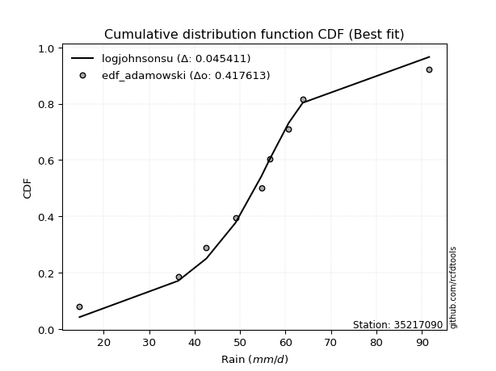</img>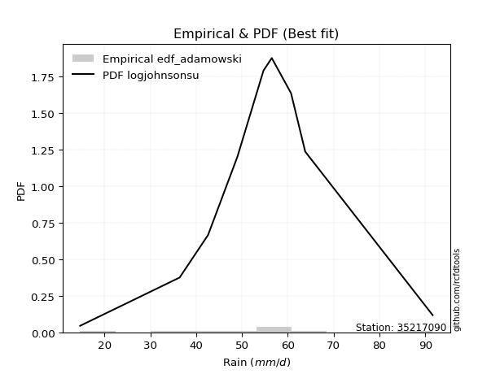</img>

</div>


## C. Best fit & Estimate extreme values for specific return periods - Tr

Best fit in probability distribution analysis means finding the theoretical distribution (like Normal, Poisson, Exponential, etc.) that most accurately mirrors your real-world data´s patterns (shape, center, spread) for better predictions, using methods like visual checks (Q-Q plots), goodness-of-fit tests (Kolmogorov-Smirnov, Chi-Squared), and information criteria (AIC) to score and select the simplest, most representative model.


### 1. Best fit (ordered by delta Δ)

:file_folder:Table: [bestfit_35217090.csv](table/bestfit_35217090.csv)

<div align="center">

|   id |   station | empirical_dist   | p_dist       |     delta |   deltao | eval   |   fit |   n |   best_fit |   best_fit_sort |
|-----:|----------:|:-----------------|:-------------|----------:|---------:|:-------|------:|----:|-----------:|----------------:|
|    0 |  35217090 | edf_cunnane      | logjohnsonsu | 0.0425377 | 0.417613 | Δo > Δ |     1 |   9 |          1 |               1 |
|    1 |  35217090 | edf_jenkinson    | logjohnsonsu | 0.0425377 | 0.417613 | Δo > Δ |     1 |   9 |          1 |               2 |
|    2 |  35217090 | edf_filliben     | logjohnsonsu | 0.0425377 | 0.417613 | Δo > Δ |     1 |   9 |          1 |               3 |
|    3 |  35217090 | edf_gringorten   | logjohnsonsu | 0.0425377 | 0.417613 | Δo > Δ |     1 |   9 |          1 |               4 |
|    4 |  35217090 | edf_blom         | logjohnsonsu | 0.0425377 | 0.417613 | Δo > Δ |     1 |   9 |          1 |               5 |
|    5 |  35217090 | edf_tukey        | logjohnsonsu | 0.0425377 | 0.417613 | Δo > Δ |     1 |   9 |          1 |               6 |
|    6 |  35217090 | edf_chegodayev   | logjohnsonsu | 0.0425377 | 0.417613 | Δo > Δ |     1 |   9 |          1 |               7 |
|    7 |  35217090 | edf_beard        | logjohnsonsu | 0.0425377 | 0.417613 | Δo > Δ |     1 |   9 |          1 |               8 |
|    8 |  35217090 | edf_hazen        | logjohnsonsu | 0.0425377 | 0.417613 | Δo > Δ |     1 |   9 |          1 |               9 |
|    9 |  35217090 | edf_adamowski    | logjohnsonsu | 0.0454109 | 0.417613 | Δo > Δ |     1 |   9 |          1 |              10 |
|   10 |  35217090 | edf_weibull      | logjohnsonsu | 0.0664636 | 0.417613 | Δo > Δ |     1 |   9 |          1 |              11 |
|   11 |  35217090 | edf_california   | logjohnsonsu | 0.0851878 | 0.417613 | Δo > Δ |     1 |   9 |          1 |              12 |

</div>


### 2. Extreme values and % difference analysis

In hydrology, a return period (or recurrence interval $Tr$) is the statistical average time between extreme events like floods or droughts of a specific magnitude, indicating how rare an event is, with a 100-year flood, for example, having a 1% chance of occurring in any given year, not that it happens exactly every century. It is a key tool for infrastructure design (like bridges or dams) and risk assessment, calculated from historical data to determine the probability of future events, although it is important to remember it is statistical average, and events can cluster or be missed.

The extreme value porcentage difference is evaluated as $pdiff = 1 - (ETrBf / ETr) * 100$, where _ETrBf_ correspond to the bestfit extreme value for a specific recurrence interval and _ETr_ correspond to the extreme value for one of the most used PDFsused in hydrology.

> risk_rate: assuming the return period as the project useful life.

:file_folder:Table: [extreme_35217090.csv](table/extreme_35217090.csv), all PDFs.  
:file_folder:Table: [extremepdiff_35217090.csv](table/extremepdiff_35217090.csv), % difference between bestfit and most used PDFs in Hydrology.

<div align="center">

Extreme values table for only best fit PDFs
|   id |      tr |   prob_l |     prob_g |    alpha |   anglit |   arcsine |   argus |     beta |   betaprime |   bradford |     burr |   burr12 |   cosine |   crystalball |   dgamma |   dweibull |   erlang |   exponnorm |   exponpow |   exponweib |        f |   fatiguelife |   foldnorm |    gamma |   gausshyper |   genexpon |    genextreme |   gengamma |   genhalflogistic |   genlogistic |   gennorm |   genpareto |   gompertz |   gumbel_l |   gumbel_r |   halfgennorm |   halflogistic |   halfnorm |   hypsecant |   invgamma |   invgauss |      invweibull |   johnsonsb |   johnsonsu |   kappa3 |   kappa4 |   ksone |   kstwobign |   laplace |   levy_l |   loggamma |   logistic |   loglaplace |    lomax |   maxwell |   mielke |    moyal |   nakagami |      ncf |      nct |     norm |   pearson3 |   powerlaw |   rayleigh |    rdist |     rice |   semicircular |   skewnorm |        t |   trapezoid |   triang |   truncexpon |   truncnorm |   truncpareto |   truncweibull_min |   tukeylambda |   uniform |   vonmises |   vonmises_line |     wald |   weibull_max |   weibull_min |   wrapcauchy |   logalpha |   loganglit |   logarcsine |   logargus |   logbeta |   logbetaprime |   logbradford |   logburr |   logburr12 |   logcosine |   logcrystalball |   logdgamma |   logdweibull |   logerlang |   logexponnorm |   logexponpow |   logexponweib |     logf |   logfatiguelife |   logfoldnorm |   loggausshyper |   loggenexpon |   loggenextreme |   loggengamma |   loggenhalflogistic |   loggenlogistic |       loggennorm |   loggenpareto |   loggompertz |   loggumbel_l |   loggumbel_r |   loghalfgennorm |   loghalflogistic |   loghalfnorm |   loghypsecant |   loginvgamma |   loginvgauss |   loginvweibull |   logjohnsonsb |   logjohnsonsu |   logkappa3 |   logkappa4 |   logksone |   logkstwobign |   loglevy_l |   logloggamma |   loglogistic |   logloglaplace |   loglomax |   logmaxwell |   logmielke |   logmoyal |   lognakagami |   logncf |   lognct |   lognorm |   logpearson3 |   logpowerlaw |   lograyleigh |   logrdist |   logrice |   logsemicircular |   logskewnorm |        logt |   logtrapezoid |   logtriang |   logtruncexpon |   logtruncnorm |   logtruncpareto |   logtruncweibull_min |   logtukeylambda |   loguniform |   logvonmises |   logvonmises_line |   logwald |   logweibull_max |   logweibull_min |   logwrapcauchy |   station |   n |   risk_rate |
|-----:|--------:|---------:|-----------:|---------:|---------:|----------:|--------:|---------:|------------:|-----------:|---------:|---------:|---------:|--------------:|---------:|-----------:|---------:|------------:|-----------:|------------:|---------:|--------------:|-----------:|---------:|-------------:|-----------:|--------------:|-----------:|------------------:|--------------:|----------:|------------:|-----------:|-----------:|-----------:|--------------:|---------------:|-----------:|------------:|-----------:|-----------:|----------------:|------------:|------------:|---------:|---------:|--------:|------------:|----------:|---------:|-----------:|-----------:|-------------:|---------:|----------:|---------:|---------:|-----------:|---------:|---------:|---------:|-----------:|-----------:|-----------:|---------:|---------:|---------------:|-----------:|---------:|------------:|---------:|-------------:|------------:|--------------:|-------------------:|--------------:|----------:|-----------:|----------------:|---------:|--------------:|--------------:|-------------:|-----------:|------------:|-------------:|-----------:|----------:|---------------:|--------------:|----------:|------------:|------------:|-----------------:|------------:|--------------:|------------:|---------------:|--------------:|---------------:|---------:|-----------------:|--------------:|----------------:|--------------:|----------------:|--------------:|---------------------:|-----------------:|-----------------:|---------------:|--------------:|--------------:|--------------:|-----------------:|------------------:|--------------:|---------------:|--------------:|--------------:|----------------:|---------------:|---------------:|------------:|------------:|-----------:|---------------:|------------:|--------------:|--------------:|----------------:|-----------:|-------------:|------------:|-----------:|--------------:|---------:|---------:|----------:|--------------:|--------------:|--------------:|-----------:|----------:|------------------:|--------------:|------------:|---------------:|------------:|----------------:|---------------:|-----------------:|----------------------:|-----------------:|-------------:|--------------:|-------------------:|----------:|-----------------:|-----------------:|----------------:|----------:|----:|------------:|
|    0 |    2    | 0.5      | 0.5        |  50.5307 |  52.2222 |   52.2222 | 57.8719 |  51.9986 |     51.7799 |    46.8865 |  51.3137 |  33.3758 |  52.5672 |       52.2222 |  54.7    |    54.7    |  51.9854 |     51.9159 |    50.9531 |     42.4186 |  51.9934 |       14.7    |    57.328  |  51.982  |      58.6895 |    40.6336 |  79.211       |    51.9603 |           64.6742 |       52.247  |   54.7    |     58.2674 |    54.8775 |    55.4814 |    48.963  |       31.8732 |        47.3427 |    48.1612 |     52.2222 |    51.1033 |    50.3011 |   869.299       |     51.9945 |     52.7408 |  46.5918 |  50.5374 | 53.15   |     48.2331 |   52.2222 |  46.3902 |    46.804  |    52.2222 |      47.4723 |  40.8085 |   50.5255 |  51.314  |  47.9108 |    37.6578 |  50.0733 |  52.3261 |  52.2222 |    51.9588 |    17.3728 |    49.9237 |  7.24501 |  51.6712 |        52.2222 |    51.8841 |  52.2221 |     72.2618 |  67.0242 |      42.1518 |     52.2222 |       14.8506 |            54.3177 |       52.4965 |   53.15   |  -1.54231  |         53.1502 |  45.7913 |       91.2904 |       51.8585 |      53.0761 |    46.5404 |     47.4724 |      47.4724 |    52.6084 |   68.0473 |        46.6405 |       36.7011 |   51.4042 |     51.4801 |     43.0348 |          47.4723 |     54.7    |       54.7    |     46.707  |        47.4723 |       28.3725 |        51.8107 |  47.402  |          47.3834 |       44.5051 |         56.984  |       40.4684 |         52.4334 |       49.4277 |              52.6327 |          51.2999 |     56.5         |        51.3417 |       50.6367 |       51.3812 |       43.8608 |          14.6969 |           42.1693 |       43.0153 |        47.4723 |       46.8612 |       46.3985 |         46.1934 |        51.8498 |        53.3774 |     14.6753 |     36.9526 |    36.695  |        42.005  |     47.2146 |       51.7753 |       47.4723 |         54.7    |    33.0705 |      45.5567 |     51.4167 |    42.7546 |       49.6774 |  46.7861 |  47.478  |   47.4723 |       52.5012 |       16.1273 |       44.8958 |    33.0617 |   47.4718 |           47.4724 |       52.8711 |     53.7609 |        51.5619 |     49.8893 |         30.4503 |        47.0765 |          14.7671 |               52.8873 |          36.6959 |      36.695  |     0.0908793 |            51.3307 |   40.6107 |          52.4337 |          51.4544 |         36.695  |  35217090 |   9 |    0.75     |
|    1 |    2.33 | 0.570815 | 0.429185   |  54.1009 |  56.346  |   58.4126 | 62.3986 |  55.5457 |     55.3448 |    52.3619 |  54.5574 |  39.8842 |  56.5525 |       55.7625 |  56.5206 |    56.4612 |  55.5323 |     55.4294 |    55.1658 |     48.5479 |  55.5399 |       15.535  |    57.3304 |  55.5289 |      64.4684 |    46.3466 | 517.647       |    55.515  |           69.706  |       55.3028 |   56.4574 |     64.9514 |    58.8843 |    58.5615 |    52.2435 |       38.3611 |        50.7155 |    51.9821 |     55.0555 |    54.7169 |    53.982  | 28559.8         |     55.5418 |     55.1992 |  51.1706 |  56.1847 | 59.6848 |     52.5488 |   54.3646 |  59.929  |    51.1673 |    55.3414 |      50.0068 |  46.5736 |   54.2036 |  54.5576 |  51.0162 |    39.0802 |  53.8731 |  55.6624 |  55.7625 |    55.5063 |    19.7789 |    53.6562 | 17.887   |  55.3121 |        56.645  |    55.4189 |  55.7621 |     76.7297 |  71.0867 |      47.9296 |     55.7625 |       14.9887 |            59.448  |       55.1584 |   58.5957 |  -1.31635  |         56.0913 |  48.1127 |       91.4779 |       55.5729 |      58.5323 |    50.9678 |     52.471  |      55.1712 |    57.5424 |   72.4635 |        50.9189 |       41.781  |   54.6281 |     55.2076 |     47.5939 |          51.733  |     55.714  |       57.5274 |     51.1157 |        51.7329 |       32.6148 |        55.6016 |  51.6526 |          51.6236 |       48.7994 |         62.7009 |       45.8551 |         56.8815 |       53.3336 |              58.6434 |          54.5473 |     57.1014      |        63.3958 |       54.4475 |       55.3706 |       47.4968 |          14.6969 |           45.7674 |       47.1964 |        50.8526 |       51.2688 |       50.9144 |         52.6376 |        55.7382 |        55.5561 |     14.6753 |     42.2448 |    42.8675 |        47.8354 |     57.5829 |       55.5614 |       51.2069 |         57.7135 |    39.5488 |      49.8116 |     54.6948 |    46.1025 |       52.6529 |  52.2687 |  51.7385 |   51.733  |       56.625  |       17.3174 |       49.154  |    41.0381 |   51.7327 |           52.8532 |       57.7175 |     56.2033 |        56.924  |     55.1607 |         34.541  |        49.6977 |          14.8269 |               58.0162 |          41.924  |      41.771  |     0.0986507 |            54.7989 |   42.965  |          56.882  |          55.184  |         51.9293 |  35217090 |   9 |    0.729209 |
|    2 |    5    | 0.8      | 0.2        |  68.0868 |  70.8955 |   74.9202 | 76.9191 |  68.8519 |     68.8253 |    71.9353 |  66.5603 | inf      |  70.914  |       68.919  |  66.9485 |    66.7192 |  68.8463 |     68.6736 |    70.2783 |     77.5197 |  68.8477 |       33.2726 |    57.3404 |  68.8429 |      81.3913 |    74.9099 |   3.76957e+06 |    68.8424 |           83.0138 |       67.0134 |   66.908  |     82.8958 |    71.8366 |    68.5118 |    66.4951 |       85.8038 |        65.9768 |    68.1399 |     66.4203 |    68.878  |    68.5853 |     1.18979e+11 |     68.8444 |     65.1083 |  67.3946 |  75.037  | 80.834  |     70.8806 |   65.0761 |  82.3597 |    71.6245 |    67.3851 |      64.8584 |  75.466  |   68.6802 |  66.56   |  65.4004 |    55.2162 |  69.2131 |  68.5855 |  68.919  |    68.8375 |    40.7764 |    68.5989 | 46.6395  |  69.0081 |        71.7381 |    68.7684 |  68.9178 |     89.5477 |  82.7417 |      69.0617 |     68.919  |       18.2463 |            76.2124 |       65.9717 |   76.22   |  -0.430673 |         67.6015 |  61.1078 |       91.5979 |       69.2999 |      76.1905 |    72.0358 |     74.6998 |      82.3697 |    74.1697 |   84.6488 |        70.66   |       63.5656 |   66.4032 |     69.2077 |     68.4135 |          71.2007 |     68.5493 |       76.849  |     71.8762 |        71.2005 |       59.88   |        69.5013 |  71.0881 |          71.0009 |       70.0882 |         80.1836 |       75.8057 |         72.6587 |       69.3361 |              77.514  |          66.5607 |     67.8247      |        88.1654 |       69.0174 |       70.5004 |       67.1318 |          63.8663 |           66.2914 |       69.8671 |        67.01   |       72.0937 |       72.9042 |         92.8317 |        69.9874 |        63.6114 |     63.7825 |     64.7473 |    70.9014 |        83.0866 |     80.0085 |       69.4533 |       68.598  |         76.2686 |    96.8682 |      70.7883 |     66.745  |    65.3712 |       67.5598 |  79.8017 |  71.2031 |   71.2007 |       71.1079 |       29.6127 |       70.6497 |    74.0696 |   71.2019 |           76.2431 |       74.5152 |     68.3721 |        75.6075 |     73.5832 |         55.0697 |        64.255  |          16.2022 |               75.2816 |          64.2909 |      63.5301 |     0.13417   |            70.5827 |   58.901  |          72.6597 |          69.182  |         79.7627 |  35217090 |   9 |    0.67232  |
|    3 |   10    | 0.9      | 0.1        |  78.0421 |  79.1306 |   78.9053 | 83.9211 |  77.7867 |     77.9713 |    81.4446 |  75.2545 | inf      |  79.5907 |       77.6466 |  76.793  |    76.6835 |  77.7942 |     77.6804 |    79.4443 |    101.721  |  77.7875 |       57.7638 |    57.3478 |  77.7908 |      87.4421 |   100.839  |   5.39797e+09 |    77.7745 |           87.6536 |       75.5791 |   77.8096 |     88.4479 |    79.0515 |    74.0517 |    78.1029 |      152.265  |        78.6506 |    80.0964 |     75.4955 |    78.9518 |    79.1155 |     2.93303e+16 |     77.7722 |     73.7546 |  77.5807 |  83.5523 | 90.062  |     84.8379 |   74.7996 |  87.775  |    89.9284 |    76.2548 |      82.1273 | 101.793  |   78.868  |  75.2539 |  77.9242 |    76.0731 |  80.458  |  78.0513 |  77.6466 |    77.8099 |    60.8488 |    79.2534 | 53.8635  |  78.1943 |        79.4826 |    77.825  |  77.6455 |     94.5545 |  87.2942 |      79.7478 |     77.6466 |       28.9613 |            83.7763 |       75.0689 |   83.91   |   0.235489 |         76.0734 |  74.8986 |       91.5999 |       78.24   |      83.8953 |    91.2973 |     91.2317 |      90.7373 |    82.5255 |   88.7905 |        87.9292 |       76.3409 |   74.7919 |     78.4968 |     85.183  |          88.0046 |     87.0138 |      101.64   |     90.559  |        88.0043 |       93.915  |        78.4224 |  87.87   |          87.7327 |       89.7884 |         86.7913 |      108.629  |         81.3224 |       81.2317 |              85.0793 |          75.2589 |     95.9015      |        91.1531 |       78.8552 |       80.6496 |       88.9849 |          76.741  |           90.1735 |       93.398  |        83.5265 |       90.9382 |       93.6619 |        147.362  |        78.972  |        71.481  |     76.6419 |     77.5178 |    88.3088 |       126.501  |     86.6207 |       78.3893 |       85.0805 |         99.8238 |   218.883  |      90.6514 |     75.3994 |    88.5995 |       81.3727 | 106.739  |  88.0016 |   88.0046 |       79.3305 |       47.0158 |       91.5056 |    86.3597 |   88.0074 |           92.0137 |       82.6853 |     84.2035 |        84.4722 |     82.3498 |         69.9803 |        79.313  |          21.2657 |               83.2844 |          77.1253 |      76.2847 |     0.165416  |            85.4611 |   82.3228 |          81.3237 |          78.4614 |         86.0218 |  35217090 |   9 |    0.651322 |
|    4 |   15    | 0.933333 | 0.0666667  |  83.2301 |  82.6472 |   79.6654 | 86.5831 |  82.2774 |     82.5964 |    84.7558 |  80.1169 | inf      |  83.543  |       82.0019 |  82.6139 |    82.6699 |  82.2941 |     82.2658 |    83.7107 |    115.129  |  82.2822 |       73.7814 |    57.3517 |  82.2906 |      89.147  |   116.006  |   3.25676e+11 |    82.2561 |           89.0582 |       80.2348 |   84.6416 |     89.86   |    82.3196 |    76.5606 |    84.6519 |      202.429  |        85.8229 |    86.3185 |     80.6746 |    84.1959 |    84.6336 |     3.23109e+19 |     82.2578 |     79.208  |  82.8363 |  86.442  | 93.138  |     92.2476 |   80.4876 |  89.4109 |   100.879  |    81.0874 |      94.2885 | 117.237  |   84.0953 |  80.1161 |  85.1924 |    88.4419 |  86.3914 |  83.1994 |  82.0019 |    82.3259 |    69.7438 |    84.7431 | 55.293   |  82.7998 |        82.5027 |    82.407  |  82.001  |     96.1609 |  88.7549 |      83.5567 |     82.0019 |       38.7649 |            86.3514 |       80.5974 |   86.4733 |   0.57817  |         80.2364 |  83.7545 |       91.6    |       82.6334 |      86.4636 |   102.995  |     99.3625 |      92.4273 |    85.7468 |   89.943  |        98.1045 |       81.1468 |   79.4455 |     83.1064 |     94.1288 |          97.8196 |    100.962  |      120.183  |    101.777  |        97.8192 |      118.245  |        82.7629 |  97.6745 |          97.5086 |      101.683  |         88.7127 |      130.787  |         84.8459 |       87.5444 |              87.4346 |          80.1229 |    129.84        |        91.4655 |       83.7769 |       85.7146 |      104.32   |          81.5855 |          107.324  |      108.628  |        94.7176 |      102.301  |      106.54   |        191.255  |        83.2467 |        77.4594 |     81.4806 |     82.162  |    95.0139 |       158.13   |     88.7237 |       82.7452 |       95.6717 |        117.722  |   352.93   |     102.917  |     80.2207 |   105.697  |       89.6619 | 123.796  |  97.8124 |   97.8196 |       82.8789 |       57.2512 |      104.551  |    89.1101 |   97.8234 |           99.0134 |       85.5646 |     98.444  |        87.5312 |     85.3782 |         76.2726 |        88.6343 |          27.0009 |               86.0323 |          81.8351 |      81.0818 |     0.184134  |            95.2761 |  102.068  |          84.8474 |          83.0638 |         87.9033 |  35217090 |   9 |    0.644736 |
|    5 |   20    | 0.95     | 0.05       |  86.7113 |  84.7159 |   79.9331 | 88.0442 |  85.2297 |     85.6474 |    86.4389 |  83.5703 | inf      |  85.9736 |       84.8541 |  86.7616 |    86.9714 |  85.2534 |     85.3089 |    86.3925 |    124.357  |  85.2377 |       85.6405 |    57.3542 |  85.25   |      89.914  |   126.768  |   5.74758e+12 |    85.1991 |           89.7324 |       83.4498 |   89.664  |     90.4585 |    84.3539 |    78.1223 |    89.2374 |      243.403  |        90.848  |    90.4668 |     84.3282 |    87.7118 |    88.3449 |     4.35816e+21 |     85.2063 |     83.3349 |  86.4482 |  87.9    | 94.676  |     97.239  |   84.5232 |  90.2486 |   108.815  |    84.4276 |     103.994  | 128.214  |   87.5645 |  83.5694 |  90.3398 |    96.9749 |  90.394  |  86.766  |  84.8541 |    85.2973 |    74.674  |    88.3919 | 55.8078  |  85.8222 |        84.1779 |    85.4303 |  84.8534 |     96.9534 |  89.4754 |      85.5124 |     84.8541 |       46.3824 |            87.6507 |       84.6881 |   87.755  |   0.78956  |         82.7087 |  90.3539 |       91.6    |       85.4837 |      87.7478 |   111.551  |    104.48   |      93.0299 |    87.5243 |   90.4602 |       105.413  |       83.6621 |   82.7379 |     86.1122 |    100.091  |         104.833  |    112.491  |      135.543  |    109.926  |       104.833  |      137.597  |        85.5635 | 104.682  |         104.496  |      110.332  |         89.5916 |      147.973  |         86.8407 |       91.8128 |              88.5665 |          83.5774 |    169.377       |        91.5427 |       86.9987 |       89.0267 |      116.604  |          84.1212 |          121.249  |      120.138  |       103.503  |      110.577  |      116.081  |        229.557  |        85.9601 |        82.6461 |     84.0133 |     84.5394 |    98.555  |       183.781  |     89.8203 |       85.5589 |      103.753  |        132.796  |   495.528  |     111.96   |     83.6392 |   119.767  |       95.656  | 136.573  | 104.822  |  104.833  |       84.9868 |       63.7552 |      114.235  |    90.1416 |  104.838  |          103.123  |       87.0374 |    112.474  |        89.0808 |     86.9129 |         79.7321 |        95.3018 |          32.3823 |               87.4226 |          84.2598 |      83.5924 |     0.19778   |           102.942  |  119.802  |          86.8423 |          86.0639 |         88.829  |  35217090 |   9 |    0.641514 |
|    6 |   25    | 0.96     | 0.04       |  89.3176 |  86.1178 |   80.0573 | 88.9865 |  87.4089 |     87.9046 |    87.4576 |  86.2751 | inf      |  87.6781 |       86.9537 |  89.9867 |    90.3349 |  87.4383 |     87.5721 |    88.3106 |    131.367  |  87.4195 |       95.063  |    57.3562 |  87.4348 |      90.3398 |   135.115  |   5.2453e+13  |    87.3695 |           90.1272 |       85.908  |   93.6519 |     90.7769 |    85.8016 |    79.2336 |    92.7694 |      278.387  |        94.7196 |    93.5533 |     87.1558 |    90.3423 |    91.127  |     1.90514e+23 |     87.3823 |     86.7049 |  89.2276 |  88.7802 | 95.5988 |    100.978  |   87.6535 |  90.7744 |   115.082  |    86.9828 |     112.205  | 136.74   |   90.14   |  86.274  |  94.3297 |   103.414  |  93.3998 |  89.5045 |  86.9537 |    87.4917 |    77.7962 |    91.1029 | 56.0505  |  88.0501 |        85.2646 |    87.6671 |  86.9533 |     97.4256 |  89.9047 |      86.703  |     86.9537 |       52.2405 |            88.4342 |       87.9766 |   88.524  |   0.931587 |         84.3273 |  95.6399 |       91.6    |       87.5681 |      88.5182 |   118.352  |    108.097  |      93.3108 |    88.6738 |   90.7472 |       111.146  |       85.2086 |   85.3103 |     88.3174 |    104.496  |         110.315  |    122.478  |      148.899  |    116.37   |       110.315  |      153.845  |        87.6039 | 110.159  |         109.958  |      117.171  |         90.0851 |      162.193  |         88.1512 |       95.0226 |              89.2269 |          86.2831 |    214.794       |        91.5704 |       89.3685 |       91.4613 |      127.044  |          85.6803 |          133.197  |      129.486  |       110.858  |      117.134  |      123.735  |        264.214  |        87.9116 |        87.3616 |     85.5706 |     85.9773 |   100.743  |       205.686  |     90.5155 |       87.6102 |      110.393  |        146.104  |   644.884  |     119.184  |     86.3139 |   131.948  |      100.375  | 146.9    | 110.302  |  110.315  |       86.4277 |       68.2158 |      122.007  |    90.639  |  110.32   |          105.88   |       87.9322 |    126.715  |        90.017  |     87.8404 |         81.9187 |       100.417  |          37.1765 |               88.2622 |          85.7326 |      85.1358 |     0.208627  |           109.313  |  136.206  |          88.1529 |          88.2645 |         89.3822 |  35217090 |   9 |    0.639603 |
|    7 |   50    | 0.98     | 0.02       |  96.994  |  89.5687 |   80.2231 | 91.1228 |  93.6764 |     94.4211 |    89.5152 |  94.9442 | inf      |  92.1415 |       92.9661 | 100.039  |   100.913  |  93.7247 |     94.179  |    93.5476 |    152.412  |  93.6962 |      125.295  |    57.3617 |  93.7211 |      91.0901 |   161.044  |   4.76382e+16 |    93.6022 |           90.8914 |       93.4144 |  106.509  |     91.3019 |    89.7318 |    82.2502 |   103.65   |      405.815  |       106.649  |   102.525  |     95.9226 |    98.0793 |    99.3331 |     2.15729e+28 |     93.6391 |     98.2432 |  97.9572 |  90.557  | 97.4444 |    111.956  |   97.3771 |  91.9583 |   135.252  |    94.7898 |     142.081  | 163.287  |   97.6094 |  94.9427 | 106.716  |   122.346  | 102.287  |  97.9673 |  92.9661 |    93.8089 |    84.4273 |    98.9725 | 56.3826  |  94.4422 |        87.7472 |    94.1245 |  92.9666 |     98.3625 |  90.7567 |      89.1239 |     92.9661 |       67.9995 |            90.0106 |       98.9477 |   90.062  |   1.24949  |         87.8419 | 112.899  |       91.6    |       93.4704 |      90.0592 |   140.503  |    117.543  |      93.6873 |    91.2893 |   91.2535 |       129.392  |       88.3879 |   93.5242 |     94.5941 |    116.97   |         127.652  |    160.337  |      200.036  |    137.165  |       127.651  |      211.509  |        93.3477 | 127.486  |         127.237  |      139.216  |         90.9699 |      211.726  |         91.1953 |      104.528  |              90.4911 |          94.9558 |    544.318       |        91.5962 |       96.1393 |       98.411  |      165.452  |          88.8857 |          177.936  |      160.996  |       137.151  |      138.372  |      149.062  |        407.446  |        93.2744 |       107.41   |     88.7723 |     88.8554 |   105.265  |       286.291  |     92.1006 |       93.3915 |      133.431  |        198.889  |  1463.63   |     142.879  |     94.875  |   178.237  |      115.46   | 181.499  | 127.628  |  127.652  |       90.0381 |       78.6563 |      147.693  |    91.3386 |  127.659  |          112.457  |       89.7479 |    206.215  |        91.9042 |     89.7103 |         86.5623 |       115.275  |          53.5918 |               89.9539 |          88.7013 |      88.3088 |     0.244144  |           130.653  |  207.087  |          91.1973 |          94.5262 |         90.4882 |  35217090 |   9 |    0.63583  |
|    8 |   75    | 0.986667 | 0.0133333  | 101.248  |  91.0874 |   80.2539 | 91.97   |  97.0559 |     97.95   |    90.2071 | 100.272  | inf      |  94.273  |       96.1922 | 105.938  |   107.179  |  97.116  |     97.8141 |    96.2073 |    164.273  |  97.0817 |      143.502  |    57.3648 |  97.1124 |      91.2997 |   176.212  |   2.49669e+18 |    96.9567 |           91.1369 |       97.7479 |  114.333  |     91.4355 |    91.7193 |    83.7757 |   109.974  |      494.213  |       113.583  |   107.408  |    101.046  |   102.359  |   103.885  |     1.86843e+31 |     97.012  |    105.832  | 103.25   |  91.1564 | 98.0596 |    117.997  |  103.065  |  92.4448 |   147.6    |    99.2988 |     163.119  | 178.86   |  101.67   | 100.271  | 113.959  |   132.693  | 107.227  | 102.952  |  96.1922 |    97.2188 |    86.7565 |   103.254  | 56.4465  |  97.8788 |        88.7389 |    97.6198 |  96.1934 |     98.6727 |  91.0387 |      89.943  |     96.1922 |       74.8152 |            90.5389 |      105.971  |   90.5747 |   1.36383  |         89.0781 | 123.519  |       91.6    |       96.5962 |      90.5729 |   154.251  |    121.958  |      93.7573 |    92.33   |   91.3953 |       140.416  |       89.4739 |   98.553  |     97.9368 |    123.442  |         138.052  |    188.222  |      238.222  |    149.933  |       138.051  |      250.518  |        96.3703 | 137.882  |         137.606  |      152.718  |         91.2231 |      244.779  |         92.4312 |      109.819  |              90.8888 |         100.287  |   1087.43        |        91.5989 |       99.7599 |      102.124  |      192.908  |          89.9807 |          210.559  |      181.262  |       155.316  |      151.468  |      165.071  |        524.093  |        96.0095 |       124.654  |     89.866  |     89.8037 |   106.817  |       343.414  |     92.7599 |       96.4371 |      148.866  |        240.264  |  2366.1    |     157.683  |    100.13   |   212.504  |      124.605  | 203.659  | 138.02   |  138.052  |       91.6693 |       82.6606 |      163.87   |    91.4782 |  138.06   |          115.197  |       90.3612 |    305.806  |        92.5376 |     90.3381 |         88.1956 |       122.736  |          62.6433 |               90.5216 |          89.6892 |      89.3925 |     0.266483  |           142.679  |  267.993  |          92.4332 |          97.8598 |         90.8578 |  35217090 |   9 |    0.634587 |
|    9 |  100    | 0.99     | 0.01       | 104.181  |  91.9905 |   80.2646 | 92.443  |  99.3483 |    100.35   |    90.5542 | 104.193  | inf      |  95.6089 |       98.3741 | 110.13   |   111.657  |  99.417  |    100.314  |    97.9492 |    172.511  |  99.3785 |      156.602  |    57.3668 |  99.4134 |      91.3938 |   186.973  |   4.11432e+19 |    99.2294 |           91.2573 |      100.807  |  120.008  |     91.4921 |    93.0193 |    84.7735 |   114.45   |      563.466  |       118.491  |   110.735  |    104.68   |   105.307  |   107.024  |     2.24168e+33 |     99.2994 |    111.632  | 107.13   |  91.4582 | 98.3672 |    122.136  |  107.101  |  92.7292 |   156.628  |   102.482  |     179.91   | 189.929  |  104.436  | 104.191  | 119.098  |   139.735  | 110.637  | 106.53   |  98.3741 |    99.5332 |    87.944  |   106.171  | 56.4694  | 100.206  |        89.2943 |    99.9955 |  98.3759 |     98.8274 |  91.1794 |      90.3549 |     98.3741 |       78.587  |            90.8036 |      111.258  |   90.831  |   1.42208  |         89.7042 | 131.262  |       91.6    |       98.694  |      90.8297 |   164.391  |    124.661  |      93.7818 |    92.9117 |   91.4591 |       148.412  |       90.0218 |  102.246  |    100.187  |    127.68   |         145.562  |    211.106  |      269.871  |    159.286  |       145.561  |      280.665  |        98.3917 | 145.39   |         145.095  |      162.588  |         91.3382 |      270.214  |         93.1281 |      113.472  |              91.0809 |         104.21   |   1910.88        |        91.5995 |      102.203  |      104.628  |      215.052  |          90.5332 |          237.202  |      196.51   |       169.642  |      161.087  |      177.011  |        626.317  |        97.8018 |       140.573  |     90.4178 |     90.2719 |   107.602  |       389.002  |     93.1476 |       98.4751 |      160.828  |        275.838  |  3328.2    |     168.636  |    103.995  |   240.739  |      131.245  | 220.313  | 145.524  |  145.562  |       92.6574 |       84.774  |      175.895  |    91.5292 |  145.572  |          116.761  |       90.6693 |    431.691  |        92.8552 |     90.6529 |         89.0292 |       127.308  |          68.262  |               90.8061 |          90.1801 |      89.9393 |     0.283177  |           150.171  |  323.414  |          93.1301 |         100.104  |         91.0429 |  35217090 |   9 |    0.633968 |
|   10 |  200    | 0.995    | 0.005      | 111.008  |  93.6967 |   80.275  | 93.265  | 104.568  |    105.831  |    91.0762 | 114.188  | inf      |  98.3253 |      103.324  | 120.248  |   122.539  | 104.658  |    106.129  |   101.738  |    191.824  | 104.609  |      188.67   |    57.3715 | 104.654  |      91.5166 |   212.902  |   3.46678e+22 |   104.395  |           91.4338 |      108.144  |  134.079  |     91.5609 |    95.8452 |    86.9423 |   125.211  |      753.711  |       130.29   |   118.344  |    113.435  |   112.154  |   114.325  |     2.23324e+38 |    104.506  |    127.151  | 117.007  |  91.9149 | 98.8286 |    131.668  |  116.824  |  93.268  |   179.358  |   110.119  |     227.812  | 216.666  |  110.765  | 114.186  | 131.478  |   155.783  | 118.578  | 115.352  | 103.324  |   104.807  |    89.7543 |   112.845  | 56.492   | 105.49   |        90.2625 |   105.417  | 103.327  |     99.059  |  91.39   |      90.9757 |    103.324  |       84.7545 |            91.2014 |      125.139  |   91.2155 |   1.51038  |         90.6501 | 150.549  |       91.6    |      103.404  |      91.2149 |   190.232  |    129.933  |      93.8055 |    93.9241 |   91.5427 |       168.319  |       90.8501 |  111.63   |    105.26   |    136.751  |         164.147  |    279.081  |      365.367  |    182.891  |       164.146  |      362.085  |       102.911  | 163.975  |         163.635  |      187.413  |         91.4913 |      338.825  |         94.3503 |      121.981  |              91.3568 |         114.212  |   9741.01        |        91.5999 |      107.725  |      110.285  |      279.254  |          91.3683 |          315.879  |      236.381  |       209.818  |      185.46   |      207.921  |        961.252  |       101.693  |       198.782  |     91.252  |     90.96   |   108.789  |       518.365  |     93.8864 |      103.033  |      193.588  |        390.195  |  7582.63   |     196.64   |    113.839  |   325.15   |      147.791  | 263.861  | 164.093  |  164.147  |       94.5759 |       88.0926 |      206.834  |    91.5808 |  164.159  |          119.538  |       91.1335 |   1335.23   |        93.3325 |     91.126  |         90.3013 |       135.736  |          78.5041 |               91.2338 |          90.9079 |      90.7659 |     0.326864  |           163.522  |  516.542  |          94.3525 |         105.16   |         91.3211 |  35217090 |   9 |    0.633042 |
|   11 |  250    | 0.996    | 0.004      | 113.144  |  94.1309 |   80.2763 | 93.4574 | 106.168  |    107.517  |    91.1809 | 117.586  | inf      |  99.07   |      104.836  | 123.51   |   126.069  | 106.266  |    107.951  |   102.853  |    197.896  | 106.214  |      199.121  |    57.373  | 106.262  |      91.5377 |   221.249  |   3.02324e+23 |   105.977  |           91.4683 |      110.499  |  138.721  |     91.5718 |    96.6767 |    87.5804 |   128.67   |      822.28   |       134.084  |   120.685  |    116.253  |   114.293  |   116.608  |     9.03304e+39 |    106.103  |    132.646  | 120.368  |  92.0071 | 98.9209 |    134.618  |  119.954  |  93.4082 |   186.985  |   112.57   |     245.8    | 225.294  |  112.713  | 117.584  | 135.464  |   160.698  | 121.061  | 118.269  | 104.836  |   106.426  |    90.1206 |   114.899  | 56.4948  | 107.107  |        90.4896 |   107.083  | 104.84   |     99.1053 |  91.432  |      91.1003 |    104.836  |       86.0668 |            91.281  |      129.98   |   91.2924 |   1.52813  |         90.8399 | 156.93   |       91.6    |      104.83   |      91.292  |   199      |    131.31   |      93.8083 |    94.1613 |   91.5571 |       174.931  |       91.0167 |  114.813  |    106.801  |    139.348  |         170.286  |    305.531  |      403.063  |    190.829  |       170.285  |      391.032  |       104.274  | 170.115  |         169.762  |      195.731  |         91.5181 |      363.272  |         94.6381 |      124.642  |              91.4094 |         117.613  |  17957.4         |        91.6    |      109.406  |      112.006  |      303.721  |          91.5365 |          346.349  |      250.204  |       224.677  |      193.687  |      218.557  |       1103.18   |       102.835  |       226.545  |     91.4197 |     91.0943 |   109.028  |       566.529  |     94.0796 |      104.409  |      205.46   |        438.212  |  9888.3    |     206.163  |    117.184  |   358.185  |      153.288  | 278.975  | 170.227  |  170.286  |       95.0787 |       88.7786 |      217.411  |    91.5874 |  170.299  |          120.199  |       91.2266 |   2155.11   |        93.4282 |     91.2208 |         90.5589 |       137.722  |          80.8663 |               91.3195 |          91.0514 |      90.9321 |     0.342149  |           166.493  |  603.085  |          94.6403 |         106.695  |         91.3768 |  35217090 |   9 |    0.632858 |
|   12 |  500    | 0.998    | 0.002      | 119.618  |  95.2075 |   80.2779 | 93.8997 | 110.929  |    112.546  |    91.3903 | 128.762  | inf      | 101.052  |      109.321  | 133.654  |   137.105  | 111.05   |    113.494  |   106.046  |    216.353  | 110.987  |      231.905  |    57.3773 | 111.046  |      91.5748 |   247.178  |   2.51036e+26 |   110.675  |           91.536  |      117.803  |  153.469  |     91.5898 |    99.0603 |    89.4097 |   139.407  |     1059.22   |       145.857  |   127.664  |    125.008  |   120.764  |   123.519  |     8.77651e+44 |    110.85   |    151.407  | 131.455  |  92.193  | 99.1054 |    143.459  |  129.678  |  93.7704 |   211.7    |   120.174  |     311.245  | 252.159  |  118.526  | 128.758  | 147.844  |   175.282  | 128.585  | 127.624  | 109.321  |   111.243  |    90.8575 |   121.029  | 56.4986  | 111.905  |        91.0126 |   112.044  | 109.327  |     99.1977 |  91.5161 |      91.3498 |    109.321  |       88.7753 |            91.4405 |      146.301  |   91.4462 |   1.56369  |         91.22   | 177.219  |       91.6    |      109.022  |      91.4461 |   227.735  |    134.788  |      93.8121 |    94.7069 |   91.5826 |       196.143  |       91.3507 |  125.252  |    111.345  |    146.503  |         189.877  |    405.471  |      547.817  |    216.61   |       189.875  |      489.828  |       108.268  | 189.713  |         189.317  |      222.638  |         91.566  |      447.231  |         95.3018 |      132.699  |              91.5106 |         128.8    | 161491           |        91.6    |      114.375  |      117.093  |      394.17   |          91.877  |          460.942  |      296.402  |       277.883  |      220.503  |      253.908  |       1691.55   |       106.086  |       364.352  |     91.7567 |     91.3569 |   109.508  |       739.364  |     94.5805 |      108.44   |      247.112  |        637.47   | 22585.7    |     237.41   |    128.177  |   483.774  |      170.919  | 329.615  | 189.799  |  189.877  |       96.3621 |       90.1736 |      252.296  |    91.5966 |  189.893  |          121.735  |       91.4131 |  15720.1    |        93.6196 |     91.4105 |         91.0773 |       142.091  |          85.9596 |               91.491  |          91.3344 |      91.2654 |     0.394372  |           172.708  |  986.925  |          95.304  |         111.223  |         91.4883 |  35217090 |   9 |    0.632489 |
|   13 |  750    | 0.998667 | 0.00133333 | 123.31   |  95.6842 |   80.2782 | 94.0775 | 113.583  |    115.359  |    91.4602 | 135.766  | inf      | 102.012  |      111.813  | 139.595  |   143.608  | 113.718  |    116.673  |   107.75   |    226.893  | 113.65   |      251.276  |    57.3797 | 113.714  |      91.5852 |   262.346  |   1.27742e+28 |   113.289  |           91.5581 |      122.07   |  162.314  |     91.5944 |   100.334  |    90.3873 |   145.684  |     1215.31   |       152.74   |   131.564  |    130.129  |   124.445  |   127.452  |     7.2277e+47  |    113.496  |    163.655  | 138.436  |  92.2556 | 99.167  |    148.425  |  135.366  |  93.9422 |   226.909  |   124.616  |     357.334  | 267.919  |  121.777  | 135.762  | 155.087  |   183.38   | 132.868  | 133.332  | 111.813  |   113.932  |    91.1043 |   124.456  | 56.4994  | 114.573  |        91.2231 |   114.813  | 111.82   |     99.2285 |  91.544  |      91.4332 |    111.813  |       89.7037 |            91.4936 |      156.824  |   91.4975 |   1.57555  |         91.3468 | 189.384  |       91.6    |      111.327  |      91.4974 |   245.655  |    136.356  |      93.8128 |    94.9263 |   91.5897 |       209.044  |       91.4623 |  131.776  |    113.853  |    150.101  |         201.717  |    478.968  |      656.309  |    232.515  |       201.716  |      554.068  |       110.457  | 201.56   |         201.141  |      239.154  |         91.5797 |      502.389  |         95.5689 |      137.282  |              91.5426 |         135.812  | 729267           |        91.6    |      117.124  |      119.905  |      459.056  |          91.9963 |          544.77   |      325.831  |       314.67   |      237.121  |      276.314  |       2171.75   |       107.808  |       508.042  |     91.8714 |     91.4417 |   109.669  |       858.657  |     94.8191 |      110.65   |      275.252  |        802.048  | 36648.3    |     256.909  |    135.063  |   576.766  |      181.634  | 361.999  | 201.627  |  201.717  |       96.9526 |       90.6455 |      274.19   |    91.5984 |  201.735  |          122.359  |       91.4754 |  79798.2    |        93.6834 |     91.4738 |         91.251  |       143.682  |          87.7755 |               91.5482 |          91.4269 |      91.3768 |     0.428973  |           174.853  | 1325.98   |          95.5712 |         113.722  |         91.5255 |  35217090 |   9 |    0.632366 |
|   14 | 1000    | 0.999    | 0.001      | 125.892  |  95.9683 |   80.2783 | 94.1773 | 115.415  |    117.304  |    91.4951 | 140.96   | inf      | 102.618  |      113.529  | 143.813  |   148.242  | 115.56   |    118.908  |   108.896  |    234.267  | 115.487  |      265.093  |    57.3814 | 115.556  |      91.5898 |   273.107  |   2.07439e+29 |   115.091  |           91.5689 |      125.096  |  168.682  |     91.5963 |   101.192  |    91.0453 |   150.137  |     1334.2    |       157.623  |   134.256  |    133.762  |   127.016  |   130.198  |     8.45675e+49 |    115.322  |    172.958  | 143.631  |  92.2871 | 99.1977 |    151.866  |  139.402  |  94.0501 |   238.052  |   127.766  |     394.116  | 279.12   |  124.025  | 140.955  | 160.225  |   188.953  | 135.859  | 137.502  | 113.529  |   115.788  |    91.228  |   126.825  | 56.4996  | 116.411  |        91.3414 |   116.725  | 113.536  |     99.2438 |  91.558  |      91.4748 |    113.529  |       90.1728 |            91.5202 |      164.765  |   91.5231 |   1.58149  |         91.4102 | 198.134  |       91.6    |      112.905  |      91.5231 |   258.894  |    137.3    |      93.813  |    95.0496 |   91.5929 |       218.427  |       91.5182 |  136.605  |    115.573  |    152.416  |         210.296  |    539.275  |      746.45   |    244.187  |       210.294  |      602.635  |       111.953  | 210.145  |         209.709  |      251.233  |         91.5859 |      544.438  |         95.7188 |      140.481  |              91.5581 |         141.013  |      2.36487e+06 |        91.6    |      119.012  |      121.836  |      511.46   |          92.06   |          613.322  |      347.843  |       343.688  |      249.35   |      293.036  |       2592.93   |       108.958  |       661.095  |     91.9313 |     91.4832 |   109.749  |       952.41   |     94.9693 |      112.16   |      297.129  |        948.577  | 51687      |     271.313  |    140.167  |   653.396  |      189.423  | 386.297  | 210.196  |  210.296  |       97.3134 |       90.8828 |      290.419  |    91.5991 |  210.315  |          122.71   |       91.5065 | 332336      |        93.7153 |     91.5055 |         91.3381 |       144.506  |          88.707  |               91.5768 |          91.4727 |      91.4326 |     0.455776  |           175.939  | 1639.81   |          95.7211 |         115.434  |         91.5442 |  35217090 |   9 |    0.632305 |


</div>


<div align="center">

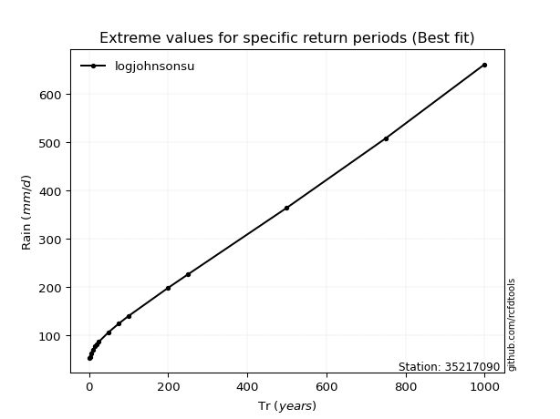</img>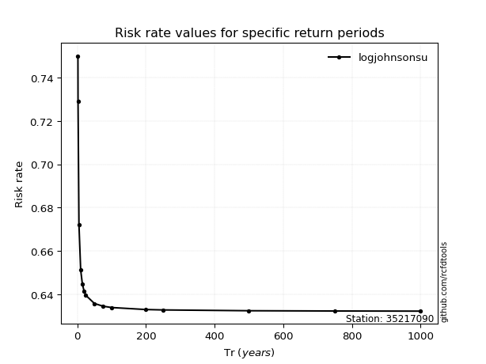</img>

</div>


<sub>**APP DISCLAIMER**: NO WARRANTY - This software is provided by [github.com/rcfdtools](https://github.com/rcfdtools) "as is", without any express or implied warranty, including warranties of merchantability, fitness for a particular purpose, or non-infringement. There is no guarantee that the software will be error-free or operate without interruption. LIMITATION OF LIABILITY - Neither the authors nor copyright holders will be liable for claims or damages arising from the software or its use. You are responsible for determining if the software is appropriate for your use and assume all associated risks, including errors, legal compliance, and data loss. NO PROFESSIONAL ADVICE - The software provides general information and does not offer professional advice. It should not replace consultation with professional advisors.</sub>