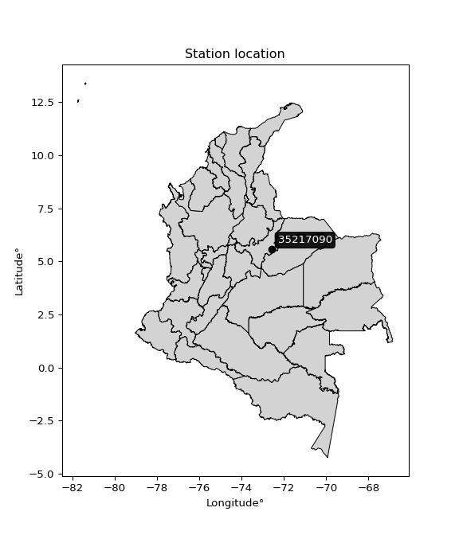

<div align="center">


</div>

# PMP Station (rain, Pmax24h): 35217090

Probable Maximum Precipitation (PMP) is the greatest amount of rainfall for a specific duration that is meteorologically possible for a given location, acting as a "worst-case" scenario for extreme storms, crucial for designing safety-critical infrastructure like bridges, river deviations, dams, spillways, and nuclear plants to prevent catastrophic failure. PMP is calculated by hydrologists using meteorological data to determine the upper limit of extreme rainfall, often leading to the Probable Maximum Flood (PMF) for flood control design, and is increasingly being studied for climate change impacts.

<div align="center">

</img>

</div>


## A. General information


### 1. General running parameters

• app_version: _v20251228_. • runtime: _2025-12-28 08:43:48.795225_. • Python version: _3.14.0_. • SciPy version: _1.16.3_. • Pandas version: _2.3.3_. • NumPy version: _2.3.5_. • Stations dataset (station_dataset_file): _dataset/pmax24h_in/automatic_colombia_2003_2024.csv_. • Stations catalog (station_catalog_file): _dataset/CNE_IDEAM.xls_. • Minimum year to eval til year_max (date_min): _1900_. • Maximum year to eval since year_min (date_max): _2024_. • Creates, save and include plots into reports (create_plot): _False_. • Plot only fit distributions with Δo > Δ (plot_only_fit): _True_. • Eval low extreme values, if False, evaluates high extreme values (low_extreme): _False_. • Eval every SciPy distribution as logarithmic (pdist_logarithmic_on): _True_. • Standard deviation normalized (ddof): _1.0_. • Return periods to eval in years (Tr): _[2, 2.33, 5, 10, 15, 20, 25, 50, 75, 100, 200, 250, 500, 750, 1000]_. • Minimum data sample per station, 0 means any (minimum_sample): _5_. • Z-Score maximum threshold to adjust a value, 0 means disable (zscore_max): _3.5_. • Z-Score minimum threshold to adjust a value, 0 means disable (zscore_min): _-2.5_. • Avoid zeros, e.g. rain = 0 (avoid_zeros): _True_. • Avoid null values (avoid_nans): _True_. [:file_folder:Dataset file.](../../dataset/pmax24h_in/automatic_colombia_2003_2024.csv)

> Delta Degrees of Freedom (DDOF): is a parameter used in the formulas for calculating variance and standard deviation. When ddof=0, the divisor is $N$ (the total number of observations) and this is used when your data set is the entire population. When ddof=1, the divisor is $N-1$ and this is used when your data set is a sample drawn from a larger population. Using $N-1$ provides an unbiased estimate of the population variance (known as Bessel´s correction).


### 2. Station info and location

|   id |   CODIGO | NOMBRE                         | CATEGORIA    | TECNOLOGIA                              | ESTADO   | FECHA_INSTALACION   |   FECHA_SUSPENSION |   ALTITUD |   LATITUD |   LONGITUD | DEPARTAMENTO   | MUNICIPIO      | AREA_OPERATIVA                              | ENTIDAD                                                     | AREA_HIDROGRAFICA   | ZONA_HIDROGRAFICA   | SUBZONA_HIDROGRAFICA   | CORRIENTE     | Catalogo   |
|-----:|---------:|:-------------------------------|:-------------|:----------------------------------------|:---------|:--------------------|-------------------:|----------:|----------:|-----------:|:---------------|:---------------|:--------------------------------------------|:------------------------------------------------------------|:--------------------|:--------------------|:-----------------------|:--------------|:-----------|
|    0 | 35217090 | LABRANZA GRANDE AUT [35217090] | Limnigráfica | Automática con Telemetría, Convencional | Activa   | 15/12/2016          |                nan |      1125 |   5.56692 |   -72.5836 | Boyacá         | Labranzagrande | Area Operativa 06 - Boyacá-Casanare-Vichada | INSTITUTO DE HIDROLOGIA METEOROLOGIA Y ESTUDIOS AMBIENTALES | Orinoco             | Meta                | Río Cravo Sur          | Rio Cravo Sur | CNE_IDEAM  |

<div align="center">

Map location in: [:earth_americas:Google](http://maps.google.com/maps?q=5.566916667,-72.58355556) [:earth_americas:OSM](https://www.openstreetmap.org/#map=18/5.566916667/-72.58355556&layers=P) [:earth_americas:Bing](https://www.bing.com/maps?cp=5.566916667~-72.58355556&lvl=18) [:earth_americas:Apple](https://maps.apple.com/frame?center=5.566916667%2C-72.58355556&span=0.003%2C0.006)

</div>


<div align="center">

```geojson
{
  "type": "Feature",
  "geometry": {
    "type": "Point", 
    "coordinates": [-72.58355556, 5.566916667]
  }, 
  "properties": {
    "Name": "35217090"
  }
}
```

</div>


### 3. Discrete values table and plot

|               |          0 |            1 |          2 |           3 |           4 |           5 |          6 |          7 |
|:--------------|-----------:|-------------:|-----------:|------------:|------------:|------------:|-----------:|-----------:|
| Date          | 2017       | 2018         | 2019       | 2020        | 2021        | 2022        | 2023       | 2024       |
| Value         |   14.7     |   49         |   60.7     |   36.4      |   42.6      |   56.5      |   54.7     |   91.6     |
| Value_initial |   14.7     |   49         |   60.7     |   36.4      |   42.6      |   56.5      |   54.7     |   91.6     |
| count         |    8       |    8         |    8       |    8        |    8        |    8        |    8       |    8       |
| mean          |   50.775   |   50.775     |   50.775   |   50.775    |   50.775    |   50.775    |   50.775   |   50.775   |
| std           |   22.011   |   22.011     |   22.011   |   22.011    |   22.011    |   22.011    |   22.011   |   22.011   |
| zscore        |   -1.63895 |   -0.0806414 |    0.45091 |   -0.653082 |   -0.371405 |    0.260097 |    0.17832 |    1.85475 |

> The initial value (value_initial) correspond to the initial obtained or null completed value, and value (value) is adjusted only when the initial value is outside the valid range definite through the Z-Score value. If Z-Score is active, values out of range or outliers are replaced with the station mean value


### 4. Active continuous probability distributions from SciPy (44 of 104 available)

[scipy.stats](https://docs.scipy.org/doc/scipy/reference/stats.html) is a Python´s powerful submodule within the SciPy library for comprehensive statistical analysis, offering over 130 probability distributions (like Normal, Poisson), functions for descriptive stats (mean, variance), hypothesis testing (t-tests, chi-square), random variable generation, and statistical tests, making it essential for data science, modeling, and research. It provides tools to explore, model, and draw conclusions from data efficiently, working seamlessly with NumPy.

<div align="center">

|   id | p_dist             |   n_parameter | fit_method   | label                                                                       | active   | ref                                                                                                        |
|-----:|:-------------------|--------------:|:-------------|:----------------------------------------------------------------------------|:---------|:-----------------------------------------------------------------------------------------------------------|
|    0 | alpha              |             3 | MLE          | Alpha                                                                       | True     | [:mortar_board:](https://docs.scipy.org/doc/scipy/reference/generated/scipy.stats.alpha.html)              |
|    1 | betaprime          |             4 | MLE          | Beta prime                                                                  | True     | [:mortar_board:](https://docs.scipy.org/doc/scipy/reference/generated/scipy.stats.betaprime.html)          |
|    2 | chi2               |             3 | MLE          | Chi²                                                                        | True     | [:mortar_board:](https://docs.scipy.org/doc/scipy/reference/generated/scipy.stats.chi2.html)               |
|    3 | crystalball        |             4 | MLE          | Crystalball                                                                 | True     | [:mortar_board:](https://docs.scipy.org/doc/scipy/reference/generated/scipy.stats.crystalball.html)        |
|    4 | erlang             |             3 | MLE          | Erlang                                                                      | True     | [:mortar_board:](https://docs.scipy.org/doc/scipy/reference/generated/scipy.stats.erlang.html)             |
|    5 | expon              |             2 | MLE          | Exponential                                                                 | True     | [:mortar_board:](https://docs.scipy.org/doc/scipy/reference/generated/scipy.stats.expon.html)              |
|    6 | exponnorm          |             3 | MLE          | Exponentially modified Normal                                               | True     | [:mortar_board:](https://docs.scipy.org/doc/scipy/reference/generated/scipy.stats.exponnorm.html)          |
|    7 | f                  |             4 | MLE          | F                                                                           | True     | [:mortar_board:](https://docs.scipy.org/doc/scipy/reference/generated/scipy.stats.f.html)                  |
|    8 | fatiguelife        |             3 | MLE          | Fatigue-life (Birnbaum-Saunders)                                            | True     | [:mortar_board:](https://docs.scipy.org/doc/scipy/reference/generated/scipy.stats.fatiguelife.html)        |
|    9 | fisk               |             3 | MLE          | Fisk                                                                        | True     | [:mortar_board:](https://docs.scipy.org/doc/scipy/reference/generated/scipy.stats.fisk.html)               |
|   10 | gamma              |             3 | MLE          | Gamma                                                                       | True     | [:mortar_board:](https://docs.scipy.org/doc/scipy/reference/generated/scipy.stats.gamma.html)              |
|   11 | genexpon           |             5 | MLE          | Generalized exponential                                                     | True     | [:mortar_board:](https://docs.scipy.org/doc/scipy/reference/generated/scipy.stats.genexpon.html)           |
|   12 | genlogistic        |             3 | MLE          | Generalized logistic                                                        | True     | [:mortar_board:](https://docs.scipy.org/doc/scipy/reference/generated/scipy.stats.genlogistic.html)        |
|   13 | gibrat             |             2 | MM           | Gibrat                                                                      | True     | [:mortar_board:](https://docs.scipy.org/doc/scipy/reference/generated/scipy.stats.gibrat.html)             |
|   14 | gompertz           |             3 | MLE          | Gompertz (or truncated Gumbel)                                              | True     | [:mortar_board:](https://docs.scipy.org/doc/scipy/reference/generated/scipy.stats.gompertz.html)           |
|   15 | gumbel_l           |             2 | MM           | Gumbel Left Skew                                                            | True     | [:mortar_board:](https://docs.scipy.org/doc/scipy/reference/generated/scipy.stats.gumbel_l.html)           |
|   16 | gumbel_r           |             2 | MM           | Gumbel Right Skew                                                           | True     | [:mortar_board:](https://docs.scipy.org/doc/scipy/reference/generated/scipy.stats.gumbel_r.html)           |
|   17 | halflogistic       |             2 | MM           | Half-logistic                                                               | True     | [:mortar_board:](https://docs.scipy.org/doc/scipy/reference/generated/scipy.stats.halflogistic.html)       |
|   18 | halfnorm           |             2 | MM           | Half Normal                                                                 | True     | [:mortar_board:](https://docs.scipy.org/doc/scipy/reference/generated/scipy.stats.halfnorm.html)           |
|   19 | hypsecant          |             2 | MM           | hyperbolic secant                                                           | True     | [:mortar_board:](https://docs.scipy.org/doc/scipy/reference/generated/scipy.stats.hypsecant.html)          |
|   20 | invgamma           |             3 | MLE          | Inverted gamma                                                              | True     | [:mortar_board:](https://docs.scipy.org/doc/scipy/reference/generated/scipy.stats.invgamma.html)           |
|   21 | invgauss           |             3 | MLE          | Inverse Gaussian                                                            | True     | [:mortar_board:](https://docs.scipy.org/doc/scipy/reference/generated/scipy.stats.invgauss.html)           |
|   22 | invweibull         |             3 | MLE          | Inverted Weibull                                                            | True     | [:mortar_board:](https://docs.scipy.org/doc/scipy/reference/generated/scipy.stats.invweibull.html)         |
|   23 | johnsonsu          |             4 | MLE          | Johnson Su                                                                  | True     | [:mortar_board:](https://docs.scipy.org/doc/scipy/reference/generated/scipy.stats.johnsonsu.html)          |
|   24 | kstwobign          |             2 | MLE          | Limiting distribution of scaled Kolmogorov-Smirnov two-sided test statistic | True     | [:mortar_board:](https://docs.scipy.org/doc/scipy/reference/generated/scipy.stats.kstwobign.html)          |
|   25 | laplace            |             2 | MM           | Laplace                                                                     | True     | [:mortar_board:](https://docs.scipy.org/doc/scipy/reference/generated/scipy.stats.laplace.html)            |
|   26 | laplace_asymmetric |             3 | MLE          | Asymmetric Laplace                                                          | True     | [:mortar_board:](https://docs.scipy.org/doc/scipy/reference/generated/scipy.stats.laplace_asymmetric.html) |
|   27 | loggamma           |             3 | MLE          | Log gamma                                                                   | True     | [:mortar_board:](https://docs.scipy.org/doc/scipy/reference/generated/scipy.stats.loggamma.html)           |
|   28 | logistic           |             2 | MM           | Logistic (or Sech-squared)                                                  | True     | [:mortar_board:](https://docs.scipy.org/doc/scipy/reference/generated/scipy.stats.logistic.html)           |
|   29 | lognorm            |             3 | MLE          | Log Normal                                                                  | True     | [:mortar_board:](https://docs.scipy.org/doc/scipy/reference/generated/scipy.stats.lognorm.html)            |
|   30 | maxwell            |             2 | MM           | Maxwell                                                                     | True     | [:mortar_board:](https://docs.scipy.org/doc/scipy/reference/generated/scipy.stats.maxwell.html)            |
|   31 | mielke             |             4 | MLE          | Mielke Beta-Kappa / Dagum                                                   | True     | [:mortar_board:](https://docs.scipy.org/doc/scipy/reference/generated/scipy.stats.mielke.html)             |
|   32 | moyal              |             2 | MM           | Moyal                                                                       | True     | [:mortar_board:](https://docs.scipy.org/doc/scipy/reference/generated/scipy.stats.moyal.html)              |
|   33 | nakagami           |             3 | MLE          | Nakagami                                                                    | True     | [:mortar_board:](https://docs.scipy.org/doc/scipy/reference/generated/scipy.stats.nakagami.html)           |
|   34 | ncf                |             5 | MLE          | Non-central F distribution                                                  | True     | [:mortar_board:](https://docs.scipy.org/doc/scipy/reference/generated/scipy.stats.ncf.html)                |
|   35 | nct                |             4 | MLE          | Non-central Student’s t                                                     | True     | [:mortar_board:](https://docs.scipy.org/doc/scipy/reference/generated/scipy.stats.nct.html)                |
|   36 | norm               |             2 | MM           | Normal                                                                      | True     | [:mortar_board:](https://docs.scipy.org/doc/scipy/reference/generated/scipy.stats.norm.html)               |
|   37 | pearson3           |             3 | MM           | Pearson type III                                                            | True     | [:mortar_board:](https://docs.scipy.org/doc/scipy/reference/generated/scipy.stats.pearson3.html)           |
|   38 | rayleigh           |             2 | MM           | Rayleigh                                                                    | True     | [:mortar_board:](https://docs.scipy.org/doc/scipy/reference/generated/scipy.stats.rayleigh.html)           |
|   39 | rice               |             3 | MLE          | Rice                                                                        | True     | [:mortar_board:](https://docs.scipy.org/doc/scipy/reference/generated/scipy.stats.rice.html)               |
|   40 | t                  |             3 | MLE          | Student’s t                                                                 | True     | [:mortar_board:](https://docs.scipy.org/doc/scipy/reference/generated/scipy.stats.t.html)                  |
|   41 | truncnorm          |             4 | MLE          | Truncated normal                                                            | True     | [:mortar_board:](https://docs.scipy.org/doc/scipy/reference/generated/scipy.stats.truncnorm.html)          |
|   42 | wald               |             2 | MM           | Wald                                                                        | True     | [:mortar_board:](https://docs.scipy.org/doc/scipy/reference/generated/scipy.stats.wald.html)               |
|   43 | weibull_min        |             3 | MLE          | Weibull minimum                                                             | True     | [:mortar_board:](https://docs.scipy.org/doc/scipy/reference/generated/scipy.stats.weibull_min.html)        |

</div>

> **n_parameter:** # arguments & localization & scale.
>
> **Fit methods:** (MLE) maximum likelihood, (MM) L-moments.
>
>**Inactive:** foldnorm, gennorm, norminvgauss, powernorm, powerlognorm, skewnorm, genextreme, anglit, arcsine, argus, beta, bradford, burr, burr12, cauchy, cosine, halfcauchy, foldcauchy, skewcauchy, wrapcauchy, dgamma, gengamma, exponweib, exponpow, truncexpon, gausshyper, genhalflogistic, genhyperbolic, geninvgauss, halfgennorm, johnsonsb, kappa4, kappa3, ksone, kstwo, loglaplace, levy, levy_l, levy_stable, ncx2, pareto, genpareto, truncpareto, lomax, powerlaw, rdist, rel_breitwigner, recipinvgauss, semicircular, studentized_range, trapezoid, triang, truncweibull_min, tukeylambda, uniform, loguniform, vonmises, vonmises_line, weibull_max, dweibull, 


## B. Probability distributions vs. Empirical distributions

A continuous probability distribution (CPD) describes probabilities for variables that can take any value within a range (like rain any time), unlike discrete variables with specific outcomes (like temperature). It uses a Probability Density Function (PDF), a curve where the total area under it equals 1, and the probability of the variable falling within an interval (a to b) is found by calculating the area under the curve between those points. A key feature is that the probability of hitting any single exact value is zero, so probabilities are always expressed for ranges, e.g., $P(a ≤ X ≤ b)$.

<div align="center">

Distributions parameters from station values
|    |   station | p_dist                |   n |             loc |            scale | shape                 | shape1                 | shape2                | shape3   |
|---:|----------:|:----------------------|----:|----------------:|-----------------:|:----------------------|:-----------------------|:----------------------|:---------|
|  0 |  35217090 | alpha                 |   8 |  -300.321       |   5975.31        | 17.082809329488313    |                        |                       |          |
|  1 |  35217090 | betaprime             |   8 |  -114.2         |   9691.94        | 65.35138189140287     | 3840.249981092904      |                       |          |
|  2 |  35217090 | chi2                  |   8 |  -110.152       |      1.31779     | 122.12192417006293    |                        |                       |          |
|  3 |  35217090 | crystalball           |   8 |    50.775       |     20.5894      | 22436.82861806914     | 122.33742539791255     |                       |          |
|  4 |  35217090 | erlang                |   8 |  -111.831       |      2.60541     | 62.41102088279148     |                        |                       |          |
|  5 |  35217090 | expon                 |   8 |    14.7         |     36.075       |                       |                        |                       |          |
|  6 |  35217090 | exponnorm             |   8 |    38.1141      |     16.4539      | 0.7694774612855586    |                        |                       |          |
|  7 |  35217090 | f                     |   8 |  -113.026       |    163.781       | 127.67164114735178    | 16308.81135773865      |                       |          |
|  8 |  35217090 | fatiguelife           |   8 |    14.7         |      0.00120453  | 188.20751903641178    |                        |                       |          |
|  9 |  35217090 | fisk                  |   8 |  -208.681       |    258.692       | 23.17485014732134     |                        |                       |          |
| 10 |  35217090 | gamma                 |   8 |  -111.831       |      2.60541     | 62.41095056721345     |                        |                       |          |
| 11 |  35217090 | genexpon              |   8 |    14.699       |      2.22758     | 0.06167192233248891   | 2.4637681705291495e-07 | 0.850761305158978     |          |
| 12 |  35217090 | genlogistic           |   8 |    47.327       |     11.8678      | 1.1907817782507983    |                        |                       |          |
| 13 |  35217090 | gibrat                |   8 |    35.0679      |      9.52685     |                       |                        |                       |          |
| 14 |  35217090 | gompertz              |   8 |   -75.7055      |     21.4655      | 0.0016893203786301054 |                        |                       |          |
| 15 |  35217090 | gumbel_l              |   8 |    60.0413      |     16.0535      |                       |                        |                       |          |
| 16 |  35217090 | gumbel_r              |   8 |    41.5087      |     16.0535      |                       |                        |                       |          |
| 17 |  35217090 | halflogistic          |   8 |    26.3717      |     17.6032      |                       |                        |                       |          |
| 18 |  35217090 | halfnorm              |   8 |    23.5227      |     34.1557      |                       |                        |                       |          |
| 19 |  35217090 | hypsecant             |   8 |    50.775       |     13.1076      |                       |                        |                       |          |
| 20 |  35217090 | invgamma              |   8 |  -134.938       |  14419.8         | 78.59929898407177     |                        |                       |          |
| 21 |  35217090 | invgauss              |   8 |   -92.598       |   6672.74        | 0.021449536354172016  |                        |                       |          |
| 22 |  35217090 | invweibull            |   8 |    14.7         |      1.913       | 0.05674443844025526   |                        |                       |          |
| 23 |  35217090 | johnsonsu             |   8 |    50.7309      |     14.2689      | 0.0140571012667729    | 1.0233869983054578     |                       |          |
| 24 |  35217090 | kstwobign             |   8 |   -29.0145      |     91.651       |                       |                        |                       |          |
| 25 |  35217090 | laplace               |   8 |    50.775       |     14.5589      |                       |                        |                       |          |
| 26 |  35217090 | laplace_asymmetric    |   8 |    54.7         |     14.7101      | 1.1422677033239892    |                        |                       |          |
| 27 |  35217090 | loggamma              |   8 | -5637.44        |    784.075       | 1415.0407441893603    |                        |                       |          |
| 28 |  35217090 | logistic              |   8 |    50.775       |     11.3515      |                       |                        |                       |          |
| 29 |  35217090 | lognorm               |   8 |    14.7         |      0.348619    | 12.443819756074186    |                        |                       |          |
| 30 |  35217090 | maxwell               |   8 |     1.98671     |     30.5735      |                       |                        |                       |          |
| 31 |  35217090 | mielke                |   8 |    -0.534005    |     63.9486      | 2.520802637417231     | 6.736648946466008      |                       |          |
| 32 |  35217090 | moyal                 |   8 |    39.0006      |      9.2685      |                       |                        |                       |          |
| 33 |  35217090 | nakagami              |   8 |    36.4         |     27.2104      | 0.07779455374462552   |                        |                       |          |
| 34 |  35217090 | ncf                   |   8 |    -2.20489     |     59.0831      | 5.14362216828307      | 206.7426828546404      | 8.679561120166537e-11 |          |
| 35 |  35217090 | nct                   |   8 |    -0.0539489   |     18.6814      | 28.63927119138468     | 2.6489607238944375     |                       |          |
| 36 |  35217090 | norm                  |   8 |    50.775       |     20.5894      |                       |                        |                       |          |
| 37 |  35217090 | pearson3              |   8 |    50.775       |     20.5895      | 0.2691794303173066    |                        |                       |          |
| 38 |  35217090 | rayleigh              |   8 |    11.3862      |     31.4277      |                       |                        |                       |          |
| 39 |  35217090 | rice                  |   8 |     4.10397     |     23.0416      | 1.7032790135219509    |                        |                       |          |
| 40 |  35217090 | t                     |   8 |    50.2223      |     13.4941      | 2.623474491054493     |                        |                       |          |
| 41 |  35217090 | truncnorm             |   8 |    50.775       |     20.5894      | -193.87258915682014   | 486.1020039504049      |                       |          |
| 42 |  35217090 | wald                  |   8 |    30.1856      |     20.5894      |                       |                        |                       |          |
| 43 |  35217090 | weibull_min           |   8 |    -0.0650876   |     57.1263      | 2.6428129080802814    |                        |                       |          |
| 44 |  35217090 | logalpha              |   8 |   -11.043       |    420.255       | 28.326371745684185    |                        |                       |          |
| 45 |  35217090 | logbetaprime          |   8 |    -0.69021     | 135774           | 66.90148418957665     | 2011026.8938280637     |                       |          |
| 46 |  35217090 | logchi2               |   8 |     2.68785     |      0.980174    | 1.0331153767062378    |                        |                       |          |
| 47 |  35217090 | logcrystalball        |   8 |     3.8232      |      0.49868     | 7.8963801495829316    | 135.16316083103885     |                       |          |
| 48 |  35217090 | logerlang             |   8 |    -4.66513     |      0.0325948   | 260.20047734120743    |                        |                       |          |
| 49 |  35217090 | logexpon              |   8 |     2.68785     |      1.13535     |                       |                        |                       |          |
| 50 |  35217090 | logexponnorm          |   8 |     3.8229      |      0.498681    | 0.0006074492380143391 |                        |                       |          |
| 51 |  35217090 | logf                  |   8 |  -654.989       |    658.813       | 11485784.37345073     | 4941011.417618742      |                       |          |
| 52 |  35217090 | logfatiguelife        |   8 |  -316.249       |    320.072       | 0.0015536873299107547 |                        |                       |          |
| 53 |  35217090 | logfisk               |   8 |    -9.67115e+07 |      9.67115e+07 | 377181256.8757022     |                        |                       |          |
| 54 |  35217090 | loggamma              |   8 |    -5.43355     |      0.0290718   | 318.30427863355044    |                        |                       |          |
| 55 |  35217090 | loggenexpon           |   8 |     2.60431     |      0.0106737   | 0.0013145130047822022 | 3.0259000207741105     | 3.674682462750522e-05 |          |
| 56 |  35217090 | loggenlogistic        |   8 |     4.15233     |      0.149339    | 0.3695645873274692    |                        |                       |          |
| 57 |  35217090 | loggibrat             |   8 |     3.44271     |      0.23077     |                       |                        |                       |          |
| 58 |  35217090 | loggompertz           |   8 |     2.68785     |      0.416525    | 0.04163881623573131   |                        |                       |          |
| 59 |  35217090 | loggumbel_l           |   8 |     4.04763     |      0.388819    |                       |                        |                       |          |
| 60 |  35217090 | loggumbel_r           |   8 |     3.59876     |      0.388819    |                       |                        |                       |          |
| 61 |  35217090 | loghalflogistic       |   8 |     3.23215     |      0.426351    |                       |                        |                       |          |
| 62 |  35217090 | loghalfnorm           |   8 |     3.16312     |      0.827282    |                       |                        |                       |          |
| 63 |  35217090 | loghypsecant          |   8 |     3.8232      |      0.31747     |                       |                        |                       |          |
| 64 |  35217090 | loginvgamma           |   8 |    -9.64583     |   9230.86        | 686.6005629302849     |                        |                       |          |
| 65 |  35217090 | loginvgauss           |   8 |    -2.29219     |    795.539       | 0.007675014692103889  |                        |                       |          |
| 66 |  35217090 | loginvweibull         |   8 |    -5.07969e+07 |      5.07969e+07 | 86544105.34561308     |                        |                       |          |
| 67 |  35217090 | logjohnsonsu          |   8 |     4.02776     |      0.145749    | 0.41414073490956116   | 0.7133629908638035     |                       |          |
| 68 |  35217090 | logkstwobign          |   8 |     1.40942     |      2.7663      |                       |                        |                       |          |
| 69 |  35217090 | loglaplace            |   8 |     3.8232      |      0.35262     |                       |                        |                       |          |
| 70 |  35217090 | loglaplace_asymmetric |   8 |     4.03424     |      0.296183    | 1.4180490271550592    |                        |                       |          |
| 71 |  35217090 | logloggamma           |   8 |     4.09382     |      0.354518    | 0.8956366025201934    |                        |                       |          |
| 72 |  35217090 | loglogistic           |   8 |     3.8232      |      0.274937    |                       |                        |                       |          |
| 73 |  35217090 | loglognorm            |   8 |     2.68785     |      0.0148522   | 11.771735238632894    |                        |                       |          |
| 74 |  35217090 | logmaxwell            |   8 |     2.64153     |      0.740497    |                       |                        |                       |          |
| 75 |  35217090 | logmielke             |   8 |    -7.75019e+06 |      7.7502e+06  | 19158705.57228335     | 51887848.16573261      |                       |          |
| 76 |  35217090 | logmoyal              |   8 |     3.53802     |      0.224485    |                       |                        |                       |          |
| 77 |  35217090 | lognakagami           |   8 |     3.59457     |      0.470432    | 0.37761300288978666   |                        |                       |          |
| 78 |  35217090 | logncf                |   8 |    -4.63851     |      8.44628     | 679.1476903766479     | 853.3112587746205      | 0.009080483098916521  |          |
| 79 |  35217090 | lognct                |   8 |   -28.3892      |      0.487459    | 40190.5326000027      | 66.0816108304859       |                       |          |
| 80 |  35217090 | lognorm               |   8 |     3.8232      |      0.49868     |                       |                        |                       |          |
| 81 |  35217090 | logpearson3           |   8 |     3.8232      |      0.498681    | -1.1120083878429912   |                        |                       |          |
| 82 |  35217090 | lograyleigh           |   8 |     2.86919     |      0.76119     |                       |                        |                       |          |
| 83 |  35217090 | logrice               |   8 |  -385.204       |      0.49893     | 779.7225040080966     |                        |                       |          |
| 84 |  35217090 | logt                  |   8 |     3.94074     |      0.224734    | 1.590696043694994     |                        |                       |          |
| 85 |  35217090 | logtruncnorm          |   8 |    -0.192796    |      1.17504     | 3.2231807570161184    | 4.008576298784407      |                       |          |
| 86 |  35217090 | logwald               |   8 |     3.32447     |      0.498719    |                       |                        |                       |          |
| 87 |  35217090 | logweibull_min        |   8 |    -8.12195e+06 |      8.12195e+06 | 21439845.24091033     |                        |                       |          |

</div>

> **loc** (Location parameter): This shifts the distribution along the x-axis. For many common distributions, like the normal (Gaussian) distribution, loc represents the mean $μ$. For others, like the uniform distribution, it might represent the minimum value, or for the beta distribution, the left end of the support interval.
>
> **scale** (Scale parameter): This determines the width or spread of the distribution. For the normal distribution, scale represents the standard deviation $σ$. For a uniform distribution, it defines the length of the interval (from $loc$ to $loc + scale$).
>
> **shape** (Shape parameters): Refers to parameters that define the specific form of a probability distribution, distinct from its location (loc) and scale (scale). These parameters are required arguments for most distribution functions. For example, a normal (Gaussian) distribution is fully defined by its location (mean) and scale (standard deviation), so it has no specific shape parameters beyond loc and scale. However, other distributions have intrinsic properties that need specification, as Gamma distribution that takes a shape parameter, often named $a$ or $alpha$.


### 0. Cumulative distribution values - CDF (88 evaluated)

Cumulative Distribution Function (CDF), denoted as $F$<sub>$X$</sub>$(x)$, is a function that gives the probability that a random variable $X$ will take a value less than or equal to a specific value, $x$ (i.e., $(P(X≥x)$. It essentially "accumulates" probabilities from a given point up to the far right (positive infinity), providing a complete picture of the distribution´s probabilities for both discrete (like rain) and continuous (like temperature) variables, helping to find probabilities over ranges or above certain values.

<div align="center">

CDF ordered by x ascending and calculating $log(f(x))$ separately
|   id |   Station |   date |    x |   count |   mean |    std |     zscore |   Value_initial |   station |   m |     alpha |   alpha_pdf |   betaprime |   betaprime_pdf |      chi2 |   chi2_pdf |   crystalball |   crystalball_pdf |    erlang |   erlang_pdf |    expon |   expon_pdf |   exponnorm |   exponnorm_pdf |         f |      f_pdf |   fatiguelife |   fatiguelife_pdf |      fisk |   fisk_pdf |     gamma |   gamma_pdf |    genexpon |   genexpon_pdf |   genlogistic |   genlogistic_pdf |    gibrat |   gibrat_pdf |   gompertz |   gompertz_pdf |   gumbel_l |   gumbel_l_pdf |   gumbel_r |   gumbel_r_pdf |   halflogistic |   halflogistic_pdf |   halfnorm |   halfnorm_pdf |   hypsecant |   hypsecant_pdf |   invgamma |   invgamma_pdf |   invgauss |   invgauss_pdf |   invweibull |   invweibull_pdf |   johnsonsu |   johnsonsu_pdf |   kstwobign |   kstwobign_pdf |   laplace |   laplace_pdf |   laplace_asymmetric |   laplace_asymmetric_pdf |   loggamma |   loggamma_pdf |   logistic |   logistic_pdf |   lognorm |   lognorm_pdf |   maxwell |   maxwell_pdf |    mielke |   mielke_pdf |       moyal |   moyal_pdf |   nakagami |   nakagami_pdf |       ncf |    ncf_pdf |       nct |    nct_pdf |      norm |   norm_pdf |   pearson3 |   pearson3_pdf |   rayleigh |   rayleigh_pdf |      rice |   rice_pdf |         t |      t_pdf |   truncnorm |   truncnorm_pdf |     wald |   wald_pdf |   weibull_min |   weibull_min_pdf |   logalpha |   logalpha_pdf |   logbetaprime |   logbetaprime_pdf |    logchi2 |   logchi2_pdf |   logcrystalball |   logcrystalball_pdf |   logerlang |   logerlang_pdf |   logexpon |   logexpon_pdf |   logexponnorm |   logexponnorm_pdf |      logf |   logf_pdf |   logfatiguelife |   logfatiguelife_pdf |    logfisk |   logfisk_pdf |   loggenexpon |   loggenexpon_pdf |   loggenlogistic |   loggenlogistic_pdf |   loggibrat |   loggibrat_pdf |   loggompertz |   loggompertz_pdf |   loggumbel_l |   loggumbel_l_pdf |   loggumbel_r |   loggumbel_r_pdf |   loghalflogistic |   loghalflogistic_pdf |   loghalfnorm |   loghalfnorm_pdf |   loghypsecant |   loghypsecant_pdf |   loginvgamma |   loginvgamma_pdf |   loginvgauss |   loginvgauss_pdf |   loginvweibull |   loginvweibull_pdf |   logjohnsonsu |   logjohnsonsu_pdf |   logkstwobign |   logkstwobign_pdf |   loglaplace |   loglaplace_pdf |   loglaplace_asymmetric |   loglaplace_asymmetric_pdf |   logloggamma |   logloggamma_pdf |   loglogistic |   loglogistic_pdf |   loglognorm |   loglognorm_pdf |   logmaxwell |   logmaxwell_pdf |   logmielke |   logmielke_pdf |    logmoyal |   logmoyal_pdf |   lognakagami |   lognakagami_pdf |    logncf |   logncf_pdf |   lognct |   lognct_pdf |   logpearson3 |   logpearson3_pdf |   lograyleigh |   lograyleigh_pdf |   logrice |   logrice_pdf |      logt |   logt_pdf |   logtruncnorm |   logtruncnorm_pdf |   logwald |   logwald_pdf |   logweibull_min |   logweibull_min_pdf |
|-----:|----------:|-------:|-----:|--------:|-------:|-------:|-----------:|----------------:|----------:|----:|----------:|------------:|------------:|----------------:|----------:|-----------:|--------------:|------------------:|----------:|-------------:|---------:|------------:|------------:|----------------:|----------:|-----------:|--------------:|------------------:|----------:|-----------:|----------:|------------:|------------:|---------------:|--------------:|------------------:|----------:|-------------:|-----------:|---------------:|-----------:|---------------:|-----------:|---------------:|---------------:|-------------------:|-----------:|---------------:|------------:|----------------:|-----------:|---------------:|-----------:|---------------:|-------------:|-----------------:|------------:|----------------:|------------:|----------------:|----------:|--------------:|---------------------:|-------------------------:|-----------:|---------------:|-----------:|---------------:|----------:|--------------:|----------:|--------------:|----------:|-------------:|------------:|------------:|-----------:|---------------:|----------:|-----------:|----------:|-----------:|----------:|-----------:|-----------:|---------------:|-----------:|---------------:|----------:|-----------:|----------:|-----------:|------------:|----------------:|---------:|-----------:|--------------:|------------------:|-----------:|---------------:|---------------:|-------------------:|-----------:|--------------:|-----------------:|---------------------:|------------:|----------------:|-----------:|---------------:|---------------:|-------------------:|----------:|-----------:|-----------------:|---------------------:|-----------:|--------------:|--------------:|------------------:|-----------------:|---------------------:|------------:|----------------:|--------------:|------------------:|--------------:|------------------:|--------------:|------------------:|------------------:|----------------------:|--------------:|------------------:|---------------:|-------------------:|--------------:|------------------:|--------------:|------------------:|----------------:|--------------------:|---------------:|-------------------:|---------------:|-------------------:|-------------:|-----------------:|------------------------:|----------------------------:|--------------:|------------------:|--------------:|------------------:|-------------:|-----------------:|-------------:|-----------------:|------------:|----------------:|------------:|---------------:|--------------:|------------------:|----------:|-------------:|---------:|-------------:|--------------:|------------------:|--------------:|------------------:|----------:|--------------:|----------:|-----------:|---------------:|-------------------:|----------:|--------------:|-----------------:|---------------------:|
|    0 |  35217090 |   2017 | 14.7 |       8 | 50.775 | 22.011 | -1.63895   |            14.7 |  35217090 |   1 | 0.0297048 |  0.00406346 |   0.0314934 |      0.00407247 | 0.0314706 | 0.00407673 |     0.0398772 |        0.00417489 | 0.0315046 |   0.00407442 | 0        |  0.02772    |   0.0294762 |      0.00378254 | 0.0315035 | 0.00407353 |     0.0183816 |       6.03563e+06 | 0.0322605 | 0.00323893 | 0.0315046 |  0.00407442 | 2.88909e-05 |     0.0276848  |     0.0351707 |        0.00331672 | 0         |   0          |   0.106212 |     0.00474576 |  0.0576184 |    0.0034837   | 0.00493236 |     0.00163207 |       0        |         0          |   0        |     0          |   0.0405528 |      0.00308547 |  0.0282607 |     0.004109   |  0.0282825 |     0.00417757 |  0.000801991 |      1.82623e+11 |   0.0463611 |      0.00256378 |   0.0231984 |      0.00522499 | 0.0419612 |    0.00288217 |            0.0523656 |               0.00311648 |  0.0119059 |      0.0652715 |  0.0400028 |     0.00338302 | 0.0114019 |      0.059914 |  0.018161 |    0.00413878 | 0.0268836 |   0.0044482  | 0.000207578 | 0.000164066 |  0         |    0           | 0.0758444 | 0.00923322 | 0.0317262 | 0.00385771 | 0.0398772 | 0.00417489 |  0.0309691 |     0.00406538 | 0.00554349 |     0.00333644 | 0.0253407 | 0.00488018 | 0.0449542 | 0.00259047 |   0.0398772 |      0.00417489 | 0        | 0          |     0.0276069 |        0.00487254 |  0.0112967 |      0.0660648 |      0.0130478 |          0.0739505 | 9.3468e-09 |   1.08721e+07 |        0.0114019 |             0.059914 |   0.0129347 |       0.0697524 |   0        |       0.880787 |      0.0114016 |          0.0599128 | 0.0116516 |  0.0608566 |        0.0110733 |            0.0587818 | 0.00922508 |     0.0356465 |     0.0135988 |          0.201886 |        0.0266719 |            0.0660006 |    0        |        0        |   1.07259e-07 |         0.0999675 |      0.029828 |         0.0755586 |   3.01274e-05 |       0.000806618 |          0        |              0        |      0        |          0        |      0.0178084 |          0.0560655 |     0.0105885 |         0.0612632 |     0.0110442 |         0.0670243 |       0.0131246 |           0.0968951 |      0.0479562 |          0.0527968 |       0.016814 |           0.13879  |    0.0199825 |        0.0566687 |               0.0270697 |                   0.0644512 |     0.0295883 |         0.0740056 |     0.0158363 |         0.0566875 |   0.00407977 |      2.30662e+12 |  6.49951e-05 |       0.00420676 |   0.0267588 |       0.0661449 | 3.06806e-11 |    3.08139e-09 |   0           |          0        | 0.0257835 |     0.111788 | 0.011541 |    0.0605373 |     0.0304224 |         0.0808102 |      0        |          0        | 0.0114364 |     0.0600415 | 0.0248895 |  0.0304846 |     0          |           0        |  0        |      0        |        0.0274894 |            0.0715583 |
|    1 |  35217090 |   2020 | 36.4 |       8 | 50.775 | 22.011 | -0.653082  |            36.4 |  35217090 |   2 | 0.253742  |  0.016879   |   0.248993  |      0.0163865  | 0.249151  | 0.0163903  |     0.242534  |        0.0151851  | 0.24902   |   0.016384   | 0.452024 |  0.0151899  |   0.244872  |      0.0168743  | 0.249002  | 0.0163845  |     0.762113  |       0.00508395  | 0.222254  | 0.0163454  | 0.24902   |  0.016384   | 0.451632    |     0.015182   |     0.224127  |        0.0160833  | 0.0245714 |   0.0432423  |   0.267676 |     0.010686   |  0.204922  |    0.0113572   | 0.252918   |     0.0216578  |       0.27738  |         0.0262185  |   0.293839 |     0.0217576  |   0.2052    |      0.014593   |  0.257732  |     0.017089   |  0.261407  |     0.0172872  |  0.418423    |      0.000953297 |   0.186445  |      0.0135732  |   0.311734  |      0.0183166  | 0.186278  |    0.0127948  |            0.190509  |               0.0113379  |  0.337335  |      0.715933  |  0.219883  |     0.0151111  | 0.323309  |      0.720188 |  0.263006 |    0.0175485  | 0.248344  |   0.0165401  | 0.249891    | 0.0255474   |  0.0032105 |    7.03009e+10 | 0.33642   | 0.012986   | 0.244371  | 0.0164914  | 0.242534  | 0.0151851  |  0.249495  |     0.016462   | 0.27148    |     0.01845    | 0.255596  | 0.016129   | 0.195349  | 0.01464    |   0.242534  |      0.0151851  | 0.167686 | 0.0521122  |     0.263115  |        0.0163061  |  0.35037   |      0.726794  |      0.349485  |          0.694125  | 0.652781   |   0.271602    |        0.323309  |             0.720188 |   0.34301   |       0.711612  |   0.550054 |       0.396306 |      0.323305  |          0.720183  | 0.323683  |  0.717102  |        0.322531  |            0.721995  | 0.242267   |     0.71595   |     0.451153  |          0.597134 |        0.249323  |            0.602606  |    0.33779  |        2.40687  |   0.277878    |         0.636609  |      0.267912 |         0.587174  |   0.363911    |       0.946089    |          0.401154 |              0.984019 |      0.397999 |          0.841831 |      0.288346  |          0.789041  |     0.339381  |         0.728304  |     0.354332  |         0.72222   |       0.396723  |           0.624888  |      0.190307  |          0.423964  |       0.439372 |           0.594036 |    0.261449  |        0.741447  |               0.234454  |                   0.558221  |     0.263492  |         0.583599  |     0.303315  |         0.768594  |   0.636562   |      0.0351645   |  0.353335    |       0.779651   |   0.249541  |       0.602501  | 0.377964    |    1.06226     |   3.50134e-12 |       5954.45     | 0.363664  |     0.626171 | 0.323948 |    0.718631  |     0.271788  |         0.56781   |      0.364958 |          0.795029 | 0.323398  |     0.719909  | 0.146545  |  0.468535  |     1.0553e-05 |           3.12159  |  0.40038  |      1.65311  |        0.26308   |            0.593846  |
|    2 |  35217090 |   2021 | 42.6 |       8 | 50.775 | 22.011 | -0.371405  |            42.6 |  35217090 |   3 | 0.366206  |  0.0191203  |   0.358804  |      0.0187876  | 0.358959  | 0.0187825  |     0.345666  |        0.0179074  | 0.358809  |   0.0187836  | 0.538553 |  0.0127913  |   0.358922  |      0.0196282  | 0.358798  | 0.0187852  |     0.790629  |       0.00416937  | 0.337692  | 0.0206271  | 0.358809  |  0.0187836  | 0.538124    |     0.0127873  |     0.337566  |        0.0202639  | 0.407128  |   0.0515238  |   0.340597 |     0.012844   |  0.286385  |    0.0149987   | 0.392869   |     0.0228641  |       0.430854 |         0.0231311  |   0.423524 |     0.0199864  |   0.313221  |      0.0202222  |  0.370721  |     0.0190676  |  0.375491  |     0.0192182  |  0.423617    |      0.000740028 |   0.294107  |      0.0214705  |   0.425292  |      0.0180607  | 0.285173  |    0.0195875  |            0.275527  |               0.0163977  |  0.454909  |      0.767959  |  0.327356  |     0.0193977  | 0.443121  |      0.791851 |  0.377331 |    0.0190574  | 0.361285  |   0.0197241  | 0.410214    | 0.0252527   |  0.677753  |    0.0169446   | 0.41566   | 0.0125054  | 0.355788  | 0.0191834  | 0.345666  | 0.0179074  |  0.359699  |     0.0188346  | 0.389341   |     0.0192983  | 0.362471  | 0.0181508  | 0.308406  | 0.0218749  |   0.345666  |      0.0179074  | 0.448596 | 0.0363134  |     0.37021   |        0.0180376  |  0.468478  |      0.763559  |      0.462019  |          0.72689   | 0.692264   |   0.232008    |        0.443121  |             0.791851 |   0.459484  |       0.758603  |   0.608262 |       0.345037 |      0.443116  |          0.791849  | 0.442915  |  0.787813  |        0.442671  |            0.794109  | 0.371248   |     0.910365  |     0.543007  |          0.567092 |        0.362213  |            0.838935  |    0.614998 |        1.2365   |   0.38984     |         0.784698  |      0.373333 |         0.753219  |   0.509393    |       0.88371     |          0.54376  |              0.825992 |      0.523318 |          0.74871  |      0.429064  |          0.977852  |     0.45868   |         0.776926  |     0.471157  |         0.752191  |       0.493027  |           0.594029  |      0.280682  |          0.770479  |       0.529771 |           0.5521   |    0.408417  |        1.15823   |               0.340954  |                   0.811791  |     0.368895  |         0.757484  |     0.43549   |         0.894163  |   0.64165    |      0.0298217   |  0.477498    |       0.787153   |   0.36239   |       0.838514  | 0.534541    |    0.910148    |   0.336659    |          1.56761  | 0.464655  |     0.650869 | 0.443422 |    0.789192  |     0.372672  |         0.715274  |      0.489479 |          0.777722 | 0.443156  |     0.791466  | 0.253994  |  0.949714  |     0.397736   |           2.00961  |  0.604338 |      0.996392 |        0.370223  |            0.768698  |
|    3 |  35217090 |   2018 | 49   |       8 | 50.775 | 22.011 | -0.0806414 |            49   |  35217090 |   4 | 0.490954  |  0.0195303  |   0.482352  |      0.0195006  | 0.482446  | 0.0194874  |     0.46565   |        0.0193042  | 0.482331  |   0.0194968  | 0.613567 |  0.0107119  |   0.48813   |      0.0203584  | 0.482332  | 0.0194987  |     0.815027  |       0.00348859  | 0.477331  | 0.0224379  | 0.482331  |  0.0194968  | 0.613123    |     0.010711   |     0.475013  |        0.0221538  | 0.648058  |   0.0266393  |   0.429738 |     0.0149661  |  0.395098  |    0.0189415   | 0.534138   |     0.0208651  |       0.566756 |         0.0192802  |   0.544282 |     0.0176872  |   0.457026  |      0.0240633  |  0.494216  |     0.0192031  |  0.499745  |     0.0192889  |  0.427877    |      0.000600917 |   0.456289  |      0.0282338  |   0.536521  |      0.0165424  | 0.44261   |    0.0304013  |            0.403257  |               0.0239994  |  0.562193  |      0.755831  |  0.460988  |     0.0218894  | 0.554726  |      0.792457 |  0.499734 |    0.0189185  | 0.49388   |   0.0213188  | 0.559838    | 0.021174    |  0.756128  |    0.00919349  | 0.493133  | 0.01166    | 0.482362  | 0.0200091  | 0.46565   | 0.0193042  |  0.483401  |     0.0195007  | 0.511398   |     0.018607   | 0.481651  | 0.0188338  | 0.467143  | 0.0267792  |   0.46565   |      0.0193042  | 0.631363 | 0.0220917  |     0.487764  |        0.0184574  |  0.574214  |      0.738618  |      0.562847  |          0.706359  | 0.722679   |   0.203492    |        0.554726  |             0.792457 |   0.565264  |       0.744086  |   0.653698 |       0.305018 |      0.554722  |          0.792457  | 0.553958  |  0.788493  |        0.554587  |            0.794538  | 0.504753   |     0.974929  |     0.61951   |          0.523918 |        0.494503  |            1.0417    |    0.747242 |        0.711692 |   0.507358    |         0.886598  |      0.488208 |         0.881687  |   0.624616    |       0.756021    |          0.649031 |              0.678735 |      0.621594 |          0.654347 |      0.568276  |          0.97967   |     0.566865  |         0.759525  |     0.575036  |         0.724016  |       0.572839  |           0.543757  |      0.428548  |          1.40495   |       0.603633 |           0.501928 |    0.588423  |        1.1672    |               0.4758    |                   1.13285   |     0.48511   |         0.897036  |     0.562078  |         0.895283  |   0.645564   |      0.0262531   |  0.5848      |       0.738478   |   0.4946    |       1.04101   | 0.649296    |    0.728757    |   0.528949    |          1.20346  | 0.555164  |     0.636956 | 0.554618 |    0.789389  |     0.481504  |         0.835926  |      0.594426 |          0.71582  | 0.554706  |     0.792067  | 0.426152  |  1.47169   |     0.629085   |           1.33773  |  0.717779 |      0.653808 |        0.487813  |            0.904604  |
|    4 |  35217090 |   2023 | 54.7 |       8 | 50.775 | 22.011 |  0.17832   |            54.7 |  35217090 |   5 | 0.599463  |  0.0183222  |   0.5915    |      0.0185671  | 0.591507  | 0.0185508  |     0.575593  |        0.0190272  | 0.591461  |   0.018565   | 0.670046 |  0.00914634 |   0.601384  |      0.0191056  | 0.591472  | 0.0185664  |     0.833531  |       0.00302173  | 0.602601  | 0.0210712  | 0.591461  |  0.018565   | 0.669602    |     0.00914731 |     0.599269  |        0.0210147  | 0.765176  |   0.0156465  |   0.519532 |     0.0164446  |  0.511771  |    0.0218049   | 0.644243   |     0.0176448  |       0.666619 |         0.0157818  |   0.638652 |     0.015401   |   0.593923  |      0.0232348  |  0.600394  |     0.0178529  |  0.606248  |     0.0178819  |  0.431044    |      0.000514591 |   0.61607   |      0.026391   |   0.62551   |      0.014627   | 0.618155  |    0.0262275  |            0.566118  |               0.0336919  |  0.643103  |      0.709811  |  0.585591  |     0.0213781  | 0.639933  |      0.750263 |  0.604144 |    0.0175482  | 0.61395   |   0.0204119  | 0.668117    | 0.0168335   |  0.800276  |    0.00658538  | 0.557011  | 0.0107342  | 0.594191  | 0.0189709  | 0.575593  | 0.0190272  |  0.592435  |     0.0185288  | 0.613152   |     0.0169645  | 0.587567  | 0.018129   | 0.617637  | 0.024998   |   0.575593  |      0.0190272  | 0.734431 | 0.0146883  |     0.591164  |        0.0176467  |  0.652816  |      0.685676  |      0.638304  |          0.661305  | 0.743999   |   0.184419    |        0.639933  |             0.750263 |   0.644861  |       0.697953  |   0.685688 |       0.276842 |      0.639929  |          0.750265  | 0.638761  |  0.747004  |        0.64      |            0.75189   | 0.610208   |     0.927647  |     0.674926  |          0.482364 |        0.614231  |            1.11348   |    0.81192  |        0.482292 |   0.607273    |         0.920501  |      0.588917 |         0.939861  |   0.701445    |       0.639735    |          0.717598 |              0.568842 |      0.689348 |          0.576874 |      0.67037   |          0.862426  |     0.647935  |         0.709086  |     0.652009  |         0.671036  |       0.630084  |           0.495848  |      0.613346  |          1.84437   |       0.656485 |           0.458277 |    0.698755  |        0.854304  |               0.618319  |                   1.47218   |     0.588017  |         0.964126  |     0.656976  |         0.819673  |   0.648325   |      0.0239872   |  0.662626    |       0.672729   |   0.61425   |       1.11278   | 0.721922    |    0.593658    |   0.648606    |          0.976104 | 0.623627  |     0.604466 | 0.639494 |    0.747382  |     0.577553  |         0.90402   |      0.669492 |          0.646104 | 0.639873  |     0.749932  | 0.591618  |  1.44133   |     0.754565   |           0.96179  |  0.779681 |      0.482014 |        0.591226  |            0.965317  |
|    5 |  35217090 |   2022 | 56.5 |       8 | 50.775 | 22.011 |  0.260097  |            56.5 |  35217090 |   6 | 0.63189   |  0.01769    |   0.624432  |      0.018006   | 0.624411  | 0.0179897  |     0.609515  |        0.0186413  | 0.624391  |   0.0180045  | 0.686105 |  0.00870117 |   0.635156  |      0.018398   | 0.624404  | 0.0180057  |     0.838854  |       0.00289425  | 0.639722  | 0.0201421  | 0.624391  |  0.0180045  | 0.685663    |     0.00870263 |     0.636362  |        0.020167   | 0.791253  |   0.0133999  |   0.549437 |     0.01677    |  0.551587  |    0.0224029   | 0.675      |     0.0165262  |       0.694066 |         0.0147209  |   0.665705 |     0.0146573  |   0.634807  |      0.0221389  |  0.631958  |     0.017204   |  0.63785   |     0.0172164  |  0.43195     |      0.000492236 |   0.661772  |      0.0243146  |   0.65125   |      0.0139709  | 0.662563  |    0.0231773  |            0.622716  |               0.0292969  |  0.665786  |      0.691078  |  0.623478  |     0.0206803  | 0.663927  |      0.731469 |  0.635183 |    0.0169262  | 0.650032  |   0.0196432  | 0.697232    | 0.0155256   |  0.811625  |    0.00603978  | 0.576053  | 0.0104228  | 0.627795  | 0.0183459  | 0.609515  | 0.0186413  |  0.62529   |     0.0179586  | 0.6431     |     0.0163016  | 0.6198    | 0.0176675  | 0.661187  | 0.0233283  |   0.609515  |      0.0186413  | 0.759323 | 0.0130108  |     0.622523  |        0.0171821  |  0.674696  |      0.665632  |      0.65944   |          0.644093  | 0.749886   |   0.179276    |        0.663927  |             0.731469 |   0.667164  |       0.679472  |   0.694524 |       0.269059 |      0.663923  |          0.731472  | 0.662655  |  0.728508  |        0.664044  |            0.732929  | 0.639792   |     0.898802  |     0.690332  |          0.469242 |        0.650218  |            1.10704   |    0.82672  |        0.433053 |   0.637074    |         0.919412  |      0.619456 |         0.94559   |   0.721603    |       0.605538    |          0.735519 |              0.538303 |      0.707655 |          0.554008 |      0.697545  |          0.815678  |     0.670576  |         0.689153  |     0.673421  |         0.651387  |       0.645899  |           0.481014  |      0.672147  |          1.76612   |       0.67111  |           0.445118 |    0.725183  |        0.779356  |               0.667869  |                   1.59016   |     0.619375  |         0.971886  |     0.683004  |         0.787489  |   0.649092   |      0.0233919   |  0.684044    |       0.650089   |   0.650214  |       1.10638   | 0.740546    |    0.557072    |   0.679201    |          0.914206 | 0.642997  |     0.591819 | 0.663397 |    0.728726  |     0.607035  |         0.91648   |      0.690043 |          0.623249 | 0.663857  |     0.731164  | 0.63668   |  1.33729   |     0.784218   |           0.871359 |  0.794635 |      0.442425 |        0.622586  |            0.970783  |
|    6 |  35217090 |   2019 | 60.7 |       8 | 50.775 | 22.011 |  0.45091   |            60.7 |  35217090 |   7 | 0.702526  |  0.0158789  |   0.69667   |      0.0163141  | 0.696583  | 0.0162995  |     0.685113  |        0.0172508  | 0.696626  |   0.0163143  | 0.720603 |  0.00774489 |   0.708265  |      0.0163344  | 0.696643  | 0.0163149  |     0.850434  |       0.00262645  | 0.718762  | 0.0173904  | 0.696626  |  0.0163143  | 0.720169    |     0.00774731 |     0.71587   |        0.0175798  | 0.838847  |   0.00953707 |   0.620888 |     0.0171601  |  0.64721   |    0.0228963   | 0.738921   |     0.0139266  |       0.750918 |         0.0123876  |   0.72361  |     0.0129184  |   0.720826  |      0.0186712  |  0.700555  |     0.0154056  |  0.706423  |     0.0153826  |  0.433919    |      0.000446897 |   0.75202   |      0.0186027  |   0.706659  |      0.0124119  | 0.747125  |    0.0173691  |            0.727712  |               0.0211437  |  0.71366   |      0.64281   |  0.705646  |     0.0182979  | 0.71464   |      0.681208 |  0.702805 |    0.0152249  | 0.727587  |   0.0171489  | 0.756423    | 0.012724    |  0.834791  |    0.00504573  | 0.618272  | 0.0096786  | 0.701097  | 0.016477   | 0.685113  | 0.0172508  |  0.697297  |     0.016253   | 0.708019   |     0.014578   | 0.691127  | 0.0162182  | 0.749302  | 0.0185137  |   0.685112  |      0.0172508  | 0.807139 | 0.00992952 |     0.69188   |        0.0157764  |  0.720675  |      0.61572   |      0.704114  |          0.600935  | 0.762351   |   0.168556    |        0.71464   |             0.681208 |   0.714236  |       0.632161  |   0.71322  |       0.252592 |      0.714636  |          0.681211  | 0.713182  |  0.679012  |        0.714847  |            0.682271  | 0.701428   |     0.816778  |     0.722907  |          0.439174 |        0.727601  |            1.039     |    0.854447 |        0.344537 |   0.702332    |         0.895749  |      0.687081 |         0.935017  |   0.762363    |       0.532005    |          0.771788 |              0.474191 |      0.745574 |          0.503788 |      0.752076  |          0.704339  |     0.718224  |         0.638528  |     0.718426  |         0.602914  |       0.679195  |           0.447645  |      0.782449  |          1.26888   |       0.701977 |           0.41584  |    0.77575   |        0.635953  |               0.764377  |                   1.1281    |     0.688994  |         0.963816  |     0.736607  |         0.705678  |   0.650724   |      0.0221715   |  0.728754    |       0.59628    |   0.727556  |       1.03854   | 0.777749    |    0.482017    |   0.740035    |          0.784244 | 0.68431   |     0.559646 | 0.713927 |    0.678886  |     0.67329   |         0.92739   |      0.732847 |          0.57024  | 0.71455   |     0.68097   | 0.722366  |  1.04668   |     0.840282   |           0.698318 |  0.823592 |      0.368065 |        0.691939  |            0.95751   |
|    7 |  35217090 |   2024 | 91.6 |       8 | 50.775 | 22.011 |  1.85475   |            91.6 |  35217090 |   8 | 0.966866  |  0.00287346 |   0.9699    |      0.0028557  | 0.969772  | 0.00286228 |     0.976306  |        0.00271356 | 0.969918  |   0.00285636 | 0.881361 |  0.00328868 |   0.966247  |      0.00262046 | 0.969914  | 0.00285591 |     0.910281  |       0.00141423  | 0.969378  | 0.00229096 | 0.969918  |  0.00285636 | 0.881051    |     0.00329319 |     0.972175  |        0.00228443 | 0.962519  |   0.00144567 |   0.983381 |     0.00317342 |  0.999208  |    0.000352306 | 0.956815   |     0.00263112 |       0.952003 |         0.00266117 |   0.953755 |     0.00320502 |   0.971755  |      0.00215203 |  0.961488  |     0.00305066 |  0.964414  |     0.00293364 |  0.444456    |      0.000265947 |   0.966387  |      0.00176703 |   0.937382  |      0.00359622 | 0.96972   |    0.00207982 |            0.975285  |               0.00191917 |  0.90834   |      0.302376  |  0.97331   |     0.00228844 | 0.918061  |      0.303558 |  0.96475  |    0.00305558 | 0.969789  |   0.00208849 | 0.953295    | 0.00251669  |  0.932348  |    0.00194956  | 0.836973  | 0.00477557 | 0.969239  | 0.00273432 | 0.976306  | 0.00271357 |  0.969507  |     0.0028639  | 0.961504   |     0.0031264  | 0.97114   | 0.00294784 | 0.967415  | 0.00170708 |   0.976306  |      0.00271357 | 0.952505 | 0.00194586 |     0.96948   |        0.00307037 |  0.906325  |      0.290339  |      0.891128  |          0.307437  | 0.821188   |   0.120807    |        0.918061  |             0.303558 |   0.906485  |       0.301377  |   0.800407 |       0.175799 |      0.918059  |          0.303564  | 0.916655  |  0.305521  |        0.918311  |            0.303049  | 0.921212   |     0.283067  |     0.867045  |          0.263807 |        0.969724  |            0.191554  |    0.938023 |        0.113686 |   0.964011    |         0.290849  |      0.964835 |         0.302765  |   0.910133    |       0.220417    |          0.906459 |              0.209137 |      0.898382 |          0.252545 |      0.92882   |          0.222348  |     0.909971  |         0.295344  |     0.901627  |         0.291371  |       0.825391  |           0.269855  |      0.963144  |          0.112557  |       0.839907 |           0.259686 |    0.930187  |        0.197983  |               0.967144  |                   0.157306  |     0.970479  |         0.282036  |     0.925881  |         0.249605  |   0.658701   |      0.0170375   |  0.90703     |       0.279401   |   0.969691  |       0.191713  | 0.910129    |    0.199323    |   0.939544    |          0.247945 | 0.867174  |     0.323211 | 0.917083 |    0.30447   |     0.974188  |         0.343364  |      0.904093 |          0.272826 | 0.917958  |     0.303693  | 0.922374  |  0.183414  |     0.999999   |           0.182404 |  0.920485 |      0.144208 |        0.969465  |            0.281223  |


</div>

An Empirical Distribution Function (EDF) is a step-function estimate of a true cumulative distribution function (CDF) based on observed sample data, representing the proportion of data points less than or equal to a given value. It is calculated by ordering your data and jumping up by $1/n$ (where $n$ is sample size) at each unique data point, allowing analysis without assuming an underlying population distribution, and it gets closer to the true CDF as the sample size grows.


### 1. Empirical - EDF California (1923)

California´s estimates the true probability distribution of water-related data (like rainfall, streamflow) using observed samples, crucial for risk assessment.

<div align="center">


$P=m/n$


</div>


**1.1. Empirical values**

<div align="center">

|                | 0                  | 1                  | 2              | 3              | 4                  | 5              | 6              | 7              |
|:---------------|:-------------------|:-------------------|:---------------|:---------------|:-------------------|:---------------|:---------------|:---------------|
| date           | 2017               | 2020               | 2021           | 2018           | 2023               | 2022           | 2019           | 2024           |
| x              | 14.7               | 36.4               | 42.6           | 49.0           | 54.7               | 56.5           | 60.7           | 91.6           |
| m              | 1                  | 2                  | 3              | 4              | 5                  | 6              | 7              | 8              |
| empirical_dist | edf_california     | edf_california     | edf_california | edf_california | edf_california     | edf_california | edf_california | edf_california |
| empirical      | 0.125              | 0.25               | 0.375          | 0.5            | 0.625              | 0.75           | 0.875          | 1.0            |
| empirical_tr   | 1.1428571428571428 | 1.3333333333333333 | 1.6            | 2.0            | 2.6666666666666665 | 4.0            | 8.0            | inf            |

</div>


**1.2. Kolmogorov-Smirnov fit test (sorted by Δ)**


<div align="center">

|                | 0                   | 1                   | 2                     | 3                   | 4                   | 5                  | 6                  | 7                  | 8                  | 9                  | 10                  | 11                  | 12                  | 13                  | 14                  | 15                 | 16                  | 17                  | 18                  | 19                  | 20                 | 21                 | 22                  | 23                  | 24                  | 25                  | 26                  | 27                  | 28                  | 29                 | 30                 | 31                 | 32                  | 33                  | 34                  | 35                  | 36                 | 37                 | 38                 | 39                  | 40                  | 41                  | 42                  | 43                  | 44                  | 45                  | 46                  | 47                  | 48                  | 49                  | 50                 | 51                 | 52                  | 53                  | 54                  | 55                 | 56                  | 57                  | 58                  | 59                  | 60                 | 61                 | 62                  | 63                 | 64                  | 65                  | 66                  | 67                 | 68                  | 69                 | 70                  | 71                  | 72                 | 73                  | 74                  | 75                 | 76                 | 77                 | 78                  | 79                  | 80                 | 81                  | 82                 | 83                  | 84                 | 85                  | 86                 | 87                 |
|:---------------|:--------------------|:--------------------|:----------------------|:--------------------|:--------------------|:-------------------|:-------------------|:-------------------|:-------------------|:-------------------|:--------------------|:--------------------|:--------------------|:--------------------|:--------------------|:-------------------|:--------------------|:--------------------|:--------------------|:--------------------|:-------------------|:-------------------|:--------------------|:--------------------|:--------------------|:--------------------|:--------------------|:--------------------|:--------------------|:-------------------|:-------------------|:-------------------|:--------------------|:--------------------|:--------------------|:--------------------|:-------------------|:-------------------|:-------------------|:--------------------|:--------------------|:--------------------|:--------------------|:--------------------|:--------------------|:--------------------|:--------------------|:--------------------|:--------------------|:--------------------|:-------------------|:-------------------|:--------------------|:--------------------|:--------------------|:-------------------|:--------------------|:--------------------|:--------------------|:--------------------|:-------------------|:-------------------|:--------------------|:-------------------|:--------------------|:--------------------|:--------------------|:-------------------|:--------------------|:-------------------|:--------------------|:--------------------|:-------------------|:--------------------|:--------------------|:-------------------|:-------------------|:-------------------|:--------------------|:--------------------|:-------------------|:--------------------|:-------------------|:--------------------|:-------------------|:--------------------|:-------------------|:-------------------|
| station        | 35217090            | 35217090            | 35217090              | 35217090            | 35217090            | 35217090           | 35217090           | 35217090           | 35217090           | 35217090           | 35217090            | 35217090            | 35217090            | 35217090            | 35217090            | 35217090           | 35217090            | 35217090            | 35217090            | 35217090            | 35217090           | 35217090           | 35217090            | 35217090            | 35217090            | 35217090            | 35217090            | 35217090            | 35217090            | 35217090           | 35217090           | 35217090           | 35217090            | 35217090            | 35217090            | 35217090            | 35217090           | 35217090           | 35217090           | 35217090            | 35217090            | 35217090            | 35217090            | 35217090            | 35217090            | 35217090            | 35217090            | 35217090            | 35217090            | 35217090            | 35217090           | 35217090           | 35217090            | 35217090            | 35217090            | 35217090           | 35217090            | 35217090            | 35217090            | 35217090            | 35217090           | 35217090           | 35217090            | 35217090           | 35217090            | 35217090            | 35217090            | 35217090           | 35217090            | 35217090           | 35217090            | 35217090            | 35217090           | 35217090            | 35217090            | 35217090           | 35217090           | 35217090           | 35217090            | 35217090            | 35217090           | 35217090            | 35217090           | 35217090            | 35217090           | 35217090            | 35217090           | 35217090           |
| empirical_dist | edf_california      | edf_california      | edf_california        | edf_california      | edf_california      | edf_california     | edf_california     | edf_california     | edf_california     | edf_california     | edf_california      | edf_california      | edf_california      | edf_california      | edf_california      | edf_california     | edf_california      | edf_california      | edf_california      | edf_california      | edf_california     | edf_california     | edf_california      | edf_california      | edf_california      | edf_california      | edf_california      | edf_california      | edf_california      | edf_california     | edf_california     | edf_california     | edf_california      | edf_california      | edf_california      | edf_california      | edf_california     | edf_california     | edf_california     | edf_california      | edf_california      | edf_california      | edf_california      | edf_california      | edf_california      | edf_california      | edf_california      | edf_california      | edf_california      | edf_california      | edf_california     | edf_california     | edf_california      | edf_california      | edf_california      | edf_california     | edf_california      | edf_california      | edf_california      | edf_california      | edf_california     | edf_california     | edf_california      | edf_california     | edf_california      | edf_california      | edf_california      | edf_california     | edf_california      | edf_california     | edf_california      | edf_california      | edf_california     | edf_california      | edf_california      | edf_california     | edf_california     | edf_california     | edf_california      | edf_california      | edf_california     | edf_california      | edf_california     | edf_california      | edf_california     | edf_california      | edf_california     | edf_california     |
| p_dist         | logjohnsonsu        | loglaplace          | loglaplace_asymmetric | loghypsecant        | johnsonsu           | moyal              | halflogistic       | t                  | laplace            | wald               | loggumbel_r         | gumbel_r            | loglogistic         | lograyleigh         | logmaxwell          | laplace_asymmetric | loggenlogistic      | mielke              | logmielke           | loghalfnorm         | halfnorm           | logt               | hypsecant           | logalpha            | fisk                | loginvgauss         | loginvgamma         | genlogistic         | logmoyal            | logfatiguelife     | lognorm            | lognorm            | logcrystalball      | logexponnorm        | logrice             | logerlang           | lognct             | loggamma           | loggamma           | logf                | exponnorm           | rayleigh            | kstwobign           | invgauss            | loghalflogistic     | logistic            | logbetaprime        | maxwell             | alpha               | loggompertz         | logfisk            | nct                | invgamma            | pearson3            | betaprime           | f                  | gamma               | erlang              | chi2                | logweibull_min      | weibull_min        | rice               | logloggamma         | loggumbel_l        | logkstwobign        | crystalball         | norm                | truncnorm          | logncf              | loginvweibull      | loggenexpon         | genexpon            | logpearson3        | expon               | gibrat              | gumbel_l           | logwald            | loggibrat          | logtruncnorm        | lognakagami         | gompertz           | ncf                 | logexpon           | nakagami            | loglognorm         | logchi2             | fatiguelife        | invweibull         |
| delta          | 0.09431779445749033 | 0.10501746359523123 | 0.11062302125587475   | 0.12292385142368878 | 0.12298018552674406 | 0.1247924219015986 | 0.125              | 0.1256982263586499 | 0.1278750521451082 | 0.1313634160363344 | 0.13439333413188315 | 0.13607921814705226 | 0.13839275146545427 | 0.14215264268680072 | 0.14624567620131357 | 0.1472876244878798 | 0.14739898109596627 | 0.14741322252227906 | 0.14744366093435712 | 0.14831786764551236 | 0.1513896666012412 | 0.1526340405266342 | 0.15417445058116785 | 0.15432475259497846 | 0.15623803661299784 | 0.15657389020457013 | 0.15677627472226496 | 0.15912978444471526 | 0.15954066766078068 | 0.1601530103164982 | 0.1603600246552973 | 0.1603600246552973 | 0.16036002580447473 | 0.16036419196338192 | 0.16045034976025008 | 0.16076355490003513 | 0.1610728905251766 | 0.1613404565290788 | 0.1613404565290788 | 0.16181829010199822 | 0.16673474432024782 | 0.16698106290589854 | 0.16834081158408254 | 0.16857686029337848 | 0.16876010272786313 | 0.16935404061052783 | 0.17088574038276372 | 0.17219455848682808 | 0.17247409881780817 | 0.17266827860164236 | 0.1735719446886962 | 0.1739026026476983 | 0.17444461436885983 | 0.17770342976957432 | 0.17832971177229773 | 0.1783572480125537 | 0.17837404123263367 | 0.17837404529687106 | 0.17841704159958838 | 0.18306132764010052 | 0.1831195230044409 | 0.1838727493708996 | 0.18600561312656072 | 0.1879193283688445 | 0.18937174680991237 | 0.18988747236475134 | 0.18988748699695968 | 0.1898875164127246 | 0.19068959086646242 | 0.195804856251244  | 0.20115320243563406 | 0.20163170469363678 | 0.2017097091937995 | 0.20202444545552922 | 0.22542856556333077 | 0.2277898929129618 | 0.229338207499988  | 0.2472418778113743 | 0.24998944699719305 | 0.24999999999649866 | 0.254111855000382  | 0.25672816078179794 | 0.3000541178664651 | 0.30275330459257466 | 0.3865621248673984 | 0.40278116990236823 | 0.5121126431871754 | 0.5555443142877051 |
| deltao         | 0.4472608134160001  | 0.4472608134160001  | 0.4472608134160001    | 0.4472608134160001  | 0.4472608134160001  | 0.4472608134160001 | 0.4472608134160001 | 0.4472608134160001 | 0.4472608134160001 | 0.4472608134160001 | 0.4472608134160001  | 0.4472608134160001  | 0.4472608134160001  | 0.4472608134160001  | 0.4472608134160001  | 0.4472608134160001 | 0.4472608134160001  | 0.4472608134160001  | 0.4472608134160001  | 0.4472608134160001  | 0.4472608134160001 | 0.4472608134160001 | 0.4472608134160001  | 0.4472608134160001  | 0.4472608134160001  | 0.4472608134160001  | 0.4472608134160001  | 0.4472608134160001  | 0.4472608134160001  | 0.4472608134160001 | 0.4472608134160001 | 0.4472608134160001 | 0.4472608134160001  | 0.4472608134160001  | 0.4472608134160001  | 0.4472608134160001  | 0.4472608134160001 | 0.4472608134160001 | 0.4472608134160001 | 0.4472608134160001  | 0.4472608134160001  | 0.4472608134160001  | 0.4472608134160001  | 0.4472608134160001  | 0.4472608134160001  | 0.4472608134160001  | 0.4472608134160001  | 0.4472608134160001  | 0.4472608134160001  | 0.4472608134160001  | 0.4472608134160001 | 0.4472608134160001 | 0.4472608134160001  | 0.4472608134160001  | 0.4472608134160001  | 0.4472608134160001 | 0.4472608134160001  | 0.4472608134160001  | 0.4472608134160001  | 0.4472608134160001  | 0.4472608134160001 | 0.4472608134160001 | 0.4472608134160001  | 0.4472608134160001 | 0.4472608134160001  | 0.4472608134160001  | 0.4472608134160001  | 0.4472608134160001 | 0.4472608134160001  | 0.4472608134160001 | 0.4472608134160001  | 0.4472608134160001  | 0.4472608134160001 | 0.4472608134160001  | 0.4472608134160001  | 0.4472608134160001 | 0.4472608134160001 | 0.4472608134160001 | 0.4472608134160001  | 0.4472608134160001  | 0.4472608134160001 | 0.4472608134160001  | 0.4472608134160001 | 0.4472608134160001  | 0.4472608134160001 | 0.4472608134160001  | 0.4472608134160001 | 0.4472608134160001 |
| eval           | Δo > Δ              | Δo > Δ              | Δo > Δ                | Δo > Δ              | Δo > Δ              | Δo > Δ             | Δo > Δ             | Δo > Δ             | Δo > Δ             | Δo > Δ             | Δo > Δ              | Δo > Δ              | Δo > Δ              | Δo > Δ              | Δo > Δ              | Δo > Δ             | Δo > Δ              | Δo > Δ              | Δo > Δ              | Δo > Δ              | Δo > Δ             | Δo > Δ             | Δo > Δ              | Δo > Δ              | Δo > Δ              | Δo > Δ              | Δo > Δ              | Δo > Δ              | Δo > Δ              | Δo > Δ             | Δo > Δ             | Δo > Δ             | Δo > Δ              | Δo > Δ              | Δo > Δ              | Δo > Δ              | Δo > Δ             | Δo > Δ             | Δo > Δ             | Δo > Δ              | Δo > Δ              | Δo > Δ              | Δo > Δ              | Δo > Δ              | Δo > Δ              | Δo > Δ              | Δo > Δ              | Δo > Δ              | Δo > Δ              | Δo > Δ              | Δo > Δ             | Δo > Δ             | Δo > Δ              | Δo > Δ              | Δo > Δ              | Δo > Δ             | Δo > Δ              | Δo > Δ              | Δo > Δ              | Δo > Δ              | Δo > Δ             | Δo > Δ             | Δo > Δ              | Δo > Δ             | Δo > Δ              | Δo > Δ              | Δo > Δ              | Δo > Δ             | Δo > Δ              | Δo > Δ             | Δo > Δ              | Δo > Δ              | Δo > Δ             | Δo > Δ              | Δo > Δ              | Δo > Δ             | Δo > Δ             | Δo > Δ             | Δo > Δ              | Δo > Δ              | Δo > Δ             | Δo > Δ              | Δo > Δ             | Δo > Δ              | Δo > Δ             | Δo > Δ              | Δo <= Δ            | Δo <= Δ            |
| fit            | 1                   | 1                   | 1                     | 1                   | 1                   | 1                  | 1                  | 1                  | 1                  | 1                  | 1                   | 1                   | 1                   | 1                   | 1                   | 1                  | 1                   | 1                   | 1                   | 1                   | 1                  | 1                  | 1                   | 1                   | 1                   | 1                   | 1                   | 1                   | 1                   | 1                  | 1                  | 1                  | 1                   | 1                   | 1                   | 1                   | 1                  | 1                  | 1                  | 1                   | 1                   | 1                   | 1                   | 1                   | 1                   | 1                   | 1                   | 1                   | 1                   | 1                   | 1                  | 1                  | 1                   | 1                   | 1                   | 1                  | 1                   | 1                   | 1                   | 1                   | 1                  | 1                  | 1                   | 1                  | 1                   | 1                   | 1                   | 1                  | 1                   | 1                  | 1                   | 1                   | 1                  | 1                   | 1                   | 1                  | 1                  | 1                  | 1                   | 1                   | 1                  | 1                   | 1                  | 1                   | 1                  | 1                   | 0                  | 0                  |
| n              | 8                   | 8                   | 8                     | 8                   | 8                   | 8                  | 8                  | 8                  | 8                  | 8                  | 8                   | 8                   | 8                   | 8                   | 8                   | 8                  | 8                   | 8                   | 8                   | 8                   | 8                  | 8                  | 8                   | 8                   | 8                   | 8                   | 8                   | 8                   | 8                   | 8                  | 8                  | 8                  | 8                   | 8                   | 8                   | 8                   | 8                  | 8                  | 8                  | 8                   | 8                   | 8                   | 8                   | 8                   | 8                   | 8                   | 8                   | 8                   | 8                   | 8                   | 8                  | 8                  | 8                   | 8                   | 8                   | 8                  | 8                   | 8                   | 8                   | 8                   | 8                  | 8                  | 8                   | 8                  | 8                   | 8                   | 8                   | 8                  | 8                   | 8                  | 8                   | 8                   | 8                  | 8                   | 8                   | 8                  | 8                  | 8                  | 8                   | 8                   | 8                  | 8                   | 8                  | 8                   | 8                  | 8                   | 8                  | 8                  |
| best_fit       | 1                   | 0                   | 0                     | 0                   | 0                   | 0                  | 0                  | 0                  | 0                  | 0                  | 0                   | 0                   | 0                   | 0                   | 0                   | 0                  | 0                   | 0                   | 0                   | 0                   | 0                  | 0                  | 0                   | 0                   | 0                   | 0                   | 0                   | 0                   | 0                   | 0                  | 0                  | 0                  | 0                   | 0                   | 0                   | 0                   | 0                  | 0                  | 0                  | 0                   | 0                   | 0                   | 0                   | 0                   | 0                   | 0                   | 0                   | 0                   | 0                   | 0                   | 0                  | 0                  | 0                   | 0                   | 0                   | 0                  | 0                   | 0                   | 0                   | 0                   | 0                  | 0                  | 0                   | 0                  | 0                   | 0                   | 0                   | 0                  | 0                   | 0                  | 0                   | 0                   | 0                  | 0                   | 0                   | 0                  | 0                  | 0                  | 0                   | 0                   | 0                  | 0                   | 0                  | 0                   | 0                  | 0                   | 0                  | 0                  |
| best_fit_sort  | 1                   | 2                   | 3                     | 4                   | 5                   | 6                  | 7                  | 8                  | 9                  | 10                 | 11                  | 12                  | 13                  | 14                  | 15                  | 16                 | 17                  | 18                  | 19                  | 20                  | 21                 | 22                 | 23                  | 24                  | 25                  | 26                  | 27                  | 28                  | 29                  | 30                 | 31                 | 32                 | 33                  | 34                  | 35                  | 36                  | 37                 | 38                 | 39                 | 40                  | 41                  | 42                  | 43                  | 44                  | 45                  | 46                  | 47                  | 48                  | 49                  | 50                  | 51                 | 52                 | 53                  | 54                  | 55                  | 56                 | 57                  | 58                  | 59                  | 60                  | 61                 | 62                 | 63                  | 64                 | 65                  | 66                  | 67                  | 68                 | 69                  | 70                 | 71                  | 72                  | 73                 | 74                  | 75                  | 76                 | 77                 | 78                 | 79                  | 80                  | 81                 | 82                  | 83                 | 84                  | 85                 | 86                  | 87                 | 88                 |

</div>


**1.3. Best fit**

<div align="center">

|   id |   station | empirical_dist   | p_dist       |     delta |   deltao | eval   |   fit |   n |   best_fit |   best_fit_sort |
|-----:|----------:|:-----------------|:-------------|----------:|---------:|:-------|------:|----:|-----------:|----------------:|
|    0 |  35217090 | edf_california   | logjohnsonsu | 0.0943178 | 0.447261 | Δo > Δ |     1 |   8 |          1 |               1 |

</div>


### 2. Empirical - EDF Hazen (1930)

Hazen method for plotting positions is a formula used to estimate the empirical cumulative probability distribution of flood events or other hydrological data. This formula often results in biased estimations, particularly when extrapolating to extreme events (high return periods).

<div align="center">


$P=(m-0.5)/n$


</div>


**2.1. Empirical values**

<div align="center">

|                | 0                  | 1                  | 2                  | 3                  | 4                  | 5         | 6                 | 7         |
|:---------------|:-------------------|:-------------------|:-------------------|:-------------------|:-------------------|:----------|:------------------|:----------|
| date           | 2017               | 2020               | 2021               | 2018               | 2023               | 2022      | 2019              | 2024      |
| x              | 14.7               | 36.4               | 42.6               | 49.0               | 54.7               | 56.5      | 60.7              | 91.6      |
| m              | 1                  | 2                  | 3                  | 4                  | 5                  | 6         | 7                 | 8         |
| empirical_dist | edf_hazen          | edf_hazen          | edf_hazen          | edf_hazen          | edf_hazen          | edf_hazen | edf_hazen         | edf_hazen |
| empirical      | 0.0625             | 0.1875             | 0.3125             | 0.4375             | 0.5625             | 0.6875    | 0.8125            | 0.9375    |
| empirical_tr   | 1.0666666666666667 | 1.2307692307692308 | 1.4545454545454546 | 1.7777777777777777 | 2.2857142857142856 | 3.2       | 5.333333333333333 | 16.0      |

</div>


**2.2. Kolmogorov-Smirnov fit test (sorted by Δ)**


<div align="center">

|                | 0                  | 1                     | 2                   | 3                   | 4                   | 5                  | 6                   | 7                   | 8                   | 9                   | 10                  | 11                  | 12                  | 13                  | 14                  | 15                  | 16                  | 17                  | 18                  | 19                  | 20                  | 21                 | 22                  | 23                 | 24                  | 25                  | 26                  | 27                 | 28                  | 29                  | 30                  | 31                  | 32                 | 33                  | 34                  | 35                  | 36                 | 37                  | 38                 | 39                  | 40                  | 41                 | 42                 | 43                  | 44                  | 45                  | 46                  | 47                  | 48                  | 49                 | 50                  | 51                  | 52                 | 53                 | 54                 | 55                 | 56                 | 57                  | 58                  | 59                  | 60                 | 61                  | 62                  | 63                  | 64                  | 65                  | 66                  | 67                 | 68                 | 69                  | 70                  | 71                 | 72                 | 73                  | 74                  | 75                  | 76                  | 77                  | 78                 | 79                 | 80                 | 81                 | 82                 | 83                  | 84                 | 85                  | 86                 | 87                 |
|:---------------|:-------------------|:----------------------|:--------------------|:--------------------|:--------------------|:-------------------|:--------------------|:--------------------|:--------------------|:--------------------|:--------------------|:--------------------|:--------------------|:--------------------|:--------------------|:--------------------|:--------------------|:--------------------|:--------------------|:--------------------|:--------------------|:-------------------|:--------------------|:-------------------|:--------------------|:--------------------|:--------------------|:-------------------|:--------------------|:--------------------|:--------------------|:--------------------|:-------------------|:--------------------|:--------------------|:--------------------|:-------------------|:--------------------|:-------------------|:--------------------|:--------------------|:-------------------|:-------------------|:--------------------|:--------------------|:--------------------|:--------------------|:--------------------|:--------------------|:-------------------|:--------------------|:--------------------|:-------------------|:-------------------|:-------------------|:-------------------|:-------------------|:--------------------|:--------------------|:--------------------|:-------------------|:--------------------|:--------------------|:--------------------|:--------------------|:--------------------|:--------------------|:-------------------|:-------------------|:--------------------|:--------------------|:-------------------|:-------------------|:--------------------|:--------------------|:--------------------|:--------------------|:--------------------|:-------------------|:-------------------|:-------------------|:-------------------|:-------------------|:--------------------|:-------------------|:--------------------|:-------------------|:-------------------|
| station        | 35217090           | 35217090              | 35217090            | 35217090            | 35217090            | 35217090           | 35217090            | 35217090            | 35217090            | 35217090            | 35217090            | 35217090            | 35217090            | 35217090            | 35217090            | 35217090            | 35217090            | 35217090            | 35217090            | 35217090            | 35217090            | 35217090           | 35217090            | 35217090           | 35217090            | 35217090            | 35217090            | 35217090           | 35217090            | 35217090            | 35217090            | 35217090            | 35217090           | 35217090            | 35217090            | 35217090            | 35217090           | 35217090            | 35217090           | 35217090            | 35217090            | 35217090           | 35217090           | 35217090            | 35217090            | 35217090            | 35217090            | 35217090            | 35217090            | 35217090           | 35217090            | 35217090            | 35217090           | 35217090           | 35217090           | 35217090           | 35217090           | 35217090            | 35217090            | 35217090            | 35217090           | 35217090            | 35217090            | 35217090            | 35217090            | 35217090            | 35217090            | 35217090           | 35217090           | 35217090            | 35217090            | 35217090           | 35217090           | 35217090            | 35217090            | 35217090            | 35217090            | 35217090            | 35217090           | 35217090           | 35217090           | 35217090           | 35217090           | 35217090            | 35217090           | 35217090            | 35217090           | 35217090           |
| empirical_dist | edf_hazen          | edf_hazen             | edf_hazen           | edf_hazen           | edf_hazen           | edf_hazen          | edf_hazen           | edf_hazen           | edf_hazen           | edf_hazen           | edf_hazen           | edf_hazen           | edf_hazen           | edf_hazen           | edf_hazen           | edf_hazen           | edf_hazen           | edf_hazen           | edf_hazen           | edf_hazen           | edf_hazen           | edf_hazen          | edf_hazen           | edf_hazen          | edf_hazen           | edf_hazen           | edf_hazen           | edf_hazen          | edf_hazen           | edf_hazen           | edf_hazen           | edf_hazen           | edf_hazen          | edf_hazen           | edf_hazen           | edf_hazen           | edf_hazen          | edf_hazen           | edf_hazen          | edf_hazen           | edf_hazen           | edf_hazen          | edf_hazen          | edf_hazen           | edf_hazen           | edf_hazen           | edf_hazen           | edf_hazen           | edf_hazen           | edf_hazen          | edf_hazen           | edf_hazen           | edf_hazen          | edf_hazen          | edf_hazen          | edf_hazen          | edf_hazen          | edf_hazen           | edf_hazen           | edf_hazen           | edf_hazen          | edf_hazen           | edf_hazen           | edf_hazen           | edf_hazen           | edf_hazen           | edf_hazen           | edf_hazen          | edf_hazen          | edf_hazen           | edf_hazen           | edf_hazen          | edf_hazen          | edf_hazen           | edf_hazen           | edf_hazen           | edf_hazen           | edf_hazen           | edf_hazen          | edf_hazen          | edf_hazen          | edf_hazen          | edf_hazen          | edf_hazen           | edf_hazen          | edf_hazen           | edf_hazen          | edf_hazen          |
| p_dist         | logjohnsonsu       | loglaplace_asymmetric | johnsonsu           | t                   | laplace             | laplace_asymmetric | loggenlogistic      | mielke              | logmielke           | logt                | hypsecant           | fisk                | genlogistic         | gumbel_r            | exponnorm           | rayleigh            | invgauss            | logistic            | maxwell             | alpha               | loggompertz         | halfnorm           | logfisk             | nct                | invgamma            | pearson3            | betaprime           | f                  | gamma               | erlang              | chi2                | logweibull_min      | weibull_min        | rice                | moyal               | logloggamma         | kstwobign          | loglogistic         | loggumbel_l        | crystalball         | norm                | truncnorm          | halflogistic       | loghypsecant        | logfatiguelife      | logexponnorm        | lognorm             | lognorm             | logcrystalball      | logrice            | logf                | lognct              | logpearson3        | loggamma           | loggamma           | loglaplace         | loginvgamma        | logerlang           | logbetaprime        | logalpha            | gumbel_l           | logmaxwell          | loginvgauss         | logncf              | lograyleigh         | lognakagami         | gompertz            | logtruncnorm       | wald               | ncf                 | loggumbel_r         | loginvweibull      | gibrat             | loghalfnorm         | logmoyal            | loghalflogistic     | logkstwobign        | loggenexpon         | genexpon           | expon              | logwald            | loggibrat          | logexpon           | nakagami            | loglognorm         | logchi2             | invweibull         | fatiguelife        |
| delta          | 0.0508457642857586 | 0.05581923450067017   | 0.06048018552674406 | 0.06319822635864991 | 0.06537505214510819 | 0.0847876244878798 | 0.08489898109596627 | 0.08491322252227906 | 0.08494366093435712 | 0.09013404052663421 | 0.09167445058116785 | 0.09373803661299784 | 0.09662978444471526 | 0.09663811314735982 | 0.10423474432024782 | 0.10448106290589854 | 0.10607686029337848 | 0.10685404061052783 | 0.10969455848682808 | 0.10997409881780817 | 0.11016827860164236 | 0.111023682482013  | 0.11107194468869619 | 0.1114026026476983 | 0.11194461436885983 | 0.11520342976957432 | 0.11582971177229773 | 0.1158572480125537 | 0.11587404123263367 | 0.11587404529687106 | 0.11591704159958838 | 0.12056132764010052 | 0.1206195230044409 | 0.12137274937089959 | 0.12233790620603235 | 0.12350561312656072 | 0.1242340347249648 | 0.12457785599844062 | 0.1254193283688445 | 0.12738747236475134 | 0.12738748699695968 | 0.1273875164127246 | 0.129255631203541  | 0.13077598806668167 | 0.13503138935837583 | 0.13580535890527812 | 0.13580918492209781 | 0.13580918492209781 | 0.13580918739031794 | 0.1358975435060732 | 0.13618315369805767 | 0.13644797931338226 | 0.1392097091937995 | 0.1498347034784991 | 0.1498347034784991 | 0.1509228962834247 | 0.1518808626148727 | 0.15550971347372983 | 0.16198523231678386 | 0.16286968449689265 | 0.1652898929129618 | 0.16583477088049653 | 0.16683181947400577 | 0.17616376753209262 | 0.17745828912335765 | 0.18749999999649866 | 0.19161185500038203 | 0.1920645707411357 | 0.1938634160363344 | 0.19422816078179794 | 0.19689333413188315 | 0.2092228848930776 | 0.2105578851917097 | 0.21081786764551236 | 0.22204066766078068 | 0.23126010272786313 | 0.25187174680991237 | 0.26365320243563406 | 0.2641317046936368 | 0.2645244454555292 | 0.291838207499988  | 0.3097418778113743 | 0.3625541178664651 | 0.36525330459257466 | 0.4490621248673984 | 0.46528116990236823 | 0.4930443142877051 | 0.5746126431871754 |
| deltao         | 0.4472608134160001 | 0.4472608134160001    | 0.4472608134160001  | 0.4472608134160001  | 0.4472608134160001  | 0.4472608134160001 | 0.4472608134160001  | 0.4472608134160001  | 0.4472608134160001  | 0.4472608134160001  | 0.4472608134160001  | 0.4472608134160001  | 0.4472608134160001  | 0.4472608134160001  | 0.4472608134160001  | 0.4472608134160001  | 0.4472608134160001  | 0.4472608134160001  | 0.4472608134160001  | 0.4472608134160001  | 0.4472608134160001  | 0.4472608134160001 | 0.4472608134160001  | 0.4472608134160001 | 0.4472608134160001  | 0.4472608134160001  | 0.4472608134160001  | 0.4472608134160001 | 0.4472608134160001  | 0.4472608134160001  | 0.4472608134160001  | 0.4472608134160001  | 0.4472608134160001 | 0.4472608134160001  | 0.4472608134160001  | 0.4472608134160001  | 0.4472608134160001 | 0.4472608134160001  | 0.4472608134160001 | 0.4472608134160001  | 0.4472608134160001  | 0.4472608134160001 | 0.4472608134160001 | 0.4472608134160001  | 0.4472608134160001  | 0.4472608134160001  | 0.4472608134160001  | 0.4472608134160001  | 0.4472608134160001  | 0.4472608134160001 | 0.4472608134160001  | 0.4472608134160001  | 0.4472608134160001 | 0.4472608134160001 | 0.4472608134160001 | 0.4472608134160001 | 0.4472608134160001 | 0.4472608134160001  | 0.4472608134160001  | 0.4472608134160001  | 0.4472608134160001 | 0.4472608134160001  | 0.4472608134160001  | 0.4472608134160001  | 0.4472608134160001  | 0.4472608134160001  | 0.4472608134160001  | 0.4472608134160001 | 0.4472608134160001 | 0.4472608134160001  | 0.4472608134160001  | 0.4472608134160001 | 0.4472608134160001 | 0.4472608134160001  | 0.4472608134160001  | 0.4472608134160001  | 0.4472608134160001  | 0.4472608134160001  | 0.4472608134160001 | 0.4472608134160001 | 0.4472608134160001 | 0.4472608134160001 | 0.4472608134160001 | 0.4472608134160001  | 0.4472608134160001 | 0.4472608134160001  | 0.4472608134160001 | 0.4472608134160001 |
| eval           | Δo > Δ             | Δo > Δ                | Δo > Δ              | Δo > Δ              | Δo > Δ              | Δo > Δ             | Δo > Δ              | Δo > Δ              | Δo > Δ              | Δo > Δ              | Δo > Δ              | Δo > Δ              | Δo > Δ              | Δo > Δ              | Δo > Δ              | Δo > Δ              | Δo > Δ              | Δo > Δ              | Δo > Δ              | Δo > Δ              | Δo > Δ              | Δo > Δ             | Δo > Δ              | Δo > Δ             | Δo > Δ              | Δo > Δ              | Δo > Δ              | Δo > Δ             | Δo > Δ              | Δo > Δ              | Δo > Δ              | Δo > Δ              | Δo > Δ             | Δo > Δ              | Δo > Δ              | Δo > Δ              | Δo > Δ             | Δo > Δ              | Δo > Δ             | Δo > Δ              | Δo > Δ              | Δo > Δ             | Δo > Δ             | Δo > Δ              | Δo > Δ              | Δo > Δ              | Δo > Δ              | Δo > Δ              | Δo > Δ              | Δo > Δ             | Δo > Δ              | Δo > Δ              | Δo > Δ             | Δo > Δ             | Δo > Δ             | Δo > Δ             | Δo > Δ             | Δo > Δ              | Δo > Δ              | Δo > Δ              | Δo > Δ             | Δo > Δ              | Δo > Δ              | Δo > Δ              | Δo > Δ              | Δo > Δ              | Δo > Δ              | Δo > Δ             | Δo > Δ             | Δo > Δ              | Δo > Δ              | Δo > Δ             | Δo > Δ             | Δo > Δ              | Δo > Δ              | Δo > Δ              | Δo > Δ              | Δo > Δ              | Δo > Δ             | Δo > Δ             | Δo > Δ             | Δo > Δ             | Δo > Δ             | Δo > Δ              | Δo <= Δ            | Δo <= Δ             | Δo <= Δ            | Δo <= Δ            |
| fit            | 1                  | 1                     | 1                   | 1                   | 1                   | 1                  | 1                   | 1                   | 1                   | 1                   | 1                   | 1                   | 1                   | 1                   | 1                   | 1                   | 1                   | 1                   | 1                   | 1                   | 1                   | 1                  | 1                   | 1                  | 1                   | 1                   | 1                   | 1                  | 1                   | 1                   | 1                   | 1                   | 1                  | 1                   | 1                   | 1                   | 1                  | 1                   | 1                  | 1                   | 1                   | 1                  | 1                  | 1                   | 1                   | 1                   | 1                   | 1                   | 1                   | 1                  | 1                   | 1                   | 1                  | 1                  | 1                  | 1                  | 1                  | 1                   | 1                   | 1                   | 1                  | 1                   | 1                   | 1                   | 1                   | 1                   | 1                   | 1                  | 1                  | 1                   | 1                   | 1                  | 1                  | 1                   | 1                   | 1                   | 1                   | 1                   | 1                  | 1                  | 1                  | 1                  | 1                  | 1                   | 0                  | 0                   | 0                  | 0                  |
| n              | 8                  | 8                     | 8                   | 8                   | 8                   | 8                  | 8                   | 8                   | 8                   | 8                   | 8                   | 8                   | 8                   | 8                   | 8                   | 8                   | 8                   | 8                   | 8                   | 8                   | 8                   | 8                  | 8                   | 8                  | 8                   | 8                   | 8                   | 8                  | 8                   | 8                   | 8                   | 8                   | 8                  | 8                   | 8                   | 8                   | 8                  | 8                   | 8                  | 8                   | 8                   | 8                  | 8                  | 8                   | 8                   | 8                   | 8                   | 8                   | 8                   | 8                  | 8                   | 8                   | 8                  | 8                  | 8                  | 8                  | 8                  | 8                   | 8                   | 8                   | 8                  | 8                   | 8                   | 8                   | 8                   | 8                   | 8                   | 8                  | 8                  | 8                   | 8                   | 8                  | 8                  | 8                   | 8                   | 8                   | 8                   | 8                   | 8                  | 8                  | 8                  | 8                  | 8                  | 8                   | 8                  | 8                   | 8                  | 8                  |
| best_fit       | 1                  | 0                     | 0                   | 0                   | 0                   | 0                  | 0                   | 0                   | 0                   | 0                   | 0                   | 0                   | 0                   | 0                   | 0                   | 0                   | 0                   | 0                   | 0                   | 0                   | 0                   | 0                  | 0                   | 0                  | 0                   | 0                   | 0                   | 0                  | 0                   | 0                   | 0                   | 0                   | 0                  | 0                   | 0                   | 0                   | 0                  | 0                   | 0                  | 0                   | 0                   | 0                  | 0                  | 0                   | 0                   | 0                   | 0                   | 0                   | 0                   | 0                  | 0                   | 0                   | 0                  | 0                  | 0                  | 0                  | 0                  | 0                   | 0                   | 0                   | 0                  | 0                   | 0                   | 0                   | 0                   | 0                   | 0                   | 0                  | 0                  | 0                   | 0                   | 0                  | 0                  | 0                   | 0                   | 0                   | 0                   | 0                   | 0                  | 0                  | 0                  | 0                  | 0                  | 0                   | 0                  | 0                   | 0                  | 0                  |
| best_fit_sort  | 1                  | 2                     | 3                   | 4                   | 5                   | 6                  | 7                   | 8                   | 9                   | 10                  | 11                  | 12                  | 13                  | 14                  | 15                  | 16                  | 17                  | 18                  | 19                  | 20                  | 21                  | 22                 | 23                  | 24                 | 25                  | 26                  | 27                  | 28                 | 29                  | 30                  | 31                  | 32                  | 33                 | 34                  | 35                  | 36                  | 37                 | 38                  | 39                 | 40                  | 41                  | 42                 | 43                 | 44                  | 45                  | 46                  | 47                  | 48                  | 49                  | 50                 | 51                  | 52                  | 53                 | 54                 | 55                 | 56                 | 57                 | 58                  | 59                  | 60                  | 61                 | 62                  | 63                  | 64                  | 65                  | 66                  | 67                  | 68                 | 69                 | 70                  | 71                  | 72                 | 73                 | 74                  | 75                  | 76                  | 77                  | 78                  | 79                 | 80                 | 81                 | 82                 | 83                 | 84                  | 85                 | 86                  | 87                 | 88                 |

</div>


**2.3. Best fit**

<div align="center">

|   id |   station | empirical_dist   | p_dist       |     delta |   deltao | eval   |   fit |   n |   best_fit |   best_fit_sort |
|-----:|----------:|:-----------------|:-------------|----------:|---------:|:-------|------:|----:|-----------:|----------------:|
|    0 |  35217090 | edf_hazen        | logjohnsonsu | 0.0508458 | 0.447261 | Δo > Δ |     1 |   8 |          1 |               1 |

</div>


### 3. Empirical - EDF Weibull (1939)

Weibull plotting position formula is an empirical method used to estimate the non-exceedance probability or plotting position for a set of observed data, is often recommended or widely used in practice, particularly in flood frequency analysis.

<div align="center">


$P=m/(n+1)$


</div>


**3.1. Empirical values**

<div align="center">

|                | 0                  | 1                  | 2                  | 3                  | 4                  | 5                  | 6                  | 7                  |
|:---------------|:-------------------|:-------------------|:-------------------|:-------------------|:-------------------|:-------------------|:-------------------|:-------------------|
| date           | 2017               | 2020               | 2021               | 2018               | 2023               | 2022               | 2019               | 2024               |
| x              | 14.7               | 36.4               | 42.6               | 49.0               | 54.7               | 56.5               | 60.7               | 91.6               |
| m              | 1                  | 2                  | 3                  | 4                  | 5                  | 6                  | 7                  | 8                  |
| empirical_dist | edf_weibull        | edf_weibull        | edf_weibull        | edf_weibull        | edf_weibull        | edf_weibull        | edf_weibull        | edf_weibull        |
| empirical      | 0.1111111111111111 | 0.2222222222222222 | 0.3333333333333333 | 0.4444444444444444 | 0.5555555555555556 | 0.6666666666666666 | 0.7777777777777778 | 0.8888888888888888 |
| empirical_tr   | 1.125              | 1.2857142857142856 | 1.4999999999999998 | 1.7999999999999998 | 2.25               | 2.9999999999999996 | 4.5                | 8.999999999999996  |

</div>


**3.2. Kolmogorov-Smirnov fit test (sorted by Δ)**


<div align="center">

|                | 0                   | 1                   | 2                   | 3                   | 4                   | 5                   | 6                  | 7                   | 8                  | 9                   | 10                  | 11                  | 12                 | 13                  | 14                  | 15                  | 16                 | 17                  | 18                    | 19                  | 20                  | 21                  | 22                  | 23                  | 24                  | 25                  | 26                  | 27                  | 28                  | 29                 | 30                  | 31                  | 32                  | 33                 | 34                  | 35                 | 36                  | 37                  | 38                 | 39                  | 40                  | 41                  | 42                  | 43                  | 44                  | 45                  | 46                  | 47                 | 48                 | 49                  | 50                 | 51                  | 52                  | 53                  | 54                  | 55                 | 56                  | 57                  | 58                 | 59                 | 60                  | 61                 | 62                  | 63                 | 64                  | 65                  | 66                  | 67                 | 68                  | 69                  | 70                  | 71                  | 72                  | 73                 | 74                  | 75                  | 76                  | 77                  | 78                  | 79                 | 80                 | 81                 | 82                  | 83                  | 84                 | 85                 | 86                  | 87                 |
|:---------------|:--------------------|:--------------------|:--------------------|:--------------------|:--------------------|:--------------------|:-------------------|:--------------------|:-------------------|:--------------------|:--------------------|:--------------------|:-------------------|:--------------------|:--------------------|:--------------------|:-------------------|:--------------------|:----------------------|:--------------------|:--------------------|:--------------------|:--------------------|:--------------------|:--------------------|:--------------------|:--------------------|:--------------------|:--------------------|:-------------------|:--------------------|:--------------------|:--------------------|:-------------------|:--------------------|:-------------------|:--------------------|:--------------------|:-------------------|:--------------------|:--------------------|:--------------------|:--------------------|:--------------------|:--------------------|:--------------------|:--------------------|:-------------------|:-------------------|:--------------------|:-------------------|:--------------------|:--------------------|:--------------------|:--------------------|:-------------------|:--------------------|:--------------------|:-------------------|:-------------------|:--------------------|:-------------------|:--------------------|:-------------------|:--------------------|:--------------------|:--------------------|:-------------------|:--------------------|:--------------------|:--------------------|:--------------------|:--------------------|:-------------------|:--------------------|:--------------------|:--------------------|:--------------------|:--------------------|:-------------------|:-------------------|:-------------------|:--------------------|:--------------------|:-------------------|:-------------------|:--------------------|:-------------------|
| station        | 35217090            | 35217090            | 35217090            | 35217090            | 35217090            | 35217090            | 35217090           | 35217090            | 35217090           | 35217090            | 35217090            | 35217090            | 35217090           | 35217090            | 35217090            | 35217090            | 35217090           | 35217090            | 35217090              | 35217090            | 35217090            | 35217090            | 35217090            | 35217090            | 35217090            | 35217090            | 35217090            | 35217090            | 35217090            | 35217090           | 35217090            | 35217090            | 35217090            | 35217090           | 35217090            | 35217090           | 35217090            | 35217090            | 35217090           | 35217090            | 35217090            | 35217090            | 35217090            | 35217090            | 35217090            | 35217090            | 35217090            | 35217090           | 35217090           | 35217090            | 35217090           | 35217090            | 35217090            | 35217090            | 35217090            | 35217090           | 35217090            | 35217090            | 35217090           | 35217090           | 35217090            | 35217090           | 35217090            | 35217090           | 35217090            | 35217090            | 35217090            | 35217090           | 35217090            | 35217090            | 35217090            | 35217090            | 35217090            | 35217090           | 35217090            | 35217090            | 35217090            | 35217090            | 35217090            | 35217090           | 35217090           | 35217090           | 35217090            | 35217090            | 35217090           | 35217090           | 35217090            | 35217090           |
| empirical_dist | edf_weibull         | edf_weibull         | edf_weibull         | edf_weibull         | edf_weibull         | edf_weibull         | edf_weibull        | edf_weibull         | edf_weibull        | edf_weibull         | edf_weibull         | edf_weibull         | edf_weibull        | edf_weibull         | edf_weibull         | edf_weibull         | edf_weibull        | edf_weibull         | edf_weibull           | edf_weibull         | edf_weibull         | edf_weibull         | edf_weibull         | edf_weibull         | edf_weibull         | edf_weibull         | edf_weibull         | edf_weibull         | edf_weibull         | edf_weibull        | edf_weibull         | edf_weibull         | edf_weibull         | edf_weibull        | edf_weibull         | edf_weibull        | edf_weibull         | edf_weibull         | edf_weibull        | edf_weibull         | edf_weibull         | edf_weibull         | edf_weibull         | edf_weibull         | edf_weibull         | edf_weibull         | edf_weibull         | edf_weibull        | edf_weibull        | edf_weibull         | edf_weibull        | edf_weibull         | edf_weibull         | edf_weibull         | edf_weibull         | edf_weibull        | edf_weibull         | edf_weibull         | edf_weibull        | edf_weibull        | edf_weibull         | edf_weibull        | edf_weibull         | edf_weibull        | edf_weibull         | edf_weibull         | edf_weibull         | edf_weibull        | edf_weibull         | edf_weibull         | edf_weibull         | edf_weibull         | edf_weibull         | edf_weibull        | edf_weibull         | edf_weibull         | edf_weibull         | edf_weibull         | edf_weibull         | edf_weibull        | edf_weibull        | edf_weibull        | edf_weibull         | edf_weibull         | edf_weibull        | edf_weibull        | edf_weibull         | edf_weibull        |
| p_dist         | logjohnsonsu        | johnsonsu           | t                   | nct                 | fisk                | pearson3            | laplace            | betaprime           | f                  | gamma               | erlang              | chi2                | alpha              | exponnorm           | invgauss            | invgamma            | hypsecant          | genlogistic         | loglaplace_asymmetric | mielke              | logmielke           | logistic            | loggenlogistic      | logweibull_min      | weibull_min         | logt                | laplace_asymmetric  | rice                | logloggamma         | loggumbel_l        | kstwobign           | crystalball         | norm                | truncnorm          | maxwell             | logfisk            | logpearson3         | rayleigh            | gumbel_r           | logf                | logfatiguelife      | lognct              | logrice             | logexponnorm        | lognorm             | lognorm             | logcrystalball      | loggompertz        | halfnorm           | moyal               | loglogistic        | loggamma            | loggamma            | halflogistic        | loghypsecant        | loginvgamma        | logerlang           | logbetaprime        | gumbel_l           | logalpha           | loginvgauss         | logncf             | loglaplace          | logmaxwell         | lograyleigh         | gompertz            | ncf                 | loginvweibull      | loggumbel_r         | wald                | loghalfnorm         | logmoyal            | gibrat              | loghalflogistic    | logkstwobign        | logtruncnorm        | lognakagami         | loggenexpon         | genexpon            | expon              | logwald            | loggibrat          | logexpon            | nakagami            | loglognorm         | logchi2            | invweibull          | fatiguelife        |
| delta          | 0.07425473385898762 | 0.07749846695038831 | 0.07852611498891482 | 0.08035023526342533 | 0.08048906902515607 | 0.08061858700628277 | 0.0808311694226127 | 0.08110748955007552 | 0.0811350257903315 | 0.08115181901041146 | 0.08115182307464885 | 0.08119481937736617 | 0.0814062897643486 | 0.08163488756075912 | 0.08282862354741952 | 0.08285037126024798 | 0.0828660387721416 | 0.08328660786469322 | 0.08404146007855658   | 0.08422751318340982 | 0.08435231549558568 | 0.08442145631154796 | 0.08443918445739576 | 0.08583910541787831 | 0.08589730078221869 | 0.08622158071926317 | 0.08639620026938866 | 0.08665052714867738 | 0.08878339090433851 | 0.0906971061466223 | 0.09207703387359567 | 0.09266525014252913 | 0.09266526477473747 | 0.0926652941905024 | 0.09295013447711803 | 0.1018860354194291 | 0.10448748697157728 | 0.10556762209449497 | 0.1061787525439159 | 0.10958190105134036 | 0.11014218812988452 | 0.11017398334652628 | 0.11026136514417406 | 0.11027715051076559 | 0.11028173126696283 | 0.11028173126696283 | 0.11028173162708377 | 0.1111110038522357 | 0.1111111111111111 | 0.11539346176158793 | 0.1176334115539962 | 0.12157520949726086 | 0.12157520949726086 | 0.12231118675909658 | 0.12383154362223725 | 0.1253470162721343 | 0.12615108069549952 | 0.12868538158549275 | 0.1305676706907396 | 0.1351445196796105 | 0.13782398048600386 | 0.1414415453098704 | 0.14397845183898028 | 0.1441647769223    | 0.15614562962272055 | 0.15688963277815982 | 0.15950593855957573 | 0.1745006626708554 | 0.18017181543706973 | 0.18691897159188997 | 0.18998453431217904 | 0.20485174488595193 | 0.20962068522217248 | 0.2104267693945298 | 0.21714952458769016 | 0.22221166921941526 | 0.22222222221872087 | 0.22893098021341185 | 0.22940948247141457 | 0.229802223233307  | 0.2733342271739537 | 0.3027974333669299 | 0.32783189564424287 | 0.34441997125924134 | 0.4143399026451762 | 0.430558947680146  | 0.44443320317659396 | 0.5398904209649532 |
| deltao         | 0.4472608134160001  | 0.4472608134160001  | 0.4472608134160001  | 0.4472608134160001  | 0.4472608134160001  | 0.4472608134160001  | 0.4472608134160001 | 0.4472608134160001  | 0.4472608134160001 | 0.4472608134160001  | 0.4472608134160001  | 0.4472608134160001  | 0.4472608134160001 | 0.4472608134160001  | 0.4472608134160001  | 0.4472608134160001  | 0.4472608134160001 | 0.4472608134160001  | 0.4472608134160001    | 0.4472608134160001  | 0.4472608134160001  | 0.4472608134160001  | 0.4472608134160001  | 0.4472608134160001  | 0.4472608134160001  | 0.4472608134160001  | 0.4472608134160001  | 0.4472608134160001  | 0.4472608134160001  | 0.4472608134160001 | 0.4472608134160001  | 0.4472608134160001  | 0.4472608134160001  | 0.4472608134160001 | 0.4472608134160001  | 0.4472608134160001 | 0.4472608134160001  | 0.4472608134160001  | 0.4472608134160001 | 0.4472608134160001  | 0.4472608134160001  | 0.4472608134160001  | 0.4472608134160001  | 0.4472608134160001  | 0.4472608134160001  | 0.4472608134160001  | 0.4472608134160001  | 0.4472608134160001 | 0.4472608134160001 | 0.4472608134160001  | 0.4472608134160001 | 0.4472608134160001  | 0.4472608134160001  | 0.4472608134160001  | 0.4472608134160001  | 0.4472608134160001 | 0.4472608134160001  | 0.4472608134160001  | 0.4472608134160001 | 0.4472608134160001 | 0.4472608134160001  | 0.4472608134160001 | 0.4472608134160001  | 0.4472608134160001 | 0.4472608134160001  | 0.4472608134160001  | 0.4472608134160001  | 0.4472608134160001 | 0.4472608134160001  | 0.4472608134160001  | 0.4472608134160001  | 0.4472608134160001  | 0.4472608134160001  | 0.4472608134160001 | 0.4472608134160001  | 0.4472608134160001  | 0.4472608134160001  | 0.4472608134160001  | 0.4472608134160001  | 0.4472608134160001 | 0.4472608134160001 | 0.4472608134160001 | 0.4472608134160001  | 0.4472608134160001  | 0.4472608134160001 | 0.4472608134160001 | 0.4472608134160001  | 0.4472608134160001 |
| eval           | Δo > Δ              | Δo > Δ              | Δo > Δ              | Δo > Δ              | Δo > Δ              | Δo > Δ              | Δo > Δ             | Δo > Δ              | Δo > Δ             | Δo > Δ              | Δo > Δ              | Δo > Δ              | Δo > Δ             | Δo > Δ              | Δo > Δ              | Δo > Δ              | Δo > Δ             | Δo > Δ              | Δo > Δ                | Δo > Δ              | Δo > Δ              | Δo > Δ              | Δo > Δ              | Δo > Δ              | Δo > Δ              | Δo > Δ              | Δo > Δ              | Δo > Δ              | Δo > Δ              | Δo > Δ             | Δo > Δ              | Δo > Δ              | Δo > Δ              | Δo > Δ             | Δo > Δ              | Δo > Δ             | Δo > Δ              | Δo > Δ              | Δo > Δ             | Δo > Δ              | Δo > Δ              | Δo > Δ              | Δo > Δ              | Δo > Δ              | Δo > Δ              | Δo > Δ              | Δo > Δ              | Δo > Δ             | Δo > Δ             | Δo > Δ              | Δo > Δ             | Δo > Δ              | Δo > Δ              | Δo > Δ              | Δo > Δ              | Δo > Δ             | Δo > Δ              | Δo > Δ              | Δo > Δ             | Δo > Δ             | Δo > Δ              | Δo > Δ             | Δo > Δ              | Δo > Δ             | Δo > Δ              | Δo > Δ              | Δo > Δ              | Δo > Δ             | Δo > Δ              | Δo > Δ              | Δo > Δ              | Δo > Δ              | Δo > Δ              | Δo > Δ             | Δo > Δ              | Δo > Δ              | Δo > Δ              | Δo > Δ              | Δo > Δ              | Δo > Δ             | Δo > Δ             | Δo > Δ             | Δo > Δ              | Δo > Δ              | Δo > Δ             | Δo > Δ             | Δo > Δ              | Δo <= Δ            |
| fit            | 1                   | 1                   | 1                   | 1                   | 1                   | 1                   | 1                  | 1                   | 1                  | 1                   | 1                   | 1                   | 1                  | 1                   | 1                   | 1                   | 1                  | 1                   | 1                     | 1                   | 1                   | 1                   | 1                   | 1                   | 1                   | 1                   | 1                   | 1                   | 1                   | 1                  | 1                   | 1                   | 1                   | 1                  | 1                   | 1                  | 1                   | 1                   | 1                  | 1                   | 1                   | 1                   | 1                   | 1                   | 1                   | 1                   | 1                   | 1                  | 1                  | 1                   | 1                  | 1                   | 1                   | 1                   | 1                   | 1                  | 1                   | 1                   | 1                  | 1                  | 1                   | 1                  | 1                   | 1                  | 1                   | 1                   | 1                   | 1                  | 1                   | 1                   | 1                   | 1                   | 1                   | 1                  | 1                   | 1                   | 1                   | 1                   | 1                   | 1                  | 1                  | 1                  | 1                   | 1                   | 1                  | 1                  | 1                   | 0                  |
| n              | 8                   | 8                   | 8                   | 8                   | 8                   | 8                   | 8                  | 8                   | 8                  | 8                   | 8                   | 8                   | 8                  | 8                   | 8                   | 8                   | 8                  | 8                   | 8                     | 8                   | 8                   | 8                   | 8                   | 8                   | 8                   | 8                   | 8                   | 8                   | 8                   | 8                  | 8                   | 8                   | 8                   | 8                  | 8                   | 8                  | 8                   | 8                   | 8                  | 8                   | 8                   | 8                   | 8                   | 8                   | 8                   | 8                   | 8                   | 8                  | 8                  | 8                   | 8                  | 8                   | 8                   | 8                   | 8                   | 8                  | 8                   | 8                   | 8                  | 8                  | 8                   | 8                  | 8                   | 8                  | 8                   | 8                   | 8                   | 8                  | 8                   | 8                   | 8                   | 8                   | 8                   | 8                  | 8                   | 8                   | 8                   | 8                   | 8                   | 8                  | 8                  | 8                  | 8                   | 8                   | 8                  | 8                  | 8                   | 8                  |
| best_fit       | 1                   | 0                   | 0                   | 0                   | 0                   | 0                   | 0                  | 0                   | 0                  | 0                   | 0                   | 0                   | 0                  | 0                   | 0                   | 0                   | 0                  | 0                   | 0                     | 0                   | 0                   | 0                   | 0                   | 0                   | 0                   | 0                   | 0                   | 0                   | 0                   | 0                  | 0                   | 0                   | 0                   | 0                  | 0                   | 0                  | 0                   | 0                   | 0                  | 0                   | 0                   | 0                   | 0                   | 0                   | 0                   | 0                   | 0                   | 0                  | 0                  | 0                   | 0                  | 0                   | 0                   | 0                   | 0                   | 0                  | 0                   | 0                   | 0                  | 0                  | 0                   | 0                  | 0                   | 0                  | 0                   | 0                   | 0                   | 0                  | 0                   | 0                   | 0                   | 0                   | 0                   | 0                  | 0                   | 0                   | 0                   | 0                   | 0                   | 0                  | 0                  | 0                  | 0                   | 0                   | 0                  | 0                  | 0                   | 0                  |
| best_fit_sort  | 1                   | 2                   | 3                   | 4                   | 5                   | 6                   | 7                  | 8                   | 9                  | 10                  | 11                  | 12                  | 13                 | 14                  | 15                  | 16                  | 17                 | 18                  | 19                    | 20                  | 21                  | 22                  | 23                  | 24                  | 25                  | 26                  | 27                  | 28                  | 29                  | 30                 | 31                  | 32                  | 33                  | 34                 | 35                  | 36                 | 37                  | 38                  | 39                 | 40                  | 41                  | 42                  | 43                  | 44                  | 45                  | 46                  | 47                  | 48                 | 49                 | 50                  | 51                 | 52                  | 53                  | 54                  | 55                  | 56                 | 57                  | 58                  | 59                 | 60                 | 61                  | 62                 | 63                  | 64                 | 65                  | 66                  | 67                  | 68                 | 69                  | 70                  | 71                  | 72                  | 73                  | 74                 | 75                  | 76                  | 77                  | 78                  | 79                  | 80                 | 81                 | 82                 | 83                  | 84                  | 85                 | 86                 | 87                  | 88                 |

</div>


**3.3. Best fit**

<div align="center">

|   id |   station | empirical_dist   | p_dist       |     delta |   deltao | eval   |   fit |   n |   best_fit |   best_fit_sort |
|-----:|----------:|:-----------------|:-------------|----------:|---------:|:-------|------:|----:|-----------:|----------------:|
|    0 |  35217090 | edf_weibull      | logjohnsonsu | 0.0742547 | 0.447261 | Δo > Δ |     1 |   8 |          1 |               1 |

</div>


### 4. Empirical - EDF Beard (1943)

The Beard formula (or Beard´s plotting position formula) in hydrology is used to estimate the empirical non-exceedance probability _(P)_ of a flood event (or other extreme hydrological data point) within a given dataset.

<div align="center">


$P=(m-0.31)/(n+0.38)$


</div>


**4.1. Empirical values**

<div align="center">

|                | 0                   | 1                   | 2                  | 3                   | 4                  | 5                  | 6                  | 7                  |
|:---------------|:--------------------|:--------------------|:-------------------|:--------------------|:-------------------|:-------------------|:-------------------|:-------------------|
| date           | 2017                | 2020                | 2021               | 2018                | 2023               | 2022               | 2019               | 2024               |
| x              | 14.7                | 36.4                | 42.6               | 49.0                | 54.7               | 56.5               | 60.7               | 91.6               |
| m              | 1                   | 2                   | 3                  | 4                   | 5                  | 6                  | 7                  | 8                  |
| empirical_dist | edf_beard           | edf_beard           | edf_beard          | edf_beard           | edf_beard          | edf_beard          | edf_beard          | edf_beard          |
| empirical      | 0.08233890214797135 | 0.20167064439140808 | 0.3210023866348448 | 0.44033412887828155 | 0.5596658711217184 | 0.6789976133651551 | 0.7983293556085919 | 0.9176610978520287 |
| empirical_tr   | 1.0897269180754225  | 1.2526158445440956  | 1.4727592267135323 | 1.7867803837953091  | 2.2710027100271004 | 3.115241635687732  | 4.958579881656804  | 12.144927536231886 |

</div>


**4.2. Kolmogorov-Smirnov fit test (sorted by Δ)**


<div align="center">

|                | 0                    | 1                    | 2                   | 3                    | 4                     | 5                   | 6                   | 7                   | 8                   | 9                   | 10                  | 11                 | 12                  | 13                  | 14                 | 15                  | 16                 | 17                  | 18                  | 19                  | 20                  | 21                  | 22                  | 23                  | 24                  | 25                  | 26                  | 27                  | 28                  | 29                  | 30                  | 31                  | 32                  | 33                  | 34                  | 35                  | 36                  | 37                 | 38                  | 39                  | 40                 | 41                  | 42                  | 43                  | 44                  | 45                  | 46                  | 47                  | 48                  | 49                 | 50                  | 51                  | 52                  | 53                 | 54                 | 55                  | 56                  | 57                  | 58                  | 59                  | 60                  | 61                 | 62                 | 63                  | 64                  | 65                 | 66                 | 67                  | 68                  | 69                  | 70                  | 71                  | 72                  | 73                  | 74                  | 75                 | 76                  | 77                  | 78                 | 79                  | 80                 | 81                  | 82                 | 83                  | 84                 | 85                  | 86                  | 87                 |
|:---------------|:---------------------|:---------------------|:--------------------|:---------------------|:----------------------|:--------------------|:--------------------|:--------------------|:--------------------|:--------------------|:--------------------|:-------------------|:--------------------|:--------------------|:-------------------|:--------------------|:-------------------|:--------------------|:--------------------|:--------------------|:--------------------|:--------------------|:--------------------|:--------------------|:--------------------|:--------------------|:--------------------|:--------------------|:--------------------|:--------------------|:--------------------|:--------------------|:--------------------|:--------------------|:--------------------|:--------------------|:--------------------|:-------------------|:--------------------|:--------------------|:-------------------|:--------------------|:--------------------|:--------------------|:--------------------|:--------------------|:--------------------|:--------------------|:--------------------|:-------------------|:--------------------|:--------------------|:--------------------|:-------------------|:-------------------|:--------------------|:--------------------|:--------------------|:--------------------|:--------------------|:--------------------|:-------------------|:-------------------|:--------------------|:--------------------|:-------------------|:-------------------|:--------------------|:--------------------|:--------------------|:--------------------|:--------------------|:--------------------|:--------------------|:--------------------|:-------------------|:--------------------|:--------------------|:-------------------|:--------------------|:-------------------|:--------------------|:-------------------|:--------------------|:-------------------|:--------------------|:--------------------|:-------------------|
| station        | 35217090             | 35217090             | 35217090            | 35217090             | 35217090              | 35217090            | 35217090            | 35217090            | 35217090            | 35217090            | 35217090            | 35217090           | 35217090            | 35217090            | 35217090           | 35217090            | 35217090           | 35217090            | 35217090            | 35217090            | 35217090            | 35217090            | 35217090            | 35217090            | 35217090            | 35217090            | 35217090            | 35217090            | 35217090            | 35217090            | 35217090            | 35217090            | 35217090            | 35217090            | 35217090            | 35217090            | 35217090            | 35217090           | 35217090            | 35217090            | 35217090           | 35217090            | 35217090            | 35217090            | 35217090            | 35217090            | 35217090            | 35217090            | 35217090            | 35217090           | 35217090            | 35217090            | 35217090            | 35217090           | 35217090           | 35217090            | 35217090            | 35217090            | 35217090            | 35217090            | 35217090            | 35217090           | 35217090           | 35217090            | 35217090            | 35217090           | 35217090           | 35217090            | 35217090            | 35217090            | 35217090            | 35217090            | 35217090            | 35217090            | 35217090            | 35217090           | 35217090            | 35217090            | 35217090           | 35217090            | 35217090           | 35217090            | 35217090           | 35217090            | 35217090           | 35217090            | 35217090            | 35217090           |
| empirical_dist | edf_beard            | edf_beard            | edf_beard           | edf_beard            | edf_beard             | edf_beard           | edf_beard           | edf_beard           | edf_beard           | edf_beard           | edf_beard           | edf_beard          | edf_beard           | edf_beard           | edf_beard          | edf_beard           | edf_beard          | edf_beard           | edf_beard           | edf_beard           | edf_beard           | edf_beard           | edf_beard           | edf_beard           | edf_beard           | edf_beard           | edf_beard           | edf_beard           | edf_beard           | edf_beard           | edf_beard           | edf_beard           | edf_beard           | edf_beard           | edf_beard           | edf_beard           | edf_beard           | edf_beard          | edf_beard           | edf_beard           | edf_beard          | edf_beard           | edf_beard           | edf_beard           | edf_beard           | edf_beard           | edf_beard           | edf_beard           | edf_beard           | edf_beard          | edf_beard           | edf_beard           | edf_beard           | edf_beard          | edf_beard          | edf_beard           | edf_beard           | edf_beard           | edf_beard           | edf_beard           | edf_beard           | edf_beard          | edf_beard          | edf_beard           | edf_beard           | edf_beard          | edf_beard          | edf_beard           | edf_beard           | edf_beard           | edf_beard           | edf_beard           | edf_beard           | edf_beard           | edf_beard           | edf_beard          | edf_beard           | edf_beard           | edf_beard          | edf_beard           | edf_beard          | edf_beard           | edf_beard          | edf_beard           | edf_beard          | edf_beard           | edf_beard           | edf_beard          |
| p_dist         | logjohnsonsu         | johnsonsu            | t                   | laplace              | loglaplace_asymmetric | laplace_asymmetric  | loggenlogistic      | mielke              | logmielke           | logt                | hypsecant           | fisk               | genlogistic         | exponnorm           | rayleigh           | invgauss            | logistic           | gumbel_r            | maxwell             | alpha               | loggompertz         | logfisk             | nct                 | invgamma            | pearson3            | betaprime           | f                   | gamma               | erlang              | chi2                | halfnorm            | logweibull_min      | weibull_min         | rice                | logloggamma         | kstwobign           | loggumbel_l         | crystalball        | norm                | truncnorm           | moyal              | logfatiguelife      | loglogistic         | logf                | logexponnorm        | lognorm             | lognorm             | logcrystalball      | logrice             | lognct             | logpearson3         | halflogistic        | loghypsecant        | loggamma           | loggamma           | loginvgamma         | logerlang           | logbetaprime        | loglaplace          | logalpha            | gumbel_l            | loginvgauss        | logmaxwell         | logncf              | lograyleigh         | gompertz           | ncf                | loggumbel_r         | wald                | loginvweibull       | logtruncnorm        | lognakagami         | loghalfnorm         | gibrat              | logmoyal            | loghalflogistic    | logkstwobign        | loggenexpon         | genexpon           | expon               | logwald            | loggibrat           | logexpon           | nakagami            | loglognorm         | logchi2             | invweibull          | fatiguelife        |
| delta          | 0.053679893164040204 | 0.056403796582447985 | 0.05797074508099076 | 0.058489441617530114 | 0.05865336337895177   | 0.07061698009647166 | 0.07072833670455814 | 0.07074257813087093 | 0.07077301654294899 | 0.07596339613522607 | 0.07750380618975972 | 0.0795673922215897 | 0.08245914005330712 | 0.09006409992883968 | 0.0903104185144904 | 0.09190621590197035 | 0.0926833962191197 | 0.09380398426907827 | 0.09552391409541994 | 0.09580345442640004 | 0.09599763421023422 | 0.09690130029728805 | 0.09723195825629016 | 0.09777396997745169 | 0.10103278537816618 | 0.10165906738088959 | 0.10168660362114557 | 0.10170339684122554 | 0.10170340090546293 | 0.10174639720818024 | 0.10394794132405832 | 0.10639068324869239 | 0.10644887861303276 | 0.10720210497949145 | 0.10933496873515258 | 0.11006339033355672 | 0.11124868397743637 | 0.1132168279733432 | 0.11321684260555154 | 0.11321687202131647 | 0.1195037773277508 | 0.12166906964868285 | 0.12174372712015907 | 0.12201250930664959 | 0.12211396824892112 | 0.12211837103282436 | 0.12211837103282436 | 0.12211837250108215 | 0.12215334577553139 | 0.1224194662480842 | 0.12503906480239135 | 0.12642150232525945 | 0.12794185918840012 | 0.135664059087091  | 0.135664059087091  | 0.13771021822346463 | 0.14133906908232174 | 0.14781458792537577 | 0.14808876740514315 | 0.14869904010548457 | 0.15111924852155367 | 0.1526611750825977 | 0.1564957236207885 | 0.16199312314068454 | 0.16847657632120905 | 0.1774412106089739 | 0.1800575163903898 | 0.18839094749703833 | 0.19102928715805284 | 0.19505224050166953 | 0.20166009138860114 | 0.20167064438790674 | 0.20231548101066754 | 0.20772375631342815 | 0.21353828102593586 | 0.2227577160930183 | 0.23770110241850428 | 0.24948255804422598 | 0.2499610603022287 | 0.25035380106412114 | 0.2833358208651432 | 0.30690774893309275 | 0.348383473475057  | 0.35675091795772984 | 0.4348914804759903 | 0.45111052551096015 | 0.47320541213973377 | 0.5604419987957674 |
| deltao         | 0.4472608134160001   | 0.4472608134160001   | 0.4472608134160001  | 0.4472608134160001   | 0.4472608134160001    | 0.4472608134160001  | 0.4472608134160001  | 0.4472608134160001  | 0.4472608134160001  | 0.4472608134160001  | 0.4472608134160001  | 0.4472608134160001 | 0.4472608134160001  | 0.4472608134160001  | 0.4472608134160001 | 0.4472608134160001  | 0.4472608134160001 | 0.4472608134160001  | 0.4472608134160001  | 0.4472608134160001  | 0.4472608134160001  | 0.4472608134160001  | 0.4472608134160001  | 0.4472608134160001  | 0.4472608134160001  | 0.4472608134160001  | 0.4472608134160001  | 0.4472608134160001  | 0.4472608134160001  | 0.4472608134160001  | 0.4472608134160001  | 0.4472608134160001  | 0.4472608134160001  | 0.4472608134160001  | 0.4472608134160001  | 0.4472608134160001  | 0.4472608134160001  | 0.4472608134160001 | 0.4472608134160001  | 0.4472608134160001  | 0.4472608134160001 | 0.4472608134160001  | 0.4472608134160001  | 0.4472608134160001  | 0.4472608134160001  | 0.4472608134160001  | 0.4472608134160001  | 0.4472608134160001  | 0.4472608134160001  | 0.4472608134160001 | 0.4472608134160001  | 0.4472608134160001  | 0.4472608134160001  | 0.4472608134160001 | 0.4472608134160001 | 0.4472608134160001  | 0.4472608134160001  | 0.4472608134160001  | 0.4472608134160001  | 0.4472608134160001  | 0.4472608134160001  | 0.4472608134160001 | 0.4472608134160001 | 0.4472608134160001  | 0.4472608134160001  | 0.4472608134160001 | 0.4472608134160001 | 0.4472608134160001  | 0.4472608134160001  | 0.4472608134160001  | 0.4472608134160001  | 0.4472608134160001  | 0.4472608134160001  | 0.4472608134160001  | 0.4472608134160001  | 0.4472608134160001 | 0.4472608134160001  | 0.4472608134160001  | 0.4472608134160001 | 0.4472608134160001  | 0.4472608134160001 | 0.4472608134160001  | 0.4472608134160001 | 0.4472608134160001  | 0.4472608134160001 | 0.4472608134160001  | 0.4472608134160001  | 0.4472608134160001 |
| eval           | Δo > Δ               | Δo > Δ               | Δo > Δ              | Δo > Δ               | Δo > Δ                | Δo > Δ              | Δo > Δ              | Δo > Δ              | Δo > Δ              | Δo > Δ              | Δo > Δ              | Δo > Δ             | Δo > Δ              | Δo > Δ              | Δo > Δ             | Δo > Δ              | Δo > Δ             | Δo > Δ              | Δo > Δ              | Δo > Δ              | Δo > Δ              | Δo > Δ              | Δo > Δ              | Δo > Δ              | Δo > Δ              | Δo > Δ              | Δo > Δ              | Δo > Δ              | Δo > Δ              | Δo > Δ              | Δo > Δ              | Δo > Δ              | Δo > Δ              | Δo > Δ              | Δo > Δ              | Δo > Δ              | Δo > Δ              | Δo > Δ             | Δo > Δ              | Δo > Δ              | Δo > Δ             | Δo > Δ              | Δo > Δ              | Δo > Δ              | Δo > Δ              | Δo > Δ              | Δo > Δ              | Δo > Δ              | Δo > Δ              | Δo > Δ             | Δo > Δ              | Δo > Δ              | Δo > Δ              | Δo > Δ             | Δo > Δ             | Δo > Δ              | Δo > Δ              | Δo > Δ              | Δo > Δ              | Δo > Δ              | Δo > Δ              | Δo > Δ             | Δo > Δ             | Δo > Δ              | Δo > Δ              | Δo > Δ             | Δo > Δ             | Δo > Δ              | Δo > Δ              | Δo > Δ              | Δo > Δ              | Δo > Δ              | Δo > Δ              | Δo > Δ              | Δo > Δ              | Δo > Δ             | Δo > Δ              | Δo > Δ              | Δo > Δ             | Δo > Δ              | Δo > Δ             | Δo > Δ              | Δo > Δ             | Δo > Δ              | Δo > Δ             | Δo <= Δ             | Δo <= Δ             | Δo <= Δ            |
| fit            | 1                    | 1                    | 1                   | 1                    | 1                     | 1                   | 1                   | 1                   | 1                   | 1                   | 1                   | 1                  | 1                   | 1                   | 1                  | 1                   | 1                  | 1                   | 1                   | 1                   | 1                   | 1                   | 1                   | 1                   | 1                   | 1                   | 1                   | 1                   | 1                   | 1                   | 1                   | 1                   | 1                   | 1                   | 1                   | 1                   | 1                   | 1                  | 1                   | 1                   | 1                  | 1                   | 1                   | 1                   | 1                   | 1                   | 1                   | 1                   | 1                   | 1                  | 1                   | 1                   | 1                   | 1                  | 1                  | 1                   | 1                   | 1                   | 1                   | 1                   | 1                   | 1                  | 1                  | 1                   | 1                   | 1                  | 1                  | 1                   | 1                   | 1                   | 1                   | 1                   | 1                   | 1                   | 1                   | 1                  | 1                   | 1                   | 1                  | 1                   | 1                  | 1                   | 1                  | 1                   | 1                  | 0                   | 0                   | 0                  |
| n              | 8                    | 8                    | 8                   | 8                    | 8                     | 8                   | 8                   | 8                   | 8                   | 8                   | 8                   | 8                  | 8                   | 8                   | 8                  | 8                   | 8                  | 8                   | 8                   | 8                   | 8                   | 8                   | 8                   | 8                   | 8                   | 8                   | 8                   | 8                   | 8                   | 8                   | 8                   | 8                   | 8                   | 8                   | 8                   | 8                   | 8                   | 8                  | 8                   | 8                   | 8                  | 8                   | 8                   | 8                   | 8                   | 8                   | 8                   | 8                   | 8                   | 8                  | 8                   | 8                   | 8                   | 8                  | 8                  | 8                   | 8                   | 8                   | 8                   | 8                   | 8                   | 8                  | 8                  | 8                   | 8                   | 8                  | 8                  | 8                   | 8                   | 8                   | 8                   | 8                   | 8                   | 8                   | 8                   | 8                  | 8                   | 8                   | 8                  | 8                   | 8                  | 8                   | 8                  | 8                   | 8                  | 8                   | 8                   | 8                  |
| best_fit       | 1                    | 0                    | 0                   | 0                    | 0                     | 0                   | 0                   | 0                   | 0                   | 0                   | 0                   | 0                  | 0                   | 0                   | 0                  | 0                   | 0                  | 0                   | 0                   | 0                   | 0                   | 0                   | 0                   | 0                   | 0                   | 0                   | 0                   | 0                   | 0                   | 0                   | 0                   | 0                   | 0                   | 0                   | 0                   | 0                   | 0                   | 0                  | 0                   | 0                   | 0                  | 0                   | 0                   | 0                   | 0                   | 0                   | 0                   | 0                   | 0                   | 0                  | 0                   | 0                   | 0                   | 0                  | 0                  | 0                   | 0                   | 0                   | 0                   | 0                   | 0                   | 0                  | 0                  | 0                   | 0                   | 0                  | 0                  | 0                   | 0                   | 0                   | 0                   | 0                   | 0                   | 0                   | 0                   | 0                  | 0                   | 0                   | 0                  | 0                   | 0                  | 0                   | 0                  | 0                   | 0                  | 0                   | 0                   | 0                  |
| best_fit_sort  | 1                    | 2                    | 3                   | 4                    | 5                     | 6                   | 7                   | 8                   | 9                   | 10                  | 11                  | 12                 | 13                  | 14                  | 15                 | 16                  | 17                 | 18                  | 19                  | 20                  | 21                  | 22                  | 23                  | 24                  | 25                  | 26                  | 27                  | 28                  | 29                  | 30                  | 31                  | 32                  | 33                  | 34                  | 35                  | 36                  | 37                  | 38                 | 39                  | 40                  | 41                 | 42                  | 43                  | 44                  | 45                  | 46                  | 47                  | 48                  | 49                  | 50                 | 51                  | 52                  | 53                  | 54                 | 55                 | 56                  | 57                  | 58                  | 59                  | 60                  | 61                  | 62                 | 63                 | 64                  | 65                  | 66                 | 67                 | 68                  | 69                  | 70                  | 71                  | 72                  | 73                  | 74                  | 75                  | 76                 | 77                  | 78                  | 79                 | 80                  | 81                 | 82                  | 83                 | 84                  | 85                 | 86                  | 87                  | 88                 |

</div>


**4.3. Best fit**

<div align="center">

|   id |   station | empirical_dist   | p_dist       |     delta |   deltao | eval   |   fit |   n |   best_fit |   best_fit_sort |
|-----:|----------:|:-----------------|:-------------|----------:|---------:|:-------|------:|----:|-----------:|----------------:|
|    0 |  35217090 | edf_beard        | logjohnsonsu | 0.0536799 | 0.447261 | Δo > Δ |     1 |   8 |          1 |               1 |

</div>


### 5. Empirical - EDF Chegodayev (1955)

The Chegodayev formula is an empirical plotting position formula used in hydrological frequency analysis to estimate the exceedance probability or return period of a specific event from a set of observed data. It is primarily used for plotting observed data points on probability paper to fit a theoretical distribution, particularly for analyzing extreme events like maximum flood flows or rainfall intensities. The constant _b_ value in the generalized plotting position formula is 0.3.

<div align="center">


$P=(m-b)/(n+1-2b)$


</div>


**5.1. Empirical values**

<div align="center">

|                | 0                   | 1                   | 2                   | 3                   | 4                  | 5                  | 6                  | 7                  |
|:---------------|:--------------------|:--------------------|:--------------------|:--------------------|:-------------------|:-------------------|:-------------------|:-------------------|
| date           | 2017                | 2020                | 2021                | 2018                | 2023               | 2022               | 2019               | 2024               |
| x              | 14.7                | 36.4                | 42.6                | 49.0                | 54.7               | 56.5               | 60.7               | 91.6               |
| m              | 1                   | 2                   | 3                   | 4                   | 5                  | 6                  | 7                  | 8                  |
| empirical_dist | edf_chegodayev      | edf_chegodayev      | edf_chegodayev      | edf_chegodayev      | edf_chegodayev     | edf_chegodayev     | edf_chegodayev     | edf_chegodayev     |
| empirical      | 0.08333333333333333 | 0.20238095238095236 | 0.32142857142857145 | 0.44047619047619047 | 0.5595238095238095 | 0.6785714285714286 | 0.7976190476190476 | 0.9166666666666666 |
| empirical_tr   | 1.090909090909091   | 1.253731343283582   | 1.4736842105263157  | 1.7872340425531914  | 2.27027027027027   | 3.1111111111111116 | 4.941176470588234  | 11.999999999999995 |

</div>


**5.2. Kolmogorov-Smirnov fit test (sorted by Δ)**


<div align="center">

|                | 0                    | 1                    | 2                   | 3                    | 4                     | 5                   | 6                   | 7                   | 8                   | 9                   | 10                  | 11                 | 12                  | 13                  | 14                 | 15                  | 16                 | 17                  | 18                  | 19                  | 20                  | 21                  | 22                  | 23                  | 24                  | 25                  | 26                  | 27                  | 28                  | 29                  | 30                  | 31                  | 32                  | 33                  | 34                  | 35                  | 36                  | 37                 | 38                  | 39                  | 40                  | 41                  | 42                  | 43                  | 44                  | 45                  | 46                  | 47                  | 48                  | 49                  | 50                  | 51                  | 52                 | 53                  | 54                  | 55                  | 56                  | 57                 | 58                  | 59                 | 60                  | 61                  | 62                  | 63                  | 64                 | 65                 | 66                 | 67                 | 68                  | 69                  | 70                 | 71                 | 72                  | 73                  | 74                  | 75                  | 76                 | 77                 | 78                  | 79                  | 80                  | 81                  | 82                  | 83                 | 84                  | 85                 | 86                  | 87                 |
|:---------------|:---------------------|:---------------------|:--------------------|:---------------------|:----------------------|:--------------------|:--------------------|:--------------------|:--------------------|:--------------------|:--------------------|:-------------------|:--------------------|:--------------------|:-------------------|:--------------------|:-------------------|:--------------------|:--------------------|:--------------------|:--------------------|:--------------------|:--------------------|:--------------------|:--------------------|:--------------------|:--------------------|:--------------------|:--------------------|:--------------------|:--------------------|:--------------------|:--------------------|:--------------------|:--------------------|:--------------------|:--------------------|:-------------------|:--------------------|:--------------------|:--------------------|:--------------------|:--------------------|:--------------------|:--------------------|:--------------------|:--------------------|:--------------------|:--------------------|:--------------------|:--------------------|:--------------------|:-------------------|:--------------------|:--------------------|:--------------------|:--------------------|:-------------------|:--------------------|:-------------------|:--------------------|:--------------------|:--------------------|:--------------------|:-------------------|:-------------------|:-------------------|:-------------------|:--------------------|:--------------------|:-------------------|:-------------------|:--------------------|:--------------------|:--------------------|:--------------------|:-------------------|:-------------------|:--------------------|:--------------------|:--------------------|:--------------------|:--------------------|:-------------------|:--------------------|:-------------------|:--------------------|:-------------------|
| station        | 35217090             | 35217090             | 35217090            | 35217090             | 35217090              | 35217090            | 35217090            | 35217090            | 35217090            | 35217090            | 35217090            | 35217090           | 35217090            | 35217090            | 35217090           | 35217090            | 35217090           | 35217090            | 35217090            | 35217090            | 35217090            | 35217090            | 35217090            | 35217090            | 35217090            | 35217090            | 35217090            | 35217090            | 35217090            | 35217090            | 35217090            | 35217090            | 35217090            | 35217090            | 35217090            | 35217090            | 35217090            | 35217090           | 35217090            | 35217090            | 35217090            | 35217090            | 35217090            | 35217090            | 35217090            | 35217090            | 35217090            | 35217090            | 35217090            | 35217090            | 35217090            | 35217090            | 35217090           | 35217090            | 35217090            | 35217090            | 35217090            | 35217090           | 35217090            | 35217090           | 35217090            | 35217090            | 35217090            | 35217090            | 35217090           | 35217090           | 35217090           | 35217090           | 35217090            | 35217090            | 35217090           | 35217090           | 35217090            | 35217090            | 35217090            | 35217090            | 35217090           | 35217090           | 35217090            | 35217090            | 35217090            | 35217090            | 35217090            | 35217090           | 35217090            | 35217090           | 35217090            | 35217090           |
| empirical_dist | edf_chegodayev       | edf_chegodayev       | edf_chegodayev      | edf_chegodayev       | edf_chegodayev        | edf_chegodayev      | edf_chegodayev      | edf_chegodayev      | edf_chegodayev      | edf_chegodayev      | edf_chegodayev      | edf_chegodayev     | edf_chegodayev      | edf_chegodayev      | edf_chegodayev     | edf_chegodayev      | edf_chegodayev     | edf_chegodayev      | edf_chegodayev      | edf_chegodayev      | edf_chegodayev      | edf_chegodayev      | edf_chegodayev      | edf_chegodayev      | edf_chegodayev      | edf_chegodayev      | edf_chegodayev      | edf_chegodayev      | edf_chegodayev      | edf_chegodayev      | edf_chegodayev      | edf_chegodayev      | edf_chegodayev      | edf_chegodayev      | edf_chegodayev      | edf_chegodayev      | edf_chegodayev      | edf_chegodayev     | edf_chegodayev      | edf_chegodayev      | edf_chegodayev      | edf_chegodayev      | edf_chegodayev      | edf_chegodayev      | edf_chegodayev      | edf_chegodayev      | edf_chegodayev      | edf_chegodayev      | edf_chegodayev      | edf_chegodayev      | edf_chegodayev      | edf_chegodayev      | edf_chegodayev     | edf_chegodayev      | edf_chegodayev      | edf_chegodayev      | edf_chegodayev      | edf_chegodayev     | edf_chegodayev      | edf_chegodayev     | edf_chegodayev      | edf_chegodayev      | edf_chegodayev      | edf_chegodayev      | edf_chegodayev     | edf_chegodayev     | edf_chegodayev     | edf_chegodayev     | edf_chegodayev      | edf_chegodayev      | edf_chegodayev     | edf_chegodayev     | edf_chegodayev      | edf_chegodayev      | edf_chegodayev      | edf_chegodayev      | edf_chegodayev     | edf_chegodayev     | edf_chegodayev      | edf_chegodayev      | edf_chegodayev      | edf_chegodayev      | edf_chegodayev      | edf_chegodayev     | edf_chegodayev      | edf_chegodayev     | edf_chegodayev      | edf_chegodayev     |
| p_dist         | logjohnsonsu         | johnsonsu            | t                   | laplace              | loglaplace_asymmetric | laplace_asymmetric  | loggenlogistic      | mielke              | logmielke           | logt                | hypsecant           | fisk               | genlogistic         | exponnorm           | rayleigh           | invgauss            | logistic           | gumbel_r            | maxwell             | alpha               | loggompertz         | logfisk             | nct                 | invgamma            | pearson3            | betaprime           | f                   | gamma               | erlang              | chi2                | halfnorm            | logweibull_min      | weibull_min         | rice                | logloggamma         | kstwobign           | loggumbel_l         | crystalball        | norm                | truncnorm           | moyal               | logfatiguelife      | logf                | loglogistic         | logexponnorm        | lognorm             | lognorm             | logcrystalball      | logrice             | lognct              | logpearson3         | halflogistic        | loghypsecant       | loggamma            | loggamma            | loginvgamma         | logerlang           | logbetaprime       | loglaplace          | logalpha           | gumbel_l            | loginvgauss         | logmaxwell          | logncf              | lograyleigh        | gompertz           | ncf                | loggumbel_r        | wald                | loginvweibull       | loghalfnorm        | logtruncnorm       | lognakagami         | gibrat              | logmoyal            | loghalflogistic     | logkstwobign       | loggenexpon        | genexpon            | expon               | logwald             | loggibrat           | logexpon            | nakagami           | loglognorm          | logchi2            | invweibull          | fatiguelife        |
| delta          | 0.053821954761949065 | 0.056545858180356845 | 0.05811280667889962 | 0.058631503215438974 | 0.05879542497686063   | 0.06990667210692736 | 0.07001802871501384 | 0.07003227014132662 | 0.07006270855340468 | 0.07525308814568177 | 0.07679349820021542 | 0.0788570842320454 | 0.08174883206376282 | 0.08935379193929538 | 0.0896001105249461 | 0.09119590791242604 | 0.0919730882295754 | 0.09366192267116935 | 0.09481360610587564 | 0.09509314643685574 | 0.09528732622068992 | 0.09619099230774375 | 0.09652165026674586 | 0.09706366198790739 | 0.10032247738862188 | 0.10094875939134529 | 0.10097629563160126 | 0.10099308885168123 | 0.10099309291591863 | 0.10103608921863594 | 0.10380587972614941 | 0.10568037525914808 | 0.10573857062348846 | 0.10649179698994715 | 0.10862466074560828 | 0.10935308234401245 | 0.11053837598789207 | 0.1125065199837989 | 0.11250653461600724 | 0.11250656403177217 | 0.11936171572984189 | 0.12124288485495621 | 0.12148666295610222 | 0.12160166552225016 | 0.12168778345519449 | 0.12169218623909772 | 0.12169218623909772 | 0.12169218770735551 | 0.12172716098180475 | 0.12199328145435756 | 0.12432875681284705 | 0.12627944072735053 | 0.1277997975904912 | 0.13495375109754673 | 0.13495375109754673 | 0.13725177817689616 | 0.14062876109277747 | 0.1471042799358315 | 0.14794670580723424 | 0.1479887321159403 | 0.15040894053200937 | 0.15195086709305342 | 0.15606953882706187 | 0.16128281515114026 | 0.1680503915274824 | 0.1767309026194296 | 0.1793472084008455 | 0.1879647627033117 | 0.19088722556014392 | 0.19434193251212525 | 0.2018892962169409 | 0.2023703993781454 | 0.20238095237745102 | 0.20758169471551924 | 0.21311209623220922 | 0.22233153129929167 | 0.23699079442896   | 0.2487722500546817 | 0.24925075231268443 | 0.24964349307457687 | 0.28290963607141656 | 0.30676568733518383 | 0.34767316548551275 | 0.3563247331640032 | 0.43418117248644605 | 0.4504002175214159 | 0.47221098095437175 | 0.5597316908062231 |
| deltao         | 0.4472608134160001   | 0.4472608134160001   | 0.4472608134160001  | 0.4472608134160001   | 0.4472608134160001    | 0.4472608134160001  | 0.4472608134160001  | 0.4472608134160001  | 0.4472608134160001  | 0.4472608134160001  | 0.4472608134160001  | 0.4472608134160001 | 0.4472608134160001  | 0.4472608134160001  | 0.4472608134160001 | 0.4472608134160001  | 0.4472608134160001 | 0.4472608134160001  | 0.4472608134160001  | 0.4472608134160001  | 0.4472608134160001  | 0.4472608134160001  | 0.4472608134160001  | 0.4472608134160001  | 0.4472608134160001  | 0.4472608134160001  | 0.4472608134160001  | 0.4472608134160001  | 0.4472608134160001  | 0.4472608134160001  | 0.4472608134160001  | 0.4472608134160001  | 0.4472608134160001  | 0.4472608134160001  | 0.4472608134160001  | 0.4472608134160001  | 0.4472608134160001  | 0.4472608134160001 | 0.4472608134160001  | 0.4472608134160001  | 0.4472608134160001  | 0.4472608134160001  | 0.4472608134160001  | 0.4472608134160001  | 0.4472608134160001  | 0.4472608134160001  | 0.4472608134160001  | 0.4472608134160001  | 0.4472608134160001  | 0.4472608134160001  | 0.4472608134160001  | 0.4472608134160001  | 0.4472608134160001 | 0.4472608134160001  | 0.4472608134160001  | 0.4472608134160001  | 0.4472608134160001  | 0.4472608134160001 | 0.4472608134160001  | 0.4472608134160001 | 0.4472608134160001  | 0.4472608134160001  | 0.4472608134160001  | 0.4472608134160001  | 0.4472608134160001 | 0.4472608134160001 | 0.4472608134160001 | 0.4472608134160001 | 0.4472608134160001  | 0.4472608134160001  | 0.4472608134160001 | 0.4472608134160001 | 0.4472608134160001  | 0.4472608134160001  | 0.4472608134160001  | 0.4472608134160001  | 0.4472608134160001 | 0.4472608134160001 | 0.4472608134160001  | 0.4472608134160001  | 0.4472608134160001  | 0.4472608134160001  | 0.4472608134160001  | 0.4472608134160001 | 0.4472608134160001  | 0.4472608134160001 | 0.4472608134160001  | 0.4472608134160001 |
| eval           | Δo > Δ               | Δo > Δ               | Δo > Δ              | Δo > Δ               | Δo > Δ                | Δo > Δ              | Δo > Δ              | Δo > Δ              | Δo > Δ              | Δo > Δ              | Δo > Δ              | Δo > Δ             | Δo > Δ              | Δo > Δ              | Δo > Δ             | Δo > Δ              | Δo > Δ             | Δo > Δ              | Δo > Δ              | Δo > Δ              | Δo > Δ              | Δo > Δ              | Δo > Δ              | Δo > Δ              | Δo > Δ              | Δo > Δ              | Δo > Δ              | Δo > Δ              | Δo > Δ              | Δo > Δ              | Δo > Δ              | Δo > Δ              | Δo > Δ              | Δo > Δ              | Δo > Δ              | Δo > Δ              | Δo > Δ              | Δo > Δ             | Δo > Δ              | Δo > Δ              | Δo > Δ              | Δo > Δ              | Δo > Δ              | Δo > Δ              | Δo > Δ              | Δo > Δ              | Δo > Δ              | Δo > Δ              | Δo > Δ              | Δo > Δ              | Δo > Δ              | Δo > Δ              | Δo > Δ             | Δo > Δ              | Δo > Δ              | Δo > Δ              | Δo > Δ              | Δo > Δ             | Δo > Δ              | Δo > Δ             | Δo > Δ              | Δo > Δ              | Δo > Δ              | Δo > Δ              | Δo > Δ             | Δo > Δ             | Δo > Δ             | Δo > Δ             | Δo > Δ              | Δo > Δ              | Δo > Δ             | Δo > Δ             | Δo > Δ              | Δo > Δ              | Δo > Δ              | Δo > Δ              | Δo > Δ             | Δo > Δ             | Δo > Δ              | Δo > Δ              | Δo > Δ              | Δo > Δ              | Δo > Δ              | Δo > Δ             | Δo > Δ              | Δo <= Δ            | Δo <= Δ             | Δo <= Δ            |
| fit            | 1                    | 1                    | 1                   | 1                    | 1                     | 1                   | 1                   | 1                   | 1                   | 1                   | 1                   | 1                  | 1                   | 1                   | 1                  | 1                   | 1                  | 1                   | 1                   | 1                   | 1                   | 1                   | 1                   | 1                   | 1                   | 1                   | 1                   | 1                   | 1                   | 1                   | 1                   | 1                   | 1                   | 1                   | 1                   | 1                   | 1                   | 1                  | 1                   | 1                   | 1                   | 1                   | 1                   | 1                   | 1                   | 1                   | 1                   | 1                   | 1                   | 1                   | 1                   | 1                   | 1                  | 1                   | 1                   | 1                   | 1                   | 1                  | 1                   | 1                  | 1                   | 1                   | 1                   | 1                   | 1                  | 1                  | 1                  | 1                  | 1                   | 1                   | 1                  | 1                  | 1                   | 1                   | 1                   | 1                   | 1                  | 1                  | 1                   | 1                   | 1                   | 1                   | 1                   | 1                  | 1                   | 0                  | 0                   | 0                  |
| n              | 8                    | 8                    | 8                   | 8                    | 8                     | 8                   | 8                   | 8                   | 8                   | 8                   | 8                   | 8                  | 8                   | 8                   | 8                  | 8                   | 8                  | 8                   | 8                   | 8                   | 8                   | 8                   | 8                   | 8                   | 8                   | 8                   | 8                   | 8                   | 8                   | 8                   | 8                   | 8                   | 8                   | 8                   | 8                   | 8                   | 8                   | 8                  | 8                   | 8                   | 8                   | 8                   | 8                   | 8                   | 8                   | 8                   | 8                   | 8                   | 8                   | 8                   | 8                   | 8                   | 8                  | 8                   | 8                   | 8                   | 8                   | 8                  | 8                   | 8                  | 8                   | 8                   | 8                   | 8                   | 8                  | 8                  | 8                  | 8                  | 8                   | 8                   | 8                  | 8                  | 8                   | 8                   | 8                   | 8                   | 8                  | 8                  | 8                   | 8                   | 8                   | 8                   | 8                   | 8                  | 8                   | 8                  | 8                   | 8                  |
| best_fit       | 1                    | 0                    | 0                   | 0                    | 0                     | 0                   | 0                   | 0                   | 0                   | 0                   | 0                   | 0                  | 0                   | 0                   | 0                  | 0                   | 0                  | 0                   | 0                   | 0                   | 0                   | 0                   | 0                   | 0                   | 0                   | 0                   | 0                   | 0                   | 0                   | 0                   | 0                   | 0                   | 0                   | 0                   | 0                   | 0                   | 0                   | 0                  | 0                   | 0                   | 0                   | 0                   | 0                   | 0                   | 0                   | 0                   | 0                   | 0                   | 0                   | 0                   | 0                   | 0                   | 0                  | 0                   | 0                   | 0                   | 0                   | 0                  | 0                   | 0                  | 0                   | 0                   | 0                   | 0                   | 0                  | 0                  | 0                  | 0                  | 0                   | 0                   | 0                  | 0                  | 0                   | 0                   | 0                   | 0                   | 0                  | 0                  | 0                   | 0                   | 0                   | 0                   | 0                   | 0                  | 0                   | 0                  | 0                   | 0                  |
| best_fit_sort  | 1                    | 2                    | 3                   | 4                    | 5                     | 6                   | 7                   | 8                   | 9                   | 10                  | 11                  | 12                 | 13                  | 14                  | 15                 | 16                  | 17                 | 18                  | 19                  | 20                  | 21                  | 22                  | 23                  | 24                  | 25                  | 26                  | 27                  | 28                  | 29                  | 30                  | 31                  | 32                  | 33                  | 34                  | 35                  | 36                  | 37                  | 38                 | 39                  | 40                  | 41                  | 42                  | 43                  | 44                  | 45                  | 46                  | 47                  | 48                  | 49                  | 50                  | 51                  | 52                  | 53                 | 54                  | 55                  | 56                  | 57                  | 58                 | 59                  | 60                 | 61                  | 62                  | 63                  | 64                  | 65                 | 66                 | 67                 | 68                 | 69                  | 70                  | 71                 | 72                 | 73                  | 74                  | 75                  | 76                  | 77                 | 78                 | 79                  | 80                  | 81                  | 82                  | 83                  | 84                 | 85                  | 86                 | 87                  | 88                 |

</div>


**5.3. Best fit**

<div align="center">

|   id |   station | empirical_dist   | p_dist       |    delta |   deltao | eval   |   fit |   n |   best_fit |   best_fit_sort |
|-----:|----------:|:-----------------|:-------------|---------:|---------:|:-------|------:|----:|-----------:|----------------:|
|    0 |  35217090 | edf_chegodayev   | logjohnsonsu | 0.053822 | 0.447261 | Δo > Δ |     1 |   8 |          1 |               1 |

</div>


### 6. Empirical - EDF Blom (1958)

The Blom formula is a specific "plotting position" formula used in hydrology and statistical analysis to estimate the empirical cumulative probability (or non-exceedance probability) of a data series. It is particularly recommended for data that are approximately normally distributed. The constant _a_ is set to 0.375 (or 3/8).

<div align="center">


$P=(m-a)/(n+1-2a)$


</div>


**6.1. Empirical values**

<div align="center">

|                | 0                   | 1                   | 2                  | 3                  | 4                  | 5                  | 6                 | 7                  |
|:---------------|:--------------------|:--------------------|:-------------------|:-------------------|:-------------------|:-------------------|:------------------|:-------------------|
| date           | 2017                | 2020                | 2021               | 2018               | 2023               | 2022               | 2019              | 2024               |
| x              | 14.7                | 36.4                | 42.6               | 49.0               | 54.7               | 56.5               | 60.7              | 91.6               |
| m              | 1                   | 2                   | 3                  | 4                  | 5                  | 6                  | 7                 | 8                  |
| empirical_dist | edf_blom            | edf_blom            | edf_blom           | edf_blom           | edf_blom           | edf_blom           | edf_blom          | edf_blom           |
| empirical      | 0.07575757575757576 | 0.19696969696969696 | 0.3181818181818182 | 0.4393939393939394 | 0.5606060606060606 | 0.6818181818181818 | 0.803030303030303 | 0.9242424242424242 |
| empirical_tr   | 1.0819672131147542  | 1.2452830188679247  | 1.4666666666666666 | 1.783783783783784  | 2.275862068965517  | 3.1428571428571423 | 5.076923076923076 | 13.199999999999992 |

</div>


**6.2. Kolmogorov-Smirnov fit test (sorted by Δ)**


<div align="center">

|                | 0                   | 1                   | 2                  | 3                    | 4                     | 5                   | 6                   | 7                   | 8                  | 9                   | 10                  | 11                  | 12                  | 13                  | 14                 | 15                  | 16                  | 17                  | 18                  | 19                  | 20                  | 21                  | 22                  | 23                  | 24                  | 25                 | 26                  | 27                  | 28                  | 29                  | 30                  | 31                  | 32                  | 33                  | 34                 | 35                  | 36                  | 37                  | 38                  | 39                 | 40                  | 41                  | 42                  | 43                  | 44                  | 45                  | 46                  | 47                  | 48                 | 49                 | 50                 | 51                  | 52                  | 53                  | 54                  | 55                  | 56                  | 57                 | 58                 | 59                 | 60                 | 61                 | 62                  | 63                  | 64                 | 65                 | 66                  | 67                  | 68                 | 69                  | 70                  | 71                  | 72                  | 73                 | 74                 | 75                  | 76                 | 77                 | 78                 | 79                  | 80                  | 81                 | 82                 | 83                 | 84                 | 85                  | 86                 | 87                 |
|:---------------|:--------------------|:--------------------|:-------------------|:---------------------|:----------------------|:--------------------|:--------------------|:--------------------|:-------------------|:--------------------|:--------------------|:--------------------|:--------------------|:--------------------|:-------------------|:--------------------|:--------------------|:--------------------|:--------------------|:--------------------|:--------------------|:--------------------|:--------------------|:--------------------|:--------------------|:-------------------|:--------------------|:--------------------|:--------------------|:--------------------|:--------------------|:--------------------|:--------------------|:--------------------|:-------------------|:--------------------|:--------------------|:--------------------|:--------------------|:-------------------|:--------------------|:--------------------|:--------------------|:--------------------|:--------------------|:--------------------|:--------------------|:--------------------|:-------------------|:-------------------|:-------------------|:--------------------|:--------------------|:--------------------|:--------------------|:--------------------|:--------------------|:-------------------|:-------------------|:-------------------|:-------------------|:-------------------|:--------------------|:--------------------|:-------------------|:-------------------|:--------------------|:--------------------|:-------------------|:--------------------|:--------------------|:--------------------|:--------------------|:-------------------|:-------------------|:--------------------|:-------------------|:-------------------|:-------------------|:--------------------|:--------------------|:-------------------|:-------------------|:-------------------|:-------------------|:--------------------|:-------------------|:-------------------|
| station        | 35217090            | 35217090            | 35217090           | 35217090             | 35217090              | 35217090            | 35217090            | 35217090            | 35217090           | 35217090            | 35217090            | 35217090            | 35217090            | 35217090            | 35217090           | 35217090            | 35217090            | 35217090            | 35217090            | 35217090            | 35217090            | 35217090            | 35217090            | 35217090            | 35217090            | 35217090           | 35217090            | 35217090            | 35217090            | 35217090            | 35217090            | 35217090            | 35217090            | 35217090            | 35217090           | 35217090            | 35217090            | 35217090            | 35217090            | 35217090           | 35217090            | 35217090            | 35217090            | 35217090            | 35217090            | 35217090            | 35217090            | 35217090            | 35217090           | 35217090           | 35217090           | 35217090            | 35217090            | 35217090            | 35217090            | 35217090            | 35217090            | 35217090           | 35217090           | 35217090           | 35217090           | 35217090           | 35217090            | 35217090            | 35217090           | 35217090           | 35217090            | 35217090            | 35217090           | 35217090            | 35217090            | 35217090            | 35217090            | 35217090           | 35217090           | 35217090            | 35217090           | 35217090           | 35217090           | 35217090            | 35217090            | 35217090           | 35217090           | 35217090           | 35217090           | 35217090            | 35217090           | 35217090           |
| empirical_dist | edf_blom            | edf_blom            | edf_blom           | edf_blom             | edf_blom              | edf_blom            | edf_blom            | edf_blom            | edf_blom           | edf_blom            | edf_blom            | edf_blom            | edf_blom            | edf_blom            | edf_blom           | edf_blom            | edf_blom            | edf_blom            | edf_blom            | edf_blom            | edf_blom            | edf_blom            | edf_blom            | edf_blom            | edf_blom            | edf_blom           | edf_blom            | edf_blom            | edf_blom            | edf_blom            | edf_blom            | edf_blom            | edf_blom            | edf_blom            | edf_blom           | edf_blom            | edf_blom            | edf_blom            | edf_blom            | edf_blom           | edf_blom            | edf_blom            | edf_blom            | edf_blom            | edf_blom            | edf_blom            | edf_blom            | edf_blom            | edf_blom           | edf_blom           | edf_blom           | edf_blom            | edf_blom            | edf_blom            | edf_blom            | edf_blom            | edf_blom            | edf_blom           | edf_blom           | edf_blom           | edf_blom           | edf_blom           | edf_blom            | edf_blom            | edf_blom           | edf_blom           | edf_blom            | edf_blom            | edf_blom           | edf_blom            | edf_blom            | edf_blom            | edf_blom            | edf_blom           | edf_blom           | edf_blom            | edf_blom           | edf_blom           | edf_blom           | edf_blom            | edf_blom            | edf_blom           | edf_blom           | edf_blom           | edf_blom           | edf_blom            | edf_blom           | edf_blom           |
| p_dist         | logjohnsonsu        | johnsonsu           | t                  | laplace              | loglaplace_asymmetric | laplace_asymmetric  | loggenlogistic      | mielke              | logmielke          | logt                | hypsecant           | fisk                | genlogistic         | gumbel_r            | exponnorm          | rayleigh            | invgauss            | logistic            | maxwell             | alpha               | loggompertz         | logfisk             | nct                 | invgamma            | halfnorm            | pearson3           | betaprime           | f                   | gamma               | erlang              | chi2                | logweibull_min      | weibull_min         | rice                | logloggamma        | kstwobign           | loggumbel_l         | crystalball         | norm                | truncnorm          | moyal               | loglogistic         | logfatiguelife      | logexponnorm        | lognorm             | lognorm             | logcrystalball      | logrice             | logf               | lognct             | halflogistic       | loghypsecant        | logpearson3         | loggamma            | loggamma            | loginvgamma         | logerlang           | loglaplace         | logbetaprime       | logalpha           | gumbel_l           | loginvgauss        | logmaxwell          | logncf              | lograyleigh        | gompertz           | ncf                 | loggumbel_r         | wald               | logtruncnorm        | lognakagami         | loginvweibull       | loghalfnorm         | gibrat             | logmoyal           | loghalflogistic     | logkstwobign       | loggenexpon        | genexpon           | expon               | logwald             | loggibrat          | logexpon           | nakagami           | loglognorm         | logchi2             | invweibull         | fatiguelife        |
| delta          | 0.05273970367969805 | 0.05546360709810583 | 0.0570305555966486 | 0.057549252133187956 | 0.057713173894609615  | 0.07531792751818278 | 0.07542928412626926 | 0.07544352555258205 | 0.0754739639646601 | 0.08066434355693719 | 0.08220475361147084 | 0.08426833964330083 | 0.08716008747501824 | 0.09474417375342042 | 0.0947650473505508 | 0.09501136593620152 | 0.09660716332368147 | 0.09738434364083082 | 0.10022486151713106 | 0.10050440184811116 | 0.10069858163194534 | 0.10160224771899917 | 0.10193290567800128 | 0.10247491739916281 | 0.10534186430019482 | 0.1057337327998773 | 0.10636001480260071 | 0.10638755104285669 | 0.10640434426293666 | 0.10640434832717405 | 0.10644734462989136 | 0.11109163067040351 | 0.11114982603474388 | 0.11190305240120257 | 0.1140359161568637 | 0.11476433775526784 | 0.11594963139914749 | 0.11791777539505433 | 0.11791779002726266 | 0.1179178194430276 | 0.12044396681209296 | 0.12268391660450123 | 0.12556169238867887 | 0.12633566193558116 | 0.12633948795240085 | 0.12633948795240085 | 0.12633949042062098 | 0.12642784653637623 | 0.1267134567283607 | 0.1269782823436853 | 0.1273616918096016 | 0.12888204867274228 | 0.12974001222410247 | 0.14036500650880213 | 0.14036500650880213 | 0.14241116564517575 | 0.14604001650403287 | 0.1490289568894853 | 0.1525155353470869 | 0.1533999875271957 | 0.1558201959432648 | 0.1573621225043088 | 0.15931629207381515 | 0.16669407056239566 | 0.1712971447742357 | 0.182142158030685  | 0.18475846381210093 | 0.19121151595006497 | 0.191969476642395  | 0.19695914396689002 | 0.19696969696619562 | 0.19975318792338065 | 0.20513604946369418 | 0.2086639457977703 | 0.2163588494789625 | 0.22557828454604495 | 0.2424020498402154 | 0.2541835054659371 | 0.2546620077239398 | 0.25505474848583226 | 0.28615638931816983 | 0.3078479384174349 | 0.3530844208967681 | 0.3595714864107565 | 0.4395924278977014 | 0.45581147293267127 | 0.4797867385301293 | 0.5651429462174784 |
| deltao         | 0.4472608134160001  | 0.4472608134160001  | 0.4472608134160001 | 0.4472608134160001   | 0.4472608134160001    | 0.4472608134160001  | 0.4472608134160001  | 0.4472608134160001  | 0.4472608134160001 | 0.4472608134160001  | 0.4472608134160001  | 0.4472608134160001  | 0.4472608134160001  | 0.4472608134160001  | 0.4472608134160001 | 0.4472608134160001  | 0.4472608134160001  | 0.4472608134160001  | 0.4472608134160001  | 0.4472608134160001  | 0.4472608134160001  | 0.4472608134160001  | 0.4472608134160001  | 0.4472608134160001  | 0.4472608134160001  | 0.4472608134160001 | 0.4472608134160001  | 0.4472608134160001  | 0.4472608134160001  | 0.4472608134160001  | 0.4472608134160001  | 0.4472608134160001  | 0.4472608134160001  | 0.4472608134160001  | 0.4472608134160001 | 0.4472608134160001  | 0.4472608134160001  | 0.4472608134160001  | 0.4472608134160001  | 0.4472608134160001 | 0.4472608134160001  | 0.4472608134160001  | 0.4472608134160001  | 0.4472608134160001  | 0.4472608134160001  | 0.4472608134160001  | 0.4472608134160001  | 0.4472608134160001  | 0.4472608134160001 | 0.4472608134160001 | 0.4472608134160001 | 0.4472608134160001  | 0.4472608134160001  | 0.4472608134160001  | 0.4472608134160001  | 0.4472608134160001  | 0.4472608134160001  | 0.4472608134160001 | 0.4472608134160001 | 0.4472608134160001 | 0.4472608134160001 | 0.4472608134160001 | 0.4472608134160001  | 0.4472608134160001  | 0.4472608134160001 | 0.4472608134160001 | 0.4472608134160001  | 0.4472608134160001  | 0.4472608134160001 | 0.4472608134160001  | 0.4472608134160001  | 0.4472608134160001  | 0.4472608134160001  | 0.4472608134160001 | 0.4472608134160001 | 0.4472608134160001  | 0.4472608134160001 | 0.4472608134160001 | 0.4472608134160001 | 0.4472608134160001  | 0.4472608134160001  | 0.4472608134160001 | 0.4472608134160001 | 0.4472608134160001 | 0.4472608134160001 | 0.4472608134160001  | 0.4472608134160001 | 0.4472608134160001 |
| eval           | Δo > Δ              | Δo > Δ              | Δo > Δ             | Δo > Δ               | Δo > Δ                | Δo > Δ              | Δo > Δ              | Δo > Δ              | Δo > Δ             | Δo > Δ              | Δo > Δ              | Δo > Δ              | Δo > Δ              | Δo > Δ              | Δo > Δ             | Δo > Δ              | Δo > Δ              | Δo > Δ              | Δo > Δ              | Δo > Δ              | Δo > Δ              | Δo > Δ              | Δo > Δ              | Δo > Δ              | Δo > Δ              | Δo > Δ             | Δo > Δ              | Δo > Δ              | Δo > Δ              | Δo > Δ              | Δo > Δ              | Δo > Δ              | Δo > Δ              | Δo > Δ              | Δo > Δ             | Δo > Δ              | Δo > Δ              | Δo > Δ              | Δo > Δ              | Δo > Δ             | Δo > Δ              | Δo > Δ              | Δo > Δ              | Δo > Δ              | Δo > Δ              | Δo > Δ              | Δo > Δ              | Δo > Δ              | Δo > Δ             | Δo > Δ             | Δo > Δ             | Δo > Δ              | Δo > Δ              | Δo > Δ              | Δo > Δ              | Δo > Δ              | Δo > Δ              | Δo > Δ             | Δo > Δ             | Δo > Δ             | Δo > Δ             | Δo > Δ             | Δo > Δ              | Δo > Δ              | Δo > Δ             | Δo > Δ             | Δo > Δ              | Δo > Δ              | Δo > Δ             | Δo > Δ              | Δo > Δ              | Δo > Δ              | Δo > Δ              | Δo > Δ             | Δo > Δ             | Δo > Δ              | Δo > Δ             | Δo > Δ             | Δo > Δ             | Δo > Δ              | Δo > Δ              | Δo > Δ             | Δo > Δ             | Δo > Δ             | Δo > Δ             | Δo <= Δ             | Δo <= Δ            | Δo <= Δ            |
| fit            | 1                   | 1                   | 1                  | 1                    | 1                     | 1                   | 1                   | 1                   | 1                  | 1                   | 1                   | 1                   | 1                   | 1                   | 1                  | 1                   | 1                   | 1                   | 1                   | 1                   | 1                   | 1                   | 1                   | 1                   | 1                   | 1                  | 1                   | 1                   | 1                   | 1                   | 1                   | 1                   | 1                   | 1                   | 1                  | 1                   | 1                   | 1                   | 1                   | 1                  | 1                   | 1                   | 1                   | 1                   | 1                   | 1                   | 1                   | 1                   | 1                  | 1                  | 1                  | 1                   | 1                   | 1                   | 1                   | 1                   | 1                   | 1                  | 1                  | 1                  | 1                  | 1                  | 1                   | 1                   | 1                  | 1                  | 1                   | 1                   | 1                  | 1                   | 1                   | 1                   | 1                   | 1                  | 1                  | 1                   | 1                  | 1                  | 1                  | 1                   | 1                   | 1                  | 1                  | 1                  | 1                  | 0                   | 0                  | 0                  |
| n              | 8                   | 8                   | 8                  | 8                    | 8                     | 8                   | 8                   | 8                   | 8                  | 8                   | 8                   | 8                   | 8                   | 8                   | 8                  | 8                   | 8                   | 8                   | 8                   | 8                   | 8                   | 8                   | 8                   | 8                   | 8                   | 8                  | 8                   | 8                   | 8                   | 8                   | 8                   | 8                   | 8                   | 8                   | 8                  | 8                   | 8                   | 8                   | 8                   | 8                  | 8                   | 8                   | 8                   | 8                   | 8                   | 8                   | 8                   | 8                   | 8                  | 8                  | 8                  | 8                   | 8                   | 8                   | 8                   | 8                   | 8                   | 8                  | 8                  | 8                  | 8                  | 8                  | 8                   | 8                   | 8                  | 8                  | 8                   | 8                   | 8                  | 8                   | 8                   | 8                   | 8                   | 8                  | 8                  | 8                   | 8                  | 8                  | 8                  | 8                   | 8                   | 8                  | 8                  | 8                  | 8                  | 8                   | 8                  | 8                  |
| best_fit       | 1                   | 0                   | 0                  | 0                    | 0                     | 0                   | 0                   | 0                   | 0                  | 0                   | 0                   | 0                   | 0                   | 0                   | 0                  | 0                   | 0                   | 0                   | 0                   | 0                   | 0                   | 0                   | 0                   | 0                   | 0                   | 0                  | 0                   | 0                   | 0                   | 0                   | 0                   | 0                   | 0                   | 0                   | 0                  | 0                   | 0                   | 0                   | 0                   | 0                  | 0                   | 0                   | 0                   | 0                   | 0                   | 0                   | 0                   | 0                   | 0                  | 0                  | 0                  | 0                   | 0                   | 0                   | 0                   | 0                   | 0                   | 0                  | 0                  | 0                  | 0                  | 0                  | 0                   | 0                   | 0                  | 0                  | 0                   | 0                   | 0                  | 0                   | 0                   | 0                   | 0                   | 0                  | 0                  | 0                   | 0                  | 0                  | 0                  | 0                   | 0                   | 0                  | 0                  | 0                  | 0                  | 0                   | 0                  | 0                  |
| best_fit_sort  | 1                   | 2                   | 3                  | 4                    | 5                     | 6                   | 7                   | 8                   | 9                  | 10                  | 11                  | 12                  | 13                  | 14                  | 15                 | 16                  | 17                  | 18                  | 19                  | 20                  | 21                  | 22                  | 23                  | 24                  | 25                  | 26                 | 27                  | 28                  | 29                  | 30                  | 31                  | 32                  | 33                  | 34                  | 35                 | 36                  | 37                  | 38                  | 39                  | 40                 | 41                  | 42                  | 43                  | 44                  | 45                  | 46                  | 47                  | 48                  | 49                 | 50                 | 51                 | 52                  | 53                  | 54                  | 55                  | 56                  | 57                  | 58                 | 59                 | 60                 | 61                 | 62                 | 63                  | 64                  | 65                 | 66                 | 67                  | 68                  | 69                 | 70                  | 71                  | 72                  | 73                  | 74                 | 75                 | 76                  | 77                 | 78                 | 79                 | 80                  | 81                  | 82                 | 83                 | 84                 | 85                 | 86                  | 87                 | 88                 |

</div>


**6.3. Best fit**

<div align="center">

|   id |   station | empirical_dist   | p_dist       |     delta |   deltao | eval   |   fit |   n |   best_fit |   best_fit_sort |
|-----:|----------:|:-----------------|:-------------|----------:|---------:|:-------|------:|----:|-----------:|----------------:|
|    0 |  35217090 | edf_blom         | logjohnsonsu | 0.0527397 | 0.447261 | Δo > Δ |     1 |   8 |          1 |               1 |

</div>


### 7. Empirical - EDF Tukey (1962)

In hydrology, the Tukey formula is used as a plotting position formula to estimate the empirical probability or frequency of a flood event (or other hydrological data). The formula parameter is given as _c=0.333_ (or 1/3).

<div align="center">


$P=(m-c)/(n+1-2c)$


</div>


**7.1. Empirical values**

<div align="center">

|                | 0                  | 1         | 2                  | 3                  | 4                 | 5                  | 6                 | 7                  |
|:---------------|:-------------------|:----------|:-------------------|:-------------------|:------------------|:-------------------|:------------------|:-------------------|
| date           | 2017               | 2020      | 2021               | 2018               | 2023              | 2022               | 2019              | 2024               |
| x              | 14.7               | 36.4      | 42.6               | 49.0               | 54.7              | 56.5               | 60.7              | 91.6               |
| m              | 1                  | 2         | 3                  | 4                  | 5                 | 6                  | 7                 | 8                  |
| empirical_dist | edf_tukey          | edf_tukey | edf_tukey          | edf_tukey          | edf_tukey         | edf_tukey          | edf_tukey         | edf_tukey          |
| empirical      | 0.08               | 0.2       | 0.32               | 0.44               | 0.56              | 0.68               | 0.8               | 0.92               |
| empirical_tr   | 1.0869565217391304 | 1.25      | 1.4705882352941178 | 1.7857142857142856 | 2.272727272727273 | 3.1250000000000004 | 5.000000000000001 | 12.500000000000007 |

</div>


**7.2. Kolmogorov-Smirnov fit test (sorted by Δ)**


<div align="center">

|                | 0                    | 1                    | 2                  | 3                    | 4                     | 5                   | 6                   | 7                   | 8                   | 9                   | 10                 | 11                  | 12                 | 13                  | 14                  | 15                  | 16                  | 17                  | 18                  | 19                  | 20                 | 21                  | 22                  | 23                  | 24                  | 25                  | 26                  | 27                  | 28                  | 29                  | 30                  | 31                  | 32                  | 33                  | 34                  | 35                  | 36                  | 37                  | 38                  | 39                  | 40                  | 41                  | 42                  | 43                 | 44                 | 45                 | 46                  | 47                  | 48                  | 49                  | 50                  | 51                 | 52                  | 53                  | 54                  | 55                 | 56                  | 57                 | 58                  | 59                  | 60                  | 61                  | 62                  | 63                 | 64                  | 65                  | 66                 | 67                  | 68                 | 69                 | 70                  | 71                  | 72                  | 73                 | 74                  | 75                  | 76                  | 77                  | 78                  | 79                 | 80                 | 81                 | 82                  | 83                  | 84                  | 85                 | 86                  | 87                 |
|:---------------|:---------------------|:---------------------|:-------------------|:---------------------|:----------------------|:--------------------|:--------------------|:--------------------|:--------------------|:--------------------|:-------------------|:--------------------|:-------------------|:--------------------|:--------------------|:--------------------|:--------------------|:--------------------|:--------------------|:--------------------|:-------------------|:--------------------|:--------------------|:--------------------|:--------------------|:--------------------|:--------------------|:--------------------|:--------------------|:--------------------|:--------------------|:--------------------|:--------------------|:--------------------|:--------------------|:--------------------|:--------------------|:--------------------|:--------------------|:--------------------|:--------------------|:--------------------|:--------------------|:-------------------|:-------------------|:-------------------|:--------------------|:--------------------|:--------------------|:--------------------|:--------------------|:-------------------|:--------------------|:--------------------|:--------------------|:-------------------|:--------------------|:-------------------|:--------------------|:--------------------|:--------------------|:--------------------|:--------------------|:-------------------|:--------------------|:--------------------|:-------------------|:--------------------|:-------------------|:-------------------|:--------------------|:--------------------|:--------------------|:-------------------|:--------------------|:--------------------|:--------------------|:--------------------|:--------------------|:-------------------|:-------------------|:-------------------|:--------------------|:--------------------|:--------------------|:-------------------|:--------------------|:-------------------|
| station        | 35217090             | 35217090             | 35217090           | 35217090             | 35217090              | 35217090            | 35217090            | 35217090            | 35217090            | 35217090            | 35217090           | 35217090            | 35217090           | 35217090            | 35217090            | 35217090            | 35217090            | 35217090            | 35217090            | 35217090            | 35217090           | 35217090            | 35217090            | 35217090            | 35217090            | 35217090            | 35217090            | 35217090            | 35217090            | 35217090            | 35217090            | 35217090            | 35217090            | 35217090            | 35217090            | 35217090            | 35217090            | 35217090            | 35217090            | 35217090            | 35217090            | 35217090            | 35217090            | 35217090           | 35217090           | 35217090           | 35217090            | 35217090            | 35217090            | 35217090            | 35217090            | 35217090           | 35217090            | 35217090            | 35217090            | 35217090           | 35217090            | 35217090           | 35217090            | 35217090            | 35217090            | 35217090            | 35217090            | 35217090           | 35217090            | 35217090            | 35217090           | 35217090            | 35217090           | 35217090           | 35217090            | 35217090            | 35217090            | 35217090           | 35217090            | 35217090            | 35217090            | 35217090            | 35217090            | 35217090           | 35217090           | 35217090           | 35217090            | 35217090            | 35217090            | 35217090           | 35217090            | 35217090           |
| empirical_dist | edf_tukey            | edf_tukey            | edf_tukey          | edf_tukey            | edf_tukey             | edf_tukey           | edf_tukey           | edf_tukey           | edf_tukey           | edf_tukey           | edf_tukey          | edf_tukey           | edf_tukey          | edf_tukey           | edf_tukey           | edf_tukey           | edf_tukey           | edf_tukey           | edf_tukey           | edf_tukey           | edf_tukey          | edf_tukey           | edf_tukey           | edf_tukey           | edf_tukey           | edf_tukey           | edf_tukey           | edf_tukey           | edf_tukey           | edf_tukey           | edf_tukey           | edf_tukey           | edf_tukey           | edf_tukey           | edf_tukey           | edf_tukey           | edf_tukey           | edf_tukey           | edf_tukey           | edf_tukey           | edf_tukey           | edf_tukey           | edf_tukey           | edf_tukey          | edf_tukey          | edf_tukey          | edf_tukey           | edf_tukey           | edf_tukey           | edf_tukey           | edf_tukey           | edf_tukey          | edf_tukey           | edf_tukey           | edf_tukey           | edf_tukey          | edf_tukey           | edf_tukey          | edf_tukey           | edf_tukey           | edf_tukey           | edf_tukey           | edf_tukey           | edf_tukey          | edf_tukey           | edf_tukey           | edf_tukey          | edf_tukey           | edf_tukey          | edf_tukey          | edf_tukey           | edf_tukey           | edf_tukey           | edf_tukey          | edf_tukey           | edf_tukey           | edf_tukey           | edf_tukey           | edf_tukey           | edf_tukey          | edf_tukey          | edf_tukey          | edf_tukey           | edf_tukey           | edf_tukey           | edf_tukey          | edf_tukey           | edf_tukey          |
| p_dist         | logjohnsonsu         | johnsonsu            | t                  | laplace              | loglaplace_asymmetric | laplace_asymmetric  | loggenlogistic      | mielke              | logmielke           | logt                | hypsecant          | fisk                | genlogistic        | exponnorm           | rayleigh            | invgauss            | gumbel_r            | logistic            | maxwell             | alpha               | loggompertz        | logfisk             | nct                 | invgamma            | pearson3            | betaprime           | f                   | gamma               | erlang              | chi2                | halfnorm            | logweibull_min      | weibull_min         | rice                | logloggamma         | kstwobign           | loggumbel_l         | crystalball         | norm                | truncnorm           | moyal               | loglogistic         | logfatiguelife      | logexponnorm       | lognorm            | lognorm            | logcrystalball      | logrice             | logf                | lognct              | logpearson3         | halflogistic       | loghypsecant        | loggamma            | loggamma            | loginvgamma        | logerlang           | loglaplace         | logbetaprime        | logalpha            | gumbel_l            | loginvgauss         | logmaxwell          | logncf             | lograyleigh         | gompertz            | ncf                | loggumbel_r         | wald               | loginvweibull      | logtruncnorm        | lognakagami         | loghalfnorm         | gibrat             | logmoyal            | loghalflogistic     | logkstwobign        | loggenexpon         | genexpon            | expon              | logwald            | loggibrat          | logexpon            | nakagami            | loglognorm          | logchi2            | invweibull          | fatiguelife        |
| delta          | 0.053345764285758546 | 0.056069667704166326 | 0.0576366162027091 | 0.058155312739248455 | 0.058319234500670114  | 0.07228762448787984 | 0.07239898109596632 | 0.07241322252227911 | 0.07244366093435717 | 0.07763404052663425 | 0.0791744505811679 | 0.08123803661299789 | 0.0841297844447153 | 0.09173474432024786 | 0.09198106290589858 | 0.09357686029337853 | 0.09413811314735981 | 0.09435404061052788 | 0.09719455848682812 | 0.09747409881780822 | 0.0976682786016424 | 0.09857194468869623 | 0.09890260264769835 | 0.09944461436885987 | 0.10270342976957436 | 0.10332971177229777 | 0.10335724801255375 | 0.10337404123263372 | 0.10337404529687111 | 0.10341704159958842 | 0.10428207020233987 | 0.10806132764010057 | 0.10811952300444094 | 0.10887274937089964 | 0.11100561312656076 | 0.11173403472496479 | 0.11291932836884455 | 0.11488747236475139 | 0.11488748699695972 | 0.11488751641272466 | 0.11983790620603235 | 0.12207785599844062 | 0.12267145628352766 | 0.1233053589052781 | 0.1233091849220978 | 0.1233091849220978 | 0.12330918739031793 | 0.12339754350607318 | 0.12368315369805766 | 0.12394797931338225 | 0.12670970919379954 | 0.126755631203541  | 0.12827598806668167 | 0.13733470347849908 | 0.13733470347849908 | 0.1393808626148727 | 0.14300971347372982 | 0.1484228962834247 | 0.14948523231678384 | 0.15036968449689264 | 0.15278989291296186 | 0.15433181947400576 | 0.15749811025563332 | 0.1636637675320926 | 0.16947896295605386 | 0.17911185500038207 | 0.181728160781798  | 0.18939333413188314 | 0.1913634160363344 | 0.1967228848930776 | 0.19998944699719307 | 0.19999999999649867 | 0.20331786764551235 | 0.2080578851917097 | 0.21454066766078067 | 0.22376010272786312 | 0.23937174680991236 | 0.25115320243563405 | 0.25163170469363677 | 0.2520244454555292 | 0.284338207499988  | 0.3072418778113743 | 0.35005411786646506 | 0.35775330459257465 | 0.43656212486739837 | 0.4527811699023682 | 0.47554431428770516 | 0.5621126431871755 |
| deltao         | 0.4472608134160001   | 0.4472608134160001   | 0.4472608134160001 | 0.4472608134160001   | 0.4472608134160001    | 0.4472608134160001  | 0.4472608134160001  | 0.4472608134160001  | 0.4472608134160001  | 0.4472608134160001  | 0.4472608134160001 | 0.4472608134160001  | 0.4472608134160001 | 0.4472608134160001  | 0.4472608134160001  | 0.4472608134160001  | 0.4472608134160001  | 0.4472608134160001  | 0.4472608134160001  | 0.4472608134160001  | 0.4472608134160001 | 0.4472608134160001  | 0.4472608134160001  | 0.4472608134160001  | 0.4472608134160001  | 0.4472608134160001  | 0.4472608134160001  | 0.4472608134160001  | 0.4472608134160001  | 0.4472608134160001  | 0.4472608134160001  | 0.4472608134160001  | 0.4472608134160001  | 0.4472608134160001  | 0.4472608134160001  | 0.4472608134160001  | 0.4472608134160001  | 0.4472608134160001  | 0.4472608134160001  | 0.4472608134160001  | 0.4472608134160001  | 0.4472608134160001  | 0.4472608134160001  | 0.4472608134160001 | 0.4472608134160001 | 0.4472608134160001 | 0.4472608134160001  | 0.4472608134160001  | 0.4472608134160001  | 0.4472608134160001  | 0.4472608134160001  | 0.4472608134160001 | 0.4472608134160001  | 0.4472608134160001  | 0.4472608134160001  | 0.4472608134160001 | 0.4472608134160001  | 0.4472608134160001 | 0.4472608134160001  | 0.4472608134160001  | 0.4472608134160001  | 0.4472608134160001  | 0.4472608134160001  | 0.4472608134160001 | 0.4472608134160001  | 0.4472608134160001  | 0.4472608134160001 | 0.4472608134160001  | 0.4472608134160001 | 0.4472608134160001 | 0.4472608134160001  | 0.4472608134160001  | 0.4472608134160001  | 0.4472608134160001 | 0.4472608134160001  | 0.4472608134160001  | 0.4472608134160001  | 0.4472608134160001  | 0.4472608134160001  | 0.4472608134160001 | 0.4472608134160001 | 0.4472608134160001 | 0.4472608134160001  | 0.4472608134160001  | 0.4472608134160001  | 0.4472608134160001 | 0.4472608134160001  | 0.4472608134160001 |
| eval           | Δo > Δ               | Δo > Δ               | Δo > Δ             | Δo > Δ               | Δo > Δ                | Δo > Δ              | Δo > Δ              | Δo > Δ              | Δo > Δ              | Δo > Δ              | Δo > Δ             | Δo > Δ              | Δo > Δ             | Δo > Δ              | Δo > Δ              | Δo > Δ              | Δo > Δ              | Δo > Δ              | Δo > Δ              | Δo > Δ              | Δo > Δ             | Δo > Δ              | Δo > Δ              | Δo > Δ              | Δo > Δ              | Δo > Δ              | Δo > Δ              | Δo > Δ              | Δo > Δ              | Δo > Δ              | Δo > Δ              | Δo > Δ              | Δo > Δ              | Δo > Δ              | Δo > Δ              | Δo > Δ              | Δo > Δ              | Δo > Δ              | Δo > Δ              | Δo > Δ              | Δo > Δ              | Δo > Δ              | Δo > Δ              | Δo > Δ             | Δo > Δ             | Δo > Δ             | Δo > Δ              | Δo > Δ              | Δo > Δ              | Δo > Δ              | Δo > Δ              | Δo > Δ             | Δo > Δ              | Δo > Δ              | Δo > Δ              | Δo > Δ             | Δo > Δ              | Δo > Δ             | Δo > Δ              | Δo > Δ              | Δo > Δ              | Δo > Δ              | Δo > Δ              | Δo > Δ             | Δo > Δ              | Δo > Δ              | Δo > Δ             | Δo > Δ              | Δo > Δ             | Δo > Δ             | Δo > Δ              | Δo > Δ              | Δo > Δ              | Δo > Δ             | Δo > Δ              | Δo > Δ              | Δo > Δ              | Δo > Δ              | Δo > Δ              | Δo > Δ             | Δo > Δ             | Δo > Δ             | Δo > Δ              | Δo > Δ              | Δo > Δ              | Δo <= Δ            | Δo <= Δ             | Δo <= Δ            |
| fit            | 1                    | 1                    | 1                  | 1                    | 1                     | 1                   | 1                   | 1                   | 1                   | 1                   | 1                  | 1                   | 1                  | 1                   | 1                   | 1                   | 1                   | 1                   | 1                   | 1                   | 1                  | 1                   | 1                   | 1                   | 1                   | 1                   | 1                   | 1                   | 1                   | 1                   | 1                   | 1                   | 1                   | 1                   | 1                   | 1                   | 1                   | 1                   | 1                   | 1                   | 1                   | 1                   | 1                   | 1                  | 1                  | 1                  | 1                   | 1                   | 1                   | 1                   | 1                   | 1                  | 1                   | 1                   | 1                   | 1                  | 1                   | 1                  | 1                   | 1                   | 1                   | 1                   | 1                   | 1                  | 1                   | 1                   | 1                  | 1                   | 1                  | 1                  | 1                   | 1                   | 1                   | 1                  | 1                   | 1                   | 1                   | 1                   | 1                   | 1                  | 1                  | 1                  | 1                   | 1                   | 1                   | 0                  | 0                   | 0                  |
| n              | 8                    | 8                    | 8                  | 8                    | 8                     | 8                   | 8                   | 8                   | 8                   | 8                   | 8                  | 8                   | 8                  | 8                   | 8                   | 8                   | 8                   | 8                   | 8                   | 8                   | 8                  | 8                   | 8                   | 8                   | 8                   | 8                   | 8                   | 8                   | 8                   | 8                   | 8                   | 8                   | 8                   | 8                   | 8                   | 8                   | 8                   | 8                   | 8                   | 8                   | 8                   | 8                   | 8                   | 8                  | 8                  | 8                  | 8                   | 8                   | 8                   | 8                   | 8                   | 8                  | 8                   | 8                   | 8                   | 8                  | 8                   | 8                  | 8                   | 8                   | 8                   | 8                   | 8                   | 8                  | 8                   | 8                   | 8                  | 8                   | 8                  | 8                  | 8                   | 8                   | 8                   | 8                  | 8                   | 8                   | 8                   | 8                   | 8                   | 8                  | 8                  | 8                  | 8                   | 8                   | 8                   | 8                  | 8                   | 8                  |
| best_fit       | 1                    | 0                    | 0                  | 0                    | 0                     | 0                   | 0                   | 0                   | 0                   | 0                   | 0                  | 0                   | 0                  | 0                   | 0                   | 0                   | 0                   | 0                   | 0                   | 0                   | 0                  | 0                   | 0                   | 0                   | 0                   | 0                   | 0                   | 0                   | 0                   | 0                   | 0                   | 0                   | 0                   | 0                   | 0                   | 0                   | 0                   | 0                   | 0                   | 0                   | 0                   | 0                   | 0                   | 0                  | 0                  | 0                  | 0                   | 0                   | 0                   | 0                   | 0                   | 0                  | 0                   | 0                   | 0                   | 0                  | 0                   | 0                  | 0                   | 0                   | 0                   | 0                   | 0                   | 0                  | 0                   | 0                   | 0                  | 0                   | 0                  | 0                  | 0                   | 0                   | 0                   | 0                  | 0                   | 0                   | 0                   | 0                   | 0                   | 0                  | 0                  | 0                  | 0                   | 0                   | 0                   | 0                  | 0                   | 0                  |
| best_fit_sort  | 1                    | 2                    | 3                  | 4                    | 5                     | 6                   | 7                   | 8                   | 9                   | 10                  | 11                 | 12                  | 13                 | 14                  | 15                  | 16                  | 17                  | 18                  | 19                  | 20                  | 21                 | 22                  | 23                  | 24                  | 25                  | 26                  | 27                  | 28                  | 29                  | 30                  | 31                  | 32                  | 33                  | 34                  | 35                  | 36                  | 37                  | 38                  | 39                  | 40                  | 41                  | 42                  | 43                  | 44                 | 45                 | 46                 | 47                  | 48                  | 49                  | 50                  | 51                  | 52                 | 53                  | 54                  | 55                  | 56                 | 57                  | 58                 | 59                  | 60                  | 61                  | 62                  | 63                  | 64                 | 65                  | 66                  | 67                 | 68                  | 69                 | 70                 | 71                  | 72                  | 73                  | 74                 | 75                  | 76                  | 77                  | 78                  | 79                  | 80                 | 81                 | 82                 | 83                  | 84                  | 85                  | 86                 | 87                  | 88                 |

</div>


**7.3. Best fit**

<div align="center">

|   id |   station | empirical_dist   | p_dist       |     delta |   deltao | eval   |   fit |   n |   best_fit |   best_fit_sort |
|-----:|----------:|:-----------------|:-------------|----------:|---------:|:-------|------:|----:|-----------:|----------------:|
|    0 |  35217090 | edf_tukey        | logjohnsonsu | 0.0533458 | 0.447261 | Δo > Δ |     1 |   8 |          1 |               1 |

</div>


### 8. Empirical - EDF Gringorten (1963)

Gringorten plotting position formula is essential for estimating the probability and return periods of extreme events like floods and heavy rainfall. The constant _a=0.44_.

<div align="center">


$P=(m-a)/(n+1-2a)$


</div>


**8.1. Empirical values**

<div align="center">

|                | 0                   | 1                   | 2                  | 3                  | 4                  | 5                  | 6                  | 7                  |
|:---------------|:--------------------|:--------------------|:-------------------|:-------------------|:-------------------|:-------------------|:-------------------|:-------------------|
| date           | 2017                | 2020                | 2021               | 2018               | 2023               | 2022               | 2019               | 2024               |
| x              | 14.7                | 36.4                | 42.6               | 49.0               | 54.7               | 56.5               | 60.7               | 91.6               |
| m              | 1                   | 2                   | 3                  | 4                  | 5                  | 6                  | 7                  | 8                  |
| empirical_dist | edf_gringorten      | edf_gringorten      | edf_gringorten     | edf_gringorten     | edf_gringorten     | edf_gringorten     | edf_gringorten     | edf_gringorten     |
| empirical      | 0.06896551724137932 | 0.19211822660098524 | 0.3152709359605912 | 0.4384236453201971 | 0.5615763546798029 | 0.6847290640394089 | 0.8078817733990148 | 0.9310344827586208 |
| empirical_tr   | 1.0740740740740742  | 1.2378048780487805  | 1.460431654676259  | 1.780701754385965  | 2.2808988764044944 | 3.1718750000000004 | 5.205128205128205  | 14.500000000000018 |

</div>


**8.2. Kolmogorov-Smirnov fit test (sorted by Δ)**


<div align="center">

|                | 0                   | 1                   | 2                     | 3                  | 4                   | 5                   | 6                   | 7                   | 8                   | 9                  | 10                  | 11                  | 12                  | 13                 | 14                  | 15                  | 16                  | 17                  | 18                  | 19                  | 20                  | 21                  | 22                  | 23                  | 24                 | 25                  | 26                  | 27                 | 28                  | 29                  | 30                  | 31                  | 32                  | 33                  | 34                  | 35                  | 36                 | 37                  | 38                  | 39                  | 40                 | 41                 | 42                  | 43                  | 44                 | 45                  | 46                  | 47                  | 48                 | 49                  | 50                  | 51                  | 52                  | 53                  | 54                  | 55                  | 56                  | 57                 | 58                  | 59                  | 60                 | 61                  | 62                  | 63                  | 64                  | 65                  | 66                  | 67                 | 68                  | 69                  | 70                  | 71                  | 72                  | 73                  | 74                  | 75                  | 76                  | 77                  | 78                 | 79                 | 80                 | 81                 | 82                  | 83                  | 84                 | 85                 | 86                 | 87                 |
|:---------------|:--------------------|:--------------------|:----------------------|:-------------------|:--------------------|:--------------------|:--------------------|:--------------------|:--------------------|:-------------------|:--------------------|:--------------------|:--------------------|:-------------------|:--------------------|:--------------------|:--------------------|:--------------------|:--------------------|:--------------------|:--------------------|:--------------------|:--------------------|:--------------------|:-------------------|:--------------------|:--------------------|:-------------------|:--------------------|:--------------------|:--------------------|:--------------------|:--------------------|:--------------------|:--------------------|:--------------------|:-------------------|:--------------------|:--------------------|:--------------------|:-------------------|:-------------------|:--------------------|:--------------------|:-------------------|:--------------------|:--------------------|:--------------------|:-------------------|:--------------------|:--------------------|:--------------------|:--------------------|:--------------------|:--------------------|:--------------------|:--------------------|:-------------------|:--------------------|:--------------------|:-------------------|:--------------------|:--------------------|:--------------------|:--------------------|:--------------------|:--------------------|:-------------------|:--------------------|:--------------------|:--------------------|:--------------------|:--------------------|:--------------------|:--------------------|:--------------------|:--------------------|:--------------------|:-------------------|:-------------------|:-------------------|:-------------------|:--------------------|:--------------------|:-------------------|:-------------------|:-------------------|:-------------------|
| station        | 35217090            | 35217090            | 35217090              | 35217090           | 35217090            | 35217090            | 35217090            | 35217090            | 35217090            | 35217090           | 35217090            | 35217090            | 35217090            | 35217090           | 35217090            | 35217090            | 35217090            | 35217090            | 35217090            | 35217090            | 35217090            | 35217090            | 35217090            | 35217090            | 35217090           | 35217090            | 35217090            | 35217090           | 35217090            | 35217090            | 35217090            | 35217090            | 35217090            | 35217090            | 35217090            | 35217090            | 35217090           | 35217090            | 35217090            | 35217090            | 35217090           | 35217090           | 35217090            | 35217090            | 35217090           | 35217090            | 35217090            | 35217090            | 35217090           | 35217090            | 35217090            | 35217090            | 35217090            | 35217090            | 35217090            | 35217090            | 35217090            | 35217090           | 35217090            | 35217090            | 35217090           | 35217090            | 35217090            | 35217090            | 35217090            | 35217090            | 35217090            | 35217090           | 35217090            | 35217090            | 35217090            | 35217090            | 35217090            | 35217090            | 35217090            | 35217090            | 35217090            | 35217090            | 35217090           | 35217090           | 35217090           | 35217090           | 35217090            | 35217090            | 35217090           | 35217090           | 35217090           | 35217090           |
| empirical_dist | edf_gringorten      | edf_gringorten      | edf_gringorten        | edf_gringorten     | edf_gringorten      | edf_gringorten      | edf_gringorten      | edf_gringorten      | edf_gringorten      | edf_gringorten     | edf_gringorten      | edf_gringorten      | edf_gringorten      | edf_gringorten     | edf_gringorten      | edf_gringorten      | edf_gringorten      | edf_gringorten      | edf_gringorten      | edf_gringorten      | edf_gringorten      | edf_gringorten      | edf_gringorten      | edf_gringorten      | edf_gringorten     | edf_gringorten      | edf_gringorten      | edf_gringorten     | edf_gringorten      | edf_gringorten      | edf_gringorten      | edf_gringorten      | edf_gringorten      | edf_gringorten      | edf_gringorten      | edf_gringorten      | edf_gringorten     | edf_gringorten      | edf_gringorten      | edf_gringorten      | edf_gringorten     | edf_gringorten     | edf_gringorten      | edf_gringorten      | edf_gringorten     | edf_gringorten      | edf_gringorten      | edf_gringorten      | edf_gringorten     | edf_gringorten      | edf_gringorten      | edf_gringorten      | edf_gringorten      | edf_gringorten      | edf_gringorten      | edf_gringorten      | edf_gringorten      | edf_gringorten     | edf_gringorten      | edf_gringorten      | edf_gringorten     | edf_gringorten      | edf_gringorten      | edf_gringorten      | edf_gringorten      | edf_gringorten      | edf_gringorten      | edf_gringorten     | edf_gringorten      | edf_gringorten      | edf_gringorten      | edf_gringorten      | edf_gringorten      | edf_gringorten      | edf_gringorten      | edf_gringorten      | edf_gringorten      | edf_gringorten      | edf_gringorten     | edf_gringorten     | edf_gringorten     | edf_gringorten     | edf_gringorten      | edf_gringorten      | edf_gringorten     | edf_gringorten     | edf_gringorten     | edf_gringorten     |
| p_dist         | logjohnsonsu        | johnsonsu           | loglaplace_asymmetric | t                  | laplace             | laplace_asymmetric  | loggenlogistic      | mielke              | logmielke           | logt               | hypsecant           | fisk                | genlogistic         | gumbel_r           | exponnorm           | rayleigh            | invgauss            | logistic            | maxwell             | alpha               | loggompertz         | logfisk             | nct                 | invgamma            | halfnorm           | pearson3            | betaprime           | f                  | gamma               | erlang              | chi2                | logweibull_min      | weibull_min         | rice                | logloggamma         | kstwobign           | loggumbel_l        | moyal               | crystalball         | norm                | truncnorm          | loglogistic        | halflogistic        | loghypsecant        | logfatiguelife     | logexponnorm        | lognorm             | lognorm             | logcrystalball     | logrice             | logf                | lognct              | logpearson3         | loggamma            | loggamma            | loginvgamma         | loglaplace          | logerlang          | logbetaprime        | logalpha            | gumbel_l           | loginvgauss         | logmaxwell          | logncf              | lograyleigh         | gompertz            | ncf                 | lognakagami        | wald                | logtruncnorm        | loggumbel_r         | loginvweibull       | loghalfnorm         | gibrat              | logmoyal            | loghalflogistic     | logkstwobign        | loggenexpon         | genexpon           | expon              | logwald            | loggibrat          | logexpon            | nakagami            | loglognorm         | logchi2            | invweibull         | fatiguelife        |
| delta          | 0.05176940960595566 | 0.05586195892575885 | 0.05674287982086723   | 0.0585799997576647 | 0.06075682554412298 | 0.08016939788689459 | 0.08028075449498107 | 0.08029499592129385 | 0.08032543433337191 | 0.085515813925649  | 0.08705622398018265 | 0.08911981001201263 | 0.09201155784373005 | 0.0957144678271627 | 0.09961651771926261 | 0.09986283630491333 | 0.10145863369239327 | 0.10223581400954262 | 0.10507633188584287 | 0.10535587221682297 | 0.10555005200065715 | 0.10645371808771098 | 0.10678437604671309 | 0.10732638776787462 | 0.1082527465214218 | 0.11058520316858911 | 0.11121148517131252 | 0.1112390214115685 | 0.11125581463164846 | 0.11125581869588586 | 0.11129881499860317 | 0.11594310103911531 | 0.11600129640345569 | 0.11675452276991438 | 0.11888738652557551 | 0.11961580812397957 | 0.1208011017678593 | 0.12141426088583523 | 0.12276924576376613 | 0.12276926039597447 | 0.1227692898117394 | 0.1236542106782435 | 0.12833198588334388 | 0.12985234274648455 | 0.1304131627573906 | 0.13118713230429288 | 0.13119095832111258 | 0.13119095832111258 | 0.1311909607893327 | 0.13127931690508796 | 0.13156492709707243 | 0.13182975271239702 | 0.13459148259281428 | 0.14521647687751385 | 0.14521647687751385 | 0.14726263601388748 | 0.14999925096322758 | 0.1508914868727446 | 0.15736700571579862 | 0.15825145789590742 | 0.1606716663119766 | 0.16221359287302053 | 0.16222717429504213 | 0.17154554093110738 | 0.17420802699546267 | 0.18699362839939682 | 0.18960993418081273 | 0.1921182265974839 | 0.19293977071613727 | 0.19298821606133276 | 0.19412239817129195 | 0.20460465829209237 | 0.20804693168492117 | 0.20963423987151258 | 0.21926973170018949 | 0.22848916676727193 | 0.24725352020892713 | 0.25903497583464885 | 0.2595134780926516 | 0.259906218854544  | 0.2890672715393968 | 0.3088182324911772 | 0.35793589126547987 | 0.36248236863198346 | 0.4444438982664132 | 0.460662943301383  | 0.4865787970463259 | 0.5699944165861902 |
| deltao         | 0.4472608134160001  | 0.4472608134160001  | 0.4472608134160001    | 0.4472608134160001 | 0.4472608134160001  | 0.4472608134160001  | 0.4472608134160001  | 0.4472608134160001  | 0.4472608134160001  | 0.4472608134160001 | 0.4472608134160001  | 0.4472608134160001  | 0.4472608134160001  | 0.4472608134160001 | 0.4472608134160001  | 0.4472608134160001  | 0.4472608134160001  | 0.4472608134160001  | 0.4472608134160001  | 0.4472608134160001  | 0.4472608134160001  | 0.4472608134160001  | 0.4472608134160001  | 0.4472608134160001  | 0.4472608134160001 | 0.4472608134160001  | 0.4472608134160001  | 0.4472608134160001 | 0.4472608134160001  | 0.4472608134160001  | 0.4472608134160001  | 0.4472608134160001  | 0.4472608134160001  | 0.4472608134160001  | 0.4472608134160001  | 0.4472608134160001  | 0.4472608134160001 | 0.4472608134160001  | 0.4472608134160001  | 0.4472608134160001  | 0.4472608134160001 | 0.4472608134160001 | 0.4472608134160001  | 0.4472608134160001  | 0.4472608134160001 | 0.4472608134160001  | 0.4472608134160001  | 0.4472608134160001  | 0.4472608134160001 | 0.4472608134160001  | 0.4472608134160001  | 0.4472608134160001  | 0.4472608134160001  | 0.4472608134160001  | 0.4472608134160001  | 0.4472608134160001  | 0.4472608134160001  | 0.4472608134160001 | 0.4472608134160001  | 0.4472608134160001  | 0.4472608134160001 | 0.4472608134160001  | 0.4472608134160001  | 0.4472608134160001  | 0.4472608134160001  | 0.4472608134160001  | 0.4472608134160001  | 0.4472608134160001 | 0.4472608134160001  | 0.4472608134160001  | 0.4472608134160001  | 0.4472608134160001  | 0.4472608134160001  | 0.4472608134160001  | 0.4472608134160001  | 0.4472608134160001  | 0.4472608134160001  | 0.4472608134160001  | 0.4472608134160001 | 0.4472608134160001 | 0.4472608134160001 | 0.4472608134160001 | 0.4472608134160001  | 0.4472608134160001  | 0.4472608134160001 | 0.4472608134160001 | 0.4472608134160001 | 0.4472608134160001 |
| eval           | Δo > Δ              | Δo > Δ              | Δo > Δ                | Δo > Δ             | Δo > Δ              | Δo > Δ              | Δo > Δ              | Δo > Δ              | Δo > Δ              | Δo > Δ             | Δo > Δ              | Δo > Δ              | Δo > Δ              | Δo > Δ             | Δo > Δ              | Δo > Δ              | Δo > Δ              | Δo > Δ              | Δo > Δ              | Δo > Δ              | Δo > Δ              | Δo > Δ              | Δo > Δ              | Δo > Δ              | Δo > Δ             | Δo > Δ              | Δo > Δ              | Δo > Δ             | Δo > Δ              | Δo > Δ              | Δo > Δ              | Δo > Δ              | Δo > Δ              | Δo > Δ              | Δo > Δ              | Δo > Δ              | Δo > Δ             | Δo > Δ              | Δo > Δ              | Δo > Δ              | Δo > Δ             | Δo > Δ             | Δo > Δ              | Δo > Δ              | Δo > Δ             | Δo > Δ              | Δo > Δ              | Δo > Δ              | Δo > Δ             | Δo > Δ              | Δo > Δ              | Δo > Δ              | Δo > Δ              | Δo > Δ              | Δo > Δ              | Δo > Δ              | Δo > Δ              | Δo > Δ             | Δo > Δ              | Δo > Δ              | Δo > Δ             | Δo > Δ              | Δo > Δ              | Δo > Δ              | Δo > Δ              | Δo > Δ              | Δo > Δ              | Δo > Δ             | Δo > Δ              | Δo > Δ              | Δo > Δ              | Δo > Δ              | Δo > Δ              | Δo > Δ              | Δo > Δ              | Δo > Δ              | Δo > Δ              | Δo > Δ              | Δo > Δ             | Δo > Δ             | Δo > Δ             | Δo > Δ             | Δo > Δ              | Δo > Δ              | Δo > Δ             | Δo <= Δ            | Δo <= Δ            | Δo <= Δ            |
| fit            | 1                   | 1                   | 1                     | 1                  | 1                   | 1                   | 1                   | 1                   | 1                   | 1                  | 1                   | 1                   | 1                   | 1                  | 1                   | 1                   | 1                   | 1                   | 1                   | 1                   | 1                   | 1                   | 1                   | 1                   | 1                  | 1                   | 1                   | 1                  | 1                   | 1                   | 1                   | 1                   | 1                   | 1                   | 1                   | 1                   | 1                  | 1                   | 1                   | 1                   | 1                  | 1                  | 1                   | 1                   | 1                  | 1                   | 1                   | 1                   | 1                  | 1                   | 1                   | 1                   | 1                   | 1                   | 1                   | 1                   | 1                   | 1                  | 1                   | 1                   | 1                  | 1                   | 1                   | 1                   | 1                   | 1                   | 1                   | 1                  | 1                   | 1                   | 1                   | 1                   | 1                   | 1                   | 1                   | 1                   | 1                   | 1                   | 1                  | 1                  | 1                  | 1                  | 1                   | 1                   | 1                  | 0                  | 0                  | 0                  |
| n              | 8                   | 8                   | 8                     | 8                  | 8                   | 8                   | 8                   | 8                   | 8                   | 8                  | 8                   | 8                   | 8                   | 8                  | 8                   | 8                   | 8                   | 8                   | 8                   | 8                   | 8                   | 8                   | 8                   | 8                   | 8                  | 8                   | 8                   | 8                  | 8                   | 8                   | 8                   | 8                   | 8                   | 8                   | 8                   | 8                   | 8                  | 8                   | 8                   | 8                   | 8                  | 8                  | 8                   | 8                   | 8                  | 8                   | 8                   | 8                   | 8                  | 8                   | 8                   | 8                   | 8                   | 8                   | 8                   | 8                   | 8                   | 8                  | 8                   | 8                   | 8                  | 8                   | 8                   | 8                   | 8                   | 8                   | 8                   | 8                  | 8                   | 8                   | 8                   | 8                   | 8                   | 8                   | 8                   | 8                   | 8                   | 8                   | 8                  | 8                  | 8                  | 8                  | 8                   | 8                   | 8                  | 8                  | 8                  | 8                  |
| best_fit       | 1                   | 0                   | 0                     | 0                  | 0                   | 0                   | 0                   | 0                   | 0                   | 0                  | 0                   | 0                   | 0                   | 0                  | 0                   | 0                   | 0                   | 0                   | 0                   | 0                   | 0                   | 0                   | 0                   | 0                   | 0                  | 0                   | 0                   | 0                  | 0                   | 0                   | 0                   | 0                   | 0                   | 0                   | 0                   | 0                   | 0                  | 0                   | 0                   | 0                   | 0                  | 0                  | 0                   | 0                   | 0                  | 0                   | 0                   | 0                   | 0                  | 0                   | 0                   | 0                   | 0                   | 0                   | 0                   | 0                   | 0                   | 0                  | 0                   | 0                   | 0                  | 0                   | 0                   | 0                   | 0                   | 0                   | 0                   | 0                  | 0                   | 0                   | 0                   | 0                   | 0                   | 0                   | 0                   | 0                   | 0                   | 0                   | 0                  | 0                  | 0                  | 0                  | 0                   | 0                   | 0                  | 0                  | 0                  | 0                  |
| best_fit_sort  | 1                   | 2                   | 3                     | 4                  | 5                   | 6                   | 7                   | 8                   | 9                   | 10                 | 11                  | 12                  | 13                  | 14                 | 15                  | 16                  | 17                  | 18                  | 19                  | 20                  | 21                  | 22                  | 23                  | 24                  | 25                 | 26                  | 27                  | 28                 | 29                  | 30                  | 31                  | 32                  | 33                  | 34                  | 35                  | 36                  | 37                 | 38                  | 39                  | 40                  | 41                 | 42                 | 43                  | 44                  | 45                 | 46                  | 47                  | 48                  | 49                 | 50                  | 51                  | 52                  | 53                  | 54                  | 55                  | 56                  | 57                  | 58                 | 59                  | 60                  | 61                 | 62                  | 63                  | 64                  | 65                  | 66                  | 67                  | 68                 | 69                  | 70                  | 71                  | 72                  | 73                  | 74                  | 75                  | 76                  | 77                  | 78                  | 79                 | 80                 | 81                 | 82                 | 83                  | 84                  | 85                 | 86                 | 87                 | 88                 |

</div>


**8.3. Best fit**

<div align="center">

|   id |   station | empirical_dist   | p_dist       |     delta |   deltao | eval   |   fit |   n |   best_fit |   best_fit_sort |
|-----:|----------:|:-----------------|:-------------|----------:|---------:|:-------|------:|----:|-----------:|----------------:|
|    0 |  35217090 | edf_gringorten   | logjohnsonsu | 0.0517694 | 0.447261 | Δo > Δ |     1 |   8 |          1 |               1 |

</div>


### 9. Empirical - EDF Filliben (1975)

The specific values of the constants (0.3175) (often denoted as $alpha$) and (0.365) are derived from a method proposed by James J. Filliben in a 1975 paper. This particular formula is the mean value of the $i$-th order statistic of the normal distribution and is considered a robust and effective plotting position formula for the normal probability plot correlation coefficient test for normality.

<div align="center">


$P=(m-0.3175)/(n+0.365)$


</div>


**9.1. Empirical values**

<div align="center">

|                | 0                  | 1                   | 2                  | 3                   | 4                  | 5                  | 6                  | 7                  |
|:---------------|:-------------------|:--------------------|:-------------------|:--------------------|:-------------------|:-------------------|:-------------------|:-------------------|
| date           | 2017               | 2020                | 2021               | 2018                | 2023               | 2022               | 2019               | 2024               |
| x              | 14.7               | 36.4                | 42.6               | 49.0                | 54.7               | 56.5               | 60.7               | 91.6               |
| m              | 1                  | 2                   | 3                  | 4                   | 5                  | 6                  | 7                  | 8                  |
| empirical_dist | edf_filliben       | edf_filliben        | edf_filliben       | edf_filliben        | edf_filliben       | edf_filliben       | edf_filliben       | edf_filliben       |
| empirical      | 0.0815899581589958 | 0.20113568439928273 | 0.3206814106395696 | 0.44022713687985654 | 0.5597728631201434 | 0.6793185893604303 | 0.7988643156007172 | 0.9184100418410042 |
| empirical_tr   | 1.0888382687927107 | 1.2517770295548074  | 1.4720633523977125 | 1.7864388681260008  | 2.271554650373387  | 3.118359739049394  | 4.971768202080237  | 12.256410256410254 |

</div>


**9.2. Kolmogorov-Smirnov fit test (sorted by Δ)**


<div align="center">

|                | 0                    | 1                    | 2                   | 3                  | 4                     | 5                   | 6                   | 7                   | 8                   | 9                   | 10                 | 11                  | 12                 | 13                  | 14                  | 15                  | 16                  | 17                  | 18                  | 19                  | 20                 | 21                  | 22                  | 23                  | 24                  | 25                  | 26                  | 27                  | 28                  | 29                  | 30                  | 31                  | 32                  | 33                  | 34                  | 35                  | 36                  | 37                  | 38                  | 39                  | 40                  | 41                  | 42                  | 43                  | 44                  | 45                  | 46                  | 47                  | 48                  | 49                  | 50                  | 51                  | 52                  | 53                  | 54                  | 55                 | 56                 | 57                  | 58                  | 59                  | 60                  | 61                  | 62                 | 63                 | 64                  | 65                  | 66                 | 67                  | 68                  | 69                  | 70                  | 71                 | 72                  | 73                  | 74                  | 75                 | 76                  | 77                 | 78                 | 79                  | 80                 | 81                  | 82                 | 83                  | 84                 | 85                 | 86                 | 87                 |
|:---------------|:---------------------|:---------------------|:--------------------|:-------------------|:----------------------|:--------------------|:--------------------|:--------------------|:--------------------|:--------------------|:-------------------|:--------------------|:-------------------|:--------------------|:--------------------|:--------------------|:--------------------|:--------------------|:--------------------|:--------------------|:-------------------|:--------------------|:--------------------|:--------------------|:--------------------|:--------------------|:--------------------|:--------------------|:--------------------|:--------------------|:--------------------|:--------------------|:--------------------|:--------------------|:--------------------|:--------------------|:--------------------|:--------------------|:--------------------|:--------------------|:--------------------|:--------------------|:--------------------|:--------------------|:--------------------|:--------------------|:--------------------|:--------------------|:--------------------|:--------------------|:--------------------|:--------------------|:--------------------|:--------------------|:--------------------|:-------------------|:-------------------|:--------------------|:--------------------|:--------------------|:--------------------|:--------------------|:-------------------|:-------------------|:--------------------|:--------------------|:-------------------|:--------------------|:--------------------|:--------------------|:--------------------|:-------------------|:--------------------|:--------------------|:--------------------|:-------------------|:--------------------|:-------------------|:-------------------|:--------------------|:-------------------|:--------------------|:-------------------|:--------------------|:-------------------|:-------------------|:-------------------|:-------------------|
| station        | 35217090             | 35217090             | 35217090            | 35217090           | 35217090              | 35217090            | 35217090            | 35217090            | 35217090            | 35217090            | 35217090           | 35217090            | 35217090           | 35217090            | 35217090            | 35217090            | 35217090            | 35217090            | 35217090            | 35217090            | 35217090           | 35217090            | 35217090            | 35217090            | 35217090            | 35217090            | 35217090            | 35217090            | 35217090            | 35217090            | 35217090            | 35217090            | 35217090            | 35217090            | 35217090            | 35217090            | 35217090            | 35217090            | 35217090            | 35217090            | 35217090            | 35217090            | 35217090            | 35217090            | 35217090            | 35217090            | 35217090            | 35217090            | 35217090            | 35217090            | 35217090            | 35217090            | 35217090            | 35217090            | 35217090            | 35217090           | 35217090           | 35217090            | 35217090            | 35217090            | 35217090            | 35217090            | 35217090           | 35217090           | 35217090            | 35217090            | 35217090           | 35217090            | 35217090            | 35217090            | 35217090            | 35217090           | 35217090            | 35217090            | 35217090            | 35217090           | 35217090            | 35217090           | 35217090           | 35217090            | 35217090           | 35217090            | 35217090           | 35217090            | 35217090           | 35217090           | 35217090           | 35217090           |
| empirical_dist | edf_filliben         | edf_filliben         | edf_filliben        | edf_filliben       | edf_filliben          | edf_filliben        | edf_filliben        | edf_filliben        | edf_filliben        | edf_filliben        | edf_filliben       | edf_filliben        | edf_filliben       | edf_filliben        | edf_filliben        | edf_filliben        | edf_filliben        | edf_filliben        | edf_filliben        | edf_filliben        | edf_filliben       | edf_filliben        | edf_filliben        | edf_filliben        | edf_filliben        | edf_filliben        | edf_filliben        | edf_filliben        | edf_filliben        | edf_filliben        | edf_filliben        | edf_filliben        | edf_filliben        | edf_filliben        | edf_filliben        | edf_filliben        | edf_filliben        | edf_filliben        | edf_filliben        | edf_filliben        | edf_filliben        | edf_filliben        | edf_filliben        | edf_filliben        | edf_filliben        | edf_filliben        | edf_filliben        | edf_filliben        | edf_filliben        | edf_filliben        | edf_filliben        | edf_filliben        | edf_filliben        | edf_filliben        | edf_filliben        | edf_filliben       | edf_filliben       | edf_filliben        | edf_filliben        | edf_filliben        | edf_filliben        | edf_filliben        | edf_filliben       | edf_filliben       | edf_filliben        | edf_filliben        | edf_filliben       | edf_filliben        | edf_filliben        | edf_filliben        | edf_filliben        | edf_filliben       | edf_filliben        | edf_filliben        | edf_filliben        | edf_filliben       | edf_filliben        | edf_filliben       | edf_filliben       | edf_filliben        | edf_filliben       | edf_filliben        | edf_filliben       | edf_filliben        | edf_filliben       | edf_filliben       | edf_filliben       | edf_filliben       |
| p_dist         | logjohnsonsu         | johnsonsu            | t                   | laplace            | loglaplace_asymmetric | laplace_asymmetric  | loggenlogistic      | mielke              | logmielke           | logt                | hypsecant          | fisk                | genlogistic        | exponnorm           | rayleigh            | invgauss            | logistic            | gumbel_r            | maxwell             | alpha               | loggompertz        | logfisk             | nct                 | invgamma            | pearson3            | betaprime           | f                   | gamma               | erlang              | chi2                | halfnorm            | logweibull_min      | weibull_min         | rice                | logloggamma         | kstwobign           | loggumbel_l         | crystalball         | norm                | truncnorm           | moyal               | loglogistic         | logfatiguelife      | logexponnorm        | lognorm             | lognorm             | logcrystalball      | logrice             | logf                | lognct              | logpearson3         | halflogistic        | loghypsecant        | loggamma            | loggamma            | loginvgamma        | logerlang          | loglaplace          | logbetaprime        | logalpha            | gumbel_l            | loginvgauss         | logmaxwell         | logncf             | lograyleigh         | gompertz            | ncf                | loggumbel_r         | wald                | loginvweibull       | logtruncnorm        | lognakagami        | loghalfnorm         | gibrat              | logmoyal            | loghalflogistic    | logkstwobign        | loggenexpon        | genexpon           | expon               | logwald            | loggibrat           | logexpon           | nakagami            | loglognorm         | logchi2            | invweibull         | fatiguelife        |
| delta          | 0.053572901165615194 | 0.056296804584022975 | 0.05786375308256575 | 0.0583824496191051 | 0.05854637138052676   | 0.07115194008859704 | 0.07126329669668352 | 0.07127753812299631 | 0.07130797653507437 | 0.07649835612735145 | 0.0780387661818851 | 0.08010235221371509 | 0.0829941000454325 | 0.09059905992096506 | 0.09084537850661578 | 0.09244117589409573 | 0.09321835621124508 | 0.09391097626750328 | 0.09605887408754532 | 0.09633841441852542 | 0.0965325942023596 | 0.09743626028941343 | 0.09776691824841555 | 0.09830892996957707 | 0.10156774537029156 | 0.10219402737301497 | 0.10222156361327095 | 0.10223835683335092 | 0.10223836089758831 | 0.10228135720030562 | 0.10405493332248333 | 0.10692564324081777 | 0.10698383860515814 | 0.10773706497161684 | 0.10986992872727797 | 0.11059835032568208 | 0.11178364396956175 | 0.11375178796546859 | 0.11375180259767692 | 0.11375183201344186 | 0.11961076932617581 | 0.12185071911858408 | 0.12199004564395804 | 0.12243494424419632 | 0.12243934702809955 | 0.12243934702809955 | 0.12243934849635735 | 0.12247432177080658 | 0.12254746929877494 | 0.12281229491409953 | 0.12557402479451674 | 0.12652849432368446 | 0.12804885118682513 | 0.13619901907921636 | 0.13619901907921636 | 0.13824517821559   | 0.1418740290744471 | 0.14819575940356816 | 0.14834954791750113 | 0.14923400009760993 | 0.15165420851367906 | 0.15319613507472304 | 0.1568166996160637 | 0.1625280831328099 | 0.16879755231648425 | 0.17797617060109927 | 0.1805924763825152 | 0.18871192349231353 | 0.19113627915647785 | 0.19558720049379488 | 0.20112513139647578 | 0.2011356843957814 | 0.20263645700594274 | 0.20783074831185316 | 0.21385925702121106 | 0.2230786920882935 | 0.23823606241062964 | 0.2500175180363513 | 0.250496020294354  | 0.25088876105624647 | 0.2836567968604184 | 0.30701474093151776 | 0.3489184334671823 | 0.35707189395300504 | 0.4354264404681156 | 0.4516454855030855 | 0.4739543561287093 | 0.5609769587878927 |
| deltao         | 0.4472608134160001   | 0.4472608134160001   | 0.4472608134160001  | 0.4472608134160001 | 0.4472608134160001    | 0.4472608134160001  | 0.4472608134160001  | 0.4472608134160001  | 0.4472608134160001  | 0.4472608134160001  | 0.4472608134160001 | 0.4472608134160001  | 0.4472608134160001 | 0.4472608134160001  | 0.4472608134160001  | 0.4472608134160001  | 0.4472608134160001  | 0.4472608134160001  | 0.4472608134160001  | 0.4472608134160001  | 0.4472608134160001 | 0.4472608134160001  | 0.4472608134160001  | 0.4472608134160001  | 0.4472608134160001  | 0.4472608134160001  | 0.4472608134160001  | 0.4472608134160001  | 0.4472608134160001  | 0.4472608134160001  | 0.4472608134160001  | 0.4472608134160001  | 0.4472608134160001  | 0.4472608134160001  | 0.4472608134160001  | 0.4472608134160001  | 0.4472608134160001  | 0.4472608134160001  | 0.4472608134160001  | 0.4472608134160001  | 0.4472608134160001  | 0.4472608134160001  | 0.4472608134160001  | 0.4472608134160001  | 0.4472608134160001  | 0.4472608134160001  | 0.4472608134160001  | 0.4472608134160001  | 0.4472608134160001  | 0.4472608134160001  | 0.4472608134160001  | 0.4472608134160001  | 0.4472608134160001  | 0.4472608134160001  | 0.4472608134160001  | 0.4472608134160001 | 0.4472608134160001 | 0.4472608134160001  | 0.4472608134160001  | 0.4472608134160001  | 0.4472608134160001  | 0.4472608134160001  | 0.4472608134160001 | 0.4472608134160001 | 0.4472608134160001  | 0.4472608134160001  | 0.4472608134160001 | 0.4472608134160001  | 0.4472608134160001  | 0.4472608134160001  | 0.4472608134160001  | 0.4472608134160001 | 0.4472608134160001  | 0.4472608134160001  | 0.4472608134160001  | 0.4472608134160001 | 0.4472608134160001  | 0.4472608134160001 | 0.4472608134160001 | 0.4472608134160001  | 0.4472608134160001 | 0.4472608134160001  | 0.4472608134160001 | 0.4472608134160001  | 0.4472608134160001 | 0.4472608134160001 | 0.4472608134160001 | 0.4472608134160001 |
| eval           | Δo > Δ               | Δo > Δ               | Δo > Δ              | Δo > Δ             | Δo > Δ                | Δo > Δ              | Δo > Δ              | Δo > Δ              | Δo > Δ              | Δo > Δ              | Δo > Δ             | Δo > Δ              | Δo > Δ             | Δo > Δ              | Δo > Δ              | Δo > Δ              | Δo > Δ              | Δo > Δ              | Δo > Δ              | Δo > Δ              | Δo > Δ             | Δo > Δ              | Δo > Δ              | Δo > Δ              | Δo > Δ              | Δo > Δ              | Δo > Δ              | Δo > Δ              | Δo > Δ              | Δo > Δ              | Δo > Δ              | Δo > Δ              | Δo > Δ              | Δo > Δ              | Δo > Δ              | Δo > Δ              | Δo > Δ              | Δo > Δ              | Δo > Δ              | Δo > Δ              | Δo > Δ              | Δo > Δ              | Δo > Δ              | Δo > Δ              | Δo > Δ              | Δo > Δ              | Δo > Δ              | Δo > Δ              | Δo > Δ              | Δo > Δ              | Δo > Δ              | Δo > Δ              | Δo > Δ              | Δo > Δ              | Δo > Δ              | Δo > Δ             | Δo > Δ             | Δo > Δ              | Δo > Δ              | Δo > Δ              | Δo > Δ              | Δo > Δ              | Δo > Δ             | Δo > Δ             | Δo > Δ              | Δo > Δ              | Δo > Δ             | Δo > Δ              | Δo > Δ              | Δo > Δ              | Δo > Δ              | Δo > Δ             | Δo > Δ              | Δo > Δ              | Δo > Δ              | Δo > Δ             | Δo > Δ              | Δo > Δ             | Δo > Δ             | Δo > Δ              | Δo > Δ             | Δo > Δ              | Δo > Δ             | Δo > Δ              | Δo > Δ             | Δo <= Δ            | Δo <= Δ            | Δo <= Δ            |
| fit            | 1                    | 1                    | 1                   | 1                  | 1                     | 1                   | 1                   | 1                   | 1                   | 1                   | 1                  | 1                   | 1                  | 1                   | 1                   | 1                   | 1                   | 1                   | 1                   | 1                   | 1                  | 1                   | 1                   | 1                   | 1                   | 1                   | 1                   | 1                   | 1                   | 1                   | 1                   | 1                   | 1                   | 1                   | 1                   | 1                   | 1                   | 1                   | 1                   | 1                   | 1                   | 1                   | 1                   | 1                   | 1                   | 1                   | 1                   | 1                   | 1                   | 1                   | 1                   | 1                   | 1                   | 1                   | 1                   | 1                  | 1                  | 1                   | 1                   | 1                   | 1                   | 1                   | 1                  | 1                  | 1                   | 1                   | 1                  | 1                   | 1                   | 1                   | 1                   | 1                  | 1                   | 1                   | 1                   | 1                  | 1                   | 1                  | 1                  | 1                   | 1                  | 1                   | 1                  | 1                   | 1                  | 0                  | 0                  | 0                  |
| n              | 8                    | 8                    | 8                   | 8                  | 8                     | 8                   | 8                   | 8                   | 8                   | 8                   | 8                  | 8                   | 8                  | 8                   | 8                   | 8                   | 8                   | 8                   | 8                   | 8                   | 8                  | 8                   | 8                   | 8                   | 8                   | 8                   | 8                   | 8                   | 8                   | 8                   | 8                   | 8                   | 8                   | 8                   | 8                   | 8                   | 8                   | 8                   | 8                   | 8                   | 8                   | 8                   | 8                   | 8                   | 8                   | 8                   | 8                   | 8                   | 8                   | 8                   | 8                   | 8                   | 8                   | 8                   | 8                   | 8                  | 8                  | 8                   | 8                   | 8                   | 8                   | 8                   | 8                  | 8                  | 8                   | 8                   | 8                  | 8                   | 8                   | 8                   | 8                   | 8                  | 8                   | 8                   | 8                   | 8                  | 8                   | 8                  | 8                  | 8                   | 8                  | 8                   | 8                  | 8                   | 8                  | 8                  | 8                  | 8                  |
| best_fit       | 1                    | 0                    | 0                   | 0                  | 0                     | 0                   | 0                   | 0                   | 0                   | 0                   | 0                  | 0                   | 0                  | 0                   | 0                   | 0                   | 0                   | 0                   | 0                   | 0                   | 0                  | 0                   | 0                   | 0                   | 0                   | 0                   | 0                   | 0                   | 0                   | 0                   | 0                   | 0                   | 0                   | 0                   | 0                   | 0                   | 0                   | 0                   | 0                   | 0                   | 0                   | 0                   | 0                   | 0                   | 0                   | 0                   | 0                   | 0                   | 0                   | 0                   | 0                   | 0                   | 0                   | 0                   | 0                   | 0                  | 0                  | 0                   | 0                   | 0                   | 0                   | 0                   | 0                  | 0                  | 0                   | 0                   | 0                  | 0                   | 0                   | 0                   | 0                   | 0                  | 0                   | 0                   | 0                   | 0                  | 0                   | 0                  | 0                  | 0                   | 0                  | 0                   | 0                  | 0                   | 0                  | 0                  | 0                  | 0                  |
| best_fit_sort  | 1                    | 2                    | 3                   | 4                  | 5                     | 6                   | 7                   | 8                   | 9                   | 10                  | 11                 | 12                  | 13                 | 14                  | 15                  | 16                  | 17                  | 18                  | 19                  | 20                  | 21                 | 22                  | 23                  | 24                  | 25                  | 26                  | 27                  | 28                  | 29                  | 30                  | 31                  | 32                  | 33                  | 34                  | 35                  | 36                  | 37                  | 38                  | 39                  | 40                  | 41                  | 42                  | 43                  | 44                  | 45                  | 46                  | 47                  | 48                  | 49                  | 50                  | 51                  | 52                  | 53                  | 54                  | 55                  | 56                 | 57                 | 58                  | 59                  | 60                  | 61                  | 62                  | 63                 | 64                 | 65                  | 66                  | 67                 | 68                  | 69                  | 70                  | 71                  | 72                 | 73                  | 74                  | 75                  | 76                 | 77                  | 78                 | 79                 | 80                  | 81                 | 82                  | 83                 | 84                  | 85                 | 86                 | 87                 | 88                 |

</div>


**9.3. Best fit**

<div align="center">

|   id |   station | empirical_dist   | p_dist       |     delta |   deltao | eval   |   fit |   n |   best_fit |   best_fit_sort |
|-----:|----------:|:-----------------|:-------------|----------:|---------:|:-------|------:|----:|-----------:|----------------:|
|    0 |  35217090 | edf_filliben     | logjohnsonsu | 0.0535729 | 0.447261 | Δo > Δ |     1 |   8 |          1 |               1 |

</div>


### 10. Empirical - EDF Jenkinson (1977)

The Jenkinson formula in hydrology is an empirical plotting position formula used to estimate the non-exceedance probability _(P)_ or return period _(T)_ of a given ordered observation within a sample. It is a widely used method in the frequency analysis of extreme events such as floods and rainfall, as it provides a distribution-free way to plot data. _a≈0.31_ and _b≈0.38_ are constants derived to approximate the median of the probability distribution for the given rank.

<div align="center">


$P=(m-a)/(n+b)$


</div>


**10.1. Empirical values**

<div align="center">

|                | 0                   | 1                   | 2                  | 3                   | 4                  | 5                  | 6                  | 7                  |
|:---------------|:--------------------|:--------------------|:-------------------|:--------------------|:-------------------|:-------------------|:-------------------|:-------------------|
| date           | 2017                | 2020                | 2021               | 2018                | 2023               | 2022               | 2019               | 2024               |
| x              | 14.7                | 36.4                | 42.6               | 49.0                | 54.7               | 56.5               | 60.7               | 91.6               |
| m              | 1                   | 2                   | 3                  | 4                   | 5                  | 6                  | 7                  | 8                  |
| empirical_dist | edf_jenkinson       | edf_jenkinson       | edf_jenkinson      | edf_jenkinson       | edf_jenkinson      | edf_jenkinson      | edf_jenkinson      | edf_jenkinson      |
| empirical      | 0.08233890214797135 | 0.20167064439140808 | 0.3210023866348448 | 0.44033412887828155 | 0.5596658711217184 | 0.6789976133651551 | 0.7983293556085919 | 0.9176610978520287 |
| empirical_tr   | 1.0897269180754225  | 1.2526158445440956  | 1.4727592267135323 | 1.7867803837953091  | 2.2710027100271004 | 3.115241635687732  | 4.958579881656804  | 12.144927536231886 |

</div>


**10.2. Kolmogorov-Smirnov fit test (sorted by Δ)**


<div align="center">

|                | 0                    | 1                    | 2                   | 3                    | 4                     | 5                   | 6                   | 7                   | 8                   | 9                   | 10                  | 11                 | 12                  | 13                  | 14                 | 15                  | 16                 | 17                  | 18                  | 19                  | 20                  | 21                  | 22                  | 23                  | 24                  | 25                  | 26                  | 27                  | 28                  | 29                  | 30                  | 31                  | 32                  | 33                  | 34                  | 35                  | 36                  | 37                 | 38                  | 39                  | 40                 | 41                  | 42                  | 43                  | 44                  | 45                  | 46                  | 47                  | 48                  | 49                 | 50                  | 51                  | 52                  | 53                 | 54                 | 55                  | 56                  | 57                  | 58                  | 59                  | 60                  | 61                 | 62                 | 63                  | 64                  | 65                 | 66                 | 67                  | 68                  | 69                  | 70                  | 71                  | 72                  | 73                  | 74                  | 75                 | 76                  | 77                  | 78                 | 79                  | 80                 | 81                  | 82                 | 83                  | 84                 | 85                  | 86                  | 87                 |
|:---------------|:---------------------|:---------------------|:--------------------|:---------------------|:----------------------|:--------------------|:--------------------|:--------------------|:--------------------|:--------------------|:--------------------|:-------------------|:--------------------|:--------------------|:-------------------|:--------------------|:-------------------|:--------------------|:--------------------|:--------------------|:--------------------|:--------------------|:--------------------|:--------------------|:--------------------|:--------------------|:--------------------|:--------------------|:--------------------|:--------------------|:--------------------|:--------------------|:--------------------|:--------------------|:--------------------|:--------------------|:--------------------|:-------------------|:--------------------|:--------------------|:-------------------|:--------------------|:--------------------|:--------------------|:--------------------|:--------------------|:--------------------|:--------------------|:--------------------|:-------------------|:--------------------|:--------------------|:--------------------|:-------------------|:-------------------|:--------------------|:--------------------|:--------------------|:--------------------|:--------------------|:--------------------|:-------------------|:-------------------|:--------------------|:--------------------|:-------------------|:-------------------|:--------------------|:--------------------|:--------------------|:--------------------|:--------------------|:--------------------|:--------------------|:--------------------|:-------------------|:--------------------|:--------------------|:-------------------|:--------------------|:-------------------|:--------------------|:-------------------|:--------------------|:-------------------|:--------------------|:--------------------|:-------------------|
| station        | 35217090             | 35217090             | 35217090            | 35217090             | 35217090              | 35217090            | 35217090            | 35217090            | 35217090            | 35217090            | 35217090            | 35217090           | 35217090            | 35217090            | 35217090           | 35217090            | 35217090           | 35217090            | 35217090            | 35217090            | 35217090            | 35217090            | 35217090            | 35217090            | 35217090            | 35217090            | 35217090            | 35217090            | 35217090            | 35217090            | 35217090            | 35217090            | 35217090            | 35217090            | 35217090            | 35217090            | 35217090            | 35217090           | 35217090            | 35217090            | 35217090           | 35217090            | 35217090            | 35217090            | 35217090            | 35217090            | 35217090            | 35217090            | 35217090            | 35217090           | 35217090            | 35217090            | 35217090            | 35217090           | 35217090           | 35217090            | 35217090            | 35217090            | 35217090            | 35217090            | 35217090            | 35217090           | 35217090           | 35217090            | 35217090            | 35217090           | 35217090           | 35217090            | 35217090            | 35217090            | 35217090            | 35217090            | 35217090            | 35217090            | 35217090            | 35217090           | 35217090            | 35217090            | 35217090           | 35217090            | 35217090           | 35217090            | 35217090           | 35217090            | 35217090           | 35217090            | 35217090            | 35217090           |
| empirical_dist | edf_jenkinson        | edf_jenkinson        | edf_jenkinson       | edf_jenkinson        | edf_jenkinson         | edf_jenkinson       | edf_jenkinson       | edf_jenkinson       | edf_jenkinson       | edf_jenkinson       | edf_jenkinson       | edf_jenkinson      | edf_jenkinson       | edf_jenkinson       | edf_jenkinson      | edf_jenkinson       | edf_jenkinson      | edf_jenkinson       | edf_jenkinson       | edf_jenkinson       | edf_jenkinson       | edf_jenkinson       | edf_jenkinson       | edf_jenkinson       | edf_jenkinson       | edf_jenkinson       | edf_jenkinson       | edf_jenkinson       | edf_jenkinson       | edf_jenkinson       | edf_jenkinson       | edf_jenkinson       | edf_jenkinson       | edf_jenkinson       | edf_jenkinson       | edf_jenkinson       | edf_jenkinson       | edf_jenkinson      | edf_jenkinson       | edf_jenkinson       | edf_jenkinson      | edf_jenkinson       | edf_jenkinson       | edf_jenkinson       | edf_jenkinson       | edf_jenkinson       | edf_jenkinson       | edf_jenkinson       | edf_jenkinson       | edf_jenkinson      | edf_jenkinson       | edf_jenkinson       | edf_jenkinson       | edf_jenkinson      | edf_jenkinson      | edf_jenkinson       | edf_jenkinson       | edf_jenkinson       | edf_jenkinson       | edf_jenkinson       | edf_jenkinson       | edf_jenkinson      | edf_jenkinson      | edf_jenkinson       | edf_jenkinson       | edf_jenkinson      | edf_jenkinson      | edf_jenkinson       | edf_jenkinson       | edf_jenkinson       | edf_jenkinson       | edf_jenkinson       | edf_jenkinson       | edf_jenkinson       | edf_jenkinson       | edf_jenkinson      | edf_jenkinson       | edf_jenkinson       | edf_jenkinson      | edf_jenkinson       | edf_jenkinson      | edf_jenkinson       | edf_jenkinson      | edf_jenkinson       | edf_jenkinson      | edf_jenkinson       | edf_jenkinson       | edf_jenkinson      |
| p_dist         | logjohnsonsu         | johnsonsu            | t                   | laplace              | loglaplace_asymmetric | laplace_asymmetric  | loggenlogistic      | mielke              | logmielke           | logt                | hypsecant           | fisk               | genlogistic         | exponnorm           | rayleigh           | invgauss            | logistic           | gumbel_r            | maxwell             | alpha               | loggompertz         | logfisk             | nct                 | invgamma            | pearson3            | betaprime           | f                   | gamma               | erlang              | chi2                | halfnorm            | logweibull_min      | weibull_min         | rice                | logloggamma         | kstwobign           | loggumbel_l         | crystalball        | norm                | truncnorm           | moyal              | logfatiguelife      | loglogistic         | logf                | logexponnorm        | lognorm             | lognorm             | logcrystalball      | logrice             | lognct             | logpearson3         | halflogistic        | loghypsecant        | loggamma           | loggamma           | loginvgamma         | logerlang           | logbetaprime        | loglaplace          | logalpha            | gumbel_l            | loginvgauss        | logmaxwell         | logncf              | lograyleigh         | gompertz           | ncf                | loggumbel_r         | wald                | loginvweibull       | logtruncnorm        | lognakagami         | loghalfnorm         | gibrat              | logmoyal            | loghalflogistic    | logkstwobign        | loggenexpon         | genexpon           | expon               | logwald            | loggibrat           | logexpon           | nakagami            | loglognorm         | logchi2             | invweibull          | fatiguelife        |
| delta          | 0.053679893164040204 | 0.056403796582447985 | 0.05797074508099076 | 0.058489441617530114 | 0.05865336337895177   | 0.07061698009647166 | 0.07072833670455814 | 0.07074257813087093 | 0.07077301654294899 | 0.07596339613522607 | 0.07750380618975972 | 0.0795673922215897 | 0.08245914005330712 | 0.09006409992883968 | 0.0903104185144904 | 0.09190621590197035 | 0.0926833962191197 | 0.09380398426907827 | 0.09552391409541994 | 0.09580345442640004 | 0.09599763421023422 | 0.09690130029728805 | 0.09723195825629016 | 0.09777396997745169 | 0.10103278537816618 | 0.10165906738088959 | 0.10168660362114557 | 0.10170339684122554 | 0.10170340090546293 | 0.10174639720818024 | 0.10394794132405832 | 0.10639068324869239 | 0.10644887861303276 | 0.10720210497949145 | 0.10933496873515258 | 0.11006339033355672 | 0.11124868397743637 | 0.1132168279733432 | 0.11321684260555154 | 0.11321687202131647 | 0.1195037773277508 | 0.12166906964868285 | 0.12174372712015907 | 0.12201250930664959 | 0.12211396824892112 | 0.12211837103282436 | 0.12211837103282436 | 0.12211837250108215 | 0.12215334577553139 | 0.1224194662480842 | 0.12503906480239135 | 0.12642150232525945 | 0.12794185918840012 | 0.135664059087091  | 0.135664059087091  | 0.13771021822346463 | 0.14133906908232174 | 0.14781458792537577 | 0.14808876740514315 | 0.14869904010548457 | 0.15111924852155367 | 0.1526611750825977 | 0.1564957236207885 | 0.16199312314068454 | 0.16847657632120905 | 0.1774412106089739 | 0.1800575163903898 | 0.18839094749703833 | 0.19102928715805284 | 0.19505224050166953 | 0.20166009138860114 | 0.20167064438790674 | 0.20231548101066754 | 0.20772375631342815 | 0.21353828102593586 | 0.2227577160930183 | 0.23770110241850428 | 0.24948255804422598 | 0.2499610603022287 | 0.25035380106412114 | 0.2833358208651432 | 0.30690774893309275 | 0.348383473475057  | 0.35675091795772984 | 0.4348914804759903 | 0.45111052551096015 | 0.47320541213973377 | 0.5604419987957674 |
| deltao         | 0.4472608134160001   | 0.4472608134160001   | 0.4472608134160001  | 0.4472608134160001   | 0.4472608134160001    | 0.4472608134160001  | 0.4472608134160001  | 0.4472608134160001  | 0.4472608134160001  | 0.4472608134160001  | 0.4472608134160001  | 0.4472608134160001 | 0.4472608134160001  | 0.4472608134160001  | 0.4472608134160001 | 0.4472608134160001  | 0.4472608134160001 | 0.4472608134160001  | 0.4472608134160001  | 0.4472608134160001  | 0.4472608134160001  | 0.4472608134160001  | 0.4472608134160001  | 0.4472608134160001  | 0.4472608134160001  | 0.4472608134160001  | 0.4472608134160001  | 0.4472608134160001  | 0.4472608134160001  | 0.4472608134160001  | 0.4472608134160001  | 0.4472608134160001  | 0.4472608134160001  | 0.4472608134160001  | 0.4472608134160001  | 0.4472608134160001  | 0.4472608134160001  | 0.4472608134160001 | 0.4472608134160001  | 0.4472608134160001  | 0.4472608134160001 | 0.4472608134160001  | 0.4472608134160001  | 0.4472608134160001  | 0.4472608134160001  | 0.4472608134160001  | 0.4472608134160001  | 0.4472608134160001  | 0.4472608134160001  | 0.4472608134160001 | 0.4472608134160001  | 0.4472608134160001  | 0.4472608134160001  | 0.4472608134160001 | 0.4472608134160001 | 0.4472608134160001  | 0.4472608134160001  | 0.4472608134160001  | 0.4472608134160001  | 0.4472608134160001  | 0.4472608134160001  | 0.4472608134160001 | 0.4472608134160001 | 0.4472608134160001  | 0.4472608134160001  | 0.4472608134160001 | 0.4472608134160001 | 0.4472608134160001  | 0.4472608134160001  | 0.4472608134160001  | 0.4472608134160001  | 0.4472608134160001  | 0.4472608134160001  | 0.4472608134160001  | 0.4472608134160001  | 0.4472608134160001 | 0.4472608134160001  | 0.4472608134160001  | 0.4472608134160001 | 0.4472608134160001  | 0.4472608134160001 | 0.4472608134160001  | 0.4472608134160001 | 0.4472608134160001  | 0.4472608134160001 | 0.4472608134160001  | 0.4472608134160001  | 0.4472608134160001 |
| eval           | Δo > Δ               | Δo > Δ               | Δo > Δ              | Δo > Δ               | Δo > Δ                | Δo > Δ              | Δo > Δ              | Δo > Δ              | Δo > Δ              | Δo > Δ              | Δo > Δ              | Δo > Δ             | Δo > Δ              | Δo > Δ              | Δo > Δ             | Δo > Δ              | Δo > Δ             | Δo > Δ              | Δo > Δ              | Δo > Δ              | Δo > Δ              | Δo > Δ              | Δo > Δ              | Δo > Δ              | Δo > Δ              | Δo > Δ              | Δo > Δ              | Δo > Δ              | Δo > Δ              | Δo > Δ              | Δo > Δ              | Δo > Δ              | Δo > Δ              | Δo > Δ              | Δo > Δ              | Δo > Δ              | Δo > Δ              | Δo > Δ             | Δo > Δ              | Δo > Δ              | Δo > Δ             | Δo > Δ              | Δo > Δ              | Δo > Δ              | Δo > Δ              | Δo > Δ              | Δo > Δ              | Δo > Δ              | Δo > Δ              | Δo > Δ             | Δo > Δ              | Δo > Δ              | Δo > Δ              | Δo > Δ             | Δo > Δ             | Δo > Δ              | Δo > Δ              | Δo > Δ              | Δo > Δ              | Δo > Δ              | Δo > Δ              | Δo > Δ             | Δo > Δ             | Δo > Δ              | Δo > Δ              | Δo > Δ             | Δo > Δ             | Δo > Δ              | Δo > Δ              | Δo > Δ              | Δo > Δ              | Δo > Δ              | Δo > Δ              | Δo > Δ              | Δo > Δ              | Δo > Δ             | Δo > Δ              | Δo > Δ              | Δo > Δ             | Δo > Δ              | Δo > Δ             | Δo > Δ              | Δo > Δ             | Δo > Δ              | Δo > Δ             | Δo <= Δ             | Δo <= Δ             | Δo <= Δ            |
| fit            | 1                    | 1                    | 1                   | 1                    | 1                     | 1                   | 1                   | 1                   | 1                   | 1                   | 1                   | 1                  | 1                   | 1                   | 1                  | 1                   | 1                  | 1                   | 1                   | 1                   | 1                   | 1                   | 1                   | 1                   | 1                   | 1                   | 1                   | 1                   | 1                   | 1                   | 1                   | 1                   | 1                   | 1                   | 1                   | 1                   | 1                   | 1                  | 1                   | 1                   | 1                  | 1                   | 1                   | 1                   | 1                   | 1                   | 1                   | 1                   | 1                   | 1                  | 1                   | 1                   | 1                   | 1                  | 1                  | 1                   | 1                   | 1                   | 1                   | 1                   | 1                   | 1                  | 1                  | 1                   | 1                   | 1                  | 1                  | 1                   | 1                   | 1                   | 1                   | 1                   | 1                   | 1                   | 1                   | 1                  | 1                   | 1                   | 1                  | 1                   | 1                  | 1                   | 1                  | 1                   | 1                  | 0                   | 0                   | 0                  |
| n              | 8                    | 8                    | 8                   | 8                    | 8                     | 8                   | 8                   | 8                   | 8                   | 8                   | 8                   | 8                  | 8                   | 8                   | 8                  | 8                   | 8                  | 8                   | 8                   | 8                   | 8                   | 8                   | 8                   | 8                   | 8                   | 8                   | 8                   | 8                   | 8                   | 8                   | 8                   | 8                   | 8                   | 8                   | 8                   | 8                   | 8                   | 8                  | 8                   | 8                   | 8                  | 8                   | 8                   | 8                   | 8                   | 8                   | 8                   | 8                   | 8                   | 8                  | 8                   | 8                   | 8                   | 8                  | 8                  | 8                   | 8                   | 8                   | 8                   | 8                   | 8                   | 8                  | 8                  | 8                   | 8                   | 8                  | 8                  | 8                   | 8                   | 8                   | 8                   | 8                   | 8                   | 8                   | 8                   | 8                  | 8                   | 8                   | 8                  | 8                   | 8                  | 8                   | 8                  | 8                   | 8                  | 8                   | 8                   | 8                  |
| best_fit       | 1                    | 0                    | 0                   | 0                    | 0                     | 0                   | 0                   | 0                   | 0                   | 0                   | 0                   | 0                  | 0                   | 0                   | 0                  | 0                   | 0                  | 0                   | 0                   | 0                   | 0                   | 0                   | 0                   | 0                   | 0                   | 0                   | 0                   | 0                   | 0                   | 0                   | 0                   | 0                   | 0                   | 0                   | 0                   | 0                   | 0                   | 0                  | 0                   | 0                   | 0                  | 0                   | 0                   | 0                   | 0                   | 0                   | 0                   | 0                   | 0                   | 0                  | 0                   | 0                   | 0                   | 0                  | 0                  | 0                   | 0                   | 0                   | 0                   | 0                   | 0                   | 0                  | 0                  | 0                   | 0                   | 0                  | 0                  | 0                   | 0                   | 0                   | 0                   | 0                   | 0                   | 0                   | 0                   | 0                  | 0                   | 0                   | 0                  | 0                   | 0                  | 0                   | 0                  | 0                   | 0                  | 0                   | 0                   | 0                  |
| best_fit_sort  | 1                    | 2                    | 3                   | 4                    | 5                     | 6                   | 7                   | 8                   | 9                   | 10                  | 11                  | 12                 | 13                  | 14                  | 15                 | 16                  | 17                 | 18                  | 19                  | 20                  | 21                  | 22                  | 23                  | 24                  | 25                  | 26                  | 27                  | 28                  | 29                  | 30                  | 31                  | 32                  | 33                  | 34                  | 35                  | 36                  | 37                  | 38                 | 39                  | 40                  | 41                 | 42                  | 43                  | 44                  | 45                  | 46                  | 47                  | 48                  | 49                  | 50                 | 51                  | 52                  | 53                  | 54                 | 55                 | 56                  | 57                  | 58                  | 59                  | 60                  | 61                  | 62                 | 63                 | 64                  | 65                  | 66                 | 67                 | 68                  | 69                  | 70                  | 71                  | 72                  | 73                  | 74                  | 75                  | 76                 | 77                  | 78                  | 79                 | 80                  | 81                 | 82                  | 83                 | 84                  | 85                 | 86                  | 87                  | 88                 |

</div>


**10.3. Best fit**

<div align="center">

|   id |   station | empirical_dist   | p_dist       |     delta |   deltao | eval   |   fit |   n |   best_fit |   best_fit_sort |
|-----:|----------:|:-----------------|:-------------|----------:|---------:|:-------|------:|----:|-----------:|----------------:|
|    0 |  35217090 | edf_jenkinson    | logjohnsonsu | 0.0536799 | 0.447261 | Δo > Δ |     1 |   8 |          1 |               1 |

</div>


### 11. Empirical - EDF Cunnane (1978)

Cunnane´s work in statistical hydrology has focused on the performance and evaluation of different probability distributions (such as GEV, Gumbel, Lognormal) for flood frequency estimation. _b_ is a constant, typically set to 0.4.

<div align="center">


$P=(m-b)/(n+1-2b)$


</div>


**11.1. Empirical values**

<div align="center">

|                | 0                   | 1                   | 2                  | 3                  | 4                  | 5                  | 6                  | 7                  |
|:---------------|:--------------------|:--------------------|:-------------------|:-------------------|:-------------------|:-------------------|:-------------------|:-------------------|
| date           | 2017                | 2020                | 2021               | 2018               | 2023               | 2022               | 2019               | 2024               |
| x              | 14.7                | 36.4                | 42.6               | 49.0               | 54.7               | 56.5               | 60.7               | 91.6               |
| m              | 1                   | 2                   | 3                  | 4                  | 5                  | 6                  | 7                  | 8                  |
| empirical_dist | edf_cunnane         | edf_cunnane         | edf_cunnane        | edf_cunnane        | edf_cunnane        | edf_cunnane        | edf_cunnane        | edf_cunnane        |
| empirical      | 0.07317073170731708 | 0.19512195121951223 | 0.3170731707317074 | 0.4390243902439025 | 0.5609756097560976 | 0.6829268292682927 | 0.8048780487804879 | 0.926829268292683  |
| empirical_tr   | 1.0789473684210527  | 1.2424242424242424  | 1.4642857142857144 | 1.782608695652174  | 2.277777777777778  | 3.153846153846154  | 5.125000000000001  | 13.666666666666675 |

</div>


**11.2. Kolmogorov-Smirnov fit test (sorted by Δ)**


<div align="center">

|                | 0                    | 1                    | 2                   | 3                     | 4                    | 5                   | 6                   | 7                   | 8                   | 9                   | 10                  | 11                 | 12                  | 13                  | 14                  | 15                  | 16                  | 17                  | 18                  | 19                  | 20                  | 21                  | 22                  | 23                  | 24                  | 25                  | 26                  | 27                  | 28                  | 29                  | 30                  | 31                  | 32                  | 33                  | 34                  | 35                  | 36                  | 37                 | 38                  | 39                  | 40                  | 41                  | 42                 | 43                 | 44                 | 45                  | 46                  | 47                 | 48                  | 49                  | 50                  | 51                  | 52                  | 53                  | 54                  | 55                  | 56                 | 57                 | 58                  | 59                  | 60                  | 61                  | 62                  | 63                 | 64                 | 65                  | 66                 | 67                  | 68                 | 69                  | 70                 | 71                  | 72                  | 73                 | 74                 | 75                  | 76                  | 77                 | 78                 | 79                  | 80                  | 81                 | 82                 | 83                 | 84                 | 85                 | 86                 | 87                 |
|:---------------|:---------------------|:---------------------|:--------------------|:----------------------|:---------------------|:--------------------|:--------------------|:--------------------|:--------------------|:--------------------|:--------------------|:-------------------|:--------------------|:--------------------|:--------------------|:--------------------|:--------------------|:--------------------|:--------------------|:--------------------|:--------------------|:--------------------|:--------------------|:--------------------|:--------------------|:--------------------|:--------------------|:--------------------|:--------------------|:--------------------|:--------------------|:--------------------|:--------------------|:--------------------|:--------------------|:--------------------|:--------------------|:-------------------|:--------------------|:--------------------|:--------------------|:--------------------|:-------------------|:-------------------|:-------------------|:--------------------|:--------------------|:-------------------|:--------------------|:--------------------|:--------------------|:--------------------|:--------------------|:--------------------|:--------------------|:--------------------|:-------------------|:-------------------|:--------------------|:--------------------|:--------------------|:--------------------|:--------------------|:-------------------|:-------------------|:--------------------|:-------------------|:--------------------|:-------------------|:--------------------|:-------------------|:--------------------|:--------------------|:-------------------|:-------------------|:--------------------|:--------------------|:-------------------|:-------------------|:--------------------|:--------------------|:-------------------|:-------------------|:-------------------|:-------------------|:-------------------|:-------------------|:-------------------|
| station        | 35217090             | 35217090             | 35217090            | 35217090              | 35217090             | 35217090            | 35217090            | 35217090            | 35217090            | 35217090            | 35217090            | 35217090           | 35217090            | 35217090            | 35217090            | 35217090            | 35217090            | 35217090            | 35217090            | 35217090            | 35217090            | 35217090            | 35217090            | 35217090            | 35217090            | 35217090            | 35217090            | 35217090            | 35217090            | 35217090            | 35217090            | 35217090            | 35217090            | 35217090            | 35217090            | 35217090            | 35217090            | 35217090           | 35217090            | 35217090            | 35217090            | 35217090            | 35217090           | 35217090           | 35217090           | 35217090            | 35217090            | 35217090           | 35217090            | 35217090            | 35217090            | 35217090            | 35217090            | 35217090            | 35217090            | 35217090            | 35217090           | 35217090           | 35217090            | 35217090            | 35217090            | 35217090            | 35217090            | 35217090           | 35217090           | 35217090            | 35217090           | 35217090            | 35217090           | 35217090            | 35217090           | 35217090            | 35217090            | 35217090           | 35217090           | 35217090            | 35217090            | 35217090           | 35217090           | 35217090            | 35217090            | 35217090           | 35217090           | 35217090           | 35217090           | 35217090           | 35217090           | 35217090           |
| empirical_dist | edf_cunnane          | edf_cunnane          | edf_cunnane         | edf_cunnane           | edf_cunnane          | edf_cunnane         | edf_cunnane         | edf_cunnane         | edf_cunnane         | edf_cunnane         | edf_cunnane         | edf_cunnane        | edf_cunnane         | edf_cunnane         | edf_cunnane         | edf_cunnane         | edf_cunnane         | edf_cunnane         | edf_cunnane         | edf_cunnane         | edf_cunnane         | edf_cunnane         | edf_cunnane         | edf_cunnane         | edf_cunnane         | edf_cunnane         | edf_cunnane         | edf_cunnane         | edf_cunnane         | edf_cunnane         | edf_cunnane         | edf_cunnane         | edf_cunnane         | edf_cunnane         | edf_cunnane         | edf_cunnane         | edf_cunnane         | edf_cunnane        | edf_cunnane         | edf_cunnane         | edf_cunnane         | edf_cunnane         | edf_cunnane        | edf_cunnane        | edf_cunnane        | edf_cunnane         | edf_cunnane         | edf_cunnane        | edf_cunnane         | edf_cunnane         | edf_cunnane         | edf_cunnane         | edf_cunnane         | edf_cunnane         | edf_cunnane         | edf_cunnane         | edf_cunnane        | edf_cunnane        | edf_cunnane         | edf_cunnane         | edf_cunnane         | edf_cunnane         | edf_cunnane         | edf_cunnane        | edf_cunnane        | edf_cunnane         | edf_cunnane        | edf_cunnane         | edf_cunnane        | edf_cunnane         | edf_cunnane        | edf_cunnane         | edf_cunnane         | edf_cunnane        | edf_cunnane        | edf_cunnane         | edf_cunnane         | edf_cunnane        | edf_cunnane        | edf_cunnane         | edf_cunnane         | edf_cunnane        | edf_cunnane        | edf_cunnane        | edf_cunnane        | edf_cunnane        | edf_cunnane        | edf_cunnane        |
| p_dist         | logjohnsonsu         | johnsonsu            | t                   | loglaplace_asymmetric | laplace              | laplace_asymmetric  | loggenlogistic      | mielke              | logmielke           | logt                | hypsecant           | fisk               | genlogistic         | gumbel_r            | exponnorm           | rayleigh            | invgauss            | logistic            | maxwell             | alpha               | loggompertz         | logfisk             | nct                 | invgamma            | halfnorm            | pearson3            | betaprime           | f                   | gamma               | erlang              | chi2                | logweibull_min      | weibull_min         | rice                | logloggamma         | kstwobign           | loggumbel_l         | crystalball        | norm                | truncnorm           | moyal               | loglogistic         | logfatiguelife     | halflogistic       | logexponnorm       | lognorm             | lognorm             | logcrystalball     | logrice             | logf                | lognct              | loghypsecant        | logpearson3         | loggamma            | loggamma            | loginvgamma         | logerlang          | loglaplace         | logbetaprime        | logalpha            | gumbel_l            | loginvgauss         | logmaxwell          | logncf             | lograyleigh        | gompertz            | ncf                | loggumbel_r         | wald               | logtruncnorm        | lognakagami        | loginvweibull       | loghalfnorm         | gibrat             | logmoyal           | loghalflogistic     | logkstwobign        | loggenexpon        | genexpon           | expon               | logwald             | loggibrat          | logexpon           | nakagami           | loglognorm         | logchi2            | invweibull         | fatiguelife        |
| delta          | 0.052370154529660984 | 0.055094057948068764 | 0.05666100644661154 | 0.05734362474457255   | 0.057753100925596046 | 0.07716567326836765 | 0.07727702987645413 | 0.07729127130276692 | 0.07732170971484498 | 0.08251208930712206 | 0.08405249936165571 | 0.0861160853934857 | 0.08900783322520311 | 0.09511372290345732 | 0.09661279310073567 | 0.09685911168638639 | 0.09845490907386634 | 0.09923208939101569 | 0.10207260726731593 | 0.10235214759829603 | 0.10254632738213021 | 0.10344999346918404 | 0.10378065142818615 | 0.10432266314934768 | 0.10645051175030562 | 0.10758147855006217 | 0.10820776055278558 | 0.10823529679304156 | 0.10825209001312153 | 0.10825209407735892 | 0.10829509038007623 | 0.11293937642058838 | 0.11299757178492875 | 0.11375079815138744 | 0.11588366190704857 | 0.11661208350545257 | 0.11779737714933236 | 0.1197655211452392 | 0.11976553577744753 | 0.11976556519321246 | 0.12081351596212986 | 0.12305346575453813 | 0.1274094381388636 | 0.1277312409596385 | 0.1281834076857659 | 0.12818723370258558 | 0.12818723370258558 | 0.1281872361708057 | 0.12827559228656096 | 0.12856120247854544 | 0.12882602809387003 | 0.12925159782277917 | 0.13158775797428734 | 0.14221275225898686 | 0.14221275225898686 | 0.14425891139536048 | 0.1478877622542176 | 0.1493985060395222 | 0.15436328109727163 | 0.15524773327738042 | 0.15766794169344966 | 0.15920986825449354 | 0.16042493952392595 | 0.1685418163125804 | 0.1724057922243465 | 0.18398990378086988 | 0.1866062095622858 | 0.19232016340017577 | 0.1923390257924319 | 0.19511139821670528 | 0.1951219512160109 | 0.20160093367356538 | 0.20624469691380498 | 0.2090334949478072 | 0.2174674969290733 | 0.22668693199615575 | 0.24424979559040014 | 0.2560312512161218 | 0.2565097534741245 | 0.25690249423601696 | 0.28726503676828063 | 0.3082174875674718 | 0.3549321666469528 | 0.3606801338608673 | 0.4414401736478861 | 0.457659218682856  | 0.4823735825803881 | 0.5669906919676632 |
| deltao         | 0.4472608134160001   | 0.4472608134160001   | 0.4472608134160001  | 0.4472608134160001    | 0.4472608134160001   | 0.4472608134160001  | 0.4472608134160001  | 0.4472608134160001  | 0.4472608134160001  | 0.4472608134160001  | 0.4472608134160001  | 0.4472608134160001 | 0.4472608134160001  | 0.4472608134160001  | 0.4472608134160001  | 0.4472608134160001  | 0.4472608134160001  | 0.4472608134160001  | 0.4472608134160001  | 0.4472608134160001  | 0.4472608134160001  | 0.4472608134160001  | 0.4472608134160001  | 0.4472608134160001  | 0.4472608134160001  | 0.4472608134160001  | 0.4472608134160001  | 0.4472608134160001  | 0.4472608134160001  | 0.4472608134160001  | 0.4472608134160001  | 0.4472608134160001  | 0.4472608134160001  | 0.4472608134160001  | 0.4472608134160001  | 0.4472608134160001  | 0.4472608134160001  | 0.4472608134160001 | 0.4472608134160001  | 0.4472608134160001  | 0.4472608134160001  | 0.4472608134160001  | 0.4472608134160001 | 0.4472608134160001 | 0.4472608134160001 | 0.4472608134160001  | 0.4472608134160001  | 0.4472608134160001 | 0.4472608134160001  | 0.4472608134160001  | 0.4472608134160001  | 0.4472608134160001  | 0.4472608134160001  | 0.4472608134160001  | 0.4472608134160001  | 0.4472608134160001  | 0.4472608134160001 | 0.4472608134160001 | 0.4472608134160001  | 0.4472608134160001  | 0.4472608134160001  | 0.4472608134160001  | 0.4472608134160001  | 0.4472608134160001 | 0.4472608134160001 | 0.4472608134160001  | 0.4472608134160001 | 0.4472608134160001  | 0.4472608134160001 | 0.4472608134160001  | 0.4472608134160001 | 0.4472608134160001  | 0.4472608134160001  | 0.4472608134160001 | 0.4472608134160001 | 0.4472608134160001  | 0.4472608134160001  | 0.4472608134160001 | 0.4472608134160001 | 0.4472608134160001  | 0.4472608134160001  | 0.4472608134160001 | 0.4472608134160001 | 0.4472608134160001 | 0.4472608134160001 | 0.4472608134160001 | 0.4472608134160001 | 0.4472608134160001 |
| eval           | Δo > Δ               | Δo > Δ               | Δo > Δ              | Δo > Δ                | Δo > Δ               | Δo > Δ              | Δo > Δ              | Δo > Δ              | Δo > Δ              | Δo > Δ              | Δo > Δ              | Δo > Δ             | Δo > Δ              | Δo > Δ              | Δo > Δ              | Δo > Δ              | Δo > Δ              | Δo > Δ              | Δo > Δ              | Δo > Δ              | Δo > Δ              | Δo > Δ              | Δo > Δ              | Δo > Δ              | Δo > Δ              | Δo > Δ              | Δo > Δ              | Δo > Δ              | Δo > Δ              | Δo > Δ              | Δo > Δ              | Δo > Δ              | Δo > Δ              | Δo > Δ              | Δo > Δ              | Δo > Δ              | Δo > Δ              | Δo > Δ             | Δo > Δ              | Δo > Δ              | Δo > Δ              | Δo > Δ              | Δo > Δ             | Δo > Δ             | Δo > Δ             | Δo > Δ              | Δo > Δ              | Δo > Δ             | Δo > Δ              | Δo > Δ              | Δo > Δ              | Δo > Δ              | Δo > Δ              | Δo > Δ              | Δo > Δ              | Δo > Δ              | Δo > Δ             | Δo > Δ             | Δo > Δ              | Δo > Δ              | Δo > Δ              | Δo > Δ              | Δo > Δ              | Δo > Δ             | Δo > Δ             | Δo > Δ              | Δo > Δ             | Δo > Δ              | Δo > Δ             | Δo > Δ              | Δo > Δ             | Δo > Δ              | Δo > Δ              | Δo > Δ             | Δo > Δ             | Δo > Δ              | Δo > Δ              | Δo > Δ             | Δo > Δ             | Δo > Δ              | Δo > Δ              | Δo > Δ             | Δo > Δ             | Δo > Δ             | Δo > Δ             | Δo <= Δ            | Δo <= Δ            | Δo <= Δ            |
| fit            | 1                    | 1                    | 1                   | 1                     | 1                    | 1                   | 1                   | 1                   | 1                   | 1                   | 1                   | 1                  | 1                   | 1                   | 1                   | 1                   | 1                   | 1                   | 1                   | 1                   | 1                   | 1                   | 1                   | 1                   | 1                   | 1                   | 1                   | 1                   | 1                   | 1                   | 1                   | 1                   | 1                   | 1                   | 1                   | 1                   | 1                   | 1                  | 1                   | 1                   | 1                   | 1                   | 1                  | 1                  | 1                  | 1                   | 1                   | 1                  | 1                   | 1                   | 1                   | 1                   | 1                   | 1                   | 1                   | 1                   | 1                  | 1                  | 1                   | 1                   | 1                   | 1                   | 1                   | 1                  | 1                  | 1                   | 1                  | 1                   | 1                  | 1                   | 1                  | 1                   | 1                   | 1                  | 1                  | 1                   | 1                   | 1                  | 1                  | 1                   | 1                   | 1                  | 1                  | 1                  | 1                  | 0                  | 0                  | 0                  |
| n              | 8                    | 8                    | 8                   | 8                     | 8                    | 8                   | 8                   | 8                   | 8                   | 8                   | 8                   | 8                  | 8                   | 8                   | 8                   | 8                   | 8                   | 8                   | 8                   | 8                   | 8                   | 8                   | 8                   | 8                   | 8                   | 8                   | 8                   | 8                   | 8                   | 8                   | 8                   | 8                   | 8                   | 8                   | 8                   | 8                   | 8                   | 8                  | 8                   | 8                   | 8                   | 8                   | 8                  | 8                  | 8                  | 8                   | 8                   | 8                  | 8                   | 8                   | 8                   | 8                   | 8                   | 8                   | 8                   | 8                   | 8                  | 8                  | 8                   | 8                   | 8                   | 8                   | 8                   | 8                  | 8                  | 8                   | 8                  | 8                   | 8                  | 8                   | 8                  | 8                   | 8                   | 8                  | 8                  | 8                   | 8                   | 8                  | 8                  | 8                   | 8                   | 8                  | 8                  | 8                  | 8                  | 8                  | 8                  | 8                  |
| best_fit       | 1                    | 0                    | 0                   | 0                     | 0                    | 0                   | 0                   | 0                   | 0                   | 0                   | 0                   | 0                  | 0                   | 0                   | 0                   | 0                   | 0                   | 0                   | 0                   | 0                   | 0                   | 0                   | 0                   | 0                   | 0                   | 0                   | 0                   | 0                   | 0                   | 0                   | 0                   | 0                   | 0                   | 0                   | 0                   | 0                   | 0                   | 0                  | 0                   | 0                   | 0                   | 0                   | 0                  | 0                  | 0                  | 0                   | 0                   | 0                  | 0                   | 0                   | 0                   | 0                   | 0                   | 0                   | 0                   | 0                   | 0                  | 0                  | 0                   | 0                   | 0                   | 0                   | 0                   | 0                  | 0                  | 0                   | 0                  | 0                   | 0                  | 0                   | 0                  | 0                   | 0                   | 0                  | 0                  | 0                   | 0                   | 0                  | 0                  | 0                   | 0                   | 0                  | 0                  | 0                  | 0                  | 0                  | 0                  | 0                  |
| best_fit_sort  | 1                    | 2                    | 3                   | 4                     | 5                    | 6                   | 7                   | 8                   | 9                   | 10                  | 11                  | 12                 | 13                  | 14                  | 15                  | 16                  | 17                  | 18                  | 19                  | 20                  | 21                  | 22                  | 23                  | 24                  | 25                  | 26                  | 27                  | 28                  | 29                  | 30                  | 31                  | 32                  | 33                  | 34                  | 35                  | 36                  | 37                  | 38                 | 39                  | 40                  | 41                  | 42                  | 43                 | 44                 | 45                 | 46                  | 47                  | 48                 | 49                  | 50                  | 51                  | 52                  | 53                  | 54                  | 55                  | 56                  | 57                 | 58                 | 59                  | 60                  | 61                  | 62                  | 63                  | 64                 | 65                 | 66                  | 67                 | 68                  | 69                 | 70                  | 71                 | 72                  | 73                  | 74                 | 75                 | 76                  | 77                  | 78                 | 79                 | 80                  | 81                  | 82                 | 83                 | 84                 | 85                 | 86                 | 87                 | 88                 |

</div>


**11.3. Best fit**

<div align="center">

|   id |   station | empirical_dist   | p_dist       |     delta |   deltao | eval   |   fit |   n |   best_fit |   best_fit_sort |
|-----:|----------:|:-----------------|:-------------|----------:|---------:|:-------|------:|----:|-----------:|----------------:|
|    0 |  35217090 | edf_cunnane      | logjohnsonsu | 0.0523702 | 0.447261 | Δo > Δ |     1 |   8 |          1 |               1 |

</div>


### 12. Empirical - EDF Adamowski (1981)

The Adamowski formula in hydrology refers to a specific plotting position formula used for estimating the non-parametric empirical distribution of hydrological events (like flood peaks) to calculate their return periods. This formula provides an alternative to traditional parametric methods (like the Gumbel or Log Pearson Type III distributions). 

<div align="center">


$P=(m-0.25)/(n+0.5)$


</div>


**12.1. Empirical values**

<div align="center">

|                | 0                   | 1                   | 2                  | 3                  | 4                  | 5                  | 6                  | 7                  |
|:---------------|:--------------------|:--------------------|:-------------------|:-------------------|:-------------------|:-------------------|:-------------------|:-------------------|
| date           | 2017                | 2020                | 2021               | 2018               | 2023               | 2022               | 2019               | 2024               |
| x              | 14.7                | 36.4                | 42.6               | 49.0               | 54.7               | 56.5               | 60.7               | 91.6               |
| m              | 1                   | 2                   | 3                  | 4                  | 5                  | 6                  | 7                  | 8                  |
| empirical_dist | edf_adamowski       | edf_adamowski       | edf_adamowski      | edf_adamowski      | edf_adamowski      | edf_adamowski      | edf_adamowski      | edf_adamowski      |
| empirical      | 0.08823529411764706 | 0.20588235294117646 | 0.3235294117647059 | 0.4411764705882353 | 0.5588235294117647 | 0.6764705882352942 | 0.7941176470588235 | 0.9117647058823529 |
| empirical_tr   | 1.096774193548387   | 1.259259259259259   | 1.4782608695652173 | 1.7894736842105263 | 2.2666666666666666 | 3.0909090909090913 | 4.857142857142856  | 11.33333333333333  |

</div>


**12.2. Kolmogorov-Smirnov fit test (sorted by Δ)**


<div align="center">

|                | 0                   | 1                   | 2                    | 3                   | 4                     | 5                   | 6                   | 7                   | 8                   | 9                   | 10                  | 11                  | 12                  | 13                 | 14                  | 15                  | 16                  | 17                  | 18                  | 19                  | 20                  | 21                  | 22                  | 23                  | 24                 | 25                  | 26                  | 27                  | 28                  | 29                  | 30                  | 31                  | 32                  | 33                  | 34                 | 35                  | 36                  | 37                  | 38                  | 39                 | 40                  | 41                  | 42                  | 43                  | 44                  | 45                  | 46                  | 47                 | 48                  | 49                  | 50                  | 51                  | 52                 | 53                  | 54                  | 55                 | 56                  | 57                 | 58                 | 59                 | 60                  | 61                 | 62                  | 63                  | 64                  | 65                 | 66                  | 67                  | 68                 | 69                  | 70                  | 71                  | 72                  | 73                  | 74                  | 75                  | 76                 | 77                 | 78                  | 79                  | 80                 | 81                 | 82                 | 83                  | 84                 | 85                  | 86                  | 87                 |
|:---------------|:--------------------|:--------------------|:---------------------|:--------------------|:----------------------|:--------------------|:--------------------|:--------------------|:--------------------|:--------------------|:--------------------|:--------------------|:--------------------|:-------------------|:--------------------|:--------------------|:--------------------|:--------------------|:--------------------|:--------------------|:--------------------|:--------------------|:--------------------|:--------------------|:-------------------|:--------------------|:--------------------|:--------------------|:--------------------|:--------------------|:--------------------|:--------------------|:--------------------|:--------------------|:-------------------|:--------------------|:--------------------|:--------------------|:--------------------|:-------------------|:--------------------|:--------------------|:--------------------|:--------------------|:--------------------|:--------------------|:--------------------|:-------------------|:--------------------|:--------------------|:--------------------|:--------------------|:-------------------|:--------------------|:--------------------|:-------------------|:--------------------|:-------------------|:-------------------|:-------------------|:--------------------|:-------------------|:--------------------|:--------------------|:--------------------|:-------------------|:--------------------|:--------------------|:-------------------|:--------------------|:--------------------|:--------------------|:--------------------|:--------------------|:--------------------|:--------------------|:-------------------|:-------------------|:--------------------|:--------------------|:-------------------|:-------------------|:-------------------|:--------------------|:-------------------|:--------------------|:--------------------|:-------------------|
| station        | 35217090            | 35217090            | 35217090             | 35217090            | 35217090              | 35217090            | 35217090            | 35217090            | 35217090            | 35217090            | 35217090            | 35217090            | 35217090            | 35217090           | 35217090            | 35217090            | 35217090            | 35217090            | 35217090            | 35217090            | 35217090            | 35217090            | 35217090            | 35217090            | 35217090           | 35217090            | 35217090            | 35217090            | 35217090            | 35217090            | 35217090            | 35217090            | 35217090            | 35217090            | 35217090           | 35217090            | 35217090            | 35217090            | 35217090            | 35217090           | 35217090            | 35217090            | 35217090            | 35217090            | 35217090            | 35217090            | 35217090            | 35217090           | 35217090            | 35217090            | 35217090            | 35217090            | 35217090           | 35217090            | 35217090            | 35217090           | 35217090            | 35217090           | 35217090           | 35217090           | 35217090            | 35217090           | 35217090            | 35217090            | 35217090            | 35217090           | 35217090            | 35217090            | 35217090           | 35217090            | 35217090            | 35217090            | 35217090            | 35217090            | 35217090            | 35217090            | 35217090           | 35217090           | 35217090            | 35217090            | 35217090           | 35217090           | 35217090           | 35217090            | 35217090           | 35217090            | 35217090            | 35217090           |
| empirical_dist | edf_adamowski       | edf_adamowski       | edf_adamowski        | edf_adamowski       | edf_adamowski         | edf_adamowski       | edf_adamowski       | edf_adamowski       | edf_adamowski       | edf_adamowski       | edf_adamowski       | edf_adamowski       | edf_adamowski       | edf_adamowski      | edf_adamowski       | edf_adamowski       | edf_adamowski       | edf_adamowski       | edf_adamowski       | edf_adamowski       | edf_adamowski       | edf_adamowski       | edf_adamowski       | edf_adamowski       | edf_adamowski      | edf_adamowski       | edf_adamowski       | edf_adamowski       | edf_adamowski       | edf_adamowski       | edf_adamowski       | edf_adamowski       | edf_adamowski       | edf_adamowski       | edf_adamowski      | edf_adamowski       | edf_adamowski       | edf_adamowski       | edf_adamowski       | edf_adamowski      | edf_adamowski       | edf_adamowski       | edf_adamowski       | edf_adamowski       | edf_adamowski       | edf_adamowski       | edf_adamowski       | edf_adamowski      | edf_adamowski       | edf_adamowski       | edf_adamowski       | edf_adamowski       | edf_adamowski      | edf_adamowski       | edf_adamowski       | edf_adamowski      | edf_adamowski       | edf_adamowski      | edf_adamowski      | edf_adamowski      | edf_adamowski       | edf_adamowski      | edf_adamowski       | edf_adamowski       | edf_adamowski       | edf_adamowski      | edf_adamowski       | edf_adamowski       | edf_adamowski      | edf_adamowski       | edf_adamowski       | edf_adamowski       | edf_adamowski       | edf_adamowski       | edf_adamowski       | edf_adamowski       | edf_adamowski      | edf_adamowski      | edf_adamowski       | edf_adamowski       | edf_adamowski      | edf_adamowski      | edf_adamowski      | edf_adamowski       | edf_adamowski      | edf_adamowski       | edf_adamowski       | edf_adamowski      |
| p_dist         | logjohnsonsu        | johnsonsu           | t                    | laplace             | loglaplace_asymmetric | laplace_asymmetric  | loggenlogistic      | mielke              | logmielke           | logt                | hypsecant           | fisk                | genlogistic         | exponnorm          | rayleigh            | invgauss            | logistic            | maxwell             | alpha               | loggompertz         | logfisk             | gumbel_r            | nct                 | invgamma            | pearson3           | betaprime           | f                   | gamma               | erlang              | chi2                | logweibull_min      | weibull_min         | rice                | halfnorm            | logloggamma        | kstwobign           | loggumbel_l         | crystalball         | norm                | truncnorm          | moyal               | logfatiguelife      | logf                | logexponnorm        | lognorm             | lognorm             | logcrystalball      | logrice            | lognct              | logpearson3         | loglogistic         | halflogistic        | loghypsecant       | loggamma            | loggamma            | loginvgamma        | logerlang           | logbetaprime       | logalpha           | gumbel_l           | loglaplace          | loginvgauss        | logmaxwell          | logncf              | lograyleigh         | gompertz           | ncf                 | loggumbel_r         | wald               | loginvweibull       | loghalfnorm         | logtruncnorm        | lognakagami         | gibrat              | logmoyal            | loghalflogistic     | logkstwobign       | loggenexpon        | genexpon            | expon               | logwald            | loggibrat          | logexpon           | nakagami            | loglognorm         | logchi2             | invweibull          | fatiguelife        |
| delta          | 0.05452223487399388 | 0.05724613829240166 | 0.058813086790944435 | 0.05933178332748379 | 0.061165643085092536  | 0.06640527154670328 | 0.06651662815478976 | 0.06653086958110255 | 0.06656130799318061 | 0.07175168758545769 | 0.07329209763999134 | 0.07535568367182133 | 0.07824743150353874 | 0.0858523913790713 | 0.08609870996472202 | 0.08769450735220197 | 0.08847168766935132 | 0.09131220554565156 | 0.09159174587663166 | 0.09178592566046584 | 0.09268959174751967 | 0.09296164255912454 | 0.09302024970652178 | 0.09356226142768331 | 0.0968210768283978 | 0.09744735883112121 | 0.09747489507137719 | 0.09749168829145716 | 0.09749169235569455 | 0.09753468865841186 | 0.10217897469892401 | 0.10223717006326438 | 0.10299039642972307 | 0.10310559961410459 | 0.1051232601853842 | 0.10585168178378834 | 0.10703697542766799 | 0.10900511942357483 | 0.10900513405578316 | 0.1090051634715481 | 0.11866143561779707 | 0.11914204451882177 | 0.11938582261996777 | 0.11958694311906004 | 0.11959134590296328 | 0.11959134590296328 | 0.11959134737122107 | 0.1196263206456703 | 0.11989244111822311 | 0.12082735625262297 | 0.12090138541020534 | 0.12557916061530572 | 0.1270995174784464 | 0.13145235053732263 | 0.13145235053732263 | 0.1351509378407617 | 0.13712736053255337 | 0.1436028793756074 | 0.1449484412482379 | 0.1469075399717853 | 0.14724642569518942 | 0.1484494665328293 | 0.15396869849092742 | 0.15778141459091616 | 0.16594955119134797 | 0.1732295020592055 | 0.17584580784062143 | 0.18586392236717725 | 0.1901869454480991 | 0.19084053195190115 | 0.19978845588080646 | 0.20587179993836952 | 0.20588235293767512 | 0.20688141460347442 | 0.21101125589607478 | 0.22023069096315723 | 0.2334893938687359 | 0.2452708494944576 | 0.24574935175246032 | 0.24614209251435276 | 0.2808087957352821 | 0.306065407223139  | 0.3441717649252886 | 0.35422389282786876 | 0.4306797719262219 | 0.44689881696119177 | 0.46730902017005804 | 0.556230290245999  |
| deltao         | 0.4472608134160001  | 0.4472608134160001  | 0.4472608134160001   | 0.4472608134160001  | 0.4472608134160001    | 0.4472608134160001  | 0.4472608134160001  | 0.4472608134160001  | 0.4472608134160001  | 0.4472608134160001  | 0.4472608134160001  | 0.4472608134160001  | 0.4472608134160001  | 0.4472608134160001 | 0.4472608134160001  | 0.4472608134160001  | 0.4472608134160001  | 0.4472608134160001  | 0.4472608134160001  | 0.4472608134160001  | 0.4472608134160001  | 0.4472608134160001  | 0.4472608134160001  | 0.4472608134160001  | 0.4472608134160001 | 0.4472608134160001  | 0.4472608134160001  | 0.4472608134160001  | 0.4472608134160001  | 0.4472608134160001  | 0.4472608134160001  | 0.4472608134160001  | 0.4472608134160001  | 0.4472608134160001  | 0.4472608134160001 | 0.4472608134160001  | 0.4472608134160001  | 0.4472608134160001  | 0.4472608134160001  | 0.4472608134160001 | 0.4472608134160001  | 0.4472608134160001  | 0.4472608134160001  | 0.4472608134160001  | 0.4472608134160001  | 0.4472608134160001  | 0.4472608134160001  | 0.4472608134160001 | 0.4472608134160001  | 0.4472608134160001  | 0.4472608134160001  | 0.4472608134160001  | 0.4472608134160001 | 0.4472608134160001  | 0.4472608134160001  | 0.4472608134160001 | 0.4472608134160001  | 0.4472608134160001 | 0.4472608134160001 | 0.4472608134160001 | 0.4472608134160001  | 0.4472608134160001 | 0.4472608134160001  | 0.4472608134160001  | 0.4472608134160001  | 0.4472608134160001 | 0.4472608134160001  | 0.4472608134160001  | 0.4472608134160001 | 0.4472608134160001  | 0.4472608134160001  | 0.4472608134160001  | 0.4472608134160001  | 0.4472608134160001  | 0.4472608134160001  | 0.4472608134160001  | 0.4472608134160001 | 0.4472608134160001 | 0.4472608134160001  | 0.4472608134160001  | 0.4472608134160001 | 0.4472608134160001 | 0.4472608134160001 | 0.4472608134160001  | 0.4472608134160001 | 0.4472608134160001  | 0.4472608134160001  | 0.4472608134160001 |
| eval           | Δo > Δ              | Δo > Δ              | Δo > Δ               | Δo > Δ              | Δo > Δ                | Δo > Δ              | Δo > Δ              | Δo > Δ              | Δo > Δ              | Δo > Δ              | Δo > Δ              | Δo > Δ              | Δo > Δ              | Δo > Δ             | Δo > Δ              | Δo > Δ              | Δo > Δ              | Δo > Δ              | Δo > Δ              | Δo > Δ              | Δo > Δ              | Δo > Δ              | Δo > Δ              | Δo > Δ              | Δo > Δ             | Δo > Δ              | Δo > Δ              | Δo > Δ              | Δo > Δ              | Δo > Δ              | Δo > Δ              | Δo > Δ              | Δo > Δ              | Δo > Δ              | Δo > Δ             | Δo > Δ              | Δo > Δ              | Δo > Δ              | Δo > Δ              | Δo > Δ             | Δo > Δ              | Δo > Δ              | Δo > Δ              | Δo > Δ              | Δo > Δ              | Δo > Δ              | Δo > Δ              | Δo > Δ             | Δo > Δ              | Δo > Δ              | Δo > Δ              | Δo > Δ              | Δo > Δ             | Δo > Δ              | Δo > Δ              | Δo > Δ             | Δo > Δ              | Δo > Δ             | Δo > Δ             | Δo > Δ             | Δo > Δ              | Δo > Δ             | Δo > Δ              | Δo > Δ              | Δo > Δ              | Δo > Δ             | Δo > Δ              | Δo > Δ              | Δo > Δ             | Δo > Δ              | Δo > Δ              | Δo > Δ              | Δo > Δ              | Δo > Δ              | Δo > Δ              | Δo > Δ              | Δo > Δ             | Δo > Δ             | Δo > Δ              | Δo > Δ              | Δo > Δ             | Δo > Δ             | Δo > Δ             | Δo > Δ              | Δo > Δ             | Δo > Δ              | Δo <= Δ             | Δo <= Δ            |
| fit            | 1                   | 1                   | 1                    | 1                   | 1                     | 1                   | 1                   | 1                   | 1                   | 1                   | 1                   | 1                   | 1                   | 1                  | 1                   | 1                   | 1                   | 1                   | 1                   | 1                   | 1                   | 1                   | 1                   | 1                   | 1                  | 1                   | 1                   | 1                   | 1                   | 1                   | 1                   | 1                   | 1                   | 1                   | 1                  | 1                   | 1                   | 1                   | 1                   | 1                  | 1                   | 1                   | 1                   | 1                   | 1                   | 1                   | 1                   | 1                  | 1                   | 1                   | 1                   | 1                   | 1                  | 1                   | 1                   | 1                  | 1                   | 1                  | 1                  | 1                  | 1                   | 1                  | 1                   | 1                   | 1                   | 1                  | 1                   | 1                   | 1                  | 1                   | 1                   | 1                   | 1                   | 1                   | 1                   | 1                   | 1                  | 1                  | 1                   | 1                   | 1                  | 1                  | 1                  | 1                   | 1                  | 1                   | 0                   | 0                  |
| n              | 8                   | 8                   | 8                    | 8                   | 8                     | 8                   | 8                   | 8                   | 8                   | 8                   | 8                   | 8                   | 8                   | 8                  | 8                   | 8                   | 8                   | 8                   | 8                   | 8                   | 8                   | 8                   | 8                   | 8                   | 8                  | 8                   | 8                   | 8                   | 8                   | 8                   | 8                   | 8                   | 8                   | 8                   | 8                  | 8                   | 8                   | 8                   | 8                   | 8                  | 8                   | 8                   | 8                   | 8                   | 8                   | 8                   | 8                   | 8                  | 8                   | 8                   | 8                   | 8                   | 8                  | 8                   | 8                   | 8                  | 8                   | 8                  | 8                  | 8                  | 8                   | 8                  | 8                   | 8                   | 8                   | 8                  | 8                   | 8                   | 8                  | 8                   | 8                   | 8                   | 8                   | 8                   | 8                   | 8                   | 8                  | 8                  | 8                   | 8                   | 8                  | 8                  | 8                  | 8                   | 8                  | 8                   | 8                   | 8                  |
| best_fit       | 1                   | 0                   | 0                    | 0                   | 0                     | 0                   | 0                   | 0                   | 0                   | 0                   | 0                   | 0                   | 0                   | 0                  | 0                   | 0                   | 0                   | 0                   | 0                   | 0                   | 0                   | 0                   | 0                   | 0                   | 0                  | 0                   | 0                   | 0                   | 0                   | 0                   | 0                   | 0                   | 0                   | 0                   | 0                  | 0                   | 0                   | 0                   | 0                   | 0                  | 0                   | 0                   | 0                   | 0                   | 0                   | 0                   | 0                   | 0                  | 0                   | 0                   | 0                   | 0                   | 0                  | 0                   | 0                   | 0                  | 0                   | 0                  | 0                  | 0                  | 0                   | 0                  | 0                   | 0                   | 0                   | 0                  | 0                   | 0                   | 0                  | 0                   | 0                   | 0                   | 0                   | 0                   | 0                   | 0                   | 0                  | 0                  | 0                   | 0                   | 0                  | 0                  | 0                  | 0                   | 0                  | 0                   | 0                   | 0                  |
| best_fit_sort  | 1                   | 2                   | 3                    | 4                   | 5                     | 6                   | 7                   | 8                   | 9                   | 10                  | 11                  | 12                  | 13                  | 14                 | 15                  | 16                  | 17                  | 18                  | 19                  | 20                  | 21                  | 22                  | 23                  | 24                  | 25                 | 26                  | 27                  | 28                  | 29                  | 30                  | 31                  | 32                  | 33                  | 34                  | 35                 | 36                  | 37                  | 38                  | 39                  | 40                 | 41                  | 42                  | 43                  | 44                  | 45                  | 46                  | 47                  | 48                 | 49                  | 50                  | 51                  | 52                  | 53                 | 54                  | 55                  | 56                 | 57                  | 58                 | 59                 | 60                 | 61                  | 62                 | 63                  | 64                  | 65                  | 66                 | 67                  | 68                  | 69                 | 70                  | 71                  | 72                  | 73                  | 74                  | 75                  | 76                  | 77                 | 78                 | 79                  | 80                  | 81                 | 82                 | 83                 | 84                  | 85                 | 86                  | 87                  | 88                 |

</div>


**12.3. Best fit**

<div align="center">

|   id |   station | empirical_dist   | p_dist       |     delta |   deltao | eval   |   fit |   n |   best_fit |   best_fit_sort |
|-----:|----------:|:-----------------|:-------------|----------:|---------:|:-------|------:|----:|-----------:|----------------:|
|    0 |  35217090 | edf_adamowski    | logjohnsonsu | 0.0545222 | 0.447261 | Δo > Δ |     1 |   8 |          1 |               1 |

</div>


## C. Best fit & Estimate extreme values for specific return periods - Tr


### 1. Best fit (ordered by delta Δ)

<div align="center">

|   id |   station | empirical_dist   | p_dist       |     delta |   deltao | eval   |   fit |   n |   best_fit |   best_fit_sort |
|-----:|----------:|:-----------------|:-------------|----------:|---------:|:-------|------:|----:|-----------:|----------------:|
|    0 |  35217090 | edf_hazen        | logjohnsonsu | 0.0508458 | 0.447261 | Δo > Δ |     1 |   8 |          1 |               1 |
|    1 |  35217090 | edf_gringorten   | logjohnsonsu | 0.0517694 | 0.447261 | Δo > Δ |     1 |   8 |          1 |               2 |
|    2 |  35217090 | edf_cunnane      | logjohnsonsu | 0.0523702 | 0.447261 | Δo > Δ |     1 |   8 |          1 |               3 |
|    3 |  35217090 | edf_blom         | logjohnsonsu | 0.0527397 | 0.447261 | Δo > Δ |     1 |   8 |          1 |               4 |
|    4 |  35217090 | edf_tukey        | logjohnsonsu | 0.0533458 | 0.447261 | Δo > Δ |     1 |   8 |          1 |               5 |
|    5 |  35217090 | edf_filliben     | logjohnsonsu | 0.0535729 | 0.447261 | Δo > Δ |     1 |   8 |          1 |               6 |
|    6 |  35217090 | edf_beard        | logjohnsonsu | 0.0536799 | 0.447261 | Δo > Δ |     1 |   8 |          1 |               7 |
|    7 |  35217090 | edf_jenkinson    | logjohnsonsu | 0.0536799 | 0.447261 | Δo > Δ |     1 |   8 |          1 |               8 |
|    8 |  35217090 | edf_chegodayev   | logjohnsonsu | 0.053822  | 0.447261 | Δo > Δ |     1 |   8 |          1 |               9 |
|    9 |  35217090 | edf_adamowski    | logjohnsonsu | 0.0545222 | 0.447261 | Δo > Δ |     1 |   8 |          1 |              10 |
|   10 |  35217090 | edf_weibull      | logjohnsonsu | 0.0742547 | 0.447261 | Δo > Δ |     1 |   8 |          1 |              11 |
|   11 |  35217090 | edf_california   | logjohnsonsu | 0.0943178 | 0.447261 | Δo > Δ |     1 |   8 |          1 |              12 |

</div>

:file_folder:Tables: [bestfit_35217090.csv](table/bestfit_35217090.csv) | [extreme_35217090.csv](table/extreme_35217090.csv)


### 2. Extreme values

In hydrology, a return period (or recurrence interval $Tr$) is the statistical average time between extreme events like floods or droughts of a specific magnitude, indicating how rare an event is, with a 100-year flood, for example, having a 1% chance of occurring in any given year, not that it happens exactly every century. It is a key tool for infrastructure design (like bridges or dams) and risk assessment, calculated from historical data to determine the probability of future events, although it is important to remember it is statistical average, and events can cluster or be missed.

> risk_rate: assuming the return period as the project useful life.

|   id |      tr |   prob_l |     prob_g |    alpha |   betaprime |     chi2 |   crystalball |   erlang |    expon |   exponnorm |        f |   fatiguelife |     fisk |    gamma |   genexpon |   genlogistic |   gibrat |   gompertz |   gumbel_l |   gumbel_r |   halflogistic |   halfnorm |   hypsecant |   invgamma |   invgauss |      invweibull |   johnsonsu |   kstwobign |   laplace |   laplace_asymmetric |   loggamma |   logistic |   lognorm |   maxwell |   mielke |    moyal |   nakagami |      ncf |      nct |     norm |   pearson3 |   rayleigh |     rice |        t |   truncnorm |     wald |   weibull_min |   logalpha |   logbetaprime |     logchi2 |   logcrystalball |   logerlang |   logexpon |   logexponnorm |     logf |   logfatiguelife |   logfisk |   loggenexpon |   loggenlogistic |   loggibrat |   loggompertz |   loggumbel_l |   loggumbel_r |   loghalflogistic |   loghalfnorm |   loghypsecant |   loginvgamma |   loginvgauss |   loginvweibull |   logjohnsonsu |   logkstwobign |   loglaplace |   loglaplace_asymmetric |   logloggamma |   loglogistic |     loglognorm |   logmaxwell |   logmielke |   logmoyal |   lognakagami |   logncf |   lognct |   logpearson3 |   lograyleigh |   logrice |        logt |   logtruncnorm |   logwald |   logweibull_min |   station |   n |   risk_rate |
|-----:|--------:|---------:|-----------:|---------:|------------:|---------:|--------------:|---------:|---------:|------------:|---------:|--------------:|---------:|---------:|-----------:|--------------:|---------:|-----------:|-----------:|-----------:|---------------:|-----------:|------------:|-----------:|-----------:|----------------:|------------:|------------:|----------:|---------------------:|-----------:|-----------:|----------:|----------:|---------:|---------:|-----------:|---------:|---------:|---------:|-----------:|-----------:|---------:|---------:|------------:|---------:|--------------:|-----------:|---------------:|------------:|-----------------:|------------:|-----------:|---------------:|---------:|-----------------:|----------:|--------------:|-----------------:|------------:|--------------:|--------------:|--------------:|------------------:|--------------:|---------------:|--------------:|--------------:|----------------:|---------------:|---------------:|-------------:|------------------------:|--------------:|--------------:|---------------:|-------------:|------------:|-----------:|--------------:|---------:|---------:|--------------:|--------------:|----------:|------------:|---------------:|----------:|-----------------:|----------:|----:|------------:|
|    0 |    2    | 0.5      | 0.5        |  49.4637 |     49.9061 |  49.9019 |       50.775  |  49.9074 |  39.7053 |     49.5837 |  49.9072 |       14.7012 |  50.0109 |  49.9074 |    39.7353 |       50.1278 |  44.5947 |    53.503  |    54.1575 |    47.3925 |        45.7109 |    46.5604 |     50.775  |    49.3015 |    49.0132 |  1236.02        |     50.5349 |     46.8334 |   50.775  |              52.6132 |    45.1705 |    50.775  |   45.7502 |   49.0141 |  49.287  |  46.3005 |    37.2761 |  49.5912 |  49.8826 |  50.775  |    49.8523 |    48.3895 |  49.975  |  50.2223 |     50.775  |  44.1008 |       49.6636 |    44.3968 |        44.8872 |     23.6124 |          45.7502 |     44.9338 |    32.2917 |        45.7505 |  45.7761 |          45.7666 |   48.7617 |       39.5352 |          49.2585 |     39.3889 |       48.594  |       49.6561 |       42.1515 |           40.4694 |       41.3103 |        45.7502 |       44.9247 |       44.2676 |         43.1045 |        51.3319 |        40.3961 |      45.7502 |                 50.0317 |       49.814  |       45.7502 |  14.92         |      43.84   |     49.2541 |    41.0513 |       47.86   |  44.9785 |  45.7445 |       50.0856 |       43.1818 |   45.7498 |     51.4569 |        45.0091 |   38.9208 |          49.6608 |  35217090 |   8 |    0.75     |
|    1 |    2.33 | 0.570815 | 0.429185   |  53.1562 |     53.5947 |  53.5934 |       54.4492 |  53.5966 |  45.2147 |     53.1218 |  53.5962 |       16.0611 |  53.2139 |  53.5966 |    45.2515 |       53.3624 |  46.4559 |    57.7678 |    57.3541 |    50.797  |        49.2113 |    50.5258 |     53.7155 |    53.067  |    52.7529 | 51295           |     53.0329 |     51.1154 |   52.9985 |              54.8402 |    49.5634 |    54.0122 |   50.0082 |   52.8313 |  52.6204 |  49.5233 |    38.4528 |  55.9996 |  53.4794 |  54.4492 |    53.543  |    52.2632 |  53.781  |  52.8751 |     54.4492 |  46.51   |       53.5551 |    48.7753 |        49.5573 |     28.0538 |          50.0082 |     49.3675 |    38.4056 |        50.0084 |  50.0624 |          50.0144 |   52.4608 |       44.7674 |          52.6012 |     41.2054 |       52.5705 |       53.6533 |       45.7746 |           44.05   |       45.4748 |        49.1273 |       49.2558 |       48.7156 |         48.8183 |        53.4488 |        45.9693 |      48.2815 |                 52.894  |       53.7294 |       49.4817 |  16.5969       |      48.0864 |     52.599  |    44.3841 |       50.7939 |  50.2244 |  50.019  |       54.2931 |       47.4294 |   50.0099 |     53.9258 |        47.0326 |   41.2596 |          53.5517 |  35217090 |   8 |    0.729209 |
|    2 |    5    | 0.8      | 0.2        |  67.5896 |     67.7939 |  67.8073 |       68.1035 |  67.7966 |  72.7605 |     67.0135 |  67.7953 |       44.9246 |  65.9577 |  67.7966 |    72.8314 |       66.071  |  57.1714 |    71.5558 |    67.681  |    65.588  |        65.05   |    67.295  |     65.5103 |    67.993  |    67.5288 |     5.77471e+11 |     63.5689 |     69.304  |   64.1152 |              64.6734 |    70.3578 |    66.5116 |   69.6092 |   67.8557 |  65.3808 |  64.4518 |    54.6581 |  84.5404 |  67.4376 |  68.1035 |    67.7798 |    67.7714 |  68.1807 |  63.7307 |     68.1035 |  59.9968 |       68.3321 |    69.9283 |        72.5042 |     77.718  |          69.6092 |     70.4635 |    91.3886 |        69.6096 |  69.8143 |          69.5719 |   69.5746 |       73.7077 |          65.3874 |     53.4171 |       68.0825 |       68.9004 |       65.4947 |           64.6469 |       68.26   |        65.3716 |       69.862  |       70.4655 |         83.8384 |        61.5852 |        79.5958 |      63.1997 |                 62.8141 |       68.47   |       66.9764 |   4.68254e+130 |      69.1926 |     65.3924 |    63.7171 |       66.0238 |  76.6141 |  69.7285 |       69.8173 |       69.0517 |   69.6232 |     66.3517 |        57.5627 |   57.2005 |          68.3292 |  35217090 |   8 |    0.67232  |
|    3 |   10    | 0.9      | 0.1        |  77.8328 |     77.6468 |  77.6728 |       77.1614 |  77.6478 |  97.7658 |     77.1956 |  77.6468 |       84.7777 |  75.7379 |  77.6478 |    97.8677 |       75.5774 |  69.3857 |    79.2368 |    73.4305 |    77.635  |        78.2034 |    79.7038 |     74.9288 |    78.7728 |    78.129  |     3.19844e+17 |     73.281  |     83.1524 |   74.2067 |              73.5997 |    89.1885 |    75.7169 |   86.685  |   78.429  |  75.0182 |  77.4494 |    77.9233 | 107.907  |  77.3365 |  77.1614 |    77.6835 |    78.829  |  77.8828 |  73.2065 |     77.1614 |  74.3094 |       78.2586 |    89.6754 |        94.3712 |    223.402  |          86.685  |     89.6989 |   200.755  |        86.6856 |  87.0569 |          86.617  |   85.6549 |      105.243  |          75.0348 |     71.8083 |       78.785  |       79.1953 |       87.6849 |           88.9003 |       92.1924 |        82.1221 |       88.6787 |       91.0933 |        130.237  |        70.2457 |       120.898  |      80.6982 |                 72.5993 |       78.2586 |       83.7046 | inf            |      89.3877 |     75.0441 |    87.2918 |       80.5705 | 102.512  |  86.9369 |       79.3698 |       90.2582 |   86.7119 |     82.847  |        67.0547 |   80.9025 |          78.2581 |  35217090 |   8 |    0.651322 |
|    4 |   15    | 0.933333 | 0.0666667  |  83.1607 |     82.695  |  82.7277 |       81.6815 |  82.6941 | 112.393  |     82.7029 |  82.6935 |      110.842  |  81.2125 |  82.6941 |   112.513  |       80.7855 |  77.8106 |    82.7161 |    76.0343 |    84.4318 |        85.647  |    86.1613 |     80.3039 |    84.4367 |    83.6674 |     5.56314e+20 |     79.5703 |     90.5042 |   80.1098 |              78.8212 |   100.537  |    80.7324 |   96.714  |   83.8541 |  80.524  |  84.9927 |    92.1088 | 120.988  |  82.5093 |  81.6815 |    82.7645 |    84.5264 |  82.755  |  79.2604 |     81.6815 |  83.5004 |       83.2161 |   101.836  |       108.002  |    428.414  |          96.714  |    101.342  |   318.12   |        96.7147 |  97.1968 |          96.6316 |   95.9297 |      126.461  |          80.545  |     88.0653 |       84.1981 |       84.3506 |      103.376  |          106.463  |      107.801  |        93.5404 |      100.09   |      103.924  |        166.977  |        77.1932 |       150.934  |      93.1016 |                 79.0155 |       83.1146 |       94.5161 | inf            |     101.939  |     80.5566 |   104.79   |       89.424  | 118.951  |  97.0584 |       83.7422 |      103.614  |   96.7493 |     97.9593 |        72.1529 |  101.076  |          83.2174 |  35217090 |   8 |    0.644736 |
|    5 |   20    | 0.95     | 0.05       |  86.7319 |     86.0487 |  86.086  |       84.6416 |  86.0461 | 122.771  |     86.5014 |  86.0461 |      130.14   |  85.0577 |  86.0461 |   122.904  |       84.3926 |  84.4194 |    84.882  |    77.6551 |    89.1907 |        90.8623 |    90.4666 |     84.0958 |    88.254  |    87.3865 |     1.03312e+23 |     84.3904 |     95.4566 |   84.2982 |              82.526  |   108.796  |    84.1989 |  103.902  |   87.4545 |  84.4764 |  90.3349 |   101.968  | 130.088  |  85.9912 |  84.6416 |    86.1425 |    88.3133 |  85.9547 |  83.9259 |     84.6416 |  90.3495 |       86.4591 |   110.806  |       118.123  |    687.377  |         103.902  |    109.839  |   441.002  |       103.903  | 104.47   |         103.811  |  103.743  |      142.886  |          84.5007 |    103.354  |       87.7611 |       87.7277 |      116.005  |          120.797  |      119.649  |       102.538  |      108.429  |      113.442  |        198.712  |        83.4195 |       175.269  |     103.042  |                 83.9088 |       86.2799 |      102.794  | inf            |     111.228  |     84.5138 |   119.265  |       95.8722 | 131.285  | 104.319  |       86.4348 |      113.566  |  103.944  |    113.063  |        75.4267 |  119.315  |          86.4618 |  35217090 |   8 |    0.641514 |
|    6 |   25    | 0.96     | 0.04       |  89.4036 |     88.5417 |  88.5825 |       86.8206 |  88.5377 | 130.821  |     89.4066 |  88.5382 |      145.473  |  88.0338 |  88.5377 |   130.964  |       87.155  |  89.9287 |    86.4233 |    78.8084 |    92.8564 |        94.8803 |    93.6699 |     87.0304 |    91.1203 |    90.1715 |     5.77762e+24 |     88.358  |     99.1661 |   87.5469 |              85.3996 |   115.337  |    86.8508 |  109.533  |   90.1274 |  87.5938 |  94.4757 |   109.43   | 137.063  |  88.6053 |  86.8206 |    88.6547 |    91.1268 |  88.3143 |  87.8053 |     86.8206 |  95.8354 |       88.8435 |   117.979  |       126.253  |    996.994  |         109.533  |    116.579  |   568.155  |       109.534  | 110.17   |         109.436  |  110.147  |      156.459  |          87.6208 |    118.11   |       90.3912 |       90.2128 |      126.775  |          133.144  |      129.302  |       110.091  |      115.053  |      121.084  |        227.211  |        89.2194 |       196.034  |     111.477  |                 87.9122 |       88.6016 |      109.613  | inf            |     118.667  |     87.6352 |   131.846  |      100.974  | 141.266  | 110.01   |       88.3244 |      121.575  |  109.58   |    128.587  |        77.7302 |  136.272  |          88.8473 |  35217090 |   8 |    0.639603 |
|    7 |   50    | 0.98     | 0.02       |  97.2624 |     95.7956 |  95.8463 |       93.0605 |  95.7861 | 155.826  |     98.2995 |  95.7884 |      194.667  |  97.3145 |  95.7861 |   156      |       95.606  | 109.349  |    90.6076 |    81.9392 |   104.148  |       107.261  |   102.981  |     96.1289 |    99.6019 |    98.3719 |     1.39722e+30 |    102.112  |    110.059  |   97.6384 |              94.3259 |   136.493  |    94.9532 |  127.404  |   97.8795 |  97.6996 | 107.33   |   131.432  | 158.366  |  96.3492 |  93.0605 |    95.9699 |    99.2942 |  95.0883 | 101.674  |     93.0605 | 113.747  |       95.6525 |   141.588  |       153.213  |   3238.85   |         127.404  |    138.449  |  1248.08   |       127.405  | 128.277  |         127.294  |  132.268  |      203.634  |          97.7377 |    189.057  |       97.9478 |       97.3196 |      166.653  |          179.699  |      162.011  |       137.233  |      136.591  |      146.409  |        343.347  |       115.141  |       272.346  |     142.343  |                101.607  |       95.2066 |      133.38   | inf            |     143.176  |     97.756  |   180.004  |      117.404  | 174.78   | 128.09   |       93.2773 |      148.168  |  127.468  |    218.03   |        83.4458 |  210.294  |          95.6598 |  35217090 |   8 |    0.63583  |
|    8 |   75    | 0.986667 | 0.0133333  | 101.611  |     99.7583 |  99.8144 |       96.4086 |  99.745  | 170.453  |    103.455  |  99.7487 |      224.294  | 102.806  |  99.745  |   170.646  |      100.492  | 122.466  |    92.7236 |    83.5224 |   110.712  |       114.457  |   108.049  |    101.446  |   104.327  |   102.912  |     1.88092e+33 |    111.271  |    116.052  |  103.541  |              99.5475 |   149.514  |    99.6328 |  138.166  |  102.094  | 103.988  | 114.848  |   143.473  | 170.632  | 100.675  |  96.4086 |    99.9693 |   103.738  |  98.7324 | 111.368  |     96.4086 | 124.769  |       99.2918 |   156.42   |       170.286  |   6537.33   |         138.166  |    151.958  |  1977.72   |       138.167  | 139.192  |         138.053  |  147.015  |      235.038  |         104.035  |    259.765  |      102.013  |      101.124  |      195.367  |          213.917  |      183.172  |       156.094  |      149.933  |      162.439  |        436.467  |       138.858  |       326.349  |     164.221  |                110.587  |       98.7221 |      149.387  | inf            |     158.564  |    104.055  |   215.95   |      127.447  | 196.303  | 138.991  |       95.6461 |      165.004  |  138.241  |    334.988  |        85.8104 |  274.646  |          99.3012 |  35217090 |   8 |    0.634587 |
|    9 |  100    | 0.99     | 0.01       | 104.607  |    102.467  | 102.526  |       98.6732 | 102.45   | 180.832  |    107.105  | 102.455  |      245.612  | 106.743  | 102.45   |   181.037  |      103.943  | 132.627  |    94.1077 |    84.5579 |   115.357  |       119.551  |   111.502  |    105.218  |   107.593  |   106.039  |     3.08342e+35 |    118.319  |    120.159  |  107.73   |             103.252  |   159.066  |   102.937  |  145.955  |  104.965  | 108.648  | 120.181  |   151.67   | 179.267  | 103.674  |  98.6732 |   102.704  |   106.765  | 101.2    | 119.113  |     98.6732 | 132.805  |      101.747  |   167.441  |       183.031  |  10811.1    |         145.955  |    161.888  |  2741.67   |       145.956  | 147.097  |         145.842  |  158.406  |      259.169  |         108.703  |    332.258  |      104.765  |      103.692  |      218.632  |          242.005  |      199.15   |       171.025  |      159.76   |      174.405  |        517.265  |       161.78   |       369.41   |     181.754  |                117.435  |      101.088  |      161.833  | inf            |     169.981  |    108.726  |   245.726  |      134.775  | 212.506  | 146.887  |       97.1326 |      177.556  |  146.039  |    488.366  |        87.1092 |  333.665  |         101.758  |  35217090 |   8 |    0.633968 |
|   10 |  200    | 0.995    | 0.005      | 111.571  |    108.694  | 108.762  |      103.81   | 108.67   | 205.837  |    115.886  | 108.678  |      297.794  | 116.39   | 108.67   |   206.073  |      112.224  | 160.272  |    97.1164 |    86.8088 |   126.525  |       131.797  |   119.399  |    114.304  |   115.225  |   113.303  |     6.50578e+40 |    137.344  |    129.617  |  117.821  |             112.179  |   183.22   |   110.862  |  165.292  |  111.533  | 120.647  | 133.03   |   170.345  | 199.896  | 110.709  | 103.81   |   108.996  |   113.691  | 106.807  | 141.37   |    103.81   | 152.822  |      107.294  |   195.827  |       216.053  |  36821.9    |         165.292  |    187.076  |  6022.67   |       165.293  | 166.736  |         165.184  |  189.46   |      324.136  |         120.727  |    649.073  |      111.011  |      109.502  |      286.54   |          325.561  |      241.128  |       213.126  |      184.755  |      205.412  |        778.114  |       252.892  |       491.457  |     232.078  |                135.73   |      106.418  |      196.08   | inf            |     199.29   |    120.755  |   335.435  |      153.15   | 254.982  | 166.507  |      100.162  |      209.988  |  165.396  |   1688.44   |        89.231  |  541.851  |         107.309  |  35217090 |   8 |    0.633042 |
|   11 |  250    | 0.996    | 0.004      | 113.747  |    110.621  | 110.691  |      105.38   | 110.594  | 213.887  |    118.712  | 110.603  |      314.8    | 119.55   | 110.594  |   214.133  |      114.883  | 170.191  |    98.0016 |    87.471  |   130.115  |       135.734  |   121.828  |    117.229  |   117.619  |   115.571  |     3.34945e+42 |    144.13   |    132.544  |  121.07   |             115.052  |   191.357  |   113.407  |  171.697  |  113.555  | 124.763  | 137.166  |   176.062  | 206.494  | 112.928  | 105.38   |   110.943  |   115.823  | 108.523  | 149.808  |    105.38   | 159.445  |      108.983  |   205.551  |       227.422  |  54822.9    |         171.697  |    195.583  |  7759.18   |       171.698  | 173.247  |         171.594  |  200.668  |      347.246  |         124.853  |    825.354  |      112.92   |      111.273  |      312.572  |          358.132  |      255.742  |       228.772  |      193.221  |      216.091  |        887.263  |       299.914  |       536.851  |     251.076  |                142.205  |      108.037  |      208.543  | inf            |     209.292  |    124.882  |   370.782  |      159.289  | 269.759  | 173.012  |      100.995  |      221.116  |  171.809  |   2862.92   |        89.6834 |  636.125  |         108.999  |  35217090 |   8 |    0.632858 |
|   12 |  500    | 0.998    | 0.002      | 120.337  |    116.4    | 116.476  |      110.035  | 116.364  | 238.892  |    127.488  | 116.376  |      368.148  | 129.544  | 116.364  |   239.169  |      123.131  | 204.47   |   100.539  |    89.3695 |   141.259  |       147.953  |   129.072  |    126.315  |   124.901  |   122.43   |     6.88112e+47 |    167.462  |    141.315  |  131.162  |             123.978  |   217.823  |   121.298  |  192.189  |  119.588  | 138.417  | 150.015  |   193.02   | 226.89   | 119.71   | 110.035  |   116.787  |   122.185  | 113.617  | 180.919  |    110.035  | 180.501  |      113.973  |   237.726  |       265.219  | 190464      |         192.189  |    223.327  | 17044.7    |       192.19   | 194.089  |         192.106  |  239.821  |      426.48   |         138.546  |   1893.47   |      118.581  |      116.508  |      409.417  |          481.474  |      304.787  |       285.083  |      220.91   |      251.609  |       1333.51   |       561.407  |       699.575  |     320.594  |                164.358  |      112.808  |      252.465  | inf            |     242.221  |    138.581  |   506.142  |      179.081  | 319.388  | 193.841  |      103.22   |      257.951  |  192.325  |  25870.7    |        90.6196 | 1059.37   |         113.993  |  35217090 |   8 |    0.632489 |
|   13 |  750    | 0.998667 | 0.00133333 | 124.09   |    119.652  | 119.732  |      112.621  | 119.61   | 253.519  |    132.622  | 119.625  |      399.669  | 135.524  | 119.61   |   253.814  |      127.951  | 227.14   |   101.896  |    90.3842 |   147.773  |       155.096  |   133.118  |    131.629  |   129.066  |   126.328  |     8.77906e+50 |    182.811  |    146.243  |  137.065  |             129.2    |   234.179  |   125.908  |  204.611  |  122.962  | 147.064  | 157.531  |   202.432  | 238.767  | 123.617  | 112.621  |   120.078  |   125.742  | 116.45   | 203.205  |    112.621  | 193.126  |      116.734  |   258.018  |       289.177  | 396807      |         204.611  |    240.525  | 27009.4    |       204.613  | 206.735  |         204.546  |  266.142  |      478.437  |         147.222  |   3279.06   |      121.723  |      119.407  |      479.391  |          572.416  |      336.172  |       324.247  |      238.135  |      274.138  |       1692.15   |       875.295  |       811.759  |     369.87   |                178.884  |      115.44   |      282.289  | inf            |     262.849  |    147.26   |   607.201  |      191.182  | 351.218  | 206.481  |      104.304  |      281.162  |  204.763  | 157811      |        90.9414 | 1438.32   |         116.755  |  35217090 |   8 |    0.632366 |
|   14 | 1000    | 0.999    | 0.001      | 126.713  |    121.909  | 121.991  |      114.401  | 121.862  | 263.897  |    136.264  | 121.879  |      422.153  | 139.828  | 121.862  |   264.205  |      131.368  | 244.489  |   102.809  |    91.0671 |   152.394  |       160.163  |   135.913  |    135.4    |   131.985  |   129.049  |     1.40121e+53 |    194.522  |    149.657  |  141.253  |             132.905  |   246.195  |   129.177  |  213.628  |  125.294  | 153.518  | 162.864  |   208.906  | 247.176  | 126.368  | 114.401  |   122.362  |   128.201  | 118.402  | 221.203  |    114.401  | 202.208  |      118.629  |   273.116  |       307.055  | 669386      |         213.628  |    253.183  | 37442.4    |       213.629  | 215.917  |         213.577  |  286.54   |      518.002  |         153.699  |   4991.77   |      123.886  |      121.399  |      536.163  |          647.158  |      359.715  |       355.255  |      250.842  |      290.96   |       2003.61   |      1247.65   |       899.864  |     409.359  |                189.962  |      117.244  |      305.551  | inf            |     278.123  |    153.74   |   690.917  |      200.01   | 375.145  | 215.661  |      104.991  |      298.411  |  213.79   | 776081      |        91.1042 | 1792.21   |         118.652  |  35217090 |   8 |    0.632305 |

<sub>**APP DISCLAIMER**: NO WARRANTY - This software is provided by [github.com/rcfdtools](https://github.com/rcfdtools) "as is", without any express or implied warranty, including warranties of merchantability, fitness for a particular purpose, or non-infringement. There is no guarantee that the software will be error-free or operate without interruption. LIMITATION OF LIABILITY - Neither the authors nor copyright holders will be liable for claims or damages arising from the software or its use. You are responsible for determining if the software is appropriate for your use and assume all associated risks, including errors, legal compliance, and data loss. NO PROFESSIONAL ADVICE - The software provides general information and does not offer professional advice. It should not replace consultation with professional advisors.</sub>