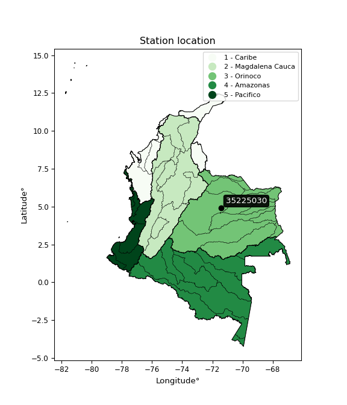

<div align="center">


</div>

# PMP Station (Rain, Pmax24h): 35225030

Probable Maximum Precipitation (PMP) is the greatest amount of rainfall for a specific duration that is meteorologically possible for a given location, acting as a "worst-case" scenario for extreme storms, crucial for designing safety-critical infrastructure like bridges, river deviations, dams, spillways, and nuclear plants to prevent catastrophic failure. PMP is calculated by hydrologists using meteorological data to determine the upper limit of extreme rainfall, often leading to the Probable Maximum Flood (PMF) for flood control design, and is increasingly being studied for climate change impacts. Probable Maximum Precipitation (PMP) is the theoretical upper limit of rainfall, a deterministic estimate for extreme events, while probability distributions (like GEV, Gumbel) describe the likelihood and frequency of various precipitation amounts, including rare ones, showing how often events occur, with PMP representing the extreme end of these distributions, used for critical infrastructure design to ensure safety against the worst conceivable weather, unlike standard statistical forecasts which cover typical probabilities.

The most common probability distributions in hydrology, used for analyzing floods, rainfall, and streamflow, include the Normal, Log-Normal, Gumbel, Gamma (including Log-Pearson Type III), and Generalized Extreme Value (GEV) distributions, often chosen based on the data´s skewness and whether modeling extremes or general conditions, with Gumbel and GEV popular for extreme events like floods, while the Normal distribution serves as a baseline, though often requiring transformations for skewed hydrological data. These distributions help in designing water infrastructure, managing water resources, and forecasting hydrologic events.

> Hydrological data often isn´t perfectly normal (it´s skewed), so different distributions are needed for different applications, such as: **Flood Frequency Analysis**: Using Gumbel, GEV, or Log-Pearson Type III for predicting extreme flood magnitudes and their return periods, **Rainfall Analysis**: Normal for annual totals, but Log-Normal, Weibull, or GEV for intensity or extreme daily rainfall, **Streamflow Modeling**: Gamma and Log-Normal for maximum flows, GEV for minimum flows, and Kappa for daily flows.

<div align="center">

</img>

</div>


## A. General information


### 1. General running parameters

• app_version: _v20260108_. • runtime: _2026-01-08 13:24:42.400241_. • Python version: _3.14.0_. • SciPy version: _1.16.3_. • Pandas version: _2.3.3_. • NumPy version: _2.3.5_. • Stations dataset (station_dataset_file): _dataset/pmax24h_in/automatic_colombia_2003_2024.csv_. • Stations catalog (station_catalog_file): _dataset/CNE.xls_. • Minimum year to eval til year_max (date_min): _1900_. • Maximum year to eval since year_min (date_max): _2024_. • Creates, save and include plots into reports (create_plot): _False_. • Plot only fit distributions with Δo > Δ (plot_only_fit): _True_. • Plot only simple graphs avoiding multiple CDFs and multiple Extreme values plots (plot_only_simple): _True_. • Eval low extreme values, if False, evaluates high extreme values (low_extreme): _False_. • Eval every SciPy distribution as logarithmic (pdist_logarithmic_on): _True_. • Standard deviation normalized (ddof): _1.0_. • Return periods to eval in years (Tr): _[2, 2.33, 5, 10, 15, 20, 25, 50, 75, 100, 200, 250, 500, 750, 1000]_. • Minimum data sample per station, 0 means any (minimum_sample): _5_. • Z-Score maximum threshold to adjust a value, 0 means disable (zscore_max): _3.5_. • Z-Score minimum threshold to adjust a value, 0 means disable (zscore_min): _-2.5_. • Avoid zeros, e.g. rain = 0 (avoid_zeros): _True_. • Avoid null values (avoid_nans): _True_. 

:file_folder:Table: [dataset.csv](../../dataset/pmax24h_in/automatic_colombia_2003_2024.csv)

> Delta Degrees of Freedom (DDOF): is a parameter used in the formulas for calculating variance and standard deviation. When ddof=0, the divisor is $N$ (the total number of observations) and this is used when your data set is the entire population. When ddof=1, the divisor is $N-1$ and this is used when your data set is a sample drawn from a larger population. Using $N-1$ provides an unbiased estimate of the population variance (known as Bessel´s correction).


### 2. Station info and location

|   id |   CODIGO | NOMBRE                   | CATEGORIA               | TECNOLOGIA                              | ESTADO   | FECHA_INSTALACION   |   FECHA_SUSPENSION |   ALTITUD |   LATITUD |   LONGITUD | DEPARTAMENTO   | MUNICIPIO   | AREA_OPERATIVA                            | ENTIDAD                                                     | AREA_HIDROGRAFICA   | ZONA_HIDROGRAFICA   | SUBZONA_HIDROGRAFICA                    |   CORRIENTE | Catalogo   |   Version |
|-----:|---------:|:-------------------------|:------------------------|:----------------------------------------|:---------|:--------------------|-------------------:|----------:|----------:|-----------:|:---------------|:------------|:------------------------------------------|:------------------------------------------------------------|:--------------------|:--------------------|:----------------------------------------|------------:|:-----------|----------:|
|    0 | 35225030 | MODULOS - AUT [35225030] | Climatológica Principal | Automática con Telemetría, Convencional | Activa   | 15/12/2016          |                nan |       139 |   4.91053 |   -71.4331 | Casanare       | Orocué      | Area Operativa 03 - Meta-Guaviare-Guainía | INSTITUTO DE HIDROLOGIA METEOROLOGIA Y ESTUDIOS AMBIENTALES | Orinoco             | Meta                | Caño Guanápalo y otros directos al Meta |         nan | CNE_IDEAM  |  20251226 |

<div align="center">

Dynamic map: [:earth_americas:Google](http://maps.google.com/maps?q=4.910528,-71.433083) [:earth_americas:OSM](https://www.openstreetmap.org/#map=18/4.910528/-71.433083&layers=P) [:earth_americas:Bing](https://www.bing.com/maps?cp=4.910528~-71.433083&lvl=18) [:earth_americas:Apple](https://maps.apple.com/frame?center=4.910528%2C-71.433083&span=0.003%2C0.006)

</div>


<div align="center">

```geojson
{
  "type": "Feature",
  "geometry": {
    "type": "Point", 
    "coordinates": [-71.433083, 4.910528]
  }, 
  "properties": {
    "Name": "35225030"
  }
}
```

</div>


### 3. Discrete values table and plot

<div align="center">

|               |          0 |           1 |           2 |           3 |           4 |           5 |           6 |           7 |
|:--------------|-----------:|------------:|------------:|------------:|------------:|------------:|------------:|------------:|
| Date          | 2017       | 2018        | 2019        | 2020        | 2021        | 2022        | 2023        | 2024        |
| Value         |   12.5     |   74.9      |   59.7      |   41.5      |   89.3      |   81.7      |   78        |   79.4      |
| Value_initial |   12.5     |   74.9      |   59.7      |   41.5      |   89.3      |   81.7      |   78        |   79.4      |
| count         |    8       |    8        |    8        |    8        |    8        |    8        |    8        |    8        |
| mean          |   64.625   |   64.625    |   64.625    |   64.625    |   64.625    |   64.625    |   64.625    |   64.625    |
| std           |   25.8546  |   25.8546   |   25.8546   |   25.8546   |   25.8546   |   25.8546   |   25.8546   |   25.8546   |
| zscore        |   -2.01608 |    0.397415 |   -0.190488 |   -0.894426 |    0.954376 |    0.660425 |    0.517316 |    0.571465 |


</div>


> The initial value (value_initial) correspond to the initial obtained or null completed value, and value (value) is adjusted only when the initial value is outside the valid range (outlier) definite through the Z-Score value. If Z-Score is active, values out of range or outliers are replaced with the station mean value. A Z-Score (or standard score) measures how many standard deviations a data point is from the mean of a dataset, indicating its relative position; positive scores mean above the mean, negative mean below, and a score of zero is exactly at the mean, allowing for comparison of values from different distributions. It´s calculated using the formula $z=(x–μ)/σ$, where $x$ is the data point, $μ$ is the mean, and $σ$ is the standard deviation, helping identify outliers and understand probability.
>
> <sub>**Note**: In this study, "completing" (filling gaps in) and "extending" (forecasting or lengthening the historical record) rainfall data series are avoided for certain critical analyses because they introduce artificial bias and uncertainty, which can distort the statistics of rare events (extremes), alter day-to-day variability, and compromise the integrity and homogeneity of the original data. Some reasons against Completing/Extending rainfall data are: **Distortion of Extremes and Variability**: The primary issue is that most gap-filling or extension methods rely on averaging or regression with nearby stations, which inherently smooths the data. Rainfall is highly variable in space and time, with a large percentage of zero values and occasional large storms. Infilling methods often underestimate the highest values and overestimate the lowest (zero) values, which severely distorts analyses focused on flood frequency, drought severity, and intensity-duration-frequency (IDF) curves, **Loss of Data Homogeneity**: Infilled or extended data are synthetic estimates, not actual measurements. Combining these estimates with observed data can violate the assumption of data homogeneity, which requires that the data properties do not change over time. Inhomogeneity can lead to incorrect conclusions about long-term trends or changes in climate patterns, **Propagation of Errors**: Errors and biases from the original data (e.g., wind-induced undercatch, instrument errors, site changes) or the data used for imputation can propagate through the analysis, leading to unreliable hydrological models and inaccurate predictions, **Compromised Statistical Integrity**: For statistical analyses, especially those involving the frequency of events, using artificial data can introduce time bias or autocorrelation that doesn´t exist in reality, making it difficult to assess the true probability of events, **Difficulty in Validation**: It is difficult to accurately validate the quality of filled or extended data, especially for past periods where ground-truth measurements are unavailable. The reliability of imputation techniques heavily depends on the density of the surrounding station network and the complexity of the local topography.</sub>


### 4. Active continuous probability distributions from SciPy (43 of 104 available)

A Probability Density Function (PDF) describes the relative likelihood of a continuous random variable falling within a specific range, where the total area under its curve equals 1, and the area over any interval gives the actual probability for that range. Unlike discrete probabilities (like rolling a die), a PDF shows density, not direct probability for a single point (which is zero), with higher points indicating higher likelihood, often visualized as a bell curve for normal distributions.

A log of a probability density function (log-PDF) is simply the logarithm of the PDF´s value, denoted as $log(f(x))$, useful for converting multiplication of probabilities into addition, improving numerical stability with tiny numbers, and connecting to information theory concepts like entropy. Instead of dealing with very small probabilities (e.g., 0.000001), log-PDFs use negative numbers (e.g., $log(0.00001) ≈ -11.51$ that are easier for computers to handle, preventing underflow errors and simplifying complex calculations. In this study, each active probability distribution from SciPy is also evaluated in the $log$ form.

[scipy.stats](https://docs.scipy.org/doc/scipy/reference/stats.html) is a Python´s powerful submodule within the SciPy library for comprehensive statistical analysis, offering over 130 probability distributions (like Normal, Poisson), functions for descriptive stats (mean, variance), hypothesis testing (t-tests, chi-square), random variable generation, and statistical tests, making it essential for data science, modeling, and research. It provides tools to explore, model, and draw conclusions from data efficiently, working seamlessly with NumPy.

<div align="center">

|   id | p_dist             |   n_parameter | fit_method   | label                                                                       | active   | ref                                                                                                        |
|-----:|:-------------------|--------------:|:-------------|:----------------------------------------------------------------------------|:---------|:-----------------------------------------------------------------------------------------------------------|
|    0 | alpha              |             3 | MLE          | Alpha                                                                       | True     | [:mortar_board:](https://docs.scipy.org/doc/scipy/reference/generated/scipy.stats.alpha.html)              |
|    1 | betaprime          |             4 | MLE          | Beta prime                                                                  | True     | [:mortar_board:](https://docs.scipy.org/doc/scipy/reference/generated/scipy.stats.betaprime.html)          |
|    2 | chi2               |             3 | MLE          | Chi²                                                                        | True     | [:mortar_board:](https://docs.scipy.org/doc/scipy/reference/generated/scipy.stats.chi2.html)               |
|    3 | crystalball        |             4 | MLE          | Crystalball                                                                 | True     | [:mortar_board:](https://docs.scipy.org/doc/scipy/reference/generated/scipy.stats.crystalball.html)        |
|    4 | erlang             |             3 | MLE          | Erlang                                                                      | True     | [:mortar_board:](https://docs.scipy.org/doc/scipy/reference/generated/scipy.stats.erlang.html)             |
|    5 | expon              |             2 | MLE          | Exponential                                                                 | True     | [:mortar_board:](https://docs.scipy.org/doc/scipy/reference/generated/scipy.stats.expon.html)              |
|    6 | exponnorm          |             3 | MLE          | Exponentially modified Normal                                               | True     | [:mortar_board:](https://docs.scipy.org/doc/scipy/reference/generated/scipy.stats.exponnorm.html)          |
|    7 | f                  |             4 | MLE          | F                                                                           | True     | [:mortar_board:](https://docs.scipy.org/doc/scipy/reference/generated/scipy.stats.f.html)                  |
|    8 | fatiguelife        |             3 | MLE          | Fatigue-life (Birnbaum-Saunders)                                            | True     | [:mortar_board:](https://docs.scipy.org/doc/scipy/reference/generated/scipy.stats.fatiguelife.html)        |
|    9 | fisk               |             3 | MLE          | Fisk                                                                        | True     | [:mortar_board:](https://docs.scipy.org/doc/scipy/reference/generated/scipy.stats.fisk.html)               |
|   10 | gamma              |             3 | MLE          | Gamma                                                                       | True     | [:mortar_board:](https://docs.scipy.org/doc/scipy/reference/generated/scipy.stats.gamma.html)              |
|   11 | genexpon           |             5 | MLE          | Generalized exponential                                                     | True     | [:mortar_board:](https://docs.scipy.org/doc/scipy/reference/generated/scipy.stats.genexpon.html)           |
|   12 | genlogistic        |             3 | MLE          | Generalized logistic                                                        | True     | [:mortar_board:](https://docs.scipy.org/doc/scipy/reference/generated/scipy.stats.genlogistic.html)        |
|   13 | gibrat             |             2 | MM           | Gibrat                                                                      | True     | [:mortar_board:](https://docs.scipy.org/doc/scipy/reference/generated/scipy.stats.gibrat.html)             |
|   14 | gompertz           |             3 | MLE          | Gompertz (or truncated Gumbel)                                              | True     | [:mortar_board:](https://docs.scipy.org/doc/scipy/reference/generated/scipy.stats.gompertz.html)           |
|   15 | gumbel_l           |             2 | MM           | Gumbel Left Skew                                                            | True     | [:mortar_board:](https://docs.scipy.org/doc/scipy/reference/generated/scipy.stats.gumbel_l.html)           |
|   16 | gumbel_r           |             2 | MM           | Gumbel Right Skew                                                           | True     | [:mortar_board:](https://docs.scipy.org/doc/scipy/reference/generated/scipy.stats.gumbel_r.html)           |
|   17 | halflogistic       |             2 | MM           | Half-logistic                                                               | True     | [:mortar_board:](https://docs.scipy.org/doc/scipy/reference/generated/scipy.stats.halflogistic.html)       |
|   18 | halfnorm           |             2 | MM           | Half Normal                                                                 | True     | [:mortar_board:](https://docs.scipy.org/doc/scipy/reference/generated/scipy.stats.halfnorm.html)           |
|   19 | hypsecant          |             2 | MM           | hyperbolic secant                                                           | True     | [:mortar_board:](https://docs.scipy.org/doc/scipy/reference/generated/scipy.stats.hypsecant.html)          |
|   20 | invgamma           |             3 | MLE          | Inverted gamma                                                              | True     | [:mortar_board:](https://docs.scipy.org/doc/scipy/reference/generated/scipy.stats.invgamma.html)           |
|   21 | invgauss           |             3 | MLE          | Inverse Gaussian                                                            | True     | [:mortar_board:](https://docs.scipy.org/doc/scipy/reference/generated/scipy.stats.invgauss.html)           |
|   22 | invweibull         |             3 | MLE          | Inverted Weibull                                                            | True     | [:mortar_board:](https://docs.scipy.org/doc/scipy/reference/generated/scipy.stats.invweibull.html)         |
|   23 | kstwobign          |             2 | MLE          | Limiting distribution of scaled Kolmogorov-Smirnov two-sided test statistic | True     | [:mortar_board:](https://docs.scipy.org/doc/scipy/reference/generated/scipy.stats.kstwobign.html)          |
|   24 | laplace            |             2 | MM           | Laplace                                                                     | True     | [:mortar_board:](https://docs.scipy.org/doc/scipy/reference/generated/scipy.stats.laplace.html)            |
|   25 | laplace_asymmetric |             3 | MLE          | Asymmetric Laplace                                                          | True     | [:mortar_board:](https://docs.scipy.org/doc/scipy/reference/generated/scipy.stats.laplace_asymmetric.html) |
|   26 | loggamma           |             3 | MLE          | Log gamma                                                                   | True     | [:mortar_board:](https://docs.scipy.org/doc/scipy/reference/generated/scipy.stats.loggamma.html)           |
|   27 | logistic           |             2 | MM           | Logistic (or Sech-squared)                                                  | True     | [:mortar_board:](https://docs.scipy.org/doc/scipy/reference/generated/scipy.stats.logistic.html)           |
|   28 | lognorm            |             3 | MLE          | Log Normal                                                                  | True     | [:mortar_board:](https://docs.scipy.org/doc/scipy/reference/generated/scipy.stats.lognorm.html)            |
|   29 | maxwell            |             2 | MM           | Maxwell                                                                     | True     | [:mortar_board:](https://docs.scipy.org/doc/scipy/reference/generated/scipy.stats.maxwell.html)            |
|   30 | mielke             |             4 | MLE          | Mielke Beta-Kappa / Dagum                                                   | True     | [:mortar_board:](https://docs.scipy.org/doc/scipy/reference/generated/scipy.stats.mielke.html)             |
|   31 | moyal              |             2 | MM           | Moyal                                                                       | True     | [:mortar_board:](https://docs.scipy.org/doc/scipy/reference/generated/scipy.stats.moyal.html)              |
|   32 | nakagami           |             3 | MLE          | Nakagami                                                                    | True     | [:mortar_board:](https://docs.scipy.org/doc/scipy/reference/generated/scipy.stats.nakagami.html)           |
|   33 | ncf                |             5 | MLE          | Non-central F distribution                                                  | True     | [:mortar_board:](https://docs.scipy.org/doc/scipy/reference/generated/scipy.stats.ncf.html)                |
|   34 | nct                |             4 | MLE          | Non-central Student’s t                                                     | True     | [:mortar_board:](https://docs.scipy.org/doc/scipy/reference/generated/scipy.stats.nct.html)                |
|   35 | norm               |             2 | MM           | Normal                                                                      | True     | [:mortar_board:](https://docs.scipy.org/doc/scipy/reference/generated/scipy.stats.norm.html)               |
|   36 | pearson3           |             3 | MM           | Pearson type III                                                            | True     | [:mortar_board:](https://docs.scipy.org/doc/scipy/reference/generated/scipy.stats.pearson3.html)           |
|   37 | rayleigh           |             2 | MM           | Rayleigh                                                                    | True     | [:mortar_board:](https://docs.scipy.org/doc/scipy/reference/generated/scipy.stats.rayleigh.html)           |
|   38 | rice               |             3 | MLE          | Rice                                                                        | True     | [:mortar_board:](https://docs.scipy.org/doc/scipy/reference/generated/scipy.stats.rice.html)               |
|   39 | t                  |             3 | MLE          | Student’s t                                                                 | True     | [:mortar_board:](https://docs.scipy.org/doc/scipy/reference/generated/scipy.stats.t.html)                  |
|   40 | truncnorm          |             4 | MLE          | Truncated normal                                                            | True     | [:mortar_board:](https://docs.scipy.org/doc/scipy/reference/generated/scipy.stats.truncnorm.html)          |
|   41 | wald               |             2 | MM           | Wald                                                                        | True     | [:mortar_board:](https://docs.scipy.org/doc/scipy/reference/generated/scipy.stats.wald.html)               |
|   42 | weibull_min        |             3 | MLE          | Weibull minimum                                                             | True     | [:mortar_board:](https://docs.scipy.org/doc/scipy/reference/generated/scipy.stats.weibull_min.html)        |

</div>

> **n_parameter:** # arguments & localization & scale.
>
> **Fit methods:** (MLE) maximum likelihood, (MM) L-moments.
>
>**Inactive** (With the only purpose of prevent loops, zero divisions, infinite values, over high estimated values or horizontal trending for recurrence intervals estimations, the follow distributions were disabled.)**:** foldnorm, gennorm, norminvgauss, powernorm, powerlognorm, skewnorm, genextreme, anglit, arcsine, argus, beta, bradford, burr, burr12, cauchy, cosine, halfcauchy, foldcauchy, skewcauchy, wrapcauchy, dgamma, gengamma, exponweib, exponpow, truncexpon, gausshyper, genhalflogistic, genhyperbolic, geninvgauss, halfgennorm, johnsonsb, johnsonsu, kappa4, kappa3, ksone, kstwo, loglaplace, levy, levy_l, levy_stable, ncx2, pareto, genpareto, truncpareto, lomax, powerlaw, rdist, rel_breitwigner, recipinvgauss, semicircular, studentized_range, trapezoid, triang, truncweibull_min, tukeylambda, uniform, loguniform, vonmises, vonmises_line, weibull_max, dweibull, 


## B. Probability (PDF) vs. Empirical (EDF) distributions functions

A continuous probability distribution (CPD) describes probabilities for variables that can take any value within a range (like rain any time), unlike discrete variables with specific outcomes (like temperature). It uses a Probability Density Function (PDF), a curve where the total area under it equals 1, and the probability of the variable falling within an interval (a to b) is found by calculating the area under the curve between those points. A key feature is that the probability of hitting any single exact value is zero, so probabilities are always expressed for ranges, e.g., $P(a ≤ X ≤ b)$.

<div align="center">

Distributions parameters from station values
|    |   station | p_dist                |   n |              loc |           scale | shape                  | shape1                | shape2                 | shape3   |
|---:|----------:|:----------------------|----:|-----------------:|----------------:|:-----------------------|:----------------------|:-----------------------|:---------|
|  0 |  35225030 | alpha                 |   8 |     -0.0866995   |    31.7865      | 3.212409139482908e-11  |                       |                        |          |
|  1 |  35225030 | betaprime             |   8 |   -684.149       | 55402.8         | 935.5827859471003      | 69263.82970965354     |                        |          |
|  2 |  35225030 | chi2                  |   8 |   -258.124       |     0.997358    | 323.49412841332446     |                       |                        |          |
|  3 |  35225030 | crystalball           |   8 |     64.625       |    24.1847      | 5107.438367357249      | 74.88820387832862     |                        |          |
|  4 |  35225030 | erlang                |   8 |   -373.116       |     1.40927     | 310.37745794922944     |                       |                        |          |
|  5 |  35225030 | expon                 |   8 |     12.5         |    52.125       |                        |                       |                        |          |
|  6 |  35225030 | exponnorm             |   8 |     64.6083      |    24.1847      | 0.0006869375920314292  |                       |                        |          |
|  7 |  35225030 | f                     |   8 | -17765.2         | 17829.8         | 1528114.7545857988     | 3645850.485862447     |                        |          |
|  8 |  35225030 | fatiguelife           |   8 |     12.5         |     0.000239975 | 405.7926479771347      |                       |                        |          |
|  9 |  35225030 | fisk                  |   8 |     -6.56923e+09 |     6.56923e+09 | 493686054.91226876     |                       |                        |          |
| 10 |  35225030 | gamma                 |   8 |   -287.263       |     1.86285     | 188.69578908495066     |                       |                        |          |
| 11 |  35225030 | genexpon              |   8 |     12.4999      |     2.12693     | 0.03986966274256641    | 2.701166617425662e-07 | 0.4979958308524659     |          |
| 12 |  35225030 | genlogistic           |   8 |     89.3005      |     8.38372e-06 | 3.400582611778668e-07  |                       |                        |          |
| 13 |  35225030 | gibrat                |   8 |     46.1751      |    11.1904      |                        |                       |                        |          |
| 14 |  35225030 | gompertz              |   8 |    -33.6006      |    15.8734      | 0.0010653773037931859  |                       |                        |          |
| 15 |  35225030 | gumbel_l              |   8 |     75.5094      |    18.8568      |                        |                       |                        |          |
| 16 |  35225030 | gumbel_r              |   8 |     53.7406      |    18.8568      |                        |                       |                        |          |
| 17 |  35225030 | halflogistic          |   8 |     35.9604      |    20.6771      |                        |                       |                        |          |
| 18 |  35225030 | halfnorm              |   8 |     32.6139      |    40.12        |                        |                       |                        |          |
| 19 |  35225030 | hypsecant             |   8 |     64.625       |    15.3965      |                        |                       |                        |          |
| 20 |  35225030 | invgamma              |   8 |   -305.162       | 72452.1         | 197.395006519952       |                       |                        |          |
| 21 |  35225030 | invgauss              |   8 |   -124.012       |  8302.14        | 0.02260223948572393    |                       |                        |          |
| 22 |  35225030 | invweibull            |   8 |     12.5         |     1.84021     | 0.07501752532070202    |                       |                        |          |
| 23 |  35225030 | kstwobign             |   8 |    -47.7899      |   128.503       |                        |                       |                        |          |
| 24 |  35225030 | laplace               |   8 |     64.625       |    17.1012      |                        |                       |                        |          |
| 25 |  35225030 | laplace_asymmetric    |   8 |     81.7         |    10.6183      | 2.0870065029346403     |                       |                        |          |
| 26 |  35225030 | loggamma              |   8 |     89.3004      |     3.0126e-05  | 1.2223436770013443e-06 |                       |                        |          |
| 27 |  35225030 | logistic              |   8 |     64.625       |    13.3337      |                        |                       |                        |          |
| 28 |  35225030 | lognorm               |   8 |     12.5         |     0.493769    | 12.57388056071658      |                       |                        |          |
| 29 |  35225030 | maxwell               |   8 |      7.31731     |    35.9123      |                        |                       |                        |          |
| 30 |  35225030 | mielke                |   8 |   -755.984       |   845.346       | 33.173563947282275     | 76427.17731699199     |                        |          |
| 31 |  35225030 | moyal                 |   8 |     50.7946      |    10.887       |                        |                       |                        |          |
| 32 |  35225030 | nakagami              |   8 |     30.7134      |    43.035       | 1.587271440724983      |                       |                        |          |
| 33 |  35225030 | ncf                   |   8 |     -0.0181298   |     8.1128e-06  | 5.623068060767878e-07  | 3.776807228430021     | 3.217930885177406      |          |
| 34 |  35225030 | nct                   |   8 |  -1867.75        |    24.1114      | 428637.1307742642      | 80.14324371688059     |                        |          |
| 35 |  35225030 | norm                  |   8 |     64.625       |    24.1847      |                        |                       |                        |          |
| 36 |  35225030 | pearson3              |   8 |     64.625       |    24.1848      | -1.1258467945211619    |                       |                        |          |
| 37 |  35225030 | rayleigh              |   8 |     18.3581      |    36.9156      |                        |                       |                        |          |
| 38 |  35225030 | rice                  |   8 |   -378.454       |    23.9277      | 18.495072275165594     |                       |                        |          |
| 39 |  35225030 | t                     |   8 |     65.8457      |    23.1569      | 22.50932350296324      |                       |                        |          |
| 40 |  35225030 | truncnorm             |   8 |     89.4265      |    24.319       | -158.263143498687      | -0.005202333706140535 |                        |          |
| 41 |  35225030 | wald                  |   8 |     40.4403      |    24.1847      |                        |                       |                        |          |
| 42 |  35225030 | weibull_min           |   8 |     -1.63305e+09 |     1.63305e+09 | 102924212.26082937     |                       |                        |          |
| 43 |  35225030 | logalpha              |   8 |    -13.4978      |   465.081       | 26.600379567397752     |                       |                        |          |
| 44 |  35225030 | logbetaprime          |   8 |    -11.7642      |    35.8821      | 814.857886105483       | 1852.7209490717787    |                        |          |
| 45 |  35225030 | logchi2               |   8 |      2.52573     |     0.956753    | 1.0597959929159213     |                       |                        |          |
| 46 |  35225030 | logcrystalball        |   8 |      4.0354      |     0.614272    | 11.706433954340913     | 884.7795107397317     |                        |          |
| 47 |  35225030 | logerlang             |   8 |     -7.00328     |     0.0391501   | 281.7773778929202      |                       |                        |          |
| 48 |  35225030 | logexpon              |   8 |      2.52573     |     1.50967     |                        |                       |                        |          |
| 49 |  35225030 | logexponnorm          |   8 |      4.035       |     0.61427     | 0.000656514798930891   |                       |                        |          |
| 50 |  35225030 | logf                  |   8 |  -2074.65        |  2078.68        | 71119546.77224422      | 33885395.789685845    |                        |          |
| 51 |  35225030 | logfatiguelife        |   8 |   -827.366       |   831.402       | 0.0007373512704682821  |                       |                        |          |
| 52 |  35225030 | logfisk               |   8 |     -5.10932e+07 |     5.10932e+07 | 175867133.72894096     |                       |                        |          |
| 53 |  35225030 | loggamma              |   8 |     -8.06334     |     0.0355731   | 339.74685767176663     |                       |                        |          |
| 54 |  35225030 | loggenexpon           |   8 |      2.52573     |     0.0348896   | 0.005978969126221045   | 4.1381745945238615    | 0.00016459684046363698 |          |
| 55 |  35225030 | loggenlogistic        |   8 |      4.49379     |     0.000189633 | 0.0004125552708796595  |                       |                        |          |
| 56 |  35225030 | loggibrat             |   8 |      3.56682     |     0.284208    |                        |                       |                        |          |
| 57 |  35225030 | loggompertz           |   8 |      2.52367     |     0.333774    | 0.005352919616034503   |                       |                        |          |
| 58 |  35225030 | loggumbel_l           |   8 |      4.31185     |     0.478946    |                        |                       |                        |          |
| 59 |  35225030 | loggumbel_r           |   8 |      3.75894     |     0.478946    |                        |                       |                        |          |
| 60 |  35225030 | loghalflogistic       |   8 |      3.30732     |     0.525195    |                        |                       |                        |          |
| 61 |  35225030 | loghalfnorm           |   8 |      3.22236     |     1.019       |                        |                       |                        |          |
| 62 |  35225030 | loghypsecant          |   8 |      4.0354      |     0.391058    |                        |                       |                        |          |
| 63 |  35225030 | loginvgamma           |   8 |    -13.0966      | 11930.6         | 697.805697761597       |                       |                        |          |
| 64 |  35225030 | loginvgauss           |   8 |     -3.61571     |  1008.03        | 0.0075758839334043385  |                       |                        |          |
| 65 |  35225030 | loginvweibull         |   8 |     -2.89297e+06 |     2.89297e+06 | 3712852.2003596015     |                       |                        |          |
| 66 |  35225030 | logkstwobign          |   8 |      0.847378    |     3.65204     |                        |                       |                        |          |
| 67 |  35225030 | loglaplace            |   8 |      4.0354      |     0.434356    |                        |                       |                        |          |
| 68 |  35225030 | loglaplace_asymmetric |   8 |      4.492       |     0.0042312   | 107.97932254022811     |                       |                        |          |
| 69 |  35225030 | logloggamma           |   8 |      4.49201     |     2.24082e-07 | 4.932603610352413e-07  |                       |                        |          |
| 70 |  35225030 | loglogistic           |   8 |      4.0354      |     0.338666    |                        |                       |                        |          |
| 71 |  35225030 | loglognorm            |   8 |      2.52573     |     0.0192225   | 11.868561316579962     |                       |                        |          |
| 72 |  35225030 | logmaxwell            |   8 |      2.57982     |     0.912146    |                        |                       |                        |          |
| 73 |  35225030 | logmielke             |   8 |     -2.01691e+07 |     2.01692e+07 | 43948489.02114012      | 45561058517.32595     |                        |          |
| 74 |  35225030 | logmoyal              |   8 |      3.68412     |     0.276519    |                        |                       |                        |          |
| 75 |  35225030 | lognakagami           |   8 |      3.47167     |     0.803171    | 2.143053612319438      |                       |                        |          |
| 76 |  35225030 | logncf                |   8 |    -23.422       |    26.3277      | 9270.564261235446      | 5650.766742909005     | 398.5364413459731      |          |
| 77 |  35225030 | lognct                |   8 |    -31.5066      |     0.489916    | 3999.8707403790313     | 72.52964094077362     |                        |          |
| 78 |  35225030 | lognorm               |   8 |      4.0354      |     0.614272    |                        |                       |                        |          |
| 79 |  35225030 | logpearson3           |   8 |      4.0354      |     0.614271    | -1.7424735583509174    |                       |                        |          |
| 80 |  35225030 | lograyleigh           |   8 |      2.86023     |     0.937649    |                        |                       |                        |          |
| 81 |  35225030 | logrice               |   8 |   -251.099       |     0.614296    | 415.3262615033542      |                       |                        |          |
| 82 |  35225030 | logt                  |   8 |      4.37316     |     0.0534695   | 0.5491439026232259     |                       |                        |          |
| 83 |  35225030 | logtruncnorm          |   8 |     -0.259774    |     1.63424     | 2.4378901750781496     | 2.907639708448966     |                        |          |
| 84 |  35225030 | logwald               |   8 |      3.42118     |     0.614221    |                        |                       |                        |          |
| 85 |  35225030 | logweibull_min        |   8 |      2.52573     |     1.28118     | 0.735560238771956      |                       |                        |          |

</div>

> **loc** (Location parameter): This shifts the distribution along the x-axis. For many common distributions, like the normal (Gaussian) distribution, loc represents the mean $μ$. For others, like the uniform distribution, it might represent the minimum value, or for the beta distribution, the left end of the support interval.
>
> **scale** (Scale parameter): This determines the width or spread of the distribution. For the normal distribution, scale represents the standard deviation $σ$. For a uniform distribution, it defines the length of the interval (from $loc$ to $loc + scale$).
>
> **shape** (Shape parameters): Refers to parameters that define the specific form of a probability distribution, distinct from its location (loc) and scale (scale). These parameters are required arguments for most distribution functions. For example, a normal (Gaussian) distribution is fully defined by its location (mean) and scale (standard deviation), so it has no specific shape parameters beyond loc and scale. However, other distributions have intrinsic properties that need specification, as Gamma distribution that takes a shape parameter, often named $a$ or $alpha$.


### 0. Cumulative distribution values - CDF (86 evaluated)

Cumulative Distribution Function (CDF), denoted as $F$<sub>$X$</sub>$(x)$, is a function that gives the probability that a random variable $X$ will take a value less than or equal to a specific value, $x$ (i.e., $(P(X≥x)$. It essentially "accumulates" probabilities from a given point up to the far right (positive infinity), providing a complete picture of the distribution´s probabilities for both discrete (like rain) and continuous (like temperature) variables, helping to find probabilities over ranges or above certain values. Each station is evaluated separately ordering the $x$ values ascending, calculating the CDF and PDF values for the activated distributions and their logarithmic forms.

<div align="center">

CDF ordered by x ascending and calculating $log(f(x))$ separately
|   id |   Station |   date |    x |   count |   mean |     std |    zscore |   Value_initial |   station |   m |     alpha |   alpha_pdf |   betaprime |   betaprime_pdf |     chi2 |   chi2_pdf |   crystalball |   crystalball_pdf |    erlang |   erlang_pdf |    expon |   expon_pdf |   exponnorm |   exponnorm_pdf |         f |      f_pdf |   fatiguelife |   fatiguelife_pdf |      fisk |   fisk_pdf |    gamma |   gamma_pdf |    genexpon |   genexpon_pdf |   genlogistic |   genlogistic_pdf |   gibrat |   gibrat_pdf |   gompertz |   gompertz_pdf |   gumbel_l |   gumbel_l_pdf |    gumbel_r |   gumbel_r_pdf |   halflogistic |   halflogistic_pdf |   halfnorm |   halfnorm_pdf |   hypsecant |   hypsecant_pdf |   invgamma |   invgamma_pdf |   invgauss |   invgauss_pdf |   invweibull |   invweibull_pdf |   kstwobign |   kstwobign_pdf |   laplace |   laplace_pdf |   laplace_asymmetric |   laplace_asymmetric_pdf |   loggamma |   loggamma_pdf |   logistic |   logistic_pdf |    lognorm |   lognorm_pdf |     maxwell |   maxwell_pdf |    mielke |   mielke_pdf |       moyal |   moyal_pdf |   nakagami |   nakagami_pdf |      ncf |    ncf_pdf |       nct |    nct_pdf |      norm |   norm_pdf |   pearson3 |   pearson3_pdf |   rayleigh |   rayleigh_pdf |      rice |   rice_pdf |         t |      t_pdf |   truncnorm |   truncnorm_pdf |        wald |    wald_pdf |   weibull_min |   weibull_min_pdf |   logalpha |   logalpha_pdf |   logbetaprime |   logbetaprime_pdf |    logchi2 |   logchi2_pdf |   logcrystalball |   logcrystalball_pdf |   logerlang |   logerlang_pdf |   logexpon |   logexpon_pdf |   logexponnorm |   logexponnorm_pdf |       logf |   logf_pdf |   logfatiguelife |   logfatiguelife_pdf |    logfisk |   logfisk_pdf |   loggenexpon |   loggenexpon_pdf |   loggenlogistic |   loggenlogistic_pdf |   loggibrat |   loggibrat_pdf |   loggompertz |   loggompertz_pdf |   loggumbel_l |   loggumbel_l_pdf |   loggumbel_r |   loggumbel_r_pdf |   loghalflogistic |   loghalflogistic_pdf |   loghalfnorm |   loghalfnorm_pdf |   loghypsecant |   loghypsecant_pdf |   loginvgamma |   loginvgamma_pdf |   loginvgauss |   loginvgauss_pdf |   loginvweibull |   loginvweibull_pdf |   logkstwobign |   logkstwobign_pdf |   loglaplace |   loglaplace_pdf |   loglaplace_asymmetric |   loglaplace_asymmetric_pdf |   logloggamma |   logloggamma_pdf |   loglogistic |   loglogistic_pdf |   loglognorm |   loglognorm_pdf |   logmaxwell |   logmaxwell_pdf |   logmielke |   logmielke_pdf |    logmoyal |   logmoyal_pdf |   lognakagami |   lognakagami_pdf |     logncf |   logncf_pdf |     lognct |   lognct_pdf |   logpearson3 |   logpearson3_pdf |   lograyleigh |   lograyleigh_pdf |    logrice |   logrice_pdf |      logt |   logt_pdf |   logtruncnorm |   logtruncnorm_pdf |   logwald |   logwald_pdf |   logweibull_min |   logweibull_min_pdf |
|-----:|----------:|-------:|-----:|--------:|-------:|--------:|----------:|----------------:|----------:|----:|----------:|------------:|------------:|----------------:|---------:|-----------:|--------------:|------------------:|----------:|-------------:|---------:|------------:|------------:|----------------:|----------:|-----------:|--------------:|------------------:|----------:|-----------:|---------:|------------:|------------:|---------------:|--------------:|------------------:|---------:|-------------:|-----------:|---------------:|-----------:|---------------:|------------:|---------------:|---------------:|-------------------:|-----------:|---------------:|------------:|----------------:|-----------:|---------------:|-----------:|---------------:|-------------:|-----------------:|------------:|----------------:|----------:|--------------:|---------------------:|-------------------------:|-----------:|---------------:|-----------:|---------------:|-----------:|--------------:|------------:|--------------:|----------:|-------------:|------------:|------------:|-----------:|---------------:|---------:|-----------:|----------:|-----------:|----------:|-----------:|-----------:|---------------:|-----------:|---------------:|----------:|-----------:|----------:|-----------:|------------:|----------------:|------------:|------------:|--------------:|------------------:|-----------:|---------------:|---------------:|-------------------:|-----------:|--------------:|-----------------:|---------------------:|------------:|----------------:|-----------:|---------------:|---------------:|-------------------:|-----------:|-----------:|-----------------:|---------------------:|-----------:|--------------:|--------------:|------------------:|-----------------:|---------------------:|------------:|----------------:|--------------:|------------------:|--------------:|------------------:|--------------:|------------------:|------------------:|----------------------:|--------------:|------------------:|---------------:|-------------------:|--------------:|------------------:|--------------:|------------------:|----------------:|--------------------:|---------------:|-------------------:|-------------:|-----------------:|------------------------:|----------------------------:|--------------:|------------------:|--------------:|------------------:|-------------:|-----------------:|-------------:|-----------------:|------------:|----------------:|------------:|---------------:|--------------:|------------------:|-----------:|-------------:|-----------:|-------------:|--------------:|------------------:|--------------:|------------------:|-----------:|--------------:|----------:|-----------:|---------------:|-------------------:|----------:|--------------:|-----------------:|---------------------:|
|    0 |  35225030 |   2017 | 12.5 |       8 | 64.625 | 25.8546 | -2.01608  |            12.5 |  35225030 |   1 | 0.0115566 |  0.00659887 |    0.016198 |      0.00172385 | 0.015949 | 0.00177041 |     0.0155698 |        0.00161683 | 0.0155683 |   0.00171345 | 0        |  0.0191847  |   0.0155697 |      0.00161683 | 0.0158467 | 0.00163786 |     0.0364076 |       1.58095e+08 | 0.0145359 | 0.00107651 | 0.017582 |  0.0018866  | 1.60833e-06 |     0.0187451  |       0       |        0.00179978 | 0        |   0          |   0.018212 |     0.00120271 |   0.034766 |     0.00181126 | 0.000135189 |    6.38697e-05 |       0        |         0          |   0        |     0          |   0.0215479 |      0.00139846 |  0.0177113 |     0.00202726 |  0.0198671 |     0.00238272 |   3.0487e-06 |      8.17613e+08 |   0.0196644 |      0.00332993 | 0.0237261 |    0.00138739 |            0.0358165 |               0.00161623 | 0.00898653 |       0.040449 |  0.0196612 |     0.00144555 | 0.00699239 |     0.0316932 | 0.000794409 |    0.00045793 | 0.0423267 |   0.00182714 | 6.43261e-09 | 1.02357e-08 |   0        |     0          | 0.32915  | 0.00939368 | 0.0156233 | 0.0016211  | 0.0155698 | 0.00161683 |  0.0358682 |     0.00193616 |   0        |     0          | 0.0144507 | 0.00153404 | 0.0154171 | 0.00141496 |  0.00156681 |     0.000221321 | 0           | 0           |     0.0192026 |        0.00119857 | 0.00766439 |      0.0382358 |     0.00962205 |          0.0423286 | 5.8504e-09 |   6.98084e+06 |        0.0069924 |            0.0316933 |  0.00867346 |       0.0394984 |   0        |       0.662397 |     0.00699218 |          0.0316925 | 0.00689304 |  0.0313535 |       0.00683474 |            0.0311807 | 0.00346535 |     0.0118867 |   2.89879e-07 |          0.171369 |         0        |            0.0300669 |    0        |        0        |   3.30738e-05 |         0.0161361 |     0.0237242 |         0.0489419 |   1.98612e-06 |       5.44455e-05 |          0        |              0        |      0        |          0        |       0.013404 |          0.0342661 |    0.00750596 |         0.0361187 |    0.00680253 |         0.0357922 |       0.0119752 |           0.0680069 |      0.0158439 |           0.100847 |    0.0154709 |         0.035618 |               0.0135176 |                   0.0295867 |     0.0131904 |         0.0290354 |     0.0114563 |         0.0334402 |   0.00407795 |       2.2869e+12 |     0        |         0        |   0.0137161 |       0.0298873 | 4.58265e-16 |    5.54685e-14 |     0         |          0        | 0.00864294 |    0.0380572 | 0.00773206 |    0.0347911 |     0.0298565 |         0.0522687 |      0        |          0        | 0.00699432 |     0.0316997 | 0.0452923 |  0.0134592 |     0          |           0        |  0        |      0        |      4.24753e-12 |          7035.33     |
|    1 |  35225030 |   2020 | 41.5 |       8 | 64.625 | 25.8546 | -0.894426 |            41.5 |  35225030 |   2 | 0.444663  |  0.0109499  |    0.178602 |      0.0108241  | 0.183156 | 0.0109852  |     0.16949   |        0.0104432  | 0.180015  |   0.0109531  | 0.426705 |  0.0109985  |   0.16949   |      0.0104432  | 0.170388  | 0.0104409  |     0.804184  |       0.00408264  | 0.115362  | 0.00766945 | 0.1882   |  0.0110233  | 0.419354    |     0.0108844  |       0       |        0.00583547 | 0        |   0          |   0.11289  |     0.006754   |   0.151861 |     0.00740835 | 0.147506    |    0.0149713   |       0.133159 |         0.0237526  |   0.175288 |     0.0194056  |   0.139494  |      0.00877289 |  0.202172  |     0.0116391  |  0.22273   |     0.012042   |   0.443464   |      0.000932798 |   0.2802    |      0.0128992  | 0.12933   |    0.0075626  |            0.132561  |               0.00598183 | 0.330576   |       0.561904 |  0.150036  |     0.00956408 | 0.307068   |     0.571941  | 0.17602     |    0.0127964  | 0.144638  |   0.00601663 | 0.125411    | 0.0173556   |   0.017111 |     0.00484385 | 0.543977 | 0.00568757 | 0.16971   | 0.0104465  | 0.16949   | 0.0104432  |  0.157227  |     0.00743757 |   0.178393 |     0.0139522  | 0.165564  | 0.0104054  | 0.152131  | 0.0096982  |  0.0489564  |     0.00472539  | 4.73424e-06 | 5.29638e-05 |     0.113611  |        0.00673734 | 0.343716   |      0.576826  |     0.330797   |          0.555319  | 0.720156   |   0.207533    |        0.307068  |            0.571941  |  0.328201   |       0.560101  |   0.548353 |       0.29917  |     0.307066   |          0.571941  | 0.306318   |  0.572017  |       0.306333   |            0.572703  | 0.177835   |     0.503266  |   0.455414    |          0.457948 |         0        |            0.409117  |    0.280423 |        2.12034  |   0.173711    |         0.485622  |     0.254795  |         0.457592  |   0.342362    |       0.766211    |          0.378496 |              0.81564  |      0.378659 |          0.693086 |       0.27076  |          0.611853  |    0.329221   |         0.571202  |    0.340856   |         0.57463   |       0.387291  |           0.471492  |      0.436444  |           0.450685 |    0.245082  |         0.564242 |               0.18687   |                   0.409011  |     0.185103  |         0.407458  |     0.286084  |         0.603072  |   0.636197   |       0.0263632  |     0.335643 |         0.627093 |   0.187408  |       0.408361  | 0.353627    |    0.870364    |     0.0139194 |          0.219108 | 0.315315   |    0.549139  | 0.314561   |    0.566376  |     0.232666  |         0.384076  |      0.346871 |          0.642937 | 0.307076   |     0.571926  | 0.080508  |  0.0681272 |     0.00308469 |           2.24184  |  0.361245 |      1.43981  |      0.614407    |             0.225247 |
|    2 |  35225030 |   2019 | 59.7 |       8 | 64.625 | 25.8546 | -0.190488 |            59.7 |  35225030 |   3 | 0.594958  |  0.00616017 |    0.431493 |      0.0160222  | 0.434651 | 0.015668   |     0.419317  |        0.0161571  | 0.433869  |   0.0159575  | 0.595667 |  0.00775699 |   0.419318  |      0.0161571  | 0.419514  | 0.0160863  |     0.862782  |       0.00254188  | 0.338642  | 0.0168312  | 0.438702 |  0.0155379  | 0.587194    |     0.00773816 |       0       |        0.0122091  | 0.57514  |   0.0289721  |   0.315661 |     0.0163986  |   0.351053 |     0.014881   | 0.482375    |    0.0186494   |       0.518331 |         0.0176846  |   0.500405 |     0.0158345  |   0.399873  |      0.0196598  |  0.457216  |     0.0153018  |  0.473473  |     0.0144538  |   0.456594   |      0.000568912 |   0.513908  |      0.0120789  | 0.374884  |    0.0219215  |            0.301364  |               0.0135991  | 0.547676   |       0.601815 |  0.408695  |     0.0181242  | 0.534984   |     0.646957  | 0.453651    |    0.0163149  | 0.305761  |   0.0124352  | 0.506486    | 0.0195231   |   0.274351 |     0.0223519  | 0.632905 | 0.00417673 | 0.419484  | 0.0161479  | 0.419317  | 0.0161571  |  0.350666  |     0.0141395  |   0.465856 |     0.0162042  | 0.416585  | 0.0163191  | 0.396561  | 0.0164232  |  0.222496   |     0.015608    | 0.572738    | 0.0226151   |     0.315976  |        0.016372   | 0.561974   |      0.592606  |     0.545282   |          0.595077  | 0.784731   |   0.151535    |        0.534984  |            0.646957  |  0.544786   |       0.600948  |   0.645032 |       0.23513  |     0.534982   |          0.646959  | 0.536002   |  0.647698  |       0.534663   |            0.648266  | 0.430598   |     0.843942  |   0.613368    |          0.403281 |         0        |            0.90245   |    0.72872  |        0.634294 |   0.438861    |         0.980372  |     0.466547  |         0.699899  |   0.605524    |       0.634243    |          0.631854 |              0.57194  |      0.605125 |          0.54523  |       0.543764 |          0.806291  |    0.549299   |         0.607443  |    0.557985   |         0.58913   |       0.551658  |           0.421138  |      0.590078  |           0.387906 |    0.558387  |         1.01671  |               0.414191  |                   0.906558  |     0.412143  |         0.90723   |     0.539731  |         0.73353   |   0.644538   |       0.0200705  |     0.566309 |         0.609142 |   0.413912  |       0.901913  | 0.630797    |    0.617755    |     0.319482  |          1.41696  | 0.530696   |    0.605839  | 0.537828   |    0.628791  |     0.418681  |         0.658172  |      0.576477 |          0.592088 | 0.534984   |     0.646932  | 0.126296  |  0.241506  |     0.627764   |           1.27111  |  0.700941 |      0.570457 |      0.685828    |             0.171119 |
|    3 |  35225030 |   2018 | 74.9 |       8 | 64.625 | 25.8546 |  0.397415 |            74.9 |  35225030 |   4 | 0.671643  |  0.00412283 |    0.671049 |      0.0145438  | 0.666823 | 0.0140285  |     0.664529  |        0.0150721  | 0.671071  |   0.0143354  | 0.697938 |  0.00579496 |   0.66453   |      0.0150721  | 0.663601  | 0.0150096  |     0.895554  |       0.00182393  | 0.616081  | 0.0177752  | 0.668688 |  0.0138938  | 0.689542    |     0.00581962 |       0       |        0.0226173  | 0.827084 |   0.00890582 |   0.6284   |     0.0231997  |   0.620233 |     0.0194991  | 0.7221      |    0.0124682   |       0.735961 |         0.0110838  |   0.708113 |     0.0114117  |   0.698216  |      0.0167936  |  0.678377  |     0.0130932  |  0.678584  |     0.0120185  |   0.464073   |      0.000428315 |   0.678323  |      0.00943871 | 0.725823  |    0.0160326  |            0.598378  |               0.027002   | 0.678068   |       0.538049 |  0.683651  |     0.0162199  | 0.676185   |     0.585042  | 0.684578    |    0.0133924  | 0.564136  |   0.0225235  | 0.741004    | 0.0114679   |   0.630579 |     0.0215511  | 0.689205 | 0.00327662 | 0.66452   | 0.0150605  | 0.664529  | 0.0150721  |  0.60707   |     0.0189588  |   0.690556 |     0.012839   | 0.664607  | 0.0152434  | 0.650263  | 0.0157345  |  0.552579   |     0.0275627   | 0.795004    | 0.00910342  |     0.628362  |        0.0231847  | 0.688884   |      0.517855  |     0.67443    |          0.534081  | 0.816131   |   0.126293    |        0.676185  |            0.585042  |  0.675095   |       0.538232  |   0.694551 |       0.202329 |     0.676184   |          0.585044  | 0.675781   |  0.585866  |       0.676136   |            0.586061  | 0.622771   |     0.80864   |   0.699153    |          0.351684 |         0        |            1.47819   |    0.833847 |        0.332765 |   0.681838    |         1.09673   |     0.635425  |         0.768071  |   0.731676    |       0.477274    |          0.744472 |              0.424377 |      0.71691  |          0.440121 |       0.7111   |          0.641436  |    0.680426   |         0.538901  |    0.684221   |         0.515664  |       0.641083  |           0.3658    |      0.672291  |           0.336341 |    0.73803   |         0.603124 |               0.680469  |                   1.48937   |     0.679028  |         1.49471   |     0.696146  |         0.624589  |   0.64878    |       0.0174528  |     0.694915 |         0.517801 |   0.678509  |       1.47847   | 0.749794    |    0.437289    |     0.646984  |          1.31598  | 0.66311    |    0.551197  | 0.67481    |    0.567285  |     0.592518  |         0.877741  |      0.700459 |          0.496039 | 0.67618    |     0.585023  | 0.285818  |  2.17163   |     0.868124   |           0.870137 |  0.801953 |      0.343734 |      0.721718    |             0.146237 |
|    4 |  35225030 |   2023 | 78   |       8 | 64.625 | 25.8546 |  0.517316 |            78   |  35225030 |   5 | 0.683959  |  0.00382865 |    0.714743 |      0.01362    | 0.708983 | 0.0131497  |     0.70988   |        0.0141565  | 0.71412   |   0.0134145  | 0.715378 |  0.00546037 |   0.709881  |      0.0141565  | 0.708777  | 0.0141055  |     0.901032  |       0.00171176  | 0.669498  | 0.0166288  | 0.71045  |  0.0130281  | 0.707068    |     0.00549108 |       0       |        0.0256478  | 0.852032 |   0.00725983 |   0.699909 |     0.0227759  |   0.680564 |     0.019332   | 0.758636    |    0.0111133   |       0.768467 |         0.00990126 |   0.742054 |     0.0104878  |   0.747136  |      0.0147498  |  0.71763   |     0.0122162  |  0.714624  |     0.0112238  |   0.465368   |      0.000407697 |   0.706673  |      0.00885208 | 0.77128   |    0.0133745  |            0.688222  |               0.0310562  | 0.699548   |       0.521036 |  0.731666  |     0.0147243  | 0.69954    |     0.566416  | 0.724585    |    0.0124064  | 0.638316  |   0.0253905  | 0.77437     | 0.0100816   |   0.694435 |     0.0195865  | 0.699123 | 0.00312402 | 0.709837  | 0.0141461  | 0.70988   | 0.0141565  |  0.666329  |     0.019205   |   0.728861 |     0.0118665  | 0.710456  | 0.0143053  | 0.697597  | 0.0147675  |  0.641116   |     0.0295027   | 0.821015    | 0.00772384  |     0.699833  |        0.0227666  | 0.709522   |      0.499782  |     0.695762   |          0.517693  | 0.821172   |   0.122349    |        0.69954   |            0.566416  |  0.696587   |       0.521427  |   0.702647 |       0.196966 |     0.699539   |          0.566418  | 0.699169   |  0.567226  |       0.699531   |            0.567348  | 0.654962   |     0.777866  |   0.713214    |          0.3417   |         0        |            1.61454   |    0.846654 |        0.299538 |   0.725784    |         1.06737   |     0.666524  |         0.764634  |   0.750472    |       0.44979     |          0.761193 |              0.400408 |      0.734379 |          0.421381 |       0.736274 |          0.599842  |    0.701924   |         0.521099  |    0.704778   |         0.497978  |       0.655703  |           0.355166  |      0.685739  |           0.326843 |    0.761382  |         0.54936  |               0.743632  |                   1.62762   |     0.742434  |         1.63428   |     0.720866  |         0.59415   |   0.64948    |       0.0170539  |     0.715511 |         0.497773 |   0.741198  |       1.61507   | 0.766954    |    0.409198    |     0.69838   |          1.21616  | 0.685147   |    0.535332  | 0.697461   |    0.549508  |     0.628918  |         0.917122  |      0.720177 |          0.476293 | 0.699535   |     0.566399  | 0.418298  |  4.57719   |     0.902211   |           0.811478 |  0.815318 |      0.315846 |      0.727569    |             0.142317 |
|    5 |  35225030 |   2024 | 79.4 |       8 | 64.625 | 25.8546 |  0.571465 |            79.4 |  35225030 |   6 | 0.689233  |  0.00370568 |    0.73349  |      0.0131563  | 0.72709  | 0.0127138  |     0.729375  |        0.0136875  | 0.732582  |   0.0129559  | 0.722921 |  0.00531566 |   0.729375  |      0.0136875  | 0.728204  | 0.0136425  |     0.903395  |       0.00166402  | 0.69235   | 0.0160073  | 0.728391 |  0.0125989  | 0.714656    |     0.00534885 |       0       |        0.0271464  | 0.861756 |   0.0066418  |   0.731459 |     0.0222606  |   0.707459 |     0.0190689  | 0.77378     |    0.010524    |       0.781972 |         0.00939492 |   0.756448 |     0.0100757  |   0.767128  |      0.0138115  |  0.734439  |     0.0117937  |  0.730076  |     0.0108488  |   0.465933   |      0.000399016 |   0.718881  |      0.00858813 | 0.789258  |    0.0123232  |            0.733103  |               0.0330815  | 0.708747   |       0.513158 |  0.751773  |     0.0139953  | 0.709539   |     0.557666  | 0.74163     |    0.0119407  | 0.67484   |   0.0267983  | 0.788075    | 0.0095008   |   0.72117  |     0.0185994  | 0.703451 | 0.00305807 | 0.729318  | 0.0136778  | 0.729374  | 0.0136875  |  0.693205  |     0.0191732  |   0.745159 |     0.011415   | 0.730151  | 0.0138243  | 0.717924  | 0.0142657  |  0.682961   |     0.0302614   | 0.831446    | 0.00718534  |     0.731372  |        0.0222539  | 0.71834    |      0.491534  |     0.704904   |          0.510096  | 0.823333   |   0.120667    |        0.709539  |            0.557666  |  0.705794   |       0.513641  |   0.706131 |       0.194658 |     0.709538   |          0.557669  | 0.709183   |  0.558468  |       0.709546   |            0.558558  | 0.668665   |     0.762601  |   0.719253    |          0.337274 |         0.771415 |            1.67825   |    0.851864 |        0.286276 |   0.74461     |         1.04851   |     0.680098  |         0.761266  |   0.758368    |       0.43795     |          0.768225 |              0.390169 |      0.741802 |          0.413207 |       0.74678  |          0.581357  |    0.711122   |         0.512892  |    0.713566   |         0.489911  |       0.66198   |           0.350472  |      0.691516  |           0.322673 |    0.770958  |         0.527315 |               0.773158  |                   1.69225   |     0.772084  |         1.69955   |     0.731312  |         0.580203  |   0.649781   |       0.0168845  |     0.724287 |         0.488767 |   0.770493  |       1.6789    | 0.774128    |    0.397331    |     0.719591  |          1.16817  | 0.694605   |    0.527902  | 0.707163   |    0.541194  |     0.645383  |         0.933942  |      0.728572 |          0.467496 | 0.709533   |     0.55765   | 0.50692   |  5.17278   |     0.916427   |           0.786859 |  0.820835 |      0.304491 |      0.730086    |             0.140643 |
|    6 |  35225030 |   2022 | 81.7 |       8 | 64.625 | 25.8546 |  0.660425 |            81.7 |  35225030 |   7 | 0.697535  |  0.00351574 |    0.762827 |      0.0123452  | 0.75547  | 0.0119569  |     0.759913  |        0.0128566  | 0.761473  |   0.012158   | 0.734881 |  0.00508621 |   0.759914  |      0.0128566  | 0.758651  | 0.0128219  |     0.907135  |       0.0015892   | 0.727897  | 0.0148847  | 0.75652  |  0.0118537  | 0.726697    |     0.00512314 |       0       |        0.0298008  | 0.875991 |   0.00576248 |   0.781269 |     0.0209587  |   0.750575 |     0.0183674  | 0.796906    |    0.00959401  |       0.802659 |         0.00860222 |   0.778853 |     0.00940869 |   0.797147  |      0.0123014  |  0.760742  |     0.0110744  |  0.754306  |     0.0102186  |   0.466835   |      0.000385522 |   0.738138  |      0.00815789 | 0.815778  |    0.0107724  |            0.813279  |               0.0366994  | 0.723215   |       0.500035 |  0.782549  |     0.012762   | 0.725256   |     0.54295   | 0.768197    |    0.0111581  | 0.739285  |   0.0292768  | 0.808885    | 0.00860743  |   0.762004 |     0.0168952  | 0.710363 | 0.00295353 | 0.759835  | 0.0128482  | 0.759913  | 0.0128566  |  0.737041  |     0.0188962  |   0.770552 |     0.0106648  | 0.76098   | 0.0129722  | 0.749722  | 0.0133718  |  0.75383    |     0.0313243   | 0.847043    | 0.00639653  |     0.781172  |        0.0209563  | 0.732183   |      0.477941  |     0.71929    |          0.497428  | 0.826741   |   0.118026    |        0.725256  |            0.54295   |  0.720277   |       0.500667  |   0.711637 |       0.191011 |     0.725255   |          0.542953  | 0.724922   |  0.543736  |       0.725287   |            0.543775  | 0.69007    |     0.736171  |   0.728782    |          0.330122 |         0.820858 |            1.78581   |    0.859752 |        0.266486 |   0.774031    |         1.01058   |     0.701732  |         0.753391  |   0.770606    |       0.41926     |          0.779136 |              0.374096 |      0.753415 |          0.400163 |       0.762957 |          0.551666  |    0.725574   |         0.499266  |    0.727367   |         0.476619  |       0.67188   |           0.342913  |      0.700635  |           0.315981 |    0.785531  |         0.493763 |               0.823023  |                   1.80139   |     0.822173  |         1.80981   |     0.747553  |         0.557238  |   0.65026    |       0.0166194  |     0.738034 |         0.474078 |   0.819958  |       1.78668   | 0.785208    |    0.378863    |     0.751805  |          1.08737  | 0.709503   |    0.515428  | 0.72242    |    0.527253  |     0.672428  |         0.960047  |      0.741718 |          0.453242 | 0.725249   |     0.542935  | 0.637074  |  3.65216   |     0.938347   |           0.748706 |  0.829282 |      0.287291 |      0.734064    |             0.138009 |
|    7 |  35225030 |   2021 | 89.3 |       8 | 64.625 | 25.8546 |  0.954376 |            89.3 |  35225030 |   8 | 0.722136  |  0.00297973 |    0.845705 |      0.00943265 | 0.836222 | 0.00926895 |     0.8462    |        0.00980231 | 0.843186  |   0.0093195  | 0.770851 |  0.00439615 |   0.846201  |      0.00980229 | 0.844808  | 0.0098026  |     0.918355  |       0.00137021  | 0.825653  | 0.010818   | 0.83664  |  0.00920551 | 0.762986    |     0.00444288 |       0.99998 |        0.0405609  | 0.911338 |   0.00372386 |   0.914049 |     0.0132936  |   0.874801 |     0.0137958  | 0.859235    |    0.00691302  |       0.85908  |         0.00633507 |   0.842319 |     0.00732963 |   0.873499  |      0.00800165 |  0.835566  |     0.00861244 |  0.823926  |     0.00810742 |   0.469612   |      0.000346717 |   0.794876  |      0.00678951 | 0.881877  |    0.0069073  |            0.958076  |               0.00824001 | 0.765767   |       0.456066 |  0.864194  |     0.00880195 | 0.771358   |     0.492683  | 0.843047    |    0.00855074 | 0.997545  |   0.0390132  | 0.864536    | 0.00616125  |   0.868507 |     0.0111948  | 0.731586 | 0.00263907 | 0.846077  | 0.00979879 | 0.8462    | 0.00980231 |  0.870633  |     0.0156114  |   0.842215 |     0.00821386 | 0.847861  | 0.00984326 | 0.83905   | 0.0100901  |  1          |     0.0329454   | 0.887677    | 0.00443985  |     0.913974  |        0.0133004  | 0.772736   |      0.433439  |     0.761674   |          0.454879  | 0.836888   |   0.11024     |        0.771358  |            0.492683  |  0.762906   |       0.45715   |   0.728136 |       0.180082 |     0.771358   |          0.492685  | 0.771091   |  0.4934    |       0.771454   |            0.493291  | 0.751497   |     0.642808  |   0.757145    |          0.307577 |         0.996112 |            2.16691   |    0.881057 |        0.214872 |   0.856755    |         0.836258  |     0.766984  |         0.708686  |   0.805403    |       0.363922    |          0.810282 |              0.326967 |      0.787226 |          0.360294 |       0.807985 |          0.461772  |    0.767995   |         0.453943  |    0.767846   |         0.433123  |       0.701332  |           0.31933   |      0.727816  |           0.295239 |    0.825245  |         0.402331 |               0.999913  |                   2.18856   |     0.999991  |         2.20123   |     0.793843  |         0.483239  |   0.651703   |       0.0158436  |     0.778123 |         0.427078 |   0.995318  |       2.15208   | 0.816501    |    0.325889    |     0.836848  |          0.824289 | 0.753495   |    0.4729    | 0.767251   |    0.4799    |     0.761059  |         1.02869   |      0.780036 |          0.408255 | 0.771351   |     0.492673  | 0.799224  |  0.870331  |     1          |           0.640066 |  0.852694 |      0.240806 |      0.745989    |             0.130217 |


</div>

An Empirical Distribution Function (EDF) is a step-function estimate of a true cumulative distribution function (CDF) based on observed sample data, representing the proportion of data points less than or equal to a given value. It is calculated by ordering your data and jumping up by $1/n$ (where $n$ is sample size) at each unique data point, allowing analysis without assuming an underlying population distribution, and it gets closer to the true CDF as the sample size grows. For the empirical probability calculations, the parameter $m$ correspond to the order number which means the position of the $x$ values in an ascending order list.

The Kolmogorov-Smirnov (K-S) test is a non-parametric statistical test used to determine if a sample data set comes from a specific theoretical distribution (one-sample) or if two different samples come from the same underlying distribution (two-sample), by comparing their cumulative distribution functions (CDFs). It calculates the maximum vertical difference (D statistic) between these functions, with a small p-value indicating a significant difference and rejection of the null hypothesis (that the data/samples match).


### 1. EDF California (1923)

California´s estimates the true probability distribution of water-related data (like rainfall, streamflow) using observed samples, crucial for risk assessment.

<div align="center">


$P=m/n$


</div>


**1.1. Empirical values**

<div align="center">

|                | 0                  | 1                  | 2              | 3              | 4                  | 5              | 6              | 7              |
|:---------------|:-------------------|:-------------------|:---------------|:---------------|:-------------------|:---------------|:---------------|:---------------|
| date           | 2017               | 2020               | 2019           | 2018           | 2023               | 2024           | 2022           | 2021           |
| x              | 12.5               | 41.5               | 59.7           | 74.9           | 78.0               | 79.4           | 81.7           | 89.3           |
| m              | 1                  | 2                  | 3              | 4              | 5                  | 6              | 7              | 8              |
| empirical_dist | edf_california     | edf_california     | edf_california | edf_california | edf_california     | edf_california | edf_california | edf_california |
| empirical      | 0.125              | 0.25               | 0.375          | 0.5            | 0.625              | 0.75           | 0.875          | 1.0            |
| empirical_tr   | 1.1428571428571428 | 1.3333333333333333 | 1.6            | 2.0            | 2.6666666666666665 | 4.0            | 8.0            | inf            |

</div>


**1.2. Kolmogorov-Smirnov fit test (sorted by Δ)**


<div align="center">

|                | 0                   | 1                   | 2                   | 3                   | 4                   | 5                   | 6                   | 7                  | 8                   | 9                   | 10                 | 11                 | 12                  | 13                  | 14                  | 15                  | 16                  | 17                  | 18                  | 19                 | 20                  | 21                  | 22                    | 23                 | 24                  | 25                  | 26                  | 27                  | 28                  | 29                  | 30                 | 31                  | 32                  | 33                  | 34                  | 35                  | 36                 | 37                  | 38                 | 39                  | 40                  | 41                  | 42                  | 43                 | 44                  | 45                  | 46                 | 47                  | 48                  | 49                  | 50                 | 51                  | 52                  | 53                  | 54                  | 55                  | 56                  | 57                  | 58                  | 59                  | 60                  | 61                 | 62                 | 63                 | 64                  | 65                  | 66                  | 67                  | 68                 | 69                  | 70                 | 71                 | 72                 | 73                 | 74                 | 75                 | 76                  | 77                  | 78                  | 79                  | 80                  | 81                 | 82                 | 83                 | 84                 | 85                 |
|:---------------|:--------------------|:--------------------|:--------------------|:--------------------|:--------------------|:--------------------|:--------------------|:-------------------|:--------------------|:--------------------|:-------------------|:-------------------|:--------------------|:--------------------|:--------------------|:--------------------|:--------------------|:--------------------|:--------------------|:-------------------|:--------------------|:--------------------|:----------------------|:-------------------|:--------------------|:--------------------|:--------------------|:--------------------|:--------------------|:--------------------|:-------------------|:--------------------|:--------------------|:--------------------|:--------------------|:--------------------|:-------------------|:--------------------|:-------------------|:--------------------|:--------------------|:--------------------|:--------------------|:-------------------|:--------------------|:--------------------|:-------------------|:--------------------|:--------------------|:--------------------|:-------------------|:--------------------|:--------------------|:--------------------|:--------------------|:--------------------|:--------------------|:--------------------|:--------------------|:--------------------|:--------------------|:-------------------|:-------------------|:-------------------|:--------------------|:--------------------|:--------------------|:--------------------|:-------------------|:--------------------|:-------------------|:-------------------|:-------------------|:-------------------|:-------------------|:-------------------|:--------------------|:--------------------|:--------------------|:--------------------|:--------------------|:-------------------|:-------------------|:-------------------|:-------------------|:-------------------|
| station        | 35225030            | 35225030            | 35225030            | 35225030            | 35225030            | 35225030            | 35225030            | 35225030           | 35225030            | 35225030            | 35225030           | 35225030           | 35225030            | 35225030            | 35225030            | 35225030            | 35225030            | 35225030            | 35225030            | 35225030           | 35225030            | 35225030            | 35225030              | 35225030           | 35225030            | 35225030            | 35225030            | 35225030            | 35225030            | 35225030            | 35225030           | 35225030            | 35225030            | 35225030            | 35225030            | 35225030            | 35225030           | 35225030            | 35225030           | 35225030            | 35225030            | 35225030            | 35225030            | 35225030           | 35225030            | 35225030            | 35225030           | 35225030            | 35225030            | 35225030            | 35225030           | 35225030            | 35225030            | 35225030            | 35225030            | 35225030            | 35225030            | 35225030            | 35225030            | 35225030            | 35225030            | 35225030           | 35225030           | 35225030           | 35225030            | 35225030            | 35225030            | 35225030            | 35225030           | 35225030            | 35225030           | 35225030           | 35225030           | 35225030           | 35225030           | 35225030           | 35225030            | 35225030            | 35225030            | 35225030            | 35225030            | 35225030           | 35225030           | 35225030           | 35225030           | 35225030           |
| empirical_dist | edf_california      | edf_california      | edf_california      | edf_california      | edf_california      | edf_california      | edf_california      | edf_california     | edf_california      | edf_california      | edf_california     | edf_california     | edf_california      | edf_california      | edf_california      | edf_california      | edf_california      | edf_california      | edf_california      | edf_california     | edf_california      | edf_california      | edf_california        | edf_california     | edf_california      | edf_california      | edf_california      | edf_california      | edf_california      | edf_california      | edf_california     | edf_california      | edf_california      | edf_california      | edf_california      | edf_california      | edf_california     | edf_california      | edf_california     | edf_california      | edf_california      | edf_california      | edf_california      | edf_california     | edf_california      | edf_california      | edf_california     | edf_california      | edf_california      | edf_california      | edf_california     | edf_california      | edf_california      | edf_california      | edf_california      | edf_california      | edf_california      | edf_california      | edf_california      | edf_california      | edf_california      | edf_california     | edf_california     | edf_california     | edf_california      | edf_california      | edf_california      | edf_california      | edf_california     | edf_california      | edf_california     | edf_california     | edf_california     | edf_california     | edf_california     | edf_california     | edf_california      | edf_california      | edf_california      | edf_california      | edf_california      | edf_california     | edf_california     | edf_california     | edf_california     | edf_california     |
| p_dist         | laplace_asymmetric  | gumbel_l            | mielke              | weibull_min         | gompertz            | pearson3            | t                   | f                  | nct                 | norm                | crystalball        | exponnorm          | rice                | chi2                | gamma               | betaprime           | erlang              | fisk                | invgamma            | logmielke          | invgauss            | logloggamma         | loglaplace_asymmetric | loggompertz        | logistic            | maxwell             | rayleigh            | hypsecant           | truncnorm           | kstwobign           | loglogistic        | halfnorm            | loghypsecant        | lograyleigh         | logmaxwell          | gumbel_r            | laplace            | logalpha            | logfatiguelife     | lognorm             | lognorm             | logcrystalball      | logexponnorm        | logrice            | logf                | expon               | loghalfnorm        | loggumbel_r         | loginvgamma         | loginvgauss         | lognct             | nakagami            | loggumbel_l         | loggamma            | loggamma            | halflogistic        | lognakagami         | genexpon            | logerlang           | loglaplace          | logbetaprime        | logpearson3        | moyal              | loggenexpon        | logncf              | logfisk             | logt                | logmoyal            | loghalflogistic    | logkstwobign        | alpha              | ncf                | wald               | logexpon           | loginvweibull      | logwald            | gibrat              | loggibrat           | logweibull_min      | logtruncnorm        | loglognorm          | logchi2            | invweibull         | fatiguelife        | loggenlogistic     | genlogistic        |
| delta          | 0.11743942725887824 | 0.12519926625606093 | 0.13571466530123488 | 0.13638889906070298 | 0.13711002940017114 | 0.13795876422099596 | 0.16094960677179793 | 0.1636013747362628 | 0.16451977632426407 | 0.16452866349719408 | 0.1645286776515894 | 0.1645295685560797 | 0.16460719284762704 | 0.16682275016557357 | 0.16868758335084777 | 0.17104926484675143 | 0.17107090227338417 | 0.17434691074433895 | 0.17837702861431182 | 0.1785092945739376 | 0.17858362259723426 | 0.17902802702225307 | 0.180468927808919     | 0.1818380552373603 | 0.18365088808665309 | 0.18457846259453303 | 0.19055615028947737 | 0.19821553552419502 | 0.20104364366960825 | 0.20512389067049042 | 0.2061571015106145 | 0.20811304386811713 | 0.21110015497640977 | 0.21996388670334688 | 0.22187717474878976 | 0.22210036553829726 | 0.2258232524348498 | 0.22726390162289933 | 0.22854645114494   | 0.22864169186470784 | 0.22864169186470784 | 0.22864171285907597 | 0.22864245604118583 | 0.2286491016001494 | 0.22890869908080214 | 0.22914935220829635 | 0.2301254092298719 | 0.23167596730919993 | 0.23200485125270598 | 0.23215399284928628 | 0.232748952212389  | 0.23288896557944333 | 0.23301567093434905 | 0.23423301452786427 | 0.23423301452786427 | 0.23596136094677045 | 0.23608063220403014 | 0.23701359428207303 | 0.23709430879069215 | 0.23802970643094667 | 0.23832602528193736 | 0.2389412766452873 | 0.2410041186608758 | 0.2428547379411201 | 0.24650544296239363 | 0.24850329546467143 | 0.24870360196217517 | 0.25579654237567884 | 0.2568542603251647 | 0.27218350779963485 | 0.2778644884159188 | 0.2939770924345345 | 0.29500425697971   | 0.2983526443933926 | 0.2986682947736312 | 0.3259413440759593 | 0.32708416998202305 | 0.35371967148967043 | 0.36440676333236943 | 0.36812386328874913 | 0.38619724504061415 | 0.470155988551586  | 0.5303878882730158 | 0.5541835270348403 | 0.625              | 0.875              |
| deltao         | 0.4472608134160001  | 0.4472608134160001  | 0.4472608134160001  | 0.4472608134160001  | 0.4472608134160001  | 0.4472608134160001  | 0.4472608134160001  | 0.4472608134160001 | 0.4472608134160001  | 0.4472608134160001  | 0.4472608134160001 | 0.4472608134160001 | 0.4472608134160001  | 0.4472608134160001  | 0.4472608134160001  | 0.4472608134160001  | 0.4472608134160001  | 0.4472608134160001  | 0.4472608134160001  | 0.4472608134160001 | 0.4472608134160001  | 0.4472608134160001  | 0.4472608134160001    | 0.4472608134160001 | 0.4472608134160001  | 0.4472608134160001  | 0.4472608134160001  | 0.4472608134160001  | 0.4472608134160001  | 0.4472608134160001  | 0.4472608134160001 | 0.4472608134160001  | 0.4472608134160001  | 0.4472608134160001  | 0.4472608134160001  | 0.4472608134160001  | 0.4472608134160001 | 0.4472608134160001  | 0.4472608134160001 | 0.4472608134160001  | 0.4472608134160001  | 0.4472608134160001  | 0.4472608134160001  | 0.4472608134160001 | 0.4472608134160001  | 0.4472608134160001  | 0.4472608134160001 | 0.4472608134160001  | 0.4472608134160001  | 0.4472608134160001  | 0.4472608134160001 | 0.4472608134160001  | 0.4472608134160001  | 0.4472608134160001  | 0.4472608134160001  | 0.4472608134160001  | 0.4472608134160001  | 0.4472608134160001  | 0.4472608134160001  | 0.4472608134160001  | 0.4472608134160001  | 0.4472608134160001 | 0.4472608134160001 | 0.4472608134160001 | 0.4472608134160001  | 0.4472608134160001  | 0.4472608134160001  | 0.4472608134160001  | 0.4472608134160001 | 0.4472608134160001  | 0.4472608134160001 | 0.4472608134160001 | 0.4472608134160001 | 0.4472608134160001 | 0.4472608134160001 | 0.4472608134160001 | 0.4472608134160001  | 0.4472608134160001  | 0.4472608134160001  | 0.4472608134160001  | 0.4472608134160001  | 0.4472608134160001 | 0.4472608134160001 | 0.4472608134160001 | 0.4472608134160001 | 0.4472608134160001 |
| eval           | Δo > Δ              | Δo > Δ              | Δo > Δ              | Δo > Δ              | Δo > Δ              | Δo > Δ              | Δo > Δ              | Δo > Δ             | Δo > Δ              | Δo > Δ              | Δo > Δ             | Δo > Δ             | Δo > Δ              | Δo > Δ              | Δo > Δ              | Δo > Δ              | Δo > Δ              | Δo > Δ              | Δo > Δ              | Δo > Δ             | Δo > Δ              | Δo > Δ              | Δo > Δ                | Δo > Δ             | Δo > Δ              | Δo > Δ              | Δo > Δ              | Δo > Δ              | Δo > Δ              | Δo > Δ              | Δo > Δ             | Δo > Δ              | Δo > Δ              | Δo > Δ              | Δo > Δ              | Δo > Δ              | Δo > Δ             | Δo > Δ              | Δo > Δ             | Δo > Δ              | Δo > Δ              | Δo > Δ              | Δo > Δ              | Δo > Δ             | Δo > Δ              | Δo > Δ              | Δo > Δ             | Δo > Δ              | Δo > Δ              | Δo > Δ              | Δo > Δ             | Δo > Δ              | Δo > Δ              | Δo > Δ              | Δo > Δ              | Δo > Δ              | Δo > Δ              | Δo > Δ              | Δo > Δ              | Δo > Δ              | Δo > Δ              | Δo > Δ             | Δo > Δ             | Δo > Δ             | Δo > Δ              | Δo > Δ              | Δo > Δ              | Δo > Δ              | Δo > Δ             | Δo > Δ              | Δo > Δ             | Δo > Δ             | Δo > Δ             | Δo > Δ             | Δo > Δ             | Δo > Δ             | Δo > Δ              | Δo > Δ              | Δo > Δ              | Δo > Δ              | Δo > Δ              | Δo <= Δ            | Δo <= Δ            | Δo <= Δ            | Δo <= Δ            | Δo <= Δ            |
| fit            | 1                   | 1                   | 1                   | 1                   | 1                   | 1                   | 1                   | 1                  | 1                   | 1                   | 1                  | 1                  | 1                   | 1                   | 1                   | 1                   | 1                   | 1                   | 1                   | 1                  | 1                   | 1                   | 1                     | 1                  | 1                   | 1                   | 1                   | 1                   | 1                   | 1                   | 1                  | 1                   | 1                   | 1                   | 1                   | 1                   | 1                  | 1                   | 1                  | 1                   | 1                   | 1                   | 1                   | 1                  | 1                   | 1                   | 1                  | 1                   | 1                   | 1                   | 1                  | 1                   | 1                   | 1                   | 1                   | 1                   | 1                   | 1                   | 1                   | 1                   | 1                   | 1                  | 1                  | 1                  | 1                   | 1                   | 1                   | 1                   | 1                  | 1                   | 1                  | 1                  | 1                  | 1                  | 1                  | 1                  | 1                   | 1                   | 1                   | 1                   | 1                   | 0                  | 0                  | 0                  | 0                  | 0                  |
| n              | 8                   | 8                   | 8                   | 8                   | 8                   | 8                   | 8                   | 8                  | 8                   | 8                   | 8                  | 8                  | 8                   | 8                   | 8                   | 8                   | 8                   | 8                   | 8                   | 8                  | 8                   | 8                   | 8                     | 8                  | 8                   | 8                   | 8                   | 8                   | 8                   | 8                   | 8                  | 8                   | 8                   | 8                   | 8                   | 8                   | 8                  | 8                   | 8                  | 8                   | 8                   | 8                   | 8                   | 8                  | 8                   | 8                   | 8                  | 8                   | 8                   | 8                   | 8                  | 8                   | 8                   | 8                   | 8                   | 8                   | 8                   | 8                   | 8                   | 8                   | 8                   | 8                  | 8                  | 8                  | 8                   | 8                   | 8                   | 8                   | 8                  | 8                   | 8                  | 8                  | 8                  | 8                  | 8                  | 8                  | 8                   | 8                   | 8                   | 8                   | 8                   | 8                  | 8                  | 8                  | 8                  | 8                  |
| best_fit       | 1                   | 0                   | 0                   | 0                   | 0                   | 0                   | 0                   | 0                  | 0                   | 0                   | 0                  | 0                  | 0                   | 0                   | 0                   | 0                   | 0                   | 0                   | 0                   | 0                  | 0                   | 0                   | 0                     | 0                  | 0                   | 0                   | 0                   | 0                   | 0                   | 0                   | 0                  | 0                   | 0                   | 0                   | 0                   | 0                   | 0                  | 0                   | 0                  | 0                   | 0                   | 0                   | 0                   | 0                  | 0                   | 0                   | 0                  | 0                   | 0                   | 0                   | 0                  | 0                   | 0                   | 0                   | 0                   | 0                   | 0                   | 0                   | 0                   | 0                   | 0                   | 0                  | 0                  | 0                  | 0                   | 0                   | 0                   | 0                   | 0                  | 0                   | 0                  | 0                  | 0                  | 0                  | 0                  | 0                  | 0                   | 0                   | 0                   | 0                   | 0                   | 0                  | 0                  | 0                  | 0                  | 0                  |
| best_fit_sort  | 1                   | 2                   | 3                   | 4                   | 5                   | 6                   | 7                   | 8                  | 9                   | 10                  | 11                 | 12                 | 13                  | 14                  | 15                  | 16                  | 17                  | 18                  | 19                  | 20                 | 21                  | 22                  | 23                    | 24                 | 25                  | 26                  | 27                  | 28                  | 29                  | 30                  | 31                 | 32                  | 33                  | 34                  | 35                  | 36                  | 37                 | 38                  | 39                 | 40                  | 41                  | 42                  | 43                  | 44                 | 45                  | 46                  | 47                 | 48                  | 49                  | 50                  | 51                 | 52                  | 53                  | 54                  | 55                  | 56                  | 57                  | 58                  | 59                  | 60                  | 61                  | 62                 | 63                 | 64                 | 65                  | 66                  | 67                  | 68                  | 69                 | 70                  | 71                 | 72                 | 73                 | 74                 | 75                 | 76                 | 77                  | 78                  | 79                  | 80                  | 81                  | 82                 | 83                 | 84                 | 85                 | 86                 |

</div>


<div align="center">

</img>

</div>


**1.3. Best fit**

<div align="center">

|   id |   station | empirical_dist   | p_dist             |    delta |   deltao | eval   |   fit |   n |   best_fit |   best_fit_sort |
|-----:|----------:|:-----------------|:-------------------|---------:|---------:|:-------|------:|----:|-----------:|----------------:|
|    0 |  35225030 | edf_california   | laplace_asymmetric | 0.117439 | 0.447261 | Δo > Δ |     1 |   8 |          1 |               1 |

</div>


### 2. EDF Hazen (1930)

Hazen method for plotting positions is a formula used to estimate the empirical cumulative probability distribution of flood events or other hydrological data. This formula often results in biased estimations, particularly when extrapolating to extreme events (high return periods).

<div align="center">


$P=(m-0.5)/n$


</div>


**2.1. Empirical values**

<div align="center">

|                | 0                  | 1                  | 2                  | 3                  | 4                  | 5         | 6                 | 7         |
|:---------------|:-------------------|:-------------------|:-------------------|:-------------------|:-------------------|:----------|:------------------|:----------|
| date           | 2017               | 2020               | 2019               | 2018               | 2023               | 2024      | 2022              | 2021      |
| x              | 12.5               | 41.5               | 59.7               | 74.9               | 78.0               | 79.4      | 81.7              | 89.3      |
| m              | 1                  | 2                  | 3                  | 4                  | 5                  | 6         | 7                 | 8         |
| empirical_dist | edf_hazen          | edf_hazen          | edf_hazen          | edf_hazen          | edf_hazen          | edf_hazen | edf_hazen         | edf_hazen |
| empirical      | 0.0625             | 0.1875             | 0.3125             | 0.4375             | 0.5625             | 0.6875    | 0.8125            | 0.9375    |
| empirical_tr   | 1.0666666666666667 | 1.2307692307692308 | 1.4545454545454546 | 1.7777777777777777 | 2.2857142857142856 | 3.2       | 5.333333333333333 | 16.0      |

</div>


**2.2. Kolmogorov-Smirnov fit test (sorted by Δ)**


<div align="center">

|                | 0                  | 1                   | 2                  | 3                  | 4                  | 5                   | 6                   | 7                   | 8                   | 9                   | 10                  | 11                  | 12                 | 13                  | 14                  | 15                  | 16                 | 17                  | 18                  | 19                 | 20                 | 21                  | 22                  | 23                  | 24                  | 25                  | 26                  | 27                  | 28                  | 29                  | 30                  | 31                 | 32                  | 33                  | 34                  | 35                  | 36                  | 37                 | 38                 | 39                 | 40                  | 41                 | 42                  | 43                  | 44                  | 45                    | 46                 | 47                  | 48                 | 49                  | 50                 | 51                  | 52                 | 53                  | 54                 | 55                  | 56                  | 57                  | 58                 | 59                  | 60                 | 61                 | 62                  | 63                 | 64                 | 65                 | 66                  | 67                 | 68                  | 69                 | 70                  | 71                 | 72                 | 73                 | 74                 | 75                 | 76                  | 77                  | 78                  | 79                  | 80                  | 81                 | 82                 | 83                 | 84                 | 85                 |
|:---------------|:-------------------|:--------------------|:-------------------|:-------------------|:-------------------|:--------------------|:--------------------|:--------------------|:--------------------|:--------------------|:--------------------|:--------------------|:-------------------|:--------------------|:--------------------|:--------------------|:-------------------|:--------------------|:--------------------|:-------------------|:-------------------|:--------------------|:--------------------|:--------------------|:--------------------|:--------------------|:--------------------|:--------------------|:--------------------|:--------------------|:--------------------|:-------------------|:--------------------|:--------------------|:--------------------|:--------------------|:--------------------|:-------------------|:-------------------|:-------------------|:--------------------|:-------------------|:--------------------|:--------------------|:--------------------|:----------------------|:-------------------|:--------------------|:-------------------|:--------------------|:-------------------|:--------------------|:-------------------|:--------------------|:-------------------|:--------------------|:--------------------|:--------------------|:-------------------|:--------------------|:-------------------|:-------------------|:--------------------|:-------------------|:-------------------|:-------------------|:--------------------|:-------------------|:--------------------|:-------------------|:--------------------|:-------------------|:-------------------|:-------------------|:-------------------|:-------------------|:--------------------|:--------------------|:--------------------|:--------------------|:--------------------|:-------------------|:-------------------|:-------------------|:-------------------|:-------------------|
| station        | 35225030           | 35225030            | 35225030           | 35225030           | 35225030           | 35225030            | 35225030            | 35225030            | 35225030            | 35225030            | 35225030            | 35225030            | 35225030           | 35225030            | 35225030            | 35225030            | 35225030           | 35225030            | 35225030            | 35225030           | 35225030           | 35225030            | 35225030            | 35225030            | 35225030            | 35225030            | 35225030            | 35225030            | 35225030            | 35225030            | 35225030            | 35225030           | 35225030            | 35225030            | 35225030            | 35225030            | 35225030            | 35225030           | 35225030           | 35225030           | 35225030            | 35225030           | 35225030            | 35225030            | 35225030            | 35225030              | 35225030           | 35225030            | 35225030           | 35225030            | 35225030           | 35225030            | 35225030           | 35225030            | 35225030           | 35225030            | 35225030            | 35225030            | 35225030           | 35225030            | 35225030           | 35225030           | 35225030            | 35225030           | 35225030           | 35225030           | 35225030            | 35225030           | 35225030            | 35225030           | 35225030            | 35225030           | 35225030           | 35225030           | 35225030           | 35225030           | 35225030            | 35225030            | 35225030            | 35225030            | 35225030            | 35225030           | 35225030           | 35225030           | 35225030           | 35225030           |
| empirical_dist | edf_hazen          | edf_hazen           | edf_hazen          | edf_hazen          | edf_hazen          | edf_hazen           | edf_hazen           | edf_hazen           | edf_hazen           | edf_hazen           | edf_hazen           | edf_hazen           | edf_hazen          | edf_hazen           | edf_hazen           | edf_hazen           | edf_hazen          | edf_hazen           | edf_hazen           | edf_hazen          | edf_hazen          | edf_hazen           | edf_hazen           | edf_hazen           | edf_hazen           | edf_hazen           | edf_hazen           | edf_hazen           | edf_hazen           | edf_hazen           | edf_hazen           | edf_hazen          | edf_hazen           | edf_hazen           | edf_hazen           | edf_hazen           | edf_hazen           | edf_hazen          | edf_hazen          | edf_hazen          | edf_hazen           | edf_hazen          | edf_hazen           | edf_hazen           | edf_hazen           | edf_hazen             | edf_hazen          | edf_hazen           | edf_hazen          | edf_hazen           | edf_hazen          | edf_hazen           | edf_hazen          | edf_hazen           | edf_hazen          | edf_hazen           | edf_hazen           | edf_hazen           | edf_hazen          | edf_hazen           | edf_hazen          | edf_hazen          | edf_hazen           | edf_hazen          | edf_hazen          | edf_hazen          | edf_hazen           | edf_hazen          | edf_hazen           | edf_hazen          | edf_hazen           | edf_hazen          | edf_hazen          | edf_hazen          | edf_hazen          | edf_hazen          | edf_hazen           | edf_hazen           | edf_hazen           | edf_hazen           | edf_hazen           | edf_hazen          | edf_hazen          | edf_hazen          | edf_hazen          | edf_hazen          |
| p_dist         | mielke             | truncnorm           | laplace_asymmetric | pearson3           | logpearson3        | fisk                | gumbel_l            | logfisk             | logt                | weibull_min         | gompertz            | nakagami            | loggumbel_l        | lognakagami         | t                   | logncf              | f                  | nct                 | norm                | crystalball        | exponnorm          | rice                | chi2                | gamma               | betaprime           | erlang              | logbetaprime        | lognct              | logerlang           | logf                | logfatiguelife      | logrice            | logexponnorm        | lognorm             | lognorm             | logcrystalball      | loginvweibull       | loggamma           | loggamma           | kstwobign          | invgamma            | logmielke          | invgauss            | logloggamma         | loginvgamma         | loglaplace_asymmetric | loggompertz        | logistic            | loginvgauss        | maxwell             | logalpha           | rayleigh            | logmaxwell         | loglogistic         | hypsecant          | lograyleigh         | halfnorm            | loghypsecant        | genexpon           | logkstwobign        | alpha              | expon              | gumbel_r            | laplace            | loghalfnorm        | loggumbel_r        | halflogistic        | loglaplace         | loggenexpon         | moyal              | logmoyal            | loghalflogistic    | ncf                | wald               | logexpon           | logwald            | gibrat              | loggibrat           | logweibull_min      | logtruncnorm        | loglognorm          | invweibull         | logchi2            | loggenlogistic     | fatiguelife        | genlogistic        |
| delta          | 0.1266355173307646 | 0.13854364366960825 | 0.1608782300615229 | 0.1695704317994009 | 0.1764412766452873 | 0.17858137743477698 | 0.18273331048342656 | 0.18600329546467143 | 0.18620360196217517 | 0.19086230074350652 | 0.19090035506783365 | 0.19307909313446991 | 0.1979253286272631 | 0.20948364326450541 | 0.21276285880999835 | 0.22560981773810518 | 0.2261013747362628 | 0.22701977632426407 | 0.22702866349719408 | 0.2270286776515894 | 0.2270295685560797 | 0.22710719284762704 | 0.22932275016557357 | 0.23118758335084777 | 0.23354926484675143 | 0.23357090227338417 | 0.23692971923466033 | 0.23730965541380322 | 0.23759484566423883 | 0.23828101363797405 | 0.23863634457156746 | 0.2386803428490022 | 0.23868399178970612 | 0.23868515914020472 | 0.23868515914020472 | 0.23868516315511445 | 0.23915828849663157 | 0.2405679255277311 | 0.2405679255277311 | 0.2408229286835344 | 0.24087702861431182 | 0.2410092945739376 | 0.24108362259723426 | 0.24152802702225307 | 0.24292558555336485 | 0.242968927808919     | 0.2443380552373603 | 0.24615088808665309 | 0.246720737972022  | 0.24707846259453303 | 0.251383764926728  | 0.25305615028947737 | 0.2574154780315243 | 0.25864570513473795 | 0.260715535524195  | 0.26397654897322287 | 0.27061304386811713 | 0.27360015497640977 | 0.2746941098932436 | 0.27757837977467603 | 0.2824584130469887 | 0.2831666378877471 | 0.28460036553829726 | 0.2883232524348498 | 0.2926254092298719 | 0.2941759673091999 | 0.29846136094677045 | 0.3005297064309467 | 0.30086785097798097 | 0.3035041186608758 | 0.31829654237567884 | 0.3193542603251647 | 0.3564770924345345 | 0.35750425697971   | 0.3608526443933926 | 0.3884413440759593 | 0.38958416998202305 | 0.41621967148967043 | 0.42690676333236943 | 0.43062386328874913 | 0.44869724504061415 | 0.4678878882730158 | 0.532655988551586  | 0.5625             | 0.6166835270348403 | 0.8125             |
| deltao         | 0.4472608134160001 | 0.4472608134160001  | 0.4472608134160001 | 0.4472608134160001 | 0.4472608134160001 | 0.4472608134160001  | 0.4472608134160001  | 0.4472608134160001  | 0.4472608134160001  | 0.4472608134160001  | 0.4472608134160001  | 0.4472608134160001  | 0.4472608134160001 | 0.4472608134160001  | 0.4472608134160001  | 0.4472608134160001  | 0.4472608134160001 | 0.4472608134160001  | 0.4472608134160001  | 0.4472608134160001 | 0.4472608134160001 | 0.4472608134160001  | 0.4472608134160001  | 0.4472608134160001  | 0.4472608134160001  | 0.4472608134160001  | 0.4472608134160001  | 0.4472608134160001  | 0.4472608134160001  | 0.4472608134160001  | 0.4472608134160001  | 0.4472608134160001 | 0.4472608134160001  | 0.4472608134160001  | 0.4472608134160001  | 0.4472608134160001  | 0.4472608134160001  | 0.4472608134160001 | 0.4472608134160001 | 0.4472608134160001 | 0.4472608134160001  | 0.4472608134160001 | 0.4472608134160001  | 0.4472608134160001  | 0.4472608134160001  | 0.4472608134160001    | 0.4472608134160001 | 0.4472608134160001  | 0.4472608134160001 | 0.4472608134160001  | 0.4472608134160001 | 0.4472608134160001  | 0.4472608134160001 | 0.4472608134160001  | 0.4472608134160001 | 0.4472608134160001  | 0.4472608134160001  | 0.4472608134160001  | 0.4472608134160001 | 0.4472608134160001  | 0.4472608134160001 | 0.4472608134160001 | 0.4472608134160001  | 0.4472608134160001 | 0.4472608134160001 | 0.4472608134160001 | 0.4472608134160001  | 0.4472608134160001 | 0.4472608134160001  | 0.4472608134160001 | 0.4472608134160001  | 0.4472608134160001 | 0.4472608134160001 | 0.4472608134160001 | 0.4472608134160001 | 0.4472608134160001 | 0.4472608134160001  | 0.4472608134160001  | 0.4472608134160001  | 0.4472608134160001  | 0.4472608134160001  | 0.4472608134160001 | 0.4472608134160001 | 0.4472608134160001 | 0.4472608134160001 | 0.4472608134160001 |
| eval           | Δo > Δ             | Δo > Δ              | Δo > Δ             | Δo > Δ             | Δo > Δ             | Δo > Δ              | Δo > Δ              | Δo > Δ              | Δo > Δ              | Δo > Δ              | Δo > Δ              | Δo > Δ              | Δo > Δ             | Δo > Δ              | Δo > Δ              | Δo > Δ              | Δo > Δ             | Δo > Δ              | Δo > Δ              | Δo > Δ             | Δo > Δ             | Δo > Δ              | Δo > Δ              | Δo > Δ              | Δo > Δ              | Δo > Δ              | Δo > Δ              | Δo > Δ              | Δo > Δ              | Δo > Δ              | Δo > Δ              | Δo > Δ             | Δo > Δ              | Δo > Δ              | Δo > Δ              | Δo > Δ              | Δo > Δ              | Δo > Δ             | Δo > Δ             | Δo > Δ             | Δo > Δ              | Δo > Δ             | Δo > Δ              | Δo > Δ              | Δo > Δ              | Δo > Δ                | Δo > Δ             | Δo > Δ              | Δo > Δ             | Δo > Δ              | Δo > Δ             | Δo > Δ              | Δo > Δ             | Δo > Δ              | Δo > Δ             | Δo > Δ              | Δo > Δ              | Δo > Δ              | Δo > Δ             | Δo > Δ              | Δo > Δ             | Δo > Δ             | Δo > Δ              | Δo > Δ             | Δo > Δ             | Δo > Δ             | Δo > Δ              | Δo > Δ             | Δo > Δ              | Δo > Δ             | Δo > Δ              | Δo > Δ             | Δo > Δ             | Δo > Δ             | Δo > Δ             | Δo > Δ             | Δo > Δ              | Δo > Δ              | Δo > Δ              | Δo > Δ              | Δo <= Δ             | Δo <= Δ            | Δo <= Δ            | Δo <= Δ            | Δo <= Δ            | Δo <= Δ            |
| fit            | 1                  | 1                   | 1                  | 1                  | 1                  | 1                   | 1                   | 1                   | 1                   | 1                   | 1                   | 1                   | 1                  | 1                   | 1                   | 1                   | 1                  | 1                   | 1                   | 1                  | 1                  | 1                   | 1                   | 1                   | 1                   | 1                   | 1                   | 1                   | 1                   | 1                   | 1                   | 1                  | 1                   | 1                   | 1                   | 1                   | 1                   | 1                  | 1                  | 1                  | 1                   | 1                  | 1                   | 1                   | 1                   | 1                     | 1                  | 1                   | 1                  | 1                   | 1                  | 1                   | 1                  | 1                   | 1                  | 1                   | 1                   | 1                   | 1                  | 1                   | 1                  | 1                  | 1                   | 1                  | 1                  | 1                  | 1                   | 1                  | 1                   | 1                  | 1                   | 1                  | 1                  | 1                  | 1                  | 1                  | 1                   | 1                   | 1                   | 1                   | 0                   | 0                  | 0                  | 0                  | 0                  | 0                  |
| n              | 8                  | 8                   | 8                  | 8                  | 8                  | 8                   | 8                   | 8                   | 8                   | 8                   | 8                   | 8                   | 8                  | 8                   | 8                   | 8                   | 8                  | 8                   | 8                   | 8                  | 8                  | 8                   | 8                   | 8                   | 8                   | 8                   | 8                   | 8                   | 8                   | 8                   | 8                   | 8                  | 8                   | 8                   | 8                   | 8                   | 8                   | 8                  | 8                  | 8                  | 8                   | 8                  | 8                   | 8                   | 8                   | 8                     | 8                  | 8                   | 8                  | 8                   | 8                  | 8                   | 8                  | 8                   | 8                  | 8                   | 8                   | 8                   | 8                  | 8                   | 8                  | 8                  | 8                   | 8                  | 8                  | 8                  | 8                   | 8                  | 8                   | 8                  | 8                   | 8                  | 8                  | 8                  | 8                  | 8                  | 8                   | 8                   | 8                   | 8                   | 8                   | 8                  | 8                  | 8                  | 8                  | 8                  |
| best_fit       | 1                  | 0                   | 0                  | 0                  | 0                  | 0                   | 0                   | 0                   | 0                   | 0                   | 0                   | 0                   | 0                  | 0                   | 0                   | 0                   | 0                  | 0                   | 0                   | 0                  | 0                  | 0                   | 0                   | 0                   | 0                   | 0                   | 0                   | 0                   | 0                   | 0                   | 0                   | 0                  | 0                   | 0                   | 0                   | 0                   | 0                   | 0                  | 0                  | 0                  | 0                   | 0                  | 0                   | 0                   | 0                   | 0                     | 0                  | 0                   | 0                  | 0                   | 0                  | 0                   | 0                  | 0                   | 0                  | 0                   | 0                   | 0                   | 0                  | 0                   | 0                  | 0                  | 0                   | 0                  | 0                  | 0                  | 0                   | 0                  | 0                   | 0                  | 0                   | 0                  | 0                  | 0                  | 0                  | 0                  | 0                   | 0                   | 0                   | 0                   | 0                   | 0                  | 0                  | 0                  | 0                  | 0                  |
| best_fit_sort  | 1                  | 2                   | 3                  | 4                  | 5                  | 6                   | 7                   | 8                   | 9                   | 10                  | 11                  | 12                  | 13                 | 14                  | 15                  | 16                  | 17                 | 18                  | 19                  | 20                 | 21                 | 22                  | 23                  | 24                  | 25                  | 26                  | 27                  | 28                  | 29                  | 30                  | 31                  | 32                 | 33                  | 34                  | 35                  | 36                  | 37                  | 38                 | 39                 | 40                 | 41                  | 42                 | 43                  | 44                  | 45                  | 46                    | 47                 | 48                  | 49                 | 50                  | 51                 | 52                  | 53                 | 54                  | 55                 | 56                  | 57                  | 58                  | 59                 | 60                  | 61                 | 62                 | 63                  | 64                 | 65                 | 66                 | 67                  | 68                 | 69                  | 70                 | 71                  | 72                 | 73                 | 74                 | 75                 | 76                 | 77                  | 78                  | 79                  | 80                  | 81                  | 82                 | 83                 | 84                 | 85                 | 86                 |

</div>


<div align="center">

</img>

</div>


**2.3. Best fit**

<div align="center">

|   id |   station | empirical_dist   | p_dist   |    delta |   deltao | eval   |   fit |   n |   best_fit |   best_fit_sort |
|-----:|----------:|:-----------------|:---------|---------:|---------:|:-------|------:|----:|-----------:|----------------:|
|    0 |  35225030 | edf_hazen        | mielke   | 0.126636 | 0.447261 | Δo > Δ |     1 |   8 |          1 |               1 |

</div>


### 3. EDF Weibull (1939)

Weibull plotting position formula is an empirical method used to estimate the non-exceedance probability or plotting position for a set of observed data, is often recommended or widely used in practice, particularly in flood frequency analysis.

<div align="center">


$P=m/(n+1)$


</div>


**3.1. Empirical values**

<div align="center">

|                | 0                  | 1                  | 2                  | 3                  | 4                  | 5                  | 6                  | 7                  |
|:---------------|:-------------------|:-------------------|:-------------------|:-------------------|:-------------------|:-------------------|:-------------------|:-------------------|
| date           | 2017               | 2020               | 2019               | 2018               | 2023               | 2024               | 2022               | 2021               |
| x              | 12.5               | 41.5               | 59.7               | 74.9               | 78.0               | 79.4               | 81.7               | 89.3               |
| m              | 1                  | 2                  | 3                  | 4                  | 5                  | 6                  | 7                  | 8                  |
| empirical_dist | edf_weibull        | edf_weibull        | edf_weibull        | edf_weibull        | edf_weibull        | edf_weibull        | edf_weibull        | edf_weibull        |
| empirical      | 0.1111111111111111 | 0.2222222222222222 | 0.3333333333333333 | 0.4444444444444444 | 0.5555555555555556 | 0.6666666666666666 | 0.7777777777777778 | 0.8888888888888888 |
| empirical_tr   | 1.125              | 1.2857142857142856 | 1.4999999999999998 | 1.7999999999999998 | 2.25               | 2.9999999999999996 | 4.5                | 8.999999999999996  |

</div>


**3.2. Kolmogorov-Smirnov fit test (sorted by Δ)**


<div align="center">

|                | 0                  | 1                  | 2                  | 3                   | 4                   | 5                   | 6                   | 7                   | 8                  | 9                   | 10                  | 11                  | 12                  | 13                  | 14                  | 15                  | 16                  | 17                  | 18                  | 19                  | 20                  | 21                  | 22                  | 23                  | 24                  | 25                 | 26                  | 27                 | 28                 | 29                 | 30                  | 31                  | 32                  | 33                 | 34                 | 35                 | 36                  | 37                  | 38                  | 39                  | 40                 | 41                  | 42                  | 43                  | 44                  | 45                    | 46                  | 47                  | 48                  | 49                 | 50                  | 51                  | 52                 | 53                 | 54                 | 55                 | 56                  | 57                 | 58                 | 59                 | 60                 | 61                  | 62                  | 63                  | 64                  | 65                 | 66                 | 67                  | 68                  | 69                  | 70                 | 71                 | 72                 | 73                 | 74                 | 75                 | 76                  | 77                 | 78                 | 79                  | 80                  | 81                 | 82                 | 83                 | 84                 | 85                 |
|:---------------|:-------------------|:-------------------|:-------------------|:--------------------|:--------------------|:--------------------|:--------------------|:--------------------|:-------------------|:--------------------|:--------------------|:--------------------|:--------------------|:--------------------|:--------------------|:--------------------|:--------------------|:--------------------|:--------------------|:--------------------|:--------------------|:--------------------|:--------------------|:--------------------|:--------------------|:-------------------|:--------------------|:-------------------|:-------------------|:-------------------|:--------------------|:--------------------|:--------------------|:-------------------|:-------------------|:-------------------|:--------------------|:--------------------|:--------------------|:--------------------|:-------------------|:--------------------|:--------------------|:--------------------|:--------------------|:----------------------|:--------------------|:--------------------|:--------------------|:-------------------|:--------------------|:--------------------|:-------------------|:-------------------|:-------------------|:-------------------|:--------------------|:-------------------|:-------------------|:-------------------|:-------------------|:--------------------|:--------------------|:--------------------|:--------------------|:-------------------|:-------------------|:--------------------|:--------------------|:--------------------|:-------------------|:-------------------|:-------------------|:-------------------|:-------------------|:-------------------|:--------------------|:-------------------|:-------------------|:--------------------|:--------------------|:-------------------|:-------------------|:-------------------|:-------------------|:-------------------|
| station        | 35225030           | 35225030           | 35225030           | 35225030            | 35225030            | 35225030            | 35225030            | 35225030            | 35225030           | 35225030            | 35225030            | 35225030            | 35225030            | 35225030            | 35225030            | 35225030            | 35225030            | 35225030            | 35225030            | 35225030            | 35225030            | 35225030            | 35225030            | 35225030            | 35225030            | 35225030           | 35225030            | 35225030           | 35225030           | 35225030           | 35225030            | 35225030            | 35225030            | 35225030           | 35225030           | 35225030           | 35225030            | 35225030            | 35225030            | 35225030            | 35225030           | 35225030            | 35225030            | 35225030            | 35225030            | 35225030              | 35225030            | 35225030            | 35225030            | 35225030           | 35225030            | 35225030            | 35225030           | 35225030           | 35225030           | 35225030           | 35225030            | 35225030           | 35225030           | 35225030           | 35225030           | 35225030            | 35225030            | 35225030            | 35225030            | 35225030           | 35225030           | 35225030            | 35225030            | 35225030            | 35225030           | 35225030           | 35225030           | 35225030           | 35225030           | 35225030           | 35225030            | 35225030           | 35225030           | 35225030            | 35225030            | 35225030           | 35225030           | 35225030           | 35225030           | 35225030           |
| empirical_dist | edf_weibull        | edf_weibull        | edf_weibull        | edf_weibull         | edf_weibull         | edf_weibull         | edf_weibull         | edf_weibull         | edf_weibull        | edf_weibull         | edf_weibull         | edf_weibull         | edf_weibull         | edf_weibull         | edf_weibull         | edf_weibull         | edf_weibull         | edf_weibull         | edf_weibull         | edf_weibull         | edf_weibull         | edf_weibull         | edf_weibull         | edf_weibull         | edf_weibull         | edf_weibull        | edf_weibull         | edf_weibull        | edf_weibull        | edf_weibull        | edf_weibull         | edf_weibull         | edf_weibull         | edf_weibull        | edf_weibull        | edf_weibull        | edf_weibull         | edf_weibull         | edf_weibull         | edf_weibull         | edf_weibull        | edf_weibull         | edf_weibull         | edf_weibull         | edf_weibull         | edf_weibull           | edf_weibull         | edf_weibull         | edf_weibull         | edf_weibull        | edf_weibull         | edf_weibull         | edf_weibull        | edf_weibull        | edf_weibull        | edf_weibull        | edf_weibull         | edf_weibull        | edf_weibull        | edf_weibull        | edf_weibull        | edf_weibull         | edf_weibull         | edf_weibull         | edf_weibull         | edf_weibull        | edf_weibull        | edf_weibull         | edf_weibull         | edf_weibull         | edf_weibull        | edf_weibull        | edf_weibull        | edf_weibull        | edf_weibull        | edf_weibull        | edf_weibull         | edf_weibull        | edf_weibull        | edf_weibull         | edf_weibull         | edf_weibull        | edf_weibull        | edf_weibull        | edf_weibull        | edf_weibull        |
| p_dist         | mielke             | logpearson3        | laplace_asymmetric | pearson3            | fisk                | truncnorm           | gumbel_l            | logfisk             | weibull_min        | gompertz            | loggumbel_l         | nakagami            | t                   | logt                | lognakagami         | loginvweibull       | logncf              | f                   | nct                 | norm                | crystalball         | exponnorm           | rice                | chi2                | gamma               | betaprime          | erlang              | logbetaprime       | lognct             | logerlang          | logf                | logfatiguelife      | logrice             | logexponnorm       | lognorm            | lognorm            | logcrystalball      | loggamma            | loggamma            | kstwobign           | invgamma           | logmielke           | invgauss            | logloggamma         | loginvgamma         | loglaplace_asymmetric | loggompertz         | logistic            | loginvgauss         | maxwell            | logalpha            | rayleigh            | logmaxwell         | loglogistic        | hypsecant          | genexpon           | lograyleigh         | logkstwobign       | alpha              | expon              | halfnorm           | loghypsecant        | loghalfnorm         | gumbel_r            | loggenexpon         | laplace            | loggumbel_r        | halflogistic        | loglaplace          | moyal               | loghalflogistic    | logmoyal           | ncf                | logexpon           | wald               | logwald            | gibrat              | logweibull_min     | loggibrat          | loglognorm          | invweibull          | logtruncnorm       | logchi2            | loggenlogistic     | fatiguelife        | genlogistic        |
| delta          | 0.1196910728863202 | 0.148073961477857  | 0.1539337856170785 | 0.16262598735495648 | 0.17163693299033256 | 0.17326586589183046 | 0.17578886603898214 | 0.17832696191162833 | 0.1839178562990621 | 0.18395591062338923 | 0.19098088418281867 | 0.20511118780166554 | 0.20581841436555393 | 0.20703693529550848 | 0.20830285442625235 | 0.21832495516329825 | 0.21866537329366076 | 0.21915693029181837 | 0.22007533187981965 | 0.22008421905274966 | 0.22008423320714499 | 0.22008512411163528 | 0.22016274840318262 | 0.22237830572112915 | 0.22424313890640335 | 0.226604820402307  | 0.22662645782893975 | 0.2299852747902159 | 0.2303652109693588 | 0.2306504012197944 | 0.23133656919352963 | 0.23169190012712304 | 0.23173589840455777 | 0.2317395473452617 | 0.2317407146957603 | 0.2317407146957603 | 0.23174071871067004 | 0.23362348108328668 | 0.23362348108328668 | 0.23387848423908997 | 0.2339325841698674 | 0.23406485012949318 | 0.23413917815278984 | 0.23458358257780865 | 0.23598114110892043 | 0.23602448336447457   | 0.23739361079291588 | 0.23920644364220867 | 0.23977629352757757 | 0.2401340181500886 | 0.24443932048228356 | 0.24611170584503295 | 0.2504710335870799 | 0.2517012606902935 | 0.2537710910797506 | 0.2538607765599103 | 0.25601435489521607 | 0.2567450464413427 | 0.2616250797136554 | 0.2623333045544138 | 0.2636685994236727 | 0.26665571053196535 | 0.27246577821867635 | 0.27765592109385284 | 0.28003451764464765 | 0.2813788079904054 | 0.2872315228647555 | 0.29151691650232603 | 0.29358526198650226 | 0.29655967421643137 | 0.3000273837603934 | 0.3053499227775113 | 0.3217548702123123 | 0.3261304221711704 | 0.3505598125352656 | 0.367608010742626  | 0.38263972553757863 | 0.3921845411101472 | 0.3953863381563371 | 0.41397502281839194 | 0.41927677716190465 | 0.4236794188443047 | 0.4979337663293638 | 0.5555555555555556 | 0.5819613048126181 | 0.7777777777777778 |
| deltao         | 0.4472608134160001 | 0.4472608134160001 | 0.4472608134160001 | 0.4472608134160001  | 0.4472608134160001  | 0.4472608134160001  | 0.4472608134160001  | 0.4472608134160001  | 0.4472608134160001 | 0.4472608134160001  | 0.4472608134160001  | 0.4472608134160001  | 0.4472608134160001  | 0.4472608134160001  | 0.4472608134160001  | 0.4472608134160001  | 0.4472608134160001  | 0.4472608134160001  | 0.4472608134160001  | 0.4472608134160001  | 0.4472608134160001  | 0.4472608134160001  | 0.4472608134160001  | 0.4472608134160001  | 0.4472608134160001  | 0.4472608134160001 | 0.4472608134160001  | 0.4472608134160001 | 0.4472608134160001 | 0.4472608134160001 | 0.4472608134160001  | 0.4472608134160001  | 0.4472608134160001  | 0.4472608134160001 | 0.4472608134160001 | 0.4472608134160001 | 0.4472608134160001  | 0.4472608134160001  | 0.4472608134160001  | 0.4472608134160001  | 0.4472608134160001 | 0.4472608134160001  | 0.4472608134160001  | 0.4472608134160001  | 0.4472608134160001  | 0.4472608134160001    | 0.4472608134160001  | 0.4472608134160001  | 0.4472608134160001  | 0.4472608134160001 | 0.4472608134160001  | 0.4472608134160001  | 0.4472608134160001 | 0.4472608134160001 | 0.4472608134160001 | 0.4472608134160001 | 0.4472608134160001  | 0.4472608134160001 | 0.4472608134160001 | 0.4472608134160001 | 0.4472608134160001 | 0.4472608134160001  | 0.4472608134160001  | 0.4472608134160001  | 0.4472608134160001  | 0.4472608134160001 | 0.4472608134160001 | 0.4472608134160001  | 0.4472608134160001  | 0.4472608134160001  | 0.4472608134160001 | 0.4472608134160001 | 0.4472608134160001 | 0.4472608134160001 | 0.4472608134160001 | 0.4472608134160001 | 0.4472608134160001  | 0.4472608134160001 | 0.4472608134160001 | 0.4472608134160001  | 0.4472608134160001  | 0.4472608134160001 | 0.4472608134160001 | 0.4472608134160001 | 0.4472608134160001 | 0.4472608134160001 |
| eval           | Δo > Δ             | Δo > Δ             | Δo > Δ             | Δo > Δ              | Δo > Δ              | Δo > Δ              | Δo > Δ              | Δo > Δ              | Δo > Δ             | Δo > Δ              | Δo > Δ              | Δo > Δ              | Δo > Δ              | Δo > Δ              | Δo > Δ              | Δo > Δ              | Δo > Δ              | Δo > Δ              | Δo > Δ              | Δo > Δ              | Δo > Δ              | Δo > Δ              | Δo > Δ              | Δo > Δ              | Δo > Δ              | Δo > Δ             | Δo > Δ              | Δo > Δ             | Δo > Δ             | Δo > Δ             | Δo > Δ              | Δo > Δ              | Δo > Δ              | Δo > Δ             | Δo > Δ             | Δo > Δ             | Δo > Δ              | Δo > Δ              | Δo > Δ              | Δo > Δ              | Δo > Δ             | Δo > Δ              | Δo > Δ              | Δo > Δ              | Δo > Δ              | Δo > Δ                | Δo > Δ              | Δo > Δ              | Δo > Δ              | Δo > Δ             | Δo > Δ              | Δo > Δ              | Δo > Δ             | Δo > Δ             | Δo > Δ             | Δo > Δ             | Δo > Δ              | Δo > Δ             | Δo > Δ             | Δo > Δ             | Δo > Δ             | Δo > Δ              | Δo > Δ              | Δo > Δ              | Δo > Δ              | Δo > Δ             | Δo > Δ             | Δo > Δ              | Δo > Δ              | Δo > Δ              | Δo > Δ             | Δo > Δ             | Δo > Δ             | Δo > Δ             | Δo > Δ             | Δo > Δ             | Δo > Δ              | Δo > Δ             | Δo > Δ             | Δo > Δ              | Δo > Δ              | Δo > Δ             | Δo <= Δ            | Δo <= Δ            | Δo <= Δ            | Δo <= Δ            |
| fit            | 1                  | 1                  | 1                  | 1                   | 1                   | 1                   | 1                   | 1                   | 1                  | 1                   | 1                   | 1                   | 1                   | 1                   | 1                   | 1                   | 1                   | 1                   | 1                   | 1                   | 1                   | 1                   | 1                   | 1                   | 1                   | 1                  | 1                   | 1                  | 1                  | 1                  | 1                   | 1                   | 1                   | 1                  | 1                  | 1                  | 1                   | 1                   | 1                   | 1                   | 1                  | 1                   | 1                   | 1                   | 1                   | 1                     | 1                   | 1                   | 1                   | 1                  | 1                   | 1                   | 1                  | 1                  | 1                  | 1                  | 1                   | 1                  | 1                  | 1                  | 1                  | 1                   | 1                   | 1                   | 1                   | 1                  | 1                  | 1                   | 1                   | 1                   | 1                  | 1                  | 1                  | 1                  | 1                  | 1                  | 1                   | 1                  | 1                  | 1                   | 1                   | 1                  | 0                  | 0                  | 0                  | 0                  |
| n              | 8                  | 8                  | 8                  | 8                   | 8                   | 8                   | 8                   | 8                   | 8                  | 8                   | 8                   | 8                   | 8                   | 8                   | 8                   | 8                   | 8                   | 8                   | 8                   | 8                   | 8                   | 8                   | 8                   | 8                   | 8                   | 8                  | 8                   | 8                  | 8                  | 8                  | 8                   | 8                   | 8                   | 8                  | 8                  | 8                  | 8                   | 8                   | 8                   | 8                   | 8                  | 8                   | 8                   | 8                   | 8                   | 8                     | 8                   | 8                   | 8                   | 8                  | 8                   | 8                   | 8                  | 8                  | 8                  | 8                  | 8                   | 8                  | 8                  | 8                  | 8                  | 8                   | 8                   | 8                   | 8                   | 8                  | 8                  | 8                   | 8                   | 8                   | 8                  | 8                  | 8                  | 8                  | 8                  | 8                  | 8                   | 8                  | 8                  | 8                   | 8                   | 8                  | 8                  | 8                  | 8                  | 8                  |
| best_fit       | 1                  | 0                  | 0                  | 0                   | 0                   | 0                   | 0                   | 0                   | 0                  | 0                   | 0                   | 0                   | 0                   | 0                   | 0                   | 0                   | 0                   | 0                   | 0                   | 0                   | 0                   | 0                   | 0                   | 0                   | 0                   | 0                  | 0                   | 0                  | 0                  | 0                  | 0                   | 0                   | 0                   | 0                  | 0                  | 0                  | 0                   | 0                   | 0                   | 0                   | 0                  | 0                   | 0                   | 0                   | 0                   | 0                     | 0                   | 0                   | 0                   | 0                  | 0                   | 0                   | 0                  | 0                  | 0                  | 0                  | 0                   | 0                  | 0                  | 0                  | 0                  | 0                   | 0                   | 0                   | 0                   | 0                  | 0                  | 0                   | 0                   | 0                   | 0                  | 0                  | 0                  | 0                  | 0                  | 0                  | 0                   | 0                  | 0                  | 0                   | 0                   | 0                  | 0                  | 0                  | 0                  | 0                  |
| best_fit_sort  | 1                  | 2                  | 3                  | 4                   | 5                   | 6                   | 7                   | 8                   | 9                  | 10                  | 11                  | 12                  | 13                  | 14                  | 15                  | 16                  | 17                  | 18                  | 19                  | 20                  | 21                  | 22                  | 23                  | 24                  | 25                  | 26                 | 27                  | 28                 | 29                 | 30                 | 31                  | 32                  | 33                  | 34                 | 35                 | 36                 | 37                  | 38                  | 39                  | 40                  | 41                 | 42                  | 43                  | 44                  | 45                  | 46                    | 47                  | 48                  | 49                  | 50                 | 51                  | 52                  | 53                 | 54                 | 55                 | 56                 | 57                  | 58                 | 59                 | 60                 | 61                 | 62                  | 63                  | 64                  | 65                  | 66                 | 67                 | 68                  | 69                  | 70                  | 71                 | 72                 | 73                 | 74                 | 75                 | 76                 | 77                  | 78                 | 79                 | 80                  | 81                  | 82                 | 83                 | 84                 | 85                 | 86                 |

</div>


<div align="center">

</img>

</div>


**3.3. Best fit**

<div align="center">

|   id |   station | empirical_dist   | p_dist   |    delta |   deltao | eval   |   fit |   n |   best_fit |   best_fit_sort |
|-----:|----------:|:-----------------|:---------|---------:|---------:|:-------|------:|----:|-----------:|----------------:|
|    0 |  35225030 | edf_weibull      | mielke   | 0.119691 | 0.447261 | Δo > Δ |     1 |   8 |          1 |               1 |

</div>


### 4. EDF Beard (1943)

The Beard formula (or Beard´s plotting position formula) in hydrology is used to estimate the empirical non-exceedance probability _(P)_ of a flood event (or other extreme hydrological data point) within a given dataset.

<div align="center">


$P=(m-0.31)/(n+0.38)$


</div>


**4.1. Empirical values**

<div align="center">

|                | 0                   | 1                   | 2                  | 3                   | 4                  | 5                  | 6                  | 7                  |
|:---------------|:--------------------|:--------------------|:-------------------|:--------------------|:-------------------|:-------------------|:-------------------|:-------------------|
| date           | 2017                | 2020                | 2019               | 2018                | 2023               | 2024               | 2022               | 2021               |
| x              | 12.5                | 41.5                | 59.7               | 74.9                | 78.0               | 79.4               | 81.7               | 89.3               |
| m              | 1                   | 2                   | 3                  | 4                   | 5                  | 6                  | 7                  | 8                  |
| empirical_dist | edf_beard           | edf_beard           | edf_beard          | edf_beard           | edf_beard          | edf_beard          | edf_beard          | edf_beard          |
| empirical      | 0.08233890214797135 | 0.20167064439140808 | 0.3210023866348448 | 0.44033412887828155 | 0.5596658711217184 | 0.6789976133651551 | 0.7983293556085919 | 0.9176610978520287 |
| empirical_tr   | 1.0897269180754225  | 1.2526158445440956  | 1.4727592267135323 | 1.7867803837953091  | 2.2710027100271004 | 3.115241635687732  | 4.958579881656804  | 12.144927536231886 |

</div>


**4.2. Kolmogorov-Smirnov fit test (sorted by Δ)**


<div align="center">

|                | 0                   | 1                   | 2                   | 3                   | 4                   | 5                   | 6                  | 7                  | 8                   | 9                  | 10                  | 11                  | 12                  | 13                  | 14                 | 15                  | 16                  | 17                  | 18                  | 19                  | 20                  | 21                 | 22                  | 23                  | 24                  | 25                  | 26                  | 27                  | 28                  | 29                  | 30                 | 31                 | 32                  | 33                  | 34                  | 35                  | 36                 | 37                  | 38                  | 39                  | 40                  | 41                  | 42                 | 43                  | 44                 | 45                    | 46                  | 47                  | 48                  | 49                  | 50                  | 51                 | 52                  | 53                 | 54                  | 55                  | 56                 | 57                 | 58                 | 59                 | 60                 | 61                 | 62                 | 63                 | 64                  | 65                 | 66                  | 67                 | 68                 | 69                  | 70                 | 71                  | 72                  | 73                 | 74                  | 75                 | 76                 | 77                 | 78                  | 79                 | 80                  | 81                  | 82                 | 83                 | 84                 | 85                 |
|:---------------|:--------------------|:--------------------|:--------------------|:--------------------|:--------------------|:--------------------|:-------------------|:-------------------|:--------------------|:-------------------|:--------------------|:--------------------|:--------------------|:--------------------|:-------------------|:--------------------|:--------------------|:--------------------|:--------------------|:--------------------|:--------------------|:-------------------|:--------------------|:--------------------|:--------------------|:--------------------|:--------------------|:--------------------|:--------------------|:--------------------|:-------------------|:-------------------|:--------------------|:--------------------|:--------------------|:--------------------|:-------------------|:--------------------|:--------------------|:--------------------|:--------------------|:--------------------|:-------------------|:--------------------|:-------------------|:----------------------|:--------------------|:--------------------|:--------------------|:--------------------|:--------------------|:-------------------|:--------------------|:-------------------|:--------------------|:--------------------|:-------------------|:-------------------|:-------------------|:-------------------|:-------------------|:-------------------|:-------------------|:-------------------|:--------------------|:-------------------|:--------------------|:-------------------|:-------------------|:--------------------|:-------------------|:--------------------|:--------------------|:-------------------|:--------------------|:-------------------|:-------------------|:-------------------|:--------------------|:-------------------|:--------------------|:--------------------|:-------------------|:-------------------|:-------------------|:-------------------|
| station        | 35225030            | 35225030            | 35225030            | 35225030            | 35225030            | 35225030            | 35225030           | 35225030           | 35225030            | 35225030           | 35225030            | 35225030            | 35225030            | 35225030            | 35225030           | 35225030            | 35225030            | 35225030            | 35225030            | 35225030            | 35225030            | 35225030           | 35225030            | 35225030            | 35225030            | 35225030            | 35225030            | 35225030            | 35225030            | 35225030            | 35225030           | 35225030           | 35225030            | 35225030            | 35225030            | 35225030            | 35225030           | 35225030            | 35225030            | 35225030            | 35225030            | 35225030            | 35225030           | 35225030            | 35225030           | 35225030              | 35225030            | 35225030            | 35225030            | 35225030            | 35225030            | 35225030           | 35225030            | 35225030           | 35225030            | 35225030            | 35225030           | 35225030           | 35225030           | 35225030           | 35225030           | 35225030           | 35225030           | 35225030           | 35225030            | 35225030           | 35225030            | 35225030           | 35225030           | 35225030            | 35225030           | 35225030            | 35225030            | 35225030           | 35225030            | 35225030           | 35225030           | 35225030           | 35225030            | 35225030           | 35225030            | 35225030            | 35225030           | 35225030           | 35225030           | 35225030           |
| empirical_dist | edf_beard           | edf_beard           | edf_beard           | edf_beard           | edf_beard           | edf_beard           | edf_beard          | edf_beard          | edf_beard           | edf_beard          | edf_beard           | edf_beard           | edf_beard           | edf_beard           | edf_beard          | edf_beard           | edf_beard           | edf_beard           | edf_beard           | edf_beard           | edf_beard           | edf_beard          | edf_beard           | edf_beard           | edf_beard           | edf_beard           | edf_beard           | edf_beard           | edf_beard           | edf_beard           | edf_beard          | edf_beard          | edf_beard           | edf_beard           | edf_beard           | edf_beard           | edf_beard          | edf_beard           | edf_beard           | edf_beard           | edf_beard           | edf_beard           | edf_beard          | edf_beard           | edf_beard          | edf_beard             | edf_beard           | edf_beard           | edf_beard           | edf_beard           | edf_beard           | edf_beard          | edf_beard           | edf_beard          | edf_beard           | edf_beard           | edf_beard          | edf_beard          | edf_beard          | edf_beard          | edf_beard          | edf_beard          | edf_beard          | edf_beard          | edf_beard           | edf_beard          | edf_beard           | edf_beard          | edf_beard          | edf_beard           | edf_beard          | edf_beard           | edf_beard           | edf_beard          | edf_beard           | edf_beard          | edf_beard          | edf_beard          | edf_beard           | edf_beard          | edf_beard           | edf_beard           | edf_beard          | edf_beard          | edf_beard          | edf_beard          |
| p_dist         | mielke              | truncnorm           | logpearson3         | laplace_asymmetric  | pearson3            | fisk                | gumbel_l           | logfisk            | weibull_min         | gompertz           | nakagami            | logt                | loggumbel_l         | lognakagami         | t                  | logncf              | f                   | nct                 | norm                | crystalball         | exponnorm           | rice               | chi2                | gamma               | loginvweibull       | betaprime           | erlang              | logbetaprime        | lognct              | logerlang           | logf               | logfatiguelife     | logrice             | logexponnorm        | lognorm             | lognorm             | logcrystalball     | loggamma            | loggamma            | kstwobign           | invgamma            | logmielke           | invgauss           | logloggamma         | loginvgamma        | loglaplace_asymmetric | loggompertz         | logistic            | loginvgauss         | maxwell             | logalpha            | rayleigh           | logmaxwell          | loglogistic        | hypsecant           | lograyleigh         | genexpon           | halfnorm           | logkstwobign       | loghypsecant       | alpha              | expon              | gumbel_r           | loghalfnorm        | laplace             | loggumbel_r        | loggenexpon         | halflogistic       | loglaplace         | moyal               | logmoyal           | loghalflogistic     | ncf                 | logexpon           | wald                | logwald            | gibrat             | loggibrat          | logweibull_min      | logtruncnorm       | loglognorm          | invweibull          | logchi2            | loggenlogistic     | fatiguelife        | genlogistic        |
| delta          | 0.12380138845248306 | 0.15271428806101633 | 0.15660237449731595 | 0.15804410118324136 | 0.16673630292111935 | 0.17574724855649543 | 0.179899181605145  | 0.1824372774777912 | 0.18802817186522497 | 0.1880662261895521 | 0.19024496425618836 | 0.19470598859701999 | 0.19509119974898154 | 0.20664951438622386 | 0.2099287299317168 | 0.22277568885982363 | 0.22326724585798124 | 0.22418564744598252 | 0.22419453461891253 | 0.22419454877330786 | 0.22419543967779815 | 0.2242730639693455 | 0.22648862128729202 | 0.22835345447256622 | 0.23065590186178675 | 0.23071513596846988 | 0.23073677339510262 | 0.23409559035637878 | 0.23447552653552167 | 0.23476071678595728 | 0.2354468847596925 | 0.2358022156932859 | 0.23584621397072064 | 0.23584986291142457 | 0.23585103026192317 | 0.23585103026192317 | 0.2358510342768329 | 0.23773379664944955 | 0.23773379664944955 | 0.23798879980525284 | 0.23804289973603027 | 0.23817516569565605 | 0.2382494937189527 | 0.23869389814397152 | 0.2400914566750833 | 0.24013479893063744   | 0.24150392635907875 | 0.24331675920837154 | 0.24388660909374044 | 0.24424433371625148 | 0.24854963604844643 | 0.2502220214111958 | 0.25458134915324276 | 0.2558115762564564 | 0.25788140664591347 | 0.26012467046137894 | 0.2661917232583988 | 0.2677789149898356 | 0.2690759931398312 | 0.2707660260981282 | 0.2739560264121439 | 0.2746642512529023 | 0.2817662366600157 | 0.2841230225950271 | 0.28548912355656825 | 0.2913418384309184 | 0.29236546434313615 | 0.2956272320684889 | 0.2976955775526651 | 0.30066998978259424 | 0.309794155740834  | 0.31085187369031986 | 0.34230644804312643 | 0.3466820000019845 | 0.35467012810142845 | 0.3799389574411145 | 0.3867500411037415 | 0.4077172848548256 | 0.41273611894096135 | 0.4277897344104676 | 0.43452660064920606 | 0.44804898612504446 | 0.518485344160178  | 0.5596658711217184 | 0.6025128826434323 | 0.7983293556085919 |
| deltao         | 0.4472608134160001  | 0.4472608134160001  | 0.4472608134160001  | 0.4472608134160001  | 0.4472608134160001  | 0.4472608134160001  | 0.4472608134160001 | 0.4472608134160001 | 0.4472608134160001  | 0.4472608134160001 | 0.4472608134160001  | 0.4472608134160001  | 0.4472608134160001  | 0.4472608134160001  | 0.4472608134160001 | 0.4472608134160001  | 0.4472608134160001  | 0.4472608134160001  | 0.4472608134160001  | 0.4472608134160001  | 0.4472608134160001  | 0.4472608134160001 | 0.4472608134160001  | 0.4472608134160001  | 0.4472608134160001  | 0.4472608134160001  | 0.4472608134160001  | 0.4472608134160001  | 0.4472608134160001  | 0.4472608134160001  | 0.4472608134160001 | 0.4472608134160001 | 0.4472608134160001  | 0.4472608134160001  | 0.4472608134160001  | 0.4472608134160001  | 0.4472608134160001 | 0.4472608134160001  | 0.4472608134160001  | 0.4472608134160001  | 0.4472608134160001  | 0.4472608134160001  | 0.4472608134160001 | 0.4472608134160001  | 0.4472608134160001 | 0.4472608134160001    | 0.4472608134160001  | 0.4472608134160001  | 0.4472608134160001  | 0.4472608134160001  | 0.4472608134160001  | 0.4472608134160001 | 0.4472608134160001  | 0.4472608134160001 | 0.4472608134160001  | 0.4472608134160001  | 0.4472608134160001 | 0.4472608134160001 | 0.4472608134160001 | 0.4472608134160001 | 0.4472608134160001 | 0.4472608134160001 | 0.4472608134160001 | 0.4472608134160001 | 0.4472608134160001  | 0.4472608134160001 | 0.4472608134160001  | 0.4472608134160001 | 0.4472608134160001 | 0.4472608134160001  | 0.4472608134160001 | 0.4472608134160001  | 0.4472608134160001  | 0.4472608134160001 | 0.4472608134160001  | 0.4472608134160001 | 0.4472608134160001 | 0.4472608134160001 | 0.4472608134160001  | 0.4472608134160001 | 0.4472608134160001  | 0.4472608134160001  | 0.4472608134160001 | 0.4472608134160001 | 0.4472608134160001 | 0.4472608134160001 |
| eval           | Δo > Δ              | Δo > Δ              | Δo > Δ              | Δo > Δ              | Δo > Δ              | Δo > Δ              | Δo > Δ             | Δo > Δ             | Δo > Δ              | Δo > Δ             | Δo > Δ              | Δo > Δ              | Δo > Δ              | Δo > Δ              | Δo > Δ             | Δo > Δ              | Δo > Δ              | Δo > Δ              | Δo > Δ              | Δo > Δ              | Δo > Δ              | Δo > Δ             | Δo > Δ              | Δo > Δ              | Δo > Δ              | Δo > Δ              | Δo > Δ              | Δo > Δ              | Δo > Δ              | Δo > Δ              | Δo > Δ             | Δo > Δ             | Δo > Δ              | Δo > Δ              | Δo > Δ              | Δo > Δ              | Δo > Δ             | Δo > Δ              | Δo > Δ              | Δo > Δ              | Δo > Δ              | Δo > Δ              | Δo > Δ             | Δo > Δ              | Δo > Δ             | Δo > Δ                | Δo > Δ              | Δo > Δ              | Δo > Δ              | Δo > Δ              | Δo > Δ              | Δo > Δ             | Δo > Δ              | Δo > Δ             | Δo > Δ              | Δo > Δ              | Δo > Δ             | Δo > Δ             | Δo > Δ             | Δo > Δ             | Δo > Δ             | Δo > Δ             | Δo > Δ             | Δo > Δ             | Δo > Δ              | Δo > Δ             | Δo > Δ              | Δo > Δ             | Δo > Δ             | Δo > Δ              | Δo > Δ             | Δo > Δ              | Δo > Δ              | Δo > Δ             | Δo > Δ              | Δo > Δ             | Δo > Δ             | Δo > Δ             | Δo > Δ              | Δo > Δ             | Δo > Δ              | Δo <= Δ             | Δo <= Δ            | Δo <= Δ            | Δo <= Δ            | Δo <= Δ            |
| fit            | 1                   | 1                   | 1                   | 1                   | 1                   | 1                   | 1                  | 1                  | 1                   | 1                  | 1                   | 1                   | 1                   | 1                   | 1                  | 1                   | 1                   | 1                   | 1                   | 1                   | 1                   | 1                  | 1                   | 1                   | 1                   | 1                   | 1                   | 1                   | 1                   | 1                   | 1                  | 1                  | 1                   | 1                   | 1                   | 1                   | 1                  | 1                   | 1                   | 1                   | 1                   | 1                   | 1                  | 1                   | 1                  | 1                     | 1                   | 1                   | 1                   | 1                   | 1                   | 1                  | 1                   | 1                  | 1                   | 1                   | 1                  | 1                  | 1                  | 1                  | 1                  | 1                  | 1                  | 1                  | 1                   | 1                  | 1                   | 1                  | 1                  | 1                   | 1                  | 1                   | 1                   | 1                  | 1                   | 1                  | 1                  | 1                  | 1                   | 1                  | 1                   | 0                   | 0                  | 0                  | 0                  | 0                  |
| n              | 8                   | 8                   | 8                   | 8                   | 8                   | 8                   | 8                  | 8                  | 8                   | 8                  | 8                   | 8                   | 8                   | 8                   | 8                  | 8                   | 8                   | 8                   | 8                   | 8                   | 8                   | 8                  | 8                   | 8                   | 8                   | 8                   | 8                   | 8                   | 8                   | 8                   | 8                  | 8                  | 8                   | 8                   | 8                   | 8                   | 8                  | 8                   | 8                   | 8                   | 8                   | 8                   | 8                  | 8                   | 8                  | 8                     | 8                   | 8                   | 8                   | 8                   | 8                   | 8                  | 8                   | 8                  | 8                   | 8                   | 8                  | 8                  | 8                  | 8                  | 8                  | 8                  | 8                  | 8                  | 8                   | 8                  | 8                   | 8                  | 8                  | 8                   | 8                  | 8                   | 8                   | 8                  | 8                   | 8                  | 8                  | 8                  | 8                   | 8                  | 8                   | 8                   | 8                  | 8                  | 8                  | 8                  |
| best_fit       | 1                   | 0                   | 0                   | 0                   | 0                   | 0                   | 0                  | 0                  | 0                   | 0                  | 0                   | 0                   | 0                   | 0                   | 0                  | 0                   | 0                   | 0                   | 0                   | 0                   | 0                   | 0                  | 0                   | 0                   | 0                   | 0                   | 0                   | 0                   | 0                   | 0                   | 0                  | 0                  | 0                   | 0                   | 0                   | 0                   | 0                  | 0                   | 0                   | 0                   | 0                   | 0                   | 0                  | 0                   | 0                  | 0                     | 0                   | 0                   | 0                   | 0                   | 0                   | 0                  | 0                   | 0                  | 0                   | 0                   | 0                  | 0                  | 0                  | 0                  | 0                  | 0                  | 0                  | 0                  | 0                   | 0                  | 0                   | 0                  | 0                  | 0                   | 0                  | 0                   | 0                   | 0                  | 0                   | 0                  | 0                  | 0                  | 0                   | 0                  | 0                   | 0                   | 0                  | 0                  | 0                  | 0                  |
| best_fit_sort  | 1                   | 2                   | 3                   | 4                   | 5                   | 6                   | 7                  | 8                  | 9                   | 10                 | 11                  | 12                  | 13                  | 14                  | 15                 | 16                  | 17                  | 18                  | 19                  | 20                  | 21                  | 22                 | 23                  | 24                  | 25                  | 26                  | 27                  | 28                  | 29                  | 30                  | 31                 | 32                 | 33                  | 34                  | 35                  | 36                  | 37                 | 38                  | 39                  | 40                  | 41                  | 42                  | 43                 | 44                  | 45                 | 46                    | 47                  | 48                  | 49                  | 50                  | 51                  | 52                 | 53                  | 54                 | 55                  | 56                  | 57                 | 58                 | 59                 | 60                 | 61                 | 62                 | 63                 | 64                 | 65                  | 66                 | 67                  | 68                 | 69                 | 70                  | 71                 | 72                  | 73                  | 74                 | 75                  | 76                 | 77                 | 78                 | 79                  | 80                 | 81                  | 82                  | 83                 | 84                 | 85                 | 86                 |

</div>


<div align="center">

</img>

</div>


**4.3. Best fit**

<div align="center">

|   id |   station | empirical_dist   | p_dist   |    delta |   deltao | eval   |   fit |   n |   best_fit |   best_fit_sort |
|-----:|----------:|:-----------------|:---------|---------:|---------:|:-------|------:|----:|-----------:|----------------:|
|    0 |  35225030 | edf_beard        | mielke   | 0.123801 | 0.447261 | Δo > Δ |     1 |   8 |          1 |               1 |

</div>


### 5. EDF Chegodayev (1955)

The Chegodayev formula is an empirical plotting position formula used in hydrological frequency analysis to estimate the exceedance probability or return period of a specific event from a set of observed data. It is primarily used for plotting observed data points on probability paper to fit a theoretical distribution, particularly for analyzing extreme events like maximum flood flows or rainfall intensities. The constant _b_ value in the generalized plotting position formula is 0.3.

<div align="center">


$P=(m-b)/(n+1-2b)$


</div>


**5.1. Empirical values**

<div align="center">

|                | 0                   | 1                   | 2                   | 3                   | 4                  | 5                  | 6                  | 7                  |
|:---------------|:--------------------|:--------------------|:--------------------|:--------------------|:-------------------|:-------------------|:-------------------|:-------------------|
| date           | 2017                | 2020                | 2019                | 2018                | 2023               | 2024               | 2022               | 2021               |
| x              | 12.5                | 41.5                | 59.7                | 74.9                | 78.0               | 79.4               | 81.7               | 89.3               |
| m              | 1                   | 2                   | 3                   | 4                   | 5                  | 6                  | 7                  | 8                  |
| empirical_dist | edf_chegodayev      | edf_chegodayev      | edf_chegodayev      | edf_chegodayev      | edf_chegodayev     | edf_chegodayev     | edf_chegodayev     | edf_chegodayev     |
| empirical      | 0.08333333333333333 | 0.20238095238095236 | 0.32142857142857145 | 0.44047619047619047 | 0.5595238095238095 | 0.6785714285714286 | 0.7976190476190476 | 0.9166666666666666 |
| empirical_tr   | 1.090909090909091   | 1.253731343283582   | 1.4736842105263157  | 1.7872340425531914  | 2.27027027027027   | 3.1111111111111116 | 4.941176470588234  | 11.999999999999995 |

</div>


**5.2. Kolmogorov-Smirnov fit test (sorted by Δ)**


<div align="center">

|                | 0                   | 1                   | 2                   | 3                   | 4                   | 5                  | 6                  | 7                  | 8                   | 9                   | 10                  | 11                  | 12                  | 13                  | 14                  | 15                 | 16                  | 17                 | 18                  | 19                  | 20                  | 21                  | 22                 | 23                 | 24                 | 25                  | 26                 | 27                  | 28                  | 29                  | 30                  | 31                 | 32                  | 33                  | 34                  | 35                  | 36                 | 37                  | 38                  | 39                  | 40                  | 41                  | 42                 | 43                 | 44                 | 45                    | 46                  | 47                  | 48                  | 49                  | 50                  | 51                 | 52                  | 53                 | 54                  | 55                 | 56                  | 57                  | 58                 | 59                 | 60                  | 61                  | 62                 | 63                  | 64                  | 65                  | 66                 | 67                 | 68                 | 69                 | 70                 | 71                 | 72                 | 73                  | 74                  | 75                  | 76                 | 77                 | 78                 | 79                  | 80                 | 81                  | 82                 | 83                 | 84                 | 85                 |
|:---------------|:--------------------|:--------------------|:--------------------|:--------------------|:--------------------|:-------------------|:-------------------|:-------------------|:--------------------|:--------------------|:--------------------|:--------------------|:--------------------|:--------------------|:--------------------|:-------------------|:--------------------|:-------------------|:--------------------|:--------------------|:--------------------|:--------------------|:-------------------|:-------------------|:-------------------|:--------------------|:-------------------|:--------------------|:--------------------|:--------------------|:--------------------|:-------------------|:--------------------|:--------------------|:--------------------|:--------------------|:-------------------|:--------------------|:--------------------|:--------------------|:--------------------|:--------------------|:-------------------|:-------------------|:-------------------|:----------------------|:--------------------|:--------------------|:--------------------|:--------------------|:--------------------|:-------------------|:--------------------|:-------------------|:--------------------|:-------------------|:--------------------|:--------------------|:-------------------|:-------------------|:--------------------|:--------------------|:-------------------|:--------------------|:--------------------|:--------------------|:-------------------|:-------------------|:-------------------|:-------------------|:-------------------|:-------------------|:-------------------|:--------------------|:--------------------|:--------------------|:-------------------|:-------------------|:-------------------|:--------------------|:-------------------|:--------------------|:-------------------|:-------------------|:-------------------|:-------------------|
| station        | 35225030            | 35225030            | 35225030            | 35225030            | 35225030            | 35225030           | 35225030           | 35225030           | 35225030            | 35225030            | 35225030            | 35225030            | 35225030            | 35225030            | 35225030            | 35225030           | 35225030            | 35225030           | 35225030            | 35225030            | 35225030            | 35225030            | 35225030           | 35225030           | 35225030           | 35225030            | 35225030           | 35225030            | 35225030            | 35225030            | 35225030            | 35225030           | 35225030            | 35225030            | 35225030            | 35225030            | 35225030           | 35225030            | 35225030            | 35225030            | 35225030            | 35225030            | 35225030           | 35225030           | 35225030           | 35225030              | 35225030            | 35225030            | 35225030            | 35225030            | 35225030            | 35225030           | 35225030            | 35225030           | 35225030            | 35225030           | 35225030            | 35225030            | 35225030           | 35225030           | 35225030            | 35225030            | 35225030           | 35225030            | 35225030            | 35225030            | 35225030           | 35225030           | 35225030           | 35225030           | 35225030           | 35225030           | 35225030           | 35225030            | 35225030            | 35225030            | 35225030           | 35225030           | 35225030           | 35225030            | 35225030           | 35225030            | 35225030           | 35225030           | 35225030           | 35225030           |
| empirical_dist | edf_chegodayev      | edf_chegodayev      | edf_chegodayev      | edf_chegodayev      | edf_chegodayev      | edf_chegodayev     | edf_chegodayev     | edf_chegodayev     | edf_chegodayev      | edf_chegodayev      | edf_chegodayev      | edf_chegodayev      | edf_chegodayev      | edf_chegodayev      | edf_chegodayev      | edf_chegodayev     | edf_chegodayev      | edf_chegodayev     | edf_chegodayev      | edf_chegodayev      | edf_chegodayev      | edf_chegodayev      | edf_chegodayev     | edf_chegodayev     | edf_chegodayev     | edf_chegodayev      | edf_chegodayev     | edf_chegodayev      | edf_chegodayev      | edf_chegodayev      | edf_chegodayev      | edf_chegodayev     | edf_chegodayev      | edf_chegodayev      | edf_chegodayev      | edf_chegodayev      | edf_chegodayev     | edf_chegodayev      | edf_chegodayev      | edf_chegodayev      | edf_chegodayev      | edf_chegodayev      | edf_chegodayev     | edf_chegodayev     | edf_chegodayev     | edf_chegodayev        | edf_chegodayev      | edf_chegodayev      | edf_chegodayev      | edf_chegodayev      | edf_chegodayev      | edf_chegodayev     | edf_chegodayev      | edf_chegodayev     | edf_chegodayev      | edf_chegodayev     | edf_chegodayev      | edf_chegodayev      | edf_chegodayev     | edf_chegodayev     | edf_chegodayev      | edf_chegodayev      | edf_chegodayev     | edf_chegodayev      | edf_chegodayev      | edf_chegodayev      | edf_chegodayev     | edf_chegodayev     | edf_chegodayev     | edf_chegodayev     | edf_chegodayev     | edf_chegodayev     | edf_chegodayev     | edf_chegodayev      | edf_chegodayev      | edf_chegodayev      | edf_chegodayev     | edf_chegodayev     | edf_chegodayev     | edf_chegodayev      | edf_chegodayev     | edf_chegodayev      | edf_chegodayev     | edf_chegodayev     | edf_chegodayev     | edf_chegodayev     |
| p_dist         | mielke              | truncnorm           | logpearson3         | laplace_asymmetric  | pearson3            | fisk               | gumbel_l           | logfisk            | weibull_min         | gompertz            | nakagami            | loggumbel_l         | logt                | lognakagami         | t                   | logncf             | f                   | nct                | norm                | crystalball         | exponnorm           | rice                | chi2               | gamma              | loginvweibull      | betaprime           | erlang             | logbetaprime        | lognct              | logerlang           | logf                | logfatiguelife     | logrice             | logexponnorm        | lognorm             | lognorm             | logcrystalball     | loggamma            | loggamma            | kstwobign           | invgamma            | logmielke           | invgauss           | logloggamma        | loginvgamma        | loglaplace_asymmetric | loggompertz         | logistic            | loginvgauss         | maxwell             | logalpha            | rayleigh           | logmaxwell          | loglogistic        | hypsecant           | lograyleigh        | genexpon            | halfnorm            | logkstwobign       | loghypsecant       | alpha               | expon               | gumbel_r           | loghalfnorm         | laplace             | loggumbel_r         | loggenexpon        | halflogistic       | loglaplace         | moyal              | logmoyal           | loghalflogistic    | ncf                | logexpon            | wald                | logwald             | gibrat             | loggibrat          | logweibull_min     | logtruncnorm        | loglognorm         | invweibull          | logchi2            | loggenlogistic     | fatiguelife        | genlogistic        |
| delta          | 0.12365932685457415 | 0.15342459605056058 | 0.15560794331195393 | 0.15790203958533244 | 0.16659424132321043 | 0.1756051869585865 | 0.1797571200072361 | 0.1822952158798823 | 0.18788611026731605 | 0.18792416459164318 | 0.19010290265827945 | 0.19494913815107262 | 0.19513217339074662 | 0.20650745278831495 | 0.20978666833380788 | 0.2226336272619147 | 0.22312518426007233 | 0.2240435858480736 | 0.22405247302100362 | 0.22405248717539894 | 0.22405337807988923 | 0.22413100237143657 | 0.2263465596893831 | 0.2282113928746573 | 0.2302297170680601 | 0.23057307437056096 | 0.2305947117971937 | 0.23395352875846986 | 0.23433346493761276 | 0.23461865518804836 | 0.23530482316178358 | 0.235660154095377  | 0.23570415237281173 | 0.23570780131351565 | 0.23570896866401425 | 0.23570896866401425 | 0.235708972678924  | 0.23759173505154063 | 0.23759173505154063 | 0.23784673820734392 | 0.23790083813812135 | 0.23803310409774714 | 0.2381074321210438 | 0.2385518365460626 | 0.2399493950771744 | 0.23999273733272852   | 0.24136186476116983 | 0.24317469761046262 | 0.24374454749583152 | 0.24410227211834257 | 0.24840757445053752 | 0.2500799598132869 | 0.25443928755533385 | 0.2556695146585475 | 0.25773934504800455 | 0.25998260886347   | 0.26576553846467216 | 0.26763685339192667 | 0.2686498083461046 | 0.2706239645002193 | 0.27352984161841726 | 0.27423806645917564 | 0.2816241750621068 | 0.28369683780130045 | 0.28534706195865933 | 0.29119977683300946 | 0.2919392795494095 | 0.29548517047058   | 0.2975535159547562 | 0.3005279281846853 | 0.3093679709471074 | 0.3104256888965932 | 0.3415961400535822 | 0.34597169201244027 | 0.35452806650351953 | 0.37951277264738786 | 0.3866079795058326 | 0.407291100061099  | 0.4120258109514171 | 0.42764767281255867 | 0.4338162926596618 | 0.44705455493968244 | 0.5177750361706337 | 0.5595238095238095 | 0.601802574653888  | 0.7976190476190476 |
| deltao         | 0.4472608134160001  | 0.4472608134160001  | 0.4472608134160001  | 0.4472608134160001  | 0.4472608134160001  | 0.4472608134160001 | 0.4472608134160001 | 0.4472608134160001 | 0.4472608134160001  | 0.4472608134160001  | 0.4472608134160001  | 0.4472608134160001  | 0.4472608134160001  | 0.4472608134160001  | 0.4472608134160001  | 0.4472608134160001 | 0.4472608134160001  | 0.4472608134160001 | 0.4472608134160001  | 0.4472608134160001  | 0.4472608134160001  | 0.4472608134160001  | 0.4472608134160001 | 0.4472608134160001 | 0.4472608134160001 | 0.4472608134160001  | 0.4472608134160001 | 0.4472608134160001  | 0.4472608134160001  | 0.4472608134160001  | 0.4472608134160001  | 0.4472608134160001 | 0.4472608134160001  | 0.4472608134160001  | 0.4472608134160001  | 0.4472608134160001  | 0.4472608134160001 | 0.4472608134160001  | 0.4472608134160001  | 0.4472608134160001  | 0.4472608134160001  | 0.4472608134160001  | 0.4472608134160001 | 0.4472608134160001 | 0.4472608134160001 | 0.4472608134160001    | 0.4472608134160001  | 0.4472608134160001  | 0.4472608134160001  | 0.4472608134160001  | 0.4472608134160001  | 0.4472608134160001 | 0.4472608134160001  | 0.4472608134160001 | 0.4472608134160001  | 0.4472608134160001 | 0.4472608134160001  | 0.4472608134160001  | 0.4472608134160001 | 0.4472608134160001 | 0.4472608134160001  | 0.4472608134160001  | 0.4472608134160001 | 0.4472608134160001  | 0.4472608134160001  | 0.4472608134160001  | 0.4472608134160001 | 0.4472608134160001 | 0.4472608134160001 | 0.4472608134160001 | 0.4472608134160001 | 0.4472608134160001 | 0.4472608134160001 | 0.4472608134160001  | 0.4472608134160001  | 0.4472608134160001  | 0.4472608134160001 | 0.4472608134160001 | 0.4472608134160001 | 0.4472608134160001  | 0.4472608134160001 | 0.4472608134160001  | 0.4472608134160001 | 0.4472608134160001 | 0.4472608134160001 | 0.4472608134160001 |
| eval           | Δo > Δ              | Δo > Δ              | Δo > Δ              | Δo > Δ              | Δo > Δ              | Δo > Δ             | Δo > Δ             | Δo > Δ             | Δo > Δ              | Δo > Δ              | Δo > Δ              | Δo > Δ              | Δo > Δ              | Δo > Δ              | Δo > Δ              | Δo > Δ             | Δo > Δ              | Δo > Δ             | Δo > Δ              | Δo > Δ              | Δo > Δ              | Δo > Δ              | Δo > Δ             | Δo > Δ             | Δo > Δ             | Δo > Δ              | Δo > Δ             | Δo > Δ              | Δo > Δ              | Δo > Δ              | Δo > Δ              | Δo > Δ             | Δo > Δ              | Δo > Δ              | Δo > Δ              | Δo > Δ              | Δo > Δ             | Δo > Δ              | Δo > Δ              | Δo > Δ              | Δo > Δ              | Δo > Δ              | Δo > Δ             | Δo > Δ             | Δo > Δ             | Δo > Δ                | Δo > Δ              | Δo > Δ              | Δo > Δ              | Δo > Δ              | Δo > Δ              | Δo > Δ             | Δo > Δ              | Δo > Δ             | Δo > Δ              | Δo > Δ             | Δo > Δ              | Δo > Δ              | Δo > Δ             | Δo > Δ             | Δo > Δ              | Δo > Δ              | Δo > Δ             | Δo > Δ              | Δo > Δ              | Δo > Δ              | Δo > Δ             | Δo > Δ             | Δo > Δ             | Δo > Δ             | Δo > Δ             | Δo > Δ             | Δo > Δ             | Δo > Δ              | Δo > Δ              | Δo > Δ              | Δo > Δ             | Δo > Δ             | Δo > Δ             | Δo > Δ              | Δo > Δ             | Δo > Δ              | Δo <= Δ            | Δo <= Δ            | Δo <= Δ            | Δo <= Δ            |
| fit            | 1                   | 1                   | 1                   | 1                   | 1                   | 1                  | 1                  | 1                  | 1                   | 1                   | 1                   | 1                   | 1                   | 1                   | 1                   | 1                  | 1                   | 1                  | 1                   | 1                   | 1                   | 1                   | 1                  | 1                  | 1                  | 1                   | 1                  | 1                   | 1                   | 1                   | 1                   | 1                  | 1                   | 1                   | 1                   | 1                   | 1                  | 1                   | 1                   | 1                   | 1                   | 1                   | 1                  | 1                  | 1                  | 1                     | 1                   | 1                   | 1                   | 1                   | 1                   | 1                  | 1                   | 1                  | 1                   | 1                  | 1                   | 1                   | 1                  | 1                  | 1                   | 1                   | 1                  | 1                   | 1                   | 1                   | 1                  | 1                  | 1                  | 1                  | 1                  | 1                  | 1                  | 1                   | 1                   | 1                   | 1                  | 1                  | 1                  | 1                   | 1                  | 1                   | 0                  | 0                  | 0                  | 0                  |
| n              | 8                   | 8                   | 8                   | 8                   | 8                   | 8                  | 8                  | 8                  | 8                   | 8                   | 8                   | 8                   | 8                   | 8                   | 8                   | 8                  | 8                   | 8                  | 8                   | 8                   | 8                   | 8                   | 8                  | 8                  | 8                  | 8                   | 8                  | 8                   | 8                   | 8                   | 8                   | 8                  | 8                   | 8                   | 8                   | 8                   | 8                  | 8                   | 8                   | 8                   | 8                   | 8                   | 8                  | 8                  | 8                  | 8                     | 8                   | 8                   | 8                   | 8                   | 8                   | 8                  | 8                   | 8                  | 8                   | 8                  | 8                   | 8                   | 8                  | 8                  | 8                   | 8                   | 8                  | 8                   | 8                   | 8                   | 8                  | 8                  | 8                  | 8                  | 8                  | 8                  | 8                  | 8                   | 8                   | 8                   | 8                  | 8                  | 8                  | 8                   | 8                  | 8                   | 8                  | 8                  | 8                  | 8                  |
| best_fit       | 1                   | 0                   | 0                   | 0                   | 0                   | 0                  | 0                  | 0                  | 0                   | 0                   | 0                   | 0                   | 0                   | 0                   | 0                   | 0                  | 0                   | 0                  | 0                   | 0                   | 0                   | 0                   | 0                  | 0                  | 0                  | 0                   | 0                  | 0                   | 0                   | 0                   | 0                   | 0                  | 0                   | 0                   | 0                   | 0                   | 0                  | 0                   | 0                   | 0                   | 0                   | 0                   | 0                  | 0                  | 0                  | 0                     | 0                   | 0                   | 0                   | 0                   | 0                   | 0                  | 0                   | 0                  | 0                   | 0                  | 0                   | 0                   | 0                  | 0                  | 0                   | 0                   | 0                  | 0                   | 0                   | 0                   | 0                  | 0                  | 0                  | 0                  | 0                  | 0                  | 0                  | 0                   | 0                   | 0                   | 0                  | 0                  | 0                  | 0                   | 0                  | 0                   | 0                  | 0                  | 0                  | 0                  |
| best_fit_sort  | 1                   | 2                   | 3                   | 4                   | 5                   | 6                  | 7                  | 8                  | 9                   | 10                  | 11                  | 12                  | 13                  | 14                  | 15                  | 16                 | 17                  | 18                 | 19                  | 20                  | 21                  | 22                  | 23                 | 24                 | 25                 | 26                  | 27                 | 28                  | 29                  | 30                  | 31                  | 32                 | 33                  | 34                  | 35                  | 36                  | 37                 | 38                  | 39                  | 40                  | 41                  | 42                  | 43                 | 44                 | 45                 | 46                    | 47                  | 48                  | 49                  | 50                  | 51                  | 52                 | 53                  | 54                 | 55                  | 56                 | 57                  | 58                  | 59                 | 60                 | 61                  | 62                  | 63                 | 64                  | 65                  | 66                  | 67                 | 68                 | 69                 | 70                 | 71                 | 72                 | 73                 | 74                  | 75                  | 76                  | 77                 | 78                 | 79                 | 80                  | 81                 | 82                  | 83                 | 84                 | 85                 | 86                 |

</div>


<div align="center">

</img>

</div>


**5.3. Best fit**

<div align="center">

|   id |   station | empirical_dist   | p_dist   |    delta |   deltao | eval   |   fit |   n |   best_fit |   best_fit_sort |
|-----:|----------:|:-----------------|:---------|---------:|---------:|:-------|------:|----:|-----------:|----------------:|
|    0 |  35225030 | edf_chegodayev   | mielke   | 0.123659 | 0.447261 | Δo > Δ |     1 |   8 |          1 |               1 |

</div>


### 6. EDF Blom (1958)

The Blom formula is a specific "plotting position" formula used in hydrology and statistical analysis to estimate the empirical cumulative probability (or non-exceedance probability) of a data series. It is particularly recommended for data that are approximately normally distributed. The constant _a_ is set to 0.375 (or 3/8).

<div align="center">


$P=(m-a)/(n+1-2a)$


</div>


**6.1. Empirical values**

<div align="center">

|                | 0                   | 1                   | 2                  | 3                  | 4                  | 5                  | 6                 | 7                  |
|:---------------|:--------------------|:--------------------|:-------------------|:-------------------|:-------------------|:-------------------|:------------------|:-------------------|
| date           | 2017                | 2020                | 2019               | 2018               | 2023               | 2024               | 2022              | 2021               |
| x              | 12.5                | 41.5                | 59.7               | 74.9               | 78.0               | 79.4               | 81.7              | 89.3               |
| m              | 1                   | 2                   | 3                  | 4                  | 5                  | 6                  | 7                 | 8                  |
| empirical_dist | edf_blom            | edf_blom            | edf_blom           | edf_blom           | edf_blom           | edf_blom           | edf_blom          | edf_blom           |
| empirical      | 0.07575757575757576 | 0.19696969696969696 | 0.3181818181818182 | 0.4393939393939394 | 0.5606060606060606 | 0.6818181818181818 | 0.803030303030303 | 0.9242424242424242 |
| empirical_tr   | 1.0819672131147542  | 1.2452830188679247  | 1.4666666666666666 | 1.783783783783784  | 2.275862068965517  | 3.1428571428571423 | 5.076923076923076 | 13.199999999999992 |

</div>


**6.2. Kolmogorov-Smirnov fit test (sorted by Δ)**


<div align="center">

|                | 0                   | 1                  | 2                   | 3                  | 4                  | 5                   | 6                   | 7                   | 8                   | 9                   | 10                  | 11                  | 12                 | 13                  | 14                  | 15                  | 16                 | 17                  | 18                 | 19                 | 20                 | 21                  | 22                  | 23                  | 24                  | 25                  | 26                 | 27                  | 28                  | 29                  | 30                  | 31                  | 32                 | 33                  | 34                  | 35                  | 36                  | 37                 | 38                 | 39                 | 40                  | 41                 | 42                  | 43                  | 44                  | 45                    | 46                 | 47                 | 48                 | 49                  | 50                 | 51                 | 52                 | 53                  | 54                 | 55                 | 56                  | 57                  | 58                 | 59                  | 60                  | 61                 | 62                  | 63                 | 64                 | 65                  | 66                 | 67                  | 68                 | 69                 | 70                  | 71                 | 72                  | 73                  | 74                 | 75                  | 76                  | 77                  | 78                  | 79                  | 80                 | 81                 | 82                 | 83                 | 84                 | 85                 |
|:---------------|:--------------------|:-------------------|:--------------------|:-------------------|:-------------------|:--------------------|:--------------------|:--------------------|:--------------------|:--------------------|:--------------------|:--------------------|:-------------------|:--------------------|:--------------------|:--------------------|:-------------------|:--------------------|:-------------------|:-------------------|:-------------------|:--------------------|:--------------------|:--------------------|:--------------------|:--------------------|:-------------------|:--------------------|:--------------------|:--------------------|:--------------------|:--------------------|:-------------------|:--------------------|:--------------------|:--------------------|:--------------------|:-------------------|:-------------------|:-------------------|:--------------------|:-------------------|:--------------------|:--------------------|:--------------------|:----------------------|:-------------------|:-------------------|:-------------------|:--------------------|:-------------------|:-------------------|:-------------------|:--------------------|:-------------------|:-------------------|:--------------------|:--------------------|:-------------------|:--------------------|:--------------------|:-------------------|:--------------------|:-------------------|:-------------------|:--------------------|:-------------------|:--------------------|:-------------------|:-------------------|:--------------------|:-------------------|:--------------------|:--------------------|:-------------------|:--------------------|:--------------------|:--------------------|:--------------------|:--------------------|:-------------------|:-------------------|:-------------------|:-------------------|:-------------------|:-------------------|
| station        | 35225030            | 35225030           | 35225030            | 35225030           | 35225030           | 35225030            | 35225030            | 35225030            | 35225030            | 35225030            | 35225030            | 35225030            | 35225030           | 35225030            | 35225030            | 35225030            | 35225030           | 35225030            | 35225030           | 35225030           | 35225030           | 35225030            | 35225030            | 35225030            | 35225030            | 35225030            | 35225030           | 35225030            | 35225030            | 35225030            | 35225030            | 35225030            | 35225030           | 35225030            | 35225030            | 35225030            | 35225030            | 35225030           | 35225030           | 35225030           | 35225030            | 35225030           | 35225030            | 35225030            | 35225030            | 35225030              | 35225030           | 35225030           | 35225030           | 35225030            | 35225030           | 35225030           | 35225030           | 35225030            | 35225030           | 35225030           | 35225030            | 35225030            | 35225030           | 35225030            | 35225030            | 35225030           | 35225030            | 35225030           | 35225030           | 35225030            | 35225030           | 35225030            | 35225030           | 35225030           | 35225030            | 35225030           | 35225030            | 35225030            | 35225030           | 35225030            | 35225030            | 35225030            | 35225030            | 35225030            | 35225030           | 35225030           | 35225030           | 35225030           | 35225030           | 35225030           |
| empirical_dist | edf_blom            | edf_blom           | edf_blom            | edf_blom           | edf_blom           | edf_blom            | edf_blom            | edf_blom            | edf_blom            | edf_blom            | edf_blom            | edf_blom            | edf_blom           | edf_blom            | edf_blom            | edf_blom            | edf_blom           | edf_blom            | edf_blom           | edf_blom           | edf_blom           | edf_blom            | edf_blom            | edf_blom            | edf_blom            | edf_blom            | edf_blom           | edf_blom            | edf_blom            | edf_blom            | edf_blom            | edf_blom            | edf_blom           | edf_blom            | edf_blom            | edf_blom            | edf_blom            | edf_blom           | edf_blom           | edf_blom           | edf_blom            | edf_blom           | edf_blom            | edf_blom            | edf_blom            | edf_blom              | edf_blom           | edf_blom           | edf_blom           | edf_blom            | edf_blom           | edf_blom           | edf_blom           | edf_blom            | edf_blom           | edf_blom           | edf_blom            | edf_blom            | edf_blom           | edf_blom            | edf_blom            | edf_blom           | edf_blom            | edf_blom           | edf_blom           | edf_blom            | edf_blom           | edf_blom            | edf_blom           | edf_blom           | edf_blom            | edf_blom           | edf_blom            | edf_blom            | edf_blom           | edf_blom            | edf_blom            | edf_blom            | edf_blom            | edf_blom            | edf_blom           | edf_blom           | edf_blom           | edf_blom           | edf_blom           | edf_blom           |
| p_dist         | mielke              | truncnorm          | laplace_asymmetric  | logpearson3        | pearson3           | fisk                | gumbel_l            | logfisk             | weibull_min         | gompertz            | nakagami            | logt                | loggumbel_l        | lognakagami         | t                   | logncf              | f                  | nct                 | norm               | crystalball        | exponnorm          | rice                | chi2                | gamma               | betaprime           | erlang              | loginvweibull      | logbetaprime        | lognct              | logerlang           | logf                | logfatiguelife      | logrice            | logexponnorm        | lognorm             | lognorm             | logcrystalball      | loggamma           | loggamma           | kstwobign          | invgamma            | logmielke          | invgauss            | logloggamma         | loginvgamma         | loglaplace_asymmetric | loggompertz        | logistic           | loginvgauss        | maxwell             | logalpha           | rayleigh           | logmaxwell         | loglogistic         | hypsecant          | lograyleigh        | halfnorm            | genexpon            | loghypsecant       | logkstwobign        | alpha               | expon              | gumbel_r            | laplace            | loghalfnorm        | loggumbel_r         | loggenexpon        | halflogistic        | loglaplace         | moyal              | logmoyal            | loghalflogistic    | ncf                 | logexpon            | wald               | logwald             | gibrat              | loggibrat           | logweibull_min      | logtruncnorm        | loglognorm         | invweibull         | logchi2            | loggenlogistic     | fatiguelife        | genlogistic        |
| delta          | 0.12474157793682522 | 0.1480133406393052 | 0.15898429066758352 | 0.1631837008877115 | 0.1676764924054615 | 0.17668743804083759 | 0.18083937108948717 | 0.18337746696213336 | 0.18896836134956713 | 0.18900641567389426 | 0.19118515374053052 | 0.19188542014399335 | 0.1960313892333237 | 0.20758970387056602 | 0.21086891941605895 | 0.22371587834416579 | 0.2242074353423234 | 0.22512583693032467 | 0.2251347241032547 | 0.22513473825765   | 0.2251356291621403 | 0.22521325345368765 | 0.22742881077163418 | 0.22929364395690838 | 0.23165532545281203 | 0.23167696287944478 | 0.2334764703148134 | 0.23503577984072094 | 0.23541571601986383 | 0.23570090627029944 | 0.23638707424403466 | 0.23674240517762807 | 0.2367864034550628 | 0.23679005239576673 | 0.23679121974626532 | 0.23679121974626532 | 0.23679122376117506 | 0.2386739861337917 | 0.2386739861337917 | 0.238928989289595  | 0.23898308922037242 | 0.2391153551799982 | 0.23918968320329487 | 0.23963408762831367 | 0.24103164615942546 | 0.2410749884149796    | 0.2424441158434209 | 0.2442569486927137 | 0.2448267985780826 | 0.24518452320059364 | 0.2494898255327886 | 0.251162210895538  | 0.2555215386375849 | 0.25675176574079855 | 0.2588215961302556 | 0.2610648599457211 | 0.26871910447417774 | 0.26901229171142543 | 0.2717062155824704 | 0.27189656159285785 | 0.27677659486517053 | 0.2774848197059289 | 0.28270642614435787 | 0.2864293130409104 | 0.2869435910480537 | 0.29228202791526053 | 0.2951860327961628 | 0.29656742155283106 | 0.2986357670370073 | 0.3016101792669364 | 0.31261472419386066 | 0.3136724421433465 | 0.34700739546483755 | 0.35138294742369564 | 0.3556103175857706 | 0.38275952589414114 | 0.38769023058808366 | 0.41053785330785225 | 0.41743706636267247 | 0.42872992389480974 | 0.4392275480709172 | 0.45463031251544   | 0.523186291581889  | 0.5606060606060606 | 0.6072138300651433 | 0.803030303030303  |
| deltao         | 0.4472608134160001  | 0.4472608134160001 | 0.4472608134160001  | 0.4472608134160001 | 0.4472608134160001 | 0.4472608134160001  | 0.4472608134160001  | 0.4472608134160001  | 0.4472608134160001  | 0.4472608134160001  | 0.4472608134160001  | 0.4472608134160001  | 0.4472608134160001 | 0.4472608134160001  | 0.4472608134160001  | 0.4472608134160001  | 0.4472608134160001 | 0.4472608134160001  | 0.4472608134160001 | 0.4472608134160001 | 0.4472608134160001 | 0.4472608134160001  | 0.4472608134160001  | 0.4472608134160001  | 0.4472608134160001  | 0.4472608134160001  | 0.4472608134160001 | 0.4472608134160001  | 0.4472608134160001  | 0.4472608134160001  | 0.4472608134160001  | 0.4472608134160001  | 0.4472608134160001 | 0.4472608134160001  | 0.4472608134160001  | 0.4472608134160001  | 0.4472608134160001  | 0.4472608134160001 | 0.4472608134160001 | 0.4472608134160001 | 0.4472608134160001  | 0.4472608134160001 | 0.4472608134160001  | 0.4472608134160001  | 0.4472608134160001  | 0.4472608134160001    | 0.4472608134160001 | 0.4472608134160001 | 0.4472608134160001 | 0.4472608134160001  | 0.4472608134160001 | 0.4472608134160001 | 0.4472608134160001 | 0.4472608134160001  | 0.4472608134160001 | 0.4472608134160001 | 0.4472608134160001  | 0.4472608134160001  | 0.4472608134160001 | 0.4472608134160001  | 0.4472608134160001  | 0.4472608134160001 | 0.4472608134160001  | 0.4472608134160001 | 0.4472608134160001 | 0.4472608134160001  | 0.4472608134160001 | 0.4472608134160001  | 0.4472608134160001 | 0.4472608134160001 | 0.4472608134160001  | 0.4472608134160001 | 0.4472608134160001  | 0.4472608134160001  | 0.4472608134160001 | 0.4472608134160001  | 0.4472608134160001  | 0.4472608134160001  | 0.4472608134160001  | 0.4472608134160001  | 0.4472608134160001 | 0.4472608134160001 | 0.4472608134160001 | 0.4472608134160001 | 0.4472608134160001 | 0.4472608134160001 |
| eval           | Δo > Δ              | Δo > Δ             | Δo > Δ              | Δo > Δ             | Δo > Δ             | Δo > Δ              | Δo > Δ              | Δo > Δ              | Δo > Δ              | Δo > Δ              | Δo > Δ              | Δo > Δ              | Δo > Δ             | Δo > Δ              | Δo > Δ              | Δo > Δ              | Δo > Δ             | Δo > Δ              | Δo > Δ             | Δo > Δ             | Δo > Δ             | Δo > Δ              | Δo > Δ              | Δo > Δ              | Δo > Δ              | Δo > Δ              | Δo > Δ             | Δo > Δ              | Δo > Δ              | Δo > Δ              | Δo > Δ              | Δo > Δ              | Δo > Δ             | Δo > Δ              | Δo > Δ              | Δo > Δ              | Δo > Δ              | Δo > Δ             | Δo > Δ             | Δo > Δ             | Δo > Δ              | Δo > Δ             | Δo > Δ              | Δo > Δ              | Δo > Δ              | Δo > Δ                | Δo > Δ             | Δo > Δ             | Δo > Δ             | Δo > Δ              | Δo > Δ             | Δo > Δ             | Δo > Δ             | Δo > Δ              | Δo > Δ             | Δo > Δ             | Δo > Δ              | Δo > Δ              | Δo > Δ             | Δo > Δ              | Δo > Δ              | Δo > Δ             | Δo > Δ              | Δo > Δ             | Δo > Δ             | Δo > Δ              | Δo > Δ             | Δo > Δ              | Δo > Δ             | Δo > Δ             | Δo > Δ              | Δo > Δ             | Δo > Δ              | Δo > Δ              | Δo > Δ             | Δo > Δ              | Δo > Δ              | Δo > Δ              | Δo > Δ              | Δo > Δ              | Δo > Δ             | Δo <= Δ            | Δo <= Δ            | Δo <= Δ            | Δo <= Δ            | Δo <= Δ            |
| fit            | 1                   | 1                  | 1                   | 1                  | 1                  | 1                   | 1                   | 1                   | 1                   | 1                   | 1                   | 1                   | 1                  | 1                   | 1                   | 1                   | 1                  | 1                   | 1                  | 1                  | 1                  | 1                   | 1                   | 1                   | 1                   | 1                   | 1                  | 1                   | 1                   | 1                   | 1                   | 1                   | 1                  | 1                   | 1                   | 1                   | 1                   | 1                  | 1                  | 1                  | 1                   | 1                  | 1                   | 1                   | 1                   | 1                     | 1                  | 1                  | 1                  | 1                   | 1                  | 1                  | 1                  | 1                   | 1                  | 1                  | 1                   | 1                   | 1                  | 1                   | 1                   | 1                  | 1                   | 1                  | 1                  | 1                   | 1                  | 1                   | 1                  | 1                  | 1                   | 1                  | 1                   | 1                   | 1                  | 1                   | 1                   | 1                   | 1                   | 1                   | 1                  | 0                  | 0                  | 0                  | 0                  | 0                  |
| n              | 8                   | 8                  | 8                   | 8                  | 8                  | 8                   | 8                   | 8                   | 8                   | 8                   | 8                   | 8                   | 8                  | 8                   | 8                   | 8                   | 8                  | 8                   | 8                  | 8                  | 8                  | 8                   | 8                   | 8                   | 8                   | 8                   | 8                  | 8                   | 8                   | 8                   | 8                   | 8                   | 8                  | 8                   | 8                   | 8                   | 8                   | 8                  | 8                  | 8                  | 8                   | 8                  | 8                   | 8                   | 8                   | 8                     | 8                  | 8                  | 8                  | 8                   | 8                  | 8                  | 8                  | 8                   | 8                  | 8                  | 8                   | 8                   | 8                  | 8                   | 8                   | 8                  | 8                   | 8                  | 8                  | 8                   | 8                  | 8                   | 8                  | 8                  | 8                   | 8                  | 8                   | 8                   | 8                  | 8                   | 8                   | 8                   | 8                   | 8                   | 8                  | 8                  | 8                  | 8                  | 8                  | 8                  |
| best_fit       | 1                   | 0                  | 0                   | 0                  | 0                  | 0                   | 0                   | 0                   | 0                   | 0                   | 0                   | 0                   | 0                  | 0                   | 0                   | 0                   | 0                  | 0                   | 0                  | 0                  | 0                  | 0                   | 0                   | 0                   | 0                   | 0                   | 0                  | 0                   | 0                   | 0                   | 0                   | 0                   | 0                  | 0                   | 0                   | 0                   | 0                   | 0                  | 0                  | 0                  | 0                   | 0                  | 0                   | 0                   | 0                   | 0                     | 0                  | 0                  | 0                  | 0                   | 0                  | 0                  | 0                  | 0                   | 0                  | 0                  | 0                   | 0                   | 0                  | 0                   | 0                   | 0                  | 0                   | 0                  | 0                  | 0                   | 0                  | 0                   | 0                  | 0                  | 0                   | 0                  | 0                   | 0                   | 0                  | 0                   | 0                   | 0                   | 0                   | 0                   | 0                  | 0                  | 0                  | 0                  | 0                  | 0                  |
| best_fit_sort  | 1                   | 2                  | 3                   | 4                  | 5                  | 6                   | 7                   | 8                   | 9                   | 10                  | 11                  | 12                  | 13                 | 14                  | 15                  | 16                  | 17                 | 18                  | 19                 | 20                 | 21                 | 22                  | 23                  | 24                  | 25                  | 26                  | 27                 | 28                  | 29                  | 30                  | 31                  | 32                  | 33                 | 34                  | 35                  | 36                  | 37                  | 38                 | 39                 | 40                 | 41                  | 42                 | 43                  | 44                  | 45                  | 46                    | 47                 | 48                 | 49                 | 50                  | 51                 | 52                 | 53                 | 54                  | 55                 | 56                 | 57                  | 58                  | 59                 | 60                  | 61                  | 62                 | 63                  | 64                 | 65                 | 66                  | 67                 | 68                  | 69                 | 70                 | 71                  | 72                 | 73                  | 74                  | 75                 | 76                  | 77                  | 78                  | 79                  | 80                  | 81                 | 82                 | 83                 | 84                 | 85                 | 86                 |

</div>


<div align="center">

</img>

</div>


**6.3. Best fit**

<div align="center">

|   id |   station | empirical_dist   | p_dist   |    delta |   deltao | eval   |   fit |   n |   best_fit |   best_fit_sort |
|-----:|----------:|:-----------------|:---------|---------:|---------:|:-------|------:|----:|-----------:|----------------:|
|    0 |  35225030 | edf_blom         | mielke   | 0.124742 | 0.447261 | Δo > Δ |     1 |   8 |          1 |               1 |

</div>


### 7. EDF Tukey (1962)

In hydrology, the Tukey formula is used as a plotting position formula to estimate the empirical probability or frequency of a flood event (or other hydrological data). The formula parameter is given as _c=0.333_ (or 1/3).

<div align="center">


$P=(m-c)/(n+1-2c)$


</div>


**7.1. Empirical values**

<div align="center">

|                | 0                  | 1         | 2                  | 3                  | 4                 | 5                  | 6                 | 7                  |
|:---------------|:-------------------|:----------|:-------------------|:-------------------|:------------------|:-------------------|:------------------|:-------------------|
| date           | 2017               | 2020      | 2019               | 2018               | 2023              | 2024               | 2022              | 2021               |
| x              | 12.5               | 41.5      | 59.7               | 74.9               | 78.0              | 79.4               | 81.7              | 89.3               |
| m              | 1                  | 2         | 3                  | 4                  | 5                 | 6                  | 7                 | 8                  |
| empirical_dist | edf_tukey          | edf_tukey | edf_tukey          | edf_tukey          | edf_tukey         | edf_tukey          | edf_tukey         | edf_tukey          |
| empirical      | 0.08               | 0.2       | 0.32               | 0.44               | 0.56              | 0.68               | 0.8               | 0.92               |
| empirical_tr   | 1.0869565217391304 | 1.25      | 1.4705882352941178 | 1.7857142857142856 | 2.272727272727273 | 3.1250000000000004 | 5.000000000000001 | 12.500000000000007 |

</div>


**7.2. Kolmogorov-Smirnov fit test (sorted by Δ)**


<div align="center">

|                | 0                   | 1                   | 2                  | 3                   | 4                  | 5                   | 6                   | 7                   | 8                   | 9                   | 10                 | 11                  | 12                  | 13                 | 14                  | 15                  | 16                 | 17                  | 18                  | 19                 | 20                 | 21                  | 22                  | 23                  | 24                  | 25                  | 26                  | 27                  | 28                  | 29                  | 30                  | 31                  | 32                 | 33                  | 34                  | 35                  | 36                  | 37                 | 38                 | 39                  | 40                  | 41                 | 42                  | 43                  | 44                  | 45                    | 46                 | 47                  | 48                  | 49                  | 50                  | 51                  | 52                 | 53                  | 54                 | 55                 | 56                 | 57                  | 58                 | 59                  | 60                 | 61                 | 62                  | 63                 | 64                 | 65                 | 66                  | 67                  | 68                 | 69                 | 70                  | 71                  | 72                 | 73                 | 74                 | 75                 | 76                  | 77                 | 78                 | 79                  | 80                  | 81                  | 82                 | 83                 | 84                 | 85                 |
|:---------------|:--------------------|:--------------------|:-------------------|:--------------------|:-------------------|:--------------------|:--------------------|:--------------------|:--------------------|:--------------------|:-------------------|:--------------------|:--------------------|:-------------------|:--------------------|:--------------------|:-------------------|:--------------------|:--------------------|:-------------------|:-------------------|:--------------------|:--------------------|:--------------------|:--------------------|:--------------------|:--------------------|:--------------------|:--------------------|:--------------------|:--------------------|:--------------------|:-------------------|:--------------------|:--------------------|:--------------------|:--------------------|:-------------------|:-------------------|:--------------------|:--------------------|:-------------------|:--------------------|:--------------------|:--------------------|:----------------------|:-------------------|:--------------------|:--------------------|:--------------------|:--------------------|:--------------------|:-------------------|:--------------------|:-------------------|:-------------------|:-------------------|:--------------------|:-------------------|:--------------------|:-------------------|:-------------------|:--------------------|:-------------------|:-------------------|:-------------------|:--------------------|:--------------------|:-------------------|:-------------------|:--------------------|:--------------------|:-------------------|:-------------------|:-------------------|:-------------------|:--------------------|:-------------------|:-------------------|:--------------------|:--------------------|:--------------------|:-------------------|:-------------------|:-------------------|:-------------------|
| station        | 35225030            | 35225030            | 35225030           | 35225030            | 35225030           | 35225030            | 35225030            | 35225030            | 35225030            | 35225030            | 35225030           | 35225030            | 35225030            | 35225030           | 35225030            | 35225030            | 35225030           | 35225030            | 35225030            | 35225030           | 35225030           | 35225030            | 35225030            | 35225030            | 35225030            | 35225030            | 35225030            | 35225030            | 35225030            | 35225030            | 35225030            | 35225030            | 35225030           | 35225030            | 35225030            | 35225030            | 35225030            | 35225030           | 35225030           | 35225030            | 35225030            | 35225030           | 35225030            | 35225030            | 35225030            | 35225030              | 35225030           | 35225030            | 35225030            | 35225030            | 35225030            | 35225030            | 35225030           | 35225030            | 35225030           | 35225030           | 35225030           | 35225030            | 35225030           | 35225030            | 35225030           | 35225030           | 35225030            | 35225030           | 35225030           | 35225030           | 35225030            | 35225030            | 35225030           | 35225030           | 35225030            | 35225030            | 35225030           | 35225030           | 35225030           | 35225030           | 35225030            | 35225030           | 35225030           | 35225030            | 35225030            | 35225030            | 35225030           | 35225030           | 35225030           | 35225030           |
| empirical_dist | edf_tukey           | edf_tukey           | edf_tukey          | edf_tukey           | edf_tukey          | edf_tukey           | edf_tukey           | edf_tukey           | edf_tukey           | edf_tukey           | edf_tukey          | edf_tukey           | edf_tukey           | edf_tukey          | edf_tukey           | edf_tukey           | edf_tukey          | edf_tukey           | edf_tukey           | edf_tukey          | edf_tukey          | edf_tukey           | edf_tukey           | edf_tukey           | edf_tukey           | edf_tukey           | edf_tukey           | edf_tukey           | edf_tukey           | edf_tukey           | edf_tukey           | edf_tukey           | edf_tukey          | edf_tukey           | edf_tukey           | edf_tukey           | edf_tukey           | edf_tukey          | edf_tukey          | edf_tukey           | edf_tukey           | edf_tukey          | edf_tukey           | edf_tukey           | edf_tukey           | edf_tukey             | edf_tukey          | edf_tukey           | edf_tukey           | edf_tukey           | edf_tukey           | edf_tukey           | edf_tukey          | edf_tukey           | edf_tukey          | edf_tukey          | edf_tukey          | edf_tukey           | edf_tukey          | edf_tukey           | edf_tukey          | edf_tukey          | edf_tukey           | edf_tukey          | edf_tukey          | edf_tukey          | edf_tukey           | edf_tukey           | edf_tukey          | edf_tukey          | edf_tukey           | edf_tukey           | edf_tukey          | edf_tukey          | edf_tukey          | edf_tukey          | edf_tukey           | edf_tukey          | edf_tukey          | edf_tukey           | edf_tukey           | edf_tukey           | edf_tukey          | edf_tukey          | edf_tukey          | edf_tukey          |
| p_dist         | mielke              | truncnorm           | laplace_asymmetric | logpearson3         | pearson3           | fisk                | gumbel_l            | logfisk             | weibull_min         | gompertz            | nakagami           | logt                | loggumbel_l         | lognakagami        | t                   | logncf              | f                  | nct                 | norm                | crystalball        | exponnorm          | rice                | chi2                | gamma               | betaprime           | erlang              | loginvweibull       | logbetaprime        | lognct              | logerlang           | logf                | logfatiguelife      | logrice            | logexponnorm        | lognorm             | lognorm             | logcrystalball      | loggamma           | loggamma           | kstwobign           | invgamma            | logmielke          | invgauss            | logloggamma         | loginvgamma         | loglaplace_asymmetric | loggompertz        | logistic            | loginvgauss         | maxwell             | logalpha            | rayleigh            | logmaxwell         | loglogistic         | hypsecant          | lograyleigh        | genexpon           | halfnorm            | logkstwobign       | loghypsecant        | alpha              | expon              | gumbel_r            | loghalfnorm        | laplace            | loggumbel_r        | loggenexpon         | halflogistic        | loglaplace         | moyal              | logmoyal            | loghalflogistic     | ncf                | logexpon           | wald               | logwald            | gibrat              | loggibrat          | logweibull_min     | logtruncnorm        | loglognorm          | invweibull          | logchi2            | loggenlogistic     | fatiguelife        | genlogistic        |
| delta          | 0.12413551733076461 | 0.15104364366960826 | 0.1583782300615229 | 0.15894127664528734 | 0.1670704317994009 | 0.17608137743477698 | 0.18023331048342656 | 0.18277140635607275 | 0.18836230074350652 | 0.18840035506783365 | 0.1905790931344699 | 0.19370360196217518 | 0.19542532862726308 | 0.2069836432645054 | 0.21026285880999834 | 0.22310981773810518 | 0.2236013747362628 | 0.22451977632426406 | 0.22452866349719408 | 0.2245286776515894 | 0.2245295685560797 | 0.22460719284762704 | 0.22682275016557357 | 0.22868758335084777 | 0.23104926484675142 | 0.23107090227338417 | 0.23165828849663156 | 0.23442971923466033 | 0.23480965541380322 | 0.23509484566423883 | 0.23578101363797405 | 0.23613634457156746 | 0.2361803428490022 | 0.23618399178970612 | 0.23618515914020471 | 0.23618515914020471 | 0.23618516315511445 | 0.2380679255277311 | 0.2380679255277311 | 0.23832292868353439 | 0.23837702861431181 | 0.2385092945739376 | 0.23858362259723426 | 0.23902802702225306 | 0.24042558555336485 | 0.240468927808919     | 0.2418380552373603 | 0.24365088808665308 | 0.24422073797202198 | 0.24457846259453303 | 0.24888376492672798 | 0.25055615028947736 | 0.2549154780315243 | 0.25614570513473794 | 0.258215535524195  | 0.2604587993396605 | 0.2671941098932436 | 0.26811304386811713 | 0.270078379774676  | 0.27110015497640977 | 0.2749584130469887 | 0.2756666378877471 | 0.28210036553829726 | 0.2851254092298719 | 0.2858232524348498 | 0.2916759673091999 | 0.29336785097798096 | 0.29596136094677045 | 0.2980297064309467 | 0.3010041186608758 | 0.31079654237567883 | 0.31185426032516467 | 0.3439770924345345 | 0.3483526443933926 | 0.35500425697971   | 0.3809413440759593 | 0.38708416998202305 | 0.4087196714896704 | 0.4144067633323694 | 0.42812386328874913 | 0.43619724504061413 | 0.45038788827301585 | 0.5201559885515861 | 0.56               | 0.6041835270348404 | 0.8                |
| deltao         | 0.4472608134160001  | 0.4472608134160001  | 0.4472608134160001 | 0.4472608134160001  | 0.4472608134160001 | 0.4472608134160001  | 0.4472608134160001  | 0.4472608134160001  | 0.4472608134160001  | 0.4472608134160001  | 0.4472608134160001 | 0.4472608134160001  | 0.4472608134160001  | 0.4472608134160001 | 0.4472608134160001  | 0.4472608134160001  | 0.4472608134160001 | 0.4472608134160001  | 0.4472608134160001  | 0.4472608134160001 | 0.4472608134160001 | 0.4472608134160001  | 0.4472608134160001  | 0.4472608134160001  | 0.4472608134160001  | 0.4472608134160001  | 0.4472608134160001  | 0.4472608134160001  | 0.4472608134160001  | 0.4472608134160001  | 0.4472608134160001  | 0.4472608134160001  | 0.4472608134160001 | 0.4472608134160001  | 0.4472608134160001  | 0.4472608134160001  | 0.4472608134160001  | 0.4472608134160001 | 0.4472608134160001 | 0.4472608134160001  | 0.4472608134160001  | 0.4472608134160001 | 0.4472608134160001  | 0.4472608134160001  | 0.4472608134160001  | 0.4472608134160001    | 0.4472608134160001 | 0.4472608134160001  | 0.4472608134160001  | 0.4472608134160001  | 0.4472608134160001  | 0.4472608134160001  | 0.4472608134160001 | 0.4472608134160001  | 0.4472608134160001 | 0.4472608134160001 | 0.4472608134160001 | 0.4472608134160001  | 0.4472608134160001 | 0.4472608134160001  | 0.4472608134160001 | 0.4472608134160001 | 0.4472608134160001  | 0.4472608134160001 | 0.4472608134160001 | 0.4472608134160001 | 0.4472608134160001  | 0.4472608134160001  | 0.4472608134160001 | 0.4472608134160001 | 0.4472608134160001  | 0.4472608134160001  | 0.4472608134160001 | 0.4472608134160001 | 0.4472608134160001 | 0.4472608134160001 | 0.4472608134160001  | 0.4472608134160001 | 0.4472608134160001 | 0.4472608134160001  | 0.4472608134160001  | 0.4472608134160001  | 0.4472608134160001 | 0.4472608134160001 | 0.4472608134160001 | 0.4472608134160001 |
| eval           | Δo > Δ              | Δo > Δ              | Δo > Δ             | Δo > Δ              | Δo > Δ             | Δo > Δ              | Δo > Δ              | Δo > Δ              | Δo > Δ              | Δo > Δ              | Δo > Δ             | Δo > Δ              | Δo > Δ              | Δo > Δ             | Δo > Δ              | Δo > Δ              | Δo > Δ             | Δo > Δ              | Δo > Δ              | Δo > Δ             | Δo > Δ             | Δo > Δ              | Δo > Δ              | Δo > Δ              | Δo > Δ              | Δo > Δ              | Δo > Δ              | Δo > Δ              | Δo > Δ              | Δo > Δ              | Δo > Δ              | Δo > Δ              | Δo > Δ             | Δo > Δ              | Δo > Δ              | Δo > Δ              | Δo > Δ              | Δo > Δ             | Δo > Δ             | Δo > Δ              | Δo > Δ              | Δo > Δ             | Δo > Δ              | Δo > Δ              | Δo > Δ              | Δo > Δ                | Δo > Δ             | Δo > Δ              | Δo > Δ              | Δo > Δ              | Δo > Δ              | Δo > Δ              | Δo > Δ             | Δo > Δ              | Δo > Δ             | Δo > Δ             | Δo > Δ             | Δo > Δ              | Δo > Δ             | Δo > Δ              | Δo > Δ             | Δo > Δ             | Δo > Δ              | Δo > Δ             | Δo > Δ             | Δo > Δ             | Δo > Δ              | Δo > Δ              | Δo > Δ             | Δo > Δ             | Δo > Δ              | Δo > Δ              | Δo > Δ             | Δo > Δ             | Δo > Δ             | Δo > Δ             | Δo > Δ              | Δo > Δ             | Δo > Δ             | Δo > Δ              | Δo > Δ              | Δo <= Δ             | Δo <= Δ            | Δo <= Δ            | Δo <= Δ            | Δo <= Δ            |
| fit            | 1                   | 1                   | 1                  | 1                   | 1                  | 1                   | 1                   | 1                   | 1                   | 1                   | 1                  | 1                   | 1                   | 1                  | 1                   | 1                   | 1                  | 1                   | 1                   | 1                  | 1                  | 1                   | 1                   | 1                   | 1                   | 1                   | 1                   | 1                   | 1                   | 1                   | 1                   | 1                   | 1                  | 1                   | 1                   | 1                   | 1                   | 1                  | 1                  | 1                   | 1                   | 1                  | 1                   | 1                   | 1                   | 1                     | 1                  | 1                   | 1                   | 1                   | 1                   | 1                   | 1                  | 1                   | 1                  | 1                  | 1                  | 1                   | 1                  | 1                   | 1                  | 1                  | 1                   | 1                  | 1                  | 1                  | 1                   | 1                   | 1                  | 1                  | 1                   | 1                   | 1                  | 1                  | 1                  | 1                  | 1                   | 1                  | 1                  | 1                   | 1                   | 0                   | 0                  | 0                  | 0                  | 0                  |
| n              | 8                   | 8                   | 8                  | 8                   | 8                  | 8                   | 8                   | 8                   | 8                   | 8                   | 8                  | 8                   | 8                   | 8                  | 8                   | 8                   | 8                  | 8                   | 8                   | 8                  | 8                  | 8                   | 8                   | 8                   | 8                   | 8                   | 8                   | 8                   | 8                   | 8                   | 8                   | 8                   | 8                  | 8                   | 8                   | 8                   | 8                   | 8                  | 8                  | 8                   | 8                   | 8                  | 8                   | 8                   | 8                   | 8                     | 8                  | 8                   | 8                   | 8                   | 8                   | 8                   | 8                  | 8                   | 8                  | 8                  | 8                  | 8                   | 8                  | 8                   | 8                  | 8                  | 8                   | 8                  | 8                  | 8                  | 8                   | 8                   | 8                  | 8                  | 8                   | 8                   | 8                  | 8                  | 8                  | 8                  | 8                   | 8                  | 8                  | 8                   | 8                   | 8                   | 8                  | 8                  | 8                  | 8                  |
| best_fit       | 1                   | 0                   | 0                  | 0                   | 0                  | 0                   | 0                   | 0                   | 0                   | 0                   | 0                  | 0                   | 0                   | 0                  | 0                   | 0                   | 0                  | 0                   | 0                   | 0                  | 0                  | 0                   | 0                   | 0                   | 0                   | 0                   | 0                   | 0                   | 0                   | 0                   | 0                   | 0                   | 0                  | 0                   | 0                   | 0                   | 0                   | 0                  | 0                  | 0                   | 0                   | 0                  | 0                   | 0                   | 0                   | 0                     | 0                  | 0                   | 0                   | 0                   | 0                   | 0                   | 0                  | 0                   | 0                  | 0                  | 0                  | 0                   | 0                  | 0                   | 0                  | 0                  | 0                   | 0                  | 0                  | 0                  | 0                   | 0                   | 0                  | 0                  | 0                   | 0                   | 0                  | 0                  | 0                  | 0                  | 0                   | 0                  | 0                  | 0                   | 0                   | 0                   | 0                  | 0                  | 0                  | 0                  |
| best_fit_sort  | 1                   | 2                   | 3                  | 4                   | 5                  | 6                   | 7                   | 8                   | 9                   | 10                  | 11                 | 12                  | 13                  | 14                 | 15                  | 16                  | 17                 | 18                  | 19                  | 20                 | 21                 | 22                  | 23                  | 24                  | 25                  | 26                  | 27                  | 28                  | 29                  | 30                  | 31                  | 32                  | 33                 | 34                  | 35                  | 36                  | 37                  | 38                 | 39                 | 40                  | 41                  | 42                 | 43                  | 44                  | 45                  | 46                    | 47                 | 48                  | 49                  | 50                  | 51                  | 52                  | 53                 | 54                  | 55                 | 56                 | 57                 | 58                  | 59                 | 60                  | 61                 | 62                 | 63                  | 64                 | 65                 | 66                 | 67                  | 68                  | 69                 | 70                 | 71                  | 72                  | 73                 | 74                 | 75                 | 76                 | 77                  | 78                 | 79                 | 80                  | 81                  | 82                  | 83                 | 84                 | 85                 | 86                 |

</div>


<div align="center">

</img>

</div>


**7.3. Best fit**

<div align="center">

|   id |   station | empirical_dist   | p_dist   |    delta |   deltao | eval   |   fit |   n |   best_fit |   best_fit_sort |
|-----:|----------:|:-----------------|:---------|---------:|---------:|:-------|------:|----:|-----------:|----------------:|
|    0 |  35225030 | edf_tukey        | mielke   | 0.124136 | 0.447261 | Δo > Δ |     1 |   8 |          1 |               1 |

</div>


### 8. EDF Gringorten (1963)

Gringorten plotting position formula is essential for estimating the probability and return periods of extreme events like floods and heavy rainfall. The constant _a=0.44_.

<div align="center">


$P=(m-a)/(n+1-2a)$


</div>


**8.1. Empirical values**

<div align="center">

|                | 0                   | 1                   | 2                  | 3                  | 4                  | 5                  | 6                  | 7                  |
|:---------------|:--------------------|:--------------------|:-------------------|:-------------------|:-------------------|:-------------------|:-------------------|:-------------------|
| date           | 2017                | 2020                | 2019               | 2018               | 2023               | 2024               | 2022               | 2021               |
| x              | 12.5                | 41.5                | 59.7               | 74.9               | 78.0               | 79.4               | 81.7               | 89.3               |
| m              | 1                   | 2                   | 3                  | 4                  | 5                  | 6                  | 7                  | 8                  |
| empirical_dist | edf_gringorten      | edf_gringorten      | edf_gringorten     | edf_gringorten     | edf_gringorten     | edf_gringorten     | edf_gringorten     | edf_gringorten     |
| empirical      | 0.06896551724137932 | 0.19211822660098524 | 0.3152709359605912 | 0.4384236453201971 | 0.5615763546798029 | 0.6847290640394089 | 0.8078817733990148 | 0.9310344827586208 |
| empirical_tr   | 1.0740740740740742  | 1.2378048780487805  | 1.460431654676259  | 1.780701754385965  | 2.2808988764044944 | 3.1718750000000004 | 5.205128205128205  | 14.500000000000018 |

</div>


**8.2. Kolmogorov-Smirnov fit test (sorted by Δ)**


<div align="center">

|                | 0                  | 1                   | 2                  | 3                   | 4                   | 5                   | 6                   | 7                   | 8                   | 9                  | 10                  | 11                 | 12                  | 13                 | 14                  | 15                  | 16                  | 17                  | 18                  | 19                  | 20                  | 21                  | 22                  | 23                  | 24                 | 25                  | 26                 | 27                 | 28                  | 29                 | 30                  | 31                  | 32                  | 33                 | 34                 | 35                 | 36                  | 37                  | 38                  | 39                  | 40                 | 41                  | 42                  | 43                  | 44                  | 45                    | 46                  | 47                  | 48                  | 49                 | 50                  | 51                  | 52                 | 53                 | 54                 | 55                  | 56                 | 57                 | 58                  | 59                  | 60                 | 61                 | 62                  | 63                 | 64                 | 65                 | 66                  | 67                 | 68                  | 69                  | 70                  | 71                 | 72                 | 73                 | 74                 | 75                 | 76                  | 77                  | 78                 | 79                 | 80                  | 81                 | 82                 | 83                 | 84                 | 85                 |
|:---------------|:-------------------|:--------------------|:-------------------|:--------------------|:--------------------|:--------------------|:--------------------|:--------------------|:--------------------|:-------------------|:--------------------|:-------------------|:--------------------|:-------------------|:--------------------|:--------------------|:--------------------|:--------------------|:--------------------|:--------------------|:--------------------|:--------------------|:--------------------|:--------------------|:-------------------|:--------------------|:-------------------|:-------------------|:--------------------|:-------------------|:--------------------|:--------------------|:--------------------|:-------------------|:-------------------|:-------------------|:--------------------|:--------------------|:--------------------|:--------------------|:-------------------|:--------------------|:--------------------|:--------------------|:--------------------|:----------------------|:--------------------|:--------------------|:--------------------|:-------------------|:--------------------|:--------------------|:-------------------|:-------------------|:-------------------|:--------------------|:-------------------|:-------------------|:--------------------|:--------------------|:-------------------|:-------------------|:--------------------|:-------------------|:-------------------|:-------------------|:--------------------|:-------------------|:--------------------|:--------------------|:--------------------|:-------------------|:-------------------|:-------------------|:-------------------|:-------------------|:--------------------|:--------------------|:-------------------|:-------------------|:--------------------|:-------------------|:-------------------|:-------------------|:-------------------|:-------------------|
| station        | 35225030           | 35225030            | 35225030           | 35225030            | 35225030            | 35225030            | 35225030            | 35225030            | 35225030            | 35225030           | 35225030            | 35225030           | 35225030            | 35225030           | 35225030            | 35225030            | 35225030            | 35225030            | 35225030            | 35225030            | 35225030            | 35225030            | 35225030            | 35225030            | 35225030           | 35225030            | 35225030           | 35225030           | 35225030            | 35225030           | 35225030            | 35225030            | 35225030            | 35225030           | 35225030           | 35225030           | 35225030            | 35225030            | 35225030            | 35225030            | 35225030           | 35225030            | 35225030            | 35225030            | 35225030            | 35225030              | 35225030            | 35225030            | 35225030            | 35225030           | 35225030            | 35225030            | 35225030           | 35225030           | 35225030           | 35225030            | 35225030           | 35225030           | 35225030            | 35225030            | 35225030           | 35225030           | 35225030            | 35225030           | 35225030           | 35225030           | 35225030            | 35225030           | 35225030            | 35225030            | 35225030            | 35225030           | 35225030           | 35225030           | 35225030           | 35225030           | 35225030            | 35225030            | 35225030           | 35225030           | 35225030            | 35225030           | 35225030           | 35225030           | 35225030           | 35225030           |
| empirical_dist | edf_gringorten     | edf_gringorten      | edf_gringorten     | edf_gringorten      | edf_gringorten      | edf_gringorten      | edf_gringorten      | edf_gringorten      | edf_gringorten      | edf_gringorten     | edf_gringorten      | edf_gringorten     | edf_gringorten      | edf_gringorten     | edf_gringorten      | edf_gringorten      | edf_gringorten      | edf_gringorten      | edf_gringorten      | edf_gringorten      | edf_gringorten      | edf_gringorten      | edf_gringorten      | edf_gringorten      | edf_gringorten     | edf_gringorten      | edf_gringorten     | edf_gringorten     | edf_gringorten      | edf_gringorten     | edf_gringorten      | edf_gringorten      | edf_gringorten      | edf_gringorten     | edf_gringorten     | edf_gringorten     | edf_gringorten      | edf_gringorten      | edf_gringorten      | edf_gringorten      | edf_gringorten     | edf_gringorten      | edf_gringorten      | edf_gringorten      | edf_gringorten      | edf_gringorten        | edf_gringorten      | edf_gringorten      | edf_gringorten      | edf_gringorten     | edf_gringorten      | edf_gringorten      | edf_gringorten     | edf_gringorten     | edf_gringorten     | edf_gringorten      | edf_gringorten     | edf_gringorten     | edf_gringorten      | edf_gringorten      | edf_gringorten     | edf_gringorten     | edf_gringorten      | edf_gringorten     | edf_gringorten     | edf_gringorten     | edf_gringorten      | edf_gringorten     | edf_gringorten      | edf_gringorten      | edf_gringorten      | edf_gringorten     | edf_gringorten     | edf_gringorten     | edf_gringorten     | edf_gringorten     | edf_gringorten      | edf_gringorten      | edf_gringorten     | edf_gringorten     | edf_gringorten      | edf_gringorten     | edf_gringorten     | edf_gringorten     | edf_gringorten     | edf_gringorten     |
| p_dist         | mielke             | truncnorm           | laplace_asymmetric | pearson3            | logpearson3         | fisk                | gumbel_l            | logfisk             | logt                | weibull_min        | gompertz            | nakagami           | loggumbel_l         | lognakagami        | t                   | logncf              | f                   | nct                 | norm                | crystalball         | exponnorm           | rice                | chi2                | gamma               | betaprime          | erlang              | logbetaprime       | lognct             | loginvweibull       | logerlang          | logf                | logfatiguelife      | logrice             | logexponnorm       | lognorm            | lognorm            | logcrystalball      | loggamma            | loggamma            | kstwobign           | invgamma           | logmielke           | invgauss            | logloggamma         | loginvgamma         | loglaplace_asymmetric | loggompertz         | logistic            | loginvgauss         | maxwell            | logalpha            | rayleigh            | logmaxwell         | loglogistic        | hypsecant          | lograyleigh         | halfnorm           | genexpon           | loghypsecant        | logkstwobign        | alpha              | expon              | gumbel_r            | laplace            | loghalfnorm        | loggumbel_r        | halflogistic        | loggenexpon        | loglaplace          | moyal               | logmoyal            | loghalflogistic    | ncf                | logexpon           | wald               | logwald            | gibrat              | loggibrat           | logweibull_min     | logtruncnorm       | loglognorm          | invweibull         | logchi2            | loggenlogistic     | fatiguelife        | genlogistic        |
| delta          | 0.1257118720105675 | 0.14316187027059346 | 0.1599545847413258 | 0.16864678647920378 | 0.16997575940390808 | 0.17765773211457986 | 0.18180966516322944 | 0.18434776103587563 | 0.18897453792276636 | 0.1899386554233094 | 0.18997670974763653 | 0.1921554478142728 | 0.19700168330706597 | 0.2085599979443083 | 0.21183921348980123 | 0.22468617241790806 | 0.22517772941606568 | 0.22609613100406695 | 0.22610501817699696 | 0.22610503233139229 | 0.22610592323588258 | 0.22618354752742992 | 0.22839910484537645 | 0.23026393803065065 | 0.2326256195265543 | 0.23264725695318705 | 0.2360060739144632 | 0.2363860100936061 | 0.23638735253604037 | 0.2366712003440417 | 0.23735736831777693 | 0.23771269925137034 | 0.23775669752880507 | 0.237760346469509  | 0.2377615138200076 | 0.2377615138200076 | 0.23776151783491734 | 0.23964428020753398 | 0.23964428020753398 | 0.23989928336333727 | 0.2399533832941147 | 0.24008564925374049 | 0.24015997727703714 | 0.24060438170205595 | 0.24200194023316773 | 0.24204528248872187   | 0.24341440991716318 | 0.24522724276645597 | 0.24579709265182487 | 0.2461548172743359 | 0.25046011960653086 | 0.25213250496928025 | 0.2564918327113272 | 0.2577220598145408 | 0.2597918902039979 | 0.26203515401946337 | 0.26968939854792   | 0.2719231739326524 | 0.27267650965621265 | 0.27480744381408484 | 0.2796874770863975 | 0.2803957019271559 | 0.28367672021810014 | 0.2873996071146527 | 0.2898544732692807 | 0.2932523219890028 | 0.29753771562657333 | 0.2980969150173898 | 0.29960606111074956 | 0.30258047334067867 | 0.31552560641508764 | 0.3165833243645735 | 0.3518588658335493 | 0.3562344177924074 | 0.3565806116595129 | 0.3856704081153681 | 0.38866052466182593 | 0.41344873552907924 | 0.4222885367313842 | 0.429700217968552  | 0.44407901843962894 | 0.4614223710316366 | 0.5280377619506008 | 0.5615763546798029 | 0.6120653004338551 | 0.8078817733990148 |
| deltao         | 0.4472608134160001 | 0.4472608134160001  | 0.4472608134160001 | 0.4472608134160001  | 0.4472608134160001  | 0.4472608134160001  | 0.4472608134160001  | 0.4472608134160001  | 0.4472608134160001  | 0.4472608134160001 | 0.4472608134160001  | 0.4472608134160001 | 0.4472608134160001  | 0.4472608134160001 | 0.4472608134160001  | 0.4472608134160001  | 0.4472608134160001  | 0.4472608134160001  | 0.4472608134160001  | 0.4472608134160001  | 0.4472608134160001  | 0.4472608134160001  | 0.4472608134160001  | 0.4472608134160001  | 0.4472608134160001 | 0.4472608134160001  | 0.4472608134160001 | 0.4472608134160001 | 0.4472608134160001  | 0.4472608134160001 | 0.4472608134160001  | 0.4472608134160001  | 0.4472608134160001  | 0.4472608134160001 | 0.4472608134160001 | 0.4472608134160001 | 0.4472608134160001  | 0.4472608134160001  | 0.4472608134160001  | 0.4472608134160001  | 0.4472608134160001 | 0.4472608134160001  | 0.4472608134160001  | 0.4472608134160001  | 0.4472608134160001  | 0.4472608134160001    | 0.4472608134160001  | 0.4472608134160001  | 0.4472608134160001  | 0.4472608134160001 | 0.4472608134160001  | 0.4472608134160001  | 0.4472608134160001 | 0.4472608134160001 | 0.4472608134160001 | 0.4472608134160001  | 0.4472608134160001 | 0.4472608134160001 | 0.4472608134160001  | 0.4472608134160001  | 0.4472608134160001 | 0.4472608134160001 | 0.4472608134160001  | 0.4472608134160001 | 0.4472608134160001 | 0.4472608134160001 | 0.4472608134160001  | 0.4472608134160001 | 0.4472608134160001  | 0.4472608134160001  | 0.4472608134160001  | 0.4472608134160001 | 0.4472608134160001 | 0.4472608134160001 | 0.4472608134160001 | 0.4472608134160001 | 0.4472608134160001  | 0.4472608134160001  | 0.4472608134160001 | 0.4472608134160001 | 0.4472608134160001  | 0.4472608134160001 | 0.4472608134160001 | 0.4472608134160001 | 0.4472608134160001 | 0.4472608134160001 |
| eval           | Δo > Δ             | Δo > Δ              | Δo > Δ             | Δo > Δ              | Δo > Δ              | Δo > Δ              | Δo > Δ              | Δo > Δ              | Δo > Δ              | Δo > Δ             | Δo > Δ              | Δo > Δ             | Δo > Δ              | Δo > Δ             | Δo > Δ              | Δo > Δ              | Δo > Δ              | Δo > Δ              | Δo > Δ              | Δo > Δ              | Δo > Δ              | Δo > Δ              | Δo > Δ              | Δo > Δ              | Δo > Δ             | Δo > Δ              | Δo > Δ             | Δo > Δ             | Δo > Δ              | Δo > Δ             | Δo > Δ              | Δo > Δ              | Δo > Δ              | Δo > Δ             | Δo > Δ             | Δo > Δ             | Δo > Δ              | Δo > Δ              | Δo > Δ              | Δo > Δ              | Δo > Δ             | Δo > Δ              | Δo > Δ              | Δo > Δ              | Δo > Δ              | Δo > Δ                | Δo > Δ              | Δo > Δ              | Δo > Δ              | Δo > Δ             | Δo > Δ              | Δo > Δ              | Δo > Δ             | Δo > Δ             | Δo > Δ             | Δo > Δ              | Δo > Δ             | Δo > Δ             | Δo > Δ              | Δo > Δ              | Δo > Δ             | Δo > Δ             | Δo > Δ              | Δo > Δ             | Δo > Δ             | Δo > Δ             | Δo > Δ              | Δo > Δ             | Δo > Δ              | Δo > Δ              | Δo > Δ              | Δo > Δ             | Δo > Δ             | Δo > Δ             | Δo > Δ             | Δo > Δ             | Δo > Δ              | Δo > Δ              | Δo > Δ             | Δo > Δ             | Δo > Δ              | Δo <= Δ            | Δo <= Δ            | Δo <= Δ            | Δo <= Δ            | Δo <= Δ            |
| fit            | 1                  | 1                   | 1                  | 1                   | 1                   | 1                   | 1                   | 1                   | 1                   | 1                  | 1                   | 1                  | 1                   | 1                  | 1                   | 1                   | 1                   | 1                   | 1                   | 1                   | 1                   | 1                   | 1                   | 1                   | 1                  | 1                   | 1                  | 1                  | 1                   | 1                  | 1                   | 1                   | 1                   | 1                  | 1                  | 1                  | 1                   | 1                   | 1                   | 1                   | 1                  | 1                   | 1                   | 1                   | 1                   | 1                     | 1                   | 1                   | 1                   | 1                  | 1                   | 1                   | 1                  | 1                  | 1                  | 1                   | 1                  | 1                  | 1                   | 1                   | 1                  | 1                  | 1                   | 1                  | 1                  | 1                  | 1                   | 1                  | 1                   | 1                   | 1                   | 1                  | 1                  | 1                  | 1                  | 1                  | 1                   | 1                   | 1                  | 1                  | 1                   | 0                  | 0                  | 0                  | 0                  | 0                  |
| n              | 8                  | 8                   | 8                  | 8                   | 8                   | 8                   | 8                   | 8                   | 8                   | 8                  | 8                   | 8                  | 8                   | 8                  | 8                   | 8                   | 8                   | 8                   | 8                   | 8                   | 8                   | 8                   | 8                   | 8                   | 8                  | 8                   | 8                  | 8                  | 8                   | 8                  | 8                   | 8                   | 8                   | 8                  | 8                  | 8                  | 8                   | 8                   | 8                   | 8                   | 8                  | 8                   | 8                   | 8                   | 8                   | 8                     | 8                   | 8                   | 8                   | 8                  | 8                   | 8                   | 8                  | 8                  | 8                  | 8                   | 8                  | 8                  | 8                   | 8                   | 8                  | 8                  | 8                   | 8                  | 8                  | 8                  | 8                   | 8                  | 8                   | 8                   | 8                   | 8                  | 8                  | 8                  | 8                  | 8                  | 8                   | 8                   | 8                  | 8                  | 8                   | 8                  | 8                  | 8                  | 8                  | 8                  |
| best_fit       | 1                  | 0                   | 0                  | 0                   | 0                   | 0                   | 0                   | 0                   | 0                   | 0                  | 0                   | 0                  | 0                   | 0                  | 0                   | 0                   | 0                   | 0                   | 0                   | 0                   | 0                   | 0                   | 0                   | 0                   | 0                  | 0                   | 0                  | 0                  | 0                   | 0                  | 0                   | 0                   | 0                   | 0                  | 0                  | 0                  | 0                   | 0                   | 0                   | 0                   | 0                  | 0                   | 0                   | 0                   | 0                   | 0                     | 0                   | 0                   | 0                   | 0                  | 0                   | 0                   | 0                  | 0                  | 0                  | 0                   | 0                  | 0                  | 0                   | 0                   | 0                  | 0                  | 0                   | 0                  | 0                  | 0                  | 0                   | 0                  | 0                   | 0                   | 0                   | 0                  | 0                  | 0                  | 0                  | 0                  | 0                   | 0                   | 0                  | 0                  | 0                   | 0                  | 0                  | 0                  | 0                  | 0                  |
| best_fit_sort  | 1                  | 2                   | 3                  | 4                   | 5                   | 6                   | 7                   | 8                   | 9                   | 10                 | 11                  | 12                 | 13                  | 14                 | 15                  | 16                  | 17                  | 18                  | 19                  | 20                  | 21                  | 22                  | 23                  | 24                  | 25                 | 26                  | 27                 | 28                 | 29                  | 30                 | 31                  | 32                  | 33                  | 34                 | 35                 | 36                 | 37                  | 38                  | 39                  | 40                  | 41                 | 42                  | 43                  | 44                  | 45                  | 46                    | 47                  | 48                  | 49                  | 50                 | 51                  | 52                  | 53                 | 54                 | 55                 | 56                  | 57                 | 58                 | 59                  | 60                  | 61                 | 62                 | 63                  | 64                 | 65                 | 66                 | 67                  | 68                 | 69                  | 70                  | 71                  | 72                 | 73                 | 74                 | 75                 | 76                 | 77                  | 78                  | 79                 | 80                 | 81                  | 82                 | 83                 | 84                 | 85                 | 86                 |

</div>


<div align="center">

</img>

</div>


**8.3. Best fit**

<div align="center">

|   id |   station | empirical_dist   | p_dist   |    delta |   deltao | eval   |   fit |   n |   best_fit |   best_fit_sort |
|-----:|----------:|:-----------------|:---------|---------:|---------:|:-------|------:|----:|-----------:|----------------:|
|    0 |  35225030 | edf_gringorten   | mielke   | 0.125712 | 0.447261 | Δo > Δ |     1 |   8 |          1 |               1 |

</div>


### 9. EDF Filliben (1975)

The specific values of the constants (0.3175) (often denoted as $alpha$) and (0.365) are derived from a method proposed by James J. Filliben in a 1975 paper. This particular formula is the mean value of the $i$-th order statistic of the normal distribution and is considered a robust and effective plotting position formula for the normal probability plot correlation coefficient test for normality.

<div align="center">


$P=(m-0.3175)/(n+0.365)$


</div>


**9.1. Empirical values**

<div align="center">

|                | 0                  | 1                   | 2                  | 3                   | 4                  | 5                  | 6                  | 7                  |
|:---------------|:-------------------|:--------------------|:-------------------|:--------------------|:-------------------|:-------------------|:-------------------|:-------------------|
| date           | 2017               | 2020                | 2019               | 2018                | 2023               | 2024               | 2022               | 2021               |
| x              | 12.5               | 41.5                | 59.7               | 74.9                | 78.0               | 79.4               | 81.7               | 89.3               |
| m              | 1                  | 2                   | 3                  | 4                   | 5                  | 6                  | 7                  | 8                  |
| empirical_dist | edf_filliben       | edf_filliben        | edf_filliben       | edf_filliben        | edf_filliben       | edf_filliben       | edf_filliben       | edf_filliben       |
| empirical      | 0.0815899581589958 | 0.20113568439928273 | 0.3206814106395696 | 0.44022713687985654 | 0.5597728631201434 | 0.6793185893604303 | 0.7988643156007172 | 0.9184100418410042 |
| empirical_tr   | 1.0888382687927107 | 1.2517770295548074  | 1.4720633523977125 | 1.7864388681260008  | 2.271554650373387  | 3.118359739049394  | 4.971768202080237  | 12.256410256410254 |

</div>


**9.2. Kolmogorov-Smirnov fit test (sorted by Δ)**


<div align="center">

|                | 0                   | 1                   | 2                   | 3                   | 4                   | 5                   | 6                   | 7                   | 8                   | 9                  | 10                  | 11                 | 12                  | 13                  | 14                 | 15                  | 16                  | 17                  | 18                  | 19                  | 20                  | 21                 | 22                  | 23                  | 24                  | 25                  | 26                  | 27                 | 28                  | 29                 | 30                 | 31                  | 32                  | 33                  | 34                  | 35                  | 36                  | 37                  | 38                  | 39                  | 40                  | 41                  | 42                  | 43                  | 44                 | 45                    | 46                  | 47                  | 48                  | 49                 | 50                  | 51                 | 52                 | 53                 | 54                 | 55                  | 56                 | 57                 | 58                 | 59                  | 60                 | 61                 | 62                 | 63                 | 64                  | 65                 | 66                  | 67                 | 68                  | 69                  | 70                 | 71                  | 72                  | 73                  | 74                  | 75                 | 76                 | 77                 | 78                 | 79                 | 80                 | 81                  | 82                 | 83                 | 84                 | 85                 |
|:---------------|:--------------------|:--------------------|:--------------------|:--------------------|:--------------------|:--------------------|:--------------------|:--------------------|:--------------------|:-------------------|:--------------------|:-------------------|:--------------------|:--------------------|:-------------------|:--------------------|:--------------------|:--------------------|:--------------------|:--------------------|:--------------------|:-------------------|:--------------------|:--------------------|:--------------------|:--------------------|:--------------------|:-------------------|:--------------------|:-------------------|:-------------------|:--------------------|:--------------------|:--------------------|:--------------------|:--------------------|:--------------------|:--------------------|:--------------------|:--------------------|:--------------------|:--------------------|:--------------------|:--------------------|:-------------------|:----------------------|:--------------------|:--------------------|:--------------------|:-------------------|:--------------------|:-------------------|:-------------------|:-------------------|:-------------------|:--------------------|:-------------------|:-------------------|:-------------------|:--------------------|:-------------------|:-------------------|:-------------------|:-------------------|:--------------------|:-------------------|:--------------------|:-------------------|:--------------------|:--------------------|:-------------------|:--------------------|:--------------------|:--------------------|:--------------------|:-------------------|:-------------------|:-------------------|:-------------------|:-------------------|:-------------------|:--------------------|:-------------------|:-------------------|:-------------------|:-------------------|
| station        | 35225030            | 35225030            | 35225030            | 35225030            | 35225030            | 35225030            | 35225030            | 35225030            | 35225030            | 35225030           | 35225030            | 35225030           | 35225030            | 35225030            | 35225030           | 35225030            | 35225030            | 35225030            | 35225030            | 35225030            | 35225030            | 35225030           | 35225030            | 35225030            | 35225030            | 35225030            | 35225030            | 35225030           | 35225030            | 35225030           | 35225030           | 35225030            | 35225030            | 35225030            | 35225030            | 35225030            | 35225030            | 35225030            | 35225030            | 35225030            | 35225030            | 35225030            | 35225030            | 35225030            | 35225030           | 35225030              | 35225030            | 35225030            | 35225030            | 35225030           | 35225030            | 35225030           | 35225030           | 35225030           | 35225030           | 35225030            | 35225030           | 35225030           | 35225030           | 35225030            | 35225030           | 35225030           | 35225030           | 35225030           | 35225030            | 35225030           | 35225030            | 35225030           | 35225030            | 35225030            | 35225030           | 35225030            | 35225030            | 35225030            | 35225030            | 35225030           | 35225030           | 35225030           | 35225030           | 35225030           | 35225030           | 35225030            | 35225030           | 35225030           | 35225030           | 35225030           |
| empirical_dist | edf_filliben        | edf_filliben        | edf_filliben        | edf_filliben        | edf_filliben        | edf_filliben        | edf_filliben        | edf_filliben        | edf_filliben        | edf_filliben       | edf_filliben        | edf_filliben       | edf_filliben        | edf_filliben        | edf_filliben       | edf_filliben        | edf_filliben        | edf_filliben        | edf_filliben        | edf_filliben        | edf_filliben        | edf_filliben       | edf_filliben        | edf_filliben        | edf_filliben        | edf_filliben        | edf_filliben        | edf_filliben       | edf_filliben        | edf_filliben       | edf_filliben       | edf_filliben        | edf_filliben        | edf_filliben        | edf_filliben        | edf_filliben        | edf_filliben        | edf_filliben        | edf_filliben        | edf_filliben        | edf_filliben        | edf_filliben        | edf_filliben        | edf_filliben        | edf_filliben       | edf_filliben          | edf_filliben        | edf_filliben        | edf_filliben        | edf_filliben       | edf_filliben        | edf_filliben       | edf_filliben       | edf_filliben       | edf_filliben       | edf_filliben        | edf_filliben       | edf_filliben       | edf_filliben       | edf_filliben        | edf_filliben       | edf_filliben       | edf_filliben       | edf_filliben       | edf_filliben        | edf_filliben       | edf_filliben        | edf_filliben       | edf_filliben        | edf_filliben        | edf_filliben       | edf_filliben        | edf_filliben        | edf_filliben        | edf_filliben        | edf_filliben       | edf_filliben       | edf_filliben       | edf_filliben       | edf_filliben       | edf_filliben       | edf_filliben        | edf_filliben       | edf_filliben       | edf_filliben       | edf_filliben       |
| p_dist         | mielke              | truncnorm           | logpearson3         | laplace_asymmetric  | pearson3            | fisk                | gumbel_l            | logfisk             | weibull_min         | gompertz           | nakagami            | logt               | loggumbel_l         | lognakagami         | t                  | logncf              | f                   | nct                 | norm                | crystalball         | exponnorm           | rice               | chi2                | gamma               | betaprime           | erlang              | loginvweibull       | logbetaprime       | lognct              | logerlang          | logf               | logfatiguelife      | logrice             | logexponnorm        | lognorm             | lognorm             | logcrystalball      | loggamma            | loggamma            | kstwobign           | invgamma            | logmielke           | invgauss            | logloggamma         | loginvgamma        | loglaplace_asymmetric | loggompertz         | logistic            | loginvgauss         | maxwell            | logalpha            | rayleigh           | logmaxwell         | loglogistic        | hypsecant          | lograyleigh         | genexpon           | halfnorm           | logkstwobign       | loghypsecant        | alpha              | expon              | gumbel_r           | loghalfnorm        | laplace             | loggumbel_r        | loggenexpon         | halflogistic       | loglaplace          | moyal               | logmoyal           | loghalflogistic     | ncf                 | logexpon            | wald                | logwald            | gibrat             | loggibrat          | logweibull_min     | logtruncnorm       | loglognorm         | invweibull          | logchi2            | loggenlogistic     | fatiguelife        | genlogistic        |
| delta          | 0.12390838045090807 | 0.15217932806889095 | 0.15735131848629147 | 0.15815109318166637 | 0.16684329491954436 | 0.17585424055492044 | 0.18000617360357002 | 0.18254426947621621 | 0.18813516386364998 | 0.1881732181879771 | 0.19035195625461337 | 0.1943850126017448 | 0.19519819174740655 | 0.20675650638464887 | 0.2100357219301418 | 0.22288268085824864 | 0.22337423785640625 | 0.22429263944440753 | 0.22430152661733754 | 0.22430154077173287 | 0.22430243167622316 | 0.2243800559677705 | 0.22659561328571703 | 0.22846044647099123 | 0.23082212796689489 | 0.23084376539352763 | 0.23097687785706195 | 0.2342025823548038 | 0.23458251853394668 | 0.2348677087843823 | 0.2355538767581175 | 0.23590920769171092 | 0.23595320596914565 | 0.23595685490984958 | 0.23595802226034818 | 0.23595802226034818 | 0.23595802627525791 | 0.23784078864787456 | 0.23784078864787456 | 0.23809579180367785 | 0.23814989173445528 | 0.23828215769408106 | 0.23835648571737772 | 0.23880089014239653 | 0.2401984486735083 | 0.24024179092906245   | 0.24161091835750376 | 0.24342375120679655 | 0.24399360109216545 | 0.2443513257146765 | 0.24865662804687144 | 0.2503290134096208 | 0.2546883411516678 | 0.2559185682548814 | 0.2579883986443385 | 0.26023166245980395 | 0.266512699253674  | 0.2678859069882606 | 0.2693969691351064 | 0.27087301809655323 | 0.2742770024074191 | 0.2749852272481775 | 0.2818732286584407 | 0.2844439985903023 | 0.28559611555499326 | 0.2914488304293434 | 0.29268644033841135 | 0.2957342240669139 | 0.29780256955109013 | 0.30077698178101925 | 0.3101151317361092 | 0.31117284968559505 | 0.34284140803525176 | 0.34721695999410984 | 0.35477712009985346 | 0.3802599334363897 | 0.3868570331021665 | 0.4080382608501008 | 0.4132710789330867 | 0.4278967264088926 | 0.4350615606413314 | 0.44879793011401997 | 0.5190203041523033 | 0.5597728631201434 | 0.6030478426355576 | 0.7988643156007172 |
| deltao         | 0.4472608134160001  | 0.4472608134160001  | 0.4472608134160001  | 0.4472608134160001  | 0.4472608134160001  | 0.4472608134160001  | 0.4472608134160001  | 0.4472608134160001  | 0.4472608134160001  | 0.4472608134160001 | 0.4472608134160001  | 0.4472608134160001 | 0.4472608134160001  | 0.4472608134160001  | 0.4472608134160001 | 0.4472608134160001  | 0.4472608134160001  | 0.4472608134160001  | 0.4472608134160001  | 0.4472608134160001  | 0.4472608134160001  | 0.4472608134160001 | 0.4472608134160001  | 0.4472608134160001  | 0.4472608134160001  | 0.4472608134160001  | 0.4472608134160001  | 0.4472608134160001 | 0.4472608134160001  | 0.4472608134160001 | 0.4472608134160001 | 0.4472608134160001  | 0.4472608134160001  | 0.4472608134160001  | 0.4472608134160001  | 0.4472608134160001  | 0.4472608134160001  | 0.4472608134160001  | 0.4472608134160001  | 0.4472608134160001  | 0.4472608134160001  | 0.4472608134160001  | 0.4472608134160001  | 0.4472608134160001  | 0.4472608134160001 | 0.4472608134160001    | 0.4472608134160001  | 0.4472608134160001  | 0.4472608134160001  | 0.4472608134160001 | 0.4472608134160001  | 0.4472608134160001 | 0.4472608134160001 | 0.4472608134160001 | 0.4472608134160001 | 0.4472608134160001  | 0.4472608134160001 | 0.4472608134160001 | 0.4472608134160001 | 0.4472608134160001  | 0.4472608134160001 | 0.4472608134160001 | 0.4472608134160001 | 0.4472608134160001 | 0.4472608134160001  | 0.4472608134160001 | 0.4472608134160001  | 0.4472608134160001 | 0.4472608134160001  | 0.4472608134160001  | 0.4472608134160001 | 0.4472608134160001  | 0.4472608134160001  | 0.4472608134160001  | 0.4472608134160001  | 0.4472608134160001 | 0.4472608134160001 | 0.4472608134160001 | 0.4472608134160001 | 0.4472608134160001 | 0.4472608134160001 | 0.4472608134160001  | 0.4472608134160001 | 0.4472608134160001 | 0.4472608134160001 | 0.4472608134160001 |
| eval           | Δo > Δ              | Δo > Δ              | Δo > Δ              | Δo > Δ              | Δo > Δ              | Δo > Δ              | Δo > Δ              | Δo > Δ              | Δo > Δ              | Δo > Δ             | Δo > Δ              | Δo > Δ             | Δo > Δ              | Δo > Δ              | Δo > Δ             | Δo > Δ              | Δo > Δ              | Δo > Δ              | Δo > Δ              | Δo > Δ              | Δo > Δ              | Δo > Δ             | Δo > Δ              | Δo > Δ              | Δo > Δ              | Δo > Δ              | Δo > Δ              | Δo > Δ             | Δo > Δ              | Δo > Δ             | Δo > Δ             | Δo > Δ              | Δo > Δ              | Δo > Δ              | Δo > Δ              | Δo > Δ              | Δo > Δ              | Δo > Δ              | Δo > Δ              | Δo > Δ              | Δo > Δ              | Δo > Δ              | Δo > Δ              | Δo > Δ              | Δo > Δ             | Δo > Δ                | Δo > Δ              | Δo > Δ              | Δo > Δ              | Δo > Δ             | Δo > Δ              | Δo > Δ             | Δo > Δ             | Δo > Δ             | Δo > Δ             | Δo > Δ              | Δo > Δ             | Δo > Δ             | Δo > Δ             | Δo > Δ              | Δo > Δ             | Δo > Δ             | Δo > Δ             | Δo > Δ             | Δo > Δ              | Δo > Δ             | Δo > Δ              | Δo > Δ             | Δo > Δ              | Δo > Δ              | Δo > Δ             | Δo > Δ              | Δo > Δ              | Δo > Δ              | Δo > Δ              | Δo > Δ             | Δo > Δ             | Δo > Δ             | Δo > Δ             | Δo > Δ             | Δo > Δ             | Δo <= Δ             | Δo <= Δ            | Δo <= Δ            | Δo <= Δ            | Δo <= Δ            |
| fit            | 1                   | 1                   | 1                   | 1                   | 1                   | 1                   | 1                   | 1                   | 1                   | 1                  | 1                   | 1                  | 1                   | 1                   | 1                  | 1                   | 1                   | 1                   | 1                   | 1                   | 1                   | 1                  | 1                   | 1                   | 1                   | 1                   | 1                   | 1                  | 1                   | 1                  | 1                  | 1                   | 1                   | 1                   | 1                   | 1                   | 1                   | 1                   | 1                   | 1                   | 1                   | 1                   | 1                   | 1                   | 1                  | 1                     | 1                   | 1                   | 1                   | 1                  | 1                   | 1                  | 1                  | 1                  | 1                  | 1                   | 1                  | 1                  | 1                  | 1                   | 1                  | 1                  | 1                  | 1                  | 1                   | 1                  | 1                   | 1                  | 1                   | 1                   | 1                  | 1                   | 1                   | 1                   | 1                   | 1                  | 1                  | 1                  | 1                  | 1                  | 1                  | 0                   | 0                  | 0                  | 0                  | 0                  |
| n              | 8                   | 8                   | 8                   | 8                   | 8                   | 8                   | 8                   | 8                   | 8                   | 8                  | 8                   | 8                  | 8                   | 8                   | 8                  | 8                   | 8                   | 8                   | 8                   | 8                   | 8                   | 8                  | 8                   | 8                   | 8                   | 8                   | 8                   | 8                  | 8                   | 8                  | 8                  | 8                   | 8                   | 8                   | 8                   | 8                   | 8                   | 8                   | 8                   | 8                   | 8                   | 8                   | 8                   | 8                   | 8                  | 8                     | 8                   | 8                   | 8                   | 8                  | 8                   | 8                  | 8                  | 8                  | 8                  | 8                   | 8                  | 8                  | 8                  | 8                   | 8                  | 8                  | 8                  | 8                  | 8                   | 8                  | 8                   | 8                  | 8                   | 8                   | 8                  | 8                   | 8                   | 8                   | 8                   | 8                  | 8                  | 8                  | 8                  | 8                  | 8                  | 8                   | 8                  | 8                  | 8                  | 8                  |
| best_fit       | 1                   | 0                   | 0                   | 0                   | 0                   | 0                   | 0                   | 0                   | 0                   | 0                  | 0                   | 0                  | 0                   | 0                   | 0                  | 0                   | 0                   | 0                   | 0                   | 0                   | 0                   | 0                  | 0                   | 0                   | 0                   | 0                   | 0                   | 0                  | 0                   | 0                  | 0                  | 0                   | 0                   | 0                   | 0                   | 0                   | 0                   | 0                   | 0                   | 0                   | 0                   | 0                   | 0                   | 0                   | 0                  | 0                     | 0                   | 0                   | 0                   | 0                  | 0                   | 0                  | 0                  | 0                  | 0                  | 0                   | 0                  | 0                  | 0                  | 0                   | 0                  | 0                  | 0                  | 0                  | 0                   | 0                  | 0                   | 0                  | 0                   | 0                   | 0                  | 0                   | 0                   | 0                   | 0                   | 0                  | 0                  | 0                  | 0                  | 0                  | 0                  | 0                   | 0                  | 0                  | 0                  | 0                  |
| best_fit_sort  | 1                   | 2                   | 3                   | 4                   | 5                   | 6                   | 7                   | 8                   | 9                   | 10                 | 11                  | 12                 | 13                  | 14                  | 15                 | 16                  | 17                  | 18                  | 19                  | 20                  | 21                  | 22                 | 23                  | 24                  | 25                  | 26                  | 27                  | 28                 | 29                  | 30                 | 31                 | 32                  | 33                  | 34                  | 35                  | 36                  | 37                  | 38                  | 39                  | 40                  | 41                  | 42                  | 43                  | 44                  | 45                 | 46                    | 47                  | 48                  | 49                  | 50                 | 51                  | 52                 | 53                 | 54                 | 55                 | 56                  | 57                 | 58                 | 59                 | 60                  | 61                 | 62                 | 63                 | 64                 | 65                  | 66                 | 67                  | 68                 | 69                  | 70                  | 71                 | 72                  | 73                  | 74                  | 75                  | 76                 | 77                 | 78                 | 79                 | 80                 | 81                 | 82                  | 83                 | 84                 | 85                 | 86                 |

</div>


<div align="center">

</img>

</div>


**9.3. Best fit**

<div align="center">

|   id |   station | empirical_dist   | p_dist   |    delta |   deltao | eval   |   fit |   n |   best_fit |   best_fit_sort |
|-----:|----------:|:-----------------|:---------|---------:|---------:|:-------|------:|----:|-----------:|----------------:|
|    0 |  35225030 | edf_filliben     | mielke   | 0.123908 | 0.447261 | Δo > Δ |     1 |   8 |          1 |               1 |

</div>


### 10. EDF Jenkinson (1977)

The Jenkinson formula in hydrology is an empirical plotting position formula used to estimate the non-exceedance probability _(P)_ or return period _(T)_ of a given ordered observation within a sample. It is a widely used method in the frequency analysis of extreme events such as floods and rainfall, as it provides a distribution-free way to plot data. _a≈0.31_ and _b≈0.38_ are constants derived to approximate the median of the probability distribution for the given rank.

<div align="center">


$P=(m-a)/(n+b)$


</div>


**10.1. Empirical values**

<div align="center">

|                | 0                   | 1                   | 2                  | 3                   | 4                  | 5                  | 6                  | 7                  |
|:---------------|:--------------------|:--------------------|:-------------------|:--------------------|:-------------------|:-------------------|:-------------------|:-------------------|
| date           | 2017                | 2020                | 2019               | 2018                | 2023               | 2024               | 2022               | 2021               |
| x              | 12.5                | 41.5                | 59.7               | 74.9                | 78.0               | 79.4               | 81.7               | 89.3               |
| m              | 1                   | 2                   | 3                  | 4                   | 5                  | 6                  | 7                  | 8                  |
| empirical_dist | edf_jenkinson       | edf_jenkinson       | edf_jenkinson      | edf_jenkinson       | edf_jenkinson      | edf_jenkinson      | edf_jenkinson      | edf_jenkinson      |
| empirical      | 0.08233890214797135 | 0.20167064439140808 | 0.3210023866348448 | 0.44033412887828155 | 0.5596658711217184 | 0.6789976133651551 | 0.7983293556085919 | 0.9176610978520287 |
| empirical_tr   | 1.0897269180754225  | 1.2526158445440956  | 1.4727592267135323 | 1.7867803837953091  | 2.2710027100271004 | 3.115241635687732  | 4.958579881656804  | 12.144927536231886 |

</div>


**10.2. Kolmogorov-Smirnov fit test (sorted by Δ)**


<div align="center">

|                | 0                   | 1                   | 2                   | 3                   | 4                   | 5                   | 6                  | 7                  | 8                   | 9                  | 10                  | 11                  | 12                  | 13                  | 14                 | 15                  | 16                  | 17                  | 18                  | 19                  | 20                  | 21                 | 22                  | 23                  | 24                  | 25                  | 26                  | 27                  | 28                  | 29                  | 30                 | 31                 | 32                  | 33                  | 34                  | 35                  | 36                 | 37                  | 38                  | 39                  | 40                  | 41                  | 42                 | 43                  | 44                 | 45                    | 46                  | 47                  | 48                  | 49                  | 50                  | 51                 | 52                  | 53                 | 54                  | 55                  | 56                 | 57                 | 58                 | 59                 | 60                 | 61                 | 62                 | 63                 | 64                  | 65                 | 66                  | 67                 | 68                 | 69                  | 70                 | 71                  | 72                  | 73                 | 74                  | 75                 | 76                 | 77                 | 78                  | 79                 | 80                  | 81                  | 82                 | 83                 | 84                 | 85                 |
|:---------------|:--------------------|:--------------------|:--------------------|:--------------------|:--------------------|:--------------------|:-------------------|:-------------------|:--------------------|:-------------------|:--------------------|:--------------------|:--------------------|:--------------------|:-------------------|:--------------------|:--------------------|:--------------------|:--------------------|:--------------------|:--------------------|:-------------------|:--------------------|:--------------------|:--------------------|:--------------------|:--------------------|:--------------------|:--------------------|:--------------------|:-------------------|:-------------------|:--------------------|:--------------------|:--------------------|:--------------------|:-------------------|:--------------------|:--------------------|:--------------------|:--------------------|:--------------------|:-------------------|:--------------------|:-------------------|:----------------------|:--------------------|:--------------------|:--------------------|:--------------------|:--------------------|:-------------------|:--------------------|:-------------------|:--------------------|:--------------------|:-------------------|:-------------------|:-------------------|:-------------------|:-------------------|:-------------------|:-------------------|:-------------------|:--------------------|:-------------------|:--------------------|:-------------------|:-------------------|:--------------------|:-------------------|:--------------------|:--------------------|:-------------------|:--------------------|:-------------------|:-------------------|:-------------------|:--------------------|:-------------------|:--------------------|:--------------------|:-------------------|:-------------------|:-------------------|:-------------------|
| station        | 35225030            | 35225030            | 35225030            | 35225030            | 35225030            | 35225030            | 35225030           | 35225030           | 35225030            | 35225030           | 35225030            | 35225030            | 35225030            | 35225030            | 35225030           | 35225030            | 35225030            | 35225030            | 35225030            | 35225030            | 35225030            | 35225030           | 35225030            | 35225030            | 35225030            | 35225030            | 35225030            | 35225030            | 35225030            | 35225030            | 35225030           | 35225030           | 35225030            | 35225030            | 35225030            | 35225030            | 35225030           | 35225030            | 35225030            | 35225030            | 35225030            | 35225030            | 35225030           | 35225030            | 35225030           | 35225030              | 35225030            | 35225030            | 35225030            | 35225030            | 35225030            | 35225030           | 35225030            | 35225030           | 35225030            | 35225030            | 35225030           | 35225030           | 35225030           | 35225030           | 35225030           | 35225030           | 35225030           | 35225030           | 35225030            | 35225030           | 35225030            | 35225030           | 35225030           | 35225030            | 35225030           | 35225030            | 35225030            | 35225030           | 35225030            | 35225030           | 35225030           | 35225030           | 35225030            | 35225030           | 35225030            | 35225030            | 35225030           | 35225030           | 35225030           | 35225030           |
| empirical_dist | edf_jenkinson       | edf_jenkinson       | edf_jenkinson       | edf_jenkinson       | edf_jenkinson       | edf_jenkinson       | edf_jenkinson      | edf_jenkinson      | edf_jenkinson       | edf_jenkinson      | edf_jenkinson       | edf_jenkinson       | edf_jenkinson       | edf_jenkinson       | edf_jenkinson      | edf_jenkinson       | edf_jenkinson       | edf_jenkinson       | edf_jenkinson       | edf_jenkinson       | edf_jenkinson       | edf_jenkinson      | edf_jenkinson       | edf_jenkinson       | edf_jenkinson       | edf_jenkinson       | edf_jenkinson       | edf_jenkinson       | edf_jenkinson       | edf_jenkinson       | edf_jenkinson      | edf_jenkinson      | edf_jenkinson       | edf_jenkinson       | edf_jenkinson       | edf_jenkinson       | edf_jenkinson      | edf_jenkinson       | edf_jenkinson       | edf_jenkinson       | edf_jenkinson       | edf_jenkinson       | edf_jenkinson      | edf_jenkinson       | edf_jenkinson      | edf_jenkinson         | edf_jenkinson       | edf_jenkinson       | edf_jenkinson       | edf_jenkinson       | edf_jenkinson       | edf_jenkinson      | edf_jenkinson       | edf_jenkinson      | edf_jenkinson       | edf_jenkinson       | edf_jenkinson      | edf_jenkinson      | edf_jenkinson      | edf_jenkinson      | edf_jenkinson      | edf_jenkinson      | edf_jenkinson      | edf_jenkinson      | edf_jenkinson       | edf_jenkinson      | edf_jenkinson       | edf_jenkinson      | edf_jenkinson      | edf_jenkinson       | edf_jenkinson      | edf_jenkinson       | edf_jenkinson       | edf_jenkinson      | edf_jenkinson       | edf_jenkinson      | edf_jenkinson      | edf_jenkinson      | edf_jenkinson       | edf_jenkinson      | edf_jenkinson       | edf_jenkinson       | edf_jenkinson      | edf_jenkinson      | edf_jenkinson      | edf_jenkinson      |
| p_dist         | mielke              | truncnorm           | logpearson3         | laplace_asymmetric  | pearson3            | fisk                | gumbel_l           | logfisk            | weibull_min         | gompertz           | nakagami            | logt                | loggumbel_l         | lognakagami         | t                  | logncf              | f                   | nct                 | norm                | crystalball         | exponnorm           | rice               | chi2                | gamma               | loginvweibull       | betaprime           | erlang              | logbetaprime        | lognct              | logerlang           | logf               | logfatiguelife     | logrice             | logexponnorm        | lognorm             | lognorm             | logcrystalball     | loggamma            | loggamma            | kstwobign           | invgamma            | logmielke           | invgauss           | logloggamma         | loginvgamma        | loglaplace_asymmetric | loggompertz         | logistic            | loginvgauss         | maxwell             | logalpha            | rayleigh           | logmaxwell          | loglogistic        | hypsecant           | lograyleigh         | genexpon           | halfnorm           | logkstwobign       | loghypsecant       | alpha              | expon              | gumbel_r           | loghalfnorm        | laplace             | loggumbel_r        | loggenexpon         | halflogistic       | loglaplace         | moyal               | logmoyal           | loghalflogistic     | ncf                 | logexpon           | wald                | logwald            | gibrat             | loggibrat          | logweibull_min      | logtruncnorm       | loglognorm          | invweibull          | logchi2            | loggenlogistic     | fatiguelife        | genlogistic        |
| delta          | 0.12380138845248306 | 0.15271428806101633 | 0.15660237449731595 | 0.15804410118324136 | 0.16673630292111935 | 0.17574724855649543 | 0.179899181605145  | 0.1824372774777912 | 0.18802817186522497 | 0.1880662261895521 | 0.19024496425618836 | 0.19470598859701999 | 0.19509119974898154 | 0.20664951438622386 | 0.2099287299317168 | 0.22277568885982363 | 0.22326724585798124 | 0.22418564744598252 | 0.22419453461891253 | 0.22419454877330786 | 0.22419543967779815 | 0.2242730639693455 | 0.22648862128729202 | 0.22835345447256622 | 0.23065590186178675 | 0.23071513596846988 | 0.23073677339510262 | 0.23409559035637878 | 0.23447552653552167 | 0.23476071678595728 | 0.2354468847596925 | 0.2358022156932859 | 0.23584621397072064 | 0.23584986291142457 | 0.23585103026192317 | 0.23585103026192317 | 0.2358510342768329 | 0.23773379664944955 | 0.23773379664944955 | 0.23798879980525284 | 0.23804289973603027 | 0.23817516569565605 | 0.2382494937189527 | 0.23869389814397152 | 0.2400914566750833 | 0.24013479893063744   | 0.24150392635907875 | 0.24331675920837154 | 0.24388660909374044 | 0.24424433371625148 | 0.24854963604844643 | 0.2502220214111958 | 0.25458134915324276 | 0.2558115762564564 | 0.25788140664591347 | 0.26012467046137894 | 0.2661917232583988 | 0.2677789149898356 | 0.2690759931398312 | 0.2707660260981282 | 0.2739560264121439 | 0.2746642512529023 | 0.2817662366600157 | 0.2841230225950271 | 0.28548912355656825 | 0.2913418384309184 | 0.29236546434313615 | 0.2956272320684889 | 0.2976955775526651 | 0.30066998978259424 | 0.309794155740834  | 0.31085187369031986 | 0.34230644804312643 | 0.3466820000019845 | 0.35467012810142845 | 0.3799389574411145 | 0.3867500411037415 | 0.4077172848548256 | 0.41273611894096135 | 0.4277897344104676 | 0.43452660064920606 | 0.44804898612504446 | 0.518485344160178  | 0.5596658711217184 | 0.6025128826434323 | 0.7983293556085919 |
| deltao         | 0.4472608134160001  | 0.4472608134160001  | 0.4472608134160001  | 0.4472608134160001  | 0.4472608134160001  | 0.4472608134160001  | 0.4472608134160001 | 0.4472608134160001 | 0.4472608134160001  | 0.4472608134160001 | 0.4472608134160001  | 0.4472608134160001  | 0.4472608134160001  | 0.4472608134160001  | 0.4472608134160001 | 0.4472608134160001  | 0.4472608134160001  | 0.4472608134160001  | 0.4472608134160001  | 0.4472608134160001  | 0.4472608134160001  | 0.4472608134160001 | 0.4472608134160001  | 0.4472608134160001  | 0.4472608134160001  | 0.4472608134160001  | 0.4472608134160001  | 0.4472608134160001  | 0.4472608134160001  | 0.4472608134160001  | 0.4472608134160001 | 0.4472608134160001 | 0.4472608134160001  | 0.4472608134160001  | 0.4472608134160001  | 0.4472608134160001  | 0.4472608134160001 | 0.4472608134160001  | 0.4472608134160001  | 0.4472608134160001  | 0.4472608134160001  | 0.4472608134160001  | 0.4472608134160001 | 0.4472608134160001  | 0.4472608134160001 | 0.4472608134160001    | 0.4472608134160001  | 0.4472608134160001  | 0.4472608134160001  | 0.4472608134160001  | 0.4472608134160001  | 0.4472608134160001 | 0.4472608134160001  | 0.4472608134160001 | 0.4472608134160001  | 0.4472608134160001  | 0.4472608134160001 | 0.4472608134160001 | 0.4472608134160001 | 0.4472608134160001 | 0.4472608134160001 | 0.4472608134160001 | 0.4472608134160001 | 0.4472608134160001 | 0.4472608134160001  | 0.4472608134160001 | 0.4472608134160001  | 0.4472608134160001 | 0.4472608134160001 | 0.4472608134160001  | 0.4472608134160001 | 0.4472608134160001  | 0.4472608134160001  | 0.4472608134160001 | 0.4472608134160001  | 0.4472608134160001 | 0.4472608134160001 | 0.4472608134160001 | 0.4472608134160001  | 0.4472608134160001 | 0.4472608134160001  | 0.4472608134160001  | 0.4472608134160001 | 0.4472608134160001 | 0.4472608134160001 | 0.4472608134160001 |
| eval           | Δo > Δ              | Δo > Δ              | Δo > Δ              | Δo > Δ              | Δo > Δ              | Δo > Δ              | Δo > Δ             | Δo > Δ             | Δo > Δ              | Δo > Δ             | Δo > Δ              | Δo > Δ              | Δo > Δ              | Δo > Δ              | Δo > Δ             | Δo > Δ              | Δo > Δ              | Δo > Δ              | Δo > Δ              | Δo > Δ              | Δo > Δ              | Δo > Δ             | Δo > Δ              | Δo > Δ              | Δo > Δ              | Δo > Δ              | Δo > Δ              | Δo > Δ              | Δo > Δ              | Δo > Δ              | Δo > Δ             | Δo > Δ             | Δo > Δ              | Δo > Δ              | Δo > Δ              | Δo > Δ              | Δo > Δ             | Δo > Δ              | Δo > Δ              | Δo > Δ              | Δo > Δ              | Δo > Δ              | Δo > Δ             | Δo > Δ              | Δo > Δ             | Δo > Δ                | Δo > Δ              | Δo > Δ              | Δo > Δ              | Δo > Δ              | Δo > Δ              | Δo > Δ             | Δo > Δ              | Δo > Δ             | Δo > Δ              | Δo > Δ              | Δo > Δ             | Δo > Δ             | Δo > Δ             | Δo > Δ             | Δo > Δ             | Δo > Δ             | Δo > Δ             | Δo > Δ             | Δo > Δ              | Δo > Δ             | Δo > Δ              | Δo > Δ             | Δo > Δ             | Δo > Δ              | Δo > Δ             | Δo > Δ              | Δo > Δ              | Δo > Δ             | Δo > Δ              | Δo > Δ             | Δo > Δ             | Δo > Δ             | Δo > Δ              | Δo > Δ             | Δo > Δ              | Δo <= Δ             | Δo <= Δ            | Δo <= Δ            | Δo <= Δ            | Δo <= Δ            |
| fit            | 1                   | 1                   | 1                   | 1                   | 1                   | 1                   | 1                  | 1                  | 1                   | 1                  | 1                   | 1                   | 1                   | 1                   | 1                  | 1                   | 1                   | 1                   | 1                   | 1                   | 1                   | 1                  | 1                   | 1                   | 1                   | 1                   | 1                   | 1                   | 1                   | 1                   | 1                  | 1                  | 1                   | 1                   | 1                   | 1                   | 1                  | 1                   | 1                   | 1                   | 1                   | 1                   | 1                  | 1                   | 1                  | 1                     | 1                   | 1                   | 1                   | 1                   | 1                   | 1                  | 1                   | 1                  | 1                   | 1                   | 1                  | 1                  | 1                  | 1                  | 1                  | 1                  | 1                  | 1                  | 1                   | 1                  | 1                   | 1                  | 1                  | 1                   | 1                  | 1                   | 1                   | 1                  | 1                   | 1                  | 1                  | 1                  | 1                   | 1                  | 1                   | 0                   | 0                  | 0                  | 0                  | 0                  |
| n              | 8                   | 8                   | 8                   | 8                   | 8                   | 8                   | 8                  | 8                  | 8                   | 8                  | 8                   | 8                   | 8                   | 8                   | 8                  | 8                   | 8                   | 8                   | 8                   | 8                   | 8                   | 8                  | 8                   | 8                   | 8                   | 8                   | 8                   | 8                   | 8                   | 8                   | 8                  | 8                  | 8                   | 8                   | 8                   | 8                   | 8                  | 8                   | 8                   | 8                   | 8                   | 8                   | 8                  | 8                   | 8                  | 8                     | 8                   | 8                   | 8                   | 8                   | 8                   | 8                  | 8                   | 8                  | 8                   | 8                   | 8                  | 8                  | 8                  | 8                  | 8                  | 8                  | 8                  | 8                  | 8                   | 8                  | 8                   | 8                  | 8                  | 8                   | 8                  | 8                   | 8                   | 8                  | 8                   | 8                  | 8                  | 8                  | 8                   | 8                  | 8                   | 8                   | 8                  | 8                  | 8                  | 8                  |
| best_fit       | 1                   | 0                   | 0                   | 0                   | 0                   | 0                   | 0                  | 0                  | 0                   | 0                  | 0                   | 0                   | 0                   | 0                   | 0                  | 0                   | 0                   | 0                   | 0                   | 0                   | 0                   | 0                  | 0                   | 0                   | 0                   | 0                   | 0                   | 0                   | 0                   | 0                   | 0                  | 0                  | 0                   | 0                   | 0                   | 0                   | 0                  | 0                   | 0                   | 0                   | 0                   | 0                   | 0                  | 0                   | 0                  | 0                     | 0                   | 0                   | 0                   | 0                   | 0                   | 0                  | 0                   | 0                  | 0                   | 0                   | 0                  | 0                  | 0                  | 0                  | 0                  | 0                  | 0                  | 0                  | 0                   | 0                  | 0                   | 0                  | 0                  | 0                   | 0                  | 0                   | 0                   | 0                  | 0                   | 0                  | 0                  | 0                  | 0                   | 0                  | 0                   | 0                   | 0                  | 0                  | 0                  | 0                  |
| best_fit_sort  | 1                   | 2                   | 3                   | 4                   | 5                   | 6                   | 7                  | 8                  | 9                   | 10                 | 11                  | 12                  | 13                  | 14                  | 15                 | 16                  | 17                  | 18                  | 19                  | 20                  | 21                  | 22                 | 23                  | 24                  | 25                  | 26                  | 27                  | 28                  | 29                  | 30                  | 31                 | 32                 | 33                  | 34                  | 35                  | 36                  | 37                 | 38                  | 39                  | 40                  | 41                  | 42                  | 43                 | 44                  | 45                 | 46                    | 47                  | 48                  | 49                  | 50                  | 51                  | 52                 | 53                  | 54                 | 55                  | 56                  | 57                 | 58                 | 59                 | 60                 | 61                 | 62                 | 63                 | 64                 | 65                  | 66                 | 67                  | 68                 | 69                 | 70                  | 71                 | 72                  | 73                  | 74                 | 75                  | 76                 | 77                 | 78                 | 79                  | 80                 | 81                  | 82                  | 83                 | 84                 | 85                 | 86                 |

</div>


<div align="center">

</img>

</div>


**10.3. Best fit**

<div align="center">

|   id |   station | empirical_dist   | p_dist   |    delta |   deltao | eval   |   fit |   n |   best_fit |   best_fit_sort |
|-----:|----------:|:-----------------|:---------|---------:|---------:|:-------|------:|----:|-----------:|----------------:|
|    0 |  35225030 | edf_jenkinson    | mielke   | 0.123801 | 0.447261 | Δo > Δ |     1 |   8 |          1 |               1 |

</div>


### 11. EDF Cunnane (1978)

Cunnane´s work in statistical hydrology has focused on the performance and evaluation of different probability distributions (such as GEV, Gumbel, Lognormal) for flood frequency estimation. _b_ is a constant, typically set to 0.4.

<div align="center">


$P=(m-b)/(n+1-2b)$


</div>


**11.1. Empirical values**

<div align="center">

|                | 0                   | 1                   | 2                  | 3                  | 4                  | 5                  | 6                  | 7                  |
|:---------------|:--------------------|:--------------------|:-------------------|:-------------------|:-------------------|:-------------------|:-------------------|:-------------------|
| date           | 2017                | 2020                | 2019               | 2018               | 2023               | 2024               | 2022               | 2021               |
| x              | 12.5                | 41.5                | 59.7               | 74.9               | 78.0               | 79.4               | 81.7               | 89.3               |
| m              | 1                   | 2                   | 3                  | 4                  | 5                  | 6                  | 7                  | 8                  |
| empirical_dist | edf_cunnane         | edf_cunnane         | edf_cunnane        | edf_cunnane        | edf_cunnane        | edf_cunnane        | edf_cunnane        | edf_cunnane        |
| empirical      | 0.07317073170731708 | 0.19512195121951223 | 0.3170731707317074 | 0.4390243902439025 | 0.5609756097560976 | 0.6829268292682927 | 0.8048780487804879 | 0.926829268292683  |
| empirical_tr   | 1.0789473684210527  | 1.2424242424242424  | 1.4642857142857144 | 1.782608695652174  | 2.277777777777778  | 3.153846153846154  | 5.125000000000001  | 13.666666666666675 |

</div>


**11.2. Kolmogorov-Smirnov fit test (sorted by Δ)**


<div align="center">

|                | 0                   | 1                   | 2                  | 3                   | 4                  | 5                   | 6                   | 7                   | 8                   | 9                   | 10                  | 11                  | 12                 | 13                  | 14                  | 15                  | 16                 | 17                  | 18                 | 19                 | 20                 | 21                  | 22                  | 23                  | 24                  | 25                  | 26                 | 27                  | 28                  | 29                  | 30                  | 31                  | 32                 | 33                  | 34                  | 35                  | 36                  | 37                 | 38                 | 39                 | 40                  | 41                 | 42                  | 43                  | 44                  | 45                    | 46                 | 47                 | 48                 | 49                  | 50                  | 51                  | 52                 | 53                  | 54                 | 55                 | 56                  | 57                  | 58                 | 59                  | 60                  | 61                 | 62                  | 63                 | 64                 | 65                  | 66                 | 67                  | 68                 | 69                 | 70                  | 71                 | 72                  | 73                  | 74                 | 75                  | 76                  | 77                  | 78                 | 79                  | 80                 | 81                 | 82                 | 83                 | 84                 | 85                 |
|:---------------|:--------------------|:--------------------|:-------------------|:--------------------|:-------------------|:--------------------|:--------------------|:--------------------|:--------------------|:--------------------|:--------------------|:--------------------|:-------------------|:--------------------|:--------------------|:--------------------|:-------------------|:--------------------|:-------------------|:-------------------|:-------------------|:--------------------|:--------------------|:--------------------|:--------------------|:--------------------|:-------------------|:--------------------|:--------------------|:--------------------|:--------------------|:--------------------|:-------------------|:--------------------|:--------------------|:--------------------|:--------------------|:-------------------|:-------------------|:-------------------|:--------------------|:-------------------|:--------------------|:--------------------|:--------------------|:----------------------|:-------------------|:-------------------|:-------------------|:--------------------|:--------------------|:--------------------|:-------------------|:--------------------|:-------------------|:-------------------|:--------------------|:--------------------|:-------------------|:--------------------|:--------------------|:-------------------|:--------------------|:-------------------|:-------------------|:--------------------|:-------------------|:--------------------|:-------------------|:-------------------|:--------------------|:-------------------|:--------------------|:--------------------|:-------------------|:--------------------|:--------------------|:--------------------|:-------------------|:--------------------|:-------------------|:-------------------|:-------------------|:-------------------|:-------------------|:-------------------|
| station        | 35225030            | 35225030            | 35225030           | 35225030            | 35225030           | 35225030            | 35225030            | 35225030            | 35225030            | 35225030            | 35225030            | 35225030            | 35225030           | 35225030            | 35225030            | 35225030            | 35225030           | 35225030            | 35225030           | 35225030           | 35225030           | 35225030            | 35225030            | 35225030            | 35225030            | 35225030            | 35225030           | 35225030            | 35225030            | 35225030            | 35225030            | 35225030            | 35225030           | 35225030            | 35225030            | 35225030            | 35225030            | 35225030           | 35225030           | 35225030           | 35225030            | 35225030           | 35225030            | 35225030            | 35225030            | 35225030              | 35225030           | 35225030           | 35225030           | 35225030            | 35225030            | 35225030            | 35225030           | 35225030            | 35225030           | 35225030           | 35225030            | 35225030            | 35225030           | 35225030            | 35225030            | 35225030           | 35225030            | 35225030           | 35225030           | 35225030            | 35225030           | 35225030            | 35225030           | 35225030           | 35225030            | 35225030           | 35225030            | 35225030            | 35225030           | 35225030            | 35225030            | 35225030            | 35225030           | 35225030            | 35225030           | 35225030           | 35225030           | 35225030           | 35225030           | 35225030           |
| empirical_dist | edf_cunnane         | edf_cunnane         | edf_cunnane        | edf_cunnane         | edf_cunnane        | edf_cunnane         | edf_cunnane         | edf_cunnane         | edf_cunnane         | edf_cunnane         | edf_cunnane         | edf_cunnane         | edf_cunnane        | edf_cunnane         | edf_cunnane         | edf_cunnane         | edf_cunnane        | edf_cunnane         | edf_cunnane        | edf_cunnane        | edf_cunnane        | edf_cunnane         | edf_cunnane         | edf_cunnane         | edf_cunnane         | edf_cunnane         | edf_cunnane        | edf_cunnane         | edf_cunnane         | edf_cunnane         | edf_cunnane         | edf_cunnane         | edf_cunnane        | edf_cunnane         | edf_cunnane         | edf_cunnane         | edf_cunnane         | edf_cunnane        | edf_cunnane        | edf_cunnane        | edf_cunnane         | edf_cunnane        | edf_cunnane         | edf_cunnane         | edf_cunnane         | edf_cunnane           | edf_cunnane        | edf_cunnane        | edf_cunnane        | edf_cunnane         | edf_cunnane         | edf_cunnane         | edf_cunnane        | edf_cunnane         | edf_cunnane        | edf_cunnane        | edf_cunnane         | edf_cunnane         | edf_cunnane        | edf_cunnane         | edf_cunnane         | edf_cunnane        | edf_cunnane         | edf_cunnane        | edf_cunnane        | edf_cunnane         | edf_cunnane        | edf_cunnane         | edf_cunnane        | edf_cunnane        | edf_cunnane         | edf_cunnane        | edf_cunnane         | edf_cunnane         | edf_cunnane        | edf_cunnane         | edf_cunnane         | edf_cunnane         | edf_cunnane        | edf_cunnane         | edf_cunnane        | edf_cunnane        | edf_cunnane        | edf_cunnane        | edf_cunnane        | edf_cunnane        |
| p_dist         | mielke              | truncnorm           | laplace_asymmetric | logpearson3         | pearson3           | fisk                | gumbel_l            | logfisk             | weibull_min         | gompertz            | logt                | nakagami            | loggumbel_l        | lognakagami         | t                   | logncf              | f                  | nct                 | norm               | crystalball        | exponnorm          | rice                | chi2                | gamma               | betaprime           | erlang              | loginvweibull      | logbetaprime        | lognct              | logerlang           | logf                | logfatiguelife      | logrice            | logexponnorm        | lognorm             | lognorm             | logcrystalball      | loggamma           | loggamma           | kstwobign          | invgamma            | logmielke          | invgauss            | logloggamma         | loginvgamma         | loglaplace_asymmetric | loggompertz        | logistic           | loginvgauss        | maxwell             | logalpha            | rayleigh            | logmaxwell         | loglogistic         | hypsecant          | lograyleigh        | halfnorm            | genexpon            | loghypsecant       | logkstwobign        | alpha               | expon              | gumbel_r            | laplace            | loghalfnorm        | loggumbel_r         | loggenexpon        | halflogistic        | loglaplace         | moyal              | logmoyal            | loghalflogistic    | ncf                 | logexpon            | wald               | logwald             | gibrat              | loggibrat           | logweibull_min     | logtruncnorm        | loglognorm         | invweibull         | logchi2            | loggenlogistic     | fatiguelife        | genlogistic        |
| delta          | 0.12511112708686212 | 0.14616559488912045 | 0.1593538398176204 | 0.16577054493797028 | 0.1680460415554984 | 0.17705698719087448 | 0.18120892023952406 | 0.18374701611217026 | 0.18933791049960402 | 0.18937596482393115 | 0.19077677269388255 | 0.19155470289056742 | 0.1964009383833606 | 0.20795925302060292 | 0.21123846856609585 | 0.22408542749420268 | 0.2245769844923603 | 0.22549538608036157 | 0.2255042732532916 | 0.2255042874076869 | 0.2255051783121772 | 0.22558280260372454 | 0.22779835992167108 | 0.22966319310694527 | 0.23202487460284893 | 0.23204651202948168 | 0.2345851177649242 | 0.23540532899075783 | 0.23578526516990073 | 0.23607045542033633 | 0.23675662339407155 | 0.23711195432766496 | 0.2371559526050997 | 0.23715960154580362 | 0.23716076889630222 | 0.23716076889630222 | 0.23716077291121196 | 0.2390435352838286 | 0.2390435352838286 | 0.2392985384396319 | 0.23935263837040932 | 0.2394849043300351 | 0.23955923235333176 | 0.24000363677835057 | 0.24140119530946236 | 0.2414445375650165    | 0.2428136649934578 | 0.2446264978427506 | 0.2451963477281195 | 0.24555407235063054 | 0.24985937468282549 | 0.25153176004557487 | 0.2558910877876218 | 0.25712131489083545 | 0.2591911452802925 | 0.261434409095758  | 0.26908865362421464 | 0.27012093916153623 | 0.2720757647325073 | 0.27300520904296866 | 0.27788524231528133 | 0.2785934671560397 | 0.28307597529439477 | 0.2867988621909473 | 0.2880522384981645 | 0.29265157706529743 | 0.2962946802462736 | 0.29693697070286795 | 0.2990053161870442 | 0.3019797284169733 | 0.31372337164397146 | 0.3147810895934573 | 0.34885514121502226 | 0.35323069317388034 | 0.3559798667358075 | 0.38386817334425194 | 0.38805977973812056 | 0.41164650075796305 | 0.4192848121128572 | 0.42909947304484664 | 0.4410752938211019 | 0.4572171565656988 | 0.5250340373320738 | 0.5609756097560976 | 0.609061575815328  | 0.8048780487804879 |
| deltao         | 0.4472608134160001  | 0.4472608134160001  | 0.4472608134160001 | 0.4472608134160001  | 0.4472608134160001 | 0.4472608134160001  | 0.4472608134160001  | 0.4472608134160001  | 0.4472608134160001  | 0.4472608134160001  | 0.4472608134160001  | 0.4472608134160001  | 0.4472608134160001 | 0.4472608134160001  | 0.4472608134160001  | 0.4472608134160001  | 0.4472608134160001 | 0.4472608134160001  | 0.4472608134160001 | 0.4472608134160001 | 0.4472608134160001 | 0.4472608134160001  | 0.4472608134160001  | 0.4472608134160001  | 0.4472608134160001  | 0.4472608134160001  | 0.4472608134160001 | 0.4472608134160001  | 0.4472608134160001  | 0.4472608134160001  | 0.4472608134160001  | 0.4472608134160001  | 0.4472608134160001 | 0.4472608134160001  | 0.4472608134160001  | 0.4472608134160001  | 0.4472608134160001  | 0.4472608134160001 | 0.4472608134160001 | 0.4472608134160001 | 0.4472608134160001  | 0.4472608134160001 | 0.4472608134160001  | 0.4472608134160001  | 0.4472608134160001  | 0.4472608134160001    | 0.4472608134160001 | 0.4472608134160001 | 0.4472608134160001 | 0.4472608134160001  | 0.4472608134160001  | 0.4472608134160001  | 0.4472608134160001 | 0.4472608134160001  | 0.4472608134160001 | 0.4472608134160001 | 0.4472608134160001  | 0.4472608134160001  | 0.4472608134160001 | 0.4472608134160001  | 0.4472608134160001  | 0.4472608134160001 | 0.4472608134160001  | 0.4472608134160001 | 0.4472608134160001 | 0.4472608134160001  | 0.4472608134160001 | 0.4472608134160001  | 0.4472608134160001 | 0.4472608134160001 | 0.4472608134160001  | 0.4472608134160001 | 0.4472608134160001  | 0.4472608134160001  | 0.4472608134160001 | 0.4472608134160001  | 0.4472608134160001  | 0.4472608134160001  | 0.4472608134160001 | 0.4472608134160001  | 0.4472608134160001 | 0.4472608134160001 | 0.4472608134160001 | 0.4472608134160001 | 0.4472608134160001 | 0.4472608134160001 |
| eval           | Δo > Δ              | Δo > Δ              | Δo > Δ             | Δo > Δ              | Δo > Δ             | Δo > Δ              | Δo > Δ              | Δo > Δ              | Δo > Δ              | Δo > Δ              | Δo > Δ              | Δo > Δ              | Δo > Δ             | Δo > Δ              | Δo > Δ              | Δo > Δ              | Δo > Δ             | Δo > Δ              | Δo > Δ             | Δo > Δ             | Δo > Δ             | Δo > Δ              | Δo > Δ              | Δo > Δ              | Δo > Δ              | Δo > Δ              | Δo > Δ             | Δo > Δ              | Δo > Δ              | Δo > Δ              | Δo > Δ              | Δo > Δ              | Δo > Δ             | Δo > Δ              | Δo > Δ              | Δo > Δ              | Δo > Δ              | Δo > Δ             | Δo > Δ             | Δo > Δ             | Δo > Δ              | Δo > Δ             | Δo > Δ              | Δo > Δ              | Δo > Δ              | Δo > Δ                | Δo > Δ             | Δo > Δ             | Δo > Δ             | Δo > Δ              | Δo > Δ              | Δo > Δ              | Δo > Δ             | Δo > Δ              | Δo > Δ             | Δo > Δ             | Δo > Δ              | Δo > Δ              | Δo > Δ             | Δo > Δ              | Δo > Δ              | Δo > Δ             | Δo > Δ              | Δo > Δ             | Δo > Δ             | Δo > Δ              | Δo > Δ             | Δo > Δ              | Δo > Δ             | Δo > Δ             | Δo > Δ              | Δo > Δ             | Δo > Δ              | Δo > Δ              | Δo > Δ             | Δo > Δ              | Δo > Δ              | Δo > Δ              | Δo > Δ             | Δo > Δ              | Δo > Δ             | Δo <= Δ            | Δo <= Δ            | Δo <= Δ            | Δo <= Δ            | Δo <= Δ            |
| fit            | 1                   | 1                   | 1                  | 1                   | 1                  | 1                   | 1                   | 1                   | 1                   | 1                   | 1                   | 1                   | 1                  | 1                   | 1                   | 1                   | 1                  | 1                   | 1                  | 1                  | 1                  | 1                   | 1                   | 1                   | 1                   | 1                   | 1                  | 1                   | 1                   | 1                   | 1                   | 1                   | 1                  | 1                   | 1                   | 1                   | 1                   | 1                  | 1                  | 1                  | 1                   | 1                  | 1                   | 1                   | 1                   | 1                     | 1                  | 1                  | 1                  | 1                   | 1                   | 1                   | 1                  | 1                   | 1                  | 1                  | 1                   | 1                   | 1                  | 1                   | 1                   | 1                  | 1                   | 1                  | 1                  | 1                   | 1                  | 1                   | 1                  | 1                  | 1                   | 1                  | 1                   | 1                   | 1                  | 1                   | 1                   | 1                   | 1                  | 1                   | 1                  | 0                  | 0                  | 0                  | 0                  | 0                  |
| n              | 8                   | 8                   | 8                  | 8                   | 8                  | 8                   | 8                   | 8                   | 8                   | 8                   | 8                   | 8                   | 8                  | 8                   | 8                   | 8                   | 8                  | 8                   | 8                  | 8                  | 8                  | 8                   | 8                   | 8                   | 8                   | 8                   | 8                  | 8                   | 8                   | 8                   | 8                   | 8                   | 8                  | 8                   | 8                   | 8                   | 8                   | 8                  | 8                  | 8                  | 8                   | 8                  | 8                   | 8                   | 8                   | 8                     | 8                  | 8                  | 8                  | 8                   | 8                   | 8                   | 8                  | 8                   | 8                  | 8                  | 8                   | 8                   | 8                  | 8                   | 8                   | 8                  | 8                   | 8                  | 8                  | 8                   | 8                  | 8                   | 8                  | 8                  | 8                   | 8                  | 8                   | 8                   | 8                  | 8                   | 8                   | 8                   | 8                  | 8                   | 8                  | 8                  | 8                  | 8                  | 8                  | 8                  |
| best_fit       | 1                   | 0                   | 0                  | 0                   | 0                  | 0                   | 0                   | 0                   | 0                   | 0                   | 0                   | 0                   | 0                  | 0                   | 0                   | 0                   | 0                  | 0                   | 0                  | 0                  | 0                  | 0                   | 0                   | 0                   | 0                   | 0                   | 0                  | 0                   | 0                   | 0                   | 0                   | 0                   | 0                  | 0                   | 0                   | 0                   | 0                   | 0                  | 0                  | 0                  | 0                   | 0                  | 0                   | 0                   | 0                   | 0                     | 0                  | 0                  | 0                  | 0                   | 0                   | 0                   | 0                  | 0                   | 0                  | 0                  | 0                   | 0                   | 0                  | 0                   | 0                   | 0                  | 0                   | 0                  | 0                  | 0                   | 0                  | 0                   | 0                  | 0                  | 0                   | 0                  | 0                   | 0                   | 0                  | 0                   | 0                   | 0                   | 0                  | 0                   | 0                  | 0                  | 0                  | 0                  | 0                  | 0                  |
| best_fit_sort  | 1                   | 2                   | 3                  | 4                   | 5                  | 6                   | 7                   | 8                   | 9                   | 10                  | 11                  | 12                  | 13                 | 14                  | 15                  | 16                  | 17                 | 18                  | 19                 | 20                 | 21                 | 22                  | 23                  | 24                  | 25                  | 26                  | 27                 | 28                  | 29                  | 30                  | 31                  | 32                  | 33                 | 34                  | 35                  | 36                  | 37                  | 38                 | 39                 | 40                 | 41                  | 42                 | 43                  | 44                  | 45                  | 46                    | 47                 | 48                 | 49                 | 50                  | 51                  | 52                  | 53                 | 54                  | 55                 | 56                 | 57                  | 58                  | 59                 | 60                  | 61                  | 62                 | 63                  | 64                 | 65                 | 66                  | 67                 | 68                  | 69                 | 70                 | 71                  | 72                 | 73                  | 74                  | 75                 | 76                  | 77                  | 78                  | 79                 | 80                  | 81                 | 82                 | 83                 | 84                 | 85                 | 86                 |

</div>


<div align="center">

</img>

</div>


**11.3. Best fit**

<div align="center">

|   id |   station | empirical_dist   | p_dist   |    delta |   deltao | eval   |   fit |   n |   best_fit |   best_fit_sort |
|-----:|----------:|:-----------------|:---------|---------:|---------:|:-------|------:|----:|-----------:|----------------:|
|    0 |  35225030 | edf_cunnane      | mielke   | 0.125111 | 0.447261 | Δo > Δ |     1 |   8 |          1 |               1 |

</div>


### 12. EDF Adamowski (1981)

The Adamowski formula in hydrology refers to a specific plotting position formula used for estimating the non-parametric empirical distribution of hydrological events (like flood peaks) to calculate their return periods. This formula provides an alternative to traditional parametric methods (like the Gumbel or Log Pearson Type III distributions). 

<div align="center">


$P=(m-0.25)/(n+0.5)$


</div>


**12.1. Empirical values**

<div align="center">

|                | 0                   | 1                   | 2                  | 3                  | 4                  | 5                  | 6                  | 7                  |
|:---------------|:--------------------|:--------------------|:-------------------|:-------------------|:-------------------|:-------------------|:-------------------|:-------------------|
| date           | 2017                | 2020                | 2019               | 2018               | 2023               | 2024               | 2022               | 2021               |
| x              | 12.5                | 41.5                | 59.7               | 74.9               | 78.0               | 79.4               | 81.7               | 89.3               |
| m              | 1                   | 2                   | 3                  | 4                  | 5                  | 6                  | 7                  | 8                  |
| empirical_dist | edf_adamowski       | edf_adamowski       | edf_adamowski      | edf_adamowski      | edf_adamowski      | edf_adamowski      | edf_adamowski      | edf_adamowski      |
| empirical      | 0.08823529411764706 | 0.20588235294117646 | 0.3235294117647059 | 0.4411764705882353 | 0.5588235294117647 | 0.6764705882352942 | 0.7941176470588235 | 0.9117647058823529 |
| empirical_tr   | 1.096774193548387   | 1.259259259259259   | 1.4782608695652173 | 1.7894736842105263 | 2.2666666666666666 | 3.0909090909090913 | 4.857142857142856  | 11.33333333333333  |

</div>


**12.2. Kolmogorov-Smirnov fit test (sorted by Δ)**


<div align="center">

|                | 0                   | 1                   | 2                  | 3                   | 4                   | 5                  | 6                   | 7                   | 8                   | 9                   | 10                  | 11                 | 12                  | 13                  | 14                  | 15                 | 16                 | 17                  | 18                 | 19                  | 20                  | 21                  | 22                 | 23                 | 24                  | 25                  | 26                 | 27                  | 28                  | 29                  | 30                  | 31                  | 32                 | 33                  | 34                  | 35                  | 36                  | 37                  | 38                  | 39                 | 40                  | 41                  | 42                  | 43                  | 44                  | 45                    | 46                  | 47                 | 48                 | 49                  | 50                 | 51                  | 52                  | 53                  | 54                  | 55                 | 56                 | 57                  | 58                  | 59                 | 60                 | 61                 | 62                 | 63                 | 64                 | 65                  | 66                  | 67                  | 68                 | 69                 | 70                 | 71                 | 72                  | 73                  | 74                 | 75                 | 76                 | 77                  | 78                  | 79                  | 80                 | 81                  | 82                 | 83                 | 84                 | 85                 |
|:---------------|:--------------------|:--------------------|:-------------------|:--------------------|:--------------------|:-------------------|:--------------------|:--------------------|:--------------------|:--------------------|:--------------------|:-------------------|:--------------------|:--------------------|:--------------------|:-------------------|:-------------------|:--------------------|:-------------------|:--------------------|:--------------------|:--------------------|:-------------------|:-------------------|:--------------------|:--------------------|:-------------------|:--------------------|:--------------------|:--------------------|:--------------------|:--------------------|:-------------------|:--------------------|:--------------------|:--------------------|:--------------------|:--------------------|:--------------------|:-------------------|:--------------------|:--------------------|:--------------------|:--------------------|:--------------------|:----------------------|:--------------------|:-------------------|:-------------------|:--------------------|:-------------------|:--------------------|:--------------------|:--------------------|:--------------------|:-------------------|:-------------------|:--------------------|:--------------------|:-------------------|:-------------------|:-------------------|:-------------------|:-------------------|:-------------------|:--------------------|:--------------------|:--------------------|:-------------------|:-------------------|:-------------------|:-------------------|:--------------------|:--------------------|:-------------------|:-------------------|:-------------------|:--------------------|:--------------------|:--------------------|:-------------------|:--------------------|:-------------------|:-------------------|:-------------------|:-------------------|
| station        | 35225030            | 35225030            | 35225030           | 35225030            | 35225030            | 35225030           | 35225030            | 35225030            | 35225030            | 35225030            | 35225030            | 35225030           | 35225030            | 35225030            | 35225030            | 35225030           | 35225030           | 35225030            | 35225030           | 35225030            | 35225030            | 35225030            | 35225030           | 35225030           | 35225030            | 35225030            | 35225030           | 35225030            | 35225030            | 35225030            | 35225030            | 35225030            | 35225030           | 35225030            | 35225030            | 35225030            | 35225030            | 35225030            | 35225030            | 35225030           | 35225030            | 35225030            | 35225030            | 35225030            | 35225030            | 35225030              | 35225030            | 35225030           | 35225030           | 35225030            | 35225030           | 35225030            | 35225030            | 35225030            | 35225030            | 35225030           | 35225030           | 35225030            | 35225030            | 35225030           | 35225030           | 35225030           | 35225030           | 35225030           | 35225030           | 35225030            | 35225030            | 35225030            | 35225030           | 35225030           | 35225030           | 35225030           | 35225030            | 35225030            | 35225030           | 35225030           | 35225030           | 35225030            | 35225030            | 35225030            | 35225030           | 35225030            | 35225030           | 35225030           | 35225030           | 35225030           |
| empirical_dist | edf_adamowski       | edf_adamowski       | edf_adamowski      | edf_adamowski       | edf_adamowski       | edf_adamowski      | edf_adamowski       | edf_adamowski       | edf_adamowski       | edf_adamowski       | edf_adamowski       | edf_adamowski      | edf_adamowski       | edf_adamowski       | edf_adamowski       | edf_adamowski      | edf_adamowski      | edf_adamowski       | edf_adamowski      | edf_adamowski       | edf_adamowski       | edf_adamowski       | edf_adamowski      | edf_adamowski      | edf_adamowski       | edf_adamowski       | edf_adamowski      | edf_adamowski       | edf_adamowski       | edf_adamowski       | edf_adamowski       | edf_adamowski       | edf_adamowski      | edf_adamowski       | edf_adamowski       | edf_adamowski       | edf_adamowski       | edf_adamowski       | edf_adamowski       | edf_adamowski      | edf_adamowski       | edf_adamowski       | edf_adamowski       | edf_adamowski       | edf_adamowski       | edf_adamowski         | edf_adamowski       | edf_adamowski      | edf_adamowski      | edf_adamowski       | edf_adamowski      | edf_adamowski       | edf_adamowski       | edf_adamowski       | edf_adamowski       | edf_adamowski      | edf_adamowski      | edf_adamowski       | edf_adamowski       | edf_adamowski      | edf_adamowski      | edf_adamowski      | edf_adamowski      | edf_adamowski      | edf_adamowski      | edf_adamowski       | edf_adamowski       | edf_adamowski       | edf_adamowski      | edf_adamowski      | edf_adamowski      | edf_adamowski      | edf_adamowski       | edf_adamowski       | edf_adamowski      | edf_adamowski      | edf_adamowski      | edf_adamowski       | edf_adamowski       | edf_adamowski       | edf_adamowski      | edf_adamowski       | edf_adamowski      | edf_adamowski      | edf_adamowski      | edf_adamowski      |
| p_dist         | mielke              | logpearson3         | truncnorm          | laplace_asymmetric  | pearson3            | fisk               | gumbel_l            | logfisk             | weibull_min         | gompertz            | nakagami            | loggumbel_l        | logt                | lognakagami         | t                   | logncf             | f                  | nct                 | norm               | crystalball         | exponnorm           | rice                | chi2               | gamma              | loginvweibull       | betaprime           | erlang             | logbetaprime        | lognct              | logerlang           | logf                | logfatiguelife      | logrice            | logexponnorm        | lognorm             | lognorm             | logcrystalball      | loggamma            | loggamma            | kstwobign          | invgamma            | logmielke           | invgauss            | logloggamma         | loginvgamma         | loglaplace_asymmetric | loggompertz         | logistic           | loginvgauss        | maxwell             | logalpha           | rayleigh            | logmaxwell          | loglogistic         | hypsecant           | lograyleigh        | genexpon           | logkstwobign        | halfnorm            | loghypsecant       | alpha              | expon              | gumbel_r           | loghalfnorm        | laplace            | loggenexpon         | loggumbel_r         | halflogistic        | loglaplace         | moyal              | loghalflogistic    | logmoyal           | ncf                 | logexpon            | wald               | logwald            | gibrat             | loggibrat           | logweibull_min      | logtruncnorm        | loglognorm         | invweibull          | logchi2            | loggenlogistic     | fatiguelife        | genlogistic        |
| delta          | 0.12295904674252933 | 0.15134193533406615 | 0.1569259966107847 | 0.15720175947328763 | 0.16589396121116562 | 0.1749049068465417 | 0.17905683989519128 | 0.18159493576783747 | 0.18718583015527124 | 0.18722388447959837 | 0.18940262254623463 | 0.1942488580390278 | 0.19723301372688107 | 0.20580717267627013 | 0.20908638822176306 | 0.2219333471498699 | 0.2224249041480275 | 0.22334330573602879 | 0.2233521929089588 | 0.22335220706335412 | 0.22335309796784442 | 0.22343072225939176 | 0.2256462795773383 | 0.2275111127626125 | 0.22812887673192567 | 0.22987279425851614 | 0.2298944316851489 | 0.23325324864642505 | 0.23363318482556794 | 0.23391837507600355 | 0.23460454304973877 | 0.23495987398333218 | 0.2350038722607669 | 0.23500752120147084 | 0.23500868855196944 | 0.23500868855196944 | 0.23500869256687917 | 0.23689145493949582 | 0.23689145493949582 | 0.2371464580952991 | 0.23720055802607654 | 0.23733282398570232 | 0.23740715200899898 | 0.23785155643401779 | 0.23924911496512957 | 0.2392924572206837    | 0.24066158464912502 | 0.2424744174984178 | 0.2430442673837867 | 0.24340199200629775 | 0.2477072943384927 | 0.24937967970124209 | 0.25373900744328903 | 0.25496923454650267 | 0.25703906493595974 | 0.2592823287514252 | 0.2636646981285377 | 0.26654896800997013 | 0.26693657327988185 | 0.2699236843881745 | 0.2714290012822828 | 0.2721372261230412 | 0.280923894950062  | 0.281595997465166  | 0.2846467818466145 | 0.28983843921327507 | 0.29049949672096465 | 0.29478489035853517 | 0.2968532358427114 | 0.2998276480726405 | 0.3083248485604588 | 0.3086178966337204 | 0.33809473949335805 | 0.34247029145221614 | 0.3538277863914747 | 0.3774119323112534 | 0.3859076993937878 | 0.40519025972496453 | 0.40852441039119297 | 0.42694739270051385 | 0.4303148920994377 | 0.44215259415536873 | 0.5142736356104096 | 0.5588235294117647 | 0.5983011740936639 | 0.7941176470588235 |
| deltao         | 0.4472608134160001  | 0.4472608134160001  | 0.4472608134160001 | 0.4472608134160001  | 0.4472608134160001  | 0.4472608134160001 | 0.4472608134160001  | 0.4472608134160001  | 0.4472608134160001  | 0.4472608134160001  | 0.4472608134160001  | 0.4472608134160001 | 0.4472608134160001  | 0.4472608134160001  | 0.4472608134160001  | 0.4472608134160001 | 0.4472608134160001 | 0.4472608134160001  | 0.4472608134160001 | 0.4472608134160001  | 0.4472608134160001  | 0.4472608134160001  | 0.4472608134160001 | 0.4472608134160001 | 0.4472608134160001  | 0.4472608134160001  | 0.4472608134160001 | 0.4472608134160001  | 0.4472608134160001  | 0.4472608134160001  | 0.4472608134160001  | 0.4472608134160001  | 0.4472608134160001 | 0.4472608134160001  | 0.4472608134160001  | 0.4472608134160001  | 0.4472608134160001  | 0.4472608134160001  | 0.4472608134160001  | 0.4472608134160001 | 0.4472608134160001  | 0.4472608134160001  | 0.4472608134160001  | 0.4472608134160001  | 0.4472608134160001  | 0.4472608134160001    | 0.4472608134160001  | 0.4472608134160001 | 0.4472608134160001 | 0.4472608134160001  | 0.4472608134160001 | 0.4472608134160001  | 0.4472608134160001  | 0.4472608134160001  | 0.4472608134160001  | 0.4472608134160001 | 0.4472608134160001 | 0.4472608134160001  | 0.4472608134160001  | 0.4472608134160001 | 0.4472608134160001 | 0.4472608134160001 | 0.4472608134160001 | 0.4472608134160001 | 0.4472608134160001 | 0.4472608134160001  | 0.4472608134160001  | 0.4472608134160001  | 0.4472608134160001 | 0.4472608134160001 | 0.4472608134160001 | 0.4472608134160001 | 0.4472608134160001  | 0.4472608134160001  | 0.4472608134160001 | 0.4472608134160001 | 0.4472608134160001 | 0.4472608134160001  | 0.4472608134160001  | 0.4472608134160001  | 0.4472608134160001 | 0.4472608134160001  | 0.4472608134160001 | 0.4472608134160001 | 0.4472608134160001 | 0.4472608134160001 |
| eval           | Δo > Δ              | Δo > Δ              | Δo > Δ             | Δo > Δ              | Δo > Δ              | Δo > Δ             | Δo > Δ              | Δo > Δ              | Δo > Δ              | Δo > Δ              | Δo > Δ              | Δo > Δ             | Δo > Δ              | Δo > Δ              | Δo > Δ              | Δo > Δ             | Δo > Δ             | Δo > Δ              | Δo > Δ             | Δo > Δ              | Δo > Δ              | Δo > Δ              | Δo > Δ             | Δo > Δ             | Δo > Δ              | Δo > Δ              | Δo > Δ             | Δo > Δ              | Δo > Δ              | Δo > Δ              | Δo > Δ              | Δo > Δ              | Δo > Δ             | Δo > Δ              | Δo > Δ              | Δo > Δ              | Δo > Δ              | Δo > Δ              | Δo > Δ              | Δo > Δ             | Δo > Δ              | Δo > Δ              | Δo > Δ              | Δo > Δ              | Δo > Δ              | Δo > Δ                | Δo > Δ              | Δo > Δ             | Δo > Δ             | Δo > Δ              | Δo > Δ             | Δo > Δ              | Δo > Δ              | Δo > Δ              | Δo > Δ              | Δo > Δ             | Δo > Δ             | Δo > Δ              | Δo > Δ              | Δo > Δ             | Δo > Δ             | Δo > Δ             | Δo > Δ             | Δo > Δ             | Δo > Δ             | Δo > Δ              | Δo > Δ              | Δo > Δ              | Δo > Δ             | Δo > Δ             | Δo > Δ             | Δo > Δ             | Δo > Δ              | Δo > Δ              | Δo > Δ             | Δo > Δ             | Δo > Δ             | Δo > Δ              | Δo > Δ              | Δo > Δ              | Δo > Δ             | Δo > Δ              | Δo <= Δ            | Δo <= Δ            | Δo <= Δ            | Δo <= Δ            |
| fit            | 1                   | 1                   | 1                  | 1                   | 1                   | 1                  | 1                   | 1                   | 1                   | 1                   | 1                   | 1                  | 1                   | 1                   | 1                   | 1                  | 1                  | 1                   | 1                  | 1                   | 1                   | 1                   | 1                  | 1                  | 1                   | 1                   | 1                  | 1                   | 1                   | 1                   | 1                   | 1                   | 1                  | 1                   | 1                   | 1                   | 1                   | 1                   | 1                   | 1                  | 1                   | 1                   | 1                   | 1                   | 1                   | 1                     | 1                   | 1                  | 1                  | 1                   | 1                  | 1                   | 1                   | 1                   | 1                   | 1                  | 1                  | 1                   | 1                   | 1                  | 1                  | 1                  | 1                  | 1                  | 1                  | 1                   | 1                   | 1                   | 1                  | 1                  | 1                  | 1                  | 1                   | 1                   | 1                  | 1                  | 1                  | 1                   | 1                   | 1                   | 1                  | 1                   | 0                  | 0                  | 0                  | 0                  |
| n              | 8                   | 8                   | 8                  | 8                   | 8                   | 8                  | 8                   | 8                   | 8                   | 8                   | 8                   | 8                  | 8                   | 8                   | 8                   | 8                  | 8                  | 8                   | 8                  | 8                   | 8                   | 8                   | 8                  | 8                  | 8                   | 8                   | 8                  | 8                   | 8                   | 8                   | 8                   | 8                   | 8                  | 8                   | 8                   | 8                   | 8                   | 8                   | 8                   | 8                  | 8                   | 8                   | 8                   | 8                   | 8                   | 8                     | 8                   | 8                  | 8                  | 8                   | 8                  | 8                   | 8                   | 8                   | 8                   | 8                  | 8                  | 8                   | 8                   | 8                  | 8                  | 8                  | 8                  | 8                  | 8                  | 8                   | 8                   | 8                   | 8                  | 8                  | 8                  | 8                  | 8                   | 8                   | 8                  | 8                  | 8                  | 8                   | 8                   | 8                   | 8                  | 8                   | 8                  | 8                  | 8                  | 8                  |
| best_fit       | 1                   | 0                   | 0                  | 0                   | 0                   | 0                  | 0                   | 0                   | 0                   | 0                   | 0                   | 0                  | 0                   | 0                   | 0                   | 0                  | 0                  | 0                   | 0                  | 0                   | 0                   | 0                   | 0                  | 0                  | 0                   | 0                   | 0                  | 0                   | 0                   | 0                   | 0                   | 0                   | 0                  | 0                   | 0                   | 0                   | 0                   | 0                   | 0                   | 0                  | 0                   | 0                   | 0                   | 0                   | 0                   | 0                     | 0                   | 0                  | 0                  | 0                   | 0                  | 0                   | 0                   | 0                   | 0                   | 0                  | 0                  | 0                   | 0                   | 0                  | 0                  | 0                  | 0                  | 0                  | 0                  | 0                   | 0                   | 0                   | 0                  | 0                  | 0                  | 0                  | 0                   | 0                   | 0                  | 0                  | 0                  | 0                   | 0                   | 0                   | 0                  | 0                   | 0                  | 0                  | 0                  | 0                  |
| best_fit_sort  | 1                   | 2                   | 3                  | 4                   | 5                   | 6                  | 7                   | 8                   | 9                   | 10                  | 11                  | 12                 | 13                  | 14                  | 15                  | 16                 | 17                 | 18                  | 19                 | 20                  | 21                  | 22                  | 23                 | 24                 | 25                  | 26                  | 27                 | 28                  | 29                  | 30                  | 31                  | 32                  | 33                 | 34                  | 35                  | 36                  | 37                  | 38                  | 39                  | 40                 | 41                  | 42                  | 43                  | 44                  | 45                  | 46                    | 47                  | 48                 | 49                 | 50                  | 51                 | 52                  | 53                  | 54                  | 55                  | 56                 | 57                 | 58                  | 59                  | 60                 | 61                 | 62                 | 63                 | 64                 | 65                 | 66                  | 67                  | 68                  | 69                 | 70                 | 71                 | 72                 | 73                  | 74                  | 75                 | 76                 | 77                 | 78                  | 79                  | 80                  | 81                 | 82                  | 83                 | 84                 | 85                 | 86                 |

</div>


<div align="center">

</img>

</div>


**12.3. Best fit**

<div align="center">

|   id |   station | empirical_dist   | p_dist   |    delta |   deltao | eval   |   fit |   n |   best_fit |   best_fit_sort |
|-----:|----------:|:-----------------|:---------|---------:|---------:|:-------|------:|----:|-----------:|----------------:|
|    0 |  35225030 | edf_adamowski    | mielke   | 0.122959 | 0.447261 | Δo > Δ |     1 |   8 |          1 |               1 |

</div>


## C. Best fit & Estimate extreme values for specific return periods - Tr

Best fit in probability distribution analysis means finding the theoretical distribution (like Normal, Poisson, Exponential) that most accurately mirrors your real-world data´s patterns (shape, center, spread) for better predictions, using methods like visual checks (Q-Q plots), goodness-of-fit tests (Kolmogorov-Smirnov, Chi-Squared), and information criteria (AIC) to score and select the simplest, most representative model.


### 1. Best fit (ordered by delta Δ)

:file_folder:Table: [bestfit_35225030.csv](table/bestfit_35225030.csv)

<div align="center">

|   id |   station | empirical_dist   | p_dist             |    delta |   deltao | eval   |   fit |   n |   best_fit |   best_fit_sort |
|-----:|----------:|:-----------------|:-------------------|---------:|---------:|:-------|------:|----:|-----------:|----------------:|
|    0 |  35225030 | edf_california   | laplace_asymmetric | 0.117439 | 0.447261 | Δo > Δ |     1 |   8 |          1 |               1 |
|    1 |  35225030 | edf_weibull      | mielke             | 0.119691 | 0.447261 | Δo > Δ |     1 |   8 |          1 |               2 |
|    2 |  35225030 | edf_adamowski    | mielke             | 0.122959 | 0.447261 | Δo > Δ |     1 |   8 |          1 |               3 |
|    3 |  35225030 | edf_chegodayev   | mielke             | 0.123659 | 0.447261 | Δo > Δ |     1 |   8 |          1 |               4 |
|    4 |  35225030 | edf_jenkinson    | mielke             | 0.123801 | 0.447261 | Δo > Δ |     1 |   8 |          1 |               5 |
|    5 |  35225030 | edf_beard        | mielke             | 0.123801 | 0.447261 | Δo > Δ |     1 |   8 |          1 |               6 |
|    6 |  35225030 | edf_filliben     | mielke             | 0.123908 | 0.447261 | Δo > Δ |     1 |   8 |          1 |               7 |
|    7 |  35225030 | edf_tukey        | mielke             | 0.124136 | 0.447261 | Δo > Δ |     1 |   8 |          1 |               8 |
|    8 |  35225030 | edf_blom         | mielke             | 0.124742 | 0.447261 | Δo > Δ |     1 |   8 |          1 |               9 |
|    9 |  35225030 | edf_cunnane      | mielke             | 0.125111 | 0.447261 | Δo > Δ |     1 |   8 |          1 |              10 |
|   10 |  35225030 | edf_gringorten   | mielke             | 0.125712 | 0.447261 | Δo > Δ |     1 |   8 |          1 |              11 |
|   11 |  35225030 | edf_hazen        | mielke             | 0.126636 | 0.447261 | Δo > Δ |     1 |   8 |          1 |              12 |

</div>


### 2. Extreme values and % difference analysis

In hydrology, a return period (or recurrence interval $Tr$) is the statistical average time between extreme events like floods or droughts of a specific magnitude, indicating how rare an event is, with a 100-year flood, for example, having a 1% chance of occurring in any given year, not that it happens exactly every century. It is a key tool for infrastructure design (like bridges or dams) and risk assessment, calculated from historical data to determine the probability of future events, although it is important to remember it is statistical average, and events can cluster or be missed.

> risk_rate: assuming the return period as the project useful life.

:file_folder:Table: [extreme_35225030.csv](table/extreme_35225030.csv), all PDFs.  
:file_folder:Table: [extremepdiff_35225030.csv](table/extremepdiff_35225030.csv), % difference between bestfit and most used PDFs in Hydrology.

<div align="center">

Extreme values table for only best fit PDFs
|   id |      tr |   prob_l |     prob_g |      alpha |   betaprime |     chi2 |   crystalball |   erlang |    expon |   exponnorm |        f |   fatiguelife |     fisk |    gamma |   genexpon |   genlogistic |   gibrat |   gompertz |   gumbel_l |   gumbel_r |   halflogistic |   halfnorm |   hypsecant |   invgamma |   invgauss |     invweibull |   kstwobign |   laplace |   laplace_asymmetric |   loggamma |   logistic |   lognorm |   maxwell |    mielke |    moyal |   nakagami |       ncf |      nct |     norm |   pearson3 |   rayleigh |     rice |        t |   truncnorm |     wald |   weibull_min |   logalpha |   logbetaprime |     logchi2 |   logcrystalball |   logerlang |    logexpon |   logexponnorm |     logf |   logfatiguelife |   logfisk |   loggenexpon |   loggenlogistic |   loggibrat |   loggompertz |   loggumbel_l |   loggumbel_r |   loghalflogistic |   loghalfnorm |   loghypsecant |   loginvgamma |   loginvgauss |   loginvweibull |   logkstwobign |   loglaplace |   loglaplace_asymmetric |   logloggamma |   loglogistic |     loglognorm |   logmaxwell |   logmielke |   logmoyal |   lognakagami |   logncf |   lognct |   logpearson3 |   lograyleigh |   logrice |              logt |   logtruncnorm |   logwald |   logweibull_min |   station |   n |   risk_rate |
|-----:|--------:|---------:|-----------:|-----------:|------------:|---------:|--------------:|---------:|---------:|------------:|---------:|--------------:|---------:|---------:|-----------:|--------------:|---------:|-----------:|-----------:|-----------:|---------------:|-----------:|------------:|-----------:|-----------:|---------------:|------------:|----------:|---------------------:|-----------:|-----------:|----------:|----------:|----------:|---------:|-----------:|----------:|---------:|---------:|-----------:|-----------:|---------:|---------:|------------:|---------:|--------------:|-----------:|---------------:|------------:|-----------------:|------------:|------------:|---------------:|---------:|-----------------:|----------:|--------------:|-----------------:|------------:|--------------:|--------------:|--------------:|------------------:|--------------:|---------------:|--------------:|--------------:|----------------:|---------------:|-------------:|------------------------:|--------------:|--------------:|---------------:|-------------:|------------:|-----------:|--------------:|---------:|---------:|--------------:|--------------:|----------:|------------------:|---------------:|----------:|-----------------:|----------:|----:|------------:|
|    0 |    2    | 0.5      | 0.5        |    47.04   |     63.9416 |  63.8513 |       64.625  |  63.819  |  48.6303 |     64.625  |  64.6355 |       12.5002 |  68.6067 |  63.6286 |    49.4771 |           inf |  57.3655 |    69.25   |    68.5982 |    60.6518 |        58.6766 |    59.6744 |     64.625  |    62.4995 |    61.5418 |  256.112       |     58.5561 |   64.625  |              70.9196 |    55.1833 |    64.625  |   56.5653 |   62.5566 | -755.984  |  59.3692 |    69.1958 |   34.248  |  64.618  |  64.625  |    69.0679 |    61.823  |  64.7364 |  65.8457 |     72.9441 |  56.7853 |       69.2468 |    53.8502 |        55.3525 |     20.2987 |          56.5653 |     55.4392 |     35.5931 |        56.5655 |  56.6186 |          56.5994 |   64.7483 |       45.7902 |         inf      |     47.0413 |       63.4075 |       62.5716 |       51.1356 |           48.6332 |       49.8821 |        56.5653 |       55.0829 |       54.175  |         52.9919 |        47.9286 |      56.5653 |                 65.0629 |       65.1777 |       56.5653 |  12.7426       |      53.6702 |     65.108  |    49.4965 |       67.4871 |  56.7591 |  56.2266 |       66.9272 |       52.6794 |   56.5652 |     79.2939       |        54.3908 |   46.3535 |     27.2252      |  35225030 |   8 |    0.75     |
|    1 |    2.33 | 0.570815 | 0.429185   |    55.9888 |     68.3448 |  68.3941 |       68.9408 |  68.2618 |  56.5909 |     68.9407 |  68.9722 |       13.7589 |  72.4014 |  68.2101 |    57.6243 |           inf |  59.5517 |    72.4064 |    72.353  |    64.6509 |        62.7882 |    64.3323 |     68.0789 |    67.2125 |    66.573  | 4128.3         |     64.5598 |   67.2367 |              73.855  |    62.0524 |    68.4275 |   63.1185 |   67.0404 | -755.984  |  63.1548 |    72.2151 |   46.4231 |  68.9369 |  68.9408 |    72.9715 |    66.3731 |  69.0032 |  70.0257 |     75.5564 |  59.6152 |       72.4062 |    60.5998 |        62.3322 |     24.1221 |          63.1185 |     62.3582 |     44.8224 |        63.1186 |  63.1656 |          63.143  |   70.3412 |       53.8611 |         inf      |     49.7271 |       67.7335 |       68.8328 |       56.6025 |           53.9869 |       56.1466 |        61.7518 |       61.864  |       61.0197 |         62.5136 |        56.8453 |      60.4449 |                 69.1219 |       69.2201 |       62.301  |  14.6662       |      60.1441 |     69.1886 |    54.492  |       70.8568 |  63.8166 |  62.9344 |       73.0449 |       59.1335 |   63.1186 |     80.4208       |        57.1731 |   49.8077 |     34.6793      |  35225030 |   8 |    0.729209 |
|    2 |    5    | 0.8      | 0.2        |   125.379  |     84.8617 |  85.65   |       84.9794 |  85.0356 |  96.392  |     84.9793 |  85.0966 |       40.4908 |  87.0534 |  85.5849 |    98.3583 |           inf |  72.1383 |    82.6078 |    84.4831 |    82.0246 |        81.3927 |    84.0297 |     81.9334 |    85.4492 |    86.4835 |    8.87934e+08 |     90.0621 |   80.2947 |              81.3352 |    96.6038 |    83.1095 |   94.858  |   84.6883 |   83.6954 |  80.6901 |    84.0761 |  121.486  |  84.9882 |  84.9794 |    85.1104 |    84.5893 |  84.8601 |  85.7116 |     83.1608 |  75.4571 |       82.6127 |    95.3414 |        97.5793 |     66.3192 |          94.858  |     97.2499 |    141.946  |        94.8581 |  94.9048 |          94.8315 |   96.8589 |      103.593  |          80.7391 |     68.4577 |       83.872  |       93.6697 |       87.9995 |           86.5993 |       92.5968 |        87.7959 |       96.1313 |       96.5229 |        128.16   |       117.343  |      84.2166 |                 80.6478 |       80.6916 |       90.4581 |   8.63912e+182 |      94.1592 |     80.7813 |    85.0667 |       85.6615 |  99.1187 |  95.8958 |       92.7111 |       93.9239 |   94.8596 |     89.3801       |        69.5929 |   74.4781 |    144.38        |  35225030 |   8 |    0.67232  |
|    3 |   10    | 0.9      | 0.1        |   252.867  |     95.9524 |  97.4245 |       95.619  |  96.3933 | 132.522  |     95.6189 |  95.8    |       77.4007 |  97.8441 |  97.4164 |   135.335  |           inf |  86.4856 |    88.2897 |    91.2366 |    96.1752 |        96.8429 |    98.6054 |     92.9966 |    98.2071 |   100.796  |    1.96239e+13 |    109.479  |   92.1483 |              84.8771 |   130.33   |    93.9222 |  124.29   |   97.108  |   86.682  |  95.9573 |    92.4103 |  219.198  |  95.6374 |  95.619  |    91.2733 |    97.5778 |  95.3795 |  96.42   |     86.2558 |  92.269  |       88.2953 |   130.475  |       132.163  |    187.866  |         124.29   |    131.431  |    404.183  |       124.29   | 124.328  |         124.214  |  122.59   |      165.55   |          85.2308 |     98.5535 |       94.4905 |      111.197  |      126.058  |          128.217  |      134.083  |       116.281  |      129.857  |      132.777  |        229.981  |       203.756  |     113.803  |                 85.1066 |       85.1268 |      119.047  | inf            |     129.081  |     85.268  |   125.363  |       97.7825 | 133.3    | 127.067  |      101.967  |      130.633  |  124.293  |    122.588        |        77.7883 |  114.146  |    669.951       |  35225030 |   8 |    0.651322 |
|    4 |   15    | 0.933333 | 0.0666667  |   379.899  |    101.527  | 103.399  |      100.928  | 102.13   | 153.657  |    100.928  | 101.143  |      101.54   | 103.723  | 103.412  |   156.966  |           inf |  96.3816 |    90.8632 |    94.2951 |   104.159  |       105.586  |   106.191  |     99.3102 |   104.781  |   108.283  |    5.54448e+15 |    119.787  |   99.0823 |              86.94   |   151.599  |    99.8135 |  142.234  |  103.48   |   87.6063 | 104.818  |    96.6842 |  294.865  | 100.952  | 100.928  |    93.8421 |   104.27   | 100.629  | 101.909  |     87.2737 | 103.065  |       90.8688 |   153.217  |       154.047  |    356.47   |         142.234  |    153.042  |    745.447  |       142.234  | 142.266  |         142.128  |  139.381  |      210.889  |          86.6675 |    126.714  |       99.7353 |      120.18   |      154.396  |          160.101  |      162.57   |       136.506  |      151.267  |      156.382  |        319.862  |       273.109  |     135.718  |                 86.5325 |       86.5449 |      138.263  | inf            |     151.759  |     86.7031 |   157.002  |      104.63   | 154.737  | 146.319  |      105.372  |      154.837  |  142.238  |    197.662        |        81.1579 |  150.154  |   1789.11        |  35225030 |   8 |    0.644736 |
|    5 |   20    | 0.95     | 0.05       |   506.82   |    105.192  | 107.347  |      104.405  | 105.912  | 168.653  |    104.405  | 104.643  |      119.413  | 107.787  | 107.372  |   172.313  |           inf | 104.144  |    92.4652 |    96.1989 |   109.749  |       111.712  |   111.248  |    103.764  |   109.163  |   113.313  |    2.88431e+17 |    126.73   |  104.002  |              88.4037 |   167.482  |   103.885  |  155.366  |  107.709  |   88.0565 | 111.093  |    99.5201 |  359.16   | 104.432  | 104.405  |    95.3552 |   108.718  | 104.067  | 105.57   |     87.7811 | 111.11   |       92.4706 |   170.477  |       170.42   |    567.288  |         155.366  |    169.203  |   1150.89   |       155.366  | 155.394  |         155.238  |  152.312  |      247.738  |          87.3755 |    154.329  |      103.147  |      126.134  |      177.95   |          187.055  |      184.852  |       152.857  |      167.323  |      174.358  |        402.973  |       332.69   |     153.782  |                 87.2351 |       87.2435 |      153.328  | inf            |     168.968  |     87.4102 |   184.129  |      109.431  | 170.689  | 160.517  |      107.197  |      173.357  |  155.372  |    370.947        |        82.9994 |  184.193  |   3713.55        |  35225030 |   8 |    0.641514 |
|    6 |   25    | 0.96     | 0.04       |   633.696  |    107.897  | 110.271  |      106.965  | 108.709  | 180.284  |    106.965  | 107.22   |      133.613  | 110.895  | 110.304  |   184.217  |           inf | 110.616  |    93.6052 |    97.5536 |   114.055  |       116.432  |   115.01   |    107.211  |   112.429  |   117.082  |    6.05273e+18 |    131.932  |  107.818  |              89.539  |   180.285  |   107      |  165.802  |  110.849  |   88.323  | 115.957  |   101.625  |  416.168  | 106.994  | 106.965  |    96.3875 |   112.023  | 106.597  | 108.302  |     88.0852 | 117.554  |       93.6105 |   184.559  |       183.638  |    817.356  |         165.802  |    182.244  |   1611.89   |       165.802  | 165.827  |         165.658  |  163.008  |      279.246  |          87.7971 |    181.898  |      105.646  |      130.55   |      198.515  |          210.879  |      203.389  |       166.843  |      180.308  |      189.057  |        481.443  |       385.687  |     169.434  |                 87.6534 |       87.6595 |      165.951  | inf            |     182.994  |     87.8313 |   208.341  |      113.135  | 183.516  | 171.862  |      108.353  |      188.538  |  165.808  |    804.168        |        84.161  |  216.944  |   6660.54        |  35225030 |   8 |    0.639603 |
|    7 |   50    | 0.98     | 0.02       |  1267.88   |    115.679  | 118.731  |      114.294  | 116.777  | 216.414  |    114.294  | 114.601  |      179.175  | 120.393  | 118.779  |   221.194  |           inf | 133.428  |    96.6999 |   101.231  |   127.319  |       130.974  |   125.947  |    117.899  |   121.972  |   128.186  |    7.14708e+22 |    147.205  |  119.672  |              93.0656 |   222.958  |   116.518  |  199.728  |  119.955  |   88.8479 | 131.056  |   107.73   |  642.714  | 114.332  | 114.294  |    98.9855 |   121.617  | 113.844  | 116.323  |     88.6928 | 138.593  |       96.7049 |   232.536  |       227.801  |   2597.31   |         199.728  |    225.796  |   4589.76   |       199.728  | 199.743  |         199.531  |  200.57   |      395.415  |          88.6331 |    324.67   |      112.74   |      143.331  |      278.038  |          305.105  |      268.512  |       218.875  |      223.846  |      239.325  |        832.859  |       595.311  |     228.957  |                 88.4831 |       88.4845 |      211.33   | inf            |     230.611  |     88.6663 |   305.726  |      124.589  | 226.086  | 209.095  |      110.887  |      240.56   |  199.737  | 284714            |        86.6252 |  370.175  |  44804.6         |  35225030 |   8 |    0.63583  |
|    8 |   75    | 0.986667 | 0.0133333  |  1901.97   |    119.876  | 123.322  |      118.227  | 121.143  | 237.549  |    118.227  | 118.562  |      206.614  | 125.879  | 123.375  |   242.824  |           inf | 148.835  |    98.2649 |   103.091  |   135.028  |       139.428  |   131.9    |    124.144  |   127.211  |   134.338  |    1.66354e+25 |    155.608  |  126.606  |              95.1285 |   250.109  |   122.014  |  220.709  |  124.905  |   89.0206 | 139.886  |   111.048  |  819.169  | 118.269  | 118.227  |   100.176  |   126.836  | 117.733  | 120.764  |     88.8953 | 151.54   |       98.2696 |   263.854  |       255.979  |   5171.1    |         220.709  |    253.567  |   8465.05   |       220.709  | 220.718  |         220.482  |  226.089  |      477.876  |          88.9098 |    480.158  |      116.508  |      150.264  |      338.178  |          378.179  |      312.345  |       256.501  |      251.745  |      272.27   |       1145.31   |       755.894  |     273.049  |                 88.7576 |       88.7575 |      242.994  | inf            |     261.511  |     88.9427 |   382.588  |      131.291  | 253.035  | 232.373  |      111.848  |      274.661  |  220.72   |      2.18004e+09  |        87.4919 |  514.288  | 144977           |  35225030 |   8 |    0.634587 |
|    9 |  100    | 0.99     | 0.01       |  2536.04   |    122.722  | 126.448  |      120.887  | 124.111  | 252.544  |    120.887  | 121.242  |      226.357  | 129.752  | 126.503  |   258.171  |           inf | 160.771  |    99.2886 |   104.307  |   140.485  |       145.411  |   135.956  |    128.574  |   130.803  |   138.578  |    7.87476e+26 |    161.365  |  131.525  |              96.5922 |   270.423  |   125.895  |  236.136  |  128.278  |   89.1065 | 146.15   |   113.308  |  969.395  | 120.932  | 120.887  |   100.906  |   130.392  | 120.363  | 123.829  |     88.9964 | 160.979  |       99.2931 |   287.671  |       277.097  |   8466.55   |         236.136  |    274.372  |  13069.1    |       236.135  | 236.14   |         235.887  |  246.039  |      543.733  |          89.0477 |    650.176  |      119.041  |      154.979  |      388.45   |          440.248  |      346.235  |       287.05   |      272.714  |      297.381  |       1434.96   |       890.272  |     309.391  |                 88.8944 |       88.8936 |      268.166  | inf            |     284.896  |     89.0804 |   448.572  |      136.059  | 273.135  | 249.602  |      112.368  |      300.622  |  236.148  |      2.88936e+14  |        87.9344 |  653.613  | 341842           |  35225030 |   8 |    0.633968 |
|   10 |  200    | 0.995    | 0.005      |  5072.27   |    129.205  | 133.602  |      126.921  | 130.885  | 288.675  |    126.921  | 127.322  |      274.686  | 139.042  | 133.657  |   295.148  |           inf | 193.242  |   101.514  |   106.951  |   153.602  |       159.795  |   145.232  |    139.247  |   139.099  |   148.432  |    8.38681e+30 |    174.626  |  143.379  |             100.119  |   323.181  |   135.205  |  275.243  |  135.992  |   89.2349 | 161.243  |   118.479  | 1440.74   | 126.972  | 126.921  |   102.357  |   138.528  | 126.329  | 130.982  |     89.1482 | 184.492  |      101.518  |   350.998  |       332.078  |  28126.8    |         275.243  |    328.511  |  37213.5    |       275.243  | 275.239  |         274.945  |  301.366  |      730.738  |          89.2542 |   1483.18   |      124.738  |      165.743  |      542.044  |          634.409  |      438.217  |       376.433  |      327.536  |      364.346  |       2467.45   |      1297.77   |     418.082  |                 89.0993 |       89.0972 |      339.698  | inf            |     346.566  |     89.2868 |   658.14   |      147.628  | 325.111  | 293.686  |      113.238  |      369.631  |  275.259  |      1.9188e+46   |        88.6099 | 1187.57   |      2.92116e+06 |  35225030 |   8 |    0.633042 |
|   11 |  250    | 0.996    | 0.004      |  6340.37   |    131.193  | 135.805  |      128.765  | 132.967  | 300.306  |    128.764  | 129.18   |      290.436  | 142.025  | 135.859  |   307.052  |           inf | 204.893  |   102.168  |   107.729  |   157.82   |       164.419  |   148.086  |    142.683  |   141.676  |   151.509  |    1.65323e+32 |    178.73   |  147.195  |             101.254  |   341.375  |   138.193  |  288.44   |  138.367  |   89.2605 | 166.102  |   120.071  | 1633.14   | 128.818  | 128.765  |   102.747  |   141.032  | 128.152  | 133.228  |     89.1786 | 192.27   |      102.172  |   373.31   |       351.08   |  41533.9    |         288.44   |    347.214  |  52119.8    |       288.44   | 288.433  |         288.127  |  321.644  |      800.386  |          89.2954 |   1993.89   |      126.465  |      169.051  |      603.329  |          713.477  |      471.158  |       410.758  |      346.559  |      387.997  |       2937.16   |      1458.31   |     460.633  |                 89.1402 |       89.1379 |      366.489  | inf            |     368.114  |     89.3284 |   744.584  |      151.382  | 342.965  | 308.686  |      113.433  |      393.908  |  288.458  |      3.4177e+68   |        88.7467 | 1446.95   |      5.96011e+06 |  35225030 |   8 |    0.632858 |
|   12 |  500    | 0.998    | 0.002      | 12680.9    |    137.107  | 142.387  |      134.233  | 139.176  | 336.436  |    134.232  | 134.692  |      339.845  | 151.275  | 142.434  |   344.029  |           inf | 245.159  |   104.045  |   109.959  |   170.909  |       178.772  |   156.594  |    153.355  |   149.434  |   160.823  |    1.72557e+36 |    191.029  |  159.049  |             104.781  |   401.914  |   147.462  |  331.415  |  145.454  |   89.3117 | 181.195  |   124.821  | 2398.65   | 134.293  | 134.233  |   103.77   |   148.504  | 133.558  | 140.074  |     89.2393 | 217.004  |      104.049  |   449.213  |       414.445  | 140579      |         331.415  |    409.552  | 148408      |       331.414  | 331.4    |         331.055  |  393.627  |     1050.33   |          89.3779 |   5544.05   |      131.552  |      178.902  |      841.278  |         1027.33   |      584.813  |       538.652  |      410.258  |      468.637  |       5044.56   |      2068.45   |     622.457  |                 89.2219 |       89.2192 |      463.772  | inf            |     440.709  |     89.4154 |  1092.43   |      163.163  | 402.139  | 357.935  |      113.864  |      476.238  |  331.436  |      2.18229e+237 |        89.0222 | 2711.8    |      5.83014e+07 |  35225030 |   8 |    0.632489 |
|   13 |  750    | 0.998667 | 0.00133333 | 19021.4    |    140.405  | 146.074  |      137.27   | 142.646  | 357.571  |    137.27   | 137.754  |      369.037  | 156.679  | 146.115  |   365.66   |           inf | 271.788  |   105.048  |   111.151  |   178.561  |       187.163  |   161.347  |    159.598  |   153.821  |   166.118  |    3.85657e+38 |    197.938  |  165.983  |             106.844  |   440.308  |   152.878  |  357.996  |  149.417  |   89.3291 | 190.023  |   127.477  | 2995.39   | 137.335  | 137.27   |   104.259  |   152.683  | 136.562  | 144.005  |     89.2595 | 231.833  |      105.051  |   498.623  |       454.732  | 288347      |         357.996  |    449.165  | 273714      |       357.995  | 357.978  |         357.612  |  442.922  |     1222.8    |          89.4059 |  10902.9    |      134.355  |      184.4    |     1021.76   |         1271.35   |      659.853  |       631.205  |      450.962  |      521.252  |       6920.59   |      2517.22   |     742.328  |                 89.2491 |       89.2462 |      532.156  | inf            |     487.386  |     89.4489 |  1367.04   |      170.147  | 439.494  | 388.691  |      114.029  |      529.562  |  358.02   |    inf            |        89.1145 | 3952.07   |      2.31227e+08 |  35225030 |   8 |    0.632366 |
|   14 | 1000    | 0.999    | 0.001      | 25361.8    |    142.681  | 148.626  |      139.361  | 145.044  | 372.567  |    139.361  | 139.863  |      389.861  | 160.511  | 148.661  |   381.007  |           inf | 292.165  |   105.723  |   111.953  |   183.989  |       193.115  |   164.63   |    164.027  |   156.874  |   169.814  |    1.78907e+40 |    202.724  |  170.902  |             108.307  |   468.959  |   156.718  |  377.526  |  152.157  |   89.3383 | 196.287  |   129.313  | 3503.57   | 139.429  | 139.361  |   104.565  |   155.571  | 138.63   | 146.769  |     89.2696 | 242.5    |      105.726  |   536.113  |       484.844  | 481010      |         377.526  |    478.764  | 422584      |       377.525  | 377.506  |         377.126  |  481.578  |     1358.32   |          89.4205 |  18294.1    |      136.274  |      188.196  |     1172.79   |         1478.84   |      717.226  |       706.364  |      481.485  |      561.226  |       8660.63   |      2884.02   |     841.131  |                 89.2628 |       89.2598 |      586.679  | inf            |     522.506  |     89.4685 |  1602.79   |      175.148  | 467.29   | 411.423  |      114.119  |      569.862  |  377.553  |    inf            |        89.1608 | 5181.82   |      6.26175e+08 |  35225030 |   8 |    0.632305 |


</div>


<div align="center">

</img>

</div>


<sub>**APP DISCLAIMER**: NO WARRANTY - This software is provided by [github.com/rcfdtools](https://github.com/rcfdtools) "as is", without any express or implied warranty, including warranties of merchantability, fitness for a particular purpose, or non-infringement. There is no guarantee that the software will be error-free or operate without interruption. LIMITATION OF LIABILITY - Neither the authors nor copyright holders will be liable for claims or damages arising from the software or its use. You are responsible for determining if the software is appropriate for your use and assume all associated risks, including errors, legal compliance, and data loss. NO PROFESSIONAL ADVICE - The software provides general information and does not offer professional advice. It should not replace consultation with professional advisors.</sub>