<div align="center">


</div>

# PMax24h Station (Rain): 35225030

Maximum Precipitation in 24 hours (PMax24h) is the greatest amount of rainfall for a specific duration that is meteorologically possible for a given location, acting as a "worst-case" scenario for extreme storms, crucial for designing safety-critical infrastructure like bridges, river deviations, dams, spillways, and nuclear plants to prevent catastrophic failure. The PMax24h is related with the Probable Maximum Precipitation (PMP) and it is calculated by hydrologists using meteorological data to determine the upper limit of extreme rainfall, often leading to the Probable Maximum Flood (PMF) for flood control design, and is increasingly being studied for climate change impacts. Probable Maximum Precipitation (PMP) is the theoretical upper limit of rainfall, a deterministic estimate for extreme events, while probability distributions (like GEV, Gumbel) describe the likelihood and frequency of various precipitation amounts, including rare ones, showing how often events occur, with PMP representing the extreme end of these distributions, used for critical infrastructure design to ensure safety against the worst conceivable weather, unlike standard statistical forecasts which cover typical probabilities.

The most common probability distributions in hydrology, used for analyzing floods, rainfall, and streamflow, include the Normal, Log-Normal, Gumbel, Gamma (including Log-Pearson Type III), and Generalized Extreme Value (GEV) distributions, often chosen based on the data´s skewness and whether modeling extremes or general conditions, with Gumbel and GEV popular for extreme events like floods, while the Normal distribution serves as a baseline, though often requiring transformations for skewed hydrological data. These distributions help in designing water infrastructure, managing water resources, and forecasting hydrologic events.

> Hydrological data often isn´t perfectly normal (it´s skewed), so different distributions are needed for different applications, such as: **Flood Frequency Analysis**: Using Gumbel, GEV, or Log-Pearson Type III for predicting extreme flood magnitudes and their return periods, **Rainfall Analysis**: Normal for annual totals, but Log-Normal, Weibull, or GEV for intensity or extreme daily rainfall, **Streamflow Modeling**: Gamma and Log-Normal for maximum flows, GEV for minimum flows, and Kappa for daily flows.

<div align="center">

</img>

</div>


## A. General information


### 1. General running parameters

• app_version: _v20260312_. • runtime: _2026-03-12 07:15:23.203550_. • Python version: _3.14.0_. • SciPy version: _1.16.3_. • Pandas version: _2.3.3_. • NumPy version: _2.3.5_. • Stations dataset (station_dataset_file): _dataset/pmax24h_in/automatic_colombia_2003_2025.csv_. • Stations catalog (station_catalog_file): _dataset/CNE.xls_. • Minimum year to eval til year_max (date_min): _1900_. • Maximum year to eval since year_min (date_max): _2025_. • Creates, save and include plots into reports (create_plot): _True_. • Plot only fit distributions with Δo > Δ (plot_only_fit): _True_. • Plot only simple graphs avoiding multiple CDFs and multiple Extreme values plots (plot_only_simple): _True_. • Eval low extreme values, if False, evaluates high extreme values (low_extreme): _False_. • Eval every SciPy distribution as logarithmic (pdist_logarithmic_on): _True_. • Standard deviation normalized (ddof): _1.0_. • Return periods to eval in years (Tr): _[2, 2.33, 5, 10, 15, 20, 25, 50, 75, 100, 200, 250, 500, 750, 1000]_. • Minimum data sample per station, 0 means any (minimum_sample): _5_. • Z-Score maximum threshold to adjust a value, 0 means disable (zscore_max): _3.5_. • Z-Score minimum threshold to adjust a value, 0 means disable (zscore_min): _-2.5_. • Avoid zeros, e.g. rain = 0 (avoid_zeros): _True_. • Avoid null values (avoid_nans): _True_. 

:file_folder:Table: [dataset.csv](../../dataset/pmax24h_in/automatic_colombia_2003_2025.csv)

> Delta Degrees of Freedom (DDOF): is a parameter used in the formulas for calculating variance and standard deviation. When ddof=0, the divisor is $N$ (the total number of observations) and this is used when your data set is the entire population. When ddof=1, the divisor is $N-1$ and this is used when your data set is a sample drawn from a larger population. Using $N-1$ provides an unbiased estimate of the population variance (known as Bessel´s correction).


### 2. Station info and location

|   id |   CODIGO | NOMBRE                   | CATEGORIA               | TECNOLOGIA                              | ESTADO   | FECHA_INSTALACION   |   FECHA_SUSPENSION |   ALTITUD |   LATITUD |   LONGITUD | DEPARTAMENTO   | MUNICIPIO   | AREA_OPERATIVA                            | ENTIDAD                                                     | AREA_HIDROGRAFICA   | ZONA_HIDROGRAFICA   | SUBZONA_HIDROGRAFICA                    |   CORRIENTE | Catalogo   |   Version |
|-----:|---------:|:-------------------------|:------------------------|:----------------------------------------|:---------|:--------------------|-------------------:|----------:|----------:|-----------:|:---------------|:------------|:------------------------------------------|:------------------------------------------------------------|:--------------------|:--------------------|:----------------------------------------|------------:|:-----------|----------:|
|    0 | 35225030 | MODULOS - AUT [35225030] | Climatológica Principal | Automática con Telemetría, Convencional | Activa   | 15/12/2016          |                nan |       139 |   4.91053 |   -71.4331 | Casanare       | Orocué      | Area Operativa 03 - Meta-Guaviare-Guainía | INSTITUTO DE HIDROLOGIA METEOROLOGIA Y ESTUDIOS AMBIENTALES | Orinoco             | Meta                | Caño Guanápalo y otros directos al Meta |         nan | CNE_IDEAM  |  20251226 |

<div align="center">

Dynamic map: [:earth_americas:Google](http://maps.google.com/maps?q=4.910528,-71.433083) [:earth_americas:OSM](https://www.openstreetmap.org/#map=18/4.910528/-71.433083&layers=P) [:earth_americas:Bing](https://www.bing.com/maps?cp=4.910528~-71.433083&lvl=18) [:earth_americas:Apple](https://maps.apple.com/frame?center=4.910528%2C-71.433083&span=0.003%2C0.006)

</div>


<div align="center">

```geojson
{
  "type": "Feature",
  "geometry": {
    "type": "Point", 
    "coordinates": [-71.433083, 4.910528]
  }, 
  "properties": {
    "Name": "35225030"
  }
}
```

</div>


### 3. Discrete values table and plot

<div align="center">

|               |          0 |           1 |           2 |           3 |           4 |           5 |           6 |           7 |          8 |
|:--------------|-----------:|------------:|------------:|------------:|------------:|------------:|------------:|------------:|-----------:|
| Date          | 2017       | 2018        | 2019        | 2020        | 2021        | 2022        | 2023        | 2024        | 2025       |
| Value         |   12.5     |   74.9      |   59.7      |   41.5      |   89.3      |   81.7      |   78        |   79.4      |  119.1     |
| Value_initial |   12.5     |   74.9      |   59.7      |   41.5      |   89.3      |   81.7      |   78        |   79.4      |  119.1     |
| count         |    9       |    9        |    9        |    9        |    9        |    9        |    9        |    9        |    9       |
| mean          |   70.6778  |   70.6778   |   70.6778   |   70.6778   |   70.6778   |   70.6778   |   70.6778   |   70.6778   |   70.6778  |
| std           |   30.2428  |   30.2428   |   30.2428   |   30.2428   |   30.2428   |   30.2428   |   30.2428   |   30.2428   |   30.2428  |
| zscore        |   -1.92369 |    0.139611 |   -0.362988 |   -0.964784 |    0.615757 |    0.364458 |    0.242115 |    0.288407 |    1.60112 |


</div>


<div align="center">

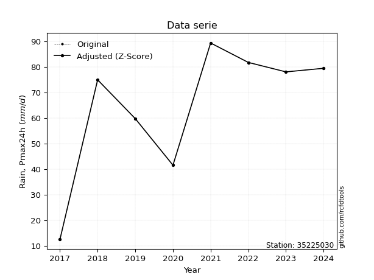</img>

</div>


> The initial value (value_initial) correspond to the initial obtained or null completed value, and value (value) is adjusted only when the initial value is outside the valid range (outlier) definite through the Z-Score value. If Z-Score is active, values out of range or outliers are replaced with the station mean value. A Z-Score (or standard score) measures how many standard deviations a data point is from the mean of a dataset, indicating its relative position; positive scores mean above the mean, negative mean below, and a score of zero is exactly at the mean, allowing for comparison of values from different distributions. It´s calculated using the formula $z=(x–μ)/σ$, where $x$ is the data point, $μ$ is the mean, and $σ$ is the standard deviation, helping identify outliers and understand probability.
>
> <sub>**Note**: In this study, "completing" (filling gaps in) and "extending" (forecasting or lengthening the historical record) rainfall data series are avoided for certain critical analyses because they introduce artificial bias and uncertainty, which can distort the statistics of rare events (extremes), alter day-to-day variability, and compromise the integrity and homogeneity of the original data. Some reasons against Completing/Extending rainfall data are: **Distortion of Extremes and Variability**: The primary issue is that most gap-filling or extension methods rely on averaging or regression with nearby stations, which inherently smooths the data. Rainfall is highly variable in space and time, with a large percentage of zero values and occasional large storms. Infilling methods often underestimate the highest values and overestimate the lowest (zero) values, which severely distorts analyses focused on flood frequency, drought severity, and intensity-duration-frequency (IDF) curves, **Loss of Data Homogeneity**: Infilled or extended data are synthetic estimates, not actual measurements. Combining these estimates with observed data can violate the assumption of data homogeneity, which requires that the data properties do not change over time. Inhomogeneity can lead to incorrect conclusions about long-term trends or changes in climate patterns, **Propagation of Errors**: Errors and biases from the original data (e.g., wind-induced undercatch, instrument errors, site changes) or the data used for imputation can propagate through the analysis, leading to unreliable hydrological models and inaccurate predictions, **Compromised Statistical Integrity**: For statistical analyses, especially those involving the frequency of events, using artificial data can introduce time bias or autocorrelation that doesn´t exist in reality, making it difficult to assess the true probability of events, **Difficulty in Validation**: It is difficult to accurately validate the quality of filled or extended data, especially for past periods where ground-truth measurements are unavailable. The reliability of imputation techniques heavily depends on the density of the surrounding station network and the complexity of the local topography.</sub>


### 4. Active continuous probability distributions from SciPy (80 of 104 available)

A Probability Density Function (PDF) describes the relative likelihood of a continuous random variable falling within a specific range, where the total area under its curve equals 1, and the area over any interval gives the actual probability for that range. Unlike discrete probabilities (like rolling a die), a PDF shows density, not direct probability for a single point (which is zero), with higher points indicating higher likelihood, often visualized as a bell curve for normal distributions.

A log of a probability density function (log-PDF) is simply the logarithm of the PDF´s value, denoted as $log(f(x))$, useful for converting multiplication of probabilities into addition, improving numerical stability with tiny numbers, and connecting to information theory concepts like entropy. Instead of dealing with very small probabilities (e.g., 0.000001), log-PDFs use negative numbers (e.g., $log(0.00001) ≈ -11.51$ that are easier for computers to handle, preventing underflow errors and simplifying complex calculations. In this study, each active probability distribution from SciPy is also evaluated in the $log$ form.

[scipy.stats](https://docs.scipy.org/doc/scipy/reference/stats.html) is a Python´s powerful submodule within the SciPy library for comprehensive statistical analysis, offering over 130 probability distributions (like Normal, Poisson, etc.), functions for descriptive stats (mean, variance), hypothesis testing (t-tests, chi-square), random variable generation, and statistical tests, making it essential for data science, modeling, and research. It provides tools to explore, model, and draw conclusions from data efficiently, working seamlessly with [NumPy](https://numpy.org/).

<div align="center">

|   id | p_dist           |   n_parameter | fit_method   | label                                                                       | active   | ref                                                                                                      |
|-----:|:-----------------|--------------:|:-------------|:----------------------------------------------------------------------------|:---------|:---------------------------------------------------------------------------------------------------------|
|    0 | alpha            |             3 | MLE          | Alpha                                                                       | True     | [:mortar_board:](https://docs.scipy.org/doc/scipy/reference/generated/scipy.stats.alpha.html)            |
|    1 | anglit           |             2 | MM           | Anglit                                                                      | True     | [:mortar_board:](https://docs.scipy.org/doc/scipy/reference/generated/scipy.stats.anglit.html)           |
|    2 | arcsine          |             2 | MM           | Arcsine                                                                     | True     | [:mortar_board:](https://docs.scipy.org/doc/scipy/reference/generated/scipy.stats.arcsine.html)          |
|    3 | argus            |             3 | MLE          | Argus                                                                       | True     | [:mortar_board:](https://docs.scipy.org/doc/scipy/reference/generated/scipy.stats.argus.html)            |
|    4 | beta             |             4 | MLE          | Beta                                                                        | True     | [:mortar_board:](https://docs.scipy.org/doc/scipy/reference/generated/scipy.stats.beta.html)             |
|    5 | betaprime        |             4 | MLE          | Beta prime                                                                  | True     | [:mortar_board:](https://docs.scipy.org/doc/scipy/reference/generated/scipy.stats.betaprime.html)        |
|    6 | bradford         |             3 | MLE          | Bradford                                                                    | True     | [:mortar_board:](https://docs.scipy.org/doc/scipy/reference/generated/scipy.stats.bradford.html)         |
|    7 | burr             |             4 | MLE          | Burr (Type III)                                                             | True     | [:mortar_board:](https://docs.scipy.org/doc/scipy/reference/generated/scipy.stats.burr.html)             |
|    8 | burr12           |             4 | MLE          | Burr (Type III) 12                                                          | True     | [:mortar_board:](https://docs.scipy.org/doc/scipy/reference/generated/scipy.stats.burr12.html)           |
|    9 | cosine           |             2 | MLE          | Cosine                                                                      | True     | [:mortar_board:](https://docs.scipy.org/doc/scipy/reference/generated/scipy.stats.cosine.html)           |
|   10 | crystalball      |             4 | MLE          | Crystalball                                                                 | True     | [:mortar_board:](https://docs.scipy.org/doc/scipy/reference/generated/scipy.stats.crystalball.html)      |
|   11 | dgamma           |             3 | MLE          | Double gamma                                                                | True     | [:mortar_board:](https://docs.scipy.org/doc/scipy/reference/generated/scipy.stats.dgamma.html)           |
|   12 | dweibull         |             3 | MLE          | Double Weibull                                                              | True     | [:mortar_board:](https://docs.scipy.org/doc/scipy/reference/generated/scipy.stats.dweibull.html)         |
|   13 | erlang           |             3 | MLE          | Erlang                                                                      | True     | [:mortar_board:](https://docs.scipy.org/doc/scipy/reference/generated/scipy.stats.erlang.html)           |
|   14 | exponnorm        |             3 | MLE          | Exponentially modified Normal                                               | True     | [:mortar_board:](https://docs.scipy.org/doc/scipy/reference/generated/scipy.stats.exponnorm.html)        |
|   15 | exponpow         |             3 | MLE          | Exponential power                                                           | True     | [:mortar_board:](https://docs.scipy.org/doc/scipy/reference/generated/scipy.stats.exponpow.html)         |
|   16 | exponweib        |             4 | MLE          | Exponentiated Weibull                                                       | True     | [:mortar_board:](https://docs.scipy.org/doc/scipy/reference/generated/scipy.stats.exponweib.html)        |
|   17 | f                |             4 | MLE          | F                                                                           | True     | [:mortar_board:](https://docs.scipy.org/doc/scipy/reference/generated/scipy.stats.f.html)                |
|   18 | fatiguelife      |             3 | MLE          | Fatigue-life (Birnbaum-Saunders)                                            | True     | [:mortar_board:](https://docs.scipy.org/doc/scipy/reference/generated/scipy.stats.fatiguelife.html)      |
|   19 | foldnorm         |             3 | MM           | Fold Normal                                                                 | True     | [:mortar_board:](https://docs.scipy.org/doc/scipy/reference/generated/scipy.stats.foldnorm.html)         |
|   20 | gamma            |             3 | MLE          | Gamma                                                                       | True     | [:mortar_board:](https://docs.scipy.org/doc/scipy/reference/generated/scipy.stats.gamma.html)            |
|   21 | gausshyper       |             6 | MLE          | Gauss hypergeometric                                                        | True     | [:mortar_board:](https://docs.scipy.org/doc/scipy/reference/generated/scipy.stats.gausshyper.html)       |
|   22 | genexpon         |             5 | MLE          | Generalized exponential                                                     | True     | [:mortar_board:](https://docs.scipy.org/doc/scipy/reference/generated/scipy.stats.genexpon.html)         |
|   23 | genextreme       |             3 | MLE          | Generalized exponential                                                     | True     | [:mortar_board:](https://docs.scipy.org/doc/scipy/reference/generated/scipy.stats.genextreme.html)       |
|   24 | gengamma         |             4 | MLE          | Generalized gamma                                                           | True     | [:mortar_board:](https://docs.scipy.org/doc/scipy/reference/generated/scipy.stats.gengamma.html)         |
|   25 | genhalflogistic  |             3 | MLE          | Generalized half-logistic                                                   | True     | [:mortar_board:](https://docs.scipy.org/doc/scipy/reference/generated/scipy.stats.genhalflogistic.html)  |
|   26 | genlogistic      |             3 | MLE          | Generalized logistic                                                        | True     | [:mortar_board:](https://docs.scipy.org/doc/scipy/reference/generated/scipy.stats.genlogistic.html)      |
|   27 | gennorm          |             3 | MLE          | Generalized Normal                                                          | True     | [:mortar_board:](https://docs.scipy.org/doc/scipy/reference/generated/scipy.stats.gennorm.html)          |
|   28 | genpareto        |             3 | MLE          | Generalized Pareto                                                          | True     | [:mortar_board:](https://docs.scipy.org/doc/scipy/reference/generated/scipy.stats.genpareto.html)        |
|   29 | gompertz         |             3 | MLE          | Gompertz (or truncated Gumbel)                                              | True     | [:mortar_board:](https://docs.scipy.org/doc/scipy/reference/generated/scipy.stats.gompertz.html)         |
|   30 | gumbel_l         |             2 | MM           | Gumbel Left Skew                                                            | True     | [:mortar_board:](https://docs.scipy.org/doc/scipy/reference/generated/scipy.stats.gumbel_l.html)         |
|   31 | gumbel_r         |             2 | MM           | Gumbel Right Skew                                                           | True     | [:mortar_board:](https://docs.scipy.org/doc/scipy/reference/generated/scipy.stats.gumbel_r.html)         |
|   32 | halfgennorm      |             3 | MLE          | Upper half of a generalized normal                                          | True     | [:mortar_board:](https://docs.scipy.org/doc/scipy/reference/generated/scipy.stats.halfgennorm.html)      |
|   33 | halflogistic     |             2 | MM           | Half-logistic                                                               | True     | [:mortar_board:](https://docs.scipy.org/doc/scipy/reference/generated/scipy.stats.halflogistic.html)     |
|   34 | halfnorm         |             2 | MM           | Half Normal                                                                 | True     | [:mortar_board:](https://docs.scipy.org/doc/scipy/reference/generated/scipy.stats.halfnorm.html)         |
|   35 | hypsecant        |             2 | MM           | hyperbolic secant                                                           | True     | [:mortar_board:](https://docs.scipy.org/doc/scipy/reference/generated/scipy.stats.hypsecant.html)        |
|   36 | invgamma         |             3 | MLE          | Inverted gamma                                                              | True     | [:mortar_board:](https://docs.scipy.org/doc/scipy/reference/generated/scipy.stats.invgamma.html)         |
|   37 | invgauss         |             3 | MLE          | Inverse Gaussian                                                            | True     | [:mortar_board:](https://docs.scipy.org/doc/scipy/reference/generated/scipy.stats.invgauss.html)         |
|   38 | invweibull       |             3 | MLE          | Inverted Weibull                                                            | True     | [:mortar_board:](https://docs.scipy.org/doc/scipy/reference/generated/scipy.stats.invweibull.html)       |
|   39 | johnsonsb        |             4 | MLE          | Johnson SB                                                                  | True     | [:mortar_board:](https://docs.scipy.org/doc/scipy/reference/generated/scipy.stats.johnsonsb.html)        |
|   40 | johnsonsu        |             4 | MLE          | Johnson Su                                                                  | True     | [:mortar_board:](https://docs.scipy.org/doc/scipy/reference/generated/scipy.stats.johnsonsu.html)        |
|   41 | kappa3           |             3 | MLE          | Kappa 3                                                                     | True     | [:mortar_board:](https://docs.scipy.org/doc/scipy/reference/generated/scipy.stats.kappa3.html)           |
|   42 | kappa4           |             4 | MLE          | Kappa 4                                                                     | True     | [:mortar_board:](https://docs.scipy.org/doc/scipy/reference/generated/scipy.stats.kappa4.html)           |
|   43 | ksone            |             3 | MLE          | Kolmogorov-Smirnov one-sided test statistic distribution                    | True     | [:mortar_board:](https://docs.scipy.org/doc/scipy/reference/generated/scipy.stats.ksone.html)            |
|   44 | kstwobign        |             2 | MLE          | Limiting distribution of scaled Kolmogorov-Smirnov two-sided test statistic | True     | [:mortar_board:](https://docs.scipy.org/doc/scipy/reference/generated/scipy.stats.kstwobign.html)        |
|   45 | laplace          |             2 | MM           | Laplace                                                                     | True     | [:mortar_board:](https://docs.scipy.org/doc/scipy/reference/generated/scipy.stats.laplace.html)          |
|   46 | levy_l           |             2 | MLE          | Left-skewed Levy                                                            | True     | [:mortar_board:](https://docs.scipy.org/doc/scipy/reference/generated/scipy.stats.levy_l.html)           |
|   47 | loggamma         |             3 | MLE          | Log gamma                                                                   | True     | [:mortar_board:](https://docs.scipy.org/doc/scipy/reference/generated/scipy.stats.loggamma.html)         |
|   48 | logistic         |             2 | MM           | Logistic (or Sech-squared)                                                  | True     | [:mortar_board:](https://docs.scipy.org/doc/scipy/reference/generated/scipy.stats.logistic.html)         |
|   49 | loglaplace       |             3 | MLE          | Log-Laplace                                                                 | True     | [:mortar_board:](https://docs.scipy.org/doc/scipy/reference/generated/scipy.stats.loglaplace.html)       |
|   50 | lomax            |             3 | MLE          | Lomax (Pareto of the second kind)                                           | True     | [:mortar_board:](https://docs.scipy.org/doc/scipy/reference/generated/scipy.stats.lomax.html)            |
|   51 | maxwell          |             2 | MM           | Maxwell                                                                     | True     | [:mortar_board:](https://docs.scipy.org/doc/scipy/reference/generated/scipy.stats.maxwell.html)          |
|   52 | mielke           |             4 | MLE          | Mielke Beta-Kappa / Dagum                                                   | True     | [:mortar_board:](https://docs.scipy.org/doc/scipy/reference/generated/scipy.stats.mielke.html)           |
|   53 | moyal            |             2 | MM           | Moyal                                                                       | True     | [:mortar_board:](https://docs.scipy.org/doc/scipy/reference/generated/scipy.stats.moyal.html)            |
|   54 | nakagami         |             3 | MLE          | Nakagami                                                                    | True     | [:mortar_board:](https://docs.scipy.org/doc/scipy/reference/generated/scipy.stats.nakagami.html)         |
|   55 | ncf              |             5 | MLE          | Non-central F distribution                                                  | True     | [:mortar_board:](https://docs.scipy.org/doc/scipy/reference/generated/scipy.stats.ncf.html)              |
|   56 | nct              |             4 | MLE          | Non-central Student’s t                                                     | True     | [:mortar_board:](https://docs.scipy.org/doc/scipy/reference/generated/scipy.stats.nct.html)              |
|   57 | norm             |             2 | MM           | Normal                                                                      | True     | [:mortar_board:](https://docs.scipy.org/doc/scipy/reference/generated/scipy.stats.norm.html)             |
|   58 | pearson3         |             3 | MM           | Pearson type III                                                            | True     | [:mortar_board:](https://docs.scipy.org/doc/scipy/reference/generated/scipy.stats.pearson3.html)         |
|   59 | powerlaw         |             3 | MLE          | Power-function                                                              | True     | [:mortar_board:](https://docs.scipy.org/doc/scipy/reference/generated/scipy.stats.powerlaw.html)         |
|   60 | rayleigh         |             2 | MM           | Rayleigh                                                                    | True     | [:mortar_board:](https://docs.scipy.org/doc/scipy/reference/generated/scipy.stats.rayleigh.html)         |
|   61 | rdist            |             3 | MLE          | R-distributed (symmetric beta)                                              | True     | [:mortar_board:](https://docs.scipy.org/doc/scipy/reference/generated/scipy.stats.rdist.html)            |
|   62 | rice             |             3 | MLE          | Rice                                                                        | True     | [:mortar_board:](https://docs.scipy.org/doc/scipy/reference/generated/scipy.stats.rice.html)             |
|   63 | semicircular     |             2 | MM           | Semicircular                                                                | True     | [:mortar_board:](https://docs.scipy.org/doc/scipy/reference/generated/scipy.stats.semicircular.html)     |
|   64 | skewnorm         |             3 | MLE          | Skew normal                                                                 | True     | [:mortar_board:](https://docs.scipy.org/doc/scipy/reference/generated/scipy.stats.skewnorm.html)         |
|   65 | t                |             3 | MLE          | Student’s t                                                                 | True     | [:mortar_board:](https://docs.scipy.org/doc/scipy/reference/generated/scipy.stats.t.html)                |
|   66 | trapezoid        |             4 | MLE          | Trapezoid                                                                   | True     | [:mortar_board:](https://docs.scipy.org/doc/scipy/reference/generated/scipy.stats.trapezoid.html)        |
|   67 | triang           |             3 | MLE          | Triangular                                                                  | True     | [:mortar_board:](https://docs.scipy.org/doc/scipy/reference/generated/scipy.stats.triang.html)           |
|   68 | truncexpon       |             3 | MLE          | Truncated exponential                                                       | True     | [:mortar_board:](https://docs.scipy.org/doc/scipy/reference/generated/scipy.stats.truncexpon.html)       |
|   69 | truncnorm        |             4 | MLE          | Truncated normal                                                            | True     | [:mortar_board:](https://docs.scipy.org/doc/scipy/reference/generated/scipy.stats.truncnorm.html)        |
|   70 | truncpareto      |             4 | MLE          | Upper truncated Pareto                                                      | True     | [:mortar_board:](https://docs.scipy.org/doc/scipy/reference/generated/scipy.stats.truncpareto.html)      |
|   71 | truncweibull_min |             5 | MLE          | Doubly truncated Weibull minimum                                            | True     | [:mortar_board:](https://docs.scipy.org/doc/scipy/reference/generated/scipy.stats.truncweibull_min.html) |
|   72 | tukeylambda      |             3 | MLE          | Tukey-Lamdba                                                                | True     | [:mortar_board:](https://docs.scipy.org/doc/scipy/reference/generated/scipy.stats.tukeylambda.html)      |
|   73 | uniform          |             2 | MLE          | Uniform                                                                     | True     | [:mortar_board:](https://docs.scipy.org/doc/scipy/reference/generated/scipy.stats.uniform.html)          |
|   74 | vonmises         |             3 | MLE          | Von Mises                                                                   | True     | [:mortar_board:](https://docs.scipy.org/doc/scipy/reference/generated/scipy.stats.vonmises.html)         |
|   75 | vonmises_line    |             3 | MLE          | Von Mises line                                                              | True     | [:mortar_board:](https://docs.scipy.org/doc/scipy/reference/generated/scipy.stats.vonmises_line.html)    |
|   76 | wald             |             2 | MM           | Wald                                                                        | True     | [:mortar_board:](https://docs.scipy.org/doc/scipy/reference/generated/scipy.stats.wald.html)             |
|   77 | weibull_max      |             3 | MLE          | Weibull maximum                                                             | True     | [:mortar_board:](https://docs.scipy.org/doc/scipy/reference/generated/scipy.stats.weibull_max.html)      |
|   78 | weibull_min      |             3 | MLE          | Weibull minimum                                                             | True     | [:mortar_board:](https://docs.scipy.org/doc/scipy/reference/generated/scipy.stats.weibull_min.html)      |
|   79 | wrapcauchy       |             3 | MLE          | Wrapped  Cauchy                                                             | True     | [:mortar_board:](https://docs.scipy.org/doc/scipy/reference/generated/scipy.stats.wrapcauchy.html)       |

</div>

> **n_parameter:** # arguments & localization & scale.
>
> **Fit methods:** (MLE) maximum likelihood, (MM) L-moments.
>
>**Inactive** (With the only purpose of prevent loops, zero divisions, infinite values, over high estimated values or horizontal trending for recurrence intervals estimations, the follow distributions were disabled.)**:** lognorm, norminvgauss, powernorm, powerlognorm, cauchy, halfcauchy, foldcauchy, skewcauchy, chi2, expon, fisk, genhyperbolic, geninvgauss, gibrat, kstwo, laplace_asymmetric, levy, levy_stable, ncx2, pareto, rel_breitwigner, recipinvgauss, studentized_range, loguniform, 


## B. Probability (PDF) vs. Empirical (EDF) distributions functions

A continuous probability distribution (CPD) describes probabilities for variables that can take any value within a range (like rain any time), unlike discrete variables with specific outcomes (like temperature). It uses a Probability Density Function (PDF), a curve where the total area under it equals 1, and the probability of the variable falling within an interval (a to b) is found by calculating the area under the curve between those points. A key feature is that the probability of hitting any single exact value is zero, so probabilities are always expressed for ranges, e.g., $P(a ≤ X ≤ b)$.

<div align="center">

Distributions parameters from station values
|     |   station | p_dist              |   n |               loc |            scale | shape                  | shape1                 | shape2                | shape3             |
|----:|----------:|:--------------------|----:|------------------:|-----------------:|:-----------------------|:-----------------------|:----------------------|:-------------------|
|   0 |  35225030 | alpha               |   9 |      -0.0959181   |     33.5701      | 1.1558655532208807e-10 |                        |                       |                    |
|   1 |  35225030 | anglit              |   9 |      70.6778      |     83.4124      |                        |                        |                       |                    |
|   2 |  35225030 | arcsine             |   9 |      30.354       |     80.6475      |                        |                        |                       |                    |
|   3 |  35225030 | argus               |   9 |      -3.88291     |    127.465       | 6.00535866798446e-06   |                        |                       |                    |
|   4 |  35225030 | beta                |   9 |      12.5         |    106.617       | 0.7190280516585038     | 1.0080641452768582     |                       |                    |
|   5 |  35225030 | betaprime           |   9 |    -554.625       |  42292.7         | 475.5538895415889      | 32187.497114583326     |                       |                    |
|   6 |  35225030 | bradford            |   9 |      12.5         |    106.6         | 1.001624191555805      |                        |                       |                    |
|   7 |  35225030 | burr                |   9 |      -0.275426    |     99.6196      | 10.011034105899325     | 0.19711958402728558    |                       |                    |
|   8 |  35225030 | burr12              |   9 |      -1.56335     |     13.8941      | 328.3690086303063      | 0.0020049808463897326  |                       |                    |
|   9 |  35225030 | cosine              |   9 |      68.5867      |     25.2405      |                        |                        |                       |                    |
|  10 |  35225030 | crystalball         |   9 |      70.6778      |     28.5132      | 4937.214906709875      | 3465.7679351008323     |                       |                    |
|  11 |  35225030 | dgamma              |   9 |      78           |     22.0769      | 0.7540840336519614     |                        |                       |                    |
|  12 |  35225030 | dweibull            |   9 |      78           |     22.939       | 0.7271347741599274     |                        |                       |                    |
|  13 |  35225030 | erlang              |   9 |    -377.129       |      1.91496     | 233.86919580602955     |                        |                       |                    |
|  14 |  35225030 | exponnorm           |   9 |      70.6535      |     28.5133      | 0.000846206992396791   |                        |                       |                    |
|  15 |  35225030 | exponpow            |   9 |      -9.33777     |    107.088       | 2.333523462415152      |                        |                       |                    |
|  16 |  35225030 | exponweib           |   9 |      -3.81164e+07 |      3.81164e+07 | 11.890238142607018     | 510074.387272155       |                       |                    |
|  17 |  35225030 | f                   |   9 |  -15152.4         |  15223           | 2833326.7729009558     | 711220.1027197139      |                       |                    |
|  18 |  35225030 | fatiguelife         |   9 |      12.5         |      0.00032107  | 380.5387037601298      |                        |                       |                    |
|  19 |  35225030 | foldnorm            |   9 |     -34.8484      |     27.2105      | 3.8891119991049843     |                        |                       |                    |
|  20 |  35225030 | gamma               |   9 |    -394.955       |      1.83666     | 253.43868019210856     |                        |                       |                    |
|  21 |  35225030 | gausshyper          |   9 |       2.33377     |    116.766       | 1.3138249674775224     | 0.7249887789325091     | 0.8535728669830112    | 0.8133755026465275 |
|  22 |  35225030 | genexpon            |   9 |       1.68911     |      1.60026     | 3.5767017931793007e-10 | 0.524572950638577      | 0.0017980884508008194 |                    |
|  23 |  35225030 | genextreme          |   9 |      62.8344      |     30.5752      | 0.4392435383374311     |                        |                       |                    |
|  24 |  35225030 | gengamma            |   9 |    -189.487       |      0.0287566   | 215.54536906362483     | 0.5899949037898029     |                       |                    |
|  25 |  35225030 | genhalflogistic     |   9 |       1.88309     |    121.865       | 1.0396538104556852     |                        |                       |                    |
|  26 |  35225030 | genlogistic         |   9 |      86.0672      |     11.004       | 0.49328649374699746    |                        |                       |                    |
|  27 |  35225030 | gennorm             |   9 |      78           |      1.64054     | 0.4316594676183816     |                        |                       |                    |
|  28 |  35225030 | genpareto           |   9 |      -1.48967     |    194.455       | -1.6125319744170605    |                        |                       |                    |
|  29 |  35225030 | gompertz            |   9 |      12.4999      |     30.7801      | 0.11606997143492817    |                        |                       |                    |
|  30 |  35225030 | gumbel_l            |   9 |      83.5102      |     22.2316      |                        |                        |                       |                    |
|  31 |  35225030 | gumbel_r            |   9 |      57.8453      |     22.2316      |                        |                        |                       |                    |
|  32 |  35225030 | halfgennorm         |   9 |      12.5         |    104.776       | 2.6208190814059575     |                        |                       |                    |
|  33 |  35225030 | halflogistic        |   9 |      36.883       |     24.3778      |                        |                        |                       |                    |
|  34 |  35225030 | halfnorm            |   9 |      32.9375      |     47.3005      |                        |                        |                       |                    |
|  35 |  35225030 | hypsecant           |   9 |      70.6778      |     18.1521      |                        |                        |                       |                    |
|  36 |  35225030 | invgamma            |   9 |    -342.941       |  76032.6         | 184.99100911157336     |                        |                       |                    |
|  37 |  35225030 | invgauss            |   9 |     -83.0921      |   3185.27        | 0.04785448912288598    |                        |                       |                    |
|  38 |  35225030 | invweibull          |   9 |      -1.21451e+06 |      1.21456e+06 | 40105.65276094068      |                        |                       |                    |
|  39 |  35225030 | johnsonsb           |   9 |    -375.953       |    571.408       | -4.412263819334926     | 3.395952633243147      |                       |                    |
|  40 |  35225030 | johnsonsu           |   9 |      79.755       |      4.18988     | 0.29170703455130886    | 0.5065696334322198     |                       |                    |
|  41 |  35225030 | kappa3              |   9 |      12.4997      |    106.601       | 703805.4654147807      |                        |                       |                    |
|  42 |  35225030 | kappa4              |   9 |       1.81394     |    119.364       | 1.0983962505983795     | 1.0136817764413846     |                       |                    |
|  43 |  35225030 | ksone               |   9 |       1.84        |    127.92        | 1.0                    |                        |                       |                    |
|  44 |  35225030 | kstwobign           |   9 |     -53.3151      |    142.047       |                        |                        |                       |                    |
|  45 |  35225030 | laplace             |   9 |      70.6778      |     20.1619      |                        |                        |                       |                    |
|  46 |  35225030 | levy_l              |   9 |     124.405       |     26.4078      |                        |                        |                       |                    |
|  47 |  35225030 | loggamma            |   9 |       5.67327     |     52.8822      | 3.9065288280318087     |                        |                       |                    |
|  48 |  35225030 | logistic            |   9 |      70.6778      |     15.7201      |                        |                        |                       |                    |
|  49 |  35225030 | loglaplace          |   9 |      -0.218873    |     78.2189      | 2.668457405489038      |                        |                       |                    |
|  50 |  35225030 | lomax               |   9 |      12.5         |   2602.94        | 44.85884730256973      |                        |                       |                    |
|  51 |  35225030 | maxwell             |   9 |       3.1135      |     42.3396      |                        |                        |                       |                    |
|  52 |  35225030 | mielke              |   9 |      -0.591825    |     99.8351      | 1.9904632924097299     | 10.035448525395315     |                       |                    |
|  53 |  35225030 | moyal               |   9 |      54.3721      |     12.8354      |                        |                        |                       |                    |
|  54 |  35225030 | nakagami            |   9 |      41.5         |     43.5643      | 0.1903308154935594     |                        |                       |                    |
|  55 |  35225030 | ncf                 |   9 |      -0.0441309   |      1.22603e-05 | 4.766091628260929e-06  | 13.301144782732763     | 25.28237714699692     |                    |
|  56 |  35225030 | nct                 |   9 |   -1603.67        |     28.3934      | 183499.75128658838     | 58.96913490852029      |                       |                    |
|  57 |  35225030 | norm                |   9 |      70.6778      |     28.5132      |                        |                        |                       |                    |
|  58 |  35225030 | pearson3            |   9 |      70.6778      |     28.5132      | -0.4822539514411438    |                        |                       |                    |
|  59 |  35225030 | powerlaw            |   9 |      12.5         |    106.6         | 0.20931123186784295    |                        |                       |                    |
|  60 |  35225030 | rayleigh            |   9 |      16.1304      |     43.5225      |                        |                        |                       |                    |
|  61 |  35225030 | rdist               |   9 |       2.94413     |     56.7559      | 1.0955274352090627     |                        |                       |                    |
|  62 |  35225030 | rice                |   9 |   -2673.24        |     28.5112      | 96.2348495788089       |                        |                       |                    |
|  63 |  35225030 | semicircular        |   9 |      70.6778      |     57.0264      |                        |                        |                       |                    |
|  64 |  35225030 | skewnorm            |   9 |      99.7824      |     40.7441      | -2.07387499392168      |                        |                       |                    |
|  65 |  35225030 | t                   |   9 |      76.2708      |     16.7014      | 1.9953218528886154     |                        |                       |                    |
|  66 |  35225030 | trapezoid           |   9 |       1.84        |    127.92        | 0.9999999999999999     | 1.0                    |                       |                    |
|  67 |  35225030 | triang              |   9 |       1.8803      |    117.22        | 0.9999996264002489     |                        |                       |                    |
|  68 |  35225030 | truncexpon          |   9 |       1.97516     |    152.707       | 0.766993119223195      |                        |                       |                    |
|  69 |  35225030 | truncnorm           |   9 |      78.5736      |     34.5811      | -237.5761926547384     | 1.1719255469851033     |                       |                    |
|  70 |  35225030 | truncpareto         |   9 |      12.4923      |      0.00770738  | 0.1251503941130069     | 13831.8976922111       |                       |                    |
|  71 |  35225030 | truncweibull_min    |   9 |       2.67842     |    185.777       | 1.6088046062885306     | 0.00033977512268764157 | 0.6266730443427178    |                    |
|  72 |  35225030 | tukeylambda         |   9 |      73.3637      |    295.895       | 4.861609525073824      |                        |                       |                    |
|  73 |  35225030 | uniform             |   9 |      12.5         |    106.6         |                        |                        |                       |                    |
|  74 |  35225030 | vonmises            |   9 |      -0.735372    |      1           | 0.23220383481191326    |                        |                       |                    |
|  75 |  35225030 | vonmises_line       |   9 |      65.7273      |     16.9891      | 0.5002483772037936     |                        |                       |                    |
|  76 |  35225030 | wald                |   9 |      42.1646      |     28.5132      |                        |                        |                       |                    |
|  77 |  35225030 | weibull_max         |   9 |     119.1         |      1.58626     | 0.27327711805011756    |                        |                       |                    |
|  78 |  35225030 | weibull_min         |   9 |     -82.9829      |    165.133       | 6.366627209044139      |                        |                       |                    |
|  79 |  35225030 | wrapcauchy          |   9 |      12.0317      |     17.0405      | 6.245813167166935e-05  |                        |                       |                    |
|  80 |  35225030 | logalpha            |   9 |     -17.417       |    693.132       | 32.210416506618245     |                        |                       |                    |
|  81 |  35225030 | loganglit           |   9 |       4.11813     |      1.82725     |                        |                        |                       |                    |
|  82 |  35225030 | logarcsine          |   9 |       3.23479     |      1.76668     |                        |                        |                       |                    |
|  83 |  35225030 | logargus            |   9 |       1.6421      |      3.17451     | 2.690509485595486      |                        |                       |                    |
|  84 |  35225030 | logbeta             |   9 |       2.29433     |      2.48563     | 1.1270026060697533     | 0.22350392417992124    |                       |                    |
|  85 |  35225030 | logbetaprime        |   9 |     -14.0403      |     53.0016      | 999.2721167974232      | 2917.0716874735517     |                       |                    |
|  86 |  35225030 | logbradford         |   9 |       2.52573     |      2.2682      | 5.020439402328688e-05  |                        |                       |                    |
|  87 |  35225030 | logburr             |   9 |    -378.602       |    383.204       | 3914.8814547934726     | 0.19132945501022453    |                       |                    |
|  88 |  35225030 | logburr12           |   9 |   -4487.94        |   4497.44        | 12756.591160577482     | 2009859.991489693      |                       |                    |
|  89 |  35225030 | logcosine           |   9 |       3.95956     |      0.593611    |                        |                        |                       |                    |
|  90 |  35225030 | logcrystalball      |   9 |       4.11813     |      0.624626    | 867.7000336908359      | 7.9620695202375895     |                       |                    |
|  91 |  35225030 | logdgamma           |   9 |       4.35671     |      0.485697    | 0.6331586753454872     |                        |                       |                    |
|  92 |  35225030 | logdweibull         |   9 |       4.35671     |      0.468634    | 0.6471815096333622     |                        |                       |                    |
|  93 |  35225030 | logerlang           |   9 |      -6.53661     |      0.0408804   | 260.6385104375935      |                        |                       |                    |
|  94 |  35225030 | logexponnorm        |   9 |       4.11787     |      0.624619    | 0.0004252256551280772  |                        |                       |                    |
|  95 |  35225030 | logexponpow         |   9 |       2.52573     |      1.44153     | 0.545247613866421      |                        |                       |                    |
|  96 |  35225030 | logexponweib        |   9 |       2.52573     |      1.10559     | 1.0444515246146744     | 0.8771629700118193     |                       |                    |
|  97 |  35225030 | logf                |   9 |    -984.091       |    988.208       | 7516123.943278503      | 14607917.83349397      |                       |                    |
|  98 |  35225030 | logfatiguelife      |   9 |    -505.553       |    509.674       | 0.0012258412133228798  |                        |                       |                    |
|  99 |  35225030 | logfoldnorm         |   9 |       1.09466     |      0.585802    | 5.167621367718985      |                        |                       |                    |
| 100 |  35225030 | loggamma            |   9 |      -7.51478     |      0.0374114   | 311.0138374209165      |                        |                       |                    |
| 101 |  35225030 | loggausshyper       |   9 |       2.51733     |      2.26263     | 1.2581426531109745     | 0.6980842987016852     | 1.047642907521673     | 0.8722290496704309 |
| 102 |  35225030 | loggenexpon         |   9 |       2.45525     |      0.00904121  | 0.0008846205032186536  | 4.302515165287952      | 1.006826126179579e-05 |                    |
| 103 |  35225030 | loggenextreme       |   9 |       4.16733     |      0.643359    | 1.0501498015806818     |                        |                       |                    |
| 104 |  35225030 | loggengamma         |   9 |      -3.19384e+07 |      3.19384e+07 | 1.5335359258934549     | 56945984.34423687      |                       |                    |
| 105 |  35225030 | loggenhalflogistic  |   9 |       2.5224      |      2.38132     | 1.0548194512501254     |                        |                       |                    |
| 106 |  35225030 | loggenlogistic      |   9 |       4.59946     |      0.100089    | 0.19604586441095756    |                        |                       |                    |
| 107 |  35225030 | loggennorm          |   9 |       4.3745      |      0.00466082  | 0.32643342840584544    |                        |                       |                    |
| 108 |  35225030 | loggenpareto        |   9 |      -0.01241     |     13.8433      | -2.8886061451283487    |                        |                       |                    |
| 109 |  35225030 | loggompertz         |   9 |       2.52573     |      0.38791     | 0.008818443664900515   |                        |                       |                    |
| 110 |  35225030 | loggumbel_l         |   9 |       4.39924     |      0.487019    |                        |                        |                       |                    |
| 111 |  35225030 | loggumbel_r         |   9 |       3.83701     |      0.487019    |                        |                        |                       |                    |
| 112 |  35225030 | loghalfgennorm      |   9 |       2.52573     |      2.84777     | 2.964193357233897      |                        |                       |                    |
| 113 |  35225030 | loghalflogistic     |   9 |       3.37778     |      0.534047    |                        |                        |                       |                    |
| 114 |  35225030 | loghalfnorm         |   9 |       3.29138     |      1.03617     |                        |                        |                       |                    |
| 115 |  35225030 | loghypsecant        |   9 |       4.11813     |      0.397649    |                        |                        |                       |                    |
| 116 |  35225030 | loginvgamma         |   9 |     -12.8455      |  11232.4         | 663.1985035076473      |                        |                       |                    |
| 117 |  35225030 | loginvgauss         |   9 |      -3.96701     |   1136.97        | 0.007112871123812769   |                        |                       |                    |
| 118 |  35225030 | loginvweibull       |   9 |      -8.68671e+07 |      8.68671e+07 | 109626618.68084767     |                        |                       |                    |
| 119 |  35225030 | logjohnsonsb        |   9 |     -88.9201      |     93.8834      | -7.348382574834986     | 1.4919347833690728     |                       |                    |
| 120 |  35225030 | logjohnsonsu        |   9 |       4.38224     |      0.0385928   | 0.36382479483213753    | 0.42881140549405844    |                       |                    |
| 121 |  35225030 | logkappa3           |   9 |       2.52573     |      2.25319     | 4751.308142717642      |                        |                       |                    |
| 122 |  35225030 | logkappa4           |   9 |       2.41279     |      2.49149     | 1.0475346172437066     | 1.0475515073761001     |                       |                    |
| 123 |  35225030 | logksone            |   9 |       2.30031     |      2.70508     | 1.0                    |                        |                       |                    |
| 124 |  35225030 | logkstwobign        |   9 |       0.836515    |      3.76446     |                        |                        |                       |                    |
| 125 |  35225030 | loglaplace          |   9 |       4.11813     |      0.441677    |                        |                        |                       |                    |
| 126 |  35225030 | loglevy_l           |   9 |       4.83818     |      0.288655    |                        |                        |                       |                    |
| 127 |  35225030 | logloggamma         |   9 |       4.68755     |      0.158334    | 0.29251094235324826    |                        |                       |                    |
| 128 |  35225030 | loglogistic         |   9 |       4.11813     |      0.344374    |                        |                        |                       |                    |
| 129 |  35225030 | logloglaplace       |   9 |      -5.56993e+06 |      5.56993e+06 | 15044284.95316042      |                        |                       |                    |
| 130 |  35225030 | loglomax            |   9 |       2.52573     |     74.3276      | 46.796703053514065     |                        |                       |                    |
| 131 |  35225030 | logmaxwell          |   9 |       2.63801     |      0.927523    |                        |                        |                       |                    |
| 132 |  35225030 | logmielke           |   9 | -183800           | 183805           | 344540.6553007503      | 1805592.292909562      |                       |                    |
| 133 |  35225030 | logmoyal            |   9 |       3.76092     |      0.281181    |                        |                        |                       |                    |
| 134 |  35225030 | lognakagami         |   9 |       3.48929     |      0.861675    | 1.8374843836302195     |                        |                       |                    |
| 135 |  35225030 | logncf              |   9 |      -6.44924     |      0.000258944 | 0.030804523069352913   | 2283.141443215808      | 1256.0666752586426    |                    |
| 136 |  35225030 | lognct              |   9 |     -30.3371      |      0.509873    | 3988.1737820782982     | 67.55703042637128      |                       |                    |
| 137 |  35225030 | lognorm             |   9 |       4.11813     |      0.624626    |                        |                        |                       |                    |
| 138 |  35225030 | logpearson3         |   9 |       4.11813     |      0.624627    | -1.6846304201840718    |                        |                       |                    |
| 139 |  35225030 | logpowerlaw         |   9 |       2.52573     |      2.25423     | 0.2361219775754359     |                        |                       |                    |
| 140 |  35225030 | lograyleigh         |   9 |       2.92315     |      0.953449    |                        |                        |                       |                    |
| 141 |  35225030 | logrdist            |   9 |       3.65282     |      1.12715     | 1.182554326876883      |                        |                       |                    |
| 142 |  35225030 | logrice             |   9 |    -694.936       |      0.627734    | 1113.6144017325123     |                        |                       |                    |
| 143 |  35225030 | logsemicircular     |   9 |       4.11812     |      1.2493      |                        |                        |                       |                    |
| 144 |  35225030 | logskewnorm         |   9 |       4.77996     |      0.910021    | -12780080.424458807    |                        |                       |                    |
| 145 |  35225030 | logt                |   9 |       4.36989     |      0.0719698   | 0.6255476708566454     |                        |                       |                    |
| 146 |  35225030 | logtrapezoid        |   9 |       2.35142     |      2.65006     | 1.0                    | 1.0                    |                       |                    |
| 147 |  35225030 | logtriang           |   9 |       2.20571     |      2.57425     | 0.9999999958363968     |                        |                       |                    |
| 148 |  35225030 | logtruncexpon       |   9 |       2.52564     |      3.47816     | 0.6481361554307872     |                        |                       |                    |
| 149 |  35225030 | logtruncnorm        |   9 |      -0.201864    |      1.72451     | 2.277488884524013      | 2.8888344540697313     |                       |                    |
| 150 |  35225030 | logtruncpareto      |   9 |       2.52551     |      0.00022022  | 0.1251425579798624     | 10237.272463470723     |                       |                    |
| 151 |  35225030 | logtruncweibull_min |   9 |       2.08796     |      5.24368     | 2.6963688581739236     | 0.009473989718853788   | 0.5133806289268446    |                    |
| 152 |  35225030 | logtukeylambda      |   9 |       3.65285     |      1.14961     | 1.0199481554386067     |                        |                       |                    |
| 153 |  35225030 | loguniform          |   9 |       2.52573     |      2.25423     |                        |                        |                       |                    |
| 154 |  35225030 | logvonmises         |   9 |      -2.09365     |      1           | 3.3974099851357686     |                        |                       |                    |
| 155 |  35225030 | logvonmises_line    |   9 |       4.24961     |      0.548727    | 1.7784237977984958     |                        |                       |                    |
| 156 |  35225030 | logwald             |   9 |       3.49348     |      0.624644    |                        |                        |                       |                    |
| 157 |  35225030 | logweibull_max      |   9 |       4.77996     |      0.9861      | 0.9437578762695155     |                        |                       |                    |
| 158 |  35225030 | logweibull_min      |   9 |       2.52573     |      1.18839     | 0.9309992653682637     |                        |                       |                    |
| 159 |  35225030 | logwrapcauchy       |   9 |       2.52573     |      0.358773    | 0.5                    |                        |                       |                    |

</div>

> **loc** (Location parameter): This shifts the distribution along the x-axis. For many common distributions, like the normal (Gaussian) distribution, loc represents the mean $μ$. For others, like the uniform distribution, it might represent the minimum value, or for the beta distribution, the left end of the support interval.
>
> **scale** (Scale parameter): This determines the width or spread of the distribution. For the normal distribution, scale represents the standard deviation $σ$. For a uniform distribution, it defines the length of the interval (from $loc$ to $loc + scale$).
>
> **shape** (Shape parameters): Refers to parameters that define the specific form of a probability distribution, distinct from its location (loc) and scale (scale). These parameters are required arguments for most distribution functions. For example, a normal (Gaussian) distribution is fully defined by its location (mean) and scale (standard deviation), so it has no specific shape parameters beyond loc and scale. However, other distributions have intrinsic properties that need specification, as Gamma distribution that takes a shape parameter, often named $a$ or $alpha$.


### 0. Cumulative distribution values - CDF (160 evaluated)

Cumulative Distribution Function (CDF), denoted as $F$<sub>$X$</sub>$(x)$, is a function that gives the probability that a random variable $X$ will take a value less than or equal to a specific value, $x$ (i.e., $(P(X≥x)$. It essentially "accumulates" probabilities from a given point up to the far right (positive infinity), providing a complete picture of the distribution´s probabilities for both discrete (like rain) and continuous (like temperature) variables, helping to find probabilities over ranges or above certain values. Each station is evaluated separately ordering the $x$ values ascending, calculating the CDF and PDF values for the activated distributions and their logarithmic forms.

<div align="center">

CDF ordered by x ascending and calculating $log(f(x))$ separately
|   id |   Station |   date |     x |   count |    mean |     std |    zscore |   Value_initial |   station |   m |      alpha |   alpha_pdf |     anglit |   anglit_pdf |   arcsine |   arcsine_pdf |     argus |   argus_pdf |        beta |     beta_pdf |   betaprime |   betaprime_pdf |    bradford |   bradford_pdf |      burr |   burr_pdf |     burr12 |   burr12_pdf |    cosine |   cosine_pdf |   crystalball |   crystalball_pdf |    dgamma |   dgamma_pdf |   dweibull |   dweibull_pdf |    erlang |   erlang_pdf |   exponnorm |   exponnorm_pdf |   exponpow |   exponpow_pdf |   exponweib |   exponweib_pdf |         f |      f_pdf |   fatiguelife |   fatiguelife_pdf |   foldnorm |   foldnorm_pdf |    gamma |   gamma_pdf |   gausshyper |   gausshyper_pdf |   genexpon |   genexpon_pdf |   genextreme |   genextreme_pdf |   gengamma |   gengamma_pdf |   genhalflogistic |   genhalflogistic_pdf |   genlogistic |   genlogistic_pdf |   gennorm |   gennorm_pdf |   genpareto |   genpareto_pdf |   gompertz |   gompertz_pdf |   gumbel_l |   gumbel_l_pdf |    gumbel_r |   gumbel_r_pdf |   halfgennorm |   halfgennorm_pdf |   halflogistic |   halflogistic_pdf |   halfnorm |   halfnorm_pdf |   hypsecant |   hypsecant_pdf |   invgamma |   invgamma_pdf |   invgauss |   invgauss_pdf |   invweibull |   invweibull_pdf |   johnsonsb |   johnsonsb_pdf |   johnsonsu |   johnsonsu_pdf |      kappa3 |   kappa3_pdf |      kappa4 |   kappa4_pdf |     ksone |   ksone_pdf |   kstwobign |   kstwobign_pdf |   laplace |   laplace_pdf |   levy_l |   levy_l_pdf |   loggamma |   loggamma_pdf |   logistic |   logistic_pdf |   loglaplace |   loglaplace_pdf |       lomax |   lomax_pdf |    maxwell |   maxwell_pdf |    mielke |   mielke_pdf |       moyal |   moyal_pdf |    nakagami |   nakagami_pdf |        ncf |    ncf_pdf |       nct |    nct_pdf |      norm |   norm_pdf |   pearson3 |   pearson3_pdf |    powerlaw |   powerlaw_pdf |   rayleigh |   rayleigh_pdf |    rdist |      rdist_pdf |      rice |   rice_pdf |   semicircular |   semicircular_pdf |   skewnorm |   skewnorm_pdf |         t |       t_pdf |   trapezoid |   trapezoid_pdf |     triang |   triang_pdf |   truncexpon |   truncexpon_pdf |   truncnorm |   truncnorm_pdf |   truncpareto |   truncpareto_pdf |   truncweibull_min |   truncweibull_min_pdf |   tukeylambda |   tukeylambda_pdf |   uniform |   uniform_pdf |   vonmises |   vonmises_pdf |   vonmises_line |   vonmises_line_pdf |     wald |   wald_pdf |   weibull_max |   weibull_max_pdf |   weibull_min |   weibull_min_pdf |   wrapcauchy |   wrapcauchy_pdf |   logalpha |   logalpha_pdf |   loganglit |   loganglit_pdf |   logarcsine |   logarcsine_pdf |   logargus |   logargus_pdf |   logbeta |   logbeta_pdf |   logbetaprime |   logbetaprime_pdf |   logbradford |   logbradford_pdf |   logburr |   logburr_pdf |   logburr12 |   logburr12_pdf |   logcosine |   logcosine_pdf |   logcrystalball |   logcrystalball_pdf |   logdgamma |   logdgamma_pdf |   logdweibull |   logdweibull_pdf |   logerlang |   logerlang_pdf |   logexponnorm |   logexponnorm_pdf |   logexponpow |   logexponpow_pdf |   logexponweib |   logexponweib_pdf |       logf |   logf_pdf |   logfatiguelife |   logfatiguelife_pdf |   logfoldnorm |   logfoldnorm_pdf |   loggausshyper |   loggausshyper_pdf |   loggenexpon |   loggenexpon_pdf |   loggenextreme |   loggenextreme_pdf |   loggengamma |   loggengamma_pdf |   loggenhalflogistic |   loggenhalflogistic_pdf |   loggenlogistic |   loggenlogistic_pdf |   loggennorm |   loggennorm_pdf |   loggenpareto |   loggenpareto_pdf |   loggompertz |   loggompertz_pdf |   loggumbel_l |   loggumbel_l_pdf |   loggumbel_r |   loggumbel_r_pdf |   loghalfgennorm |   loghalfgennorm_pdf |   loghalflogistic |   loghalflogistic_pdf |   loghalfnorm |   loghalfnorm_pdf |   loghypsecant |   loghypsecant_pdf |   loginvgamma |   loginvgamma_pdf |   loginvgauss |   loginvgauss_pdf |   loginvweibull |   loginvweibull_pdf |   logjohnsonsb |   logjohnsonsb_pdf |   logjohnsonsu |   logjohnsonsu_pdf |   logkappa3 |   logkappa3_pdf |   logkappa4 |   logkappa4_pdf |   logksone |   logksone_pdf |   logkstwobign |   logkstwobign_pdf |   loglevy_l |   loglevy_l_pdf |   logloggamma |   logloggamma_pdf |   loglogistic |   loglogistic_pdf |   logloglaplace |   logloglaplace_pdf |    loglomax |   loglomax_pdf |   logmaxwell |   logmaxwell_pdf |   logmielke |   logmielke_pdf |    logmoyal |   logmoyal_pdf |   lognakagami |   lognakagami_pdf |     logncf |   logncf_pdf |     lognct |   lognct_pdf |    lognorm |   lognorm_pdf |   logpearson3 |   logpearson3_pdf |   logpowerlaw |   logpowerlaw_pdf |   lograyleigh |   lograyleigh_pdf |   logrdist |   logrdist_pdf |    logrice |   logrice_pdf |   logsemicircular |   logsemicircular_pdf |   logskewnorm |   logskewnorm_pdf |      logt |   logt_pdf |   logtrapezoid |   logtrapezoid_pdf |   logtriang |   logtriang_pdf |   logtruncexpon |   logtruncexpon_pdf |   logtruncnorm |   logtruncnorm_pdf |   logtruncpareto |   logtruncpareto_pdf |   logtruncweibull_min |   logtruncweibull_min_pdf |   logtukeylambda |   logtukeylambda_pdf |   loguniform |   loguniform_pdf |   logvonmises |   logvonmises_pdf |   logvonmises_line |   logvonmises_line_pdf |   logwald |   logwald_pdf |   logweibull_max |   logweibull_max_pdf |   logweibull_min |   logweibull_min_pdf |   logwrapcauchy |   logwrapcauchy_pdf |
|-----:|----------:|-------:|------:|--------:|--------:|--------:|----------:|----------------:|----------:|----:|-----------:|------------:|-----------:|-------------:|----------:|--------------:|----------:|------------:|------------:|-------------:|------------:|----------------:|------------:|---------------:|----------:|-----------:|-----------:|-------------:|----------:|-------------:|--------------:|------------------:|----------:|-------------:|-----------:|---------------:|----------:|-------------:|------------:|----------------:|-----------:|---------------:|------------:|----------------:|----------:|-----------:|--------------:|------------------:|-----------:|---------------:|---------:|------------:|-------------:|-----------------:|-----------:|---------------:|-------------:|-----------------:|-----------:|---------------:|------------------:|----------------------:|--------------:|------------------:|----------:|--------------:|------------:|----------------:|-----------:|---------------:|-----------:|---------------:|------------:|---------------:|--------------:|------------------:|---------------:|-------------------:|-----------:|---------------:|------------:|----------------:|-----------:|---------------:|-----------:|---------------:|-------------:|-----------------:|------------:|----------------:|------------:|----------------:|------------:|-------------:|------------:|-------------:|----------:|------------:|------------:|----------------:|----------:|--------------:|---------:|-------------:|-----------:|---------------:|-----------:|---------------:|-------------:|-----------------:|------------:|------------:|-----------:|--------------:|----------:|-------------:|------------:|------------:|------------:|---------------:|-----------:|-----------:|----------:|-----------:|----------:|-----------:|-----------:|---------------:|------------:|---------------:|-----------:|---------------:|---------:|---------------:|----------:|-----------:|---------------:|-------------------:|-----------:|---------------:|----------:|------------:|------------:|----------------:|-----------:|-------------:|-------------:|-----------------:|------------:|----------------:|--------------:|------------------:|-------------------:|-----------------------:|--------------:|------------------:|----------:|--------------:|-----------:|---------------:|----------------:|--------------------:|---------:|-----------:|--------------:|------------------:|--------------:|------------------:|-------------:|-----------------:|-----------:|---------------:|------------:|----------------:|-------------:|-----------------:|-----------:|---------------:|----------:|--------------:|---------------:|-------------------:|--------------:|------------------:|----------:|--------------:|------------:|----------------:|------------:|----------------:|-----------------:|---------------------:|------------:|----------------:|--------------:|------------------:|------------:|----------------:|---------------:|-------------------:|--------------:|------------------:|---------------:|-------------------:|-----------:|-----------:|-----------------:|---------------------:|--------------:|------------------:|----------------:|--------------------:|--------------:|------------------:|----------------:|--------------------:|--------------:|------------------:|---------------------:|-------------------------:|-----------------:|---------------------:|-------------:|-----------------:|---------------:|-------------------:|--------------:|------------------:|--------------:|------------------:|--------------:|------------------:|-----------------:|---------------------:|------------------:|----------------------:|--------------:|------------------:|---------------:|-------------------:|--------------:|------------------:|--------------:|------------------:|----------------:|--------------------:|---------------:|-------------------:|---------------:|-------------------:|------------:|----------------:|------------:|----------------:|-----------:|---------------:|---------------:|-------------------:|------------:|----------------:|--------------:|------------------:|--------------:|------------------:|----------------:|--------------------:|------------:|---------------:|-------------:|-----------------:|------------:|----------------:|------------:|---------------:|--------------:|------------------:|-----------:|-------------:|-----------:|-------------:|-----------:|--------------:|--------------:|------------------:|--------------:|------------------:|--------------:|------------------:|-----------:|---------------:|-----------:|--------------:|------------------:|----------------------:|--------------:|------------------:|----------:|-----------:|---------------:|-------------------:|------------:|----------------:|----------------:|--------------------:|---------------:|-------------------:|-----------------:|---------------------:|----------------------:|--------------------------:|-----------------:|---------------------:|-------------:|-----------------:|--------------:|------------------:|-------------------:|-----------------------:|----------:|--------------:|-----------------:|---------------------:|-----------------:|---------------------:|----------------:|--------------------:|
|    0 |  35225030 |   2017 |  12.5 |       9 | 70.6778 | 30.2428 | -1.92369  |            12.5 |  35225030 |   1 | 0.00769515 |  0.00484194 | 0.00771125 |   0.0020974  |  0        |    0          | 0.0246766 |  0.00299992 | 8.68413e-13 | 351.514      |    0.020134 |      0.00180155 | 2.22485e-09 |     0.0135398  | 0.0173706 | 0.00268316 | 0.00797646 |   0.045586   | 0.0197671 |   0.002483   |     0.0206562 |        0.0017452  | 0.0151465 |  0.000731151 |  0.0585616 |     0.00139418 | 0.0197284 |   0.00179402 |   0.0206568 |      0.00174525 |  0.0244673 |     0.00261398 |    0.02427  |      0.00186407 | 0.0207945 | 0.00176072 |     0.0470928 |       1.03951e+08 |  0.0158159 |     0.00145651 | 0.020066 |  0.0018154  |    0.0382841 |       0.00487923 |  0.0212092 |     0.00387391 |    0.0317008 |       0.00207676 |  0.0182609 |     0.00183047 |          0.045629 |            0.00450214 |     0.0369388 |        0.00165383 | 0.0325947 |   0.000821942 |   0.0736192 |      0.0053892  | 4.7856e-07 |     0.00377096 |  0.0401739 |     0.00177026 | 0.000458242 |    0.000158469 |   1.39012e-12 |        0.0107428  |      0         |         0          |   0        |     0          |   0.0258058 |      0.00142009 |  0.0202422 |     0.00196546 |  0.0198249 |     0.00237586 |    0.0154781 |       0.0021305  |   0.0317739 |      0.00194829 |   0.0713163 |      0.00102391 | 2.44001e-06 |   0.00938062 | 2.98298e-15 |   0.225385   | 0.0833333 |  0.00781739 |    0.017275 |      0.0027543  | 0.0279124 |    0.00138442 | 0.372877 |   0.00153906 | 0.00589202 |      0.0279927 |  0.0241072 |     0.00149655 |    0.0135891 |         0.030767 | 2.78584e-14 |  0.0172339  | 0.00285558 |   0.000903719 | 0.0175327 |   0.00266564 | 3.22915e-07 | 3.40169e-07 | 0           |    0           | 0.00627802 | 0.0016391  | 0.0206908 | 0.00174791 | 0.0206562 | 0.0017452  |  0.0317695 |     0.00192176 | 0.000307701 |    3.62569e+10 |   0        |     0          | 0.557308 |     0.00604951 | 0.0206536 | 0.00174519 |       0        |         0          |  0.0321766 |     0.00197411 | 0.0312419 | 0.000888359 |  0.00694444 |      0.0013029  | 0.00820773 |   0.00154576 |     0.124349 |       0.0114124  |   0.0318658 |      0.0021142  |      0        |      23.3042      |          0.0233727 |             0.00381278 |   3.20455e-12 |        0.00337957 |  0        |    0.00938086 |    2.6303  |       0.188405 |     0.000776641 |          0.0053413  | 0        | 0          |     0.04252   |       0.000344208 |      0.030109 |        0.00197708 |   0.00437461 |       0.00934096 | 0.00545189 |      0.0272171 |    0        |        0        |     0        |         0        |  0.0195002 |      0.0496338 |  0.014751 |   0.0744833   |      0.0066506 |          0.0302054 |   2.66224e-07 |          0.440889 | 0.0170976 |     0.0336019 |  0.00517008 |       0.0146492 |  0.00989204 |       0.0676348 |       0.00539604 |            0.0247741 |  0.00462538 |       0.0102891 |     0.0446545 |         0.0381278 |  0.00579773 |       0.0278565 |     0.00539543 |           0.024772 |   3.48716e-09 |        4.2815e+06 |    7.84833e-15 |          16.1911   | 0.00555743 |  0.0253579 |       0.00525341 |             0.024261 |    0.00321809 |         0.0166369 |     0.000897099 |            0.134325 |    0.00817791 |          0.134084 |       0.0315046 |           0.0460152 |     0.0100821 |         0.0268915 |          0.000699018 |                 0.210277 |        0.0172171 |            0.0337235 |    0.0153691 |        0.0143082 |       0.229796 |        0.118282    |   7.41278e-08 |         0.0227334 |     0.0211196 |          0.042904 |   3.85759e-07 |       1.16975e-05 |      2.93109e-10 |             0.393441 |          0        |              0        |      0        |          0        |      0.0116062 |          0.0291804 |     0.0053639 |         0.0266415 |    0.00509711 |          0.02705  |      0.00865313 |           0.0518695 |      0.0261597 |          0.0381465 |      0.0554228 |          0.0258446 | 1.05531e-10 |        0.443025 | 5.88019e-16 |        2.13049  |  0.0833333 |       0.369675 |      0.0121956 |          0.0812495 |    0.276142 |       0.0572644 |      0.020508 |         0.0378871 |    0.00971782 |         0.0279445 |      0.00355788 |          0.00960978 | 1.44608e-12 |       0.6296   |     0        |         0        |   0.0202277 |        0.037917 | 2.40579e-19 |    3.50159e-17 |     0         |          0        | 0.00658206 |    0.0306917 | 0.00589396 |    0.0270062 | 0.00539603 |     0.0247741 |     0.0266156 |         0.0467136 |   0.000195695 |       1.04051e+11 |      0        |          0        | 0.00133594 |      13.4197   | 0.00559523 |     0.0254584 |          0        |              0        |     0.0132446 |         0.0407795 | 0.0411204 |  0.01394   |     0.00432657 |          0.0496415 |   0.0154541 |       0.0965831 |      5.2737e-05 |            0.602752 |    0           |           0        |         0        |          829.441     |             0.0080724 |                 0.0498313 |      7.10543e-15 |             0.571484 |     0        |          0.44361 |       1.00565 |         0.0171471 |        1.14865e-09 |              0.0249765 |  0        |      0        |         0.1128   |             0.103051 |       4.3353e-15 |             9.08862  |        0        |            1.33083  |
|    1 |  35225030 |   2020 |  41.5 |       9 | 70.6778 | 30.2428 | -0.964784 |            41.5 |  35225030 |   2 | 0.419635   |  0.0111778  | 0.178043   |   0.00917247 |  0.242492 |    0.0114365  | 0.183988  |  0.00783058 | 0.394271    |   0.00976044 |    0.15958  |      0.00868706 | 0.347244    |     0.0106405  | 0.179965  | 0.00849971 | 0.52515    |   0.00725973 | 0.189353  |   0.00931557 |     0.153081  |        0.00828851 | 0.0627507 |  0.0031401   |  0.12308   |     0.00343706 | 0.159024  |   0.00865597 |   0.153083  |      0.00828856 |  0.174843  |     0.00793756 |    0.157466 |      0.00816768 | 0.154234  | 0.00833739 |     0.785166  |       0.00397693  |  0.139345  |     0.00815377 | 0.160338 |  0.00869844 |    0.216045  |       0.0070151  |  0.249922  |     0.0107563  |    0.159144  |       0.0073223  |  0.166074  |     0.00913721 |          0.195802 |            0.00595994 |     0.134474  |        0.00592502 | 0.0746323 |   0.00245834  |   0.239193  |      0.00608001 | 0.166159   |     0.00806702 |  0.140258  |     0.00584424 | 0.124188    |    0.0116524   |   0.308601    |        0.0103784  |      0.0944148 |         0.0203277  |   0.143652 |     0.0165943  |   0.125915  |      0.00675716 |  0.172734  |     0.00924799 |  0.205921  |     0.0105705  |    0.201932  |       0.0106676  |   0.152739  |      0.00712499 |   0.118749  |      0.00261377 | 0.272041    |   0.00938062 | 0.30129     |   0.00947987 | 0.310038  |  0.00781739 |    0.235557 |      0.011274   | 0.117617  |    0.00583363 | 0.427507 |   0.00231597 | 0.278722   |      0.520907  |  0.135161  |     0.00743585 |    0.205635  |         0.465578 | 0.39166     |  0.0103686  | 0.155798   |   0.0102699   | 0.179222  |   0.00847369 | 0.0987227   | 0.0131314   | 7.74454e-07 |    4.14901e+07 | 0.219164   | 0.0118648  | 0.153239  | 0.00829264 | 0.153081  | 0.00828851 |  0.151867  |     0.00711559 | 0.76149     |    0.00549615  |   0.156243 |     0.0113006  | 0.750745 |     0.00790014 | 0.153093  | 0.00828974 |       0.189101 |         0.00959167 |  0.152538  |     0.00702905 | 0.0865489 | 0.00375584  |  0.0961233  |      0.00484737 | 0.114241   |   0.00576686 |     0.42578  |       0.00943843 |   0.161297  |      0.00738437 |      0.92301  |       0.00220973  |          0.205894  |             0.00819365 |   0.124625    |        0.00564744 |  0.272045 |    0.00938086 |    7.18622 |       0.15077  |     0.1955      |          0.00946739 | 0        | 0          |     0.0552807 |       0.000563655 |      0.152483 |        0.00717134 |   0.275248   |       0.00933961 | 0.283269   |      0.524894  |    0.291776 |        0.497556 |     0.353466 |         0.402221 |  0.196822  |      0.330251  |  0.152547 |   0.169375    |      0.27904   |          0.514193  |   0.529044    |          0.440877 | 0.180098  |     0.352791  |  0.144981   |       0.38035   |  0.376203   |       0.515687  |       0.264914   |            0.524297  |  0.0734464  |       0.179913  |     0.148752  |         0.184956  |  0.280357   |       0.523265  |     0.264909   |           0.524298 |   0.770424    |        0.233284   |    0.646415    |           0.274975 | 0.266125   |  0.523421  |       0.262941   |             0.522581 |    0.249433   |         0.54181   |     0.412907    |            0.409647 |    0.424068   |          0.443824 |       0.186964  |           0.283169  |     0.203892  |         0.447663  |          0.346035    |                 0.395777 |        0.180596  |            0.353679  |    0.0655907 |        0.110178  |       0.407965 |        0.194405    |   0.169434    |         0.416379  |     0.221841  |          0.400768 |   0.284563    |       0.734343    |      0.463125    |             0.364223 |          0.314685 |              0.843533 |      0.324895 |          0.705274 |      0.227137  |          0.523944  |     0.28205   |         0.528796  |    0.290704   |          0.528847 |      0.35179    |           0.463815  |      0.181471  |          0.32219   |      0.125279  |          0.134427  | 0.531614    |        0.443025 | 0.529065    |        0.429055 |  0.52693   |       0.369675 |      0.402179  |          0.443895  |    0.389514 |       0.160441  |      0.188133 |         0.346945  |    0.242403   |         0.533267  |      0.0909444  |          0.245639   | 0.52738     |       0.292834 |     0.288633 |         0.59478  |   0.191782  |        0.359433 | 0.287033    |    0.857037    |     0.0139467 |          0.206371 | 0.284681   |    0.517482  | 0.272678   |    0.523671  | 0.264914   |     0.524297  |     0.20706   |         0.340089  |   0.861673    |       0.169555    |      0.2983   |          0.619475 | 0.523089   |       0.317183 | 0.265949   |     0.522734  |          0.303365 |              0.483789 |     0.246655  |         0.448172  | 0.0792902 |  0.0766245 |     0.268928   |          0.391373  |   0.348638  |       0.45874   |      0.611759   |            0.426881 |    1.80387e-07 |           1.83105  |         0.96227  |            0.0518577 |             0.278036  |                 0.44794   |      0.532123    |             0.441005 |     0.532316 |          0.44361 |       1.20949 |         0.490684  |        0.136928    |              0.413193  |  0.241782 |      1.6571   |         0.344687 |             0.328648 |       0.63544    |             0.28541  |        0.510805 |            0.149232 |
|    2 |  35225030 |   2019 |  59.7 |       9 | 70.6778 | 30.2428 | -0.362988 |            59.7 |  35225030 |   3 | 0.574517   |  0.00639895 | 0.369906   |   0.0115757  |  0.412235 |    0.00820372 | 0.348955  |  0.0101753  | 0.559208    |   0.00849367 |    0.36246  |      0.0131409  | 0.528947    |     0.0093799  | 0.36694   | 0.0119988  | 0.623501   |   0.00404609 | 0.389079  |   0.0122243  |     0.350116  |        0.012992   | 0.159669  |  0.0084861   |  0.214028  |     0.00721584 | 0.360305  |   0.0129915  |   0.350119  |      0.012992   |  0.350734  |     0.0112817  |    0.35061  |      0.0127104  | 0.351966  | 0.01301    |     0.843166  |       0.00256314  |  0.339288  |     0.013455   | 0.362352 |  0.0130252  |    0.351365  |       0.00784824 |  0.454749  |     0.0112788  |    0.331054  |       0.0114538  |  0.37339   |     0.0130585  |          0.315735 |            0.00728933 |     0.293762  |        0.0120697  | 0.148388  |   0.00657227  |   0.355398  |      0.00672971 | 0.344149   |     0.0114612  |  0.290123  |     0.0109416  | 0.398535    |    0.0164916   |   0.490341    |        0.00949284 |      0.436572  |         0.0166013  |   0.428469 |     0.0143734  |   0.31826   |      0.0147543  |  0.380137  |     0.0129499  |  0.423844  |     0.0126201  |    0.415969  |       0.012048   |   0.325419  |      0.0118152  |   0.195432  |      0.00682612 | 0.442768    |   0.00938062 | 0.470092    |   0.00910644 | 0.452314  |  0.00781739 |    0.448713 |      0.0115058  | 0.290071  |    0.0143871  | 0.477076 |   0.00321175 | 0.488566   |      0.605453  |  0.332184  |     0.0141117  |    0.468444  |         1.0606   | 0.553428    |  0.00755912 | 0.382059   |   0.0137802   | 0.366011  |   0.0120073  | 0.416461    | 0.0181545   | 0.565094    |    0.0114935   | 0.438918   | 0.0115063  | 0.350296  | 0.0129894  | 0.350116  | 0.012992   |  0.325064  |     0.0118817  | 0.843223    |    0.00373932  |   0.394125 |     0.013936   | 1        | 52365.2        | 0.350158  | 0.0129939  |       0.37821  |         0.0109548  |  0.323706  |     0.011821   | 0.212941  | 0.0116077   |  0.204588   |      0.00707183 | 0.243305   |   0.00841597 |     0.587718 |       0.00837798 |   0.332743  |      0.0113034  |      0.953294 |       0.00127753  |          0.369467  |             0.00966432 |   0.263531    |        0.0108076  |  0.442777 |    0.00938086 |   10.0947  |       0.132393 |     0.413351    |          0.0140805  | 0.457512 | 0.025717   |     0.0677863 |       0.000839337 |      0.325925 |        0.0118631  |   0.445219   |       0.0093387  | 0.492485   |      0.597747  |    0.484244 |        0.546998 |     0.489622 |         0.36054  |  0.360083  |      0.591797  |  0.225763 |   0.242093    |      0.486435  |          0.599804  |   0.689364    |          0.440874 | 0.366717  |     0.713973  |  0.355917   |       0.804665  |  0.569309   |       0.529846  |       0.481616   |            0.638011  |  0.187533   |       0.521216  |     0.249421  |         0.419866  |  0.490654   |       0.605342  |     0.481613   |           0.638019 |   0.841866    |        0.163953   |    0.732362    |           0.202078 | 0.481987   |  0.635302  |       0.479251   |             0.637709 |    0.477861   |         0.67997   |     0.568984    |            0.452703 |    0.579779   |          0.404678 |       0.325993  |           0.503813  |     0.421803  |         0.745098  |          0.509045    |                 0.508498 |        0.367735  |            0.71591   |    0.138089  |        0.358176  |       0.488612 |        0.25634     |   0.385985    |         0.785985  |     0.41094   |          0.640111 |   0.551201    |       0.674154    |      0.590163    |             0.332226 |          0.58247  |              0.618605 |      0.558757 |          0.572439 |      0.476971  |          0.798385  |     0.493724  |         0.606589  |    0.498751   |          0.58767  |      0.516731   |           0.430549  |      0.350157  |          0.638351  |      0.210593  |          0.419001  | 0.692715    |        0.443025 | 0.685462    |        0.431913 |  0.661358  |       0.369675 |      0.555825  |          0.393815  |    0.465307 |       0.272776  |      0.366615 |         0.665408  |    0.479109   |         0.724687  |      0.242846   |          0.655923   | 0.622518    |       0.232766 |     0.515306 |         0.619207 |   0.378741  |        0.70557  | 0.577067    |    0.677287    |     0.268986  |          1.17442  | 0.491522   |    0.593414  | 0.486561   |    0.62387   | 0.481616   |     0.638011  |     0.371236  |         0.579431  |   0.917248    |       0.138515    |      0.526691 |          0.607177 | 0.641239   |       0.338385 | 0.481725   |     0.634861  |          0.485331 |              0.509447 |     0.447901  |         0.657387  | 0.132522  |  0.288193  |     0.430075   |          0.494932  |   0.535408  |       0.568488  |      0.759151   |            0.384505 |    0.525319    |           1.10785  |         0.978473 |            0.0385026 |             0.470153  |                 0.610151  |      0.69258     |             0.441679 |     0.693629 |          0.44361 |       1.43    |         0.690713  |        0.363137    |              0.811966  |  0.64906  |      0.684754 |         0.489419 |             0.477881 |       0.725019   |             0.211383 |        0.572604 |            0.208355 |
|    3 |  35225030 |   2018 |  74.9 |       9 | 70.6778 | 30.2428 |  0.139611 |            74.9 |  35225030 |   4 | 0.654423   |  0.00430832 | 0.550532   |   0.0119272  |  0.533391 |    0.00793749 | 0.514188  |  0.0114356  | 0.683014    |   0.00783421 |    0.569998 |      0.0135387  | 0.664902    |     0.0085354  | 0.567224  | 0.0140509  | 0.674618   |   0.00280164 | 0.579204  |   0.0124149  |     0.55886   |        0.0138389  | 0.383471  |  0.0261423   |  0.395947  |     0.0216699  | 0.565143  |   0.0133562  |   0.558862  |      0.0138389  |  0.53715   |     0.0129651  |    0.555055 |      0.0135836  | 0.560592  | 0.013806   |     0.876667  |       0.00189304  |  0.557329  |     0.0145097  | 0.567518 |  0.0133632  |    0.476252  |       0.00861143 |  0.617324  |     0.00990603 |    0.522923  |       0.0134131  |  0.574906  |     0.0128861  |          0.437432 |            0.00879875 |     0.520391  |        0.017122   | 0.355659  |   0.0299366   |   0.463355  |      0.00752934 | 0.534808   |     0.0133206  |  0.49282   |     0.0154878  | 0.628549    |    0.0131282   |   0.626096    |        0.00830725 |      0.652561  |         0.0117764  |   0.625001 |     0.0113808  |   0.573381  |      0.0170718  |  0.578927  |     0.0126594  |  0.607626  |     0.0111867  |    0.588017  |       0.0103101  |   0.526758  |      0.0142108  |   0.417052  |      0.0308293  | 0.585353    |   0.00938062 | 0.606961    |   0.0089155  | 0.571138  |  0.00781739 |    0.610884 |      0.00966537 | 0.594471  |    0.0201137  | 0.534832 |   0.00450779 | 0.623047   |      0.569268  |  0.566746  |     0.0156198  |    0.680661  |         0.723015 | 0.654482    |  0.00581523 | 0.588649   |   0.0128692   | 0.566669  |   0.0140886  | 0.653083    | 0.0126282   | 0.703362    |    0.00729439  | 0.596521   | 0.00912144 | 0.558953  | 0.0138308  | 0.55886   | 0.0138389  |  0.527567  |     0.0142782  | 0.893964    |    0.00299866  |   0.598156 |     0.0124676  | 1        |     0          | 0.558925  | 0.01384    |       0.547092 |         0.011133   |  0.527918  |     0.0145829  | 0.471039  | 0.0210569   |  0.326199   |      0.00892962 | 0.388042   |   0.0106284  |     0.708931 |       0.00758422 |   0.520476  |      0.0130449  |      0.969837 |       0.000933196 |          0.522549  |             0.0104139  |   0.537353    |        0.0238283  |  0.585366 |    0.00938086 |   12.5469  |       0.196792 |     0.630119    |          0.0135283  | 0.721167 | 0.0112657  |     0.0835297 |       0.0012821   |      0.528277 |        0.0142926  |   0.587167   |       0.0093388  | 0.624579   |      0.556658  |    0.607528 |        0.534465 |     0.57197  |         0.36976  |  0.520404  |      0.830384  |  0.289971 |   0.334816    |      0.619984  |          0.566868  |   0.789363    |          0.440871 | 0.566431  |     1.0512    |  0.567321   |       1.02933   |  0.685567   |       0.489288  |       0.624391   |            0.607385  |  0.38801    |       1.66076   |     0.407241  |         1.33357   |  0.624916   |       0.567534  |     0.62439    |           0.607393 |   0.87527     |        0.131738   |    0.774187    |           0.167902 | 0.624271   |  0.604708  |       0.622082   |             0.608165 |    0.629933   |         0.644572  |     0.676534    |            0.500042 |    0.666801   |          0.360848 |       0.464311  |           0.731353  |     0.60387   |         0.834819  |          0.635244    |                 0.609589 |        0.567706  |            1.05004   |    0.308108  |        1.68483   |       0.554454 |        0.332556    |   0.586149    |         0.950656  |     0.56965   |          0.745048 |   0.688061    |       0.528214    |      0.66259     |             0.305593 |          0.705694 |              0.469992 |      0.677337 |          0.472185 |      0.652344  |          0.710536  |     0.627842  |         0.565129  |    0.627933   |          0.541967 |      0.609032   |           0.381137  |      0.526719  |          0.924039  |      0.422045  |          2.19257   | 0.793203    |        0.443025 | 0.783924    |        0.436839 |  0.745208  |       0.369675 |      0.639988  |          0.347263  |    0.542885 |       0.431011  |      0.548493 |         0.940598  |    0.639924   |         0.669101  |      0.448124   |          1.21037    | 0.67172     |       0.201823 |     0.648647 |         0.548023 |   0.573937  |        1.01722  | 0.709465    |    0.493169    |     0.555479  |          1.24297  | 0.623115   |    0.556583  | 0.625673   |    0.590323  | 0.624391   |     0.607385  |     0.524203  |         0.773059  |   0.94706     |       0.124899    |      0.656057 |          0.527039 | 0.721778   |       0.376736 | 0.623813   |     0.60467   |          0.60049  |              0.503139 |     0.610283  |         0.769984  | 0.321768  |  2.37174   |     0.549663   |          0.559528  |   0.672117  |       0.636944  |      0.843582   |            0.360231 |    0.739057    |           0.791742 |         0.986559 |            0.0330603 |             0.620314  |                 0.713954  |      0.792875    |             0.4428   |     0.79425  |          0.44361 |       1.58816 |         0.683733  |        0.558009    |              0.864126  |  0.769491 |      0.406736 |         0.612179 |             0.611283 |       0.768826   |             0.176054 |        0.632417 |            0.341049 |
|    4 |  35225030 |   2023 |  78   |       9 | 70.6778 | 30.2428 |  0.242115 |            78   |  35225030 |   5 | 0.667299   |  0.00400417 | 0.587333   |   0.0118043  |  0.558123 |    0.00802731 | 0.549884  |  0.011587   | 0.707127    |   0.00772368 |    0.611428 |      0.0131672  | 0.691121    |     0.0083815  | 0.610962  | 0.0141379  | 0.683021   |   0.00262295 | 0.617345  |   0.0121776  |     0.601334  |        0.0135377  | 0.5       | 85.1971      |  0.5       |   185.179      | 0.606024  |   0.0129968  |   0.601336  |      0.0135376  |  0.577515  |     0.0130589  |    0.596776 |      0.0133081  | 0.602951  | 0.0134964  |     0.882369  |       0.00178712  |  0.601846  |     0.0141809  | 0.608411 |  0.0129971  |    0.503226  |       0.00879391 |  0.647408  |     0.00949745 |    0.564663  |       0.0134951  |  0.614221  |     0.0124595  |          0.465275 |            0.00916831 |     0.573979  |        0.0173806  | 0.5       |   0.111629    |   0.487017  |      0.00774021 | 0.576286   |     0.0134185  |  0.541811  |     0.0160854  | 0.667708    |    0.0121309   |   0.65141     |        0.00802284 |      0.687569  |         0.0108141  |   0.659251 |     0.0107149  |   0.625054  |      0.0161998  |  0.617529  |     0.0122274  |  0.641511  |     0.0106661  |    0.619195  |       0.00980041 |   0.570976  |      0.0142886  |   0.53398   |      0.0443267  | 0.614433    |   0.00938062 | 0.634551    |   0.00888521 | 0.595372  |  0.00781739 |    0.64013  |      0.00920063 | 0.652267  |    0.0172471  | 0.54937  |   0.00487923 | 0.645875   |      0.556238  |  0.614386  |     0.0150708  |    0.708677  |         0.659584 | 0.672037    |  0.00551336 | 0.627741   |   0.0123366   | 0.610529  |   0.0141777  | 0.69037     | 0.0114369   | 0.725124    |    0.00675582  | 0.623979   | 0.00859453 | 0.601401  | 0.0135291  | 0.601334  | 0.0135377  |  0.571972  |     0.014341   | 0.903082    |    0.00288588  |   0.63593  |     0.0118915  | 1        |     0          | 0.601401  | 0.0135384  |       0.581517 |         0.0110712  |  0.573364  |     0.0147042  | 0.536499  | 0.0209943   |  0.354468   |      0.00930851 | 0.421689   |   0.0110796  |     0.732205 |       0.00743181 |   0.561054  |      0.0131169  |      0.972652 |       0.000883658 |          0.555003  |             0.0105215  |   0.605262    |        0.0197087  |  0.614447 |    0.00938086 |   13.0244  |       0.125044 |     0.670995    |          0.0128199  | 0.753545 | 0.0096732  |     0.0877111 |       0.00141933  |      0.572748 |        0.014369   |   0.616117   |       0.00933892 | 0.646888   |      0.543264  |    0.62909  |        0.528716 |     0.587053 |         0.374258 |  0.555026  |      0.877109  |  0.304054 |   0.360378    |      0.642728  |          0.554482  |   0.807243    |          0.440871 | 0.610152  |     1.10317   |  0.609377   |       1.04269   |  0.705193   |       0.478427  |       0.648755   |            0.593758  |  0.5        |  185121         |     0.5       |    108013         |  0.647669   |       0.554286  |     0.648754   |           0.593766 |   0.880509    |        0.126665   |    0.780886    |           0.162505 | 0.648528   |  0.591197  |       0.646481   |             0.594717 |    0.655756   |         0.628432  |     0.697051    |            0.512061 |    0.681257   |          0.352029 |       0.495007  |           0.783118  |     0.637693  |         0.832075  |          0.660405    |                 0.631488 |        0.611344  |            1.10014   |    0.404186  |        3.50792   |       0.568346 |        0.353058    |   0.624858    |         0.956707  |     0.600033  |          0.752576 |   0.708926    |       0.500748    |      0.674878    |             0.300338 |          0.724248 |              0.445152 |      0.696115 |          0.453909 |      0.680457  |          0.675251  |     0.650487  |         0.551339  |    0.649641   |          0.528346 |      0.624288   |           0.371192  |      0.565224  |          0.974376  |      0.538872  |          3.67943   | 0.81117     |        0.443025 | 0.801666    |        0.438145 |  0.7602    |       0.369675 |      0.653892  |          0.338442  |    0.561241 |       0.475398  |      0.587572 |         0.985823  |    0.66659    |         0.645367  |      0.5        |          1.35049    | 0.679802    |       0.19675  |     0.670523 |         0.530602 |   0.616167  |        1.0637   | 0.728853    |    0.463153    |     0.604903  |          1.19189  | 0.645435   |    0.543898  | 0.649348   |    0.576882  | 0.648755   |     0.593758  |     0.556282  |         0.808909  |   0.952082    |       0.12278     |      0.677073 |          0.509243 | 0.73727    |       0.387529 | 0.64807    |     0.591234  |          0.620837 |              0.500203 |     0.641857  |         0.786891  | 0.448246  |  3.81565   |     0.572588   |          0.571077  |   0.698196  |       0.649184  |      0.858107   |            0.356055 |    0.770194    |           0.744228 |         0.987883 |            0.0322377 |             0.649645  |                 0.732496  |      0.810839    |             0.443095 |     0.81224  |          0.44361 |       1.61563 |         0.670083  |        0.592721    |              0.846418  |  0.785288 |      0.372918 |         0.637544 |             0.639895 |       0.775852   |             0.17044  |        0.647071 |            0.382939 |
|    5 |  35225030 |   2024 |  79.4 |       9 | 70.6778 | 30.2428 |  0.288407 |            79.4 |  35225030 |   6 | 0.672815   |  0.00387686 | 0.603807   |   0.0117274  |  0.569401 |    0.00808527 | 0.566145  |  0.0116414  | 0.717906    |   0.00767577 |    0.629717 |      0.012955   | 0.702808    |     0.0083138  | 0.630744  | 0.0141141  | 0.686641   |   0.00254816 | 0.634301  |   0.0120412  |     0.62016   |        0.0133519  | 0.566096  |  0.0343309   |  0.561347  |     0.0298224  | 0.62408   |   0.0127922  |   0.620162  |      0.0133519  |  0.595804  |     0.0130647  |    0.61529  |      0.013136   | 0.621717  | 0.0133075  |     0.88484   |       0.00174189  |  0.621559  |     0.0139753  | 0.626464 |  0.0127893  |    0.515598  |       0.00888096 |  0.660569  |     0.00930345 |    0.583556  |       0.0134904  |  0.631507  |     0.0122319  |          0.478232 |            0.00934352 |     0.598304  |        0.0173531  | 0.583232  |   0.0438759   |   0.497925  |      0.00784278 | 0.595076   |     0.0134202  |  0.564475  |     0.0162835  | 0.684372    |    0.0116748   |   0.66255     |        0.00789045 |      0.702411  |         0.010391   |   0.674041 |     0.0104124  |   0.647383  |      0.0156894  |  0.63449   |     0.0119996  |  0.656269  |     0.0104156  |    0.632749  |       0.0095625  |   0.590969  |      0.0142664  |   0.598255  |      0.046596   | 0.627566    |   0.00938062 | 0.646982    |   0.00887236 | 0.606316  |  0.00781739 |    0.652862 |      0.00898684 | 0.675593  |    0.0160901  | 0.556329 |   0.00506365 | 0.655715   |      0.549988  |  0.635259  |     0.0147394  |    0.720177  |         0.633546 | 0.679663    |  0.00538233 | 0.644826   |   0.0120684   | 0.630366  |   0.0141542  | 0.706017    | 0.0109191   | 0.734424    |    0.00653157  | 0.635846   | 0.00835864 | 0.620215  | 0.0133433  | 0.62016   | 0.0133519  |  0.592032  |     0.0143106  | 0.907089    |    0.00283803  |   0.652383 |     0.011611   | 1        |     0          | 0.620229  | 0.0133525  |       0.59699  |         0.0110323  |  0.593947  |     0.0146918  | 0.565652  | 0.0206178   |  0.36762    |      0.00947962 | 0.437344   |   0.0112834  |     0.742562 |       0.00736399 |   0.579419  |      0.013115   |      0.973874 |       0.000862881 |          0.569764  |             0.0105656  |   0.631449    |        0.0177303  |  0.62758  |    0.00938086 |   13.2172  |       0.157936 |     0.688693    |          0.0124597  | 0.766642 | 0.00904563 |     0.0897465 |       0.00148931  |      0.592852 |        0.0143442  |   0.629192   |       0.00933899 | 0.656496   |      0.536909  |    0.63847  |        0.525864 |     0.593731 |         0.376557 |  0.570812  |      0.897622  |  0.310576 |   0.373003    |      0.65254   |          0.548512  |   0.815085    |          0.440871 | 0.629949  |     1.12199   |  0.627947   |       1.04458   |  0.713659   |       0.47335   |       0.659259   |            0.587096  |  0.567665   |       2.35477   |     0.55671   |         1.94142   |  0.657474   |       0.547948  |     0.659258   |           0.587103 |   0.882743    |        0.124499   |    0.783756    |           0.1602   | 0.658987   |  0.584596  |       0.657002   |             0.588131 |    0.666866   |         0.620541  |     0.706212    |            0.517856 |    0.687484   |          0.348091 |       0.50915   |           0.807147  |     0.652467  |         0.828662  |          0.671728    |                 0.64156  |        0.631078  |            1.11799   |    0.5       |       16.4911    |       0.574715 |        0.36311     |   0.641876    |         0.956167  |     0.613439  |          0.754412 |   0.717727    |       0.488781    |      0.6802      |             0.297989 |          0.732072 |              0.434484 |      0.704119 |          0.445901 |      0.692323  |          0.658759  |     0.660237  |         0.544783  |    0.658983   |          0.52195  |      0.630853   |           0.366767  |      0.582745  |          0.99529   |      0.609641  |          4.18097   | 0.819051    |        0.443025 | 0.809466    |        0.438776 |  0.766777  |       0.369675 |      0.659878  |          0.33455   |    0.56989  |       0.497266  |      0.605272 |         1.00388   |    0.67797    |         0.63398   |      0.523457   |          1.28713    | 0.683283    |       0.194566 |     0.679891 |         0.522635 |   0.635242  |        1.08032  | 0.736978    |    0.450387    |     0.625871  |          1.16496  | 0.655057   |    0.537839  | 0.659553   |    0.570368  | 0.659259   |     0.587096  |     0.570811  |         0.824481  |   0.954259    |       0.121876    |      0.686061 |          0.501212 | 0.74421    |       0.392834 | 0.65853    |     0.584664  |          0.629723 |              0.498737 |     0.655918  |         0.793927  | 0.518296  |  3.96021   |     0.582793   |          0.576143  |   0.709793  |       0.654553  |      0.864424   |            0.354238 |    0.783254    |           0.72417  |         0.988453 |            0.0318889 |             0.662748  |                 0.740617  |      0.818723    |             0.443236 |     0.820132 |          0.44361 |       1.62748 |         0.663026  |        0.60769     |              0.83624   |  0.791799 |      0.359181 |         0.649044 |             0.653012 |       0.778862   |             0.168039 |        0.654068 |            0.40403  |
|    6 |  35225030 |   2022 |  81.7 |       9 | 70.6778 | 30.2428 |  0.364458 |            81.7 |  35225030 |   7 | 0.681503   |  0.00368005 | 0.630608   |   0.0115724  |  0.58813  |    0.00820639 | 0.593005  |  0.0117108  | 0.735473    |   0.00759956 |    0.659061 |      0.0125514  | 0.721804    |     0.00820492 | 0.663073  | 0.0139765  | 0.692367   |   0.00243249 | 0.661703  |   0.0117791  |     0.650461  |        0.0129842  | 0.631663  |  0.0243582   |  0.616536  |     0.0199975  | 0.653067  |   0.0124041  |   0.650463  |      0.0129841  |  0.625816  |     0.0130211  |    0.645122 |      0.0127931  | 0.65191   | 0.0129352  |     0.888763  |       0.00167086  |  0.653248  |     0.0135658  | 0.65544  |  0.0123961  |    0.536196  |       0.00903133 |  0.681591  |     0.00897414 |    0.614522  |       0.0134247  |  0.659172  |     0.0118162  |          0.500065 |            0.00964347 |     0.637975  |        0.0171005  | 0.661381  |   0.0269673   |   0.516167  |      0.00802261 | 0.625889   |     0.0133609  |  0.602198  |     0.0164943  | 0.710363    |    0.0109272   |   0.680443    |        0.0076681  |      0.725527  |         0.00971397 |   0.697417 |     0.00991507 |   0.682395  |      0.0147348  |  0.661622  |     0.0115863  |  0.679737  |     0.00998782 |    0.654287  |       0.00916483 |   0.623667  |      0.0141497  |   0.698169  |      0.038234   | 0.649142    |   0.00938062 | 0.667365    |   0.00885237 | 0.624296  |  0.00781739 |    0.673125 |      0.00863246 | 0.710568  |    0.0143554  | 0.568346 |   0.0053923  | 0.67127    |      0.539319  |  0.668443  |     0.0140983  |    0.737696  |         0.593881 | 0.691802    |  0.00517392 | 0.672047   |   0.0115958   | 0.662787  |   0.0140159  | 0.730182    | 0.0101005   | 0.749043    |    0.0061851   | 0.65463    | 0.00797584 | 0.650496  | 0.0129755  | 0.650461  | 0.0129842  |  0.624815  |     0.0141787  | 0.913529    |    0.00276318  |   0.678537 |     0.0111277  | 1        |     0          | 0.650531  | 0.0129845  |       0.622277 |         0.0109531  |  0.627627  |     0.0145753  | 0.611979  | 0.0195894   |  0.389746   |      0.00976073 | 0.46368    |   0.0116182  |     0.759372 |       0.00725391 |   0.609537  |      0.0130652  |      0.975822 |       0.000830683 |          0.594142  |             0.0106318  |   0.66893     |        0.0149748  |  0.649156 |    0.00938086 |   13.6462  |       0.185994 |     0.716634    |          0.0118303  | 0.786359 | 0.00811991 |     0.0933157 |       0.00161718  |      0.625721 |        0.0142201  |   0.650672   |       0.00933911 | 0.671676   |      0.526142  |    0.653417 |        0.520871 |     0.604542 |         0.380697 |  0.596912  |      0.930304  |  0.321541 |   0.39545     |      0.668059  |          0.538289  |   0.827675    |          0.44087  | 0.662339  |     1.14492   |  0.657756   |       1.04204   |  0.727055   |       0.464817  |       0.675862   |            0.57558   |  0.621314   |       1.56267   |     0.600228  |         1.2489    |  0.672969   |       0.537152  |     0.675861   |           0.575588 |   0.886249    |        0.121096   |    0.788279    |           0.156575 | 0.67552    |  0.573189  |       0.673636   |             0.576734 |    0.684394   |         0.60691   |     0.721141    |            0.527942 |    0.697333   |          0.341691 |       0.53277   |           0.847542  |     0.676019  |         0.820275  |          0.690287    |                 0.658378 |        0.66333   |            1.13918   |    0.628864  |        2.70839   |       0.585332 |        0.380868    |   0.669118    |         0.950919  |     0.635001  |          0.755346 |   0.731412    |       0.469735    |      0.688654    |             0.294165 |          0.744238 |              0.417668 |      0.716669 |          0.433074 |      0.710745  |          0.631352  |     0.675637  |         0.533658  |    0.673735   |          0.511189 |      0.641224   |           0.359602  |      0.611621  |          1.02666   |      0.720775  |          3.28756   | 0.831702    |        0.443025 | 0.822011    |        0.43987  |  0.777333  |       0.369675 |      0.669342  |          0.32828   |    0.584631 |       0.53595   |      0.634317 |         1.02969   |    0.6958     |         0.614628  |      0.55883    |          1.19159    | 0.688789    |       0.191111 |     0.694629 |         0.509481 |   0.666398  |        1.10026  | 0.749553    |    0.430426    |     0.658463  |          1.11681  | 0.67027    |    0.527525  | 0.675683   |    0.559175  | 0.675862   |     0.57558   |     0.594708  |         0.849113  |   0.957718    |       0.120458    |      0.700186 |          0.488078 | 0.755559   |       0.402209 | 0.675066   |     0.573308  |          0.643928 |              0.496152 |     0.678744  |         0.804709  | 0.62171   |  3.13966   |     0.599361   |          0.584276  |   0.728607  |       0.663171  |      0.874498   |            0.351342 |    0.803485    |           0.692942 |         0.989356 |            0.0313437 |             0.684082  |                 0.753635  |      0.831383    |             0.443483 |     0.832799 |          0.44361 |       1.64624 |         0.650417  |        0.631304    |              0.817047  |  0.801756 |      0.338408 |         0.668    |             0.674851 |       0.783606   |             0.16426  |        0.666134 |            0.441896 |
|    7 |  35225030 |   2021 |  89.3 |       9 | 70.6778 | 30.2428 |  0.615757 |            89.3 |  35225030 |   8 | 0.707272   |  0.00312346 | 0.71591    |   0.0108133  |  0.652803 |    0.00889976 | 0.682325  |  0.01174    | 0.792328    |   0.00736678 |    0.748229 |      0.0108276  | 0.78285     |     0.00786459 | 0.764782  | 0.0125258  | 0.709559   |   0.00210446 | 0.747043  |   0.0106044  |     0.743157  |        0.0113042  | 0.76624   |  0.013119    |  0.724934  |     0.0105775  | 0.741364  |   0.01075    |   0.743158  |      0.0113041  |  0.722785  |     0.0123591  |    0.736726 |      0.0112112  | 0.744199  | 0.0112481  |     0.900644  |       0.00146156  |  0.749656  |     0.011687   | 0.743614 |  0.0107261  |    0.606952  |       0.00961433 |  0.745464  |     0.0078224  |    0.714244  |       0.0126839  |  0.742915  |     0.0101619  |          0.577458 |            0.010757   |     0.759752  |        0.0145455  | 0.791602  |   0.0111897   |   0.579743  |      0.00874562 | 0.725025   |     0.0125708  |  0.726782  |     0.0159456  | 0.784303    |    0.00857129  |   0.735824    |        0.00689771 |      0.791374  |         0.00766532 |   0.766576 |     0.00829378 |   0.780873  |      0.0111406  |  0.743711  |     0.00996137 |  0.750004  |     0.00848973 |    0.71888   |       0.00783472 |   0.727702  |      0.013046   |   0.860534  |      0.0107883  | 0.720434    |   0.00938062 | 0.734419    |   0.00879592 | 0.683709  |  0.00781739 |    0.734264 |      0.00745962 | 0.801464  |    0.00984712 | 0.614233 |   0.00676655 | 0.717612   |      0.50166   |  0.765775  |     0.0114098  |    0.785541  |         0.485556 | 0.728669    |  0.00454208 | 0.753637   |   0.00983541  | 0.76476   |   0.0125535  | 0.79756     | 0.00771453  | 0.792156    |    0.00519568  | 0.710607   | 0.0067734  | 0.74313   | 0.0112967  | 0.743157  | 0.0113042  |  0.728853  |     0.0130172  | 0.933673    |    0.00254464  |   0.756637 |     0.00940066 | 1        |     0          | 0.743226  | 0.0113037  |       0.704135 |         0.0105516  |  0.734471  |     0.0133219  | 0.741426  | 0.0142048   |  0.467457   |      0.0106896  | 0.556182   |   0.0127244  |     0.813152 |       0.00690172 |   0.707071  |      0.0125026  |      0.981773 |       0.000738792 |          0.67563   |             0.0107997  |   0.75967     |        0.00965537 |  0.72045  |    0.00938086 |   14.8609  |       0.140488 |     0.798243    |          0.00964914 | 0.838589 | 0.00578604 |     0.107635  |       0.00220015  |      0.730114 |        0.0130629  |   0.721651   |       0.00933959 | 0.71685    |      0.488719  |    0.698947 |        0.502082 |     0.639111 |         0.39773  |  0.683999  |      1.02538   |  0.360585 |   0.489942    |      0.714369  |          0.501947  |   0.866889    |          0.44087  | 0.764584  |     1.12736   |  0.748502   |       0.98575   |  0.767122   |       0.435415  |       0.725266   |            0.533939  |  0.723352   |       0.87832   |     0.680393  |         0.684189  |  0.719104   |       0.499196  |     0.725266   |           0.533946 |   0.896568    |        0.111048   |    0.801723    |           0.145857 | 0.724729   |  0.531959  |       0.723159   |             0.535427 |    0.736261   |         0.557782  |     0.769758    |            0.567679 |    0.726821   |          0.321249 |       0.614287  |           0.989863  |     0.747039  |         0.770704  |          0.751371    |                 0.71678  |        0.764819  |            1.11649   |    0.765616  |        0.937813  |       0.622228 |        0.454158    |   0.751745    |         0.897327  |     0.701747  |          0.740896 |   0.770615    |       0.412297    |      0.714276    |             0.281849 |          0.779145 |              0.367883 |      0.753425 |          0.393518 |      0.762968  |          0.5425    |     0.721422  |         0.494887  |    0.717599   |          0.474331 |      0.672205   |           0.336948  |      0.706402  |          1.09535   |      0.869058  |          0.783563  | 0.871108    |        0.443025 | 0.861314    |        0.444111 |  0.810214  |       0.369675 |      0.69767   |          0.30867   |    0.638833 |       0.69356   |      0.728276 |         1.07099   |    0.747565   |         0.547984  |      0.653048   |          0.937109   | 0.705323    |       0.180747 |     0.738043 |         0.466209 |   0.76452   |        1.0822   | 0.785216    |    0.37257     |     0.75014   |          0.93903  | 0.715624   |    0.491309  | 0.723693   |    0.519142  | 0.725266   |     0.533939  |     0.673477  |         0.920154  |   0.968244    |       0.116273    |      0.741729 |          0.44572  | 0.79292    |       0.440571 | 0.724293   |     0.532222  |          0.68764  |              0.486227 |     0.751672  |         0.83396   | 0.783782  |  0.981305  |     0.652457   |          0.609607  |   0.788788  |       0.690016  |      0.905353   |            0.342471 |    0.861039    |           0.602983 |         0.992072 |            0.0297532 |             0.752913  |                 0.793981  |      0.87087     |             0.444435 |     0.872257 |          0.44361 |       1.70204 |         0.602168  |        0.700659    |              0.738091  |  0.829278 |      0.282504 |         0.731284 |             0.750053 |       0.797713   |             0.153063 |        0.711947 |            0.599275 |
|    8 |  35225030 |   2025 | 119.1 |       9 | 70.6778 | 30.2428 |  1.60112  |           119.1 |  35225030 |   9 | 0.778221   |  0.00181195 | 0.958607   |   0.00477619 |  1        |    0          | 0.981837  |  0.00596912 | 0.999893    |   0.00632577 |    0.952056 |      0.00328385 | 0.999999    |     0.00676443 | 0.970596  | 0.00225429 | 0.759034   |   0.00131478 | 0.963148  |   0.00367417 |     0.955269  |        0.00330832 | 0.950103  |  0.00247614  |  0.891529  |     0.00293255 | 0.947125  |   0.00343914 |   0.955269  |      0.00330831 |  0.972971  |     0.00346074 |    0.95128  |      0.00348819 | 0.955178  | 0.00329656 |     0.93501   |       0.000900408 |  0.961518  |     0.0030688  | 0.948188 |  0.00339693 |    1         |     159.438      |  0.912025  |     0.00356427 |    0.977002  |       0.00387846 |  0.93986   |     0.00346685 |          1        |            0.0666317  |     0.976361  |        0.00207199 | 0.935602  |   0.00201152  |   1         |   5910.83       | 0.972376   |     0.00332523 |  0.992968  |     0.001568   | 0.938389    |    0.00268413  |   0.894269    |        0.00377337 |      0.933676  |         0.00263046 |   0.931484 |     0.00321019 |   0.955877  |      0.00242297 |  0.937821  |     0.00346862 |  0.92092   |     0.00338259 |    0.883924  |       0.00360111 |   0.973548  |      0.00314552 |   0.962366  |      0.00104981 | 0.999977    |   0.00938062 | 0.995729    |   0.00903087 | 0.916667  |  0.00781739 |    0.894977 |      0.00358814 | 0.954717  |    0.00224598 | 0.974321 |   0.0139266  | 0.841293   |      0.353592  |  0.956071  |     0.00267166 |    0.888263  |         0.252982 | 0.834786    |  0.00273526 | 0.942557   |   0.00331846  | 0.970667  |   0.00224992 | 0.935965    | 0.00248912  | 0.905048    |    0.00264577  | 0.856116   | 0.00334005 | 0.955173  | 0.0033105  | 0.955269  | 0.00330832 |  0.972879  |     0.00313698 | 1           |    0.00196352  |   0.939112 |     0.00330987 | 1        |     0          | 0.955299  | 0.00330687 |       0.965631 |         0.00589662 |  0.974158  |     0.00284809 | 0.937691  | 0.00238506  |  0.840278   |      0.0143319  | 0.999999   |   0.017062   |     1        |       0.00567815 |   1         |      0.00660176 |      1        |       0.00051088  |          1         |             0.0108162  |   0.942919    |        0.00424057 |  1        |    0.00938086 |   19.5894  |       0.193454 |     1           |          0.0053412  | 0.939394 | 0.00184989 |     0.999855  |       2.78606e+09 |      0.97313  |        0.00306173 |   0.999996   |       0.00934096 | 0.837427   |      0.34587   |    0.831345 |        0.409847 |     0.769582 |         0.544091 |  0.981675  |      0.721252  |  0.999671 |   1.33347e+11 |      0.838607  |          0.35675   |   0.993842    |          0.440867 | 0.9717    |     0.264513  |  0.956138   |       0.389405  |  0.876289   |       0.318418  |       0.855331   |            0.364334  |  0.876301   |       0.319492  |     0.803945  |         0.280658  |  0.842048   |       0.351172  |     0.855332   |           0.364336 |   0.924418    |        0.0835757  |    0.839302    |           0.116366 | 0.85446    |  0.364007  |       0.853758   |             0.366429 |    0.869372   |         0.362326  |     1           |        15751.1      |    0.809515   |          0.253001 |       1         |           8.98372   |     0.923269  |         0.418499  |          1           |                 5.66734  |        0.970547  |            0.26887   |    0.896032  |        0.224684  |       0.999997 |        1.95015e+09 |   0.946966    |         0.40272   |     0.887553  |          0.504554 |   0.865667    |       0.256411    |      0.789316    |             0.238594 |          0.864981 |              0.235755 |      0.849173 |          0.274375 |      0.880892  |          0.29259   |     0.842993  |         0.346493  |    0.834769   |          0.33735  |      0.758685   |           0.264421  |      0.974777  |          0.480113  |      0.951778  |          0.107522  | 0.998682    |        0.442185 | 0.993979    |        0.511975 |  0.916667  |       0.369675 |      0.777527  |          0.246605  |    0.974033 |       1.27895   |      0.972244 |         0.406079  |    0.872345   |         0.323367  |      0.840602   |          0.430531   | 0.752951    |       0.150963 |     0.851023 |         0.318819 |   0.968561  |        0.279855 | 0.87027     |    0.228644    |     0.932584  |          0.359887 | 0.83724    |    0.349856  | 0.850725   |    0.358681  | 0.855331   |     0.364334  |     0.948723  |         0.850598  |   1           |       0.104746    |      0.849879 |          0.306629 | 1          |  338392        | 0.854144   |     0.364528  |          0.820746 |              0.432197 |     1         |         0.876776  | 0.895051  |  0.158216  |     0.839808   |          0.691614  |   1         |       0.776925  |      1          |            0.315259 |    0.999999    |           0.377454 |         1        |            0.0255127 |             0.999998  |                 0.920964  |      0.999995    |             0.487855 |     1        |          0.44361 |       1.84659 |         0.395277  |        0.865713    |              0.406179  |  0.891803 |      0.164534 |         1        |             6.71624  |       0.837147   |             0.122068 |        1        |            1.33083  |


</div>

An Empirical Distribution Function (EDF) is a step-function estimate of a true cumulative distribution function (CDF) based on observed sample data, representing the proportion of data points less than or equal to a given value. It is calculated by ordering your data and jumping up by $1/n$ (where $n$ is sample size) at each unique data point, allowing analysis without assuming an underlying population distribution, and it gets closer to the true CDF as the sample size grows. For the empirical probability calculations, the parameter $m$ correspond to the order number which means the position of the $x$ values in an ascending order list.

The Kolmogorov-Smirnov (K-S) test is a non-parametric statistical test used to determine if a sample data set comes from a specific theoretical distribution (one-sample) or if two different samples come from the same underlying distribution (two-sample), by comparing their cumulative distribution functions (CDFs). It calculates the maximum vertical difference (D statistic) between these functions, with a small p-value indicating a significant difference and rejection of the null hypothesis (that the data/samples match).


### 1. EDF California (1923)

California´s estimates the true probability distribution of water-related data (like rainfall, streamflow) using observed samples, crucial for risk assessment.

<div align="center">


$P=m/n$


</div>


**1.1. Empirical values**

<div align="center">

|                | 0                  | 1                  | 2                  | 3                  | 4                  | 5                  | 6                  | 7                  | 8              |
|:---------------|:-------------------|:-------------------|:-------------------|:-------------------|:-------------------|:-------------------|:-------------------|:-------------------|:---------------|
| date           | 2017               | 2020               | 2019               | 2018               | 2023               | 2024               | 2022               | 2021               | 2025           |
| x              | 12.5               | 41.5               | 59.7               | 74.9               | 78.0               | 79.4               | 81.7               | 89.3               | 119.1          |
| m              | 1                  | 2                  | 3                  | 4                  | 5                  | 6                  | 7                  | 8                  | 9              |
| empirical_dist | edf_california     | edf_california     | edf_california     | edf_california     | edf_california     | edf_california     | edf_california     | edf_california     | edf_california |
| empirical      | 0.1111111111111111 | 0.2222222222222222 | 0.3333333333333333 | 0.4444444444444444 | 0.5555555555555556 | 0.6666666666666666 | 0.7777777777777778 | 0.8888888888888888 | 1.0            |
| empirical_tr   | 1.125              | 1.2857142857142856 | 1.4999999999999998 | 1.7999999999999998 | 2.25               | 2.9999999999999996 | 4.5                | 8.999999999999996  | inf            |

</div>


**1.2. Kolmogorov-Smirnov fit test (sorted by Δ)**


<div align="center">

|                | 0                   | 1                   | 2                   | 3                   | 4                   | 5                   | 6                   | 7                   | 8                   | 9                   | 10                  | 11                  | 12                  | 13                  | 14                  | 15                  | 16                  | 17                  | 18                  | 19                  | 20                  | 21                  | 22                  | 23                  | 24                  | 25                  | 26                  | 27                  | 28                  | 29                  | 30                  | 31                  | 32                  | 33                  | 34                  | 35                  | 36                  | 37                  | 38                  | 39                  | 40                  | 41                  | 42                  | 43                  | 44                  | 45                  | 46                  | 47                  | 48                  | 49                  | 50                  | 51                  | 52                  | 53                  | 54                  | 55                  | 56                  | 57                  | 58                  | 59                  | 60                  | 61                  | 62                  | 63                  | 64                  | 65                  | 66                  | 67                  | 68                  | 69                  | 70                  | 71                  | 72                  | 73                  | 74                  | 75                  | 76                  | 77                  | 78                  | 79                  | 80                  | 81                  | 82                  | 83                  | 84                  | 85                  | 86                  | 87                  | 88                  | 89                  | 90                  | 91                  | 92                  | 93                  | 94                  | 95                  | 96                  | 97                  | 98                  | 99                  | 100                 | 101                 | 102                 | 103                 | 104                 | 105                 | 106                 | 107                 | 108                 | 109                 | 110                 | 111                 | 112                 | 113                 | 114                 | 115                 | 116                 | 117                 | 118                 | 119                 | 120                 | 121                 | 122                 | 123                 | 124                 | 125                 | 126                 | 127                 | 128                 | 129                 | 130                 | 131                 | 132                 | 133                 | 134                 | 135                 | 136                 | 137                 | 138                 | 139                 | 140                 | 141                 | 142                 | 143                 | 144                 | 145                 | 146                 | 147                 | 148                 | 149                 | 150                 | 151                 | 152                 | 153                 | 154                 | 155                 | 156                 | 157                 | 158                 | 159                 |
|:---------------|:--------------------|:--------------------|:--------------------|:--------------------|:--------------------|:--------------------|:--------------------|:--------------------|:--------------------|:--------------------|:--------------------|:--------------------|:--------------------|:--------------------|:--------------------|:--------------------|:--------------------|:--------------------|:--------------------|:--------------------|:--------------------|:--------------------|:--------------------|:--------------------|:--------------------|:--------------------|:--------------------|:--------------------|:--------------------|:--------------------|:--------------------|:--------------------|:--------------------|:--------------------|:--------------------|:--------------------|:--------------------|:--------------------|:--------------------|:--------------------|:--------------------|:--------------------|:--------------------|:--------------------|:--------------------|:--------------------|:--------------------|:--------------------|:--------------------|:--------------------|:--------------------|:--------------------|:--------------------|:--------------------|:--------------------|:--------------------|:--------------------|:--------------------|:--------------------|:--------------------|:--------------------|:--------------------|:--------------------|:--------------------|:--------------------|:--------------------|:--------------------|:--------------------|:--------------------|:--------------------|:--------------------|:--------------------|:--------------------|:--------------------|:--------------------|:--------------------|:--------------------|:--------------------|:--------------------|:--------------------|:--------------------|:--------------------|:--------------------|:--------------------|:--------------------|:--------------------|:--------------------|:--------------------|:--------------------|:--------------------|:--------------------|:--------------------|:--------------------|:--------------------|:--------------------|:--------------------|:--------------------|:--------------------|:--------------------|:--------------------|:--------------------|:--------------------|:--------------------|:--------------------|:--------------------|:--------------------|:--------------------|:--------------------|:--------------------|:--------------------|:--------------------|:--------------------|:--------------------|:--------------------|:--------------------|:--------------------|:--------------------|:--------------------|:--------------------|:--------------------|:--------------------|:--------------------|:--------------------|:--------------------|:--------------------|:--------------------|:--------------------|:--------------------|:--------------------|:--------------------|:--------------------|:--------------------|:--------------------|:--------------------|:--------------------|:--------------------|:--------------------|:--------------------|:--------------------|:--------------------|:--------------------|:--------------------|:--------------------|:--------------------|:--------------------|:--------------------|:--------------------|:--------------------|:--------------------|:--------------------|:--------------------|:--------------------|:--------------------|:--------------------|:--------------------|:--------------------|:--------------------|:--------------------|:--------------------|:--------------------|
| station        | 35225030            | 35225030            | 35225030            | 35225030            | 35225030            | 35225030            | 35225030            | 35225030            | 35225030            | 35225030            | 35225030            | 35225030            | 35225030            | 35225030            | 35225030            | 35225030            | 35225030            | 35225030            | 35225030            | 35225030            | 35225030            | 35225030            | 35225030            | 35225030            | 35225030            | 35225030            | 35225030            | 35225030            | 35225030            | 35225030            | 35225030            | 35225030            | 35225030            | 35225030            | 35225030            | 35225030            | 35225030            | 35225030            | 35225030            | 35225030            | 35225030            | 35225030            | 35225030            | 35225030            | 35225030            | 35225030            | 35225030            | 35225030            | 35225030            | 35225030            | 35225030            | 35225030            | 35225030            | 35225030            | 35225030            | 35225030            | 35225030            | 35225030            | 35225030            | 35225030            | 35225030            | 35225030            | 35225030            | 35225030            | 35225030            | 35225030            | 35225030            | 35225030            | 35225030            | 35225030            | 35225030            | 35225030            | 35225030            | 35225030            | 35225030            | 35225030            | 35225030            | 35225030            | 35225030            | 35225030            | 35225030            | 35225030            | 35225030            | 35225030            | 35225030            | 35225030            | 35225030            | 35225030            | 35225030            | 35225030            | 35225030            | 35225030            | 35225030            | 35225030            | 35225030            | 35225030            | 35225030            | 35225030            | 35225030            | 35225030            | 35225030            | 35225030            | 35225030            | 35225030            | 35225030            | 35225030            | 35225030            | 35225030            | 35225030            | 35225030            | 35225030            | 35225030            | 35225030            | 35225030            | 35225030            | 35225030            | 35225030            | 35225030            | 35225030            | 35225030            | 35225030            | 35225030            | 35225030            | 35225030            | 35225030            | 35225030            | 35225030            | 35225030            | 35225030            | 35225030            | 35225030            | 35225030            | 35225030            | 35225030            | 35225030            | 35225030            | 35225030            | 35225030            | 35225030            | 35225030            | 35225030            | 35225030            | 35225030            | 35225030            | 35225030            | 35225030            | 35225030            | 35225030            | 35225030            | 35225030            | 35225030            | 35225030            | 35225030            | 35225030            | 35225030            | 35225030            | 35225030            | 35225030            | 35225030            | 35225030            |
| empirical_dist | edf_california      | edf_california      | edf_california      | edf_california      | edf_california      | edf_california      | edf_california      | edf_california      | edf_california      | edf_california      | edf_california      | edf_california      | edf_california      | edf_california      | edf_california      | edf_california      | edf_california      | edf_california      | edf_california      | edf_california      | edf_california      | edf_california      | edf_california      | edf_california      | edf_california      | edf_california      | edf_california      | edf_california      | edf_california      | edf_california      | edf_california      | edf_california      | edf_california      | edf_california      | edf_california      | edf_california      | edf_california      | edf_california      | edf_california      | edf_california      | edf_california      | edf_california      | edf_california      | edf_california      | edf_california      | edf_california      | edf_california      | edf_california      | edf_california      | edf_california      | edf_california      | edf_california      | edf_california      | edf_california      | edf_california      | edf_california      | edf_california      | edf_california      | edf_california      | edf_california      | edf_california      | edf_california      | edf_california      | edf_california      | edf_california      | edf_california      | edf_california      | edf_california      | edf_california      | edf_california      | edf_california      | edf_california      | edf_california      | edf_california      | edf_california      | edf_california      | edf_california      | edf_california      | edf_california      | edf_california      | edf_california      | edf_california      | edf_california      | edf_california      | edf_california      | edf_california      | edf_california      | edf_california      | edf_california      | edf_california      | edf_california      | edf_california      | edf_california      | edf_california      | edf_california      | edf_california      | edf_california      | edf_california      | edf_california      | edf_california      | edf_california      | edf_california      | edf_california      | edf_california      | edf_california      | edf_california      | edf_california      | edf_california      | edf_california      | edf_california      | edf_california      | edf_california      | edf_california      | edf_california      | edf_california      | edf_california      | edf_california      | edf_california      | edf_california      | edf_california      | edf_california      | edf_california      | edf_california      | edf_california      | edf_california      | edf_california      | edf_california      | edf_california      | edf_california      | edf_california      | edf_california      | edf_california      | edf_california      | edf_california      | edf_california      | edf_california      | edf_california      | edf_california      | edf_california      | edf_california      | edf_california      | edf_california      | edf_california      | edf_california      | edf_california      | edf_california      | edf_california      | edf_california      | edf_california      | edf_california      | edf_california      | edf_california      | edf_california      | edf_california      | edf_california      | edf_california      | edf_california      | edf_california      | edf_california      | edf_california      |
| p_dist         | logjohnsonsu        | logistic            | loggenlogistic      | burr                | mielke              | logburr             | hypsecant           | tukeylambda         | logmielke           | johnsonsu           | foldnorm            | genlogistic         | logburr12           | betaprime           | loggompertz         | cosine              | maxwell             | f                   | invgamma            | gamma               | rice                | exponnorm           | crystalball         | norm                | nct                 | gengamma            | erlang              | laplace             | exponweib           | rayleigh            | skewnorm            | weibull_min         | loggengamma         | pearson3            | logloggamma         | johnsonsb           | kappa4              | invgauss            | gompertz            | dweibull            | logdgamma           | t                   | logskewnorm         | exponpow            | kstwobign           | wrapcauchy          | logweibull_max      | uniform             | kappa3              | invweibull          | genexpon            | anglit              | dgamma              | genextreme          | logbetaprime        | gumbel_l            | logtruncweibull_min | logfatiguelife      | ncf                 | loggamma            | loggamma            | logncf              | logrice             | logf                | logexponnorm        | logcrystalball      | lognorm             | logalpha            | logerlang           | halfnorm            | lognct              | halfgennorm         | truncnorm           | logjohnsonsb        | loginvgamma         | loginvgauss         | gumbel_r            | semicircular        | gennorm             | logfoldnorm         | vonmises_line       | loggumbel_l         | logvonmises_line    | loganglit           | loggenhalflogistic  | loggennorm          | loglogistic         | logt                | logsemicircular     | logmaxwell          | logargus            | ksone               | argus               | loghypsecant        | halflogistic        | lognakagami         | logdweibull         | moyal               | lograyleigh         | truncweibull_min    | logpearson3         | lomax               | bradford            | logkstwobign        | logtriang           | loghalfnorm         | loggausshyper       | logloglaplace       | arcsine             | loglaplace          | loglaplace          | logtrapezoid        | beta                | logcosine           | alpha               | loginvweibull       | loggumbel_r         | loggenexpon         | logarcsine          | loglevy_l           | loghalfgennorm      | nakagami            | loghalflogistic     | truncexpon          | logmoyal            | loggenpareto        | loggenextreme       | levy_l              | wald                | gausshyper          | logwrapcauchy       | logtruncnorm        | burr12              | loglomax            | logrdist            | genpareto           | genhalflogistic     | logwald             | logksone            | triang              | logkappa4           | logbradford         | logtukeylambda      | logkappa3           | loguniform          | logweibull_min      | trapezoid           | logexponweib        | logtruncexpon       | logbeta             | powerlaw            | logexponpow         | fatiguelife         | logpowerlaw         | rdist               | truncpareto         | logtruncpareto      | weibull_max         | logvonmises         | vonmises            |
| delta          | 0.12273989938199314 | 0.12311339278157529 | 0.12406957436097665 | 0.1241063952819158  | 0.1241293220914862  | 0.12430530427388564 | 0.12893662364815972 | 0.12921839508107835 | 0.12949264646762793 | 0.1379011385812191  | 0.1392325712206436  | 0.13980229727035176 | 0.140386576367326   | 0.1406600910213891  | 0.1417041379990045  | 0.14184556512247415 | 0.1442042222347164  | 0.1446897233995872  | 0.14517784618093166 | 0.14527519896359087 | 0.14566289209147454 | 0.14573075459560592 | 0.14573184199787437 | 0.14573184474266843 | 0.14575922204407066 | 0.14597424718152452 | 0.1475249085605247  | 0.15002676877411236 | 0.15216303104005735 | 0.15371134593049984 | 0.15441812635515606 | 0.15877502696917778 | 0.159425317695002   | 0.16003616565132384 | 0.16061274747872467 | 0.16118713410495356 | 0.16251648127943186 | 0.16318163601384827 | 0.16386394145757244 | 0.16395445448530888 | 0.16553737844253458 | 0.1657985590575063  | 0.16583860472633027 | 0.16610413389648515 | 0.16643989519089775 | 0.16723817528720897 | 0.1677348368242858  | 0.16843860746299766 | 0.1684544765296878  | 0.17000855183131947 | 0.17287988019695766 | 0.17297898025309744 | 0.17366435543398617 | 0.1746448134763241  | 0.17553988160604295 | 0.17557967716780232 | 0.17586967216242388 | 0.17763723352511163 | 0.17828151777783385 | 0.1786025270503082  | 0.1786025270503082  | 0.17867011124126675 | 0.17936845073980112 | 0.1798261772247537  | 0.1799450972258284  | 0.17994669621307136 | 0.17994673310389286 | 0.18013417118790054 | 0.18047140073680468 | 0.18055661849775329 | 0.18122884515719995 | 0.1816510933942137  | 0.18181786377440756 | 0.18248684727216768 | 0.18339799645785282 | 0.18348820003347988 | 0.18410447564041243 | 0.1847541529924851  | 0.18494509511041318 | 0.1854888638899883  | 0.18567485971467068 | 0.1871419580536613  | 0.1882295044387009  | 0.1899417351729914  | 0.19079987810696752 | 0.19524388297522152 | 0.19548005053668482 | 0.20081134844349652 | 0.2012493297039275  | 0.20420282029742187 | 0.20488942309611113 | 0.20518032103397954 | 0.2065641003192431  | 0.20789969330402458 | 0.20811704682026844 | 0.2082755142270094  | 0.2084963091323293  | 0.2086385989686339  | 0.21161243318537637 | 0.2132584463523145  | 0.21541158622256829 | 0.22009469539351517 | 0.2204570988663893  | 0.22249205756524942 | 0.22767248801237583 | 0.23289224509040485 | 0.23565099510905502 | 0.23584047441807154 | 0.2360862142689687  | 0.23621630470978883 | 0.23621630470978883 | 0.23643154998434612 | 0.23856950372410357 | 0.24112212171579483 | 0.24118336299003867 | 0.2413150966897264  | 0.24361694543572843 | 0.24644614242848367 | 0.2497779803632011  | 0.2500559207536597  | 0.2568297706345963  | 0.2589178954736394  | 0.26124942007098073 | 0.26448639405156493 | 0.2650206078726096  | 0.2666612508722811  | 0.2746019052855714  | 0.27465636790932635 | 0.2767229718514638  | 0.28193663669529057 | 0.28858271574098004 | 0.29461225953903436 | 0.30292822129407615 | 0.30515822842138085 | 0.30790563111837427 | 0.3091460754429707  | 0.3114304233248141  | 0.3250467714401519  | 0.32802443422538224 | 0.33270661104032384 | 0.3521286270027186  | 0.3560302346832405  | 0.35924669843479035 | 0.35938171944583824 | 0.3602959877371254  | 0.41321751682000574 | 0.4214314831306777  | 0.42419263145923536 | 0.42581762228972336 | 0.5283037618636486  | 0.539267363080353   | 0.5482018372885965  | 0.5629439085798783  | 0.6394509349855307  | 0.666666665461906   | 0.7007875801350975  | 0.7400482625398365  | 0.7812538502659953  | 1.1437174140639024  | 18.589385999391112  |
| deltao         | 0.41761268023100007 | 0.41761268023100007 | 0.41761268023100007 | 0.41761268023100007 | 0.41761268023100007 | 0.41761268023100007 | 0.41761268023100007 | 0.41761268023100007 | 0.41761268023100007 | 0.41761268023100007 | 0.41761268023100007 | 0.41761268023100007 | 0.41761268023100007 | 0.41761268023100007 | 0.41761268023100007 | 0.41761268023100007 | 0.41761268023100007 | 0.41761268023100007 | 0.41761268023100007 | 0.41761268023100007 | 0.41761268023100007 | 0.41761268023100007 | 0.41761268023100007 | 0.41761268023100007 | 0.41761268023100007 | 0.41761268023100007 | 0.41761268023100007 | 0.41761268023100007 | 0.41761268023100007 | 0.41761268023100007 | 0.41761268023100007 | 0.41761268023100007 | 0.41761268023100007 | 0.41761268023100007 | 0.41761268023100007 | 0.41761268023100007 | 0.41761268023100007 | 0.41761268023100007 | 0.41761268023100007 | 0.41761268023100007 | 0.41761268023100007 | 0.41761268023100007 | 0.41761268023100007 | 0.41761268023100007 | 0.41761268023100007 | 0.41761268023100007 | 0.41761268023100007 | 0.41761268023100007 | 0.41761268023100007 | 0.41761268023100007 | 0.41761268023100007 | 0.41761268023100007 | 0.41761268023100007 | 0.41761268023100007 | 0.41761268023100007 | 0.41761268023100007 | 0.41761268023100007 | 0.41761268023100007 | 0.41761268023100007 | 0.41761268023100007 | 0.41761268023100007 | 0.41761268023100007 | 0.41761268023100007 | 0.41761268023100007 | 0.41761268023100007 | 0.41761268023100007 | 0.41761268023100007 | 0.41761268023100007 | 0.41761268023100007 | 0.41761268023100007 | 0.41761268023100007 | 0.41761268023100007 | 0.41761268023100007 | 0.41761268023100007 | 0.41761268023100007 | 0.41761268023100007 | 0.41761268023100007 | 0.41761268023100007 | 0.41761268023100007 | 0.41761268023100007 | 0.41761268023100007 | 0.41761268023100007 | 0.41761268023100007 | 0.41761268023100007 | 0.41761268023100007 | 0.41761268023100007 | 0.41761268023100007 | 0.41761268023100007 | 0.41761268023100007 | 0.41761268023100007 | 0.41761268023100007 | 0.41761268023100007 | 0.41761268023100007 | 0.41761268023100007 | 0.41761268023100007 | 0.41761268023100007 | 0.41761268023100007 | 0.41761268023100007 | 0.41761268023100007 | 0.41761268023100007 | 0.41761268023100007 | 0.41761268023100007 | 0.41761268023100007 | 0.41761268023100007 | 0.41761268023100007 | 0.41761268023100007 | 0.41761268023100007 | 0.41761268023100007 | 0.41761268023100007 | 0.41761268023100007 | 0.41761268023100007 | 0.41761268023100007 | 0.41761268023100007 | 0.41761268023100007 | 0.41761268023100007 | 0.41761268023100007 | 0.41761268023100007 | 0.41761268023100007 | 0.41761268023100007 | 0.41761268023100007 | 0.41761268023100007 | 0.41761268023100007 | 0.41761268023100007 | 0.41761268023100007 | 0.41761268023100007 | 0.41761268023100007 | 0.41761268023100007 | 0.41761268023100007 | 0.41761268023100007 | 0.41761268023100007 | 0.41761268023100007 | 0.41761268023100007 | 0.41761268023100007 | 0.41761268023100007 | 0.41761268023100007 | 0.41761268023100007 | 0.41761268023100007 | 0.41761268023100007 | 0.41761268023100007 | 0.41761268023100007 | 0.41761268023100007 | 0.41761268023100007 | 0.41761268023100007 | 0.41761268023100007 | 0.41761268023100007 | 0.41761268023100007 | 0.41761268023100007 | 0.41761268023100007 | 0.41761268023100007 | 0.41761268023100007 | 0.41761268023100007 | 0.41761268023100007 | 0.41761268023100007 | 0.41761268023100007 | 0.41761268023100007 | 0.41761268023100007 | 0.41761268023100007 | 0.41761268023100007 | 0.41761268023100007 | 0.41761268023100007 |
| eval           | Δo > Δ              | Δo > Δ              | Δo > Δ              | Δo > Δ              | Δo > Δ              | Δo > Δ              | Δo > Δ              | Δo > Δ              | Δo > Δ              | Δo > Δ              | Δo > Δ              | Δo > Δ              | Δo > Δ              | Δo > Δ              | Δo > Δ              | Δo > Δ              | Δo > Δ              | Δo > Δ              | Δo > Δ              | Δo > Δ              | Δo > Δ              | Δo > Δ              | Δo > Δ              | Δo > Δ              | Δo > Δ              | Δo > Δ              | Δo > Δ              | Δo > Δ              | Δo > Δ              | Δo > Δ              | Δo > Δ              | Δo > Δ              | Δo > Δ              | Δo > Δ              | Δo > Δ              | Δo > Δ              | Δo > Δ              | Δo > Δ              | Δo > Δ              | Δo > Δ              | Δo > Δ              | Δo > Δ              | Δo > Δ              | Δo > Δ              | Δo > Δ              | Δo > Δ              | Δo > Δ              | Δo > Δ              | Δo > Δ              | Δo > Δ              | Δo > Δ              | Δo > Δ              | Δo > Δ              | Δo > Δ              | Δo > Δ              | Δo > Δ              | Δo > Δ              | Δo > Δ              | Δo > Δ              | Δo > Δ              | Δo > Δ              | Δo > Δ              | Δo > Δ              | Δo > Δ              | Δo > Δ              | Δo > Δ              | Δo > Δ              | Δo > Δ              | Δo > Δ              | Δo > Δ              | Δo > Δ              | Δo > Δ              | Δo > Δ              | Δo > Δ              | Δo > Δ              | Δo > Δ              | Δo > Δ              | Δo > Δ              | Δo > Δ              | Δo > Δ              | Δo > Δ              | Δo > Δ              | Δo > Δ              | Δo > Δ              | Δo > Δ              | Δo > Δ              | Δo > Δ              | Δo > Δ              | Δo > Δ              | Δo > Δ              | Δo > Δ              | Δo > Δ              | Δo > Δ              | Δo > Δ              | Δo > Δ              | Δo > Δ              | Δo > Δ              | Δo > Δ              | Δo > Δ              | Δo > Δ              | Δo > Δ              | Δo > Δ              | Δo > Δ              | Δo > Δ              | Δo > Δ              | Δo > Δ              | Δo > Δ              | Δo > Δ              | Δo > Δ              | Δo > Δ              | Δo > Δ              | Δo > Δ              | Δo > Δ              | Δo > Δ              | Δo > Δ              | Δo > Δ              | Δo > Δ              | Δo > Δ              | Δo > Δ              | Δo > Δ              | Δo > Δ              | Δo > Δ              | Δo > Δ              | Δo > Δ              | Δo > Δ              | Δo > Δ              | Δo > Δ              | Δo > Δ              | Δo > Δ              | Δo > Δ              | Δo > Δ              | Δo > Δ              | Δo > Δ              | Δo > Δ              | Δo > Δ              | Δo > Δ              | Δo > Δ              | Δo > Δ              | Δo > Δ              | Δo > Δ              | Δo > Δ              | Δo > Δ              | Δo > Δ              | Δo > Δ              | Δo > Δ              | Δo > Δ              | Δo <= Δ             | Δo <= Δ             | Δo <= Δ             | Δo <= Δ             | Δo <= Δ             | Δo <= Δ             | Δo <= Δ             | Δo <= Δ             | Δo <= Δ             | Δo <= Δ             | Δo <= Δ             | Δo <= Δ             | Δo <= Δ             | Δo <= Δ             |
| fit            | 1                   | 1                   | 1                   | 1                   | 1                   | 1                   | 1                   | 1                   | 1                   | 1                   | 1                   | 1                   | 1                   | 1                   | 1                   | 1                   | 1                   | 1                   | 1                   | 1                   | 1                   | 1                   | 1                   | 1                   | 1                   | 1                   | 1                   | 1                   | 1                   | 1                   | 1                   | 1                   | 1                   | 1                   | 1                   | 1                   | 1                   | 1                   | 1                   | 1                   | 1                   | 1                   | 1                   | 1                   | 1                   | 1                   | 1                   | 1                   | 1                   | 1                   | 1                   | 1                   | 1                   | 1                   | 1                   | 1                   | 1                   | 1                   | 1                   | 1                   | 1                   | 1                   | 1                   | 1                   | 1                   | 1                   | 1                   | 1                   | 1                   | 1                   | 1                   | 1                   | 1                   | 1                   | 1                   | 1                   | 1                   | 1                   | 1                   | 1                   | 1                   | 1                   | 1                   | 1                   | 1                   | 1                   | 1                   | 1                   | 1                   | 1                   | 1                   | 1                   | 1                   | 1                   | 1                   | 1                   | 1                   | 1                   | 1                   | 1                   | 1                   | 1                   | 1                   | 1                   | 1                   | 1                   | 1                   | 1                   | 1                   | 1                   | 1                   | 1                   | 1                   | 1                   | 1                   | 1                   | 1                   | 1                   | 1                   | 1                   | 1                   | 1                   | 1                   | 1                   | 1                   | 1                   | 1                   | 1                   | 1                   | 1                   | 1                   | 1                   | 1                   | 1                   | 1                   | 1                   | 1                   | 1                   | 1                   | 1                   | 1                   | 1                   | 1                   | 1                   | 1                   | 1                   | 0                   | 0                   | 0                   | 0                   | 0                   | 0                   | 0                   | 0                   | 0                   | 0                   | 0                   | 0                   | 0                   | 0                   |
| n              | 9                   | 9                   | 9                   | 9                   | 9                   | 9                   | 9                   | 9                   | 9                   | 9                   | 9                   | 9                   | 9                   | 9                   | 9                   | 9                   | 9                   | 9                   | 9                   | 9                   | 9                   | 9                   | 9                   | 9                   | 9                   | 9                   | 9                   | 9                   | 9                   | 9                   | 9                   | 9                   | 9                   | 9                   | 9                   | 9                   | 9                   | 9                   | 9                   | 9                   | 9                   | 9                   | 9                   | 9                   | 9                   | 9                   | 9                   | 9                   | 9                   | 9                   | 9                   | 9                   | 9                   | 9                   | 9                   | 9                   | 9                   | 9                   | 9                   | 9                   | 9                   | 9                   | 9                   | 9                   | 9                   | 9                   | 9                   | 9                   | 9                   | 9                   | 9                   | 9                   | 9                   | 9                   | 9                   | 9                   | 9                   | 9                   | 9                   | 9                   | 9                   | 9                   | 9                   | 9                   | 9                   | 9                   | 9                   | 9                   | 9                   | 9                   | 9                   | 9                   | 9                   | 9                   | 9                   | 9                   | 9                   | 9                   | 9                   | 9                   | 9                   | 9                   | 9                   | 9                   | 9                   | 9                   | 9                   | 9                   | 9                   | 9                   | 9                   | 9                   | 9                   | 9                   | 9                   | 9                   | 9                   | 9                   | 9                   | 9                   | 9                   | 9                   | 9                   | 9                   | 9                   | 9                   | 9                   | 9                   | 9                   | 9                   | 9                   | 9                   | 9                   | 9                   | 9                   | 9                   | 9                   | 9                   | 9                   | 9                   | 9                   | 9                   | 9                   | 9                   | 9                   | 9                   | 9                   | 9                   | 9                   | 9                   | 9                   | 9                   | 9                   | 9                   | 9                   | 9                   | 9                   | 9                   | 9                   | 9                   |
| best_fit       | 1                   | 0                   | 0                   | 0                   | 0                   | 0                   | 0                   | 0                   | 0                   | 0                   | 0                   | 0                   | 0                   | 0                   | 0                   | 0                   | 0                   | 0                   | 0                   | 0                   | 0                   | 0                   | 0                   | 0                   | 0                   | 0                   | 0                   | 0                   | 0                   | 0                   | 0                   | 0                   | 0                   | 0                   | 0                   | 0                   | 0                   | 0                   | 0                   | 0                   | 0                   | 0                   | 0                   | 0                   | 0                   | 0                   | 0                   | 0                   | 0                   | 0                   | 0                   | 0                   | 0                   | 0                   | 0                   | 0                   | 0                   | 0                   | 0                   | 0                   | 0                   | 0                   | 0                   | 0                   | 0                   | 0                   | 0                   | 0                   | 0                   | 0                   | 0                   | 0                   | 0                   | 0                   | 0                   | 0                   | 0                   | 0                   | 0                   | 0                   | 0                   | 0                   | 0                   | 0                   | 0                   | 0                   | 0                   | 0                   | 0                   | 0                   | 0                   | 0                   | 0                   | 0                   | 0                   | 0                   | 0                   | 0                   | 0                   | 0                   | 0                   | 0                   | 0                   | 0                   | 0                   | 0                   | 0                   | 0                   | 0                   | 0                   | 0                   | 0                   | 0                   | 0                   | 0                   | 0                   | 0                   | 0                   | 0                   | 0                   | 0                   | 0                   | 0                   | 0                   | 0                   | 0                   | 0                   | 0                   | 0                   | 0                   | 0                   | 0                   | 0                   | 0                   | 0                   | 0                   | 0                   | 0                   | 0                   | 0                   | 0                   | 0                   | 0                   | 0                   | 0                   | 0                   | 0                   | 0                   | 0                   | 0                   | 0                   | 0                   | 0                   | 0                   | 0                   | 0                   | 0                   | 0                   | 0                   | 0                   |
| best_fit_sort  | 1                   | 2                   | 3                   | 4                   | 5                   | 6                   | 7                   | 8                   | 9                   | 10                  | 11                  | 12                  | 13                  | 14                  | 15                  | 16                  | 17                  | 18                  | 19                  | 20                  | 21                  | 22                  | 23                  | 24                  | 25                  | 26                  | 27                  | 28                  | 29                  | 30                  | 31                  | 32                  | 33                  | 34                  | 35                  | 36                  | 37                  | 38                  | 39                  | 40                  | 41                  | 42                  | 43                  | 44                  | 45                  | 46                  | 47                  | 48                  | 49                  | 50                  | 51                  | 52                  | 53                  | 54                  | 55                  | 56                  | 57                  | 58                  | 59                  | 60                  | 61                  | 62                  | 63                  | 64                  | 65                  | 66                  | 67                  | 68                  | 69                  | 70                  | 71                  | 72                  | 73                  | 74                  | 75                  | 76                  | 77                  | 78                  | 79                  | 80                  | 81                  | 82                  | 83                  | 84                  | 85                  | 86                  | 87                  | 88                  | 89                  | 90                  | 91                  | 92                  | 93                  | 94                  | 95                  | 96                  | 97                  | 98                  | 99                  | 100                 | 101                 | 102                 | 103                 | 104                 | 105                 | 106                 | 107                 | 108                 | 109                 | 110                 | 111                 | 112                 | 113                 | 114                 | 115                 | 116                 | 117                 | 118                 | 119                 | 120                 | 121                 | 122                 | 123                 | 124                 | 125                 | 126                 | 127                 | 128                 | 129                 | 130                 | 131                 | 132                 | 133                 | 134                 | 135                 | 136                 | 137                 | 138                 | 139                 | 140                 | 141                 | 142                 | 143                 | 144                 | 145                 | 146                 | 147                 | 148                 | 149                 | 150                 | 151                 | 152                 | 153                 | 154                 | 155                 | 156                 | 157                 | 158                 | 159                 | 160                 |

</div>


**1.3. Best fit**

<div align="center">

|   id |   station | empirical_dist   | p_dist       |   delta |   deltao | eval   |   fit |   n |   best_fit |   best_fit_sort |
|-----:|----------:|:-----------------|:-------------|--------:|---------:|:-------|------:|----:|-----------:|----------------:|
|    0 |  35225030 | edf_california   | logjohnsonsu | 0.12274 | 0.417613 | Δo > Δ |     1 |   9 |          1 |               1 |

</div>


<div align="center">

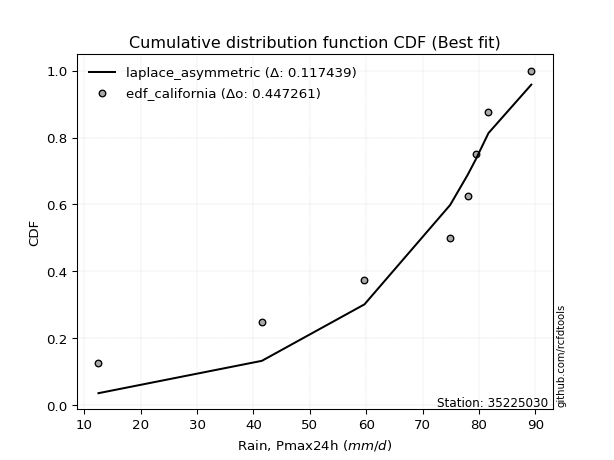</img>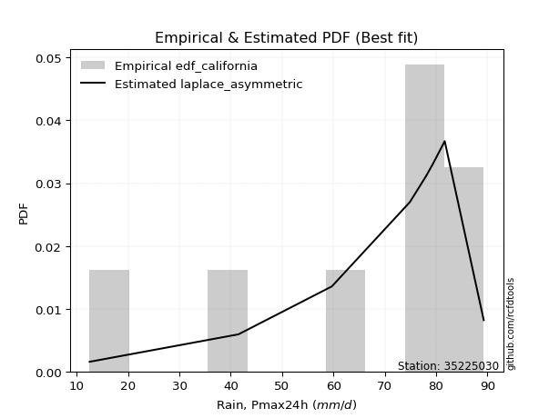</img>

</div>


### 2. EDF Hazen (1930)

Hazen method for plotting positions is a formula used to estimate the empirical cumulative probability distribution of flood events or other hydrological data. This formula often results in biased estimations, particularly when extrapolating to extreme events (high return periods).

<div align="center">


$P=(m-0.5)/n$


</div>


**2.1. Empirical values**

<div align="center">

|                | 0                   | 1                   | 2                  | 3                  | 4         | 5                  | 6                  | 7                  | 8                  |
|:---------------|:--------------------|:--------------------|:-------------------|:-------------------|:----------|:-------------------|:-------------------|:-------------------|:-------------------|
| date           | 2017                | 2020                | 2019               | 2018               | 2023      | 2024               | 2022               | 2021               | 2025               |
| x              | 12.5                | 41.5                | 59.7               | 74.9               | 78.0      | 79.4               | 81.7               | 89.3               | 119.1              |
| m              | 1                   | 2                   | 3                  | 4                  | 5         | 6                  | 7                  | 8                  | 9                  |
| empirical_dist | edf_hazen           | edf_hazen           | edf_hazen          | edf_hazen          | edf_hazen | edf_hazen          | edf_hazen          | edf_hazen          | edf_hazen          |
| empirical      | 0.05555555555555555 | 0.16666666666666666 | 0.2777777777777778 | 0.3888888888888889 | 0.5       | 0.6111111111111112 | 0.7222222222222222 | 0.8333333333333334 | 0.9444444444444444 |
| empirical_tr   | 1.0588235294117647  | 1.2                 | 1.3846153846153846 | 1.6363636363636362 | 2.0       | 2.5714285714285716 | 3.5999999999999996 | 6.000000000000002  | 17.999999999999993 |

</div>


**2.2. Kolmogorov-Smirnov fit test (sorted by Δ)**


<div align="center">

|                | 0                   | 1                   | 2                   | 3                   | 4                   | 5                   | 6                   | 7                   | 8                   | 9                   | 10                  | 11                  | 12                  | 13                  | 14                  | 15                  | 16                  | 17                  | 18                  | 19                  | 20                  | 21                  | 22                  | 23                  | 24                  | 25                  | 26                  | 27                  | 28                  | 29                  | 30                  | 31                  | 32                  | 33                  | 34                  | 35                  | 36                  | 37                  | 38                  | 39                  | 40                  | 41                  | 42                  | 43                  | 44                  | 45                  | 46                  | 47                  | 48                  | 49                  | 50                  | 51                  | 52                  | 53                  | 54                  | 55                  | 56                  | 57                  | 58                  | 59                  | 60                  | 61                  | 62                  | 63                  | 64                  | 65                  | 66                  | 67                  | 68                  | 69                  | 70                  | 71                  | 72                  | 73                  | 74                  | 75                  | 76                  | 77                  | 78                  | 79                  | 80                  | 81                  | 82                  | 83                  | 84                  | 85                  | 86                  | 87                  | 88                  | 89                  | 90                  | 91                  | 92                  | 93                  | 94                  | 95                  | 96                  | 97                  | 98                  | 99                  | 100                 | 101                 | 102                 | 103                 | 104                 | 105                 | 106                 | 107                 | 108                 | 109                 | 110                 | 111                 | 112                 | 113                 | 114                 | 115                 | 116                 | 117                 | 118                 | 119                 | 120                 | 121                 | 122                 | 123                 | 124                 | 125                 | 126                 | 127                 | 128                 | 129                 | 130                 | 131                 | 132                 | 133                 | 134                 | 135                 | 136                 | 137                 | 138                 | 139                 | 140                 | 141                 | 142                 | 143                 | 144                 | 145                 | 146                 | 147                 | 148                 | 149                 | 150                 | 151                 | 152                 | 153                 | 154                 | 155                 | 156                 | 157                 | 158                 | 159                 |
|:---------------|:--------------------|:--------------------|:--------------------|:--------------------|:--------------------|:--------------------|:--------------------|:--------------------|:--------------------|:--------------------|:--------------------|:--------------------|:--------------------|:--------------------|:--------------------|:--------------------|:--------------------|:--------------------|:--------------------|:--------------------|:--------------------|:--------------------|:--------------------|:--------------------|:--------------------|:--------------------|:--------------------|:--------------------|:--------------------|:--------------------|:--------------------|:--------------------|:--------------------|:--------------------|:--------------------|:--------------------|:--------------------|:--------------------|:--------------------|:--------------------|:--------------------|:--------------------|:--------------------|:--------------------|:--------------------|:--------------------|:--------------------|:--------------------|:--------------------|:--------------------|:--------------------|:--------------------|:--------------------|:--------------------|:--------------------|:--------------------|:--------------------|:--------------------|:--------------------|:--------------------|:--------------------|:--------------------|:--------------------|:--------------------|:--------------------|:--------------------|:--------------------|:--------------------|:--------------------|:--------------------|:--------------------|:--------------------|:--------------------|:--------------------|:--------------------|:--------------------|:--------------------|:--------------------|:--------------------|:--------------------|:--------------------|:--------------------|:--------------------|:--------------------|:--------------------|:--------------------|:--------------------|:--------------------|:--------------------|:--------------------|:--------------------|:--------------------|:--------------------|:--------------------|:--------------------|:--------------------|:--------------------|:--------------------|:--------------------|:--------------------|:--------------------|:--------------------|:--------------------|:--------------------|:--------------------|:--------------------|:--------------------|:--------------------|:--------------------|:--------------------|:--------------------|:--------------------|:--------------------|:--------------------|:--------------------|:--------------------|:--------------------|:--------------------|:--------------------|:--------------------|:--------------------|:--------------------|:--------------------|:--------------------|:--------------------|:--------------------|:--------------------|:--------------------|:--------------------|:--------------------|:--------------------|:--------------------|:--------------------|:--------------------|:--------------------|:--------------------|:--------------------|:--------------------|:--------------------|:--------------------|:--------------------|:--------------------|:--------------------|:--------------------|:--------------------|:--------------------|:--------------------|:--------------------|:--------------------|:--------------------|:--------------------|:--------------------|:--------------------|:--------------------|:--------------------|:--------------------|:--------------------|:--------------------|:--------------------|:--------------------|
| station        | 35225030            | 35225030            | 35225030            | 35225030            | 35225030            | 35225030            | 35225030            | 35225030            | 35225030            | 35225030            | 35225030            | 35225030            | 35225030            | 35225030            | 35225030            | 35225030            | 35225030            | 35225030            | 35225030            | 35225030            | 35225030            | 35225030            | 35225030            | 35225030            | 35225030            | 35225030            | 35225030            | 35225030            | 35225030            | 35225030            | 35225030            | 35225030            | 35225030            | 35225030            | 35225030            | 35225030            | 35225030            | 35225030            | 35225030            | 35225030            | 35225030            | 35225030            | 35225030            | 35225030            | 35225030            | 35225030            | 35225030            | 35225030            | 35225030            | 35225030            | 35225030            | 35225030            | 35225030            | 35225030            | 35225030            | 35225030            | 35225030            | 35225030            | 35225030            | 35225030            | 35225030            | 35225030            | 35225030            | 35225030            | 35225030            | 35225030            | 35225030            | 35225030            | 35225030            | 35225030            | 35225030            | 35225030            | 35225030            | 35225030            | 35225030            | 35225030            | 35225030            | 35225030            | 35225030            | 35225030            | 35225030            | 35225030            | 35225030            | 35225030            | 35225030            | 35225030            | 35225030            | 35225030            | 35225030            | 35225030            | 35225030            | 35225030            | 35225030            | 35225030            | 35225030            | 35225030            | 35225030            | 35225030            | 35225030            | 35225030            | 35225030            | 35225030            | 35225030            | 35225030            | 35225030            | 35225030            | 35225030            | 35225030            | 35225030            | 35225030            | 35225030            | 35225030            | 35225030            | 35225030            | 35225030            | 35225030            | 35225030            | 35225030            | 35225030            | 35225030            | 35225030            | 35225030            | 35225030            | 35225030            | 35225030            | 35225030            | 35225030            | 35225030            | 35225030            | 35225030            | 35225030            | 35225030            | 35225030            | 35225030            | 35225030            | 35225030            | 35225030            | 35225030            | 35225030            | 35225030            | 35225030            | 35225030            | 35225030            | 35225030            | 35225030            | 35225030            | 35225030            | 35225030            | 35225030            | 35225030            | 35225030            | 35225030            | 35225030            | 35225030            | 35225030            | 35225030            | 35225030            | 35225030            | 35225030            | 35225030            |
| empirical_dist | edf_hazen           | edf_hazen           | edf_hazen           | edf_hazen           | edf_hazen           | edf_hazen           | edf_hazen           | edf_hazen           | edf_hazen           | edf_hazen           | edf_hazen           | edf_hazen           | edf_hazen           | edf_hazen           | edf_hazen           | edf_hazen           | edf_hazen           | edf_hazen           | edf_hazen           | edf_hazen           | edf_hazen           | edf_hazen           | edf_hazen           | edf_hazen           | edf_hazen           | edf_hazen           | edf_hazen           | edf_hazen           | edf_hazen           | edf_hazen           | edf_hazen           | edf_hazen           | edf_hazen           | edf_hazen           | edf_hazen           | edf_hazen           | edf_hazen           | edf_hazen           | edf_hazen           | edf_hazen           | edf_hazen           | edf_hazen           | edf_hazen           | edf_hazen           | edf_hazen           | edf_hazen           | edf_hazen           | edf_hazen           | edf_hazen           | edf_hazen           | edf_hazen           | edf_hazen           | edf_hazen           | edf_hazen           | edf_hazen           | edf_hazen           | edf_hazen           | edf_hazen           | edf_hazen           | edf_hazen           | edf_hazen           | edf_hazen           | edf_hazen           | edf_hazen           | edf_hazen           | edf_hazen           | edf_hazen           | edf_hazen           | edf_hazen           | edf_hazen           | edf_hazen           | edf_hazen           | edf_hazen           | edf_hazen           | edf_hazen           | edf_hazen           | edf_hazen           | edf_hazen           | edf_hazen           | edf_hazen           | edf_hazen           | edf_hazen           | edf_hazen           | edf_hazen           | edf_hazen           | edf_hazen           | edf_hazen           | edf_hazen           | edf_hazen           | edf_hazen           | edf_hazen           | edf_hazen           | edf_hazen           | edf_hazen           | edf_hazen           | edf_hazen           | edf_hazen           | edf_hazen           | edf_hazen           | edf_hazen           | edf_hazen           | edf_hazen           | edf_hazen           | edf_hazen           | edf_hazen           | edf_hazen           | edf_hazen           | edf_hazen           | edf_hazen           | edf_hazen           | edf_hazen           | edf_hazen           | edf_hazen           | edf_hazen           | edf_hazen           | edf_hazen           | edf_hazen           | edf_hazen           | edf_hazen           | edf_hazen           | edf_hazen           | edf_hazen           | edf_hazen           | edf_hazen           | edf_hazen           | edf_hazen           | edf_hazen           | edf_hazen           | edf_hazen           | edf_hazen           | edf_hazen           | edf_hazen           | edf_hazen           | edf_hazen           | edf_hazen           | edf_hazen           | edf_hazen           | edf_hazen           | edf_hazen           | edf_hazen           | edf_hazen           | edf_hazen           | edf_hazen           | edf_hazen           | edf_hazen           | edf_hazen           | edf_hazen           | edf_hazen           | edf_hazen           | edf_hazen           | edf_hazen           | edf_hazen           | edf_hazen           | edf_hazen           | edf_hazen           | edf_hazen           | edf_hazen           | edf_hazen           | edf_hazen           | edf_hazen           |
| p_dist         | logjohnsonsu        | johnsonsu           | dweibull            | logdgamma           | t                   | dgamma              | gumbel_l            | gennorm             | genlogistic         | truncnorm           | genextreme          | logjohnsonsb        | johnsonsb           | pearson3            | skewnorm            | weibull_min         | loggennorm          | logt                | gompertz            | exponpow            | tukeylambda         | logargus            | argus               | logdweibull         | truncweibull_min    | semicircular        | logloggamma         | logpearson3         | anglit              | exponweib           | lognakagami         | foldnorm            | logvonmises_line    | crystalball         | norm                | exponnorm           | rice                | nct                 | f                   | erlang              | logburr             | mielke              | logistic            | burr                | logburr12           | gamma               | loggenlogistic      | logloglaplace       | arcsine             | loggumbel_l         | logtrapezoid        | betaprime           | ksone               | hypsecant           | logmielke           | gengamma            | invgamma            | cosine              | kappa3              | uniform             | loggompertz         | wrapcauchy          | invweibull          | maxwell             | laplace             | ncf                 | rayleigh            | logsemicircular     | logarcsine          | loggengamma         | kappa4              | loganglit           | invgauss            | loggenextreme       | logskewnorm         | kstwobign           | loglevy_l           | logweibull_max      | gausshyper          | genexpon            | logbetaprime        | logtruncweibull_min | logfatiguelife      | loggamma            | loggamma            | logncf              | logrice             | logf                | logexponnorm        | logcrystalball      | lognorm             | logalpha            | logerlang           | halfnorm            | lognct              | halfgennorm         | loginvgamma         | loginvweibull       | loginvgauss         | gumbel_r            | logfoldnorm         | vonmises_line       | loggenpareto        | loggenhalflogistic  | loglogistic         | genpareto           | genhalflogistic     | logmaxwell          | loghypsecant        | halflogistic        | moyal               | lograyleigh         | lomax               | bradford            | triang              | logkstwobign        | logtriang           | loghalfnorm         | loggausshyper       | loglaplace          | loglaplace          | beta                | logcosine           | alpha               | loggumbel_r         | loggenexpon         | loghalfgennorm      | nakagami            | loghalflogistic     | levy_l              | truncexpon          | logmoyal            | wald                | logwrapcauchy       | logtruncnorm        | burr12              | loglomax            | logrdist            | trapezoid           | logwald             | logksone            | logkappa4           | logbradford         | logtukeylambda      | logkappa3           | loguniform          | logweibull_min      | logbeta             | logexponweib        | logtruncexpon       | powerlaw            | logexponpow         | fatiguelife         | logpowerlaw         | rdist               | weibull_max         | truncpareto         | logtruncpareto      | logvonmises         | vonmises            |
| delta          | 0.06718434382643762 | 0.08234558302566358 | 0.1083988989297534  | 0.10998182288697911 | 0.11024300350195071 | 0.11810879987843065 | 0.12002412161224674 | 0.12938953955485766 | 0.13150250254747026 | 0.13158708604032293 | 0.13403383105093686 | 0.13782993017453    | 0.13786904977517017 | 0.13867772878865997 | 0.1390289905218442  | 0.13938797095063576 | 0.139688327419666   | 0.145255792887941   | 0.14591897667939718 | 0.14826097865507298 | 0.14846448447059796 | 0.14933386754055566 | 0.15100854476368764 | 0.15294075357677384 | 0.15770289079675903 | 0.15820314401084384 | 0.15960373998543326 | 0.15985603066701282 | 0.16164330142608002 | 0.16616641060010967 | 0.1665901401856424  | 0.16844020733741044 | 0.1691206034848986  | 0.16997115121343648 | 0.16997115288088266 | 0.1699732463302815  | 0.17003604375077547 | 0.1700642323102856  | 0.17170338056461748 | 0.17625375808256166 | 0.17754253152592697 | 0.17778036657050528 | 0.1778570345378378  | 0.17833467299223255 | 0.17843197872762367 | 0.17862920383076047 | 0.17881738746666082 | 0.18028491886251607 | 0.18053065871341323 | 0.1807608425445047  | 0.18087599442879065 | 0.18110864559184553 | 0.18224932249322495 | 0.18449217920371525 | 0.18504820202318345 | 0.18601707621714553 | 0.19003797993202137 | 0.19031472610880723 | 0.19646452865439118 | 0.19647696476964777 | 0.19725969355456002 | 0.19827799706422072 | 0.1991276769655052  | 0.19975977779027193 | 0.2055823243296679  | 0.20763182476744851 | 0.20926690148605537 | 0.21160112692588712 | 0.21184377574412577 | 0.21498087325055754 | 0.21807203683498738 | 0.21863870624744847 | 0.2187371915694038  | 0.2190463497300159  | 0.2213941602818858  | 0.22199545074645327 | 0.22284758769333876 | 0.22329039237984133 | 0.2263810811397351  | 0.22843543575251318 | 0.23109543716159847 | 0.2314252277179794  | 0.23319278908066715 | 0.23415808260586374 | 0.23415808260586374 | 0.23422566679682227 | 0.23492400629535665 | 0.23538173278030922 | 0.23550065278138393 | 0.23550225176862688 | 0.2355022886594484  | 0.23568972674345606 | 0.2360269562923602  | 0.2361121740533088  | 0.23678440071275547 | 0.23720664894976923 | 0.23895355201340834 | 0.23895357075057821 | 0.2390437555890354  | 0.23966003119596796 | 0.24104441944554383 | 0.2412304152702262  | 0.24129835211489595 | 0.24635543366252305 | 0.25103560609224035 | 0.2535905198874152  | 0.2558748677692586  | 0.2597583758529774  | 0.2634552488595801  | 0.26367260237582396 | 0.26419415452418943 | 0.2671679887409319  | 0.2756502509490707  | 0.27601265442194484 | 0.27715105548476837 | 0.27804761312080495 | 0.28322804356793135 | 0.2884478006459604  | 0.29120655066461054 | 0.29177186026534435 | 0.29177186026534435 | 0.2941250592796591  | 0.29667767727135036 | 0.2967389185455942  | 0.29917250099128395 | 0.3020016979840392  | 0.3123853261901518  | 0.31447345102919494 | 0.31680497562653626 | 0.3173217844470382  | 0.32004194960712046 | 0.32057616342816514 | 0.3322785274070193  | 0.3441382712965356  | 0.3501678150945899  | 0.35848377684963173 | 0.36071378397693643 | 0.3634611866739298  | 0.3658759275751222  | 0.38060232699570745 | 0.38357998978093777 | 0.4076841825582741  | 0.41158579023879605 | 0.41480225399034587 | 0.41493727500139377 | 0.4158515432926809  | 0.4687730723755613  | 0.47274820630809306 | 0.47974818701479094 | 0.4813731778452789  | 0.5948229186359085  | 0.6037573928441521  | 0.6184994641354339  | 0.6950064905410863  | 0.7222222210174616  | 0.7256982947104398  | 0.756343135690653   | 0.795603818095392   | 1.199272969619458   | 18.64494155494667   |
| deltao         | 0.41761268023100007 | 0.41761268023100007 | 0.41761268023100007 | 0.41761268023100007 | 0.41761268023100007 | 0.41761268023100007 | 0.41761268023100007 | 0.41761268023100007 | 0.41761268023100007 | 0.41761268023100007 | 0.41761268023100007 | 0.41761268023100007 | 0.41761268023100007 | 0.41761268023100007 | 0.41761268023100007 | 0.41761268023100007 | 0.41761268023100007 | 0.41761268023100007 | 0.41761268023100007 | 0.41761268023100007 | 0.41761268023100007 | 0.41761268023100007 | 0.41761268023100007 | 0.41761268023100007 | 0.41761268023100007 | 0.41761268023100007 | 0.41761268023100007 | 0.41761268023100007 | 0.41761268023100007 | 0.41761268023100007 | 0.41761268023100007 | 0.41761268023100007 | 0.41761268023100007 | 0.41761268023100007 | 0.41761268023100007 | 0.41761268023100007 | 0.41761268023100007 | 0.41761268023100007 | 0.41761268023100007 | 0.41761268023100007 | 0.41761268023100007 | 0.41761268023100007 | 0.41761268023100007 | 0.41761268023100007 | 0.41761268023100007 | 0.41761268023100007 | 0.41761268023100007 | 0.41761268023100007 | 0.41761268023100007 | 0.41761268023100007 | 0.41761268023100007 | 0.41761268023100007 | 0.41761268023100007 | 0.41761268023100007 | 0.41761268023100007 | 0.41761268023100007 | 0.41761268023100007 | 0.41761268023100007 | 0.41761268023100007 | 0.41761268023100007 | 0.41761268023100007 | 0.41761268023100007 | 0.41761268023100007 | 0.41761268023100007 | 0.41761268023100007 | 0.41761268023100007 | 0.41761268023100007 | 0.41761268023100007 | 0.41761268023100007 | 0.41761268023100007 | 0.41761268023100007 | 0.41761268023100007 | 0.41761268023100007 | 0.41761268023100007 | 0.41761268023100007 | 0.41761268023100007 | 0.41761268023100007 | 0.41761268023100007 | 0.41761268023100007 | 0.41761268023100007 | 0.41761268023100007 | 0.41761268023100007 | 0.41761268023100007 | 0.41761268023100007 | 0.41761268023100007 | 0.41761268023100007 | 0.41761268023100007 | 0.41761268023100007 | 0.41761268023100007 | 0.41761268023100007 | 0.41761268023100007 | 0.41761268023100007 | 0.41761268023100007 | 0.41761268023100007 | 0.41761268023100007 | 0.41761268023100007 | 0.41761268023100007 | 0.41761268023100007 | 0.41761268023100007 | 0.41761268023100007 | 0.41761268023100007 | 0.41761268023100007 | 0.41761268023100007 | 0.41761268023100007 | 0.41761268023100007 | 0.41761268023100007 | 0.41761268023100007 | 0.41761268023100007 | 0.41761268023100007 | 0.41761268023100007 | 0.41761268023100007 | 0.41761268023100007 | 0.41761268023100007 | 0.41761268023100007 | 0.41761268023100007 | 0.41761268023100007 | 0.41761268023100007 | 0.41761268023100007 | 0.41761268023100007 | 0.41761268023100007 | 0.41761268023100007 | 0.41761268023100007 | 0.41761268023100007 | 0.41761268023100007 | 0.41761268023100007 | 0.41761268023100007 | 0.41761268023100007 | 0.41761268023100007 | 0.41761268023100007 | 0.41761268023100007 | 0.41761268023100007 | 0.41761268023100007 | 0.41761268023100007 | 0.41761268023100007 | 0.41761268023100007 | 0.41761268023100007 | 0.41761268023100007 | 0.41761268023100007 | 0.41761268023100007 | 0.41761268023100007 | 0.41761268023100007 | 0.41761268023100007 | 0.41761268023100007 | 0.41761268023100007 | 0.41761268023100007 | 0.41761268023100007 | 0.41761268023100007 | 0.41761268023100007 | 0.41761268023100007 | 0.41761268023100007 | 0.41761268023100007 | 0.41761268023100007 | 0.41761268023100007 | 0.41761268023100007 | 0.41761268023100007 | 0.41761268023100007 | 0.41761268023100007 | 0.41761268023100007 | 0.41761268023100007 | 0.41761268023100007 |
| eval           | Δo > Δ              | Δo > Δ              | Δo > Δ              | Δo > Δ              | Δo > Δ              | Δo > Δ              | Δo > Δ              | Δo > Δ              | Δo > Δ              | Δo > Δ              | Δo > Δ              | Δo > Δ              | Δo > Δ              | Δo > Δ              | Δo > Δ              | Δo > Δ              | Δo > Δ              | Δo > Δ              | Δo > Δ              | Δo > Δ              | Δo > Δ              | Δo > Δ              | Δo > Δ              | Δo > Δ              | Δo > Δ              | Δo > Δ              | Δo > Δ              | Δo > Δ              | Δo > Δ              | Δo > Δ              | Δo > Δ              | Δo > Δ              | Δo > Δ              | Δo > Δ              | Δo > Δ              | Δo > Δ              | Δo > Δ              | Δo > Δ              | Δo > Δ              | Δo > Δ              | Δo > Δ              | Δo > Δ              | Δo > Δ              | Δo > Δ              | Δo > Δ              | Δo > Δ              | Δo > Δ              | Δo > Δ              | Δo > Δ              | Δo > Δ              | Δo > Δ              | Δo > Δ              | Δo > Δ              | Δo > Δ              | Δo > Δ              | Δo > Δ              | Δo > Δ              | Δo > Δ              | Δo > Δ              | Δo > Δ              | Δo > Δ              | Δo > Δ              | Δo > Δ              | Δo > Δ              | Δo > Δ              | Δo > Δ              | Δo > Δ              | Δo > Δ              | Δo > Δ              | Δo > Δ              | Δo > Δ              | Δo > Δ              | Δo > Δ              | Δo > Δ              | Δo > Δ              | Δo > Δ              | Δo > Δ              | Δo > Δ              | Δo > Δ              | Δo > Δ              | Δo > Δ              | Δo > Δ              | Δo > Δ              | Δo > Δ              | Δo > Δ              | Δo > Δ              | Δo > Δ              | Δo > Δ              | Δo > Δ              | Δo > Δ              | Δo > Δ              | Δo > Δ              | Δo > Δ              | Δo > Δ              | Δo > Δ              | Δo > Δ              | Δo > Δ              | Δo > Δ              | Δo > Δ              | Δo > Δ              | Δo > Δ              | Δo > Δ              | Δo > Δ              | Δo > Δ              | Δo > Δ              | Δo > Δ              | Δo > Δ              | Δo > Δ              | Δo > Δ              | Δo > Δ              | Δo > Δ              | Δo > Δ              | Δo > Δ              | Δo > Δ              | Δo > Δ              | Δo > Δ              | Δo > Δ              | Δo > Δ              | Δo > Δ              | Δo > Δ              | Δo > Δ              | Δo > Δ              | Δo > Δ              | Δo > Δ              | Δo > Δ              | Δo > Δ              | Δo > Δ              | Δo > Δ              | Δo > Δ              | Δo > Δ              | Δo > Δ              | Δo > Δ              | Δo > Δ              | Δo > Δ              | Δo > Δ              | Δo > Δ              | Δo > Δ              | Δo > Δ              | Δo > Δ              | Δo > Δ              | Δo > Δ              | Δo > Δ              | Δo > Δ              | Δo > Δ              | Δo > Δ              | Δo > Δ              | Δo <= Δ             | Δo <= Δ             | Δo <= Δ             | Δo <= Δ             | Δo <= Δ             | Δo <= Δ             | Δo <= Δ             | Δo <= Δ             | Δo <= Δ             | Δo <= Δ             | Δo <= Δ             | Δo <= Δ             | Δo <= Δ             | Δo <= Δ             |
| fit            | 1                   | 1                   | 1                   | 1                   | 1                   | 1                   | 1                   | 1                   | 1                   | 1                   | 1                   | 1                   | 1                   | 1                   | 1                   | 1                   | 1                   | 1                   | 1                   | 1                   | 1                   | 1                   | 1                   | 1                   | 1                   | 1                   | 1                   | 1                   | 1                   | 1                   | 1                   | 1                   | 1                   | 1                   | 1                   | 1                   | 1                   | 1                   | 1                   | 1                   | 1                   | 1                   | 1                   | 1                   | 1                   | 1                   | 1                   | 1                   | 1                   | 1                   | 1                   | 1                   | 1                   | 1                   | 1                   | 1                   | 1                   | 1                   | 1                   | 1                   | 1                   | 1                   | 1                   | 1                   | 1                   | 1                   | 1                   | 1                   | 1                   | 1                   | 1                   | 1                   | 1                   | 1                   | 1                   | 1                   | 1                   | 1                   | 1                   | 1                   | 1                   | 1                   | 1                   | 1                   | 1                   | 1                   | 1                   | 1                   | 1                   | 1                   | 1                   | 1                   | 1                   | 1                   | 1                   | 1                   | 1                   | 1                   | 1                   | 1                   | 1                   | 1                   | 1                   | 1                   | 1                   | 1                   | 1                   | 1                   | 1                   | 1                   | 1                   | 1                   | 1                   | 1                   | 1                   | 1                   | 1                   | 1                   | 1                   | 1                   | 1                   | 1                   | 1                   | 1                   | 1                   | 1                   | 1                   | 1                   | 1                   | 1                   | 1                   | 1                   | 1                   | 1                   | 1                   | 1                   | 1                   | 1                   | 1                   | 1                   | 1                   | 1                   | 1                   | 1                   | 1                   | 1                   | 0                   | 0                   | 0                   | 0                   | 0                   | 0                   | 0                   | 0                   | 0                   | 0                   | 0                   | 0                   | 0                   | 0                   |
| n              | 9                   | 9                   | 9                   | 9                   | 9                   | 9                   | 9                   | 9                   | 9                   | 9                   | 9                   | 9                   | 9                   | 9                   | 9                   | 9                   | 9                   | 9                   | 9                   | 9                   | 9                   | 9                   | 9                   | 9                   | 9                   | 9                   | 9                   | 9                   | 9                   | 9                   | 9                   | 9                   | 9                   | 9                   | 9                   | 9                   | 9                   | 9                   | 9                   | 9                   | 9                   | 9                   | 9                   | 9                   | 9                   | 9                   | 9                   | 9                   | 9                   | 9                   | 9                   | 9                   | 9                   | 9                   | 9                   | 9                   | 9                   | 9                   | 9                   | 9                   | 9                   | 9                   | 9                   | 9                   | 9                   | 9                   | 9                   | 9                   | 9                   | 9                   | 9                   | 9                   | 9                   | 9                   | 9                   | 9                   | 9                   | 9                   | 9                   | 9                   | 9                   | 9                   | 9                   | 9                   | 9                   | 9                   | 9                   | 9                   | 9                   | 9                   | 9                   | 9                   | 9                   | 9                   | 9                   | 9                   | 9                   | 9                   | 9                   | 9                   | 9                   | 9                   | 9                   | 9                   | 9                   | 9                   | 9                   | 9                   | 9                   | 9                   | 9                   | 9                   | 9                   | 9                   | 9                   | 9                   | 9                   | 9                   | 9                   | 9                   | 9                   | 9                   | 9                   | 9                   | 9                   | 9                   | 9                   | 9                   | 9                   | 9                   | 9                   | 9                   | 9                   | 9                   | 9                   | 9                   | 9                   | 9                   | 9                   | 9                   | 9                   | 9                   | 9                   | 9                   | 9                   | 9                   | 9                   | 9                   | 9                   | 9                   | 9                   | 9                   | 9                   | 9                   | 9                   | 9                   | 9                   | 9                   | 9                   | 9                   |
| best_fit       | 1                   | 0                   | 0                   | 0                   | 0                   | 0                   | 0                   | 0                   | 0                   | 0                   | 0                   | 0                   | 0                   | 0                   | 0                   | 0                   | 0                   | 0                   | 0                   | 0                   | 0                   | 0                   | 0                   | 0                   | 0                   | 0                   | 0                   | 0                   | 0                   | 0                   | 0                   | 0                   | 0                   | 0                   | 0                   | 0                   | 0                   | 0                   | 0                   | 0                   | 0                   | 0                   | 0                   | 0                   | 0                   | 0                   | 0                   | 0                   | 0                   | 0                   | 0                   | 0                   | 0                   | 0                   | 0                   | 0                   | 0                   | 0                   | 0                   | 0                   | 0                   | 0                   | 0                   | 0                   | 0                   | 0                   | 0                   | 0                   | 0                   | 0                   | 0                   | 0                   | 0                   | 0                   | 0                   | 0                   | 0                   | 0                   | 0                   | 0                   | 0                   | 0                   | 0                   | 0                   | 0                   | 0                   | 0                   | 0                   | 0                   | 0                   | 0                   | 0                   | 0                   | 0                   | 0                   | 0                   | 0                   | 0                   | 0                   | 0                   | 0                   | 0                   | 0                   | 0                   | 0                   | 0                   | 0                   | 0                   | 0                   | 0                   | 0                   | 0                   | 0                   | 0                   | 0                   | 0                   | 0                   | 0                   | 0                   | 0                   | 0                   | 0                   | 0                   | 0                   | 0                   | 0                   | 0                   | 0                   | 0                   | 0                   | 0                   | 0                   | 0                   | 0                   | 0                   | 0                   | 0                   | 0                   | 0                   | 0                   | 0                   | 0                   | 0                   | 0                   | 0                   | 0                   | 0                   | 0                   | 0                   | 0                   | 0                   | 0                   | 0                   | 0                   | 0                   | 0                   | 0                   | 0                   | 0                   | 0                   |
| best_fit_sort  | 1                   | 2                   | 3                   | 4                   | 5                   | 6                   | 7                   | 8                   | 9                   | 10                  | 11                  | 12                  | 13                  | 14                  | 15                  | 16                  | 17                  | 18                  | 19                  | 20                  | 21                  | 22                  | 23                  | 24                  | 25                  | 26                  | 27                  | 28                  | 29                  | 30                  | 31                  | 32                  | 33                  | 34                  | 35                  | 36                  | 37                  | 38                  | 39                  | 40                  | 41                  | 42                  | 43                  | 44                  | 45                  | 46                  | 47                  | 48                  | 49                  | 50                  | 51                  | 52                  | 53                  | 54                  | 55                  | 56                  | 57                  | 58                  | 59                  | 60                  | 61                  | 62                  | 63                  | 64                  | 65                  | 66                  | 67                  | 68                  | 69                  | 70                  | 71                  | 72                  | 73                  | 74                  | 75                  | 76                  | 77                  | 78                  | 79                  | 80                  | 81                  | 82                  | 83                  | 84                  | 85                  | 86                  | 87                  | 88                  | 89                  | 90                  | 91                  | 92                  | 93                  | 94                  | 95                  | 96                  | 97                  | 98                  | 99                  | 100                 | 101                 | 102                 | 103                 | 104                 | 105                 | 106                 | 107                 | 108                 | 109                 | 110                 | 111                 | 112                 | 113                 | 114                 | 115                 | 116                 | 117                 | 118                 | 119                 | 120                 | 121                 | 122                 | 123                 | 124                 | 125                 | 126                 | 127                 | 128                 | 129                 | 130                 | 131                 | 132                 | 133                 | 134                 | 135                 | 136                 | 137                 | 138                 | 139                 | 140                 | 141                 | 142                 | 143                 | 144                 | 145                 | 146                 | 147                 | 148                 | 149                 | 150                 | 151                 | 152                 | 153                 | 154                 | 155                 | 156                 | 157                 | 158                 | 159                 | 160                 |

</div>


**2.3. Best fit**

<div align="center">

|   id |   station | empirical_dist   | p_dist       |     delta |   deltao | eval   |   fit |   n |   best_fit |   best_fit_sort |
|-----:|----------:|:-----------------|:-------------|----------:|---------:|:-------|------:|----:|-----------:|----------------:|
|    0 |  35225030 | edf_hazen        | logjohnsonsu | 0.0671843 | 0.417613 | Δo > Δ |     1 |   9 |          1 |               1 |

</div>


<div align="center">

</img>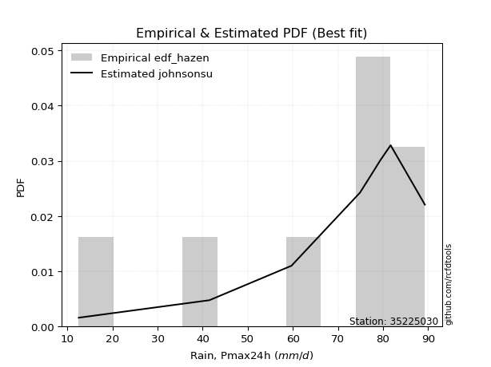</img>

</div>


### 3. EDF Weibull (1939)

Weibull plotting position formula is an empirical method used to estimate the non-exceedance probability or plotting position for a set of observed data, is often recommended or widely used in practice, particularly in flood frequency analysis.

<div align="center">


$P=m/(n+1)$


</div>


**3.1. Empirical values**

<div align="center">

|                | 0                  | 1           | 2                  | 3                  | 4           | 5           | 6                 | 7                 | 8                  |
|:---------------|:-------------------|:------------|:-------------------|:-------------------|:------------|:------------|:------------------|:------------------|:-------------------|
| date           | 2017               | 2020        | 2019               | 2018               | 2023        | 2024        | 2022              | 2021              | 2025               |
| x              | 12.5               | 41.5        | 59.7               | 74.9               | 78.0        | 79.4        | 81.7              | 89.3              | 119.1              |
| m              | 1                  | 2           | 3                  | 4                  | 5           | 6           | 7                 | 8                 | 9                  |
| empirical_dist | edf_weibull        | edf_weibull | edf_weibull        | edf_weibull        | edf_weibull | edf_weibull | edf_weibull       | edf_weibull       | edf_weibull        |
| empirical      | 0.1                | 0.2         | 0.3                | 0.4                | 0.5         | 0.6         | 0.7               | 0.8               | 0.9                |
| empirical_tr   | 1.1111111111111112 | 1.25        | 1.4285714285714286 | 1.6666666666666667 | 2.0         | 2.5         | 3.333333333333333 | 5.000000000000001 | 10.000000000000002 |

</div>


**3.2. Kolmogorov-Smirnov fit test (sorted by Δ)**


<div align="center">

|                | 0                   | 1                   | 2                   | 3                   | 4                   | 5                   | 6                   | 7                   | 8                   | 9                   | 10                  | 11                  | 12                  | 13                  | 14                  | 15                  | 16                  | 17                  | 18                  | 19                  | 20                  | 21                  | 22                  | 23                  | 24                  | 25                  | 26                  | 27                  | 28                  | 29                  | 30                  | 31                  | 32                  | 33                  | 34                  | 35                  | 36                  | 37                  | 38                  | 39                  | 40                  | 41                  | 42                  | 43                  | 44                  | 45                  | 46                  | 47                  | 48                  | 49                  | 50                  | 51                  | 52                  | 53                  | 54                  | 55                  | 56                  | 57                  | 58                  | 59                  | 60                  | 61                  | 62                  | 63                  | 64                  | 65                  | 66                  | 67                  | 68                  | 69                  | 70                  | 71                  | 72                  | 73                  | 74                  | 75                  | 76                  | 77                  | 78                  | 79                  | 80                  | 81                  | 82                  | 83                  | 84                  | 85                  | 86                  | 87                  | 88                  | 89                  | 90                  | 91                  | 92                  | 93                  | 94                  | 95                  | 96                  | 97                  | 98                  | 99                  | 100                 | 101                 | 102                 | 103                 | 104                 | 105                 | 106                 | 107                 | 108                 | 109                 | 110                 | 111                 | 112                 | 113                 | 114                 | 115                 | 116                 | 117                 | 118                 | 119                 | 120                 | 121                 | 122                 | 123                 | 124                 | 125                 | 126                 | 127                 | 128                 | 129                 | 130                 | 131                 | 132                 | 133                 | 134                 | 135                 | 136                 | 137                 | 138                 | 139                 | 140                 | 141                 | 142                 | 143                 | 144                 | 145                 | 146                 | 147                 | 148                 | 149                 | 150                 | 151                 | 152                 | 153                 | 154                 | 155                 | 156                 | 157                 | 158                 | 159                 |
|:---------------|:--------------------|:--------------------|:--------------------|:--------------------|:--------------------|:--------------------|:--------------------|:--------------------|:--------------------|:--------------------|:--------------------|:--------------------|:--------------------|:--------------------|:--------------------|:--------------------|:--------------------|:--------------------|:--------------------|:--------------------|:--------------------|:--------------------|:--------------------|:--------------------|:--------------------|:--------------------|:--------------------|:--------------------|:--------------------|:--------------------|:--------------------|:--------------------|:--------------------|:--------------------|:--------------------|:--------------------|:--------------------|:--------------------|:--------------------|:--------------------|:--------------------|:--------------------|:--------------------|:--------------------|:--------------------|:--------------------|:--------------------|:--------------------|:--------------------|:--------------------|:--------------------|:--------------------|:--------------------|:--------------------|:--------------------|:--------------------|:--------------------|:--------------------|:--------------------|:--------------------|:--------------------|:--------------------|:--------------------|:--------------------|:--------------------|:--------------------|:--------------------|:--------------------|:--------------------|:--------------------|:--------------------|:--------------------|:--------------------|:--------------------|:--------------------|:--------------------|:--------------------|:--------------------|:--------------------|:--------------------|:--------------------|:--------------------|:--------------------|:--------------------|:--------------------|:--------------------|:--------------------|:--------------------|:--------------------|:--------------------|:--------------------|:--------------------|:--------------------|:--------------------|:--------------------|:--------------------|:--------------------|:--------------------|:--------------------|:--------------------|:--------------------|:--------------------|:--------------------|:--------------------|:--------------------|:--------------------|:--------------------|:--------------------|:--------------------|:--------------------|:--------------------|:--------------------|:--------------------|:--------------------|:--------------------|:--------------------|:--------------------|:--------------------|:--------------------|:--------------------|:--------------------|:--------------------|:--------------------|:--------------------|:--------------------|:--------------------|:--------------------|:--------------------|:--------------------|:--------------------|:--------------------|:--------------------|:--------------------|:--------------------|:--------------------|:--------------------|:--------------------|:--------------------|:--------------------|:--------------------|:--------------------|:--------------------|:--------------------|:--------------------|:--------------------|:--------------------|:--------------------|:--------------------|:--------------------|:--------------------|:--------------------|:--------------------|:--------------------|:--------------------|:--------------------|:--------------------|:--------------------|:--------------------|:--------------------|:--------------------|
| station        | 35225030            | 35225030            | 35225030            | 35225030            | 35225030            | 35225030            | 35225030            | 35225030            | 35225030            | 35225030            | 35225030            | 35225030            | 35225030            | 35225030            | 35225030            | 35225030            | 35225030            | 35225030            | 35225030            | 35225030            | 35225030            | 35225030            | 35225030            | 35225030            | 35225030            | 35225030            | 35225030            | 35225030            | 35225030            | 35225030            | 35225030            | 35225030            | 35225030            | 35225030            | 35225030            | 35225030            | 35225030            | 35225030            | 35225030            | 35225030            | 35225030            | 35225030            | 35225030            | 35225030            | 35225030            | 35225030            | 35225030            | 35225030            | 35225030            | 35225030            | 35225030            | 35225030            | 35225030            | 35225030            | 35225030            | 35225030            | 35225030            | 35225030            | 35225030            | 35225030            | 35225030            | 35225030            | 35225030            | 35225030            | 35225030            | 35225030            | 35225030            | 35225030            | 35225030            | 35225030            | 35225030            | 35225030            | 35225030            | 35225030            | 35225030            | 35225030            | 35225030            | 35225030            | 35225030            | 35225030            | 35225030            | 35225030            | 35225030            | 35225030            | 35225030            | 35225030            | 35225030            | 35225030            | 35225030            | 35225030            | 35225030            | 35225030            | 35225030            | 35225030            | 35225030            | 35225030            | 35225030            | 35225030            | 35225030            | 35225030            | 35225030            | 35225030            | 35225030            | 35225030            | 35225030            | 35225030            | 35225030            | 35225030            | 35225030            | 35225030            | 35225030            | 35225030            | 35225030            | 35225030            | 35225030            | 35225030            | 35225030            | 35225030            | 35225030            | 35225030            | 35225030            | 35225030            | 35225030            | 35225030            | 35225030            | 35225030            | 35225030            | 35225030            | 35225030            | 35225030            | 35225030            | 35225030            | 35225030            | 35225030            | 35225030            | 35225030            | 35225030            | 35225030            | 35225030            | 35225030            | 35225030            | 35225030            | 35225030            | 35225030            | 35225030            | 35225030            | 35225030            | 35225030            | 35225030            | 35225030            | 35225030            | 35225030            | 35225030            | 35225030            | 35225030            | 35225030            | 35225030            | 35225030            | 35225030            | 35225030            |
| empirical_dist | edf_weibull         | edf_weibull         | edf_weibull         | edf_weibull         | edf_weibull         | edf_weibull         | edf_weibull         | edf_weibull         | edf_weibull         | edf_weibull         | edf_weibull         | edf_weibull         | edf_weibull         | edf_weibull         | edf_weibull         | edf_weibull         | edf_weibull         | edf_weibull         | edf_weibull         | edf_weibull         | edf_weibull         | edf_weibull         | edf_weibull         | edf_weibull         | edf_weibull         | edf_weibull         | edf_weibull         | edf_weibull         | edf_weibull         | edf_weibull         | edf_weibull         | edf_weibull         | edf_weibull         | edf_weibull         | edf_weibull         | edf_weibull         | edf_weibull         | edf_weibull         | edf_weibull         | edf_weibull         | edf_weibull         | edf_weibull         | edf_weibull         | edf_weibull         | edf_weibull         | edf_weibull         | edf_weibull         | edf_weibull         | edf_weibull         | edf_weibull         | edf_weibull         | edf_weibull         | edf_weibull         | edf_weibull         | edf_weibull         | edf_weibull         | edf_weibull         | edf_weibull         | edf_weibull         | edf_weibull         | edf_weibull         | edf_weibull         | edf_weibull         | edf_weibull         | edf_weibull         | edf_weibull         | edf_weibull         | edf_weibull         | edf_weibull         | edf_weibull         | edf_weibull         | edf_weibull         | edf_weibull         | edf_weibull         | edf_weibull         | edf_weibull         | edf_weibull         | edf_weibull         | edf_weibull         | edf_weibull         | edf_weibull         | edf_weibull         | edf_weibull         | edf_weibull         | edf_weibull         | edf_weibull         | edf_weibull         | edf_weibull         | edf_weibull         | edf_weibull         | edf_weibull         | edf_weibull         | edf_weibull         | edf_weibull         | edf_weibull         | edf_weibull         | edf_weibull         | edf_weibull         | edf_weibull         | edf_weibull         | edf_weibull         | edf_weibull         | edf_weibull         | edf_weibull         | edf_weibull         | edf_weibull         | edf_weibull         | edf_weibull         | edf_weibull         | edf_weibull         | edf_weibull         | edf_weibull         | edf_weibull         | edf_weibull         | edf_weibull         | edf_weibull         | edf_weibull         | edf_weibull         | edf_weibull         | edf_weibull         | edf_weibull         | edf_weibull         | edf_weibull         | edf_weibull         | edf_weibull         | edf_weibull         | edf_weibull         | edf_weibull         | edf_weibull         | edf_weibull         | edf_weibull         | edf_weibull         | edf_weibull         | edf_weibull         | edf_weibull         | edf_weibull         | edf_weibull         | edf_weibull         | edf_weibull         | edf_weibull         | edf_weibull         | edf_weibull         | edf_weibull         | edf_weibull         | edf_weibull         | edf_weibull         | edf_weibull         | edf_weibull         | edf_weibull         | edf_weibull         | edf_weibull         | edf_weibull         | edf_weibull         | edf_weibull         | edf_weibull         | edf_weibull         | edf_weibull         | edf_weibull         | edf_weibull         | edf_weibull         |
| p_dist         | dweibull            | logjohnsonsu        | gumbel_l            | johnsonsu           | t                   | argus               | logdweibull         | genlogistic         | logargus            | truncnorm           | genextreme          | truncweibull_min    | logpearson3         | logdgamma           | logjohnsonsb        | johnsonsb           | pearson3            | skewnorm            | weibull_min         | gompertz            | exponpow            | tukeylambda         | dgamma              | logloglaplace       | semicircular        | arcsine             | logloggamma         | logtrapezoid        | anglit              | gennorm             | exponweib           | foldnorm            | logvonmises_line    | crystalball         | norm                | exponnorm           | rice                | nct                 | f                   | loggennorm          | erlang              | logburr             | mielke              | logistic            | burr                | logburr12           | logt                | gamma               | loggenlogistic      | loggumbel_l         | betaprime           | ksone               | hypsecant           | logmielke           | gengamma            | invgamma            | cosine              | kappa3              | uniform             | loggenextreme       | lognakagami         | loggompertz         | wrapcauchy          | invweibull          | maxwell             | loglevy_l           | logarcsine          | gausshyper          | laplace             | ncf                 | rayleigh            | logsemicircular     | loggengamma         | kappa4              | loganglit           | invgauss            | loggenpareto        | logskewnorm         | kstwobign           | logweibull_max      | loginvweibull       | genexpon            | logbetaprime        | genpareto           | logtruncweibull_min | logfatiguelife      | genhalflogistic     | loggamma            | loggamma            | logncf              | logrice             | logf                | logexponnorm        | logcrystalball      | lognorm             | logalpha            | logerlang           | halfnorm            | lognct              | halfgennorm         | loginvgamma         | loginvgauss         | gumbel_r            | logfoldnorm         | vonmises_line       | loggenhalflogistic  | loglogistic         | triang              | logmaxwell          | loghypsecant        | halflogistic        | moyal               | lomax               | logkstwobign        | lograyleigh         | bradford            | logtriang           | levy_l              | alpha               | loggausshyper       | loghalfnorm         | loggenexpon         | loglaplace          | loglaplace          | beta                | logcosine           | loggumbel_r         | loghalfgennorm      | nakagami            | loghalflogistic     | truncexpon          | logmoyal            | logwrapcauchy       | wald                | burr12              | loglomax            | trapezoid           | logtruncnorm        | logrdist            | logksone            | logwald             | logkappa4           | logbradford         | logtukeylambda      | logkappa3           | loguniform          | logweibull_min      | logbeta             | logexponweib        | logtruncexpon       | powerlaw            | logexponpow         | fatiguelife         | logpowerlaw         | weibull_max         | rdist               | truncpareto         | logtruncpareto      | logvonmises         | vonmises            |
| delta          | 0.08597167499172523 | 0.08940656604865982 | 0.09780189939002448 | 0.10456780524788578 | 0.11345111795663133 | 0.11767521143035431 | 0.11960742024344051 | 0.12039139143635913 | 0.12040383711625369 | 0.1204759749292118  | 0.12292271993982573 | 0.1243695574634257  | 0.1265226973336795  | 0.1265535830156485  | 0.12671881906341886 | 0.12675793866405904 | 0.12756661767754884 | 0.12791787941073307 | 0.12827685983952464 | 0.13480786556828606 | 0.13714986754396186 | 0.13735337335948683 | 0.14033102210065285 | 0.14695158552918275 | 0.14709203289973272 | 0.1471973253800799  | 0.14849262887432213 | 0.14966261131504865 | 0.1505321903149689  | 0.15161176177707986 | 0.15505529948899854 | 0.15732909622629931 | 0.15800949237378747 | 0.15886004010232535 | 0.15886004176977153 | 0.15886213521917036 | 0.15892493263966434 | 0.15895312119917449 | 0.16059226945350635 | 0.1619105496418882  | 0.16514264697145054 | 0.16643142041481584 | 0.16666925545939415 | 0.16674592342672667 | 0.16722356188112142 | 0.16732086761651255 | 0.1674780151101632  | 0.16751809271964935 | 0.1677062763555497  | 0.16964973143339357 | 0.1699975344807344  | 0.17113821138211383 | 0.17338106809260412 | 0.17393709091207232 | 0.1749059651060344  | 0.17892686882091025 | 0.1792036149976961  | 0.18535341754328005 | 0.18536585365853664 | 0.18571301639668258 | 0.1860532920047872  | 0.1861485824434489  | 0.1871668859531096  | 0.18801656585439408 | 0.1886486666791608  | 0.1895142543600054  | 0.18962155352190357 | 0.19304774780640177 | 0.19447121321855676 | 0.1965207136563374  | 0.19815579037494424 | 0.200490015814776   | 0.2038697621394464  | 0.20696092572387625 | 0.20752759513633734 | 0.20762608045829267 | 0.2079650187815626  | 0.21028304917077467 | 0.21088433963534214 | 0.2121792812687302  | 0.21673134852835602 | 0.21732432464140206 | 0.21998432605048734 | 0.22025718655408189 | 0.22031411660686828 | 0.22208167796955602 | 0.22254153443592528 | 0.2230469714947526  | 0.2230469714947526  | 0.22311455568571115 | 0.22381289518424552 | 0.2242706216691981  | 0.2243895416702728  | 0.22439114065751575 | 0.22439117754833726 | 0.22457861563234494 | 0.22491584518124907 | 0.22500106294219768 | 0.22567328960164434 | 0.2260955378386581  | 0.22784244090229722 | 0.22793264447792427 | 0.22854892008485683 | 0.2299333083344327  | 0.23011930415911508 | 0.23524432255141192 | 0.23992449498112922 | 0.24381772215143505 | 0.24864726474186627 | 0.252344137748469   | 0.25256149126471283 | 0.2530830434130783  | 0.2544818154603651  | 0.25582539089858275 | 0.25605687762982077 | 0.2649015433108337  | 0.2721169324568202  | 0.2728773400025938  | 0.274516696323372   | 0.2765336882818058  | 0.27733668953484925 | 0.279779475761817   | 0.2806607491542332  | 0.2806607491542332  | 0.28301394816854797 | 0.28556656616023923 | 0.2880613898801728  | 0.2901631039679296  | 0.3033623399180838  | 0.30569386451542513 | 0.30893083849600933 | 0.309465052317054   | 0.31080493796320224 | 0.32116741629590817 | 0.32515044351629835 | 0.32738045064360305 | 0.3325425942417889  | 0.33905670398347876 | 0.3412389644517076  | 0.36135776755871557 | 0.3694912158845963  | 0.3854619603360519  | 0.38936356801657385 | 0.3928753932090373  | 0.39320276348224326 | 0.394249658800776   | 0.43543973904222794 | 0.43941487297475973 | 0.44641485368145756 | 0.4591509556230567  | 0.5614895853025752  | 0.5704240595108188  | 0.5851661308021006  | 0.661673157207753   | 0.6923649613771065  | 0.6999999987952394  | 0.7230098023573197  | 0.7622704847620587  | 1.1881618585083467  | 18.689385999391114  |
| deltao         | 0.41761268023100007 | 0.41761268023100007 | 0.41761268023100007 | 0.41761268023100007 | 0.41761268023100007 | 0.41761268023100007 | 0.41761268023100007 | 0.41761268023100007 | 0.41761268023100007 | 0.41761268023100007 | 0.41761268023100007 | 0.41761268023100007 | 0.41761268023100007 | 0.41761268023100007 | 0.41761268023100007 | 0.41761268023100007 | 0.41761268023100007 | 0.41761268023100007 | 0.41761268023100007 | 0.41761268023100007 | 0.41761268023100007 | 0.41761268023100007 | 0.41761268023100007 | 0.41761268023100007 | 0.41761268023100007 | 0.41761268023100007 | 0.41761268023100007 | 0.41761268023100007 | 0.41761268023100007 | 0.41761268023100007 | 0.41761268023100007 | 0.41761268023100007 | 0.41761268023100007 | 0.41761268023100007 | 0.41761268023100007 | 0.41761268023100007 | 0.41761268023100007 | 0.41761268023100007 | 0.41761268023100007 | 0.41761268023100007 | 0.41761268023100007 | 0.41761268023100007 | 0.41761268023100007 | 0.41761268023100007 | 0.41761268023100007 | 0.41761268023100007 | 0.41761268023100007 | 0.41761268023100007 | 0.41761268023100007 | 0.41761268023100007 | 0.41761268023100007 | 0.41761268023100007 | 0.41761268023100007 | 0.41761268023100007 | 0.41761268023100007 | 0.41761268023100007 | 0.41761268023100007 | 0.41761268023100007 | 0.41761268023100007 | 0.41761268023100007 | 0.41761268023100007 | 0.41761268023100007 | 0.41761268023100007 | 0.41761268023100007 | 0.41761268023100007 | 0.41761268023100007 | 0.41761268023100007 | 0.41761268023100007 | 0.41761268023100007 | 0.41761268023100007 | 0.41761268023100007 | 0.41761268023100007 | 0.41761268023100007 | 0.41761268023100007 | 0.41761268023100007 | 0.41761268023100007 | 0.41761268023100007 | 0.41761268023100007 | 0.41761268023100007 | 0.41761268023100007 | 0.41761268023100007 | 0.41761268023100007 | 0.41761268023100007 | 0.41761268023100007 | 0.41761268023100007 | 0.41761268023100007 | 0.41761268023100007 | 0.41761268023100007 | 0.41761268023100007 | 0.41761268023100007 | 0.41761268023100007 | 0.41761268023100007 | 0.41761268023100007 | 0.41761268023100007 | 0.41761268023100007 | 0.41761268023100007 | 0.41761268023100007 | 0.41761268023100007 | 0.41761268023100007 | 0.41761268023100007 | 0.41761268023100007 | 0.41761268023100007 | 0.41761268023100007 | 0.41761268023100007 | 0.41761268023100007 | 0.41761268023100007 | 0.41761268023100007 | 0.41761268023100007 | 0.41761268023100007 | 0.41761268023100007 | 0.41761268023100007 | 0.41761268023100007 | 0.41761268023100007 | 0.41761268023100007 | 0.41761268023100007 | 0.41761268023100007 | 0.41761268023100007 | 0.41761268023100007 | 0.41761268023100007 | 0.41761268023100007 | 0.41761268023100007 | 0.41761268023100007 | 0.41761268023100007 | 0.41761268023100007 | 0.41761268023100007 | 0.41761268023100007 | 0.41761268023100007 | 0.41761268023100007 | 0.41761268023100007 | 0.41761268023100007 | 0.41761268023100007 | 0.41761268023100007 | 0.41761268023100007 | 0.41761268023100007 | 0.41761268023100007 | 0.41761268023100007 | 0.41761268023100007 | 0.41761268023100007 | 0.41761268023100007 | 0.41761268023100007 | 0.41761268023100007 | 0.41761268023100007 | 0.41761268023100007 | 0.41761268023100007 | 0.41761268023100007 | 0.41761268023100007 | 0.41761268023100007 | 0.41761268023100007 | 0.41761268023100007 | 0.41761268023100007 | 0.41761268023100007 | 0.41761268023100007 | 0.41761268023100007 | 0.41761268023100007 | 0.41761268023100007 | 0.41761268023100007 | 0.41761268023100007 | 0.41761268023100007 | 0.41761268023100007 | 0.41761268023100007 |
| eval           | Δo > Δ              | Δo > Δ              | Δo > Δ              | Δo > Δ              | Δo > Δ              | Δo > Δ              | Δo > Δ              | Δo > Δ              | Δo > Δ              | Δo > Δ              | Δo > Δ              | Δo > Δ              | Δo > Δ              | Δo > Δ              | Δo > Δ              | Δo > Δ              | Δo > Δ              | Δo > Δ              | Δo > Δ              | Δo > Δ              | Δo > Δ              | Δo > Δ              | Δo > Δ              | Δo > Δ              | Δo > Δ              | Δo > Δ              | Δo > Δ              | Δo > Δ              | Δo > Δ              | Δo > Δ              | Δo > Δ              | Δo > Δ              | Δo > Δ              | Δo > Δ              | Δo > Δ              | Δo > Δ              | Δo > Δ              | Δo > Δ              | Δo > Δ              | Δo > Δ              | Δo > Δ              | Δo > Δ              | Δo > Δ              | Δo > Δ              | Δo > Δ              | Δo > Δ              | Δo > Δ              | Δo > Δ              | Δo > Δ              | Δo > Δ              | Δo > Δ              | Δo > Δ              | Δo > Δ              | Δo > Δ              | Δo > Δ              | Δo > Δ              | Δo > Δ              | Δo > Δ              | Δo > Δ              | Δo > Δ              | Δo > Δ              | Δo > Δ              | Δo > Δ              | Δo > Δ              | Δo > Δ              | Δo > Δ              | Δo > Δ              | Δo > Δ              | Δo > Δ              | Δo > Δ              | Δo > Δ              | Δo > Δ              | Δo > Δ              | Δo > Δ              | Δo > Δ              | Δo > Δ              | Δo > Δ              | Δo > Δ              | Δo > Δ              | Δo > Δ              | Δo > Δ              | Δo > Δ              | Δo > Δ              | Δo > Δ              | Δo > Δ              | Δo > Δ              | Δo > Δ              | Δo > Δ              | Δo > Δ              | Δo > Δ              | Δo > Δ              | Δo > Δ              | Δo > Δ              | Δo > Δ              | Δo > Δ              | Δo > Δ              | Δo > Δ              | Δo > Δ              | Δo > Δ              | Δo > Δ              | Δo > Δ              | Δo > Δ              | Δo > Δ              | Δo > Δ              | Δo > Δ              | Δo > Δ              | Δo > Δ              | Δo > Δ              | Δo > Δ              | Δo > Δ              | Δo > Δ              | Δo > Δ              | Δo > Δ              | Δo > Δ              | Δo > Δ              | Δo > Δ              | Δo > Δ              | Δo > Δ              | Δo > Δ              | Δo > Δ              | Δo > Δ              | Δo > Δ              | Δo > Δ              | Δo > Δ              | Δo > Δ              | Δo > Δ              | Δo > Δ              | Δo > Δ              | Δo > Δ              | Δo > Δ              | Δo > Δ              | Δo > Δ              | Δo > Δ              | Δo > Δ              | Δo > Δ              | Δo > Δ              | Δo > Δ              | Δo > Δ              | Δo > Δ              | Δo > Δ              | Δo > Δ              | Δo > Δ              | Δo > Δ              | Δo > Δ              | Δo > Δ              | Δo > Δ              | Δo <= Δ             | Δo <= Δ             | Δo <= Δ             | Δo <= Δ             | Δo <= Δ             | Δo <= Δ             | Δo <= Δ             | Δo <= Δ             | Δo <= Δ             | Δo <= Δ             | Δo <= Δ             | Δo <= Δ             | Δo <= Δ             | Δo <= Δ             |
| fit            | 1                   | 1                   | 1                   | 1                   | 1                   | 1                   | 1                   | 1                   | 1                   | 1                   | 1                   | 1                   | 1                   | 1                   | 1                   | 1                   | 1                   | 1                   | 1                   | 1                   | 1                   | 1                   | 1                   | 1                   | 1                   | 1                   | 1                   | 1                   | 1                   | 1                   | 1                   | 1                   | 1                   | 1                   | 1                   | 1                   | 1                   | 1                   | 1                   | 1                   | 1                   | 1                   | 1                   | 1                   | 1                   | 1                   | 1                   | 1                   | 1                   | 1                   | 1                   | 1                   | 1                   | 1                   | 1                   | 1                   | 1                   | 1                   | 1                   | 1                   | 1                   | 1                   | 1                   | 1                   | 1                   | 1                   | 1                   | 1                   | 1                   | 1                   | 1                   | 1                   | 1                   | 1                   | 1                   | 1                   | 1                   | 1                   | 1                   | 1                   | 1                   | 1                   | 1                   | 1                   | 1                   | 1                   | 1                   | 1                   | 1                   | 1                   | 1                   | 1                   | 1                   | 1                   | 1                   | 1                   | 1                   | 1                   | 1                   | 1                   | 1                   | 1                   | 1                   | 1                   | 1                   | 1                   | 1                   | 1                   | 1                   | 1                   | 1                   | 1                   | 1                   | 1                   | 1                   | 1                   | 1                   | 1                   | 1                   | 1                   | 1                   | 1                   | 1                   | 1                   | 1                   | 1                   | 1                   | 1                   | 1                   | 1                   | 1                   | 1                   | 1                   | 1                   | 1                   | 1                   | 1                   | 1                   | 1                   | 1                   | 1                   | 1                   | 1                   | 1                   | 1                   | 1                   | 0                   | 0                   | 0                   | 0                   | 0                   | 0                   | 0                   | 0                   | 0                   | 0                   | 0                   | 0                   | 0                   | 0                   |
| n              | 9                   | 9                   | 9                   | 9                   | 9                   | 9                   | 9                   | 9                   | 9                   | 9                   | 9                   | 9                   | 9                   | 9                   | 9                   | 9                   | 9                   | 9                   | 9                   | 9                   | 9                   | 9                   | 9                   | 9                   | 9                   | 9                   | 9                   | 9                   | 9                   | 9                   | 9                   | 9                   | 9                   | 9                   | 9                   | 9                   | 9                   | 9                   | 9                   | 9                   | 9                   | 9                   | 9                   | 9                   | 9                   | 9                   | 9                   | 9                   | 9                   | 9                   | 9                   | 9                   | 9                   | 9                   | 9                   | 9                   | 9                   | 9                   | 9                   | 9                   | 9                   | 9                   | 9                   | 9                   | 9                   | 9                   | 9                   | 9                   | 9                   | 9                   | 9                   | 9                   | 9                   | 9                   | 9                   | 9                   | 9                   | 9                   | 9                   | 9                   | 9                   | 9                   | 9                   | 9                   | 9                   | 9                   | 9                   | 9                   | 9                   | 9                   | 9                   | 9                   | 9                   | 9                   | 9                   | 9                   | 9                   | 9                   | 9                   | 9                   | 9                   | 9                   | 9                   | 9                   | 9                   | 9                   | 9                   | 9                   | 9                   | 9                   | 9                   | 9                   | 9                   | 9                   | 9                   | 9                   | 9                   | 9                   | 9                   | 9                   | 9                   | 9                   | 9                   | 9                   | 9                   | 9                   | 9                   | 9                   | 9                   | 9                   | 9                   | 9                   | 9                   | 9                   | 9                   | 9                   | 9                   | 9                   | 9                   | 9                   | 9                   | 9                   | 9                   | 9                   | 9                   | 9                   | 9                   | 9                   | 9                   | 9                   | 9                   | 9                   | 9                   | 9                   | 9                   | 9                   | 9                   | 9                   | 9                   | 9                   |
| best_fit       | 1                   | 0                   | 0                   | 0                   | 0                   | 0                   | 0                   | 0                   | 0                   | 0                   | 0                   | 0                   | 0                   | 0                   | 0                   | 0                   | 0                   | 0                   | 0                   | 0                   | 0                   | 0                   | 0                   | 0                   | 0                   | 0                   | 0                   | 0                   | 0                   | 0                   | 0                   | 0                   | 0                   | 0                   | 0                   | 0                   | 0                   | 0                   | 0                   | 0                   | 0                   | 0                   | 0                   | 0                   | 0                   | 0                   | 0                   | 0                   | 0                   | 0                   | 0                   | 0                   | 0                   | 0                   | 0                   | 0                   | 0                   | 0                   | 0                   | 0                   | 0                   | 0                   | 0                   | 0                   | 0                   | 0                   | 0                   | 0                   | 0                   | 0                   | 0                   | 0                   | 0                   | 0                   | 0                   | 0                   | 0                   | 0                   | 0                   | 0                   | 0                   | 0                   | 0                   | 0                   | 0                   | 0                   | 0                   | 0                   | 0                   | 0                   | 0                   | 0                   | 0                   | 0                   | 0                   | 0                   | 0                   | 0                   | 0                   | 0                   | 0                   | 0                   | 0                   | 0                   | 0                   | 0                   | 0                   | 0                   | 0                   | 0                   | 0                   | 0                   | 0                   | 0                   | 0                   | 0                   | 0                   | 0                   | 0                   | 0                   | 0                   | 0                   | 0                   | 0                   | 0                   | 0                   | 0                   | 0                   | 0                   | 0                   | 0                   | 0                   | 0                   | 0                   | 0                   | 0                   | 0                   | 0                   | 0                   | 0                   | 0                   | 0                   | 0                   | 0                   | 0                   | 0                   | 0                   | 0                   | 0                   | 0                   | 0                   | 0                   | 0                   | 0                   | 0                   | 0                   | 0                   | 0                   | 0                   | 0                   |
| best_fit_sort  | 1                   | 2                   | 3                   | 4                   | 5                   | 6                   | 7                   | 8                   | 9                   | 10                  | 11                  | 12                  | 13                  | 14                  | 15                  | 16                  | 17                  | 18                  | 19                  | 20                  | 21                  | 22                  | 23                  | 24                  | 25                  | 26                  | 27                  | 28                  | 29                  | 30                  | 31                  | 32                  | 33                  | 34                  | 35                  | 36                  | 37                  | 38                  | 39                  | 40                  | 41                  | 42                  | 43                  | 44                  | 45                  | 46                  | 47                  | 48                  | 49                  | 50                  | 51                  | 52                  | 53                  | 54                  | 55                  | 56                  | 57                  | 58                  | 59                  | 60                  | 61                  | 62                  | 63                  | 64                  | 65                  | 66                  | 67                  | 68                  | 69                  | 70                  | 71                  | 72                  | 73                  | 74                  | 75                  | 76                  | 77                  | 78                  | 79                  | 80                  | 81                  | 82                  | 83                  | 84                  | 85                  | 86                  | 87                  | 88                  | 89                  | 90                  | 91                  | 92                  | 93                  | 94                  | 95                  | 96                  | 97                  | 98                  | 99                  | 100                 | 101                 | 102                 | 103                 | 104                 | 105                 | 106                 | 107                 | 108                 | 109                 | 110                 | 111                 | 112                 | 113                 | 114                 | 115                 | 116                 | 117                 | 118                 | 119                 | 120                 | 121                 | 122                 | 123                 | 124                 | 125                 | 126                 | 127                 | 128                 | 129                 | 130                 | 131                 | 132                 | 133                 | 134                 | 135                 | 136                 | 137                 | 138                 | 139                 | 140                 | 141                 | 142                 | 143                 | 144                 | 145                 | 146                 | 147                 | 148                 | 149                 | 150                 | 151                 | 152                 | 153                 | 154                 | 155                 | 156                 | 157                 | 158                 | 159                 | 160                 |

</div>


**3.3. Best fit**

<div align="center">

|   id |   station | empirical_dist   | p_dist   |     delta |   deltao | eval   |   fit |   n |   best_fit |   best_fit_sort |
|-----:|----------:|:-----------------|:---------|----------:|---------:|:-------|------:|----:|-----------:|----------------:|
|    0 |  35225030 | edf_weibull      | dweibull | 0.0859717 | 0.417613 | Δo > Δ |     1 |   9 |          1 |               1 |

</div>


<div align="center">

</img>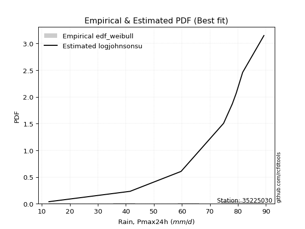</img>

</div>


### 4. EDF Beard (1943)

The Beard formula (or Beard´s plotting position formula) in hydrology is used to estimate the empirical non-exceedance probability _(P)_ of a flood event (or other extreme hydrological data point) within a given dataset.

<div align="center">


$P=(m-0.31)/(n+0.38)$


</div>


**4.1. Empirical values**

<div align="center">

|                | 0                   | 1                   | 2                  | 3                   | 4         | 5                  | 6                  | 7                  | 8                  |
|:---------------|:--------------------|:--------------------|:-------------------|:--------------------|:----------|:-------------------|:-------------------|:-------------------|:-------------------|
| date           | 2017                | 2020                | 2019               | 2018                | 2023      | 2024               | 2022               | 2021               | 2025               |
| x              | 12.5                | 41.5                | 59.7               | 74.9                | 78.0      | 79.4               | 81.7               | 89.3               | 119.1              |
| m              | 1                   | 2                   | 3                  | 4                   | 5         | 6                  | 7                  | 8                  | 9                  |
| empirical_dist | edf_beard           | edf_beard           | edf_beard          | edf_beard           | edf_beard | edf_beard          | edf_beard          | edf_beard          | edf_beard          |
| empirical      | 0.07356076759061833 | 0.18017057569296374 | 0.2867803837953091 | 0.39339019189765456 | 0.5       | 0.6066098081023454 | 0.7132196162046908 | 0.8198294243070362 | 0.9264392324093815 |
| empirical_tr   | 1.0794016110471807  | 1.2197659297789336  | 1.4020926756352765 | 1.6485061511423549  | 2.0       | 2.542005420054201  | 3.486988847583642  | 5.550295857988164  | 13.5942028985507   |

</div>


**4.2. Kolmogorov-Smirnov fit test (sorted by Δ)**


<div align="center">

|                | 0                   | 1                   | 2                   | 3                   | 4                   | 5                   | 6                   | 7                   | 8                   | 9                   | 10                  | 11                  | 12                  | 13                  | 14                  | 15                  | 16                  | 17                  | 18                  | 19                  | 20                  | 21                  | 22                  | 23                  | 24                  | 25                  | 26                  | 27                  | 28                  | 29                  | 30                  | 31                  | 32                  | 33                  | 34                  | 35                  | 36                  | 37                  | 38                  | 39                  | 40                  | 41                  | 42                  | 43                  | 44                  | 45                  | 46                  | 47                  | 48                  | 49                  | 50                  | 51                  | 52                  | 53                  | 54                  | 55                  | 56                  | 57                  | 58                  | 59                  | 60                  | 61                  | 62                  | 63                  | 64                  | 65                  | 66                  | 67                  | 68                  | 69                  | 70                  | 71                  | 72                  | 73                  | 74                  | 75                  | 76                  | 77                  | 78                  | 79                  | 80                  | 81                  | 82                  | 83                  | 84                  | 85                  | 86                  | 87                  | 88                  | 89                  | 90                  | 91                  | 92                  | 93                  | 94                  | 95                  | 96                  | 97                  | 98                  | 99                  | 100                 | 101                 | 102                 | 103                 | 104                 | 105                 | 106                 | 107                 | 108                 | 109                 | 110                 | 111                 | 112                 | 113                 | 114                 | 115                 | 116                 | 117                 | 118                 | 119                 | 120                 | 121                 | 122                 | 123                 | 124                 | 125                 | 126                 | 127                 | 128                 | 129                 | 130                 | 131                 | 132                 | 133                 | 134                 | 135                 | 136                 | 137                 | 138                 | 139                 | 140                 | 141                 | 142                 | 143                 | 144                 | 145                 | 146                 | 147                 | 148                 | 149                 | 150                 | 151                 | 152                 | 153                 | 154                 | 155                 | 156                 | 157                 | 158                 | 159                 |
|:---------------|:--------------------|:--------------------|:--------------------|:--------------------|:--------------------|:--------------------|:--------------------|:--------------------|:--------------------|:--------------------|:--------------------|:--------------------|:--------------------|:--------------------|:--------------------|:--------------------|:--------------------|:--------------------|:--------------------|:--------------------|:--------------------|:--------------------|:--------------------|:--------------------|:--------------------|:--------------------|:--------------------|:--------------------|:--------------------|:--------------------|:--------------------|:--------------------|:--------------------|:--------------------|:--------------------|:--------------------|:--------------------|:--------------------|:--------------------|:--------------------|:--------------------|:--------------------|:--------------------|:--------------------|:--------------------|:--------------------|:--------------------|:--------------------|:--------------------|:--------------------|:--------------------|:--------------------|:--------------------|:--------------------|:--------------------|:--------------------|:--------------------|:--------------------|:--------------------|:--------------------|:--------------------|:--------------------|:--------------------|:--------------------|:--------------------|:--------------------|:--------------------|:--------------------|:--------------------|:--------------------|:--------------------|:--------------------|:--------------------|:--------------------|:--------------------|:--------------------|:--------------------|:--------------------|:--------------------|:--------------------|:--------------------|:--------------------|:--------------------|:--------------------|:--------------------|:--------------------|:--------------------|:--------------------|:--------------------|:--------------------|:--------------------|:--------------------|:--------------------|:--------------------|:--------------------|:--------------------|:--------------------|:--------------------|:--------------------|:--------------------|:--------------------|:--------------------|:--------------------|:--------------------|:--------------------|:--------------------|:--------------------|:--------------------|:--------------------|:--------------------|:--------------------|:--------------------|:--------------------|:--------------------|:--------------------|:--------------------|:--------------------|:--------------------|:--------------------|:--------------------|:--------------------|:--------------------|:--------------------|:--------------------|:--------------------|:--------------------|:--------------------|:--------------------|:--------------------|:--------------------|:--------------------|:--------------------|:--------------------|:--------------------|:--------------------|:--------------------|:--------------------|:--------------------|:--------------------|:--------------------|:--------------------|:--------------------|:--------------------|:--------------------|:--------------------|:--------------------|:--------------------|:--------------------|:--------------------|:--------------------|:--------------------|:--------------------|:--------------------|:--------------------|:--------------------|:--------------------|:--------------------|:--------------------|:--------------------|:--------------------|
| station        | 35225030            | 35225030            | 35225030            | 35225030            | 35225030            | 35225030            | 35225030            | 35225030            | 35225030            | 35225030            | 35225030            | 35225030            | 35225030            | 35225030            | 35225030            | 35225030            | 35225030            | 35225030            | 35225030            | 35225030            | 35225030            | 35225030            | 35225030            | 35225030            | 35225030            | 35225030            | 35225030            | 35225030            | 35225030            | 35225030            | 35225030            | 35225030            | 35225030            | 35225030            | 35225030            | 35225030            | 35225030            | 35225030            | 35225030            | 35225030            | 35225030            | 35225030            | 35225030            | 35225030            | 35225030            | 35225030            | 35225030            | 35225030            | 35225030            | 35225030            | 35225030            | 35225030            | 35225030            | 35225030            | 35225030            | 35225030            | 35225030            | 35225030            | 35225030            | 35225030            | 35225030            | 35225030            | 35225030            | 35225030            | 35225030            | 35225030            | 35225030            | 35225030            | 35225030            | 35225030            | 35225030            | 35225030            | 35225030            | 35225030            | 35225030            | 35225030            | 35225030            | 35225030            | 35225030            | 35225030            | 35225030            | 35225030            | 35225030            | 35225030            | 35225030            | 35225030            | 35225030            | 35225030            | 35225030            | 35225030            | 35225030            | 35225030            | 35225030            | 35225030            | 35225030            | 35225030            | 35225030            | 35225030            | 35225030            | 35225030            | 35225030            | 35225030            | 35225030            | 35225030            | 35225030            | 35225030            | 35225030            | 35225030            | 35225030            | 35225030            | 35225030            | 35225030            | 35225030            | 35225030            | 35225030            | 35225030            | 35225030            | 35225030            | 35225030            | 35225030            | 35225030            | 35225030            | 35225030            | 35225030            | 35225030            | 35225030            | 35225030            | 35225030            | 35225030            | 35225030            | 35225030            | 35225030            | 35225030            | 35225030            | 35225030            | 35225030            | 35225030            | 35225030            | 35225030            | 35225030            | 35225030            | 35225030            | 35225030            | 35225030            | 35225030            | 35225030            | 35225030            | 35225030            | 35225030            | 35225030            | 35225030            | 35225030            | 35225030            | 35225030            | 35225030            | 35225030            | 35225030            | 35225030            | 35225030            | 35225030            |
| empirical_dist | edf_beard           | edf_beard           | edf_beard           | edf_beard           | edf_beard           | edf_beard           | edf_beard           | edf_beard           | edf_beard           | edf_beard           | edf_beard           | edf_beard           | edf_beard           | edf_beard           | edf_beard           | edf_beard           | edf_beard           | edf_beard           | edf_beard           | edf_beard           | edf_beard           | edf_beard           | edf_beard           | edf_beard           | edf_beard           | edf_beard           | edf_beard           | edf_beard           | edf_beard           | edf_beard           | edf_beard           | edf_beard           | edf_beard           | edf_beard           | edf_beard           | edf_beard           | edf_beard           | edf_beard           | edf_beard           | edf_beard           | edf_beard           | edf_beard           | edf_beard           | edf_beard           | edf_beard           | edf_beard           | edf_beard           | edf_beard           | edf_beard           | edf_beard           | edf_beard           | edf_beard           | edf_beard           | edf_beard           | edf_beard           | edf_beard           | edf_beard           | edf_beard           | edf_beard           | edf_beard           | edf_beard           | edf_beard           | edf_beard           | edf_beard           | edf_beard           | edf_beard           | edf_beard           | edf_beard           | edf_beard           | edf_beard           | edf_beard           | edf_beard           | edf_beard           | edf_beard           | edf_beard           | edf_beard           | edf_beard           | edf_beard           | edf_beard           | edf_beard           | edf_beard           | edf_beard           | edf_beard           | edf_beard           | edf_beard           | edf_beard           | edf_beard           | edf_beard           | edf_beard           | edf_beard           | edf_beard           | edf_beard           | edf_beard           | edf_beard           | edf_beard           | edf_beard           | edf_beard           | edf_beard           | edf_beard           | edf_beard           | edf_beard           | edf_beard           | edf_beard           | edf_beard           | edf_beard           | edf_beard           | edf_beard           | edf_beard           | edf_beard           | edf_beard           | edf_beard           | edf_beard           | edf_beard           | edf_beard           | edf_beard           | edf_beard           | edf_beard           | edf_beard           | edf_beard           | edf_beard           | edf_beard           | edf_beard           | edf_beard           | edf_beard           | edf_beard           | edf_beard           | edf_beard           | edf_beard           | edf_beard           | edf_beard           | edf_beard           | edf_beard           | edf_beard           | edf_beard           | edf_beard           | edf_beard           | edf_beard           | edf_beard           | edf_beard           | edf_beard           | edf_beard           | edf_beard           | edf_beard           | edf_beard           | edf_beard           | edf_beard           | edf_beard           | edf_beard           | edf_beard           | edf_beard           | edf_beard           | edf_beard           | edf_beard           | edf_beard           | edf_beard           | edf_beard           | edf_beard           | edf_beard           | edf_beard           | edf_beard           |
| p_dist         | logjohnsonsu        | johnsonsu           | dweibull            | t                   | logdgamma           | gumbel_l            | genlogistic         | truncnorm           | dgamma              | genextreme          | logjohnsonsb        | johnsonsb           | pearson3            | skewnorm            | weibull_min         | logargus            | argus               | gennorm             | logdweibull         | gompertz            | exponpow            | tukeylambda         | truncweibull_min    | logpearson3         | loggennorm          | semicircular        | logt                | logloggamma         | anglit              | exponweib           | foldnorm            | logvonmises_line    | crystalball         | norm                | exponnorm           | rice                | nct                 | lognakagami         | logloglaplace       | arcsine             | f                   | logtrapezoid        | erlang              | logburr             | mielke              | logistic            | burr                | logburr12           | gamma               | loggenlogistic      | loggumbel_l         | betaprime           | ksone               | hypsecant           | logmielke           | gengamma            | invgamma            | cosine              | kappa3              | uniform             | loggompertz         | wrapcauchy          | invweibull          | maxwell             | laplace             | logarcsine          | ncf                 | rayleigh            | loggenextreme       | logsemicircular     | loglevy_l           | loggengamma         | gausshyper          | kappa4              | loganglit           | invgauss            | logskewnorm         | kstwobign           | logweibull_max      | genexpon            | logbetaprime        | logtruncweibull_min | loggenpareto        | logfatiguelife      | loggamma            | loggamma            | logncf              | loginvweibull       | logrice             | logf                | logexponnorm        | logcrystalball      | lognorm             | logalpha            | logerlang           | halfnorm            | lognct              | halfgennorm         | loginvgamma         | loginvgauss         | gumbel_r            | logfoldnorm         | vonmises_line       | genpareto           | loggenhalflogistic  | genhalflogistic     | loglogistic         | logmaxwell          | loghypsecant        | halflogistic        | moyal               | lograyleigh         | triang              | lomax               | logkstwobign        | bradford            | logtriang           | loggausshyper       | loghalfnorm         | loglaplace          | loglaplace          | alpha               | beta                | logcosine           | loggenexpon         | loggumbel_r         | levy_l              | loghalfgennorm      | nakagami            | loghalflogistic     | truncexpon          | logmoyal            | wald                | logwrapcauchy       | burr12              | logtruncnorm        | loglomax            | trapezoid           | logrdist            | logksone            | logwald             | logkappa4           | logbradford         | logtukeylambda      | logkappa3           | loguniform          | logweibull_min      | logbeta             | logexponweib        | logtruncexpon       | powerlaw            | logexponpow         | fatiguelife         | logpowerlaw         | weibull_max         | rdist               | truncpareto         | logtruncpareto      | logvonmises         | vonmises            |
| delta          | 0.07618694984396895 | 0.09134818904319492 | 0.09668372341996967 | 0.10124039748441926 | 0.10672415870861225 | 0.11102151559471529 | 0.1270011995387046  | 0.12708578303155726 | 0.12711140589596198 | 0.1295325280421712  | 0.13332862716576432 | 0.1333677467664045  | 0.1341764257798943  | 0.13452768751307853 | 0.1348866679418701  | 0.1358299585142585  | 0.13750463573739047 | 0.138392145572389   | 0.13943684455047667 | 0.14141767367063152 | 0.14375967564630732 | 0.1439631814618323  | 0.14419898177046186 | 0.14635212164071565 | 0.14869093343719733 | 0.15370184100207818 | 0.15425839890547233 | 0.1551024369766676  | 0.15714199841731435 | 0.161665107591344   | 0.16393890432864477 | 0.16461930047613293 | 0.1654698482046708  | 0.165469849872117   | 0.16547194332151582 | 0.1655347407420098  | 0.16556292930151995 | 0.16622386769775094 | 0.1667810098362189  | 0.16702674968711606 | 0.1672020775558518  | 0.1673720854024935  | 0.171752455073796   | 0.1730412285171613  | 0.1732790635617396  | 0.17335573152907213 | 0.17383336998346688 | 0.173930675718858   | 0.1741279008219948  | 0.17431608445789515 | 0.17625953953573903 | 0.17660734258307986 | 0.17774801948445929 | 0.17999087619494958 | 0.18054689901441778 | 0.18151577320837986 | 0.1855366769232557  | 0.18581342310004156 | 0.1919632256456255  | 0.1919756617608821  | 0.19275839054579436 | 0.19377669405545506 | 0.19462637395673954 | 0.19525847478150626 | 0.20108102132090222 | 0.20284116972659444 | 0.20313052175868285 | 0.2047655984772897  | 0.20554244070371874 | 0.20709982391712145 | 0.20934367866704168 | 0.21047957024179187 | 0.21287717211343793 | 0.21357073382622171 | 0.2141374032386828  | 0.21423588856063813 | 0.21689285727312013 | 0.2174941477376876  | 0.21878908937107566 | 0.22393413274374752 | 0.2265941341528328  | 0.22692392470921374 | 0.22779444308859886 | 0.22869148607190148 | 0.22965677959709807 | 0.22965677959709807 | 0.2297243637880566  | 0.22995096473304688 | 0.23042270328659098 | 0.23088042977154355 | 0.23099934977261827 | 0.2310009487598612  | 0.23100098565068272 | 0.2311884237346904  | 0.23152565328359453 | 0.23161087104454314 | 0.2322830977039898  | 0.23270534594100356 | 0.23445224900464268 | 0.23454245258026973 | 0.2351587281872023  | 0.23654311643677817 | 0.23672911226146054 | 0.24008661086111804 | 0.24185413065375738 | 0.24237095874296144 | 0.24653430308347468 | 0.25525707284421173 | 0.25895394585081444 | 0.2591712993670583  | 0.25969285151542376 | 0.2626666857321662  | 0.2636471464584712  | 0.26664764493153936 | 0.2690450071032736  | 0.27151135141317917 | 0.2787267405591657  | 0.28314349638415126 | 0.2839464976371947  | 0.2872705572565787  | 0.2872705572565787  | 0.28773631252806287 | 0.28962375627089343 | 0.2921763742625847  | 0.29299909196650786 | 0.2946711979825183  | 0.2993165724119754  | 0.30338272017262047 | 0.3099721480204293  | 0.3123036726177706  | 0.3155406465983548  | 0.3160748604193995  | 0.32777722439825363 | 0.3306343622702385  | 0.3449798678233346  | 0.3456665120858242  | 0.3472098749506393  | 0.35237201854882505 | 0.35445858065639846 | 0.37457738376340644 | 0.3761010239869418  | 0.39868157654074277 | 0.4025831842212647  | 0.40579964797281454 | 0.40593466898386243 | 0.4068489372751496  | 0.4552691633492642  | 0.4592442972817959  | 0.4662442779884938  | 0.47237057182774755 | 0.5813190096096115  | 0.590253483817855   | 0.6049955551091368  | 0.6815025815147893  | 0.7121943856841426  | 0.7132196149999303  | 0.742839226664356   | 0.782099909069095   | 1.1947716666106922  | 18.66294676698173   |
| deltao         | 0.41761268023100007 | 0.41761268023100007 | 0.41761268023100007 | 0.41761268023100007 | 0.41761268023100007 | 0.41761268023100007 | 0.41761268023100007 | 0.41761268023100007 | 0.41761268023100007 | 0.41761268023100007 | 0.41761268023100007 | 0.41761268023100007 | 0.41761268023100007 | 0.41761268023100007 | 0.41761268023100007 | 0.41761268023100007 | 0.41761268023100007 | 0.41761268023100007 | 0.41761268023100007 | 0.41761268023100007 | 0.41761268023100007 | 0.41761268023100007 | 0.41761268023100007 | 0.41761268023100007 | 0.41761268023100007 | 0.41761268023100007 | 0.41761268023100007 | 0.41761268023100007 | 0.41761268023100007 | 0.41761268023100007 | 0.41761268023100007 | 0.41761268023100007 | 0.41761268023100007 | 0.41761268023100007 | 0.41761268023100007 | 0.41761268023100007 | 0.41761268023100007 | 0.41761268023100007 | 0.41761268023100007 | 0.41761268023100007 | 0.41761268023100007 | 0.41761268023100007 | 0.41761268023100007 | 0.41761268023100007 | 0.41761268023100007 | 0.41761268023100007 | 0.41761268023100007 | 0.41761268023100007 | 0.41761268023100007 | 0.41761268023100007 | 0.41761268023100007 | 0.41761268023100007 | 0.41761268023100007 | 0.41761268023100007 | 0.41761268023100007 | 0.41761268023100007 | 0.41761268023100007 | 0.41761268023100007 | 0.41761268023100007 | 0.41761268023100007 | 0.41761268023100007 | 0.41761268023100007 | 0.41761268023100007 | 0.41761268023100007 | 0.41761268023100007 | 0.41761268023100007 | 0.41761268023100007 | 0.41761268023100007 | 0.41761268023100007 | 0.41761268023100007 | 0.41761268023100007 | 0.41761268023100007 | 0.41761268023100007 | 0.41761268023100007 | 0.41761268023100007 | 0.41761268023100007 | 0.41761268023100007 | 0.41761268023100007 | 0.41761268023100007 | 0.41761268023100007 | 0.41761268023100007 | 0.41761268023100007 | 0.41761268023100007 | 0.41761268023100007 | 0.41761268023100007 | 0.41761268023100007 | 0.41761268023100007 | 0.41761268023100007 | 0.41761268023100007 | 0.41761268023100007 | 0.41761268023100007 | 0.41761268023100007 | 0.41761268023100007 | 0.41761268023100007 | 0.41761268023100007 | 0.41761268023100007 | 0.41761268023100007 | 0.41761268023100007 | 0.41761268023100007 | 0.41761268023100007 | 0.41761268023100007 | 0.41761268023100007 | 0.41761268023100007 | 0.41761268023100007 | 0.41761268023100007 | 0.41761268023100007 | 0.41761268023100007 | 0.41761268023100007 | 0.41761268023100007 | 0.41761268023100007 | 0.41761268023100007 | 0.41761268023100007 | 0.41761268023100007 | 0.41761268023100007 | 0.41761268023100007 | 0.41761268023100007 | 0.41761268023100007 | 0.41761268023100007 | 0.41761268023100007 | 0.41761268023100007 | 0.41761268023100007 | 0.41761268023100007 | 0.41761268023100007 | 0.41761268023100007 | 0.41761268023100007 | 0.41761268023100007 | 0.41761268023100007 | 0.41761268023100007 | 0.41761268023100007 | 0.41761268023100007 | 0.41761268023100007 | 0.41761268023100007 | 0.41761268023100007 | 0.41761268023100007 | 0.41761268023100007 | 0.41761268023100007 | 0.41761268023100007 | 0.41761268023100007 | 0.41761268023100007 | 0.41761268023100007 | 0.41761268023100007 | 0.41761268023100007 | 0.41761268023100007 | 0.41761268023100007 | 0.41761268023100007 | 0.41761268023100007 | 0.41761268023100007 | 0.41761268023100007 | 0.41761268023100007 | 0.41761268023100007 | 0.41761268023100007 | 0.41761268023100007 | 0.41761268023100007 | 0.41761268023100007 | 0.41761268023100007 | 0.41761268023100007 | 0.41761268023100007 | 0.41761268023100007 | 0.41761268023100007 | 0.41761268023100007 |
| eval           | Δo > Δ              | Δo > Δ              | Δo > Δ              | Δo > Δ              | Δo > Δ              | Δo > Δ              | Δo > Δ              | Δo > Δ              | Δo > Δ              | Δo > Δ              | Δo > Δ              | Δo > Δ              | Δo > Δ              | Δo > Δ              | Δo > Δ              | Δo > Δ              | Δo > Δ              | Δo > Δ              | Δo > Δ              | Δo > Δ              | Δo > Δ              | Δo > Δ              | Δo > Δ              | Δo > Δ              | Δo > Δ              | Δo > Δ              | Δo > Δ              | Δo > Δ              | Δo > Δ              | Δo > Δ              | Δo > Δ              | Δo > Δ              | Δo > Δ              | Δo > Δ              | Δo > Δ              | Δo > Δ              | Δo > Δ              | Δo > Δ              | Δo > Δ              | Δo > Δ              | Δo > Δ              | Δo > Δ              | Δo > Δ              | Δo > Δ              | Δo > Δ              | Δo > Δ              | Δo > Δ              | Δo > Δ              | Δo > Δ              | Δo > Δ              | Δo > Δ              | Δo > Δ              | Δo > Δ              | Δo > Δ              | Δo > Δ              | Δo > Δ              | Δo > Δ              | Δo > Δ              | Δo > Δ              | Δo > Δ              | Δo > Δ              | Δo > Δ              | Δo > Δ              | Δo > Δ              | Δo > Δ              | Δo > Δ              | Δo > Δ              | Δo > Δ              | Δo > Δ              | Δo > Δ              | Δo > Δ              | Δo > Δ              | Δo > Δ              | Δo > Δ              | Δo > Δ              | Δo > Δ              | Δo > Δ              | Δo > Δ              | Δo > Δ              | Δo > Δ              | Δo > Δ              | Δo > Δ              | Δo > Δ              | Δo > Δ              | Δo > Δ              | Δo > Δ              | Δo > Δ              | Δo > Δ              | Δo > Δ              | Δo > Δ              | Δo > Δ              | Δo > Δ              | Δo > Δ              | Δo > Δ              | Δo > Δ              | Δo > Δ              | Δo > Δ              | Δo > Δ              | Δo > Δ              | Δo > Δ              | Δo > Δ              | Δo > Δ              | Δo > Δ              | Δo > Δ              | Δo > Δ              | Δo > Δ              | Δo > Δ              | Δo > Δ              | Δo > Δ              | Δo > Δ              | Δo > Δ              | Δo > Δ              | Δo > Δ              | Δo > Δ              | Δo > Δ              | Δo > Δ              | Δo > Δ              | Δo > Δ              | Δo > Δ              | Δo > Δ              | Δo > Δ              | Δo > Δ              | Δo > Δ              | Δo > Δ              | Δo > Δ              | Δo > Δ              | Δo > Δ              | Δo > Δ              | Δo > Δ              | Δo > Δ              | Δo > Δ              | Δo > Δ              | Δo > Δ              | Δo > Δ              | Δo > Δ              | Δo > Δ              | Δo > Δ              | Δo > Δ              | Δo > Δ              | Δo > Δ              | Δo > Δ              | Δo > Δ              | Δo > Δ              | Δo > Δ              | Δo > Δ              | Δo > Δ              | Δo <= Δ             | Δo <= Δ             | Δo <= Δ             | Δo <= Δ             | Δo <= Δ             | Δo <= Δ             | Δo <= Δ             | Δo <= Δ             | Δo <= Δ             | Δo <= Δ             | Δo <= Δ             | Δo <= Δ             | Δo <= Δ             | Δo <= Δ             |
| fit            | 1                   | 1                   | 1                   | 1                   | 1                   | 1                   | 1                   | 1                   | 1                   | 1                   | 1                   | 1                   | 1                   | 1                   | 1                   | 1                   | 1                   | 1                   | 1                   | 1                   | 1                   | 1                   | 1                   | 1                   | 1                   | 1                   | 1                   | 1                   | 1                   | 1                   | 1                   | 1                   | 1                   | 1                   | 1                   | 1                   | 1                   | 1                   | 1                   | 1                   | 1                   | 1                   | 1                   | 1                   | 1                   | 1                   | 1                   | 1                   | 1                   | 1                   | 1                   | 1                   | 1                   | 1                   | 1                   | 1                   | 1                   | 1                   | 1                   | 1                   | 1                   | 1                   | 1                   | 1                   | 1                   | 1                   | 1                   | 1                   | 1                   | 1                   | 1                   | 1                   | 1                   | 1                   | 1                   | 1                   | 1                   | 1                   | 1                   | 1                   | 1                   | 1                   | 1                   | 1                   | 1                   | 1                   | 1                   | 1                   | 1                   | 1                   | 1                   | 1                   | 1                   | 1                   | 1                   | 1                   | 1                   | 1                   | 1                   | 1                   | 1                   | 1                   | 1                   | 1                   | 1                   | 1                   | 1                   | 1                   | 1                   | 1                   | 1                   | 1                   | 1                   | 1                   | 1                   | 1                   | 1                   | 1                   | 1                   | 1                   | 1                   | 1                   | 1                   | 1                   | 1                   | 1                   | 1                   | 1                   | 1                   | 1                   | 1                   | 1                   | 1                   | 1                   | 1                   | 1                   | 1                   | 1                   | 1                   | 1                   | 1                   | 1                   | 1                   | 1                   | 1                   | 1                   | 0                   | 0                   | 0                   | 0                   | 0                   | 0                   | 0                   | 0                   | 0                   | 0                   | 0                   | 0                   | 0                   | 0                   |
| n              | 9                   | 9                   | 9                   | 9                   | 9                   | 9                   | 9                   | 9                   | 9                   | 9                   | 9                   | 9                   | 9                   | 9                   | 9                   | 9                   | 9                   | 9                   | 9                   | 9                   | 9                   | 9                   | 9                   | 9                   | 9                   | 9                   | 9                   | 9                   | 9                   | 9                   | 9                   | 9                   | 9                   | 9                   | 9                   | 9                   | 9                   | 9                   | 9                   | 9                   | 9                   | 9                   | 9                   | 9                   | 9                   | 9                   | 9                   | 9                   | 9                   | 9                   | 9                   | 9                   | 9                   | 9                   | 9                   | 9                   | 9                   | 9                   | 9                   | 9                   | 9                   | 9                   | 9                   | 9                   | 9                   | 9                   | 9                   | 9                   | 9                   | 9                   | 9                   | 9                   | 9                   | 9                   | 9                   | 9                   | 9                   | 9                   | 9                   | 9                   | 9                   | 9                   | 9                   | 9                   | 9                   | 9                   | 9                   | 9                   | 9                   | 9                   | 9                   | 9                   | 9                   | 9                   | 9                   | 9                   | 9                   | 9                   | 9                   | 9                   | 9                   | 9                   | 9                   | 9                   | 9                   | 9                   | 9                   | 9                   | 9                   | 9                   | 9                   | 9                   | 9                   | 9                   | 9                   | 9                   | 9                   | 9                   | 9                   | 9                   | 9                   | 9                   | 9                   | 9                   | 9                   | 9                   | 9                   | 9                   | 9                   | 9                   | 9                   | 9                   | 9                   | 9                   | 9                   | 9                   | 9                   | 9                   | 9                   | 9                   | 9                   | 9                   | 9                   | 9                   | 9                   | 9                   | 9                   | 9                   | 9                   | 9                   | 9                   | 9                   | 9                   | 9                   | 9                   | 9                   | 9                   | 9                   | 9                   | 9                   |
| best_fit       | 1                   | 0                   | 0                   | 0                   | 0                   | 0                   | 0                   | 0                   | 0                   | 0                   | 0                   | 0                   | 0                   | 0                   | 0                   | 0                   | 0                   | 0                   | 0                   | 0                   | 0                   | 0                   | 0                   | 0                   | 0                   | 0                   | 0                   | 0                   | 0                   | 0                   | 0                   | 0                   | 0                   | 0                   | 0                   | 0                   | 0                   | 0                   | 0                   | 0                   | 0                   | 0                   | 0                   | 0                   | 0                   | 0                   | 0                   | 0                   | 0                   | 0                   | 0                   | 0                   | 0                   | 0                   | 0                   | 0                   | 0                   | 0                   | 0                   | 0                   | 0                   | 0                   | 0                   | 0                   | 0                   | 0                   | 0                   | 0                   | 0                   | 0                   | 0                   | 0                   | 0                   | 0                   | 0                   | 0                   | 0                   | 0                   | 0                   | 0                   | 0                   | 0                   | 0                   | 0                   | 0                   | 0                   | 0                   | 0                   | 0                   | 0                   | 0                   | 0                   | 0                   | 0                   | 0                   | 0                   | 0                   | 0                   | 0                   | 0                   | 0                   | 0                   | 0                   | 0                   | 0                   | 0                   | 0                   | 0                   | 0                   | 0                   | 0                   | 0                   | 0                   | 0                   | 0                   | 0                   | 0                   | 0                   | 0                   | 0                   | 0                   | 0                   | 0                   | 0                   | 0                   | 0                   | 0                   | 0                   | 0                   | 0                   | 0                   | 0                   | 0                   | 0                   | 0                   | 0                   | 0                   | 0                   | 0                   | 0                   | 0                   | 0                   | 0                   | 0                   | 0                   | 0                   | 0                   | 0                   | 0                   | 0                   | 0                   | 0                   | 0                   | 0                   | 0                   | 0                   | 0                   | 0                   | 0                   | 0                   |
| best_fit_sort  | 1                   | 2                   | 3                   | 4                   | 5                   | 6                   | 7                   | 8                   | 9                   | 10                  | 11                  | 12                  | 13                  | 14                  | 15                  | 16                  | 17                  | 18                  | 19                  | 20                  | 21                  | 22                  | 23                  | 24                  | 25                  | 26                  | 27                  | 28                  | 29                  | 30                  | 31                  | 32                  | 33                  | 34                  | 35                  | 36                  | 37                  | 38                  | 39                  | 40                  | 41                  | 42                  | 43                  | 44                  | 45                  | 46                  | 47                  | 48                  | 49                  | 50                  | 51                  | 52                  | 53                  | 54                  | 55                  | 56                  | 57                  | 58                  | 59                  | 60                  | 61                  | 62                  | 63                  | 64                  | 65                  | 66                  | 67                  | 68                  | 69                  | 70                  | 71                  | 72                  | 73                  | 74                  | 75                  | 76                  | 77                  | 78                  | 79                  | 80                  | 81                  | 82                  | 83                  | 84                  | 85                  | 86                  | 87                  | 88                  | 89                  | 90                  | 91                  | 92                  | 93                  | 94                  | 95                  | 96                  | 97                  | 98                  | 99                  | 100                 | 101                 | 102                 | 103                 | 104                 | 105                 | 106                 | 107                 | 108                 | 109                 | 110                 | 111                 | 112                 | 113                 | 114                 | 115                 | 116                 | 117                 | 118                 | 119                 | 120                 | 121                 | 122                 | 123                 | 124                 | 125                 | 126                 | 127                 | 128                 | 129                 | 130                 | 131                 | 132                 | 133                 | 134                 | 135                 | 136                 | 137                 | 138                 | 139                 | 140                 | 141                 | 142                 | 143                 | 144                 | 145                 | 146                 | 147                 | 148                 | 149                 | 150                 | 151                 | 152                 | 153                 | 154                 | 155                 | 156                 | 157                 | 158                 | 159                 | 160                 |

</div>


**4.3. Best fit**

<div align="center">

|   id |   station | empirical_dist   | p_dist       |     delta |   deltao | eval   |   fit |   n |   best_fit |   best_fit_sort |
|-----:|----------:|:-----------------|:-------------|----------:|---------:|:-------|------:|----:|-----------:|----------------:|
|    0 |  35225030 | edf_beard        | logjohnsonsu | 0.0761869 | 0.417613 | Δo > Δ |     1 |   9 |          1 |               1 |

</div>


<div align="center">

</img></img>

</div>


### 5. EDF Chegodayev (1955)

The Chegodayev formula is an empirical plotting position formula used in hydrological frequency analysis to estimate the exceedance probability or return period of a specific event from a set of observed data. It is primarily used for plotting observed data points on probability paper to fit a theoretical distribution, particularly for analyzing extreme events like maximum flood flows or rainfall intensities. The constant _b_ value in the generalized plotting position formula is 0.3.

<div align="center">


$P=(m-b)/(n+1-2b)$


</div>


**5.1. Empirical values**

<div align="center">

|                | 0                   | 1                   | 2                  | 3                   | 4              | 5                  | 6                  | 7                  | 8                  |
|:---------------|:--------------------|:--------------------|:-------------------|:--------------------|:---------------|:-------------------|:-------------------|:-------------------|:-------------------|
| date           | 2017                | 2020                | 2019               | 2018                | 2023           | 2024               | 2022               | 2021               | 2025               |
| x              | 12.5                | 41.5                | 59.7               | 74.9                | 78.0           | 79.4               | 81.7               | 89.3               | 119.1              |
| m              | 1                   | 2                   | 3                  | 4                   | 5              | 6                  | 7                  | 8                  | 9                  |
| empirical_dist | edf_chegodayev      | edf_chegodayev      | edf_chegodayev     | edf_chegodayev      | edf_chegodayev | edf_chegodayev     | edf_chegodayev     | edf_chegodayev     | edf_chegodayev     |
| empirical      | 0.07446808510638298 | 0.18085106382978722 | 0.2872340425531915 | 0.39361702127659576 | 0.5            | 0.6063829787234043 | 0.7127659574468085 | 0.8191489361702128 | 0.9255319148936169 |
| empirical_tr   | 1.0804597701149425  | 1.2207792207792207  | 1.4029850746268657 | 1.6491228070175437  | 2.0            | 2.540540540540541  | 3.481481481481481  | 5.529411764705883  | 13.428571428571399 |

</div>


**5.2. Kolmogorov-Smirnov fit test (sorted by Δ)**


<div align="center">

|                | 0                   | 1                   | 2                   | 3                   | 4                   | 5                   | 6                   | 7                   | 8                   | 9                   | 10                  | 11                  | 12                  | 13                  | 14                  | 15                  | 16                  | 17                  | 18                  | 19                  | 20                  | 21                  | 22                  | 23                  | 24                  | 25                  | 26                  | 27                  | 28                  | 29                  | 30                  | 31                  | 32                  | 33                  | 34                  | 35                  | 36                  | 37                  | 38                  | 39                  | 40                  | 41                  | 42                  | 43                  | 44                  | 45                  | 46                  | 47                  | 48                  | 49                  | 50                  | 51                  | 52                  | 53                  | 54                  | 55                  | 56                  | 57                  | 58                  | 59                  | 60                  | 61                  | 62                  | 63                  | 64                  | 65                  | 66                  | 67                  | 68                  | 69                  | 70                  | 71                  | 72                  | 73                  | 74                  | 75                  | 76                  | 77                  | 78                  | 79                  | 80                  | 81                  | 82                  | 83                  | 84                  | 85                  | 86                  | 87                  | 88                  | 89                  | 90                  | 91                  | 92                  | 93                  | 94                  | 95                  | 96                  | 97                  | 98                  | 99                  | 100                 | 101                 | 102                 | 103                 | 104                 | 105                 | 106                 | 107                 | 108                 | 109                 | 110                 | 111                 | 112                 | 113                 | 114                 | 115                 | 116                 | 117                 | 118                 | 119                 | 120                 | 121                 | 122                 | 123                 | 124                 | 125                 | 126                 | 127                 | 128                 | 129                 | 130                 | 131                 | 132                 | 133                 | 134                 | 135                 | 136                 | 137                 | 138                 | 139                 | 140                 | 141                 | 142                 | 143                 | 144                 | 145                 | 146                 | 147                 | 148                 | 149                 | 150                 | 151                 | 152                 | 153                 | 154                 | 155                 | 156                 | 157                 | 158                 | 159                 |
|:---------------|:--------------------|:--------------------|:--------------------|:--------------------|:--------------------|:--------------------|:--------------------|:--------------------|:--------------------|:--------------------|:--------------------|:--------------------|:--------------------|:--------------------|:--------------------|:--------------------|:--------------------|:--------------------|:--------------------|:--------------------|:--------------------|:--------------------|:--------------------|:--------------------|:--------------------|:--------------------|:--------------------|:--------------------|:--------------------|:--------------------|:--------------------|:--------------------|:--------------------|:--------------------|:--------------------|:--------------------|:--------------------|:--------------------|:--------------------|:--------------------|:--------------------|:--------------------|:--------------------|:--------------------|:--------------------|:--------------------|:--------------------|:--------------------|:--------------------|:--------------------|:--------------------|:--------------------|:--------------------|:--------------------|:--------------------|:--------------------|:--------------------|:--------------------|:--------------------|:--------------------|:--------------------|:--------------------|:--------------------|:--------------------|:--------------------|:--------------------|:--------------------|:--------------------|:--------------------|:--------------------|:--------------------|:--------------------|:--------------------|:--------------------|:--------------------|:--------------------|:--------------------|:--------------------|:--------------------|:--------------------|:--------------------|:--------------------|:--------------------|:--------------------|:--------------------|:--------------------|:--------------------|:--------------------|:--------------------|:--------------------|:--------------------|:--------------------|:--------------------|:--------------------|:--------------------|:--------------------|:--------------------|:--------------------|:--------------------|:--------------------|:--------------------|:--------------------|:--------------------|:--------------------|:--------------------|:--------------------|:--------------------|:--------------------|:--------------------|:--------------------|:--------------------|:--------------------|:--------------------|:--------------------|:--------------------|:--------------------|:--------------------|:--------------------|:--------------------|:--------------------|:--------------------|:--------------------|:--------------------|:--------------------|:--------------------|:--------------------|:--------------------|:--------------------|:--------------------|:--------------------|:--------------------|:--------------------|:--------------------|:--------------------|:--------------------|:--------------------|:--------------------|:--------------------|:--------------------|:--------------------|:--------------------|:--------------------|:--------------------|:--------------------|:--------------------|:--------------------|:--------------------|:--------------------|:--------------------|:--------------------|:--------------------|:--------------------|:--------------------|:--------------------|:--------------------|:--------------------|:--------------------|:--------------------|:--------------------|:--------------------|
| station        | 35225030            | 35225030            | 35225030            | 35225030            | 35225030            | 35225030            | 35225030            | 35225030            | 35225030            | 35225030            | 35225030            | 35225030            | 35225030            | 35225030            | 35225030            | 35225030            | 35225030            | 35225030            | 35225030            | 35225030            | 35225030            | 35225030            | 35225030            | 35225030            | 35225030            | 35225030            | 35225030            | 35225030            | 35225030            | 35225030            | 35225030            | 35225030            | 35225030            | 35225030            | 35225030            | 35225030            | 35225030            | 35225030            | 35225030            | 35225030            | 35225030            | 35225030            | 35225030            | 35225030            | 35225030            | 35225030            | 35225030            | 35225030            | 35225030            | 35225030            | 35225030            | 35225030            | 35225030            | 35225030            | 35225030            | 35225030            | 35225030            | 35225030            | 35225030            | 35225030            | 35225030            | 35225030            | 35225030            | 35225030            | 35225030            | 35225030            | 35225030            | 35225030            | 35225030            | 35225030            | 35225030            | 35225030            | 35225030            | 35225030            | 35225030            | 35225030            | 35225030            | 35225030            | 35225030            | 35225030            | 35225030            | 35225030            | 35225030            | 35225030            | 35225030            | 35225030            | 35225030            | 35225030            | 35225030            | 35225030            | 35225030            | 35225030            | 35225030            | 35225030            | 35225030            | 35225030            | 35225030            | 35225030            | 35225030            | 35225030            | 35225030            | 35225030            | 35225030            | 35225030            | 35225030            | 35225030            | 35225030            | 35225030            | 35225030            | 35225030            | 35225030            | 35225030            | 35225030            | 35225030            | 35225030            | 35225030            | 35225030            | 35225030            | 35225030            | 35225030            | 35225030            | 35225030            | 35225030            | 35225030            | 35225030            | 35225030            | 35225030            | 35225030            | 35225030            | 35225030            | 35225030            | 35225030            | 35225030            | 35225030            | 35225030            | 35225030            | 35225030            | 35225030            | 35225030            | 35225030            | 35225030            | 35225030            | 35225030            | 35225030            | 35225030            | 35225030            | 35225030            | 35225030            | 35225030            | 35225030            | 35225030            | 35225030            | 35225030            | 35225030            | 35225030            | 35225030            | 35225030            | 35225030            | 35225030            | 35225030            |
| empirical_dist | edf_chegodayev      | edf_chegodayev      | edf_chegodayev      | edf_chegodayev      | edf_chegodayev      | edf_chegodayev      | edf_chegodayev      | edf_chegodayev      | edf_chegodayev      | edf_chegodayev      | edf_chegodayev      | edf_chegodayev      | edf_chegodayev      | edf_chegodayev      | edf_chegodayev      | edf_chegodayev      | edf_chegodayev      | edf_chegodayev      | edf_chegodayev      | edf_chegodayev      | edf_chegodayev      | edf_chegodayev      | edf_chegodayev      | edf_chegodayev      | edf_chegodayev      | edf_chegodayev      | edf_chegodayev      | edf_chegodayev      | edf_chegodayev      | edf_chegodayev      | edf_chegodayev      | edf_chegodayev      | edf_chegodayev      | edf_chegodayev      | edf_chegodayev      | edf_chegodayev      | edf_chegodayev      | edf_chegodayev      | edf_chegodayev      | edf_chegodayev      | edf_chegodayev      | edf_chegodayev      | edf_chegodayev      | edf_chegodayev      | edf_chegodayev      | edf_chegodayev      | edf_chegodayev      | edf_chegodayev      | edf_chegodayev      | edf_chegodayev      | edf_chegodayev      | edf_chegodayev      | edf_chegodayev      | edf_chegodayev      | edf_chegodayev      | edf_chegodayev      | edf_chegodayev      | edf_chegodayev      | edf_chegodayev      | edf_chegodayev      | edf_chegodayev      | edf_chegodayev      | edf_chegodayev      | edf_chegodayev      | edf_chegodayev      | edf_chegodayev      | edf_chegodayev      | edf_chegodayev      | edf_chegodayev      | edf_chegodayev      | edf_chegodayev      | edf_chegodayev      | edf_chegodayev      | edf_chegodayev      | edf_chegodayev      | edf_chegodayev      | edf_chegodayev      | edf_chegodayev      | edf_chegodayev      | edf_chegodayev      | edf_chegodayev      | edf_chegodayev      | edf_chegodayev      | edf_chegodayev      | edf_chegodayev      | edf_chegodayev      | edf_chegodayev      | edf_chegodayev      | edf_chegodayev      | edf_chegodayev      | edf_chegodayev      | edf_chegodayev      | edf_chegodayev      | edf_chegodayev      | edf_chegodayev      | edf_chegodayev      | edf_chegodayev      | edf_chegodayev      | edf_chegodayev      | edf_chegodayev      | edf_chegodayev      | edf_chegodayev      | edf_chegodayev      | edf_chegodayev      | edf_chegodayev      | edf_chegodayev      | edf_chegodayev      | edf_chegodayev      | edf_chegodayev      | edf_chegodayev      | edf_chegodayev      | edf_chegodayev      | edf_chegodayev      | edf_chegodayev      | edf_chegodayev      | edf_chegodayev      | edf_chegodayev      | edf_chegodayev      | edf_chegodayev      | edf_chegodayev      | edf_chegodayev      | edf_chegodayev      | edf_chegodayev      | edf_chegodayev      | edf_chegodayev      | edf_chegodayev      | edf_chegodayev      | edf_chegodayev      | edf_chegodayev      | edf_chegodayev      | edf_chegodayev      | edf_chegodayev      | edf_chegodayev      | edf_chegodayev      | edf_chegodayev      | edf_chegodayev      | edf_chegodayev      | edf_chegodayev      | edf_chegodayev      | edf_chegodayev      | edf_chegodayev      | edf_chegodayev      | edf_chegodayev      | edf_chegodayev      | edf_chegodayev      | edf_chegodayev      | edf_chegodayev      | edf_chegodayev      | edf_chegodayev      | edf_chegodayev      | edf_chegodayev      | edf_chegodayev      | edf_chegodayev      | edf_chegodayev      | edf_chegodayev      | edf_chegodayev      | edf_chegodayev      | edf_chegodayev      | edf_chegodayev      | edf_chegodayev      |
| p_dist         | logjohnsonsu        | johnsonsu           | dweibull            | t                   | logdgamma           | gumbel_l            | genlogistic         | truncnorm           | dgamma              | genextreme          | logjohnsonsb        | johnsonsb           | pearson3            | skewnorm            | weibull_min         | logargus            | argus               | logdweibull         | gennorm             | gompertz            | truncweibull_min    | exponpow            | tukeylambda         | logpearson3         | loggennorm          | semicircular        | logt                | logloggamma         | anglit              | exponweib           | foldnorm            | logvonmises_line    | crystalball         | norm                | exponnorm           | rice                | nct                 | logloglaplace       | arcsine             | logtrapezoid        | lognakagami         | f                   | erlang              | logburr             | mielke              | logistic            | burr                | logburr12           | gamma               | loggenlogistic      | loggumbel_l         | betaprime           | ksone               | hypsecant           | logmielke           | gengamma            | invgamma            | cosine              | kappa3              | uniform             | loggompertz         | wrapcauchy          | invweibull          | maxwell             | laplace             | logarcsine          | ncf                 | rayleigh            | loggenextreme       | logsemicircular     | loglevy_l           | loggengamma         | gausshyper          | kappa4              | loganglit           | invgauss            | logskewnorm         | kstwobign           | logweibull_max      | genexpon            | logbetaprime        | logtruncweibull_min | loggenpareto        | logfatiguelife      | loggamma            | loggamma            | loginvweibull       | logncf              | logrice             | logf                | logexponnorm        | logcrystalball      | lognorm             | logalpha            | logerlang           | halfnorm            | lognct              | halfgennorm         | loginvgamma         | loginvgauss         | gumbel_r            | logfoldnorm         | vonmises_line       | genpareto           | loggenhalflogistic  | genhalflogistic     | loglogistic         | logmaxwell          | loghypsecant        | halflogistic        | moyal               | lograyleigh         | triang              | lomax               | logkstwobign        | bradford            | logtriang           | loggausshyper       | loghalfnorm         | loglaplace          | loglaplace          | alpha               | beta                | logcosine           | loggenexpon         | loggumbel_r         | levy_l              | loghalfgennorm      | nakagami            | loghalflogistic     | truncexpon          | logmoyal            | wald                | logwrapcauchy       | burr12              | logtruncnorm        | loglomax            | trapezoid           | logrdist            | logksone            | logwald             | logkappa4           | logbradford         | logtukeylambda      | logkappa3           | loguniform          | logweibull_min      | logbeta             | logexponweib        | logtruncexpon       | powerlaw            | logexponpow         | fatiguelife         | logpowerlaw         | weibull_max         | rdist               | truncpareto         | logtruncpareto      | logvonmises         | vonmises            |
| delta          | 0.07664060860185135 | 0.09180184780107731 | 0.09623006466208739 | 0.10078673872653698 | 0.10740464684543573 | 0.11056785683683301 | 0.1267743701597634  | 0.12685895365261607 | 0.12756506465384437 | 0.12930569866323    | 0.13310179778682313 | 0.1331409173874633  | 0.1339495964009531  | 0.13430085813413734 | 0.1346598385629289  | 0.13514947037743508 | 0.13682414760056705 | 0.13875635641365325 | 0.13884580433027138 | 0.14119084429169032 | 0.14351849363363844 | 0.14353284626736612 | 0.1437363520828911  | 0.14567163350389223 | 0.14914459219507972 | 0.15347501162313698 | 0.15471205766335472 | 0.1548756075977264  | 0.15691516903837316 | 0.1614382782124028  | 0.16371207494970358 | 0.16439247109719174 | 0.16524301882572962 | 0.1652430204931758  | 0.16524511394257463 | 0.1653079113630686  | 0.16533609992257875 | 0.1661005216993955  | 0.16634626155029264 | 0.16669159726567007 | 0.1669043558345744  | 0.16697524817691062 | 0.1715256256948548  | 0.1728143991382201  | 0.17305223418279841 | 0.17312890215013094 | 0.17360654060452568 | 0.1737038463399168  | 0.1739010714430536  | 0.17408925507895395 | 0.17603271015679783 | 0.17638051320413867 | 0.1775211901055181  | 0.17976404681600838 | 0.1803200696354766  | 0.18128894382943866 | 0.1853098475443145  | 0.18558659372110037 | 0.19173639626668432 | 0.1917488323819409  | 0.19253156116685316 | 0.19354986467651386 | 0.19439954457779834 | 0.19503164540256507 | 0.20085419194196102 | 0.20238751096871205 | 0.20290369237974165 | 0.2045387690983485  | 0.20486195256689532 | 0.20687299453818025 | 0.2086631905302182  | 0.21025274086285067 | 0.2121966839766145  | 0.21334390444728052 | 0.2139105738597416  | 0.21400905918169694 | 0.21666602789417894 | 0.2172673183587464  | 0.21856225999213447 | 0.22370730336480632 | 0.2263673047738916  | 0.22669709533027255 | 0.2271139549517754  | 0.2284646566929603  | 0.22942995021815688 | 0.22942995021815688 | 0.2294973059751645  | 0.2294975344091154  | 0.23019587390764978 | 0.23065360039260235 | 0.23077252039367707 | 0.23077411938092002 | 0.23077415627174153 | 0.2309615943557492  | 0.23129882390465334 | 0.23138404166560195 | 0.2320562683250486  | 0.23247851656206237 | 0.23422541962570148 | 0.23431562320132854 | 0.2349318988082611  | 0.23631628705783697 | 0.23650228288251934 | 0.23940612272429462 | 0.2416273012748162  | 0.24169047060613802 | 0.24630747370453349 | 0.25503024346527053 | 0.25872711647187324 | 0.2589444699881171  | 0.25946602213648257 | 0.26243985635322503 | 0.2629666583216478  | 0.26619398617365697 | 0.2685913483453912  | 0.271284522034238   | 0.2784999111802245  | 0.28291666700521007 | 0.2837196682582535  | 0.2870437278776375  | 0.2870437278776375  | 0.2872826537701805  | 0.28939692689195223 | 0.2919495448836435  | 0.29254543320862547 | 0.2944443686035771  | 0.2984092548962108  | 0.3029290614147381  | 0.3097453186414881  | 0.3120768432388294  | 0.3153138172194136  | 0.3158480310404583  | 0.32755039501931243 | 0.32995387413341504 | 0.34429937968651114 | 0.345439682706883   | 0.34652938681381584 | 0.35169153041200163 | 0.35400492189851607 | 0.37412372500552404 | 0.3758741946080006  | 0.3982279177828604  | 0.4021295254633823  | 0.40534598921493215 | 0.40548101022598004 | 0.4063952785172672  | 0.45458867521244073 | 0.45856380914497247 | 0.46556378985167035 | 0.47191691306986516 | 0.5806385214727879  | 0.5895729956810315  | 0.6043150669723133  | 0.6808220933779657  | 0.7115138975473192  | 0.7127659562420479  | 0.7421587385275324  | 0.7814194209322715  | 1.194544837231751   | 18.663854084497494  |
| deltao         | 0.41761268023100007 | 0.41761268023100007 | 0.41761268023100007 | 0.41761268023100007 | 0.41761268023100007 | 0.41761268023100007 | 0.41761268023100007 | 0.41761268023100007 | 0.41761268023100007 | 0.41761268023100007 | 0.41761268023100007 | 0.41761268023100007 | 0.41761268023100007 | 0.41761268023100007 | 0.41761268023100007 | 0.41761268023100007 | 0.41761268023100007 | 0.41761268023100007 | 0.41761268023100007 | 0.41761268023100007 | 0.41761268023100007 | 0.41761268023100007 | 0.41761268023100007 | 0.41761268023100007 | 0.41761268023100007 | 0.41761268023100007 | 0.41761268023100007 | 0.41761268023100007 | 0.41761268023100007 | 0.41761268023100007 | 0.41761268023100007 | 0.41761268023100007 | 0.41761268023100007 | 0.41761268023100007 | 0.41761268023100007 | 0.41761268023100007 | 0.41761268023100007 | 0.41761268023100007 | 0.41761268023100007 | 0.41761268023100007 | 0.41761268023100007 | 0.41761268023100007 | 0.41761268023100007 | 0.41761268023100007 | 0.41761268023100007 | 0.41761268023100007 | 0.41761268023100007 | 0.41761268023100007 | 0.41761268023100007 | 0.41761268023100007 | 0.41761268023100007 | 0.41761268023100007 | 0.41761268023100007 | 0.41761268023100007 | 0.41761268023100007 | 0.41761268023100007 | 0.41761268023100007 | 0.41761268023100007 | 0.41761268023100007 | 0.41761268023100007 | 0.41761268023100007 | 0.41761268023100007 | 0.41761268023100007 | 0.41761268023100007 | 0.41761268023100007 | 0.41761268023100007 | 0.41761268023100007 | 0.41761268023100007 | 0.41761268023100007 | 0.41761268023100007 | 0.41761268023100007 | 0.41761268023100007 | 0.41761268023100007 | 0.41761268023100007 | 0.41761268023100007 | 0.41761268023100007 | 0.41761268023100007 | 0.41761268023100007 | 0.41761268023100007 | 0.41761268023100007 | 0.41761268023100007 | 0.41761268023100007 | 0.41761268023100007 | 0.41761268023100007 | 0.41761268023100007 | 0.41761268023100007 | 0.41761268023100007 | 0.41761268023100007 | 0.41761268023100007 | 0.41761268023100007 | 0.41761268023100007 | 0.41761268023100007 | 0.41761268023100007 | 0.41761268023100007 | 0.41761268023100007 | 0.41761268023100007 | 0.41761268023100007 | 0.41761268023100007 | 0.41761268023100007 | 0.41761268023100007 | 0.41761268023100007 | 0.41761268023100007 | 0.41761268023100007 | 0.41761268023100007 | 0.41761268023100007 | 0.41761268023100007 | 0.41761268023100007 | 0.41761268023100007 | 0.41761268023100007 | 0.41761268023100007 | 0.41761268023100007 | 0.41761268023100007 | 0.41761268023100007 | 0.41761268023100007 | 0.41761268023100007 | 0.41761268023100007 | 0.41761268023100007 | 0.41761268023100007 | 0.41761268023100007 | 0.41761268023100007 | 0.41761268023100007 | 0.41761268023100007 | 0.41761268023100007 | 0.41761268023100007 | 0.41761268023100007 | 0.41761268023100007 | 0.41761268023100007 | 0.41761268023100007 | 0.41761268023100007 | 0.41761268023100007 | 0.41761268023100007 | 0.41761268023100007 | 0.41761268023100007 | 0.41761268023100007 | 0.41761268023100007 | 0.41761268023100007 | 0.41761268023100007 | 0.41761268023100007 | 0.41761268023100007 | 0.41761268023100007 | 0.41761268023100007 | 0.41761268023100007 | 0.41761268023100007 | 0.41761268023100007 | 0.41761268023100007 | 0.41761268023100007 | 0.41761268023100007 | 0.41761268023100007 | 0.41761268023100007 | 0.41761268023100007 | 0.41761268023100007 | 0.41761268023100007 | 0.41761268023100007 | 0.41761268023100007 | 0.41761268023100007 | 0.41761268023100007 | 0.41761268023100007 | 0.41761268023100007 | 0.41761268023100007 | 0.41761268023100007 |
| eval           | Δo > Δ              | Δo > Δ              | Δo > Δ              | Δo > Δ              | Δo > Δ              | Δo > Δ              | Δo > Δ              | Δo > Δ              | Δo > Δ              | Δo > Δ              | Δo > Δ              | Δo > Δ              | Δo > Δ              | Δo > Δ              | Δo > Δ              | Δo > Δ              | Δo > Δ              | Δo > Δ              | Δo > Δ              | Δo > Δ              | Δo > Δ              | Δo > Δ              | Δo > Δ              | Δo > Δ              | Δo > Δ              | Δo > Δ              | Δo > Δ              | Δo > Δ              | Δo > Δ              | Δo > Δ              | Δo > Δ              | Δo > Δ              | Δo > Δ              | Δo > Δ              | Δo > Δ              | Δo > Δ              | Δo > Δ              | Δo > Δ              | Δo > Δ              | Δo > Δ              | Δo > Δ              | Δo > Δ              | Δo > Δ              | Δo > Δ              | Δo > Δ              | Δo > Δ              | Δo > Δ              | Δo > Δ              | Δo > Δ              | Δo > Δ              | Δo > Δ              | Δo > Δ              | Δo > Δ              | Δo > Δ              | Δo > Δ              | Δo > Δ              | Δo > Δ              | Δo > Δ              | Δo > Δ              | Δo > Δ              | Δo > Δ              | Δo > Δ              | Δo > Δ              | Δo > Δ              | Δo > Δ              | Δo > Δ              | Δo > Δ              | Δo > Δ              | Δo > Δ              | Δo > Δ              | Δo > Δ              | Δo > Δ              | Δo > Δ              | Δo > Δ              | Δo > Δ              | Δo > Δ              | Δo > Δ              | Δo > Δ              | Δo > Δ              | Δo > Δ              | Δo > Δ              | Δo > Δ              | Δo > Δ              | Δo > Δ              | Δo > Δ              | Δo > Δ              | Δo > Δ              | Δo > Δ              | Δo > Δ              | Δo > Δ              | Δo > Δ              | Δo > Δ              | Δo > Δ              | Δo > Δ              | Δo > Δ              | Δo > Δ              | Δo > Δ              | Δo > Δ              | Δo > Δ              | Δo > Δ              | Δo > Δ              | Δo > Δ              | Δo > Δ              | Δo > Δ              | Δo > Δ              | Δo > Δ              | Δo > Δ              | Δo > Δ              | Δo > Δ              | Δo > Δ              | Δo > Δ              | Δo > Δ              | Δo > Δ              | Δo > Δ              | Δo > Δ              | Δo > Δ              | Δo > Δ              | Δo > Δ              | Δo > Δ              | Δo > Δ              | Δo > Δ              | Δo > Δ              | Δo > Δ              | Δo > Δ              | Δo > Δ              | Δo > Δ              | Δo > Δ              | Δo > Δ              | Δo > Δ              | Δo > Δ              | Δo > Δ              | Δo > Δ              | Δo > Δ              | Δo > Δ              | Δo > Δ              | Δo > Δ              | Δo > Δ              | Δo > Δ              | Δo > Δ              | Δo > Δ              | Δo > Δ              | Δo > Δ              | Δo > Δ              | Δo > Δ              | Δo > Δ              | Δo > Δ              | Δo <= Δ             | Δo <= Δ             | Δo <= Δ             | Δo <= Δ             | Δo <= Δ             | Δo <= Δ             | Δo <= Δ             | Δo <= Δ             | Δo <= Δ             | Δo <= Δ             | Δo <= Δ             | Δo <= Δ             | Δo <= Δ             | Δo <= Δ             |
| fit            | 1                   | 1                   | 1                   | 1                   | 1                   | 1                   | 1                   | 1                   | 1                   | 1                   | 1                   | 1                   | 1                   | 1                   | 1                   | 1                   | 1                   | 1                   | 1                   | 1                   | 1                   | 1                   | 1                   | 1                   | 1                   | 1                   | 1                   | 1                   | 1                   | 1                   | 1                   | 1                   | 1                   | 1                   | 1                   | 1                   | 1                   | 1                   | 1                   | 1                   | 1                   | 1                   | 1                   | 1                   | 1                   | 1                   | 1                   | 1                   | 1                   | 1                   | 1                   | 1                   | 1                   | 1                   | 1                   | 1                   | 1                   | 1                   | 1                   | 1                   | 1                   | 1                   | 1                   | 1                   | 1                   | 1                   | 1                   | 1                   | 1                   | 1                   | 1                   | 1                   | 1                   | 1                   | 1                   | 1                   | 1                   | 1                   | 1                   | 1                   | 1                   | 1                   | 1                   | 1                   | 1                   | 1                   | 1                   | 1                   | 1                   | 1                   | 1                   | 1                   | 1                   | 1                   | 1                   | 1                   | 1                   | 1                   | 1                   | 1                   | 1                   | 1                   | 1                   | 1                   | 1                   | 1                   | 1                   | 1                   | 1                   | 1                   | 1                   | 1                   | 1                   | 1                   | 1                   | 1                   | 1                   | 1                   | 1                   | 1                   | 1                   | 1                   | 1                   | 1                   | 1                   | 1                   | 1                   | 1                   | 1                   | 1                   | 1                   | 1                   | 1                   | 1                   | 1                   | 1                   | 1                   | 1                   | 1                   | 1                   | 1                   | 1                   | 1                   | 1                   | 1                   | 1                   | 0                   | 0                   | 0                   | 0                   | 0                   | 0                   | 0                   | 0                   | 0                   | 0                   | 0                   | 0                   | 0                   | 0                   |
| n              | 9                   | 9                   | 9                   | 9                   | 9                   | 9                   | 9                   | 9                   | 9                   | 9                   | 9                   | 9                   | 9                   | 9                   | 9                   | 9                   | 9                   | 9                   | 9                   | 9                   | 9                   | 9                   | 9                   | 9                   | 9                   | 9                   | 9                   | 9                   | 9                   | 9                   | 9                   | 9                   | 9                   | 9                   | 9                   | 9                   | 9                   | 9                   | 9                   | 9                   | 9                   | 9                   | 9                   | 9                   | 9                   | 9                   | 9                   | 9                   | 9                   | 9                   | 9                   | 9                   | 9                   | 9                   | 9                   | 9                   | 9                   | 9                   | 9                   | 9                   | 9                   | 9                   | 9                   | 9                   | 9                   | 9                   | 9                   | 9                   | 9                   | 9                   | 9                   | 9                   | 9                   | 9                   | 9                   | 9                   | 9                   | 9                   | 9                   | 9                   | 9                   | 9                   | 9                   | 9                   | 9                   | 9                   | 9                   | 9                   | 9                   | 9                   | 9                   | 9                   | 9                   | 9                   | 9                   | 9                   | 9                   | 9                   | 9                   | 9                   | 9                   | 9                   | 9                   | 9                   | 9                   | 9                   | 9                   | 9                   | 9                   | 9                   | 9                   | 9                   | 9                   | 9                   | 9                   | 9                   | 9                   | 9                   | 9                   | 9                   | 9                   | 9                   | 9                   | 9                   | 9                   | 9                   | 9                   | 9                   | 9                   | 9                   | 9                   | 9                   | 9                   | 9                   | 9                   | 9                   | 9                   | 9                   | 9                   | 9                   | 9                   | 9                   | 9                   | 9                   | 9                   | 9                   | 9                   | 9                   | 9                   | 9                   | 9                   | 9                   | 9                   | 9                   | 9                   | 9                   | 9                   | 9                   | 9                   | 9                   |
| best_fit       | 1                   | 0                   | 0                   | 0                   | 0                   | 0                   | 0                   | 0                   | 0                   | 0                   | 0                   | 0                   | 0                   | 0                   | 0                   | 0                   | 0                   | 0                   | 0                   | 0                   | 0                   | 0                   | 0                   | 0                   | 0                   | 0                   | 0                   | 0                   | 0                   | 0                   | 0                   | 0                   | 0                   | 0                   | 0                   | 0                   | 0                   | 0                   | 0                   | 0                   | 0                   | 0                   | 0                   | 0                   | 0                   | 0                   | 0                   | 0                   | 0                   | 0                   | 0                   | 0                   | 0                   | 0                   | 0                   | 0                   | 0                   | 0                   | 0                   | 0                   | 0                   | 0                   | 0                   | 0                   | 0                   | 0                   | 0                   | 0                   | 0                   | 0                   | 0                   | 0                   | 0                   | 0                   | 0                   | 0                   | 0                   | 0                   | 0                   | 0                   | 0                   | 0                   | 0                   | 0                   | 0                   | 0                   | 0                   | 0                   | 0                   | 0                   | 0                   | 0                   | 0                   | 0                   | 0                   | 0                   | 0                   | 0                   | 0                   | 0                   | 0                   | 0                   | 0                   | 0                   | 0                   | 0                   | 0                   | 0                   | 0                   | 0                   | 0                   | 0                   | 0                   | 0                   | 0                   | 0                   | 0                   | 0                   | 0                   | 0                   | 0                   | 0                   | 0                   | 0                   | 0                   | 0                   | 0                   | 0                   | 0                   | 0                   | 0                   | 0                   | 0                   | 0                   | 0                   | 0                   | 0                   | 0                   | 0                   | 0                   | 0                   | 0                   | 0                   | 0                   | 0                   | 0                   | 0                   | 0                   | 0                   | 0                   | 0                   | 0                   | 0                   | 0                   | 0                   | 0                   | 0                   | 0                   | 0                   | 0                   |
| best_fit_sort  | 1                   | 2                   | 3                   | 4                   | 5                   | 6                   | 7                   | 8                   | 9                   | 10                  | 11                  | 12                  | 13                  | 14                  | 15                  | 16                  | 17                  | 18                  | 19                  | 20                  | 21                  | 22                  | 23                  | 24                  | 25                  | 26                  | 27                  | 28                  | 29                  | 30                  | 31                  | 32                  | 33                  | 34                  | 35                  | 36                  | 37                  | 38                  | 39                  | 40                  | 41                  | 42                  | 43                  | 44                  | 45                  | 46                  | 47                  | 48                  | 49                  | 50                  | 51                  | 52                  | 53                  | 54                  | 55                  | 56                  | 57                  | 58                  | 59                  | 60                  | 61                  | 62                  | 63                  | 64                  | 65                  | 66                  | 67                  | 68                  | 69                  | 70                  | 71                  | 72                  | 73                  | 74                  | 75                  | 76                  | 77                  | 78                  | 79                  | 80                  | 81                  | 82                  | 83                  | 84                  | 85                  | 86                  | 87                  | 88                  | 89                  | 90                  | 91                  | 92                  | 93                  | 94                  | 95                  | 96                  | 97                  | 98                  | 99                  | 100                 | 101                 | 102                 | 103                 | 104                 | 105                 | 106                 | 107                 | 108                 | 109                 | 110                 | 111                 | 112                 | 113                 | 114                 | 115                 | 116                 | 117                 | 118                 | 119                 | 120                 | 121                 | 122                 | 123                 | 124                 | 125                 | 126                 | 127                 | 128                 | 129                 | 130                 | 131                 | 132                 | 133                 | 134                 | 135                 | 136                 | 137                 | 138                 | 139                 | 140                 | 141                 | 142                 | 143                 | 144                 | 145                 | 146                 | 147                 | 148                 | 149                 | 150                 | 151                 | 152                 | 153                 | 154                 | 155                 | 156                 | 157                 | 158                 | 159                 | 160                 |

</div>


**5.3. Best fit**

<div align="center">

|   id |   station | empirical_dist   | p_dist       |     delta |   deltao | eval   |   fit |   n |   best_fit |   best_fit_sort |
|-----:|----------:|:-----------------|:-------------|----------:|---------:|:-------|------:|----:|-----------:|----------------:|
|    0 |  35225030 | edf_chegodayev   | logjohnsonsu | 0.0766406 | 0.417613 | Δo > Δ |     1 |   9 |          1 |               1 |

</div>


<div align="center">

</img>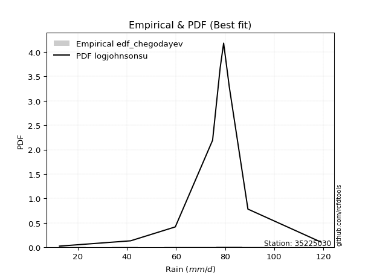</img>

</div>


### 6. EDF Blom (1958)

The Blom formula is a specific "plotting position" formula used in hydrology and statistical analysis to estimate the empirical cumulative probability (or non-exceedance probability) of a data series. It is particularly recommended for data that are approximately normally distributed. The constant _a_ is set to 0.375 (or 3/8).

<div align="center">


$P=(m-a)/(n+1-2a)$


</div>


**6.1. Empirical values**

<div align="center">

|                | 0                   | 1                   | 2                   | 3                  | 4        | 5                  | 6                  | 7                  | 8                  |
|:---------------|:--------------------|:--------------------|:--------------------|:-------------------|:---------|:-------------------|:-------------------|:-------------------|:-------------------|
| date           | 2017                | 2020                | 2019                | 2018               | 2023     | 2024               | 2022               | 2021               | 2025               |
| x              | 12.5                | 41.5                | 59.7                | 74.9               | 78.0     | 79.4               | 81.7               | 89.3               | 119.1              |
| m              | 1                   | 2                   | 3                   | 4                  | 5        | 6                  | 7                  | 8                  | 9                  |
| empirical_dist | edf_blom            | edf_blom            | edf_blom            | edf_blom           | edf_blom | edf_blom           | edf_blom           | edf_blom           | edf_blom           |
| empirical      | 0.06756756756756757 | 0.17567567567567569 | 0.28378378378378377 | 0.3918918918918919 | 0.5      | 0.6081081081081081 | 0.7162162162162162 | 0.8243243243243243 | 0.9324324324324325 |
| empirical_tr   | 1.072463768115942   | 1.2131147540983607  | 1.3962264150943395  | 1.6444444444444444 | 2.0      | 2.5517241379310347 | 3.523809523809524  | 5.6923076923076925 | 14.800000000000006 |

</div>


**6.2. Kolmogorov-Smirnov fit test (sorted by Δ)**


<div align="center">

|                | 0                   | 1                   | 2                   | 3                   | 4                   | 5                   | 6                   | 7                   | 8                   | 9                   | 10                  | 11                  | 12                  | 13                  | 14                  | 15                  | 16                  | 17                  | 18                  | 19                  | 20                  | 21                  | 22                  | 23                  | 24                  | 25                  | 26                  | 27                  | 28                  | 29                  | 30                  | 31                  | 32                  | 33                  | 34                  | 35                  | 36                  | 37                  | 38                  | 39                  | 40                  | 41                  | 42                  | 43                  | 44                  | 45                  | 46                  | 47                  | 48                  | 49                  | 50                  | 51                  | 52                  | 53                  | 54                  | 55                  | 56                  | 57                  | 58                  | 59                  | 60                  | 61                  | 62                  | 63                  | 64                  | 65                  | 66                  | 67                  | 68                  | 69                  | 70                  | 71                  | 72                  | 73                  | 74                  | 75                  | 76                  | 77                  | 78                  | 79                  | 80                  | 81                  | 82                  | 83                  | 84                  | 85                  | 86                  | 87                  | 88                  | 89                  | 90                  | 91                  | 92                  | 93                  | 94                  | 95                  | 96                  | 97                  | 98                  | 99                  | 100                 | 101                 | 102                 | 103                 | 104                 | 105                 | 106                 | 107                 | 108                 | 109                 | 110                 | 111                 | 112                 | 113                 | 114                 | 115                 | 116                 | 117                 | 118                 | 119                 | 120                 | 121                 | 122                 | 123                 | 124                 | 125                 | 126                 | 127                 | 128                 | 129                 | 130                 | 131                 | 132                 | 133                 | 134                 | 135                 | 136                 | 137                 | 138                 | 139                 | 140                 | 141                 | 142                 | 143                 | 144                 | 145                 | 146                 | 147                 | 148                 | 149                 | 150                 | 151                 | 152                 | 153                 | 154                 | 155                 | 156                 | 157                 | 158                 | 159                 |
|:---------------|:--------------------|:--------------------|:--------------------|:--------------------|:--------------------|:--------------------|:--------------------|:--------------------|:--------------------|:--------------------|:--------------------|:--------------------|:--------------------|:--------------------|:--------------------|:--------------------|:--------------------|:--------------------|:--------------------|:--------------------|:--------------------|:--------------------|:--------------------|:--------------------|:--------------------|:--------------------|:--------------------|:--------------------|:--------------------|:--------------------|:--------------------|:--------------------|:--------------------|:--------------------|:--------------------|:--------------------|:--------------------|:--------------------|:--------------------|:--------------------|:--------------------|:--------------------|:--------------------|:--------------------|:--------------------|:--------------------|:--------------------|:--------------------|:--------------------|:--------------------|:--------------------|:--------------------|:--------------------|:--------------------|:--------------------|:--------------------|:--------------------|:--------------------|:--------------------|:--------------------|:--------------------|:--------------------|:--------------------|:--------------------|:--------------------|:--------------------|:--------------------|:--------------------|:--------------------|:--------------------|:--------------------|:--------------------|:--------------------|:--------------------|:--------------------|:--------------------|:--------------------|:--------------------|:--------------------|:--------------------|:--------------------|:--------------------|:--------------------|:--------------------|:--------------------|:--------------------|:--------------------|:--------------------|:--------------------|:--------------------|:--------------------|:--------------------|:--------------------|:--------------------|:--------------------|:--------------------|:--------------------|:--------------------|:--------------------|:--------------------|:--------------------|:--------------------|:--------------------|:--------------------|:--------------------|:--------------------|:--------------------|:--------------------|:--------------------|:--------------------|:--------------------|:--------------------|:--------------------|:--------------------|:--------------------|:--------------------|:--------------------|:--------------------|:--------------------|:--------------------|:--------------------|:--------------------|:--------------------|:--------------------|:--------------------|:--------------------|:--------------------|:--------------------|:--------------------|:--------------------|:--------------------|:--------------------|:--------------------|:--------------------|:--------------------|:--------------------|:--------------------|:--------------------|:--------------------|:--------------------|:--------------------|:--------------------|:--------------------|:--------------------|:--------------------|:--------------------|:--------------------|:--------------------|:--------------------|:--------------------|:--------------------|:--------------------|:--------------------|:--------------------|:--------------------|:--------------------|:--------------------|:--------------------|:--------------------|:--------------------|
| station        | 35225030            | 35225030            | 35225030            | 35225030            | 35225030            | 35225030            | 35225030            | 35225030            | 35225030            | 35225030            | 35225030            | 35225030            | 35225030            | 35225030            | 35225030            | 35225030            | 35225030            | 35225030            | 35225030            | 35225030            | 35225030            | 35225030            | 35225030            | 35225030            | 35225030            | 35225030            | 35225030            | 35225030            | 35225030            | 35225030            | 35225030            | 35225030            | 35225030            | 35225030            | 35225030            | 35225030            | 35225030            | 35225030            | 35225030            | 35225030            | 35225030            | 35225030            | 35225030            | 35225030            | 35225030            | 35225030            | 35225030            | 35225030            | 35225030            | 35225030            | 35225030            | 35225030            | 35225030            | 35225030            | 35225030            | 35225030            | 35225030            | 35225030            | 35225030            | 35225030            | 35225030            | 35225030            | 35225030            | 35225030            | 35225030            | 35225030            | 35225030            | 35225030            | 35225030            | 35225030            | 35225030            | 35225030            | 35225030            | 35225030            | 35225030            | 35225030            | 35225030            | 35225030            | 35225030            | 35225030            | 35225030            | 35225030            | 35225030            | 35225030            | 35225030            | 35225030            | 35225030            | 35225030            | 35225030            | 35225030            | 35225030            | 35225030            | 35225030            | 35225030            | 35225030            | 35225030            | 35225030            | 35225030            | 35225030            | 35225030            | 35225030            | 35225030            | 35225030            | 35225030            | 35225030            | 35225030            | 35225030            | 35225030            | 35225030            | 35225030            | 35225030            | 35225030            | 35225030            | 35225030            | 35225030            | 35225030            | 35225030            | 35225030            | 35225030            | 35225030            | 35225030            | 35225030            | 35225030            | 35225030            | 35225030            | 35225030            | 35225030            | 35225030            | 35225030            | 35225030            | 35225030            | 35225030            | 35225030            | 35225030            | 35225030            | 35225030            | 35225030            | 35225030            | 35225030            | 35225030            | 35225030            | 35225030            | 35225030            | 35225030            | 35225030            | 35225030            | 35225030            | 35225030            | 35225030            | 35225030            | 35225030            | 35225030            | 35225030            | 35225030            | 35225030            | 35225030            | 35225030            | 35225030            | 35225030            | 35225030            |
| empirical_dist | edf_blom            | edf_blom            | edf_blom            | edf_blom            | edf_blom            | edf_blom            | edf_blom            | edf_blom            | edf_blom            | edf_blom            | edf_blom            | edf_blom            | edf_blom            | edf_blom            | edf_blom            | edf_blom            | edf_blom            | edf_blom            | edf_blom            | edf_blom            | edf_blom            | edf_blom            | edf_blom            | edf_blom            | edf_blom            | edf_blom            | edf_blom            | edf_blom            | edf_blom            | edf_blom            | edf_blom            | edf_blom            | edf_blom            | edf_blom            | edf_blom            | edf_blom            | edf_blom            | edf_blom            | edf_blom            | edf_blom            | edf_blom            | edf_blom            | edf_blom            | edf_blom            | edf_blom            | edf_blom            | edf_blom            | edf_blom            | edf_blom            | edf_blom            | edf_blom            | edf_blom            | edf_blom            | edf_blom            | edf_blom            | edf_blom            | edf_blom            | edf_blom            | edf_blom            | edf_blom            | edf_blom            | edf_blom            | edf_blom            | edf_blom            | edf_blom            | edf_blom            | edf_blom            | edf_blom            | edf_blom            | edf_blom            | edf_blom            | edf_blom            | edf_blom            | edf_blom            | edf_blom            | edf_blom            | edf_blom            | edf_blom            | edf_blom            | edf_blom            | edf_blom            | edf_blom            | edf_blom            | edf_blom            | edf_blom            | edf_blom            | edf_blom            | edf_blom            | edf_blom            | edf_blom            | edf_blom            | edf_blom            | edf_blom            | edf_blom            | edf_blom            | edf_blom            | edf_blom            | edf_blom            | edf_blom            | edf_blom            | edf_blom            | edf_blom            | edf_blom            | edf_blom            | edf_blom            | edf_blom            | edf_blom            | edf_blom            | edf_blom            | edf_blom            | edf_blom            | edf_blom            | edf_blom            | edf_blom            | edf_blom            | edf_blom            | edf_blom            | edf_blom            | edf_blom            | edf_blom            | edf_blom            | edf_blom            | edf_blom            | edf_blom            | edf_blom            | edf_blom            | edf_blom            | edf_blom            | edf_blom            | edf_blom            | edf_blom            | edf_blom            | edf_blom            | edf_blom            | edf_blom            | edf_blom            | edf_blom            | edf_blom            | edf_blom            | edf_blom            | edf_blom            | edf_blom            | edf_blom            | edf_blom            | edf_blom            | edf_blom            | edf_blom            | edf_blom            | edf_blom            | edf_blom            | edf_blom            | edf_blom            | edf_blom            | edf_blom            | edf_blom            | edf_blom            | edf_blom            | edf_blom            | edf_blom            | edf_blom            |
| p_dist         | logjohnsonsu        | johnsonsu           | dweibull            | logdgamma           | t                   | gumbel_l            | dgamma              | genlogistic         | truncnorm           | genextreme          | logjohnsonsb        | johnsonsb           | gennorm             | pearson3            | skewnorm            | weibull_min         | logargus            | argus               | gompertz            | logdweibull         | exponpow            | tukeylambda         | loggennorm          | truncweibull_min    | logpearson3         | logt                | semicircular        | logloggamma         | anglit              | exponweib           | lognakagami         | foldnorm            | logvonmises_line    | crystalball         | norm                | exponnorm           | rice                | nct                 | f                   | logloglaplace       | arcsine             | logtrapezoid        | erlang              | logburr             | mielke              | logistic            | burr                | logburr12           | gamma               | loggenlogistic      | loggumbel_l         | betaprime           | ksone               | hypsecant           | logmielke           | gengamma            | invgamma            | cosine              | kappa3              | uniform             | loggompertz         | wrapcauchy          | invweibull          | maxwell             | laplace             | ncf                 | logarcsine          | rayleigh            | logsemicircular     | loggenextreme       | loggengamma         | loglevy_l           | kappa4              | loganglit           | invgauss            | gausshyper          | logskewnorm         | kstwobign           | logweibull_max      | genexpon            | logbetaprime        | logtruncweibull_min | logfatiguelife      | loggamma            | loggamma            | logncf              | logrice             | loggenpareto        | logf                | logexponnorm        | logcrystalball      | lognorm             | logalpha            | loginvweibull       | logerlang           | halfnorm            | lognct              | halfgennorm         | loginvgamma         | loginvgauss         | gumbel_r            | logfoldnorm         | vonmises_line       | loggenhalflogistic  | genpareto           | genhalflogistic     | loglogistic         | logmaxwell          | loghypsecant        | halflogistic        | moyal               | lograyleigh         | triang              | lomax               | logkstwobign        | bradford            | logtriang           | loggausshyper       | loghalfnorm         | loglaplace          | loglaplace          | alpha               | beta                | logcosine           | loggenexpon         | loggumbel_r         | levy_l              | loghalfgennorm      | nakagami            | loghalflogistic     | truncexpon          | logmoyal            | wald                | logwrapcauchy       | logtruncnorm        | burr12              | loglomax            | trapezoid           | logrdist            | logksone            | logwald             | logkappa4           | logbradford         | logtukeylambda      | logkappa3           | loguniform          | logweibull_min      | logbeta             | logexponweib        | logtruncexpon       | powerlaw            | logexponpow         | fatiguelife         | logpowerlaw         | rdist               | weibull_max         | truncpareto         | logtruncpareto      | logvonmises         | vonmises            |
| delta          | 0.0731903498324436  | 0.08835158903166956 | 0.09968032343149513 | 0.1022292586913242  | 0.10423699749594473 | 0.11401811560624076 | 0.12411480588443663 | 0.12849949954446727 | 0.12858408303731994 | 0.13103082804793387 | 0.134826927171527   | 0.13486604677216718 | 0.13539554556086364 | 0.13567472578565698 | 0.1360259875188412  | 0.13638496794763277 | 0.14032485853154664 | 0.1419995357546786  | 0.1429159736763942  | 0.1439317445677648  | 0.14525797565207    | 0.14546148146759497 | 0.14569433342567198 | 0.14869388178775    | 0.1508470216580038  | 0.15126179889394697 | 0.15520014100784085 | 0.15660073698243027 | 0.15864029842307703 | 0.16316340759710668 | 0.1635871371826394  | 0.16543720433440745 | 0.1661176004818956  | 0.1669681482104335  | 0.16696814987787967 | 0.1669702433272785  | 0.16703304074777248 | 0.16706122930728262 | 0.1687003775616145  | 0.17127590985350705 | 0.1715216497044042  | 0.17186698541978163 | 0.17325075507955867 | 0.17453952852292398 | 0.1747773635675023  | 0.1748540315348348  | 0.17533166998922955 | 0.17542897572462068 | 0.17562620082775748 | 0.17581438446365782 | 0.1777578395415017  | 0.17810564258884254 | 0.17924631949022196 | 0.18148917620071225 | 0.18204519902018046 | 0.18301407321414254 | 0.18703497692901838 | 0.18731172310580424 | 0.1934615256513882  | 0.19347396176664478 | 0.19425669055155703 | 0.19527499406121773 | 0.19612467396250222 | 0.19675677478726894 | 0.2025793213266649  | 0.20462882176444552 | 0.2058377697381198  | 0.20626389848305238 | 0.20859812392288413 | 0.21003734072100688 | 0.21197787024755455 | 0.21383857868432973 | 0.2150690338319844  | 0.21563570324444548 | 0.2157341885664008  | 0.21737207213072607 | 0.2183911572788828  | 0.21899244774345028 | 0.22028738937683834 | 0.2254324327495102  | 0.22809243415859548 | 0.22842222471497642 | 0.23018978607766416 | 0.23115507960286075 | 0.23115507960286075 | 0.23122266379381928 | 0.23192100329235366 | 0.23228934310588692 | 0.23237872977730623 | 0.23249764977838094 | 0.2324992487656239  | 0.2324992856564454  | 0.23268672374045307 | 0.23294756474457223 | 0.2330239532893572  | 0.23310917105030582 | 0.23378139770975248 | 0.23420364594676624 | 0.23595054901040535 | 0.2360407525860324  | 0.23665702819296497 | 0.23804141644254084 | 0.23822741226722322 | 0.24335243065952006 | 0.24458151087840618 | 0.24686585876024958 | 0.24803260308923736 | 0.2567553728499744  | 0.2604522458565771  | 0.26066959937282097 | 0.26119115152118644 | 0.2641649857379289  | 0.26814204647575934 | 0.2696442449430647  | 0.27204160711479897 | 0.27300965141894185 | 0.28022504056492836 | 0.28520054465860456 | 0.2854447976429574  | 0.28876885726234136 | 0.28876885726234136 | 0.2907329125395882  | 0.2911220562766561  | 0.29367467426834737 | 0.2959956919780332  | 0.29616949798828096 | 0.3053097724350262  | 0.3063793201841458  | 0.31147044802619195 | 0.31380197262353327 | 0.31703894660411747 | 0.31757316042516215 | 0.3292755244040163  | 0.3351292622875266  | 0.3471648120915869  | 0.3494747678406227  | 0.3517047749679274  | 0.3568669185661132  | 0.3574551806679238  | 0.3775739837749318  | 0.37759932399270446 | 0.4016781765522681  | 0.40557978423279006 | 0.4087962479843399  | 0.4089312689953878  | 0.40984553728667494 | 0.4597640633665523  | 0.463739197299084   | 0.4707391780057819  | 0.4753671718392729  | 0.5858139096268995  | 0.5947483838351431  | 0.6094904551264249  | 0.6859974815320773  | 0.7162162150114556  | 0.7166892857014308  | 0.747334126681644   | 0.786594809086383   | 1.196269966616455   | 18.65695356695868   |
| deltao         | 0.41761268023100007 | 0.41761268023100007 | 0.41761268023100007 | 0.41761268023100007 | 0.41761268023100007 | 0.41761268023100007 | 0.41761268023100007 | 0.41761268023100007 | 0.41761268023100007 | 0.41761268023100007 | 0.41761268023100007 | 0.41761268023100007 | 0.41761268023100007 | 0.41761268023100007 | 0.41761268023100007 | 0.41761268023100007 | 0.41761268023100007 | 0.41761268023100007 | 0.41761268023100007 | 0.41761268023100007 | 0.41761268023100007 | 0.41761268023100007 | 0.41761268023100007 | 0.41761268023100007 | 0.41761268023100007 | 0.41761268023100007 | 0.41761268023100007 | 0.41761268023100007 | 0.41761268023100007 | 0.41761268023100007 | 0.41761268023100007 | 0.41761268023100007 | 0.41761268023100007 | 0.41761268023100007 | 0.41761268023100007 | 0.41761268023100007 | 0.41761268023100007 | 0.41761268023100007 | 0.41761268023100007 | 0.41761268023100007 | 0.41761268023100007 | 0.41761268023100007 | 0.41761268023100007 | 0.41761268023100007 | 0.41761268023100007 | 0.41761268023100007 | 0.41761268023100007 | 0.41761268023100007 | 0.41761268023100007 | 0.41761268023100007 | 0.41761268023100007 | 0.41761268023100007 | 0.41761268023100007 | 0.41761268023100007 | 0.41761268023100007 | 0.41761268023100007 | 0.41761268023100007 | 0.41761268023100007 | 0.41761268023100007 | 0.41761268023100007 | 0.41761268023100007 | 0.41761268023100007 | 0.41761268023100007 | 0.41761268023100007 | 0.41761268023100007 | 0.41761268023100007 | 0.41761268023100007 | 0.41761268023100007 | 0.41761268023100007 | 0.41761268023100007 | 0.41761268023100007 | 0.41761268023100007 | 0.41761268023100007 | 0.41761268023100007 | 0.41761268023100007 | 0.41761268023100007 | 0.41761268023100007 | 0.41761268023100007 | 0.41761268023100007 | 0.41761268023100007 | 0.41761268023100007 | 0.41761268023100007 | 0.41761268023100007 | 0.41761268023100007 | 0.41761268023100007 | 0.41761268023100007 | 0.41761268023100007 | 0.41761268023100007 | 0.41761268023100007 | 0.41761268023100007 | 0.41761268023100007 | 0.41761268023100007 | 0.41761268023100007 | 0.41761268023100007 | 0.41761268023100007 | 0.41761268023100007 | 0.41761268023100007 | 0.41761268023100007 | 0.41761268023100007 | 0.41761268023100007 | 0.41761268023100007 | 0.41761268023100007 | 0.41761268023100007 | 0.41761268023100007 | 0.41761268023100007 | 0.41761268023100007 | 0.41761268023100007 | 0.41761268023100007 | 0.41761268023100007 | 0.41761268023100007 | 0.41761268023100007 | 0.41761268023100007 | 0.41761268023100007 | 0.41761268023100007 | 0.41761268023100007 | 0.41761268023100007 | 0.41761268023100007 | 0.41761268023100007 | 0.41761268023100007 | 0.41761268023100007 | 0.41761268023100007 | 0.41761268023100007 | 0.41761268023100007 | 0.41761268023100007 | 0.41761268023100007 | 0.41761268023100007 | 0.41761268023100007 | 0.41761268023100007 | 0.41761268023100007 | 0.41761268023100007 | 0.41761268023100007 | 0.41761268023100007 | 0.41761268023100007 | 0.41761268023100007 | 0.41761268023100007 | 0.41761268023100007 | 0.41761268023100007 | 0.41761268023100007 | 0.41761268023100007 | 0.41761268023100007 | 0.41761268023100007 | 0.41761268023100007 | 0.41761268023100007 | 0.41761268023100007 | 0.41761268023100007 | 0.41761268023100007 | 0.41761268023100007 | 0.41761268023100007 | 0.41761268023100007 | 0.41761268023100007 | 0.41761268023100007 | 0.41761268023100007 | 0.41761268023100007 | 0.41761268023100007 | 0.41761268023100007 | 0.41761268023100007 | 0.41761268023100007 | 0.41761268023100007 | 0.41761268023100007 | 0.41761268023100007 |
| eval           | Δo > Δ              | Δo > Δ              | Δo > Δ              | Δo > Δ              | Δo > Δ              | Δo > Δ              | Δo > Δ              | Δo > Δ              | Δo > Δ              | Δo > Δ              | Δo > Δ              | Δo > Δ              | Δo > Δ              | Δo > Δ              | Δo > Δ              | Δo > Δ              | Δo > Δ              | Δo > Δ              | Δo > Δ              | Δo > Δ              | Δo > Δ              | Δo > Δ              | Δo > Δ              | Δo > Δ              | Δo > Δ              | Δo > Δ              | Δo > Δ              | Δo > Δ              | Δo > Δ              | Δo > Δ              | Δo > Δ              | Δo > Δ              | Δo > Δ              | Δo > Δ              | Δo > Δ              | Δo > Δ              | Δo > Δ              | Δo > Δ              | Δo > Δ              | Δo > Δ              | Δo > Δ              | Δo > Δ              | Δo > Δ              | Δo > Δ              | Δo > Δ              | Δo > Δ              | Δo > Δ              | Δo > Δ              | Δo > Δ              | Δo > Δ              | Δo > Δ              | Δo > Δ              | Δo > Δ              | Δo > Δ              | Δo > Δ              | Δo > Δ              | Δo > Δ              | Δo > Δ              | Δo > Δ              | Δo > Δ              | Δo > Δ              | Δo > Δ              | Δo > Δ              | Δo > Δ              | Δo > Δ              | Δo > Δ              | Δo > Δ              | Δo > Δ              | Δo > Δ              | Δo > Δ              | Δo > Δ              | Δo > Δ              | Δo > Δ              | Δo > Δ              | Δo > Δ              | Δo > Δ              | Δo > Δ              | Δo > Δ              | Δo > Δ              | Δo > Δ              | Δo > Δ              | Δo > Δ              | Δo > Δ              | Δo > Δ              | Δo > Δ              | Δo > Δ              | Δo > Δ              | Δo > Δ              | Δo > Δ              | Δo > Δ              | Δo > Δ              | Δo > Δ              | Δo > Δ              | Δo > Δ              | Δo > Δ              | Δo > Δ              | Δo > Δ              | Δo > Δ              | Δo > Δ              | Δo > Δ              | Δo > Δ              | Δo > Δ              | Δo > Δ              | Δo > Δ              | Δo > Δ              | Δo > Δ              | Δo > Δ              | Δo > Δ              | Δo > Δ              | Δo > Δ              | Δo > Δ              | Δo > Δ              | Δo > Δ              | Δo > Δ              | Δo > Δ              | Δo > Δ              | Δo > Δ              | Δo > Δ              | Δo > Δ              | Δo > Δ              | Δo > Δ              | Δo > Δ              | Δo > Δ              | Δo > Δ              | Δo > Δ              | Δo > Δ              | Δo > Δ              | Δo > Δ              | Δo > Δ              | Δo > Δ              | Δo > Δ              | Δo > Δ              | Δo > Δ              | Δo > Δ              | Δo > Δ              | Δo > Δ              | Δo > Δ              | Δo > Δ              | Δo > Δ              | Δo > Δ              | Δo > Δ              | Δo > Δ              | Δo > Δ              | Δo > Δ              | Δo > Δ              | Δo > Δ              | Δo <= Δ             | Δo <= Δ             | Δo <= Δ             | Δo <= Δ             | Δo <= Δ             | Δo <= Δ             | Δo <= Δ             | Δo <= Δ             | Δo <= Δ             | Δo <= Δ             | Δo <= Δ             | Δo <= Δ             | Δo <= Δ             | Δo <= Δ             |
| fit            | 1                   | 1                   | 1                   | 1                   | 1                   | 1                   | 1                   | 1                   | 1                   | 1                   | 1                   | 1                   | 1                   | 1                   | 1                   | 1                   | 1                   | 1                   | 1                   | 1                   | 1                   | 1                   | 1                   | 1                   | 1                   | 1                   | 1                   | 1                   | 1                   | 1                   | 1                   | 1                   | 1                   | 1                   | 1                   | 1                   | 1                   | 1                   | 1                   | 1                   | 1                   | 1                   | 1                   | 1                   | 1                   | 1                   | 1                   | 1                   | 1                   | 1                   | 1                   | 1                   | 1                   | 1                   | 1                   | 1                   | 1                   | 1                   | 1                   | 1                   | 1                   | 1                   | 1                   | 1                   | 1                   | 1                   | 1                   | 1                   | 1                   | 1                   | 1                   | 1                   | 1                   | 1                   | 1                   | 1                   | 1                   | 1                   | 1                   | 1                   | 1                   | 1                   | 1                   | 1                   | 1                   | 1                   | 1                   | 1                   | 1                   | 1                   | 1                   | 1                   | 1                   | 1                   | 1                   | 1                   | 1                   | 1                   | 1                   | 1                   | 1                   | 1                   | 1                   | 1                   | 1                   | 1                   | 1                   | 1                   | 1                   | 1                   | 1                   | 1                   | 1                   | 1                   | 1                   | 1                   | 1                   | 1                   | 1                   | 1                   | 1                   | 1                   | 1                   | 1                   | 1                   | 1                   | 1                   | 1                   | 1                   | 1                   | 1                   | 1                   | 1                   | 1                   | 1                   | 1                   | 1                   | 1                   | 1                   | 1                   | 1                   | 1                   | 1                   | 1                   | 1                   | 1                   | 0                   | 0                   | 0                   | 0                   | 0                   | 0                   | 0                   | 0                   | 0                   | 0                   | 0                   | 0                   | 0                   | 0                   |
| n              | 9                   | 9                   | 9                   | 9                   | 9                   | 9                   | 9                   | 9                   | 9                   | 9                   | 9                   | 9                   | 9                   | 9                   | 9                   | 9                   | 9                   | 9                   | 9                   | 9                   | 9                   | 9                   | 9                   | 9                   | 9                   | 9                   | 9                   | 9                   | 9                   | 9                   | 9                   | 9                   | 9                   | 9                   | 9                   | 9                   | 9                   | 9                   | 9                   | 9                   | 9                   | 9                   | 9                   | 9                   | 9                   | 9                   | 9                   | 9                   | 9                   | 9                   | 9                   | 9                   | 9                   | 9                   | 9                   | 9                   | 9                   | 9                   | 9                   | 9                   | 9                   | 9                   | 9                   | 9                   | 9                   | 9                   | 9                   | 9                   | 9                   | 9                   | 9                   | 9                   | 9                   | 9                   | 9                   | 9                   | 9                   | 9                   | 9                   | 9                   | 9                   | 9                   | 9                   | 9                   | 9                   | 9                   | 9                   | 9                   | 9                   | 9                   | 9                   | 9                   | 9                   | 9                   | 9                   | 9                   | 9                   | 9                   | 9                   | 9                   | 9                   | 9                   | 9                   | 9                   | 9                   | 9                   | 9                   | 9                   | 9                   | 9                   | 9                   | 9                   | 9                   | 9                   | 9                   | 9                   | 9                   | 9                   | 9                   | 9                   | 9                   | 9                   | 9                   | 9                   | 9                   | 9                   | 9                   | 9                   | 9                   | 9                   | 9                   | 9                   | 9                   | 9                   | 9                   | 9                   | 9                   | 9                   | 9                   | 9                   | 9                   | 9                   | 9                   | 9                   | 9                   | 9                   | 9                   | 9                   | 9                   | 9                   | 9                   | 9                   | 9                   | 9                   | 9                   | 9                   | 9                   | 9                   | 9                   | 9                   |
| best_fit       | 1                   | 0                   | 0                   | 0                   | 0                   | 0                   | 0                   | 0                   | 0                   | 0                   | 0                   | 0                   | 0                   | 0                   | 0                   | 0                   | 0                   | 0                   | 0                   | 0                   | 0                   | 0                   | 0                   | 0                   | 0                   | 0                   | 0                   | 0                   | 0                   | 0                   | 0                   | 0                   | 0                   | 0                   | 0                   | 0                   | 0                   | 0                   | 0                   | 0                   | 0                   | 0                   | 0                   | 0                   | 0                   | 0                   | 0                   | 0                   | 0                   | 0                   | 0                   | 0                   | 0                   | 0                   | 0                   | 0                   | 0                   | 0                   | 0                   | 0                   | 0                   | 0                   | 0                   | 0                   | 0                   | 0                   | 0                   | 0                   | 0                   | 0                   | 0                   | 0                   | 0                   | 0                   | 0                   | 0                   | 0                   | 0                   | 0                   | 0                   | 0                   | 0                   | 0                   | 0                   | 0                   | 0                   | 0                   | 0                   | 0                   | 0                   | 0                   | 0                   | 0                   | 0                   | 0                   | 0                   | 0                   | 0                   | 0                   | 0                   | 0                   | 0                   | 0                   | 0                   | 0                   | 0                   | 0                   | 0                   | 0                   | 0                   | 0                   | 0                   | 0                   | 0                   | 0                   | 0                   | 0                   | 0                   | 0                   | 0                   | 0                   | 0                   | 0                   | 0                   | 0                   | 0                   | 0                   | 0                   | 0                   | 0                   | 0                   | 0                   | 0                   | 0                   | 0                   | 0                   | 0                   | 0                   | 0                   | 0                   | 0                   | 0                   | 0                   | 0                   | 0                   | 0                   | 0                   | 0                   | 0                   | 0                   | 0                   | 0                   | 0                   | 0                   | 0                   | 0                   | 0                   | 0                   | 0                   | 0                   |
| best_fit_sort  | 1                   | 2                   | 3                   | 4                   | 5                   | 6                   | 7                   | 8                   | 9                   | 10                  | 11                  | 12                  | 13                  | 14                  | 15                  | 16                  | 17                  | 18                  | 19                  | 20                  | 21                  | 22                  | 23                  | 24                  | 25                  | 26                  | 27                  | 28                  | 29                  | 30                  | 31                  | 32                  | 33                  | 34                  | 35                  | 36                  | 37                  | 38                  | 39                  | 40                  | 41                  | 42                  | 43                  | 44                  | 45                  | 46                  | 47                  | 48                  | 49                  | 50                  | 51                  | 52                  | 53                  | 54                  | 55                  | 56                  | 57                  | 58                  | 59                  | 60                  | 61                  | 62                  | 63                  | 64                  | 65                  | 66                  | 67                  | 68                  | 69                  | 70                  | 71                  | 72                  | 73                  | 74                  | 75                  | 76                  | 77                  | 78                  | 79                  | 80                  | 81                  | 82                  | 83                  | 84                  | 85                  | 86                  | 87                  | 88                  | 89                  | 90                  | 91                  | 92                  | 93                  | 94                  | 95                  | 96                  | 97                  | 98                  | 99                  | 100                 | 101                 | 102                 | 103                 | 104                 | 105                 | 106                 | 107                 | 108                 | 109                 | 110                 | 111                 | 112                 | 113                 | 114                 | 115                 | 116                 | 117                 | 118                 | 119                 | 120                 | 121                 | 122                 | 123                 | 124                 | 125                 | 126                 | 127                 | 128                 | 129                 | 130                 | 131                 | 132                 | 133                 | 134                 | 135                 | 136                 | 137                 | 138                 | 139                 | 140                 | 141                 | 142                 | 143                 | 144                 | 145                 | 146                 | 147                 | 148                 | 149                 | 150                 | 151                 | 152                 | 153                 | 154                 | 155                 | 156                 | 157                 | 158                 | 159                 | 160                 |

</div>


**6.3. Best fit**

<div align="center">

|   id |   station | empirical_dist   | p_dist       |     delta |   deltao | eval   |   fit |   n |   best_fit |   best_fit_sort |
|-----:|----------:|:-----------------|:-------------|----------:|---------:|:-------|------:|----:|-----------:|----------------:|
|    0 |  35225030 | edf_blom         | logjohnsonsu | 0.0731903 | 0.417613 | Δo > Δ |     1 |   9 |          1 |               1 |

</div>


<div align="center">

</img></img>

</div>


### 7. EDF Tukey (1962)

In hydrology, the Tukey formula is used as a plotting position formula to estimate the empirical probability or frequency of a flood event (or other hydrological data). The formula parameter is given as _c=0.333_ (or 1/3).

<div align="center">


$P=(m-c)/(n+1-2c)$


</div>


**7.1. Empirical values**

<div align="center">

|                | 0                   | 1                   | 2                  | 3                   | 4         | 5                  | 6                  | 7                  | 8                  |
|:---------------|:--------------------|:--------------------|:-------------------|:--------------------|:----------|:-------------------|:-------------------|:-------------------|:-------------------|
| date           | 2017                | 2020                | 2019               | 2018                | 2023      | 2024               | 2022               | 2021               | 2025               |
| x              | 12.5                | 41.5                | 59.7               | 74.9                | 78.0      | 79.4               | 81.7               | 89.3               | 119.1              |
| m              | 1                   | 2                   | 3                  | 4                   | 5         | 6                  | 7                  | 8                  | 9                  |
| empirical_dist | edf_tukey           | edf_tukey           | edf_tukey          | edf_tukey           | edf_tukey | edf_tukey          | edf_tukey          | edf_tukey          | edf_tukey          |
| empirical      | 0.07142857142857142 | 0.17857142857142858 | 0.2857142857142857 | 0.39285714285714285 | 0.5       | 0.6071428571428571 | 0.7142857142857143 | 0.8214285714285714 | 0.9285714285714286 |
| empirical_tr   | 1.0769230769230769  | 1.2173913043478262  | 1.4                | 1.6470588235294117  | 2.0       | 2.545454545454545  | 3.5                | 5.599999999999999  | 14.000000000000007 |

</div>


**7.2. Kolmogorov-Smirnov fit test (sorted by Δ)**


<div align="center">

|                | 0                   | 1                   | 2                   | 3                   | 4                   | 5                   | 6                   | 7                   | 8                   | 9                   | 10                  | 11                  | 12                  | 13                  | 14                  | 15                  | 16                  | 17                  | 18                  | 19                  | 20                  | 21                  | 22                  | 23                  | 24                  | 25                  | 26                  | 27                  | 28                  | 29                  | 30                  | 31                  | 32                  | 33                  | 34                  | 35                  | 36                  | 37                  | 38                  | 39                  | 40                  | 41                  | 42                  | 43                  | 44                  | 45                  | 46                  | 47                  | 48                  | 49                  | 50                  | 51                  | 52                  | 53                  | 54                  | 55                  | 56                  | 57                  | 58                  | 59                  | 60                  | 61                  | 62                  | 63                  | 64                  | 65                  | 66                  | 67                  | 68                  | 69                  | 70                  | 71                  | 72                  | 73                  | 74                  | 75                  | 76                  | 77                  | 78                  | 79                  | 80                  | 81                  | 82                  | 83                  | 84                  | 85                  | 86                  | 87                  | 88                  | 89                  | 90                  | 91                  | 92                  | 93                  | 94                  | 95                  | 96                  | 97                  | 98                  | 99                  | 100                 | 101                 | 102                 | 103                 | 104                 | 105                 | 106                 | 107                 | 108                 | 109                 | 110                 | 111                 | 112                 | 113                 | 114                 | 115                 | 116                 | 117                 | 118                 | 119                 | 120                 | 121                 | 122                 | 123                 | 124                 | 125                 | 126                 | 127                 | 128                 | 129                 | 130                 | 131                 | 132                 | 133                 | 134                 | 135                 | 136                 | 137                 | 138                 | 139                 | 140                 | 141                 | 142                 | 143                 | 144                 | 145                 | 146                 | 147                 | 148                 | 149                 | 150                 | 151                 | 152                 | 153                 | 154                 | 155                 | 156                 | 157                 | 158                 | 159                 |
|:---------------|:--------------------|:--------------------|:--------------------|:--------------------|:--------------------|:--------------------|:--------------------|:--------------------|:--------------------|:--------------------|:--------------------|:--------------------|:--------------------|:--------------------|:--------------------|:--------------------|:--------------------|:--------------------|:--------------------|:--------------------|:--------------------|:--------------------|:--------------------|:--------------------|:--------------------|:--------------------|:--------------------|:--------------------|:--------------------|:--------------------|:--------------------|:--------------------|:--------------------|:--------------------|:--------------------|:--------------------|:--------------------|:--------------------|:--------------------|:--------------------|:--------------------|:--------------------|:--------------------|:--------------------|:--------------------|:--------------------|:--------------------|:--------------------|:--------------------|:--------------------|:--------------------|:--------------------|:--------------------|:--------------------|:--------------------|:--------------------|:--------------------|:--------------------|:--------------------|:--------------------|:--------------------|:--------------------|:--------------------|:--------------------|:--------------------|:--------------------|:--------------------|:--------------------|:--------------------|:--------------------|:--------------------|:--------------------|:--------------------|:--------------------|:--------------------|:--------------------|:--------------------|:--------------------|:--------------------|:--------------------|:--------------------|:--------------------|:--------------------|:--------------------|:--------------------|:--------------------|:--------------------|:--------------------|:--------------------|:--------------------|:--------------------|:--------------------|:--------------------|:--------------------|:--------------------|:--------------------|:--------------------|:--------------------|:--------------------|:--------------------|:--------------------|:--------------------|:--------------------|:--------------------|:--------------------|:--------------------|:--------------------|:--------------------|:--------------------|:--------------------|:--------------------|:--------------------|:--------------------|:--------------------|:--------------------|:--------------------|:--------------------|:--------------------|:--------------------|:--------------------|:--------------------|:--------------------|:--------------------|:--------------------|:--------------------|:--------------------|:--------------------|:--------------------|:--------------------|:--------------------|:--------------------|:--------------------|:--------------------|:--------------------|:--------------------|:--------------------|:--------------------|:--------------------|:--------------------|:--------------------|:--------------------|:--------------------|:--------------------|:--------------------|:--------------------|:--------------------|:--------------------|:--------------------|:--------------------|:--------------------|:--------------------|:--------------------|:--------------------|:--------------------|:--------------------|:--------------------|:--------------------|:--------------------|:--------------------|:--------------------|
| station        | 35225030            | 35225030            | 35225030            | 35225030            | 35225030            | 35225030            | 35225030            | 35225030            | 35225030            | 35225030            | 35225030            | 35225030            | 35225030            | 35225030            | 35225030            | 35225030            | 35225030            | 35225030            | 35225030            | 35225030            | 35225030            | 35225030            | 35225030            | 35225030            | 35225030            | 35225030            | 35225030            | 35225030            | 35225030            | 35225030            | 35225030            | 35225030            | 35225030            | 35225030            | 35225030            | 35225030            | 35225030            | 35225030            | 35225030            | 35225030            | 35225030            | 35225030            | 35225030            | 35225030            | 35225030            | 35225030            | 35225030            | 35225030            | 35225030            | 35225030            | 35225030            | 35225030            | 35225030            | 35225030            | 35225030            | 35225030            | 35225030            | 35225030            | 35225030            | 35225030            | 35225030            | 35225030            | 35225030            | 35225030            | 35225030            | 35225030            | 35225030            | 35225030            | 35225030            | 35225030            | 35225030            | 35225030            | 35225030            | 35225030            | 35225030            | 35225030            | 35225030            | 35225030            | 35225030            | 35225030            | 35225030            | 35225030            | 35225030            | 35225030            | 35225030            | 35225030            | 35225030            | 35225030            | 35225030            | 35225030            | 35225030            | 35225030            | 35225030            | 35225030            | 35225030            | 35225030            | 35225030            | 35225030            | 35225030            | 35225030            | 35225030            | 35225030            | 35225030            | 35225030            | 35225030            | 35225030            | 35225030            | 35225030            | 35225030            | 35225030            | 35225030            | 35225030            | 35225030            | 35225030            | 35225030            | 35225030            | 35225030            | 35225030            | 35225030            | 35225030            | 35225030            | 35225030            | 35225030            | 35225030            | 35225030            | 35225030            | 35225030            | 35225030            | 35225030            | 35225030            | 35225030            | 35225030            | 35225030            | 35225030            | 35225030            | 35225030            | 35225030            | 35225030            | 35225030            | 35225030            | 35225030            | 35225030            | 35225030            | 35225030            | 35225030            | 35225030            | 35225030            | 35225030            | 35225030            | 35225030            | 35225030            | 35225030            | 35225030            | 35225030            | 35225030            | 35225030            | 35225030            | 35225030            | 35225030            | 35225030            |
| empirical_dist | edf_tukey           | edf_tukey           | edf_tukey           | edf_tukey           | edf_tukey           | edf_tukey           | edf_tukey           | edf_tukey           | edf_tukey           | edf_tukey           | edf_tukey           | edf_tukey           | edf_tukey           | edf_tukey           | edf_tukey           | edf_tukey           | edf_tukey           | edf_tukey           | edf_tukey           | edf_tukey           | edf_tukey           | edf_tukey           | edf_tukey           | edf_tukey           | edf_tukey           | edf_tukey           | edf_tukey           | edf_tukey           | edf_tukey           | edf_tukey           | edf_tukey           | edf_tukey           | edf_tukey           | edf_tukey           | edf_tukey           | edf_tukey           | edf_tukey           | edf_tukey           | edf_tukey           | edf_tukey           | edf_tukey           | edf_tukey           | edf_tukey           | edf_tukey           | edf_tukey           | edf_tukey           | edf_tukey           | edf_tukey           | edf_tukey           | edf_tukey           | edf_tukey           | edf_tukey           | edf_tukey           | edf_tukey           | edf_tukey           | edf_tukey           | edf_tukey           | edf_tukey           | edf_tukey           | edf_tukey           | edf_tukey           | edf_tukey           | edf_tukey           | edf_tukey           | edf_tukey           | edf_tukey           | edf_tukey           | edf_tukey           | edf_tukey           | edf_tukey           | edf_tukey           | edf_tukey           | edf_tukey           | edf_tukey           | edf_tukey           | edf_tukey           | edf_tukey           | edf_tukey           | edf_tukey           | edf_tukey           | edf_tukey           | edf_tukey           | edf_tukey           | edf_tukey           | edf_tukey           | edf_tukey           | edf_tukey           | edf_tukey           | edf_tukey           | edf_tukey           | edf_tukey           | edf_tukey           | edf_tukey           | edf_tukey           | edf_tukey           | edf_tukey           | edf_tukey           | edf_tukey           | edf_tukey           | edf_tukey           | edf_tukey           | edf_tukey           | edf_tukey           | edf_tukey           | edf_tukey           | edf_tukey           | edf_tukey           | edf_tukey           | edf_tukey           | edf_tukey           | edf_tukey           | edf_tukey           | edf_tukey           | edf_tukey           | edf_tukey           | edf_tukey           | edf_tukey           | edf_tukey           | edf_tukey           | edf_tukey           | edf_tukey           | edf_tukey           | edf_tukey           | edf_tukey           | edf_tukey           | edf_tukey           | edf_tukey           | edf_tukey           | edf_tukey           | edf_tukey           | edf_tukey           | edf_tukey           | edf_tukey           | edf_tukey           | edf_tukey           | edf_tukey           | edf_tukey           | edf_tukey           | edf_tukey           | edf_tukey           | edf_tukey           | edf_tukey           | edf_tukey           | edf_tukey           | edf_tukey           | edf_tukey           | edf_tukey           | edf_tukey           | edf_tukey           | edf_tukey           | edf_tukey           | edf_tukey           | edf_tukey           | edf_tukey           | edf_tukey           | edf_tukey           | edf_tukey           | edf_tukey           | edf_tukey           | edf_tukey           |
| p_dist         | logjohnsonsu        | johnsonsu           | dweibull            | t                   | logdgamma           | gumbel_l            | dgamma              | genlogistic         | truncnorm           | genextreme          | logjohnsonsb        | johnsonsb           | pearson3            | skewnorm            | weibull_min         | gennorm             | logargus            | argus               | logdweibull         | gompertz            | exponpow            | tukeylambda         | truncweibull_min    | loggennorm          | logpearson3         | logt                | semicircular        | logloggamma         | anglit              | exponweib           | foldnorm            | lognakagami         | logvonmises_line    | crystalball         | norm                | exponnorm           | rice                | nct                 | f                   | logloglaplace       | arcsine             | logtrapezoid        | erlang              | logburr             | mielke              | logistic            | burr                | logburr12           | gamma               | loggenlogistic      | loggumbel_l         | betaprime           | ksone               | hypsecant           | logmielke           | gengamma            | invgamma            | cosine              | kappa3              | uniform             | loggompertz         | wrapcauchy          | invweibull          | maxwell             | laplace             | ncf                 | logarcsine          | rayleigh            | loggenextreme       | logsemicircular     | loglevy_l           | loggengamma         | kappa4              | gausshyper          | loganglit           | invgauss            | logskewnorm         | kstwobign           | logweibull_max      | genexpon            | logbetaprime        | logtruncweibull_min | logfatiguelife      | loggenpareto        | loggamma            | loggamma            | logncf              | logrice             | loginvweibull       | logf                | logexponnorm        | logcrystalball      | lognorm             | logalpha            | logerlang           | halfnorm            | lognct              | halfgennorm         | loginvgamma         | loginvgauss         | gumbel_r            | logfoldnorm         | vonmises_line       | genpareto           | loggenhalflogistic  | genhalflogistic     | loglogistic         | logmaxwell          | loghypsecant        | halflogistic        | moyal               | lograyleigh         | triang              | lomax               | logkstwobign        | bradford            | logtriang           | loggausshyper       | loghalfnorm         | loglaplace          | loglaplace          | alpha               | beta                | logcosine           | loggenexpon         | loggumbel_r         | levy_l              | loghalfgennorm      | nakagami            | loghalflogistic     | truncexpon          | logmoyal            | wald                | logwrapcauchy       | logtruncnorm        | burr12              | loglomax            | trapezoid           | logrdist            | logksone            | logwald             | logkappa4           | logbradford         | logtukeylambda      | logkappa3           | loguniform          | logweibull_min      | logbeta             | logexponweib        | logtruncexpon       | powerlaw            | logexponpow         | fatiguelife         | logpowerlaw         | weibull_max         | rdist               | truncpareto         | logtruncpareto      | logvonmises         | vonmises            |
| delta          | 0.07512085176294553 | 0.09028209096217149 | 0.0977498215009932  | 0.1023064955654428  | 0.10512501158707709 | 0.11208761367573883 | 0.12604530781493856 | 0.1275342485792163  | 0.12761883207206898 | 0.1300655770826829  | 0.13386167620627604 | 0.13390079580691622 | 0.13470947482040602 | 0.13506073655359024 | 0.1354197169823818  | 0.13732604749136557 | 0.1374291056357937  | 0.13910378285892566 | 0.14103599167201186 | 0.14195072271114323 | 0.14429272468681903 | 0.144496230502344   | 0.14579812889199706 | 0.1476248353561739  | 0.14795126876225084 | 0.1531923008244489  | 0.1542348900425899  | 0.1556354860171793  | 0.15767504745782607 | 0.16219815663185572 | 0.1644719533691565  | 0.16462472057621577 | 0.16515234951664465 | 0.16600289724518252 | 0.1660028989126287  | 0.16600499236202754 | 0.1660677897825215  | 0.16609597834203166 | 0.16773512659636353 | 0.1683801569577541  | 0.16862589680865125 | 0.16897123252402868 | 0.1722855041143077  | 0.17357427755767302 | 0.17381211260225132 | 0.17388878056958385 | 0.1743664190239786  | 0.17446372475936972 | 0.17466094986250652 | 0.17484913349840686 | 0.17679258857625074 | 0.17714039162359158 | 0.178281068524971   | 0.1805239252354613  | 0.1810799480549295  | 0.18204882224889157 | 0.18606972596376742 | 0.18634647214055328 | 0.19249627468613723 | 0.1925087108013938  | 0.19329143958630607 | 0.19430974309596677 | 0.19515942299725125 | 0.19579152382201798 | 0.20161407036141393 | 0.20366357079919456 | 0.20390726780761786 | 0.2052986475178014  | 0.20714158782525394 | 0.20763287295763316 | 0.21094282578857684 | 0.21101261928230358 | 0.21410378286673343 | 0.21447631923497312 | 0.2146704522791945  | 0.21476893760114985 | 0.21742590631363184 | 0.21802719677819932 | 0.21932213841158738 | 0.22446718178425923 | 0.22712718319334452 | 0.22745697374972546 | 0.2292245351124132  | 0.22939359021013403 | 0.23018982863760978 | 0.23018982863760978 | 0.23025741282856832 | 0.2309557523271027  | 0.2310170628140703  | 0.23141347881205526 | 0.23153239881312998 | 0.23153399780037293 | 0.23153403469119443 | 0.2317214727752021  | 0.23205870232410625 | 0.23214392008505486 | 0.23281614674450152 | 0.23323839498151527 | 0.2349852980451544  | 0.23507550162078145 | 0.235691777227714   | 0.23707616547728988 | 0.23726216130197225 | 0.24168575798265324 | 0.2423871796942691  | 0.24397010586449663 | 0.2470673521239864  | 0.25579012188472344 | 0.25948699489132615 | 0.25970434840757    | 0.2602259005559355  | 0.26319973477267794 | 0.2652462935800064  | 0.2677137430125628  | 0.27011110518429704 | 0.2720444004536909  | 0.2792597895996774  | 0.283676545424663   | 0.2844795466777064  | 0.2878036062970904  | 0.2878036062970904  | 0.2888024106090863  | 0.29015680531140514 | 0.2927094233030964  | 0.2940651900475313  | 0.29520424702303    | 0.30144876857402236 | 0.3044488182536439  | 0.310505197060941   | 0.3128367216582823  | 0.3160736956388665  | 0.3166079094599112  | 0.32831027343876534 | 0.33223350939177365 | 0.34619956112633593 | 0.34657901494486976 | 0.34880902207217446 | 0.35397116567036024 | 0.3555246787374219  | 0.37564348184442986 | 0.3766340730274535  | 0.3997476746217662  | 0.40364928230228814 | 0.40686574605383796 | 0.40700076706488586 | 0.407915035356173   | 0.45686831047079934 | 0.4608434444033311  | 0.46784342511002897 | 0.473436669908771   | 0.5829181567311466  | 0.5918526309393901  | 0.6065947022306719  | 0.6831017286363243  | 0.7137935328056778  | 0.7142857130809537  | 0.7444383737858911  | 0.7836990561906301  | 1.195304715651204   | 18.660814570819685  |
| deltao         | 0.41761268023100007 | 0.41761268023100007 | 0.41761268023100007 | 0.41761268023100007 | 0.41761268023100007 | 0.41761268023100007 | 0.41761268023100007 | 0.41761268023100007 | 0.41761268023100007 | 0.41761268023100007 | 0.41761268023100007 | 0.41761268023100007 | 0.41761268023100007 | 0.41761268023100007 | 0.41761268023100007 | 0.41761268023100007 | 0.41761268023100007 | 0.41761268023100007 | 0.41761268023100007 | 0.41761268023100007 | 0.41761268023100007 | 0.41761268023100007 | 0.41761268023100007 | 0.41761268023100007 | 0.41761268023100007 | 0.41761268023100007 | 0.41761268023100007 | 0.41761268023100007 | 0.41761268023100007 | 0.41761268023100007 | 0.41761268023100007 | 0.41761268023100007 | 0.41761268023100007 | 0.41761268023100007 | 0.41761268023100007 | 0.41761268023100007 | 0.41761268023100007 | 0.41761268023100007 | 0.41761268023100007 | 0.41761268023100007 | 0.41761268023100007 | 0.41761268023100007 | 0.41761268023100007 | 0.41761268023100007 | 0.41761268023100007 | 0.41761268023100007 | 0.41761268023100007 | 0.41761268023100007 | 0.41761268023100007 | 0.41761268023100007 | 0.41761268023100007 | 0.41761268023100007 | 0.41761268023100007 | 0.41761268023100007 | 0.41761268023100007 | 0.41761268023100007 | 0.41761268023100007 | 0.41761268023100007 | 0.41761268023100007 | 0.41761268023100007 | 0.41761268023100007 | 0.41761268023100007 | 0.41761268023100007 | 0.41761268023100007 | 0.41761268023100007 | 0.41761268023100007 | 0.41761268023100007 | 0.41761268023100007 | 0.41761268023100007 | 0.41761268023100007 | 0.41761268023100007 | 0.41761268023100007 | 0.41761268023100007 | 0.41761268023100007 | 0.41761268023100007 | 0.41761268023100007 | 0.41761268023100007 | 0.41761268023100007 | 0.41761268023100007 | 0.41761268023100007 | 0.41761268023100007 | 0.41761268023100007 | 0.41761268023100007 | 0.41761268023100007 | 0.41761268023100007 | 0.41761268023100007 | 0.41761268023100007 | 0.41761268023100007 | 0.41761268023100007 | 0.41761268023100007 | 0.41761268023100007 | 0.41761268023100007 | 0.41761268023100007 | 0.41761268023100007 | 0.41761268023100007 | 0.41761268023100007 | 0.41761268023100007 | 0.41761268023100007 | 0.41761268023100007 | 0.41761268023100007 | 0.41761268023100007 | 0.41761268023100007 | 0.41761268023100007 | 0.41761268023100007 | 0.41761268023100007 | 0.41761268023100007 | 0.41761268023100007 | 0.41761268023100007 | 0.41761268023100007 | 0.41761268023100007 | 0.41761268023100007 | 0.41761268023100007 | 0.41761268023100007 | 0.41761268023100007 | 0.41761268023100007 | 0.41761268023100007 | 0.41761268023100007 | 0.41761268023100007 | 0.41761268023100007 | 0.41761268023100007 | 0.41761268023100007 | 0.41761268023100007 | 0.41761268023100007 | 0.41761268023100007 | 0.41761268023100007 | 0.41761268023100007 | 0.41761268023100007 | 0.41761268023100007 | 0.41761268023100007 | 0.41761268023100007 | 0.41761268023100007 | 0.41761268023100007 | 0.41761268023100007 | 0.41761268023100007 | 0.41761268023100007 | 0.41761268023100007 | 0.41761268023100007 | 0.41761268023100007 | 0.41761268023100007 | 0.41761268023100007 | 0.41761268023100007 | 0.41761268023100007 | 0.41761268023100007 | 0.41761268023100007 | 0.41761268023100007 | 0.41761268023100007 | 0.41761268023100007 | 0.41761268023100007 | 0.41761268023100007 | 0.41761268023100007 | 0.41761268023100007 | 0.41761268023100007 | 0.41761268023100007 | 0.41761268023100007 | 0.41761268023100007 | 0.41761268023100007 | 0.41761268023100007 | 0.41761268023100007 | 0.41761268023100007 | 0.41761268023100007 |
| eval           | Δo > Δ              | Δo > Δ              | Δo > Δ              | Δo > Δ              | Δo > Δ              | Δo > Δ              | Δo > Δ              | Δo > Δ              | Δo > Δ              | Δo > Δ              | Δo > Δ              | Δo > Δ              | Δo > Δ              | Δo > Δ              | Δo > Δ              | Δo > Δ              | Δo > Δ              | Δo > Δ              | Δo > Δ              | Δo > Δ              | Δo > Δ              | Δo > Δ              | Δo > Δ              | Δo > Δ              | Δo > Δ              | Δo > Δ              | Δo > Δ              | Δo > Δ              | Δo > Δ              | Δo > Δ              | Δo > Δ              | Δo > Δ              | Δo > Δ              | Δo > Δ              | Δo > Δ              | Δo > Δ              | Δo > Δ              | Δo > Δ              | Δo > Δ              | Δo > Δ              | Δo > Δ              | Δo > Δ              | Δo > Δ              | Δo > Δ              | Δo > Δ              | Δo > Δ              | Δo > Δ              | Δo > Δ              | Δo > Δ              | Δo > Δ              | Δo > Δ              | Δo > Δ              | Δo > Δ              | Δo > Δ              | Δo > Δ              | Δo > Δ              | Δo > Δ              | Δo > Δ              | Δo > Δ              | Δo > Δ              | Δo > Δ              | Δo > Δ              | Δo > Δ              | Δo > Δ              | Δo > Δ              | Δo > Δ              | Δo > Δ              | Δo > Δ              | Δo > Δ              | Δo > Δ              | Δo > Δ              | Δo > Δ              | Δo > Δ              | Δo > Δ              | Δo > Δ              | Δo > Δ              | Δo > Δ              | Δo > Δ              | Δo > Δ              | Δo > Δ              | Δo > Δ              | Δo > Δ              | Δo > Δ              | Δo > Δ              | Δo > Δ              | Δo > Δ              | Δo > Δ              | Δo > Δ              | Δo > Δ              | Δo > Δ              | Δo > Δ              | Δo > Δ              | Δo > Δ              | Δo > Δ              | Δo > Δ              | Δo > Δ              | Δo > Δ              | Δo > Δ              | Δo > Δ              | Δo > Δ              | Δo > Δ              | Δo > Δ              | Δo > Δ              | Δo > Δ              | Δo > Δ              | Δo > Δ              | Δo > Δ              | Δo > Δ              | Δo > Δ              | Δo > Δ              | Δo > Δ              | Δo > Δ              | Δo > Δ              | Δo > Δ              | Δo > Δ              | Δo > Δ              | Δo > Δ              | Δo > Δ              | Δo > Δ              | Δo > Δ              | Δo > Δ              | Δo > Δ              | Δo > Δ              | Δo > Δ              | Δo > Δ              | Δo > Δ              | Δo > Δ              | Δo > Δ              | Δo > Δ              | Δo > Δ              | Δo > Δ              | Δo > Δ              | Δo > Δ              | Δo > Δ              | Δo > Δ              | Δo > Δ              | Δo > Δ              | Δo > Δ              | Δo > Δ              | Δo > Δ              | Δo > Δ              | Δo > Δ              | Δo > Δ              | Δo > Δ              | Δo > Δ              | Δo > Δ              | Δo <= Δ             | Δo <= Δ             | Δo <= Δ             | Δo <= Δ             | Δo <= Δ             | Δo <= Δ             | Δo <= Δ             | Δo <= Δ             | Δo <= Δ             | Δo <= Δ             | Δo <= Δ             | Δo <= Δ             | Δo <= Δ             | Δo <= Δ             |
| fit            | 1                   | 1                   | 1                   | 1                   | 1                   | 1                   | 1                   | 1                   | 1                   | 1                   | 1                   | 1                   | 1                   | 1                   | 1                   | 1                   | 1                   | 1                   | 1                   | 1                   | 1                   | 1                   | 1                   | 1                   | 1                   | 1                   | 1                   | 1                   | 1                   | 1                   | 1                   | 1                   | 1                   | 1                   | 1                   | 1                   | 1                   | 1                   | 1                   | 1                   | 1                   | 1                   | 1                   | 1                   | 1                   | 1                   | 1                   | 1                   | 1                   | 1                   | 1                   | 1                   | 1                   | 1                   | 1                   | 1                   | 1                   | 1                   | 1                   | 1                   | 1                   | 1                   | 1                   | 1                   | 1                   | 1                   | 1                   | 1                   | 1                   | 1                   | 1                   | 1                   | 1                   | 1                   | 1                   | 1                   | 1                   | 1                   | 1                   | 1                   | 1                   | 1                   | 1                   | 1                   | 1                   | 1                   | 1                   | 1                   | 1                   | 1                   | 1                   | 1                   | 1                   | 1                   | 1                   | 1                   | 1                   | 1                   | 1                   | 1                   | 1                   | 1                   | 1                   | 1                   | 1                   | 1                   | 1                   | 1                   | 1                   | 1                   | 1                   | 1                   | 1                   | 1                   | 1                   | 1                   | 1                   | 1                   | 1                   | 1                   | 1                   | 1                   | 1                   | 1                   | 1                   | 1                   | 1                   | 1                   | 1                   | 1                   | 1                   | 1                   | 1                   | 1                   | 1                   | 1                   | 1                   | 1                   | 1                   | 1                   | 1                   | 1                   | 1                   | 1                   | 1                   | 1                   | 0                   | 0                   | 0                   | 0                   | 0                   | 0                   | 0                   | 0                   | 0                   | 0                   | 0                   | 0                   | 0                   | 0                   |
| n              | 9                   | 9                   | 9                   | 9                   | 9                   | 9                   | 9                   | 9                   | 9                   | 9                   | 9                   | 9                   | 9                   | 9                   | 9                   | 9                   | 9                   | 9                   | 9                   | 9                   | 9                   | 9                   | 9                   | 9                   | 9                   | 9                   | 9                   | 9                   | 9                   | 9                   | 9                   | 9                   | 9                   | 9                   | 9                   | 9                   | 9                   | 9                   | 9                   | 9                   | 9                   | 9                   | 9                   | 9                   | 9                   | 9                   | 9                   | 9                   | 9                   | 9                   | 9                   | 9                   | 9                   | 9                   | 9                   | 9                   | 9                   | 9                   | 9                   | 9                   | 9                   | 9                   | 9                   | 9                   | 9                   | 9                   | 9                   | 9                   | 9                   | 9                   | 9                   | 9                   | 9                   | 9                   | 9                   | 9                   | 9                   | 9                   | 9                   | 9                   | 9                   | 9                   | 9                   | 9                   | 9                   | 9                   | 9                   | 9                   | 9                   | 9                   | 9                   | 9                   | 9                   | 9                   | 9                   | 9                   | 9                   | 9                   | 9                   | 9                   | 9                   | 9                   | 9                   | 9                   | 9                   | 9                   | 9                   | 9                   | 9                   | 9                   | 9                   | 9                   | 9                   | 9                   | 9                   | 9                   | 9                   | 9                   | 9                   | 9                   | 9                   | 9                   | 9                   | 9                   | 9                   | 9                   | 9                   | 9                   | 9                   | 9                   | 9                   | 9                   | 9                   | 9                   | 9                   | 9                   | 9                   | 9                   | 9                   | 9                   | 9                   | 9                   | 9                   | 9                   | 9                   | 9                   | 9                   | 9                   | 9                   | 9                   | 9                   | 9                   | 9                   | 9                   | 9                   | 9                   | 9                   | 9                   | 9                   | 9                   |
| best_fit       | 1                   | 0                   | 0                   | 0                   | 0                   | 0                   | 0                   | 0                   | 0                   | 0                   | 0                   | 0                   | 0                   | 0                   | 0                   | 0                   | 0                   | 0                   | 0                   | 0                   | 0                   | 0                   | 0                   | 0                   | 0                   | 0                   | 0                   | 0                   | 0                   | 0                   | 0                   | 0                   | 0                   | 0                   | 0                   | 0                   | 0                   | 0                   | 0                   | 0                   | 0                   | 0                   | 0                   | 0                   | 0                   | 0                   | 0                   | 0                   | 0                   | 0                   | 0                   | 0                   | 0                   | 0                   | 0                   | 0                   | 0                   | 0                   | 0                   | 0                   | 0                   | 0                   | 0                   | 0                   | 0                   | 0                   | 0                   | 0                   | 0                   | 0                   | 0                   | 0                   | 0                   | 0                   | 0                   | 0                   | 0                   | 0                   | 0                   | 0                   | 0                   | 0                   | 0                   | 0                   | 0                   | 0                   | 0                   | 0                   | 0                   | 0                   | 0                   | 0                   | 0                   | 0                   | 0                   | 0                   | 0                   | 0                   | 0                   | 0                   | 0                   | 0                   | 0                   | 0                   | 0                   | 0                   | 0                   | 0                   | 0                   | 0                   | 0                   | 0                   | 0                   | 0                   | 0                   | 0                   | 0                   | 0                   | 0                   | 0                   | 0                   | 0                   | 0                   | 0                   | 0                   | 0                   | 0                   | 0                   | 0                   | 0                   | 0                   | 0                   | 0                   | 0                   | 0                   | 0                   | 0                   | 0                   | 0                   | 0                   | 0                   | 0                   | 0                   | 0                   | 0                   | 0                   | 0                   | 0                   | 0                   | 0                   | 0                   | 0                   | 0                   | 0                   | 0                   | 0                   | 0                   | 0                   | 0                   | 0                   |
| best_fit_sort  | 1                   | 2                   | 3                   | 4                   | 5                   | 6                   | 7                   | 8                   | 9                   | 10                  | 11                  | 12                  | 13                  | 14                  | 15                  | 16                  | 17                  | 18                  | 19                  | 20                  | 21                  | 22                  | 23                  | 24                  | 25                  | 26                  | 27                  | 28                  | 29                  | 30                  | 31                  | 32                  | 33                  | 34                  | 35                  | 36                  | 37                  | 38                  | 39                  | 40                  | 41                  | 42                  | 43                  | 44                  | 45                  | 46                  | 47                  | 48                  | 49                  | 50                  | 51                  | 52                  | 53                  | 54                  | 55                  | 56                  | 57                  | 58                  | 59                  | 60                  | 61                  | 62                  | 63                  | 64                  | 65                  | 66                  | 67                  | 68                  | 69                  | 70                  | 71                  | 72                  | 73                  | 74                  | 75                  | 76                  | 77                  | 78                  | 79                  | 80                  | 81                  | 82                  | 83                  | 84                  | 85                  | 86                  | 87                  | 88                  | 89                  | 90                  | 91                  | 92                  | 93                  | 94                  | 95                  | 96                  | 97                  | 98                  | 99                  | 100                 | 101                 | 102                 | 103                 | 104                 | 105                 | 106                 | 107                 | 108                 | 109                 | 110                 | 111                 | 112                 | 113                 | 114                 | 115                 | 116                 | 117                 | 118                 | 119                 | 120                 | 121                 | 122                 | 123                 | 124                 | 125                 | 126                 | 127                 | 128                 | 129                 | 130                 | 131                 | 132                 | 133                 | 134                 | 135                 | 136                 | 137                 | 138                 | 139                 | 140                 | 141                 | 142                 | 143                 | 144                 | 145                 | 146                 | 147                 | 148                 | 149                 | 150                 | 151                 | 152                 | 153                 | 154                 | 155                 | 156                 | 157                 | 158                 | 159                 | 160                 |

</div>


**7.3. Best fit**

<div align="center">

|   id |   station | empirical_dist   | p_dist       |     delta |   deltao | eval   |   fit |   n |   best_fit |   best_fit_sort |
|-----:|----------:|:-----------------|:-------------|----------:|---------:|:-------|------:|----:|-----------:|----------------:|
|    0 |  35225030 | edf_tukey        | logjohnsonsu | 0.0751209 | 0.417613 | Δo > Δ |     1 |   9 |          1 |               1 |

</div>


<div align="center">

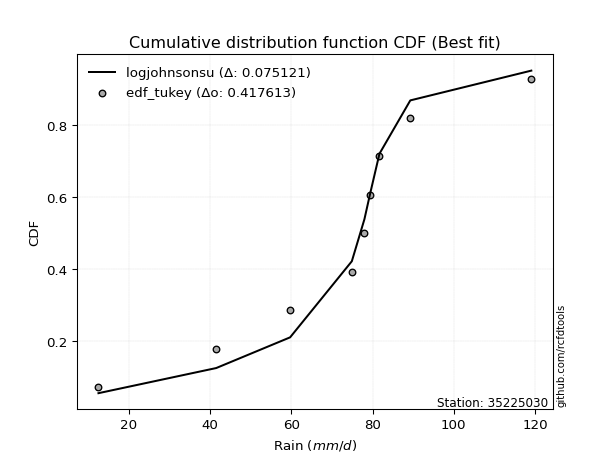</img>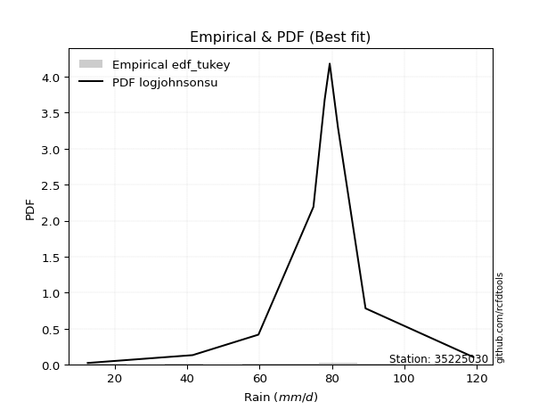</img>

</div>


### 8. EDF Gringorten (1963)

Gringorten plotting position formula is essential for estimating the probability and return periods of extreme events like floods and heavy rainfall. The constant _a=0.44_.

<div align="center">


$P=(m-a)/(n+1-2a)$


</div>


**8.1. Empirical values**

<div align="center">

|                | 0                    | 1                  | 2                   | 3                  | 4              | 5                  | 6                  | 7                  | 8                  |
|:---------------|:---------------------|:-------------------|:--------------------|:-------------------|:---------------|:-------------------|:-------------------|:-------------------|:-------------------|
| date           | 2017                 | 2020               | 2019                | 2018               | 2023           | 2024               | 2022               | 2021               | 2025               |
| x              | 12.5                 | 41.5               | 59.7                | 74.9               | 78.0           | 79.4               | 81.7               | 89.3               | 119.1              |
| m              | 1                    | 2                  | 3                   | 4                  | 5              | 6                  | 7                  | 8                  | 9                  |
| empirical_dist | edf_gringorten       | edf_gringorten     | edf_gringorten      | edf_gringorten     | edf_gringorten | edf_gringorten     | edf_gringorten     | edf_gringorten     | edf_gringorten     |
| empirical      | 0.061403508771929835 | 0.1710526315789474 | 0.28070175438596495 | 0.3903508771929825 | 0.5            | 0.6096491228070176 | 0.7192982456140351 | 0.8289473684210527 | 0.9385964912280703 |
| empirical_tr   | 1.0654205607476634   | 1.2063492063492063 | 1.3902439024390243  | 1.6402877697841727 | 2.0            | 2.561797752808989  | 3.5625             | 5.846153846153847  | 16.285714285714324 |

</div>


**8.2. Kolmogorov-Smirnov fit test (sorted by Δ)**


<div align="center">

|                | 0                   | 1                   | 2                   | 3                   | 4                   | 5                   | 6                   | 7                   | 8                   | 9                   | 10                  | 11                  | 12                  | 13                  | 14                  | 15                  | 16                  | 17                  | 18                  | 19                  | 20                  | 21                  | 22                  | 23                  | 24                  | 25                  | 26                  | 27                  | 28                  | 29                  | 30                  | 31                  | 32                  | 33                  | 34                  | 35                  | 36                  | 37                  | 38                  | 39                  | 40                  | 41                  | 42                  | 43                  | 44                  | 45                  | 46                  | 47                  | 48                  | 49                  | 50                  | 51                  | 52                  | 53                  | 54                  | 55                  | 56                  | 57                  | 58                  | 59                  | 60                  | 61                  | 62                  | 63                  | 64                  | 65                  | 66                  | 67                  | 68                  | 69                  | 70                  | 71                  | 72                  | 73                  | 74                  | 75                  | 76                  | 77                  | 78                  | 79                  | 80                  | 81                  | 82                  | 83                  | 84                  | 85                  | 86                  | 87                  | 88                  | 89                  | 90                  | 91                  | 92                  | 93                  | 94                  | 95                  | 96                  | 97                  | 98                  | 99                  | 100                 | 101                 | 102                 | 103                 | 104                 | 105                 | 106                 | 107                 | 108                 | 109                 | 110                 | 111                 | 112                 | 113                 | 114                 | 115                 | 116                 | 117                 | 118                 | 119                 | 120                 | 121                 | 122                 | 123                 | 124                 | 125                 | 126                 | 127                 | 128                 | 129                 | 130                 | 131                 | 132                 | 133                 | 134                 | 135                 | 136                 | 137                 | 138                 | 139                 | 140                 | 141                 | 142                 | 143                 | 144                 | 145                 | 146                 | 147                 | 148                 | 149                 | 150                 | 151                 | 152                 | 153                 | 154                 | 155                 | 156                 | 157                 | 158                 | 159                 |
|:---------------|:--------------------|:--------------------|:--------------------|:--------------------|:--------------------|:--------------------|:--------------------|:--------------------|:--------------------|:--------------------|:--------------------|:--------------------|:--------------------|:--------------------|:--------------------|:--------------------|:--------------------|:--------------------|:--------------------|:--------------------|:--------------------|:--------------------|:--------------------|:--------------------|:--------------------|:--------------------|:--------------------|:--------------------|:--------------------|:--------------------|:--------------------|:--------------------|:--------------------|:--------------------|:--------------------|:--------------------|:--------------------|:--------------------|:--------------------|:--------------------|:--------------------|:--------------------|:--------------------|:--------------------|:--------------------|:--------------------|:--------------------|:--------------------|:--------------------|:--------------------|:--------------------|:--------------------|:--------------------|:--------------------|:--------------------|:--------------------|:--------------------|:--------------------|:--------------------|:--------------------|:--------------------|:--------------------|:--------------------|:--------------------|:--------------------|:--------------------|:--------------------|:--------------------|:--------------------|:--------------------|:--------------------|:--------------------|:--------------------|:--------------------|:--------------------|:--------------------|:--------------------|:--------------------|:--------------------|:--------------------|:--------------------|:--------------------|:--------------------|:--------------------|:--------------------|:--------------------|:--------------------|:--------------------|:--------------------|:--------------------|:--------------------|:--------------------|:--------------------|:--------------------|:--------------------|:--------------------|:--------------------|:--------------------|:--------------------|:--------------------|:--------------------|:--------------------|:--------------------|:--------------------|:--------------------|:--------------------|:--------------------|:--------------------|:--------------------|:--------------------|:--------------------|:--------------------|:--------------------|:--------------------|:--------------------|:--------------------|:--------------------|:--------------------|:--------------------|:--------------------|:--------------------|:--------------------|:--------------------|:--------------------|:--------------------|:--------------------|:--------------------|:--------------------|:--------------------|:--------------------|:--------------------|:--------------------|:--------------------|:--------------------|:--------------------|:--------------------|:--------------------|:--------------------|:--------------------|:--------------------|:--------------------|:--------------------|:--------------------|:--------------------|:--------------------|:--------------------|:--------------------|:--------------------|:--------------------|:--------------------|:--------------------|:--------------------|:--------------------|:--------------------|:--------------------|:--------------------|:--------------------|:--------------------|:--------------------|:--------------------|
| station        | 35225030            | 35225030            | 35225030            | 35225030            | 35225030            | 35225030            | 35225030            | 35225030            | 35225030            | 35225030            | 35225030            | 35225030            | 35225030            | 35225030            | 35225030            | 35225030            | 35225030            | 35225030            | 35225030            | 35225030            | 35225030            | 35225030            | 35225030            | 35225030            | 35225030            | 35225030            | 35225030            | 35225030            | 35225030            | 35225030            | 35225030            | 35225030            | 35225030            | 35225030            | 35225030            | 35225030            | 35225030            | 35225030            | 35225030            | 35225030            | 35225030            | 35225030            | 35225030            | 35225030            | 35225030            | 35225030            | 35225030            | 35225030            | 35225030            | 35225030            | 35225030            | 35225030            | 35225030            | 35225030            | 35225030            | 35225030            | 35225030            | 35225030            | 35225030            | 35225030            | 35225030            | 35225030            | 35225030            | 35225030            | 35225030            | 35225030            | 35225030            | 35225030            | 35225030            | 35225030            | 35225030            | 35225030            | 35225030            | 35225030            | 35225030            | 35225030            | 35225030            | 35225030            | 35225030            | 35225030            | 35225030            | 35225030            | 35225030            | 35225030            | 35225030            | 35225030            | 35225030            | 35225030            | 35225030            | 35225030            | 35225030            | 35225030            | 35225030            | 35225030            | 35225030            | 35225030            | 35225030            | 35225030            | 35225030            | 35225030            | 35225030            | 35225030            | 35225030            | 35225030            | 35225030            | 35225030            | 35225030            | 35225030            | 35225030            | 35225030            | 35225030            | 35225030            | 35225030            | 35225030            | 35225030            | 35225030            | 35225030            | 35225030            | 35225030            | 35225030            | 35225030            | 35225030            | 35225030            | 35225030            | 35225030            | 35225030            | 35225030            | 35225030            | 35225030            | 35225030            | 35225030            | 35225030            | 35225030            | 35225030            | 35225030            | 35225030            | 35225030            | 35225030            | 35225030            | 35225030            | 35225030            | 35225030            | 35225030            | 35225030            | 35225030            | 35225030            | 35225030            | 35225030            | 35225030            | 35225030            | 35225030            | 35225030            | 35225030            | 35225030            | 35225030            | 35225030            | 35225030            | 35225030            | 35225030            | 35225030            |
| empirical_dist | edf_gringorten      | edf_gringorten      | edf_gringorten      | edf_gringorten      | edf_gringorten      | edf_gringorten      | edf_gringorten      | edf_gringorten      | edf_gringorten      | edf_gringorten      | edf_gringorten      | edf_gringorten      | edf_gringorten      | edf_gringorten      | edf_gringorten      | edf_gringorten      | edf_gringorten      | edf_gringorten      | edf_gringorten      | edf_gringorten      | edf_gringorten      | edf_gringorten      | edf_gringorten      | edf_gringorten      | edf_gringorten      | edf_gringorten      | edf_gringorten      | edf_gringorten      | edf_gringorten      | edf_gringorten      | edf_gringorten      | edf_gringorten      | edf_gringorten      | edf_gringorten      | edf_gringorten      | edf_gringorten      | edf_gringorten      | edf_gringorten      | edf_gringorten      | edf_gringorten      | edf_gringorten      | edf_gringorten      | edf_gringorten      | edf_gringorten      | edf_gringorten      | edf_gringorten      | edf_gringorten      | edf_gringorten      | edf_gringorten      | edf_gringorten      | edf_gringorten      | edf_gringorten      | edf_gringorten      | edf_gringorten      | edf_gringorten      | edf_gringorten      | edf_gringorten      | edf_gringorten      | edf_gringorten      | edf_gringorten      | edf_gringorten      | edf_gringorten      | edf_gringorten      | edf_gringorten      | edf_gringorten      | edf_gringorten      | edf_gringorten      | edf_gringorten      | edf_gringorten      | edf_gringorten      | edf_gringorten      | edf_gringorten      | edf_gringorten      | edf_gringorten      | edf_gringorten      | edf_gringorten      | edf_gringorten      | edf_gringorten      | edf_gringorten      | edf_gringorten      | edf_gringorten      | edf_gringorten      | edf_gringorten      | edf_gringorten      | edf_gringorten      | edf_gringorten      | edf_gringorten      | edf_gringorten      | edf_gringorten      | edf_gringorten      | edf_gringorten      | edf_gringorten      | edf_gringorten      | edf_gringorten      | edf_gringorten      | edf_gringorten      | edf_gringorten      | edf_gringorten      | edf_gringorten      | edf_gringorten      | edf_gringorten      | edf_gringorten      | edf_gringorten      | edf_gringorten      | edf_gringorten      | edf_gringorten      | edf_gringorten      | edf_gringorten      | edf_gringorten      | edf_gringorten      | edf_gringorten      | edf_gringorten      | edf_gringorten      | edf_gringorten      | edf_gringorten      | edf_gringorten      | edf_gringorten      | edf_gringorten      | edf_gringorten      | edf_gringorten      | edf_gringorten      | edf_gringorten      | edf_gringorten      | edf_gringorten      | edf_gringorten      | edf_gringorten      | edf_gringorten      | edf_gringorten      | edf_gringorten      | edf_gringorten      | edf_gringorten      | edf_gringorten      | edf_gringorten      | edf_gringorten      | edf_gringorten      | edf_gringorten      | edf_gringorten      | edf_gringorten      | edf_gringorten      | edf_gringorten      | edf_gringorten      | edf_gringorten      | edf_gringorten      | edf_gringorten      | edf_gringorten      | edf_gringorten      | edf_gringorten      | edf_gringorten      | edf_gringorten      | edf_gringorten      | edf_gringorten      | edf_gringorten      | edf_gringorten      | edf_gringorten      | edf_gringorten      | edf_gringorten      | edf_gringorten      | edf_gringorten      | edf_gringorten      | edf_gringorten      |
| p_dist         | logjohnsonsu        | johnsonsu           | dweibull            | logdgamma           | t                   | gumbel_l            | dgamma              | genlogistic         | truncnorm           | gennorm             | genextreme          | logjohnsonsb        | johnsonsb           | pearson3            | skewnorm            | weibull_min         | loggennorm          | gompertz            | logargus            | argus               | exponpow            | tukeylambda         | logt                | logdweibull         | truncweibull_min    | logpearson3         | semicircular        | logloggamma         | anglit              | exponweib           | lognakagami         | foldnorm            | logvonmises_line    | crystalball         | norm                | exponnorm           | rice                | nct                 | f                   | erlang              | logloglaplace       | logburr             | arcsine             | mielke              | logistic            | logtrapezoid        | burr                | logburr12           | gamma               | loggenlogistic      | loggumbel_l         | betaprime           | ksone               | hypsecant           | logmielke           | gengamma            | invgamma            | cosine              | kappa3              | uniform             | loggompertz         | wrapcauchy          | invweibull          | maxwell             | laplace             | ncf                 | rayleigh            | logarcsine          | logsemicircular     | loggengamma         | loggenextreme       | kappa4              | loganglit           | invgauss            | loglevy_l           | logskewnorm         | kstwobign           | logweibull_max      | gausshyper          | genexpon            | logbetaprime        | logtruncweibull_min | logfatiguelife      | loggamma            | loggamma            | logncf              | logrice             | logf                | logexponnorm        | logcrystalball      | lognorm             | logalpha            | logerlang           | halfnorm            | lognct              | halfgennorm         | loginvweibull       | loggenpareto        | loginvgamma         | loginvgauss         | gumbel_r            | logfoldnorm         | vonmises_line       | loggenhalflogistic  | genpareto           | loglogistic         | genhalflogistic     | logmaxwell          | loghypsecant        | halflogistic        | moyal               | lograyleigh         | lomax               | triang              | bradford            | logkstwobign        | logtriang           | loghalfnorm         | loggausshyper       | loglaplace          | loglaplace          | beta                | alpha               | logcosine           | loggumbel_r         | loggenexpon         | loghalfgennorm      | levy_l              | nakagami            | loghalflogistic     | truncexpon          | logmoyal            | wald                | logwrapcauchy       | logtruncnorm        | burr12              | loglomax            | logrdist            | trapezoid           | logwald             | logksone            | logkappa4           | logbradford         | logtukeylambda      | logkappa3           | loguniform          | logweibull_min      | logbeta             | logexponweib        | logtruncexpon       | powerlaw            | logexponpow         | fatiguelife         | logpowerlaw         | rdist               | weibull_max         | truncpareto         | logtruncpareto      | logvonmises         | vonmises            |
| delta          | 0.07010832043462478 | 0.08526955963385074 | 0.10401293401747269 | 0.10559585797469839 | 0.1073190268937636  | 0.11710014500405963 | 0.12103277648661781 | 0.13004051424337665 | 0.13012509773622932 | 0.13231351616304482 | 0.13257184274684325 | 0.13636794187043638 | 0.13640706147107656 | 0.13721574048456636 | 0.1375670022177506  | 0.13792598264654216 | 0.14261230402785316 | 0.14445698837530357 | 0.14494790262827495 | 0.14662257985140692 | 0.14679899035097937 | 0.14700249616650435 | 0.14817976949612816 | 0.14855478866449312 | 0.15331692588447832 | 0.1554700657547321  | 0.15674115570675023 | 0.15814175168133965 | 0.1601813131219864  | 0.16470442229601606 | 0.16512815188154878 | 0.16697821903331683 | 0.167658615180805   | 0.16850916290934287 | 0.16850916457678905 | 0.16851125802618788 | 0.16857405544668186 | 0.168602244006192   | 0.17024139226052387 | 0.17479176977846805 | 0.17589895395023536 | 0.17608054322183336 | 0.1761446938011325  | 0.17631837826641167 | 0.1763950462337442  | 0.17649002951650994 | 0.17687268468813894 | 0.17696999042353007 | 0.17716721552666687 | 0.1773553991625672  | 0.1792988542404111  | 0.17964665728775192 | 0.18078733418913134 | 0.18303019089962164 | 0.18358621371908984 | 0.18455508791305192 | 0.18857599162792776 | 0.18885273780471362 | 0.19500254035029757 | 0.19501497646555416 | 0.19579770525046641 | 0.19681600876012711 | 0.1976656886614116  | 0.19829778948617832 | 0.20412033602557428 | 0.2061698364633549  | 0.20780491318196176 | 0.2089197991359386  | 0.2101391386217935  | 0.21351888494646393 | 0.2146603848177352  | 0.21661004853089377 | 0.21717671794335486 | 0.2172752032653102  | 0.21846162278105802 | 0.2199321719777922  | 0.22053346244235966 | 0.22182840407574772 | 0.22199511622745438 | 0.22697344744841957 | 0.22963344885750486 | 0.2299632394138858  | 0.23173080077657354 | 0.23269609430177013 | 0.23269609430177013 | 0.23276367849272867 | 0.23346201799126304 | 0.2339197444762156  | 0.23403866447729033 | 0.23404026346453327 | 0.23404030035535478 | 0.23422773843936245 | 0.2345649679882666  | 0.2346501857492152  | 0.23532241240866186 | 0.23574466064567562 | 0.23602959414239105 | 0.2369123872026152  | 0.23749156370931473 | 0.2375817672849418  | 0.23819804289187435 | 0.23958243114145023 | 0.2397684269661326  | 0.24489344535842944 | 0.2492045549751345  | 0.24957361778814674 | 0.2514889028569779  | 0.2582963875488838  | 0.2619932605554865  | 0.26221061407173035 | 0.2627321662200958  | 0.2657060004368383  | 0.27272627434088353 | 0.27276509057248766 | 0.2745506661178512  | 0.2751236365126178  | 0.28176605526383774 | 0.28698581234186676 | 0.2882825740564234  | 0.29030987196125074 | 0.29030987196125074 | 0.2926630709755655  | 0.29381494193740704 | 0.29521568896725675 | 0.29771051268719034 | 0.29907772137585203 | 0.30946134958196464 | 0.3114738312306639  | 0.31301146272510133 | 0.31534298732244265 | 0.31857996130302685 | 0.31911417512407153 | 0.3308165391029257  | 0.33975230638425485 | 0.3487058267904963  | 0.35409781193735096 | 0.35632781906465566 | 0.36053721006574263 | 0.3614899626628415  | 0.37914033869161384 | 0.3806560131727506  | 0.40476020595008694 | 0.4086618136306089  | 0.4118782773821587  | 0.4120132983932066  | 0.41292756668449376 | 0.46438710746328055 | 0.46836224139581234 | 0.47536222210251017 | 0.4784492012370917  | 0.5904369537236278  | 0.5993714279318714  | 0.6141134992231532  | 0.6906205256288056  | 0.7192982444092744  | 0.7213123297981591  | 0.7519571707783723  | 0.7912178531831113  | 1.1978109813153643  | 18.65078950816304   |
| deltao         | 0.41761268023100007 | 0.41761268023100007 | 0.41761268023100007 | 0.41761268023100007 | 0.41761268023100007 | 0.41761268023100007 | 0.41761268023100007 | 0.41761268023100007 | 0.41761268023100007 | 0.41761268023100007 | 0.41761268023100007 | 0.41761268023100007 | 0.41761268023100007 | 0.41761268023100007 | 0.41761268023100007 | 0.41761268023100007 | 0.41761268023100007 | 0.41761268023100007 | 0.41761268023100007 | 0.41761268023100007 | 0.41761268023100007 | 0.41761268023100007 | 0.41761268023100007 | 0.41761268023100007 | 0.41761268023100007 | 0.41761268023100007 | 0.41761268023100007 | 0.41761268023100007 | 0.41761268023100007 | 0.41761268023100007 | 0.41761268023100007 | 0.41761268023100007 | 0.41761268023100007 | 0.41761268023100007 | 0.41761268023100007 | 0.41761268023100007 | 0.41761268023100007 | 0.41761268023100007 | 0.41761268023100007 | 0.41761268023100007 | 0.41761268023100007 | 0.41761268023100007 | 0.41761268023100007 | 0.41761268023100007 | 0.41761268023100007 | 0.41761268023100007 | 0.41761268023100007 | 0.41761268023100007 | 0.41761268023100007 | 0.41761268023100007 | 0.41761268023100007 | 0.41761268023100007 | 0.41761268023100007 | 0.41761268023100007 | 0.41761268023100007 | 0.41761268023100007 | 0.41761268023100007 | 0.41761268023100007 | 0.41761268023100007 | 0.41761268023100007 | 0.41761268023100007 | 0.41761268023100007 | 0.41761268023100007 | 0.41761268023100007 | 0.41761268023100007 | 0.41761268023100007 | 0.41761268023100007 | 0.41761268023100007 | 0.41761268023100007 | 0.41761268023100007 | 0.41761268023100007 | 0.41761268023100007 | 0.41761268023100007 | 0.41761268023100007 | 0.41761268023100007 | 0.41761268023100007 | 0.41761268023100007 | 0.41761268023100007 | 0.41761268023100007 | 0.41761268023100007 | 0.41761268023100007 | 0.41761268023100007 | 0.41761268023100007 | 0.41761268023100007 | 0.41761268023100007 | 0.41761268023100007 | 0.41761268023100007 | 0.41761268023100007 | 0.41761268023100007 | 0.41761268023100007 | 0.41761268023100007 | 0.41761268023100007 | 0.41761268023100007 | 0.41761268023100007 | 0.41761268023100007 | 0.41761268023100007 | 0.41761268023100007 | 0.41761268023100007 | 0.41761268023100007 | 0.41761268023100007 | 0.41761268023100007 | 0.41761268023100007 | 0.41761268023100007 | 0.41761268023100007 | 0.41761268023100007 | 0.41761268023100007 | 0.41761268023100007 | 0.41761268023100007 | 0.41761268023100007 | 0.41761268023100007 | 0.41761268023100007 | 0.41761268023100007 | 0.41761268023100007 | 0.41761268023100007 | 0.41761268023100007 | 0.41761268023100007 | 0.41761268023100007 | 0.41761268023100007 | 0.41761268023100007 | 0.41761268023100007 | 0.41761268023100007 | 0.41761268023100007 | 0.41761268023100007 | 0.41761268023100007 | 0.41761268023100007 | 0.41761268023100007 | 0.41761268023100007 | 0.41761268023100007 | 0.41761268023100007 | 0.41761268023100007 | 0.41761268023100007 | 0.41761268023100007 | 0.41761268023100007 | 0.41761268023100007 | 0.41761268023100007 | 0.41761268023100007 | 0.41761268023100007 | 0.41761268023100007 | 0.41761268023100007 | 0.41761268023100007 | 0.41761268023100007 | 0.41761268023100007 | 0.41761268023100007 | 0.41761268023100007 | 0.41761268023100007 | 0.41761268023100007 | 0.41761268023100007 | 0.41761268023100007 | 0.41761268023100007 | 0.41761268023100007 | 0.41761268023100007 | 0.41761268023100007 | 0.41761268023100007 | 0.41761268023100007 | 0.41761268023100007 | 0.41761268023100007 | 0.41761268023100007 | 0.41761268023100007 | 0.41761268023100007 | 0.41761268023100007 |
| eval           | Δo > Δ              | Δo > Δ              | Δo > Δ              | Δo > Δ              | Δo > Δ              | Δo > Δ              | Δo > Δ              | Δo > Δ              | Δo > Δ              | Δo > Δ              | Δo > Δ              | Δo > Δ              | Δo > Δ              | Δo > Δ              | Δo > Δ              | Δo > Δ              | Δo > Δ              | Δo > Δ              | Δo > Δ              | Δo > Δ              | Δo > Δ              | Δo > Δ              | Δo > Δ              | Δo > Δ              | Δo > Δ              | Δo > Δ              | Δo > Δ              | Δo > Δ              | Δo > Δ              | Δo > Δ              | Δo > Δ              | Δo > Δ              | Δo > Δ              | Δo > Δ              | Δo > Δ              | Δo > Δ              | Δo > Δ              | Δo > Δ              | Δo > Δ              | Δo > Δ              | Δo > Δ              | Δo > Δ              | Δo > Δ              | Δo > Δ              | Δo > Δ              | Δo > Δ              | Δo > Δ              | Δo > Δ              | Δo > Δ              | Δo > Δ              | Δo > Δ              | Δo > Δ              | Δo > Δ              | Δo > Δ              | Δo > Δ              | Δo > Δ              | Δo > Δ              | Δo > Δ              | Δo > Δ              | Δo > Δ              | Δo > Δ              | Δo > Δ              | Δo > Δ              | Δo > Δ              | Δo > Δ              | Δo > Δ              | Δo > Δ              | Δo > Δ              | Δo > Δ              | Δo > Δ              | Δo > Δ              | Δo > Δ              | Δo > Δ              | Δo > Δ              | Δo > Δ              | Δo > Δ              | Δo > Δ              | Δo > Δ              | Δo > Δ              | Δo > Δ              | Δo > Δ              | Δo > Δ              | Δo > Δ              | Δo > Δ              | Δo > Δ              | Δo > Δ              | Δo > Δ              | Δo > Δ              | Δo > Δ              | Δo > Δ              | Δo > Δ              | Δo > Δ              | Δo > Δ              | Δo > Δ              | Δo > Δ              | Δo > Δ              | Δo > Δ              | Δo > Δ              | Δo > Δ              | Δo > Δ              | Δo > Δ              | Δo > Δ              | Δo > Δ              | Δo > Δ              | Δo > Δ              | Δo > Δ              | Δo > Δ              | Δo > Δ              | Δo > Δ              | Δo > Δ              | Δo > Δ              | Δo > Δ              | Δo > Δ              | Δo > Δ              | Δo > Δ              | Δo > Δ              | Δo > Δ              | Δo > Δ              | Δo > Δ              | Δo > Δ              | Δo > Δ              | Δo > Δ              | Δo > Δ              | Δo > Δ              | Δo > Δ              | Δo > Δ              | Δo > Δ              | Δo > Δ              | Δo > Δ              | Δo > Δ              | Δo > Δ              | Δo > Δ              | Δo > Δ              | Δo > Δ              | Δo > Δ              | Δo > Δ              | Δo > Δ              | Δo > Δ              | Δo > Δ              | Δo > Δ              | Δo > Δ              | Δo > Δ              | Δo > Δ              | Δo > Δ              | Δo > Δ              | Δo > Δ              | Δo <= Δ             | Δo <= Δ             | Δo <= Δ             | Δo <= Δ             | Δo <= Δ             | Δo <= Δ             | Δo <= Δ             | Δo <= Δ             | Δo <= Δ             | Δo <= Δ             | Δo <= Δ             | Δo <= Δ             | Δo <= Δ             | Δo <= Δ             |
| fit            | 1                   | 1                   | 1                   | 1                   | 1                   | 1                   | 1                   | 1                   | 1                   | 1                   | 1                   | 1                   | 1                   | 1                   | 1                   | 1                   | 1                   | 1                   | 1                   | 1                   | 1                   | 1                   | 1                   | 1                   | 1                   | 1                   | 1                   | 1                   | 1                   | 1                   | 1                   | 1                   | 1                   | 1                   | 1                   | 1                   | 1                   | 1                   | 1                   | 1                   | 1                   | 1                   | 1                   | 1                   | 1                   | 1                   | 1                   | 1                   | 1                   | 1                   | 1                   | 1                   | 1                   | 1                   | 1                   | 1                   | 1                   | 1                   | 1                   | 1                   | 1                   | 1                   | 1                   | 1                   | 1                   | 1                   | 1                   | 1                   | 1                   | 1                   | 1                   | 1                   | 1                   | 1                   | 1                   | 1                   | 1                   | 1                   | 1                   | 1                   | 1                   | 1                   | 1                   | 1                   | 1                   | 1                   | 1                   | 1                   | 1                   | 1                   | 1                   | 1                   | 1                   | 1                   | 1                   | 1                   | 1                   | 1                   | 1                   | 1                   | 1                   | 1                   | 1                   | 1                   | 1                   | 1                   | 1                   | 1                   | 1                   | 1                   | 1                   | 1                   | 1                   | 1                   | 1                   | 1                   | 1                   | 1                   | 1                   | 1                   | 1                   | 1                   | 1                   | 1                   | 1                   | 1                   | 1                   | 1                   | 1                   | 1                   | 1                   | 1                   | 1                   | 1                   | 1                   | 1                   | 1                   | 1                   | 1                   | 1                   | 1                   | 1                   | 1                   | 1                   | 1                   | 1                   | 0                   | 0                   | 0                   | 0                   | 0                   | 0                   | 0                   | 0                   | 0                   | 0                   | 0                   | 0                   | 0                   | 0                   |
| n              | 9                   | 9                   | 9                   | 9                   | 9                   | 9                   | 9                   | 9                   | 9                   | 9                   | 9                   | 9                   | 9                   | 9                   | 9                   | 9                   | 9                   | 9                   | 9                   | 9                   | 9                   | 9                   | 9                   | 9                   | 9                   | 9                   | 9                   | 9                   | 9                   | 9                   | 9                   | 9                   | 9                   | 9                   | 9                   | 9                   | 9                   | 9                   | 9                   | 9                   | 9                   | 9                   | 9                   | 9                   | 9                   | 9                   | 9                   | 9                   | 9                   | 9                   | 9                   | 9                   | 9                   | 9                   | 9                   | 9                   | 9                   | 9                   | 9                   | 9                   | 9                   | 9                   | 9                   | 9                   | 9                   | 9                   | 9                   | 9                   | 9                   | 9                   | 9                   | 9                   | 9                   | 9                   | 9                   | 9                   | 9                   | 9                   | 9                   | 9                   | 9                   | 9                   | 9                   | 9                   | 9                   | 9                   | 9                   | 9                   | 9                   | 9                   | 9                   | 9                   | 9                   | 9                   | 9                   | 9                   | 9                   | 9                   | 9                   | 9                   | 9                   | 9                   | 9                   | 9                   | 9                   | 9                   | 9                   | 9                   | 9                   | 9                   | 9                   | 9                   | 9                   | 9                   | 9                   | 9                   | 9                   | 9                   | 9                   | 9                   | 9                   | 9                   | 9                   | 9                   | 9                   | 9                   | 9                   | 9                   | 9                   | 9                   | 9                   | 9                   | 9                   | 9                   | 9                   | 9                   | 9                   | 9                   | 9                   | 9                   | 9                   | 9                   | 9                   | 9                   | 9                   | 9                   | 9                   | 9                   | 9                   | 9                   | 9                   | 9                   | 9                   | 9                   | 9                   | 9                   | 9                   | 9                   | 9                   | 9                   |
| best_fit       | 1                   | 0                   | 0                   | 0                   | 0                   | 0                   | 0                   | 0                   | 0                   | 0                   | 0                   | 0                   | 0                   | 0                   | 0                   | 0                   | 0                   | 0                   | 0                   | 0                   | 0                   | 0                   | 0                   | 0                   | 0                   | 0                   | 0                   | 0                   | 0                   | 0                   | 0                   | 0                   | 0                   | 0                   | 0                   | 0                   | 0                   | 0                   | 0                   | 0                   | 0                   | 0                   | 0                   | 0                   | 0                   | 0                   | 0                   | 0                   | 0                   | 0                   | 0                   | 0                   | 0                   | 0                   | 0                   | 0                   | 0                   | 0                   | 0                   | 0                   | 0                   | 0                   | 0                   | 0                   | 0                   | 0                   | 0                   | 0                   | 0                   | 0                   | 0                   | 0                   | 0                   | 0                   | 0                   | 0                   | 0                   | 0                   | 0                   | 0                   | 0                   | 0                   | 0                   | 0                   | 0                   | 0                   | 0                   | 0                   | 0                   | 0                   | 0                   | 0                   | 0                   | 0                   | 0                   | 0                   | 0                   | 0                   | 0                   | 0                   | 0                   | 0                   | 0                   | 0                   | 0                   | 0                   | 0                   | 0                   | 0                   | 0                   | 0                   | 0                   | 0                   | 0                   | 0                   | 0                   | 0                   | 0                   | 0                   | 0                   | 0                   | 0                   | 0                   | 0                   | 0                   | 0                   | 0                   | 0                   | 0                   | 0                   | 0                   | 0                   | 0                   | 0                   | 0                   | 0                   | 0                   | 0                   | 0                   | 0                   | 0                   | 0                   | 0                   | 0                   | 0                   | 0                   | 0                   | 0                   | 0                   | 0                   | 0                   | 0                   | 0                   | 0                   | 0                   | 0                   | 0                   | 0                   | 0                   | 0                   |
| best_fit_sort  | 1                   | 2                   | 3                   | 4                   | 5                   | 6                   | 7                   | 8                   | 9                   | 10                  | 11                  | 12                  | 13                  | 14                  | 15                  | 16                  | 17                  | 18                  | 19                  | 20                  | 21                  | 22                  | 23                  | 24                  | 25                  | 26                  | 27                  | 28                  | 29                  | 30                  | 31                  | 32                  | 33                  | 34                  | 35                  | 36                  | 37                  | 38                  | 39                  | 40                  | 41                  | 42                  | 43                  | 44                  | 45                  | 46                  | 47                  | 48                  | 49                  | 50                  | 51                  | 52                  | 53                  | 54                  | 55                  | 56                  | 57                  | 58                  | 59                  | 60                  | 61                  | 62                  | 63                  | 64                  | 65                  | 66                  | 67                  | 68                  | 69                  | 70                  | 71                  | 72                  | 73                  | 74                  | 75                  | 76                  | 77                  | 78                  | 79                  | 80                  | 81                  | 82                  | 83                  | 84                  | 85                  | 86                  | 87                  | 88                  | 89                  | 90                  | 91                  | 92                  | 93                  | 94                  | 95                  | 96                  | 97                  | 98                  | 99                  | 100                 | 101                 | 102                 | 103                 | 104                 | 105                 | 106                 | 107                 | 108                 | 109                 | 110                 | 111                 | 112                 | 113                 | 114                 | 115                 | 116                 | 117                 | 118                 | 119                 | 120                 | 121                 | 122                 | 123                 | 124                 | 125                 | 126                 | 127                 | 128                 | 129                 | 130                 | 131                 | 132                 | 133                 | 134                 | 135                 | 136                 | 137                 | 138                 | 139                 | 140                 | 141                 | 142                 | 143                 | 144                 | 145                 | 146                 | 147                 | 148                 | 149                 | 150                 | 151                 | 152                 | 153                 | 154                 | 155                 | 156                 | 157                 | 158                 | 159                 | 160                 |

</div>


**8.3. Best fit**

<div align="center">

|   id |   station | empirical_dist   | p_dist       |     delta |   deltao | eval   |   fit |   n |   best_fit |   best_fit_sort |
|-----:|----------:|:-----------------|:-------------|----------:|---------:|:-------|------:|----:|-----------:|----------------:|
|    0 |  35225030 | edf_gringorten   | logjohnsonsu | 0.0701083 | 0.417613 | Δo > Δ |     1 |   9 |          1 |               1 |

</div>


<div align="center">

</img>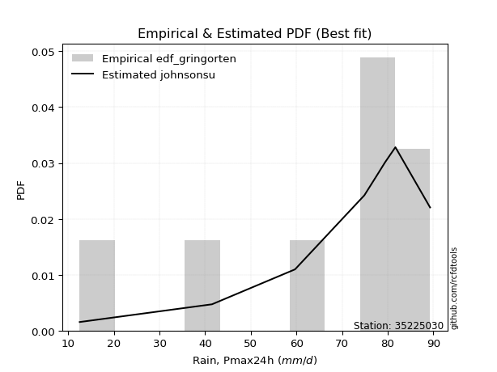</img>

</div>


### 9. EDF Filliben (1975)

The specific values of the constants (0.3175) (often denoted as $alpha$) and (0.365) are derived from a method proposed by James J. Filliben in a 1975 paper. This particular formula is the mean value of the $i$-th order statistic of the normal distribution and is considered a robust and effective plotting position formula for the normal probability plot correlation coefficient test for normality.

<div align="center">


$P=(m-0.3175)/(n+0.365)$


</div>


**9.1. Empirical values**

<div align="center">

|                | 0                   | 1                  | 2                   | 3                   | 4            | 5                  | 6                  | 7                  | 8                  |
|:---------------|:--------------------|:-------------------|:--------------------|:--------------------|:-------------|:-------------------|:-------------------|:-------------------|:-------------------|
| date           | 2017                | 2020               | 2019                | 2018                | 2023         | 2024               | 2022               | 2021               | 2025               |
| x              | 12.5                | 41.5               | 59.7                | 74.9                | 78.0         | 79.4               | 81.7               | 89.3               | 119.1              |
| m              | 1                   | 2                  | 3                   | 4                   | 5            | 6                  | 7                  | 8                  | 9                  |
| empirical_dist | edf_filliben        | edf_filliben       | edf_filliben        | edf_filliben        | edf_filliben | edf_filliben       | edf_filliben       | edf_filliben       | edf_filliben       |
| empirical      | 0.07287773625200214 | 0.1796583021890016 | 0.28643886812600106 | 0.39321943406300053 | 0.5          | 0.6067805659369995 | 0.7135611318739989 | 0.8203416978109984 | 0.9271222637479978 |
| empirical_tr   | 1.0786063921681543  | 1.219004230393752  | 1.401421623643846   | 1.6480422349318082  | 2.0          | 2.5431093007467753 | 3.491146318732526  | 5.566121842496286  | 13.721611721611705 |

</div>


**9.2. Kolmogorov-Smirnov fit test (sorted by Δ)**


<div align="center">

|                | 0                   | 1                   | 2                   | 3                   | 4                   | 5                   | 6                   | 7                   | 8                   | 9                   | 10                  | 11                  | 12                  | 13                  | 14                  | 15                  | 16                  | 17                  | 18                  | 19                  | 20                  | 21                  | 22                  | 23                  | 24                  | 25                  | 26                  | 27                  | 28                  | 29                  | 30                  | 31                  | 32                  | 33                  | 34                  | 35                  | 36                  | 37                  | 38                  | 39                  | 40                  | 41                  | 42                  | 43                  | 44                  | 45                  | 46                  | 47                  | 48                  | 49                  | 50                  | 51                  | 52                  | 53                  | 54                  | 55                  | 56                  | 57                  | 58                  | 59                  | 60                  | 61                  | 62                  | 63                  | 64                  | 65                  | 66                  | 67                  | 68                  | 69                  | 70                  | 71                  | 72                  | 73                  | 74                  | 75                  | 76                  | 77                  | 78                  | 79                  | 80                  | 81                  | 82                  | 83                  | 84                  | 85                  | 86                  | 87                  | 88                  | 89                  | 90                  | 91                  | 92                  | 93                  | 94                  | 95                  | 96                  | 97                  | 98                  | 99                  | 100                 | 101                 | 102                 | 103                 | 104                 | 105                 | 106                 | 107                 | 108                 | 109                 | 110                 | 111                 | 112                 | 113                 | 114                 | 115                 | 116                 | 117                 | 118                 | 119                 | 120                 | 121                 | 122                 | 123                 | 124                 | 125                 | 126                 | 127                 | 128                 | 129                 | 130                 | 131                 | 132                 | 133                 | 134                 | 135                 | 136                 | 137                 | 138                 | 139                 | 140                 | 141                 | 142                 | 143                 | 144                 | 145                 | 146                 | 147                 | 148                 | 149                 | 150                 | 151                 | 152                 | 153                 | 154                 | 155                 | 156                 | 157                 | 158                 | 159                 |
|:---------------|:--------------------|:--------------------|:--------------------|:--------------------|:--------------------|:--------------------|:--------------------|:--------------------|:--------------------|:--------------------|:--------------------|:--------------------|:--------------------|:--------------------|:--------------------|:--------------------|:--------------------|:--------------------|:--------------------|:--------------------|:--------------------|:--------------------|:--------------------|:--------------------|:--------------------|:--------------------|:--------------------|:--------------------|:--------------------|:--------------------|:--------------------|:--------------------|:--------------------|:--------------------|:--------------------|:--------------------|:--------------------|:--------------------|:--------------------|:--------------------|:--------------------|:--------------------|:--------------------|:--------------------|:--------------------|:--------------------|:--------------------|:--------------------|:--------------------|:--------------------|:--------------------|:--------------------|:--------------------|:--------------------|:--------------------|:--------------------|:--------------------|:--------------------|:--------------------|:--------------------|:--------------------|:--------------------|:--------------------|:--------------------|:--------------------|:--------------------|:--------------------|:--------------------|:--------------------|:--------------------|:--------------------|:--------------------|:--------------------|:--------------------|:--------------------|:--------------------|:--------------------|:--------------------|:--------------------|:--------------------|:--------------------|:--------------------|:--------------------|:--------------------|:--------------------|:--------------------|:--------------------|:--------------------|:--------------------|:--------------------|:--------------------|:--------------------|:--------------------|:--------------------|:--------------------|:--------------------|:--------------------|:--------------------|:--------------------|:--------------------|:--------------------|:--------------------|:--------------------|:--------------------|:--------------------|:--------------------|:--------------------|:--------------------|:--------------------|:--------------------|:--------------------|:--------------------|:--------------------|:--------------------|:--------------------|:--------------------|:--------------------|:--------------------|:--------------------|:--------------------|:--------------------|:--------------------|:--------------------|:--------------------|:--------------------|:--------------------|:--------------------|:--------------------|:--------------------|:--------------------|:--------------------|:--------------------|:--------------------|:--------------------|:--------------------|:--------------------|:--------------------|:--------------------|:--------------------|:--------------------|:--------------------|:--------------------|:--------------------|:--------------------|:--------------------|:--------------------|:--------------------|:--------------------|:--------------------|:--------------------|:--------------------|:--------------------|:--------------------|:--------------------|:--------------------|:--------------------|:--------------------|:--------------------|:--------------------|:--------------------|
| station        | 35225030            | 35225030            | 35225030            | 35225030            | 35225030            | 35225030            | 35225030            | 35225030            | 35225030            | 35225030            | 35225030            | 35225030            | 35225030            | 35225030            | 35225030            | 35225030            | 35225030            | 35225030            | 35225030            | 35225030            | 35225030            | 35225030            | 35225030            | 35225030            | 35225030            | 35225030            | 35225030            | 35225030            | 35225030            | 35225030            | 35225030            | 35225030            | 35225030            | 35225030            | 35225030            | 35225030            | 35225030            | 35225030            | 35225030            | 35225030            | 35225030            | 35225030            | 35225030            | 35225030            | 35225030            | 35225030            | 35225030            | 35225030            | 35225030            | 35225030            | 35225030            | 35225030            | 35225030            | 35225030            | 35225030            | 35225030            | 35225030            | 35225030            | 35225030            | 35225030            | 35225030            | 35225030            | 35225030            | 35225030            | 35225030            | 35225030            | 35225030            | 35225030            | 35225030            | 35225030            | 35225030            | 35225030            | 35225030            | 35225030            | 35225030            | 35225030            | 35225030            | 35225030            | 35225030            | 35225030            | 35225030            | 35225030            | 35225030            | 35225030            | 35225030            | 35225030            | 35225030            | 35225030            | 35225030            | 35225030            | 35225030            | 35225030            | 35225030            | 35225030            | 35225030            | 35225030            | 35225030            | 35225030            | 35225030            | 35225030            | 35225030            | 35225030            | 35225030            | 35225030            | 35225030            | 35225030            | 35225030            | 35225030            | 35225030            | 35225030            | 35225030            | 35225030            | 35225030            | 35225030            | 35225030            | 35225030            | 35225030            | 35225030            | 35225030            | 35225030            | 35225030            | 35225030            | 35225030            | 35225030            | 35225030            | 35225030            | 35225030            | 35225030            | 35225030            | 35225030            | 35225030            | 35225030            | 35225030            | 35225030            | 35225030            | 35225030            | 35225030            | 35225030            | 35225030            | 35225030            | 35225030            | 35225030            | 35225030            | 35225030            | 35225030            | 35225030            | 35225030            | 35225030            | 35225030            | 35225030            | 35225030            | 35225030            | 35225030            | 35225030            | 35225030            | 35225030            | 35225030            | 35225030            | 35225030            | 35225030            |
| empirical_dist | edf_filliben        | edf_filliben        | edf_filliben        | edf_filliben        | edf_filliben        | edf_filliben        | edf_filliben        | edf_filliben        | edf_filliben        | edf_filliben        | edf_filliben        | edf_filliben        | edf_filliben        | edf_filliben        | edf_filliben        | edf_filliben        | edf_filliben        | edf_filliben        | edf_filliben        | edf_filliben        | edf_filliben        | edf_filliben        | edf_filliben        | edf_filliben        | edf_filliben        | edf_filliben        | edf_filliben        | edf_filliben        | edf_filliben        | edf_filliben        | edf_filliben        | edf_filliben        | edf_filliben        | edf_filliben        | edf_filliben        | edf_filliben        | edf_filliben        | edf_filliben        | edf_filliben        | edf_filliben        | edf_filliben        | edf_filliben        | edf_filliben        | edf_filliben        | edf_filliben        | edf_filliben        | edf_filliben        | edf_filliben        | edf_filliben        | edf_filliben        | edf_filliben        | edf_filliben        | edf_filliben        | edf_filliben        | edf_filliben        | edf_filliben        | edf_filliben        | edf_filliben        | edf_filliben        | edf_filliben        | edf_filliben        | edf_filliben        | edf_filliben        | edf_filliben        | edf_filliben        | edf_filliben        | edf_filliben        | edf_filliben        | edf_filliben        | edf_filliben        | edf_filliben        | edf_filliben        | edf_filliben        | edf_filliben        | edf_filliben        | edf_filliben        | edf_filliben        | edf_filliben        | edf_filliben        | edf_filliben        | edf_filliben        | edf_filliben        | edf_filliben        | edf_filliben        | edf_filliben        | edf_filliben        | edf_filliben        | edf_filliben        | edf_filliben        | edf_filliben        | edf_filliben        | edf_filliben        | edf_filliben        | edf_filliben        | edf_filliben        | edf_filliben        | edf_filliben        | edf_filliben        | edf_filliben        | edf_filliben        | edf_filliben        | edf_filliben        | edf_filliben        | edf_filliben        | edf_filliben        | edf_filliben        | edf_filliben        | edf_filliben        | edf_filliben        | edf_filliben        | edf_filliben        | edf_filliben        | edf_filliben        | edf_filliben        | edf_filliben        | edf_filliben        | edf_filliben        | edf_filliben        | edf_filliben        | edf_filliben        | edf_filliben        | edf_filliben        | edf_filliben        | edf_filliben        | edf_filliben        | edf_filliben        | edf_filliben        | edf_filliben        | edf_filliben        | edf_filliben        | edf_filliben        | edf_filliben        | edf_filliben        | edf_filliben        | edf_filliben        | edf_filliben        | edf_filliben        | edf_filliben        | edf_filliben        | edf_filliben        | edf_filliben        | edf_filliben        | edf_filliben        | edf_filliben        | edf_filliben        | edf_filliben        | edf_filliben        | edf_filliben        | edf_filliben        | edf_filliben        | edf_filliben        | edf_filliben        | edf_filliben        | edf_filliben        | edf_filliben        | edf_filliben        | edf_filliben        | edf_filliben        | edf_filliben        | edf_filliben        |
| p_dist         | logjohnsonsu        | johnsonsu           | dweibull            | t                   | logdgamma           | gumbel_l            | dgamma              | genlogistic         | truncnorm           | genextreme          | logjohnsonsb        | johnsonsb           | pearson3            | skewnorm            | weibull_min         | logargus            | argus               | gennorm             | logdweibull         | gompertz            | exponpow            | tukeylambda         | truncweibull_min    | logpearson3         | loggennorm          | semicircular        | logt                | logloggamma         | anglit              | exponweib           | foldnorm            | logvonmises_line    | crystalball         | norm                | exponnorm           | rice                | lognakagami         | nct                 | logloglaplace       | f                   | arcsine             | logtrapezoid        | erlang              | logburr             | mielke              | logistic            | burr                | logburr12           | gamma               | loggenlogistic      | loggumbel_l         | betaprime           | ksone               | hypsecant           | logmielke           | gengamma            | invgamma            | cosine              | kappa3              | uniform             | loggompertz         | wrapcauchy          | invweibull          | maxwell             | laplace             | logarcsine          | ncf                 | rayleigh            | loggenextreme       | logsemicircular     | loglevy_l           | loggengamma         | gausshyper          | kappa4              | loganglit           | invgauss            | logskewnorm         | kstwobign           | logweibull_max      | genexpon            | logbetaprime        | logtruncweibull_min | loggenpareto        | logfatiguelife      | loggamma            | loggamma            | logncf              | loginvweibull       | logrice             | logf                | logexponnorm        | logcrystalball      | lognorm             | logalpha            | logerlang           | halfnorm            | lognct              | halfgennorm         | loginvgamma         | loginvgauss         | gumbel_r            | logfoldnorm         | vonmises_line       | genpareto           | loggenhalflogistic  | genhalflogistic     | loglogistic         | logmaxwell          | loghypsecant        | halflogistic        | moyal               | lograyleigh         | triang              | lomax               | logkstwobign        | bradford            | logtriang           | loggausshyper       | loghalfnorm         | loglaplace          | loglaplace          | alpha               | beta                | logcosine           | loggenexpon         | loggumbel_r         | levy_l              | loghalfgennorm      | nakagami            | loghalflogistic     | truncexpon          | logmoyal            | wald                | logwrapcauchy       | burr12              | logtruncnorm        | loglomax            | trapezoid           | logrdist            | logksone            | logwald             | logkappa4           | logbradford         | logtukeylambda      | logkappa3           | loguniform          | logweibull_min      | logbeta             | logexponweib        | logtruncexpon       | powerlaw            | logexponpow         | fatiguelife         | logpowerlaw         | weibull_max         | rdist               | truncpareto         | logtruncpareto      | logvonmises         | vonmises            |
| delta          | 0.07584543417466089 | 0.09100667337388685 | 0.09702523908927785 | 0.10158191315372744 | 0.10621188520465012 | 0.11136303126402347 | 0.12676989022665391 | 0.12717195737335862 | 0.1272565408662113  | 0.12970328587682523 | 0.13349938500041836 | 0.13353850460105854 | 0.13434718361454834 | 0.13469844534773256 | 0.13505742577652413 | 0.1363422320182207  | 0.13801690924135268 | 0.13805062990308092 | 0.13994911805443888 | 0.14158843150528555 | 0.14393043348096135 | 0.14413393929648632 | 0.14471125527442408 | 0.14686439514467786 | 0.14834941776788926 | 0.1538725988367322  | 0.15391688323616426 | 0.15527319481132162 | 0.1573127562519684  | 0.16183586542599804 | 0.1641096621632988  | 0.16479005831078697 | 0.16564060603932484 | 0.16564060770677103 | 0.16564270115616986 | 0.16570549857666383 | 0.1657115941937888  | 0.16573368713617398 | 0.16729328334018112 | 0.16737283539050585 | 0.16753902319107827 | 0.1678843589064557  | 0.17192321290845003 | 0.17321198635181534 | 0.17344982139639364 | 0.17352648936372617 | 0.1740041278181209  | 0.17410143355351204 | 0.17429865865664884 | 0.17448684229254918 | 0.17643029737039306 | 0.1767781004177339  | 0.17791877731911332 | 0.1801616340296036  | 0.18071765684907182 | 0.1816865310430339  | 0.18570743475790974 | 0.1859841809346956  | 0.19213398348027955 | 0.19214641959553613 | 0.1929291483804484  | 0.1939474518901091  | 0.19479713179139357 | 0.1954292326161603  | 0.20125177915555625 | 0.2031826853959025  | 0.20330127959333688 | 0.20493635631194373 | 0.20605471420768096 | 0.20727058175177548 | 0.2098559521710038  | 0.2106503280764459  | 0.21338944561740014 | 0.21374149166087575 | 0.21430816107333683 | 0.21440664639529217 | 0.21706361510777417 | 0.21766490557234164 | 0.2189598472057297  | 0.22410489057840155 | 0.22676489198748684 | 0.22709468254386778 | 0.228306716592561   | 0.22886224390655552 | 0.2298275374317521  | 0.2298275374317521  | 0.22989512162271064 | 0.23029248040235495 | 0.230593461121245   | 0.23105118760619758 | 0.2311701076072723  | 0.23117170659451525 | 0.23117174348533676 | 0.23135918156934443 | 0.23169641111824857 | 0.23178162887919718 | 0.23245385553864384 | 0.2328761037756576  | 0.2346230068392967  | 0.23471321041492377 | 0.23532948602185633 | 0.2367138742714322  | 0.23689987009611457 | 0.24059888436508026 | 0.24202488848841142 | 0.24288323224692365 | 0.24670506091812872 | 0.25542783067886576 | 0.25912470368546847 | 0.25934205720171233 | 0.2598636093500778  | 0.26283744356682026 | 0.2641594199624334  | 0.26698916060084743 | 0.2693865227725817  | 0.2716821092478332  | 0.2788974983938197  | 0.2833142542188053  | 0.28411725547184874 | 0.2874413150912327  | 0.2874413150912327  | 0.28807782819737093 | 0.28979451410554746 | 0.2923471320972387  | 0.29334060763581593 | 0.2948419558171723  | 0.29999960375059165 | 0.30372423584192854 | 0.3101429058550833  | 0.3124744304524246  | 0.3157114044330088  | 0.3162456182540535  | 0.32794798223290766 | 0.33114663577420067 | 0.3454921413272968  | 0.34583726992047825 | 0.3477221484546015  | 0.35288429205278726 | 0.3548000963257065  | 0.3749188994327145  | 0.3762717818215958  | 0.39902309221005083 | 0.4029246998905728  | 0.4061411636421226  | 0.4062761846531705  | 0.40719045294445766 | 0.45578143685322636 | 0.4597565707857581  | 0.466756551492456   | 0.4727120874970556  | 0.5818312831135736  | 0.5907657573218171  | 0.6055078286130989  | 0.6820148550187514  | 0.7127066591881048  | 0.7135611306692383  | 0.7433515001683181  | 0.7826121825730571  | 1.1949424244453462  | 18.662263735643116  |
| deltao         | 0.41761268023100007 | 0.41761268023100007 | 0.41761268023100007 | 0.41761268023100007 | 0.41761268023100007 | 0.41761268023100007 | 0.41761268023100007 | 0.41761268023100007 | 0.41761268023100007 | 0.41761268023100007 | 0.41761268023100007 | 0.41761268023100007 | 0.41761268023100007 | 0.41761268023100007 | 0.41761268023100007 | 0.41761268023100007 | 0.41761268023100007 | 0.41761268023100007 | 0.41761268023100007 | 0.41761268023100007 | 0.41761268023100007 | 0.41761268023100007 | 0.41761268023100007 | 0.41761268023100007 | 0.41761268023100007 | 0.41761268023100007 | 0.41761268023100007 | 0.41761268023100007 | 0.41761268023100007 | 0.41761268023100007 | 0.41761268023100007 | 0.41761268023100007 | 0.41761268023100007 | 0.41761268023100007 | 0.41761268023100007 | 0.41761268023100007 | 0.41761268023100007 | 0.41761268023100007 | 0.41761268023100007 | 0.41761268023100007 | 0.41761268023100007 | 0.41761268023100007 | 0.41761268023100007 | 0.41761268023100007 | 0.41761268023100007 | 0.41761268023100007 | 0.41761268023100007 | 0.41761268023100007 | 0.41761268023100007 | 0.41761268023100007 | 0.41761268023100007 | 0.41761268023100007 | 0.41761268023100007 | 0.41761268023100007 | 0.41761268023100007 | 0.41761268023100007 | 0.41761268023100007 | 0.41761268023100007 | 0.41761268023100007 | 0.41761268023100007 | 0.41761268023100007 | 0.41761268023100007 | 0.41761268023100007 | 0.41761268023100007 | 0.41761268023100007 | 0.41761268023100007 | 0.41761268023100007 | 0.41761268023100007 | 0.41761268023100007 | 0.41761268023100007 | 0.41761268023100007 | 0.41761268023100007 | 0.41761268023100007 | 0.41761268023100007 | 0.41761268023100007 | 0.41761268023100007 | 0.41761268023100007 | 0.41761268023100007 | 0.41761268023100007 | 0.41761268023100007 | 0.41761268023100007 | 0.41761268023100007 | 0.41761268023100007 | 0.41761268023100007 | 0.41761268023100007 | 0.41761268023100007 | 0.41761268023100007 | 0.41761268023100007 | 0.41761268023100007 | 0.41761268023100007 | 0.41761268023100007 | 0.41761268023100007 | 0.41761268023100007 | 0.41761268023100007 | 0.41761268023100007 | 0.41761268023100007 | 0.41761268023100007 | 0.41761268023100007 | 0.41761268023100007 | 0.41761268023100007 | 0.41761268023100007 | 0.41761268023100007 | 0.41761268023100007 | 0.41761268023100007 | 0.41761268023100007 | 0.41761268023100007 | 0.41761268023100007 | 0.41761268023100007 | 0.41761268023100007 | 0.41761268023100007 | 0.41761268023100007 | 0.41761268023100007 | 0.41761268023100007 | 0.41761268023100007 | 0.41761268023100007 | 0.41761268023100007 | 0.41761268023100007 | 0.41761268023100007 | 0.41761268023100007 | 0.41761268023100007 | 0.41761268023100007 | 0.41761268023100007 | 0.41761268023100007 | 0.41761268023100007 | 0.41761268023100007 | 0.41761268023100007 | 0.41761268023100007 | 0.41761268023100007 | 0.41761268023100007 | 0.41761268023100007 | 0.41761268023100007 | 0.41761268023100007 | 0.41761268023100007 | 0.41761268023100007 | 0.41761268023100007 | 0.41761268023100007 | 0.41761268023100007 | 0.41761268023100007 | 0.41761268023100007 | 0.41761268023100007 | 0.41761268023100007 | 0.41761268023100007 | 0.41761268023100007 | 0.41761268023100007 | 0.41761268023100007 | 0.41761268023100007 | 0.41761268023100007 | 0.41761268023100007 | 0.41761268023100007 | 0.41761268023100007 | 0.41761268023100007 | 0.41761268023100007 | 0.41761268023100007 | 0.41761268023100007 | 0.41761268023100007 | 0.41761268023100007 | 0.41761268023100007 | 0.41761268023100007 | 0.41761268023100007 | 0.41761268023100007 |
| eval           | Δo > Δ              | Δo > Δ              | Δo > Δ              | Δo > Δ              | Δo > Δ              | Δo > Δ              | Δo > Δ              | Δo > Δ              | Δo > Δ              | Δo > Δ              | Δo > Δ              | Δo > Δ              | Δo > Δ              | Δo > Δ              | Δo > Δ              | Δo > Δ              | Δo > Δ              | Δo > Δ              | Δo > Δ              | Δo > Δ              | Δo > Δ              | Δo > Δ              | Δo > Δ              | Δo > Δ              | Δo > Δ              | Δo > Δ              | Δo > Δ              | Δo > Δ              | Δo > Δ              | Δo > Δ              | Δo > Δ              | Δo > Δ              | Δo > Δ              | Δo > Δ              | Δo > Δ              | Δo > Δ              | Δo > Δ              | Δo > Δ              | Δo > Δ              | Δo > Δ              | Δo > Δ              | Δo > Δ              | Δo > Δ              | Δo > Δ              | Δo > Δ              | Δo > Δ              | Δo > Δ              | Δo > Δ              | Δo > Δ              | Δo > Δ              | Δo > Δ              | Δo > Δ              | Δo > Δ              | Δo > Δ              | Δo > Δ              | Δo > Δ              | Δo > Δ              | Δo > Δ              | Δo > Δ              | Δo > Δ              | Δo > Δ              | Δo > Δ              | Δo > Δ              | Δo > Δ              | Δo > Δ              | Δo > Δ              | Δo > Δ              | Δo > Δ              | Δo > Δ              | Δo > Δ              | Δo > Δ              | Δo > Δ              | Δo > Δ              | Δo > Δ              | Δo > Δ              | Δo > Δ              | Δo > Δ              | Δo > Δ              | Δo > Δ              | Δo > Δ              | Δo > Δ              | Δo > Δ              | Δo > Δ              | Δo > Δ              | Δo > Δ              | Δo > Δ              | Δo > Δ              | Δo > Δ              | Δo > Δ              | Δo > Δ              | Δo > Δ              | Δo > Δ              | Δo > Δ              | Δo > Δ              | Δo > Δ              | Δo > Δ              | Δo > Δ              | Δo > Δ              | Δo > Δ              | Δo > Δ              | Δo > Δ              | Δo > Δ              | Δo > Δ              | Δo > Δ              | Δo > Δ              | Δo > Δ              | Δo > Δ              | Δo > Δ              | Δo > Δ              | Δo > Δ              | Δo > Δ              | Δo > Δ              | Δo > Δ              | Δo > Δ              | Δo > Δ              | Δo > Δ              | Δo > Δ              | Δo > Δ              | Δo > Δ              | Δo > Δ              | Δo > Δ              | Δo > Δ              | Δo > Δ              | Δo > Δ              | Δo > Δ              | Δo > Δ              | Δo > Δ              | Δo > Δ              | Δo > Δ              | Δo > Δ              | Δo > Δ              | Δo > Δ              | Δo > Δ              | Δo > Δ              | Δo > Δ              | Δo > Δ              | Δo > Δ              | Δo > Δ              | Δo > Δ              | Δo > Δ              | Δo > Δ              | Δo > Δ              | Δo > Δ              | Δo > Δ              | Δo > Δ              | Δo > Δ              | Δo <= Δ             | Δo <= Δ             | Δo <= Δ             | Δo <= Δ             | Δo <= Δ             | Δo <= Δ             | Δo <= Δ             | Δo <= Δ             | Δo <= Δ             | Δo <= Δ             | Δo <= Δ             | Δo <= Δ             | Δo <= Δ             | Δo <= Δ             |
| fit            | 1                   | 1                   | 1                   | 1                   | 1                   | 1                   | 1                   | 1                   | 1                   | 1                   | 1                   | 1                   | 1                   | 1                   | 1                   | 1                   | 1                   | 1                   | 1                   | 1                   | 1                   | 1                   | 1                   | 1                   | 1                   | 1                   | 1                   | 1                   | 1                   | 1                   | 1                   | 1                   | 1                   | 1                   | 1                   | 1                   | 1                   | 1                   | 1                   | 1                   | 1                   | 1                   | 1                   | 1                   | 1                   | 1                   | 1                   | 1                   | 1                   | 1                   | 1                   | 1                   | 1                   | 1                   | 1                   | 1                   | 1                   | 1                   | 1                   | 1                   | 1                   | 1                   | 1                   | 1                   | 1                   | 1                   | 1                   | 1                   | 1                   | 1                   | 1                   | 1                   | 1                   | 1                   | 1                   | 1                   | 1                   | 1                   | 1                   | 1                   | 1                   | 1                   | 1                   | 1                   | 1                   | 1                   | 1                   | 1                   | 1                   | 1                   | 1                   | 1                   | 1                   | 1                   | 1                   | 1                   | 1                   | 1                   | 1                   | 1                   | 1                   | 1                   | 1                   | 1                   | 1                   | 1                   | 1                   | 1                   | 1                   | 1                   | 1                   | 1                   | 1                   | 1                   | 1                   | 1                   | 1                   | 1                   | 1                   | 1                   | 1                   | 1                   | 1                   | 1                   | 1                   | 1                   | 1                   | 1                   | 1                   | 1                   | 1                   | 1                   | 1                   | 1                   | 1                   | 1                   | 1                   | 1                   | 1                   | 1                   | 1                   | 1                   | 1                   | 1                   | 1                   | 1                   | 0                   | 0                   | 0                   | 0                   | 0                   | 0                   | 0                   | 0                   | 0                   | 0                   | 0                   | 0                   | 0                   | 0                   |
| n              | 9                   | 9                   | 9                   | 9                   | 9                   | 9                   | 9                   | 9                   | 9                   | 9                   | 9                   | 9                   | 9                   | 9                   | 9                   | 9                   | 9                   | 9                   | 9                   | 9                   | 9                   | 9                   | 9                   | 9                   | 9                   | 9                   | 9                   | 9                   | 9                   | 9                   | 9                   | 9                   | 9                   | 9                   | 9                   | 9                   | 9                   | 9                   | 9                   | 9                   | 9                   | 9                   | 9                   | 9                   | 9                   | 9                   | 9                   | 9                   | 9                   | 9                   | 9                   | 9                   | 9                   | 9                   | 9                   | 9                   | 9                   | 9                   | 9                   | 9                   | 9                   | 9                   | 9                   | 9                   | 9                   | 9                   | 9                   | 9                   | 9                   | 9                   | 9                   | 9                   | 9                   | 9                   | 9                   | 9                   | 9                   | 9                   | 9                   | 9                   | 9                   | 9                   | 9                   | 9                   | 9                   | 9                   | 9                   | 9                   | 9                   | 9                   | 9                   | 9                   | 9                   | 9                   | 9                   | 9                   | 9                   | 9                   | 9                   | 9                   | 9                   | 9                   | 9                   | 9                   | 9                   | 9                   | 9                   | 9                   | 9                   | 9                   | 9                   | 9                   | 9                   | 9                   | 9                   | 9                   | 9                   | 9                   | 9                   | 9                   | 9                   | 9                   | 9                   | 9                   | 9                   | 9                   | 9                   | 9                   | 9                   | 9                   | 9                   | 9                   | 9                   | 9                   | 9                   | 9                   | 9                   | 9                   | 9                   | 9                   | 9                   | 9                   | 9                   | 9                   | 9                   | 9                   | 9                   | 9                   | 9                   | 9                   | 9                   | 9                   | 9                   | 9                   | 9                   | 9                   | 9                   | 9                   | 9                   | 9                   |
| best_fit       | 1                   | 0                   | 0                   | 0                   | 0                   | 0                   | 0                   | 0                   | 0                   | 0                   | 0                   | 0                   | 0                   | 0                   | 0                   | 0                   | 0                   | 0                   | 0                   | 0                   | 0                   | 0                   | 0                   | 0                   | 0                   | 0                   | 0                   | 0                   | 0                   | 0                   | 0                   | 0                   | 0                   | 0                   | 0                   | 0                   | 0                   | 0                   | 0                   | 0                   | 0                   | 0                   | 0                   | 0                   | 0                   | 0                   | 0                   | 0                   | 0                   | 0                   | 0                   | 0                   | 0                   | 0                   | 0                   | 0                   | 0                   | 0                   | 0                   | 0                   | 0                   | 0                   | 0                   | 0                   | 0                   | 0                   | 0                   | 0                   | 0                   | 0                   | 0                   | 0                   | 0                   | 0                   | 0                   | 0                   | 0                   | 0                   | 0                   | 0                   | 0                   | 0                   | 0                   | 0                   | 0                   | 0                   | 0                   | 0                   | 0                   | 0                   | 0                   | 0                   | 0                   | 0                   | 0                   | 0                   | 0                   | 0                   | 0                   | 0                   | 0                   | 0                   | 0                   | 0                   | 0                   | 0                   | 0                   | 0                   | 0                   | 0                   | 0                   | 0                   | 0                   | 0                   | 0                   | 0                   | 0                   | 0                   | 0                   | 0                   | 0                   | 0                   | 0                   | 0                   | 0                   | 0                   | 0                   | 0                   | 0                   | 0                   | 0                   | 0                   | 0                   | 0                   | 0                   | 0                   | 0                   | 0                   | 0                   | 0                   | 0                   | 0                   | 0                   | 0                   | 0                   | 0                   | 0                   | 0                   | 0                   | 0                   | 0                   | 0                   | 0                   | 0                   | 0                   | 0                   | 0                   | 0                   | 0                   | 0                   |
| best_fit_sort  | 1                   | 2                   | 3                   | 4                   | 5                   | 6                   | 7                   | 8                   | 9                   | 10                  | 11                  | 12                  | 13                  | 14                  | 15                  | 16                  | 17                  | 18                  | 19                  | 20                  | 21                  | 22                  | 23                  | 24                  | 25                  | 26                  | 27                  | 28                  | 29                  | 30                  | 31                  | 32                  | 33                  | 34                  | 35                  | 36                  | 37                  | 38                  | 39                  | 40                  | 41                  | 42                  | 43                  | 44                  | 45                  | 46                  | 47                  | 48                  | 49                  | 50                  | 51                  | 52                  | 53                  | 54                  | 55                  | 56                  | 57                  | 58                  | 59                  | 60                  | 61                  | 62                  | 63                  | 64                  | 65                  | 66                  | 67                  | 68                  | 69                  | 70                  | 71                  | 72                  | 73                  | 74                  | 75                  | 76                  | 77                  | 78                  | 79                  | 80                  | 81                  | 82                  | 83                  | 84                  | 85                  | 86                  | 87                  | 88                  | 89                  | 90                  | 91                  | 92                  | 93                  | 94                  | 95                  | 96                  | 97                  | 98                  | 99                  | 100                 | 101                 | 102                 | 103                 | 104                 | 105                 | 106                 | 107                 | 108                 | 109                 | 110                 | 111                 | 112                 | 113                 | 114                 | 115                 | 116                 | 117                 | 118                 | 119                 | 120                 | 121                 | 122                 | 123                 | 124                 | 125                 | 126                 | 127                 | 128                 | 129                 | 130                 | 131                 | 132                 | 133                 | 134                 | 135                 | 136                 | 137                 | 138                 | 139                 | 140                 | 141                 | 142                 | 143                 | 144                 | 145                 | 146                 | 147                 | 148                 | 149                 | 150                 | 151                 | 152                 | 153                 | 154                 | 155                 | 156                 | 157                 | 158                 | 159                 | 160                 |

</div>


**9.3. Best fit**

<div align="center">

|   id |   station | empirical_dist   | p_dist       |     delta |   deltao | eval   |   fit |   n |   best_fit |   best_fit_sort |
|-----:|----------:|:-----------------|:-------------|----------:|---------:|:-------|------:|----:|-----------:|----------------:|
|    0 |  35225030 | edf_filliben     | logjohnsonsu | 0.0758454 | 0.417613 | Δo > Δ |     1 |   9 |          1 |               1 |

</div>


<div align="center">

</img></img>

</div>


### 10. EDF Jenkinson (1977)

The Jenkinson formula in hydrology is an empirical plotting position formula used to estimate the non-exceedance probability _(P)_ or return period _(T)_ of a given ordered observation within a sample. It is a widely used method in the frequency analysis of extreme events such as floods and rainfall, as it provides a distribution-free way to plot data. _a≈0.31_ and _b≈0.38_ are constants derived to approximate the median of the probability distribution for the given rank.

<div align="center">


$P=(m-a)/(n+b)$


</div>


**10.1. Empirical values**

<div align="center">

|                | 0                   | 1                   | 2                  | 3                   | 4             | 5                  | 6                  | 7                  | 8                  |
|:---------------|:--------------------|:--------------------|:-------------------|:--------------------|:--------------|:-------------------|:-------------------|:-------------------|:-------------------|
| date           | 2017                | 2020                | 2019               | 2018                | 2023          | 2024               | 2022               | 2021               | 2025               |
| x              | 12.5                | 41.5                | 59.7               | 74.9                | 78.0          | 79.4               | 81.7               | 89.3               | 119.1              |
| m              | 1                   | 2                   | 3                  | 4                   | 5             | 6                  | 7                  | 8                  | 9                  |
| empirical_dist | edf_jenkinson       | edf_jenkinson       | edf_jenkinson      | edf_jenkinson       | edf_jenkinson | edf_jenkinson      | edf_jenkinson      | edf_jenkinson      | edf_jenkinson      |
| empirical      | 0.07356076759061833 | 0.18017057569296374 | 0.2867803837953091 | 0.39339019189765456 | 0.5           | 0.6066098081023454 | 0.7132196162046908 | 0.8198294243070362 | 0.9264392324093815 |
| empirical_tr   | 1.0794016110471807  | 1.2197659297789336  | 1.4020926756352765 | 1.6485061511423549  | 2.0           | 2.542005420054201  | 3.486988847583642  | 5.550295857988164  | 13.5942028985507   |

</div>


**10.2. Kolmogorov-Smirnov fit test (sorted by Δ)**


<div align="center">

|                | 0                   | 1                   | 2                   | 3                   | 4                   | 5                   | 6                   | 7                   | 8                   | 9                   | 10                  | 11                  | 12                  | 13                  | 14                  | 15                  | 16                  | 17                  | 18                  | 19                  | 20                  | 21                  | 22                  | 23                  | 24                  | 25                  | 26                  | 27                  | 28                  | 29                  | 30                  | 31                  | 32                  | 33                  | 34                  | 35                  | 36                  | 37                  | 38                  | 39                  | 40                  | 41                  | 42                  | 43                  | 44                  | 45                  | 46                  | 47                  | 48                  | 49                  | 50                  | 51                  | 52                  | 53                  | 54                  | 55                  | 56                  | 57                  | 58                  | 59                  | 60                  | 61                  | 62                  | 63                  | 64                  | 65                  | 66                  | 67                  | 68                  | 69                  | 70                  | 71                  | 72                  | 73                  | 74                  | 75                  | 76                  | 77                  | 78                  | 79                  | 80                  | 81                  | 82                  | 83                  | 84                  | 85                  | 86                  | 87                  | 88                  | 89                  | 90                  | 91                  | 92                  | 93                  | 94                  | 95                  | 96                  | 97                  | 98                  | 99                  | 100                 | 101                 | 102                 | 103                 | 104                 | 105                 | 106                 | 107                 | 108                 | 109                 | 110                 | 111                 | 112                 | 113                 | 114                 | 115                 | 116                 | 117                 | 118                 | 119                 | 120                 | 121                 | 122                 | 123                 | 124                 | 125                 | 126                 | 127                 | 128                 | 129                 | 130                 | 131                 | 132                 | 133                 | 134                 | 135                 | 136                 | 137                 | 138                 | 139                 | 140                 | 141                 | 142                 | 143                 | 144                 | 145                 | 146                 | 147                 | 148                 | 149                 | 150                 | 151                 | 152                 | 153                 | 154                 | 155                 | 156                 | 157                 | 158                 | 159                 |
|:---------------|:--------------------|:--------------------|:--------------------|:--------------------|:--------------------|:--------------------|:--------------------|:--------------------|:--------------------|:--------------------|:--------------------|:--------------------|:--------------------|:--------------------|:--------------------|:--------------------|:--------------------|:--------------------|:--------------------|:--------------------|:--------------------|:--------------------|:--------------------|:--------------------|:--------------------|:--------------------|:--------------------|:--------------------|:--------------------|:--------------------|:--------------------|:--------------------|:--------------------|:--------------------|:--------------------|:--------------------|:--------------------|:--------------------|:--------------------|:--------------------|:--------------------|:--------------------|:--------------------|:--------------------|:--------------------|:--------------------|:--------------------|:--------------------|:--------------------|:--------------------|:--------------------|:--------------------|:--------------------|:--------------------|:--------------------|:--------------------|:--------------------|:--------------------|:--------------------|:--------------------|:--------------------|:--------------------|:--------------------|:--------------------|:--------------------|:--------------------|:--------------------|:--------------------|:--------------------|:--------------------|:--------------------|:--------------------|:--------------------|:--------------------|:--------------------|:--------------------|:--------------------|:--------------------|:--------------------|:--------------------|:--------------------|:--------------------|:--------------------|:--------------------|:--------------------|:--------------------|:--------------------|:--------------------|:--------------------|:--------------------|:--------------------|:--------------------|:--------------------|:--------------------|:--------------------|:--------------------|:--------------------|:--------------------|:--------------------|:--------------------|:--------------------|:--------------------|:--------------------|:--------------------|:--------------------|:--------------------|:--------------------|:--------------------|:--------------------|:--------------------|:--------------------|:--------------------|:--------------------|:--------------------|:--------------------|:--------------------|:--------------------|:--------------------|:--------------------|:--------------------|:--------------------|:--------------------|:--------------------|:--------------------|:--------------------|:--------------------|:--------------------|:--------------------|:--------------------|:--------------------|:--------------------|:--------------------|:--------------------|:--------------------|:--------------------|:--------------------|:--------------------|:--------------------|:--------------------|:--------------------|:--------------------|:--------------------|:--------------------|:--------------------|:--------------------|:--------------------|:--------------------|:--------------------|:--------------------|:--------------------|:--------------------|:--------------------|:--------------------|:--------------------|:--------------------|:--------------------|:--------------------|:--------------------|:--------------------|:--------------------|
| station        | 35225030            | 35225030            | 35225030            | 35225030            | 35225030            | 35225030            | 35225030            | 35225030            | 35225030            | 35225030            | 35225030            | 35225030            | 35225030            | 35225030            | 35225030            | 35225030            | 35225030            | 35225030            | 35225030            | 35225030            | 35225030            | 35225030            | 35225030            | 35225030            | 35225030            | 35225030            | 35225030            | 35225030            | 35225030            | 35225030            | 35225030            | 35225030            | 35225030            | 35225030            | 35225030            | 35225030            | 35225030            | 35225030            | 35225030            | 35225030            | 35225030            | 35225030            | 35225030            | 35225030            | 35225030            | 35225030            | 35225030            | 35225030            | 35225030            | 35225030            | 35225030            | 35225030            | 35225030            | 35225030            | 35225030            | 35225030            | 35225030            | 35225030            | 35225030            | 35225030            | 35225030            | 35225030            | 35225030            | 35225030            | 35225030            | 35225030            | 35225030            | 35225030            | 35225030            | 35225030            | 35225030            | 35225030            | 35225030            | 35225030            | 35225030            | 35225030            | 35225030            | 35225030            | 35225030            | 35225030            | 35225030            | 35225030            | 35225030            | 35225030            | 35225030            | 35225030            | 35225030            | 35225030            | 35225030            | 35225030            | 35225030            | 35225030            | 35225030            | 35225030            | 35225030            | 35225030            | 35225030            | 35225030            | 35225030            | 35225030            | 35225030            | 35225030            | 35225030            | 35225030            | 35225030            | 35225030            | 35225030            | 35225030            | 35225030            | 35225030            | 35225030            | 35225030            | 35225030            | 35225030            | 35225030            | 35225030            | 35225030            | 35225030            | 35225030            | 35225030            | 35225030            | 35225030            | 35225030            | 35225030            | 35225030            | 35225030            | 35225030            | 35225030            | 35225030            | 35225030            | 35225030            | 35225030            | 35225030            | 35225030            | 35225030            | 35225030            | 35225030            | 35225030            | 35225030            | 35225030            | 35225030            | 35225030            | 35225030            | 35225030            | 35225030            | 35225030            | 35225030            | 35225030            | 35225030            | 35225030            | 35225030            | 35225030            | 35225030            | 35225030            | 35225030            | 35225030            | 35225030            | 35225030            | 35225030            | 35225030            |
| empirical_dist | edf_jenkinson       | edf_jenkinson       | edf_jenkinson       | edf_jenkinson       | edf_jenkinson       | edf_jenkinson       | edf_jenkinson       | edf_jenkinson       | edf_jenkinson       | edf_jenkinson       | edf_jenkinson       | edf_jenkinson       | edf_jenkinson       | edf_jenkinson       | edf_jenkinson       | edf_jenkinson       | edf_jenkinson       | edf_jenkinson       | edf_jenkinson       | edf_jenkinson       | edf_jenkinson       | edf_jenkinson       | edf_jenkinson       | edf_jenkinson       | edf_jenkinson       | edf_jenkinson       | edf_jenkinson       | edf_jenkinson       | edf_jenkinson       | edf_jenkinson       | edf_jenkinson       | edf_jenkinson       | edf_jenkinson       | edf_jenkinson       | edf_jenkinson       | edf_jenkinson       | edf_jenkinson       | edf_jenkinson       | edf_jenkinson       | edf_jenkinson       | edf_jenkinson       | edf_jenkinson       | edf_jenkinson       | edf_jenkinson       | edf_jenkinson       | edf_jenkinson       | edf_jenkinson       | edf_jenkinson       | edf_jenkinson       | edf_jenkinson       | edf_jenkinson       | edf_jenkinson       | edf_jenkinson       | edf_jenkinson       | edf_jenkinson       | edf_jenkinson       | edf_jenkinson       | edf_jenkinson       | edf_jenkinson       | edf_jenkinson       | edf_jenkinson       | edf_jenkinson       | edf_jenkinson       | edf_jenkinson       | edf_jenkinson       | edf_jenkinson       | edf_jenkinson       | edf_jenkinson       | edf_jenkinson       | edf_jenkinson       | edf_jenkinson       | edf_jenkinson       | edf_jenkinson       | edf_jenkinson       | edf_jenkinson       | edf_jenkinson       | edf_jenkinson       | edf_jenkinson       | edf_jenkinson       | edf_jenkinson       | edf_jenkinson       | edf_jenkinson       | edf_jenkinson       | edf_jenkinson       | edf_jenkinson       | edf_jenkinson       | edf_jenkinson       | edf_jenkinson       | edf_jenkinson       | edf_jenkinson       | edf_jenkinson       | edf_jenkinson       | edf_jenkinson       | edf_jenkinson       | edf_jenkinson       | edf_jenkinson       | edf_jenkinson       | edf_jenkinson       | edf_jenkinson       | edf_jenkinson       | edf_jenkinson       | edf_jenkinson       | edf_jenkinson       | edf_jenkinson       | edf_jenkinson       | edf_jenkinson       | edf_jenkinson       | edf_jenkinson       | edf_jenkinson       | edf_jenkinson       | edf_jenkinson       | edf_jenkinson       | edf_jenkinson       | edf_jenkinson       | edf_jenkinson       | edf_jenkinson       | edf_jenkinson       | edf_jenkinson       | edf_jenkinson       | edf_jenkinson       | edf_jenkinson       | edf_jenkinson       | edf_jenkinson       | edf_jenkinson       | edf_jenkinson       | edf_jenkinson       | edf_jenkinson       | edf_jenkinson       | edf_jenkinson       | edf_jenkinson       | edf_jenkinson       | edf_jenkinson       | edf_jenkinson       | edf_jenkinson       | edf_jenkinson       | edf_jenkinson       | edf_jenkinson       | edf_jenkinson       | edf_jenkinson       | edf_jenkinson       | edf_jenkinson       | edf_jenkinson       | edf_jenkinson       | edf_jenkinson       | edf_jenkinson       | edf_jenkinson       | edf_jenkinson       | edf_jenkinson       | edf_jenkinson       | edf_jenkinson       | edf_jenkinson       | edf_jenkinson       | edf_jenkinson       | edf_jenkinson       | edf_jenkinson       | edf_jenkinson       | edf_jenkinson       | edf_jenkinson       | edf_jenkinson       | edf_jenkinson       |
| p_dist         | logjohnsonsu        | johnsonsu           | dweibull            | t                   | logdgamma           | gumbel_l            | genlogistic         | truncnorm           | dgamma              | genextreme          | logjohnsonsb        | johnsonsb           | pearson3            | skewnorm            | weibull_min         | logargus            | argus               | gennorm             | logdweibull         | gompertz            | exponpow            | tukeylambda         | truncweibull_min    | logpearson3         | loggennorm          | semicircular        | logt                | logloggamma         | anglit              | exponweib           | foldnorm            | logvonmises_line    | crystalball         | norm                | exponnorm           | rice                | nct                 | lognakagami         | logloglaplace       | arcsine             | f                   | logtrapezoid        | erlang              | logburr             | mielke              | logistic            | burr                | logburr12           | gamma               | loggenlogistic      | loggumbel_l         | betaprime           | ksone               | hypsecant           | logmielke           | gengamma            | invgamma            | cosine              | kappa3              | uniform             | loggompertz         | wrapcauchy          | invweibull          | maxwell             | laplace             | logarcsine          | ncf                 | rayleigh            | loggenextreme       | logsemicircular     | loglevy_l           | loggengamma         | gausshyper          | kappa4              | loganglit           | invgauss            | logskewnorm         | kstwobign           | logweibull_max      | genexpon            | logbetaprime        | logtruncweibull_min | loggenpareto        | logfatiguelife      | loggamma            | loggamma            | logncf              | loginvweibull       | logrice             | logf                | logexponnorm        | logcrystalball      | lognorm             | logalpha            | logerlang           | halfnorm            | lognct              | halfgennorm         | loginvgamma         | loginvgauss         | gumbel_r            | logfoldnorm         | vonmises_line       | genpareto           | loggenhalflogistic  | genhalflogistic     | loglogistic         | logmaxwell          | loghypsecant        | halflogistic        | moyal               | lograyleigh         | triang              | lomax               | logkstwobign        | bradford            | logtriang           | loggausshyper       | loghalfnorm         | loglaplace          | loglaplace          | alpha               | beta                | logcosine           | loggenexpon         | loggumbel_r         | levy_l              | loghalfgennorm      | nakagami            | loghalflogistic     | truncexpon          | logmoyal            | wald                | logwrapcauchy       | burr12              | logtruncnorm        | loglomax            | trapezoid           | logrdist            | logksone            | logwald             | logkappa4           | logbradford         | logtukeylambda      | logkappa3           | loguniform          | logweibull_min      | logbeta             | logexponweib        | logtruncexpon       | powerlaw            | logexponpow         | fatiguelife         | logpowerlaw         | weibull_max         | rdist               | truncpareto         | logtruncpareto      | logvonmises         | vonmises            |
| delta          | 0.07618694984396895 | 0.09134818904319492 | 0.09668372341996967 | 0.10124039748441926 | 0.10672415870861225 | 0.11102151559471529 | 0.1270011995387046  | 0.12708578303155726 | 0.12711140589596198 | 0.1295325280421712  | 0.13332862716576432 | 0.1333677467664045  | 0.1341764257798943  | 0.13452768751307853 | 0.1348866679418701  | 0.1358299585142585  | 0.13750463573739047 | 0.138392145572389   | 0.13943684455047667 | 0.14141767367063152 | 0.14375967564630732 | 0.1439631814618323  | 0.14419898177046186 | 0.14635212164071565 | 0.14869093343719733 | 0.15370184100207818 | 0.15425839890547233 | 0.1551024369766676  | 0.15714199841731435 | 0.161665107591344   | 0.16393890432864477 | 0.16461930047613293 | 0.1654698482046708  | 0.165469849872117   | 0.16547194332151582 | 0.1655347407420098  | 0.16556292930151995 | 0.16622386769775094 | 0.1667810098362189  | 0.16702674968711606 | 0.1672020775558518  | 0.1673720854024935  | 0.171752455073796   | 0.1730412285171613  | 0.1732790635617396  | 0.17335573152907213 | 0.17383336998346688 | 0.173930675718858   | 0.1741279008219948  | 0.17431608445789515 | 0.17625953953573903 | 0.17660734258307986 | 0.17774801948445929 | 0.17999087619494958 | 0.18054689901441778 | 0.18151577320837986 | 0.1855366769232557  | 0.18581342310004156 | 0.1919632256456255  | 0.1919756617608821  | 0.19275839054579436 | 0.19377669405545506 | 0.19462637395673954 | 0.19525847478150626 | 0.20108102132090222 | 0.20284116972659444 | 0.20313052175868285 | 0.2047655984772897  | 0.20554244070371874 | 0.20709982391712145 | 0.20934367866704168 | 0.21047957024179187 | 0.21287717211343793 | 0.21357073382622171 | 0.2141374032386828  | 0.21423588856063813 | 0.21689285727312013 | 0.2174941477376876  | 0.21878908937107566 | 0.22393413274374752 | 0.2265941341528328  | 0.22692392470921374 | 0.22779444308859886 | 0.22869148607190148 | 0.22965677959709807 | 0.22965677959709807 | 0.2297243637880566  | 0.22995096473304688 | 0.23042270328659098 | 0.23088042977154355 | 0.23099934977261827 | 0.2310009487598612  | 0.23100098565068272 | 0.2311884237346904  | 0.23152565328359453 | 0.23161087104454314 | 0.2322830977039898  | 0.23270534594100356 | 0.23445224900464268 | 0.23454245258026973 | 0.2351587281872023  | 0.23654311643677817 | 0.23672911226146054 | 0.24008661086111804 | 0.24185413065375738 | 0.24237095874296144 | 0.24653430308347468 | 0.25525707284421173 | 0.25895394585081444 | 0.2591712993670583  | 0.25969285151542376 | 0.2626666857321662  | 0.2636471464584712  | 0.26664764493153936 | 0.2690450071032736  | 0.27151135141317917 | 0.2787267405591657  | 0.28314349638415126 | 0.2839464976371947  | 0.2872705572565787  | 0.2872705572565787  | 0.28773631252806287 | 0.28962375627089343 | 0.2921763742625847  | 0.29299909196650786 | 0.2946711979825183  | 0.2993165724119754  | 0.30338272017262047 | 0.3099721480204293  | 0.3123036726177706  | 0.3155406465983548  | 0.3160748604193995  | 0.32777722439825363 | 0.3306343622702385  | 0.3449798678233346  | 0.3456665120858242  | 0.3472098749506393  | 0.35237201854882505 | 0.35445858065639846 | 0.37457738376340644 | 0.3761010239869418  | 0.39868157654074277 | 0.4025831842212647  | 0.40579964797281454 | 0.40593466898386243 | 0.4068489372751496  | 0.4552691633492642  | 0.4592442972817959  | 0.4662442779884938  | 0.47237057182774755 | 0.5813190096096115  | 0.590253483817855   | 0.6049955551091368  | 0.6815025815147893  | 0.7121943856841426  | 0.7132196149999303  | 0.742839226664356   | 0.782099909069095   | 1.1947716666106922  | 18.66294676698173   |
| deltao         | 0.41761268023100007 | 0.41761268023100007 | 0.41761268023100007 | 0.41761268023100007 | 0.41761268023100007 | 0.41761268023100007 | 0.41761268023100007 | 0.41761268023100007 | 0.41761268023100007 | 0.41761268023100007 | 0.41761268023100007 | 0.41761268023100007 | 0.41761268023100007 | 0.41761268023100007 | 0.41761268023100007 | 0.41761268023100007 | 0.41761268023100007 | 0.41761268023100007 | 0.41761268023100007 | 0.41761268023100007 | 0.41761268023100007 | 0.41761268023100007 | 0.41761268023100007 | 0.41761268023100007 | 0.41761268023100007 | 0.41761268023100007 | 0.41761268023100007 | 0.41761268023100007 | 0.41761268023100007 | 0.41761268023100007 | 0.41761268023100007 | 0.41761268023100007 | 0.41761268023100007 | 0.41761268023100007 | 0.41761268023100007 | 0.41761268023100007 | 0.41761268023100007 | 0.41761268023100007 | 0.41761268023100007 | 0.41761268023100007 | 0.41761268023100007 | 0.41761268023100007 | 0.41761268023100007 | 0.41761268023100007 | 0.41761268023100007 | 0.41761268023100007 | 0.41761268023100007 | 0.41761268023100007 | 0.41761268023100007 | 0.41761268023100007 | 0.41761268023100007 | 0.41761268023100007 | 0.41761268023100007 | 0.41761268023100007 | 0.41761268023100007 | 0.41761268023100007 | 0.41761268023100007 | 0.41761268023100007 | 0.41761268023100007 | 0.41761268023100007 | 0.41761268023100007 | 0.41761268023100007 | 0.41761268023100007 | 0.41761268023100007 | 0.41761268023100007 | 0.41761268023100007 | 0.41761268023100007 | 0.41761268023100007 | 0.41761268023100007 | 0.41761268023100007 | 0.41761268023100007 | 0.41761268023100007 | 0.41761268023100007 | 0.41761268023100007 | 0.41761268023100007 | 0.41761268023100007 | 0.41761268023100007 | 0.41761268023100007 | 0.41761268023100007 | 0.41761268023100007 | 0.41761268023100007 | 0.41761268023100007 | 0.41761268023100007 | 0.41761268023100007 | 0.41761268023100007 | 0.41761268023100007 | 0.41761268023100007 | 0.41761268023100007 | 0.41761268023100007 | 0.41761268023100007 | 0.41761268023100007 | 0.41761268023100007 | 0.41761268023100007 | 0.41761268023100007 | 0.41761268023100007 | 0.41761268023100007 | 0.41761268023100007 | 0.41761268023100007 | 0.41761268023100007 | 0.41761268023100007 | 0.41761268023100007 | 0.41761268023100007 | 0.41761268023100007 | 0.41761268023100007 | 0.41761268023100007 | 0.41761268023100007 | 0.41761268023100007 | 0.41761268023100007 | 0.41761268023100007 | 0.41761268023100007 | 0.41761268023100007 | 0.41761268023100007 | 0.41761268023100007 | 0.41761268023100007 | 0.41761268023100007 | 0.41761268023100007 | 0.41761268023100007 | 0.41761268023100007 | 0.41761268023100007 | 0.41761268023100007 | 0.41761268023100007 | 0.41761268023100007 | 0.41761268023100007 | 0.41761268023100007 | 0.41761268023100007 | 0.41761268023100007 | 0.41761268023100007 | 0.41761268023100007 | 0.41761268023100007 | 0.41761268023100007 | 0.41761268023100007 | 0.41761268023100007 | 0.41761268023100007 | 0.41761268023100007 | 0.41761268023100007 | 0.41761268023100007 | 0.41761268023100007 | 0.41761268023100007 | 0.41761268023100007 | 0.41761268023100007 | 0.41761268023100007 | 0.41761268023100007 | 0.41761268023100007 | 0.41761268023100007 | 0.41761268023100007 | 0.41761268023100007 | 0.41761268023100007 | 0.41761268023100007 | 0.41761268023100007 | 0.41761268023100007 | 0.41761268023100007 | 0.41761268023100007 | 0.41761268023100007 | 0.41761268023100007 | 0.41761268023100007 | 0.41761268023100007 | 0.41761268023100007 | 0.41761268023100007 | 0.41761268023100007 | 0.41761268023100007 |
| eval           | Δo > Δ              | Δo > Δ              | Δo > Δ              | Δo > Δ              | Δo > Δ              | Δo > Δ              | Δo > Δ              | Δo > Δ              | Δo > Δ              | Δo > Δ              | Δo > Δ              | Δo > Δ              | Δo > Δ              | Δo > Δ              | Δo > Δ              | Δo > Δ              | Δo > Δ              | Δo > Δ              | Δo > Δ              | Δo > Δ              | Δo > Δ              | Δo > Δ              | Δo > Δ              | Δo > Δ              | Δo > Δ              | Δo > Δ              | Δo > Δ              | Δo > Δ              | Δo > Δ              | Δo > Δ              | Δo > Δ              | Δo > Δ              | Δo > Δ              | Δo > Δ              | Δo > Δ              | Δo > Δ              | Δo > Δ              | Δo > Δ              | Δo > Δ              | Δo > Δ              | Δo > Δ              | Δo > Δ              | Δo > Δ              | Δo > Δ              | Δo > Δ              | Δo > Δ              | Δo > Δ              | Δo > Δ              | Δo > Δ              | Δo > Δ              | Δo > Δ              | Δo > Δ              | Δo > Δ              | Δo > Δ              | Δo > Δ              | Δo > Δ              | Δo > Δ              | Δo > Δ              | Δo > Δ              | Δo > Δ              | Δo > Δ              | Δo > Δ              | Δo > Δ              | Δo > Δ              | Δo > Δ              | Δo > Δ              | Δo > Δ              | Δo > Δ              | Δo > Δ              | Δo > Δ              | Δo > Δ              | Δo > Δ              | Δo > Δ              | Δo > Δ              | Δo > Δ              | Δo > Δ              | Δo > Δ              | Δo > Δ              | Δo > Δ              | Δo > Δ              | Δo > Δ              | Δo > Δ              | Δo > Δ              | Δo > Δ              | Δo > Δ              | Δo > Δ              | Δo > Δ              | Δo > Δ              | Δo > Δ              | Δo > Δ              | Δo > Δ              | Δo > Δ              | Δo > Δ              | Δo > Δ              | Δo > Δ              | Δo > Δ              | Δo > Δ              | Δo > Δ              | Δo > Δ              | Δo > Δ              | Δo > Δ              | Δo > Δ              | Δo > Δ              | Δo > Δ              | Δo > Δ              | Δo > Δ              | Δo > Δ              | Δo > Δ              | Δo > Δ              | Δo > Δ              | Δo > Δ              | Δo > Δ              | Δo > Δ              | Δo > Δ              | Δo > Δ              | Δo > Δ              | Δo > Δ              | Δo > Δ              | Δo > Δ              | Δo > Δ              | Δo > Δ              | Δo > Δ              | Δo > Δ              | Δo > Δ              | Δo > Δ              | Δo > Δ              | Δo > Δ              | Δo > Δ              | Δo > Δ              | Δo > Δ              | Δo > Δ              | Δo > Δ              | Δo > Δ              | Δo > Δ              | Δo > Δ              | Δo > Δ              | Δo > Δ              | Δo > Δ              | Δo > Δ              | Δo > Δ              | Δo > Δ              | Δo > Δ              | Δo > Δ              | Δo > Δ              | Δo > Δ              | Δo > Δ              | Δo <= Δ             | Δo <= Δ             | Δo <= Δ             | Δo <= Δ             | Δo <= Δ             | Δo <= Δ             | Δo <= Δ             | Δo <= Δ             | Δo <= Δ             | Δo <= Δ             | Δo <= Δ             | Δo <= Δ             | Δo <= Δ             | Δo <= Δ             |
| fit            | 1                   | 1                   | 1                   | 1                   | 1                   | 1                   | 1                   | 1                   | 1                   | 1                   | 1                   | 1                   | 1                   | 1                   | 1                   | 1                   | 1                   | 1                   | 1                   | 1                   | 1                   | 1                   | 1                   | 1                   | 1                   | 1                   | 1                   | 1                   | 1                   | 1                   | 1                   | 1                   | 1                   | 1                   | 1                   | 1                   | 1                   | 1                   | 1                   | 1                   | 1                   | 1                   | 1                   | 1                   | 1                   | 1                   | 1                   | 1                   | 1                   | 1                   | 1                   | 1                   | 1                   | 1                   | 1                   | 1                   | 1                   | 1                   | 1                   | 1                   | 1                   | 1                   | 1                   | 1                   | 1                   | 1                   | 1                   | 1                   | 1                   | 1                   | 1                   | 1                   | 1                   | 1                   | 1                   | 1                   | 1                   | 1                   | 1                   | 1                   | 1                   | 1                   | 1                   | 1                   | 1                   | 1                   | 1                   | 1                   | 1                   | 1                   | 1                   | 1                   | 1                   | 1                   | 1                   | 1                   | 1                   | 1                   | 1                   | 1                   | 1                   | 1                   | 1                   | 1                   | 1                   | 1                   | 1                   | 1                   | 1                   | 1                   | 1                   | 1                   | 1                   | 1                   | 1                   | 1                   | 1                   | 1                   | 1                   | 1                   | 1                   | 1                   | 1                   | 1                   | 1                   | 1                   | 1                   | 1                   | 1                   | 1                   | 1                   | 1                   | 1                   | 1                   | 1                   | 1                   | 1                   | 1                   | 1                   | 1                   | 1                   | 1                   | 1                   | 1                   | 1                   | 1                   | 0                   | 0                   | 0                   | 0                   | 0                   | 0                   | 0                   | 0                   | 0                   | 0                   | 0                   | 0                   | 0                   | 0                   |
| n              | 9                   | 9                   | 9                   | 9                   | 9                   | 9                   | 9                   | 9                   | 9                   | 9                   | 9                   | 9                   | 9                   | 9                   | 9                   | 9                   | 9                   | 9                   | 9                   | 9                   | 9                   | 9                   | 9                   | 9                   | 9                   | 9                   | 9                   | 9                   | 9                   | 9                   | 9                   | 9                   | 9                   | 9                   | 9                   | 9                   | 9                   | 9                   | 9                   | 9                   | 9                   | 9                   | 9                   | 9                   | 9                   | 9                   | 9                   | 9                   | 9                   | 9                   | 9                   | 9                   | 9                   | 9                   | 9                   | 9                   | 9                   | 9                   | 9                   | 9                   | 9                   | 9                   | 9                   | 9                   | 9                   | 9                   | 9                   | 9                   | 9                   | 9                   | 9                   | 9                   | 9                   | 9                   | 9                   | 9                   | 9                   | 9                   | 9                   | 9                   | 9                   | 9                   | 9                   | 9                   | 9                   | 9                   | 9                   | 9                   | 9                   | 9                   | 9                   | 9                   | 9                   | 9                   | 9                   | 9                   | 9                   | 9                   | 9                   | 9                   | 9                   | 9                   | 9                   | 9                   | 9                   | 9                   | 9                   | 9                   | 9                   | 9                   | 9                   | 9                   | 9                   | 9                   | 9                   | 9                   | 9                   | 9                   | 9                   | 9                   | 9                   | 9                   | 9                   | 9                   | 9                   | 9                   | 9                   | 9                   | 9                   | 9                   | 9                   | 9                   | 9                   | 9                   | 9                   | 9                   | 9                   | 9                   | 9                   | 9                   | 9                   | 9                   | 9                   | 9                   | 9                   | 9                   | 9                   | 9                   | 9                   | 9                   | 9                   | 9                   | 9                   | 9                   | 9                   | 9                   | 9                   | 9                   | 9                   | 9                   |
| best_fit       | 1                   | 0                   | 0                   | 0                   | 0                   | 0                   | 0                   | 0                   | 0                   | 0                   | 0                   | 0                   | 0                   | 0                   | 0                   | 0                   | 0                   | 0                   | 0                   | 0                   | 0                   | 0                   | 0                   | 0                   | 0                   | 0                   | 0                   | 0                   | 0                   | 0                   | 0                   | 0                   | 0                   | 0                   | 0                   | 0                   | 0                   | 0                   | 0                   | 0                   | 0                   | 0                   | 0                   | 0                   | 0                   | 0                   | 0                   | 0                   | 0                   | 0                   | 0                   | 0                   | 0                   | 0                   | 0                   | 0                   | 0                   | 0                   | 0                   | 0                   | 0                   | 0                   | 0                   | 0                   | 0                   | 0                   | 0                   | 0                   | 0                   | 0                   | 0                   | 0                   | 0                   | 0                   | 0                   | 0                   | 0                   | 0                   | 0                   | 0                   | 0                   | 0                   | 0                   | 0                   | 0                   | 0                   | 0                   | 0                   | 0                   | 0                   | 0                   | 0                   | 0                   | 0                   | 0                   | 0                   | 0                   | 0                   | 0                   | 0                   | 0                   | 0                   | 0                   | 0                   | 0                   | 0                   | 0                   | 0                   | 0                   | 0                   | 0                   | 0                   | 0                   | 0                   | 0                   | 0                   | 0                   | 0                   | 0                   | 0                   | 0                   | 0                   | 0                   | 0                   | 0                   | 0                   | 0                   | 0                   | 0                   | 0                   | 0                   | 0                   | 0                   | 0                   | 0                   | 0                   | 0                   | 0                   | 0                   | 0                   | 0                   | 0                   | 0                   | 0                   | 0                   | 0                   | 0                   | 0                   | 0                   | 0                   | 0                   | 0                   | 0                   | 0                   | 0                   | 0                   | 0                   | 0                   | 0                   | 0                   |
| best_fit_sort  | 1                   | 2                   | 3                   | 4                   | 5                   | 6                   | 7                   | 8                   | 9                   | 10                  | 11                  | 12                  | 13                  | 14                  | 15                  | 16                  | 17                  | 18                  | 19                  | 20                  | 21                  | 22                  | 23                  | 24                  | 25                  | 26                  | 27                  | 28                  | 29                  | 30                  | 31                  | 32                  | 33                  | 34                  | 35                  | 36                  | 37                  | 38                  | 39                  | 40                  | 41                  | 42                  | 43                  | 44                  | 45                  | 46                  | 47                  | 48                  | 49                  | 50                  | 51                  | 52                  | 53                  | 54                  | 55                  | 56                  | 57                  | 58                  | 59                  | 60                  | 61                  | 62                  | 63                  | 64                  | 65                  | 66                  | 67                  | 68                  | 69                  | 70                  | 71                  | 72                  | 73                  | 74                  | 75                  | 76                  | 77                  | 78                  | 79                  | 80                  | 81                  | 82                  | 83                  | 84                  | 85                  | 86                  | 87                  | 88                  | 89                  | 90                  | 91                  | 92                  | 93                  | 94                  | 95                  | 96                  | 97                  | 98                  | 99                  | 100                 | 101                 | 102                 | 103                 | 104                 | 105                 | 106                 | 107                 | 108                 | 109                 | 110                 | 111                 | 112                 | 113                 | 114                 | 115                 | 116                 | 117                 | 118                 | 119                 | 120                 | 121                 | 122                 | 123                 | 124                 | 125                 | 126                 | 127                 | 128                 | 129                 | 130                 | 131                 | 132                 | 133                 | 134                 | 135                 | 136                 | 137                 | 138                 | 139                 | 140                 | 141                 | 142                 | 143                 | 144                 | 145                 | 146                 | 147                 | 148                 | 149                 | 150                 | 151                 | 152                 | 153                 | 154                 | 155                 | 156                 | 157                 | 158                 | 159                 | 160                 |

</div>


**10.3. Best fit**

<div align="center">

|   id |   station | empirical_dist   | p_dist       |     delta |   deltao | eval   |   fit |   n |   best_fit |   best_fit_sort |
|-----:|----------:|:-----------------|:-------------|----------:|---------:|:-------|------:|----:|-----------:|----------------:|
|    0 |  35225030 | edf_jenkinson    | logjohnsonsu | 0.0761869 | 0.417613 | Δo > Δ |     1 |   9 |          1 |               1 |

</div>


<div align="center">

</img>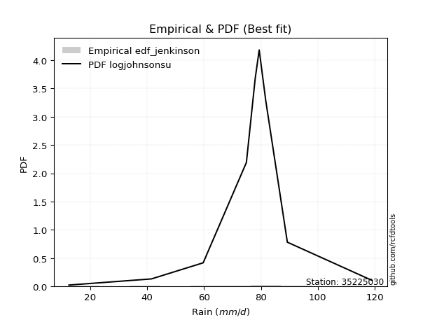</img>

</div>


### 11. EDF Cunnane (1978)

Cunnane´s work in statistical hydrology has focused on the performance and evaluation of different probability distributions (such as GEV, Gumbel, Lognormal) for flood frequency estimation. _b_ is a constant, typically set to 0.4.

<div align="center">


$P=(m-b)/(n+1-2b)$


</div>


**11.1. Empirical values**

<div align="center">

|                | 0                   | 1                  | 2                   | 3                  | 4           | 5                  | 6                 | 7                  | 8                  |
|:---------------|:--------------------|:-------------------|:--------------------|:-------------------|:------------|:-------------------|:------------------|:-------------------|:-------------------|
| date           | 2017                | 2020               | 2019                | 2018               | 2023        | 2024               | 2022              | 2021               | 2025               |
| x              | 12.5                | 41.5               | 59.7                | 74.9               | 78.0        | 79.4               | 81.7              | 89.3               | 119.1              |
| m              | 1                   | 2                  | 3                   | 4                  | 5           | 6                  | 7                 | 8                  | 9                  |
| empirical_dist | edf_cunnane         | edf_cunnane        | edf_cunnane         | edf_cunnane        | edf_cunnane | edf_cunnane        | edf_cunnane       | edf_cunnane        | edf_cunnane        |
| empirical      | 0.06521739130434782 | 0.1739130434782609 | 0.28260869565217395 | 0.391304347826087  | 0.5         | 0.6086956521739131 | 0.717391304347826 | 0.8260869565217391 | 0.9347826086956522 |
| empirical_tr   | 1.069767441860465   | 1.2105263157894737 | 1.393939393939394   | 1.6428571428571428 | 2.0         | 2.555555555555556  | 3.538461538461538 | 5.75               | 15.333333333333343 |

</div>


**11.2. Kolmogorov-Smirnov fit test (sorted by Δ)**


<div align="center">

|                | 0                   | 1                   | 2                   | 3                   | 4                   | 5                   | 6                   | 7                   | 8                   | 9                   | 10                  | 11                  | 12                  | 13                  | 14                  | 15                  | 16                  | 17                  | 18                  | 19                  | 20                  | 21                  | 22                  | 23                  | 24                  | 25                  | 26                  | 27                  | 28                  | 29                  | 30                  | 31                  | 32                  | 33                  | 34                  | 35                  | 36                  | 37                  | 38                  | 39                  | 40                  | 41                  | 42                  | 43                  | 44                  | 45                  | 46                  | 47                  | 48                  | 49                  | 50                  | 51                  | 52                  | 53                  | 54                  | 55                  | 56                  | 57                  | 58                  | 59                  | 60                  | 61                  | 62                  | 63                  | 64                  | 65                  | 66                  | 67                  | 68                  | 69                  | 70                  | 71                  | 72                  | 73                  | 74                  | 75                  | 76                  | 77                  | 78                  | 79                  | 80                  | 81                  | 82                  | 83                  | 84                  | 85                  | 86                  | 87                  | 88                  | 89                  | 90                  | 91                  | 92                  | 93                  | 94                  | 95                  | 96                  | 97                  | 98                  | 99                  | 100                 | 101                 | 102                 | 103                 | 104                 | 105                 | 106                 | 107                 | 108                 | 109                 | 110                 | 111                 | 112                 | 113                 | 114                 | 115                 | 116                 | 117                 | 118                 | 119                 | 120                 | 121                 | 122                 | 123                 | 124                 | 125                 | 126                 | 127                 | 128                 | 129                 | 130                 | 131                 | 132                 | 133                 | 134                 | 135                 | 136                 | 137                 | 138                 | 139                 | 140                 | 141                 | 142                 | 143                 | 144                 | 145                 | 146                 | 147                 | 148                 | 149                 | 150                 | 151                 | 152                 | 153                 | 154                 | 155                 | 156                 | 157                 | 158                 | 159                 |
|:---------------|:--------------------|:--------------------|:--------------------|:--------------------|:--------------------|:--------------------|:--------------------|:--------------------|:--------------------|:--------------------|:--------------------|:--------------------|:--------------------|:--------------------|:--------------------|:--------------------|:--------------------|:--------------------|:--------------------|:--------------------|:--------------------|:--------------------|:--------------------|:--------------------|:--------------------|:--------------------|:--------------------|:--------------------|:--------------------|:--------------------|:--------------------|:--------------------|:--------------------|:--------------------|:--------------------|:--------------------|:--------------------|:--------------------|:--------------------|:--------------------|:--------------------|:--------------------|:--------------------|:--------------------|:--------------------|:--------------------|:--------------------|:--------------------|:--------------------|:--------------------|:--------------------|:--------------------|:--------------------|:--------------------|:--------------------|:--------------------|:--------------------|:--------------------|:--------------------|:--------------------|:--------------------|:--------------------|:--------------------|:--------------------|:--------------------|:--------------------|:--------------------|:--------------------|:--------------------|:--------------------|:--------------------|:--------------------|:--------------------|:--------------------|:--------------------|:--------------------|:--------------------|:--------------------|:--------------------|:--------------------|:--------------------|:--------------------|:--------------------|:--------------------|:--------------------|:--------------------|:--------------------|:--------------------|:--------------------|:--------------------|:--------------------|:--------------------|:--------------------|:--------------------|:--------------------|:--------------------|:--------------------|:--------------------|:--------------------|:--------------------|:--------------------|:--------------------|:--------------------|:--------------------|:--------------------|:--------------------|:--------------------|:--------------------|:--------------------|:--------------------|:--------------------|:--------------------|:--------------------|:--------------------|:--------------------|:--------------------|:--------------------|:--------------------|:--------------------|:--------------------|:--------------------|:--------------------|:--------------------|:--------------------|:--------------------|:--------------------|:--------------------|:--------------------|:--------------------|:--------------------|:--------------------|:--------------------|:--------------------|:--------------------|:--------------------|:--------------------|:--------------------|:--------------------|:--------------------|:--------------------|:--------------------|:--------------------|:--------------------|:--------------------|:--------------------|:--------------------|:--------------------|:--------------------|:--------------------|:--------------------|:--------------------|:--------------------|:--------------------|:--------------------|:--------------------|:--------------------|:--------------------|:--------------------|:--------------------|:--------------------|
| station        | 35225030            | 35225030            | 35225030            | 35225030            | 35225030            | 35225030            | 35225030            | 35225030            | 35225030            | 35225030            | 35225030            | 35225030            | 35225030            | 35225030            | 35225030            | 35225030            | 35225030            | 35225030            | 35225030            | 35225030            | 35225030            | 35225030            | 35225030            | 35225030            | 35225030            | 35225030            | 35225030            | 35225030            | 35225030            | 35225030            | 35225030            | 35225030            | 35225030            | 35225030            | 35225030            | 35225030            | 35225030            | 35225030            | 35225030            | 35225030            | 35225030            | 35225030            | 35225030            | 35225030            | 35225030            | 35225030            | 35225030            | 35225030            | 35225030            | 35225030            | 35225030            | 35225030            | 35225030            | 35225030            | 35225030            | 35225030            | 35225030            | 35225030            | 35225030            | 35225030            | 35225030            | 35225030            | 35225030            | 35225030            | 35225030            | 35225030            | 35225030            | 35225030            | 35225030            | 35225030            | 35225030            | 35225030            | 35225030            | 35225030            | 35225030            | 35225030            | 35225030            | 35225030            | 35225030            | 35225030            | 35225030            | 35225030            | 35225030            | 35225030            | 35225030            | 35225030            | 35225030            | 35225030            | 35225030            | 35225030            | 35225030            | 35225030            | 35225030            | 35225030            | 35225030            | 35225030            | 35225030            | 35225030            | 35225030            | 35225030            | 35225030            | 35225030            | 35225030            | 35225030            | 35225030            | 35225030            | 35225030            | 35225030            | 35225030            | 35225030            | 35225030            | 35225030            | 35225030            | 35225030            | 35225030            | 35225030            | 35225030            | 35225030            | 35225030            | 35225030            | 35225030            | 35225030            | 35225030            | 35225030            | 35225030            | 35225030            | 35225030            | 35225030            | 35225030            | 35225030            | 35225030            | 35225030            | 35225030            | 35225030            | 35225030            | 35225030            | 35225030            | 35225030            | 35225030            | 35225030            | 35225030            | 35225030            | 35225030            | 35225030            | 35225030            | 35225030            | 35225030            | 35225030            | 35225030            | 35225030            | 35225030            | 35225030            | 35225030            | 35225030            | 35225030            | 35225030            | 35225030            | 35225030            | 35225030            | 35225030            |
| empirical_dist | edf_cunnane         | edf_cunnane         | edf_cunnane         | edf_cunnane         | edf_cunnane         | edf_cunnane         | edf_cunnane         | edf_cunnane         | edf_cunnane         | edf_cunnane         | edf_cunnane         | edf_cunnane         | edf_cunnane         | edf_cunnane         | edf_cunnane         | edf_cunnane         | edf_cunnane         | edf_cunnane         | edf_cunnane         | edf_cunnane         | edf_cunnane         | edf_cunnane         | edf_cunnane         | edf_cunnane         | edf_cunnane         | edf_cunnane         | edf_cunnane         | edf_cunnane         | edf_cunnane         | edf_cunnane         | edf_cunnane         | edf_cunnane         | edf_cunnane         | edf_cunnane         | edf_cunnane         | edf_cunnane         | edf_cunnane         | edf_cunnane         | edf_cunnane         | edf_cunnane         | edf_cunnane         | edf_cunnane         | edf_cunnane         | edf_cunnane         | edf_cunnane         | edf_cunnane         | edf_cunnane         | edf_cunnane         | edf_cunnane         | edf_cunnane         | edf_cunnane         | edf_cunnane         | edf_cunnane         | edf_cunnane         | edf_cunnane         | edf_cunnane         | edf_cunnane         | edf_cunnane         | edf_cunnane         | edf_cunnane         | edf_cunnane         | edf_cunnane         | edf_cunnane         | edf_cunnane         | edf_cunnane         | edf_cunnane         | edf_cunnane         | edf_cunnane         | edf_cunnane         | edf_cunnane         | edf_cunnane         | edf_cunnane         | edf_cunnane         | edf_cunnane         | edf_cunnane         | edf_cunnane         | edf_cunnane         | edf_cunnane         | edf_cunnane         | edf_cunnane         | edf_cunnane         | edf_cunnane         | edf_cunnane         | edf_cunnane         | edf_cunnane         | edf_cunnane         | edf_cunnane         | edf_cunnane         | edf_cunnane         | edf_cunnane         | edf_cunnane         | edf_cunnane         | edf_cunnane         | edf_cunnane         | edf_cunnane         | edf_cunnane         | edf_cunnane         | edf_cunnane         | edf_cunnane         | edf_cunnane         | edf_cunnane         | edf_cunnane         | edf_cunnane         | edf_cunnane         | edf_cunnane         | edf_cunnane         | edf_cunnane         | edf_cunnane         | edf_cunnane         | edf_cunnane         | edf_cunnane         | edf_cunnane         | edf_cunnane         | edf_cunnane         | edf_cunnane         | edf_cunnane         | edf_cunnane         | edf_cunnane         | edf_cunnane         | edf_cunnane         | edf_cunnane         | edf_cunnane         | edf_cunnane         | edf_cunnane         | edf_cunnane         | edf_cunnane         | edf_cunnane         | edf_cunnane         | edf_cunnane         | edf_cunnane         | edf_cunnane         | edf_cunnane         | edf_cunnane         | edf_cunnane         | edf_cunnane         | edf_cunnane         | edf_cunnane         | edf_cunnane         | edf_cunnane         | edf_cunnane         | edf_cunnane         | edf_cunnane         | edf_cunnane         | edf_cunnane         | edf_cunnane         | edf_cunnane         | edf_cunnane         | edf_cunnane         | edf_cunnane         | edf_cunnane         | edf_cunnane         | edf_cunnane         | edf_cunnane         | edf_cunnane         | edf_cunnane         | edf_cunnane         | edf_cunnane         | edf_cunnane         | edf_cunnane         | edf_cunnane         |
| p_dist         | logjohnsonsu        | johnsonsu           | dweibull            | logdgamma           | t                   | gumbel_l            | dgamma              | genlogistic         | truncnorm           | genextreme          | gennorm             | logjohnsonsb        | johnsonsb           | pearson3            | skewnorm            | weibull_min         | logargus            | gompertz            | argus               | loggennorm          | logdweibull         | exponpow            | tukeylambda         | logt                | truncweibull_min    | logpearson3         | semicircular        | logloggamma         | anglit              | exponweib           | lognakagami         | foldnorm            | logvonmises_line    | crystalball         | norm                | exponnorm           | rice                | nct                 | f                   | logloglaplace       | arcsine             | logtrapezoid        | erlang              | logburr             | mielke              | logistic            | burr                | logburr12           | gamma               | loggenlogistic      | loggumbel_l         | betaprime           | ksone               | hypsecant           | logmielke           | gengamma            | invgamma            | cosine              | kappa3              | uniform             | loggompertz         | wrapcauchy          | invweibull          | maxwell             | laplace             | ncf                 | rayleigh            | logarcsine          | logsemicircular     | loggenextreme       | loggengamma         | loglevy_l           | kappa4              | loganglit           | invgauss            | logskewnorm         | gausshyper          | kstwobign           | logweibull_max      | genexpon            | logbetaprime        | logtruncweibull_min | logfatiguelife      | loggamma            | loggamma            | logncf              | logrice             | logf                | logexponnorm        | logcrystalball      | lognorm             | logalpha            | logerlang           | halfnorm            | loggenpareto        | loginvweibull       | lognct              | halfgennorm         | loginvgamma         | loginvgauss         | gumbel_r            | logfoldnorm         | vonmises_line       | loggenhalflogistic  | genpareto           | loglogistic         | genhalflogistic     | logmaxwell          | loghypsecant        | halflogistic        | moyal               | lograyleigh         | triang              | lomax               | logkstwobign        | bradford            | logtriang           | loghalfnorm         | loggausshyper       | loglaplace          | loglaplace          | beta                | alpha               | logcosine           | loggumbel_r         | loggenexpon         | loghalfgennorm      | levy_l              | nakagami            | loghalflogistic     | truncexpon          | logmoyal            | wald                | logwrapcauchy       | logtruncnorm        | burr12              | loglomax            | trapezoid           | logrdist            | logwald             | logksone            | logkappa4           | logbradford         | logtukeylambda      | logkappa3           | loguniform          | logweibull_min      | logbeta             | logexponweib        | logtruncexpon       | powerlaw            | logexponpow         | fatiguelife         | logpowerlaw         | rdist               | weibull_max         | truncpareto         | logtruncpareto      | logvonmises         | vonmises            |
| delta          | 0.07201526170083378 | 0.08717650090005974 | 0.10115252211815917 | 0.10273544607538487 | 0.10541208562755455 | 0.11519320373785058 | 0.1229397177528268  | 0.12908704361027218 | 0.12917162710312485 | 0.13161837211373878 | 0.13422045742925381 | 0.1354144712373319  | 0.1354535908379721  | 0.1362622698514619  | 0.13661353158464612 | 0.13697251201343769 | 0.14208749072896143 | 0.1435035177421991  | 0.1437621679520934  | 0.14451924529406215 | 0.1456943767651796  | 0.1458455197178749  | 0.14604902553339988 | 0.15008671076233715 | 0.1504565139851648  | 0.15260965385541858 | 0.15578768507364577 | 0.15718828104823518 | 0.15922784248888194 | 0.1637509516629116  | 0.1641746812484443  | 0.16602474840021236 | 0.16670514454770052 | 0.1675556922762384  | 0.16755569394368458 | 0.1675577873930834  | 0.1676205848135774  | 0.16764877337308753 | 0.1692879216274194  | 0.17303854205092184 | 0.173284281901819   | 0.17362961761719642 | 0.17383829914536358 | 0.1751270725887289  | 0.1753649076333072  | 0.17544157560063972 | 0.17591921405503447 | 0.1760165197904256  | 0.1762137448935624  | 0.17640192852946274 | 0.17834538360730662 | 0.17869318665464745 | 0.17983386355602687 | 0.18207672026651717 | 0.18263274308598537 | 0.18360161727994745 | 0.1876225209948233  | 0.18789926717160915 | 0.1940490697171931  | 0.1940615058324497  | 0.19484423461736194 | 0.19586253812702265 | 0.19671221802830713 | 0.19734431885307385 | 0.2031668653924698  | 0.20521636583025044 | 0.2068514425488573  | 0.20701285786972962 | 0.20918566798868904 | 0.21179997291842168 | 0.21256541431335946 | 0.21560121088174453 | 0.2156565778977893  | 0.2162232473102504  | 0.21632173263220572 | 0.21897870134468772 | 0.21913470432814086 | 0.2195799918092552  | 0.22087493344264325 | 0.2260199768153151  | 0.2286799782244004  | 0.22900976878078133 | 0.23077733014346907 | 0.23174262366866566 | 0.23174262366866566 | 0.2318102078596242  | 0.23250854735815857 | 0.23296627384311114 | 0.23308519384418586 | 0.2330867928314288  | 0.2330868297222503  | 0.23327426780625798 | 0.23361149735516212 | 0.23369671511611073 | 0.2340519753033017  | 0.23412265287618206 | 0.2343689417755574  | 0.23479119001257115 | 0.23653809307621027 | 0.23662829665183732 | 0.23724457225876988 | 0.23862896050834576 | 0.23881495633302813 | 0.24393997472532497 | 0.24634414307582098 | 0.24862014715504227 | 0.24862849095766437 | 0.2573429169157793  | 0.261039789922382   | 0.2612571434386259  | 0.26177869558699135 | 0.2647525298037338  | 0.26990467867317414 | 0.27081933307467454 | 0.2732166952464088  | 0.27359719548474676 | 0.2808125846307333  | 0.2860323417087623  | 0.2863756327902144  | 0.2893564013281463  | 0.2893564013281463  | 0.291709600342461   | 0.29190800067119804 | 0.2942622183341523  | 0.2967570420540859  | 0.29717078010964304 | 0.30755440831575565 | 0.3076599486982459  | 0.31205799209199686 | 0.3143895166893382  | 0.3176264906699224  | 0.31816070449096706 | 0.3298630684698212  | 0.3368918944849414  | 0.3477523561573918  | 0.3512374000380375  | 0.3534674071653422  | 0.358629550763528   | 0.35863026879953364 | 0.3781868680585094  | 0.3787490719065416  | 0.40285326468387794 | 0.4067548723643999  | 0.4099713361159497  | 0.4101063571269976  | 0.41102062541828477 | 0.4615266955639671  | 0.4655018294964988  | 0.4725018102031967  | 0.47654225997088273 | 0.5875765418243143  | 0.5965110160325579  | 0.6112530873238397  | 0.6877601137294921  | 0.7173913031430654  | 0.7184519178988455  | 0.7490967588790588  | 0.7883574412837978  | 1.1968575106822599  | 18.65460339069546   |
| deltao         | 0.41761268023100007 | 0.41761268023100007 | 0.41761268023100007 | 0.41761268023100007 | 0.41761268023100007 | 0.41761268023100007 | 0.41761268023100007 | 0.41761268023100007 | 0.41761268023100007 | 0.41761268023100007 | 0.41761268023100007 | 0.41761268023100007 | 0.41761268023100007 | 0.41761268023100007 | 0.41761268023100007 | 0.41761268023100007 | 0.41761268023100007 | 0.41761268023100007 | 0.41761268023100007 | 0.41761268023100007 | 0.41761268023100007 | 0.41761268023100007 | 0.41761268023100007 | 0.41761268023100007 | 0.41761268023100007 | 0.41761268023100007 | 0.41761268023100007 | 0.41761268023100007 | 0.41761268023100007 | 0.41761268023100007 | 0.41761268023100007 | 0.41761268023100007 | 0.41761268023100007 | 0.41761268023100007 | 0.41761268023100007 | 0.41761268023100007 | 0.41761268023100007 | 0.41761268023100007 | 0.41761268023100007 | 0.41761268023100007 | 0.41761268023100007 | 0.41761268023100007 | 0.41761268023100007 | 0.41761268023100007 | 0.41761268023100007 | 0.41761268023100007 | 0.41761268023100007 | 0.41761268023100007 | 0.41761268023100007 | 0.41761268023100007 | 0.41761268023100007 | 0.41761268023100007 | 0.41761268023100007 | 0.41761268023100007 | 0.41761268023100007 | 0.41761268023100007 | 0.41761268023100007 | 0.41761268023100007 | 0.41761268023100007 | 0.41761268023100007 | 0.41761268023100007 | 0.41761268023100007 | 0.41761268023100007 | 0.41761268023100007 | 0.41761268023100007 | 0.41761268023100007 | 0.41761268023100007 | 0.41761268023100007 | 0.41761268023100007 | 0.41761268023100007 | 0.41761268023100007 | 0.41761268023100007 | 0.41761268023100007 | 0.41761268023100007 | 0.41761268023100007 | 0.41761268023100007 | 0.41761268023100007 | 0.41761268023100007 | 0.41761268023100007 | 0.41761268023100007 | 0.41761268023100007 | 0.41761268023100007 | 0.41761268023100007 | 0.41761268023100007 | 0.41761268023100007 | 0.41761268023100007 | 0.41761268023100007 | 0.41761268023100007 | 0.41761268023100007 | 0.41761268023100007 | 0.41761268023100007 | 0.41761268023100007 | 0.41761268023100007 | 0.41761268023100007 | 0.41761268023100007 | 0.41761268023100007 | 0.41761268023100007 | 0.41761268023100007 | 0.41761268023100007 | 0.41761268023100007 | 0.41761268023100007 | 0.41761268023100007 | 0.41761268023100007 | 0.41761268023100007 | 0.41761268023100007 | 0.41761268023100007 | 0.41761268023100007 | 0.41761268023100007 | 0.41761268023100007 | 0.41761268023100007 | 0.41761268023100007 | 0.41761268023100007 | 0.41761268023100007 | 0.41761268023100007 | 0.41761268023100007 | 0.41761268023100007 | 0.41761268023100007 | 0.41761268023100007 | 0.41761268023100007 | 0.41761268023100007 | 0.41761268023100007 | 0.41761268023100007 | 0.41761268023100007 | 0.41761268023100007 | 0.41761268023100007 | 0.41761268023100007 | 0.41761268023100007 | 0.41761268023100007 | 0.41761268023100007 | 0.41761268023100007 | 0.41761268023100007 | 0.41761268023100007 | 0.41761268023100007 | 0.41761268023100007 | 0.41761268023100007 | 0.41761268023100007 | 0.41761268023100007 | 0.41761268023100007 | 0.41761268023100007 | 0.41761268023100007 | 0.41761268023100007 | 0.41761268023100007 | 0.41761268023100007 | 0.41761268023100007 | 0.41761268023100007 | 0.41761268023100007 | 0.41761268023100007 | 0.41761268023100007 | 0.41761268023100007 | 0.41761268023100007 | 0.41761268023100007 | 0.41761268023100007 | 0.41761268023100007 | 0.41761268023100007 | 0.41761268023100007 | 0.41761268023100007 | 0.41761268023100007 | 0.41761268023100007 | 0.41761268023100007 | 0.41761268023100007 |
| eval           | Δo > Δ              | Δo > Δ              | Δo > Δ              | Δo > Δ              | Δo > Δ              | Δo > Δ              | Δo > Δ              | Δo > Δ              | Δo > Δ              | Δo > Δ              | Δo > Δ              | Δo > Δ              | Δo > Δ              | Δo > Δ              | Δo > Δ              | Δo > Δ              | Δo > Δ              | Δo > Δ              | Δo > Δ              | Δo > Δ              | Δo > Δ              | Δo > Δ              | Δo > Δ              | Δo > Δ              | Δo > Δ              | Δo > Δ              | Δo > Δ              | Δo > Δ              | Δo > Δ              | Δo > Δ              | Δo > Δ              | Δo > Δ              | Δo > Δ              | Δo > Δ              | Δo > Δ              | Δo > Δ              | Δo > Δ              | Δo > Δ              | Δo > Δ              | Δo > Δ              | Δo > Δ              | Δo > Δ              | Δo > Δ              | Δo > Δ              | Δo > Δ              | Δo > Δ              | Δo > Δ              | Δo > Δ              | Δo > Δ              | Δo > Δ              | Δo > Δ              | Δo > Δ              | Δo > Δ              | Δo > Δ              | Δo > Δ              | Δo > Δ              | Δo > Δ              | Δo > Δ              | Δo > Δ              | Δo > Δ              | Δo > Δ              | Δo > Δ              | Δo > Δ              | Δo > Δ              | Δo > Δ              | Δo > Δ              | Δo > Δ              | Δo > Δ              | Δo > Δ              | Δo > Δ              | Δo > Δ              | Δo > Δ              | Δo > Δ              | Δo > Δ              | Δo > Δ              | Δo > Δ              | Δo > Δ              | Δo > Δ              | Δo > Δ              | Δo > Δ              | Δo > Δ              | Δo > Δ              | Δo > Δ              | Δo > Δ              | Δo > Δ              | Δo > Δ              | Δo > Δ              | Δo > Δ              | Δo > Δ              | Δo > Δ              | Δo > Δ              | Δo > Δ              | Δo > Δ              | Δo > Δ              | Δo > Δ              | Δo > Δ              | Δo > Δ              | Δo > Δ              | Δo > Δ              | Δo > Δ              | Δo > Δ              | Δo > Δ              | Δo > Δ              | Δo > Δ              | Δo > Δ              | Δo > Δ              | Δo > Δ              | Δo > Δ              | Δo > Δ              | Δo > Δ              | Δo > Δ              | Δo > Δ              | Δo > Δ              | Δo > Δ              | Δo > Δ              | Δo > Δ              | Δo > Δ              | Δo > Δ              | Δo > Δ              | Δo > Δ              | Δo > Δ              | Δo > Δ              | Δo > Δ              | Δo > Δ              | Δo > Δ              | Δo > Δ              | Δo > Δ              | Δo > Δ              | Δo > Δ              | Δo > Δ              | Δo > Δ              | Δo > Δ              | Δo > Δ              | Δo > Δ              | Δo > Δ              | Δo > Δ              | Δo > Δ              | Δo > Δ              | Δo > Δ              | Δo > Δ              | Δo > Δ              | Δo > Δ              | Δo > Δ              | Δo > Δ              | Δo > Δ              | Δo > Δ              | Δo <= Δ             | Δo <= Δ             | Δo <= Δ             | Δo <= Δ             | Δo <= Δ             | Δo <= Δ             | Δo <= Δ             | Δo <= Δ             | Δo <= Δ             | Δo <= Δ             | Δo <= Δ             | Δo <= Δ             | Δo <= Δ             | Δo <= Δ             |
| fit            | 1                   | 1                   | 1                   | 1                   | 1                   | 1                   | 1                   | 1                   | 1                   | 1                   | 1                   | 1                   | 1                   | 1                   | 1                   | 1                   | 1                   | 1                   | 1                   | 1                   | 1                   | 1                   | 1                   | 1                   | 1                   | 1                   | 1                   | 1                   | 1                   | 1                   | 1                   | 1                   | 1                   | 1                   | 1                   | 1                   | 1                   | 1                   | 1                   | 1                   | 1                   | 1                   | 1                   | 1                   | 1                   | 1                   | 1                   | 1                   | 1                   | 1                   | 1                   | 1                   | 1                   | 1                   | 1                   | 1                   | 1                   | 1                   | 1                   | 1                   | 1                   | 1                   | 1                   | 1                   | 1                   | 1                   | 1                   | 1                   | 1                   | 1                   | 1                   | 1                   | 1                   | 1                   | 1                   | 1                   | 1                   | 1                   | 1                   | 1                   | 1                   | 1                   | 1                   | 1                   | 1                   | 1                   | 1                   | 1                   | 1                   | 1                   | 1                   | 1                   | 1                   | 1                   | 1                   | 1                   | 1                   | 1                   | 1                   | 1                   | 1                   | 1                   | 1                   | 1                   | 1                   | 1                   | 1                   | 1                   | 1                   | 1                   | 1                   | 1                   | 1                   | 1                   | 1                   | 1                   | 1                   | 1                   | 1                   | 1                   | 1                   | 1                   | 1                   | 1                   | 1                   | 1                   | 1                   | 1                   | 1                   | 1                   | 1                   | 1                   | 1                   | 1                   | 1                   | 1                   | 1                   | 1                   | 1                   | 1                   | 1                   | 1                   | 1                   | 1                   | 1                   | 1                   | 0                   | 0                   | 0                   | 0                   | 0                   | 0                   | 0                   | 0                   | 0                   | 0                   | 0                   | 0                   | 0                   | 0                   |
| n              | 9                   | 9                   | 9                   | 9                   | 9                   | 9                   | 9                   | 9                   | 9                   | 9                   | 9                   | 9                   | 9                   | 9                   | 9                   | 9                   | 9                   | 9                   | 9                   | 9                   | 9                   | 9                   | 9                   | 9                   | 9                   | 9                   | 9                   | 9                   | 9                   | 9                   | 9                   | 9                   | 9                   | 9                   | 9                   | 9                   | 9                   | 9                   | 9                   | 9                   | 9                   | 9                   | 9                   | 9                   | 9                   | 9                   | 9                   | 9                   | 9                   | 9                   | 9                   | 9                   | 9                   | 9                   | 9                   | 9                   | 9                   | 9                   | 9                   | 9                   | 9                   | 9                   | 9                   | 9                   | 9                   | 9                   | 9                   | 9                   | 9                   | 9                   | 9                   | 9                   | 9                   | 9                   | 9                   | 9                   | 9                   | 9                   | 9                   | 9                   | 9                   | 9                   | 9                   | 9                   | 9                   | 9                   | 9                   | 9                   | 9                   | 9                   | 9                   | 9                   | 9                   | 9                   | 9                   | 9                   | 9                   | 9                   | 9                   | 9                   | 9                   | 9                   | 9                   | 9                   | 9                   | 9                   | 9                   | 9                   | 9                   | 9                   | 9                   | 9                   | 9                   | 9                   | 9                   | 9                   | 9                   | 9                   | 9                   | 9                   | 9                   | 9                   | 9                   | 9                   | 9                   | 9                   | 9                   | 9                   | 9                   | 9                   | 9                   | 9                   | 9                   | 9                   | 9                   | 9                   | 9                   | 9                   | 9                   | 9                   | 9                   | 9                   | 9                   | 9                   | 9                   | 9                   | 9                   | 9                   | 9                   | 9                   | 9                   | 9                   | 9                   | 9                   | 9                   | 9                   | 9                   | 9                   | 9                   | 9                   |
| best_fit       | 1                   | 0                   | 0                   | 0                   | 0                   | 0                   | 0                   | 0                   | 0                   | 0                   | 0                   | 0                   | 0                   | 0                   | 0                   | 0                   | 0                   | 0                   | 0                   | 0                   | 0                   | 0                   | 0                   | 0                   | 0                   | 0                   | 0                   | 0                   | 0                   | 0                   | 0                   | 0                   | 0                   | 0                   | 0                   | 0                   | 0                   | 0                   | 0                   | 0                   | 0                   | 0                   | 0                   | 0                   | 0                   | 0                   | 0                   | 0                   | 0                   | 0                   | 0                   | 0                   | 0                   | 0                   | 0                   | 0                   | 0                   | 0                   | 0                   | 0                   | 0                   | 0                   | 0                   | 0                   | 0                   | 0                   | 0                   | 0                   | 0                   | 0                   | 0                   | 0                   | 0                   | 0                   | 0                   | 0                   | 0                   | 0                   | 0                   | 0                   | 0                   | 0                   | 0                   | 0                   | 0                   | 0                   | 0                   | 0                   | 0                   | 0                   | 0                   | 0                   | 0                   | 0                   | 0                   | 0                   | 0                   | 0                   | 0                   | 0                   | 0                   | 0                   | 0                   | 0                   | 0                   | 0                   | 0                   | 0                   | 0                   | 0                   | 0                   | 0                   | 0                   | 0                   | 0                   | 0                   | 0                   | 0                   | 0                   | 0                   | 0                   | 0                   | 0                   | 0                   | 0                   | 0                   | 0                   | 0                   | 0                   | 0                   | 0                   | 0                   | 0                   | 0                   | 0                   | 0                   | 0                   | 0                   | 0                   | 0                   | 0                   | 0                   | 0                   | 0                   | 0                   | 0                   | 0                   | 0                   | 0                   | 0                   | 0                   | 0                   | 0                   | 0                   | 0                   | 0                   | 0                   | 0                   | 0                   | 0                   |
| best_fit_sort  | 1                   | 2                   | 3                   | 4                   | 5                   | 6                   | 7                   | 8                   | 9                   | 10                  | 11                  | 12                  | 13                  | 14                  | 15                  | 16                  | 17                  | 18                  | 19                  | 20                  | 21                  | 22                  | 23                  | 24                  | 25                  | 26                  | 27                  | 28                  | 29                  | 30                  | 31                  | 32                  | 33                  | 34                  | 35                  | 36                  | 37                  | 38                  | 39                  | 40                  | 41                  | 42                  | 43                  | 44                  | 45                  | 46                  | 47                  | 48                  | 49                  | 50                  | 51                  | 52                  | 53                  | 54                  | 55                  | 56                  | 57                  | 58                  | 59                  | 60                  | 61                  | 62                  | 63                  | 64                  | 65                  | 66                  | 67                  | 68                  | 69                  | 70                  | 71                  | 72                  | 73                  | 74                  | 75                  | 76                  | 77                  | 78                  | 79                  | 80                  | 81                  | 82                  | 83                  | 84                  | 85                  | 86                  | 87                  | 88                  | 89                  | 90                  | 91                  | 92                  | 93                  | 94                  | 95                  | 96                  | 97                  | 98                  | 99                  | 100                 | 101                 | 102                 | 103                 | 104                 | 105                 | 106                 | 107                 | 108                 | 109                 | 110                 | 111                 | 112                 | 113                 | 114                 | 115                 | 116                 | 117                 | 118                 | 119                 | 120                 | 121                 | 122                 | 123                 | 124                 | 125                 | 126                 | 127                 | 128                 | 129                 | 130                 | 131                 | 132                 | 133                 | 134                 | 135                 | 136                 | 137                 | 138                 | 139                 | 140                 | 141                 | 142                 | 143                 | 144                 | 145                 | 146                 | 147                 | 148                 | 149                 | 150                 | 151                 | 152                 | 153                 | 154                 | 155                 | 156                 | 157                 | 158                 | 159                 | 160                 |

</div>


**11.3. Best fit**

<div align="center">

|   id |   station | empirical_dist   | p_dist       |     delta |   deltao | eval   |   fit |   n |   best_fit |   best_fit_sort |
|-----:|----------:|:-----------------|:-------------|----------:|---------:|:-------|------:|----:|-----------:|----------------:|
|    0 |  35225030 | edf_cunnane      | logjohnsonsu | 0.0720153 | 0.417613 | Δo > Δ |     1 |   9 |          1 |               1 |

</div>


<div align="center">

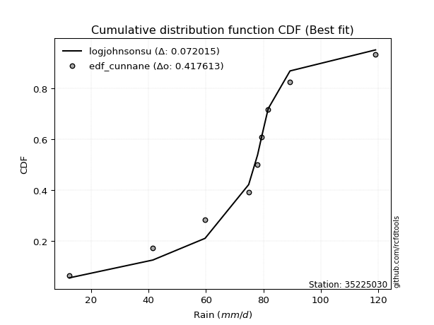</img></img>

</div>


### 12. EDF Adamowski (1981)

The Adamowski formula in hydrology refers to a specific plotting position formula used for estimating the non-parametric empirical distribution of hydrological events (like flood peaks) to calculate their return periods. This formula provides an alternative to traditional parametric methods (like the Gumbel or Log Pearson Type III distributions). 

<div align="center">


$P=(m-0.25)/(n+0.5)$


</div>


**12.1. Empirical values**

<div align="center">

|                | 0                   | 1                   | 2                  | 3                   | 4             | 5                  | 6                  | 7                  | 8                  |
|:---------------|:--------------------|:--------------------|:-------------------|:--------------------|:--------------|:-------------------|:-------------------|:-------------------|:-------------------|
| date           | 2017                | 2020                | 2019               | 2018                | 2023          | 2024               | 2022               | 2021               | 2025               |
| x              | 12.5                | 41.5                | 59.7               | 74.9                | 78.0          | 79.4               | 81.7               | 89.3               | 119.1              |
| m              | 1                   | 2                   | 3                  | 4                   | 5             | 6                  | 7                  | 8                  | 9                  |
| empirical_dist | edf_adamowski       | edf_adamowski       | edf_adamowski      | edf_adamowski       | edf_adamowski | edf_adamowski      | edf_adamowski      | edf_adamowski      | edf_adamowski      |
| empirical      | 0.07894736842105263 | 0.18421052631578946 | 0.2894736842105263 | 0.39473684210526316 | 0.5           | 0.6052631578947368 | 0.7105263157894737 | 0.8157894736842105 | 0.9210526315789473 |
| empirical_tr   | 1.0857142857142856  | 1.2258064516129032  | 1.4074074074074074 | 1.6521739130434783  | 2.0           | 2.533333333333333  | 3.4545454545454546 | 5.428571428571428  | 12.666666666666663 |

</div>


**12.2. Kolmogorov-Smirnov fit test (sorted by Δ)**


<div align="center">

|                | 0                   | 1                   | 2                   | 3                   | 4                   | 5                   | 6                   | 7                   | 8                   | 9                   | 10                  | 11                  | 12                  | 13                  | 14                  | 15                  | 16                  | 17                  | 18                  | 19                  | 20                  | 21                  | 22                  | 23                  | 24                  | 25                  | 26                  | 27                  | 28                  | 29                  | 30                  | 31                  | 32                  | 33                  | 34                  | 35                  | 36                  | 37                  | 38                  | 39                  | 40                  | 41                  | 42                  | 43                  | 44                  | 45                  | 46                  | 47                  | 48                  | 49                  | 50                  | 51                  | 52                  | 53                  | 54                  | 55                  | 56                  | 57                  | 58                  | 59                  | 60                  | 61                  | 62                  | 63                  | 64                  | 65                  | 66                  | 67                  | 68                  | 69                  | 70                  | 71                  | 72                  | 73                  | 74                  | 75                  | 76                  | 77                  | 78                  | 79                  | 80                  | 81                  | 82                  | 83                  | 84                  | 85                  | 86                  | 87                  | 88                  | 89                  | 90                  | 91                  | 92                  | 93                  | 94                  | 95                  | 96                  | 97                  | 98                  | 99                  | 100                 | 101                 | 102                 | 103                 | 104                 | 105                 | 106                 | 107                 | 108                 | 109                 | 110                 | 111                 | 112                 | 113                 | 114                 | 115                 | 116                 | 117                 | 118                 | 119                 | 120                 | 121                 | 122                 | 123                 | 124                 | 125                 | 126                 | 127                 | 128                 | 129                 | 130                 | 131                 | 132                 | 133                 | 134                 | 135                 | 136                 | 137                 | 138                 | 139                 | 140                 | 141                 | 142                 | 143                 | 144                 | 145                 | 146                 | 147                 | 148                 | 149                 | 150                 | 151                 | 152                 | 153                 | 154                 | 155                 | 156                 | 157                 | 158                 | 159                 |
|:---------------|:--------------------|:--------------------|:--------------------|:--------------------|:--------------------|:--------------------|:--------------------|:--------------------|:--------------------|:--------------------|:--------------------|:--------------------|:--------------------|:--------------------|:--------------------|:--------------------|:--------------------|:--------------------|:--------------------|:--------------------|:--------------------|:--------------------|:--------------------|:--------------------|:--------------------|:--------------------|:--------------------|:--------------------|:--------------------|:--------------------|:--------------------|:--------------------|:--------------------|:--------------------|:--------------------|:--------------------|:--------------------|:--------------------|:--------------------|:--------------------|:--------------------|:--------------------|:--------------------|:--------------------|:--------------------|:--------------------|:--------------------|:--------------------|:--------------------|:--------------------|:--------------------|:--------------------|:--------------------|:--------------------|:--------------------|:--------------------|:--------------------|:--------------------|:--------------------|:--------------------|:--------------------|:--------------------|:--------------------|:--------------------|:--------------------|:--------------------|:--------------------|:--------------------|:--------------------|:--------------------|:--------------------|:--------------------|:--------------------|:--------------------|:--------------------|:--------------------|:--------------------|:--------------------|:--------------------|:--------------------|:--------------------|:--------------------|:--------------------|:--------------------|:--------------------|:--------------------|:--------------------|:--------------------|:--------------------|:--------------------|:--------------------|:--------------------|:--------------------|:--------------------|:--------------------|:--------------------|:--------------------|:--------------------|:--------------------|:--------------------|:--------------------|:--------------------|:--------------------|:--------------------|:--------------------|:--------------------|:--------------------|:--------------------|:--------------------|:--------------------|:--------------------|:--------------------|:--------------------|:--------------------|:--------------------|:--------------------|:--------------------|:--------------------|:--------------------|:--------------------|:--------------------|:--------------------|:--------------------|:--------------------|:--------------------|:--------------------|:--------------------|:--------------------|:--------------------|:--------------------|:--------------------|:--------------------|:--------------------|:--------------------|:--------------------|:--------------------|:--------------------|:--------------------|:--------------------|:--------------------|:--------------------|:--------------------|:--------------------|:--------------------|:--------------------|:--------------------|:--------------------|:--------------------|:--------------------|:--------------------|:--------------------|:--------------------|:--------------------|:--------------------|:--------------------|:--------------------|:--------------------|:--------------------|:--------------------|:--------------------|
| station        | 35225030            | 35225030            | 35225030            | 35225030            | 35225030            | 35225030            | 35225030            | 35225030            | 35225030            | 35225030            | 35225030            | 35225030            | 35225030            | 35225030            | 35225030            | 35225030            | 35225030            | 35225030            | 35225030            | 35225030            | 35225030            | 35225030            | 35225030            | 35225030            | 35225030            | 35225030            | 35225030            | 35225030            | 35225030            | 35225030            | 35225030            | 35225030            | 35225030            | 35225030            | 35225030            | 35225030            | 35225030            | 35225030            | 35225030            | 35225030            | 35225030            | 35225030            | 35225030            | 35225030            | 35225030            | 35225030            | 35225030            | 35225030            | 35225030            | 35225030            | 35225030            | 35225030            | 35225030            | 35225030            | 35225030            | 35225030            | 35225030            | 35225030            | 35225030            | 35225030            | 35225030            | 35225030            | 35225030            | 35225030            | 35225030            | 35225030            | 35225030            | 35225030            | 35225030            | 35225030            | 35225030            | 35225030            | 35225030            | 35225030            | 35225030            | 35225030            | 35225030            | 35225030            | 35225030            | 35225030            | 35225030            | 35225030            | 35225030            | 35225030            | 35225030            | 35225030            | 35225030            | 35225030            | 35225030            | 35225030            | 35225030            | 35225030            | 35225030            | 35225030            | 35225030            | 35225030            | 35225030            | 35225030            | 35225030            | 35225030            | 35225030            | 35225030            | 35225030            | 35225030            | 35225030            | 35225030            | 35225030            | 35225030            | 35225030            | 35225030            | 35225030            | 35225030            | 35225030            | 35225030            | 35225030            | 35225030            | 35225030            | 35225030            | 35225030            | 35225030            | 35225030            | 35225030            | 35225030            | 35225030            | 35225030            | 35225030            | 35225030            | 35225030            | 35225030            | 35225030            | 35225030            | 35225030            | 35225030            | 35225030            | 35225030            | 35225030            | 35225030            | 35225030            | 35225030            | 35225030            | 35225030            | 35225030            | 35225030            | 35225030            | 35225030            | 35225030            | 35225030            | 35225030            | 35225030            | 35225030            | 35225030            | 35225030            | 35225030            | 35225030            | 35225030            | 35225030            | 35225030            | 35225030            | 35225030            | 35225030            |
| empirical_dist | edf_adamowski       | edf_adamowski       | edf_adamowski       | edf_adamowski       | edf_adamowski       | edf_adamowski       | edf_adamowski       | edf_adamowski       | edf_adamowski       | edf_adamowski       | edf_adamowski       | edf_adamowski       | edf_adamowski       | edf_adamowski       | edf_adamowski       | edf_adamowski       | edf_adamowski       | edf_adamowski       | edf_adamowski       | edf_adamowski       | edf_adamowski       | edf_adamowski       | edf_adamowski       | edf_adamowski       | edf_adamowski       | edf_adamowski       | edf_adamowski       | edf_adamowski       | edf_adamowski       | edf_adamowski       | edf_adamowski       | edf_adamowski       | edf_adamowski       | edf_adamowski       | edf_adamowski       | edf_adamowski       | edf_adamowski       | edf_adamowski       | edf_adamowski       | edf_adamowski       | edf_adamowski       | edf_adamowski       | edf_adamowski       | edf_adamowski       | edf_adamowski       | edf_adamowski       | edf_adamowski       | edf_adamowski       | edf_adamowski       | edf_adamowski       | edf_adamowski       | edf_adamowski       | edf_adamowski       | edf_adamowski       | edf_adamowski       | edf_adamowski       | edf_adamowski       | edf_adamowski       | edf_adamowski       | edf_adamowski       | edf_adamowski       | edf_adamowski       | edf_adamowski       | edf_adamowski       | edf_adamowski       | edf_adamowski       | edf_adamowski       | edf_adamowski       | edf_adamowski       | edf_adamowski       | edf_adamowski       | edf_adamowski       | edf_adamowski       | edf_adamowski       | edf_adamowski       | edf_adamowski       | edf_adamowski       | edf_adamowski       | edf_adamowski       | edf_adamowski       | edf_adamowski       | edf_adamowski       | edf_adamowski       | edf_adamowski       | edf_adamowski       | edf_adamowski       | edf_adamowski       | edf_adamowski       | edf_adamowski       | edf_adamowski       | edf_adamowski       | edf_adamowski       | edf_adamowski       | edf_adamowski       | edf_adamowski       | edf_adamowski       | edf_adamowski       | edf_adamowski       | edf_adamowski       | edf_adamowski       | edf_adamowski       | edf_adamowski       | edf_adamowski       | edf_adamowski       | edf_adamowski       | edf_adamowski       | edf_adamowski       | edf_adamowski       | edf_adamowski       | edf_adamowski       | edf_adamowski       | edf_adamowski       | edf_adamowski       | edf_adamowski       | edf_adamowski       | edf_adamowski       | edf_adamowski       | edf_adamowski       | edf_adamowski       | edf_adamowski       | edf_adamowski       | edf_adamowski       | edf_adamowski       | edf_adamowski       | edf_adamowski       | edf_adamowski       | edf_adamowski       | edf_adamowski       | edf_adamowski       | edf_adamowski       | edf_adamowski       | edf_adamowski       | edf_adamowski       | edf_adamowski       | edf_adamowski       | edf_adamowski       | edf_adamowski       | edf_adamowski       | edf_adamowski       | edf_adamowski       | edf_adamowski       | edf_adamowski       | edf_adamowski       | edf_adamowski       | edf_adamowski       | edf_adamowski       | edf_adamowski       | edf_adamowski       | edf_adamowski       | edf_adamowski       | edf_adamowski       | edf_adamowski       | edf_adamowski       | edf_adamowski       | edf_adamowski       | edf_adamowski       | edf_adamowski       | edf_adamowski       | edf_adamowski       | edf_adamowski       |
| p_dist         | logjohnsonsu        | dweibull            | johnsonsu           | t                   | gumbel_l            | logdgamma           | genlogistic         | truncnorm           | genextreme          | dgamma              | logargus            | logjohnsonsb        | johnsonsb           | pearson3            | skewnorm            | argus               | weibull_min         | logdweibull         | gompertz            | truncweibull_min    | gennorm             | logpearson3         | exponpow            | tukeylambda         | loggennorm          | semicircular        | logloggamma         | anglit              | logt                | exponweib           | foldnorm            | logloglaplace       | arcsine             | logvonmises_line    | logtrapezoid        | crystalball         | norm                | exponnorm           | rice                | nct                 | f                   | lognakagami         | erlang              | logburr             | mielke              | logistic            | burr                | logburr12           | gamma               | loggenlogistic      | loggumbel_l         | betaprime           | ksone               | hypsecant           | logmielke           | gengamma            | invgamma            | cosine              | kappa3              | uniform             | loggompertz         | wrapcauchy          | invweibull          | maxwell             | laplace             | logarcsine          | loggenextreme       | ncf                 | rayleigh            | loglevy_l           | logsemicircular     | gausshyper          | loggengamma         | kappa4              | loganglit           | invgauss            | logskewnorm         | kstwobign           | logweibull_max      | genexpon            | loggenpareto        | logbetaprime        | logtruncweibull_min | loginvweibull       | logfatiguelife      | loggamma            | loggamma            | logncf              | logrice             | logf                | logexponnorm        | logcrystalball      | lognorm             | logalpha            | logerlang           | halfnorm            | lognct              | halfgennorm         | loginvgamma         | loginvgauss         | gumbel_r            | logfoldnorm         | vonmises_line       | genpareto           | genhalflogistic     | loggenhalflogistic  | loglogistic         | logmaxwell          | loghypsecant        | halflogistic        | moyal               | triang              | lograyleigh         | lomax               | logkstwobign        | bradford            | logtriang           | loggausshyper       | loghalfnorm         | alpha               | loglaplace          | loglaplace          | beta                | loggenexpon         | logcosine           | loggumbel_r         | levy_l              | loghalfgennorm      | nakagami            | loghalflogistic     | truncexpon          | logmoyal            | wald                | logwrapcauchy       | burr12              | loglomax            | logtruncnorm        | trapezoid           | logrdist            | logksone            | logwald             | logkappa4           | logbradford         | logtukeylambda      | logkappa3           | loguniform          | logweibull_min      | logbeta             | logexponweib        | logtruncexpon       | powerlaw            | logexponpow         | fatiguelife         | logpowerlaw         | weibull_max         | rdist               | truncpareto         | logtruncpareto      | logvonmises         | vonmises            |
| delta          | 0.07888025025918616 | 0.09399042300475258 | 0.09404148945841212 | 0.09854709706920217 | 0.1083282151794982  | 0.11076410933143797 | 0.125654549331096   | 0.12573913282394866 | 0.1281858778345626  | 0.12980470631117919 | 0.1317900078914328  | 0.13198197695815572 | 0.1320210965587959  | 0.1328297755722857  | 0.13318103730546993 | 0.13346468511456477 | 0.1335400177342615  | 0.13539689392765097 | 0.14007102346302291 | 0.14015903114763617 | 0.1410854459876062  | 0.14231217101788995 | 0.14241302543869871 | 0.1426165312542237  | 0.15138423385241453 | 0.15235519079446957 | 0.153755786769059   | 0.15579534820970575 | 0.15695169932068953 | 0.1603184573837354  | 0.16259225412103617 | 0.1627410592133932  | 0.16298679906429037 | 0.16327265026852433 | 0.1633321347796678  | 0.1641231979970622  | 0.1641231996645084  | 0.16412529311390722 | 0.1641880905344012  | 0.16421627909391134 | 0.1658554273482432  | 0.17026381832057666 | 0.1704058048661874  | 0.1716945783095527  | 0.171932413354131   | 0.17200908132146353 | 0.17248671977585828 | 0.1725840255112494  | 0.1727812506143862  | 0.17296943425028655 | 0.17491288932813043 | 0.17526069237547126 | 0.17640136927685068 | 0.17864422598734098 | 0.17920024880680918 | 0.18016912300077126 | 0.1841900267156471  | 0.18446677289243296 | 0.1906165754380169  | 0.1906290115532735  | 0.19141174033818575 | 0.19243004384784645 | 0.19327972374913094 | 0.19391182457389766 | 0.19973437111329362 | 0.20014786931137724 | 0.20150249008089305 | 0.20178387155107425 | 0.2034189482696811  | 0.20530372804421596 | 0.20575317370951285 | 0.20883722149061223 | 0.20913292003418327 | 0.2122240836186131  | 0.2127907530310742  | 0.21288923835302953 | 0.21554620706551153 | 0.216147497530079   | 0.21744243916346706 | 0.22258748253613891 | 0.22375449246577314 | 0.2252474839452242  | 0.22557727450160514 | 0.22725766431782968 | 0.22734483586429288 | 0.22831012938948947 | 0.22831012938948947 | 0.228377713580448   | 0.22907605307898238 | 0.22953377956393495 | 0.22965269956500967 | 0.2296542985522526  | 0.22965433544307412 | 0.2298417735270818  | 0.23017900307598593 | 0.23026422083693454 | 0.2309364474963812  | 0.23135869573339496 | 0.23310559879703407 | 0.23319580237266113 | 0.2338120779795937  | 0.23519646622916957 | 0.23538246205385194 | 0.23604666023829235 | 0.23833100812013575 | 0.24050748044614878 | 0.24518765287586608 | 0.25391042263660313 | 0.25760729564320584 | 0.2578246491594497  | 0.25834620130781516 | 0.2596071958356455  | 0.2613200355245576  | 0.26395434451632216 | 0.2663517066880564  | 0.27016470120557057 | 0.2773800903515571  | 0.28179684617654266 | 0.2825998474295861  | 0.28504301211284566 | 0.2859239070489701  | 0.2859239070489701  | 0.2882771060632848  | 0.29030579155129066 | 0.2908297240549761  | 0.2933245477749097  | 0.2939299715815411  | 0.30068941975740326 | 0.30862549781282067 | 0.310957022410162   | 0.3141939963907462  | 0.31472821021179087 | 0.32643057419064503 | 0.32659441164741276 | 0.34093991720050887 | 0.34316992432781357 | 0.3443198618782156  | 0.34833206792599936 | 0.35176528024118126 | 0.37188408334818923 | 0.3747543737793332  | 0.39598827612552556 | 0.3998898838060475  | 0.40310634755759733 | 0.40324136856864523 | 0.4041556368599324  | 0.45122921272643846 | 0.4552043466589702  | 0.4622043273656681  | 0.46967727141253035 | 0.5772790589867857  | 0.5862135331950292  | 0.600955604486311   | 0.6774626308919635  | 0.7081544350613169  | 0.710526314584713   | 0.7387992760415302  | 0.7780599584462692  | 1.1934250164030837  | 18.668333367812163  |
| deltao         | 0.41761268023100007 | 0.41761268023100007 | 0.41761268023100007 | 0.41761268023100007 | 0.41761268023100007 | 0.41761268023100007 | 0.41761268023100007 | 0.41761268023100007 | 0.41761268023100007 | 0.41761268023100007 | 0.41761268023100007 | 0.41761268023100007 | 0.41761268023100007 | 0.41761268023100007 | 0.41761268023100007 | 0.41761268023100007 | 0.41761268023100007 | 0.41761268023100007 | 0.41761268023100007 | 0.41761268023100007 | 0.41761268023100007 | 0.41761268023100007 | 0.41761268023100007 | 0.41761268023100007 | 0.41761268023100007 | 0.41761268023100007 | 0.41761268023100007 | 0.41761268023100007 | 0.41761268023100007 | 0.41761268023100007 | 0.41761268023100007 | 0.41761268023100007 | 0.41761268023100007 | 0.41761268023100007 | 0.41761268023100007 | 0.41761268023100007 | 0.41761268023100007 | 0.41761268023100007 | 0.41761268023100007 | 0.41761268023100007 | 0.41761268023100007 | 0.41761268023100007 | 0.41761268023100007 | 0.41761268023100007 | 0.41761268023100007 | 0.41761268023100007 | 0.41761268023100007 | 0.41761268023100007 | 0.41761268023100007 | 0.41761268023100007 | 0.41761268023100007 | 0.41761268023100007 | 0.41761268023100007 | 0.41761268023100007 | 0.41761268023100007 | 0.41761268023100007 | 0.41761268023100007 | 0.41761268023100007 | 0.41761268023100007 | 0.41761268023100007 | 0.41761268023100007 | 0.41761268023100007 | 0.41761268023100007 | 0.41761268023100007 | 0.41761268023100007 | 0.41761268023100007 | 0.41761268023100007 | 0.41761268023100007 | 0.41761268023100007 | 0.41761268023100007 | 0.41761268023100007 | 0.41761268023100007 | 0.41761268023100007 | 0.41761268023100007 | 0.41761268023100007 | 0.41761268023100007 | 0.41761268023100007 | 0.41761268023100007 | 0.41761268023100007 | 0.41761268023100007 | 0.41761268023100007 | 0.41761268023100007 | 0.41761268023100007 | 0.41761268023100007 | 0.41761268023100007 | 0.41761268023100007 | 0.41761268023100007 | 0.41761268023100007 | 0.41761268023100007 | 0.41761268023100007 | 0.41761268023100007 | 0.41761268023100007 | 0.41761268023100007 | 0.41761268023100007 | 0.41761268023100007 | 0.41761268023100007 | 0.41761268023100007 | 0.41761268023100007 | 0.41761268023100007 | 0.41761268023100007 | 0.41761268023100007 | 0.41761268023100007 | 0.41761268023100007 | 0.41761268023100007 | 0.41761268023100007 | 0.41761268023100007 | 0.41761268023100007 | 0.41761268023100007 | 0.41761268023100007 | 0.41761268023100007 | 0.41761268023100007 | 0.41761268023100007 | 0.41761268023100007 | 0.41761268023100007 | 0.41761268023100007 | 0.41761268023100007 | 0.41761268023100007 | 0.41761268023100007 | 0.41761268023100007 | 0.41761268023100007 | 0.41761268023100007 | 0.41761268023100007 | 0.41761268023100007 | 0.41761268023100007 | 0.41761268023100007 | 0.41761268023100007 | 0.41761268023100007 | 0.41761268023100007 | 0.41761268023100007 | 0.41761268023100007 | 0.41761268023100007 | 0.41761268023100007 | 0.41761268023100007 | 0.41761268023100007 | 0.41761268023100007 | 0.41761268023100007 | 0.41761268023100007 | 0.41761268023100007 | 0.41761268023100007 | 0.41761268023100007 | 0.41761268023100007 | 0.41761268023100007 | 0.41761268023100007 | 0.41761268023100007 | 0.41761268023100007 | 0.41761268023100007 | 0.41761268023100007 | 0.41761268023100007 | 0.41761268023100007 | 0.41761268023100007 | 0.41761268023100007 | 0.41761268023100007 | 0.41761268023100007 | 0.41761268023100007 | 0.41761268023100007 | 0.41761268023100007 | 0.41761268023100007 | 0.41761268023100007 | 0.41761268023100007 | 0.41761268023100007 |
| eval           | Δo > Δ              | Δo > Δ              | Δo > Δ              | Δo > Δ              | Δo > Δ              | Δo > Δ              | Δo > Δ              | Δo > Δ              | Δo > Δ              | Δo > Δ              | Δo > Δ              | Δo > Δ              | Δo > Δ              | Δo > Δ              | Δo > Δ              | Δo > Δ              | Δo > Δ              | Δo > Δ              | Δo > Δ              | Δo > Δ              | Δo > Δ              | Δo > Δ              | Δo > Δ              | Δo > Δ              | Δo > Δ              | Δo > Δ              | Δo > Δ              | Δo > Δ              | Δo > Δ              | Δo > Δ              | Δo > Δ              | Δo > Δ              | Δo > Δ              | Δo > Δ              | Δo > Δ              | Δo > Δ              | Δo > Δ              | Δo > Δ              | Δo > Δ              | Δo > Δ              | Δo > Δ              | Δo > Δ              | Δo > Δ              | Δo > Δ              | Δo > Δ              | Δo > Δ              | Δo > Δ              | Δo > Δ              | Δo > Δ              | Δo > Δ              | Δo > Δ              | Δo > Δ              | Δo > Δ              | Δo > Δ              | Δo > Δ              | Δo > Δ              | Δo > Δ              | Δo > Δ              | Δo > Δ              | Δo > Δ              | Δo > Δ              | Δo > Δ              | Δo > Δ              | Δo > Δ              | Δo > Δ              | Δo > Δ              | Δo > Δ              | Δo > Δ              | Δo > Δ              | Δo > Δ              | Δo > Δ              | Δo > Δ              | Δo > Δ              | Δo > Δ              | Δo > Δ              | Δo > Δ              | Δo > Δ              | Δo > Δ              | Δo > Δ              | Δo > Δ              | Δo > Δ              | Δo > Δ              | Δo > Δ              | Δo > Δ              | Δo > Δ              | Δo > Δ              | Δo > Δ              | Δo > Δ              | Δo > Δ              | Δo > Δ              | Δo > Δ              | Δo > Δ              | Δo > Δ              | Δo > Δ              | Δo > Δ              | Δo > Δ              | Δo > Δ              | Δo > Δ              | Δo > Δ              | Δo > Δ              | Δo > Δ              | Δo > Δ              | Δo > Δ              | Δo > Δ              | Δo > Δ              | Δo > Δ              | Δo > Δ              | Δo > Δ              | Δo > Δ              | Δo > Δ              | Δo > Δ              | Δo > Δ              | Δo > Δ              | Δo > Δ              | Δo > Δ              | Δo > Δ              | Δo > Δ              | Δo > Δ              | Δo > Δ              | Δo > Δ              | Δo > Δ              | Δo > Δ              | Δo > Δ              | Δo > Δ              | Δo > Δ              | Δo > Δ              | Δo > Δ              | Δo > Δ              | Δo > Δ              | Δo > Δ              | Δo > Δ              | Δo > Δ              | Δo > Δ              | Δo > Δ              | Δo > Δ              | Δo > Δ              | Δo > Δ              | Δo > Δ              | Δo > Δ              | Δo > Δ              | Δo > Δ              | Δo > Δ              | Δo > Δ              | Δo > Δ              | Δo > Δ              | Δo > Δ              | Δo <= Δ             | Δo <= Δ             | Δo <= Δ             | Δo <= Δ             | Δo <= Δ             | Δo <= Δ             | Δo <= Δ             | Δo <= Δ             | Δo <= Δ             | Δo <= Δ             | Δo <= Δ             | Δo <= Δ             | Δo <= Δ             | Δo <= Δ             |
| fit            | 1                   | 1                   | 1                   | 1                   | 1                   | 1                   | 1                   | 1                   | 1                   | 1                   | 1                   | 1                   | 1                   | 1                   | 1                   | 1                   | 1                   | 1                   | 1                   | 1                   | 1                   | 1                   | 1                   | 1                   | 1                   | 1                   | 1                   | 1                   | 1                   | 1                   | 1                   | 1                   | 1                   | 1                   | 1                   | 1                   | 1                   | 1                   | 1                   | 1                   | 1                   | 1                   | 1                   | 1                   | 1                   | 1                   | 1                   | 1                   | 1                   | 1                   | 1                   | 1                   | 1                   | 1                   | 1                   | 1                   | 1                   | 1                   | 1                   | 1                   | 1                   | 1                   | 1                   | 1                   | 1                   | 1                   | 1                   | 1                   | 1                   | 1                   | 1                   | 1                   | 1                   | 1                   | 1                   | 1                   | 1                   | 1                   | 1                   | 1                   | 1                   | 1                   | 1                   | 1                   | 1                   | 1                   | 1                   | 1                   | 1                   | 1                   | 1                   | 1                   | 1                   | 1                   | 1                   | 1                   | 1                   | 1                   | 1                   | 1                   | 1                   | 1                   | 1                   | 1                   | 1                   | 1                   | 1                   | 1                   | 1                   | 1                   | 1                   | 1                   | 1                   | 1                   | 1                   | 1                   | 1                   | 1                   | 1                   | 1                   | 1                   | 1                   | 1                   | 1                   | 1                   | 1                   | 1                   | 1                   | 1                   | 1                   | 1                   | 1                   | 1                   | 1                   | 1                   | 1                   | 1                   | 1                   | 1                   | 1                   | 1                   | 1                   | 1                   | 1                   | 1                   | 1                   | 0                   | 0                   | 0                   | 0                   | 0                   | 0                   | 0                   | 0                   | 0                   | 0                   | 0                   | 0                   | 0                   | 0                   |
| n              | 9                   | 9                   | 9                   | 9                   | 9                   | 9                   | 9                   | 9                   | 9                   | 9                   | 9                   | 9                   | 9                   | 9                   | 9                   | 9                   | 9                   | 9                   | 9                   | 9                   | 9                   | 9                   | 9                   | 9                   | 9                   | 9                   | 9                   | 9                   | 9                   | 9                   | 9                   | 9                   | 9                   | 9                   | 9                   | 9                   | 9                   | 9                   | 9                   | 9                   | 9                   | 9                   | 9                   | 9                   | 9                   | 9                   | 9                   | 9                   | 9                   | 9                   | 9                   | 9                   | 9                   | 9                   | 9                   | 9                   | 9                   | 9                   | 9                   | 9                   | 9                   | 9                   | 9                   | 9                   | 9                   | 9                   | 9                   | 9                   | 9                   | 9                   | 9                   | 9                   | 9                   | 9                   | 9                   | 9                   | 9                   | 9                   | 9                   | 9                   | 9                   | 9                   | 9                   | 9                   | 9                   | 9                   | 9                   | 9                   | 9                   | 9                   | 9                   | 9                   | 9                   | 9                   | 9                   | 9                   | 9                   | 9                   | 9                   | 9                   | 9                   | 9                   | 9                   | 9                   | 9                   | 9                   | 9                   | 9                   | 9                   | 9                   | 9                   | 9                   | 9                   | 9                   | 9                   | 9                   | 9                   | 9                   | 9                   | 9                   | 9                   | 9                   | 9                   | 9                   | 9                   | 9                   | 9                   | 9                   | 9                   | 9                   | 9                   | 9                   | 9                   | 9                   | 9                   | 9                   | 9                   | 9                   | 9                   | 9                   | 9                   | 9                   | 9                   | 9                   | 9                   | 9                   | 9                   | 9                   | 9                   | 9                   | 9                   | 9                   | 9                   | 9                   | 9                   | 9                   | 9                   | 9                   | 9                   | 9                   |
| best_fit       | 1                   | 0                   | 0                   | 0                   | 0                   | 0                   | 0                   | 0                   | 0                   | 0                   | 0                   | 0                   | 0                   | 0                   | 0                   | 0                   | 0                   | 0                   | 0                   | 0                   | 0                   | 0                   | 0                   | 0                   | 0                   | 0                   | 0                   | 0                   | 0                   | 0                   | 0                   | 0                   | 0                   | 0                   | 0                   | 0                   | 0                   | 0                   | 0                   | 0                   | 0                   | 0                   | 0                   | 0                   | 0                   | 0                   | 0                   | 0                   | 0                   | 0                   | 0                   | 0                   | 0                   | 0                   | 0                   | 0                   | 0                   | 0                   | 0                   | 0                   | 0                   | 0                   | 0                   | 0                   | 0                   | 0                   | 0                   | 0                   | 0                   | 0                   | 0                   | 0                   | 0                   | 0                   | 0                   | 0                   | 0                   | 0                   | 0                   | 0                   | 0                   | 0                   | 0                   | 0                   | 0                   | 0                   | 0                   | 0                   | 0                   | 0                   | 0                   | 0                   | 0                   | 0                   | 0                   | 0                   | 0                   | 0                   | 0                   | 0                   | 0                   | 0                   | 0                   | 0                   | 0                   | 0                   | 0                   | 0                   | 0                   | 0                   | 0                   | 0                   | 0                   | 0                   | 0                   | 0                   | 0                   | 0                   | 0                   | 0                   | 0                   | 0                   | 0                   | 0                   | 0                   | 0                   | 0                   | 0                   | 0                   | 0                   | 0                   | 0                   | 0                   | 0                   | 0                   | 0                   | 0                   | 0                   | 0                   | 0                   | 0                   | 0                   | 0                   | 0                   | 0                   | 0                   | 0                   | 0                   | 0                   | 0                   | 0                   | 0                   | 0                   | 0                   | 0                   | 0                   | 0                   | 0                   | 0                   | 0                   |
| best_fit_sort  | 1                   | 2                   | 3                   | 4                   | 5                   | 6                   | 7                   | 8                   | 9                   | 10                  | 11                  | 12                  | 13                  | 14                  | 15                  | 16                  | 17                  | 18                  | 19                  | 20                  | 21                  | 22                  | 23                  | 24                  | 25                  | 26                  | 27                  | 28                  | 29                  | 30                  | 31                  | 32                  | 33                  | 34                  | 35                  | 36                  | 37                  | 38                  | 39                  | 40                  | 41                  | 42                  | 43                  | 44                  | 45                  | 46                  | 47                  | 48                  | 49                  | 50                  | 51                  | 52                  | 53                  | 54                  | 55                  | 56                  | 57                  | 58                  | 59                  | 60                  | 61                  | 62                  | 63                  | 64                  | 65                  | 66                  | 67                  | 68                  | 69                  | 70                  | 71                  | 72                  | 73                  | 74                  | 75                  | 76                  | 77                  | 78                  | 79                  | 80                  | 81                  | 82                  | 83                  | 84                  | 85                  | 86                  | 87                  | 88                  | 89                  | 90                  | 91                  | 92                  | 93                  | 94                  | 95                  | 96                  | 97                  | 98                  | 99                  | 100                 | 101                 | 102                 | 103                 | 104                 | 105                 | 106                 | 107                 | 108                 | 109                 | 110                 | 111                 | 112                 | 113                 | 114                 | 115                 | 116                 | 117                 | 118                 | 119                 | 120                 | 121                 | 122                 | 123                 | 124                 | 125                 | 126                 | 127                 | 128                 | 129                 | 130                 | 131                 | 132                 | 133                 | 134                 | 135                 | 136                 | 137                 | 138                 | 139                 | 140                 | 141                 | 142                 | 143                 | 144                 | 145                 | 146                 | 147                 | 148                 | 149                 | 150                 | 151                 | 152                 | 153                 | 154                 | 155                 | 156                 | 157                 | 158                 | 159                 | 160                 |

</div>


**12.3. Best fit**

<div align="center">

|   id |   station | empirical_dist   | p_dist       |     delta |   deltao | eval   |   fit |   n |   best_fit |   best_fit_sort |
|-----:|----------:|:-----------------|:-------------|----------:|---------:|:-------|------:|----:|-----------:|----------------:|
|    0 |  35225030 | edf_adamowski    | logjohnsonsu | 0.0788803 | 0.417613 | Δo > Δ |     1 |   9 |          1 |               1 |

</div>


<div align="center">

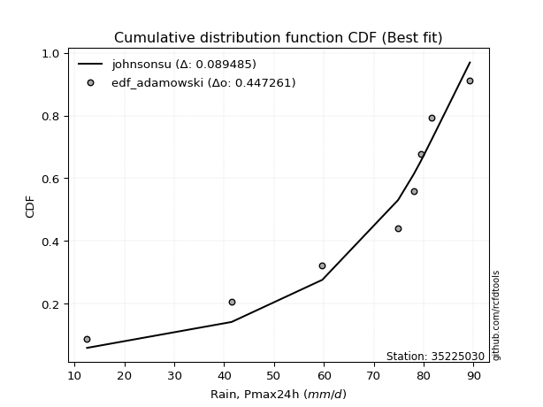</img></img>

</div>


## C. Best fit & Estimate extreme values for specific return periods - Tr

Best fit in probability distribution analysis means finding the theoretical distribution (like Normal, Poisson, Exponential, etc.) that most accurately mirrors your real-world data´s patterns (shape, center, spread) for better predictions, using methods like visual checks (Q-Q plots), goodness-of-fit tests (Kolmogorov-Smirnov, Chi-Squared), and information criteria (AIC) to score and select the simplest, most representative model.


### 1. Best fit (ordered by delta Δ)

:file_folder:Table: [bestfit_35225030.csv](table/bestfit_35225030.csv)

<div align="center">

|   id |   station | empirical_dist   | p_dist       |     delta |   deltao | eval   |   fit |   n |   best_fit |   best_fit_sort |
|-----:|----------:|:-----------------|:-------------|----------:|---------:|:-------|------:|----:|-----------:|----------------:|
|    0 |  35225030 | edf_hazen        | logjohnsonsu | 0.0671843 | 0.417613 | Δo > Δ |     1 |   9 |          1 |               1 |
|    1 |  35225030 | edf_gringorten   | logjohnsonsu | 0.0701083 | 0.417613 | Δo > Δ |     1 |   9 |          1 |               2 |
|    2 |  35225030 | edf_cunnane      | logjohnsonsu | 0.0720153 | 0.417613 | Δo > Δ |     1 |   9 |          1 |               3 |
|    3 |  35225030 | edf_blom         | logjohnsonsu | 0.0731903 | 0.417613 | Δo > Δ |     1 |   9 |          1 |               4 |
|    4 |  35225030 | edf_tukey        | logjohnsonsu | 0.0751209 | 0.417613 | Δo > Δ |     1 |   9 |          1 |               5 |
|    5 |  35225030 | edf_filliben     | logjohnsonsu | 0.0758454 | 0.417613 | Δo > Δ |     1 |   9 |          1 |               6 |
|    6 |  35225030 | edf_beard        | logjohnsonsu | 0.0761869 | 0.417613 | Δo > Δ |     1 |   9 |          1 |               7 |
|    7 |  35225030 | edf_jenkinson    | logjohnsonsu | 0.0761869 | 0.417613 | Δo > Δ |     1 |   9 |          1 |               8 |
|    8 |  35225030 | edf_chegodayev   | logjohnsonsu | 0.0766406 | 0.417613 | Δo > Δ |     1 |   9 |          1 |               9 |
|    9 |  35225030 | edf_adamowski    | logjohnsonsu | 0.0788803 | 0.417613 | Δo > Δ |     1 |   9 |          1 |              10 |
|   10 |  35225030 | edf_weibull      | dweibull     | 0.0859717 | 0.417613 | Δo > Δ |     1 |   9 |          1 |              11 |
|   11 |  35225030 | edf_california   | logjohnsonsu | 0.12274   | 0.417613 | Δo > Δ |     1 |   9 |          1 |              12 |

</div>


### 2. Extreme values and % difference analysis

In hydrology, a return period (or recurrence interval $Tr$) is the statistical average time between extreme events like floods or droughts of a specific magnitude, indicating how rare an event is, with a 100-year flood, for example, having a 1% chance of occurring in any given year, not that it happens exactly every century. It is a key tool for infrastructure design (like bridges or dams) and risk assessment, calculated from historical data to determine the probability of future events, although it is important to remember it is statistical average, and events can cluster or be missed.

The extreme value porcentage difference is evaluated as $pdiff = 1 - (ETrBf / ETr) * 100$, where _ETrBf_ correspond to the bestfit extreme value for a specific recurrence interval and _ETr_ correspond to the extreme value for one of the most used PDFsused in hydrology.

> risk_rate: assuming the return period as the project useful life.

:file_folder:Table: [extreme_35225030.csv](table/extreme_35225030.csv), all PDFs.  
:file_folder:Table: [extremepdiff_35225030.csv](table/extremepdiff_35225030.csv), % difference between bestfit and most used PDFs in Hydrology.

<div align="center">

Extreme values table for only best fit PDFs
|   id |      tr |   prob_l |     prob_g |      alpha |   anglit |   arcsine |    argus |     beta |   betaprime |   bradford |     burr |   burr12 |   cosine |   crystalball |   dgamma |   dweibull |   erlang |   exponnorm |   exponpow |   exponweib |        f |   fatiguelife |   foldnorm |    gamma |   gausshyper |   genexpon |   genextreme |   gengamma |   genhalflogistic |   genlogistic |   gennorm |   genpareto |   gompertz |   gumbel_l |   gumbel_r |   halfgennorm |   halflogistic |   halfnorm |   hypsecant |   invgamma |   invgauss |   invweibull |   johnsonsb |   johnsonsu |   kappa3 |   kappa4 |    ksone |   kstwobign |   laplace |   levy_l |   loggamma |   logistic |   loglaplace |    lomax |   maxwell |   mielke |    moyal |   nakagami |      ncf |      nct |     norm |   pearson3 |   powerlaw |   rayleigh |    rdist |     rice |   semicircular |   skewnorm |        t |   trapezoid |   triang |   truncexpon |   truncnorm |   truncpareto |   truncweibull_min |   tukeylambda |   uniform |   vonmises |   vonmises_line |     wald |   weibull_max |   weibull_min |   wrapcauchy |   logalpha |   loganglit |   logarcsine |   logargus |   logbeta |   logbetaprime |   logbradford |   logburr |   logburr12 |   logcosine |   logcrystalball |   logdgamma |   logdweibull |   logerlang |   logexponnorm |   logexponpow |   logexponweib |     logf |   logfatiguelife |   logfoldnorm |   loggausshyper |   loggenexpon |   loggenextreme |   loggengamma |   loggenhalflogistic |   loggenlogistic |   loggennorm |   loggenpareto |   loggompertz |   loggumbel_l |   loggumbel_r |   loghalfgennorm |   loghalflogistic |   loghalfnorm |   loghypsecant |   loginvgamma |   loginvgauss |   loginvweibull |   logjohnsonsb |     logjohnsonsu |   logkappa3 |   logkappa4 |   logksone |   logkstwobign |   loglevy_l |   logloggamma |   loglogistic |   logloglaplace |         loglomax |   logmaxwell |   logmielke |   logmoyal |   lognakagami |   logncf |   lognct |   lognorm |   logpearson3 |   logpowerlaw |   lograyleigh |   logrdist |   logrice |   logsemicircular |   logskewnorm |             logt |   logtrapezoid |   logtriang |   logtruncexpon |   logtruncnorm |   logtruncpareto |   logtruncweibull_min |   logtukeylambda |   loguniform |   logvonmises |   logvonmises_line |   logwald |   logweibull_max |   logweibull_min |   logwrapcauchy |   station |   n |   risk_rate |
|-----:|--------:|---------:|-----------:|-----------:|---------:|----------:|---------:|---------:|------------:|-----------:|---------:|---------:|---------:|--------------:|---------:|-----------:|---------:|------------:|-----------:|------------:|---------:|--------------:|-----------:|---------:|-------------:|-----------:|-------------:|-----------:|------------------:|--------------:|----------:|------------:|-----------:|-----------:|-----------:|--------------:|---------------:|-----------:|------------:|-----------:|-----------:|-------------:|------------:|------------:|---------:|---------:|---------:|------------:|----------:|---------:|-----------:|-----------:|-------------:|---------:|----------:|---------:|---------:|-----------:|---------:|---------:|---------:|-----------:|-----------:|-----------:|---------:|---------:|---------------:|-----------:|---------:|------------:|---------:|-------------:|------------:|--------------:|-------------------:|--------------:|----------:|-----------:|----------------:|---------:|--------------:|--------------:|-------------:|-----------:|------------:|-------------:|-----------:|----------:|---------------:|--------------:|----------:|------------:|------------:|-----------------:|------------:|--------------:|------------:|---------------:|--------------:|---------------:|---------:|-----------------:|--------------:|----------------:|--------------:|----------------:|--------------:|---------------------:|-----------------:|-------------:|---------------:|--------------:|--------------:|--------------:|-----------------:|------------------:|--------------:|---------------:|--------------:|--------------:|----------------:|---------------:|-----------------:|------------:|------------:|-----------:|---------------:|------------:|--------------:|--------------:|----------------:|-----------------:|-------------:|------------:|-----------:|--------------:|---------:|---------:|----------:|--------------:|--------------:|--------------:|-----------:|----------:|------------------:|--------------:|-----------------:|---------------:|------------:|----------------:|---------------:|-----------------:|----------------------:|-----------------:|-------------:|--------------:|-------------------:|----------:|-----------------:|-----------------:|----------------:|----------:|----:|------------:|
|    0 |    2    | 0.5      | 0.5        |    49.6753 |  70.6778 |   70.6778 |  73.6554 |  52.88   |     69.7973 |    56.6447 |  70.0491 |  38.2532 |  68.5867 |       70.6778 |  78      |    78      |  70.0834 |     70.6776 |    72.0163 |     70.8725 |  70.5458 |       12.5003 |    70.9762 |  69.9137 |      77.6326 |    63.7516 |      73.1851 |    69.2058 |           81.6933 |       73.7021 |   78      |     79.6643 |    72.2709 |    75.362  |    65.9935 |       60.7211 |        63.6647 |    64.8411 |     70.6778 |    68.8072 |    65.7887 |      66.8298 |     73.0092 |     77.2067 |  12.4997 |  62.9931 |  65.8    |     64.2391 |   70.6778 |  66.3583 |    60.8384 |    70.6778 |      61.444  |  53.0322 |   68.2391 |  70.102  |  64.4813 |    54.6086 |  65.1876 |  70.6688 |  70.6778 |    72.9615 |    16.3865 |    67.3742 |  2.94413 |  70.6735 |        70.6778 |    72.9751 |  76.2708 |     92.2931 |  84.7672 |      49.5732 |     73.326  |       12.7284 |            72.7261 |       73.3637 |   65.8    |  -0.735372 |         65.7273 |  61.435  |       118.685 |       72.9127 |      65.566  |    60.4557 |     61.444  |      61.4441 |    73.0506 |   108.305 |        61.0657 |       38.8542 |   70.0975 |     70.0652 |     52.4344 |          61.444  |     78      |       78      |     60.6292 |        61.4443 |       19.4988 |        26.849  |  61.4047 |          61.6726 |       61.6737 |         51.0636 |       49.3463 |         78.4962 |       66.0272 |              58.6405 |          70.0032 |      79.4    |        62.3542 |       68.2805 |       68.084  |       55.4516 |          45.9697 |           52.6932 |       54.0693 |        61.444  |       60.3211 |       59.8271 |         57.4423 |        72.7212 |     77.1246      |     12.5    |     38.7816 |    38.5843 |        52.0331 |     66.9325 |       71.0073 |       61.444  |         78      |     37.8963      |      58.2476 |     69.3805 |    53.6447 |       71.6811 |  60.5593 |  60.9998 |   61.444  |       72.549  |       14.0895 |       57.1542 |    38.5832 |   61.4422 |           61.4437 |       64.4677 |    79.0353       |        68.3947 |     56.0353 |         32.2421 |        58.3726 |          12.576  |               62.6388 |          38.5845 |      38.5843 |      0.123236 |            70.0778 |   50.1812 |          61.021  |          27.8654 |         38.5843 |  35225030 |   9 |    0.75     |
|    1 |    2.33 | 0.570815 | 0.429185   |    59.1263 |  76.6046 |   79.5749 |  79.801  |  61.0722 |     74.9604 |    64.2291 |  75.1555 |  48.6484 |  74.2254 |       75.766  |  79.5396 |    79.7307 |  75.3254 |     75.7658 |    77.4868 |     76.0638 |  75.6421 |       13.9812 |    75.832  |  75.147  |      85.4778 |    70.3322 |      78.4559 |    74.583  |           88.6796 |       77.818  |   79.1284 |     88.2726 |    77.5923 |    79.7888 |    70.7083 |       68.4617 |        68.5123 |    70.3326 |     74.7499 |    74.2612 |    71.68   |      73.2524 |     77.9887 |     78.8105 |  12.4997 |  70.8555 |  74.8587 |     70.8755 |   73.7569 |  82.155  |    68.4622 |    75.1608 |      65.7316 |  62.0472 |   73.5254 |  75.1941 |  68.9444 |    60.2025 |  72.1524 |  75.7597 |  75.766  |    77.9194 |    19.8181 |    72.7387 | 14.7253  |  75.7612 |        77.0344 |    77.8267 |  79.651  |     98.4865 |  90.4425 |      57.6957 |     78.7441 |       12.9353 |            79.4995 |       76.3533 |   73.3489 |  -0.376079 |         70.6362 |  64.7714 |       118.909 |       77.8655 |      73.1491 |    68.1555 |     69.9626 |      74.6664 |    79.4003 |   113.532 |        68.7875 |       45.6242 |   75.2122 |     75.1545 |     59.87   |          68.6891 |     79.5079 |       80.0301 |     68.2309 |        68.6894 |       22.4919 |        32.445  |  68.6755 |          68.9474 |       68.4699 |         59.9418 |       58.3979 |         85.3098 |       71.9877 |              67.0536 |          75.1217 |      80.3067 |        78.5445 |       73.6986 |       75.0173 |       61.4851 |          56.3521 |           58.5969 |       60.9812 |        67.177  |       67.8752 |       67.5959 |         67.9538 |        78.4473 |     78.6518      |     12.5    |     45.7399 |    46.731  |        62.0385 |     79.5475 |       76.6732 |       67.7846 |         82.5374 |     48.4942      |      65.399  |     74.6701 |    59.1546 |       75.8351 |  68.3175 |  68.3811 |   68.6891 |       79.4004 |       15.4174 |       64.2816 |    48.1953 |   68.7253 |           70.6245 |       71.1021 |    80.4926       |        77.758  |     63.4733 |         37.7535 |        62.2819 |          12.643  |               69.7704 |          45.3053 |      45.2626 |      0.136385 |            76.0218 |   53.9863 |          69.8121 |          33.7357 |         59.1861 |  35225030 |   9 |    0.729209 |
|    2 |    5    | 0.8      | 0.2        |   132.411  |  97.5158 |  103.3    |  99.5139 |  90.3436 |     94.4009 |    91.4937 |  92.2197 | inf      |  94.5454 |       94.6751 |  92.118  |    98.3404 |  95.1641 |     94.675  |    95.8521 |     95.3682 |  94.599  |       45.4336 |    93.8771 |  94.9387 |     107.313  |    96.8383 |      96.424  |    95.3582 |          107.163  |       92.2138 |   90.076  |    110.101  |    95.5779 |    94.0899 |    91.1915 |       99.3845 |        90.4464 |    93.5554 |     91.0839 |    95.3937 |    95.6665 |     101.155  |     95.1698 |     85.2509 |  12.4997 |  96.7741 | 104.176  |     99.0655 |   89.1519 | 108.326  |   106.914  |    92.4705 |      92.0959 | 107.583  |   94.3319 |  92.2155 |  89.6181 |    90.836  | 105.017  |  94.6815 |  94.6751 |    95.0944 |    49.2081 |    94.2151 | 47.3195  |  94.6685 |        98.7269 |    94.5073 |  93.9955 |    116.255  | 106.725  |      87.4061 |     97.0579 |       17.687  |           100.74   |       93.9086 |   97.78   |   0.92108  |         89.4825 |  83.4485 |       119.093 |       94.9668 |      97.6887 |   107.69   |    110.614  |     125.558  |    99.5412 |   118.913 |       107.692  |       76.7291 |   92.2105 |     94.2625 |     96.5502 |         103.941  |     99.5946 |      117.464  |    106.646  |       103.941  |       47.5157 |        88.2563 | 104.121  |         104.37   |      100.976  |         94.0549 |      114.777  |        104.916  |       95.925  |              95.3533 |          92.2216 |      93.2036 |       113.761  |       94.4069 |      102.617  |       96.304  |         124.64   |           94.7458 |      101.422  |        96.0774 |      106.258  |      108.158  |        141.02   |        97.2384 |     84.3274      |     12.5    |     77.704  |    86.8663 |       130.952  |    105.893  |       95.546  |       99.0407 |        109.503  |    168.423       |     103.163  |     92.3392 |    93.0413 |       94.5248 | 107.849  | 104.782  |  103.941  |      101.894  |       30.0203 |      102.9    |    90.7324 |  104.21   |          113.591  |       94.5768 |    90.9374       |       112.36   |     90.7576 |         66.5016 |        81.2918 |          14.171  |               94.6647 |          76.1147 |      75.8772 |      0.19985  |           103.968  |   81.2795 |          97.3913 |          90.6526 |        100.431  |  35225030 |   9 |    0.67232  |
|    3 |   10    | 0.9      | 0.1        |   267.052  | 109.352  |  109.028  | 109.02   | 104.335  |    107.518  |   104.818  | 102.861  | inf      | 106.822  |      107.219  | 105.286  |   122.137  | 108.638  |    107.219  |   106.233  |    108.183  | 107.19   |       88.8613 |   105.848  | 108.369  |     114.559  |   115.897  |     106.538  |   109.848  |          113.611  |      101.858  |  106.099  |    116.157  |   105.972  |   102.052  |   107.875  |      120.65   |       108.662  |   110.74   |    104.127  |   110.204  |   113.521  |     123.882  |    105.435  |     94.2421 |  12.4997 | 108.215  | 116.968  |    120.529  |  103.127  | 114.645  |   144.579  |   105.218  |     125.083  | 149.596  |  108.974  | 102.841  | 107.618  |   117.234  | 134.959  | 107.236  | 107.219  |   105.432  |    76.9388 |   109.528  | 56.1227  | 107.211  |       109.858  |   104.668  | 107.796  |    123.196  | 113.085  |     102.432  |    106.635  |       32.9103 |           109.899  |      109.83   |  108.44   |   1.62147  |        101.884  | 103.269  |       119.1   |      105.264  |     108.395  |   147.46   |    143.356  |     142.342  |   109.103  |   119.092 |       145.722  |       96.265  |  102.709  |    106.934  |    128.868  |         136.813  |    129.463  |      207.337  |    144.384  |       136.813  |       92.1471 |       231.688  | 137.237  |         137.436  |      130.659  |        109.041  |      185.977  |        112.427  |      113.171  |             107.647  |         102.875  |     121.289  |       118.365  |      108.408  |      122.172  |      138.793  |         211.397  |          141.21   |      147.781  |       127.854  |      144.297  |      149.903  |        255.579  |       107.283  |     94.0667      |     95.3179 |     97.3747 |   113.85   |       231.282  |    113.465  |      106.127  |      130.947  |        141.54   |    530.816       |     142.178  |    103.309  |   138.014  |      110.286  | 147.115  | 139.353  |  136.813  |      112.869  |       52.9076 |      143.915  |   109.268  |  137.355  |          144.959  |      106.23   |   123.132        |       129.734  |    104.362  |         87.9181 |        95.5998 |          19.9472 |              106.535  |          95.3428 |      95.063  |      0.260469 |           131.118  |  125.476  |         108.756  |         229.657  |        110.228  |  35225030 |   9 |    0.651322 |
|    4 |   15    | 0.933333 | 0.0666667  |   401.213  | 114.406  |  110.12   | 112.634  | 109.161  |    114.13   |   109.469  | 108.386  | inf      | 112.414  |      113.479  | 113.292  |   138.118  | 115.456  |    113.479  |   110.907  |    114.567  | 113.478  |      117.264  |   111.822  | 115.161  |     116.503  |   125.769  |     110.934  |   117.296  |          115.563  |      106.934  |  117.998  |    117.57   |   110.742  |   105.658  |   117.287  |      131.266  |       118.97   |   119.682  |    111.571  |   117.843  |   123.048  |     136.705  |    110.23   |    102.366  |  12.4997 | 112.028  | 121.232  |    131.923  |  111.302  | 116.554  |   168.388  |   112.164  |     149.615  | 174.475  |  116.487  | 108.361  | 118.064  |   131.451  | 153.189  | 113.502  | 113.479  |   110.287  |    89.1665 |   117.418  | 57.9853  | 113.47   |       114.198  |   109.541  | 117.358  |    125.422  | 115.125  |     107.789  |    110.328  |       46.6252 |           112.958  |      116.884  |  111.993  |   1.87644  |        107.121  | 115.997  |       119.1   |      110.122  |     111.963  |   173.081  |    160.14   |     145.79   |   112.711  |   119.099 |       169.719  |      103.826  |  108.133  |    113.22   |    146.981  |         156.921  |    152.537  |      311.106  |    168.287  |       156.92   |      133.325  |       415.274  | 157.518  |         157.677  |      148.591  |        113.35   |      238.522  |        114.778  |      122.132  |             111.635  |         108.403  |     150.454  |       118.872  |      115.423  |      132.214  |      170.576  |         273.87   |          176.986  |      179.762  |       150.498  |      168.552  |      177.209  |        357.457  |       111.581  |    105.065       |    102.766  |    104.797  |   124.592  |       312.812  |    115.857  |      110.897  |      152.467  |        164.465  |   1047.16        |     167.613  |    108.99   |   173.503  |      119.349  | 172.168  | 160.76   |  156.921  |      117.018  |       67.2756 |      171.069  |   114.017  |  157.65   |          159.42   |      110.37   |   185.074        |       135.86   |    109.145  |         96.9967 |       102.008  |          26.8245 |              110.643  |         102.739  |     102.481  |      0.299131 |           149.355  |  165.827  |         112.387  |         399.64   |        113.206  |  35225030 |   9 |    0.644736 |
|    5 |   20    | 0.95     | 0.05       |   535.255  | 117.379  |  110.505  | 114.617  | 111.608  |    118.485  |   111.835  | 112.18   | inf      | 115.853  |      117.578  | 119.059  |   150.23   | 119.955  |    117.578  |   113.798  |    118.737  | 117.598  |      138.292  |   115.733  | 119.641  |     117.353  |   132.35   |     113.56   |   122.254  |          116.501  |      110.398  |  127.56   |    118.138  |   113.728  |   107.903  |   123.878  |      138.194  |       126.192  |   125.645  |    116.822  |   122.939  |   129.517  |     145.683  |    113.255  |    109.897  |  12.4997 | 113.93   | 123.364  |    139.598  |  117.102  | 117.531  |   186.19   |   116.965  |     169.886  | 192.263  |  121.473  | 112.153  | 125.462  |   141.016  | 166.566  | 117.605  | 117.578  |   113.358  |    95.9315 |   122.662  | 58.684   | 117.569  |       116.606  |   112.673  | 125.117  |    126.521  | 116.132  |     110.539  |    112.318  |       57.1994 |           114.49   |      120.794  |  113.77   |   2.00704  |        109.961  | 125.482  |       119.1   |      113.208  |     113.748  |   192.467  |    170.917  |     147.023  |   114.684  |   119.1   |       187.641  |      107.826  |  111.849  |    117.319  |    159.363  |         171.665  |    171.886  |      427.079  |    186.181  |       171.664  |      171.774  |       632.853  | 172.399  |         172.526  |      161.647  |        115.257  |      281.436  |        115.919  |      128.12   |             113.592  |         112.2    |     180.548  |       119      |      120.018  |      138.878  |      197.069  |         323.758  |          207.326  |      204.842  |       168.846  |      186.787  |      198.056  |        452.105  |       114.152  |    117.213       |    106.706  |    108.656  |   130.338  |       383.377  |    117.101  |      113.857  |      169.375  |        182.949  |   1701.86        |     186.959  |    112.889  |   204.029  |      125.767  | 191.004  | 176.569  |  171.665  |      119.279  |       76.6929 |      191.896  |   115.943  |  172.54   |          168.054  |      112.494  |   304.507        |       138.987  |    111.585  |        101.99   |       105.661  |          33.5588 |              112.727  |         106.637  |     106.405  |      0.328534 |           163.889  |  204.126  |         114.159  |         594.326  |        114.677  |  35225030 |   9 |    0.641514 |
|    6 |   25    | 0.96     | 0.04       |   669.251  | 119.394  |  110.684  | 115.897  | 113.086  |    121.702  |   113.268  | 115.092  | inf      | 118.265  |      120.595  | 123.571  |   160.028  | 123.284  |    120.595  |   115.846  |    121.799  | 120.631  |      155      |   118.613  | 122.956  |     117.816  |   137.251  |     115.362  |   125.944  |          117.05   |      113.029  |  135.617  |    118.428  |   115.86   |   109.5    |   128.954  |      143.275  |       131.757  |   130.081  |    120.886  |   126.738  |   134.399  |     152.599  |    115.423  |    116.962  |  12.4997 | 115.069  | 124.643  |    145.348  |  121.601  | 118.145  |   200.554  |   120.637  |     187.482  | 206.14   |  125.175  | 115.063  | 131.196  |   148.16   | 177.232  | 120.626  | 120.595  |   115.565  |   100.212  |   126.559  | 59.0234  | 120.586  |       118.168  |   114.952  | 131.815  |    127.175  | 116.732  |     112.213  |    113.567  |       65.2938 |           115.41   |      123.271  |  114.836  |   2.08618  |        111.727  | 133.08   |       119.1   |      115.435  |     114.818  |   208.245  |    178.63   |     147.599  |   115.955  |   119.1   |       202.09   |      110.3    |  114.697  |    120.325  |    168.663  |         183.397  |    188.83   |      554.573  |    200.633  |       183.395  |      208.053  |       880.8    | 184.246  |         184.345  |      171.986  |        116.294  |      318.255  |        116.59   |      132.584  |             114.748  |         115.113  |     211.671  |       119.048  |      123.4    |      143.823  |      220.249  |         365.76   |          234.204  |      225.748  |       184.567  |      201.56   |      215.134  |        541.774  |       115.926  |    130.495       |    109.142  |    111.012  |   133.912  |       446.475  |    117.889  |      115.959  |      183.565  |        198.706  |   2485.51        |     202.751  |    115.88   |   231.339  |      130.752  | 206.264  | 189.213  |  183.396  |      120.728  |       83.2683 |      208.995  |   116.924  |  184.392  |          173.904  |      113.786  |   543.144        |       140.884  |    113.064  |        105.145  |       108.025  |          39.7574 |              113.987  |         109.041  |     108.831  |      0.352691 |           176.292  |  241.09   |         115.203  |         810.157  |        115.557  |  35225030 |   9 |    0.639603 |
|    7 |   50    | 0.98     | 0.02       |  1339.02   | 124.354  |  110.922  | 118.797  | 116.073  |    130.973  |   116.164  | 124.155  | inf      | 124.58   |      129.237  | 137.755  |   192.498  | 132.899  |    129.237  |   121.352  |    130.519  | 129.321  |      208.607  |   126.86   | 132.527  |     118.606  |   151.525  |     119.902  |   136.705  |          118.113  |      121.002  |  164.212  |    118.88   |   121.672  |   113.835  |   144.592  |      157.721  |       148.902  |   142.975  |    133.486  |   137.847  |   148.948  |     173.903  |    121.37   |    147.581  |  12.4997 | 117.337  | 127.202  |    162.231  |  135.576  | 119.526  |   248.509  |   131.858  |     254.635  | 249.687  |  135.91   | 124.121  | 148.998  |   168.98   | 212.198  | 129.277  | 129.237  |   121.637  |   109.292  |   137.869  | 59.5089  | 129.227  |       121.736  |   121.369  | 157.451  |    128.474  | 117.922  |     115.618  |    116.213  |       86.9423 |           117.253  |      128.534  |  116.968  |   2.24573  |        115.371  | 157.884  |       119.1   |      121.607  |     116.959  |   261.753  |    199.132  |     148.372  |   118.827  |   119.1   |       250.253  |      115.419  |  123.544  |    128.88   |    195.669  |         221.617  |    254.374  |     1352.65   |    248.957  |       221.615  |      367.472  |      2507.23   | 222.873  |         222.872  |      205.397  |        118.052  |      454.791  |        117.894  |      145.622  |             117.007  |         124.178  |     384.826  |       119.093  |      133.073  |      158.153  |      310.235  |         515.65   |          340.968  |      299.429  |       243.237  |      251.245  |      273.709  |        945.979  |       120.488  |    215.94        |    114.182  |    115.783  |   141.357  |       698.408  |    119.683  |      121.651  |      234.714  |        256.84   |   8154.57        |     256.507  |    125.187  |   341.675  |      146.346  | 257.571  | 230.78   |  221.617  |      123.973  |       98.9991 |      267.76   |   118.421  |  223.03   |          188.042  |      116.414  | 27137            |       144.727  |    116.058  |        111.843  |       113.204  |          62.1513 |              116.529  |         113.993  |     113.85   |      0.43725  |           222.157  |  415.123  |         117.234  |        2141.63   |        117.321  |  35225030 |   9 |    0.63583  |
|    8 |   75    | 0.986667 | 0.0133333  |  2008.69   | 126.537  |  110.966  | 119.947  | 117.078  |    135.982  |   117.138  | 129.568  | inf      | 127.596  |      133.873  | 146.144  |   212.791  | 138.108  |    133.873  |   124.104  |    135.159  | 133.987  |      240.892  |   131.285  | 137.71   |     118.818  |   159.322  |     121.964  |   142.599  |          118.455  |      125.577  |  183.455  |    118.986  |   124.624  |   116.028  |   153.681  |      165.399  |       158.868  |   149.994  |    140.849  |   143.951  |   157.111  |     186.285  |    124.404  |    173.297  |  12.4997 | 118.088  | 128.054  |    171.519  |  143.751  | 120.093  |   279.077  |   138.338  |     304.574  | 275.475  |  141.747  | 129.531  | 159.408  |   180.319  | 234.1    | 133.919  | 133.873  |   124.746  |   112.478  |   144.023  | 59.6088  | 133.863  |       123.161  |   124.753  | 176.778  |    128.904  | 118.316  |     116.77   |    117.145  |       96.2577 |           117.868  |      130.382  |  117.679  |   2.29917  |        116.608  | 173.148  |       119.1   |      124.8    |     117.673  |   296.49   |    208.885  |     148.516  |   119.964  |   119.1   |       280.896  |      117.177  |  128.818  |    133.435  |    210.051  |         245.31   |    303.786  |     2401.52   |    279.817  |       245.308  |      503.729  |      4679.98   | 246.84   |         246.771  |      225.926  |        118.512  |      552.308  |        118.314  |      152.765  |             117.736  |         129.592  |     589.673  |       119.098  |      138.251  |      165.934  |      378.587  |         617.748  |          424.164  |      349.197  |       285.814  |      283.192  |      312.224  |       1307.91   |       122.64   |    341.415       |    115.913  |    117.375  |   143.929  |       893.343  |    120.428  |      124.522  |      270.517  |        298.44   |  16473.9         |     291.493  |    130.747  |   429.194  |      155.587  | 290.54   | 256.813  |  245.31   |      125.237  |      105.15   |      306.401  |   118.757  |  246.999  |          194.007  |      117.302  |     5.57683e+06  |       146.022  |    117.067  |        114.197  |       115.082  |          75.1443 |              117.383  |         115.684  |     115.574  |      0.495381 |           253.409  |  579.962  |         117.887  |        3805.03   |        117.912  |  35225030 |   9 |    0.634587 |
|    9 |  100    | 0.99     | 0.01       |  2678.34   | 127.835  |  110.982  | 120.589  | 117.583  |    139.384  |   117.627  | 133.491  | inf      | 129.486  |      137.009  | 152.128  |   227.72   | 141.651  |    137.009  |   125.891  |    138.277  | 137.143  |      264.122  |   134.277  | 141.235  |     118.91   |   164.646  |     123.215  |   146.633  |          118.622  |      128.799  |  198.242  |    119.028  |   126.56   |   117.462  |   160.114  |      170.56   |       165.922  |   154.775  |    146.072  |   148.138  |   162.777  |     195.05   |    126.394  |    196.001  |  12.4997 | 118.462  | 128.481  |    177.884  |  149.551  | 120.425  |   301.972  |   142.914  |     345.841  | 293.913  |  145.722  | 133.453  | 166.794  |   188.037  | 250.36   | 137.059  | 137.009  |   126.791  |   114.102  |   148.215  | 59.6461  | 136.999  |       123.959  |   127.022  | 192.96   |    129.119  | 118.512  |     117.349  |    117.622  |      101.402  |           118.176  |      131.325  |  118.034  |   2.32591  |        117.23   | 184.277  |       119.1   |      126.916  |     118.03   |   322.81   |    214.909  |     148.566  |   120.597  |   119.1   |       303.821  |      118.066  |  132.637  |    136.501  |    219.6    |         262.756  |    344.95   |     3689.23   |    302.959  |       262.752  |      625.528  |      7323.37   | 264.496  |         264.375  |      240.961  |        118.71   |      630.476  |        118.519  |      157.651  |             118.093  |         133.516  |     827.936  |       119.099  |      141.747  |      171.23   |      435.882  |         697.034  |          495.046  |      387.758  |       320.462  |      307.253  |      341.635  |       1644.97   |       123.988  |    521.881       |    116.789  |    118.166  |   145.233  |      1057.47   |    120.865  |      126.399  |      299.037  |        331.982  |  27232.5         |     318.018  |    134.778  |   504.568  |      162.212  | 315.358  | 276.101  |  262.755  |      125.933  |      108.422  |      335.872  |   118.889  |  264.654  |          197.429  |      117.749  |     3.77997e+09  |       146.672  |    117.573  |        115.398  |       116.053  |          83.4059 |              117.811  |         116.536  |     116.445  |      0.541754 |           276.023  |  740.083  |         118.206  |        5734.94   |        118.208  |  35225030 |   9 |    0.633968 |
|   10 |  200    | 0.995    | 0.005      |  5356.89   | 130.287  |  110.997  | 121.705  | 118.345  |    147.142  |   118.362  | 143.301  | inf      | 133.329  |      144.123  | 166.635  |   265.374  | 149.747  |    144.123  |   129.738  |    145.282  | 144.306  |      320.984  |   141.066  | 149.286  |     119.027  |   176.868  |     125.644  |   155.929  |          118.868  |      136.51   |  237.767  |    119.077  |   130.776  |   120.579  |   175.58   |      182.17   |       182.881  |   165.711  |    158.656  |   157.814  |   176.069  |     216.12   |    130.732  |    270.017  |  12.4997 | 119.019  | 129.12   |    192.542  |  163.527  | 121.054  |   361.529  |   153.889  |     469.715  | 338.827  |  154.818  | 143.257  | 184.588  |   205.657  | 292.23   | 144.182  | 144.123  |   131.258  |   116.577  |   157.807  | 59.6848  | 144.111  |       125.351  |   132.112  | 242.685  |    129.44   | 118.807  |     118.222  |    118.352  |      109.8    |           118.638  |      132.762  |  118.567  |   2.36606  |        118.164  | 211.998  |       119.1   |      131.59   |     118.565  |   392.417  |    226.769  |     148.615  |   121.697  |   119.1   |       363.354  |      119.413  |  142.176  |    143.411  |    240.374  |         307.064  |    469.985  |    11144.4    |    363.253  |       307.06   |     1030.35   |     21878.3    | 309.375  |         309.114  |      278.88   |        118.956  |      853.551  |        118.82   |      168.89   |             118.616  |         143.329  |    2139.24   |       119.1    |      149.656  |      183.331  |      611.657  |         912.81   |          717.781  |      492.725  |       422.175  |      370.339  |      420.268  |       2854.67   |       126.747  |   2293.17        |    118.114  |    119.337  |   147.21   |      1559.48   |    121.699  |      130.475  |      380.317  |        429.108  |  92594.8         |     388.138  |    144.864  |   745.096  |      178.448  | 380.369  | 325.523  |  307.064  |      127.123  |      113.592  |      414.414  |   119.035  |  309.523  |          203.541  |      118.423  |     1.43118e+25  |       147.65   |    118.335  |        117.23   |       117.55   |          98.8131 |              118.455  |         117.82   |     117.765  |      0.67744  |           323.939  | 1358.37   |         118.671  |       15528.5    |        118.653  |  35225030 |   9 |    0.633042 |
|   11 |  250    | 0.996    | 0.004      |  6696.15   | 130.911  |  110.998  | 121.966  | 118.498  |    149.525  |   118.51   | 146.582  | inf      | 134.383  |      146.297  | 171.327  |   277.973  | 152.238  |    146.297  |   130.86   |    147.402  | 146.496  |      339.516  |   143.14   | 151.763  |     119.046  |   180.642  |     126.281  |   158.81   |          118.916  |      138.982  |  251.672  |    119.084  |   132.019  |   121.496  |   180.552  |      185.691  |       188.333  |   169.076  |    162.706  |   160.821  |   180.254  |     222.894  |    132.009  |    300.926  |  12.4997 | 119.13   | 129.248  |    197.079  |  168.026  | 121.218  |   382.096  |   157.413  |     518.367  | 353.435  |  157.618  | 146.536  | 190.317  |   211.067  | 306.583  | 146.359  | 146.297  |   132.577  |   117.078  |   160.76   | 59.6899  | 146.285  |       125.677  |   133.654  | 262.656  |    129.504  | 118.865  |     118.397  |    118.5    |      111.584  |           118.73   |      133.053  |  118.674  |   2.37409  |        118.351  | 221.168  |       119.1   |      132.985  |     118.672  |   416.819  |    229.891  |     148.621  |   121.955  |   119.1   |       383.881  |      119.684  |  145.364  |    145.51   |    246.405  |         322.041  |    519.602  |    16237.4    |    384.106  |       322.036  |     1202.24   |     31255.4    | 324.554  |         324.244  |      291.618  |        118.995  |      936.986  |        118.878  |      172.367  |             118.717  |         146.612  |    3026.57   |       119.1    |      152.066  |      187.051  |      682.043  |         990.094  |          808.841  |      530.41   |       461.349  |      392.284  |      448.103  |       3408.16   |       127.513  |   4405.61        |    118.381  |    119.567  |   147.609  |      1758.7    |    121.916  |      131.674  |      410.837  |        466.065  | 137839           |     412.69   |    148.24   |   844.717  |      183.766  | 402.962  | 342.36   |  322.041  |      127.397  |      114.666  |      442.106  |   119.055  |  324.697  |          205.002  |      118.558  |     1.33278e+35  |       147.847  |    118.488  |        117.601  |       117.856  |         102.426  |              118.584  |         118.077  |     118.031  |      0.730704 |           336.016  | 1660.62   |         118.762  |       21444.7    |        118.743  |  35225030 |   9 |    0.632858 |
|   12 |  500    | 0.998    | 0.002      | 13392.4    | 132.458  |  111.001  | 122.567  | 118.806  |    156.622  |   118.805  | 157.207  | inf      | 137.187  |      152.743  | 185.961  |   318.487  | 159.669  |    152.743  |   134.048  |    153.623  | 152.991  |      397.649  |   149.292  | 159.15   |     119.079  |   191.93   |     127.9    |   167.467  |          119.011  |      146.643  |  298.57   |    119.095  |   135.588  |   124.125  |   195.984  |      196.053  |       205.254  |   179.107  |    175.288  |   169.88   |   193.014  |     243.918  |    135.668  |    425.365  |  12.4997 | 119.35   | 129.504  |    210.673  |  182.001  | 121.64   |   450.625  |   168.341  |     704.037  | 399.276  |  165.973  | 157.153  | 208.11   |   227.159  | 354.151  | 152.815  | 152.743  |   136.361  |   118.085  |   169.569  | 59.6971  | 152.731  |       126.429  |   138.192  | 340.864  |    129.632  | 118.983  |     118.748  |    118.799  |      115.265  |           118.915  |      133.638  |  118.887  |   2.39016  |        118.726  | 250.328  |       119.1   |      137.034  |     118.886  |   499.397  |    237.817  |     148.628  |   122.546  |   119.1   |       452.17   |      120.228  |  155.675  |    151.699  |    263.2    |         370.889  |    711.106  |    55526.3    |    453.69   |       370.882  |     1906.79   |     95838.8    | 374.096  |         373.617  |      332.916  |        119.061  |     1237.66   |        118.993  |      182.786  |             118.916  |         157.241  |   10188.4    |       119.1    |      159.193  |      198.141  |      956.381  |        1256.09   |         1171.82   |      660.761  |       607.765  |      465.953  |      543.205  |       5907.42   |       129.591  |  71228.6         |    118.917  |    120.019  |   148.41   |      2521.5    |    122.481  |      135.112  |      521.959  |        602.419  | 480157           |     495.578  |    159.179  |  1247.38   |      200.593  | 478.723  | 397.707  |  370.888  |      128.015  |      116.855  |      536.221  |   119.086  |  374.21   |          208.405  |      118.829  |     3.35215e+102 |       148.24   |    118.794  |        118.348  |       118.474  |         110.287  |              118.842  |         118.591  |     118.564  |      0.940631 |           362.819  | 3145.6    |         118.938  |       58803.9    |        118.921  |  35225030 |   9 |    0.632489 |
|   13 |  750    | 0.998667 | 0.00133333 | 20088.7    | 133.143  |  111.001  | 122.808  | 118.909  |    160.586  |   118.903  | 163.749  | inf      | 138.546  |      156.325  | 194.555  |   343.104  | 163.826  |    156.325  |   135.734  |    157.033  | 156.601  |      431.997  |   152.71   | 163.282  |     119.088  |   198.263  |     128.642  |   172.35   |          119.041  |      151.116  |  328.625  |    119.097  |   137.499  |   125.53   |   205.006  |      201.76   |       215.147  |   184.711  |    182.649  |   175.005  |   200.329  |     256.21   |    137.619  |    522.618  |  12.4997 | 119.423  | 129.589  |    218.311  |  190.176  | 121.841  |   494.154  |   174.725  |     842.114  | 426.421  |  170.646  | 163.69   | 218.519  |   236.125  | 384.232  | 156.401  | 156.325  |   138.384  |   118.423  |   174.496  | 59.6986  | 156.312  |       126.732  |   140.692  | 400.806  |    129.675  | 119.022  |     118.865  |    118.899  |      116.526  |           118.977  |      133.834  |  118.958  |   2.39551  |        118.85   | 267.812  |       119.1   |      139.229  |     118.958  |   552.812  |    241.413  |     148.63   |   122.783  |   119.1   |       495.465  |      120.41   |  162.019  |    155.114  |    271.747  |         401.157  |    855.394  |   118731      |    497.967  |       401.15   |     2468.2    |    186108      | 404.818  |         404.231  |      358.334  |        119.078  |     1446.1    |        119.03   |      188.641  |             118.98   |         163.786  |   22895.9    |       119.1    |      163.139  |      204.335  |     1165.36   |        1430.84   |         1455.39   |      747.066  |       714.099  |      513.162  |      605.404  |       8147.9    |       130.629  | 718427           |    119.096  |    120.166  |   148.678  |      3087.17   |    122.749  |      136.951  |      600.313  |        699.993  |      1.00503e+06 |     548.997  |    165.922  |  1566.85   |      210.668  | 527.202  | 432.315  |  401.157  |      128.257  |      117.597  |      597.329  |   119.093  |  404.907  |          209.791  |      118.919  |     2.00763e+194 |       148.371  |    118.896  |        118.598  |       118.682  |         113.112  |              118.928  |         118.762  |     118.743  |      1.10619  |           372.504  | 4613.66   |         118.994  |      106508      |        118.981  |  35225030 |   9 |    0.632366 |
|   14 | 1000    | 0.999    | 0.001      | 26785      | 133.552  |  111.001  | 122.944  | 118.961  |    163.323  |   118.952  | 168.548  | inf      | 139.403  |      158.79   | 200.667  |   360.96   | 166.701  |    158.79   |   136.863  |    159.361  | 159.087  |      456.498  |   155.063  | 166.138  |     119.092  |   202.648  |     129.093  |   175.743  |          119.057  |      154.287  |  351.133  |    119.098  |   138.787  |   126.476  |   211.405  |      205.669  |       222.164  |   188.581  |    187.871  |   178.573  |   205.461  |     264.928  |    138.929  |    605.056  | 118.996  | 119.46   | 129.632  |    223.602  |  195.976  | 121.967  |   526.67   |   179.253  |     956.211  | 445.831  |  173.875  | 168.484  | 225.904  |   242.306  | 406.664  | 158.87   | 158.79   |   139.743  |   118.592  |   177.9    | 59.6992  | 158.777  |       126.902  |   142.406  | 451.324  |    129.696  | 119.041  |     118.924  |    118.949  |      117.163  |           119.008  |      133.932  |  118.993  |   2.39819  |        118.913  | 280.389  |       119.1   |      140.719  |     118.993  |   593.176  |    243.582  |     148.63   |   122.917  |   119.1   |       527.768  |      120.502  |  166.669  |    157.455  |    277.28   |         423.421  |    975.647  |   207196      |    531.077  |       423.413  |     2949.77   |    299064      | 427.425  |         426.757  |      376.953  |        119.086  |     1610.33   |        119.048  |      192.7    |             119.011  |         168.588  |   42609.5    |       119.1    |      165.85   |      208.612  |     1340.74   |        1563.89   |         1697.23   |      813.164  |       800.646  |      548.625  |      652.727  |      10235.4    |       131.299  |      5.49104e+06 |    119.186  |    120.239  |   148.812  |      3551.86   |    122.918  |      138.19   |      662.908  |        778.665  |      1.70404e+06 |     589.247  |    170.871  |  1841.99   |      217.926  | 563.584  | 457.915  |  423.421  |      128.392  |      117.97   |      643.581  |   119.096  |  427.494  |          210.574  |      118.964  |     4.43942e+306 |       148.436  |    118.947  |        118.723  |       118.786  |         114.566  |              118.971  |         118.848  |     118.832  |      1.24813  |           377.476  | 6077.16   |         119.022  |      162606      |        119.011  |  35225030 |   9 |    0.632305 |


</div>


<div align="center">

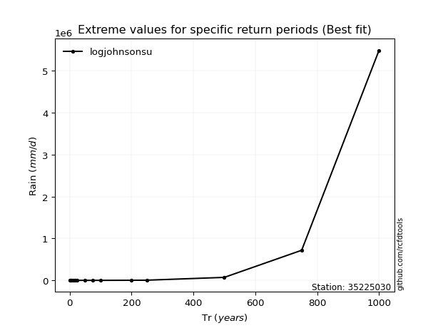</img>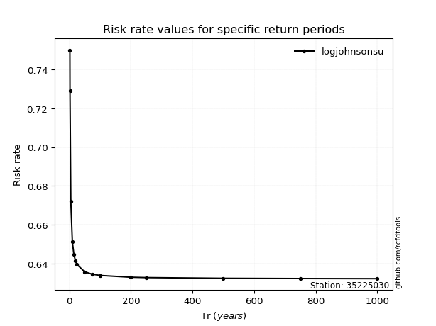</img>

</div>


<sub>**APP DISCLAIMER**: NO WARRANTY - This software is provided by [github.com/rcfdtools](https://github.com/rcfdtools) "as is", without any express or implied warranty, including warranties of merchantability, fitness for a particular purpose, or non-infringement. There is no guarantee that the software will be error-free or operate without interruption. LIMITATION OF LIABILITY - Neither the authors nor copyright holders will be liable for claims or damages arising from the software or its use. You are responsible for determining if the software is appropriate for your use and assume all associated risks, including errors, legal compliance, and data loss. NO PROFESSIONAL ADVICE - The software provides general information and does not offer professional advice. It should not replace consultation with professional advisors.</sub>