<div align="center">


</div>

# PMax24h Station (Rain): 35235010

Maximum Precipitation in 24 hours (PMax24h) is the greatest amount of rainfall for a specific duration that is meteorologically possible for a given location, acting as a "worst-case" scenario for extreme storms, crucial for designing safety-critical infrastructure like bridges, river deviations, dams, spillways, and nuclear plants to prevent catastrophic failure. The PMax24h is related with the Probable Maximum Precipitation (PMP) and it is calculated by hydrologists using meteorological data to determine the upper limit of extreme rainfall, often leading to the Probable Maximum Flood (PMF) for flood control design, and is increasingly being studied for climate change impacts. Probable Maximum Precipitation (PMP) is the theoretical upper limit of rainfall, a deterministic estimate for extreme events, while probability distributions (like GEV, Gumbel) describe the likelihood and frequency of various precipitation amounts, including rare ones, showing how often events occur, with PMP representing the extreme end of these distributions, used for critical infrastructure design to ensure safety against the worst conceivable weather, unlike standard statistical forecasts which cover typical probabilities.

The most common probability distributions in hydrology, used for analyzing floods, rainfall, and streamflow, include the Normal, Log-Normal, Gumbel, Gamma (including Log-Pearson Type III), and Generalized Extreme Value (GEV) distributions, often chosen based on the data´s skewness and whether modeling extremes or general conditions, with Gumbel and GEV popular for extreme events like floods, while the Normal distribution serves as a baseline, though often requiring transformations for skewed hydrological data. These distributions help in designing water infrastructure, managing water resources, and forecasting hydrologic events.

> Hydrological data often isn´t perfectly normal (it´s skewed), so different distributions are needed for different applications, such as: **Flood Frequency Analysis**: Using Gumbel, GEV, or Log-Pearson Type III for predicting extreme flood magnitudes and their return periods, **Rainfall Analysis**: Normal for annual totals, but Log-Normal, Weibull, or GEV for intensity or extreme daily rainfall, **Streamflow Modeling**: Gamma and Log-Normal for maximum flows, GEV for minimum flows, and Kappa for daily flows.

<div align="center">

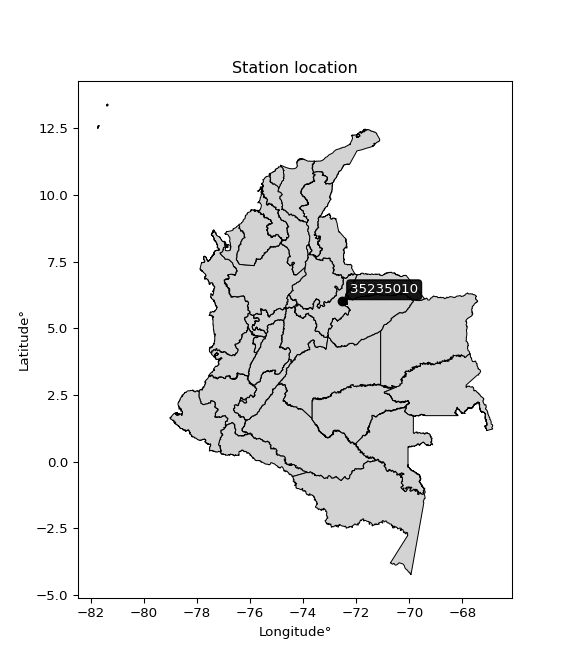</img>

</div>


## A. General information


### 1. General running parameters

• app_version: _v20260312_. • runtime: _2026-03-12 07:15:23.203550_. • Python version: _3.14.0_. • SciPy version: _1.16.3_. • Pandas version: _2.3.3_. • NumPy version: _2.3.5_. • Stations dataset (station_dataset_file): _dataset/pmax24h_in/automatic_colombia_2003_2025.csv_. • Stations catalog (station_catalog_file): _dataset/CNE.xls_. • Minimum year to eval til year_max (date_min): _1900_. • Maximum year to eval since year_min (date_max): _2025_. • Creates, save and include plots into reports (create_plot): _True_. • Plot only fit distributions with Δo > Δ (plot_only_fit): _True_. • Plot only simple graphs avoiding multiple CDFs and multiple Extreme values plots (plot_only_simple): _True_. • Eval low extreme values, if False, evaluates high extreme values (low_extreme): _False_. • Eval every SciPy distribution as logarithmic (pdist_logarithmic_on): _True_. • Standard deviation normalized (ddof): _1.0_. • Return periods to eval in years (Tr): _[2, 2.33, 5, 10, 15, 20, 25, 50, 75, 100, 200, 250, 500, 750, 1000]_. • Minimum data sample per station, 0 means any (minimum_sample): _5_. • Z-Score maximum threshold to adjust a value, 0 means disable (zscore_max): _3.5_. • Z-Score minimum threshold to adjust a value, 0 means disable (zscore_min): _-2.5_. • Avoid zeros, e.g. rain = 0 (avoid_zeros): _True_. • Avoid null values (avoid_nans): _True_. 

:file_folder:Table: [dataset.csv](../../dataset/pmax24h_in/automatic_colombia_2003_2025.csv)

> Delta Degrees of Freedom (DDOF): is a parameter used in the formulas for calculating variance and standard deviation. When ddof=0, the divisor is $N$ (the total number of observations) and this is used when your data set is the entire population. When ddof=1, the divisor is $N-1$ and this is used when your data set is a sample drawn from a larger population. Using $N-1$ provides an unbiased estimate of the population variance (known as Bessel´s correction).


### 2. Station info and location

|   id |   CODIGO | NOMBRE                   | CATEGORIA               | TECNOLOGIA                              | ESTADO   | FECHA_INSTALACION   |   FECHA_SUSPENSION |   ALTITUD |   LATITUD |   LONGITUD | DEPARTAMENTO   | MUNICIPIO   | AREA_OPERATIVA                              | ENTIDAD                                                     | AREA_HIDROGRAFICA   | ZONA_HIDROGRAFICA   | SUBZONA_HIDROGRAFICA   |   CORRIENTE | Catalogo   |   Version |
|-----:|---------:|:-------------------------|:------------------------|:----------------------------------------|:---------|:--------------------|-------------------:|----------:|----------:|-----------:|:---------------|:------------|:--------------------------------------------|:------------------------------------------------------------|:--------------------|:--------------------|:-----------------------|------------:|:-----------|----------:|
|    0 | 35235010 | CARDON EL AUT [35235010] | Climatológica Ordinaria | Automática con Telemetría, Convencional | Activa   | 15/05/1974          |                nan |      3590 |   6.01167 |   -72.5293 | Boyacá         | Socotá      | Area Operativa 06 - Boyacá-Casanare-Vichada | INSTITUTO DE HIDROLOGIA METEOROLOGIA Y ESTUDIOS AMBIENTALES | Orinoco             | Meta                | Río Pauto              |         nan | CNE_IDEAM  |  20251226 |

<div align="center">

Dynamic map: [:earth_americas:Google](http://maps.google.com/maps?q=6.011666667,-72.52927778) [:earth_americas:OSM](https://www.openstreetmap.org/#map=18/6.011666667/-72.52927778&layers=P) [:earth_americas:Bing](https://www.bing.com/maps?cp=6.011666667~-72.52927778&lvl=18) [:earth_americas:Apple](https://maps.apple.com/frame?center=6.011666667%2C-72.52927778&span=0.003%2C0.006)

</div>


<div align="center">

```geojson
{
  "type": "Feature",
  "geometry": {
    "type": "Point", 
    "coordinates": [-72.52927778, 6.011666667]
  }, 
  "properties": {
    "Name": "35235010"
  }
}
```

</div>


### 3. Discrete values table and plot

<div align="center">

|               |           0 |            1 |           2 |           3 |           4 |          5 |           6 |
|:--------------|------------:|-------------:|------------:|------------:|------------:|-----------:|------------:|
| Date          | 2019        | 2020         | 2021        | 2022        | 2023        | 2024       | 2025        |
| Value         |   39.1      |   53         |   46.5      |   43.6      |   44.5      |   81       |   57.7      |
| Value_initial |   39.1      |   53         |   46.5      |   43.6      |   44.5      |   81       |   57.7      |
| count         |    7        |    7         |    7        |    7        |    7        |    7       |    7        |
| mean          |   52.2      |   52.2       |   52.2      |   52.2      |   52.2      |   52.2     |   52.2      |
| std           |   14.1285   |   14.1285    |   14.1285   |   14.1285   |   14.1285   |   14.1285  |   14.1285   |
| zscore        |   -0.927207 |    0.0566233 |   -0.403441 |   -0.608701 |   -0.544999 |    2.03844 |    0.389285 |


</div>


<div align="center">

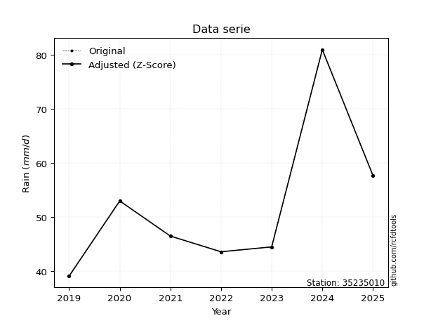</img>

</div>


> The initial value (value_initial) correspond to the initial obtained or null completed value, and value (value) is adjusted only when the initial value is outside the valid range (outlier) definite through the Z-Score value. If Z-Score is active, values out of range or outliers are replaced with the station mean value. A Z-Score (or standard score) measures how many standard deviations a data point is from the mean of a dataset, indicating its relative position; positive scores mean above the mean, negative mean below, and a score of zero is exactly at the mean, allowing for comparison of values from different distributions. It´s calculated using the formula $z=(x–μ)/σ$, where $x$ is the data point, $μ$ is the mean, and $σ$ is the standard deviation, helping identify outliers and understand probability.
>
> <sub>**Note**: In this study, "completing" (filling gaps in) and "extending" (forecasting or lengthening the historical record) rainfall data series are avoided for certain critical analyses because they introduce artificial bias and uncertainty, which can distort the statistics of rare events (extremes), alter day-to-day variability, and compromise the integrity and homogeneity of the original data. Some reasons against Completing/Extending rainfall data are: **Distortion of Extremes and Variability**: The primary issue is that most gap-filling or extension methods rely on averaging or regression with nearby stations, which inherently smooths the data. Rainfall is highly variable in space and time, with a large percentage of zero values and occasional large storms. Infilling methods often underestimate the highest values and overestimate the lowest (zero) values, which severely distorts analyses focused on flood frequency, drought severity, and intensity-duration-frequency (IDF) curves, **Loss of Data Homogeneity**: Infilled or extended data are synthetic estimates, not actual measurements. Combining these estimates with observed data can violate the assumption of data homogeneity, which requires that the data properties do not change over time. Inhomogeneity can lead to incorrect conclusions about long-term trends or changes in climate patterns, **Propagation of Errors**: Errors and biases from the original data (e.g., wind-induced undercatch, instrument errors, site changes) or the data used for imputation can propagate through the analysis, leading to unreliable hydrological models and inaccurate predictions, **Compromised Statistical Integrity**: For statistical analyses, especially those involving the frequency of events, using artificial data can introduce time bias or autocorrelation that doesn´t exist in reality, making it difficult to assess the true probability of events, **Difficulty in Validation**: It is difficult to accurately validate the quality of filled or extended data, especially for past periods where ground-truth measurements are unavailable. The reliability of imputation techniques heavily depends on the density of the surrounding station network and the complexity of the local topography.</sub>


### 4. Active continuous probability distributions from SciPy (80 of 104 available)

A Probability Density Function (PDF) describes the relative likelihood of a continuous random variable falling within a specific range, where the total area under its curve equals 1, and the area over any interval gives the actual probability for that range. Unlike discrete probabilities (like rolling a die), a PDF shows density, not direct probability for a single point (which is zero), with higher points indicating higher likelihood, often visualized as a bell curve for normal distributions.

A log of a probability density function (log-PDF) is simply the logarithm of the PDF´s value, denoted as $log(f(x))$, useful for converting multiplication of probabilities into addition, improving numerical stability with tiny numbers, and connecting to information theory concepts like entropy. Instead of dealing with very small probabilities (e.g., 0.000001), log-PDFs use negative numbers (e.g., $log(0.00001) ≈ -11.51$ that are easier for computers to handle, preventing underflow errors and simplifying complex calculations. In this study, each active probability distribution from SciPy is also evaluated in the $log$ form.

[scipy.stats](https://docs.scipy.org/doc/scipy/reference/stats.html) is a Python´s powerful submodule within the SciPy library for comprehensive statistical analysis, offering over 130 probability distributions (like Normal, Poisson, etc.), functions for descriptive stats (mean, variance), hypothesis testing (t-tests, chi-square), random variable generation, and statistical tests, making it essential for data science, modeling, and research. It provides tools to explore, model, and draw conclusions from data efficiently, working seamlessly with [NumPy](https://numpy.org/).

<div align="center">

|   id | p_dist           |   n_parameter | fit_method   | label                                                                       | active   | ref                                                                                                      |
|-----:|:-----------------|--------------:|:-------------|:----------------------------------------------------------------------------|:---------|:---------------------------------------------------------------------------------------------------------|
|    0 | alpha            |             3 | MLE          | Alpha                                                                       | True     | [:mortar_board:](https://docs.scipy.org/doc/scipy/reference/generated/scipy.stats.alpha.html)            |
|    1 | anglit           |             2 | MM           | Anglit                                                                      | True     | [:mortar_board:](https://docs.scipy.org/doc/scipy/reference/generated/scipy.stats.anglit.html)           |
|    2 | arcsine          |             2 | MM           | Arcsine                                                                     | True     | [:mortar_board:](https://docs.scipy.org/doc/scipy/reference/generated/scipy.stats.arcsine.html)          |
|    3 | argus            |             3 | MLE          | Argus                                                                       | True     | [:mortar_board:](https://docs.scipy.org/doc/scipy/reference/generated/scipy.stats.argus.html)            |
|    4 | beta             |             4 | MLE          | Beta                                                                        | True     | [:mortar_board:](https://docs.scipy.org/doc/scipy/reference/generated/scipy.stats.beta.html)             |
|    5 | betaprime        |             4 | MLE          | Beta prime                                                                  | True     | [:mortar_board:](https://docs.scipy.org/doc/scipy/reference/generated/scipy.stats.betaprime.html)        |
|    6 | bradford         |             3 | MLE          | Bradford                                                                    | True     | [:mortar_board:](https://docs.scipy.org/doc/scipy/reference/generated/scipy.stats.bradford.html)         |
|    7 | burr             |             4 | MLE          | Burr (Type III)                                                             | True     | [:mortar_board:](https://docs.scipy.org/doc/scipy/reference/generated/scipy.stats.burr.html)             |
|    8 | burr12           |             4 | MLE          | Burr (Type III) 12                                                          | True     | [:mortar_board:](https://docs.scipy.org/doc/scipy/reference/generated/scipy.stats.burr12.html)           |
|    9 | cosine           |             2 | MLE          | Cosine                                                                      | True     | [:mortar_board:](https://docs.scipy.org/doc/scipy/reference/generated/scipy.stats.cosine.html)           |
|   10 | crystalball      |             4 | MLE          | Crystalball                                                                 | True     | [:mortar_board:](https://docs.scipy.org/doc/scipy/reference/generated/scipy.stats.crystalball.html)      |
|   11 | dgamma           |             3 | MLE          | Double gamma                                                                | True     | [:mortar_board:](https://docs.scipy.org/doc/scipy/reference/generated/scipy.stats.dgamma.html)           |
|   12 | dweibull         |             3 | MLE          | Double Weibull                                                              | True     | [:mortar_board:](https://docs.scipy.org/doc/scipy/reference/generated/scipy.stats.dweibull.html)         |
|   13 | erlang           |             3 | MLE          | Erlang                                                                      | True     | [:mortar_board:](https://docs.scipy.org/doc/scipy/reference/generated/scipy.stats.erlang.html)           |
|   14 | exponnorm        |             3 | MLE          | Exponentially modified Normal                                               | True     | [:mortar_board:](https://docs.scipy.org/doc/scipy/reference/generated/scipy.stats.exponnorm.html)        |
|   15 | exponpow         |             3 | MLE          | Exponential power                                                           | True     | [:mortar_board:](https://docs.scipy.org/doc/scipy/reference/generated/scipy.stats.exponpow.html)         |
|   16 | exponweib        |             4 | MLE          | Exponentiated Weibull                                                       | True     | [:mortar_board:](https://docs.scipy.org/doc/scipy/reference/generated/scipy.stats.exponweib.html)        |
|   17 | f                |             4 | MLE          | F                                                                           | True     | [:mortar_board:](https://docs.scipy.org/doc/scipy/reference/generated/scipy.stats.f.html)                |
|   18 | fatiguelife      |             3 | MLE          | Fatigue-life (Birnbaum-Saunders)                                            | True     | [:mortar_board:](https://docs.scipy.org/doc/scipy/reference/generated/scipy.stats.fatiguelife.html)      |
|   19 | foldnorm         |             3 | MM           | Fold Normal                                                                 | True     | [:mortar_board:](https://docs.scipy.org/doc/scipy/reference/generated/scipy.stats.foldnorm.html)         |
|   20 | gamma            |             3 | MLE          | Gamma                                                                       | True     | [:mortar_board:](https://docs.scipy.org/doc/scipy/reference/generated/scipy.stats.gamma.html)            |
|   21 | gausshyper       |             6 | MLE          | Gauss hypergeometric                                                        | True     | [:mortar_board:](https://docs.scipy.org/doc/scipy/reference/generated/scipy.stats.gausshyper.html)       |
|   22 | genexpon         |             5 | MLE          | Generalized exponential                                                     | True     | [:mortar_board:](https://docs.scipy.org/doc/scipy/reference/generated/scipy.stats.genexpon.html)         |
|   23 | genextreme       |             3 | MLE          | Generalized exponential                                                     | True     | [:mortar_board:](https://docs.scipy.org/doc/scipy/reference/generated/scipy.stats.genextreme.html)       |
|   24 | gengamma         |             4 | MLE          | Generalized gamma                                                           | True     | [:mortar_board:](https://docs.scipy.org/doc/scipy/reference/generated/scipy.stats.gengamma.html)         |
|   25 | genhalflogistic  |             3 | MLE          | Generalized half-logistic                                                   | True     | [:mortar_board:](https://docs.scipy.org/doc/scipy/reference/generated/scipy.stats.genhalflogistic.html)  |
|   26 | genlogistic      |             3 | MLE          | Generalized logistic                                                        | True     | [:mortar_board:](https://docs.scipy.org/doc/scipy/reference/generated/scipy.stats.genlogistic.html)      |
|   27 | gennorm          |             3 | MLE          | Generalized Normal                                                          | True     | [:mortar_board:](https://docs.scipy.org/doc/scipy/reference/generated/scipy.stats.gennorm.html)          |
|   28 | genpareto        |             3 | MLE          | Generalized Pareto                                                          | True     | [:mortar_board:](https://docs.scipy.org/doc/scipy/reference/generated/scipy.stats.genpareto.html)        |
|   29 | gompertz         |             3 | MLE          | Gompertz (or truncated Gumbel)                                              | True     | [:mortar_board:](https://docs.scipy.org/doc/scipy/reference/generated/scipy.stats.gompertz.html)         |
|   30 | gumbel_l         |             2 | MM           | Gumbel Left Skew                                                            | True     | [:mortar_board:](https://docs.scipy.org/doc/scipy/reference/generated/scipy.stats.gumbel_l.html)         |
|   31 | gumbel_r         |             2 | MM           | Gumbel Right Skew                                                           | True     | [:mortar_board:](https://docs.scipy.org/doc/scipy/reference/generated/scipy.stats.gumbel_r.html)         |
|   32 | halfgennorm      |             3 | MLE          | Upper half of a generalized normal                                          | True     | [:mortar_board:](https://docs.scipy.org/doc/scipy/reference/generated/scipy.stats.halfgennorm.html)      |
|   33 | halflogistic     |             2 | MM           | Half-logistic                                                               | True     | [:mortar_board:](https://docs.scipy.org/doc/scipy/reference/generated/scipy.stats.halflogistic.html)     |
|   34 | halfnorm         |             2 | MM           | Half Normal                                                                 | True     | [:mortar_board:](https://docs.scipy.org/doc/scipy/reference/generated/scipy.stats.halfnorm.html)         |
|   35 | hypsecant        |             2 | MM           | hyperbolic secant                                                           | True     | [:mortar_board:](https://docs.scipy.org/doc/scipy/reference/generated/scipy.stats.hypsecant.html)        |
|   36 | invgamma         |             3 | MLE          | Inverted gamma                                                              | True     | [:mortar_board:](https://docs.scipy.org/doc/scipy/reference/generated/scipy.stats.invgamma.html)         |
|   37 | invgauss         |             3 | MLE          | Inverse Gaussian                                                            | True     | [:mortar_board:](https://docs.scipy.org/doc/scipy/reference/generated/scipy.stats.invgauss.html)         |
|   38 | invweibull       |             3 | MLE          | Inverted Weibull                                                            | True     | [:mortar_board:](https://docs.scipy.org/doc/scipy/reference/generated/scipy.stats.invweibull.html)       |
|   39 | johnsonsb        |             4 | MLE          | Johnson SB                                                                  | True     | [:mortar_board:](https://docs.scipy.org/doc/scipy/reference/generated/scipy.stats.johnsonsb.html)        |
|   40 | johnsonsu        |             4 | MLE          | Johnson Su                                                                  | True     | [:mortar_board:](https://docs.scipy.org/doc/scipy/reference/generated/scipy.stats.johnsonsu.html)        |
|   41 | kappa3           |             3 | MLE          | Kappa 3                                                                     | True     | [:mortar_board:](https://docs.scipy.org/doc/scipy/reference/generated/scipy.stats.kappa3.html)           |
|   42 | kappa4           |             4 | MLE          | Kappa 4                                                                     | True     | [:mortar_board:](https://docs.scipy.org/doc/scipy/reference/generated/scipy.stats.kappa4.html)           |
|   43 | ksone            |             3 | MLE          | Kolmogorov-Smirnov one-sided test statistic distribution                    | True     | [:mortar_board:](https://docs.scipy.org/doc/scipy/reference/generated/scipy.stats.ksone.html)            |
|   44 | kstwobign        |             2 | MLE          | Limiting distribution of scaled Kolmogorov-Smirnov two-sided test statistic | True     | [:mortar_board:](https://docs.scipy.org/doc/scipy/reference/generated/scipy.stats.kstwobign.html)        |
|   45 | laplace          |             2 | MM           | Laplace                                                                     | True     | [:mortar_board:](https://docs.scipy.org/doc/scipy/reference/generated/scipy.stats.laplace.html)          |
|   46 | levy_l           |             2 | MLE          | Left-skewed Levy                                                            | True     | [:mortar_board:](https://docs.scipy.org/doc/scipy/reference/generated/scipy.stats.levy_l.html)           |
|   47 | loggamma         |             3 | MLE          | Log gamma                                                                   | True     | [:mortar_board:](https://docs.scipy.org/doc/scipy/reference/generated/scipy.stats.loggamma.html)         |
|   48 | logistic         |             2 | MM           | Logistic (or Sech-squared)                                                  | True     | [:mortar_board:](https://docs.scipy.org/doc/scipy/reference/generated/scipy.stats.logistic.html)         |
|   49 | loglaplace       |             3 | MLE          | Log-Laplace                                                                 | True     | [:mortar_board:](https://docs.scipy.org/doc/scipy/reference/generated/scipy.stats.loglaplace.html)       |
|   50 | lomax            |             3 | MLE          | Lomax (Pareto of the second kind)                                           | True     | [:mortar_board:](https://docs.scipy.org/doc/scipy/reference/generated/scipy.stats.lomax.html)            |
|   51 | maxwell          |             2 | MM           | Maxwell                                                                     | True     | [:mortar_board:](https://docs.scipy.org/doc/scipy/reference/generated/scipy.stats.maxwell.html)          |
|   52 | mielke           |             4 | MLE          | Mielke Beta-Kappa / Dagum                                                   | True     | [:mortar_board:](https://docs.scipy.org/doc/scipy/reference/generated/scipy.stats.mielke.html)           |
|   53 | moyal            |             2 | MM           | Moyal                                                                       | True     | [:mortar_board:](https://docs.scipy.org/doc/scipy/reference/generated/scipy.stats.moyal.html)            |
|   54 | nakagami         |             3 | MLE          | Nakagami                                                                    | True     | [:mortar_board:](https://docs.scipy.org/doc/scipy/reference/generated/scipy.stats.nakagami.html)         |
|   55 | ncf              |             5 | MLE          | Non-central F distribution                                                  | True     | [:mortar_board:](https://docs.scipy.org/doc/scipy/reference/generated/scipy.stats.ncf.html)              |
|   56 | nct              |             4 | MLE          | Non-central Student’s t                                                     | True     | [:mortar_board:](https://docs.scipy.org/doc/scipy/reference/generated/scipy.stats.nct.html)              |
|   57 | norm             |             2 | MM           | Normal                                                                      | True     | [:mortar_board:](https://docs.scipy.org/doc/scipy/reference/generated/scipy.stats.norm.html)             |
|   58 | pearson3         |             3 | MM           | Pearson type III                                                            | True     | [:mortar_board:](https://docs.scipy.org/doc/scipy/reference/generated/scipy.stats.pearson3.html)         |
|   59 | powerlaw         |             3 | MLE          | Power-function                                                              | True     | [:mortar_board:](https://docs.scipy.org/doc/scipy/reference/generated/scipy.stats.powerlaw.html)         |
|   60 | rayleigh         |             2 | MM           | Rayleigh                                                                    | True     | [:mortar_board:](https://docs.scipy.org/doc/scipy/reference/generated/scipy.stats.rayleigh.html)         |
|   61 | rdist            |             3 | MLE          | R-distributed (symmetric beta)                                              | True     | [:mortar_board:](https://docs.scipy.org/doc/scipy/reference/generated/scipy.stats.rdist.html)            |
|   62 | rice             |             3 | MLE          | Rice                                                                        | True     | [:mortar_board:](https://docs.scipy.org/doc/scipy/reference/generated/scipy.stats.rice.html)             |
|   63 | semicircular     |             2 | MM           | Semicircular                                                                | True     | [:mortar_board:](https://docs.scipy.org/doc/scipy/reference/generated/scipy.stats.semicircular.html)     |
|   64 | skewnorm         |             3 | MLE          | Skew normal                                                                 | True     | [:mortar_board:](https://docs.scipy.org/doc/scipy/reference/generated/scipy.stats.skewnorm.html)         |
|   65 | t                |             3 | MLE          | Student’s t                                                                 | True     | [:mortar_board:](https://docs.scipy.org/doc/scipy/reference/generated/scipy.stats.t.html)                |
|   66 | trapezoid        |             4 | MLE          | Trapezoid                                                                   | True     | [:mortar_board:](https://docs.scipy.org/doc/scipy/reference/generated/scipy.stats.trapezoid.html)        |
|   67 | triang           |             3 | MLE          | Triangular                                                                  | True     | [:mortar_board:](https://docs.scipy.org/doc/scipy/reference/generated/scipy.stats.triang.html)           |
|   68 | truncexpon       |             3 | MLE          | Truncated exponential                                                       | True     | [:mortar_board:](https://docs.scipy.org/doc/scipy/reference/generated/scipy.stats.truncexpon.html)       |
|   69 | truncnorm        |             4 | MLE          | Truncated normal                                                            | True     | [:mortar_board:](https://docs.scipy.org/doc/scipy/reference/generated/scipy.stats.truncnorm.html)        |
|   70 | truncpareto      |             4 | MLE          | Upper truncated Pareto                                                      | True     | [:mortar_board:](https://docs.scipy.org/doc/scipy/reference/generated/scipy.stats.truncpareto.html)      |
|   71 | truncweibull_min |             5 | MLE          | Doubly truncated Weibull minimum                                            | True     | [:mortar_board:](https://docs.scipy.org/doc/scipy/reference/generated/scipy.stats.truncweibull_min.html) |
|   72 | tukeylambda      |             3 | MLE          | Tukey-Lamdba                                                                | True     | [:mortar_board:](https://docs.scipy.org/doc/scipy/reference/generated/scipy.stats.tukeylambda.html)      |
|   73 | uniform          |             2 | MLE          | Uniform                                                                     | True     | [:mortar_board:](https://docs.scipy.org/doc/scipy/reference/generated/scipy.stats.uniform.html)          |
|   74 | vonmises         |             3 | MLE          | Von Mises                                                                   | True     | [:mortar_board:](https://docs.scipy.org/doc/scipy/reference/generated/scipy.stats.vonmises.html)         |
|   75 | vonmises_line    |             3 | MLE          | Von Mises line                                                              | True     | [:mortar_board:](https://docs.scipy.org/doc/scipy/reference/generated/scipy.stats.vonmises_line.html)    |
|   76 | wald             |             2 | MM           | Wald                                                                        | True     | [:mortar_board:](https://docs.scipy.org/doc/scipy/reference/generated/scipy.stats.wald.html)             |
|   77 | weibull_max      |             3 | MLE          | Weibull maximum                                                             | True     | [:mortar_board:](https://docs.scipy.org/doc/scipy/reference/generated/scipy.stats.weibull_max.html)      |
|   78 | weibull_min      |             3 | MLE          | Weibull minimum                                                             | True     | [:mortar_board:](https://docs.scipy.org/doc/scipy/reference/generated/scipy.stats.weibull_min.html)      |
|   79 | wrapcauchy       |             3 | MLE          | Wrapped  Cauchy                                                             | True     | [:mortar_board:](https://docs.scipy.org/doc/scipy/reference/generated/scipy.stats.wrapcauchy.html)       |

</div>

> **n_parameter:** # arguments & localization & scale.
>
> **Fit methods:** (MLE) maximum likelihood, (MM) L-moments.
>
>**Inactive** (With the only purpose of prevent loops, zero divisions, infinite values, over high estimated values or horizontal trending for recurrence intervals estimations, the follow distributions were disabled.)**:** lognorm, norminvgauss, powernorm, powerlognorm, cauchy, halfcauchy, foldcauchy, skewcauchy, chi2, expon, fisk, genhyperbolic, geninvgauss, gibrat, kstwo, laplace_asymmetric, levy, levy_stable, ncx2, pareto, rel_breitwigner, recipinvgauss, studentized_range, loguniform, 


## B. Probability (PDF) vs. Empirical (EDF) distributions functions

A continuous probability distribution (CPD) describes probabilities for variables that can take any value within a range (like rain any time), unlike discrete variables with specific outcomes (like temperature). It uses a Probability Density Function (PDF), a curve where the total area under it equals 1, and the probability of the variable falling within an interval (a to b) is found by calculating the area under the curve between those points. A key feature is that the probability of hitting any single exact value is zero, so probabilities are always expressed for ranges, e.g., $P(a ≤ X ≤ b)$.

<div align="center">

Distributions parameters from station values
|     |   station | p_dist              |   n |             loc |          scale | shape                  | shape1                 | shape2                 | shape3             |
|----:|----------:|:--------------------|----:|----------------:|---------------:|:-----------------------|:-----------------------|:-----------------------|:-------------------|
|   0 |  35235010 | alpha               |   7 |    25.8828      |   56.2621      | 2.563135466987146      |                        |                        |                    |
|   1 |  35235010 | anglit              |   7 |    52.2         |   38.2654      |                        |                        |                        |                    |
|   2 |  35235010 | arcsine             |   7 |    33.7015      |   36.997       |                        |                        |                        |                    |
|   3 |  35235010 | argus               |   7 |    21.6403      |   61.6799      | 6.34568286697027e-07   |                        |                        |                    |
|   4 |  35235010 | beta                |   7 |    39.1         |   47.9009      | 0.2745305978786155     | 0.9539442572039101     |                        |                    |
|   5 |  35235010 | betaprime           |   7 |    -0.814122    |    1.7032      | 673.5986891769428      | 22.70262351950032      |                        |                    |
|   6 |  35235010 | bradford            |   7 |    39.1         |   41.9259      | 7.613473259596743      |                        |                        |                    |
|   7 |  35235010 | burr                |   7 |     2.20934     |   19.3531      | 6.107093855572817      | 143.30052989891203     |                        |                    |
|   8 |  35235010 | burr12              |   7 |    -4.00632     |   42.9588      | 1039.9974862960714     | 0.003920007733440552   |                        |                    |
|   9 |  35235010 | cosine              |   7 |    54.7429      |   11.6602      |                        |                        |                        |                    |
|  10 |  35235010 | crystalball         |   7 |    52.2         |   13.0804      | 20224.9748701583       | 546.3822993065354      |                        |                    |
|  11 |  35235010 | dgamma              |   7 |    46.5         |    9.62962     | 0.8184238288138802     |                        |                        |                    |
|  12 |  35235010 | dweibull            |   7 |    43.6         |   10.4019      | 0.8323111680319923     |                        |                        |                    |
|  13 |  35235010 | erlang              |   7 |    39.1         |   14.03        | 0.19277628115107998    |                        |                        |                    |
|  14 |  35235010 | exponnorm           |   7 |    39.0791      |    0.00673453  | 1934.4772503483473     |                        |                        |                    |
|  15 |  35235010 | exponpow            |   7 |    39.1         |   38.2809      | 0.1856767552462695     |                        |                        |                    |
|  16 |  35235010 | exponweib           |   7 |    39.1         |    1.27458     | 1.2134826188012706     | 0.3735542673904556     |                        |                    |
|  17 |  35235010 | f                   |   7 |    33.5832      |   12.5549      | 170.6971287202391      | 5.693637821890469      |                        |                    |
|  18 |  35235010 | fatiguelife         |   7 |    39.1         |    1.1266e-05  | 996.9531654739253      |                        |                        |                    |
|  19 |  35235010 | foldnorm            |   7 |    34.5609      |   21.3824      | 0.25333607283654525    |                        |                        |                    |
|  20 |  35235010 | gamma               |   7 |    39.1         |   12.7808      | 0.1990189369356653     |                        |                        |                    |
|  21 |  35235010 | gausshyper          |   7 |    39.1         |   46.4055      | 0.1708227384535916     | 1.1329884553539142     | 0.8920006330155822     | 0.9483987409946619 |
|  22 |  35235010 | genexpon            |   7 |    39.1         |   17.137       | 1.3081812092449527     | 1.1537128618506595e-09 | 2.3084270369430726     |                    |
|  23 |  35235010 | genextreme          |   7 |    45.0821      |    6.52981     | -0.40955009664368824   |                        |                        |                    |
|  24 |  35235010 | gengamma            |   7 |    39.1         |    1.39761     | 1.2690473548235375     | 0.1613482890384227     |                        |                    |
|  25 |  35235010 | genhalflogistic     |   7 |    39.1         |    9.74097     | 8.350121058282439e-09  |                        |                        |                    |
|  26 |  35235010 | genlogistic         |   7 |   -14.508       |    8.32947     | 1548.1718860725973     |                        |                        |                    |
|  27 |  35235010 | gennorm             |   7 |    46.5         |    1.61559e-08 | 0.1147573350663946     |                        |                        |                    |
|  28 |  35235010 | genpareto           |   7 |    -0.082339    |  121.332       | -1.4964007284436587    |                        |                        |                    |
|  29 |  35235010 | gompertz            |   7 |    39.1         | 6739.81        | 513.4912176308011      |                        |                        |                    |
|  30 |  35235010 | gumbel_l            |   7 |    58.0869      |   10.1988      |                        |                        |                        |                    |
|  31 |  35235010 | gumbel_r            |   7 |    46.3131      |   10.1988      |                        |                        |                        |                    |
|  32 |  35235010 | halfgennorm         |   7 |    39.1         |    1.29237     | 0.43145094473065837    |                        |                        |                    |
|  33 |  35235010 | halflogistic        |   7 |    36.6967      |   11.1833      |                        |                        |                        |                    |
|  34 |  35235010 | halfnorm            |   7 |    34.8867      |   21.6991      |                        |                        |                        |                    |
|  35 |  35235010 | hypsecant           |   7 |    52.2         |    8.32725     |                        |                        |                        |                    |
|  36 |  35235010 | invgamma            |   7 |    33.4292      |   35.6753      | 2.827620134717722      |                        |                        |                    |
|  37 |  35235010 | invgauss            |   7 |    35.9448      |   19.6984      | 0.8252042456674236     |                        |                        |                    |
|  38 |  35235010 | invweibull          |   7 |    29.1382      |   15.944       | 2.441709579475255      |                        |                        |                    |
|  39 |  35235010 | johnsonsb           |   7 |    39.1         |   63.2267      | 0.6864040459345906     | 0.08381531266567056    |                        |                    |
|  40 |  35235010 | johnsonsu           |   7 |    36.9712      |    0.103378    | -5.959836913515495     | 1.1202326703380057     |                        |                    |
|  41 |  35235010 | kappa3              |   7 |    39.1         |   41.8752      | 3285.473109593402      |                        |                        |                    |
|  42 |  35235010 | kappa4              |   7 |    33.9644      |   49.9259      | 1.1150540892140646     | 1.057839554104803      |                        |                    |
|  43 |  35235010 | ksone               |   7 |    34.91        |   50.28        | 1.0                    |                        |                        |                    |
|  44 |  35235010 | kstwobign           |   7 |    15.8507      |   42.1573      |                        |                        |                        |                    |
|  45 |  35235010 | laplace             |   7 |    52.2         |    9.24925     |                        |                        |                        |                    |
|  46 |  35235010 | levy_l              |   7 |    84.4051      |   15.1847      |                        |                        |                        |                    |
|  47 |  35235010 | loggamma            |   7 | -3500.81        |  493.813       | 1333.0622487198962     |                        |                        |                    |
|  48 |  35235010 | logistic            |   7 |    52.2         |    7.21161     |                        |                        |                        |                    |
|  49 |  35235010 | loglaplace          |   7 |    -0.134851    |   46.6349      | 5.93141567156019       |                        |                        |                    |
|  50 |  35235010 | lomax               |   7 |    39.1         |  696.543       | 54.14239664627728      |                        |                        |                    |
|  51 |  35235010 | maxwell             |   7 |    21.2049      |   19.4233      |                        |                        |                        |                    |
|  52 |  35235010 | mielke              |   7 |     0.104432    |   23.2665      | 434.809654023097       | 6.23168400165191       |                        |                    |
|  53 |  35235010 | moyal               |   7 |    44.7198      |    5.88825     |                        |                        |                        |                    |
|  54 |  35235010 | nakagami            |   7 |    39.1         |   23.455       | 0.2611179901262296     |                        |                        |                    |
|  55 |  35235010 | ncf                 |   7 |    -3.1245      |    0.0191485   | 0.028764156846325148   | 1477.0105110219279     | 82.91988407839798      |                    |
|  56 |  35235010 | nct                 |   7 |    -0.511398    |    0.76075     | 12.141427205767613     | 64.68557975930602      |                        |                    |
|  57 |  35235010 | norm                |   7 |    52.2         |   13.0804      |                        |                        |                        |                    |
|  58 |  35235010 | pearson3            |   7 |    52.2         |   13.0804      | 1.3103671540321145     |                        |                        |                    |
|  59 |  35235010 | powerlaw            |   7 |    39.1         |   41.9         | 0.15821845771966284    |                        |                        |                    |
|  60 |  35235010 | rayleigh            |   7 |    27.1764      |   19.9659      |                        |                        |                        |                    |
|  61 |  35235010 | rdist               |   7 |    48.4008      |    9.3008      | 1.4307201636274047     |                        |                        |                    |
|  62 |  35235010 | rice                |   7 |    32.16        |   16.9219      | 0.00016626556928149724 |                        |                        |                    |
|  63 |  35235010 | semicircular        |   7 |    52.2         |   26.1609      |                        |                        |                        |                    |
|  64 |  35235010 | skewnorm            |   7 |    39.1         |   18.5118      | 19714320.983114406     |                        |                        |                    |
|  65 |  35235010 | t                   |   7 |    50.1139      |    7.68593     | 2.5453113464660557     |                        |                        |                    |
|  66 |  35235010 | trapezoid           |   7 |    34.91        |   50.28        | 1.0                    | 1.0                    |                        |                    |
|  67 |  35235010 | triang              |   7 |    39.1         |   49.3752      | 6.445124887106442e-11  |                        |                        |                    |
|  68 |  35235010 | truncexpon          |   7 |    39.0993      |   44.0199      | 0.9518565109714168     |                        |                        |                    |
|  69 |  35235010 | truncnorm           |   7 |    52.2         |   13.0804      | -346.1006748976824     | 4371.791545584205      |                        |                    |
|  70 |  35235010 | truncpareto         |   7 |    36.2313      |    2.86871     | 2.7409681796210222e-08 | 15.605869211336081     |                        |                    |
|  71 |  35235010 | truncweibull_min    |   7 |    39.1         |   38.5692      | 0.5159607018704815     | 1.2366443076400243e-16 | 1.0990181871010654     |                    |
|  72 |  35235010 | tukeylambda         |   7 |    48.74        |   10.6767      | 1.1075366028512827     |                        |                        |                    |
|  73 |  35235010 | uniform             |   7 |    39.1         |   41.9         |                        |                        |                        |                    |
|  74 |  35235010 | vonmises            |   7 |     1.0312      |    1           | 0.860547616786438      |                        |                        |                    |
|  75 |  35235010 | vonmises_line       |   7 |    49.3717      |   10.0676      | 1.2838939764170234     |                        |                        |                    |
|  76 |  35235010 | wald                |   7 |    39.1196      |   13.0804      |                        |                        |                        |                    |
|  77 |  35235010 | weibull_max         |   7 |    81           |    1.43251     | 0.2735341730897502     |                        |                        |                    |
|  78 |  35235010 | weibull_min         |   7 |    39.1         |   13.2927      | 0.19475142400410034    |                        |                        |                    |
|  79 |  35235010 | wrapcauchy          |   7 |    39.1         |    6.66859     | 0.5                    |                        |                        |                    |
|  80 |  35235010 | logalpha            |   7 |     2.47145     |   10.9589      | 7.73050996305442       |                        |                        |                    |
|  81 |  35235010 | loganglit           |   7 |     3.92802     |    0.656871    |                        |                        |                        |                    |
|  82 |  35235010 | logarcsine          |   7 |     3.61046     |    0.635117    |                        |                        |                        |                    |
|  83 |  35235010 | logargus            |   7 |     3.40892     |    1.02476     | 0.0001191058423758807  |                        |                        |                    |
|  84 |  35235010 | logbeta             |   7 |     3.66612     |    0.888148    | 0.5212964148916842     | 1.4800961972045663     |                        |                    |
|  85 |  35235010 | logbetaprime        |   7 |    -1.80165     |   21.3439      | 466.67250814881186     | 1739.8967349670675     |                        |                    |
|  86 |  35235010 | logbradford         |   7 |     3.66612     |    0.72891     | 6.04035276246389       |                        |                        |                    |
|  87 |  35235010 | logburr             |   7 |    -0.295421    |    3.33409     | 26.40433855778467      | 268.98793773425723     |                        |                    |
|  88 |  35235010 | logburr12           |   7 |    -0.0297733   |    3.74101     | 96.57029876963426      | 0.18042497780706235    |                        |                    |
|  89 |  35235010 | logcosine           |   7 |     3.96241     |    0.195812    |                        |                        |                        |                    |
|  90 |  35235010 | logcrystalball      |   7 |     3.92802     |    0.22454     | 7.710194983734495      | 17.18030027589584      |                        |                    |
|  91 |  35235010 | logdgamma           |   7 |     3.83945     |    0.160327    | 0.7556779863875205     |                        |                        |                    |
|  92 |  35235010 | logdweibull         |   7 |     3.83945     |    0.157251    | 0.5765756882169175     |                        |                        |                    |
|  93 |  35235010 | logerlang           |   7 |     3.66612     |    0.197966    | 0.6886179906097611     |                        |                        |                    |
|  94 |  35235010 | logexponnorm        |   7 |     3.69489     |    0.0579055   | 4.025948251889794      |                        |                        |                    |
|  95 |  35235010 | logexponpow         |   7 |     3.66612     |    0.664395    | 0.6975554597261961     |                        |                        |                    |
|  96 |  35235010 | logexponweib        |   7 |     3.66612     |    0.339194    | 0.6189189820667345     | 1.4466409274071        |                        |                    |
|  97 |  35235010 | logf                |   7 |     3.471       |    0.368564    | 2657.86853125991       | 9.91818886716554       |                        |                    |
|  98 |  35235010 | logfatiguelife      |   7 |     3.57635     |    0.28436     | 0.6863277657353568     |                        |                        |                    |
|  99 |  35235010 | logfoldnorm         |   7 |     3.59874     |    0.281739    | 1.0029126214086213     |                        |                        |                    |
| 100 |  35235010 | loggamma            |   7 |     3.66612     |    0.421095    | 0.41166918674384734    |                        |                        |                    |
| 101 |  35235010 | loggausshyper       |   7 |     3.66612     |    0.758342    | 0.9714114425931886     | 1.1595966242266786     | 1.087843110748533      | 0.9483025822073816 |
| 102 |  35235010 | loggenexpon         |   7 |     3.66611     |    0.00847009  | 0.026396737972496663   | 3.690898919352919      | 5.9898630026273354e-05 |                    |
| 103 |  35235010 | loggenextreme       |   7 |     3.81108     |    0.144021    | -0.2138620815867498    |                        |                        |                    |
| 104 |  35235010 | loggengamma         |   7 |     3.66612     |    0.933083    | 0.32506647059205707    | 1.310473789627912      |                        |                    |
| 105 |  35235010 | loggenhalflogistic  |   7 |     3.58144     |    0.857274    | 1.054445291774647      |                        |                        |                    |
| 106 |  35235010 | loggenlogistic      |   7 |     2.70613     |    0.160146    | 1107.2355316544267     |                        |                        |                    |
| 107 |  35235010 | loggennorm          |   7 |     3.83945     |    0.169508    | 0.9901263716245519     |                        |                        |                    |
| 108 |  35235010 | loggenpareto        |   7 |    -0.00207134  |    8.42137     | -1.9154616745326716    |                        |                        |                    |
| 109 |  35235010 | loggompertz         |   7 |     3.66612     |    1.12184     | 3.4457115490694656     |                        |                        |                    |
| 110 |  35235010 | loggumbel_l         |   7 |     4.02907     |    0.175073    |                        |                        |                        |                    |
| 111 |  35235010 | loggumbel_r         |   7 |     3.82696     |    0.175073    |                        |                        |                        |                    |
| 112 |  35235010 | loghalfgennorm      |   7 |     3.66612     |    0.385241    | 1.4267655114928361     |                        |                        |                    |
| 113 |  35235010 | loghalflogistic     |   7 |     3.66188     |    0.191974    |                        |                        |                        |                    |
| 114 |  35235010 | loghalfnorm         |   7 |     3.63081     |    0.372489    |                        |                        |                        |                    |
| 115 |  35235010 | loghypsecant        |   7 |     3.92802     |    0.142947    |                        |                        |                        |                    |
| 116 |  35235010 | loginvgamma         |   7 |     3.47031     |    1.83043     | 4.959036341887632      |                        |                        |                    |
| 117 |  35235010 | loginvgauss         |   7 |     3.55785     |    0.841406    | 0.4399343649189146     |                        |                        |                    |
| 118 |  35235010 | loginvweibull       |   7 |     3.13784     |    0.673236    | 4.674810335365688      |                        |                        |                    |
| 119 |  35235010 | logjohnsonsb        |   7 |     3.66612     |    0.728332    | 0.7409362033576796     | 0.10810253040188222    |                        |                    |
| 120 |  35235010 | logjohnsonsu        |   7 |     3.57511     |    0.00526897  | -7.186679251788448     | 1.5309792471928616     |                        |                    |
| 121 |  35235010 | logkappa3           |   7 |     3.66612     |    0.723633    | 305.31707263361045     |                        |                        |                    |
| 122 |  35235010 | logkappa4           |   7 |     3.62012     |    0.805507    | 1.0606447031854387     | 1.0398311624147105     |                        |                    |
| 123 |  35235010 | logksone            |   7 |     3.59329     |    0.873992    | 1.0                    |                        |                        |                    |
| 124 |  35235010 | logkstwobign        |   7 |     3.25295     |    0.778659    |                        |                        |                        |                    |
| 125 |  35235010 | loglaplace          |   7 |     3.92802     |    0.158774    |                        |                        |                        |                    |
| 126 |  35235010 | loglevy_l           |   7 |     4.44844     |    0.240621    |                        |                        |                        |                    |
| 127 |  35235010 | logloggamma         |   7 |   -48.5911      |    7.51358     | 1085.8357922261846     |                        |                        |                    |
| 128 |  35235010 | loglogistic         |   7 |     3.92802     |    0.123796    |                        |                        |                        |                    |
| 129 |  35235010 | logloglaplace       |   7 |     0.00912086  |    3.83033     | 23.44982892585213      |                        |                        |                    |
| 130 |  35235010 | loglomax            |   7 |     3.66612     |    1.13015     | 4.932313051552816      |                        |                        |                    |
| 131 |  35235010 | logmaxwell          |   7 |     3.39595     |    0.333423    |                        |                        |                        |                    |
| 132 |  35235010 | logmielke           |   7 |     2.6071      |    0.701473    | 789.1930077540305      | 8.353125010586787      |                        |                    |
| 133 |  35235010 | logmoyal            |   7 |     3.79961     |    0.101079    |                        |                        |                        |                    |
| 134 |  35235010 | lognakagami         |   7 |     3.66612     |    0.279813    | 0.21639456646112326    |                        |                        |                    |
| 135 |  35235010 | logncf              |   7 |     2.53178     |    1.37198     | 300.9450459976207      | 128.19729214036886     | 0.0829592221522133     |                    |
| 136 |  35235010 | lognct              |   7 |     1.6013      |    0.0431931   | 68.72626627246265      | 52.972490170568875     |                        |                    |
| 137 |  35235010 | lognorm             |   7 |     3.92802     |    0.22454     |                        |                        |                        |                    |
| 138 |  35235010 | logpearson3         |   7 |     3.92802     |    0.22454     | 0.9975704669076086     |                        |                        |                    |
| 139 |  35235010 | logpowerlaw         |   7 |     3.66612     |    0.728327    | 0.16828078980186925    |                        |                        |                    |
| 140 |  35235010 | lograyleigh         |   7 |     3.49846     |    0.342739    |                        |                        |                        |                    |
| 141 |  35235010 | logrdist            |   7 |     4.81251     |    0.418062    | 1.0258912348313438     |                        |                        |                    |
| 142 |  35235010 | logrice             |   7 |     3.56141     |    0.303989    | 0.0015686300964114714  |                        |                        |                    |
| 143 |  35235010 | logsemicircular     |   7 |     3.92802     |    0.449061    |                        |                        |                        |                    |
| 144 |  35235010 | logskewnorm         |   7 |     3.66612     |    0.344971    | 44922381.010016344     |                        |                        |                    |
| 145 |  35235010 | logt                |   7 |     3.92728     |    0.223798    | 301.9106076325372      |                        |                        |                    |
| 146 |  35235010 | logtrapezoid        |   7 |     3.59329     |    0.873992    | 1.0                    | 1.0                    |                        |                    |
| 147 |  35235010 | logtriang           |   7 |     3.3288      |    1.06593     | 0.9997356267618368     |                        |                        |                    |
| 148 |  35235010 | logtruncexpon       |   7 |     3.66612     |    0.757502    | 0.961499673795873      |                        |                        |                    |
| 149 |  35235010 | logtruncnorm        |   7 |    -1.1289      |    1.31954     | 3.633851684747756      | 4.185808840024139      |                        |                    |
| 150 |  35235010 | logtruncpareto      |   7 |     3.66589     |    0.000235765 | 0.16803730548714155    | 3090.2038530484087     |                        |                    |
| 151 |  35235010 | logtruncweibull_min |   7 |     3.66612     |    0.705297    | 0.9351213619095162     | 3.303782736505812e-16  | 1.0416795925573226     |                    |
| 152 |  35235010 | logtukeylambda      |   7 |     4.39445     |    1.63776e-15 | 1.843945835480243      |                        |                        |                    |
| 153 |  35235010 | loguniform          |   7 |     3.66612     |    0.728327    |                        |                        |                        |                    |
| 154 |  35235010 | logvonmises         |   7 |    -2.35707     |    1           | 20.346133083676847     |                        |                        |                    |
| 155 |  35235010 | logvonmises_line    |   7 |     3.88383     |    0.162537    | 1.077493546516684      |                        |                        |                    |
| 156 |  35235010 | logwald             |   7 |     3.70351     |    0.22451     |                        |                        |                        |                    |
| 157 |  35235010 | logweibull_max      |   7 |     2.06726e+06 |    2.06725e+06 | 12923579.43325413      |                        |                        |                    |
| 158 |  35235010 | logweibull_min      |   7 |     3.66612     |    0.25469     | 0.8645946287734912     |                        |                        |                    |
| 159 |  35235010 | logwrapcauchy       |   7 |     3.66612     |    0.115917    | 0.5                    |                        |                        |                    |

</div>

> **loc** (Location parameter): This shifts the distribution along the x-axis. For many common distributions, like the normal (Gaussian) distribution, loc represents the mean $μ$. For others, like the uniform distribution, it might represent the minimum value, or for the beta distribution, the left end of the support interval.
>
> **scale** (Scale parameter): This determines the width or spread of the distribution. For the normal distribution, scale represents the standard deviation $σ$. For a uniform distribution, it defines the length of the interval (from $loc$ to $loc + scale$).
>
> **shape** (Shape parameters): Refers to parameters that define the specific form of a probability distribution, distinct from its location (loc) and scale (scale). These parameters are required arguments for most distribution functions. For example, a normal (Gaussian) distribution is fully defined by its location (mean) and scale (standard deviation), so it has no specific shape parameters beyond loc and scale. However, other distributions have intrinsic properties that need specification, as Gamma distribution that takes a shape parameter, often named $a$ or $alpha$.


### 0. Cumulative distribution values - CDF (160 evaluated)

Cumulative Distribution Function (CDF), denoted as $F$<sub>$X$</sub>$(x)$, is a function that gives the probability that a random variable $X$ will take a value less than or equal to a specific value, $x$ (i.e., $(P(X≥x)$. It essentially "accumulates" probabilities from a given point up to the far right (positive infinity), providing a complete picture of the distribution´s probabilities for both discrete (like rain) and continuous (like temperature) variables, helping to find probabilities over ranges or above certain values. Each station is evaluated separately ordering the $x$ values ascending, calculating the CDF and PDF values for the activated distributions and their logarithmic forms.

<div align="center">

CDF ordered by x ascending and calculating $log(f(x))$ separately
|   id |   Station |   date |    x |   count |   mean |     std |     zscore |   Value_initial |   station |   m |     alpha |   alpha_pdf |   anglit |   anglit_pdf |   arcsine |   arcsine_pdf |    argus |   argus_pdf |        beta |    beta_pdf |   betaprime |   betaprime_pdf |    bradford |   bradford_pdf |      burr |   burr_pdf |    burr12 |   burr12_pdf |   cosine |   cosine_pdf |   crystalball |   crystalball_pdf |   dgamma |   dgamma_pdf |   dweibull |   dweibull_pdf |     erlang |   erlang_pdf |   exponnorm |   exponnorm_pdf |   exponpow |   exponpow_pdf |   exponweib |   exponweib_pdf |         f |      f_pdf |   fatiguelife |   fatiguelife_pdf |   foldnorm |   foldnorm_pdf |      gamma |   gamma_pdf |   gausshyper |   gausshyper_pdf |   genexpon |   genexpon_pdf |   genextreme |   genextreme_pdf |   gengamma |   gengamma_pdf |   genhalflogistic |   genhalflogistic_pdf |   genlogistic |   genlogistic_pdf |   gennorm |   gennorm_pdf |   genpareto |   genpareto_pdf |    gompertz |   gompertz_pdf |   gumbel_l |   gumbel_l_pdf |   gumbel_r |   gumbel_r_pdf |   halfgennorm |   halfgennorm_pdf |   halflogistic |   halflogistic_pdf |   halfnorm |   halfnorm_pdf |   hypsecant |   hypsecant_pdf |   invgamma |   invgamma_pdf |   invgauss |   invgauss_pdf |   invweibull |   invweibull_pdf |   johnsonsb |   johnsonsb_pdf |   johnsonsu |   johnsonsu_pdf |      kappa3 |   kappa3_pdf |      kappa4 |   kappa4_pdf |     ksone |   ksone_pdf |   kstwobign |   kstwobign_pdf |   laplace |   laplace_pdf |   levy_l |   levy_l_pdf |    loggamma |   loggamma_pdf |   logistic |   logistic_pdf |   loglaplace |   loglaplace_pdf |       lomax |   lomax_pdf |   maxwell |   maxwell_pdf |    mielke |   mielke_pdf |    moyal |   moyal_pdf |    nakagami |    nakagami_pdf |      ncf |    ncf_pdf |      nct |    nct_pdf |     norm |   norm_pdf |   pearson3 |   pearson3_pdf |   powerlaw |   powerlaw_pdf |   rayleigh |   rayleigh_pdf |       rdist |    rdist_pdf |      rice |   rice_pdf |   semicircular |   semicircular_pdf |   skewnorm |   skewnorm_pdf |        t |      t_pdf |   trapezoid |   trapezoid_pdf |      triang |   triang_pdf |   truncexpon |   truncexpon_pdf |   truncnorm |   truncnorm_pdf |   truncpareto |   truncpareto_pdf |   truncweibull_min |   truncweibull_min_pdf |   tukeylambda |   tukeylambda_pdf |   uniform |   uniform_pdf |   vonmises |   vonmises_pdf |   vonmises_line |   vonmises_line_pdf |     wald |   wald_pdf |   weibull_max |   weibull_max_pdf |   weibull_min |   weibull_min_pdf |   wrapcauchy |   wrapcauchy_pdf |   logalpha |   logalpha_pdf |   loganglit |   loganglit_pdf |   logarcsine |   logarcsine_pdf |   logargus |   logargus_pdf |     logbeta |   logbeta_pdf |   logbetaprime |   logbetaprime_pdf |   logbradford |   logbradford_pdf |   logburr |   logburr_pdf |   logburr12 |   logburr12_pdf |   logcosine |   logcosine_pdf |   logcrystalball |   logcrystalball_pdf |   logdgamma |   logdgamma_pdf |   logdweibull |   logdweibull_pdf |   logerlang |   logerlang_pdf |   logexponnorm |   logexponnorm_pdf |   logexponpow |   logexponpow_pdf |   logexponweib |   logexponweib_pdf |      logf |   logf_pdf |   logfatiguelife |   logfatiguelife_pdf |   logfoldnorm |   logfoldnorm_pdf |   loggausshyper |   loggausshyper_pdf |   loggenexpon |   loggenexpon_pdf |   loggenextreme |   loggenextreme_pdf |   loggengamma |   loggengamma_pdf |   loggenhalflogistic |   loggenhalflogistic_pdf |   loggenlogistic |   loggenlogistic_pdf |   loggennorm |   loggennorm_pdf |   loggenpareto |   loggenpareto_pdf |   loggompertz |   loggompertz_pdf |   loggumbel_l |   loggumbel_l_pdf |   loggumbel_r |   loggumbel_r_pdf |   loghalfgennorm |   loghalfgennorm_pdf |   loghalflogistic |   loghalflogistic_pdf |   loghalfnorm |   loghalfnorm_pdf |   loghypsecant |   loghypsecant_pdf |   loginvgamma |   loginvgamma_pdf |   loginvgauss |   loginvgauss_pdf |   loginvweibull |   loginvweibull_pdf |   logjohnsonsb |   logjohnsonsb_pdf |   logjohnsonsu |   logjohnsonsu_pdf |   logkappa3 |   logkappa3_pdf |   logkappa4 |   logkappa4_pdf |   logksone |   logksone_pdf |   logkstwobign |   logkstwobign_pdf |   loglevy_l |   loglevy_l_pdf |   logloggamma |   logloggamma_pdf |   loglogistic |   loglogistic_pdf |   logloglaplace |   logloglaplace_pdf |    loglomax |   loglomax_pdf |   logmaxwell |   logmaxwell_pdf |   logmielke |   logmielke_pdf |   logmoyal |   logmoyal_pdf |   lognakagami |   lognakagami_pdf |    logncf |   logncf_pdf |   lognct |   lognct_pdf |   lognorm |   lognorm_pdf |   logpearson3 |   logpearson3_pdf |   logpowerlaw |   logpowerlaw_pdf |   lograyleigh |   lograyleigh_pdf |    logrdist |   logrdist_pdf |   logrice |   logrice_pdf |   logsemicircular |   logsemicircular_pdf |   logskewnorm |   logskewnorm_pdf |     logt |   logt_pdf |   logtrapezoid |   logtrapezoid_pdf |   logtriang |   logtriang_pdf |   logtruncexpon |   logtruncexpon_pdf |   logtruncnorm |   logtruncnorm_pdf |   logtruncpareto |   logtruncpareto_pdf |   logtruncweibull_min |   logtruncweibull_min_pdf |   logtukeylambda |   logtukeylambda_pdf |   loguniform |   loguniform_pdf |   logvonmises |   logvonmises_pdf |   logvonmises_line |   logvonmises_line_pdf |   logwald |   logwald_pdf |   logweibull_max |   logweibull_max_pdf |   logweibull_min |   logweibull_min_pdf |   logwrapcauchy |   logwrapcauchy_pdf |
|-----:|----------:|-------:|-----:|--------:|-------:|--------:|-----------:|----------------:|----------:|----:|----------:|------------:|---------:|-------------:|----------:|--------------:|---------:|------------:|------------:|------------:|------------:|----------------:|------------:|---------------:|----------:|-----------:|----------:|-------------:|---------:|-------------:|--------------:|------------------:|---------:|-------------:|-----------:|---------------:|-----------:|-------------:|------------:|----------------:|-----------:|---------------:|------------:|----------------:|----------:|-----------:|--------------:|------------------:|-----------:|---------------:|-----------:|------------:|-------------:|-----------------:|-----------:|---------------:|-------------:|-----------------:|-----------:|---------------:|------------------:|----------------------:|--------------:|------------------:|----------:|--------------:|------------:|----------------:|------------:|---------------:|-----------:|---------------:|-----------:|---------------:|--------------:|------------------:|---------------:|-------------------:|-----------:|---------------:|------------:|----------------:|-----------:|---------------:|-----------:|---------------:|-------------:|-----------------:|------------:|----------------:|------------:|----------------:|------------:|-------------:|------------:|-------------:|----------:|------------:|------------:|----------------:|----------:|--------------:|---------:|-------------:|------------:|---------------:|-----------:|---------------:|-------------:|-----------------:|------------:|------------:|----------:|--------------:|----------:|-------------:|---------:|------------:|------------:|----------------:|---------:|-----------:|---------:|-----------:|---------:|-----------:|-----------:|---------------:|-----------:|---------------:|-----------:|---------------:|------------:|-------------:|----------:|-----------:|---------------:|-------------------:|-----------:|---------------:|---------:|-----------:|------------:|----------------:|------------:|-------------:|-------------:|-----------------:|------------:|----------------:|--------------:|------------------:|-------------------:|-----------------------:|--------------:|------------------:|----------:|--------------:|-----------:|---------------:|----------------:|--------------------:|---------:|-----------:|--------------:|------------------:|--------------:|------------------:|-------------:|-----------------:|-----------:|---------------:|------------:|----------------:|-------------:|-----------------:|-----------:|---------------:|------------:|--------------:|---------------:|-------------------:|--------------:|------------------:|----------:|--------------:|------------:|----------------:|------------:|----------------:|-----------------:|---------------------:|------------:|----------------:|--------------:|------------------:|------------:|----------------:|---------------:|-------------------:|--------------:|------------------:|---------------:|-------------------:|----------:|-----------:|-----------------:|---------------------:|--------------:|------------------:|----------------:|--------------------:|--------------:|------------------:|----------------:|--------------------:|--------------:|------------------:|---------------------:|-------------------------:|-----------------:|---------------------:|-------------:|-----------------:|---------------:|-------------------:|--------------:|------------------:|--------------:|------------------:|--------------:|------------------:|-----------------:|---------------------:|------------------:|----------------------:|--------------:|------------------:|---------------:|-------------------:|--------------:|------------------:|--------------:|------------------:|----------------:|--------------------:|---------------:|-------------------:|---------------:|-------------------:|------------:|----------------:|------------:|----------------:|-----------:|---------------:|---------------:|-------------------:|------------:|----------------:|--------------:|------------------:|--------------:|------------------:|----------------:|--------------------:|------------:|---------------:|-------------:|-----------------:|------------:|----------------:|-----------:|---------------:|--------------:|------------------:|----------:|-------------:|---------:|-------------:|----------:|--------------:|--------------:|------------------:|--------------:|------------------:|--------------:|------------------:|------------:|---------------:|----------:|--------------:|------------------:|----------------------:|--------------:|------------------:|---------:|-----------:|---------------:|-------------------:|------------:|----------------:|----------------:|--------------------:|---------------:|-------------------:|-----------------:|---------------------:|----------------------:|--------------------------:|-----------------:|---------------------:|-------------:|-----------------:|--------------:|------------------:|-------------------:|-----------------------:|----------:|--------------:|-----------------:|---------------------:|-----------------:|---------------------:|----------------:|--------------------:|
|    0 |  35235010 |   2019 | 39.1 |       7 |   52.2 | 14.1285 | -0.927207  |            39.1 |  35235010 |   1 | 0.0454066 |  0.03078    | 0.183783 |   0.0202432  |  0.249523 |     0.0243713 | 0.117751 |   0.0132049 | 4.43321e-05 | 1.71285e+09 |    0.11265  |      0.0241553  | 1.57602e-07 |     0.0843315  | 0.0632303 | 0.0286239  | 0.0139899 |    0.0906891 | 0.13149  |   0.0167509  |      0.158293 |        0.018471   | 0.187576 |   0.0220752  |   0.30391  |     0.0279859  | 0.00122336 |  3.31907e+10 |  0.00160369 |      0.0765628  | 0.00119963 |    3.13482e+10 | 3.45731e-07 |     2.20564e+07 | 0.0416071 | 0.0344821  |      0.108315 |       1.54719e+10 |   0.162882 |     0.0353826  | 0.00100214 | 2.80692e+10 |   0.00222494 |      5.34903e+10 | 3.7735e-11 |     0.0763365  |    0.0427199 |       0.0330159  | 0.00103041 |     2.9629e+10 |       3.32397e-08 |            0.0513296  |     0.0837802 |        0.0249202  |  0.15699  |    0.00843813 |    0.356722 |       0.0102598 | 5.41347e-16 |     0.0761878  |   0.143936 |    0.0130448   |   0.131544 |     0.0261626  |   5.36039e-12 |         0.283078  |       0.10704  |         0.0441973  |   0.153958 |     0.0360838  |    0.130184 |      0.0152013  |  0.0413206 |      0.0345231 |  0.0380994 |     0.0416017  |    0.0427195 |       0.0330156  |  0.00838565 |     2.69481e+11 |   0.0363985 |      0.0419398  | 3.87899e-10 |    0.0238217 | 4.91637e-15 |    0.892574  | 0.0833333 |   0.0198886 |   0.0786877 |      0.024073   |  0.121301 |    0.0131147  | 0.437367 |   0.00431135 | 7.70364e-07 |    7.14125e+08 |   0.139852 |     0.0166806  |     0.096075 |         0.605105 | 3.86614e-15 |  0.0777302  |  0.162245 |    0.0228096  | 0.0646829 |   0.0277562  | 0.107058 |   0.0297997 | 6.12457e-09 | 450145          | 0.141256 | 0.020879   | 0.100647 | 0.0252365  | 0.158293 | 0.018471   |   0.125049 |     0.0328281  | 0.00319739 |    7.11972e+10 |   0.163327 |     0.0250255  | 2.94472e-12 | 1020.02      | 0.0806601 | 0.0222812  |       0.195089 |          0.021064  |   0        |      0.0431015 | 0.131216 | 0.0165237  |  0.00694444 |      0.00331477 | 2.20019e-08 |   0.0405062  |  2.45897e-05 |        0.0369992 |    0.158293 |      0.018471   |      0        |        0.126868   |        2.17697e-09 |        850411          |   7.10543e-15 |         0.0909257 |  0        |     0.0238663 |    6.6143  |       0.2974   |        0.168781 |          0.0212452  | 0        | 0          |     0.0806314 |       0.00132536  |    0.00106053 |       2.90524e+10 |     0        |       0.071599   |  0.0745646 |        1.0821  |    0.142229 |        1.06348  |     0.191337 |          1.77236 |  0.0929895 |       0.711255 | 1.34464e-08 |   1.57842e+07 |       0.192918 |           0.952317 |   4.97805e-12 |          4.24605  |  0.059658 |      1.11512  |   0.0475366 |        1.06227  |    0.10029  |        0.859653 |         0.121735 |             0.899933 |    0.119567 |       0.852214  |      0.173621 |       0.610888    | 9.01506e-11 |  139790         |      0.0435445 |           1.14148  |   2.59792e-11 |      40807        |    4.72578e-14 |          95.2792   | 0.0427373 |   1.2844   |        0.0379886 |             1.57018  |      0.115411 |          1.71251  |     5.13878e-15 |            5.62043  |    3.6301e-05 |          3.11639  |       0.0447681 |            1.23041  |   3.32232e-07 |       3.18692e+08 |            0.0521097 |                 0.64929  |        0.0635254 |             1.092    |     0.182007 |         1.05669  |       0.608818 |        0.280401    |   9.17029e-12 |          3.0715   |      0.118201 |         0.633579  |     0.0815922 |          1.16792  |      5.58441e-08 |             2.85625  |         0.0110376 |              2.6042   |     0.0755199 |          2.13243  |       0.10105  |           0.695091 |      0.042737 |          1.28439  |     0.0391047 |          1.46865  |        0.044757 |            1.23036  |       0.292011 |     7648.98        |      0.0390151 |           1.41814  | 4.01735e-13 |         1.35626 | 9.07087e-16 |        10.1669  |  0.0833333 |        1.14418 |      0.0590744 |           1.10995  |    0.420828 |        0.242502 |      0.127413 |          0.904291 |      0.107596 |          0.775623 |        0.168797 |            1.08238  | 4.43295e-09 |       4.36428  |     0.116634 |         1.13151  |   0.0508194 |         1.17566 |  0.0529406 |       1.17391  |   3.09168e-07 |       3.01301e+08 | 0.0949104 |     1.02098  | 0.102717 |     1.055    |  0.121735 |      0.899933 |     0.0885188 |          1.29738  |     0.0027519 |       1.04279e+12 |      0.112772 |          1.26634  | 0           |    0           | 0.0576002 |      1.06786  |          0.150999 |               1.15161 |      0        |           2.3129  | 0.122083 |   0.900938 |     0.00694444 |           0.190696 |    0.100174 |        0.593928 |     2.23136e-06 |            2.13723  |    5.26998e-06 |           3.2717   |         0        |          962.046     |           4.29543e-15 |                 19.8777   |        0         |          0           |     0        |          1.37301 |       1.12261 |          0.90251  |           0.133488 |               0.955541 |  0        |      0        |         0.063385 |              1.09308 |      1.73718e-13 |           338.21     |        0        |            4.11903  |
|    1 |  35235010 |   2022 | 43.6 |       7 |   52.2 | 14.1285 | -0.608701  |            43.6 |  35235010 |   2 | 0.271536  |  0.0595867  | 0.282746 |   0.0235374  |  0.34609  |     0.0194353 | 0.183973 |   0.0161819 | 0.513609    | 0.0314462   |    0.247275 |      0.0346619  | 0.277376    |     0.0464081  | 0.253162  | 0.0510682  | 0.342157  |    0.0563348 | 0.217925 |   0.0215264  |      0.255439 |        0.024571   | 0.324697 |   0.0417567  |   0.5      |    13.9711     | 0.831306   |  0.0271331   |  0.293209   |      0.0542525  | 0.616391   |    0.0208276   | 0.761046    |     0.0309915   | 0.283183  | 0.0595373  |      0.736939 |       0.0229853   |   0.317761 |     0.0332375  | 0.837456   | 0.0275106   |   0.74125    |      0.0260095   | 0.290727   |     0.0541434  |    0.281113  |       0.0602301  | 0.596766   |     0.0150845  |       0.226961    |            0.0486855  |     0.235727  |        0.0408773  |  0.218074 |    0.0230529  |    0.403755 |       0.0106538 | 0.290333    |     0.0541041  |   0.214633 |    0.018605    |   0.271236 |     0.0347003  |   0.415824    |         0.0510441 |       0.299204 |         0.040707   |   0.311988 |     0.0339223  |    0.217744 |      0.0241563  |  0.283678  |      0.0596814 |  0.301285  |     0.0583162  |    0.281111  |       0.06023    |  0.681215   |     0.00715968  |   0.30075   |      0.0588178  | 0.107198    |    0.0238217 | 0.128462    |    0.0256824 | 0.172832  |   0.0198886 |   0.220849  |      0.0373648  |  0.197315 |    0.0213331  | 0.458154 |   0.00495149 | 0.601098    |    1.88592     |   0.232808 |     0.0247668  |     0.1908   |         1.20171  | 0.294367    |  0.0544969  |  0.277839 |    0.028093   | 0.246625  |   0.0489712  | 0.27144  |   0.0406994 | 0.328211    |      0.0378003  | 0.252668 | 0.0282715  | 0.245066 | 0.0375112  | 0.255439 | 0.024571   |   0.28856  |     0.0379578  | 0.702564   |    0.0247019   |   0.287032 |     0.0293737  | 0.285162    |    0.0475299 | 0.20429   | 0.0317896  |       0.294554 |          0.0229823 |   0.192063 |      0.0418466 | 0.234462 | 0.0303488  |  0.0298709  |      0.00687479 | 0.173971    |   0.0368145  |  0.158294    |        0.0334038 |    0.255439 |      0.024571   |      0.343341 |        0.049391   |        0.432469    |             0.0418522  |   0.239432    |         0.0512234 |  0.107399 |     0.0238663 |    7.14801 |       0.152547 |        0.28854  |          0.0319161  | 0.211161 | 0.0809481  |     0.0870893 |       0.00155468  |    0.555062   |       0.015594    |     0.258133 |       0.0381519  |  0.249498  |        2.04706 |    0.275465 |        1.36023  |     0.340029 |          1.1438  |  0.185239  |       0.976935 | 0.417706    |   1.91663     |       0.311551 |           1.20986  |   0.32961     |          2.23156  |  0.251316 |      2.24566  |   0.278864  |        2.76297  |    0.217637 |        1.28109  |         0.247868 |             1.4088   |    0.268982 |       2.14138   |      0.275055 |       1.47184     | 0.59197     |       2.66567   |      0.279229  |           2.73525  |   0.279273    |          1.73562  |    0.341011    |           2.54056  | 0.278022  |   2.60131  |        0.299786  |             2.58969  |      0.301372 |          1.69467  |     0.229996    |            1.88761  |    0.300795   |          2.4137   |       0.27441   |            2.60311  |   0.44157     |       1.65018     |            0.12827   |                 0.752966 |        0.247352  |             2.15628  |     0.343057 |         2.00155  |       0.640544 |        0.302975    |   0.296281    |          2.38189  |      0.208921 |         1.05896   |     0.260512  |          2.00154  |      0.291053    |             2.42194  |         0.28651   |              2.39072  |     0.301423  |          1.9873   |       0.210351 |           1.36674  |      0.278022 |          2.60131  |     0.292371  |          2.59703  |        0.274411 |            2.60328  |       0.709889 |        0.399488    |      0.288333  |           2.61302  | 0.147744    |         1.35626 | 0.161095    |         1.39871 |  0.207974  |        1.14418 |      0.240429  |           2.06666  |    0.450009 |        0.296205 |      0.252908 |          1.3926   |      0.225206 |          1.40948  |        0.335969 |            2.09202  | 0.364843    |       2.52831  |     0.269156 |         1.62087  |   0.265359  |         2.50019 |  0.258839  |       2.35583  |   0.519254    |       2.00801     | 0.246439  |     1.72027  | 0.25781  |     1.75264  |  0.247868 |      1.4088   |     0.272152  |          1.94678  |     0.726342  |       1.12204     |      0.277939 |          1.70019  | 0           |    0           | 0.218836  |      1.80602  |          0.287423 |               1.33289 |      0.24783  |           2.20041 | 0.248463 |   1.41248  |     0.0432531  |           0.475917 |    0.17532  |        0.785728 |     0.216855    |            1.85096  |    0.307593    |           2.41551  |         0.86858  |            0.740706  |           0.247612    |                  1.94564  |        0         |          0           |     0.149568 |          1.37301 |       1.24939 |          1.41839  |           0.279061 |               1.73763  |  0.185763 |      4.76803  |         0.24756  |              2.16066 |      0.381118    |             2.35696  |        0.315106 |            1.56018  |
|    2 |  35235010 |   2023 | 44.5 |       7 |   52.2 | 14.1285 | -0.544999  |            44.5 |  35235010 |   3 | 0.324833  |  0.0585901  | 0.304162 |   0.0240453  |  0.363344 |     0.0189247 | 0.19879  |   0.0167425 | 0.540078    | 0.0275768   |    0.279058 |      0.0359121  | 0.31737     |     0.0425787  | 0.299596  | 0.0519282  | 0.390515  |    0.0512252 | 0.237679 |   0.0223625  |      0.278042 |        0.0256473  | 0.365386 |   0.0490475  |   0.561139 |     0.0529334  | 0.853269   |  0.0219646   |  0.340388   |      0.0506311  | 0.633577   |    0.017551    | 0.785998    |     0.0248353   | 0.335834  | 0.0572763  |      0.756298 |       0.0201561   |   0.347419 |     0.0326614  | 0.85967    | 0.0221562   |   0.762738   |      0.021966    | 0.337819   |     0.0505485  |    0.334518  |       0.0582252  | 0.609151   |     0.0125865  |       0.270293    |            0.0475795  |     0.273312  |        0.0425449  |  0.242924 |    0.0333631  |    0.413382 |       0.0107403 | 0.337397    |     0.0505227  |   0.231945 |    0.0198735   |   0.302837 |     0.0354707  |   0.458637    |         0.0443669 |       0.335385 |         0.0396805  |   0.342256 |     0.0333333  |    0.240403 |      0.0262021  |  0.336438  |      0.0573762 |  0.352151  |     0.0546501  |    0.334516  |       0.0582251  |  0.687109   |     0.0060113   |   0.352106  |      0.0552277  | 0.128637    |    0.0238217 | 0.151368    |    0.0252356 | 0.190732  |   0.0198886 |   0.255099  |      0.0386677  |  0.21748  |    0.0235133  | 0.462676 |   0.0050985  | 0.636835    |    1.62378     |   0.255836 |     0.0263997  |     0.217004 |         1.36674  | 0.34172     |  0.0507746  |  0.303444 |    0.0287841  | 0.291234  |   0.0499872  | 0.30828  |   0.0410793 | 0.360683    |      0.0345008  | 0.278639 | 0.0294167  | 0.279432 | 0.0387842  | 0.278042 | 0.0256473  |   0.322681 |     0.0378182  | 0.723126   |    0.0211874   |   0.313682 |     0.0298252  | 0.3272      |    0.0459813 | 0.233478  | 0.0330327  |       0.315364 |          0.0232568 |   0.229489 |      0.0413061 | 0.263259 | 0.033652   |  0.0363787  |      0.00758679 | 0.206772    |   0.0360761  |  0.188052    |        0.0327278 |    0.278042 |      0.0256473  |      0.385281 |        0.0440151  |        0.467894    |             0.0370896  |   0.285402    |         0.0509486 |  0.128878 |     0.0238663 |    7.34399 |       0.282091 |        0.318134 |          0.0338173  | 0.281934 | 0.0758688  |     0.0885124 |       0.00160829  |    0.567897   |       0.0130763   |     0.28958  |       0.0319449  |  0.292415  |        2.14812 |    0.303674 |        1.4001   |     0.362965 |          1.10301 |  0.20567   |       1.02276  | 0.455021    |   1.74285     |       0.336642 |           1.24536  |   0.37329     |          2.04921  |  0.298078 |      2.32347  |   0.334976  |        2.71333  |    0.244502 |        1.34773  |         0.277522 |             1.49269  |    0.317793 |       2.67018   |      0.309521 |       1.9468      | 0.642343    |       2.27896   |      0.334682  |           2.67731  |   0.313591    |          1.6269   |    0.391331    |           2.38648  | 0.331031  |   2.57723  |        0.351719  |             2.48809  |      0.335903 |          1.68492  |     0.267907    |            1.82413  |    0.348831   |          2.28884  |       0.327667  |            2.59866  |   0.473396    |       1.47265     |            0.14388   |                 0.775288 |        0.292378  |             2.24383  |     0.386522 |         2.25833  |       0.646784 |        0.307871    |   0.343719    |          2.26215  |      0.231542 |         1.15602   |     0.302117  |          2.06551  |      0.339434    |             2.31341  |         0.334579  |              2.31296  |     0.34158   |          1.94261  |       0.239872 |           1.52367  |      0.331031 |          2.57723  |     0.344696  |          2.51763  |        0.327671 |            2.59881  |       0.717445 |        0.34354     |      0.341143  |           2.54802  | 0.175455    |         1.35626 | 0.189547    |         1.38677 |  0.231352  |        1.14418 |      0.283389  |           2.13235  |    0.456185 |        0.308487 |      0.282196 |          1.47308  |      0.255301 |          1.53578  |        0.381421 |            2.36222  | 0.414068    |       2.29452  |     0.30286  |         1.67597  |   0.317004  |         2.54435 |  0.307446  |       2.39288  |   0.558041    |       1.79711     | 0.282544  |     1.8108   | 0.294579 |     1.84334  |  0.277522 |      1.49269  |     0.312339  |          1.98277  |     0.747661  |       0.97256     |      0.313077 |          1.73694  | 0           |    0           | 0.25656   |      1.88318  |          0.314884 |               1.35453 |      0.292345 |           2.15585 | 0.278197 |   1.49689  |     0.0535235  |           0.529413 |    0.191741 |        0.821703 |     0.254168    |            1.8017   |    0.355551    |           2.28016  |         0.882255 |            0.606202  |           0.286543    |                  1.86644  |        0         |          0           |     0.177622 |          1.37301 |       1.27925 |          1.50362  |           0.316013 |               1.87697  |  0.280307 |      4.42886  |         0.292675 |              2.24811 |      0.42692     |             2.13231  |        0.34387  |            1.27013  |
|    3 |  35235010 |   2021 | 46.5 |       7 |   52.2 | 14.1285 | -0.403441  |            46.5 |  35235010 |   4 | 0.436439  |  0.0523551  | 0.353234 |   0.0249821  |  0.400296 |     0.0180874 | 0.233485 |   0.0179406 | 0.589139    | 0.0219905   |    0.352744 |      0.0375017  | 0.39556     |     0.0359808  | 0.402563  | 0.050347   | 0.483077  |    0.0417253 | 0.284116 |   0.0240279  |      0.331503 |        0.0277367  | 0.5      |  25.3799     |   0.646026 |     0.0350883  | 0.889287   |  0.0147691   |  0.43426    |      0.0434256  | 0.663675   |    0.0129968   | 0.826544    |     0.0166022   | 0.443189  | 0.0497342  |      0.791873 |       0.0157471   |   0.411344 |     0.0312305  | 0.895802   | 0.0147208   |   0.800428   |      0.0162703   | 0.431577   |     0.0433914  |    0.443886  |       0.0507022  | 0.630569   |     0.00918155 |       0.362568    |            0.044582   |     0.360471  |        0.0441425  |  0.499741 |   19.8372     |    0.435063 |       0.0109429 | 0.431128    |     0.0433887  |   0.274625 |    0.0228355   |   0.37462  |     0.036065   |   0.536094    |         0.0338735 |       0.412236 |         0.0371117  |   0.407489 |     0.031864   |    0.297375 |      0.0307384  |  0.443906  |      0.0497524 |  0.452804  |     0.0460359  |    0.443884  |       0.0507022  |  0.697433   |     0.00447726  |   0.453925  |      0.0465851  | 0.17628     |    0.0238217 | 0.201057    |    0.0244997 | 0.230509  |   0.0198886 |   0.334095  |      0.0399847  |  0.269978 |    0.0291892  | 0.47322  |   0.00545229 | 0.698941    |    1.23151     |   0.312084 |     0.0297697  |     0.286233 |         1.80277  | 0.4357      |  0.043402   |  0.362177 |    0.0298374  | 0.390865  |   0.0489872  | 0.389952 |   0.0402514 | 0.424133    |      0.0293208  | 0.339592 | 0.0314004  | 0.35863  | 0.0400681  | 0.331503 | 0.0277367  |   0.397289 |     0.0366081  | 0.760089   |    0.0162514   |   0.373963 |     0.0303465  | 0.416948    |    0.0440493 | 0.30167   | 0.0349714  |       0.362397 |          0.0237502 |   0.310656 |      0.0397917 | 0.337754 | 0.0406803  |  0.0531345  |      0.00916902 | 0.277284    |   0.0344354  |  0.252043    |        0.0312741 |    0.331503 |      0.0277367  |      0.46412  |        0.0354424  |        0.534272    |             0.0298687  |   0.386886    |         0.0505825 |  0.176611 |     0.0238663 |    7.86279 |       0.143326 |        0.389383 |          0.0372073  | 0.418728 | 0.0608165  |     0.0918568 |       0.00173881  |    0.590244   |       0.00962129  |     0.342932 |       0.0222343  |  0.389603  |        2.24613 |    0.3668   |        1.46736  |     0.410033 |          1.04378 |  0.252713  |       1.11613  | 0.525297    |   1.4723      |       0.392765 |           1.30341  |   0.45628     |          1.74279  |  0.401215 |      2.33586  |   0.44789   |        2.39382  |    0.306563 |        1.47055  |         0.346633 |             1.64374  |    0.5      |    9227.12      |      0.5      |       2.65268e+06 | 0.728171    |       1.66621   |      0.4458    |           2.35037  |   0.380892    |          1.44384  |    0.489392    |           2.07956  | 0.440313  |   2.36664  |        0.45492   |             2.19684  |      0.409332 |          1.65281  |     0.345325    |            1.70042  |    0.443724   |          2.03058  |       0.438446  |            2.40862  |   0.531766    |       1.20209     |            0.179082  |                 0.826988 |        0.392733  |             2.29106  |     0.5      |         2.93722  |       0.660565 |        0.319295    |   0.437696    |          2.01568  |      0.287196 |         1.37839   |     0.394104  |          2.09607  |      0.435893    |             2.07412  |         0.432102  |              2.11822  |     0.424603  |          1.83105  |       0.314313 |           1.85851  |      0.440313 |          2.36664  |     0.449786  |          2.24815  |        0.438456 |            2.4087   |       0.730767 |        0.27023     |      0.447914  |           2.29038  | 0.235081    |         1.35626 | 0.250067    |         1.36764 |  0.281653  |        1.14418 |      0.378262  |           2.1599   |    0.470379 |        0.337962 |      0.35031  |          1.61845  |      0.328404 |          1.7816   |        0.5      |            3.06107  | 0.505286    |       1.87197  |     0.37836  |         1.74802  |   0.427624  |         2.45129 |  0.411577  |       2.31339  |   0.629329    |       1.46736     | 0.365294  |     1.93751  | 0.378756 |     1.9697   |  0.346633 |      1.64374  |     0.399828  |          1.98053  |     0.785389  |       0.762511    |      0.390383 |          1.76961  | 0           |    0           | 0.341826  |      1.98032  |          0.375263 |               1.38982 |      0.384647 |           2.03863 | 0.347512 |   1.64874  |     0.0793284  |           0.644521 |    0.229567 |        0.899108 |     0.331122    |            1.70011  |    0.449796    |           2.01245  |         0.904648 |            0.430975  |           0.365225    |                  1.71709  |        0         |          0           |     0.237984 |          1.37301 |       1.34889 |          1.65674  |           0.404006 |               2.10646  |  0.450506 |      3.31651  |         0.393202 |              2.2945  |      0.511764    |             1.74607  |        0.390147 |            0.87671  |
|    4 |  35235010 |   2020 | 53   |       7 |   52.2 | 14.1285 |  0.0566233 |            53   |  35235010 |   5 | 0.690937  |  0.0272336  | 0.520901 |   0.0261104  |  0.51377  |     0.0172234 | 0.361488 |   0.0212942 | 0.701543    | 0.0140318   |    0.588932 |      0.0331719  | 0.584973    |     0.0239296  | 0.673692  | 0.0319515  | 0.684442  |    0.0225671 | 0.452508 |   0.0271467  |      0.524384 |        0.0304422  | 0.791353 |   0.0248154  |   0.800572 |     0.0162305  | 0.94907    |  0.00558657  |  0.656495   |      0.0263671  | 0.724716   |    0.00697684  | 0.895372    |     0.00679691  | 0.684635  | 0.0263309  |      0.867395 |       0.00859522  |   0.596464 |     0.0255123  | 0.954379   | 0.00534275  |   0.876243   |      0.00854177  | 0.653917   |     0.0264187  |    0.688235  |       0.0263126  | 0.673216   |     0.00483443 |       0.612855    |            0.0320506  |     0.626475  |        0.0351672  |  0.834846 |    0.00976122 |    0.508624 |       0.0117276 | 0.65358     |     0.0264475  |   0.455166 |    0.0324416   |   0.595055 |     0.0302874  |   0.693874    |         0.0174441 |       0.622401 |         0.0273898  |   0.596143 |     0.0259531  |    0.530533 |      0.0380494  |  0.685107  |      0.0262723 |  0.677103  |     0.0251034  |    0.688233  |       0.0263127  |  0.719125   |     0.00260571  |   0.679688  |      0.0250027  | 0.331121    |    0.0238217 | 0.355509    |    0.0232067 | 0.359785  |   0.0198886 |   0.580807  |      0.0340448  |  0.541429 |    0.0495793  | 0.513164 |   0.00693619 | 0.816042    |    0.64834     |   0.527705 |     0.0345599  |     0.616879 |         2.41299  | 0.656926    |  0.0261454  |  0.5563   |    0.0288282  | 0.659343  |   0.0322574  | 0.620571 |   0.0296722 | 0.581691    |      0.0203157  | 0.550053 | 0.0318158  | 0.603995 | 0.0333526  | 0.524384 | 0.0304422  |   0.610203 |     0.0282481  | 0.839812   |    0.00955926  |   0.566741 |     0.0280663  | 0.705297    |    0.0471334 | 0.531561  | 0.0340922  |       0.519465 |          0.0243234 |   0.547271 |      0.0325134 | 0.631828 | 0.0428547  |  0.129445   |      0.0143113  | 0.483783    |   0.029103   |  0.441028    |        0.0269809 |    0.524384 |      0.0304422  |      0.642605 |        0.021704   |        0.686148    |             0.0186841  |   0.715617    |         0.0509538 |  0.331742 |     0.0238663 |    8.89114 |       0.118981 |        0.638356 |          0.036086   | 0.691423 | 0.0278518  |     0.104872  |       0.00231027  |    0.635321   |       0.00515412  |     0.438798 |       0.0102794  |  0.662372  |        1.78259 |    0.56418  |        1.50978  |     0.542501 |          1.01137 |  0.414458  |       1.34168  | 0.684834    |   1.02076     |       0.566465 |           1.30929  |   0.644904    |          1.20606  |  0.669263 |      1.66237  |   0.68867   |        1.354    |    0.512814 |        1.62493  |         0.574669 |             1.74549  |    0.837516 |       1.18983   |      0.796595 |       0.806187    | 0.874707    |       0.722177  |      0.683519  |           1.35756  |   0.544228    |          1.0823   |    0.709496    |           1.322    | 0.687742  |   1.42074  |        0.683334  |             1.33436  |      0.613828 |          1.44271  |     0.547312    |            1.40095  |    0.663928   |          1.36204  |       0.690239  |            1.43698  |   0.657151    |       0.771997    |            0.299092  |                 1.01794  |        0.661682  |             1.70597  |     0.767027 |         1.35473  |       0.705017 |        0.363076    |   0.658079    |          1.3773   |      0.510712 |         1.9977    |     0.643385  |          1.62069  |      0.661951    |             1.3989   |         0.665851  |              1.44978  |     0.637903  |          1.41404  |       0.592793 |           2.13282  |      0.687742 |          1.42074  |     0.68403   |          1.36332  |        0.690249 |            1.43694  |       0.759592 |        0.189889    |      0.686018  |           1.37421  | 0.412533    |         1.35626 | 0.426739    |         1.33772 |  0.431356  |        1.14418 |      0.635945  |           1.69097  |    0.521919 |        0.460215 |      0.574833 |          1.72182  |      0.584552 |          1.96171  |        0.772542 |            1.34654  | 0.691355    |       1.06136  |     0.603292 |         1.61054  |   0.693066  |         1.554   |  0.667299  |       1.54686  |   0.77992     |       0.897448    | 0.615707  |     1.76697  | 0.632526 |     1.78098  |  0.574669 |      1.74549  |     0.636302  |          1.5646   |     0.863348  |       0.477645    |      0.612327 |          1.55714  | 0           |    0           | 0.595289  |      1.79071  |          0.559843 |               1.41137 |      0.622074 |           1.56797 | 0.576146 |   1.74842  |     0.186068   |           0.987095 |    0.362277 |        1.12948  |     0.535413    |            1.43042  |    0.669212    |           1.37864  |         0.94475  |            0.223596  |           0.566168    |                  1.3742   |        0         |          0           |     0.417628 |          1.37301 |       1.57848 |          1.75304  |           0.680467 |               1.88893  |  0.733722 |      1.35149  |         0.662354 |              1.70581 |      0.688359    |             1.03279  |        0.471985 |            0.485957 |
|    5 |  35235010 |   2025 | 57.7 |       7 |   52.2 | 14.1285 |  0.389285  |            57.7 |  35235010 |   6 | 0.790749  |  0.0162507  | 0.641761 |   0.0250609  |  0.596093 |     0.0180223 | 0.465991 |   0.0230695 | 0.760877    | 0.0114372   |    0.727124 |      0.0254055  | 0.685687    |     0.0192642  | 0.794379  | 0.0201089  | 0.77154   |    0.0150938 | 0.580293 |   0.0268624  |      0.662931 |        0.0279188  | 0.879185 |   0.0137989  |   0.862104 |     0.0104851  | 0.968969   |  0.00315897  |  0.760529   |      0.0183816  | 0.752873   |    0.00517349  | 0.920784    |     0.00429868  | 0.783163  | 0.0164527  |      0.901272 |       0.00602369  |   0.70554  |     0.0208821  | 0.973147   | 0.00292911  |   0.910288   |      0.00616159  | 0.758252   |     0.0184542  |    0.785944  |       0.0161838  | 0.692696   |     0.00357664 |       0.741917    |            0.0230757  |     0.766435  |        0.0244743  |  0.868102 |    0.00521986 |    0.565405 |       0.0124647 | 0.758056    |     0.0184841  |   0.618169 |    0.0360454   |   0.720778 |     0.0231401  |   0.761951    |         0.0120111 |       0.734785 |         0.0205704  |   0.706903 |     0.0211581  |    0.696434 |      0.0311745  |  0.783383  |      0.0164065 |  0.77342   |     0.0165681  |    0.785943  |       0.0161839  |  0.730079   |     0.00211065  |   0.774838  |      0.0162144  | 0.443083    |    0.0238217 | 0.463375    |    0.0227357 | 0.453262  |   0.0198886 |   0.722088  |      0.0259635  |  0.72412  |    0.0298273  | 0.549188 |   0.00847718 | 0.862455    |    0.458387    |   0.681931 |     0.0300767  |     0.775648 |         1.41303  | 0.759928    |  0.0181755  |  0.683159 |    0.0248213  | 0.782435  |   0.0207337  | 0.739787 |   0.0212953 | 0.667607    |      0.0164403  | 0.689913 | 0.027185   | 0.740024 | 0.0244727  | 0.662931 | 0.0279188  |   0.726697 |     0.0214107  | 0.87942    |    0.00748067  |   0.689195 |     0.0237982  | 0.999057    |    0.420973  | 0.679854  | 0.0285544  |       0.632849 |          0.0237909 |   0.684991 |      0.0260178 | 0.796021 | 0.0265475  |  0.205446   |      0.0180295  | 0.611506    |   0.0252472  |  0.561304    |        0.0242486 |    0.662931 |      0.0279188  |      0.73253  |        0.0169525  |        0.763987    |             0.014745   |   0.961041    |         0.0550585 |  0.443914 |     0.0238663 |    9.53779 |       0.313254 |        0.785462 |          0.0258827  | 0.794038 | 0.0169282  |     0.11713   |       0.00294879  |    0.656172   |       0.00384347  |     0.481131 |       0.00817883 |  0.79137   |        1.25425 |    0.688897 |        1.40955  |     0.631227 |          1.09403 |  0.532695  |       1.43286  | 0.763579    |   0.841256    |       0.673103 |           1.18661  |   0.738319    |          1.00505  |  0.7877   |      1.14032  |   0.784087  |        0.920736 |    0.648138 |        1.53592  |         0.71453  |             1.51317  |    0.911402 |       0.619777  |      0.849436 |       0.482811    | 0.922788    |       0.435447  |      0.780182  |           0.942921 |   0.628735    |          0.912302 |    0.805255    |           0.946996 | 0.78724   |   0.949028 |        0.778794  |             0.934531 |      0.727177 |          1.21561  |     0.659429    |            1.24158  |    0.76446    |          1.01612  |       0.790289  |            0.947813 |   0.715635    |       0.613928    |            0.392304  |                 1.18283  |        0.784302  |             1.18976  |     0.857746 |         0.824784 |       0.737509 |        0.404013    |   0.760385    |          1.04114  |      0.68693  |         2.07671   |     0.762277  |          1.18188  |      0.764876    |             1.03568  |         0.771712  |              1.05343  |     0.745496  |          1.11913  |       0.751963 |           1.56482  |      0.787239 |          0.949028 |     0.781062  |          0.943947 |        0.790295 |            0.947764 |       0.775111 |        0.178849    |      0.783107  |           0.93636  | 0.527769    |         1.35626 | 0.540024    |         1.33009 |  0.528572  |        1.14418 |      0.761149  |           1.25775  |    0.565959 |        0.584519 |      0.713177 |          1.50178  |      0.736494 |          1.56767  |        0.861718 |            0.80143  | 0.767628    |       0.754388 |     0.728658 |         1.32455  |   0.801379  |         1.02231 |  0.777672  |       1.07086  |   0.845747    |       0.663163    | 0.750001  |     1.37657  | 0.767017 |     1.36668  |  0.71453  |      1.51317  |     0.753101  |          1.18484  |     0.89989   |       0.389156    |      0.732757 |          1.26672  | 0           |    0           | 0.732754  |      1.42819  |          0.677941 |               1.35957 |      0.740689 |           1.2242  | 0.716079 |   1.51176  |     0.279388   |           1.20956  |    0.464599 |        1.27907  |     0.650381    |            1.27865  |    0.772846    |           1.07272  |         0.961163 |            0.167721  |           0.675391    |                  1.2019   |        0         |          0           |     0.534286 |          1.37301 |       1.71852 |          1.50949  |           0.815228 |               1.27014  |  0.823552 |      0.817831 |         0.784902 |              1.18843 |      0.763699    |             0.757423 |        0.511468 |            0.462421 |
|    6 |  35235010 |   2024 | 81   |       7 |   52.2 | 14.1285 |  2.03844   |            81   |  35235010 |   7 | 0.9434    |  0.00226069 | 0.998927 |   0.00171105 |  1        |     0         | 0.979944 |   0.0127177 | 0.95917     | 0.00682593  |    0.97881  |      0.00251375 | 0.999746    |     0.00979601 | 0.973288  | 0.00204234 | 0.938107  |    0.0029683 | 0.982043 |   0.00505548 |      0.986159 |        0.00270152 | 0.990746 |   0.00100069 |   0.972519 |     0.00177425 | 0.996413   |  0.000311597 |  0.959957   |      0.00307365 | 0.828754   |    0.00213349  | 0.969675    |     0.000993985 | 0.947077  | 0.00256662 |      0.973468 |       0.00141796  |   0.964826 |     0.00394778 | 0.997372   | 0.000246884 |   0.99291    |      0.00189365  | 0.959177   |     0.00311632 |    0.945412  |       0.00249859 | 0.745615   |     0.0015159  |       0.973264    |            0.00270804 |     0.98391   |        0.00191606 |  0.925802 |    0.0012553  |    1        |    1616.74      | 0.959328    |     0.00311805 |   0.999922 |    7.25167e-05 |   0.967213 |     0.00316155 |   0.909395    |         0.0031895 |       0.962644 |         0.00327791 |   0.966424 |     0.00384435 |    0.979968 |      0.00240398 |  0.946896  |      0.0025647 |  0.950599  |     0.00294776 |    0.945412  |       0.00249861 |  0.771261   |     0.00179522  |   0.945064  |      0.00282775 | 0.998128    |    0.0237712 | 0.995358    |    0.0273444 | 0.916667  |   0.0198886 |   0.983148  |      0.00247098 |  0.977783 |    0.00240199 | 0.965291 |   0.0266114  | 0.952207    |    0.14166     |   0.9819   |     0.00246445 |     0.973507 |         0.166863 | 0.957688    |  0.00310227 |  0.976426 |    0.00340666 | 0.97085   |   0.00221204 | 0.963369 |   0.0031083 | 0.907874    |      0.00571248 | 0.983682 | 0.00263664 | 0.9763   | 0.00247254 | 0.986159 | 0.00270152 |   0.964229 |     0.00335002 | 1          |    0.0037761   |   0.973579 |     0.00356734 | 1           |    0         | 0.984472  | 0.00264851 |       1        |          0         |   0.976391 |      0.0033268 | 0.981304 | 0.00137551 |  0.840278   |      0.0364625  | 0.977079    |   0.00613246 |  1           |        0.0142828 |    0.986159 |      0.00270152 |      1        |        0.00812951 |        0.996621    |             0.00696256 |   1           |         0         |  1        |     0.0238663 |   13.1078  |       0.118042 |        1        |          0.00300595 | 0.960435 | 0.00249702 |     0.999852  |       2.84379e+09 |    0.713655   |       0.00166441  |     1        |       0.071599   |  0.978906  |        0.15011 |    0.994338 |        0.228451 |     1        |          0       |  0.97942   |       0.771544 | 0.962558    |   0.360758    |       0.938078 |           0.383664 |   0.999648    |          0.603516 |  0.967648 |      0.179155 |   0.946209  |        0.211842 |    0.979234 |        0.330261 |         0.981112 |             0.205405 |    0.991005 |       0.0593203 |      0.936852 |       0.135741    | 0.988048    |       0.0645739 |      0.948693  |           0.220082 |   0.85107     |          0.441678 |    0.969531    |           0.184575 | 0.946754  |   0.196107 |        0.946558  |             0.221337 |      0.96566  |          0.270521 |     0.984071    |            0.621808 |    0.954306   |          0.244696 |       0.947366  |            0.190578 |   0.859409    |       0.285767    |            1         |                15.5493   |        0.971199  |             0.177224 |     0.979947 |         0.115488 |       1        |        5.00999e+06 |   0.957131    |          0.252031 |      0.999684 |         0.0145365 |     0.961647  |          0.214814 |      0.955011    |             0.238941 |         0.956915  |              0.219595 |     0.959644  |          0.261931 |       0.975646 |           0.170207 |      0.946754 |          0.196107 |     0.947622  |          0.215216 |        0.947363 |            0.190571 |       0.999999 |        8.03769e+09 |      0.945296  |           0.206971 | 0.987726    |         1.32491 | 0.99944     |         1.67289 |  0.916667  |        1.14418 |      0.972815  |           0.204725 |    0.965241 |        1.68004  |      0.980771 |          0.209674 |      0.977418 |          0.178295 |        0.979063 |            0.111959 | 0.913996    |       0.228251 |     0.970283 |         0.242235 | nan         |       nan       |  0.957942  |       0.207853 |   0.970716    |       0.163024    | 0.976225  |     0.192539 | 0.981949 |     0.161426 |  0.981112 |      0.205405 |     0.961868  |          0.231402 |     1         |       0.231051    |      0.967191 |          0.250248 | 2.95121e-09 |    3.26153e+07 | 0.976594  |      0.210993 |          1        |               0       |      0.965251 |           0.24902 | 0.981158 |   0.20329  |     0.840278   |           2.09765  |    0.999736 |        1.87629  |     0.999992    |            0.817116 |    0.999999    |           0.378047 |         1        |            0.0806791 |           0.995369    |                  0.730644 |        9.278e-07 |          6.10587e+14 |     1        |          1.37301 |       1.98122 |          0.199955 |           1        |               0.254089 |  0.956136 |      0.163239 |         0.971361 |              0.17645 |      0.916293    |             0.246477 |        1        |            4.11903  |


</div>

An Empirical Distribution Function (EDF) is a step-function estimate of a true cumulative distribution function (CDF) based on observed sample data, representing the proportion of data points less than or equal to a given value. It is calculated by ordering your data and jumping up by $1/n$ (where $n$ is sample size) at each unique data point, allowing analysis without assuming an underlying population distribution, and it gets closer to the true CDF as the sample size grows. For the empirical probability calculations, the parameter $m$ correspond to the order number which means the position of the $x$ values in an ascending order list.

The Kolmogorov-Smirnov (K-S) test is a non-parametric statistical test used to determine if a sample data set comes from a specific theoretical distribution (one-sample) or if two different samples come from the same underlying distribution (two-sample), by comparing their cumulative distribution functions (CDFs). It calculates the maximum vertical difference (D statistic) between these functions, with a small p-value indicating a significant difference and rejection of the null hypothesis (that the data/samples match).


### 1. EDF California (1923)

California´s estimates the true probability distribution of water-related data (like rainfall, streamflow) using observed samples, crucial for risk assessment.

<div align="center">


$P=m/n$


</div>


**1.1. Empirical values**

<div align="center">

|                | 0                   | 1                  | 2                   | 3                  | 4                  | 5                  | 6              |
|:---------------|:--------------------|:-------------------|:--------------------|:-------------------|:-------------------|:-------------------|:---------------|
| date           | 2019                | 2022               | 2023                | 2021               | 2020               | 2025               | 2024           |
| x              | 39.1                | 43.6               | 44.5                | 46.5               | 53.0               | 57.7               | 81.0           |
| m              | 1                   | 2                  | 3                   | 4                  | 5                  | 6                  | 7              |
| empirical_dist | edf_california      | edf_california     | edf_california      | edf_california     | edf_california     | edf_california     | edf_california |
| empirical      | 0.14285714285714285 | 0.2857142857142857 | 0.42857142857142855 | 0.5714285714285714 | 0.7142857142857143 | 0.8571428571428571 | 1.0            |
| empirical_tr   | 1.1666666666666665  | 1.4                | 1.75                | 2.333333333333333  | 3.5                | 6.999999999999997  | inf            |

</div>


**1.2. Kolmogorov-Smirnov fit test (sorted by Δ)**


<div align="center">

|                | 0                   | 1                   | 2                   | 3                   | 4                   | 5                   | 6                   | 7                   | 8                   | 9                   | 10                  | 11                  | 12                  | 13                  | 14                  | 15                  | 16                  | 17                  | 18                  | 19                  | 20                  | 21                  | 22                  | 23                  | 24                  | 25                  | 26                  | 27                  | 28                  | 29                  | 30                  | 31                  | 32                  | 33                  | 34                  | 35                  | 36                  | 37                  | 38                  | 39                  | 40                  | 41                  | 42                  | 43                  | 44                  | 45                  | 46                  | 47                  | 48                  | 49                  | 50                  | 51                  | 52                  | 53                  | 54                  | 55                  | 56                  | 57                  | 58                  | 59                  | 60                  | 61                  | 62                  | 63                  | 64                  | 65                  | 66                  | 67                  | 68                  | 69                  | 70                  | 71                  | 72                  | 73                  | 74                  | 75                  | 76                  | 77                  | 78                  | 79                  | 80                  | 81                  | 82                  | 83                  | 84                  | 85                  | 86                  | 87                  | 88                  | 89                  | 90                  | 91                  | 92                  | 93                  | 94                  | 95                  | 96                  | 97                  | 98                  | 99                  | 100                 | 101                 | 102                 | 103                 | 104                 | 105                 | 106                 | 107                 | 108                 | 109                 | 110                 | 111                 | 112                 | 113                 | 114                 | 115                 | 116                 | 117                 | 118                 | 119                 | 120                 | 121                 | 122                 | 123                 | 124                 | 125                 | 126                 | 127                 | 128                 | 129                 | 130                 | 131                 | 132                 | 133                 | 134                 | 135                 | 136                 | 137                 | 138                 | 139                 | 140                 | 141                 | 142                 | 143                 | 144                 | 145                 | 146                 | 147                 | 148                 | 149                 | 150                 | 151                 | 152                 | 153                 | 154                 | 155                 | 156                 | 157                 | 158                 | 159                 |
|:---------------|:--------------------|:--------------------|:--------------------|:--------------------|:--------------------|:--------------------|:--------------------|:--------------------|:--------------------|:--------------------|:--------------------|:--------------------|:--------------------|:--------------------|:--------------------|:--------------------|:--------------------|:--------------------|:--------------------|:--------------------|:--------------------|:--------------------|:--------------------|:--------------------|:--------------------|:--------------------|:--------------------|:--------------------|:--------------------|:--------------------|:--------------------|:--------------------|:--------------------|:--------------------|:--------------------|:--------------------|:--------------------|:--------------------|:--------------------|:--------------------|:--------------------|:--------------------|:--------------------|:--------------------|:--------------------|:--------------------|:--------------------|:--------------------|:--------------------|:--------------------|:--------------------|:--------------------|:--------------------|:--------------------|:--------------------|:--------------------|:--------------------|:--------------------|:--------------------|:--------------------|:--------------------|:--------------------|:--------------------|:--------------------|:--------------------|:--------------------|:--------------------|:--------------------|:--------------------|:--------------------|:--------------------|:--------------------|:--------------------|:--------------------|:--------------------|:--------------------|:--------------------|:--------------------|:--------------------|:--------------------|:--------------------|:--------------------|:--------------------|:--------------------|:--------------------|:--------------------|:--------------------|:--------------------|:--------------------|:--------------------|:--------------------|:--------------------|:--------------------|:--------------------|:--------------------|:--------------------|:--------------------|:--------------------|:--------------------|:--------------------|:--------------------|:--------------------|:--------------------|:--------------------|:--------------------|:--------------------|:--------------------|:--------------------|:--------------------|:--------------------|:--------------------|:--------------------|:--------------------|:--------------------|:--------------------|:--------------------|:--------------------|:--------------------|:--------------------|:--------------------|:--------------------|:--------------------|:--------------------|:--------------------|:--------------------|:--------------------|:--------------------|:--------------------|:--------------------|:--------------------|:--------------------|:--------------------|:--------------------|:--------------------|:--------------------|:--------------------|:--------------------|:--------------------|:--------------------|:--------------------|:--------------------|:--------------------|:--------------------|:--------------------|:--------------------|:--------------------|:--------------------|:--------------------|:--------------------|:--------------------|:--------------------|:--------------------|:--------------------|:--------------------|:--------------------|:--------------------|:--------------------|:--------------------|:--------------------|:--------------------|
| station        | 35235010            | 35235010            | 35235010            | 35235010            | 35235010            | 35235010            | 35235010            | 35235010            | 35235010            | 35235010            | 35235010            | 35235010            | 35235010            | 35235010            | 35235010            | 35235010            | 35235010            | 35235010            | 35235010            | 35235010            | 35235010            | 35235010            | 35235010            | 35235010            | 35235010            | 35235010            | 35235010            | 35235010            | 35235010            | 35235010            | 35235010            | 35235010            | 35235010            | 35235010            | 35235010            | 35235010            | 35235010            | 35235010            | 35235010            | 35235010            | 35235010            | 35235010            | 35235010            | 35235010            | 35235010            | 35235010            | 35235010            | 35235010            | 35235010            | 35235010            | 35235010            | 35235010            | 35235010            | 35235010            | 35235010            | 35235010            | 35235010            | 35235010            | 35235010            | 35235010            | 35235010            | 35235010            | 35235010            | 35235010            | 35235010            | 35235010            | 35235010            | 35235010            | 35235010            | 35235010            | 35235010            | 35235010            | 35235010            | 35235010            | 35235010            | 35235010            | 35235010            | 35235010            | 35235010            | 35235010            | 35235010            | 35235010            | 35235010            | 35235010            | 35235010            | 35235010            | 35235010            | 35235010            | 35235010            | 35235010            | 35235010            | 35235010            | 35235010            | 35235010            | 35235010            | 35235010            | 35235010            | 35235010            | 35235010            | 35235010            | 35235010            | 35235010            | 35235010            | 35235010            | 35235010            | 35235010            | 35235010            | 35235010            | 35235010            | 35235010            | 35235010            | 35235010            | 35235010            | 35235010            | 35235010            | 35235010            | 35235010            | 35235010            | 35235010            | 35235010            | 35235010            | 35235010            | 35235010            | 35235010            | 35235010            | 35235010            | 35235010            | 35235010            | 35235010            | 35235010            | 35235010            | 35235010            | 35235010            | 35235010            | 35235010            | 35235010            | 35235010            | 35235010            | 35235010            | 35235010            | 35235010            | 35235010            | 35235010            | 35235010            | 35235010            | 35235010            | 35235010            | 35235010            | 35235010            | 35235010            | 35235010            | 35235010            | 35235010            | 35235010            | 35235010            | 35235010            | 35235010            | 35235010            | 35235010            | 35235010            |
| empirical_dist | edf_california      | edf_california      | edf_california      | edf_california      | edf_california      | edf_california      | edf_california      | edf_california      | edf_california      | edf_california      | edf_california      | edf_california      | edf_california      | edf_california      | edf_california      | edf_california      | edf_california      | edf_california      | edf_california      | edf_california      | edf_california      | edf_california      | edf_california      | edf_california      | edf_california      | edf_california      | edf_california      | edf_california      | edf_california      | edf_california      | edf_california      | edf_california      | edf_california      | edf_california      | edf_california      | edf_california      | edf_california      | edf_california      | edf_california      | edf_california      | edf_california      | edf_california      | edf_california      | edf_california      | edf_california      | edf_california      | edf_california      | edf_california      | edf_california      | edf_california      | edf_california      | edf_california      | edf_california      | edf_california      | edf_california      | edf_california      | edf_california      | edf_california      | edf_california      | edf_california      | edf_california      | edf_california      | edf_california      | edf_california      | edf_california      | edf_california      | edf_california      | edf_california      | edf_california      | edf_california      | edf_california      | edf_california      | edf_california      | edf_california      | edf_california      | edf_california      | edf_california      | edf_california      | edf_california      | edf_california      | edf_california      | edf_california      | edf_california      | edf_california      | edf_california      | edf_california      | edf_california      | edf_california      | edf_california      | edf_california      | edf_california      | edf_california      | edf_california      | edf_california      | edf_california      | edf_california      | edf_california      | edf_california      | edf_california      | edf_california      | edf_california      | edf_california      | edf_california      | edf_california      | edf_california      | edf_california      | edf_california      | edf_california      | edf_california      | edf_california      | edf_california      | edf_california      | edf_california      | edf_california      | edf_california      | edf_california      | edf_california      | edf_california      | edf_california      | edf_california      | edf_california      | edf_california      | edf_california      | edf_california      | edf_california      | edf_california      | edf_california      | edf_california      | edf_california      | edf_california      | edf_california      | edf_california      | edf_california      | edf_california      | edf_california      | edf_california      | edf_california      | edf_california      | edf_california      | edf_california      | edf_california      | edf_california      | edf_california      | edf_california      | edf_california      | edf_california      | edf_california      | edf_california      | edf_california      | edf_california      | edf_california      | edf_california      | edf_california      | edf_california      | edf_california      | edf_california      | edf_california      | edf_california      | edf_california      | edf_california      |
| p_dist         | loggennorm          | logloglaplace       | dgamma              | logfatiguelife      | johnsonsu           | invgauss            | logdweibull         | loginvgauss         | logdgamma           | logjohnsonsu        | logburr12           | logexponnorm        | invgamma            | genextreme          | invweibull          | f                   | burr12              | logf                | loginvgamma         | loginvweibull       | loggenextreme       | alpha               | loghalflogistic     | exponnorm           | loggenexpon         | logtruncnorm        | loghalfgennorm      | logbeta             | loglomax            | genexpon            | loggompertz         | halfgennorm         | logbradford         | logweibull_min      | logexponweib        | lomax               | gompertz            | truncpareto         | logmielke           | truncweibull_min    | loghalfnorm         | logwald             | wald                | rdist               | loggengamma         | halflogistic        | logmoyal            | foldnorm            | logfoldnorm         | halfnorm            | logvonmises_line    | burr                | logburr             | logpearson3         | pearson3            | bradford            | loggumbel_r         | logweibull_max      | loggenlogistic      | mielke              | lograyleigh         | moyal               | logalpha            | vonmises_line       | logbetaprime        | tukeylambda         | gennorm             | logskewnorm         | nakagami            | lognct              | logmaxwell          | logkstwobign        | logsemicircular     | gumbel_r            | rayleigh            | loganglit           | logncf              | logtruncweibull_min | genhalflogistic     | maxwell             | genlogistic         | nct                 | dweibull            | anglit              | betaprime           | logloggamma         | logt                | semicircular        | logcrystalball      | lognorm             | logarcsine          | loggausshyper       | beta                | logexponpow         | logrice             | ncf                 | lognakagami         | t                   | kstwobign           | crystalball         | norm                | truncnorm           | logtruncexpon       | loglogistic         | loghypsecant        | logistic            | skewnorm            | arcsine             | logcosine           | rice                | hypsecant           | loggumbel_l         | loglaplace          | loglaplace          | weibull_min         | cosine              | loglevy_l           | genpareto           | triang              | gumbel_l            | laplace             | logerlang           | levy_l              | gengamma            | loggamma            | loggamma            | truncexpon          | logkappa4           | logargus            | logksone            | exponpow            | loguniform          | logkappa3           | logwrapcauchy       | wrapcauchy          | argus               | logtriang           | kappa4              | johnsonsb           | ksone               | uniform             | kappa3              | powerlaw            | logjohnsonsb        | logpowerlaw         | fatiguelife         | gausshyper          | loggenhalflogistic  | loggenpareto        | exponweib           | erlang              | gamma               | logtrapezoid        | logtruncpareto      | trapezoid           | weibull_max         | logvonmises         | logtukeylambda      | logrdist            | vonmises            |
| delta          | 0.07142839904813081 | 0.07142857126255953 | 0.07706738297246007 | 0.116508313261873   | 0.11750381600426718 | 0.11862468405496568 | 0.11905011645073105 | 0.12164273854239777 | 0.12323061269458768 | 0.12351454507782555 | 0.12353819580341363 | 0.12562884848236033 | 0.12752269276213923 | 0.12754292209402673 | 0.12754501252048434 | 0.12823945510799606 | 0.12886726375275692 | 0.13111507693383412 | 0.13111542739775073 | 0.13297239135489386 | 0.1329820739827367  | 0.13498980464170557 | 0.13932626824151856 | 0.14125345130507488 | 0.14282084183678925 | 0.1428518728784296  | 0.14285708701300467 | 0.14285712941070697 | 0.14285713842418996 | 0.14285714281940784 | 0.14285714284797255 | 0.14285714285178247 | 0.1428571428521648  | 0.14285714285696913 | 0.14285714285709558 | 0.142857142857139   | 0.1428571428571423  | 0.14285714285714285 | 0.14380412503744344 | 0.14675510254142593 | 0.14682606199330311 | 0.14826435976300528 | 0.15270061590979445 | 0.15448018096604038 | 0.15585607818619795 | 0.1591921024261812  | 0.15985178093939978 | 0.16008466063936444 | 0.16209656358962687 | 0.1639399601213386  | 0.16742236219016832 | 0.16886575060450254 | 0.17021314932768983 | 0.17160055703379662 | 0.17413967762551796 | 0.17586874474754566 | 0.17732504160745505 | 0.1782265780138133  | 0.17869557197274122 | 0.18056314907779308 | 0.181045891128558   | 0.1814764342632662  | 0.18182534627544572 | 0.18204585127568124 | 0.184040335470958   | 0.1845422708993374  | 0.1856476953108967  | 0.18678160167470614 | 0.18953612476563664 | 0.19267211115999489 | 0.19306903454787677 | 0.19316610298647396 | 0.19616524004201918 | 0.19680852630076884 | 0.1974658168148502  | 0.2046288091748918  | 0.20613496647124463 | 0.20620379051499876 | 0.20886095438073515 | 0.20925127297024382 | 0.21095757216013072 | 0.21279870197761191 | 0.21428571428583354 | 0.21819437403698927 | 0.2186847823425091  | 0.22111888472951324 | 0.2239167669584059  | 0.2242939438495838  | 0.22479551992227703 | 0.22479552254608381 | 0.2259156279908402  | 0.22610333979787106 | 0.2278947707797795  | 0.22840780810046668 | 0.22960254323733137 | 0.23183636925170809 | 0.23353973138125694 | 0.23367447350650172 | 0.23733359502530754 | 0.23992535936233528 | 0.23992536328673897 | 0.23992536344599297 | 0.24030687593172467 | 0.24302420325579727 | 0.25711513744335446 | 0.25934413867344797 | 0.26077220916257565 | 0.26104962126480924 | 0.2648654469053071  | 0.2697581330412354  | 0.274053605459708   | 0.2842326665961932  | 0.28519601030537695 | 0.28519601030537695 | 0.28634543132792056 | 0.28731231981214256 | 0.2911836010025718  | 0.2917378122907123  | 0.2941447913228307  | 0.29680368484113584 | 0.3014502351712418  | 0.3062561402167362  | 0.307955035153061   | 0.31105195382968587 | 0.31538391385353826 | 0.31538391385353826 | 0.3193858978030253  | 0.3213615781889401  | 0.32444755381496926 | 0.3285712432588922  | 0.33067689525027577 | 0.3334449185792625  | 0.33634792211608683 | 0.34567477174916705 | 0.3760119358522448  | 0.3911523237130088  | 0.39254421999520983 | 0.3937673656844864  | 0.39550027053429193 | 0.4038811228548699  | 0.4132287759972723  | 0.41405957390934106 | 0.4168500108038289  | 0.4241745222241351  | 0.44062814544596807 | 0.4512248424156271  | 0.45553601114944975 | 0.46483925433083084 | 0.46596095689950195 | 0.47533140310333577 | 0.5455917283744817  | 0.5517420951710774  | 0.5777549061389577  | 0.5828654505321947  | 0.6516966573731031  | 0.7400130026726659  | 0.9812248090973545  | 0.9999990722002607  | 0.9999999970487876  | 12.107759395707653  |
| deltao         | 0.48442053926100004 | 0.48442053926100004 | 0.48442053926100004 | 0.48442053926100004 | 0.48442053926100004 | 0.48442053926100004 | 0.48442053926100004 | 0.48442053926100004 | 0.48442053926100004 | 0.48442053926100004 | 0.48442053926100004 | 0.48442053926100004 | 0.48442053926100004 | 0.48442053926100004 | 0.48442053926100004 | 0.48442053926100004 | 0.48442053926100004 | 0.48442053926100004 | 0.48442053926100004 | 0.48442053926100004 | 0.48442053926100004 | 0.48442053926100004 | 0.48442053926100004 | 0.48442053926100004 | 0.48442053926100004 | 0.48442053926100004 | 0.48442053926100004 | 0.48442053926100004 | 0.48442053926100004 | 0.48442053926100004 | 0.48442053926100004 | 0.48442053926100004 | 0.48442053926100004 | 0.48442053926100004 | 0.48442053926100004 | 0.48442053926100004 | 0.48442053926100004 | 0.48442053926100004 | 0.48442053926100004 | 0.48442053926100004 | 0.48442053926100004 | 0.48442053926100004 | 0.48442053926100004 | 0.48442053926100004 | 0.48442053926100004 | 0.48442053926100004 | 0.48442053926100004 | 0.48442053926100004 | 0.48442053926100004 | 0.48442053926100004 | 0.48442053926100004 | 0.48442053926100004 | 0.48442053926100004 | 0.48442053926100004 | 0.48442053926100004 | 0.48442053926100004 | 0.48442053926100004 | 0.48442053926100004 | 0.48442053926100004 | 0.48442053926100004 | 0.48442053926100004 | 0.48442053926100004 | 0.48442053926100004 | 0.48442053926100004 | 0.48442053926100004 | 0.48442053926100004 | 0.48442053926100004 | 0.48442053926100004 | 0.48442053926100004 | 0.48442053926100004 | 0.48442053926100004 | 0.48442053926100004 | 0.48442053926100004 | 0.48442053926100004 | 0.48442053926100004 | 0.48442053926100004 | 0.48442053926100004 | 0.48442053926100004 | 0.48442053926100004 | 0.48442053926100004 | 0.48442053926100004 | 0.48442053926100004 | 0.48442053926100004 | 0.48442053926100004 | 0.48442053926100004 | 0.48442053926100004 | 0.48442053926100004 | 0.48442053926100004 | 0.48442053926100004 | 0.48442053926100004 | 0.48442053926100004 | 0.48442053926100004 | 0.48442053926100004 | 0.48442053926100004 | 0.48442053926100004 | 0.48442053926100004 | 0.48442053926100004 | 0.48442053926100004 | 0.48442053926100004 | 0.48442053926100004 | 0.48442053926100004 | 0.48442053926100004 | 0.48442053926100004 | 0.48442053926100004 | 0.48442053926100004 | 0.48442053926100004 | 0.48442053926100004 | 0.48442053926100004 | 0.48442053926100004 | 0.48442053926100004 | 0.48442053926100004 | 0.48442053926100004 | 0.48442053926100004 | 0.48442053926100004 | 0.48442053926100004 | 0.48442053926100004 | 0.48442053926100004 | 0.48442053926100004 | 0.48442053926100004 | 0.48442053926100004 | 0.48442053926100004 | 0.48442053926100004 | 0.48442053926100004 | 0.48442053926100004 | 0.48442053926100004 | 0.48442053926100004 | 0.48442053926100004 | 0.48442053926100004 | 0.48442053926100004 | 0.48442053926100004 | 0.48442053926100004 | 0.48442053926100004 | 0.48442053926100004 | 0.48442053926100004 | 0.48442053926100004 | 0.48442053926100004 | 0.48442053926100004 | 0.48442053926100004 | 0.48442053926100004 | 0.48442053926100004 | 0.48442053926100004 | 0.48442053926100004 | 0.48442053926100004 | 0.48442053926100004 | 0.48442053926100004 | 0.48442053926100004 | 0.48442053926100004 | 0.48442053926100004 | 0.48442053926100004 | 0.48442053926100004 | 0.48442053926100004 | 0.48442053926100004 | 0.48442053926100004 | 0.48442053926100004 | 0.48442053926100004 | 0.48442053926100004 | 0.48442053926100004 | 0.48442053926100004 | 0.48442053926100004 | 0.48442053926100004 |
| eval           | Δo > Δ              | Δo > Δ              | Δo > Δ              | Δo > Δ              | Δo > Δ              | Δo > Δ              | Δo > Δ              | Δo > Δ              | Δo > Δ              | Δo > Δ              | Δo > Δ              | Δo > Δ              | Δo > Δ              | Δo > Δ              | Δo > Δ              | Δo > Δ              | Δo > Δ              | Δo > Δ              | Δo > Δ              | Δo > Δ              | Δo > Δ              | Δo > Δ              | Δo > Δ              | Δo > Δ              | Δo > Δ              | Δo > Δ              | Δo > Δ              | Δo > Δ              | Δo > Δ              | Δo > Δ              | Δo > Δ              | Δo > Δ              | Δo > Δ              | Δo > Δ              | Δo > Δ              | Δo > Δ              | Δo > Δ              | Δo > Δ              | Δo > Δ              | Δo > Δ              | Δo > Δ              | Δo > Δ              | Δo > Δ              | Δo > Δ              | Δo > Δ              | Δo > Δ              | Δo > Δ              | Δo > Δ              | Δo > Δ              | Δo > Δ              | Δo > Δ              | Δo > Δ              | Δo > Δ              | Δo > Δ              | Δo > Δ              | Δo > Δ              | Δo > Δ              | Δo > Δ              | Δo > Δ              | Δo > Δ              | Δo > Δ              | Δo > Δ              | Δo > Δ              | Δo > Δ              | Δo > Δ              | Δo > Δ              | Δo > Δ              | Δo > Δ              | Δo > Δ              | Δo > Δ              | Δo > Δ              | Δo > Δ              | Δo > Δ              | Δo > Δ              | Δo > Δ              | Δo > Δ              | Δo > Δ              | Δo > Δ              | Δo > Δ              | Δo > Δ              | Δo > Δ              | Δo > Δ              | Δo > Δ              | Δo > Δ              | Δo > Δ              | Δo > Δ              | Δo > Δ              | Δo > Δ              | Δo > Δ              | Δo > Δ              | Δo > Δ              | Δo > Δ              | Δo > Δ              | Δo > Δ              | Δo > Δ              | Δo > Δ              | Δo > Δ              | Δo > Δ              | Δo > Δ              | Δo > Δ              | Δo > Δ              | Δo > Δ              | Δo > Δ              | Δo > Δ              | Δo > Δ              | Δo > Δ              | Δo > Δ              | Δo > Δ              | Δo > Δ              | Δo > Δ              | Δo > Δ              | Δo > Δ              | Δo > Δ              | Δo > Δ              | Δo > Δ              | Δo > Δ              | Δo > Δ              | Δo > Δ              | Δo > Δ              | Δo > Δ              | Δo > Δ              | Δo > Δ              | Δo > Δ              | Δo > Δ              | Δo > Δ              | Δo > Δ              | Δo > Δ              | Δo > Δ              | Δo > Δ              | Δo > Δ              | Δo > Δ              | Δo > Δ              | Δo > Δ              | Δo > Δ              | Δo > Δ              | Δo > Δ              | Δo > Δ              | Δo > Δ              | Δo > Δ              | Δo > Δ              | Δo > Δ              | Δo > Δ              | Δo > Δ              | Δo > Δ              | Δo > Δ              | Δo > Δ              | Δo > Δ              | Δo > Δ              | Δo > Δ              | Δo > Δ              | Δo <= Δ             | Δo <= Δ             | Δo <= Δ             | Δo <= Δ             | Δo <= Δ             | Δo <= Δ             | Δo <= Δ             | Δo <= Δ             | Δo <= Δ             | Δo <= Δ             |
| fit            | 1                   | 1                   | 1                   | 1                   | 1                   | 1                   | 1                   | 1                   | 1                   | 1                   | 1                   | 1                   | 1                   | 1                   | 1                   | 1                   | 1                   | 1                   | 1                   | 1                   | 1                   | 1                   | 1                   | 1                   | 1                   | 1                   | 1                   | 1                   | 1                   | 1                   | 1                   | 1                   | 1                   | 1                   | 1                   | 1                   | 1                   | 1                   | 1                   | 1                   | 1                   | 1                   | 1                   | 1                   | 1                   | 1                   | 1                   | 1                   | 1                   | 1                   | 1                   | 1                   | 1                   | 1                   | 1                   | 1                   | 1                   | 1                   | 1                   | 1                   | 1                   | 1                   | 1                   | 1                   | 1                   | 1                   | 1                   | 1                   | 1                   | 1                   | 1                   | 1                   | 1                   | 1                   | 1                   | 1                   | 1                   | 1                   | 1                   | 1                   | 1                   | 1                   | 1                   | 1                   | 1                   | 1                   | 1                   | 1                   | 1                   | 1                   | 1                   | 1                   | 1                   | 1                   | 1                   | 1                   | 1                   | 1                   | 1                   | 1                   | 1                   | 1                   | 1                   | 1                   | 1                   | 1                   | 1                   | 1                   | 1                   | 1                   | 1                   | 1                   | 1                   | 1                   | 1                   | 1                   | 1                   | 1                   | 1                   | 1                   | 1                   | 1                   | 1                   | 1                   | 1                   | 1                   | 1                   | 1                   | 1                   | 1                   | 1                   | 1                   | 1                   | 1                   | 1                   | 1                   | 1                   | 1                   | 1                   | 1                   | 1                   | 1                   | 1                   | 1                   | 1                   | 1                   | 1                   | 1                   | 1                   | 1                   | 0                   | 0                   | 0                   | 0                   | 0                   | 0                   | 0                   | 0                   | 0                   | 0                   |
| n              | 7                   | 7                   | 7                   | 7                   | 7                   | 7                   | 7                   | 7                   | 7                   | 7                   | 7                   | 7                   | 7                   | 7                   | 7                   | 7                   | 7                   | 7                   | 7                   | 7                   | 7                   | 7                   | 7                   | 7                   | 7                   | 7                   | 7                   | 7                   | 7                   | 7                   | 7                   | 7                   | 7                   | 7                   | 7                   | 7                   | 7                   | 7                   | 7                   | 7                   | 7                   | 7                   | 7                   | 7                   | 7                   | 7                   | 7                   | 7                   | 7                   | 7                   | 7                   | 7                   | 7                   | 7                   | 7                   | 7                   | 7                   | 7                   | 7                   | 7                   | 7                   | 7                   | 7                   | 7                   | 7                   | 7                   | 7                   | 7                   | 7                   | 7                   | 7                   | 7                   | 7                   | 7                   | 7                   | 7                   | 7                   | 7                   | 7                   | 7                   | 7                   | 7                   | 7                   | 7                   | 7                   | 7                   | 7                   | 7                   | 7                   | 7                   | 7                   | 7                   | 7                   | 7                   | 7                   | 7                   | 7                   | 7                   | 7                   | 7                   | 7                   | 7                   | 7                   | 7                   | 7                   | 7                   | 7                   | 7                   | 7                   | 7                   | 7                   | 7                   | 7                   | 7                   | 7                   | 7                   | 7                   | 7                   | 7                   | 7                   | 7                   | 7                   | 7                   | 7                   | 7                   | 7                   | 7                   | 7                   | 7                   | 7                   | 7                   | 7                   | 7                   | 7                   | 7                   | 7                   | 7                   | 7                   | 7                   | 7                   | 7                   | 7                   | 7                   | 7                   | 7                   | 7                   | 7                   | 7                   | 7                   | 7                   | 7                   | 7                   | 7                   | 7                   | 7                   | 7                   | 7                   | 7                   | 7                   | 7                   |
| best_fit       | 1                   | 0                   | 0                   | 0                   | 0                   | 0                   | 0                   | 0                   | 0                   | 0                   | 0                   | 0                   | 0                   | 0                   | 0                   | 0                   | 0                   | 0                   | 0                   | 0                   | 0                   | 0                   | 0                   | 0                   | 0                   | 0                   | 0                   | 0                   | 0                   | 0                   | 0                   | 0                   | 0                   | 0                   | 0                   | 0                   | 0                   | 0                   | 0                   | 0                   | 0                   | 0                   | 0                   | 0                   | 0                   | 0                   | 0                   | 0                   | 0                   | 0                   | 0                   | 0                   | 0                   | 0                   | 0                   | 0                   | 0                   | 0                   | 0                   | 0                   | 0                   | 0                   | 0                   | 0                   | 0                   | 0                   | 0                   | 0                   | 0                   | 0                   | 0                   | 0                   | 0                   | 0                   | 0                   | 0                   | 0                   | 0                   | 0                   | 0                   | 0                   | 0                   | 0                   | 0                   | 0                   | 0                   | 0                   | 0                   | 0                   | 0                   | 0                   | 0                   | 0                   | 0                   | 0                   | 0                   | 0                   | 0                   | 0                   | 0                   | 0                   | 0                   | 0                   | 0                   | 0                   | 0                   | 0                   | 0                   | 0                   | 0                   | 0                   | 0                   | 0                   | 0                   | 0                   | 0                   | 0                   | 0                   | 0                   | 0                   | 0                   | 0                   | 0                   | 0                   | 0                   | 0                   | 0                   | 0                   | 0                   | 0                   | 0                   | 0                   | 0                   | 0                   | 0                   | 0                   | 0                   | 0                   | 0                   | 0                   | 0                   | 0                   | 0                   | 0                   | 0                   | 0                   | 0                   | 0                   | 0                   | 0                   | 0                   | 0                   | 0                   | 0                   | 0                   | 0                   | 0                   | 0                   | 0                   | 0                   |
| best_fit_sort  | 1                   | 2                   | 3                   | 4                   | 5                   | 6                   | 7                   | 8                   | 9                   | 10                  | 11                  | 12                  | 13                  | 14                  | 15                  | 16                  | 17                  | 18                  | 19                  | 20                  | 21                  | 22                  | 23                  | 24                  | 25                  | 26                  | 27                  | 28                  | 29                  | 30                  | 31                  | 32                  | 33                  | 34                  | 35                  | 36                  | 37                  | 38                  | 39                  | 40                  | 41                  | 42                  | 43                  | 44                  | 45                  | 46                  | 47                  | 48                  | 49                  | 50                  | 51                  | 52                  | 53                  | 54                  | 55                  | 56                  | 57                  | 58                  | 59                  | 60                  | 61                  | 62                  | 63                  | 64                  | 65                  | 66                  | 67                  | 68                  | 69                  | 70                  | 71                  | 72                  | 73                  | 74                  | 75                  | 76                  | 77                  | 78                  | 79                  | 80                  | 81                  | 82                  | 83                  | 84                  | 85                  | 86                  | 87                  | 88                  | 89                  | 90                  | 91                  | 92                  | 93                  | 94                  | 95                  | 96                  | 97                  | 98                  | 99                  | 100                 | 101                 | 102                 | 103                 | 104                 | 105                 | 106                 | 107                 | 108                 | 109                 | 110                 | 111                 | 112                 | 113                 | 114                 | 115                 | 116                 | 117                 | 118                 | 119                 | 120                 | 121                 | 122                 | 123                 | 124                 | 125                 | 126                 | 127                 | 128                 | 129                 | 130                 | 131                 | 132                 | 133                 | 134                 | 135                 | 136                 | 137                 | 138                 | 139                 | 140                 | 141                 | 142                 | 143                 | 144                 | 145                 | 146                 | 147                 | 148                 | 149                 | 150                 | 151                 | 152                 | 153                 | 154                 | 155                 | 156                 | 157                 | 158                 | 159                 | 160                 |

</div>


**1.3. Best fit**

<div align="center">

|   id |   station | empirical_dist   | p_dist     |     delta |   deltao | eval   |   fit |   n |   best_fit |   best_fit_sort |
|-----:|----------:|:-----------------|:-----------|----------:|---------:|:-------|------:|----:|-----------:|----------------:|
|    0 |  35235010 | edf_california   | loggennorm | 0.0714284 | 0.484421 | Δo > Δ |     1 |   7 |          1 |               1 |

</div>


<div align="center">

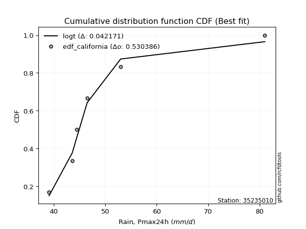</img>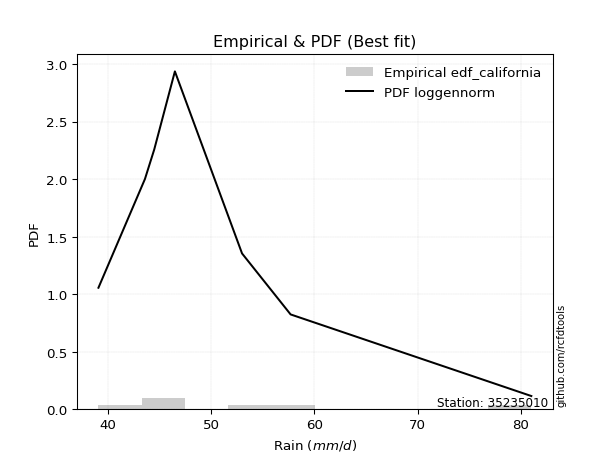</img>

</div>


### 2. EDF Hazen (1930)

Hazen method for plotting positions is a formula used to estimate the empirical cumulative probability distribution of flood events or other hydrological data. This formula often results in biased estimations, particularly when extrapolating to extreme events (high return periods).

<div align="center">


$P=(m-0.5)/n$


</div>


**2.1. Empirical values**

<div align="center">

|                | 0                   | 1                   | 2                   | 3         | 4                  | 5                  | 6                  |
|:---------------|:--------------------|:--------------------|:--------------------|:----------|:-------------------|:-------------------|:-------------------|
| date           | 2019                | 2022                | 2023                | 2021      | 2020               | 2025               | 2024               |
| x              | 39.1                | 43.6                | 44.5                | 46.5      | 53.0               | 57.7               | 81.0               |
| m              | 1                   | 2                   | 3                   | 4         | 5                  | 6                  | 7                  |
| empirical_dist | edf_hazen           | edf_hazen           | edf_hazen           | edf_hazen | edf_hazen          | edf_hazen          | edf_hazen          |
| empirical      | 0.07142857142857142 | 0.21428571428571427 | 0.35714285714285715 | 0.5       | 0.6428571428571429 | 0.7857142857142857 | 0.9285714285714286 |
| empirical_tr   | 1.0769230769230769  | 1.2727272727272727  | 1.5555555555555558  | 2.0       | 2.8000000000000003 | 4.666666666666666  | 14.000000000000007 |

</div>


**2.2. Kolmogorov-Smirnov fit test (sorted by Δ)**


<div align="center">

|                | 0                   | 1                   | 2                   | 3                   | 4                   | 5                   | 6                   | 7                   | 8                   | 9                   | 10                  | 11                  | 12                  | 13                  | 14                  | 15                  | 16                  | 17                  | 18                  | 19                  | 20                  | 21                  | 22                  | 23                  | 24                  | 25                  | 26                  | 27                  | 28                  | 29                  | 30                  | 31                  | 32                  | 33                  | 34                  | 35                  | 36                  | 37                  | 38                  | 39                  | 40                  | 41                  | 42                  | 43                  | 44                  | 45                  | 46                  | 47                  | 48                  | 49                  | 50                  | 51                  | 52                  | 53                  | 54                  | 55                  | 56                  | 57                  | 58                  | 59                  | 60                  | 61                  | 62                  | 63                  | 64                  | 65                  | 66                  | 67                  | 68                  | 69                  | 70                  | 71                  | 72                  | 73                  | 74                  | 75                  | 76                  | 77                  | 78                  | 79                  | 80                  | 81                  | 82                  | 83                  | 84                  | 85                  | 86                  | 87                  | 88                  | 89                  | 90                  | 91                  | 92                  | 93                  | 94                  | 95                  | 96                  | 97                  | 98                  | 99                  | 100                 | 101                 | 102                 | 103                 | 104                 | 105                 | 106                 | 107                 | 108                 | 109                 | 110                 | 111                 | 112                 | 113                 | 114                 | 115                 | 116                 | 117                 | 118                 | 119                 | 120                 | 121                 | 122                 | 123                 | 124                 | 125                 | 126                 | 127                 | 128                 | 129                 | 130                 | 131                 | 132                 | 133                 | 134                 | 135                 | 136                 | 137                 | 138                 | 139                 | 140                 | 141                 | 142                 | 143                 | 144                 | 145                 | 146                 | 147                 | 148                 | 149                 | 150                 | 151                 | 152                 | 153                 | 154                 | 155                 | 156                 | 157                 | 158                 | 159                 |
|:---------------|:--------------------|:--------------------|:--------------------|:--------------------|:--------------------|:--------------------|:--------------------|:--------------------|:--------------------|:--------------------|:--------------------|:--------------------|:--------------------|:--------------------|:--------------------|:--------------------|:--------------------|:--------------------|:--------------------|:--------------------|:--------------------|:--------------------|:--------------------|:--------------------|:--------------------|:--------------------|:--------------------|:--------------------|:--------------------|:--------------------|:--------------------|:--------------------|:--------------------|:--------------------|:--------------------|:--------------------|:--------------------|:--------------------|:--------------------|:--------------------|:--------------------|:--------------------|:--------------------|:--------------------|:--------------------|:--------------------|:--------------------|:--------------------|:--------------------|:--------------------|:--------------------|:--------------------|:--------------------|:--------------------|:--------------------|:--------------------|:--------------------|:--------------------|:--------------------|:--------------------|:--------------------|:--------------------|:--------------------|:--------------------|:--------------------|:--------------------|:--------------------|:--------------------|:--------------------|:--------------------|:--------------------|:--------------------|:--------------------|:--------------------|:--------------------|:--------------------|:--------------------|:--------------------|:--------------------|:--------------------|:--------------------|:--------------------|:--------------------|:--------------------|:--------------------|:--------------------|:--------------------|:--------------------|:--------------------|:--------------------|:--------------------|:--------------------|:--------------------|:--------------------|:--------------------|:--------------------|:--------------------|:--------------------|:--------------------|:--------------------|:--------------------|:--------------------|:--------------------|:--------------------|:--------------------|:--------------------|:--------------------|:--------------------|:--------------------|:--------------------|:--------------------|:--------------------|:--------------------|:--------------------|:--------------------|:--------------------|:--------------------|:--------------------|:--------------------|:--------------------|:--------------------|:--------------------|:--------------------|:--------------------|:--------------------|:--------------------|:--------------------|:--------------------|:--------------------|:--------------------|:--------------------|:--------------------|:--------------------|:--------------------|:--------------------|:--------------------|:--------------------|:--------------------|:--------------------|:--------------------|:--------------------|:--------------------|:--------------------|:--------------------|:--------------------|:--------------------|:--------------------|:--------------------|:--------------------|:--------------------|:--------------------|:--------------------|:--------------------|:--------------------|:--------------------|:--------------------|:--------------------|:--------------------|:--------------------|:--------------------|
| station        | 35235010            | 35235010            | 35235010            | 35235010            | 35235010            | 35235010            | 35235010            | 35235010            | 35235010            | 35235010            | 35235010            | 35235010            | 35235010            | 35235010            | 35235010            | 35235010            | 35235010            | 35235010            | 35235010            | 35235010            | 35235010            | 35235010            | 35235010            | 35235010            | 35235010            | 35235010            | 35235010            | 35235010            | 35235010            | 35235010            | 35235010            | 35235010            | 35235010            | 35235010            | 35235010            | 35235010            | 35235010            | 35235010            | 35235010            | 35235010            | 35235010            | 35235010            | 35235010            | 35235010            | 35235010            | 35235010            | 35235010            | 35235010            | 35235010            | 35235010            | 35235010            | 35235010            | 35235010            | 35235010            | 35235010            | 35235010            | 35235010            | 35235010            | 35235010            | 35235010            | 35235010            | 35235010            | 35235010            | 35235010            | 35235010            | 35235010            | 35235010            | 35235010            | 35235010            | 35235010            | 35235010            | 35235010            | 35235010            | 35235010            | 35235010            | 35235010            | 35235010            | 35235010            | 35235010            | 35235010            | 35235010            | 35235010            | 35235010            | 35235010            | 35235010            | 35235010            | 35235010            | 35235010            | 35235010            | 35235010            | 35235010            | 35235010            | 35235010            | 35235010            | 35235010            | 35235010            | 35235010            | 35235010            | 35235010            | 35235010            | 35235010            | 35235010            | 35235010            | 35235010            | 35235010            | 35235010            | 35235010            | 35235010            | 35235010            | 35235010            | 35235010            | 35235010            | 35235010            | 35235010            | 35235010            | 35235010            | 35235010            | 35235010            | 35235010            | 35235010            | 35235010            | 35235010            | 35235010            | 35235010            | 35235010            | 35235010            | 35235010            | 35235010            | 35235010            | 35235010            | 35235010            | 35235010            | 35235010            | 35235010            | 35235010            | 35235010            | 35235010            | 35235010            | 35235010            | 35235010            | 35235010            | 35235010            | 35235010            | 35235010            | 35235010            | 35235010            | 35235010            | 35235010            | 35235010            | 35235010            | 35235010            | 35235010            | 35235010            | 35235010            | 35235010            | 35235010            | 35235010            | 35235010            | 35235010            | 35235010            |
| empirical_dist | edf_hazen           | edf_hazen           | edf_hazen           | edf_hazen           | edf_hazen           | edf_hazen           | edf_hazen           | edf_hazen           | edf_hazen           | edf_hazen           | edf_hazen           | edf_hazen           | edf_hazen           | edf_hazen           | edf_hazen           | edf_hazen           | edf_hazen           | edf_hazen           | edf_hazen           | edf_hazen           | edf_hazen           | edf_hazen           | edf_hazen           | edf_hazen           | edf_hazen           | edf_hazen           | edf_hazen           | edf_hazen           | edf_hazen           | edf_hazen           | edf_hazen           | edf_hazen           | edf_hazen           | edf_hazen           | edf_hazen           | edf_hazen           | edf_hazen           | edf_hazen           | edf_hazen           | edf_hazen           | edf_hazen           | edf_hazen           | edf_hazen           | edf_hazen           | edf_hazen           | edf_hazen           | edf_hazen           | edf_hazen           | edf_hazen           | edf_hazen           | edf_hazen           | edf_hazen           | edf_hazen           | edf_hazen           | edf_hazen           | edf_hazen           | edf_hazen           | edf_hazen           | edf_hazen           | edf_hazen           | edf_hazen           | edf_hazen           | edf_hazen           | edf_hazen           | edf_hazen           | edf_hazen           | edf_hazen           | edf_hazen           | edf_hazen           | edf_hazen           | edf_hazen           | edf_hazen           | edf_hazen           | edf_hazen           | edf_hazen           | edf_hazen           | edf_hazen           | edf_hazen           | edf_hazen           | edf_hazen           | edf_hazen           | edf_hazen           | edf_hazen           | edf_hazen           | edf_hazen           | edf_hazen           | edf_hazen           | edf_hazen           | edf_hazen           | edf_hazen           | edf_hazen           | edf_hazen           | edf_hazen           | edf_hazen           | edf_hazen           | edf_hazen           | edf_hazen           | edf_hazen           | edf_hazen           | edf_hazen           | edf_hazen           | edf_hazen           | edf_hazen           | edf_hazen           | edf_hazen           | edf_hazen           | edf_hazen           | edf_hazen           | edf_hazen           | edf_hazen           | edf_hazen           | edf_hazen           | edf_hazen           | edf_hazen           | edf_hazen           | edf_hazen           | edf_hazen           | edf_hazen           | edf_hazen           | edf_hazen           | edf_hazen           | edf_hazen           | edf_hazen           | edf_hazen           | edf_hazen           | edf_hazen           | edf_hazen           | edf_hazen           | edf_hazen           | edf_hazen           | edf_hazen           | edf_hazen           | edf_hazen           | edf_hazen           | edf_hazen           | edf_hazen           | edf_hazen           | edf_hazen           | edf_hazen           | edf_hazen           | edf_hazen           | edf_hazen           | edf_hazen           | edf_hazen           | edf_hazen           | edf_hazen           | edf_hazen           | edf_hazen           | edf_hazen           | edf_hazen           | edf_hazen           | edf_hazen           | edf_hazen           | edf_hazen           | edf_hazen           | edf_hazen           | edf_hazen           | edf_hazen           | edf_hazen           | edf_hazen           |
| p_dist         | loginvweibull       | loggenextreme       | alpha               | loginvgamma         | logf                | logburr12           | logexponnorm        | invweibull          | genextreme          | f                   | invgamma            | loghalflogistic     | logmielke           | logjohnsonsu        | gompertz            | genexpon            | loghalfgennorm      | loginvgauss         | exponnorm           | lomax               | wald                | loggompertz         | logfatiguelife      | johnsonsu           | loggenexpon         | invgauss            | loghalfnorm         | halflogistic        | logmoyal            | logfoldnorm         | logwald             | logtruncnorm        | logvonmises_line    | burr                | halfnorm            | logburr             | logpearson3         | pearson3            | foldnorm            | bradford            | loggumbel_r         | logweibull_max      | loggenlogistic      | mielke              | lograyleigh         | moyal               | logalpha            | vonmises_line       | logbradford         | logskewnorm         | nakagami            | lognct              | logbetaprime        | logmaxwell          | logkstwobign        | logsemicircular     | gumbel_r            | rayleigh            | logexponweib        | burr12              | loggennorm          | truncpareto         | logloglaplace       | loganglit           | logncf              | logtruncweibull_min | genhalflogistic     | maxwell             | genlogistic         | nct                 | anglit              | betaprime           | dgamma              | logloggamma         | loglomax            | logt                | semicircular        | logcrystalball      | lognorm             | logdweibull         | logarcsine          | loggausshyper       | logexponpow         | logrice             | ncf                 | t                   | kstwobign           | logweibull_min      | crystalball         | norm                | truncnorm           | logtruncexpon       | loglogistic         | tukeylambda         | loghypsecant        | logistic            | skewnorm            | arcsine             | gennorm             | logcosine           | logdgamma           | rice                | halfgennorm         | hypsecant           | logbeta             | loggumbel_l         | rdist               | loglaplace          | loglaplace          | cosine              | truncweibull_min    | triang              | gumbel_l            | loggengamma         | laplace             | truncexpon          | logkappa4           | logargus            | logksone            | loguniform          | logkappa3           | logwrapcauchy       | genpareto           | dweibull            | beta                | wrapcauchy          | lognakagami         | argus               | logtriang           | kappa4              | ksone               | weibull_min         | uniform             | kappa3              | loglevy_l           | levy_l              | logerlang           | gengamma            | loggamma            | loggamma            | loggenhalflogistic  | exponpow            | johnsonsb           | powerlaw            | logjohnsonsb        | logtrapezoid        | logpowerlaw         | fatiguelife         | gausshyper          | loggenpareto        | exponweib           | trapezoid           | erlang              | gamma               | logtruncpareto      | weibull_max         | logtukeylambda      | logrdist            | logvonmises         | vonmises            |
| delta          | 0.06154381992632246 | 0.06155350255416531 | 0.06356123321313417 | 0.06373621940057714 | 0.0637365620377153  | 0.06457842737456956 | 0.06494320353797048 | 0.06682542853136206 | 0.06682731551364349 | 0.0688974679868333  | 0.06939190939859749 | 0.07222466525392199 | 0.07237555360887205 | 0.07404754143234157 | 0.07604726573086759 | 0.07644089226246933 | 0.07676718218421366 | 0.07808537033246862 | 0.07892319905250803 | 0.08008177575478179 | 0.08127204448122305 | 0.08199543977209464 | 0.08550019352863106 | 0.08646407048838736 | 0.08650897792300052 | 0.08699912684301922 | 0.08713747410029485 | 0.0877635309976098  | 0.08842320951082838 | 0.09066799216105548 | 0.09086454513181808 | 0.09330692901381285 | 0.09599379076159692 | 0.09743717917593114 | 0.09770189088455408 | 0.09878457789911843 | 0.10017198560522522 | 0.10271110619694657 | 0.1034755011573266  | 0.10444017331897426 | 0.10589647017888365 | 0.10679800658524191 | 0.10726700054416982 | 0.10913457764922169 | 0.10961731969998662 | 0.11004786283469481 | 0.11039677484687432 | 0.11061727984710984 | 0.11532432020919861 | 0.11535303024613475 | 0.11810755333706524 | 0.12124353973142349 | 0.1214894343141473  | 0.12164046311930538 | 0.12173753155790257 | 0.12473666861344779 | 0.12537995487219744 | 0.1260372453862788  | 0.1267254177436409  | 0.12787115694802356 | 0.12877161531416062 | 0.1290554244471512  | 0.1296845932637939  | 0.1332002377463204  | 0.13470639504267323 | 0.13477521908642737 | 0.13743238295216376 | 0.13782270154167242 | 0.13952900073155933 | 0.14137013054904052 | 0.14676580260841787 | 0.1472562109139377  | 0.14849595440103147 | 0.14969031330094185 | 0.15055705165811226 | 0.1524881955298345  | 0.1528653724210124  | 0.15336694849370563 | 0.15336695111751242 | 0.15373799207905015 | 0.1544870565622688  | 0.15467476836929966 | 0.15697923667189528 | 0.15817397180875997 | 0.1604077978231367  | 0.16224590207793033 | 0.16590502359673615 | 0.1668326547933566  | 0.16849678793376388 | 0.16849679185816757 | 0.16849679201742157 | 0.16887830450315328 | 0.17159563182722587 | 0.17532661731757926 | 0.18568656601478306 | 0.18791556724487657 | 0.18934363773400426 | 0.18962104983623784 | 0.1919886975245101  | 0.19343687547673571 | 0.19465918412315908 | 0.19832956161266402 | 0.20153822228707166 | 0.20262503403113663 | 0.20342056255239951 | 0.21280409516762178 | 0.21334237206735562 | 0.21376743887680555 | 0.21376743887680555 | 0.21588374838357116 | 0.21818367396999735 | 0.22271621989425933 | 0.22537511341256444 | 0.22728464961476938 | 0.2300216637426704  | 0.2479573263744539  | 0.24993300676036873 | 0.25301898238639786 | 0.2571426718303208  | 0.2620163471506911  | 0.26491935068751543 | 0.27424620032059566 | 0.2852933483619998  | 0.28571428571440494 | 0.2993233422083509  | 0.3045833644236734  | 0.30496830280982834 | 0.3197237522844374  | 0.32111564856663843 | 0.322338794255915   | 0.3324525514262985  | 0.3407764360287109  | 0.3418002045687009  | 0.34263100248076966 | 0.34939966959018887 | 0.3659388645624253  | 0.3776847116453076  | 0.38248052525825726 | 0.38681248528210965 | 0.38681248528210965 | 0.39341068290225945 | 0.40210546667884717 | 0.46692884196286333 | 0.4882785822324003  | 0.4956030936527065  | 0.5063263347103863  | 0.5120567168745395  | 0.5226534138441985  | 0.5269645825780211  | 0.5373895283280734  | 0.5467599745319072  | 0.5802680859445317  | 0.6170202998030531  | 0.6231706665996488  | 0.6542940219607661  | 0.6685844312440945  | 0.9285705007716893  | 0.9285714256202162  | 1.052653380525926   | 12.179187967136224  |
| deltao         | 0.48442053926100004 | 0.48442053926100004 | 0.48442053926100004 | 0.48442053926100004 | 0.48442053926100004 | 0.48442053926100004 | 0.48442053926100004 | 0.48442053926100004 | 0.48442053926100004 | 0.48442053926100004 | 0.48442053926100004 | 0.48442053926100004 | 0.48442053926100004 | 0.48442053926100004 | 0.48442053926100004 | 0.48442053926100004 | 0.48442053926100004 | 0.48442053926100004 | 0.48442053926100004 | 0.48442053926100004 | 0.48442053926100004 | 0.48442053926100004 | 0.48442053926100004 | 0.48442053926100004 | 0.48442053926100004 | 0.48442053926100004 | 0.48442053926100004 | 0.48442053926100004 | 0.48442053926100004 | 0.48442053926100004 | 0.48442053926100004 | 0.48442053926100004 | 0.48442053926100004 | 0.48442053926100004 | 0.48442053926100004 | 0.48442053926100004 | 0.48442053926100004 | 0.48442053926100004 | 0.48442053926100004 | 0.48442053926100004 | 0.48442053926100004 | 0.48442053926100004 | 0.48442053926100004 | 0.48442053926100004 | 0.48442053926100004 | 0.48442053926100004 | 0.48442053926100004 | 0.48442053926100004 | 0.48442053926100004 | 0.48442053926100004 | 0.48442053926100004 | 0.48442053926100004 | 0.48442053926100004 | 0.48442053926100004 | 0.48442053926100004 | 0.48442053926100004 | 0.48442053926100004 | 0.48442053926100004 | 0.48442053926100004 | 0.48442053926100004 | 0.48442053926100004 | 0.48442053926100004 | 0.48442053926100004 | 0.48442053926100004 | 0.48442053926100004 | 0.48442053926100004 | 0.48442053926100004 | 0.48442053926100004 | 0.48442053926100004 | 0.48442053926100004 | 0.48442053926100004 | 0.48442053926100004 | 0.48442053926100004 | 0.48442053926100004 | 0.48442053926100004 | 0.48442053926100004 | 0.48442053926100004 | 0.48442053926100004 | 0.48442053926100004 | 0.48442053926100004 | 0.48442053926100004 | 0.48442053926100004 | 0.48442053926100004 | 0.48442053926100004 | 0.48442053926100004 | 0.48442053926100004 | 0.48442053926100004 | 0.48442053926100004 | 0.48442053926100004 | 0.48442053926100004 | 0.48442053926100004 | 0.48442053926100004 | 0.48442053926100004 | 0.48442053926100004 | 0.48442053926100004 | 0.48442053926100004 | 0.48442053926100004 | 0.48442053926100004 | 0.48442053926100004 | 0.48442053926100004 | 0.48442053926100004 | 0.48442053926100004 | 0.48442053926100004 | 0.48442053926100004 | 0.48442053926100004 | 0.48442053926100004 | 0.48442053926100004 | 0.48442053926100004 | 0.48442053926100004 | 0.48442053926100004 | 0.48442053926100004 | 0.48442053926100004 | 0.48442053926100004 | 0.48442053926100004 | 0.48442053926100004 | 0.48442053926100004 | 0.48442053926100004 | 0.48442053926100004 | 0.48442053926100004 | 0.48442053926100004 | 0.48442053926100004 | 0.48442053926100004 | 0.48442053926100004 | 0.48442053926100004 | 0.48442053926100004 | 0.48442053926100004 | 0.48442053926100004 | 0.48442053926100004 | 0.48442053926100004 | 0.48442053926100004 | 0.48442053926100004 | 0.48442053926100004 | 0.48442053926100004 | 0.48442053926100004 | 0.48442053926100004 | 0.48442053926100004 | 0.48442053926100004 | 0.48442053926100004 | 0.48442053926100004 | 0.48442053926100004 | 0.48442053926100004 | 0.48442053926100004 | 0.48442053926100004 | 0.48442053926100004 | 0.48442053926100004 | 0.48442053926100004 | 0.48442053926100004 | 0.48442053926100004 | 0.48442053926100004 | 0.48442053926100004 | 0.48442053926100004 | 0.48442053926100004 | 0.48442053926100004 | 0.48442053926100004 | 0.48442053926100004 | 0.48442053926100004 | 0.48442053926100004 | 0.48442053926100004 | 0.48442053926100004 | 0.48442053926100004 |
| eval           | Δo > Δ              | Δo > Δ              | Δo > Δ              | Δo > Δ              | Δo > Δ              | Δo > Δ              | Δo > Δ              | Δo > Δ              | Δo > Δ              | Δo > Δ              | Δo > Δ              | Δo > Δ              | Δo > Δ              | Δo > Δ              | Δo > Δ              | Δo > Δ              | Δo > Δ              | Δo > Δ              | Δo > Δ              | Δo > Δ              | Δo > Δ              | Δo > Δ              | Δo > Δ              | Δo > Δ              | Δo > Δ              | Δo > Δ              | Δo > Δ              | Δo > Δ              | Δo > Δ              | Δo > Δ              | Δo > Δ              | Δo > Δ              | Δo > Δ              | Δo > Δ              | Δo > Δ              | Δo > Δ              | Δo > Δ              | Δo > Δ              | Δo > Δ              | Δo > Δ              | Δo > Δ              | Δo > Δ              | Δo > Δ              | Δo > Δ              | Δo > Δ              | Δo > Δ              | Δo > Δ              | Δo > Δ              | Δo > Δ              | Δo > Δ              | Δo > Δ              | Δo > Δ              | Δo > Δ              | Δo > Δ              | Δo > Δ              | Δo > Δ              | Δo > Δ              | Δo > Δ              | Δo > Δ              | Δo > Δ              | Δo > Δ              | Δo > Δ              | Δo > Δ              | Δo > Δ              | Δo > Δ              | Δo > Δ              | Δo > Δ              | Δo > Δ              | Δo > Δ              | Δo > Δ              | Δo > Δ              | Δo > Δ              | Δo > Δ              | Δo > Δ              | Δo > Δ              | Δo > Δ              | Δo > Δ              | Δo > Δ              | Δo > Δ              | Δo > Δ              | Δo > Δ              | Δo > Δ              | Δo > Δ              | Δo > Δ              | Δo > Δ              | Δo > Δ              | Δo > Δ              | Δo > Δ              | Δo > Δ              | Δo > Δ              | Δo > Δ              | Δo > Δ              | Δo > Δ              | Δo > Δ              | Δo > Δ              | Δo > Δ              | Δo > Δ              | Δo > Δ              | Δo > Δ              | Δo > Δ              | Δo > Δ              | Δo > Δ              | Δo > Δ              | Δo > Δ              | Δo > Δ              | Δo > Δ              | Δo > Δ              | Δo > Δ              | Δo > Δ              | Δo > Δ              | Δo > Δ              | Δo > Δ              | Δo > Δ              | Δo > Δ              | Δo > Δ              | Δo > Δ              | Δo > Δ              | Δo > Δ              | Δo > Δ              | Δo > Δ              | Δo > Δ              | Δo > Δ              | Δo > Δ              | Δo > Δ              | Δo > Δ              | Δo > Δ              | Δo > Δ              | Δo > Δ              | Δo > Δ              | Δo > Δ              | Δo > Δ              | Δo > Δ              | Δo > Δ              | Δo > Δ              | Δo > Δ              | Δo > Δ              | Δo > Δ              | Δo > Δ              | Δo > Δ              | Δo > Δ              | Δo > Δ              | Δo > Δ              | Δo > Δ              | Δo <= Δ             | Δo <= Δ             | Δo <= Δ             | Δo <= Δ             | Δo <= Δ             | Δo <= Δ             | Δo <= Δ             | Δo <= Δ             | Δo <= Δ             | Δo <= Δ             | Δo <= Δ             | Δo <= Δ             | Δo <= Δ             | Δo <= Δ             | Δo <= Δ             | Δo <= Δ             | Δo <= Δ             |
| fit            | 1                   | 1                   | 1                   | 1                   | 1                   | 1                   | 1                   | 1                   | 1                   | 1                   | 1                   | 1                   | 1                   | 1                   | 1                   | 1                   | 1                   | 1                   | 1                   | 1                   | 1                   | 1                   | 1                   | 1                   | 1                   | 1                   | 1                   | 1                   | 1                   | 1                   | 1                   | 1                   | 1                   | 1                   | 1                   | 1                   | 1                   | 1                   | 1                   | 1                   | 1                   | 1                   | 1                   | 1                   | 1                   | 1                   | 1                   | 1                   | 1                   | 1                   | 1                   | 1                   | 1                   | 1                   | 1                   | 1                   | 1                   | 1                   | 1                   | 1                   | 1                   | 1                   | 1                   | 1                   | 1                   | 1                   | 1                   | 1                   | 1                   | 1                   | 1                   | 1                   | 1                   | 1                   | 1                   | 1                   | 1                   | 1                   | 1                   | 1                   | 1                   | 1                   | 1                   | 1                   | 1                   | 1                   | 1                   | 1                   | 1                   | 1                   | 1                   | 1                   | 1                   | 1                   | 1                   | 1                   | 1                   | 1                   | 1                   | 1                   | 1                   | 1                   | 1                   | 1                   | 1                   | 1                   | 1                   | 1                   | 1                   | 1                   | 1                   | 1                   | 1                   | 1                   | 1                   | 1                   | 1                   | 1                   | 1                   | 1                   | 1                   | 1                   | 1                   | 1                   | 1                   | 1                   | 1                   | 1                   | 1                   | 1                   | 1                   | 1                   | 1                   | 1                   | 1                   | 1                   | 1                   | 1                   | 1                   | 1                   | 1                   | 1                   | 1                   | 0                   | 0                   | 0                   | 0                   | 0                   | 0                   | 0                   | 0                   | 0                   | 0                   | 0                   | 0                   | 0                   | 0                   | 0                   | 0                   | 0                   |
| n              | 7                   | 7                   | 7                   | 7                   | 7                   | 7                   | 7                   | 7                   | 7                   | 7                   | 7                   | 7                   | 7                   | 7                   | 7                   | 7                   | 7                   | 7                   | 7                   | 7                   | 7                   | 7                   | 7                   | 7                   | 7                   | 7                   | 7                   | 7                   | 7                   | 7                   | 7                   | 7                   | 7                   | 7                   | 7                   | 7                   | 7                   | 7                   | 7                   | 7                   | 7                   | 7                   | 7                   | 7                   | 7                   | 7                   | 7                   | 7                   | 7                   | 7                   | 7                   | 7                   | 7                   | 7                   | 7                   | 7                   | 7                   | 7                   | 7                   | 7                   | 7                   | 7                   | 7                   | 7                   | 7                   | 7                   | 7                   | 7                   | 7                   | 7                   | 7                   | 7                   | 7                   | 7                   | 7                   | 7                   | 7                   | 7                   | 7                   | 7                   | 7                   | 7                   | 7                   | 7                   | 7                   | 7                   | 7                   | 7                   | 7                   | 7                   | 7                   | 7                   | 7                   | 7                   | 7                   | 7                   | 7                   | 7                   | 7                   | 7                   | 7                   | 7                   | 7                   | 7                   | 7                   | 7                   | 7                   | 7                   | 7                   | 7                   | 7                   | 7                   | 7                   | 7                   | 7                   | 7                   | 7                   | 7                   | 7                   | 7                   | 7                   | 7                   | 7                   | 7                   | 7                   | 7                   | 7                   | 7                   | 7                   | 7                   | 7                   | 7                   | 7                   | 7                   | 7                   | 7                   | 7                   | 7                   | 7                   | 7                   | 7                   | 7                   | 7                   | 7                   | 7                   | 7                   | 7                   | 7                   | 7                   | 7                   | 7                   | 7                   | 7                   | 7                   | 7                   | 7                   | 7                   | 7                   | 7                   | 7                   |
| best_fit       | 1                   | 0                   | 0                   | 0                   | 0                   | 0                   | 0                   | 0                   | 0                   | 0                   | 0                   | 0                   | 0                   | 0                   | 0                   | 0                   | 0                   | 0                   | 0                   | 0                   | 0                   | 0                   | 0                   | 0                   | 0                   | 0                   | 0                   | 0                   | 0                   | 0                   | 0                   | 0                   | 0                   | 0                   | 0                   | 0                   | 0                   | 0                   | 0                   | 0                   | 0                   | 0                   | 0                   | 0                   | 0                   | 0                   | 0                   | 0                   | 0                   | 0                   | 0                   | 0                   | 0                   | 0                   | 0                   | 0                   | 0                   | 0                   | 0                   | 0                   | 0                   | 0                   | 0                   | 0                   | 0                   | 0                   | 0                   | 0                   | 0                   | 0                   | 0                   | 0                   | 0                   | 0                   | 0                   | 0                   | 0                   | 0                   | 0                   | 0                   | 0                   | 0                   | 0                   | 0                   | 0                   | 0                   | 0                   | 0                   | 0                   | 0                   | 0                   | 0                   | 0                   | 0                   | 0                   | 0                   | 0                   | 0                   | 0                   | 0                   | 0                   | 0                   | 0                   | 0                   | 0                   | 0                   | 0                   | 0                   | 0                   | 0                   | 0                   | 0                   | 0                   | 0                   | 0                   | 0                   | 0                   | 0                   | 0                   | 0                   | 0                   | 0                   | 0                   | 0                   | 0                   | 0                   | 0                   | 0                   | 0                   | 0                   | 0                   | 0                   | 0                   | 0                   | 0                   | 0                   | 0                   | 0                   | 0                   | 0                   | 0                   | 0                   | 0                   | 0                   | 0                   | 0                   | 0                   | 0                   | 0                   | 0                   | 0                   | 0                   | 0                   | 0                   | 0                   | 0                   | 0                   | 0                   | 0                   | 0                   |
| best_fit_sort  | 1                   | 2                   | 3                   | 4                   | 5                   | 6                   | 7                   | 8                   | 9                   | 10                  | 11                  | 12                  | 13                  | 14                  | 15                  | 16                  | 17                  | 18                  | 19                  | 20                  | 21                  | 22                  | 23                  | 24                  | 25                  | 26                  | 27                  | 28                  | 29                  | 30                  | 31                  | 32                  | 33                  | 34                  | 35                  | 36                  | 37                  | 38                  | 39                  | 40                  | 41                  | 42                  | 43                  | 44                  | 45                  | 46                  | 47                  | 48                  | 49                  | 50                  | 51                  | 52                  | 53                  | 54                  | 55                  | 56                  | 57                  | 58                  | 59                  | 60                  | 61                  | 62                  | 63                  | 64                  | 65                  | 66                  | 67                  | 68                  | 69                  | 70                  | 71                  | 72                  | 73                  | 74                  | 75                  | 76                  | 77                  | 78                  | 79                  | 80                  | 81                  | 82                  | 83                  | 84                  | 85                  | 86                  | 87                  | 88                  | 89                  | 90                  | 91                  | 92                  | 93                  | 94                  | 95                  | 96                  | 97                  | 98                  | 99                  | 100                 | 101                 | 102                 | 103                 | 104                 | 105                 | 106                 | 107                 | 108                 | 109                 | 110                 | 111                 | 112                 | 113                 | 114                 | 115                 | 116                 | 117                 | 118                 | 119                 | 120                 | 121                 | 122                 | 123                 | 124                 | 125                 | 126                 | 127                 | 128                 | 129                 | 130                 | 131                 | 132                 | 133                 | 134                 | 135                 | 136                 | 137                 | 138                 | 139                 | 140                 | 141                 | 142                 | 143                 | 144                 | 145                 | 146                 | 147                 | 148                 | 149                 | 150                 | 151                 | 152                 | 153                 | 154                 | 155                 | 156                 | 157                 | 158                 | 159                 | 160                 |

</div>


**2.3. Best fit**

<div align="center">

|   id |   station | empirical_dist   | p_dist        |     delta |   deltao | eval   |   fit |   n |   best_fit |   best_fit_sort |
|-----:|----------:|:-----------------|:--------------|----------:|---------:|:-------|------:|----:|-----------:|----------------:|
|    0 |  35235010 | edf_hazen        | loginvweibull | 0.0615438 | 0.484421 | Δo > Δ |     1 |   7 |          1 |               1 |

</div>


<div align="center">

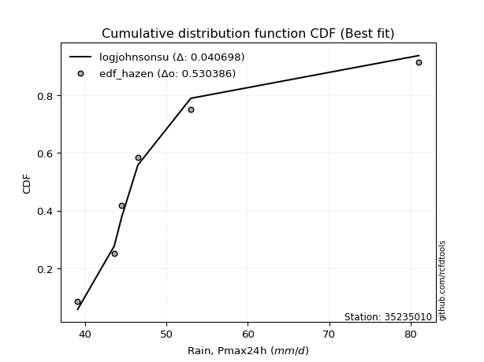</img></img>

</div>


### 3. EDF Weibull (1939)

Weibull plotting position formula is an empirical method used to estimate the non-exceedance probability or plotting position for a set of observed data, is often recommended or widely used in practice, particularly in flood frequency analysis.

<div align="center">


$P=m/(n+1)$


</div>


**3.1. Empirical values**

<div align="center">

|                | 0                  | 1                  | 2           | 3           | 4                  | 5           | 6           |
|:---------------|:-------------------|:-------------------|:------------|:------------|:-------------------|:------------|:------------|
| date           | 2019               | 2022               | 2023        | 2021        | 2020               | 2025        | 2024        |
| x              | 39.1               | 43.6               | 44.5        | 46.5        | 53.0               | 57.7        | 81.0        |
| m              | 1                  | 2                  | 3           | 4           | 5                  | 6           | 7           |
| empirical_dist | edf_weibull        | edf_weibull        | edf_weibull | edf_weibull | edf_weibull        | edf_weibull | edf_weibull |
| empirical      | 0.125              | 0.25               | 0.375       | 0.5         | 0.625              | 0.75        | 0.875       |
| empirical_tr   | 1.1428571428571428 | 1.3333333333333333 | 1.6         | 2.0         | 2.6666666666666665 | 4.0         | 8.0         |

</div>


**3.2. Kolmogorov-Smirnov fit test (sorted by Δ)**


<div align="center">

|                | 0                   | 1                   | 2                   | 3                   | 4                   | 5                   | 6                   | 7                   | 8                   | 9                   | 10                  | 11                  | 12                  | 13                  | 14                  | 15                  | 16                  | 17                  | 18                  | 19                  | 20                  | 21                  | 22                  | 23                  | 24                  | 25                  | 26                  | 27                  | 28                  | 29                  | 30                  | 31                  | 32                  | 33                  | 34                  | 35                  | 36                  | 37                  | 38                  | 39                  | 40                  | 41                  | 42                  | 43                  | 44                  | 45                  | 46                  | 47                  | 48                  | 49                  | 50                  | 51                  | 52                  | 53                  | 54                  | 55                  | 56                  | 57                  | 58                  | 59                  | 60                  | 61                  | 62                  | 63                  | 64                  | 65                  | 66                  | 67                  | 68                  | 69                  | 70                  | 71                  | 72                  | 73                  | 74                  | 75                  | 76                  | 77                  | 78                  | 79                  | 80                  | 81                  | 82                  | 83                  | 84                  | 85                  | 86                  | 87                  | 88                  | 89                  | 90                  | 91                  | 92                  | 93                  | 94                  | 95                  | 96                  | 97                  | 98                  | 99                  | 100                 | 101                 | 102                 | 103                 | 104                 | 105                 | 106                 | 107                 | 108                 | 109                 | 110                 | 111                 | 112                 | 113                 | 114                 | 115                 | 116                 | 117                 | 118                 | 119                 | 120                 | 121                 | 122                 | 123                 | 124                 | 125                 | 126                 | 127                 | 128                 | 129                 | 130                 | 131                 | 132                 | 133                 | 134                 | 135                 | 136                 | 137                 | 138                 | 139                 | 140                 | 141                 | 142                 | 143                 | 144                 | 145                 | 146                 | 147                 | 148                 | 149                 | 150                 | 151                 | 152                 | 153                 | 154                 | 155                 | 156                 | 157                 | 158                 | 159                 |
|:---------------|:--------------------|:--------------------|:--------------------|:--------------------|:--------------------|:--------------------|:--------------------|:--------------------|:--------------------|:--------------------|:--------------------|:--------------------|:--------------------|:--------------------|:--------------------|:--------------------|:--------------------|:--------------------|:--------------------|:--------------------|:--------------------|:--------------------|:--------------------|:--------------------|:--------------------|:--------------------|:--------------------|:--------------------|:--------------------|:--------------------|:--------------------|:--------------------|:--------------------|:--------------------|:--------------------|:--------------------|:--------------------|:--------------------|:--------------------|:--------------------|:--------------------|:--------------------|:--------------------|:--------------------|:--------------------|:--------------------|:--------------------|:--------------------|:--------------------|:--------------------|:--------------------|:--------------------|:--------------------|:--------------------|:--------------------|:--------------------|:--------------------|:--------------------|:--------------------|:--------------------|:--------------------|:--------------------|:--------------------|:--------------------|:--------------------|:--------------------|:--------------------|:--------------------|:--------------------|:--------------------|:--------------------|:--------------------|:--------------------|:--------------------|:--------------------|:--------------------|:--------------------|:--------------------|:--------------------|:--------------------|:--------------------|:--------------------|:--------------------|:--------------------|:--------------------|:--------------------|:--------------------|:--------------------|:--------------------|:--------------------|:--------------------|:--------------------|:--------------------|:--------------------|:--------------------|:--------------------|:--------------------|:--------------------|:--------------------|:--------------------|:--------------------|:--------------------|:--------------------|:--------------------|:--------------------|:--------------------|:--------------------|:--------------------|:--------------------|:--------------------|:--------------------|:--------------------|:--------------------|:--------------------|:--------------------|:--------------------|:--------------------|:--------------------|:--------------------|:--------------------|:--------------------|:--------------------|:--------------------|:--------------------|:--------------------|:--------------------|:--------------------|:--------------------|:--------------------|:--------------------|:--------------------|:--------------------|:--------------------|:--------------------|:--------------------|:--------------------|:--------------------|:--------------------|:--------------------|:--------------------|:--------------------|:--------------------|:--------------------|:--------------------|:--------------------|:--------------------|:--------------------|:--------------------|:--------------------|:--------------------|:--------------------|:--------------------|:--------------------|:--------------------|:--------------------|:--------------------|:--------------------|:--------------------|:--------------------|:--------------------|
| station        | 35235010            | 35235010            | 35235010            | 35235010            | 35235010            | 35235010            | 35235010            | 35235010            | 35235010            | 35235010            | 35235010            | 35235010            | 35235010            | 35235010            | 35235010            | 35235010            | 35235010            | 35235010            | 35235010            | 35235010            | 35235010            | 35235010            | 35235010            | 35235010            | 35235010            | 35235010            | 35235010            | 35235010            | 35235010            | 35235010            | 35235010            | 35235010            | 35235010            | 35235010            | 35235010            | 35235010            | 35235010            | 35235010            | 35235010            | 35235010            | 35235010            | 35235010            | 35235010            | 35235010            | 35235010            | 35235010            | 35235010            | 35235010            | 35235010            | 35235010            | 35235010            | 35235010            | 35235010            | 35235010            | 35235010            | 35235010            | 35235010            | 35235010            | 35235010            | 35235010            | 35235010            | 35235010            | 35235010            | 35235010            | 35235010            | 35235010            | 35235010            | 35235010            | 35235010            | 35235010            | 35235010            | 35235010            | 35235010            | 35235010            | 35235010            | 35235010            | 35235010            | 35235010            | 35235010            | 35235010            | 35235010            | 35235010            | 35235010            | 35235010            | 35235010            | 35235010            | 35235010            | 35235010            | 35235010            | 35235010            | 35235010            | 35235010            | 35235010            | 35235010            | 35235010            | 35235010            | 35235010            | 35235010            | 35235010            | 35235010            | 35235010            | 35235010            | 35235010            | 35235010            | 35235010            | 35235010            | 35235010            | 35235010            | 35235010            | 35235010            | 35235010            | 35235010            | 35235010            | 35235010            | 35235010            | 35235010            | 35235010            | 35235010            | 35235010            | 35235010            | 35235010            | 35235010            | 35235010            | 35235010            | 35235010            | 35235010            | 35235010            | 35235010            | 35235010            | 35235010            | 35235010            | 35235010            | 35235010            | 35235010            | 35235010            | 35235010            | 35235010            | 35235010            | 35235010            | 35235010            | 35235010            | 35235010            | 35235010            | 35235010            | 35235010            | 35235010            | 35235010            | 35235010            | 35235010            | 35235010            | 35235010            | 35235010            | 35235010            | 35235010            | 35235010            | 35235010            | 35235010            | 35235010            | 35235010            | 35235010            |
| empirical_dist | edf_weibull         | edf_weibull         | edf_weibull         | edf_weibull         | edf_weibull         | edf_weibull         | edf_weibull         | edf_weibull         | edf_weibull         | edf_weibull         | edf_weibull         | edf_weibull         | edf_weibull         | edf_weibull         | edf_weibull         | edf_weibull         | edf_weibull         | edf_weibull         | edf_weibull         | edf_weibull         | edf_weibull         | edf_weibull         | edf_weibull         | edf_weibull         | edf_weibull         | edf_weibull         | edf_weibull         | edf_weibull         | edf_weibull         | edf_weibull         | edf_weibull         | edf_weibull         | edf_weibull         | edf_weibull         | edf_weibull         | edf_weibull         | edf_weibull         | edf_weibull         | edf_weibull         | edf_weibull         | edf_weibull         | edf_weibull         | edf_weibull         | edf_weibull         | edf_weibull         | edf_weibull         | edf_weibull         | edf_weibull         | edf_weibull         | edf_weibull         | edf_weibull         | edf_weibull         | edf_weibull         | edf_weibull         | edf_weibull         | edf_weibull         | edf_weibull         | edf_weibull         | edf_weibull         | edf_weibull         | edf_weibull         | edf_weibull         | edf_weibull         | edf_weibull         | edf_weibull         | edf_weibull         | edf_weibull         | edf_weibull         | edf_weibull         | edf_weibull         | edf_weibull         | edf_weibull         | edf_weibull         | edf_weibull         | edf_weibull         | edf_weibull         | edf_weibull         | edf_weibull         | edf_weibull         | edf_weibull         | edf_weibull         | edf_weibull         | edf_weibull         | edf_weibull         | edf_weibull         | edf_weibull         | edf_weibull         | edf_weibull         | edf_weibull         | edf_weibull         | edf_weibull         | edf_weibull         | edf_weibull         | edf_weibull         | edf_weibull         | edf_weibull         | edf_weibull         | edf_weibull         | edf_weibull         | edf_weibull         | edf_weibull         | edf_weibull         | edf_weibull         | edf_weibull         | edf_weibull         | edf_weibull         | edf_weibull         | edf_weibull         | edf_weibull         | edf_weibull         | edf_weibull         | edf_weibull         | edf_weibull         | edf_weibull         | edf_weibull         | edf_weibull         | edf_weibull         | edf_weibull         | edf_weibull         | edf_weibull         | edf_weibull         | edf_weibull         | edf_weibull         | edf_weibull         | edf_weibull         | edf_weibull         | edf_weibull         | edf_weibull         | edf_weibull         | edf_weibull         | edf_weibull         | edf_weibull         | edf_weibull         | edf_weibull         | edf_weibull         | edf_weibull         | edf_weibull         | edf_weibull         | edf_weibull         | edf_weibull         | edf_weibull         | edf_weibull         | edf_weibull         | edf_weibull         | edf_weibull         | edf_weibull         | edf_weibull         | edf_weibull         | edf_weibull         | edf_weibull         | edf_weibull         | edf_weibull         | edf_weibull         | edf_weibull         | edf_weibull         | edf_weibull         | edf_weibull         | edf_weibull         | edf_weibull         | edf_weibull         |
| p_dist         | logmielke           | logburr12           | alpha               | loggenextreme       | loginvweibull       | logexponnorm        | logf                | loginvgamma         | genextreme          | invweibull          | f                   | invgamma            | loghalfnorm         | loginvgauss         | logjohnsonsu        | invgauss            | logfatiguelife      | halflogistic        | logmoyal            | johnsonsu           | foldnorm            | logfoldnorm         | halfnorm            | burr                | logburr             | logpearson3         | pearson3            | loggumbel_r         | logweibull_max      | logbetaprime        | loggenlogistic      | mielke              | lograyleigh         | moyal               | logalpha            | burr12              | loghalflogistic     | lognct              | logmaxwell          | logkstwobign        | exponnorm           | loggenexpon         | logtruncnorm        | bradford            | logvonmises_line    | loghalfgennorm      | nakagami            | loglomax            | genexpon            | logexponpow         | loggompertz         | logbradford         | vonmises_line       | logexponweib        | lomax               | gompertz            | logwald             | logskewnorm         | logarcsine          | logsemicircular     | wald                | truncpareto         | gumbel_r            | rayleigh            | logweibull_min      | loganglit           | logncf              | logtruncweibull_min | genhalflogistic     | semicircular        | maxwell             | genlogistic         | nct                 | loggennorm          | anglit              | betaprime           | logloglaplace       | logloggamma         | logt                | logcrystalball      | lognorm             | arcsine             | loggausshyper       | logrice             | ncf                 | t                   | halfgennorm         | kstwobign           | dgamma              | logbeta             | crystalball         | norm                | truncnorm           | logtruncexpon       | logdweibull         | loglogistic         | truncweibull_min    | loghypsecant        | logistic            | skewnorm            | loggengamma         | logcosine           | rice                | hypsecant           | gennorm             | tukeylambda         | logdgamma           | loggumbel_l         | loglaplace          | loglaplace          | cosine              | logksone            | triang              | gumbel_l            | laplace             | genpareto           | logwrapcauchy       | logargus            | truncexpon          | rdist               | logkappa4           | dweibull            | loguniform          | beta                | logkappa3           | wrapcauchy          | lognakagami         | argus               | logtriang           | loglevy_l           | ksone               | kappa4              | weibull_min         | levy_l              | uniform             | kappa3              | logerlang           | gengamma            | loggamma            | loggamma            | loggenhalflogistic  | exponpow            | johnsonsb           | powerlaw            | logjohnsonsb        | logtrapezoid        | logpowerlaw         | loggenpareto        | fatiguelife         | gausshyper          | exponweib           | trapezoid           | erlang              | gamma               | logtruncpareto      | weibull_max         | logtukeylambda      | logrdist            | logvonmises         | vonmises            |
| delta          | 0.07418061091050564 | 0.07746336280373056 | 0.07959340090788239 | 0.0802319485237801  | 0.08024304280794081 | 0.08145550860070805 | 0.082262724445918   | 0.08226300353436833 | 0.08228011341189131 | 0.08228054491379061 | 0.0833928879775325  | 0.0836794491884049  | 0.08464403000067111 | 0.08589534628676473 | 0.08598493017342668 | 0.08690061185583339 | 0.0870114058249356  | 0.0877635309976098  | 0.08842320951082838 | 0.08860152504826352 | 0.08982597415646487 | 0.09066799216105548 | 0.0925113886927672  | 0.09828828762860975 | 0.09878457789911843 | 0.10017198560522522 | 0.10271110619694657 | 0.10589647017888365 | 0.10679800658524191 | 0.10723542597298669 | 0.10726700054416982 | 0.10913457764922169 | 0.10961731969998662 | 0.11004786283469481 | 0.11039677484687432 | 0.11101012089561407 | 0.11396235791617354 | 0.12124353973142349 | 0.12164046311930538 | 0.12173753155790257 | 0.12339630844793203 | 0.1249636989796464  | 0.12499926708362619 | 0.12499984239783753 | 0.12499992940119864 | 0.12499994415586184 | 0.12499999387542916 | 0.1249999955670471  | 0.12499999996226499 | 0.12499999997402075 | 0.12499999999082971 | 0.12499999999502195 | 0.12499999999751865 | 0.12499999999995275 | 0.12499999999999613 | 0.12499999999999946 | 0.125               | 0.125               | 0.125               | 0.125               | 0.125               | 0.12500000147416235 | 0.12537995487219744 | 0.1260372453862788  | 0.13111836907907087 | 0.1332002377463204  | 0.13470639504267323 | 0.13477521908642737 | 0.13743238295216376 | 0.13760287002750266 | 0.13782270154167242 | 0.13952900073155933 | 0.14137013054904052 | 0.14202689011203418 | 0.14676580260841787 | 0.1472562109139377  | 0.1475417361209368  | 0.14969031330094185 | 0.1524881955298345  | 0.15336694849370563 | 0.15336695111751242 | 0.15390676412195214 | 0.15467476836929966 | 0.15817397180875997 | 0.1604077978231367  | 0.16224590207793033 | 0.16582393657278593 | 0.16590502359673615 | 0.16635309725817438 | 0.1677062768381138  | 0.16849678793376388 | 0.16849679185816757 | 0.16849679201742157 | 0.16887830450315328 | 0.17159513493619305 | 0.17159563182722587 | 0.18246938825571163 | 0.18568656601478306 | 0.18791556724487657 | 0.18934363773400426 | 0.19157036390048365 | 0.19343687547673571 | 0.19832956161266402 | 0.20262503403113663 | 0.209845840381653   | 0.21104090303186496 | 0.21251632698030198 | 0.21280409516762178 | 0.21376743887680555 | 0.21376743887680555 | 0.21588374838357116 | 0.2214283861160351  | 0.22271621989425933 | 0.22537511341256444 | 0.2300216637426704  | 0.23172191979057122 | 0.23853191460630996 | 0.24728655919820053 | 0.2479573263744539  | 0.24905665778164132 | 0.24993300676036873 | 0.25000000000011924 | 0.2620163471506911  | 0.2636090564940652  | 0.26491935068751543 | 0.2688690787093877  | 0.26925401709554264 | 0.2840094665701517  | 0.28540136285235274 | 0.29582824101876026 | 0.2967382657120128  | 0.298943218339109   | 0.3050621503144252  | 0.3123674359909967  | 0.3233890214797136  | 0.32371955374879124 | 0.3419704259310219  | 0.34676623954397157 | 0.35109819956782395 | 0.35109819956782395 | 0.35769639718797375 | 0.36639118096456147 | 0.43121455624857763 | 0.4525642965181146  | 0.4598888079384208  | 0.4706120489961007  | 0.47634243116025377 | 0.4838180997566448  | 0.4869391281299128  | 0.49125029686373545 | 0.5110456888176215  | 0.5445538002302461  | 0.5813060140887674  | 0.5874563808853631  | 0.6185797362464804  | 0.6328701455298088  | 0.8749990722002607  | 0.8749999970487876  | 1.1062248090973545  | 12.232759395707653  |
| deltao         | 0.48442053926100004 | 0.48442053926100004 | 0.48442053926100004 | 0.48442053926100004 | 0.48442053926100004 | 0.48442053926100004 | 0.48442053926100004 | 0.48442053926100004 | 0.48442053926100004 | 0.48442053926100004 | 0.48442053926100004 | 0.48442053926100004 | 0.48442053926100004 | 0.48442053926100004 | 0.48442053926100004 | 0.48442053926100004 | 0.48442053926100004 | 0.48442053926100004 | 0.48442053926100004 | 0.48442053926100004 | 0.48442053926100004 | 0.48442053926100004 | 0.48442053926100004 | 0.48442053926100004 | 0.48442053926100004 | 0.48442053926100004 | 0.48442053926100004 | 0.48442053926100004 | 0.48442053926100004 | 0.48442053926100004 | 0.48442053926100004 | 0.48442053926100004 | 0.48442053926100004 | 0.48442053926100004 | 0.48442053926100004 | 0.48442053926100004 | 0.48442053926100004 | 0.48442053926100004 | 0.48442053926100004 | 0.48442053926100004 | 0.48442053926100004 | 0.48442053926100004 | 0.48442053926100004 | 0.48442053926100004 | 0.48442053926100004 | 0.48442053926100004 | 0.48442053926100004 | 0.48442053926100004 | 0.48442053926100004 | 0.48442053926100004 | 0.48442053926100004 | 0.48442053926100004 | 0.48442053926100004 | 0.48442053926100004 | 0.48442053926100004 | 0.48442053926100004 | 0.48442053926100004 | 0.48442053926100004 | 0.48442053926100004 | 0.48442053926100004 | 0.48442053926100004 | 0.48442053926100004 | 0.48442053926100004 | 0.48442053926100004 | 0.48442053926100004 | 0.48442053926100004 | 0.48442053926100004 | 0.48442053926100004 | 0.48442053926100004 | 0.48442053926100004 | 0.48442053926100004 | 0.48442053926100004 | 0.48442053926100004 | 0.48442053926100004 | 0.48442053926100004 | 0.48442053926100004 | 0.48442053926100004 | 0.48442053926100004 | 0.48442053926100004 | 0.48442053926100004 | 0.48442053926100004 | 0.48442053926100004 | 0.48442053926100004 | 0.48442053926100004 | 0.48442053926100004 | 0.48442053926100004 | 0.48442053926100004 | 0.48442053926100004 | 0.48442053926100004 | 0.48442053926100004 | 0.48442053926100004 | 0.48442053926100004 | 0.48442053926100004 | 0.48442053926100004 | 0.48442053926100004 | 0.48442053926100004 | 0.48442053926100004 | 0.48442053926100004 | 0.48442053926100004 | 0.48442053926100004 | 0.48442053926100004 | 0.48442053926100004 | 0.48442053926100004 | 0.48442053926100004 | 0.48442053926100004 | 0.48442053926100004 | 0.48442053926100004 | 0.48442053926100004 | 0.48442053926100004 | 0.48442053926100004 | 0.48442053926100004 | 0.48442053926100004 | 0.48442053926100004 | 0.48442053926100004 | 0.48442053926100004 | 0.48442053926100004 | 0.48442053926100004 | 0.48442053926100004 | 0.48442053926100004 | 0.48442053926100004 | 0.48442053926100004 | 0.48442053926100004 | 0.48442053926100004 | 0.48442053926100004 | 0.48442053926100004 | 0.48442053926100004 | 0.48442053926100004 | 0.48442053926100004 | 0.48442053926100004 | 0.48442053926100004 | 0.48442053926100004 | 0.48442053926100004 | 0.48442053926100004 | 0.48442053926100004 | 0.48442053926100004 | 0.48442053926100004 | 0.48442053926100004 | 0.48442053926100004 | 0.48442053926100004 | 0.48442053926100004 | 0.48442053926100004 | 0.48442053926100004 | 0.48442053926100004 | 0.48442053926100004 | 0.48442053926100004 | 0.48442053926100004 | 0.48442053926100004 | 0.48442053926100004 | 0.48442053926100004 | 0.48442053926100004 | 0.48442053926100004 | 0.48442053926100004 | 0.48442053926100004 | 0.48442053926100004 | 0.48442053926100004 | 0.48442053926100004 | 0.48442053926100004 | 0.48442053926100004 | 0.48442053926100004 | 0.48442053926100004 |
| eval           | Δo > Δ              | Δo > Δ              | Δo > Δ              | Δo > Δ              | Δo > Δ              | Δo > Δ              | Δo > Δ              | Δo > Δ              | Δo > Δ              | Δo > Δ              | Δo > Δ              | Δo > Δ              | Δo > Δ              | Δo > Δ              | Δo > Δ              | Δo > Δ              | Δo > Δ              | Δo > Δ              | Δo > Δ              | Δo > Δ              | Δo > Δ              | Δo > Δ              | Δo > Δ              | Δo > Δ              | Δo > Δ              | Δo > Δ              | Δo > Δ              | Δo > Δ              | Δo > Δ              | Δo > Δ              | Δo > Δ              | Δo > Δ              | Δo > Δ              | Δo > Δ              | Δo > Δ              | Δo > Δ              | Δo > Δ              | Δo > Δ              | Δo > Δ              | Δo > Δ              | Δo > Δ              | Δo > Δ              | Δo > Δ              | Δo > Δ              | Δo > Δ              | Δo > Δ              | Δo > Δ              | Δo > Δ              | Δo > Δ              | Δo > Δ              | Δo > Δ              | Δo > Δ              | Δo > Δ              | Δo > Δ              | Δo > Δ              | Δo > Δ              | Δo > Δ              | Δo > Δ              | Δo > Δ              | Δo > Δ              | Δo > Δ              | Δo > Δ              | Δo > Δ              | Δo > Δ              | Δo > Δ              | Δo > Δ              | Δo > Δ              | Δo > Δ              | Δo > Δ              | Δo > Δ              | Δo > Δ              | Δo > Δ              | Δo > Δ              | Δo > Δ              | Δo > Δ              | Δo > Δ              | Δo > Δ              | Δo > Δ              | Δo > Δ              | Δo > Δ              | Δo > Δ              | Δo > Δ              | Δo > Δ              | Δo > Δ              | Δo > Δ              | Δo > Δ              | Δo > Δ              | Δo > Δ              | Δo > Δ              | Δo > Δ              | Δo > Δ              | Δo > Δ              | Δo > Δ              | Δo > Δ              | Δo > Δ              | Δo > Δ              | Δo > Δ              | Δo > Δ              | Δo > Δ              | Δo > Δ              | Δo > Δ              | Δo > Δ              | Δo > Δ              | Δo > Δ              | Δo > Δ              | Δo > Δ              | Δo > Δ              | Δo > Δ              | Δo > Δ              | Δo > Δ              | Δo > Δ              | Δo > Δ              | Δo > Δ              | Δo > Δ              | Δo > Δ              | Δo > Δ              | Δo > Δ              | Δo > Δ              | Δo > Δ              | Δo > Δ              | Δo > Δ              | Δo > Δ              | Δo > Δ              | Δo > Δ              | Δo > Δ              | Δo > Δ              | Δo > Δ              | Δo > Δ              | Δo > Δ              | Δo > Δ              | Δo > Δ              | Δo > Δ              | Δo > Δ              | Δo > Δ              | Δo > Δ              | Δo > Δ              | Δo > Δ              | Δo > Δ              | Δo > Δ              | Δo > Δ              | Δo > Δ              | Δo > Δ              | Δo > Δ              | Δo > Δ              | Δo > Δ              | Δo > Δ              | Δo > Δ              | Δo > Δ              | Δo <= Δ             | Δo <= Δ             | Δo <= Δ             | Δo <= Δ             | Δo <= Δ             | Δo <= Δ             | Δo <= Δ             | Δo <= Δ             | Δo <= Δ             | Δo <= Δ             | Δo <= Δ             | Δo <= Δ             |
| fit            | 1                   | 1                   | 1                   | 1                   | 1                   | 1                   | 1                   | 1                   | 1                   | 1                   | 1                   | 1                   | 1                   | 1                   | 1                   | 1                   | 1                   | 1                   | 1                   | 1                   | 1                   | 1                   | 1                   | 1                   | 1                   | 1                   | 1                   | 1                   | 1                   | 1                   | 1                   | 1                   | 1                   | 1                   | 1                   | 1                   | 1                   | 1                   | 1                   | 1                   | 1                   | 1                   | 1                   | 1                   | 1                   | 1                   | 1                   | 1                   | 1                   | 1                   | 1                   | 1                   | 1                   | 1                   | 1                   | 1                   | 1                   | 1                   | 1                   | 1                   | 1                   | 1                   | 1                   | 1                   | 1                   | 1                   | 1                   | 1                   | 1                   | 1                   | 1                   | 1                   | 1                   | 1                   | 1                   | 1                   | 1                   | 1                   | 1                   | 1                   | 1                   | 1                   | 1                   | 1                   | 1                   | 1                   | 1                   | 1                   | 1                   | 1                   | 1                   | 1                   | 1                   | 1                   | 1                   | 1                   | 1                   | 1                   | 1                   | 1                   | 1                   | 1                   | 1                   | 1                   | 1                   | 1                   | 1                   | 1                   | 1                   | 1                   | 1                   | 1                   | 1                   | 1                   | 1                   | 1                   | 1                   | 1                   | 1                   | 1                   | 1                   | 1                   | 1                   | 1                   | 1                   | 1                   | 1                   | 1                   | 1                   | 1                   | 1                   | 1                   | 1                   | 1                   | 1                   | 1                   | 1                   | 1                   | 1                   | 1                   | 1                   | 1                   | 1                   | 1                   | 1                   | 1                   | 1                   | 1                   | 0                   | 0                   | 0                   | 0                   | 0                   | 0                   | 0                   | 0                   | 0                   | 0                   | 0                   | 0                   |
| n              | 7                   | 7                   | 7                   | 7                   | 7                   | 7                   | 7                   | 7                   | 7                   | 7                   | 7                   | 7                   | 7                   | 7                   | 7                   | 7                   | 7                   | 7                   | 7                   | 7                   | 7                   | 7                   | 7                   | 7                   | 7                   | 7                   | 7                   | 7                   | 7                   | 7                   | 7                   | 7                   | 7                   | 7                   | 7                   | 7                   | 7                   | 7                   | 7                   | 7                   | 7                   | 7                   | 7                   | 7                   | 7                   | 7                   | 7                   | 7                   | 7                   | 7                   | 7                   | 7                   | 7                   | 7                   | 7                   | 7                   | 7                   | 7                   | 7                   | 7                   | 7                   | 7                   | 7                   | 7                   | 7                   | 7                   | 7                   | 7                   | 7                   | 7                   | 7                   | 7                   | 7                   | 7                   | 7                   | 7                   | 7                   | 7                   | 7                   | 7                   | 7                   | 7                   | 7                   | 7                   | 7                   | 7                   | 7                   | 7                   | 7                   | 7                   | 7                   | 7                   | 7                   | 7                   | 7                   | 7                   | 7                   | 7                   | 7                   | 7                   | 7                   | 7                   | 7                   | 7                   | 7                   | 7                   | 7                   | 7                   | 7                   | 7                   | 7                   | 7                   | 7                   | 7                   | 7                   | 7                   | 7                   | 7                   | 7                   | 7                   | 7                   | 7                   | 7                   | 7                   | 7                   | 7                   | 7                   | 7                   | 7                   | 7                   | 7                   | 7                   | 7                   | 7                   | 7                   | 7                   | 7                   | 7                   | 7                   | 7                   | 7                   | 7                   | 7                   | 7                   | 7                   | 7                   | 7                   | 7                   | 7                   | 7                   | 7                   | 7                   | 7                   | 7                   | 7                   | 7                   | 7                   | 7                   | 7                   | 7                   |
| best_fit       | 1                   | 0                   | 0                   | 0                   | 0                   | 0                   | 0                   | 0                   | 0                   | 0                   | 0                   | 0                   | 0                   | 0                   | 0                   | 0                   | 0                   | 0                   | 0                   | 0                   | 0                   | 0                   | 0                   | 0                   | 0                   | 0                   | 0                   | 0                   | 0                   | 0                   | 0                   | 0                   | 0                   | 0                   | 0                   | 0                   | 0                   | 0                   | 0                   | 0                   | 0                   | 0                   | 0                   | 0                   | 0                   | 0                   | 0                   | 0                   | 0                   | 0                   | 0                   | 0                   | 0                   | 0                   | 0                   | 0                   | 0                   | 0                   | 0                   | 0                   | 0                   | 0                   | 0                   | 0                   | 0                   | 0                   | 0                   | 0                   | 0                   | 0                   | 0                   | 0                   | 0                   | 0                   | 0                   | 0                   | 0                   | 0                   | 0                   | 0                   | 0                   | 0                   | 0                   | 0                   | 0                   | 0                   | 0                   | 0                   | 0                   | 0                   | 0                   | 0                   | 0                   | 0                   | 0                   | 0                   | 0                   | 0                   | 0                   | 0                   | 0                   | 0                   | 0                   | 0                   | 0                   | 0                   | 0                   | 0                   | 0                   | 0                   | 0                   | 0                   | 0                   | 0                   | 0                   | 0                   | 0                   | 0                   | 0                   | 0                   | 0                   | 0                   | 0                   | 0                   | 0                   | 0                   | 0                   | 0                   | 0                   | 0                   | 0                   | 0                   | 0                   | 0                   | 0                   | 0                   | 0                   | 0                   | 0                   | 0                   | 0                   | 0                   | 0                   | 0                   | 0                   | 0                   | 0                   | 0                   | 0                   | 0                   | 0                   | 0                   | 0                   | 0                   | 0                   | 0                   | 0                   | 0                   | 0                   | 0                   |
| best_fit_sort  | 1                   | 2                   | 3                   | 4                   | 5                   | 6                   | 7                   | 8                   | 9                   | 10                  | 11                  | 12                  | 13                  | 14                  | 15                  | 16                  | 17                  | 18                  | 19                  | 20                  | 21                  | 22                  | 23                  | 24                  | 25                  | 26                  | 27                  | 28                  | 29                  | 30                  | 31                  | 32                  | 33                  | 34                  | 35                  | 36                  | 37                  | 38                  | 39                  | 40                  | 41                  | 42                  | 43                  | 44                  | 45                  | 46                  | 47                  | 48                  | 49                  | 50                  | 51                  | 52                  | 53                  | 54                  | 55                  | 56                  | 57                  | 58                  | 59                  | 60                  | 61                  | 62                  | 63                  | 64                  | 65                  | 66                  | 67                  | 68                  | 69                  | 70                  | 71                  | 72                  | 73                  | 74                  | 75                  | 76                  | 77                  | 78                  | 79                  | 80                  | 81                  | 82                  | 83                  | 84                  | 85                  | 86                  | 87                  | 88                  | 89                  | 90                  | 91                  | 92                  | 93                  | 94                  | 95                  | 96                  | 97                  | 98                  | 99                  | 100                 | 101                 | 102                 | 103                 | 104                 | 105                 | 106                 | 107                 | 108                 | 109                 | 110                 | 111                 | 112                 | 113                 | 114                 | 115                 | 116                 | 117                 | 118                 | 119                 | 120                 | 121                 | 122                 | 123                 | 124                 | 125                 | 126                 | 127                 | 128                 | 129                 | 130                 | 131                 | 132                 | 133                 | 134                 | 135                 | 136                 | 137                 | 138                 | 139                 | 140                 | 141                 | 142                 | 143                 | 144                 | 145                 | 146                 | 147                 | 148                 | 149                 | 150                 | 151                 | 152                 | 153                 | 154                 | 155                 | 156                 | 157                 | 158                 | 159                 | 160                 |

</div>


**3.3. Best fit**

<div align="center">

|   id |   station | empirical_dist   | p_dist    |     delta |   deltao | eval   |   fit |   n |   best_fit |   best_fit_sort |
|-----:|----------:|:-----------------|:----------|----------:|---------:|:-------|------:|----:|-----------:|----------------:|
|    0 |  35235010 | edf_weibull      | logmielke | 0.0741806 | 0.484421 | Δo > Δ |     1 |   7 |          1 |               1 |

</div>


<div align="center">

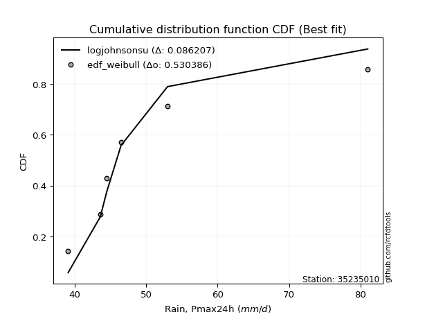</img>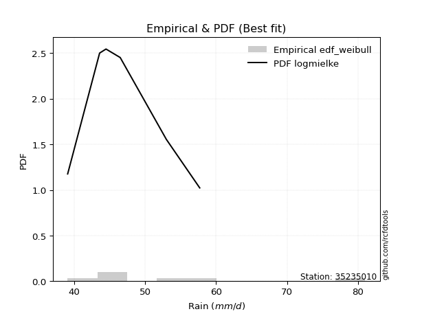</img>

</div>


### 4. EDF Beard (1943)

The Beard formula (or Beard´s plotting position formula) in hydrology is used to estimate the empirical non-exceedance probability _(P)_ of a flood event (or other extreme hydrological data point) within a given dataset.

<div align="center">


$P=(m-0.31)/(n+0.38)$


</div>


**4.1. Empirical values**

<div align="center">

|                | 0                   | 1                   | 2                   | 3         | 4                  | 5                  | 6                  |
|:---------------|:--------------------|:--------------------|:--------------------|:----------|:-------------------|:-------------------|:-------------------|
| date           | 2019                | 2022                | 2023                | 2021      | 2020               | 2025               | 2024               |
| x              | 39.1                | 43.6                | 44.5                | 46.5      | 53.0               | 57.7               | 81.0               |
| m              | 1                   | 2                   | 3                   | 4         | 5                  | 6                  | 7                  |
| empirical_dist | edf_beard           | edf_beard           | edf_beard           | edf_beard | edf_beard          | edf_beard          | edf_beard          |
| empirical      | 0.09349593495934959 | 0.22899728997289973 | 0.36449864498644985 | 0.5       | 0.6355013550135502 | 0.7710027100271003 | 0.9065040650406505 |
| empirical_tr   | 1.1031390134529149  | 1.29701230228471    | 1.5735607675906182  | 2.0       | 2.743494423791822  | 4.366863905325444  | 10.695652173913055 |

</div>


**4.2. Kolmogorov-Smirnov fit test (sorted by Δ)**


<div align="center">

|                | 0                   | 1                   | 2                   | 3                   | 4                   | 5                   | 6                   | 7                   | 8                   | 9                   | 10                  | 11                  | 12                  | 13                  | 14                  | 15                  | 16                  | 17                  | 18                  | 19                  | 20                  | 21                  | 22                  | 23                  | 24                  | 25                  | 26                  | 27                  | 28                  | 29                  | 30                  | 31                  | 32                  | 33                  | 34                  | 35                  | 36                  | 37                  | 38                  | 39                  | 40                  | 41                  | 42                  | 43                  | 44                  | 45                  | 46                  | 47                  | 48                  | 49                  | 50                  | 51                  | 52                  | 53                  | 54                  | 55                  | 56                  | 57                  | 58                  | 59                  | 60                  | 61                  | 62                  | 63                  | 64                  | 65                  | 66                  | 67                  | 68                  | 69                  | 70                  | 71                  | 72                  | 73                  | 74                  | 75                  | 76                  | 77                  | 78                  | 79                  | 80                  | 81                  | 82                  | 83                  | 84                  | 85                  | 86                  | 87                  | 88                  | 89                  | 90                  | 91                  | 92                  | 93                  | 94                  | 95                  | 96                  | 97                  | 98                  | 99                  | 100                 | 101                 | 102                 | 103                 | 104                 | 105                 | 106                 | 107                 | 108                 | 109                 | 110                 | 111                 | 112                 | 113                 | 114                 | 115                 | 116                 | 117                 | 118                 | 119                 | 120                 | 121                 | 122                 | 123                 | 124                 | 125                 | 126                 | 127                 | 128                 | 129                 | 130                 | 131                 | 132                 | 133                 | 134                 | 135                 | 136                 | 137                 | 138                 | 139                 | 140                 | 141                 | 142                 | 143                 | 144                 | 145                 | 146                 | 147                 | 148                 | 149                 | 150                 | 151                 | 152                 | 153                 | 154                 | 155                 | 156                 | 157                 | 158                 | 159                 |
|:---------------|:--------------------|:--------------------|:--------------------|:--------------------|:--------------------|:--------------------|:--------------------|:--------------------|:--------------------|:--------------------|:--------------------|:--------------------|:--------------------|:--------------------|:--------------------|:--------------------|:--------------------|:--------------------|:--------------------|:--------------------|:--------------------|:--------------------|:--------------------|:--------------------|:--------------------|:--------------------|:--------------------|:--------------------|:--------------------|:--------------------|:--------------------|:--------------------|:--------------------|:--------------------|:--------------------|:--------------------|:--------------------|:--------------------|:--------------------|:--------------------|:--------------------|:--------------------|:--------------------|:--------------------|:--------------------|:--------------------|:--------------------|:--------------------|:--------------------|:--------------------|:--------------------|:--------------------|:--------------------|:--------------------|:--------------------|:--------------------|:--------------------|:--------------------|:--------------------|:--------------------|:--------------------|:--------------------|:--------------------|:--------------------|:--------------------|:--------------------|:--------------------|:--------------------|:--------------------|:--------------------|:--------------------|:--------------------|:--------------------|:--------------------|:--------------------|:--------------------|:--------------------|:--------------------|:--------------------|:--------------------|:--------------------|:--------------------|:--------------------|:--------------------|:--------------------|:--------------------|:--------------------|:--------------------|:--------------------|:--------------------|:--------------------|:--------------------|:--------------------|:--------------------|:--------------------|:--------------------|:--------------------|:--------------------|:--------------------|:--------------------|:--------------------|:--------------------|:--------------------|:--------------------|:--------------------|:--------------------|:--------------------|:--------------------|:--------------------|:--------------------|:--------------------|:--------------------|:--------------------|:--------------------|:--------------------|:--------------------|:--------------------|:--------------------|:--------------------|:--------------------|:--------------------|:--------------------|:--------------------|:--------------------|:--------------------|:--------------------|:--------------------|:--------------------|:--------------------|:--------------------|:--------------------|:--------------------|:--------------------|:--------------------|:--------------------|:--------------------|:--------------------|:--------------------|:--------------------|:--------------------|:--------------------|:--------------------|:--------------------|:--------------------|:--------------------|:--------------------|:--------------------|:--------------------|:--------------------|:--------------------|:--------------------|:--------------------|:--------------------|:--------------------|:--------------------|:--------------------|:--------------------|:--------------------|:--------------------|:--------------------|
| station        | 35235010            | 35235010            | 35235010            | 35235010            | 35235010            | 35235010            | 35235010            | 35235010            | 35235010            | 35235010            | 35235010            | 35235010            | 35235010            | 35235010            | 35235010            | 35235010            | 35235010            | 35235010            | 35235010            | 35235010            | 35235010            | 35235010            | 35235010            | 35235010            | 35235010            | 35235010            | 35235010            | 35235010            | 35235010            | 35235010            | 35235010            | 35235010            | 35235010            | 35235010            | 35235010            | 35235010            | 35235010            | 35235010            | 35235010            | 35235010            | 35235010            | 35235010            | 35235010            | 35235010            | 35235010            | 35235010            | 35235010            | 35235010            | 35235010            | 35235010            | 35235010            | 35235010            | 35235010            | 35235010            | 35235010            | 35235010            | 35235010            | 35235010            | 35235010            | 35235010            | 35235010            | 35235010            | 35235010            | 35235010            | 35235010            | 35235010            | 35235010            | 35235010            | 35235010            | 35235010            | 35235010            | 35235010            | 35235010            | 35235010            | 35235010            | 35235010            | 35235010            | 35235010            | 35235010            | 35235010            | 35235010            | 35235010            | 35235010            | 35235010            | 35235010            | 35235010            | 35235010            | 35235010            | 35235010            | 35235010            | 35235010            | 35235010            | 35235010            | 35235010            | 35235010            | 35235010            | 35235010            | 35235010            | 35235010            | 35235010            | 35235010            | 35235010            | 35235010            | 35235010            | 35235010            | 35235010            | 35235010            | 35235010            | 35235010            | 35235010            | 35235010            | 35235010            | 35235010            | 35235010            | 35235010            | 35235010            | 35235010            | 35235010            | 35235010            | 35235010            | 35235010            | 35235010            | 35235010            | 35235010            | 35235010            | 35235010            | 35235010            | 35235010            | 35235010            | 35235010            | 35235010            | 35235010            | 35235010            | 35235010            | 35235010            | 35235010            | 35235010            | 35235010            | 35235010            | 35235010            | 35235010            | 35235010            | 35235010            | 35235010            | 35235010            | 35235010            | 35235010            | 35235010            | 35235010            | 35235010            | 35235010            | 35235010            | 35235010            | 35235010            | 35235010            | 35235010            | 35235010            | 35235010            | 35235010            | 35235010            |
| empirical_dist | edf_beard           | edf_beard           | edf_beard           | edf_beard           | edf_beard           | edf_beard           | edf_beard           | edf_beard           | edf_beard           | edf_beard           | edf_beard           | edf_beard           | edf_beard           | edf_beard           | edf_beard           | edf_beard           | edf_beard           | edf_beard           | edf_beard           | edf_beard           | edf_beard           | edf_beard           | edf_beard           | edf_beard           | edf_beard           | edf_beard           | edf_beard           | edf_beard           | edf_beard           | edf_beard           | edf_beard           | edf_beard           | edf_beard           | edf_beard           | edf_beard           | edf_beard           | edf_beard           | edf_beard           | edf_beard           | edf_beard           | edf_beard           | edf_beard           | edf_beard           | edf_beard           | edf_beard           | edf_beard           | edf_beard           | edf_beard           | edf_beard           | edf_beard           | edf_beard           | edf_beard           | edf_beard           | edf_beard           | edf_beard           | edf_beard           | edf_beard           | edf_beard           | edf_beard           | edf_beard           | edf_beard           | edf_beard           | edf_beard           | edf_beard           | edf_beard           | edf_beard           | edf_beard           | edf_beard           | edf_beard           | edf_beard           | edf_beard           | edf_beard           | edf_beard           | edf_beard           | edf_beard           | edf_beard           | edf_beard           | edf_beard           | edf_beard           | edf_beard           | edf_beard           | edf_beard           | edf_beard           | edf_beard           | edf_beard           | edf_beard           | edf_beard           | edf_beard           | edf_beard           | edf_beard           | edf_beard           | edf_beard           | edf_beard           | edf_beard           | edf_beard           | edf_beard           | edf_beard           | edf_beard           | edf_beard           | edf_beard           | edf_beard           | edf_beard           | edf_beard           | edf_beard           | edf_beard           | edf_beard           | edf_beard           | edf_beard           | edf_beard           | edf_beard           | edf_beard           | edf_beard           | edf_beard           | edf_beard           | edf_beard           | edf_beard           | edf_beard           | edf_beard           | edf_beard           | edf_beard           | edf_beard           | edf_beard           | edf_beard           | edf_beard           | edf_beard           | edf_beard           | edf_beard           | edf_beard           | edf_beard           | edf_beard           | edf_beard           | edf_beard           | edf_beard           | edf_beard           | edf_beard           | edf_beard           | edf_beard           | edf_beard           | edf_beard           | edf_beard           | edf_beard           | edf_beard           | edf_beard           | edf_beard           | edf_beard           | edf_beard           | edf_beard           | edf_beard           | edf_beard           | edf_beard           | edf_beard           | edf_beard           | edf_beard           | edf_beard           | edf_beard           | edf_beard           | edf_beard           | edf_beard           | edf_beard           | edf_beard           |
| p_dist         | logburr12           | logexponnorm        | invgamma            | genextreme          | invweibull          | f                   | logjohnsonsu        | logf                | loginvgamma         | loginvweibull       | loggenextreme       | loginvgauss         | alpha               | logfatiguelife      | johnsonsu           | invgauss            | logmielke           | loghalfnorm         | loghalflogistic     | halflogistic        | logmoyal            | foldnorm            | logfoldnorm         | exponnorm           | halfnorm            | loggenexpon         | logtruncnorm        | loghalfgennorm      | genexpon            | loggompertz         | lomax               | gompertz            | wald                | logvonmises_line    | burr                | logwald             | logburr             | logpearson3         | logbradford         | pearson3            | nakagami            | bradford            | loggumbel_r         | logweibull_max      | logbetaprime        | loggenlogistic      | mielke              | lograyleigh         | moyal               | logalpha            | vonmises_line       | logexponweib        | burr12              | truncpareto         | logskewnorm         | lognct              | logmaxwell          | logkstwobign        | logsemicircular     | gumbel_r            | rayleigh            | loggennorm          | loganglit           | logncf              | logtruncweibull_min | loglomax            | logloglaplace       | genhalflogistic     | maxwell             | semicircular        | genlogistic         | logarcsine          | nct                 | logexponpow         | anglit              | betaprime           | logloggamma         | logweibull_min      | logt                | logcrystalball      | lognorm             | loggausshyper       | dgamma              | logrice             | ncf                 | logdweibull         | t                   | kstwobign           | crystalball         | norm                | truncnorm           | logtruncexpon       | loglogistic         | arcsine             | loghypsecant        | halfgennorm         | logistic            | logbeta             | skewnorm            | tukeylambda         | logcosine           | rice                | gennorm             | logdgamma           | hypsecant           | truncweibull_min    | loggengamma         | loggumbel_l         | loglaplace          | loglaplace          | cosine              | triang              | gumbel_l            | rdist               | laplace             | logksone            | logargus            | truncexpon          | logkappa4           | logwrapcauchy       | loguniform          | genpareto           | logkappa3           | dweibull            | beta                | wrapcauchy          | lognakagami         | argus               | logtriang           | kappa4              | ksone               | weibull_min         | uniform             | loglevy_l           | kappa3              | levy_l              | logerlang           | gengamma            | loggamma            | loggamma            | loggenhalflogistic  | exponpow            | johnsonsb           | powerlaw            | logjohnsonsb        | logtrapezoid        | logpowerlaw         | fatiguelife         | gausshyper          | loggenpareto        | exponweib           | trapezoid           | erlang              | gamma               | logtruncpareto      | weibull_max         | logtukeylambda      | logrdist            | logvonmises         | vonmises            |
| delta          | 0.0531687667966072  | 0.05420027705378894 | 0.05609412133356784 | 0.05611435066545534 | 0.05611644109191294 | 0.05681088367942466 | 0.05933596574515612 | 0.05968650550526272 | 0.05968685596917933 | 0.06154381992632246 | 0.06155350255416531 | 0.06337379464528317 | 0.06356123321313417 | 0.0707886178414456  | 0.07175249480120191 | 0.07228755115583377 | 0.07237555360887205 | 0.07539749056473172 | 0.08245829287552313 | 0.0877635309976098  | 0.08842320951082838 | 0.08876392547014114 | 0.09066799216105548 | 0.09189224340728162 | 0.0925113886927672  | 0.09345963393899599 | 0.09349520204297568 | 0.09349587911521143 | 0.09349593492161458 | 0.0934959349501793  | 0.09349593495934572 | 0.09349593495934905 | 0.09349593495934959 | 0.09599379076159692 | 0.09743717917593114 | 0.09822033297541077 | 0.09878457789911843 | 0.10017198560522522 | 0.10061274452201316 | 0.10271110619694657 | 0.10339597764987984 | 0.10444017331897426 | 0.10589647017888365 | 0.10679800658524191 | 0.10723542597298669 | 0.10726700054416982 | 0.10913457764922169 | 0.10961731969998662 | 0.11004786283469481 | 0.11039677484687432 | 0.11061727984710984 | 0.11201384205645545 | 0.11315958126083811 | 0.11434384875996575 | 0.11535303024613475 | 0.12124353973142349 | 0.12164046311930538 | 0.12173753155790257 | 0.12473666861344779 | 0.12537995487219744 | 0.1260372453862788  | 0.13152553509848397 | 0.1332002377463204  | 0.13470639504267323 | 0.13477521908642737 | 0.1358454759709268  | 0.1370403811073866  | 0.13743238295216376 | 0.13782270154167242 | 0.138153796733827   | 0.13952900073155933 | 0.1397754808750834  | 0.14137013054904052 | 0.1422676609847099  | 0.14676580260841787 | 0.1472562109139377  | 0.14969031330094185 | 0.15212107910617115 | 0.1524881955298345  | 0.15336694849370563 | 0.15336695111751242 | 0.15467476836929966 | 0.15585174224462417 | 0.15817397180875997 | 0.1604077978231367  | 0.16109377992264284 | 0.16224590207793033 | 0.16590502359673615 | 0.16849678793376388 | 0.16849679185816757 | 0.16849679201742157 | 0.16887830450315328 | 0.17159563182722587 | 0.17490947414905245 | 0.18568656601478306 | 0.1868266465998862  | 0.18791556724487657 | 0.18870898686521406 | 0.18934363773400426 | 0.19003819300476466 | 0.19343687547673571 | 0.19832956161266402 | 0.1993444853681028  | 0.20201497196675178 | 0.20262503403113663 | 0.2034720982828119  | 0.21257307392758393 | 0.21280409516762178 | 0.21376743887680555 | 0.21376743887680555 | 0.21588374838357116 | 0.22271621989425933 | 0.22537511341256444 | 0.22805394775454102 | 0.2300216637426704  | 0.2424310961431354  | 0.24728655919820053 | 0.2479573263744539  | 0.24993300676036873 | 0.25953462463341026 | 0.2620163471506911  | 0.2632259848312216  | 0.26491935068751543 | 0.27100271002721954 | 0.2846117665211655  | 0.289871788736488   | 0.29025672712264294 | 0.305012176597252   | 0.30640407287945304 | 0.3076272185687296  | 0.3177409757391131  | 0.3260648603415255  | 0.3270886288815155  | 0.32733230605941066 | 0.32791942679358427 | 0.3438715010316471  | 0.3629731359581222  | 0.36776894957107187 | 0.37210090959492426 | 0.37210090959492426 | 0.37869910721507405 | 0.38739389099166177 | 0.45221726627567793 | 0.4735670065452149  | 0.4808915179655211  | 0.491614759023201   | 0.49734514118735407 | 0.5079418381570131  | 0.5122530068908357  | 0.5153221647972952  | 0.5320483988447218  | 0.5655565102573463  | 0.6023087241158677  | 0.6084590909124634  | 0.6395824462735807  | 0.6538728555569091  | 0.9065031372409112  | 0.9065040620894381  | 1.074720744056704   | 12.201255330667003  |
| deltao         | 0.48442053926100004 | 0.48442053926100004 | 0.48442053926100004 | 0.48442053926100004 | 0.48442053926100004 | 0.48442053926100004 | 0.48442053926100004 | 0.48442053926100004 | 0.48442053926100004 | 0.48442053926100004 | 0.48442053926100004 | 0.48442053926100004 | 0.48442053926100004 | 0.48442053926100004 | 0.48442053926100004 | 0.48442053926100004 | 0.48442053926100004 | 0.48442053926100004 | 0.48442053926100004 | 0.48442053926100004 | 0.48442053926100004 | 0.48442053926100004 | 0.48442053926100004 | 0.48442053926100004 | 0.48442053926100004 | 0.48442053926100004 | 0.48442053926100004 | 0.48442053926100004 | 0.48442053926100004 | 0.48442053926100004 | 0.48442053926100004 | 0.48442053926100004 | 0.48442053926100004 | 0.48442053926100004 | 0.48442053926100004 | 0.48442053926100004 | 0.48442053926100004 | 0.48442053926100004 | 0.48442053926100004 | 0.48442053926100004 | 0.48442053926100004 | 0.48442053926100004 | 0.48442053926100004 | 0.48442053926100004 | 0.48442053926100004 | 0.48442053926100004 | 0.48442053926100004 | 0.48442053926100004 | 0.48442053926100004 | 0.48442053926100004 | 0.48442053926100004 | 0.48442053926100004 | 0.48442053926100004 | 0.48442053926100004 | 0.48442053926100004 | 0.48442053926100004 | 0.48442053926100004 | 0.48442053926100004 | 0.48442053926100004 | 0.48442053926100004 | 0.48442053926100004 | 0.48442053926100004 | 0.48442053926100004 | 0.48442053926100004 | 0.48442053926100004 | 0.48442053926100004 | 0.48442053926100004 | 0.48442053926100004 | 0.48442053926100004 | 0.48442053926100004 | 0.48442053926100004 | 0.48442053926100004 | 0.48442053926100004 | 0.48442053926100004 | 0.48442053926100004 | 0.48442053926100004 | 0.48442053926100004 | 0.48442053926100004 | 0.48442053926100004 | 0.48442053926100004 | 0.48442053926100004 | 0.48442053926100004 | 0.48442053926100004 | 0.48442053926100004 | 0.48442053926100004 | 0.48442053926100004 | 0.48442053926100004 | 0.48442053926100004 | 0.48442053926100004 | 0.48442053926100004 | 0.48442053926100004 | 0.48442053926100004 | 0.48442053926100004 | 0.48442053926100004 | 0.48442053926100004 | 0.48442053926100004 | 0.48442053926100004 | 0.48442053926100004 | 0.48442053926100004 | 0.48442053926100004 | 0.48442053926100004 | 0.48442053926100004 | 0.48442053926100004 | 0.48442053926100004 | 0.48442053926100004 | 0.48442053926100004 | 0.48442053926100004 | 0.48442053926100004 | 0.48442053926100004 | 0.48442053926100004 | 0.48442053926100004 | 0.48442053926100004 | 0.48442053926100004 | 0.48442053926100004 | 0.48442053926100004 | 0.48442053926100004 | 0.48442053926100004 | 0.48442053926100004 | 0.48442053926100004 | 0.48442053926100004 | 0.48442053926100004 | 0.48442053926100004 | 0.48442053926100004 | 0.48442053926100004 | 0.48442053926100004 | 0.48442053926100004 | 0.48442053926100004 | 0.48442053926100004 | 0.48442053926100004 | 0.48442053926100004 | 0.48442053926100004 | 0.48442053926100004 | 0.48442053926100004 | 0.48442053926100004 | 0.48442053926100004 | 0.48442053926100004 | 0.48442053926100004 | 0.48442053926100004 | 0.48442053926100004 | 0.48442053926100004 | 0.48442053926100004 | 0.48442053926100004 | 0.48442053926100004 | 0.48442053926100004 | 0.48442053926100004 | 0.48442053926100004 | 0.48442053926100004 | 0.48442053926100004 | 0.48442053926100004 | 0.48442053926100004 | 0.48442053926100004 | 0.48442053926100004 | 0.48442053926100004 | 0.48442053926100004 | 0.48442053926100004 | 0.48442053926100004 | 0.48442053926100004 | 0.48442053926100004 | 0.48442053926100004 | 0.48442053926100004 |
| eval           | Δo > Δ              | Δo > Δ              | Δo > Δ              | Δo > Δ              | Δo > Δ              | Δo > Δ              | Δo > Δ              | Δo > Δ              | Δo > Δ              | Δo > Δ              | Δo > Δ              | Δo > Δ              | Δo > Δ              | Δo > Δ              | Δo > Δ              | Δo > Δ              | Δo > Δ              | Δo > Δ              | Δo > Δ              | Δo > Δ              | Δo > Δ              | Δo > Δ              | Δo > Δ              | Δo > Δ              | Δo > Δ              | Δo > Δ              | Δo > Δ              | Δo > Δ              | Δo > Δ              | Δo > Δ              | Δo > Δ              | Δo > Δ              | Δo > Δ              | Δo > Δ              | Δo > Δ              | Δo > Δ              | Δo > Δ              | Δo > Δ              | Δo > Δ              | Δo > Δ              | Δo > Δ              | Δo > Δ              | Δo > Δ              | Δo > Δ              | Δo > Δ              | Δo > Δ              | Δo > Δ              | Δo > Δ              | Δo > Δ              | Δo > Δ              | Δo > Δ              | Δo > Δ              | Δo > Δ              | Δo > Δ              | Δo > Δ              | Δo > Δ              | Δo > Δ              | Δo > Δ              | Δo > Δ              | Δo > Δ              | Δo > Δ              | Δo > Δ              | Δo > Δ              | Δo > Δ              | Δo > Δ              | Δo > Δ              | Δo > Δ              | Δo > Δ              | Δo > Δ              | Δo > Δ              | Δo > Δ              | Δo > Δ              | Δo > Δ              | Δo > Δ              | Δo > Δ              | Δo > Δ              | Δo > Δ              | Δo > Δ              | Δo > Δ              | Δo > Δ              | Δo > Δ              | Δo > Δ              | Δo > Δ              | Δo > Δ              | Δo > Δ              | Δo > Δ              | Δo > Δ              | Δo > Δ              | Δo > Δ              | Δo > Δ              | Δo > Δ              | Δo > Δ              | Δo > Δ              | Δo > Δ              | Δo > Δ              | Δo > Δ              | Δo > Δ              | Δo > Δ              | Δo > Δ              | Δo > Δ              | Δo > Δ              | Δo > Δ              | Δo > Δ              | Δo > Δ              | Δo > Δ              | Δo > Δ              | Δo > Δ              | Δo > Δ              | Δo > Δ              | Δo > Δ              | Δo > Δ              | Δo > Δ              | Δo > Δ              | Δo > Δ              | Δo > Δ              | Δo > Δ              | Δo > Δ              | Δo > Δ              | Δo > Δ              | Δo > Δ              | Δo > Δ              | Δo > Δ              | Δo > Δ              | Δo > Δ              | Δo > Δ              | Δo > Δ              | Δo > Δ              | Δo > Δ              | Δo > Δ              | Δo > Δ              | Δo > Δ              | Δo > Δ              | Δo > Δ              | Δo > Δ              | Δo > Δ              | Δo > Δ              | Δo > Δ              | Δo > Δ              | Δo > Δ              | Δo > Δ              | Δo > Δ              | Δo > Δ              | Δo > Δ              | Δo > Δ              | Δo > Δ              | Δo <= Δ             | Δo <= Δ             | Δo <= Δ             | Δo <= Δ             | Δo <= Δ             | Δo <= Δ             | Δo <= Δ             | Δo <= Δ             | Δo <= Δ             | Δo <= Δ             | Δo <= Δ             | Δo <= Δ             | Δo <= Δ             | Δo <= Δ             | Δo <= Δ             |
| fit            | 1                   | 1                   | 1                   | 1                   | 1                   | 1                   | 1                   | 1                   | 1                   | 1                   | 1                   | 1                   | 1                   | 1                   | 1                   | 1                   | 1                   | 1                   | 1                   | 1                   | 1                   | 1                   | 1                   | 1                   | 1                   | 1                   | 1                   | 1                   | 1                   | 1                   | 1                   | 1                   | 1                   | 1                   | 1                   | 1                   | 1                   | 1                   | 1                   | 1                   | 1                   | 1                   | 1                   | 1                   | 1                   | 1                   | 1                   | 1                   | 1                   | 1                   | 1                   | 1                   | 1                   | 1                   | 1                   | 1                   | 1                   | 1                   | 1                   | 1                   | 1                   | 1                   | 1                   | 1                   | 1                   | 1                   | 1                   | 1                   | 1                   | 1                   | 1                   | 1                   | 1                   | 1                   | 1                   | 1                   | 1                   | 1                   | 1                   | 1                   | 1                   | 1                   | 1                   | 1                   | 1                   | 1                   | 1                   | 1                   | 1                   | 1                   | 1                   | 1                   | 1                   | 1                   | 1                   | 1                   | 1                   | 1                   | 1                   | 1                   | 1                   | 1                   | 1                   | 1                   | 1                   | 1                   | 1                   | 1                   | 1                   | 1                   | 1                   | 1                   | 1                   | 1                   | 1                   | 1                   | 1                   | 1                   | 1                   | 1                   | 1                   | 1                   | 1                   | 1                   | 1                   | 1                   | 1                   | 1                   | 1                   | 1                   | 1                   | 1                   | 1                   | 1                   | 1                   | 1                   | 1                   | 1                   | 1                   | 1                   | 1                   | 1                   | 1                   | 1                   | 1                   | 0                   | 0                   | 0                   | 0                   | 0                   | 0                   | 0                   | 0                   | 0                   | 0                   | 0                   | 0                   | 0                   | 0                   | 0                   |
| n              | 7                   | 7                   | 7                   | 7                   | 7                   | 7                   | 7                   | 7                   | 7                   | 7                   | 7                   | 7                   | 7                   | 7                   | 7                   | 7                   | 7                   | 7                   | 7                   | 7                   | 7                   | 7                   | 7                   | 7                   | 7                   | 7                   | 7                   | 7                   | 7                   | 7                   | 7                   | 7                   | 7                   | 7                   | 7                   | 7                   | 7                   | 7                   | 7                   | 7                   | 7                   | 7                   | 7                   | 7                   | 7                   | 7                   | 7                   | 7                   | 7                   | 7                   | 7                   | 7                   | 7                   | 7                   | 7                   | 7                   | 7                   | 7                   | 7                   | 7                   | 7                   | 7                   | 7                   | 7                   | 7                   | 7                   | 7                   | 7                   | 7                   | 7                   | 7                   | 7                   | 7                   | 7                   | 7                   | 7                   | 7                   | 7                   | 7                   | 7                   | 7                   | 7                   | 7                   | 7                   | 7                   | 7                   | 7                   | 7                   | 7                   | 7                   | 7                   | 7                   | 7                   | 7                   | 7                   | 7                   | 7                   | 7                   | 7                   | 7                   | 7                   | 7                   | 7                   | 7                   | 7                   | 7                   | 7                   | 7                   | 7                   | 7                   | 7                   | 7                   | 7                   | 7                   | 7                   | 7                   | 7                   | 7                   | 7                   | 7                   | 7                   | 7                   | 7                   | 7                   | 7                   | 7                   | 7                   | 7                   | 7                   | 7                   | 7                   | 7                   | 7                   | 7                   | 7                   | 7                   | 7                   | 7                   | 7                   | 7                   | 7                   | 7                   | 7                   | 7                   | 7                   | 7                   | 7                   | 7                   | 7                   | 7                   | 7                   | 7                   | 7                   | 7                   | 7                   | 7                   | 7                   | 7                   | 7                   | 7                   |
| best_fit       | 1                   | 0                   | 0                   | 0                   | 0                   | 0                   | 0                   | 0                   | 0                   | 0                   | 0                   | 0                   | 0                   | 0                   | 0                   | 0                   | 0                   | 0                   | 0                   | 0                   | 0                   | 0                   | 0                   | 0                   | 0                   | 0                   | 0                   | 0                   | 0                   | 0                   | 0                   | 0                   | 0                   | 0                   | 0                   | 0                   | 0                   | 0                   | 0                   | 0                   | 0                   | 0                   | 0                   | 0                   | 0                   | 0                   | 0                   | 0                   | 0                   | 0                   | 0                   | 0                   | 0                   | 0                   | 0                   | 0                   | 0                   | 0                   | 0                   | 0                   | 0                   | 0                   | 0                   | 0                   | 0                   | 0                   | 0                   | 0                   | 0                   | 0                   | 0                   | 0                   | 0                   | 0                   | 0                   | 0                   | 0                   | 0                   | 0                   | 0                   | 0                   | 0                   | 0                   | 0                   | 0                   | 0                   | 0                   | 0                   | 0                   | 0                   | 0                   | 0                   | 0                   | 0                   | 0                   | 0                   | 0                   | 0                   | 0                   | 0                   | 0                   | 0                   | 0                   | 0                   | 0                   | 0                   | 0                   | 0                   | 0                   | 0                   | 0                   | 0                   | 0                   | 0                   | 0                   | 0                   | 0                   | 0                   | 0                   | 0                   | 0                   | 0                   | 0                   | 0                   | 0                   | 0                   | 0                   | 0                   | 0                   | 0                   | 0                   | 0                   | 0                   | 0                   | 0                   | 0                   | 0                   | 0                   | 0                   | 0                   | 0                   | 0                   | 0                   | 0                   | 0                   | 0                   | 0                   | 0                   | 0                   | 0                   | 0                   | 0                   | 0                   | 0                   | 0                   | 0                   | 0                   | 0                   | 0                   | 0                   |
| best_fit_sort  | 1                   | 2                   | 3                   | 4                   | 5                   | 6                   | 7                   | 8                   | 9                   | 10                  | 11                  | 12                  | 13                  | 14                  | 15                  | 16                  | 17                  | 18                  | 19                  | 20                  | 21                  | 22                  | 23                  | 24                  | 25                  | 26                  | 27                  | 28                  | 29                  | 30                  | 31                  | 32                  | 33                  | 34                  | 35                  | 36                  | 37                  | 38                  | 39                  | 40                  | 41                  | 42                  | 43                  | 44                  | 45                  | 46                  | 47                  | 48                  | 49                  | 50                  | 51                  | 52                  | 53                  | 54                  | 55                  | 56                  | 57                  | 58                  | 59                  | 60                  | 61                  | 62                  | 63                  | 64                  | 65                  | 66                  | 67                  | 68                  | 69                  | 70                  | 71                  | 72                  | 73                  | 74                  | 75                  | 76                  | 77                  | 78                  | 79                  | 80                  | 81                  | 82                  | 83                  | 84                  | 85                  | 86                  | 87                  | 88                  | 89                  | 90                  | 91                  | 92                  | 93                  | 94                  | 95                  | 96                  | 97                  | 98                  | 99                  | 100                 | 101                 | 102                 | 103                 | 104                 | 105                 | 106                 | 107                 | 108                 | 109                 | 110                 | 111                 | 112                 | 113                 | 114                 | 115                 | 116                 | 117                 | 118                 | 119                 | 120                 | 121                 | 122                 | 123                 | 124                 | 125                 | 126                 | 127                 | 128                 | 129                 | 130                 | 131                 | 132                 | 133                 | 134                 | 135                 | 136                 | 137                 | 138                 | 139                 | 140                 | 141                 | 142                 | 143                 | 144                 | 145                 | 146                 | 147                 | 148                 | 149                 | 150                 | 151                 | 152                 | 153                 | 154                 | 155                 | 156                 | 157                 | 158                 | 159                 | 160                 |

</div>


**4.3. Best fit**

<div align="center">

|   id |   station | empirical_dist   | p_dist    |     delta |   deltao | eval   |   fit |   n |   best_fit |   best_fit_sort |
|-----:|----------:|:-----------------|:----------|----------:|---------:|:-------|------:|----:|-----------:|----------------:|
|    0 |  35235010 | edf_beard        | logburr12 | 0.0531688 | 0.484421 | Δo > Δ |     1 |   7 |          1 |               1 |

</div>


<div align="center">

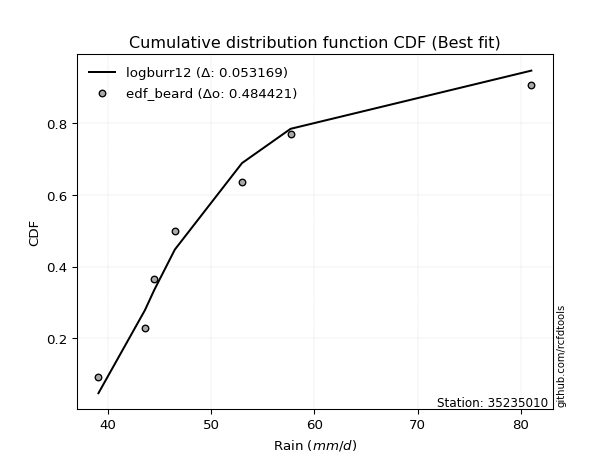</img></img>

</div>


### 5. EDF Chegodayev (1955)

The Chegodayev formula is an empirical plotting position formula used in hydrological frequency analysis to estimate the exceedance probability or return period of a specific event from a set of observed data. It is primarily used for plotting observed data points on probability paper to fit a theoretical distribution, particularly for analyzing extreme events like maximum flood flows or rainfall intensities. The constant _b_ value in the generalized plotting position formula is 0.3.

<div align="center">


$P=(m-b)/(n+1-2b)$


</div>


**5.1. Empirical values**

<div align="center">

|                | 0                   | 1                   | 2                   | 3              | 4                  | 5                  | 6                  |
|:---------------|:--------------------|:--------------------|:--------------------|:---------------|:-------------------|:-------------------|:-------------------|
| date           | 2019                | 2022                | 2023                | 2021           | 2020               | 2025               | 2024               |
| x              | 39.1                | 43.6                | 44.5                | 46.5           | 53.0               | 57.7               | 81.0               |
| m              | 1                   | 2                   | 3                   | 4              | 5                  | 6                  | 7                  |
| empirical_dist | edf_chegodayev      | edf_chegodayev      | edf_chegodayev      | edf_chegodayev | edf_chegodayev     | edf_chegodayev     | edf_chegodayev     |
| empirical      | 0.09459459459459459 | 0.22972972972972971 | 0.36486486486486486 | 0.5            | 0.6351351351351351 | 0.7702702702702703 | 0.9054054054054054 |
| empirical_tr   | 1.1044776119402986  | 1.2982456140350878  | 1.574468085106383   | 2.0            | 2.7407407407407405 | 4.352941176470589  | 10.571428571428568 |

</div>


**5.2. Kolmogorov-Smirnov fit test (sorted by Δ)**


<div align="center">

|                | 0                   | 1                   | 2                   | 3                   | 4                   | 5                   | 6                   | 7                   | 8                   | 9                   | 10                  | 11                  | 12                  | 13                  | 14                  | 15                  | 16                  | 17                  | 18                  | 19                  | 20                  | 21                  | 22                  | 23                  | 24                  | 25                  | 26                  | 27                  | 28                  | 29                  | 30                  | 31                  | 32                  | 33                  | 34                  | 35                  | 36                  | 37                  | 38                  | 39                  | 40                  | 41                  | 42                  | 43                  | 44                  | 45                  | 46                  | 47                  | 48                  | 49                  | 50                  | 51                  | 52                  | 53                  | 54                  | 55                  | 56                  | 57                  | 58                  | 59                  | 60                  | 61                  | 62                  | 63                  | 64                  | 65                  | 66                  | 67                  | 68                  | 69                  | 70                  | 71                  | 72                  | 73                  | 74                  | 75                  | 76                  | 77                  | 78                  | 79                  | 80                  | 81                  | 82                  | 83                  | 84                  | 85                  | 86                  | 87                  | 88                  | 89                  | 90                  | 91                  | 92                  | 93                  | 94                  | 95                  | 96                  | 97                  | 98                  | 99                  | 100                 | 101                 | 102                 | 103                 | 104                 | 105                 | 106                 | 107                 | 108                 | 109                 | 110                 | 111                 | 112                 | 113                 | 114                 | 115                 | 116                 | 117                 | 118                 | 119                 | 120                 | 121                 | 122                 | 123                 | 124                 | 125                 | 126                 | 127                 | 128                 | 129                 | 130                 | 131                 | 132                 | 133                 | 134                 | 135                 | 136                 | 137                 | 138                 | 139                 | 140                 | 141                 | 142                 | 143                 | 144                 | 145                 | 146                 | 147                 | 148                 | 149                 | 150                 | 151                 | 152                 | 153                 | 154                 | 155                 | 156                 | 157                 | 158                 | 159                 |
|:---------------|:--------------------|:--------------------|:--------------------|:--------------------|:--------------------|:--------------------|:--------------------|:--------------------|:--------------------|:--------------------|:--------------------|:--------------------|:--------------------|:--------------------|:--------------------|:--------------------|:--------------------|:--------------------|:--------------------|:--------------------|:--------------------|:--------------------|:--------------------|:--------------------|:--------------------|:--------------------|:--------------------|:--------------------|:--------------------|:--------------------|:--------------------|:--------------------|:--------------------|:--------------------|:--------------------|:--------------------|:--------------------|:--------------------|:--------------------|:--------------------|:--------------------|:--------------------|:--------------------|:--------------------|:--------------------|:--------------------|:--------------------|:--------------------|:--------------------|:--------------------|:--------------------|:--------------------|:--------------------|:--------------------|:--------------------|:--------------------|:--------------------|:--------------------|:--------------------|:--------------------|:--------------------|:--------------------|:--------------------|:--------------------|:--------------------|:--------------------|:--------------------|:--------------------|:--------------------|:--------------------|:--------------------|:--------------------|:--------------------|:--------------------|:--------------------|:--------------------|:--------------------|:--------------------|:--------------------|:--------------------|:--------------------|:--------------------|:--------------------|:--------------------|:--------------------|:--------------------|:--------------------|:--------------------|:--------------------|:--------------------|:--------------------|:--------------------|:--------------------|:--------------------|:--------------------|:--------------------|:--------------------|:--------------------|:--------------------|:--------------------|:--------------------|:--------------------|:--------------------|:--------------------|:--------------------|:--------------------|:--------------------|:--------------------|:--------------------|:--------------------|:--------------------|:--------------------|:--------------------|:--------------------|:--------------------|:--------------------|:--------------------|:--------------------|:--------------------|:--------------------|:--------------------|:--------------------|:--------------------|:--------------------|:--------------------|:--------------------|:--------------------|:--------------------|:--------------------|:--------------------|:--------------------|:--------------------|:--------------------|:--------------------|:--------------------|:--------------------|:--------------------|:--------------------|:--------------------|:--------------------|:--------------------|:--------------------|:--------------------|:--------------------|:--------------------|:--------------------|:--------------------|:--------------------|:--------------------|:--------------------|:--------------------|:--------------------|:--------------------|:--------------------|:--------------------|:--------------------|:--------------------|:--------------------|:--------------------|:--------------------|
| station        | 35235010            | 35235010            | 35235010            | 35235010            | 35235010            | 35235010            | 35235010            | 35235010            | 35235010            | 35235010            | 35235010            | 35235010            | 35235010            | 35235010            | 35235010            | 35235010            | 35235010            | 35235010            | 35235010            | 35235010            | 35235010            | 35235010            | 35235010            | 35235010            | 35235010            | 35235010            | 35235010            | 35235010            | 35235010            | 35235010            | 35235010            | 35235010            | 35235010            | 35235010            | 35235010            | 35235010            | 35235010            | 35235010            | 35235010            | 35235010            | 35235010            | 35235010            | 35235010            | 35235010            | 35235010            | 35235010            | 35235010            | 35235010            | 35235010            | 35235010            | 35235010            | 35235010            | 35235010            | 35235010            | 35235010            | 35235010            | 35235010            | 35235010            | 35235010            | 35235010            | 35235010            | 35235010            | 35235010            | 35235010            | 35235010            | 35235010            | 35235010            | 35235010            | 35235010            | 35235010            | 35235010            | 35235010            | 35235010            | 35235010            | 35235010            | 35235010            | 35235010            | 35235010            | 35235010            | 35235010            | 35235010            | 35235010            | 35235010            | 35235010            | 35235010            | 35235010            | 35235010            | 35235010            | 35235010            | 35235010            | 35235010            | 35235010            | 35235010            | 35235010            | 35235010            | 35235010            | 35235010            | 35235010            | 35235010            | 35235010            | 35235010            | 35235010            | 35235010            | 35235010            | 35235010            | 35235010            | 35235010            | 35235010            | 35235010            | 35235010            | 35235010            | 35235010            | 35235010            | 35235010            | 35235010            | 35235010            | 35235010            | 35235010            | 35235010            | 35235010            | 35235010            | 35235010            | 35235010            | 35235010            | 35235010            | 35235010            | 35235010            | 35235010            | 35235010            | 35235010            | 35235010            | 35235010            | 35235010            | 35235010            | 35235010            | 35235010            | 35235010            | 35235010            | 35235010            | 35235010            | 35235010            | 35235010            | 35235010            | 35235010            | 35235010            | 35235010            | 35235010            | 35235010            | 35235010            | 35235010            | 35235010            | 35235010            | 35235010            | 35235010            | 35235010            | 35235010            | 35235010            | 35235010            | 35235010            | 35235010            |
| empirical_dist | edf_chegodayev      | edf_chegodayev      | edf_chegodayev      | edf_chegodayev      | edf_chegodayev      | edf_chegodayev      | edf_chegodayev      | edf_chegodayev      | edf_chegodayev      | edf_chegodayev      | edf_chegodayev      | edf_chegodayev      | edf_chegodayev      | edf_chegodayev      | edf_chegodayev      | edf_chegodayev      | edf_chegodayev      | edf_chegodayev      | edf_chegodayev      | edf_chegodayev      | edf_chegodayev      | edf_chegodayev      | edf_chegodayev      | edf_chegodayev      | edf_chegodayev      | edf_chegodayev      | edf_chegodayev      | edf_chegodayev      | edf_chegodayev      | edf_chegodayev      | edf_chegodayev      | edf_chegodayev      | edf_chegodayev      | edf_chegodayev      | edf_chegodayev      | edf_chegodayev      | edf_chegodayev      | edf_chegodayev      | edf_chegodayev      | edf_chegodayev      | edf_chegodayev      | edf_chegodayev      | edf_chegodayev      | edf_chegodayev      | edf_chegodayev      | edf_chegodayev      | edf_chegodayev      | edf_chegodayev      | edf_chegodayev      | edf_chegodayev      | edf_chegodayev      | edf_chegodayev      | edf_chegodayev      | edf_chegodayev      | edf_chegodayev      | edf_chegodayev      | edf_chegodayev      | edf_chegodayev      | edf_chegodayev      | edf_chegodayev      | edf_chegodayev      | edf_chegodayev      | edf_chegodayev      | edf_chegodayev      | edf_chegodayev      | edf_chegodayev      | edf_chegodayev      | edf_chegodayev      | edf_chegodayev      | edf_chegodayev      | edf_chegodayev      | edf_chegodayev      | edf_chegodayev      | edf_chegodayev      | edf_chegodayev      | edf_chegodayev      | edf_chegodayev      | edf_chegodayev      | edf_chegodayev      | edf_chegodayev      | edf_chegodayev      | edf_chegodayev      | edf_chegodayev      | edf_chegodayev      | edf_chegodayev      | edf_chegodayev      | edf_chegodayev      | edf_chegodayev      | edf_chegodayev      | edf_chegodayev      | edf_chegodayev      | edf_chegodayev      | edf_chegodayev      | edf_chegodayev      | edf_chegodayev      | edf_chegodayev      | edf_chegodayev      | edf_chegodayev      | edf_chegodayev      | edf_chegodayev      | edf_chegodayev      | edf_chegodayev      | edf_chegodayev      | edf_chegodayev      | edf_chegodayev      | edf_chegodayev      | edf_chegodayev      | edf_chegodayev      | edf_chegodayev      | edf_chegodayev      | edf_chegodayev      | edf_chegodayev      | edf_chegodayev      | edf_chegodayev      | edf_chegodayev      | edf_chegodayev      | edf_chegodayev      | edf_chegodayev      | edf_chegodayev      | edf_chegodayev      | edf_chegodayev      | edf_chegodayev      | edf_chegodayev      | edf_chegodayev      | edf_chegodayev      | edf_chegodayev      | edf_chegodayev      | edf_chegodayev      | edf_chegodayev      | edf_chegodayev      | edf_chegodayev      | edf_chegodayev      | edf_chegodayev      | edf_chegodayev      | edf_chegodayev      | edf_chegodayev      | edf_chegodayev      | edf_chegodayev      | edf_chegodayev      | edf_chegodayev      | edf_chegodayev      | edf_chegodayev      | edf_chegodayev      | edf_chegodayev      | edf_chegodayev      | edf_chegodayev      | edf_chegodayev      | edf_chegodayev      | edf_chegodayev      | edf_chegodayev      | edf_chegodayev      | edf_chegodayev      | edf_chegodayev      | edf_chegodayev      | edf_chegodayev      | edf_chegodayev      | edf_chegodayev      | edf_chegodayev      | edf_chegodayev      | edf_chegodayev      |
| p_dist         | logburr12           | logexponnorm        | invgamma            | genextreme          | invweibull          | f                   | logjohnsonsu        | logf                | loginvgamma         | loginvweibull       | loggenextreme       | loginvgauss         | alpha               | logfatiguelife      | johnsonsu           | invgauss            | logmielke           | loghalfnorm         | loghalflogistic     | halflogistic        | logmoyal            | foldnorm            | logfoldnorm         | halfnorm            | exponnorm           | loggenexpon         | logtruncnorm        | loghalfgennorm      | genexpon            | loggompertz         | lomax               | gompertz            | wald                | logvonmises_line    | burr                | logwald             | logburr             | logbradford         | logpearson3         | nakagami            | pearson3            | bradford            | loggumbel_r         | logweibull_max      | logbetaprime        | loggenlogistic      | mielke              | lograyleigh         | moyal               | logalpha            | vonmises_line       | logexponweib        | burr12              | truncpareto         | logskewnorm         | lognct              | logmaxwell          | logkstwobign        | logsemicircular     | gumbel_r            | rayleigh            | loggennorm          | loganglit           | logncf              | logtruncweibull_min | loglomax            | logloglaplace       | genhalflogistic     | semicircular        | maxwell             | logarcsine          | genlogistic         | nct                 | logexponpow         | anglit              | betaprime           | logloggamma         | logweibull_min      | logt                | logcrystalball      | lognorm             | loggausshyper       | dgamma              | logrice             | ncf                 | logdweibull         | t                   | kstwobign           | crystalball         | norm                | truncnorm           | logtruncexpon       | loglogistic         | arcsine             | loghypsecant        | halfgennorm         | logistic            | logbeta             | skewnorm            | tukeylambda         | logcosine           | rice                | gennorm             | logdgamma           | hypsecant           | truncweibull_min    | loggengamma         | loggumbel_l         | loglaplace          | loglaplace          | cosine              | triang              | gumbel_l            | rdist               | laplace             | logksone            | logargus            | truncexpon          | logkappa4           | logwrapcauchy       | loguniform          | genpareto           | logkappa3           | dweibull            | beta                | wrapcauchy          | lognakagami         | argus               | logtriang           | kappa4              | ksone               | weibull_min         | loglevy_l           | uniform             | kappa3              | levy_l              | logerlang           | gengamma            | loggamma            | loggamma            | loggenhalflogistic  | exponpow            | johnsonsb           | powerlaw            | logjohnsonsb        | logtrapezoid        | logpowerlaw         | fatiguelife         | gausshyper          | loggenpareto        | exponweib           | trapezoid           | erlang              | gamma               | logtruncpareto      | weibull_max         | logtukeylambda      | logrdist            | logvonmises         | vonmises            |
| delta          | 0.05353498667502232 | 0.05420027705378894 | 0.05609412133356784 | 0.05611435066545534 | 0.05611644109191294 | 0.05681088367942466 | 0.05860352598832613 | 0.05968650550526272 | 0.05968685596917933 | 0.06154381992632246 | 0.06155350255416531 | 0.06264135488845318 | 0.06356123321313417 | 0.07005617808461562 | 0.07102005504437192 | 0.07155511139900378 | 0.07237555360887205 | 0.07539749056473172 | 0.08355695251076813 | 0.0877635309976098  | 0.08842320951082838 | 0.08865608921079304 | 0.09066799216105548 | 0.0925113886927672  | 0.09299090304252662 | 0.09455829357424099 | 0.09459386167822081 | 0.09459453875045643 | 0.09459459455685958 | 0.0945945945854243  | 0.09459459459459071 | 0.09459459459459404 | 0.09459459459459459 | 0.09599379076159692 | 0.09743717917593114 | 0.09858655285382589 | 0.09878457789911843 | 0.09988030476518317 | 0.10017198560522522 | 0.10266353789304983 | 0.10271110619694657 | 0.10444017331897426 | 0.10589647017888365 | 0.10679800658524191 | 0.10723542597298669 | 0.10726700054416982 | 0.10913457764922169 | 0.10961731969998662 | 0.11004786283469481 | 0.11039677484687432 | 0.11061727984710984 | 0.11128140229962546 | 0.11242714150400812 | 0.11361140900313577 | 0.11535303024613475 | 0.12124353973142349 | 0.12164046311930538 | 0.12173753155790257 | 0.12473666861344779 | 0.12537995487219744 | 0.1260372453862788  | 0.1318917549768991  | 0.1332002377463204  | 0.13470639504267323 | 0.13477521908642737 | 0.13511303621409682 | 0.1374066009858017  | 0.13743238295216376 | 0.13760287002750266 | 0.13782270154167242 | 0.13904304111825339 | 0.13952900073155933 | 0.14137013054904052 | 0.14153522122787987 | 0.14676580260841787 | 0.1472562109139377  | 0.14969031330094185 | 0.15138863934934116 | 0.1524881955298345  | 0.15336694849370563 | 0.15336695111751242 | 0.15467476836929966 | 0.1562179621230393  | 0.15817397180875997 | 0.1604077978231367  | 0.16145999980105796 | 0.16224590207793033 | 0.16590502359673615 | 0.16849678793376388 | 0.16849679185816757 | 0.16849679201742157 | 0.16887830450315328 | 0.17159563182722587 | 0.17417703439222243 | 0.18568656601478306 | 0.18609420684305622 | 0.18791556724487657 | 0.18797654710838407 | 0.18934363773400426 | 0.19077063276159467 | 0.19343687547673571 | 0.19832956161266402 | 0.1997107052465179  | 0.2023811918451669  | 0.20262503403113663 | 0.20273965852598191 | 0.21184063417075394 | 0.21280409516762178 | 0.21376743887680555 | 0.21376743887680555 | 0.21588374838357116 | 0.22271621989425933 | 0.22537511341256444 | 0.22878638751137104 | 0.2300216637426704  | 0.2416986563863054  | 0.24728655919820053 | 0.2479573263744539  | 0.24993300676036873 | 0.25880218487658024 | 0.2620163471506911  | 0.26212732519597665 | 0.26491935068751543 | 0.2702702702703895  | 0.28387932676433547 | 0.289139348979658   | 0.2895242873658129  | 0.304279736840422   | 0.305671633122623   | 0.3068947788118996  | 0.31700853598228307 | 0.32533242058469547 | 0.3262336464241657  | 0.3263561891246855  | 0.32718698703675425 | 0.34277284139640213 | 0.3622406962012922  | 0.36703650981424185 | 0.37136846983809424 | 0.37136846983809424 | 0.37796666745824403 | 0.38666145123483175 | 0.4514848265188479  | 0.47283456678838487 | 0.4801590782086911  | 0.490882319266371   | 0.49661270143052405 | 0.5072093984001831  | 0.5115205671340057  | 0.5142235051620502  | 0.5313159590878918  | 0.5648240705005163  | 0.6015762843590376  | 0.6077266511556334  | 0.6388500065167507  | 0.6531404158000791  | 0.9054044776056661  | 0.905405402454193   | 1.0758194036919493  | 12.202353990302248  |
| deltao         | 0.48442053926100004 | 0.48442053926100004 | 0.48442053926100004 | 0.48442053926100004 | 0.48442053926100004 | 0.48442053926100004 | 0.48442053926100004 | 0.48442053926100004 | 0.48442053926100004 | 0.48442053926100004 | 0.48442053926100004 | 0.48442053926100004 | 0.48442053926100004 | 0.48442053926100004 | 0.48442053926100004 | 0.48442053926100004 | 0.48442053926100004 | 0.48442053926100004 | 0.48442053926100004 | 0.48442053926100004 | 0.48442053926100004 | 0.48442053926100004 | 0.48442053926100004 | 0.48442053926100004 | 0.48442053926100004 | 0.48442053926100004 | 0.48442053926100004 | 0.48442053926100004 | 0.48442053926100004 | 0.48442053926100004 | 0.48442053926100004 | 0.48442053926100004 | 0.48442053926100004 | 0.48442053926100004 | 0.48442053926100004 | 0.48442053926100004 | 0.48442053926100004 | 0.48442053926100004 | 0.48442053926100004 | 0.48442053926100004 | 0.48442053926100004 | 0.48442053926100004 | 0.48442053926100004 | 0.48442053926100004 | 0.48442053926100004 | 0.48442053926100004 | 0.48442053926100004 | 0.48442053926100004 | 0.48442053926100004 | 0.48442053926100004 | 0.48442053926100004 | 0.48442053926100004 | 0.48442053926100004 | 0.48442053926100004 | 0.48442053926100004 | 0.48442053926100004 | 0.48442053926100004 | 0.48442053926100004 | 0.48442053926100004 | 0.48442053926100004 | 0.48442053926100004 | 0.48442053926100004 | 0.48442053926100004 | 0.48442053926100004 | 0.48442053926100004 | 0.48442053926100004 | 0.48442053926100004 | 0.48442053926100004 | 0.48442053926100004 | 0.48442053926100004 | 0.48442053926100004 | 0.48442053926100004 | 0.48442053926100004 | 0.48442053926100004 | 0.48442053926100004 | 0.48442053926100004 | 0.48442053926100004 | 0.48442053926100004 | 0.48442053926100004 | 0.48442053926100004 | 0.48442053926100004 | 0.48442053926100004 | 0.48442053926100004 | 0.48442053926100004 | 0.48442053926100004 | 0.48442053926100004 | 0.48442053926100004 | 0.48442053926100004 | 0.48442053926100004 | 0.48442053926100004 | 0.48442053926100004 | 0.48442053926100004 | 0.48442053926100004 | 0.48442053926100004 | 0.48442053926100004 | 0.48442053926100004 | 0.48442053926100004 | 0.48442053926100004 | 0.48442053926100004 | 0.48442053926100004 | 0.48442053926100004 | 0.48442053926100004 | 0.48442053926100004 | 0.48442053926100004 | 0.48442053926100004 | 0.48442053926100004 | 0.48442053926100004 | 0.48442053926100004 | 0.48442053926100004 | 0.48442053926100004 | 0.48442053926100004 | 0.48442053926100004 | 0.48442053926100004 | 0.48442053926100004 | 0.48442053926100004 | 0.48442053926100004 | 0.48442053926100004 | 0.48442053926100004 | 0.48442053926100004 | 0.48442053926100004 | 0.48442053926100004 | 0.48442053926100004 | 0.48442053926100004 | 0.48442053926100004 | 0.48442053926100004 | 0.48442053926100004 | 0.48442053926100004 | 0.48442053926100004 | 0.48442053926100004 | 0.48442053926100004 | 0.48442053926100004 | 0.48442053926100004 | 0.48442053926100004 | 0.48442053926100004 | 0.48442053926100004 | 0.48442053926100004 | 0.48442053926100004 | 0.48442053926100004 | 0.48442053926100004 | 0.48442053926100004 | 0.48442053926100004 | 0.48442053926100004 | 0.48442053926100004 | 0.48442053926100004 | 0.48442053926100004 | 0.48442053926100004 | 0.48442053926100004 | 0.48442053926100004 | 0.48442053926100004 | 0.48442053926100004 | 0.48442053926100004 | 0.48442053926100004 | 0.48442053926100004 | 0.48442053926100004 | 0.48442053926100004 | 0.48442053926100004 | 0.48442053926100004 | 0.48442053926100004 | 0.48442053926100004 | 0.48442053926100004 |
| eval           | Δo > Δ              | Δo > Δ              | Δo > Δ              | Δo > Δ              | Δo > Δ              | Δo > Δ              | Δo > Δ              | Δo > Δ              | Δo > Δ              | Δo > Δ              | Δo > Δ              | Δo > Δ              | Δo > Δ              | Δo > Δ              | Δo > Δ              | Δo > Δ              | Δo > Δ              | Δo > Δ              | Δo > Δ              | Δo > Δ              | Δo > Δ              | Δo > Δ              | Δo > Δ              | Δo > Δ              | Δo > Δ              | Δo > Δ              | Δo > Δ              | Δo > Δ              | Δo > Δ              | Δo > Δ              | Δo > Δ              | Δo > Δ              | Δo > Δ              | Δo > Δ              | Δo > Δ              | Δo > Δ              | Δo > Δ              | Δo > Δ              | Δo > Δ              | Δo > Δ              | Δo > Δ              | Δo > Δ              | Δo > Δ              | Δo > Δ              | Δo > Δ              | Δo > Δ              | Δo > Δ              | Δo > Δ              | Δo > Δ              | Δo > Δ              | Δo > Δ              | Δo > Δ              | Δo > Δ              | Δo > Δ              | Δo > Δ              | Δo > Δ              | Δo > Δ              | Δo > Δ              | Δo > Δ              | Δo > Δ              | Δo > Δ              | Δo > Δ              | Δo > Δ              | Δo > Δ              | Δo > Δ              | Δo > Δ              | Δo > Δ              | Δo > Δ              | Δo > Δ              | Δo > Δ              | Δo > Δ              | Δo > Δ              | Δo > Δ              | Δo > Δ              | Δo > Δ              | Δo > Δ              | Δo > Δ              | Δo > Δ              | Δo > Δ              | Δo > Δ              | Δo > Δ              | Δo > Δ              | Δo > Δ              | Δo > Δ              | Δo > Δ              | Δo > Δ              | Δo > Δ              | Δo > Δ              | Δo > Δ              | Δo > Δ              | Δo > Δ              | Δo > Δ              | Δo > Δ              | Δo > Δ              | Δo > Δ              | Δo > Δ              | Δo > Δ              | Δo > Δ              | Δo > Δ              | Δo > Δ              | Δo > Δ              | Δo > Δ              | Δo > Δ              | Δo > Δ              | Δo > Δ              | Δo > Δ              | Δo > Δ              | Δo > Δ              | Δo > Δ              | Δo > Δ              | Δo > Δ              | Δo > Δ              | Δo > Δ              | Δo > Δ              | Δo > Δ              | Δo > Δ              | Δo > Δ              | Δo > Δ              | Δo > Δ              | Δo > Δ              | Δo > Δ              | Δo > Δ              | Δo > Δ              | Δo > Δ              | Δo > Δ              | Δo > Δ              | Δo > Δ              | Δo > Δ              | Δo > Δ              | Δo > Δ              | Δo > Δ              | Δo > Δ              | Δo > Δ              | Δo > Δ              | Δo > Δ              | Δo > Δ              | Δo > Δ              | Δo > Δ              | Δo > Δ              | Δo > Δ              | Δo > Δ              | Δo > Δ              | Δo > Δ              | Δo > Δ              | Δo > Δ              | Δo <= Δ             | Δo <= Δ             | Δo <= Δ             | Δo <= Δ             | Δo <= Δ             | Δo <= Δ             | Δo <= Δ             | Δo <= Δ             | Δo <= Δ             | Δo <= Δ             | Δo <= Δ             | Δo <= Δ             | Δo <= Δ             | Δo <= Δ             | Δo <= Δ             |
| fit            | 1                   | 1                   | 1                   | 1                   | 1                   | 1                   | 1                   | 1                   | 1                   | 1                   | 1                   | 1                   | 1                   | 1                   | 1                   | 1                   | 1                   | 1                   | 1                   | 1                   | 1                   | 1                   | 1                   | 1                   | 1                   | 1                   | 1                   | 1                   | 1                   | 1                   | 1                   | 1                   | 1                   | 1                   | 1                   | 1                   | 1                   | 1                   | 1                   | 1                   | 1                   | 1                   | 1                   | 1                   | 1                   | 1                   | 1                   | 1                   | 1                   | 1                   | 1                   | 1                   | 1                   | 1                   | 1                   | 1                   | 1                   | 1                   | 1                   | 1                   | 1                   | 1                   | 1                   | 1                   | 1                   | 1                   | 1                   | 1                   | 1                   | 1                   | 1                   | 1                   | 1                   | 1                   | 1                   | 1                   | 1                   | 1                   | 1                   | 1                   | 1                   | 1                   | 1                   | 1                   | 1                   | 1                   | 1                   | 1                   | 1                   | 1                   | 1                   | 1                   | 1                   | 1                   | 1                   | 1                   | 1                   | 1                   | 1                   | 1                   | 1                   | 1                   | 1                   | 1                   | 1                   | 1                   | 1                   | 1                   | 1                   | 1                   | 1                   | 1                   | 1                   | 1                   | 1                   | 1                   | 1                   | 1                   | 1                   | 1                   | 1                   | 1                   | 1                   | 1                   | 1                   | 1                   | 1                   | 1                   | 1                   | 1                   | 1                   | 1                   | 1                   | 1                   | 1                   | 1                   | 1                   | 1                   | 1                   | 1                   | 1                   | 1                   | 1                   | 1                   | 1                   | 0                   | 0                   | 0                   | 0                   | 0                   | 0                   | 0                   | 0                   | 0                   | 0                   | 0                   | 0                   | 0                   | 0                   | 0                   |
| n              | 7                   | 7                   | 7                   | 7                   | 7                   | 7                   | 7                   | 7                   | 7                   | 7                   | 7                   | 7                   | 7                   | 7                   | 7                   | 7                   | 7                   | 7                   | 7                   | 7                   | 7                   | 7                   | 7                   | 7                   | 7                   | 7                   | 7                   | 7                   | 7                   | 7                   | 7                   | 7                   | 7                   | 7                   | 7                   | 7                   | 7                   | 7                   | 7                   | 7                   | 7                   | 7                   | 7                   | 7                   | 7                   | 7                   | 7                   | 7                   | 7                   | 7                   | 7                   | 7                   | 7                   | 7                   | 7                   | 7                   | 7                   | 7                   | 7                   | 7                   | 7                   | 7                   | 7                   | 7                   | 7                   | 7                   | 7                   | 7                   | 7                   | 7                   | 7                   | 7                   | 7                   | 7                   | 7                   | 7                   | 7                   | 7                   | 7                   | 7                   | 7                   | 7                   | 7                   | 7                   | 7                   | 7                   | 7                   | 7                   | 7                   | 7                   | 7                   | 7                   | 7                   | 7                   | 7                   | 7                   | 7                   | 7                   | 7                   | 7                   | 7                   | 7                   | 7                   | 7                   | 7                   | 7                   | 7                   | 7                   | 7                   | 7                   | 7                   | 7                   | 7                   | 7                   | 7                   | 7                   | 7                   | 7                   | 7                   | 7                   | 7                   | 7                   | 7                   | 7                   | 7                   | 7                   | 7                   | 7                   | 7                   | 7                   | 7                   | 7                   | 7                   | 7                   | 7                   | 7                   | 7                   | 7                   | 7                   | 7                   | 7                   | 7                   | 7                   | 7                   | 7                   | 7                   | 7                   | 7                   | 7                   | 7                   | 7                   | 7                   | 7                   | 7                   | 7                   | 7                   | 7                   | 7                   | 7                   | 7                   |
| best_fit       | 1                   | 0                   | 0                   | 0                   | 0                   | 0                   | 0                   | 0                   | 0                   | 0                   | 0                   | 0                   | 0                   | 0                   | 0                   | 0                   | 0                   | 0                   | 0                   | 0                   | 0                   | 0                   | 0                   | 0                   | 0                   | 0                   | 0                   | 0                   | 0                   | 0                   | 0                   | 0                   | 0                   | 0                   | 0                   | 0                   | 0                   | 0                   | 0                   | 0                   | 0                   | 0                   | 0                   | 0                   | 0                   | 0                   | 0                   | 0                   | 0                   | 0                   | 0                   | 0                   | 0                   | 0                   | 0                   | 0                   | 0                   | 0                   | 0                   | 0                   | 0                   | 0                   | 0                   | 0                   | 0                   | 0                   | 0                   | 0                   | 0                   | 0                   | 0                   | 0                   | 0                   | 0                   | 0                   | 0                   | 0                   | 0                   | 0                   | 0                   | 0                   | 0                   | 0                   | 0                   | 0                   | 0                   | 0                   | 0                   | 0                   | 0                   | 0                   | 0                   | 0                   | 0                   | 0                   | 0                   | 0                   | 0                   | 0                   | 0                   | 0                   | 0                   | 0                   | 0                   | 0                   | 0                   | 0                   | 0                   | 0                   | 0                   | 0                   | 0                   | 0                   | 0                   | 0                   | 0                   | 0                   | 0                   | 0                   | 0                   | 0                   | 0                   | 0                   | 0                   | 0                   | 0                   | 0                   | 0                   | 0                   | 0                   | 0                   | 0                   | 0                   | 0                   | 0                   | 0                   | 0                   | 0                   | 0                   | 0                   | 0                   | 0                   | 0                   | 0                   | 0                   | 0                   | 0                   | 0                   | 0                   | 0                   | 0                   | 0                   | 0                   | 0                   | 0                   | 0                   | 0                   | 0                   | 0                   | 0                   |
| best_fit_sort  | 1                   | 2                   | 3                   | 4                   | 5                   | 6                   | 7                   | 8                   | 9                   | 10                  | 11                  | 12                  | 13                  | 14                  | 15                  | 16                  | 17                  | 18                  | 19                  | 20                  | 21                  | 22                  | 23                  | 24                  | 25                  | 26                  | 27                  | 28                  | 29                  | 30                  | 31                  | 32                  | 33                  | 34                  | 35                  | 36                  | 37                  | 38                  | 39                  | 40                  | 41                  | 42                  | 43                  | 44                  | 45                  | 46                  | 47                  | 48                  | 49                  | 50                  | 51                  | 52                  | 53                  | 54                  | 55                  | 56                  | 57                  | 58                  | 59                  | 60                  | 61                  | 62                  | 63                  | 64                  | 65                  | 66                  | 67                  | 68                  | 69                  | 70                  | 71                  | 72                  | 73                  | 74                  | 75                  | 76                  | 77                  | 78                  | 79                  | 80                  | 81                  | 82                  | 83                  | 84                  | 85                  | 86                  | 87                  | 88                  | 89                  | 90                  | 91                  | 92                  | 93                  | 94                  | 95                  | 96                  | 97                  | 98                  | 99                  | 100                 | 101                 | 102                 | 103                 | 104                 | 105                 | 106                 | 107                 | 108                 | 109                 | 110                 | 111                 | 112                 | 113                 | 114                 | 115                 | 116                 | 117                 | 118                 | 119                 | 120                 | 121                 | 122                 | 123                 | 124                 | 125                 | 126                 | 127                 | 128                 | 129                 | 130                 | 131                 | 132                 | 133                 | 134                 | 135                 | 136                 | 137                 | 138                 | 139                 | 140                 | 141                 | 142                 | 143                 | 144                 | 145                 | 146                 | 147                 | 148                 | 149                 | 150                 | 151                 | 152                 | 153                 | 154                 | 155                 | 156                 | 157                 | 158                 | 159                 | 160                 |

</div>


**5.3. Best fit**

<div align="center">

|   id |   station | empirical_dist   | p_dist    |    delta |   deltao | eval   |   fit |   n |   best_fit |   best_fit_sort |
|-----:|----------:|:-----------------|:----------|---------:|---------:|:-------|------:|----:|-----------:|----------------:|
|    0 |  35235010 | edf_chegodayev   | logburr12 | 0.053535 | 0.484421 | Δo > Δ |     1 |   7 |          1 |               1 |

</div>


<div align="center">

</img></img>

</div>


### 6. EDF Blom (1958)

The Blom formula is a specific "plotting position" formula used in hydrology and statistical analysis to estimate the empirical cumulative probability (or non-exceedance probability) of a data series. It is particularly recommended for data that are approximately normally distributed. The constant _a_ is set to 0.375 (or 3/8).

<div align="center">


$P=(m-a)/(n+1-2a)$


</div>


**6.1. Empirical values**

<div align="center">

|                | 0                   | 1                   | 2                  | 3        | 4                  | 5                  | 6                  |
|:---------------|:--------------------|:--------------------|:-------------------|:---------|:-------------------|:-------------------|:-------------------|
| date           | 2019                | 2022                | 2023               | 2021     | 2020               | 2025               | 2024               |
| x              | 39.1                | 43.6                | 44.5               | 46.5     | 53.0               | 57.7               | 81.0               |
| m              | 1                   | 2                   | 3                  | 4        | 5                  | 6                  | 7                  |
| empirical_dist | edf_blom            | edf_blom            | edf_blom           | edf_blom | edf_blom           | edf_blom           | edf_blom           |
| empirical      | 0.08620689655172414 | 0.22413793103448276 | 0.3620689655172414 | 0.5      | 0.6379310344827587 | 0.7758620689655172 | 0.9137931034482759 |
| empirical_tr   | 1.0943396226415094  | 1.288888888888889   | 1.5675675675675675 | 2.0      | 2.7619047619047623 | 4.461538461538462  | 11.600000000000007 |

</div>


**6.2. Kolmogorov-Smirnov fit test (sorted by Δ)**


<div align="center">

|                | 0                    | 1                   | 2                   | 3                   | 4                   | 5                   | 6                   | 7                   | 8                   | 9                   | 10                  | 11                  | 12                  | 13                  | 14                  | 15                  | 16                  | 17                  | 18                  | 19                  | 20                  | 21                  | 22                  | 23                  | 24                  | 25                  | 26                  | 27                  | 28                  | 29                  | 30                  | 31                  | 32                  | 33                  | 34                  | 35                  | 36                  | 37                  | 38                  | 39                  | 40                  | 41                  | 42                  | 43                  | 44                  | 45                  | 46                  | 47                  | 48                  | 49                  | 50                  | 51                  | 52                  | 53                  | 54                  | 55                  | 56                  | 57                  | 58                  | 59                  | 60                  | 61                  | 62                  | 63                  | 64                  | 65                  | 66                  | 67                  | 68                  | 69                  | 70                  | 71                  | 72                  | 73                  | 74                  | 75                  | 76                  | 77                  | 78                  | 79                  | 80                  | 81                  | 82                  | 83                  | 84                  | 85                  | 86                  | 87                  | 88                  | 89                  | 90                  | 91                  | 92                  | 93                  | 94                  | 95                  | 96                  | 97                  | 98                  | 99                  | 100                 | 101                 | 102                 | 103                 | 104                 | 105                 | 106                 | 107                 | 108                 | 109                 | 110                 | 111                 | 112                 | 113                 | 114                 | 115                 | 116                 | 117                 | 118                 | 119                 | 120                 | 121                 | 122                 | 123                 | 124                 | 125                 | 126                 | 127                 | 128                 | 129                 | 130                 | 131                 | 132                 | 133                 | 134                 | 135                 | 136                 | 137                 | 138                 | 139                 | 140                 | 141                 | 142                 | 143                 | 144                 | 145                 | 146                 | 147                 | 148                 | 149                 | 150                 | 151                 | 152                 | 153                 | 154                 | 155                 | 156                 | 157                 | 158                 | 159                 |
|:---------------|:---------------------|:--------------------|:--------------------|:--------------------|:--------------------|:--------------------|:--------------------|:--------------------|:--------------------|:--------------------|:--------------------|:--------------------|:--------------------|:--------------------|:--------------------|:--------------------|:--------------------|:--------------------|:--------------------|:--------------------|:--------------------|:--------------------|:--------------------|:--------------------|:--------------------|:--------------------|:--------------------|:--------------------|:--------------------|:--------------------|:--------------------|:--------------------|:--------------------|:--------------------|:--------------------|:--------------------|:--------------------|:--------------------|:--------------------|:--------------------|:--------------------|:--------------------|:--------------------|:--------------------|:--------------------|:--------------------|:--------------------|:--------------------|:--------------------|:--------------------|:--------------------|:--------------------|:--------------------|:--------------------|:--------------------|:--------------------|:--------------------|:--------------------|:--------------------|:--------------------|:--------------------|:--------------------|:--------------------|:--------------------|:--------------------|:--------------------|:--------------------|:--------------------|:--------------------|:--------------------|:--------------------|:--------------------|:--------------------|:--------------------|:--------------------|:--------------------|:--------------------|:--------------------|:--------------------|:--------------------|:--------------------|:--------------------|:--------------------|:--------------------|:--------------------|:--------------------|:--------------------|:--------------------|:--------------------|:--------------------|:--------------------|:--------------------|:--------------------|:--------------------|:--------------------|:--------------------|:--------------------|:--------------------|:--------------------|:--------------------|:--------------------|:--------------------|:--------------------|:--------------------|:--------------------|:--------------------|:--------------------|:--------------------|:--------------------|:--------------------|:--------------------|:--------------------|:--------------------|:--------------------|:--------------------|:--------------------|:--------------------|:--------------------|:--------------------|:--------------------|:--------------------|:--------------------|:--------------------|:--------------------|:--------------------|:--------------------|:--------------------|:--------------------|:--------------------|:--------------------|:--------------------|:--------------------|:--------------------|:--------------------|:--------------------|:--------------------|:--------------------|:--------------------|:--------------------|:--------------------|:--------------------|:--------------------|:--------------------|:--------------------|:--------------------|:--------------------|:--------------------|:--------------------|:--------------------|:--------------------|:--------------------|:--------------------|:--------------------|:--------------------|:--------------------|:--------------------|:--------------------|:--------------------|:--------------------|:--------------------|
| station        | 35235010             | 35235010            | 35235010            | 35235010            | 35235010            | 35235010            | 35235010            | 35235010            | 35235010            | 35235010            | 35235010            | 35235010            | 35235010            | 35235010            | 35235010            | 35235010            | 35235010            | 35235010            | 35235010            | 35235010            | 35235010            | 35235010            | 35235010            | 35235010            | 35235010            | 35235010            | 35235010            | 35235010            | 35235010            | 35235010            | 35235010            | 35235010            | 35235010            | 35235010            | 35235010            | 35235010            | 35235010            | 35235010            | 35235010            | 35235010            | 35235010            | 35235010            | 35235010            | 35235010            | 35235010            | 35235010            | 35235010            | 35235010            | 35235010            | 35235010            | 35235010            | 35235010            | 35235010            | 35235010            | 35235010            | 35235010            | 35235010            | 35235010            | 35235010            | 35235010            | 35235010            | 35235010            | 35235010            | 35235010            | 35235010            | 35235010            | 35235010            | 35235010            | 35235010            | 35235010            | 35235010            | 35235010            | 35235010            | 35235010            | 35235010            | 35235010            | 35235010            | 35235010            | 35235010            | 35235010            | 35235010            | 35235010            | 35235010            | 35235010            | 35235010            | 35235010            | 35235010            | 35235010            | 35235010            | 35235010            | 35235010            | 35235010            | 35235010            | 35235010            | 35235010            | 35235010            | 35235010            | 35235010            | 35235010            | 35235010            | 35235010            | 35235010            | 35235010            | 35235010            | 35235010            | 35235010            | 35235010            | 35235010            | 35235010            | 35235010            | 35235010            | 35235010            | 35235010            | 35235010            | 35235010            | 35235010            | 35235010            | 35235010            | 35235010            | 35235010            | 35235010            | 35235010            | 35235010            | 35235010            | 35235010            | 35235010            | 35235010            | 35235010            | 35235010            | 35235010            | 35235010            | 35235010            | 35235010            | 35235010            | 35235010            | 35235010            | 35235010            | 35235010            | 35235010            | 35235010            | 35235010            | 35235010            | 35235010            | 35235010            | 35235010            | 35235010            | 35235010            | 35235010            | 35235010            | 35235010            | 35235010            | 35235010            | 35235010            | 35235010            | 35235010            | 35235010            | 35235010            | 35235010            | 35235010            | 35235010            |
| empirical_dist | edf_blom             | edf_blom            | edf_blom            | edf_blom            | edf_blom            | edf_blom            | edf_blom            | edf_blom            | edf_blom            | edf_blom            | edf_blom            | edf_blom            | edf_blom            | edf_blom            | edf_blom            | edf_blom            | edf_blom            | edf_blom            | edf_blom            | edf_blom            | edf_blom            | edf_blom            | edf_blom            | edf_blom            | edf_blom            | edf_blom            | edf_blom            | edf_blom            | edf_blom            | edf_blom            | edf_blom            | edf_blom            | edf_blom            | edf_blom            | edf_blom            | edf_blom            | edf_blom            | edf_blom            | edf_blom            | edf_blom            | edf_blom            | edf_blom            | edf_blom            | edf_blom            | edf_blom            | edf_blom            | edf_blom            | edf_blom            | edf_blom            | edf_blom            | edf_blom            | edf_blom            | edf_blom            | edf_blom            | edf_blom            | edf_blom            | edf_blom            | edf_blom            | edf_blom            | edf_blom            | edf_blom            | edf_blom            | edf_blom            | edf_blom            | edf_blom            | edf_blom            | edf_blom            | edf_blom            | edf_blom            | edf_blom            | edf_blom            | edf_blom            | edf_blom            | edf_blom            | edf_blom            | edf_blom            | edf_blom            | edf_blom            | edf_blom            | edf_blom            | edf_blom            | edf_blom            | edf_blom            | edf_blom            | edf_blom            | edf_blom            | edf_blom            | edf_blom            | edf_blom            | edf_blom            | edf_blom            | edf_blom            | edf_blom            | edf_blom            | edf_blom            | edf_blom            | edf_blom            | edf_blom            | edf_blom            | edf_blom            | edf_blom            | edf_blom            | edf_blom            | edf_blom            | edf_blom            | edf_blom            | edf_blom            | edf_blom            | edf_blom            | edf_blom            | edf_blom            | edf_blom            | edf_blom            | edf_blom            | edf_blom            | edf_blom            | edf_blom            | edf_blom            | edf_blom            | edf_blom            | edf_blom            | edf_blom            | edf_blom            | edf_blom            | edf_blom            | edf_blom            | edf_blom            | edf_blom            | edf_blom            | edf_blom            | edf_blom            | edf_blom            | edf_blom            | edf_blom            | edf_blom            | edf_blom            | edf_blom            | edf_blom            | edf_blom            | edf_blom            | edf_blom            | edf_blom            | edf_blom            | edf_blom            | edf_blom            | edf_blom            | edf_blom            | edf_blom            | edf_blom            | edf_blom            | edf_blom            | edf_blom            | edf_blom            | edf_blom            | edf_blom            | edf_blom            | edf_blom            | edf_blom            | edf_blom            | edf_blom            |
| p_dist         | logburr12            | logexponnorm        | invweibull          | genextreme          | f                   | invgamma            | logf                | loginvgamma         | loginvweibull       | loggenextreme       | alpha               | logjohnsonsu        | loginvgauss         | logmielke           | loghalflogistic     | logfatiguelife      | johnsonsu           | invgauss            | loghalfnorm         | exponnorm           | loggenexpon         | logtruncnorm        | loghalfgennorm      | genexpon            | loggompertz         | lomax               | gompertz            | wald                | halflogistic        | logmoyal            | logfoldnorm         | halfnorm            | foldnorm            | logwald             | logvonmises_line    | burr                | logburr             | logpearson3         | pearson3            | bradford            | logbradford         | loggumbel_r         | logweibull_max      | logbetaprime        | loggenlogistic      | nakagami            | mielke              | lograyleigh         | moyal               | logalpha            | vonmises_line       | logskewnorm         | logexponweib        | burr12              | truncpareto         | lognct              | logmaxwell          | logkstwobign        | logsemicircular     | gumbel_r            | rayleigh            | loggennorm          | loganglit           | logloglaplace       | logncf              | logtruncweibull_min | genhalflogistic     | maxwell             | genlogistic         | loglomax            | nct                 | semicircular        | logarcsine          | anglit              | logexponpow         | betaprime           | logloggamma         | logt                | logcrystalball      | lognorm             | dgamma              | loggausshyper       | logweibull_min      | logrice             | logdweibull         | ncf                 | t                   | kstwobign           | crystalball         | norm                | truncnorm           | logtruncexpon       | loglogistic         | arcsine             | tukeylambda         | loghypsecant        | logistic            | skewnorm            | halfgennorm         | logcosine           | logbeta             | gennorm             | rice                | logdgamma           | hypsecant           | truncweibull_min    | loggumbel_l         | loglaplace          | loglaplace          | cosine              | loggengamma         | triang              | rdist               | gumbel_l            | laplace             | logargus            | logksone            | truncexpon          | logkappa4           | loguniform          | logwrapcauchy       | logkappa3           | genpareto           | dweibull            | beta                | wrapcauchy          | lognakagami         | argus               | logtriang           | kappa4              | ksone               | weibull_min         | uniform             | kappa3              | loglevy_l           | levy_l              | logerlang           | gengamma            | loggamma            | loggamma            | loggenhalflogistic  | exponpow            | johnsonsb           | powerlaw            | logjohnsonsb        | logtrapezoid        | logpowerlaw         | fatiguelife         | gausshyper          | loggenpareto        | exponweib           | trapezoid           | erlang              | gamma               | logtruncpareto      | weibull_max         | logtukeylambda      | logrdist            | logvonmises         | vonmises            |
| delta          | 0.054726210625801075 | 0.05509098678920199 | 0.05697321178259357 | 0.056975098764875   | 0.05904525123806481 | 0.059539692649829   | 0.05968650550526272 | 0.05968685596917933 | 0.06154381992632246 | 0.06155350255416531 | 0.06356123321313417 | 0.06419532468357309 | 0.06823315358370013 | 0.07237555360887205 | 0.07516925446789768 | 0.07564797677986257 | 0.07661185373961887 | 0.07714691009425073 | 0.07728525735152636 | 0.08460320499965618 | 0.08617059553137055 | 0.08620616363535027 | 0.08620684070758598 | 0.08620689651398913 | 0.08620689654255385 | 0.08620689655172027 | 0.0862068965517236  | 0.08620689655172414 | 0.0877635309976098  | 0.08842320951082838 | 0.09066799216105548 | 0.0925113886927672  | 0.0936232844085581  | 0.0957906535062023  | 0.09599379076159692 | 0.09743717917593114 | 0.09878457789911843 | 0.10017198560522522 | 0.10271110619694657 | 0.10444017331897426 | 0.10547210346043012 | 0.10589647017888365 | 0.10679800658524191 | 0.10723542597298669 | 0.10726700054416982 | 0.10825533658829678 | 0.10913457764922169 | 0.10961731969998662 | 0.11004786283469481 | 0.11039677484687432 | 0.11061727984710984 | 0.11535303024613475 | 0.11687320099487242 | 0.11801894019925507 | 0.11920320769838272 | 0.12124353973142349 | 0.12164046311930538 | 0.12173753155790257 | 0.12473666861344779 | 0.12537995487219744 | 0.1260372453862788  | 0.1290958556292755  | 0.1332002377463204  | 0.13461070163817812 | 0.13470639504267323 | 0.13477521908642737 | 0.13743238295216376 | 0.13782270154167242 | 0.13952900073155933 | 0.14070483490934377 | 0.14137013054904052 | 0.14301315567224393 | 0.14463483981350034 | 0.14676580260841787 | 0.14712701992312682 | 0.1472562109139377  | 0.14969031330094185 | 0.1524881955298345  | 0.15336694849370563 | 0.15336695111751242 | 0.1534220627754157  | 0.15467476836929966 | 0.1569804380445881  | 0.15817397180875997 | 0.15866410045343438 | 0.1604077978231367  | 0.16224590207793033 | 0.16590502359673615 | 0.16849678793376388 | 0.16849679185816757 | 0.16849679201742157 | 0.16887830450315328 | 0.17159563182722587 | 0.17976883308746938 | 0.18517883406634772 | 0.18568656601478306 | 0.18791556724487657 | 0.18934363773400426 | 0.19168600553830317 | 0.19343687547673571 | 0.19356834580363103 | 0.19691480589889432 | 0.19832956161266402 | 0.1995852924975433  | 0.20262503403113663 | 0.20833145722122887 | 0.21280409516762178 | 0.21376743887680555 | 0.21376743887680555 | 0.21588374838357116 | 0.2174324328660009  | 0.22271621989425933 | 0.22319458881612408 | 0.22537511341256444 | 0.2300216637426704  | 0.24728655919820053 | 0.24729045508155234 | 0.2479573263744539  | 0.24993300676036873 | 0.2620163471506911  | 0.2643939835718272  | 0.26491935068751543 | 0.2705150232388471  | 0.2758620689656365  | 0.2894711254595824  | 0.29473114767490494 | 0.2951160860610599  | 0.30987153553566893 | 0.31126343181787    | 0.31248657750714653 | 0.32260033467753    | 0.3309242192799424  | 0.33194798781993246 | 0.3327787857320012  | 0.3346213444670361  | 0.35116053943927256 | 0.36783249489653913 | 0.3726283085094888  | 0.3769602685333412  | 0.3769602685333412  | 0.383558466153491   | 0.3922532499300787  | 0.45707662521409487 | 0.4784263654836318  | 0.48575087690393803 | 0.49647411796161794 | 0.502204500125771   | 0.51280119709543    | 0.5171123658292527  | 0.5226112032049206  | 0.5369077577831387  | 0.5704158691957633  | 0.6071680830542846  | 0.6133184498508804  | 0.6444418052119977  | 0.658732214495326   | 0.9137921756485367  | 0.9137931004970635  | 1.0674317056490787  | 12.193966292259377  |
| deltao         | 0.48442053926100004  | 0.48442053926100004 | 0.48442053926100004 | 0.48442053926100004 | 0.48442053926100004 | 0.48442053926100004 | 0.48442053926100004 | 0.48442053926100004 | 0.48442053926100004 | 0.48442053926100004 | 0.48442053926100004 | 0.48442053926100004 | 0.48442053926100004 | 0.48442053926100004 | 0.48442053926100004 | 0.48442053926100004 | 0.48442053926100004 | 0.48442053926100004 | 0.48442053926100004 | 0.48442053926100004 | 0.48442053926100004 | 0.48442053926100004 | 0.48442053926100004 | 0.48442053926100004 | 0.48442053926100004 | 0.48442053926100004 | 0.48442053926100004 | 0.48442053926100004 | 0.48442053926100004 | 0.48442053926100004 | 0.48442053926100004 | 0.48442053926100004 | 0.48442053926100004 | 0.48442053926100004 | 0.48442053926100004 | 0.48442053926100004 | 0.48442053926100004 | 0.48442053926100004 | 0.48442053926100004 | 0.48442053926100004 | 0.48442053926100004 | 0.48442053926100004 | 0.48442053926100004 | 0.48442053926100004 | 0.48442053926100004 | 0.48442053926100004 | 0.48442053926100004 | 0.48442053926100004 | 0.48442053926100004 | 0.48442053926100004 | 0.48442053926100004 | 0.48442053926100004 | 0.48442053926100004 | 0.48442053926100004 | 0.48442053926100004 | 0.48442053926100004 | 0.48442053926100004 | 0.48442053926100004 | 0.48442053926100004 | 0.48442053926100004 | 0.48442053926100004 | 0.48442053926100004 | 0.48442053926100004 | 0.48442053926100004 | 0.48442053926100004 | 0.48442053926100004 | 0.48442053926100004 | 0.48442053926100004 | 0.48442053926100004 | 0.48442053926100004 | 0.48442053926100004 | 0.48442053926100004 | 0.48442053926100004 | 0.48442053926100004 | 0.48442053926100004 | 0.48442053926100004 | 0.48442053926100004 | 0.48442053926100004 | 0.48442053926100004 | 0.48442053926100004 | 0.48442053926100004 | 0.48442053926100004 | 0.48442053926100004 | 0.48442053926100004 | 0.48442053926100004 | 0.48442053926100004 | 0.48442053926100004 | 0.48442053926100004 | 0.48442053926100004 | 0.48442053926100004 | 0.48442053926100004 | 0.48442053926100004 | 0.48442053926100004 | 0.48442053926100004 | 0.48442053926100004 | 0.48442053926100004 | 0.48442053926100004 | 0.48442053926100004 | 0.48442053926100004 | 0.48442053926100004 | 0.48442053926100004 | 0.48442053926100004 | 0.48442053926100004 | 0.48442053926100004 | 0.48442053926100004 | 0.48442053926100004 | 0.48442053926100004 | 0.48442053926100004 | 0.48442053926100004 | 0.48442053926100004 | 0.48442053926100004 | 0.48442053926100004 | 0.48442053926100004 | 0.48442053926100004 | 0.48442053926100004 | 0.48442053926100004 | 0.48442053926100004 | 0.48442053926100004 | 0.48442053926100004 | 0.48442053926100004 | 0.48442053926100004 | 0.48442053926100004 | 0.48442053926100004 | 0.48442053926100004 | 0.48442053926100004 | 0.48442053926100004 | 0.48442053926100004 | 0.48442053926100004 | 0.48442053926100004 | 0.48442053926100004 | 0.48442053926100004 | 0.48442053926100004 | 0.48442053926100004 | 0.48442053926100004 | 0.48442053926100004 | 0.48442053926100004 | 0.48442053926100004 | 0.48442053926100004 | 0.48442053926100004 | 0.48442053926100004 | 0.48442053926100004 | 0.48442053926100004 | 0.48442053926100004 | 0.48442053926100004 | 0.48442053926100004 | 0.48442053926100004 | 0.48442053926100004 | 0.48442053926100004 | 0.48442053926100004 | 0.48442053926100004 | 0.48442053926100004 | 0.48442053926100004 | 0.48442053926100004 | 0.48442053926100004 | 0.48442053926100004 | 0.48442053926100004 | 0.48442053926100004 | 0.48442053926100004 | 0.48442053926100004 | 0.48442053926100004 |
| eval           | Δo > Δ               | Δo > Δ              | Δo > Δ              | Δo > Δ              | Δo > Δ              | Δo > Δ              | Δo > Δ              | Δo > Δ              | Δo > Δ              | Δo > Δ              | Δo > Δ              | Δo > Δ              | Δo > Δ              | Δo > Δ              | Δo > Δ              | Δo > Δ              | Δo > Δ              | Δo > Δ              | Δo > Δ              | Δo > Δ              | Δo > Δ              | Δo > Δ              | Δo > Δ              | Δo > Δ              | Δo > Δ              | Δo > Δ              | Δo > Δ              | Δo > Δ              | Δo > Δ              | Δo > Δ              | Δo > Δ              | Δo > Δ              | Δo > Δ              | Δo > Δ              | Δo > Δ              | Δo > Δ              | Δo > Δ              | Δo > Δ              | Δo > Δ              | Δo > Δ              | Δo > Δ              | Δo > Δ              | Δo > Δ              | Δo > Δ              | Δo > Δ              | Δo > Δ              | Δo > Δ              | Δo > Δ              | Δo > Δ              | Δo > Δ              | Δo > Δ              | Δo > Δ              | Δo > Δ              | Δo > Δ              | Δo > Δ              | Δo > Δ              | Δo > Δ              | Δo > Δ              | Δo > Δ              | Δo > Δ              | Δo > Δ              | Δo > Δ              | Δo > Δ              | Δo > Δ              | Δo > Δ              | Δo > Δ              | Δo > Δ              | Δo > Δ              | Δo > Δ              | Δo > Δ              | Δo > Δ              | Δo > Δ              | Δo > Δ              | Δo > Δ              | Δo > Δ              | Δo > Δ              | Δo > Δ              | Δo > Δ              | Δo > Δ              | Δo > Δ              | Δo > Δ              | Δo > Δ              | Δo > Δ              | Δo > Δ              | Δo > Δ              | Δo > Δ              | Δo > Δ              | Δo > Δ              | Δo > Δ              | Δo > Δ              | Δo > Δ              | Δo > Δ              | Δo > Δ              | Δo > Δ              | Δo > Δ              | Δo > Δ              | Δo > Δ              | Δo > Δ              | Δo > Δ              | Δo > Δ              | Δo > Δ              | Δo > Δ              | Δo > Δ              | Δo > Δ              | Δo > Δ              | Δo > Δ              | Δo > Δ              | Δo > Δ              | Δo > Δ              | Δo > Δ              | Δo > Δ              | Δo > Δ              | Δo > Δ              | Δo > Δ              | Δo > Δ              | Δo > Δ              | Δo > Δ              | Δo > Δ              | Δo > Δ              | Δo > Δ              | Δo > Δ              | Δo > Δ              | Δo > Δ              | Δo > Δ              | Δo > Δ              | Δo > Δ              | Δo > Δ              | Δo > Δ              | Δo > Δ              | Δo > Δ              | Δo > Δ              | Δo > Δ              | Δo > Δ              | Δo > Δ              | Δo > Δ              | Δo > Δ              | Δo > Δ              | Δo > Δ              | Δo > Δ              | Δo > Δ              | Δo > Δ              | Δo > Δ              | Δo > Δ              | Δo > Δ              | Δo <= Δ             | Δo <= Δ             | Δo <= Δ             | Δo <= Δ             | Δo <= Δ             | Δo <= Δ             | Δo <= Δ             | Δo <= Δ             | Δo <= Δ             | Δo <= Δ             | Δo <= Δ             | Δo <= Δ             | Δo <= Δ             | Δo <= Δ             | Δo <= Δ             | Δo <= Δ             |
| fit            | 1                    | 1                   | 1                   | 1                   | 1                   | 1                   | 1                   | 1                   | 1                   | 1                   | 1                   | 1                   | 1                   | 1                   | 1                   | 1                   | 1                   | 1                   | 1                   | 1                   | 1                   | 1                   | 1                   | 1                   | 1                   | 1                   | 1                   | 1                   | 1                   | 1                   | 1                   | 1                   | 1                   | 1                   | 1                   | 1                   | 1                   | 1                   | 1                   | 1                   | 1                   | 1                   | 1                   | 1                   | 1                   | 1                   | 1                   | 1                   | 1                   | 1                   | 1                   | 1                   | 1                   | 1                   | 1                   | 1                   | 1                   | 1                   | 1                   | 1                   | 1                   | 1                   | 1                   | 1                   | 1                   | 1                   | 1                   | 1                   | 1                   | 1                   | 1                   | 1                   | 1                   | 1                   | 1                   | 1                   | 1                   | 1                   | 1                   | 1                   | 1                   | 1                   | 1                   | 1                   | 1                   | 1                   | 1                   | 1                   | 1                   | 1                   | 1                   | 1                   | 1                   | 1                   | 1                   | 1                   | 1                   | 1                   | 1                   | 1                   | 1                   | 1                   | 1                   | 1                   | 1                   | 1                   | 1                   | 1                   | 1                   | 1                   | 1                   | 1                   | 1                   | 1                   | 1                   | 1                   | 1                   | 1                   | 1                   | 1                   | 1                   | 1                   | 1                   | 1                   | 1                   | 1                   | 1                   | 1                   | 1                   | 1                   | 1                   | 1                   | 1                   | 1                   | 1                   | 1                   | 1                   | 1                   | 1                   | 1                   | 1                   | 1                   | 1                   | 1                   | 0                   | 0                   | 0                   | 0                   | 0                   | 0                   | 0                   | 0                   | 0                   | 0                   | 0                   | 0                   | 0                   | 0                   | 0                   | 0                   |
| n              | 7                    | 7                   | 7                   | 7                   | 7                   | 7                   | 7                   | 7                   | 7                   | 7                   | 7                   | 7                   | 7                   | 7                   | 7                   | 7                   | 7                   | 7                   | 7                   | 7                   | 7                   | 7                   | 7                   | 7                   | 7                   | 7                   | 7                   | 7                   | 7                   | 7                   | 7                   | 7                   | 7                   | 7                   | 7                   | 7                   | 7                   | 7                   | 7                   | 7                   | 7                   | 7                   | 7                   | 7                   | 7                   | 7                   | 7                   | 7                   | 7                   | 7                   | 7                   | 7                   | 7                   | 7                   | 7                   | 7                   | 7                   | 7                   | 7                   | 7                   | 7                   | 7                   | 7                   | 7                   | 7                   | 7                   | 7                   | 7                   | 7                   | 7                   | 7                   | 7                   | 7                   | 7                   | 7                   | 7                   | 7                   | 7                   | 7                   | 7                   | 7                   | 7                   | 7                   | 7                   | 7                   | 7                   | 7                   | 7                   | 7                   | 7                   | 7                   | 7                   | 7                   | 7                   | 7                   | 7                   | 7                   | 7                   | 7                   | 7                   | 7                   | 7                   | 7                   | 7                   | 7                   | 7                   | 7                   | 7                   | 7                   | 7                   | 7                   | 7                   | 7                   | 7                   | 7                   | 7                   | 7                   | 7                   | 7                   | 7                   | 7                   | 7                   | 7                   | 7                   | 7                   | 7                   | 7                   | 7                   | 7                   | 7                   | 7                   | 7                   | 7                   | 7                   | 7                   | 7                   | 7                   | 7                   | 7                   | 7                   | 7                   | 7                   | 7                   | 7                   | 7                   | 7                   | 7                   | 7                   | 7                   | 7                   | 7                   | 7                   | 7                   | 7                   | 7                   | 7                   | 7                   | 7                   | 7                   | 7                   |
| best_fit       | 1                    | 0                   | 0                   | 0                   | 0                   | 0                   | 0                   | 0                   | 0                   | 0                   | 0                   | 0                   | 0                   | 0                   | 0                   | 0                   | 0                   | 0                   | 0                   | 0                   | 0                   | 0                   | 0                   | 0                   | 0                   | 0                   | 0                   | 0                   | 0                   | 0                   | 0                   | 0                   | 0                   | 0                   | 0                   | 0                   | 0                   | 0                   | 0                   | 0                   | 0                   | 0                   | 0                   | 0                   | 0                   | 0                   | 0                   | 0                   | 0                   | 0                   | 0                   | 0                   | 0                   | 0                   | 0                   | 0                   | 0                   | 0                   | 0                   | 0                   | 0                   | 0                   | 0                   | 0                   | 0                   | 0                   | 0                   | 0                   | 0                   | 0                   | 0                   | 0                   | 0                   | 0                   | 0                   | 0                   | 0                   | 0                   | 0                   | 0                   | 0                   | 0                   | 0                   | 0                   | 0                   | 0                   | 0                   | 0                   | 0                   | 0                   | 0                   | 0                   | 0                   | 0                   | 0                   | 0                   | 0                   | 0                   | 0                   | 0                   | 0                   | 0                   | 0                   | 0                   | 0                   | 0                   | 0                   | 0                   | 0                   | 0                   | 0                   | 0                   | 0                   | 0                   | 0                   | 0                   | 0                   | 0                   | 0                   | 0                   | 0                   | 0                   | 0                   | 0                   | 0                   | 0                   | 0                   | 0                   | 0                   | 0                   | 0                   | 0                   | 0                   | 0                   | 0                   | 0                   | 0                   | 0                   | 0                   | 0                   | 0                   | 0                   | 0                   | 0                   | 0                   | 0                   | 0                   | 0                   | 0                   | 0                   | 0                   | 0                   | 0                   | 0                   | 0                   | 0                   | 0                   | 0                   | 0                   | 0                   |
| best_fit_sort  | 1                    | 2                   | 3                   | 4                   | 5                   | 6                   | 7                   | 8                   | 9                   | 10                  | 11                  | 12                  | 13                  | 14                  | 15                  | 16                  | 17                  | 18                  | 19                  | 20                  | 21                  | 22                  | 23                  | 24                  | 25                  | 26                  | 27                  | 28                  | 29                  | 30                  | 31                  | 32                  | 33                  | 34                  | 35                  | 36                  | 37                  | 38                  | 39                  | 40                  | 41                  | 42                  | 43                  | 44                  | 45                  | 46                  | 47                  | 48                  | 49                  | 50                  | 51                  | 52                  | 53                  | 54                  | 55                  | 56                  | 57                  | 58                  | 59                  | 60                  | 61                  | 62                  | 63                  | 64                  | 65                  | 66                  | 67                  | 68                  | 69                  | 70                  | 71                  | 72                  | 73                  | 74                  | 75                  | 76                  | 77                  | 78                  | 79                  | 80                  | 81                  | 82                  | 83                  | 84                  | 85                  | 86                  | 87                  | 88                  | 89                  | 90                  | 91                  | 92                  | 93                  | 94                  | 95                  | 96                  | 97                  | 98                  | 99                  | 100                 | 101                 | 102                 | 103                 | 104                 | 105                 | 106                 | 107                 | 108                 | 109                 | 110                 | 111                 | 112                 | 113                 | 114                 | 115                 | 116                 | 117                 | 118                 | 119                 | 120                 | 121                 | 122                 | 123                 | 124                 | 125                 | 126                 | 127                 | 128                 | 129                 | 130                 | 131                 | 132                 | 133                 | 134                 | 135                 | 136                 | 137                 | 138                 | 139                 | 140                 | 141                 | 142                 | 143                 | 144                 | 145                 | 146                 | 147                 | 148                 | 149                 | 150                 | 151                 | 152                 | 153                 | 154                 | 155                 | 156                 | 157                 | 158                 | 159                 | 160                 |

</div>


**6.3. Best fit**

<div align="center">

|   id |   station | empirical_dist   | p_dist    |     delta |   deltao | eval   |   fit |   n |   best_fit |   best_fit_sort |
|-----:|----------:|:-----------------|:----------|----------:|---------:|:-------|------:|----:|-----------:|----------------:|
|    0 |  35235010 | edf_blom         | logburr12 | 0.0547262 | 0.484421 | Δo > Δ |     1 |   7 |          1 |               1 |

</div>


<div align="center">

</img>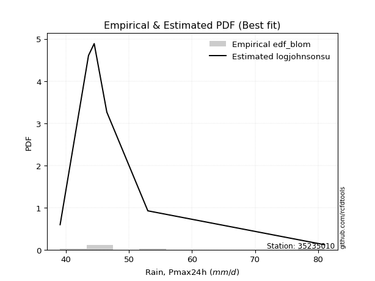</img>

</div>


### 7. EDF Tukey (1962)

In hydrology, the Tukey formula is used as a plotting position formula to estimate the empirical probability or frequency of a flood event (or other hydrological data). The formula parameter is given as _c=0.333_ (or 1/3).

<div align="center">


$P=(m-c)/(n+1-2c)$


</div>


**7.1. Empirical values**

<div align="center">

|                | 0                   | 1                   | 2                   | 3         | 4                  | 5                  | 6                  |
|:---------------|:--------------------|:--------------------|:--------------------|:----------|:-------------------|:-------------------|:-------------------|
| date           | 2019                | 2022                | 2023                | 2021      | 2020               | 2025               | 2024               |
| x              | 39.1                | 43.6                | 44.5                | 46.5      | 53.0               | 57.7               | 81.0               |
| m              | 1                   | 2                   | 3                   | 4         | 5                  | 6                  | 7                  |
| empirical_dist | edf_tukey           | edf_tukey           | edf_tukey           | edf_tukey | edf_tukey          | edf_tukey          | edf_tukey          |
| empirical      | 0.09090909090909091 | 0.22727272727272727 | 0.36363636363636365 | 0.5       | 0.6363636363636364 | 0.7727272727272727 | 0.9090909090909091 |
| empirical_tr   | 1.1                 | 1.2941176470588236  | 1.5714285714285714  | 2.0       | 2.75               | 4.3999999999999995 | 10.999999999999996 |

</div>


**7.2. Kolmogorov-Smirnov fit test (sorted by Δ)**


<div align="center">

|                | 0                    | 1                   | 2                   | 3                   | 4                   | 5                   | 6                   | 7                   | 8                   | 9                   | 10                  | 11                  | 12                  | 13                  | 14                  | 15                  | 16                  | 17                  | 18                  | 19                  | 20                  | 21                  | 22                  | 23                  | 24                  | 25                  | 26                  | 27                  | 28                  | 29                  | 30                  | 31                  | 32                  | 33                  | 34                  | 35                  | 36                  | 37                  | 38                  | 39                  | 40                  | 41                  | 42                  | 43                  | 44                  | 45                  | 46                  | 47                  | 48                  | 49                  | 50                  | 51                  | 52                  | 53                  | 54                  | 55                  | 56                  | 57                  | 58                  | 59                  | 60                  | 61                  | 62                  | 63                  | 64                  | 65                  | 66                  | 67                  | 68                  | 69                  | 70                  | 71                  | 72                  | 73                  | 74                  | 75                  | 76                  | 77                  | 78                  | 79                  | 80                  | 81                  | 82                  | 83                  | 84                  | 85                  | 86                  | 87                  | 88                  | 89                  | 90                  | 91                  | 92                  | 93                  | 94                  | 95                  | 96                  | 97                  | 98                  | 99                  | 100                 | 101                 | 102                 | 103                 | 104                 | 105                 | 106                 | 107                 | 108                 | 109                 | 110                 | 111                 | 112                 | 113                 | 114                 | 115                 | 116                 | 117                 | 118                 | 119                 | 120                 | 121                 | 122                 | 123                 | 124                 | 125                 | 126                 | 127                 | 128                 | 129                 | 130                 | 131                 | 132                 | 133                 | 134                 | 135                 | 136                 | 137                 | 138                 | 139                 | 140                 | 141                 | 142                 | 143                 | 144                 | 145                 | 146                 | 147                 | 148                 | 149                 | 150                 | 151                 | 152                 | 153                 | 154                 | 155                 | 156                 | 157                 | 158                 | 159                 |
|:---------------|:---------------------|:--------------------|:--------------------|:--------------------|:--------------------|:--------------------|:--------------------|:--------------------|:--------------------|:--------------------|:--------------------|:--------------------|:--------------------|:--------------------|:--------------------|:--------------------|:--------------------|:--------------------|:--------------------|:--------------------|:--------------------|:--------------------|:--------------------|:--------------------|:--------------------|:--------------------|:--------------------|:--------------------|:--------------------|:--------------------|:--------------------|:--------------------|:--------------------|:--------------------|:--------------------|:--------------------|:--------------------|:--------------------|:--------------------|:--------------------|:--------------------|:--------------------|:--------------------|:--------------------|:--------------------|:--------------------|:--------------------|:--------------------|:--------------------|:--------------------|:--------------------|:--------------------|:--------------------|:--------------------|:--------------------|:--------------------|:--------------------|:--------------------|:--------------------|:--------------------|:--------------------|:--------------------|:--------------------|:--------------------|:--------------------|:--------------------|:--------------------|:--------------------|:--------------------|:--------------------|:--------------------|:--------------------|:--------------------|:--------------------|:--------------------|:--------------------|:--------------------|:--------------------|:--------------------|:--------------------|:--------------------|:--------------------|:--------------------|:--------------------|:--------------------|:--------------------|:--------------------|:--------------------|:--------------------|:--------------------|:--------------------|:--------------------|:--------------------|:--------------------|:--------------------|:--------------------|:--------------------|:--------------------|:--------------------|:--------------------|:--------------------|:--------------------|:--------------------|:--------------------|:--------------------|:--------------------|:--------------------|:--------------------|:--------------------|:--------------------|:--------------------|:--------------------|:--------------------|:--------------------|:--------------------|:--------------------|:--------------------|:--------------------|:--------------------|:--------------------|:--------------------|:--------------------|:--------------------|:--------------------|:--------------------|:--------------------|:--------------------|:--------------------|:--------------------|:--------------------|:--------------------|:--------------------|:--------------------|:--------------------|:--------------------|:--------------------|:--------------------|:--------------------|:--------------------|:--------------------|:--------------------|:--------------------|:--------------------|:--------------------|:--------------------|:--------------------|:--------------------|:--------------------|:--------------------|:--------------------|:--------------------|:--------------------|:--------------------|:--------------------|:--------------------|:--------------------|:--------------------|:--------------------|:--------------------|:--------------------|
| station        | 35235010             | 35235010            | 35235010            | 35235010            | 35235010            | 35235010            | 35235010            | 35235010            | 35235010            | 35235010            | 35235010            | 35235010            | 35235010            | 35235010            | 35235010            | 35235010            | 35235010            | 35235010            | 35235010            | 35235010            | 35235010            | 35235010            | 35235010            | 35235010            | 35235010            | 35235010            | 35235010            | 35235010            | 35235010            | 35235010            | 35235010            | 35235010            | 35235010            | 35235010            | 35235010            | 35235010            | 35235010            | 35235010            | 35235010            | 35235010            | 35235010            | 35235010            | 35235010            | 35235010            | 35235010            | 35235010            | 35235010            | 35235010            | 35235010            | 35235010            | 35235010            | 35235010            | 35235010            | 35235010            | 35235010            | 35235010            | 35235010            | 35235010            | 35235010            | 35235010            | 35235010            | 35235010            | 35235010            | 35235010            | 35235010            | 35235010            | 35235010            | 35235010            | 35235010            | 35235010            | 35235010            | 35235010            | 35235010            | 35235010            | 35235010            | 35235010            | 35235010            | 35235010            | 35235010            | 35235010            | 35235010            | 35235010            | 35235010            | 35235010            | 35235010            | 35235010            | 35235010            | 35235010            | 35235010            | 35235010            | 35235010            | 35235010            | 35235010            | 35235010            | 35235010            | 35235010            | 35235010            | 35235010            | 35235010            | 35235010            | 35235010            | 35235010            | 35235010            | 35235010            | 35235010            | 35235010            | 35235010            | 35235010            | 35235010            | 35235010            | 35235010            | 35235010            | 35235010            | 35235010            | 35235010            | 35235010            | 35235010            | 35235010            | 35235010            | 35235010            | 35235010            | 35235010            | 35235010            | 35235010            | 35235010            | 35235010            | 35235010            | 35235010            | 35235010            | 35235010            | 35235010            | 35235010            | 35235010            | 35235010            | 35235010            | 35235010            | 35235010            | 35235010            | 35235010            | 35235010            | 35235010            | 35235010            | 35235010            | 35235010            | 35235010            | 35235010            | 35235010            | 35235010            | 35235010            | 35235010            | 35235010            | 35235010            | 35235010            | 35235010            | 35235010            | 35235010            | 35235010            | 35235010            | 35235010            | 35235010            |
| empirical_dist | edf_tukey            | edf_tukey           | edf_tukey           | edf_tukey           | edf_tukey           | edf_tukey           | edf_tukey           | edf_tukey           | edf_tukey           | edf_tukey           | edf_tukey           | edf_tukey           | edf_tukey           | edf_tukey           | edf_tukey           | edf_tukey           | edf_tukey           | edf_tukey           | edf_tukey           | edf_tukey           | edf_tukey           | edf_tukey           | edf_tukey           | edf_tukey           | edf_tukey           | edf_tukey           | edf_tukey           | edf_tukey           | edf_tukey           | edf_tukey           | edf_tukey           | edf_tukey           | edf_tukey           | edf_tukey           | edf_tukey           | edf_tukey           | edf_tukey           | edf_tukey           | edf_tukey           | edf_tukey           | edf_tukey           | edf_tukey           | edf_tukey           | edf_tukey           | edf_tukey           | edf_tukey           | edf_tukey           | edf_tukey           | edf_tukey           | edf_tukey           | edf_tukey           | edf_tukey           | edf_tukey           | edf_tukey           | edf_tukey           | edf_tukey           | edf_tukey           | edf_tukey           | edf_tukey           | edf_tukey           | edf_tukey           | edf_tukey           | edf_tukey           | edf_tukey           | edf_tukey           | edf_tukey           | edf_tukey           | edf_tukey           | edf_tukey           | edf_tukey           | edf_tukey           | edf_tukey           | edf_tukey           | edf_tukey           | edf_tukey           | edf_tukey           | edf_tukey           | edf_tukey           | edf_tukey           | edf_tukey           | edf_tukey           | edf_tukey           | edf_tukey           | edf_tukey           | edf_tukey           | edf_tukey           | edf_tukey           | edf_tukey           | edf_tukey           | edf_tukey           | edf_tukey           | edf_tukey           | edf_tukey           | edf_tukey           | edf_tukey           | edf_tukey           | edf_tukey           | edf_tukey           | edf_tukey           | edf_tukey           | edf_tukey           | edf_tukey           | edf_tukey           | edf_tukey           | edf_tukey           | edf_tukey           | edf_tukey           | edf_tukey           | edf_tukey           | edf_tukey           | edf_tukey           | edf_tukey           | edf_tukey           | edf_tukey           | edf_tukey           | edf_tukey           | edf_tukey           | edf_tukey           | edf_tukey           | edf_tukey           | edf_tukey           | edf_tukey           | edf_tukey           | edf_tukey           | edf_tukey           | edf_tukey           | edf_tukey           | edf_tukey           | edf_tukey           | edf_tukey           | edf_tukey           | edf_tukey           | edf_tukey           | edf_tukey           | edf_tukey           | edf_tukey           | edf_tukey           | edf_tukey           | edf_tukey           | edf_tukey           | edf_tukey           | edf_tukey           | edf_tukey           | edf_tukey           | edf_tukey           | edf_tukey           | edf_tukey           | edf_tukey           | edf_tukey           | edf_tukey           | edf_tukey           | edf_tukey           | edf_tukey           | edf_tukey           | edf_tukey           | edf_tukey           | edf_tukey           | edf_tukey           | edf_tukey           | edf_tukey           |
| p_dist         | logburr12            | logexponnorm        | genextreme          | invweibull          | invgamma            | f                   | logf                | loginvgamma         | logjohnsonsu        | loginvweibull       | loggenextreme       | alpha               | loginvgauss         | logmielke           | logfatiguelife      | johnsonsu           | invgauss            | loghalfnorm         | loghalflogistic     | halflogistic        | logmoyal            | exponnorm           | foldnorm            | logfoldnorm         | loggenexpon         | logtruncnorm        | loghalfgennorm      | genexpon            | loggompertz         | lomax               | gompertz            | wald                | halfnorm            | logvonmises_line    | logwald             | burr                | logburr             | logpearson3         | logbradford         | pearson3            | bradford            | nakagami            | loggumbel_r         | logweibull_max      | logbetaprime        | loggenlogistic      | mielke              | lograyleigh         | moyal               | logalpha            | vonmises_line       | logexponweib        | burr12              | logskewnorm         | truncpareto         | lognct              | logmaxwell          | logkstwobign        | logsemicircular     | gumbel_r            | rayleigh            | loggennorm          | loganglit           | logncf              | logtruncweibull_min | logloglaplace       | genhalflogistic     | loglomax            | maxwell             | genlogistic         | semicircular        | nct                 | logarcsine          | logexponpow         | anglit              | betaprime           | logloggamma         | logt                | logcrystalball      | lognorm             | logweibull_min      | loggausshyper       | dgamma              | logrice             | logdweibull         | ncf                 | t                   | kstwobign           | crystalball         | norm                | truncnorm           | logtruncexpon       | loglogistic         | arcsine             | loghypsecant        | logistic            | tukeylambda         | halfgennorm         | skewnorm            | logbeta             | logcosine           | rice                | gennorm             | logdgamma           | hypsecant           | truncweibull_min    | loggumbel_l         | loglaplace          | loglaplace          | loggengamma         | cosine              | triang              | gumbel_l            | rdist               | laplace             | logksone            | logargus            | truncexpon          | logkappa4           | logwrapcauchy       | loguniform          | logkappa3           | genpareto           | dweibull            | beta                | wrapcauchy          | lognakagami         | argus               | logtriang           | kappa4              | ksone               | weibull_min         | uniform             | kappa3              | loglevy_l           | levy_l              | logerlang           | gengamma            | loggamma            | loggamma            | loggenhalflogistic  | exponpow            | johnsonsb           | powerlaw            | logjohnsonsb        | logtrapezoid        | logpowerlaw         | fatiguelife         | gausshyper          | loggenpareto        | exponweib           | trapezoid           | erlang              | gamma               | logtruncpareto      | weibull_max         | logtukeylambda      | logrdist            | logvonmises         | vonmises            |
| delta          | 0.052306485446521056 | 0.05420027705378894 | 0.05611435066545534 | 0.05611644109191294 | 0.0564048964115845  | 0.05681088367942466 | 0.05968650550526272 | 0.05968685596917933 | 0.06106052844532858 | 0.06154381992632246 | 0.06155350255416531 | 0.06356123321313417 | 0.06509835734545563 | 0.07237555360887205 | 0.07251318054161807 | 0.07347705750137437 | 0.07401211385600623 | 0.07539749056473172 | 0.07987144882526445 | 0.0877635309976098  | 0.08842320951082838 | 0.08930539935702295 | 0.0904884881703136  | 0.09066799216105548 | 0.09087278988873732 | 0.09090835799271713 | 0.09090903506495275 | 0.0909090908713559  | 0.09090909089992062 | 0.09090909090908704 | 0.09090909090909037 | 0.09090909090909091 | 0.0925113886927672  | 0.09599379076159692 | 0.09735805162532463 | 0.09743717917593114 | 0.09878457789911843 | 0.10017198560522522 | 0.10233730722218562 | 0.10271110619694657 | 0.10444017331897426 | 0.10512054035005225 | 0.10589647017888365 | 0.10679800658524191 | 0.10723542597298669 | 0.10726700054416982 | 0.10913457764922169 | 0.10961731969998662 | 0.11004786283469481 | 0.11039677484687432 | 0.11061727984710984 | 0.11373840475662791 | 0.11488414396101057 | 0.11535303024613475 | 0.11606841146013822 | 0.12124353973142349 | 0.12164046311930538 | 0.12173753155790257 | 0.12473666861344779 | 0.12537995487219744 | 0.1260372453862788  | 0.13066325374839782 | 0.1332002377463204  | 0.13470639504267323 | 0.13477521908642737 | 0.13617809975730044 | 0.13743238295216376 | 0.13757003867109927 | 0.13782270154167242 | 0.13952900073155933 | 0.1398783594339994  | 0.14137013054904052 | 0.1415000435752558  | 0.1439922236848823  | 0.14676580260841787 | 0.1472562109139377  | 0.14969031330094185 | 0.1524881955298345  | 0.15336694849370563 | 0.15336695111751242 | 0.1538456418063436  | 0.15467476836929966 | 0.15498946089453802 | 0.15817397180875997 | 0.1602314985725567  | 0.1604077978231367  | 0.16224590207793033 | 0.16590502359673615 | 0.16849678793376388 | 0.16849679185816757 | 0.16849679201742157 | 0.16887830450315328 | 0.17159563182722587 | 0.17663403684922485 | 0.18568656601478306 | 0.18791556724487657 | 0.18831363030459225 | 0.18855120930005867 | 0.18934363773400426 | 0.19043354956538652 | 0.19343687547673571 | 0.19832956161266402 | 0.19848220401801664 | 0.20115269061666563 | 0.20262503403113663 | 0.20519666098298436 | 0.21280409516762178 | 0.21376743887680555 | 0.21376743887680555 | 0.2142976366277564  | 0.21588374838357116 | 0.22271621989425933 | 0.22537511341256444 | 0.22632938505436861 | 0.2300216637426704  | 0.2441556588433078  | 0.24728655919820053 | 0.2479573263744539  | 0.24993300676036873 | 0.26125918733358267 | 0.2620163471506911  | 0.26491935068751543 | 0.2658128288814803  | 0.27272727272739195 | 0.2863363292213379  | 0.2915963514366604  | 0.29198128982281535 | 0.3067367392974244  | 0.30812863557962544 | 0.309351781268902   | 0.3194655384392855  | 0.3277894230416979  | 0.3288131915816879  | 0.3296439894937567  | 0.3299191501096693  | 0.34645834508190576 | 0.3646976986582946  | 0.3694935122712443  | 0.37382547229509666 | 0.37382547229509666 | 0.38042366991524645 | 0.3891184536918342  | 0.45394182897585034 | 0.4752915692453873  | 0.4826160806656935  | 0.4933393217233734  | 0.4990697038875265  | 0.5096664008571855  | 0.5139775695910082  | 0.5179090088475539  | 0.5337729615448942  | 0.5672810729575188  | 0.6040332868160401  | 0.6101836536126358  | 0.6413070089737531  | 0.6555974182570815  | 0.9090899812911698  | 0.9090909061396967  | 1.0721339000064454  | 12.198668486616745  |
| deltao         | 0.48442053926100004  | 0.48442053926100004 | 0.48442053926100004 | 0.48442053926100004 | 0.48442053926100004 | 0.48442053926100004 | 0.48442053926100004 | 0.48442053926100004 | 0.48442053926100004 | 0.48442053926100004 | 0.48442053926100004 | 0.48442053926100004 | 0.48442053926100004 | 0.48442053926100004 | 0.48442053926100004 | 0.48442053926100004 | 0.48442053926100004 | 0.48442053926100004 | 0.48442053926100004 | 0.48442053926100004 | 0.48442053926100004 | 0.48442053926100004 | 0.48442053926100004 | 0.48442053926100004 | 0.48442053926100004 | 0.48442053926100004 | 0.48442053926100004 | 0.48442053926100004 | 0.48442053926100004 | 0.48442053926100004 | 0.48442053926100004 | 0.48442053926100004 | 0.48442053926100004 | 0.48442053926100004 | 0.48442053926100004 | 0.48442053926100004 | 0.48442053926100004 | 0.48442053926100004 | 0.48442053926100004 | 0.48442053926100004 | 0.48442053926100004 | 0.48442053926100004 | 0.48442053926100004 | 0.48442053926100004 | 0.48442053926100004 | 0.48442053926100004 | 0.48442053926100004 | 0.48442053926100004 | 0.48442053926100004 | 0.48442053926100004 | 0.48442053926100004 | 0.48442053926100004 | 0.48442053926100004 | 0.48442053926100004 | 0.48442053926100004 | 0.48442053926100004 | 0.48442053926100004 | 0.48442053926100004 | 0.48442053926100004 | 0.48442053926100004 | 0.48442053926100004 | 0.48442053926100004 | 0.48442053926100004 | 0.48442053926100004 | 0.48442053926100004 | 0.48442053926100004 | 0.48442053926100004 | 0.48442053926100004 | 0.48442053926100004 | 0.48442053926100004 | 0.48442053926100004 | 0.48442053926100004 | 0.48442053926100004 | 0.48442053926100004 | 0.48442053926100004 | 0.48442053926100004 | 0.48442053926100004 | 0.48442053926100004 | 0.48442053926100004 | 0.48442053926100004 | 0.48442053926100004 | 0.48442053926100004 | 0.48442053926100004 | 0.48442053926100004 | 0.48442053926100004 | 0.48442053926100004 | 0.48442053926100004 | 0.48442053926100004 | 0.48442053926100004 | 0.48442053926100004 | 0.48442053926100004 | 0.48442053926100004 | 0.48442053926100004 | 0.48442053926100004 | 0.48442053926100004 | 0.48442053926100004 | 0.48442053926100004 | 0.48442053926100004 | 0.48442053926100004 | 0.48442053926100004 | 0.48442053926100004 | 0.48442053926100004 | 0.48442053926100004 | 0.48442053926100004 | 0.48442053926100004 | 0.48442053926100004 | 0.48442053926100004 | 0.48442053926100004 | 0.48442053926100004 | 0.48442053926100004 | 0.48442053926100004 | 0.48442053926100004 | 0.48442053926100004 | 0.48442053926100004 | 0.48442053926100004 | 0.48442053926100004 | 0.48442053926100004 | 0.48442053926100004 | 0.48442053926100004 | 0.48442053926100004 | 0.48442053926100004 | 0.48442053926100004 | 0.48442053926100004 | 0.48442053926100004 | 0.48442053926100004 | 0.48442053926100004 | 0.48442053926100004 | 0.48442053926100004 | 0.48442053926100004 | 0.48442053926100004 | 0.48442053926100004 | 0.48442053926100004 | 0.48442053926100004 | 0.48442053926100004 | 0.48442053926100004 | 0.48442053926100004 | 0.48442053926100004 | 0.48442053926100004 | 0.48442053926100004 | 0.48442053926100004 | 0.48442053926100004 | 0.48442053926100004 | 0.48442053926100004 | 0.48442053926100004 | 0.48442053926100004 | 0.48442053926100004 | 0.48442053926100004 | 0.48442053926100004 | 0.48442053926100004 | 0.48442053926100004 | 0.48442053926100004 | 0.48442053926100004 | 0.48442053926100004 | 0.48442053926100004 | 0.48442053926100004 | 0.48442053926100004 | 0.48442053926100004 | 0.48442053926100004 | 0.48442053926100004 | 0.48442053926100004 |
| eval           | Δo > Δ               | Δo > Δ              | Δo > Δ              | Δo > Δ              | Δo > Δ              | Δo > Δ              | Δo > Δ              | Δo > Δ              | Δo > Δ              | Δo > Δ              | Δo > Δ              | Δo > Δ              | Δo > Δ              | Δo > Δ              | Δo > Δ              | Δo > Δ              | Δo > Δ              | Δo > Δ              | Δo > Δ              | Δo > Δ              | Δo > Δ              | Δo > Δ              | Δo > Δ              | Δo > Δ              | Δo > Δ              | Δo > Δ              | Δo > Δ              | Δo > Δ              | Δo > Δ              | Δo > Δ              | Δo > Δ              | Δo > Δ              | Δo > Δ              | Δo > Δ              | Δo > Δ              | Δo > Δ              | Δo > Δ              | Δo > Δ              | Δo > Δ              | Δo > Δ              | Δo > Δ              | Δo > Δ              | Δo > Δ              | Δo > Δ              | Δo > Δ              | Δo > Δ              | Δo > Δ              | Δo > Δ              | Δo > Δ              | Δo > Δ              | Δo > Δ              | Δo > Δ              | Δo > Δ              | Δo > Δ              | Δo > Δ              | Δo > Δ              | Δo > Δ              | Δo > Δ              | Δo > Δ              | Δo > Δ              | Δo > Δ              | Δo > Δ              | Δo > Δ              | Δo > Δ              | Δo > Δ              | Δo > Δ              | Δo > Δ              | Δo > Δ              | Δo > Δ              | Δo > Δ              | Δo > Δ              | Δo > Δ              | Δo > Δ              | Δo > Δ              | Δo > Δ              | Δo > Δ              | Δo > Δ              | Δo > Δ              | Δo > Δ              | Δo > Δ              | Δo > Δ              | Δo > Δ              | Δo > Δ              | Δo > Δ              | Δo > Δ              | Δo > Δ              | Δo > Δ              | Δo > Δ              | Δo > Δ              | Δo > Δ              | Δo > Δ              | Δo > Δ              | Δo > Δ              | Δo > Δ              | Δo > Δ              | Δo > Δ              | Δo > Δ              | Δo > Δ              | Δo > Δ              | Δo > Δ              | Δo > Δ              | Δo > Δ              | Δo > Δ              | Δo > Δ              | Δo > Δ              | Δo > Δ              | Δo > Δ              | Δo > Δ              | Δo > Δ              | Δo > Δ              | Δo > Δ              | Δo > Δ              | Δo > Δ              | Δo > Δ              | Δo > Δ              | Δo > Δ              | Δo > Δ              | Δo > Δ              | Δo > Δ              | Δo > Δ              | Δo > Δ              | Δo > Δ              | Δo > Δ              | Δo > Δ              | Δo > Δ              | Δo > Δ              | Δo > Δ              | Δo > Δ              | Δo > Δ              | Δo > Δ              | Δo > Δ              | Δo > Δ              | Δo > Δ              | Δo > Δ              | Δo > Δ              | Δo > Δ              | Δo > Δ              | Δo > Δ              | Δo > Δ              | Δo > Δ              | Δo > Δ              | Δo > Δ              | Δo > Δ              | Δo > Δ              | Δo > Δ              | Δo <= Δ             | Δo <= Δ             | Δo <= Δ             | Δo <= Δ             | Δo <= Δ             | Δo <= Δ             | Δo <= Δ             | Δo <= Δ             | Δo <= Δ             | Δo <= Δ             | Δo <= Δ             | Δo <= Δ             | Δo <= Δ             | Δo <= Δ             | Δo <= Δ             |
| fit            | 1                    | 1                   | 1                   | 1                   | 1                   | 1                   | 1                   | 1                   | 1                   | 1                   | 1                   | 1                   | 1                   | 1                   | 1                   | 1                   | 1                   | 1                   | 1                   | 1                   | 1                   | 1                   | 1                   | 1                   | 1                   | 1                   | 1                   | 1                   | 1                   | 1                   | 1                   | 1                   | 1                   | 1                   | 1                   | 1                   | 1                   | 1                   | 1                   | 1                   | 1                   | 1                   | 1                   | 1                   | 1                   | 1                   | 1                   | 1                   | 1                   | 1                   | 1                   | 1                   | 1                   | 1                   | 1                   | 1                   | 1                   | 1                   | 1                   | 1                   | 1                   | 1                   | 1                   | 1                   | 1                   | 1                   | 1                   | 1                   | 1                   | 1                   | 1                   | 1                   | 1                   | 1                   | 1                   | 1                   | 1                   | 1                   | 1                   | 1                   | 1                   | 1                   | 1                   | 1                   | 1                   | 1                   | 1                   | 1                   | 1                   | 1                   | 1                   | 1                   | 1                   | 1                   | 1                   | 1                   | 1                   | 1                   | 1                   | 1                   | 1                   | 1                   | 1                   | 1                   | 1                   | 1                   | 1                   | 1                   | 1                   | 1                   | 1                   | 1                   | 1                   | 1                   | 1                   | 1                   | 1                   | 1                   | 1                   | 1                   | 1                   | 1                   | 1                   | 1                   | 1                   | 1                   | 1                   | 1                   | 1                   | 1                   | 1                   | 1                   | 1                   | 1                   | 1                   | 1                   | 1                   | 1                   | 1                   | 1                   | 1                   | 1                   | 1                   | 1                   | 1                   | 0                   | 0                   | 0                   | 0                   | 0                   | 0                   | 0                   | 0                   | 0                   | 0                   | 0                   | 0                   | 0                   | 0                   | 0                   |
| n              | 7                    | 7                   | 7                   | 7                   | 7                   | 7                   | 7                   | 7                   | 7                   | 7                   | 7                   | 7                   | 7                   | 7                   | 7                   | 7                   | 7                   | 7                   | 7                   | 7                   | 7                   | 7                   | 7                   | 7                   | 7                   | 7                   | 7                   | 7                   | 7                   | 7                   | 7                   | 7                   | 7                   | 7                   | 7                   | 7                   | 7                   | 7                   | 7                   | 7                   | 7                   | 7                   | 7                   | 7                   | 7                   | 7                   | 7                   | 7                   | 7                   | 7                   | 7                   | 7                   | 7                   | 7                   | 7                   | 7                   | 7                   | 7                   | 7                   | 7                   | 7                   | 7                   | 7                   | 7                   | 7                   | 7                   | 7                   | 7                   | 7                   | 7                   | 7                   | 7                   | 7                   | 7                   | 7                   | 7                   | 7                   | 7                   | 7                   | 7                   | 7                   | 7                   | 7                   | 7                   | 7                   | 7                   | 7                   | 7                   | 7                   | 7                   | 7                   | 7                   | 7                   | 7                   | 7                   | 7                   | 7                   | 7                   | 7                   | 7                   | 7                   | 7                   | 7                   | 7                   | 7                   | 7                   | 7                   | 7                   | 7                   | 7                   | 7                   | 7                   | 7                   | 7                   | 7                   | 7                   | 7                   | 7                   | 7                   | 7                   | 7                   | 7                   | 7                   | 7                   | 7                   | 7                   | 7                   | 7                   | 7                   | 7                   | 7                   | 7                   | 7                   | 7                   | 7                   | 7                   | 7                   | 7                   | 7                   | 7                   | 7                   | 7                   | 7                   | 7                   | 7                   | 7                   | 7                   | 7                   | 7                   | 7                   | 7                   | 7                   | 7                   | 7                   | 7                   | 7                   | 7                   | 7                   | 7                   | 7                   |
| best_fit       | 1                    | 0                   | 0                   | 0                   | 0                   | 0                   | 0                   | 0                   | 0                   | 0                   | 0                   | 0                   | 0                   | 0                   | 0                   | 0                   | 0                   | 0                   | 0                   | 0                   | 0                   | 0                   | 0                   | 0                   | 0                   | 0                   | 0                   | 0                   | 0                   | 0                   | 0                   | 0                   | 0                   | 0                   | 0                   | 0                   | 0                   | 0                   | 0                   | 0                   | 0                   | 0                   | 0                   | 0                   | 0                   | 0                   | 0                   | 0                   | 0                   | 0                   | 0                   | 0                   | 0                   | 0                   | 0                   | 0                   | 0                   | 0                   | 0                   | 0                   | 0                   | 0                   | 0                   | 0                   | 0                   | 0                   | 0                   | 0                   | 0                   | 0                   | 0                   | 0                   | 0                   | 0                   | 0                   | 0                   | 0                   | 0                   | 0                   | 0                   | 0                   | 0                   | 0                   | 0                   | 0                   | 0                   | 0                   | 0                   | 0                   | 0                   | 0                   | 0                   | 0                   | 0                   | 0                   | 0                   | 0                   | 0                   | 0                   | 0                   | 0                   | 0                   | 0                   | 0                   | 0                   | 0                   | 0                   | 0                   | 0                   | 0                   | 0                   | 0                   | 0                   | 0                   | 0                   | 0                   | 0                   | 0                   | 0                   | 0                   | 0                   | 0                   | 0                   | 0                   | 0                   | 0                   | 0                   | 0                   | 0                   | 0                   | 0                   | 0                   | 0                   | 0                   | 0                   | 0                   | 0                   | 0                   | 0                   | 0                   | 0                   | 0                   | 0                   | 0                   | 0                   | 0                   | 0                   | 0                   | 0                   | 0                   | 0                   | 0                   | 0                   | 0                   | 0                   | 0                   | 0                   | 0                   | 0                   | 0                   |
| best_fit_sort  | 1                    | 2                   | 3                   | 4                   | 5                   | 6                   | 7                   | 8                   | 9                   | 10                  | 11                  | 12                  | 13                  | 14                  | 15                  | 16                  | 17                  | 18                  | 19                  | 20                  | 21                  | 22                  | 23                  | 24                  | 25                  | 26                  | 27                  | 28                  | 29                  | 30                  | 31                  | 32                  | 33                  | 34                  | 35                  | 36                  | 37                  | 38                  | 39                  | 40                  | 41                  | 42                  | 43                  | 44                  | 45                  | 46                  | 47                  | 48                  | 49                  | 50                  | 51                  | 52                  | 53                  | 54                  | 55                  | 56                  | 57                  | 58                  | 59                  | 60                  | 61                  | 62                  | 63                  | 64                  | 65                  | 66                  | 67                  | 68                  | 69                  | 70                  | 71                  | 72                  | 73                  | 74                  | 75                  | 76                  | 77                  | 78                  | 79                  | 80                  | 81                  | 82                  | 83                  | 84                  | 85                  | 86                  | 87                  | 88                  | 89                  | 90                  | 91                  | 92                  | 93                  | 94                  | 95                  | 96                  | 97                  | 98                  | 99                  | 100                 | 101                 | 102                 | 103                 | 104                 | 105                 | 106                 | 107                 | 108                 | 109                 | 110                 | 111                 | 112                 | 113                 | 114                 | 115                 | 116                 | 117                 | 118                 | 119                 | 120                 | 121                 | 122                 | 123                 | 124                 | 125                 | 126                 | 127                 | 128                 | 129                 | 130                 | 131                 | 132                 | 133                 | 134                 | 135                 | 136                 | 137                 | 138                 | 139                 | 140                 | 141                 | 142                 | 143                 | 144                 | 145                 | 146                 | 147                 | 148                 | 149                 | 150                 | 151                 | 152                 | 153                 | 154                 | 155                 | 156                 | 157                 | 158                 | 159                 | 160                 |

</div>


**7.3. Best fit**

<div align="center">

|   id |   station | empirical_dist   | p_dist    |     delta |   deltao | eval   |   fit |   n |   best_fit |   best_fit_sort |
|-----:|----------:|:-----------------|:----------|----------:|---------:|:-------|------:|----:|-----------:|----------------:|
|    0 |  35235010 | edf_tukey        | logburr12 | 0.0523065 | 0.484421 | Δo > Δ |     1 |   7 |          1 |               1 |

</div>


<div align="center">

</img>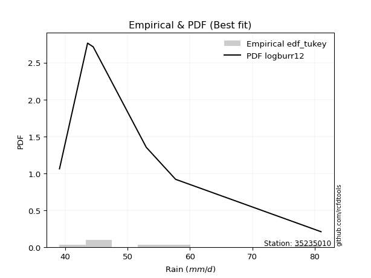</img>

</div>


### 8. EDF Gringorten (1963)

Gringorten plotting position formula is essential for estimating the probability and return periods of extreme events like floods and heavy rainfall. The constant _a=0.44_.

<div align="center">


$P=(m-a)/(n+1-2a)$


</div>


**8.1. Empirical values**

<div align="center">

|                | 0                   | 1                   | 2                  | 3              | 4                  | 5                  | 6                  |
|:---------------|:--------------------|:--------------------|:-------------------|:---------------|:-------------------|:-------------------|:-------------------|
| date           | 2019                | 2022                | 2023               | 2021           | 2020               | 2025               | 2024               |
| x              | 39.1                | 43.6                | 44.5               | 46.5           | 53.0               | 57.7               | 81.0               |
| m              | 1                   | 2                   | 3                  | 4              | 5                  | 6                  | 7                  |
| empirical_dist | edf_gringorten      | edf_gringorten      | edf_gringorten     | edf_gringorten | edf_gringorten     | edf_gringorten     | edf_gringorten     |
| empirical      | 0.07865168539325844 | 0.21910112359550563 | 0.3595505617977528 | 0.5            | 0.6404494382022471 | 0.7808988764044943 | 0.9213483146067415 |
| empirical_tr   | 1.0853658536585364  | 1.2805755395683454  | 1.5614035087719298 | 2.0            | 2.781249999999999  | 4.564102564102562  | 12.714285714285701 |

</div>


**8.2. Kolmogorov-Smirnov fit test (sorted by Δ)**


<div align="center">

|                | 0                   | 1                   | 2                   | 3                   | 4                   | 5                   | 6                    | 7                    | 8                   | 9                   | 10                  | 11                  | 12                  | 13                  | 14                  | 15                  | 16                  | 17                  | 18                  | 19                  | 20                  | 21                  | 22                  | 23                  | 24                  | 25                  | 26                  | 27                  | 28                  | 29                  | 30                  | 31                  | 32                  | 33                  | 34                  | 35                  | 36                  | 37                  | 38                  | 39                  | 40                  | 41                  | 42                  | 43                  | 44                  | 45                  | 46                  | 47                  | 48                  | 49                  | 50                  | 51                  | 52                  | 53                  | 54                  | 55                  | 56                  | 57                  | 58                  | 59                  | 60                  | 61                  | 62                  | 63                  | 64                  | 65                  | 66                  | 67                  | 68                  | 69                  | 70                  | 71                  | 72                  | 73                  | 74                  | 75                  | 76                  | 77                  | 78                  | 79                  | 80                  | 81                  | 82                  | 83                  | 84                  | 85                  | 86                  | 87                  | 88                  | 89                  | 90                  | 91                  | 92                  | 93                  | 94                  | 95                  | 96                  | 97                  | 98                  | 99                  | 100                 | 101                 | 102                 | 103                 | 104                 | 105                 | 106                 | 107                 | 108                 | 109                 | 110                 | 111                 | 112                 | 113                 | 114                 | 115                 | 116                 | 117                 | 118                 | 119                 | 120                 | 121                 | 122                 | 123                 | 124                 | 125                 | 126                 | 127                 | 128                 | 129                 | 130                 | 131                 | 132                 | 133                 | 134                 | 135                 | 136                 | 137                 | 138                 | 139                 | 140                 | 141                 | 142                 | 143                 | 144                 | 145                 | 146                 | 147                 | 148                 | 149                 | 150                 | 151                 | 152                 | 153                 | 154                 | 155                 | 156                 | 157                 | 158                 | 159                 |
|:---------------|:--------------------|:--------------------|:--------------------|:--------------------|:--------------------|:--------------------|:---------------------|:---------------------|:--------------------|:--------------------|:--------------------|:--------------------|:--------------------|:--------------------|:--------------------|:--------------------|:--------------------|:--------------------|:--------------------|:--------------------|:--------------------|:--------------------|:--------------------|:--------------------|:--------------------|:--------------------|:--------------------|:--------------------|:--------------------|:--------------------|:--------------------|:--------------------|:--------------------|:--------------------|:--------------------|:--------------------|:--------------------|:--------------------|:--------------------|:--------------------|:--------------------|:--------------------|:--------------------|:--------------------|:--------------------|:--------------------|:--------------------|:--------------------|:--------------------|:--------------------|:--------------------|:--------------------|:--------------------|:--------------------|:--------------------|:--------------------|:--------------------|:--------------------|:--------------------|:--------------------|:--------------------|:--------------------|:--------------------|:--------------------|:--------------------|:--------------------|:--------------------|:--------------------|:--------------------|:--------------------|:--------------------|:--------------------|:--------------------|:--------------------|:--------------------|:--------------------|:--------------------|:--------------------|:--------------------|:--------------------|:--------------------|:--------------------|:--------------------|:--------------------|:--------------------|:--------------------|:--------------------|:--------------------|:--------------------|:--------------------|:--------------------|:--------------------|:--------------------|:--------------------|:--------------------|:--------------------|:--------------------|:--------------------|:--------------------|:--------------------|:--------------------|:--------------------|:--------------------|:--------------------|:--------------------|:--------------------|:--------------------|:--------------------|:--------------------|:--------------------|:--------------------|:--------------------|:--------------------|:--------------------|:--------------------|:--------------------|:--------------------|:--------------------|:--------------------|:--------------------|:--------------------|:--------------------|:--------------------|:--------------------|:--------------------|:--------------------|:--------------------|:--------------------|:--------------------|:--------------------|:--------------------|:--------------------|:--------------------|:--------------------|:--------------------|:--------------------|:--------------------|:--------------------|:--------------------|:--------------------|:--------------------|:--------------------|:--------------------|:--------------------|:--------------------|:--------------------|:--------------------|:--------------------|:--------------------|:--------------------|:--------------------|:--------------------|:--------------------|:--------------------|:--------------------|:--------------------|:--------------------|:--------------------|:--------------------|:--------------------|
| station        | 35235010            | 35235010            | 35235010            | 35235010            | 35235010            | 35235010            | 35235010             | 35235010             | 35235010            | 35235010            | 35235010            | 35235010            | 35235010            | 35235010            | 35235010            | 35235010            | 35235010            | 35235010            | 35235010            | 35235010            | 35235010            | 35235010            | 35235010            | 35235010            | 35235010            | 35235010            | 35235010            | 35235010            | 35235010            | 35235010            | 35235010            | 35235010            | 35235010            | 35235010            | 35235010            | 35235010            | 35235010            | 35235010            | 35235010            | 35235010            | 35235010            | 35235010            | 35235010            | 35235010            | 35235010            | 35235010            | 35235010            | 35235010            | 35235010            | 35235010            | 35235010            | 35235010            | 35235010            | 35235010            | 35235010            | 35235010            | 35235010            | 35235010            | 35235010            | 35235010            | 35235010            | 35235010            | 35235010            | 35235010            | 35235010            | 35235010            | 35235010            | 35235010            | 35235010            | 35235010            | 35235010            | 35235010            | 35235010            | 35235010            | 35235010            | 35235010            | 35235010            | 35235010            | 35235010            | 35235010            | 35235010            | 35235010            | 35235010            | 35235010            | 35235010            | 35235010            | 35235010            | 35235010            | 35235010            | 35235010            | 35235010            | 35235010            | 35235010            | 35235010            | 35235010            | 35235010            | 35235010            | 35235010            | 35235010            | 35235010            | 35235010            | 35235010            | 35235010            | 35235010            | 35235010            | 35235010            | 35235010            | 35235010            | 35235010            | 35235010            | 35235010            | 35235010            | 35235010            | 35235010            | 35235010            | 35235010            | 35235010            | 35235010            | 35235010            | 35235010            | 35235010            | 35235010            | 35235010            | 35235010            | 35235010            | 35235010            | 35235010            | 35235010            | 35235010            | 35235010            | 35235010            | 35235010            | 35235010            | 35235010            | 35235010            | 35235010            | 35235010            | 35235010            | 35235010            | 35235010            | 35235010            | 35235010            | 35235010            | 35235010            | 35235010            | 35235010            | 35235010            | 35235010            | 35235010            | 35235010            | 35235010            | 35235010            | 35235010            | 35235010            | 35235010            | 35235010            | 35235010            | 35235010            | 35235010            | 35235010            |
| empirical_dist | edf_gringorten      | edf_gringorten      | edf_gringorten      | edf_gringorten      | edf_gringorten      | edf_gringorten      | edf_gringorten       | edf_gringorten       | edf_gringorten      | edf_gringorten      | edf_gringorten      | edf_gringorten      | edf_gringorten      | edf_gringorten      | edf_gringorten      | edf_gringorten      | edf_gringorten      | edf_gringorten      | edf_gringorten      | edf_gringorten      | edf_gringorten      | edf_gringorten      | edf_gringorten      | edf_gringorten      | edf_gringorten      | edf_gringorten      | edf_gringorten      | edf_gringorten      | edf_gringorten      | edf_gringorten      | edf_gringorten      | edf_gringorten      | edf_gringorten      | edf_gringorten      | edf_gringorten      | edf_gringorten      | edf_gringorten      | edf_gringorten      | edf_gringorten      | edf_gringorten      | edf_gringorten      | edf_gringorten      | edf_gringorten      | edf_gringorten      | edf_gringorten      | edf_gringorten      | edf_gringorten      | edf_gringorten      | edf_gringorten      | edf_gringorten      | edf_gringorten      | edf_gringorten      | edf_gringorten      | edf_gringorten      | edf_gringorten      | edf_gringorten      | edf_gringorten      | edf_gringorten      | edf_gringorten      | edf_gringorten      | edf_gringorten      | edf_gringorten      | edf_gringorten      | edf_gringorten      | edf_gringorten      | edf_gringorten      | edf_gringorten      | edf_gringorten      | edf_gringorten      | edf_gringorten      | edf_gringorten      | edf_gringorten      | edf_gringorten      | edf_gringorten      | edf_gringorten      | edf_gringorten      | edf_gringorten      | edf_gringorten      | edf_gringorten      | edf_gringorten      | edf_gringorten      | edf_gringorten      | edf_gringorten      | edf_gringorten      | edf_gringorten      | edf_gringorten      | edf_gringorten      | edf_gringorten      | edf_gringorten      | edf_gringorten      | edf_gringorten      | edf_gringorten      | edf_gringorten      | edf_gringorten      | edf_gringorten      | edf_gringorten      | edf_gringorten      | edf_gringorten      | edf_gringorten      | edf_gringorten      | edf_gringorten      | edf_gringorten      | edf_gringorten      | edf_gringorten      | edf_gringorten      | edf_gringorten      | edf_gringorten      | edf_gringorten      | edf_gringorten      | edf_gringorten      | edf_gringorten      | edf_gringorten      | edf_gringorten      | edf_gringorten      | edf_gringorten      | edf_gringorten      | edf_gringorten      | edf_gringorten      | edf_gringorten      | edf_gringorten      | edf_gringorten      | edf_gringorten      | edf_gringorten      | edf_gringorten      | edf_gringorten      | edf_gringorten      | edf_gringorten      | edf_gringorten      | edf_gringorten      | edf_gringorten      | edf_gringorten      | edf_gringorten      | edf_gringorten      | edf_gringorten      | edf_gringorten      | edf_gringorten      | edf_gringorten      | edf_gringorten      | edf_gringorten      | edf_gringorten      | edf_gringorten      | edf_gringorten      | edf_gringorten      | edf_gringorten      | edf_gringorten      | edf_gringorten      | edf_gringorten      | edf_gringorten      | edf_gringorten      | edf_gringorten      | edf_gringorten      | edf_gringorten      | edf_gringorten      | edf_gringorten      | edf_gringorten      | edf_gringorten      | edf_gringorten      | edf_gringorten      | edf_gringorten      | edf_gringorten      |
| p_dist         | logf                | loginvgamma         | logburr12           | logexponnorm        | loginvweibull       | loggenextreme       | invweibull           | genextreme           | alpha               | f                   | invgamma            | loghalflogistic     | logjohnsonsu        | logmielke           | loginvgauss         | exponnorm           | loghalfgennorm      | genexpon            | loggompertz         | lomax               | gompertz            | logfatiguelife      | wald                | johnsonsu           | loggenexpon         | invgauss            | loghalfnorm         | halflogistic        | logmoyal            | logtruncnorm        | logfoldnorm         | halfnorm            | logwald             | logvonmises_line    | burr                | foldnorm            | logburr             | logpearson3         | pearson3            | bradford            | loggumbel_r         | logweibull_max      | loggenlogistic      | mielke              | lograyleigh         | moyal               | logalpha            | logbradford         | vonmises_line       | nakagami            | logbetaprime        | logskewnorm         | lognct              | logmaxwell          | logkstwobign        | logexponweib        | burr12              | truncpareto         | logsemicircular     | gumbel_r            | rayleigh            | loggennorm          | logloglaplace       | loganglit           | logncf              | logtruncweibull_min | genhalflogistic     | maxwell             | genlogistic         | nct                 | loglomax            | anglit              | betaprime           | semicircular        | logarcsine          | logloggamma         | dgamma              | logexponpow         | logt                | logcrystalball      | lognorm             | loggausshyper       | logdweibull         | logrice             | ncf                 | logweibull_min      | t                   | kstwobign           | crystalball         | norm                | truncnorm           | logtruncexpon       | loglogistic         | tukeylambda         | arcsine             | loghypsecant        | logistic            | skewnorm            | logcosine           | gennorm             | halfgennorm         | logdgamma           | rice                | logbeta             | hypsecant           | loggumbel_l         | truncweibull_min    | loglaplace          | loglaplace          | cosine              | rdist               | loggengamma         | triang              | gumbel_l            | laplace             | truncexpon          | logargus            | logkappa4           | logksone            | loguniform          | logkappa3           | logwrapcauchy       | genpareto           | dweibull            | beta                | wrapcauchy          | lognakagami         | argus               | logtriang           | kappa4              | ksone               | weibull_min         | uniform             | kappa3              | loglevy_l           | levy_l              | logerlang           | gengamma            | loggamma            | loggamma            | loggenhalflogistic  | exponpow            | johnsonsb           | powerlaw            | logjohnsonsb        | logtrapezoid        | logpowerlaw         | fatiguelife         | gausshyper          | loggenpareto        | exponweib           | trapezoid           | erlang              | gamma               | logtruncpareto      | weibull_max         | logtukeylambda      | logrdist            | logvonmises         | vonmises            |
| delta          | 0.05968650550526272 | 0.05968685596917933 | 0.05976301806477821 | 0.06012779422817913 | 0.06154381992632246 | 0.06155350255416531 | 0.062010019221570706 | 0.062011906203852135 | 0.06356123321313417 | 0.06408205867704195 | 0.06457650008880614 | 0.06789769681294716 | 0.06923213212255022 | 0.07237555360887205 | 0.07326996102267727 | 0.07704799384119047 | 0.07865162954912028 | 0.07865168535552343 | 0.07865168538408815 | 0.07865168539325457 | 0.0786516853932579  | 0.0806847842188397  | 0.08127204448122305 | 0.08164866117859601 | 0.08169356861320917 | 0.08218371753322787 | 0.0823220647905035  | 0.0877635309976098  | 0.08842320951082838 | 0.0884915197040215  | 0.09066799216105548 | 0.09288648157476273 | 0.09327224978671389 | 0.09599379076159692 | 0.09743717917593114 | 0.09866009184753524 | 0.09878457789911843 | 0.10017198560522522 | 0.10271110619694657 | 0.10444017331897426 | 0.10589647017888365 | 0.10679800658524191 | 0.10726700054416982 | 0.10913457764922169 | 0.10961731969998662 | 0.11004786283469481 | 0.11039677484687432 | 0.11050891089940726 | 0.11061727984710984 | 0.11329214402727383 | 0.11426632034946028 | 0.11535303024613475 | 0.12124353973142349 | 0.12164046311930538 | 0.12173753155790257 | 0.12191000843384955 | 0.12305574763823221 | 0.12424001513735985 | 0.12473666861344779 | 0.12537995487219744 | 0.1260372453862788  | 0.1265774519097871  | 0.1320922979186897  | 0.1332002377463204  | 0.13470639504267323 | 0.13477521908642737 | 0.13743238295216376 | 0.13782270154167242 | 0.13952900073155933 | 0.14137013054904052 | 0.1457416423483209  | 0.14676580260841787 | 0.1472562109139377  | 0.14804996311122098 | 0.1496716472524774  | 0.14969031330094185 | 0.1509036590559273  | 0.15216382736210388 | 0.1524881955298345  | 0.15336694849370563 | 0.15336695111751242 | 0.15467476836929966 | 0.15614569673394596 | 0.15817397180875997 | 0.1604077978231367  | 0.16201724548356525 | 0.16224590207793033 | 0.16590502359673615 | 0.16849678793376388 | 0.16849679185816757 | 0.16849679201742157 | 0.16887830450315328 | 0.17159563182722587 | 0.18014202662737067 | 0.18480564052644644 | 0.18568656601478306 | 0.18791556724487657 | 0.18934363773400426 | 0.19343687547673571 | 0.1943964021794059  | 0.1967228129772803  | 0.1970668887780549  | 0.19832956161266402 | 0.19860515324260816 | 0.20262503403113663 | 0.21280409516762178 | 0.213368264660206   | 0.21376743887680555 | 0.21376743887680555 | 0.21588374838357116 | 0.21815778137714703 | 0.22246924030497803 | 0.22271621989425933 | 0.22537511341256444 | 0.2300216637426704  | 0.2479573263744539  | 0.24820357307660645 | 0.24993300676036873 | 0.2523272625205294  | 0.2620163471506911  | 0.26491935068751543 | 0.26943079101080425 | 0.27807023439731277 | 0.28089887640461364 | 0.2945079328985596  | 0.299767955113882   | 0.30015289350003704 | 0.314908342974646   | 0.316300239256847   | 0.3175233849461236  | 0.3276371421165071  | 0.3359610267189196  | 0.3369847952589095  | 0.33781559317097826 | 0.3421765556255018  | 0.35871575059773825 | 0.3728693023355163  | 0.37766511594846597 | 0.38199707597231836 | 0.38199707597231836 | 0.38859527359246804 | 0.39729005736905587 | 0.46211343265307203 | 0.483463172922609   | 0.4907876843429152  | 0.5015109254005949  | 0.5072413075647482  | 0.5178380045344072  | 0.5221491732682298  | 0.5301664143633864  | 0.5419445652221159  | 0.5754526766347403  | 0.6122048904932618  | 0.6183552572898575  | 0.6494786126509748  | 0.6637690219343031  | 0.9213473868070022  | 0.9213483116555291  | 1.059876494490613   | 12.186411081100912  |
| deltao         | 0.48442053926100004 | 0.48442053926100004 | 0.48442053926100004 | 0.48442053926100004 | 0.48442053926100004 | 0.48442053926100004 | 0.48442053926100004  | 0.48442053926100004  | 0.48442053926100004 | 0.48442053926100004 | 0.48442053926100004 | 0.48442053926100004 | 0.48442053926100004 | 0.48442053926100004 | 0.48442053926100004 | 0.48442053926100004 | 0.48442053926100004 | 0.48442053926100004 | 0.48442053926100004 | 0.48442053926100004 | 0.48442053926100004 | 0.48442053926100004 | 0.48442053926100004 | 0.48442053926100004 | 0.48442053926100004 | 0.48442053926100004 | 0.48442053926100004 | 0.48442053926100004 | 0.48442053926100004 | 0.48442053926100004 | 0.48442053926100004 | 0.48442053926100004 | 0.48442053926100004 | 0.48442053926100004 | 0.48442053926100004 | 0.48442053926100004 | 0.48442053926100004 | 0.48442053926100004 | 0.48442053926100004 | 0.48442053926100004 | 0.48442053926100004 | 0.48442053926100004 | 0.48442053926100004 | 0.48442053926100004 | 0.48442053926100004 | 0.48442053926100004 | 0.48442053926100004 | 0.48442053926100004 | 0.48442053926100004 | 0.48442053926100004 | 0.48442053926100004 | 0.48442053926100004 | 0.48442053926100004 | 0.48442053926100004 | 0.48442053926100004 | 0.48442053926100004 | 0.48442053926100004 | 0.48442053926100004 | 0.48442053926100004 | 0.48442053926100004 | 0.48442053926100004 | 0.48442053926100004 | 0.48442053926100004 | 0.48442053926100004 | 0.48442053926100004 | 0.48442053926100004 | 0.48442053926100004 | 0.48442053926100004 | 0.48442053926100004 | 0.48442053926100004 | 0.48442053926100004 | 0.48442053926100004 | 0.48442053926100004 | 0.48442053926100004 | 0.48442053926100004 | 0.48442053926100004 | 0.48442053926100004 | 0.48442053926100004 | 0.48442053926100004 | 0.48442053926100004 | 0.48442053926100004 | 0.48442053926100004 | 0.48442053926100004 | 0.48442053926100004 | 0.48442053926100004 | 0.48442053926100004 | 0.48442053926100004 | 0.48442053926100004 | 0.48442053926100004 | 0.48442053926100004 | 0.48442053926100004 | 0.48442053926100004 | 0.48442053926100004 | 0.48442053926100004 | 0.48442053926100004 | 0.48442053926100004 | 0.48442053926100004 | 0.48442053926100004 | 0.48442053926100004 | 0.48442053926100004 | 0.48442053926100004 | 0.48442053926100004 | 0.48442053926100004 | 0.48442053926100004 | 0.48442053926100004 | 0.48442053926100004 | 0.48442053926100004 | 0.48442053926100004 | 0.48442053926100004 | 0.48442053926100004 | 0.48442053926100004 | 0.48442053926100004 | 0.48442053926100004 | 0.48442053926100004 | 0.48442053926100004 | 0.48442053926100004 | 0.48442053926100004 | 0.48442053926100004 | 0.48442053926100004 | 0.48442053926100004 | 0.48442053926100004 | 0.48442053926100004 | 0.48442053926100004 | 0.48442053926100004 | 0.48442053926100004 | 0.48442053926100004 | 0.48442053926100004 | 0.48442053926100004 | 0.48442053926100004 | 0.48442053926100004 | 0.48442053926100004 | 0.48442053926100004 | 0.48442053926100004 | 0.48442053926100004 | 0.48442053926100004 | 0.48442053926100004 | 0.48442053926100004 | 0.48442053926100004 | 0.48442053926100004 | 0.48442053926100004 | 0.48442053926100004 | 0.48442053926100004 | 0.48442053926100004 | 0.48442053926100004 | 0.48442053926100004 | 0.48442053926100004 | 0.48442053926100004 | 0.48442053926100004 | 0.48442053926100004 | 0.48442053926100004 | 0.48442053926100004 | 0.48442053926100004 | 0.48442053926100004 | 0.48442053926100004 | 0.48442053926100004 | 0.48442053926100004 | 0.48442053926100004 | 0.48442053926100004 | 0.48442053926100004 | 0.48442053926100004 |
| eval           | Δo > Δ              | Δo > Δ              | Δo > Δ              | Δo > Δ              | Δo > Δ              | Δo > Δ              | Δo > Δ               | Δo > Δ               | Δo > Δ              | Δo > Δ              | Δo > Δ              | Δo > Δ              | Δo > Δ              | Δo > Δ              | Δo > Δ              | Δo > Δ              | Δo > Δ              | Δo > Δ              | Δo > Δ              | Δo > Δ              | Δo > Δ              | Δo > Δ              | Δo > Δ              | Δo > Δ              | Δo > Δ              | Δo > Δ              | Δo > Δ              | Δo > Δ              | Δo > Δ              | Δo > Δ              | Δo > Δ              | Δo > Δ              | Δo > Δ              | Δo > Δ              | Δo > Δ              | Δo > Δ              | Δo > Δ              | Δo > Δ              | Δo > Δ              | Δo > Δ              | Δo > Δ              | Δo > Δ              | Δo > Δ              | Δo > Δ              | Δo > Δ              | Δo > Δ              | Δo > Δ              | Δo > Δ              | Δo > Δ              | Δo > Δ              | Δo > Δ              | Δo > Δ              | Δo > Δ              | Δo > Δ              | Δo > Δ              | Δo > Δ              | Δo > Δ              | Δo > Δ              | Δo > Δ              | Δo > Δ              | Δo > Δ              | Δo > Δ              | Δo > Δ              | Δo > Δ              | Δo > Δ              | Δo > Δ              | Δo > Δ              | Δo > Δ              | Δo > Δ              | Δo > Δ              | Δo > Δ              | Δo > Δ              | Δo > Δ              | Δo > Δ              | Δo > Δ              | Δo > Δ              | Δo > Δ              | Δo > Δ              | Δo > Δ              | Δo > Δ              | Δo > Δ              | Δo > Δ              | Δo > Δ              | Δo > Δ              | Δo > Δ              | Δo > Δ              | Δo > Δ              | Δo > Δ              | Δo > Δ              | Δo > Δ              | Δo > Δ              | Δo > Δ              | Δo > Δ              | Δo > Δ              | Δo > Δ              | Δo > Δ              | Δo > Δ              | Δo > Δ              | Δo > Δ              | Δo > Δ              | Δo > Δ              | Δo > Δ              | Δo > Δ              | Δo > Δ              | Δo > Δ              | Δo > Δ              | Δo > Δ              | Δo > Δ              | Δo > Δ              | Δo > Δ              | Δo > Δ              | Δo > Δ              | Δo > Δ              | Δo > Δ              | Δo > Δ              | Δo > Δ              | Δo > Δ              | Δo > Δ              | Δo > Δ              | Δo > Δ              | Δo > Δ              | Δo > Δ              | Δo > Δ              | Δo > Δ              | Δo > Δ              | Δo > Δ              | Δo > Δ              | Δo > Δ              | Δo > Δ              | Δo > Δ              | Δo > Δ              | Δo > Δ              | Δo > Δ              | Δo > Δ              | Δo > Δ              | Δo > Δ              | Δo > Δ              | Δo > Δ              | Δo > Δ              | Δo > Δ              | Δo > Δ              | Δo > Δ              | Δo > Δ              | Δo > Δ              | Δo <= Δ             | Δo <= Δ             | Δo <= Δ             | Δo <= Δ             | Δo <= Δ             | Δo <= Δ             | Δo <= Δ             | Δo <= Δ             | Δo <= Δ             | Δo <= Δ             | Δo <= Δ             | Δo <= Δ             | Δo <= Δ             | Δo <= Δ             | Δo <= Δ             | Δo <= Δ             |
| fit            | 1                   | 1                   | 1                   | 1                   | 1                   | 1                   | 1                    | 1                    | 1                   | 1                   | 1                   | 1                   | 1                   | 1                   | 1                   | 1                   | 1                   | 1                   | 1                   | 1                   | 1                   | 1                   | 1                   | 1                   | 1                   | 1                   | 1                   | 1                   | 1                   | 1                   | 1                   | 1                   | 1                   | 1                   | 1                   | 1                   | 1                   | 1                   | 1                   | 1                   | 1                   | 1                   | 1                   | 1                   | 1                   | 1                   | 1                   | 1                   | 1                   | 1                   | 1                   | 1                   | 1                   | 1                   | 1                   | 1                   | 1                   | 1                   | 1                   | 1                   | 1                   | 1                   | 1                   | 1                   | 1                   | 1                   | 1                   | 1                   | 1                   | 1                   | 1                   | 1                   | 1                   | 1                   | 1                   | 1                   | 1                   | 1                   | 1                   | 1                   | 1                   | 1                   | 1                   | 1                   | 1                   | 1                   | 1                   | 1                   | 1                   | 1                   | 1                   | 1                   | 1                   | 1                   | 1                   | 1                   | 1                   | 1                   | 1                   | 1                   | 1                   | 1                   | 1                   | 1                   | 1                   | 1                   | 1                   | 1                   | 1                   | 1                   | 1                   | 1                   | 1                   | 1                   | 1                   | 1                   | 1                   | 1                   | 1                   | 1                   | 1                   | 1                   | 1                   | 1                   | 1                   | 1                   | 1                   | 1                   | 1                   | 1                   | 1                   | 1                   | 1                   | 1                   | 1                   | 1                   | 1                   | 1                   | 1                   | 1                   | 1                   | 1                   | 1                   | 1                   | 0                   | 0                   | 0                   | 0                   | 0                   | 0                   | 0                   | 0                   | 0                   | 0                   | 0                   | 0                   | 0                   | 0                   | 0                   | 0                   |
| n              | 7                   | 7                   | 7                   | 7                   | 7                   | 7                   | 7                    | 7                    | 7                   | 7                   | 7                   | 7                   | 7                   | 7                   | 7                   | 7                   | 7                   | 7                   | 7                   | 7                   | 7                   | 7                   | 7                   | 7                   | 7                   | 7                   | 7                   | 7                   | 7                   | 7                   | 7                   | 7                   | 7                   | 7                   | 7                   | 7                   | 7                   | 7                   | 7                   | 7                   | 7                   | 7                   | 7                   | 7                   | 7                   | 7                   | 7                   | 7                   | 7                   | 7                   | 7                   | 7                   | 7                   | 7                   | 7                   | 7                   | 7                   | 7                   | 7                   | 7                   | 7                   | 7                   | 7                   | 7                   | 7                   | 7                   | 7                   | 7                   | 7                   | 7                   | 7                   | 7                   | 7                   | 7                   | 7                   | 7                   | 7                   | 7                   | 7                   | 7                   | 7                   | 7                   | 7                   | 7                   | 7                   | 7                   | 7                   | 7                   | 7                   | 7                   | 7                   | 7                   | 7                   | 7                   | 7                   | 7                   | 7                   | 7                   | 7                   | 7                   | 7                   | 7                   | 7                   | 7                   | 7                   | 7                   | 7                   | 7                   | 7                   | 7                   | 7                   | 7                   | 7                   | 7                   | 7                   | 7                   | 7                   | 7                   | 7                   | 7                   | 7                   | 7                   | 7                   | 7                   | 7                   | 7                   | 7                   | 7                   | 7                   | 7                   | 7                   | 7                   | 7                   | 7                   | 7                   | 7                   | 7                   | 7                   | 7                   | 7                   | 7                   | 7                   | 7                   | 7                   | 7                   | 7                   | 7                   | 7                   | 7                   | 7                   | 7                   | 7                   | 7                   | 7                   | 7                   | 7                   | 7                   | 7                   | 7                   | 7                   |
| best_fit       | 1                   | 0                   | 0                   | 0                   | 0                   | 0                   | 0                    | 0                    | 0                   | 0                   | 0                   | 0                   | 0                   | 0                   | 0                   | 0                   | 0                   | 0                   | 0                   | 0                   | 0                   | 0                   | 0                   | 0                   | 0                   | 0                   | 0                   | 0                   | 0                   | 0                   | 0                   | 0                   | 0                   | 0                   | 0                   | 0                   | 0                   | 0                   | 0                   | 0                   | 0                   | 0                   | 0                   | 0                   | 0                   | 0                   | 0                   | 0                   | 0                   | 0                   | 0                   | 0                   | 0                   | 0                   | 0                   | 0                   | 0                   | 0                   | 0                   | 0                   | 0                   | 0                   | 0                   | 0                   | 0                   | 0                   | 0                   | 0                   | 0                   | 0                   | 0                   | 0                   | 0                   | 0                   | 0                   | 0                   | 0                   | 0                   | 0                   | 0                   | 0                   | 0                   | 0                   | 0                   | 0                   | 0                   | 0                   | 0                   | 0                   | 0                   | 0                   | 0                   | 0                   | 0                   | 0                   | 0                   | 0                   | 0                   | 0                   | 0                   | 0                   | 0                   | 0                   | 0                   | 0                   | 0                   | 0                   | 0                   | 0                   | 0                   | 0                   | 0                   | 0                   | 0                   | 0                   | 0                   | 0                   | 0                   | 0                   | 0                   | 0                   | 0                   | 0                   | 0                   | 0                   | 0                   | 0                   | 0                   | 0                   | 0                   | 0                   | 0                   | 0                   | 0                   | 0                   | 0                   | 0                   | 0                   | 0                   | 0                   | 0                   | 0                   | 0                   | 0                   | 0                   | 0                   | 0                   | 0                   | 0                   | 0                   | 0                   | 0                   | 0                   | 0                   | 0                   | 0                   | 0                   | 0                   | 0                   | 0                   |
| best_fit_sort  | 1                   | 2                   | 3                   | 4                   | 5                   | 6                   | 7                    | 8                    | 9                   | 10                  | 11                  | 12                  | 13                  | 14                  | 15                  | 16                  | 17                  | 18                  | 19                  | 20                  | 21                  | 22                  | 23                  | 24                  | 25                  | 26                  | 27                  | 28                  | 29                  | 30                  | 31                  | 32                  | 33                  | 34                  | 35                  | 36                  | 37                  | 38                  | 39                  | 40                  | 41                  | 42                  | 43                  | 44                  | 45                  | 46                  | 47                  | 48                  | 49                  | 50                  | 51                  | 52                  | 53                  | 54                  | 55                  | 56                  | 57                  | 58                  | 59                  | 60                  | 61                  | 62                  | 63                  | 64                  | 65                  | 66                  | 67                  | 68                  | 69                  | 70                  | 71                  | 72                  | 73                  | 74                  | 75                  | 76                  | 77                  | 78                  | 79                  | 80                  | 81                  | 82                  | 83                  | 84                  | 85                  | 86                  | 87                  | 88                  | 89                  | 90                  | 91                  | 92                  | 93                  | 94                  | 95                  | 96                  | 97                  | 98                  | 99                  | 100                 | 101                 | 102                 | 103                 | 104                 | 105                 | 106                 | 107                 | 108                 | 109                 | 110                 | 111                 | 112                 | 113                 | 114                 | 115                 | 116                 | 117                 | 118                 | 119                 | 120                 | 121                 | 122                 | 123                 | 124                 | 125                 | 126                 | 127                 | 128                 | 129                 | 130                 | 131                 | 132                 | 133                 | 134                 | 135                 | 136                 | 137                 | 138                 | 139                 | 140                 | 141                 | 142                 | 143                 | 144                 | 145                 | 146                 | 147                 | 148                 | 149                 | 150                 | 151                 | 152                 | 153                 | 154                 | 155                 | 156                 | 157                 | 158                 | 159                 | 160                 |

</div>


**8.3. Best fit**

<div align="center">

|   id |   station | empirical_dist   | p_dist   |     delta |   deltao | eval   |   fit |   n |   best_fit |   best_fit_sort |
|-----:|----------:|:-----------------|:---------|----------:|---------:|:-------|------:|----:|-----------:|----------------:|
|    0 |  35235010 | edf_gringorten   | logf     | 0.0596865 | 0.484421 | Δo > Δ |     1 |   7 |          1 |               1 |

</div>


<div align="center">

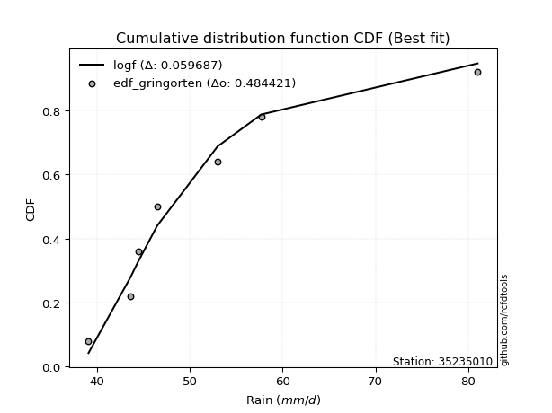</img>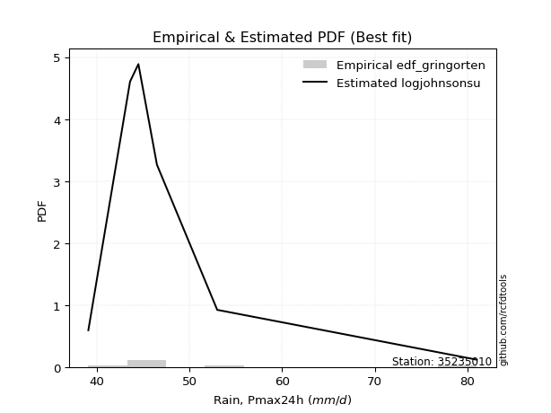</img>

</div>


### 9. EDF Filliben (1975)

The specific values of the constants (0.3175) (often denoted as $alpha$) and (0.365) are derived from a method proposed by James J. Filliben in a 1975 paper. This particular formula is the mean value of the $i$-th order statistic of the normal distribution and is considered a robust and effective plotting position formula for the normal probability plot correlation coefficient test for normality.

<div align="center">


$P=(m-0.3175)/(n+0.365)$


</div>


**9.1. Empirical values**

<div align="center">

|                | 0                   | 1                   | 2                   | 3            | 4                  | 5                  | 6                  |
|:---------------|:--------------------|:--------------------|:--------------------|:-------------|:-------------------|:-------------------|:-------------------|
| date           | 2019                | 2022                | 2023                | 2021         | 2020               | 2025               | 2024               |
| x              | 39.1                | 43.6                | 44.5                | 46.5         | 53.0               | 57.7               | 81.0               |
| m              | 1                   | 2                   | 3                   | 4            | 5                  | 6                  | 7                  |
| empirical_dist | edf_filliben        | edf_filliben        | edf_filliben        | edf_filliben | edf_filliben       | edf_filliben       | edf_filliben       |
| empirical      | 0.09266802443991853 | 0.22844534962661237 | 0.36422267481330617 | 0.5          | 0.6357773251866938 | 0.7715546503733877 | 0.9073319755600815 |
| empirical_tr   | 1.1021324354657687  | 1.2960844698636163  | 1.5728777362520021  | 2.0          | 2.7455731593662627 | 4.377414561664191  | 10.791208791208794 |

</div>


**9.2. Kolmogorov-Smirnov fit test (sorted by Δ)**


<div align="center">

|                | 0                   | 1                   | 2                   | 3                   | 4                   | 5                   | 6                   | 7                   | 8                   | 9                   | 10                  | 11                  | 12                  | 13                  | 14                  | 15                  | 16                  | 17                  | 18                  | 19                  | 20                  | 21                  | 22                  | 23                  | 24                  | 25                  | 26                  | 27                  | 28                  | 29                  | 30                  | 31                  | 32                  | 33                  | 34                  | 35                  | 36                  | 37                  | 38                  | 39                  | 40                  | 41                  | 42                  | 43                  | 44                  | 45                  | 46                  | 47                  | 48                  | 49                  | 50                  | 51                  | 52                  | 53                  | 54                  | 55                  | 56                  | 57                  | 58                  | 59                  | 60                  | 61                  | 62                  | 63                  | 64                  | 65                  | 66                  | 67                  | 68                  | 69                  | 70                  | 71                  | 72                  | 73                  | 74                  | 75                  | 76                  | 77                  | 78                  | 79                  | 80                  | 81                  | 82                  | 83                  | 84                  | 85                  | 86                  | 87                  | 88                  | 89                  | 90                  | 91                  | 92                  | 93                  | 94                  | 95                  | 96                  | 97                  | 98                  | 99                  | 100                 | 101                 | 102                 | 103                 | 104                 | 105                 | 106                 | 107                 | 108                 | 109                 | 110                 | 111                 | 112                 | 113                 | 114                 | 115                 | 116                 | 117                 | 118                 | 119                 | 120                 | 121                 | 122                 | 123                 | 124                 | 125                 | 126                 | 127                 | 128                 | 129                 | 130                 | 131                 | 132                 | 133                 | 134                 | 135                 | 136                 | 137                 | 138                 | 139                 | 140                 | 141                 | 142                 | 143                 | 144                 | 145                 | 146                 | 147                 | 148                 | 149                 | 150                 | 151                 | 152                 | 153                 | 154                 | 155                 | 156                 | 157                 | 158                 | 159                 |
|:---------------|:--------------------|:--------------------|:--------------------|:--------------------|:--------------------|:--------------------|:--------------------|:--------------------|:--------------------|:--------------------|:--------------------|:--------------------|:--------------------|:--------------------|:--------------------|:--------------------|:--------------------|:--------------------|:--------------------|:--------------------|:--------------------|:--------------------|:--------------------|:--------------------|:--------------------|:--------------------|:--------------------|:--------------------|:--------------------|:--------------------|:--------------------|:--------------------|:--------------------|:--------------------|:--------------------|:--------------------|:--------------------|:--------------------|:--------------------|:--------------------|:--------------------|:--------------------|:--------------------|:--------------------|:--------------------|:--------------------|:--------------------|:--------------------|:--------------------|:--------------------|:--------------------|:--------------------|:--------------------|:--------------------|:--------------------|:--------------------|:--------------------|:--------------------|:--------------------|:--------------------|:--------------------|:--------------------|:--------------------|:--------------------|:--------------------|:--------------------|:--------------------|:--------------------|:--------------------|:--------------------|:--------------------|:--------------------|:--------------------|:--------------------|:--------------------|:--------------------|:--------------------|:--------------------|:--------------------|:--------------------|:--------------------|:--------------------|:--------------------|:--------------------|:--------------------|:--------------------|:--------------------|:--------------------|:--------------------|:--------------------|:--------------------|:--------------------|:--------------------|:--------------------|:--------------------|:--------------------|:--------------------|:--------------------|:--------------------|:--------------------|:--------------------|:--------------------|:--------------------|:--------------------|:--------------------|:--------------------|:--------------------|:--------------------|:--------------------|:--------------------|:--------------------|:--------------------|:--------------------|:--------------------|:--------------------|:--------------------|:--------------------|:--------------------|:--------------------|:--------------------|:--------------------|:--------------------|:--------------------|:--------------------|:--------------------|:--------------------|:--------------------|:--------------------|:--------------------|:--------------------|:--------------------|:--------------------|:--------------------|:--------------------|:--------------------|:--------------------|:--------------------|:--------------------|:--------------------|:--------------------|:--------------------|:--------------------|:--------------------|:--------------------|:--------------------|:--------------------|:--------------------|:--------------------|:--------------------|:--------------------|:--------------------|:--------------------|:--------------------|:--------------------|:--------------------|:--------------------|:--------------------|:--------------------|:--------------------|:--------------------|
| station        | 35235010            | 35235010            | 35235010            | 35235010            | 35235010            | 35235010            | 35235010            | 35235010            | 35235010            | 35235010            | 35235010            | 35235010            | 35235010            | 35235010            | 35235010            | 35235010            | 35235010            | 35235010            | 35235010            | 35235010            | 35235010            | 35235010            | 35235010            | 35235010            | 35235010            | 35235010            | 35235010            | 35235010            | 35235010            | 35235010            | 35235010            | 35235010            | 35235010            | 35235010            | 35235010            | 35235010            | 35235010            | 35235010            | 35235010            | 35235010            | 35235010            | 35235010            | 35235010            | 35235010            | 35235010            | 35235010            | 35235010            | 35235010            | 35235010            | 35235010            | 35235010            | 35235010            | 35235010            | 35235010            | 35235010            | 35235010            | 35235010            | 35235010            | 35235010            | 35235010            | 35235010            | 35235010            | 35235010            | 35235010            | 35235010            | 35235010            | 35235010            | 35235010            | 35235010            | 35235010            | 35235010            | 35235010            | 35235010            | 35235010            | 35235010            | 35235010            | 35235010            | 35235010            | 35235010            | 35235010            | 35235010            | 35235010            | 35235010            | 35235010            | 35235010            | 35235010            | 35235010            | 35235010            | 35235010            | 35235010            | 35235010            | 35235010            | 35235010            | 35235010            | 35235010            | 35235010            | 35235010            | 35235010            | 35235010            | 35235010            | 35235010            | 35235010            | 35235010            | 35235010            | 35235010            | 35235010            | 35235010            | 35235010            | 35235010            | 35235010            | 35235010            | 35235010            | 35235010            | 35235010            | 35235010            | 35235010            | 35235010            | 35235010            | 35235010            | 35235010            | 35235010            | 35235010            | 35235010            | 35235010            | 35235010            | 35235010            | 35235010            | 35235010            | 35235010            | 35235010            | 35235010            | 35235010            | 35235010            | 35235010            | 35235010            | 35235010            | 35235010            | 35235010            | 35235010            | 35235010            | 35235010            | 35235010            | 35235010            | 35235010            | 35235010            | 35235010            | 35235010            | 35235010            | 35235010            | 35235010            | 35235010            | 35235010            | 35235010            | 35235010            | 35235010            | 35235010            | 35235010            | 35235010            | 35235010            | 35235010            |
| empirical_dist | edf_filliben        | edf_filliben        | edf_filliben        | edf_filliben        | edf_filliben        | edf_filliben        | edf_filliben        | edf_filliben        | edf_filliben        | edf_filliben        | edf_filliben        | edf_filliben        | edf_filliben        | edf_filliben        | edf_filliben        | edf_filliben        | edf_filliben        | edf_filliben        | edf_filliben        | edf_filliben        | edf_filliben        | edf_filliben        | edf_filliben        | edf_filliben        | edf_filliben        | edf_filliben        | edf_filliben        | edf_filliben        | edf_filliben        | edf_filliben        | edf_filliben        | edf_filliben        | edf_filliben        | edf_filliben        | edf_filliben        | edf_filliben        | edf_filliben        | edf_filliben        | edf_filliben        | edf_filliben        | edf_filliben        | edf_filliben        | edf_filliben        | edf_filliben        | edf_filliben        | edf_filliben        | edf_filliben        | edf_filliben        | edf_filliben        | edf_filliben        | edf_filliben        | edf_filliben        | edf_filliben        | edf_filliben        | edf_filliben        | edf_filliben        | edf_filliben        | edf_filliben        | edf_filliben        | edf_filliben        | edf_filliben        | edf_filliben        | edf_filliben        | edf_filliben        | edf_filliben        | edf_filliben        | edf_filliben        | edf_filliben        | edf_filliben        | edf_filliben        | edf_filliben        | edf_filliben        | edf_filliben        | edf_filliben        | edf_filliben        | edf_filliben        | edf_filliben        | edf_filliben        | edf_filliben        | edf_filliben        | edf_filliben        | edf_filliben        | edf_filliben        | edf_filliben        | edf_filliben        | edf_filliben        | edf_filliben        | edf_filliben        | edf_filliben        | edf_filliben        | edf_filliben        | edf_filliben        | edf_filliben        | edf_filliben        | edf_filliben        | edf_filliben        | edf_filliben        | edf_filliben        | edf_filliben        | edf_filliben        | edf_filliben        | edf_filliben        | edf_filliben        | edf_filliben        | edf_filliben        | edf_filliben        | edf_filliben        | edf_filliben        | edf_filliben        | edf_filliben        | edf_filliben        | edf_filliben        | edf_filliben        | edf_filliben        | edf_filliben        | edf_filliben        | edf_filliben        | edf_filliben        | edf_filliben        | edf_filliben        | edf_filliben        | edf_filliben        | edf_filliben        | edf_filliben        | edf_filliben        | edf_filliben        | edf_filliben        | edf_filliben        | edf_filliben        | edf_filliben        | edf_filliben        | edf_filliben        | edf_filliben        | edf_filliben        | edf_filliben        | edf_filliben        | edf_filliben        | edf_filliben        | edf_filliben        | edf_filliben        | edf_filliben        | edf_filliben        | edf_filliben        | edf_filliben        | edf_filliben        | edf_filliben        | edf_filliben        | edf_filliben        | edf_filliben        | edf_filliben        | edf_filliben        | edf_filliben        | edf_filliben        | edf_filliben        | edf_filliben        | edf_filliben        | edf_filliben        | edf_filliben        | edf_filliben        | edf_filliben        |
| p_dist         | logburr12           | logexponnorm        | invgamma            | genextreme          | invweibull          | f                   | logf                | loginvgamma         | logjohnsonsu        | loginvweibull       | loggenextreme       | alpha               | loginvgauss         | logfatiguelife      | johnsonsu           | logmielke           | invgauss            | loghalfnorm         | loghalflogistic     | halflogistic        | logmoyal            | foldnorm            | logfoldnorm         | exponnorm           | halfnorm            | loggenexpon         | logtruncnorm        | loghalfgennorm      | genexpon            | loggompertz         | lomax               | gompertz            | wald                | logvonmises_line    | burr                | logwald             | logburr             | logpearson3         | logbradford         | pearson3            | nakagami            | bradford            | loggumbel_r         | logweibull_max      | logbetaprime        | loggenlogistic      | mielke              | lograyleigh         | moyal               | logalpha            | vonmises_line       | logexponweib        | burr12              | truncpareto         | logskewnorm         | lognct              | logmaxwell          | logkstwobign        | logsemicircular     | gumbel_r            | rayleigh            | loggennorm          | loganglit           | logncf              | logtruncweibull_min | loglomax            | logloglaplace       | genhalflogistic     | maxwell             | semicircular        | genlogistic         | logarcsine          | nct                 | logexponpow         | anglit              | betaprime           | logloggamma         | logt                | logweibull_min      | logcrystalball      | lognorm             | loggausshyper       | dgamma              | logrice             | ncf                 | logdweibull         | t                   | kstwobign           | crystalball         | norm                | truncnorm           | logtruncexpon       | loglogistic         | arcsine             | loghypsecant        | halfgennorm         | logistic            | logbeta             | skewnorm            | tukeylambda         | logcosine           | rice                | gennorm             | logdgamma           | hypsecant           | truncweibull_min    | loggumbel_l         | loggengamma         | loglaplace          | loglaplace          | cosine              | triang              | gumbel_l            | rdist               | laplace             | logksone            | logargus            | truncexpon          | logkappa4           | logwrapcauchy       | loguniform          | genpareto           | logkappa3           | dweibull            | beta                | wrapcauchy          | lognakagami         | argus               | logtriang           | kappa4              | ksone               | weibull_min         | uniform             | loglevy_l           | kappa3              | levy_l              | logerlang           | gengamma            | loggamma            | loggamma            | loggenhalflogistic  | exponpow            | johnsonsb           | powerlaw            | logjohnsonsb        | logtrapezoid        | logpowerlaw         | fatiguelife         | gausshyper          | loggenpareto        | exponweib           | trapezoid           | erlang              | gamma               | logtruncpareto      | weibull_max         | logtukeylambda      | logrdist            | logvonmises         | vonmises            |
| delta          | 0.05289279662346358 | 0.05420027705378894 | 0.05609412133356784 | 0.05611435066545534 | 0.05611644109191294 | 0.05681088367942466 | 0.05968650550526272 | 0.05968685596917933 | 0.05988790609144348 | 0.06154381992632246 | 0.06155350255416531 | 0.06356123321313417 | 0.06392573499157053 | 0.07134055818773297 | 0.07230443514748927 | 0.07237555360887205 | 0.07283949150212113 | 0.07539749056473172 | 0.08163038235609207 | 0.0877635309976098  | 0.08842320951082838 | 0.0893158658164285  | 0.09066799216105548 | 0.09106433288785057 | 0.0925113886927672  | 0.09263172341956494 | 0.09266729152354469 | 0.09266796859578037 | 0.09266802440218352 | 0.09266802443074824 | 0.09266802443991466 | 0.09266802443991799 | 0.09266802443991853 | 0.09599379076159692 | 0.09743717917593114 | 0.09794436280226715 | 0.09878457789911843 | 0.10017198560522522 | 0.10116468486830052 | 0.10271110619694657 | 0.1039479179961672  | 0.10444017331897426 | 0.10589647017888365 | 0.10679800658524191 | 0.10723542597298669 | 0.10726700054416982 | 0.10913457764922169 | 0.10961731969998662 | 0.11004786283469481 | 0.11039677484687432 | 0.11061727984710984 | 0.11256578240274281 | 0.11371152160712547 | 0.11489578910625312 | 0.11535303024613475 | 0.12124353973142349 | 0.12164046311930538 | 0.12173753155790257 | 0.12473666861344779 | 0.12537995487219744 | 0.1260372453862788  | 0.13124956492534035 | 0.1332002377463204  | 0.13470639504267323 | 0.13477521908642737 | 0.13639741631721417 | 0.13676441093424296 | 0.13743238295216376 | 0.13782270154167242 | 0.13870573708011436 | 0.13952900073155933 | 0.14032742122137076 | 0.14137013054904052 | 0.14281960133099725 | 0.14676580260841787 | 0.1472562109139377  | 0.14969031330094185 | 0.1524881955298345  | 0.1526730194524585  | 0.15336694849370563 | 0.15336695111751242 | 0.15467476836929966 | 0.15557577207148054 | 0.15817397180875997 | 0.1604077978231367  | 0.16081780974949922 | 0.16224590207793033 | 0.16590502359673615 | 0.16849678793376388 | 0.16849679185816757 | 0.16849679201742157 | 0.16887830450315328 | 0.17159563182722587 | 0.1754614144953398  | 0.18568656601478306 | 0.18737858694617357 | 0.18791556724487657 | 0.18926092721150142 | 0.18934363773400426 | 0.1894862526584773  | 0.19343687547673571 | 0.19832956161266402 | 0.19906851519495916 | 0.20173900179360815 | 0.20262503403113663 | 0.20402403862909926 | 0.21280409516762178 | 0.2131250142738713  | 0.21376743887680555 | 0.21376743887680555 | 0.21588374838357116 | 0.22271621989425933 | 0.22537511341256444 | 0.22750200740825366 | 0.2300216637426704  | 0.24298303648942277 | 0.24728655919820053 | 0.2479573263744539  | 0.24993300676036873 | 0.2600865649796976  | 0.2620163471506911  | 0.2640538953506527  | 0.26491935068751543 | 0.2715546503735069  | 0.28516370686745285 | 0.29042372908277536 | 0.2908086674689303  | 0.30556411694353935 | 0.3069560132257404  | 0.30817915891501696 | 0.31829291608540045 | 0.32661680068781285 | 0.3276405692278029  | 0.32816021657884176 | 0.32847136713987163 | 0.3446994115510782  | 0.36352507630440956 | 0.36832088991735923 | 0.3726528499412116  | 0.3726528499412116  | 0.3792510475613614  | 0.38794583133794913 | 0.4527692066219653  | 0.47411894689150225 | 0.48144345831180846 | 0.49216669936948837 | 0.49789708153364143 | 0.5084937785033005  | 0.5128049472371231  | 0.5161500753167263  | 0.5326003391910091  | 0.5661084506036338  | 0.602860664462155   | 0.6090110312587508  | 0.6401343866198681  | 0.6544247959031965  | 0.9073310477603422  | 0.9073319726088691  | 1.073892833537273   | 12.200427420147571  |
| deltao         | 0.48442053926100004 | 0.48442053926100004 | 0.48442053926100004 | 0.48442053926100004 | 0.48442053926100004 | 0.48442053926100004 | 0.48442053926100004 | 0.48442053926100004 | 0.48442053926100004 | 0.48442053926100004 | 0.48442053926100004 | 0.48442053926100004 | 0.48442053926100004 | 0.48442053926100004 | 0.48442053926100004 | 0.48442053926100004 | 0.48442053926100004 | 0.48442053926100004 | 0.48442053926100004 | 0.48442053926100004 | 0.48442053926100004 | 0.48442053926100004 | 0.48442053926100004 | 0.48442053926100004 | 0.48442053926100004 | 0.48442053926100004 | 0.48442053926100004 | 0.48442053926100004 | 0.48442053926100004 | 0.48442053926100004 | 0.48442053926100004 | 0.48442053926100004 | 0.48442053926100004 | 0.48442053926100004 | 0.48442053926100004 | 0.48442053926100004 | 0.48442053926100004 | 0.48442053926100004 | 0.48442053926100004 | 0.48442053926100004 | 0.48442053926100004 | 0.48442053926100004 | 0.48442053926100004 | 0.48442053926100004 | 0.48442053926100004 | 0.48442053926100004 | 0.48442053926100004 | 0.48442053926100004 | 0.48442053926100004 | 0.48442053926100004 | 0.48442053926100004 | 0.48442053926100004 | 0.48442053926100004 | 0.48442053926100004 | 0.48442053926100004 | 0.48442053926100004 | 0.48442053926100004 | 0.48442053926100004 | 0.48442053926100004 | 0.48442053926100004 | 0.48442053926100004 | 0.48442053926100004 | 0.48442053926100004 | 0.48442053926100004 | 0.48442053926100004 | 0.48442053926100004 | 0.48442053926100004 | 0.48442053926100004 | 0.48442053926100004 | 0.48442053926100004 | 0.48442053926100004 | 0.48442053926100004 | 0.48442053926100004 | 0.48442053926100004 | 0.48442053926100004 | 0.48442053926100004 | 0.48442053926100004 | 0.48442053926100004 | 0.48442053926100004 | 0.48442053926100004 | 0.48442053926100004 | 0.48442053926100004 | 0.48442053926100004 | 0.48442053926100004 | 0.48442053926100004 | 0.48442053926100004 | 0.48442053926100004 | 0.48442053926100004 | 0.48442053926100004 | 0.48442053926100004 | 0.48442053926100004 | 0.48442053926100004 | 0.48442053926100004 | 0.48442053926100004 | 0.48442053926100004 | 0.48442053926100004 | 0.48442053926100004 | 0.48442053926100004 | 0.48442053926100004 | 0.48442053926100004 | 0.48442053926100004 | 0.48442053926100004 | 0.48442053926100004 | 0.48442053926100004 | 0.48442053926100004 | 0.48442053926100004 | 0.48442053926100004 | 0.48442053926100004 | 0.48442053926100004 | 0.48442053926100004 | 0.48442053926100004 | 0.48442053926100004 | 0.48442053926100004 | 0.48442053926100004 | 0.48442053926100004 | 0.48442053926100004 | 0.48442053926100004 | 0.48442053926100004 | 0.48442053926100004 | 0.48442053926100004 | 0.48442053926100004 | 0.48442053926100004 | 0.48442053926100004 | 0.48442053926100004 | 0.48442053926100004 | 0.48442053926100004 | 0.48442053926100004 | 0.48442053926100004 | 0.48442053926100004 | 0.48442053926100004 | 0.48442053926100004 | 0.48442053926100004 | 0.48442053926100004 | 0.48442053926100004 | 0.48442053926100004 | 0.48442053926100004 | 0.48442053926100004 | 0.48442053926100004 | 0.48442053926100004 | 0.48442053926100004 | 0.48442053926100004 | 0.48442053926100004 | 0.48442053926100004 | 0.48442053926100004 | 0.48442053926100004 | 0.48442053926100004 | 0.48442053926100004 | 0.48442053926100004 | 0.48442053926100004 | 0.48442053926100004 | 0.48442053926100004 | 0.48442053926100004 | 0.48442053926100004 | 0.48442053926100004 | 0.48442053926100004 | 0.48442053926100004 | 0.48442053926100004 | 0.48442053926100004 | 0.48442053926100004 | 0.48442053926100004 |
| eval           | Δo > Δ              | Δo > Δ              | Δo > Δ              | Δo > Δ              | Δo > Δ              | Δo > Δ              | Δo > Δ              | Δo > Δ              | Δo > Δ              | Δo > Δ              | Δo > Δ              | Δo > Δ              | Δo > Δ              | Δo > Δ              | Δo > Δ              | Δo > Δ              | Δo > Δ              | Δo > Δ              | Δo > Δ              | Δo > Δ              | Δo > Δ              | Δo > Δ              | Δo > Δ              | Δo > Δ              | Δo > Δ              | Δo > Δ              | Δo > Δ              | Δo > Δ              | Δo > Δ              | Δo > Δ              | Δo > Δ              | Δo > Δ              | Δo > Δ              | Δo > Δ              | Δo > Δ              | Δo > Δ              | Δo > Δ              | Δo > Δ              | Δo > Δ              | Δo > Δ              | Δo > Δ              | Δo > Δ              | Δo > Δ              | Δo > Δ              | Δo > Δ              | Δo > Δ              | Δo > Δ              | Δo > Δ              | Δo > Δ              | Δo > Δ              | Δo > Δ              | Δo > Δ              | Δo > Δ              | Δo > Δ              | Δo > Δ              | Δo > Δ              | Δo > Δ              | Δo > Δ              | Δo > Δ              | Δo > Δ              | Δo > Δ              | Δo > Δ              | Δo > Δ              | Δo > Δ              | Δo > Δ              | Δo > Δ              | Δo > Δ              | Δo > Δ              | Δo > Δ              | Δo > Δ              | Δo > Δ              | Δo > Δ              | Δo > Δ              | Δo > Δ              | Δo > Δ              | Δo > Δ              | Δo > Δ              | Δo > Δ              | Δo > Δ              | Δo > Δ              | Δo > Δ              | Δo > Δ              | Δo > Δ              | Δo > Δ              | Δo > Δ              | Δo > Δ              | Δo > Δ              | Δo > Δ              | Δo > Δ              | Δo > Δ              | Δo > Δ              | Δo > Δ              | Δo > Δ              | Δo > Δ              | Δo > Δ              | Δo > Δ              | Δo > Δ              | Δo > Δ              | Δo > Δ              | Δo > Δ              | Δo > Δ              | Δo > Δ              | Δo > Δ              | Δo > Δ              | Δo > Δ              | Δo > Δ              | Δo > Δ              | Δo > Δ              | Δo > Δ              | Δo > Δ              | Δo > Δ              | Δo > Δ              | Δo > Δ              | Δo > Δ              | Δo > Δ              | Δo > Δ              | Δo > Δ              | Δo > Δ              | Δo > Δ              | Δo > Δ              | Δo > Δ              | Δo > Δ              | Δo > Δ              | Δo > Δ              | Δo > Δ              | Δo > Δ              | Δo > Δ              | Δo > Δ              | Δo > Δ              | Δo > Δ              | Δo > Δ              | Δo > Δ              | Δo > Δ              | Δo > Δ              | Δo > Δ              | Δo > Δ              | Δo > Δ              | Δo > Δ              | Δo > Δ              | Δo > Δ              | Δo > Δ              | Δo > Δ              | Δo > Δ              | Δo > Δ              | Δo > Δ              | Δo <= Δ             | Δo <= Δ             | Δo <= Δ             | Δo <= Δ             | Δo <= Δ             | Δo <= Δ             | Δo <= Δ             | Δo <= Δ             | Δo <= Δ             | Δo <= Δ             | Δo <= Δ             | Δo <= Δ             | Δo <= Δ             | Δo <= Δ             | Δo <= Δ             |
| fit            | 1                   | 1                   | 1                   | 1                   | 1                   | 1                   | 1                   | 1                   | 1                   | 1                   | 1                   | 1                   | 1                   | 1                   | 1                   | 1                   | 1                   | 1                   | 1                   | 1                   | 1                   | 1                   | 1                   | 1                   | 1                   | 1                   | 1                   | 1                   | 1                   | 1                   | 1                   | 1                   | 1                   | 1                   | 1                   | 1                   | 1                   | 1                   | 1                   | 1                   | 1                   | 1                   | 1                   | 1                   | 1                   | 1                   | 1                   | 1                   | 1                   | 1                   | 1                   | 1                   | 1                   | 1                   | 1                   | 1                   | 1                   | 1                   | 1                   | 1                   | 1                   | 1                   | 1                   | 1                   | 1                   | 1                   | 1                   | 1                   | 1                   | 1                   | 1                   | 1                   | 1                   | 1                   | 1                   | 1                   | 1                   | 1                   | 1                   | 1                   | 1                   | 1                   | 1                   | 1                   | 1                   | 1                   | 1                   | 1                   | 1                   | 1                   | 1                   | 1                   | 1                   | 1                   | 1                   | 1                   | 1                   | 1                   | 1                   | 1                   | 1                   | 1                   | 1                   | 1                   | 1                   | 1                   | 1                   | 1                   | 1                   | 1                   | 1                   | 1                   | 1                   | 1                   | 1                   | 1                   | 1                   | 1                   | 1                   | 1                   | 1                   | 1                   | 1                   | 1                   | 1                   | 1                   | 1                   | 1                   | 1                   | 1                   | 1                   | 1                   | 1                   | 1                   | 1                   | 1                   | 1                   | 1                   | 1                   | 1                   | 1                   | 1                   | 1                   | 1                   | 1                   | 0                   | 0                   | 0                   | 0                   | 0                   | 0                   | 0                   | 0                   | 0                   | 0                   | 0                   | 0                   | 0                   | 0                   | 0                   |
| n              | 7                   | 7                   | 7                   | 7                   | 7                   | 7                   | 7                   | 7                   | 7                   | 7                   | 7                   | 7                   | 7                   | 7                   | 7                   | 7                   | 7                   | 7                   | 7                   | 7                   | 7                   | 7                   | 7                   | 7                   | 7                   | 7                   | 7                   | 7                   | 7                   | 7                   | 7                   | 7                   | 7                   | 7                   | 7                   | 7                   | 7                   | 7                   | 7                   | 7                   | 7                   | 7                   | 7                   | 7                   | 7                   | 7                   | 7                   | 7                   | 7                   | 7                   | 7                   | 7                   | 7                   | 7                   | 7                   | 7                   | 7                   | 7                   | 7                   | 7                   | 7                   | 7                   | 7                   | 7                   | 7                   | 7                   | 7                   | 7                   | 7                   | 7                   | 7                   | 7                   | 7                   | 7                   | 7                   | 7                   | 7                   | 7                   | 7                   | 7                   | 7                   | 7                   | 7                   | 7                   | 7                   | 7                   | 7                   | 7                   | 7                   | 7                   | 7                   | 7                   | 7                   | 7                   | 7                   | 7                   | 7                   | 7                   | 7                   | 7                   | 7                   | 7                   | 7                   | 7                   | 7                   | 7                   | 7                   | 7                   | 7                   | 7                   | 7                   | 7                   | 7                   | 7                   | 7                   | 7                   | 7                   | 7                   | 7                   | 7                   | 7                   | 7                   | 7                   | 7                   | 7                   | 7                   | 7                   | 7                   | 7                   | 7                   | 7                   | 7                   | 7                   | 7                   | 7                   | 7                   | 7                   | 7                   | 7                   | 7                   | 7                   | 7                   | 7                   | 7                   | 7                   | 7                   | 7                   | 7                   | 7                   | 7                   | 7                   | 7                   | 7                   | 7                   | 7                   | 7                   | 7                   | 7                   | 7                   | 7                   |
| best_fit       | 1                   | 0                   | 0                   | 0                   | 0                   | 0                   | 0                   | 0                   | 0                   | 0                   | 0                   | 0                   | 0                   | 0                   | 0                   | 0                   | 0                   | 0                   | 0                   | 0                   | 0                   | 0                   | 0                   | 0                   | 0                   | 0                   | 0                   | 0                   | 0                   | 0                   | 0                   | 0                   | 0                   | 0                   | 0                   | 0                   | 0                   | 0                   | 0                   | 0                   | 0                   | 0                   | 0                   | 0                   | 0                   | 0                   | 0                   | 0                   | 0                   | 0                   | 0                   | 0                   | 0                   | 0                   | 0                   | 0                   | 0                   | 0                   | 0                   | 0                   | 0                   | 0                   | 0                   | 0                   | 0                   | 0                   | 0                   | 0                   | 0                   | 0                   | 0                   | 0                   | 0                   | 0                   | 0                   | 0                   | 0                   | 0                   | 0                   | 0                   | 0                   | 0                   | 0                   | 0                   | 0                   | 0                   | 0                   | 0                   | 0                   | 0                   | 0                   | 0                   | 0                   | 0                   | 0                   | 0                   | 0                   | 0                   | 0                   | 0                   | 0                   | 0                   | 0                   | 0                   | 0                   | 0                   | 0                   | 0                   | 0                   | 0                   | 0                   | 0                   | 0                   | 0                   | 0                   | 0                   | 0                   | 0                   | 0                   | 0                   | 0                   | 0                   | 0                   | 0                   | 0                   | 0                   | 0                   | 0                   | 0                   | 0                   | 0                   | 0                   | 0                   | 0                   | 0                   | 0                   | 0                   | 0                   | 0                   | 0                   | 0                   | 0                   | 0                   | 0                   | 0                   | 0                   | 0                   | 0                   | 0                   | 0                   | 0                   | 0                   | 0                   | 0                   | 0                   | 0                   | 0                   | 0                   | 0                   | 0                   |
| best_fit_sort  | 1                   | 2                   | 3                   | 4                   | 5                   | 6                   | 7                   | 8                   | 9                   | 10                  | 11                  | 12                  | 13                  | 14                  | 15                  | 16                  | 17                  | 18                  | 19                  | 20                  | 21                  | 22                  | 23                  | 24                  | 25                  | 26                  | 27                  | 28                  | 29                  | 30                  | 31                  | 32                  | 33                  | 34                  | 35                  | 36                  | 37                  | 38                  | 39                  | 40                  | 41                  | 42                  | 43                  | 44                  | 45                  | 46                  | 47                  | 48                  | 49                  | 50                  | 51                  | 52                  | 53                  | 54                  | 55                  | 56                  | 57                  | 58                  | 59                  | 60                  | 61                  | 62                  | 63                  | 64                  | 65                  | 66                  | 67                  | 68                  | 69                  | 70                  | 71                  | 72                  | 73                  | 74                  | 75                  | 76                  | 77                  | 78                  | 79                  | 80                  | 81                  | 82                  | 83                  | 84                  | 85                  | 86                  | 87                  | 88                  | 89                  | 90                  | 91                  | 92                  | 93                  | 94                  | 95                  | 96                  | 97                  | 98                  | 99                  | 100                 | 101                 | 102                 | 103                 | 104                 | 105                 | 106                 | 107                 | 108                 | 109                 | 110                 | 111                 | 112                 | 113                 | 114                 | 115                 | 116                 | 117                 | 118                 | 119                 | 120                 | 121                 | 122                 | 123                 | 124                 | 125                 | 126                 | 127                 | 128                 | 129                 | 130                 | 131                 | 132                 | 133                 | 134                 | 135                 | 136                 | 137                 | 138                 | 139                 | 140                 | 141                 | 142                 | 143                 | 144                 | 145                 | 146                 | 147                 | 148                 | 149                 | 150                 | 151                 | 152                 | 153                 | 154                 | 155                 | 156                 | 157                 | 158                 | 159                 | 160                 |

</div>


**9.3. Best fit**

<div align="center">

|   id |   station | empirical_dist   | p_dist    |     delta |   deltao | eval   |   fit |   n |   best_fit |   best_fit_sort |
|-----:|----------:|:-----------------|:----------|----------:|---------:|:-------|------:|----:|-----------:|----------------:|
|    0 |  35235010 | edf_filliben     | logburr12 | 0.0528928 | 0.484421 | Δo > Δ |     1 |   7 |          1 |               1 |

</div>


<div align="center">

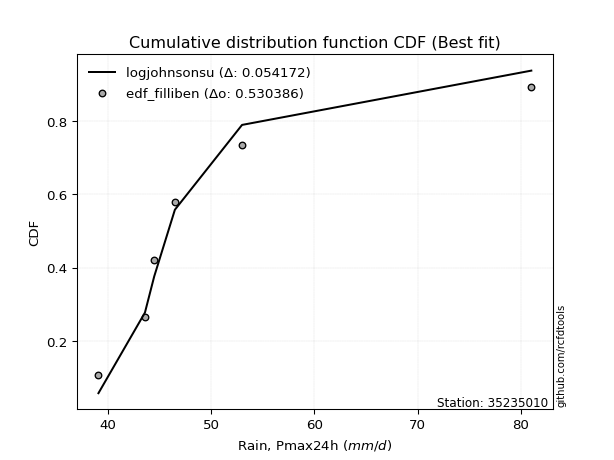</img></img>

</div>


### 10. EDF Jenkinson (1977)

The Jenkinson formula in hydrology is an empirical plotting position formula used to estimate the non-exceedance probability _(P)_ or return period _(T)_ of a given ordered observation within a sample. It is a widely used method in the frequency analysis of extreme events such as floods and rainfall, as it provides a distribution-free way to plot data. _a≈0.31_ and _b≈0.38_ are constants derived to approximate the median of the probability distribution for the given rank.

<div align="center">


$P=(m-a)/(n+b)$


</div>


**10.1. Empirical values**

<div align="center">

|                | 0                   | 1                   | 2                   | 3             | 4                  | 5                  | 6                  |
|:---------------|:--------------------|:--------------------|:--------------------|:--------------|:-------------------|:-------------------|:-------------------|
| date           | 2019                | 2022                | 2023                | 2021          | 2020               | 2025               | 2024               |
| x              | 39.1                | 43.6                | 44.5                | 46.5          | 53.0               | 57.7               | 81.0               |
| m              | 1                   | 2                   | 3                   | 4             | 5                  | 6                  | 7                  |
| empirical_dist | edf_jenkinson       | edf_jenkinson       | edf_jenkinson       | edf_jenkinson | edf_jenkinson      | edf_jenkinson      | edf_jenkinson      |
| empirical      | 0.09349593495934959 | 0.22899728997289973 | 0.36449864498644985 | 0.5           | 0.6355013550135502 | 0.7710027100271003 | 0.9065040650406505 |
| empirical_tr   | 1.1031390134529149  | 1.29701230228471    | 1.5735607675906182  | 2.0           | 2.743494423791822  | 4.366863905325444  | 10.695652173913055 |

</div>


**10.2. Kolmogorov-Smirnov fit test (sorted by Δ)**


<div align="center">

|                | 0                   | 1                   | 2                   | 3                   | 4                   | 5                   | 6                   | 7                   | 8                   | 9                   | 10                  | 11                  | 12                  | 13                  | 14                  | 15                  | 16                  | 17                  | 18                  | 19                  | 20                  | 21                  | 22                  | 23                  | 24                  | 25                  | 26                  | 27                  | 28                  | 29                  | 30                  | 31                  | 32                  | 33                  | 34                  | 35                  | 36                  | 37                  | 38                  | 39                  | 40                  | 41                  | 42                  | 43                  | 44                  | 45                  | 46                  | 47                  | 48                  | 49                  | 50                  | 51                  | 52                  | 53                  | 54                  | 55                  | 56                  | 57                  | 58                  | 59                  | 60                  | 61                  | 62                  | 63                  | 64                  | 65                  | 66                  | 67                  | 68                  | 69                  | 70                  | 71                  | 72                  | 73                  | 74                  | 75                  | 76                  | 77                  | 78                  | 79                  | 80                  | 81                  | 82                  | 83                  | 84                  | 85                  | 86                  | 87                  | 88                  | 89                  | 90                  | 91                  | 92                  | 93                  | 94                  | 95                  | 96                  | 97                  | 98                  | 99                  | 100                 | 101                 | 102                 | 103                 | 104                 | 105                 | 106                 | 107                 | 108                 | 109                 | 110                 | 111                 | 112                 | 113                 | 114                 | 115                 | 116                 | 117                 | 118                 | 119                 | 120                 | 121                 | 122                 | 123                 | 124                 | 125                 | 126                 | 127                 | 128                 | 129                 | 130                 | 131                 | 132                 | 133                 | 134                 | 135                 | 136                 | 137                 | 138                 | 139                 | 140                 | 141                 | 142                 | 143                 | 144                 | 145                 | 146                 | 147                 | 148                 | 149                 | 150                 | 151                 | 152                 | 153                 | 154                 | 155                 | 156                 | 157                 | 158                 | 159                 |
|:---------------|:--------------------|:--------------------|:--------------------|:--------------------|:--------------------|:--------------------|:--------------------|:--------------------|:--------------------|:--------------------|:--------------------|:--------------------|:--------------------|:--------------------|:--------------------|:--------------------|:--------------------|:--------------------|:--------------------|:--------------------|:--------------------|:--------------------|:--------------------|:--------------------|:--------------------|:--------------------|:--------------------|:--------------------|:--------------------|:--------------------|:--------------------|:--------------------|:--------------------|:--------------------|:--------------------|:--------------------|:--------------------|:--------------------|:--------------------|:--------------------|:--------------------|:--------------------|:--------------------|:--------------------|:--------------------|:--------------------|:--------------------|:--------------------|:--------------------|:--------------------|:--------------------|:--------------------|:--------------------|:--------------------|:--------------------|:--------------------|:--------------------|:--------------------|:--------------------|:--------------------|:--------------------|:--------------------|:--------------------|:--------------------|:--------------------|:--------------------|:--------------------|:--------------------|:--------------------|:--------------------|:--------------------|:--------------------|:--------------------|:--------------------|:--------------------|:--------------------|:--------------------|:--------------------|:--------------------|:--------------------|:--------------------|:--------------------|:--------------------|:--------------------|:--------------------|:--------------------|:--------------------|:--------------------|:--------------------|:--------------------|:--------------------|:--------------------|:--------------------|:--------------------|:--------------------|:--------------------|:--------------------|:--------------------|:--------------------|:--------------------|:--------------------|:--------------------|:--------------------|:--------------------|:--------------------|:--------------------|:--------------------|:--------------------|:--------------------|:--------------------|:--------------------|:--------------------|:--------------------|:--------------------|:--------------------|:--------------------|:--------------------|:--------------------|:--------------------|:--------------------|:--------------------|:--------------------|:--------------------|:--------------------|:--------------------|:--------------------|:--------------------|:--------------------|:--------------------|:--------------------|:--------------------|:--------------------|:--------------------|:--------------------|:--------------------|:--------------------|:--------------------|:--------------------|:--------------------|:--------------------|:--------------------|:--------------------|:--------------------|:--------------------|:--------------------|:--------------------|:--------------------|:--------------------|:--------------------|:--------------------|:--------------------|:--------------------|:--------------------|:--------------------|:--------------------|:--------------------|:--------------------|:--------------------|:--------------------|:--------------------|
| station        | 35235010            | 35235010            | 35235010            | 35235010            | 35235010            | 35235010            | 35235010            | 35235010            | 35235010            | 35235010            | 35235010            | 35235010            | 35235010            | 35235010            | 35235010            | 35235010            | 35235010            | 35235010            | 35235010            | 35235010            | 35235010            | 35235010            | 35235010            | 35235010            | 35235010            | 35235010            | 35235010            | 35235010            | 35235010            | 35235010            | 35235010            | 35235010            | 35235010            | 35235010            | 35235010            | 35235010            | 35235010            | 35235010            | 35235010            | 35235010            | 35235010            | 35235010            | 35235010            | 35235010            | 35235010            | 35235010            | 35235010            | 35235010            | 35235010            | 35235010            | 35235010            | 35235010            | 35235010            | 35235010            | 35235010            | 35235010            | 35235010            | 35235010            | 35235010            | 35235010            | 35235010            | 35235010            | 35235010            | 35235010            | 35235010            | 35235010            | 35235010            | 35235010            | 35235010            | 35235010            | 35235010            | 35235010            | 35235010            | 35235010            | 35235010            | 35235010            | 35235010            | 35235010            | 35235010            | 35235010            | 35235010            | 35235010            | 35235010            | 35235010            | 35235010            | 35235010            | 35235010            | 35235010            | 35235010            | 35235010            | 35235010            | 35235010            | 35235010            | 35235010            | 35235010            | 35235010            | 35235010            | 35235010            | 35235010            | 35235010            | 35235010            | 35235010            | 35235010            | 35235010            | 35235010            | 35235010            | 35235010            | 35235010            | 35235010            | 35235010            | 35235010            | 35235010            | 35235010            | 35235010            | 35235010            | 35235010            | 35235010            | 35235010            | 35235010            | 35235010            | 35235010            | 35235010            | 35235010            | 35235010            | 35235010            | 35235010            | 35235010            | 35235010            | 35235010            | 35235010            | 35235010            | 35235010            | 35235010            | 35235010            | 35235010            | 35235010            | 35235010            | 35235010            | 35235010            | 35235010            | 35235010            | 35235010            | 35235010            | 35235010            | 35235010            | 35235010            | 35235010            | 35235010            | 35235010            | 35235010            | 35235010            | 35235010            | 35235010            | 35235010            | 35235010            | 35235010            | 35235010            | 35235010            | 35235010            | 35235010            |
| empirical_dist | edf_jenkinson       | edf_jenkinson       | edf_jenkinson       | edf_jenkinson       | edf_jenkinson       | edf_jenkinson       | edf_jenkinson       | edf_jenkinson       | edf_jenkinson       | edf_jenkinson       | edf_jenkinson       | edf_jenkinson       | edf_jenkinson       | edf_jenkinson       | edf_jenkinson       | edf_jenkinson       | edf_jenkinson       | edf_jenkinson       | edf_jenkinson       | edf_jenkinson       | edf_jenkinson       | edf_jenkinson       | edf_jenkinson       | edf_jenkinson       | edf_jenkinson       | edf_jenkinson       | edf_jenkinson       | edf_jenkinson       | edf_jenkinson       | edf_jenkinson       | edf_jenkinson       | edf_jenkinson       | edf_jenkinson       | edf_jenkinson       | edf_jenkinson       | edf_jenkinson       | edf_jenkinson       | edf_jenkinson       | edf_jenkinson       | edf_jenkinson       | edf_jenkinson       | edf_jenkinson       | edf_jenkinson       | edf_jenkinson       | edf_jenkinson       | edf_jenkinson       | edf_jenkinson       | edf_jenkinson       | edf_jenkinson       | edf_jenkinson       | edf_jenkinson       | edf_jenkinson       | edf_jenkinson       | edf_jenkinson       | edf_jenkinson       | edf_jenkinson       | edf_jenkinson       | edf_jenkinson       | edf_jenkinson       | edf_jenkinson       | edf_jenkinson       | edf_jenkinson       | edf_jenkinson       | edf_jenkinson       | edf_jenkinson       | edf_jenkinson       | edf_jenkinson       | edf_jenkinson       | edf_jenkinson       | edf_jenkinson       | edf_jenkinson       | edf_jenkinson       | edf_jenkinson       | edf_jenkinson       | edf_jenkinson       | edf_jenkinson       | edf_jenkinson       | edf_jenkinson       | edf_jenkinson       | edf_jenkinson       | edf_jenkinson       | edf_jenkinson       | edf_jenkinson       | edf_jenkinson       | edf_jenkinson       | edf_jenkinson       | edf_jenkinson       | edf_jenkinson       | edf_jenkinson       | edf_jenkinson       | edf_jenkinson       | edf_jenkinson       | edf_jenkinson       | edf_jenkinson       | edf_jenkinson       | edf_jenkinson       | edf_jenkinson       | edf_jenkinson       | edf_jenkinson       | edf_jenkinson       | edf_jenkinson       | edf_jenkinson       | edf_jenkinson       | edf_jenkinson       | edf_jenkinson       | edf_jenkinson       | edf_jenkinson       | edf_jenkinson       | edf_jenkinson       | edf_jenkinson       | edf_jenkinson       | edf_jenkinson       | edf_jenkinson       | edf_jenkinson       | edf_jenkinson       | edf_jenkinson       | edf_jenkinson       | edf_jenkinson       | edf_jenkinson       | edf_jenkinson       | edf_jenkinson       | edf_jenkinson       | edf_jenkinson       | edf_jenkinson       | edf_jenkinson       | edf_jenkinson       | edf_jenkinson       | edf_jenkinson       | edf_jenkinson       | edf_jenkinson       | edf_jenkinson       | edf_jenkinson       | edf_jenkinson       | edf_jenkinson       | edf_jenkinson       | edf_jenkinson       | edf_jenkinson       | edf_jenkinson       | edf_jenkinson       | edf_jenkinson       | edf_jenkinson       | edf_jenkinson       | edf_jenkinson       | edf_jenkinson       | edf_jenkinson       | edf_jenkinson       | edf_jenkinson       | edf_jenkinson       | edf_jenkinson       | edf_jenkinson       | edf_jenkinson       | edf_jenkinson       | edf_jenkinson       | edf_jenkinson       | edf_jenkinson       | edf_jenkinson       | edf_jenkinson       | edf_jenkinson       | edf_jenkinson       | edf_jenkinson       |
| p_dist         | logburr12           | logexponnorm        | invgamma            | genextreme          | invweibull          | f                   | logjohnsonsu        | logf                | loginvgamma         | loginvweibull       | loggenextreme       | loginvgauss         | alpha               | logfatiguelife      | johnsonsu           | invgauss            | logmielke           | loghalfnorm         | loghalflogistic     | halflogistic        | logmoyal            | foldnorm            | logfoldnorm         | exponnorm           | halfnorm            | loggenexpon         | logtruncnorm        | loghalfgennorm      | genexpon            | loggompertz         | lomax               | gompertz            | wald                | logvonmises_line    | burr                | logwald             | logburr             | logpearson3         | logbradford         | pearson3            | nakagami            | bradford            | loggumbel_r         | logweibull_max      | logbetaprime        | loggenlogistic      | mielke              | lograyleigh         | moyal               | logalpha            | vonmises_line       | logexponweib        | burr12              | truncpareto         | logskewnorm         | lognct              | logmaxwell          | logkstwobign        | logsemicircular     | gumbel_r            | rayleigh            | loggennorm          | loganglit           | logncf              | logtruncweibull_min | loglomax            | logloglaplace       | genhalflogistic     | maxwell             | semicircular        | genlogistic         | logarcsine          | nct                 | logexponpow         | anglit              | betaprime           | logloggamma         | logweibull_min      | logt                | logcrystalball      | lognorm             | loggausshyper       | dgamma              | logrice             | ncf                 | logdweibull         | t                   | kstwobign           | crystalball         | norm                | truncnorm           | logtruncexpon       | loglogistic         | arcsine             | loghypsecant        | halfgennorm         | logistic            | logbeta             | skewnorm            | tukeylambda         | logcosine           | rice                | gennorm             | logdgamma           | hypsecant           | truncweibull_min    | loggengamma         | loggumbel_l         | loglaplace          | loglaplace          | cosine              | triang              | gumbel_l            | rdist               | laplace             | logksone            | logargus            | truncexpon          | logkappa4           | logwrapcauchy       | loguniform          | genpareto           | logkappa3           | dweibull            | beta                | wrapcauchy          | lognakagami         | argus               | logtriang           | kappa4              | ksone               | weibull_min         | uniform             | loglevy_l           | kappa3              | levy_l              | logerlang           | gengamma            | loggamma            | loggamma            | loggenhalflogistic  | exponpow            | johnsonsb           | powerlaw            | logjohnsonsb        | logtrapezoid        | logpowerlaw         | fatiguelife         | gausshyper          | loggenpareto        | exponweib           | trapezoid           | erlang              | gamma               | logtruncpareto      | weibull_max         | logtukeylambda      | logrdist            | logvonmises         | vonmises            |
| delta          | 0.0531687667966072  | 0.05420027705378894 | 0.05609412133356784 | 0.05611435066545534 | 0.05611644109191294 | 0.05681088367942466 | 0.05933596574515612 | 0.05968650550526272 | 0.05968685596917933 | 0.06154381992632246 | 0.06155350255416531 | 0.06337379464528317 | 0.06356123321313417 | 0.0707886178414456  | 0.07175249480120191 | 0.07228755115583377 | 0.07237555360887205 | 0.07539749056473172 | 0.08245829287552313 | 0.0877635309976098  | 0.08842320951082838 | 0.08876392547014114 | 0.09066799216105548 | 0.09189224340728162 | 0.0925113886927672  | 0.09345963393899599 | 0.09349520204297568 | 0.09349587911521143 | 0.09349593492161458 | 0.0934959349501793  | 0.09349593495934572 | 0.09349593495934905 | 0.09349593495934959 | 0.09599379076159692 | 0.09743717917593114 | 0.09822033297541077 | 0.09878457789911843 | 0.10017198560522522 | 0.10061274452201316 | 0.10271110619694657 | 0.10339597764987984 | 0.10444017331897426 | 0.10589647017888365 | 0.10679800658524191 | 0.10723542597298669 | 0.10726700054416982 | 0.10913457764922169 | 0.10961731969998662 | 0.11004786283469481 | 0.11039677484687432 | 0.11061727984710984 | 0.11201384205645545 | 0.11315958126083811 | 0.11434384875996575 | 0.11535303024613475 | 0.12124353973142349 | 0.12164046311930538 | 0.12173753155790257 | 0.12473666861344779 | 0.12537995487219744 | 0.1260372453862788  | 0.13152553509848397 | 0.1332002377463204  | 0.13470639504267323 | 0.13477521908642737 | 0.1358454759709268  | 0.1370403811073866  | 0.13743238295216376 | 0.13782270154167242 | 0.138153796733827   | 0.13952900073155933 | 0.1397754808750834  | 0.14137013054904052 | 0.1422676609847099  | 0.14676580260841787 | 0.1472562109139377  | 0.14969031330094185 | 0.15212107910617115 | 0.1524881955298345  | 0.15336694849370563 | 0.15336695111751242 | 0.15467476836929966 | 0.15585174224462417 | 0.15817397180875997 | 0.1604077978231367  | 0.16109377992264284 | 0.16224590207793033 | 0.16590502359673615 | 0.16849678793376388 | 0.16849679185816757 | 0.16849679201742157 | 0.16887830450315328 | 0.17159563182722587 | 0.17490947414905245 | 0.18568656601478306 | 0.1868266465998862  | 0.18791556724487657 | 0.18870898686521406 | 0.18934363773400426 | 0.19003819300476466 | 0.19343687547673571 | 0.19832956161266402 | 0.1993444853681028  | 0.20201497196675178 | 0.20262503403113663 | 0.2034720982828119  | 0.21257307392758393 | 0.21280409516762178 | 0.21376743887680555 | 0.21376743887680555 | 0.21588374838357116 | 0.22271621989425933 | 0.22537511341256444 | 0.22805394775454102 | 0.2300216637426704  | 0.2424310961431354  | 0.24728655919820053 | 0.2479573263744539  | 0.24993300676036873 | 0.25953462463341026 | 0.2620163471506911  | 0.2632259848312216  | 0.26491935068751543 | 0.27100271002721954 | 0.2846117665211655  | 0.289871788736488   | 0.29025672712264294 | 0.305012176597252   | 0.30640407287945304 | 0.3076272185687296  | 0.3177409757391131  | 0.3260648603415255  | 0.3270886288815155  | 0.32733230605941066 | 0.32791942679358427 | 0.3438715010316471  | 0.3629731359581222  | 0.36776894957107187 | 0.37210090959492426 | 0.37210090959492426 | 0.37869910721507405 | 0.38739389099166177 | 0.45221726627567793 | 0.4735670065452149  | 0.4808915179655211  | 0.491614759023201   | 0.49734514118735407 | 0.5079418381570131  | 0.5122530068908357  | 0.5153221647972952  | 0.5320483988447218  | 0.5655565102573463  | 0.6023087241158677  | 0.6084590909124634  | 0.6395824462735807  | 0.6538728555569091  | 0.9065031372409112  | 0.9065040620894381  | 1.074720744056704   | 12.201255330667003  |
| deltao         | 0.48442053926100004 | 0.48442053926100004 | 0.48442053926100004 | 0.48442053926100004 | 0.48442053926100004 | 0.48442053926100004 | 0.48442053926100004 | 0.48442053926100004 | 0.48442053926100004 | 0.48442053926100004 | 0.48442053926100004 | 0.48442053926100004 | 0.48442053926100004 | 0.48442053926100004 | 0.48442053926100004 | 0.48442053926100004 | 0.48442053926100004 | 0.48442053926100004 | 0.48442053926100004 | 0.48442053926100004 | 0.48442053926100004 | 0.48442053926100004 | 0.48442053926100004 | 0.48442053926100004 | 0.48442053926100004 | 0.48442053926100004 | 0.48442053926100004 | 0.48442053926100004 | 0.48442053926100004 | 0.48442053926100004 | 0.48442053926100004 | 0.48442053926100004 | 0.48442053926100004 | 0.48442053926100004 | 0.48442053926100004 | 0.48442053926100004 | 0.48442053926100004 | 0.48442053926100004 | 0.48442053926100004 | 0.48442053926100004 | 0.48442053926100004 | 0.48442053926100004 | 0.48442053926100004 | 0.48442053926100004 | 0.48442053926100004 | 0.48442053926100004 | 0.48442053926100004 | 0.48442053926100004 | 0.48442053926100004 | 0.48442053926100004 | 0.48442053926100004 | 0.48442053926100004 | 0.48442053926100004 | 0.48442053926100004 | 0.48442053926100004 | 0.48442053926100004 | 0.48442053926100004 | 0.48442053926100004 | 0.48442053926100004 | 0.48442053926100004 | 0.48442053926100004 | 0.48442053926100004 | 0.48442053926100004 | 0.48442053926100004 | 0.48442053926100004 | 0.48442053926100004 | 0.48442053926100004 | 0.48442053926100004 | 0.48442053926100004 | 0.48442053926100004 | 0.48442053926100004 | 0.48442053926100004 | 0.48442053926100004 | 0.48442053926100004 | 0.48442053926100004 | 0.48442053926100004 | 0.48442053926100004 | 0.48442053926100004 | 0.48442053926100004 | 0.48442053926100004 | 0.48442053926100004 | 0.48442053926100004 | 0.48442053926100004 | 0.48442053926100004 | 0.48442053926100004 | 0.48442053926100004 | 0.48442053926100004 | 0.48442053926100004 | 0.48442053926100004 | 0.48442053926100004 | 0.48442053926100004 | 0.48442053926100004 | 0.48442053926100004 | 0.48442053926100004 | 0.48442053926100004 | 0.48442053926100004 | 0.48442053926100004 | 0.48442053926100004 | 0.48442053926100004 | 0.48442053926100004 | 0.48442053926100004 | 0.48442053926100004 | 0.48442053926100004 | 0.48442053926100004 | 0.48442053926100004 | 0.48442053926100004 | 0.48442053926100004 | 0.48442053926100004 | 0.48442053926100004 | 0.48442053926100004 | 0.48442053926100004 | 0.48442053926100004 | 0.48442053926100004 | 0.48442053926100004 | 0.48442053926100004 | 0.48442053926100004 | 0.48442053926100004 | 0.48442053926100004 | 0.48442053926100004 | 0.48442053926100004 | 0.48442053926100004 | 0.48442053926100004 | 0.48442053926100004 | 0.48442053926100004 | 0.48442053926100004 | 0.48442053926100004 | 0.48442053926100004 | 0.48442053926100004 | 0.48442053926100004 | 0.48442053926100004 | 0.48442053926100004 | 0.48442053926100004 | 0.48442053926100004 | 0.48442053926100004 | 0.48442053926100004 | 0.48442053926100004 | 0.48442053926100004 | 0.48442053926100004 | 0.48442053926100004 | 0.48442053926100004 | 0.48442053926100004 | 0.48442053926100004 | 0.48442053926100004 | 0.48442053926100004 | 0.48442053926100004 | 0.48442053926100004 | 0.48442053926100004 | 0.48442053926100004 | 0.48442053926100004 | 0.48442053926100004 | 0.48442053926100004 | 0.48442053926100004 | 0.48442053926100004 | 0.48442053926100004 | 0.48442053926100004 | 0.48442053926100004 | 0.48442053926100004 | 0.48442053926100004 | 0.48442053926100004 | 0.48442053926100004 |
| eval           | Δo > Δ              | Δo > Δ              | Δo > Δ              | Δo > Δ              | Δo > Δ              | Δo > Δ              | Δo > Δ              | Δo > Δ              | Δo > Δ              | Δo > Δ              | Δo > Δ              | Δo > Δ              | Δo > Δ              | Δo > Δ              | Δo > Δ              | Δo > Δ              | Δo > Δ              | Δo > Δ              | Δo > Δ              | Δo > Δ              | Δo > Δ              | Δo > Δ              | Δo > Δ              | Δo > Δ              | Δo > Δ              | Δo > Δ              | Δo > Δ              | Δo > Δ              | Δo > Δ              | Δo > Δ              | Δo > Δ              | Δo > Δ              | Δo > Δ              | Δo > Δ              | Δo > Δ              | Δo > Δ              | Δo > Δ              | Δo > Δ              | Δo > Δ              | Δo > Δ              | Δo > Δ              | Δo > Δ              | Δo > Δ              | Δo > Δ              | Δo > Δ              | Δo > Δ              | Δo > Δ              | Δo > Δ              | Δo > Δ              | Δo > Δ              | Δo > Δ              | Δo > Δ              | Δo > Δ              | Δo > Δ              | Δo > Δ              | Δo > Δ              | Δo > Δ              | Δo > Δ              | Δo > Δ              | Δo > Δ              | Δo > Δ              | Δo > Δ              | Δo > Δ              | Δo > Δ              | Δo > Δ              | Δo > Δ              | Δo > Δ              | Δo > Δ              | Δo > Δ              | Δo > Δ              | Δo > Δ              | Δo > Δ              | Δo > Δ              | Δo > Δ              | Δo > Δ              | Δo > Δ              | Δo > Δ              | Δo > Δ              | Δo > Δ              | Δo > Δ              | Δo > Δ              | Δo > Δ              | Δo > Δ              | Δo > Δ              | Δo > Δ              | Δo > Δ              | Δo > Δ              | Δo > Δ              | Δo > Δ              | Δo > Δ              | Δo > Δ              | Δo > Δ              | Δo > Δ              | Δo > Δ              | Δo > Δ              | Δo > Δ              | Δo > Δ              | Δo > Δ              | Δo > Δ              | Δo > Δ              | Δo > Δ              | Δo > Δ              | Δo > Δ              | Δo > Δ              | Δo > Δ              | Δo > Δ              | Δo > Δ              | Δo > Δ              | Δo > Δ              | Δo > Δ              | Δo > Δ              | Δo > Δ              | Δo > Δ              | Δo > Δ              | Δo > Δ              | Δo > Δ              | Δo > Δ              | Δo > Δ              | Δo > Δ              | Δo > Δ              | Δo > Δ              | Δo > Δ              | Δo > Δ              | Δo > Δ              | Δo > Δ              | Δo > Δ              | Δo > Δ              | Δo > Δ              | Δo > Δ              | Δo > Δ              | Δo > Δ              | Δo > Δ              | Δo > Δ              | Δo > Δ              | Δo > Δ              | Δo > Δ              | Δo > Δ              | Δo > Δ              | Δo > Δ              | Δo > Δ              | Δo > Δ              | Δo > Δ              | Δo > Δ              | Δo > Δ              | Δo > Δ              | Δo <= Δ             | Δo <= Δ             | Δo <= Δ             | Δo <= Δ             | Δo <= Δ             | Δo <= Δ             | Δo <= Δ             | Δo <= Δ             | Δo <= Δ             | Δo <= Δ             | Δo <= Δ             | Δo <= Δ             | Δo <= Δ             | Δo <= Δ             | Δo <= Δ             |
| fit            | 1                   | 1                   | 1                   | 1                   | 1                   | 1                   | 1                   | 1                   | 1                   | 1                   | 1                   | 1                   | 1                   | 1                   | 1                   | 1                   | 1                   | 1                   | 1                   | 1                   | 1                   | 1                   | 1                   | 1                   | 1                   | 1                   | 1                   | 1                   | 1                   | 1                   | 1                   | 1                   | 1                   | 1                   | 1                   | 1                   | 1                   | 1                   | 1                   | 1                   | 1                   | 1                   | 1                   | 1                   | 1                   | 1                   | 1                   | 1                   | 1                   | 1                   | 1                   | 1                   | 1                   | 1                   | 1                   | 1                   | 1                   | 1                   | 1                   | 1                   | 1                   | 1                   | 1                   | 1                   | 1                   | 1                   | 1                   | 1                   | 1                   | 1                   | 1                   | 1                   | 1                   | 1                   | 1                   | 1                   | 1                   | 1                   | 1                   | 1                   | 1                   | 1                   | 1                   | 1                   | 1                   | 1                   | 1                   | 1                   | 1                   | 1                   | 1                   | 1                   | 1                   | 1                   | 1                   | 1                   | 1                   | 1                   | 1                   | 1                   | 1                   | 1                   | 1                   | 1                   | 1                   | 1                   | 1                   | 1                   | 1                   | 1                   | 1                   | 1                   | 1                   | 1                   | 1                   | 1                   | 1                   | 1                   | 1                   | 1                   | 1                   | 1                   | 1                   | 1                   | 1                   | 1                   | 1                   | 1                   | 1                   | 1                   | 1                   | 1                   | 1                   | 1                   | 1                   | 1                   | 1                   | 1                   | 1                   | 1                   | 1                   | 1                   | 1                   | 1                   | 1                   | 0                   | 0                   | 0                   | 0                   | 0                   | 0                   | 0                   | 0                   | 0                   | 0                   | 0                   | 0                   | 0                   | 0                   | 0                   |
| n              | 7                   | 7                   | 7                   | 7                   | 7                   | 7                   | 7                   | 7                   | 7                   | 7                   | 7                   | 7                   | 7                   | 7                   | 7                   | 7                   | 7                   | 7                   | 7                   | 7                   | 7                   | 7                   | 7                   | 7                   | 7                   | 7                   | 7                   | 7                   | 7                   | 7                   | 7                   | 7                   | 7                   | 7                   | 7                   | 7                   | 7                   | 7                   | 7                   | 7                   | 7                   | 7                   | 7                   | 7                   | 7                   | 7                   | 7                   | 7                   | 7                   | 7                   | 7                   | 7                   | 7                   | 7                   | 7                   | 7                   | 7                   | 7                   | 7                   | 7                   | 7                   | 7                   | 7                   | 7                   | 7                   | 7                   | 7                   | 7                   | 7                   | 7                   | 7                   | 7                   | 7                   | 7                   | 7                   | 7                   | 7                   | 7                   | 7                   | 7                   | 7                   | 7                   | 7                   | 7                   | 7                   | 7                   | 7                   | 7                   | 7                   | 7                   | 7                   | 7                   | 7                   | 7                   | 7                   | 7                   | 7                   | 7                   | 7                   | 7                   | 7                   | 7                   | 7                   | 7                   | 7                   | 7                   | 7                   | 7                   | 7                   | 7                   | 7                   | 7                   | 7                   | 7                   | 7                   | 7                   | 7                   | 7                   | 7                   | 7                   | 7                   | 7                   | 7                   | 7                   | 7                   | 7                   | 7                   | 7                   | 7                   | 7                   | 7                   | 7                   | 7                   | 7                   | 7                   | 7                   | 7                   | 7                   | 7                   | 7                   | 7                   | 7                   | 7                   | 7                   | 7                   | 7                   | 7                   | 7                   | 7                   | 7                   | 7                   | 7                   | 7                   | 7                   | 7                   | 7                   | 7                   | 7                   | 7                   | 7                   |
| best_fit       | 1                   | 0                   | 0                   | 0                   | 0                   | 0                   | 0                   | 0                   | 0                   | 0                   | 0                   | 0                   | 0                   | 0                   | 0                   | 0                   | 0                   | 0                   | 0                   | 0                   | 0                   | 0                   | 0                   | 0                   | 0                   | 0                   | 0                   | 0                   | 0                   | 0                   | 0                   | 0                   | 0                   | 0                   | 0                   | 0                   | 0                   | 0                   | 0                   | 0                   | 0                   | 0                   | 0                   | 0                   | 0                   | 0                   | 0                   | 0                   | 0                   | 0                   | 0                   | 0                   | 0                   | 0                   | 0                   | 0                   | 0                   | 0                   | 0                   | 0                   | 0                   | 0                   | 0                   | 0                   | 0                   | 0                   | 0                   | 0                   | 0                   | 0                   | 0                   | 0                   | 0                   | 0                   | 0                   | 0                   | 0                   | 0                   | 0                   | 0                   | 0                   | 0                   | 0                   | 0                   | 0                   | 0                   | 0                   | 0                   | 0                   | 0                   | 0                   | 0                   | 0                   | 0                   | 0                   | 0                   | 0                   | 0                   | 0                   | 0                   | 0                   | 0                   | 0                   | 0                   | 0                   | 0                   | 0                   | 0                   | 0                   | 0                   | 0                   | 0                   | 0                   | 0                   | 0                   | 0                   | 0                   | 0                   | 0                   | 0                   | 0                   | 0                   | 0                   | 0                   | 0                   | 0                   | 0                   | 0                   | 0                   | 0                   | 0                   | 0                   | 0                   | 0                   | 0                   | 0                   | 0                   | 0                   | 0                   | 0                   | 0                   | 0                   | 0                   | 0                   | 0                   | 0                   | 0                   | 0                   | 0                   | 0                   | 0                   | 0                   | 0                   | 0                   | 0                   | 0                   | 0                   | 0                   | 0                   | 0                   |
| best_fit_sort  | 1                   | 2                   | 3                   | 4                   | 5                   | 6                   | 7                   | 8                   | 9                   | 10                  | 11                  | 12                  | 13                  | 14                  | 15                  | 16                  | 17                  | 18                  | 19                  | 20                  | 21                  | 22                  | 23                  | 24                  | 25                  | 26                  | 27                  | 28                  | 29                  | 30                  | 31                  | 32                  | 33                  | 34                  | 35                  | 36                  | 37                  | 38                  | 39                  | 40                  | 41                  | 42                  | 43                  | 44                  | 45                  | 46                  | 47                  | 48                  | 49                  | 50                  | 51                  | 52                  | 53                  | 54                  | 55                  | 56                  | 57                  | 58                  | 59                  | 60                  | 61                  | 62                  | 63                  | 64                  | 65                  | 66                  | 67                  | 68                  | 69                  | 70                  | 71                  | 72                  | 73                  | 74                  | 75                  | 76                  | 77                  | 78                  | 79                  | 80                  | 81                  | 82                  | 83                  | 84                  | 85                  | 86                  | 87                  | 88                  | 89                  | 90                  | 91                  | 92                  | 93                  | 94                  | 95                  | 96                  | 97                  | 98                  | 99                  | 100                 | 101                 | 102                 | 103                 | 104                 | 105                 | 106                 | 107                 | 108                 | 109                 | 110                 | 111                 | 112                 | 113                 | 114                 | 115                 | 116                 | 117                 | 118                 | 119                 | 120                 | 121                 | 122                 | 123                 | 124                 | 125                 | 126                 | 127                 | 128                 | 129                 | 130                 | 131                 | 132                 | 133                 | 134                 | 135                 | 136                 | 137                 | 138                 | 139                 | 140                 | 141                 | 142                 | 143                 | 144                 | 145                 | 146                 | 147                 | 148                 | 149                 | 150                 | 151                 | 152                 | 153                 | 154                 | 155                 | 156                 | 157                 | 158                 | 159                 | 160                 |

</div>


**10.3. Best fit**

<div align="center">

|   id |   station | empirical_dist   | p_dist    |     delta |   deltao | eval   |   fit |   n |   best_fit |   best_fit_sort |
|-----:|----------:|:-----------------|:----------|----------:|---------:|:-------|------:|----:|-----------:|----------------:|
|    0 |  35235010 | edf_jenkinson    | logburr12 | 0.0531688 | 0.484421 | Δo > Δ |     1 |   7 |          1 |               1 |

</div>


<div align="center">

</img>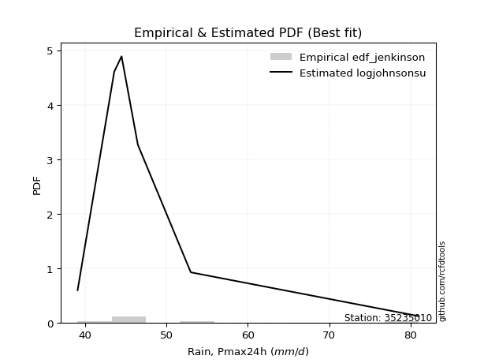</img>

</div>


### 11. EDF Cunnane (1978)

Cunnane´s work in statistical hydrology has focused on the performance and evaluation of different probability distributions (such as GEV, Gumbel, Lognormal) for flood frequency estimation. _b_ is a constant, typically set to 0.4.

<div align="center">


$P=(m-b)/(n+1-2b)$


</div>


**11.1. Empirical values**

<div align="center">

|                | 0                   | 1                   | 2                  | 3           | 4                  | 5                  | 6                  |
|:---------------|:--------------------|:--------------------|:-------------------|:------------|:-------------------|:-------------------|:-------------------|
| date           | 2019                | 2022                | 2023               | 2021        | 2020               | 2025               | 2024               |
| x              | 39.1                | 43.6                | 44.5               | 46.5        | 53.0               | 57.7               | 81.0               |
| m              | 1                   | 2                   | 3                  | 4           | 5                  | 6                  | 7                  |
| empirical_dist | edf_cunnane         | edf_cunnane         | edf_cunnane        | edf_cunnane | edf_cunnane        | edf_cunnane        | edf_cunnane        |
| empirical      | 0.08333333333333333 | 0.22222222222222224 | 0.3611111111111111 | 0.5         | 0.6388888888888888 | 0.7777777777777777 | 0.9166666666666666 |
| empirical_tr   | 1.090909090909091   | 1.2857142857142856  | 1.565217391304348  | 2.0         | 2.7692307692307687 | 4.499999999999998  | 11.999999999999995 |

</div>


**11.2. Kolmogorov-Smirnov fit test (sorted by Δ)**


<div align="center">

|                | 0                   | 1                    | 2                    | 3                   | 4                   | 5                   | 6                    | 7                    | 8                   | 9                   | 10                  | 11                  | 12                  | 13                  | 14                  | 15                  | 16                  | 17                  | 18                  | 19                  | 20                  | 21                  | 22                  | 23                  | 24                  | 25                  | 26                  | 27                  | 28                  | 29                  | 30                  | 31                  | 32                  | 33                  | 34                  | 35                  | 36                  | 37                  | 38                  | 39                  | 40                  | 41                  | 42                  | 43                  | 44                  | 45                  | 46                  | 47                  | 48                  | 49                  | 50                  | 51                  | 52                  | 53                  | 54                  | 55                  | 56                  | 57                  | 58                  | 59                  | 60                  | 61                  | 62                  | 63                  | 64                  | 65                  | 66                  | 67                  | 68                  | 69                  | 70                  | 71                  | 72                  | 73                  | 74                  | 75                  | 76                  | 77                  | 78                  | 79                  | 80                  | 81                  | 82                  | 83                  | 84                  | 85                  | 86                  | 87                  | 88                  | 89                  | 90                  | 91                  | 92                  | 93                  | 94                  | 95                  | 96                  | 97                  | 98                  | 99                  | 100                 | 101                 | 102                 | 103                 | 104                 | 105                 | 106                 | 107                 | 108                 | 109                 | 110                 | 111                 | 112                 | 113                 | 114                 | 115                 | 116                 | 117                 | 118                 | 119                 | 120                 | 121                 | 122                 | 123                 | 124                 | 125                 | 126                 | 127                 | 128                 | 129                 | 130                 | 131                 | 132                 | 133                 | 134                 | 135                 | 136                 | 137                 | 138                 | 139                 | 140                 | 141                 | 142                 | 143                 | 144                 | 145                 | 146                 | 147                 | 148                 | 149                 | 150                 | 151                 | 152                 | 153                 | 154                 | 155                 | 156                 | 157                 | 158                 | 159                 |
|:---------------|:--------------------|:---------------------|:---------------------|:--------------------|:--------------------|:--------------------|:---------------------|:---------------------|:--------------------|:--------------------|:--------------------|:--------------------|:--------------------|:--------------------|:--------------------|:--------------------|:--------------------|:--------------------|:--------------------|:--------------------|:--------------------|:--------------------|:--------------------|:--------------------|:--------------------|:--------------------|:--------------------|:--------------------|:--------------------|:--------------------|:--------------------|:--------------------|:--------------------|:--------------------|:--------------------|:--------------------|:--------------------|:--------------------|:--------------------|:--------------------|:--------------------|:--------------------|:--------------------|:--------------------|:--------------------|:--------------------|:--------------------|:--------------------|:--------------------|:--------------------|:--------------------|:--------------------|:--------------------|:--------------------|:--------------------|:--------------------|:--------------------|:--------------------|:--------------------|:--------------------|:--------------------|:--------------------|:--------------------|:--------------------|:--------------------|:--------------------|:--------------------|:--------------------|:--------------------|:--------------------|:--------------------|:--------------------|:--------------------|:--------------------|:--------------------|:--------------------|:--------------------|:--------------------|:--------------------|:--------------------|:--------------------|:--------------------|:--------------------|:--------------------|:--------------------|:--------------------|:--------------------|:--------------------|:--------------------|:--------------------|:--------------------|:--------------------|:--------------------|:--------------------|:--------------------|:--------------------|:--------------------|:--------------------|:--------------------|:--------------------|:--------------------|:--------------------|:--------------------|:--------------------|:--------------------|:--------------------|:--------------------|:--------------------|:--------------------|:--------------------|:--------------------|:--------------------|:--------------------|:--------------------|:--------------------|:--------------------|:--------------------|:--------------------|:--------------------|:--------------------|:--------------------|:--------------------|:--------------------|:--------------------|:--------------------|:--------------------|:--------------------|:--------------------|:--------------------|:--------------------|:--------------------|:--------------------|:--------------------|:--------------------|:--------------------|:--------------------|:--------------------|:--------------------|:--------------------|:--------------------|:--------------------|:--------------------|:--------------------|:--------------------|:--------------------|:--------------------|:--------------------|:--------------------|:--------------------|:--------------------|:--------------------|:--------------------|:--------------------|:--------------------|:--------------------|:--------------------|:--------------------|:--------------------|:--------------------|:--------------------|
| station        | 35235010            | 35235010             | 35235010             | 35235010            | 35235010            | 35235010            | 35235010             | 35235010             | 35235010            | 35235010            | 35235010            | 35235010            | 35235010            | 35235010            | 35235010            | 35235010            | 35235010            | 35235010            | 35235010            | 35235010            | 35235010            | 35235010            | 35235010            | 35235010            | 35235010            | 35235010            | 35235010            | 35235010            | 35235010            | 35235010            | 35235010            | 35235010            | 35235010            | 35235010            | 35235010            | 35235010            | 35235010            | 35235010            | 35235010            | 35235010            | 35235010            | 35235010            | 35235010            | 35235010            | 35235010            | 35235010            | 35235010            | 35235010            | 35235010            | 35235010            | 35235010            | 35235010            | 35235010            | 35235010            | 35235010            | 35235010            | 35235010            | 35235010            | 35235010            | 35235010            | 35235010            | 35235010            | 35235010            | 35235010            | 35235010            | 35235010            | 35235010            | 35235010            | 35235010            | 35235010            | 35235010            | 35235010            | 35235010            | 35235010            | 35235010            | 35235010            | 35235010            | 35235010            | 35235010            | 35235010            | 35235010            | 35235010            | 35235010            | 35235010            | 35235010            | 35235010            | 35235010            | 35235010            | 35235010            | 35235010            | 35235010            | 35235010            | 35235010            | 35235010            | 35235010            | 35235010            | 35235010            | 35235010            | 35235010            | 35235010            | 35235010            | 35235010            | 35235010            | 35235010            | 35235010            | 35235010            | 35235010            | 35235010            | 35235010            | 35235010            | 35235010            | 35235010            | 35235010            | 35235010            | 35235010            | 35235010            | 35235010            | 35235010            | 35235010            | 35235010            | 35235010            | 35235010            | 35235010            | 35235010            | 35235010            | 35235010            | 35235010            | 35235010            | 35235010            | 35235010            | 35235010            | 35235010            | 35235010            | 35235010            | 35235010            | 35235010            | 35235010            | 35235010            | 35235010            | 35235010            | 35235010            | 35235010            | 35235010            | 35235010            | 35235010            | 35235010            | 35235010            | 35235010            | 35235010            | 35235010            | 35235010            | 35235010            | 35235010            | 35235010            | 35235010            | 35235010            | 35235010            | 35235010            | 35235010            | 35235010            |
| empirical_dist | edf_cunnane         | edf_cunnane          | edf_cunnane          | edf_cunnane         | edf_cunnane         | edf_cunnane         | edf_cunnane          | edf_cunnane          | edf_cunnane         | edf_cunnane         | edf_cunnane         | edf_cunnane         | edf_cunnane         | edf_cunnane         | edf_cunnane         | edf_cunnane         | edf_cunnane         | edf_cunnane         | edf_cunnane         | edf_cunnane         | edf_cunnane         | edf_cunnane         | edf_cunnane         | edf_cunnane         | edf_cunnane         | edf_cunnane         | edf_cunnane         | edf_cunnane         | edf_cunnane         | edf_cunnane         | edf_cunnane         | edf_cunnane         | edf_cunnane         | edf_cunnane         | edf_cunnane         | edf_cunnane         | edf_cunnane         | edf_cunnane         | edf_cunnane         | edf_cunnane         | edf_cunnane         | edf_cunnane         | edf_cunnane         | edf_cunnane         | edf_cunnane         | edf_cunnane         | edf_cunnane         | edf_cunnane         | edf_cunnane         | edf_cunnane         | edf_cunnane         | edf_cunnane         | edf_cunnane         | edf_cunnane         | edf_cunnane         | edf_cunnane         | edf_cunnane         | edf_cunnane         | edf_cunnane         | edf_cunnane         | edf_cunnane         | edf_cunnane         | edf_cunnane         | edf_cunnane         | edf_cunnane         | edf_cunnane         | edf_cunnane         | edf_cunnane         | edf_cunnane         | edf_cunnane         | edf_cunnane         | edf_cunnane         | edf_cunnane         | edf_cunnane         | edf_cunnane         | edf_cunnane         | edf_cunnane         | edf_cunnane         | edf_cunnane         | edf_cunnane         | edf_cunnane         | edf_cunnane         | edf_cunnane         | edf_cunnane         | edf_cunnane         | edf_cunnane         | edf_cunnane         | edf_cunnane         | edf_cunnane         | edf_cunnane         | edf_cunnane         | edf_cunnane         | edf_cunnane         | edf_cunnane         | edf_cunnane         | edf_cunnane         | edf_cunnane         | edf_cunnane         | edf_cunnane         | edf_cunnane         | edf_cunnane         | edf_cunnane         | edf_cunnane         | edf_cunnane         | edf_cunnane         | edf_cunnane         | edf_cunnane         | edf_cunnane         | edf_cunnane         | edf_cunnane         | edf_cunnane         | edf_cunnane         | edf_cunnane         | edf_cunnane         | edf_cunnane         | edf_cunnane         | edf_cunnane         | edf_cunnane         | edf_cunnane         | edf_cunnane         | edf_cunnane         | edf_cunnane         | edf_cunnane         | edf_cunnane         | edf_cunnane         | edf_cunnane         | edf_cunnane         | edf_cunnane         | edf_cunnane         | edf_cunnane         | edf_cunnane         | edf_cunnane         | edf_cunnane         | edf_cunnane         | edf_cunnane         | edf_cunnane         | edf_cunnane         | edf_cunnane         | edf_cunnane         | edf_cunnane         | edf_cunnane         | edf_cunnane         | edf_cunnane         | edf_cunnane         | edf_cunnane         | edf_cunnane         | edf_cunnane         | edf_cunnane         | edf_cunnane         | edf_cunnane         | edf_cunnane         | edf_cunnane         | edf_cunnane         | edf_cunnane         | edf_cunnane         | edf_cunnane         | edf_cunnane         | edf_cunnane         | edf_cunnane         | edf_cunnane         |
| p_dist         | logburr12           | logexponnorm         | invweibull           | genextreme          | logf                | loginvgamma         | f                    | invgamma             | loginvweibull       | loggenextreme       | alpha               | logjohnsonsu        | loginvgauss         | loghalflogistic     | logmielke           | logfatiguelife      | johnsonsu           | invgauss            | loghalfnorm         | exponnorm           | loggenexpon         | loghalfgennorm      | genexpon            | loggompertz         | lomax               | gompertz            | wald                | logtruncnorm        | halflogistic        | logmoyal            | logfoldnorm         | halfnorm            | logwald             | foldnorm            | logvonmises_line    | burr                | logburr             | logpearson3         | pearson3            | bradford            | loggumbel_r         | logweibull_max      | loggenlogistic      | logbradford         | mielke              | logbetaprime        | lograyleigh         | moyal               | nakagami            | logalpha            | vonmises_line       | logskewnorm         | logexponweib        | burr12              | truncpareto         | lognct              | logmaxwell          | logkstwobign        | logsemicircular     | gumbel_r            | rayleigh            | loggennorm          | loganglit           | logloglaplace       | logncf              | logtruncweibull_min | genhalflogistic     | maxwell             | genlogistic         | nct                 | loglomax            | semicircular        | logarcsine          | anglit              | betaprime           | logexponpow         | logloggamma         | dgamma              | logt                | logcrystalball      | lognorm             | loggausshyper       | logdweibull         | logrice             | logweibull_min      | ncf                 | t                   | kstwobign           | crystalball         | norm                | truncnorm           | logtruncexpon       | loglogistic         | arcsine             | tukeylambda         | loghypsecant        | logistic            | skewnorm            | logcosine           | halfgennorm         | logbeta             | gennorm             | rice                | logdgamma           | hypsecant           | truncweibull_min    | loggumbel_l         | loglaplace          | loglaplace          | cosine              | loggengamma         | rdist               | triang              | gumbel_l            | laplace             | logargus            | truncexpon          | logksone            | logkappa4           | loguniform          | logkappa3           | logwrapcauchy       | genpareto           | dweibull            | beta                | wrapcauchy          | lognakagami         | argus               | logtriang           | kappa4              | ksone               | weibull_min         | uniform             | kappa3              | loglevy_l           | levy_l              | logerlang           | gengamma            | loggamma            | loggamma            | loggenhalflogistic  | exponpow            | johnsonsb           | powerlaw            | logjohnsonsb        | logtrapezoid        | logpowerlaw         | fatiguelife         | gausshyper          | loggenpareto        | exponweib           | trapezoid           | erlang              | gamma               | logtruncpareto      | weibull_max         | logtukeylambda      | logrdist            | logvonmises         | vonmises            |
| delta          | 0.0566419194380616  | 0.057006695601462515 | 0.058888920594854094 | 0.05889080757713552 | 0.05968650550526272 | 0.05968685596917933 | 0.060960960050325336 | 0.061455401462089526 | 0.06154381992632246 | 0.06155350255416531 | 0.06356123321313417 | 0.06611103349583361 | 0.07014886239596066 | 0.07229569124950687 | 0.07237555360887205 | 0.0775636855921231  | 0.0785275625518794  | 0.07906261890651126 | 0.07920096616378688 | 0.08172964178126536 | 0.08329703231297973 | 0.08333327748919517 | 0.08333333329559832 | 0.08333333332416304 | 0.08333333333332946 | 0.08333333333333279 | 0.08333333333333333 | 0.08537042107730489 | 0.0877635309976098  | 0.08842320951082838 | 0.09066799216105548 | 0.0925113886927672  | 0.09483279910007214 | 0.09553899322081863 | 0.09599379076159692 | 0.09743717917593114 | 0.09878457789911843 | 0.10017198560522522 | 0.10271110619694657 | 0.10444017331897426 | 0.10589647017888365 | 0.10679800658524191 | 0.10726700054416982 | 0.10738781227269065 | 0.10913457764922169 | 0.1095846724093854  | 0.10961731969998662 | 0.11004786283469481 | 0.11017104540055722 | 0.11039677484687432 | 0.11061727984710984 | 0.11535303024613475 | 0.11878890980713294 | 0.1199346490115156  | 0.12111891651064324 | 0.12124353973142349 | 0.12164046311930538 | 0.12173753155790257 | 0.12473666861344779 | 0.12537995487219744 | 0.1260372453862788  | 0.12813800122314534 | 0.1332002377463204  | 0.13365284723204796 | 0.13470639504267323 | 0.13477521908642737 | 0.13743238295216376 | 0.13782270154167242 | 0.13952900073155933 | 0.14137013054904052 | 0.1426205437216043  | 0.14492886448450437 | 0.14655054862576078 | 0.14676580260841787 | 0.1472562109139377  | 0.14904272873538726 | 0.14969031330094185 | 0.15246420836928554 | 0.1524881955298345  | 0.15336694849370563 | 0.15336695111751242 | 0.15467476836929966 | 0.1577062460473042  | 0.15817397180875997 | 0.15889614685684864 | 0.1604077978231367  | 0.16224590207793033 | 0.16590502359673615 | 0.16849678793376388 | 0.16849679185816757 | 0.16849679201742157 | 0.16887830450315328 | 0.17159563182722587 | 0.18168454189972982 | 0.18326312525408728 | 0.18568656601478306 | 0.18791556724487657 | 0.18934363773400426 | 0.19343687547673571 | 0.1936017143505637  | 0.19548405461589155 | 0.19595695149276415 | 0.19832956161266402 | 0.19862743809141314 | 0.20262503403113663 | 0.2102471660334894  | 0.21280409516762178 | 0.21376743887680555 | 0.21376743887680555 | 0.21588374838357116 | 0.21934814167826142 | 0.22127888000386364 | 0.22271621989425933 | 0.22537511341256444 | 0.2300216637426704  | 0.24728655919820053 | 0.2479573263744539  | 0.24920616389381278 | 0.24993300676036873 | 0.2620163471506911  | 0.26491935068751543 | 0.26630969238408764 | 0.2733885864572379  | 0.27777777777789703 | 0.291386834271843   | 0.2966468564871654  | 0.29703179487332043 | 0.31178724434792937 | 0.3131791406301304  | 0.314402286319407   | 0.32451604348979046 | 0.332839928092203   | 0.3338636966321929  | 0.33469449454426164 | 0.33749490768542695 | 0.3540341026576634  | 0.3697482037087997  | 0.37454401732174936 | 0.37887597734560174 | 0.37887597734560174 | 0.3854741749657514  | 0.39416895874233926 | 0.4589923340263554  | 0.4803420742958924  | 0.4876665857161986  | 0.4983898267738784  | 0.5041202089380316  | 0.5147169059076906  | 0.5190280746415132  | 0.5254847664233114  | 0.5388234665953993  | 0.5723315780080238  | 0.6090837918665452  | 0.6152341586631409  | 0.6463575140242582  | 0.6606479233075865  | 0.9166657388669274  | 0.9166666637154542  | 1.064558142430688   | 12.191092729040987  |
| deltao         | 0.48442053926100004 | 0.48442053926100004  | 0.48442053926100004  | 0.48442053926100004 | 0.48442053926100004 | 0.48442053926100004 | 0.48442053926100004  | 0.48442053926100004  | 0.48442053926100004 | 0.48442053926100004 | 0.48442053926100004 | 0.48442053926100004 | 0.48442053926100004 | 0.48442053926100004 | 0.48442053926100004 | 0.48442053926100004 | 0.48442053926100004 | 0.48442053926100004 | 0.48442053926100004 | 0.48442053926100004 | 0.48442053926100004 | 0.48442053926100004 | 0.48442053926100004 | 0.48442053926100004 | 0.48442053926100004 | 0.48442053926100004 | 0.48442053926100004 | 0.48442053926100004 | 0.48442053926100004 | 0.48442053926100004 | 0.48442053926100004 | 0.48442053926100004 | 0.48442053926100004 | 0.48442053926100004 | 0.48442053926100004 | 0.48442053926100004 | 0.48442053926100004 | 0.48442053926100004 | 0.48442053926100004 | 0.48442053926100004 | 0.48442053926100004 | 0.48442053926100004 | 0.48442053926100004 | 0.48442053926100004 | 0.48442053926100004 | 0.48442053926100004 | 0.48442053926100004 | 0.48442053926100004 | 0.48442053926100004 | 0.48442053926100004 | 0.48442053926100004 | 0.48442053926100004 | 0.48442053926100004 | 0.48442053926100004 | 0.48442053926100004 | 0.48442053926100004 | 0.48442053926100004 | 0.48442053926100004 | 0.48442053926100004 | 0.48442053926100004 | 0.48442053926100004 | 0.48442053926100004 | 0.48442053926100004 | 0.48442053926100004 | 0.48442053926100004 | 0.48442053926100004 | 0.48442053926100004 | 0.48442053926100004 | 0.48442053926100004 | 0.48442053926100004 | 0.48442053926100004 | 0.48442053926100004 | 0.48442053926100004 | 0.48442053926100004 | 0.48442053926100004 | 0.48442053926100004 | 0.48442053926100004 | 0.48442053926100004 | 0.48442053926100004 | 0.48442053926100004 | 0.48442053926100004 | 0.48442053926100004 | 0.48442053926100004 | 0.48442053926100004 | 0.48442053926100004 | 0.48442053926100004 | 0.48442053926100004 | 0.48442053926100004 | 0.48442053926100004 | 0.48442053926100004 | 0.48442053926100004 | 0.48442053926100004 | 0.48442053926100004 | 0.48442053926100004 | 0.48442053926100004 | 0.48442053926100004 | 0.48442053926100004 | 0.48442053926100004 | 0.48442053926100004 | 0.48442053926100004 | 0.48442053926100004 | 0.48442053926100004 | 0.48442053926100004 | 0.48442053926100004 | 0.48442053926100004 | 0.48442053926100004 | 0.48442053926100004 | 0.48442053926100004 | 0.48442053926100004 | 0.48442053926100004 | 0.48442053926100004 | 0.48442053926100004 | 0.48442053926100004 | 0.48442053926100004 | 0.48442053926100004 | 0.48442053926100004 | 0.48442053926100004 | 0.48442053926100004 | 0.48442053926100004 | 0.48442053926100004 | 0.48442053926100004 | 0.48442053926100004 | 0.48442053926100004 | 0.48442053926100004 | 0.48442053926100004 | 0.48442053926100004 | 0.48442053926100004 | 0.48442053926100004 | 0.48442053926100004 | 0.48442053926100004 | 0.48442053926100004 | 0.48442053926100004 | 0.48442053926100004 | 0.48442053926100004 | 0.48442053926100004 | 0.48442053926100004 | 0.48442053926100004 | 0.48442053926100004 | 0.48442053926100004 | 0.48442053926100004 | 0.48442053926100004 | 0.48442053926100004 | 0.48442053926100004 | 0.48442053926100004 | 0.48442053926100004 | 0.48442053926100004 | 0.48442053926100004 | 0.48442053926100004 | 0.48442053926100004 | 0.48442053926100004 | 0.48442053926100004 | 0.48442053926100004 | 0.48442053926100004 | 0.48442053926100004 | 0.48442053926100004 | 0.48442053926100004 | 0.48442053926100004 | 0.48442053926100004 | 0.48442053926100004 | 0.48442053926100004 |
| eval           | Δo > Δ              | Δo > Δ               | Δo > Δ               | Δo > Δ              | Δo > Δ              | Δo > Δ              | Δo > Δ               | Δo > Δ               | Δo > Δ              | Δo > Δ              | Δo > Δ              | Δo > Δ              | Δo > Δ              | Δo > Δ              | Δo > Δ              | Δo > Δ              | Δo > Δ              | Δo > Δ              | Δo > Δ              | Δo > Δ              | Δo > Δ              | Δo > Δ              | Δo > Δ              | Δo > Δ              | Δo > Δ              | Δo > Δ              | Δo > Δ              | Δo > Δ              | Δo > Δ              | Δo > Δ              | Δo > Δ              | Δo > Δ              | Δo > Δ              | Δo > Δ              | Δo > Δ              | Δo > Δ              | Δo > Δ              | Δo > Δ              | Δo > Δ              | Δo > Δ              | Δo > Δ              | Δo > Δ              | Δo > Δ              | Δo > Δ              | Δo > Δ              | Δo > Δ              | Δo > Δ              | Δo > Δ              | Δo > Δ              | Δo > Δ              | Δo > Δ              | Δo > Δ              | Δo > Δ              | Δo > Δ              | Δo > Δ              | Δo > Δ              | Δo > Δ              | Δo > Δ              | Δo > Δ              | Δo > Δ              | Δo > Δ              | Δo > Δ              | Δo > Δ              | Δo > Δ              | Δo > Δ              | Δo > Δ              | Δo > Δ              | Δo > Δ              | Δo > Δ              | Δo > Δ              | Δo > Δ              | Δo > Δ              | Δo > Δ              | Δo > Δ              | Δo > Δ              | Δo > Δ              | Δo > Δ              | Δo > Δ              | Δo > Δ              | Δo > Δ              | Δo > Δ              | Δo > Δ              | Δo > Δ              | Δo > Δ              | Δo > Δ              | Δo > Δ              | Δo > Δ              | Δo > Δ              | Δo > Δ              | Δo > Δ              | Δo > Δ              | Δo > Δ              | Δo > Δ              | Δo > Δ              | Δo > Δ              | Δo > Δ              | Δo > Δ              | Δo > Δ              | Δo > Δ              | Δo > Δ              | Δo > Δ              | Δo > Δ              | Δo > Δ              | Δo > Δ              | Δo > Δ              | Δo > Δ              | Δo > Δ              | Δo > Δ              | Δo > Δ              | Δo > Δ              | Δo > Δ              | Δo > Δ              | Δo > Δ              | Δo > Δ              | Δo > Δ              | Δo > Δ              | Δo > Δ              | Δo > Δ              | Δo > Δ              | Δo > Δ              | Δo > Δ              | Δo > Δ              | Δo > Δ              | Δo > Δ              | Δo > Δ              | Δo > Δ              | Δo > Δ              | Δo > Δ              | Δo > Δ              | Δo > Δ              | Δo > Δ              | Δo > Δ              | Δo > Δ              | Δo > Δ              | Δo > Δ              | Δo > Δ              | Δo > Δ              | Δo > Δ              | Δo > Δ              | Δo > Δ              | Δo > Δ              | Δo > Δ              | Δo > Δ              | Δo > Δ              | Δo <= Δ             | Δo <= Δ             | Δo <= Δ             | Δo <= Δ             | Δo <= Δ             | Δo <= Δ             | Δo <= Δ             | Δo <= Δ             | Δo <= Δ             | Δo <= Δ             | Δo <= Δ             | Δo <= Δ             | Δo <= Δ             | Δo <= Δ             | Δo <= Δ             | Δo <= Δ             |
| fit            | 1                   | 1                    | 1                    | 1                   | 1                   | 1                   | 1                    | 1                    | 1                   | 1                   | 1                   | 1                   | 1                   | 1                   | 1                   | 1                   | 1                   | 1                   | 1                   | 1                   | 1                   | 1                   | 1                   | 1                   | 1                   | 1                   | 1                   | 1                   | 1                   | 1                   | 1                   | 1                   | 1                   | 1                   | 1                   | 1                   | 1                   | 1                   | 1                   | 1                   | 1                   | 1                   | 1                   | 1                   | 1                   | 1                   | 1                   | 1                   | 1                   | 1                   | 1                   | 1                   | 1                   | 1                   | 1                   | 1                   | 1                   | 1                   | 1                   | 1                   | 1                   | 1                   | 1                   | 1                   | 1                   | 1                   | 1                   | 1                   | 1                   | 1                   | 1                   | 1                   | 1                   | 1                   | 1                   | 1                   | 1                   | 1                   | 1                   | 1                   | 1                   | 1                   | 1                   | 1                   | 1                   | 1                   | 1                   | 1                   | 1                   | 1                   | 1                   | 1                   | 1                   | 1                   | 1                   | 1                   | 1                   | 1                   | 1                   | 1                   | 1                   | 1                   | 1                   | 1                   | 1                   | 1                   | 1                   | 1                   | 1                   | 1                   | 1                   | 1                   | 1                   | 1                   | 1                   | 1                   | 1                   | 1                   | 1                   | 1                   | 1                   | 1                   | 1                   | 1                   | 1                   | 1                   | 1                   | 1                   | 1                   | 1                   | 1                   | 1                   | 1                   | 1                   | 1                   | 1                   | 1                   | 1                   | 1                   | 1                   | 1                   | 1                   | 1                   | 1                   | 0                   | 0                   | 0                   | 0                   | 0                   | 0                   | 0                   | 0                   | 0                   | 0                   | 0                   | 0                   | 0                   | 0                   | 0                   | 0                   |
| n              | 7                   | 7                    | 7                    | 7                   | 7                   | 7                   | 7                    | 7                    | 7                   | 7                   | 7                   | 7                   | 7                   | 7                   | 7                   | 7                   | 7                   | 7                   | 7                   | 7                   | 7                   | 7                   | 7                   | 7                   | 7                   | 7                   | 7                   | 7                   | 7                   | 7                   | 7                   | 7                   | 7                   | 7                   | 7                   | 7                   | 7                   | 7                   | 7                   | 7                   | 7                   | 7                   | 7                   | 7                   | 7                   | 7                   | 7                   | 7                   | 7                   | 7                   | 7                   | 7                   | 7                   | 7                   | 7                   | 7                   | 7                   | 7                   | 7                   | 7                   | 7                   | 7                   | 7                   | 7                   | 7                   | 7                   | 7                   | 7                   | 7                   | 7                   | 7                   | 7                   | 7                   | 7                   | 7                   | 7                   | 7                   | 7                   | 7                   | 7                   | 7                   | 7                   | 7                   | 7                   | 7                   | 7                   | 7                   | 7                   | 7                   | 7                   | 7                   | 7                   | 7                   | 7                   | 7                   | 7                   | 7                   | 7                   | 7                   | 7                   | 7                   | 7                   | 7                   | 7                   | 7                   | 7                   | 7                   | 7                   | 7                   | 7                   | 7                   | 7                   | 7                   | 7                   | 7                   | 7                   | 7                   | 7                   | 7                   | 7                   | 7                   | 7                   | 7                   | 7                   | 7                   | 7                   | 7                   | 7                   | 7                   | 7                   | 7                   | 7                   | 7                   | 7                   | 7                   | 7                   | 7                   | 7                   | 7                   | 7                   | 7                   | 7                   | 7                   | 7                   | 7                   | 7                   | 7                   | 7                   | 7                   | 7                   | 7                   | 7                   | 7                   | 7                   | 7                   | 7                   | 7                   | 7                   | 7                   | 7                   |
| best_fit       | 1                   | 0                    | 0                    | 0                   | 0                   | 0                   | 0                    | 0                    | 0                   | 0                   | 0                   | 0                   | 0                   | 0                   | 0                   | 0                   | 0                   | 0                   | 0                   | 0                   | 0                   | 0                   | 0                   | 0                   | 0                   | 0                   | 0                   | 0                   | 0                   | 0                   | 0                   | 0                   | 0                   | 0                   | 0                   | 0                   | 0                   | 0                   | 0                   | 0                   | 0                   | 0                   | 0                   | 0                   | 0                   | 0                   | 0                   | 0                   | 0                   | 0                   | 0                   | 0                   | 0                   | 0                   | 0                   | 0                   | 0                   | 0                   | 0                   | 0                   | 0                   | 0                   | 0                   | 0                   | 0                   | 0                   | 0                   | 0                   | 0                   | 0                   | 0                   | 0                   | 0                   | 0                   | 0                   | 0                   | 0                   | 0                   | 0                   | 0                   | 0                   | 0                   | 0                   | 0                   | 0                   | 0                   | 0                   | 0                   | 0                   | 0                   | 0                   | 0                   | 0                   | 0                   | 0                   | 0                   | 0                   | 0                   | 0                   | 0                   | 0                   | 0                   | 0                   | 0                   | 0                   | 0                   | 0                   | 0                   | 0                   | 0                   | 0                   | 0                   | 0                   | 0                   | 0                   | 0                   | 0                   | 0                   | 0                   | 0                   | 0                   | 0                   | 0                   | 0                   | 0                   | 0                   | 0                   | 0                   | 0                   | 0                   | 0                   | 0                   | 0                   | 0                   | 0                   | 0                   | 0                   | 0                   | 0                   | 0                   | 0                   | 0                   | 0                   | 0                   | 0                   | 0                   | 0                   | 0                   | 0                   | 0                   | 0                   | 0                   | 0                   | 0                   | 0                   | 0                   | 0                   | 0                   | 0                   | 0                   |
| best_fit_sort  | 1                   | 2                    | 3                    | 4                   | 5                   | 6                   | 7                    | 8                    | 9                   | 10                  | 11                  | 12                  | 13                  | 14                  | 15                  | 16                  | 17                  | 18                  | 19                  | 20                  | 21                  | 22                  | 23                  | 24                  | 25                  | 26                  | 27                  | 28                  | 29                  | 30                  | 31                  | 32                  | 33                  | 34                  | 35                  | 36                  | 37                  | 38                  | 39                  | 40                  | 41                  | 42                  | 43                  | 44                  | 45                  | 46                  | 47                  | 48                  | 49                  | 50                  | 51                  | 52                  | 53                  | 54                  | 55                  | 56                  | 57                  | 58                  | 59                  | 60                  | 61                  | 62                  | 63                  | 64                  | 65                  | 66                  | 67                  | 68                  | 69                  | 70                  | 71                  | 72                  | 73                  | 74                  | 75                  | 76                  | 77                  | 78                  | 79                  | 80                  | 81                  | 82                  | 83                  | 84                  | 85                  | 86                  | 87                  | 88                  | 89                  | 90                  | 91                  | 92                  | 93                  | 94                  | 95                  | 96                  | 97                  | 98                  | 99                  | 100                 | 101                 | 102                 | 103                 | 104                 | 105                 | 106                 | 107                 | 108                 | 109                 | 110                 | 111                 | 112                 | 113                 | 114                 | 115                 | 116                 | 117                 | 118                 | 119                 | 120                 | 121                 | 122                 | 123                 | 124                 | 125                 | 126                 | 127                 | 128                 | 129                 | 130                 | 131                 | 132                 | 133                 | 134                 | 135                 | 136                 | 137                 | 138                 | 139                 | 140                 | 141                 | 142                 | 143                 | 144                 | 145                 | 146                 | 147                 | 148                 | 149                 | 150                 | 151                 | 152                 | 153                 | 154                 | 155                 | 156                 | 157                 | 158                 | 159                 | 160                 |

</div>


**11.3. Best fit**

<div align="center">

|   id |   station | empirical_dist   | p_dist    |     delta |   deltao | eval   |   fit |   n |   best_fit |   best_fit_sort |
|-----:|----------:|:-----------------|:----------|----------:|---------:|:-------|------:|----:|-----------:|----------------:|
|    0 |  35235010 | edf_cunnane      | logburr12 | 0.0566419 | 0.484421 | Δo > Δ |     1 |   7 |          1 |               1 |

</div>


<div align="center">

</img>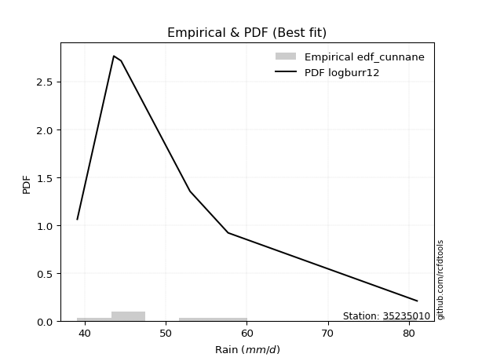</img>

</div>


### 12. EDF Adamowski (1981)

The Adamowski formula in hydrology refers to a specific plotting position formula used for estimating the non-parametric empirical distribution of hydrological events (like flood peaks) to calculate their return periods. This formula provides an alternative to traditional parametric methods (like the Gumbel or Log Pearson Type III distributions). 

<div align="center">


$P=(m-0.25)/(n+0.5)$


</div>


**12.1. Empirical values**

<div align="center">

|                | 0                  | 1                   | 2                   | 3             | 4                  | 5                  | 6                  |
|:---------------|:-------------------|:--------------------|:--------------------|:--------------|:-------------------|:-------------------|:-------------------|
| date           | 2019               | 2022                | 2023                | 2021          | 2020               | 2025               | 2024               |
| x              | 39.1               | 43.6                | 44.5                | 46.5          | 53.0               | 57.7               | 81.0               |
| m              | 1                  | 2                   | 3                   | 4             | 5                  | 6                  | 7                  |
| empirical_dist | edf_adamowski      | edf_adamowski       | edf_adamowski       | edf_adamowski | edf_adamowski      | edf_adamowski      | edf_adamowski      |
| empirical      | 0.1                | 0.23333333333333334 | 0.36666666666666664 | 0.5           | 0.6333333333333333 | 0.7666666666666667 | 0.9                |
| empirical_tr   | 1.1111111111111112 | 1.3043478260869565  | 1.5789473684210527  | 2.0           | 2.727272727272727  | 4.2857142857142865 | 10.000000000000002 |

</div>


**12.2. Kolmogorov-Smirnov fit test (sorted by Δ)**


<div align="center">

|                | 0                    | 1                    | 2                   | 3                   | 4                   | 5                   | 6                   | 7                   | 8                   | 9                   | 10                  | 11                  | 12                  | 13                  | 14                  | 15                  | 16                  | 17                  | 18                  | 19                  | 20                  | 21                  | 22                  | 23                  | 24                  | 25                  | 26                  | 27                  | 28                  | 29                  | 30                  | 31                  | 32                  | 33                  | 34                  | 35                  | 36                  | 37                  | 38                  | 39                  | 40                  | 41                  | 42                  | 43                  | 44                  | 45                  | 46                  | 47                  | 48                  | 49                  | 50                  | 51                  | 52                  | 53                  | 54                  | 55                  | 56                  | 57                  | 58                  | 59                  | 60                  | 61                  | 62                  | 63                  | 64                  | 65                  | 66                  | 67                  | 68                  | 69                  | 70                  | 71                  | 72                  | 73                  | 74                  | 75                  | 76                  | 77                  | 78                  | 79                  | 80                  | 81                  | 82                  | 83                  | 84                  | 85                  | 86                  | 87                  | 88                  | 89                  | 90                  | 91                  | 92                  | 93                  | 94                  | 95                  | 96                  | 97                  | 98                  | 99                  | 100                 | 101                 | 102                 | 103                 | 104                 | 105                 | 106                 | 107                 | 108                 | 109                 | 110                 | 111                 | 112                 | 113                 | 114                 | 115                 | 116                 | 117                 | 118                 | 119                 | 120                 | 121                 | 122                 | 123                 | 124                 | 125                 | 126                 | 127                 | 128                 | 129                 | 130                 | 131                 | 132                 | 133                 | 134                 | 135                 | 136                 | 137                 | 138                 | 139                 | 140                 | 141                 | 142                 | 143                 | 144                 | 145                 | 146                 | 147                 | 148                 | 149                 | 150                 | 151                 | 152                 | 153                 | 154                 | 155                 | 156                 | 157                 | 158                 | 159                 |
|:---------------|:---------------------|:---------------------|:--------------------|:--------------------|:--------------------|:--------------------|:--------------------|:--------------------|:--------------------|:--------------------|:--------------------|:--------------------|:--------------------|:--------------------|:--------------------|:--------------------|:--------------------|:--------------------|:--------------------|:--------------------|:--------------------|:--------------------|:--------------------|:--------------------|:--------------------|:--------------------|:--------------------|:--------------------|:--------------------|:--------------------|:--------------------|:--------------------|:--------------------|:--------------------|:--------------------|:--------------------|:--------------------|:--------------------|:--------------------|:--------------------|:--------------------|:--------------------|:--------------------|:--------------------|:--------------------|:--------------------|:--------------------|:--------------------|:--------------------|:--------------------|:--------------------|:--------------------|:--------------------|:--------------------|:--------------------|:--------------------|:--------------------|:--------------------|:--------------------|:--------------------|:--------------------|:--------------------|:--------------------|:--------------------|:--------------------|:--------------------|:--------------------|:--------------------|:--------------------|:--------------------|:--------------------|:--------------------|:--------------------|:--------------------|:--------------------|:--------------------|:--------------------|:--------------------|:--------------------|:--------------------|:--------------------|:--------------------|:--------------------|:--------------------|:--------------------|:--------------------|:--------------------|:--------------------|:--------------------|:--------------------|:--------------------|:--------------------|:--------------------|:--------------------|:--------------------|:--------------------|:--------------------|:--------------------|:--------------------|:--------------------|:--------------------|:--------------------|:--------------------|:--------------------|:--------------------|:--------------------|:--------------------|:--------------------|:--------------------|:--------------------|:--------------------|:--------------------|:--------------------|:--------------------|:--------------------|:--------------------|:--------------------|:--------------------|:--------------------|:--------------------|:--------------------|:--------------------|:--------------------|:--------------------|:--------------------|:--------------------|:--------------------|:--------------------|:--------------------|:--------------------|:--------------------|:--------------------|:--------------------|:--------------------|:--------------------|:--------------------|:--------------------|:--------------------|:--------------------|:--------------------|:--------------------|:--------------------|:--------------------|:--------------------|:--------------------|:--------------------|:--------------------|:--------------------|:--------------------|:--------------------|:--------------------|:--------------------|:--------------------|:--------------------|:--------------------|:--------------------|:--------------------|:--------------------|:--------------------|:--------------------|
| station        | 35235010             | 35235010             | 35235010            | 35235010            | 35235010            | 35235010            | 35235010            | 35235010            | 35235010            | 35235010            | 35235010            | 35235010            | 35235010            | 35235010            | 35235010            | 35235010            | 35235010            | 35235010            | 35235010            | 35235010            | 35235010            | 35235010            | 35235010            | 35235010            | 35235010            | 35235010            | 35235010            | 35235010            | 35235010            | 35235010            | 35235010            | 35235010            | 35235010            | 35235010            | 35235010            | 35235010            | 35235010            | 35235010            | 35235010            | 35235010            | 35235010            | 35235010            | 35235010            | 35235010            | 35235010            | 35235010            | 35235010            | 35235010            | 35235010            | 35235010            | 35235010            | 35235010            | 35235010            | 35235010            | 35235010            | 35235010            | 35235010            | 35235010            | 35235010            | 35235010            | 35235010            | 35235010            | 35235010            | 35235010            | 35235010            | 35235010            | 35235010            | 35235010            | 35235010            | 35235010            | 35235010            | 35235010            | 35235010            | 35235010            | 35235010            | 35235010            | 35235010            | 35235010            | 35235010            | 35235010            | 35235010            | 35235010            | 35235010            | 35235010            | 35235010            | 35235010            | 35235010            | 35235010            | 35235010            | 35235010            | 35235010            | 35235010            | 35235010            | 35235010            | 35235010            | 35235010            | 35235010            | 35235010            | 35235010            | 35235010            | 35235010            | 35235010            | 35235010            | 35235010            | 35235010            | 35235010            | 35235010            | 35235010            | 35235010            | 35235010            | 35235010            | 35235010            | 35235010            | 35235010            | 35235010            | 35235010            | 35235010            | 35235010            | 35235010            | 35235010            | 35235010            | 35235010            | 35235010            | 35235010            | 35235010            | 35235010            | 35235010            | 35235010            | 35235010            | 35235010            | 35235010            | 35235010            | 35235010            | 35235010            | 35235010            | 35235010            | 35235010            | 35235010            | 35235010            | 35235010            | 35235010            | 35235010            | 35235010            | 35235010            | 35235010            | 35235010            | 35235010            | 35235010            | 35235010            | 35235010            | 35235010            | 35235010            | 35235010            | 35235010            | 35235010            | 35235010            | 35235010            | 35235010            | 35235010            | 35235010            |
| empirical_dist | edf_adamowski        | edf_adamowski        | edf_adamowski       | edf_adamowski       | edf_adamowski       | edf_adamowski       | edf_adamowski       | edf_adamowski       | edf_adamowski       | edf_adamowski       | edf_adamowski       | edf_adamowski       | edf_adamowski       | edf_adamowski       | edf_adamowski       | edf_adamowski       | edf_adamowski       | edf_adamowski       | edf_adamowski       | edf_adamowski       | edf_adamowski       | edf_adamowski       | edf_adamowski       | edf_adamowski       | edf_adamowski       | edf_adamowski       | edf_adamowski       | edf_adamowski       | edf_adamowski       | edf_adamowski       | edf_adamowski       | edf_adamowski       | edf_adamowski       | edf_adamowski       | edf_adamowski       | edf_adamowski       | edf_adamowski       | edf_adamowski       | edf_adamowski       | edf_adamowski       | edf_adamowski       | edf_adamowski       | edf_adamowski       | edf_adamowski       | edf_adamowski       | edf_adamowski       | edf_adamowski       | edf_adamowski       | edf_adamowski       | edf_adamowski       | edf_adamowski       | edf_adamowski       | edf_adamowski       | edf_adamowski       | edf_adamowski       | edf_adamowski       | edf_adamowski       | edf_adamowski       | edf_adamowski       | edf_adamowski       | edf_adamowski       | edf_adamowski       | edf_adamowski       | edf_adamowski       | edf_adamowski       | edf_adamowski       | edf_adamowski       | edf_adamowski       | edf_adamowski       | edf_adamowski       | edf_adamowski       | edf_adamowski       | edf_adamowski       | edf_adamowski       | edf_adamowski       | edf_adamowski       | edf_adamowski       | edf_adamowski       | edf_adamowski       | edf_adamowski       | edf_adamowski       | edf_adamowski       | edf_adamowski       | edf_adamowski       | edf_adamowski       | edf_adamowski       | edf_adamowski       | edf_adamowski       | edf_adamowski       | edf_adamowski       | edf_adamowski       | edf_adamowski       | edf_adamowski       | edf_adamowski       | edf_adamowski       | edf_adamowski       | edf_adamowski       | edf_adamowski       | edf_adamowski       | edf_adamowski       | edf_adamowski       | edf_adamowski       | edf_adamowski       | edf_adamowski       | edf_adamowski       | edf_adamowski       | edf_adamowski       | edf_adamowski       | edf_adamowski       | edf_adamowski       | edf_adamowski       | edf_adamowski       | edf_adamowski       | edf_adamowski       | edf_adamowski       | edf_adamowski       | edf_adamowski       | edf_adamowski       | edf_adamowski       | edf_adamowski       | edf_adamowski       | edf_adamowski       | edf_adamowski       | edf_adamowski       | edf_adamowski       | edf_adamowski       | edf_adamowski       | edf_adamowski       | edf_adamowski       | edf_adamowski       | edf_adamowski       | edf_adamowski       | edf_adamowski       | edf_adamowski       | edf_adamowski       | edf_adamowski       | edf_adamowski       | edf_adamowski       | edf_adamowski       | edf_adamowski       | edf_adamowski       | edf_adamowski       | edf_adamowski       | edf_adamowski       | edf_adamowski       | edf_adamowski       | edf_adamowski       | edf_adamowski       | edf_adamowski       | edf_adamowski       | edf_adamowski       | edf_adamowski       | edf_adamowski       | edf_adamowski       | edf_adamowski       | edf_adamowski       | edf_adamowski       | edf_adamowski       | edf_adamowski       | edf_adamowski       |
| p_dist         | logburr12            | logexponnorm         | genextreme          | invweibull          | f                   | invgamma            | logf                | loginvgamma         | loginvgauss         | logjohnsonsu        | loginvweibull       | loggenextreme       | alpha               | logfatiguelife      | johnsonsu           | invgauss            | logmielke           | loghalfnorm         | halflogistic        | logmoyal            | foldnorm            | loghalflogistic     | logfoldnorm         | halfnorm            | burr                | exponnorm           | logburr             | loggenexpon         | logtruncnorm        | logvonmises_line    | loghalfgennorm      | nakagami            | genexpon            | loggompertz         | logbradford         | lomax               | gompertz            | wald                | logpearson3         | logwald             | pearson3            | bradford            | loggumbel_r         | logweibull_max      | logbetaprime        | loggenlogistic      | logexponweib        | burr12              | mielke              | lograyleigh         | truncpareto         | moyal               | logalpha            | vonmises_line       | logskewnorm         | lognct              | logmaxwell          | logkstwobign        | logsemicircular     | gumbel_r            | rayleigh            | loglomax            | loganglit           | loggennorm          | logncf              | logtruncweibull_min | logarcsine          | genhalflogistic     | semicircular        | maxwell             | logexponpow         | logloglaplace       | genlogistic         | nct                 | anglit              | betaprime           | logweibull_min      | logloggamma         | logt                | logcrystalball      | lognorm             | loggausshyper       | dgamma              | logrice             | ncf                 | t                   | logdweibull         | kstwobign           | crystalball         | norm                | truncnorm           | logtruncexpon       | arcsine             | loglogistic         | halfgennorm         | logbeta             | loghypsecant        | logistic            | skewnorm            | logcosine           | tukeylambda         | rice                | truncweibull_min    | gennorm             | hypsecant           | logdgamma           | loggengamma         | loggumbel_l         | loglaplace          | loglaplace          | cosine              | triang              | gumbel_l            | laplace             | rdist               | logksone            | logargus            | truncexpon          | logkappa4           | logwrapcauchy       | genpareto           | loguniform          | logkappa3           | dweibull            | beta                | wrapcauchy          | lognakagami         | argus               | logtriang           | kappa4              | ksone               | loglevy_l           | weibull_min         | uniform             | kappa3              | levy_l              | logerlang           | gengamma            | loggamma            | loggamma            | loggenhalflogistic  | exponpow            | johnsonsb           | powerlaw            | logjohnsonsb        | logtrapezoid        | logpowerlaw         | fatiguelife         | gausshyper          | loggenpareto        | exponweib           | trapezoid           | erlang              | gamma               | logtruncpareto      | weibull_max         | logtukeylambda      | logrdist            | logvonmises         | vonmises            |
| delta          | 0.055336788476824106 | 0.056455508600708054 | 0.05728011341189133 | 0.05728054491379062 | 0.0583928879775325  | 0.05867944918840491 | 0.05968650550526272 | 0.05968685596917933 | 0.06089534628676474 | 0.06098493017342668 | 0.06154381992632246 | 0.06155350255416531 | 0.06356123321313417 | 0.066452574481012   | 0.0674164514407683  | 0.06795150779540016 | 0.07237555360887205 | 0.07539749056473172 | 0.0877635309976098  | 0.08842320951082838 | 0.08865608921079304 | 0.08896235791617355 | 0.09066799216105548 | 0.0925113886927672  | 0.09743717917593114 | 0.09839630844793204 | 0.09878457789911843 | 0.09996369897964641 | 0.09999926708362616 | 0.09999992940119862 | 0.09999994415586184 | 0.09999999387542917 | 0.099999999962265   | 0.09999999999082972 | 0.09999999999502196 | 0.09999999999999613 | 0.09999999999999946 | 0.1                 | 0.10017198560522522 | 0.10038835465562768 | 0.10271110619694657 | 0.10444017331897426 | 0.10589647017888365 | 0.10679800658524191 | 0.10723542597298669 | 0.10726700054416982 | 0.10767779869602184 | 0.1088235379004045  | 0.10913457764922169 | 0.10961731969998662 | 0.11000780539953214 | 0.11004786283469481 | 0.11039677484687432 | 0.11061727984710984 | 0.11535303024613475 | 0.12124353973142349 | 0.12164046311930538 | 0.12173753155790257 | 0.12473666861344779 | 0.12537995487219744 | 0.1260372453862788  | 0.1315094326104932  | 0.1332002377463204  | 0.13369355677870087 | 0.13470639504267323 | 0.13477521908642737 | 0.13543943751464982 | 0.13743238295216376 | 0.13760287002750266 | 0.13782270154167242 | 0.1379316176242763  | 0.1392084027876035  | 0.13952900073155933 | 0.14137013054904052 | 0.14676580260841787 | 0.1472562109139377  | 0.14778503574573754 | 0.14969031330094185 | 0.1524881955298345  | 0.15336694849370563 | 0.15336695111751242 | 0.15467476836929966 | 0.15801976392484107 | 0.15817397180875997 | 0.1604077978231367  | 0.16224590207793033 | 0.16326180160285975 | 0.16590502359673615 | 0.16849678793376388 | 0.16849679185816757 | 0.16849679201742157 | 0.16887830450315328 | 0.17057343078861886 | 0.17159563182722587 | 0.1824906032394526  | 0.18437294350478045 | 0.18568656601478306 | 0.18791556724487657 | 0.18934363773400426 | 0.19343687547673571 | 0.19437423636519824 | 0.19832956161266402 | 0.1991360549223783  | 0.2015125070483197  | 0.20262503403113663 | 0.20418299364696868 | 0.20823703056715032 | 0.21280409516762178 | 0.21376743887680555 | 0.21376743887680555 | 0.21588374838357116 | 0.22271621989425933 | 0.22537511341256444 | 0.2300216637426704  | 0.2323899911149746  | 0.23809505278270182 | 0.24728655919820053 | 0.2479573263744539  | 0.24993300676036873 | 0.2551985812729767  | 0.25672191979057124 | 0.2620163471506911  | 0.26491935068751543 | 0.2666666666667859  | 0.28027572316073185 | 0.2855357453760544  | 0.2859206837622093  | 0.3006761332368184  | 0.30206802951901945 | 0.303291175208296   | 0.3134049323786795  | 0.3208282410187603  | 0.32172881698109185 | 0.3233890214797136  | 0.32371955374879124 | 0.3373674359909967  | 0.35863709259768856 | 0.36343290621063823 | 0.3677648662344906  | 0.3677648662344906  | 0.37436306385464047 | 0.38305784763122813 | 0.4478812229152443  | 0.46923096318478125 | 0.47655547460508746 | 0.4872787156627674  | 0.49300909782692043 | 0.5036057947965795  | 0.5079169635304022  | 0.5088180997566448  | 0.5277123554842882  | 0.5612204668969127  | 0.597972680755434   | 0.6041230475520298  | 0.635246402913147   | 0.6495368121964755  | 0.8999990722002608  | 0.8999999970487876  | 1.0812248090973546  | 12.207759395707653  |
| deltao         | 0.48442053926100004  | 0.48442053926100004  | 0.48442053926100004 | 0.48442053926100004 | 0.48442053926100004 | 0.48442053926100004 | 0.48442053926100004 | 0.48442053926100004 | 0.48442053926100004 | 0.48442053926100004 | 0.48442053926100004 | 0.48442053926100004 | 0.48442053926100004 | 0.48442053926100004 | 0.48442053926100004 | 0.48442053926100004 | 0.48442053926100004 | 0.48442053926100004 | 0.48442053926100004 | 0.48442053926100004 | 0.48442053926100004 | 0.48442053926100004 | 0.48442053926100004 | 0.48442053926100004 | 0.48442053926100004 | 0.48442053926100004 | 0.48442053926100004 | 0.48442053926100004 | 0.48442053926100004 | 0.48442053926100004 | 0.48442053926100004 | 0.48442053926100004 | 0.48442053926100004 | 0.48442053926100004 | 0.48442053926100004 | 0.48442053926100004 | 0.48442053926100004 | 0.48442053926100004 | 0.48442053926100004 | 0.48442053926100004 | 0.48442053926100004 | 0.48442053926100004 | 0.48442053926100004 | 0.48442053926100004 | 0.48442053926100004 | 0.48442053926100004 | 0.48442053926100004 | 0.48442053926100004 | 0.48442053926100004 | 0.48442053926100004 | 0.48442053926100004 | 0.48442053926100004 | 0.48442053926100004 | 0.48442053926100004 | 0.48442053926100004 | 0.48442053926100004 | 0.48442053926100004 | 0.48442053926100004 | 0.48442053926100004 | 0.48442053926100004 | 0.48442053926100004 | 0.48442053926100004 | 0.48442053926100004 | 0.48442053926100004 | 0.48442053926100004 | 0.48442053926100004 | 0.48442053926100004 | 0.48442053926100004 | 0.48442053926100004 | 0.48442053926100004 | 0.48442053926100004 | 0.48442053926100004 | 0.48442053926100004 | 0.48442053926100004 | 0.48442053926100004 | 0.48442053926100004 | 0.48442053926100004 | 0.48442053926100004 | 0.48442053926100004 | 0.48442053926100004 | 0.48442053926100004 | 0.48442053926100004 | 0.48442053926100004 | 0.48442053926100004 | 0.48442053926100004 | 0.48442053926100004 | 0.48442053926100004 | 0.48442053926100004 | 0.48442053926100004 | 0.48442053926100004 | 0.48442053926100004 | 0.48442053926100004 | 0.48442053926100004 | 0.48442053926100004 | 0.48442053926100004 | 0.48442053926100004 | 0.48442053926100004 | 0.48442053926100004 | 0.48442053926100004 | 0.48442053926100004 | 0.48442053926100004 | 0.48442053926100004 | 0.48442053926100004 | 0.48442053926100004 | 0.48442053926100004 | 0.48442053926100004 | 0.48442053926100004 | 0.48442053926100004 | 0.48442053926100004 | 0.48442053926100004 | 0.48442053926100004 | 0.48442053926100004 | 0.48442053926100004 | 0.48442053926100004 | 0.48442053926100004 | 0.48442053926100004 | 0.48442053926100004 | 0.48442053926100004 | 0.48442053926100004 | 0.48442053926100004 | 0.48442053926100004 | 0.48442053926100004 | 0.48442053926100004 | 0.48442053926100004 | 0.48442053926100004 | 0.48442053926100004 | 0.48442053926100004 | 0.48442053926100004 | 0.48442053926100004 | 0.48442053926100004 | 0.48442053926100004 | 0.48442053926100004 | 0.48442053926100004 | 0.48442053926100004 | 0.48442053926100004 | 0.48442053926100004 | 0.48442053926100004 | 0.48442053926100004 | 0.48442053926100004 | 0.48442053926100004 | 0.48442053926100004 | 0.48442053926100004 | 0.48442053926100004 | 0.48442053926100004 | 0.48442053926100004 | 0.48442053926100004 | 0.48442053926100004 | 0.48442053926100004 | 0.48442053926100004 | 0.48442053926100004 | 0.48442053926100004 | 0.48442053926100004 | 0.48442053926100004 | 0.48442053926100004 | 0.48442053926100004 | 0.48442053926100004 | 0.48442053926100004 | 0.48442053926100004 | 0.48442053926100004 | 0.48442053926100004 |
| eval           | Δo > Δ               | Δo > Δ               | Δo > Δ              | Δo > Δ              | Δo > Δ              | Δo > Δ              | Δo > Δ              | Δo > Δ              | Δo > Δ              | Δo > Δ              | Δo > Δ              | Δo > Δ              | Δo > Δ              | Δo > Δ              | Δo > Δ              | Δo > Δ              | Δo > Δ              | Δo > Δ              | Δo > Δ              | Δo > Δ              | Δo > Δ              | Δo > Δ              | Δo > Δ              | Δo > Δ              | Δo > Δ              | Δo > Δ              | Δo > Δ              | Δo > Δ              | Δo > Δ              | Δo > Δ              | Δo > Δ              | Δo > Δ              | Δo > Δ              | Δo > Δ              | Δo > Δ              | Δo > Δ              | Δo > Δ              | Δo > Δ              | Δo > Δ              | Δo > Δ              | Δo > Δ              | Δo > Δ              | Δo > Δ              | Δo > Δ              | Δo > Δ              | Δo > Δ              | Δo > Δ              | Δo > Δ              | Δo > Δ              | Δo > Δ              | Δo > Δ              | Δo > Δ              | Δo > Δ              | Δo > Δ              | Δo > Δ              | Δo > Δ              | Δo > Δ              | Δo > Δ              | Δo > Δ              | Δo > Δ              | Δo > Δ              | Δo > Δ              | Δo > Δ              | Δo > Δ              | Δo > Δ              | Δo > Δ              | Δo > Δ              | Δo > Δ              | Δo > Δ              | Δo > Δ              | Δo > Δ              | Δo > Δ              | Δo > Δ              | Δo > Δ              | Δo > Δ              | Δo > Δ              | Δo > Δ              | Δo > Δ              | Δo > Δ              | Δo > Δ              | Δo > Δ              | Δo > Δ              | Δo > Δ              | Δo > Δ              | Δo > Δ              | Δo > Δ              | Δo > Δ              | Δo > Δ              | Δo > Δ              | Δo > Δ              | Δo > Δ              | Δo > Δ              | Δo > Δ              | Δo > Δ              | Δo > Δ              | Δo > Δ              | Δo > Δ              | Δo > Δ              | Δo > Δ              | Δo > Δ              | Δo > Δ              | Δo > Δ              | Δo > Δ              | Δo > Δ              | Δo > Δ              | Δo > Δ              | Δo > Δ              | Δo > Δ              | Δo > Δ              | Δo > Δ              | Δo > Δ              | Δo > Δ              | Δo > Δ              | Δo > Δ              | Δo > Δ              | Δo > Δ              | Δo > Δ              | Δo > Δ              | Δo > Δ              | Δo > Δ              | Δo > Δ              | Δo > Δ              | Δo > Δ              | Δo > Δ              | Δo > Δ              | Δo > Δ              | Δo > Δ              | Δo > Δ              | Δo > Δ              | Δo > Δ              | Δo > Δ              | Δo > Δ              | Δo > Δ              | Δo > Δ              | Δo > Δ              | Δo > Δ              | Δo > Δ              | Δo > Δ              | Δo > Δ              | Δo > Δ              | Δo > Δ              | Δo > Δ              | Δo > Δ              | Δo > Δ              | Δo > Δ              | Δo <= Δ             | Δo <= Δ             | Δo <= Δ             | Δo <= Δ             | Δo <= Δ             | Δo <= Δ             | Δo <= Δ             | Δo <= Δ             | Δo <= Δ             | Δo <= Δ             | Δo <= Δ             | Δo <= Δ             | Δo <= Δ             | Δo <= Δ             | Δo <= Δ             |
| fit            | 1                    | 1                    | 1                   | 1                   | 1                   | 1                   | 1                   | 1                   | 1                   | 1                   | 1                   | 1                   | 1                   | 1                   | 1                   | 1                   | 1                   | 1                   | 1                   | 1                   | 1                   | 1                   | 1                   | 1                   | 1                   | 1                   | 1                   | 1                   | 1                   | 1                   | 1                   | 1                   | 1                   | 1                   | 1                   | 1                   | 1                   | 1                   | 1                   | 1                   | 1                   | 1                   | 1                   | 1                   | 1                   | 1                   | 1                   | 1                   | 1                   | 1                   | 1                   | 1                   | 1                   | 1                   | 1                   | 1                   | 1                   | 1                   | 1                   | 1                   | 1                   | 1                   | 1                   | 1                   | 1                   | 1                   | 1                   | 1                   | 1                   | 1                   | 1                   | 1                   | 1                   | 1                   | 1                   | 1                   | 1                   | 1                   | 1                   | 1                   | 1                   | 1                   | 1                   | 1                   | 1                   | 1                   | 1                   | 1                   | 1                   | 1                   | 1                   | 1                   | 1                   | 1                   | 1                   | 1                   | 1                   | 1                   | 1                   | 1                   | 1                   | 1                   | 1                   | 1                   | 1                   | 1                   | 1                   | 1                   | 1                   | 1                   | 1                   | 1                   | 1                   | 1                   | 1                   | 1                   | 1                   | 1                   | 1                   | 1                   | 1                   | 1                   | 1                   | 1                   | 1                   | 1                   | 1                   | 1                   | 1                   | 1                   | 1                   | 1                   | 1                   | 1                   | 1                   | 1                   | 1                   | 1                   | 1                   | 1                   | 1                   | 1                   | 1                   | 1                   | 1                   | 0                   | 0                   | 0                   | 0                   | 0                   | 0                   | 0                   | 0                   | 0                   | 0                   | 0                   | 0                   | 0                   | 0                   | 0                   |
| n              | 7                    | 7                    | 7                   | 7                   | 7                   | 7                   | 7                   | 7                   | 7                   | 7                   | 7                   | 7                   | 7                   | 7                   | 7                   | 7                   | 7                   | 7                   | 7                   | 7                   | 7                   | 7                   | 7                   | 7                   | 7                   | 7                   | 7                   | 7                   | 7                   | 7                   | 7                   | 7                   | 7                   | 7                   | 7                   | 7                   | 7                   | 7                   | 7                   | 7                   | 7                   | 7                   | 7                   | 7                   | 7                   | 7                   | 7                   | 7                   | 7                   | 7                   | 7                   | 7                   | 7                   | 7                   | 7                   | 7                   | 7                   | 7                   | 7                   | 7                   | 7                   | 7                   | 7                   | 7                   | 7                   | 7                   | 7                   | 7                   | 7                   | 7                   | 7                   | 7                   | 7                   | 7                   | 7                   | 7                   | 7                   | 7                   | 7                   | 7                   | 7                   | 7                   | 7                   | 7                   | 7                   | 7                   | 7                   | 7                   | 7                   | 7                   | 7                   | 7                   | 7                   | 7                   | 7                   | 7                   | 7                   | 7                   | 7                   | 7                   | 7                   | 7                   | 7                   | 7                   | 7                   | 7                   | 7                   | 7                   | 7                   | 7                   | 7                   | 7                   | 7                   | 7                   | 7                   | 7                   | 7                   | 7                   | 7                   | 7                   | 7                   | 7                   | 7                   | 7                   | 7                   | 7                   | 7                   | 7                   | 7                   | 7                   | 7                   | 7                   | 7                   | 7                   | 7                   | 7                   | 7                   | 7                   | 7                   | 7                   | 7                   | 7                   | 7                   | 7                   | 7                   | 7                   | 7                   | 7                   | 7                   | 7                   | 7                   | 7                   | 7                   | 7                   | 7                   | 7                   | 7                   | 7                   | 7                   | 7                   |
| best_fit       | 1                    | 0                    | 0                   | 0                   | 0                   | 0                   | 0                   | 0                   | 0                   | 0                   | 0                   | 0                   | 0                   | 0                   | 0                   | 0                   | 0                   | 0                   | 0                   | 0                   | 0                   | 0                   | 0                   | 0                   | 0                   | 0                   | 0                   | 0                   | 0                   | 0                   | 0                   | 0                   | 0                   | 0                   | 0                   | 0                   | 0                   | 0                   | 0                   | 0                   | 0                   | 0                   | 0                   | 0                   | 0                   | 0                   | 0                   | 0                   | 0                   | 0                   | 0                   | 0                   | 0                   | 0                   | 0                   | 0                   | 0                   | 0                   | 0                   | 0                   | 0                   | 0                   | 0                   | 0                   | 0                   | 0                   | 0                   | 0                   | 0                   | 0                   | 0                   | 0                   | 0                   | 0                   | 0                   | 0                   | 0                   | 0                   | 0                   | 0                   | 0                   | 0                   | 0                   | 0                   | 0                   | 0                   | 0                   | 0                   | 0                   | 0                   | 0                   | 0                   | 0                   | 0                   | 0                   | 0                   | 0                   | 0                   | 0                   | 0                   | 0                   | 0                   | 0                   | 0                   | 0                   | 0                   | 0                   | 0                   | 0                   | 0                   | 0                   | 0                   | 0                   | 0                   | 0                   | 0                   | 0                   | 0                   | 0                   | 0                   | 0                   | 0                   | 0                   | 0                   | 0                   | 0                   | 0                   | 0                   | 0                   | 0                   | 0                   | 0                   | 0                   | 0                   | 0                   | 0                   | 0                   | 0                   | 0                   | 0                   | 0                   | 0                   | 0                   | 0                   | 0                   | 0                   | 0                   | 0                   | 0                   | 0                   | 0                   | 0                   | 0                   | 0                   | 0                   | 0                   | 0                   | 0                   | 0                   | 0                   |
| best_fit_sort  | 1                    | 2                    | 3                   | 4                   | 5                   | 6                   | 7                   | 8                   | 9                   | 10                  | 11                  | 12                  | 13                  | 14                  | 15                  | 16                  | 17                  | 18                  | 19                  | 20                  | 21                  | 22                  | 23                  | 24                  | 25                  | 26                  | 27                  | 28                  | 29                  | 30                  | 31                  | 32                  | 33                  | 34                  | 35                  | 36                  | 37                  | 38                  | 39                  | 40                  | 41                  | 42                  | 43                  | 44                  | 45                  | 46                  | 47                  | 48                  | 49                  | 50                  | 51                  | 52                  | 53                  | 54                  | 55                  | 56                  | 57                  | 58                  | 59                  | 60                  | 61                  | 62                  | 63                  | 64                  | 65                  | 66                  | 67                  | 68                  | 69                  | 70                  | 71                  | 72                  | 73                  | 74                  | 75                  | 76                  | 77                  | 78                  | 79                  | 80                  | 81                  | 82                  | 83                  | 84                  | 85                  | 86                  | 87                  | 88                  | 89                  | 90                  | 91                  | 92                  | 93                  | 94                  | 95                  | 96                  | 97                  | 98                  | 99                  | 100                 | 101                 | 102                 | 103                 | 104                 | 105                 | 106                 | 107                 | 108                 | 109                 | 110                 | 111                 | 112                 | 113                 | 114                 | 115                 | 116                 | 117                 | 118                 | 119                 | 120                 | 121                 | 122                 | 123                 | 124                 | 125                 | 126                 | 127                 | 128                 | 129                 | 130                 | 131                 | 132                 | 133                 | 134                 | 135                 | 136                 | 137                 | 138                 | 139                 | 140                 | 141                 | 142                 | 143                 | 144                 | 145                 | 146                 | 147                 | 148                 | 149                 | 150                 | 151                 | 152                 | 153                 | 154                 | 155                 | 156                 | 157                 | 158                 | 159                 | 160                 |

</div>


**12.3. Best fit**

<div align="center">

|   id |   station | empirical_dist   | p_dist    |     delta |   deltao | eval   |   fit |   n |   best_fit |   best_fit_sort |
|-----:|----------:|:-----------------|:----------|----------:|---------:|:-------|------:|----:|-----------:|----------------:|
|    0 |  35235010 | edf_adamowski    | logburr12 | 0.0553368 | 0.484421 | Δo > Δ |     1 |   7 |          1 |               1 |

</div>


<div align="center">

</img>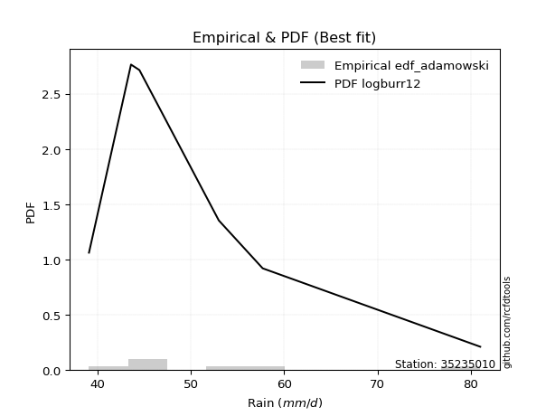</img>

</div>


## C. Best fit & Estimate extreme values for specific return periods - Tr

Best fit in probability distribution analysis means finding the theoretical distribution (like Normal, Poisson, Exponential, etc.) that most accurately mirrors your real-world data´s patterns (shape, center, spread) for better predictions, using methods like visual checks (Q-Q plots), goodness-of-fit tests (Kolmogorov-Smirnov, Chi-Squared), and information criteria (AIC) to score and select the simplest, most representative model.


### 1. Best fit (ordered by delta Δ)

:file_folder:Table: [bestfit_35235010.csv](table/bestfit_35235010.csv)

<div align="center">

|   id |   station | empirical_dist   | p_dist        |     delta |   deltao | eval   |   fit |   n |   best_fit |   best_fit_sort |
|-----:|----------:|:-----------------|:--------------|----------:|---------:|:-------|------:|----:|-----------:|----------------:|
|    0 |  35235010 | edf_tukey        | logburr12     | 0.0523065 | 0.484421 | Δo > Δ |     1 |   7 |          1 |               1 |
|    1 |  35235010 | edf_filliben     | logburr12     | 0.0528928 | 0.484421 | Δo > Δ |     1 |   7 |          1 |               2 |
|    2 |  35235010 | edf_jenkinson    | logburr12     | 0.0531688 | 0.484421 | Δo > Δ |     1 |   7 |          1 |               3 |
|    3 |  35235010 | edf_beard        | logburr12     | 0.0531688 | 0.484421 | Δo > Δ |     1 |   7 |          1 |               4 |
|    4 |  35235010 | edf_chegodayev   | logburr12     | 0.053535  | 0.484421 | Δo > Δ |     1 |   7 |          1 |               5 |
|    5 |  35235010 | edf_blom         | logburr12     | 0.0547262 | 0.484421 | Δo > Δ |     1 |   7 |          1 |               6 |
|    6 |  35235010 | edf_adamowski    | logburr12     | 0.0553368 | 0.484421 | Δo > Δ |     1 |   7 |          1 |               7 |
|    7 |  35235010 | edf_cunnane      | logburr12     | 0.0566419 | 0.484421 | Δo > Δ |     1 |   7 |          1 |               8 |
|    8 |  35235010 | edf_gringorten   | logf          | 0.0596865 | 0.484421 | Δo > Δ |     1 |   7 |          1 |               9 |
|    9 |  35235010 | edf_hazen        | loginvweibull | 0.0615438 | 0.484421 | Δo > Δ |     1 |   7 |          1 |              10 |
|   10 |  35235010 | edf_california   | loggennorm    | 0.0714284 | 0.484421 | Δo > Δ |     1 |   7 |          1 |              11 |
|   11 |  35235010 | edf_weibull      | logmielke     | 0.0741806 | 0.484421 | Δo > Δ |     1 |   7 |          1 |              12 |

</div>


### 2. Extreme values and % difference analysis

In hydrology, a return period (or recurrence interval $Tr$) is the statistical average time between extreme events like floods or droughts of a specific magnitude, indicating how rare an event is, with a 100-year flood, for example, having a 1% chance of occurring in any given year, not that it happens exactly every century. It is a key tool for infrastructure design (like bridges or dams) and risk assessment, calculated from historical data to determine the probability of future events, although it is important to remember it is statistical average, and events can cluster or be missed.

The extreme value porcentage difference is evaluated as $pdiff = 1 - (ETrBf / ETr) * 100$, where _ETrBf_ correspond to the bestfit extreme value for a specific recurrence interval and _ETr_ correspond to the extreme value for one of the most used PDFsused in hydrology.

> risk_rate: assuming the return period as the project useful life.

:file_folder:Table: [extreme_35235010.csv](table/extreme_35235010.csv), all PDFs.  
:file_folder:Table: [extremepdiff_35235010.csv](table/extremepdiff_35235010.csv), % difference between bestfit and most used PDFs in Hydrology.

<div align="center">

Extreme values table for only best fit PDFs
|   id |      tr |   prob_l |     prob_g |    alpha |   anglit |   arcsine |   argus |    beta |   betaprime |   bradford |     burr |   burr12 |   cosine |   crystalball |   dgamma |   dweibull |   erlang |   exponnorm |   exponpow |   exponweib |        f |   fatiguelife |   foldnorm |   gamma |   gausshyper |   genexpon |   genextreme |    gengamma |   genhalflogistic |   genlogistic |   gennorm |   genpareto |   gompertz |   gumbel_l |   gumbel_r |   halfgennorm |   halflogistic |   halfnorm |   hypsecant |   invgamma |   invgauss |   invweibull |   johnsonsb |   johnsonsu |   kappa3 |   kappa4 |   ksone |   kstwobign |   laplace |   levy_l |   loggamma |   logistic |   loglaplace |    lomax |   maxwell |   mielke |    moyal |   nakagami |     ncf |      nct |    norm |   pearson3 |   powerlaw |   rayleigh |   rdist |    rice |   semicircular |   skewnorm |        t |   trapezoid |   triang |   truncexpon |   truncnorm |   truncpareto |   truncweibull_min |   tukeylambda |   uniform |   vonmises |   vonmises_line |     wald |   weibull_max |   weibull_min |   wrapcauchy |   logalpha |   loganglit |   logarcsine |   logargus |   logbeta |   logbetaprime |   logbradford |   logburr |   logburr12 |   logcosine |   logcrystalball |   logdgamma |   logdweibull |   logerlang |   logexponnorm |   logexponpow |   logexponweib |     logf |   logfatiguelife |   logfoldnorm |   loggausshyper |   loggenexpon |   loggenextreme |   loggengamma |   loggenhalflogistic |   loggenlogistic |   loggennorm |   loggenpareto |   loggompertz |   loggumbel_l |   loggumbel_r |   loghalfgennorm |   loghalflogistic |   loghalfnorm |   loghypsecant |   loginvgamma |   loginvgauss |   loginvweibull |   logjohnsonsb |   logjohnsonsu |   logkappa3 |   logkappa4 |   logksone |   logkstwobign |   loglevy_l |   logloggamma |   loglogistic |   logloglaplace |   loglomax |   logmaxwell |   logmielke |   logmoyal |   lognakagami |   logncf |   lognct |   lognorm |   logpearson3 |   logpowerlaw |   lograyleigh |   logrdist |   logrice |   logsemicircular |   logskewnorm |     logt |   logtrapezoid |   logtriang |   logtruncexpon |   logtruncnorm |   logtruncpareto |   logtruncweibull_min |   logtukeylambda |   loguniform |   logvonmises |   logvonmises_line |   logwald |   logweibull_max |   logweibull_min |   logwrapcauchy |   station |   n |   risk_rate |
|-----:|--------:|---------:|-----------:|---------:|---------:|----------:|--------:|--------:|------------:|-----------:|---------:|---------:|---------:|--------------:|---------:|-----------:|---------:|------------:|-----------:|------------:|---------:|--------------:|-----------:|--------:|-------------:|-----------:|-------------:|------------:|------------------:|--------------:|----------:|------------:|-----------:|-----------:|-----------:|--------------:|---------------:|-----------:|------------:|-----------:|-----------:|-------------:|------------:|------------:|---------:|---------:|--------:|------------:|----------:|---------:|-----------:|-----------:|-------------:|---------:|----------:|---------:|---------:|-----------:|--------:|---------:|--------:|-----------:|-----------:|-----------:|--------:|--------:|---------------:|-----------:|---------:|------------:|---------:|-------------:|------------:|--------------:|-------------------:|--------------:|----------:|-----------:|----------------:|---------:|--------------:|--------------:|-------------:|-----------:|------------:|-------------:|-----------:|----------:|---------------:|--------------:|----------:|------------:|------------:|-----------------:|------------:|--------------:|------------:|---------------:|--------------:|---------------:|---------:|-----------------:|--------------:|----------------:|--------------:|----------------:|--------------:|---------------------:|-----------------:|-------------:|---------------:|--------------:|--------------:|--------------:|-----------------:|------------------:|--------------:|---------------:|--------------:|--------------:|----------------:|---------------:|---------------:|------------:|------------:|-----------:|---------------:|------------:|--------------:|--------------:|----------------:|-----------:|-------------:|------------:|-----------:|--------------:|---------:|---------:|----------:|--------------:|--------------:|--------------:|-----------:|----------:|------------------:|--------------:|---------:|---------------:|------------:|----------------:|---------------:|-----------------:|----------------------:|-----------------:|-------------:|--------------:|-------------------:|----------:|-----------------:|-----------------:|----------------:|----------:|----:|------------:|
|    0 |    2    | 0.5      | 0.5        |  47.7778 |  52.2    |   52.2    | 59.1607 | 43.182  |     50.4463 |    49.755  |  48.5237 |  46.9141 |  54.7429 |       52.2    |  46.5    |    43.6    |  39.3538 |     48.1093 |    40.3104 |     39.8791 |  47.703  |       39.1    |    49.451  | 39.3604 |      39.5183 |    48.1802 |      47.6643 |     40.1548 |           49.8015 |       49.7215 |   46.5    |     52.2615 |    48.1917 |    54.3489 |    50.0511 |       45.5007 |        48.9828 |    49.5224 |     52.2    |    47.6869 |    47.5768 |      47.6644 |     39.1175 |     47.5373 |  39.1    |  59.3149 | 60.05   |     50.7389 |   52.2    |  51.0273 |    41.7244 |    52.2    |      50.8061 |  48.0747 |   51.0813 |  48.8332 |  49.3574 |    49.3356 | 51.4465 |  50.0902 | 52.2    |    49.4274 |    39.6243 |    50.6845 | 48.4008 | 52.084  |        52.2    |    51.586  |  50.1139 |     70.4633 |  53.5617 |      55.2418 |     52.2    |       47.5639 |            45.4134 |       48.74   |   60.05   |    1.0312  |         49.3717 |  47.9599 |       80.6249 |       41.1244 |      60.05   |    48.8651 |     50.8061 |      50.8061 |    56.3898 |   45.7307 |        50.4093 |       47.7338 |   48.5663 |     47.5691 |     52.5838 |          50.8061 |     46.5    |       46.5    |     42.2957 |        47.637  |       50.9607 |        46.7398 |  47.7346 |          47.4991 |       49.1737 |         51.2807 |       47.8619 |         47.7505 |       45.3507 |              62.7514 |          48.7808 |      46.5    |        25.2541 |       48.026  |       52.7153 |       48.9661 |          48.0253 |           48.0763 |       48.5238 |        50.8061 |       47.7346 |       47.5905 |         47.7503 |        39.1298 |        47.6108 |     56.5306 |     55.9907 |    56.277  |        49.2714 |     50.3766 |       50.7699 |       50.8061 |         46.5    |    46.3697 |      49.8398 |     47.9403 |    48.3864 |       43.1953 |  49.8115 |  49.421  |   50.8061 |       48.9738 |       39.5658 |       49.5014 |    123.04  |   50.3667 |           50.8061 |       49.3433 |  50.7685 |        67.4439 |     59.2892 |         51.7245 |        47.7192 |          39.2357 |               50.5993 |               81 |      56.277  |     0.094697  |            48.6098 |   47.24   |          48.7673 |          46.1923 |         56.277  |  35235010 |   7 |    0.75     |
|    1 |    2.33 | 0.570815 | 0.429185   |  49.4016 |  54.9189 |   56.2816 | 62.1345 | 45.6999 |     52.4601 |    52.4173 |  50.1639 |  48.8578 |  57.3478 |       54.5342 |  47.3563 |    44.6879 |  39.6123 |     50.0989 |    41.8423 |     40.355  |  49.4195 |       39.4566 |    52.0129 | 39.615  |      40.0164 |    50.1808 |      49.3454 |     42.1672 |           51.7385 |       51.4883 |   46.5584 |     58.1327 |    50.1933 |    56.3797 |    52.214  |       47.5941 |        51.2066 |    52.0417 |     54.0681 |    49.4019 |    49.4281 |      49.3454 |     39.2472 |     49.362  |  39.1    |  62.4563 | 63.6106 |     52.7085 |   53.6126 |  60.1106 |    42.9465 |    54.2566 |      52.0531 |  50.0676 |   53.5064 |  50.5277 |  51.4048 |    52.4714 | 53.6571 |  52.0298 | 54.5342 |    51.6532 |    40.3111 |    53.1455 | 50.0233 | 54.1697 |        55.1161 |    53.7352 |  51.6292 |     72.8977 |  56.1284 |      58.094  |     54.5342 |       49.9981 |            47.797  |       50.1431 |   63.0172 |    1.25752 |         51.1914 |  49.4904 |       80.8272 |       44.7277 |      68.0024 |    50.5297 |     53.2336 |      54.4936 |    59.2459 |   48.041  |        53.1766 |       50.0537 |   50.2326 |     49.2521 |     54.9351 |          52.8832 |     47.0262 |       46.7818 |     43.2658 |        49.3664 |       54.3526 |        48.4888 |  49.408  |          49.2907 |       51.4766 |         53.9077 |       49.8241 |         49.3918 |       48.1454 |              65.8557 |          50.4665 |      47.7276 |        33.9396 |       50.0185 |       54.5854 |       50.8183 |          49.959  |           49.9471 |       50.6682 |        52.4618 |       49.408  |       49.3481 |         49.3915 |        39.2559 |        49.3364 |     59.5607 |     59.0518 |    59.8701 |        51.0968 |     58.1753 |       52.8766 |       52.6318 |         47.6784 |    48.3057 |      51.9583 |     49.528  |    50.1173 |       44.8233 |  51.7025 |  51.2548 |   52.8832 |       50.9365 |       40.1308 |       51.6374 |    134.718 |   52.2897 |           53.414  |       51.3596 |  52.8389 |        70.359  |     62.4289 |         54.3506 |        49.6726 |          39.3344 |               53.18   |               81 |      59.2557 |     0.0985434 |            50.2174 |   48.4975 |          50.4501 |          48.2301 |         64.6196 |  35235010 |   7 |    0.729209 |
|    2 |    5    | 0.8      | 0.2        |  58.2873 |  64.5119 |   67.1656 | 71.6735 | 61.3438 |     60.918  |    64.4281 |  57.9836 |  59.7469 |  66.7349 |       63.2088 |  53.3567 |    52.9648 |  42.5938 |     60.0465 |    69.6767 |     45.1024 |  58.7775 |       47.0314 |    62.841  | 42.4431 |      46.4737 |    60.1835 |      58.6083 |    141.167  |           60.5031 |       59.1636 |   50.304  |     73.7056 |    60.1916 |    62.9403 |    61.6106 |       61.2875 |        61.2689 |    62.6951 |     61.5613 |    58.7659 |    59.4243 |      58.6084 |     93.75   |     59.3689 |  39.1    |  72.6718 | 75.134  |     61.0749 |   60.675  |  75.1595 |    51.7692 |    62.1974 |      58.7623 |  60.1163 |   63.0513 |  58.5848 |  60.8889 |    67.5767 | 62.2789 |  60.4262 | 63.2088 |    61.5882 |    49.326  |    62.9977 | 54.912  | 62.5199 |        65.0675 |    62.8238 |  57.8514 |     79.8818 |  66.3939 |      68.842  |     63.2088 |       62.0727 |            60.2823 |       54.6475 |   72.62   |    2.14456 |         58.2773 |  58.0586 |       80.994  |      192.15   |      77.831  |    58.1052 |     62.763  |      65.6887 |    69.4202 |   60.3843 |        65.0901 |       61.5885 |   58.3429 |     58.7475 |     64.3149 |          61.3745 |     51.5354 |       53.2278 |     48.9266 |        58.985  |       73.1083 |        57.3843 |  58.5078 |          59.0933 |       61.5953 |         65.2917 |       59.8998 |         58.31   |       68.1904 |              74.7613 |          58.4917 |      54.4101 |        66.2183 |       60.1052 |       61.0924 |       59.7137 |          59.8321 |           59.3644 |       60.8358 |        59.6632 |       58.5078 |       58.9246 |         58.3097 |        65.9298 |        58.7968 |     70.5258 |     70.1363 |    73.1479 |        59.6355 |     73.8421 |       61.4619 |       60.3182 |         54.1676 |    60.4719 |      61.2089 |     57.6225 |    58.9784 |       54.25   |  60.0035 |  59.1842 |   61.3745 |       60.2303 |       47.4424 |       61.1526 |    172.015 |   60.7523 |           63.3638 |       60.8384 |  61.3071 |        79.4408 |     72.3902 |         65.5205 |        59.2388 |          41.0706 |               64.5924 |               81 |      70.0202 |     0.114289  |            57.0346 |   56.1808 |          58.4612 |          60.8096 |         76.6588 |  35235010 |   7 |    0.67232  |
|    3 |   10    | 0.9      | 0.1        |  68.9051 |  69.9417 |   69.7931 | 76.2734 | 72.7887 |     67.5153 |    71.8369 |  65.2801 |  71.5624 |  72.4062 |       68.9632 |  59.3631 |    62.0259 |  47.2763 |     69.0767 |   138.89   |     53.7072 |  69.178  |       57.4904 |    70.8452 | 46.793  |      56.1135 |    69.2636 |      69.2116 |    786.084  |           67.7817 |       65.4146 |   66.5045 |     78.4146 |    69.2549 |    66.593  |    69.2641 |       78.2403 |        69.6252 |    70.5784 |     67.5449 |    69.195  |    69.6293 |      69.2117 |    102.275  |     70.1422 |  76.8807 |  77.0553 | 80.162  |     67.4448 |   67.0861 |  78.7926 |    63.6409 |    68.0455 |      65.5986 |  69.3617 |   69.7685 |  66.0776 |  69.1462 |    79.6677 | 68.3564 |  67.2663 | 68.9632 |    69.7126 |    60.6283 |    70.0226 | 56.6254 | 68.4737 |        70.1738 |    69.5491 |  63.3335 |     82.6098 |  72.8614 |      74.5026 |     68.9632 |       70.2444 |            69.1754 |       56.5657 |   76.81   |    2.81145 |         63.7013 |  67.1513 |       80.9996 |     1001.82   |      79.5611 |    64.7657 |     68.8943 |      68.7195 |    74.9336 |   70.4892 |        74.6649 |       69.7139 |   66.1627 |     69.392  |     70.7414 |          67.7468 |     56.7133 |       66.5805 |     55.1269 |        69.3297 |       92.1601 |        65.756  |  68.8417 |          69.6816 |       69.6279 |         72.5169 |       69.5118 |         68.535  |       95.8292 |              78.1006 |          65.9615 |      61.3194 |        76.7871 |       69.425  |       65.0456 |       68.0976 |          69.2968 |           68.521  |       69.6515 |        66.1172 |       68.8418 |       69.336  |         68.5351 |        80.6065 |        69.4219 |     75.9224 |     75.5145 |    79.8287 |        67.0813 |     78.2181 |       67.8753 |       66.6879 |         61.0426 |    76.5924 |      68.6898 |     66.0246 |    67.9599 |       63.5976 |  66.8925 |  65.6311 |   67.7468 |       68.6474 |       57.7163 |       68.9901 |    182.829 |   67.6103 |           69.1684 |       68.9616 |  67.6748 |        83.2986 |     76.6996 |         72.3136 |        66.8059 |          46.0187 |               71.8602 |               81 |      75.3103 |     0.126166  |            62.8868 |   65.67   |          65.9173 |          76.279  |         78.9992 |  35235010 |   7 |    0.651322 |
|    4 |   15    | 0.933333 | 0.0666667  |  77.1009 |  72.2603 |   70.2943 | 78.0221 | 77.2943 |     71.1519 |    74.6829 |  69.8092 |  79.4647 |  74.9896 |       71.8348 |  62.9713 |    67.7361 |  50.6079 |     74.359  |   203.338  |     61.0488 |  76.4196 |       64.3307 |    75.0072 | 49.8668 |      61.9314 |    74.5752 |      76.7991 |   1896.22   |           71.9007 |       68.9412 |   87.787  |     79.5906 |    74.551  |    68.2472 |    73.5821 |       90.1329 |        74.3541 |    74.6809 |     70.9596 |    76.4672 |    76.055  |      76.7992 |    102.323  |     77.3235 |  78.28   |  78.4814 | 81.838  |     70.8264 |   70.8363 |  79.8902 |    72.5031 |    71.2318 |      69.9605 |  74.8251 |   73.2151 |  70.7186 |  73.9384 |    86.0745 | 71.4974 |  71.1492 | 71.8348 |    74.2476 |    66.1916 |    73.6422 | 57.0884 | 71.5414 |        72.1651 |    73.049  |  66.8637 |     83.4851 |  75.7266 |      76.5636 |     71.8348 |       73.5067 |            72.831  |       57.1905 |   78.2067 |    3.15414 |         66.7729 |  72.9903 |       80.9999 |     2253.2    |      80.0566 |    68.7628 |     71.6917 |      69.3132 |    77.1426 |   75.3903 |        80.0335 |       73.0674 |   71.1411 |     76.73   |     73.8779 |          71.17   |     60.1113 |       79.0013 |     59.2264 |        76.2027 |      104.077  |        70.8188 |  76.2904 |          76.7966 |       74.0472 |         75.4791 |       75.3712 |         75.9912 |      117.073  |              79.1315 |          70.5892 |      65.7723 |        79.0343 |       74.9418 |       66.9192 |       73.337  |          75.1212 |           74.3154 |       74.7334 |        70.1088 |       76.2906 |       76.4019 |         75.9918 |        80.9479 |        76.919  |     77.8114 |     77.3629 |    82.1885 |        71.4049 |     79.5903 |       71.3101 |       70.4372 |         65.5703 |    89.3836 |      72.8764 |     71.691  |    73.7869 |       69.2383 |  70.8497 |  69.2857 |   71.17   |       73.726  |       63.4012 |       73.4127 |    185.033 |   71.4408 |           71.5735 |       73.6092 |  71.1026 |        84.5756 |     78.136  |         74.9613 |        70.3971 |          50.5965 |               74.7598 |               81 |      77.161  |     0.13258   |            66.3618 |   72.5925 |          70.5362 |          87.5574 |         79.6826 |  35235010 |   7 |    0.644736 |
|    5 |   20    | 0.95     | 0.05       |  84.2285 |  73.6242 |   70.4708 | 78.982  | 79.6658 |     73.6704 |    76.1843 |  73.1722 | inf      |  76.5783 |       73.7154 |  65.5584 |    71.934  |  53.1684 |     78.1069 |   260.497  |     67.42   |  82.183  |       69.3951 |    77.7806 | 52.2231 |      65.7508 |    78.3438 |      82.9514 |   3322.38   |           74.7866 |       71.4105 |  111.189  |     80.0836 |    78.3061 |    69.2768 |    76.6054 |       99.4566 |        77.6673 |    77.416  |     73.3686 |    82.26   |    80.7982 |      82.9515 |    102.326  |     82.8492 |  78.9796 |  79.1823 | 82.676  |     73.1044 |   73.4972 |  80.4522 |    79.7775 |    73.4341 |      73.2302 |  78.7263 |   75.5024 |  74.1604 |  77.3323 |    90.3667 | 73.5936 |  73.8858 | 73.7154 |    77.3954 |    69.3983 |    76.048  | 57.2907 | 73.5804 |        73.2695 |    75.3824 |  69.5981 |     83.9169 |  77.4346 |      77.6315 |     73.7154 |       75.2533 |            74.8154 |       57.4984 |   78.905  |    3.36532 |         68.9118 |  77.3415 |       81      |     3757.34   |      80.2965 |    71.6807 |     73.3901 |      69.5236 |    78.3827 |   78.382  |        83.7858 |       74.8918 |   74.9001 |     82.5204 |     75.8755 |          73.505  |     62.6842 |       90.6956 |     62.3575 |        81.4886 |      112.858  |        74.4946 |  82.4027 |          82.3134 |       77.0976 |         77.1192 |       79.6427 |         82.1624 |      134.861  |              79.6285 |          74.0213 |      69.1308 |        79.8612 |       78.8831 |       68.1125 |       77.2436 |          79.3983 |           78.6646 |       78.326  |        73.0688 |       82.4029 |       81.9219 |         82.1636 |        80.9862 |        82.9579 |     78.7735 |     78.2924 |    83.3945 |        74.4734 |     80.3024 |       73.6488 |       73.151  |         69.0372 |   100.532  |      75.7948 |     76.1378 |    78.2135 |       73.3041 |  73.6582 |  71.8593 |   73.505  |       77.4276 |       66.8929 |       76.508  |    185.83  |   74.1062 |           72.9434 |       76.8806 |  73.4441 |        85.2128 |     78.8544 |         76.3718 |        72.5221 |          54.3186 |               76.3201 |               81 |      78.1033 |     0.136972  |            68.7759 |   78.2215 |          73.9615 |          96.7519 |         80.0155 |  35235010 |   7 |    0.641514 |
|    6 |   25    | 0.96     | 0.04       |  90.7369 |  74.5485 |   70.5526 | 79.601  | 81.1216 |     75.5979 |    77.1114 |  75.8761 | inf      |  77.6924 |       75.0997 |  67.5773 |    75.2644 |  55.2479 |     81.0139 |   311.48   |     73.0731 |  87.0551 |       73.419  |    79.8434 | 54.1342 |      68.4518 |    81.2669 |      88.2266 |   4970.78   |           77.0101 |       73.3125 |  135.564  |     80.3438 |    81.2174 |    70.0096 |    78.9342 |      107.197  |        80.22   |    79.4511 |     75.233  |    87.1602 |    84.5749 |      88.2267 |    102.327  |     87.3948 |  79.3994 |  79.5972 | 83.1788 |     74.8107 |   75.5611 |  80.805  |    86.0458 |    75.1189 |      75.8712 |  81.7666 |   77.2005 |  76.9252 |  79.9629 |    93.5666 | 75.1568 |  76.0067 | 75.0997 |    79.8036 |    71.4714 |    77.8354 | 57.4005 | 75.0954 |        73.9861 |    77.1185 |  71.8803 |     84.1741 |  78.6002 |      78.2849 |     75.0997 |       76.3404 |            76.0603 |       57.6811 |   79.324  |    3.50711 |         70.5189 |  80.8267 |       81      |     5416.19   |      80.4387 |    74.002  |     74.5639 |      69.6214 |    79.193  |   80.435  |        86.6752 |       76.0379 |   77.9613 |     87.3838 |     77.3084 |          75.2727 |     64.7737 |      101.876  |     64.919  |        85.8398 |      119.85   |        77.3968 |  87.7109 |          86.8833 |       79.4251 |         78.17   |       83.0237 |         87.5585 |      150.414  |              79.9199 |          76.7782 |      71.8558 |        80.2555 |       81.9551 |       68.9746 |       80.3941 |          82.8037 |           82.1883 |       81.1106 |        75.4451 |       87.7112 |       86.5214 |         87.5604 |        80.9948 |        88.1188 |     79.3565 |     78.8501 |    84.1265 |        76.8578 |     80.7525 |       75.4171 |       75.2975 |         71.8835 |   110.662  |      78.0368 |     79.8679 |    81.8264 |       76.4927 |  75.8455 |  73.8527 |   75.2727 |       80.3631 |       69.2392 |       78.8919 |    186.206 |   76.1506 |           73.8461 |       79.4086 |  75.2187 |        85.5947 |     79.2856 |         77.2481 |        73.9322 |          57.3052 |               77.2949 |               81 |      78.6743 |     0.140307  |            70.5539 |   83.0435 |          76.7129 |         104.653  |         80.2136 |  35235010 |   7 |    0.639603 |
|    7 |   50    | 0.98     | 0.02       | 118.941  |  76.8238 |   70.662  | 81.0044 | 84.0866 |     81.487  |    79.0265 |  84.8698 | inf      |  80.6098 |       79.0639 |  73.9008 |    85.9748 |  62.1262 |     90.0441 |   506.971  |     94.9269 | 104.792  |       86.3294 |    85.8352 | 60.4436 |      75.1683 |    90.3471 |     107.954  |  15003.4    |           83.8609 |       79.1715 |  259.744  |     80.7674 |    90.2525 |    71.9985 |    86.108  |      134.086  |        88.0852 |    85.3662 |     81.0132 |   105.021  |    96.7987 |     107.954  |    102.327  |    103.06   |  80.239  |  80.4087 | 84.1844 |     79.8212 |   81.9722 |  81.5993 |   109.56   |    80.2663 |      84.6979 |  91.2911 |   82.1254 |  86.1068 |  88.1295 |   102.881  | 79.7273 |  82.6305 | 79.0639 |    87.1335 |    75.9773 |    83.0241 | 57.5872 | 79.493  |        75.6229 |    82.1648 |  80.0944 |     84.6847 |  81.4925 |      79.6215 |     79.0639 |       78.6062 |            78.6807 |       58.0401 |   80.162  |    3.8242  |         74.8613 |  92.2059 |       81      |    14675.9    |      80.7203 |    81.6083 |     77.5338 |      69.7522 |    81.0612 |   85.4773 |        95.5919 |       78.4538 |   88.3939 |    104.893  |     81.1902 |          80.5733 |     71.806  |      153.521  |     73.665  |       100.894  |      142.556  |        86.7185 | 108.259  |         102.879  |       86.4928 |         80.4811 |       93.9223 |        108.741  |      210.292  |              80.4837 |          85.9331 |      81.0375 |        80.802  |       91.5761 |       71.3703 |       90.9298 |          93.906  |           94.069  |       89.7792 |        83.3151 |      108.26   |      102.807  |        108.746  |        80.9997 |       107.392  |     80.5358 |     79.9596 |    85.61   |        84.3103 |     81.7753 |       80.7078 |       82.2536 |         81.6975 |   153.543  |      84.9209 |     93.3346 |    94.1405 |       86.5936 |  82.7357 |  80.0725 |   80.5733 |       89.8889 |       74.5937 |       86.2413 |    186.72  |   82.4105 |           75.9503 |       87.2385 |  80.5514 |        86.3577 |     80.1483 |         79.0729 |        77.1332 |          65.9704 |               79.3383 |               81 |      79.8287 |     0.150364  |            75.0952 |  100.955  |          85.8486 |         134.259  |         80.6072 |  35235010 |   7 |    0.63583  |
|    8 |   75    | 0.986667 | 0.0133333  | 144.01   |  77.8252 |   70.6823 | 81.561  | 85.0804 |     84.8898 |    79.6835 |  90.5934 | inf      |  82.003  |       81.1909 |  77.6283 |    92.4668 |  66.3841 |     95.3264 |   647.051  |    110.969  | 117.312  |       94.1047 |    89.0945 | 64.3433 |      77.9688 |    95.6586 |     122.32   |  26351.5    |           87.8433 |       82.577  |  379.679  |     80.8732 |    95.5321 |    73.0043 |    90.2777 |      151.826  |        92.6572 |    88.5862 |     84.3911 |   117.645  |   104.258  |     122.32   |    102.327  |    113.384  |  80.5188 |  80.6707 | 84.5196 |     82.578  |   85.7224 |  81.9257 |   126.664  |    83.2392 |      90.3299 |  96.9193 |   84.8029 |  91.9391 |  92.9051 |   107.953  | 82.2376 |  86.5575 | 81.1909 |    91.3349 |    77.5919 |    85.847  | 57.6366 | 81.8854 |        76.2768 |    84.9118 |  85.8793 |     84.8537 |  82.7738 |      80.0762 |     81.1909 |       79.3896 |            79.5949 |       58.157  |   80.4413 |    3.93817 |         76.7327 |  99.2082 |       81      |    24325.7    |      80.8137 |    86.3891 |     78.8781 |      69.7765 |    81.8143 |   87.6349 |       100.8    |       79.2977 |   95.2353 |    117.119  |     83.1122 |          83.5696 |     76.3187 |      201.687  |     79.3778 |       110.896  |      156.513  |        92.4023 | 124.049  |         113.653  |       90.5437 |         81.3434 |      100.588  |        125.301  |      255.052  |              80.6641 |          91.7479 |      86.9516 |        80.9089 |       97.2562 |       72.6133 |       97.677  |         100.793  |          101.749  |       94.8814 |        88.289  |      124.05   |      113.931  |        125.31   |        80.9999 |       121.499  |     80.9355 |     80.3248 |    86.1103 |        88.7144 |     82.1994 |       83.6909 |       86.5603 |         88.2045 |   190.187  |      88.9153 |    102.819  |   102.183  |       92.644  |  86.8616 |  83.7562 |   83.5696 |       95.7805 |       76.601  |       90.5232 |    186.818 |   86.0297 |           76.8076 |       91.8206 |  83.5741 |        86.6118 |     80.4359 |         79.7036 |        78.3366 |          70.0383 |               80.0489 |               81 |      80.2172 |     0.156091  |            76.9315 |  113.848  |          91.6507 |         155.839  |         80.7381 |  35235010 |   7 |    0.634587 |
|    9 |  100    | 0.99     | 0.01       | 167.748  |  78.4206 |   70.6894 | 81.8717 | 85.5748 |     87.2948 |    80.0155 |  94.8821 | inf      |  82.8762 |       82.6296 |  80.283  |    97.1635 |  69.4888 |     99.0743 |   757.688  |    123.921  | 127.327  |       99.6992 |    91.3137 | 67.1849 |      79.5266 |    99.4272 |     134.044  |  38142.1    |           90.6619 |       84.9873 |  493.641  |     80.9176 |    99.2756 |    73.6622 |    93.2289 |      165.32   |        95.8932 |    90.7797 |     86.7873 |   127.751  |   109.674  |     134.044  |    102.327  |    121.267  |  80.6588 |  80.7991 | 84.6872 |     84.4668 |   88.3833 |  82.1164 |   140.586  |    85.3382 |      94.5515 | 100.938  |   86.6267 |  96.3043 |  96.2933 |   111.406  | 83.9587 |  89.3774 | 82.6296 |    94.2841 |    78.4212 |    87.7701 | 57.6581 | 83.5154 |        76.643  |    86.7832 |  90.5229 |     84.938  |  83.5377 |      80.3054 |     82.6296 |       79.7867 |            80.06   |       58.2145 |   80.581  |    3.99622 |         77.747  | 104.314  |       81      |    33862.3    |      80.8603 |    89.955  |     79.6885 |      69.785  |    82.2377 |   88.8798 |       104.504  |       79.7273 |  100.466  |    126.847  |     84.3399 |          85.6592 |     79.7098 |      248.28   |     83.7209 |       118.589  |      166.71   |        96.5455 | 137.522  |         122.011  |       93.3913 |         81.8024 |      105.453  |        139.603  |      292.062  |              80.7523 |          96.0996 |      91.4113 |        80.9475 |      101.308  |       73.438  |      102.753  |         105.866  |          107.561  |       98.5223 |        91.9962 |      137.523  |      122.641  |        139.615  |        81      |       133.105  |     81.1406 |     80.5055 |    86.3615 |        91.864  |     82.4483 |       85.7679 |       89.7361 |         93.2086 |   223.832  |      91.743  |    110.43   |   108.303  |       97.003  |  89.8427 |  86.3998 |   85.6592 |      100.118  |       77.651  |       93.5615 |    186.853 |   88.5859 |           77.2919 |       95.0792 |  85.6858 |        86.7388 |     80.5798 |         80.0234 |        78.9685 |          72.3807 |               80.41   |               81 |      80.4122 |     0.160103  |            77.9056 |  124.274  |          95.9926 |         173.457  |         80.8035 |  35235010 |   7 |    0.633968 |
|   10 |  200    | 0.995    | 0.005      | 257.63   |  79.5456 |   70.6962 | 82.4117 | 86.3073 |     93.0816 |    80.518  | 106.064  | inf      |  84.6517 |       85.8929 |  86.7069 |   108.761  |  77.2037 |    108.104  |  1061.38   |    160.854  | 156.009  |      113.394  |    96.3862 | 74.2406 |      82.1433 |   108.507  |     168.626  |  85496.2    |           97.4383 |       90.7818 |  900.381  |     80.9708 |   108.287  |    75.0922 |   100.324  |      200.956  |       103.673  |    95.7966 |     92.5598 |   156.732  |   123.099  |     168.626  |    102.327  |    142.295  |  80.8687 |  80.9869 | 84.9386 |     88.8172 |   94.7944 |  82.4779 |   181.438  |    90.3732 |     105.551  | 110.71   |   90.7993 | 107.666  | 104.456  |   119.295  | 87.9319 |  96.3139 | 85.8929 |   101.299  |    79.6934 |    92.1705 | 57.6851 | 87.2448 |        77.2813 |    91.0632 | 103.957  |     85.0641 |  84.9838 |      80.6513 |     85.8929 |       80.3892 |            80.7679 |       58.2994 |   80.7905 |    4.08421 |         79.3462 | 117.03   |       81      |    69522.5    |      80.9302 |    99.2315 |     81.2422 |      69.7932 |    82.9788 |   91.1126 |       113.488  |       80.3814 |  114.522  |    154.584  |     86.8925 |          90.5946 |     88.5691 |      429.368  |     95.2616 |       139.387  |      192.273  |       106.928  | 180.704  |         144.897  |      100.189  |         82.5449 |      117.655  |        186.369  |      402.89   |              80.881  |         107.425  |     103.131  |        80.9861 |      111.143  |       75.2629 |      116.061  |         118.766  |          122.929  |      107.383  |       101.579  |      180.706  |      146.819  |        186.397  |        81      |       168.015  |     81.4788 |     80.7724 |    86.7397 |        99.5503 |     82.9219 |       90.6633 |       97.8372 |        106.763  |   345.392  |      98.5554 |    132.494  |   124.594  |      107.742  |  97.2396 |  92.8982 |   90.5946 |      111.153  |       79.287  |      100.903  |    186.888 |   94.7242 |           78.1436 |      102.973  |  90.6865 |        86.9292 |     80.7956 |         80.5087 |        79.9575 |          76.3586 |               80.9591 |               81 |      80.7056 |     0.169649  |            79.4258 |  154.587  |         107.291  |         225.478  |         80.9017 |  35235010 |   7 |    0.633042 |
|   11 |  250    | 0.996    | 0.004      | 301.292  |  79.8319 |   70.6971 | 82.5381 | 86.4513 |     94.9471 |    80.6191 | 109.937  | inf      |  85.1384 |       86.8902 |  88.782  |   112.573  |  79.7472 |    111.012  |  1169.96   |    174.559  | 166.821  |      117.857  |    97.9458 | 76.5655 |      82.7227 |   111.431  |     182.005  | 108504      |           99.6168 |       92.6446 | 1081.64   |     80.9791 |   111.185  |    75.5129 |   102.605  |      213.374  |       106.174  |    97.34   |     94.418  |   167.668  |   127.524  |     182.005  |    102.327  |    149.713  |  80.9106 |  81.0234 | 84.9889 |     90.1636 |   96.8583 |  82.572  |   197.162  |    91.9897 |     109.358  | 113.882  |   92.0837 | 111.597  | 107.084  |   121.719  | 89.1655 |  98.596  | 86.8902 |   103.534  |    79.9519 |    93.525  | 57.6895 | 88.3929 |        77.4311 |    92.3799 | 109.08   |     85.0893 |  85.3524 |      80.7208 |     86.8902 |       80.5107 |            80.9109 |       58.316  |   80.8324 |    4.1019  |         79.6742 | 121.237  |       81      |    85915.8    |      80.9441 |   102.45   |     81.6425 |      69.7942 |    83.1532 |   91.6475 |       116.405  |       80.5136 |  119.535  |    165.024  |     87.6057 |          92.1589 |     91.6406 |      519.275  |     99.3257 |       146.83   |      200.796  |       110.397  | 198.912  |         153.18   |      102.363  |         82.7052 |      121.732  |        206.464  |      446.225  |              80.906  |         111.342  |     107.219  |        80.9909 |      114.33   |       75.8085 |      120.696  |         123.132  |          128.322  |      110.266  |       104.872  |      198.915  |      155.683  |        206.499  |        81      |       181.843  |     81.5595 |     80.8249 |    86.8156 |       102.057  |     83.0456 |       92.2118 |      100.59   |        111.629  |   402.546  |     100.753  |    140.948  |   130.343  |      111.272  |  99.6927 |  95.035  |   92.1589 |      114.892  |       79.6233 |      103.276  |    186.892 |   96.698  |           78.3447 |      105.531  |  92.2754 |        86.9673 |     80.8387 |         80.6065 |        80.1615 |          77.2296 |               81.07   |               81 |      80.7644 |     0.172696  |            79.737  |  166.163  |         111.199  |         245.635  |         80.9214 |  35235010 |   7 |    0.632858 |
|   12 |  500    | 0.998    | 0.002      | 515.905  |  80.5417 |   70.6981 | 82.8287 | 86.7346 |    100.767  |    80.8221 | 122.905  | inf      |  86.4337 |       89.8475 |  95.2457 |   124.635  |  87.8    |    120.042  |  1539.24   |    223.152  | 206.333  |      131.857  |   102.593  | 83.9232 |      83.971  |   120.511  |     232.271  | 215274      |          106.378  |       98.4265 | 1854.89   |     80.9926 |   120.18   |    76.719  |   109.684  |      254.919  |       113.937  |   101.942  |    100.19   |   207.679  |   141.55   |     232.27   |    102.327  |    174.926  |  80.9946 |  81.0946 | 85.0894 |     94.1983 |  103.269  |  82.815  |   255.889  |    97.0029 |     122.081  | 123.82   |   95.9165 | 124.734  | 115.247  |   128.936  | 92.8772 | 105.86   | 89.8475 |   110.412  |    80.4732 |    97.5665 | 57.697  | 91.8182 |        77.7759 |    96.3057 | 128.081  |     85.1397 |  86.2671 |      80.8602 |     89.8475 |       80.7547 |            81.1986 |       58.3488 |   80.9162 |    4.13733 |         80.3353 | 134.614  |       81      |   157653      |      80.9721 |   113.286  |     82.6435 |      69.7955 |    83.5556 |   92.8944 |       125.561  |       80.7795 |  136.853  |    203.268  |     89.5321 |          96.9583 |    101.919  |      977.027  |    113.149  |       172.58   |      228.173  |       121.588  | 275.693  |         182.183  |      109.094  |         83.047  |      134.878  |        293.244  |      610.316  |              80.9548 |         124.434  |     120.989  |        80.9976 |      124.29   |       77.3944 |      136.292  |         137.397  |          146.614  |      119.33   |       115.795  |      275.698  |      187.143  |        293.318  |        81      |       235.622  |     81.7656 |     80.9281 |    86.9674 |       109.953  |     83.3659 |       96.9538 |      109.63   |        128.556  |   678.681  |     107.604  |    172.65   |   149.949  |      122.479  | 107.564  | 101.834  |   96.9583 |      127.141  |       80.3053 |      110.696  |    186.898 |  102.835  |           78.8098 |      113.541  |  97.1631 |        87.0434 |     80.9251 |         80.8031 |        80.5763 |          79.0551 |               81.2929 |               81 |      80.8821 |     0.182111  |            80.3652 |  209.049  |         124.258  |         321.57   |         80.9607 |  35235010 |   7 |    0.632489 |
|   13 |  750    | 0.998667 | 0.00133333 | 728.477  |  80.856  |   70.6984 | 82.9455 | 86.8266 |    104.197  |    80.8899 | 131.198  | inf      |  87.0613 |       91.4904 |  99.0375 |   131.837  |  92.6022 |    125.324  |  1776.78   |    256.01   | 234.305  |      140.129  |   105.188  | 88.309  |      84.4263 |   125.822  |     268.998  | 310825      |          110.331  |      101.807  | 2492.67   |     80.996  |   125.436  |    77.3636 |   113.823  |      281.323  |       118.475  |   104.513  |    103.567  |   236.041  |   149.933  |     268.997  |    102.327  |    191.293  |  81.0228 |  81.1176 | 85.123  |     96.4649 |  107.02   |  82.9302 |   298.511  |    99.9318 |     130.198  | 129.693  |   98.0602 | 133.12   | 120.022  |   132.962  | 94.9739 | 110.244  | 91.4904 |   114.397  |    80.6482 |    99.8265 | 57.699  | 93.7336 |        77.9147 |    98.4988 | 141.785  |     85.1565 |  86.6723 |      80.9067 |     91.4904 |       80.8363 |            81.2949 |       58.3595 |   80.9441 |    4.14915 |         80.5566 | 142.635  |       81      |   218080      |      80.9814 |   120.293  |     83.0906 |      69.7957 |    83.7179 |   93.4015 |       130.996  |       80.8685 |  148.363  |    230.523  |     90.4808 |          99.7316 |    108.485  |     1454.96   |    122.15   |       189.689  |      244.812  |       128.441  | 341.023  |         201.721  |      113.023  |         83.1709 |      142.917  |        369.293  |      730.953  |              80.9705 |         132.789  |     129.858  |        80.9989 |      130.157  |       78.2555 |      146.327  |         146.259  |          158.492  |      124.714  |       122.705  |      341.03   |      208.683  |        369.41   |        81      |       276.876  |     81.8678 |     80.9618 |    87.0181 |       114.654  |     83.5183 |       99.6878 |      115.283  |        139.897  |   954.811  |     111.638  |    195.961  |   162.758  |      129.209  | 112.361  | 105.935  |   99.7316 |      134.778  |       80.5354 |      115.075  |    186.899 |  106.435  |           78.9978 |      118.278  |  99.9964 |        87.0688 |     80.9539 |         80.8689 |        80.7166 |          79.6896 |               81.3675 |               81 |      80.9214 |     0.187601  |            80.5762 |  239.903  |         132.591  |         377.292  |         80.9738 |  35235010 |   7 |    0.632366 |
|   14 | 1000    | 0.999    | 0.001      | 940.428  |  81.0433 |   70.6984 | 83.011  | 86.872  |    106.645  |    80.9239 | 137.423  | inf      |  87.4573 |       92.6215 | 101.732  |   137.007  |  96.0446 |    129.072  |  1954.53   |    281.406  | 256.706  |      146.03   |   106.979  | 91.4524 |      84.6657 |   129.591  |     299.008  | 398174      |          113.135  |      104.204  | 3049.07   |     80.9974 |   129.163  |    77.7974 |   116.759  |      301.006  |       121.694  |   106.288  |    105.962  |   258.774  |   155.953  |     299.008  |    102.327  |    203.678  |  81.0371 |  81.1289 | 85.1397 |     98.0352 |  109.68   |  83.0027 |   333.192  |   102.009  |     136.283  | 133.887  |   99.5418 | 139.409  | 123.41   |   135.739  | 96.432  | 113.42   | 92.6215 |   117.21   |    80.7359 |   101.388  | 57.6999 | 95.0572 |        77.9927 |   100.013  | 152.898  |     85.1649 |  86.9138 |      80.93   |     92.6215 |       80.8772 |            81.3431 |       58.3647 |   80.9581 |    4.15506 |         80.6674 | 148.404  |       81      |   271307      |      80.986  |   125.604  |     83.3582 |      69.7958 |    83.8091 |   93.6875 |       134.891  |       80.9131 |  157.229  |    252.501  |     91.0845 |         101.687  |    113.41   |     1954.22   |    128.984  |       202.847  |      256.895  |       133.446  | 400.827  |         216.881  |      115.81   |         83.236  |      148.781  |        440.416  |      829.75   |              80.9782 |         139.053  |     136.546  |        80.9994 |      134.338  |       78.8405 |      153.89   |         152.791  |          167.497  |      128.573  |       127.856  |      400.836  |      225.572  |        440.577  |        81      |       311.875  |     81.9356 |     80.9784 |    87.0435 |       118.028  |     83.6142 |      101.613  |      119.467  |        148.677  |  1238.07   |     114.514  |    215.198  |   172.504  |      134.064  | 115.857  | 108.906  |  101.687  |      140.423  |       80.651  |      118.201  |    186.899 |  108.996  |           79.1036 |      121.664  | 101.998  |        87.0815 |     80.9682 |         80.9018 |        80.7871 |          80.012  |               81.4049 |               81 |      80.941  |     0.191494  |            80.6819 |  264.876  |         138.839  |         422.986  |         80.9803 |  35235010 |   7 |    0.632305 |


</div>


<div align="center">

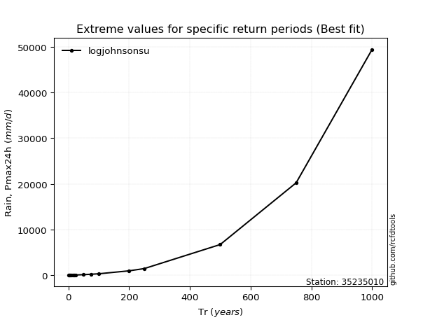</img>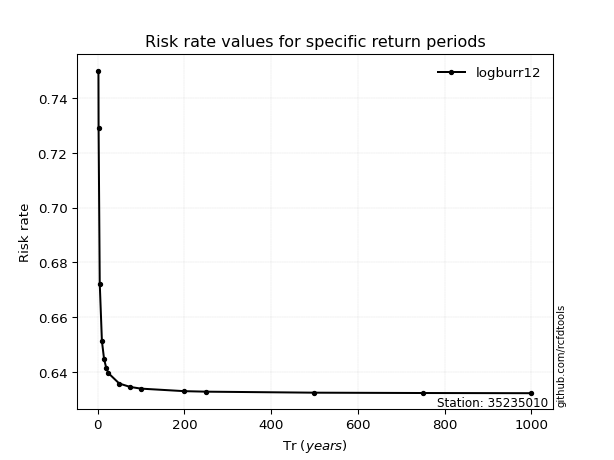</img>

</div>


<sub>**APP DISCLAIMER**: NO WARRANTY - This software is provided by [github.com/rcfdtools](https://github.com/rcfdtools) "as is", without any express or implied warranty, including warranties of merchantability, fitness for a particular purpose, or non-infringement. There is no guarantee that the software will be error-free or operate without interruption. LIMITATION OF LIABILITY - Neither the authors nor copyright holders will be liable for claims or damages arising from the software or its use. You are responsible for determining if the software is appropriate for your use and assume all associated risks, including errors, legal compliance, and data loss. NO PROFESSIONAL ADVICE - The software provides general information and does not offer professional advice. It should not replace consultation with professional advisors.</sub>