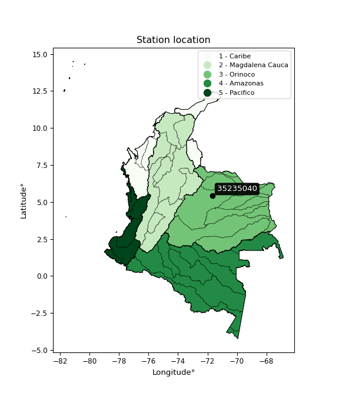

<div align="center">


</div>

# PMP Station (Rain, Pmax24h): 35235040

Probable Maximum Precipitation (PMP) is the greatest amount of rainfall for a specific duration that is meteorologically possible for a given location, acting as a "worst-case" scenario for extreme storms, crucial for designing safety-critical infrastructure like bridges, river deviations, dams, spillways, and nuclear plants to prevent catastrophic failure. PMP is calculated by hydrologists using meteorological data to determine the upper limit of extreme rainfall, often leading to the Probable Maximum Flood (PMF) for flood control design, and is increasingly being studied for climate change impacts. Probable Maximum Precipitation (PMP) is the theoretical upper limit of rainfall, a deterministic estimate for extreme events, while probability distributions (like GEV, Gumbel) describe the likelihood and frequency of various precipitation amounts, including rare ones, showing how often events occur, with PMP representing the extreme end of these distributions, used for critical infrastructure design to ensure safety against the worst conceivable weather, unlike standard statistical forecasts which cover typical probabilities.

The most common probability distributions in hydrology, used for analyzing floods, rainfall, and streamflow, include the Normal, Log-Normal, Gumbel, Gamma (including Log-Pearson Type III), and Generalized Extreme Value (GEV) distributions, often chosen based on the data´s skewness and whether modeling extremes or general conditions, with Gumbel and GEV popular for extreme events like floods, while the Normal distribution serves as a baseline, though often requiring transformations for skewed hydrological data. These distributions help in designing water infrastructure, managing water resources, and forecasting hydrologic events.

> Hydrological data often isn´t perfectly normal (it´s skewed), so different distributions are needed for different applications, such as: **Flood Frequency Analysis**: Using Gumbel, GEV, or Log-Pearson Type III for predicting extreme flood magnitudes and their return periods, **Rainfall Analysis**: Normal for annual totals, but Log-Normal, Weibull, or GEV for intensity or extreme daily rainfall, **Streamflow Modeling**: Gamma and Log-Normal for maximum flows, GEV for minimum flows, and Kappa for daily flows.

<div align="center">

</img>

</div>


## A. General information


### 1. General running parameters

• app_version: _v20260108_. • runtime: _2026-01-09 11:32:22.148588_. • Python version: _3.14.0_. • SciPy version: _1.16.3_. • Pandas version: _2.3.3_. • NumPy version: _2.3.5_. • Stations dataset (station_dataset_file): _dataset/pmax24h_in/automatic_colombia_2003_2024.csv_. • Stations catalog (station_catalog_file): _dataset/CNE.xls_. • Minimum year to eval til year_max (date_min): _1900_. • Maximum year to eval since year_min (date_max): _2024_. • Creates, save and include plots into reports (create_plot): _False_. • Plot only fit distributions with Δo > Δ (plot_only_fit): _True_. • Plot only simple graphs avoiding multiple CDFs and multiple Extreme values plots (plot_only_simple): _True_. • Eval low extreme values, if False, evaluates high extreme values (low_extreme): _False_. • Eval every SciPy distribution as logarithmic (pdist_logarithmic_on): _True_. • Standard deviation normalized (ddof): _1.0_. • Return periods to eval in years (Tr): _[2, 2.33, 5, 10, 15, 20, 25, 50, 75, 100, 200, 250, 500, 750, 1000]_. • Minimum data sample per station, 0 means any (minimum_sample): _5_. • Z-Score maximum threshold to adjust a value, 0 means disable (zscore_max): _3.5_. • Z-Score minimum threshold to adjust a value, 0 means disable (zscore_min): _-2.5_. • Avoid zeros, e.g. rain = 0 (avoid_zeros): _True_. • Avoid null values (avoid_nans): _True_. 

:file_folder:Table: [dataset.csv](../../dataset/pmax24h_in/automatic_colombia_2003_2024.csv)

> Delta Degrees of Freedom (DDOF): is a parameter used in the formulas for calculating variance and standard deviation. When ddof=0, the divisor is $N$ (the total number of observations) and this is used when your data set is the entire population. When ddof=1, the divisor is $N-1$ and this is used when your data set is a sample drawn from a larger population. Using $N-1$ provides an unbiased estimate of the population variance (known as Bessel´s correction).


### 2. Station info and location

|   id |   CODIGO | NOMBRE                    | CATEGORIA               | TECNOLOGIA                              | ESTADO           | FECHA_INSTALACION   |   FECHA_SUSPENSION |   ALTITUD |   LATITUD |   LONGITUD | DEPARTAMENTO   | MUNICIPIO   | AREA_OPERATIVA                              | ENTIDAD                                                     | AREA_HIDROGRAFICA   | ZONA_HIDROGRAFICA   | SUBZONA_HIDROGRAFICA   |   CORRIENTE | Catalogo   |   Version |
|-----:|---------:|:--------------------------|:------------------------|:----------------------------------------|:-----------------|:--------------------|-------------------:|----------:|----------:|-----------:|:---------------|:------------|:--------------------------------------------|:------------------------------------------------------------|:--------------------|:--------------------|:-----------------------|------------:|:-----------|----------:|
|    0 | 35235040 | TRINIDAD - AUT [35235040] | Climatológica Ordinaria | Automática con Telemetría, Convencional | En Mantenimiento | 15/12/2016          |                nan |       265 |   5.41903 |   -71.6662 | Casanare       | Trinidad    | Area Operativa 06 - Boyacá-Casanare-Vichada | INSTITUTO DE HIDROLOGIA METEOROLOGIA Y ESTUDIOS AMBIENTALES | Orinoco             | Meta                | Río Pauto              |         nan | CNE_IDEAM  |  20251226 |

<div align="center">

Dynamic map: [:earth_americas:Google](http://maps.google.com/maps?q=5.419027778,-71.66616667) [:earth_americas:OSM](https://www.openstreetmap.org/#map=18/5.419027778/-71.66616667&layers=P) [:earth_americas:Bing](https://www.bing.com/maps?cp=5.419027778~-71.66616667&lvl=18) [:earth_americas:Apple](https://maps.apple.com/frame?center=5.419027778%2C-71.66616667&span=0.003%2C0.006)

</div>


<div align="center">

```geojson
{
  "type": "Feature",
  "geometry": {
    "type": "Point", 
    "coordinates": [-71.66616667, 5.419027778]
  }, 
  "properties": {
    "Name": "35235040"
  }
}
```

</div>


### 3. Discrete values table and plot

<div align="center">

|               |          0 |           1 |          2 |           3 |          4 |          5 |            6 |
|:--------------|-----------:|------------:|-----------:|------------:|-----------:|-----------:|-------------:|
| Date          | 2017       | 2018        | 2019       | 2020        | 2021       | 2022       | 2023         |
| Value         |   38.3     |   83.4      |  119.1     |   70.7      |    8.5     |    3.7     |   50.4       |
| Value_initial |   38.3     |   83.4      |  119.1     |   70.7      |    8.5     |    3.7     |   50.4       |
| count         |    7       |    7        |    7       |    7        |    7       |    7       |    7         |
| mean          |   53.4429  |   53.4429   |   53.4429  |   53.4429   |   53.4429  |   53.4429  |   53.4429    |
| std           |   41.3096  |   41.3096   |   41.3096  |   41.3096   |   41.3096  |   41.3096  |   41.3096    |
| zscore        |   -0.36657 |    0.725187 |    1.58939 |    0.417752 |   -1.08795 |   -1.20415 |   -0.0736599 |


</div>


> The initial value (value_initial) correspond to the initial obtained or null completed value, and value (value) is adjusted only when the initial value is outside the valid range (outlier) definite through the Z-Score value. If Z-Score is active, values out of range or outliers are replaced with the station mean value. A Z-Score (or standard score) measures how many standard deviations a data point is from the mean of a dataset, indicating its relative position; positive scores mean above the mean, negative mean below, and a score of zero is exactly at the mean, allowing for comparison of values from different distributions. It´s calculated using the formula $z=(x–μ)/σ$, where $x$ is the data point, $μ$ is the mean, and $σ$ is the standard deviation, helping identify outliers and understand probability.
>
> <sub>**Note**: In this study, "completing" (filling gaps in) and "extending" (forecasting or lengthening the historical record) rainfall data series are avoided for certain critical analyses because they introduce artificial bias and uncertainty, which can distort the statistics of rare events (extremes), alter day-to-day variability, and compromise the integrity and homogeneity of the original data. Some reasons against Completing/Extending rainfall data are: **Distortion of Extremes and Variability**: The primary issue is that most gap-filling or extension methods rely on averaging or regression with nearby stations, which inherently smooths the data. Rainfall is highly variable in space and time, with a large percentage of zero values and occasional large storms. Infilling methods often underestimate the highest values and overestimate the lowest (zero) values, which severely distorts analyses focused on flood frequency, drought severity, and intensity-duration-frequency (IDF) curves, **Loss of Data Homogeneity**: Infilled or extended data are synthetic estimates, not actual measurements. Combining these estimates with observed data can violate the assumption of data homogeneity, which requires that the data properties do not change over time. Inhomogeneity can lead to incorrect conclusions about long-term trends or changes in climate patterns, **Propagation of Errors**: Errors and biases from the original data (e.g., wind-induced undercatch, instrument errors, site changes) or the data used for imputation can propagate through the analysis, leading to unreliable hydrological models and inaccurate predictions, **Compromised Statistical Integrity**: For statistical analyses, especially those involving the frequency of events, using artificial data can introduce time bias or autocorrelation that doesn´t exist in reality, making it difficult to assess the true probability of events, **Difficulty in Validation**: It is difficult to accurately validate the quality of filled or extended data, especially for past periods where ground-truth measurements are unavailable. The reliability of imputation techniques heavily depends on the density of the surrounding station network and the complexity of the local topography.</sub>


### 4. Active continuous probability distributions from SciPy (45 of 104 available)

A Probability Density Function (PDF) describes the relative likelihood of a continuous random variable falling within a specific range, where the total area under its curve equals 1, and the area over any interval gives the actual probability for that range. Unlike discrete probabilities (like rolling a die), a PDF shows density, not direct probability for a single point (which is zero), with higher points indicating higher likelihood, often visualized as a bell curve for normal distributions.

A log of a probability density function (log-PDF) is simply the logarithm of the PDF´s value, denoted as $log(f(x))$, useful for converting multiplication of probabilities into addition, improving numerical stability with tiny numbers, and connecting to information theory concepts like entropy. Instead of dealing with very small probabilities (e.g., 0.000001), log-PDFs use negative numbers (e.g., $log(0.00001) ≈ -11.51$ that are easier for computers to handle, preventing underflow errors and simplifying complex calculations. In this study, each active probability distribution from SciPy is also evaluated in the $log$ form.

[scipy.stats](https://docs.scipy.org/doc/scipy/reference/stats.html) is a Python´s powerful submodule within the SciPy library for comprehensive statistical analysis, offering over 130 probability distributions (like Normal, Poisson), functions for descriptive stats (mean, variance), hypothesis testing (t-tests, chi-square), random variable generation, and statistical tests, making it essential for data science, modeling, and research. It provides tools to explore, model, and draw conclusions from data efficiently, working seamlessly with NumPy.

<div align="center">

|   id | p_dist             |   n_parameter | fit_method   | label                                                                       | active   | ref                                                                                                        |
|-----:|:-------------------|--------------:|:-------------|:----------------------------------------------------------------------------|:---------|:-----------------------------------------------------------------------------------------------------------|
|    0 | alpha              |             3 | MLE          | Alpha                                                                       | True     | [:mortar_board:](https://docs.scipy.org/doc/scipy/reference/generated/scipy.stats.alpha.html)              |
|    1 | betaprime          |             4 | MLE          | Beta prime                                                                  | True     | [:mortar_board:](https://docs.scipy.org/doc/scipy/reference/generated/scipy.stats.betaprime.html)          |
|    2 | chi2               |             3 | MLE          | Chi²                                                                        | True     | [:mortar_board:](https://docs.scipy.org/doc/scipy/reference/generated/scipy.stats.chi2.html)               |
|    3 | crystalball        |             4 | MLE          | Crystalball                                                                 | True     | [:mortar_board:](https://docs.scipy.org/doc/scipy/reference/generated/scipy.stats.crystalball.html)        |
|    4 | dweibull           |             3 | MLE          | Double Weibull                                                              | True     | [:mortar_board:](https://docs.scipy.org/doc/scipy/reference/generated/scipy.stats.dweibull.html)           |
|    5 | erlang             |             3 | MLE          | Erlang                                                                      | True     | [:mortar_board:](https://docs.scipy.org/doc/scipy/reference/generated/scipy.stats.erlang.html)             |
|    6 | expon              |             2 | MLE          | Exponential                                                                 | True     | [:mortar_board:](https://docs.scipy.org/doc/scipy/reference/generated/scipy.stats.expon.html)              |
|    7 | exponnorm          |             3 | MLE          | Exponentially modified Normal                                               | True     | [:mortar_board:](https://docs.scipy.org/doc/scipy/reference/generated/scipy.stats.exponnorm.html)          |
|    8 | f                  |             4 | MLE          | F                                                                           | True     | [:mortar_board:](https://docs.scipy.org/doc/scipy/reference/generated/scipy.stats.f.html)                  |
|    9 | fatiguelife        |             3 | MLE          | Fatigue-life (Birnbaum-Saunders)                                            | True     | [:mortar_board:](https://docs.scipy.org/doc/scipy/reference/generated/scipy.stats.fatiguelife.html)        |
|   10 | fisk               |             3 | MLE          | Fisk                                                                        | True     | [:mortar_board:](https://docs.scipy.org/doc/scipy/reference/generated/scipy.stats.fisk.html)               |
|   11 | gamma              |             3 | MLE          | Gamma                                                                       | True     | [:mortar_board:](https://docs.scipy.org/doc/scipy/reference/generated/scipy.stats.gamma.html)              |
|   12 | genexpon           |             5 | MLE          | Generalized exponential                                                     | True     | [:mortar_board:](https://docs.scipy.org/doc/scipy/reference/generated/scipy.stats.genexpon.html)           |
|   13 | genlogistic        |             3 | MLE          | Generalized logistic                                                        | True     | [:mortar_board:](https://docs.scipy.org/doc/scipy/reference/generated/scipy.stats.genlogistic.html)        |
|   14 | gibrat             |             2 | MM           | Gibrat                                                                      | True     | [:mortar_board:](https://docs.scipy.org/doc/scipy/reference/generated/scipy.stats.gibrat.html)             |
|   15 | gompertz           |             3 | MLE          | Gompertz (or truncated Gumbel)                                              | True     | [:mortar_board:](https://docs.scipy.org/doc/scipy/reference/generated/scipy.stats.gompertz.html)           |
|   16 | gumbel_l           |             2 | MM           | Gumbel Left Skew                                                            | True     | [:mortar_board:](https://docs.scipy.org/doc/scipy/reference/generated/scipy.stats.gumbel_l.html)           |
|   17 | gumbel_r           |             2 | MM           | Gumbel Right Skew                                                           | True     | [:mortar_board:](https://docs.scipy.org/doc/scipy/reference/generated/scipy.stats.gumbel_r.html)           |
|   18 | halflogistic       |             2 | MM           | Half-logistic                                                               | True     | [:mortar_board:](https://docs.scipy.org/doc/scipy/reference/generated/scipy.stats.halflogistic.html)       |
|   19 | halfnorm           |             2 | MM           | Half Normal                                                                 | True     | [:mortar_board:](https://docs.scipy.org/doc/scipy/reference/generated/scipy.stats.halfnorm.html)           |
|   20 | hypsecant          |             2 | MM           | hyperbolic secant                                                           | True     | [:mortar_board:](https://docs.scipy.org/doc/scipy/reference/generated/scipy.stats.hypsecant.html)          |
|   21 | invgamma           |             3 | MLE          | Inverted gamma                                                              | True     | [:mortar_board:](https://docs.scipy.org/doc/scipy/reference/generated/scipy.stats.invgamma.html)           |
|   22 | invgauss           |             3 | MLE          | Inverse Gaussian                                                            | True     | [:mortar_board:](https://docs.scipy.org/doc/scipy/reference/generated/scipy.stats.invgauss.html)           |
|   23 | invweibull         |             3 | MLE          | Inverted Weibull                                                            | True     | [:mortar_board:](https://docs.scipy.org/doc/scipy/reference/generated/scipy.stats.invweibull.html)         |
|   24 | kappa4             |             4 | MLE          | Kappa 4                                                                     | True     | [:mortar_board:](https://docs.scipy.org/doc/scipy/reference/generated/scipy.stats.kappa4.html)             |
|   25 | kstwobign          |             2 | MLE          | Limiting distribution of scaled Kolmogorov-Smirnov two-sided test statistic | True     | [:mortar_board:](https://docs.scipy.org/doc/scipy/reference/generated/scipy.stats.kstwobign.html)          |
|   26 | laplace            |             2 | MM           | Laplace                                                                     | True     | [:mortar_board:](https://docs.scipy.org/doc/scipy/reference/generated/scipy.stats.laplace.html)            |
|   27 | laplace_asymmetric |             3 | MLE          | Asymmetric Laplace                                                          | True     | [:mortar_board:](https://docs.scipy.org/doc/scipy/reference/generated/scipy.stats.laplace_asymmetric.html) |
|   28 | loggamma           |             3 | MLE          | Log gamma                                                                   | True     | [:mortar_board:](https://docs.scipy.org/doc/scipy/reference/generated/scipy.stats.loggamma.html)           |
|   29 | logistic           |             2 | MM           | Logistic (or Sech-squared)                                                  | True     | [:mortar_board:](https://docs.scipy.org/doc/scipy/reference/generated/scipy.stats.logistic.html)           |
|   30 | lognorm            |             3 | MLE          | Log Normal                                                                  | True     | [:mortar_board:](https://docs.scipy.org/doc/scipy/reference/generated/scipy.stats.lognorm.html)            |
|   31 | maxwell            |             2 | MM           | Maxwell                                                                     | True     | [:mortar_board:](https://docs.scipy.org/doc/scipy/reference/generated/scipy.stats.maxwell.html)            |
|   32 | mielke             |             4 | MLE          | Mielke Beta-Kappa / Dagum                                                   | True     | [:mortar_board:](https://docs.scipy.org/doc/scipy/reference/generated/scipy.stats.mielke.html)             |
|   33 | moyal              |             2 | MM           | Moyal                                                                       | True     | [:mortar_board:](https://docs.scipy.org/doc/scipy/reference/generated/scipy.stats.moyal.html)              |
|   34 | nakagami           |             3 | MLE          | Nakagami                                                                    | True     | [:mortar_board:](https://docs.scipy.org/doc/scipy/reference/generated/scipy.stats.nakagami.html)           |
|   35 | ncf                |             5 | MLE          | Non-central F distribution                                                  | True     | [:mortar_board:](https://docs.scipy.org/doc/scipy/reference/generated/scipy.stats.ncf.html)                |
|   36 | nct                |             4 | MLE          | Non-central Student’s t                                                     | True     | [:mortar_board:](https://docs.scipy.org/doc/scipy/reference/generated/scipy.stats.nct.html)                |
|   37 | norm               |             2 | MM           | Normal                                                                      | True     | [:mortar_board:](https://docs.scipy.org/doc/scipy/reference/generated/scipy.stats.norm.html)               |
|   38 | pearson3           |             3 | MM           | Pearson type III                                                            | True     | [:mortar_board:](https://docs.scipy.org/doc/scipy/reference/generated/scipy.stats.pearson3.html)           |
|   39 | rayleigh           |             2 | MM           | Rayleigh                                                                    | True     | [:mortar_board:](https://docs.scipy.org/doc/scipy/reference/generated/scipy.stats.rayleigh.html)           |
|   40 | rice               |             3 | MLE          | Rice                                                                        | True     | [:mortar_board:](https://docs.scipy.org/doc/scipy/reference/generated/scipy.stats.rice.html)               |
|   41 | t                  |             3 | MLE          | Student’s t                                                                 | True     | [:mortar_board:](https://docs.scipy.org/doc/scipy/reference/generated/scipy.stats.t.html)                  |
|   42 | truncnorm          |             4 | MLE          | Truncated normal                                                            | True     | [:mortar_board:](https://docs.scipy.org/doc/scipy/reference/generated/scipy.stats.truncnorm.html)          |
|   43 | wald               |             2 | MM           | Wald                                                                        | True     | [:mortar_board:](https://docs.scipy.org/doc/scipy/reference/generated/scipy.stats.wald.html)               |
|   44 | weibull_min        |             3 | MLE          | Weibull minimum                                                             | True     | [:mortar_board:](https://docs.scipy.org/doc/scipy/reference/generated/scipy.stats.weibull_min.html)        |

</div>

> **n_parameter:** # arguments & localization & scale.
>
> **Fit methods:** (MLE) maximum likelihood, (MM) L-moments.
>
>**Inactive** (With the only purpose of prevent loops, zero divisions, infinite values, over high estimated values or horizontal trending for recurrence intervals estimations, the follow distributions were disabled.)**:** foldnorm, gennorm, norminvgauss, powernorm, powerlognorm, skewnorm, genextreme, anglit, arcsine, argus, beta, bradford, burr, burr12, cauchy, cosine, halfcauchy, foldcauchy, skewcauchy, wrapcauchy, dgamma, gengamma, exponweib, exponpow, truncexpon, gausshyper, genhalflogistic, genhyperbolic, geninvgauss, halfgennorm, johnsonsb, johnsonsu, kappa3, ksone, kstwo, loglaplace, levy, levy_l, levy_stable, ncx2, pareto, genpareto, truncpareto, lomax, powerlaw, rdist, rel_breitwigner, recipinvgauss, semicircular, studentized_range, trapezoid, triang, truncweibull_min, tukeylambda, uniform, loguniform, vonmises, vonmises_line, weibull_max, 


## B. Probability (PDF) vs. Empirical (EDF) distributions functions

A continuous probability distribution (CPD) describes probabilities for variables that can take any value within a range (like rain any time), unlike discrete variables with specific outcomes (like temperature). It uses a Probability Density Function (PDF), a curve where the total area under it equals 1, and the probability of the variable falling within an interval (a to b) is found by calculating the area under the curve between those points. A key feature is that the probability of hitting any single exact value is zero, so probabilities are always expressed for ranges, e.g., $P(a ≤ X ≤ b)$.

<div align="center">

Distributions parameters from station values
|    |   station | p_dist                |   n |             loc |          scale | shape                  | shape1                | shape2                | shape3   |
|---:|----------:|:----------------------|----:|----------------:|---------------:|:-----------------------|:----------------------|:----------------------|:---------|
|  0 |  35235040 | alpha                 |   7 |    -0.020373    |    8.95383     | 7.201234290694152e-11  |                       |                       |          |
|  1 |  35235040 | betaprime             |   7 |     3.69998     |  563.805       | 0.6438428865558854     | 7.308730067390908     |                       |          |
|  2 |  35235040 | chi2                  |   7 |     3.7         |    3.37693     | 1.259755853021812      |                       |                       |          |
|  3 |  35235040 | crystalball           |   7 |    53.4428      |   38.2452      | 44362.758517610884     | 42.427788073508886    |                       |          |
|  4 |  35235040 | dweibull              |   7 |    45.575       |   35.7098      | 1.4460384286195034     |                       |                       |          |
|  5 |  35235040 | erlang                |   7 |     3.69918     |   61.3255      | 0.8620042868053547     |                       |                       |          |
|  6 |  35235040 | expon                 |   7 |     3.7         |   49.7429      |                        |                       |                       |          |
|  7 |  35235040 | exponnorm             |   7 |    43.0925      |   36.8295      | 0.2810350441242113     |                       |                       |          |
|  8 |  35235040 | f                     |   7 |     3.7         |   49.7942      | 1.755600825561122      | 29.09010943122039     |                       |          |
|  9 |  35235040 | fatiguelife           |   7 |    -0.886868    |   29.4348      | 1.2423518779924592     |                       |                       |          |
| 10 |  35235040 | fisk                  |   7 |   -84.103       |  133.212       | 5.809162655075232      |                       |                       |          |
| 11 |  35235040 | gamma                 |   7 |     3.69993     |   53.0428      | 0.610600129008837      |                       |                       |          |
| 12 |  35235040 | genexpon              |   7 |     3.69997     |    4.52375     | 0.10229426074186806    | 7.512718075042758e-07 | 2.1585699308268307    |          |
| 13 |  35235040 | genlogistic           |   7 |  -172.26        |   32.5975      | 574.4022039035998      |                       |                       |          |
| 14 |  35235040 | gibrat                |   7 |    24.2666      |   17.6963      |                        |                       |                       |          |
| 15 |  35235040 | gompertz              |   7 |     3.7         |   87.8326      | 0.9662457967217817     |                       |                       |          |
| 16 |  35235040 | gumbel_l              |   7 |    70.6552      |   29.8197      |                        |                       |                       |          |
| 17 |  35235040 | gumbel_r              |   7 |    36.2305      |   29.8197      |                        |                       |                       |          |
| 18 |  35235040 | halflogistic          |   7 |     8.1134      |   32.6983      |                        |                       |                       |          |
| 19 |  35235040 | halfnorm              |   7 |     2.82118     |   63.4449      |                        |                       |                       |          |
| 20 |  35235040 | hypsecant             |   7 |    53.4429      |   24.3477      |                        |                       |                       |          |
| 21 |  35235040 | invgamma              |   7 |  -156.23        | 6076.06        | 29.964868000474894     |                       |                       |          |
| 22 |  35235040 | invgauss              |   7 |   -51.696       |  671.836       | 0.15649489595729305    |                       |                       |          |
| 23 |  35235040 | invweibull            |   7 |    -1.24715e+09 |    1.24715e+09 | 38293265.91696617      |                       |                       |          |
| 24 |  35235040 | kappa4                |   7 |   -12.4965      |  134.315       | 1.1372518181223166     | 1.0133304523902629    |                       |          |
| 25 |  35235040 | kstwobign             |   7 |   -77.6565      |  149.806       |                        |                       |                       |          |
| 26 |  35235040 | laplace               |   7 |    53.4429      |   27.0435      |                        |                       |                       |          |
| 27 |  35235040 | laplace_asymmetric    |   7 |    50.4         |   31.7048      | 0.9531635451259366     |                       |                       |          |
| 28 |  35235040 | loggamma              |   7 | -9964.92        | 1397.53        | 1298.5281078436783     |                       |                       |          |
| 29 |  35235040 | logistic              |   7 |    53.4429      |   21.0857      |                        |                       |                       |          |
| 30 |  35235040 | lognorm               |   7 |     3.7         |    0.154721    | 13.70334158516415      |                       |                       |          |
| 31 |  35235040 | maxwell               |   7 |   -37.1823      |   56.7909      |                        |                       |                       |          |
| 32 |  35235040 | mielke                |   7 |     3.7         |  115.867       | 0.5878153032572606     | 543.663343347775      |                       |          |
| 33 |  35235040 | moyal                 |   7 |    31.5718      |   17.2164      |                        |                       |                       |          |
| 34 |  35235040 | nakagami              |   7 |     3.7         |   46.7462      | 0.2485665552940284     |                       |                       |          |
| 35 |  35235040 | ncf                   |   7 |     3.7         |   11.4807      | 0.9228228104259846     | 7915.858139076106     | 2.7299874870429717    |          |
| 36 |  35235040 | nct                   |   7 | -1799.79        |   38.1941      | 444634.4935110789      | 48.521418760142495    |                       |          |
| 37 |  35235040 | norm                  |   7 |    53.4429      |   38.2452      |                        |                       |                       |          |
| 38 |  35235040 | pearson3              |   7 |    53.4429      |   38.2452      | 0.24950538392362692    |                       |                       |          |
| 39 |  35235040 | rayleigh              |   7 |   -19.7225      |   58.3775      |                        |                       |                       |          |
| 40 |  35235040 | rice                  |   7 |   -16.3525      |   49.8174      | 0.74313221100737       |                       |                       |          |
| 41 |  35235040 | t                     |   7 |    53.443       |   38.2464      | 32070803.968052864     |                       |                       |          |
| 42 |  35235040 | truncnorm             |   7 |    53.4429      |   38.2452      | -2588.858784759331     | 389.94402526218556    |                       |          |
| 43 |  35235040 | wald                  |   7 |    15.1976      |   38.2452      |                        |                       |                       |          |
| 44 |  35235040 | weibull_min           |   7 |     3.7         |   52.7607      | 0.36467560184486436    |                       |                       |          |
| 45 |  35235040 | logalpha              |   7 |   -26.2777      |  709.138       | 23.874286287595453     |                       |                       |          |
| 46 |  35235040 | logbetaprime          |   7 |   -19.6554      |  164.273       | 411.40130873280106     | 2922.7621557521206    |                       |          |
| 47 |  35235040 | logchi2               |   7 |     1.30833     |    1.25145     | 1.8971314826443542     |                       |                       |          |
| 48 |  35235040 | logcrystalball        |   7 |     3.49656     |    1.19026     | 54.88254103353975      | 74.91350386617228     |                       |          |
| 49 |  35235040 | logdweibull           |   7 |     3.91999     |    0.86653     | 0.9393284223985473     |                       |                       |          |
| 50 |  35235040 | logerlang             |   7 |   -15.3431      |    0.0793227   | 237.47182680933832     |                       |                       |          |
| 51 |  35235040 | logexpon              |   7 |     1.30833     |    2.18822     |                        |                       |                       |          |
| 52 |  35235040 | logexponnorm          |   7 |     3.49628     |    1.19026     | 0.00023335719534564418 |                       |                       |          |
| 53 |  35235040 | logf                  |   7 | -1275.3         | 1278.8         | 8437917.631274484      | 3143249.639151969     |                       |          |
| 54 |  35235040 | logfatiguelife        |   7 |  -530.551       |  534.042       | 0.0022263396218079757  |                       |                       |          |
| 55 |  35235040 | logfisk               |   7 |    -2.30665e+08 |    2.30665e+08 | 317209772.54459894     |                       |                       |          |
| 56 |  35235040 | loggamma              |   7 |   -17.1975      |    0.0742361   | 278.6791147705138      |                       |                       |          |
| 57 |  35235040 | loggenexpon           |   7 |     1.25328     |    0.0105858   | 0.001654186802444683   | 1.8625885777197366    | 1.205392612242252e-05 |          |
| 58 |  35235040 | loggenlogistic        |   7 |     4.77999     |    2.88962e-06 | 2.2449849495149613e-06 |                       |                       |          |
| 59 |  35235040 | loggibrat             |   7 |     2.5886      |    0.550712    |                        |                       |                       |          |
| 60 |  35235040 | loggompertz           |   7 |     1.30833     |    1.00009     | 0.07439675877045127    |                       |                       |          |
| 61 |  35235040 | loggumbel_l           |   7 |     4.03224     |    0.928039    |                        |                       |                       |          |
| 62 |  35235040 | loggumbel_r           |   7 |     2.96088     |    0.928039    |                        |                       |                       |          |
| 63 |  35235040 | loghalflogistic       |   7 |     2.08575     |    1.01767     |                        |                       |                       |          |
| 64 |  35235040 | loghalfnorm           |   7 |     1.92112     |    1.97452     |                        |                       |                       |          |
| 65 |  35235040 | loghypsecant          |   7 |     3.49656     |    0.75774     |                        |                       |                       |          |
| 66 |  35235040 | loginvgamma           |   7 |   -14.9248      | 3993.71        | 217.96868791183715     |                       |                       |          |
| 67 |  35235040 | loginvgauss           |   7 |    -7.87577     |  883.671       | 0.012837772120534455   |                       |                       |          |
| 68 |  35235040 | loginvweibull         |   7 |    -8.07403e+07 |    8.07403e+07 | 64017430.23744124      |                       |                       |          |
| 69 |  35235040 | logkappa4             |   7 |     0.831089    |    4.11892     | 1.1314352590626195     | 1.0428560595550205    |                       |          |
| 70 |  35235040 | logkstwobign          |   7 |    -1.53076     |    5.72802     |                        |                       |                       |          |
| 71 |  35235040 | loglaplace            |   7 |     3.49656     |    0.841638    |                        |                       |                       |          |
| 72 |  35235040 | loglaplace_asymmetric |   7 |     4.42365     |    0.573721    | 2.093607363163336      |                       |                       |          |
| 73 |  35235040 | logloggamma           |   7 |     4.78002     |    4.55298e-06 | 3.5551683165424726e-06 |                       |                       |          |
| 74 |  35235040 | loglogistic           |   7 |     3.49656     |    0.656222    |                        |                       |                       |          |
| 75 |  35235040 | loglognorm            |   7 |     1.30833     |    0.0120064   | 12.91695369868639      |                       |                       |          |
| 76 |  35235040 | logmaxwell            |   7 |     0.67615     |    1.76743     |                        |                       |                       |          |
| 77 |  35235040 | logmielke             |   7 |    -0.951962    |    5.73219     | 3.342455783072171      | 214861.61392503098    |                       |          |
| 78 |  35235040 | logmoyal              |   7 |     2.81589     |    0.535803    |                        |                       |                       |          |
| 79 |  35235040 | lognakagami           |   7 |     1.5882      |    2.35892     | 1.4308453398691454     |                       |                       |          |
| 80 |  35235040 | logncf                |   7 |   -36.8496      |   40.0695      | 3622.53449963244       | 5742.4780138622045    | 23.02743864788239     |          |
| 81 |  35235040 | lognct                |   7 |  -101.357       |    1.1702      | 110279.76226970804     | 89.60228101330597     |                       |          |
| 82 |  35235040 | lognorm               |   7 |     3.49656     |    1.19026     |                        |                       |                       |          |
| 83 |  35235040 | logpearson3           |   7 |     3.49656     |    1.19026     | -0.8083965210603601    |                       |                       |          |
| 84 |  35235040 | lograyleigh           |   7 |     1.21953     |    1.81681     |                        |                       |                       |          |
| 85 |  35235040 | logrice               |   7 |     0.564201    |    1.3035      | 1.9734583712112332     |                       |                       |          |
| 86 |  35235040 | logt                  |   7 |     3.49656     |    1.19025     | 3356730689.7737265     |                       |                       |          |
| 87 |  35235040 | logtruncnorm          |   7 |     0.710062    |    2.74127     | 0.2182462316950965     | 41.26975035586303     |                       |          |
| 88 |  35235040 | logwald               |   7 |     2.30633     |    1.19023     |                        |                       |                       |          |
| 89 |  35235040 | logweibull_min        |   7 |    -6.0967e+07  |    6.0967e+07  | 73142459.90060596      |                       |                       |          |

</div>

> **loc** (Location parameter): This shifts the distribution along the x-axis. For many common distributions, like the normal (Gaussian) distribution, loc represents the mean $μ$. For others, like the uniform distribution, it might represent the minimum value, or for the beta distribution, the left end of the support interval.
>
> **scale** (Scale parameter): This determines the width or spread of the distribution. For the normal distribution, scale represents the standard deviation $σ$. For a uniform distribution, it defines the length of the interval (from $loc$ to $loc + scale$).
>
> **shape** (Shape parameters): Refers to parameters that define the specific form of a probability distribution, distinct from its location (loc) and scale (scale). These parameters are required arguments for most distribution functions. For example, a normal (Gaussian) distribution is fully defined by its location (mean) and scale (standard deviation), so it has no specific shape parameters beyond loc and scale. However, other distributions have intrinsic properties that need specification, as Gamma distribution that takes a shape parameter, often named $a$ or $alpha$.


### 0. Cumulative distribution values - CDF (90 evaluated)

Cumulative Distribution Function (CDF), denoted as $F$<sub>$X$</sub>$(x)$, is a function that gives the probability that a random variable $X$ will take a value less than or equal to a specific value, $x$ (i.e., $(P(X≥x)$. It essentially "accumulates" probabilities from a given point up to the far right (positive infinity), providing a complete picture of the distribution´s probabilities for both discrete (like rain) and continuous (like temperature) variables, helping to find probabilities over ranges or above certain values. Each station is evaluated separately ordering the $x$ values ascending, calculating the CDF and PDF values for the activated distributions and their logarithmic forms.

<div align="center">

CDF ordered by x ascending and calculating $log(f(x))$ separately
|   id |   Station |   date |     x |   count |    mean |     std |     zscore |   Value_initial |   station |   m |     alpha |   alpha_pdf |   betaprime |   betaprime_pdf |        chi2 |         chi2_pdf |   crystalball |   crystalball_pdf |   dweibull |   dweibull_pdf |      erlang |   erlang_pdf |     expon |   expon_pdf |   exponnorm |   exponnorm_pdf |           f |      f_pdf |   fatiguelife |   fatiguelife_pdf |      fisk |   fisk_pdf |       gamma |   gamma_pdf |    genexpon |   genexpon_pdf |   genlogistic |   genlogistic_pdf |   gibrat |   gibrat_pdf |    gompertz |   gompertz_pdf |   gumbel_l |   gumbel_l_pdf |   gumbel_r |   gumbel_r_pdf |   halflogistic |   halflogistic_pdf |   halfnorm |   halfnorm_pdf |   hypsecant |   hypsecant_pdf |   invgamma |   invgamma_pdf |   invgauss |   invgauss_pdf |   invweibull |   invweibull_pdf |    kappa4 |   kappa4_pdf |   kstwobign |   kstwobign_pdf |   laplace |   laplace_pdf |   laplace_asymmetric |   laplace_asymmetric_pdf |   loggamma |   loggamma_pdf |   logistic |   logistic_pdf |   lognorm |   lognorm_pdf |   maxwell |   maxwell_pdf |      mielke |   mielke_pdf |     moyal |   moyal_pdf |    nakagami |   nakagami_pdf |         ncf |     ncf_pdf |       nct |    nct_pdf |      norm |   norm_pdf |   pearson3 |   pearson3_pdf |   rayleigh |   rayleigh_pdf |      rice |   rice_pdf |         t |      t_pdf |   truncnorm |   truncnorm_pdf |     wald |   wald_pdf |   weibull_min |   weibull_min_pdf |   logalpha |   logalpha_pdf |   logbetaprime |   logbetaprime_pdf |   logchi2 |   logchi2_pdf |   logcrystalball |   logcrystalball_pdf |   logdweibull |   logdweibull_pdf |   logerlang |   logerlang_pdf |   logexpon |   logexpon_pdf |   logexponnorm |   logexponnorm_pdf |      logf |   logf_pdf |   logfatiguelife |   logfatiguelife_pdf |   logfisk |   logfisk_pdf |   loggenexpon |   loggenexpon_pdf |   loggenlogistic |   loggenlogistic_pdf |   loggibrat |   loggibrat_pdf |   loggompertz |   loggompertz_pdf |   loggumbel_l |   loggumbel_l_pdf |   loggumbel_r |   loggumbel_r_pdf |   loghalflogistic |   loghalflogistic_pdf |   loghalfnorm |   loghalfnorm_pdf |   loghypsecant |   loghypsecant_pdf |   loginvgamma |   loginvgamma_pdf |   loginvgauss |   loginvgauss_pdf |   loginvweibull |   loginvweibull_pdf |   logkappa4 |   logkappa4_pdf |   logkstwobign |   logkstwobign_pdf |   loglaplace |   loglaplace_pdf |   loglaplace_asymmetric |   loglaplace_asymmetric_pdf |   logloggamma |   logloggamma_pdf |   loglogistic |   loglogistic_pdf |   loglognorm |   loglognorm_pdf |   logmaxwell |   logmaxwell_pdf |   logmielke |   logmielke_pdf |    logmoyal |   logmoyal_pdf |   lognakagami |   lognakagami_pdf |    logncf |   logncf_pdf |    lognct |   lognct_pdf |   logpearson3 |   logpearson3_pdf |   lograyleigh |   lograyleigh_pdf |   logrice |   logrice_pdf |      logt |   logt_pdf |   logtruncnorm |   logtruncnorm_pdf |   logwald |   logwald_pdf |   logweibull_min |   logweibull_min_pdf |
|-----:|----------:|-------:|------:|--------:|--------:|--------:|-----------:|----------------:|----------:|----:|----------:|------------:|------------:|----------------:|------------:|-----------------:|--------------:|------------------:|-----------:|---------------:|------------:|-------------:|----------:|------------:|------------:|----------------:|------------:|-----------:|--------------:|------------------:|----------:|-----------:|------------:|------------:|------------:|---------------:|--------------:|------------------:|---------:|-------------:|------------:|---------------:|-----------:|---------------:|-----------:|---------------:|---------------:|-------------------:|-----------:|---------------:|------------:|----------------:|-----------:|---------------:|-----------:|---------------:|-------------:|-----------------:|----------:|-------------:|------------:|----------------:|----------:|--------------:|---------------------:|-------------------------:|-----------:|---------------:|-----------:|---------------:|----------:|--------------:|----------:|--------------:|------------:|-------------:|----------:|------------:|------------:|---------------:|------------:|------------:|----------:|-----------:|----------:|-----------:|-----------:|---------------:|-----------:|---------------:|----------:|-----------:|----------:|-----------:|------------:|----------------:|---------:|-----------:|--------------:|------------------:|-----------:|---------------:|---------------:|-------------------:|----------:|--------------:|-----------------:|---------------------:|--------------:|------------------:|------------:|----------------:|-----------:|---------------:|---------------:|-------------------:|----------:|-----------:|-----------------:|---------------------:|----------:|--------------:|--------------:|------------------:|-----------------:|---------------------:|------------:|----------------:|--------------:|------------------:|--------------:|------------------:|--------------:|------------------:|------------------:|----------------------:|--------------:|------------------:|---------------:|-------------------:|--------------:|------------------:|--------------:|------------------:|----------------:|--------------------:|------------:|----------------:|---------------:|-------------------:|-------------:|-----------------:|------------------------:|----------------------------:|--------------:|------------------:|--------------:|------------------:|-------------:|-----------------:|-------------:|-----------------:|------------:|----------------:|------------:|---------------:|--------------:|------------------:|----------:|-------------:|----------:|-------------:|--------------:|------------------:|--------------:|------------------:|----------:|--------------:|----------:|-----------:|---------------:|-------------------:|----------:|--------------:|-----------------:|---------------------:|
|    0 |  35235040 |   2022 |   3.7 |       7 | 53.4429 | 41.3096 | -1.20415   |             3.7 |  35235040 |   1 | 0.0160972 | 0.0285109   | 6.95357e-05 |      1.91708    | 7.15091e-11 | 101426           |     0.0966927 |        0.00447712 |   0.141972 |     0.00617228 | 6.59417e-05 |   0.0697216  | 0         |  0.0201034  |   0.0957593 |      0.00450635 | 9.32372e-10 | 0.293801   |     0.0425981 |        0.0232973  | 0.0815467 | 0.00495527 | 0.000288649 |  2.49784    | 7.83382e-07 |     0.0226127  |     0.0747384 |        0.00593347 | 0        |   0          | 2.55019e-15 |     0.011001   |   0.100478 |     0.00319427 |  0.0509469 |     0.00508615 |     0          |         0          |  0.0110518 |     0.0125748  |   0.0820712 |      0.00333358 |   0.078913 |     0.00545409 |  0.0684009 |     0.00645413 |    0.0741235 |       0.00592202 | 0         |   0.628254   |   0.0704016 |      0.00637411 | 0.0794589 |    0.00293819 |             0.101509 |               0.00335902 |  0.0353994 |       0.067806 |  0.0863467 |     0.00374144 | 0.0329982 |     0.0618494 | 0.0851289 |    0.00561881 | 7.90821e-06 |  19.1789     | 0.0246603 |  0.00417293 | 2.69108e-09 |    3.01252e+06 | 5.39548e-09 | 5.60594e+06 | 0.0966885 | 0.00447767 | 0.0966927 | 0.00447712 |  0.0907255 |     0.00480869 |  0.0773364 |     0.0063414  | 0.0596949 | 0.00578052 | 0.0966988 | 0.00447719 |   0.0966927 |      0.00447712 | 0        | 0          |   5.93229e-07 |       4.87145e+08 |  0.0334675 |      0.0694031 |      0.0339801 |          0.0666415 | 6.063e-16 |     2.59009   |        0.0329982 |            0.0618493 |     0.029839  |         0.0302516 |   0.0328616 |       0.0651819 |   0        |      0.456992  |      0.0329981 |          0.0618493 | 0.0333765 |  0.0623053 |        0.0329341 |            0.0620716 | 0.0382002 |     0.0505261 |    0.00886628 |          0.16581  |         0        |            0.0523605 |    0        |       0         |   5.53464e-09 |         0.0743903 |      0.051738 |         0.0542821 |    0.00264807 |         0.0169319 |         0         |              0        |     0         |          0        |      0.0354212 |          0.0466495 |     0.0324004 |         0.0686867 |      0.034803 |         0.0744501 |       0.0326004 |           0.0884896 | 7.92145e-15 |       17.4144   |       0.03334  |           0.106201 |    0.0371383 |        0.0441262 |               0.0608636 |                   0.0506712 |     0.0664809 |         0.0519112 |     0.0344039 |         0.0506235 |    0.0071816 |      6.94957e+12 |    0.0117142 |        0.0541775 |   0.0445786 |       0.0659215 | 4.44664e-05 |    0.000729322 |     0         |         0         | 0.0333317 |    0.0645463 | 0.0330789 |    0.0620083 |     0.0501708 |         0.0602276 |     0.0011939 |         0.0268721 | 0.0249397 |     0.0713135 | 0.0329978 |  0.0618489 |    1.22751e-09 |           0.34357  |  0        |     0         |        0.0373307 |            0.0439393 |
|    1 |  35235040 |   2021 |   8.5 |       7 | 53.4429 | 41.3096 | -1.08795   |             8.5 |  35235040 |   2 | 0.293317  | 0.0566537   | 0.178435    |      0.0229686  | 0.698162    |      0.0579482   |     0.119973  |        0.00522963 |   0.173965 |     0.00716346 | 0.11306     |   0.0194594  | 0.0919867 |  0.0182541  |   0.119215  |      0.00527359 | 0.114603    | 0.0199768  |     0.165822  |        0.0249369  | 0.107905  | 0.00603868 | 0.249155    |  0.0299514  | 0.102859    |     0.0202869  |     0.106532  |        0.00730404 | 0        |   0          | 0.0528277   |     0.0110051  |   0.116961 |     0.00368338 |  0.0793129 |     0.00674075 |     0.00591149 |         0.0152908  |  0.0713218 |     0.0125258  |   0.0996906 |      0.00402786 |   0.107858 |     0.00660427 |  0.10313   |     0.00798643 |    0.10588   |       0.00729994 | 0.0599256 |   0.0109808  |   0.104585  |      0.00784144 | 0.0948913 |    0.00350885 |             0.118984 |               0.00393726 |  0.136907  |       0.185037 |  0.106079  |     0.00449717 | 0.127213  |     0.175078  | 0.114418  |    0.00657801 | 0.153892    |   0.0188459  | 0.050661  |  0.00670789 | 0.251547    |    0.0259979   | 0.150066    | 0.017372    | 0.119972  | 0.00523034 | 0.119973  | 0.00522963 |  0.115869  |     0.00567277 |  0.110291  |     0.00736804 | 0.0902767 | 0.00694135 | 0.119979  | 0.00522967 |   0.119973  |      0.00522963 | 0        | 0          |   0.341113    |       0.0208845   |  0.14013   |      0.195571  |      0.135459  |          0.186795  | 0.306895  |     0.293753  |        0.127213  |            0.175078  |     0.0699864 |         0.0726241 |   0.132762  |       0.18455   |   0.316204 |      0.312489  |      0.127213  |          0.175078  | 0.127929  |  0.175271  |        0.127675  |            0.176157  | 0.110842  |     0.135534  |    0.19533    |          0.268634 |         0        |            0.0999167 |    0        |       0         |   0.0919923   |         0.155164  |      0.122057 |         0.123146  |    0.0887729  |         0.231649  |         0.0266782 |              0.490967 |     0.0882933 |          0.401614 |      0.1053    |          0.136445  |     0.139005  |         0.196231  |      0.147945 |         0.204304  |       0.170273  |           0.239009  | 0.273784    |        0.292649 |       0.193969 |           0.264621 |    0.0997714 |        0.118544  |               0.121642  |                   0.101272  |     0.127277  |         0.0993837 |     0.112334  |         0.151953  |    0.628582  |      0.0351876   |    0.123517  |        0.219774  |   0.127046  |       0.137336  | 0.0602634   |    0.239466    |     0.0196916 |         0.0988524 | 0.131817  |    0.182078  | 0.127483  |    0.175338  |     0.128979  |         0.137232  |     0.120465  |         0.245289  | 0.131773  |     0.192217  | 0.127213  |  0.175078  |    0.272387    |           0.307091 |  0        |     0         |        0.0980483 |            0.111664  |
|    2 |  35235040 |   2017 |  38.3 |       7 | 53.4429 | 41.3096 | -0.36657   |            38.3 |  35235040 |   3 | 0.815251  | 0.00473407  | 0.547065    |      0.00757159 | 0.997849    |      0.000338301 |     0.346074  |        0.00964475 |   0.452329 |     0.00900857 | 0.502161    |   0.00911429 | 0.501214  |  0.0100273  |   0.347563  |      0.0097262  | 0.510702    | 0.0091075  |     0.591392  |        0.00806038 | 0.379522  | 0.011176   | 0.684956    |  0.00791385 | 0.542696    |     0.010341   |     0.407113  |        0.0112147  | 0.408302 |   0.0276738  | 0.372808    |     0.0102309  |   0.286727 |     0.00808221 |  0.393391  |     0.0123078  |     0.431381   |         0.0124458  |  0.42398   |     0.0107557  |   0.313682  |      0.0108971  |   0.386112 |     0.0109059  |  0.417226  |     0.0112093  |    0.406836  |       0.0112344  | 0.340916  |   0.00868523 |   0.413108  |      0.011109   | 0.28562   |    0.0105615  |             0.318968 |               0.0105549  |  0.5575    |       0.316955 |  0.327799  |     0.0104501  | 0.549775  |     0.332561  | 0.377765  |    0.0102609  | 0.491435    |   0.00834893 | 0.41079   |  0.0135895  | 0.65435     |    0.0084248   | 0.515728    | 0.0095561   | 0.346101  | 0.00964559 | 0.346074  | 0.00964475 |  0.359094  |     0.0101056  |  0.389781  |     0.0103894  | 0.369404  | 0.0107388  | 0.346077  | 0.00964449 |   0.346074  |      0.00964475 | 0.449423 | 0.0195145  |   0.575732    |       0.00383398  |  0.56972   |      0.311118  |      0.563194  |          0.321636  | 0.629916  |     0.15265   |        0.549775  |            0.332561  |     0.355988  |         0.413766  |   0.557772  |       0.321181  |   0.65632  |      0.157059  |      0.549775  |          0.332561  | 0.549395  |  0.331223  |        0.551759  |            0.332615  | 0.497008  |     0.343787  |    0.61192    |          0.246387 |         0        |            0.321787  |    0.742746 |       0.305236  |   0.501202    |         0.384017  |      0.482718 |         0.367415  |    0.619877   |         0.319433  |         0.644776  |              0.287059 |     0.617496  |          0.275978 |      0.562148  |          0.412096  |     0.56958   |         0.310899  |      0.576619 |         0.300441  |       0.584705  |           0.248791  | 0.690489    |        0.268292 |       0.612307 |           0.239148 |    0.581072  |        0.497753  |               0.425971  |                   0.354637  |     0.412336  |         0.32197   |     0.556481  |         0.376107  |    0.658395  |      0.0121593   |    0.580181  |        0.310698  |   0.478374  |       0.347792  | 0.644722    |    0.3087      |     0.48964   |         0.417099  | 0.556927  |    0.325059  | 0.550044  |    0.332206  |     0.496601  |         0.345445  |     0.589947  |         0.30137   | 0.559575  |     0.320079  | 0.549775  |  0.332562  |    0.656383    |           0.198321 |  0.71366  |     0.278918  |        0.466372  |            0.40208   |
|    3 |  35235040 |   2023 |  50.4 |       7 | 53.4429 | 41.3096 | -0.0736599 |            50.4 |  35235040 |   4 | 0.85905   | 0.00276624  | 0.627272    |      0.00580312 | 0.999675    |      5.04697e-05 |     0.468293  |        0.0103982  |   0.526914 |     0.00784501 | 0.600168    |   0.00717895 | 0.608914  |  0.00786215 |   0.470567  |      0.0104414  | 0.60799     | 0.00707728 |     0.674619  |        0.00587061 | 0.514006  | 0.010789   | 0.76571     |  0.00560534 | 0.652164    |     0.00786559 |     0.537864  |        0.010227   | 0.651679 |   0.0141485  | 0.492431    |     0.00950251 |   0.397696 |     0.0102404  |  0.536989  |     0.0111969  |     0.569389   |         0.0103338  |  0.546699  |     0.00949343 |   0.460322  |      0.0129721  |   0.516673 |     0.0104838  |  0.546321  |     0.00999612 |    0.537804  |       0.0102424  | 0.444134  |   0.00839326 |   0.541964  |      0.010059   | 0.446791  |    0.0165212  |             0.476034 |               0.0157523  |  0.642104  |       0.297147 |  0.463985  |     0.0117949  | 0.638986  |     0.314621  | 0.502322  |    0.0101738  | 0.58617     |   0.00737815 | 0.562729  |  0.0113435  | 0.743911    |    0.00647841  | 0.620841    | 0.00784722  | 0.468327  | 0.0103985  | 0.468293  | 0.0103982  |  0.484767  |     0.0104886  |  0.513943  |     0.0100012  | 0.498879  | 0.0105086  | 0.468293  | 0.0103979  |   0.468293  |      0.0103982  | 0.634372 | 0.0117719  |   0.615756    |       0.00286993  |  0.652144  |      0.287393  |      0.648862  |          0.300137  | 0.669495  |     0.136012  |        0.638986  |            0.314621  |     0.5       |         4.39975   |   0.643425  |       0.300495  |   0.696843 |      0.13854   |      0.638986  |          0.314621  | 0.638257  |  0.313456  |        0.640909  |            0.314132  | 0.590391  |     0.332563  |    0.676442   |          0.223169 |         0        |            0.398291  |    0.811318 |       0.20295   |   0.608895    |         0.396224  |      0.587731 |         0.393629  |    0.700637   |         0.268591  |         0.716878  |              0.238822 |     0.688621  |          0.242071 |      0.669281  |          0.362061  |     0.651899  |         0.286878  |      0.655955 |         0.275874  |       0.649423  |           0.222274  | 0.764048    |        0.267775 |       0.674466 |           0.213476 |    0.697676  |        0.35921   |               0.535359  |                   0.445706  |     0.51092   |         0.398948  |     0.655942  |         0.343911  |    0.661546  |      0.0108425   |    0.661777  |        0.282212  |   0.580715  |       0.398406  | 0.721172    |    0.249335    |     0.6005    |         0.386329  | 0.643742  |    0.304941  | 0.639148  |    0.314206  |     0.593872  |         0.360036  |     0.668677  |         0.271064  | 0.645006  |     0.300038  | 0.638986  |  0.314622  |    0.707929    |           0.177262 |  0.779078 |     0.202645  |        0.582327  |            0.437475  |
|    4 |  35235040 |   2020 |  70.7 |       7 | 53.4429 | 41.3096 |  0.417752  |            70.7 |  35235040 |   5 | 0.89925   | 0.00141703  | 0.724435    |      0.00393421 | 0.999986    |      2.18604e-06 |     0.674086  |        0.00942152 |   0.725998 |     0.00948514 | 0.721181    |   0.00490533 | 0.739962  |  0.00522765 |   0.676267  |      0.00937033 | 0.726213    | 0.00474822 |     0.770089  |        0.00375609 | 0.705289  | 0.00780005 | 0.853933    |  0.00332164 | 0.780206    |     0.00497018 |     0.716932  |        0.00731673 | 0.832643 |   0.0053952  | 0.669013    |     0.00780779 |   0.632673 |     0.0123368  |  0.729961  |     0.00770516 |     0.74295    |         0.0068509  |  0.71533   |     0.00709552 |   0.708795  |      0.0103604  |   0.706539 |     0.00799258 |  0.720227  |     0.00709217 |    0.717081  |       0.00732233 | 0.610978  |   0.00807027 |   0.719481  |      0.00735561 | 0.735859  |    0.00976727 |             0.715386 |               0.00855655 |  0.736317  |       0.257289 |  0.693903  |     0.0100733  | 0.738948  |     0.273084  | 0.693057  |    0.00834448 | 0.724716    |   0.0063582  | 0.748223  |  0.00706444 | 0.850353    |    0.00415545  | 0.754514    | 0.00542169  | 0.674116  | 0.00942085 | 0.674086  | 0.00942152 |  0.685961  |     0.0089406  |  0.698682  |     0.00799487 | 0.694312  | 0.008488   | 0.67408   | 0.00942131 |   0.674086  |      0.00942152 | 0.800711 | 0.00556245 |   0.664133    |       0.00199453  |  0.742605  |      0.245399  |      0.743675  |          0.257826  | 0.712418  |     0.118067  |        0.738948  |            0.273085  |     0.669338  |         0.37948   |   0.738526  |       0.259145  |   0.740287 |      0.118687  |      0.738947  |          0.273085  | 0.737894  |  0.272365  |        0.740613  |            0.272091  | 0.696571  |     0.290661  |    0.74672    |          0.191816 |         0        |            0.518082  |    0.866344 |       0.129133  |   0.739934    |         0.369578  |      0.720856 |         0.383815  |    0.781105   |         0.207932  |         0.78851   |              0.185842 |     0.763486  |          0.20054  |      0.77671   |          0.271099  |     0.742159  |         0.244772  |      0.742671 |         0.235168  |       0.718872  |           0.188134  | 0.85485     |        0.269325 |       0.741273 |           0.181408 |    0.797779  |        0.240271  |               0.709609  |                   0.590776  |     0.665469  |         0.519628  |     0.761518  |         0.276748  |    0.664989  |      0.00956054  |    0.749973  |        0.237782  |   0.726872  |       0.466285  | 0.79468     |    0.187313    |     0.720919  |         0.321721  | 0.740309  |    0.263167  | 0.73897   |    0.272692  |     0.714708  |         0.347777  |     0.753135  |         0.22728   | 0.740118  |     0.259638  | 0.738948  |  0.273085  |    0.763652    |           0.152236 |  0.836428 |     0.140837  |        0.730273  |            0.424018  |
|    5 |  35235040 |   2018 |  83.4 |       7 | 53.4429 | 41.3096 |  0.725187  |            83.4 |  35235040 |   6 | 0.914524  | 0.00102071  | 0.769226    |      0.0031562  | 0.999998    |      3.12685e-07 |     0.783272  |        0.00767544 |   0.831348 |     0.00700698 | 0.776786    |   0.00389339 | 0.798555  |  0.00404972 |   0.784552  |      0.00759066 | 0.779815    | 0.00373796 |     0.812304  |        0.00293622 | 0.790949  | 0.00573445 | 0.890222    |  0.00244351 | 0.835072    |     0.00372949 |     0.798182  |        0.0055185  | 0.886176 |   0.00325852 | 0.760213    |     0.0065364  |   0.784168 |     0.0110975  |  0.814159  |     0.00561343 |     0.818161   |         0.00505549 |  0.795937  |     0.00561401 |   0.819031  |      0.00703872 |   0.796084 |     0.00611882 |  0.799175  |     0.00538156 |    0.798374  |       0.00551995 | 0.712554  |   0.00793269 |   0.802002  |      0.0056672  | 0.834848  |    0.00610692 |             0.805715 |               0.00584092 |  0.77691   |       0.233847 |  0.805453  |     0.0074315  | 0.781981  |     0.247474  | 0.788446  |    0.00664834 | 0.802564    |   0.00591919 | 0.824335  |  0.00501844 | 0.896045    |    0.00308086  | 0.815439    | 0.00421194  | 0.783291  | 0.0076745  | 0.783272  | 0.00767544 |  0.788264  |     0.00711441 |  0.78991   |     0.00635722 | 0.791014  | 0.00671626 | 0.783264  | 0.00767537 |   0.783272  |      0.00767544 | 0.858459 | 0.00368799 |   0.687245    |       0.00166335  |  0.781231  |      0.222046  |      0.78426   |          0.233232  | 0.731267  |     0.110216  |        0.781981  |            0.247474  |     0.725783  |         0.307203  |   0.779363  |       0.234949  |   0.759172 |      0.110056  |      0.781981  |          0.247474  | 0.780831  |  0.247023  |        0.783469  |            0.246336  | 0.742348  |     0.26303   |    0.777114   |          0.176149 |         0        |            0.589033  |    0.88563  |       0.105362  |   0.798526    |         0.33774   |      0.782302 |         0.357649  |    0.813215   |         0.181178  |         0.817305  |              0.163123 |     0.794992  |          0.180996 |      0.817846  |          0.227484  |     0.780684  |         0.221461  |      0.779712 |         0.213134  |       0.748601  |           0.171862  | 0.89952     |        0.271741 |       0.769981 |           0.166209 |    0.833819  |        0.197449  |               0.814237  |                   0.677882  |     0.757096  |         0.591174  |     0.804203  |         0.23995   |    0.666525  |      0.00903721  |    0.787328  |        0.21437   |   0.806804  |       0.501656  | 0.82349     |    0.162001    |     0.771038  |         0.284736  | 0.781764  |    0.238379  | 0.781942  |    0.247127  |     0.77063   |         0.327648  |     0.788841  |         0.204975  | 0.781065  |     0.235768  | 0.781981  |  0.247474  |    0.787831    |           0.140556 |  0.85784  |     0.119121  |        0.797613  |            0.387899  |
|    6 |  35235040 |   2019 | 119.1 |       7 | 53.4429 | 41.3096 |  1.58939   |           119.1 |  35235040 |   7 | 0.940082  | 0.000502054 | 0.854941    |      0.00180067 | 1           |      1.38035e-09 |     0.956987  |        0.00238977 |   0.970831 |     0.00163012 | 0.879598    |   0.00206693 | 0.90172   |  0.00197577 |   0.955956  |      0.00236938 | 0.877962    | 0.00196692 |     0.889989  |        0.00158591 | 0.920781  | 0.0020853  | 0.949559    |  0.00107925 | 0.926431    |     0.00166361 |     0.927365  |        0.00214513 | 0.953401 |   0.00102795 | 0.927827    |     0.002954   |   0.993757 |     0.00106273 |  0.93979   |     0.0019571  |     0.935049   |         0.00192185 |  0.933161  |     0.00234503 |   0.957137  |      0.00175514 |   0.937096 |     0.00222301 |  0.926647  |     0.00215141 |    0.927517  |       0.00214288 | 0.992335  |   0.00795311 |   0.936515  |      0.00222617 | 0.955886  |    0.00163121 |             0.933576 |               0.00199694 |  0.850704  |       0.180142 |  0.957459  |     0.00193168 | 0.859541  |     0.187415  | 0.944285  |    0.00241262 | 0.997516    |   0.00457175 | 0.937264  |  0.00181822 | 0.967484    |    0.00115813  | 0.920794    | 0.00193925  | 0.956982  | 0.00238955 | 0.956987  | 0.00238977 |  0.950368  |     0.00235693 |  0.940838  |     0.00240997 | 0.947036  | 0.00237613 | 0.956982  | 0.00238992 |   0.956987  |      0.00238977 | 0.940361 | 0.00135423 |   0.735604    |       0.0011115   |  0.851144  |      0.170539  |      0.857454  |          0.177524  | 0.76777   |     0.0950606 |        0.859541  |            0.187415  |     0.814748  |         0.200908  |   0.853287  |       0.179842  |   0.795361 |      0.0935185 |      0.859541  |          0.187415  | 0.858334  |  0.187533  |        0.860602  |            0.186206  | 0.824656  |     0.198852  |    0.833933   |          0.143054 |         0.999979 |            0.776832  |    0.916371 |       0.0701491 |   0.901692    |         0.235333  |      0.893358 |         0.257203  |    0.868629   |         0.131823  |         0.867704  |              0.1214   |     0.852346  |          0.141667 |      0.884261  |          0.149399  |     0.850426  |         0.17019   |      0.84707  |         0.165204  |       0.803895  |           0.139134  | 0.999721    |        0.344789 |       0.823625 |           0.135415 |    0.891178  |        0.129298  |               0.949386  |                   0.184697  |     0.999961  |         0.780806  |     0.876072  |         0.165446  |    0.669568  |      0.00808018  |    0.854712  |        0.164282  |   0.999843  |       0.583014  | 0.872912    |    0.117587    |     0.858036  |         0.204325  | 0.856609  |    0.181512  | 0.859403  |    0.187213  |     0.875379  |         0.254047  |     0.853431  |         0.158099  | 0.855333  |     0.180821  | 0.859542  |  0.187415  |    0.833629    |           0.116871 |  0.893708 |     0.0845748 |        0.913679  |            0.253689  |


</div>

An Empirical Distribution Function (EDF) is a step-function estimate of a true cumulative distribution function (CDF) based on observed sample data, representing the proportion of data points less than or equal to a given value. It is calculated by ordering your data and jumping up by $1/n$ (where $n$ is sample size) at each unique data point, allowing analysis without assuming an underlying population distribution, and it gets closer to the true CDF as the sample size grows. For the empirical probability calculations, the parameter $m$ correspond to the order number which means the position of the $x$ values in an ascending order list.

The Kolmogorov-Smirnov (K-S) test is a non-parametric statistical test used to determine if a sample data set comes from a specific theoretical distribution (one-sample) or if two different samples come from the same underlying distribution (two-sample), by comparing their cumulative distribution functions (CDFs). It calculates the maximum vertical difference (D statistic) between these functions, with a small p-value indicating a significant difference and rejection of the null hypothesis (that the data/samples match).


### 1. EDF California (1923)

California´s estimates the true probability distribution of water-related data (like rainfall, streamflow) using observed samples, crucial for risk assessment.

<div align="center">


$P=m/n$


</div>


**1.1. Empirical values**

<div align="center">

|                | 0                   | 1                  | 2                   | 3                  | 4                  | 5                  | 6              |
|:---------------|:--------------------|:-------------------|:--------------------|:-------------------|:-------------------|:-------------------|:---------------|
| date           | 2022                | 2021               | 2017                | 2023               | 2020               | 2018               | 2019           |
| x              | 3.7                 | 8.5                | 38.3                | 50.4               | 70.7               | 83.4               | 119.1          |
| m              | 1                   | 2                  | 3                   | 4                  | 5                  | 6                  | 7              |
| empirical_dist | edf_california      | edf_california     | edf_california      | edf_california     | edf_california     | edf_california     | edf_california |
| empirical      | 0.14285714285714285 | 0.2857142857142857 | 0.42857142857142855 | 0.5714285714285714 | 0.7142857142857143 | 0.8571428571428571 | 1.0            |
| empirical_tr   | 1.1666666666666665  | 1.4                | 1.75                | 2.333333333333333  | 3.5                | 6.999999999999997  | inf            |

</div>


**1.2. Kolmogorov-Smirnov fit test (sorted by Δ)**


<div align="center">

|                | 0                   | 1                   | 2                   | 3                   | 4                   | 5                   | 6                   | 7                   | 8                   | 9                   | 10                  | 11                  | 12                  | 13                  | 14                  | 15                  | 16                  | 17                  | 18                  | 19                  | 20                  | 21                  | 22                  | 23                  | 24                  | 25                  | 26                  | 27                    | 28                  | 29                  | 30                  | 31                  | 32                  | 33                  | 34                  | 35                  | 36                  | 37                  | 38                  | 39                  | 40                  | 41                  | 42                  | 43                  | 44                  | 45                  | 46                  | 47                  | 48                  | 49                  | 50                  | 51                  | 52                  | 53                  | 54                  | 55                  | 56                  | 57                  | 58                  | 59                  | 60                  | 61                  | 62                  | 63                  | 64                  | 65                  | 66                  | 67                  | 68                  | 69                  | 70                  | 71                  | 72                  | 73                  | 74                  | 75                  | 76                  | 77                  | 78                  | 79                  | 80                  | 81                  | 82                  | 83                  | 84                  | 85                  | 86                  | 87                  | 88                  | 89                  |
|:---------------|:--------------------|:--------------------|:--------------------|:--------------------|:--------------------|:--------------------|:--------------------|:--------------------|:--------------------|:--------------------|:--------------------|:--------------------|:--------------------|:--------------------|:--------------------|:--------------------|:--------------------|:--------------------|:--------------------|:--------------------|:--------------------|:--------------------|:--------------------|:--------------------|:--------------------|:--------------------|:--------------------|:----------------------|:--------------------|:--------------------|:--------------------|:--------------------|:--------------------|:--------------------|:--------------------|:--------------------|:--------------------|:--------------------|:--------------------|:--------------------|:--------------------|:--------------------|:--------------------|:--------------------|:--------------------|:--------------------|:--------------------|:--------------------|:--------------------|:--------------------|:--------------------|:--------------------|:--------------------|:--------------------|:--------------------|:--------------------|:--------------------|:--------------------|:--------------------|:--------------------|:--------------------|:--------------------|:--------------------|:--------------------|:--------------------|:--------------------|:--------------------|:--------------------|:--------------------|:--------------------|:--------------------|:--------------------|:--------------------|:--------------------|:--------------------|:--------------------|:--------------------|:--------------------|:--------------------|:--------------------|:--------------------|:--------------------|:--------------------|:--------------------|:--------------------|:--------------------|:--------------------|:--------------------|:--------------------|:--------------------|
| station        | 35235040            | 35235040            | 35235040            | 35235040            | 35235040            | 35235040            | 35235040            | 35235040            | 35235040            | 35235040            | 35235040            | 35235040            | 35235040            | 35235040            | 35235040            | 35235040            | 35235040            | 35235040            | 35235040            | 35235040            | 35235040            | 35235040            | 35235040            | 35235040            | 35235040            | 35235040            | 35235040            | 35235040              | 35235040            | 35235040            | 35235040            | 35235040            | 35235040            | 35235040            | 35235040            | 35235040            | 35235040            | 35235040            | 35235040            | 35235040            | 35235040            | 35235040            | 35235040            | 35235040            | 35235040            | 35235040            | 35235040            | 35235040            | 35235040            | 35235040            | 35235040            | 35235040            | 35235040            | 35235040            | 35235040            | 35235040            | 35235040            | 35235040            | 35235040            | 35235040            | 35235040            | 35235040            | 35235040            | 35235040            | 35235040            | 35235040            | 35235040            | 35235040            | 35235040            | 35235040            | 35235040            | 35235040            | 35235040            | 35235040            | 35235040            | 35235040            | 35235040            | 35235040            | 35235040            | 35235040            | 35235040            | 35235040            | 35235040            | 35235040            | 35235040            | 35235040            | 35235040            | 35235040            | 35235040            | 35235040            |
| empirical_dist | edf_california      | edf_california      | edf_california      | edf_california      | edf_california      | edf_california      | edf_california      | edf_california      | edf_california      | edf_california      | edf_california      | edf_california      | edf_california      | edf_california      | edf_california      | edf_california      | edf_california      | edf_california      | edf_california      | edf_california      | edf_california      | edf_california      | edf_california      | edf_california      | edf_california      | edf_california      | edf_california      | edf_california        | edf_california      | edf_california      | edf_california      | edf_california      | edf_california      | edf_california      | edf_california      | edf_california      | edf_california      | edf_california      | edf_california      | edf_california      | edf_california      | edf_california      | edf_california      | edf_california      | edf_california      | edf_california      | edf_california      | edf_california      | edf_california      | edf_california      | edf_california      | edf_california      | edf_california      | edf_california      | edf_california      | edf_california      | edf_california      | edf_california      | edf_california      | edf_california      | edf_california      | edf_california      | edf_california      | edf_california      | edf_california      | edf_california      | edf_california      | edf_california      | edf_california      | edf_california      | edf_california      | edf_california      | edf_california      | edf_california      | edf_california      | edf_california      | edf_california      | edf_california      | edf_california      | edf_california      | edf_california      | edf_california      | edf_california      | edf_california      | edf_california      | edf_california      | edf_california      | edf_california      | edf_california      | edf_california      |
| p_dist         | dweibull            | mielke              | ncf                 | betaprime           | logalpha            | loggamma            | loggamma            | loginvgamma         | logbetaprime        | loginvgauss         | logerlang           | logncf              | logrice             | logpearson3         | logf                | logfatiguelife      | lognct              | logloggamma         | lognorm             | lognorm             | logcrystalball      | logexponnorm        | logt                | logmielke           | logmaxwell          | fatiguelife         | loggumbel_l         | loglaplace_asymmetric | lograyleigh         | t                   | crystalball         | norm                | truncnorm           | nct                 | exponnorm           | laplace_asymmetric  | pearson3            | f                   | maxwell             | erlang              | loglogistic         | gumbel_l            | logfisk             | rayleigh            | fisk                | invgamma            | genlogistic         | logistic            | invweibull          | loghypsecant        | kstwobign           | invgauss            | genexpon            | loggenexpon         | logkstwobign        | loglaplace          | hypsecant           | logweibull_min      | laplace             | loggompertz         | expon               | rice                | loginvweibull       | loggumbel_r         | loghalfnorm         | gumbel_r            | halfnorm            | logdweibull         | logmoyal            | nakagami            | kappa4              | logexpon            | logtruncnorm        | logchi2             | gompertz            | moyal               | gamma               | loghalflogistic     | logkappa4           | weibull_min         | lognakagami         | halflogistic        | logwald             | gibrat              | wald                | loggibrat           | loglognorm          | alpha               | chi2                | loggenlogistic      |
| delta          | 0.11174879974752011 | 0.1428492346494313  | 0.14285713746165898 | 0.14505938775741112 | 0.14885558421902934 | 0.14929560628947525 | 0.14929560628947525 | 0.1495738609240771  | 0.15025518614713904 | 0.15293012001990225 | 0.15295193549667901 | 0.15389713399034716 | 0.15394094822806975 | 0.15673480120457392 | 0.15778576207902567 | 0.15803889329170823 | 0.1582312953606263  | 0.1584369666382771  | 0.1585009342474965  | 0.1585009342474965  | 0.15850102937402055 | 0.15850118294579651 | 0.15850170515010745 | 0.1586677961944507  | 0.16219692415958975 | 0.16282084695825821 | 0.16365774883690243 | 0.16407210223089325   | 0.16524920516838398 | 0.16573518663314896 | 0.16574154596485896 | 0.16574164200523056 | 0.16574164527064017 | 0.16574273407777257 | 0.1664995021347197  | 0.16673077951345433 | 0.16984501596921653 | 0.1711114954258111  | 0.17129603231845442 | 0.172654291552921   | 0.17338040160576734 | 0.17373240928223743 | 0.1753444234069651  | 0.17542317648651562 | 0.1778089167348263  | 0.17785676119509364 | 0.1791822126794108  | 0.17963576510154222 | 0.17983474243614705 | 0.18041404268086103 | 0.1811295979519971  | 0.18258474595868726 | 0.18285516073318953 | 0.18334846741624095 | 0.18373603031098945 | 0.1859429281500491  | 0.18602363968379154 | 0.18766595823216994 | 0.1908229476698473  | 0.19372201402050632 | 0.1937275733630603  | 0.19543758973566572 | 0.19610513088815873 | 0.19694139021463897 | 0.19742093786201703 | 0.20640136313975455 | 0.21439247668025496 | 0.21572786402920474 | 0.22545086824625277 | 0.2257789754038078  | 0.22578873135181443 | 0.22774809773096877 | 0.22781170855651206 | 0.23222993775175227 | 0.2328865817826515  | 0.2350532960210698  | 0.2563850091553987  | 0.2590360552996342  | 0.26191786726118066 | 0.26439637288691875 | 0.2660227236179698  | 0.27980279574456574 | 0.2857142857142857  | 0.2857142857142857  | 0.2857142857142857  | 0.31417411316566607 | 0.3428682044845567  | 0.3866796170927959  | 0.5692775016080429  | 0.8571428571428571  |
| deltao         | 0.48442053926100004 | 0.48442053926100004 | 0.48442053926100004 | 0.48442053926100004 | 0.48442053926100004 | 0.48442053926100004 | 0.48442053926100004 | 0.48442053926100004 | 0.48442053926100004 | 0.48442053926100004 | 0.48442053926100004 | 0.48442053926100004 | 0.48442053926100004 | 0.48442053926100004 | 0.48442053926100004 | 0.48442053926100004 | 0.48442053926100004 | 0.48442053926100004 | 0.48442053926100004 | 0.48442053926100004 | 0.48442053926100004 | 0.48442053926100004 | 0.48442053926100004 | 0.48442053926100004 | 0.48442053926100004 | 0.48442053926100004 | 0.48442053926100004 | 0.48442053926100004   | 0.48442053926100004 | 0.48442053926100004 | 0.48442053926100004 | 0.48442053926100004 | 0.48442053926100004 | 0.48442053926100004 | 0.48442053926100004 | 0.48442053926100004 | 0.48442053926100004 | 0.48442053926100004 | 0.48442053926100004 | 0.48442053926100004 | 0.48442053926100004 | 0.48442053926100004 | 0.48442053926100004 | 0.48442053926100004 | 0.48442053926100004 | 0.48442053926100004 | 0.48442053926100004 | 0.48442053926100004 | 0.48442053926100004 | 0.48442053926100004 | 0.48442053926100004 | 0.48442053926100004 | 0.48442053926100004 | 0.48442053926100004 | 0.48442053926100004 | 0.48442053926100004 | 0.48442053926100004 | 0.48442053926100004 | 0.48442053926100004 | 0.48442053926100004 | 0.48442053926100004 | 0.48442053926100004 | 0.48442053926100004 | 0.48442053926100004 | 0.48442053926100004 | 0.48442053926100004 | 0.48442053926100004 | 0.48442053926100004 | 0.48442053926100004 | 0.48442053926100004 | 0.48442053926100004 | 0.48442053926100004 | 0.48442053926100004 | 0.48442053926100004 | 0.48442053926100004 | 0.48442053926100004 | 0.48442053926100004 | 0.48442053926100004 | 0.48442053926100004 | 0.48442053926100004 | 0.48442053926100004 | 0.48442053926100004 | 0.48442053926100004 | 0.48442053926100004 | 0.48442053926100004 | 0.48442053926100004 | 0.48442053926100004 | 0.48442053926100004 | 0.48442053926100004 | 0.48442053926100004 |
| eval           | Δo > Δ              | Δo > Δ              | Δo > Δ              | Δo > Δ              | Δo > Δ              | Δo > Δ              | Δo > Δ              | Δo > Δ              | Δo > Δ              | Δo > Δ              | Δo > Δ              | Δo > Δ              | Δo > Δ              | Δo > Δ              | Δo > Δ              | Δo > Δ              | Δo > Δ              | Δo > Δ              | Δo > Δ              | Δo > Δ              | Δo > Δ              | Δo > Δ              | Δo > Δ              | Δo > Δ              | Δo > Δ              | Δo > Δ              | Δo > Δ              | Δo > Δ                | Δo > Δ              | Δo > Δ              | Δo > Δ              | Δo > Δ              | Δo > Δ              | Δo > Δ              | Δo > Δ              | Δo > Δ              | Δo > Δ              | Δo > Δ              | Δo > Δ              | Δo > Δ              | Δo > Δ              | Δo > Δ              | Δo > Δ              | Δo > Δ              | Δo > Δ              | Δo > Δ              | Δo > Δ              | Δo > Δ              | Δo > Δ              | Δo > Δ              | Δo > Δ              | Δo > Δ              | Δo > Δ              | Δo > Δ              | Δo > Δ              | Δo > Δ              | Δo > Δ              | Δo > Δ              | Δo > Δ              | Δo > Δ              | Δo > Δ              | Δo > Δ              | Δo > Δ              | Δo > Δ              | Δo > Δ              | Δo > Δ              | Δo > Δ              | Δo > Δ              | Δo > Δ              | Δo > Δ              | Δo > Δ              | Δo > Δ              | Δo > Δ              | Δo > Δ              | Δo > Δ              | Δo > Δ              | Δo > Δ              | Δo > Δ              | Δo > Δ              | Δo > Δ              | Δo > Δ              | Δo > Δ              | Δo > Δ              | Δo > Δ              | Δo > Δ              | Δo > Δ              | Δo > Δ              | Δo > Δ              | Δo <= Δ             | Δo <= Δ             |
| fit            | 1                   | 1                   | 1                   | 1                   | 1                   | 1                   | 1                   | 1                   | 1                   | 1                   | 1                   | 1                   | 1                   | 1                   | 1                   | 1                   | 1                   | 1                   | 1                   | 1                   | 1                   | 1                   | 1                   | 1                   | 1                   | 1                   | 1                   | 1                     | 1                   | 1                   | 1                   | 1                   | 1                   | 1                   | 1                   | 1                   | 1                   | 1                   | 1                   | 1                   | 1                   | 1                   | 1                   | 1                   | 1                   | 1                   | 1                   | 1                   | 1                   | 1                   | 1                   | 1                   | 1                   | 1                   | 1                   | 1                   | 1                   | 1                   | 1                   | 1                   | 1                   | 1                   | 1                   | 1                   | 1                   | 1                   | 1                   | 1                   | 1                   | 1                   | 1                   | 1                   | 1                   | 1                   | 1                   | 1                   | 1                   | 1                   | 1                   | 1                   | 1                   | 1                   | 1                   | 1                   | 1                   | 1                   | 1                   | 1                   | 0                   | 0                   |
| n              | 7                   | 7                   | 7                   | 7                   | 7                   | 7                   | 7                   | 7                   | 7                   | 7                   | 7                   | 7                   | 7                   | 7                   | 7                   | 7                   | 7                   | 7                   | 7                   | 7                   | 7                   | 7                   | 7                   | 7                   | 7                   | 7                   | 7                   | 7                     | 7                   | 7                   | 7                   | 7                   | 7                   | 7                   | 7                   | 7                   | 7                   | 7                   | 7                   | 7                   | 7                   | 7                   | 7                   | 7                   | 7                   | 7                   | 7                   | 7                   | 7                   | 7                   | 7                   | 7                   | 7                   | 7                   | 7                   | 7                   | 7                   | 7                   | 7                   | 7                   | 7                   | 7                   | 7                   | 7                   | 7                   | 7                   | 7                   | 7                   | 7                   | 7                   | 7                   | 7                   | 7                   | 7                   | 7                   | 7                   | 7                   | 7                   | 7                   | 7                   | 7                   | 7                   | 7                   | 7                   | 7                   | 7                   | 7                   | 7                   | 7                   | 7                   |
| best_fit       | 1                   | 0                   | 0                   | 0                   | 0                   | 0                   | 0                   | 0                   | 0                   | 0                   | 0                   | 0                   | 0                   | 0                   | 0                   | 0                   | 0                   | 0                   | 0                   | 0                   | 0                   | 0                   | 0                   | 0                   | 0                   | 0                   | 0                   | 0                     | 0                   | 0                   | 0                   | 0                   | 0                   | 0                   | 0                   | 0                   | 0                   | 0                   | 0                   | 0                   | 0                   | 0                   | 0                   | 0                   | 0                   | 0                   | 0                   | 0                   | 0                   | 0                   | 0                   | 0                   | 0                   | 0                   | 0                   | 0                   | 0                   | 0                   | 0                   | 0                   | 0                   | 0                   | 0                   | 0                   | 0                   | 0                   | 0                   | 0                   | 0                   | 0                   | 0                   | 0                   | 0                   | 0                   | 0                   | 0                   | 0                   | 0                   | 0                   | 0                   | 0                   | 0                   | 0                   | 0                   | 0                   | 0                   | 0                   | 0                   | 0                   | 0                   |
| best_fit_sort  | 1                   | 2                   | 3                   | 4                   | 5                   | 6                   | 7                   | 8                   | 9                   | 10                  | 11                  | 12                  | 13                  | 14                  | 15                  | 16                  | 17                  | 18                  | 19                  | 20                  | 21                  | 22                  | 23                  | 24                  | 25                  | 26                  | 27                  | 28                    | 29                  | 30                  | 31                  | 32                  | 33                  | 34                  | 35                  | 36                  | 37                  | 38                  | 39                  | 40                  | 41                  | 42                  | 43                  | 44                  | 45                  | 46                  | 47                  | 48                  | 49                  | 50                  | 51                  | 52                  | 53                  | 54                  | 55                  | 56                  | 57                  | 58                  | 59                  | 60                  | 61                  | 62                  | 63                  | 64                  | 65                  | 66                  | 67                  | 68                  | 69                  | 70                  | 71                  | 72                  | 73                  | 74                  | 75                  | 76                  | 77                  | 78                  | 79                  | 80                  | 81                  | 82                  | 83                  | 84                  | 85                  | 86                  | 87                  | 88                  | 89                  | 90                  |

</div>


**1.3. Best fit**

<div align="center">

|   id |   station | empirical_dist   | p_dist   |    delta |   deltao | eval   |   fit |   n |   best_fit |   best_fit_sort |
|-----:|----------:|:-----------------|:---------|---------:|---------:|:-------|------:|----:|-----------:|----------------:|
|    0 |  35235040 | edf_california   | dweibull | 0.111749 | 0.484421 | Δo > Δ |     1 |   7 |          1 |               1 |

</div>


### 2. EDF Hazen (1930)

Hazen method for plotting positions is a formula used to estimate the empirical cumulative probability distribution of flood events or other hydrological data. This formula often results in biased estimations, particularly when extrapolating to extreme events (high return periods).

<div align="center">


$P=(m-0.5)/n$


</div>


**2.1. Empirical values**

<div align="center">

|                | 0                   | 1                   | 2                   | 3         | 4                  | 5                  | 6                  |
|:---------------|:--------------------|:--------------------|:--------------------|:----------|:-------------------|:-------------------|:-------------------|
| date           | 2022                | 2021                | 2017                | 2023      | 2020               | 2018               | 2019               |
| x              | 3.7                 | 8.5                 | 38.3                | 50.4      | 70.7               | 83.4               | 119.1              |
| m              | 1                   | 2                   | 3                   | 4         | 5                  | 6                  | 7                  |
| empirical_dist | edf_hazen           | edf_hazen           | edf_hazen           | edf_hazen | edf_hazen          | edf_hazen          | edf_hazen          |
| empirical      | 0.07142857142857142 | 0.21428571428571427 | 0.35714285714285715 | 0.5       | 0.6428571428571429 | 0.7857142857142857 | 0.9285714285714286 |
| empirical_tr   | 1.0769230769230769  | 1.2727272727272727  | 1.5555555555555558  | 2.0       | 2.8000000000000003 | 4.666666666666666  | 14.000000000000007 |

</div>


**2.2. Kolmogorov-Smirnov fit test (sorted by Δ)**


<div align="center">

|                | 0                   | 1                     | 2                   | 3                   | 4                   | 5                   | 6                   | 7                   | 8                   | 9                   | 10                  | 11                  | 12                  | 13                  | 14                  | 15                  | 16                  | 17                  | 18                  | 19                  | 20                  | 21                  | 22                  | 23                  | 24                  | 25                  | 26                  | 27                  | 28                  | 29                  | 30                  | 31                  | 32                  | 33                  | 34                  | 35                  | 36                  | 37                  | 38                  | 39                  | 40                  | 41                  | 42                  | 43                  | 44                  | 45                  | 46                  | 47                  | 48                  | 49                  | 50                  | 51                  | 52                  | 53                  | 54                  | 55                  | 56                  | 57                  | 58                  | 59                  | 60                  | 61                  | 62                  | 63                  | 64                  | 65                  | 66                  | 67                  | 68                  | 69                  | 70                  | 71                  | 72                  | 73                  | 74                  | 75                  | 76                  | 77                  | 78                  | 79                  | 80                  | 81                  | 82                  | 83                  | 84                  | 85                  | 86                  | 87                  | 88                  | 89                  |
|:---------------|:--------------------|:----------------------|:--------------------|:--------------------|:--------------------|:--------------------|:--------------------|:--------------------|:--------------------|:--------------------|:--------------------|:--------------------|:--------------------|:--------------------|:--------------------|:--------------------|:--------------------|:--------------------|:--------------------|:--------------------|:--------------------|:--------------------|:--------------------|:--------------------|:--------------------|:--------------------|:--------------------|:--------------------|:--------------------|:--------------------|:--------------------|:--------------------|:--------------------|:--------------------|:--------------------|:--------------------|:--------------------|:--------------------|:--------------------|:--------------------|:--------------------|:--------------------|:--------------------|:--------------------|:--------------------|:--------------------|:--------------------|:--------------------|:--------------------|:--------------------|:--------------------|:--------------------|:--------------------|:--------------------|:--------------------|:--------------------|:--------------------|:--------------------|:--------------------|:--------------------|:--------------------|:--------------------|:--------------------|:--------------------|:--------------------|:--------------------|:--------------------|:--------------------|:--------------------|:--------------------|:--------------------|:--------------------|:--------------------|:--------------------|:--------------------|:--------------------|:--------------------|:--------------------|:--------------------|:--------------------|:--------------------|:--------------------|:--------------------|:--------------------|:--------------------|:--------------------|:--------------------|:--------------------|:--------------------|:--------------------|
| station        | 35235040            | 35235040              | 35235040            | 35235040            | 35235040            | 35235040            | 35235040            | 35235040            | 35235040            | 35235040            | 35235040            | 35235040            | 35235040            | 35235040            | 35235040            | 35235040            | 35235040            | 35235040            | 35235040            | 35235040            | 35235040            | 35235040            | 35235040            | 35235040            | 35235040            | 35235040            | 35235040            | 35235040            | 35235040            | 35235040            | 35235040            | 35235040            | 35235040            | 35235040            | 35235040            | 35235040            | 35235040            | 35235040            | 35235040            | 35235040            | 35235040            | 35235040            | 35235040            | 35235040            | 35235040            | 35235040            | 35235040            | 35235040            | 35235040            | 35235040            | 35235040            | 35235040            | 35235040            | 35235040            | 35235040            | 35235040            | 35235040            | 35235040            | 35235040            | 35235040            | 35235040            | 35235040            | 35235040            | 35235040            | 35235040            | 35235040            | 35235040            | 35235040            | 35235040            | 35235040            | 35235040            | 35235040            | 35235040            | 35235040            | 35235040            | 35235040            | 35235040            | 35235040            | 35235040            | 35235040            | 35235040            | 35235040            | 35235040            | 35235040            | 35235040            | 35235040            | 35235040            | 35235040            | 35235040            | 35235040            |
| empirical_dist | edf_hazen           | edf_hazen             | edf_hazen           | edf_hazen           | edf_hazen           | edf_hazen           | edf_hazen           | edf_hazen           | edf_hazen           | edf_hazen           | edf_hazen           | edf_hazen           | edf_hazen           | edf_hazen           | edf_hazen           | edf_hazen           | edf_hazen           | edf_hazen           | edf_hazen           | edf_hazen           | edf_hazen           | edf_hazen           | edf_hazen           | edf_hazen           | edf_hazen           | edf_hazen           | edf_hazen           | edf_hazen           | edf_hazen           | edf_hazen           | edf_hazen           | edf_hazen           | edf_hazen           | edf_hazen           | edf_hazen           | edf_hazen           | edf_hazen           | edf_hazen           | edf_hazen           | edf_hazen           | edf_hazen           | edf_hazen           | edf_hazen           | edf_hazen           | edf_hazen           | edf_hazen           | edf_hazen           | edf_hazen           | edf_hazen           | edf_hazen           | edf_hazen           | edf_hazen           | edf_hazen           | edf_hazen           | edf_hazen           | edf_hazen           | edf_hazen           | edf_hazen           | edf_hazen           | edf_hazen           | edf_hazen           | edf_hazen           | edf_hazen           | edf_hazen           | edf_hazen           | edf_hazen           | edf_hazen           | edf_hazen           | edf_hazen           | edf_hazen           | edf_hazen           | edf_hazen           | edf_hazen           | edf_hazen           | edf_hazen           | edf_hazen           | edf_hazen           | edf_hazen           | edf_hazen           | edf_hazen           | edf_hazen           | edf_hazen           | edf_hazen           | edf_hazen           | edf_hazen           | edf_hazen           | edf_hazen           | edf_hazen           | edf_hazen           | edf_hazen           |
| p_dist         | logloggamma         | loglaplace_asymmetric | t                   | crystalball         | norm                | truncnorm           | nct                 | exponnorm           | dweibull            | laplace_asymmetric  | pearson3            | maxwell             | gumbel_l            | rayleigh            | fisk                | invgamma            | genlogistic         | logistic            | invweibull          | kstwobign           | invgauss            | hypsecant           | logweibull_min      | laplace             | logmielke           | rice                | loggumbel_l         | mielke              | gumbel_r            | logpearson3         | logfisk             | halfnorm            | loggompertz         | expon               | logdweibull         | erlang              | f                   | kappa4              | ncf                 | gompertz            | moyal               | genexpon            | betaprime           | logf                | logexponnorm        | logt                | logcrystalball      | lognorm             | lognorm             | lognct              | lognakagami         | logfatiguelife      | loglogistic         | logncf              | loggamma            | loggamma            | logerlang           | logrice             | loghypsecant        | logbetaprime        | halflogistic        | loginvgamma         | logalpha            | gibrat              | wald                | weibull_min         | loginvgauss         | logmaxwell          | loglaplace          | loginvweibull       | lograyleigh         | fatiguelife         | loggenexpon         | logkstwobign        | loghalfnorm         | loggumbel_r         | logchi2             | logmoyal            | loghalflogistic     | nakagami            | logexpon            | logtruncnorm        | gamma               | logkappa4           | logwald             | loggibrat           | loglognorm          | alpha               | chi2                | loggenlogistic      |
| delta          | 0.08700839520970569 | 0.09264353080232181   | 0.09430661520457755 | 0.09431297453628755 | 0.09431307057665914 | 0.09431307384206876 | 0.09431416264920113 | 0.09507093070614828 | 0.09518653087191398 | 0.09530220808488292 | 0.09841644454064509 | 0.09986746088988298 | 0.10230383785366604 | 0.1039946050579442  | 0.10638034530625487 | 0.10642818976652223 | 0.1077536412508394  | 0.10820719367297078 | 0.10840617100757564 | 0.10970102652342567 | 0.11115617453011584 | 0.11459506825522013 | 0.11623738680359852 | 0.11939437624127588 | 0.12123106485174795 | 0.12400901830709428 | 0.1255754967334925  | 0.13429188591942154 | 0.1349727917111831  | 0.1394583370169023  | 0.1398654286695149  | 0.14296390525168357 | 0.14405914905304612 | 0.14407070468324817 | 0.14429929260063334 | 0.14501802439502293 | 0.15355889775208859 | 0.15436015992324298 | 0.15858552056572267 | 0.16145801035408008 | 0.16362472459249838 | 0.1855530436091209  | 0.1899220465468338  | 0.19225191748826503 | 0.19263176405824506 | 0.19263181003672164 | 0.19263197380851277 | 0.19263232980067674 | 0.19263232980067674 | 0.19290138331745849 | 0.19459415218939835 | 0.19461662130065033 | 0.1993386123522674  | 0.1997838392222478  | 0.20035721121579525 | 0.20035721121579525 | 0.2006289194622038  | 0.20243177880445168 | 0.2050051778172522  | 0.2060509816733121  | 0.2083742243159943  | 0.21243667573711683 | 0.21257698955336118 | 0.21428571428571427 | 0.21428571428571427 | 0.21858954855925566 | 0.21947648451908547 | 0.2230379682995826  | 0.2239290255711443  | 0.22756166706984265 | 0.23280438943351395 | 0.2342494183868296  | 0.25477703884481234 | 0.25516460173956085 | 0.26035277220394787 | 0.2627339835993691  | 0.2727735720780868  | 0.2875790065296942  | 0.28763278161731204 | 0.2972075468323792  | 0.29917666915954017 | 0.29924027998508346 | 0.3278135805839701  | 0.33334643868975206 | 0.35651742976360107 | 0.38560268459423747 | 0.4142967759131281  | 0.4581081885213673  | 0.6407060730366143  | 0.7857142857142857  |
| deltao         | 0.48442053926100004 | 0.48442053926100004   | 0.48442053926100004 | 0.48442053926100004 | 0.48442053926100004 | 0.48442053926100004 | 0.48442053926100004 | 0.48442053926100004 | 0.48442053926100004 | 0.48442053926100004 | 0.48442053926100004 | 0.48442053926100004 | 0.48442053926100004 | 0.48442053926100004 | 0.48442053926100004 | 0.48442053926100004 | 0.48442053926100004 | 0.48442053926100004 | 0.48442053926100004 | 0.48442053926100004 | 0.48442053926100004 | 0.48442053926100004 | 0.48442053926100004 | 0.48442053926100004 | 0.48442053926100004 | 0.48442053926100004 | 0.48442053926100004 | 0.48442053926100004 | 0.48442053926100004 | 0.48442053926100004 | 0.48442053926100004 | 0.48442053926100004 | 0.48442053926100004 | 0.48442053926100004 | 0.48442053926100004 | 0.48442053926100004 | 0.48442053926100004 | 0.48442053926100004 | 0.48442053926100004 | 0.48442053926100004 | 0.48442053926100004 | 0.48442053926100004 | 0.48442053926100004 | 0.48442053926100004 | 0.48442053926100004 | 0.48442053926100004 | 0.48442053926100004 | 0.48442053926100004 | 0.48442053926100004 | 0.48442053926100004 | 0.48442053926100004 | 0.48442053926100004 | 0.48442053926100004 | 0.48442053926100004 | 0.48442053926100004 | 0.48442053926100004 | 0.48442053926100004 | 0.48442053926100004 | 0.48442053926100004 | 0.48442053926100004 | 0.48442053926100004 | 0.48442053926100004 | 0.48442053926100004 | 0.48442053926100004 | 0.48442053926100004 | 0.48442053926100004 | 0.48442053926100004 | 0.48442053926100004 | 0.48442053926100004 | 0.48442053926100004 | 0.48442053926100004 | 0.48442053926100004 | 0.48442053926100004 | 0.48442053926100004 | 0.48442053926100004 | 0.48442053926100004 | 0.48442053926100004 | 0.48442053926100004 | 0.48442053926100004 | 0.48442053926100004 | 0.48442053926100004 | 0.48442053926100004 | 0.48442053926100004 | 0.48442053926100004 | 0.48442053926100004 | 0.48442053926100004 | 0.48442053926100004 | 0.48442053926100004 | 0.48442053926100004 | 0.48442053926100004 |
| eval           | Δo > Δ              | Δo > Δ                | Δo > Δ              | Δo > Δ              | Δo > Δ              | Δo > Δ              | Δo > Δ              | Δo > Δ              | Δo > Δ              | Δo > Δ              | Δo > Δ              | Δo > Δ              | Δo > Δ              | Δo > Δ              | Δo > Δ              | Δo > Δ              | Δo > Δ              | Δo > Δ              | Δo > Δ              | Δo > Δ              | Δo > Δ              | Δo > Δ              | Δo > Δ              | Δo > Δ              | Δo > Δ              | Δo > Δ              | Δo > Δ              | Δo > Δ              | Δo > Δ              | Δo > Δ              | Δo > Δ              | Δo > Δ              | Δo > Δ              | Δo > Δ              | Δo > Δ              | Δo > Δ              | Δo > Δ              | Δo > Δ              | Δo > Δ              | Δo > Δ              | Δo > Δ              | Δo > Δ              | Δo > Δ              | Δo > Δ              | Δo > Δ              | Δo > Δ              | Δo > Δ              | Δo > Δ              | Δo > Δ              | Δo > Δ              | Δo > Δ              | Δo > Δ              | Δo > Δ              | Δo > Δ              | Δo > Δ              | Δo > Δ              | Δo > Δ              | Δo > Δ              | Δo > Δ              | Δo > Δ              | Δo > Δ              | Δo > Δ              | Δo > Δ              | Δo > Δ              | Δo > Δ              | Δo > Δ              | Δo > Δ              | Δo > Δ              | Δo > Δ              | Δo > Δ              | Δo > Δ              | Δo > Δ              | Δo > Δ              | Δo > Δ              | Δo > Δ              | Δo > Δ              | Δo > Δ              | Δo > Δ              | Δo > Δ              | Δo > Δ              | Δo > Δ              | Δo > Δ              | Δo > Δ              | Δo > Δ              | Δo > Δ              | Δo > Δ              | Δo > Δ              | Δo > Δ              | Δo <= Δ             | Δo <= Δ             |
| fit            | 1                   | 1                     | 1                   | 1                   | 1                   | 1                   | 1                   | 1                   | 1                   | 1                   | 1                   | 1                   | 1                   | 1                   | 1                   | 1                   | 1                   | 1                   | 1                   | 1                   | 1                   | 1                   | 1                   | 1                   | 1                   | 1                   | 1                   | 1                   | 1                   | 1                   | 1                   | 1                   | 1                   | 1                   | 1                   | 1                   | 1                   | 1                   | 1                   | 1                   | 1                   | 1                   | 1                   | 1                   | 1                   | 1                   | 1                   | 1                   | 1                   | 1                   | 1                   | 1                   | 1                   | 1                   | 1                   | 1                   | 1                   | 1                   | 1                   | 1                   | 1                   | 1                   | 1                   | 1                   | 1                   | 1                   | 1                   | 1                   | 1                   | 1                   | 1                   | 1                   | 1                   | 1                   | 1                   | 1                   | 1                   | 1                   | 1                   | 1                   | 1                   | 1                   | 1                   | 1                   | 1                   | 1                   | 1                   | 1                   | 0                   | 0                   |
| n              | 7                   | 7                     | 7                   | 7                   | 7                   | 7                   | 7                   | 7                   | 7                   | 7                   | 7                   | 7                   | 7                   | 7                   | 7                   | 7                   | 7                   | 7                   | 7                   | 7                   | 7                   | 7                   | 7                   | 7                   | 7                   | 7                   | 7                   | 7                   | 7                   | 7                   | 7                   | 7                   | 7                   | 7                   | 7                   | 7                   | 7                   | 7                   | 7                   | 7                   | 7                   | 7                   | 7                   | 7                   | 7                   | 7                   | 7                   | 7                   | 7                   | 7                   | 7                   | 7                   | 7                   | 7                   | 7                   | 7                   | 7                   | 7                   | 7                   | 7                   | 7                   | 7                   | 7                   | 7                   | 7                   | 7                   | 7                   | 7                   | 7                   | 7                   | 7                   | 7                   | 7                   | 7                   | 7                   | 7                   | 7                   | 7                   | 7                   | 7                   | 7                   | 7                   | 7                   | 7                   | 7                   | 7                   | 7                   | 7                   | 7                   | 7                   |
| best_fit       | 1                   | 0                     | 0                   | 0                   | 0                   | 0                   | 0                   | 0                   | 0                   | 0                   | 0                   | 0                   | 0                   | 0                   | 0                   | 0                   | 0                   | 0                   | 0                   | 0                   | 0                   | 0                   | 0                   | 0                   | 0                   | 0                   | 0                   | 0                   | 0                   | 0                   | 0                   | 0                   | 0                   | 0                   | 0                   | 0                   | 0                   | 0                   | 0                   | 0                   | 0                   | 0                   | 0                   | 0                   | 0                   | 0                   | 0                   | 0                   | 0                   | 0                   | 0                   | 0                   | 0                   | 0                   | 0                   | 0                   | 0                   | 0                   | 0                   | 0                   | 0                   | 0                   | 0                   | 0                   | 0                   | 0                   | 0                   | 0                   | 0                   | 0                   | 0                   | 0                   | 0                   | 0                   | 0                   | 0                   | 0                   | 0                   | 0                   | 0                   | 0                   | 0                   | 0                   | 0                   | 0                   | 0                   | 0                   | 0                   | 0                   | 0                   |
| best_fit_sort  | 1                   | 2                     | 3                   | 4                   | 5                   | 6                   | 7                   | 8                   | 9                   | 10                  | 11                  | 12                  | 13                  | 14                  | 15                  | 16                  | 17                  | 18                  | 19                  | 20                  | 21                  | 22                  | 23                  | 24                  | 25                  | 26                  | 27                  | 28                  | 29                  | 30                  | 31                  | 32                  | 33                  | 34                  | 35                  | 36                  | 37                  | 38                  | 39                  | 40                  | 41                  | 42                  | 43                  | 44                  | 45                  | 46                  | 47                  | 48                  | 49                  | 50                  | 51                  | 52                  | 53                  | 54                  | 55                  | 56                  | 57                  | 58                  | 59                  | 60                  | 61                  | 62                  | 63                  | 64                  | 65                  | 66                  | 67                  | 68                  | 69                  | 70                  | 71                  | 72                  | 73                  | 74                  | 75                  | 76                  | 77                  | 78                  | 79                  | 80                  | 81                  | 82                  | 83                  | 84                  | 85                  | 86                  | 87                  | 88                  | 89                  | 90                  |

</div>


**2.3. Best fit**

<div align="center">

|   id |   station | empirical_dist   | p_dist      |     delta |   deltao | eval   |   fit |   n |   best_fit |   best_fit_sort |
|-----:|----------:|:-----------------|:------------|----------:|---------:|:-------|------:|----:|-----------:|----------------:|
|    0 |  35235040 | edf_hazen        | logloggamma | 0.0870084 | 0.484421 | Δo > Δ |     1 |   7 |          1 |               1 |

</div>


### 3. EDF Weibull (1939)

Weibull plotting position formula is an empirical method used to estimate the non-exceedance probability or plotting position for a set of observed data, is often recommended or widely used in practice, particularly in flood frequency analysis.

<div align="center">


$P=m/(n+1)$


</div>


**3.1. Empirical values**

<div align="center">

|                | 0                  | 1                  | 2           | 3           | 4                  | 5           | 6           |
|:---------------|:-------------------|:-------------------|:------------|:------------|:-------------------|:------------|:------------|
| date           | 2022               | 2021               | 2017        | 2023        | 2020               | 2018        | 2019        |
| x              | 3.7                | 8.5                | 38.3        | 50.4        | 70.7               | 83.4        | 119.1       |
| m              | 1                  | 2                  | 3           | 4           | 5                  | 6           | 7           |
| empirical_dist | edf_weibull        | edf_weibull        | edf_weibull | edf_weibull | edf_weibull        | edf_weibull | edf_weibull |
| empirical      | 0.125              | 0.25               | 0.375       | 0.5         | 0.625              | 0.75        | 0.875       |
| empirical_tr   | 1.1428571428571428 | 1.3333333333333333 | 1.6         | 2.0         | 2.6666666666666665 | 4.0         | 8.0         |

</div>


**3.2. Kolmogorov-Smirnov fit test (sorted by Δ)**


<div align="center">

|                | 0                   | 1                   | 2                   | 3                   | 4                   | 5                   | 6                     | 7                   | 8                   | 9                   | 10                  | 11                  | 12                  | 13                  | 14                  | 15                  | 16                  | 17                  | 18                  | 19                  | 20                  | 21                  | 22                  | 23                  | 24                  | 25                  | 26                  | 27                  | 28                  | 29                  | 30                  | 31                  | 32                  | 33                  | 34                  | 35                  | 36                  | 37                  | 38                  | 39                  | 40                  | 41                  | 42                  | 43                  | 44                  | 45                  | 46                  | 47                  | 48                  | 49                  | 50                  | 51                  | 52                  | 53                  | 54                  | 55                  | 56                  | 57                  | 58                  | 59                  | 60                  | 61                  | 62                  | 63                  | 64                  | 65                  | 66                  | 67                  | 68                  | 69                  | 70                  | 71                  | 72                  | 73                  | 74                  | 75                  | 76                  | 77                  | 78                  | 79                  | 80                  | 81                  | 82                  | 83                  | 84                  | 85                  | 86                  | 87                  | 88                  | 89                  |
|:---------------|:--------------------|:--------------------|:--------------------|:--------------------|:--------------------|:--------------------|:----------------------|:--------------------|:--------------------|:--------------------|:--------------------|:--------------------|:--------------------|:--------------------|:--------------------|:--------------------|:--------------------|:--------------------|:--------------------|:--------------------|:--------------------|:--------------------|:--------------------|:--------------------|:--------------------|:--------------------|:--------------------|:--------------------|:--------------------|:--------------------|:--------------------|:--------------------|:--------------------|:--------------------|:--------------------|:--------------------|:--------------------|:--------------------|:--------------------|:--------------------|:--------------------|:--------------------|:--------------------|:--------------------|:--------------------|:--------------------|:--------------------|:--------------------|:--------------------|:--------------------|:--------------------|:--------------------|:--------------------|:--------------------|:--------------------|:--------------------|:--------------------|:--------------------|:--------------------|:--------------------|:--------------------|:--------------------|:--------------------|:--------------------|:--------------------|:--------------------|:--------------------|:--------------------|:--------------------|:--------------------|:--------------------|:--------------------|:--------------------|:--------------------|:--------------------|:--------------------|:--------------------|:--------------------|:--------------------|:--------------------|:--------------------|:--------------------|:--------------------|:--------------------|:--------------------|:--------------------|:--------------------|:--------------------|:--------------------|:--------------------|
| station        | 35235040            | 35235040            | 35235040            | 35235040            | 35235040            | 35235040            | 35235040              | 35235040            | 35235040            | 35235040            | 35235040            | 35235040            | 35235040            | 35235040            | 35235040            | 35235040            | 35235040            | 35235040            | 35235040            | 35235040            | 35235040            | 35235040            | 35235040            | 35235040            | 35235040            | 35235040            | 35235040            | 35235040            | 35235040            | 35235040            | 35235040            | 35235040            | 35235040            | 35235040            | 35235040            | 35235040            | 35235040            | 35235040            | 35235040            | 35235040            | 35235040            | 35235040            | 35235040            | 35235040            | 35235040            | 35235040            | 35235040            | 35235040            | 35235040            | 35235040            | 35235040            | 35235040            | 35235040            | 35235040            | 35235040            | 35235040            | 35235040            | 35235040            | 35235040            | 35235040            | 35235040            | 35235040            | 35235040            | 35235040            | 35235040            | 35235040            | 35235040            | 35235040            | 35235040            | 35235040            | 35235040            | 35235040            | 35235040            | 35235040            | 35235040            | 35235040            | 35235040            | 35235040            | 35235040            | 35235040            | 35235040            | 35235040            | 35235040            | 35235040            | 35235040            | 35235040            | 35235040            | 35235040            | 35235040            | 35235040            |
| empirical_dist | edf_weibull         | edf_weibull         | edf_weibull         | edf_weibull         | edf_weibull         | edf_weibull         | edf_weibull           | edf_weibull         | edf_weibull         | edf_weibull         | edf_weibull         | edf_weibull         | edf_weibull         | edf_weibull         | edf_weibull         | edf_weibull         | edf_weibull         | edf_weibull         | edf_weibull         | edf_weibull         | edf_weibull         | edf_weibull         | edf_weibull         | edf_weibull         | edf_weibull         | edf_weibull         | edf_weibull         | edf_weibull         | edf_weibull         | edf_weibull         | edf_weibull         | edf_weibull         | edf_weibull         | edf_weibull         | edf_weibull         | edf_weibull         | edf_weibull         | edf_weibull         | edf_weibull         | edf_weibull         | edf_weibull         | edf_weibull         | edf_weibull         | edf_weibull         | edf_weibull         | edf_weibull         | edf_weibull         | edf_weibull         | edf_weibull         | edf_weibull         | edf_weibull         | edf_weibull         | edf_weibull         | edf_weibull         | edf_weibull         | edf_weibull         | edf_weibull         | edf_weibull         | edf_weibull         | edf_weibull         | edf_weibull         | edf_weibull         | edf_weibull         | edf_weibull         | edf_weibull         | edf_weibull         | edf_weibull         | edf_weibull         | edf_weibull         | edf_weibull         | edf_weibull         | edf_weibull         | edf_weibull         | edf_weibull         | edf_weibull         | edf_weibull         | edf_weibull         | edf_weibull         | edf_weibull         | edf_weibull         | edf_weibull         | edf_weibull         | edf_weibull         | edf_weibull         | edf_weibull         | edf_weibull         | edf_weibull         | edf_weibull         | edf_weibull         | edf_weibull         |
| p_dist         | dweibull            | logpearson3         | logmielke           | logloggamma         | mielke              | loggumbel_l         | loglaplace_asymmetric | t                   | crystalball         | norm                | truncnorm           | nct                 | exponnorm           | laplace_asymmetric  | gumbel_l            | pearson3            | maxwell             | f                   | erlang              | logfisk             | rayleigh            | ncf                 | fisk                | invgamma            | genlogistic         | logistic            | invweibull          | kstwobign           | invgauss            | hypsecant           | logweibull_min      | laplace             | loggompertz         | expon               | rice                | genexpon            | gumbel_r            | betaprime           | logf                | logexponnorm        | logt                | logcrystalball      | lognorm             | lognorm             | lognct              | logfatiguelife      | halfnorm            | logdweibull         | loglogistic         | logncf              | loggamma            | loggamma            | logerlang           | logrice             | loghypsecant        | logbetaprime        | kappa4              | loginvgamma         | logalpha            | gompertz            | moyal               | weibull_min         | loginvgauss         | logmaxwell          | loglaplace          | loginvweibull       | lograyleigh         | fatiguelife         | lognakagami         | loggenexpon         | logkstwobign        | loghalfnorm         | halflogistic        | loggumbel_r         | wald                | gibrat              | logchi2             | logmoyal            | loghalflogistic     | nakagami            | logexpon            | logtruncnorm        | gamma               | logkappa4           | logwald             | loggibrat           | loglognorm          | alpha               | chi2                | loggenlogistic      |
| delta          | 0.10099773597049189 | 0.12160119415975945 | 0.12484281967120203 | 0.12496111179151315 | 0.12499209179228846 | 0.12794346312261673 | 0.12835781651660755   | 0.13002090091886326 | 0.13002726025057326 | 0.13002735629094486 | 0.13002735955635447 | 0.13002844836348687 | 0.130785216420434   | 0.13101649379916863 | 0.13303942050014705 | 0.13413073025493083 | 0.13558174660416872 | 0.13570175489494574 | 0.1369400058386353  | 0.13915783681794347 | 0.13970889077222992 | 0.14072837770857982 | 0.1420946310205406  | 0.14214247548080794 | 0.14346792696512511 | 0.14392147938725652 | 0.14412045672186136 | 0.1454153122377114  | 0.14687046024440156 | 0.15030935396950584 | 0.15195167251788425 | 0.1551086619555616  | 0.15800772830622062 | 0.1580132876487746  | 0.15972330402138002 | 0.16769590075197804 | 0.17068707742546885 | 0.17206490368969096 | 0.17439477463112218 | 0.1747746212011022  | 0.1747746671795788  | 0.17477483095136992 | 0.1747751869435339  | 0.1747751869435339  | 0.17504424046031564 | 0.17675947844350748 | 0.17867819096596926 | 0.18001357831491904 | 0.18148146949512456 | 0.18192669636510495 | 0.1825000683586524  | 0.1825000683586524  | 0.18277177660506094 | 0.18457463594730883 | 0.18714803496010934 | 0.18819383881616925 | 0.19007444563752873 | 0.19457953287997398 | 0.19471984669621833 | 0.1971722960683658  | 0.1993390103067841  | 0.20073240570211281 | 0.20161934166194262 | 0.20518082544243976 | 0.20607188271400145 | 0.2097045242126998  | 0.2149472465763711  | 0.21639227552968676 | 0.23030843790368408 | 0.2369198959876695  | 0.237307458882418   | 0.24249562934680502 | 0.24408851003028004 | 0.24487684074222626 | 0.25                | 0.25                | 0.25491642922094393 | 0.26972186367255135 | 0.2697756387601692  | 0.27935040397523636 | 0.2813195263023973  | 0.2813831371279406  | 0.30995643772682724 | 0.3154892958326092  | 0.3386602869064582  | 0.3677455417370946  | 0.3785824901988424  | 0.44025104566422446 | 0.6228489301794714  | 0.75                |
| deltao         | 0.48442053926100004 | 0.48442053926100004 | 0.48442053926100004 | 0.48442053926100004 | 0.48442053926100004 | 0.48442053926100004 | 0.48442053926100004   | 0.48442053926100004 | 0.48442053926100004 | 0.48442053926100004 | 0.48442053926100004 | 0.48442053926100004 | 0.48442053926100004 | 0.48442053926100004 | 0.48442053926100004 | 0.48442053926100004 | 0.48442053926100004 | 0.48442053926100004 | 0.48442053926100004 | 0.48442053926100004 | 0.48442053926100004 | 0.48442053926100004 | 0.48442053926100004 | 0.48442053926100004 | 0.48442053926100004 | 0.48442053926100004 | 0.48442053926100004 | 0.48442053926100004 | 0.48442053926100004 | 0.48442053926100004 | 0.48442053926100004 | 0.48442053926100004 | 0.48442053926100004 | 0.48442053926100004 | 0.48442053926100004 | 0.48442053926100004 | 0.48442053926100004 | 0.48442053926100004 | 0.48442053926100004 | 0.48442053926100004 | 0.48442053926100004 | 0.48442053926100004 | 0.48442053926100004 | 0.48442053926100004 | 0.48442053926100004 | 0.48442053926100004 | 0.48442053926100004 | 0.48442053926100004 | 0.48442053926100004 | 0.48442053926100004 | 0.48442053926100004 | 0.48442053926100004 | 0.48442053926100004 | 0.48442053926100004 | 0.48442053926100004 | 0.48442053926100004 | 0.48442053926100004 | 0.48442053926100004 | 0.48442053926100004 | 0.48442053926100004 | 0.48442053926100004 | 0.48442053926100004 | 0.48442053926100004 | 0.48442053926100004 | 0.48442053926100004 | 0.48442053926100004 | 0.48442053926100004 | 0.48442053926100004 | 0.48442053926100004 | 0.48442053926100004 | 0.48442053926100004 | 0.48442053926100004 | 0.48442053926100004 | 0.48442053926100004 | 0.48442053926100004 | 0.48442053926100004 | 0.48442053926100004 | 0.48442053926100004 | 0.48442053926100004 | 0.48442053926100004 | 0.48442053926100004 | 0.48442053926100004 | 0.48442053926100004 | 0.48442053926100004 | 0.48442053926100004 | 0.48442053926100004 | 0.48442053926100004 | 0.48442053926100004 | 0.48442053926100004 | 0.48442053926100004 |
| eval           | Δo > Δ              | Δo > Δ              | Δo > Δ              | Δo > Δ              | Δo > Δ              | Δo > Δ              | Δo > Δ                | Δo > Δ              | Δo > Δ              | Δo > Δ              | Δo > Δ              | Δo > Δ              | Δo > Δ              | Δo > Δ              | Δo > Δ              | Δo > Δ              | Δo > Δ              | Δo > Δ              | Δo > Δ              | Δo > Δ              | Δo > Δ              | Δo > Δ              | Δo > Δ              | Δo > Δ              | Δo > Δ              | Δo > Δ              | Δo > Δ              | Δo > Δ              | Δo > Δ              | Δo > Δ              | Δo > Δ              | Δo > Δ              | Δo > Δ              | Δo > Δ              | Δo > Δ              | Δo > Δ              | Δo > Δ              | Δo > Δ              | Δo > Δ              | Δo > Δ              | Δo > Δ              | Δo > Δ              | Δo > Δ              | Δo > Δ              | Δo > Δ              | Δo > Δ              | Δo > Δ              | Δo > Δ              | Δo > Δ              | Δo > Δ              | Δo > Δ              | Δo > Δ              | Δo > Δ              | Δo > Δ              | Δo > Δ              | Δo > Δ              | Δo > Δ              | Δo > Δ              | Δo > Δ              | Δo > Δ              | Δo > Δ              | Δo > Δ              | Δo > Δ              | Δo > Δ              | Δo > Δ              | Δo > Δ              | Δo > Δ              | Δo > Δ              | Δo > Δ              | Δo > Δ              | Δo > Δ              | Δo > Δ              | Δo > Δ              | Δo > Δ              | Δo > Δ              | Δo > Δ              | Δo > Δ              | Δo > Δ              | Δo > Δ              | Δo > Δ              | Δo > Δ              | Δo > Δ              | Δo > Δ              | Δo > Δ              | Δo > Δ              | Δo > Δ              | Δo > Δ              | Δo > Δ              | Δo <= Δ             | Δo <= Δ             |
| fit            | 1                   | 1                   | 1                   | 1                   | 1                   | 1                   | 1                     | 1                   | 1                   | 1                   | 1                   | 1                   | 1                   | 1                   | 1                   | 1                   | 1                   | 1                   | 1                   | 1                   | 1                   | 1                   | 1                   | 1                   | 1                   | 1                   | 1                   | 1                   | 1                   | 1                   | 1                   | 1                   | 1                   | 1                   | 1                   | 1                   | 1                   | 1                   | 1                   | 1                   | 1                   | 1                   | 1                   | 1                   | 1                   | 1                   | 1                   | 1                   | 1                   | 1                   | 1                   | 1                   | 1                   | 1                   | 1                   | 1                   | 1                   | 1                   | 1                   | 1                   | 1                   | 1                   | 1                   | 1                   | 1                   | 1                   | 1                   | 1                   | 1                   | 1                   | 1                   | 1                   | 1                   | 1                   | 1                   | 1                   | 1                   | 1                   | 1                   | 1                   | 1                   | 1                   | 1                   | 1                   | 1                   | 1                   | 1                   | 1                   | 0                   | 0                   |
| n              | 7                   | 7                   | 7                   | 7                   | 7                   | 7                   | 7                     | 7                   | 7                   | 7                   | 7                   | 7                   | 7                   | 7                   | 7                   | 7                   | 7                   | 7                   | 7                   | 7                   | 7                   | 7                   | 7                   | 7                   | 7                   | 7                   | 7                   | 7                   | 7                   | 7                   | 7                   | 7                   | 7                   | 7                   | 7                   | 7                   | 7                   | 7                   | 7                   | 7                   | 7                   | 7                   | 7                   | 7                   | 7                   | 7                   | 7                   | 7                   | 7                   | 7                   | 7                   | 7                   | 7                   | 7                   | 7                   | 7                   | 7                   | 7                   | 7                   | 7                   | 7                   | 7                   | 7                   | 7                   | 7                   | 7                   | 7                   | 7                   | 7                   | 7                   | 7                   | 7                   | 7                   | 7                   | 7                   | 7                   | 7                   | 7                   | 7                   | 7                   | 7                   | 7                   | 7                   | 7                   | 7                   | 7                   | 7                   | 7                   | 7                   | 7                   |
| best_fit       | 1                   | 0                   | 0                   | 0                   | 0                   | 0                   | 0                     | 0                   | 0                   | 0                   | 0                   | 0                   | 0                   | 0                   | 0                   | 0                   | 0                   | 0                   | 0                   | 0                   | 0                   | 0                   | 0                   | 0                   | 0                   | 0                   | 0                   | 0                   | 0                   | 0                   | 0                   | 0                   | 0                   | 0                   | 0                   | 0                   | 0                   | 0                   | 0                   | 0                   | 0                   | 0                   | 0                   | 0                   | 0                   | 0                   | 0                   | 0                   | 0                   | 0                   | 0                   | 0                   | 0                   | 0                   | 0                   | 0                   | 0                   | 0                   | 0                   | 0                   | 0                   | 0                   | 0                   | 0                   | 0                   | 0                   | 0                   | 0                   | 0                   | 0                   | 0                   | 0                   | 0                   | 0                   | 0                   | 0                   | 0                   | 0                   | 0                   | 0                   | 0                   | 0                   | 0                   | 0                   | 0                   | 0                   | 0                   | 0                   | 0                   | 0                   |
| best_fit_sort  | 1                   | 2                   | 3                   | 4                   | 5                   | 6                   | 7                     | 8                   | 9                   | 10                  | 11                  | 12                  | 13                  | 14                  | 15                  | 16                  | 17                  | 18                  | 19                  | 20                  | 21                  | 22                  | 23                  | 24                  | 25                  | 26                  | 27                  | 28                  | 29                  | 30                  | 31                  | 32                  | 33                  | 34                  | 35                  | 36                  | 37                  | 38                  | 39                  | 40                  | 41                  | 42                  | 43                  | 44                  | 45                  | 46                  | 47                  | 48                  | 49                  | 50                  | 51                  | 52                  | 53                  | 54                  | 55                  | 56                  | 57                  | 58                  | 59                  | 60                  | 61                  | 62                  | 63                  | 64                  | 65                  | 66                  | 67                  | 68                  | 69                  | 70                  | 71                  | 72                  | 73                  | 74                  | 75                  | 76                  | 77                  | 78                  | 79                  | 80                  | 81                  | 82                  | 83                  | 84                  | 85                  | 86                  | 87                  | 88                  | 89                  | 90                  |

</div>


**3.3. Best fit**

<div align="center">

|   id |   station | empirical_dist   | p_dist   |    delta |   deltao | eval   |   fit |   n |   best_fit |   best_fit_sort |
|-----:|----------:|:-----------------|:---------|---------:|---------:|:-------|------:|----:|-----------:|----------------:|
|    0 |  35235040 | edf_weibull      | dweibull | 0.100998 | 0.484421 | Δo > Δ |     1 |   7 |          1 |               1 |

</div>


### 4. EDF Beard (1943)

The Beard formula (or Beard´s plotting position formula) in hydrology is used to estimate the empirical non-exceedance probability _(P)_ of a flood event (or other extreme hydrological data point) within a given dataset.

<div align="center">


$P=(m-0.31)/(n+0.38)$


</div>


**4.1. Empirical values**

<div align="center">

|                | 0                   | 1                   | 2                   | 3         | 4                  | 5                  | 6                  |
|:---------------|:--------------------|:--------------------|:--------------------|:----------|:-------------------|:-------------------|:-------------------|
| date           | 2022                | 2021                | 2017                | 2023      | 2020               | 2018               | 2019               |
| x              | 3.7                 | 8.5                 | 38.3                | 50.4      | 70.7               | 83.4               | 119.1              |
| m              | 1                   | 2                   | 3                   | 4         | 5                  | 6                  | 7                  |
| empirical_dist | edf_beard           | edf_beard           | edf_beard           | edf_beard | edf_beard          | edf_beard          | edf_beard          |
| empirical      | 0.09349593495934959 | 0.22899728997289973 | 0.36449864498644985 | 0.5       | 0.6355013550135502 | 0.7710027100271003 | 0.9065040650406505 |
| empirical_tr   | 1.1031390134529149  | 1.29701230228471    | 1.5735607675906182  | 2.0       | 2.743494423791822  | 4.366863905325444  | 10.695652173913055 |

</div>


**4.2. Kolmogorov-Smirnov fit test (sorted by Δ)**


<div align="center">

|                | 0                   | 1                   | 2                     | 3                   | 4                   | 5                   | 6                   | 7                   | 8                   | 9                   | 10                  | 11                  | 12                  | 13                  | 14                  | 15                  | 16                  | 17                  | 18                  | 19                  | 20                  | 21                  | 22                  | 23                  | 24                  | 25                  | 26                  | 27                  | 28                  | 29                  | 30                  | 31                  | 32                  | 33                  | 34                  | 35                  | 36                  | 37                  | 38                  | 39                  | 40                  | 41                  | 42                  | 43                  | 44                  | 45                  | 46                  | 47                  | 48                  | 49                  | 50                  | 51                  | 52                  | 53                  | 54                  | 55                  | 56                  | 57                  | 58                  | 59                  | 60                  | 61                  | 62                  | 63                  | 64                  | 65                  | 66                  | 67                  | 68                  | 69                  | 70                  | 71                  | 72                  | 73                  | 74                  | 75                  | 76                  | 77                  | 78                  | 79                  | 80                  | 81                  | 82                  | 83                  | 84                  | 85                  | 86                  | 87                  | 88                  | 89                  |
|:---------------|:--------------------|:--------------------|:----------------------|:--------------------|:--------------------|:--------------------|:--------------------|:--------------------|:--------------------|:--------------------|:--------------------|:--------------------|:--------------------|:--------------------|:--------------------|:--------------------|:--------------------|:--------------------|:--------------------|:--------------------|:--------------------|:--------------------|:--------------------|:--------------------|:--------------------|:--------------------|:--------------------|:--------------------|:--------------------|:--------------------|:--------------------|:--------------------|:--------------------|:--------------------|:--------------------|:--------------------|:--------------------|:--------------------|:--------------------|:--------------------|:--------------------|:--------------------|:--------------------|:--------------------|:--------------------|:--------------------|:--------------------|:--------------------|:--------------------|:--------------------|:--------------------|:--------------------|:--------------------|:--------------------|:--------------------|:--------------------|:--------------------|:--------------------|:--------------------|:--------------------|:--------------------|:--------------------|:--------------------|:--------------------|:--------------------|:--------------------|:--------------------|:--------------------|:--------------------|:--------------------|:--------------------|:--------------------|:--------------------|:--------------------|:--------------------|:--------------------|:--------------------|:--------------------|:--------------------|:--------------------|:--------------------|:--------------------|:--------------------|:--------------------|:--------------------|:--------------------|:--------------------|:--------------------|:--------------------|:--------------------|
| station        | 35235040            | 35235040            | 35235040              | 35235040            | 35235040            | 35235040            | 35235040            | 35235040            | 35235040            | 35235040            | 35235040            | 35235040            | 35235040            | 35235040            | 35235040            | 35235040            | 35235040            | 35235040            | 35235040            | 35235040            | 35235040            | 35235040            | 35235040            | 35235040            | 35235040            | 35235040            | 35235040            | 35235040            | 35235040            | 35235040            | 35235040            | 35235040            | 35235040            | 35235040            | 35235040            | 35235040            | 35235040            | 35235040            | 35235040            | 35235040            | 35235040            | 35235040            | 35235040            | 35235040            | 35235040            | 35235040            | 35235040            | 35235040            | 35235040            | 35235040            | 35235040            | 35235040            | 35235040            | 35235040            | 35235040            | 35235040            | 35235040            | 35235040            | 35235040            | 35235040            | 35235040            | 35235040            | 35235040            | 35235040            | 35235040            | 35235040            | 35235040            | 35235040            | 35235040            | 35235040            | 35235040            | 35235040            | 35235040            | 35235040            | 35235040            | 35235040            | 35235040            | 35235040            | 35235040            | 35235040            | 35235040            | 35235040            | 35235040            | 35235040            | 35235040            | 35235040            | 35235040            | 35235040            | 35235040            | 35235040            |
| empirical_dist | edf_beard           | edf_beard           | edf_beard             | edf_beard           | edf_beard           | edf_beard           | edf_beard           | edf_beard           | edf_beard           | edf_beard           | edf_beard           | edf_beard           | edf_beard           | edf_beard           | edf_beard           | edf_beard           | edf_beard           | edf_beard           | edf_beard           | edf_beard           | edf_beard           | edf_beard           | edf_beard           | edf_beard           | edf_beard           | edf_beard           | edf_beard           | edf_beard           | edf_beard           | edf_beard           | edf_beard           | edf_beard           | edf_beard           | edf_beard           | edf_beard           | edf_beard           | edf_beard           | edf_beard           | edf_beard           | edf_beard           | edf_beard           | edf_beard           | edf_beard           | edf_beard           | edf_beard           | edf_beard           | edf_beard           | edf_beard           | edf_beard           | edf_beard           | edf_beard           | edf_beard           | edf_beard           | edf_beard           | edf_beard           | edf_beard           | edf_beard           | edf_beard           | edf_beard           | edf_beard           | edf_beard           | edf_beard           | edf_beard           | edf_beard           | edf_beard           | edf_beard           | edf_beard           | edf_beard           | edf_beard           | edf_beard           | edf_beard           | edf_beard           | edf_beard           | edf_beard           | edf_beard           | edf_beard           | edf_beard           | edf_beard           | edf_beard           | edf_beard           | edf_beard           | edf_beard           | edf_beard           | edf_beard           | edf_beard           | edf_beard           | edf_beard           | edf_beard           | edf_beard           | edf_beard           |
| p_dist         | dweibull            | logloggamma         | loglaplace_asymmetric | t                   | crystalball         | norm                | truncnorm           | nct                 | exponnorm           | laplace_asymmetric  | gumbel_l            | pearson3            | logmielke           | maxwell             | loggumbel_l         | rayleigh            | fisk                | invgamma            | genlogistic         | logistic            | invweibull          | kstwobign           | invgauss            | mielke              | hypsecant           | logweibull_min      | logpearson3         | logfisk             | laplace             | loggompertz         | expon               | erlang              | rice                | f                   | gumbel_r            | ncf                 | halfnorm            | logdweibull         | kappa4              | gompertz            | genexpon            | moyal               | betaprime           | logf                | logexponnorm        | logt                | logcrystalball      | lognorm             | lognorm             | lognct              | logfatiguelife      | loglogistic         | logncf              | loggamma            | loggamma            | logerlang           | logrice             | loghypsecant        | logbetaprime        | loginvgamma         | logalpha            | lognakagami         | weibull_min         | loginvgauss         | logmaxwell          | loglaplace          | loginvweibull       | halflogistic        | lograyleigh         | fatiguelife         | gibrat              | wald                | loggenexpon         | logkstwobign        | loghalfnorm         | loggumbel_r         | logchi2             | logmoyal            | loghalflogistic     | nakagami            | logexpon            | logtruncnorm        | gamma               | logkappa4           | logwald             | loggibrat           | loglognorm          | alpha               | chi2                | loggenlogistic      |
| delta          | 0.09049638095694168 | 0.10171997089689114 | 0.10735510648950726   | 0.109018190891763   | 0.109024550223473   | 0.10902464626384459 | 0.10902464952925421 | 0.10902573833638658 | 0.10978250639333373 | 0.11001378377206837 | 0.11203671047304678 | 0.11312802022783054 | 0.11387527700815525 | 0.11457903657706843 | 0.1182197088898998  | 0.11870618074512965 | 0.12109192099344032 | 0.12113976545370768 | 0.12246521693802485 | 0.12291876936015624 | 0.1231177466947611  | 0.12441260221061112 | 0.1258677502173013  | 0.12693609807582884 | 0.1293066439424056  | 0.13094896249078397 | 0.1321025491733096  | 0.1325096408259222  | 0.13410595192846134 | 0.13700501827912037 | 0.1370105776216743  | 0.13766223655143023 | 0.13872059399427972 | 0.1462031099084959  | 0.14968436739836855 | 0.15122973272212997 | 0.15767548093886902 | 0.1590108682878188  | 0.16907173561042843 | 0.17616958604126554 | 0.1781972557655282  | 0.17833630027968383 | 0.1825662587032411  | 0.18489612964467234 | 0.18527597621465236 | 0.18527602219312894 | 0.18527618596492007 | 0.18527654195708404 | 0.18527654195708404 | 0.1855455954738658  | 0.18726083345705763 | 0.1919828245086747  | 0.1924280513786551  | 0.19300142337220255 | 0.19300142337220255 | 0.1932731316186111  | 0.19507599096085898 | 0.1976493899736595  | 0.1986951938297194  | 0.20508088789352413 | 0.20522120170976849 | 0.2093057278765838  | 0.21123376071566297 | 0.21212069667549277 | 0.2156821804559899  | 0.2165732377275516  | 0.22020587922624996 | 0.22308580000317976 | 0.22544860158992125 | 0.2268936305432369  | 0.22899728997289973 | 0.22899728997289973 | 0.24742125100121964 | 0.24780881389596815 | 0.25299698436035517 | 0.2553781957557764  | 0.2654177842344941  | 0.2802232186861015  | 0.28027699377371934 | 0.2898517589887865  | 0.29182088131594747 | 0.29188449214149076 | 0.3204577927403774  | 0.32599065084615936 | 0.34916164192000837 | 0.37824689675064477 | 0.3995852002259427  | 0.4507524006777746  | 0.6333502851930215  | 0.7710027100271003  |
| deltao         | 0.48442053926100004 | 0.48442053926100004 | 0.48442053926100004   | 0.48442053926100004 | 0.48442053926100004 | 0.48442053926100004 | 0.48442053926100004 | 0.48442053926100004 | 0.48442053926100004 | 0.48442053926100004 | 0.48442053926100004 | 0.48442053926100004 | 0.48442053926100004 | 0.48442053926100004 | 0.48442053926100004 | 0.48442053926100004 | 0.48442053926100004 | 0.48442053926100004 | 0.48442053926100004 | 0.48442053926100004 | 0.48442053926100004 | 0.48442053926100004 | 0.48442053926100004 | 0.48442053926100004 | 0.48442053926100004 | 0.48442053926100004 | 0.48442053926100004 | 0.48442053926100004 | 0.48442053926100004 | 0.48442053926100004 | 0.48442053926100004 | 0.48442053926100004 | 0.48442053926100004 | 0.48442053926100004 | 0.48442053926100004 | 0.48442053926100004 | 0.48442053926100004 | 0.48442053926100004 | 0.48442053926100004 | 0.48442053926100004 | 0.48442053926100004 | 0.48442053926100004 | 0.48442053926100004 | 0.48442053926100004 | 0.48442053926100004 | 0.48442053926100004 | 0.48442053926100004 | 0.48442053926100004 | 0.48442053926100004 | 0.48442053926100004 | 0.48442053926100004 | 0.48442053926100004 | 0.48442053926100004 | 0.48442053926100004 | 0.48442053926100004 | 0.48442053926100004 | 0.48442053926100004 | 0.48442053926100004 | 0.48442053926100004 | 0.48442053926100004 | 0.48442053926100004 | 0.48442053926100004 | 0.48442053926100004 | 0.48442053926100004 | 0.48442053926100004 | 0.48442053926100004 | 0.48442053926100004 | 0.48442053926100004 | 0.48442053926100004 | 0.48442053926100004 | 0.48442053926100004 | 0.48442053926100004 | 0.48442053926100004 | 0.48442053926100004 | 0.48442053926100004 | 0.48442053926100004 | 0.48442053926100004 | 0.48442053926100004 | 0.48442053926100004 | 0.48442053926100004 | 0.48442053926100004 | 0.48442053926100004 | 0.48442053926100004 | 0.48442053926100004 | 0.48442053926100004 | 0.48442053926100004 | 0.48442053926100004 | 0.48442053926100004 | 0.48442053926100004 | 0.48442053926100004 |
| eval           | Δo > Δ              | Δo > Δ              | Δo > Δ                | Δo > Δ              | Δo > Δ              | Δo > Δ              | Δo > Δ              | Δo > Δ              | Δo > Δ              | Δo > Δ              | Δo > Δ              | Δo > Δ              | Δo > Δ              | Δo > Δ              | Δo > Δ              | Δo > Δ              | Δo > Δ              | Δo > Δ              | Δo > Δ              | Δo > Δ              | Δo > Δ              | Δo > Δ              | Δo > Δ              | Δo > Δ              | Δo > Δ              | Δo > Δ              | Δo > Δ              | Δo > Δ              | Δo > Δ              | Δo > Δ              | Δo > Δ              | Δo > Δ              | Δo > Δ              | Δo > Δ              | Δo > Δ              | Δo > Δ              | Δo > Δ              | Δo > Δ              | Δo > Δ              | Δo > Δ              | Δo > Δ              | Δo > Δ              | Δo > Δ              | Δo > Δ              | Δo > Δ              | Δo > Δ              | Δo > Δ              | Δo > Δ              | Δo > Δ              | Δo > Δ              | Δo > Δ              | Δo > Δ              | Δo > Δ              | Δo > Δ              | Δo > Δ              | Δo > Δ              | Δo > Δ              | Δo > Δ              | Δo > Δ              | Δo > Δ              | Δo > Δ              | Δo > Δ              | Δo > Δ              | Δo > Δ              | Δo > Δ              | Δo > Δ              | Δo > Δ              | Δo > Δ              | Δo > Δ              | Δo > Δ              | Δo > Δ              | Δo > Δ              | Δo > Δ              | Δo > Δ              | Δo > Δ              | Δo > Δ              | Δo > Δ              | Δo > Δ              | Δo > Δ              | Δo > Δ              | Δo > Δ              | Δo > Δ              | Δo > Δ              | Δo > Δ              | Δo > Δ              | Δo > Δ              | Δo > Δ              | Δo > Δ              | Δo <= Δ             | Δo <= Δ             |
| fit            | 1                   | 1                   | 1                     | 1                   | 1                   | 1                   | 1                   | 1                   | 1                   | 1                   | 1                   | 1                   | 1                   | 1                   | 1                   | 1                   | 1                   | 1                   | 1                   | 1                   | 1                   | 1                   | 1                   | 1                   | 1                   | 1                   | 1                   | 1                   | 1                   | 1                   | 1                   | 1                   | 1                   | 1                   | 1                   | 1                   | 1                   | 1                   | 1                   | 1                   | 1                   | 1                   | 1                   | 1                   | 1                   | 1                   | 1                   | 1                   | 1                   | 1                   | 1                   | 1                   | 1                   | 1                   | 1                   | 1                   | 1                   | 1                   | 1                   | 1                   | 1                   | 1                   | 1                   | 1                   | 1                   | 1                   | 1                   | 1                   | 1                   | 1                   | 1                   | 1                   | 1                   | 1                   | 1                   | 1                   | 1                   | 1                   | 1                   | 1                   | 1                   | 1                   | 1                   | 1                   | 1                   | 1                   | 1                   | 1                   | 0                   | 0                   |
| n              | 7                   | 7                   | 7                     | 7                   | 7                   | 7                   | 7                   | 7                   | 7                   | 7                   | 7                   | 7                   | 7                   | 7                   | 7                   | 7                   | 7                   | 7                   | 7                   | 7                   | 7                   | 7                   | 7                   | 7                   | 7                   | 7                   | 7                   | 7                   | 7                   | 7                   | 7                   | 7                   | 7                   | 7                   | 7                   | 7                   | 7                   | 7                   | 7                   | 7                   | 7                   | 7                   | 7                   | 7                   | 7                   | 7                   | 7                   | 7                   | 7                   | 7                   | 7                   | 7                   | 7                   | 7                   | 7                   | 7                   | 7                   | 7                   | 7                   | 7                   | 7                   | 7                   | 7                   | 7                   | 7                   | 7                   | 7                   | 7                   | 7                   | 7                   | 7                   | 7                   | 7                   | 7                   | 7                   | 7                   | 7                   | 7                   | 7                   | 7                   | 7                   | 7                   | 7                   | 7                   | 7                   | 7                   | 7                   | 7                   | 7                   | 7                   |
| best_fit       | 1                   | 0                   | 0                     | 0                   | 0                   | 0                   | 0                   | 0                   | 0                   | 0                   | 0                   | 0                   | 0                   | 0                   | 0                   | 0                   | 0                   | 0                   | 0                   | 0                   | 0                   | 0                   | 0                   | 0                   | 0                   | 0                   | 0                   | 0                   | 0                   | 0                   | 0                   | 0                   | 0                   | 0                   | 0                   | 0                   | 0                   | 0                   | 0                   | 0                   | 0                   | 0                   | 0                   | 0                   | 0                   | 0                   | 0                   | 0                   | 0                   | 0                   | 0                   | 0                   | 0                   | 0                   | 0                   | 0                   | 0                   | 0                   | 0                   | 0                   | 0                   | 0                   | 0                   | 0                   | 0                   | 0                   | 0                   | 0                   | 0                   | 0                   | 0                   | 0                   | 0                   | 0                   | 0                   | 0                   | 0                   | 0                   | 0                   | 0                   | 0                   | 0                   | 0                   | 0                   | 0                   | 0                   | 0                   | 0                   | 0                   | 0                   |
| best_fit_sort  | 1                   | 2                   | 3                     | 4                   | 5                   | 6                   | 7                   | 8                   | 9                   | 10                  | 11                  | 12                  | 13                  | 14                  | 15                  | 16                  | 17                  | 18                  | 19                  | 20                  | 21                  | 22                  | 23                  | 24                  | 25                  | 26                  | 27                  | 28                  | 29                  | 30                  | 31                  | 32                  | 33                  | 34                  | 35                  | 36                  | 37                  | 38                  | 39                  | 40                  | 41                  | 42                  | 43                  | 44                  | 45                  | 46                  | 47                  | 48                  | 49                  | 50                  | 51                  | 52                  | 53                  | 54                  | 55                  | 56                  | 57                  | 58                  | 59                  | 60                  | 61                  | 62                  | 63                  | 64                  | 65                  | 66                  | 67                  | 68                  | 69                  | 70                  | 71                  | 72                  | 73                  | 74                  | 75                  | 76                  | 77                  | 78                  | 79                  | 80                  | 81                  | 82                  | 83                  | 84                  | 85                  | 86                  | 87                  | 88                  | 89                  | 90                  |

</div>


**4.3. Best fit**

<div align="center">

|   id |   station | empirical_dist   | p_dist   |     delta |   deltao | eval   |   fit |   n |   best_fit |   best_fit_sort |
|-----:|----------:|:-----------------|:---------|----------:|---------:|:-------|------:|----:|-----------:|----------------:|
|    0 |  35235040 | edf_beard        | dweibull | 0.0904964 | 0.484421 | Δo > Δ |     1 |   7 |          1 |               1 |

</div>


### 5. EDF Chegodayev (1955)

The Chegodayev formula is an empirical plotting position formula used in hydrological frequency analysis to estimate the exceedance probability or return period of a specific event from a set of observed data. It is primarily used for plotting observed data points on probability paper to fit a theoretical distribution, particularly for analyzing extreme events like maximum flood flows or rainfall intensities. The constant _b_ value in the generalized plotting position formula is 0.3.

<div align="center">


$P=(m-b)/(n+1-2b)$


</div>


**5.1. Empirical values**

<div align="center">

|                | 0                   | 1                   | 2                   | 3              | 4                  | 5                  | 6                  |
|:---------------|:--------------------|:--------------------|:--------------------|:---------------|:-------------------|:-------------------|:-------------------|
| date           | 2022                | 2021                | 2017                | 2023           | 2020               | 2018               | 2019               |
| x              | 3.7                 | 8.5                 | 38.3                | 50.4           | 70.7               | 83.4               | 119.1              |
| m              | 1                   | 2                   | 3                   | 4              | 5                  | 6                  | 7                  |
| empirical_dist | edf_chegodayev      | edf_chegodayev      | edf_chegodayev      | edf_chegodayev | edf_chegodayev     | edf_chegodayev     | edf_chegodayev     |
| empirical      | 0.09459459459459459 | 0.22972972972972971 | 0.36486486486486486 | 0.5            | 0.6351351351351351 | 0.7702702702702703 | 0.9054054054054054 |
| empirical_tr   | 1.1044776119402986  | 1.2982456140350878  | 1.574468085106383   | 2.0            | 2.7407407407407405 | 4.352941176470589  | 10.571428571428568 |

</div>


**5.2. Kolmogorov-Smirnov fit test (sorted by Δ)**


<div align="center">

|                | 0                   | 1                   | 2                     | 3                   | 4                   | 5                   | 6                   | 7                   | 8                   | 9                   | 10                  | 11                  | 12                  | 13                  | 14                  | 15                  | 16                  | 17                  | 18                  | 19                  | 20                  | 21                  | 22                  | 23                  | 24                  | 25                  | 26                  | 27                  | 28                  | 29                  | 30                  | 31                  | 32                  | 33                  | 34                  | 35                  | 36                  | 37                  | 38                  | 39                  | 40                  | 41                  | 42                  | 43                  | 44                  | 45                  | 46                  | 47                  | 48                  | 49                  | 50                  | 51                  | 52                  | 53                  | 54                  | 55                  | 56                  | 57                  | 58                  | 59                  | 60                  | 61                  | 62                  | 63                  | 64                  | 65                  | 66                  | 67                  | 68                  | 69                  | 70                  | 71                  | 72                  | 73                  | 74                  | 75                  | 76                  | 77                  | 78                  | 79                  | 80                  | 81                  | 82                  | 83                  | 84                  | 85                  | 86                  | 87                  | 88                  | 89                  |
|:---------------|:--------------------|:--------------------|:----------------------|:--------------------|:--------------------|:--------------------|:--------------------|:--------------------|:--------------------|:--------------------|:--------------------|:--------------------|:--------------------|:--------------------|:--------------------|:--------------------|:--------------------|:--------------------|:--------------------|:--------------------|:--------------------|:--------------------|:--------------------|:--------------------|:--------------------|:--------------------|:--------------------|:--------------------|:--------------------|:--------------------|:--------------------|:--------------------|:--------------------|:--------------------|:--------------------|:--------------------|:--------------------|:--------------------|:--------------------|:--------------------|:--------------------|:--------------------|:--------------------|:--------------------|:--------------------|:--------------------|:--------------------|:--------------------|:--------------------|:--------------------|:--------------------|:--------------------|:--------------------|:--------------------|:--------------------|:--------------------|:--------------------|:--------------------|:--------------------|:--------------------|:--------------------|:--------------------|:--------------------|:--------------------|:--------------------|:--------------------|:--------------------|:--------------------|:--------------------|:--------------------|:--------------------|:--------------------|:--------------------|:--------------------|:--------------------|:--------------------|:--------------------|:--------------------|:--------------------|:--------------------|:--------------------|:--------------------|:--------------------|:--------------------|:--------------------|:--------------------|:--------------------|:--------------------|:--------------------|:--------------------|
| station        | 35235040            | 35235040            | 35235040              | 35235040            | 35235040            | 35235040            | 35235040            | 35235040            | 35235040            | 35235040            | 35235040            | 35235040            | 35235040            | 35235040            | 35235040            | 35235040            | 35235040            | 35235040            | 35235040            | 35235040            | 35235040            | 35235040            | 35235040            | 35235040            | 35235040            | 35235040            | 35235040            | 35235040            | 35235040            | 35235040            | 35235040            | 35235040            | 35235040            | 35235040            | 35235040            | 35235040            | 35235040            | 35235040            | 35235040            | 35235040            | 35235040            | 35235040            | 35235040            | 35235040            | 35235040            | 35235040            | 35235040            | 35235040            | 35235040            | 35235040            | 35235040            | 35235040            | 35235040            | 35235040            | 35235040            | 35235040            | 35235040            | 35235040            | 35235040            | 35235040            | 35235040            | 35235040            | 35235040            | 35235040            | 35235040            | 35235040            | 35235040            | 35235040            | 35235040            | 35235040            | 35235040            | 35235040            | 35235040            | 35235040            | 35235040            | 35235040            | 35235040            | 35235040            | 35235040            | 35235040            | 35235040            | 35235040            | 35235040            | 35235040            | 35235040            | 35235040            | 35235040            | 35235040            | 35235040            | 35235040            |
| empirical_dist | edf_chegodayev      | edf_chegodayev      | edf_chegodayev        | edf_chegodayev      | edf_chegodayev      | edf_chegodayev      | edf_chegodayev      | edf_chegodayev      | edf_chegodayev      | edf_chegodayev      | edf_chegodayev      | edf_chegodayev      | edf_chegodayev      | edf_chegodayev      | edf_chegodayev      | edf_chegodayev      | edf_chegodayev      | edf_chegodayev      | edf_chegodayev      | edf_chegodayev      | edf_chegodayev      | edf_chegodayev      | edf_chegodayev      | edf_chegodayev      | edf_chegodayev      | edf_chegodayev      | edf_chegodayev      | edf_chegodayev      | edf_chegodayev      | edf_chegodayev      | edf_chegodayev      | edf_chegodayev      | edf_chegodayev      | edf_chegodayev      | edf_chegodayev      | edf_chegodayev      | edf_chegodayev      | edf_chegodayev      | edf_chegodayev      | edf_chegodayev      | edf_chegodayev      | edf_chegodayev      | edf_chegodayev      | edf_chegodayev      | edf_chegodayev      | edf_chegodayev      | edf_chegodayev      | edf_chegodayev      | edf_chegodayev      | edf_chegodayev      | edf_chegodayev      | edf_chegodayev      | edf_chegodayev      | edf_chegodayev      | edf_chegodayev      | edf_chegodayev      | edf_chegodayev      | edf_chegodayev      | edf_chegodayev      | edf_chegodayev      | edf_chegodayev      | edf_chegodayev      | edf_chegodayev      | edf_chegodayev      | edf_chegodayev      | edf_chegodayev      | edf_chegodayev      | edf_chegodayev      | edf_chegodayev      | edf_chegodayev      | edf_chegodayev      | edf_chegodayev      | edf_chegodayev      | edf_chegodayev      | edf_chegodayev      | edf_chegodayev      | edf_chegodayev      | edf_chegodayev      | edf_chegodayev      | edf_chegodayev      | edf_chegodayev      | edf_chegodayev      | edf_chegodayev      | edf_chegodayev      | edf_chegodayev      | edf_chegodayev      | edf_chegodayev      | edf_chegodayev      | edf_chegodayev      | edf_chegodayev      |
| p_dist         | dweibull            | logloggamma         | loglaplace_asymmetric | t                   | crystalball         | norm                | truncnorm           | nct                 | exponnorm           | laplace_asymmetric  | gumbel_l            | logmielke           | pearson3            | maxwell             | loggumbel_l         | rayleigh            | fisk                | invgamma            | genlogistic         | logistic            | invweibull          | kstwobign           | mielke              | invgauss            | hypsecant           | logweibull_min      | logpearson3         | logfisk             | laplace             | erlang              | loggompertz         | expon               | rice                | f                   | gumbel_r            | ncf                 | halfnorm            | logdweibull         | kappa4              | gompertz            | genexpon            | moyal               | betaprime           | logf                | logexponnorm        | logt                | logcrystalball      | lognorm             | lognorm             | lognct              | logfatiguelife      | loglogistic         | logncf              | loggamma            | loggamma            | logerlang           | logrice             | loghypsecant        | logbetaprime        | loginvgamma         | logalpha            | lognakagami         | weibull_min         | loginvgauss         | logmaxwell          | loglaplace          | loginvweibull       | halflogistic        | lograyleigh         | fatiguelife         | gibrat              | wald                | loggenexpon         | logkstwobign        | loghalfnorm         | loggumbel_r         | logchi2             | logmoyal            | loghalflogistic     | nakagami            | logexpon            | logtruncnorm        | gamma               | logkappa4           | logwald             | loggibrat           | loglognorm          | alpha               | chi2                | loggenlogistic      |
| delta          | 0.0908626008353568  | 0.10245241065372113 | 0.10808754624633725   | 0.10975063064859299 | 0.10975698998030299 | 0.10975708602067458 | 0.1097570892860842  | 0.10975817809321657 | 0.11051494615016372 | 0.11074622352889836 | 0.11276915022987677 | 0.11350905712974024 | 0.11386045998466053 | 0.11531147633389842 | 0.11785348901148479 | 0.11943862050195964 | 0.12182436075027031 | 0.12187220521053767 | 0.12319765669485484 | 0.12365120911698622 | 0.12385018645159108 | 0.1251450419674411  | 0.12656987819741383 | 0.12660018997413128 | 0.13003908369923556 | 0.13168140224761396 | 0.1317363292948946  | 0.1321434209475072  | 0.13483839168529133 | 0.13729601667301522 | 0.13773745803595033 | 0.1377430173785043  | 0.13945303375110973 | 0.14583689003008088 | 0.15041680715519856 | 0.15086351284371496 | 0.15840792069569898 | 0.15974330804464876 | 0.16980417536725845 | 0.17690202579809552 | 0.1778310358871132  | 0.17906874003651382 | 0.1822000388248261  | 0.18452990976625733 | 0.18490975633623735 | 0.18490980231471393 | 0.18490996608650506 | 0.18491032207866903 | 0.18491032207866903 | 0.18517937559545078 | 0.18689461357864262 | 0.1916166046302597  | 0.1920618315002401  | 0.19263520349378754 | 0.19263520349378754 | 0.19290691174019609 | 0.19470977108244397 | 0.1972831700952445  | 0.1983289739513044  | 0.20471466801510912 | 0.20485498183135348 | 0.2100381676334138  | 0.21086754083724796 | 0.21175447679707776 | 0.2153159605775749  | 0.2162070178491366  | 0.21983965934783495 | 0.22381823976000975 | 0.22508238171150624 | 0.2265274106648219  | 0.22972972972972971 | 0.22972972972972971 | 0.24705503112280464 | 0.24744259401755314 | 0.25263076448194016 | 0.2550119758773614  | 0.2650515643560791  | 0.2798569988076865  | 0.27991077389530433 | 0.2894855391103715  | 0.29145466143753246 | 0.29151827226307575 | 0.3200915728619624  | 0.32562443096774435 | 0.34879542204159336 | 0.37788067687222976 | 0.39885276046911267 | 0.4503861807993596  | 0.6329840653146066  | 0.7702702702702703  |
| deltao         | 0.48442053926100004 | 0.48442053926100004 | 0.48442053926100004   | 0.48442053926100004 | 0.48442053926100004 | 0.48442053926100004 | 0.48442053926100004 | 0.48442053926100004 | 0.48442053926100004 | 0.48442053926100004 | 0.48442053926100004 | 0.48442053926100004 | 0.48442053926100004 | 0.48442053926100004 | 0.48442053926100004 | 0.48442053926100004 | 0.48442053926100004 | 0.48442053926100004 | 0.48442053926100004 | 0.48442053926100004 | 0.48442053926100004 | 0.48442053926100004 | 0.48442053926100004 | 0.48442053926100004 | 0.48442053926100004 | 0.48442053926100004 | 0.48442053926100004 | 0.48442053926100004 | 0.48442053926100004 | 0.48442053926100004 | 0.48442053926100004 | 0.48442053926100004 | 0.48442053926100004 | 0.48442053926100004 | 0.48442053926100004 | 0.48442053926100004 | 0.48442053926100004 | 0.48442053926100004 | 0.48442053926100004 | 0.48442053926100004 | 0.48442053926100004 | 0.48442053926100004 | 0.48442053926100004 | 0.48442053926100004 | 0.48442053926100004 | 0.48442053926100004 | 0.48442053926100004 | 0.48442053926100004 | 0.48442053926100004 | 0.48442053926100004 | 0.48442053926100004 | 0.48442053926100004 | 0.48442053926100004 | 0.48442053926100004 | 0.48442053926100004 | 0.48442053926100004 | 0.48442053926100004 | 0.48442053926100004 | 0.48442053926100004 | 0.48442053926100004 | 0.48442053926100004 | 0.48442053926100004 | 0.48442053926100004 | 0.48442053926100004 | 0.48442053926100004 | 0.48442053926100004 | 0.48442053926100004 | 0.48442053926100004 | 0.48442053926100004 | 0.48442053926100004 | 0.48442053926100004 | 0.48442053926100004 | 0.48442053926100004 | 0.48442053926100004 | 0.48442053926100004 | 0.48442053926100004 | 0.48442053926100004 | 0.48442053926100004 | 0.48442053926100004 | 0.48442053926100004 | 0.48442053926100004 | 0.48442053926100004 | 0.48442053926100004 | 0.48442053926100004 | 0.48442053926100004 | 0.48442053926100004 | 0.48442053926100004 | 0.48442053926100004 | 0.48442053926100004 | 0.48442053926100004 |
| eval           | Δo > Δ              | Δo > Δ              | Δo > Δ                | Δo > Δ              | Δo > Δ              | Δo > Δ              | Δo > Δ              | Δo > Δ              | Δo > Δ              | Δo > Δ              | Δo > Δ              | Δo > Δ              | Δo > Δ              | Δo > Δ              | Δo > Δ              | Δo > Δ              | Δo > Δ              | Δo > Δ              | Δo > Δ              | Δo > Δ              | Δo > Δ              | Δo > Δ              | Δo > Δ              | Δo > Δ              | Δo > Δ              | Δo > Δ              | Δo > Δ              | Δo > Δ              | Δo > Δ              | Δo > Δ              | Δo > Δ              | Δo > Δ              | Δo > Δ              | Δo > Δ              | Δo > Δ              | Δo > Δ              | Δo > Δ              | Δo > Δ              | Δo > Δ              | Δo > Δ              | Δo > Δ              | Δo > Δ              | Δo > Δ              | Δo > Δ              | Δo > Δ              | Δo > Δ              | Δo > Δ              | Δo > Δ              | Δo > Δ              | Δo > Δ              | Δo > Δ              | Δo > Δ              | Δo > Δ              | Δo > Δ              | Δo > Δ              | Δo > Δ              | Δo > Δ              | Δo > Δ              | Δo > Δ              | Δo > Δ              | Δo > Δ              | Δo > Δ              | Δo > Δ              | Δo > Δ              | Δo > Δ              | Δo > Δ              | Δo > Δ              | Δo > Δ              | Δo > Δ              | Δo > Δ              | Δo > Δ              | Δo > Δ              | Δo > Δ              | Δo > Δ              | Δo > Δ              | Δo > Δ              | Δo > Δ              | Δo > Δ              | Δo > Δ              | Δo > Δ              | Δo > Δ              | Δo > Δ              | Δo > Δ              | Δo > Δ              | Δo > Δ              | Δo > Δ              | Δo > Δ              | Δo > Δ              | Δo <= Δ             | Δo <= Δ             |
| fit            | 1                   | 1                   | 1                     | 1                   | 1                   | 1                   | 1                   | 1                   | 1                   | 1                   | 1                   | 1                   | 1                   | 1                   | 1                   | 1                   | 1                   | 1                   | 1                   | 1                   | 1                   | 1                   | 1                   | 1                   | 1                   | 1                   | 1                   | 1                   | 1                   | 1                   | 1                   | 1                   | 1                   | 1                   | 1                   | 1                   | 1                   | 1                   | 1                   | 1                   | 1                   | 1                   | 1                   | 1                   | 1                   | 1                   | 1                   | 1                   | 1                   | 1                   | 1                   | 1                   | 1                   | 1                   | 1                   | 1                   | 1                   | 1                   | 1                   | 1                   | 1                   | 1                   | 1                   | 1                   | 1                   | 1                   | 1                   | 1                   | 1                   | 1                   | 1                   | 1                   | 1                   | 1                   | 1                   | 1                   | 1                   | 1                   | 1                   | 1                   | 1                   | 1                   | 1                   | 1                   | 1                   | 1                   | 1                   | 1                   | 0                   | 0                   |
| n              | 7                   | 7                   | 7                     | 7                   | 7                   | 7                   | 7                   | 7                   | 7                   | 7                   | 7                   | 7                   | 7                   | 7                   | 7                   | 7                   | 7                   | 7                   | 7                   | 7                   | 7                   | 7                   | 7                   | 7                   | 7                   | 7                   | 7                   | 7                   | 7                   | 7                   | 7                   | 7                   | 7                   | 7                   | 7                   | 7                   | 7                   | 7                   | 7                   | 7                   | 7                   | 7                   | 7                   | 7                   | 7                   | 7                   | 7                   | 7                   | 7                   | 7                   | 7                   | 7                   | 7                   | 7                   | 7                   | 7                   | 7                   | 7                   | 7                   | 7                   | 7                   | 7                   | 7                   | 7                   | 7                   | 7                   | 7                   | 7                   | 7                   | 7                   | 7                   | 7                   | 7                   | 7                   | 7                   | 7                   | 7                   | 7                   | 7                   | 7                   | 7                   | 7                   | 7                   | 7                   | 7                   | 7                   | 7                   | 7                   | 7                   | 7                   |
| best_fit       | 1                   | 0                   | 0                     | 0                   | 0                   | 0                   | 0                   | 0                   | 0                   | 0                   | 0                   | 0                   | 0                   | 0                   | 0                   | 0                   | 0                   | 0                   | 0                   | 0                   | 0                   | 0                   | 0                   | 0                   | 0                   | 0                   | 0                   | 0                   | 0                   | 0                   | 0                   | 0                   | 0                   | 0                   | 0                   | 0                   | 0                   | 0                   | 0                   | 0                   | 0                   | 0                   | 0                   | 0                   | 0                   | 0                   | 0                   | 0                   | 0                   | 0                   | 0                   | 0                   | 0                   | 0                   | 0                   | 0                   | 0                   | 0                   | 0                   | 0                   | 0                   | 0                   | 0                   | 0                   | 0                   | 0                   | 0                   | 0                   | 0                   | 0                   | 0                   | 0                   | 0                   | 0                   | 0                   | 0                   | 0                   | 0                   | 0                   | 0                   | 0                   | 0                   | 0                   | 0                   | 0                   | 0                   | 0                   | 0                   | 0                   | 0                   |
| best_fit_sort  | 1                   | 2                   | 3                     | 4                   | 5                   | 6                   | 7                   | 8                   | 9                   | 10                  | 11                  | 12                  | 13                  | 14                  | 15                  | 16                  | 17                  | 18                  | 19                  | 20                  | 21                  | 22                  | 23                  | 24                  | 25                  | 26                  | 27                  | 28                  | 29                  | 30                  | 31                  | 32                  | 33                  | 34                  | 35                  | 36                  | 37                  | 38                  | 39                  | 40                  | 41                  | 42                  | 43                  | 44                  | 45                  | 46                  | 47                  | 48                  | 49                  | 50                  | 51                  | 52                  | 53                  | 54                  | 55                  | 56                  | 57                  | 58                  | 59                  | 60                  | 61                  | 62                  | 63                  | 64                  | 65                  | 66                  | 67                  | 68                  | 69                  | 70                  | 71                  | 72                  | 73                  | 74                  | 75                  | 76                  | 77                  | 78                  | 79                  | 80                  | 81                  | 82                  | 83                  | 84                  | 85                  | 86                  | 87                  | 88                  | 89                  | 90                  |

</div>


**5.3. Best fit**

<div align="center">

|   id |   station | empirical_dist   | p_dist   |     delta |   deltao | eval   |   fit |   n |   best_fit |   best_fit_sort |
|-----:|----------:|:-----------------|:---------|----------:|---------:|:-------|------:|----:|-----------:|----------------:|
|    0 |  35235040 | edf_chegodayev   | dweibull | 0.0908626 | 0.484421 | Δo > Δ |     1 |   7 |          1 |               1 |

</div>


### 6. EDF Blom (1958)

The Blom formula is a specific "plotting position" formula used in hydrology and statistical analysis to estimate the empirical cumulative probability (or non-exceedance probability) of a data series. It is particularly recommended for data that are approximately normally distributed. The constant _a_ is set to 0.375 (or 3/8).

<div align="center">


$P=(m-a)/(n+1-2a)$


</div>


**6.1. Empirical values**

<div align="center">

|                | 0                   | 1                   | 2                  | 3        | 4                  | 5                  | 6                  |
|:---------------|:--------------------|:--------------------|:-------------------|:---------|:-------------------|:-------------------|:-------------------|
| date           | 2022                | 2021                | 2017               | 2023     | 2020               | 2018               | 2019               |
| x              | 3.7                 | 8.5                 | 38.3               | 50.4     | 70.7               | 83.4               | 119.1              |
| m              | 1                   | 2                   | 3                  | 4        | 5                  | 6                  | 7                  |
| empirical_dist | edf_blom            | edf_blom            | edf_blom           | edf_blom | edf_blom           | edf_blom           | edf_blom           |
| empirical      | 0.08620689655172414 | 0.22413793103448276 | 0.3620689655172414 | 0.5      | 0.6379310344827587 | 0.7758620689655172 | 0.9137931034482759 |
| empirical_tr   | 1.0943396226415094  | 1.288888888888889   | 1.5675675675675675 | 2.0      | 2.7619047619047623 | 4.461538461538462  | 11.600000000000007 |

</div>


**6.2. Kolmogorov-Smirnov fit test (sorted by Δ)**


<div align="center">

|                | 0                   | 1                   | 2                     | 3                   | 4                   | 5                   | 6                   | 7                   | 8                   | 9                   | 10                  | 11                  | 12                  | 13                  | 14                  | 15                  | 16                  | 17                  | 18                  | 19                  | 20                  | 21                  | 22                  | 23                  | 24                  | 25                  | 26                  | 27                  | 28                  | 29                  | 30                  | 31                  | 32                  | 33                  | 34                  | 35                  | 36                  | 37                  | 38                  | 39                  | 40                  | 41                  | 42                  | 43                  | 44                  | 45                  | 46                  | 47                  | 48                  | 49                  | 50                  | 51                  | 52                  | 53                  | 54                  | 55                  | 56                  | 57                  | 58                  | 59                  | 60                  | 61                  | 62                  | 63                  | 64                  | 65                  | 66                  | 67                  | 68                  | 69                  | 70                  | 71                  | 72                  | 73                  | 74                  | 75                  | 76                  | 77                  | 78                  | 79                  | 80                  | 81                  | 82                  | 83                  | 84                  | 85                  | 86                  | 87                  | 88                  | 89                  |
|:---------------|:--------------------|:--------------------|:----------------------|:--------------------|:--------------------|:--------------------|:--------------------|:--------------------|:--------------------|:--------------------|:--------------------|:--------------------|:--------------------|:--------------------|:--------------------|:--------------------|:--------------------|:--------------------|:--------------------|:--------------------|:--------------------|:--------------------|:--------------------|:--------------------|:--------------------|:--------------------|:--------------------|:--------------------|:--------------------|:--------------------|:--------------------|:--------------------|:--------------------|:--------------------|:--------------------|:--------------------|:--------------------|:--------------------|:--------------------|:--------------------|:--------------------|:--------------------|:--------------------|:--------------------|:--------------------|:--------------------|:--------------------|:--------------------|:--------------------|:--------------------|:--------------------|:--------------------|:--------------------|:--------------------|:--------------------|:--------------------|:--------------------|:--------------------|:--------------------|:--------------------|:--------------------|:--------------------|:--------------------|:--------------------|:--------------------|:--------------------|:--------------------|:--------------------|:--------------------|:--------------------|:--------------------|:--------------------|:--------------------|:--------------------|:--------------------|:--------------------|:--------------------|:--------------------|:--------------------|:--------------------|:--------------------|:--------------------|:--------------------|:--------------------|:--------------------|:--------------------|:--------------------|:--------------------|:--------------------|:--------------------|
| station        | 35235040            | 35235040            | 35235040              | 35235040            | 35235040            | 35235040            | 35235040            | 35235040            | 35235040            | 35235040            | 35235040            | 35235040            | 35235040            | 35235040            | 35235040            | 35235040            | 35235040            | 35235040            | 35235040            | 35235040            | 35235040            | 35235040            | 35235040            | 35235040            | 35235040            | 35235040            | 35235040            | 35235040            | 35235040            | 35235040            | 35235040            | 35235040            | 35235040            | 35235040            | 35235040            | 35235040            | 35235040            | 35235040            | 35235040            | 35235040            | 35235040            | 35235040            | 35235040            | 35235040            | 35235040            | 35235040            | 35235040            | 35235040            | 35235040            | 35235040            | 35235040            | 35235040            | 35235040            | 35235040            | 35235040            | 35235040            | 35235040            | 35235040            | 35235040            | 35235040            | 35235040            | 35235040            | 35235040            | 35235040            | 35235040            | 35235040            | 35235040            | 35235040            | 35235040            | 35235040            | 35235040            | 35235040            | 35235040            | 35235040            | 35235040            | 35235040            | 35235040            | 35235040            | 35235040            | 35235040            | 35235040            | 35235040            | 35235040            | 35235040            | 35235040            | 35235040            | 35235040            | 35235040            | 35235040            | 35235040            |
| empirical_dist | edf_blom            | edf_blom            | edf_blom              | edf_blom            | edf_blom            | edf_blom            | edf_blom            | edf_blom            | edf_blom            | edf_blom            | edf_blom            | edf_blom            | edf_blom            | edf_blom            | edf_blom            | edf_blom            | edf_blom            | edf_blom            | edf_blom            | edf_blom            | edf_blom            | edf_blom            | edf_blom            | edf_blom            | edf_blom            | edf_blom            | edf_blom            | edf_blom            | edf_blom            | edf_blom            | edf_blom            | edf_blom            | edf_blom            | edf_blom            | edf_blom            | edf_blom            | edf_blom            | edf_blom            | edf_blom            | edf_blom            | edf_blom            | edf_blom            | edf_blom            | edf_blom            | edf_blom            | edf_blom            | edf_blom            | edf_blom            | edf_blom            | edf_blom            | edf_blom            | edf_blom            | edf_blom            | edf_blom            | edf_blom            | edf_blom            | edf_blom            | edf_blom            | edf_blom            | edf_blom            | edf_blom            | edf_blom            | edf_blom            | edf_blom            | edf_blom            | edf_blom            | edf_blom            | edf_blom            | edf_blom            | edf_blom            | edf_blom            | edf_blom            | edf_blom            | edf_blom            | edf_blom            | edf_blom            | edf_blom            | edf_blom            | edf_blom            | edf_blom            | edf_blom            | edf_blom            | edf_blom            | edf_blom            | edf_blom            | edf_blom            | edf_blom            | edf_blom            | edf_blom            | edf_blom            |
| p_dist         | dweibull            | logloggamma         | loglaplace_asymmetric | t                   | crystalball         | norm                | truncnorm           | nct                 | exponnorm           | laplace_asymmetric  | gumbel_l            | pearson3            | maxwell             | rayleigh            | fisk                | invgamma            | logmielke           | genlogistic         | logistic            | invweibull          | kstwobign           | loggumbel_l         | invgauss            | hypsecant           | logweibull_min      | laplace             | mielke              | rice                | logpearson3         | logfisk             | loggompertz         | expon               | erlang              | gumbel_r            | f                   | halfnorm            | ncf                 | logdweibull         | kappa4              | gompertz            | moyal               | genexpon            | betaprime           | logf                | logexponnorm        | logt                | logcrystalball      | lognorm             | lognorm             | lognct              | logfatiguelife      | loglogistic         | logncf              | loggamma            | loggamma            | logerlang           | logrice             | loghypsecant        | logbetaprime        | lognakagami         | loginvgamma         | logalpha            | weibull_min         | loginvgauss         | logmaxwell          | halflogistic        | loglaplace          | loginvweibull       | wald                | gibrat              | lograyleigh         | fatiguelife         | loggenexpon         | logkstwobign        | loghalfnorm         | loggumbel_r         | logchi2             | logmoyal            | loghalflogistic     | nakagami            | logexpon            | logtruncnorm        | gamma               | logkappa4           | logwald             | loggibrat           | loglognorm          | alpha               | chi2                | loggenlogistic      |
| delta          | 0.09026042249752975 | 0.09686061195847417 | 0.1024957475510903    | 0.10415883195334603 | 0.10416519128505604 | 0.10416528732542762 | 0.10416529059083725 | 0.10416637939796962 | 0.10492314745491677 | 0.10515442483365141 | 0.10717735153462982 | 0.10826866128941358 | 0.10971967763865147 | 0.11384682180671268 | 0.11623256205502336 | 0.11628040651529072 | 0.11630495647736372 | 0.11760585799960789 | 0.11805941042173927 | 0.11825838775634413 | 0.11955324327219416 | 0.12064938835910827 | 0.12100839127888433 | 0.12444728500398862 | 0.126089603552367   | 0.12924659299004437 | 0.1293657775450373  | 0.13386123505586278 | 0.13453222864251807 | 0.13493932029513067 | 0.1391330406786619  | 0.13914459630886394 | 0.1400919160206387  | 0.1448250084599516  | 0.14863278937770436 | 0.15281612200045203 | 0.15365941219133844 | 0.1541515093494018  | 0.1642123766720115  | 0.17131022710284857 | 0.17347694134126687 | 0.18062693523473666 | 0.18499593817244958 | 0.1873258091138808  | 0.18770565568386083 | 0.1877057016623374  | 0.18770586543412854 | 0.1877062214262925  | 0.1877062214262925  | 0.18797527494307426 | 0.1896905129262661  | 0.19441250397788318 | 0.19485773084786356 | 0.19543110284141102 | 0.19543110284141102 | 0.19570281108781956 | 0.19750567043006745 | 0.20007906944286796 | 0.20112487329892786 | 0.20444636893816684 | 0.2075105673627326  | 0.20765088117897695 | 0.21366344018487143 | 0.21455037614470124 | 0.21811185992519838 | 0.2182264410647628  | 0.21900291719676007 | 0.22263555869545842 | 0.22413793103448276 | 0.22413793103448276 | 0.22787828105912972 | 0.22932331001244538 | 0.2498509304704281  | 0.2502384933651766  | 0.25542666382956364 | 0.2578078752249849  | 0.26784746370370255 | 0.28265289815531    | 0.2827066732429278  | 0.292281438457995   | 0.29425056078515593 | 0.2943141716106992  | 0.32288747220958586 | 0.3284203303153678  | 0.35159132138921684 | 0.38067657621985324 | 0.4044445591643596  | 0.4531820801469831  | 0.63577996466223    | 0.7758620689655172  |
| deltao         | 0.48442053926100004 | 0.48442053926100004 | 0.48442053926100004   | 0.48442053926100004 | 0.48442053926100004 | 0.48442053926100004 | 0.48442053926100004 | 0.48442053926100004 | 0.48442053926100004 | 0.48442053926100004 | 0.48442053926100004 | 0.48442053926100004 | 0.48442053926100004 | 0.48442053926100004 | 0.48442053926100004 | 0.48442053926100004 | 0.48442053926100004 | 0.48442053926100004 | 0.48442053926100004 | 0.48442053926100004 | 0.48442053926100004 | 0.48442053926100004 | 0.48442053926100004 | 0.48442053926100004 | 0.48442053926100004 | 0.48442053926100004 | 0.48442053926100004 | 0.48442053926100004 | 0.48442053926100004 | 0.48442053926100004 | 0.48442053926100004 | 0.48442053926100004 | 0.48442053926100004 | 0.48442053926100004 | 0.48442053926100004 | 0.48442053926100004 | 0.48442053926100004 | 0.48442053926100004 | 0.48442053926100004 | 0.48442053926100004 | 0.48442053926100004 | 0.48442053926100004 | 0.48442053926100004 | 0.48442053926100004 | 0.48442053926100004 | 0.48442053926100004 | 0.48442053926100004 | 0.48442053926100004 | 0.48442053926100004 | 0.48442053926100004 | 0.48442053926100004 | 0.48442053926100004 | 0.48442053926100004 | 0.48442053926100004 | 0.48442053926100004 | 0.48442053926100004 | 0.48442053926100004 | 0.48442053926100004 | 0.48442053926100004 | 0.48442053926100004 | 0.48442053926100004 | 0.48442053926100004 | 0.48442053926100004 | 0.48442053926100004 | 0.48442053926100004 | 0.48442053926100004 | 0.48442053926100004 | 0.48442053926100004 | 0.48442053926100004 | 0.48442053926100004 | 0.48442053926100004 | 0.48442053926100004 | 0.48442053926100004 | 0.48442053926100004 | 0.48442053926100004 | 0.48442053926100004 | 0.48442053926100004 | 0.48442053926100004 | 0.48442053926100004 | 0.48442053926100004 | 0.48442053926100004 | 0.48442053926100004 | 0.48442053926100004 | 0.48442053926100004 | 0.48442053926100004 | 0.48442053926100004 | 0.48442053926100004 | 0.48442053926100004 | 0.48442053926100004 | 0.48442053926100004 |
| eval           | Δo > Δ              | Δo > Δ              | Δo > Δ                | Δo > Δ              | Δo > Δ              | Δo > Δ              | Δo > Δ              | Δo > Δ              | Δo > Δ              | Δo > Δ              | Δo > Δ              | Δo > Δ              | Δo > Δ              | Δo > Δ              | Δo > Δ              | Δo > Δ              | Δo > Δ              | Δo > Δ              | Δo > Δ              | Δo > Δ              | Δo > Δ              | Δo > Δ              | Δo > Δ              | Δo > Δ              | Δo > Δ              | Δo > Δ              | Δo > Δ              | Δo > Δ              | Δo > Δ              | Δo > Δ              | Δo > Δ              | Δo > Δ              | Δo > Δ              | Δo > Δ              | Δo > Δ              | Δo > Δ              | Δo > Δ              | Δo > Δ              | Δo > Δ              | Δo > Δ              | Δo > Δ              | Δo > Δ              | Δo > Δ              | Δo > Δ              | Δo > Δ              | Δo > Δ              | Δo > Δ              | Δo > Δ              | Δo > Δ              | Δo > Δ              | Δo > Δ              | Δo > Δ              | Δo > Δ              | Δo > Δ              | Δo > Δ              | Δo > Δ              | Δo > Δ              | Δo > Δ              | Δo > Δ              | Δo > Δ              | Δo > Δ              | Δo > Δ              | Δo > Δ              | Δo > Δ              | Δo > Δ              | Δo > Δ              | Δo > Δ              | Δo > Δ              | Δo > Δ              | Δo > Δ              | Δo > Δ              | Δo > Δ              | Δo > Δ              | Δo > Δ              | Δo > Δ              | Δo > Δ              | Δo > Δ              | Δo > Δ              | Δo > Δ              | Δo > Δ              | Δo > Δ              | Δo > Δ              | Δo > Δ              | Δo > Δ              | Δo > Δ              | Δo > Δ              | Δo > Δ              | Δo > Δ              | Δo <= Δ             | Δo <= Δ             |
| fit            | 1                   | 1                   | 1                     | 1                   | 1                   | 1                   | 1                   | 1                   | 1                   | 1                   | 1                   | 1                   | 1                   | 1                   | 1                   | 1                   | 1                   | 1                   | 1                   | 1                   | 1                   | 1                   | 1                   | 1                   | 1                   | 1                   | 1                   | 1                   | 1                   | 1                   | 1                   | 1                   | 1                   | 1                   | 1                   | 1                   | 1                   | 1                   | 1                   | 1                   | 1                   | 1                   | 1                   | 1                   | 1                   | 1                   | 1                   | 1                   | 1                   | 1                   | 1                   | 1                   | 1                   | 1                   | 1                   | 1                   | 1                   | 1                   | 1                   | 1                   | 1                   | 1                   | 1                   | 1                   | 1                   | 1                   | 1                   | 1                   | 1                   | 1                   | 1                   | 1                   | 1                   | 1                   | 1                   | 1                   | 1                   | 1                   | 1                   | 1                   | 1                   | 1                   | 1                   | 1                   | 1                   | 1                   | 1                   | 1                   | 0                   | 0                   |
| n              | 7                   | 7                   | 7                     | 7                   | 7                   | 7                   | 7                   | 7                   | 7                   | 7                   | 7                   | 7                   | 7                   | 7                   | 7                   | 7                   | 7                   | 7                   | 7                   | 7                   | 7                   | 7                   | 7                   | 7                   | 7                   | 7                   | 7                   | 7                   | 7                   | 7                   | 7                   | 7                   | 7                   | 7                   | 7                   | 7                   | 7                   | 7                   | 7                   | 7                   | 7                   | 7                   | 7                   | 7                   | 7                   | 7                   | 7                   | 7                   | 7                   | 7                   | 7                   | 7                   | 7                   | 7                   | 7                   | 7                   | 7                   | 7                   | 7                   | 7                   | 7                   | 7                   | 7                   | 7                   | 7                   | 7                   | 7                   | 7                   | 7                   | 7                   | 7                   | 7                   | 7                   | 7                   | 7                   | 7                   | 7                   | 7                   | 7                   | 7                   | 7                   | 7                   | 7                   | 7                   | 7                   | 7                   | 7                   | 7                   | 7                   | 7                   |
| best_fit       | 1                   | 0                   | 0                     | 0                   | 0                   | 0                   | 0                   | 0                   | 0                   | 0                   | 0                   | 0                   | 0                   | 0                   | 0                   | 0                   | 0                   | 0                   | 0                   | 0                   | 0                   | 0                   | 0                   | 0                   | 0                   | 0                   | 0                   | 0                   | 0                   | 0                   | 0                   | 0                   | 0                   | 0                   | 0                   | 0                   | 0                   | 0                   | 0                   | 0                   | 0                   | 0                   | 0                   | 0                   | 0                   | 0                   | 0                   | 0                   | 0                   | 0                   | 0                   | 0                   | 0                   | 0                   | 0                   | 0                   | 0                   | 0                   | 0                   | 0                   | 0                   | 0                   | 0                   | 0                   | 0                   | 0                   | 0                   | 0                   | 0                   | 0                   | 0                   | 0                   | 0                   | 0                   | 0                   | 0                   | 0                   | 0                   | 0                   | 0                   | 0                   | 0                   | 0                   | 0                   | 0                   | 0                   | 0                   | 0                   | 0                   | 0                   |
| best_fit_sort  | 1                   | 2                   | 3                     | 4                   | 5                   | 6                   | 7                   | 8                   | 9                   | 10                  | 11                  | 12                  | 13                  | 14                  | 15                  | 16                  | 17                  | 18                  | 19                  | 20                  | 21                  | 22                  | 23                  | 24                  | 25                  | 26                  | 27                  | 28                  | 29                  | 30                  | 31                  | 32                  | 33                  | 34                  | 35                  | 36                  | 37                  | 38                  | 39                  | 40                  | 41                  | 42                  | 43                  | 44                  | 45                  | 46                  | 47                  | 48                  | 49                  | 50                  | 51                  | 52                  | 53                  | 54                  | 55                  | 56                  | 57                  | 58                  | 59                  | 60                  | 61                  | 62                  | 63                  | 64                  | 65                  | 66                  | 67                  | 68                  | 69                  | 70                  | 71                  | 72                  | 73                  | 74                  | 75                  | 76                  | 77                  | 78                  | 79                  | 80                  | 81                  | 82                  | 83                  | 84                  | 85                  | 86                  | 87                  | 88                  | 89                  | 90                  |

</div>


**6.3. Best fit**

<div align="center">

|   id |   station | empirical_dist   | p_dist   |     delta |   deltao | eval   |   fit |   n |   best_fit |   best_fit_sort |
|-----:|----------:|:-----------------|:---------|----------:|---------:|:-------|------:|----:|-----------:|----------------:|
|    0 |  35235040 | edf_blom         | dweibull | 0.0902604 | 0.484421 | Δo > Δ |     1 |   7 |          1 |               1 |

</div>


### 7. EDF Tukey (1962)

In hydrology, the Tukey formula is used as a plotting position formula to estimate the empirical probability or frequency of a flood event (or other hydrological data). The formula parameter is given as _c=0.333_ (or 1/3).

<div align="center">


$P=(m-c)/(n+1-2c)$


</div>


**7.1. Empirical values**

<div align="center">

|                | 0                   | 1                   | 2                   | 3         | 4                  | 5                  | 6                  |
|:---------------|:--------------------|:--------------------|:--------------------|:----------|:-------------------|:-------------------|:-------------------|
| date           | 2022                | 2021                | 2017                | 2023      | 2020               | 2018               | 2019               |
| x              | 3.7                 | 8.5                 | 38.3                | 50.4      | 70.7               | 83.4               | 119.1              |
| m              | 1                   | 2                   | 3                   | 4         | 5                  | 6                  | 7                  |
| empirical_dist | edf_tukey           | edf_tukey           | edf_tukey           | edf_tukey | edf_tukey          | edf_tukey          | edf_tukey          |
| empirical      | 0.09090909090909091 | 0.22727272727272727 | 0.36363636363636365 | 0.5       | 0.6363636363636364 | 0.7727272727272727 | 0.9090909090909091 |
| empirical_tr   | 1.1                 | 1.2941176470588236  | 1.5714285714285714  | 2.0       | 2.75               | 4.3999999999999995 | 10.999999999999996 |

</div>


**7.2. Kolmogorov-Smirnov fit test (sorted by Δ)**


<div align="center">

|                | 0                   | 1                   | 2                     | 3                   | 4                   | 5                   | 6                   | 7                   | 8                   | 9                   | 10                  | 11                  | 12                  | 13                  | 14                  | 15                  | 16                  | 17                  | 18                  | 19                  | 20                  | 21                  | 22                  | 23                  | 24                  | 25                  | 26                  | 27                  | 28                  | 29                  | 30                  | 31                  | 32                  | 33                  | 34                  | 35                  | 36                  | 37                  | 38                  | 39                  | 40                  | 41                  | 42                  | 43                  | 44                  | 45                  | 46                  | 47                  | 48                  | 49                  | 50                  | 51                  | 52                  | 53                  | 54                  | 55                  | 56                  | 57                  | 58                  | 59                  | 60                  | 61                  | 62                  | 63                  | 64                  | 65                  | 66                  | 67                  | 68                  | 69                  | 70                  | 71                  | 72                  | 73                  | 74                  | 75                  | 76                  | 77                  | 78                  | 79                  | 80                  | 81                  | 82                  | 83                  | 84                  | 85                  | 86                  | 87                  | 88                  | 89                  |
|:---------------|:--------------------|:--------------------|:----------------------|:--------------------|:--------------------|:--------------------|:--------------------|:--------------------|:--------------------|:--------------------|:--------------------|:--------------------|:--------------------|:--------------------|:--------------------|:--------------------|:--------------------|:--------------------|:--------------------|:--------------------|:--------------------|:--------------------|:--------------------|:--------------------|:--------------------|:--------------------|:--------------------|:--------------------|:--------------------|:--------------------|:--------------------|:--------------------|:--------------------|:--------------------|:--------------------|:--------------------|:--------------------|:--------------------|:--------------------|:--------------------|:--------------------|:--------------------|:--------------------|:--------------------|:--------------------|:--------------------|:--------------------|:--------------------|:--------------------|:--------------------|:--------------------|:--------------------|:--------------------|:--------------------|:--------------------|:--------------------|:--------------------|:--------------------|:--------------------|:--------------------|:--------------------|:--------------------|:--------------------|:--------------------|:--------------------|:--------------------|:--------------------|:--------------------|:--------------------|:--------------------|:--------------------|:--------------------|:--------------------|:--------------------|:--------------------|:--------------------|:--------------------|:--------------------|:--------------------|:--------------------|:--------------------|:--------------------|:--------------------|:--------------------|:--------------------|:--------------------|:--------------------|:--------------------|:--------------------|:--------------------|
| station        | 35235040            | 35235040            | 35235040              | 35235040            | 35235040            | 35235040            | 35235040            | 35235040            | 35235040            | 35235040            | 35235040            | 35235040            | 35235040            | 35235040            | 35235040            | 35235040            | 35235040            | 35235040            | 35235040            | 35235040            | 35235040            | 35235040            | 35235040            | 35235040            | 35235040            | 35235040            | 35235040            | 35235040            | 35235040            | 35235040            | 35235040            | 35235040            | 35235040            | 35235040            | 35235040            | 35235040            | 35235040            | 35235040            | 35235040            | 35235040            | 35235040            | 35235040            | 35235040            | 35235040            | 35235040            | 35235040            | 35235040            | 35235040            | 35235040            | 35235040            | 35235040            | 35235040            | 35235040            | 35235040            | 35235040            | 35235040            | 35235040            | 35235040            | 35235040            | 35235040            | 35235040            | 35235040            | 35235040            | 35235040            | 35235040            | 35235040            | 35235040            | 35235040            | 35235040            | 35235040            | 35235040            | 35235040            | 35235040            | 35235040            | 35235040            | 35235040            | 35235040            | 35235040            | 35235040            | 35235040            | 35235040            | 35235040            | 35235040            | 35235040            | 35235040            | 35235040            | 35235040            | 35235040            | 35235040            | 35235040            |
| empirical_dist | edf_tukey           | edf_tukey           | edf_tukey             | edf_tukey           | edf_tukey           | edf_tukey           | edf_tukey           | edf_tukey           | edf_tukey           | edf_tukey           | edf_tukey           | edf_tukey           | edf_tukey           | edf_tukey           | edf_tukey           | edf_tukey           | edf_tukey           | edf_tukey           | edf_tukey           | edf_tukey           | edf_tukey           | edf_tukey           | edf_tukey           | edf_tukey           | edf_tukey           | edf_tukey           | edf_tukey           | edf_tukey           | edf_tukey           | edf_tukey           | edf_tukey           | edf_tukey           | edf_tukey           | edf_tukey           | edf_tukey           | edf_tukey           | edf_tukey           | edf_tukey           | edf_tukey           | edf_tukey           | edf_tukey           | edf_tukey           | edf_tukey           | edf_tukey           | edf_tukey           | edf_tukey           | edf_tukey           | edf_tukey           | edf_tukey           | edf_tukey           | edf_tukey           | edf_tukey           | edf_tukey           | edf_tukey           | edf_tukey           | edf_tukey           | edf_tukey           | edf_tukey           | edf_tukey           | edf_tukey           | edf_tukey           | edf_tukey           | edf_tukey           | edf_tukey           | edf_tukey           | edf_tukey           | edf_tukey           | edf_tukey           | edf_tukey           | edf_tukey           | edf_tukey           | edf_tukey           | edf_tukey           | edf_tukey           | edf_tukey           | edf_tukey           | edf_tukey           | edf_tukey           | edf_tukey           | edf_tukey           | edf_tukey           | edf_tukey           | edf_tukey           | edf_tukey           | edf_tukey           | edf_tukey           | edf_tukey           | edf_tukey           | edf_tukey           | edf_tukey           |
| p_dist         | dweibull            | logloggamma         | loglaplace_asymmetric | t                   | crystalball         | norm                | truncnorm           | nct                 | exponnorm           | laplace_asymmetric  | gumbel_l            | pearson3            | maxwell             | logmielke           | rayleigh            | loggumbel_l         | fisk                | invgamma            | genlogistic         | logistic            | invweibull          | kstwobign           | invgauss            | hypsecant           | mielke              | logweibull_min      | laplace             | logpearson3         | logfisk             | rice                | loggompertz         | expon               | erlang              | f                   | gumbel_r            | ncf                 | halfnorm            | logdweibull         | kappa4              | gompertz            | moyal               | genexpon            | betaprime           | logf                | logexponnorm        | logt                | logcrystalball      | lognorm             | lognorm             | lognct              | logfatiguelife      | loglogistic         | logncf              | loggamma            | loggamma            | logerlang           | logrice             | loghypsecant        | logbetaprime        | loginvgamma         | logalpha            | lognakagami         | weibull_min         | loginvgauss         | logmaxwell          | loglaplace          | loginvweibull       | halflogistic        | lograyleigh         | gibrat              | wald                | fatiguelife         | loggenexpon         | logkstwobign        | loghalfnorm         | loggumbel_r         | logchi2             | logmoyal            | loghalflogistic     | nakagami            | logexpon            | logtruncnorm        | gamma               | logkappa4           | logwald             | loggibrat           | loglognorm          | alpha               | chi2                | loggenlogistic      |
| delta          | 0.08963409960685553 | 0.09999540819671868 | 0.1056305437893348    | 0.10729362819159054 | 0.10729998752330054 | 0.10730008356367213 | 0.10730008682908175 | 0.10730117563621412 | 0.10805794369316127 | 0.10828922107189591 | 0.11031214777287432 | 0.11140345752765808 | 0.11285447387689597 | 0.11473755835824145 | 0.11698161804495719 | 0.119081990239986   | 0.11936735829326786 | 0.11941520275353522 | 0.1207406542378524  | 0.12119420665998377 | 0.12139318399458864 | 0.12268803951043866 | 0.12414318751712883 | 0.12758208124223314 | 0.12779837942591504 | 0.1292243997906115  | 0.13238138922828888 | 0.1329648305233958  | 0.1333719221760084  | 0.13699603129410726 | 0.13756564255953962 | 0.13757719818974168 | 0.13852451790151643 | 0.1470653912585821  | 0.14795980469819608 | 0.15209201407221618 | 0.15595091823869656 | 0.15728630558764634 | 0.16734717291025597 | 0.17444502334109308 | 0.17661173757951137 | 0.1790595371156144  | 0.18342854005332732 | 0.18575841099475854 | 0.18613825756473856 | 0.18613830354321514 | 0.18613846731500627 | 0.18613882330717024 | 0.18613882330717024 | 0.186407876823952   | 0.18812311480714383 | 0.1928451058587609  | 0.1932903327287413  | 0.19386370472228875 | 0.19386370472228875 | 0.1941354129686973  | 0.19593827231094518 | 0.1985116713237457  | 0.1995574751798056  | 0.20594316924361034 | 0.2060834830598547  | 0.20758116517641134 | 0.21209604206574917 | 0.21298297802557897 | 0.21654446180607612 | 0.2174355190776378  | 0.22106816057633616 | 0.2213612373030073  | 0.22631088294000745 | 0.22727272727272727 | 0.22727272727272727 | 0.22775591189332312 | 0.24828353235130585 | 0.24867109524605435 | 0.2538592657104414  | 0.2562404771058626  | 0.2662800655845803  | 0.2810855000361877  | 0.28113927512380554 | 0.2907140403388727  | 0.29268316266603367 | 0.29274677349157696 | 0.3213200740904636  | 0.32685293219624556 | 0.3500239232700946  | 0.37910917810073097 | 0.4013097629261151  | 0.4516146820278608  | 0.6342125665431078  | 0.7727272727272727  |
| deltao         | 0.48442053926100004 | 0.48442053926100004 | 0.48442053926100004   | 0.48442053926100004 | 0.48442053926100004 | 0.48442053926100004 | 0.48442053926100004 | 0.48442053926100004 | 0.48442053926100004 | 0.48442053926100004 | 0.48442053926100004 | 0.48442053926100004 | 0.48442053926100004 | 0.48442053926100004 | 0.48442053926100004 | 0.48442053926100004 | 0.48442053926100004 | 0.48442053926100004 | 0.48442053926100004 | 0.48442053926100004 | 0.48442053926100004 | 0.48442053926100004 | 0.48442053926100004 | 0.48442053926100004 | 0.48442053926100004 | 0.48442053926100004 | 0.48442053926100004 | 0.48442053926100004 | 0.48442053926100004 | 0.48442053926100004 | 0.48442053926100004 | 0.48442053926100004 | 0.48442053926100004 | 0.48442053926100004 | 0.48442053926100004 | 0.48442053926100004 | 0.48442053926100004 | 0.48442053926100004 | 0.48442053926100004 | 0.48442053926100004 | 0.48442053926100004 | 0.48442053926100004 | 0.48442053926100004 | 0.48442053926100004 | 0.48442053926100004 | 0.48442053926100004 | 0.48442053926100004 | 0.48442053926100004 | 0.48442053926100004 | 0.48442053926100004 | 0.48442053926100004 | 0.48442053926100004 | 0.48442053926100004 | 0.48442053926100004 | 0.48442053926100004 | 0.48442053926100004 | 0.48442053926100004 | 0.48442053926100004 | 0.48442053926100004 | 0.48442053926100004 | 0.48442053926100004 | 0.48442053926100004 | 0.48442053926100004 | 0.48442053926100004 | 0.48442053926100004 | 0.48442053926100004 | 0.48442053926100004 | 0.48442053926100004 | 0.48442053926100004 | 0.48442053926100004 | 0.48442053926100004 | 0.48442053926100004 | 0.48442053926100004 | 0.48442053926100004 | 0.48442053926100004 | 0.48442053926100004 | 0.48442053926100004 | 0.48442053926100004 | 0.48442053926100004 | 0.48442053926100004 | 0.48442053926100004 | 0.48442053926100004 | 0.48442053926100004 | 0.48442053926100004 | 0.48442053926100004 | 0.48442053926100004 | 0.48442053926100004 | 0.48442053926100004 | 0.48442053926100004 | 0.48442053926100004 |
| eval           | Δo > Δ              | Δo > Δ              | Δo > Δ                | Δo > Δ              | Δo > Δ              | Δo > Δ              | Δo > Δ              | Δo > Δ              | Δo > Δ              | Δo > Δ              | Δo > Δ              | Δo > Δ              | Δo > Δ              | Δo > Δ              | Δo > Δ              | Δo > Δ              | Δo > Δ              | Δo > Δ              | Δo > Δ              | Δo > Δ              | Δo > Δ              | Δo > Δ              | Δo > Δ              | Δo > Δ              | Δo > Δ              | Δo > Δ              | Δo > Δ              | Δo > Δ              | Δo > Δ              | Δo > Δ              | Δo > Δ              | Δo > Δ              | Δo > Δ              | Δo > Δ              | Δo > Δ              | Δo > Δ              | Δo > Δ              | Δo > Δ              | Δo > Δ              | Δo > Δ              | Δo > Δ              | Δo > Δ              | Δo > Δ              | Δo > Δ              | Δo > Δ              | Δo > Δ              | Δo > Δ              | Δo > Δ              | Δo > Δ              | Δo > Δ              | Δo > Δ              | Δo > Δ              | Δo > Δ              | Δo > Δ              | Δo > Δ              | Δo > Δ              | Δo > Δ              | Δo > Δ              | Δo > Δ              | Δo > Δ              | Δo > Δ              | Δo > Δ              | Δo > Δ              | Δo > Δ              | Δo > Δ              | Δo > Δ              | Δo > Δ              | Δo > Δ              | Δo > Δ              | Δo > Δ              | Δo > Δ              | Δo > Δ              | Δo > Δ              | Δo > Δ              | Δo > Δ              | Δo > Δ              | Δo > Δ              | Δo > Δ              | Δo > Δ              | Δo > Δ              | Δo > Δ              | Δo > Δ              | Δo > Δ              | Δo > Δ              | Δo > Δ              | Δo > Δ              | Δo > Δ              | Δo > Δ              | Δo <= Δ             | Δo <= Δ             |
| fit            | 1                   | 1                   | 1                     | 1                   | 1                   | 1                   | 1                   | 1                   | 1                   | 1                   | 1                   | 1                   | 1                   | 1                   | 1                   | 1                   | 1                   | 1                   | 1                   | 1                   | 1                   | 1                   | 1                   | 1                   | 1                   | 1                   | 1                   | 1                   | 1                   | 1                   | 1                   | 1                   | 1                   | 1                   | 1                   | 1                   | 1                   | 1                   | 1                   | 1                   | 1                   | 1                   | 1                   | 1                   | 1                   | 1                   | 1                   | 1                   | 1                   | 1                   | 1                   | 1                   | 1                   | 1                   | 1                   | 1                   | 1                   | 1                   | 1                   | 1                   | 1                   | 1                   | 1                   | 1                   | 1                   | 1                   | 1                   | 1                   | 1                   | 1                   | 1                   | 1                   | 1                   | 1                   | 1                   | 1                   | 1                   | 1                   | 1                   | 1                   | 1                   | 1                   | 1                   | 1                   | 1                   | 1                   | 1                   | 1                   | 0                   | 0                   |
| n              | 7                   | 7                   | 7                     | 7                   | 7                   | 7                   | 7                   | 7                   | 7                   | 7                   | 7                   | 7                   | 7                   | 7                   | 7                   | 7                   | 7                   | 7                   | 7                   | 7                   | 7                   | 7                   | 7                   | 7                   | 7                   | 7                   | 7                   | 7                   | 7                   | 7                   | 7                   | 7                   | 7                   | 7                   | 7                   | 7                   | 7                   | 7                   | 7                   | 7                   | 7                   | 7                   | 7                   | 7                   | 7                   | 7                   | 7                   | 7                   | 7                   | 7                   | 7                   | 7                   | 7                   | 7                   | 7                   | 7                   | 7                   | 7                   | 7                   | 7                   | 7                   | 7                   | 7                   | 7                   | 7                   | 7                   | 7                   | 7                   | 7                   | 7                   | 7                   | 7                   | 7                   | 7                   | 7                   | 7                   | 7                   | 7                   | 7                   | 7                   | 7                   | 7                   | 7                   | 7                   | 7                   | 7                   | 7                   | 7                   | 7                   | 7                   |
| best_fit       | 1                   | 0                   | 0                     | 0                   | 0                   | 0                   | 0                   | 0                   | 0                   | 0                   | 0                   | 0                   | 0                   | 0                   | 0                   | 0                   | 0                   | 0                   | 0                   | 0                   | 0                   | 0                   | 0                   | 0                   | 0                   | 0                   | 0                   | 0                   | 0                   | 0                   | 0                   | 0                   | 0                   | 0                   | 0                   | 0                   | 0                   | 0                   | 0                   | 0                   | 0                   | 0                   | 0                   | 0                   | 0                   | 0                   | 0                   | 0                   | 0                   | 0                   | 0                   | 0                   | 0                   | 0                   | 0                   | 0                   | 0                   | 0                   | 0                   | 0                   | 0                   | 0                   | 0                   | 0                   | 0                   | 0                   | 0                   | 0                   | 0                   | 0                   | 0                   | 0                   | 0                   | 0                   | 0                   | 0                   | 0                   | 0                   | 0                   | 0                   | 0                   | 0                   | 0                   | 0                   | 0                   | 0                   | 0                   | 0                   | 0                   | 0                   |
| best_fit_sort  | 1                   | 2                   | 3                     | 4                   | 5                   | 6                   | 7                   | 8                   | 9                   | 10                  | 11                  | 12                  | 13                  | 14                  | 15                  | 16                  | 17                  | 18                  | 19                  | 20                  | 21                  | 22                  | 23                  | 24                  | 25                  | 26                  | 27                  | 28                  | 29                  | 30                  | 31                  | 32                  | 33                  | 34                  | 35                  | 36                  | 37                  | 38                  | 39                  | 40                  | 41                  | 42                  | 43                  | 44                  | 45                  | 46                  | 47                  | 48                  | 49                  | 50                  | 51                  | 52                  | 53                  | 54                  | 55                  | 56                  | 57                  | 58                  | 59                  | 60                  | 61                  | 62                  | 63                  | 64                  | 65                  | 66                  | 67                  | 68                  | 69                  | 70                  | 71                  | 72                  | 73                  | 74                  | 75                  | 76                  | 77                  | 78                  | 79                  | 80                  | 81                  | 82                  | 83                  | 84                  | 85                  | 86                  | 87                  | 88                  | 89                  | 90                  |

</div>


**7.3. Best fit**

<div align="center">

|   id |   station | empirical_dist   | p_dist   |     delta |   deltao | eval   |   fit |   n |   best_fit |   best_fit_sort |
|-----:|----------:|:-----------------|:---------|----------:|---------:|:-------|------:|----:|-----------:|----------------:|
|    0 |  35235040 | edf_tukey        | dweibull | 0.0896341 | 0.484421 | Δo > Δ |     1 |   7 |          1 |               1 |

</div>


### 8. EDF Gringorten (1963)

Gringorten plotting position formula is essential for estimating the probability and return periods of extreme events like floods and heavy rainfall. The constant _a=0.44_.

<div align="center">


$P=(m-a)/(n+1-2a)$


</div>


**8.1. Empirical values**

<div align="center">

|                | 0                   | 1                   | 2                  | 3              | 4                  | 5                  | 6                  |
|:---------------|:--------------------|:--------------------|:-------------------|:---------------|:-------------------|:-------------------|:-------------------|
| date           | 2022                | 2021                | 2017               | 2023           | 2020               | 2018               | 2019               |
| x              | 3.7                 | 8.5                 | 38.3               | 50.4           | 70.7               | 83.4               | 119.1              |
| m              | 1                   | 2                   | 3                  | 4              | 5                  | 6                  | 7                  |
| empirical_dist | edf_gringorten      | edf_gringorten      | edf_gringorten     | edf_gringorten | edf_gringorten     | edf_gringorten     | edf_gringorten     |
| empirical      | 0.07865168539325844 | 0.21910112359550563 | 0.3595505617977528 | 0.5            | 0.6404494382022471 | 0.7808988764044943 | 0.9213483146067415 |
| empirical_tr   | 1.0853658536585364  | 1.2805755395683454  | 1.5614035087719298 | 2.0            | 2.781249999999999  | 4.564102564102562  | 12.714285714285701 |

</div>


**8.2. Kolmogorov-Smirnov fit test (sorted by Δ)**


<div align="center">

|                | 0                   | 1                   | 2                     | 3                   | 4                   | 5                   | 6                   | 7                   | 8                   | 9                   | 10                  | 11                  | 12                  | 13                  | 14                  | 15                  | 16                  | 17                  | 18                  | 19                  | 20                  | 21                  | 22                  | 23                  | 24                  | 25                  | 26                  | 27                  | 28                  | 29                  | 30                  | 31                  | 32                  | 33                  | 34                  | 35                  | 36                  | 37                  | 38                  | 39                  | 40                  | 41                  | 42                  | 43                  | 44                  | 45                  | 46                  | 47                  | 48                  | 49                  | 50                  | 51                  | 52                  | 53                  | 54                  | 55                  | 56                  | 57                  | 58                  | 59                  | 60                  | 61                  | 62                  | 63                  | 64                  | 65                  | 66                  | 67                  | 68                  | 69                  | 70                  | 71                  | 72                  | 73                  | 74                  | 75                  | 76                  | 77                  | 78                  | 79                  | 80                  | 81                  | 82                  | 83                  | 84                  | 85                  | 86                  | 87                  | 88                  | 89                  |
|:---------------|:--------------------|:--------------------|:----------------------|:--------------------|:--------------------|:--------------------|:--------------------|:--------------------|:--------------------|:--------------------|:--------------------|:--------------------|:--------------------|:--------------------|:--------------------|:--------------------|:--------------------|:--------------------|:--------------------|:--------------------|:--------------------|:--------------------|:--------------------|:--------------------|:--------------------|:--------------------|:--------------------|:--------------------|:--------------------|:--------------------|:--------------------|:--------------------|:--------------------|:--------------------|:--------------------|:--------------------|:--------------------|:--------------------|:--------------------|:--------------------|:--------------------|:--------------------|:--------------------|:--------------------|:--------------------|:--------------------|:--------------------|:--------------------|:--------------------|:--------------------|:--------------------|:--------------------|:--------------------|:--------------------|:--------------------|:--------------------|:--------------------|:--------------------|:--------------------|:--------------------|:--------------------|:--------------------|:--------------------|:--------------------|:--------------------|:--------------------|:--------------------|:--------------------|:--------------------|:--------------------|:--------------------|:--------------------|:--------------------|:--------------------|:--------------------|:--------------------|:--------------------|:--------------------|:--------------------|:--------------------|:--------------------|:--------------------|:--------------------|:--------------------|:--------------------|:--------------------|:--------------------|:--------------------|:--------------------|:--------------------|
| station        | 35235040            | 35235040            | 35235040              | 35235040            | 35235040            | 35235040            | 35235040            | 35235040            | 35235040            | 35235040            | 35235040            | 35235040            | 35235040            | 35235040            | 35235040            | 35235040            | 35235040            | 35235040            | 35235040            | 35235040            | 35235040            | 35235040            | 35235040            | 35235040            | 35235040            | 35235040            | 35235040            | 35235040            | 35235040            | 35235040            | 35235040            | 35235040            | 35235040            | 35235040            | 35235040            | 35235040            | 35235040            | 35235040            | 35235040            | 35235040            | 35235040            | 35235040            | 35235040            | 35235040            | 35235040            | 35235040            | 35235040            | 35235040            | 35235040            | 35235040            | 35235040            | 35235040            | 35235040            | 35235040            | 35235040            | 35235040            | 35235040            | 35235040            | 35235040            | 35235040            | 35235040            | 35235040            | 35235040            | 35235040            | 35235040            | 35235040            | 35235040            | 35235040            | 35235040            | 35235040            | 35235040            | 35235040            | 35235040            | 35235040            | 35235040            | 35235040            | 35235040            | 35235040            | 35235040            | 35235040            | 35235040            | 35235040            | 35235040            | 35235040            | 35235040            | 35235040            | 35235040            | 35235040            | 35235040            | 35235040            |
| empirical_dist | edf_gringorten      | edf_gringorten      | edf_gringorten        | edf_gringorten      | edf_gringorten      | edf_gringorten      | edf_gringorten      | edf_gringorten      | edf_gringorten      | edf_gringorten      | edf_gringorten      | edf_gringorten      | edf_gringorten      | edf_gringorten      | edf_gringorten      | edf_gringorten      | edf_gringorten      | edf_gringorten      | edf_gringorten      | edf_gringorten      | edf_gringorten      | edf_gringorten      | edf_gringorten      | edf_gringorten      | edf_gringorten      | edf_gringorten      | edf_gringorten      | edf_gringorten      | edf_gringorten      | edf_gringorten      | edf_gringorten      | edf_gringorten      | edf_gringorten      | edf_gringorten      | edf_gringorten      | edf_gringorten      | edf_gringorten      | edf_gringorten      | edf_gringorten      | edf_gringorten      | edf_gringorten      | edf_gringorten      | edf_gringorten      | edf_gringorten      | edf_gringorten      | edf_gringorten      | edf_gringorten      | edf_gringorten      | edf_gringorten      | edf_gringorten      | edf_gringorten      | edf_gringorten      | edf_gringorten      | edf_gringorten      | edf_gringorten      | edf_gringorten      | edf_gringorten      | edf_gringorten      | edf_gringorten      | edf_gringorten      | edf_gringorten      | edf_gringorten      | edf_gringorten      | edf_gringorten      | edf_gringorten      | edf_gringorten      | edf_gringorten      | edf_gringorten      | edf_gringorten      | edf_gringorten      | edf_gringorten      | edf_gringorten      | edf_gringorten      | edf_gringorten      | edf_gringorten      | edf_gringorten      | edf_gringorten      | edf_gringorten      | edf_gringorten      | edf_gringorten      | edf_gringorten      | edf_gringorten      | edf_gringorten      | edf_gringorten      | edf_gringorten      | edf_gringorten      | edf_gringorten      | edf_gringorten      | edf_gringorten      | edf_gringorten      |
| p_dist         | logloggamma         | dweibull            | loglaplace_asymmetric | t                   | crystalball         | norm                | truncnorm           | nct                 | exponnorm           | laplace_asymmetric  | gumbel_l            | pearson3            | maxwell             | rayleigh            | fisk                | invgamma            | genlogistic         | logistic            | invweibull          | kstwobign           | invgauss            | logmielke           | hypsecant           | logweibull_min      | loggumbel_l         | laplace             | rice                | mielke              | logpearson3         | logfisk             | gumbel_r            | loggompertz         | expon               | erlang              | halfnorm            | logdweibull         | f                   | ncf                 | kappa4              | gompertz            | moyal               | genexpon            | betaprime           | logf                | logexponnorm        | logt                | logcrystalball      | lognorm             | lognorm             | lognct              | logfatiguelife      | loglogistic         | logncf              | loggamma            | loggamma            | logerlang           | lognakagami         | logrice             | loghypsecant        | logbetaprime        | loginvgamma         | logalpha            | halflogistic        | weibull_min         | loginvgauss         | gibrat              | wald                | logmaxwell          | loglaplace          | loginvweibull       | lograyleigh         | fatiguelife         | loggenexpon         | logkstwobign        | loghalfnorm         | loggumbel_r         | logchi2             | logmoyal            | loghalflogistic     | nakagami            | logexpon            | logtruncnorm        | gamma               | logkappa4           | logwald             | loggibrat           | loglognorm          | alpha               | chi2                | loggenlogistic      |
| delta          | 0.09182380451949704 | 0.09277882621701833 | 0.09745894011211316   | 0.0991220245143689  | 0.0991283838460789  | 0.09912847988645049 | 0.09912848315186011 | 0.09912957195899248 | 0.09988634001593963 | 0.10011761739467427 | 0.10230383785366604 | 0.10323185385043644 | 0.10468287019967433 | 0.10881001436773555 | 0.11119575461604622 | 0.11124359907631358 | 0.11256905056063075 | 0.11302260298276214 | 0.113221580317367   | 0.11451643583321702 | 0.11597158383990719 | 0.1188233601968523  | 0.11941047756501148 | 0.12105279611338987 | 0.12316779207859685 | 0.12420978555106724 | 0.12882442761688562 | 0.1318841812645259  | 0.13705063236200665 | 0.13745772401461925 | 0.13978820102097445 | 0.14165144439815047 | 0.14166300002835253 | 0.14261031974012728 | 0.14777931456147492 | 0.1491147019104247  | 0.15115119309719294 | 0.15617781591082702 | 0.15917556923303433 | 0.16627341966387144 | 0.16844013390228973 | 0.18314533895422525 | 0.18751434189193816 | 0.18984421283336939 | 0.1902240594033494  | 0.190224105381826   | 0.19022426915361712 | 0.1902246251457811  | 0.1902246251457811  | 0.19049367866256284 | 0.19220891664575468 | 0.19693090769737176 | 0.19737613456735215 | 0.1979495065608996  | 0.1979495065608996  | 0.19822121480730814 | 0.1994095614991897  | 0.20002407414955603 | 0.20259747316235655 | 0.20364327701841645 | 0.21002897108222118 | 0.21016928489846554 | 0.21318963362578566 | 0.21618184390436002 | 0.21706877986418982 | 0.21910112359550563 | 0.21910112359550563 | 0.22063026364468696 | 0.22152132091624865 | 0.225153962414947   | 0.2303966847786183  | 0.23184171373193396 | 0.2523693341899167  | 0.2527568970846652  | 0.2579450675490522  | 0.26032627894447347 | 0.27036586742319113 | 0.28517130187479856 | 0.2852250769624164  | 0.29479984217748356 | 0.2967689645046445  | 0.2968325753301878  | 0.32540587592907444 | 0.3309387340348564  | 0.3541097251087054  | 0.3831949799393418  | 0.4094813666033368  | 0.45570048386647166 | 0.6382983683817186  | 0.7808988764044943  |
| deltao         | 0.48442053926100004 | 0.48442053926100004 | 0.48442053926100004   | 0.48442053926100004 | 0.48442053926100004 | 0.48442053926100004 | 0.48442053926100004 | 0.48442053926100004 | 0.48442053926100004 | 0.48442053926100004 | 0.48442053926100004 | 0.48442053926100004 | 0.48442053926100004 | 0.48442053926100004 | 0.48442053926100004 | 0.48442053926100004 | 0.48442053926100004 | 0.48442053926100004 | 0.48442053926100004 | 0.48442053926100004 | 0.48442053926100004 | 0.48442053926100004 | 0.48442053926100004 | 0.48442053926100004 | 0.48442053926100004 | 0.48442053926100004 | 0.48442053926100004 | 0.48442053926100004 | 0.48442053926100004 | 0.48442053926100004 | 0.48442053926100004 | 0.48442053926100004 | 0.48442053926100004 | 0.48442053926100004 | 0.48442053926100004 | 0.48442053926100004 | 0.48442053926100004 | 0.48442053926100004 | 0.48442053926100004 | 0.48442053926100004 | 0.48442053926100004 | 0.48442053926100004 | 0.48442053926100004 | 0.48442053926100004 | 0.48442053926100004 | 0.48442053926100004 | 0.48442053926100004 | 0.48442053926100004 | 0.48442053926100004 | 0.48442053926100004 | 0.48442053926100004 | 0.48442053926100004 | 0.48442053926100004 | 0.48442053926100004 | 0.48442053926100004 | 0.48442053926100004 | 0.48442053926100004 | 0.48442053926100004 | 0.48442053926100004 | 0.48442053926100004 | 0.48442053926100004 | 0.48442053926100004 | 0.48442053926100004 | 0.48442053926100004 | 0.48442053926100004 | 0.48442053926100004 | 0.48442053926100004 | 0.48442053926100004 | 0.48442053926100004 | 0.48442053926100004 | 0.48442053926100004 | 0.48442053926100004 | 0.48442053926100004 | 0.48442053926100004 | 0.48442053926100004 | 0.48442053926100004 | 0.48442053926100004 | 0.48442053926100004 | 0.48442053926100004 | 0.48442053926100004 | 0.48442053926100004 | 0.48442053926100004 | 0.48442053926100004 | 0.48442053926100004 | 0.48442053926100004 | 0.48442053926100004 | 0.48442053926100004 | 0.48442053926100004 | 0.48442053926100004 | 0.48442053926100004 |
| eval           | Δo > Δ              | Δo > Δ              | Δo > Δ                | Δo > Δ              | Δo > Δ              | Δo > Δ              | Δo > Δ              | Δo > Δ              | Δo > Δ              | Δo > Δ              | Δo > Δ              | Δo > Δ              | Δo > Δ              | Δo > Δ              | Δo > Δ              | Δo > Δ              | Δo > Δ              | Δo > Δ              | Δo > Δ              | Δo > Δ              | Δo > Δ              | Δo > Δ              | Δo > Δ              | Δo > Δ              | Δo > Δ              | Δo > Δ              | Δo > Δ              | Δo > Δ              | Δo > Δ              | Δo > Δ              | Δo > Δ              | Δo > Δ              | Δo > Δ              | Δo > Δ              | Δo > Δ              | Δo > Δ              | Δo > Δ              | Δo > Δ              | Δo > Δ              | Δo > Δ              | Δo > Δ              | Δo > Δ              | Δo > Δ              | Δo > Δ              | Δo > Δ              | Δo > Δ              | Δo > Δ              | Δo > Δ              | Δo > Δ              | Δo > Δ              | Δo > Δ              | Δo > Δ              | Δo > Δ              | Δo > Δ              | Δo > Δ              | Δo > Δ              | Δo > Δ              | Δo > Δ              | Δo > Δ              | Δo > Δ              | Δo > Δ              | Δo > Δ              | Δo > Δ              | Δo > Δ              | Δo > Δ              | Δo > Δ              | Δo > Δ              | Δo > Δ              | Δo > Δ              | Δo > Δ              | Δo > Δ              | Δo > Δ              | Δo > Δ              | Δo > Δ              | Δo > Δ              | Δo > Δ              | Δo > Δ              | Δo > Δ              | Δo > Δ              | Δo > Δ              | Δo > Δ              | Δo > Δ              | Δo > Δ              | Δo > Δ              | Δo > Δ              | Δo > Δ              | Δo > Δ              | Δo > Δ              | Δo <= Δ             | Δo <= Δ             |
| fit            | 1                   | 1                   | 1                     | 1                   | 1                   | 1                   | 1                   | 1                   | 1                   | 1                   | 1                   | 1                   | 1                   | 1                   | 1                   | 1                   | 1                   | 1                   | 1                   | 1                   | 1                   | 1                   | 1                   | 1                   | 1                   | 1                   | 1                   | 1                   | 1                   | 1                   | 1                   | 1                   | 1                   | 1                   | 1                   | 1                   | 1                   | 1                   | 1                   | 1                   | 1                   | 1                   | 1                   | 1                   | 1                   | 1                   | 1                   | 1                   | 1                   | 1                   | 1                   | 1                   | 1                   | 1                   | 1                   | 1                   | 1                   | 1                   | 1                   | 1                   | 1                   | 1                   | 1                   | 1                   | 1                   | 1                   | 1                   | 1                   | 1                   | 1                   | 1                   | 1                   | 1                   | 1                   | 1                   | 1                   | 1                   | 1                   | 1                   | 1                   | 1                   | 1                   | 1                   | 1                   | 1                   | 1                   | 1                   | 1                   | 0                   | 0                   |
| n              | 7                   | 7                   | 7                     | 7                   | 7                   | 7                   | 7                   | 7                   | 7                   | 7                   | 7                   | 7                   | 7                   | 7                   | 7                   | 7                   | 7                   | 7                   | 7                   | 7                   | 7                   | 7                   | 7                   | 7                   | 7                   | 7                   | 7                   | 7                   | 7                   | 7                   | 7                   | 7                   | 7                   | 7                   | 7                   | 7                   | 7                   | 7                   | 7                   | 7                   | 7                   | 7                   | 7                   | 7                   | 7                   | 7                   | 7                   | 7                   | 7                   | 7                   | 7                   | 7                   | 7                   | 7                   | 7                   | 7                   | 7                   | 7                   | 7                   | 7                   | 7                   | 7                   | 7                   | 7                   | 7                   | 7                   | 7                   | 7                   | 7                   | 7                   | 7                   | 7                   | 7                   | 7                   | 7                   | 7                   | 7                   | 7                   | 7                   | 7                   | 7                   | 7                   | 7                   | 7                   | 7                   | 7                   | 7                   | 7                   | 7                   | 7                   |
| best_fit       | 1                   | 0                   | 0                     | 0                   | 0                   | 0                   | 0                   | 0                   | 0                   | 0                   | 0                   | 0                   | 0                   | 0                   | 0                   | 0                   | 0                   | 0                   | 0                   | 0                   | 0                   | 0                   | 0                   | 0                   | 0                   | 0                   | 0                   | 0                   | 0                   | 0                   | 0                   | 0                   | 0                   | 0                   | 0                   | 0                   | 0                   | 0                   | 0                   | 0                   | 0                   | 0                   | 0                   | 0                   | 0                   | 0                   | 0                   | 0                   | 0                   | 0                   | 0                   | 0                   | 0                   | 0                   | 0                   | 0                   | 0                   | 0                   | 0                   | 0                   | 0                   | 0                   | 0                   | 0                   | 0                   | 0                   | 0                   | 0                   | 0                   | 0                   | 0                   | 0                   | 0                   | 0                   | 0                   | 0                   | 0                   | 0                   | 0                   | 0                   | 0                   | 0                   | 0                   | 0                   | 0                   | 0                   | 0                   | 0                   | 0                   | 0                   |
| best_fit_sort  | 1                   | 2                   | 3                     | 4                   | 5                   | 6                   | 7                   | 8                   | 9                   | 10                  | 11                  | 12                  | 13                  | 14                  | 15                  | 16                  | 17                  | 18                  | 19                  | 20                  | 21                  | 22                  | 23                  | 24                  | 25                  | 26                  | 27                  | 28                  | 29                  | 30                  | 31                  | 32                  | 33                  | 34                  | 35                  | 36                  | 37                  | 38                  | 39                  | 40                  | 41                  | 42                  | 43                  | 44                  | 45                  | 46                  | 47                  | 48                  | 49                  | 50                  | 51                  | 52                  | 53                  | 54                  | 55                  | 56                  | 57                  | 58                  | 59                  | 60                  | 61                  | 62                  | 63                  | 64                  | 65                  | 66                  | 67                  | 68                  | 69                  | 70                  | 71                  | 72                  | 73                  | 74                  | 75                  | 76                  | 77                  | 78                  | 79                  | 80                  | 81                  | 82                  | 83                  | 84                  | 85                  | 86                  | 87                  | 88                  | 89                  | 90                  |

</div>


**8.3. Best fit**

<div align="center">

|   id |   station | empirical_dist   | p_dist      |     delta |   deltao | eval   |   fit |   n |   best_fit |   best_fit_sort |
|-----:|----------:|:-----------------|:------------|----------:|---------:|:-------|------:|----:|-----------:|----------------:|
|    0 |  35235040 | edf_gringorten   | logloggamma | 0.0918238 | 0.484421 | Δo > Δ |     1 |   7 |          1 |               1 |

</div>


### 9. EDF Filliben (1975)

The specific values of the constants (0.3175) (often denoted as $alpha$) and (0.365) are derived from a method proposed by James J. Filliben in a 1975 paper. This particular formula is the mean value of the $i$-th order statistic of the normal distribution and is considered a robust and effective plotting position formula for the normal probability plot correlation coefficient test for normality.

<div align="center">


$P=(m-0.3175)/(n+0.365)$


</div>


**9.1. Empirical values**

<div align="center">

|                | 0                   | 1                   | 2                   | 3            | 4                  | 5                  | 6                  |
|:---------------|:--------------------|:--------------------|:--------------------|:-------------|:-------------------|:-------------------|:-------------------|
| date           | 2022                | 2021                | 2017                | 2023         | 2020               | 2018               | 2019               |
| x              | 3.7                 | 8.5                 | 38.3                | 50.4         | 70.7               | 83.4               | 119.1              |
| m              | 1                   | 2                   | 3                   | 4            | 5                  | 6                  | 7                  |
| empirical_dist | edf_filliben        | edf_filliben        | edf_filliben        | edf_filliben | edf_filliben       | edf_filliben       | edf_filliben       |
| empirical      | 0.09266802443991853 | 0.22844534962661237 | 0.36422267481330617 | 0.5          | 0.6357773251866938 | 0.7715546503733877 | 0.9073319755600815 |
| empirical_tr   | 1.1021324354657687  | 1.2960844698636163  | 1.5728777362520021  | 2.0          | 2.7455731593662627 | 4.377414561664191  | 10.791208791208794 |

</div>


**9.2. Kolmogorov-Smirnov fit test (sorted by Δ)**


<div align="center">

|                | 0                   | 1                   | 2                     | 3                   | 4                   | 5                   | 6                   | 7                   | 8                   | 9                   | 10                  | 11                  | 12                  | 13                  | 14                  | 15                  | 16                  | 17                  | 18                  | 19                  | 20                  | 21                  | 22                  | 23                  | 24                  | 25                  | 26                  | 27                  | 28                  | 29                  | 30                  | 31                  | 32                  | 33                  | 34                  | 35                  | 36                  | 37                  | 38                  | 39                  | 40                  | 41                  | 42                  | 43                  | 44                  | 45                  | 46                  | 47                  | 48                  | 49                  | 50                  | 51                  | 52                  | 53                  | 54                  | 55                  | 56                  | 57                  | 58                  | 59                  | 60                  | 61                  | 62                  | 63                  | 64                  | 65                  | 66                  | 67                  | 68                  | 69                  | 70                  | 71                  | 72                  | 73                  | 74                  | 75                  | 76                  | 77                  | 78                  | 79                  | 80                  | 81                  | 82                  | 83                  | 84                  | 85                  | 86                  | 87                  | 88                  | 89                  |
|:---------------|:--------------------|:--------------------|:----------------------|:--------------------|:--------------------|:--------------------|:--------------------|:--------------------|:--------------------|:--------------------|:--------------------|:--------------------|:--------------------|:--------------------|:--------------------|:--------------------|:--------------------|:--------------------|:--------------------|:--------------------|:--------------------|:--------------------|:--------------------|:--------------------|:--------------------|:--------------------|:--------------------|:--------------------|:--------------------|:--------------------|:--------------------|:--------------------|:--------------------|:--------------------|:--------------------|:--------------------|:--------------------|:--------------------|:--------------------|:--------------------|:--------------------|:--------------------|:--------------------|:--------------------|:--------------------|:--------------------|:--------------------|:--------------------|:--------------------|:--------------------|:--------------------|:--------------------|:--------------------|:--------------------|:--------------------|:--------------------|:--------------------|:--------------------|:--------------------|:--------------------|:--------------------|:--------------------|:--------------------|:--------------------|:--------------------|:--------------------|:--------------------|:--------------------|:--------------------|:--------------------|:--------------------|:--------------------|:--------------------|:--------------------|:--------------------|:--------------------|:--------------------|:--------------------|:--------------------|:--------------------|:--------------------|:--------------------|:--------------------|:--------------------|:--------------------|:--------------------|:--------------------|:--------------------|:--------------------|:--------------------|
| station        | 35235040            | 35235040            | 35235040              | 35235040            | 35235040            | 35235040            | 35235040            | 35235040            | 35235040            | 35235040            | 35235040            | 35235040            | 35235040            | 35235040            | 35235040            | 35235040            | 35235040            | 35235040            | 35235040            | 35235040            | 35235040            | 35235040            | 35235040            | 35235040            | 35235040            | 35235040            | 35235040            | 35235040            | 35235040            | 35235040            | 35235040            | 35235040            | 35235040            | 35235040            | 35235040            | 35235040            | 35235040            | 35235040            | 35235040            | 35235040            | 35235040            | 35235040            | 35235040            | 35235040            | 35235040            | 35235040            | 35235040            | 35235040            | 35235040            | 35235040            | 35235040            | 35235040            | 35235040            | 35235040            | 35235040            | 35235040            | 35235040            | 35235040            | 35235040            | 35235040            | 35235040            | 35235040            | 35235040            | 35235040            | 35235040            | 35235040            | 35235040            | 35235040            | 35235040            | 35235040            | 35235040            | 35235040            | 35235040            | 35235040            | 35235040            | 35235040            | 35235040            | 35235040            | 35235040            | 35235040            | 35235040            | 35235040            | 35235040            | 35235040            | 35235040            | 35235040            | 35235040            | 35235040            | 35235040            | 35235040            |
| empirical_dist | edf_filliben        | edf_filliben        | edf_filliben          | edf_filliben        | edf_filliben        | edf_filliben        | edf_filliben        | edf_filliben        | edf_filliben        | edf_filliben        | edf_filliben        | edf_filliben        | edf_filliben        | edf_filliben        | edf_filliben        | edf_filliben        | edf_filliben        | edf_filliben        | edf_filliben        | edf_filliben        | edf_filliben        | edf_filliben        | edf_filliben        | edf_filliben        | edf_filliben        | edf_filliben        | edf_filliben        | edf_filliben        | edf_filliben        | edf_filliben        | edf_filliben        | edf_filliben        | edf_filliben        | edf_filliben        | edf_filliben        | edf_filliben        | edf_filliben        | edf_filliben        | edf_filliben        | edf_filliben        | edf_filliben        | edf_filliben        | edf_filliben        | edf_filliben        | edf_filliben        | edf_filliben        | edf_filliben        | edf_filliben        | edf_filliben        | edf_filliben        | edf_filliben        | edf_filliben        | edf_filliben        | edf_filliben        | edf_filliben        | edf_filliben        | edf_filliben        | edf_filliben        | edf_filliben        | edf_filliben        | edf_filliben        | edf_filliben        | edf_filliben        | edf_filliben        | edf_filliben        | edf_filliben        | edf_filliben        | edf_filliben        | edf_filliben        | edf_filliben        | edf_filliben        | edf_filliben        | edf_filliben        | edf_filliben        | edf_filliben        | edf_filliben        | edf_filliben        | edf_filliben        | edf_filliben        | edf_filliben        | edf_filliben        | edf_filliben        | edf_filliben        | edf_filliben        | edf_filliben        | edf_filliben        | edf_filliben        | edf_filliben        | edf_filliben        | edf_filliben        |
| p_dist         | dweibull            | logloggamma         | loglaplace_asymmetric | t                   | crystalball         | norm                | truncnorm           | nct                 | exponnorm           | laplace_asymmetric  | gumbel_l            | pearson3            | maxwell             | logmielke           | rayleigh            | loggumbel_l         | fisk                | invgamma            | genlogistic         | logistic            | invweibull          | kstwobign           | invgauss            | mielke              | hypsecant           | logweibull_min      | logpearson3         | logfisk             | laplace             | loggompertz         | expon               | erlang              | rice                | f                   | gumbel_r            | ncf                 | halfnorm            | logdweibull         | kappa4              | gompertz            | moyal               | genexpon            | betaprime           | logf                | logexponnorm        | logt                | logcrystalball      | lognorm             | lognorm             | lognct              | logfatiguelife      | loglogistic         | logncf              | loggamma            | loggamma            | logerlang           | logrice             | loghypsecant        | logbetaprime        | loginvgamma         | logalpha            | lognakagami         | weibull_min         | loginvgauss         | logmaxwell          | loglaplace          | loginvweibull       | halflogistic        | lograyleigh         | fatiguelife         | gibrat              | wald                | loggenexpon         | logkstwobign        | loghalfnorm         | loggumbel_r         | logchi2             | logmoyal            | loghalflogistic     | nakagami            | logexpon            | logtruncnorm        | gamma               | logkappa4           | logwald             | loggibrat           | loglognorm          | alpha               | chi2                | loggenlogistic      |
| delta          | 0.09022041078379806 | 0.10116803055060378 | 0.1068031661432199    | 0.10846625054547564 | 0.10847260987718564 | 0.10847270591755723 | 0.10847270918296685 | 0.10847379799009922 | 0.10923056604704637 | 0.10946184342578101 | 0.11148477012675942 | 0.11257607988154318 | 0.11402709623078107 | 0.11415124718129893 | 0.11815424039884229 | 0.11849567906304348 | 0.12053998064715296 | 0.12058782510742032 | 0.1219132765917375  | 0.12236682901386887 | 0.12256580634847374 | 0.12386066186432376 | 0.12531580987101393 | 0.12721206824897252 | 0.12875470359611824 | 0.1303970221444966  | 0.13237851934645328 | 0.13278561099906588 | 0.13355401158217398 | 0.1369793313825971  | 0.13699088701279916 | 0.1379382067245739  | 0.13816865364799236 | 0.14647908008163957 | 0.14913242705208118 | 0.15150570289527365 | 0.15712354059258166 | 0.15845892794153144 | 0.16851979526414107 | 0.17561764569497818 | 0.17778435993339647 | 0.17847322593867188 | 0.1828422288763848  | 0.18517209981781602 | 0.18555194638779604 | 0.18555199236627262 | 0.18555215613806375 | 0.18555251213022772 | 0.18555251213022772 | 0.18582156564700947 | 0.1875368036302013  | 0.1922587946818184  | 0.19270402155179878 | 0.19327739354534623 | 0.19327739354534623 | 0.19354910179175477 | 0.19535196113400266 | 0.19792536014680318 | 0.19897116400286308 | 0.2053568580666678  | 0.20549717188291217 | 0.20875378753029644 | 0.21150973088880665 | 0.21239666684863645 | 0.2159581506291336  | 0.21684920790069528 | 0.22048184939939364 | 0.2225338596568924  | 0.22572457176306493 | 0.2271696007163806  | 0.22844534962661237 | 0.22844534962661237 | 0.24769722117436332 | 0.24808478406911183 | 0.25327295453349885 | 0.2556541659289201  | 0.26569375440763776 | 0.2804991888592452  | 0.280552963946863   | 0.2901277291619302  | 0.29209685148909115 | 0.29216046231463444 | 0.32073376291352107 | 0.32626662101930304 | 0.34943761209315205 | 0.37852286692378845 | 0.40013714057223004 | 0.4510283708509183  | 0.6336262553661652  | 0.7715546503733877  |
| deltao         | 0.48442053926100004 | 0.48442053926100004 | 0.48442053926100004   | 0.48442053926100004 | 0.48442053926100004 | 0.48442053926100004 | 0.48442053926100004 | 0.48442053926100004 | 0.48442053926100004 | 0.48442053926100004 | 0.48442053926100004 | 0.48442053926100004 | 0.48442053926100004 | 0.48442053926100004 | 0.48442053926100004 | 0.48442053926100004 | 0.48442053926100004 | 0.48442053926100004 | 0.48442053926100004 | 0.48442053926100004 | 0.48442053926100004 | 0.48442053926100004 | 0.48442053926100004 | 0.48442053926100004 | 0.48442053926100004 | 0.48442053926100004 | 0.48442053926100004 | 0.48442053926100004 | 0.48442053926100004 | 0.48442053926100004 | 0.48442053926100004 | 0.48442053926100004 | 0.48442053926100004 | 0.48442053926100004 | 0.48442053926100004 | 0.48442053926100004 | 0.48442053926100004 | 0.48442053926100004 | 0.48442053926100004 | 0.48442053926100004 | 0.48442053926100004 | 0.48442053926100004 | 0.48442053926100004 | 0.48442053926100004 | 0.48442053926100004 | 0.48442053926100004 | 0.48442053926100004 | 0.48442053926100004 | 0.48442053926100004 | 0.48442053926100004 | 0.48442053926100004 | 0.48442053926100004 | 0.48442053926100004 | 0.48442053926100004 | 0.48442053926100004 | 0.48442053926100004 | 0.48442053926100004 | 0.48442053926100004 | 0.48442053926100004 | 0.48442053926100004 | 0.48442053926100004 | 0.48442053926100004 | 0.48442053926100004 | 0.48442053926100004 | 0.48442053926100004 | 0.48442053926100004 | 0.48442053926100004 | 0.48442053926100004 | 0.48442053926100004 | 0.48442053926100004 | 0.48442053926100004 | 0.48442053926100004 | 0.48442053926100004 | 0.48442053926100004 | 0.48442053926100004 | 0.48442053926100004 | 0.48442053926100004 | 0.48442053926100004 | 0.48442053926100004 | 0.48442053926100004 | 0.48442053926100004 | 0.48442053926100004 | 0.48442053926100004 | 0.48442053926100004 | 0.48442053926100004 | 0.48442053926100004 | 0.48442053926100004 | 0.48442053926100004 | 0.48442053926100004 | 0.48442053926100004 |
| eval           | Δo > Δ              | Δo > Δ              | Δo > Δ                | Δo > Δ              | Δo > Δ              | Δo > Δ              | Δo > Δ              | Δo > Δ              | Δo > Δ              | Δo > Δ              | Δo > Δ              | Δo > Δ              | Δo > Δ              | Δo > Δ              | Δo > Δ              | Δo > Δ              | Δo > Δ              | Δo > Δ              | Δo > Δ              | Δo > Δ              | Δo > Δ              | Δo > Δ              | Δo > Δ              | Δo > Δ              | Δo > Δ              | Δo > Δ              | Δo > Δ              | Δo > Δ              | Δo > Δ              | Δo > Δ              | Δo > Δ              | Δo > Δ              | Δo > Δ              | Δo > Δ              | Δo > Δ              | Δo > Δ              | Δo > Δ              | Δo > Δ              | Δo > Δ              | Δo > Δ              | Δo > Δ              | Δo > Δ              | Δo > Δ              | Δo > Δ              | Δo > Δ              | Δo > Δ              | Δo > Δ              | Δo > Δ              | Δo > Δ              | Δo > Δ              | Δo > Δ              | Δo > Δ              | Δo > Δ              | Δo > Δ              | Δo > Δ              | Δo > Δ              | Δo > Δ              | Δo > Δ              | Δo > Δ              | Δo > Δ              | Δo > Δ              | Δo > Δ              | Δo > Δ              | Δo > Δ              | Δo > Δ              | Δo > Δ              | Δo > Δ              | Δo > Δ              | Δo > Δ              | Δo > Δ              | Δo > Δ              | Δo > Δ              | Δo > Δ              | Δo > Δ              | Δo > Δ              | Δo > Δ              | Δo > Δ              | Δo > Δ              | Δo > Δ              | Δo > Δ              | Δo > Δ              | Δo > Δ              | Δo > Δ              | Δo > Δ              | Δo > Δ              | Δo > Δ              | Δo > Δ              | Δo > Δ              | Δo <= Δ             | Δo <= Δ             |
| fit            | 1                   | 1                   | 1                     | 1                   | 1                   | 1                   | 1                   | 1                   | 1                   | 1                   | 1                   | 1                   | 1                   | 1                   | 1                   | 1                   | 1                   | 1                   | 1                   | 1                   | 1                   | 1                   | 1                   | 1                   | 1                   | 1                   | 1                   | 1                   | 1                   | 1                   | 1                   | 1                   | 1                   | 1                   | 1                   | 1                   | 1                   | 1                   | 1                   | 1                   | 1                   | 1                   | 1                   | 1                   | 1                   | 1                   | 1                   | 1                   | 1                   | 1                   | 1                   | 1                   | 1                   | 1                   | 1                   | 1                   | 1                   | 1                   | 1                   | 1                   | 1                   | 1                   | 1                   | 1                   | 1                   | 1                   | 1                   | 1                   | 1                   | 1                   | 1                   | 1                   | 1                   | 1                   | 1                   | 1                   | 1                   | 1                   | 1                   | 1                   | 1                   | 1                   | 1                   | 1                   | 1                   | 1                   | 1                   | 1                   | 0                   | 0                   |
| n              | 7                   | 7                   | 7                     | 7                   | 7                   | 7                   | 7                   | 7                   | 7                   | 7                   | 7                   | 7                   | 7                   | 7                   | 7                   | 7                   | 7                   | 7                   | 7                   | 7                   | 7                   | 7                   | 7                   | 7                   | 7                   | 7                   | 7                   | 7                   | 7                   | 7                   | 7                   | 7                   | 7                   | 7                   | 7                   | 7                   | 7                   | 7                   | 7                   | 7                   | 7                   | 7                   | 7                   | 7                   | 7                   | 7                   | 7                   | 7                   | 7                   | 7                   | 7                   | 7                   | 7                   | 7                   | 7                   | 7                   | 7                   | 7                   | 7                   | 7                   | 7                   | 7                   | 7                   | 7                   | 7                   | 7                   | 7                   | 7                   | 7                   | 7                   | 7                   | 7                   | 7                   | 7                   | 7                   | 7                   | 7                   | 7                   | 7                   | 7                   | 7                   | 7                   | 7                   | 7                   | 7                   | 7                   | 7                   | 7                   | 7                   | 7                   |
| best_fit       | 1                   | 0                   | 0                     | 0                   | 0                   | 0                   | 0                   | 0                   | 0                   | 0                   | 0                   | 0                   | 0                   | 0                   | 0                   | 0                   | 0                   | 0                   | 0                   | 0                   | 0                   | 0                   | 0                   | 0                   | 0                   | 0                   | 0                   | 0                   | 0                   | 0                   | 0                   | 0                   | 0                   | 0                   | 0                   | 0                   | 0                   | 0                   | 0                   | 0                   | 0                   | 0                   | 0                   | 0                   | 0                   | 0                   | 0                   | 0                   | 0                   | 0                   | 0                   | 0                   | 0                   | 0                   | 0                   | 0                   | 0                   | 0                   | 0                   | 0                   | 0                   | 0                   | 0                   | 0                   | 0                   | 0                   | 0                   | 0                   | 0                   | 0                   | 0                   | 0                   | 0                   | 0                   | 0                   | 0                   | 0                   | 0                   | 0                   | 0                   | 0                   | 0                   | 0                   | 0                   | 0                   | 0                   | 0                   | 0                   | 0                   | 0                   |
| best_fit_sort  | 1                   | 2                   | 3                     | 4                   | 5                   | 6                   | 7                   | 8                   | 9                   | 10                  | 11                  | 12                  | 13                  | 14                  | 15                  | 16                  | 17                  | 18                  | 19                  | 20                  | 21                  | 22                  | 23                  | 24                  | 25                  | 26                  | 27                  | 28                  | 29                  | 30                  | 31                  | 32                  | 33                  | 34                  | 35                  | 36                  | 37                  | 38                  | 39                  | 40                  | 41                  | 42                  | 43                  | 44                  | 45                  | 46                  | 47                  | 48                  | 49                  | 50                  | 51                  | 52                  | 53                  | 54                  | 55                  | 56                  | 57                  | 58                  | 59                  | 60                  | 61                  | 62                  | 63                  | 64                  | 65                  | 66                  | 67                  | 68                  | 69                  | 70                  | 71                  | 72                  | 73                  | 74                  | 75                  | 76                  | 77                  | 78                  | 79                  | 80                  | 81                  | 82                  | 83                  | 84                  | 85                  | 86                  | 87                  | 88                  | 89                  | 90                  |

</div>


**9.3. Best fit**

<div align="center">

|   id |   station | empirical_dist   | p_dist   |     delta |   deltao | eval   |   fit |   n |   best_fit |   best_fit_sort |
|-----:|----------:|:-----------------|:---------|----------:|---------:|:-------|------:|----:|-----------:|----------------:|
|    0 |  35235040 | edf_filliben     | dweibull | 0.0902204 | 0.484421 | Δo > Δ |     1 |   7 |          1 |               1 |

</div>


### 10. EDF Jenkinson (1977)

The Jenkinson formula in hydrology is an empirical plotting position formula used to estimate the non-exceedance probability _(P)_ or return period _(T)_ of a given ordered observation within a sample. It is a widely used method in the frequency analysis of extreme events such as floods and rainfall, as it provides a distribution-free way to plot data. _a≈0.31_ and _b≈0.38_ are constants derived to approximate the median of the probability distribution for the given rank.

<div align="center">


$P=(m-a)/(n+b)$


</div>


**10.1. Empirical values**

<div align="center">

|                | 0                   | 1                   | 2                   | 3             | 4                  | 5                  | 6                  |
|:---------------|:--------------------|:--------------------|:--------------------|:--------------|:-------------------|:-------------------|:-------------------|
| date           | 2022                | 2021                | 2017                | 2023          | 2020               | 2018               | 2019               |
| x              | 3.7                 | 8.5                 | 38.3                | 50.4          | 70.7               | 83.4               | 119.1              |
| m              | 1                   | 2                   | 3                   | 4             | 5                  | 6                  | 7                  |
| empirical_dist | edf_jenkinson       | edf_jenkinson       | edf_jenkinson       | edf_jenkinson | edf_jenkinson      | edf_jenkinson      | edf_jenkinson      |
| empirical      | 0.09349593495934959 | 0.22899728997289973 | 0.36449864498644985 | 0.5           | 0.6355013550135502 | 0.7710027100271003 | 0.9065040650406505 |
| empirical_tr   | 1.1031390134529149  | 1.29701230228471    | 1.5735607675906182  | 2.0           | 2.743494423791822  | 4.366863905325444  | 10.695652173913055 |

</div>


**10.2. Kolmogorov-Smirnov fit test (sorted by Δ)**


<div align="center">

|                | 0                   | 1                   | 2                     | 3                   | 4                   | 5                   | 6                   | 7                   | 8                   | 9                   | 10                  | 11                  | 12                  | 13                  | 14                  | 15                  | 16                  | 17                  | 18                  | 19                  | 20                  | 21                  | 22                  | 23                  | 24                  | 25                  | 26                  | 27                  | 28                  | 29                  | 30                  | 31                  | 32                  | 33                  | 34                  | 35                  | 36                  | 37                  | 38                  | 39                  | 40                  | 41                  | 42                  | 43                  | 44                  | 45                  | 46                  | 47                  | 48                  | 49                  | 50                  | 51                  | 52                  | 53                  | 54                  | 55                  | 56                  | 57                  | 58                  | 59                  | 60                  | 61                  | 62                  | 63                  | 64                  | 65                  | 66                  | 67                  | 68                  | 69                  | 70                  | 71                  | 72                  | 73                  | 74                  | 75                  | 76                  | 77                  | 78                  | 79                  | 80                  | 81                  | 82                  | 83                  | 84                  | 85                  | 86                  | 87                  | 88                  | 89                  |
|:---------------|:--------------------|:--------------------|:----------------------|:--------------------|:--------------------|:--------------------|:--------------------|:--------------------|:--------------------|:--------------------|:--------------------|:--------------------|:--------------------|:--------------------|:--------------------|:--------------------|:--------------------|:--------------------|:--------------------|:--------------------|:--------------------|:--------------------|:--------------------|:--------------------|:--------------------|:--------------------|:--------------------|:--------------------|:--------------------|:--------------------|:--------------------|:--------------------|:--------------------|:--------------------|:--------------------|:--------------------|:--------------------|:--------------------|:--------------------|:--------------------|:--------------------|:--------------------|:--------------------|:--------------------|:--------------------|:--------------------|:--------------------|:--------------------|:--------------------|:--------------------|:--------------------|:--------------------|:--------------------|:--------------------|:--------------------|:--------------------|:--------------------|:--------------------|:--------------------|:--------------------|:--------------------|:--------------------|:--------------------|:--------------------|:--------------------|:--------------------|:--------------------|:--------------------|:--------------------|:--------------------|:--------------------|:--------------------|:--------------------|:--------------------|:--------------------|:--------------------|:--------------------|:--------------------|:--------------------|:--------------------|:--------------------|:--------------------|:--------------------|:--------------------|:--------------------|:--------------------|:--------------------|:--------------------|:--------------------|:--------------------|
| station        | 35235040            | 35235040            | 35235040              | 35235040            | 35235040            | 35235040            | 35235040            | 35235040            | 35235040            | 35235040            | 35235040            | 35235040            | 35235040            | 35235040            | 35235040            | 35235040            | 35235040            | 35235040            | 35235040            | 35235040            | 35235040            | 35235040            | 35235040            | 35235040            | 35235040            | 35235040            | 35235040            | 35235040            | 35235040            | 35235040            | 35235040            | 35235040            | 35235040            | 35235040            | 35235040            | 35235040            | 35235040            | 35235040            | 35235040            | 35235040            | 35235040            | 35235040            | 35235040            | 35235040            | 35235040            | 35235040            | 35235040            | 35235040            | 35235040            | 35235040            | 35235040            | 35235040            | 35235040            | 35235040            | 35235040            | 35235040            | 35235040            | 35235040            | 35235040            | 35235040            | 35235040            | 35235040            | 35235040            | 35235040            | 35235040            | 35235040            | 35235040            | 35235040            | 35235040            | 35235040            | 35235040            | 35235040            | 35235040            | 35235040            | 35235040            | 35235040            | 35235040            | 35235040            | 35235040            | 35235040            | 35235040            | 35235040            | 35235040            | 35235040            | 35235040            | 35235040            | 35235040            | 35235040            | 35235040            | 35235040            |
| empirical_dist | edf_jenkinson       | edf_jenkinson       | edf_jenkinson         | edf_jenkinson       | edf_jenkinson       | edf_jenkinson       | edf_jenkinson       | edf_jenkinson       | edf_jenkinson       | edf_jenkinson       | edf_jenkinson       | edf_jenkinson       | edf_jenkinson       | edf_jenkinson       | edf_jenkinson       | edf_jenkinson       | edf_jenkinson       | edf_jenkinson       | edf_jenkinson       | edf_jenkinson       | edf_jenkinson       | edf_jenkinson       | edf_jenkinson       | edf_jenkinson       | edf_jenkinson       | edf_jenkinson       | edf_jenkinson       | edf_jenkinson       | edf_jenkinson       | edf_jenkinson       | edf_jenkinson       | edf_jenkinson       | edf_jenkinson       | edf_jenkinson       | edf_jenkinson       | edf_jenkinson       | edf_jenkinson       | edf_jenkinson       | edf_jenkinson       | edf_jenkinson       | edf_jenkinson       | edf_jenkinson       | edf_jenkinson       | edf_jenkinson       | edf_jenkinson       | edf_jenkinson       | edf_jenkinson       | edf_jenkinson       | edf_jenkinson       | edf_jenkinson       | edf_jenkinson       | edf_jenkinson       | edf_jenkinson       | edf_jenkinson       | edf_jenkinson       | edf_jenkinson       | edf_jenkinson       | edf_jenkinson       | edf_jenkinson       | edf_jenkinson       | edf_jenkinson       | edf_jenkinson       | edf_jenkinson       | edf_jenkinson       | edf_jenkinson       | edf_jenkinson       | edf_jenkinson       | edf_jenkinson       | edf_jenkinson       | edf_jenkinson       | edf_jenkinson       | edf_jenkinson       | edf_jenkinson       | edf_jenkinson       | edf_jenkinson       | edf_jenkinson       | edf_jenkinson       | edf_jenkinson       | edf_jenkinson       | edf_jenkinson       | edf_jenkinson       | edf_jenkinson       | edf_jenkinson       | edf_jenkinson       | edf_jenkinson       | edf_jenkinson       | edf_jenkinson       | edf_jenkinson       | edf_jenkinson       | edf_jenkinson       |
| p_dist         | dweibull            | logloggamma         | loglaplace_asymmetric | t                   | crystalball         | norm                | truncnorm           | nct                 | exponnorm           | laplace_asymmetric  | gumbel_l            | pearson3            | logmielke           | maxwell             | loggumbel_l         | rayleigh            | fisk                | invgamma            | genlogistic         | logistic            | invweibull          | kstwobign           | invgauss            | mielke              | hypsecant           | logweibull_min      | logpearson3         | logfisk             | laplace             | loggompertz         | expon               | erlang              | rice                | f                   | gumbel_r            | ncf                 | halfnorm            | logdweibull         | kappa4              | gompertz            | genexpon            | moyal               | betaprime           | logf                | logexponnorm        | logt                | logcrystalball      | lognorm             | lognorm             | lognct              | logfatiguelife      | loglogistic         | logncf              | loggamma            | loggamma            | logerlang           | logrice             | loghypsecant        | logbetaprime        | loginvgamma         | logalpha            | lognakagami         | weibull_min         | loginvgauss         | logmaxwell          | loglaplace          | loginvweibull       | halflogistic        | lograyleigh         | fatiguelife         | gibrat              | wald                | loggenexpon         | logkstwobign        | loghalfnorm         | loggumbel_r         | logchi2             | logmoyal            | loghalflogistic     | nakagami            | logexpon            | logtruncnorm        | gamma               | logkappa4           | logwald             | loggibrat           | loglognorm          | alpha               | chi2                | loggenlogistic      |
| delta          | 0.09049638095694168 | 0.10171997089689114 | 0.10735510648950726   | 0.109018190891763   | 0.109024550223473   | 0.10902464626384459 | 0.10902464952925421 | 0.10902573833638658 | 0.10978250639333373 | 0.11001378377206837 | 0.11203671047304678 | 0.11312802022783054 | 0.11387527700815525 | 0.11457903657706843 | 0.1182197088898998  | 0.11870618074512965 | 0.12109192099344032 | 0.12113976545370768 | 0.12246521693802485 | 0.12291876936015624 | 0.1231177466947611  | 0.12441260221061112 | 0.1258677502173013  | 0.12693609807582884 | 0.1293066439424056  | 0.13094896249078397 | 0.1321025491733096  | 0.1325096408259222  | 0.13410595192846134 | 0.13700501827912037 | 0.1370105776216743  | 0.13766223655143023 | 0.13872059399427972 | 0.1462031099084959  | 0.14968436739836855 | 0.15122973272212997 | 0.15767548093886902 | 0.1590108682878188  | 0.16907173561042843 | 0.17616958604126554 | 0.1781972557655282  | 0.17833630027968383 | 0.1825662587032411  | 0.18489612964467234 | 0.18527597621465236 | 0.18527602219312894 | 0.18527618596492007 | 0.18527654195708404 | 0.18527654195708404 | 0.1855455954738658  | 0.18726083345705763 | 0.1919828245086747  | 0.1924280513786551  | 0.19300142337220255 | 0.19300142337220255 | 0.1932731316186111  | 0.19507599096085898 | 0.1976493899736595  | 0.1986951938297194  | 0.20508088789352413 | 0.20522120170976849 | 0.2093057278765838  | 0.21123376071566297 | 0.21212069667549277 | 0.2156821804559899  | 0.2165732377275516  | 0.22020587922624996 | 0.22308580000317976 | 0.22544860158992125 | 0.2268936305432369  | 0.22899728997289973 | 0.22899728997289973 | 0.24742125100121964 | 0.24780881389596815 | 0.25299698436035517 | 0.2553781957557764  | 0.2654177842344941  | 0.2802232186861015  | 0.28027699377371934 | 0.2898517589887865  | 0.29182088131594747 | 0.29188449214149076 | 0.3204577927403774  | 0.32599065084615936 | 0.34916164192000837 | 0.37824689675064477 | 0.3995852002259427  | 0.4507524006777746  | 0.6333502851930215  | 0.7710027100271003  |
| deltao         | 0.48442053926100004 | 0.48442053926100004 | 0.48442053926100004   | 0.48442053926100004 | 0.48442053926100004 | 0.48442053926100004 | 0.48442053926100004 | 0.48442053926100004 | 0.48442053926100004 | 0.48442053926100004 | 0.48442053926100004 | 0.48442053926100004 | 0.48442053926100004 | 0.48442053926100004 | 0.48442053926100004 | 0.48442053926100004 | 0.48442053926100004 | 0.48442053926100004 | 0.48442053926100004 | 0.48442053926100004 | 0.48442053926100004 | 0.48442053926100004 | 0.48442053926100004 | 0.48442053926100004 | 0.48442053926100004 | 0.48442053926100004 | 0.48442053926100004 | 0.48442053926100004 | 0.48442053926100004 | 0.48442053926100004 | 0.48442053926100004 | 0.48442053926100004 | 0.48442053926100004 | 0.48442053926100004 | 0.48442053926100004 | 0.48442053926100004 | 0.48442053926100004 | 0.48442053926100004 | 0.48442053926100004 | 0.48442053926100004 | 0.48442053926100004 | 0.48442053926100004 | 0.48442053926100004 | 0.48442053926100004 | 0.48442053926100004 | 0.48442053926100004 | 0.48442053926100004 | 0.48442053926100004 | 0.48442053926100004 | 0.48442053926100004 | 0.48442053926100004 | 0.48442053926100004 | 0.48442053926100004 | 0.48442053926100004 | 0.48442053926100004 | 0.48442053926100004 | 0.48442053926100004 | 0.48442053926100004 | 0.48442053926100004 | 0.48442053926100004 | 0.48442053926100004 | 0.48442053926100004 | 0.48442053926100004 | 0.48442053926100004 | 0.48442053926100004 | 0.48442053926100004 | 0.48442053926100004 | 0.48442053926100004 | 0.48442053926100004 | 0.48442053926100004 | 0.48442053926100004 | 0.48442053926100004 | 0.48442053926100004 | 0.48442053926100004 | 0.48442053926100004 | 0.48442053926100004 | 0.48442053926100004 | 0.48442053926100004 | 0.48442053926100004 | 0.48442053926100004 | 0.48442053926100004 | 0.48442053926100004 | 0.48442053926100004 | 0.48442053926100004 | 0.48442053926100004 | 0.48442053926100004 | 0.48442053926100004 | 0.48442053926100004 | 0.48442053926100004 | 0.48442053926100004 |
| eval           | Δo > Δ              | Δo > Δ              | Δo > Δ                | Δo > Δ              | Δo > Δ              | Δo > Δ              | Δo > Δ              | Δo > Δ              | Δo > Δ              | Δo > Δ              | Δo > Δ              | Δo > Δ              | Δo > Δ              | Δo > Δ              | Δo > Δ              | Δo > Δ              | Δo > Δ              | Δo > Δ              | Δo > Δ              | Δo > Δ              | Δo > Δ              | Δo > Δ              | Δo > Δ              | Δo > Δ              | Δo > Δ              | Δo > Δ              | Δo > Δ              | Δo > Δ              | Δo > Δ              | Δo > Δ              | Δo > Δ              | Δo > Δ              | Δo > Δ              | Δo > Δ              | Δo > Δ              | Δo > Δ              | Δo > Δ              | Δo > Δ              | Δo > Δ              | Δo > Δ              | Δo > Δ              | Δo > Δ              | Δo > Δ              | Δo > Δ              | Δo > Δ              | Δo > Δ              | Δo > Δ              | Δo > Δ              | Δo > Δ              | Δo > Δ              | Δo > Δ              | Δo > Δ              | Δo > Δ              | Δo > Δ              | Δo > Δ              | Δo > Δ              | Δo > Δ              | Δo > Δ              | Δo > Δ              | Δo > Δ              | Δo > Δ              | Δo > Δ              | Δo > Δ              | Δo > Δ              | Δo > Δ              | Δo > Δ              | Δo > Δ              | Δo > Δ              | Δo > Δ              | Δo > Δ              | Δo > Δ              | Δo > Δ              | Δo > Δ              | Δo > Δ              | Δo > Δ              | Δo > Δ              | Δo > Δ              | Δo > Δ              | Δo > Δ              | Δo > Δ              | Δo > Δ              | Δo > Δ              | Δo > Δ              | Δo > Δ              | Δo > Δ              | Δo > Δ              | Δo > Δ              | Δo > Δ              | Δo <= Δ             | Δo <= Δ             |
| fit            | 1                   | 1                   | 1                     | 1                   | 1                   | 1                   | 1                   | 1                   | 1                   | 1                   | 1                   | 1                   | 1                   | 1                   | 1                   | 1                   | 1                   | 1                   | 1                   | 1                   | 1                   | 1                   | 1                   | 1                   | 1                   | 1                   | 1                   | 1                   | 1                   | 1                   | 1                   | 1                   | 1                   | 1                   | 1                   | 1                   | 1                   | 1                   | 1                   | 1                   | 1                   | 1                   | 1                   | 1                   | 1                   | 1                   | 1                   | 1                   | 1                   | 1                   | 1                   | 1                   | 1                   | 1                   | 1                   | 1                   | 1                   | 1                   | 1                   | 1                   | 1                   | 1                   | 1                   | 1                   | 1                   | 1                   | 1                   | 1                   | 1                   | 1                   | 1                   | 1                   | 1                   | 1                   | 1                   | 1                   | 1                   | 1                   | 1                   | 1                   | 1                   | 1                   | 1                   | 1                   | 1                   | 1                   | 1                   | 1                   | 0                   | 0                   |
| n              | 7                   | 7                   | 7                     | 7                   | 7                   | 7                   | 7                   | 7                   | 7                   | 7                   | 7                   | 7                   | 7                   | 7                   | 7                   | 7                   | 7                   | 7                   | 7                   | 7                   | 7                   | 7                   | 7                   | 7                   | 7                   | 7                   | 7                   | 7                   | 7                   | 7                   | 7                   | 7                   | 7                   | 7                   | 7                   | 7                   | 7                   | 7                   | 7                   | 7                   | 7                   | 7                   | 7                   | 7                   | 7                   | 7                   | 7                   | 7                   | 7                   | 7                   | 7                   | 7                   | 7                   | 7                   | 7                   | 7                   | 7                   | 7                   | 7                   | 7                   | 7                   | 7                   | 7                   | 7                   | 7                   | 7                   | 7                   | 7                   | 7                   | 7                   | 7                   | 7                   | 7                   | 7                   | 7                   | 7                   | 7                   | 7                   | 7                   | 7                   | 7                   | 7                   | 7                   | 7                   | 7                   | 7                   | 7                   | 7                   | 7                   | 7                   |
| best_fit       | 1                   | 0                   | 0                     | 0                   | 0                   | 0                   | 0                   | 0                   | 0                   | 0                   | 0                   | 0                   | 0                   | 0                   | 0                   | 0                   | 0                   | 0                   | 0                   | 0                   | 0                   | 0                   | 0                   | 0                   | 0                   | 0                   | 0                   | 0                   | 0                   | 0                   | 0                   | 0                   | 0                   | 0                   | 0                   | 0                   | 0                   | 0                   | 0                   | 0                   | 0                   | 0                   | 0                   | 0                   | 0                   | 0                   | 0                   | 0                   | 0                   | 0                   | 0                   | 0                   | 0                   | 0                   | 0                   | 0                   | 0                   | 0                   | 0                   | 0                   | 0                   | 0                   | 0                   | 0                   | 0                   | 0                   | 0                   | 0                   | 0                   | 0                   | 0                   | 0                   | 0                   | 0                   | 0                   | 0                   | 0                   | 0                   | 0                   | 0                   | 0                   | 0                   | 0                   | 0                   | 0                   | 0                   | 0                   | 0                   | 0                   | 0                   |
| best_fit_sort  | 1                   | 2                   | 3                     | 4                   | 5                   | 6                   | 7                   | 8                   | 9                   | 10                  | 11                  | 12                  | 13                  | 14                  | 15                  | 16                  | 17                  | 18                  | 19                  | 20                  | 21                  | 22                  | 23                  | 24                  | 25                  | 26                  | 27                  | 28                  | 29                  | 30                  | 31                  | 32                  | 33                  | 34                  | 35                  | 36                  | 37                  | 38                  | 39                  | 40                  | 41                  | 42                  | 43                  | 44                  | 45                  | 46                  | 47                  | 48                  | 49                  | 50                  | 51                  | 52                  | 53                  | 54                  | 55                  | 56                  | 57                  | 58                  | 59                  | 60                  | 61                  | 62                  | 63                  | 64                  | 65                  | 66                  | 67                  | 68                  | 69                  | 70                  | 71                  | 72                  | 73                  | 74                  | 75                  | 76                  | 77                  | 78                  | 79                  | 80                  | 81                  | 82                  | 83                  | 84                  | 85                  | 86                  | 87                  | 88                  | 89                  | 90                  |

</div>


**10.3. Best fit**

<div align="center">

|   id |   station | empirical_dist   | p_dist   |     delta |   deltao | eval   |   fit |   n |   best_fit |   best_fit_sort |
|-----:|----------:|:-----------------|:---------|----------:|---------:|:-------|------:|----:|-----------:|----------------:|
|    0 |  35235040 | edf_jenkinson    | dweibull | 0.0904964 | 0.484421 | Δo > Δ |     1 |   7 |          1 |               1 |

</div>


### 11. EDF Cunnane (1978)

Cunnane´s work in statistical hydrology has focused on the performance and evaluation of different probability distributions (such as GEV, Gumbel, Lognormal) for flood frequency estimation. _b_ is a constant, typically set to 0.4.

<div align="center">


$P=(m-b)/(n+1-2b)$


</div>


**11.1. Empirical values**

<div align="center">

|                | 0                   | 1                   | 2                  | 3           | 4                  | 5                  | 6                  |
|:---------------|:--------------------|:--------------------|:-------------------|:------------|:-------------------|:-------------------|:-------------------|
| date           | 2022                | 2021                | 2017               | 2023        | 2020               | 2018               | 2019               |
| x              | 3.7                 | 8.5                 | 38.3               | 50.4        | 70.7               | 83.4               | 119.1              |
| m              | 1                   | 2                   | 3                  | 4           | 5                  | 6                  | 7                  |
| empirical_dist | edf_cunnane         | edf_cunnane         | edf_cunnane        | edf_cunnane | edf_cunnane        | edf_cunnane        | edf_cunnane        |
| empirical      | 0.08333333333333333 | 0.22222222222222224 | 0.3611111111111111 | 0.5         | 0.6388888888888888 | 0.7777777777777777 | 0.9166666666666666 |
| empirical_tr   | 1.090909090909091   | 1.2857142857142856  | 1.565217391304348  | 2.0         | 2.7692307692307687 | 4.499999999999998  | 11.999999999999995 |

</div>


**11.2. Kolmogorov-Smirnov fit test (sorted by Δ)**


<div align="center">

|                | 0                   | 1                   | 2                     | 3                   | 4                   | 5                   | 6                   | 7                   | 8                   | 9                   | 10                  | 11                  | 12                  | 13                  | 14                  | 15                  | 16                  | 17                  | 18                  | 19                  | 20                  | 21                  | 22                  | 23                  | 24                  | 25                  | 26                  | 27                  | 28                  | 29                  | 30                  | 31                  | 32                  | 33                  | 34                  | 35                  | 36                  | 37                  | 38                  | 39                  | 40                  | 41                  | 42                  | 43                  | 44                  | 45                  | 46                  | 47                  | 48                  | 49                  | 50                  | 51                  | 52                  | 53                  | 54                  | 55                  | 56                  | 57                  | 58                  | 59                  | 60                  | 61                  | 62                  | 63                  | 64                  | 65                  | 66                  | 67                  | 68                  | 69                  | 70                  | 71                  | 72                  | 73                  | 74                  | 75                  | 76                  | 77                  | 78                  | 79                  | 80                  | 81                  | 82                  | 83                  | 84                  | 85                  | 86                  | 87                  | 88                  | 89                  |
|:---------------|:--------------------|:--------------------|:----------------------|:--------------------|:--------------------|:--------------------|:--------------------|:--------------------|:--------------------|:--------------------|:--------------------|:--------------------|:--------------------|:--------------------|:--------------------|:--------------------|:--------------------|:--------------------|:--------------------|:--------------------|:--------------------|:--------------------|:--------------------|:--------------------|:--------------------|:--------------------|:--------------------|:--------------------|:--------------------|:--------------------|:--------------------|:--------------------|:--------------------|:--------------------|:--------------------|:--------------------|:--------------------|:--------------------|:--------------------|:--------------------|:--------------------|:--------------------|:--------------------|:--------------------|:--------------------|:--------------------|:--------------------|:--------------------|:--------------------|:--------------------|:--------------------|:--------------------|:--------------------|:--------------------|:--------------------|:--------------------|:--------------------|:--------------------|:--------------------|:--------------------|:--------------------|:--------------------|:--------------------|:--------------------|:--------------------|:--------------------|:--------------------|:--------------------|:--------------------|:--------------------|:--------------------|:--------------------|:--------------------|:--------------------|:--------------------|:--------------------|:--------------------|:--------------------|:--------------------|:--------------------|:--------------------|:--------------------|:--------------------|:--------------------|:--------------------|:--------------------|:--------------------|:--------------------|:--------------------|:--------------------|
| station        | 35235040            | 35235040            | 35235040              | 35235040            | 35235040            | 35235040            | 35235040            | 35235040            | 35235040            | 35235040            | 35235040            | 35235040            | 35235040            | 35235040            | 35235040            | 35235040            | 35235040            | 35235040            | 35235040            | 35235040            | 35235040            | 35235040            | 35235040            | 35235040            | 35235040            | 35235040            | 35235040            | 35235040            | 35235040            | 35235040            | 35235040            | 35235040            | 35235040            | 35235040            | 35235040            | 35235040            | 35235040            | 35235040            | 35235040            | 35235040            | 35235040            | 35235040            | 35235040            | 35235040            | 35235040            | 35235040            | 35235040            | 35235040            | 35235040            | 35235040            | 35235040            | 35235040            | 35235040            | 35235040            | 35235040            | 35235040            | 35235040            | 35235040            | 35235040            | 35235040            | 35235040            | 35235040            | 35235040            | 35235040            | 35235040            | 35235040            | 35235040            | 35235040            | 35235040            | 35235040            | 35235040            | 35235040            | 35235040            | 35235040            | 35235040            | 35235040            | 35235040            | 35235040            | 35235040            | 35235040            | 35235040            | 35235040            | 35235040            | 35235040            | 35235040            | 35235040            | 35235040            | 35235040            | 35235040            | 35235040            |
| empirical_dist | edf_cunnane         | edf_cunnane         | edf_cunnane           | edf_cunnane         | edf_cunnane         | edf_cunnane         | edf_cunnane         | edf_cunnane         | edf_cunnane         | edf_cunnane         | edf_cunnane         | edf_cunnane         | edf_cunnane         | edf_cunnane         | edf_cunnane         | edf_cunnane         | edf_cunnane         | edf_cunnane         | edf_cunnane         | edf_cunnane         | edf_cunnane         | edf_cunnane         | edf_cunnane         | edf_cunnane         | edf_cunnane         | edf_cunnane         | edf_cunnane         | edf_cunnane         | edf_cunnane         | edf_cunnane         | edf_cunnane         | edf_cunnane         | edf_cunnane         | edf_cunnane         | edf_cunnane         | edf_cunnane         | edf_cunnane         | edf_cunnane         | edf_cunnane         | edf_cunnane         | edf_cunnane         | edf_cunnane         | edf_cunnane         | edf_cunnane         | edf_cunnane         | edf_cunnane         | edf_cunnane         | edf_cunnane         | edf_cunnane         | edf_cunnane         | edf_cunnane         | edf_cunnane         | edf_cunnane         | edf_cunnane         | edf_cunnane         | edf_cunnane         | edf_cunnane         | edf_cunnane         | edf_cunnane         | edf_cunnane         | edf_cunnane         | edf_cunnane         | edf_cunnane         | edf_cunnane         | edf_cunnane         | edf_cunnane         | edf_cunnane         | edf_cunnane         | edf_cunnane         | edf_cunnane         | edf_cunnane         | edf_cunnane         | edf_cunnane         | edf_cunnane         | edf_cunnane         | edf_cunnane         | edf_cunnane         | edf_cunnane         | edf_cunnane         | edf_cunnane         | edf_cunnane         | edf_cunnane         | edf_cunnane         | edf_cunnane         | edf_cunnane         | edf_cunnane         | edf_cunnane         | edf_cunnane         | edf_cunnane         | edf_cunnane         |
| p_dist         | dweibull            | logloggamma         | loglaplace_asymmetric | t                   | crystalball         | norm                | truncnorm           | nct                 | exponnorm           | laplace_asymmetric  | gumbel_l            | pearson3            | maxwell             | rayleigh            | fisk                | invgamma            | genlogistic         | logistic            | invweibull          | logmielke           | kstwobign           | invgauss            | loggumbel_l         | hypsecant           | logweibull_min      | laplace             | mielke              | rice                | logpearson3         | logfisk             | loggompertz         | expon               | erlang              | gumbel_r            | f                   | halfnorm            | logdweibull         | ncf                 | kappa4              | gompertz            | moyal               | genexpon            | betaprime           | logf                | logexponnorm        | logt                | logcrystalball      | lognorm             | lognorm             | lognct              | logfatiguelife      | loglogistic         | logncf              | loggamma            | loggamma            | logerlang           | logrice             | loghypsecant        | logbetaprime        | lognakagami         | loginvgamma         | logalpha            | weibull_min         | loginvgauss         | halflogistic        | logmaxwell          | loglaplace          | gibrat              | wald                | loginvweibull       | lograyleigh         | fatiguelife         | loggenexpon         | logkstwobign        | loghalfnorm         | loggumbel_r         | logchi2             | logmoyal            | loghalflogistic     | nakagami            | logexpon            | logtruncnorm        | gamma               | logkappa4           | logwald             | loggibrat           | loglognorm          | alpha               | chi2                | loggenlogistic      |
| delta          | 0.09121827690366002 | 0.09494490314621365 | 0.10058003873882977   | 0.10224312314108551 | 0.10224948247279551 | 0.1022495785131671  | 0.10224958177857672 | 0.1022506705857091  | 0.10300743864265624 | 0.10323871602139088 | 0.10526164272236929 | 0.10635295247715305 | 0.10780396882639094 | 0.11193111299445216 | 0.11431685324276283 | 0.11436469770303019 | 0.11569014918734737 | 0.11614370160947875 | 0.11634267894408361 | 0.117262810883494   | 0.11763753445993363 | 0.1190926824666238  | 0.12160724276523854 | 0.1225315761917281  | 0.12417389474010648 | 0.12733088417778385 | 0.13032363195116758 | 0.13194552624360223 | 0.13549008304864835 | 0.13589717470126095 | 0.14009089508479217 | 0.14010245071499422 | 0.14104977042676897 | 0.14290929964769106 | 0.14959064378383463 | 0.15090041318819153 | 0.1522358005371413  | 0.15461726659746872 | 0.16229666785975094 | 0.16939451829058805 | 0.17156123252900635 | 0.18158478964086694 | 0.18595379257857986 | 0.18828366352001108 | 0.1886635100899911  | 0.18866355606846769 | 0.18866371984025881 | 0.18866407583242278 | 0.18866407583242278 | 0.18893312934920453 | 0.19064836733239637 | 0.19537035838401345 | 0.19581558525399384 | 0.1963889572475413  | 0.1963889572475413  | 0.19666066549394984 | 0.19846352483619772 | 0.20103692384899824 | 0.20208272770505814 | 0.20253066012590631 | 0.20846842176886288 | 0.20860873558510723 | 0.2146212945910017  | 0.21550823055083151 | 0.21631073225250227 | 0.21906971433132866 | 0.21996077160289035 | 0.22222222222222224 | 0.22222222222222224 | 0.2235934131015887  | 0.22883613546526    | 0.23028116441857566 | 0.2508087848765584  | 0.2511963477713069  | 0.2563845182356939  | 0.25876572963111516 | 0.2688053181098328  | 0.28361075256144025 | 0.2836645276490581  | 0.29323929286412526 | 0.2952084151912862  | 0.2952720260168295  | 0.32384532661571613 | 0.3293781847214981  | 0.3525491757953471  | 0.3816344306259835  | 0.40636026797662017 | 0.45413993455311336 | 0.6367378190683604  | 0.7777777777777777  |
| deltao         | 0.48442053926100004 | 0.48442053926100004 | 0.48442053926100004   | 0.48442053926100004 | 0.48442053926100004 | 0.48442053926100004 | 0.48442053926100004 | 0.48442053926100004 | 0.48442053926100004 | 0.48442053926100004 | 0.48442053926100004 | 0.48442053926100004 | 0.48442053926100004 | 0.48442053926100004 | 0.48442053926100004 | 0.48442053926100004 | 0.48442053926100004 | 0.48442053926100004 | 0.48442053926100004 | 0.48442053926100004 | 0.48442053926100004 | 0.48442053926100004 | 0.48442053926100004 | 0.48442053926100004 | 0.48442053926100004 | 0.48442053926100004 | 0.48442053926100004 | 0.48442053926100004 | 0.48442053926100004 | 0.48442053926100004 | 0.48442053926100004 | 0.48442053926100004 | 0.48442053926100004 | 0.48442053926100004 | 0.48442053926100004 | 0.48442053926100004 | 0.48442053926100004 | 0.48442053926100004 | 0.48442053926100004 | 0.48442053926100004 | 0.48442053926100004 | 0.48442053926100004 | 0.48442053926100004 | 0.48442053926100004 | 0.48442053926100004 | 0.48442053926100004 | 0.48442053926100004 | 0.48442053926100004 | 0.48442053926100004 | 0.48442053926100004 | 0.48442053926100004 | 0.48442053926100004 | 0.48442053926100004 | 0.48442053926100004 | 0.48442053926100004 | 0.48442053926100004 | 0.48442053926100004 | 0.48442053926100004 | 0.48442053926100004 | 0.48442053926100004 | 0.48442053926100004 | 0.48442053926100004 | 0.48442053926100004 | 0.48442053926100004 | 0.48442053926100004 | 0.48442053926100004 | 0.48442053926100004 | 0.48442053926100004 | 0.48442053926100004 | 0.48442053926100004 | 0.48442053926100004 | 0.48442053926100004 | 0.48442053926100004 | 0.48442053926100004 | 0.48442053926100004 | 0.48442053926100004 | 0.48442053926100004 | 0.48442053926100004 | 0.48442053926100004 | 0.48442053926100004 | 0.48442053926100004 | 0.48442053926100004 | 0.48442053926100004 | 0.48442053926100004 | 0.48442053926100004 | 0.48442053926100004 | 0.48442053926100004 | 0.48442053926100004 | 0.48442053926100004 | 0.48442053926100004 |
| eval           | Δo > Δ              | Δo > Δ              | Δo > Δ                | Δo > Δ              | Δo > Δ              | Δo > Δ              | Δo > Δ              | Δo > Δ              | Δo > Δ              | Δo > Δ              | Δo > Δ              | Δo > Δ              | Δo > Δ              | Δo > Δ              | Δo > Δ              | Δo > Δ              | Δo > Δ              | Δo > Δ              | Δo > Δ              | Δo > Δ              | Δo > Δ              | Δo > Δ              | Δo > Δ              | Δo > Δ              | Δo > Δ              | Δo > Δ              | Δo > Δ              | Δo > Δ              | Δo > Δ              | Δo > Δ              | Δo > Δ              | Δo > Δ              | Δo > Δ              | Δo > Δ              | Δo > Δ              | Δo > Δ              | Δo > Δ              | Δo > Δ              | Δo > Δ              | Δo > Δ              | Δo > Δ              | Δo > Δ              | Δo > Δ              | Δo > Δ              | Δo > Δ              | Δo > Δ              | Δo > Δ              | Δo > Δ              | Δo > Δ              | Δo > Δ              | Δo > Δ              | Δo > Δ              | Δo > Δ              | Δo > Δ              | Δo > Δ              | Δo > Δ              | Δo > Δ              | Δo > Δ              | Δo > Δ              | Δo > Δ              | Δo > Δ              | Δo > Δ              | Δo > Δ              | Δo > Δ              | Δo > Δ              | Δo > Δ              | Δo > Δ              | Δo > Δ              | Δo > Δ              | Δo > Δ              | Δo > Δ              | Δo > Δ              | Δo > Δ              | Δo > Δ              | Δo > Δ              | Δo > Δ              | Δo > Δ              | Δo > Δ              | Δo > Δ              | Δo > Δ              | Δo > Δ              | Δo > Δ              | Δo > Δ              | Δo > Δ              | Δo > Δ              | Δo > Δ              | Δo > Δ              | Δo > Δ              | Δo <= Δ             | Δo <= Δ             |
| fit            | 1                   | 1                   | 1                     | 1                   | 1                   | 1                   | 1                   | 1                   | 1                   | 1                   | 1                   | 1                   | 1                   | 1                   | 1                   | 1                   | 1                   | 1                   | 1                   | 1                   | 1                   | 1                   | 1                   | 1                   | 1                   | 1                   | 1                   | 1                   | 1                   | 1                   | 1                   | 1                   | 1                   | 1                   | 1                   | 1                   | 1                   | 1                   | 1                   | 1                   | 1                   | 1                   | 1                   | 1                   | 1                   | 1                   | 1                   | 1                   | 1                   | 1                   | 1                   | 1                   | 1                   | 1                   | 1                   | 1                   | 1                   | 1                   | 1                   | 1                   | 1                   | 1                   | 1                   | 1                   | 1                   | 1                   | 1                   | 1                   | 1                   | 1                   | 1                   | 1                   | 1                   | 1                   | 1                   | 1                   | 1                   | 1                   | 1                   | 1                   | 1                   | 1                   | 1                   | 1                   | 1                   | 1                   | 1                   | 1                   | 0                   | 0                   |
| n              | 7                   | 7                   | 7                     | 7                   | 7                   | 7                   | 7                   | 7                   | 7                   | 7                   | 7                   | 7                   | 7                   | 7                   | 7                   | 7                   | 7                   | 7                   | 7                   | 7                   | 7                   | 7                   | 7                   | 7                   | 7                   | 7                   | 7                   | 7                   | 7                   | 7                   | 7                   | 7                   | 7                   | 7                   | 7                   | 7                   | 7                   | 7                   | 7                   | 7                   | 7                   | 7                   | 7                   | 7                   | 7                   | 7                   | 7                   | 7                   | 7                   | 7                   | 7                   | 7                   | 7                   | 7                   | 7                   | 7                   | 7                   | 7                   | 7                   | 7                   | 7                   | 7                   | 7                   | 7                   | 7                   | 7                   | 7                   | 7                   | 7                   | 7                   | 7                   | 7                   | 7                   | 7                   | 7                   | 7                   | 7                   | 7                   | 7                   | 7                   | 7                   | 7                   | 7                   | 7                   | 7                   | 7                   | 7                   | 7                   | 7                   | 7                   |
| best_fit       | 1                   | 0                   | 0                     | 0                   | 0                   | 0                   | 0                   | 0                   | 0                   | 0                   | 0                   | 0                   | 0                   | 0                   | 0                   | 0                   | 0                   | 0                   | 0                   | 0                   | 0                   | 0                   | 0                   | 0                   | 0                   | 0                   | 0                   | 0                   | 0                   | 0                   | 0                   | 0                   | 0                   | 0                   | 0                   | 0                   | 0                   | 0                   | 0                   | 0                   | 0                   | 0                   | 0                   | 0                   | 0                   | 0                   | 0                   | 0                   | 0                   | 0                   | 0                   | 0                   | 0                   | 0                   | 0                   | 0                   | 0                   | 0                   | 0                   | 0                   | 0                   | 0                   | 0                   | 0                   | 0                   | 0                   | 0                   | 0                   | 0                   | 0                   | 0                   | 0                   | 0                   | 0                   | 0                   | 0                   | 0                   | 0                   | 0                   | 0                   | 0                   | 0                   | 0                   | 0                   | 0                   | 0                   | 0                   | 0                   | 0                   | 0                   |
| best_fit_sort  | 1                   | 2                   | 3                     | 4                   | 5                   | 6                   | 7                   | 8                   | 9                   | 10                  | 11                  | 12                  | 13                  | 14                  | 15                  | 16                  | 17                  | 18                  | 19                  | 20                  | 21                  | 22                  | 23                  | 24                  | 25                  | 26                  | 27                  | 28                  | 29                  | 30                  | 31                  | 32                  | 33                  | 34                  | 35                  | 36                  | 37                  | 38                  | 39                  | 40                  | 41                  | 42                  | 43                  | 44                  | 45                  | 46                  | 47                  | 48                  | 49                  | 50                  | 51                  | 52                  | 53                  | 54                  | 55                  | 56                  | 57                  | 58                  | 59                  | 60                  | 61                  | 62                  | 63                  | 64                  | 65                  | 66                  | 67                  | 68                  | 69                  | 70                  | 71                  | 72                  | 73                  | 74                  | 75                  | 76                  | 77                  | 78                  | 79                  | 80                  | 81                  | 82                  | 83                  | 84                  | 85                  | 86                  | 87                  | 88                  | 89                  | 90                  |

</div>


**11.3. Best fit**

<div align="center">

|   id |   station | empirical_dist   | p_dist   |     delta |   deltao | eval   |   fit |   n |   best_fit |   best_fit_sort |
|-----:|----------:|:-----------------|:---------|----------:|---------:|:-------|------:|----:|-----------:|----------------:|
|    0 |  35235040 | edf_cunnane      | dweibull | 0.0912183 | 0.484421 | Δo > Δ |     1 |   7 |          1 |               1 |

</div>


### 12. EDF Adamowski (1981)

The Adamowski formula in hydrology refers to a specific plotting position formula used for estimating the non-parametric empirical distribution of hydrological events (like flood peaks) to calculate their return periods. This formula provides an alternative to traditional parametric methods (like the Gumbel or Log Pearson Type III distributions). 

<div align="center">


$P=(m-0.25)/(n+0.5)$


</div>


**12.1. Empirical values**

<div align="center">

|                | 0                  | 1                   | 2                   | 3             | 4                  | 5                  | 6                  |
|:---------------|:-------------------|:--------------------|:--------------------|:--------------|:-------------------|:-------------------|:-------------------|
| date           | 2022               | 2021                | 2017                | 2023          | 2020               | 2018               | 2019               |
| x              | 3.7                | 8.5                 | 38.3                | 50.4          | 70.7               | 83.4               | 119.1              |
| m              | 1                  | 2                   | 3                   | 4             | 5                  | 6                  | 7                  |
| empirical_dist | edf_adamowski      | edf_adamowski       | edf_adamowski       | edf_adamowski | edf_adamowski      | edf_adamowski      | edf_adamowski      |
| empirical      | 0.1                | 0.23333333333333334 | 0.36666666666666664 | 0.5           | 0.6333333333333333 | 0.7666666666666667 | 0.9                |
| empirical_tr   | 1.1111111111111112 | 1.3043478260869565  | 1.5789473684210527  | 2.0           | 2.727272727272727  | 4.2857142857142865 | 10.000000000000002 |

</div>


**12.2. Kolmogorov-Smirnov fit test (sorted by Δ)**


<div align="center">

|                | 0                   | 1                   | 2                     | 3                   | 4                   | 5                   | 6                   | 7                   | 8                   | 9                   | 10                  | 11                  | 12                  | 13                  | 14                  | 15                  | 16                  | 17                  | 18                  | 19                  | 20                  | 21                  | 22                  | 23                  | 24                  | 25                  | 26                  | 27                  | 28                  | 29                  | 30                  | 31                  | 32                  | 33                  | 34                  | 35                  | 36                  | 37                  | 38                  | 39                  | 40                  | 41                  | 42                  | 43                  | 44                  | 45                  | 46                  | 47                  | 48                  | 49                  | 50                  | 51                  | 52                  | 53                  | 54                  | 55                  | 56                  | 57                  | 58                  | 59                  | 60                  | 61                  | 62                  | 63                  | 64                  | 65                  | 66                  | 67                  | 68                  | 69                  | 70                  | 71                  | 72                  | 73                  | 74                  | 75                  | 76                  | 77                  | 78                  | 79                  | 80                  | 81                  | 82                  | 83                  | 84                  | 85                  | 86                  | 87                  | 88                  | 89                  |
|:---------------|:--------------------|:--------------------|:----------------------|:--------------------|:--------------------|:--------------------|:--------------------|:--------------------|:--------------------|:--------------------|:--------------------|:--------------------|:--------------------|:--------------------|:--------------------|:--------------------|:--------------------|:--------------------|:--------------------|:--------------------|:--------------------|:--------------------|:--------------------|:--------------------|:--------------------|:--------------------|:--------------------|:--------------------|:--------------------|:--------------------|:--------------------|:--------------------|:--------------------|:--------------------|:--------------------|:--------------------|:--------------------|:--------------------|:--------------------|:--------------------|:--------------------|:--------------------|:--------------------|:--------------------|:--------------------|:--------------------|:--------------------|:--------------------|:--------------------|:--------------------|:--------------------|:--------------------|:--------------------|:--------------------|:--------------------|:--------------------|:--------------------|:--------------------|:--------------------|:--------------------|:--------------------|:--------------------|:--------------------|:--------------------|:--------------------|:--------------------|:--------------------|:--------------------|:--------------------|:--------------------|:--------------------|:--------------------|:--------------------|:--------------------|:--------------------|:--------------------|:--------------------|:--------------------|:--------------------|:--------------------|:--------------------|:--------------------|:--------------------|:--------------------|:--------------------|:--------------------|:--------------------|:--------------------|:--------------------|:--------------------|
| station        | 35235040            | 35235040            | 35235040              | 35235040            | 35235040            | 35235040            | 35235040            | 35235040            | 35235040            | 35235040            | 35235040            | 35235040            | 35235040            | 35235040            | 35235040            | 35235040            | 35235040            | 35235040            | 35235040            | 35235040            | 35235040            | 35235040            | 35235040            | 35235040            | 35235040            | 35235040            | 35235040            | 35235040            | 35235040            | 35235040            | 35235040            | 35235040            | 35235040            | 35235040            | 35235040            | 35235040            | 35235040            | 35235040            | 35235040            | 35235040            | 35235040            | 35235040            | 35235040            | 35235040            | 35235040            | 35235040            | 35235040            | 35235040            | 35235040            | 35235040            | 35235040            | 35235040            | 35235040            | 35235040            | 35235040            | 35235040            | 35235040            | 35235040            | 35235040            | 35235040            | 35235040            | 35235040            | 35235040            | 35235040            | 35235040            | 35235040            | 35235040            | 35235040            | 35235040            | 35235040            | 35235040            | 35235040            | 35235040            | 35235040            | 35235040            | 35235040            | 35235040            | 35235040            | 35235040            | 35235040            | 35235040            | 35235040            | 35235040            | 35235040            | 35235040            | 35235040            | 35235040            | 35235040            | 35235040            | 35235040            |
| empirical_dist | edf_adamowski       | edf_adamowski       | edf_adamowski         | edf_adamowski       | edf_adamowski       | edf_adamowski       | edf_adamowski       | edf_adamowski       | edf_adamowski       | edf_adamowski       | edf_adamowski       | edf_adamowski       | edf_adamowski       | edf_adamowski       | edf_adamowski       | edf_adamowski       | edf_adamowski       | edf_adamowski       | edf_adamowski       | edf_adamowski       | edf_adamowski       | edf_adamowski       | edf_adamowski       | edf_adamowski       | edf_adamowski       | edf_adamowski       | edf_adamowski       | edf_adamowski       | edf_adamowski       | edf_adamowski       | edf_adamowski       | edf_adamowski       | edf_adamowski       | edf_adamowski       | edf_adamowski       | edf_adamowski       | edf_adamowski       | edf_adamowski       | edf_adamowski       | edf_adamowski       | edf_adamowski       | edf_adamowski       | edf_adamowski       | edf_adamowski       | edf_adamowski       | edf_adamowski       | edf_adamowski       | edf_adamowski       | edf_adamowski       | edf_adamowski       | edf_adamowski       | edf_adamowski       | edf_adamowski       | edf_adamowski       | edf_adamowski       | edf_adamowski       | edf_adamowski       | edf_adamowski       | edf_adamowski       | edf_adamowski       | edf_adamowski       | edf_adamowski       | edf_adamowski       | edf_adamowski       | edf_adamowski       | edf_adamowski       | edf_adamowski       | edf_adamowski       | edf_adamowski       | edf_adamowski       | edf_adamowski       | edf_adamowski       | edf_adamowski       | edf_adamowski       | edf_adamowski       | edf_adamowski       | edf_adamowski       | edf_adamowski       | edf_adamowski       | edf_adamowski       | edf_adamowski       | edf_adamowski       | edf_adamowski       | edf_adamowski       | edf_adamowski       | edf_adamowski       | edf_adamowski       | edf_adamowski       | edf_adamowski       | edf_adamowski       |
| p_dist         | dweibull            | logloggamma         | loglaplace_asymmetric | logmielke           | t                   | crystalball         | norm                | truncnorm           | nct                 | exponnorm           | laplace_asymmetric  | loggumbel_l         | gumbel_l            | pearson3            | maxwell             | rayleigh            | mielke              | fisk                | invgamma            | genlogistic         | logistic            | invweibull          | kstwobign           | logpearson3         | invgauss            | logfisk             | hypsecant           | logweibull_min      | erlang              | laplace             | loggompertz         | expon               | rice                | f                   | ncf                 | gumbel_r            | halfnorm            | logdweibull         | kappa4              | genexpon            | betaprime           | gompertz            | moyal               | logf                | logexponnorm        | logt                | logcrystalball      | lognorm             | lognorm             | lognct              | logfatiguelife      | loglogistic         | logncf              | loggamma            | loggamma            | logerlang           | logrice             | loghypsecant        | logbetaprime        | loginvgamma         | logalpha            | weibull_min         | loginvgauss         | logmaxwell          | lognakagami         | loglaplace          | loginvweibull       | lograyleigh         | fatiguelife         | halflogistic        | gibrat              | wald                | loggenexpon         | logkstwobign        | loghalfnorm         | loggumbel_r         | logchi2             | logmoyal            | loghalflogistic     | nakagami            | logexpon            | logtruncnorm        | gamma               | logkappa4           | logwald             | loggibrat           | loglognorm          | alpha               | chi2                | loggenlogistic      |
| delta          | 0.09266440263715858 | 0.10605601425732475 | 0.11169114984994087   | 0.11170725532793846 | 0.11335423425219661 | 0.11336059358390661 | 0.1133606896242782  | 0.11336069288968782 | 0.1133617816968202  | 0.11411854975376734 | 0.11434982713250198 | 0.11605168720968301 | 0.11637275383348039 | 0.11746406358826415 | 0.11891507993750204 | 0.12304222410556326 | 0.12476807639561205 | 0.12542796435387393 | 0.12547580881414128 | 0.12680126029845845 | 0.12725481272058986 | 0.1274537900551947  | 0.12874864557104473 | 0.1299345274930928  | 0.1302037935777349  | 0.1303416191457054  | 0.13364268730283918 | 0.13528500585121758 | 0.13549421487121344 | 0.13844199528889495 | 0.14134106163955396 | 0.14134662098210793 | 0.14305663735471336 | 0.1440350882282791  | 0.14906171104191318 | 0.15402041075880218 | 0.1620115242993026  | 0.16334691164825238 | 0.17340777897086207 | 0.1760292340853114  | 0.18039823702302432 | 0.18050562940169915 | 0.18267234364011745 | 0.18272810796445554 | 0.18310795453443557 | 0.18310800051291215 | 0.18310816428470328 | 0.18310852027686725 | 0.18310852027686725 | 0.183377573793649   | 0.18509281177684084 | 0.18981480282845792 | 0.1902600296984383  | 0.19083340169198576 | 0.19083340169198576 | 0.1911051099383943  | 0.1929079692806422  | 0.1954813682934427  | 0.1965271721495026  | 0.20291286621330734 | 0.2030531800295517  | 0.20906573903544617 | 0.20995267499527598 | 0.21351415877577312 | 0.2136417712370174  | 0.2144052160473348  | 0.21803785754603316 | 0.22328057990970446 | 0.22472560886302012 | 0.22742184336361337 | 0.23333333333333334 | 0.23333333333333334 | 0.24525322932100285 | 0.24564079221575136 | 0.2508289626801384  | 0.2532101740755596  | 0.2632497625542773  | 0.2780551970058847  | 0.27810897209350255 | 0.2876837373085697  | 0.2896528596357307  | 0.28971647046127397 | 0.3182897710601606  | 0.32382262916594257 | 0.3469936202397916  | 0.376078875070428   | 0.39524915686550904 | 0.4485843789975578  | 0.6311822635128048  | 0.7666666666666667  |
| deltao         | 0.48442053926100004 | 0.48442053926100004 | 0.48442053926100004   | 0.48442053926100004 | 0.48442053926100004 | 0.48442053926100004 | 0.48442053926100004 | 0.48442053926100004 | 0.48442053926100004 | 0.48442053926100004 | 0.48442053926100004 | 0.48442053926100004 | 0.48442053926100004 | 0.48442053926100004 | 0.48442053926100004 | 0.48442053926100004 | 0.48442053926100004 | 0.48442053926100004 | 0.48442053926100004 | 0.48442053926100004 | 0.48442053926100004 | 0.48442053926100004 | 0.48442053926100004 | 0.48442053926100004 | 0.48442053926100004 | 0.48442053926100004 | 0.48442053926100004 | 0.48442053926100004 | 0.48442053926100004 | 0.48442053926100004 | 0.48442053926100004 | 0.48442053926100004 | 0.48442053926100004 | 0.48442053926100004 | 0.48442053926100004 | 0.48442053926100004 | 0.48442053926100004 | 0.48442053926100004 | 0.48442053926100004 | 0.48442053926100004 | 0.48442053926100004 | 0.48442053926100004 | 0.48442053926100004 | 0.48442053926100004 | 0.48442053926100004 | 0.48442053926100004 | 0.48442053926100004 | 0.48442053926100004 | 0.48442053926100004 | 0.48442053926100004 | 0.48442053926100004 | 0.48442053926100004 | 0.48442053926100004 | 0.48442053926100004 | 0.48442053926100004 | 0.48442053926100004 | 0.48442053926100004 | 0.48442053926100004 | 0.48442053926100004 | 0.48442053926100004 | 0.48442053926100004 | 0.48442053926100004 | 0.48442053926100004 | 0.48442053926100004 | 0.48442053926100004 | 0.48442053926100004 | 0.48442053926100004 | 0.48442053926100004 | 0.48442053926100004 | 0.48442053926100004 | 0.48442053926100004 | 0.48442053926100004 | 0.48442053926100004 | 0.48442053926100004 | 0.48442053926100004 | 0.48442053926100004 | 0.48442053926100004 | 0.48442053926100004 | 0.48442053926100004 | 0.48442053926100004 | 0.48442053926100004 | 0.48442053926100004 | 0.48442053926100004 | 0.48442053926100004 | 0.48442053926100004 | 0.48442053926100004 | 0.48442053926100004 | 0.48442053926100004 | 0.48442053926100004 | 0.48442053926100004 |
| eval           | Δo > Δ              | Δo > Δ              | Δo > Δ                | Δo > Δ              | Δo > Δ              | Δo > Δ              | Δo > Δ              | Δo > Δ              | Δo > Δ              | Δo > Δ              | Δo > Δ              | Δo > Δ              | Δo > Δ              | Δo > Δ              | Δo > Δ              | Δo > Δ              | Δo > Δ              | Δo > Δ              | Δo > Δ              | Δo > Δ              | Δo > Δ              | Δo > Δ              | Δo > Δ              | Δo > Δ              | Δo > Δ              | Δo > Δ              | Δo > Δ              | Δo > Δ              | Δo > Δ              | Δo > Δ              | Δo > Δ              | Δo > Δ              | Δo > Δ              | Δo > Δ              | Δo > Δ              | Δo > Δ              | Δo > Δ              | Δo > Δ              | Δo > Δ              | Δo > Δ              | Δo > Δ              | Δo > Δ              | Δo > Δ              | Δo > Δ              | Δo > Δ              | Δo > Δ              | Δo > Δ              | Δo > Δ              | Δo > Δ              | Δo > Δ              | Δo > Δ              | Δo > Δ              | Δo > Δ              | Δo > Δ              | Δo > Δ              | Δo > Δ              | Δo > Δ              | Δo > Δ              | Δo > Δ              | Δo > Δ              | Δo > Δ              | Δo > Δ              | Δo > Δ              | Δo > Δ              | Δo > Δ              | Δo > Δ              | Δo > Δ              | Δo > Δ              | Δo > Δ              | Δo > Δ              | Δo > Δ              | Δo > Δ              | Δo > Δ              | Δo > Δ              | Δo > Δ              | Δo > Δ              | Δo > Δ              | Δo > Δ              | Δo > Δ              | Δo > Δ              | Δo > Δ              | Δo > Δ              | Δo > Δ              | Δo > Δ              | Δo > Δ              | Δo > Δ              | Δo > Δ              | Δo > Δ              | Δo <= Δ             | Δo <= Δ             |
| fit            | 1                   | 1                   | 1                     | 1                   | 1                   | 1                   | 1                   | 1                   | 1                   | 1                   | 1                   | 1                   | 1                   | 1                   | 1                   | 1                   | 1                   | 1                   | 1                   | 1                   | 1                   | 1                   | 1                   | 1                   | 1                   | 1                   | 1                   | 1                   | 1                   | 1                   | 1                   | 1                   | 1                   | 1                   | 1                   | 1                   | 1                   | 1                   | 1                   | 1                   | 1                   | 1                   | 1                   | 1                   | 1                   | 1                   | 1                   | 1                   | 1                   | 1                   | 1                   | 1                   | 1                   | 1                   | 1                   | 1                   | 1                   | 1                   | 1                   | 1                   | 1                   | 1                   | 1                   | 1                   | 1                   | 1                   | 1                   | 1                   | 1                   | 1                   | 1                   | 1                   | 1                   | 1                   | 1                   | 1                   | 1                   | 1                   | 1                   | 1                   | 1                   | 1                   | 1                   | 1                   | 1                   | 1                   | 1                   | 1                   | 0                   | 0                   |
| n              | 7                   | 7                   | 7                     | 7                   | 7                   | 7                   | 7                   | 7                   | 7                   | 7                   | 7                   | 7                   | 7                   | 7                   | 7                   | 7                   | 7                   | 7                   | 7                   | 7                   | 7                   | 7                   | 7                   | 7                   | 7                   | 7                   | 7                   | 7                   | 7                   | 7                   | 7                   | 7                   | 7                   | 7                   | 7                   | 7                   | 7                   | 7                   | 7                   | 7                   | 7                   | 7                   | 7                   | 7                   | 7                   | 7                   | 7                   | 7                   | 7                   | 7                   | 7                   | 7                   | 7                   | 7                   | 7                   | 7                   | 7                   | 7                   | 7                   | 7                   | 7                   | 7                   | 7                   | 7                   | 7                   | 7                   | 7                   | 7                   | 7                   | 7                   | 7                   | 7                   | 7                   | 7                   | 7                   | 7                   | 7                   | 7                   | 7                   | 7                   | 7                   | 7                   | 7                   | 7                   | 7                   | 7                   | 7                   | 7                   | 7                   | 7                   |
| best_fit       | 1                   | 0                   | 0                     | 0                   | 0                   | 0                   | 0                   | 0                   | 0                   | 0                   | 0                   | 0                   | 0                   | 0                   | 0                   | 0                   | 0                   | 0                   | 0                   | 0                   | 0                   | 0                   | 0                   | 0                   | 0                   | 0                   | 0                   | 0                   | 0                   | 0                   | 0                   | 0                   | 0                   | 0                   | 0                   | 0                   | 0                   | 0                   | 0                   | 0                   | 0                   | 0                   | 0                   | 0                   | 0                   | 0                   | 0                   | 0                   | 0                   | 0                   | 0                   | 0                   | 0                   | 0                   | 0                   | 0                   | 0                   | 0                   | 0                   | 0                   | 0                   | 0                   | 0                   | 0                   | 0                   | 0                   | 0                   | 0                   | 0                   | 0                   | 0                   | 0                   | 0                   | 0                   | 0                   | 0                   | 0                   | 0                   | 0                   | 0                   | 0                   | 0                   | 0                   | 0                   | 0                   | 0                   | 0                   | 0                   | 0                   | 0                   |
| best_fit_sort  | 1                   | 2                   | 3                     | 4                   | 5                   | 6                   | 7                   | 8                   | 9                   | 10                  | 11                  | 12                  | 13                  | 14                  | 15                  | 16                  | 17                  | 18                  | 19                  | 20                  | 21                  | 22                  | 23                  | 24                  | 25                  | 26                  | 27                  | 28                  | 29                  | 30                  | 31                  | 32                  | 33                  | 34                  | 35                  | 36                  | 37                  | 38                  | 39                  | 40                  | 41                  | 42                  | 43                  | 44                  | 45                  | 46                  | 47                  | 48                  | 49                  | 50                  | 51                  | 52                  | 53                  | 54                  | 55                  | 56                  | 57                  | 58                  | 59                  | 60                  | 61                  | 62                  | 63                  | 64                  | 65                  | 66                  | 67                  | 68                  | 69                  | 70                  | 71                  | 72                  | 73                  | 74                  | 75                  | 76                  | 77                  | 78                  | 79                  | 80                  | 81                  | 82                  | 83                  | 84                  | 85                  | 86                  | 87                  | 88                  | 89                  | 90                  |

</div>


**12.3. Best fit**

<div align="center">

|   id |   station | empirical_dist   | p_dist   |     delta |   deltao | eval   |   fit |   n |   best_fit |   best_fit_sort |
|-----:|----------:|:-----------------|:---------|----------:|---------:|:-------|------:|----:|-----------:|----------------:|
|    0 |  35235040 | edf_adamowski    | dweibull | 0.0926644 | 0.484421 | Δo > Δ |     1 |   7 |          1 |               1 |

</div>


## C. Best fit & Estimate extreme values for specific return periods - Tr

Best fit in probability distribution analysis means finding the theoretical distribution (like Normal, Poisson, Exponential) that most accurately mirrors your real-world data´s patterns (shape, center, spread) for better predictions, using methods like visual checks (Q-Q plots), goodness-of-fit tests (Kolmogorov-Smirnov, Chi-Squared), and information criteria (AIC) to score and select the simplest, most representative model.


### 1. Best fit (ordered by delta Δ)

:file_folder:Table: [bestfit_35235040.csv](table/bestfit_35235040.csv)

<div align="center">

|   id |   station | empirical_dist   | p_dist      |     delta |   deltao | eval   |   fit |   n |   best_fit |   best_fit_sort |
|-----:|----------:|:-----------------|:------------|----------:|---------:|:-------|------:|----:|-----------:|----------------:|
|    0 |  35235040 | edf_hazen        | logloggamma | 0.0870084 | 0.484421 | Δo > Δ |     1 |   7 |          1 |               1 |
|    1 |  35235040 | edf_tukey        | dweibull    | 0.0896341 | 0.484421 | Δo > Δ |     1 |   7 |          1 |               2 |
|    2 |  35235040 | edf_filliben     | dweibull    | 0.0902204 | 0.484421 | Δo > Δ |     1 |   7 |          1 |               3 |
|    3 |  35235040 | edf_blom         | dweibull    | 0.0902604 | 0.484421 | Δo > Δ |     1 |   7 |          1 |               4 |
|    4 |  35235040 | edf_beard        | dweibull    | 0.0904964 | 0.484421 | Δo > Δ |     1 |   7 |          1 |               5 |
|    5 |  35235040 | edf_jenkinson    | dweibull    | 0.0904964 | 0.484421 | Δo > Δ |     1 |   7 |          1 |               6 |
|    6 |  35235040 | edf_chegodayev   | dweibull    | 0.0908626 | 0.484421 | Δo > Δ |     1 |   7 |          1 |               7 |
|    7 |  35235040 | edf_cunnane      | dweibull    | 0.0912183 | 0.484421 | Δo > Δ |     1 |   7 |          1 |               8 |
|    8 |  35235040 | edf_gringorten   | logloggamma | 0.0918238 | 0.484421 | Δo > Δ |     1 |   7 |          1 |               9 |
|    9 |  35235040 | edf_adamowski    | dweibull    | 0.0926644 | 0.484421 | Δo > Δ |     1 |   7 |          1 |              10 |
|   10 |  35235040 | edf_weibull      | dweibull    | 0.100998  | 0.484421 | Δo > Δ |     1 |   7 |          1 |              11 |
|   11 |  35235040 | edf_california   | dweibull    | 0.111749  | 0.484421 | Δo > Δ |     1 |   7 |          1 |              12 |

</div>


### 2. Extreme values and % difference analysis

In hydrology, a return period (or recurrence interval $Tr$) is the statistical average time between extreme events like floods or droughts of a specific magnitude, indicating how rare an event is, with a 100-year flood, for example, having a 1% chance of occurring in any given year, not that it happens exactly every century. It is a key tool for infrastructure design (like bridges or dams) and risk assessment, calculated from historical data to determine the probability of future events, although it is important to remember it is statistical average, and events can cluster or be missed.

The extreme value porcentage difference is evaluated as $pdiff = 1 - (ETrBf / ETr) * 100$, where _ETrBf_ correspond to the bestfit extreme value for a specific recurrence interval and _ETr_ correspond to the extreme value for one of the most used PDFsused in hydrology.

> risk_rate: assuming the return period as the project useful life.

:file_folder:Table: [extreme_35235040.csv](table/extreme_35235040.csv), all PDFs.  
:file_folder:Table: [extremepdiff_35235040.csv](table/extremepdiff_35235040.csv), % difference between bestfit and most used PDFs in Hydrology.

<div align="center">

Extreme values table for only best fit PDFs
|   id |      tr |   prob_l |     prob_g |     alpha |   betaprime |     chi2 |   crystalball |   dweibull |   erlang |    expon |   exponnorm |        f |   fatiguelife |     fisk |    gamma |   genexpon |   genlogistic |   gibrat |   gompertz |   gumbel_l |   gumbel_r |   halflogistic |   halfnorm |   hypsecant |   invgamma |   invgauss |   invweibull |   kappa4 |   kstwobign |   laplace |   laplace_asymmetric |   loggamma |   logistic |   lognorm |   maxwell |   mielke |    moyal |   nakagami |      ncf |      nct |     norm |   pearson3 |   rayleigh |     rice |        t |   truncnorm |     wald |   weibull_min |   logalpha |   logbetaprime |          logchi2 |   logcrystalball |   logdweibull |   logerlang |         logexpon |   logexponnorm |      logf |   logfatiguelife |   logfisk |   loggenexpon |   loggenlogistic |        loggibrat |   loggompertz |   loggumbel_l |   loggumbel_r |   loghalflogistic |   loghalfnorm |   loghypsecant |   loginvgamma |   loginvgauss |   loginvweibull |   logkappa4 |   logkstwobign |   loglaplace |   loglaplace_asymmetric |   logloggamma |   loglogistic |     loglognorm |   logmaxwell |   logmielke |   logmoyal |   lognakagami |    logncf |    lognct |   logpearson3 |   lograyleigh |   logrice |      logt |   logtruncnorm |     logwald |   logweibull_min |   station |   n |   risk_rate |
|-----:|--------:|---------:|-----------:|----------:|------------:|---------:|--------------:|-----------:|---------:|---------:|------------:|---------:|--------------:|---------:|---------:|-----------:|--------------:|---------:|-----------:|-----------:|-----------:|---------------:|-----------:|------------:|-----------:|-----------:|-------------:|---------:|------------:|----------:|---------------------:|-----------:|-----------:|----------:|----------:|---------:|---------:|-----------:|---------:|---------:|---------:|-----------:|-----------:|---------:|---------:|------------:|---------:|--------------:|-----------:|---------------:|-----------------:|-----------------:|--------------:|------------:|-----------------:|---------------:|----------:|-----------------:|----------:|--------------:|-----------------:|-----------------:|--------------:|--------------:|--------------:|------------------:|--------------:|---------------:|--------------:|--------------:|----------------:|------------:|---------------:|-------------:|------------------------:|--------------:|--------------:|---------------:|-------------:|------------:|-----------:|--------------:|----------:|----------:|--------------:|--------------:|----------:|----------:|---------------:|------------:|-----------------:|----------:|----:|------------:|
|    0 |    2    | 0.5      | 0.5        |   13.2546 |     32.5104 |  6.01532 |       53.4428 |    45.575  |  38.0635 |  38.1791 |     53.2149 |  37.1396 |       28.5479 |  49.1087 |  20.9541 |    34.3527 |       46.7704 |  41.9629 |    51.1989 |    59.7259 |    47.1598 |        44.0362 |    45.6141 |     53.4429 |    48.8187 |    45.8913 |      46.7816 |  57.1071 |     46.3193 |   53.4429 |              51.9573 |    32.0026 |    53.4429 |   33.0016 |   50.1719 |  39.3322 |  45.1314 |    23.1239 |  36.6747 |  53.4395 |  53.4429 |    51.854  |    49.0118 |  50.5067 |  53.443  |     53.4429 |  41.0453 |       23.012  |    30.7313 |        31.5393 |     18.5199      |          33.0017 |       50.4    |     32.0533 |     16.8625      |        33.0017 |   33.0181 |          32.81   |   38.6347 |       24.9658 |          inf     |     23.088       |       38.1803 |       40.1289 |       27.1402 |           24.6255 |       25.8656 |        33.0016 |       30.7436 |       29.8539 |         27.7353 |     18.9542 |        24.7693 |      33.0016 |                 46.4287 |       49.0247 |       33.0016 |   3.74469      |      29.8075 |    0.385983 |    25.4799 |       39.2651 |   32.1966 |   32.9703 |       38.6782 |       28.7505 |   31.8554 |   33.0017 |        19.1282 |     22.4376 |          41.5811 |  35235040 |   7 |    0.75     |
|    1 |    2.33 | 0.570815 | 0.429185   |   15.7754 |     41.5571 |  6.73149 |       60.2677 |    55.3119 |  46.465  |  45.7759 |     60.0267 |  45.4106 |       35.8369 |  55.8114 |  26.4242 |    41.1064 |       53.6873 |  45.4201 |    58.9319 |    65.6637 |    53.4838 |        50.5382 |    52.9799 |     58.9048 |    55.6835 |    52.8911 |      53.6886 |  65.7431 |     53.3182 |   57.573  |              57.0372 |    39.9488 |    59.4561 |   40.8113 |   57.2625 |  48.3381 |  51.1179 |    29.3751 |  44.3437 |  60.2644 |  60.2677 |    58.7089 |    56.2072 |  57.4033 |  60.2681 |     60.2677 |  45.5205 |       37.0398 |    38.4352 |        39.2203 |     26.7594      |          40.8113 |       56.6676 |     39.8928 |     23.5537      |        40.8114 |   40.8691 |          40.5667 |   47.5378 |       32.5478 |          inf     |     25.7106      |       45.7779 |       48.2738 |       33.0437 |           30.1489 |       32.5296 |        39.1164 |       38.4526 |       37.5688 |         36.2406 |     24.5716 |        32.3696 |      37.5282 |                 54.4356 |       58.0879 |       39.7933 |   4.17324      |      37.1673 |    0.385983 |    30.6981 |       46.7237 |   39.9774 |   40.7809 |       47.2673 |       35.9665 |   39.6728 |   40.8113 |        25.6708 |     25.7906 |          49.0883 |  35235040 |   7 |    0.729209 |
|    2 |    5    | 0.8      | 0.2        |   35.3218 |     94.0349 | 10.7096  |       85.6308 |    79.19   |  89.707  |  83.758  |     85.4806 |  89.0893 |       79.3666 |  85.012  |  57.0819 |    74.8734 |       83.7307 |  65.3242 |    89.8157 |    84.846  |    80.9582 |        79.9589 |    84.129  |     80.8139 |    84.0449 |    83.5536 |      83.6956 |  94.4885 |     83.0482 |   78.2225 |              82.4357 |    92.3593 |    82.6738 |   89.8644 |   85.1705 |  82.9673 |  78.8478 |    59.9776 |  79.8648 |  85.6285 |  85.6308 |    85.0802 |    85.0139 |  84.7576 |  85.6319 |     85.6308 |  70.5724 |      198.256  |    90.98   |        89.3636 |    171.621       |          89.8645 |      110.998  |     91.2992 |    125.229       |        89.8645 |   90.3175 |          89.3289 |  105.871  |       95.4347 |          inf     |     47.7665      |       83.7654 |       87.6959 |       77.702  |           75.3249 |       85.7613 |        77.3539 |       91.2404 |       92.011  |        115.84   |     57.6395 |       100.885  |      71.3603 |                 81.6516 |       89.5002 |       81.9635 |   1.08818e+275 |      88.586  |    0.385983 |    72.7626 |       92.7496 |   90.2131 |   89.8889 |       91.4098 |       88.1554 |   90.5715 |   89.8644 |        91.1172 |     56.2414 |          83.916  |  35235040 |   7 |    0.67232  |
|    3 |   10    | 0.9      | 0.1        |   71.2333 |    150.124  | 14.6431  |      102.456  |    95.2014 | 129.934  | 118.237  |    102.52   | 131.559  |      125.756  | 110.347  |  87.604  |   105.526  |      108.196  |  88.0127 |   110.748  |    95.5258 |   103.336  |       104.392  |   107.179  |     98.309  |   105.686  |   108.432  |     108.136  | 107.29   |    105.684  |   96.9676 |             105.492  |   163.007  |    99.7729 |  151.704  |  104.811  | 100.554  | 102.991  |    84.7043 | 109.501  | 102.455  | 102.456  |   103.364  |   105.554  | 104.014  | 102.458  |    102.456  |  97.1585 |      523.175  |   165.696  |       156.165  |    940.65        |         151.704  |      212.332  |    160.191  |    570.723       |       151.704  |  152.883  |         150.901  |  190.929  |      207.124  |          inf     |     96.7753      |      118.251  |      122.272  |      155.914  |          161.133  |      175.724  |       133.335  |      166.734  |      173.034  |        298.469  |     83.5475 |       239.721  |     127.884  |                 98.8258 |      104.072  |      139.55   | inf            |     163.238  |    0.385983 |   154.251  |      150.366  |  156.085  |  151.883  |      131.93   |      167.057  |  157.555  |  151.704  |       236.612  |    128.643  |         113.108  |  35235040 |   7 |    0.651322 |
|    4 |   15    | 0.933333 | 0.0666667  |  107.017  |    186.328  | 17.0254  |      110.852  |   103.544  | 153.708  | 138.406  |    111.082  | 157.548  |      154.784  | 125.713  | 106.139  |   123.457  |      121.998  | 103.662  |   121.018  |   100.362  |   115.961  |       118.218  |   119.174  |    108.293  |   117.452  |   122.35   |     121.925  | 111.569  |    117.7    |  107.933  |             118.978  |   217.226  |   109.089  |  197.006  |  114.888  | 106.735  | 117.003  |    97.8338 | 126.1    | 110.853  | 110.852  |   112.726  |   116.137  | 113.86   | 110.854  |    110.852  | 114.231  |      814.149  |   225.461  |       207.072  |   2553.71        |         197.006  |      313.182  |    212.902  |   1385.97        |       197.006  |  198.824  |         196.065  |  263.273  |      309.225  |          inf     |    157.497       |      138.424  |      142.135  |      230.955  |          247.785  |      255.244  |       181.925  |      227.368  |      239.895  |        509.102  |     94.3843 |       379.536  |     179.895  |                110.44   |      109.034  |      186.488  | inf            |     223.37   |    0.385983 |   238.567  |      192.693  |  205.715  |  197.342  |      155.34   |      232.222  |  207.958  |  197.005  |       390.327  |    218.842  |         129.482  |  35235040 |   7 |    0.644736 |
|    5 |   20    | 0.95     | 0.05       |  142.769  |    213.526  | 18.742   |      116.351  |   109.149  | 170.653  | 152.716  |    116.715  | 176.494  |      175.999  | 137.038  | 119.51   |   136.179  |      131.662  | 115.938  |   127.639  |   103.373  |   124.801  |       127.906  |   127.171  |    115.337  |   125.536  |   132.038  |     131.579  | 113.706  |    125.795  |  115.713  |             128.548  |   262.514  |   115.528  |  233.774  |  121.576  | 109.885  | 126.926  |   106.635  | 137.622  | 116.352  | 116.351  |   118.944  |   123.171  | 120.377  | 116.353  |    116.351  | 126.953  |     1072.66   |   276.756  |       249.422  |   5192.96        |         233.774  |      413.924  |    256.86   |   2601.04        |       233.774  |  236.162  |         232.754  |  328.736  |      403.776  |          inf     |    230.772       |      152.737  |      156.096  |      304.093  |          334.977  |      327.375  |       226.513  |      279.543  |      298.391  |        739.911  |    100.249  |       517.219  |     229.178  |                119.499  |      111.533  |      227.867  | inf            |     275.053  |    0.385983 |   324.887  |      227.177  |  246.71   |  234.259  |      171.703  |      289.053  |  249.508  |  233.773  |       545.622  |    325.148  |         140.85   |  35235040 |   7 |    0.641514 |
|    6 |   25    | 0.96     | 0.04       |  178.508  |    235.497  | 20.0859  |      120.398  |   113.348  | 183.835  | 163.816  |    120.875  | 191.478  |      192.749  | 146.113  | 129.986  |   146.047  |      139.106  | 126.172  |   132.451  |   105.515  |   131.61   |       135.369  |   133.121  |    120.788  |   131.689  |   139.469  |     139.016  | 114.987  |    131.859  |  121.747  |             135.97   |   301.983  |   120.454  |  265.157  |  126.541  | 111.793  | 134.618  |   113.197  | 146.435  | 120.4    | 120.398  |   123.565  |   128.397  | 125.206  | 120.4    |    120.398  | 137.143  |     1305.42   |   322.383  |       286.228  |   9010.38        |         265.157  |      514.701  |    295.132  |   4238.45        |       265.157  |  268.064  |         264.09   |  389.604  |      492.391  |          inf     |    317.319       |      163.839  |      166.858  |      375.869  |          422.57   |      393.975  |       268.392  |      326.037  |      351.148  |        986.849  |    103.907  |       652.171  |     276.526  |                127.034  |      113.039  |      265.62   | inf            |     321.014  |    0.385983 |   412.754  |      256.714  |  282.153  |  265.782  |      184.221  |      340.107  |  285.361  |  265.156  |       700.425  |    446.488  |         149.543  |  35235040 |   7 |    0.639603 |
|    7 |   50    | 0.98     | 0.02       |  357.149  |    308.749  | 24.3168  |      131.989  |   125.722  | 224.947  | 198.295  |    132.863  | 239.65   |      246.096  | 176.21   | 162.997  |   176.7    |      162.036  | 162.246  |   145.912  |   111.331  |   152.585  |       158.366  |   150.416  |    137.688  |   150.313  |   162.195  |     161.925  | 117.539  |    149.664  |  140.492  |             159.026  |   452.421  |   135.505  |  380.332  |  140.94   | 115.652  | 158.495  |   132.304  | 173.219  | 131.993  | 131.989  |   137.006  |   143.568  | 139.161  | 131.991  |    131.989  | 170.415  |     2225.84   |   503.17   |       425.844  |  50029.9         |         380.332  |     1020.46   |    440.768  |  19316.5         |       380.332  |  385.347  |         379.231  |  654.688  |      876.558  |          inf     |    975.107       |      198.327  |      199.963  |      722.002  |          864.443  |      674.883  |       454.148  |      510.874  |      565.523  |       2396.27   |    111.501  |      1288.33   |     495.558  |                153.608  |      116.064  |      424.307  | inf            |     502.514  |    0.385983 |   867.808  |      365.952  |  415.319  |  381.562  |      221.947  |      545.338  |  419.467  |  380.331  |      1450.95   |   1257.46   |         175.939  |  35235040 |   7 |    0.63583  |
|    8 |   75    | 0.986667 | 0.0133333  |  535.764  |    355.251  | 26.8236  |      138.208  |   132.575  | 249.092  | 218.464  |    139.348  | 268.985  |      278.044  | 195.354  | 182.574  |   194.63   |      175.363  | 186.611  |   152.925  |   114.272  |   164.777  |       171.734  |   159.831  |    147.565  |   160.96   |   175.303  |     175.24   | 118.385  |    159.46   |  151.458  |             172.513  |   563.094  |   144.197  |  461.552  |  148.769  | 116.951  | 172.459  |   142.706  | 188.538  | 138.214  | 138.208  |   144.346  |   151.822  | 146.717  | 138.211  |    138.208  | 190.888  |     2915.88   |   642.224  |       528.036  | 136563           |         461.553  |     1529.91   |    547.739  |  46908.9         |       461.553  |  468.213  |         460.544  |  883.535  |     1200.13   |          inf     |   2081.37        |      218.5    |      219.127  |     1055.17   |         1310.46   |      904.644  |       617.574  |      653.558  |      734.987  |       4013.08   |    114.093  |      1873.71   |     697.108  |                171.659  |      117.076  |      556.118  | inf            |     641.154  |    0.385983 |  1340.14   |      443.756  |  511.747  |  463.28   |      243.096  |      705.053  |  515.993  |  461.551  |      2159.6    |   2377.99   |         191.013  |  35235040 |   7 |    0.634587 |
|    9 |  100    | 0.99     | 0.01       |  714.374  |    389.957  | 28.6139  |      142.415  |   137.294  | 266.258  | 232.774  |    143.758  | 290.328  |      300.979  | 209.713  | 196.562  |   207.352  |      184.796  | 205.485  |   157.582  |   116.195  |   173.405  |       181.195  |   166.244  |    154.571  |   168.436  |   184.542  |     184.665  | 118.806  |    166.172  |  159.237  |             182.082  |   653.42   |   150.334  |  526.108  |  154.102  | 117.603  | 182.365  |   149.789  | 199.274  | 142.421  | 142.415  |   149.361  |   157.445  | 151.851  | 142.417  |    142.415  | 205.816  |     3479.37   |   759.046  |       611.191  | 278596           |         526.109  |     2042.83   |    634.971  |  88033.8         |       526.109  |  534.153  |         525.231  | 1091.79   |     1486.78   |          inf     |   3744.92        |      232.814  |      232.646  |     1380.22   |         1759.19   |     1104.5    |       768.035  |      773.698  |      879.802  |       5780.63   |    115.393  |      2421.91   |     888.082  |                185.74   |      117.583  |      673.156  | inf            |     756.896  |  117.099    |  1824.09   |      506.025  |  589.679  |  528.265  |      257.653  |      839.889  |  593.666  |  526.106  |      2832.88   |   3784.1    |         201.565  |  35235040 |   7 |    0.633968 |
|   10 |  200    | 0.995    | 0.005      | 1428.8    |    479.735  | 32.9602  |      151.956  |   148.247  | 307.717  | 267.253  |    153.84   | 343.596  |      356.99   | 247.235  | 230.539  |   238.005  |      207.473  | 256.835  |   167.881  |   120.376  |   194.15   |       203.942  |   180.913  |    171.449  |   186.268  |   206.64   |     207.321  | 119.434  |    181.631  |  177.983  |             205.138  |   917.804  |   165.056  |  708.006  |  166.302  | 118.585  | 206.233  |   165.969  | 224.748  | 151.965  | 151.956  |   160.888  |   170.311  | 163.559  | 151.959  |    151.956  | 242.998  |     5108.93   |  1116.05   |       853.579  |      1.55477e+06 |         708.008  |     4122.46   |    890.024  | 401209           |       708.008  |  720.261  |         707.745  | 1813.97   |     2428.04   |          inf     |  18512           |      267.302  |      264.975  |     2632.26   |         3570.86   |     1743.52   |      1298.69   |     1142.01   |     1333.31   |      13900.1    |    117.332  |      4373.92   |    1591.52   |                224.594  |      118.344  |     1064.37   | inf            |    1106.45   |  118.113    |  3833.9    |      683.353  |  814.623  |  711.516  |      291.127  |     1253.48   |  816.302  |  708.003  |      5275.73   |  12036.6    |         226.553  |  35235040 |   7 |    0.633042 |
|   11 |  250    | 0.996    | 0.004      | 1786      |    510.578  | 34.368   |      154.872  |   151.662  | 321.089  | 278.353  |    156.946  | 361.312  |      375.215  | 260.27   | 241.548  |   247.873  |      214.763  | 275.26   |   170.955  |   121.606  |   200.819  |       211.255  |   185.426  |    176.882  |   191.972  |   213.715  |     214.605  | 119.559  |    186.415  |  184.017  |             212.56   |  1018.87   |   169.782  |  775.26   |  170.057  | 118.785  | 213.916  |   170.94   | 232.844  | 154.882  | 154.872  |   164.453  |   174.271  | 167.153  | 154.875  |    154.872  | 255.298  |     5720.38   |  1257.86   |       945.918  |      2.70527e+06 |         775.262  |     5175.78   |    987.445  | 653780           |       775.262  |  789.17   |         775.307  | 2135.1    |     2824.01   |          inf     |  32844.9         |      278.405  |      275.317  |     3239.42   |         4483.49   |     2006.42   |      1537.94   |     1288.69   |     1517.23   |      18429.7    |    117.716  |      5251.91   |    1920.32   |                238.756  |      118.496  |     1233.03   | inf            |    1243.63   |  118.317    |  4869.58   |      749.564  |  899.579  |  779.316  |      301.41   |     1417.91   |  899.832  |  775.257  |      6389.85   |  17650.6    |         234.479  |  35235040 |   7 |    0.632858 |
|   12 |  500    | 0.998    | 0.002      | 3572.04   |    612.832  | 38.7632  |      163.519  |   161.975  | 362.696  | 312.832  |    166.235  | 418.159  |      432.323  | 304.046  | 275.933  |   278.526  |      237.391  | 338.934  |   179.871  |   125.133  |   221.518  |       233.953  |   198.881  |    193.759  |   209.629  |   235.605  |     237.212  | 119.808  |    200.753  |  202.762  |             235.616  |  1391.32   |   184.44   | 1014.66   |  181.263  | 119.209  | 237.783  |   185.739  | 257.709  | 163.531  | 163.519  |   175.143  |   186.088  | 177.847  | 163.522  |    163.519  | 294.411  |     7910.13   |  1802.6    |      1285.03   |      1.51301e+07 |        1014.66   |    10538.2    |   1346.2    |      2.97956e+06 |      1014.66   | 1034.82   |        1016.1    | 3539.57   |     4433.4    |          inf     | 238260           |      312.894  |      307.253  |     6169.33   |         9086.77   |     3049.84   |      2600.43   |     1853.71   |     2239.27   |      44231.8    |    118.473  |      9086.59   |    3441.38   |                288.701  |      118.801  |     1945.76   | inf            |    1762.61   |  118.724    | 10234.8    |      987.774  | 1208.76   | 1020.82   |      331.8    |     2048.16   | 1201.56   | 1014.65   |     11321.2    |  59620.7    |         258.77   |  35235040 |   7 |    0.632489 |
|   13 |  750    | 0.998667 | 0.00133333 | 5358.07   |    677.428  | 41.3477  |      168.322  |   167.821  | 387.075  | 333.001  |    171.452  | 452.723  |      466.029  | 332.154  | 296.159  |   296.457  |      250.619  | 381.045  |   184.695  |   127.018  |   233.619  |       247.221  |   206.397  |    203.631  |   219.943  |   248.361  |     250.429  | 119.89   |    208.807  |  213.727  |             249.103  |  1656.09   |   193.004  | 1178.26   |  187.531  | 119.377  | 251.745  |   193.991  | 272.075  | 168.336  | 168.322  |   181.157  |   192.696  | 183.811  | 168.326  |    168.322  | 317.862  |     9406.35   |  2208.88   |      1525.2    |      4.14419e+07 |        1178.27   |    16017.2    |   1601.06   |      7.23568e+06 |      1178.27   | 1202.97   |        1180.91   | 4755.64   |     5705.98   |          118.899 | 883463           |      333.068  |      325.814  |     8990.68   |        13732.8    |     3853.64   |      3535.71   |     2276.36   |     2790.85   |      73791.8    |    118.721  |     12363.8    |    4841.03   |                322.628  |      118.903  |     2540.01   | inf            |    2142.26   |  118.86     | 15804.5    |     1152.63   | 1425.49   | 1186.01   |      348.494  |     2515.79   | 1411.16   | 1178.26   |     15590.2    | 123696      |         272.769  |  35235040 |   7 |    0.632366 |
|   14 | 1000    | 0.999    | 0.001      | 7144.1    |    725.532  | 43.1868  |      171.629  |   171.894  | 404.388  | 347.311  |    175.069  | 477.849  |      490.061  | 353.312  | 310.555  |   309.179  |      260.002  | 413.27   |   187.964  |   128.286  |   242.203  |       256.634  |   211.588  |    210.636  |   227.264  |   257.395  |     259.803  | 119.931  |    214.387  |  221.507  |             258.672  |  1868.01   |   199.077  | 1306      |  191.863  | 119.477  | 261.65   |   199.684  | 282.196  | 171.645  | 171.629  |   185.329  |   197.262  | 187.925  | 171.633  |    171.629  | 334.731  |    10569.7    |  2544.29   |      1716.99   |      8.47275e+07 |        1306      |    21581.5    |   1804.98   |      1.35792e+07 |      1306      | 1334.39   |        1309.7    | 5863.63   |     6793.42   |          118.95  |      2.40836e+06 |      347.383  |      338.934  |    11743.8    |        18406.9    |     4529.33   |      4396.92   |     2625.92   |     3253.11   |     106090      |    118.843  |     15304.2    |    6167.24   |                349.092  |      118.953  |     3068.44   | inf            |    2451.46   |  118.928    | 21511.2    |     1282.38   | 1597.43   | 1315.04   |      359.859  |     2899.97   | 1576.45   | 1305.99   |     19448.6    | 209099      |         282.614  |  35235040 |   7 |    0.632305 |


</div>


<sub>**APP DISCLAIMER**: NO WARRANTY - This software is provided by [github.com/rcfdtools](https://github.com/rcfdtools) "as is", without any express or implied warranty, including warranties of merchantability, fitness for a particular purpose, or non-infringement. There is no guarantee that the software will be error-free or operate without interruption. LIMITATION OF LIABILITY - Neither the authors nor copyright holders will be liable for claims or damages arising from the software or its use. You are responsible for determining if the software is appropriate for your use and assume all associated risks, including errors, legal compliance, and data loss. NO PROFESSIONAL ADVICE - The software provides general information and does not offer professional advice. It should not replace consultation with professional advisors.</sub>