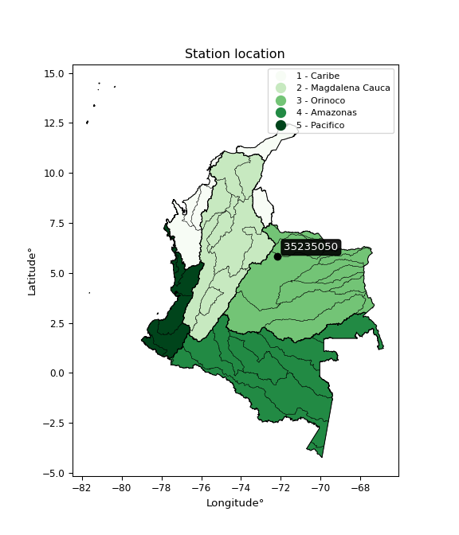

<div align="center">


</div>

# PMax24h Station (Rain, Pmax24h): 35235050

Maximum Precipitation in 24 hours (PMax24h) is the greatest amount of rainfall for a specific duration that is meteorologically possible for a given location, acting as a "worst-case" scenario for extreme storms, crucial for designing safety-critical infrastructure like bridges, river deviations, dams, spillways, and nuclear plants to prevent catastrophic failure. The PMax24h is related with the Probable Maximum Precipitation (PMP) and it is calculated by hydrologists using meteorological data to determine the upper limit of extreme rainfall, often leading to the Probable Maximum Flood (PMF) for flood control design, and is increasingly being studied for climate change impacts. Probable Maximum Precipitation (PMP) is the theoretical upper limit of rainfall, a deterministic estimate for extreme events, while probability distributions (like GEV, Gumbel) describe the likelihood and frequency of various precipitation amounts, including rare ones, showing how often events occur, with PMP representing the extreme end of these distributions, used for critical infrastructure design to ensure safety against the worst conceivable weather, unlike standard statistical forecasts which cover typical probabilities.

The most common probability distributions in hydrology, used for analyzing floods, rainfall, and streamflow, include the Normal, Log-Normal, Gumbel, Gamma (including Log-Pearson Type III), and Generalized Extreme Value (GEV) distributions, often chosen based on the data´s skewness and whether modeling extremes or general conditions, with Gumbel and GEV popular for extreme events like floods, while the Normal distribution serves as a baseline, though often requiring transformations for skewed hydrological data. These distributions help in designing water infrastructure, managing water resources, and forecasting hydrologic events.

> Hydrological data often isn´t perfectly normal (it´s skewed), so different distributions are needed for different applications, such as: **Flood Frequency Analysis**: Using Gumbel, GEV, or Log-Pearson Type III for predicting extreme flood magnitudes and their return periods, **Rainfall Analysis**: Normal for annual totals, but Log-Normal, Weibull, or GEV for intensity or extreme daily rainfall, **Streamflow Modeling**: Gamma and Log-Normal for maximum flows, GEV for minimum flows, and Kappa for daily flows.

<div align="center">

</img>

</div>


## A. General information


### 1. General running parameters

• app_version: _v20260225_. • runtime: _2026-02-27 14:50:08.749431_. • Python version: _3.14.0_. • SciPy version: _1.16.3_. • Pandas version: _2.3.3_. • NumPy version: _2.3.5_. • Stations dataset (station_dataset_file): _dataset/pmax24h_in/automatic_colombia_2003_2025.csv_. • Stations catalog (station_catalog_file): _dataset/CNE.xls_. • Minimum year to eval til year_max (date_min): _1900_. • Maximum year to eval since year_min (date_max): _2025_. • Creates, save and include plots into reports (create_plot): _False_. • Plot only fit distributions with Δo > Δ (plot_only_fit): _True_. • Plot only simple graphs avoiding multiple CDFs and multiple Extreme values plots (plot_only_simple): _False_. • Eval low extreme values, if False, evaluates high extreme values (low_extreme): _False_. • Eval every SciPy distribution as logarithmic (pdist_logarithmic_on): _True_. • Standard deviation normalized (ddof): _1.0_. • Return periods to eval in years (Tr): _[2, 2.33, 5, 10, 15, 20, 25, 50, 75, 100, 200, 250, 500, 750, 1000]_. • Minimum data sample per station, 0 means any (minimum_sample): _5_. • Z-Score maximum threshold to adjust a value, 0 means disable (zscore_max): _3.5_. • Z-Score minimum threshold to adjust a value, 0 means disable (zscore_min): _-2.5_. • Avoid zeros, e.g. rain = 0 (avoid_zeros): _True_. • Avoid null values (avoid_nans): _True_. 

:file_folder:Table: [dataset.csv](../../dataset/pmax24h_in/automatic_colombia_2003_2025.csv)

> Delta Degrees of Freedom (DDOF): is a parameter used in the formulas for calculating variance and standard deviation. When ddof=0, the divisor is $N$ (the total number of observations) and this is used when your data set is the entire population. When ddof=1, the divisor is $N-1$ and this is used when your data set is a sample drawn from a larger population. Using $N-1$ provides an unbiased estimate of the population variance (known as Bessel´s correction).


### 2. Station info and location

|   id |   CODIGO | NOMBRE                  | CATEGORIA               | TECNOLOGIA                              | ESTADO   | FECHA_INSTALACION   |   FECHA_SUSPENSION |   ALTITUD |   LATITUD |   LONGITUD | DEPARTAMENTO   | MUNICIPIO   | AREA_OPERATIVA                              | ENTIDAD                                                     | AREA_HIDROGRAFICA   | ZONA_HIDROGRAFICA   | SUBZONA_HIDROGRAFICA   |   CORRIENTE | Catalogo   |   Version |
|-----:|---------:|:------------------------|:------------------------|:----------------------------------------|:---------|:--------------------|-------------------:|----------:|----------:|-----------:|:---------------|:------------|:--------------------------------------------|:------------------------------------------------------------|:--------------------|:--------------------|:-----------------------|------------:|:-----------|----------:|
|    0 | 35235050 | TAMARA - AUT [35235050] | Climatológica Ordinaria | Automática con Telemetría, Convencional | Activa   | 23/08/2017          |                nan |       117 |   5.81858 |   -72.1668 | Casanare       | Támara      | Area Operativa 06 - Boyacá-Casanare-Vichada | INSTITUTO DE HIDROLOGIA METEOROLOGIA Y ESTUDIOS AMBIENTALES | Orinoco             | Meta                | Río Pauto              |         nan | CNE_IDEAM  |  20251226 |

<div align="center">

Dynamic map: [:earth_americas:Google](http://maps.google.com/maps?q=5.818583333,-72.16677778) [:earth_americas:OSM](https://www.openstreetmap.org/#map=18/5.818583333/-72.16677778&layers=P) [:earth_americas:Bing](https://www.bing.com/maps?cp=5.818583333~-72.16677778&lvl=18) [:earth_americas:Apple](https://maps.apple.com/frame?center=5.818583333%2C-72.16677778&span=0.003%2C0.006)

</div>


<div align="center">

```geojson
{
  "type": "Feature",
  "geometry": {
    "type": "Point", 
    "coordinates": [-72.16677778, 5.818583333]
  }, 
  "properties": {
    "Name": "35235050"
  }
}
```

</div>


### 3. Discrete values table and plot

<div align="center">

|               |           0 |          1 |          2 |           3 |           4 |           5 |           6 |          7 |          8 |
|:--------------|------------:|-----------:|-----------:|------------:|------------:|------------:|------------:|-----------:|-----------:|
| Date          | 2017        | 2018       | 2019       | 2020        | 2021        | 2022        | 2023        | 2024       | 2025       |
| Value         |   68.1      |   76.4     |  100       |   85.9      |   63        |   79.2      |   67        |  157.2     |  127       |
| Value_initial |   68.1      |   76.4     |  100       |   85.9      |   63        |   79.2      |   67        |  157.2     |  127       |
| count         |    9        |    9       |    9       |    9        |    9        |    9        |    9        |    9       |    9       |
| mean          |   91.5333   |   91.5333  |   91.5333  |   91.5333   |   91.5333   |   91.5333   |   91.5333   |   91.5333  |   91.5333  |
| std           |   31.6617   |   31.6617  |   31.6617  |   31.6617   |   31.6617   |   31.6617   |   31.6617   |   31.6617  |   31.6617  |
| zscore        |   -0.740116 |   -0.47797 |    0.26741 |   -0.177923 |   -0.901194 |   -0.389535 |   -0.774859 |    2.07401 |    1.12018 |


</div>


> The initial value (value_initial) correspond to the initial obtained or null completed value, and value (value) is adjusted only when the initial value is outside the valid range (outlier) definite through the Z-Score value. If Z-Score is active, values out of range or outliers are replaced with the station mean value. A Z-Score (or standard score) measures how many standard deviations a data point is from the mean of a dataset, indicating its relative position; positive scores mean above the mean, negative mean below, and a score of zero is exactly at the mean, allowing for comparison of values from different distributions. It´s calculated using the formula $z=(x–μ)/σ$, where $x$ is the data point, $μ$ is the mean, and $σ$ is the standard deviation, helping identify outliers and understand probability.
>
> <sub>**Note**: In this study, "completing" (filling gaps in) and "extending" (forecasting or lengthening the historical record) rainfall data series are avoided for certain critical analyses because they introduce artificial bias and uncertainty, which can distort the statistics of rare events (extremes), alter day-to-day variability, and compromise the integrity and homogeneity of the original data. Some reasons against Completing/Extending rainfall data are: **Distortion of Extremes and Variability**: The primary issue is that most gap-filling or extension methods rely on averaging or regression with nearby stations, which inherently smooths the data. Rainfall is highly variable in space and time, with a large percentage of zero values and occasional large storms. Infilling methods often underestimate the highest values and overestimate the lowest (zero) values, which severely distorts analyses focused on flood frequency, drought severity, and intensity-duration-frequency (IDF) curves, **Loss of Data Homogeneity**: Infilled or extended data are synthetic estimates, not actual measurements. Combining these estimates with observed data can violate the assumption of data homogeneity, which requires that the data properties do not change over time. Inhomogeneity can lead to incorrect conclusions about long-term trends or changes in climate patterns, **Propagation of Errors**: Errors and biases from the original data (e.g., wind-induced undercatch, instrument errors, site changes) or the data used for imputation can propagate through the analysis, leading to unreliable hydrological models and inaccurate predictions, **Compromised Statistical Integrity**: For statistical analyses, especially those involving the frequency of events, using artificial data can introduce time bias or autocorrelation that doesn´t exist in reality, making it difficult to assess the true probability of events, **Difficulty in Validation**: It is difficult to accurately validate the quality of filled or extended data, especially for past periods where ground-truth measurements are unavailable. The reliability of imputation techniques heavily depends on the density of the surrounding station network and the complexity of the local topography.</sub>


### 4. Active continuous probability distributions from SciPy (80 of 104 available)

A Probability Density Function (PDF) describes the relative likelihood of a continuous random variable falling within a specific range, where the total area under its curve equals 1, and the area over any interval gives the actual probability for that range. Unlike discrete probabilities (like rolling a die), a PDF shows density, not direct probability for a single point (which is zero), with higher points indicating higher likelihood, often visualized as a bell curve for normal distributions.

A log of a probability density function (log-PDF) is simply the logarithm of the PDF´s value, denoted as $log(f(x))$, useful for converting multiplication of probabilities into addition, improving numerical stability with tiny numbers, and connecting to information theory concepts like entropy. Instead of dealing with very small probabilities (e.g., 0.000001), log-PDFs use negative numbers (e.g., $log(0.00001) ≈ -11.51$ that are easier for computers to handle, preventing underflow errors and simplifying complex calculations. In this study, each active probability distribution from SciPy is also evaluated in the $log$ form.

[scipy.stats](https://docs.scipy.org/doc/scipy/reference/stats.html) is a Python´s powerful submodule within the SciPy library for comprehensive statistical analysis, offering over 130 probability distributions (like Normal, Poisson, etc.), functions for descriptive stats (mean, variance), hypothesis testing (t-tests, chi-square), random variable generation, and statistical tests, making it essential for data science, modeling, and research. It provides tools to explore, model, and draw conclusions from data efficiently, working seamlessly with [NumPy](https://numpy.org/).

<div align="center">

|   id | p_dist           |   n_parameter | fit_method   | label                                                                       | active   | ref                                                                                                      |
|-----:|:-----------------|--------------:|:-------------|:----------------------------------------------------------------------------|:---------|:---------------------------------------------------------------------------------------------------------|
|    0 | alpha            |             3 | MLE          | Alpha                                                                       | True     | [:mortar_board:](https://docs.scipy.org/doc/scipy/reference/generated/scipy.stats.alpha.html)            |
|    1 | anglit           |             2 | MM           | Anglit                                                                      | True     | [:mortar_board:](https://docs.scipy.org/doc/scipy/reference/generated/scipy.stats.anglit.html)           |
|    2 | arcsine          |             2 | MM           | Arcsine                                                                     | True     | [:mortar_board:](https://docs.scipy.org/doc/scipy/reference/generated/scipy.stats.arcsine.html)          |
|    3 | argus            |             3 | MLE          | Argus                                                                       | True     | [:mortar_board:](https://docs.scipy.org/doc/scipy/reference/generated/scipy.stats.argus.html)            |
|    4 | beta             |             4 | MLE          | Beta                                                                        | True     | [:mortar_board:](https://docs.scipy.org/doc/scipy/reference/generated/scipy.stats.beta.html)             |
|    5 | betaprime        |             4 | MLE          | Beta prime                                                                  | True     | [:mortar_board:](https://docs.scipy.org/doc/scipy/reference/generated/scipy.stats.betaprime.html)        |
|    6 | bradford         |             3 | MLE          | Bradford                                                                    | True     | [:mortar_board:](https://docs.scipy.org/doc/scipy/reference/generated/scipy.stats.bradford.html)         |
|    7 | burr             |             4 | MLE          | Burr (Type III)                                                             | True     | [:mortar_board:](https://docs.scipy.org/doc/scipy/reference/generated/scipy.stats.burr.html)             |
|    8 | burr12           |             4 | MLE          | Burr (Type III) 12                                                          | True     | [:mortar_board:](https://docs.scipy.org/doc/scipy/reference/generated/scipy.stats.burr12.html)           |
|    9 | cosine           |             2 | MLE          | Cosine                                                                      | True     | [:mortar_board:](https://docs.scipy.org/doc/scipy/reference/generated/scipy.stats.cosine.html)           |
|   10 | crystalball      |             4 | MLE          | Crystalball                                                                 | True     | [:mortar_board:](https://docs.scipy.org/doc/scipy/reference/generated/scipy.stats.crystalball.html)      |
|   11 | dgamma           |             3 | MLE          | Double gamma                                                                | True     | [:mortar_board:](https://docs.scipy.org/doc/scipy/reference/generated/scipy.stats.dgamma.html)           |
|   12 | dweibull         |             3 | MLE          | Double Weibull                                                              | True     | [:mortar_board:](https://docs.scipy.org/doc/scipy/reference/generated/scipy.stats.dweibull.html)         |
|   13 | erlang           |             3 | MLE          | Erlang                                                                      | True     | [:mortar_board:](https://docs.scipy.org/doc/scipy/reference/generated/scipy.stats.erlang.html)           |
|   14 | exponnorm        |             3 | MLE          | Exponentially modified Normal                                               | True     | [:mortar_board:](https://docs.scipy.org/doc/scipy/reference/generated/scipy.stats.exponnorm.html)        |
|   15 | exponpow         |             3 | MLE          | Exponential power                                                           | True     | [:mortar_board:](https://docs.scipy.org/doc/scipy/reference/generated/scipy.stats.exponpow.html)         |
|   16 | exponweib        |             4 | MLE          | Exponentiated Weibull                                                       | True     | [:mortar_board:](https://docs.scipy.org/doc/scipy/reference/generated/scipy.stats.exponweib.html)        |
|   17 | f                |             4 | MLE          | F                                                                           | True     | [:mortar_board:](https://docs.scipy.org/doc/scipy/reference/generated/scipy.stats.f.html)                |
|   18 | fatiguelife      |             3 | MLE          | Fatigue-life (Birnbaum-Saunders)                                            | True     | [:mortar_board:](https://docs.scipy.org/doc/scipy/reference/generated/scipy.stats.fatiguelife.html)      |
|   19 | foldnorm         |             3 | MM           | Fold Normal                                                                 | True     | [:mortar_board:](https://docs.scipy.org/doc/scipy/reference/generated/scipy.stats.foldnorm.html)         |
|   20 | gamma            |             3 | MLE          | Gamma                                                                       | True     | [:mortar_board:](https://docs.scipy.org/doc/scipy/reference/generated/scipy.stats.gamma.html)            |
|   21 | gausshyper       |             6 | MLE          | Gauss hypergeometric                                                        | True     | [:mortar_board:](https://docs.scipy.org/doc/scipy/reference/generated/scipy.stats.gausshyper.html)       |
|   22 | genexpon         |             5 | MLE          | Generalized exponential                                                     | True     | [:mortar_board:](https://docs.scipy.org/doc/scipy/reference/generated/scipy.stats.genexpon.html)         |
|   23 | genextreme       |             3 | MLE          | Generalized exponential                                                     | True     | [:mortar_board:](https://docs.scipy.org/doc/scipy/reference/generated/scipy.stats.genextreme.html)       |
|   24 | gengamma         |             4 | MLE          | Generalized gamma                                                           | True     | [:mortar_board:](https://docs.scipy.org/doc/scipy/reference/generated/scipy.stats.gengamma.html)         |
|   25 | genhalflogistic  |             3 | MLE          | Generalized half-logistic                                                   | True     | [:mortar_board:](https://docs.scipy.org/doc/scipy/reference/generated/scipy.stats.genhalflogistic.html)  |
|   26 | genlogistic      |             3 | MLE          | Generalized logistic                                                        | True     | [:mortar_board:](https://docs.scipy.org/doc/scipy/reference/generated/scipy.stats.genlogistic.html)      |
|   27 | gennorm          |             3 | MLE          | Generalized Normal                                                          | True     | [:mortar_board:](https://docs.scipy.org/doc/scipy/reference/generated/scipy.stats.gennorm.html)          |
|   28 | genpareto        |             3 | MLE          | Generalized Pareto                                                          | True     | [:mortar_board:](https://docs.scipy.org/doc/scipy/reference/generated/scipy.stats.genpareto.html)        |
|   29 | gompertz         |             3 | MLE          | Gompertz (or truncated Gumbel)                                              | True     | [:mortar_board:](https://docs.scipy.org/doc/scipy/reference/generated/scipy.stats.gompertz.html)         |
|   30 | gumbel_l         |             2 | MM           | Gumbel Left Skew                                                            | True     | [:mortar_board:](https://docs.scipy.org/doc/scipy/reference/generated/scipy.stats.gumbel_l.html)         |
|   31 | gumbel_r         |             2 | MM           | Gumbel Right Skew                                                           | True     | [:mortar_board:](https://docs.scipy.org/doc/scipy/reference/generated/scipy.stats.gumbel_r.html)         |
|   32 | halfgennorm      |             3 | MLE          | Upper half of a generalized normal                                          | True     | [:mortar_board:](https://docs.scipy.org/doc/scipy/reference/generated/scipy.stats.halfgennorm.html)      |
|   33 | halflogistic     |             2 | MM           | Half-logistic                                                               | True     | [:mortar_board:](https://docs.scipy.org/doc/scipy/reference/generated/scipy.stats.halflogistic.html)     |
|   34 | halfnorm         |             2 | MM           | Half Normal                                                                 | True     | [:mortar_board:](https://docs.scipy.org/doc/scipy/reference/generated/scipy.stats.halfnorm.html)         |
|   35 | hypsecant        |             2 | MM           | hyperbolic secant                                                           | True     | [:mortar_board:](https://docs.scipy.org/doc/scipy/reference/generated/scipy.stats.hypsecant.html)        |
|   36 | invgamma         |             3 | MLE          | Inverted gamma                                                              | True     | [:mortar_board:](https://docs.scipy.org/doc/scipy/reference/generated/scipy.stats.invgamma.html)         |
|   37 | invgauss         |             3 | MLE          | Inverse Gaussian                                                            | True     | [:mortar_board:](https://docs.scipy.org/doc/scipy/reference/generated/scipy.stats.invgauss.html)         |
|   38 | invweibull       |             3 | MLE          | Inverted Weibull                                                            | True     | [:mortar_board:](https://docs.scipy.org/doc/scipy/reference/generated/scipy.stats.invweibull.html)       |
|   39 | johnsonsb        |             4 | MLE          | Johnson SB                                                                  | True     | [:mortar_board:](https://docs.scipy.org/doc/scipy/reference/generated/scipy.stats.johnsonsb.html)        |
|   40 | johnsonsu        |             4 | MLE          | Johnson Su                                                                  | True     | [:mortar_board:](https://docs.scipy.org/doc/scipy/reference/generated/scipy.stats.johnsonsu.html)        |
|   41 | kappa3           |             3 | MLE          | Kappa 3                                                                     | True     | [:mortar_board:](https://docs.scipy.org/doc/scipy/reference/generated/scipy.stats.kappa3.html)           |
|   42 | kappa4           |             4 | MLE          | Kappa 4                                                                     | True     | [:mortar_board:](https://docs.scipy.org/doc/scipy/reference/generated/scipy.stats.kappa4.html)           |
|   43 | ksone            |             3 | MLE          | Kolmogorov-Smirnov one-sided test statistic distribution                    | True     | [:mortar_board:](https://docs.scipy.org/doc/scipy/reference/generated/scipy.stats.ksone.html)            |
|   44 | kstwobign        |             2 | MLE          | Limiting distribution of scaled Kolmogorov-Smirnov two-sided test statistic | True     | [:mortar_board:](https://docs.scipy.org/doc/scipy/reference/generated/scipy.stats.kstwobign.html)        |
|   45 | laplace          |             2 | MM           | Laplace                                                                     | True     | [:mortar_board:](https://docs.scipy.org/doc/scipy/reference/generated/scipy.stats.laplace.html)          |
|   46 | levy_l           |             2 | MLE          | Left-skewed Levy                                                            | True     | [:mortar_board:](https://docs.scipy.org/doc/scipy/reference/generated/scipy.stats.levy_l.html)           |
|   47 | loggamma         |             3 | MLE          | Log gamma                                                                   | True     | [:mortar_board:](https://docs.scipy.org/doc/scipy/reference/generated/scipy.stats.loggamma.html)         |
|   48 | logistic         |             2 | MM           | Logistic (or Sech-squared)                                                  | True     | [:mortar_board:](https://docs.scipy.org/doc/scipy/reference/generated/scipy.stats.logistic.html)         |
|   49 | loglaplace       |             3 | MLE          | Log-Laplace                                                                 | True     | [:mortar_board:](https://docs.scipy.org/doc/scipy/reference/generated/scipy.stats.loglaplace.html)       |
|   50 | lomax            |             3 | MLE          | Lomax (Pareto of the second kind)                                           | True     | [:mortar_board:](https://docs.scipy.org/doc/scipy/reference/generated/scipy.stats.lomax.html)            |
|   51 | maxwell          |             2 | MM           | Maxwell                                                                     | True     | [:mortar_board:](https://docs.scipy.org/doc/scipy/reference/generated/scipy.stats.maxwell.html)          |
|   52 | mielke           |             4 | MLE          | Mielke Beta-Kappa / Dagum                                                   | True     | [:mortar_board:](https://docs.scipy.org/doc/scipy/reference/generated/scipy.stats.mielke.html)           |
|   53 | moyal            |             2 | MM           | Moyal                                                                       | True     | [:mortar_board:](https://docs.scipy.org/doc/scipy/reference/generated/scipy.stats.moyal.html)            |
|   54 | nakagami         |             3 | MLE          | Nakagami                                                                    | True     | [:mortar_board:](https://docs.scipy.org/doc/scipy/reference/generated/scipy.stats.nakagami.html)         |
|   55 | ncf              |             5 | MLE          | Non-central F distribution                                                  | True     | [:mortar_board:](https://docs.scipy.org/doc/scipy/reference/generated/scipy.stats.ncf.html)              |
|   56 | nct              |             4 | MLE          | Non-central Student’s t                                                     | True     | [:mortar_board:](https://docs.scipy.org/doc/scipy/reference/generated/scipy.stats.nct.html)              |
|   57 | norm             |             2 | MM           | Normal                                                                      | True     | [:mortar_board:](https://docs.scipy.org/doc/scipy/reference/generated/scipy.stats.norm.html)             |
|   58 | pearson3         |             3 | MM           | Pearson type III                                                            | True     | [:mortar_board:](https://docs.scipy.org/doc/scipy/reference/generated/scipy.stats.pearson3.html)         |
|   59 | powerlaw         |             3 | MLE          | Power-function                                                              | True     | [:mortar_board:](https://docs.scipy.org/doc/scipy/reference/generated/scipy.stats.powerlaw.html)         |
|   60 | rayleigh         |             2 | MM           | Rayleigh                                                                    | True     | [:mortar_board:](https://docs.scipy.org/doc/scipy/reference/generated/scipy.stats.rayleigh.html)         |
|   61 | rdist            |             3 | MLE          | R-distributed (symmetric beta)                                              | True     | [:mortar_board:](https://docs.scipy.org/doc/scipy/reference/generated/scipy.stats.rdist.html)            |
|   62 | rice             |             3 | MLE          | Rice                                                                        | True     | [:mortar_board:](https://docs.scipy.org/doc/scipy/reference/generated/scipy.stats.rice.html)             |
|   63 | semicircular     |             2 | MM           | Semicircular                                                                | True     | [:mortar_board:](https://docs.scipy.org/doc/scipy/reference/generated/scipy.stats.semicircular.html)     |
|   64 | skewnorm         |             3 | MLE          | Skew normal                                                                 | True     | [:mortar_board:](https://docs.scipy.org/doc/scipy/reference/generated/scipy.stats.skewnorm.html)         |
|   65 | t                |             3 | MLE          | Student’s t                                                                 | True     | [:mortar_board:](https://docs.scipy.org/doc/scipy/reference/generated/scipy.stats.t.html)                |
|   66 | trapezoid        |             4 | MLE          | Trapezoid                                                                   | True     | [:mortar_board:](https://docs.scipy.org/doc/scipy/reference/generated/scipy.stats.trapezoid.html)        |
|   67 | triang           |             3 | MLE          | Triangular                                                                  | True     | [:mortar_board:](https://docs.scipy.org/doc/scipy/reference/generated/scipy.stats.triang.html)           |
|   68 | truncexpon       |             3 | MLE          | Truncated exponential                                                       | True     | [:mortar_board:](https://docs.scipy.org/doc/scipy/reference/generated/scipy.stats.truncexpon.html)       |
|   69 | truncnorm        |             4 | MLE          | Truncated normal                                                            | True     | [:mortar_board:](https://docs.scipy.org/doc/scipy/reference/generated/scipy.stats.truncnorm.html)        |
|   70 | truncpareto      |             4 | MLE          | Upper truncated Pareto                                                      | True     | [:mortar_board:](https://docs.scipy.org/doc/scipy/reference/generated/scipy.stats.truncpareto.html)      |
|   71 | truncweibull_min |             5 | MLE          | Doubly truncated Weibull minimum                                            | True     | [:mortar_board:](https://docs.scipy.org/doc/scipy/reference/generated/scipy.stats.truncweibull_min.html) |
|   72 | tukeylambda      |             3 | MLE          | Tukey-Lamdba                                                                | True     | [:mortar_board:](https://docs.scipy.org/doc/scipy/reference/generated/scipy.stats.tukeylambda.html)      |
|   73 | uniform          |             2 | MLE          | Uniform                                                                     | True     | [:mortar_board:](https://docs.scipy.org/doc/scipy/reference/generated/scipy.stats.uniform.html)          |
|   74 | vonmises         |             3 | MLE          | Von Mises                                                                   | True     | [:mortar_board:](https://docs.scipy.org/doc/scipy/reference/generated/scipy.stats.vonmises.html)         |
|   75 | vonmises_line    |             3 | MLE          | Von Mises line                                                              | True     | [:mortar_board:](https://docs.scipy.org/doc/scipy/reference/generated/scipy.stats.vonmises_line.html)    |
|   76 | wald             |             2 | MM           | Wald                                                                        | True     | [:mortar_board:](https://docs.scipy.org/doc/scipy/reference/generated/scipy.stats.wald.html)             |
|   77 | weibull_max      |             3 | MLE          | Weibull maximum                                                             | True     | [:mortar_board:](https://docs.scipy.org/doc/scipy/reference/generated/scipy.stats.weibull_max.html)      |
|   78 | weibull_min      |             3 | MLE          | Weibull minimum                                                             | True     | [:mortar_board:](https://docs.scipy.org/doc/scipy/reference/generated/scipy.stats.weibull_min.html)      |
|   79 | wrapcauchy       |             3 | MLE          | Wrapped  Cauchy                                                             | True     | [:mortar_board:](https://docs.scipy.org/doc/scipy/reference/generated/scipy.stats.wrapcauchy.html)       |

</div>

> **n_parameter:** # arguments & localization & scale.
>
> **Fit methods:** (MLE) maximum likelihood, (MM) L-moments.
>
>**Inactive** (With the only purpose of prevent loops, zero divisions, infinite values, over high estimated values or horizontal trending for recurrence intervals estimations, the follow distributions were disabled.)**:** lognorm, norminvgauss, powernorm, powerlognorm, cauchy, halfcauchy, foldcauchy, skewcauchy, chi2, expon, fisk, genhyperbolic, geninvgauss, gibrat, kstwo, laplace_asymmetric, levy, levy_stable, ncx2, pareto, rel_breitwigner, recipinvgauss, studentized_range, loguniform, 


## B. Probability (PDF) vs. Empirical (EDF) distributions functions

A continuous probability distribution (CPD) describes probabilities for variables that can take any value within a range (like rain any time), unlike discrete variables with specific outcomes (like temperature). It uses a Probability Density Function (PDF), a curve where the total area under it equals 1, and the probability of the variable falling within an interval (a to b) is found by calculating the area under the curve between those points. A key feature is that the probability of hitting any single exact value is zero, so probabilities are always expressed for ranges, e.g., $P(a ≤ X ≤ b)$.

<div align="center">

Distributions parameters from station values
|     |   station | p_dist              |   n |               loc |           scale | shape                  | shape1                | shape2             | shape3             |
|----:|----------:|:--------------------|----:|------------------:|----------------:|:-----------------------|:----------------------|:-------------------|:-------------------|
|   0 |  35235050 | alpha               |   9 |      56.1587      |    14.4376      | 7.392584459766418e-06  |                       |                    |                    |
|   1 |  35235050 | anglit              |   9 |      91.5333      |    87.3259      |                        |                       |                    |                    |
|   2 |  35235050 | arcsine             |   9 |      49.3177      |    84.4312      |                        |                       |                    |                    |
|   3 |  35235050 | argus               |   9 |      22.049       |   139.508       | 9.317055178227031e-07  |                       |                    |                    |
|   4 |  35235050 | beta                |   9 |      63           |    99.852       | 0.2892585792502472     | 0.7924893792361829    |                    |                    |
|   5 |  35235050 | betaprime           |   9 |      -1.69505     |     3.39557     | 347.07360626657305     | 13.692437172316325    |                    |                    |
|   6 |  35235050 | bradford            |   9 |      63           |    94.2         | 0.9702096543262706     |                       |                    |                    |
|   7 |  35235050 | burr                |   9 |      35.1077      |     2.68858     | 2.6134588947927444     | 1148.594054275361     |                    |                    |
|   8 |  35235050 | burr12              |   9 |      -3.35499     |    66.0811      | 799.526147029002       | 0.0039212218882020075 |                    |                    |
|   9 |  35235050 | cosine              |   9 |      96.788       |    26.1602      |                        |                       |                    |                    |
|  10 |  35235050 | crystalball         |   9 |      91.5333      |    29.8509      | 7821.686116304543      | 427.739069052739      |                    |                    |
|  11 |  35235050 | dgamma              |   9 |      79.2         |    21.9759      | 0.9409339437490538     |                       |                    |                    |
|  12 |  35235050 | dweibull            |   9 |      76.4         |    22.9256      | 0.9032994233732493     |                       |                    |                    |
|  13 |  35235050 | erlang              |   9 |      63           |    25.5726      | 0.6910361077944727     |                       |                    |                    |
|  14 |  35235050 | exponnorm           |   9 |      62.969       |     0.0100582   | 2809.9557317869785     |                       |                    |                    |
|  15 |  35235050 | exponpow            |   9 |      63           |    81.3779      | 0.34180453206276773    |                       |                    |                    |
|  16 |  35235050 | exponweib           |   9 |      63           |    34.4398      | 0.6834676503812183     | 0.8459838367147601    |                    |                    |
|  17 |  35235050 | f                   |   9 |      56.3029      |    17.9381      | 1057234.1884792903     | 3.370422471397869     |                    |                    |
|  18 |  35235050 | fatiguelife         |   9 |      60.8611      |    16.5296      | 1.2855433944897536     |                       |                    |                    |
|  19 |  35235050 | foldnorm            |   9 |      51.606       |    49.0192      | 0.1977319796295411     |                       |                    |                    |
|  20 |  35235050 | gamma               |   9 |      63           |    30.6022      | 0.38424215606154566    |                       |                    |                    |
|  21 |  35235050 | gausshyper          |   9 |      63           |    95.7934      | 0.9587969320204326     | 1.0585352205372893    | 1.0998125040909243 | 0.9155946999510116 |
|  22 |  35235050 | genexpon            |   9 |      63           |    32.8067      | 1.1498221954670775     | 2.276554536398935e-08 | 1.4721005963960123 |                    |
|  23 |  35235050 | genextreme          |   9 |      73.018       |    12.4615      | -0.6931236585929628    |                       |                    |                    |
|  24 |  35235050 | gengamma            |   9 |      63           |    34.865       | 0.662397829153573      | 0.7847874896162244    |                    |                    |
|  25 |  35235050 | genhalflogistic     |   9 |      57.6954      |   103.931       | 1.0444854682054272     |                       |                    |                    |
|  26 |  35235050 | genlogistic         |   9 |     -69.3755      |    19.4136      | 2047.9037473423823     |                       |                    |                    |
|  27 |  35235050 | gennorm             |   9 |      79.2         |     2.92986     | 0.4686442054301343     |                       |                    |                    |
|  28 |  35235050 | genpareto           |   9 |      -0.930564    |   214.591       | -1.357051116587094     |                       |                    |                    |
|  29 |  35235050 | gompertz            |   9 |      63           |     5.06384e+08 | 17968456.257829048     |                       |                    |                    |
|  30 |  35235050 | gumbel_l            |   9 |     104.968       |    23.2747      |                        |                       |                    |                    |
|  31 |  35235050 | gumbel_r            |   9 |      78.0988      |    23.2747      |                        |                       |                    |                    |
|  32 |  35235050 | halfgennorm         |   9 |      63           |     1.5614      | 0.3905952728971367     |                       |                    |                    |
|  33 |  35235050 | halflogistic        |   9 |      56.153       |    25.5215      |                        |                       |                    |                    |
|  34 |  35235050 | halfnorm            |   9 |      52.0224      |    49.5196      |                        |                       |                    |                    |
|  35 |  35235050 | hypsecant           |   9 |      91.5333      |    19.0037      |                        |                       |                    |                    |
|  36 |  35235050 | invgamma            |   9 |      56.3032      |    30.2279      | 1.6851725516054796     |                       |                    |                    |
|  37 |  35235050 | invgauss            |   9 |      59.2031      |    21.3912      | 1.5113807230333585     |                       |                    |                    |
|  38 |  35235050 | invweibull          |   9 |      55.0392      |    17.9789      | 1.4427468262635819     |                       |                    |                    |
|  39 |  35235050 | johnsonsb           |   9 |      63           |    94.2184      | 1.2345909023531962     | 0.11107692319837359   |                    |                    |
|  40 |  35235050 | johnsonsu           |   9 |      61.4633      |     0.0617369   | -5.116748034167649     | 0.8151163999270249    |                    |                    |
|  41 |  35235050 | kappa3              |   9 |      51.2462      |   123.626       | 367.42423399607424     |                       |                    |                    |
|  42 |  35235050 | kappa4              |   9 |      49.0797      |   105.871       | 1.1510295914144062     | 0.9699448141822722    |                    |                    |
|  43 |  35235050 | ksone               |   9 |      53.58        |   113.04        | 1.0                    |                       |                    |                    |
|  44 |  35235050 | kstwobign           |   9 |       8.1917      |    96.3595      |                        |                       |                    |                    |
|  45 |  35235050 | laplace             |   9 |      91.5333      |    21.1078      |                        |                       |                    |                    |
|  46 |  35235050 | levy_l              |   9 |     164.714       |    37.3167      |                        |                       |                    |                    |
|  47 |  35235050 | loggamma            |   9 |   -9023.01        |  1232.36        | 1630.0914424717967     |                       |                    |                    |
|  48 |  35235050 | logistic            |   9 |      91.5333      |    16.4577      |                        |                       |                    |                    |
|  49 |  35235050 | loglaplace          |   9 |      -0.198728    |    79.3987      | 4.388557241259931      |                       |                    |                    |
|  50 |  35235050 | lomax               |   9 |      63           |     2.9587e+11  | 8356989674.898611      |                       |                    |                    |
|  51 |  35235050 | maxwell             |   9 |      20.7992      |    44.3261      |                        |                       |                    |                    |
|  52 |  35235050 | mielke              |   9 |      39.7351      |     1.85631     | 6153.379461027294      | 2.647014457229285     |                    |                    |
|  53 |  35235050 | moyal               |   9 |      74.4627      |    13.4376      |                        |                       |                    |                    |
|  54 |  35235050 | nakagami            |   9 |      63           |    57.3551      | 0.2370316312243356     |                       |                    |                    |
|  55 |  35235050 | ncf                 |   9 |      -0.00967588  |     3.23018e-06 | 1.19289379091046e-07   | 1.819097547739744     | 1.977147584253986  |                    |
|  56 |  35235050 | nct                 |   9 |      -0.245852    |     1.09144     | 7.323509740973947      | 74.79087706521142     |                    |                    |
|  57 |  35235050 | norm                |   9 |      91.5333      |    29.8509      |                        |                       |                    |                    |
|  58 |  35235050 | pearson3            |   9 |      91.5333      |    29.851       | 1.1361669080214256     |                       |                    |                    |
|  59 |  35235050 | powerlaw            |   9 |      63           |    94.2         | 0.18128881780229994    |                       |                    |                    |
|  60 |  35235050 | rayleigh            |   9 |      34.4268      |    45.5644      |                        |                       |                    |                    |
|  61 |  35235050 | rdist               |   9 |      64.5798      |    35.4202      | 1.121516946458779      |                       |                    |                    |
|  62 |  35235050 | rice                |   9 |      45.6241      |    38.7217      | 0.0007515082459148821  |                       |                    |                    |
|  63 |  35235050 | semicircular        |   9 |      91.5333      |    59.7019      |                        |                       |                    |                    |
|  64 |  35235050 | skewnorm            |   9 |      63           |    41.2946      | 18386775.256519392     |                       |                    |                    |
|  65 |  35235050 | t                   |   9 |      91.5096      |    29.6529      | 134.57092166908467     |                       |                    |                    |
|  66 |  35235050 | trapezoid           |   9 |      53.58        |   113.04        | 1.0                    | 1.0                   |                    |                    |
|  67 |  35235050 | triang              |   9 |       9.61697     |   147.583       | 0.9999999999948659     |                       |                    |                    |
|  68 |  35235050 | truncexpon          |   9 |      63           |    83.7584      | 1.1246628032329165     |                       |                    |                    |
|  69 |  35235050 | truncnorm           |   9 | -118506           |  1882.04        | 62.99994041647935      | 159.56474960816632    |                    |                    |
|  70 |  35235050 | truncpareto         |   9 |    -144.52        |   207.52        | 6.0991706993810055     | 1.4539316786529826    |                    |                    |
|  71 |  35235050 | truncweibull_min    |   9 |      63           |    74.5713      | 0.6148207274327737     | 5.657882689454848e-17 | 1.2697078231958314 |                    |
|  72 |  35235050 | tukeylambda         |   9 |      81.4992      |    21.7251      | 1.1742791852777836     |                       |                    |                    |
|  73 |  35235050 | uniform             |   9 |      63           |    94.2         |                        |                       |                    |                    |
|  74 |  35235050 | vonmises            |   9 |      -0.596939    |     1           | 0.6683347936919456     |                       |                    |                    |
|  75 |  35235050 | vonmises_line       |   9 |      84.87        |    23.0234      | 1.152080466672024      |                       |                    |                    |
|  76 |  35235050 | wald                |   9 |      61.6824      |    29.8509      |                        |                       |                    |                    |
|  77 |  35235050 | weibull_max         |   9 |     157.2         |     1.4958      | 0.19537587913713317    |                       |                    |                    |
|  78 |  35235050 | weibull_min         |   9 |      63           |    19.3389      | 0.5234266227703976     |                       |                    |                    |
|  79 |  35235050 | wrapcauchy          |   9 |      63           |    14.9924      | 0.5                    |                       |                    |                    |
|  80 |  35235050 | logalpha            |   9 |       3.55164     |     3.00823     | 3.6181993587001857     |                       |                    |                    |
|  81 |  35235050 | loganglit           |   9 |       4.47076     |     0.855983    |                        |                       |                    |                    |
|  82 |  35235050 | logarcsine          |   9 |       4.05695     |     0.827615    |                        |                       |                    |                    |
|  83 |  35235050 | logargus            |   9 |       3.80973     |     1.29        | 0.00017269624891984216 |                       |                    |                    |
|  84 |  35235050 | logbeta             |   9 |       4.14313     |     1.05839     | 0.4501652815755002     | 1.0446319447930632    |                    |                    |
|  85 |  35235050 | logbetaprime        |   9 |       2.08391     |     0.263624    | 669.8251689218836      | 74.97130811330234     |                    |                    |
|  86 |  35235050 | logbradford         |   9 |       4.13773     |     0.91979     | 4.52666124141528       |                       |                    |                    |
|  87 |  35235050 | logburr             |   9 |       3.1299      |     0.492183    | 6.3664448511504865     | 270.320264093776      |                    |                    |
|  88 |  35235050 | logburr12           |   9 |  -14789.6         | 14793.8         | 2410718.8571874993     | 0.01818803097771749   |                    |                    |
|  89 |  35235050 | logcosine           |   9 |       4.50788     |     0.247835    |                        |                       |                    |                    |
|  90 |  35235050 | logcrystalball      |   9 |       4.47076     |     0.292601    | 61.23221883511384      | 3.0335316255421447    |                    |                    |
|  91 |  35235050 | logdgamma           |   9 |       4.41603     |     0.153949    | 1.5151431333811902     |                       |                    |                    |
|  92 |  35235050 | logdweibull         |   9 |       4.42041     |     0.253118    | 1.2880075703169074     |                       |                    |                    |
|  93 |  35235050 | logerlang           |   9 |       4.14313     |     0.728077    | 0.2152534353292004     |                       |                    |                    |
|  94 |  35235050 | logexponnorm        |   9 |       4.14273     |     0.000131722 | 2484.5937894211283     |                       |                    |                    |
|  95 |  35235050 | logexponpow         |   9 |       4.14313     |     0.536176    | 0.9081671295509882     |                       |                    |                    |
|  96 |  35235050 | logexponweib        |   9 |       4.14313     |     0.455593    | 0.16937245200053702    | 1.3530879140852958    |                    |                    |
|  97 |  35235050 | logf                |   9 |       3.98822     |     0.337691    | 700.374589956207       | 6.011986455132627     |                    |                    |
|  98 |  35235050 | logfatiguelife      |   9 |       4.09175     |     0.257354    | 0.9618258961521433     |                       |                    |                    |
|  99 |  35235050 | logfoldnorm         |   9 |       4.06219     |     0.390367    | 0.8107172668408786     |                       |                    |                    |
| 100 |  35235050 | loggamma            |   9 |       4.14313     |     0.375266    | 0.24301707915723808    |                       |                    |                    |
| 101 |  35235050 | loggausshyper       |   9 |       4.14313     |     0.965712    | 0.8283999632258987     | 1.1290015098144064    | 0.9418773887234373 | 1.1187155961946424 |
| 102 |  35235050 | loggenexpon         |   9 |       4.14313     |    81.2738      | 217.7463802492771      | 1338.357787940328     | 6.303924135172863  |                    |
| 103 |  35235050 | loggenextreme       |   9 |       4.29891     |     0.170861    | -0.3890884069571626    |                       |                    |                    |
| 104 |  35235050 | loggengamma         |   9 |       4.14313     |     0.730951    | 0.1499852056572847     | 1.5860173804109348    |                    |                    |
| 105 |  35235050 | loggenhalflogistic  |   9 |       4.01676     |     1.09979     | 1.0567214797523896     |                       |                    |                    |
| 106 |  35235050 | loggenlogistic      |   9 |       2.79645     |     0.211622    | 1460.8785091688474     |                       |                    |                    |
| 107 |  35235050 | loggennorm          |   9 |       4.37198     |     0.221345    | 0.9820928235183423     |                       |                    |                    |
| 108 |  35235050 | loggenpareto        |   9 |      -0.00827813  |     9.87347     | -1.9490453411184219    |                       |                    |                    |
| 109 |  35235050 | loggompertz         |   9 |       4.14313     |     0.674872    | 1.2472296469148731     |                       |                    |                    |
| 110 |  35235050 | loggumbel_l         |   9 |       4.60245     |     0.228142    |                        |                       |                    |                    |
| 111 |  35235050 | loggumbel_r         |   9 |       4.33907     |     0.228142    |                        |                       |                    |                    |
| 112 |  35235050 | loghalfgennorm      |   9 |       4.14313     |     0.371955    | 1.100737875500704      |                       |                    |                    |
| 113 |  35235050 | loghalflogistic     |   9 |       4.12395     |     0.250166    |                        |                       |                    |                    |
| 114 |  35235050 | loghalfnorm         |   9 |       4.08347     |     0.4854      |                        |                       |                    |                    |
| 115 |  35235050 | loghypsecant        |   9 |       4.47076     |     0.186277    |                        |                       |                    |                    |
| 116 |  35235050 | loginvgamma         |   9 |       3.98678     |     1.01795     | 3.0059001312814493     |                       |                    |                    |
| 117 |  35235050 | loginvgauss         |   9 |       4.06461     |     0.506742    | 0.8015192788070362     |                       |                    |                    |
| 118 |  35235050 | loginvweibull       |   9 |       3.85982     |     0.439083    | 2.5698526199141405     |                       |                    |                    |
| 119 |  35235050 | logjohnsonsb        |   9 |       4.14313     |     0.914384    | -0.1996186407398931    | 0.12474557544117348   |                    |                    |
| 120 |  35235050 | logjohnsonsu        |   9 |       4.09324     |     0.00215245  | -6.089658481124989     | 1.1061934322411995    |                    |                    |
| 121 |  35235050 | logkappa3           |   9 |       4.14313     |     0.913834    | 3656.5685069805695     |                       |                    |                    |
| 122 |  35235050 | logkappa4           |   9 |       4.07483     |     1.0178      | 1.0720131510375543     | 1.0301140844587051    |                    |                    |
| 123 |  35235050 | logksone            |   9 |       4.0517      |     1.09726     | 1.0                    |                       |                    |                    |
| 124 |  35235050 | logkstwobign        |   9 |       3.592       |     1.01066     |                        |                       |                    |                    |
| 125 |  35235050 | loglaplace          |   9 |       4.47076     |     0.206902    |                        |                       |                    |                    |
| 126 |  35235050 | loglevy_l           |   9 |       5.12127     |     0.315082    |                        |                       |                    |                    |
| 127 |  35235050 | logloggamma         |   9 |     -93.8485      |    13.003       | 1922.6657724986449     |                       |                    |                    |
| 128 |  35235050 | loglogistic         |   9 |       4.47076     |     0.161321    |                        |                       |                    |                    |
| 129 |  35235050 | logloglaplace       |   9 |      -0.00226012  |     4.37424     | 19.799029843804664     |                       |                    |                    |
| 130 |  35235050 | loglomax            |   9 |       4.14313     |    36.3559      | 111.74671857136353     |                       |                    |                    |
| 131 |  35235050 | logmaxwell          |   9 |       3.77741     |     0.434492    |                        |                       |                    |                    |
| 132 |  35235050 | logmielke           |   9 |       3.08363     |     0.602759    | 545.7748062083373      | 6.206205484716325     |                    |                    |
| 133 |  35235050 | logmoyal            |   9 |       4.30343     |     0.131718    |                        |                       |                    |                    |
| 134 |  35235050 | lognakagami         |   9 |       4.14313     |     0.59759     | 0.3062494813865092     |                       |                    |                    |
| 135 |  35235050 | logncf              |   9 |       2.03879     |     2.33099     | 397.3412460233693      | 212.1281005454327     | 11.476351013965818 |                    |
| 136 |  35235050 | lognct              |   9 |       0.301979    |     0.0826057   | 121.95926517247543     | 50.11251904135324     |                    |                    |
| 137 |  35235050 | lognorm             |   9 |       4.47076     |     0.292604    |                        |                       |                    |                    |
| 138 |  35235050 | logpearson3         |   9 |       4.47076     |     0.292604    | 0.8139417349342607     |                       |                    |                    |
| 139 |  35235050 | logpowerlaw         |   9 |       4.14313     |     0.914384    | 0.20133751848331993    |                       |                    |                    |
| 140 |  35235050 | lograyleigh         |   9 |       3.91099     |     0.446631    |                        |                       |                    |                    |
| 141 |  35235050 | logrdist            |   9 |       4.69999     |     0.556854    | 1.0686941376715884     |                       |                    |                    |
| 142 |  35235050 | logrice             |   9 |       3.99478     |     0.395079    | 0.00043061547435771855 |                       |                    |                    |
| 143 |  35235050 | logsemicircular     |   9 |       4.47076     |     0.585188    |                        |                       |                    |                    |
| 144 |  35235050 | logskewnorm         |   9 |       4.14313     |     0.439211    | 19929875.24749489      |                       |                    |                    |
| 145 |  35235050 | logt                |   9 |       4.47076     |     0.292605    | 520086765.7958083      |                       |                    |                    |
| 146 |  35235050 | logtrapezoid        |   9 |       4.0517      |     1.09726     | 1.0                    | 1.0                   |                    |                    |
| 147 |  35235050 | logtriang           |   9 |       3.7035      |     1.35402     | 0.9999998880185319     |                       |                    |                    |
| 148 |  35235050 | logtruncexpon       |   9 |       4.14313     |     0.916191    | 0.9980368831312142     |                       |                    |                    |
| 149 |  35235050 | logtruncnorm        |   9 |      -2.38161     |     1.57483     | 4.14313216707602       | 4.723778282198726     |                    |                    |
| 150 |  35235050 | logtruncpareto      |   9 |       4.1431      |     3.22893e-05 | 4.376835729977324e-05  | 28539.398075566067    |                    |                    |
| 151 |  35235050 | logtruncweibull_min |   9 |       4.1402      |     1.54791     | 0.5981686991526474     | 0.0018965745580812121 | 0.5926197962668652 |                    |
| 152 |  35235050 | logtukeylambda      |   9 |       4.60334     |     0.539568    | 1.172444464843937      |                       |                    |                    |
| 153 |  35235050 | loguniform          |   9 |       4.14313     |     0.914384    |                        |                       |                    |                    |
| 154 |  35235050 | logvonmises         |   9 |      -1.81591     |     1           | 12.151917069144087     |                       |                    |                    |
| 155 |  35235050 | logvonmises_line    |   9 |       4.60609     |     0.147363    | 2.901012655559006e-06  |                       |                    |                    |
| 156 |  35235050 | logwald             |   9 |       4.17813     |     0.292629    |                        |                       |                    |                    |
| 157 |  35235050 | logweibull_max      |   9 |       8.26678e+06 |     8.26678e+06 | 38971905.77638917      |                       |                    |                    |
| 158 |  35235050 | logweibull_min      |   9 |       4.14313     |     0.0644593   | 0.2630001144219365     |                       |                    |                    |
| 159 |  35235050 | logwrapcauchy       |   9 |       4.14313     |     0.145529    | 0.5                    |                       |                    |                    |

</div>

> **loc** (Location parameter): This shifts the distribution along the x-axis. For many common distributions, like the normal (Gaussian) distribution, loc represents the mean $μ$. For others, like the uniform distribution, it might represent the minimum value, or for the beta distribution, the left end of the support interval.
>
> **scale** (Scale parameter): This determines the width or spread of the distribution. For the normal distribution, scale represents the standard deviation $σ$. For a uniform distribution, it defines the length of the interval (from $loc$ to $loc + scale$).
>
> **shape** (Shape parameters): Refers to parameters that define the specific form of a probability distribution, distinct from its location (loc) and scale (scale). These parameters are required arguments for most distribution functions. For example, a normal (Gaussian) distribution is fully defined by its location (mean) and scale (standard deviation), so it has no specific shape parameters beyond loc and scale. However, other distributions have intrinsic properties that need specification, as Gamma distribution that takes a shape parameter, often named $a$ or $alpha$.


### 0. Cumulative distribution values - CDF (160 evaluated)

Cumulative Distribution Function (CDF), denoted as $F$<sub>$X$</sub>$(x)$, is a function that gives the probability that a random variable $X$ will take a value less than or equal to a specific value, $x$ (i.e., $(P(X≥x)$. It essentially "accumulates" probabilities from a given point up to the far right (positive infinity), providing a complete picture of the distribution´s probabilities for both discrete (like rain) and continuous (like temperature) variables, helping to find probabilities over ranges or above certain values. Each station is evaluated separately ordering the $x$ values ascending, calculating the CDF and PDF values for the activated distributions and their logarithmic forms.

<div align="center">

CDF ordered by x ascending and calculating $log(f(x))$ separately
|   id |   Station |   date |     x |   count |    mean |     std |    zscore |   Value_initial |   station |   m |    alpha |   alpha_pdf |   anglit |   anglit_pdf |   arcsine |   arcsine_pdf |    argus |   argus_pdf |        beta |    beta_pdf |   betaprime |   betaprime_pdf |    bradford |   bradford_pdf |      burr |   burr_pdf |    burr12 |   burr12_pdf |   cosine |   cosine_pdf |   crystalball |   crystalball_pdf |   dgamma |   dgamma_pdf |   dweibull |   dweibull_pdf |     erlang |     erlang_pdf |   exponnorm |   exponnorm_pdf |    exponpow |   exponpow_pdf |   exponweib |   exponweib_pdf |         f |      f_pdf |   fatiguelife |   fatiguelife_pdf |   foldnorm |   foldnorm_pdf |       gamma |   gamma_pdf |   gausshyper |   gausshyper_pdf |    genexpon |   genexpon_pdf |   genextreme |   genextreme_pdf |   gengamma |    gengamma_pdf |   genhalflogistic |   genhalflogistic_pdf |   genlogistic |   genlogistic_pdf |   gennorm |   gennorm_pdf |   genpareto |   genpareto_pdf |    gompertz |   gompertz_pdf |   gumbel_l |   gumbel_l_pdf |   gumbel_r |   gumbel_r_pdf |   halfgennorm |   halfgennorm_pdf |   halflogistic |   halflogistic_pdf |   halfnorm |   halfnorm_pdf |   hypsecant |   hypsecant_pdf |   invgamma |   invgamma_pdf |   invgauss |   invgauss_pdf |   invweibull |   invweibull_pdf |   johnsonsb |   johnsonsb_pdf |   johnsonsu |   johnsonsu_pdf |    kappa3 |   kappa3_pdf |      kappa4 |   kappa4_pdf |     ksone |   ksone_pdf |   kstwobign |   kstwobign_pdf |   laplace |   laplace_pdf |   levy_l |   levy_l_pdf |   loggamma |   loggamma_pdf |   logistic |   logistic_pdf |   loglaplace |   loglaplace_pdf |       lomax |   lomax_pdf |   maxwell |   maxwell_pdf |   mielke |   mielke_pdf |    moyal |   moyal_pdf |    nakagami |   nakagami_pdf |      ncf |     ncf_pdf |      nct |    nct_pdf |     norm |   norm_pdf |   pearson3 |   pearson3_pdf |   powerlaw |   powerlaw_pdf |   rayleigh |   rayleigh_pdf |    rdist |      rdist_pdf |      rice |   rice_pdf |   semicircular |   semicircular_pdf |   skewnorm |   skewnorm_pdf |        t |      t_pdf |   trapezoid |   trapezoid_pdf |   triang |   triang_pdf |   truncexpon |   truncexpon_pdf |   truncnorm |   truncnorm_pdf |   truncpareto |   truncpareto_pdf |   truncweibull_min |   truncweibull_min_pdf |   tukeylambda |   tukeylambda_pdf |   uniform |   uniform_pdf |   vonmises |   vonmises_pdf |   vonmises_line |   vonmises_line_pdf |       wald |   wald_pdf |   weibull_max |   weibull_max_pdf |   weibull_min |   weibull_min_pdf |   wrapcauchy |   wrapcauchy_pdf |   logalpha |   logalpha_pdf |   loganglit |   loganglit_pdf |   logarcsine |   logarcsine_pdf |   logargus |   logargus_pdf |    logbeta |   logbeta_pdf |   logbetaprime |   logbetaprime_pdf |   logbradford |   logbradford_pdf |   logburr |   logburr_pdf |   logburr12 |   logburr12_pdf |   logcosine |   logcosine_pdf |   logcrystalball |   logcrystalball_pdf |   logdgamma |   logdgamma_pdf |   logdweibull |   logdweibull_pdf |   logerlang |   logerlang_pdf |   logexponnorm |   logexponnorm_pdf |   logexponpow |   logexponpow_pdf |   logexponweib |   logexponweib_pdf |      logf |   logf_pdf |   logfatiguelife |   logfatiguelife_pdf |   logfoldnorm |   logfoldnorm_pdf |   loggausshyper |   loggausshyper_pdf |   loggenexpon |   loggenexpon_pdf |   loggenextreme |   loggenextreme_pdf |   loggengamma |   loggengamma_pdf |   loggenhalflogistic |   loggenhalflogistic_pdf |   loggenlogistic |   loggenlogistic_pdf |   loggennorm |   loggennorm_pdf |   loggenpareto |   loggenpareto_pdf |   loggompertz |   loggompertz_pdf |   loggumbel_l |   loggumbel_l_pdf |   loggumbel_r |   loggumbel_r_pdf |   loghalfgennorm |   loghalfgennorm_pdf |   loghalflogistic |   loghalflogistic_pdf |   loghalfnorm |   loghalfnorm_pdf |   loghypsecant |   loghypsecant_pdf |   loginvgamma |   loginvgamma_pdf |   loginvgauss |   loginvgauss_pdf |   loginvweibull |   loginvweibull_pdf |   logjohnsonsb |   logjohnsonsb_pdf |   logjohnsonsu |   logjohnsonsu_pdf |   logkappa3 |   logkappa3_pdf |   logkappa4 |   logkappa4_pdf |   logksone |   logksone_pdf |   logkstwobign |   logkstwobign_pdf |   loglevy_l |   loglevy_l_pdf |   logloggamma |   logloggamma_pdf |   loglogistic |   loglogistic_pdf |   logloglaplace |   logloglaplace_pdf |    loglomax |   loglomax_pdf |   logmaxwell |   logmaxwell_pdf |   logmielke |   logmielke_pdf |   logmoyal |   logmoyal_pdf |   lognakagami |   lognakagami_pdf |   logncf |   logncf_pdf |   lognct |   lognct_pdf |   lognorm |   lognorm_pdf |   logpearson3 |   logpearson3_pdf |   logpowerlaw |   logpowerlaw_pdf |   lograyleigh |   lograyleigh_pdf |    logrdist |   logrdist_pdf |   logrice |   logrice_pdf |   logsemicircular |   logsemicircular_pdf |   logskewnorm |   logskewnorm_pdf |     logt |   logt_pdf |   logtrapezoid |   logtrapezoid_pdf |   logtriang |   logtriang_pdf |   logtruncexpon |   logtruncexpon_pdf |   logtruncnorm |   logtruncnorm_pdf |   logtruncpareto |   logtruncpareto_pdf |   logtruncweibull_min |   logtruncweibull_min_pdf |   logtukeylambda |   logtukeylambda_pdf |   loguniform |   loguniform_pdf |   logvonmises |   logvonmises_pdf |   logvonmises_line |   logvonmises_line_pdf |    logwald |   logwald_pdf |   logweibull_max |   logweibull_max_pdf |   logweibull_min |   logweibull_min_pdf |   logwrapcauchy |   logwrapcauchy_pdf |
|-----:|----------:|-------:|------:|--------:|--------:|--------:|----------:|----------------:|----------:|----:|---------:|------------:|---------:|-------------:|----------:|--------------:|---------:|------------:|------------:|------------:|------------:|----------------:|------------:|---------------:|----------:|-----------:|----------:|-------------:|---------:|-------------:|--------------:|------------------:|---------:|-------------:|-----------:|---------------:|-----------:|---------------:|------------:|----------------:|------------:|---------------:|------------:|----------------:|----------:|-----------:|--------------:|------------------:|-----------:|---------------:|------------:|------------:|-------------:|-----------------:|------------:|---------------:|-------------:|-----------------:|-----------:|----------------:|------------------:|----------------------:|--------------:|------------------:|----------:|--------------:|------------:|----------------:|------------:|---------------:|-----------:|---------------:|-----------:|---------------:|--------------:|------------------:|---------------:|-------------------:|-----------:|---------------:|------------:|----------------:|-----------:|---------------:|-----------:|---------------:|-------------:|-----------------:|------------:|----------------:|------------:|----------------:|----------:|-------------:|------------:|-------------:|----------:|------------:|------------:|----------------:|----------:|--------------:|---------:|-------------:|-----------:|---------------:|-----------:|---------------:|-------------:|-----------------:|------------:|------------:|----------:|--------------:|---------:|-------------:|---------:|------------:|------------:|---------------:|---------:|------------:|---------:|-----------:|---------:|-----------:|-----------:|---------------:|-----------:|---------------:|-----------:|---------------:|---------:|---------------:|----------:|-----------:|---------------:|-------------------:|-----------:|---------------:|---------:|-----------:|------------:|----------------:|---------:|-------------:|-------------:|-----------------:|------------:|----------------:|--------------:|------------------:|-------------------:|-----------------------:|--------------:|------------------:|----------:|--------------:|-----------:|---------------:|----------------:|--------------------:|-----------:|-----------:|--------------:|------------------:|--------------:|------------------:|-------------:|-----------------:|-----------:|---------------:|------------:|----------------:|-------------:|-----------------:|-----------:|---------------:|-----------:|--------------:|---------------:|-------------------:|--------------:|------------------:|----------:|--------------:|------------:|----------------:|------------:|----------------:|-----------------:|---------------------:|------------:|----------------:|--------------:|------------------:|------------:|----------------:|---------------:|-------------------:|--------------:|------------------:|---------------:|-------------------:|----------:|-----------:|-----------------:|---------------------:|--------------:|------------------:|----------------:|--------------------:|--------------:|------------------:|----------------:|--------------------:|--------------:|------------------:|---------------------:|-------------------------:|-----------------:|---------------------:|-------------:|-----------------:|---------------:|-------------------:|--------------:|------------------:|--------------:|------------------:|--------------:|------------------:|-----------------:|---------------------:|------------------:|----------------------:|--------------:|------------------:|---------------:|-------------------:|--------------:|------------------:|--------------:|------------------:|----------------:|--------------------:|---------------:|-------------------:|---------------:|-------------------:|------------:|----------------:|------------:|----------------:|-----------:|---------------:|---------------:|-------------------:|------------:|----------------:|--------------:|------------------:|--------------:|------------------:|----------------:|--------------------:|------------:|---------------:|-------------:|-----------------:|------------:|----------------:|-----------:|---------------:|--------------:|------------------:|---------:|-------------:|---------:|-------------:|----------:|--------------:|--------------:|------------------:|--------------:|------------------:|--------------:|------------------:|------------:|---------------:|----------:|--------------:|------------------:|----------------------:|--------------:|------------------:|---------:|-----------:|---------------:|-------------------:|------------:|----------------:|----------------:|--------------------:|---------------:|-------------------:|-----------------:|---------------------:|----------------------:|--------------------------:|-----------------:|---------------------:|-------------:|-----------------:|--------------:|------------------:|-------------------:|-----------------------:|-----------:|--------------:|-----------------:|---------------------:|-----------------:|---------------------:|----------------:|--------------------:|
|    0 |  35235050 |   2021 |  63   |       9 | 91.5333 | 31.6617 | -0.901194 |            63   |  35235050 |   1 | 0.034827 |  0.0265501  | 0.196019 |  0.00909199  |  0.263757 |    0.0102308  | 0.126422 |  0.00603424 | 1.94031e-05 | 7.89892e+08 |    0.121851 |      0.0123688  | 1.80714e-07 |     0.0151878  | 0.0790141 | 0.0187702  | 0.0130245 |   0.0449853  | 0.141447 |   0.00776057 |      0.169571 |        0.00846353 | 0.224928 |  0.0106809   |   0.270144 |    0.0112114   | 1.9612e-11 | 1907.36        |  0.00109559 |      0.0353064  | 4.11039e-06 |    9.88646e+07 | 8.52356e-10 |  69360.2        | 0.0388393 | 0.0228953  |     0.0298735 |        0.0387111  |   0.180308 |     0.0155529  | 1.10705e-06 | 5.98663e+07 |  5.17677e-16 |       0.0698564  | 1.39188e-08 |     0.0350484  |    0.0391923 |       0.0230081  | 7.7275e-09 | 565353          |         0.0262191 |            0.0050783  |      0.106736 |       0.0122945   |  0.192307 |   0.00809196  |    0.317307 |      0.00534045 | 1.54687e-10 |     0.0354839  |   0.151918 |    0.00600418  |   0.147622 |     0.0121341  |      0        |        0.180224   |       0.133342 |         0.019243   |   0.175438 |     0.0157214  |    0.139562 |      0.00711089 |  0.0388381 |     0.0228956  |  0.0331044 |     0.0277959  |    0.0391923 |       0.023008   |  0.00193249 |     9.60709e+10 |   0.0267275 |      0.0327576  | 0.0935592 |   0.00795989 | 1.37675e-14 |   1.16635    | 0.0833333 |  0.00884643 |   0.0972802 |      0.0117618  |  0.129388 |    0.00612988 | 0.45529  |   0.00197754 | 0.00030736 |    8.40977e+10 |   0.15011  |     0.00775181 |     0.102631 |         0.496035 | 1.19368e-09 |  0.0282455  |  0.176119 |    0.01037    |      nan |          nan | 0.125545 |  0.014068   | 2.25034e-08 |    1.50139e+06 | 0.628899 | 0.00239762  | 0.108954 | 0.013358   | 0.169571 | 0.00846353 |   0.154044 |     0.0135306  | 0.00119448 |    3.04761e+10 |   0.178501 |     0.0113061  | 0.484636 |     0.00973053 | 0.0957803 | 0.0104788  |       0.207757 |         0.00936663 |  0         |     0.0193218  | 0.169027 | 0.00844327 |  0.00694444 |      0.0014744  | 0.130837 |   0.00490182 |  4.69429e-10 |       0.0176813  |    0        |      0.0334826  |   6.48945e-11 |        0.0327292  |        5.64589e-11 |         17817.5        |   6.33327e-05 |         0.0388281 | 0         |     0.0106157 |    10.7003 |       0.231196 |        0.198905 |          0.00993272 | 5.1611e-06 | 4.6112e-05 |      0.105764 |       0.000492802 |   1.19829e-08 |   441363          |     0        |       0.0318471  |  0.0711211 |       1.16867  |    0.153555 |        0.842356 |     0.209182 |         1.25921  |  0.0985029 |       0.580628 | 1.6747e-07 |   8.48804e+07 |       0.124071 |           0.845711 |     0.0153574 |          2.80412  | 0.0664039 |      1.12588  |   0.0326707 |        2.40538  |    0.107395 |        0.705705 |         0.131421 |             0.728434 |    0.159809 |        0.835567 |      0.162393 |          0.848329 | 0.000674075 |     1.63365e+11 |     0.00124639 |           3.04875  |   3.77187e-14 |         38.5676   |    0.000425408 |        1.09768e+11 | 0.0429819 |   1.3202   |        0.0312964 |             1.91378  |      0.118812 |          1.46055  |     5.36741e-13 |          500.765    |   2.73243e-07 |          2.67917  |       0.0458204 |            1.28129  |   0.000303415 |       8.12631e+10 |            0.0611746 |                 0.515528 |        0.0808593 |             0.960155 |     0.181793 |         0.797573 |       0.584547 |        0.233115    |   8.22107e-10 |          1.8481   |      0.125018 |         0.512205  |     0.0943821 |          0.976495 |      4.12663e-09 |             2.78687  |         0.0383162 |              1.99574  |     0.0978363 |          1.6314   |       0.108594 |           0.571725 |     0.0429832 |          1.3202   |     0.0349763 |          1.58105  |       0.0458186 |            1.28134  |    0.000129405 |        7.27062e+07 |      0.0325041 |           1.61033  | 2.03123e-09 |         1.09184 | 1.30969e-15 |        11.6146  |  0.0833333 |        0.91136 |       0.072565 |           0.960772 |    0.429666 |        0.197048 |      0.135242 |          0.726875 |      0.115999 |          0.635646 |        0.172557 |            0.824159 | 6.21311e-09 |       3.07369  |     0.1288   |         0.912964 |   0.0731747 |        1.10433  |   0.066118 |       1.0286   |   6.42636e-10 |     443170        | 0.134438 |     0.86548  | 0.11942  |     0.80557  |  0.131425 |      0.728442 |      0.112164 |          0.983585 |   0.000949281 |       2.15189e+11 |      0.126354 |          1.01671  | 1.95116e-09 |     8.4321e+06 | 0.0680773 |      0.885772 |          0.163194 |              0.901412 |      0        |          1.81663  | 0.131425 |   0.728441 |     0.00694444 |           0.151893 |    0.105422 |        0.479592 |     1.04529e-05 |            1.72865  |    4.23694e-06 |           2.9707   |      2.37664e-10 |          3019.48     |           1.23252e-07 |                  9.45495  |      7.10543e-15 |              1.84663 |    0         |          1.09363 |       1.13289 |          0.730686 |        2.79164e-06 |                1.08002 | 0          |      0        |         0.080892 |             0.958952 |      0.000226236 |          6.69837e+10 |        0        |            3.2809   |
|    1 |  35235050 |   2023 |  67   |       9 | 91.5333 | 31.6617 | -0.774859 |            67   |  35235050 |   2 | 0.182952 |  0.0403801  | 0.233611 |  0.00969077  |  0.302605 |    0.00926529 | 0.151615 |  0.00655935 | 0.359246    | 0.0261506   |    0.17603  |      0.0146266  | 0.0595334   |     0.0145869  | 0.16717   | 0.0244849  | 0.178384  |   0.0366124  | 0.174248 |   0.00863175 |      0.205578 |        0.00953408 | 0.272175 |  0.0130295   |   0.319791 |    0.0137347   | 0.287305   |    0.0452      |  0.132919   |      0.0306788  | 0.348939    |    0.0283913   | 0.272703    |      0.0363161  | 0.162987  | 0.0352092  |     0.211165  |        0.0412236  |   0.241891 |     0.0152232  | 0.497131    | 0.0434209   |  0.070381    |       0.0164982  | 0.13081     |     0.0304637  |    0.165235  |       0.0358837  | 0.334932   |      0.0389364  |         0.0469619 |            0.00529544 |      0.161868 |       0.0151763   |  0.22948  |   0.0106783   |    0.338791 |      0.00540177 | 0.132323    |     0.0307886  |   0.177722 |    0.00691311  |   0.199685 |     0.0138217  |      0.268171 |        0.0425284  |       0.209364 |         0.0187326  |   0.237697 |     0.0153921  |    0.170848 |      0.00856479 |  0.162989  |     0.0352101  |  0.179131  |     0.0384672  |    0.165234  |       0.0358835  |  0.812859   |     0.00779648  |   0.187609  |      0.0396375  | 0.125399  |   0.00795989 | 0.0653414   |   0.0141824  | 0.118719  |  0.00884643 |   0.149644  |      0.0143121  |  0.156385 |    0.00740887 | 0.463411 |   0.00208449 | 0.688126   |    2.37852     |   0.183818 |     0.00911604 |     0.138194 |         0.66792  | 0.106833    |  0.0252279  |  0.219637 |    0.0113595  |      nan |          nan | 0.186815 |  0.0163979  | 0.221211    |    0.0261926   | 0.638241 | 0.002275    | 0.168364 | 0.0161975  | 0.205578 | 0.00953408 |   0.210839 |     0.0147673  | 0.563993   |    0.0255614   |   0.225493 |     0.0121516  | 0.523545 |     0.00974202 | 0.141333  | 0.0122417  |       0.245955 |         0.00972138 |  0.0771666 |     0.0192313  | 0.204978 | 0.00952709 |  0.0140942  |      0.00210048 | 0.151179 |   0.00526912 |  0.069063    |       0.0168568  |    0.125351 |      0.0292865  |   0.122406    |        0.0285807  |        0.222401    |             0.031433   |   0.116924    |         0.0276204 | 0.0424628 |     0.0106157 |    11.1574 |       0.147878 |        0.241893 |          0.011562   | 0.0451436  | 0.0266961  |      0.107789 |       0.000520081 |   0.354875    |        0.0370017  |     0.12183  |       0.0278988  |  0.161556  |       1.72718  |    0.208807 |        0.949683 |     0.277703 |         1.00435  |  0.137262  |       0.677831 | 0.28459    |   2.07732     |       0.182639 |           1.0536   |     0.166616  |          2.16518  | 0.154752  |      1.70453  |   0.191416  |        2.39648  |    0.155657 |        0.860852 |         0.181591 |             0.901745 |    0.218968 |        1.09257  |      0.221564 |          1.07671  | 0.633259    |     2.06506     |     0.172494   |           2.52847  |   0.139583    |          2.04512  |    0.628552    |        2.26295     | 0.155983  |   2.1971   |        0.189261  |             2.70623  |      0.208073 |          1.43732  |     0.151749    |            1.96195  |   0.154088    |          2.33269  |       0.155648  |            2.15739  |   0.593412    |       2.25405     |            0.0939502 |                 0.549919 |        0.15249   |             1.35429  |     0.238259 |         1.04866  |       0.599141 |        0.241162    |   0.112294    |          1.79725  |      0.160474 |         0.643667  |     0.164935  |          1.3029   |      0.160772    |             2.42747  |         0.159983  |              1.94752  |     0.197217  |          1.5933   |       0.149777 |           0.774712 |     0.155985  |          2.1971   |     0.170221  |          2.49235  |       0.155652  |            2.15748  |    0.298916    |        0.754209    |      0.169378  |           2.50517  | 0.0672112   |         1.09184 | 0.0781432   |         1.18536 |  0.139435  |        0.91136 |       0.144076 |           1.34358  |    0.442332 |        0.214892 |      0.185138 |          0.894357 |      0.161205 |          0.83819  |        0.231037 |            1.08732  | 0.172255    |       2.53993  |     0.190786 |         1.09503  |   0.157263  |        1.59367  |   0.145752 |       1.5294   |   0.192797    |          1.91355  | 0.193957 |     1.06465  | 0.175622 |     1.01867  |  0.181595 |      0.901749 |      0.180461 |          1.22439  |   0.58085     |       1.89979     |      0.194439 |          1.18607  | 0.140482    |     1.24075    | 0.131644  |      1.16782  |          0.220858 |              0.968942 |      0.111463 |          1.79887  | 0.181595 |   0.901748 |     0.019442   |           0.254151 |    0.137012 |        0.546745 |     0.102927    |            1.61632  |    0.168793    |           2.5246   |      0.736323    |             1.58247  |           0.233174    |                  2.40888  |      0.0741749   |              1.14028 |    0.0673217 |          1.09363 |       1.18329 |          0.907112 |        0.0664863   |                1.08002 | 0.00235983 |      0.52487  |         0.152402 |             1.3516   |      0.627665    |          1.57161     |        0.182148 |            2.42572  |
|    2 |  35235050 |   2017 |  68.1 |       9 | 91.5333 | 31.6617 | -0.740116 |            68.1 |  35235050 |   3 | 0.226645 |  0.0388964  | 0.244354 |  0.00984138  |  0.312685 |    0.00906489 | 0.158909 |  0.00670056 | 0.385603    | 0.0220563   |    0.192407 |      0.0151401  | 0.0754922   |     0.0144299  | 0.194533  | 0.0252102  | 0.21739   |   0.0343374  | 0.18387  |   0.00886173 |      0.216223 |        0.00982057 | 0.286913 |  0.013775    |   0.335356 |    0.0145776   | 0.334131   |    0.040166    |  0.166018   |      0.0295078  | 0.377511    |    0.0238603   | 0.310014    |      0.0317704  | 0.201814  | 0.0352328  |     0.254407  |        0.0374429  |   0.258579 |     0.0151168  | 0.540593    | 0.0360677   |  0.0883289   |       0.0161425  | 0.163683    |     0.0293116  |    0.204791  |       0.0358731  | 0.374507   |      0.0333439  |         0.052821  |            0.00535768 |      0.178939 |       0.0158535   |  0.241732 |   0.0116202   |    0.344742 |      0.00541924 | 0.165538    |     0.02961    |   0.185472 |    0.00717936  |   0.215102 |     0.0142015  |      0.311668 |        0.0368343  |       0.229874 |         0.0185561  |   0.25457  |     0.0152853  |    0.180506 |      0.00899753 |  0.201816  |     0.0352335  |  0.220682  |     0.0369731  |    0.20479   |       0.035873   |  0.820384   |     0.00603397  |   0.229942  |      0.0372871  | 0.134155  |   0.00795989 | 0.0806835   |   0.0137326  | 0.12845   |  0.00884643 |   0.165711  |      0.014891   |  0.164751 |    0.00780521 | 0.465721 |   0.00211559 | 0.722756   |    1.90677     |   0.194058 |     0.00950314 |     0.14951  |         0.722614 | 0.134157    |  0.0244561  |  0.232265 |    0.0115992  |      nan |          nan | 0.205112 |  0.016856   | 0.24818     |    0.0230343   | 0.640726 | 0.00224291  | 0.186525 | 0.0168091  | 0.216223 | 0.00982057 |   0.227218 |     0.015005   | 0.589388   |    0.0209509   |   0.238967 |     0.0123434  | 0.534273 |     0.0097645  | 0.155034  | 0.0126662  |       0.256696 |         0.00980758 |  0.0982913 |     0.019175   | 0.215618 | 0.00981772 |  0.0164994  |      0.00227265 | 0.157031 |   0.00537012 |  0.0874842   |       0.0166368  |    0.15698  |      0.0282277  |   0.153273    |        0.0275474  |        0.254911    |             0.0278718  |   0.147098    |         0.0272578 | 0.0541401 |     0.0106157 |    11.3858 |       0.262946 |        0.254856 |          0.0120052  | 0.0776726  | 0.0319814  |      0.108365 |       0.00052805  |   0.392101    |        0.0310546  |     0.15144  |       0.0259086  |  0.190513  |       1.82521  |    0.224479 |        0.974876 |     0.293727 |         0.964812 |  0.148503  |       0.7027   | 0.316235   |   1.82447     |       0.20021  |           1.10388  |     0.200853  |          2.04208  | 0.183395  |      1.80935  |   0.229515  |        2.28358  |    0.169996 |        0.900026 |         0.196646 |             0.947087 |    0.237351 |        1.16533  |      0.2396   |          1.13833  | 0.663533    |     1.67968     |     0.212661   |           2.40573  |   0.172427    |          1.99024  |    0.661908    |        1.86087     | 0.192495  |   2.27791  |        0.232563  |             2.60529  |      0.231412 |          1.42894  |     0.182749    |            1.84943  |   0.191371    |          2.24661  |       0.191632  |            2.25281  |   0.626765    |       1.86814     |            0.102984  |                 0.559618 |        0.175266  |             1.44142  |     0.255972 |         1.12771  |       0.603087 |        0.243437    |   0.141429    |          1.78072  |      0.171269 |         0.682402  |     0.186738  |          1.37351  |      0.199512    |             2.33065  |         0.191522  |              1.92536  |     0.22305   |          1.57911  |       0.162894 |           0.836799 |     0.192496  |          2.2779   |     0.210854  |          2.48835  |       0.191636  |            2.25289  |    0.310004    |        0.617978    |      0.21018   |           2.49663  | 0.0849914   |         1.09184 | 0.0972942   |         1.16745 |  0.154276  |        0.91136 |       0.166614 |           1.42263  |    0.445873 |        0.220063 |      0.20006  |          0.938146 |      0.175325 |          0.896264 |        0.249403 |            1.16923  | 0.212591    |       2.41508  |     0.208961 |         1.13658  |   0.183971  |        1.6833   |   0.171469 |       1.62598  |   0.222503    |          1.7438   | 0.211689 |     1.11266  | 0.192648 |     1.07217  |  0.19665  |      0.94709  |      0.200827 |          1.27589  |   0.608957    |       1.57505     |      0.214047 |          1.22136  | 0.159649    |     1.1204     | 0.151176  |      1.23011  |          0.23676  |              0.983809 |      0.140674 |          1.78832  | 0.19665  |   0.947088 |     0.023801   |           0.281202 |    0.14606  |        0.56451  |     0.129015    |            1.58785  |    0.209028    |           2.41762  |      0.759188    |             1.25154  |           0.270215    |                  2.15362  |      0.0926176   |              1.12539 |    0.0851311 |          1.09363 |       1.19844 |          0.953438 |        0.0840739   |                1.08002 | 0.0229576  |      2.02146  |         0.175132 |             1.43841  |      0.650366    |          1.24137     |        0.219008 |            2.10488  |
|    3 |  35235050 |   2018 |  76.4 |       9 | 91.5333 | 31.6617 | -0.47797  |            76.4 |  35235050 |   4 | 0.475677 |  0.0218013  | 0.330152 |  0.0107704   |  0.383296 |    0.00807691 | 0.218801 |  0.00771588 | 0.512015    | 0.0113139   |    0.329095 |      0.0172825  | 0.190645    |     0.0133459  | 0.402114  | 0.0231767  | 0.445475  |   0.021798   | 0.264105 |   0.0104117  |      0.30609  |        0.0117528  | 0.43068  |  0.0217997   |   0.5      |    0.544459    | 0.576378   |    0.0215417   |  0.378247   |      0.0219987  | 0.511129    |    0.0115485   | 0.499668    |      0.0170722  | 0.453531  | 0.0242832  |     0.480824  |        0.0199576  |   0.380124 |     0.0141156  | 0.731548    | 0.0151704   |  0.213784    |       0.0142369  | 0.374778    |     0.021913   |    0.458484  |       0.0241488  | 0.564227   |      0.0163153  |         0.0993502 |            0.00586608 |      0.325543 |       0.0188139   |  0.389074 |   0.0282352   |    0.390296 |      0.00556047 | 0.378416    |     0.0220562  |   0.254013 |    0.00939259  |   0.341052 |     0.0157629  |      0.521323 |        0.0177901  |       0.377092 |         0.0168055  |   0.37748  |     0.0142738  |    0.269715 |      0.0125544  |  0.453536  |     0.0242832  |  0.465195  |     0.0225772  |    0.458483  |       0.0241488  |  0.849663   |     0.00225655  |   0.468984  |      0.0217048  | 0.200222  |   0.00795989 | 0.18652     |   0.0120639  | 0.201875  |  0.00884643 |   0.301874  |      0.0173685  |  0.244118 |    0.0115653  | 0.484331 |   0.00237719 | 0.854771   |    0.706242    |   0.285054 |     0.0123832  |     0.260659 |         1.25981  | 0.315105    |  0.0193452  |  0.334568 |    0.0128962  |      nan |          nan | 0.352138 |  0.0179179  | 0.391502    |    0.0137063   | 0.658398 | 0.00202115  | 0.337622 | 0.0188667  | 0.30609  | 0.0117528  |   0.355492 |     0.01557    | 0.702196   |    0.00950002  |   0.345766 |     0.0132268  | 0.616886 |     0.0102395  | 0.270832  | 0.0149668  |       0.340374 |         0.010315   |  0.254439  |     0.0183308  | 0.305601 | 0.011784   |  0.0407537  |      0.00357175 | 0.204765 |   0.00613226 |  0.218949    |       0.0150673  |    0.361538 |      0.0213798  |   0.353299    |        0.0209902  |        0.428548    |             0.0164388  |   0.367346    |         0.0261064 | 0.142251  |     0.0106157 |    12.8542 |       0.140124 |        0.367223 |          0.0148886  | 0.358824   | 0.0297467  |      0.113019 |       0.00059581  |   0.56189     |        0.0141234  |     0.30655  |       0.0127688  |  0.414115  |       1.9056   |    0.345138 |        1.1108   |     0.394402 |         0.813582 |  0.238936  |       0.86618  | 0.474971   |   1.10175     |       0.34365  |           1.35666  |     0.398293  |          1.45707  | 0.4076    |      1.92776  |   0.452059  |        1.62398  |    0.287865 |        1.13599  |         0.322536 |             1.2262   |    0.398048 |        1.55464  |      0.392084 |          1.45427  | 0.785828    |     0.703781    |     0.445949   |           1.69292  |   0.384001    |          1.70139  |    0.800279    |        0.810173    | 0.443895  |   1.92406  |        0.478309  |             1.69632  |      0.391208 |          1.34167  |     0.365765    |            1.39474  |   0.41743     |          1.70323  |       0.443993  |            1.94562  |   0.768709    |       0.853303    |            0.171613  |                 0.636457 |        0.363642  |             1.73766  |     0.425796 |         1.89474  |       0.63209  |        0.261614    |   0.338034    |          1.62803  |      0.267285 |         0.99882   |     0.3629    |          1.61235  |      0.430892    |             1.7154   |         0.400106  |              1.67872  |     0.397094  |          1.43573  |       0.287504 |           1.34196  |     0.443895  |          1.92405  |     0.462331  |          1.81258  |       0.444002  |            1.9456   |    0.357848    |        0.306045    |      0.461894  |           1.80961  | 0.210559    |         1.09184 | 0.227218    |         1.10301 |  0.259087  |        0.91136 |       0.349466 |           1.66903  |    0.473545 |        0.2633   |      0.324365 |          1.20843  |      0.302494 |          1.3079   |        0.424545 |            1.93755  | 0.446331    |       1.69283  |     0.352502 |         1.32823  |   0.392513  |        1.80945  |   0.376829 |       1.81134  |   0.385441    |          1.19461  | 0.355346 |     1.3529   | 0.334475 |     1.36406  |  0.32254  |      1.2262   |      0.361424 |          1.46559  |   0.730993    |       0.763173    |      0.364108 |          1.35478  | 0.264052    |     0.775725   | 0.311291  |      1.50551  |          0.354687 |              1.05864  |      0.339395 |          1.64969  | 0.32254  |   1.22619  |     0.0671262  |           0.472244 |    0.218196 |        0.689968 |     0.30063     |            1.40054  |    0.448338    |           1.77526  |      0.847583    |             0.505286 |           0.46162     |                  1.33917  |      0.218463    |              1.07274 |    0.210905  |          1.09363 |       1.32547 |          1.2392   |        0.208282    |                1.08002 | 0.398606   |      2.82682  |         0.363101 |             1.73414  |      0.73659     |          0.479229    |        0.371483 |            0.814668 |
|    4 |  35235050 |   2022 |  79.2 |       9 | 91.5333 | 31.6617 | -0.389535 |            79.2 |  35235050 |   5 | 0.530925 |  0.0178305  | 0.360637 |  0.0109976   |  0.405629 |    0.00788407 | 0.240857 |  0.00803629 | 0.541685    | 0.00995423  |    0.377634 |      0.0173367  | 0.227547    |     0.0130161  | 0.464164  | 0.021109   | 0.502332  |   0.0188995  | 0.293874 |   0.0108437  |      0.339743 |        0.0122711  | 0.5      |  0.173024    |   0.569505 |    0.0207866   | 0.631846   |    0.0182082   |  0.43689    |      0.0199238  | 0.541067    |    0.00992087  | 0.544059    |      0.0147383  | 0.516183  | 0.0205627  |     0.532214  |        0.0168895  |   0.419084 |     0.0137075  | 0.769821    | 0.0123173   |  0.252939    |       0.0137385  | 0.43322     |     0.0198647  |    0.520553  |       0.0202939  | 0.606229   |      0.013807   |         0.116037  |            0.0060546  |      0.37849  |       0.0189373   |  0.5      |   0.0751523   |    0.405937 |      0.00561231 | 0.437205    |     0.0199702  |   0.281443 |    0.0102038   |   0.385278 |     0.0157886  |      0.566872 |        0.0148871  |       0.423148 |         0.0160834  |   0.416874 |     0.0138598  |    0.306558 |      0.0137509  |  0.516188  |     0.0205626  |  0.523353  |     0.0190889  |    0.520552  |       0.0202939  |  0.855424   |     0.00188355  |   0.524807  |      0.0182984  | 0.222509  |   0.00795989 | 0.219852    |   0.0117553  | 0.226645  |  0.00884643 |   0.35077   |      0.0175053  |  0.278747 |    0.0132059  | 0.491126 |   0.0024777  | 0.877487   |    0.563689    |   0.320953 |     0.0132426  |     0.310187 |         1.4992   | 0.367185    |  0.0178742  |  0.371013 |    0.0131177  |      nan |          nan | 0.401811 |  0.0175146  | 0.427865    |    0.0123306   | 0.663962 | 0.00195368  | 0.390246 | 0.0186592  | 0.339743 | 0.0122711  |   0.398832 |     0.0153588  | 0.726772   |    0.00813306  |   0.382938 |     0.0133075  | 0.645973 |     0.0105533  | 0.313355  | 0.0153763  |       0.369427 |         0.0104333  |  0.305166  |     0.0178907  | 0.339357 | 0.0123129  |  0.0513682  |      0.00401    | 0.222296 |   0.00638937 |  0.26044     |       0.0145719  |    0.418681 |      0.0194667  |   0.409515    |        0.0191949  |        0.471942    |             0.014636   |   0.440269    |         0.0259968 | 0.171975  |     0.0106157 |    13.1093 |       0.116159 |        0.409864 |          0.0155323  | 0.436389   | 0.0257046  |      0.114724 |       0.000622205 |   0.598065    |        0.0118369  |     0.338541 |       0.0102185  |  0.480591  |       1.78147  |    0.38562  |        1.13727  |     0.423274 |         0.792122 |  0.27095   |       0.912261 | 0.512733   |   1.00092     |       0.39315  |           1.38988  |     0.448519  |          1.33718  | 0.474996  |      1.80999  |   0.507503  |        1.45966  |    0.329762 |        1.19021  |         0.36783  |             1.28791  |    0.452817 |        1.44401  |      0.443969 |          1.40318  | 0.808925    |     0.58566     |     0.503652   |           1.5166   |   0.443715    |          1.61639  |    0.826904    |        0.6757      | 0.509218  |   1.70549  |        0.535286  |             1.47567  |      0.438837 |          1.30401  |     0.414296    |            1.30425  |   0.476047    |          1.55556  |       0.510031  |            1.72308  |   0.796936    |       0.721271    |            0.195011  |                 0.663952 |        0.425958  |             1.71727  |     0.5      |         2.24133  |       0.641624 |        0.268215    |   0.395568    |          1.56797  |      0.305211 |         1.10898   |     0.420762  |          1.59658  |      0.48964     |             1.55125  |         0.45874   |              1.57807  |     0.447741  |          1.37761  |       0.338599 |           1.49379  |     0.509217  |          1.70548  |     0.523447  |          1.58722  |       0.510039  |            1.72305  |    0.368252    |        0.2741      |      0.522837  |           1.58058  | 0.249858    |         1.09184 | 0.266713    |         1.09197 |  0.29189   |        0.91136 |       0.409292 |           1.64913  |    0.483314 |        0.279788 |      0.368991 |          1.26876  |      0.351528 |          1.41306  |        0.5      |            2.26314  | 0.504002    |       1.51501  |     0.400728 |         1.34826  |   0.456098  |        1.71716  |   0.440771 |       1.73466  |   0.426746    |          1.10351  | 0.404667 |     1.38385  | 0.384508 |     1.41204  |  0.367834 |      1.2879   |      0.414227 |          1.46403  |   0.756618    |       0.665681    |      0.412958 |          1.35663  | 0.291105    |     0.729732   | 0.366039  |      1.53202  |          0.39305  |              1.07228  |      0.397653 |          1.58605  | 0.367834 |   1.28789  |     0.0852     |           0.532035 |    0.243737 |        0.729233 |     0.350063    |            1.34658  |    0.509215    |           1.60993  |      0.864258    |             0.42582  |           0.507468    |                  1.21337  |      0.256919    |              1.06442 |    0.250269  |          1.09363 |       1.37125 |          1.30201  |        0.247156    |                1.08002 | 0.490994   |      2.32021  |         0.425298 |             1.71418  |      0.752279    |          0.397282    |        0.397745 |            0.655295 |
|    5 |  35235050 |   2020 |  85.9 |       9 | 91.5333 | 31.6617 | -0.177923 |            85.9 |  35235050 |   6 | 0.627366 |  0.0115756  | 0.435669 |  0.0113562   |  0.457397 |    0.00760815 | 0.297136 |  0.00875082 | 0.600874    | 0.0079194   |    0.491373 |      0.0163963  | 0.312274    |     0.0122893  | 0.58839   | 0.0160531  | 0.610334  |   0.0136872  | 0.369413 |   0.0116483  |      0.425158 |        0.0131286  | 0.645024 |  0.0173379   |   0.681579 |    0.0136619   | 0.733552   |    0.0125904   |  0.555737   |      0.0157188  | 0.598398    |    0.00743141  | 0.628952    |      0.0109163  | 0.630025  | 0.0139174  |     0.627547  |        0.0120093  |   0.507351 |     0.0126167  | 0.836421    | 0.00799595  |  0.341399    |       0.0126979  | 0.551842    |     0.0157072  |    0.632148  |       0.0135539  | 0.684295   |      0.0098547  |         0.158215  |            0.00654589 |      0.502556 |       0.0178084   |  0.696172 |   0.0172196   |    0.443981 |      0.00574651 | 0.556289    |     0.0157446  |   0.356453 |    0.0121871   |   0.489089 |     0.0150293  |      0.650068 |        0.0103761  |       0.524685 |         0.014198   |   0.506104 |     0.0127506  |    0.406995 |      0.01604    |  0.630029  |     0.0139173  |  0.629943  |     0.0132146  |    0.632147  |       0.013554   |  0.866157   |     0.0013831   |   0.626814  |      0.0126291  | 0.275841  |   0.00795989 | 0.296654    |   0.0112045  | 0.285916  |  0.00884643 |   0.466302  |      0.0167657  |  0.382881 |    0.0181393  | 0.508609 |   0.0027488  | 0.914198   |    0.360757    |   0.415253 |     0.0147541  |     0.459284 |         2.21981  | 0.476292    |  0.0147924  |  0.459537 |    0.0132052  |      nan |          nan | 0.513501 |  0.0156696  | 0.502359    |    0.0100862   | 0.676544 | 0.00180529  | 0.510314 | 0.0169541  | 0.425158 | 0.0131286  |   0.498547 |     0.0142964  | 0.773837   |    0.00612612  |   0.471699 |     0.0130982  | 0.720472 |     0.0118462  | 0.417801  | 0.015639   |       0.440019 |         0.0106157  |  0.420799  |     0.0165679  | 0.42512  | 0.0131889  |  0.0817482  |      0.00505868 | 0.267165 |   0.00700458 |  0.354269    |       0.0134517  |    0.535515 |      0.0155552  |   0.525484    |        0.0155671  |        0.559282    |             0.0116744  |   0.614434    |         0.0260705 | 0.2431    |     0.0106157 |    14.165  |       0.152932 |        0.516557 |          0.0160632  | 0.580805   | 0.0178921  |      0.119127 |       0.000694504 |   0.664623    |        0.00837481 |     0.39337  |       0.00659821 |  0.610913  |       1.4194   |    0.479475 |        1.16726  |     0.486478 |         0.769916 |  0.348922  |       1.00539  | 0.587112   |   0.843103    |       0.506372 |           1.37945  |     0.548125  |          1.12781  | 0.607956  |      1.45426  |   0.612852  |        1.14742  |    0.430038 |        1.26879  |         0.47605  |             1.36098  |    0.537405 |        1.38324  |      0.534668 |          1.31419  | 0.848815    |     0.412763    |     0.612721   |           1.18334  |   0.566958    |          1.41685  |    0.872818    |        0.472383    | 0.628814  |   1.25565  |        0.638636  |             1.09314  |      0.540724 |          1.20131  |     0.513229    |            1.13984  |   0.589991    |          1.25892  |       0.630496  |            1.25954  |   0.846617    |       0.518774    |            0.251673  |                 0.733355 |        0.559063  |             1.53588  |     0.651623 |         1.54271  |       0.664073 |        0.285197    |   0.516801    |          1.41375  |      0.40538  |         1.35487   |     0.5453    |          1.44945  |      0.602104    |             1.22937  |         0.577045  |              1.33315  |     0.553748  |          1.22988  |       0.470014 |           1.70122  |     0.628813  |          1.25565  |     0.634571  |          1.17101  |       0.630501  |            1.25951  |    0.388637    |        0.233335    |      0.633109  |           1.15712  | 0.338523    |         1.09184 | 0.354598    |         1.07372 |  0.3659    |        0.91136 |       0.537869 |           1.49789  |    0.507756 |        0.323936 |      0.475635 |          1.34206  |      0.472792 |          1.54512  |        0.652623 |            1.54367  | 0.612854    |       1.1799   |     0.509897 |         1.3253   |   0.583936  |        1.41919  |   0.571128 |       1.46124  |   0.509583    |          0.944859 | 0.517273 |     1.37081  | 0.500751 |     1.42992  |  0.476053 |      1.36096  |      0.530238 |          1.37592  |   0.804326    |       0.522308    |      0.521384 |          1.3009   | 0.34737     |     0.662541   | 0.489894  |      1.49811  |          0.480885 |              1.0874   |      0.519764 |          1.41598  | 0.476053 |   1.36096  |     0.133883   |           0.666933 |    0.306553 |        0.817822 |     0.45471     |            1.23236  |    0.626459    |           1.28882  |      0.893853    |             0.314297 |           0.597144    |                  1.00953  |      0.342806    |              1.05208 |    0.33908   |          1.09363 |       1.48062 |          1.37417  |        0.334861    |                1.08002 | 0.643022   |      1.49317  |         0.558208 |             1.53425  |      0.779418    |          0.282813    |        0.441922 |            0.460558 |
|    6 |  35235050 |   2019 | 100   |       9 | 91.5333 | 31.6617 |  0.26741  |           100   |  35235050 |   7 | 0.741919 |  0.00567699 | 0.596348 |  0.0112367   |  0.564275 |    0.00769648 | 0.429594 |  0.00996492 | 0.696019    | 0.0058727   |    0.692781 |      0.0118892  | 0.476105    |     0.0109971  | 0.756074  | 0.00851327 | 0.753969  |   0.00746297 | 0.539033 |   0.0121219  |      0.611654 |        0.0128376  | 0.819074 |  0.00853666  |   0.820877 |    0.00703793  | 0.86049    |    0.00625465  |  0.73024    |      0.0095446  | 0.68225     |    0.00481271  | 0.74842     |      0.00656228 | 0.768382  | 0.00679741 |     0.755361  |        0.00683185 |   0.667081 |     0.00999224 | 0.914596    | 0.00375375  |  0.507585    |       0.0109545  | 0.726592    |     0.0095825  |    0.766063  |       0.00655091 | 0.789462   |      0.0056341  |         0.258999  |            0.00780757 |      0.716888 |       0.0122897   |  0.840106 |   0.00613441  |    0.527313 |      0.0060895  | 0.730962    |     0.0095465  |   0.554161 |    0.0154738   |   0.676893 |     0.0113493  |      0.759095 |        0.00576108 |       0.695753 |         0.0101077  |   0.667385 |     0.0100769  |    0.637344 |      0.0152147  |  0.768385  |     0.0067973  |  0.765718  |     0.0069547  |    0.766063  |       0.00655092 |  0.882222   |     0.000975906 |   0.756388  |      0.006629   | 0.388075  |   0.00795989 | 0.448923    |   0.0104544  | 0.410651  |  0.00884643 |   0.675902  |      0.0126518  |  0.665214 |    0.0158608  | 0.552369 |   0.00350873 | 0.953117   |    0.177901    |   0.625849 |     0.0142281  |     0.738883 |         1.26203  | 0.648337    |  0.00993288 |  0.637124 |    0.0116456  |      nan |          nan | 0.69901  |  0.0106524  | 0.623522    |    0.00737412  | 0.70008  | 0.00154343  | 0.710538 | 0.0113512  | 0.611654 | 0.0128376  |   0.676507 |     0.0108053  | 0.844159   |    0.00413612  |   0.644969 |     0.0112135  | 1        | 39719.2        | 0.626932  | 0.0135296  |       0.589979 |         0.0105555  |  0.629748  |     0.0129335  | 0.612466 | 0.0128857  |  0.168634   |      0.00726559 | 0.375058 |   0.0082993  |  0.528832    |       0.0113675  |    0.710341 |      0.00970157 |   0.704204    |        0.0102115  |        0.696746    |             0.00822003 |   1           |         0.0458727 | 0.392781  |     0.0106157 |    16.5184 |       0.278123 |        0.724922 |          0.012651   | 0.760811   | 0.008906   |      0.1303   |       0.000906996 |   0.754482    |        0.0048778  |     0.463012 |       0.0039191  |  0.777333  |       0.808402 |    0.654458 |        1.11111  |     0.605303 |         0.813323 |  0.512069  |       1.12893  | 0.700804   |   0.67023     |       0.698889 |           1.1132   |     0.698453  |          0.872215 | 0.779441  |      0.83776  |   0.753254  |        0.73129  |    0.623366 |        1.23551  |         0.677013 |             1.22691  |    0.755669 |        1.19195  |      0.743289 |          1.19306  | 0.897187    |     0.244956    |     0.75659    |           0.743745 |   0.752285    |          1.01892  |    0.926979    |        0.264615    | 0.772557  |   0.693602 |        0.768043  |             0.655009 |      0.705275 |          0.954179 |     0.668528    |            0.917307 |   0.746551    |          0.825957 |       0.773607  |            0.684692 |   0.907454    |       0.305195    |            0.375028  |                 0.898894 |        0.753081  |             1.00906  |     0.821645 |         0.78233  |       0.710467 |        0.3284      |   0.706555    |          1.07543  |      0.636514 |         1.61238   |     0.732352  |          0.999917 |      0.75271     |             0.782942 |         0.745076  |              0.889135 |     0.717533  |          0.922562 |       0.712008 |           1.34358  |     0.772555  |          0.693599 |     0.77128   |          0.678811 |       0.773607  |            0.684667 |    0.421923    |        0.213545    |      0.767224  |           0.660525 | 0.504468    |         1.09184 | 0.516101    |         1.05388 |  0.504414  |        0.91136 |       0.732654 |           1.05306  |    0.565401 |        0.44509  |      0.674413 |          1.21867  |      0.69703  |          1.30906  |        0.821198 |            0.768348 | 0.756151    |       0.740111 |     0.695649 |         1.0856   |   0.7555    |        0.862632 |   0.750413 |       0.915901 |   0.636095    |          0.732032 | 0.708373 |     1.10336  | 0.702529 |     1.17429  |  0.677014 |      1.2269   |      0.714879 |          1.03134  |   0.871591    |       0.379806    |      0.701165 |          1.03994  | 0.443003    |     0.606646   | 0.696841  |      1.18553  |          0.64493  |              1.0588   |      0.707185 |          1.04463  | 0.677013 |   1.2269   |     0.254434   |           0.919406 |    0.443451 |        0.983623 |     0.627301    |            1.04398  |    0.786271    |           0.843849 |      0.932726    |             0.210913 |           0.731255    |                  0.777052 |      0.501908    |              1.04432 |    0.505297  |          1.09363 |       1.68266 |          1.22594  |        0.49901     |                1.08002 | 0.802425   |      0.719402 |         0.752179 |             1.00983  |      0.81338     |          0.178323    |        0.501766 |            0.364634 |
|    7 |  35235050 |   2025 | 127   |       9 | 91.5333 | 31.6617 |  1.12018  |           127   |  35235050 |   8 | 0.838509 |  0.00224823 | 0.86293  |  0.00787674  |  0.817523 |    0.0139018  | 0.714034 |  0.0106581  | 0.831614    | 0.00446981  |    0.900776 |      0.00434889 | 0.746623    |     0.00915389 | 0.893462  | 0.00286239 | 0.881155  |   0.0028583  | 0.829392 |   0.0085419  |      0.882608 |        0.00659808 | 0.948752 |  0.00237882  |   0.935276 |    0.00236227  | 0.957102   |    0.00183713  |  0.896225   |      0.00367175 | 0.779583    |    0.00272423  | 0.869756    |      0.00300638 | 0.879642  | 0.00243229 |     0.87842   |        0.00296841 |   0.868628 |     0.00511896 | 0.972264    | 0.00110855  |  0.768701    |       0.00852732 | 0.893871    |     0.00371966 |    0.873539  |       0.00236788 | 0.891207   |      0.0024664  |         0.515939  |            0.0116317  |      0.920497 |       0.00392786  |  0.93266  |   0.00185702  |    0.704765 |      0.00720386 | 0.896788    |     0.00366237 |   0.923996 |    0.00841514  |   0.884858 |     0.00465069 |      0.862781 |        0.00253296 |       0.882727 |         0.00432563 |   0.869999 |     0.00512099 |    0.902293 |      0.00506111 |  0.879643  |     0.00243224 |  0.884966  |     0.00273376 |    0.873539  |       0.00236789 |  0.906239   |     0.000905809 |   0.870247  |      0.00262765 | 0.602992  |   0.00795989 | 0.718205    |   0.009552   | 0.649505  |  0.00884643 |   0.904382  |      0.00489234 |  0.906838 |    0.00441365 | 0.680129 |   0.0064158  | 0.980239   |    0.0686268   |   0.896137 |     0.00565544 |     0.917751 |         0.397526 | 0.835971    |  0.00463308 |  0.87505  |    0.0058576  |      nan |          nan | 0.887408 |  0.0041615  | 0.780609    |    0.00454164  | 0.736501 | 0.00117899  | 0.902251 | 0.00392185 | 0.882608 | 0.00659808 |   0.880032 |     0.00474362 | 0.932324   |    0.00264094  |   0.873042 |     0.005661   | 1        |     0          | 0.89011   | 0.00596411 |       0.854589 |         0.00857777 |  0.87882   |     0.00581378 | 0.883267 | 0.00655123 |  0.421856   |      0.0114916  | 0.632609 |   0.0107785  |  0.7912      |       0.00823511 |    0.882752 |      0.00392788 |   0.897469    |        0.00485474 |        0.871218    |             0.00513021 |   1           |         0         | 0.679406  |     0.0106157 |    20.8962 |       0.112643 |        0.931972 |          0.00378273 | 0.904125   | 0.00299057 |      0.165491 |       0.00192589  |   0.846015    |        0.00235616 |     0.566091 |       0.00474154 |  0.901754  |       0.312294 |    0.882974 |        0.751069 |     0.858213 |         1.78535  |  0.786737  |       1.11419  | 0.841416   |   0.520877    |       0.892949 |           0.525498 |     0.876764  |          0.643035 | 0.908626  |      0.323286 |   0.878492  |        0.360112 |    0.871502 |        0.77844  |         0.899063 |             0.603882 |    0.931192 |        0.384388 |      0.928299 |          0.423235 | 0.939649    |     0.12718     |     0.882736   |           0.358302 |   0.924319    |          0.447905 |    0.969589    |        0.113589    | 0.883053  |   0.29639  |        0.878944  |             0.319103 |      0.881024 |          0.521416 |     0.856937    |            0.672302 |   0.887691    |          0.398776 |       0.881973  |            0.289198 |   0.958214    |       0.141231    |            0.635084  |                 1.32339  |        0.912413  |             0.395194 |     0.937187 |         0.273201 |       0.80311  |        0.473527    |   0.897429    |          0.535665 |      0.944159 |         0.706207  |     0.896499  |          0.429337 |      0.885314    |             0.373768 |         0.893599  |              0.402694 |     0.882934  |          0.48139  |       0.914759 |           0.452151 |     0.883051  |          0.296391 |     0.883407  |          0.313479 |       0.88197   |            0.289192 |    0.479581    |        0.30387     |      0.875661  |           0.302111 | 0.765435    |         1.09184 | 0.766561    |         1.04664 |  0.722245  |        0.91136 |       0.90718  |           0.455018 |    0.71374  |        0.869511 |      0.896766 |          0.61147  |      0.910097 |          0.507191 |        0.934311 |            0.268357 | 0.881673    |       0.35682  |     0.889752 |         0.543432 |   0.89273   |        0.356862 |   0.897843 |       0.385659 |   0.780671    |          0.490712 | 0.899677 |     0.512174 | 0.904701 |     0.528304 |  0.899062 |      0.60388  |      0.891759 |          0.480757 |   0.947916    |       0.272235    |      0.887278 |          0.527333 | 0.587213    |     0.618048   | 0.900857  |      0.539523 |          0.876685 |              0.837592 |      0.889547 |          0.508198 | 0.899062 |   0.603882 |     0.521637   |           1.31645  |    0.709714 |        1.24436  |     0.846936    |            0.804256 |    0.932576    |           0.425435 |      0.973357    |             0.139005 |           0.8902      |                  0.573456 |      0.753179    |              1.0664  |    0.766693  |          1.09363 |       1.9018  |          0.586297 |        0.757153    |                1.08002 | 0.91162    |      0.277614 |         0.911841 |             0.396722 |      0.846373    |          0.10796     |        0.612877 |            0.716163 |
|    8 |  35235050 |   2024 | 157.2 |       9 | 91.5333 | 31.6617 |  2.07401  |           157.2 |  35235050 |   9 | 0.886379 |  0.00111687 | 0.998883 |  0.000764966 |  1        |    0          | 0.984754 |  0.00516569 | 0.965279    | 0.0049827   |    0.973917 |      0.00114997 | 1           |     0.00770873 | 0.947804  | 0.00108758 | 0.938161  |   0.00120752 | 0.985228 |   0.00198827 |      0.98609  |        0.00118886 | 0.987321 |  0.000584761 |   0.977927 |    0.000769977 | 0.988027   |    0.000500489 |  0.964352   |      0.00126129 | 0.844533    |    0.00169688  | 0.933287    |      0.00142643 | 0.928596  | 0.00106364 |     0.940114  |        0.00135822 |   0.965451 |     0.00171283 | 0.99142     | 0.000325686 |  0.991195    |       0.00587637 | 0.963174    |     0.00129068 |    0.921688  |       0.00106146 | 0.942947   |      0.00115759 |         1         |            0.0920033  |      0.982667 |       0.000885034 |  0.96806  |   0.000714905 |    1        |     73.4801     | 0.964654    |     0.0012542  |   0.99992  |    3.24529e-05 |   0.967132 |     0.00138871 |      0.917171 |        0.00126407 |       0.962561 |         0.0014395  |   0.966326 |     0.00168876 |    0.979907 |      0.00105662 |  0.928595  |     0.00106363 |  0.940694  |     0.00121245 |    0.921688  |       0.00106146 |  0.985486   |     0.221921    |   0.924567  |      0.00121052 | 0.843381  |   0.00795989 | 0.991818    |   0.00818512 | 0.916667  |  0.00884643 |   0.983251  |      0.00107513 |  0.977722 |    0.00105543 | 0.974156 |   0.00987699 | 0.990406   |    0.0317882   |   0.981837 |     0.00108358 |     0.970668 |         0.141767 | 0.930102    |  0.00197429 |  0.976339 |    0.00149753 |      nan |          nan | 0.96329  |  0.00136497 | 0.886687    |    0.00262674  | 0.767716 | 0.000906313 | 0.969657 | 0.00112484 | 0.98609  | 0.00118886 |   0.966039 |     0.00148442 | 1          |    0.00192451  |   0.973488 |     0.00156782 | 1        |     0          | 0.984259  | 0.00117138 |       1        |         0          |  0.977462  |     0.00143242 | 0.98579  | 0.00118457 |  0.840278   |      0.0162184  | 0.999994 |   0.0135516  |  1           |       0.00574222 |    0.957375 |      0.00142833 |   1           |        0.00229619 |        0.99833     |             0.00346274 |   1           |         0         | 1         |     0.0106157 |    25.6892 |       0.236234 |        1        |          0.00160564 | 0.960372   | 0.00109613 |      0.997917 |       1.4306e+10  |   0.898778    |        0.00128825 |     1        |       0.0318471  |  0.947583  |       0.142376 |    0.99005  |        0.231904 |     1        |         0        |  0.983666  |       0.570749 | 0.94276    |   0.432195    |       0.965787 |           0.196677 |     1         |          0.520878 | 0.955599  |      0.143328 |   0.935431  |        0.19136  |    0.97996  |        0.255092 |         0.977536 |             0.182566 |    0.979717 |        0.118415 |      0.981253 |          0.124447 | 0.960888    |     0.0770236   |     0.938896   |           0.186706 |   0.982962    |          0.139375 |    0.986559    |        0.0527869   | 0.929118  |   0.154183 |        0.930212  |             0.176899 |      0.958594 |          0.228904 |     0.979402    |            0.46087  |   0.948766    |          0.19503  |       0.926944  |            0.150892 |   0.979989    |       0.0706321   |            1         |                13.0651   |        0.967103  |             0.152864 |     0.975103 |         0.107741 |       1        |        5.94664e+06 |   0.972332    |          0.198208 |      0.999357 |         0.0207035 |     0.958017  |          0.180103 |      0.943192    |             0.188897 |         0.95322   |              0.182622 |     0.955219  |          0.219492 |       0.972734 |           0.146193 |     0.929116  |          0.154184 |     0.933008  |          0.168525 |       0.926939  |            0.150892 |    0.995578    |        1.14006e+07 |      0.923665  |           0.164585 | 0.998358    |         1.08915 | 0.993676    |         1.14488 |  0.916667  |        0.91136 |       0.970169 |           0.1712   |    0.97379  |        1.17541  |      0.976792 |          0.187944 |      0.97435  |          0.154922 |        0.972004 |            0.109548 | 0.937698    |       0.186797 |     0.966141 |         0.207779 |   0.945715  |        0.16591  |   0.954446 |       0.172735 |   0.867378    |          0.329433 | 0.969653 |     0.184223 | 0.974463 |     0.172828 |  0.977535 |      0.182568 |      0.960498 |          0.196869 |   1           |       0.220189    |      0.962929 |          0.213073 | 0.730955    |     0.7664     | 0.973161  |      0.182735 |          1        |              0        |      0.962646 |          0.208019 | 0.977535 |   0.18257  |     0.840278   |           1.67083  |    1        |        1.47709  |     0.999999    |            0.637192 |    0.999992    |           0.22642  |      0.999246    |             0.106574 |           1           |                  0.463235 |      0.991849    |              1.2916  |    1         |          1.09363 |       1.97752 |          0.176053 |        0.987555    |                1.08002 | 0.95339    |      0.134053 |         0.966805 |             0.153863 |      0.865849    |          0.0775095   |        1        |            3.2809   |


</div>

An Empirical Distribution Function (EDF) is a step-function estimate of a true cumulative distribution function (CDF) based on observed sample data, representing the proportion of data points less than or equal to a given value. It is calculated by ordering your data and jumping up by $1/n$ (where $n$ is sample size) at each unique data point, allowing analysis without assuming an underlying population distribution, and it gets closer to the true CDF as the sample size grows. For the empirical probability calculations, the parameter $m$ correspond to the order number which means the position of the $x$ values in an ascending order list.

The Kolmogorov-Smirnov (K-S) test is a non-parametric statistical test used to determine if a sample data set comes from a specific theoretical distribution (one-sample) or if two different samples come from the same underlying distribution (two-sample), by comparing their cumulative distribution functions (CDFs). It calculates the maximum vertical difference (D statistic) between these functions, with a small p-value indicating a significant difference and rejection of the null hypothesis (that the data/samples match).


### 1. EDF California (1923)

California´s estimates the true probability distribution of water-related data (like rainfall, streamflow) using observed samples, crucial for risk assessment.

<div align="center">


$P=m/n$


</div>


**1.1. Empirical values**

<div align="center">

|                | 0                  | 1                  | 2                  | 3                  | 4                  | 5                  | 6                  | 7                  | 8              |
|:---------------|:-------------------|:-------------------|:-------------------|:-------------------|:-------------------|:-------------------|:-------------------|:-------------------|:---------------|
| date           | 2021               | 2023               | 2017               | 2018               | 2022               | 2020               | 2019               | 2025               | 2024           |
| x              | 63.0               | 67.0               | 68.1               | 76.4               | 79.2               | 85.9               | 100.0              | 127.0              | 157.2          |
| m              | 1                  | 2                  | 3                  | 4                  | 5                  | 6                  | 7                  | 8                  | 9              |
| empirical_dist | edf_california     | edf_california     | edf_california     | edf_california     | edf_california     | edf_california     | edf_california     | edf_california     | edf_california |
| empirical      | 0.1111111111111111 | 0.2222222222222222 | 0.3333333333333333 | 0.4444444444444444 | 0.5555555555555556 | 0.6666666666666666 | 0.7777777777777778 | 0.8888888888888888 | 1.0            |
| empirical_tr   | 1.125              | 1.2857142857142856 | 1.4999999999999998 | 1.7999999999999998 | 2.25               | 2.9999999999999996 | 4.5                | 8.999999999999996  | inf            |

</div>


**1.2. Kolmogorov-Smirnov fit test (sorted by Δ)**


<div align="center">

|                | 0                   | 1                   | 2                   | 3                   | 4                   | 5                   | 6                   | 7                   | 8                   | 9                   | 10                  | 11                  | 12                  | 13                  | 14                  | 15                  | 16                  | 17                  | 18                  | 19                  | 20                  | 21                  | 22                  | 23                  | 24                  | 25                  | 26                  | 27                  | 28                  | 29                  | 30                  | 31                  | 32                  | 33                  | 34                  | 35                  | 36                  | 37                  | 38                  | 39                  | 40                  | 41                  | 42                  | 43                  | 44                  | 45                  | 46                  | 47                  | 48                  | 49                  | 50                  | 51                  | 52                  | 53                  | 54                  | 55                  | 56                  | 57                  | 58                  | 59                  | 60                  | 61                  | 62                  | 63                  | 64                  | 65                  | 66                  | 67                  | 68                  | 69                  | 70                  | 71                  | 72                  | 73                  | 74                  | 75                  | 76                  | 77                  | 78                  | 79                  | 80                  | 81                  | 82                  | 83                  | 84                  | 85                  | 86                  | 87                  | 88                  | 89                  | 90                  | 91                  | 92                  | 93                  | 94                  | 95                  | 96                  | 97                  | 98                  | 99                  | 100                 | 101                 | 102                 | 103                 | 104                 | 105                 | 106                 | 107                 | 108                 | 109                 | 110                 | 111                 | 112                 | 113                 | 114                 | 115                 | 116                 | 117                 | 118                 | 119                 | 120                 | 121                 | 122                 | 123                 | 124                 | 125                 | 126                 | 127                 | 128                 | 129                 | 130                 | 131                 | 132                 | 133                 | 134                 | 135                 | 136                 | 137                 | 138                 | 139                 | 140                 | 141                 | 142                 | 143                 | 144                 | 145                 | 146                 | 147                 | 148                 | 149                 | 150                 | 151                 | 152                 | 153                 | 154                 | 155                 | 156                 | 157                 | 158                 | 159                 |
|:---------------|:--------------------|:--------------------|:--------------------|:--------------------|:--------------------|:--------------------|:--------------------|:--------------------|:--------------------|:--------------------|:--------------------|:--------------------|:--------------------|:--------------------|:--------------------|:--------------------|:--------------------|:--------------------|:--------------------|:--------------------|:--------------------|:--------------------|:--------------------|:--------------------|:--------------------|:--------------------|:--------------------|:--------------------|:--------------------|:--------------------|:--------------------|:--------------------|:--------------------|:--------------------|:--------------------|:--------------------|:--------------------|:--------------------|:--------------------|:--------------------|:--------------------|:--------------------|:--------------------|:--------------------|:--------------------|:--------------------|:--------------------|:--------------------|:--------------------|:--------------------|:--------------------|:--------------------|:--------------------|:--------------------|:--------------------|:--------------------|:--------------------|:--------------------|:--------------------|:--------------------|:--------------------|:--------------------|:--------------------|:--------------------|:--------------------|:--------------------|:--------------------|:--------------------|:--------------------|:--------------------|:--------------------|:--------------------|:--------------------|:--------------------|:--------------------|:--------------------|:--------------------|:--------------------|:--------------------|:--------------------|:--------------------|:--------------------|:--------------------|:--------------------|:--------------------|:--------------------|:--------------------|:--------------------|:--------------------|:--------------------|:--------------------|:--------------------|:--------------------|:--------------------|:--------------------|:--------------------|:--------------------|:--------------------|:--------------------|:--------------------|:--------------------|:--------------------|:--------------------|:--------------------|:--------------------|:--------------------|:--------------------|:--------------------|:--------------------|:--------------------|:--------------------|:--------------------|:--------------------|:--------------------|:--------------------|:--------------------|:--------------------|:--------------------|:--------------------|:--------------------|:--------------------|:--------------------|:--------------------|:--------------------|:--------------------|:--------------------|:--------------------|:--------------------|:--------------------|:--------------------|:--------------------|:--------------------|:--------------------|:--------------------|:--------------------|:--------------------|:--------------------|:--------------------|:--------------------|:--------------------|:--------------------|:--------------------|:--------------------|:--------------------|:--------------------|:--------------------|:--------------------|:--------------------|:--------------------|:--------------------|:--------------------|:--------------------|:--------------------|:--------------------|:--------------------|:--------------------|:--------------------|:--------------------|:--------------------|:--------------------|
| station        | 35235050            | 35235050            | 35235050            | 35235050            | 35235050            | 35235050            | 35235050            | 35235050            | 35235050            | 35235050            | 35235050            | 35235050            | 35235050            | 35235050            | 35235050            | 35235050            | 35235050            | 35235050            | 35235050            | 35235050            | 35235050            | 35235050            | 35235050            | 35235050            | 35235050            | 35235050            | 35235050            | 35235050            | 35235050            | 35235050            | 35235050            | 35235050            | 35235050            | 35235050            | 35235050            | 35235050            | 35235050            | 35235050            | 35235050            | 35235050            | 35235050            | 35235050            | 35235050            | 35235050            | 35235050            | 35235050            | 35235050            | 35235050            | 35235050            | 35235050            | 35235050            | 35235050            | 35235050            | 35235050            | 35235050            | 35235050            | 35235050            | 35235050            | 35235050            | 35235050            | 35235050            | 35235050            | 35235050            | 35235050            | 35235050            | 35235050            | 35235050            | 35235050            | 35235050            | 35235050            | 35235050            | 35235050            | 35235050            | 35235050            | 35235050            | 35235050            | 35235050            | 35235050            | 35235050            | 35235050            | 35235050            | 35235050            | 35235050            | 35235050            | 35235050            | 35235050            | 35235050            | 35235050            | 35235050            | 35235050            | 35235050            | 35235050            | 35235050            | 35235050            | 35235050            | 35235050            | 35235050            | 35235050            | 35235050            | 35235050            | 35235050            | 35235050            | 35235050            | 35235050            | 35235050            | 35235050            | 35235050            | 35235050            | 35235050            | 35235050            | 35235050            | 35235050            | 35235050            | 35235050            | 35235050            | 35235050            | 35235050            | 35235050            | 35235050            | 35235050            | 35235050            | 35235050            | 35235050            | 35235050            | 35235050            | 35235050            | 35235050            | 35235050            | 35235050            | 35235050            | 35235050            | 35235050            | 35235050            | 35235050            | 35235050            | 35235050            | 35235050            | 35235050            | 35235050            | 35235050            | 35235050            | 35235050            | 35235050            | 35235050            | 35235050            | 35235050            | 35235050            | 35235050            | 35235050            | 35235050            | 35235050            | 35235050            | 35235050            | 35235050            | 35235050            | 35235050            | 35235050            | 35235050            | 35235050            | 35235050            |
| empirical_dist | edf_california      | edf_california      | edf_california      | edf_california      | edf_california      | edf_california      | edf_california      | edf_california      | edf_california      | edf_california      | edf_california      | edf_california      | edf_california      | edf_california      | edf_california      | edf_california      | edf_california      | edf_california      | edf_california      | edf_california      | edf_california      | edf_california      | edf_california      | edf_california      | edf_california      | edf_california      | edf_california      | edf_california      | edf_california      | edf_california      | edf_california      | edf_california      | edf_california      | edf_california      | edf_california      | edf_california      | edf_california      | edf_california      | edf_california      | edf_california      | edf_california      | edf_california      | edf_california      | edf_california      | edf_california      | edf_california      | edf_california      | edf_california      | edf_california      | edf_california      | edf_california      | edf_california      | edf_california      | edf_california      | edf_california      | edf_california      | edf_california      | edf_california      | edf_california      | edf_california      | edf_california      | edf_california      | edf_california      | edf_california      | edf_california      | edf_california      | edf_california      | edf_california      | edf_california      | edf_california      | edf_california      | edf_california      | edf_california      | edf_california      | edf_california      | edf_california      | edf_california      | edf_california      | edf_california      | edf_california      | edf_california      | edf_california      | edf_california      | edf_california      | edf_california      | edf_california      | edf_california      | edf_california      | edf_california      | edf_california      | edf_california      | edf_california      | edf_california      | edf_california      | edf_california      | edf_california      | edf_california      | edf_california      | edf_california      | edf_california      | edf_california      | edf_california      | edf_california      | edf_california      | edf_california      | edf_california      | edf_california      | edf_california      | edf_california      | edf_california      | edf_california      | edf_california      | edf_california      | edf_california      | edf_california      | edf_california      | edf_california      | edf_california      | edf_california      | edf_california      | edf_california      | edf_california      | edf_california      | edf_california      | edf_california      | edf_california      | edf_california      | edf_california      | edf_california      | edf_california      | edf_california      | edf_california      | edf_california      | edf_california      | edf_california      | edf_california      | edf_california      | edf_california      | edf_california      | edf_california      | edf_california      | edf_california      | edf_california      | edf_california      | edf_california      | edf_california      | edf_california      | edf_california      | edf_california      | edf_california      | edf_california      | edf_california      | edf_california      | edf_california      | edf_california      | edf_california      | edf_california      | edf_california      | edf_california      | edf_california      |
| p_dist         | loggennorm          | fatiguelife         | logloglaplace       | gennorm             | logfatiguelife      | johnsonsu           | logburr12           | logbeta             | logtruncweibull_min | exponweib           | truncweibull_min    | halfgennorm         | invgauss            | loghalfnorm         | alpha               | dgamma              | burr12              | gengamma            | logexponnorm        | loglomax            | loginvgauss         | logjohnsonsu        | logtruncnorm        | logfoldnorm         | genextreme          | invweibull          | logdgamma           | invgamma            | f                   | erlang              | logdweibull         | logbradford         | weibull_min         | loghalfgennorm      | beta                | burr                | loginvgamma         | logf                | logpearson3         | loginvweibull       | loggenextreme       | loghalflogistic     | loggenexpon         | halflogistic        | logalpha            | lograyleigh         | loggumbel_r         | logmielke           | logburr             | vonmises_line       | logncf              | loggausshyper       | moyal               | exponpow            | logmaxwell          | lognakagami         | loggenlogistic      | logweibull_max      | dweibull            | foldnorm            | halfnorm            | logexponpow         | logmoyal            | logbetaprime        | nakagami            | nct                 | logkstwobign        | exponnorm           | gompertz            | pearson3            | genexpon            | lognct              | truncnorm           | genlogistic         | gumbel_r            | betaprime           | truncpareto         | logarcsine          | logsemicircular     | loganglit           | logrice             | lognorm             | logt                | logcrystalball      | logloggamma         | loggompertz         | logskewnorm         | rayleigh            | lomax               | loglogistic         | kstwobign           | maxwell             | logtruncexpon       | arcsine             | loghypsecant        | tukeylambda         | semicircular        | anglit              | logcosine           | norm                | crystalball         | t                   | loglaplace          | loglaplace          | rice                | skewnorm            | genpareto           | logistic            | wald                | hypsecant           | loggumbel_l         | logwrapcauchy       | laplace             | gamma               | cosine              | logksone            | gumbel_l            | logwald             | logkappa4           | truncexpon          | logargus            | loglevy_l           | wrapcauchy          | logtukeylambda      | gausshyper          | loguniform          | logkappa3           | logvonmises_line    | logrdist            | powerlaw            | levy_l              | bradford            | logpowerlaw         | logtriang           | argus               | kappa4              | loggengamma         | rdist               | ksone               | kappa3              | triang              | logweibull_min      | logexponweib        | logjohnsonsb        | logerlang           | loggenhalflogistic  | uniform             | loggamma            | loggamma            | loggenpareto        | logtruncpareto      | ncf                 | genhalflogistic     | logtrapezoid        | johnsonsb           | trapezoid           | weibull_max         | logvonmises         | vonmises            | mielke              |
| delta          | 0.07736161610052833 | 0.08123756599596248 | 0.08393078998877668 | 0.09160118741971235 | 0.1007704124539538  | 0.1033915558774226  | 0.10381868509113526 | 0.11111094364159947 | 0.11111098785924835 | 0.11111111025875554 | 0.11111111105465217 | 0.1111111111111111  | 0.11265093868026371 | 0.1129184912738097  | 0.11362083280615065 | 0.11381735158699863 | 0.11594334272149451 | 0.11978233996526244 | 0.12067199961026148 | 0.12074214536255787 | 0.12247932971034736 | 0.12315379962663187 | 0.12430507652296705 | 0.12594217758172133 | 0.1285424683055837  | 0.12854319441971626 | 0.1292619776168047  | 0.13151684019857166 | 0.13151962150396057 | 0.13193363263391378 | 0.13199853560830943 | 0.13248038481899205 | 0.13265228585759264 | 0.13382099807651568 | 0.13702368022999495 | 0.1388002635787684  | 0.14083697250169167 | 0.14083795318650916 | 0.14132828062972808 | 0.14169684640677238 | 0.14170158781787331 | 0.14181131520159432 | 0.14196200624876062 | 0.14198170561151924 | 0.1428200093297097  | 0.14528298131636397 | 0.1465952257061764  | 0.1493623495820917  | 0.1499383337159126  | 0.15010944379292124 | 0.150888567217293   | 0.15343719927468824 | 0.15374408325142752 | 0.1554670675507115  | 0.15676986891339484 | 0.15708409287468683 | 0.1580671773800591  | 0.15820165930143157 | 0.15903269026659378 | 0.15931542485813877 | 0.16056296657186486 | 0.1609058382656028  | 0.1618645258634956  | 0.16240516483884915 | 0.16430806733253078 | 0.16530947693944986 | 0.1667192731381699  | 0.16731563019550694 | 0.16779554035732466 | 0.16811927003802413 | 0.1696508084160811  | 0.17104748674445514 | 0.17635288428320242 | 0.17706562480361399 | 0.17757744247609886 | 0.1779218823235701  | 0.18006064435806504 | 0.18018885187569983 | 0.18578199920432326 | 0.1871920711712376  | 0.18951665342876245 | 0.190613490617196   | 0.1906139016712748  | 0.19061652303825471 | 0.19103206410356144 | 0.19190456644257017 | 0.19265896946517463 | 0.19496816224525682 | 0.1991761645049426  | 0.20402793665954477 | 0.20478601047580408 | 0.2071297510462075  | 0.21195707366147082 | 0.21350230501949008 | 0.2169565876640403  | 0.2222222222222151  | 0.22664736065193103 | 0.23099717445631263 | 0.23662876097754926 | 0.24150877748854122 | 0.24150878042563384 | 0.2415463089363894  | 0.24536851444096947 | 0.24536851444096947 | 0.24886518741170544 | 0.25038969367870695 | 0.25046508951308255 | 0.2514138628807851  | 0.2556607093487443  | 0.25967212101499976 | 0.2612866140209278  | 0.27601200635644485 | 0.2837857435669244  | 0.28710351156583425 | 0.29725352180112286 | 0.3007669183891162  | 0.31021322956782027 | 0.31037574555774783 | 0.31206907823278734 | 0.3123981157564255  | 0.31774435862378936 | 0.3185550744459516  | 0.3227977449944789  | 0.3238603910601251  | 0.3252677876800414  | 0.32758696873360565 | 0.32814339784403734 | 0.33180533992003414 | 0.3347750067460388  | 0.3417703568295001  | 0.34417883523103404 | 0.35439289338664626 | 0.358627313814194   | 0.360113600976342   | 0.36953018793831227 | 0.37001278783010166 | 0.3711900687525179  | 0.3735250827276714  | 0.38075017692852076 | 0.39082590804470524 | 0.40271996037941393 | 0.40544236401370237 | 0.40633020046568924 | 0.40930764564663025 | 0.41103721809894955 | 0.41499407580924796 | 0.4235668789808916  | 0.46590370035267203 | 0.46590370035267203 | 0.4734363687804806  | 0.5141008812676816  | 0.5177876389625704  | 0.5187792036093545  | 0.5327840408770919  | 0.5906369960194656  | 0.6091434543459304  | 0.7233974374195176  | 1.0217833463100372  | 24.68916424083708   | nan                 |
| deltao         | 0.41761268023100007 | 0.41761268023100007 | 0.41761268023100007 | 0.41761268023100007 | 0.41761268023100007 | 0.41761268023100007 | 0.41761268023100007 | 0.41761268023100007 | 0.41761268023100007 | 0.41761268023100007 | 0.41761268023100007 | 0.41761268023100007 | 0.41761268023100007 | 0.41761268023100007 | 0.41761268023100007 | 0.41761268023100007 | 0.41761268023100007 | 0.41761268023100007 | 0.41761268023100007 | 0.41761268023100007 | 0.41761268023100007 | 0.41761268023100007 | 0.41761268023100007 | 0.41761268023100007 | 0.41761268023100007 | 0.41761268023100007 | 0.41761268023100007 | 0.41761268023100007 | 0.41761268023100007 | 0.41761268023100007 | 0.41761268023100007 | 0.41761268023100007 | 0.41761268023100007 | 0.41761268023100007 | 0.41761268023100007 | 0.41761268023100007 | 0.41761268023100007 | 0.41761268023100007 | 0.41761268023100007 | 0.41761268023100007 | 0.41761268023100007 | 0.41761268023100007 | 0.41761268023100007 | 0.41761268023100007 | 0.41761268023100007 | 0.41761268023100007 | 0.41761268023100007 | 0.41761268023100007 | 0.41761268023100007 | 0.41761268023100007 | 0.41761268023100007 | 0.41761268023100007 | 0.41761268023100007 | 0.41761268023100007 | 0.41761268023100007 | 0.41761268023100007 | 0.41761268023100007 | 0.41761268023100007 | 0.41761268023100007 | 0.41761268023100007 | 0.41761268023100007 | 0.41761268023100007 | 0.41761268023100007 | 0.41761268023100007 | 0.41761268023100007 | 0.41761268023100007 | 0.41761268023100007 | 0.41761268023100007 | 0.41761268023100007 | 0.41761268023100007 | 0.41761268023100007 | 0.41761268023100007 | 0.41761268023100007 | 0.41761268023100007 | 0.41761268023100007 | 0.41761268023100007 | 0.41761268023100007 | 0.41761268023100007 | 0.41761268023100007 | 0.41761268023100007 | 0.41761268023100007 | 0.41761268023100007 | 0.41761268023100007 | 0.41761268023100007 | 0.41761268023100007 | 0.41761268023100007 | 0.41761268023100007 | 0.41761268023100007 | 0.41761268023100007 | 0.41761268023100007 | 0.41761268023100007 | 0.41761268023100007 | 0.41761268023100007 | 0.41761268023100007 | 0.41761268023100007 | 0.41761268023100007 | 0.41761268023100007 | 0.41761268023100007 | 0.41761268023100007 | 0.41761268023100007 | 0.41761268023100007 | 0.41761268023100007 | 0.41761268023100007 | 0.41761268023100007 | 0.41761268023100007 | 0.41761268023100007 | 0.41761268023100007 | 0.41761268023100007 | 0.41761268023100007 | 0.41761268023100007 | 0.41761268023100007 | 0.41761268023100007 | 0.41761268023100007 | 0.41761268023100007 | 0.41761268023100007 | 0.41761268023100007 | 0.41761268023100007 | 0.41761268023100007 | 0.41761268023100007 | 0.41761268023100007 | 0.41761268023100007 | 0.41761268023100007 | 0.41761268023100007 | 0.41761268023100007 | 0.41761268023100007 | 0.41761268023100007 | 0.41761268023100007 | 0.41761268023100007 | 0.41761268023100007 | 0.41761268023100007 | 0.41761268023100007 | 0.41761268023100007 | 0.41761268023100007 | 0.41761268023100007 | 0.41761268023100007 | 0.41761268023100007 | 0.41761268023100007 | 0.41761268023100007 | 0.41761268023100007 | 0.41761268023100007 | 0.41761268023100007 | 0.41761268023100007 | 0.41761268023100007 | 0.41761268023100007 | 0.41761268023100007 | 0.41761268023100007 | 0.41761268023100007 | 0.41761268023100007 | 0.41761268023100007 | 0.41761268023100007 | 0.41761268023100007 | 0.41761268023100007 | 0.41761268023100007 | 0.41761268023100007 | 0.41761268023100007 | 0.41761268023100007 | 0.41761268023100007 | 0.41761268023100007 | 0.41761268023100007 | 0.41761268023100007 |
| eval           | Δo > Δ              | Δo > Δ              | Δo > Δ              | Δo > Δ              | Δo > Δ              | Δo > Δ              | Δo > Δ              | Δo > Δ              | Δo > Δ              | Δo > Δ              | Δo > Δ              | Δo > Δ              | Δo > Δ              | Δo > Δ              | Δo > Δ              | Δo > Δ              | Δo > Δ              | Δo > Δ              | Δo > Δ              | Δo > Δ              | Δo > Δ              | Δo > Δ              | Δo > Δ              | Δo > Δ              | Δo > Δ              | Δo > Δ              | Δo > Δ              | Δo > Δ              | Δo > Δ              | Δo > Δ              | Δo > Δ              | Δo > Δ              | Δo > Δ              | Δo > Δ              | Δo > Δ              | Δo > Δ              | Δo > Δ              | Δo > Δ              | Δo > Δ              | Δo > Δ              | Δo > Δ              | Δo > Δ              | Δo > Δ              | Δo > Δ              | Δo > Δ              | Δo > Δ              | Δo > Δ              | Δo > Δ              | Δo > Δ              | Δo > Δ              | Δo > Δ              | Δo > Δ              | Δo > Δ              | Δo > Δ              | Δo > Δ              | Δo > Δ              | Δo > Δ              | Δo > Δ              | Δo > Δ              | Δo > Δ              | Δo > Δ              | Δo > Δ              | Δo > Δ              | Δo > Δ              | Δo > Δ              | Δo > Δ              | Δo > Δ              | Δo > Δ              | Δo > Δ              | Δo > Δ              | Δo > Δ              | Δo > Δ              | Δo > Δ              | Δo > Δ              | Δo > Δ              | Δo > Δ              | Δo > Δ              | Δo > Δ              | Δo > Δ              | Δo > Δ              | Δo > Δ              | Δo > Δ              | Δo > Δ              | Δo > Δ              | Δo > Δ              | Δo > Δ              | Δo > Δ              | Δo > Δ              | Δo > Δ              | Δo > Δ              | Δo > Δ              | Δo > Δ              | Δo > Δ              | Δo > Δ              | Δo > Δ              | Δo > Δ              | Δo > Δ              | Δo > Δ              | Δo > Δ              | Δo > Δ              | Δo > Δ              | Δo > Δ              | Δo > Δ              | Δo > Δ              | Δo > Δ              | Δo > Δ              | Δo > Δ              | Δo > Δ              | Δo > Δ              | Δo > Δ              | Δo > Δ              | Δo > Δ              | Δo > Δ              | Δo > Δ              | Δo > Δ              | Δo > Δ              | Δo > Δ              | Δo > Δ              | Δo > Δ              | Δo > Δ              | Δo > Δ              | Δo > Δ              | Δo > Δ              | Δo > Δ              | Δo > Δ              | Δo > Δ              | Δo > Δ              | Δo > Δ              | Δo > Δ              | Δo > Δ              | Δo > Δ              | Δo > Δ              | Δo > Δ              | Δo > Δ              | Δo > Δ              | Δo > Δ              | Δo > Δ              | Δo > Δ              | Δo > Δ              | Δo > Δ              | Δo > Δ              | Δo > Δ              | Δo > Δ              | Δo > Δ              | Δo > Δ              | Δo > Δ              | Δo <= Δ             | Δo <= Δ             | Δo <= Δ             | Δo <= Δ             | Δo <= Δ             | Δo <= Δ             | Δo <= Δ             | Δo <= Δ             | Δo <= Δ             | Δo <= Δ             | Δo <= Δ             | Δo <= Δ             | Δo <= Δ             | Δo <= Δ             |
| fit            | 1                   | 1                   | 1                   | 1                   | 1                   | 1                   | 1                   | 1                   | 1                   | 1                   | 1                   | 1                   | 1                   | 1                   | 1                   | 1                   | 1                   | 1                   | 1                   | 1                   | 1                   | 1                   | 1                   | 1                   | 1                   | 1                   | 1                   | 1                   | 1                   | 1                   | 1                   | 1                   | 1                   | 1                   | 1                   | 1                   | 1                   | 1                   | 1                   | 1                   | 1                   | 1                   | 1                   | 1                   | 1                   | 1                   | 1                   | 1                   | 1                   | 1                   | 1                   | 1                   | 1                   | 1                   | 1                   | 1                   | 1                   | 1                   | 1                   | 1                   | 1                   | 1                   | 1                   | 1                   | 1                   | 1                   | 1                   | 1                   | 1                   | 1                   | 1                   | 1                   | 1                   | 1                   | 1                   | 1                   | 1                   | 1                   | 1                   | 1                   | 1                   | 1                   | 1                   | 1                   | 1                   | 1                   | 1                   | 1                   | 1                   | 1                   | 1                   | 1                   | 1                   | 1                   | 1                   | 1                   | 1                   | 1                   | 1                   | 1                   | 1                   | 1                   | 1                   | 1                   | 1                   | 1                   | 1                   | 1                   | 1                   | 1                   | 1                   | 1                   | 1                   | 1                   | 1                   | 1                   | 1                   | 1                   | 1                   | 1                   | 1                   | 1                   | 1                   | 1                   | 1                   | 1                   | 1                   | 1                   | 1                   | 1                   | 1                   | 1                   | 1                   | 1                   | 1                   | 1                   | 1                   | 1                   | 1                   | 1                   | 1                   | 1                   | 1                   | 1                   | 1                   | 1                   | 0                   | 0                   | 0                   | 0                   | 0                   | 0                   | 0                   | 0                   | 0                   | 0                   | 0                   | 0                   | 0                   | 0                   |
| n              | 9                   | 9                   | 9                   | 9                   | 9                   | 9                   | 9                   | 9                   | 9                   | 9                   | 9                   | 9                   | 9                   | 9                   | 9                   | 9                   | 9                   | 9                   | 9                   | 9                   | 9                   | 9                   | 9                   | 9                   | 9                   | 9                   | 9                   | 9                   | 9                   | 9                   | 9                   | 9                   | 9                   | 9                   | 9                   | 9                   | 9                   | 9                   | 9                   | 9                   | 9                   | 9                   | 9                   | 9                   | 9                   | 9                   | 9                   | 9                   | 9                   | 9                   | 9                   | 9                   | 9                   | 9                   | 9                   | 9                   | 9                   | 9                   | 9                   | 9                   | 9                   | 9                   | 9                   | 9                   | 9                   | 9                   | 9                   | 9                   | 9                   | 9                   | 9                   | 9                   | 9                   | 9                   | 9                   | 9                   | 9                   | 9                   | 9                   | 9                   | 9                   | 9                   | 9                   | 9                   | 9                   | 9                   | 9                   | 9                   | 9                   | 9                   | 9                   | 9                   | 9                   | 9                   | 9                   | 9                   | 9                   | 9                   | 9                   | 9                   | 9                   | 9                   | 9                   | 9                   | 9                   | 9                   | 9                   | 9                   | 9                   | 9                   | 9                   | 9                   | 9                   | 9                   | 9                   | 9                   | 9                   | 9                   | 9                   | 9                   | 9                   | 9                   | 9                   | 9                   | 9                   | 9                   | 9                   | 9                   | 9                   | 9                   | 9                   | 9                   | 9                   | 9                   | 9                   | 9                   | 9                   | 9                   | 9                   | 9                   | 9                   | 9                   | 9                   | 9                   | 9                   | 9                   | 9                   | 9                   | 9                   | 9                   | 9                   | 9                   | 9                   | 9                   | 9                   | 9                   | 9                   | 9                   | 9                   | 9                   |
| best_fit       | 1                   | 0                   | 0                   | 0                   | 0                   | 0                   | 0                   | 0                   | 0                   | 0                   | 0                   | 0                   | 0                   | 0                   | 0                   | 0                   | 0                   | 0                   | 0                   | 0                   | 0                   | 0                   | 0                   | 0                   | 0                   | 0                   | 0                   | 0                   | 0                   | 0                   | 0                   | 0                   | 0                   | 0                   | 0                   | 0                   | 0                   | 0                   | 0                   | 0                   | 0                   | 0                   | 0                   | 0                   | 0                   | 0                   | 0                   | 0                   | 0                   | 0                   | 0                   | 0                   | 0                   | 0                   | 0                   | 0                   | 0                   | 0                   | 0                   | 0                   | 0                   | 0                   | 0                   | 0                   | 0                   | 0                   | 0                   | 0                   | 0                   | 0                   | 0                   | 0                   | 0                   | 0                   | 0                   | 0                   | 0                   | 0                   | 0                   | 0                   | 0                   | 0                   | 0                   | 0                   | 0                   | 0                   | 0                   | 0                   | 0                   | 0                   | 0                   | 0                   | 0                   | 0                   | 0                   | 0                   | 0                   | 0                   | 0                   | 0                   | 0                   | 0                   | 0                   | 0                   | 0                   | 0                   | 0                   | 0                   | 0                   | 0                   | 0                   | 0                   | 0                   | 0                   | 0                   | 0                   | 0                   | 0                   | 0                   | 0                   | 0                   | 0                   | 0                   | 0                   | 0                   | 0                   | 0                   | 0                   | 0                   | 0                   | 0                   | 0                   | 0                   | 0                   | 0                   | 0                   | 0                   | 0                   | 0                   | 0                   | 0                   | 0                   | 0                   | 0                   | 0                   | 0                   | 0                   | 0                   | 0                   | 0                   | 0                   | 0                   | 0                   | 0                   | 0                   | 0                   | 0                   | 0                   | 0                   | 0                   |
| best_fit_sort  | 1                   | 2                   | 3                   | 4                   | 5                   | 6                   | 7                   | 8                   | 9                   | 10                  | 11                  | 12                  | 13                  | 14                  | 15                  | 16                  | 17                  | 18                  | 19                  | 20                  | 21                  | 22                  | 23                  | 24                  | 25                  | 26                  | 27                  | 28                  | 29                  | 30                  | 31                  | 32                  | 33                  | 34                  | 35                  | 36                  | 37                  | 38                  | 39                  | 40                  | 41                  | 42                  | 43                  | 44                  | 45                  | 46                  | 47                  | 48                  | 49                  | 50                  | 51                  | 52                  | 53                  | 54                  | 55                  | 56                  | 57                  | 58                  | 59                  | 60                  | 61                  | 62                  | 63                  | 64                  | 65                  | 66                  | 67                  | 68                  | 69                  | 70                  | 71                  | 72                  | 73                  | 74                  | 75                  | 76                  | 77                  | 78                  | 79                  | 80                  | 81                  | 82                  | 83                  | 84                  | 85                  | 86                  | 87                  | 88                  | 89                  | 90                  | 91                  | 92                  | 93                  | 94                  | 95                  | 96                  | 97                  | 98                  | 99                  | 100                 | 101                 | 102                 | 103                 | 104                 | 105                 | 106                 | 107                 | 108                 | 109                 | 110                 | 111                 | 112                 | 113                 | 114                 | 115                 | 116                 | 117                 | 118                 | 119                 | 120                 | 121                 | 122                 | 123                 | 124                 | 125                 | 126                 | 127                 | 128                 | 129                 | 130                 | 131                 | 132                 | 133                 | 134                 | 135                 | 136                 | 137                 | 138                 | 139                 | 140                 | 141                 | 142                 | 143                 | 144                 | 145                 | 146                 | 147                 | 148                 | 149                 | 150                 | 151                 | 152                 | 153                 | 154                 | 155                 | 156                 | 157                 | 158                 | 159                 | 160                 |

</div>


**1.3. Best fit**

<div align="center">

|   id |   station | empirical_dist   | p_dist     |     delta |   deltao | eval   |   fit |   n |   best_fit |   best_fit_sort |
|-----:|----------:|:-----------------|:-----------|----------:|---------:|:-------|------:|----:|-----------:|----------------:|
|    0 |  35235050 | edf_california   | loggennorm | 0.0773616 | 0.417613 | Δo > Δ |     1 |   9 |          1 |               1 |

</div>


### 2. EDF Hazen (1930)

Hazen method for plotting positions is a formula used to estimate the empirical cumulative probability distribution of flood events or other hydrological data. This formula often results in biased estimations, particularly when extrapolating to extreme events (high return periods).

<div align="center">


$P=(m-0.5)/n$


</div>


**2.1. Empirical values**

<div align="center">

|                | 0                   | 1                   | 2                  | 3                  | 4         | 5                  | 6                  | 7                  | 8                  |
|:---------------|:--------------------|:--------------------|:-------------------|:-------------------|:----------|:-------------------|:-------------------|:-------------------|:-------------------|
| date           | 2021                | 2023                | 2017               | 2018               | 2022      | 2020               | 2019               | 2025               | 2024               |
| x              | 63.0                | 67.0                | 68.1               | 76.4               | 79.2      | 85.9               | 100.0              | 127.0              | 157.2              |
| m              | 1                   | 2                   | 3                  | 4                  | 5         | 6                  | 7                  | 8                  | 9                  |
| empirical_dist | edf_hazen           | edf_hazen           | edf_hazen          | edf_hazen          | edf_hazen | edf_hazen          | edf_hazen          | edf_hazen          | edf_hazen          |
| empirical      | 0.05555555555555555 | 0.16666666666666666 | 0.2777777777777778 | 0.3888888888888889 | 0.5       | 0.6111111111111112 | 0.7222222222222222 | 0.8333333333333334 | 0.9444444444444444 |
| empirical_tr   | 1.0588235294117647  | 1.2                 | 1.3846153846153846 | 1.6363636363636362 | 2.0       | 2.5714285714285716 | 3.5999999999999996 | 6.000000000000002  | 17.999999999999993 |

</div>


**2.2. Kolmogorov-Smirnov fit test (sorted by Δ)**


<div align="center">

|                | 0                    | 1                   | 2                   | 3                   | 4                   | 5                   | 6                   | 7                   | 8                   | 9                   | 10                  | 11                  | 12                  | 13                  | 14                  | 15                  | 16                  | 17                  | 18                  | 19                  | 20                  | 21                  | 22                  | 23                  | 24                  | 25                  | 26                  | 27                  | 28                  | 29                  | 30                  | 31                  | 32                  | 33                  | 34                  | 35                  | 36                  | 37                  | 38                  | 39                  | 40                  | 41                  | 42                  | 43                  | 44                  | 45                  | 46                  | 47                  | 48                  | 49                  | 50                  | 51                  | 52                  | 53                  | 54                  | 55                  | 56                  | 57                  | 58                  | 59                  | 60                  | 61                  | 62                  | 63                  | 64                  | 65                  | 66                  | 67                  | 68                  | 69                  | 70                  | 71                  | 72                  | 73                  | 74                  | 75                  | 76                  | 77                  | 78                  | 79                  | 80                  | 81                  | 82                  | 83                  | 84                  | 85                  | 86                  | 87                  | 88                  | 89                  | 90                  | 91                  | 92                  | 93                  | 94                  | 95                  | 96                  | 97                  | 98                  | 99                  | 100                 | 101                 | 102                 | 103                 | 104                 | 105                 | 106                 | 107                 | 108                 | 109                 | 110                 | 111                 | 112                 | 113                 | 114                 | 115                 | 116                 | 117                 | 118                 | 119                 | 120                 | 121                 | 122                 | 123                 | 124                 | 125                 | 126                 | 127                 | 128                 | 129                 | 130                 | 131                 | 132                 | 133                 | 134                 | 135                 | 136                 | 137                 | 138                 | 139                 | 140                 | 141                 | 142                 | 143                 | 144                 | 145                 | 146                 | 147                 | 148                 | 149                 | 150                 | 151                 | 152                 | 153                 | 154                 | 155                 | 156                 | 157                 | 158                 | 159                 |
|:---------------|:---------------------|:--------------------|:--------------------|:--------------------|:--------------------|:--------------------|:--------------------|:--------------------|:--------------------|:--------------------|:--------------------|:--------------------|:--------------------|:--------------------|:--------------------|:--------------------|:--------------------|:--------------------|:--------------------|:--------------------|:--------------------|:--------------------|:--------------------|:--------------------|:--------------------|:--------------------|:--------------------|:--------------------|:--------------------|:--------------------|:--------------------|:--------------------|:--------------------|:--------------------|:--------------------|:--------------------|:--------------------|:--------------------|:--------------------|:--------------------|:--------------------|:--------------------|:--------------------|:--------------------|:--------------------|:--------------------|:--------------------|:--------------------|:--------------------|:--------------------|:--------------------|:--------------------|:--------------------|:--------------------|:--------------------|:--------------------|:--------------------|:--------------------|:--------------------|:--------------------|:--------------------|:--------------------|:--------------------|:--------------------|:--------------------|:--------------------|:--------------------|:--------------------|:--------------------|:--------------------|:--------------------|:--------------------|:--------------------|:--------------------|:--------------------|:--------------------|:--------------------|:--------------------|:--------------------|:--------------------|:--------------------|:--------------------|:--------------------|:--------------------|:--------------------|:--------------------|:--------------------|:--------------------|:--------------------|:--------------------|:--------------------|:--------------------|:--------------------|:--------------------|:--------------------|:--------------------|:--------------------|:--------------------|:--------------------|:--------------------|:--------------------|:--------------------|:--------------------|:--------------------|:--------------------|:--------------------|:--------------------|:--------------------|:--------------------|:--------------------|:--------------------|:--------------------|:--------------------|:--------------------|:--------------------|:--------------------|:--------------------|:--------------------|:--------------------|:--------------------|:--------------------|:--------------------|:--------------------|:--------------------|:--------------------|:--------------------|:--------------------|:--------------------|:--------------------|:--------------------|:--------------------|:--------------------|:--------------------|:--------------------|:--------------------|:--------------------|:--------------------|:--------------------|:--------------------|:--------------------|:--------------------|:--------------------|:--------------------|:--------------------|:--------------------|:--------------------|:--------------------|:--------------------|:--------------------|:--------------------|:--------------------|:--------------------|:--------------------|:--------------------|:--------------------|:--------------------|:--------------------|:--------------------|:--------------------|:--------------------|
| station        | 35235050             | 35235050            | 35235050            | 35235050            | 35235050            | 35235050            | 35235050            | 35235050            | 35235050            | 35235050            | 35235050            | 35235050            | 35235050            | 35235050            | 35235050            | 35235050            | 35235050            | 35235050            | 35235050            | 35235050            | 35235050            | 35235050            | 35235050            | 35235050            | 35235050            | 35235050            | 35235050            | 35235050            | 35235050            | 35235050            | 35235050            | 35235050            | 35235050            | 35235050            | 35235050            | 35235050            | 35235050            | 35235050            | 35235050            | 35235050            | 35235050            | 35235050            | 35235050            | 35235050            | 35235050            | 35235050            | 35235050            | 35235050            | 35235050            | 35235050            | 35235050            | 35235050            | 35235050            | 35235050            | 35235050            | 35235050            | 35235050            | 35235050            | 35235050            | 35235050            | 35235050            | 35235050            | 35235050            | 35235050            | 35235050            | 35235050            | 35235050            | 35235050            | 35235050            | 35235050            | 35235050            | 35235050            | 35235050            | 35235050            | 35235050            | 35235050            | 35235050            | 35235050            | 35235050            | 35235050            | 35235050            | 35235050            | 35235050            | 35235050            | 35235050            | 35235050            | 35235050            | 35235050            | 35235050            | 35235050            | 35235050            | 35235050            | 35235050            | 35235050            | 35235050            | 35235050            | 35235050            | 35235050            | 35235050            | 35235050            | 35235050            | 35235050            | 35235050            | 35235050            | 35235050            | 35235050            | 35235050            | 35235050            | 35235050            | 35235050            | 35235050            | 35235050            | 35235050            | 35235050            | 35235050            | 35235050            | 35235050            | 35235050            | 35235050            | 35235050            | 35235050            | 35235050            | 35235050            | 35235050            | 35235050            | 35235050            | 35235050            | 35235050            | 35235050            | 35235050            | 35235050            | 35235050            | 35235050            | 35235050            | 35235050            | 35235050            | 35235050            | 35235050            | 35235050            | 35235050            | 35235050            | 35235050            | 35235050            | 35235050            | 35235050            | 35235050            | 35235050            | 35235050            | 35235050            | 35235050            | 35235050            | 35235050            | 35235050            | 35235050            | 35235050            | 35235050            | 35235050            | 35235050            | 35235050            | 35235050            |
| empirical_dist | edf_hazen            | edf_hazen           | edf_hazen           | edf_hazen           | edf_hazen           | edf_hazen           | edf_hazen           | edf_hazen           | edf_hazen           | edf_hazen           | edf_hazen           | edf_hazen           | edf_hazen           | edf_hazen           | edf_hazen           | edf_hazen           | edf_hazen           | edf_hazen           | edf_hazen           | edf_hazen           | edf_hazen           | edf_hazen           | edf_hazen           | edf_hazen           | edf_hazen           | edf_hazen           | edf_hazen           | edf_hazen           | edf_hazen           | edf_hazen           | edf_hazen           | edf_hazen           | edf_hazen           | edf_hazen           | edf_hazen           | edf_hazen           | edf_hazen           | edf_hazen           | edf_hazen           | edf_hazen           | edf_hazen           | edf_hazen           | edf_hazen           | edf_hazen           | edf_hazen           | edf_hazen           | edf_hazen           | edf_hazen           | edf_hazen           | edf_hazen           | edf_hazen           | edf_hazen           | edf_hazen           | edf_hazen           | edf_hazen           | edf_hazen           | edf_hazen           | edf_hazen           | edf_hazen           | edf_hazen           | edf_hazen           | edf_hazen           | edf_hazen           | edf_hazen           | edf_hazen           | edf_hazen           | edf_hazen           | edf_hazen           | edf_hazen           | edf_hazen           | edf_hazen           | edf_hazen           | edf_hazen           | edf_hazen           | edf_hazen           | edf_hazen           | edf_hazen           | edf_hazen           | edf_hazen           | edf_hazen           | edf_hazen           | edf_hazen           | edf_hazen           | edf_hazen           | edf_hazen           | edf_hazen           | edf_hazen           | edf_hazen           | edf_hazen           | edf_hazen           | edf_hazen           | edf_hazen           | edf_hazen           | edf_hazen           | edf_hazen           | edf_hazen           | edf_hazen           | edf_hazen           | edf_hazen           | edf_hazen           | edf_hazen           | edf_hazen           | edf_hazen           | edf_hazen           | edf_hazen           | edf_hazen           | edf_hazen           | edf_hazen           | edf_hazen           | edf_hazen           | edf_hazen           | edf_hazen           | edf_hazen           | edf_hazen           | edf_hazen           | edf_hazen           | edf_hazen           | edf_hazen           | edf_hazen           | edf_hazen           | edf_hazen           | edf_hazen           | edf_hazen           | edf_hazen           | edf_hazen           | edf_hazen           | edf_hazen           | edf_hazen           | edf_hazen           | edf_hazen           | edf_hazen           | edf_hazen           | edf_hazen           | edf_hazen           | edf_hazen           | edf_hazen           | edf_hazen           | edf_hazen           | edf_hazen           | edf_hazen           | edf_hazen           | edf_hazen           | edf_hazen           | edf_hazen           | edf_hazen           | edf_hazen           | edf_hazen           | edf_hazen           | edf_hazen           | edf_hazen           | edf_hazen           | edf_hazen           | edf_hazen           | edf_hazen           | edf_hazen           | edf_hazen           | edf_hazen           | edf_hazen           | edf_hazen           | edf_hazen           |
| p_dist         | truncweibull_min     | loghalfnorm         | burr12              | logburr12           | logexponnorm        | loglomax            | logfoldnorm         | logtruncweibull_min | genextreme          | invweibull          | logjohnsonsu        | loginvgauss         | invgamma            | f                   | invgauss            | logbradford         | loghalfgennorm      | johnsonsu           | burr                | loginvgamma         | logf                | logpearson3         | loginvweibull       | loggenextreme       | loghalflogistic     | loggenexpon         | halflogistic        | alpha               | logalpha            | logfatiguelife      | lograyleigh         | loggumbel_r         | fatiguelife         | logmielke           | logburr             | logncf              | loggausshyper       | moyal               | logtruncnorm        | logmaxwell          | lognakagami         | loggenlogistic      | logweibull_max      | logdgamma           | logexponpow         | logmoyal            | logdweibull         | logbetaprime        | nakagami            | nct                 | exponweib           | logkstwobign        | exponnorm           | gompertz            | pearson3            | genexpon            | lognct              | logloglaplace       | logbeta             | halfnorm            | truncnorm           | genlogistic         | gumbel_r            | betaprime           | truncpareto         | foldnorm            | loggennorm          | logsemicircular     | loganglit           | halfgennorm         | logrice             | lognorm             | logt                | logcrystalball      | logloggamma         | loggompertz         | gennorm             | logskewnorm         | rayleigh            | vonmises_line       | lomax               | loglogistic         | kstwobign           | maxwell             | logarcsine          | logtruncexpon       | loghypsecant        | dgamma              | semicircular        | gengamma            | anglit              | logcosine           | exponpow            | norm                | crystalball         | t                   | erlang              | weibull_min         | loglaplace          | loglaplace          | beta                | rice                | skewnorm            | logistic            | wald                | hypsecant           | loggumbel_l         | arcsine             | dweibull            | logwrapcauchy       | laplace             | cosine              | logksone            | gumbel_l            | logwald             | logkappa4           | truncexpon          | genpareto           | logargus            | wrapcauchy          | logtukeylambda      | gausshyper          | loguniform          | logkappa3           | logvonmises_line    | tukeylambda         | logrdist            | bradford            | logtriang           | argus               | kappa4              | ksone               | kappa3              | gamma               | triang              | logjohnsonsb        | loggenhalflogistic  | uniform             | loglevy_l           | powerlaw            | levy_l              | logpowerlaw         | loggengamma         | rdist               | logweibull_min      | logexponweib        | genhalflogistic     | logerlang           | logtrapezoid        | loggamma            | loggamma            | loggenpareto        | trapezoid           | logtruncpareto      | ncf                 | johnsonsb           | weibull_max         | logvonmises         | vonmises            | mielke              |
| delta          | 0.055734249672844655 | 0.05736293571825424 | 0.06038778716593898 | 0.06317053799330158 | 0.06511644405470596 | 0.06518658980700234 | 0.07038662202616586 | 0.0727306604840735  | 0.07298691275002817 | 0.07298763886416074 | 0.07300470149470345 | 0.07344222253394017 | 0.07596128464301613 | 0.07596406594840505 | 0.07630659596061096 | 0.07692482926343652 | 0.07826544252096015 | 0.08009485172659692 | 0.08324470802321288 | 0.08528141694613614 | 0.08528239763095363 | 0.0857727250741725  | 0.08614129085121686 | 0.08614603226231779 | 0.0862557596460388  | 0.0864064506932051  | 0.08642615005596377 | 0.08678830715415353 | 0.08726445377415418 | 0.08942036866617747 | 0.0897274257608085  | 0.09103967015062087 | 0.09193491286753058 | 0.09380679402653619 | 0.09438277816035706 | 0.09533301166173741 | 0.09788164371913277 | 0.09818852769587194 | 0.0992424676073933  | 0.10121431335783937 | 0.10152853731913136 | 0.10251162182450357 | 0.10264610374587604 | 0.1042539364303258  | 0.10535028271004729 | 0.10630897030794006 | 0.10683717767376671 | 0.10684960928329357 | 0.10875251177697531 | 0.10975392138389428 | 0.11077868636916638 | 0.11116371758261437 | 0.11176007463995141 | 0.11223998480176914 | 0.11256371448246866 | 0.11409525286052558 | 0.11549193118889955 | 0.11700158413723807 | 0.11792353556719079 | 0.11988282993259022 | 0.1207973287276469  | 0.1215100692480584  | 0.12202188692054339 | 0.12236632676801451 | 0.12450508880250952 | 0.12475290918229578 | 0.1262377467586162  | 0.1302264436487678  | 0.13163651561568213 | 0.13243417060528567 | 0.13396109787320687 | 0.13505793506164054 | 0.13505834611571932 | 0.13506096748269925 | 0.13547650854800597 | 0.13634901088701465 | 0.1367517990632806  | 0.1371034139096191  | 0.13941260668970135 | 0.14334966223928264 | 0.14362060894938708 | 0.1484723811039892  | 0.1492304549202485  | 0.15157419549065204 | 0.15362650250026955 | 0.15640151810591535 | 0.16140103210848472 | 0.16937290714255418 | 0.17109180509637556 | 0.17533789552081797 | 0.17544161890075716 | 0.1810732054219938  | 0.18227244091605613 | 0.18595322193298575 | 0.18595322487007837 | 0.18599075338083393 | 0.1874891881894693  | 0.1882078414131482  | 0.18981295888541388 | 0.18981295888541388 | 0.1925792357855505  | 0.19330963185614997 | 0.19483413812315137 | 0.19585830732522963 | 0.2001051537931888  | 0.2041165654594443  | 0.20573105846537232 | 0.20820144727098602 | 0.21458824582214933 | 0.22045645080088927 | 0.2282301880113689  | 0.24169796624556739 | 0.2452113628335607  | 0.2546576740122648  | 0.25482019000219236 | 0.2565135226772319  | 0.25684256020087004 | 0.26175188371061353 | 0.2621888030682339  | 0.2672421894389234  | 0.2683048355045696  | 0.2697122321244859  | 0.2720314131780502  | 0.2725878422884819  | 0.27624978436447867 | 0.2777777777777707  | 0.2792194511904832  | 0.2988373378310908  | 0.3045580454207865  | 0.3139746323827568  | 0.3144572322745462  | 0.3251946213729653  | 0.33527035248914977 | 0.34265906712138977 | 0.34716440482385835 | 0.3537520900910748  | 0.3594385202536925  | 0.36801132342533616 | 0.3741106300015071  | 0.39732591238505566 | 0.39973439078658957 | 0.4141828693697496  | 0.4267456243080735  | 0.42908063828322696 | 0.46099791956925795 | 0.4618857560212448  | 0.4632236480537989  | 0.46659277365450513 | 0.4772284853215364  | 0.5214592559082276  | 0.5214592559082276  | 0.5289919243360361  | 0.5535878987903748  | 0.5696564368232372  | 0.573343194518126   | 0.6461925515750212  | 0.6678418818639621  | 1.0773389018655928  | 24.744719796392637  | nan                 |
| deltao         | 0.41761268023100007  | 0.41761268023100007 | 0.41761268023100007 | 0.41761268023100007 | 0.41761268023100007 | 0.41761268023100007 | 0.41761268023100007 | 0.41761268023100007 | 0.41761268023100007 | 0.41761268023100007 | 0.41761268023100007 | 0.41761268023100007 | 0.41761268023100007 | 0.41761268023100007 | 0.41761268023100007 | 0.41761268023100007 | 0.41761268023100007 | 0.41761268023100007 | 0.41761268023100007 | 0.41761268023100007 | 0.41761268023100007 | 0.41761268023100007 | 0.41761268023100007 | 0.41761268023100007 | 0.41761268023100007 | 0.41761268023100007 | 0.41761268023100007 | 0.41761268023100007 | 0.41761268023100007 | 0.41761268023100007 | 0.41761268023100007 | 0.41761268023100007 | 0.41761268023100007 | 0.41761268023100007 | 0.41761268023100007 | 0.41761268023100007 | 0.41761268023100007 | 0.41761268023100007 | 0.41761268023100007 | 0.41761268023100007 | 0.41761268023100007 | 0.41761268023100007 | 0.41761268023100007 | 0.41761268023100007 | 0.41761268023100007 | 0.41761268023100007 | 0.41761268023100007 | 0.41761268023100007 | 0.41761268023100007 | 0.41761268023100007 | 0.41761268023100007 | 0.41761268023100007 | 0.41761268023100007 | 0.41761268023100007 | 0.41761268023100007 | 0.41761268023100007 | 0.41761268023100007 | 0.41761268023100007 | 0.41761268023100007 | 0.41761268023100007 | 0.41761268023100007 | 0.41761268023100007 | 0.41761268023100007 | 0.41761268023100007 | 0.41761268023100007 | 0.41761268023100007 | 0.41761268023100007 | 0.41761268023100007 | 0.41761268023100007 | 0.41761268023100007 | 0.41761268023100007 | 0.41761268023100007 | 0.41761268023100007 | 0.41761268023100007 | 0.41761268023100007 | 0.41761268023100007 | 0.41761268023100007 | 0.41761268023100007 | 0.41761268023100007 | 0.41761268023100007 | 0.41761268023100007 | 0.41761268023100007 | 0.41761268023100007 | 0.41761268023100007 | 0.41761268023100007 | 0.41761268023100007 | 0.41761268023100007 | 0.41761268023100007 | 0.41761268023100007 | 0.41761268023100007 | 0.41761268023100007 | 0.41761268023100007 | 0.41761268023100007 | 0.41761268023100007 | 0.41761268023100007 | 0.41761268023100007 | 0.41761268023100007 | 0.41761268023100007 | 0.41761268023100007 | 0.41761268023100007 | 0.41761268023100007 | 0.41761268023100007 | 0.41761268023100007 | 0.41761268023100007 | 0.41761268023100007 | 0.41761268023100007 | 0.41761268023100007 | 0.41761268023100007 | 0.41761268023100007 | 0.41761268023100007 | 0.41761268023100007 | 0.41761268023100007 | 0.41761268023100007 | 0.41761268023100007 | 0.41761268023100007 | 0.41761268023100007 | 0.41761268023100007 | 0.41761268023100007 | 0.41761268023100007 | 0.41761268023100007 | 0.41761268023100007 | 0.41761268023100007 | 0.41761268023100007 | 0.41761268023100007 | 0.41761268023100007 | 0.41761268023100007 | 0.41761268023100007 | 0.41761268023100007 | 0.41761268023100007 | 0.41761268023100007 | 0.41761268023100007 | 0.41761268023100007 | 0.41761268023100007 | 0.41761268023100007 | 0.41761268023100007 | 0.41761268023100007 | 0.41761268023100007 | 0.41761268023100007 | 0.41761268023100007 | 0.41761268023100007 | 0.41761268023100007 | 0.41761268023100007 | 0.41761268023100007 | 0.41761268023100007 | 0.41761268023100007 | 0.41761268023100007 | 0.41761268023100007 | 0.41761268023100007 | 0.41761268023100007 | 0.41761268023100007 | 0.41761268023100007 | 0.41761268023100007 | 0.41761268023100007 | 0.41761268023100007 | 0.41761268023100007 | 0.41761268023100007 | 0.41761268023100007 | 0.41761268023100007 | 0.41761268023100007 | 0.41761268023100007 |
| eval           | Δo > Δ               | Δo > Δ              | Δo > Δ              | Δo > Δ              | Δo > Δ              | Δo > Δ              | Δo > Δ              | Δo > Δ              | Δo > Δ              | Δo > Δ              | Δo > Δ              | Δo > Δ              | Δo > Δ              | Δo > Δ              | Δo > Δ              | Δo > Δ              | Δo > Δ              | Δo > Δ              | Δo > Δ              | Δo > Δ              | Δo > Δ              | Δo > Δ              | Δo > Δ              | Δo > Δ              | Δo > Δ              | Δo > Δ              | Δo > Δ              | Δo > Δ              | Δo > Δ              | Δo > Δ              | Δo > Δ              | Δo > Δ              | Δo > Δ              | Δo > Δ              | Δo > Δ              | Δo > Δ              | Δo > Δ              | Δo > Δ              | Δo > Δ              | Δo > Δ              | Δo > Δ              | Δo > Δ              | Δo > Δ              | Δo > Δ              | Δo > Δ              | Δo > Δ              | Δo > Δ              | Δo > Δ              | Δo > Δ              | Δo > Δ              | Δo > Δ              | Δo > Δ              | Δo > Δ              | Δo > Δ              | Δo > Δ              | Δo > Δ              | Δo > Δ              | Δo > Δ              | Δo > Δ              | Δo > Δ              | Δo > Δ              | Δo > Δ              | Δo > Δ              | Δo > Δ              | Δo > Δ              | Δo > Δ              | Δo > Δ              | Δo > Δ              | Δo > Δ              | Δo > Δ              | Δo > Δ              | Δo > Δ              | Δo > Δ              | Δo > Δ              | Δo > Δ              | Δo > Δ              | Δo > Δ              | Δo > Δ              | Δo > Δ              | Δo > Δ              | Δo > Δ              | Δo > Δ              | Δo > Δ              | Δo > Δ              | Δo > Δ              | Δo > Δ              | Δo > Δ              | Δo > Δ              | Δo > Δ              | Δo > Δ              | Δo > Δ              | Δo > Δ              | Δo > Δ              | Δo > Δ              | Δo > Δ              | Δo > Δ              | Δo > Δ              | Δo > Δ              | Δo > Δ              | Δo > Δ              | Δo > Δ              | Δo > Δ              | Δo > Δ              | Δo > Δ              | Δo > Δ              | Δo > Δ              | Δo > Δ              | Δo > Δ              | Δo > Δ              | Δo > Δ              | Δo > Δ              | Δo > Δ              | Δo > Δ              | Δo > Δ              | Δo > Δ              | Δo > Δ              | Δo > Δ              | Δo > Δ              | Δo > Δ              | Δo > Δ              | Δo > Δ              | Δo > Δ              | Δo > Δ              | Δo > Δ              | Δo > Δ              | Δo > Δ              | Δo > Δ              | Δo > Δ              | Δo > Δ              | Δo > Δ              | Δo > Δ              | Δo > Δ              | Δo > Δ              | Δo > Δ              | Δo > Δ              | Δo > Δ              | Δo > Δ              | Δo > Δ              | Δo > Δ              | Δo > Δ              | Δo > Δ              | Δo > Δ              | Δo <= Δ             | Δo <= Δ             | Δo <= Δ             | Δo <= Δ             | Δo <= Δ             | Δo <= Δ             | Δo <= Δ             | Δo <= Δ             | Δo <= Δ             | Δo <= Δ             | Δo <= Δ             | Δo <= Δ             | Δo <= Δ             | Δo <= Δ             | Δo <= Δ             | Δo <= Δ             | Δo <= Δ             | Δo <= Δ             |
| fit            | 1                    | 1                   | 1                   | 1                   | 1                   | 1                   | 1                   | 1                   | 1                   | 1                   | 1                   | 1                   | 1                   | 1                   | 1                   | 1                   | 1                   | 1                   | 1                   | 1                   | 1                   | 1                   | 1                   | 1                   | 1                   | 1                   | 1                   | 1                   | 1                   | 1                   | 1                   | 1                   | 1                   | 1                   | 1                   | 1                   | 1                   | 1                   | 1                   | 1                   | 1                   | 1                   | 1                   | 1                   | 1                   | 1                   | 1                   | 1                   | 1                   | 1                   | 1                   | 1                   | 1                   | 1                   | 1                   | 1                   | 1                   | 1                   | 1                   | 1                   | 1                   | 1                   | 1                   | 1                   | 1                   | 1                   | 1                   | 1                   | 1                   | 1                   | 1                   | 1                   | 1                   | 1                   | 1                   | 1                   | 1                   | 1                   | 1                   | 1                   | 1                   | 1                   | 1                   | 1                   | 1                   | 1                   | 1                   | 1                   | 1                   | 1                   | 1                   | 1                   | 1                   | 1                   | 1                   | 1                   | 1                   | 1                   | 1                   | 1                   | 1                   | 1                   | 1                   | 1                   | 1                   | 1                   | 1                   | 1                   | 1                   | 1                   | 1                   | 1                   | 1                   | 1                   | 1                   | 1                   | 1                   | 1                   | 1                   | 1                   | 1                   | 1                   | 1                   | 1                   | 1                   | 1                   | 1                   | 1                   | 1                   | 1                   | 1                   | 1                   | 1                   | 1                   | 1                   | 1                   | 1                   | 1                   | 1                   | 1                   | 1                   | 1                   | 0                   | 0                   | 0                   | 0                   | 0                   | 0                   | 0                   | 0                   | 0                   | 0                   | 0                   | 0                   | 0                   | 0                   | 0                   | 0                   | 0                   | 0                   |
| n              | 9                    | 9                   | 9                   | 9                   | 9                   | 9                   | 9                   | 9                   | 9                   | 9                   | 9                   | 9                   | 9                   | 9                   | 9                   | 9                   | 9                   | 9                   | 9                   | 9                   | 9                   | 9                   | 9                   | 9                   | 9                   | 9                   | 9                   | 9                   | 9                   | 9                   | 9                   | 9                   | 9                   | 9                   | 9                   | 9                   | 9                   | 9                   | 9                   | 9                   | 9                   | 9                   | 9                   | 9                   | 9                   | 9                   | 9                   | 9                   | 9                   | 9                   | 9                   | 9                   | 9                   | 9                   | 9                   | 9                   | 9                   | 9                   | 9                   | 9                   | 9                   | 9                   | 9                   | 9                   | 9                   | 9                   | 9                   | 9                   | 9                   | 9                   | 9                   | 9                   | 9                   | 9                   | 9                   | 9                   | 9                   | 9                   | 9                   | 9                   | 9                   | 9                   | 9                   | 9                   | 9                   | 9                   | 9                   | 9                   | 9                   | 9                   | 9                   | 9                   | 9                   | 9                   | 9                   | 9                   | 9                   | 9                   | 9                   | 9                   | 9                   | 9                   | 9                   | 9                   | 9                   | 9                   | 9                   | 9                   | 9                   | 9                   | 9                   | 9                   | 9                   | 9                   | 9                   | 9                   | 9                   | 9                   | 9                   | 9                   | 9                   | 9                   | 9                   | 9                   | 9                   | 9                   | 9                   | 9                   | 9                   | 9                   | 9                   | 9                   | 9                   | 9                   | 9                   | 9                   | 9                   | 9                   | 9                   | 9                   | 9                   | 9                   | 9                   | 9                   | 9                   | 9                   | 9                   | 9                   | 9                   | 9                   | 9                   | 9                   | 9                   | 9                   | 9                   | 9                   | 9                   | 9                   | 9                   | 9                   |
| best_fit       | 1                    | 0                   | 0                   | 0                   | 0                   | 0                   | 0                   | 0                   | 0                   | 0                   | 0                   | 0                   | 0                   | 0                   | 0                   | 0                   | 0                   | 0                   | 0                   | 0                   | 0                   | 0                   | 0                   | 0                   | 0                   | 0                   | 0                   | 0                   | 0                   | 0                   | 0                   | 0                   | 0                   | 0                   | 0                   | 0                   | 0                   | 0                   | 0                   | 0                   | 0                   | 0                   | 0                   | 0                   | 0                   | 0                   | 0                   | 0                   | 0                   | 0                   | 0                   | 0                   | 0                   | 0                   | 0                   | 0                   | 0                   | 0                   | 0                   | 0                   | 0                   | 0                   | 0                   | 0                   | 0                   | 0                   | 0                   | 0                   | 0                   | 0                   | 0                   | 0                   | 0                   | 0                   | 0                   | 0                   | 0                   | 0                   | 0                   | 0                   | 0                   | 0                   | 0                   | 0                   | 0                   | 0                   | 0                   | 0                   | 0                   | 0                   | 0                   | 0                   | 0                   | 0                   | 0                   | 0                   | 0                   | 0                   | 0                   | 0                   | 0                   | 0                   | 0                   | 0                   | 0                   | 0                   | 0                   | 0                   | 0                   | 0                   | 0                   | 0                   | 0                   | 0                   | 0                   | 0                   | 0                   | 0                   | 0                   | 0                   | 0                   | 0                   | 0                   | 0                   | 0                   | 0                   | 0                   | 0                   | 0                   | 0                   | 0                   | 0                   | 0                   | 0                   | 0                   | 0                   | 0                   | 0                   | 0                   | 0                   | 0                   | 0                   | 0                   | 0                   | 0                   | 0                   | 0                   | 0                   | 0                   | 0                   | 0                   | 0                   | 0                   | 0                   | 0                   | 0                   | 0                   | 0                   | 0                   | 0                   |
| best_fit_sort  | 1                    | 2                   | 3                   | 4                   | 5                   | 6                   | 7                   | 8                   | 9                   | 10                  | 11                  | 12                  | 13                  | 14                  | 15                  | 16                  | 17                  | 18                  | 19                  | 20                  | 21                  | 22                  | 23                  | 24                  | 25                  | 26                  | 27                  | 28                  | 29                  | 30                  | 31                  | 32                  | 33                  | 34                  | 35                  | 36                  | 37                  | 38                  | 39                  | 40                  | 41                  | 42                  | 43                  | 44                  | 45                  | 46                  | 47                  | 48                  | 49                  | 50                  | 51                  | 52                  | 53                  | 54                  | 55                  | 56                  | 57                  | 58                  | 59                  | 60                  | 61                  | 62                  | 63                  | 64                  | 65                  | 66                  | 67                  | 68                  | 69                  | 70                  | 71                  | 72                  | 73                  | 74                  | 75                  | 76                  | 77                  | 78                  | 79                  | 80                  | 81                  | 82                  | 83                  | 84                  | 85                  | 86                  | 87                  | 88                  | 89                  | 90                  | 91                  | 92                  | 93                  | 94                  | 95                  | 96                  | 97                  | 98                  | 99                  | 100                 | 101                 | 102                 | 103                 | 104                 | 105                 | 106                 | 107                 | 108                 | 109                 | 110                 | 111                 | 112                 | 113                 | 114                 | 115                 | 116                 | 117                 | 118                 | 119                 | 120                 | 121                 | 122                 | 123                 | 124                 | 125                 | 126                 | 127                 | 128                 | 129                 | 130                 | 131                 | 132                 | 133                 | 134                 | 135                 | 136                 | 137                 | 138                 | 139                 | 140                 | 141                 | 142                 | 143                 | 144                 | 145                 | 146                 | 147                 | 148                 | 149                 | 150                 | 151                 | 152                 | 153                 | 154                 | 155                 | 156                 | 157                 | 158                 | 159                 | 160                 |

</div>


**2.3. Best fit**

<div align="center">

|   id |   station | empirical_dist   | p_dist           |     delta |   deltao | eval   |   fit |   n |   best_fit |   best_fit_sort |
|-----:|----------:|:-----------------|:-----------------|----------:|---------:|:-------|------:|----:|-----------:|----------------:|
|    0 |  35235050 | edf_hazen        | truncweibull_min | 0.0557342 | 0.417613 | Δo > Δ |     1 |   9 |          1 |               1 |

</div>


### 3. EDF Weibull (1939)

Weibull plotting position formula is an empirical method used to estimate the non-exceedance probability or plotting position for a set of observed data, is often recommended or widely used in practice, particularly in flood frequency analysis.

<div align="center">


$P=m/(n+1)$


</div>


**3.1. Empirical values**

<div align="center">

|                | 0                  | 1           | 2                  | 3                  | 4           | 5           | 6                 | 7                 | 8                  |
|:---------------|:-------------------|:------------|:-------------------|:-------------------|:------------|:------------|:------------------|:------------------|:-------------------|
| date           | 2021               | 2023        | 2017               | 2018               | 2022        | 2020        | 2019              | 2025              | 2024               |
| x              | 63.0               | 67.0        | 68.1               | 76.4               | 79.2        | 85.9        | 100.0             | 127.0             | 157.2              |
| m              | 1                  | 2           | 3                  | 4                  | 5           | 6           | 7                 | 8                 | 9                  |
| empirical_dist | edf_weibull        | edf_weibull | edf_weibull        | edf_weibull        | edf_weibull | edf_weibull | edf_weibull       | edf_weibull       | edf_weibull        |
| empirical      | 0.1                | 0.2         | 0.3                | 0.4                | 0.5         | 0.6         | 0.7               | 0.8               | 0.9                |
| empirical_tr   | 1.1111111111111112 | 1.25        | 1.4285714285714286 | 1.6666666666666667 | 2.0         | 2.5         | 3.333333333333333 | 5.000000000000001 | 10.000000000000002 |

</div>


**3.2. Kolmogorov-Smirnov fit test (sorted by Δ)**


<div align="center">

|                | 0                   | 1                   | 2                   | 3                   | 4                   | 5                   | 6                   | 7                   | 8                   | 9                   | 10                  | 11                  | 12                  | 13                  | 14                  | 15                  | 16                  | 17                  | 18                  | 19                  | 20                  | 21                  | 22                  | 23                  | 24                  | 25                  | 26                  | 27                  | 28                  | 29                  | 30                  | 31                  | 32                  | 33                  | 34                  | 35                  | 36                  | 37                  | 38                  | 39                  | 40                  | 41                  | 42                  | 43                  | 44                  | 45                  | 46                  | 47                  | 48                  | 49                  | 50                  | 51                  | 52                  | 53                  | 54                  | 55                  | 56                  | 57                  | 58                  | 59                  | 60                  | 61                  | 62                  | 63                  | 64                  | 65                  | 66                  | 67                  | 68                  | 69                  | 70                  | 71                  | 72                  | 73                  | 74                  | 75                  | 76                  | 77                  | 78                  | 79                  | 80                  | 81                  | 82                  | 83                  | 84                  | 85                  | 86                  | 87                  | 88                  | 89                  | 90                  | 91                  | 92                  | 93                  | 94                  | 95                  | 96                  | 97                  | 98                  | 99                  | 100                 | 101                 | 102                 | 103                 | 104                 | 105                 | 106                 | 107                 | 108                 | 109                 | 110                 | 111                 | 112                 | 113                 | 114                 | 115                 | 116                 | 117                 | 118                 | 119                 | 120                 | 121                 | 122                 | 123                 | 124                 | 125                 | 126                 | 127                 | 128                 | 129                 | 130                 | 131                 | 132                 | 133                 | 134                 | 135                 | 136                 | 137                 | 138                 | 139                 | 140                 | 141                 | 142                 | 143                 | 144                 | 145                 | 146                 | 147                 | 148                 | 149                 | 150                 | 151                 | 152                 | 153                 | 154                 | 155                 | 156                 | 157                 | 158                 | 159                 |
|:---------------|:--------------------|:--------------------|:--------------------|:--------------------|:--------------------|:--------------------|:--------------------|:--------------------|:--------------------|:--------------------|:--------------------|:--------------------|:--------------------|:--------------------|:--------------------|:--------------------|:--------------------|:--------------------|:--------------------|:--------------------|:--------------------|:--------------------|:--------------------|:--------------------|:--------------------|:--------------------|:--------------------|:--------------------|:--------------------|:--------------------|:--------------------|:--------------------|:--------------------|:--------------------|:--------------------|:--------------------|:--------------------|:--------------------|:--------------------|:--------------------|:--------------------|:--------------------|:--------------------|:--------------------|:--------------------|:--------------------|:--------------------|:--------------------|:--------------------|:--------------------|:--------------------|:--------------------|:--------------------|:--------------------|:--------------------|:--------------------|:--------------------|:--------------------|:--------------------|:--------------------|:--------------------|:--------------------|:--------------------|:--------------------|:--------------------|:--------------------|:--------------------|:--------------------|:--------------------|:--------------------|:--------------------|:--------------------|:--------------------|:--------------------|:--------------------|:--------------------|:--------------------|:--------------------|:--------------------|:--------------------|:--------------------|:--------------------|:--------------------|:--------------------|:--------------------|:--------------------|:--------------------|:--------------------|:--------------------|:--------------------|:--------------------|:--------------------|:--------------------|:--------------------|:--------------------|:--------------------|:--------------------|:--------------------|:--------------------|:--------------------|:--------------------|:--------------------|:--------------------|:--------------------|:--------------------|:--------------------|:--------------------|:--------------------|:--------------------|:--------------------|:--------------------|:--------------------|:--------------------|:--------------------|:--------------------|:--------------------|:--------------------|:--------------------|:--------------------|:--------------------|:--------------------|:--------------------|:--------------------|:--------------------|:--------------------|:--------------------|:--------------------|:--------------------|:--------------------|:--------------------|:--------------------|:--------------------|:--------------------|:--------------------|:--------------------|:--------------------|:--------------------|:--------------------|:--------------------|:--------------------|:--------------------|:--------------------|:--------------------|:--------------------|:--------------------|:--------------------|:--------------------|:--------------------|:--------------------|:--------------------|:--------------------|:--------------------|:--------------------|:--------------------|:--------------------|:--------------------|:--------------------|:--------------------|:--------------------|:--------------------|
| station        | 35235050            | 35235050            | 35235050            | 35235050            | 35235050            | 35235050            | 35235050            | 35235050            | 35235050            | 35235050            | 35235050            | 35235050            | 35235050            | 35235050            | 35235050            | 35235050            | 35235050            | 35235050            | 35235050            | 35235050            | 35235050            | 35235050            | 35235050            | 35235050            | 35235050            | 35235050            | 35235050            | 35235050            | 35235050            | 35235050            | 35235050            | 35235050            | 35235050            | 35235050            | 35235050            | 35235050            | 35235050            | 35235050            | 35235050            | 35235050            | 35235050            | 35235050            | 35235050            | 35235050            | 35235050            | 35235050            | 35235050            | 35235050            | 35235050            | 35235050            | 35235050            | 35235050            | 35235050            | 35235050            | 35235050            | 35235050            | 35235050            | 35235050            | 35235050            | 35235050            | 35235050            | 35235050            | 35235050            | 35235050            | 35235050            | 35235050            | 35235050            | 35235050            | 35235050            | 35235050            | 35235050            | 35235050            | 35235050            | 35235050            | 35235050            | 35235050            | 35235050            | 35235050            | 35235050            | 35235050            | 35235050            | 35235050            | 35235050            | 35235050            | 35235050            | 35235050            | 35235050            | 35235050            | 35235050            | 35235050            | 35235050            | 35235050            | 35235050            | 35235050            | 35235050            | 35235050            | 35235050            | 35235050            | 35235050            | 35235050            | 35235050            | 35235050            | 35235050            | 35235050            | 35235050            | 35235050            | 35235050            | 35235050            | 35235050            | 35235050            | 35235050            | 35235050            | 35235050            | 35235050            | 35235050            | 35235050            | 35235050            | 35235050            | 35235050            | 35235050            | 35235050            | 35235050            | 35235050            | 35235050            | 35235050            | 35235050            | 35235050            | 35235050            | 35235050            | 35235050            | 35235050            | 35235050            | 35235050            | 35235050            | 35235050            | 35235050            | 35235050            | 35235050            | 35235050            | 35235050            | 35235050            | 35235050            | 35235050            | 35235050            | 35235050            | 35235050            | 35235050            | 35235050            | 35235050            | 35235050            | 35235050            | 35235050            | 35235050            | 35235050            | 35235050            | 35235050            | 35235050            | 35235050            | 35235050            | 35235050            |
| empirical_dist | edf_weibull         | edf_weibull         | edf_weibull         | edf_weibull         | edf_weibull         | edf_weibull         | edf_weibull         | edf_weibull         | edf_weibull         | edf_weibull         | edf_weibull         | edf_weibull         | edf_weibull         | edf_weibull         | edf_weibull         | edf_weibull         | edf_weibull         | edf_weibull         | edf_weibull         | edf_weibull         | edf_weibull         | edf_weibull         | edf_weibull         | edf_weibull         | edf_weibull         | edf_weibull         | edf_weibull         | edf_weibull         | edf_weibull         | edf_weibull         | edf_weibull         | edf_weibull         | edf_weibull         | edf_weibull         | edf_weibull         | edf_weibull         | edf_weibull         | edf_weibull         | edf_weibull         | edf_weibull         | edf_weibull         | edf_weibull         | edf_weibull         | edf_weibull         | edf_weibull         | edf_weibull         | edf_weibull         | edf_weibull         | edf_weibull         | edf_weibull         | edf_weibull         | edf_weibull         | edf_weibull         | edf_weibull         | edf_weibull         | edf_weibull         | edf_weibull         | edf_weibull         | edf_weibull         | edf_weibull         | edf_weibull         | edf_weibull         | edf_weibull         | edf_weibull         | edf_weibull         | edf_weibull         | edf_weibull         | edf_weibull         | edf_weibull         | edf_weibull         | edf_weibull         | edf_weibull         | edf_weibull         | edf_weibull         | edf_weibull         | edf_weibull         | edf_weibull         | edf_weibull         | edf_weibull         | edf_weibull         | edf_weibull         | edf_weibull         | edf_weibull         | edf_weibull         | edf_weibull         | edf_weibull         | edf_weibull         | edf_weibull         | edf_weibull         | edf_weibull         | edf_weibull         | edf_weibull         | edf_weibull         | edf_weibull         | edf_weibull         | edf_weibull         | edf_weibull         | edf_weibull         | edf_weibull         | edf_weibull         | edf_weibull         | edf_weibull         | edf_weibull         | edf_weibull         | edf_weibull         | edf_weibull         | edf_weibull         | edf_weibull         | edf_weibull         | edf_weibull         | edf_weibull         | edf_weibull         | edf_weibull         | edf_weibull         | edf_weibull         | edf_weibull         | edf_weibull         | edf_weibull         | edf_weibull         | edf_weibull         | edf_weibull         | edf_weibull         | edf_weibull         | edf_weibull         | edf_weibull         | edf_weibull         | edf_weibull         | edf_weibull         | edf_weibull         | edf_weibull         | edf_weibull         | edf_weibull         | edf_weibull         | edf_weibull         | edf_weibull         | edf_weibull         | edf_weibull         | edf_weibull         | edf_weibull         | edf_weibull         | edf_weibull         | edf_weibull         | edf_weibull         | edf_weibull         | edf_weibull         | edf_weibull         | edf_weibull         | edf_weibull         | edf_weibull         | edf_weibull         | edf_weibull         | edf_weibull         | edf_weibull         | edf_weibull         | edf_weibull         | edf_weibull         | edf_weibull         | edf_weibull         | edf_weibull         | edf_weibull         |
| p_dist         | johnsonsu           | alpha               | logburr12           | logfatiguelife      | fatiguelife         | logfoldnorm         | halflogistic        | loghalfnorm         | invgauss            | burr12              | lograyleigh         | loginvgauss         | logjohnsonsu        | foldnorm            | halfnorm            | genextreme          | invweibull          | invgamma            | f                   | moyal               | logexponnorm        | logpearson3         | logmaxwell          | logncf              | logbeta             | logtruncweibull_min | nakagami            | loglomax            | exponweib           | lognakagami         | truncweibull_min    | logbradford         | loghalfgennorm      | pearson3            | burr                | logbetaprime        | loginvgamma         | logf                | loginvweibull       | loggenextreme       | loghalflogistic     | loggenexpon         | logalpha            | loggumbel_r         | nct                 | logarcsine          | gumbel_r            | lognct              | logmielke           | logburr             | loggausshyper       | logsemicircular     | loganglit           | halfgennorm         | genlogistic         | betaprime           | loggenlogistic      | logweibull_max      | logexponpow         | logdweibull         | rayleigh            | logmoyal            | logloggamma         | logdgamma           | vonmises_line       | lognorm             | logt                | logcrystalball      | logtruncnorm        | logkstwobign        | exponnorm           | logloglaplace       | gompertz            | genexpon            | loggennorm          | gennorm             | maxwell             | truncnorm           | truncpareto         | loglogistic         | dgamma              | logrice             | exponpow            | kstwobign           | loggompertz         | beta                | logskewnorm         | semicircular        | loghypsecant        | weibull_min         | arcsine             | gengamma            | anglit              | lomax               | dweibull            | logcosine           | logtruncexpon       | norm                | crystalball         | t                   | erlang              | logistic            | rice                | loglaplace          | loglaplace          | hypsecant           | loggumbel_l         | logwrapcauchy       | skewnorm            | genpareto           | laplace             | wald                | cosine              | logksone            | wrapcauchy          | gumbel_l            | logkappa4           | truncexpon          | logargus            | logrdist            | logtukeylambda      | gausshyper          | loguniform          | logkappa3           | logvonmises_line    | logwald             | bradford            | logtriang           | tukeylambda         | argus               | kappa4              | ksone               | logjohnsonsb        | kappa3              | loglevy_l           | gamma               | triang              | loggenhalflogistic  | levy_l              | uniform             | powerlaw            | logpowerlaw         | rdist               | loggengamma         | logweibull_min      | logexponweib        | logerlang           | genhalflogistic     | logtrapezoid        | loggenpareto        | loggamma            | loggamma            | ncf                 | trapezoid           | logtruncpareto      | johnsonsb           | weibull_max         | logvonmises         | vonmises            | mielke              |
| delta          | 0.07327249625166736 | 0.0756771960430424  | 0.0784920258809304  | 0.07894373987040137 | 0.08082380175641946 | 0.08102359259757774 | 0.08272715947170095 | 0.08293369911465587 | 0.08496554170930148 | 0.08697553799368397 | 0.08727802188240585 | 0.08914599637701404 | 0.08982046629329854 | 0.09264875819147211 | 0.09389629990519821 | 0.09520913497225036 | 0.09520986108638294 | 0.09818350686523833 | 0.09818628817062725 | 0.09818852769587194 | 0.09875361025117704 | 0.09917349141055284 | 0.09927166832500617 | 0.09967671801647537 | 0.09999983253048837 | 0.09999996491890706 | 0.09999997749662995 | 0.0999999937868891  | 0.09999999914764444 | 0.0999999993573642  | 0.09999999994354107 | 0.09999999999546272 | 0.10048766474318235 | 0.10145260337135747 | 0.10546693024543508 | 0.10684960928329357 | 0.10750363916835834 | 0.10750461985317583 | 0.10836351307343906 | 0.10836825448453999 | 0.10847798186826099 | 0.1086286729154273  | 0.10948667599637638 | 0.11326189237284306 | 0.11347533144542715 | 0.11352218520903318 | 0.11472185606645979 | 0.11549193118889955 | 0.11602901624875839 | 0.11660500038257926 | 0.11725126635006405 | 0.1191153325376566  | 0.12052540450457094 | 0.12132305949417455 | 0.1215100692480584  | 0.12236632676801451 | 0.12473384404672577 | 0.12486832596809824 | 0.1275725049322695  | 0.128298632034483   | 0.12830149557859016 | 0.12853119253016226 | 0.13100853415841934 | 0.13119166686217087 | 0.13197232638144274 | 0.13216611361926067 | 0.132166241439861   | 0.1321699711927068  | 0.13257580094072663 | 0.13338593980483657 | 0.1339822968621736  | 0.13431098322029    | 0.13446220702399134 | 0.13631747508274777 | 0.13718720888473057 | 0.14010633803542138 | 0.14046308437954086 | 0.1430195509498691  | 0.14672731102473172 | 0.1484723811039892  | 0.14875215433208344 | 0.14882402652772334 | 0.14893910758272277 | 0.1492304549202485  | 0.15857123310923685 | 0.15924590245221715 | 0.1593256361318413  | 0.15998069398526438 | 0.16140103210848472 | 0.1618901146647298  | 0.16375700282654157 | 0.16422678440970684 | 0.16433050778964597 | 0.16584283117160928 | 0.17014380137770488 | 0.1702377595767281  | 0.17098467220487773 | 0.17484211082187456 | 0.1748421137589672  | 0.17487964226972275 | 0.17637807707835818 | 0.18474719621411845 | 0.18664452735382941 | 0.18981295888541388 | 0.18981295888541388 | 0.19344213639928637 | 0.19478943617786554 | 0.19823422857866702 | 0.20170874015587492 | 0.21730743926616905 | 0.22125267919803837 | 0.222327376015411   | 0.2305868551344562  | 0.23410025172244953 | 0.23698813586726553 | 0.24354656290115362 | 0.2454024115661207  | 0.24573144908975886 | 0.2510776919571227  | 0.25699722896826094 | 0.25719372439345844 | 0.25860112101337474 | 0.260920302066939   | 0.2614767311773707  | 0.2651386732533675  | 0.2770424122244145  | 0.2877262267199796  | 0.29344693430967533 | 0.29999999999999294 | 0.3028635212716456  | 0.303346121163435   | 0.3140835102618541  | 0.32041875675774145 | 0.3241592413780386  | 0.32966618555706273 | 0.33154795601027864 | 0.3328345443782317  | 0.3483274091425813  | 0.35528994634214517 | 0.356900212314225   | 0.3639925790517223  | 0.3808495360364162  | 0.38463619383878245 | 0.3934122909747401  | 0.42766458623592457 | 0.42855242268791144 | 0.43325944032117175 | 0.44178460319887847 | 0.4661173742104252  | 0.48454747989159175 | 0.48812592257489423 | 0.48812592257489423 | 0.5288987500736816  | 0.5313656765681526  | 0.5363231034899039  | 0.6128592182416879  | 0.6345085485306288  | 1.1018030501153733  | 24.78916424083708   | nan                 |
| deltao         | 0.41761268023100007 | 0.41761268023100007 | 0.41761268023100007 | 0.41761268023100007 | 0.41761268023100007 | 0.41761268023100007 | 0.41761268023100007 | 0.41761268023100007 | 0.41761268023100007 | 0.41761268023100007 | 0.41761268023100007 | 0.41761268023100007 | 0.41761268023100007 | 0.41761268023100007 | 0.41761268023100007 | 0.41761268023100007 | 0.41761268023100007 | 0.41761268023100007 | 0.41761268023100007 | 0.41761268023100007 | 0.41761268023100007 | 0.41761268023100007 | 0.41761268023100007 | 0.41761268023100007 | 0.41761268023100007 | 0.41761268023100007 | 0.41761268023100007 | 0.41761268023100007 | 0.41761268023100007 | 0.41761268023100007 | 0.41761268023100007 | 0.41761268023100007 | 0.41761268023100007 | 0.41761268023100007 | 0.41761268023100007 | 0.41761268023100007 | 0.41761268023100007 | 0.41761268023100007 | 0.41761268023100007 | 0.41761268023100007 | 0.41761268023100007 | 0.41761268023100007 | 0.41761268023100007 | 0.41761268023100007 | 0.41761268023100007 | 0.41761268023100007 | 0.41761268023100007 | 0.41761268023100007 | 0.41761268023100007 | 0.41761268023100007 | 0.41761268023100007 | 0.41761268023100007 | 0.41761268023100007 | 0.41761268023100007 | 0.41761268023100007 | 0.41761268023100007 | 0.41761268023100007 | 0.41761268023100007 | 0.41761268023100007 | 0.41761268023100007 | 0.41761268023100007 | 0.41761268023100007 | 0.41761268023100007 | 0.41761268023100007 | 0.41761268023100007 | 0.41761268023100007 | 0.41761268023100007 | 0.41761268023100007 | 0.41761268023100007 | 0.41761268023100007 | 0.41761268023100007 | 0.41761268023100007 | 0.41761268023100007 | 0.41761268023100007 | 0.41761268023100007 | 0.41761268023100007 | 0.41761268023100007 | 0.41761268023100007 | 0.41761268023100007 | 0.41761268023100007 | 0.41761268023100007 | 0.41761268023100007 | 0.41761268023100007 | 0.41761268023100007 | 0.41761268023100007 | 0.41761268023100007 | 0.41761268023100007 | 0.41761268023100007 | 0.41761268023100007 | 0.41761268023100007 | 0.41761268023100007 | 0.41761268023100007 | 0.41761268023100007 | 0.41761268023100007 | 0.41761268023100007 | 0.41761268023100007 | 0.41761268023100007 | 0.41761268023100007 | 0.41761268023100007 | 0.41761268023100007 | 0.41761268023100007 | 0.41761268023100007 | 0.41761268023100007 | 0.41761268023100007 | 0.41761268023100007 | 0.41761268023100007 | 0.41761268023100007 | 0.41761268023100007 | 0.41761268023100007 | 0.41761268023100007 | 0.41761268023100007 | 0.41761268023100007 | 0.41761268023100007 | 0.41761268023100007 | 0.41761268023100007 | 0.41761268023100007 | 0.41761268023100007 | 0.41761268023100007 | 0.41761268023100007 | 0.41761268023100007 | 0.41761268023100007 | 0.41761268023100007 | 0.41761268023100007 | 0.41761268023100007 | 0.41761268023100007 | 0.41761268023100007 | 0.41761268023100007 | 0.41761268023100007 | 0.41761268023100007 | 0.41761268023100007 | 0.41761268023100007 | 0.41761268023100007 | 0.41761268023100007 | 0.41761268023100007 | 0.41761268023100007 | 0.41761268023100007 | 0.41761268023100007 | 0.41761268023100007 | 0.41761268023100007 | 0.41761268023100007 | 0.41761268023100007 | 0.41761268023100007 | 0.41761268023100007 | 0.41761268023100007 | 0.41761268023100007 | 0.41761268023100007 | 0.41761268023100007 | 0.41761268023100007 | 0.41761268023100007 | 0.41761268023100007 | 0.41761268023100007 | 0.41761268023100007 | 0.41761268023100007 | 0.41761268023100007 | 0.41761268023100007 | 0.41761268023100007 | 0.41761268023100007 | 0.41761268023100007 | 0.41761268023100007 | 0.41761268023100007 |
| eval           | Δo > Δ              | Δo > Δ              | Δo > Δ              | Δo > Δ              | Δo > Δ              | Δo > Δ              | Δo > Δ              | Δo > Δ              | Δo > Δ              | Δo > Δ              | Δo > Δ              | Δo > Δ              | Δo > Δ              | Δo > Δ              | Δo > Δ              | Δo > Δ              | Δo > Δ              | Δo > Δ              | Δo > Δ              | Δo > Δ              | Δo > Δ              | Δo > Δ              | Δo > Δ              | Δo > Δ              | Δo > Δ              | Δo > Δ              | Δo > Δ              | Δo > Δ              | Δo > Δ              | Δo > Δ              | Δo > Δ              | Δo > Δ              | Δo > Δ              | Δo > Δ              | Δo > Δ              | Δo > Δ              | Δo > Δ              | Δo > Δ              | Δo > Δ              | Δo > Δ              | Δo > Δ              | Δo > Δ              | Δo > Δ              | Δo > Δ              | Δo > Δ              | Δo > Δ              | Δo > Δ              | Δo > Δ              | Δo > Δ              | Δo > Δ              | Δo > Δ              | Δo > Δ              | Δo > Δ              | Δo > Δ              | Δo > Δ              | Δo > Δ              | Δo > Δ              | Δo > Δ              | Δo > Δ              | Δo > Δ              | Δo > Δ              | Δo > Δ              | Δo > Δ              | Δo > Δ              | Δo > Δ              | Δo > Δ              | Δo > Δ              | Δo > Δ              | Δo > Δ              | Δo > Δ              | Δo > Δ              | Δo > Δ              | Δo > Δ              | Δo > Δ              | Δo > Δ              | Δo > Δ              | Δo > Δ              | Δo > Δ              | Δo > Δ              | Δo > Δ              | Δo > Δ              | Δo > Δ              | Δo > Δ              | Δo > Δ              | Δo > Δ              | Δo > Δ              | Δo > Δ              | Δo > Δ              | Δo > Δ              | Δo > Δ              | Δo > Δ              | Δo > Δ              | Δo > Δ              | Δo > Δ              | Δo > Δ              | Δo > Δ              | Δo > Δ              | Δo > Δ              | Δo > Δ              | Δo > Δ              | Δo > Δ              | Δo > Δ              | Δo > Δ              | Δo > Δ              | Δo > Δ              | Δo > Δ              | Δo > Δ              | Δo > Δ              | Δo > Δ              | Δo > Δ              | Δo > Δ              | Δo > Δ              | Δo > Δ              | Δo > Δ              | Δo > Δ              | Δo > Δ              | Δo > Δ              | Δo > Δ              | Δo > Δ              | Δo > Δ              | Δo > Δ              | Δo > Δ              | Δo > Δ              | Δo > Δ              | Δo > Δ              | Δo > Δ              | Δo > Δ              | Δo > Δ              | Δo > Δ              | Δo > Δ              | Δo > Δ              | Δo > Δ              | Δo > Δ              | Δo > Δ              | Δo > Δ              | Δo > Δ              | Δo > Δ              | Δo > Δ              | Δo > Δ              | Δo > Δ              | Δo > Δ              | Δo > Δ              | Δo > Δ              | Δo > Δ              | Δo <= Δ             | Δo <= Δ             | Δo <= Δ             | Δo <= Δ             | Δo <= Δ             | Δo <= Δ             | Δo <= Δ             | Δo <= Δ             | Δo <= Δ             | Δo <= Δ             | Δo <= Δ             | Δo <= Δ             | Δo <= Δ             | Δo <= Δ             | Δo <= Δ             | Δo <= Δ             |
| fit            | 1                   | 1                   | 1                   | 1                   | 1                   | 1                   | 1                   | 1                   | 1                   | 1                   | 1                   | 1                   | 1                   | 1                   | 1                   | 1                   | 1                   | 1                   | 1                   | 1                   | 1                   | 1                   | 1                   | 1                   | 1                   | 1                   | 1                   | 1                   | 1                   | 1                   | 1                   | 1                   | 1                   | 1                   | 1                   | 1                   | 1                   | 1                   | 1                   | 1                   | 1                   | 1                   | 1                   | 1                   | 1                   | 1                   | 1                   | 1                   | 1                   | 1                   | 1                   | 1                   | 1                   | 1                   | 1                   | 1                   | 1                   | 1                   | 1                   | 1                   | 1                   | 1                   | 1                   | 1                   | 1                   | 1                   | 1                   | 1                   | 1                   | 1                   | 1                   | 1                   | 1                   | 1                   | 1                   | 1                   | 1                   | 1                   | 1                   | 1                   | 1                   | 1                   | 1                   | 1                   | 1                   | 1                   | 1                   | 1                   | 1                   | 1                   | 1                   | 1                   | 1                   | 1                   | 1                   | 1                   | 1                   | 1                   | 1                   | 1                   | 1                   | 1                   | 1                   | 1                   | 1                   | 1                   | 1                   | 1                   | 1                   | 1                   | 1                   | 1                   | 1                   | 1                   | 1                   | 1                   | 1                   | 1                   | 1                   | 1                   | 1                   | 1                   | 1                   | 1                   | 1                   | 1                   | 1                   | 1                   | 1                   | 1                   | 1                   | 1                   | 1                   | 1                   | 1                   | 1                   | 1                   | 1                   | 1                   | 1                   | 1                   | 1                   | 1                   | 1                   | 0                   | 0                   | 0                   | 0                   | 0                   | 0                   | 0                   | 0                   | 0                   | 0                   | 0                   | 0                   | 0                   | 0                   | 0                   | 0                   |
| n              | 9                   | 9                   | 9                   | 9                   | 9                   | 9                   | 9                   | 9                   | 9                   | 9                   | 9                   | 9                   | 9                   | 9                   | 9                   | 9                   | 9                   | 9                   | 9                   | 9                   | 9                   | 9                   | 9                   | 9                   | 9                   | 9                   | 9                   | 9                   | 9                   | 9                   | 9                   | 9                   | 9                   | 9                   | 9                   | 9                   | 9                   | 9                   | 9                   | 9                   | 9                   | 9                   | 9                   | 9                   | 9                   | 9                   | 9                   | 9                   | 9                   | 9                   | 9                   | 9                   | 9                   | 9                   | 9                   | 9                   | 9                   | 9                   | 9                   | 9                   | 9                   | 9                   | 9                   | 9                   | 9                   | 9                   | 9                   | 9                   | 9                   | 9                   | 9                   | 9                   | 9                   | 9                   | 9                   | 9                   | 9                   | 9                   | 9                   | 9                   | 9                   | 9                   | 9                   | 9                   | 9                   | 9                   | 9                   | 9                   | 9                   | 9                   | 9                   | 9                   | 9                   | 9                   | 9                   | 9                   | 9                   | 9                   | 9                   | 9                   | 9                   | 9                   | 9                   | 9                   | 9                   | 9                   | 9                   | 9                   | 9                   | 9                   | 9                   | 9                   | 9                   | 9                   | 9                   | 9                   | 9                   | 9                   | 9                   | 9                   | 9                   | 9                   | 9                   | 9                   | 9                   | 9                   | 9                   | 9                   | 9                   | 9                   | 9                   | 9                   | 9                   | 9                   | 9                   | 9                   | 9                   | 9                   | 9                   | 9                   | 9                   | 9                   | 9                   | 9                   | 9                   | 9                   | 9                   | 9                   | 9                   | 9                   | 9                   | 9                   | 9                   | 9                   | 9                   | 9                   | 9                   | 9                   | 9                   | 9                   |
| best_fit       | 1                   | 0                   | 0                   | 0                   | 0                   | 0                   | 0                   | 0                   | 0                   | 0                   | 0                   | 0                   | 0                   | 0                   | 0                   | 0                   | 0                   | 0                   | 0                   | 0                   | 0                   | 0                   | 0                   | 0                   | 0                   | 0                   | 0                   | 0                   | 0                   | 0                   | 0                   | 0                   | 0                   | 0                   | 0                   | 0                   | 0                   | 0                   | 0                   | 0                   | 0                   | 0                   | 0                   | 0                   | 0                   | 0                   | 0                   | 0                   | 0                   | 0                   | 0                   | 0                   | 0                   | 0                   | 0                   | 0                   | 0                   | 0                   | 0                   | 0                   | 0                   | 0                   | 0                   | 0                   | 0                   | 0                   | 0                   | 0                   | 0                   | 0                   | 0                   | 0                   | 0                   | 0                   | 0                   | 0                   | 0                   | 0                   | 0                   | 0                   | 0                   | 0                   | 0                   | 0                   | 0                   | 0                   | 0                   | 0                   | 0                   | 0                   | 0                   | 0                   | 0                   | 0                   | 0                   | 0                   | 0                   | 0                   | 0                   | 0                   | 0                   | 0                   | 0                   | 0                   | 0                   | 0                   | 0                   | 0                   | 0                   | 0                   | 0                   | 0                   | 0                   | 0                   | 0                   | 0                   | 0                   | 0                   | 0                   | 0                   | 0                   | 0                   | 0                   | 0                   | 0                   | 0                   | 0                   | 0                   | 0                   | 0                   | 0                   | 0                   | 0                   | 0                   | 0                   | 0                   | 0                   | 0                   | 0                   | 0                   | 0                   | 0                   | 0                   | 0                   | 0                   | 0                   | 0                   | 0                   | 0                   | 0                   | 0                   | 0                   | 0                   | 0                   | 0                   | 0                   | 0                   | 0                   | 0                   | 0                   |
| best_fit_sort  | 1                   | 2                   | 3                   | 4                   | 5                   | 6                   | 7                   | 8                   | 9                   | 10                  | 11                  | 12                  | 13                  | 14                  | 15                  | 16                  | 17                  | 18                  | 19                  | 20                  | 21                  | 22                  | 23                  | 24                  | 25                  | 26                  | 27                  | 28                  | 29                  | 30                  | 31                  | 32                  | 33                  | 34                  | 35                  | 36                  | 37                  | 38                  | 39                  | 40                  | 41                  | 42                  | 43                  | 44                  | 45                  | 46                  | 47                  | 48                  | 49                  | 50                  | 51                  | 52                  | 53                  | 54                  | 55                  | 56                  | 57                  | 58                  | 59                  | 60                  | 61                  | 62                  | 63                  | 64                  | 65                  | 66                  | 67                  | 68                  | 69                  | 70                  | 71                  | 72                  | 73                  | 74                  | 75                  | 76                  | 77                  | 78                  | 79                  | 80                  | 81                  | 82                  | 83                  | 84                  | 85                  | 86                  | 87                  | 88                  | 89                  | 90                  | 91                  | 92                  | 93                  | 94                  | 95                  | 96                  | 97                  | 98                  | 99                  | 100                 | 101                 | 102                 | 103                 | 104                 | 105                 | 106                 | 107                 | 108                 | 109                 | 110                 | 111                 | 112                 | 113                 | 114                 | 115                 | 116                 | 117                 | 118                 | 119                 | 120                 | 121                 | 122                 | 123                 | 124                 | 125                 | 126                 | 127                 | 128                 | 129                 | 130                 | 131                 | 132                 | 133                 | 134                 | 135                 | 136                 | 137                 | 138                 | 139                 | 140                 | 141                 | 142                 | 143                 | 144                 | 145                 | 146                 | 147                 | 148                 | 149                 | 150                 | 151                 | 152                 | 153                 | 154                 | 155                 | 156                 | 157                 | 158                 | 159                 | 160                 |

</div>


**3.3. Best fit**

<div align="center">

|   id |   station | empirical_dist   | p_dist    |     delta |   deltao | eval   |   fit |   n |   best_fit |   best_fit_sort |
|-----:|----------:|:-----------------|:----------|----------:|---------:|:-------|------:|----:|-----------:|----------------:|
|    0 |  35235050 | edf_weibull      | johnsonsu | 0.0732725 | 0.417613 | Δo > Δ |     1 |   9 |          1 |               1 |

</div>


### 4. EDF Beard (1943)

The Beard formula (or Beard´s plotting position formula) in hydrology is used to estimate the empirical non-exceedance probability _(P)_ of a flood event (or other extreme hydrological data point) within a given dataset.

<div align="center">


$P=(m-0.31)/(n+0.38)$


</div>


**4.1. Empirical values**

<div align="center">

|                | 0                   | 1                   | 2                  | 3                   | 4         | 5                  | 6                  | 7                  | 8                  |
|:---------------|:--------------------|:--------------------|:-------------------|:--------------------|:----------|:-------------------|:-------------------|:-------------------|:-------------------|
| date           | 2021                | 2023                | 2017               | 2018                | 2022      | 2020               | 2019               | 2025               | 2024               |
| x              | 63.0                | 67.0                | 68.1               | 76.4                | 79.2      | 85.9               | 100.0              | 127.0              | 157.2              |
| m              | 1                   | 2                   | 3                  | 4                   | 5         | 6                  | 7                  | 8                  | 9                  |
| empirical_dist | edf_beard           | edf_beard           | edf_beard          | edf_beard           | edf_beard | edf_beard          | edf_beard          | edf_beard          | edf_beard          |
| empirical      | 0.07356076759061833 | 0.18017057569296374 | 0.2867803837953091 | 0.39339019189765456 | 0.5       | 0.6066098081023454 | 0.7132196162046908 | 0.8198294243070362 | 0.9264392324093815 |
| empirical_tr   | 1.0794016110471807  | 1.2197659297789336  | 1.4020926756352765 | 1.6485061511423549  | 2.0       | 2.542005420054201  | 3.486988847583642  | 5.550295857988164  | 13.5942028985507   |

</div>


**4.2. Kolmogorov-Smirnov fit test (sorted by Δ)**


<div align="center">

|                | 0                   | 1                   | 2                   | 3                   | 4                   | 5                   | 6                   | 7                   | 8                   | 9                   | 10                  | 11                  | 12                  | 13                  | 14                  | 15                  | 16                  | 17                  | 18                  | 19                  | 20                  | 21                  | 22                  | 23                  | 24                  | 25                  | 26                  | 27                  | 28                  | 29                  | 30                  | 31                  | 32                  | 33                  | 34                  | 35                  | 36                  | 37                  | 38                  | 39                  | 40                  | 41                  | 42                  | 43                  | 44                  | 45                  | 46                  | 47                  | 48                  | 49                  | 50                  | 51                  | 52                  | 53                  | 54                  | 55                  | 56                  | 57                  | 58                  | 59                  | 60                  | 61                  | 62                  | 63                  | 64                  | 65                  | 66                  | 67                  | 68                  | 69                  | 70                  | 71                  | 72                  | 73                  | 74                  | 75                  | 76                  | 77                  | 78                  | 79                  | 80                  | 81                  | 82                  | 83                  | 84                  | 85                  | 86                  | 87                  | 88                  | 89                  | 90                  | 91                  | 92                  | 93                  | 94                  | 95                  | 96                  | 97                  | 98                  | 99                  | 100                 | 101                 | 102                 | 103                 | 104                 | 105                 | 106                 | 107                 | 108                 | 109                 | 110                 | 111                 | 112                 | 113                 | 114                 | 115                 | 116                 | 117                 | 118                 | 119                 | 120                 | 121                 | 122                 | 123                 | 124                 | 125                 | 126                 | 127                 | 128                 | 129                 | 130                 | 131                 | 132                 | 133                 | 134                 | 135                 | 136                 | 137                 | 138                 | 139                 | 140                 | 141                 | 142                 | 143                 | 144                 | 145                 | 146                 | 147                 | 148                 | 149                 | 150                 | 151                 | 152                 | 153                 | 154                 | 155                 | 156                 | 157                 | 158                 | 159                 |
|:---------------|:--------------------|:--------------------|:--------------------|:--------------------|:--------------------|:--------------------|:--------------------|:--------------------|:--------------------|:--------------------|:--------------------|:--------------------|:--------------------|:--------------------|:--------------------|:--------------------|:--------------------|:--------------------|:--------------------|:--------------------|:--------------------|:--------------------|:--------------------|:--------------------|:--------------------|:--------------------|:--------------------|:--------------------|:--------------------|:--------------------|:--------------------|:--------------------|:--------------------|:--------------------|:--------------------|:--------------------|:--------------------|:--------------------|:--------------------|:--------------------|:--------------------|:--------------------|:--------------------|:--------------------|:--------------------|:--------------------|:--------------------|:--------------------|:--------------------|:--------------------|:--------------------|:--------------------|:--------------------|:--------------------|:--------------------|:--------------------|:--------------------|:--------------------|:--------------------|:--------------------|:--------------------|:--------------------|:--------------------|:--------------------|:--------------------|:--------------------|:--------------------|:--------------------|:--------------------|:--------------------|:--------------------|:--------------------|:--------------------|:--------------------|:--------------------|:--------------------|:--------------------|:--------------------|:--------------------|:--------------------|:--------------------|:--------------------|:--------------------|:--------------------|:--------------------|:--------------------|:--------------------|:--------------------|:--------------------|:--------------------|:--------------------|:--------------------|:--------------------|:--------------------|:--------------------|:--------------------|:--------------------|:--------------------|:--------------------|:--------------------|:--------------------|:--------------------|:--------------------|:--------------------|:--------------------|:--------------------|:--------------------|:--------------------|:--------------------|:--------------------|:--------------------|:--------------------|:--------------------|:--------------------|:--------------------|:--------------------|:--------------------|:--------------------|:--------------------|:--------------------|:--------------------|:--------------------|:--------------------|:--------------------|:--------------------|:--------------------|:--------------------|:--------------------|:--------------------|:--------------------|:--------------------|:--------------------|:--------------------|:--------------------|:--------------------|:--------------------|:--------------------|:--------------------|:--------------------|:--------------------|:--------------------|:--------------------|:--------------------|:--------------------|:--------------------|:--------------------|:--------------------|:--------------------|:--------------------|:--------------------|:--------------------|:--------------------|:--------------------|:--------------------|:--------------------|:--------------------|:--------------------|:--------------------|:--------------------|:--------------------|
| station        | 35235050            | 35235050            | 35235050            | 35235050            | 35235050            | 35235050            | 35235050            | 35235050            | 35235050            | 35235050            | 35235050            | 35235050            | 35235050            | 35235050            | 35235050            | 35235050            | 35235050            | 35235050            | 35235050            | 35235050            | 35235050            | 35235050            | 35235050            | 35235050            | 35235050            | 35235050            | 35235050            | 35235050            | 35235050            | 35235050            | 35235050            | 35235050            | 35235050            | 35235050            | 35235050            | 35235050            | 35235050            | 35235050            | 35235050            | 35235050            | 35235050            | 35235050            | 35235050            | 35235050            | 35235050            | 35235050            | 35235050            | 35235050            | 35235050            | 35235050            | 35235050            | 35235050            | 35235050            | 35235050            | 35235050            | 35235050            | 35235050            | 35235050            | 35235050            | 35235050            | 35235050            | 35235050            | 35235050            | 35235050            | 35235050            | 35235050            | 35235050            | 35235050            | 35235050            | 35235050            | 35235050            | 35235050            | 35235050            | 35235050            | 35235050            | 35235050            | 35235050            | 35235050            | 35235050            | 35235050            | 35235050            | 35235050            | 35235050            | 35235050            | 35235050            | 35235050            | 35235050            | 35235050            | 35235050            | 35235050            | 35235050            | 35235050            | 35235050            | 35235050            | 35235050            | 35235050            | 35235050            | 35235050            | 35235050            | 35235050            | 35235050            | 35235050            | 35235050            | 35235050            | 35235050            | 35235050            | 35235050            | 35235050            | 35235050            | 35235050            | 35235050            | 35235050            | 35235050            | 35235050            | 35235050            | 35235050            | 35235050            | 35235050            | 35235050            | 35235050            | 35235050            | 35235050            | 35235050            | 35235050            | 35235050            | 35235050            | 35235050            | 35235050            | 35235050            | 35235050            | 35235050            | 35235050            | 35235050            | 35235050            | 35235050            | 35235050            | 35235050            | 35235050            | 35235050            | 35235050            | 35235050            | 35235050            | 35235050            | 35235050            | 35235050            | 35235050            | 35235050            | 35235050            | 35235050            | 35235050            | 35235050            | 35235050            | 35235050            | 35235050            | 35235050            | 35235050            | 35235050            | 35235050            | 35235050            | 35235050            |
| empirical_dist | edf_beard           | edf_beard           | edf_beard           | edf_beard           | edf_beard           | edf_beard           | edf_beard           | edf_beard           | edf_beard           | edf_beard           | edf_beard           | edf_beard           | edf_beard           | edf_beard           | edf_beard           | edf_beard           | edf_beard           | edf_beard           | edf_beard           | edf_beard           | edf_beard           | edf_beard           | edf_beard           | edf_beard           | edf_beard           | edf_beard           | edf_beard           | edf_beard           | edf_beard           | edf_beard           | edf_beard           | edf_beard           | edf_beard           | edf_beard           | edf_beard           | edf_beard           | edf_beard           | edf_beard           | edf_beard           | edf_beard           | edf_beard           | edf_beard           | edf_beard           | edf_beard           | edf_beard           | edf_beard           | edf_beard           | edf_beard           | edf_beard           | edf_beard           | edf_beard           | edf_beard           | edf_beard           | edf_beard           | edf_beard           | edf_beard           | edf_beard           | edf_beard           | edf_beard           | edf_beard           | edf_beard           | edf_beard           | edf_beard           | edf_beard           | edf_beard           | edf_beard           | edf_beard           | edf_beard           | edf_beard           | edf_beard           | edf_beard           | edf_beard           | edf_beard           | edf_beard           | edf_beard           | edf_beard           | edf_beard           | edf_beard           | edf_beard           | edf_beard           | edf_beard           | edf_beard           | edf_beard           | edf_beard           | edf_beard           | edf_beard           | edf_beard           | edf_beard           | edf_beard           | edf_beard           | edf_beard           | edf_beard           | edf_beard           | edf_beard           | edf_beard           | edf_beard           | edf_beard           | edf_beard           | edf_beard           | edf_beard           | edf_beard           | edf_beard           | edf_beard           | edf_beard           | edf_beard           | edf_beard           | edf_beard           | edf_beard           | edf_beard           | edf_beard           | edf_beard           | edf_beard           | edf_beard           | edf_beard           | edf_beard           | edf_beard           | edf_beard           | edf_beard           | edf_beard           | edf_beard           | edf_beard           | edf_beard           | edf_beard           | edf_beard           | edf_beard           | edf_beard           | edf_beard           | edf_beard           | edf_beard           | edf_beard           | edf_beard           | edf_beard           | edf_beard           | edf_beard           | edf_beard           | edf_beard           | edf_beard           | edf_beard           | edf_beard           | edf_beard           | edf_beard           | edf_beard           | edf_beard           | edf_beard           | edf_beard           | edf_beard           | edf_beard           | edf_beard           | edf_beard           | edf_beard           | edf_beard           | edf_beard           | edf_beard           | edf_beard           | edf_beard           | edf_beard           | edf_beard           | edf_beard           | edf_beard           | edf_beard           |
| p_dist         | logburr12           | loghalfnorm         | logfoldnorm         | burr12              | invgauss            | logtruncweibull_min | truncweibull_min    | logexponnorm        | loglomax            | johnsonsu           | loginvgauss         | logjohnsonsu        | halflogistic        | genextreme          | invweibull          | alpha               | logfatiguelife      | invgamma            | f                   | logbradford         | logpearson3         | lograyleigh         | loghalfgennorm      | fatiguelife         | burr                | loginvgamma         | logf                | loginvweibull       | loggenextreme       | loghalflogistic     | logncf              | loggenexpon         | logalpha            | lognakagami         | moyal               | logmaxwell          | loggumbel_r         | halfnorm            | logmielke           | logburr             | loggausshyper       | nakagami            | logbeta             | exponweib           | foldnorm            | logbetaprime        | pearson3            | logdweibull         | nct                 | logdgamma           | loggenlogistic      | logweibull_max      | logtruncnorm        | logexponpow         | logloglaplace       | logmoyal            | lognct              | loggennorm          | gumbel_r            | logkstwobign        | exponnorm           | gompertz            | genlogistic         | betaprime           | genexpon            | vonmises_line       | logsemicircular     | gennorm             | loganglit           | halfgennorm         | truncnorm           | logloggamma         | lognorm             | logt                | logcrystalball      | truncpareto         | rayleigh            | logrice             | logarcsine          | loggompertz         | logskewnorm         | maxwell             | loglogistic         | kstwobign           | dgamma              | lomax               | logtruncexpon       | loghypsecant        | semicircular        | exponpow            | gengamma            | anglit              | weibull_min         | logcosine           | beta                | norm                | crystalball         | t                   | erlang              | rice                | loglaplace          | loglaplace          | arcsine             | logistic            | skewnorm            | dweibull            | hypsecant           | loggumbel_l         | wald                | logwrapcauchy       | laplace             | cosine              | logksone            | genpareto           | gumbel_l            | logkappa4           | truncexpon          | wrapcauchy          | logargus            | logtukeylambda      | logwald             | gausshyper          | loguniform          | logkappa3           | logrdist            | logvonmises_line    | tukeylambda         | bradford            | logtriang           | argus               | kappa4              | ksone               | kappa3              | gamma               | triang              | logjohnsonsb        | loggenhalflogistic  | loglevy_l           | uniform             | levy_l              | powerlaw            | logpowerlaw         | rdist               | loggengamma         | logweibull_min      | logexponweib        | logerlang           | genhalflogistic     | logtrapezoid        | loggamma            | loggamma            | loggenpareto        | trapezoid           | ncf                 | logtruncpareto      | johnsonsb           | weibull_max         | logvonmises         | vonmises            | mielke              |
| delta          | 0.05866923498453591 | 0.06373004369188384 | 0.06588531901740013 | 0.06939039318347032 | 0.07180529295184529 | 0.07356073250952555 | 0.0735607675341594  | 0.07411905007223729 | 0.07418919582453368 | 0.07559354871783125 | 0.07592638017232317 | 0.07660085008860767 | 0.08192484704719805 | 0.0819895187675595  | 0.08199024488169207 | 0.08228700414538787 | 0.08491906565741181 | 0.08496389066054746 | 0.08496667196593638 | 0.08592743528096786 | 0.08595387520586198 | 0.0870417144734692  | 0.08726804853849149 | 0.08743360985876492 | 0.09224731404074421 | 0.09428402296366747 | 0.09428500364848497 | 0.09514389686874819 | 0.09514863827984912 | 0.09525836566357013 | 0.09533301166173741 | 0.09540905671073643 | 0.09626705979168551 | 0.09702723431036564 | 0.09818852769587194 | 0.09927166832500617 | 0.1000422761681522  | 0.10187761789752744 | 0.10280940004406752 | 0.1033853841778884  | 0.10403165014537319 | 0.10425120876820959 | 0.1044196265408937  | 0.10627738336040071 | 0.106747697147233   | 0.10684960928329357 | 0.10806241147370294 | 0.10846920772744684 | 0.10975392138389428 | 0.11136224255513472 | 0.11151422784203491 | 0.11164870976340738 | 0.11274637663369047 | 0.11435288872757862 | 0.11448155891325384 | 0.1153115763254714  | 0.11549193118889955 | 0.11735778457769441 | 0.11752058391177767 | 0.1201663236001457  | 0.12076268065748275 | 0.12124259081930047 | 0.1215100692480584  | 0.12236632676801451 | 0.12309785887805691 | 0.12534445020421986 | 0.12572514064000206 | 0.12688672183073058 | 0.1271352126069164  | 0.12793286759652    | 0.12979993474517823 | 0.13100853415841934 | 0.13216611361926067 | 0.132166241439861   | 0.1321699711927068  | 0.13350769482004085 | 0.13491130368093562 | 0.13560441032303247 | 0.13562129046520677 | 0.14535161690454598 | 0.14610601992715044 | 0.14707289248188632 | 0.1484723811039892  | 0.1492304549202485  | 0.1513676951074914  | 0.1526232149669184  | 0.15776505600018687 | 0.16140103210848472 | 0.16659050208760984 | 0.16876853188975904 | 0.1708365925120523  | 0.17094031589199143 | 0.1747039323868511  | 0.17657190241322807 | 0.17907532675925342 | 0.18145191892422002 | 0.18145192186131265 | 0.1814894503720682  | 0.18298788518070364 | 0.18880832884738424 | 0.18981295888541388 | 0.18981295888541388 | 0.19019623523592324 | 0.1913570043164639  | 0.19483413812315137 | 0.19658303378708655 | 0.19961526245067857 | 0.2012297554566066  | 0.20910775981072013 | 0.21145384478335782 | 0.22372888500260318 | 0.23719666323680166 | 0.240710059824795   | 0.24374667167555072 | 0.2501563710034991  | 0.25201221966846615 | 0.2523412571921043  | 0.25373828041262625 | 0.25768750005946817 | 0.2638035324958039  | 0.2638227960197237  | 0.2652109291157202  | 0.26753011016928446 | 0.26808653927971615 | 0.27021684517295175 | 0.27174848135571295 | 0.28678038379530213 | 0.29433603482232507 | 0.3000567424120208  | 0.3094733293739911  | 0.30995592926578047 | 0.32069331836419956 | 0.33076904948038405 | 0.3381577641126241  | 0.33944435248057714 | 0.3402481810647776  | 0.3549372172449268  | 0.35610541796644435 | 0.36351002041657043 | 0.3817291787515268  | 0.38382200335875855 | 0.40067896034345246 | 0.4110754262481642  | 0.4132417152817764  | 0.44749401054296084 | 0.4483818469949477  | 0.453088864628208   | 0.45422104203626745 | 0.47272718231277067 | 0.5079553468819304  | 0.5079553468819304  | 0.5109867123009734  | 0.5445852927728434  | 0.5553379824830632  | 0.5561525277969401  | 0.6326886425487241  | 0.6543379728376649  | 1.0819736258083372  | 24.762725008427697  | nan                 |
| deltao         | 0.41761268023100007 | 0.41761268023100007 | 0.41761268023100007 | 0.41761268023100007 | 0.41761268023100007 | 0.41761268023100007 | 0.41761268023100007 | 0.41761268023100007 | 0.41761268023100007 | 0.41761268023100007 | 0.41761268023100007 | 0.41761268023100007 | 0.41761268023100007 | 0.41761268023100007 | 0.41761268023100007 | 0.41761268023100007 | 0.41761268023100007 | 0.41761268023100007 | 0.41761268023100007 | 0.41761268023100007 | 0.41761268023100007 | 0.41761268023100007 | 0.41761268023100007 | 0.41761268023100007 | 0.41761268023100007 | 0.41761268023100007 | 0.41761268023100007 | 0.41761268023100007 | 0.41761268023100007 | 0.41761268023100007 | 0.41761268023100007 | 0.41761268023100007 | 0.41761268023100007 | 0.41761268023100007 | 0.41761268023100007 | 0.41761268023100007 | 0.41761268023100007 | 0.41761268023100007 | 0.41761268023100007 | 0.41761268023100007 | 0.41761268023100007 | 0.41761268023100007 | 0.41761268023100007 | 0.41761268023100007 | 0.41761268023100007 | 0.41761268023100007 | 0.41761268023100007 | 0.41761268023100007 | 0.41761268023100007 | 0.41761268023100007 | 0.41761268023100007 | 0.41761268023100007 | 0.41761268023100007 | 0.41761268023100007 | 0.41761268023100007 | 0.41761268023100007 | 0.41761268023100007 | 0.41761268023100007 | 0.41761268023100007 | 0.41761268023100007 | 0.41761268023100007 | 0.41761268023100007 | 0.41761268023100007 | 0.41761268023100007 | 0.41761268023100007 | 0.41761268023100007 | 0.41761268023100007 | 0.41761268023100007 | 0.41761268023100007 | 0.41761268023100007 | 0.41761268023100007 | 0.41761268023100007 | 0.41761268023100007 | 0.41761268023100007 | 0.41761268023100007 | 0.41761268023100007 | 0.41761268023100007 | 0.41761268023100007 | 0.41761268023100007 | 0.41761268023100007 | 0.41761268023100007 | 0.41761268023100007 | 0.41761268023100007 | 0.41761268023100007 | 0.41761268023100007 | 0.41761268023100007 | 0.41761268023100007 | 0.41761268023100007 | 0.41761268023100007 | 0.41761268023100007 | 0.41761268023100007 | 0.41761268023100007 | 0.41761268023100007 | 0.41761268023100007 | 0.41761268023100007 | 0.41761268023100007 | 0.41761268023100007 | 0.41761268023100007 | 0.41761268023100007 | 0.41761268023100007 | 0.41761268023100007 | 0.41761268023100007 | 0.41761268023100007 | 0.41761268023100007 | 0.41761268023100007 | 0.41761268023100007 | 0.41761268023100007 | 0.41761268023100007 | 0.41761268023100007 | 0.41761268023100007 | 0.41761268023100007 | 0.41761268023100007 | 0.41761268023100007 | 0.41761268023100007 | 0.41761268023100007 | 0.41761268023100007 | 0.41761268023100007 | 0.41761268023100007 | 0.41761268023100007 | 0.41761268023100007 | 0.41761268023100007 | 0.41761268023100007 | 0.41761268023100007 | 0.41761268023100007 | 0.41761268023100007 | 0.41761268023100007 | 0.41761268023100007 | 0.41761268023100007 | 0.41761268023100007 | 0.41761268023100007 | 0.41761268023100007 | 0.41761268023100007 | 0.41761268023100007 | 0.41761268023100007 | 0.41761268023100007 | 0.41761268023100007 | 0.41761268023100007 | 0.41761268023100007 | 0.41761268023100007 | 0.41761268023100007 | 0.41761268023100007 | 0.41761268023100007 | 0.41761268023100007 | 0.41761268023100007 | 0.41761268023100007 | 0.41761268023100007 | 0.41761268023100007 | 0.41761268023100007 | 0.41761268023100007 | 0.41761268023100007 | 0.41761268023100007 | 0.41761268023100007 | 0.41761268023100007 | 0.41761268023100007 | 0.41761268023100007 | 0.41761268023100007 | 0.41761268023100007 | 0.41761268023100007 | 0.41761268023100007 | 0.41761268023100007 |
| eval           | Δo > Δ              | Δo > Δ              | Δo > Δ              | Δo > Δ              | Δo > Δ              | Δo > Δ              | Δo > Δ              | Δo > Δ              | Δo > Δ              | Δo > Δ              | Δo > Δ              | Δo > Δ              | Δo > Δ              | Δo > Δ              | Δo > Δ              | Δo > Δ              | Δo > Δ              | Δo > Δ              | Δo > Δ              | Δo > Δ              | Δo > Δ              | Δo > Δ              | Δo > Δ              | Δo > Δ              | Δo > Δ              | Δo > Δ              | Δo > Δ              | Δo > Δ              | Δo > Δ              | Δo > Δ              | Δo > Δ              | Δo > Δ              | Δo > Δ              | Δo > Δ              | Δo > Δ              | Δo > Δ              | Δo > Δ              | Δo > Δ              | Δo > Δ              | Δo > Δ              | Δo > Δ              | Δo > Δ              | Δo > Δ              | Δo > Δ              | Δo > Δ              | Δo > Δ              | Δo > Δ              | Δo > Δ              | Δo > Δ              | Δo > Δ              | Δo > Δ              | Δo > Δ              | Δo > Δ              | Δo > Δ              | Δo > Δ              | Δo > Δ              | Δo > Δ              | Δo > Δ              | Δo > Δ              | Δo > Δ              | Δo > Δ              | Δo > Δ              | Δo > Δ              | Δo > Δ              | Δo > Δ              | Δo > Δ              | Δo > Δ              | Δo > Δ              | Δo > Δ              | Δo > Δ              | Δo > Δ              | Δo > Δ              | Δo > Δ              | Δo > Δ              | Δo > Δ              | Δo > Δ              | Δo > Δ              | Δo > Δ              | Δo > Δ              | Δo > Δ              | Δo > Δ              | Δo > Δ              | Δo > Δ              | Δo > Δ              | Δo > Δ              | Δo > Δ              | Δo > Δ              | Δo > Δ              | Δo > Δ              | Δo > Δ              | Δo > Δ              | Δo > Δ              | Δo > Δ              | Δo > Δ              | Δo > Δ              | Δo > Δ              | Δo > Δ              | Δo > Δ              | Δo > Δ              | Δo > Δ              | Δo > Δ              | Δo > Δ              | Δo > Δ              | Δo > Δ              | Δo > Δ              | Δo > Δ              | Δo > Δ              | Δo > Δ              | Δo > Δ              | Δo > Δ              | Δo > Δ              | Δo > Δ              | Δo > Δ              | Δo > Δ              | Δo > Δ              | Δo > Δ              | Δo > Δ              | Δo > Δ              | Δo > Δ              | Δo > Δ              | Δo > Δ              | Δo > Δ              | Δo > Δ              | Δo > Δ              | Δo > Δ              | Δo > Δ              | Δo > Δ              | Δo > Δ              | Δo > Δ              | Δo > Δ              | Δo > Δ              | Δo > Δ              | Δo > Δ              | Δo > Δ              | Δo > Δ              | Δo > Δ              | Δo > Δ              | Δo > Δ              | Δo > Δ              | Δo > Δ              | Δo > Δ              | Δo > Δ              | Δo > Δ              | Δo > Δ              | Δo <= Δ             | Δo <= Δ             | Δo <= Δ             | Δo <= Δ             | Δo <= Δ             | Δo <= Δ             | Δo <= Δ             | Δo <= Δ             | Δo <= Δ             | Δo <= Δ             | Δo <= Δ             | Δo <= Δ             | Δo <= Δ             | Δo <= Δ             | Δo <= Δ             | Δo <= Δ             |
| fit            | 1                   | 1                   | 1                   | 1                   | 1                   | 1                   | 1                   | 1                   | 1                   | 1                   | 1                   | 1                   | 1                   | 1                   | 1                   | 1                   | 1                   | 1                   | 1                   | 1                   | 1                   | 1                   | 1                   | 1                   | 1                   | 1                   | 1                   | 1                   | 1                   | 1                   | 1                   | 1                   | 1                   | 1                   | 1                   | 1                   | 1                   | 1                   | 1                   | 1                   | 1                   | 1                   | 1                   | 1                   | 1                   | 1                   | 1                   | 1                   | 1                   | 1                   | 1                   | 1                   | 1                   | 1                   | 1                   | 1                   | 1                   | 1                   | 1                   | 1                   | 1                   | 1                   | 1                   | 1                   | 1                   | 1                   | 1                   | 1                   | 1                   | 1                   | 1                   | 1                   | 1                   | 1                   | 1                   | 1                   | 1                   | 1                   | 1                   | 1                   | 1                   | 1                   | 1                   | 1                   | 1                   | 1                   | 1                   | 1                   | 1                   | 1                   | 1                   | 1                   | 1                   | 1                   | 1                   | 1                   | 1                   | 1                   | 1                   | 1                   | 1                   | 1                   | 1                   | 1                   | 1                   | 1                   | 1                   | 1                   | 1                   | 1                   | 1                   | 1                   | 1                   | 1                   | 1                   | 1                   | 1                   | 1                   | 1                   | 1                   | 1                   | 1                   | 1                   | 1                   | 1                   | 1                   | 1                   | 1                   | 1                   | 1                   | 1                   | 1                   | 1                   | 1                   | 1                   | 1                   | 1                   | 1                   | 1                   | 1                   | 1                   | 1                   | 1                   | 1                   | 0                   | 0                   | 0                   | 0                   | 0                   | 0                   | 0                   | 0                   | 0                   | 0                   | 0                   | 0                   | 0                   | 0                   | 0                   | 0                   |
| n              | 9                   | 9                   | 9                   | 9                   | 9                   | 9                   | 9                   | 9                   | 9                   | 9                   | 9                   | 9                   | 9                   | 9                   | 9                   | 9                   | 9                   | 9                   | 9                   | 9                   | 9                   | 9                   | 9                   | 9                   | 9                   | 9                   | 9                   | 9                   | 9                   | 9                   | 9                   | 9                   | 9                   | 9                   | 9                   | 9                   | 9                   | 9                   | 9                   | 9                   | 9                   | 9                   | 9                   | 9                   | 9                   | 9                   | 9                   | 9                   | 9                   | 9                   | 9                   | 9                   | 9                   | 9                   | 9                   | 9                   | 9                   | 9                   | 9                   | 9                   | 9                   | 9                   | 9                   | 9                   | 9                   | 9                   | 9                   | 9                   | 9                   | 9                   | 9                   | 9                   | 9                   | 9                   | 9                   | 9                   | 9                   | 9                   | 9                   | 9                   | 9                   | 9                   | 9                   | 9                   | 9                   | 9                   | 9                   | 9                   | 9                   | 9                   | 9                   | 9                   | 9                   | 9                   | 9                   | 9                   | 9                   | 9                   | 9                   | 9                   | 9                   | 9                   | 9                   | 9                   | 9                   | 9                   | 9                   | 9                   | 9                   | 9                   | 9                   | 9                   | 9                   | 9                   | 9                   | 9                   | 9                   | 9                   | 9                   | 9                   | 9                   | 9                   | 9                   | 9                   | 9                   | 9                   | 9                   | 9                   | 9                   | 9                   | 9                   | 9                   | 9                   | 9                   | 9                   | 9                   | 9                   | 9                   | 9                   | 9                   | 9                   | 9                   | 9                   | 9                   | 9                   | 9                   | 9                   | 9                   | 9                   | 9                   | 9                   | 9                   | 9                   | 9                   | 9                   | 9                   | 9                   | 9                   | 9                   | 9                   |
| best_fit       | 1                   | 0                   | 0                   | 0                   | 0                   | 0                   | 0                   | 0                   | 0                   | 0                   | 0                   | 0                   | 0                   | 0                   | 0                   | 0                   | 0                   | 0                   | 0                   | 0                   | 0                   | 0                   | 0                   | 0                   | 0                   | 0                   | 0                   | 0                   | 0                   | 0                   | 0                   | 0                   | 0                   | 0                   | 0                   | 0                   | 0                   | 0                   | 0                   | 0                   | 0                   | 0                   | 0                   | 0                   | 0                   | 0                   | 0                   | 0                   | 0                   | 0                   | 0                   | 0                   | 0                   | 0                   | 0                   | 0                   | 0                   | 0                   | 0                   | 0                   | 0                   | 0                   | 0                   | 0                   | 0                   | 0                   | 0                   | 0                   | 0                   | 0                   | 0                   | 0                   | 0                   | 0                   | 0                   | 0                   | 0                   | 0                   | 0                   | 0                   | 0                   | 0                   | 0                   | 0                   | 0                   | 0                   | 0                   | 0                   | 0                   | 0                   | 0                   | 0                   | 0                   | 0                   | 0                   | 0                   | 0                   | 0                   | 0                   | 0                   | 0                   | 0                   | 0                   | 0                   | 0                   | 0                   | 0                   | 0                   | 0                   | 0                   | 0                   | 0                   | 0                   | 0                   | 0                   | 0                   | 0                   | 0                   | 0                   | 0                   | 0                   | 0                   | 0                   | 0                   | 0                   | 0                   | 0                   | 0                   | 0                   | 0                   | 0                   | 0                   | 0                   | 0                   | 0                   | 0                   | 0                   | 0                   | 0                   | 0                   | 0                   | 0                   | 0                   | 0                   | 0                   | 0                   | 0                   | 0                   | 0                   | 0                   | 0                   | 0                   | 0                   | 0                   | 0                   | 0                   | 0                   | 0                   | 0                   | 0                   |
| best_fit_sort  | 1                   | 2                   | 3                   | 4                   | 5                   | 6                   | 7                   | 8                   | 9                   | 10                  | 11                  | 12                  | 13                  | 14                  | 15                  | 16                  | 17                  | 18                  | 19                  | 20                  | 21                  | 22                  | 23                  | 24                  | 25                  | 26                  | 27                  | 28                  | 29                  | 30                  | 31                  | 32                  | 33                  | 34                  | 35                  | 36                  | 37                  | 38                  | 39                  | 40                  | 41                  | 42                  | 43                  | 44                  | 45                  | 46                  | 47                  | 48                  | 49                  | 50                  | 51                  | 52                  | 53                  | 54                  | 55                  | 56                  | 57                  | 58                  | 59                  | 60                  | 61                  | 62                  | 63                  | 64                  | 65                  | 66                  | 67                  | 68                  | 69                  | 70                  | 71                  | 72                  | 73                  | 74                  | 75                  | 76                  | 77                  | 78                  | 79                  | 80                  | 81                  | 82                  | 83                  | 84                  | 85                  | 86                  | 87                  | 88                  | 89                  | 90                  | 91                  | 92                  | 93                  | 94                  | 95                  | 96                  | 97                  | 98                  | 99                  | 100                 | 101                 | 102                 | 103                 | 104                 | 105                 | 106                 | 107                 | 108                 | 109                 | 110                 | 111                 | 112                 | 113                 | 114                 | 115                 | 116                 | 117                 | 118                 | 119                 | 120                 | 121                 | 122                 | 123                 | 124                 | 125                 | 126                 | 127                 | 128                 | 129                 | 130                 | 131                 | 132                 | 133                 | 134                 | 135                 | 136                 | 137                 | 138                 | 139                 | 140                 | 141                 | 142                 | 143                 | 144                 | 145                 | 146                 | 147                 | 148                 | 149                 | 150                 | 151                 | 152                 | 153                 | 154                 | 155                 | 156                 | 157                 | 158                 | 159                 | 160                 |

</div>


**4.3. Best fit**

<div align="center">

|   id |   station | empirical_dist   | p_dist    |     delta |   deltao | eval   |   fit |   n |   best_fit |   best_fit_sort |
|-----:|----------:|:-----------------|:----------|----------:|---------:|:-------|------:|----:|-----------:|----------------:|
|    0 |  35235050 | edf_beard        | logburr12 | 0.0586692 | 0.417613 | Δo > Δ |     1 |   9 |          1 |               1 |

</div>


### 5. EDF Chegodayev (1955)

The Chegodayev formula is an empirical plotting position formula used in hydrological frequency analysis to estimate the exceedance probability or return period of a specific event from a set of observed data. It is primarily used for plotting observed data points on probability paper to fit a theoretical distribution, particularly for analyzing extreme events like maximum flood flows or rainfall intensities. The constant _b_ value in the generalized plotting position formula is 0.3.

<div align="center">


$P=(m-b)/(n+1-2b)$


</div>


**5.1. Empirical values**

<div align="center">

|                | 0                   | 1                   | 2                  | 3                   | 4              | 5                  | 6                  | 7                  | 8                  |
|:---------------|:--------------------|:--------------------|:-------------------|:--------------------|:---------------|:-------------------|:-------------------|:-------------------|:-------------------|
| date           | 2021                | 2023                | 2017               | 2018                | 2022           | 2020               | 2019               | 2025               | 2024               |
| x              | 63.0                | 67.0                | 68.1               | 76.4                | 79.2           | 85.9               | 100.0              | 127.0              | 157.2              |
| m              | 1                   | 2                   | 3                  | 4                   | 5              | 6                  | 7                  | 8                  | 9                  |
| empirical_dist | edf_chegodayev      | edf_chegodayev      | edf_chegodayev     | edf_chegodayev      | edf_chegodayev | edf_chegodayev     | edf_chegodayev     | edf_chegodayev     | edf_chegodayev     |
| empirical      | 0.07446808510638298 | 0.18085106382978722 | 0.2872340425531915 | 0.39361702127659576 | 0.5            | 0.6063829787234043 | 0.7127659574468085 | 0.8191489361702128 | 0.9255319148936169 |
| empirical_tr   | 1.0804597701149425  | 1.2207792207792207  | 1.4029850746268657 | 1.6491228070175437  | 2.0            | 2.540540540540541  | 3.481481481481481  | 5.529411764705883  | 13.428571428571399 |

</div>


**5.2. Kolmogorov-Smirnov fit test (sorted by Δ)**


<div align="center">

|                | 0                   | 1                   | 2                   | 3                   | 4                   | 5                   | 6                   | 7                   | 8                   | 9                   | 10                  | 11                  | 12                  | 13                  | 14                  | 15                  | 16                  | 17                  | 18                  | 19                  | 20                  | 21                  | 22                  | 23                  | 24                  | 25                  | 26                  | 27                  | 28                  | 29                  | 30                  | 31                  | 32                  | 33                  | 34                  | 35                  | 36                  | 37                  | 38                  | 39                  | 40                  | 41                  | 42                  | 43                  | 44                  | 45                  | 46                  | 47                  | 48                  | 49                  | 50                  | 51                  | 52                  | 53                  | 54                  | 55                  | 56                  | 57                  | 58                  | 59                  | 60                  | 61                  | 62                  | 63                  | 64                  | 65                  | 66                  | 67                  | 68                  | 69                  | 70                  | 71                  | 72                  | 73                  | 74                  | 75                  | 76                  | 77                  | 78                  | 79                  | 80                  | 81                  | 82                  | 83                  | 84                  | 85                  | 86                  | 87                  | 88                  | 89                  | 90                  | 91                  | 92                  | 93                  | 94                  | 95                  | 96                  | 97                  | 98                  | 99                  | 100                 | 101                 | 102                 | 103                 | 104                 | 105                 | 106                 | 107                 | 108                 | 109                 | 110                 | 111                 | 112                 | 113                 | 114                 | 115                 | 116                 | 117                 | 118                 | 119                 | 120                 | 121                 | 122                 | 123                 | 124                 | 125                 | 126                 | 127                 | 128                 | 129                 | 130                 | 131                 | 132                 | 133                 | 134                 | 135                 | 136                 | 137                 | 138                 | 139                 | 140                 | 141                 | 142                 | 143                 | 144                 | 145                 | 146                 | 147                 | 148                 | 149                 | 150                 | 151                 | 152                 | 153                 | 154                 | 155                 | 156                 | 157                 | 158                 | 159                 |
|:---------------|:--------------------|:--------------------|:--------------------|:--------------------|:--------------------|:--------------------|:--------------------|:--------------------|:--------------------|:--------------------|:--------------------|:--------------------|:--------------------|:--------------------|:--------------------|:--------------------|:--------------------|:--------------------|:--------------------|:--------------------|:--------------------|:--------------------|:--------------------|:--------------------|:--------------------|:--------------------|:--------------------|:--------------------|:--------------------|:--------------------|:--------------------|:--------------------|:--------------------|:--------------------|:--------------------|:--------------------|:--------------------|:--------------------|:--------------------|:--------------------|:--------------------|:--------------------|:--------------------|:--------------------|:--------------------|:--------------------|:--------------------|:--------------------|:--------------------|:--------------------|:--------------------|:--------------------|:--------------------|:--------------------|:--------------------|:--------------------|:--------------------|:--------------------|:--------------------|:--------------------|:--------------------|:--------------------|:--------------------|:--------------------|:--------------------|:--------------------|:--------------------|:--------------------|:--------------------|:--------------------|:--------------------|:--------------------|:--------------------|:--------------------|:--------------------|:--------------------|:--------------------|:--------------------|:--------------------|:--------------------|:--------------------|:--------------------|:--------------------|:--------------------|:--------------------|:--------------------|:--------------------|:--------------------|:--------------------|:--------------------|:--------------------|:--------------------|:--------------------|:--------------------|:--------------------|:--------------------|:--------------------|:--------------------|:--------------------|:--------------------|:--------------------|:--------------------|:--------------------|:--------------------|:--------------------|:--------------------|:--------------------|:--------------------|:--------------------|:--------------------|:--------------------|:--------------------|:--------------------|:--------------------|:--------------------|:--------------------|:--------------------|:--------------------|:--------------------|:--------------------|:--------------------|:--------------------|:--------------------|:--------------------|:--------------------|:--------------------|:--------------------|:--------------------|:--------------------|:--------------------|:--------------------|:--------------------|:--------------------|:--------------------|:--------------------|:--------------------|:--------------------|:--------------------|:--------------------|:--------------------|:--------------------|:--------------------|:--------------------|:--------------------|:--------------------|:--------------------|:--------------------|:--------------------|:--------------------|:--------------------|:--------------------|:--------------------|:--------------------|:--------------------|:--------------------|:--------------------|:--------------------|:--------------------|:--------------------|:--------------------|
| station        | 35235050            | 35235050            | 35235050            | 35235050            | 35235050            | 35235050            | 35235050            | 35235050            | 35235050            | 35235050            | 35235050            | 35235050            | 35235050            | 35235050            | 35235050            | 35235050            | 35235050            | 35235050            | 35235050            | 35235050            | 35235050            | 35235050            | 35235050            | 35235050            | 35235050            | 35235050            | 35235050            | 35235050            | 35235050            | 35235050            | 35235050            | 35235050            | 35235050            | 35235050            | 35235050            | 35235050            | 35235050            | 35235050            | 35235050            | 35235050            | 35235050            | 35235050            | 35235050            | 35235050            | 35235050            | 35235050            | 35235050            | 35235050            | 35235050            | 35235050            | 35235050            | 35235050            | 35235050            | 35235050            | 35235050            | 35235050            | 35235050            | 35235050            | 35235050            | 35235050            | 35235050            | 35235050            | 35235050            | 35235050            | 35235050            | 35235050            | 35235050            | 35235050            | 35235050            | 35235050            | 35235050            | 35235050            | 35235050            | 35235050            | 35235050            | 35235050            | 35235050            | 35235050            | 35235050            | 35235050            | 35235050            | 35235050            | 35235050            | 35235050            | 35235050            | 35235050            | 35235050            | 35235050            | 35235050            | 35235050            | 35235050            | 35235050            | 35235050            | 35235050            | 35235050            | 35235050            | 35235050            | 35235050            | 35235050            | 35235050            | 35235050            | 35235050            | 35235050            | 35235050            | 35235050            | 35235050            | 35235050            | 35235050            | 35235050            | 35235050            | 35235050            | 35235050            | 35235050            | 35235050            | 35235050            | 35235050            | 35235050            | 35235050            | 35235050            | 35235050            | 35235050            | 35235050            | 35235050            | 35235050            | 35235050            | 35235050            | 35235050            | 35235050            | 35235050            | 35235050            | 35235050            | 35235050            | 35235050            | 35235050            | 35235050            | 35235050            | 35235050            | 35235050            | 35235050            | 35235050            | 35235050            | 35235050            | 35235050            | 35235050            | 35235050            | 35235050            | 35235050            | 35235050            | 35235050            | 35235050            | 35235050            | 35235050            | 35235050            | 35235050            | 35235050            | 35235050            | 35235050            | 35235050            | 35235050            | 35235050            |
| empirical_dist | edf_chegodayev      | edf_chegodayev      | edf_chegodayev      | edf_chegodayev      | edf_chegodayev      | edf_chegodayev      | edf_chegodayev      | edf_chegodayev      | edf_chegodayev      | edf_chegodayev      | edf_chegodayev      | edf_chegodayev      | edf_chegodayev      | edf_chegodayev      | edf_chegodayev      | edf_chegodayev      | edf_chegodayev      | edf_chegodayev      | edf_chegodayev      | edf_chegodayev      | edf_chegodayev      | edf_chegodayev      | edf_chegodayev      | edf_chegodayev      | edf_chegodayev      | edf_chegodayev      | edf_chegodayev      | edf_chegodayev      | edf_chegodayev      | edf_chegodayev      | edf_chegodayev      | edf_chegodayev      | edf_chegodayev      | edf_chegodayev      | edf_chegodayev      | edf_chegodayev      | edf_chegodayev      | edf_chegodayev      | edf_chegodayev      | edf_chegodayev      | edf_chegodayev      | edf_chegodayev      | edf_chegodayev      | edf_chegodayev      | edf_chegodayev      | edf_chegodayev      | edf_chegodayev      | edf_chegodayev      | edf_chegodayev      | edf_chegodayev      | edf_chegodayev      | edf_chegodayev      | edf_chegodayev      | edf_chegodayev      | edf_chegodayev      | edf_chegodayev      | edf_chegodayev      | edf_chegodayev      | edf_chegodayev      | edf_chegodayev      | edf_chegodayev      | edf_chegodayev      | edf_chegodayev      | edf_chegodayev      | edf_chegodayev      | edf_chegodayev      | edf_chegodayev      | edf_chegodayev      | edf_chegodayev      | edf_chegodayev      | edf_chegodayev      | edf_chegodayev      | edf_chegodayev      | edf_chegodayev      | edf_chegodayev      | edf_chegodayev      | edf_chegodayev      | edf_chegodayev      | edf_chegodayev      | edf_chegodayev      | edf_chegodayev      | edf_chegodayev      | edf_chegodayev      | edf_chegodayev      | edf_chegodayev      | edf_chegodayev      | edf_chegodayev      | edf_chegodayev      | edf_chegodayev      | edf_chegodayev      | edf_chegodayev      | edf_chegodayev      | edf_chegodayev      | edf_chegodayev      | edf_chegodayev      | edf_chegodayev      | edf_chegodayev      | edf_chegodayev      | edf_chegodayev      | edf_chegodayev      | edf_chegodayev      | edf_chegodayev      | edf_chegodayev      | edf_chegodayev      | edf_chegodayev      | edf_chegodayev      | edf_chegodayev      | edf_chegodayev      | edf_chegodayev      | edf_chegodayev      | edf_chegodayev      | edf_chegodayev      | edf_chegodayev      | edf_chegodayev      | edf_chegodayev      | edf_chegodayev      | edf_chegodayev      | edf_chegodayev      | edf_chegodayev      | edf_chegodayev      | edf_chegodayev      | edf_chegodayev      | edf_chegodayev      | edf_chegodayev      | edf_chegodayev      | edf_chegodayev      | edf_chegodayev      | edf_chegodayev      | edf_chegodayev      | edf_chegodayev      | edf_chegodayev      | edf_chegodayev      | edf_chegodayev      | edf_chegodayev      | edf_chegodayev      | edf_chegodayev      | edf_chegodayev      | edf_chegodayev      | edf_chegodayev      | edf_chegodayev      | edf_chegodayev      | edf_chegodayev      | edf_chegodayev      | edf_chegodayev      | edf_chegodayev      | edf_chegodayev      | edf_chegodayev      | edf_chegodayev      | edf_chegodayev      | edf_chegodayev      | edf_chegodayev      | edf_chegodayev      | edf_chegodayev      | edf_chegodayev      | edf_chegodayev      | edf_chegodayev      | edf_chegodayev      | edf_chegodayev      | edf_chegodayev      | edf_chegodayev      |
| p_dist         | logburr12           | loghalfnorm         | logfoldnorm         | burr12              | invgauss            | logtruncweibull_min | truncweibull_min    | logexponnorm        | loglomax            | johnsonsu           | loginvgauss         | logjohnsonsu        | halflogistic        | alpha               | genextreme          | invweibull          | logfatiguelife      | invgamma            | f                   | logbradford         | logpearson3         | lograyleigh         | fatiguelife         | loghalfgennorm      | burr                | loginvgamma         | logf                | logncf              | loginvweibull       | loggenextreme       | loghalflogistic     | loggenexpon         | logalpha            | lognakagami         | moyal               | logmaxwell          | loggumbel_r         | halfnorm            | logmielke           | logbeta             | logburr             | nakagami            | loggausshyper       | foldnorm            | exponweib           | logbetaprime        | pearson3            | logdweibull         | nct                 | loggenlogistic      | logdgamma           | logweibull_max      | logtruncnorm        | logexponpow         | logloglaplace       | lognct              | logmoyal            | gumbel_r            | loggennorm          | logkstwobign        | exponnorm           | genlogistic         | gompertz            | betaprime           | genexpon            | vonmises_line       | logsemicircular     | loganglit           | gennorm             | halfgennorm         | truncnorm           | logloggamma         | lognorm             | logt                | logcrystalball      | truncpareto         | rayleigh            | logarcsine          | logrice             | loggompertz         | logskewnorm         | maxwell             | loglogistic         | kstwobign           | dgamma              | lomax               | logtruncexpon       | loghypsecant        | semicircular        | exponpow            | gengamma            | anglit              | weibull_min         | logcosine           | beta                | norm                | crystalball         | t                   | erlang              | rice                | arcsine             | loglaplace          | loglaplace          | logistic            | skewnorm            | dweibull            | hypsecant           | loggumbel_l         | wald                | logwrapcauchy       | laplace             | cosine              | logksone            | genpareto           | gumbel_l            | logkappa4           | truncexpon          | wrapcauchy          | logargus            | logtukeylambda      | logwald             | gausshyper          | loguniform          | logkappa3           | logrdist            | logvonmises_line    | tukeylambda         | bradford            | logtriang           | argus               | kappa4              | ksone               | kappa3              | gamma               | triang              | logjohnsonsb        | loggenhalflogistic  | loglevy_l           | uniform             | levy_l              | powerlaw            | logpowerlaw         | rdist               | loggengamma         | logweibull_min      | logexponweib        | logerlang           | genhalflogistic     | logtrapezoid        | loggamma            | loggamma            | loggenpareto        | trapezoid           | ncf                 | logtruncpareto      | johnsonsb           | weibull_max         | logvonmises         | vonmises            | mielke              |
| delta          | 0.05934308971071767 | 0.06418370244976623 | 0.065658489638459   | 0.06984405194135271 | 0.0715784635729041  | 0.07446805002529022 | 0.07446808504992404 | 0.07457270883011968 | 0.07464285458241607 | 0.07536671933889005 | 0.07638003893020556 | 0.07705450884649007 | 0.0816980176682569  | 0.08206017476644667 | 0.08244317752544189 | 0.08244390363957446 | 0.08469223627847061 | 0.08541754941842986 | 0.08542033072381877 | 0.08638109403885025 | 0.08640753396374437 | 0.0870417144734692  | 0.08720678047982372 | 0.08772170729637388 | 0.0927009727986266  | 0.09473768172154987 | 0.09473866240636736 | 0.09533301166173741 | 0.09559755562663058 | 0.09560229703773152 | 0.09571202442145252 | 0.09586271546861883 | 0.0967207185495679  | 0.0968004049314245  | 0.09818852769587194 | 0.09927166832500617 | 0.10049593492603459 | 0.1009703003817628  | 0.10326305880194991 | 0.10373913840407023 | 0.10383904293577079 | 0.10402437938926845 | 0.10448530890325558 | 0.10584037963146836 | 0.10605055398145952 | 0.10684960928329357 | 0.1078355820947618  | 0.10914969586427026 | 0.10975392138389428 | 0.1119678865999173  | 0.11204273069195814 | 0.11210236852128977 | 0.11342686477051389 | 0.11480654748546101 | 0.11516204705007727 | 0.11549193118889955 | 0.11576523508335379 | 0.11729375453283652 | 0.11803827271451783 | 0.1206199823580281  | 0.12121633941536514 | 0.1215100692480584  | 0.12169624957718286 | 0.12236632676801451 | 0.1235515176359393  | 0.12443713268845522 | 0.12549831126106092 | 0.12690838322797526 | 0.12734038058861286 | 0.1277060382175788  | 0.13025359350306062 | 0.13100853415841934 | 0.13216611361926067 | 0.132166241439861   | 0.1321699711927068  | 0.13396135357792324 | 0.13468447430199448 | 0.13471397294944212 | 0.13605806908091486 | 0.14580527566242837 | 0.14655967868503283 | 0.14684606310294518 | 0.1484723811039892  | 0.1492304549202485  | 0.15046037759172676 | 0.1530768737248008  | 0.15821871475806926 | 0.16140103210848472 | 0.1663636727086687  | 0.16808804375293557 | 0.1706097631331111  | 0.1707134865130503  | 0.17402344425002764 | 0.17634507303428693 | 0.17839483862242994 | 0.18122508954527888 | 0.1812250924823715  | 0.18126262099312707 | 0.18276105580176244 | 0.1885814994684431  | 0.1892889177201586  | 0.18981295888541388 | 0.18981295888541388 | 0.19113017493752277 | 0.19483413812315137 | 0.1956757162713219  | 0.19938843307173743 | 0.20100292607766546 | 0.20956141856860253 | 0.21100018602547554 | 0.22350205562366204 | 0.23696983385786052 | 0.24048323044585385 | 0.24283935415978608 | 0.24992954162455794 | 0.251785390289525   | 0.2521144278131632  | 0.25305779227580283 | 0.257460670680527   | 0.26357670311686276 | 0.2642764547776061  | 0.26498409973677906 | 0.2673032807903433  | 0.267859709900775   | 0.26976318641506947 | 0.2715216519767718  | 0.2872340425531844  | 0.2941092054433839  | 0.29982991303307965 | 0.30924649999504994 | 0.30972909988683933 | 0.3204664889852584  | 0.3305422201014429  | 0.3379309347336829  | 0.339217523101636   | 0.3395676929279542  | 0.35471038786598563 | 0.35519810045067973 | 0.3632831910376293  | 0.38082186123576217 | 0.38314151522193507 | 0.399998472206629   | 0.4101681087323995  | 0.4125612271449529  | 0.44681352240613736 | 0.44770135885812423 | 0.45240837649138455 | 0.4537673832783852  | 0.4725003529338295  | 0.507274858745107   | 0.507274858745107   | 0.5100793947852087  | 0.5441316340149611  | 0.5544306649672985  | 0.5554720396601166  | 0.6320081544119006  | 0.6536574847008415  | 1.0826541139451606  | 24.763632325943462  | nan                 |
| deltao         | 0.41761268023100007 | 0.41761268023100007 | 0.41761268023100007 | 0.41761268023100007 | 0.41761268023100007 | 0.41761268023100007 | 0.41761268023100007 | 0.41761268023100007 | 0.41761268023100007 | 0.41761268023100007 | 0.41761268023100007 | 0.41761268023100007 | 0.41761268023100007 | 0.41761268023100007 | 0.41761268023100007 | 0.41761268023100007 | 0.41761268023100007 | 0.41761268023100007 | 0.41761268023100007 | 0.41761268023100007 | 0.41761268023100007 | 0.41761268023100007 | 0.41761268023100007 | 0.41761268023100007 | 0.41761268023100007 | 0.41761268023100007 | 0.41761268023100007 | 0.41761268023100007 | 0.41761268023100007 | 0.41761268023100007 | 0.41761268023100007 | 0.41761268023100007 | 0.41761268023100007 | 0.41761268023100007 | 0.41761268023100007 | 0.41761268023100007 | 0.41761268023100007 | 0.41761268023100007 | 0.41761268023100007 | 0.41761268023100007 | 0.41761268023100007 | 0.41761268023100007 | 0.41761268023100007 | 0.41761268023100007 | 0.41761268023100007 | 0.41761268023100007 | 0.41761268023100007 | 0.41761268023100007 | 0.41761268023100007 | 0.41761268023100007 | 0.41761268023100007 | 0.41761268023100007 | 0.41761268023100007 | 0.41761268023100007 | 0.41761268023100007 | 0.41761268023100007 | 0.41761268023100007 | 0.41761268023100007 | 0.41761268023100007 | 0.41761268023100007 | 0.41761268023100007 | 0.41761268023100007 | 0.41761268023100007 | 0.41761268023100007 | 0.41761268023100007 | 0.41761268023100007 | 0.41761268023100007 | 0.41761268023100007 | 0.41761268023100007 | 0.41761268023100007 | 0.41761268023100007 | 0.41761268023100007 | 0.41761268023100007 | 0.41761268023100007 | 0.41761268023100007 | 0.41761268023100007 | 0.41761268023100007 | 0.41761268023100007 | 0.41761268023100007 | 0.41761268023100007 | 0.41761268023100007 | 0.41761268023100007 | 0.41761268023100007 | 0.41761268023100007 | 0.41761268023100007 | 0.41761268023100007 | 0.41761268023100007 | 0.41761268023100007 | 0.41761268023100007 | 0.41761268023100007 | 0.41761268023100007 | 0.41761268023100007 | 0.41761268023100007 | 0.41761268023100007 | 0.41761268023100007 | 0.41761268023100007 | 0.41761268023100007 | 0.41761268023100007 | 0.41761268023100007 | 0.41761268023100007 | 0.41761268023100007 | 0.41761268023100007 | 0.41761268023100007 | 0.41761268023100007 | 0.41761268023100007 | 0.41761268023100007 | 0.41761268023100007 | 0.41761268023100007 | 0.41761268023100007 | 0.41761268023100007 | 0.41761268023100007 | 0.41761268023100007 | 0.41761268023100007 | 0.41761268023100007 | 0.41761268023100007 | 0.41761268023100007 | 0.41761268023100007 | 0.41761268023100007 | 0.41761268023100007 | 0.41761268023100007 | 0.41761268023100007 | 0.41761268023100007 | 0.41761268023100007 | 0.41761268023100007 | 0.41761268023100007 | 0.41761268023100007 | 0.41761268023100007 | 0.41761268023100007 | 0.41761268023100007 | 0.41761268023100007 | 0.41761268023100007 | 0.41761268023100007 | 0.41761268023100007 | 0.41761268023100007 | 0.41761268023100007 | 0.41761268023100007 | 0.41761268023100007 | 0.41761268023100007 | 0.41761268023100007 | 0.41761268023100007 | 0.41761268023100007 | 0.41761268023100007 | 0.41761268023100007 | 0.41761268023100007 | 0.41761268023100007 | 0.41761268023100007 | 0.41761268023100007 | 0.41761268023100007 | 0.41761268023100007 | 0.41761268023100007 | 0.41761268023100007 | 0.41761268023100007 | 0.41761268023100007 | 0.41761268023100007 | 0.41761268023100007 | 0.41761268023100007 | 0.41761268023100007 | 0.41761268023100007 | 0.41761268023100007 | 0.41761268023100007 |
| eval           | Δo > Δ              | Δo > Δ              | Δo > Δ              | Δo > Δ              | Δo > Δ              | Δo > Δ              | Δo > Δ              | Δo > Δ              | Δo > Δ              | Δo > Δ              | Δo > Δ              | Δo > Δ              | Δo > Δ              | Δo > Δ              | Δo > Δ              | Δo > Δ              | Δo > Δ              | Δo > Δ              | Δo > Δ              | Δo > Δ              | Δo > Δ              | Δo > Δ              | Δo > Δ              | Δo > Δ              | Δo > Δ              | Δo > Δ              | Δo > Δ              | Δo > Δ              | Δo > Δ              | Δo > Δ              | Δo > Δ              | Δo > Δ              | Δo > Δ              | Δo > Δ              | Δo > Δ              | Δo > Δ              | Δo > Δ              | Δo > Δ              | Δo > Δ              | Δo > Δ              | Δo > Δ              | Δo > Δ              | Δo > Δ              | Δo > Δ              | Δo > Δ              | Δo > Δ              | Δo > Δ              | Δo > Δ              | Δo > Δ              | Δo > Δ              | Δo > Δ              | Δo > Δ              | Δo > Δ              | Δo > Δ              | Δo > Δ              | Δo > Δ              | Δo > Δ              | Δo > Δ              | Δo > Δ              | Δo > Δ              | Δo > Δ              | Δo > Δ              | Δo > Δ              | Δo > Δ              | Δo > Δ              | Δo > Δ              | Δo > Δ              | Δo > Δ              | Δo > Δ              | Δo > Δ              | Δo > Δ              | Δo > Δ              | Δo > Δ              | Δo > Δ              | Δo > Δ              | Δo > Δ              | Δo > Δ              | Δo > Δ              | Δo > Δ              | Δo > Δ              | Δo > Δ              | Δo > Δ              | Δo > Δ              | Δo > Δ              | Δo > Δ              | Δo > Δ              | Δo > Δ              | Δo > Δ              | Δo > Δ              | Δo > Δ              | Δo > Δ              | Δo > Δ              | Δo > Δ              | Δo > Δ              | Δo > Δ              | Δo > Δ              | Δo > Δ              | Δo > Δ              | Δo > Δ              | Δo > Δ              | Δo > Δ              | Δo > Δ              | Δo > Δ              | Δo > Δ              | Δo > Δ              | Δo > Δ              | Δo > Δ              | Δo > Δ              | Δo > Δ              | Δo > Δ              | Δo > Δ              | Δo > Δ              | Δo > Δ              | Δo > Δ              | Δo > Δ              | Δo > Δ              | Δo > Δ              | Δo > Δ              | Δo > Δ              | Δo > Δ              | Δo > Δ              | Δo > Δ              | Δo > Δ              | Δo > Δ              | Δo > Δ              | Δo > Δ              | Δo > Δ              | Δo > Δ              | Δo > Δ              | Δo > Δ              | Δo > Δ              | Δo > Δ              | Δo > Δ              | Δo > Δ              | Δo > Δ              | Δo > Δ              | Δo > Δ              | Δo > Δ              | Δo > Δ              | Δo > Δ              | Δo > Δ              | Δo > Δ              | Δo > Δ              | Δo > Δ              | Δo <= Δ             | Δo <= Δ             | Δo <= Δ             | Δo <= Δ             | Δo <= Δ             | Δo <= Δ             | Δo <= Δ             | Δo <= Δ             | Δo <= Δ             | Δo <= Δ             | Δo <= Δ             | Δo <= Δ             | Δo <= Δ             | Δo <= Δ             | Δo <= Δ             | Δo <= Δ             |
| fit            | 1                   | 1                   | 1                   | 1                   | 1                   | 1                   | 1                   | 1                   | 1                   | 1                   | 1                   | 1                   | 1                   | 1                   | 1                   | 1                   | 1                   | 1                   | 1                   | 1                   | 1                   | 1                   | 1                   | 1                   | 1                   | 1                   | 1                   | 1                   | 1                   | 1                   | 1                   | 1                   | 1                   | 1                   | 1                   | 1                   | 1                   | 1                   | 1                   | 1                   | 1                   | 1                   | 1                   | 1                   | 1                   | 1                   | 1                   | 1                   | 1                   | 1                   | 1                   | 1                   | 1                   | 1                   | 1                   | 1                   | 1                   | 1                   | 1                   | 1                   | 1                   | 1                   | 1                   | 1                   | 1                   | 1                   | 1                   | 1                   | 1                   | 1                   | 1                   | 1                   | 1                   | 1                   | 1                   | 1                   | 1                   | 1                   | 1                   | 1                   | 1                   | 1                   | 1                   | 1                   | 1                   | 1                   | 1                   | 1                   | 1                   | 1                   | 1                   | 1                   | 1                   | 1                   | 1                   | 1                   | 1                   | 1                   | 1                   | 1                   | 1                   | 1                   | 1                   | 1                   | 1                   | 1                   | 1                   | 1                   | 1                   | 1                   | 1                   | 1                   | 1                   | 1                   | 1                   | 1                   | 1                   | 1                   | 1                   | 1                   | 1                   | 1                   | 1                   | 1                   | 1                   | 1                   | 1                   | 1                   | 1                   | 1                   | 1                   | 1                   | 1                   | 1                   | 1                   | 1                   | 1                   | 1                   | 1                   | 1                   | 1                   | 1                   | 1                   | 1                   | 0                   | 0                   | 0                   | 0                   | 0                   | 0                   | 0                   | 0                   | 0                   | 0                   | 0                   | 0                   | 0                   | 0                   | 0                   | 0                   |
| n              | 9                   | 9                   | 9                   | 9                   | 9                   | 9                   | 9                   | 9                   | 9                   | 9                   | 9                   | 9                   | 9                   | 9                   | 9                   | 9                   | 9                   | 9                   | 9                   | 9                   | 9                   | 9                   | 9                   | 9                   | 9                   | 9                   | 9                   | 9                   | 9                   | 9                   | 9                   | 9                   | 9                   | 9                   | 9                   | 9                   | 9                   | 9                   | 9                   | 9                   | 9                   | 9                   | 9                   | 9                   | 9                   | 9                   | 9                   | 9                   | 9                   | 9                   | 9                   | 9                   | 9                   | 9                   | 9                   | 9                   | 9                   | 9                   | 9                   | 9                   | 9                   | 9                   | 9                   | 9                   | 9                   | 9                   | 9                   | 9                   | 9                   | 9                   | 9                   | 9                   | 9                   | 9                   | 9                   | 9                   | 9                   | 9                   | 9                   | 9                   | 9                   | 9                   | 9                   | 9                   | 9                   | 9                   | 9                   | 9                   | 9                   | 9                   | 9                   | 9                   | 9                   | 9                   | 9                   | 9                   | 9                   | 9                   | 9                   | 9                   | 9                   | 9                   | 9                   | 9                   | 9                   | 9                   | 9                   | 9                   | 9                   | 9                   | 9                   | 9                   | 9                   | 9                   | 9                   | 9                   | 9                   | 9                   | 9                   | 9                   | 9                   | 9                   | 9                   | 9                   | 9                   | 9                   | 9                   | 9                   | 9                   | 9                   | 9                   | 9                   | 9                   | 9                   | 9                   | 9                   | 9                   | 9                   | 9                   | 9                   | 9                   | 9                   | 9                   | 9                   | 9                   | 9                   | 9                   | 9                   | 9                   | 9                   | 9                   | 9                   | 9                   | 9                   | 9                   | 9                   | 9                   | 9                   | 9                   | 9                   |
| best_fit       | 1                   | 0                   | 0                   | 0                   | 0                   | 0                   | 0                   | 0                   | 0                   | 0                   | 0                   | 0                   | 0                   | 0                   | 0                   | 0                   | 0                   | 0                   | 0                   | 0                   | 0                   | 0                   | 0                   | 0                   | 0                   | 0                   | 0                   | 0                   | 0                   | 0                   | 0                   | 0                   | 0                   | 0                   | 0                   | 0                   | 0                   | 0                   | 0                   | 0                   | 0                   | 0                   | 0                   | 0                   | 0                   | 0                   | 0                   | 0                   | 0                   | 0                   | 0                   | 0                   | 0                   | 0                   | 0                   | 0                   | 0                   | 0                   | 0                   | 0                   | 0                   | 0                   | 0                   | 0                   | 0                   | 0                   | 0                   | 0                   | 0                   | 0                   | 0                   | 0                   | 0                   | 0                   | 0                   | 0                   | 0                   | 0                   | 0                   | 0                   | 0                   | 0                   | 0                   | 0                   | 0                   | 0                   | 0                   | 0                   | 0                   | 0                   | 0                   | 0                   | 0                   | 0                   | 0                   | 0                   | 0                   | 0                   | 0                   | 0                   | 0                   | 0                   | 0                   | 0                   | 0                   | 0                   | 0                   | 0                   | 0                   | 0                   | 0                   | 0                   | 0                   | 0                   | 0                   | 0                   | 0                   | 0                   | 0                   | 0                   | 0                   | 0                   | 0                   | 0                   | 0                   | 0                   | 0                   | 0                   | 0                   | 0                   | 0                   | 0                   | 0                   | 0                   | 0                   | 0                   | 0                   | 0                   | 0                   | 0                   | 0                   | 0                   | 0                   | 0                   | 0                   | 0                   | 0                   | 0                   | 0                   | 0                   | 0                   | 0                   | 0                   | 0                   | 0                   | 0                   | 0                   | 0                   | 0                   | 0                   |
| best_fit_sort  | 1                   | 2                   | 3                   | 4                   | 5                   | 6                   | 7                   | 8                   | 9                   | 10                  | 11                  | 12                  | 13                  | 14                  | 15                  | 16                  | 17                  | 18                  | 19                  | 20                  | 21                  | 22                  | 23                  | 24                  | 25                  | 26                  | 27                  | 28                  | 29                  | 30                  | 31                  | 32                  | 33                  | 34                  | 35                  | 36                  | 37                  | 38                  | 39                  | 40                  | 41                  | 42                  | 43                  | 44                  | 45                  | 46                  | 47                  | 48                  | 49                  | 50                  | 51                  | 52                  | 53                  | 54                  | 55                  | 56                  | 57                  | 58                  | 59                  | 60                  | 61                  | 62                  | 63                  | 64                  | 65                  | 66                  | 67                  | 68                  | 69                  | 70                  | 71                  | 72                  | 73                  | 74                  | 75                  | 76                  | 77                  | 78                  | 79                  | 80                  | 81                  | 82                  | 83                  | 84                  | 85                  | 86                  | 87                  | 88                  | 89                  | 90                  | 91                  | 92                  | 93                  | 94                  | 95                  | 96                  | 97                  | 98                  | 99                  | 100                 | 101                 | 102                 | 103                 | 104                 | 105                 | 106                 | 107                 | 108                 | 109                 | 110                 | 111                 | 112                 | 113                 | 114                 | 115                 | 116                 | 117                 | 118                 | 119                 | 120                 | 121                 | 122                 | 123                 | 124                 | 125                 | 126                 | 127                 | 128                 | 129                 | 130                 | 131                 | 132                 | 133                 | 134                 | 135                 | 136                 | 137                 | 138                 | 139                 | 140                 | 141                 | 142                 | 143                 | 144                 | 145                 | 146                 | 147                 | 148                 | 149                 | 150                 | 151                 | 152                 | 153                 | 154                 | 155                 | 156                 | 157                 | 158                 | 159                 | 160                 |

</div>


**5.3. Best fit**

<div align="center">

|   id |   station | empirical_dist   | p_dist    |     delta |   deltao | eval   |   fit |   n |   best_fit |   best_fit_sort |
|-----:|----------:|:-----------------|:----------|----------:|---------:|:-------|------:|----:|-----------:|----------------:|
|    0 |  35235050 | edf_chegodayev   | logburr12 | 0.0593431 | 0.417613 | Δo > Δ |     1 |   9 |          1 |               1 |

</div>


### 6. EDF Blom (1958)

The Blom formula is a specific "plotting position" formula used in hydrology and statistical analysis to estimate the empirical cumulative probability (or non-exceedance probability) of a data series. It is particularly recommended for data that are approximately normally distributed. The constant _a_ is set to 0.375 (or 3/8).

<div align="center">


$P=(m-a)/(n+1-2a)$


</div>


**6.1. Empirical values**

<div align="center">

|                | 0                   | 1                   | 2                   | 3                  | 4        | 5                  | 6                  | 7                  | 8                  |
|:---------------|:--------------------|:--------------------|:--------------------|:-------------------|:---------|:-------------------|:-------------------|:-------------------|:-------------------|
| date           | 2021                | 2023                | 2017                | 2018               | 2022     | 2020               | 2019               | 2025               | 2024               |
| x              | 63.0                | 67.0                | 68.1                | 76.4               | 79.2     | 85.9               | 100.0              | 127.0              | 157.2              |
| m              | 1                   | 2                   | 3                   | 4                  | 5        | 6                  | 7                  | 8                  | 9                  |
| empirical_dist | edf_blom            | edf_blom            | edf_blom            | edf_blom           | edf_blom | edf_blom           | edf_blom           | edf_blom           | edf_blom           |
| empirical      | 0.06756756756756757 | 0.17567567567567569 | 0.28378378378378377 | 0.3918918918918919 | 0.5      | 0.6081081081081081 | 0.7162162162162162 | 0.8243243243243243 | 0.9324324324324325 |
| empirical_tr   | 1.072463768115942   | 1.2131147540983607  | 1.3962264150943395  | 1.6444444444444444 | 2.0      | 2.5517241379310347 | 3.523809523809524  | 5.6923076923076925 | 14.800000000000006 |

</div>


**6.2. Kolmogorov-Smirnov fit test (sorted by Δ)**


<div align="center">

|                | 0                   | 1                   | 2                   | 3                   | 4                   | 5                   | 6                   | 7                   | 8                   | 9                   | 10                  | 11                  | 12                  | 13                  | 14                  | 15                  | 16                  | 17                  | 18                  | 19                  | 20                  | 21                  | 22                  | 23                  | 24                  | 25                  | 26                  | 27                  | 28                  | 29                  | 30                  | 31                  | 32                  | 33                  | 34                  | 35                  | 36                  | 37                  | 38                  | 39                  | 40                  | 41                  | 42                  | 43                  | 44                  | 45                  | 46                  | 47                  | 48                  | 49                  | 50                  | 51                  | 52                  | 53                  | 54                  | 55                  | 56                  | 57                  | 58                  | 59                  | 60                  | 61                  | 62                  | 63                  | 64                  | 65                  | 66                  | 67                  | 68                  | 69                  | 70                  | 71                  | 72                  | 73                  | 74                  | 75                  | 76                  | 77                  | 78                  | 79                  | 80                  | 81                  | 82                  | 83                  | 84                  | 85                  | 86                  | 87                  | 88                  | 89                  | 90                  | 91                  | 92                  | 93                  | 94                  | 95                  | 96                  | 97                  | 98                  | 99                  | 100                 | 101                 | 102                 | 103                 | 104                 | 105                 | 106                 | 107                 | 108                 | 109                 | 110                 | 111                 | 112                 | 113                 | 114                 | 115                 | 116                 | 117                 | 118                 | 119                 | 120                 | 121                 | 122                 | 123                 | 124                 | 125                 | 126                 | 127                 | 128                 | 129                 | 130                 | 131                 | 132                 | 133                 | 134                 | 135                 | 136                 | 137                 | 138                 | 139                 | 140                 | 141                 | 142                 | 143                 | 144                 | 145                 | 146                 | 147                 | 148                 | 149                 | 150                 | 151                 | 152                 | 153                 | 154                 | 155                 | 156                 | 157                 | 158                 | 159                 |
|:---------------|:--------------------|:--------------------|:--------------------|:--------------------|:--------------------|:--------------------|:--------------------|:--------------------|:--------------------|:--------------------|:--------------------|:--------------------|:--------------------|:--------------------|:--------------------|:--------------------|:--------------------|:--------------------|:--------------------|:--------------------|:--------------------|:--------------------|:--------------------|:--------------------|:--------------------|:--------------------|:--------------------|:--------------------|:--------------------|:--------------------|:--------------------|:--------------------|:--------------------|:--------------------|:--------------------|:--------------------|:--------------------|:--------------------|:--------------------|:--------------------|:--------------------|:--------------------|:--------------------|:--------------------|:--------------------|:--------------------|:--------------------|:--------------------|:--------------------|:--------------------|:--------------------|:--------------------|:--------------------|:--------------------|:--------------------|:--------------------|:--------------------|:--------------------|:--------------------|:--------------------|:--------------------|:--------------------|:--------------------|:--------------------|:--------------------|:--------------------|:--------------------|:--------------------|:--------------------|:--------------------|:--------------------|:--------------------|:--------------------|:--------------------|:--------------------|:--------------------|:--------------------|:--------------------|:--------------------|:--------------------|:--------------------|:--------------------|:--------------------|:--------------------|:--------------------|:--------------------|:--------------------|:--------------------|:--------------------|:--------------------|:--------------------|:--------------------|:--------------------|:--------------------|:--------------------|:--------------------|:--------------------|:--------------------|:--------------------|:--------------------|:--------------------|:--------------------|:--------------------|:--------------------|:--------------------|:--------------------|:--------------------|:--------------------|:--------------------|:--------------------|:--------------------|:--------------------|:--------------------|:--------------------|:--------------------|:--------------------|:--------------------|:--------------------|:--------------------|:--------------------|:--------------------|:--------------------|:--------------------|:--------------------|:--------------------|:--------------------|:--------------------|:--------------------|:--------------------|:--------------------|:--------------------|:--------------------|:--------------------|:--------------------|:--------------------|:--------------------|:--------------------|:--------------------|:--------------------|:--------------------|:--------------------|:--------------------|:--------------------|:--------------------|:--------------------|:--------------------|:--------------------|:--------------------|:--------------------|:--------------------|:--------------------|:--------------------|:--------------------|:--------------------|:--------------------|:--------------------|:--------------------|:--------------------|:--------------------|:--------------------|
| station        | 35235050            | 35235050            | 35235050            | 35235050            | 35235050            | 35235050            | 35235050            | 35235050            | 35235050            | 35235050            | 35235050            | 35235050            | 35235050            | 35235050            | 35235050            | 35235050            | 35235050            | 35235050            | 35235050            | 35235050            | 35235050            | 35235050            | 35235050            | 35235050            | 35235050            | 35235050            | 35235050            | 35235050            | 35235050            | 35235050            | 35235050            | 35235050            | 35235050            | 35235050            | 35235050            | 35235050            | 35235050            | 35235050            | 35235050            | 35235050            | 35235050            | 35235050            | 35235050            | 35235050            | 35235050            | 35235050            | 35235050            | 35235050            | 35235050            | 35235050            | 35235050            | 35235050            | 35235050            | 35235050            | 35235050            | 35235050            | 35235050            | 35235050            | 35235050            | 35235050            | 35235050            | 35235050            | 35235050            | 35235050            | 35235050            | 35235050            | 35235050            | 35235050            | 35235050            | 35235050            | 35235050            | 35235050            | 35235050            | 35235050            | 35235050            | 35235050            | 35235050            | 35235050            | 35235050            | 35235050            | 35235050            | 35235050            | 35235050            | 35235050            | 35235050            | 35235050            | 35235050            | 35235050            | 35235050            | 35235050            | 35235050            | 35235050            | 35235050            | 35235050            | 35235050            | 35235050            | 35235050            | 35235050            | 35235050            | 35235050            | 35235050            | 35235050            | 35235050            | 35235050            | 35235050            | 35235050            | 35235050            | 35235050            | 35235050            | 35235050            | 35235050            | 35235050            | 35235050            | 35235050            | 35235050            | 35235050            | 35235050            | 35235050            | 35235050            | 35235050            | 35235050            | 35235050            | 35235050            | 35235050            | 35235050            | 35235050            | 35235050            | 35235050            | 35235050            | 35235050            | 35235050            | 35235050            | 35235050            | 35235050            | 35235050            | 35235050            | 35235050            | 35235050            | 35235050            | 35235050            | 35235050            | 35235050            | 35235050            | 35235050            | 35235050            | 35235050            | 35235050            | 35235050            | 35235050            | 35235050            | 35235050            | 35235050            | 35235050            | 35235050            | 35235050            | 35235050            | 35235050            | 35235050            | 35235050            | 35235050            |
| empirical_dist | edf_blom            | edf_blom            | edf_blom            | edf_blom            | edf_blom            | edf_blom            | edf_blom            | edf_blom            | edf_blom            | edf_blom            | edf_blom            | edf_blom            | edf_blom            | edf_blom            | edf_blom            | edf_blom            | edf_blom            | edf_blom            | edf_blom            | edf_blom            | edf_blom            | edf_blom            | edf_blom            | edf_blom            | edf_blom            | edf_blom            | edf_blom            | edf_blom            | edf_blom            | edf_blom            | edf_blom            | edf_blom            | edf_blom            | edf_blom            | edf_blom            | edf_blom            | edf_blom            | edf_blom            | edf_blom            | edf_blom            | edf_blom            | edf_blom            | edf_blom            | edf_blom            | edf_blom            | edf_blom            | edf_blom            | edf_blom            | edf_blom            | edf_blom            | edf_blom            | edf_blom            | edf_blom            | edf_blom            | edf_blom            | edf_blom            | edf_blom            | edf_blom            | edf_blom            | edf_blom            | edf_blom            | edf_blom            | edf_blom            | edf_blom            | edf_blom            | edf_blom            | edf_blom            | edf_blom            | edf_blom            | edf_blom            | edf_blom            | edf_blom            | edf_blom            | edf_blom            | edf_blom            | edf_blom            | edf_blom            | edf_blom            | edf_blom            | edf_blom            | edf_blom            | edf_blom            | edf_blom            | edf_blom            | edf_blom            | edf_blom            | edf_blom            | edf_blom            | edf_blom            | edf_blom            | edf_blom            | edf_blom            | edf_blom            | edf_blom            | edf_blom            | edf_blom            | edf_blom            | edf_blom            | edf_blom            | edf_blom            | edf_blom            | edf_blom            | edf_blom            | edf_blom            | edf_blom            | edf_blom            | edf_blom            | edf_blom            | edf_blom            | edf_blom            | edf_blom            | edf_blom            | edf_blom            | edf_blom            | edf_blom            | edf_blom            | edf_blom            | edf_blom            | edf_blom            | edf_blom            | edf_blom            | edf_blom            | edf_blom            | edf_blom            | edf_blom            | edf_blom            | edf_blom            | edf_blom            | edf_blom            | edf_blom            | edf_blom            | edf_blom            | edf_blom            | edf_blom            | edf_blom            | edf_blom            | edf_blom            | edf_blom            | edf_blom            | edf_blom            | edf_blom            | edf_blom            | edf_blom            | edf_blom            | edf_blom            | edf_blom            | edf_blom            | edf_blom            | edf_blom            | edf_blom            | edf_blom            | edf_blom            | edf_blom            | edf_blom            | edf_blom            | edf_blom            | edf_blom            | edf_blom            | edf_blom            | edf_blom            |
| p_dist         | logburr12           | loghalfnorm         | burr12              | logfoldnorm         | truncweibull_min    | logtruncweibull_min | logexponnorm        | loglomax            | loginvgauss         | invgauss            | logjohnsonsu        | johnsonsu           | genextreme          | invweibull          | invgamma            | f                   | logbradford         | halflogistic        | alpha               | loghalfgennorm      | logpearson3         | logfatiguelife      | lograyleigh         | fatiguelife         | burr                | loginvgamma         | logf                | loginvweibull       | loggenextreme       | loghalflogistic     | loggenexpon         | logalpha            | logncf              | loggumbel_r         | moyal               | lognakagami         | logmaxwell          | logmielke           | logburr             | loggausshyper       | logdweibull         | nakagami            | logbetaprime        | logdgamma           | exponweib           | halfnorm            | logtruncnorm        | loggenlogistic      | logweibull_max      | logbeta             | pearson3            | nct                 | logloglaplace       | logexponpow         | logmoyal            | foldnorm            | loggennorm          | lognct              | logkstwobign        | exponnorm           | gompertz            | gumbel_r            | genexpon            | genlogistic         | betaprime           | gennorm             | truncnorm           | logsemicircular     | loganglit           | halfgennorm         | truncpareto         | vonmises_line       | lognorm             | logt                | logcrystalball      | logloggamma         | logrice             | rayleigh            | logarcsine          | loggompertz         | logskewnorm         | loglogistic         | maxwell             | kstwobign           | lomax               | logtruncexpon       | dgamma              | loghypsecant        | semicircular        | gengamma            | anglit              | exponpow            | logcosine           | weibull_min         | norm                | crystalball         | t                   | beta                | erlang              | loglaplace          | loglaplace          | rice                | logistic            | skewnorm            | arcsine             | hypsecant           | dweibull            | loggumbel_l         | wald                | logwrapcauchy       | laplace             | cosine              | logksone            | genpareto           | gumbel_l            | logkappa4           | truncexpon          | wrapcauchy          | logargus            | logwald             | logtukeylambda      | gausshyper          | loguniform          | logkappa3           | logrdist            | logvonmises_line    | tukeylambda         | bradford            | logtriang           | argus               | kappa4              | ksone               | kappa3              | gamma               | triang              | logjohnsonsb        | loggenhalflogistic  | loglevy_l           | uniform             | levy_l              | powerlaw            | logpowerlaw         | rdist               | loggengamma         | logweibull_min      | logexponweib        | genhalflogistic     | logerlang           | logtrapezoid        | loggamma            | loggamma            | loggenpareto        | trapezoid           | logtruncpareto      | ncf                 | johnsonsb           | weibull_max         | logvonmises         | vonmises            | mielke              |
| delta          | 0.06016753499029859 | 0.06073344368035849 | 0.06639379317194496 | 0.06738361902316281 | 0.06756756751110864 | 0.06972765748107052 | 0.07112245006071194 | 0.07119259581300832 | 0.07292978016079782 | 0.07330359295760797 | 0.07360425007708232 | 0.07709184872359393 | 0.07899291875603415 | 0.07899364487016672 | 0.08196729064902211 | 0.08197007195441103 | 0.0829308352694425  | 0.08342314705296072 | 0.08378530415115054 | 0.08427144852696614 | 0.0857727250741725  | 0.08641736566317448 | 0.0870417144734692  | 0.08893190986452759 | 0.08925071402921886 | 0.09128742295214212 | 0.09128840363695961 | 0.09214729685722284 | 0.09215203826832377 | 0.09226176565204477 | 0.09241245669921108 | 0.09327045978016016 | 0.09533301166173741 | 0.09704567615662685 | 0.09818852769587194 | 0.09852553431612832 | 0.09927166832500617 | 0.09981280003254217 | 0.10038878416636304 | 0.10103505013384784 | 0.1039743077101587  | 0.10574950877397227 | 0.10684960928329357 | 0.10686734253784658 | 0.10777568336616339 | 0.1078708179205782  | 0.10825147661640233 | 0.10851762783050956 | 0.10865210975188203 | 0.10891452655818176 | 0.10956071147946561 | 0.10975392138389428 | 0.1099866588959657  | 0.11135628871605327 | 0.11231497631394605 | 0.11274089717028377 | 0.11422573474660419 | 0.11549193118889955 | 0.11716972358862035 | 0.1177660806459574  | 0.11824599080777512 | 0.11901888391754034 | 0.12010125886653156 | 0.1215100692480584  | 0.12236632676801451 | 0.12473978705126859 | 0.12680333473365288 | 0.12722344064576474 | 0.12863351261267908 | 0.12943116760228268 | 0.1305110948085155  | 0.13133765022727062 | 0.13216611361926067 | 0.132166241439861   | 0.1321699711927068  | 0.13247350554500292 | 0.13396109787320687 | 0.1364096036866983  | 0.14161449048825753 | 0.14235501689302063 | 0.1431094199156251  | 0.1484723811039892  | 0.148571192487649   | 0.1492304549202485  | 0.14962661495539306 | 0.1547684559886615  | 0.15736089513054216 | 0.16140103210848472 | 0.1680888020933725  | 0.17233489251781497 | 0.1724386158977541  | 0.1732634319070471  | 0.17807020241899074 | 0.17919883240413917 | 0.1829502189299827  | 0.18295022186707532 | 0.18298775037783088 | 0.18357022677654147 | 0.1844861851864663  | 0.18981295888541388 | 0.18981295888541388 | 0.19030662885314692 | 0.19285530432222658 | 0.19483413812315137 | 0.196189435258974   | 0.20111356245644124 | 0.2025762338101373  | 0.20272805546236927 | 0.20611115979919478 | 0.2144504447948833  | 0.22522718500836586 | 0.23869496324256434 | 0.24220835983055766 | 0.24973987169860148 | 0.25165467100926175 | 0.25351051967422883 | 0.253839557197867   | 0.2582331804299144  | 0.25918580006523084 | 0.26082619600819834 | 0.2653018325015666  | 0.26670922912148287 | 0.26902841017504714 | 0.26958483928547883 | 0.2732134451844772  | 0.2732467813614756  | 0.28378378378377667 | 0.29583433482808774 | 0.30155504241778347 | 0.31097162937975376 | 0.31145422927154315 | 0.32219161836996224 | 0.3322673494861467  | 0.3396560641183868  | 0.34115839881785237 | 0.34474308108206575 | 0.35643551725068945 | 0.36209861798949516 | 0.3650083204223331  | 0.3877223787745776  | 0.38831690337604663 | 0.40517386036074055 | 0.4170686262712149  | 0.4177366152990645  | 0.4519889105602489  | 0.4528767470122358  | 0.4572176420477929  | 0.4575837646454961  | 0.47422548231853334 | 0.5124502468992186  | 0.5124502468992186  | 0.5169799123240242  | 0.5475818927843689  | 0.5606474278142282  | 0.561331182506114   | 0.6371835425660122  | 0.6588328728549531  | 1.077478725791049   | 24.75673180840465   | nan                 |
| deltao         | 0.41761268023100007 | 0.41761268023100007 | 0.41761268023100007 | 0.41761268023100007 | 0.41761268023100007 | 0.41761268023100007 | 0.41761268023100007 | 0.41761268023100007 | 0.41761268023100007 | 0.41761268023100007 | 0.41761268023100007 | 0.41761268023100007 | 0.41761268023100007 | 0.41761268023100007 | 0.41761268023100007 | 0.41761268023100007 | 0.41761268023100007 | 0.41761268023100007 | 0.41761268023100007 | 0.41761268023100007 | 0.41761268023100007 | 0.41761268023100007 | 0.41761268023100007 | 0.41761268023100007 | 0.41761268023100007 | 0.41761268023100007 | 0.41761268023100007 | 0.41761268023100007 | 0.41761268023100007 | 0.41761268023100007 | 0.41761268023100007 | 0.41761268023100007 | 0.41761268023100007 | 0.41761268023100007 | 0.41761268023100007 | 0.41761268023100007 | 0.41761268023100007 | 0.41761268023100007 | 0.41761268023100007 | 0.41761268023100007 | 0.41761268023100007 | 0.41761268023100007 | 0.41761268023100007 | 0.41761268023100007 | 0.41761268023100007 | 0.41761268023100007 | 0.41761268023100007 | 0.41761268023100007 | 0.41761268023100007 | 0.41761268023100007 | 0.41761268023100007 | 0.41761268023100007 | 0.41761268023100007 | 0.41761268023100007 | 0.41761268023100007 | 0.41761268023100007 | 0.41761268023100007 | 0.41761268023100007 | 0.41761268023100007 | 0.41761268023100007 | 0.41761268023100007 | 0.41761268023100007 | 0.41761268023100007 | 0.41761268023100007 | 0.41761268023100007 | 0.41761268023100007 | 0.41761268023100007 | 0.41761268023100007 | 0.41761268023100007 | 0.41761268023100007 | 0.41761268023100007 | 0.41761268023100007 | 0.41761268023100007 | 0.41761268023100007 | 0.41761268023100007 | 0.41761268023100007 | 0.41761268023100007 | 0.41761268023100007 | 0.41761268023100007 | 0.41761268023100007 | 0.41761268023100007 | 0.41761268023100007 | 0.41761268023100007 | 0.41761268023100007 | 0.41761268023100007 | 0.41761268023100007 | 0.41761268023100007 | 0.41761268023100007 | 0.41761268023100007 | 0.41761268023100007 | 0.41761268023100007 | 0.41761268023100007 | 0.41761268023100007 | 0.41761268023100007 | 0.41761268023100007 | 0.41761268023100007 | 0.41761268023100007 | 0.41761268023100007 | 0.41761268023100007 | 0.41761268023100007 | 0.41761268023100007 | 0.41761268023100007 | 0.41761268023100007 | 0.41761268023100007 | 0.41761268023100007 | 0.41761268023100007 | 0.41761268023100007 | 0.41761268023100007 | 0.41761268023100007 | 0.41761268023100007 | 0.41761268023100007 | 0.41761268023100007 | 0.41761268023100007 | 0.41761268023100007 | 0.41761268023100007 | 0.41761268023100007 | 0.41761268023100007 | 0.41761268023100007 | 0.41761268023100007 | 0.41761268023100007 | 0.41761268023100007 | 0.41761268023100007 | 0.41761268023100007 | 0.41761268023100007 | 0.41761268023100007 | 0.41761268023100007 | 0.41761268023100007 | 0.41761268023100007 | 0.41761268023100007 | 0.41761268023100007 | 0.41761268023100007 | 0.41761268023100007 | 0.41761268023100007 | 0.41761268023100007 | 0.41761268023100007 | 0.41761268023100007 | 0.41761268023100007 | 0.41761268023100007 | 0.41761268023100007 | 0.41761268023100007 | 0.41761268023100007 | 0.41761268023100007 | 0.41761268023100007 | 0.41761268023100007 | 0.41761268023100007 | 0.41761268023100007 | 0.41761268023100007 | 0.41761268023100007 | 0.41761268023100007 | 0.41761268023100007 | 0.41761268023100007 | 0.41761268023100007 | 0.41761268023100007 | 0.41761268023100007 | 0.41761268023100007 | 0.41761268023100007 | 0.41761268023100007 | 0.41761268023100007 | 0.41761268023100007 | 0.41761268023100007 |
| eval           | Δo > Δ              | Δo > Δ              | Δo > Δ              | Δo > Δ              | Δo > Δ              | Δo > Δ              | Δo > Δ              | Δo > Δ              | Δo > Δ              | Δo > Δ              | Δo > Δ              | Δo > Δ              | Δo > Δ              | Δo > Δ              | Δo > Δ              | Δo > Δ              | Δo > Δ              | Δo > Δ              | Δo > Δ              | Δo > Δ              | Δo > Δ              | Δo > Δ              | Δo > Δ              | Δo > Δ              | Δo > Δ              | Δo > Δ              | Δo > Δ              | Δo > Δ              | Δo > Δ              | Δo > Δ              | Δo > Δ              | Δo > Δ              | Δo > Δ              | Δo > Δ              | Δo > Δ              | Δo > Δ              | Δo > Δ              | Δo > Δ              | Δo > Δ              | Δo > Δ              | Δo > Δ              | Δo > Δ              | Δo > Δ              | Δo > Δ              | Δo > Δ              | Δo > Δ              | Δo > Δ              | Δo > Δ              | Δo > Δ              | Δo > Δ              | Δo > Δ              | Δo > Δ              | Δo > Δ              | Δo > Δ              | Δo > Δ              | Δo > Δ              | Δo > Δ              | Δo > Δ              | Δo > Δ              | Δo > Δ              | Δo > Δ              | Δo > Δ              | Δo > Δ              | Δo > Δ              | Δo > Δ              | Δo > Δ              | Δo > Δ              | Δo > Δ              | Δo > Δ              | Δo > Δ              | Δo > Δ              | Δo > Δ              | Δo > Δ              | Δo > Δ              | Δo > Δ              | Δo > Δ              | Δo > Δ              | Δo > Δ              | Δo > Δ              | Δo > Δ              | Δo > Δ              | Δo > Δ              | Δo > Δ              | Δo > Δ              | Δo > Δ              | Δo > Δ              | Δo > Δ              | Δo > Δ              | Δo > Δ              | Δo > Δ              | Δo > Δ              | Δo > Δ              | Δo > Δ              | Δo > Δ              | Δo > Δ              | Δo > Δ              | Δo > Δ              | Δo > Δ              | Δo > Δ              | Δo > Δ              | Δo > Δ              | Δo > Δ              | Δo > Δ              | Δo > Δ              | Δo > Δ              | Δo > Δ              | Δo > Δ              | Δo > Δ              | Δo > Δ              | Δo > Δ              | Δo > Δ              | Δo > Δ              | Δo > Δ              | Δo > Δ              | Δo > Δ              | Δo > Δ              | Δo > Δ              | Δo > Δ              | Δo > Δ              | Δo > Δ              | Δo > Δ              | Δo > Δ              | Δo > Δ              | Δo > Δ              | Δo > Δ              | Δo > Δ              | Δo > Δ              | Δo > Δ              | Δo > Δ              | Δo > Δ              | Δo > Δ              | Δo > Δ              | Δo > Δ              | Δo > Δ              | Δo > Δ              | Δo > Δ              | Δo > Δ              | Δo > Δ              | Δo > Δ              | Δo > Δ              | Δo > Δ              | Δo > Δ              | Δo > Δ              | Δo <= Δ             | Δo <= Δ             | Δo <= Δ             | Δo <= Δ             | Δo <= Δ             | Δo <= Δ             | Δo <= Δ             | Δo <= Δ             | Δo <= Δ             | Δo <= Δ             | Δo <= Δ             | Δo <= Δ             | Δo <= Δ             | Δo <= Δ             | Δo <= Δ             | Δo <= Δ             | Δo <= Δ             |
| fit            | 1                   | 1                   | 1                   | 1                   | 1                   | 1                   | 1                   | 1                   | 1                   | 1                   | 1                   | 1                   | 1                   | 1                   | 1                   | 1                   | 1                   | 1                   | 1                   | 1                   | 1                   | 1                   | 1                   | 1                   | 1                   | 1                   | 1                   | 1                   | 1                   | 1                   | 1                   | 1                   | 1                   | 1                   | 1                   | 1                   | 1                   | 1                   | 1                   | 1                   | 1                   | 1                   | 1                   | 1                   | 1                   | 1                   | 1                   | 1                   | 1                   | 1                   | 1                   | 1                   | 1                   | 1                   | 1                   | 1                   | 1                   | 1                   | 1                   | 1                   | 1                   | 1                   | 1                   | 1                   | 1                   | 1                   | 1                   | 1                   | 1                   | 1                   | 1                   | 1                   | 1                   | 1                   | 1                   | 1                   | 1                   | 1                   | 1                   | 1                   | 1                   | 1                   | 1                   | 1                   | 1                   | 1                   | 1                   | 1                   | 1                   | 1                   | 1                   | 1                   | 1                   | 1                   | 1                   | 1                   | 1                   | 1                   | 1                   | 1                   | 1                   | 1                   | 1                   | 1                   | 1                   | 1                   | 1                   | 1                   | 1                   | 1                   | 1                   | 1                   | 1                   | 1                   | 1                   | 1                   | 1                   | 1                   | 1                   | 1                   | 1                   | 1                   | 1                   | 1                   | 1                   | 1                   | 1                   | 1                   | 1                   | 1                   | 1                   | 1                   | 1                   | 1                   | 1                   | 1                   | 1                   | 1                   | 1                   | 1                   | 1                   | 1                   | 1                   | 0                   | 0                   | 0                   | 0                   | 0                   | 0                   | 0                   | 0                   | 0                   | 0                   | 0                   | 0                   | 0                   | 0                   | 0                   | 0                   | 0                   |
| n              | 9                   | 9                   | 9                   | 9                   | 9                   | 9                   | 9                   | 9                   | 9                   | 9                   | 9                   | 9                   | 9                   | 9                   | 9                   | 9                   | 9                   | 9                   | 9                   | 9                   | 9                   | 9                   | 9                   | 9                   | 9                   | 9                   | 9                   | 9                   | 9                   | 9                   | 9                   | 9                   | 9                   | 9                   | 9                   | 9                   | 9                   | 9                   | 9                   | 9                   | 9                   | 9                   | 9                   | 9                   | 9                   | 9                   | 9                   | 9                   | 9                   | 9                   | 9                   | 9                   | 9                   | 9                   | 9                   | 9                   | 9                   | 9                   | 9                   | 9                   | 9                   | 9                   | 9                   | 9                   | 9                   | 9                   | 9                   | 9                   | 9                   | 9                   | 9                   | 9                   | 9                   | 9                   | 9                   | 9                   | 9                   | 9                   | 9                   | 9                   | 9                   | 9                   | 9                   | 9                   | 9                   | 9                   | 9                   | 9                   | 9                   | 9                   | 9                   | 9                   | 9                   | 9                   | 9                   | 9                   | 9                   | 9                   | 9                   | 9                   | 9                   | 9                   | 9                   | 9                   | 9                   | 9                   | 9                   | 9                   | 9                   | 9                   | 9                   | 9                   | 9                   | 9                   | 9                   | 9                   | 9                   | 9                   | 9                   | 9                   | 9                   | 9                   | 9                   | 9                   | 9                   | 9                   | 9                   | 9                   | 9                   | 9                   | 9                   | 9                   | 9                   | 9                   | 9                   | 9                   | 9                   | 9                   | 9                   | 9                   | 9                   | 9                   | 9                   | 9                   | 9                   | 9                   | 9                   | 9                   | 9                   | 9                   | 9                   | 9                   | 9                   | 9                   | 9                   | 9                   | 9                   | 9                   | 9                   | 9                   |
| best_fit       | 1                   | 0                   | 0                   | 0                   | 0                   | 0                   | 0                   | 0                   | 0                   | 0                   | 0                   | 0                   | 0                   | 0                   | 0                   | 0                   | 0                   | 0                   | 0                   | 0                   | 0                   | 0                   | 0                   | 0                   | 0                   | 0                   | 0                   | 0                   | 0                   | 0                   | 0                   | 0                   | 0                   | 0                   | 0                   | 0                   | 0                   | 0                   | 0                   | 0                   | 0                   | 0                   | 0                   | 0                   | 0                   | 0                   | 0                   | 0                   | 0                   | 0                   | 0                   | 0                   | 0                   | 0                   | 0                   | 0                   | 0                   | 0                   | 0                   | 0                   | 0                   | 0                   | 0                   | 0                   | 0                   | 0                   | 0                   | 0                   | 0                   | 0                   | 0                   | 0                   | 0                   | 0                   | 0                   | 0                   | 0                   | 0                   | 0                   | 0                   | 0                   | 0                   | 0                   | 0                   | 0                   | 0                   | 0                   | 0                   | 0                   | 0                   | 0                   | 0                   | 0                   | 0                   | 0                   | 0                   | 0                   | 0                   | 0                   | 0                   | 0                   | 0                   | 0                   | 0                   | 0                   | 0                   | 0                   | 0                   | 0                   | 0                   | 0                   | 0                   | 0                   | 0                   | 0                   | 0                   | 0                   | 0                   | 0                   | 0                   | 0                   | 0                   | 0                   | 0                   | 0                   | 0                   | 0                   | 0                   | 0                   | 0                   | 0                   | 0                   | 0                   | 0                   | 0                   | 0                   | 0                   | 0                   | 0                   | 0                   | 0                   | 0                   | 0                   | 0                   | 0                   | 0                   | 0                   | 0                   | 0                   | 0                   | 0                   | 0                   | 0                   | 0                   | 0                   | 0                   | 0                   | 0                   | 0                   | 0                   |
| best_fit_sort  | 1                   | 2                   | 3                   | 4                   | 5                   | 6                   | 7                   | 8                   | 9                   | 10                  | 11                  | 12                  | 13                  | 14                  | 15                  | 16                  | 17                  | 18                  | 19                  | 20                  | 21                  | 22                  | 23                  | 24                  | 25                  | 26                  | 27                  | 28                  | 29                  | 30                  | 31                  | 32                  | 33                  | 34                  | 35                  | 36                  | 37                  | 38                  | 39                  | 40                  | 41                  | 42                  | 43                  | 44                  | 45                  | 46                  | 47                  | 48                  | 49                  | 50                  | 51                  | 52                  | 53                  | 54                  | 55                  | 56                  | 57                  | 58                  | 59                  | 60                  | 61                  | 62                  | 63                  | 64                  | 65                  | 66                  | 67                  | 68                  | 69                  | 70                  | 71                  | 72                  | 73                  | 74                  | 75                  | 76                  | 77                  | 78                  | 79                  | 80                  | 81                  | 82                  | 83                  | 84                  | 85                  | 86                  | 87                  | 88                  | 89                  | 90                  | 91                  | 92                  | 93                  | 94                  | 95                  | 96                  | 97                  | 98                  | 99                  | 100                 | 101                 | 102                 | 103                 | 104                 | 105                 | 106                 | 107                 | 108                 | 109                 | 110                 | 111                 | 112                 | 113                 | 114                 | 115                 | 116                 | 117                 | 118                 | 119                 | 120                 | 121                 | 122                 | 123                 | 124                 | 125                 | 126                 | 127                 | 128                 | 129                 | 130                 | 131                 | 132                 | 133                 | 134                 | 135                 | 136                 | 137                 | 138                 | 139                 | 140                 | 141                 | 142                 | 143                 | 144                 | 145                 | 146                 | 147                 | 148                 | 149                 | 150                 | 151                 | 152                 | 153                 | 154                 | 155                 | 156                 | 157                 | 158                 | 159                 | 160                 |

</div>


**6.3. Best fit**

<div align="center">

|   id |   station | empirical_dist   | p_dist    |     delta |   deltao | eval   |   fit |   n |   best_fit |   best_fit_sort |
|-----:|----------:|:-----------------|:----------|----------:|---------:|:-------|------:|----:|-----------:|----------------:|
|    0 |  35235050 | edf_blom         | logburr12 | 0.0601675 | 0.417613 | Δo > Δ |     1 |   9 |          1 |               1 |

</div>


### 7. EDF Tukey (1962)

In hydrology, the Tukey formula is used as a plotting position formula to estimate the empirical probability or frequency of a flood event (or other hydrological data). The formula parameter is given as _c=0.333_ (or 1/3).

<div align="center">


$P=(m-c)/(n+1-2c)$


</div>


**7.1. Empirical values**

<div align="center">

|                | 0                   | 1                   | 2                  | 3                   | 4         | 5                  | 6                  | 7                  | 8                  |
|:---------------|:--------------------|:--------------------|:-------------------|:--------------------|:----------|:-------------------|:-------------------|:-------------------|:-------------------|
| date           | 2021                | 2023                | 2017               | 2018                | 2022      | 2020               | 2019               | 2025               | 2024               |
| x              | 63.0                | 67.0                | 68.1               | 76.4                | 79.2      | 85.9               | 100.0              | 127.0              | 157.2              |
| m              | 1                   | 2                   | 3                  | 4                   | 5         | 6                  | 7                  | 8                  | 9                  |
| empirical_dist | edf_tukey           | edf_tukey           | edf_tukey          | edf_tukey           | edf_tukey | edf_tukey          | edf_tukey          | edf_tukey          | edf_tukey          |
| empirical      | 0.07142857142857142 | 0.17857142857142858 | 0.2857142857142857 | 0.39285714285714285 | 0.5       | 0.6071428571428571 | 0.7142857142857143 | 0.8214285714285714 | 0.9285714285714286 |
| empirical_tr   | 1.0769230769230769  | 1.2173913043478262  | 1.4                | 1.6470588235294117  | 2.0       | 2.545454545454545  | 3.5                | 5.599999999999999  | 14.000000000000007 |

</div>


**7.2. Kolmogorov-Smirnov fit test (sorted by Δ)**


<div align="center">

|                | 0                    | 1                   | 2                   | 3                   | 4                   | 5                   | 6                   | 7                   | 8                   | 9                   | 10                  | 11                  | 12                  | 13                  | 14                  | 15                  | 16                  | 17                  | 18                  | 19                  | 20                  | 21                  | 22                  | 23                  | 24                  | 25                  | 26                  | 27                  | 28                  | 29                  | 30                  | 31                  | 32                  | 33                  | 34                  | 35                  | 36                  | 37                  | 38                  | 39                  | 40                  | 41                  | 42                  | 43                  | 44                  | 45                  | 46                  | 47                  | 48                  | 49                  | 50                  | 51                  | 52                  | 53                  | 54                  | 55                  | 56                  | 57                  | 58                  | 59                  | 60                  | 61                  | 62                  | 63                  | 64                  | 65                  | 66                  | 67                  | 68                  | 69                  | 70                  | 71                  | 72                  | 73                  | 74                  | 75                  | 76                  | 77                  | 78                  | 79                  | 80                  | 81                  | 82                  | 83                  | 84                  | 85                  | 86                  | 87                  | 88                  | 89                  | 90                  | 91                  | 92                  | 93                  | 94                  | 95                  | 96                  | 97                  | 98                  | 99                  | 100                 | 101                 | 102                 | 103                 | 104                 | 105                 | 106                 | 107                 | 108                 | 109                 | 110                 | 111                 | 112                 | 113                 | 114                 | 115                 | 116                 | 117                 | 118                 | 119                 | 120                 | 121                 | 122                 | 123                 | 124                 | 125                 | 126                 | 127                 | 128                 | 129                 | 130                 | 131                 | 132                 | 133                 | 134                 | 135                 | 136                 | 137                 | 138                 | 139                 | 140                 | 141                 | 142                 | 143                 | 144                 | 145                 | 146                 | 147                 | 148                 | 149                 | 150                 | 151                 | 152                 | 153                 | 154                 | 155                 | 156                 | 157                 | 158                 | 159                 |
|:---------------|:---------------------|:--------------------|:--------------------|:--------------------|:--------------------|:--------------------|:--------------------|:--------------------|:--------------------|:--------------------|:--------------------|:--------------------|:--------------------|:--------------------|:--------------------|:--------------------|:--------------------|:--------------------|:--------------------|:--------------------|:--------------------|:--------------------|:--------------------|:--------------------|:--------------------|:--------------------|:--------------------|:--------------------|:--------------------|:--------------------|:--------------------|:--------------------|:--------------------|:--------------------|:--------------------|:--------------------|:--------------------|:--------------------|:--------------------|:--------------------|:--------------------|:--------------------|:--------------------|:--------------------|:--------------------|:--------------------|:--------------------|:--------------------|:--------------------|:--------------------|:--------------------|:--------------------|:--------------------|:--------------------|:--------------------|:--------------------|:--------------------|:--------------------|:--------------------|:--------------------|:--------------------|:--------------------|:--------------------|:--------------------|:--------------------|:--------------------|:--------------------|:--------------------|:--------------------|:--------------------|:--------------------|:--------------------|:--------------------|:--------------------|:--------------------|:--------------------|:--------------------|:--------------------|:--------------------|:--------------------|:--------------------|:--------------------|:--------------------|:--------------------|:--------------------|:--------------------|:--------------------|:--------------------|:--------------------|:--------------------|:--------------------|:--------------------|:--------------------|:--------------------|:--------------------|:--------------------|:--------------------|:--------------------|:--------------------|:--------------------|:--------------------|:--------------------|:--------------------|:--------------------|:--------------------|:--------------------|:--------------------|:--------------------|:--------------------|:--------------------|:--------------------|:--------------------|:--------------------|:--------------------|:--------------------|:--------------------|:--------------------|:--------------------|:--------------------|:--------------------|:--------------------|:--------------------|:--------------------|:--------------------|:--------------------|:--------------------|:--------------------|:--------------------|:--------------------|:--------------------|:--------------------|:--------------------|:--------------------|:--------------------|:--------------------|:--------------------|:--------------------|:--------------------|:--------------------|:--------------------|:--------------------|:--------------------|:--------------------|:--------------------|:--------------------|:--------------------|:--------------------|:--------------------|:--------------------|:--------------------|:--------------------|:--------------------|:--------------------|:--------------------|:--------------------|:--------------------|:--------------------|:--------------------|:--------------------|:--------------------|
| station        | 35235050             | 35235050            | 35235050            | 35235050            | 35235050            | 35235050            | 35235050            | 35235050            | 35235050            | 35235050            | 35235050            | 35235050            | 35235050            | 35235050            | 35235050            | 35235050            | 35235050            | 35235050            | 35235050            | 35235050            | 35235050            | 35235050            | 35235050            | 35235050            | 35235050            | 35235050            | 35235050            | 35235050            | 35235050            | 35235050            | 35235050            | 35235050            | 35235050            | 35235050            | 35235050            | 35235050            | 35235050            | 35235050            | 35235050            | 35235050            | 35235050            | 35235050            | 35235050            | 35235050            | 35235050            | 35235050            | 35235050            | 35235050            | 35235050            | 35235050            | 35235050            | 35235050            | 35235050            | 35235050            | 35235050            | 35235050            | 35235050            | 35235050            | 35235050            | 35235050            | 35235050            | 35235050            | 35235050            | 35235050            | 35235050            | 35235050            | 35235050            | 35235050            | 35235050            | 35235050            | 35235050            | 35235050            | 35235050            | 35235050            | 35235050            | 35235050            | 35235050            | 35235050            | 35235050            | 35235050            | 35235050            | 35235050            | 35235050            | 35235050            | 35235050            | 35235050            | 35235050            | 35235050            | 35235050            | 35235050            | 35235050            | 35235050            | 35235050            | 35235050            | 35235050            | 35235050            | 35235050            | 35235050            | 35235050            | 35235050            | 35235050            | 35235050            | 35235050            | 35235050            | 35235050            | 35235050            | 35235050            | 35235050            | 35235050            | 35235050            | 35235050            | 35235050            | 35235050            | 35235050            | 35235050            | 35235050            | 35235050            | 35235050            | 35235050            | 35235050            | 35235050            | 35235050            | 35235050            | 35235050            | 35235050            | 35235050            | 35235050            | 35235050            | 35235050            | 35235050            | 35235050            | 35235050            | 35235050            | 35235050            | 35235050            | 35235050            | 35235050            | 35235050            | 35235050            | 35235050            | 35235050            | 35235050            | 35235050            | 35235050            | 35235050            | 35235050            | 35235050            | 35235050            | 35235050            | 35235050            | 35235050            | 35235050            | 35235050            | 35235050            | 35235050            | 35235050            | 35235050            | 35235050            | 35235050            | 35235050            |
| empirical_dist | edf_tukey            | edf_tukey           | edf_tukey           | edf_tukey           | edf_tukey           | edf_tukey           | edf_tukey           | edf_tukey           | edf_tukey           | edf_tukey           | edf_tukey           | edf_tukey           | edf_tukey           | edf_tukey           | edf_tukey           | edf_tukey           | edf_tukey           | edf_tukey           | edf_tukey           | edf_tukey           | edf_tukey           | edf_tukey           | edf_tukey           | edf_tukey           | edf_tukey           | edf_tukey           | edf_tukey           | edf_tukey           | edf_tukey           | edf_tukey           | edf_tukey           | edf_tukey           | edf_tukey           | edf_tukey           | edf_tukey           | edf_tukey           | edf_tukey           | edf_tukey           | edf_tukey           | edf_tukey           | edf_tukey           | edf_tukey           | edf_tukey           | edf_tukey           | edf_tukey           | edf_tukey           | edf_tukey           | edf_tukey           | edf_tukey           | edf_tukey           | edf_tukey           | edf_tukey           | edf_tukey           | edf_tukey           | edf_tukey           | edf_tukey           | edf_tukey           | edf_tukey           | edf_tukey           | edf_tukey           | edf_tukey           | edf_tukey           | edf_tukey           | edf_tukey           | edf_tukey           | edf_tukey           | edf_tukey           | edf_tukey           | edf_tukey           | edf_tukey           | edf_tukey           | edf_tukey           | edf_tukey           | edf_tukey           | edf_tukey           | edf_tukey           | edf_tukey           | edf_tukey           | edf_tukey           | edf_tukey           | edf_tukey           | edf_tukey           | edf_tukey           | edf_tukey           | edf_tukey           | edf_tukey           | edf_tukey           | edf_tukey           | edf_tukey           | edf_tukey           | edf_tukey           | edf_tukey           | edf_tukey           | edf_tukey           | edf_tukey           | edf_tukey           | edf_tukey           | edf_tukey           | edf_tukey           | edf_tukey           | edf_tukey           | edf_tukey           | edf_tukey           | edf_tukey           | edf_tukey           | edf_tukey           | edf_tukey           | edf_tukey           | edf_tukey           | edf_tukey           | edf_tukey           | edf_tukey           | edf_tukey           | edf_tukey           | edf_tukey           | edf_tukey           | edf_tukey           | edf_tukey           | edf_tukey           | edf_tukey           | edf_tukey           | edf_tukey           | edf_tukey           | edf_tukey           | edf_tukey           | edf_tukey           | edf_tukey           | edf_tukey           | edf_tukey           | edf_tukey           | edf_tukey           | edf_tukey           | edf_tukey           | edf_tukey           | edf_tukey           | edf_tukey           | edf_tukey           | edf_tukey           | edf_tukey           | edf_tukey           | edf_tukey           | edf_tukey           | edf_tukey           | edf_tukey           | edf_tukey           | edf_tukey           | edf_tukey           | edf_tukey           | edf_tukey           | edf_tukey           | edf_tukey           | edf_tukey           | edf_tukey           | edf_tukey           | edf_tukey           | edf_tukey           | edf_tukey           | edf_tukey           | edf_tukey           | edf_tukey           |
| p_dist         | logburr12            | loghalfnorm         | logfoldnorm         | burr12              | logtruncweibull_min | truncweibull_min    | invgauss            | logexponnorm        | loglomax            | loginvgauss         | logjohnsonsu        | johnsonsu           | genextreme          | invweibull          | halflogistic        | alpha               | invgamma            | f                   | logbradford         | logfatiguelife      | logpearson3         | loghalfgennorm      | lograyleigh         | fatiguelife         | burr                | loginvgamma         | logf                | loginvweibull       | loggenextreme       | loghalflogistic     | loggenexpon         | logalpha            | logncf              | lognakagami         | moyal               | loggumbel_r         | logmaxwell          | logmielke           | logburr             | loggausshyper       | halfnorm            | nakagami            | logbeta             | exponweib           | logbetaprime        | logdweibull         | pearson3            | foldnorm            | nct                 | logdgamma           | loggenlogistic      | logweibull_max      | logtruncnorm        | logloglaplace       | logexponpow         | logmoyal            | lognct              | loggennorm          | gumbel_r            | logkstwobign        | exponnorm           | gompertz            | genlogistic         | genexpon            | betaprime           | gennorm             | logsemicircular     | vonmises_line       | loganglit           | halfgennorm         | truncnorm           | logloggamma         | lognorm             | logt                | logcrystalball      | truncpareto         | logrice             | rayleigh            | logarcsine          | loggompertz         | logskewnorm         | maxwell             | loglogistic         | kstwobign           | lomax               | dgamma              | logtruncexpon       | loghypsecant        | semicircular        | exponpow            | gengamma            | anglit              | weibull_min         | logcosine           | beta                | norm                | crystalball         | t                   | erlang              | rice                | loglaplace          | loglaplace          | logistic            | arcsine             | skewnorm            | dweibull            | hypsecant           | loggumbel_l         | wald                | logwrapcauchy       | laplace             | cosine              | logksone            | genpareto           | gumbel_l            | logkappa4           | truncexpon          | wrapcauchy          | logargus            | logwald             | logtukeylambda      | gausshyper          | loguniform          | logkappa3           | logrdist            | logvonmises_line    | tukeylambda         | bradford            | logtriang           | argus               | kappa4              | ksone               | kappa3              | gamma               | triang              | logjohnsonsb        | loggenhalflogistic  | loglevy_l           | uniform             | levy_l              | powerlaw            | logpowerlaw         | rdist               | loggengamma         | logweibull_min      | logexponweib        | logerlang           | genhalflogistic     | logtrapezoid        | loggamma            | loggamma            | loggenpareto        | trapezoid           | ncf                 | logtruncpareto      | johnsonsb           | weibull_max         | logvonmises         | vonmises            | mielke              |
| delta          | 0.059202284025047625 | 0.06266394561086042 | 0.06641836805791179 | 0.06832429510244689 | 0.07142853634747848 | 0.07142857137211249 | 0.072338341992357   | 0.07305295199121387 | 0.07312309774351025 | 0.07486028209129975 | 0.07553475200758425 | 0.07612659775834296 | 0.08092342068653607 | 0.08092414680066864 | 0.0824578960877097  | 0.08282005318589958 | 0.08389779257952404 | 0.08390057388491295 | 0.08486133719994443 | 0.08545211469792352 | 0.0857727250741725  | 0.08620195045746806 | 0.0870417144734692  | 0.08796665889927663 | 0.09118121595972078 | 0.09321792488264405 | 0.09321890556746154 | 0.09407779878772476 | 0.0940825401988257  | 0.0941922675825467  | 0.09434295862971301 | 0.09520096171066209 | 0.09533301166173741 | 0.0975602833508773  | 0.09818852769587194 | 0.09897617808712877 | 0.09927166832500617 | 0.1017433019630441  | 0.10231928609686497 | 0.10296555206434976 | 0.10400981405957435 | 0.10478425780872125 | 0.10601877366242887 | 0.10681043240091243 | 0.10684960928329357 | 0.10687006060591164 | 0.10859546051421459 | 0.10887989330927991 | 0.10975392138389428 | 0.10976309543359952 | 0.11044812976101148 | 0.11058261168238395 | 0.11114722951215528 | 0.11288241179171865 | 0.1132867906465552  | 0.11424547824444797 | 0.11549193118889955 | 0.11575863745615922 | 0.11805363295228932 | 0.11910022551912228 | 0.11969658257645932 | 0.12017649273827705 | 0.1215100692480584  | 0.12203176079703348 | 0.12236632676801451 | 0.12582062374970704 | 0.12625818968051372 | 0.12747664636626677 | 0.12766826164742806 | 0.12846591663703172 | 0.1287338366641548  | 0.1315082545797519  | 0.13216611361926067 | 0.132166241439861   | 0.1321699711927068  | 0.13244159673901743 | 0.13453831224200904 | 0.13544435272144728 | 0.13775348662725367 | 0.14428551882352256 | 0.14503992184612702 | 0.14760594152239798 | 0.1484723811039892  | 0.1492304549202485  | 0.151557116885895   | 0.1534998912695383  | 0.15669895791916344 | 0.16140103210848472 | 0.1671235511281215  | 0.1703676790112942  | 0.171369641552564   | 0.1714733649325031  | 0.17630307950838628 | 0.17710495145373972 | 0.18067447388078858 | 0.18198496796473168 | 0.1819849709018243  | 0.18202249941257986 | 0.18352093422121535 | 0.1893413778878959  | 0.18981295888541388 | 0.18981295888541388 | 0.19189005335697557 | 0.19232843139797015 | 0.19483413812315137 | 0.19871522994913346 | 0.20014831149119022 | 0.20176280449711825 | 0.2080416617296967  | 0.21251994286438136 | 0.22426193404311484 | 0.23772971227731332 | 0.24124310886530664 | 0.24587886783759763 | 0.25068942004401074 | 0.2525452687089778  | 0.252874306232616   | 0.25533742753416144 | 0.2582205490999798  | 0.26275669793870027 | 0.26433658153631556 | 0.26574397815623185 | 0.2680631592097961  | 0.2686195883202278  | 0.2712829432539753  | 0.2722815303962246  | 0.2857142857142786  | 0.2948690838628367  | 0.30058979145253245 | 0.31000637841450274 | 0.31048897830629213 | 0.3212263674047112  | 0.3313020985208957  | 0.3386908131531358  | 0.3399774015210888  | 0.3418473281863128  | 0.35547026628543843 | 0.3582376141284913  | 0.3640430694570821  | 0.38386137491357375 | 0.3854211504802937  | 0.4022781074649876  | 0.41320762241021103 | 0.4148408624033115  | 0.449093157664496   | 0.44998099411648285 | 0.45468801174974316 | 0.455287140117291   | 0.4732602313532823  | 0.5095544940034656  | 0.5095544940034656  | 0.5131189084630203  | 0.5456513908538669  | 0.5574701786451102  | 0.5577516749184752  | 0.6342877896702592  | 0.6559371199592001  | 1.080374478686802   | 24.760592812265653  | nan                 |
| deltao         | 0.41761268023100007  | 0.41761268023100007 | 0.41761268023100007 | 0.41761268023100007 | 0.41761268023100007 | 0.41761268023100007 | 0.41761268023100007 | 0.41761268023100007 | 0.41761268023100007 | 0.41761268023100007 | 0.41761268023100007 | 0.41761268023100007 | 0.41761268023100007 | 0.41761268023100007 | 0.41761268023100007 | 0.41761268023100007 | 0.41761268023100007 | 0.41761268023100007 | 0.41761268023100007 | 0.41761268023100007 | 0.41761268023100007 | 0.41761268023100007 | 0.41761268023100007 | 0.41761268023100007 | 0.41761268023100007 | 0.41761268023100007 | 0.41761268023100007 | 0.41761268023100007 | 0.41761268023100007 | 0.41761268023100007 | 0.41761268023100007 | 0.41761268023100007 | 0.41761268023100007 | 0.41761268023100007 | 0.41761268023100007 | 0.41761268023100007 | 0.41761268023100007 | 0.41761268023100007 | 0.41761268023100007 | 0.41761268023100007 | 0.41761268023100007 | 0.41761268023100007 | 0.41761268023100007 | 0.41761268023100007 | 0.41761268023100007 | 0.41761268023100007 | 0.41761268023100007 | 0.41761268023100007 | 0.41761268023100007 | 0.41761268023100007 | 0.41761268023100007 | 0.41761268023100007 | 0.41761268023100007 | 0.41761268023100007 | 0.41761268023100007 | 0.41761268023100007 | 0.41761268023100007 | 0.41761268023100007 | 0.41761268023100007 | 0.41761268023100007 | 0.41761268023100007 | 0.41761268023100007 | 0.41761268023100007 | 0.41761268023100007 | 0.41761268023100007 | 0.41761268023100007 | 0.41761268023100007 | 0.41761268023100007 | 0.41761268023100007 | 0.41761268023100007 | 0.41761268023100007 | 0.41761268023100007 | 0.41761268023100007 | 0.41761268023100007 | 0.41761268023100007 | 0.41761268023100007 | 0.41761268023100007 | 0.41761268023100007 | 0.41761268023100007 | 0.41761268023100007 | 0.41761268023100007 | 0.41761268023100007 | 0.41761268023100007 | 0.41761268023100007 | 0.41761268023100007 | 0.41761268023100007 | 0.41761268023100007 | 0.41761268023100007 | 0.41761268023100007 | 0.41761268023100007 | 0.41761268023100007 | 0.41761268023100007 | 0.41761268023100007 | 0.41761268023100007 | 0.41761268023100007 | 0.41761268023100007 | 0.41761268023100007 | 0.41761268023100007 | 0.41761268023100007 | 0.41761268023100007 | 0.41761268023100007 | 0.41761268023100007 | 0.41761268023100007 | 0.41761268023100007 | 0.41761268023100007 | 0.41761268023100007 | 0.41761268023100007 | 0.41761268023100007 | 0.41761268023100007 | 0.41761268023100007 | 0.41761268023100007 | 0.41761268023100007 | 0.41761268023100007 | 0.41761268023100007 | 0.41761268023100007 | 0.41761268023100007 | 0.41761268023100007 | 0.41761268023100007 | 0.41761268023100007 | 0.41761268023100007 | 0.41761268023100007 | 0.41761268023100007 | 0.41761268023100007 | 0.41761268023100007 | 0.41761268023100007 | 0.41761268023100007 | 0.41761268023100007 | 0.41761268023100007 | 0.41761268023100007 | 0.41761268023100007 | 0.41761268023100007 | 0.41761268023100007 | 0.41761268023100007 | 0.41761268023100007 | 0.41761268023100007 | 0.41761268023100007 | 0.41761268023100007 | 0.41761268023100007 | 0.41761268023100007 | 0.41761268023100007 | 0.41761268023100007 | 0.41761268023100007 | 0.41761268023100007 | 0.41761268023100007 | 0.41761268023100007 | 0.41761268023100007 | 0.41761268023100007 | 0.41761268023100007 | 0.41761268023100007 | 0.41761268023100007 | 0.41761268023100007 | 0.41761268023100007 | 0.41761268023100007 | 0.41761268023100007 | 0.41761268023100007 | 0.41761268023100007 | 0.41761268023100007 | 0.41761268023100007 | 0.41761268023100007 | 0.41761268023100007 |
| eval           | Δo > Δ               | Δo > Δ              | Δo > Δ              | Δo > Δ              | Δo > Δ              | Δo > Δ              | Δo > Δ              | Δo > Δ              | Δo > Δ              | Δo > Δ              | Δo > Δ              | Δo > Δ              | Δo > Δ              | Δo > Δ              | Δo > Δ              | Δo > Δ              | Δo > Δ              | Δo > Δ              | Δo > Δ              | Δo > Δ              | Δo > Δ              | Δo > Δ              | Δo > Δ              | Δo > Δ              | Δo > Δ              | Δo > Δ              | Δo > Δ              | Δo > Δ              | Δo > Δ              | Δo > Δ              | Δo > Δ              | Δo > Δ              | Δo > Δ              | Δo > Δ              | Δo > Δ              | Δo > Δ              | Δo > Δ              | Δo > Δ              | Δo > Δ              | Δo > Δ              | Δo > Δ              | Δo > Δ              | Δo > Δ              | Δo > Δ              | Δo > Δ              | Δo > Δ              | Δo > Δ              | Δo > Δ              | Δo > Δ              | Δo > Δ              | Δo > Δ              | Δo > Δ              | Δo > Δ              | Δo > Δ              | Δo > Δ              | Δo > Δ              | Δo > Δ              | Δo > Δ              | Δo > Δ              | Δo > Δ              | Δo > Δ              | Δo > Δ              | Δo > Δ              | Δo > Δ              | Δo > Δ              | Δo > Δ              | Δo > Δ              | Δo > Δ              | Δo > Δ              | Δo > Δ              | Δo > Δ              | Δo > Δ              | Δo > Δ              | Δo > Δ              | Δo > Δ              | Δo > Δ              | Δo > Δ              | Δo > Δ              | Δo > Δ              | Δo > Δ              | Δo > Δ              | Δo > Δ              | Δo > Δ              | Δo > Δ              | Δo > Δ              | Δo > Δ              | Δo > Δ              | Δo > Δ              | Δo > Δ              | Δo > Δ              | Δo > Δ              | Δo > Δ              | Δo > Δ              | Δo > Δ              | Δo > Δ              | Δo > Δ              | Δo > Δ              | Δo > Δ              | Δo > Δ              | Δo > Δ              | Δo > Δ              | Δo > Δ              | Δo > Δ              | Δo > Δ              | Δo > Δ              | Δo > Δ              | Δo > Δ              | Δo > Δ              | Δo > Δ              | Δo > Δ              | Δo > Δ              | Δo > Δ              | Δo > Δ              | Δo > Δ              | Δo > Δ              | Δo > Δ              | Δo > Δ              | Δo > Δ              | Δo > Δ              | Δo > Δ              | Δo > Δ              | Δo > Δ              | Δo > Δ              | Δo > Δ              | Δo > Δ              | Δo > Δ              | Δo > Δ              | Δo > Δ              | Δo > Δ              | Δo > Δ              | Δo > Δ              | Δo > Δ              | Δo > Δ              | Δo > Δ              | Δo > Δ              | Δo > Δ              | Δo > Δ              | Δo > Δ              | Δo > Δ              | Δo > Δ              | Δo > Δ              | Δo > Δ              | Δo > Δ              | Δo > Δ              | Δo <= Δ             | Δo <= Δ             | Δo <= Δ             | Δo <= Δ             | Δo <= Δ             | Δo <= Δ             | Δo <= Δ             | Δo <= Δ             | Δo <= Δ             | Δo <= Δ             | Δo <= Δ             | Δo <= Δ             | Δo <= Δ             | Δo <= Δ             | Δo <= Δ             | Δo <= Δ             |
| fit            | 1                    | 1                   | 1                   | 1                   | 1                   | 1                   | 1                   | 1                   | 1                   | 1                   | 1                   | 1                   | 1                   | 1                   | 1                   | 1                   | 1                   | 1                   | 1                   | 1                   | 1                   | 1                   | 1                   | 1                   | 1                   | 1                   | 1                   | 1                   | 1                   | 1                   | 1                   | 1                   | 1                   | 1                   | 1                   | 1                   | 1                   | 1                   | 1                   | 1                   | 1                   | 1                   | 1                   | 1                   | 1                   | 1                   | 1                   | 1                   | 1                   | 1                   | 1                   | 1                   | 1                   | 1                   | 1                   | 1                   | 1                   | 1                   | 1                   | 1                   | 1                   | 1                   | 1                   | 1                   | 1                   | 1                   | 1                   | 1                   | 1                   | 1                   | 1                   | 1                   | 1                   | 1                   | 1                   | 1                   | 1                   | 1                   | 1                   | 1                   | 1                   | 1                   | 1                   | 1                   | 1                   | 1                   | 1                   | 1                   | 1                   | 1                   | 1                   | 1                   | 1                   | 1                   | 1                   | 1                   | 1                   | 1                   | 1                   | 1                   | 1                   | 1                   | 1                   | 1                   | 1                   | 1                   | 1                   | 1                   | 1                   | 1                   | 1                   | 1                   | 1                   | 1                   | 1                   | 1                   | 1                   | 1                   | 1                   | 1                   | 1                   | 1                   | 1                   | 1                   | 1                   | 1                   | 1                   | 1                   | 1                   | 1                   | 1                   | 1                   | 1                   | 1                   | 1                   | 1                   | 1                   | 1                   | 1                   | 1                   | 1                   | 1                   | 1                   | 1                   | 0                   | 0                   | 0                   | 0                   | 0                   | 0                   | 0                   | 0                   | 0                   | 0                   | 0                   | 0                   | 0                   | 0                   | 0                   | 0                   |
| n              | 9                    | 9                   | 9                   | 9                   | 9                   | 9                   | 9                   | 9                   | 9                   | 9                   | 9                   | 9                   | 9                   | 9                   | 9                   | 9                   | 9                   | 9                   | 9                   | 9                   | 9                   | 9                   | 9                   | 9                   | 9                   | 9                   | 9                   | 9                   | 9                   | 9                   | 9                   | 9                   | 9                   | 9                   | 9                   | 9                   | 9                   | 9                   | 9                   | 9                   | 9                   | 9                   | 9                   | 9                   | 9                   | 9                   | 9                   | 9                   | 9                   | 9                   | 9                   | 9                   | 9                   | 9                   | 9                   | 9                   | 9                   | 9                   | 9                   | 9                   | 9                   | 9                   | 9                   | 9                   | 9                   | 9                   | 9                   | 9                   | 9                   | 9                   | 9                   | 9                   | 9                   | 9                   | 9                   | 9                   | 9                   | 9                   | 9                   | 9                   | 9                   | 9                   | 9                   | 9                   | 9                   | 9                   | 9                   | 9                   | 9                   | 9                   | 9                   | 9                   | 9                   | 9                   | 9                   | 9                   | 9                   | 9                   | 9                   | 9                   | 9                   | 9                   | 9                   | 9                   | 9                   | 9                   | 9                   | 9                   | 9                   | 9                   | 9                   | 9                   | 9                   | 9                   | 9                   | 9                   | 9                   | 9                   | 9                   | 9                   | 9                   | 9                   | 9                   | 9                   | 9                   | 9                   | 9                   | 9                   | 9                   | 9                   | 9                   | 9                   | 9                   | 9                   | 9                   | 9                   | 9                   | 9                   | 9                   | 9                   | 9                   | 9                   | 9                   | 9                   | 9                   | 9                   | 9                   | 9                   | 9                   | 9                   | 9                   | 9                   | 9                   | 9                   | 9                   | 9                   | 9                   | 9                   | 9                   | 9                   |
| best_fit       | 1                    | 0                   | 0                   | 0                   | 0                   | 0                   | 0                   | 0                   | 0                   | 0                   | 0                   | 0                   | 0                   | 0                   | 0                   | 0                   | 0                   | 0                   | 0                   | 0                   | 0                   | 0                   | 0                   | 0                   | 0                   | 0                   | 0                   | 0                   | 0                   | 0                   | 0                   | 0                   | 0                   | 0                   | 0                   | 0                   | 0                   | 0                   | 0                   | 0                   | 0                   | 0                   | 0                   | 0                   | 0                   | 0                   | 0                   | 0                   | 0                   | 0                   | 0                   | 0                   | 0                   | 0                   | 0                   | 0                   | 0                   | 0                   | 0                   | 0                   | 0                   | 0                   | 0                   | 0                   | 0                   | 0                   | 0                   | 0                   | 0                   | 0                   | 0                   | 0                   | 0                   | 0                   | 0                   | 0                   | 0                   | 0                   | 0                   | 0                   | 0                   | 0                   | 0                   | 0                   | 0                   | 0                   | 0                   | 0                   | 0                   | 0                   | 0                   | 0                   | 0                   | 0                   | 0                   | 0                   | 0                   | 0                   | 0                   | 0                   | 0                   | 0                   | 0                   | 0                   | 0                   | 0                   | 0                   | 0                   | 0                   | 0                   | 0                   | 0                   | 0                   | 0                   | 0                   | 0                   | 0                   | 0                   | 0                   | 0                   | 0                   | 0                   | 0                   | 0                   | 0                   | 0                   | 0                   | 0                   | 0                   | 0                   | 0                   | 0                   | 0                   | 0                   | 0                   | 0                   | 0                   | 0                   | 0                   | 0                   | 0                   | 0                   | 0                   | 0                   | 0                   | 0                   | 0                   | 0                   | 0                   | 0                   | 0                   | 0                   | 0                   | 0                   | 0                   | 0                   | 0                   | 0                   | 0                   | 0                   |
| best_fit_sort  | 1                    | 2                   | 3                   | 4                   | 5                   | 6                   | 7                   | 8                   | 9                   | 10                  | 11                  | 12                  | 13                  | 14                  | 15                  | 16                  | 17                  | 18                  | 19                  | 20                  | 21                  | 22                  | 23                  | 24                  | 25                  | 26                  | 27                  | 28                  | 29                  | 30                  | 31                  | 32                  | 33                  | 34                  | 35                  | 36                  | 37                  | 38                  | 39                  | 40                  | 41                  | 42                  | 43                  | 44                  | 45                  | 46                  | 47                  | 48                  | 49                  | 50                  | 51                  | 52                  | 53                  | 54                  | 55                  | 56                  | 57                  | 58                  | 59                  | 60                  | 61                  | 62                  | 63                  | 64                  | 65                  | 66                  | 67                  | 68                  | 69                  | 70                  | 71                  | 72                  | 73                  | 74                  | 75                  | 76                  | 77                  | 78                  | 79                  | 80                  | 81                  | 82                  | 83                  | 84                  | 85                  | 86                  | 87                  | 88                  | 89                  | 90                  | 91                  | 92                  | 93                  | 94                  | 95                  | 96                  | 97                  | 98                  | 99                  | 100                 | 101                 | 102                 | 103                 | 104                 | 105                 | 106                 | 107                 | 108                 | 109                 | 110                 | 111                 | 112                 | 113                 | 114                 | 115                 | 116                 | 117                 | 118                 | 119                 | 120                 | 121                 | 122                 | 123                 | 124                 | 125                 | 126                 | 127                 | 128                 | 129                 | 130                 | 131                 | 132                 | 133                 | 134                 | 135                 | 136                 | 137                 | 138                 | 139                 | 140                 | 141                 | 142                 | 143                 | 144                 | 145                 | 146                 | 147                 | 148                 | 149                 | 150                 | 151                 | 152                 | 153                 | 154                 | 155                 | 156                 | 157                 | 158                 | 159                 | 160                 |

</div>


**7.3. Best fit**

<div align="center">

|   id |   station | empirical_dist   | p_dist    |     delta |   deltao | eval   |   fit |   n |   best_fit |   best_fit_sort |
|-----:|----------:|:-----------------|:----------|----------:|---------:|:-------|------:|----:|-----------:|----------------:|
|    0 |  35235050 | edf_tukey        | logburr12 | 0.0592023 | 0.417613 | Δo > Δ |     1 |   9 |          1 |               1 |

</div>


### 8. EDF Gringorten (1963)

Gringorten plotting position formula is essential for estimating the probability and return periods of extreme events like floods and heavy rainfall. The constant _a=0.44_.

<div align="center">


$P=(m-a)/(n+1-2a)$


</div>


**8.1. Empirical values**

<div align="center">

|                | 0                    | 1                  | 2                   | 3                  | 4              | 5                  | 6                  | 7                  | 8                  |
|:---------------|:---------------------|:-------------------|:--------------------|:-------------------|:---------------|:-------------------|:-------------------|:-------------------|:-------------------|
| date           | 2021                 | 2023               | 2017                | 2018               | 2022           | 2020               | 2019               | 2025               | 2024               |
| x              | 63.0                 | 67.0               | 68.1                | 76.4               | 79.2           | 85.9               | 100.0              | 127.0              | 157.2              |
| m              | 1                    | 2                  | 3                   | 4                  | 5              | 6                  | 7                  | 8                  | 9                  |
| empirical_dist | edf_gringorten       | edf_gringorten     | edf_gringorten      | edf_gringorten     | edf_gringorten | edf_gringorten     | edf_gringorten     | edf_gringorten     | edf_gringorten     |
| empirical      | 0.061403508771929835 | 0.1710526315789474 | 0.28070175438596495 | 0.3903508771929825 | 0.5            | 0.6096491228070176 | 0.7192982456140351 | 0.8289473684210527 | 0.9385964912280703 |
| empirical_tr   | 1.0654205607476634   | 1.2063492063492063 | 1.3902439024390243  | 1.6402877697841727 | 2.0            | 2.561797752808989  | 3.5625             | 5.846153846153847  | 16.285714285714324 |

</div>


**8.2. Kolmogorov-Smirnov fit test (sorted by Δ)**


<div align="center">

|                | 0                   | 1                   | 2                   | 3                   | 4                   | 5                   | 6                   | 7                   | 8                   | 9                   | 10                  | 11                  | 12                  | 13                  | 14                  | 15                  | 16                  | 17                  | 18                  | 19                  | 20                  | 21                  | 22                  | 23                  | 24                  | 25                  | 26                  | 27                  | 28                  | 29                  | 30                  | 31                  | 32                  | 33                  | 34                  | 35                  | 36                  | 37                  | 38                  | 39                  | 40                  | 41                  | 42                  | 43                  | 44                  | 45                  | 46                  | 47                  | 48                  | 49                  | 50                  | 51                  | 52                  | 53                  | 54                  | 55                  | 56                  | 57                  | 58                  | 59                  | 60                  | 61                  | 62                  | 63                  | 64                  | 65                  | 66                  | 67                  | 68                  | 69                  | 70                  | 71                  | 72                  | 73                  | 74                  | 75                  | 76                  | 77                  | 78                  | 79                  | 80                  | 81                  | 82                  | 83                  | 84                  | 85                  | 86                  | 87                  | 88                  | 89                  | 90                  | 91                  | 92                  | 93                  | 94                  | 95                  | 96                  | 97                  | 98                  | 99                  | 100                 | 101                 | 102                 | 103                 | 104                 | 105                 | 106                 | 107                 | 108                 | 109                 | 110                 | 111                 | 112                 | 113                 | 114                 | 115                 | 116                 | 117                 | 118                 | 119                 | 120                 | 121                 | 122                 | 123                 | 124                 | 125                 | 126                 | 127                 | 128                 | 129                 | 130                 | 131                 | 132                 | 133                 | 134                 | 135                 | 136                 | 137                 | 138                 | 139                 | 140                 | 141                 | 142                 | 143                 | 144                 | 145                 | 146                 | 147                 | 148                 | 149                 | 150                 | 151                 | 152                 | 153                 | 154                 | 155                 | 156                 | 157                 | 158                 | 159                 |
|:---------------|:--------------------|:--------------------|:--------------------|:--------------------|:--------------------|:--------------------|:--------------------|:--------------------|:--------------------|:--------------------|:--------------------|:--------------------|:--------------------|:--------------------|:--------------------|:--------------------|:--------------------|:--------------------|:--------------------|:--------------------|:--------------------|:--------------------|:--------------------|:--------------------|:--------------------|:--------------------|:--------------------|:--------------------|:--------------------|:--------------------|:--------------------|:--------------------|:--------------------|:--------------------|:--------------------|:--------------------|:--------------------|:--------------------|:--------------------|:--------------------|:--------------------|:--------------------|:--------------------|:--------------------|:--------------------|:--------------------|:--------------------|:--------------------|:--------------------|:--------------------|:--------------------|:--------------------|:--------------------|:--------------------|:--------------------|:--------------------|:--------------------|:--------------------|:--------------------|:--------------------|:--------------------|:--------------------|:--------------------|:--------------------|:--------------------|:--------------------|:--------------------|:--------------------|:--------------------|:--------------------|:--------------------|:--------------------|:--------------------|:--------------------|:--------------------|:--------------------|:--------------------|:--------------------|:--------------------|:--------------------|:--------------------|:--------------------|:--------------------|:--------------------|:--------------------|:--------------------|:--------------------|:--------------------|:--------------------|:--------------------|:--------------------|:--------------------|:--------------------|:--------------------|:--------------------|:--------------------|:--------------------|:--------------------|:--------------------|:--------------------|:--------------------|:--------------------|:--------------------|:--------------------|:--------------------|:--------------------|:--------------------|:--------------------|:--------------------|:--------------------|:--------------------|:--------------------|:--------------------|:--------------------|:--------------------|:--------------------|:--------------------|:--------------------|:--------------------|:--------------------|:--------------------|:--------------------|:--------------------|:--------------------|:--------------------|:--------------------|:--------------------|:--------------------|:--------------------|:--------------------|:--------------------|:--------------------|:--------------------|:--------------------|:--------------------|:--------------------|:--------------------|:--------------------|:--------------------|:--------------------|:--------------------|:--------------------|:--------------------|:--------------------|:--------------------|:--------------------|:--------------------|:--------------------|:--------------------|:--------------------|:--------------------|:--------------------|:--------------------|:--------------------|:--------------------|:--------------------|:--------------------|:--------------------|:--------------------|:--------------------|
| station        | 35235050            | 35235050            | 35235050            | 35235050            | 35235050            | 35235050            | 35235050            | 35235050            | 35235050            | 35235050            | 35235050            | 35235050            | 35235050            | 35235050            | 35235050            | 35235050            | 35235050            | 35235050            | 35235050            | 35235050            | 35235050            | 35235050            | 35235050            | 35235050            | 35235050            | 35235050            | 35235050            | 35235050            | 35235050            | 35235050            | 35235050            | 35235050            | 35235050            | 35235050            | 35235050            | 35235050            | 35235050            | 35235050            | 35235050            | 35235050            | 35235050            | 35235050            | 35235050            | 35235050            | 35235050            | 35235050            | 35235050            | 35235050            | 35235050            | 35235050            | 35235050            | 35235050            | 35235050            | 35235050            | 35235050            | 35235050            | 35235050            | 35235050            | 35235050            | 35235050            | 35235050            | 35235050            | 35235050            | 35235050            | 35235050            | 35235050            | 35235050            | 35235050            | 35235050            | 35235050            | 35235050            | 35235050            | 35235050            | 35235050            | 35235050            | 35235050            | 35235050            | 35235050            | 35235050            | 35235050            | 35235050            | 35235050            | 35235050            | 35235050            | 35235050            | 35235050            | 35235050            | 35235050            | 35235050            | 35235050            | 35235050            | 35235050            | 35235050            | 35235050            | 35235050            | 35235050            | 35235050            | 35235050            | 35235050            | 35235050            | 35235050            | 35235050            | 35235050            | 35235050            | 35235050            | 35235050            | 35235050            | 35235050            | 35235050            | 35235050            | 35235050            | 35235050            | 35235050            | 35235050            | 35235050            | 35235050            | 35235050            | 35235050            | 35235050            | 35235050            | 35235050            | 35235050            | 35235050            | 35235050            | 35235050            | 35235050            | 35235050            | 35235050            | 35235050            | 35235050            | 35235050            | 35235050            | 35235050            | 35235050            | 35235050            | 35235050            | 35235050            | 35235050            | 35235050            | 35235050            | 35235050            | 35235050            | 35235050            | 35235050            | 35235050            | 35235050            | 35235050            | 35235050            | 35235050            | 35235050            | 35235050            | 35235050            | 35235050            | 35235050            | 35235050            | 35235050            | 35235050            | 35235050            | 35235050            | 35235050            |
| empirical_dist | edf_gringorten      | edf_gringorten      | edf_gringorten      | edf_gringorten      | edf_gringorten      | edf_gringorten      | edf_gringorten      | edf_gringorten      | edf_gringorten      | edf_gringorten      | edf_gringorten      | edf_gringorten      | edf_gringorten      | edf_gringorten      | edf_gringorten      | edf_gringorten      | edf_gringorten      | edf_gringorten      | edf_gringorten      | edf_gringorten      | edf_gringorten      | edf_gringorten      | edf_gringorten      | edf_gringorten      | edf_gringorten      | edf_gringorten      | edf_gringorten      | edf_gringorten      | edf_gringorten      | edf_gringorten      | edf_gringorten      | edf_gringorten      | edf_gringorten      | edf_gringorten      | edf_gringorten      | edf_gringorten      | edf_gringorten      | edf_gringorten      | edf_gringorten      | edf_gringorten      | edf_gringorten      | edf_gringorten      | edf_gringorten      | edf_gringorten      | edf_gringorten      | edf_gringorten      | edf_gringorten      | edf_gringorten      | edf_gringorten      | edf_gringorten      | edf_gringorten      | edf_gringorten      | edf_gringorten      | edf_gringorten      | edf_gringorten      | edf_gringorten      | edf_gringorten      | edf_gringorten      | edf_gringorten      | edf_gringorten      | edf_gringorten      | edf_gringorten      | edf_gringorten      | edf_gringorten      | edf_gringorten      | edf_gringorten      | edf_gringorten      | edf_gringorten      | edf_gringorten      | edf_gringorten      | edf_gringorten      | edf_gringorten      | edf_gringorten      | edf_gringorten      | edf_gringorten      | edf_gringorten      | edf_gringorten      | edf_gringorten      | edf_gringorten      | edf_gringorten      | edf_gringorten      | edf_gringorten      | edf_gringorten      | edf_gringorten      | edf_gringorten      | edf_gringorten      | edf_gringorten      | edf_gringorten      | edf_gringorten      | edf_gringorten      | edf_gringorten      | edf_gringorten      | edf_gringorten      | edf_gringorten      | edf_gringorten      | edf_gringorten      | edf_gringorten      | edf_gringorten      | edf_gringorten      | edf_gringorten      | edf_gringorten      | edf_gringorten      | edf_gringorten      | edf_gringorten      | edf_gringorten      | edf_gringorten      | edf_gringorten      | edf_gringorten      | edf_gringorten      | edf_gringorten      | edf_gringorten      | edf_gringorten      | edf_gringorten      | edf_gringorten      | edf_gringorten      | edf_gringorten      | edf_gringorten      | edf_gringorten      | edf_gringorten      | edf_gringorten      | edf_gringorten      | edf_gringorten      | edf_gringorten      | edf_gringorten      | edf_gringorten      | edf_gringorten      | edf_gringorten      | edf_gringorten      | edf_gringorten      | edf_gringorten      | edf_gringorten      | edf_gringorten      | edf_gringorten      | edf_gringorten      | edf_gringorten      | edf_gringorten      | edf_gringorten      | edf_gringorten      | edf_gringorten      | edf_gringorten      | edf_gringorten      | edf_gringorten      | edf_gringorten      | edf_gringorten      | edf_gringorten      | edf_gringorten      | edf_gringorten      | edf_gringorten      | edf_gringorten      | edf_gringorten      | edf_gringorten      | edf_gringorten      | edf_gringorten      | edf_gringorten      | edf_gringorten      | edf_gringorten      | edf_gringorten      | edf_gringorten      | edf_gringorten      | edf_gringorten      |
| p_dist         | loghalfnorm         | truncweibull_min    | logburr12           | burr12              | logexponnorm        | loglomax            | logfoldnorm         | logtruncweibull_min | logjohnsonsu        | loginvgauss         | invgauss            | genextreme          | invweibull          | johnsonsu           | invgamma            | f                   | logbradford         | loghalfgennorm      | halflogistic        | alpha               | logpearson3         | burr                | logfatiguelife      | loginvgamma         | logf                | lograyleigh         | loginvweibull       | loggenextreme       | loghalflogistic     | loggenexpon         | logalpha            | fatiguelife         | loggumbel_r         | logncf              | logmielke           | logburr             | loggausshyper       | moyal               | logmaxwell          | lognakagami         | logdweibull         | logdgamma           | logtruncnorm        | loggenlogistic      | logweibull_max      | logbetaprime        | nakagami            | logexponpow         | logmoyal            | exponweib           | nct                 | pearson3            | logloglaplace       | logbeta             | halfnorm            | logkstwobign        | exponnorm           | gompertz            | lognct              | genexpon            | foldnorm            | loggennorm          | gumbel_r            | genlogistic         | betaprime           | truncnorm           | truncpareto         | logsemicircular     | loganglit           | gennorm             | halfgennorm         | lognorm             | logt                | logcrystalball      | logrice             | logloggamma         | vonmises_line       | rayleigh            | loggompertz         | logskewnorm         | lomax               | logarcsine          | loglogistic         | kstwobign           | maxwell             | logtruncexpon       | loghypsecant        | dgamma              | semicircular        | gengamma            | anglit              | exponpow            | logcosine           | weibull_min         | norm                | crystalball         | t                   | erlang              | beta                | loglaplace          | loglaplace          | rice                | logistic            | skewnorm            | arcsine             | hypsecant           | wald                | loggumbel_l         | dweibull            | logwrapcauchy       | laplace             | cosine              | logksone            | gumbel_l            | logkappa4           | truncexpon          | genpareto           | logwald             | logargus            | wrapcauchy          | logtukeylambda      | gausshyper          | loguniform          | logkappa3           | logvonmises_line    | logrdist            | tukeylambda         | bradford            | logtriang           | argus               | kappa4              | ksone               | kappa3              | gamma               | triang              | logjohnsonsb        | loggenhalflogistic  | uniform             | loglevy_l           | powerlaw            | levy_l              | logpowerlaw         | loggengamma         | rdist               | logweibull_min      | logexponweib        | genhalflogistic     | logerlang           | logtrapezoid        | loggamma            | loggamma            | loggenpareto        | trapezoid           | logtruncpareto      | ncf                 | johnsonsb           | weibull_max         | logvonmises         | vonmises            | mielke              |
| delta          | 0.05765141428253967 | 0.06140350871547091 | 0.06170854968920797 | 0.06331176377412615 | 0.06804042066289312 | 0.0681105664151895  | 0.06892463372207225 | 0.0712686721799799  | 0.07154271319060984 | 0.07198023422984656 | 0.07484460765651735 | 0.07591088935821533 | 0.0759116154723479  | 0.07863286342250331 | 0.07888526125120329 | 0.07888804255659221 | 0.07984880587162368 | 0.08118941912914732 | 0.08496416175187016 | 0.08532631885005992 | 0.0857727250741725  | 0.08616868463140004 | 0.08795838036208387 | 0.0882053935543233  | 0.0882063742391408  | 0.08826543745671489 | 0.08906526745940402 | 0.08907000887050495 | 0.08917973625422596 | 0.08933042730139226 | 0.09018843038234134 | 0.09047292456343697 | 0.09396364675880803 | 0.09533301166173741 | 0.09673077063472335 | 0.09730675476854422 | 0.09795302073602902 | 0.09818852769587194 | 0.09975232505374576 | 0.10006654901503775 | 0.10098922445739243 | 0.10224429844111826 | 0.10362843251967402 | 0.10543559843269074 | 0.1055700803540632  | 0.10684960928329357 | 0.1072905234728817  | 0.10827425931823445 | 0.10923294691612723 | 0.10931669806507277 | 0.10975392138389428 | 0.11110172617837505 | 0.11115363092086379 | 0.11353757065491005 | 0.11403487671621594 | 0.11408769419080153 | 0.11468405124813857 | 0.1151639614099563  | 0.11549193118889955 | 0.11701922946871274 | 0.1189049559659215  | 0.12038979354224193 | 0.12055989861644978 | 0.1215100692480584  | 0.12236632676801451 | 0.12372130533583406 | 0.12742906541069668 | 0.12876445534467418 | 0.13017452731158852 | 0.13090384584690634 | 0.13097218230119206 | 0.13359594675754694 | 0.1335963578116257  | 0.13359897917860564 | 0.13396109787320687 | 0.13401452024391236 | 0.13750170902290837 | 0.13795061838560774 | 0.1392729874952018  | 0.14002739051780627 | 0.14654458555757424 | 0.14777854928389528 | 0.1484723811039892  | 0.1492304549202485  | 0.15011220718655843 | 0.15493952980182174 | 0.16140103210848472 | 0.16352495392617988 | 0.16962981679228195 | 0.17387590721672436 | 0.17397963059666355 | 0.17788647600377538 | 0.17961121711790018 | 0.18382187650086745 | 0.18449123362889214 | 0.18449123656598476 | 0.18452876507674032 | 0.1860271998853757  | 0.18819327087326976 | 0.18981295888541388 | 0.18981295888541388 | 0.19184764355205636 | 0.19439631902113602 | 0.19483413812315137 | 0.20235349405461173 | 0.20265457715535068 | 0.20302913040137596 | 0.2042690701612787  | 0.20874029260577504 | 0.21753247419270216 | 0.2267681997072753  | 0.24023597794147378 | 0.2437493745294671  | 0.2531956857081712  | 0.25505153437313827 | 0.25538057189677643 | 0.2559039304942392  | 0.25774416661037947 | 0.2607268147641403  | 0.2628562245266427  | 0.266842847200476   | 0.2682502438203923  | 0.2705694248739566  | 0.27112585398438827 | 0.27478779606038506 | 0.2762954745822961  | 0.2807017543859578  | 0.2973753495269972  | 0.3030960571166929  | 0.3125126440786632  | 0.3129952439704526  | 0.3237326330688717  | 0.33380836418505616 | 0.34119707881729616 | 0.34424042821567125 | 0.34936612517879406 | 0.3579765319495989  | 0.36654933512124255 | 0.36826267678513286 | 0.3929399474727749  | 0.3938864375702153  | 0.4097969044574688  | 0.42235965939579273 | 0.42323268506685263 | 0.4566119546569772  | 0.45749979110896405 | 0.4602996714456118  | 0.46220680874222436 | 0.4757664970174428  | 0.5170732909959468  | 0.5170732909959468  | 0.5231439711196619  | 0.5506639221821877  | 0.5652704719109565  | 0.5674952413017518  | 0.6418065866627405  | 0.6634559169516814  | 1.0728556816943207  | 24.750567749609008  | nan                 |
| deltao         | 0.41761268023100007 | 0.41761268023100007 | 0.41761268023100007 | 0.41761268023100007 | 0.41761268023100007 | 0.41761268023100007 | 0.41761268023100007 | 0.41761268023100007 | 0.41761268023100007 | 0.41761268023100007 | 0.41761268023100007 | 0.41761268023100007 | 0.41761268023100007 | 0.41761268023100007 | 0.41761268023100007 | 0.41761268023100007 | 0.41761268023100007 | 0.41761268023100007 | 0.41761268023100007 | 0.41761268023100007 | 0.41761268023100007 | 0.41761268023100007 | 0.41761268023100007 | 0.41761268023100007 | 0.41761268023100007 | 0.41761268023100007 | 0.41761268023100007 | 0.41761268023100007 | 0.41761268023100007 | 0.41761268023100007 | 0.41761268023100007 | 0.41761268023100007 | 0.41761268023100007 | 0.41761268023100007 | 0.41761268023100007 | 0.41761268023100007 | 0.41761268023100007 | 0.41761268023100007 | 0.41761268023100007 | 0.41761268023100007 | 0.41761268023100007 | 0.41761268023100007 | 0.41761268023100007 | 0.41761268023100007 | 0.41761268023100007 | 0.41761268023100007 | 0.41761268023100007 | 0.41761268023100007 | 0.41761268023100007 | 0.41761268023100007 | 0.41761268023100007 | 0.41761268023100007 | 0.41761268023100007 | 0.41761268023100007 | 0.41761268023100007 | 0.41761268023100007 | 0.41761268023100007 | 0.41761268023100007 | 0.41761268023100007 | 0.41761268023100007 | 0.41761268023100007 | 0.41761268023100007 | 0.41761268023100007 | 0.41761268023100007 | 0.41761268023100007 | 0.41761268023100007 | 0.41761268023100007 | 0.41761268023100007 | 0.41761268023100007 | 0.41761268023100007 | 0.41761268023100007 | 0.41761268023100007 | 0.41761268023100007 | 0.41761268023100007 | 0.41761268023100007 | 0.41761268023100007 | 0.41761268023100007 | 0.41761268023100007 | 0.41761268023100007 | 0.41761268023100007 | 0.41761268023100007 | 0.41761268023100007 | 0.41761268023100007 | 0.41761268023100007 | 0.41761268023100007 | 0.41761268023100007 | 0.41761268023100007 | 0.41761268023100007 | 0.41761268023100007 | 0.41761268023100007 | 0.41761268023100007 | 0.41761268023100007 | 0.41761268023100007 | 0.41761268023100007 | 0.41761268023100007 | 0.41761268023100007 | 0.41761268023100007 | 0.41761268023100007 | 0.41761268023100007 | 0.41761268023100007 | 0.41761268023100007 | 0.41761268023100007 | 0.41761268023100007 | 0.41761268023100007 | 0.41761268023100007 | 0.41761268023100007 | 0.41761268023100007 | 0.41761268023100007 | 0.41761268023100007 | 0.41761268023100007 | 0.41761268023100007 | 0.41761268023100007 | 0.41761268023100007 | 0.41761268023100007 | 0.41761268023100007 | 0.41761268023100007 | 0.41761268023100007 | 0.41761268023100007 | 0.41761268023100007 | 0.41761268023100007 | 0.41761268023100007 | 0.41761268023100007 | 0.41761268023100007 | 0.41761268023100007 | 0.41761268023100007 | 0.41761268023100007 | 0.41761268023100007 | 0.41761268023100007 | 0.41761268023100007 | 0.41761268023100007 | 0.41761268023100007 | 0.41761268023100007 | 0.41761268023100007 | 0.41761268023100007 | 0.41761268023100007 | 0.41761268023100007 | 0.41761268023100007 | 0.41761268023100007 | 0.41761268023100007 | 0.41761268023100007 | 0.41761268023100007 | 0.41761268023100007 | 0.41761268023100007 | 0.41761268023100007 | 0.41761268023100007 | 0.41761268023100007 | 0.41761268023100007 | 0.41761268023100007 | 0.41761268023100007 | 0.41761268023100007 | 0.41761268023100007 | 0.41761268023100007 | 0.41761268023100007 | 0.41761268023100007 | 0.41761268023100007 | 0.41761268023100007 | 0.41761268023100007 | 0.41761268023100007 | 0.41761268023100007 | 0.41761268023100007 |
| eval           | Δo > Δ              | Δo > Δ              | Δo > Δ              | Δo > Δ              | Δo > Δ              | Δo > Δ              | Δo > Δ              | Δo > Δ              | Δo > Δ              | Δo > Δ              | Δo > Δ              | Δo > Δ              | Δo > Δ              | Δo > Δ              | Δo > Δ              | Δo > Δ              | Δo > Δ              | Δo > Δ              | Δo > Δ              | Δo > Δ              | Δo > Δ              | Δo > Δ              | Δo > Δ              | Δo > Δ              | Δo > Δ              | Δo > Δ              | Δo > Δ              | Δo > Δ              | Δo > Δ              | Δo > Δ              | Δo > Δ              | Δo > Δ              | Δo > Δ              | Δo > Δ              | Δo > Δ              | Δo > Δ              | Δo > Δ              | Δo > Δ              | Δo > Δ              | Δo > Δ              | Δo > Δ              | Δo > Δ              | Δo > Δ              | Δo > Δ              | Δo > Δ              | Δo > Δ              | Δo > Δ              | Δo > Δ              | Δo > Δ              | Δo > Δ              | Δo > Δ              | Δo > Δ              | Δo > Δ              | Δo > Δ              | Δo > Δ              | Δo > Δ              | Δo > Δ              | Δo > Δ              | Δo > Δ              | Δo > Δ              | Δo > Δ              | Δo > Δ              | Δo > Δ              | Δo > Δ              | Δo > Δ              | Δo > Δ              | Δo > Δ              | Δo > Δ              | Δo > Δ              | Δo > Δ              | Δo > Δ              | Δo > Δ              | Δo > Δ              | Δo > Δ              | Δo > Δ              | Δo > Δ              | Δo > Δ              | Δo > Δ              | Δo > Δ              | Δo > Δ              | Δo > Δ              | Δo > Δ              | Δo > Δ              | Δo > Δ              | Δo > Δ              | Δo > Δ              | Δo > Δ              | Δo > Δ              | Δo > Δ              | Δo > Δ              | Δo > Δ              | Δo > Δ              | Δo > Δ              | Δo > Δ              | Δo > Δ              | Δo > Δ              | Δo > Δ              | Δo > Δ              | Δo > Δ              | Δo > Δ              | Δo > Δ              | Δo > Δ              | Δo > Δ              | Δo > Δ              | Δo > Δ              | Δo > Δ              | Δo > Δ              | Δo > Δ              | Δo > Δ              | Δo > Δ              | Δo > Δ              | Δo > Δ              | Δo > Δ              | Δo > Δ              | Δo > Δ              | Δo > Δ              | Δo > Δ              | Δo > Δ              | Δo > Δ              | Δo > Δ              | Δo > Δ              | Δo > Δ              | Δo > Δ              | Δo > Δ              | Δo > Δ              | Δo > Δ              | Δo > Δ              | Δo > Δ              | Δo > Δ              | Δo > Δ              | Δo > Δ              | Δo > Δ              | Δo > Δ              | Δo > Δ              | Δo > Δ              | Δo > Δ              | Δo > Δ              | Δo > Δ              | Δo > Δ              | Δo > Δ              | Δo > Δ              | Δo > Δ              | Δo <= Δ             | Δo <= Δ             | Δo <= Δ             | Δo <= Δ             | Δo <= Δ             | Δo <= Δ             | Δo <= Δ             | Δo <= Δ             | Δo <= Δ             | Δo <= Δ             | Δo <= Δ             | Δo <= Δ             | Δo <= Δ             | Δo <= Δ             | Δo <= Δ             | Δo <= Δ             | Δo <= Δ             | Δo <= Δ             |
| fit            | 1                   | 1                   | 1                   | 1                   | 1                   | 1                   | 1                   | 1                   | 1                   | 1                   | 1                   | 1                   | 1                   | 1                   | 1                   | 1                   | 1                   | 1                   | 1                   | 1                   | 1                   | 1                   | 1                   | 1                   | 1                   | 1                   | 1                   | 1                   | 1                   | 1                   | 1                   | 1                   | 1                   | 1                   | 1                   | 1                   | 1                   | 1                   | 1                   | 1                   | 1                   | 1                   | 1                   | 1                   | 1                   | 1                   | 1                   | 1                   | 1                   | 1                   | 1                   | 1                   | 1                   | 1                   | 1                   | 1                   | 1                   | 1                   | 1                   | 1                   | 1                   | 1                   | 1                   | 1                   | 1                   | 1                   | 1                   | 1                   | 1                   | 1                   | 1                   | 1                   | 1                   | 1                   | 1                   | 1                   | 1                   | 1                   | 1                   | 1                   | 1                   | 1                   | 1                   | 1                   | 1                   | 1                   | 1                   | 1                   | 1                   | 1                   | 1                   | 1                   | 1                   | 1                   | 1                   | 1                   | 1                   | 1                   | 1                   | 1                   | 1                   | 1                   | 1                   | 1                   | 1                   | 1                   | 1                   | 1                   | 1                   | 1                   | 1                   | 1                   | 1                   | 1                   | 1                   | 1                   | 1                   | 1                   | 1                   | 1                   | 1                   | 1                   | 1                   | 1                   | 1                   | 1                   | 1                   | 1                   | 1                   | 1                   | 1                   | 1                   | 1                   | 1                   | 1                   | 1                   | 1                   | 1                   | 1                   | 1                   | 1                   | 1                   | 0                   | 0                   | 0                   | 0                   | 0                   | 0                   | 0                   | 0                   | 0                   | 0                   | 0                   | 0                   | 0                   | 0                   | 0                   | 0                   | 0                   | 0                   |
| n              | 9                   | 9                   | 9                   | 9                   | 9                   | 9                   | 9                   | 9                   | 9                   | 9                   | 9                   | 9                   | 9                   | 9                   | 9                   | 9                   | 9                   | 9                   | 9                   | 9                   | 9                   | 9                   | 9                   | 9                   | 9                   | 9                   | 9                   | 9                   | 9                   | 9                   | 9                   | 9                   | 9                   | 9                   | 9                   | 9                   | 9                   | 9                   | 9                   | 9                   | 9                   | 9                   | 9                   | 9                   | 9                   | 9                   | 9                   | 9                   | 9                   | 9                   | 9                   | 9                   | 9                   | 9                   | 9                   | 9                   | 9                   | 9                   | 9                   | 9                   | 9                   | 9                   | 9                   | 9                   | 9                   | 9                   | 9                   | 9                   | 9                   | 9                   | 9                   | 9                   | 9                   | 9                   | 9                   | 9                   | 9                   | 9                   | 9                   | 9                   | 9                   | 9                   | 9                   | 9                   | 9                   | 9                   | 9                   | 9                   | 9                   | 9                   | 9                   | 9                   | 9                   | 9                   | 9                   | 9                   | 9                   | 9                   | 9                   | 9                   | 9                   | 9                   | 9                   | 9                   | 9                   | 9                   | 9                   | 9                   | 9                   | 9                   | 9                   | 9                   | 9                   | 9                   | 9                   | 9                   | 9                   | 9                   | 9                   | 9                   | 9                   | 9                   | 9                   | 9                   | 9                   | 9                   | 9                   | 9                   | 9                   | 9                   | 9                   | 9                   | 9                   | 9                   | 9                   | 9                   | 9                   | 9                   | 9                   | 9                   | 9                   | 9                   | 9                   | 9                   | 9                   | 9                   | 9                   | 9                   | 9                   | 9                   | 9                   | 9                   | 9                   | 9                   | 9                   | 9                   | 9                   | 9                   | 9                   | 9                   |
| best_fit       | 1                   | 0                   | 0                   | 0                   | 0                   | 0                   | 0                   | 0                   | 0                   | 0                   | 0                   | 0                   | 0                   | 0                   | 0                   | 0                   | 0                   | 0                   | 0                   | 0                   | 0                   | 0                   | 0                   | 0                   | 0                   | 0                   | 0                   | 0                   | 0                   | 0                   | 0                   | 0                   | 0                   | 0                   | 0                   | 0                   | 0                   | 0                   | 0                   | 0                   | 0                   | 0                   | 0                   | 0                   | 0                   | 0                   | 0                   | 0                   | 0                   | 0                   | 0                   | 0                   | 0                   | 0                   | 0                   | 0                   | 0                   | 0                   | 0                   | 0                   | 0                   | 0                   | 0                   | 0                   | 0                   | 0                   | 0                   | 0                   | 0                   | 0                   | 0                   | 0                   | 0                   | 0                   | 0                   | 0                   | 0                   | 0                   | 0                   | 0                   | 0                   | 0                   | 0                   | 0                   | 0                   | 0                   | 0                   | 0                   | 0                   | 0                   | 0                   | 0                   | 0                   | 0                   | 0                   | 0                   | 0                   | 0                   | 0                   | 0                   | 0                   | 0                   | 0                   | 0                   | 0                   | 0                   | 0                   | 0                   | 0                   | 0                   | 0                   | 0                   | 0                   | 0                   | 0                   | 0                   | 0                   | 0                   | 0                   | 0                   | 0                   | 0                   | 0                   | 0                   | 0                   | 0                   | 0                   | 0                   | 0                   | 0                   | 0                   | 0                   | 0                   | 0                   | 0                   | 0                   | 0                   | 0                   | 0                   | 0                   | 0                   | 0                   | 0                   | 0                   | 0                   | 0                   | 0                   | 0                   | 0                   | 0                   | 0                   | 0                   | 0                   | 0                   | 0                   | 0                   | 0                   | 0                   | 0                   | 0                   |
| best_fit_sort  | 1                   | 2                   | 3                   | 4                   | 5                   | 6                   | 7                   | 8                   | 9                   | 10                  | 11                  | 12                  | 13                  | 14                  | 15                  | 16                  | 17                  | 18                  | 19                  | 20                  | 21                  | 22                  | 23                  | 24                  | 25                  | 26                  | 27                  | 28                  | 29                  | 30                  | 31                  | 32                  | 33                  | 34                  | 35                  | 36                  | 37                  | 38                  | 39                  | 40                  | 41                  | 42                  | 43                  | 44                  | 45                  | 46                  | 47                  | 48                  | 49                  | 50                  | 51                  | 52                  | 53                  | 54                  | 55                  | 56                  | 57                  | 58                  | 59                  | 60                  | 61                  | 62                  | 63                  | 64                  | 65                  | 66                  | 67                  | 68                  | 69                  | 70                  | 71                  | 72                  | 73                  | 74                  | 75                  | 76                  | 77                  | 78                  | 79                  | 80                  | 81                  | 82                  | 83                  | 84                  | 85                  | 86                  | 87                  | 88                  | 89                  | 90                  | 91                  | 92                  | 93                  | 94                  | 95                  | 96                  | 97                  | 98                  | 99                  | 100                 | 101                 | 102                 | 103                 | 104                 | 105                 | 106                 | 107                 | 108                 | 109                 | 110                 | 111                 | 112                 | 113                 | 114                 | 115                 | 116                 | 117                 | 118                 | 119                 | 120                 | 121                 | 122                 | 123                 | 124                 | 125                 | 126                 | 127                 | 128                 | 129                 | 130                 | 131                 | 132                 | 133                 | 134                 | 135                 | 136                 | 137                 | 138                 | 139                 | 140                 | 141                 | 142                 | 143                 | 144                 | 145                 | 146                 | 147                 | 148                 | 149                 | 150                 | 151                 | 152                 | 153                 | 154                 | 155                 | 156                 | 157                 | 158                 | 159                 | 160                 |

</div>


**8.3. Best fit**

<div align="center">

|   id |   station | empirical_dist   | p_dist      |     delta |   deltao | eval   |   fit |   n |   best_fit |   best_fit_sort |
|-----:|----------:|:-----------------|:------------|----------:|---------:|:-------|------:|----:|-----------:|----------------:|
|    0 |  35235050 | edf_gringorten   | loghalfnorm | 0.0576514 | 0.417613 | Δo > Δ |     1 |   9 |          1 |               1 |

</div>


### 9. EDF Filliben (1975)

The specific values of the constants (0.3175) (often denoted as $alpha$) and (0.365) are derived from a method proposed by James J. Filliben in a 1975 paper. This particular formula is the mean value of the $i$-th order statistic of the normal distribution and is considered a robust and effective plotting position formula for the normal probability plot correlation coefficient test for normality.

<div align="center">


$P=(m-0.3175)/(n+0.365)$


</div>


**9.1. Empirical values**

<div align="center">

|                | 0                   | 1                  | 2                   | 3                   | 4            | 5                  | 6                  | 7                  | 8                  |
|:---------------|:--------------------|:-------------------|:--------------------|:--------------------|:-------------|:-------------------|:-------------------|:-------------------|:-------------------|
| date           | 2021                | 2023               | 2017                | 2018                | 2022         | 2020               | 2019               | 2025               | 2024               |
| x              | 63.0                | 67.0               | 68.1                | 76.4                | 79.2         | 85.9               | 100.0              | 127.0              | 157.2              |
| m              | 1                   | 2                  | 3                   | 4                   | 5            | 6                  | 7                  | 8                  | 9                  |
| empirical_dist | edf_filliben        | edf_filliben       | edf_filliben        | edf_filliben        | edf_filliben | edf_filliben       | edf_filliben       | edf_filliben       | edf_filliben       |
| empirical      | 0.07287773625200214 | 0.1796583021890016 | 0.28643886812600106 | 0.39321943406300053 | 0.5          | 0.6067805659369995 | 0.7135611318739989 | 0.8203416978109984 | 0.9271222637479978 |
| empirical_tr   | 1.0786063921681543  | 1.219004230393752  | 1.401421623643846   | 1.6480422349318082  | 2.0          | 2.5431093007467753 | 3.491146318732526  | 5.566121842496286  | 13.721611721611705 |

</div>


**9.2. Kolmogorov-Smirnov fit test (sorted by Δ)**


<div align="center">

|                | 0                    | 1                   | 2                   | 3                   | 4                   | 5                   | 6                   | 7                   | 8                   | 9                   | 10                  | 11                  | 12                  | 13                  | 14                  | 15                  | 16                  | 17                  | 18                  | 19                  | 20                  | 21                  | 22                  | 23                  | 24                  | 25                  | 26                  | 27                  | 28                  | 29                  | 30                  | 31                  | 32                  | 33                  | 34                  | 35                  | 36                  | 37                  | 38                  | 39                  | 40                  | 41                  | 42                  | 43                  | 44                  | 45                  | 46                  | 47                  | 48                  | 49                  | 50                  | 51                  | 52                  | 53                  | 54                  | 55                  | 56                  | 57                  | 58                  | 59                  | 60                  | 61                  | 62                  | 63                  | 64                  | 65                  | 66                  | 67                  | 68                  | 69                  | 70                  | 71                  | 72                  | 73                  | 74                  | 75                  | 76                  | 77                  | 78                  | 79                  | 80                  | 81                  | 82                  | 83                  | 84                  | 85                  | 86                  | 87                  | 88                  | 89                  | 90                  | 91                  | 92                  | 93                  | 94                  | 95                  | 96                  | 97                  | 98                  | 99                  | 100                 | 101                 | 102                 | 103                 | 104                 | 105                 | 106                 | 107                 | 108                 | 109                 | 110                 | 111                 | 112                 | 113                 | 114                 | 115                 | 116                 | 117                 | 118                 | 119                 | 120                 | 121                 | 122                 | 123                 | 124                 | 125                 | 126                 | 127                 | 128                 | 129                 | 130                 | 131                 | 132                 | 133                 | 134                 | 135                 | 136                 | 137                 | 138                 | 139                 | 140                 | 141                 | 142                 | 143                 | 144                 | 145                 | 146                 | 147                 | 148                 | 149                 | 150                 | 151                 | 152                 | 153                 | 154                 | 155                 | 156                 | 157                 | 158                 | 159                 |
|:---------------|:---------------------|:--------------------|:--------------------|:--------------------|:--------------------|:--------------------|:--------------------|:--------------------|:--------------------|:--------------------|:--------------------|:--------------------|:--------------------|:--------------------|:--------------------|:--------------------|:--------------------|:--------------------|:--------------------|:--------------------|:--------------------|:--------------------|:--------------------|:--------------------|:--------------------|:--------------------|:--------------------|:--------------------|:--------------------|:--------------------|:--------------------|:--------------------|:--------------------|:--------------------|:--------------------|:--------------------|:--------------------|:--------------------|:--------------------|:--------------------|:--------------------|:--------------------|:--------------------|:--------------------|:--------------------|:--------------------|:--------------------|:--------------------|:--------------------|:--------------------|:--------------------|:--------------------|:--------------------|:--------------------|:--------------------|:--------------------|:--------------------|:--------------------|:--------------------|:--------------------|:--------------------|:--------------------|:--------------------|:--------------------|:--------------------|:--------------------|:--------------------|:--------------------|:--------------------|:--------------------|:--------------------|:--------------------|:--------------------|:--------------------|:--------------------|:--------------------|:--------------------|:--------------------|:--------------------|:--------------------|:--------------------|:--------------------|:--------------------|:--------------------|:--------------------|:--------------------|:--------------------|:--------------------|:--------------------|:--------------------|:--------------------|:--------------------|:--------------------|:--------------------|:--------------------|:--------------------|:--------------------|:--------------------|:--------------------|:--------------------|:--------------------|:--------------------|:--------------------|:--------------------|:--------------------|:--------------------|:--------------------|:--------------------|:--------------------|:--------------------|:--------------------|:--------------------|:--------------------|:--------------------|:--------------------|:--------------------|:--------------------|:--------------------|:--------------------|:--------------------|:--------------------|:--------------------|:--------------------|:--------------------|:--------------------|:--------------------|:--------------------|:--------------------|:--------------------|:--------------------|:--------------------|:--------------------|:--------------------|:--------------------|:--------------------|:--------------------|:--------------------|:--------------------|:--------------------|:--------------------|:--------------------|:--------------------|:--------------------|:--------------------|:--------------------|:--------------------|:--------------------|:--------------------|:--------------------|:--------------------|:--------------------|:--------------------|:--------------------|:--------------------|:--------------------|:--------------------|:--------------------|:--------------------|:--------------------|:--------------------|
| station        | 35235050             | 35235050            | 35235050            | 35235050            | 35235050            | 35235050            | 35235050            | 35235050            | 35235050            | 35235050            | 35235050            | 35235050            | 35235050            | 35235050            | 35235050            | 35235050            | 35235050            | 35235050            | 35235050            | 35235050            | 35235050            | 35235050            | 35235050            | 35235050            | 35235050            | 35235050            | 35235050            | 35235050            | 35235050            | 35235050            | 35235050            | 35235050            | 35235050            | 35235050            | 35235050            | 35235050            | 35235050            | 35235050            | 35235050            | 35235050            | 35235050            | 35235050            | 35235050            | 35235050            | 35235050            | 35235050            | 35235050            | 35235050            | 35235050            | 35235050            | 35235050            | 35235050            | 35235050            | 35235050            | 35235050            | 35235050            | 35235050            | 35235050            | 35235050            | 35235050            | 35235050            | 35235050            | 35235050            | 35235050            | 35235050            | 35235050            | 35235050            | 35235050            | 35235050            | 35235050            | 35235050            | 35235050            | 35235050            | 35235050            | 35235050            | 35235050            | 35235050            | 35235050            | 35235050            | 35235050            | 35235050            | 35235050            | 35235050            | 35235050            | 35235050            | 35235050            | 35235050            | 35235050            | 35235050            | 35235050            | 35235050            | 35235050            | 35235050            | 35235050            | 35235050            | 35235050            | 35235050            | 35235050            | 35235050            | 35235050            | 35235050            | 35235050            | 35235050            | 35235050            | 35235050            | 35235050            | 35235050            | 35235050            | 35235050            | 35235050            | 35235050            | 35235050            | 35235050            | 35235050            | 35235050            | 35235050            | 35235050            | 35235050            | 35235050            | 35235050            | 35235050            | 35235050            | 35235050            | 35235050            | 35235050            | 35235050            | 35235050            | 35235050            | 35235050            | 35235050            | 35235050            | 35235050            | 35235050            | 35235050            | 35235050            | 35235050            | 35235050            | 35235050            | 35235050            | 35235050            | 35235050            | 35235050            | 35235050            | 35235050            | 35235050            | 35235050            | 35235050            | 35235050            | 35235050            | 35235050            | 35235050            | 35235050            | 35235050            | 35235050            | 35235050            | 35235050            | 35235050            | 35235050            | 35235050            | 35235050            |
| empirical_dist | edf_filliben         | edf_filliben        | edf_filliben        | edf_filliben        | edf_filliben        | edf_filliben        | edf_filliben        | edf_filliben        | edf_filliben        | edf_filliben        | edf_filliben        | edf_filliben        | edf_filliben        | edf_filliben        | edf_filliben        | edf_filliben        | edf_filliben        | edf_filliben        | edf_filliben        | edf_filliben        | edf_filliben        | edf_filliben        | edf_filliben        | edf_filliben        | edf_filliben        | edf_filliben        | edf_filliben        | edf_filliben        | edf_filliben        | edf_filliben        | edf_filliben        | edf_filliben        | edf_filliben        | edf_filliben        | edf_filliben        | edf_filliben        | edf_filliben        | edf_filliben        | edf_filliben        | edf_filliben        | edf_filliben        | edf_filliben        | edf_filliben        | edf_filliben        | edf_filliben        | edf_filliben        | edf_filliben        | edf_filliben        | edf_filliben        | edf_filliben        | edf_filliben        | edf_filliben        | edf_filliben        | edf_filliben        | edf_filliben        | edf_filliben        | edf_filliben        | edf_filliben        | edf_filliben        | edf_filliben        | edf_filliben        | edf_filliben        | edf_filliben        | edf_filliben        | edf_filliben        | edf_filliben        | edf_filliben        | edf_filliben        | edf_filliben        | edf_filliben        | edf_filliben        | edf_filliben        | edf_filliben        | edf_filliben        | edf_filliben        | edf_filliben        | edf_filliben        | edf_filliben        | edf_filliben        | edf_filliben        | edf_filliben        | edf_filliben        | edf_filliben        | edf_filliben        | edf_filliben        | edf_filliben        | edf_filliben        | edf_filliben        | edf_filliben        | edf_filliben        | edf_filliben        | edf_filliben        | edf_filliben        | edf_filliben        | edf_filliben        | edf_filliben        | edf_filliben        | edf_filliben        | edf_filliben        | edf_filliben        | edf_filliben        | edf_filliben        | edf_filliben        | edf_filliben        | edf_filliben        | edf_filliben        | edf_filliben        | edf_filliben        | edf_filliben        | edf_filliben        | edf_filliben        | edf_filliben        | edf_filliben        | edf_filliben        | edf_filliben        | edf_filliben        | edf_filliben        | edf_filliben        | edf_filliben        | edf_filliben        | edf_filliben        | edf_filliben        | edf_filliben        | edf_filliben        | edf_filliben        | edf_filliben        | edf_filliben        | edf_filliben        | edf_filliben        | edf_filliben        | edf_filliben        | edf_filliben        | edf_filliben        | edf_filliben        | edf_filliben        | edf_filliben        | edf_filliben        | edf_filliben        | edf_filliben        | edf_filliben        | edf_filliben        | edf_filliben        | edf_filliben        | edf_filliben        | edf_filliben        | edf_filliben        | edf_filliben        | edf_filliben        | edf_filliben        | edf_filliben        | edf_filliben        | edf_filliben        | edf_filliben        | edf_filliben        | edf_filliben        | edf_filliben        | edf_filliben        | edf_filliben        | edf_filliben        | edf_filliben        |
| p_dist         | logburr12            | loghalfnorm         | logfoldnorm         | burr12              | invgauss            | logtruncweibull_min | truncweibull_min    | logexponnorm        | loglomax            | loginvgauss         | johnsonsu           | logjohnsonsu        | genextreme          | invweibull          | halflogistic        | alpha               | invgamma            | f                   | logfatiguelife      | logbradford         | logpearson3         | loghalfgennorm      | lograyleigh         | fatiguelife         | burr                | loginvgamma         | logf                | loginvweibull       | loggenextreme       | loghalflogistic     | loggenexpon         | logncf              | logalpha            | lognakagami         | moyal               | logmaxwell          | loggumbel_r         | logmielke           | halfnorm            | logburr             | loggausshyper       | nakagami            | logbeta             | exponweib           | logbetaprime        | foldnorm            | logdweibull         | pearson3            | nct                 | logdgamma           | loggenlogistic      | logweibull_max      | logtruncnorm        | logloglaplace       | logexponpow         | logmoyal            | lognct              | loggennorm          | gumbel_r            | logkstwobign        | exponnorm           | gompertz            | genlogistic         | betaprime           | genexpon            | logsemicircular     | vonmises_line       | gennorm             | loganglit           | halfgennorm         | truncnorm           | logloggamma         | lognorm             | logt                | logcrystalball      | truncpareto         | rayleigh            | logrice             | logarcsine          | loggompertz         | logskewnorm         | maxwell             | loglogistic         | kstwobign           | dgamma              | lomax               | logtruncexpon       | loghypsecant        | semicircular        | exponpow            | gengamma            | anglit              | weibull_min         | logcosine           | beta                | norm                | crystalball         | t                   | erlang              | rice                | loglaplace          | loglaplace          | arcsine             | logistic            | skewnorm            | dweibull            | hypsecant           | loggumbel_l         | wald                | logwrapcauchy       | laplace             | cosine              | logksone            | genpareto           | gumbel_l            | logkappa4           | truncexpon          | wrapcauchy          | logargus            | logwald             | logtukeylambda      | gausshyper          | loguniform          | logkappa3           | logrdist            | logvonmises_line    | tukeylambda         | bradford            | logtriang           | argus               | kappa4              | ksone               | kappa3              | gamma               | triang              | logjohnsonsb        | loggenhalflogistic  | loglevy_l           | uniform             | levy_l              | powerlaw            | logpowerlaw         | rdist               | loggengamma         | logweibull_min      | logexponweib        | logerlang           | genhalflogistic     | logtrapezoid        | loggamma            | loggamma            | loggenpareto        | trapezoid           | ncf                 | logtruncpareto      | johnsonsb           | weibull_max         | logvonmises         | vonmises            | mielke              |
| delta          | 0.058839992819189946 | 0.06338852802257577 | 0.06605607685205417 | 0.06904887751416225 | 0.07197605078649932 | 0.0728777011709093  | 0.0728777361955432  | 0.07377753440292922 | 0.07384768015522561 | 0.0755848645030151  | 0.07576430655248528 | 0.07625933441929961 | 0.08164800309825143 | 0.081648729212384   | 0.08209560488185208 | 0.0824577619800419  | 0.0846223749912394  | 0.08462515629662831 | 0.08508982349206584 | 0.08558591961165979 | 0.0857727250741725  | 0.08692653286918342 | 0.0870417144734692  | 0.08760436769341895 | 0.09190579837143614 | 0.0939425072943594  | 0.0939434879791769  | 0.09480238119944012 | 0.09480712261054106 | 0.09491684999426206 | 0.09506754104142837 | 0.09533301166173741 | 0.09592554412237744 | 0.09719799214501967 | 0.09818852769587194 | 0.09927166832500617 | 0.09970076049884413 | 0.10246788437475945 | 0.10256064923614364 | 0.10304386850858033 | 0.10369013447606512 | 0.10442196660286363 | 0.10493190004485584 | 0.10644814119505475 | 0.10684960928329357 | 0.1074307284858492  | 0.10795693422348462 | 0.10823316930835697 | 0.10975392138389428 | 0.1108499690511725  | 0.11117271217272684 | 0.11130719409409931 | 0.11223410312972826 | 0.11396928540929163 | 0.11401137305827055 | 0.11497006065616333 | 0.11549193118889955 | 0.1168455110737322  | 0.1176913417464317  | 0.11982480793083763 | 0.12042116498817468 | 0.1209010751499924  | 0.1215100692480584  | 0.12236632676801451 | 0.12275634320874884 | 0.1258958984746561  | 0.12602748154283605 | 0.1265452061614224  | 0.12730597044157044 | 0.12810362543117404 | 0.12945841907587016 | 0.13114596337389428 | 0.13216611361926067 | 0.132166241439861   | 0.1321699711927068  | 0.13316617915073278 | 0.13508206151558966 | 0.1352628946537244  | 0.13630432180382296 | 0.14501010123523791 | 0.14576450425784238 | 0.14724365031654035 | 0.1484723811039892  | 0.1492304549202485  | 0.1520507264461076  | 0.15228169929761035 | 0.1574235403308788  | 0.16140103210848472 | 0.16676125992226387 | 0.16928080539372117 | 0.17100735034670633 | 0.17111107372664547 | 0.17521620589081324 | 0.1767426602478821  | 0.17958760026321555 | 0.18162267675887406 | 0.18162267969596668 | 0.18166020820672224 | 0.18315864301535767 | 0.18897908668203828 | 0.18981295888541388 | 0.18981295888541388 | 0.19087926657453944 | 0.19152776215111794 | 0.19483413812315137 | 0.19726606512570274 | 0.1997860202853326  | 0.20140051329126063 | 0.20876624414141207 | 0.211795360452666   | 0.22389964283725722 | 0.2373674210714557  | 0.24088081765944902 | 0.24442970301416692 | 0.2503271288381531  | 0.2521829775031202  | 0.25251201502675835 | 0.25425055391658846 | 0.2578582578941222  | 0.2634812803504156  | 0.26397429033045794 | 0.26538168695037423 | 0.2677008680039385  | 0.2682572971143702  | 0.2705583608422599  | 0.271919239190367   | 0.28643886812599395 | 0.2945067926569791  | 0.3002275002466748  | 0.3096440872086451  | 0.3101266871004345  | 0.3208640761988536  | 0.3309398073150381  | 0.33832852194727814 | 0.3396151103152312  | 0.3407604545687398  | 0.3551079750795808  | 0.3567884493050606  | 0.36368077825122447 | 0.38241221009014303 | 0.3843342768627207  | 0.4011912338474146  | 0.4117584575867803  | 0.41375398878573855 | 0.448006284046923   | 0.44889412049890987 | 0.4536011381321702  | 0.45456255770557563 | 0.4728979401474247  | 0.5084676203858927  | 0.5084676203858927  | 0.5116697436395896  | 0.5449268084421516  | 0.5560210138216795  | 0.5566648013009022  | 0.6332009160526862  | 0.6548502463416271  | 1.081461352304375   | 24.762041977089083  | nan                 |
| deltao         | 0.41761268023100007  | 0.41761268023100007 | 0.41761268023100007 | 0.41761268023100007 | 0.41761268023100007 | 0.41761268023100007 | 0.41761268023100007 | 0.41761268023100007 | 0.41761268023100007 | 0.41761268023100007 | 0.41761268023100007 | 0.41761268023100007 | 0.41761268023100007 | 0.41761268023100007 | 0.41761268023100007 | 0.41761268023100007 | 0.41761268023100007 | 0.41761268023100007 | 0.41761268023100007 | 0.41761268023100007 | 0.41761268023100007 | 0.41761268023100007 | 0.41761268023100007 | 0.41761268023100007 | 0.41761268023100007 | 0.41761268023100007 | 0.41761268023100007 | 0.41761268023100007 | 0.41761268023100007 | 0.41761268023100007 | 0.41761268023100007 | 0.41761268023100007 | 0.41761268023100007 | 0.41761268023100007 | 0.41761268023100007 | 0.41761268023100007 | 0.41761268023100007 | 0.41761268023100007 | 0.41761268023100007 | 0.41761268023100007 | 0.41761268023100007 | 0.41761268023100007 | 0.41761268023100007 | 0.41761268023100007 | 0.41761268023100007 | 0.41761268023100007 | 0.41761268023100007 | 0.41761268023100007 | 0.41761268023100007 | 0.41761268023100007 | 0.41761268023100007 | 0.41761268023100007 | 0.41761268023100007 | 0.41761268023100007 | 0.41761268023100007 | 0.41761268023100007 | 0.41761268023100007 | 0.41761268023100007 | 0.41761268023100007 | 0.41761268023100007 | 0.41761268023100007 | 0.41761268023100007 | 0.41761268023100007 | 0.41761268023100007 | 0.41761268023100007 | 0.41761268023100007 | 0.41761268023100007 | 0.41761268023100007 | 0.41761268023100007 | 0.41761268023100007 | 0.41761268023100007 | 0.41761268023100007 | 0.41761268023100007 | 0.41761268023100007 | 0.41761268023100007 | 0.41761268023100007 | 0.41761268023100007 | 0.41761268023100007 | 0.41761268023100007 | 0.41761268023100007 | 0.41761268023100007 | 0.41761268023100007 | 0.41761268023100007 | 0.41761268023100007 | 0.41761268023100007 | 0.41761268023100007 | 0.41761268023100007 | 0.41761268023100007 | 0.41761268023100007 | 0.41761268023100007 | 0.41761268023100007 | 0.41761268023100007 | 0.41761268023100007 | 0.41761268023100007 | 0.41761268023100007 | 0.41761268023100007 | 0.41761268023100007 | 0.41761268023100007 | 0.41761268023100007 | 0.41761268023100007 | 0.41761268023100007 | 0.41761268023100007 | 0.41761268023100007 | 0.41761268023100007 | 0.41761268023100007 | 0.41761268023100007 | 0.41761268023100007 | 0.41761268023100007 | 0.41761268023100007 | 0.41761268023100007 | 0.41761268023100007 | 0.41761268023100007 | 0.41761268023100007 | 0.41761268023100007 | 0.41761268023100007 | 0.41761268023100007 | 0.41761268023100007 | 0.41761268023100007 | 0.41761268023100007 | 0.41761268023100007 | 0.41761268023100007 | 0.41761268023100007 | 0.41761268023100007 | 0.41761268023100007 | 0.41761268023100007 | 0.41761268023100007 | 0.41761268023100007 | 0.41761268023100007 | 0.41761268023100007 | 0.41761268023100007 | 0.41761268023100007 | 0.41761268023100007 | 0.41761268023100007 | 0.41761268023100007 | 0.41761268023100007 | 0.41761268023100007 | 0.41761268023100007 | 0.41761268023100007 | 0.41761268023100007 | 0.41761268023100007 | 0.41761268023100007 | 0.41761268023100007 | 0.41761268023100007 | 0.41761268023100007 | 0.41761268023100007 | 0.41761268023100007 | 0.41761268023100007 | 0.41761268023100007 | 0.41761268023100007 | 0.41761268023100007 | 0.41761268023100007 | 0.41761268023100007 | 0.41761268023100007 | 0.41761268023100007 | 0.41761268023100007 | 0.41761268023100007 | 0.41761268023100007 | 0.41761268023100007 | 0.41761268023100007 | 0.41761268023100007 |
| eval           | Δo > Δ               | Δo > Δ              | Δo > Δ              | Δo > Δ              | Δo > Δ              | Δo > Δ              | Δo > Δ              | Δo > Δ              | Δo > Δ              | Δo > Δ              | Δo > Δ              | Δo > Δ              | Δo > Δ              | Δo > Δ              | Δo > Δ              | Δo > Δ              | Δo > Δ              | Δo > Δ              | Δo > Δ              | Δo > Δ              | Δo > Δ              | Δo > Δ              | Δo > Δ              | Δo > Δ              | Δo > Δ              | Δo > Δ              | Δo > Δ              | Δo > Δ              | Δo > Δ              | Δo > Δ              | Δo > Δ              | Δo > Δ              | Δo > Δ              | Δo > Δ              | Δo > Δ              | Δo > Δ              | Δo > Δ              | Δo > Δ              | Δo > Δ              | Δo > Δ              | Δo > Δ              | Δo > Δ              | Δo > Δ              | Δo > Δ              | Δo > Δ              | Δo > Δ              | Δo > Δ              | Δo > Δ              | Δo > Δ              | Δo > Δ              | Δo > Δ              | Δo > Δ              | Δo > Δ              | Δo > Δ              | Δo > Δ              | Δo > Δ              | Δo > Δ              | Δo > Δ              | Δo > Δ              | Δo > Δ              | Δo > Δ              | Δo > Δ              | Δo > Δ              | Δo > Δ              | Δo > Δ              | Δo > Δ              | Δo > Δ              | Δo > Δ              | Δo > Δ              | Δo > Δ              | Δo > Δ              | Δo > Δ              | Δo > Δ              | Δo > Δ              | Δo > Δ              | Δo > Δ              | Δo > Δ              | Δo > Δ              | Δo > Δ              | Δo > Δ              | Δo > Δ              | Δo > Δ              | Δo > Δ              | Δo > Δ              | Δo > Δ              | Δo > Δ              | Δo > Δ              | Δo > Δ              | Δo > Δ              | Δo > Δ              | Δo > Δ              | Δo > Δ              | Δo > Δ              | Δo > Δ              | Δo > Δ              | Δo > Δ              | Δo > Δ              | Δo > Δ              | Δo > Δ              | Δo > Δ              | Δo > Δ              | Δo > Δ              | Δo > Δ              | Δo > Δ              | Δo > Δ              | Δo > Δ              | Δo > Δ              | Δo > Δ              | Δo > Δ              | Δo > Δ              | Δo > Δ              | Δo > Δ              | Δo > Δ              | Δo > Δ              | Δo > Δ              | Δo > Δ              | Δo > Δ              | Δo > Δ              | Δo > Δ              | Δo > Δ              | Δo > Δ              | Δo > Δ              | Δo > Δ              | Δo > Δ              | Δo > Δ              | Δo > Δ              | Δo > Δ              | Δo > Δ              | Δo > Δ              | Δo > Δ              | Δo > Δ              | Δo > Δ              | Δo > Δ              | Δo > Δ              | Δo > Δ              | Δo > Δ              | Δo > Δ              | Δo > Δ              | Δo > Δ              | Δo > Δ              | Δo > Δ              | Δo > Δ              | Δo > Δ              | Δo > Δ              | Δo <= Δ             | Δo <= Δ             | Δo <= Δ             | Δo <= Δ             | Δo <= Δ             | Δo <= Δ             | Δo <= Δ             | Δo <= Δ             | Δo <= Δ             | Δo <= Δ             | Δo <= Δ             | Δo <= Δ             | Δo <= Δ             | Δo <= Δ             | Δo <= Δ             | Δo <= Δ             |
| fit            | 1                    | 1                   | 1                   | 1                   | 1                   | 1                   | 1                   | 1                   | 1                   | 1                   | 1                   | 1                   | 1                   | 1                   | 1                   | 1                   | 1                   | 1                   | 1                   | 1                   | 1                   | 1                   | 1                   | 1                   | 1                   | 1                   | 1                   | 1                   | 1                   | 1                   | 1                   | 1                   | 1                   | 1                   | 1                   | 1                   | 1                   | 1                   | 1                   | 1                   | 1                   | 1                   | 1                   | 1                   | 1                   | 1                   | 1                   | 1                   | 1                   | 1                   | 1                   | 1                   | 1                   | 1                   | 1                   | 1                   | 1                   | 1                   | 1                   | 1                   | 1                   | 1                   | 1                   | 1                   | 1                   | 1                   | 1                   | 1                   | 1                   | 1                   | 1                   | 1                   | 1                   | 1                   | 1                   | 1                   | 1                   | 1                   | 1                   | 1                   | 1                   | 1                   | 1                   | 1                   | 1                   | 1                   | 1                   | 1                   | 1                   | 1                   | 1                   | 1                   | 1                   | 1                   | 1                   | 1                   | 1                   | 1                   | 1                   | 1                   | 1                   | 1                   | 1                   | 1                   | 1                   | 1                   | 1                   | 1                   | 1                   | 1                   | 1                   | 1                   | 1                   | 1                   | 1                   | 1                   | 1                   | 1                   | 1                   | 1                   | 1                   | 1                   | 1                   | 1                   | 1                   | 1                   | 1                   | 1                   | 1                   | 1                   | 1                   | 1                   | 1                   | 1                   | 1                   | 1                   | 1                   | 1                   | 1                   | 1                   | 1                   | 1                   | 1                   | 1                   | 0                   | 0                   | 0                   | 0                   | 0                   | 0                   | 0                   | 0                   | 0                   | 0                   | 0                   | 0                   | 0                   | 0                   | 0                   | 0                   |
| n              | 9                    | 9                   | 9                   | 9                   | 9                   | 9                   | 9                   | 9                   | 9                   | 9                   | 9                   | 9                   | 9                   | 9                   | 9                   | 9                   | 9                   | 9                   | 9                   | 9                   | 9                   | 9                   | 9                   | 9                   | 9                   | 9                   | 9                   | 9                   | 9                   | 9                   | 9                   | 9                   | 9                   | 9                   | 9                   | 9                   | 9                   | 9                   | 9                   | 9                   | 9                   | 9                   | 9                   | 9                   | 9                   | 9                   | 9                   | 9                   | 9                   | 9                   | 9                   | 9                   | 9                   | 9                   | 9                   | 9                   | 9                   | 9                   | 9                   | 9                   | 9                   | 9                   | 9                   | 9                   | 9                   | 9                   | 9                   | 9                   | 9                   | 9                   | 9                   | 9                   | 9                   | 9                   | 9                   | 9                   | 9                   | 9                   | 9                   | 9                   | 9                   | 9                   | 9                   | 9                   | 9                   | 9                   | 9                   | 9                   | 9                   | 9                   | 9                   | 9                   | 9                   | 9                   | 9                   | 9                   | 9                   | 9                   | 9                   | 9                   | 9                   | 9                   | 9                   | 9                   | 9                   | 9                   | 9                   | 9                   | 9                   | 9                   | 9                   | 9                   | 9                   | 9                   | 9                   | 9                   | 9                   | 9                   | 9                   | 9                   | 9                   | 9                   | 9                   | 9                   | 9                   | 9                   | 9                   | 9                   | 9                   | 9                   | 9                   | 9                   | 9                   | 9                   | 9                   | 9                   | 9                   | 9                   | 9                   | 9                   | 9                   | 9                   | 9                   | 9                   | 9                   | 9                   | 9                   | 9                   | 9                   | 9                   | 9                   | 9                   | 9                   | 9                   | 9                   | 9                   | 9                   | 9                   | 9                   | 9                   |
| best_fit       | 1                    | 0                   | 0                   | 0                   | 0                   | 0                   | 0                   | 0                   | 0                   | 0                   | 0                   | 0                   | 0                   | 0                   | 0                   | 0                   | 0                   | 0                   | 0                   | 0                   | 0                   | 0                   | 0                   | 0                   | 0                   | 0                   | 0                   | 0                   | 0                   | 0                   | 0                   | 0                   | 0                   | 0                   | 0                   | 0                   | 0                   | 0                   | 0                   | 0                   | 0                   | 0                   | 0                   | 0                   | 0                   | 0                   | 0                   | 0                   | 0                   | 0                   | 0                   | 0                   | 0                   | 0                   | 0                   | 0                   | 0                   | 0                   | 0                   | 0                   | 0                   | 0                   | 0                   | 0                   | 0                   | 0                   | 0                   | 0                   | 0                   | 0                   | 0                   | 0                   | 0                   | 0                   | 0                   | 0                   | 0                   | 0                   | 0                   | 0                   | 0                   | 0                   | 0                   | 0                   | 0                   | 0                   | 0                   | 0                   | 0                   | 0                   | 0                   | 0                   | 0                   | 0                   | 0                   | 0                   | 0                   | 0                   | 0                   | 0                   | 0                   | 0                   | 0                   | 0                   | 0                   | 0                   | 0                   | 0                   | 0                   | 0                   | 0                   | 0                   | 0                   | 0                   | 0                   | 0                   | 0                   | 0                   | 0                   | 0                   | 0                   | 0                   | 0                   | 0                   | 0                   | 0                   | 0                   | 0                   | 0                   | 0                   | 0                   | 0                   | 0                   | 0                   | 0                   | 0                   | 0                   | 0                   | 0                   | 0                   | 0                   | 0                   | 0                   | 0                   | 0                   | 0                   | 0                   | 0                   | 0                   | 0                   | 0                   | 0                   | 0                   | 0                   | 0                   | 0                   | 0                   | 0                   | 0                   | 0                   |
| best_fit_sort  | 1                    | 2                   | 3                   | 4                   | 5                   | 6                   | 7                   | 8                   | 9                   | 10                  | 11                  | 12                  | 13                  | 14                  | 15                  | 16                  | 17                  | 18                  | 19                  | 20                  | 21                  | 22                  | 23                  | 24                  | 25                  | 26                  | 27                  | 28                  | 29                  | 30                  | 31                  | 32                  | 33                  | 34                  | 35                  | 36                  | 37                  | 38                  | 39                  | 40                  | 41                  | 42                  | 43                  | 44                  | 45                  | 46                  | 47                  | 48                  | 49                  | 50                  | 51                  | 52                  | 53                  | 54                  | 55                  | 56                  | 57                  | 58                  | 59                  | 60                  | 61                  | 62                  | 63                  | 64                  | 65                  | 66                  | 67                  | 68                  | 69                  | 70                  | 71                  | 72                  | 73                  | 74                  | 75                  | 76                  | 77                  | 78                  | 79                  | 80                  | 81                  | 82                  | 83                  | 84                  | 85                  | 86                  | 87                  | 88                  | 89                  | 90                  | 91                  | 92                  | 93                  | 94                  | 95                  | 96                  | 97                  | 98                  | 99                  | 100                 | 101                 | 102                 | 103                 | 104                 | 105                 | 106                 | 107                 | 108                 | 109                 | 110                 | 111                 | 112                 | 113                 | 114                 | 115                 | 116                 | 117                 | 118                 | 119                 | 120                 | 121                 | 122                 | 123                 | 124                 | 125                 | 126                 | 127                 | 128                 | 129                 | 130                 | 131                 | 132                 | 133                 | 134                 | 135                 | 136                 | 137                 | 138                 | 139                 | 140                 | 141                 | 142                 | 143                 | 144                 | 145                 | 146                 | 147                 | 148                 | 149                 | 150                 | 151                 | 152                 | 153                 | 154                 | 155                 | 156                 | 157                 | 158                 | 159                 | 160                 |

</div>


**9.3. Best fit**

<div align="center">

|   id |   station | empirical_dist   | p_dist    |   delta |   deltao | eval   |   fit |   n |   best_fit |   best_fit_sort |
|-----:|----------:|:-----------------|:----------|--------:|---------:|:-------|------:|----:|-----------:|----------------:|
|    0 |  35235050 | edf_filliben     | logburr12 | 0.05884 | 0.417613 | Δo > Δ |     1 |   9 |          1 |               1 |

</div>


### 10. EDF Jenkinson (1977)

The Jenkinson formula in hydrology is an empirical plotting position formula used to estimate the non-exceedance probability _(P)_ or return period _(T)_ of a given ordered observation within a sample. It is a widely used method in the frequency analysis of extreme events such as floods and rainfall, as it provides a distribution-free way to plot data. _a≈0.31_ and _b≈0.38_ are constants derived to approximate the median of the probability distribution for the given rank.

<div align="center">


$P=(m-a)/(n+b)$


</div>


**10.1. Empirical values**

<div align="center">

|                | 0                   | 1                   | 2                  | 3                   | 4             | 5                  | 6                  | 7                  | 8                  |
|:---------------|:--------------------|:--------------------|:-------------------|:--------------------|:--------------|:-------------------|:-------------------|:-------------------|:-------------------|
| date           | 2021                | 2023                | 2017               | 2018                | 2022          | 2020               | 2019               | 2025               | 2024               |
| x              | 63.0                | 67.0                | 68.1               | 76.4                | 79.2          | 85.9               | 100.0              | 127.0              | 157.2              |
| m              | 1                   | 2                   | 3                  | 4                   | 5             | 6                  | 7                  | 8                  | 9                  |
| empirical_dist | edf_jenkinson       | edf_jenkinson       | edf_jenkinson      | edf_jenkinson       | edf_jenkinson | edf_jenkinson      | edf_jenkinson      | edf_jenkinson      | edf_jenkinson      |
| empirical      | 0.07356076759061833 | 0.18017057569296374 | 0.2867803837953091 | 0.39339019189765456 | 0.5           | 0.6066098081023454 | 0.7132196162046908 | 0.8198294243070362 | 0.9264392324093815 |
| empirical_tr   | 1.0794016110471807  | 1.2197659297789336  | 1.4020926756352765 | 1.6485061511423549  | 2.0           | 2.542005420054201  | 3.486988847583642  | 5.550295857988164  | 13.5942028985507   |

</div>


**10.2. Kolmogorov-Smirnov fit test (sorted by Δ)**


<div align="center">

|                | 0                   | 1                   | 2                   | 3                   | 4                   | 5                   | 6                   | 7                   | 8                   | 9                   | 10                  | 11                  | 12                  | 13                  | 14                  | 15                  | 16                  | 17                  | 18                  | 19                  | 20                  | 21                  | 22                  | 23                  | 24                  | 25                  | 26                  | 27                  | 28                  | 29                  | 30                  | 31                  | 32                  | 33                  | 34                  | 35                  | 36                  | 37                  | 38                  | 39                  | 40                  | 41                  | 42                  | 43                  | 44                  | 45                  | 46                  | 47                  | 48                  | 49                  | 50                  | 51                  | 52                  | 53                  | 54                  | 55                  | 56                  | 57                  | 58                  | 59                  | 60                  | 61                  | 62                  | 63                  | 64                  | 65                  | 66                  | 67                  | 68                  | 69                  | 70                  | 71                  | 72                  | 73                  | 74                  | 75                  | 76                  | 77                  | 78                  | 79                  | 80                  | 81                  | 82                  | 83                  | 84                  | 85                  | 86                  | 87                  | 88                  | 89                  | 90                  | 91                  | 92                  | 93                  | 94                  | 95                  | 96                  | 97                  | 98                  | 99                  | 100                 | 101                 | 102                 | 103                 | 104                 | 105                 | 106                 | 107                 | 108                 | 109                 | 110                 | 111                 | 112                 | 113                 | 114                 | 115                 | 116                 | 117                 | 118                 | 119                 | 120                 | 121                 | 122                 | 123                 | 124                 | 125                 | 126                 | 127                 | 128                 | 129                 | 130                 | 131                 | 132                 | 133                 | 134                 | 135                 | 136                 | 137                 | 138                 | 139                 | 140                 | 141                 | 142                 | 143                 | 144                 | 145                 | 146                 | 147                 | 148                 | 149                 | 150                 | 151                 | 152                 | 153                 | 154                 | 155                 | 156                 | 157                 | 158                 | 159                 |
|:---------------|:--------------------|:--------------------|:--------------------|:--------------------|:--------------------|:--------------------|:--------------------|:--------------------|:--------------------|:--------------------|:--------------------|:--------------------|:--------------------|:--------------------|:--------------------|:--------------------|:--------------------|:--------------------|:--------------------|:--------------------|:--------------------|:--------------------|:--------------------|:--------------------|:--------------------|:--------------------|:--------------------|:--------------------|:--------------------|:--------------------|:--------------------|:--------------------|:--------------------|:--------------------|:--------------------|:--------------------|:--------------------|:--------------------|:--------------------|:--------------------|:--------------------|:--------------------|:--------------------|:--------------------|:--------------------|:--------------------|:--------------------|:--------------------|:--------------------|:--------------------|:--------------------|:--------------------|:--------------------|:--------------------|:--------------------|:--------------------|:--------------------|:--------------------|:--------------------|:--------------------|:--------------------|:--------------------|:--------------------|:--------------------|:--------------------|:--------------------|:--------------------|:--------------------|:--------------------|:--------------------|:--------------------|:--------------------|:--------------------|:--------------------|:--------------------|:--------------------|:--------------------|:--------------------|:--------------------|:--------------------|:--------------------|:--------------------|:--------------------|:--------------------|:--------------------|:--------------------|:--------------------|:--------------------|:--------------------|:--------------------|:--------------------|:--------------------|:--------------------|:--------------------|:--------------------|:--------------------|:--------------------|:--------------------|:--------------------|:--------------------|:--------------------|:--------------------|:--------------------|:--------------------|:--------------------|:--------------------|:--------------------|:--------------------|:--------------------|:--------------------|:--------------------|:--------------------|:--------------------|:--------------------|:--------------------|:--------------------|:--------------------|:--------------------|:--------------------|:--------------------|:--------------------|:--------------------|:--------------------|:--------------------|:--------------------|:--------------------|:--------------------|:--------------------|:--------------------|:--------------------|:--------------------|:--------------------|:--------------------|:--------------------|:--------------------|:--------------------|:--------------------|:--------------------|:--------------------|:--------------------|:--------------------|:--------------------|:--------------------|:--------------------|:--------------------|:--------------------|:--------------------|:--------------------|:--------------------|:--------------------|:--------------------|:--------------------|:--------------------|:--------------------|:--------------------|:--------------------|:--------------------|:--------------------|:--------------------|:--------------------|
| station        | 35235050            | 35235050            | 35235050            | 35235050            | 35235050            | 35235050            | 35235050            | 35235050            | 35235050            | 35235050            | 35235050            | 35235050            | 35235050            | 35235050            | 35235050            | 35235050            | 35235050            | 35235050            | 35235050            | 35235050            | 35235050            | 35235050            | 35235050            | 35235050            | 35235050            | 35235050            | 35235050            | 35235050            | 35235050            | 35235050            | 35235050            | 35235050            | 35235050            | 35235050            | 35235050            | 35235050            | 35235050            | 35235050            | 35235050            | 35235050            | 35235050            | 35235050            | 35235050            | 35235050            | 35235050            | 35235050            | 35235050            | 35235050            | 35235050            | 35235050            | 35235050            | 35235050            | 35235050            | 35235050            | 35235050            | 35235050            | 35235050            | 35235050            | 35235050            | 35235050            | 35235050            | 35235050            | 35235050            | 35235050            | 35235050            | 35235050            | 35235050            | 35235050            | 35235050            | 35235050            | 35235050            | 35235050            | 35235050            | 35235050            | 35235050            | 35235050            | 35235050            | 35235050            | 35235050            | 35235050            | 35235050            | 35235050            | 35235050            | 35235050            | 35235050            | 35235050            | 35235050            | 35235050            | 35235050            | 35235050            | 35235050            | 35235050            | 35235050            | 35235050            | 35235050            | 35235050            | 35235050            | 35235050            | 35235050            | 35235050            | 35235050            | 35235050            | 35235050            | 35235050            | 35235050            | 35235050            | 35235050            | 35235050            | 35235050            | 35235050            | 35235050            | 35235050            | 35235050            | 35235050            | 35235050            | 35235050            | 35235050            | 35235050            | 35235050            | 35235050            | 35235050            | 35235050            | 35235050            | 35235050            | 35235050            | 35235050            | 35235050            | 35235050            | 35235050            | 35235050            | 35235050            | 35235050            | 35235050            | 35235050            | 35235050            | 35235050            | 35235050            | 35235050            | 35235050            | 35235050            | 35235050            | 35235050            | 35235050            | 35235050            | 35235050            | 35235050            | 35235050            | 35235050            | 35235050            | 35235050            | 35235050            | 35235050            | 35235050            | 35235050            | 35235050            | 35235050            | 35235050            | 35235050            | 35235050            | 35235050            |
| empirical_dist | edf_jenkinson       | edf_jenkinson       | edf_jenkinson       | edf_jenkinson       | edf_jenkinson       | edf_jenkinson       | edf_jenkinson       | edf_jenkinson       | edf_jenkinson       | edf_jenkinson       | edf_jenkinson       | edf_jenkinson       | edf_jenkinson       | edf_jenkinson       | edf_jenkinson       | edf_jenkinson       | edf_jenkinson       | edf_jenkinson       | edf_jenkinson       | edf_jenkinson       | edf_jenkinson       | edf_jenkinson       | edf_jenkinson       | edf_jenkinson       | edf_jenkinson       | edf_jenkinson       | edf_jenkinson       | edf_jenkinson       | edf_jenkinson       | edf_jenkinson       | edf_jenkinson       | edf_jenkinson       | edf_jenkinson       | edf_jenkinson       | edf_jenkinson       | edf_jenkinson       | edf_jenkinson       | edf_jenkinson       | edf_jenkinson       | edf_jenkinson       | edf_jenkinson       | edf_jenkinson       | edf_jenkinson       | edf_jenkinson       | edf_jenkinson       | edf_jenkinson       | edf_jenkinson       | edf_jenkinson       | edf_jenkinson       | edf_jenkinson       | edf_jenkinson       | edf_jenkinson       | edf_jenkinson       | edf_jenkinson       | edf_jenkinson       | edf_jenkinson       | edf_jenkinson       | edf_jenkinson       | edf_jenkinson       | edf_jenkinson       | edf_jenkinson       | edf_jenkinson       | edf_jenkinson       | edf_jenkinson       | edf_jenkinson       | edf_jenkinson       | edf_jenkinson       | edf_jenkinson       | edf_jenkinson       | edf_jenkinson       | edf_jenkinson       | edf_jenkinson       | edf_jenkinson       | edf_jenkinson       | edf_jenkinson       | edf_jenkinson       | edf_jenkinson       | edf_jenkinson       | edf_jenkinson       | edf_jenkinson       | edf_jenkinson       | edf_jenkinson       | edf_jenkinson       | edf_jenkinson       | edf_jenkinson       | edf_jenkinson       | edf_jenkinson       | edf_jenkinson       | edf_jenkinson       | edf_jenkinson       | edf_jenkinson       | edf_jenkinson       | edf_jenkinson       | edf_jenkinson       | edf_jenkinson       | edf_jenkinson       | edf_jenkinson       | edf_jenkinson       | edf_jenkinson       | edf_jenkinson       | edf_jenkinson       | edf_jenkinson       | edf_jenkinson       | edf_jenkinson       | edf_jenkinson       | edf_jenkinson       | edf_jenkinson       | edf_jenkinson       | edf_jenkinson       | edf_jenkinson       | edf_jenkinson       | edf_jenkinson       | edf_jenkinson       | edf_jenkinson       | edf_jenkinson       | edf_jenkinson       | edf_jenkinson       | edf_jenkinson       | edf_jenkinson       | edf_jenkinson       | edf_jenkinson       | edf_jenkinson       | edf_jenkinson       | edf_jenkinson       | edf_jenkinson       | edf_jenkinson       | edf_jenkinson       | edf_jenkinson       | edf_jenkinson       | edf_jenkinson       | edf_jenkinson       | edf_jenkinson       | edf_jenkinson       | edf_jenkinson       | edf_jenkinson       | edf_jenkinson       | edf_jenkinson       | edf_jenkinson       | edf_jenkinson       | edf_jenkinson       | edf_jenkinson       | edf_jenkinson       | edf_jenkinson       | edf_jenkinson       | edf_jenkinson       | edf_jenkinson       | edf_jenkinson       | edf_jenkinson       | edf_jenkinson       | edf_jenkinson       | edf_jenkinson       | edf_jenkinson       | edf_jenkinson       | edf_jenkinson       | edf_jenkinson       | edf_jenkinson       | edf_jenkinson       | edf_jenkinson       | edf_jenkinson       | edf_jenkinson       |
| p_dist         | logburr12           | loghalfnorm         | logfoldnorm         | burr12              | invgauss            | logtruncweibull_min | truncweibull_min    | logexponnorm        | loglomax            | johnsonsu           | loginvgauss         | logjohnsonsu        | halflogistic        | genextreme          | invweibull          | alpha               | logfatiguelife      | invgamma            | f                   | logbradford         | logpearson3         | lograyleigh         | loghalfgennorm      | fatiguelife         | burr                | loginvgamma         | logf                | loginvweibull       | loggenextreme       | loghalflogistic     | logncf              | loggenexpon         | logalpha            | lognakagami         | moyal               | logmaxwell          | loggumbel_r         | halfnorm            | logmielke           | logburr             | loggausshyper       | nakagami            | logbeta             | exponweib           | foldnorm            | logbetaprime        | pearson3            | logdweibull         | nct                 | logdgamma           | loggenlogistic      | logweibull_max      | logtruncnorm        | logexponpow         | logloglaplace       | logmoyal            | lognct              | loggennorm          | gumbel_r            | logkstwobign        | exponnorm           | gompertz            | genlogistic         | betaprime           | genexpon            | vonmises_line       | logsemicircular     | gennorm             | loganglit           | halfgennorm         | truncnorm           | logloggamma         | lognorm             | logt                | logcrystalball      | truncpareto         | rayleigh            | logrice             | logarcsine          | loggompertz         | logskewnorm         | maxwell             | loglogistic         | kstwobign           | dgamma              | lomax               | logtruncexpon       | loghypsecant        | semicircular        | exponpow            | gengamma            | anglit              | weibull_min         | logcosine           | beta                | norm                | crystalball         | t                   | erlang              | rice                | loglaplace          | loglaplace          | arcsine             | logistic            | skewnorm            | dweibull            | hypsecant           | loggumbel_l         | wald                | logwrapcauchy       | laplace             | cosine              | logksone            | genpareto           | gumbel_l            | logkappa4           | truncexpon          | wrapcauchy          | logargus            | logtukeylambda      | logwald             | gausshyper          | loguniform          | logkappa3           | logrdist            | logvonmises_line    | tukeylambda         | bradford            | logtriang           | argus               | kappa4              | ksone               | kappa3              | gamma               | triang              | logjohnsonsb        | loggenhalflogistic  | loglevy_l           | uniform             | levy_l              | powerlaw            | logpowerlaw         | rdist               | loggengamma         | logweibull_min      | logexponweib        | logerlang           | genhalflogistic     | logtrapezoid        | loggamma            | loggamma            | loggenpareto        | trapezoid           | ncf                 | logtruncpareto      | johnsonsb           | weibull_max         | logvonmises         | vonmises            | mielke              |
| delta          | 0.05866923498453591 | 0.06373004369188384 | 0.06588531901740013 | 0.06939039318347032 | 0.07180529295184529 | 0.07356073250952555 | 0.0735607675341594  | 0.07411905007223729 | 0.07418919582453368 | 0.07559354871783125 | 0.07592638017232317 | 0.07660085008860767 | 0.08192484704719805 | 0.0819895187675595  | 0.08199024488169207 | 0.08228700414538787 | 0.08491906565741181 | 0.08496389066054746 | 0.08496667196593638 | 0.08592743528096786 | 0.08595387520586198 | 0.0870417144734692  | 0.08726804853849149 | 0.08743360985876492 | 0.09224731404074421 | 0.09428402296366747 | 0.09428500364848497 | 0.09514389686874819 | 0.09514863827984912 | 0.09525836566357013 | 0.09533301166173741 | 0.09540905671073643 | 0.09626705979168551 | 0.09702723431036564 | 0.09818852769587194 | 0.09927166832500617 | 0.1000422761681522  | 0.10187761789752744 | 0.10280940004406752 | 0.1033853841778884  | 0.10403165014537319 | 0.10425120876820959 | 0.1044196265408937  | 0.10627738336040071 | 0.106747697147233   | 0.10684960928329357 | 0.10806241147370294 | 0.10846920772744684 | 0.10975392138389428 | 0.11136224255513472 | 0.11151422784203491 | 0.11164870976340738 | 0.11274637663369047 | 0.11435288872757862 | 0.11448155891325384 | 0.1153115763254714  | 0.11549193118889955 | 0.11735778457769441 | 0.11752058391177767 | 0.1201663236001457  | 0.12076268065748275 | 0.12124259081930047 | 0.1215100692480584  | 0.12236632676801451 | 0.12309785887805691 | 0.12534445020421986 | 0.12572514064000206 | 0.12688672183073058 | 0.1271352126069164  | 0.12793286759652    | 0.12979993474517823 | 0.13100853415841934 | 0.13216611361926067 | 0.132166241439861   | 0.1321699711927068  | 0.13350769482004085 | 0.13491130368093562 | 0.13560441032303247 | 0.13562129046520677 | 0.14535161690454598 | 0.14610601992715044 | 0.14707289248188632 | 0.1484723811039892  | 0.1492304549202485  | 0.1513676951074914  | 0.1526232149669184  | 0.15776505600018687 | 0.16140103210848472 | 0.16659050208760984 | 0.16876853188975904 | 0.1708365925120523  | 0.17094031589199143 | 0.1747039323868511  | 0.17657190241322807 | 0.17907532675925342 | 0.18145191892422002 | 0.18145192186131265 | 0.1814894503720682  | 0.18298788518070364 | 0.18880832884738424 | 0.18981295888541388 | 0.18981295888541388 | 0.19019623523592324 | 0.1913570043164639  | 0.19483413812315137 | 0.19658303378708655 | 0.19961526245067857 | 0.2012297554566066  | 0.20910775981072013 | 0.21145384478335782 | 0.22372888500260318 | 0.23719666323680166 | 0.240710059824795   | 0.24374667167555072 | 0.2501563710034991  | 0.25201221966846615 | 0.2523412571921043  | 0.25373828041262625 | 0.25768750005946817 | 0.2638035324958039  | 0.2638227960197237  | 0.2652109291157202  | 0.26753011016928446 | 0.26808653927971615 | 0.27021684517295175 | 0.27174848135571295 | 0.28678038379530213 | 0.29433603482232507 | 0.3000567424120208  | 0.3094733293739911  | 0.30995592926578047 | 0.32069331836419956 | 0.33076904948038405 | 0.3381577641126241  | 0.33944435248057714 | 0.3402481810647776  | 0.3549372172449268  | 0.35610541796644435 | 0.36351002041657043 | 0.3817291787515268  | 0.38382200335875855 | 0.40067896034345246 | 0.4110754262481642  | 0.4132417152817764  | 0.44749401054296084 | 0.4483818469949477  | 0.453088864628208   | 0.45422104203626745 | 0.47272718231277067 | 0.5079553468819304  | 0.5079553468819304  | 0.5109867123009734  | 0.5445852927728434  | 0.5553379824830632  | 0.5561525277969401  | 0.6326886425487241  | 0.6543379728376649  | 1.0819736258083372  | 24.762725008427697  | nan                 |
| deltao         | 0.41761268023100007 | 0.41761268023100007 | 0.41761268023100007 | 0.41761268023100007 | 0.41761268023100007 | 0.41761268023100007 | 0.41761268023100007 | 0.41761268023100007 | 0.41761268023100007 | 0.41761268023100007 | 0.41761268023100007 | 0.41761268023100007 | 0.41761268023100007 | 0.41761268023100007 | 0.41761268023100007 | 0.41761268023100007 | 0.41761268023100007 | 0.41761268023100007 | 0.41761268023100007 | 0.41761268023100007 | 0.41761268023100007 | 0.41761268023100007 | 0.41761268023100007 | 0.41761268023100007 | 0.41761268023100007 | 0.41761268023100007 | 0.41761268023100007 | 0.41761268023100007 | 0.41761268023100007 | 0.41761268023100007 | 0.41761268023100007 | 0.41761268023100007 | 0.41761268023100007 | 0.41761268023100007 | 0.41761268023100007 | 0.41761268023100007 | 0.41761268023100007 | 0.41761268023100007 | 0.41761268023100007 | 0.41761268023100007 | 0.41761268023100007 | 0.41761268023100007 | 0.41761268023100007 | 0.41761268023100007 | 0.41761268023100007 | 0.41761268023100007 | 0.41761268023100007 | 0.41761268023100007 | 0.41761268023100007 | 0.41761268023100007 | 0.41761268023100007 | 0.41761268023100007 | 0.41761268023100007 | 0.41761268023100007 | 0.41761268023100007 | 0.41761268023100007 | 0.41761268023100007 | 0.41761268023100007 | 0.41761268023100007 | 0.41761268023100007 | 0.41761268023100007 | 0.41761268023100007 | 0.41761268023100007 | 0.41761268023100007 | 0.41761268023100007 | 0.41761268023100007 | 0.41761268023100007 | 0.41761268023100007 | 0.41761268023100007 | 0.41761268023100007 | 0.41761268023100007 | 0.41761268023100007 | 0.41761268023100007 | 0.41761268023100007 | 0.41761268023100007 | 0.41761268023100007 | 0.41761268023100007 | 0.41761268023100007 | 0.41761268023100007 | 0.41761268023100007 | 0.41761268023100007 | 0.41761268023100007 | 0.41761268023100007 | 0.41761268023100007 | 0.41761268023100007 | 0.41761268023100007 | 0.41761268023100007 | 0.41761268023100007 | 0.41761268023100007 | 0.41761268023100007 | 0.41761268023100007 | 0.41761268023100007 | 0.41761268023100007 | 0.41761268023100007 | 0.41761268023100007 | 0.41761268023100007 | 0.41761268023100007 | 0.41761268023100007 | 0.41761268023100007 | 0.41761268023100007 | 0.41761268023100007 | 0.41761268023100007 | 0.41761268023100007 | 0.41761268023100007 | 0.41761268023100007 | 0.41761268023100007 | 0.41761268023100007 | 0.41761268023100007 | 0.41761268023100007 | 0.41761268023100007 | 0.41761268023100007 | 0.41761268023100007 | 0.41761268023100007 | 0.41761268023100007 | 0.41761268023100007 | 0.41761268023100007 | 0.41761268023100007 | 0.41761268023100007 | 0.41761268023100007 | 0.41761268023100007 | 0.41761268023100007 | 0.41761268023100007 | 0.41761268023100007 | 0.41761268023100007 | 0.41761268023100007 | 0.41761268023100007 | 0.41761268023100007 | 0.41761268023100007 | 0.41761268023100007 | 0.41761268023100007 | 0.41761268023100007 | 0.41761268023100007 | 0.41761268023100007 | 0.41761268023100007 | 0.41761268023100007 | 0.41761268023100007 | 0.41761268023100007 | 0.41761268023100007 | 0.41761268023100007 | 0.41761268023100007 | 0.41761268023100007 | 0.41761268023100007 | 0.41761268023100007 | 0.41761268023100007 | 0.41761268023100007 | 0.41761268023100007 | 0.41761268023100007 | 0.41761268023100007 | 0.41761268023100007 | 0.41761268023100007 | 0.41761268023100007 | 0.41761268023100007 | 0.41761268023100007 | 0.41761268023100007 | 0.41761268023100007 | 0.41761268023100007 | 0.41761268023100007 | 0.41761268023100007 | 0.41761268023100007 | 0.41761268023100007 |
| eval           | Δo > Δ              | Δo > Δ              | Δo > Δ              | Δo > Δ              | Δo > Δ              | Δo > Δ              | Δo > Δ              | Δo > Δ              | Δo > Δ              | Δo > Δ              | Δo > Δ              | Δo > Δ              | Δo > Δ              | Δo > Δ              | Δo > Δ              | Δo > Δ              | Δo > Δ              | Δo > Δ              | Δo > Δ              | Δo > Δ              | Δo > Δ              | Δo > Δ              | Δo > Δ              | Δo > Δ              | Δo > Δ              | Δo > Δ              | Δo > Δ              | Δo > Δ              | Δo > Δ              | Δo > Δ              | Δo > Δ              | Δo > Δ              | Δo > Δ              | Δo > Δ              | Δo > Δ              | Δo > Δ              | Δo > Δ              | Δo > Δ              | Δo > Δ              | Δo > Δ              | Δo > Δ              | Δo > Δ              | Δo > Δ              | Δo > Δ              | Δo > Δ              | Δo > Δ              | Δo > Δ              | Δo > Δ              | Δo > Δ              | Δo > Δ              | Δo > Δ              | Δo > Δ              | Δo > Δ              | Δo > Δ              | Δo > Δ              | Δo > Δ              | Δo > Δ              | Δo > Δ              | Δo > Δ              | Δo > Δ              | Δo > Δ              | Δo > Δ              | Δo > Δ              | Δo > Δ              | Δo > Δ              | Δo > Δ              | Δo > Δ              | Δo > Δ              | Δo > Δ              | Δo > Δ              | Δo > Δ              | Δo > Δ              | Δo > Δ              | Δo > Δ              | Δo > Δ              | Δo > Δ              | Δo > Δ              | Δo > Δ              | Δo > Δ              | Δo > Δ              | Δo > Δ              | Δo > Δ              | Δo > Δ              | Δo > Δ              | Δo > Δ              | Δo > Δ              | Δo > Δ              | Δo > Δ              | Δo > Δ              | Δo > Δ              | Δo > Δ              | Δo > Δ              | Δo > Δ              | Δo > Δ              | Δo > Δ              | Δo > Δ              | Δo > Δ              | Δo > Δ              | Δo > Δ              | Δo > Δ              | Δo > Δ              | Δo > Δ              | Δo > Δ              | Δo > Δ              | Δo > Δ              | Δo > Δ              | Δo > Δ              | Δo > Δ              | Δo > Δ              | Δo > Δ              | Δo > Δ              | Δo > Δ              | Δo > Δ              | Δo > Δ              | Δo > Δ              | Δo > Δ              | Δo > Δ              | Δo > Δ              | Δo > Δ              | Δo > Δ              | Δo > Δ              | Δo > Δ              | Δo > Δ              | Δo > Δ              | Δo > Δ              | Δo > Δ              | Δo > Δ              | Δo > Δ              | Δo > Δ              | Δo > Δ              | Δo > Δ              | Δo > Δ              | Δo > Δ              | Δo > Δ              | Δo > Δ              | Δo > Δ              | Δo > Δ              | Δo > Δ              | Δo > Δ              | Δo > Δ              | Δo > Δ              | Δo > Δ              | Δo > Δ              | Δo > Δ              | Δo <= Δ             | Δo <= Δ             | Δo <= Δ             | Δo <= Δ             | Δo <= Δ             | Δo <= Δ             | Δo <= Δ             | Δo <= Δ             | Δo <= Δ             | Δo <= Δ             | Δo <= Δ             | Δo <= Δ             | Δo <= Δ             | Δo <= Δ             | Δo <= Δ             | Δo <= Δ             |
| fit            | 1                   | 1                   | 1                   | 1                   | 1                   | 1                   | 1                   | 1                   | 1                   | 1                   | 1                   | 1                   | 1                   | 1                   | 1                   | 1                   | 1                   | 1                   | 1                   | 1                   | 1                   | 1                   | 1                   | 1                   | 1                   | 1                   | 1                   | 1                   | 1                   | 1                   | 1                   | 1                   | 1                   | 1                   | 1                   | 1                   | 1                   | 1                   | 1                   | 1                   | 1                   | 1                   | 1                   | 1                   | 1                   | 1                   | 1                   | 1                   | 1                   | 1                   | 1                   | 1                   | 1                   | 1                   | 1                   | 1                   | 1                   | 1                   | 1                   | 1                   | 1                   | 1                   | 1                   | 1                   | 1                   | 1                   | 1                   | 1                   | 1                   | 1                   | 1                   | 1                   | 1                   | 1                   | 1                   | 1                   | 1                   | 1                   | 1                   | 1                   | 1                   | 1                   | 1                   | 1                   | 1                   | 1                   | 1                   | 1                   | 1                   | 1                   | 1                   | 1                   | 1                   | 1                   | 1                   | 1                   | 1                   | 1                   | 1                   | 1                   | 1                   | 1                   | 1                   | 1                   | 1                   | 1                   | 1                   | 1                   | 1                   | 1                   | 1                   | 1                   | 1                   | 1                   | 1                   | 1                   | 1                   | 1                   | 1                   | 1                   | 1                   | 1                   | 1                   | 1                   | 1                   | 1                   | 1                   | 1                   | 1                   | 1                   | 1                   | 1                   | 1                   | 1                   | 1                   | 1                   | 1                   | 1                   | 1                   | 1                   | 1                   | 1                   | 1                   | 1                   | 0                   | 0                   | 0                   | 0                   | 0                   | 0                   | 0                   | 0                   | 0                   | 0                   | 0                   | 0                   | 0                   | 0                   | 0                   | 0                   |
| n              | 9                   | 9                   | 9                   | 9                   | 9                   | 9                   | 9                   | 9                   | 9                   | 9                   | 9                   | 9                   | 9                   | 9                   | 9                   | 9                   | 9                   | 9                   | 9                   | 9                   | 9                   | 9                   | 9                   | 9                   | 9                   | 9                   | 9                   | 9                   | 9                   | 9                   | 9                   | 9                   | 9                   | 9                   | 9                   | 9                   | 9                   | 9                   | 9                   | 9                   | 9                   | 9                   | 9                   | 9                   | 9                   | 9                   | 9                   | 9                   | 9                   | 9                   | 9                   | 9                   | 9                   | 9                   | 9                   | 9                   | 9                   | 9                   | 9                   | 9                   | 9                   | 9                   | 9                   | 9                   | 9                   | 9                   | 9                   | 9                   | 9                   | 9                   | 9                   | 9                   | 9                   | 9                   | 9                   | 9                   | 9                   | 9                   | 9                   | 9                   | 9                   | 9                   | 9                   | 9                   | 9                   | 9                   | 9                   | 9                   | 9                   | 9                   | 9                   | 9                   | 9                   | 9                   | 9                   | 9                   | 9                   | 9                   | 9                   | 9                   | 9                   | 9                   | 9                   | 9                   | 9                   | 9                   | 9                   | 9                   | 9                   | 9                   | 9                   | 9                   | 9                   | 9                   | 9                   | 9                   | 9                   | 9                   | 9                   | 9                   | 9                   | 9                   | 9                   | 9                   | 9                   | 9                   | 9                   | 9                   | 9                   | 9                   | 9                   | 9                   | 9                   | 9                   | 9                   | 9                   | 9                   | 9                   | 9                   | 9                   | 9                   | 9                   | 9                   | 9                   | 9                   | 9                   | 9                   | 9                   | 9                   | 9                   | 9                   | 9                   | 9                   | 9                   | 9                   | 9                   | 9                   | 9                   | 9                   | 9                   |
| best_fit       | 1                   | 0                   | 0                   | 0                   | 0                   | 0                   | 0                   | 0                   | 0                   | 0                   | 0                   | 0                   | 0                   | 0                   | 0                   | 0                   | 0                   | 0                   | 0                   | 0                   | 0                   | 0                   | 0                   | 0                   | 0                   | 0                   | 0                   | 0                   | 0                   | 0                   | 0                   | 0                   | 0                   | 0                   | 0                   | 0                   | 0                   | 0                   | 0                   | 0                   | 0                   | 0                   | 0                   | 0                   | 0                   | 0                   | 0                   | 0                   | 0                   | 0                   | 0                   | 0                   | 0                   | 0                   | 0                   | 0                   | 0                   | 0                   | 0                   | 0                   | 0                   | 0                   | 0                   | 0                   | 0                   | 0                   | 0                   | 0                   | 0                   | 0                   | 0                   | 0                   | 0                   | 0                   | 0                   | 0                   | 0                   | 0                   | 0                   | 0                   | 0                   | 0                   | 0                   | 0                   | 0                   | 0                   | 0                   | 0                   | 0                   | 0                   | 0                   | 0                   | 0                   | 0                   | 0                   | 0                   | 0                   | 0                   | 0                   | 0                   | 0                   | 0                   | 0                   | 0                   | 0                   | 0                   | 0                   | 0                   | 0                   | 0                   | 0                   | 0                   | 0                   | 0                   | 0                   | 0                   | 0                   | 0                   | 0                   | 0                   | 0                   | 0                   | 0                   | 0                   | 0                   | 0                   | 0                   | 0                   | 0                   | 0                   | 0                   | 0                   | 0                   | 0                   | 0                   | 0                   | 0                   | 0                   | 0                   | 0                   | 0                   | 0                   | 0                   | 0                   | 0                   | 0                   | 0                   | 0                   | 0                   | 0                   | 0                   | 0                   | 0                   | 0                   | 0                   | 0                   | 0                   | 0                   | 0                   | 0                   |
| best_fit_sort  | 1                   | 2                   | 3                   | 4                   | 5                   | 6                   | 7                   | 8                   | 9                   | 10                  | 11                  | 12                  | 13                  | 14                  | 15                  | 16                  | 17                  | 18                  | 19                  | 20                  | 21                  | 22                  | 23                  | 24                  | 25                  | 26                  | 27                  | 28                  | 29                  | 30                  | 31                  | 32                  | 33                  | 34                  | 35                  | 36                  | 37                  | 38                  | 39                  | 40                  | 41                  | 42                  | 43                  | 44                  | 45                  | 46                  | 47                  | 48                  | 49                  | 50                  | 51                  | 52                  | 53                  | 54                  | 55                  | 56                  | 57                  | 58                  | 59                  | 60                  | 61                  | 62                  | 63                  | 64                  | 65                  | 66                  | 67                  | 68                  | 69                  | 70                  | 71                  | 72                  | 73                  | 74                  | 75                  | 76                  | 77                  | 78                  | 79                  | 80                  | 81                  | 82                  | 83                  | 84                  | 85                  | 86                  | 87                  | 88                  | 89                  | 90                  | 91                  | 92                  | 93                  | 94                  | 95                  | 96                  | 97                  | 98                  | 99                  | 100                 | 101                 | 102                 | 103                 | 104                 | 105                 | 106                 | 107                 | 108                 | 109                 | 110                 | 111                 | 112                 | 113                 | 114                 | 115                 | 116                 | 117                 | 118                 | 119                 | 120                 | 121                 | 122                 | 123                 | 124                 | 125                 | 126                 | 127                 | 128                 | 129                 | 130                 | 131                 | 132                 | 133                 | 134                 | 135                 | 136                 | 137                 | 138                 | 139                 | 140                 | 141                 | 142                 | 143                 | 144                 | 145                 | 146                 | 147                 | 148                 | 149                 | 150                 | 151                 | 152                 | 153                 | 154                 | 155                 | 156                 | 157                 | 158                 | 159                 | 160                 |

</div>


**10.3. Best fit**

<div align="center">

|   id |   station | empirical_dist   | p_dist    |     delta |   deltao | eval   |   fit |   n |   best_fit |   best_fit_sort |
|-----:|----------:|:-----------------|:----------|----------:|---------:|:-------|------:|----:|-----------:|----------------:|
|    0 |  35235050 | edf_jenkinson    | logburr12 | 0.0586692 | 0.417613 | Δo > Δ |     1 |   9 |          1 |               1 |

</div>


### 11. EDF Cunnane (1978)

Cunnane´s work in statistical hydrology has focused on the performance and evaluation of different probability distributions (such as GEV, Gumbel, Lognormal) for flood frequency estimation. _b_ is a constant, typically set to 0.4.

<div align="center">


$P=(m-b)/(n+1-2b)$


</div>


**11.1. Empirical values**

<div align="center">

|                | 0                   | 1                  | 2                   | 3                  | 4           | 5                  | 6                 | 7                  | 8                  |
|:---------------|:--------------------|:-------------------|:--------------------|:-------------------|:------------|:-------------------|:------------------|:-------------------|:-------------------|
| date           | 2021                | 2023               | 2017                | 2018               | 2022        | 2020               | 2019              | 2025               | 2024               |
| x              | 63.0                | 67.0               | 68.1                | 76.4               | 79.2        | 85.9               | 100.0             | 127.0              | 157.2              |
| m              | 1                   | 2                  | 3                   | 4                  | 5           | 6                  | 7                 | 8                  | 9                  |
| empirical_dist | edf_cunnane         | edf_cunnane        | edf_cunnane         | edf_cunnane        | edf_cunnane | edf_cunnane        | edf_cunnane       | edf_cunnane        | edf_cunnane        |
| empirical      | 0.06521739130434782 | 0.1739130434782609 | 0.28260869565217395 | 0.391304347826087  | 0.5         | 0.6086956521739131 | 0.717391304347826 | 0.8260869565217391 | 0.9347826086956522 |
| empirical_tr   | 1.069767441860465   | 1.2105263157894737 | 1.393939393939394   | 1.6428571428571428 | 2.0         | 2.555555555555556  | 3.538461538461538 | 5.75               | 15.333333333333343 |

</div>


**11.2. Kolmogorov-Smirnov fit test (sorted by Δ)**


<div align="center">

|                | 0                    | 1                   | 2                   | 3                   | 4                   | 5                   | 6                   | 7                   | 8                   | 9                   | 10                  | 11                  | 12                  | 13                  | 14                  | 15                  | 16                  | 17                  | 18                  | 19                  | 20                  | 21                  | 22                  | 23                  | 24                  | 25                  | 26                  | 27                  | 28                  | 29                  | 30                  | 31                  | 32                  | 33                  | 34                  | 35                  | 36                  | 37                  | 38                  | 39                  | 40                  | 41                  | 42                  | 43                  | 44                  | 45                  | 46                  | 47                  | 48                  | 49                  | 50                  | 51                  | 52                  | 53                  | 54                  | 55                  | 56                  | 57                  | 58                  | 59                  | 60                  | 61                  | 62                  | 63                  | 64                  | 65                  | 66                  | 67                  | 68                  | 69                  | 70                  | 71                  | 72                  | 73                  | 74                  | 75                  | 76                  | 77                  | 78                  | 79                  | 80                  | 81                  | 82                  | 83                  | 84                  | 85                  | 86                  | 87                  | 88                  | 89                  | 90                  | 91                  | 92                  | 93                  | 94                  | 95                  | 96                  | 97                  | 98                  | 99                  | 100                 | 101                 | 102                 | 103                 | 104                 | 105                 | 106                 | 107                 | 108                 | 109                 | 110                 | 111                 | 112                 | 113                 | 114                 | 115                 | 116                 | 117                 | 118                 | 119                 | 120                 | 121                 | 122                 | 123                 | 124                 | 125                 | 126                 | 127                 | 128                 | 129                 | 130                 | 131                 | 132                 | 133                 | 134                 | 135                 | 136                 | 137                 | 138                 | 139                 | 140                 | 141                 | 142                 | 143                 | 144                 | 145                 | 146                 | 147                 | 148                 | 149                 | 150                 | 151                 | 152                 | 153                 | 154                 | 155                 | 156                 | 157                 | 158                 | 159                 |
|:---------------|:---------------------|:--------------------|:--------------------|:--------------------|:--------------------|:--------------------|:--------------------|:--------------------|:--------------------|:--------------------|:--------------------|:--------------------|:--------------------|:--------------------|:--------------------|:--------------------|:--------------------|:--------------------|:--------------------|:--------------------|:--------------------|:--------------------|:--------------------|:--------------------|:--------------------|:--------------------|:--------------------|:--------------------|:--------------------|:--------------------|:--------------------|:--------------------|:--------------------|:--------------------|:--------------------|:--------------------|:--------------------|:--------------------|:--------------------|:--------------------|:--------------------|:--------------------|:--------------------|:--------------------|:--------------------|:--------------------|:--------------------|:--------------------|:--------------------|:--------------------|:--------------------|:--------------------|:--------------------|:--------------------|:--------------------|:--------------------|:--------------------|:--------------------|:--------------------|:--------------------|:--------------------|:--------------------|:--------------------|:--------------------|:--------------------|:--------------------|:--------------------|:--------------------|:--------------------|:--------------------|:--------------------|:--------------------|:--------------------|:--------------------|:--------------------|:--------------------|:--------------------|:--------------------|:--------------------|:--------------------|:--------------------|:--------------------|:--------------------|:--------------------|:--------------------|:--------------------|:--------------------|:--------------------|:--------------------|:--------------------|:--------------------|:--------------------|:--------------------|:--------------------|:--------------------|:--------------------|:--------------------|:--------------------|:--------------------|:--------------------|:--------------------|:--------------------|:--------------------|:--------------------|:--------------------|:--------------------|:--------------------|:--------------------|:--------------------|:--------------------|:--------------------|:--------------------|:--------------------|:--------------------|:--------------------|:--------------------|:--------------------|:--------------------|:--------------------|:--------------------|:--------------------|:--------------------|:--------------------|:--------------------|:--------------------|:--------------------|:--------------------|:--------------------|:--------------------|:--------------------|:--------------------|:--------------------|:--------------------|:--------------------|:--------------------|:--------------------|:--------------------|:--------------------|:--------------------|:--------------------|:--------------------|:--------------------|:--------------------|:--------------------|:--------------------|:--------------------|:--------------------|:--------------------|:--------------------|:--------------------|:--------------------|:--------------------|:--------------------|:--------------------|:--------------------|:--------------------|:--------------------|:--------------------|:--------------------|:--------------------|
| station        | 35235050             | 35235050            | 35235050            | 35235050            | 35235050            | 35235050            | 35235050            | 35235050            | 35235050            | 35235050            | 35235050            | 35235050            | 35235050            | 35235050            | 35235050            | 35235050            | 35235050            | 35235050            | 35235050            | 35235050            | 35235050            | 35235050            | 35235050            | 35235050            | 35235050            | 35235050            | 35235050            | 35235050            | 35235050            | 35235050            | 35235050            | 35235050            | 35235050            | 35235050            | 35235050            | 35235050            | 35235050            | 35235050            | 35235050            | 35235050            | 35235050            | 35235050            | 35235050            | 35235050            | 35235050            | 35235050            | 35235050            | 35235050            | 35235050            | 35235050            | 35235050            | 35235050            | 35235050            | 35235050            | 35235050            | 35235050            | 35235050            | 35235050            | 35235050            | 35235050            | 35235050            | 35235050            | 35235050            | 35235050            | 35235050            | 35235050            | 35235050            | 35235050            | 35235050            | 35235050            | 35235050            | 35235050            | 35235050            | 35235050            | 35235050            | 35235050            | 35235050            | 35235050            | 35235050            | 35235050            | 35235050            | 35235050            | 35235050            | 35235050            | 35235050            | 35235050            | 35235050            | 35235050            | 35235050            | 35235050            | 35235050            | 35235050            | 35235050            | 35235050            | 35235050            | 35235050            | 35235050            | 35235050            | 35235050            | 35235050            | 35235050            | 35235050            | 35235050            | 35235050            | 35235050            | 35235050            | 35235050            | 35235050            | 35235050            | 35235050            | 35235050            | 35235050            | 35235050            | 35235050            | 35235050            | 35235050            | 35235050            | 35235050            | 35235050            | 35235050            | 35235050            | 35235050            | 35235050            | 35235050            | 35235050            | 35235050            | 35235050            | 35235050            | 35235050            | 35235050            | 35235050            | 35235050            | 35235050            | 35235050            | 35235050            | 35235050            | 35235050            | 35235050            | 35235050            | 35235050            | 35235050            | 35235050            | 35235050            | 35235050            | 35235050            | 35235050            | 35235050            | 35235050            | 35235050            | 35235050            | 35235050            | 35235050            | 35235050            | 35235050            | 35235050            | 35235050            | 35235050            | 35235050            | 35235050            | 35235050            |
| empirical_dist | edf_cunnane          | edf_cunnane         | edf_cunnane         | edf_cunnane         | edf_cunnane         | edf_cunnane         | edf_cunnane         | edf_cunnane         | edf_cunnane         | edf_cunnane         | edf_cunnane         | edf_cunnane         | edf_cunnane         | edf_cunnane         | edf_cunnane         | edf_cunnane         | edf_cunnane         | edf_cunnane         | edf_cunnane         | edf_cunnane         | edf_cunnane         | edf_cunnane         | edf_cunnane         | edf_cunnane         | edf_cunnane         | edf_cunnane         | edf_cunnane         | edf_cunnane         | edf_cunnane         | edf_cunnane         | edf_cunnane         | edf_cunnane         | edf_cunnane         | edf_cunnane         | edf_cunnane         | edf_cunnane         | edf_cunnane         | edf_cunnane         | edf_cunnane         | edf_cunnane         | edf_cunnane         | edf_cunnane         | edf_cunnane         | edf_cunnane         | edf_cunnane         | edf_cunnane         | edf_cunnane         | edf_cunnane         | edf_cunnane         | edf_cunnane         | edf_cunnane         | edf_cunnane         | edf_cunnane         | edf_cunnane         | edf_cunnane         | edf_cunnane         | edf_cunnane         | edf_cunnane         | edf_cunnane         | edf_cunnane         | edf_cunnane         | edf_cunnane         | edf_cunnane         | edf_cunnane         | edf_cunnane         | edf_cunnane         | edf_cunnane         | edf_cunnane         | edf_cunnane         | edf_cunnane         | edf_cunnane         | edf_cunnane         | edf_cunnane         | edf_cunnane         | edf_cunnane         | edf_cunnane         | edf_cunnane         | edf_cunnane         | edf_cunnane         | edf_cunnane         | edf_cunnane         | edf_cunnane         | edf_cunnane         | edf_cunnane         | edf_cunnane         | edf_cunnane         | edf_cunnane         | edf_cunnane         | edf_cunnane         | edf_cunnane         | edf_cunnane         | edf_cunnane         | edf_cunnane         | edf_cunnane         | edf_cunnane         | edf_cunnane         | edf_cunnane         | edf_cunnane         | edf_cunnane         | edf_cunnane         | edf_cunnane         | edf_cunnane         | edf_cunnane         | edf_cunnane         | edf_cunnane         | edf_cunnane         | edf_cunnane         | edf_cunnane         | edf_cunnane         | edf_cunnane         | edf_cunnane         | edf_cunnane         | edf_cunnane         | edf_cunnane         | edf_cunnane         | edf_cunnane         | edf_cunnane         | edf_cunnane         | edf_cunnane         | edf_cunnane         | edf_cunnane         | edf_cunnane         | edf_cunnane         | edf_cunnane         | edf_cunnane         | edf_cunnane         | edf_cunnane         | edf_cunnane         | edf_cunnane         | edf_cunnane         | edf_cunnane         | edf_cunnane         | edf_cunnane         | edf_cunnane         | edf_cunnane         | edf_cunnane         | edf_cunnane         | edf_cunnane         | edf_cunnane         | edf_cunnane         | edf_cunnane         | edf_cunnane         | edf_cunnane         | edf_cunnane         | edf_cunnane         | edf_cunnane         | edf_cunnane         | edf_cunnane         | edf_cunnane         | edf_cunnane         | edf_cunnane         | edf_cunnane         | edf_cunnane         | edf_cunnane         | edf_cunnane         | edf_cunnane         | edf_cunnane         | edf_cunnane         | edf_cunnane         | edf_cunnane         |
| p_dist         | loghalfnorm          | logburr12           | truncweibull_min    | burr12              | logfoldnorm         | logexponnorm        | loglomax            | logtruncweibull_min | loginvgauss         | logjohnsonsu        | invgauss            | johnsonsu           | genextreme          | invweibull          | invgamma            | f                   | logbradford         | loghalfgennorm      | halflogistic        | alpha               | logpearson3         | logfatiguelife      | lograyleigh         | burr                | fatiguelife         | loginvgamma         | logf                | loginvweibull       | loggenextreme       | loghalflogistic     | loggenexpon         | logalpha            | logncf              | loggumbel_r         | moyal               | logmielke           | lognakagami         | logburr             | logmaxwell          | loggausshyper       | logdweibull         | logdgamma           | nakagami            | logtruncnorm        | logbetaprime        | loggenlogistic      | logweibull_max      | logloglaplace       | exponweib           | nct                 | pearson3            | logexponpow         | halfnorm            | logbeta             | logmoyal            | foldnorm            | lognct              | logkstwobign        | loggennorm          | exponnorm           | gompertz            | genexpon            | gumbel_r            | genlogistic         | betaprime           | truncnorm           | gennorm             | logsemicircular     | loganglit           | truncpareto         | halfgennorm         | lognorm             | logt                | logcrystalball      | logloggamma         | vonmises_line       | logrice             | rayleigh            | loggompertz         | logskewnorm         | logarcsine          | lomax               | loglogistic         | maxwell             | kstwobign           | logtruncexpon       | dgamma              | loghypsecant        | semicircular        | gengamma            | anglit              | exponpow            | logcosine           | weibull_min         | norm                | crystalball         | t                   | erlang              | beta                | loglaplace          | loglaplace          | rice                | logistic            | skewnorm            | arcsine             | hypsecant           | loggumbel_l         | dweibull            | wald                | logwrapcauchy       | laplace             | cosine              | logksone            | genpareto           | gumbel_l            | logkappa4           | truncexpon          | logwald             | logargus            | wrapcauchy          | logtukeylambda      | gausshyper          | loguniform          | logkappa3           | logvonmises_line    | logrdist            | tukeylambda         | bradford            | logtriang           | argus               | kappa4              | ksone               | kappa3              | gamma               | triang              | logjohnsonsb        | loggenhalflogistic  | loglevy_l           | uniform             | levy_l              | powerlaw            | logpowerlaw         | rdist               | loggengamma         | logweibull_min      | logexponweib        | genhalflogistic     | logerlang           | logtrapezoid        | loggamma            | loggamma            | loggenpareto        | trapezoid           | logtruncpareto      | ncf                 | johnsonsb           | weibull_max         | logvonmises         | vonmises            | mielke              |
| delta          | 0.059558355548748665 | 0.0607550790561035  | 0.06521739124788889 | 0.06521870504033514 | 0.06797116308896778 | 0.06994736192910211 | 0.0700175076813985  | 0.07031520154687543 | 0.071754692029188   | 0.0724291619454725  | 0.07389113702341288 | 0.07767939278939884 | 0.07781783062442432 | 0.0778185567385569  | 0.08079220251741229 | 0.0807949838228012  | 0.08175574713783268 | 0.08309636039535631 | 0.08401069111876569 | 0.08437284821695545 | 0.0857727250741725  | 0.0870049097289794  | 0.08731196682361042 | 0.08807562589760903 | 0.0895194539303325  | 0.0901123348205323  | 0.09011331550534979 | 0.09097220872561301 | 0.09097695013671395 | 0.09108667752043495 | 0.09123736856760126 | 0.09209537164855033 | 0.09533301166173741 | 0.09587058802501702 | 0.09818852769587194 | 0.09863771190093235 | 0.09911307838193328 | 0.09921369603475322 | 0.09927166832500617 | 0.09985996200223801 | 0.1022116755127439  | 0.10510471034043178 | 0.10633705283977724 | 0.10648884441898754 | 0.10684960928329357 | 0.10734253969889973 | 0.1074770216202722  | 0.10822402669855091 | 0.1083632274319683  | 0.10975392138389428 | 0.11014825554527058 | 0.11018120058444345 | 0.11022099418379795 | 0.11067715875559656 | 0.11113988818233622 | 0.11509107343350351 | 0.11549193118889955 | 0.11599463545701053 | 0.11657591100982394 | 0.11659099251434757 | 0.1170709026761653  | 0.11892617073492173 | 0.11960642798334531 | 0.1215100692480584  | 0.12236632676801451 | 0.12562824660204305 | 0.12708996331448835 | 0.1278109847115697  | 0.12922105667848405 | 0.12933600667690567 | 0.1300187116680876  | 0.13264247612444247 | 0.13264288717852124 | 0.13264550854550117 | 0.1330610496108079  | 0.13368782649049038 | 0.13396109787320687 | 0.13699714775250327 | 0.1411799287614108  | 0.14193433178401527 | 0.1439646667514773  | 0.14845152682378324 | 0.1484723811039892  | 0.14915873655345396 | 0.1492304549202485  | 0.15398605916871727 | 0.1597110713937619  | 0.16140103210848472 | 0.16867634615917748 | 0.1729224365836199  | 0.17302615996355908 | 0.1750260641044619  | 0.1786577464847957  | 0.18096146460155396 | 0.18353776299578767 | 0.1835377659328803  | 0.18357529444363585 | 0.18507372925227122 | 0.18533285897395627 | 0.18981295888541388 | 0.18981295888541388 | 0.1908941729189519  | 0.19344284838803155 | 0.19483413812315137 | 0.19853961152219374 | 0.2017011065222462  | 0.20331559952817424 | 0.20492641007335705 | 0.20493607166758496 | 0.2156255329264931  | 0.22581472907417083 | 0.2392825073083693  | 0.24279590389636263 | 0.2520900479618212  | 0.2522422150750667  | 0.2540980637400338  | 0.25442710126367196 | 0.2596511078765885  | 0.2597733441310358  | 0.2599958126273292  | 0.26588937656737155 | 0.26729677318728784 | 0.2696159542408521  | 0.2701723833512838  | 0.2738343254272806  | 0.27438853331608704 | 0.28260869565216684 | 0.2964218788938927  | 0.30214258648358844 | 0.3115591734455587  | 0.3120417733373481  | 0.3227791624357672  | 0.3328548935519517  | 0.3402436081841917  | 0.3423334869494622  | 0.34650571327948054 | 0.3570230613164944  | 0.36444879425271487 | 0.3655958644881381  | 0.3900725550377973  | 0.3900795355734614  | 0.40693649255815534 | 0.41941880253443464 | 0.41949924749647927 | 0.4537515427576637  | 0.4546393792096506  | 0.45839273017940274 | 0.4593463968429109  | 0.4748130263843383  | 0.5142128790966334  | 0.5142128790966334  | 0.5193300885872439  | 0.5487569809159787  | 0.562410060011643   | 0.5636813587693338  | 0.638946174763427   | 0.6605955050523679  | 1.075716093593634   | 24.754381632141428  | nan                 |
| deltao         | 0.41761268023100007  | 0.41761268023100007 | 0.41761268023100007 | 0.41761268023100007 | 0.41761268023100007 | 0.41761268023100007 | 0.41761268023100007 | 0.41761268023100007 | 0.41761268023100007 | 0.41761268023100007 | 0.41761268023100007 | 0.41761268023100007 | 0.41761268023100007 | 0.41761268023100007 | 0.41761268023100007 | 0.41761268023100007 | 0.41761268023100007 | 0.41761268023100007 | 0.41761268023100007 | 0.41761268023100007 | 0.41761268023100007 | 0.41761268023100007 | 0.41761268023100007 | 0.41761268023100007 | 0.41761268023100007 | 0.41761268023100007 | 0.41761268023100007 | 0.41761268023100007 | 0.41761268023100007 | 0.41761268023100007 | 0.41761268023100007 | 0.41761268023100007 | 0.41761268023100007 | 0.41761268023100007 | 0.41761268023100007 | 0.41761268023100007 | 0.41761268023100007 | 0.41761268023100007 | 0.41761268023100007 | 0.41761268023100007 | 0.41761268023100007 | 0.41761268023100007 | 0.41761268023100007 | 0.41761268023100007 | 0.41761268023100007 | 0.41761268023100007 | 0.41761268023100007 | 0.41761268023100007 | 0.41761268023100007 | 0.41761268023100007 | 0.41761268023100007 | 0.41761268023100007 | 0.41761268023100007 | 0.41761268023100007 | 0.41761268023100007 | 0.41761268023100007 | 0.41761268023100007 | 0.41761268023100007 | 0.41761268023100007 | 0.41761268023100007 | 0.41761268023100007 | 0.41761268023100007 | 0.41761268023100007 | 0.41761268023100007 | 0.41761268023100007 | 0.41761268023100007 | 0.41761268023100007 | 0.41761268023100007 | 0.41761268023100007 | 0.41761268023100007 | 0.41761268023100007 | 0.41761268023100007 | 0.41761268023100007 | 0.41761268023100007 | 0.41761268023100007 | 0.41761268023100007 | 0.41761268023100007 | 0.41761268023100007 | 0.41761268023100007 | 0.41761268023100007 | 0.41761268023100007 | 0.41761268023100007 | 0.41761268023100007 | 0.41761268023100007 | 0.41761268023100007 | 0.41761268023100007 | 0.41761268023100007 | 0.41761268023100007 | 0.41761268023100007 | 0.41761268023100007 | 0.41761268023100007 | 0.41761268023100007 | 0.41761268023100007 | 0.41761268023100007 | 0.41761268023100007 | 0.41761268023100007 | 0.41761268023100007 | 0.41761268023100007 | 0.41761268023100007 | 0.41761268023100007 | 0.41761268023100007 | 0.41761268023100007 | 0.41761268023100007 | 0.41761268023100007 | 0.41761268023100007 | 0.41761268023100007 | 0.41761268023100007 | 0.41761268023100007 | 0.41761268023100007 | 0.41761268023100007 | 0.41761268023100007 | 0.41761268023100007 | 0.41761268023100007 | 0.41761268023100007 | 0.41761268023100007 | 0.41761268023100007 | 0.41761268023100007 | 0.41761268023100007 | 0.41761268023100007 | 0.41761268023100007 | 0.41761268023100007 | 0.41761268023100007 | 0.41761268023100007 | 0.41761268023100007 | 0.41761268023100007 | 0.41761268023100007 | 0.41761268023100007 | 0.41761268023100007 | 0.41761268023100007 | 0.41761268023100007 | 0.41761268023100007 | 0.41761268023100007 | 0.41761268023100007 | 0.41761268023100007 | 0.41761268023100007 | 0.41761268023100007 | 0.41761268023100007 | 0.41761268023100007 | 0.41761268023100007 | 0.41761268023100007 | 0.41761268023100007 | 0.41761268023100007 | 0.41761268023100007 | 0.41761268023100007 | 0.41761268023100007 | 0.41761268023100007 | 0.41761268023100007 | 0.41761268023100007 | 0.41761268023100007 | 0.41761268023100007 | 0.41761268023100007 | 0.41761268023100007 | 0.41761268023100007 | 0.41761268023100007 | 0.41761268023100007 | 0.41761268023100007 | 0.41761268023100007 | 0.41761268023100007 | 0.41761268023100007 | 0.41761268023100007 |
| eval           | Δo > Δ               | Δo > Δ              | Δo > Δ              | Δo > Δ              | Δo > Δ              | Δo > Δ              | Δo > Δ              | Δo > Δ              | Δo > Δ              | Δo > Δ              | Δo > Δ              | Δo > Δ              | Δo > Δ              | Δo > Δ              | Δo > Δ              | Δo > Δ              | Δo > Δ              | Δo > Δ              | Δo > Δ              | Δo > Δ              | Δo > Δ              | Δo > Δ              | Δo > Δ              | Δo > Δ              | Δo > Δ              | Δo > Δ              | Δo > Δ              | Δo > Δ              | Δo > Δ              | Δo > Δ              | Δo > Δ              | Δo > Δ              | Δo > Δ              | Δo > Δ              | Δo > Δ              | Δo > Δ              | Δo > Δ              | Δo > Δ              | Δo > Δ              | Δo > Δ              | Δo > Δ              | Δo > Δ              | Δo > Δ              | Δo > Δ              | Δo > Δ              | Δo > Δ              | Δo > Δ              | Δo > Δ              | Δo > Δ              | Δo > Δ              | Δo > Δ              | Δo > Δ              | Δo > Δ              | Δo > Δ              | Δo > Δ              | Δo > Δ              | Δo > Δ              | Δo > Δ              | Δo > Δ              | Δo > Δ              | Δo > Δ              | Δo > Δ              | Δo > Δ              | Δo > Δ              | Δo > Δ              | Δo > Δ              | Δo > Δ              | Δo > Δ              | Δo > Δ              | Δo > Δ              | Δo > Δ              | Δo > Δ              | Δo > Δ              | Δo > Δ              | Δo > Δ              | Δo > Δ              | Δo > Δ              | Δo > Δ              | Δo > Δ              | Δo > Δ              | Δo > Δ              | Δo > Δ              | Δo > Δ              | Δo > Δ              | Δo > Δ              | Δo > Δ              | Δo > Δ              | Δo > Δ              | Δo > Δ              | Δo > Δ              | Δo > Δ              | Δo > Δ              | Δo > Δ              | Δo > Δ              | Δo > Δ              | Δo > Δ              | Δo > Δ              | Δo > Δ              | Δo > Δ              | Δo > Δ              | Δo > Δ              | Δo > Δ              | Δo > Δ              | Δo > Δ              | Δo > Δ              | Δo > Δ              | Δo > Δ              | Δo > Δ              | Δo > Δ              | Δo > Δ              | Δo > Δ              | Δo > Δ              | Δo > Δ              | Δo > Δ              | Δo > Δ              | Δo > Δ              | Δo > Δ              | Δo > Δ              | Δo > Δ              | Δo > Δ              | Δo > Δ              | Δo > Δ              | Δo > Δ              | Δo > Δ              | Δo > Δ              | Δo > Δ              | Δo > Δ              | Δo > Δ              | Δo > Δ              | Δo > Δ              | Δo > Δ              | Δo > Δ              | Δo > Δ              | Δo > Δ              | Δo > Δ              | Δo > Δ              | Δo > Δ              | Δo > Δ              | Δo > Δ              | Δo > Δ              | Δo > Δ              | Δo > Δ              | Δo <= Δ             | Δo <= Δ             | Δo <= Δ             | Δo <= Δ             | Δo <= Δ             | Δo <= Δ             | Δo <= Δ             | Δo <= Δ             | Δo <= Δ             | Δo <= Δ             | Δo <= Δ             | Δo <= Δ             | Δo <= Δ             | Δo <= Δ             | Δo <= Δ             | Δo <= Δ             | Δo <= Δ             | Δo <= Δ             |
| fit            | 1                    | 1                   | 1                   | 1                   | 1                   | 1                   | 1                   | 1                   | 1                   | 1                   | 1                   | 1                   | 1                   | 1                   | 1                   | 1                   | 1                   | 1                   | 1                   | 1                   | 1                   | 1                   | 1                   | 1                   | 1                   | 1                   | 1                   | 1                   | 1                   | 1                   | 1                   | 1                   | 1                   | 1                   | 1                   | 1                   | 1                   | 1                   | 1                   | 1                   | 1                   | 1                   | 1                   | 1                   | 1                   | 1                   | 1                   | 1                   | 1                   | 1                   | 1                   | 1                   | 1                   | 1                   | 1                   | 1                   | 1                   | 1                   | 1                   | 1                   | 1                   | 1                   | 1                   | 1                   | 1                   | 1                   | 1                   | 1                   | 1                   | 1                   | 1                   | 1                   | 1                   | 1                   | 1                   | 1                   | 1                   | 1                   | 1                   | 1                   | 1                   | 1                   | 1                   | 1                   | 1                   | 1                   | 1                   | 1                   | 1                   | 1                   | 1                   | 1                   | 1                   | 1                   | 1                   | 1                   | 1                   | 1                   | 1                   | 1                   | 1                   | 1                   | 1                   | 1                   | 1                   | 1                   | 1                   | 1                   | 1                   | 1                   | 1                   | 1                   | 1                   | 1                   | 1                   | 1                   | 1                   | 1                   | 1                   | 1                   | 1                   | 1                   | 1                   | 1                   | 1                   | 1                   | 1                   | 1                   | 1                   | 1                   | 1                   | 1                   | 1                   | 1                   | 1                   | 1                   | 1                   | 1                   | 1                   | 1                   | 1                   | 1                   | 0                   | 0                   | 0                   | 0                   | 0                   | 0                   | 0                   | 0                   | 0                   | 0                   | 0                   | 0                   | 0                   | 0                   | 0                   | 0                   | 0                   | 0                   |
| n              | 9                    | 9                   | 9                   | 9                   | 9                   | 9                   | 9                   | 9                   | 9                   | 9                   | 9                   | 9                   | 9                   | 9                   | 9                   | 9                   | 9                   | 9                   | 9                   | 9                   | 9                   | 9                   | 9                   | 9                   | 9                   | 9                   | 9                   | 9                   | 9                   | 9                   | 9                   | 9                   | 9                   | 9                   | 9                   | 9                   | 9                   | 9                   | 9                   | 9                   | 9                   | 9                   | 9                   | 9                   | 9                   | 9                   | 9                   | 9                   | 9                   | 9                   | 9                   | 9                   | 9                   | 9                   | 9                   | 9                   | 9                   | 9                   | 9                   | 9                   | 9                   | 9                   | 9                   | 9                   | 9                   | 9                   | 9                   | 9                   | 9                   | 9                   | 9                   | 9                   | 9                   | 9                   | 9                   | 9                   | 9                   | 9                   | 9                   | 9                   | 9                   | 9                   | 9                   | 9                   | 9                   | 9                   | 9                   | 9                   | 9                   | 9                   | 9                   | 9                   | 9                   | 9                   | 9                   | 9                   | 9                   | 9                   | 9                   | 9                   | 9                   | 9                   | 9                   | 9                   | 9                   | 9                   | 9                   | 9                   | 9                   | 9                   | 9                   | 9                   | 9                   | 9                   | 9                   | 9                   | 9                   | 9                   | 9                   | 9                   | 9                   | 9                   | 9                   | 9                   | 9                   | 9                   | 9                   | 9                   | 9                   | 9                   | 9                   | 9                   | 9                   | 9                   | 9                   | 9                   | 9                   | 9                   | 9                   | 9                   | 9                   | 9                   | 9                   | 9                   | 9                   | 9                   | 9                   | 9                   | 9                   | 9                   | 9                   | 9                   | 9                   | 9                   | 9                   | 9                   | 9                   | 9                   | 9                   | 9                   |
| best_fit       | 1                    | 0                   | 0                   | 0                   | 0                   | 0                   | 0                   | 0                   | 0                   | 0                   | 0                   | 0                   | 0                   | 0                   | 0                   | 0                   | 0                   | 0                   | 0                   | 0                   | 0                   | 0                   | 0                   | 0                   | 0                   | 0                   | 0                   | 0                   | 0                   | 0                   | 0                   | 0                   | 0                   | 0                   | 0                   | 0                   | 0                   | 0                   | 0                   | 0                   | 0                   | 0                   | 0                   | 0                   | 0                   | 0                   | 0                   | 0                   | 0                   | 0                   | 0                   | 0                   | 0                   | 0                   | 0                   | 0                   | 0                   | 0                   | 0                   | 0                   | 0                   | 0                   | 0                   | 0                   | 0                   | 0                   | 0                   | 0                   | 0                   | 0                   | 0                   | 0                   | 0                   | 0                   | 0                   | 0                   | 0                   | 0                   | 0                   | 0                   | 0                   | 0                   | 0                   | 0                   | 0                   | 0                   | 0                   | 0                   | 0                   | 0                   | 0                   | 0                   | 0                   | 0                   | 0                   | 0                   | 0                   | 0                   | 0                   | 0                   | 0                   | 0                   | 0                   | 0                   | 0                   | 0                   | 0                   | 0                   | 0                   | 0                   | 0                   | 0                   | 0                   | 0                   | 0                   | 0                   | 0                   | 0                   | 0                   | 0                   | 0                   | 0                   | 0                   | 0                   | 0                   | 0                   | 0                   | 0                   | 0                   | 0                   | 0                   | 0                   | 0                   | 0                   | 0                   | 0                   | 0                   | 0                   | 0                   | 0                   | 0                   | 0                   | 0                   | 0                   | 0                   | 0                   | 0                   | 0                   | 0                   | 0                   | 0                   | 0                   | 0                   | 0                   | 0                   | 0                   | 0                   | 0                   | 0                   | 0                   |
| best_fit_sort  | 1                    | 2                   | 3                   | 4                   | 5                   | 6                   | 7                   | 8                   | 9                   | 10                  | 11                  | 12                  | 13                  | 14                  | 15                  | 16                  | 17                  | 18                  | 19                  | 20                  | 21                  | 22                  | 23                  | 24                  | 25                  | 26                  | 27                  | 28                  | 29                  | 30                  | 31                  | 32                  | 33                  | 34                  | 35                  | 36                  | 37                  | 38                  | 39                  | 40                  | 41                  | 42                  | 43                  | 44                  | 45                  | 46                  | 47                  | 48                  | 49                  | 50                  | 51                  | 52                  | 53                  | 54                  | 55                  | 56                  | 57                  | 58                  | 59                  | 60                  | 61                  | 62                  | 63                  | 64                  | 65                  | 66                  | 67                  | 68                  | 69                  | 70                  | 71                  | 72                  | 73                  | 74                  | 75                  | 76                  | 77                  | 78                  | 79                  | 80                  | 81                  | 82                  | 83                  | 84                  | 85                  | 86                  | 87                  | 88                  | 89                  | 90                  | 91                  | 92                  | 93                  | 94                  | 95                  | 96                  | 97                  | 98                  | 99                  | 100                 | 101                 | 102                 | 103                 | 104                 | 105                 | 106                 | 107                 | 108                 | 109                 | 110                 | 111                 | 112                 | 113                 | 114                 | 115                 | 116                 | 117                 | 118                 | 119                 | 120                 | 121                 | 122                 | 123                 | 124                 | 125                 | 126                 | 127                 | 128                 | 129                 | 130                 | 131                 | 132                 | 133                 | 134                 | 135                 | 136                 | 137                 | 138                 | 139                 | 140                 | 141                 | 142                 | 143                 | 144                 | 145                 | 146                 | 147                 | 148                 | 149                 | 150                 | 151                 | 152                 | 153                 | 154                 | 155                 | 156                 | 157                 | 158                 | 159                 | 160                 |

</div>


**11.3. Best fit**

<div align="center">

|   id |   station | empirical_dist   | p_dist      |     delta |   deltao | eval   |   fit |   n |   best_fit |   best_fit_sort |
|-----:|----------:|:-----------------|:------------|----------:|---------:|:-------|------:|----:|-----------:|----------------:|
|    0 |  35235050 | edf_cunnane      | loghalfnorm | 0.0595584 | 0.417613 | Δo > Δ |     1 |   9 |          1 |               1 |

</div>


### 12. EDF Adamowski (1981)

The Adamowski formula in hydrology refers to a specific plotting position formula used for estimating the non-parametric empirical distribution of hydrological events (like flood peaks) to calculate their return periods. This formula provides an alternative to traditional parametric methods (like the Gumbel or Log Pearson Type III distributions). 

<div align="center">


$P=(m-0.25)/(n+0.5)$


</div>


**12.1. Empirical values**

<div align="center">

|                | 0                   | 1                   | 2                  | 3                   | 4             | 5                  | 6                  | 7                  | 8                  |
|:---------------|:--------------------|:--------------------|:-------------------|:--------------------|:--------------|:-------------------|:-------------------|:-------------------|:-------------------|
| date           | 2021                | 2023                | 2017               | 2018                | 2022          | 2020               | 2019               | 2025               | 2024               |
| x              | 63.0                | 67.0                | 68.1               | 76.4                | 79.2          | 85.9               | 100.0              | 127.0              | 157.2              |
| m              | 1                   | 2                   | 3                  | 4                   | 5             | 6                  | 7                  | 8                  | 9                  |
| empirical_dist | edf_adamowski       | edf_adamowski       | edf_adamowski      | edf_adamowski       | edf_adamowski | edf_adamowski      | edf_adamowski      | edf_adamowski      | edf_adamowski      |
| empirical      | 0.07894736842105263 | 0.18421052631578946 | 0.2894736842105263 | 0.39473684210526316 | 0.5           | 0.6052631578947368 | 0.7105263157894737 | 0.8157894736842105 | 0.9210526315789473 |
| empirical_tr   | 1.0857142857142856  | 1.2258064516129032  | 1.4074074074074074 | 1.6521739130434783  | 2.0           | 2.533333333333333  | 3.4545454545454546 | 5.428571428571428  | 12.666666666666663 |

</div>


**12.2. Kolmogorov-Smirnov fit test (sorted by Δ)**


<div align="center">

|                | 0                   | 1                   | 2                   | 3                   | 4                   | 5                   | 6                   | 7                   | 8                   | 9                   | 10                  | 11                  | 12                  | 13                  | 14                  | 15                  | 16                  | 17                  | 18                  | 19                  | 20                  | 21                  | 22                  | 23                  | 24                  | 25                  | 26                  | 27                  | 28                  | 29                  | 30                  | 31                  | 32                  | 33                  | 34                  | 35                  | 36                  | 37                  | 38                  | 39                  | 40                  | 41                  | 42                  | 43                  | 44                  | 45                  | 46                  | 47                  | 48                  | 49                  | 50                  | 51                  | 52                  | 53                  | 54                  | 55                  | 56                  | 57                  | 58                  | 59                  | 60                  | 61                  | 62                  | 63                  | 64                  | 65                  | 66                  | 67                  | 68                  | 69                  | 70                  | 71                  | 72                  | 73                  | 74                  | 75                  | 76                  | 77                  | 78                  | 79                  | 80                  | 81                  | 82                  | 83                  | 84                  | 85                  | 86                  | 87                  | 88                  | 89                  | 90                  | 91                  | 92                  | 93                  | 94                  | 95                  | 96                  | 97                  | 98                  | 99                  | 100                 | 101                 | 102                 | 103                 | 104                 | 105                 | 106                 | 107                 | 108                 | 109                 | 110                 | 111                 | 112                 | 113                 | 114                 | 115                 | 116                 | 117                 | 118                 | 119                 | 120                 | 121                 | 122                 | 123                 | 124                 | 125                 | 126                 | 127                 | 128                 | 129                 | 130                 | 131                 | 132                 | 133                 | 134                 | 135                 | 136                 | 137                 | 138                 | 139                 | 140                 | 141                 | 142                 | 143                 | 144                 | 145                 | 146                 | 147                 | 148                 | 149                 | 150                 | 151                 | 152                 | 153                 | 154                 | 155                 | 156                 | 157                 | 158                 | 159                 |
|:---------------|:--------------------|:--------------------|:--------------------|:--------------------|:--------------------|:--------------------|:--------------------|:--------------------|:--------------------|:--------------------|:--------------------|:--------------------|:--------------------|:--------------------|:--------------------|:--------------------|:--------------------|:--------------------|:--------------------|:--------------------|:--------------------|:--------------------|:--------------------|:--------------------|:--------------------|:--------------------|:--------------------|:--------------------|:--------------------|:--------------------|:--------------------|:--------------------|:--------------------|:--------------------|:--------------------|:--------------------|:--------------------|:--------------------|:--------------------|:--------------------|:--------------------|:--------------------|:--------------------|:--------------------|:--------------------|:--------------------|:--------------------|:--------------------|:--------------------|:--------------------|:--------------------|:--------------------|:--------------------|:--------------------|:--------------------|:--------------------|:--------------------|:--------------------|:--------------------|:--------------------|:--------------------|:--------------------|:--------------------|:--------------------|:--------------------|:--------------------|:--------------------|:--------------------|:--------------------|:--------------------|:--------------------|:--------------------|:--------------------|:--------------------|:--------------------|:--------------------|:--------------------|:--------------------|:--------------------|:--------------------|:--------------------|:--------------------|:--------------------|:--------------------|:--------------------|:--------------------|:--------------------|:--------------------|:--------------------|:--------------------|:--------------------|:--------------------|:--------------------|:--------------------|:--------------------|:--------------------|:--------------------|:--------------------|:--------------------|:--------------------|:--------------------|:--------------------|:--------------------|:--------------------|:--------------------|:--------------------|:--------------------|:--------------------|:--------------------|:--------------------|:--------------------|:--------------------|:--------------------|:--------------------|:--------------------|:--------------------|:--------------------|:--------------------|:--------------------|:--------------------|:--------------------|:--------------------|:--------------------|:--------------------|:--------------------|:--------------------|:--------------------|:--------------------|:--------------------|:--------------------|:--------------------|:--------------------|:--------------------|:--------------------|:--------------------|:--------------------|:--------------------|:--------------------|:--------------------|:--------------------|:--------------------|:--------------------|:--------------------|:--------------------|:--------------------|:--------------------|:--------------------|:--------------------|:--------------------|:--------------------|:--------------------|:--------------------|:--------------------|:--------------------|:--------------------|:--------------------|:--------------------|:--------------------|:--------------------|:--------------------|
| station        | 35235050            | 35235050            | 35235050            | 35235050            | 35235050            | 35235050            | 35235050            | 35235050            | 35235050            | 35235050            | 35235050            | 35235050            | 35235050            | 35235050            | 35235050            | 35235050            | 35235050            | 35235050            | 35235050            | 35235050            | 35235050            | 35235050            | 35235050            | 35235050            | 35235050            | 35235050            | 35235050            | 35235050            | 35235050            | 35235050            | 35235050            | 35235050            | 35235050            | 35235050            | 35235050            | 35235050            | 35235050            | 35235050            | 35235050            | 35235050            | 35235050            | 35235050            | 35235050            | 35235050            | 35235050            | 35235050            | 35235050            | 35235050            | 35235050            | 35235050            | 35235050            | 35235050            | 35235050            | 35235050            | 35235050            | 35235050            | 35235050            | 35235050            | 35235050            | 35235050            | 35235050            | 35235050            | 35235050            | 35235050            | 35235050            | 35235050            | 35235050            | 35235050            | 35235050            | 35235050            | 35235050            | 35235050            | 35235050            | 35235050            | 35235050            | 35235050            | 35235050            | 35235050            | 35235050            | 35235050            | 35235050            | 35235050            | 35235050            | 35235050            | 35235050            | 35235050            | 35235050            | 35235050            | 35235050            | 35235050            | 35235050            | 35235050            | 35235050            | 35235050            | 35235050            | 35235050            | 35235050            | 35235050            | 35235050            | 35235050            | 35235050            | 35235050            | 35235050            | 35235050            | 35235050            | 35235050            | 35235050            | 35235050            | 35235050            | 35235050            | 35235050            | 35235050            | 35235050            | 35235050            | 35235050            | 35235050            | 35235050            | 35235050            | 35235050            | 35235050            | 35235050            | 35235050            | 35235050            | 35235050            | 35235050            | 35235050            | 35235050            | 35235050            | 35235050            | 35235050            | 35235050            | 35235050            | 35235050            | 35235050            | 35235050            | 35235050            | 35235050            | 35235050            | 35235050            | 35235050            | 35235050            | 35235050            | 35235050            | 35235050            | 35235050            | 35235050            | 35235050            | 35235050            | 35235050            | 35235050            | 35235050            | 35235050            | 35235050            | 35235050            | 35235050            | 35235050            | 35235050            | 35235050            | 35235050            | 35235050            |
| empirical_dist | edf_adamowski       | edf_adamowski       | edf_adamowski       | edf_adamowski       | edf_adamowski       | edf_adamowski       | edf_adamowski       | edf_adamowski       | edf_adamowski       | edf_adamowski       | edf_adamowski       | edf_adamowski       | edf_adamowski       | edf_adamowski       | edf_adamowski       | edf_adamowski       | edf_adamowski       | edf_adamowski       | edf_adamowski       | edf_adamowski       | edf_adamowski       | edf_adamowski       | edf_adamowski       | edf_adamowski       | edf_adamowski       | edf_adamowski       | edf_adamowski       | edf_adamowski       | edf_adamowski       | edf_adamowski       | edf_adamowski       | edf_adamowski       | edf_adamowski       | edf_adamowski       | edf_adamowski       | edf_adamowski       | edf_adamowski       | edf_adamowski       | edf_adamowski       | edf_adamowski       | edf_adamowski       | edf_adamowski       | edf_adamowski       | edf_adamowski       | edf_adamowski       | edf_adamowski       | edf_adamowski       | edf_adamowski       | edf_adamowski       | edf_adamowski       | edf_adamowski       | edf_adamowski       | edf_adamowski       | edf_adamowski       | edf_adamowski       | edf_adamowski       | edf_adamowski       | edf_adamowski       | edf_adamowski       | edf_adamowski       | edf_adamowski       | edf_adamowski       | edf_adamowski       | edf_adamowski       | edf_adamowski       | edf_adamowski       | edf_adamowski       | edf_adamowski       | edf_adamowski       | edf_adamowski       | edf_adamowski       | edf_adamowski       | edf_adamowski       | edf_adamowski       | edf_adamowski       | edf_adamowski       | edf_adamowski       | edf_adamowski       | edf_adamowski       | edf_adamowski       | edf_adamowski       | edf_adamowski       | edf_adamowski       | edf_adamowski       | edf_adamowski       | edf_adamowski       | edf_adamowski       | edf_adamowski       | edf_adamowski       | edf_adamowski       | edf_adamowski       | edf_adamowski       | edf_adamowski       | edf_adamowski       | edf_adamowski       | edf_adamowski       | edf_adamowski       | edf_adamowski       | edf_adamowski       | edf_adamowski       | edf_adamowski       | edf_adamowski       | edf_adamowski       | edf_adamowski       | edf_adamowski       | edf_adamowski       | edf_adamowski       | edf_adamowski       | edf_adamowski       | edf_adamowski       | edf_adamowski       | edf_adamowski       | edf_adamowski       | edf_adamowski       | edf_adamowski       | edf_adamowski       | edf_adamowski       | edf_adamowski       | edf_adamowski       | edf_adamowski       | edf_adamowski       | edf_adamowski       | edf_adamowski       | edf_adamowski       | edf_adamowski       | edf_adamowski       | edf_adamowski       | edf_adamowski       | edf_adamowski       | edf_adamowski       | edf_adamowski       | edf_adamowski       | edf_adamowski       | edf_adamowski       | edf_adamowski       | edf_adamowski       | edf_adamowski       | edf_adamowski       | edf_adamowski       | edf_adamowski       | edf_adamowski       | edf_adamowski       | edf_adamowski       | edf_adamowski       | edf_adamowski       | edf_adamowski       | edf_adamowski       | edf_adamowski       | edf_adamowski       | edf_adamowski       | edf_adamowski       | edf_adamowski       | edf_adamowski       | edf_adamowski       | edf_adamowski       | edf_adamowski       | edf_adamowski       | edf_adamowski       | edf_adamowski       | edf_adamowski       |
| p_dist         | logburr12           | logfoldnorm         | loghalfnorm         | invgauss            | burr12              | johnsonsu           | logexponnorm        | loginvgauss         | logtruncweibull_min | loglomax            | truncweibull_min    | logjohnsonsu        | halflogistic        | alpha               | logfatiguelife      | genextreme          | invweibull          | fatiguelife         | lograyleigh         | invgamma            | f                   | logbradford         | logpearson3         | loghalfgennorm      | burr                | logncf              | lognakagami         | loginvgamma         | logf                | loginvweibull       | loggenextreme       | loghalflogistic     | loggenexpon         | moyal               | logalpha            | halfnorm            | logmaxwell          | logbeta             | foldnorm            | loggumbel_r         | nakagami            | exponweib           | logmielke           | logburr             | pearson3            | loggausshyper       | logbetaprime        | nct                 | logdweibull         | loggenlogistic      | logweibull_max      | logdgamma           | lognct              | gumbel_r            | logtruncnorm        | logexponpow         | logmoyal            | logloglaplace       | vonmises_line       | loggennorm          | genlogistic         | betaprime           | logkstwobign        | exponnorm           | gompertz            | logsemicircular     | loganglit           | genexpon            | halfgennorm         | gennorm             | logarcsine          | logloggamma         | lognorm             | logt                | logcrystalball      | truncnorm           | rayleigh            | truncpareto         | logrice             | maxwell             | dgamma              | loggompertz         | loglogistic         | logskewnorm         | kstwobign           | lomax               | logtruncexpon       | loghypsecant        | exponpow            | semicircular        | gengamma            | anglit              | weibull_min         | beta                | logcosine           | norm                | crystalball         | t                   | erlang              | arcsine             | rice                | loglaplace          | loglaplace          | logistic            | dweibull            | skewnorm            | hypsecant           | loggumbel_l         | logwrapcauchy       | wald                | laplace             | cosine              | genpareto           | logksone            | gumbel_l            | wrapcauchy          | logkappa4           | truncexpon          | logargus            | logtukeylambda      | gausshyper          | loguniform          | logwald             | logkappa3           | logrdist            | logvonmises_line    | tukeylambda         | bradford            | logtriang           | argus               | kappa4              | ksone               | kappa3              | logjohnsonsb        | gamma               | triang              | loglevy_l           | loggenhalflogistic  | uniform             | levy_l              | powerlaw            | logpowerlaw         | rdist               | loggengamma         | logweibull_min      | logexponweib        | logerlang           | genhalflogistic     | logtrapezoid        | loggamma            | loggamma            | loggenpareto        | trapezoid           | ncf                 | logtruncpareto      | johnsonsb           | weibull_max         | logvonmises         | vonmises            | mielke              |
| delta          | 0.06270255219671994 | 0.06523411891336728 | 0.0671442254304454  | 0.07045864274423669 | 0.07208369359868752 | 0.07424689851022265 | 0.07770097867222966 | 0.07861968058754037 | 0.07894733333995974 | 0.07894736220794173 | 0.07894736836459369 | 0.07929415050382488 | 0.08057819683958944 | 0.08094035393777926 | 0.0835724154498032  | 0.0846828191827767  | 0.08468354529690927 | 0.08608695965115631 | 0.0870417144734692  | 0.08765719107576467 | 0.08765997238115358 | 0.08862073569618506 | 0.08864717562107918 | 0.08996134895370869 | 0.09494061445596141 | 0.09533301166173741 | 0.09568058410275704 | 0.09697732337888468 | 0.09697830406370217 | 0.0978371972839654  | 0.09784193869506633 | 0.09795166607878733 | 0.09810235712595364 | 0.09818852769587194 | 0.09896036020690271 | 0.09915945779993507 | 0.09927166832500617 | 0.10037967591806798 | 0.10136109631679871 | 0.1027355765833694  | 0.10290455856060099 | 0.10493073315279211 | 0.10550270045928473 | 0.1060786845931056  | 0.10671576126609433 | 0.10672495056059039 | 0.10684960928329357 | 0.10975392138389428 | 0.11250915835027253 | 0.11420752825725211 | 0.11434201017862458 | 0.11540219317796041 | 0.11549193118889955 | 0.11617393370416906 | 0.11678632725651616 | 0.11704618914279583 | 0.1180048767406886  | 0.11852150953607954 | 0.11995784937378556 | 0.12139773520052011 | 0.1215100692480584  | 0.12236632676801451 | 0.1228596240153629  | 0.12345598107269995 | 0.12393589123451768 | 0.12437849043239346 | 0.1257885623993078  | 0.1257911592932741  | 0.1265862173889114  | 0.12958002224594767 | 0.13023468963477247 | 0.13100853415841934 | 0.13216611361926067 | 0.132166241439861   | 0.1321699711927068  | 0.13249323516039543 | 0.13356465347332702 | 0.13620099523525805 | 0.13829771073824967 | 0.14572624227427772 | 0.1459810942770571  | 0.1480449173197632  | 0.1484723811039892  | 0.14879932034236765 | 0.1492304549202485  | 0.15531651538213562 | 0.16045835641540407 | 0.16140103210848472 | 0.16472858126693332 | 0.16524385188000124 | 0.1694899423044437  | 0.16959366568438283 | 0.1706639817640254  | 0.1750353761364277  | 0.17522525220561946 | 0.18010526871661142 | 0.18010527165370405 | 0.1801428001644596  | 0.18164123497309503 | 0.18480963440548895 | 0.18746167863977564 | 0.18981295888541388 | 0.18981295888541388 | 0.1900103541088553  | 0.19119643295665226 | 0.19483413812315137 | 0.19826861224306996 | 0.199883105248998   | 0.20876054436814073 | 0.21180106022593734 | 0.22238223479499458 | 0.23585001302919306 | 0.23836007084511643 | 0.23936340961718638 | 0.24880972079589048 | 0.24969832978980055 | 0.25066556946085755 | 0.2509946069844957  | 0.25634084985185956 | 0.2624568822881953  | 0.2638642789081116  | 0.26618345996167586 | 0.2665160964349409  | 0.26673988907210755 | 0.26752354475773465 | 0.27040183114810434 | 0.2894736842105192  | 0.29298938461471646 | 0.2987100922044122  | 0.3081266791663825  | 0.30860927905817187 | 0.31934666815659096 | 0.32942239927277545 | 0.3362082304419519  | 0.3368111139050155  | 0.33809770227296854 | 0.35071881713601005 | 0.35359056703731817 | 0.36216337020896183 | 0.3763425779210925  | 0.3797820527359328  | 0.3966390097206267  | 0.4056888254177299  | 0.40920176465895064 | 0.4434540599201351  | 0.44434189637212196 | 0.44904891400538227 | 0.45152774162105036 | 0.47138053210516206 | 0.5039153962591048  | 0.5039153962591048  | 0.5056001114705391  | 0.5418919923576263  | 0.5499513816526289  | 0.5521125771741143  | 0.6286486919258983  | 0.6502980222148392  | 1.0860135764311627  | 24.76811160925813   | nan                 |
| deltao         | 0.41761268023100007 | 0.41761268023100007 | 0.41761268023100007 | 0.41761268023100007 | 0.41761268023100007 | 0.41761268023100007 | 0.41761268023100007 | 0.41761268023100007 | 0.41761268023100007 | 0.41761268023100007 | 0.41761268023100007 | 0.41761268023100007 | 0.41761268023100007 | 0.41761268023100007 | 0.41761268023100007 | 0.41761268023100007 | 0.41761268023100007 | 0.41761268023100007 | 0.41761268023100007 | 0.41761268023100007 | 0.41761268023100007 | 0.41761268023100007 | 0.41761268023100007 | 0.41761268023100007 | 0.41761268023100007 | 0.41761268023100007 | 0.41761268023100007 | 0.41761268023100007 | 0.41761268023100007 | 0.41761268023100007 | 0.41761268023100007 | 0.41761268023100007 | 0.41761268023100007 | 0.41761268023100007 | 0.41761268023100007 | 0.41761268023100007 | 0.41761268023100007 | 0.41761268023100007 | 0.41761268023100007 | 0.41761268023100007 | 0.41761268023100007 | 0.41761268023100007 | 0.41761268023100007 | 0.41761268023100007 | 0.41761268023100007 | 0.41761268023100007 | 0.41761268023100007 | 0.41761268023100007 | 0.41761268023100007 | 0.41761268023100007 | 0.41761268023100007 | 0.41761268023100007 | 0.41761268023100007 | 0.41761268023100007 | 0.41761268023100007 | 0.41761268023100007 | 0.41761268023100007 | 0.41761268023100007 | 0.41761268023100007 | 0.41761268023100007 | 0.41761268023100007 | 0.41761268023100007 | 0.41761268023100007 | 0.41761268023100007 | 0.41761268023100007 | 0.41761268023100007 | 0.41761268023100007 | 0.41761268023100007 | 0.41761268023100007 | 0.41761268023100007 | 0.41761268023100007 | 0.41761268023100007 | 0.41761268023100007 | 0.41761268023100007 | 0.41761268023100007 | 0.41761268023100007 | 0.41761268023100007 | 0.41761268023100007 | 0.41761268023100007 | 0.41761268023100007 | 0.41761268023100007 | 0.41761268023100007 | 0.41761268023100007 | 0.41761268023100007 | 0.41761268023100007 | 0.41761268023100007 | 0.41761268023100007 | 0.41761268023100007 | 0.41761268023100007 | 0.41761268023100007 | 0.41761268023100007 | 0.41761268023100007 | 0.41761268023100007 | 0.41761268023100007 | 0.41761268023100007 | 0.41761268023100007 | 0.41761268023100007 | 0.41761268023100007 | 0.41761268023100007 | 0.41761268023100007 | 0.41761268023100007 | 0.41761268023100007 | 0.41761268023100007 | 0.41761268023100007 | 0.41761268023100007 | 0.41761268023100007 | 0.41761268023100007 | 0.41761268023100007 | 0.41761268023100007 | 0.41761268023100007 | 0.41761268023100007 | 0.41761268023100007 | 0.41761268023100007 | 0.41761268023100007 | 0.41761268023100007 | 0.41761268023100007 | 0.41761268023100007 | 0.41761268023100007 | 0.41761268023100007 | 0.41761268023100007 | 0.41761268023100007 | 0.41761268023100007 | 0.41761268023100007 | 0.41761268023100007 | 0.41761268023100007 | 0.41761268023100007 | 0.41761268023100007 | 0.41761268023100007 | 0.41761268023100007 | 0.41761268023100007 | 0.41761268023100007 | 0.41761268023100007 | 0.41761268023100007 | 0.41761268023100007 | 0.41761268023100007 | 0.41761268023100007 | 0.41761268023100007 | 0.41761268023100007 | 0.41761268023100007 | 0.41761268023100007 | 0.41761268023100007 | 0.41761268023100007 | 0.41761268023100007 | 0.41761268023100007 | 0.41761268023100007 | 0.41761268023100007 | 0.41761268023100007 | 0.41761268023100007 | 0.41761268023100007 | 0.41761268023100007 | 0.41761268023100007 | 0.41761268023100007 | 0.41761268023100007 | 0.41761268023100007 | 0.41761268023100007 | 0.41761268023100007 | 0.41761268023100007 | 0.41761268023100007 | 0.41761268023100007 | 0.41761268023100007 |
| eval           | Δo > Δ              | Δo > Δ              | Δo > Δ              | Δo > Δ              | Δo > Δ              | Δo > Δ              | Δo > Δ              | Δo > Δ              | Δo > Δ              | Δo > Δ              | Δo > Δ              | Δo > Δ              | Δo > Δ              | Δo > Δ              | Δo > Δ              | Δo > Δ              | Δo > Δ              | Δo > Δ              | Δo > Δ              | Δo > Δ              | Δo > Δ              | Δo > Δ              | Δo > Δ              | Δo > Δ              | Δo > Δ              | Δo > Δ              | Δo > Δ              | Δo > Δ              | Δo > Δ              | Δo > Δ              | Δo > Δ              | Δo > Δ              | Δo > Δ              | Δo > Δ              | Δo > Δ              | Δo > Δ              | Δo > Δ              | Δo > Δ              | Δo > Δ              | Δo > Δ              | Δo > Δ              | Δo > Δ              | Δo > Δ              | Δo > Δ              | Δo > Δ              | Δo > Δ              | Δo > Δ              | Δo > Δ              | Δo > Δ              | Δo > Δ              | Δo > Δ              | Δo > Δ              | Δo > Δ              | Δo > Δ              | Δo > Δ              | Δo > Δ              | Δo > Δ              | Δo > Δ              | Δo > Δ              | Δo > Δ              | Δo > Δ              | Δo > Δ              | Δo > Δ              | Δo > Δ              | Δo > Δ              | Δo > Δ              | Δo > Δ              | Δo > Δ              | Δo > Δ              | Δo > Δ              | Δo > Δ              | Δo > Δ              | Δo > Δ              | Δo > Δ              | Δo > Δ              | Δo > Δ              | Δo > Δ              | Δo > Δ              | Δo > Δ              | Δo > Δ              | Δo > Δ              | Δo > Δ              | Δo > Δ              | Δo > Δ              | Δo > Δ              | Δo > Δ              | Δo > Δ              | Δo > Δ              | Δo > Δ              | Δo > Δ              | Δo > Δ              | Δo > Δ              | Δo > Δ              | Δo > Δ              | Δo > Δ              | Δo > Δ              | Δo > Δ              | Δo > Δ              | Δo > Δ              | Δo > Δ              | Δo > Δ              | Δo > Δ              | Δo > Δ              | Δo > Δ              | Δo > Δ              | Δo > Δ              | Δo > Δ              | Δo > Δ              | Δo > Δ              | Δo > Δ              | Δo > Δ              | Δo > Δ              | Δo > Δ              | Δo > Δ              | Δo > Δ              | Δo > Δ              | Δo > Δ              | Δo > Δ              | Δo > Δ              | Δo > Δ              | Δo > Δ              | Δo > Δ              | Δo > Δ              | Δo > Δ              | Δo > Δ              | Δo > Δ              | Δo > Δ              | Δo > Δ              | Δo > Δ              | Δo > Δ              | Δo > Δ              | Δo > Δ              | Δo > Δ              | Δo > Δ              | Δo > Δ              | Δo > Δ              | Δo > Δ              | Δo > Δ              | Δo > Δ              | Δo > Δ              | Δo > Δ              | Δo > Δ              | Δo > Δ              | Δo > Δ              | Δo <= Δ             | Δo <= Δ             | Δo <= Δ             | Δo <= Δ             | Δo <= Δ             | Δo <= Δ             | Δo <= Δ             | Δo <= Δ             | Δo <= Δ             | Δo <= Δ             | Δo <= Δ             | Δo <= Δ             | Δo <= Δ             | Δo <= Δ             | Δo <= Δ             | Δo <= Δ             |
| fit            | 1                   | 1                   | 1                   | 1                   | 1                   | 1                   | 1                   | 1                   | 1                   | 1                   | 1                   | 1                   | 1                   | 1                   | 1                   | 1                   | 1                   | 1                   | 1                   | 1                   | 1                   | 1                   | 1                   | 1                   | 1                   | 1                   | 1                   | 1                   | 1                   | 1                   | 1                   | 1                   | 1                   | 1                   | 1                   | 1                   | 1                   | 1                   | 1                   | 1                   | 1                   | 1                   | 1                   | 1                   | 1                   | 1                   | 1                   | 1                   | 1                   | 1                   | 1                   | 1                   | 1                   | 1                   | 1                   | 1                   | 1                   | 1                   | 1                   | 1                   | 1                   | 1                   | 1                   | 1                   | 1                   | 1                   | 1                   | 1                   | 1                   | 1                   | 1                   | 1                   | 1                   | 1                   | 1                   | 1                   | 1                   | 1                   | 1                   | 1                   | 1                   | 1                   | 1                   | 1                   | 1                   | 1                   | 1                   | 1                   | 1                   | 1                   | 1                   | 1                   | 1                   | 1                   | 1                   | 1                   | 1                   | 1                   | 1                   | 1                   | 1                   | 1                   | 1                   | 1                   | 1                   | 1                   | 1                   | 1                   | 1                   | 1                   | 1                   | 1                   | 1                   | 1                   | 1                   | 1                   | 1                   | 1                   | 1                   | 1                   | 1                   | 1                   | 1                   | 1                   | 1                   | 1                   | 1                   | 1                   | 1                   | 1                   | 1                   | 1                   | 1                   | 1                   | 1                   | 1                   | 1                   | 1                   | 1                   | 1                   | 1                   | 1                   | 1                   | 1                   | 0                   | 0                   | 0                   | 0                   | 0                   | 0                   | 0                   | 0                   | 0                   | 0                   | 0                   | 0                   | 0                   | 0                   | 0                   | 0                   |
| n              | 9                   | 9                   | 9                   | 9                   | 9                   | 9                   | 9                   | 9                   | 9                   | 9                   | 9                   | 9                   | 9                   | 9                   | 9                   | 9                   | 9                   | 9                   | 9                   | 9                   | 9                   | 9                   | 9                   | 9                   | 9                   | 9                   | 9                   | 9                   | 9                   | 9                   | 9                   | 9                   | 9                   | 9                   | 9                   | 9                   | 9                   | 9                   | 9                   | 9                   | 9                   | 9                   | 9                   | 9                   | 9                   | 9                   | 9                   | 9                   | 9                   | 9                   | 9                   | 9                   | 9                   | 9                   | 9                   | 9                   | 9                   | 9                   | 9                   | 9                   | 9                   | 9                   | 9                   | 9                   | 9                   | 9                   | 9                   | 9                   | 9                   | 9                   | 9                   | 9                   | 9                   | 9                   | 9                   | 9                   | 9                   | 9                   | 9                   | 9                   | 9                   | 9                   | 9                   | 9                   | 9                   | 9                   | 9                   | 9                   | 9                   | 9                   | 9                   | 9                   | 9                   | 9                   | 9                   | 9                   | 9                   | 9                   | 9                   | 9                   | 9                   | 9                   | 9                   | 9                   | 9                   | 9                   | 9                   | 9                   | 9                   | 9                   | 9                   | 9                   | 9                   | 9                   | 9                   | 9                   | 9                   | 9                   | 9                   | 9                   | 9                   | 9                   | 9                   | 9                   | 9                   | 9                   | 9                   | 9                   | 9                   | 9                   | 9                   | 9                   | 9                   | 9                   | 9                   | 9                   | 9                   | 9                   | 9                   | 9                   | 9                   | 9                   | 9                   | 9                   | 9                   | 9                   | 9                   | 9                   | 9                   | 9                   | 9                   | 9                   | 9                   | 9                   | 9                   | 9                   | 9                   | 9                   | 9                   | 9                   |
| best_fit       | 1                   | 0                   | 0                   | 0                   | 0                   | 0                   | 0                   | 0                   | 0                   | 0                   | 0                   | 0                   | 0                   | 0                   | 0                   | 0                   | 0                   | 0                   | 0                   | 0                   | 0                   | 0                   | 0                   | 0                   | 0                   | 0                   | 0                   | 0                   | 0                   | 0                   | 0                   | 0                   | 0                   | 0                   | 0                   | 0                   | 0                   | 0                   | 0                   | 0                   | 0                   | 0                   | 0                   | 0                   | 0                   | 0                   | 0                   | 0                   | 0                   | 0                   | 0                   | 0                   | 0                   | 0                   | 0                   | 0                   | 0                   | 0                   | 0                   | 0                   | 0                   | 0                   | 0                   | 0                   | 0                   | 0                   | 0                   | 0                   | 0                   | 0                   | 0                   | 0                   | 0                   | 0                   | 0                   | 0                   | 0                   | 0                   | 0                   | 0                   | 0                   | 0                   | 0                   | 0                   | 0                   | 0                   | 0                   | 0                   | 0                   | 0                   | 0                   | 0                   | 0                   | 0                   | 0                   | 0                   | 0                   | 0                   | 0                   | 0                   | 0                   | 0                   | 0                   | 0                   | 0                   | 0                   | 0                   | 0                   | 0                   | 0                   | 0                   | 0                   | 0                   | 0                   | 0                   | 0                   | 0                   | 0                   | 0                   | 0                   | 0                   | 0                   | 0                   | 0                   | 0                   | 0                   | 0                   | 0                   | 0                   | 0                   | 0                   | 0                   | 0                   | 0                   | 0                   | 0                   | 0                   | 0                   | 0                   | 0                   | 0                   | 0                   | 0                   | 0                   | 0                   | 0                   | 0                   | 0                   | 0                   | 0                   | 0                   | 0                   | 0                   | 0                   | 0                   | 0                   | 0                   | 0                   | 0                   | 0                   |
| best_fit_sort  | 1                   | 2                   | 3                   | 4                   | 5                   | 6                   | 7                   | 8                   | 9                   | 10                  | 11                  | 12                  | 13                  | 14                  | 15                  | 16                  | 17                  | 18                  | 19                  | 20                  | 21                  | 22                  | 23                  | 24                  | 25                  | 26                  | 27                  | 28                  | 29                  | 30                  | 31                  | 32                  | 33                  | 34                  | 35                  | 36                  | 37                  | 38                  | 39                  | 40                  | 41                  | 42                  | 43                  | 44                  | 45                  | 46                  | 47                  | 48                  | 49                  | 50                  | 51                  | 52                  | 53                  | 54                  | 55                  | 56                  | 57                  | 58                  | 59                  | 60                  | 61                  | 62                  | 63                  | 64                  | 65                  | 66                  | 67                  | 68                  | 69                  | 70                  | 71                  | 72                  | 73                  | 74                  | 75                  | 76                  | 77                  | 78                  | 79                  | 80                  | 81                  | 82                  | 83                  | 84                  | 85                  | 86                  | 87                  | 88                  | 89                  | 90                  | 91                  | 92                  | 93                  | 94                  | 95                  | 96                  | 97                  | 98                  | 99                  | 100                 | 101                 | 102                 | 103                 | 104                 | 105                 | 106                 | 107                 | 108                 | 109                 | 110                 | 111                 | 112                 | 113                 | 114                 | 115                 | 116                 | 117                 | 118                 | 119                 | 120                 | 121                 | 122                 | 123                 | 124                 | 125                 | 126                 | 127                 | 128                 | 129                 | 130                 | 131                 | 132                 | 133                 | 134                 | 135                 | 136                 | 137                 | 138                 | 139                 | 140                 | 141                 | 142                 | 143                 | 144                 | 145                 | 146                 | 147                 | 148                 | 149                 | 150                 | 151                 | 152                 | 153                 | 154                 | 155                 | 156                 | 157                 | 158                 | 159                 | 160                 |

</div>


**12.3. Best fit**

<div align="center">

|   id |   station | empirical_dist   | p_dist    |     delta |   deltao | eval   |   fit |   n |   best_fit |   best_fit_sort |
|-----:|----------:|:-----------------|:----------|----------:|---------:|:-------|------:|----:|-----------:|----------------:|
|    0 |  35235050 | edf_adamowski    | logburr12 | 0.0627026 | 0.417613 | Δo > Δ |     1 |   9 |          1 |               1 |

</div>


## C. Best fit & Estimate extreme values for specific return periods - Tr

Best fit in probability distribution analysis means finding the theoretical distribution (like Normal, Poisson, Exponential, etc.) that most accurately mirrors your real-world data´s patterns (shape, center, spread) for better predictions, using methods like visual checks (Q-Q plots), goodness-of-fit tests (Kolmogorov-Smirnov, Chi-Squared), and information criteria (AIC) to score and select the simplest, most representative model.


### 1. Best fit (ordered by delta Δ)

:file_folder:Table: [bestfit_35235050.csv](table/bestfit_35235050.csv)

<div align="center">

|   id |   station | empirical_dist   | p_dist           |     delta |   deltao | eval   |   fit |   n |   best_fit |   best_fit_sort |
|-----:|----------:|:-----------------|:-----------------|----------:|---------:|:-------|------:|----:|-----------:|----------------:|
|    0 |  35235050 | edf_hazen        | truncweibull_min | 0.0557342 | 0.417613 | Δo > Δ |     1 |   9 |          1 |               1 |
|    1 |  35235050 | edf_gringorten   | loghalfnorm      | 0.0576514 | 0.417613 | Δo > Δ |     1 |   9 |          1 |               2 |
|    2 |  35235050 | edf_beard        | logburr12        | 0.0586692 | 0.417613 | Δo > Δ |     1 |   9 |          1 |               3 |
|    3 |  35235050 | edf_jenkinson    | logburr12        | 0.0586692 | 0.417613 | Δo > Δ |     1 |   9 |          1 |               4 |
|    4 |  35235050 | edf_filliben     | logburr12        | 0.05884   | 0.417613 | Δo > Δ |     1 |   9 |          1 |               5 |
|    5 |  35235050 | edf_tukey        | logburr12        | 0.0592023 | 0.417613 | Δo > Δ |     1 |   9 |          1 |               6 |
|    6 |  35235050 | edf_chegodayev   | logburr12        | 0.0593431 | 0.417613 | Δo > Δ |     1 |   9 |          1 |               7 |
|    7 |  35235050 | edf_cunnane      | loghalfnorm      | 0.0595584 | 0.417613 | Δo > Δ |     1 |   9 |          1 |               8 |
|    8 |  35235050 | edf_blom         | logburr12        | 0.0601675 | 0.417613 | Δo > Δ |     1 |   9 |          1 |               9 |
|    9 |  35235050 | edf_adamowski    | logburr12        | 0.0627026 | 0.417613 | Δo > Δ |     1 |   9 |          1 |              10 |
|   10 |  35235050 | edf_weibull      | johnsonsu        | 0.0732725 | 0.417613 | Δo > Δ |     1 |   9 |          1 |              11 |
|   11 |  35235050 | edf_california   | loggennorm       | 0.0773616 | 0.417613 | Δo > Δ |     1 |   9 |          1 |              12 |

</div>


### 2. Extreme values and % difference analysis

In hydrology, a return period (or recurrence interval $Tr$) is the statistical average time between extreme events like floods or droughts of a specific magnitude, indicating how rare an event is, with a 100-year flood, for example, having a 1% chance of occurring in any given year, not that it happens exactly every century. It is a key tool for infrastructure design (like bridges or dams) and risk assessment, calculated from historical data to determine the probability of future events, although it is important to remember it is statistical average, and events can cluster or be missed.

The extreme value porcentage difference is evaluated as $pdiff = 1 - (ETrBf / ETr) * 100$, where _ETrBf_ correspond to the bestfit extreme value for a specific recurrence interval and _ETr_ correspond to the extreme value for one of the most used PDFsused in hydrology.

> risk_rate: assuming the return period as the project useful life.

:file_folder:Table: [extreme_35235050.csv](table/extreme_35235050.csv), all PDFs.  
:file_folder:Table: [extremepdiff_35235050.csv](table/extremepdiff_35235050.csv), % difference between bestfit and most used PDFs in Hydrology.

<div align="center">

Extreme values table for only best fit PDFs
|   id |      tr |   prob_l |     prob_g |      alpha |   anglit |   arcsine |   argus |     beta |   betaprime |   bradford |     burr |   burr12 |   cosine |   crystalball |   dgamma |   dweibull |   erlang |   exponnorm |   exponpow |   exponweib |         f |   fatiguelife |   foldnorm |    gamma |   gausshyper |   genexpon |   genextreme |   gengamma |   genhalflogistic |   genlogistic |   gennorm |   genpareto |   gompertz |   gumbel_l |   gumbel_r |   halfgennorm |   halflogistic |   halfnorm |   hypsecant |   invgamma |   invgauss |   invweibull |   johnsonsb |   johnsonsu |   kappa3 |   kappa4 |   ksone |   kstwobign |   laplace |   levy_l |   loggamma |   logistic |   loglaplace |    lomax |   maxwell |   mielke |    moyal |   nakagami |        ncf |      nct |     norm |   pearson3 |   powerlaw |   rayleigh |   rdist |     rice |   semicircular |   skewnorm |        t |   trapezoid |   triang |   truncexpon |   truncnorm |   truncpareto |   truncweibull_min |   tukeylambda |   uniform |   vonmises |   vonmises_line |     wald |   weibull_max |   weibull_min |   wrapcauchy |   logalpha |   loganglit |   logarcsine |   logargus |   logbeta |   logbetaprime |   logbradford |   logburr |   logburr12 |   logcosine |   logcrystalball |   logdgamma |   logdweibull |   logerlang |   logexponnorm |   logexponpow |   logexponweib |       logf |   logfatiguelife |   logfoldnorm |   loggausshyper |   loggenexpon |   loggenextreme |   loggengamma |   loggenhalflogistic |   loggenlogistic |   loggennorm |   loggenpareto |   loggompertz |   loggumbel_l |   loggumbel_r |   loghalfgennorm |   loghalflogistic |   loghalfnorm |   loghypsecant |   loginvgamma |   loginvgauss |   loginvweibull |   logjohnsonsb |   logjohnsonsu |   logkappa3 |   logkappa4 |   logksone |   logkstwobign |   loglevy_l |   logloggamma |   loglogistic |   logloglaplace |   loglomax |   logmaxwell |   logmielke |   logmoyal |   lognakagami |   logncf |   lognct |   lognorm |   logpearson3 |   logpowerlaw |   lograyleigh |   logrdist |   logrice |   logsemicircular |   logskewnorm |     logt |   logtrapezoid |   logtriang |   logtruncexpon |   logtruncnorm |   logtruncpareto |   logtruncweibull_min |   logtukeylambda |   loguniform |   logvonmises |   logvonmises_line |   logwald |   logweibull_max |   logweibull_min |   logwrapcauchy |   station |   n |   risk_rate |
|-----:|--------:|---------:|-----------:|-----------:|---------:|----------:|--------:|---------:|------------:|-----------:|---------:|---------:|---------:|--------------:|---------:|-----------:|---------:|------------:|-----------:|------------:|----------:|--------------:|-----------:|---------:|-------------:|-----------:|-------------:|-----------:|------------------:|--------------:|----------:|------------:|-----------:|-----------:|-----------:|--------------:|---------------:|-----------:|------------:|-----------:|-----------:|-------------:|------------:|------------:|---------:|---------:|--------:|------------:|----------:|---------:|-----------:|-----------:|-------------:|---------:|----------:|---------:|---------:|-----------:|-----------:|---------:|---------:|-----------:|-----------:|-----------:|--------:|---------:|---------------:|-----------:|---------:|------------:|---------:|-------------:|------------:|--------------:|-------------------:|--------------:|----------:|-----------:|----------------:|---------:|--------------:|--------------:|-------------:|-----------:|------------:|-------------:|-----------:|----------:|---------------:|--------------:|----------:|------------:|------------:|-----------------:|------------:|--------------:|------------:|---------------:|--------------:|---------------:|-----------:|-----------------:|--------------:|----------------:|--------------:|----------------:|--------------:|---------------------:|-----------------:|-------------:|---------------:|--------------:|--------------:|--------------:|-----------------:|------------------:|--------------:|---------------:|--------------:|--------------:|----------------:|---------------:|---------------:|------------:|------------:|-----------:|---------------:|------------:|--------------:|--------------:|----------------:|-----------:|-------------:|------------:|-----------:|--------------:|---------:|---------:|----------:|--------------:|--------------:|--------------:|-----------:|----------:|------------------:|--------------:|---------:|---------------:|------------:|----------------:|---------------:|-----------------:|----------------------:|-----------------:|-------------:|--------------:|-------------------:|----------:|-----------------:|-----------------:|----------------:|----------:|----:|------------:|
|    0 |    2    | 0.5      | 0.5        |    77.5639 |  91.5333 |   91.5333 | 106.913 |  75.3664 |     86.4282 |    102.191 |  80.954  |  79.077  |   96.788 |       91.5333 |  79.2    |    76.4    |  73.206  |     82.5595 |    75.4632 |     76.4195 |   78.4309 |       77.3907 |    85.3196 |  67.0665 |       99.31  |    82.7768 |      78.2178 |    72.9103 |           125.614 |       85.7566 |   79.2    |     95.4691 |    82.5341 |    96.4374 |    86.6293 |       75.2482 |        84.1913 |    85.4229 |     91.5333 |    78.4307 |    78.0187 |      78.2179 |     63.0014 |     77.8964 |  114.061 |  104.933 | 110.1   |     87.9362 |   91.5333 |  82.6876 |    63.9536 |    91.5333 |      87.423  |  87.5401 |   88.9803 |  79.5931 |  85.0461 |    85.6669 |    23.3283 |  85.2953 |  91.5333 |    86.0017 |    65.0585 |    88.0748 | 64.5798 |  91.2154 |        91.5333 |    90.8528 |  91.5096 |     133.511 |  113.974 |      97.5013 |     83.6999 |       84.303  |            81.1894 |       81.4992 |   110.1   |  -0.596939 |         84.87   |  81.8569 |       156.971 |       72.6013 |      110.1   |    80.0786 |     87.423  |      87.4229 |    98.9338 |   78.2143 |        85.5047 |       82.4524 |   80.3188 |     78.797  |     90.7291 |          87.4232 |     82.7674 |       83.1306 |     64.2474 |        79.0102 |       82.0845 |        64.4188 |    78.7771 |          77.4088 |       83.0892 |         84.9176 |       80.454  |         78.745  |       64.9019 |              113.472 |           82.765 |      79.2    |        42.3319 |       84.8937 |       91.7281 |       83.3199 |          79.7358 |           81.3524 |       82.3404 |        87.423  |       78.7771 |       78.0692 |         78.7446 |        134.821 |        78.0938 |      63     |     98.4848 |    99.5168 |        83.7967 |     83.8214 |       87.4714 |       87.423  |         79.2    |    78.9919 |      85.2623 |     81.3039 |    82.0369 |       85.041  |  84.8282 |  85.8549 |   87.423  |       84.0555 |       64.8693 |       84.5089 |    109.946 |   86.4829 |           87.4229 |       84.7222 |  87.423  |        124.908 |     105.735 |         89.1832 |        78.7514 |          63.3423 |               78.7178 |          99.8174 |      99.5168 |      0.16269  |            100.092 |   79.5114 |          82.8046 |     64.016       |         99.5168 |  35235050 |   9 |    0.75     |
|    1 |    2.33 | 0.570815 | 0.429185   |    81.6284 |  97.7382 |  100.848  | 113.639 |  82.3064 |     90.9491 |    108.895 |  84.8306 |  83.1919 |  102.632 |       96.8602 |  82.0688 |    79.2632 |  76.1438 |     86.8759 |    82.4351 |     81.1005 |   82.0916 |       81.6425 |    91.1218 |  68.9942 |      105.941 |    87.1343 |      81.8881 |    76.8091 |           131.538 |       89.8744 |   80.7352 |    107.024  |    86.8381 |   101.072  |    91.5653 |       79.467  |        89.2662 |    91.172  |     95.7965 |    82.0913 |    81.8832 |      81.8882 |     63.007  |     81.9183 |  122.958 |  111.923 | 118.105 |     92.4381 |   94.7569 | 105.01   |    64.6948 |    96.2267 |      90.2295 |  92.947  |   94.5146 |  82.9183 |  89.7186 |    93.3232 |    42.1279 |  89.6167 |  96.8602 |    91.1684 |    67.2743 |    93.691  | 71.8188 |  95.9881 |        98.1882 |    95.647  |  96.8113 |     138.984 |  121.12  |     103.777  |     88.2602 |       88.9504 |            86.9026 |       84.2247 |   116.771 |  -0.340837 |         89.3049 |  85.3498 |       157.123 |       77.0457 |      127.979 |    83.6072 |     92.9052 |      95.7807 |   105.282  |   84.2843 |        90.0858 |       87.6804 |   83.8141 |     82.9638 |     95.8941 |          92.1092 |     87.8777 |       88.1692 |     65.3739 |        83.0596 |       86.1348 |        65.5707 |    82.3266 |          81.2252 |       88.1129 |         90.536  |       84.6269 |         82.2511 |       66.3732 |              120.703 |           86.565 |      81.9565 |        59.3413 |       89.3472 |       95.9912 |       87.4504 |          83.8163 |           85.5016 |       87.1139 |        91.1536 |       82.3266 |       81.7466 |         82.2507 |        150.717 |        81.7975 |      63     |    105.34   |   107.558  |        87.8483 |    101.207  |       92.222  |       91.5389 |         81.9286 |    83.0444 |      90.0154 |     85.1195 |    85.8817 |       92.0139 |  89.3742 |  90.2787 |   92.1091 |       88.523  |       66.6589 |       89.2916 |    123.656 |   90.7986 |           93.3156 |       89.1544 |  92.1091 |        131.723 |     112.899 |         94.879  |        82.4661 |          63.7122 |               83.7454 |         106.817  |     106.174  |      0.171331 |            106.875 |   82.2811 |          86.6147 |     65.1859      |        118.377  |  35235050 |   9 |    0.729209 |
|    2 |    5    | 0.8      | 0.2        |   113.146  | 119.63   |  125.686  | 135.214 | 120.075  |    110.66   |    132.938 | 105.851  | 107.059  |  123.693 |      116.657  |  97.8785 |    97.2108 |  92.06   |    108.457  |   135.027  |    109.031  |  105.212  |      107.399  |   115.653  |  81.8831 |      130.733 |   108.92   |     105.887  |   101.934  |           147.173 |      107.763  |   94.4776 |    139.398  |   108.357  |   116.044  |   113.009  |      108.158  |       112.229  |   115.484  |    112.897  |   105.211  |   105.483  |     105.887  |     65.6622 |    107.61   |  151.75  |  135.676 | 144.012 |    111.561  |  110.874  | 141.993  |    71.8243 |   114.349  |     105.672  | 119.98   |  116.297  | 100.899  | 111.362  |   131.437  |   198.856  | 109.276  | 116.657  |   113.647  |    90.5099 |   116.175  | 92.0226 | 115.096  |       120.898  |   115.921  | 116.546  |     154.686 |  141.62  |     128.076  |    111.058  |      110.924  |           114.423  |       92.9402 |   138.36  |   0.657573 |        106.63   | 104.903  |       157.199 |      111.004  |      150.075 |   103.018  |    115.143  |     122.185  |   128.528  |  117.623  |       110.829  |      113.558  |  102.614  |    107.344  |    117.069  |         111.834  |    104.104  |      105.311  |     78.0444 |       106.64   |      105.134  |        76.3738 |   104.38   |         105.442  |      111.754  |        117.2    |      107.434  |        104.263  |       79.5403 |              141.944 |          105.204 |      97.4241 |       126.162  |      110.214  |      111.165  |      107.907  |         106.901  |          107.085  |      110.557  |       107.788  |      104.38   |      104.676  |        104.263  |        157.166 |       105.6    |      63     |    131.12   |   138.311  |       107.36   |    138.3    |      112.181  |      109.333  |         97.4336 |   106.756  |     111.441  |    105.876  |   106.179  |      132.292  | 109.741  | 109.739  |  111.834  |      109.784  |       85.199  |      111.308  |    170.634 |  110.343  |          116.581  |      110.61   | 111.835  |        153.41  |     136.261 |        120.014  |       101.679  |          70.9146 |              109.917  |         132.672  |     130.927  |      0.207788 |            132.14  |   99.6659 |         105.31   |     93.3908      |        146.696  |  35235050 |   9 |    0.67232  |
|    3 |   10    | 0.9      | 0.1        |   171.051  | 132.022  |  131.683  | 145.618 | 142.713  |    126.822  |    144.658 | 129.383  | 134.38   |  136.417 |      129.789  | 112.638  |   115.226  | 107.493  |    128.047  |   199.944  |    138.65   |  136.681  |      135.105  |   133.799  |  96.4461 |      143.603 |   128.697  |     140.578  |   130.749  |           152.606 |      122.332  |  113.563  |    150.25   |   127.891  |   124.38   |   130.475  |      145.258  |       131.299  |   133.475  |    126.552  |   136.681  |   133.001  |     140.579  |    119.922  |    140.628  |  164.313 |  146.622 | 155.316 |    126.121  |  125.505  | 150.921  |    82.879  |   127.695  |     121.967  | 144.521  |  131.627  | 120.947  | 130.206  |   162.534  |   511.887  | 126.433  | 129.789  |   131.56   |   115.68   |   132.207  | 97.6273 | 128.719  |       132.551  |   130.924  | 129.699  |     160.819 |  149.627 |     141.378  |    131.75   |      127.525  |           132.851  |       96.6084 |   147.78  |   1.37     |        119.935  | 125.654  |       157.2   |      158.157  |      153.965 |   126.296  |    130.013  |     129.582  |   141.507  |  142.974  |       128.764  |      131.769  |  123.819  |    135.628  |    132.067  |         127.198  |    118.692  |      119.901  |    101.176  |       133.795  |      120.945  |        91.7057 |   135.291  |         136.625  |      132.019  |        135.804  |      131.197  |        136.159  |       97.679  |              150.08  |          123.311 |     114.142  |       148.495  |      127.617  |      120.629  |      128.057  |         132.442  |          129.096  |      131.878  |       123.226  |      135.292  |      134.539  |        136.161  |        157.199 |       139.254  |     143.658 |    144.178  |   154.351  |       125.073  |    149.13   |      127.681  |      124.613  |        114.71   |   134.294  |     129.51   |    129.718  |   127.72   |      175.586  | 127.08   | 125.896  |  127.198  |      129.271  |      108.306  |      130.248  |    185.674 |  126.799  |          130.688  |      129.745  | 127.198  |        162.821 |     146.648 |        136.001  |       118.516  |          87.6518 |              129.21   |         145.348  |     143.463  |      0.236442 |            144.959 |  122.149  |         123.481  |    292.841       |        152.34   |  35235050 |   9 |    0.651322 |
|    4 |   15    | 0.933333 | 0.0666667  |   228.749  | 137.313  |  132.826  | 149.574 | 150.35   |    136.019  |    148.744 | 145.963  | 153.396  |  142.212 |      136.342  | 121.339  |   126.19   | 116.769  |    139.507  |   242.511  |    157.232  |  161.903  |      152.491  |   143.239  | 105.716  |      148.287 |   140.266  |     169.752  |   149.614  |           154.246 |      130.551  |  127.365  |    153.191  |   139.318  |   128.155  |   140.33   |      171.962  |       142.091  |   142.837  |    134.345  |   161.903  |   151.543  |     169.752  |    149.376  |    165.097  |  168.501 |  150.377 | 159.084 |    133.851  |  134.063  | 153.618  |    91.3537 |   134.966  |     132.641  | 158.876  |  139.492  | 135.033  | 141.143  |   179.081  |   841.264  | 136.625  | 136.342  |   141.434  |   127.383  |   140.467  | 98.8429 | 135.739  |       137.096  |   138.731  | 136.292  |     162.787 |  152.196 |     146.327  |    143.852  |      135.199  |           140.283  |       97.7909 |   150.92  |   1.70241  |        127.363  | 138.979  |       157.2   |      192.723  |      155.079 |   144.291  |    136.934  |     131.043  |   146.779  |  153.841  |       139.337  |      139.289  |  139.07   |    155.513  |    139.521  |         135.637  |    127.72   |      128.57   |    121.194  |       152.781  |      129.707  |       102.544  |   161.738  |         160.067  |      143.639  |        143.738  |      146.582  |        164.446  |      110.441  |              152.608 |          134.87  |     125.273  |       153.189  |      137.28   |      125.177  |      141.043  |         149.798  |          143.5    |      144.553  |       133.007  |      161.74   |      157.504  |        164.451  |        157.2   |       167.565  |     148.111 |    148.758  |   160.101  |       135.635  |    152.565  |      136.178  |      133.82   |        126.542  |   153.69   |     139.89   |    147.115  |   142.172  |      203.826  | 137.193  | 135.165  |  135.637  |      141.149  |      120.57   |      141.233  |    188.932 |  136.214  |          136.64   |      140.979  | 135.637  |        165.961 |     150.146 |        142.373  |       127.227  |         100.289  |              137.361  |         149.689  |     147.903  |      0.252332 |            149.503 |  139.194  |         135.084  |   1085.73        |        153.997  |  35235050 |   9 |    0.644736 |
|    5 |   20    | 0.95     | 0.05       |   286.397  | 140.426  |  133.229  | 151.745 | 154.017  |    142.506  |    150.823 | 159.279  | inf      |  145.777 |      140.634  | 127.531  |   134.118  | 123.43   |    147.638  |   274.128  |    170.862  |  183.813  |      165.21   |   149.531  | 112.537  |      150.729 |   148.474  |     195.919  |   163.766  |           155.032 |      136.306  |  138.302  |    154.487  |   147.425  |   130.505  |   147.229  |      193.201  |       149.653  |   149.079  |    139.842  |   183.814  |   165.686  |     195.919  |    154.931  |    185.087  |  170.595 |  152.282 | 160.968 |    139.057  |  140.136  | 155      |    98.3253 |   139.992  |     140.776  | 169.061  |  144.712  | 146.327  | 148.888  |   190.179  |  1181.88   | 144.004  | 140.634  |   148.246  |   133.986  |   145.957  | 99.306  | 140.405  |       139.616  |   143.936  | 140.622  |     163.758 |  153.464 |     148.916  |    152.437  |      139.684  |           144.293  |       98.3697 |   152.49  |   1.89284  |        132.398  | 148.909  |       157.2   |      220.32   |      155.618 |   159.974  |    141.176  |     131.561  |   149.755  |  159.877  |       146.954  |      143.382  |  151.566  |    171.366  |    144.313  |         141.464  |    134.411  |      134.838  |    139.066  |       167.865  |      135.74   |       110.987  |   186.249  |         179.523  |      151.836  |        148.191  |      158.209  |        191.43   |      120.404  |              153.829 |          143.602 |     133.844  |       154.898  |      143.941  |      128.094  |      150.912  |         163.342  |          154.54   |      153.674  |       140.371  |      186.252  |      176.906  |        191.439  |        157.2   |       193.265  |     150.389 |    151.083  |   163.056  |       143.248  |    154.355  |      142.038  |      140.577  |        135.837  |   169.178  |     147.234  |    161.512  |   153.386  |      225.209  | 144.43   | 141.734  |  141.465  |      149.862  |      127.98   |      149.042  |    190.149 |  142.855  |          140.058  |      149.004  | 141.465  |        167.532 |     151.902 |        145.799  |       132.662  |         109.375  |              141.842  |         151.861  |     150.175  |      0.263382 |            151.828 |  153.425  |         143.851  |   4114.38        |        154.805  |  35235050 |   9 |    0.641514 |
|    6 |   25    | 0.96     | 0.04       |   344.025  | 142.535  |  133.416  | 153.145 | 156.125  |    147.535  |    152.081 | 170.616  | inf      |  148.276 |      143.793  | 132.343  |   140.342  | 128.635  |    153.945  |   299.286  |    181.657  |  203.56   |      175.256  |   154.212  | 117.943  |      152.232 |   154.841  |     220.077  |   175.144  |           155.492 |      140.739  |  147.43   |    155.196  |   153.714  |   132.177  |   152.544  |      211.006  |       155.478  |   153.723  |    144.097  |   203.562  |   177.179  |     220.077  |    156.323  |    202.226  |  171.851 |  153.436 | 162.098 |    142.957  |  144.846  | 155.866  |   104.318  |   143.837  |     147.428  | 176.961  |  148.587  | 155.93   | 154.891  |   198.457  |  1531.13   | 149.834  | 143.793  |   153.437  |   138.207  |   150.036  | 99.5334 | 143.872  |       141.251  |   147.809  | 143.818  |     164.336 |  154.219 |     150.509  |    159.097  |      142.639  |           146.801  |       98.7118 |   153.432 |   2.01481  |        136.068  | 156.863  |       157.2   |      243.465  |      155.938 |   174.345  |    144.126  |     131.802  |   151.706  |  163.723  |       152.949  |      145.954  |  162.404  |    184.767  |    147.771  |         145.913  |    139.781  |      139.783  |    155.422  |       180.582  |      140.325  |       117.952  |   209.717  |         196.454  |      158.182  |        151.062  |      167.653  |        217.916  |      128.65   |              154.545 |          150.712 |     140.905  |       155.706  |      149.007  |      130.21   |      158.982  |         174.61   |          163.621  |      160.831  |       146.349  |      209.722  |      194.035  |        217.93   |        157.2   |       217.373  |     151.773 |    152.485  |   164.855  |       149.229  |    155.489  |      146.508  |      145.976  |        143.616  |   182.29   |     152.935  |    174.093  |   162.683  |      242.586  | 150.099  | 146.845  |  145.914  |      156.805  |      132.915  |      155.122  |    190.735 |  147.998  |          142.321  |      155.27   | 145.914  |        168.475 |     152.958 |        147.939  |       136.403  |         116.093  |              144.673  |         153.159  |     151.554  |      0.271865 |            153.24  |  165.867  |         150.99   |  15290.6         |        155.286  |  35235050 |   9 |    0.639603 |
|    7 |   50    | 0.98     | 0.02       |   632.072  | 147.728  |  133.666  | 156.319 | 160.002  |    163.241  |    154.623 | 212.468  | inf      |  154.822 |      152.84   | 147.325  |   160.033  | 144.973  |    173.535  |   380.008  |    216.267  |  284.484  |      207.275  |   167.815  | 135.255  |      155.353 |   174.618  |     323.772  |   212.499  |           156.381 |      154.395  |  179.332  |    156.418  |   173.248  |   136.716  |   168.915  |      273.893  |       173.427  |   167.222  |    157.288  |   284.488  |   215.505  |     323.772  |    157.159  |    265.618  |  174.364 |  155.779 | 164.359 |    154.41   |  159.477  | 157.818  |   126.561  |   155.584  |     170.162  | 201.501  |  159.826  | 191.299  | 173.528  |   222.559  |  3365.45   | 168.661  | 152.84   |   169.145  |   147.266  |   161.877  | 99.8643 | 153.934  |       144.987  |   159.066  | 153.005  |     165.484 |  155.717 |     153.787  |    179.78   |      149.283  |           152.065  |       99.3791 |   155.316 |   2.27356  |        145.364  | 182.831  |       157.2   |      324.943  |      156.571 |   237.658  |    151.651  |     132.125  |   156.225  |  172.015  |       172.179  |      151.377  |  204.198  |    233.454  |    157.224  |         159.443  |    157.579  |      155.672  |    224.004  |       226.566  |      154.104  |       141.886  |   321.765  |         261.313  |      177.92   |        157.405  |      199.5    |        352.121  |      157.223  |              155.932 |          174.902 |     165.365  |       156.812  |      164.246  |      136.135  |      186.656  |         214.36   |          195.097  |      183.584  |       166.551  |      321.777  |      261.591  |        352.164  |        157.2   |       326.254  |     154.579 |    155.296  |   168.513  |       168.276  |    158.072  |      160.079  |      163.791  |        171.435  |   230.079  |     170.746  |    223.357  |   195.29   |      301.154  | 168.129  | 162.901  |  159.444  |      179.535  |      144.059  |      174.214  |    191.562 |  164.001  |          147.629  |      175.019  | 159.444  |        170.363 |     155.075 |        152.423  |       145.352  |         133.439  |              150.684  |         155.725  |     154.351  |      0.297934 |            156.104 |  213.953  |         175.287  |      6.397e+06   |        156.244  |  35235050 |   9 |    0.63583  |
|    8 |   75    | 0.986667 | 0.0133333  |   920.079  | 150.013  |  133.712  | 157.578 | 161.135  |    172.548  |    155.478 | 242.502  | inf      |  157.947 |      157.694  | 156.11   |   171.771  | 154.628  |    184.995  |   428.475  |    237.169  |  349.715  |      226.46   |   175.218  | 145.676  |      156.44  |   186.186  |     411.812  |   235.627  |           156.665 |      162.332  |  200.46   |    156.749  |   184.675  |   139.011  |   178.431  |      316.117  |       183.861  |   174.571  |    164.997  |   349.722  |   239.561  |     411.811  |    157.205  |    310.694  |  175.203 |  156.576 | 165.113 |    160.711  |  168.035  | 158.621  |   142.467  |   162.368  |     185.053  | 215.856  |  165.937  | 216.613  | 184.427  |   235.683  |  5297.45   | 180.263  | 157.694  |   178.093  |   150.477  |   168.319  | 99.9341 | 159.409  |       146.479  |   165.193  | 157.961  |     165.864 |  156.213 |     154.91   |    191.877  |      151.759  |           153.897  |       99.5944 |   155.944 |   2.36311  |        149.092  | 198.811  |       157.2   |      379.251  |      156.781 |   296.207  |    155.087  |     132.185  |   158.055  |  174.997  |       183.932  |      153.271  |  236.109  |    267.682  |    161.95   |         167.213  |    168.852  |      165.386  |    280.552  |       258.717  |      161.876  |       157.522  |   433.903  |         309.724  |      189.534  |        159.771  |      220.004  |        497.48   |      176.103  |              156.375 |          190.709 |     181.64   |       157.024  |      172.849  |      139.232  |      204.904  |         241.365  |          216.107  |      197.296  |       179.623  |      433.925  |      313.837  |        497.566  |        157.2   |       426.667  |     155.526 |    156.229  |   169.75   |       179.773  |    159.147  |      167.859  |      175.054  |        190.696  |   263.824  |     181.286  |    261.678  |   217.308  |      338.785  | 179.038  | 172.482  |  167.214  |      193.738  |      148.197  |      185.569  |    191.728 |  173.422  |          149.804  |      186.806  | 167.214  |        170.992 |     155.783 |        153.981  |       148.905  |         140.722  |              152.797  |         156.562  |     155.295  |      0.31311  |            157.071 |  250.236  |         191.167  |      1.2128e+09  |        156.562  |  35235050 |   9 |    0.634587 |
|    9 |  100    | 0.99     | 0.01       |  1208.08   | 151.372  |  133.728  | 158.281 | 161.655  |    179.227  |    155.907 | 266.785  | inf      |  159.906 |      160.977  | 162.349  |   180.186  | 161.513  |    193.126  |   463.223  |    252.258  |  406.484  |      240.235  |   180.26   | 153.175  |      156.998 |   194.394  |     491.049  |   252.556  |           156.805 |      167.95   |  216.545  |    156.895  |   192.782  |   140.512  |   185.166  |      348.567  |       191.246  |   179.576  |    170.465  |   406.492  |   257.275  |     491.048  |    157.213  |    346.697  |  175.628 |  156.979 | 165.49  |    165.029  |  174.108  | 159.089  |   155.248  |   167.158  |     196.402  | 226.041  |  170.099  | 237.046  | 192.159  |   244.618  |  7295.78   | 188.794  | 160.977  |   184.354  |   152.12   |   172.708  | 99.9606 | 163.139  |       147.315  |   169.368  | 161.324  |     166.053 |  156.461 |     155.476  |    200.459  |      153.055  |           154.828  |       99.7    |   156.258 |   2.40828  |        151.057  | 210.462  |       157.2   |      420.729  |      156.886 |   354.401  |    157.166  |     132.206  |   159.085  |  176.541  |       192.53   |      154.236  |  263.182  |    294.97   |    164.984  |         172.682  |    177.274  |      172.484  |    330.468  |       284.26   |      167.276  |       169.373  |   550.267  |         349.818  |      197.823  |        161.026  |      235.447  |        658.249  |      190.524  |              156.592 |          202.752 |     194.169  |       157.099  |      178.83   |      141.296  |      218.888  |         262.423  |          232.33   |      207.218  |       189.514  |      550.301  |      358.166  |        658.392  |        157.2   |       523.841  |     156.001 |    156.692  |   170.372  |       188.1    |    159.778  |      173.328  |      183.469  |        205.936  |   290.816  |     188.834  |    294.612  |   234.419  |      367.068  | 186.968  | 179.387  |  172.683  |      204.262  |      150.354  |      193.727  |    191.789 |  180.149  |          151.036  |      195.287  | 172.683  |        171.307 |     156.137 |        154.773  |       150.817  |         144.713  |              153.875  |         156.974  |     155.769  |      0.323891 |            157.556 |  280.513  |         203.269  |      1.28414e+11 |        156.721  |  35235050 |   9 |    0.633968 |
|   10 |  200    | 0.995    | 0.005      |  2360.04   | 153.939  |  133.744  | 159.502 | 162.352  |    195.635  |    156.552 | 337.441  | inf      |  163.89  |      168.424  | 177.403  |   200.728  | 178.204  |    212.716  |   547.691  |    289.405  |  590.495  |      273.884  |   191.788  | 171.542  |      157.858 |   214.171  |     761.201  |   294.968  |           157.009 |      181.455  |  259.022  |    157.081  |   212.316  |   143.776  |   201.357  |      435.447  |       209      |   191.026  |    183.639  |   590.512  |   301.903  |     761.2    |    157.218  |    448.832  |  176.307 |  157.592 | 166.055 |    174.972  |  188.738  | 159.978  |   191.981  |   178.649  |     226.689  | 250.581  |  179.621  | 296.353  | 210.788  |   265.027  | 15717.4    | 210.486  | 168.424  |   199.186  |   154.631  |   182.75   | 99.9885 | 171.673  |       148.772  |   178.915  | 168.988  |     166.337 |  156.831 |     156.334  |    221.135  |      155.077  |           156.244  |       99.8547 |   156.729 |   2.47636  |        154.097  | 239.483  |       157.2   |      530.614  |      157.043 |   607.87   |    161.171  |     132.226  |   160.892  |  178.943  |       214.231  |      155.705  |  348.948  |    372.698  |    171.329  |         185.759  |    199.136  |      190.348  |    495.898  |       356.644  |      179.939  |       200.644  |  1079.64   |         470.587  |      218.012  |        163.044  |      275.908  |       1490.78   |      228.989  |              156.908 |          234.91  |     228.087  |       157.174  |      192.863  |      145.889  |      256.536  |         320.493  |          276.494  |      231.829  |       215.636  |     1079.75   |      496.836  |       1491.32   |        157.2   |       906.558  |     156.717 |    157.381  |   171.309  |       208.778  |    160.981  |      186.385  |      205.343  |        249.003  |   368.124  |     207.309  |    401.141  |   281.382  |      440.887  | 206.804  | 196.454  |  185.76   |      231.279  |      153.705  |      213.766  |    191.851 |  196.538  |          153.208  |      216.159  | 185.76   |        171.779 |     156.668 |        155.977  |       153.879  |         151.189  |              155.521  |         157.58   |     156.483  |      0.350028 |            158.287 |  372.827  |         235.59   |      4.61882e+17 |        156.961  |  35235050 |   9 |    0.633042 |
|   11 |  250    | 0.996    | 0.004      |  2936.01   | 154.592  |  133.746  | 159.788 | 162.474  |    201.026  |    156.682 | 364.453  | inf      |  164.982 |      170.7    | 182.254  |   207.414  | 183.603  |    219.023  |   575.01   |    301.583  |  667.743  |      284.835  |   195.333  | 177.533  |      158.035 |   220.538  |     879.607  |   309.079  |           157.049 |      185.797  |  273.812  |    157.112  |   218.605  |   144.736  |   206.562  |      466.08   |       214.708  |   194.548  |    187.879  |   667.764  |   316.797  |     879.604  |    157.218  |    486.813  |  176.462 |  157.716 | 166.168 |    178.05   |  193.448  | 160.209  |   205.848  |   182.338  |     237.4    | 258.481  |  182.552  | 318.977  | 216.785  |   271.296  | 20108.1    | 217.84   | 170.7    |   203.894  |   155.14   |   185.841  | 99.9923 | 174.3    |       149.113  |   181.853  | 171.342  |     166.394 |  156.905 |     156.506  |    227.791  |      155.493  |           156.53   |       99.8849 |   156.823 |   2.49001  |        154.714  | 249.084  |       157.2   |      568.96   |      157.074 |   754.672  |    162.207  |     132.229  |   161.318  |  179.44   |       221.539  |      156.002  |  384.657  |    401.845  |    173.111  |         189.95   |    206.68   |      196.342  |    566.754  |       383.664  |      183.921  |       211.57   |  1388.95   |         518.172  |      224.588  |        163.477  |      289.967  |       2039.52   |      242.557  |              156.97  |          246.295 |     240.24   |       157.183  |      197.276  |      147.269  |      269.965  |         341.638  |          292.404  |      239.972  |       224.788  |     1389.11   |      553.386  |       2040.38   |        157.2   |      1100.45   |     156.861 |    157.517  |   171.497  |       215.626  |    161.295  |      190.563  |      212.904  |        265.078  |   397.271  |     213.352  |    446.356  |   298.419  |      466.432  | 213.429  | 202.091  |  189.951  |      240.511  |      154.392  |      220.342  |    191.859 |  201.877  |          153.722  |      223.019  | 189.951  |        171.874 |     156.774 |        156.22   |       154.522  |         152.561  |              155.854  |         157.698  |     156.626  |      0.358517 |            158.434 |  409.621  |         247.036  |      2.28494e+20 |        157.008  |  35235050 |   9 |    0.632858 |
|   12 |  500    | 0.998    | 0.002      |  5815.89   | 156.212  |  133.748  | 160.445 | 162.694  |    218.154  |    156.941 | 464.647  | inf      |  167.888 |      177.449  | 197.335  |   228.389  | 200.443  |    238.613  |   659.959  |    340.025  |  984.633  |      319.153  |   205.902  | 196.339  |      158.399 |   240.315  |    1389.11   |   354.217  |           157.127 |      199.273  |  323.211  |    157.166  |   238.139  |   147.488  |   222.718  |      569.723  |       232.424  |   205.049  |    201.052  |   984.674  |   364.487  |    1389.11   |    157.218  |    622.78   |  176.848 |  157.968 | 166.394 |    187.272  |  208.079  | 160.806  |   256.544  |   193.778  |     274.009  | 283.021  |  191.299  | 402.704  | 235.414  |   289.958  | 43170.6    | 241.959  | 177.449  |   218.346  |   156.165  |   195.065  | 99.9978 | 182.138  |       149.9    |   190.61   | 178.351  |     166.507 |  157.053 |     156.852  |    248.462  |      156.338  |           157.105  |       99.944  |   157.012 |   2.51732  |        155.955  | 279.612  |       157.2   |      697.218  |      157.137 |  1801.09   |    164.803  |     132.232  |   162.301  |  180.458  |       245.343  |      156.599  |  532.454  |    507.739  |    177.943  |         202.941  |    231.838  |      215.766  |    864.508  |       481.361  |      196.021  |       248.384  |  3459.21   |         700.468  |      245.284  |        164.39   |      337.089  |       6545.75   |      288.685  |              157.089 |          285.268 |     282.343  |       157.196  |      210.692  |      151.296  |      316.289  |         416.102  |          347.856  |      265.991  |       255.77   |     3459.78   |      778.687  |       6550.17   |        157.2   |      2129.07   |     157.148 |    157.787  |   171.874  |       237.525  |    162.111  |      203.496  |      238.169  |        323.409  |   503.854  |     232.451  |    637.924  |   358.203  |      551.633  | 234.824  | 220.103  |  202.942  |      270.999  |      155.784  |      241.191  |    191.871 |  218.685  |          154.913  |      244.79   | 202.942  |        172.063 |     156.987 |        156.708  |       155.841  |         155.384  |              156.524  |         157.931  |     156.913  |      0.385214 |            158.728 |  552.526  |         286.225  |      7.88022e+30 |        157.104  |  35235050 |   9 |    0.632489 |
|   13 |  750    | 0.998667 | 0.00133333 |  8695.75   | 156.93   |  133.749  | 160.709 | 162.757  |    228.468  |    157.027 | 536.799  | inf      |  169.296 |      181.198  | 206.164  |   240.793  | 210.335  |    250.073  |   709.582  |    362.914  | 1240.24   |      339.41   |   211.805  | 207.461  |      158.525 |   251.884  |    1822.43   |   381.483  |           157.152 |      207.151  |  354.529  |    157.18   |   249.566  |   148.959  |   232.163  |      636.419  |       242.78   |   210.916  |    208.757  |  1240.3    |   393.281  |    1822.42   |    157.218  |    716.289  |  177.033 |  158.054 | 166.469 |    192.453  |  216.638  | 161.089  |   292.425  |   200.462  |     297.988  | 297.376  |  196.191  | 462.841  | 246.311  |   300.363  | 67461.8    | 257.032  | 181.198  |   226.692  |   156.509  |   200.222  | 99.9989 | 186.521  |       150.217  |   195.502  | 182.267  |     166.545 |  157.102 |     156.968  |    260.552  |      156.623  |           157.297  |       99.9633 |   157.074 |   2.52643  |        156.37   | 297.916  |       157.2   |      778.615  |      157.158 |  3654.52   |    165.966  |     132.232  |   162.698  |  180.808  |       260.102  |      156.799  |  655.015  |    582.187  |    180.332  |         210.537  |    247.855  |      227.725  |   1111.65   |       549.669  |      202.929  |       272.07   |  6556.74   |         836.683  |      257.599  |        164.718  |      367.221  |      15203      |      318.65   |              157.128 |          310.848 |     310.36   |       157.198  |      218.352  |      153.494  |      346.97   |         466.579  |          385.024  |      281.736  |       275.837  |     6558.12   |      954.96   |      15216.3    |        157.2   |      3270.54   |     157.245 |    157.875  |   172      |       250.789  |    162.499  |      211.046  |      254.296  |        364.501  |   579.404  |     243.869  |    801.308  |   398.582  |      605.768  | 247.956  | 231.019  |  210.539  |      290.194  |      156.253  |      253.698  |    191.873 |  228.687  |          155.394  |      257.865  | 210.539  |        172.126 |     157.058 |        156.872  |       156.29   |         156.35   |              156.749  |         158.006  |     157.008  |      0.401109 |            158.826 |  661.119  |         311.954  |      6.32277e+38 |        157.136  |  35235050 |   9 |    0.632366 |
|   14 | 1000    | 0.999    | 0.001      | 11575.6    | 157.357  |  133.749  | 160.858 | 162.786  |    235.927  |    157.07  | 595.214  | inf      |  170.184 |      183.78   | 212.432  |   249.649  | 217.369  |    258.204  |   744.711  |    379.322  | 1462.73   |      353.854  |   215.881  | 215.399  |      158.589 |   260.092  |    2212.69   |   401.191  |           157.165 |      212.739  |  377.834  |    157.187  |   257.673  |   149.95   |   238.863  |      686.513  |       250.127  |   214.968  |    214.224  |  1462.81   |   414.068  |    2212.68   |    157.218  |    789.577  |  177.154 |  158.097 | 166.507 |    196.042  |  222.71   | 161.267  |   321.151  |   205.202  |     316.263  | 307.562  |  199.572  | 511.446  | 254.042  |   307.54   | 92587.1    | 268.193  | 183.78   |   232.57   |   156.682  |   203.786  | 99.9994 | 189.55   |       150.395  |   198.881  | 184.973  |     166.563 |  157.127 |     157.026  |    269.129  |      156.767  |           157.394  |       99.9727 |   157.106 |   2.53099  |        156.577  | 311.083  |       157.2   |      839.201  |      157.169 |  6879.28   |    166.663  |     132.233  |   162.921  |  180.986  |       270.975  |      156.899  |  764.957  |    641.539  |    181.857  |         215.932  |    259.847  |      236.492  |   1331.04   |       603.936  |      207.759  |       289.905  | 10905.9    |         949.615  |      266.437  |        164.889  |      389.821  |      30121.5    |      341.341  |              157.147 |          330.372 |     331.929  |       157.199  |      223.709  |      154.99   |      370.52   |         505.887  |          413.773  |      293.15   |       291.022  |    10908.6    |     1105.64   |      30153      |        157.2   |      4527.4    |     157.293 |    157.919  |   172.063  |       260.41   |    162.743  |      216.402  |      266.39   |        397.381  |   639.978  |     252.088  |    950.771  |   429.963  |      646.194  | 257.57   | 238.946  |  215.934  |      304.465  |      156.489  |      262.718  |    191.874 |  235.864  |          155.666  |      267.3    | 215.934  |        172.157 |     157.094 |        156.954  |       156.517  |         156.838  |              156.861  |         158.044  |     157.056  |      0.412532 |            158.875 |  752.202  |         331.595  |      1.98067e+45 |        157.152  |  35235050 |   9 |    0.632305 |


</div>


<sub>**APP DISCLAIMER**: NO WARRANTY - This software is provided by [github.com/rcfdtools](https://github.com/rcfdtools) "as is", without any express or implied warranty, including warranties of merchantability, fitness for a particular purpose, or non-infringement. There is no guarantee that the software will be error-free or operate without interruption. LIMITATION OF LIABILITY - Neither the authors nor copyright holders will be liable for claims or damages arising from the software or its use. You are responsible for determining if the software is appropriate for your use and assume all associated risks, including errors, legal compliance, and data loss. NO PROFESSIONAL ADVICE - The software provides general information and does not offer professional advice. It should not replace consultation with professional advisors.</sub>