<div align="center">


</div>

# PMax24h Station (Rain): 35237030

Maximum Precipitation in 24 hours (PMax24h) is the greatest amount of rainfall for a specific duration that is meteorologically possible for a given location, acting as a "worst-case" scenario for extreme storms, crucial for designing safety-critical infrastructure like bridges, river deviations, dams, spillways, and nuclear plants to prevent catastrophic failure. The PMax24h is related with the Probable Maximum Precipitation (PMP) and it is calculated by hydrologists using meteorological data to determine the upper limit of extreme rainfall, often leading to the Probable Maximum Flood (PMF) for flood control design, and is increasingly being studied for climate change impacts. Probable Maximum Precipitation (PMP) is the theoretical upper limit of rainfall, a deterministic estimate for extreme events, while probability distributions (like GEV, Gumbel) describe the likelihood and frequency of various precipitation amounts, including rare ones, showing how often events occur, with PMP representing the extreme end of these distributions, used for critical infrastructure design to ensure safety against the worst conceivable weather, unlike standard statistical forecasts which cover typical probabilities.

The most common probability distributions in hydrology, used for analyzing floods, rainfall, and streamflow, include the Normal, Log-Normal, Gumbel, Gamma (including Log-Pearson Type III), and Generalized Extreme Value (GEV) distributions, often chosen based on the data´s skewness and whether modeling extremes or general conditions, with Gumbel and GEV popular for extreme events like floods, while the Normal distribution serves as a baseline, though often requiring transformations for skewed hydrological data. These distributions help in designing water infrastructure, managing water resources, and forecasting hydrologic events.

> Hydrological data often isn´t perfectly normal (it´s skewed), so different distributions are needed for different applications, such as: **Flood Frequency Analysis**: Using Gumbel, GEV, or Log-Pearson Type III for predicting extreme flood magnitudes and their return periods, **Rainfall Analysis**: Normal for annual totals, but Log-Normal, Weibull, or GEV for intensity or extreme daily rainfall, **Streamflow Modeling**: Gamma and Log-Normal for maximum flows, GEV for minimum flows, and Kappa for daily flows.

<div align="center">

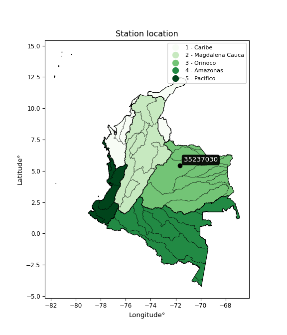</img>

</div>


## A. General information


### 1. General running parameters

• app_version: _v20260312_. • runtime: _2026-03-12 07:15:23.203550_. • Python version: _3.14.0_. • SciPy version: _1.16.3_. • Pandas version: _2.3.3_. • NumPy version: _2.3.5_. • Stations dataset (station_dataset_file): _dataset/pmax24h_in/automatic_colombia_2003_2025.csv_. • Stations catalog (station_catalog_file): _dataset/CNE.xls_. • Minimum year to eval til year_max (date_min): _1900_. • Maximum year to eval since year_min (date_max): _2025_. • Creates, save and include plots into reports (create_plot): _True_. • Plot only fit distributions with Δo > Δ (plot_only_fit): _True_. • Plot only simple graphs avoiding multiple CDFs and multiple Extreme values plots (plot_only_simple): _True_. • Eval low extreme values, if False, evaluates high extreme values (low_extreme): _False_. • Eval every SciPy distribution as logarithmic (pdist_logarithmic_on): _True_. • Standard deviation normalized (ddof): _1.0_. • Return periods to eval in years (Tr): _[2, 2.33, 5, 10, 15, 20, 25, 50, 75, 100, 200, 250, 500, 750, 1000]_. • Minimum data sample per station, 0 means any (minimum_sample): _5_. • Z-Score maximum threshold to adjust a value, 0 means disable (zscore_max): _3.5_. • Z-Score minimum threshold to adjust a value, 0 means disable (zscore_min): _-2.5_. • Avoid zeros, e.g. rain = 0 (avoid_zeros): _True_. • Avoid null values (avoid_nans): _True_. 

:file_folder:Table: [dataset.csv](../../dataset/pmax24h_in/automatic_colombia_2003_2025.csv)

> Delta Degrees of Freedom (DDOF): is a parameter used in the formulas for calculating variance and standard deviation. When ddof=0, the divisor is $N$ (the total number of observations) and this is used when your data set is the entire population. When ddof=1, the divisor is $N-1$ and this is used when your data set is a sample drawn from a larger population. Using $N-1$ provides an unbiased estimate of the population variance (known as Bessel´s correction).


### 2. Station info and location

|   id |   CODIGO | NOMBRE                          | CATEGORIA    | TECNOLOGIA                              | ESTADO   | FECHA_INSTALACION   |   FECHA_SUSPENSION |   ALTITUD |   LATITUD |   LONGITUD | DEPARTAMENTO   | MUNICIPIO   | AREA_OPERATIVA                              | ENTIDAD                                                     | AREA_HIDROGRAFICA   | ZONA_HIDROGRAFICA   | SUBZONA_HIDROGRAFICA   |   CORRIENTE | Catalogo   |   Version |
|-----:|---------:|:--------------------------------|:-------------|:----------------------------------------|:---------|:--------------------|-------------------:|----------:|----------:|-----------:|:---------------|:------------|:--------------------------------------------|:------------------------------------------------------------|:--------------------|:--------------------|:-----------------------|------------:|:-----------|----------:|
|    0 | 35237030 | TRINIDAD PAUTO - AUT [35237030] | Limnigráfica | Automática con Telemetría, Convencional | Activa   | 15/12/2016          |                nan |       178 |   5.41439 |   -71.6684 | Casanare       | Trinidad    | Area Operativa 06 - Boyacá-Casanare-Vichada | INSTITUTO DE HIDROLOGIA METEOROLOGIA Y ESTUDIOS AMBIENTALES | Orinoco             | Meta                | Río Pauto              |         nan | CNE_IDEAM  |  20251226 |

<div align="center">

Dynamic map: [:earth_americas:Google](http://maps.google.com/maps?q=5.414388889,-71.66836111) [:earth_americas:OSM](https://www.openstreetmap.org/#map=18/5.414388889/-71.66836111&layers=P) [:earth_americas:Bing](https://www.bing.com/maps?cp=5.414388889~-71.66836111&lvl=18) [:earth_americas:Apple](https://maps.apple.com/frame?center=5.414388889%2C-71.66836111&span=0.003%2C0.006)

</div>


<div align="center">

```geojson
{
  "type": "Feature",
  "geometry": {
    "type": "Point", 
    "coordinates": [-71.66836111, 5.414388889]
  }, 
  "properties": {
    "Name": "35237030"
  }
}
```

</div>


### 3. Discrete values table and plot

<div align="center">

|               |           0 |           1 |          2 |          3 |           4 |
|:--------------|------------:|------------:|-----------:|-----------:|------------:|
| Date          | 2017        | 2018        | 2019       | 2024       | 2025        |
| Value         |   21.8      |   98.9      |   13.2     |  116.6     |   89.6      |
| Value_initial |   21.8      |   98.9      |   13.2     |  116.6     |   89.6      |
| count         |    5        |    5        |    5       |    5       |    5        |
| mean          |   68.02     |   68.02     |   68.02    |   68.02    |   68.02     |
| std           |   47.225    |   47.225    |   47.225   |   47.225   |   47.225    |
| zscore        |   -0.978719 |    0.653891 |   -1.16083 |    1.02869 |    0.456961 |


</div>


<div align="center">

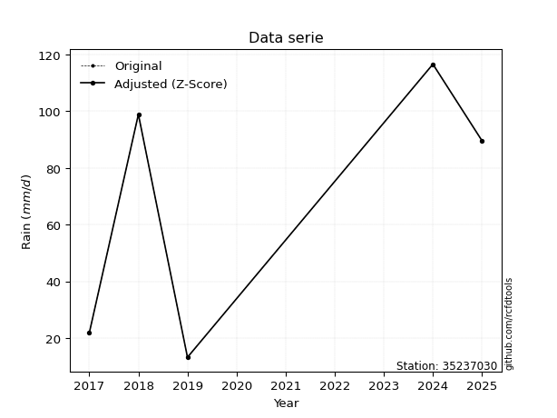</img>

</div>


> The initial value (value_initial) correspond to the initial obtained or null completed value, and value (value) is adjusted only when the initial value is outside the valid range (outlier) definite through the Z-Score value. If Z-Score is active, values out of range or outliers are replaced with the station mean value. A Z-Score (or standard score) measures how many standard deviations a data point is from the mean of a dataset, indicating its relative position; positive scores mean above the mean, negative mean below, and a score of zero is exactly at the mean, allowing for comparison of values from different distributions. It´s calculated using the formula $z=(x–μ)/σ$, where $x$ is the data point, $μ$ is the mean, and $σ$ is the standard deviation, helping identify outliers and understand probability.
>
> <sub>**Note**: In this study, "completing" (filling gaps in) and "extending" (forecasting or lengthening the historical record) rainfall data series are avoided for certain critical analyses because they introduce artificial bias and uncertainty, which can distort the statistics of rare events (extremes), alter day-to-day variability, and compromise the integrity and homogeneity of the original data. Some reasons against Completing/Extending rainfall data are: **Distortion of Extremes and Variability**: The primary issue is that most gap-filling or extension methods rely on averaging or regression with nearby stations, which inherently smooths the data. Rainfall is highly variable in space and time, with a large percentage of zero values and occasional large storms. Infilling methods often underestimate the highest values and overestimate the lowest (zero) values, which severely distorts analyses focused on flood frequency, drought severity, and intensity-duration-frequency (IDF) curves, **Loss of Data Homogeneity**: Infilled or extended data are synthetic estimates, not actual measurements. Combining these estimates with observed data can violate the assumption of data homogeneity, which requires that the data properties do not change over time. Inhomogeneity can lead to incorrect conclusions about long-term trends or changes in climate patterns, **Propagation of Errors**: Errors and biases from the original data (e.g., wind-induced undercatch, instrument errors, site changes) or the data used for imputation can propagate through the analysis, leading to unreliable hydrological models and inaccurate predictions, **Compromised Statistical Integrity**: For statistical analyses, especially those involving the frequency of events, using artificial data can introduce time bias or autocorrelation that doesn´t exist in reality, making it difficult to assess the true probability of events, **Difficulty in Validation**: It is difficult to accurately validate the quality of filled or extended data, especially for past periods where ground-truth measurements are unavailable. The reliability of imputation techniques heavily depends on the density of the surrounding station network and the complexity of the local topography.</sub>


### 4. Active continuous probability distributions from SciPy (80 of 104 available)

A Probability Density Function (PDF) describes the relative likelihood of a continuous random variable falling within a specific range, where the total area under its curve equals 1, and the area over any interval gives the actual probability for that range. Unlike discrete probabilities (like rolling a die), a PDF shows density, not direct probability for a single point (which is zero), with higher points indicating higher likelihood, often visualized as a bell curve for normal distributions.

A log of a probability density function (log-PDF) is simply the logarithm of the PDF´s value, denoted as $log(f(x))$, useful for converting multiplication of probabilities into addition, improving numerical stability with tiny numbers, and connecting to information theory concepts like entropy. Instead of dealing with very small probabilities (e.g., 0.000001), log-PDFs use negative numbers (e.g., $log(0.00001) ≈ -11.51$ that are easier for computers to handle, preventing underflow errors and simplifying complex calculations. In this study, each active probability distribution from SciPy is also evaluated in the $log$ form.

[scipy.stats](https://docs.scipy.org/doc/scipy/reference/stats.html) is a Python´s powerful submodule within the SciPy library for comprehensive statistical analysis, offering over 130 probability distributions (like Normal, Poisson, etc.), functions for descriptive stats (mean, variance), hypothesis testing (t-tests, chi-square), random variable generation, and statistical tests, making it essential for data science, modeling, and research. It provides tools to explore, model, and draw conclusions from data efficiently, working seamlessly with [NumPy](https://numpy.org/).

<div align="center">

|   id | p_dist           |   n_parameter | fit_method   | label                                                                       | active   | ref                                                                                                      |
|-----:|:-----------------|--------------:|:-------------|:----------------------------------------------------------------------------|:---------|:---------------------------------------------------------------------------------------------------------|
|    0 | alpha            |             3 | MLE          | Alpha                                                                       | True     | [:mortar_board:](https://docs.scipy.org/doc/scipy/reference/generated/scipy.stats.alpha.html)            |
|    1 | anglit           |             2 | MM           | Anglit                                                                      | True     | [:mortar_board:](https://docs.scipy.org/doc/scipy/reference/generated/scipy.stats.anglit.html)           |
|    2 | arcsine          |             2 | MM           | Arcsine                                                                     | True     | [:mortar_board:](https://docs.scipy.org/doc/scipy/reference/generated/scipy.stats.arcsine.html)          |
|    3 | argus            |             3 | MLE          | Argus                                                                       | True     | [:mortar_board:](https://docs.scipy.org/doc/scipy/reference/generated/scipy.stats.argus.html)            |
|    4 | beta             |             4 | MLE          | Beta                                                                        | True     | [:mortar_board:](https://docs.scipy.org/doc/scipy/reference/generated/scipy.stats.beta.html)             |
|    5 | betaprime        |             4 | MLE          | Beta prime                                                                  | True     | [:mortar_board:](https://docs.scipy.org/doc/scipy/reference/generated/scipy.stats.betaprime.html)        |
|    6 | bradford         |             3 | MLE          | Bradford                                                                    | True     | [:mortar_board:](https://docs.scipy.org/doc/scipy/reference/generated/scipy.stats.bradford.html)         |
|    7 | burr             |             4 | MLE          | Burr (Type III)                                                             | True     | [:mortar_board:](https://docs.scipy.org/doc/scipy/reference/generated/scipy.stats.burr.html)             |
|    8 | burr12           |             4 | MLE          | Burr (Type III) 12                                                          | True     | [:mortar_board:](https://docs.scipy.org/doc/scipy/reference/generated/scipy.stats.burr12.html)           |
|    9 | cosine           |             2 | MLE          | Cosine                                                                      | True     | [:mortar_board:](https://docs.scipy.org/doc/scipy/reference/generated/scipy.stats.cosine.html)           |
|   10 | crystalball      |             4 | MLE          | Crystalball                                                                 | True     | [:mortar_board:](https://docs.scipy.org/doc/scipy/reference/generated/scipy.stats.crystalball.html)      |
|   11 | dgamma           |             3 | MLE          | Double gamma                                                                | True     | [:mortar_board:](https://docs.scipy.org/doc/scipy/reference/generated/scipy.stats.dgamma.html)           |
|   12 | dweibull         |             3 | MLE          | Double Weibull                                                              | True     | [:mortar_board:](https://docs.scipy.org/doc/scipy/reference/generated/scipy.stats.dweibull.html)         |
|   13 | erlang           |             3 | MLE          | Erlang                                                                      | True     | [:mortar_board:](https://docs.scipy.org/doc/scipy/reference/generated/scipy.stats.erlang.html)           |
|   14 | exponnorm        |             3 | MLE          | Exponentially modified Normal                                               | True     | [:mortar_board:](https://docs.scipy.org/doc/scipy/reference/generated/scipy.stats.exponnorm.html)        |
|   15 | exponpow         |             3 | MLE          | Exponential power                                                           | True     | [:mortar_board:](https://docs.scipy.org/doc/scipy/reference/generated/scipy.stats.exponpow.html)         |
|   16 | exponweib        |             4 | MLE          | Exponentiated Weibull                                                       | True     | [:mortar_board:](https://docs.scipy.org/doc/scipy/reference/generated/scipy.stats.exponweib.html)        |
|   17 | f                |             4 | MLE          | F                                                                           | True     | [:mortar_board:](https://docs.scipy.org/doc/scipy/reference/generated/scipy.stats.f.html)                |
|   18 | fatiguelife      |             3 | MLE          | Fatigue-life (Birnbaum-Saunders)                                            | True     | [:mortar_board:](https://docs.scipy.org/doc/scipy/reference/generated/scipy.stats.fatiguelife.html)      |
|   19 | foldnorm         |             3 | MM           | Fold Normal                                                                 | True     | [:mortar_board:](https://docs.scipy.org/doc/scipy/reference/generated/scipy.stats.foldnorm.html)         |
|   20 | gamma            |             3 | MLE          | Gamma                                                                       | True     | [:mortar_board:](https://docs.scipy.org/doc/scipy/reference/generated/scipy.stats.gamma.html)            |
|   21 | gausshyper       |             6 | MLE          | Gauss hypergeometric                                                        | True     | [:mortar_board:](https://docs.scipy.org/doc/scipy/reference/generated/scipy.stats.gausshyper.html)       |
|   22 | genexpon         |             5 | MLE          | Generalized exponential                                                     | True     | [:mortar_board:](https://docs.scipy.org/doc/scipy/reference/generated/scipy.stats.genexpon.html)         |
|   23 | genextreme       |             3 | MLE          | Generalized exponential                                                     | True     | [:mortar_board:](https://docs.scipy.org/doc/scipy/reference/generated/scipy.stats.genextreme.html)       |
|   24 | gengamma         |             4 | MLE          | Generalized gamma                                                           | True     | [:mortar_board:](https://docs.scipy.org/doc/scipy/reference/generated/scipy.stats.gengamma.html)         |
|   25 | genhalflogistic  |             3 | MLE          | Generalized half-logistic                                                   | True     | [:mortar_board:](https://docs.scipy.org/doc/scipy/reference/generated/scipy.stats.genhalflogistic.html)  |
|   26 | genlogistic      |             3 | MLE          | Generalized logistic                                                        | True     | [:mortar_board:](https://docs.scipy.org/doc/scipy/reference/generated/scipy.stats.genlogistic.html)      |
|   27 | gennorm          |             3 | MLE          | Generalized Normal                                                          | True     | [:mortar_board:](https://docs.scipy.org/doc/scipy/reference/generated/scipy.stats.gennorm.html)          |
|   28 | genpareto        |             3 | MLE          | Generalized Pareto                                                          | True     | [:mortar_board:](https://docs.scipy.org/doc/scipy/reference/generated/scipy.stats.genpareto.html)        |
|   29 | gompertz         |             3 | MLE          | Gompertz (or truncated Gumbel)                                              | True     | [:mortar_board:](https://docs.scipy.org/doc/scipy/reference/generated/scipy.stats.gompertz.html)         |
|   30 | gumbel_l         |             2 | MM           | Gumbel Left Skew                                                            | True     | [:mortar_board:](https://docs.scipy.org/doc/scipy/reference/generated/scipy.stats.gumbel_l.html)         |
|   31 | gumbel_r         |             2 | MM           | Gumbel Right Skew                                                           | True     | [:mortar_board:](https://docs.scipy.org/doc/scipy/reference/generated/scipy.stats.gumbel_r.html)         |
|   32 | halfgennorm      |             3 | MLE          | Upper half of a generalized normal                                          | True     | [:mortar_board:](https://docs.scipy.org/doc/scipy/reference/generated/scipy.stats.halfgennorm.html)      |
|   33 | halflogistic     |             2 | MM           | Half-logistic                                                               | True     | [:mortar_board:](https://docs.scipy.org/doc/scipy/reference/generated/scipy.stats.halflogistic.html)     |
|   34 | halfnorm         |             2 | MM           | Half Normal                                                                 | True     | [:mortar_board:](https://docs.scipy.org/doc/scipy/reference/generated/scipy.stats.halfnorm.html)         |
|   35 | hypsecant        |             2 | MM           | hyperbolic secant                                                           | True     | [:mortar_board:](https://docs.scipy.org/doc/scipy/reference/generated/scipy.stats.hypsecant.html)        |
|   36 | invgamma         |             3 | MLE          | Inverted gamma                                                              | True     | [:mortar_board:](https://docs.scipy.org/doc/scipy/reference/generated/scipy.stats.invgamma.html)         |
|   37 | invgauss         |             3 | MLE          | Inverse Gaussian                                                            | True     | [:mortar_board:](https://docs.scipy.org/doc/scipy/reference/generated/scipy.stats.invgauss.html)         |
|   38 | invweibull       |             3 | MLE          | Inverted Weibull                                                            | True     | [:mortar_board:](https://docs.scipy.org/doc/scipy/reference/generated/scipy.stats.invweibull.html)       |
|   39 | johnsonsb        |             4 | MLE          | Johnson SB                                                                  | True     | [:mortar_board:](https://docs.scipy.org/doc/scipy/reference/generated/scipy.stats.johnsonsb.html)        |
|   40 | johnsonsu        |             4 | MLE          | Johnson Su                                                                  | True     | [:mortar_board:](https://docs.scipy.org/doc/scipy/reference/generated/scipy.stats.johnsonsu.html)        |
|   41 | kappa3           |             3 | MLE          | Kappa 3                                                                     | True     | [:mortar_board:](https://docs.scipy.org/doc/scipy/reference/generated/scipy.stats.kappa3.html)           |
|   42 | kappa4           |             4 | MLE          | Kappa 4                                                                     | True     | [:mortar_board:](https://docs.scipy.org/doc/scipy/reference/generated/scipy.stats.kappa4.html)           |
|   43 | ksone            |             3 | MLE          | Kolmogorov-Smirnov one-sided test statistic distribution                    | True     | [:mortar_board:](https://docs.scipy.org/doc/scipy/reference/generated/scipy.stats.ksone.html)            |
|   44 | kstwobign        |             2 | MLE          | Limiting distribution of scaled Kolmogorov-Smirnov two-sided test statistic | True     | [:mortar_board:](https://docs.scipy.org/doc/scipy/reference/generated/scipy.stats.kstwobign.html)        |
|   45 | laplace          |             2 | MM           | Laplace                                                                     | True     | [:mortar_board:](https://docs.scipy.org/doc/scipy/reference/generated/scipy.stats.laplace.html)          |
|   46 | levy_l           |             2 | MLE          | Left-skewed Levy                                                            | True     | [:mortar_board:](https://docs.scipy.org/doc/scipy/reference/generated/scipy.stats.levy_l.html)           |
|   47 | loggamma         |             3 | MLE          | Log gamma                                                                   | True     | [:mortar_board:](https://docs.scipy.org/doc/scipy/reference/generated/scipy.stats.loggamma.html)         |
|   48 | logistic         |             2 | MM           | Logistic (or Sech-squared)                                                  | True     | [:mortar_board:](https://docs.scipy.org/doc/scipy/reference/generated/scipy.stats.logistic.html)         |
|   49 | loglaplace       |             3 | MLE          | Log-Laplace                                                                 | True     | [:mortar_board:](https://docs.scipy.org/doc/scipy/reference/generated/scipy.stats.loglaplace.html)       |
|   50 | lomax            |             3 | MLE          | Lomax (Pareto of the second kind)                                           | True     | [:mortar_board:](https://docs.scipy.org/doc/scipy/reference/generated/scipy.stats.lomax.html)            |
|   51 | maxwell          |             2 | MM           | Maxwell                                                                     | True     | [:mortar_board:](https://docs.scipy.org/doc/scipy/reference/generated/scipy.stats.maxwell.html)          |
|   52 | mielke           |             4 | MLE          | Mielke Beta-Kappa / Dagum                                                   | True     | [:mortar_board:](https://docs.scipy.org/doc/scipy/reference/generated/scipy.stats.mielke.html)           |
|   53 | moyal            |             2 | MM           | Moyal                                                                       | True     | [:mortar_board:](https://docs.scipy.org/doc/scipy/reference/generated/scipy.stats.moyal.html)            |
|   54 | nakagami         |             3 | MLE          | Nakagami                                                                    | True     | [:mortar_board:](https://docs.scipy.org/doc/scipy/reference/generated/scipy.stats.nakagami.html)         |
|   55 | ncf              |             5 | MLE          | Non-central F distribution                                                  | True     | [:mortar_board:](https://docs.scipy.org/doc/scipy/reference/generated/scipy.stats.ncf.html)              |
|   56 | nct              |             4 | MLE          | Non-central Student’s t                                                     | True     | [:mortar_board:](https://docs.scipy.org/doc/scipy/reference/generated/scipy.stats.nct.html)              |
|   57 | norm             |             2 | MM           | Normal                                                                      | True     | [:mortar_board:](https://docs.scipy.org/doc/scipy/reference/generated/scipy.stats.norm.html)             |
|   58 | pearson3         |             3 | MM           | Pearson type III                                                            | True     | [:mortar_board:](https://docs.scipy.org/doc/scipy/reference/generated/scipy.stats.pearson3.html)         |
|   59 | powerlaw         |             3 | MLE          | Power-function                                                              | True     | [:mortar_board:](https://docs.scipy.org/doc/scipy/reference/generated/scipy.stats.powerlaw.html)         |
|   60 | rayleigh         |             2 | MM           | Rayleigh                                                                    | True     | [:mortar_board:](https://docs.scipy.org/doc/scipy/reference/generated/scipy.stats.rayleigh.html)         |
|   61 | rdist            |             3 | MLE          | R-distributed (symmetric beta)                                              | True     | [:mortar_board:](https://docs.scipy.org/doc/scipy/reference/generated/scipy.stats.rdist.html)            |
|   62 | rice             |             3 | MLE          | Rice                                                                        | True     | [:mortar_board:](https://docs.scipy.org/doc/scipy/reference/generated/scipy.stats.rice.html)             |
|   63 | semicircular     |             2 | MM           | Semicircular                                                                | True     | [:mortar_board:](https://docs.scipy.org/doc/scipy/reference/generated/scipy.stats.semicircular.html)     |
|   64 | skewnorm         |             3 | MLE          | Skew normal                                                                 | True     | [:mortar_board:](https://docs.scipy.org/doc/scipy/reference/generated/scipy.stats.skewnorm.html)         |
|   65 | t                |             3 | MLE          | Student’s t                                                                 | True     | [:mortar_board:](https://docs.scipy.org/doc/scipy/reference/generated/scipy.stats.t.html)                |
|   66 | trapezoid        |             4 | MLE          | Trapezoid                                                                   | True     | [:mortar_board:](https://docs.scipy.org/doc/scipy/reference/generated/scipy.stats.trapezoid.html)        |
|   67 | triang           |             3 | MLE          | Triangular                                                                  | True     | [:mortar_board:](https://docs.scipy.org/doc/scipy/reference/generated/scipy.stats.triang.html)           |
|   68 | truncexpon       |             3 | MLE          | Truncated exponential                                                       | True     | [:mortar_board:](https://docs.scipy.org/doc/scipy/reference/generated/scipy.stats.truncexpon.html)       |
|   69 | truncnorm        |             4 | MLE          | Truncated normal                                                            | True     | [:mortar_board:](https://docs.scipy.org/doc/scipy/reference/generated/scipy.stats.truncnorm.html)        |
|   70 | truncpareto      |             4 | MLE          | Upper truncated Pareto                                                      | True     | [:mortar_board:](https://docs.scipy.org/doc/scipy/reference/generated/scipy.stats.truncpareto.html)      |
|   71 | truncweibull_min |             5 | MLE          | Doubly truncated Weibull minimum                                            | True     | [:mortar_board:](https://docs.scipy.org/doc/scipy/reference/generated/scipy.stats.truncweibull_min.html) |
|   72 | tukeylambda      |             3 | MLE          | Tukey-Lamdba                                                                | True     | [:mortar_board:](https://docs.scipy.org/doc/scipy/reference/generated/scipy.stats.tukeylambda.html)      |
|   73 | uniform          |             2 | MLE          | Uniform                                                                     | True     | [:mortar_board:](https://docs.scipy.org/doc/scipy/reference/generated/scipy.stats.uniform.html)          |
|   74 | vonmises         |             3 | MLE          | Von Mises                                                                   | True     | [:mortar_board:](https://docs.scipy.org/doc/scipy/reference/generated/scipy.stats.vonmises.html)         |
|   75 | vonmises_line    |             3 | MLE          | Von Mises line                                                              | True     | [:mortar_board:](https://docs.scipy.org/doc/scipy/reference/generated/scipy.stats.vonmises_line.html)    |
|   76 | wald             |             2 | MM           | Wald                                                                        | True     | [:mortar_board:](https://docs.scipy.org/doc/scipy/reference/generated/scipy.stats.wald.html)             |
|   77 | weibull_max      |             3 | MLE          | Weibull maximum                                                             | True     | [:mortar_board:](https://docs.scipy.org/doc/scipy/reference/generated/scipy.stats.weibull_max.html)      |
|   78 | weibull_min      |             3 | MLE          | Weibull minimum                                                             | True     | [:mortar_board:](https://docs.scipy.org/doc/scipy/reference/generated/scipy.stats.weibull_min.html)      |
|   79 | wrapcauchy       |             3 | MLE          | Wrapped  Cauchy                                                             | True     | [:mortar_board:](https://docs.scipy.org/doc/scipy/reference/generated/scipy.stats.wrapcauchy.html)       |

</div>

> **n_parameter:** # arguments & localization & scale.
>
> **Fit methods:** (MLE) maximum likelihood, (MM) L-moments.
>
>**Inactive** (With the only purpose of prevent loops, zero divisions, infinite values, over high estimated values or horizontal trending for recurrence intervals estimations, the follow distributions were disabled.)**:** lognorm, norminvgauss, powernorm, powerlognorm, cauchy, halfcauchy, foldcauchy, skewcauchy, chi2, expon, fisk, genhyperbolic, geninvgauss, gibrat, kstwo, laplace_asymmetric, levy, levy_stable, ncx2, pareto, rel_breitwigner, recipinvgauss, studentized_range, loguniform, 


## B. Probability (PDF) vs. Empirical (EDF) distributions functions

A continuous probability distribution (CPD) describes probabilities for variables that can take any value within a range (like rain any time), unlike discrete variables with specific outcomes (like temperature). It uses a Probability Density Function (PDF), a curve where the total area under it equals 1, and the probability of the variable falling within an interval (a to b) is found by calculating the area under the curve between those points. A key feature is that the probability of hitting any single exact value is zero, so probabilities are always expressed for ranges, e.g., $P(a ≤ X ≤ b)$.

<div align="center">

Distributions parameters from station values
|     |   station | p_dist              |   n |             loc |           scale | shape                  | shape1                | shape2             | shape3             |
|----:|----------:|:--------------------|----:|----------------:|----------------:|:-----------------------|:----------------------|:-------------------|:-------------------|
|   0 |  35237030 | alpha               |   5 |    -0.071958    |    24.8999      | 1.6688107877812685e-10 |                       |                    |                    |
|   1 |  35237030 | anglit              |   5 |    68.02        |   123.567       |                        |                       |                    |                    |
|   2 |  35237030 | arcsine             |   5 |     8.28456     |   119.471       |                        |                       |                    |                    |
|   3 |  35237030 | argus               |   5 |   -30.6372      |   153.303       | 1.59177768243782       |                       |                    |                    |
|   4 |  35237030 | beta                |   5 |    -7.11557     |   123.716       | 1.2665147754785964     | 0.634554971190137     |                    |                    |
|   5 |  35237030 | betaprime           |   5 |    -2.11284     |  1819.27        | 1.928467721368908      | 50.85030872497845     |                    |                    |
|   6 |  35237030 | bradford            |   5 |     8.28832     |   108.312       | 5.1806563789286685e-06 |                       |                    |                    |
|   7 |  35237030 | burr                |   5 |    -0.1892      |     0.535388    | 1.174878879887638      | 120.47295810353823    |                    |                    |
|   8 |  35237030 | burr12              |   5 |    -1.08871     |    14.1004      | 334.5128522272955      | 0.002321081605151756  |                    |                    |
|   9 |  35237030 | cosine              |   5 |    66.4896      |    32.9954      |                        |                       |                    |                    |
|  10 |  35237030 | crystalball         |   5 |    68.02        |    42.2393      | 4022.266231956039      | 4519.914469400006     |                    |                    |
|  11 |  35237030 | dgamma              |   5 |    58.4782      |     1.88198     | 22.489316396282362     |                       |                    |                    |
|  12 |  35237030 | dweibull            |   5 |    60.8373      |    45.5683      | 5.091698512291865      |                       |                    |                    |
|  13 |  35237030 | erlang              |   5 |  -627.411       |     2.62964     | 264.46958526473736     |                       |                    |                    |
|  14 |  35237030 | exponnorm           |   5 |    67.9901      |    42.2393      | 0.0007093980571240004  |                       |                    |                    |
|  15 |  35237030 | exponpow            |   5 |    13.2         |    73.6159      | 0.6068822696349789     |                       |                    |                    |
|  16 |  35237030 | exponweib           |   5 |    13.2         |    33.0906      | 0.9815791687892705     | 0.8978753462046517    |                    |                    |
|  17 |  35237030 | f                   |   5 |    13.2         |    43.4471      | 1.3218977799150018     | 214.44283963494178    |                    |                    |
|  18 |  35237030 | fatiguelife         |   5 |    13.2         |     5.63639e-05 | 908.0380404724124      |                       |                    |                    |
|  19 |  35237030 | foldnorm            |   5 |  -250.6         |    40.7636      | 7.825169291618497      |                       |                    |                    |
|  20 |  35237030 | gamma               |   5 |  -640.494       |     2.57172     | 275.4310615006625      |                       |                    |                    |
|  21 |  35237030 | gausshyper          |   5 |     3.77241     |   112.828       | 1.1206957857065145     | 0.8402627379893395    | 1.2128936694084103 | 1.1478779451661154 |
|  22 |  35237030 | genexpon            |   5 |     7.108       |     2.57961     | 1.354531452698463e-10  | 0.04447931365231276   | 0.83057236937163   |                    |
|  23 |  35237030 | genextreme          |   5 |    65.1809      |    63.5354      | 1.235638401168302      |                       |                    |                    |
|  24 |  35237030 | gengamma            |   5 |    13.2         |    19.1378      | 1.3017370578450533     | 0.5915979983463833    |                    |                    |
|  25 |  35237030 | genhalflogistic     |   5 |   -25.0908      |   148.842       | 1.0504668977565137     |                       |                    |                    |
|  26 |  35237030 | genlogistic         |   5 |   116.6         |     1.13654e-05 | 2.3414572622221536e-07 |                       |                    |                    |
|  27 |  35237030 | gennorm             |   5 |    89.6         |     1.79123     | 0.39365901659893787    |                       |                    |                    |
|  28 |  35237030 | genpareto           |   5 |    -0.173298    |   257.149       | -2.2021183348211206    |                       |                    |                    |
|  29 |  35237030 | gompertz            |   5 |    13.2         |    67.64        | 0.595911224541416      |                       |                    |                    |
|  30 |  35237030 | gumbel_l            |   5 |    87.0299      |    32.9339      |                        |                       |                    |                    |
|  31 |  35237030 | gumbel_r            |   5 |    49.0101      |    32.9339      |                        |                       |                    |                    |
|  32 |  35237030 | halfgennorm         |   5 |    13.2         |    10.2735      | 0.49823303774702854    |                       |                    |                    |
|  33 |  35237030 | halflogistic        |   5 |    17.9565      |    36.1131      |                        |                       |                    |                    |
|  34 |  35237030 | halfnorm            |   5 |    12.1117      |    70.0707      |                        |                       |                    |                    |
|  35 |  35237030 | hypsecant           |   5 |    68.02        |    26.8904      |                        |                       |                    |                    |
|  36 |  35237030 | invgamma            |   5 |  -235.697       | 13876.6         | 46.86025704601792      |                       |                    |                    |
|  37 |  35237030 | invgauss            |   5 |     1.12245     |    57.7314      | 1.1587723782446537     |                       |                    |                    |
|  38 |  35237030 | invweibull          |   5 |    -3.06124e+06 |     3.06128e+06 | 78983.44167872678      |                       |                    |                    |
|  39 |  35237030 | johnsonsb           |   5 |    -6.86672     |   123.467       | -0.8081378468106389    | 0.1102512206610873    |                    |                    |
|  40 |  35237030 | johnsonsu           |   5 |   121.445       |     0.0213611   | 7.0624750515343955     | 0.8797987601749271    |                    |                    |
|  41 |  35237030 | kappa3              |   5 |    13.2         |   103.406       | 23097.142235079948     |                       |                    |                    |
|  42 |  35237030 | kappa4              |   5 |    -5.20719     |   126.143       | 1.171390263440929      | 1.034714937377984     |                    |                    |
|  43 |  35237030 | ksone               |   5 |    -5.14068     |   146.321       | 1.0                    |                       |                    |                    |
|  44 |  35237030 | kstwobign           |   5 |   -83.3611      |   171.903       |                        |                       |                    |                    |
|  45 |  35237030 | laplace             |   5 |    68.02        |    29.8677      |                        |                       |                    |                    |
|  46 |  35237030 | levy_l              |   5 |   119.705       |    11.8216      |                        |                       |                    |                    |
|  47 |  35237030 | loggamma            |   5 |   116.6         |     1.23784e-05 | 2.54587607108288e-07   |                       |                    |                    |
|  48 |  35237030 | logistic            |   5 |    68.02        |    23.2878      |                        |                       |                    |                    |
|  49 |  35237030 | loglaplace          |   5 |    -0.251975    |    89.852       | 1.3641783677704837     |                       |                    |                    |
|  50 |  35237030 | lomax               |   5 |    13.2         |     7.69061e+10 | 1203160492.579165      |                       |                    |                    |
|  51 |  35237030 | maxwell             |   5 |   -32.0695      |    62.7218      |                        |                       |                    |                    |
|  52 |  35237030 | mielke              |   5 |     0.0368008   |     0.576988    | 124.1267507763373      | 1.1683613711524283    |                    |                    |
|  53 |  35237030 | moyal               |   5 |    43.8648      |    19.0144      |                        |                       |                    |                    |
|  54 |  35237030 | nakagami            |   5 |    13.2         |    88.9026      | 0.10144268947969574    |                       |                    |                    |
|  55 |  35237030 | ncf                 |   5 |    -0.0259195   |     1.11322e-05 | 8.479142613656191e-07  | 15.142163567733865    | 4.161445583225129  |                    |
|  56 |  35237030 | nct                 |   5 |    -0.415553    |     0.272214    | 0.9410016454862573     | 93.00638871137039     |                    |                    |
|  57 |  35237030 | norm                |   5 |    68.02        |    42.2393      |                        |                       |                    |                    |
|  58 |  35237030 | pearson3            |   5 |    68.02        |    42.2393      | -0.2901726431970273    |                       |                    |                    |
|  59 |  35237030 | powerlaw            |   5 |    13.2         |   103.4         | 0.12025002200631799    |                       |                    |                    |
|  60 |  35237030 | rayleigh            |   5 |   -12.7863      |    64.4741      |                        |                       |                    |                    |
|  61 |  35237030 | rdist               |   5 |    71.0909      |    57.8909      | 1.0653680681021895     |                       |                    |                    |
|  62 |  35237030 | rice                |   5 |   -13.4234      |    50.0986      | 1.1634585931145007     |                       |                    |                    |
|  63 |  35237030 | semicircular        |   5 |    68.02        |    84.4787      |                        |                       |                    |                    |
|  64 |  35237030 | skewnorm            |   5 |   116.6         |    64.3814      | -12852519.26616685     |                       |                    |                    |
|  65 |  35237030 | t                   |   5 |    68.0164      |    42.2374      | 8120125.693449053      |                       |                    |                    |
|  66 |  35237030 | trapezoid           |   5 |   -54.0234      |   179.206       | 1.0                    | 1.0                   |                    |                    |
|  67 |  35237030 | triang              |   5 |   -54.7435      |   171.344       | 0.9999999413431526     |                       |                    |                    |
|  68 |  35237030 | truncexpon          |   5 |     5.84301     |   133.285       | 0.8309777508928446     |                       |                    |                    |
|  69 |  35237030 | truncnorm           |   5 |    68.02        |    42.2393      | -308.3618244727877     | 132.643782315444      |                    |                    |
|  70 |  35237030 | truncpareto         |   5 |    12.6779      |     0.522105    | 0.2739184359004755     | 199.04448330745376    |                    |                    |
|  71 |  35237030 | truncweibull_min    |   5 |     6.8507      |   152.626       | 0.9796872091799006     | 3.972415373546531e-09 | 0.7190724805125829 |                    |
|  72 |  35237030 | tukeylambda         |   5 |    64.6529      |    61.6254      | 1.1863100246681373     |                       |                    |                    |
|  73 |  35237030 | uniform             |   5 |    13.2         |   103.4         |                        |                       |                    |                    |
|  74 |  35237030 | vonmises            |   5 |     2.8079      |     1           | 0.5423209605030518     |                       |                    |                    |
|  75 |  35237030 | vonmises_line       |   5 |    64.6508      |    16.5359      | 2.025233646890192e-06  |                       |                    |                    |
|  76 |  35237030 | wald                |   5 |    25.7807      |    42.2393      |                        |                       |                    |                    |
|  77 |  35237030 | weibull_max         |   5 |   116.6         |     1.55991     | 0.2612625984737623     |                       |                    |                    |
|  78 |  35237030 | weibull_min         |   5 |    -1.59135e+09 |     1.59135e+09 | 47755649.30760951      |                       |                    |                    |
|  79 |  35237030 | wrapcauchy          |   5 |    13.2         |    16.4566      | 0.663989532967644      |                       |                    |                    |
|  80 |  35237030 | logalpha            |   5 |   -13.7744      |   339.592       | 19.251588504105364     |                       |                    |                    |
|  81 |  35237030 | loganglit           |   5 |     3.90207     |     2.61157     |                        |                       |                    |                    |
|  82 |  35237030 | logarcsine          |   5 |     2.63959     |     2.52496     |                        |                       |                    |                    |
|  83 |  35237030 | logargus            |   5 |     1.57873     |     3.28668     | 2.213746928595122      |                       |                    |                    |
|  84 |  35237030 | logbeta             |   5 |     2.53821     |     2.22054     | 0.8972106327506155     | 0.2831149892118495    |                    |                    |
|  85 |  35237030 | logbetaprime        |   5 |   -31.3796      |   356.505       | 1690.568276405069      | 17082.947932090407    |                    |                    |
|  86 |  35237030 | logbradford         |   5 |     2.55347     |     2.2053      | 9.474380646367004e-05  |                       |                    |                    |
|  87 |  35237030 | logburr             |   5 |     0.139343    |     4.63594     | 1106.4716856116752     | 0.0037601436353825804 |                    |                    |
|  88 |  35237030 | logburr12           |   5 | -2122.83        |  2136.17        | 3151.41834449041       | 626265.2859943914     |                    |                    |
|  89 |  35237030 | logcosine           |   5 |     3.84258     |     0.702743    |                        |                       |                    |                    |
|  90 |  35237030 | logcrystalball      |   5 |     3.90207     |     0.892722    | 645.3440686547789      | 37.05034971751866     |                    |                    |
|  91 |  35237030 | logdgamma           |   5 |     4.59411     |     0.733336    | 0.8779195019247568     |                       |                    |                    |
|  92 |  35237030 | logdweibull         |   5 |     4.59411     |     0.91353     | 0.8222908745201267     |                       |                    |                    |
|  93 |  35237030 | logerlang           |   5 |    -9.77706     |     0.0593096   | 230.55699727234435     |                       |                    |                    |
|  94 |  35237030 | logexponnorm        |   5 |     3.90192     |     0.892725    | 0.0001684678799309346  |                       |                    |                    |
|  95 |  35237030 | logexponpow         |   5 |     2.58022     |     1.5919      | 0.362491101120093      |                       |                    |                    |
|  96 |  35237030 | logexponweib        |   5 |     2.58022     |     1.09687     | 0.9415975409909296     | 0.989398946772703     |                    |                    |
|  97 |  35237030 | logf                |   5 |  -282.184       |   286.08        | 1164536.8186420277     | 246706.3726455089     |                    |                    |
|  98 |  35237030 | logfatiguelife      |   5 |  -242.822       |   246.722       | 0.0036108497588067064  |                       |                    |                    |
|  99 |  35237030 | logfoldnorm         |   5 |   -14.1575      |     0.870964    | 20.738500944983443     |                       |                    |                    |
| 100 |  35237030 | loggamma            |   5 |    -8.87571     |     0.0641889   | 198.97758081581685     |                       |                    |                    |
| 101 |  35237030 | loggausshyper       |   5 |     2.57037     |     2.18838     | 1.097688737116889      | 0.840757401504415     | 1.0135039222670974 | 1.1779573330692525 |
| 102 |  35237030 | loggenexpon         |   5 |     2.58022     |     2.51931e+07 | 12140386.990289278     | 63956073.94204348     | 2985654.570212602  |                    |
| 103 |  35237030 | loggenextreme       |   5 |     3.91648     |     1.12134     | 1.331328666048626      |                       |                    |                    |
| 104 |  35237030 | loggengamma         |   5 |     2.58022     |     1.60823     | 1.606933936615531      | 0.09242788658591733   |                    |                    |
| 105 |  35237030 | loggenhalflogistic  |   5 |     2.0818      |     3.01546     | 1.1264566188177039     |                       |                    |                    |
| 106 |  35237030 | loggenlogistic      |   5 |     4.75883     |     2.77936e-06 | 3.2322777372095403e-06 |                       |                    |                    |
| 107 |  35237030 | loggennorm          |   5 |     4.49536     |     0.632515    | 0.8442569760996892     |                       |                    |                    |
| 108 |  35237030 | loggenpareto        |   5 |    -0.119673    |     8.38972     | -1.7197614976733195    |                       |                    |                    |
| 109 |  35237030 | loggompertz         |   5 |     2.58022     |     0.992389    | 0.23652036259246023    |                       |                    |                    |
| 110 |  35237030 | loggumbel_l         |   5 |     4.30384     |     0.696053    |                        |                       |                    |                    |
| 111 |  35237030 | loggumbel_r         |   5 |     3.5003      |     0.696053    |                        |                       |                    |                    |
| 112 |  35237030 | loghalfgennorm      |   5 |     2.51118     |     2.33618     | 68.01805870241523      |                       |                    |                    |
| 113 |  35237030 | loghalflogistic     |   5 |     2.84397     |     0.763258    |                        |                       |                    |                    |
| 114 |  35237030 | loghalfnorm         |   5 |     2.7204      |     1.48099     |                        |                       |                    |                    |
| 115 |  35237030 | loghypsecant        |   5 |     3.90207     |     0.568325    |                        |                       |                    |                    |
| 116 |  35237030 | loginvgamma         |   5 |   -12.0157      |  4664.04        | 294.2157248952492      |                       |                    |                    |
| 117 |  35237030 | loginvgauss         |   5 |    -2.66821     |   309.406       | 0.021198243151157356   |                       |                    |                    |
| 118 |  35237030 | loginvweibull       |   5 |    -6.32778e+07 |     6.32778e+07 | 73096467.09690234      |                       |                    |                    |
| 119 |  35237030 | logjohnsonsb        |   5 |     2.18491     |     2.57384     | -0.8693249413328163    | 0.11652708937567993   |                    |                    |
| 120 |  35237030 | logjohnsonsu        |   5 |     4.75875     |     1.03366e-15 | 3.3683304780066674     | 0.1415414562091593    |                    |                    |
| 121 |  35237030 | logkappa3           |   5 |     2.58022     |     2.91534     | 49.89807874067019      |                       |                    |                    |
| 122 |  35237030 | logkappa4           |   5 |     2.40543     |     2.59971     | 1.0716597214830783     | 1.1046978570359807    |                    |                    |
| 123 |  35237030 | logksone            |   5 |     2.35583     |     3.09248     | 1.0                    |                       |                    |                    |
| 124 |  35237030 | logkstwobign        |   5 |     0.528112    |     3.8335      |                        |                       |                    |                    |
| 125 |  35237030 | loglaplace          |   5 |     3.90207     |     0.63125     |                        |                       |                    |                    |
| 126 |  35237030 | loglevy_l           |   5 |     4.79241     |     0.127701    |                        |                       |                    |                    |
| 127 |  35237030 | logloggamma         |   5 |     4.76066     |     3.22536e-05 | 3.8039729491279496e-05 |                       |                    |                    |
| 128 |  35237030 | loglogistic         |   5 |     3.90207     |     0.492183    |                        |                       |                    |                    |
| 129 |  35237030 | logloglaplace       |   5 |    -0.0558333   |     4.55119     | 5.0233348892636895     |                       |                    |                    |
| 130 |  35237030 | loglomax            |   5 |     2.58022     |     2.1117e+11  | 60064006927.42575      |                       |                    |                    |
| 131 |  35237030 | logmaxwell          |   5 |     1.78669     |     1.32562     |                        |                       |                    |                    |
| 132 |  35237030 | logmielke           |   5 |    -2.7661e+07  |     2.7661e+07  | 32336574.455988653     | 345239686148.598      |                    |                    |
| 133 |  35237030 | logmoyal            |   5 |     3.39155     |     0.401866    |                        |                       |                    |                    |
| 134 |  35237030 | lognakagami         |   5 |     3.08191     |     1.16418     | 0.09345245564907978    |                       |                    |                    |
| 135 |  35237030 | logncf              |   5 |    -1.76626     |     5.22314e-06 | 0.000171008575516769   | 481.2321052498993     | 184.8687415559728  |                    |
| 136 |  35237030 | lognct              |   5 |   -45.3305      |     0.842593    | 13291.90188080194      | 58.42685879557348     |                    |                    |
| 137 |  35237030 | lognorm             |   5 |     3.90207     |     0.892722    |                        |                       |                    |                    |
| 138 |  35237030 | logpearson3         |   5 |     3.90207     |     0.892724    | -0.475747254500134     |                       |                    |                    |
| 139 |  35237030 | logpowerlaw         |   5 |     2.58022     |     2.17853     | 0.13225757016022996    |                       |                    |                    |
| 140 |  35237030 | lograyleigh         |   5 |     2.19424     |     1.36265     |                        |                       |                    |                    |
| 141 |  35237030 | logrdist            |   5 |     3.66948     |     1.08927     | 1.1303929713582082     |                       |                    |                    |
| 142 |  35237030 | logrice             |   5 |     2.05213     |     1.03284     | 1.3982629932123256     |                       |                    |                    |
| 143 |  35237030 | logsemicircular     |   5 |     3.90207     |     1.78544     |                        |                       |                    |                    |
| 144 |  35237030 | logskewnorm         |   5 |     4.75875     |     1.23723     | -33862346.177618235    |                       |                    |                    |
| 145 |  35237030 | logt                |   5 |     3.90207     |     0.892722    | 91394162779.73537      |                       |                    |                    |
| 146 |  35237030 | logtrapezoid        |   5 |     1.37707     |     3.7875      | 1.0                    | 1.0                   |                    |                    |
| 147 |  35237030 | logtriang           |   5 |     1.93457     |     2.8242      | 0.9999907417042488     |                       |                    |                    |
| 148 |  35237030 | logtruncexpon       |   5 |     2.58022     |     2.79721     | 0.7808150604879522     |                       |                    |                    |
| 149 |  35237030 | logtruncnorm        |   5 |    -0.261476    |     2.60611     | 1.2829004002548015     | 1.9268342743228182    |                    |                    |
| 150 |  35237030 | logtruncpareto      |   5 |     2.56758     |     0.0126385   | 0.263626080463914      | 173.37204113089524    |                    |                    |
| 151 |  35237030 | logtruncweibull_min |   5 |     2.58022     |     3.42672     | 0.7290301751767732     | 6.635162635796472e-17 | 0.6367374763310555 |                    |
| 152 |  35237030 | logtukeylambda      |   5 |     3.6697      |     1.34358     | 1.2332276135826863     |                       |                    |                    |
| 153 |  35237030 | loguniform          |   5 |     2.58022     |     2.17853     |                        |                       |                    |                    |
| 154 |  35237030 | logvonmises         |   5 |    -2.30196     |     1           | 1.6842740656545694     |                       |                    |                    |
| 155 |  35237030 | logvonmises_line    |   5 |     3.66984     |     0.346842    | 0.00015616358204938928 |                       |                    |                    |
| 156 |  35237030 | logwald             |   5 |     3.00937     |     0.892701    |                        |                       |                    |                    |
| 157 |  35237030 | logweibull_max      |   5 |     4.75875     |     1.10781     | 0.5404364297712805     |                       |                    |                    |
| 158 |  35237030 | logweibull_min      |   5 |    -5.43091e+07 |     5.43091e+07 | 81775719.6378458       |                       |                    |                    |
| 159 |  35237030 | logwrapcauchy       |   5 |     2.58022     |     0.346724    | 0.525                  |                       |                    |                    |

</div>

> **loc** (Location parameter): This shifts the distribution along the x-axis. For many common distributions, like the normal (Gaussian) distribution, loc represents the mean $μ$. For others, like the uniform distribution, it might represent the minimum value, or for the beta distribution, the left end of the support interval.
>
> **scale** (Scale parameter): This determines the width or spread of the distribution. For the normal distribution, scale represents the standard deviation $σ$. For a uniform distribution, it defines the length of the interval (from $loc$ to $loc + scale$).
>
> **shape** (Shape parameters): Refers to parameters that define the specific form of a probability distribution, distinct from its location (loc) and scale (scale). These parameters are required arguments for most distribution functions. For example, a normal (Gaussian) distribution is fully defined by its location (mean) and scale (standard deviation), so it has no specific shape parameters beyond loc and scale. However, other distributions have intrinsic properties that need specification, as Gamma distribution that takes a shape parameter, often named $a$ or $alpha$.


### 0. Cumulative distribution values - CDF (160 evaluated)

Cumulative Distribution Function (CDF), denoted as $F$<sub>$X$</sub>$(x)$, is a function that gives the probability that a random variable $X$ will take a value less than or equal to a specific value, $x$ (i.e., $(P(X≥x)$. It essentially "accumulates" probabilities from a given point up to the far right (positive infinity), providing a complete picture of the distribution´s probabilities for both discrete (like rain) and continuous (like temperature) variables, helping to find probabilities over ranges or above certain values. Each station is evaluated separately ordering the $x$ values ascending, calculating the CDF and PDF values for the activated distributions and their logarithmic forms.

<div align="center">

CDF ordered by x ascending and calculating $log(f(x))$ separately
|   id |   Station |   date |     x |   count |   mean |    std |    zscore |   Value_initial |   station |   m |     alpha |   alpha_pdf |   anglit |   anglit_pdf |   arcsine |   arcsine_pdf |     argus |   argus_pdf |      beta |      beta_pdf |   betaprime |   betaprime_pdf |   bradford |   bradford_pdf |      burr |   burr_pdf |    burr12 |   burr12_pdf |    cosine |   cosine_pdf |   crystalball |   crystalball_pdf |   dgamma |   dgamma_pdf |   dweibull |   dweibull_pdf |    erlang |   erlang_pdf |   exponnorm |   exponnorm_pdf |    exponpow |   exponpow_pdf |   exponweib |   exponweib_pdf |          f |      f_pdf |   fatiguelife |   fatiguelife_pdf |   foldnorm |   foldnorm_pdf |     gamma |   gamma_pdf |   gausshyper |   gausshyper_pdf |   genexpon |   genexpon_pdf |   genextreme |   genextreme_pdf |    gengamma |   gengamma_pdf |   genhalflogistic |   genhalflogistic_pdf |   genlogistic |   genlogistic_pdf |   gennorm |   gennorm_pdf |   genpareto |   genpareto_pdf |    gompertz |   gompertz_pdf |   gumbel_l |   gumbel_l_pdf |   gumbel_r |   gumbel_r_pdf |   halfgennorm |   halfgennorm_pdf |   halflogistic |   halflogistic_pdf |   halfnorm |   halfnorm_pdf |   hypsecant |   hypsecant_pdf |   invgamma |   invgamma_pdf |   invgauss |   invgauss_pdf |   invweibull |   invweibull_pdf |   johnsonsb |   johnsonsb_pdf |   johnsonsu |   johnsonsu_pdf |      kappa3 |   kappa3_pdf |      kappa4 |   kappa4_pdf |    ksone |   ksone_pdf |   kstwobign |   kstwobign_pdf |   laplace |   laplace_pdf |   levy_l |   levy_l_pdf |   loggamma |   loggamma_pdf |   logistic |   logistic_pdf |   loglaplace |   loglaplace_pdf |       lomax |   lomax_pdf |   maxwell |   maxwell_pdf |    mielke |   mielke_pdf |     moyal |   moyal_pdf |    nakagami |   nakagami_pdf |      ncf |    ncf_pdf |       nct |    nct_pdf |      norm |   norm_pdf |   pearson3 |   pearson3_pdf |   powerlaw |   powerlaw_pdf |   rayleigh |   rayleigh_pdf |       rdist |       rdist_pdf |      rice |   rice_pdf |   semicircular |   semicircular_pdf |   skewnorm |   skewnorm_pdf |         t |      t_pdf |   trapezoid |   trapezoid_pdf |   triang |   triang_pdf |   truncexpon |   truncexpon_pdf |   truncnorm |   truncnorm_pdf |   truncpareto |   truncpareto_pdf |   truncweibull_min |   truncweibull_min_pdf |   tukeylambda |   tukeylambda_pdf |   uniform |   uniform_pdf |   vonmises |   vonmises_pdf |   vonmises_line |   vonmises_line_pdf |     wald |   wald_pdf |   weibull_max |   weibull_max_pdf |   weibull_min |   weibull_min_pdf |   wrapcauchy |   wrapcauchy_pdf |   logalpha |   logalpha_pdf |   loganglit |   loganglit_pdf |   logarcsine |   logarcsine_pdf |   logargus |   logargus_pdf |   logbeta |   logbeta_pdf |   logbetaprime |   logbetaprime_pdf |   logbradford |   logbradford_pdf |   logburr |   logburr_pdf |   logburr12 |   logburr12_pdf |   logcosine |   logcosine_pdf |   logcrystalball |   logcrystalball_pdf |   logdgamma |   logdgamma_pdf |   logdweibull |   logdweibull_pdf |   logerlang |   logerlang_pdf |   logexponnorm |   logexponnorm_pdf |   logexponpow |   logexponpow_pdf |   logexponweib |   logexponweib_pdf |      logf |   logf_pdf |   logfatiguelife |   logfatiguelife_pdf |   logfoldnorm |   logfoldnorm_pdf |   loggausshyper |   loggausshyper_pdf |   loggenexpon |   loggenexpon_pdf |   loggenextreme |   loggenextreme_pdf |   loggengamma |   loggengamma_pdf |   loggenhalflogistic |   loggenhalflogistic_pdf |   loggenlogistic |   loggenlogistic_pdf |   loggennorm |   loggennorm_pdf |   loggenpareto |   loggenpareto_pdf |   loggompertz |   loggompertz_pdf |   loggumbel_l |   loggumbel_l_pdf |   loggumbel_r |   loggumbel_r_pdf |   loghalfgennorm |   loghalfgennorm_pdf |   loghalflogistic |   loghalflogistic_pdf |   loghalfnorm |   loghalfnorm_pdf |   loghypsecant |   loghypsecant_pdf |   loginvgamma |   loginvgamma_pdf |   loginvgauss |   loginvgauss_pdf |   loginvweibull |   loginvweibull_pdf |   logjohnsonsb |   logjohnsonsb_pdf |   logjohnsonsu |   logjohnsonsu_pdf |   logkappa3 |   logkappa3_pdf |   logkappa4 |   logkappa4_pdf |   logksone |   logksone_pdf |   logkstwobign |   logkstwobign_pdf |   loglevy_l |   loglevy_l_pdf |   logloggamma |   logloggamma_pdf |   loglogistic |   loglogistic_pdf |   logloglaplace |   logloglaplace_pdf |   loglomax |   loglomax_pdf |   logmaxwell |   logmaxwell_pdf |   logmielke |   logmielke_pdf |   logmoyal |   logmoyal_pdf |   lognakagami |   lognakagami_pdf |    logncf |   logncf_pdf |    lognct |   lognct_pdf |   lognorm |   lognorm_pdf |   logpearson3 |   logpearson3_pdf |   logpowerlaw |   logpowerlaw_pdf |   lograyleigh |   lograyleigh_pdf |    logrdist |   logrdist_pdf |   logrice |   logrice_pdf |   logsemicircular |   logsemicircular_pdf |   logskewnorm |   logskewnorm_pdf |      logt |   logt_pdf |   logtrapezoid |   logtrapezoid_pdf |   logtriang |   logtriang_pdf |   logtruncexpon |   logtruncexpon_pdf |   logtruncnorm |   logtruncnorm_pdf |   logtruncpareto |   logtruncpareto_pdf |   logtruncweibull_min |   logtruncweibull_min_pdf |   logtukeylambda |   logtukeylambda_pdf |   loguniform |   loguniform_pdf |   logvonmises |   logvonmises_pdf |   logvonmises_line |   logvonmises_line_pdf |    logwald |   logwald_pdf |   logweibull_max |   logweibull_max_pdf |   logweibull_min |   logweibull_min_pdf |   logwrapcauchy |   logwrapcauchy_pdf |
|-----:|----------:|-------:|------:|--------:|-------:|-------:|----------:|----------------:|----------:|----:|----------:|------------:|---------:|-------------:|----------:|--------------:|----------:|------------:|----------:|--------------:|------------:|----------------:|-----------:|---------------:|----------:|-----------:|----------:|-------------:|----------:|-------------:|--------------:|------------------:|---------:|-------------:|-----------:|---------------:|----------:|-------------:|------------:|----------------:|------------:|---------------:|------------:|----------------:|-----------:|-----------:|--------------:|------------------:|-----------:|---------------:|----------:|------------:|-------------:|-----------------:|-----------:|---------------:|-------------:|-----------------:|------------:|---------------:|------------------:|----------------------:|--------------:|------------------:|----------:|--------------:|------------:|----------------:|------------:|---------------:|-----------:|---------------:|-----------:|---------------:|--------------:|------------------:|---------------:|-------------------:|-----------:|---------------:|------------:|----------------:|-----------:|---------------:|-----------:|---------------:|-------------:|-----------------:|------------:|----------------:|------------:|----------------:|------------:|-------------:|------------:|-------------:|---------:|------------:|------------:|----------------:|----------:|--------------:|---------:|-------------:|-----------:|---------------:|-----------:|---------------:|-------------:|-----------------:|------------:|------------:|----------:|--------------:|----------:|-------------:|----------:|------------:|------------:|---------------:|---------:|-----------:|----------:|-----------:|----------:|-----------:|-----------:|---------------:|-----------:|---------------:|-----------:|---------------:|------------:|----------------:|----------:|-----------:|---------------:|-------------------:|-----------:|---------------:|----------:|-----------:|------------:|----------------:|---------:|-------------:|-------------:|-----------------:|------------:|----------------:|--------------:|------------------:|-------------------:|-----------------------:|--------------:|------------------:|----------:|--------------:|-----------:|---------------:|----------------:|--------------------:|---------:|-----------:|--------------:|------------------:|--------------:|------------------:|-------------:|-----------------:|-----------:|---------------:|------------:|----------------:|-------------:|-----------------:|-----------:|---------------:|----------:|--------------:|---------------:|-------------------:|--------------:|------------------:|----------:|--------------:|------------:|----------------:|------------:|----------------:|-----------------:|---------------------:|------------:|----------------:|--------------:|------------------:|------------:|----------------:|---------------:|-------------------:|--------------:|------------------:|---------------:|-------------------:|----------:|-----------:|-----------------:|---------------------:|--------------:|------------------:|----------------:|--------------------:|--------------:|------------------:|----------------:|--------------------:|--------------:|------------------:|---------------------:|-------------------------:|-----------------:|---------------------:|-------------:|-----------------:|---------------:|-------------------:|--------------:|------------------:|--------------:|------------------:|--------------:|------------------:|-----------------:|---------------------:|------------------:|----------------------:|--------------:|------------------:|---------------:|-------------------:|--------------:|------------------:|--------------:|------------------:|----------------:|--------------------:|---------------:|-------------------:|---------------:|-------------------:|------------:|----------------:|------------:|----------------:|-----------:|---------------:|---------------:|-------------------:|------------:|----------------:|--------------:|------------------:|--------------:|------------------:|----------------:|--------------------:|-----------:|---------------:|-------------:|-----------------:|------------:|----------------:|-----------:|---------------:|--------------:|------------------:|----------:|-------------:|----------:|-------------:|----------:|--------------:|--------------:|------------------:|--------------:|------------------:|--------------:|------------------:|------------:|---------------:|----------:|--------------:|------------------:|----------------------:|--------------:|------------------:|----------:|-----------:|---------------:|-------------------:|------------:|----------------:|----------------:|--------------------:|---------------:|-------------------:|-----------------:|---------------------:|----------------------:|--------------------------:|-----------------:|---------------------:|-------------:|-----------------:|--------------:|------------------:|-------------------:|-----------------------:|-----------:|--------------:|-----------------:|---------------------:|-----------------:|---------------------:|----------------:|--------------------:|
|    0 |  35237030 |   2019 |  13.2 |       5 |  68.02 | 47.225 | -1.16083  |            13.2 |  35237030 |   1 | 0.0606373 |  0.0194061  | 0.112318 |   0.0051107  |  0.130033 |    0.0134141  | 0.0720216 |  0.00338597 | 0.0625114 |    0.00401485 |   0.0794071 |      0.00855208 |  0.0453477 |     0.00923264 | 0.0663543 | 0.0156184  | 0.0102749 |   0.0531522  | 0.0839561 |   0.00461011 |     0.0971708 |        0.00406847 | 0.173481 |   0.0197531  |   0.142727 |     0.0191252  | 0.0972603 |   0.00424794 |   0.0971704 |      0.00406846 | 8.22564e-11 | 28102.4        | 2.17248e-10 |      0.5327     | 1.2414e-05 | 3.85743    |      0.127764 |       2.24733e+09 |  0.0879131 |     0.00391474 | 0.0977616 |  0.00426702 |    0.0847068 |       0.00962422 |  0.0573137 |     0.0139682  |     0.172027 |       0.00236986 | 3.85461e-13 |   167.109      |          0.14884  |            0.0045013  |      0        |        0.00244772 | 0.0618951 |    0.00100437 |   0.0537353 |     0.00415577  | 3.40727e-12 |     0.00881005 |   0.100819 |     0.00290148 |   0.051491 |     0.00463778 |   7.88628e-13 |        0.0483509  |      0         |         0          |  0.0123921 |     0.0113855  |   0.0824273 |      0.00303116 |   0.10154  |     0.00517312 |  0.0642655 |     0.0145087  |    0.0943854 |       0.00574807 |    0.161356 |     0.00160507  |    0.146274 |      0.00186346 | 8.67235e-08 |   0.00966644 | 2.39763e-14 |   1.72145    | 0.125345 |  0.00683427 |   0.0894332 |      0.00631649 | 0.0797727 |    0.00267087 | 0.260987 |   0.00118057 |  0.0690374 |       0.15778  |  0.0867463 |     0.00340185 |    0.0615953 |        0.0975767 | 6.06997e-10 |  0.0156445  |  0.085729 |    0.00510715 | 0.0661662 |   0.0157462  | 0.0251079 |  0.0038258  | 0.000341234 |    3.89738e+10 | 0.254764 | 0.00960084 | 0.0654759 | 0.0192863  | 0.0971708 | 0.00406847 |   0.101691 |     0.0037499  |  0.0096385 |    6.52476e+11 |  0.0780136 |     0.00576366 | 1.43185e-09 | 118672          | 0.0701002 | 0.0051393  |       0.11806  |         0.0057337  |   0.108262 |     0.00341246 | 0.0971754 | 0.0040688  |    0.140713 |      0.00418643 | 0.157239 |   0.00462852 |    0.0951521 |       0.0125799  |   0.0971707 |      0.00406847 |   1.45046e-16 |       0.685423    |           0.084259 |             0.0127147  |    0.00605368 |        0.011716   | 0         |    0.00967118 |    2.0905  |       0.108841 |      0.00479654 |          0.00962477 | 0        | 0          |     0.050219  |       0.000379571 |     0.0998143 |        0.00284065 |  1.26287e-06 |       0.0478936  |  0.0651743 |       0.161317 |   0.0759723 |        0.202908 |     0        |         0        |  0.0462643 |       0.100857 | 0.0086556 |   0.186205    |      0.0692143 |           0.152131 |     0.0121297 |          0.453475 | 0.0693295 |    nan        |    0.074048 |        0.105624 |   0.0589803 |        0.175829 |        0.0693436 |             0.149316 |   0.0252184 |       0.0355772 |     0.0736271 |         0.0575878 |   0.0681079 |        0.156199 |      0.0693434 |           0.149315 |    2.2996e-06 |       1.87706e+09 |    4.57018e-15 |           9.58738  | 0.0704816 |   0.151377 |        0.0686528 |             0.149274 |     0.0641283 |          0.14406  |      0.00352636 |            0.392266 |   9.05812e-11 |          0.481894 |        0.129803 |           0.0913767 |    0.00332565 |       1.09676e+12 |            0.0911943 |                 0.202053 |         0        |            0.0923042 |    0.0533066 |        0.0566057 |       0.374228 |           0.167026 |   6.08125e-09 |          0.238334 |     0.0806193 |          0.111024 |     0.0235092 |          0.126669 |        0.0297961 |             0.43162  |          0        |              0        |      0        |          0        |      0.0619997 |           0.108404 |     0.0727567 |          0.167088 |     0.0713632 |          0.179938 |       0.0668277 |            0.208868 |       0.142713 |        0.0785314   |      0.0423564 |        0.00586477  | 9.00016e-14 |        0.317161 |  0.00106762 |        0.632695 |  0.0725595 |       0.323365 |      0.0632007 |           0.234391 |    0.189873 |       0.0420958 |     0.0764149 |         0.0901232 |     0.0638232 |          0.121397 |       0.0321795 |           0.0613223 | 8.0121e-13 |       0.284434 |    0.0512911 |         0.180301 |   0.0782776 |       0.0915091 | 0.00606736 |      0.0631062 |    0          |       0           | 0.0635693 |     0.162022 | 0.0695136 |     0.150087 | 0.0693436 |      0.149316 |     0.0788349 |          0.134808 |    0.00840983 |       2.50459e+12 |     0.0393228 |          0.199697 | 6.44025e-10 |    1.50497e+06 | 0.0490418 |      0.184986 |         0.0762441 |              0.239689 |     0.0782706 |          0.136847 | 0.0693438 |   0.149316 |       0.10091  |           0.167743 |   0.0522637 |        0.161896 |     2.86535e-07 |            0.659632 |     0          |           0        |      1.49402e-16 |           28.0697    |           1.96901e-12 |               8369.89     |      7.10543e-15 |             0.743908 |     0        |         0.459025 |       1.07038 |          0.114644 |        5.57852e-06 |               0.458798 | 0          |      0        |         0.236643 |          0.0846057   |        0.0705528 |             0.102396 |        0        |            1.47371  |
|    1 |  35237030 |   2017 |  21.8 |       5 |  68.02 | 47.225 | -0.978719 |            21.8 |  35237030 |   2 | 0.254936  |  0.0217235  | 0.159878 |   0.00593189 |  0.218381 |    0.0084115  | 0.104404  |  0.00415306 | 0.0993983 |    0.00455311 |   0.160679  |      0.0101065  |  0.124748  |     0.00923263 | 0.218264  | 0.0176382  | 0.31349   |   0.0232878  | 0.128994  |   0.00585913 |     0.136925  |        0.00519026 | 0.361537 |   0.0206229  |   0.317255 |     0.0188239  | 0.138777  |   0.00541675 |   0.136924  |      0.00519025 | 0.268165    |     0.0184127  | 0.264392    |      0.0232553  | 0.27429    | 0.0194603  |      0.666465 |       0.00909592  |  0.126572  |     0.00509415 | 0.139459  |  0.00543969 |    0.167722  |       0.00961413 |  0.181473  |     0.0139891  |     0.193853 |       0.00271513 | 0.329893    |     0.0222097  |          0.188986 |            0.00484155 |      0        |        0.00292218 | 0.0714514 |    0.00122823 |   0.090323  |     0.00435751  | 0.0776161   |     0.009228   |   0.128885 |     0.00364967 |   0.101812 |     0.00706272 |   0.231242    |        0.0193611  |      0.0531641 |         0.0138062  |  0.109969  |     0.0112785  |   0.112931  |      0.00411213 |   0.152023 |     0.00655187 |  0.204814  |     0.0165562  |    0.150971  |       0.00736453 |    0.173608 |     0.00128465  |    0.163614 |      0.00217978 | 0.0831314   |   0.00966644 | 0.116281    |   0.0115597  | 0.18412  |  0.00683427 |   0.151644  |      0.00806545 | 0.106391  |    0.00356206 | 0.271773 |   0.00133298 |  0.185208  |       0.308255 |  0.120815  |     0.00456115 |    0.136367  |        0.216026  | 0.125885    |  0.0136751  |  0.135685 |    0.00648922 | 0.219208  |   0.0177341  | 0.0740311 |  0.00760028 | 0.519116    |    0.0122361   | 0.335052 | 0.00903812 | 0.251838  | 0.0205872  | 0.136925  | 0.00519026 |   0.138089 |     0.00473199 |  0.741528  |    0.0103685   |  0.13401   |     0.0072052  | 0.165546    |      0.0104995  | 0.120468  | 0.00654215 |       0.169948 |         0.00630792 |   0.140892 |     0.00419145 | 0.136933  | 0.0051907  |    0.179019 |      0.00472201 | 0.199564 |   0.00521438 |    0.199923  |       0.0117938  |   0.136925  |      0.00519026 |   0.709702    |       0.0179194   |           0.189431 |             0.0117878  |    0.0960986  |        0.00996929 | 0.0831721 |    0.00967118 |    3.53624 |       0.253276 |      0.0875696  |          0.00962477 | 0        | 0          |     0.0537043 |       0.000432807 |     0.127259  |        0.00356495 |  0.294122    |       0.0186365  |  0.185468  |       0.31953  |   0.206197  |        0.309832 |     0.274919 |         0.331645 |  0.116961  |       0.187958 | 0.0938237 |   0.172655    |      0.181063  |           0.297824 |     0.239633  |          0.453465 | 0.150894  |      0.213348 |    0.149438 |        0.20408  |   0.187177  |        0.332736 |        0.179122  |             0.293031 |   0.0513229 |       0.0730253 |     0.110067  |         0.090586  |   0.18356   |        0.307299 |      0.179121  |           0.293029 |    0.605803   |       0.361869    |    0.391591    |           0.572325 | 0.181367  |   0.295048 |        0.178708  |             0.294186 |     0.172331  |          0.293086 |      0.241726   |            0.47266  |   0.243373    |          0.475488 |        0.186873 |           0.140407  |    0.345756   |       0.0705944   |            0.204694  |                 0.253615 |         0        |            0.165428  |    0.0916305 |        0.100734  |       0.462574 |           0.186363 |   0.144101    |          0.338192 |     0.158709  |          0.208878 |     0.161364  |          0.422874 |        0.246337  |             0.43162  |          0.154622 |              0.639424 |      0.192847 |          0.522935 |      0.147658  |           0.250594 |     0.194057  |          0.317427 |     0.202017  |          0.338071 |       0.219681  |            0.384606 |       0.173038 |        0.0510334   |      0.0458089 |        0.00811639  | 0.159117    |        0.317161 |  0.234624   |        0.440701 |  0.234789  |       0.323365 |      0.233456  |           0.416835 |    0.215327 |       0.0613921 |     0.138085  |         0.162857  |     0.158909  |          0.271559 |       0.0772083 |           0.123606  | 0.132985   |       0.246607 |    0.18778   |         0.356509 |   0.140718  |       0.164504  | 0.141564   |      0.495354  |    0.00110265 |       4.64075e+11 | 0.185303  |     0.324421 | 0.179773  |     0.294006 | 0.179122  |      0.293031 |     0.174313  |          0.252348 |    0.823485   |       0.217089    |     0.191181  |          0.386664 | 0.304182    |    0.369086    | 0.182854  |      0.342053 |         0.218201  |              0.316716 |     0.175318  |          0.257404 | 0.179122  |   0.293031 |       0.202611 |           0.237689 |   0.165042  |        0.287696 |     0.302953    |            0.551326 |     1.2845e-06 |           0.92388  |      0.839138    |            0.259641  |           0.425699    |                  0.54551  |      0.240644    |             0.449677 |     0.230289 |         0.459025 |       1.15794 |          0.245944 |        0.230192    |               0.45886  | 0.00118391 |      0.107087 |         0.28619  |          0.115398    |        0.144212  |             0.200677 |        0.392082 |            0.290165 |
|    2 |  35237030 |   2025 |  89.6 |       5 |  68.02 | 47.225 |  0.456961 |            89.6 |  35237030 |   3 | 0.78126   |  0.00237729 | 0.671113 |   0.00760412 |  0.617653 |    0.00571459 | 0.636892  |  0.0118172  | 0.559128  |    0.00994006 |   0.734985  |      0.00523149 |  0.75072   |     0.0092326  | 0.746067  | 0.00285626 | 0.764282  |   0.0020181  | 0.714055  |   0.00851152 |     0.695289  |        0.00828922 | 0.547131 |   0.0115731  |   0.545792 |     0.00772322 | 0.69821   |   0.00798741 |   0.695288  |      0.00828923 | 0.831518    |     0.00380661 | 0.88201     |      0.00294285 | 0.815173   | 0.00330768 |      0.900106 |       0.00147148  |  0.698643  |     0.00854687 | 0.700138  |  0.00798143 |    0.757142  |       0.00812689 |  0.745595  |     0.00438662 |     0.552263 |       0.00982835 | 0.836422    |     0.00259411 |          0.657889 |            0.00999876 |      0        |        0.0118121  | 0.5       |    0.0802942  |   0.485724  |     0.00864952  | 0.712899    |     0.00782623 |   0.660799 |     0.0111354  |   0.747088 |     0.00661416 |   0.752865    |        0.00319351 |      0.758184  |         0.00588645 |  0.731213  |     0.00617801 |   0.731757  |      0.00883596 |   0.720439 |     0.00685782 |  0.773122  |     0.00352065 |    0.719799  |       0.00610587 |    0.252147 |     0.00166832  |    0.509538 |      0.0110188  | 0.738516    |   0.00966644 | 0.760909    |   0.00873743 | 0.647484 |  0.00683427 |   0.736541  |      0.00612548 | 0.757236  |    0.00812797 | 0.469106 |   0.00682374 |  0.750144  |       0.34027  |  0.716399  |     0.00872439 |    0.804659  |        0.309451  | 0.69737     |  0.00473451 |  0.711773 |    0.00729353 | 0.746532  |   0.00284284 | 0.763873  |  0.00602462 | 0.803174    |    0.00199242  | 0.755491 | 0.00369619 | 0.762785  | 0.00241765 | 0.695289  | 0.00828922 |   0.682751 |     0.00887632 |  0.964264  |    0.00151771  |  0.716603  |     0.00698017 | 0.608084    |      0.00604052 | 0.7074    | 0.00763526 |       0.660838 |         0.00728584 |   0.674941 |     0.0113498  | 0.695327  | 0.00828914 |    0.642309 |      0.00894435 | 0.709674 |   0.00983313 |    0.826678  |       0.00709147 |   0.695289  |      0.00828922 |   0.973676    |       0.00118503  |           0.820053 |             0.00728654 |    0.731644   |        0.00940106 | 0.738878  |    0.00967118 |   14.2328  |       0.182728 |      0.740131   |          0.00962479 | 0.81293  | 0.00466473 |     0.121692  |       0.00248021  |     0.646977  |        0.0110307  |  0.559241    |       0.00352589 |  0.746625  |       0.325605 |   0.719441  |        0.344063 |     0.655723 |         0.285635 |  0.745644  |       0.779839 | 0.474573  |   0.57055     |      0.746576  |           0.351518 |     0.880561  |          0.453438 | 0.771728  |      0.737089 |    0.731419 |        0.523047 |   0.775315  |        0.362072 |        0.746841  |             0.358333 |   0.415317  |       0.700184  |     0.42585   |         0.56919   |   0.750682  |        0.342413 |      0.746839  |           0.358334 |    0.852416   |       0.0870227   |    0.833108    |           0.15053  | 0.747571  |   0.355303 |        0.747614  |             0.357635 |     0.751069  |          0.364026 |      0.863351   |            0.449632 |   0.76192     |          0.237453 |        0.658604 |           0.784383  |    0.395224   |       0.0200455   |            0.773602  |                 0.676672 |         0        |            0.85604   |    0.5       |        0.723494  |       0.81682  |           0.404394 |   0.751598    |          0.407807 |     0.731987  |          0.506999 |     0.787092  |          0.270724 |        0.856409  |             0.431614 |          0.793866 |              0.242236 |      0.769273 |          0.262713 |      0.784493  |           0.350885 |     0.749852  |          0.325763 |     0.751738  |          0.304619 |       0.743693  |            0.254399 |       0.268854 |        0.162609    |      0.0770888 |        0.077676    | 0.607407    |        0.317161 |  0.861541   |        0.478466 |  0.691848  |       0.323365 |      0.765536  |           0.25195  |    0.487959 |       0.710244  |     0.73134   |         0.862538  |     0.769487  |          0.360387 |       0.5       |           0.551871  | 0.420002   |       0.164971 |    0.756841  |         0.31158  |   0.734449  |       0.858595  | 0.800069   |      0.24348   |    0.861044   |       0.100347    | 0.752027  |     0.325102 | 0.746556  |     0.356631 | 0.746841  |      0.358333 |     0.733275  |          0.412562 |    0.983101   |       0.067892    |     0.759699  |          0.2978   | 0.792791    |    0.461006    | 0.751639  |      0.329882 |         0.707583  |              0.3363   |     0.831413  |          0.630444 | 0.746841  |   0.358332 |       0.67784  |           0.434751 |   0.822163  |        0.642118 |     0.914702    |            0.332627 |     0.90406    |           0.397707 |      0.988129    |            0.0488976 |           0.935989    |                  0.252355 |      0.868177    |             0.46782  |     0.879096 |         0.459025 |       1.72254 |          0.373819 |        0.878821    |               0.458817 | 0.840471   |      0.182231 |         0.631227 |          0.595891    |        0.729702  |             0.532449 |        0.710899 |            0.646516 |
|    3 |  35237030 |   2018 |  98.9 |       5 |  68.02 | 47.225 |  0.653891 |            98.9 |  35237030 |   4 | 0.801361  |  0.00196503 | 0.739629 |   0.00710282 |  0.672931 |    0.00622494 | 0.750143  |  0.0124394  | 0.659821  |    0.011886   |   0.779829  |      0.00442885 |  0.836583  |     0.0092326  | 0.770323  | 0.00238077 | 0.781488  |   0.00169678 | 0.788712  |   0.00750127 |     0.767632  |        0.00722995 | 0.721014 |   0.0227756  |   0.664827 |     0.0179328  | 0.767739  |   0.00693534 |   0.767632  |      0.00722995 | 0.863858    |     0.00316545 | 0.906304    |      0.00230906 | 0.843318   | 0.00276369 |      0.912761 |       0.00125706  |  0.772965  |     0.0073949  | 0.769569  |  0.00692065 |    0.833296  |       0.00829192 |  0.783287  |     0.0037367  |     0.655823 |       0.0126501  | 0.858418    |     0.00215403 |          0.757394 |            0.0114653  |      0        |        0.0143066  | 0.70708   |    0.0118646  |   0.575461  |     0.0108919   | 0.78122     |     0.00684286 |   0.76163  |     0.0103786  |   0.802647 |     0.00535784 |   0.780289    |        0.00272118 |      0.80781   |         0.00481049 |  0.7845    |     0.00528787 |   0.804481  |      0.00682228 |   0.779419 |     0.00582384 |  0.803081  |     0.00294401 |    0.772097  |       0.00515229 |    0.270585 |     0.00240682  |    0.628457 |      0.0147544  | 0.828414    |   0.00966644 | 0.841983    |   0.00870906 | 0.711042 |  0.00683427 |   0.789088  |      0.00518502 | 0.82219   |    0.00595325 | 0.54903  |   0.0108796  |  0.78244   |       0.313585 |  0.790181  |     0.0071194  |    0.832948  |        0.264637  | 0.738347    |  0.00409344 |  0.774893 |    0.0062694  | 0.770674  |   0.00236958 | 0.814031  |  0.00480068 | 0.820701    |    0.00178324  | 0.787508 | 0.00320024 | 0.783291  | 0.00201094 | 0.767632  | 0.00722995 |   0.761092 |     0.00790949 |  0.977676  |    0.00137183  |  0.776953  |     0.00599274 | 0.666145    |      0.00649281 | 0.773627  | 0.0065892  |       0.727416 |         0.00701436 |   0.783374 |     0.0119335  | 0.767668  | 0.00722965 |    0.728184 |      0.00952352 | 0.804069 |   0.0104667  |    0.89038   |       0.00661353 |   0.767632  |      0.00722995 |   0.983919    |       0.00102467  |           0.88574  |             0.00684481 |    0.819904   |        0.00960025 | 0.82882   |    0.00967118 |   15.8706  |       0.127889 |      0.829641   |          0.00962478 | 0.85086  | 0.00355366 |     0.15164   |       0.00422197  |     0.747519  |        0.0104289  |  0.603916    |       0.00667763 |  0.777518  |       0.299934 |   0.752759  |        0.330383 |     0.68467  |         0.301456 |  0.823679  |       0.794691 | 0.540514  |   0.795045    |      0.779973  |           0.324562 |     0.92534   |          0.453436 | 0.847169  |      0.791206 |    0.781659 |        0.492169 |   0.809771  |        0.335328 |        0.78089   |             0.330903 |   0.5       |      41.538     |     0.5       |       185.177     |   0.783175  |        0.315402 |      0.780888  |           0.330905 |    0.860714   |       0.0811189   |    0.847323    |           0.137558 | 0.781331  |   0.328087 |        0.781586  |             0.330055 |     0.785599  |          0.334936 |      0.908831   |            0.474387 |   0.784503    |          0.220002 |        0.745698 |           0.998283  |    0.397157   |       0.0191147   |            0.844829  |                 0.771769 |         0        |            0.960222  |    0.563919  |        0.587338  |       0.860615 |           0.49228  |   0.79053     |          0.379874 |     0.780726  |          0.478029 |     0.812416  |          0.242473 |        0.899028  |             0.431444 |          0.816589 |              0.218263 |      0.79419  |          0.241996 |      0.816842  |           0.304785 |     0.780779  |          0.300428 |     0.780639  |          0.280634 |       0.767819  |            0.234336 |       0.288884 |        0.25836     |      0.0871651 |        0.136319    | 0.638727    |        0.317161 |  0.90968    |        0.49831  |  0.723782  |       0.323365 |      0.789437  |           0.232213 |    0.577728 |       1.17001   |     0.821678  |         0.969081  |     0.803144  |          0.321229 |       0.551111  |           0.484935  | 0.436067   |       0.160402 |    0.786383  |         0.286655 |   0.824327  |       0.963666  | 0.822776   |      0.216839  |    0.87059    |       0.0931116   | 0.782839  |     0.298803 | 0.780445  |     0.329372 | 0.78089   |      0.330903 |     0.772788  |          0.386837 |    0.989661   |       0.0649936   |     0.787937  |          0.274083 | 0.842333    |    0.553277    | 0.782979  |      0.304643 |         0.740429  |              0.328688 |     0.894137  |          0.639209 | 0.780891  |   0.330903 |       0.721453 |           0.44852  |   0.886797  |        0.666881 |     0.946977    |            0.321089 |     0.941999   |           0.370863 |      0.992808    |            0.0459062 |           0.96044     |                  0.242933 |      0.915043    |             0.482615 |     0.924426 |         0.459025 |       1.7579  |          0.342052 |        0.92413     |               0.458806 | 0.857315   |      0.15952  |         0.699837 |          0.819902    |        0.780844  |             0.50092  |        0.789757 |            0.972829 |
|    4 |  35237030 |   2024 | 116.6 |       5 |  68.02 | 47.225 |  1.02869  |           116.6 |  35237030 |   5 | 0.831001  |  0.00142664 | 0.85387  |   0.00571733 |  0.802305 |    0.00915718 | 0.958829  |  0.00958849 | 1         | 4119.37       |   0.846571  |      0.0031702  |  1         |     0.00923259 | 0.806408  | 0.00174393 | 0.807462  |   0.00127023 | 0.900649  |   0.00507468 |     0.874951  |        0.00487483 | 0.975592 |   0.00459512 |   0.969455 |     0.00779658 | 0.870821  |   0.00470852 |   0.874951  |      0.00487484 | 0.910877    |     0.00219713 | 0.939162    |      0.00147033 | 0.88492    | 0.0019849  |      0.932099 |       0.000945985 |  0.881567  |     0.00486201 | 0.872285  |  0.00468344 |    1         |       2.00225    |  0.840287  |     0.00275387 |     1        |      17.3601     | 0.890837    |     0.00155113 |          1        |            0.0784877  |      0.999996 |        0.0206016  | 0.833148  |    0.00437791 |   1         |     1.99203e+06 | 0.883805    |     0.00472131 |   0.914081 |     0.006403   |   0.879466 |     0.00342986 |   0.822163    |        0.00205219 |      0.877721  |         0.00317897 |  0.864087  |     0.00374583 |   0.896384  |      0.00378559 |   0.865667 |     0.00396901 |  0.847608  |     0.00214102 |    0.848892  |       0.00358799 |    0.999407 |     1.67416e+10 |    0.953577 |      0.0176497  | 0.99951     |   0.00966632 | 0.998921    |   0.0100512  | 0.832009 |  0.00683427 |   0.866455  |      0.00361142 | 0.901692  |    0.00329144 | 0.948973 |   0.0373603  |  0.830272  |       0.267288 |  0.889542  |     0.00421925 |    0.871299  |        0.203882  | 0.801635    |  0.00310333 |  0.86827  |    0.0043065  | 0.806591  |   0.00173598 | 0.882587  |  0.0030651  | 0.849363    |    0.00147081  | 0.836993 | 0.00242591 | 0.813777  | 0.00147524 | 0.874951  | 0.00487483 |   0.87941  |     0.00536921 |  1         |    0.00116296  |  0.866495  |     0.00415544 | 0.797837    |      0.00900508 | 0.871657  | 0.00449933 |       0.844772 |         0.00616519 |   1        |     0.0123931  | 0.874979  | 0.00487428 |    0.906506 |      0.0106258  | 1        |   0.0116725  |    1         |       0.00579109 |   0.874951  |      0.00487483 |   1           |       0.000807763 |           1        |             0.00608205 |    1          |        0.0161896  | 1         |    0.00967118 |   18.6697  |       0.224589 |      1          |          0.00962477 | 0.900661 | 0.00220248 |     0.999785  |       3.94559e+09 |     0.903785  |        0.0067598  |  1           |       0.0478936  |  0.823316  |       0.256411 |   0.805002  |        0.303418 |     0.737399 |         0.34325  |  0.94832   |       0.670882 | 0.999965  |   2.03577e+10 |      0.829517  |           0.276948 |     0.999994  |          0.453433 | 0.985175  |      0.870593 |    0.856578 |        0.412547 |   0.861003  |        0.28625  |        0.831379  |             0.281985 |   0.627362  |       0.601304  |     0.608404  |         0.477958  |   0.831256  |        0.268493 |      0.831377  |           0.281987 |    0.873334   |       0.0724073   |    0.868354    |           0.118416 | 0.831397  |   0.279694 |        0.831922  |             0.281006 |     0.836525  |          0.283299 |      1          |           94.3966   |   0.818424    |          0.192388 |        1        |        8334.73      |    0.400188   |       0.017745    |            1         |                40.9965   |         0.999911 |            1.16286   |    0.648429  |        0.448898  |       1        |      567063        |   0.848617    |          0.324074 |     0.853739  |          0.403945 |     0.848756  |          0.19996  |        0.969101  |             0.401614 |          0.849498 |              0.182345 |      0.831283 |          0.20895  |      0.861236  |           0.236503 |     0.826679  |          0.257085 |     0.823544  |          0.240705 |       0.80377   |            0.202821 |       0.999567 |        3.17195e+11 |      0.999439  |        2.05202e+11 | 0.690945    |        0.317161 |  1          |       12.5076   |  0.777021  |       0.323365 |      0.82507   |           0.201031 |    0.948564 |       3.46341   |     0.997771  |         1.17676   |     0.85076   |          0.257968 |       0.623096  |           0.393246  | 0.461866   |       0.153064 |    0.830144  |         0.245063 |   0.999282  |       1.16765   | 0.855198   |      0.178171  |    0.885029   |       0.0825634   | 0.828376  |     0.254418 | 0.830712  |     0.280851 | 0.831379  |      0.281985 |     0.832283  |          0.334114 |    1          |       0.0607095   |     0.829831  |          0.235026 | 0.999836    |  104.584       | 0.829564  |      0.261108 |         0.793296  |              0.312836 |     1         |          0.644894 | 0.831379  |   0.281985 |       0.797187 |           0.471474 |   0.999991  |        0.708164 |     0.998315    |            0.302735 |     0.999564   |           0.329025 |      1           |            0.0415916 |           0.999227    |                  0.228485 |      0.999714    |             0.647709 |     1        |         0.459025 |       1.80966 |          0.286444 |        0.999667    |               0.458798 | 0.88094    |      0.128792 |         1        |          4.22507e+06 |        0.857018  |             0.418756 |        1        |            1.47371  |


</div>

An Empirical Distribution Function (EDF) is a step-function estimate of a true cumulative distribution function (CDF) based on observed sample data, representing the proportion of data points less than or equal to a given value. It is calculated by ordering your data and jumping up by $1/n$ (where $n$ is sample size) at each unique data point, allowing analysis without assuming an underlying population distribution, and it gets closer to the true CDF as the sample size grows. For the empirical probability calculations, the parameter $m$ correspond to the order number which means the position of the $x$ values in an ascending order list.

The Kolmogorov-Smirnov (K-S) test is a non-parametric statistical test used to determine if a sample data set comes from a specific theoretical distribution (one-sample) or if two different samples come from the same underlying distribution (two-sample), by comparing their cumulative distribution functions (CDFs). It calculates the maximum vertical difference (D statistic) between these functions, with a small p-value indicating a significant difference and rejection of the null hypothesis (that the data/samples match).


### 1. EDF California (1923)

California´s estimates the true probability distribution of water-related data (like rainfall, streamflow) using observed samples, crucial for risk assessment.

<div align="center">


$P=m/n$


</div>


**1.1. Empirical values**

<div align="center">

|                | 0              | 1                  | 2              | 3                 | 4              |
|:---------------|:---------------|:-------------------|:---------------|:------------------|:---------------|
| date           | 2019           | 2017               | 2025           | 2018              | 2024           |
| x              | 13.2           | 21.8               | 89.6           | 98.9              | 116.6          |
| m              | 1              | 2                  | 3              | 4                 | 5              |
| empirical_dist | edf_california | edf_california     | edf_california | edf_california    | edf_california |
| empirical      | 0.2            | 0.4                | 0.6            | 0.8               | 1.0            |
| empirical_tr   | 1.25           | 1.6666666666666667 | 2.5            | 5.000000000000001 | inf            |

</div>


**1.2. Kolmogorov-Smirnov fit test (sorted by Δ)**


<div align="center">

|                | 0                   | 1                  | 2                   | 3                   | 4                   | 5                  | 6                   | 7                   | 8                   | 9                   | 10                 | 11                 | 12                  | 13                  | 14                 | 15                  | 16                  | 17                 | 18                  | 19                 | 20                 | 21                  | 22                 | 23                  | 24                 | 25                 | 26                  | 27                 | 28                 | 29                  | 30                  | 31                  | 32                  | 33                  | 34                 | 35                  | 36                  | 37                  | 38                  | 39                  | 40                 | 41                  | 42                  | 43                  | 44                 | 45                 | 46                  | 47                  | 48                 | 49                  | 50                  | 51                  | 52                  | 53                 | 54                  | 55                 | 56                  | 57                 | 58                 | 59                 | 60                  | 61                  | 62                  | 63                  | 64                  | 65                 | 66                  | 67                 | 68                  | 69                  | 70                  | 71                  | 72                 | 73                 | 74                  | 75                  | 76                  | 77                  | 78                 | 79                 | 80                  | 81                 | 82                  | 83                  | 84                 | 85                  | 86                  | 87                 | 88                  | 89                 | 90                 | 91                  | 92                  | 93                 | 94                 | 95                  | 96                  | 97                 | 98                 | 99                  | 100                 | 101                | 102                 | 103                | 104                | 105                 | 106                | 107                 | 108                 | 109                | 110                | 111                 | 112                | 113                | 114                | 115                 | 116                | 117                 | 118                | 119                | 120                 | 121                 | 122                | 123                | 124                 | 125                | 126                 | 127                | 128                | 129                 | 130                 | 131                 | 132                | 133                 | 134                 | 135                 | 136                 | 137                | 138                | 139                 | 140                | 141                | 142                 | 143                | 144                | 145                | 146                | 147                | 148                | 149                | 150                | 151                | 152                | 153                | 154                | 155                | 156                | 157                | 158                | 159                |
|:---------------|:--------------------|:-------------------|:--------------------|:--------------------|:--------------------|:-------------------|:--------------------|:--------------------|:--------------------|:--------------------|:-------------------|:-------------------|:--------------------|:--------------------|:-------------------|:--------------------|:--------------------|:-------------------|:--------------------|:-------------------|:-------------------|:--------------------|:-------------------|:--------------------|:-------------------|:-------------------|:--------------------|:-------------------|:-------------------|:--------------------|:--------------------|:--------------------|:--------------------|:--------------------|:-------------------|:--------------------|:--------------------|:--------------------|:--------------------|:--------------------|:-------------------|:--------------------|:--------------------|:--------------------|:-------------------|:-------------------|:--------------------|:--------------------|:-------------------|:--------------------|:--------------------|:--------------------|:--------------------|:-------------------|:--------------------|:-------------------|:--------------------|:-------------------|:-------------------|:-------------------|:--------------------|:--------------------|:--------------------|:--------------------|:--------------------|:-------------------|:--------------------|:-------------------|:--------------------|:--------------------|:--------------------|:--------------------|:-------------------|:-------------------|:--------------------|:--------------------|:--------------------|:--------------------|:-------------------|:-------------------|:--------------------|:-------------------|:--------------------|:--------------------|:-------------------|:--------------------|:--------------------|:-------------------|:--------------------|:-------------------|:-------------------|:--------------------|:--------------------|:-------------------|:-------------------|:--------------------|:--------------------|:-------------------|:-------------------|:--------------------|:--------------------|:-------------------|:--------------------|:-------------------|:-------------------|:--------------------|:-------------------|:--------------------|:--------------------|:-------------------|:-------------------|:--------------------|:-------------------|:-------------------|:-------------------|:--------------------|:-------------------|:--------------------|:-------------------|:-------------------|:--------------------|:--------------------|:-------------------|:-------------------|:--------------------|:-------------------|:--------------------|:-------------------|:-------------------|:--------------------|:--------------------|:--------------------|:-------------------|:--------------------|:--------------------|:--------------------|:--------------------|:-------------------|:-------------------|:--------------------|:-------------------|:-------------------|:--------------------|:-------------------|:-------------------|:-------------------|:-------------------|:-------------------|:-------------------|:-------------------|:-------------------|:-------------------|:-------------------|:-------------------|:-------------------|:-------------------|:-------------------|:-------------------|:-------------------|:-------------------|
| station        | 35237030            | 35237030           | 35237030            | 35237030            | 35237030            | 35237030           | 35237030            | 35237030            | 35237030            | 35237030            | 35237030           | 35237030           | 35237030            | 35237030            | 35237030           | 35237030            | 35237030            | 35237030           | 35237030            | 35237030           | 35237030           | 35237030            | 35237030           | 35237030            | 35237030           | 35237030           | 35237030            | 35237030           | 35237030           | 35237030            | 35237030            | 35237030            | 35237030            | 35237030            | 35237030           | 35237030            | 35237030            | 35237030            | 35237030            | 35237030            | 35237030           | 35237030            | 35237030            | 35237030            | 35237030           | 35237030           | 35237030            | 35237030            | 35237030           | 35237030            | 35237030            | 35237030            | 35237030            | 35237030           | 35237030            | 35237030           | 35237030            | 35237030           | 35237030           | 35237030           | 35237030            | 35237030            | 35237030            | 35237030            | 35237030            | 35237030           | 35237030            | 35237030           | 35237030            | 35237030            | 35237030            | 35237030            | 35237030           | 35237030           | 35237030            | 35237030            | 35237030            | 35237030            | 35237030           | 35237030           | 35237030            | 35237030           | 35237030            | 35237030            | 35237030           | 35237030            | 35237030            | 35237030           | 35237030            | 35237030           | 35237030           | 35237030            | 35237030            | 35237030           | 35237030           | 35237030            | 35237030            | 35237030           | 35237030           | 35237030            | 35237030            | 35237030           | 35237030            | 35237030           | 35237030           | 35237030            | 35237030           | 35237030            | 35237030            | 35237030           | 35237030           | 35237030            | 35237030           | 35237030           | 35237030           | 35237030            | 35237030           | 35237030            | 35237030           | 35237030           | 35237030            | 35237030            | 35237030           | 35237030           | 35237030            | 35237030           | 35237030            | 35237030           | 35237030           | 35237030            | 35237030            | 35237030            | 35237030           | 35237030            | 35237030            | 35237030            | 35237030            | 35237030           | 35237030           | 35237030            | 35237030           | 35237030           | 35237030            | 35237030           | 35237030           | 35237030           | 35237030           | 35237030           | 35237030           | 35237030           | 35237030           | 35237030           | 35237030           | 35237030           | 35237030           | 35237030           | 35237030           | 35237030           | 35237030           | 35237030           |
| empirical_dist | edf_california      | edf_california     | edf_california      | edf_california      | edf_california      | edf_california     | edf_california      | edf_california      | edf_california      | edf_california      | edf_california     | edf_california     | edf_california      | edf_california      | edf_california     | edf_california      | edf_california      | edf_california     | edf_california      | edf_california     | edf_california     | edf_california      | edf_california     | edf_california      | edf_california     | edf_california     | edf_california      | edf_california     | edf_california     | edf_california      | edf_california      | edf_california      | edf_california      | edf_california      | edf_california     | edf_california      | edf_california      | edf_california      | edf_california      | edf_california      | edf_california     | edf_california      | edf_california      | edf_california      | edf_california     | edf_california     | edf_california      | edf_california      | edf_california     | edf_california      | edf_california      | edf_california      | edf_california      | edf_california     | edf_california      | edf_california     | edf_california      | edf_california     | edf_california     | edf_california     | edf_california      | edf_california      | edf_california      | edf_california      | edf_california      | edf_california     | edf_california      | edf_california     | edf_california      | edf_california      | edf_california      | edf_california      | edf_california     | edf_california     | edf_california      | edf_california      | edf_california      | edf_california      | edf_california     | edf_california     | edf_california      | edf_california     | edf_california      | edf_california      | edf_california     | edf_california      | edf_california      | edf_california     | edf_california      | edf_california     | edf_california     | edf_california      | edf_california      | edf_california     | edf_california     | edf_california      | edf_california      | edf_california     | edf_california     | edf_california      | edf_california      | edf_california     | edf_california      | edf_california     | edf_california     | edf_california      | edf_california     | edf_california      | edf_california      | edf_california     | edf_california     | edf_california      | edf_california     | edf_california     | edf_california     | edf_california      | edf_california     | edf_california      | edf_california     | edf_california     | edf_california      | edf_california      | edf_california     | edf_california     | edf_california      | edf_california     | edf_california      | edf_california     | edf_california     | edf_california      | edf_california      | edf_california      | edf_california     | edf_california      | edf_california      | edf_california      | edf_california      | edf_california     | edf_california     | edf_california      | edf_california     | edf_california     | edf_california      | edf_california     | edf_california     | edf_california     | edf_california     | edf_california     | edf_california     | edf_california     | edf_california     | edf_california     | edf_california     | edf_california     | edf_california     | edf_california     | edf_california     | edf_california     | edf_california     | edf_california     |
| p_dist         | dgamma              | logweibull_max     | dweibull            | ncf                 | logkstwobign        | alpha              | nct                 | burr12              | mielke              | burr                | loganglit          | invgauss           | loggenhalflogistic  | loginvweibull       | arcsine            | loginvgauss         | wrapcauchy          | logrdist           | loggenexpon         | halfgennorm        | logwrapcauchy      | triang              | logtrapezoid       | nakagami            | loginvgamma        | genextreme         | logsemicircular     | loghalfnorm        | lograyleigh        | genhalflogistic     | logmaxwell          | logcosine           | loggenextreme       | logalpha            | logncf             | loggamma            | loggamma            | f                   | ksone               | logerlang           | loggenpareto       | logrice             | genexpon            | logf                | logbetaprime       | truncweibull_min   | lognct              | logt                | lognorm            | logcrystalball      | logexponnorm        | trapezoid           | logfatiguelife      | loglevy_l          | logksone            | logpearson3        | truncexpon          | logfoldnorm        | semicircular       | logskewnorm        | exponpow            | gausshyper          | logexponweib        | rdist               | logtriang           | johnsonsu          | gengamma            | loggumbel_r        | betaprime           | anglit              | loglogistic         | loggumbel_l         | loghalflogistic    | invgamma           | kstwobign           | invweibull          | logburr             | logburr12           | levy_l             | loghypsecant       | logexponpow         | logweibull_min     | loggompertz         | loghalfgennorm      | logmoyal           | skewnorm            | logmielke           | gamma              | erlang              | logkappa4          | pearson3           | logloggamma         | logarcsine          | t                  | norm               | crystalball         | truncnorm           | exponnorm          | loggausshyper      | loglaplace          | loglaplace          | maxwell            | rayleigh            | logtukeylambda     | cosine             | gumbel_l            | weibull_min        | foldnorm            | lomax               | bradford           | logvonmises_line   | loguniform          | logistic           | rice               | logbradford        | exponweib           | logargus           | kappa4              | hypsecant          | halfnorm           | laplace             | argus               | gumbel_r           | fatiguelife        | beta                | tukeylambda        | logbeta             | logkappa3          | genpareto          | vonmises_line       | logtruncexpon       | uniform             | kappa3             | gompertz            | moyal               | gennorm             | logtruncweibull_min | halflogistic       | loggennorm         | powerlaw            | logdgamma          | truncpareto        | logloglaplace       | logdweibull        | logwald            | lognakagami        | logtruncnorm       | wald               | logpowerlaw        | logtruncpareto     | logjohnsonsb       | johnsonsb          | loglomax           | loggengamma        | weibull_max        | logjohnsonsu       | genlogistic        | loggenlogistic     | logvonmises        | vonmises           |
| delta          | 0.07898613755375616 | 0.113809997807726  | 0.13517329996247884 | 0.16300674471622534 | 0.17493003263511975 | 0.181259511161727  | 0.18622298996984898 | 0.19253764331720435 | 0.19340910664142685 | 0.19359201615714294 | 0.1949976930392262 | 0.1951864992377116 | 0.19530580195177982 | 0.19623014810200667 | 0.1976947785502957 | 0.19798308761647992 | 0.19999873712655353 | 0.1999999993559747 | 0.19999999990941886 | 0.1999999999992114 | 0.2                | 0.20043628909270533 | 0.2028132161462185 | 0.20317418291461742 | 0.2059430629983255 | 0.2061470339859142 | 0.20670377061446155 | 0.2071533345831148 | 0.2088187884448367 | 0.21101397383895337 | 0.21221992233958228 | 0.21282339293357022 | 0.21312656860609636 | 0.21453184415831372 | 0.2146973589599417 | 0.21479152454290104 | 0.21479152454290104 | 0.21517275752934517 | 0.21588006895862938 | 0.21644047663797591 | 0.2168199050745071 | 0.21714595732584105 | 0.21852725766479802 | 0.21863300341348685 | 0.2189366569651464 | 0.2200527238012978 | 0.22022670761254062 | 0.22087758741550922 | 0.2208779631398845 | 0.22087797236409876 | 0.22087884699438676 | 0.22098056854345688 | 0.22129242040173736 | 0.2222716159652527 | 0.22297923960173127 | 0.2256867688221458 | 0.22667776299703768 | 0.2276686449844959 | 0.2300521312195939 | 0.2314130654136327 | 0.23151806835525268 | 0.23227809851204506 | 0.23310772364811538 | 0.23445424240616863 | 0.23495777397822204 | 0.2363862679816015 | 0.23642226338965444 | 0.2386362614724948 | 0.23932065501199698 | 0.24012243459833937 | 0.24109080951073739 | 0.24129051411755573 | 0.2453778240499745 | 0.2479769912899569 | 0.24835648373836022 | 0.24902887251117659 | 0.24910630450955643 | 0.25056162055566494 | 0.2509698882418572 | 0.2523424042331636 | 0.25241600086848137 | 0.2557876917793752 | 0.25589942058462123 | 0.25640883565882044 | 0.2584355486213654 | 0.25910769268041944 | 0.25928211801735457 | 0.2605409593323705 | 0.26122330423726525 | 0.2615407729017234 | 0.261910898701723  | 0.26191480375070175 | 0.26260141082252797 | 0.2630673468110226 | 0.2630752778310753 | 0.26307527945757164 | 0.26307529924122874 | 0.2630756682050759 | 0.2633510172687281 | 0.26363333888938034 | 0.26363333888938034 | 0.2643151346585305 | 0.26598951653494923 | 0.2681766437243184 | 0.2710059889480602 | 0.27111458761919316 | 0.2727411586107302 | 0.27342794269556625 | 0.27411520679791496 | 0.2752516189256519 | 0.2788208392815442 | 0.27909569369886966 | 0.279184799895421  | 0.2795315916724243 | 0.2805614344924392 | 0.28201014592718165 | 0.2830388829938828 | 0.28371933256238535 | 0.2870690673443759 | 0.2900309466928132 | 0.29360930493416626 | 0.29559647544813383 | 0.2981879066269916 | 0.3001064958842936 | 0.30060174484447705 | 0.3039013574601356 | 0.30617629116547135 | 0.309055182614543  | 0.3096770101250301 | 0.31243042948019334 | 0.31470152945423135 | 0.31682785299806576 | 0.3168685581287589 | 0.32238386726262636 | 0.32596893603493676 | 0.32854860565127386 | 0.33598895791382044 | 0.3468358977098568 | 0.3515708428113289 | 0.36426383492634784 | 0.3726382216051707 | 0.3736756935768121 | 0.37690406621061534 | 0.3915958667189353 | 0.3988160944719882 | 0.3988973507411687 | 0.3999987154980197 | 0.4                | 0.4234854423848734 | 0.4391381842085438 | 0.5111164836002604 | 0.5294150741503497 | 0.538133699365501  | 0.599811842628397  | 0.6483603675521493 | 0.7128349139168104 | 0.8                | 0.8                | 1.12253819253807   | 17.669679740017447 |
| deltao         | 0.5865427407550001  | 0.5865427407550001 | 0.5865427407550001  | 0.5865427407550001  | 0.5865427407550001  | 0.5865427407550001 | 0.5865427407550001  | 0.5865427407550001  | 0.5865427407550001  | 0.5865427407550001  | 0.5865427407550001 | 0.5865427407550001 | 0.5865427407550001  | 0.5865427407550001  | 0.5865427407550001 | 0.5865427407550001  | 0.5865427407550001  | 0.5865427407550001 | 0.5865427407550001  | 0.5865427407550001 | 0.5865427407550001 | 0.5865427407550001  | 0.5865427407550001 | 0.5865427407550001  | 0.5865427407550001 | 0.5865427407550001 | 0.5865427407550001  | 0.5865427407550001 | 0.5865427407550001 | 0.5865427407550001  | 0.5865427407550001  | 0.5865427407550001  | 0.5865427407550001  | 0.5865427407550001  | 0.5865427407550001 | 0.5865427407550001  | 0.5865427407550001  | 0.5865427407550001  | 0.5865427407550001  | 0.5865427407550001  | 0.5865427407550001 | 0.5865427407550001  | 0.5865427407550001  | 0.5865427407550001  | 0.5865427407550001 | 0.5865427407550001 | 0.5865427407550001  | 0.5865427407550001  | 0.5865427407550001 | 0.5865427407550001  | 0.5865427407550001  | 0.5865427407550001  | 0.5865427407550001  | 0.5865427407550001 | 0.5865427407550001  | 0.5865427407550001 | 0.5865427407550001  | 0.5865427407550001 | 0.5865427407550001 | 0.5865427407550001 | 0.5865427407550001  | 0.5865427407550001  | 0.5865427407550001  | 0.5865427407550001  | 0.5865427407550001  | 0.5865427407550001 | 0.5865427407550001  | 0.5865427407550001 | 0.5865427407550001  | 0.5865427407550001  | 0.5865427407550001  | 0.5865427407550001  | 0.5865427407550001 | 0.5865427407550001 | 0.5865427407550001  | 0.5865427407550001  | 0.5865427407550001  | 0.5865427407550001  | 0.5865427407550001 | 0.5865427407550001 | 0.5865427407550001  | 0.5865427407550001 | 0.5865427407550001  | 0.5865427407550001  | 0.5865427407550001 | 0.5865427407550001  | 0.5865427407550001  | 0.5865427407550001 | 0.5865427407550001  | 0.5865427407550001 | 0.5865427407550001 | 0.5865427407550001  | 0.5865427407550001  | 0.5865427407550001 | 0.5865427407550001 | 0.5865427407550001  | 0.5865427407550001  | 0.5865427407550001 | 0.5865427407550001 | 0.5865427407550001  | 0.5865427407550001  | 0.5865427407550001 | 0.5865427407550001  | 0.5865427407550001 | 0.5865427407550001 | 0.5865427407550001  | 0.5865427407550001 | 0.5865427407550001  | 0.5865427407550001  | 0.5865427407550001 | 0.5865427407550001 | 0.5865427407550001  | 0.5865427407550001 | 0.5865427407550001 | 0.5865427407550001 | 0.5865427407550001  | 0.5865427407550001 | 0.5865427407550001  | 0.5865427407550001 | 0.5865427407550001 | 0.5865427407550001  | 0.5865427407550001  | 0.5865427407550001 | 0.5865427407550001 | 0.5865427407550001  | 0.5865427407550001 | 0.5865427407550001  | 0.5865427407550001 | 0.5865427407550001 | 0.5865427407550001  | 0.5865427407550001  | 0.5865427407550001  | 0.5865427407550001 | 0.5865427407550001  | 0.5865427407550001  | 0.5865427407550001  | 0.5865427407550001  | 0.5865427407550001 | 0.5865427407550001 | 0.5865427407550001  | 0.5865427407550001 | 0.5865427407550001 | 0.5865427407550001  | 0.5865427407550001 | 0.5865427407550001 | 0.5865427407550001 | 0.5865427407550001 | 0.5865427407550001 | 0.5865427407550001 | 0.5865427407550001 | 0.5865427407550001 | 0.5865427407550001 | 0.5865427407550001 | 0.5865427407550001 | 0.5865427407550001 | 0.5865427407550001 | 0.5865427407550001 | 0.5865427407550001 | 0.5865427407550001 | 0.5865427407550001 |
| eval           | Δo > Δ              | Δo > Δ             | Δo > Δ              | Δo > Δ              | Δo > Δ              | Δo > Δ             | Δo > Δ              | Δo > Δ              | Δo > Δ              | Δo > Δ              | Δo > Δ             | Δo > Δ             | Δo > Δ              | Δo > Δ              | Δo > Δ             | Δo > Δ              | Δo > Δ              | Δo > Δ             | Δo > Δ              | Δo > Δ             | Δo > Δ             | Δo > Δ              | Δo > Δ             | Δo > Δ              | Δo > Δ             | Δo > Δ             | Δo > Δ              | Δo > Δ             | Δo > Δ             | Δo > Δ              | Δo > Δ              | Δo > Δ              | Δo > Δ              | Δo > Δ              | Δo > Δ             | Δo > Δ              | Δo > Δ              | Δo > Δ              | Δo > Δ              | Δo > Δ              | Δo > Δ             | Δo > Δ              | Δo > Δ              | Δo > Δ              | Δo > Δ             | Δo > Δ             | Δo > Δ              | Δo > Δ              | Δo > Δ             | Δo > Δ              | Δo > Δ              | Δo > Δ              | Δo > Δ              | Δo > Δ             | Δo > Δ              | Δo > Δ             | Δo > Δ              | Δo > Δ             | Δo > Δ             | Δo > Δ             | Δo > Δ              | Δo > Δ              | Δo > Δ              | Δo > Δ              | Δo > Δ              | Δo > Δ             | Δo > Δ              | Δo > Δ             | Δo > Δ              | Δo > Δ              | Δo > Δ              | Δo > Δ              | Δo > Δ             | Δo > Δ             | Δo > Δ              | Δo > Δ              | Δo > Δ              | Δo > Δ              | Δo > Δ             | Δo > Δ             | Δo > Δ              | Δo > Δ             | Δo > Δ              | Δo > Δ              | Δo > Δ             | Δo > Δ              | Δo > Δ              | Δo > Δ             | Δo > Δ              | Δo > Δ             | Δo > Δ             | Δo > Δ              | Δo > Δ              | Δo > Δ             | Δo > Δ             | Δo > Δ              | Δo > Δ              | Δo > Δ             | Δo > Δ             | Δo > Δ              | Δo > Δ              | Δo > Δ             | Δo > Δ              | Δo > Δ             | Δo > Δ             | Δo > Δ              | Δo > Δ             | Δo > Δ              | Δo > Δ              | Δo > Δ             | Δo > Δ             | Δo > Δ              | Δo > Δ             | Δo > Δ             | Δo > Δ             | Δo > Δ              | Δo > Δ             | Δo > Δ              | Δo > Δ             | Δo > Δ             | Δo > Δ              | Δo > Δ              | Δo > Δ             | Δo > Δ             | Δo > Δ              | Δo > Δ             | Δo > Δ              | Δo > Δ             | Δo > Δ             | Δo > Δ              | Δo > Δ              | Δo > Δ              | Δo > Δ             | Δo > Δ              | Δo > Δ              | Δo > Δ              | Δo > Δ              | Δo > Δ             | Δo > Δ             | Δo > Δ              | Δo > Δ             | Δo > Δ             | Δo > Δ              | Δo > Δ             | Δo > Δ             | Δo > Δ             | Δo > Δ             | Δo > Δ             | Δo > Δ             | Δo > Δ             | Δo > Δ             | Δo > Δ             | Δo > Δ             | Δo <= Δ            | Δo <= Δ            | Δo <= Δ            | Δo <= Δ            | Δo <= Δ            | Δo <= Δ            | Δo <= Δ            |
| fit            | 1                   | 1                  | 1                   | 1                   | 1                   | 1                  | 1                   | 1                   | 1                   | 1                   | 1                  | 1                  | 1                   | 1                   | 1                  | 1                   | 1                   | 1                  | 1                   | 1                  | 1                  | 1                   | 1                  | 1                   | 1                  | 1                  | 1                   | 1                  | 1                  | 1                   | 1                   | 1                   | 1                   | 1                   | 1                  | 1                   | 1                   | 1                   | 1                   | 1                   | 1                  | 1                   | 1                   | 1                   | 1                  | 1                  | 1                   | 1                   | 1                  | 1                   | 1                   | 1                   | 1                   | 1                  | 1                   | 1                  | 1                   | 1                  | 1                  | 1                  | 1                   | 1                   | 1                   | 1                   | 1                   | 1                  | 1                   | 1                  | 1                   | 1                   | 1                   | 1                   | 1                  | 1                  | 1                   | 1                   | 1                   | 1                   | 1                  | 1                  | 1                   | 1                  | 1                   | 1                   | 1                  | 1                   | 1                   | 1                  | 1                   | 1                  | 1                  | 1                   | 1                   | 1                  | 1                  | 1                   | 1                   | 1                  | 1                  | 1                   | 1                   | 1                  | 1                   | 1                  | 1                  | 1                   | 1                  | 1                   | 1                   | 1                  | 1                  | 1                   | 1                  | 1                  | 1                  | 1                   | 1                  | 1                   | 1                  | 1                  | 1                   | 1                   | 1                  | 1                  | 1                   | 1                  | 1                   | 1                  | 1                  | 1                   | 1                   | 1                   | 1                  | 1                   | 1                   | 1                   | 1                   | 1                  | 1                  | 1                   | 1                  | 1                  | 1                   | 1                  | 1                  | 1                  | 1                  | 1                  | 1                  | 1                  | 1                  | 1                  | 1                  | 0                  | 0                  | 0                  | 0                  | 0                  | 0                  | 0                  |
| n              | 5                   | 5                  | 5                   | 5                   | 5                   | 5                  | 5                   | 5                   | 5                   | 5                   | 5                  | 5                  | 5                   | 5                   | 5                  | 5                   | 5                   | 5                  | 5                   | 5                  | 5                  | 5                   | 5                  | 5                   | 5                  | 5                  | 5                   | 5                  | 5                  | 5                   | 5                   | 5                   | 5                   | 5                   | 5                  | 5                   | 5                   | 5                   | 5                   | 5                   | 5                  | 5                   | 5                   | 5                   | 5                  | 5                  | 5                   | 5                   | 5                  | 5                   | 5                   | 5                   | 5                   | 5                  | 5                   | 5                  | 5                   | 5                  | 5                  | 5                  | 5                   | 5                   | 5                   | 5                   | 5                   | 5                  | 5                   | 5                  | 5                   | 5                   | 5                   | 5                   | 5                  | 5                  | 5                   | 5                   | 5                   | 5                   | 5                  | 5                  | 5                   | 5                  | 5                   | 5                   | 5                  | 5                   | 5                   | 5                  | 5                   | 5                  | 5                  | 5                   | 5                   | 5                  | 5                  | 5                   | 5                   | 5                  | 5                  | 5                   | 5                   | 5                  | 5                   | 5                  | 5                  | 5                   | 5                  | 5                   | 5                   | 5                  | 5                  | 5                   | 5                  | 5                  | 5                  | 5                   | 5                  | 5                   | 5                  | 5                  | 5                   | 5                   | 5                  | 5                  | 5                   | 5                  | 5                   | 5                  | 5                  | 5                   | 5                   | 5                   | 5                  | 5                   | 5                   | 5                   | 5                   | 5                  | 5                  | 5                   | 5                  | 5                  | 5                   | 5                  | 5                  | 5                  | 5                  | 5                  | 5                  | 5                  | 5                  | 5                  | 5                  | 5                  | 5                  | 5                  | 5                  | 5                  | 5                  | 5                  |
| best_fit       | 1                   | 0                  | 0                   | 0                   | 0                   | 0                  | 0                   | 0                   | 0                   | 0                   | 0                  | 0                  | 0                   | 0                   | 0                  | 0                   | 0                   | 0                  | 0                   | 0                  | 0                  | 0                   | 0                  | 0                   | 0                  | 0                  | 0                   | 0                  | 0                  | 0                   | 0                   | 0                   | 0                   | 0                   | 0                  | 0                   | 0                   | 0                   | 0                   | 0                   | 0                  | 0                   | 0                   | 0                   | 0                  | 0                  | 0                   | 0                   | 0                  | 0                   | 0                   | 0                   | 0                   | 0                  | 0                   | 0                  | 0                   | 0                  | 0                  | 0                  | 0                   | 0                   | 0                   | 0                   | 0                   | 0                  | 0                   | 0                  | 0                   | 0                   | 0                   | 0                   | 0                  | 0                  | 0                   | 0                   | 0                   | 0                   | 0                  | 0                  | 0                   | 0                  | 0                   | 0                   | 0                  | 0                   | 0                   | 0                  | 0                   | 0                  | 0                  | 0                   | 0                   | 0                  | 0                  | 0                   | 0                   | 0                  | 0                  | 0                   | 0                   | 0                  | 0                   | 0                  | 0                  | 0                   | 0                  | 0                   | 0                   | 0                  | 0                  | 0                   | 0                  | 0                  | 0                  | 0                   | 0                  | 0                   | 0                  | 0                  | 0                   | 0                   | 0                  | 0                  | 0                   | 0                  | 0                   | 0                  | 0                  | 0                   | 0                   | 0                   | 0                  | 0                   | 0                   | 0                   | 0                   | 0                  | 0                  | 0                   | 0                  | 0                  | 0                   | 0                  | 0                  | 0                  | 0                  | 0                  | 0                  | 0                  | 0                  | 0                  | 0                  | 0                  | 0                  | 0                  | 0                  | 0                  | 0                  | 0                  |
| best_fit_sort  | 1                   | 2                  | 3                   | 4                   | 5                   | 6                  | 7                   | 8                   | 9                   | 10                  | 11                 | 12                 | 13                  | 14                  | 15                 | 16                  | 17                  | 18                 | 19                  | 20                 | 21                 | 22                  | 23                 | 24                  | 25                 | 26                 | 27                  | 28                 | 29                 | 30                  | 31                  | 32                  | 33                  | 34                  | 35                 | 36                  | 37                  | 38                  | 39                  | 40                  | 41                 | 42                  | 43                  | 44                  | 45                 | 46                 | 47                  | 48                  | 49                 | 50                  | 51                  | 52                  | 53                  | 54                 | 55                  | 56                 | 57                  | 58                 | 59                 | 60                 | 61                  | 62                  | 63                  | 64                  | 65                  | 66                 | 67                  | 68                 | 69                  | 70                  | 71                  | 72                  | 73                 | 74                 | 75                  | 76                  | 77                  | 78                  | 79                 | 80                 | 81                  | 82                 | 83                  | 84                  | 85                 | 86                  | 87                  | 88                 | 89                  | 90                 | 91                 | 92                  | 93                  | 94                 | 95                 | 96                  | 97                  | 98                 | 99                 | 100                 | 101                 | 102                | 103                 | 104                | 105                | 106                 | 107                | 108                 | 109                 | 110                | 111                | 112                 | 113                | 114                | 115                | 116                 | 117                | 118                 | 119                | 120                | 121                 | 122                 | 123                | 124                | 125                 | 126                | 127                 | 128                | 129                | 130                 | 131                 | 132                 | 133                | 134                 | 135                 | 136                 | 137                 | 138                | 139                | 140                 | 141                | 142                | 143                 | 144                | 145                | 146                | 147                | 148                | 149                | 150                | 151                | 152                | 153                | 154                | 155                | 156                | 157                | 158                | 159                | 160                |

</div>


**1.3. Best fit**

<div align="center">

|   id |   station | empirical_dist   | p_dist   |     delta |   deltao | eval   |   fit |   n |   best_fit |   best_fit_sort |
|-----:|----------:|:-----------------|:---------|----------:|---------:|:-------|------:|----:|-----------:|----------------:|
|    0 |  35237030 | edf_california   | dgamma   | 0.0789861 | 0.586543 | Δo > Δ |     1 |   5 |          1 |               1 |

</div>


<div align="center">

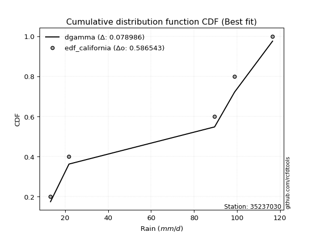</img>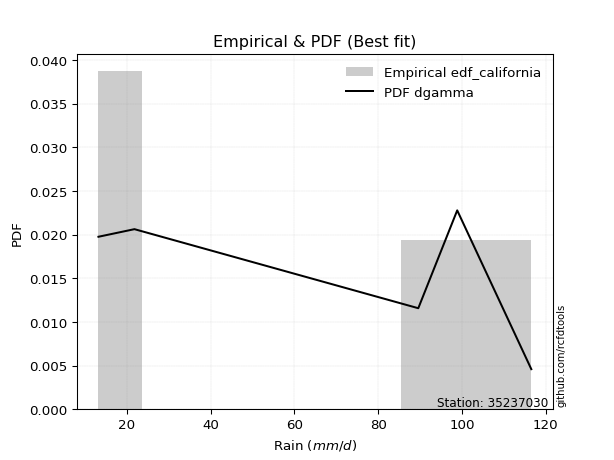</img>

</div>


### 2. EDF Hazen (1930)

Hazen method for plotting positions is a formula used to estimate the empirical cumulative probability distribution of flood events or other hydrological data. This formula often results in biased estimations, particularly when extrapolating to extreme events (high return periods).

<div align="center">


$P=(m-0.5)/n$


</div>


**2.1. Empirical values**

<div align="center">

|                | 0                  | 1                  | 2         | 3                 | 4                  |
|:---------------|:-------------------|:-------------------|:----------|:------------------|:-------------------|
| date           | 2019               | 2017               | 2025      | 2018              | 2024               |
| x              | 13.2               | 21.8               | 89.6      | 98.9              | 116.6              |
| m              | 1                  | 2                  | 3         | 4                 | 5                  |
| empirical_dist | edf_hazen          | edf_hazen          | edf_hazen | edf_hazen         | edf_hazen          |
| empirical      | 0.1                | 0.3                | 0.5       | 0.7               | 0.9                |
| empirical_tr   | 1.1111111111111112 | 1.4285714285714286 | 2.0       | 3.333333333333333 | 10.000000000000002 |

</div>


**2.2. Kolmogorov-Smirnov fit test (sorted by Δ)**


<div align="center">

|                | 0                   | 1                   | 2                   | 3                   | 4                   | 5                  | 6                  | 7                   | 8                   | 9                   | 10                 | 11                 | 12                  | 13                  | 14                  | 15                 | 16                  | 17                  | 18                 | 19                 | 20                 | 21                  | 22                  | 23                  | 24                  | 25                  | 26                  | 27                  | 28                 | 29                 | 30                  | 31                  | 32                  | 33                  | 34                  | 35                  | 36                  | 37                  | 38                 | 39                 | 40                  | 41                  | 42                  | 43                 | 44                  | 45                  | 46                  | 47                  | 48                  | 49                 | 50                 | 51                 | 52                  | 53                 | 54                 | 55                  | 56                  | 57                  | 58                  | 59                  | 60                  | 61                  | 62                  | 63                  | 64                  | 65                 | 66                  | 67                  | 68                  | 69                 | 70                  | 71                  | 72                  | 73                  | 74                  | 75                  | 76                  | 77                  | 78                  | 79                  | 80                  | 81                  | 82                  | 83                  | 84                 | 85                 | 86                 | 87                 | 88                  | 89                  | 90                 | 91                 | 92                 | 93                 | 94                 | 95                 | 96                 | 97                  | 98                  | 99                  | 100                | 101                 | 102                 | 103                | 104                 | 105                | 106                | 107                | 108                | 109                 | 110                 | 111                | 112                 | 113                 | 114                 | 115                 | 116                | 117                 | 118                | 119                | 120                | 121                 | 122                 | 123                | 124                | 125                | 126                 | 127                | 128                 | 129                 | 130                | 131                 | 132                 | 133                | 134                 | 135                | 136                | 137                 | 138                | 139                 | 140                | 141                 | 142                | 143                 | 144                | 145                 | 146                 | 147                 | 148                 | 149                | 150                 | 151                 | 152                | 153                | 154                | 155                | 156                | 157                | 158                | 159                |
|:---------------|:--------------------|:--------------------|:--------------------|:--------------------|:--------------------|:-------------------|:-------------------|:--------------------|:--------------------|:--------------------|:-------------------|:-------------------|:--------------------|:--------------------|:--------------------|:-------------------|:--------------------|:--------------------|:-------------------|:-------------------|:-------------------|:--------------------|:--------------------|:--------------------|:--------------------|:--------------------|:--------------------|:--------------------|:-------------------|:-------------------|:--------------------|:--------------------|:--------------------|:--------------------|:--------------------|:--------------------|:--------------------|:--------------------|:-------------------|:-------------------|:--------------------|:--------------------|:--------------------|:-------------------|:--------------------|:--------------------|:--------------------|:--------------------|:--------------------|:-------------------|:-------------------|:-------------------|:--------------------|:-------------------|:-------------------|:--------------------|:--------------------|:--------------------|:--------------------|:--------------------|:--------------------|:--------------------|:--------------------|:--------------------|:--------------------|:-------------------|:--------------------|:--------------------|:--------------------|:-------------------|:--------------------|:--------------------|:--------------------|:--------------------|:--------------------|:--------------------|:--------------------|:--------------------|:--------------------|:--------------------|:--------------------|:--------------------|:--------------------|:--------------------|:-------------------|:-------------------|:-------------------|:-------------------|:--------------------|:--------------------|:-------------------|:-------------------|:-------------------|:-------------------|:-------------------|:-------------------|:-------------------|:--------------------|:--------------------|:--------------------|:-------------------|:--------------------|:--------------------|:-------------------|:--------------------|:-------------------|:-------------------|:-------------------|:-------------------|:--------------------|:--------------------|:-------------------|:--------------------|:--------------------|:--------------------|:--------------------|:-------------------|:--------------------|:-------------------|:-------------------|:-------------------|:--------------------|:--------------------|:-------------------|:-------------------|:-------------------|:--------------------|:-------------------|:--------------------|:--------------------|:-------------------|:--------------------|:--------------------|:-------------------|:--------------------|:-------------------|:-------------------|:--------------------|:-------------------|:--------------------|:-------------------|:--------------------|:-------------------|:--------------------|:-------------------|:--------------------|:--------------------|:--------------------|:--------------------|:-------------------|:--------------------|:--------------------|:-------------------|:-------------------|:-------------------|:-------------------|:-------------------|:-------------------|:-------------------|:-------------------|
| station        | 35237030            | 35237030            | 35237030            | 35237030            | 35237030            | 35237030           | 35237030           | 35237030            | 35237030            | 35237030            | 35237030           | 35237030           | 35237030            | 35237030            | 35237030            | 35237030           | 35237030            | 35237030            | 35237030           | 35237030           | 35237030           | 35237030            | 35237030            | 35237030            | 35237030            | 35237030            | 35237030            | 35237030            | 35237030           | 35237030           | 35237030            | 35237030            | 35237030            | 35237030            | 35237030            | 35237030            | 35237030            | 35237030            | 35237030           | 35237030           | 35237030            | 35237030            | 35237030            | 35237030           | 35237030            | 35237030            | 35237030            | 35237030            | 35237030            | 35237030           | 35237030           | 35237030           | 35237030            | 35237030           | 35237030           | 35237030            | 35237030            | 35237030            | 35237030            | 35237030            | 35237030            | 35237030            | 35237030            | 35237030            | 35237030            | 35237030           | 35237030            | 35237030            | 35237030            | 35237030           | 35237030            | 35237030            | 35237030            | 35237030            | 35237030            | 35237030            | 35237030            | 35237030            | 35237030            | 35237030            | 35237030            | 35237030            | 35237030            | 35237030            | 35237030           | 35237030           | 35237030           | 35237030           | 35237030            | 35237030            | 35237030           | 35237030           | 35237030           | 35237030           | 35237030           | 35237030           | 35237030           | 35237030            | 35237030            | 35237030            | 35237030           | 35237030            | 35237030            | 35237030           | 35237030            | 35237030           | 35237030           | 35237030           | 35237030           | 35237030            | 35237030            | 35237030           | 35237030            | 35237030            | 35237030            | 35237030            | 35237030           | 35237030            | 35237030           | 35237030           | 35237030           | 35237030            | 35237030            | 35237030           | 35237030           | 35237030           | 35237030            | 35237030           | 35237030            | 35237030            | 35237030           | 35237030            | 35237030            | 35237030           | 35237030            | 35237030           | 35237030           | 35237030            | 35237030           | 35237030            | 35237030           | 35237030            | 35237030           | 35237030            | 35237030           | 35237030            | 35237030            | 35237030            | 35237030            | 35237030           | 35237030            | 35237030            | 35237030           | 35237030           | 35237030           | 35237030           | 35237030           | 35237030           | 35237030           | 35237030           |
| empirical_dist | edf_hazen           | edf_hazen           | edf_hazen           | edf_hazen           | edf_hazen           | edf_hazen          | edf_hazen          | edf_hazen           | edf_hazen           | edf_hazen           | edf_hazen          | edf_hazen          | edf_hazen           | edf_hazen           | edf_hazen           | edf_hazen          | edf_hazen           | edf_hazen           | edf_hazen          | edf_hazen          | edf_hazen          | edf_hazen           | edf_hazen           | edf_hazen           | edf_hazen           | edf_hazen           | edf_hazen           | edf_hazen           | edf_hazen          | edf_hazen          | edf_hazen           | edf_hazen           | edf_hazen           | edf_hazen           | edf_hazen           | edf_hazen           | edf_hazen           | edf_hazen           | edf_hazen          | edf_hazen          | edf_hazen           | edf_hazen           | edf_hazen           | edf_hazen          | edf_hazen           | edf_hazen           | edf_hazen           | edf_hazen           | edf_hazen           | edf_hazen          | edf_hazen          | edf_hazen          | edf_hazen           | edf_hazen          | edf_hazen          | edf_hazen           | edf_hazen           | edf_hazen           | edf_hazen           | edf_hazen           | edf_hazen           | edf_hazen           | edf_hazen           | edf_hazen           | edf_hazen           | edf_hazen          | edf_hazen           | edf_hazen           | edf_hazen           | edf_hazen          | edf_hazen           | edf_hazen           | edf_hazen           | edf_hazen           | edf_hazen           | edf_hazen           | edf_hazen           | edf_hazen           | edf_hazen           | edf_hazen           | edf_hazen           | edf_hazen           | edf_hazen           | edf_hazen           | edf_hazen          | edf_hazen          | edf_hazen          | edf_hazen          | edf_hazen           | edf_hazen           | edf_hazen          | edf_hazen          | edf_hazen          | edf_hazen          | edf_hazen          | edf_hazen          | edf_hazen          | edf_hazen           | edf_hazen           | edf_hazen           | edf_hazen          | edf_hazen           | edf_hazen           | edf_hazen          | edf_hazen           | edf_hazen          | edf_hazen          | edf_hazen          | edf_hazen          | edf_hazen           | edf_hazen           | edf_hazen          | edf_hazen           | edf_hazen           | edf_hazen           | edf_hazen           | edf_hazen          | edf_hazen           | edf_hazen          | edf_hazen          | edf_hazen          | edf_hazen           | edf_hazen           | edf_hazen          | edf_hazen          | edf_hazen          | edf_hazen           | edf_hazen          | edf_hazen           | edf_hazen           | edf_hazen          | edf_hazen           | edf_hazen           | edf_hazen          | edf_hazen           | edf_hazen          | edf_hazen          | edf_hazen           | edf_hazen          | edf_hazen           | edf_hazen          | edf_hazen           | edf_hazen          | edf_hazen           | edf_hazen          | edf_hazen           | edf_hazen           | edf_hazen           | edf_hazen           | edf_hazen          | edf_hazen           | edf_hazen           | edf_hazen          | edf_hazen          | edf_hazen          | edf_hazen          | edf_hazen          | edf_hazen          | edf_hazen          | edf_hazen          |
| p_dist         | dweibull            | dgamma              | wrapcauchy          | genextreme          | arcsine             | loglevy_l          | rdist              | johnsonsu           | logweibull_max      | trapezoid           | ksone              | genhalflogistic    | loggenextreme       | semicircular        | levy_l              | logarcsine         | anglit              | gumbel_l            | weibull_min        | skewnorm           | logtrapezoid       | pearson3            | logksone            | exponnorm           | truncnorm           | norm                | crystalball         | t                   | argus              | lomax              | erlang              | foldnorm            | gamma               | beta                | logbeta             | rice                | logsemicircular     | logkappa3           | triang             | genpareto          | logwrapcauchy       | maxwell             | cosine              | logistic           | rayleigh            | loganglit           | invweibull          | invgamma            | gompertz            | gennorm            | logweibull_min     | halfnorm           | logloggamma         | logburr12          | tukeylambda        | hypsecant           | loggumbel_l         | logpearson3         | logmielke           | betaprime           | kstwobign           | kappa3              | uniform             | vonmises_line       | loginvweibull       | genexpon           | logargus            | burr                | mielke              | lognct             | logbetaprime        | logalpha            | logexponnorm        | logcrystalball      | lognorm             | logt                | gumbel_r            | logf                | logfatiguelife      | loginvgamma         | loggamma            | loggamma            | logerlang           | bradford            | logfoldnorm        | loggennorm         | loggompertz        | logrice            | loginvgauss         | logncf              | halfgennorm        | ncf                | logmaxwell         | gausshyper         | laplace            | halflogistic       | lograyleigh        | kappa4              | loggenexpon         | nct                 | moyal              | burr12              | logkstwobign        | loghalfnorm        | loglogistic         | logburr            | logdgamma          | invgauss           | loggenhalflogistic | logcosine           | logloglaplace       | alpha              | loghypsecant        | loggumbel_r         | logdweibull         | logrdist            | loghalflogistic    | logmoyal            | nakagami           | loglaplace         | loglaplace         | wald                | f                   | loggenpareto       | truncweibull_min   | logtriang          | truncexpon          | logskewnorm        | exponpow            | logexponweib        | gengamma           | logwald             | logexponpow         | loghalfgennorm     | lognakagami         | logkappa4          | loggausshyper      | logtukeylambda      | logvonmises_line   | loguniform          | logbradford        | exponweib           | fatiguelife        | logtruncnorm        | logjohnsonsb       | logtruncexpon       | johnsonsb           | logtruncweibull_min | loglomax            | powerlaw           | truncpareto         | loggengamma         | logpowerlaw        | logtruncpareto     | weibull_max        | logjohnsonsu       | genlogistic        | loggenlogistic     | logvonmises        | vonmises           |
| delta          | 0.06945494182412248 | 0.07559241792507898 | 0.09999994333084594 | 0.10614703398591416 | 0.11765316707457174 | 0.1222716159652526 | 0.1344542424061686 | 0.13638626798160147 | 0.13664334059435498 | 0.14230884509134611 | 0.1474835977526442 | 0.1578890888560407 | 0.15860388931579517 | 0.16083755944055622 | 0.16098708560060845 | 0.162601410822528  | 0.17111276072342152 | 0.17111458761919313 | 0.1727411586107302 | 0.1749410198006891 | 0.1778396741353312 | 0.18275116488252208 | 0.19184835569019387 | 0.19528842098517463 | 0.19528880513868718 | 0.19528881838227008 | 0.19528882254432156 | 0.19532658830951433 | 0.1955964754481338 | 0.1973696897809354 | 0.19820987027509207 | 0.19864278623423604 | 0.20013757920918684 | 0.20060174484447701 | 0.20617629116547131 | 0.20739959720444812 | 0.20758291196486978 | 0.20905518261454303 | 0.2096744112792217 | 0.2096770101250301 | 0.21089914395072573 | 0.21177286227506897 | 0.21405493508666573 | 0.2163985572641396 | 0.21660316392863654 | 0.21944060317249903 | 0.21979904044317244 | 0.22043883828647237 | 0.22238386726262632 | 0.2285486056512738 | 0.2297021895432989 | 0.2312125449028506 | 0.23134024592139157 | 0.2314191126761722 | 0.2316439850228349 | 0.23175671275753007 | 0.23198717058462837 | 0.23327450973398212 | 0.23444931750161857 | 0.23498460239028918 | 0.23654064784009476 | 0.23851584640840018 | 0.23887814313346223 | 0.24013081426634952 | 0.24369345700598977 | 0.2455947246998047 | 0.24564441597490605 | 0.24606705880733415 | 0.24653181542497815 | 0.2465556561134179 | 0.24657570192592582 | 0.24662475545867957 | 0.24683862467492057 | 0.24684101988853913 | 0.24684112095348676 | 0.24684144994180857 | 0.24708816023696956 | 0.24757125449179007 | 0.24761411975767178 | 0.24985238564088097 | 0.25014370806045827 | 0.25014370806045827 | 0.25068244792487193 | 0.25071985057621937 | 0.2510692552160756 | 0.2515708428113289 | 0.2515976086412205 | 0.2516394061232252 | 0.25173835840561254 | 0.25202729282303804 | 0.2528654685535594 | 0.2554911841554507 | 0.2568411281619507 | 0.2571419081941321 | 0.2572361940743363 | 0.2581843470177354 | 0.2596992861869577 | 0.26090929945418695 | 0.26192029446542275 | 0.26278453411152314 | 0.2638734963948466 | 0.26428164299192336 | 0.26553648781344275 | 0.2692734123676309 | 0.26948734953999187 | 0.2717277209299601 | 0.2726382216051707 | 0.2731217363384312 | 0.273602045196369  | 0.27531526615674007 | 0.27690406621061536 | 0.281259511161727  | 0.28449252704767003 | 0.28709168172178967 | 0.29159586671893534 | 0.29279087647817703 | 0.2938659440057185 | 0.30006886974045677 | 0.3031741829146174 | 0.3046589628322961 | 0.3046589628322961 | 0.31293029418711105 | 0.31517275752934515 | 0.3168199050745071 | 0.3200527238012978 | 0.3221626715232293 | 0.32667776299703766 | 0.3314130654136327 | 0.33151806835525266 | 0.33310772364811536 | 0.3364222633896544 | 0.34047062942532047 | 0.35241600086848135 | 0.3564088356588204 | 0.36104438090408575 | 0.3615407729017234 | 0.3633510172687281 | 0.36817664372431835 | 0.3788208392815442 | 0.37909569369886964 | 0.3805614344924392 | 0.38201014592718163 | 0.4001064958842936 | 0.40406046563635956 | 0.4111164836002603 | 0.41470152945423133 | 0.42941507415034963 | 0.4359889579138204  | 0.43813369936550106 | 0.4642638349263478 | 0.47367569357681205 | 0.49981184262839706 | 0.5234854423848734 | 0.5391381842085439 | 0.5483603675521492 | 0.6128349139168103 | 0.7                | 0.7                | 1.2225381925380698 | 17.769679740017448 |
| deltao         | 0.5865427407550001  | 0.5865427407550001  | 0.5865427407550001  | 0.5865427407550001  | 0.5865427407550001  | 0.5865427407550001 | 0.5865427407550001 | 0.5865427407550001  | 0.5865427407550001  | 0.5865427407550001  | 0.5865427407550001 | 0.5865427407550001 | 0.5865427407550001  | 0.5865427407550001  | 0.5865427407550001  | 0.5865427407550001 | 0.5865427407550001  | 0.5865427407550001  | 0.5865427407550001 | 0.5865427407550001 | 0.5865427407550001 | 0.5865427407550001  | 0.5865427407550001  | 0.5865427407550001  | 0.5865427407550001  | 0.5865427407550001  | 0.5865427407550001  | 0.5865427407550001  | 0.5865427407550001 | 0.5865427407550001 | 0.5865427407550001  | 0.5865427407550001  | 0.5865427407550001  | 0.5865427407550001  | 0.5865427407550001  | 0.5865427407550001  | 0.5865427407550001  | 0.5865427407550001  | 0.5865427407550001 | 0.5865427407550001 | 0.5865427407550001  | 0.5865427407550001  | 0.5865427407550001  | 0.5865427407550001 | 0.5865427407550001  | 0.5865427407550001  | 0.5865427407550001  | 0.5865427407550001  | 0.5865427407550001  | 0.5865427407550001 | 0.5865427407550001 | 0.5865427407550001 | 0.5865427407550001  | 0.5865427407550001 | 0.5865427407550001 | 0.5865427407550001  | 0.5865427407550001  | 0.5865427407550001  | 0.5865427407550001  | 0.5865427407550001  | 0.5865427407550001  | 0.5865427407550001  | 0.5865427407550001  | 0.5865427407550001  | 0.5865427407550001  | 0.5865427407550001 | 0.5865427407550001  | 0.5865427407550001  | 0.5865427407550001  | 0.5865427407550001 | 0.5865427407550001  | 0.5865427407550001  | 0.5865427407550001  | 0.5865427407550001  | 0.5865427407550001  | 0.5865427407550001  | 0.5865427407550001  | 0.5865427407550001  | 0.5865427407550001  | 0.5865427407550001  | 0.5865427407550001  | 0.5865427407550001  | 0.5865427407550001  | 0.5865427407550001  | 0.5865427407550001 | 0.5865427407550001 | 0.5865427407550001 | 0.5865427407550001 | 0.5865427407550001  | 0.5865427407550001  | 0.5865427407550001 | 0.5865427407550001 | 0.5865427407550001 | 0.5865427407550001 | 0.5865427407550001 | 0.5865427407550001 | 0.5865427407550001 | 0.5865427407550001  | 0.5865427407550001  | 0.5865427407550001  | 0.5865427407550001 | 0.5865427407550001  | 0.5865427407550001  | 0.5865427407550001 | 0.5865427407550001  | 0.5865427407550001 | 0.5865427407550001 | 0.5865427407550001 | 0.5865427407550001 | 0.5865427407550001  | 0.5865427407550001  | 0.5865427407550001 | 0.5865427407550001  | 0.5865427407550001  | 0.5865427407550001  | 0.5865427407550001  | 0.5865427407550001 | 0.5865427407550001  | 0.5865427407550001 | 0.5865427407550001 | 0.5865427407550001 | 0.5865427407550001  | 0.5865427407550001  | 0.5865427407550001 | 0.5865427407550001 | 0.5865427407550001 | 0.5865427407550001  | 0.5865427407550001 | 0.5865427407550001  | 0.5865427407550001  | 0.5865427407550001 | 0.5865427407550001  | 0.5865427407550001  | 0.5865427407550001 | 0.5865427407550001  | 0.5865427407550001 | 0.5865427407550001 | 0.5865427407550001  | 0.5865427407550001 | 0.5865427407550001  | 0.5865427407550001 | 0.5865427407550001  | 0.5865427407550001 | 0.5865427407550001  | 0.5865427407550001 | 0.5865427407550001  | 0.5865427407550001  | 0.5865427407550001  | 0.5865427407550001  | 0.5865427407550001 | 0.5865427407550001  | 0.5865427407550001  | 0.5865427407550001 | 0.5865427407550001 | 0.5865427407550001 | 0.5865427407550001 | 0.5865427407550001 | 0.5865427407550001 | 0.5865427407550001 | 0.5865427407550001 |
| eval           | Δo > Δ              | Δo > Δ              | Δo > Δ              | Δo > Δ              | Δo > Δ              | Δo > Δ             | Δo > Δ             | Δo > Δ              | Δo > Δ              | Δo > Δ              | Δo > Δ             | Δo > Δ             | Δo > Δ              | Δo > Δ              | Δo > Δ              | Δo > Δ             | Δo > Δ              | Δo > Δ              | Δo > Δ             | Δo > Δ             | Δo > Δ             | Δo > Δ              | Δo > Δ              | Δo > Δ              | Δo > Δ              | Δo > Δ              | Δo > Δ              | Δo > Δ              | Δo > Δ             | Δo > Δ             | Δo > Δ              | Δo > Δ              | Δo > Δ              | Δo > Δ              | Δo > Δ              | Δo > Δ              | Δo > Δ              | Δo > Δ              | Δo > Δ             | Δo > Δ             | Δo > Δ              | Δo > Δ              | Δo > Δ              | Δo > Δ             | Δo > Δ              | Δo > Δ              | Δo > Δ              | Δo > Δ              | Δo > Δ              | Δo > Δ             | Δo > Δ             | Δo > Δ             | Δo > Δ              | Δo > Δ             | Δo > Δ             | Δo > Δ              | Δo > Δ              | Δo > Δ              | Δo > Δ              | Δo > Δ              | Δo > Δ              | Δo > Δ              | Δo > Δ              | Δo > Δ              | Δo > Δ              | Δo > Δ             | Δo > Δ              | Δo > Δ              | Δo > Δ              | Δo > Δ             | Δo > Δ              | Δo > Δ              | Δo > Δ              | Δo > Δ              | Δo > Δ              | Δo > Δ              | Δo > Δ              | Δo > Δ              | Δo > Δ              | Δo > Δ              | Δo > Δ              | Δo > Δ              | Δo > Δ              | Δo > Δ              | Δo > Δ             | Δo > Δ             | Δo > Δ             | Δo > Δ             | Δo > Δ              | Δo > Δ              | Δo > Δ             | Δo > Δ             | Δo > Δ             | Δo > Δ             | Δo > Δ             | Δo > Δ             | Δo > Δ             | Δo > Δ              | Δo > Δ              | Δo > Δ              | Δo > Δ             | Δo > Δ              | Δo > Δ              | Δo > Δ             | Δo > Δ              | Δo > Δ             | Δo > Δ             | Δo > Δ             | Δo > Δ             | Δo > Δ              | Δo > Δ              | Δo > Δ             | Δo > Δ              | Δo > Δ              | Δo > Δ              | Δo > Δ              | Δo > Δ             | Δo > Δ              | Δo > Δ             | Δo > Δ             | Δo > Δ             | Δo > Δ              | Δo > Δ              | Δo > Δ             | Δo > Δ             | Δo > Δ             | Δo > Δ              | Δo > Δ             | Δo > Δ              | Δo > Δ              | Δo > Δ             | Δo > Δ              | Δo > Δ              | Δo > Δ             | Δo > Δ              | Δo > Δ             | Δo > Δ             | Δo > Δ              | Δo > Δ             | Δo > Δ              | Δo > Δ             | Δo > Δ              | Δo > Δ             | Δo > Δ              | Δo > Δ             | Δo > Δ              | Δo > Δ              | Δo > Δ              | Δo > Δ              | Δo > Δ             | Δo > Δ              | Δo > Δ              | Δo > Δ             | Δo > Δ             | Δo > Δ             | Δo <= Δ            | Δo <= Δ            | Δo <= Δ            | Δo <= Δ            | Δo <= Δ            |
| fit            | 1                   | 1                   | 1                   | 1                   | 1                   | 1                  | 1                  | 1                   | 1                   | 1                   | 1                  | 1                  | 1                   | 1                   | 1                   | 1                  | 1                   | 1                   | 1                  | 1                  | 1                  | 1                   | 1                   | 1                   | 1                   | 1                   | 1                   | 1                   | 1                  | 1                  | 1                   | 1                   | 1                   | 1                   | 1                   | 1                   | 1                   | 1                   | 1                  | 1                  | 1                   | 1                   | 1                   | 1                  | 1                   | 1                   | 1                   | 1                   | 1                   | 1                  | 1                  | 1                  | 1                   | 1                  | 1                  | 1                   | 1                   | 1                   | 1                   | 1                   | 1                   | 1                   | 1                   | 1                   | 1                   | 1                  | 1                   | 1                   | 1                   | 1                  | 1                   | 1                   | 1                   | 1                   | 1                   | 1                   | 1                   | 1                   | 1                   | 1                   | 1                   | 1                   | 1                   | 1                   | 1                  | 1                  | 1                  | 1                  | 1                   | 1                   | 1                  | 1                  | 1                  | 1                  | 1                  | 1                  | 1                  | 1                   | 1                   | 1                   | 1                  | 1                   | 1                   | 1                  | 1                   | 1                  | 1                  | 1                  | 1                  | 1                   | 1                   | 1                  | 1                   | 1                   | 1                   | 1                   | 1                  | 1                   | 1                  | 1                  | 1                  | 1                   | 1                   | 1                  | 1                  | 1                  | 1                   | 1                  | 1                   | 1                   | 1                  | 1                   | 1                   | 1                  | 1                   | 1                  | 1                  | 1                   | 1                  | 1                   | 1                  | 1                   | 1                  | 1                   | 1                  | 1                   | 1                   | 1                   | 1                   | 1                  | 1                   | 1                   | 1                  | 1                  | 1                  | 0                  | 0                  | 0                  | 0                  | 0                  |
| n              | 5                   | 5                   | 5                   | 5                   | 5                   | 5                  | 5                  | 5                   | 5                   | 5                   | 5                  | 5                  | 5                   | 5                   | 5                   | 5                  | 5                   | 5                   | 5                  | 5                  | 5                  | 5                   | 5                   | 5                   | 5                   | 5                   | 5                   | 5                   | 5                  | 5                  | 5                   | 5                   | 5                   | 5                   | 5                   | 5                   | 5                   | 5                   | 5                  | 5                  | 5                   | 5                   | 5                   | 5                  | 5                   | 5                   | 5                   | 5                   | 5                   | 5                  | 5                  | 5                  | 5                   | 5                  | 5                  | 5                   | 5                   | 5                   | 5                   | 5                   | 5                   | 5                   | 5                   | 5                   | 5                   | 5                  | 5                   | 5                   | 5                   | 5                  | 5                   | 5                   | 5                   | 5                   | 5                   | 5                   | 5                   | 5                   | 5                   | 5                   | 5                   | 5                   | 5                   | 5                   | 5                  | 5                  | 5                  | 5                  | 5                   | 5                   | 5                  | 5                  | 5                  | 5                  | 5                  | 5                  | 5                  | 5                   | 5                   | 5                   | 5                  | 5                   | 5                   | 5                  | 5                   | 5                  | 5                  | 5                  | 5                  | 5                   | 5                   | 5                  | 5                   | 5                   | 5                   | 5                   | 5                  | 5                   | 5                  | 5                  | 5                  | 5                   | 5                   | 5                  | 5                  | 5                  | 5                   | 5                  | 5                   | 5                   | 5                  | 5                   | 5                   | 5                  | 5                   | 5                  | 5                  | 5                   | 5                  | 5                   | 5                  | 5                   | 5                  | 5                   | 5                  | 5                   | 5                   | 5                   | 5                   | 5                  | 5                   | 5                   | 5                  | 5                  | 5                  | 5                  | 5                  | 5                  | 5                  | 5                  |
| best_fit       | 1                   | 0                   | 0                   | 0                   | 0                   | 0                  | 0                  | 0                   | 0                   | 0                   | 0                  | 0                  | 0                   | 0                   | 0                   | 0                  | 0                   | 0                   | 0                  | 0                  | 0                  | 0                   | 0                   | 0                   | 0                   | 0                   | 0                   | 0                   | 0                  | 0                  | 0                   | 0                   | 0                   | 0                   | 0                   | 0                   | 0                   | 0                   | 0                  | 0                  | 0                   | 0                   | 0                   | 0                  | 0                   | 0                   | 0                   | 0                   | 0                   | 0                  | 0                  | 0                  | 0                   | 0                  | 0                  | 0                   | 0                   | 0                   | 0                   | 0                   | 0                   | 0                   | 0                   | 0                   | 0                   | 0                  | 0                   | 0                   | 0                   | 0                  | 0                   | 0                   | 0                   | 0                   | 0                   | 0                   | 0                   | 0                   | 0                   | 0                   | 0                   | 0                   | 0                   | 0                   | 0                  | 0                  | 0                  | 0                  | 0                   | 0                   | 0                  | 0                  | 0                  | 0                  | 0                  | 0                  | 0                  | 0                   | 0                   | 0                   | 0                  | 0                   | 0                   | 0                  | 0                   | 0                  | 0                  | 0                  | 0                  | 0                   | 0                   | 0                  | 0                   | 0                   | 0                   | 0                   | 0                  | 0                   | 0                  | 0                  | 0                  | 0                   | 0                   | 0                  | 0                  | 0                  | 0                   | 0                  | 0                   | 0                   | 0                  | 0                   | 0                   | 0                  | 0                   | 0                  | 0                  | 0                   | 0                  | 0                   | 0                  | 0                   | 0                  | 0                   | 0                  | 0                   | 0                   | 0                   | 0                   | 0                  | 0                   | 0                   | 0                  | 0                  | 0                  | 0                  | 0                  | 0                  | 0                  | 0                  |
| best_fit_sort  | 1                   | 2                   | 3                   | 4                   | 5                   | 6                  | 7                  | 8                   | 9                   | 10                  | 11                 | 12                 | 13                  | 14                  | 15                  | 16                 | 17                  | 18                  | 19                 | 20                 | 21                 | 22                  | 23                  | 24                  | 25                  | 26                  | 27                  | 28                  | 29                 | 30                 | 31                  | 32                  | 33                  | 34                  | 35                  | 36                  | 37                  | 38                  | 39                 | 40                 | 41                  | 42                  | 43                  | 44                 | 45                  | 46                  | 47                  | 48                  | 49                  | 50                 | 51                 | 52                 | 53                  | 54                 | 55                 | 56                  | 57                  | 58                  | 59                  | 60                  | 61                  | 62                  | 63                  | 64                  | 65                  | 66                 | 67                  | 68                  | 69                  | 70                 | 71                  | 72                  | 73                  | 74                  | 75                  | 76                  | 77                  | 78                  | 79                  | 80                  | 81                  | 82                  | 83                  | 84                  | 85                 | 86                 | 87                 | 88                 | 89                  | 90                  | 91                 | 92                 | 93                 | 94                 | 95                 | 96                 | 97                 | 98                  | 99                  | 100                 | 101                | 102                 | 103                 | 104                | 105                 | 106                | 107                | 108                | 109                | 110                 | 111                 | 112                | 113                 | 114                 | 115                 | 116                 | 117                | 118                 | 119                | 120                | 121                | 122                 | 123                 | 124                | 125                | 126                | 127                 | 128                | 129                 | 130                 | 131                | 132                 | 133                 | 134                | 135                 | 136                | 137                | 138                 | 139                | 140                 | 141                | 142                 | 143                | 144                 | 145                | 146                 | 147                 | 148                 | 149                 | 150                | 151                 | 152                 | 153                | 154                | 155                | 156                | 157                | 158                | 159                | 160                |

</div>


**2.3. Best fit**

<div align="center">

|   id |   station | empirical_dist   | p_dist   |     delta |   deltao | eval   |   fit |   n |   best_fit |   best_fit_sort |
|-----:|----------:|:-----------------|:---------|----------:|---------:|:-------|------:|----:|-----------:|----------------:|
|    0 |  35237030 | edf_hazen        | dweibull | 0.0694549 | 0.586543 | Δo > Δ |     1 |   5 |          1 |               1 |

</div>


<div align="center">

</img></img>

</div>


### 3. EDF Weibull (1939)

Weibull plotting position formula is an empirical method used to estimate the non-exceedance probability or plotting position for a set of observed data, is often recommended or widely used in practice, particularly in flood frequency analysis.

<div align="center">


$P=m/(n+1)$


</div>


**3.1. Empirical values**

<div align="center">

|                | 0                   | 1                  | 2           | 3                  | 4                  |
|:---------------|:--------------------|:-------------------|:------------|:-------------------|:-------------------|
| date           | 2019                | 2017               | 2025        | 2018               | 2024               |
| x              | 13.2                | 21.8               | 89.6        | 98.9               | 116.6              |
| m              | 1                   | 2                  | 3           | 4                  | 5                  |
| empirical_dist | edf_weibull         | edf_weibull        | edf_weibull | edf_weibull        | edf_weibull        |
| empirical      | 0.16666666666666666 | 0.3333333333333333 | 0.5         | 0.6666666666666666 | 0.8333333333333334 |
| empirical_tr   | 1.2                 | 1.4999999999999998 | 2.0         | 2.9999999999999996 | 6.000000000000002  |

</div>


**3.2. Kolmogorov-Smirnov fit test (sorted by Δ)**


<div align="center">

|                | 0                   | 1                   | 2                   | 3                   | 4                   | 5                   | 6                   | 7                   | 8                  | 9                   | 10                  | 11                 | 12                  | 13                  | 14                  | 15                 | 16                  | 17                 | 18                 | 19                  | 20                  | 21                  | 22                  | 23                 | 24                  | 25                 | 26                 | 27                  | 28                  | 29                  | 30                  | 31                  | 32                  | 33                  | 34                 | 35                  | 36                  | 37                 | 38                  | 39                 | 40                  | 41                  | 42                  | 43                  | 44                  | 45                  | 46                 | 47                 | 48                  | 49                 | 50                  | 51                  | 52                  | 53                  | 54                  | 55                  | 56                  | 57                  | 58                  | 59                  | 60                  | 61                  | 62                 | 63                  | 64                  | 65                  | 66                  | 67                 | 68                  | 69                  | 70                  | 71                  | 72                  | 73                  | 74                  | 75                  | 76                  | 77                  | 78                  | 79                  | 80                  | 81                 | 82                  | 83                  | 84                 | 85                 | 86                 | 87                  | 88                  | 89                 | 90                 | 91                  | 92                 | 93                 | 94                 | 95                 | 96                 | 97                  | 98                 | 99                  | 100                 | 101                | 102                 | 103                 | 104                | 105                 | 106                | 107                | 108                | 109                 | 110                | 111                | 112                | 113                 | 114                 | 115                 | 116                | 117                 | 118                | 119                | 120                | 121                 | 122                | 123                | 124                | 125                 | 126                | 127                 | 128                 | 129                | 130                | 131                 | 132                 | 133                | 134                 | 135                | 136                | 137                 | 138                | 139                | 140                | 141                 | 142                | 143                 | 144                | 145                | 146                 | 147                 | 148                | 149                 | 150                | 151                 | 152                | 153                | 154                | 155                | 156                | 157                | 158                | 159                |
|:---------------|:--------------------|:--------------------|:--------------------|:--------------------|:--------------------|:--------------------|:--------------------|:--------------------|:-------------------|:--------------------|:--------------------|:-------------------|:--------------------|:--------------------|:--------------------|:-------------------|:--------------------|:-------------------|:-------------------|:--------------------|:--------------------|:--------------------|:--------------------|:-------------------|:--------------------|:-------------------|:-------------------|:--------------------|:--------------------|:--------------------|:--------------------|:--------------------|:--------------------|:--------------------|:-------------------|:--------------------|:--------------------|:-------------------|:--------------------|:-------------------|:--------------------|:--------------------|:--------------------|:--------------------|:--------------------|:--------------------|:-------------------|:-------------------|:--------------------|:-------------------|:--------------------|:--------------------|:--------------------|:--------------------|:--------------------|:--------------------|:--------------------|:--------------------|:--------------------|:--------------------|:--------------------|:--------------------|:-------------------|:--------------------|:--------------------|:--------------------|:--------------------|:-------------------|:--------------------|:--------------------|:--------------------|:--------------------|:--------------------|:--------------------|:--------------------|:--------------------|:--------------------|:--------------------|:--------------------|:--------------------|:--------------------|:-------------------|:--------------------|:--------------------|:-------------------|:-------------------|:-------------------|:--------------------|:--------------------|:-------------------|:-------------------|:--------------------|:-------------------|:-------------------|:-------------------|:-------------------|:-------------------|:--------------------|:-------------------|:--------------------|:--------------------|:-------------------|:--------------------|:--------------------|:-------------------|:--------------------|:-------------------|:-------------------|:-------------------|:--------------------|:-------------------|:-------------------|:-------------------|:--------------------|:--------------------|:--------------------|:-------------------|:--------------------|:-------------------|:-------------------|:-------------------|:--------------------|:-------------------|:-------------------|:-------------------|:--------------------|:-------------------|:--------------------|:--------------------|:-------------------|:-------------------|:--------------------|:--------------------|:-------------------|:--------------------|:-------------------|:-------------------|:--------------------|:-------------------|:-------------------|:-------------------|:--------------------|:-------------------|:--------------------|:-------------------|:-------------------|:--------------------|:--------------------|:-------------------|:--------------------|:-------------------|:--------------------|:-------------------|:-------------------|:-------------------|:-------------------|:-------------------|:-------------------|:-------------------|:-------------------|
| station        | 35237030            | 35237030            | 35237030            | 35237030            | 35237030            | 35237030            | 35237030            | 35237030            | 35237030           | 35237030            | 35237030            | 35237030           | 35237030            | 35237030            | 35237030            | 35237030           | 35237030            | 35237030           | 35237030           | 35237030            | 35237030            | 35237030            | 35237030            | 35237030           | 35237030            | 35237030           | 35237030           | 35237030            | 35237030            | 35237030            | 35237030            | 35237030            | 35237030            | 35237030            | 35237030           | 35237030            | 35237030            | 35237030           | 35237030            | 35237030           | 35237030            | 35237030            | 35237030            | 35237030            | 35237030            | 35237030            | 35237030           | 35237030           | 35237030            | 35237030           | 35237030            | 35237030            | 35237030            | 35237030            | 35237030            | 35237030            | 35237030            | 35237030            | 35237030            | 35237030            | 35237030            | 35237030            | 35237030           | 35237030            | 35237030            | 35237030            | 35237030            | 35237030           | 35237030            | 35237030            | 35237030            | 35237030            | 35237030            | 35237030            | 35237030            | 35237030            | 35237030            | 35237030            | 35237030            | 35237030            | 35237030            | 35237030           | 35237030            | 35237030            | 35237030           | 35237030           | 35237030           | 35237030            | 35237030            | 35237030           | 35237030           | 35237030            | 35237030           | 35237030           | 35237030           | 35237030           | 35237030           | 35237030            | 35237030           | 35237030            | 35237030            | 35237030           | 35237030            | 35237030            | 35237030           | 35237030            | 35237030           | 35237030           | 35237030           | 35237030            | 35237030           | 35237030           | 35237030           | 35237030            | 35237030            | 35237030            | 35237030           | 35237030            | 35237030           | 35237030           | 35237030           | 35237030            | 35237030           | 35237030           | 35237030           | 35237030            | 35237030           | 35237030            | 35237030            | 35237030           | 35237030           | 35237030            | 35237030            | 35237030           | 35237030            | 35237030           | 35237030           | 35237030            | 35237030           | 35237030           | 35237030           | 35237030            | 35237030           | 35237030            | 35237030           | 35237030           | 35237030            | 35237030            | 35237030           | 35237030            | 35237030           | 35237030            | 35237030           | 35237030           | 35237030           | 35237030           | 35237030           | 35237030           | 35237030           | 35237030           |
| empirical_dist | edf_weibull         | edf_weibull         | edf_weibull         | edf_weibull         | edf_weibull         | edf_weibull         | edf_weibull         | edf_weibull         | edf_weibull        | edf_weibull         | edf_weibull         | edf_weibull        | edf_weibull         | edf_weibull         | edf_weibull         | edf_weibull        | edf_weibull         | edf_weibull        | edf_weibull        | edf_weibull         | edf_weibull         | edf_weibull         | edf_weibull         | edf_weibull        | edf_weibull         | edf_weibull        | edf_weibull        | edf_weibull         | edf_weibull         | edf_weibull         | edf_weibull         | edf_weibull         | edf_weibull         | edf_weibull         | edf_weibull        | edf_weibull         | edf_weibull         | edf_weibull        | edf_weibull         | edf_weibull        | edf_weibull         | edf_weibull         | edf_weibull         | edf_weibull         | edf_weibull         | edf_weibull         | edf_weibull        | edf_weibull        | edf_weibull         | edf_weibull        | edf_weibull         | edf_weibull         | edf_weibull         | edf_weibull         | edf_weibull         | edf_weibull         | edf_weibull         | edf_weibull         | edf_weibull         | edf_weibull         | edf_weibull         | edf_weibull         | edf_weibull        | edf_weibull         | edf_weibull         | edf_weibull         | edf_weibull         | edf_weibull        | edf_weibull         | edf_weibull         | edf_weibull         | edf_weibull         | edf_weibull         | edf_weibull         | edf_weibull         | edf_weibull         | edf_weibull         | edf_weibull         | edf_weibull         | edf_weibull         | edf_weibull         | edf_weibull        | edf_weibull         | edf_weibull         | edf_weibull        | edf_weibull        | edf_weibull        | edf_weibull         | edf_weibull         | edf_weibull        | edf_weibull        | edf_weibull         | edf_weibull        | edf_weibull        | edf_weibull        | edf_weibull        | edf_weibull        | edf_weibull         | edf_weibull        | edf_weibull         | edf_weibull         | edf_weibull        | edf_weibull         | edf_weibull         | edf_weibull        | edf_weibull         | edf_weibull        | edf_weibull        | edf_weibull        | edf_weibull         | edf_weibull        | edf_weibull        | edf_weibull        | edf_weibull         | edf_weibull         | edf_weibull         | edf_weibull        | edf_weibull         | edf_weibull        | edf_weibull        | edf_weibull        | edf_weibull         | edf_weibull        | edf_weibull        | edf_weibull        | edf_weibull         | edf_weibull        | edf_weibull         | edf_weibull         | edf_weibull        | edf_weibull        | edf_weibull         | edf_weibull         | edf_weibull        | edf_weibull         | edf_weibull        | edf_weibull        | edf_weibull         | edf_weibull        | edf_weibull        | edf_weibull        | edf_weibull         | edf_weibull        | edf_weibull         | edf_weibull        | edf_weibull        | edf_weibull         | edf_weibull         | edf_weibull        | edf_weibull         | edf_weibull        | edf_weibull         | edf_weibull        | edf_weibull        | edf_weibull        | edf_weibull        | edf_weibull        | edf_weibull        | edf_weibull        | edf_weibull        |
| p_dist         | levy_l              | arcsine             | loglevy_l           | dweibull            | dgamma              | ksone               | trapezoid           | semicircular        | wrapcauchy         | logweibull_max      | genextreme          | genhalflogistic    | loggenextreme       | logarcsine          | rdist               | johnsonsu          | anglit              | logkappa3          | logtrapezoid       | logksone            | skewnorm            | pearson3            | t                   | norm               | crystalball         | truncnorm          | exponnorm          | erlang              | gamma               | gumbel_l            | weibull_min         | foldnorm            | lomax               | logsemicircular     | triang             | logwrapcauchy       | maxwell             | rice               | cosine              | logistic           | rayleigh            | loganglit           | invweibull          | invgamma            | logdweibull         | argus               | logweibull_min     | halfnorm           | logloggamma         | logburr12          | hypsecant           | loggumbel_l         | logpearson3         | beta                | logmielke           | betaprime           | kstwobign           | tukeylambda         | logbeta             | loggennorm          | genpareto           | loginvweibull       | genexpon           | logargus            | vonmises_line       | burr                | mielke              | lognct             | logbetaprime        | logalpha            | logexponnorm        | logcrystalball      | lognorm             | logt                | gumbel_r            | logf                | logfatiguelife      | loginvgamma         | loggamma            | loggamma            | uniform             | kappa3             | logerlang           | bradford            | logfoldnorm        | loggompertz        | logrice            | loginvgauss         | logncf              | halfgennorm        | ncf                | gompertz            | logloglaplace      | logmaxwell         | gausshyper         | laplace            | lograyleigh        | kappa4              | gennorm            | loggenexpon         | nct                 | moyal              | burr12              | logkstwobign        | loghalfnorm        | loglogistic         | logburr            | invgauss           | loggenhalflogistic | logcosine           | halflogistic       | alpha              | logdgamma          | loghypsecant        | loggumbel_r         | logrdist            | loghalflogistic    | logmoyal            | nakagami           | loglaplace         | loglaplace         | f                   | loggenpareto       | truncweibull_min   | logtriang          | truncexpon          | logskewnorm        | exponpow            | logexponweib        | wald               | gengamma           | logwald             | logexponpow         | loghalfgennorm     | lognakagami         | logkappa4          | loggausshyper      | logtukeylambda      | loglomax           | logjohnsonsb       | logvonmises_line   | loguniform          | logbradford        | exponweib           | johnsonsb          | fatiguelife        | logtruncnorm        | logtruncexpon       | loggengamma        | logtruncweibull_min | powerlaw           | truncpareto         | logpowerlaw        | logtruncpareto     | weibull_max        | logjohnsonsu       | genlogistic        | loggenlogistic     | logvonmises        | vonmises           |
| delta          | 0.11763655490852376 | 0.11765316707457174 | 0.11800595190323243 | 0.13612160849078914 | 0.14225908459174563 | 0.14921340229196267 | 0.15431390187679017 | 0.16338546455292718 | 0.1666666099975126 | 0.16666665972298766 | 0.16666666666654417 | 0.1666666666666653 | 0.16666666666666663 | 0.16666666666666666 | 0.16778757573950193 | 0.1697196013149348 | 0.17345576793167267 | 0.174215999041685  | 0.1778396741353312 | 0.19184835569019387 | 0.19244102601375274 | 0.19524423203505634 | 0.19640068014435594 | 0.1964086111644086 | 0.19640861279090494 | 0.196408632574562  | 0.1964090015384092 | 0.19820987027509207 | 0.20013757920918684 | 0.20444792095252645 | 0.20607449194406352 | 0.20676127602889954 | 0.20744854013124825 | 0.20758291196486978 | 0.2096744112792217 | 0.21089914395072573 | 0.21177286227506897 | 0.2128649250057576 | 0.21405493508666573 | 0.2163985572641396 | 0.21660316392863654 | 0.21944060317249903 | 0.21979904044317244 | 0.22043883828647237 | 0.22492920005226869 | 0.22892980878146713 | 0.2297021895432989 | 0.2312125449028506 | 0.23134024592139157 | 0.2314191126761722 | 0.23175671275753007 | 0.23198717058462837 | 0.23327450973398212 | 0.23393507817781034 | 0.23444931750161857 | 0.23498460239028918 | 0.23654064784009476 | 0.23723469079346887 | 0.23950962449880464 | 0.24170287412207736 | 0.24301034345836342 | 0.24369345700598977 | 0.2455947246998047 | 0.24564441597490605 | 0.24576376281352663 | 0.24606705880733415 | 0.24653181542497815 | 0.2465556561134179 | 0.24657570192592582 | 0.24662475545867957 | 0.24683862467492057 | 0.24684101988853913 | 0.24684112095348676 | 0.24684144994180857 | 0.24708816023696956 | 0.24757125449179007 | 0.24761411975767178 | 0.24985238564088097 | 0.25014370806045827 | 0.25014370806045827 | 0.25016118633139905 | 0.2502018914620922 | 0.25068244792487193 | 0.25071985057621937 | 0.2510692552160756 | 0.2515976086412205 | 0.2516394061232252 | 0.25173835840561254 | 0.25202729282303804 | 0.2528654685535594 | 0.2554911841554507 | 0.25571720059595965 | 0.2561250117451379 | 0.2568411281619507 | 0.2571419081941321 | 0.2572361940743363 | 0.2596992861869577 | 0.26090929945418695 | 0.2618819389846071 | 0.26192029446542275 | 0.26278453411152314 | 0.2638734963948466 | 0.26428164299192336 | 0.26553648781344275 | 0.2692734123676309 | 0.26948734953999187 | 0.2717277209299601 | 0.2731217363384312 | 0.273602045196369  | 0.27531526615674007 | 0.2801692310431901 | 0.281259511161727  | 0.2820103835487244 | 0.28449252704767003 | 0.28709168172178967 | 0.29279087647817703 | 0.2938659440057185 | 0.30006886974045677 | 0.3031741829146174 | 0.3046589628322961 | 0.3046589628322961 | 0.31517275752934515 | 0.3168199050745071 | 0.3200527238012978 | 0.3221626715232293 | 0.32667776299703766 | 0.3314130654136327 | 0.33151806835525266 | 0.33310772364811536 | 0.3333333333333333 | 0.3364222633896544 | 0.34047062942532047 | 0.35241600086848135 | 0.3564088356588204 | 0.36104438090408575 | 0.3615407729017234 | 0.3633510172687281 | 0.36817664372431835 | 0.3714670326988344 | 0.377783150266927  | 0.3788208392815442 | 0.37909569369886964 | 0.3805614344924392 | 0.38201014592718163 | 0.3960817408170163 | 0.4001064958842936 | 0.40406046563635956 | 0.41470152945423133 | 0.4331451759617304 | 0.4359889579138204  | 0.4642638349263478 | 0.47367569357681205 | 0.4901521090515401 | 0.5058048508752104 | 0.5150270342188159 | 0.5795015805834771 | 0.6666666666666666 | 0.6666666666666666 | 1.2225381925380698 | 17.836346406684115 |
| deltao         | 0.5865427407550001  | 0.5865427407550001  | 0.5865427407550001  | 0.5865427407550001  | 0.5865427407550001  | 0.5865427407550001  | 0.5865427407550001  | 0.5865427407550001  | 0.5865427407550001 | 0.5865427407550001  | 0.5865427407550001  | 0.5865427407550001 | 0.5865427407550001  | 0.5865427407550001  | 0.5865427407550001  | 0.5865427407550001 | 0.5865427407550001  | 0.5865427407550001 | 0.5865427407550001 | 0.5865427407550001  | 0.5865427407550001  | 0.5865427407550001  | 0.5865427407550001  | 0.5865427407550001 | 0.5865427407550001  | 0.5865427407550001 | 0.5865427407550001 | 0.5865427407550001  | 0.5865427407550001  | 0.5865427407550001  | 0.5865427407550001  | 0.5865427407550001  | 0.5865427407550001  | 0.5865427407550001  | 0.5865427407550001 | 0.5865427407550001  | 0.5865427407550001  | 0.5865427407550001 | 0.5865427407550001  | 0.5865427407550001 | 0.5865427407550001  | 0.5865427407550001  | 0.5865427407550001  | 0.5865427407550001  | 0.5865427407550001  | 0.5865427407550001  | 0.5865427407550001 | 0.5865427407550001 | 0.5865427407550001  | 0.5865427407550001 | 0.5865427407550001  | 0.5865427407550001  | 0.5865427407550001  | 0.5865427407550001  | 0.5865427407550001  | 0.5865427407550001  | 0.5865427407550001  | 0.5865427407550001  | 0.5865427407550001  | 0.5865427407550001  | 0.5865427407550001  | 0.5865427407550001  | 0.5865427407550001 | 0.5865427407550001  | 0.5865427407550001  | 0.5865427407550001  | 0.5865427407550001  | 0.5865427407550001 | 0.5865427407550001  | 0.5865427407550001  | 0.5865427407550001  | 0.5865427407550001  | 0.5865427407550001  | 0.5865427407550001  | 0.5865427407550001  | 0.5865427407550001  | 0.5865427407550001  | 0.5865427407550001  | 0.5865427407550001  | 0.5865427407550001  | 0.5865427407550001  | 0.5865427407550001 | 0.5865427407550001  | 0.5865427407550001  | 0.5865427407550001 | 0.5865427407550001 | 0.5865427407550001 | 0.5865427407550001  | 0.5865427407550001  | 0.5865427407550001 | 0.5865427407550001 | 0.5865427407550001  | 0.5865427407550001 | 0.5865427407550001 | 0.5865427407550001 | 0.5865427407550001 | 0.5865427407550001 | 0.5865427407550001  | 0.5865427407550001 | 0.5865427407550001  | 0.5865427407550001  | 0.5865427407550001 | 0.5865427407550001  | 0.5865427407550001  | 0.5865427407550001 | 0.5865427407550001  | 0.5865427407550001 | 0.5865427407550001 | 0.5865427407550001 | 0.5865427407550001  | 0.5865427407550001 | 0.5865427407550001 | 0.5865427407550001 | 0.5865427407550001  | 0.5865427407550001  | 0.5865427407550001  | 0.5865427407550001 | 0.5865427407550001  | 0.5865427407550001 | 0.5865427407550001 | 0.5865427407550001 | 0.5865427407550001  | 0.5865427407550001 | 0.5865427407550001 | 0.5865427407550001 | 0.5865427407550001  | 0.5865427407550001 | 0.5865427407550001  | 0.5865427407550001  | 0.5865427407550001 | 0.5865427407550001 | 0.5865427407550001  | 0.5865427407550001  | 0.5865427407550001 | 0.5865427407550001  | 0.5865427407550001 | 0.5865427407550001 | 0.5865427407550001  | 0.5865427407550001 | 0.5865427407550001 | 0.5865427407550001 | 0.5865427407550001  | 0.5865427407550001 | 0.5865427407550001  | 0.5865427407550001 | 0.5865427407550001 | 0.5865427407550001  | 0.5865427407550001  | 0.5865427407550001 | 0.5865427407550001  | 0.5865427407550001 | 0.5865427407550001  | 0.5865427407550001 | 0.5865427407550001 | 0.5865427407550001 | 0.5865427407550001 | 0.5865427407550001 | 0.5865427407550001 | 0.5865427407550001 | 0.5865427407550001 |
| eval           | Δo > Δ              | Δo > Δ              | Δo > Δ              | Δo > Δ              | Δo > Δ              | Δo > Δ              | Δo > Δ              | Δo > Δ              | Δo > Δ             | Δo > Δ              | Δo > Δ              | Δo > Δ             | Δo > Δ              | Δo > Δ              | Δo > Δ              | Δo > Δ             | Δo > Δ              | Δo > Δ             | Δo > Δ             | Δo > Δ              | Δo > Δ              | Δo > Δ              | Δo > Δ              | Δo > Δ             | Δo > Δ              | Δo > Δ             | Δo > Δ             | Δo > Δ              | Δo > Δ              | Δo > Δ              | Δo > Δ              | Δo > Δ              | Δo > Δ              | Δo > Δ              | Δo > Δ             | Δo > Δ              | Δo > Δ              | Δo > Δ             | Δo > Δ              | Δo > Δ             | Δo > Δ              | Δo > Δ              | Δo > Δ              | Δo > Δ              | Δo > Δ              | Δo > Δ              | Δo > Δ             | Δo > Δ             | Δo > Δ              | Δo > Δ             | Δo > Δ              | Δo > Δ              | Δo > Δ              | Δo > Δ              | Δo > Δ              | Δo > Δ              | Δo > Δ              | Δo > Δ              | Δo > Δ              | Δo > Δ              | Δo > Δ              | Δo > Δ              | Δo > Δ             | Δo > Δ              | Δo > Δ              | Δo > Δ              | Δo > Δ              | Δo > Δ             | Δo > Δ              | Δo > Δ              | Δo > Δ              | Δo > Δ              | Δo > Δ              | Δo > Δ              | Δo > Δ              | Δo > Δ              | Δo > Δ              | Δo > Δ              | Δo > Δ              | Δo > Δ              | Δo > Δ              | Δo > Δ             | Δo > Δ              | Δo > Δ              | Δo > Δ             | Δo > Δ             | Δo > Δ             | Δo > Δ              | Δo > Δ              | Δo > Δ             | Δo > Δ             | Δo > Δ              | Δo > Δ             | Δo > Δ             | Δo > Δ             | Δo > Δ             | Δo > Δ             | Δo > Δ              | Δo > Δ             | Δo > Δ              | Δo > Δ              | Δo > Δ             | Δo > Δ              | Δo > Δ              | Δo > Δ             | Δo > Δ              | Δo > Δ             | Δo > Δ             | Δo > Δ             | Δo > Δ              | Δo > Δ             | Δo > Δ             | Δo > Δ             | Δo > Δ              | Δo > Δ              | Δo > Δ              | Δo > Δ             | Δo > Δ              | Δo > Δ             | Δo > Δ             | Δo > Δ             | Δo > Δ              | Δo > Δ             | Δo > Δ             | Δo > Δ             | Δo > Δ              | Δo > Δ             | Δo > Δ              | Δo > Δ              | Δo > Δ             | Δo > Δ             | Δo > Δ              | Δo > Δ              | Δo > Δ             | Δo > Δ              | Δo > Δ             | Δo > Δ             | Δo > Δ              | Δo > Δ             | Δo > Δ             | Δo > Δ             | Δo > Δ              | Δo > Δ             | Δo > Δ              | Δo > Δ             | Δo > Δ             | Δo > Δ              | Δo > Δ              | Δo > Δ             | Δo > Δ              | Δo > Δ             | Δo > Δ              | Δo > Δ             | Δo > Δ             | Δo > Δ             | Δo > Δ             | Δo <= Δ            | Δo <= Δ            | Δo <= Δ            | Δo <= Δ            |
| fit            | 1                   | 1                   | 1                   | 1                   | 1                   | 1                   | 1                   | 1                   | 1                  | 1                   | 1                   | 1                  | 1                   | 1                   | 1                   | 1                  | 1                   | 1                  | 1                  | 1                   | 1                   | 1                   | 1                   | 1                  | 1                   | 1                  | 1                  | 1                   | 1                   | 1                   | 1                   | 1                   | 1                   | 1                   | 1                  | 1                   | 1                   | 1                  | 1                   | 1                  | 1                   | 1                   | 1                   | 1                   | 1                   | 1                   | 1                  | 1                  | 1                   | 1                  | 1                   | 1                   | 1                   | 1                   | 1                   | 1                   | 1                   | 1                   | 1                   | 1                   | 1                   | 1                   | 1                  | 1                   | 1                   | 1                   | 1                   | 1                  | 1                   | 1                   | 1                   | 1                   | 1                   | 1                   | 1                   | 1                   | 1                   | 1                   | 1                   | 1                   | 1                   | 1                  | 1                   | 1                   | 1                  | 1                  | 1                  | 1                   | 1                   | 1                  | 1                  | 1                   | 1                  | 1                  | 1                  | 1                  | 1                  | 1                   | 1                  | 1                   | 1                   | 1                  | 1                   | 1                   | 1                  | 1                   | 1                  | 1                  | 1                  | 1                   | 1                  | 1                  | 1                  | 1                   | 1                   | 1                   | 1                  | 1                   | 1                  | 1                  | 1                  | 1                   | 1                  | 1                  | 1                  | 1                   | 1                  | 1                   | 1                   | 1                  | 1                  | 1                   | 1                   | 1                  | 1                   | 1                  | 1                  | 1                   | 1                  | 1                  | 1                  | 1                   | 1                  | 1                   | 1                  | 1                  | 1                   | 1                   | 1                  | 1                   | 1                  | 1                   | 1                  | 1                  | 1                  | 1                  | 0                  | 0                  | 0                  | 0                  |
| n              | 5                   | 5                   | 5                   | 5                   | 5                   | 5                   | 5                   | 5                   | 5                  | 5                   | 5                   | 5                  | 5                   | 5                   | 5                   | 5                  | 5                   | 5                  | 5                  | 5                   | 5                   | 5                   | 5                   | 5                  | 5                   | 5                  | 5                  | 5                   | 5                   | 5                   | 5                   | 5                   | 5                   | 5                   | 5                  | 5                   | 5                   | 5                  | 5                   | 5                  | 5                   | 5                   | 5                   | 5                   | 5                   | 5                   | 5                  | 5                  | 5                   | 5                  | 5                   | 5                   | 5                   | 5                   | 5                   | 5                   | 5                   | 5                   | 5                   | 5                   | 5                   | 5                   | 5                  | 5                   | 5                   | 5                   | 5                   | 5                  | 5                   | 5                   | 5                   | 5                   | 5                   | 5                   | 5                   | 5                   | 5                   | 5                   | 5                   | 5                   | 5                   | 5                  | 5                   | 5                   | 5                  | 5                  | 5                  | 5                   | 5                   | 5                  | 5                  | 5                   | 5                  | 5                  | 5                  | 5                  | 5                  | 5                   | 5                  | 5                   | 5                   | 5                  | 5                   | 5                   | 5                  | 5                   | 5                  | 5                  | 5                  | 5                   | 5                  | 5                  | 5                  | 5                   | 5                   | 5                   | 5                  | 5                   | 5                  | 5                  | 5                  | 5                   | 5                  | 5                  | 5                  | 5                   | 5                  | 5                   | 5                   | 5                  | 5                  | 5                   | 5                   | 5                  | 5                   | 5                  | 5                  | 5                   | 5                  | 5                  | 5                  | 5                   | 5                  | 5                   | 5                  | 5                  | 5                   | 5                   | 5                  | 5                   | 5                  | 5                   | 5                  | 5                  | 5                  | 5                  | 5                  | 5                  | 5                  | 5                  |
| best_fit       | 1                   | 0                   | 0                   | 0                   | 0                   | 0                   | 0                   | 0                   | 0                  | 0                   | 0                   | 0                  | 0                   | 0                   | 0                   | 0                  | 0                   | 0                  | 0                  | 0                   | 0                   | 0                   | 0                   | 0                  | 0                   | 0                  | 0                  | 0                   | 0                   | 0                   | 0                   | 0                   | 0                   | 0                   | 0                  | 0                   | 0                   | 0                  | 0                   | 0                  | 0                   | 0                   | 0                   | 0                   | 0                   | 0                   | 0                  | 0                  | 0                   | 0                  | 0                   | 0                   | 0                   | 0                   | 0                   | 0                   | 0                   | 0                   | 0                   | 0                   | 0                   | 0                   | 0                  | 0                   | 0                   | 0                   | 0                   | 0                  | 0                   | 0                   | 0                   | 0                   | 0                   | 0                   | 0                   | 0                   | 0                   | 0                   | 0                   | 0                   | 0                   | 0                  | 0                   | 0                   | 0                  | 0                  | 0                  | 0                   | 0                   | 0                  | 0                  | 0                   | 0                  | 0                  | 0                  | 0                  | 0                  | 0                   | 0                  | 0                   | 0                   | 0                  | 0                   | 0                   | 0                  | 0                   | 0                  | 0                  | 0                  | 0                   | 0                  | 0                  | 0                  | 0                   | 0                   | 0                   | 0                  | 0                   | 0                  | 0                  | 0                  | 0                   | 0                  | 0                  | 0                  | 0                   | 0                  | 0                   | 0                   | 0                  | 0                  | 0                   | 0                   | 0                  | 0                   | 0                  | 0                  | 0                   | 0                  | 0                  | 0                  | 0                   | 0                  | 0                   | 0                  | 0                  | 0                   | 0                   | 0                  | 0                   | 0                  | 0                   | 0                  | 0                  | 0                  | 0                  | 0                  | 0                  | 0                  | 0                  |
| best_fit_sort  | 1                   | 2                   | 3                   | 4                   | 5                   | 6                   | 7                   | 8                   | 9                  | 10                  | 11                  | 12                 | 13                  | 14                  | 15                  | 16                 | 17                  | 18                 | 19                 | 20                  | 21                  | 22                  | 23                  | 24                 | 25                  | 26                 | 27                 | 28                  | 29                  | 30                  | 31                  | 32                  | 33                  | 34                  | 35                 | 36                  | 37                  | 38                 | 39                  | 40                 | 41                  | 42                  | 43                  | 44                  | 45                  | 46                  | 47                 | 48                 | 49                  | 50                 | 51                  | 52                  | 53                  | 54                  | 55                  | 56                  | 57                  | 58                  | 59                  | 60                  | 61                  | 62                  | 63                 | 64                  | 65                  | 66                  | 67                  | 68                 | 69                  | 70                  | 71                  | 72                  | 73                  | 74                  | 75                  | 76                  | 77                  | 78                  | 79                  | 80                  | 81                  | 82                 | 83                  | 84                  | 85                 | 86                 | 87                 | 88                  | 89                  | 90                 | 91                 | 92                  | 93                 | 94                 | 95                 | 96                 | 97                 | 98                  | 99                 | 100                 | 101                 | 102                | 103                 | 104                 | 105                | 106                 | 107                | 108                | 109                | 110                 | 111                | 112                | 113                | 114                 | 115                 | 116                 | 117                | 118                 | 119                | 120                | 121                | 122                 | 123                | 124                | 125                | 126                 | 127                | 128                 | 129                 | 130                | 131                | 132                 | 133                 | 134                | 135                 | 136                | 137                | 138                 | 139                | 140                | 141                | 142                 | 143                | 144                 | 145                | 146                | 147                 | 148                 | 149                | 150                 | 151                | 152                 | 153                | 154                | 155                | 156                | 157                | 158                | 159                | 160                |

</div>


**3.3. Best fit**

<div align="center">

|   id |   station | empirical_dist   | p_dist   |    delta |   deltao | eval   |   fit |   n |   best_fit |   best_fit_sort |
|-----:|----------:|:-----------------|:---------|---------:|---------:|:-------|------:|----:|-----------:|----------------:|
|    0 |  35237030 | edf_weibull      | levy_l   | 0.117637 | 0.586543 | Δo > Δ |     1 |   5 |          1 |               1 |

</div>


<div align="center">

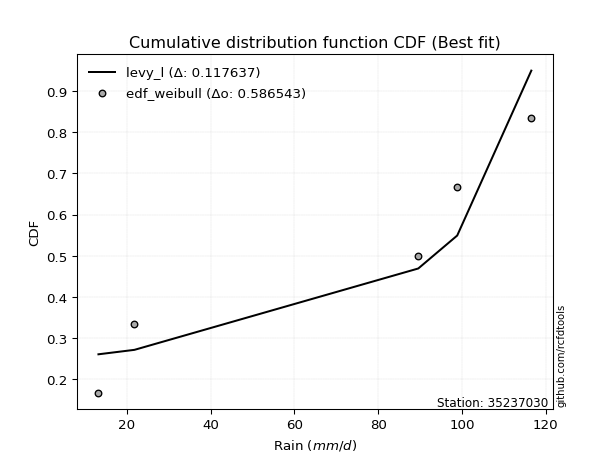</img>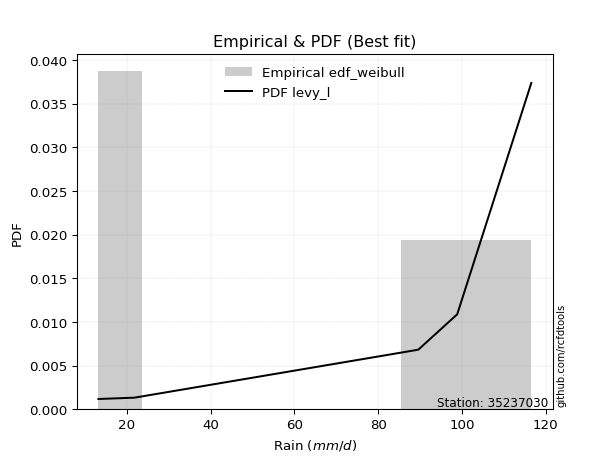</img>

</div>


### 4. EDF Beard (1943)

The Beard formula (or Beard´s plotting position formula) in hydrology is used to estimate the empirical non-exceedance probability _(P)_ of a flood event (or other extreme hydrological data point) within a given dataset.

<div align="center">


$P=(m-0.31)/(n+0.38)$


</div>


**4.1. Empirical values**

<div align="center">

|                | 0                   | 1                  | 2         | 3                  | 4                  |
|:---------------|:--------------------|:-------------------|:----------|:-------------------|:-------------------|
| date           | 2019                | 2017               | 2025      | 2018               | 2024               |
| x              | 13.2                | 21.8               | 89.6      | 98.9               | 116.6              |
| m              | 1                   | 2                  | 3         | 4                  | 5                  |
| empirical_dist | edf_beard           | edf_beard          | edf_beard | edf_beard          | edf_beard          |
| empirical      | 0.12825278810408922 | 0.3141263940520446 | 0.5       | 0.6858736059479554 | 0.8717472118959109 |
| empirical_tr   | 1.1471215351812367  | 1.4579945799457996 | 2.0       | 3.183431952662722  | 7.797101449275368  |

</div>


**4.2. Kolmogorov-Smirnov fit test (sorted by Δ)**


<div align="center">

|                | 0                   | 1                   | 2                   | 3                   | 4                  | 5                   | 6                   | 7                   | 8                   | 9                  | 10                  | 11                 | 12                  | 13                 | 14                  | 15                  | 16                  | 17                 | 18                 | 19                  | 20                  | 21                  | 22                  | 23                  | 24                  | 25                  | 26                  | 27                  | 28                  | 29                 | 30                  | 31                  | 32                  | 33                  | 34                  | 35                 | 36                  | 37                  | 38                  | 39                  | 40                  | 41                 | 42                  | 43                  | 44                  | 45                  | 46                  | 47                  | 48                  | 49                 | 50                 | 51                  | 52                 | 53                 | 54                  | 55                  | 56                  | 57                  | 58                  | 59                  | 60                  | 61                  | 62                  | 63                  | 64                  | 65                  | 66                 | 67                  | 68                  | 69                  | 70                 | 71                  | 72                  | 73                  | 74                  | 75                  | 76                  | 77                  | 78                  | 79                  | 80                 | 81                  | 82                  | 83                  | 84                  | 85                  | 86                 | 87                 | 88                 | 89                  | 90                  | 91                 | 92                 | 93                 | 94                 | 95                 | 96                 | 97                  | 98                 | 99                  | 100                 | 101                | 102                | 103                | 104                 | 105                 | 106                | 107                 | 108                | 109                | 110                | 111                 | 112                | 113                 | 114                 | 115                 | 116                | 117                 | 118                | 119                | 120                | 121                | 122                 | 123                | 124                | 125                | 126                 | 127                | 128                 | 129                 | 130                | 131                 | 132                 | 133                | 134                 | 135                | 136                | 137                 | 138                | 139                 | 140                | 141                 | 142                | 143                | 144                 | 145                | 146                 | 147                | 148                 | 149                | 150                | 151                 | 152                | 153                | 154                | 155                | 156                | 157                | 158                | 159                |
|:---------------|:--------------------|:--------------------|:--------------------|:--------------------|:-------------------|:--------------------|:--------------------|:--------------------|:--------------------|:-------------------|:--------------------|:-------------------|:--------------------|:-------------------|:--------------------|:--------------------|:--------------------|:-------------------|:-------------------|:--------------------|:--------------------|:--------------------|:--------------------|:--------------------|:--------------------|:--------------------|:--------------------|:--------------------|:--------------------|:-------------------|:--------------------|:--------------------|:--------------------|:--------------------|:--------------------|:-------------------|:--------------------|:--------------------|:--------------------|:--------------------|:--------------------|:-------------------|:--------------------|:--------------------|:--------------------|:--------------------|:--------------------|:--------------------|:--------------------|:-------------------|:-------------------|:--------------------|:-------------------|:-------------------|:--------------------|:--------------------|:--------------------|:--------------------|:--------------------|:--------------------|:--------------------|:--------------------|:--------------------|:--------------------|:--------------------|:--------------------|:-------------------|:--------------------|:--------------------|:--------------------|:-------------------|:--------------------|:--------------------|:--------------------|:--------------------|:--------------------|:--------------------|:--------------------|:--------------------|:--------------------|:-------------------|:--------------------|:--------------------|:--------------------|:--------------------|:--------------------|:-------------------|:-------------------|:-------------------|:--------------------|:--------------------|:-------------------|:-------------------|:-------------------|:-------------------|:-------------------|:-------------------|:--------------------|:-------------------|:--------------------|:--------------------|:-------------------|:-------------------|:-------------------|:--------------------|:--------------------|:-------------------|:--------------------|:-------------------|:-------------------|:-------------------|:--------------------|:-------------------|:--------------------|:--------------------|:--------------------|:-------------------|:--------------------|:-------------------|:-------------------|:-------------------|:-------------------|:--------------------|:-------------------|:-------------------|:-------------------|:--------------------|:-------------------|:--------------------|:--------------------|:-------------------|:--------------------|:--------------------|:-------------------|:--------------------|:-------------------|:-------------------|:--------------------|:-------------------|:--------------------|:-------------------|:--------------------|:-------------------|:-------------------|:--------------------|:-------------------|:--------------------|:-------------------|:--------------------|:-------------------|:-------------------|:--------------------|:-------------------|:-------------------|:-------------------|:-------------------|:-------------------|:-------------------|:-------------------|:-------------------|
| station        | 35237030            | 35237030            | 35237030            | 35237030            | 35237030           | 35237030            | 35237030            | 35237030            | 35237030            | 35237030           | 35237030            | 35237030           | 35237030            | 35237030           | 35237030            | 35237030            | 35237030            | 35237030           | 35237030           | 35237030            | 35237030            | 35237030            | 35237030            | 35237030            | 35237030            | 35237030            | 35237030            | 35237030            | 35237030            | 35237030           | 35237030            | 35237030            | 35237030            | 35237030            | 35237030            | 35237030           | 35237030            | 35237030            | 35237030            | 35237030            | 35237030            | 35237030           | 35237030            | 35237030            | 35237030            | 35237030            | 35237030            | 35237030            | 35237030            | 35237030           | 35237030           | 35237030            | 35237030           | 35237030           | 35237030            | 35237030            | 35237030            | 35237030            | 35237030            | 35237030            | 35237030            | 35237030            | 35237030            | 35237030            | 35237030            | 35237030            | 35237030           | 35237030            | 35237030            | 35237030            | 35237030           | 35237030            | 35237030            | 35237030            | 35237030            | 35237030            | 35237030            | 35237030            | 35237030            | 35237030            | 35237030           | 35237030            | 35237030            | 35237030            | 35237030            | 35237030            | 35237030           | 35237030           | 35237030           | 35237030            | 35237030            | 35237030           | 35237030           | 35237030           | 35237030           | 35237030           | 35237030           | 35237030            | 35237030           | 35237030            | 35237030            | 35237030           | 35237030           | 35237030           | 35237030            | 35237030            | 35237030           | 35237030            | 35237030           | 35237030           | 35237030           | 35237030            | 35237030           | 35237030            | 35237030            | 35237030            | 35237030           | 35237030            | 35237030           | 35237030           | 35237030           | 35237030           | 35237030            | 35237030           | 35237030           | 35237030           | 35237030            | 35237030           | 35237030            | 35237030            | 35237030           | 35237030            | 35237030            | 35237030           | 35237030            | 35237030           | 35237030           | 35237030            | 35237030           | 35237030            | 35237030           | 35237030            | 35237030           | 35237030           | 35237030            | 35237030           | 35237030            | 35237030           | 35237030            | 35237030           | 35237030           | 35237030            | 35237030           | 35237030           | 35237030           | 35237030           | 35237030           | 35237030           | 35237030           | 35237030           |
| empirical_dist | edf_beard           | edf_beard           | edf_beard           | edf_beard           | edf_beard          | edf_beard           | edf_beard           | edf_beard           | edf_beard           | edf_beard          | edf_beard           | edf_beard          | edf_beard           | edf_beard          | edf_beard           | edf_beard           | edf_beard           | edf_beard          | edf_beard          | edf_beard           | edf_beard           | edf_beard           | edf_beard           | edf_beard           | edf_beard           | edf_beard           | edf_beard           | edf_beard           | edf_beard           | edf_beard          | edf_beard           | edf_beard           | edf_beard           | edf_beard           | edf_beard           | edf_beard          | edf_beard           | edf_beard           | edf_beard           | edf_beard           | edf_beard           | edf_beard          | edf_beard           | edf_beard           | edf_beard           | edf_beard           | edf_beard           | edf_beard           | edf_beard           | edf_beard          | edf_beard          | edf_beard           | edf_beard          | edf_beard          | edf_beard           | edf_beard           | edf_beard           | edf_beard           | edf_beard           | edf_beard           | edf_beard           | edf_beard           | edf_beard           | edf_beard           | edf_beard           | edf_beard           | edf_beard          | edf_beard           | edf_beard           | edf_beard           | edf_beard          | edf_beard           | edf_beard           | edf_beard           | edf_beard           | edf_beard           | edf_beard           | edf_beard           | edf_beard           | edf_beard           | edf_beard          | edf_beard           | edf_beard           | edf_beard           | edf_beard           | edf_beard           | edf_beard          | edf_beard          | edf_beard          | edf_beard           | edf_beard           | edf_beard          | edf_beard          | edf_beard          | edf_beard          | edf_beard          | edf_beard          | edf_beard           | edf_beard          | edf_beard           | edf_beard           | edf_beard          | edf_beard          | edf_beard          | edf_beard           | edf_beard           | edf_beard          | edf_beard           | edf_beard          | edf_beard          | edf_beard          | edf_beard           | edf_beard          | edf_beard           | edf_beard           | edf_beard           | edf_beard          | edf_beard           | edf_beard          | edf_beard          | edf_beard          | edf_beard          | edf_beard           | edf_beard          | edf_beard          | edf_beard          | edf_beard           | edf_beard          | edf_beard           | edf_beard           | edf_beard          | edf_beard           | edf_beard           | edf_beard          | edf_beard           | edf_beard          | edf_beard          | edf_beard           | edf_beard          | edf_beard           | edf_beard          | edf_beard           | edf_beard          | edf_beard          | edf_beard           | edf_beard          | edf_beard           | edf_beard          | edf_beard           | edf_beard          | edf_beard          | edf_beard           | edf_beard          | edf_beard          | edf_beard          | edf_beard          | edf_beard          | edf_beard          | edf_beard          | edf_beard          |
| p_dist         | dweibull            | dgamma              | loglevy_l           | arcsine             | wrapcauchy         | genextreme          | logweibull_max      | levy_l              | trapezoid           | ksone              | rdist               | johnsonsu          | logarcsine          | genhalflogistic    | loggenextreme       | semicircular        | anglit              | skewnorm           | logtrapezoid       | logkappa3           | pearson3            | gumbel_l            | weibull_min         | logksone            | exponnorm           | truncnorm           | norm                | crystalball         | t                   | lomax              | erlang              | foldnorm            | gamma               | rice                | logsemicircular     | triang             | argus               | logwrapcauchy       | maxwell             | cosine              | beta                | logistic           | rayleigh            | loganglit           | invweibull          | logbeta             | invgamma            | loggennorm          | genpareto           | logweibull_min     | halfnorm           | logloggamma         | logburr12          | tukeylambda        | hypsecant           | loggumbel_l         | logpearson3         | logmielke           | betaprime           | gompertz            | kstwobign           | kappa3              | uniform             | vonmises_line       | gennorm             | loginvweibull       | genexpon           | logargus            | burr                | mielke              | lognct             | logbetaprime        | logalpha            | logexponnorm        | logcrystalball      | lognorm             | logt                | gumbel_r            | logf                | logfatiguelife      | logloglaplace      | loginvgamma         | loggamma            | loggamma            | logerlang           | bradford            | logfoldnorm        | loggompertz        | logrice            | loginvgauss         | logncf              | halfgennorm        | ncf                | logmaxwell         | gausshyper         | laplace            | lograyleigh        | kappa4              | halflogistic       | loggenexpon         | nct                 | logdgamma          | logdweibull        | moyal              | burr12              | logkstwobign        | loghalfnorm        | loglogistic         | logburr            | invgauss           | loggenhalflogistic | logcosine           | alpha              | loghypsecant        | loggumbel_r         | logrdist            | loghalflogistic    | logmoyal            | nakagami           | loglaplace         | loglaplace         | wald               | f                   | loggenpareto       | truncweibull_min   | logtriang          | truncexpon          | logskewnorm        | exponpow            | logexponweib        | gengamma           | logwald             | logexponpow         | loghalfgennorm     | lognakagami         | logkappa4          | loggausshyper      | logtukeylambda      | logvonmises_line   | loguniform          | logbradford        | exponweib           | logjohnsonsb       | fatiguelife        | logtruncnorm        | loglomax           | logtruncexpon       | johnsonsb          | logtruncweibull_min | powerlaw           | loggengamma        | truncpareto         | logpowerlaw        | logtruncpareto     | weibull_max        | logjohnsonsu       | genlogistic        | loggenlogistic     | logvonmises        | vonmises           |
| delta          | 0.09770772992821164 | 0.10384520602916814 | 0.10814522191320808 | 0.11765316707457174 | 0.1282527314349351 | 0.12825278810396668 | 0.13122688881815248 | 0.13684349418981256 | 0.14230884509134611 | 0.1474835977526442 | 0.14858063645821323 | 0.1505126620336461 | 0.15572263742832482 | 0.1578890888560407 | 0.15860388931579517 | 0.16083755944055622 | 0.17111276072342152 | 0.1749410198006891 | 0.1778396741353312 | 0.18080239451045388 | 0.18275116488252208 | 0.18524098167123776 | 0.18686755266277483 | 0.19184835569019387 | 0.19528842098517463 | 0.19528880513868718 | 0.19528881838227008 | 0.19528882254432156 | 0.19532658830951433 | 0.1973696897809354 | 0.19820987027509207 | 0.19864278623423604 | 0.20013757920918684 | 0.20739959720444812 | 0.20758291196486978 | 0.2096744112792217 | 0.20972286950017843 | 0.21089914395072573 | 0.21177286227506897 | 0.21405493508666573 | 0.21472813889652165 | 0.2163985572641396 | 0.21660316392863654 | 0.21944060317249903 | 0.21979904044317244 | 0.22030268521751595 | 0.22043883828647237 | 0.22331805470723975 | 0.22380340417707473 | 0.2297021895432989 | 0.2312125449028506 | 0.23134024592139157 | 0.2314191126761722 | 0.2316439850228349 | 0.23175671275753007 | 0.23198717058462837 | 0.23327450973398212 | 0.23444931750161857 | 0.23498460239028918 | 0.23651026131467096 | 0.23654064784009476 | 0.23851584640840018 | 0.23887814313346223 | 0.24013081426634952 | 0.24267499970331843 | 0.24369345700598977 | 0.2455947246998047 | 0.24564441597490605 | 0.24606705880733415 | 0.24653181542497815 | 0.2465556561134179 | 0.24657570192592582 | 0.24662475545867957 | 0.24683862467492057 | 0.24684101988853913 | 0.24684112095348676 | 0.24684144994180857 | 0.24708816023696956 | 0.24757125449179007 | 0.24761411975767178 | 0.2486512781065262 | 0.24985238564088097 | 0.25014370806045827 | 0.25014370806045827 | 0.25068244792487193 | 0.25071985057621937 | 0.2510692552160756 | 0.2515976086412205 | 0.2516394061232252 | 0.25173835840561254 | 0.25202729282303804 | 0.2528654685535594 | 0.2554911841554507 | 0.2568411281619507 | 0.2571419081941321 | 0.2572361940743363 | 0.2596992861869577 | 0.26090929945418695 | 0.2609622917619014 | 0.26192029446542275 | 0.26278453411152314 | 0.2628034442674357 | 0.2633430786148462 | 0.2638734963948466 | 0.26428164299192336 | 0.26553648781344275 | 0.2692734123676309 | 0.26948734953999187 | 0.2717277209299601 | 0.2731217363384312 | 0.273602045196369  | 0.27531526615674007 | 0.281259511161727  | 0.28449252704767003 | 0.28709168172178967 | 0.29279087647817703 | 0.2938659440057185 | 0.30006886974045677 | 0.3031741829146174 | 0.3046589628322961 | 0.3046589628322961 | 0.3141263940520446 | 0.31517275752934515 | 0.3168199050745071 | 0.3200527238012978 | 0.3221626715232293 | 0.32667776299703766 | 0.3314130654136327 | 0.33151806835525266 | 0.33310772364811536 | 0.3364222633896544 | 0.34047062942532047 | 0.35241600086848135 | 0.3564088356588204 | 0.36104438090408575 | 0.3615407729017234 | 0.3633510172687281 | 0.36817664372431835 | 0.3788208392815442 | 0.37909569369886964 | 0.3805614344924392 | 0.38201014592718163 | 0.3969900895482158 | 0.4001064958842936 | 0.40406046563635956 | 0.4098809112614119 | 0.41470152945423133 | 0.4152886800983051 | 0.4359889579138204  | 0.4642638349263478 | 0.4715590545243079 | 0.47367569357681205 | 0.5093590483328287 | 0.5250117901564992 | 0.5342339735001047 | 0.5987085198647659 | 0.6858736059479554 | 0.6858736059479554 | 1.2225381925380698 | 17.797932528121535 |
| deltao         | 0.5865427407550001  | 0.5865427407550001  | 0.5865427407550001  | 0.5865427407550001  | 0.5865427407550001 | 0.5865427407550001  | 0.5865427407550001  | 0.5865427407550001  | 0.5865427407550001  | 0.5865427407550001 | 0.5865427407550001  | 0.5865427407550001 | 0.5865427407550001  | 0.5865427407550001 | 0.5865427407550001  | 0.5865427407550001  | 0.5865427407550001  | 0.5865427407550001 | 0.5865427407550001 | 0.5865427407550001  | 0.5865427407550001  | 0.5865427407550001  | 0.5865427407550001  | 0.5865427407550001  | 0.5865427407550001  | 0.5865427407550001  | 0.5865427407550001  | 0.5865427407550001  | 0.5865427407550001  | 0.5865427407550001 | 0.5865427407550001  | 0.5865427407550001  | 0.5865427407550001  | 0.5865427407550001  | 0.5865427407550001  | 0.5865427407550001 | 0.5865427407550001  | 0.5865427407550001  | 0.5865427407550001  | 0.5865427407550001  | 0.5865427407550001  | 0.5865427407550001 | 0.5865427407550001  | 0.5865427407550001  | 0.5865427407550001  | 0.5865427407550001  | 0.5865427407550001  | 0.5865427407550001  | 0.5865427407550001  | 0.5865427407550001 | 0.5865427407550001 | 0.5865427407550001  | 0.5865427407550001 | 0.5865427407550001 | 0.5865427407550001  | 0.5865427407550001  | 0.5865427407550001  | 0.5865427407550001  | 0.5865427407550001  | 0.5865427407550001  | 0.5865427407550001  | 0.5865427407550001  | 0.5865427407550001  | 0.5865427407550001  | 0.5865427407550001  | 0.5865427407550001  | 0.5865427407550001 | 0.5865427407550001  | 0.5865427407550001  | 0.5865427407550001  | 0.5865427407550001 | 0.5865427407550001  | 0.5865427407550001  | 0.5865427407550001  | 0.5865427407550001  | 0.5865427407550001  | 0.5865427407550001  | 0.5865427407550001  | 0.5865427407550001  | 0.5865427407550001  | 0.5865427407550001 | 0.5865427407550001  | 0.5865427407550001  | 0.5865427407550001  | 0.5865427407550001  | 0.5865427407550001  | 0.5865427407550001 | 0.5865427407550001 | 0.5865427407550001 | 0.5865427407550001  | 0.5865427407550001  | 0.5865427407550001 | 0.5865427407550001 | 0.5865427407550001 | 0.5865427407550001 | 0.5865427407550001 | 0.5865427407550001 | 0.5865427407550001  | 0.5865427407550001 | 0.5865427407550001  | 0.5865427407550001  | 0.5865427407550001 | 0.5865427407550001 | 0.5865427407550001 | 0.5865427407550001  | 0.5865427407550001  | 0.5865427407550001 | 0.5865427407550001  | 0.5865427407550001 | 0.5865427407550001 | 0.5865427407550001 | 0.5865427407550001  | 0.5865427407550001 | 0.5865427407550001  | 0.5865427407550001  | 0.5865427407550001  | 0.5865427407550001 | 0.5865427407550001  | 0.5865427407550001 | 0.5865427407550001 | 0.5865427407550001 | 0.5865427407550001 | 0.5865427407550001  | 0.5865427407550001 | 0.5865427407550001 | 0.5865427407550001 | 0.5865427407550001  | 0.5865427407550001 | 0.5865427407550001  | 0.5865427407550001  | 0.5865427407550001 | 0.5865427407550001  | 0.5865427407550001  | 0.5865427407550001 | 0.5865427407550001  | 0.5865427407550001 | 0.5865427407550001 | 0.5865427407550001  | 0.5865427407550001 | 0.5865427407550001  | 0.5865427407550001 | 0.5865427407550001  | 0.5865427407550001 | 0.5865427407550001 | 0.5865427407550001  | 0.5865427407550001 | 0.5865427407550001  | 0.5865427407550001 | 0.5865427407550001  | 0.5865427407550001 | 0.5865427407550001 | 0.5865427407550001  | 0.5865427407550001 | 0.5865427407550001 | 0.5865427407550001 | 0.5865427407550001 | 0.5865427407550001 | 0.5865427407550001 | 0.5865427407550001 | 0.5865427407550001 |
| eval           | Δo > Δ              | Δo > Δ              | Δo > Δ              | Δo > Δ              | Δo > Δ             | Δo > Δ              | Δo > Δ              | Δo > Δ              | Δo > Δ              | Δo > Δ             | Δo > Δ              | Δo > Δ             | Δo > Δ              | Δo > Δ             | Δo > Δ              | Δo > Δ              | Δo > Δ              | Δo > Δ             | Δo > Δ             | Δo > Δ              | Δo > Δ              | Δo > Δ              | Δo > Δ              | Δo > Δ              | Δo > Δ              | Δo > Δ              | Δo > Δ              | Δo > Δ              | Δo > Δ              | Δo > Δ             | Δo > Δ              | Δo > Δ              | Δo > Δ              | Δo > Δ              | Δo > Δ              | Δo > Δ             | Δo > Δ              | Δo > Δ              | Δo > Δ              | Δo > Δ              | Δo > Δ              | Δo > Δ             | Δo > Δ              | Δo > Δ              | Δo > Δ              | Δo > Δ              | Δo > Δ              | Δo > Δ              | Δo > Δ              | Δo > Δ             | Δo > Δ             | Δo > Δ              | Δo > Δ             | Δo > Δ             | Δo > Δ              | Δo > Δ              | Δo > Δ              | Δo > Δ              | Δo > Δ              | Δo > Δ              | Δo > Δ              | Δo > Δ              | Δo > Δ              | Δo > Δ              | Δo > Δ              | Δo > Δ              | Δo > Δ             | Δo > Δ              | Δo > Δ              | Δo > Δ              | Δo > Δ             | Δo > Δ              | Δo > Δ              | Δo > Δ              | Δo > Δ              | Δo > Δ              | Δo > Δ              | Δo > Δ              | Δo > Δ              | Δo > Δ              | Δo > Δ             | Δo > Δ              | Δo > Δ              | Δo > Δ              | Δo > Δ              | Δo > Δ              | Δo > Δ             | Δo > Δ             | Δo > Δ             | Δo > Δ              | Δo > Δ              | Δo > Δ             | Δo > Δ             | Δo > Δ             | Δo > Δ             | Δo > Δ             | Δo > Δ             | Δo > Δ              | Δo > Δ             | Δo > Δ              | Δo > Δ              | Δo > Δ             | Δo > Δ             | Δo > Δ             | Δo > Δ              | Δo > Δ              | Δo > Δ             | Δo > Δ              | Δo > Δ             | Δo > Δ             | Δo > Δ             | Δo > Δ              | Δo > Δ             | Δo > Δ              | Δo > Δ              | Δo > Δ              | Δo > Δ             | Δo > Δ              | Δo > Δ             | Δo > Δ             | Δo > Δ             | Δo > Δ             | Δo > Δ              | Δo > Δ             | Δo > Δ             | Δo > Δ             | Δo > Δ              | Δo > Δ             | Δo > Δ              | Δo > Δ              | Δo > Δ             | Δo > Δ              | Δo > Δ              | Δo > Δ             | Δo > Δ              | Δo > Δ             | Δo > Δ             | Δo > Δ              | Δo > Δ             | Δo > Δ              | Δo > Δ             | Δo > Δ              | Δo > Δ             | Δo > Δ             | Δo > Δ              | Δo > Δ             | Δo > Δ              | Δo > Δ             | Δo > Δ              | Δo > Δ             | Δo > Δ             | Δo > Δ              | Δo > Δ             | Δo > Δ             | Δo > Δ             | Δo <= Δ            | Δo <= Δ            | Δo <= Δ            | Δo <= Δ            | Δo <= Δ            |
| fit            | 1                   | 1                   | 1                   | 1                   | 1                  | 1                   | 1                   | 1                   | 1                   | 1                  | 1                   | 1                  | 1                   | 1                  | 1                   | 1                   | 1                   | 1                  | 1                  | 1                   | 1                   | 1                   | 1                   | 1                   | 1                   | 1                   | 1                   | 1                   | 1                   | 1                  | 1                   | 1                   | 1                   | 1                   | 1                   | 1                  | 1                   | 1                   | 1                   | 1                   | 1                   | 1                  | 1                   | 1                   | 1                   | 1                   | 1                   | 1                   | 1                   | 1                  | 1                  | 1                   | 1                  | 1                  | 1                   | 1                   | 1                   | 1                   | 1                   | 1                   | 1                   | 1                   | 1                   | 1                   | 1                   | 1                   | 1                  | 1                   | 1                   | 1                   | 1                  | 1                   | 1                   | 1                   | 1                   | 1                   | 1                   | 1                   | 1                   | 1                   | 1                  | 1                   | 1                   | 1                   | 1                   | 1                   | 1                  | 1                  | 1                  | 1                   | 1                   | 1                  | 1                  | 1                  | 1                  | 1                  | 1                  | 1                   | 1                  | 1                   | 1                   | 1                  | 1                  | 1                  | 1                   | 1                   | 1                  | 1                   | 1                  | 1                  | 1                  | 1                   | 1                  | 1                   | 1                   | 1                   | 1                  | 1                   | 1                  | 1                  | 1                  | 1                  | 1                   | 1                  | 1                  | 1                  | 1                   | 1                  | 1                   | 1                   | 1                  | 1                   | 1                   | 1                  | 1                   | 1                  | 1                  | 1                   | 1                  | 1                   | 1                  | 1                   | 1                  | 1                  | 1                   | 1                  | 1                   | 1                  | 1                   | 1                  | 1                  | 1                   | 1                  | 1                  | 1                  | 0                  | 0                  | 0                  | 0                  | 0                  |
| n              | 5                   | 5                   | 5                   | 5                   | 5                  | 5                   | 5                   | 5                   | 5                   | 5                  | 5                   | 5                  | 5                   | 5                  | 5                   | 5                   | 5                   | 5                  | 5                  | 5                   | 5                   | 5                   | 5                   | 5                   | 5                   | 5                   | 5                   | 5                   | 5                   | 5                  | 5                   | 5                   | 5                   | 5                   | 5                   | 5                  | 5                   | 5                   | 5                   | 5                   | 5                   | 5                  | 5                   | 5                   | 5                   | 5                   | 5                   | 5                   | 5                   | 5                  | 5                  | 5                   | 5                  | 5                  | 5                   | 5                   | 5                   | 5                   | 5                   | 5                   | 5                   | 5                   | 5                   | 5                   | 5                   | 5                   | 5                  | 5                   | 5                   | 5                   | 5                  | 5                   | 5                   | 5                   | 5                   | 5                   | 5                   | 5                   | 5                   | 5                   | 5                  | 5                   | 5                   | 5                   | 5                   | 5                   | 5                  | 5                  | 5                  | 5                   | 5                   | 5                  | 5                  | 5                  | 5                  | 5                  | 5                  | 5                   | 5                  | 5                   | 5                   | 5                  | 5                  | 5                  | 5                   | 5                   | 5                  | 5                   | 5                  | 5                  | 5                  | 5                   | 5                  | 5                   | 5                   | 5                   | 5                  | 5                   | 5                  | 5                  | 5                  | 5                  | 5                   | 5                  | 5                  | 5                  | 5                   | 5                  | 5                   | 5                   | 5                  | 5                   | 5                   | 5                  | 5                   | 5                  | 5                  | 5                   | 5                  | 5                   | 5                  | 5                   | 5                  | 5                  | 5                   | 5                  | 5                   | 5                  | 5                   | 5                  | 5                  | 5                   | 5                  | 5                  | 5                  | 5                  | 5                  | 5                  | 5                  | 5                  |
| best_fit       | 1                   | 0                   | 0                   | 0                   | 0                  | 0                   | 0                   | 0                   | 0                   | 0                  | 0                   | 0                  | 0                   | 0                  | 0                   | 0                   | 0                   | 0                  | 0                  | 0                   | 0                   | 0                   | 0                   | 0                   | 0                   | 0                   | 0                   | 0                   | 0                   | 0                  | 0                   | 0                   | 0                   | 0                   | 0                   | 0                  | 0                   | 0                   | 0                   | 0                   | 0                   | 0                  | 0                   | 0                   | 0                   | 0                   | 0                   | 0                   | 0                   | 0                  | 0                  | 0                   | 0                  | 0                  | 0                   | 0                   | 0                   | 0                   | 0                   | 0                   | 0                   | 0                   | 0                   | 0                   | 0                   | 0                   | 0                  | 0                   | 0                   | 0                   | 0                  | 0                   | 0                   | 0                   | 0                   | 0                   | 0                   | 0                   | 0                   | 0                   | 0                  | 0                   | 0                   | 0                   | 0                   | 0                   | 0                  | 0                  | 0                  | 0                   | 0                   | 0                  | 0                  | 0                  | 0                  | 0                  | 0                  | 0                   | 0                  | 0                   | 0                   | 0                  | 0                  | 0                  | 0                   | 0                   | 0                  | 0                   | 0                  | 0                  | 0                  | 0                   | 0                  | 0                   | 0                   | 0                   | 0                  | 0                   | 0                  | 0                  | 0                  | 0                  | 0                   | 0                  | 0                  | 0                  | 0                   | 0                  | 0                   | 0                   | 0                  | 0                   | 0                   | 0                  | 0                   | 0                  | 0                  | 0                   | 0                  | 0                   | 0                  | 0                   | 0                  | 0                  | 0                   | 0                  | 0                   | 0                  | 0                   | 0                  | 0                  | 0                   | 0                  | 0                  | 0                  | 0                  | 0                  | 0                  | 0                  | 0                  |
| best_fit_sort  | 1                   | 2                   | 3                   | 4                   | 5                  | 6                   | 7                   | 8                   | 9                   | 10                 | 11                  | 12                 | 13                  | 14                 | 15                  | 16                  | 17                  | 18                 | 19                 | 20                  | 21                  | 22                  | 23                  | 24                  | 25                  | 26                  | 27                  | 28                  | 29                  | 30                 | 31                  | 32                  | 33                  | 34                  | 35                  | 36                 | 37                  | 38                  | 39                  | 40                  | 41                  | 42                 | 43                  | 44                  | 45                  | 46                  | 47                  | 48                  | 49                  | 50                 | 51                 | 52                  | 53                 | 54                 | 55                  | 56                  | 57                  | 58                  | 59                  | 60                  | 61                  | 62                  | 63                  | 64                  | 65                  | 66                  | 67                 | 68                  | 69                  | 70                  | 71                 | 72                  | 73                  | 74                  | 75                  | 76                  | 77                  | 78                  | 79                  | 80                  | 81                 | 82                  | 83                  | 84                  | 85                  | 86                  | 87                 | 88                 | 89                 | 90                  | 91                  | 92                 | 93                 | 94                 | 95                 | 96                 | 97                 | 98                  | 99                 | 100                 | 101                 | 102                | 103                | 104                | 105                 | 106                 | 107                | 108                 | 109                | 110                | 111                | 112                 | 113                | 114                 | 115                 | 116                 | 117                | 118                 | 119                | 120                | 121                | 122                | 123                 | 124                | 125                | 126                | 127                 | 128                | 129                 | 130                 | 131                | 132                 | 133                 | 134                | 135                 | 136                | 137                | 138                 | 139                | 140                 | 141                | 142                 | 143                | 144                | 145                 | 146                | 147                 | 148                | 149                 | 150                | 151                | 152                 | 153                | 154                | 155                | 156                | 157                | 158                | 159                | 160                |

</div>


**4.3. Best fit**

<div align="center">

|   id |   station | empirical_dist   | p_dist   |     delta |   deltao | eval   |   fit |   n |   best_fit |   best_fit_sort |
|-----:|----------:|:-----------------|:---------|----------:|---------:|:-------|------:|----:|-----------:|----------------:|
|    0 |  35237030 | edf_beard        | dweibull | 0.0977077 | 0.586543 | Δo > Δ |     1 |   5 |          1 |               1 |

</div>


<div align="center">

</img></img>

</div>


### 5. EDF Chegodayev (1955)

The Chegodayev formula is an empirical plotting position formula used in hydrological frequency analysis to estimate the exceedance probability or return period of a specific event from a set of observed data. It is primarily used for plotting observed data points on probability paper to fit a theoretical distribution, particularly for analyzing extreme events like maximum flood flows or rainfall intensities. The constant _b_ value in the generalized plotting position formula is 0.3.

<div align="center">


$P=(m-b)/(n+1-2b)$


</div>


**5.1. Empirical values**

<div align="center">

|                | 0                   | 1                   | 2              | 3                  | 4                  |
|:---------------|:--------------------|:--------------------|:---------------|:-------------------|:-------------------|
| date           | 2019                | 2017                | 2025           | 2018               | 2024               |
| x              | 13.2                | 21.8                | 89.6           | 98.9               | 116.6              |
| m              | 1                   | 2                   | 3              | 4                  | 5                  |
| empirical_dist | edf_chegodayev      | edf_chegodayev      | edf_chegodayev | edf_chegodayev     | edf_chegodayev     |
| empirical      | 0.12962962962962962 | 0.31481481481481477 | 0.5            | 0.6851851851851851 | 0.8703703703703703 |
| empirical_tr   | 1.148936170212766   | 1.4594594594594594  | 2.0            | 3.1764705882352935 | 7.714285714285713  |

</div>


**5.2. Kolmogorov-Smirnov fit test (sorted by Δ)**


<div align="center">

|                | 0                   | 1                   | 2                   | 3                   | 4                   | 5                  | 6                   | 7                   | 8                   | 9                  | 10                  | 11                  | 12                  | 13                 | 14                  | 15                  | 16                  | 17                 | 18                 | 19                  | 20                  | 21                 | 22                  | 23                  | 24                  | 25                  | 26                  | 27                  | 28                  | 29                 | 30                  | 31                  | 32                  | 33                  | 34                  | 35                 | 36                  | 37                  | 38                  | 39                  | 40                 | 41                 | 42                  | 43                  | 44                  | 45                  | 46                 | 47                  | 48                  | 49                 | 50                 | 51                  | 52                 | 53                 | 54                  | 55                  | 56                  | 57                  | 58                  | 59                  | 60                 | 61                  | 62                  | 63                  | 64                  | 65                  | 66                 | 67                  | 68                  | 69                  | 70                 | 71                  | 72                  | 73                  | 74                  | 75                  | 76                  | 77                  | 78                 | 79                  | 80                  | 81                  | 82                  | 83                  | 84                  | 85                  | 86                 | 87                 | 88                 | 89                  | 90                  | 91                 | 92                 | 93                 | 94                 | 95                 | 96                 | 97                  | 98                  | 99                  | 100                 | 101                 | 102                 | 103                | 104                 | 105                 | 106                | 107                 | 108                | 109                | 110                | 111                 | 112                | 113                 | 114                 | 115                 | 116                | 117                 | 118                | 119                | 120                | 121                 | 122                 | 123                | 124                | 125                | 126                 | 127                | 128                 | 129                 | 130                | 131                 | 132                 | 133                | 134                 | 135                | 136                | 137                 | 138                | 139                 | 140                | 141                 | 142                | 143                | 144                 | 145                | 146                | 147                 | 148                 | 149                | 150                | 151                 | 152                | 153                | 154                | 155                | 156                | 157                | 158                | 159                |
|:---------------|:--------------------|:--------------------|:--------------------|:--------------------|:--------------------|:-------------------|:--------------------|:--------------------|:--------------------|:-------------------|:--------------------|:--------------------|:--------------------|:-------------------|:--------------------|:--------------------|:--------------------|:-------------------|:-------------------|:--------------------|:--------------------|:-------------------|:--------------------|:--------------------|:--------------------|:--------------------|:--------------------|:--------------------|:--------------------|:-------------------|:--------------------|:--------------------|:--------------------|:--------------------|:--------------------|:-------------------|:--------------------|:--------------------|:--------------------|:--------------------|:-------------------|:-------------------|:--------------------|:--------------------|:--------------------|:--------------------|:-------------------|:--------------------|:--------------------|:-------------------|:-------------------|:--------------------|:-------------------|:-------------------|:--------------------|:--------------------|:--------------------|:--------------------|:--------------------|:--------------------|:-------------------|:--------------------|:--------------------|:--------------------|:--------------------|:--------------------|:-------------------|:--------------------|:--------------------|:--------------------|:-------------------|:--------------------|:--------------------|:--------------------|:--------------------|:--------------------|:--------------------|:--------------------|:-------------------|:--------------------|:--------------------|:--------------------|:--------------------|:--------------------|:--------------------|:--------------------|:-------------------|:-------------------|:-------------------|:--------------------|:--------------------|:-------------------|:-------------------|:-------------------|:-------------------|:-------------------|:-------------------|:--------------------|:--------------------|:--------------------|:--------------------|:--------------------|:--------------------|:-------------------|:--------------------|:--------------------|:-------------------|:--------------------|:-------------------|:-------------------|:-------------------|:--------------------|:-------------------|:--------------------|:--------------------|:--------------------|:-------------------|:--------------------|:-------------------|:-------------------|:-------------------|:--------------------|:--------------------|:-------------------|:-------------------|:-------------------|:--------------------|:-------------------|:--------------------|:--------------------|:-------------------|:--------------------|:--------------------|:-------------------|:--------------------|:-------------------|:-------------------|:--------------------|:-------------------|:--------------------|:-------------------|:--------------------|:-------------------|:-------------------|:--------------------|:-------------------|:-------------------|:--------------------|:--------------------|:-------------------|:-------------------|:--------------------|:-------------------|:-------------------|:-------------------|:-------------------|:-------------------|:-------------------|:-------------------|:-------------------|
| station        | 35237030            | 35237030            | 35237030            | 35237030            | 35237030            | 35237030           | 35237030            | 35237030            | 35237030            | 35237030           | 35237030            | 35237030            | 35237030            | 35237030           | 35237030            | 35237030            | 35237030            | 35237030           | 35237030           | 35237030            | 35237030            | 35237030           | 35237030            | 35237030            | 35237030            | 35237030            | 35237030            | 35237030            | 35237030            | 35237030           | 35237030            | 35237030            | 35237030            | 35237030            | 35237030            | 35237030           | 35237030            | 35237030            | 35237030            | 35237030            | 35237030           | 35237030           | 35237030            | 35237030            | 35237030            | 35237030            | 35237030           | 35237030            | 35237030            | 35237030           | 35237030           | 35237030            | 35237030           | 35237030           | 35237030            | 35237030            | 35237030            | 35237030            | 35237030            | 35237030            | 35237030           | 35237030            | 35237030            | 35237030            | 35237030            | 35237030            | 35237030           | 35237030            | 35237030            | 35237030            | 35237030           | 35237030            | 35237030            | 35237030            | 35237030            | 35237030            | 35237030            | 35237030            | 35237030           | 35237030            | 35237030            | 35237030            | 35237030            | 35237030            | 35237030            | 35237030            | 35237030           | 35237030           | 35237030           | 35237030            | 35237030            | 35237030           | 35237030           | 35237030           | 35237030           | 35237030           | 35237030           | 35237030            | 35237030            | 35237030            | 35237030            | 35237030            | 35237030            | 35237030           | 35237030            | 35237030            | 35237030           | 35237030            | 35237030           | 35237030           | 35237030           | 35237030            | 35237030           | 35237030            | 35237030            | 35237030            | 35237030           | 35237030            | 35237030           | 35237030           | 35237030           | 35237030            | 35237030            | 35237030           | 35237030           | 35237030           | 35237030            | 35237030           | 35237030            | 35237030            | 35237030           | 35237030            | 35237030            | 35237030           | 35237030            | 35237030           | 35237030           | 35237030            | 35237030           | 35237030            | 35237030           | 35237030            | 35237030           | 35237030           | 35237030            | 35237030           | 35237030           | 35237030            | 35237030            | 35237030           | 35237030           | 35237030            | 35237030           | 35237030           | 35237030           | 35237030           | 35237030           | 35237030           | 35237030           | 35237030           |
| empirical_dist | edf_chegodayev      | edf_chegodayev      | edf_chegodayev      | edf_chegodayev      | edf_chegodayev      | edf_chegodayev     | edf_chegodayev      | edf_chegodayev      | edf_chegodayev      | edf_chegodayev     | edf_chegodayev      | edf_chegodayev      | edf_chegodayev      | edf_chegodayev     | edf_chegodayev      | edf_chegodayev      | edf_chegodayev      | edf_chegodayev     | edf_chegodayev     | edf_chegodayev      | edf_chegodayev      | edf_chegodayev     | edf_chegodayev      | edf_chegodayev      | edf_chegodayev      | edf_chegodayev      | edf_chegodayev      | edf_chegodayev      | edf_chegodayev      | edf_chegodayev     | edf_chegodayev      | edf_chegodayev      | edf_chegodayev      | edf_chegodayev      | edf_chegodayev      | edf_chegodayev     | edf_chegodayev      | edf_chegodayev      | edf_chegodayev      | edf_chegodayev      | edf_chegodayev     | edf_chegodayev     | edf_chegodayev      | edf_chegodayev      | edf_chegodayev      | edf_chegodayev      | edf_chegodayev     | edf_chegodayev      | edf_chegodayev      | edf_chegodayev     | edf_chegodayev     | edf_chegodayev      | edf_chegodayev     | edf_chegodayev     | edf_chegodayev      | edf_chegodayev      | edf_chegodayev      | edf_chegodayev      | edf_chegodayev      | edf_chegodayev      | edf_chegodayev     | edf_chegodayev      | edf_chegodayev      | edf_chegodayev      | edf_chegodayev      | edf_chegodayev      | edf_chegodayev     | edf_chegodayev      | edf_chegodayev      | edf_chegodayev      | edf_chegodayev     | edf_chegodayev      | edf_chegodayev      | edf_chegodayev      | edf_chegodayev      | edf_chegodayev      | edf_chegodayev      | edf_chegodayev      | edf_chegodayev     | edf_chegodayev      | edf_chegodayev      | edf_chegodayev      | edf_chegodayev      | edf_chegodayev      | edf_chegodayev      | edf_chegodayev      | edf_chegodayev     | edf_chegodayev     | edf_chegodayev     | edf_chegodayev      | edf_chegodayev      | edf_chegodayev     | edf_chegodayev     | edf_chegodayev     | edf_chegodayev     | edf_chegodayev     | edf_chegodayev     | edf_chegodayev      | edf_chegodayev      | edf_chegodayev      | edf_chegodayev      | edf_chegodayev      | edf_chegodayev      | edf_chegodayev     | edf_chegodayev      | edf_chegodayev      | edf_chegodayev     | edf_chegodayev      | edf_chegodayev     | edf_chegodayev     | edf_chegodayev     | edf_chegodayev      | edf_chegodayev     | edf_chegodayev      | edf_chegodayev      | edf_chegodayev      | edf_chegodayev     | edf_chegodayev      | edf_chegodayev     | edf_chegodayev     | edf_chegodayev     | edf_chegodayev      | edf_chegodayev      | edf_chegodayev     | edf_chegodayev     | edf_chegodayev     | edf_chegodayev      | edf_chegodayev     | edf_chegodayev      | edf_chegodayev      | edf_chegodayev     | edf_chegodayev      | edf_chegodayev      | edf_chegodayev     | edf_chegodayev      | edf_chegodayev     | edf_chegodayev     | edf_chegodayev      | edf_chegodayev     | edf_chegodayev      | edf_chegodayev     | edf_chegodayev      | edf_chegodayev     | edf_chegodayev     | edf_chegodayev      | edf_chegodayev     | edf_chegodayev     | edf_chegodayev      | edf_chegodayev      | edf_chegodayev     | edf_chegodayev     | edf_chegodayev      | edf_chegodayev     | edf_chegodayev     | edf_chegodayev     | edf_chegodayev     | edf_chegodayev     | edf_chegodayev     | edf_chegodayev     | edf_chegodayev     |
| p_dist         | dweibull            | dgamma              | loglevy_l           | arcsine             | wrapcauchy          | genextreme         | logweibull_max      | levy_l              | trapezoid           | ksone              | rdist               | johnsonsu           | logarcsine          | genhalflogistic    | loggenextreme       | semicircular        | anglit              | skewnorm           | logtrapezoid       | logkappa3           | pearson3            | gumbel_l           | weibull_min         | logksone            | exponnorm           | truncnorm           | norm                | crystalball         | t                   | lomax              | erlang              | foldnorm            | gamma               | rice                | logsemicircular     | triang             | argus               | logwrapcauchy       | maxwell             | cosine              | beta               | logistic           | rayleigh            | loganglit           | invweibull          | invgamma            | logbeta            | loggennorm          | genpareto           | logweibull_min     | halfnorm           | logloggamma         | logburr12          | tukeylambda        | hypsecant           | loggumbel_l         | logpearson3         | logmielke           | betaprime           | kstwobign           | gompertz           | kappa3              | uniform             | vonmises_line       | gennorm             | loginvweibull       | genexpon           | logargus            | burr                | mielke              | lognct             | logbetaprime        | logalpha            | logexponnorm        | logcrystalball      | lognorm             | logt                | gumbel_r            | logloglaplace      | logf                | logfatiguelife      | loginvgamma         | loggamma            | loggamma            | logerlang           | bradford            | logfoldnorm        | loggompertz        | logrice            | loginvgauss         | logncf              | halfgennorm        | ncf                | logmaxwell         | gausshyper         | laplace            | lograyleigh        | kappa4              | halflogistic        | loggenexpon         | logdweibull         | nct                 | logdgamma           | moyal              | burr12              | logkstwobign        | loghalfnorm        | loglogistic         | logburr            | invgauss           | loggenhalflogistic | logcosine           | alpha              | loghypsecant        | loggumbel_r         | logrdist            | loghalflogistic    | logmoyal            | nakagami           | loglaplace         | loglaplace         | wald                | f                   | loggenpareto       | truncweibull_min   | logtriang          | truncexpon          | logskewnorm        | exponpow            | logexponweib        | gengamma           | logwald             | logexponpow         | loghalfgennorm     | lognakagami         | logkappa4          | loggausshyper      | logtukeylambda      | logvonmises_line   | loguniform          | logbradford        | exponweib           | logjohnsonsb       | fatiguelife        | logtruncnorm        | loglomax           | johnsonsb          | logtruncexpon       | logtruncweibull_min | powerlaw           | loggengamma        | truncpareto         | logpowerlaw        | logtruncpareto     | weibull_max        | logjohnsonsu       | genlogistic        | loggenlogistic     | logvonmises        | vonmises           |
| delta          | 0.09908457145375216 | 0.10522204755470865 | 0.10745680115043776 | 0.11765316707457174 | 0.12962957296047561 | 0.1296296296295072 | 0.13122688881815248 | 0.13615507342704225 | 0.14230884509134611 | 0.1474835977526442 | 0.14926905722098338 | 0.15120108279641625 | 0.15572263742832482 | 0.1578890888560407 | 0.15860388931579517 | 0.16083755944055622 | 0.17111276072342152 | 0.1749410198006891 | 0.1778396741353312 | 0.17942555298491336 | 0.18275116488252208 | 0.1859294024340079 | 0.18755597342554498 | 0.19184835569019387 | 0.19528842098517463 | 0.19528880513868718 | 0.19528881838227008 | 0.19528882254432156 | 0.19532658830951433 | 0.1973696897809354 | 0.19820987027509207 | 0.19864278623423604 | 0.20013757920918684 | 0.20739959720444812 | 0.20758291196486978 | 0.2096744112792217 | 0.21041129026294858 | 0.21089914395072573 | 0.21177286227506897 | 0.21405493508666573 | 0.2154165596592918 | 0.2163985572641396 | 0.21660316392863654 | 0.21944060317249903 | 0.21979904044317244 | 0.22043883828647237 | 0.2209911059802861 | 0.22318435560355881 | 0.22449182493984488 | 0.2297021895432989 | 0.2312125449028506 | 0.23134024592139157 | 0.2314191126761722 | 0.2316439850228349 | 0.23175671275753007 | 0.23198717058462837 | 0.23327450973398212 | 0.23444931750161857 | 0.23498460239028918 | 0.23654064784009476 | 0.2371986820774411 | 0.23851584640840018 | 0.23887814313346223 | 0.24013081426634952 | 0.24336342046608858 | 0.24369345700598977 | 0.2455947246998047 | 0.24564441597490605 | 0.24606705880733415 | 0.24653181542497815 | 0.2465556561134179 | 0.24657570192592582 | 0.24662475545867957 | 0.24683862467492057 | 0.24684101988853913 | 0.24684112095348676 | 0.24684144994180857 | 0.24708816023696956 | 0.2472744365809857 | 0.24757125449179007 | 0.24761411975767178 | 0.24985238564088097 | 0.25014370806045827 | 0.25014370806045827 | 0.25068244792487193 | 0.25071985057621937 | 0.2510692552160756 | 0.2515976086412205 | 0.2516394061232252 | 0.25173835840561254 | 0.25202729282303804 | 0.2528654685535594 | 0.2554911841554507 | 0.2568411281619507 | 0.2571419081941321 | 0.2572361940743363 | 0.2596992861869577 | 0.26090929945418695 | 0.26165071252467154 | 0.26192029446542275 | 0.26196623708930566 | 0.26278453411152314 | 0.26349186503020583 | 0.2638734963948466 | 0.26428164299192336 | 0.26553648781344275 | 0.2692734123676309 | 0.26948734953999187 | 0.2717277209299601 | 0.2731217363384312 | 0.273602045196369  | 0.27531526615674007 | 0.281259511161727  | 0.28449252704767003 | 0.28709168172178967 | 0.29279087647817703 | 0.2938659440057185 | 0.30006886974045677 | 0.3031741829146174 | 0.3046589628322961 | 0.3046589628322961 | 0.31481481481481477 | 0.31517275752934515 | 0.3168199050745071 | 0.3200527238012978 | 0.3221626715232293 | 0.32667776299703766 | 0.3314130654136327 | 0.33151806835525266 | 0.33310772364811536 | 0.3364222633896544 | 0.34047062942532047 | 0.35241600086848135 | 0.3564088356588204 | 0.36104438090408575 | 0.3615407729017234 | 0.3633510172687281 | 0.36817664372431835 | 0.3788208392815442 | 0.37909569369886964 | 0.3805614344924392 | 0.38201014592718163 | 0.3963016687854455 | 0.4001064958842936 | 0.40406046563635956 | 0.4085040697358714 | 0.4146002593355348 | 0.41470152945423133 | 0.4359889579138204  | 0.4642638349263478 | 0.4701822129987674 | 0.47367569357681205 | 0.5086706275700587 | 0.524323369393729  | 0.5335455527373344 | 0.5980200991019955 | 0.6851851851851851 | 0.6851851851851851 | 1.2225381925380698 | 17.799309369647077 |
| deltao         | 0.5865427407550001  | 0.5865427407550001  | 0.5865427407550001  | 0.5865427407550001  | 0.5865427407550001  | 0.5865427407550001 | 0.5865427407550001  | 0.5865427407550001  | 0.5865427407550001  | 0.5865427407550001 | 0.5865427407550001  | 0.5865427407550001  | 0.5865427407550001  | 0.5865427407550001 | 0.5865427407550001  | 0.5865427407550001  | 0.5865427407550001  | 0.5865427407550001 | 0.5865427407550001 | 0.5865427407550001  | 0.5865427407550001  | 0.5865427407550001 | 0.5865427407550001  | 0.5865427407550001  | 0.5865427407550001  | 0.5865427407550001  | 0.5865427407550001  | 0.5865427407550001  | 0.5865427407550001  | 0.5865427407550001 | 0.5865427407550001  | 0.5865427407550001  | 0.5865427407550001  | 0.5865427407550001  | 0.5865427407550001  | 0.5865427407550001 | 0.5865427407550001  | 0.5865427407550001  | 0.5865427407550001  | 0.5865427407550001  | 0.5865427407550001 | 0.5865427407550001 | 0.5865427407550001  | 0.5865427407550001  | 0.5865427407550001  | 0.5865427407550001  | 0.5865427407550001 | 0.5865427407550001  | 0.5865427407550001  | 0.5865427407550001 | 0.5865427407550001 | 0.5865427407550001  | 0.5865427407550001 | 0.5865427407550001 | 0.5865427407550001  | 0.5865427407550001  | 0.5865427407550001  | 0.5865427407550001  | 0.5865427407550001  | 0.5865427407550001  | 0.5865427407550001 | 0.5865427407550001  | 0.5865427407550001  | 0.5865427407550001  | 0.5865427407550001  | 0.5865427407550001  | 0.5865427407550001 | 0.5865427407550001  | 0.5865427407550001  | 0.5865427407550001  | 0.5865427407550001 | 0.5865427407550001  | 0.5865427407550001  | 0.5865427407550001  | 0.5865427407550001  | 0.5865427407550001  | 0.5865427407550001  | 0.5865427407550001  | 0.5865427407550001 | 0.5865427407550001  | 0.5865427407550001  | 0.5865427407550001  | 0.5865427407550001  | 0.5865427407550001  | 0.5865427407550001  | 0.5865427407550001  | 0.5865427407550001 | 0.5865427407550001 | 0.5865427407550001 | 0.5865427407550001  | 0.5865427407550001  | 0.5865427407550001 | 0.5865427407550001 | 0.5865427407550001 | 0.5865427407550001 | 0.5865427407550001 | 0.5865427407550001 | 0.5865427407550001  | 0.5865427407550001  | 0.5865427407550001  | 0.5865427407550001  | 0.5865427407550001  | 0.5865427407550001  | 0.5865427407550001 | 0.5865427407550001  | 0.5865427407550001  | 0.5865427407550001 | 0.5865427407550001  | 0.5865427407550001 | 0.5865427407550001 | 0.5865427407550001 | 0.5865427407550001  | 0.5865427407550001 | 0.5865427407550001  | 0.5865427407550001  | 0.5865427407550001  | 0.5865427407550001 | 0.5865427407550001  | 0.5865427407550001 | 0.5865427407550001 | 0.5865427407550001 | 0.5865427407550001  | 0.5865427407550001  | 0.5865427407550001 | 0.5865427407550001 | 0.5865427407550001 | 0.5865427407550001  | 0.5865427407550001 | 0.5865427407550001  | 0.5865427407550001  | 0.5865427407550001 | 0.5865427407550001  | 0.5865427407550001  | 0.5865427407550001 | 0.5865427407550001  | 0.5865427407550001 | 0.5865427407550001 | 0.5865427407550001  | 0.5865427407550001 | 0.5865427407550001  | 0.5865427407550001 | 0.5865427407550001  | 0.5865427407550001 | 0.5865427407550001 | 0.5865427407550001  | 0.5865427407550001 | 0.5865427407550001 | 0.5865427407550001  | 0.5865427407550001  | 0.5865427407550001 | 0.5865427407550001 | 0.5865427407550001  | 0.5865427407550001 | 0.5865427407550001 | 0.5865427407550001 | 0.5865427407550001 | 0.5865427407550001 | 0.5865427407550001 | 0.5865427407550001 | 0.5865427407550001 |
| eval           | Δo > Δ              | Δo > Δ              | Δo > Δ              | Δo > Δ              | Δo > Δ              | Δo > Δ             | Δo > Δ              | Δo > Δ              | Δo > Δ              | Δo > Δ             | Δo > Δ              | Δo > Δ              | Δo > Δ              | Δo > Δ             | Δo > Δ              | Δo > Δ              | Δo > Δ              | Δo > Δ             | Δo > Δ             | Δo > Δ              | Δo > Δ              | Δo > Δ             | Δo > Δ              | Δo > Δ              | Δo > Δ              | Δo > Δ              | Δo > Δ              | Δo > Δ              | Δo > Δ              | Δo > Δ             | Δo > Δ              | Δo > Δ              | Δo > Δ              | Δo > Δ              | Δo > Δ              | Δo > Δ             | Δo > Δ              | Δo > Δ              | Δo > Δ              | Δo > Δ              | Δo > Δ             | Δo > Δ             | Δo > Δ              | Δo > Δ              | Δo > Δ              | Δo > Δ              | Δo > Δ             | Δo > Δ              | Δo > Δ              | Δo > Δ             | Δo > Δ             | Δo > Δ              | Δo > Δ             | Δo > Δ             | Δo > Δ              | Δo > Δ              | Δo > Δ              | Δo > Δ              | Δo > Δ              | Δo > Δ              | Δo > Δ             | Δo > Δ              | Δo > Δ              | Δo > Δ              | Δo > Δ              | Δo > Δ              | Δo > Δ             | Δo > Δ              | Δo > Δ              | Δo > Δ              | Δo > Δ             | Δo > Δ              | Δo > Δ              | Δo > Δ              | Δo > Δ              | Δo > Δ              | Δo > Δ              | Δo > Δ              | Δo > Δ             | Δo > Δ              | Δo > Δ              | Δo > Δ              | Δo > Δ              | Δo > Δ              | Δo > Δ              | Δo > Δ              | Δo > Δ             | Δo > Δ             | Δo > Δ             | Δo > Δ              | Δo > Δ              | Δo > Δ             | Δo > Δ             | Δo > Δ             | Δo > Δ             | Δo > Δ             | Δo > Δ             | Δo > Δ              | Δo > Δ              | Δo > Δ              | Δo > Δ              | Δo > Δ              | Δo > Δ              | Δo > Δ             | Δo > Δ              | Δo > Δ              | Δo > Δ             | Δo > Δ              | Δo > Δ             | Δo > Δ             | Δo > Δ             | Δo > Δ              | Δo > Δ             | Δo > Δ              | Δo > Δ              | Δo > Δ              | Δo > Δ             | Δo > Δ              | Δo > Δ             | Δo > Δ             | Δo > Δ             | Δo > Δ              | Δo > Δ              | Δo > Δ             | Δo > Δ             | Δo > Δ             | Δo > Δ              | Δo > Δ             | Δo > Δ              | Δo > Δ              | Δo > Δ             | Δo > Δ              | Δo > Δ              | Δo > Δ             | Δo > Δ              | Δo > Δ             | Δo > Δ             | Δo > Δ              | Δo > Δ             | Δo > Δ              | Δo > Δ             | Δo > Δ              | Δo > Δ             | Δo > Δ             | Δo > Δ              | Δo > Δ             | Δo > Δ             | Δo > Δ              | Δo > Δ              | Δo > Δ             | Δo > Δ             | Δo > Δ              | Δo > Δ             | Δo > Δ             | Δo > Δ             | Δo <= Δ            | Δo <= Δ            | Δo <= Δ            | Δo <= Δ            | Δo <= Δ            |
| fit            | 1                   | 1                   | 1                   | 1                   | 1                   | 1                  | 1                   | 1                   | 1                   | 1                  | 1                   | 1                   | 1                   | 1                  | 1                   | 1                   | 1                   | 1                  | 1                  | 1                   | 1                   | 1                  | 1                   | 1                   | 1                   | 1                   | 1                   | 1                   | 1                   | 1                  | 1                   | 1                   | 1                   | 1                   | 1                   | 1                  | 1                   | 1                   | 1                   | 1                   | 1                  | 1                  | 1                   | 1                   | 1                   | 1                   | 1                  | 1                   | 1                   | 1                  | 1                  | 1                   | 1                  | 1                  | 1                   | 1                   | 1                   | 1                   | 1                   | 1                   | 1                  | 1                   | 1                   | 1                   | 1                   | 1                   | 1                  | 1                   | 1                   | 1                   | 1                  | 1                   | 1                   | 1                   | 1                   | 1                   | 1                   | 1                   | 1                  | 1                   | 1                   | 1                   | 1                   | 1                   | 1                   | 1                   | 1                  | 1                  | 1                  | 1                   | 1                   | 1                  | 1                  | 1                  | 1                  | 1                  | 1                  | 1                   | 1                   | 1                   | 1                   | 1                   | 1                   | 1                  | 1                   | 1                   | 1                  | 1                   | 1                  | 1                  | 1                  | 1                   | 1                  | 1                   | 1                   | 1                   | 1                  | 1                   | 1                  | 1                  | 1                  | 1                   | 1                   | 1                  | 1                  | 1                  | 1                   | 1                  | 1                   | 1                   | 1                  | 1                   | 1                   | 1                  | 1                   | 1                  | 1                  | 1                   | 1                  | 1                   | 1                  | 1                   | 1                  | 1                  | 1                   | 1                  | 1                  | 1                   | 1                   | 1                  | 1                  | 1                   | 1                  | 1                  | 1                  | 0                  | 0                  | 0                  | 0                  | 0                  |
| n              | 5                   | 5                   | 5                   | 5                   | 5                   | 5                  | 5                   | 5                   | 5                   | 5                  | 5                   | 5                   | 5                   | 5                  | 5                   | 5                   | 5                   | 5                  | 5                  | 5                   | 5                   | 5                  | 5                   | 5                   | 5                   | 5                   | 5                   | 5                   | 5                   | 5                  | 5                   | 5                   | 5                   | 5                   | 5                   | 5                  | 5                   | 5                   | 5                   | 5                   | 5                  | 5                  | 5                   | 5                   | 5                   | 5                   | 5                  | 5                   | 5                   | 5                  | 5                  | 5                   | 5                  | 5                  | 5                   | 5                   | 5                   | 5                   | 5                   | 5                   | 5                  | 5                   | 5                   | 5                   | 5                   | 5                   | 5                  | 5                   | 5                   | 5                   | 5                  | 5                   | 5                   | 5                   | 5                   | 5                   | 5                   | 5                   | 5                  | 5                   | 5                   | 5                   | 5                   | 5                   | 5                   | 5                   | 5                  | 5                  | 5                  | 5                   | 5                   | 5                  | 5                  | 5                  | 5                  | 5                  | 5                  | 5                   | 5                   | 5                   | 5                   | 5                   | 5                   | 5                  | 5                   | 5                   | 5                  | 5                   | 5                  | 5                  | 5                  | 5                   | 5                  | 5                   | 5                   | 5                   | 5                  | 5                   | 5                  | 5                  | 5                  | 5                   | 5                   | 5                  | 5                  | 5                  | 5                   | 5                  | 5                   | 5                   | 5                  | 5                   | 5                   | 5                  | 5                   | 5                  | 5                  | 5                   | 5                  | 5                   | 5                  | 5                   | 5                  | 5                  | 5                   | 5                  | 5                  | 5                   | 5                   | 5                  | 5                  | 5                   | 5                  | 5                  | 5                  | 5                  | 5                  | 5                  | 5                  | 5                  |
| best_fit       | 1                   | 0                   | 0                   | 0                   | 0                   | 0                  | 0                   | 0                   | 0                   | 0                  | 0                   | 0                   | 0                   | 0                  | 0                   | 0                   | 0                   | 0                  | 0                  | 0                   | 0                   | 0                  | 0                   | 0                   | 0                   | 0                   | 0                   | 0                   | 0                   | 0                  | 0                   | 0                   | 0                   | 0                   | 0                   | 0                  | 0                   | 0                   | 0                   | 0                   | 0                  | 0                  | 0                   | 0                   | 0                   | 0                   | 0                  | 0                   | 0                   | 0                  | 0                  | 0                   | 0                  | 0                  | 0                   | 0                   | 0                   | 0                   | 0                   | 0                   | 0                  | 0                   | 0                   | 0                   | 0                   | 0                   | 0                  | 0                   | 0                   | 0                   | 0                  | 0                   | 0                   | 0                   | 0                   | 0                   | 0                   | 0                   | 0                  | 0                   | 0                   | 0                   | 0                   | 0                   | 0                   | 0                   | 0                  | 0                  | 0                  | 0                   | 0                   | 0                  | 0                  | 0                  | 0                  | 0                  | 0                  | 0                   | 0                   | 0                   | 0                   | 0                   | 0                   | 0                  | 0                   | 0                   | 0                  | 0                   | 0                  | 0                  | 0                  | 0                   | 0                  | 0                   | 0                   | 0                   | 0                  | 0                   | 0                  | 0                  | 0                  | 0                   | 0                   | 0                  | 0                  | 0                  | 0                   | 0                  | 0                   | 0                   | 0                  | 0                   | 0                   | 0                  | 0                   | 0                  | 0                  | 0                   | 0                  | 0                   | 0                  | 0                   | 0                  | 0                  | 0                   | 0                  | 0                  | 0                   | 0                   | 0                  | 0                  | 0                   | 0                  | 0                  | 0                  | 0                  | 0                  | 0                  | 0                  | 0                  |
| best_fit_sort  | 1                   | 2                   | 3                   | 4                   | 5                   | 6                  | 7                   | 8                   | 9                   | 10                 | 11                  | 12                  | 13                  | 14                 | 15                  | 16                  | 17                  | 18                 | 19                 | 20                  | 21                  | 22                 | 23                  | 24                  | 25                  | 26                  | 27                  | 28                  | 29                  | 30                 | 31                  | 32                  | 33                  | 34                  | 35                  | 36                 | 37                  | 38                  | 39                  | 40                  | 41                 | 42                 | 43                  | 44                  | 45                  | 46                  | 47                 | 48                  | 49                  | 50                 | 51                 | 52                  | 53                 | 54                 | 55                  | 56                  | 57                  | 58                  | 59                  | 60                  | 61                 | 62                  | 63                  | 64                  | 65                  | 66                  | 67                 | 68                  | 69                  | 70                  | 71                 | 72                  | 73                  | 74                  | 75                  | 76                  | 77                  | 78                  | 79                 | 80                  | 81                  | 82                  | 83                  | 84                  | 85                  | 86                  | 87                 | 88                 | 89                 | 90                  | 91                  | 92                 | 93                 | 94                 | 95                 | 96                 | 97                 | 98                  | 99                  | 100                 | 101                 | 102                 | 103                 | 104                | 105                 | 106                 | 107                | 108                 | 109                | 110                | 111                | 112                 | 113                | 114                 | 115                 | 116                 | 117                | 118                 | 119                | 120                | 121                | 122                 | 123                 | 124                | 125                | 126                | 127                 | 128                | 129                 | 130                 | 131                | 132                 | 133                 | 134                | 135                 | 136                | 137                | 138                 | 139                | 140                 | 141                | 142                 | 143                | 144                | 145                 | 146                | 147                | 148                 | 149                 | 150                | 151                | 152                 | 153                | 154                | 155                | 156                | 157                | 158                | 159                | 160                |

</div>


**5.3. Best fit**

<div align="center">

|   id |   station | empirical_dist   | p_dist   |     delta |   deltao | eval   |   fit |   n |   best_fit |   best_fit_sort |
|-----:|----------:|:-----------------|:---------|----------:|---------:|:-------|------:|----:|-----------:|----------------:|
|    0 |  35237030 | edf_chegodayev   | dweibull | 0.0990846 | 0.586543 | Δo > Δ |     1 |   5 |          1 |               1 |

</div>


<div align="center">

</img>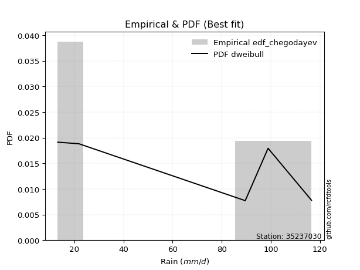</img>

</div>


### 6. EDF Blom (1958)

The Blom formula is a specific "plotting position" formula used in hydrology and statistical analysis to estimate the empirical cumulative probability (or non-exceedance probability) of a data series. It is particularly recommended for data that are approximately normally distributed. The constant _a_ is set to 0.375 (or 3/8).

<div align="center">


$P=(m-a)/(n+1-2a)$


</div>


**6.1. Empirical values**

<div align="center">

|                | 0                   | 1                   | 2        | 3                  | 4                  |
|:---------------|:--------------------|:--------------------|:---------|:-------------------|:-------------------|
| date           | 2019                | 2017                | 2025     | 2018               | 2024               |
| x              | 13.2                | 21.8                | 89.6     | 98.9               | 116.6              |
| m              | 1                   | 2                   | 3        | 4                  | 5                  |
| empirical_dist | edf_blom            | edf_blom            | edf_blom | edf_blom           | edf_blom           |
| empirical      | 0.11904761904761904 | 0.30952380952380953 | 0.5      | 0.6904761904761905 | 0.8809523809523809 |
| empirical_tr   | 1.135135135135135   | 1.4482758620689655  | 2.0      | 3.230769230769231  | 8.399999999999999  |

</div>


**6.2. Kolmogorov-Smirnov fit test (sorted by Δ)**


<div align="center">

|                | 0                   | 1                   | 2                   | 3                   | 4                   | 5                   | 6                   | 7                   | 8                   | 9                   | 10                  | 11                 | 12                  | 13                 | 14                  | 15                  | 16                  | 17                 | 18                 | 19                  | 20                  | 21                  | 22                  | 23                  | 24                  | 25                  | 26                  | 27                  | 28                  | 29                 | 30                  | 31                  | 32                  | 33                  | 34                  | 35                  | 36                 | 37                  | 38                  | 39                  | 40                  | 41                  | 42                 | 43                  | 44                  | 45                  | 46                  | 47                  | 48                 | 49                 | 50                  | 51                 | 52                 | 53                  | 54                  | 55                  | 56                  | 57                  | 58                  | 59                  | 60                  | 61                  | 62                  | 63                  | 64                  | 65                  | 66                 | 67                  | 68                  | 69                  | 70                 | 71                  | 72                  | 73                  | 74                  | 75                  | 76                  | 77                  | 78                  | 79                  | 80                  | 81                  | 82                  | 83                  | 84                  | 85                 | 86                 | 87                 | 88                  | 89                  | 90                 | 91                 | 92                 | 93                 | 94                 | 95                  | 96                 | 97                 | 98                 | 99                  | 100                 | 101                 | 102                | 103                 | 104                 | 105                | 106                 | 107                | 108                 | 109                | 110                | 111                 | 112                | 113                 | 114                 | 115                 | 116                | 117                 | 118                | 119                | 120                | 121                 | 122                 | 123                | 124                | 125                | 126                 | 127                | 128                 | 129                 | 130                | 131                 | 132                 | 133                | 134                 | 135                | 136                | 137                 | 138                | 139                 | 140                | 141                 | 142                | 143                 | 144                 | 145                 | 146                 | 147                 | 148                 | 149                | 150                 | 151                 | 152                | 153                | 154                | 155                | 156                | 157                | 158                | 159                |
|:---------------|:--------------------|:--------------------|:--------------------|:--------------------|:--------------------|:--------------------|:--------------------|:--------------------|:--------------------|:--------------------|:--------------------|:-------------------|:--------------------|:-------------------|:--------------------|:--------------------|:--------------------|:-------------------|:-------------------|:--------------------|:--------------------|:--------------------|:--------------------|:--------------------|:--------------------|:--------------------|:--------------------|:--------------------|:--------------------|:-------------------|:--------------------|:--------------------|:--------------------|:--------------------|:--------------------|:--------------------|:-------------------|:--------------------|:--------------------|:--------------------|:--------------------|:--------------------|:-------------------|:--------------------|:--------------------|:--------------------|:--------------------|:--------------------|:-------------------|:-------------------|:--------------------|:-------------------|:-------------------|:--------------------|:--------------------|:--------------------|:--------------------|:--------------------|:--------------------|:--------------------|:--------------------|:--------------------|:--------------------|:--------------------|:--------------------|:--------------------|:-------------------|:--------------------|:--------------------|:--------------------|:-------------------|:--------------------|:--------------------|:--------------------|:--------------------|:--------------------|:--------------------|:--------------------|:--------------------|:--------------------|:--------------------|:--------------------|:--------------------|:--------------------|:--------------------|:-------------------|:-------------------|:-------------------|:--------------------|:--------------------|:-------------------|:-------------------|:-------------------|:-------------------|:-------------------|:--------------------|:-------------------|:-------------------|:-------------------|:--------------------|:--------------------|:--------------------|:-------------------|:--------------------|:--------------------|:-------------------|:--------------------|:-------------------|:--------------------|:-------------------|:-------------------|:--------------------|:-------------------|:--------------------|:--------------------|:--------------------|:-------------------|:--------------------|:-------------------|:-------------------|:-------------------|:--------------------|:--------------------|:-------------------|:-------------------|:-------------------|:--------------------|:-------------------|:--------------------|:--------------------|:-------------------|:--------------------|:--------------------|:-------------------|:--------------------|:-------------------|:-------------------|:--------------------|:-------------------|:--------------------|:-------------------|:--------------------|:-------------------|:--------------------|:--------------------|:--------------------|:--------------------|:--------------------|:--------------------|:-------------------|:--------------------|:--------------------|:-------------------|:-------------------|:-------------------|:-------------------|:-------------------|:-------------------|:-------------------|:-------------------|
| station        | 35237030            | 35237030            | 35237030            | 35237030            | 35237030            | 35237030            | 35237030            | 35237030            | 35237030            | 35237030            | 35237030            | 35237030           | 35237030            | 35237030           | 35237030            | 35237030            | 35237030            | 35237030           | 35237030           | 35237030            | 35237030            | 35237030            | 35237030            | 35237030            | 35237030            | 35237030            | 35237030            | 35237030            | 35237030            | 35237030           | 35237030            | 35237030            | 35237030            | 35237030            | 35237030            | 35237030            | 35237030           | 35237030            | 35237030            | 35237030            | 35237030            | 35237030            | 35237030           | 35237030            | 35237030            | 35237030            | 35237030            | 35237030            | 35237030           | 35237030           | 35237030            | 35237030           | 35237030           | 35237030            | 35237030            | 35237030            | 35237030            | 35237030            | 35237030            | 35237030            | 35237030            | 35237030            | 35237030            | 35237030            | 35237030            | 35237030            | 35237030           | 35237030            | 35237030            | 35237030            | 35237030           | 35237030            | 35237030            | 35237030            | 35237030            | 35237030            | 35237030            | 35237030            | 35237030            | 35237030            | 35237030            | 35237030            | 35237030            | 35237030            | 35237030            | 35237030           | 35237030           | 35237030           | 35237030            | 35237030            | 35237030           | 35237030           | 35237030           | 35237030           | 35237030           | 35237030            | 35237030           | 35237030           | 35237030           | 35237030            | 35237030            | 35237030            | 35237030           | 35237030            | 35237030            | 35237030           | 35237030            | 35237030           | 35237030            | 35237030           | 35237030           | 35237030            | 35237030           | 35237030            | 35237030            | 35237030            | 35237030           | 35237030            | 35237030           | 35237030           | 35237030           | 35237030            | 35237030            | 35237030           | 35237030           | 35237030           | 35237030            | 35237030           | 35237030            | 35237030            | 35237030           | 35237030            | 35237030            | 35237030           | 35237030            | 35237030           | 35237030           | 35237030            | 35237030           | 35237030            | 35237030           | 35237030            | 35237030           | 35237030            | 35237030            | 35237030            | 35237030            | 35237030            | 35237030            | 35237030           | 35237030            | 35237030            | 35237030           | 35237030           | 35237030           | 35237030           | 35237030           | 35237030           | 35237030           | 35237030           |
| empirical_dist | edf_blom            | edf_blom            | edf_blom            | edf_blom            | edf_blom            | edf_blom            | edf_blom            | edf_blom            | edf_blom            | edf_blom            | edf_blom            | edf_blom           | edf_blom            | edf_blom           | edf_blom            | edf_blom            | edf_blom            | edf_blom           | edf_blom           | edf_blom            | edf_blom            | edf_blom            | edf_blom            | edf_blom            | edf_blom            | edf_blom            | edf_blom            | edf_blom            | edf_blom            | edf_blom           | edf_blom            | edf_blom            | edf_blom            | edf_blom            | edf_blom            | edf_blom            | edf_blom           | edf_blom            | edf_blom            | edf_blom            | edf_blom            | edf_blom            | edf_blom           | edf_blom            | edf_blom            | edf_blom            | edf_blom            | edf_blom            | edf_blom           | edf_blom           | edf_blom            | edf_blom           | edf_blom           | edf_blom            | edf_blom            | edf_blom            | edf_blom            | edf_blom            | edf_blom            | edf_blom            | edf_blom            | edf_blom            | edf_blom            | edf_blom            | edf_blom            | edf_blom            | edf_blom           | edf_blom            | edf_blom            | edf_blom            | edf_blom           | edf_blom            | edf_blom            | edf_blom            | edf_blom            | edf_blom            | edf_blom            | edf_blom            | edf_blom            | edf_blom            | edf_blom            | edf_blom            | edf_blom            | edf_blom            | edf_blom            | edf_blom           | edf_blom           | edf_blom           | edf_blom            | edf_blom            | edf_blom           | edf_blom           | edf_blom           | edf_blom           | edf_blom           | edf_blom            | edf_blom           | edf_blom           | edf_blom           | edf_blom            | edf_blom            | edf_blom            | edf_blom           | edf_blom            | edf_blom            | edf_blom           | edf_blom            | edf_blom           | edf_blom            | edf_blom           | edf_blom           | edf_blom            | edf_blom           | edf_blom            | edf_blom            | edf_blom            | edf_blom           | edf_blom            | edf_blom           | edf_blom           | edf_blom           | edf_blom            | edf_blom            | edf_blom           | edf_blom           | edf_blom           | edf_blom            | edf_blom           | edf_blom            | edf_blom            | edf_blom           | edf_blom            | edf_blom            | edf_blom           | edf_blom            | edf_blom           | edf_blom           | edf_blom            | edf_blom           | edf_blom            | edf_blom           | edf_blom            | edf_blom           | edf_blom            | edf_blom            | edf_blom            | edf_blom            | edf_blom            | edf_blom            | edf_blom           | edf_blom            | edf_blom            | edf_blom           | edf_blom           | edf_blom           | edf_blom           | edf_blom           | edf_blom           | edf_blom           | edf_blom           |
| p_dist         | dweibull            | dgamma              | loglevy_l           | arcsine             | wrapcauchy          | genextreme          | logweibull_max      | levy_l              | trapezoid           | rdist               | johnsonsu           | ksone              | logarcsine          | genhalflogistic    | loggenextreme       | semicircular        | anglit              | skewnorm           | logtrapezoid       | gumbel_l            | weibull_min         | pearson3            | logkappa3           | logksone            | exponnorm           | truncnorm           | norm                | crystalball         | t                   | lomax              | erlang              | foldnorm            | gamma               | argus               | rice                | logsemicircular     | triang             | beta                | logwrapcauchy       | maxwell             | cosine              | logbeta             | logistic           | rayleigh            | genpareto           | loganglit           | invweibull          | invgamma            | logweibull_min     | halfnorm           | logloggamma         | logburr12          | tukeylambda        | hypsecant           | gompertz            | loggumbel_l         | loggennorm          | logpearson3         | logmielke           | betaprime           | kstwobign           | gennorm             | kappa3              | uniform             | vonmises_line       | loginvweibull       | genexpon           | logargus            | burr                | mielke              | lognct             | logbetaprime        | logalpha            | logexponnorm        | logcrystalball      | lognorm             | logt                | gumbel_r            | logf                | logfatiguelife      | loginvgamma         | loggamma            | loggamma            | logerlang           | bradford            | logfoldnorm        | loggompertz        | logrice            | loginvgauss         | logncf              | halfgennorm        | ncf                | logmaxwell         | gausshyper         | laplace            | logloglaplace       | halflogistic       | logdgamma          | lograyleigh        | kappa4              | loggenexpon         | nct                 | moyal              | burr12              | logkstwobign        | loghalfnorm        | loglogistic         | logburr            | logdweibull         | invgauss           | loggenhalflogistic | logcosine           | alpha              | loghypsecant        | loggumbel_r         | logrdist            | loghalflogistic    | logmoyal            | nakagami           | loglaplace         | loglaplace         | wald                | f                   | loggenpareto       | truncweibull_min   | logtriang          | truncexpon          | logskewnorm        | exponpow            | logexponweib        | gengamma           | logwald             | logexponpow         | loghalfgennorm     | lognakagami         | logkappa4          | loggausshyper      | logtukeylambda      | logvonmises_line   | loguniform          | logbradford        | exponweib           | fatiguelife        | logjohnsonsb        | logtruncnorm        | logtruncexpon       | loglomax            | johnsonsb           | logtruncweibull_min | powerlaw           | truncpareto         | loggengamma         | logpowerlaw        | logtruncpareto     | weibull_max        | logjohnsonsu       | genlogistic        | loggenlogistic     | logvonmises        | vonmises           |
| delta          | 0.08850256087174158 | 0.09464003697269807 | 0.11274780644144311 | 0.11765316707457174 | 0.11904756237846503 | 0.11904761904749661 | 0.13122688881815248 | 0.14193946655298942 | 0.14230884509134611 | 0.14397805192997815 | 0.14591007750541102 | 0.1474835977526442 | 0.15572263742832482 | 0.1578890888560407 | 0.15860388931579517 | 0.16083755944055622 | 0.17111276072342152 | 0.1749410198006891 | 0.1778396741353312 | 0.18063839714300267 | 0.18226496813453974 | 0.18275116488252208 | 0.19000756356692394 | 0.19184835569019387 | 0.19528842098517463 | 0.19528880513868718 | 0.19528881838227008 | 0.19528882254432156 | 0.19532658830951433 | 0.1973696897809354 | 0.19820987027509207 | 0.19864278623423604 | 0.20013757920918684 | 0.20512028497194335 | 0.20739959720444812 | 0.20758291196486978 | 0.2096744112792217 | 0.21012555436828656 | 0.21089914395072573 | 0.21177286227506897 | 0.21405493508666573 | 0.21570010068928086 | 0.2163985572641396 | 0.21660316392863654 | 0.21920081964883964 | 0.21944060317249903 | 0.21979904044317244 | 0.22043883828647237 | 0.2297021895432989 | 0.2312125449028506 | 0.23134024592139157 | 0.2314191126761722 | 0.2316439850228349 | 0.23175671275753007 | 0.23190767678643587 | 0.23198717058462837 | 0.23252322376370982 | 0.23327450973398212 | 0.23444931750161857 | 0.23498460239028918 | 0.23654064784009476 | 0.23807241517508335 | 0.23851584640840018 | 0.23887814313346223 | 0.24013081426634952 | 0.24369345700598977 | 0.2455947246998047 | 0.24564441597490605 | 0.24606705880733415 | 0.24653181542497815 | 0.2465556561134179 | 0.24657570192592582 | 0.24662475545867957 | 0.24683862467492057 | 0.24684101988853913 | 0.24684112095348676 | 0.24684144994180857 | 0.24708816023696956 | 0.24757125449179007 | 0.24761411975767178 | 0.24985238564088097 | 0.25014370806045827 | 0.25014370806045827 | 0.25068244792487193 | 0.25071985057621937 | 0.2510692552160756 | 0.2515976086412205 | 0.2516394061232252 | 0.25173835840561254 | 0.25202729282303804 | 0.2528654685535594 | 0.2554911841554507 | 0.2568411281619507 | 0.2571419081941321 | 0.2572361940743363 | 0.25785644716299627 | 0.2581843470177354 | 0.2582008597392006 | 0.2596992861869577 | 0.26090929945418695 | 0.26192029446542275 | 0.26278453411152314 | 0.2638734963948466 | 0.26428164299192336 | 0.26553648781344275 | 0.2692734123676309 | 0.26948734953999187 | 0.2717277209299601 | 0.27254824767131625 | 0.2731217363384312 | 0.273602045196369  | 0.27531526615674007 | 0.281259511161727  | 0.28449252704767003 | 0.28709168172178967 | 0.29279087647817703 | 0.2938659440057185 | 0.30006886974045677 | 0.3031741829146174 | 0.3046589628322961 | 0.3046589628322961 | 0.31293029418711105 | 0.31517275752934515 | 0.3168199050745071 | 0.3200527238012978 | 0.3221626715232293 | 0.32667776299703766 | 0.3314130654136327 | 0.33151806835525266 | 0.33310772364811536 | 0.3364222633896544 | 0.34047062942532047 | 0.35241600086848135 | 0.3564088356588204 | 0.36104438090408575 | 0.3615407729017234 | 0.3633510172687281 | 0.36817664372431835 | 0.3788208392815442 | 0.37909569369886964 | 0.3805614344924392 | 0.38201014592718163 | 0.4001064958842936 | 0.40159267407645083 | 0.40406046563635956 | 0.41470152945423133 | 0.41908608031788197 | 0.41989126462654014 | 0.4359889579138204  | 0.4642638349263478 | 0.47367569357681205 | 0.48076422358077797 | 0.5139616328610639 | 0.5296143746847343 | 0.5388365580283397 | 0.6033111043930008 | 0.6904761904761905 | 0.6904761904761905 | 1.2225381925380698 | 17.788727359065067 |
| deltao         | 0.5865427407550001  | 0.5865427407550001  | 0.5865427407550001  | 0.5865427407550001  | 0.5865427407550001  | 0.5865427407550001  | 0.5865427407550001  | 0.5865427407550001  | 0.5865427407550001  | 0.5865427407550001  | 0.5865427407550001  | 0.5865427407550001 | 0.5865427407550001  | 0.5865427407550001 | 0.5865427407550001  | 0.5865427407550001  | 0.5865427407550001  | 0.5865427407550001 | 0.5865427407550001 | 0.5865427407550001  | 0.5865427407550001  | 0.5865427407550001  | 0.5865427407550001  | 0.5865427407550001  | 0.5865427407550001  | 0.5865427407550001  | 0.5865427407550001  | 0.5865427407550001  | 0.5865427407550001  | 0.5865427407550001 | 0.5865427407550001  | 0.5865427407550001  | 0.5865427407550001  | 0.5865427407550001  | 0.5865427407550001  | 0.5865427407550001  | 0.5865427407550001 | 0.5865427407550001  | 0.5865427407550001  | 0.5865427407550001  | 0.5865427407550001  | 0.5865427407550001  | 0.5865427407550001 | 0.5865427407550001  | 0.5865427407550001  | 0.5865427407550001  | 0.5865427407550001  | 0.5865427407550001  | 0.5865427407550001 | 0.5865427407550001 | 0.5865427407550001  | 0.5865427407550001 | 0.5865427407550001 | 0.5865427407550001  | 0.5865427407550001  | 0.5865427407550001  | 0.5865427407550001  | 0.5865427407550001  | 0.5865427407550001  | 0.5865427407550001  | 0.5865427407550001  | 0.5865427407550001  | 0.5865427407550001  | 0.5865427407550001  | 0.5865427407550001  | 0.5865427407550001  | 0.5865427407550001 | 0.5865427407550001  | 0.5865427407550001  | 0.5865427407550001  | 0.5865427407550001 | 0.5865427407550001  | 0.5865427407550001  | 0.5865427407550001  | 0.5865427407550001  | 0.5865427407550001  | 0.5865427407550001  | 0.5865427407550001  | 0.5865427407550001  | 0.5865427407550001  | 0.5865427407550001  | 0.5865427407550001  | 0.5865427407550001  | 0.5865427407550001  | 0.5865427407550001  | 0.5865427407550001 | 0.5865427407550001 | 0.5865427407550001 | 0.5865427407550001  | 0.5865427407550001  | 0.5865427407550001 | 0.5865427407550001 | 0.5865427407550001 | 0.5865427407550001 | 0.5865427407550001 | 0.5865427407550001  | 0.5865427407550001 | 0.5865427407550001 | 0.5865427407550001 | 0.5865427407550001  | 0.5865427407550001  | 0.5865427407550001  | 0.5865427407550001 | 0.5865427407550001  | 0.5865427407550001  | 0.5865427407550001 | 0.5865427407550001  | 0.5865427407550001 | 0.5865427407550001  | 0.5865427407550001 | 0.5865427407550001 | 0.5865427407550001  | 0.5865427407550001 | 0.5865427407550001  | 0.5865427407550001  | 0.5865427407550001  | 0.5865427407550001 | 0.5865427407550001  | 0.5865427407550001 | 0.5865427407550001 | 0.5865427407550001 | 0.5865427407550001  | 0.5865427407550001  | 0.5865427407550001 | 0.5865427407550001 | 0.5865427407550001 | 0.5865427407550001  | 0.5865427407550001 | 0.5865427407550001  | 0.5865427407550001  | 0.5865427407550001 | 0.5865427407550001  | 0.5865427407550001  | 0.5865427407550001 | 0.5865427407550001  | 0.5865427407550001 | 0.5865427407550001 | 0.5865427407550001  | 0.5865427407550001 | 0.5865427407550001  | 0.5865427407550001 | 0.5865427407550001  | 0.5865427407550001 | 0.5865427407550001  | 0.5865427407550001  | 0.5865427407550001  | 0.5865427407550001  | 0.5865427407550001  | 0.5865427407550001  | 0.5865427407550001 | 0.5865427407550001  | 0.5865427407550001  | 0.5865427407550001 | 0.5865427407550001 | 0.5865427407550001 | 0.5865427407550001 | 0.5865427407550001 | 0.5865427407550001 | 0.5865427407550001 | 0.5865427407550001 |
| eval           | Δo > Δ              | Δo > Δ              | Δo > Δ              | Δo > Δ              | Δo > Δ              | Δo > Δ              | Δo > Δ              | Δo > Δ              | Δo > Δ              | Δo > Δ              | Δo > Δ              | Δo > Δ             | Δo > Δ              | Δo > Δ             | Δo > Δ              | Δo > Δ              | Δo > Δ              | Δo > Δ             | Δo > Δ             | Δo > Δ              | Δo > Δ              | Δo > Δ              | Δo > Δ              | Δo > Δ              | Δo > Δ              | Δo > Δ              | Δo > Δ              | Δo > Δ              | Δo > Δ              | Δo > Δ             | Δo > Δ              | Δo > Δ              | Δo > Δ              | Δo > Δ              | Δo > Δ              | Δo > Δ              | Δo > Δ             | Δo > Δ              | Δo > Δ              | Δo > Δ              | Δo > Δ              | Δo > Δ              | Δo > Δ             | Δo > Δ              | Δo > Δ              | Δo > Δ              | Δo > Δ              | Δo > Δ              | Δo > Δ             | Δo > Δ             | Δo > Δ              | Δo > Δ             | Δo > Δ             | Δo > Δ              | Δo > Δ              | Δo > Δ              | Δo > Δ              | Δo > Δ              | Δo > Δ              | Δo > Δ              | Δo > Δ              | Δo > Δ              | Δo > Δ              | Δo > Δ              | Δo > Δ              | Δo > Δ              | Δo > Δ             | Δo > Δ              | Δo > Δ              | Δo > Δ              | Δo > Δ             | Δo > Δ              | Δo > Δ              | Δo > Δ              | Δo > Δ              | Δo > Δ              | Δo > Δ              | Δo > Δ              | Δo > Δ              | Δo > Δ              | Δo > Δ              | Δo > Δ              | Δo > Δ              | Δo > Δ              | Δo > Δ              | Δo > Δ             | Δo > Δ             | Δo > Δ             | Δo > Δ              | Δo > Δ              | Δo > Δ             | Δo > Δ             | Δo > Δ             | Δo > Δ             | Δo > Δ             | Δo > Δ              | Δo > Δ             | Δo > Δ             | Δo > Δ             | Δo > Δ              | Δo > Δ              | Δo > Δ              | Δo > Δ             | Δo > Δ              | Δo > Δ              | Δo > Δ             | Δo > Δ              | Δo > Δ             | Δo > Δ              | Δo > Δ             | Δo > Δ             | Δo > Δ              | Δo > Δ             | Δo > Δ              | Δo > Δ              | Δo > Δ              | Δo > Δ             | Δo > Δ              | Δo > Δ             | Δo > Δ             | Δo > Δ             | Δo > Δ              | Δo > Δ              | Δo > Δ             | Δo > Δ             | Δo > Δ             | Δo > Δ              | Δo > Δ             | Δo > Δ              | Δo > Δ              | Δo > Δ             | Δo > Δ              | Δo > Δ              | Δo > Δ             | Δo > Δ              | Δo > Δ             | Δo > Δ             | Δo > Δ              | Δo > Δ             | Δo > Δ              | Δo > Δ             | Δo > Δ              | Δo > Δ             | Δo > Δ              | Δo > Δ              | Δo > Δ              | Δo > Δ              | Δo > Δ              | Δo > Δ              | Δo > Δ             | Δo > Δ              | Δo > Δ              | Δo > Δ             | Δo > Δ             | Δo > Δ             | Δo <= Δ            | Δo <= Δ            | Δo <= Δ            | Δo <= Δ            | Δo <= Δ            |
| fit            | 1                   | 1                   | 1                   | 1                   | 1                   | 1                   | 1                   | 1                   | 1                   | 1                   | 1                   | 1                  | 1                   | 1                  | 1                   | 1                   | 1                   | 1                  | 1                  | 1                   | 1                   | 1                   | 1                   | 1                   | 1                   | 1                   | 1                   | 1                   | 1                   | 1                  | 1                   | 1                   | 1                   | 1                   | 1                   | 1                   | 1                  | 1                   | 1                   | 1                   | 1                   | 1                   | 1                  | 1                   | 1                   | 1                   | 1                   | 1                   | 1                  | 1                  | 1                   | 1                  | 1                  | 1                   | 1                   | 1                   | 1                   | 1                   | 1                   | 1                   | 1                   | 1                   | 1                   | 1                   | 1                   | 1                   | 1                  | 1                   | 1                   | 1                   | 1                  | 1                   | 1                   | 1                   | 1                   | 1                   | 1                   | 1                   | 1                   | 1                   | 1                   | 1                   | 1                   | 1                   | 1                   | 1                  | 1                  | 1                  | 1                   | 1                   | 1                  | 1                  | 1                  | 1                  | 1                  | 1                   | 1                  | 1                  | 1                  | 1                   | 1                   | 1                   | 1                  | 1                   | 1                   | 1                  | 1                   | 1                  | 1                   | 1                  | 1                  | 1                   | 1                  | 1                   | 1                   | 1                   | 1                  | 1                   | 1                  | 1                  | 1                  | 1                   | 1                   | 1                  | 1                  | 1                  | 1                   | 1                  | 1                   | 1                   | 1                  | 1                   | 1                   | 1                  | 1                   | 1                  | 1                  | 1                   | 1                  | 1                   | 1                  | 1                   | 1                  | 1                   | 1                   | 1                   | 1                   | 1                   | 1                   | 1                  | 1                   | 1                   | 1                  | 1                  | 1                  | 0                  | 0                  | 0                  | 0                  | 0                  |
| n              | 5                   | 5                   | 5                   | 5                   | 5                   | 5                   | 5                   | 5                   | 5                   | 5                   | 5                   | 5                  | 5                   | 5                  | 5                   | 5                   | 5                   | 5                  | 5                  | 5                   | 5                   | 5                   | 5                   | 5                   | 5                   | 5                   | 5                   | 5                   | 5                   | 5                  | 5                   | 5                   | 5                   | 5                   | 5                   | 5                   | 5                  | 5                   | 5                   | 5                   | 5                   | 5                   | 5                  | 5                   | 5                   | 5                   | 5                   | 5                   | 5                  | 5                  | 5                   | 5                  | 5                  | 5                   | 5                   | 5                   | 5                   | 5                   | 5                   | 5                   | 5                   | 5                   | 5                   | 5                   | 5                   | 5                   | 5                  | 5                   | 5                   | 5                   | 5                  | 5                   | 5                   | 5                   | 5                   | 5                   | 5                   | 5                   | 5                   | 5                   | 5                   | 5                   | 5                   | 5                   | 5                   | 5                  | 5                  | 5                  | 5                   | 5                   | 5                  | 5                  | 5                  | 5                  | 5                  | 5                   | 5                  | 5                  | 5                  | 5                   | 5                   | 5                   | 5                  | 5                   | 5                   | 5                  | 5                   | 5                  | 5                   | 5                  | 5                  | 5                   | 5                  | 5                   | 5                   | 5                   | 5                  | 5                   | 5                  | 5                  | 5                  | 5                   | 5                   | 5                  | 5                  | 5                  | 5                   | 5                  | 5                   | 5                   | 5                  | 5                   | 5                   | 5                  | 5                   | 5                  | 5                  | 5                   | 5                  | 5                   | 5                  | 5                   | 5                  | 5                   | 5                   | 5                   | 5                   | 5                   | 5                   | 5                  | 5                   | 5                   | 5                  | 5                  | 5                  | 5                  | 5                  | 5                  | 5                  | 5                  |
| best_fit       | 1                   | 0                   | 0                   | 0                   | 0                   | 0                   | 0                   | 0                   | 0                   | 0                   | 0                   | 0                  | 0                   | 0                  | 0                   | 0                   | 0                   | 0                  | 0                  | 0                   | 0                   | 0                   | 0                   | 0                   | 0                   | 0                   | 0                   | 0                   | 0                   | 0                  | 0                   | 0                   | 0                   | 0                   | 0                   | 0                   | 0                  | 0                   | 0                   | 0                   | 0                   | 0                   | 0                  | 0                   | 0                   | 0                   | 0                   | 0                   | 0                  | 0                  | 0                   | 0                  | 0                  | 0                   | 0                   | 0                   | 0                   | 0                   | 0                   | 0                   | 0                   | 0                   | 0                   | 0                   | 0                   | 0                   | 0                  | 0                   | 0                   | 0                   | 0                  | 0                   | 0                   | 0                   | 0                   | 0                   | 0                   | 0                   | 0                   | 0                   | 0                   | 0                   | 0                   | 0                   | 0                   | 0                  | 0                  | 0                  | 0                   | 0                   | 0                  | 0                  | 0                  | 0                  | 0                  | 0                   | 0                  | 0                  | 0                  | 0                   | 0                   | 0                   | 0                  | 0                   | 0                   | 0                  | 0                   | 0                  | 0                   | 0                  | 0                  | 0                   | 0                  | 0                   | 0                   | 0                   | 0                  | 0                   | 0                  | 0                  | 0                  | 0                   | 0                   | 0                  | 0                  | 0                  | 0                   | 0                  | 0                   | 0                   | 0                  | 0                   | 0                   | 0                  | 0                   | 0                  | 0                  | 0                   | 0                  | 0                   | 0                  | 0                   | 0                  | 0                   | 0                   | 0                   | 0                   | 0                   | 0                   | 0                  | 0                   | 0                   | 0                  | 0                  | 0                  | 0                  | 0                  | 0                  | 0                  | 0                  |
| best_fit_sort  | 1                   | 2                   | 3                   | 4                   | 5                   | 6                   | 7                   | 8                   | 9                   | 10                  | 11                  | 12                 | 13                  | 14                 | 15                  | 16                  | 17                  | 18                 | 19                 | 20                  | 21                  | 22                  | 23                  | 24                  | 25                  | 26                  | 27                  | 28                  | 29                  | 30                 | 31                  | 32                  | 33                  | 34                  | 35                  | 36                  | 37                 | 38                  | 39                  | 40                  | 41                  | 42                  | 43                 | 44                  | 45                  | 46                  | 47                  | 48                  | 49                 | 50                 | 51                  | 52                 | 53                 | 54                  | 55                  | 56                  | 57                  | 58                  | 59                  | 60                  | 61                  | 62                  | 63                  | 64                  | 65                  | 66                  | 67                 | 68                  | 69                  | 70                  | 71                 | 72                  | 73                  | 74                  | 75                  | 76                  | 77                  | 78                  | 79                  | 80                  | 81                  | 82                  | 83                  | 84                  | 85                  | 86                 | 87                 | 88                 | 89                  | 90                  | 91                 | 92                 | 93                 | 94                 | 95                 | 96                  | 97                 | 98                 | 99                 | 100                 | 101                 | 102                 | 103                | 104                 | 105                 | 106                | 107                 | 108                | 109                 | 110                | 111                | 112                 | 113                | 114                 | 115                 | 116                 | 117                | 118                 | 119                | 120                | 121                | 122                 | 123                 | 124                | 125                | 126                | 127                 | 128                | 129                 | 130                 | 131                | 132                 | 133                 | 134                | 135                 | 136                | 137                | 138                 | 139                | 140                 | 141                | 142                 | 143                | 144                 | 145                 | 146                 | 147                 | 148                 | 149                 | 150                | 151                 | 152                 | 153                | 154                | 155                | 156                | 157                | 158                | 159                | 160                |

</div>


**6.3. Best fit**

<div align="center">

|   id |   station | empirical_dist   | p_dist   |     delta |   deltao | eval   |   fit |   n |   best_fit |   best_fit_sort |
|-----:|----------:|:-----------------|:---------|----------:|---------:|:-------|------:|----:|-----------:|----------------:|
|    0 |  35237030 | edf_blom         | dweibull | 0.0885026 | 0.586543 | Δo > Δ |     1 |   5 |          1 |               1 |

</div>


<div align="center">

</img></img>

</div>


### 7. EDF Tukey (1962)

In hydrology, the Tukey formula is used as a plotting position formula to estimate the empirical probability or frequency of a flood event (or other hydrological data). The formula parameter is given as _c=0.333_ (or 1/3).

<div align="center">


$P=(m-c)/(n+1-2c)$


</div>


**7.1. Empirical values**

<div align="center">

|                | 0                  | 1                  | 2         | 3         | 4         |
|:---------------|:-------------------|:-------------------|:----------|:----------|:----------|
| date           | 2019               | 2017               | 2025      | 2018      | 2024      |
| x              | 13.2               | 21.8               | 89.6      | 98.9      | 116.6     |
| m              | 1                  | 2                  | 3         | 4         | 5         |
| empirical_dist | edf_tukey          | edf_tukey          | edf_tukey | edf_tukey | edf_tukey |
| empirical      | 0.125              | 0.3125             | 0.5       | 0.6875    | 0.875     |
| empirical_tr   | 1.1428571428571428 | 1.4545454545454546 | 2.0       | 3.2       | 8.0       |

</div>


**7.2. Kolmogorov-Smirnov fit test (sorted by Δ)**


<div align="center">

|                | 0                   | 1                  | 2                   | 3                   | 4                   | 5                   | 6                   | 7                   | 8                   | 9                  | 10                 | 11                  | 12                  | 13                 | 14                  | 15                  | 16                  | 17                 | 18                 | 19                  | 20                  | 21                 | 22                 | 23                  | 24                  | 25                  | 26                  | 27                  | 28                  | 29                 | 30                  | 31                  | 32                  | 33                  | 34                  | 35                 | 36                 | 37                  | 38                  | 39                  | 40                  | 41                 | 42                  | 43                  | 44                  | 45                  | 46                  | 47                 | 48                 | 49                 | 50                 | 51                  | 52                 | 53                 | 54                  | 55                  | 56                  | 57                  | 58                  | 59                  | 60                  | 61                  | 62                  | 63                  | 64                 | 65                  | 66                 | 67                  | 68                  | 69                  | 70                 | 71                  | 72                  | 73                  | 74                  | 75                  | 76                  | 77                  | 78                  | 79                  | 80                  | 81                  | 82                  | 83                  | 84                  | 85                 | 86                 | 87                 | 88                  | 89                  | 90                  | 91                 | 92                 | 93                 | 94                 | 95                 | 96                  | 97                 | 98                  | 99                  | 100                 | 101                 | 102                | 103                 | 104                 | 105                | 106                | 107                 | 108                | 109                | 110                | 111                 | 112                | 113                 | 114                 | 115                 | 116                | 117                 | 118                | 119                | 120                | 121                 | 122                 | 123                | 124                | 125                | 126                 | 127                | 128                 | 129                 | 130                | 131                 | 132                 | 133                | 134                 | 135                | 136                | 137                 | 138                | 139                 | 140                | 141                 | 142                 | 143                | 144                 | 145                 | 146                 | 147                | 148                 | 149                | 150                 | 151                 | 152                | 153                | 154                | 155                | 156                | 157                | 158                | 159                |
|:---------------|:--------------------|:-------------------|:--------------------|:--------------------|:--------------------|:--------------------|:--------------------|:--------------------|:--------------------|:-------------------|:-------------------|:--------------------|:--------------------|:-------------------|:--------------------|:--------------------|:--------------------|:-------------------|:-------------------|:--------------------|:--------------------|:-------------------|:-------------------|:--------------------|:--------------------|:--------------------|:--------------------|:--------------------|:--------------------|:-------------------|:--------------------|:--------------------|:--------------------|:--------------------|:--------------------|:-------------------|:-------------------|:--------------------|:--------------------|:--------------------|:--------------------|:-------------------|:--------------------|:--------------------|:--------------------|:--------------------|:--------------------|:-------------------|:-------------------|:-------------------|:-------------------|:--------------------|:-------------------|:-------------------|:--------------------|:--------------------|:--------------------|:--------------------|:--------------------|:--------------------|:--------------------|:--------------------|:--------------------|:--------------------|:-------------------|:--------------------|:-------------------|:--------------------|:--------------------|:--------------------|:-------------------|:--------------------|:--------------------|:--------------------|:--------------------|:--------------------|:--------------------|:--------------------|:--------------------|:--------------------|:--------------------|:--------------------|:--------------------|:--------------------|:--------------------|:-------------------|:-------------------|:-------------------|:--------------------|:--------------------|:--------------------|:-------------------|:-------------------|:-------------------|:-------------------|:-------------------|:--------------------|:-------------------|:--------------------|:--------------------|:--------------------|:--------------------|:-------------------|:--------------------|:--------------------|:-------------------|:-------------------|:--------------------|:-------------------|:-------------------|:-------------------|:--------------------|:-------------------|:--------------------|:--------------------|:--------------------|:-------------------|:--------------------|:-------------------|:-------------------|:-------------------|:--------------------|:--------------------|:-------------------|:-------------------|:-------------------|:--------------------|:-------------------|:--------------------|:--------------------|:-------------------|:--------------------|:--------------------|:-------------------|:--------------------|:-------------------|:-------------------|:--------------------|:-------------------|:--------------------|:-------------------|:--------------------|:--------------------|:-------------------|:--------------------|:--------------------|:--------------------|:-------------------|:--------------------|:-------------------|:--------------------|:--------------------|:-------------------|:-------------------|:-------------------|:-------------------|:-------------------|:-------------------|:-------------------|:-------------------|
| station        | 35237030            | 35237030           | 35237030            | 35237030            | 35237030            | 35237030            | 35237030            | 35237030            | 35237030            | 35237030           | 35237030           | 35237030            | 35237030            | 35237030           | 35237030            | 35237030            | 35237030            | 35237030           | 35237030           | 35237030            | 35237030            | 35237030           | 35237030           | 35237030            | 35237030            | 35237030            | 35237030            | 35237030            | 35237030            | 35237030           | 35237030            | 35237030            | 35237030            | 35237030            | 35237030            | 35237030           | 35237030           | 35237030            | 35237030            | 35237030            | 35237030            | 35237030           | 35237030            | 35237030            | 35237030            | 35237030            | 35237030            | 35237030           | 35237030           | 35237030           | 35237030           | 35237030            | 35237030           | 35237030           | 35237030            | 35237030            | 35237030            | 35237030            | 35237030            | 35237030            | 35237030            | 35237030            | 35237030            | 35237030            | 35237030           | 35237030            | 35237030           | 35237030            | 35237030            | 35237030            | 35237030           | 35237030            | 35237030            | 35237030            | 35237030            | 35237030            | 35237030            | 35237030            | 35237030            | 35237030            | 35237030            | 35237030            | 35237030            | 35237030            | 35237030            | 35237030           | 35237030           | 35237030           | 35237030            | 35237030            | 35237030            | 35237030           | 35237030           | 35237030           | 35237030           | 35237030           | 35237030            | 35237030           | 35237030            | 35237030            | 35237030            | 35237030            | 35237030           | 35237030            | 35237030            | 35237030           | 35237030           | 35237030            | 35237030           | 35237030           | 35237030           | 35237030            | 35237030           | 35237030            | 35237030            | 35237030            | 35237030           | 35237030            | 35237030           | 35237030           | 35237030           | 35237030            | 35237030            | 35237030           | 35237030           | 35237030           | 35237030            | 35237030           | 35237030            | 35237030            | 35237030           | 35237030            | 35237030            | 35237030           | 35237030            | 35237030           | 35237030           | 35237030            | 35237030           | 35237030            | 35237030           | 35237030            | 35237030            | 35237030           | 35237030            | 35237030            | 35237030            | 35237030           | 35237030            | 35237030           | 35237030            | 35237030            | 35237030           | 35237030           | 35237030           | 35237030           | 35237030           | 35237030           | 35237030           | 35237030           |
| empirical_dist | edf_tukey           | edf_tukey          | edf_tukey           | edf_tukey           | edf_tukey           | edf_tukey           | edf_tukey           | edf_tukey           | edf_tukey           | edf_tukey          | edf_tukey          | edf_tukey           | edf_tukey           | edf_tukey          | edf_tukey           | edf_tukey           | edf_tukey           | edf_tukey          | edf_tukey          | edf_tukey           | edf_tukey           | edf_tukey          | edf_tukey          | edf_tukey           | edf_tukey           | edf_tukey           | edf_tukey           | edf_tukey           | edf_tukey           | edf_tukey          | edf_tukey           | edf_tukey           | edf_tukey           | edf_tukey           | edf_tukey           | edf_tukey          | edf_tukey          | edf_tukey           | edf_tukey           | edf_tukey           | edf_tukey           | edf_tukey          | edf_tukey           | edf_tukey           | edf_tukey           | edf_tukey           | edf_tukey           | edf_tukey          | edf_tukey          | edf_tukey          | edf_tukey          | edf_tukey           | edf_tukey          | edf_tukey          | edf_tukey           | edf_tukey           | edf_tukey           | edf_tukey           | edf_tukey           | edf_tukey           | edf_tukey           | edf_tukey           | edf_tukey           | edf_tukey           | edf_tukey          | edf_tukey           | edf_tukey          | edf_tukey           | edf_tukey           | edf_tukey           | edf_tukey          | edf_tukey           | edf_tukey           | edf_tukey           | edf_tukey           | edf_tukey           | edf_tukey           | edf_tukey           | edf_tukey           | edf_tukey           | edf_tukey           | edf_tukey           | edf_tukey           | edf_tukey           | edf_tukey           | edf_tukey          | edf_tukey          | edf_tukey          | edf_tukey           | edf_tukey           | edf_tukey           | edf_tukey          | edf_tukey          | edf_tukey          | edf_tukey          | edf_tukey          | edf_tukey           | edf_tukey          | edf_tukey           | edf_tukey           | edf_tukey           | edf_tukey           | edf_tukey          | edf_tukey           | edf_tukey           | edf_tukey          | edf_tukey          | edf_tukey           | edf_tukey          | edf_tukey          | edf_tukey          | edf_tukey           | edf_tukey          | edf_tukey           | edf_tukey           | edf_tukey           | edf_tukey          | edf_tukey           | edf_tukey          | edf_tukey          | edf_tukey          | edf_tukey           | edf_tukey           | edf_tukey          | edf_tukey          | edf_tukey          | edf_tukey           | edf_tukey          | edf_tukey           | edf_tukey           | edf_tukey          | edf_tukey           | edf_tukey           | edf_tukey          | edf_tukey           | edf_tukey          | edf_tukey          | edf_tukey           | edf_tukey          | edf_tukey           | edf_tukey          | edf_tukey           | edf_tukey           | edf_tukey          | edf_tukey           | edf_tukey           | edf_tukey           | edf_tukey          | edf_tukey           | edf_tukey          | edf_tukey           | edf_tukey           | edf_tukey          | edf_tukey          | edf_tukey          | edf_tukey          | edf_tukey          | edf_tukey          | edf_tukey          | edf_tukey          |
| p_dist         | dweibull            | dgamma             | loglevy_l           | arcsine             | wrapcauchy          | genextreme          | logweibull_max      | levy_l              | trapezoid           | rdist              | ksone              | johnsonsu           | logarcsine          | genhalflogistic    | loggenextreme       | semicircular        | anglit              | skewnorm           | logtrapezoid       | pearson3            | gumbel_l            | logkappa3          | weibull_min        | logksone            | exponnorm           | truncnorm           | norm                | crystalball         | t                   | lomax              | erlang              | foldnorm            | gamma               | rice                | logsemicircular     | argus              | triang             | logwrapcauchy       | maxwell             | beta                | cosine              | logistic           | rayleigh            | logbeta             | loganglit           | invweibull          | invgamma            | genpareto          | loggennorm         | logweibull_min     | halfnorm           | logloggamma         | logburr12          | tukeylambda        | hypsecant           | loggumbel_l         | logpearson3         | logmielke           | gompertz            | betaprime           | kstwobign           | kappa3              | uniform             | vonmises_line       | gennorm            | loginvweibull       | genexpon           | logargus            | burr                | mielke              | lognct             | logbetaprime        | logalpha            | logexponnorm        | logcrystalball      | lognorm             | logt                | gumbel_r            | logf                | logfatiguelife      | loginvgamma         | loggamma            | loggamma            | logerlang           | bradford            | logfoldnorm        | loggompertz        | logrice            | loginvgauss         | logloglaplace       | logncf              | halfgennorm        | ncf                | logmaxwell         | gausshyper         | laplace            | halflogistic        | lograyleigh        | kappa4              | logdgamma           | loggenexpon         | nct                 | moyal              | burr12              | logkstwobign        | logdweibull        | loghalfnorm        | loglogistic         | logburr            | invgauss           | loggenhalflogistic | logcosine           | alpha              | loghypsecant        | loggumbel_r         | logrdist            | loghalflogistic    | logmoyal            | nakagami           | loglaplace         | loglaplace         | wald                | f                   | loggenpareto       | truncweibull_min   | logtriang          | truncexpon          | logskewnorm        | exponpow            | logexponweib        | gengamma           | logwald             | logexponpow         | loghalfgennorm     | lognakagami         | logkappa4          | loggausshyper      | logtukeylambda      | logvonmises_line   | loguniform          | logbradford        | exponweib           | logjohnsonsb        | fatiguelife        | logtruncnorm        | loglomax            | logtruncexpon       | johnsonsb          | logtruncweibull_min | powerlaw           | truncpareto         | loggengamma         | logpowerlaw        | logtruncpareto     | weibull_max        | logjohnsonsu       | genlogistic        | loggenlogistic     | logvonmises        | vonmises           |
| delta          | 0.09445494182412251 | 0.100592417925079  | 0.10977161596525264 | 0.11765316707457174 | 0.12499994333084596 | 0.12499999999987754 | 0.13122688881815248 | 0.13846988824185713 | 0.14230884509134611 | 0.1469542424061686 | 0.1474835977526442 | 0.14888626798160148 | 0.15572263742832482 | 0.1578890888560407 | 0.15860388931579517 | 0.16083755944055622 | 0.17111276072342152 | 0.1749410198006891 | 0.1778396741353312 | 0.18275116488252208 | 0.18361458761919314 | 0.184055182614543  | 0.1852411586107302 | 0.19184835569019387 | 0.19528842098517463 | 0.19528880513868718 | 0.19528881838227008 | 0.19528882254432156 | 0.19532658830951433 | 0.1973696897809354 | 0.19820987027509207 | 0.19864278623423604 | 0.20013757920918684 | 0.20739959720444812 | 0.20758291196486978 | 0.2080964754481338 | 0.2096744112792217 | 0.21089914395072573 | 0.21177286227506897 | 0.21310174484447703 | 0.21405493508666573 | 0.2163985572641396 | 0.21660316392863654 | 0.21867629116547133 | 0.21944060317249903 | 0.21979904044317244 | 0.22043883828647237 | 0.2221770101250301 | 0.2265708428113289 | 0.2297021895432989 | 0.2312125449028506 | 0.23134024592139157 | 0.2314191126761722 | 0.2316439850228349 | 0.23175671275753007 | 0.23198717058462837 | 0.23327450973398212 | 0.23444931750161857 | 0.23488386726262633 | 0.23498460239028918 | 0.23654064784009476 | 0.23851584640840018 | 0.23887814313346223 | 0.24013081426634952 | 0.2410486056512738 | 0.24369345700598977 | 0.2455947246998047 | 0.24564441597490605 | 0.24606705880733415 | 0.24653181542497815 | 0.2465556561134179 | 0.24657570192592582 | 0.24662475545867957 | 0.24683862467492057 | 0.24684101988853913 | 0.24684112095348676 | 0.24684144994180857 | 0.24708816023696956 | 0.24757125449179007 | 0.24761411975767178 | 0.24985238564088097 | 0.25014370806045827 | 0.25014370806045827 | 0.25068244792487193 | 0.25071985057621937 | 0.2510692552160756 | 0.2515976086412205 | 0.2516394061232252 | 0.25173835840561254 | 0.25190406621061534 | 0.25202729282303804 | 0.2528654685535594 | 0.2554911841554507 | 0.2568411281619507 | 0.2571419081941321 | 0.2572361940743363 | 0.25933589770985677 | 0.2596992861869577 | 0.26090929945418695 | 0.26117705021539106 | 0.26192029446542275 | 0.26278453411152314 | 0.2638734963948466 | 0.26428164299192336 | 0.26553648781344275 | 0.2665958667189353 | 0.2692734123676309 | 0.26948734953999187 | 0.2717277209299601 | 0.2731217363384312 | 0.273602045196369  | 0.27531526615674007 | 0.281259511161727  | 0.28449252704767003 | 0.28709168172178967 | 0.29279087647817703 | 0.2938659440057185 | 0.30006886974045677 | 0.3031741829146174 | 0.3046589628322961 | 0.3046589628322961 | 0.31293029418711105 | 0.31517275752934515 | 0.3168199050745071 | 0.3200527238012978 | 0.3221626715232293 | 0.32667776299703766 | 0.3314130654136327 | 0.33151806835525266 | 0.33310772364811536 | 0.3364222633896544 | 0.34047062942532047 | 0.35241600086848135 | 0.3564088356588204 | 0.36104438090408575 | 0.3615407729017234 | 0.3633510172687281 | 0.36817664372431835 | 0.3788208392815442 | 0.37909569369886964 | 0.3805614344924392 | 0.38201014592718163 | 0.39861648360026036 | 0.4001064958842936 | 0.40406046563635956 | 0.41313369936550104 | 0.41470152945423133 | 0.4169150741503497 | 0.4359889579138204  | 0.4642638349263478 | 0.47367569357681205 | 0.47481184262839704 | 0.5109854423848734 | 0.5266381842085438 | 0.5358603675521493 | 0.6003349139168104 | 0.6875             | 0.6875             | 1.2225381925380698 | 17.794679740017447 |
| deltao         | 0.5865427407550001  | 0.5865427407550001 | 0.5865427407550001  | 0.5865427407550001  | 0.5865427407550001  | 0.5865427407550001  | 0.5865427407550001  | 0.5865427407550001  | 0.5865427407550001  | 0.5865427407550001 | 0.5865427407550001 | 0.5865427407550001  | 0.5865427407550001  | 0.5865427407550001 | 0.5865427407550001  | 0.5865427407550001  | 0.5865427407550001  | 0.5865427407550001 | 0.5865427407550001 | 0.5865427407550001  | 0.5865427407550001  | 0.5865427407550001 | 0.5865427407550001 | 0.5865427407550001  | 0.5865427407550001  | 0.5865427407550001  | 0.5865427407550001  | 0.5865427407550001  | 0.5865427407550001  | 0.5865427407550001 | 0.5865427407550001  | 0.5865427407550001  | 0.5865427407550001  | 0.5865427407550001  | 0.5865427407550001  | 0.5865427407550001 | 0.5865427407550001 | 0.5865427407550001  | 0.5865427407550001  | 0.5865427407550001  | 0.5865427407550001  | 0.5865427407550001 | 0.5865427407550001  | 0.5865427407550001  | 0.5865427407550001  | 0.5865427407550001  | 0.5865427407550001  | 0.5865427407550001 | 0.5865427407550001 | 0.5865427407550001 | 0.5865427407550001 | 0.5865427407550001  | 0.5865427407550001 | 0.5865427407550001 | 0.5865427407550001  | 0.5865427407550001  | 0.5865427407550001  | 0.5865427407550001  | 0.5865427407550001  | 0.5865427407550001  | 0.5865427407550001  | 0.5865427407550001  | 0.5865427407550001  | 0.5865427407550001  | 0.5865427407550001 | 0.5865427407550001  | 0.5865427407550001 | 0.5865427407550001  | 0.5865427407550001  | 0.5865427407550001  | 0.5865427407550001 | 0.5865427407550001  | 0.5865427407550001  | 0.5865427407550001  | 0.5865427407550001  | 0.5865427407550001  | 0.5865427407550001  | 0.5865427407550001  | 0.5865427407550001  | 0.5865427407550001  | 0.5865427407550001  | 0.5865427407550001  | 0.5865427407550001  | 0.5865427407550001  | 0.5865427407550001  | 0.5865427407550001 | 0.5865427407550001 | 0.5865427407550001 | 0.5865427407550001  | 0.5865427407550001  | 0.5865427407550001  | 0.5865427407550001 | 0.5865427407550001 | 0.5865427407550001 | 0.5865427407550001 | 0.5865427407550001 | 0.5865427407550001  | 0.5865427407550001 | 0.5865427407550001  | 0.5865427407550001  | 0.5865427407550001  | 0.5865427407550001  | 0.5865427407550001 | 0.5865427407550001  | 0.5865427407550001  | 0.5865427407550001 | 0.5865427407550001 | 0.5865427407550001  | 0.5865427407550001 | 0.5865427407550001 | 0.5865427407550001 | 0.5865427407550001  | 0.5865427407550001 | 0.5865427407550001  | 0.5865427407550001  | 0.5865427407550001  | 0.5865427407550001 | 0.5865427407550001  | 0.5865427407550001 | 0.5865427407550001 | 0.5865427407550001 | 0.5865427407550001  | 0.5865427407550001  | 0.5865427407550001 | 0.5865427407550001 | 0.5865427407550001 | 0.5865427407550001  | 0.5865427407550001 | 0.5865427407550001  | 0.5865427407550001  | 0.5865427407550001 | 0.5865427407550001  | 0.5865427407550001  | 0.5865427407550001 | 0.5865427407550001  | 0.5865427407550001 | 0.5865427407550001 | 0.5865427407550001  | 0.5865427407550001 | 0.5865427407550001  | 0.5865427407550001 | 0.5865427407550001  | 0.5865427407550001  | 0.5865427407550001 | 0.5865427407550001  | 0.5865427407550001  | 0.5865427407550001  | 0.5865427407550001 | 0.5865427407550001  | 0.5865427407550001 | 0.5865427407550001  | 0.5865427407550001  | 0.5865427407550001 | 0.5865427407550001 | 0.5865427407550001 | 0.5865427407550001 | 0.5865427407550001 | 0.5865427407550001 | 0.5865427407550001 | 0.5865427407550001 |
| eval           | Δo > Δ              | Δo > Δ             | Δo > Δ              | Δo > Δ              | Δo > Δ              | Δo > Δ              | Δo > Δ              | Δo > Δ              | Δo > Δ              | Δo > Δ             | Δo > Δ             | Δo > Δ              | Δo > Δ              | Δo > Δ             | Δo > Δ              | Δo > Δ              | Δo > Δ              | Δo > Δ             | Δo > Δ             | Δo > Δ              | Δo > Δ              | Δo > Δ             | Δo > Δ             | Δo > Δ              | Δo > Δ              | Δo > Δ              | Δo > Δ              | Δo > Δ              | Δo > Δ              | Δo > Δ             | Δo > Δ              | Δo > Δ              | Δo > Δ              | Δo > Δ              | Δo > Δ              | Δo > Δ             | Δo > Δ             | Δo > Δ              | Δo > Δ              | Δo > Δ              | Δo > Δ              | Δo > Δ             | Δo > Δ              | Δo > Δ              | Δo > Δ              | Δo > Δ              | Δo > Δ              | Δo > Δ             | Δo > Δ             | Δo > Δ             | Δo > Δ             | Δo > Δ              | Δo > Δ             | Δo > Δ             | Δo > Δ              | Δo > Δ              | Δo > Δ              | Δo > Δ              | Δo > Δ              | Δo > Δ              | Δo > Δ              | Δo > Δ              | Δo > Δ              | Δo > Δ              | Δo > Δ             | Δo > Δ              | Δo > Δ             | Δo > Δ              | Δo > Δ              | Δo > Δ              | Δo > Δ             | Δo > Δ              | Δo > Δ              | Δo > Δ              | Δo > Δ              | Δo > Δ              | Δo > Δ              | Δo > Δ              | Δo > Δ              | Δo > Δ              | Δo > Δ              | Δo > Δ              | Δo > Δ              | Δo > Δ              | Δo > Δ              | Δo > Δ             | Δo > Δ             | Δo > Δ             | Δo > Δ              | Δo > Δ              | Δo > Δ              | Δo > Δ             | Δo > Δ             | Δo > Δ             | Δo > Δ             | Δo > Δ             | Δo > Δ              | Δo > Δ             | Δo > Δ              | Δo > Δ              | Δo > Δ              | Δo > Δ              | Δo > Δ             | Δo > Δ              | Δo > Δ              | Δo > Δ             | Δo > Δ             | Δo > Δ              | Δo > Δ             | Δo > Δ             | Δo > Δ             | Δo > Δ              | Δo > Δ             | Δo > Δ              | Δo > Δ              | Δo > Δ              | Δo > Δ             | Δo > Δ              | Δo > Δ             | Δo > Δ             | Δo > Δ             | Δo > Δ              | Δo > Δ              | Δo > Δ             | Δo > Δ             | Δo > Δ             | Δo > Δ              | Δo > Δ             | Δo > Δ              | Δo > Δ              | Δo > Δ             | Δo > Δ              | Δo > Δ              | Δo > Δ             | Δo > Δ              | Δo > Δ             | Δo > Δ             | Δo > Δ              | Δo > Δ             | Δo > Δ              | Δo > Δ             | Δo > Δ              | Δo > Δ              | Δo > Δ             | Δo > Δ              | Δo > Δ              | Δo > Δ              | Δo > Δ             | Δo > Δ              | Δo > Δ             | Δo > Δ              | Δo > Δ              | Δo > Δ             | Δo > Δ             | Δo > Δ             | Δo <= Δ            | Δo <= Δ            | Δo <= Δ            | Δo <= Δ            | Δo <= Δ            |
| fit            | 1                   | 1                  | 1                   | 1                   | 1                   | 1                   | 1                   | 1                   | 1                   | 1                  | 1                  | 1                   | 1                   | 1                  | 1                   | 1                   | 1                   | 1                  | 1                  | 1                   | 1                   | 1                  | 1                  | 1                   | 1                   | 1                   | 1                   | 1                   | 1                   | 1                  | 1                   | 1                   | 1                   | 1                   | 1                   | 1                  | 1                  | 1                   | 1                   | 1                   | 1                   | 1                  | 1                   | 1                   | 1                   | 1                   | 1                   | 1                  | 1                  | 1                  | 1                  | 1                   | 1                  | 1                  | 1                   | 1                   | 1                   | 1                   | 1                   | 1                   | 1                   | 1                   | 1                   | 1                   | 1                  | 1                   | 1                  | 1                   | 1                   | 1                   | 1                  | 1                   | 1                   | 1                   | 1                   | 1                   | 1                   | 1                   | 1                   | 1                   | 1                   | 1                   | 1                   | 1                   | 1                   | 1                  | 1                  | 1                  | 1                   | 1                   | 1                   | 1                  | 1                  | 1                  | 1                  | 1                  | 1                   | 1                  | 1                   | 1                   | 1                   | 1                   | 1                  | 1                   | 1                   | 1                  | 1                  | 1                   | 1                  | 1                  | 1                  | 1                   | 1                  | 1                   | 1                   | 1                   | 1                  | 1                   | 1                  | 1                  | 1                  | 1                   | 1                   | 1                  | 1                  | 1                  | 1                   | 1                  | 1                   | 1                   | 1                  | 1                   | 1                   | 1                  | 1                   | 1                  | 1                  | 1                   | 1                  | 1                   | 1                  | 1                   | 1                   | 1                  | 1                   | 1                   | 1                   | 1                  | 1                   | 1                  | 1                   | 1                   | 1                  | 1                  | 1                  | 0                  | 0                  | 0                  | 0                  | 0                  |
| n              | 5                   | 5                  | 5                   | 5                   | 5                   | 5                   | 5                   | 5                   | 5                   | 5                  | 5                  | 5                   | 5                   | 5                  | 5                   | 5                   | 5                   | 5                  | 5                  | 5                   | 5                   | 5                  | 5                  | 5                   | 5                   | 5                   | 5                   | 5                   | 5                   | 5                  | 5                   | 5                   | 5                   | 5                   | 5                   | 5                  | 5                  | 5                   | 5                   | 5                   | 5                   | 5                  | 5                   | 5                   | 5                   | 5                   | 5                   | 5                  | 5                  | 5                  | 5                  | 5                   | 5                  | 5                  | 5                   | 5                   | 5                   | 5                   | 5                   | 5                   | 5                   | 5                   | 5                   | 5                   | 5                  | 5                   | 5                  | 5                   | 5                   | 5                   | 5                  | 5                   | 5                   | 5                   | 5                   | 5                   | 5                   | 5                   | 5                   | 5                   | 5                   | 5                   | 5                   | 5                   | 5                   | 5                  | 5                  | 5                  | 5                   | 5                   | 5                   | 5                  | 5                  | 5                  | 5                  | 5                  | 5                   | 5                  | 5                   | 5                   | 5                   | 5                   | 5                  | 5                   | 5                   | 5                  | 5                  | 5                   | 5                  | 5                  | 5                  | 5                   | 5                  | 5                   | 5                   | 5                   | 5                  | 5                   | 5                  | 5                  | 5                  | 5                   | 5                   | 5                  | 5                  | 5                  | 5                   | 5                  | 5                   | 5                   | 5                  | 5                   | 5                   | 5                  | 5                   | 5                  | 5                  | 5                   | 5                  | 5                   | 5                  | 5                   | 5                   | 5                  | 5                   | 5                   | 5                   | 5                  | 5                   | 5                  | 5                   | 5                   | 5                  | 5                  | 5                  | 5                  | 5                  | 5                  | 5                  | 5                  |
| best_fit       | 1                   | 0                  | 0                   | 0                   | 0                   | 0                   | 0                   | 0                   | 0                   | 0                  | 0                  | 0                   | 0                   | 0                  | 0                   | 0                   | 0                   | 0                  | 0                  | 0                   | 0                   | 0                  | 0                  | 0                   | 0                   | 0                   | 0                   | 0                   | 0                   | 0                  | 0                   | 0                   | 0                   | 0                   | 0                   | 0                  | 0                  | 0                   | 0                   | 0                   | 0                   | 0                  | 0                   | 0                   | 0                   | 0                   | 0                   | 0                  | 0                  | 0                  | 0                  | 0                   | 0                  | 0                  | 0                   | 0                   | 0                   | 0                   | 0                   | 0                   | 0                   | 0                   | 0                   | 0                   | 0                  | 0                   | 0                  | 0                   | 0                   | 0                   | 0                  | 0                   | 0                   | 0                   | 0                   | 0                   | 0                   | 0                   | 0                   | 0                   | 0                   | 0                   | 0                   | 0                   | 0                   | 0                  | 0                  | 0                  | 0                   | 0                   | 0                   | 0                  | 0                  | 0                  | 0                  | 0                  | 0                   | 0                  | 0                   | 0                   | 0                   | 0                   | 0                  | 0                   | 0                   | 0                  | 0                  | 0                   | 0                  | 0                  | 0                  | 0                   | 0                  | 0                   | 0                   | 0                   | 0                  | 0                   | 0                  | 0                  | 0                  | 0                   | 0                   | 0                  | 0                  | 0                  | 0                   | 0                  | 0                   | 0                   | 0                  | 0                   | 0                   | 0                  | 0                   | 0                  | 0                  | 0                   | 0                  | 0                   | 0                  | 0                   | 0                   | 0                  | 0                   | 0                   | 0                   | 0                  | 0                   | 0                  | 0                   | 0                   | 0                  | 0                  | 0                  | 0                  | 0                  | 0                  | 0                  | 0                  |
| best_fit_sort  | 1                   | 2                  | 3                   | 4                   | 5                   | 6                   | 7                   | 8                   | 9                   | 10                 | 11                 | 12                  | 13                  | 14                 | 15                  | 16                  | 17                  | 18                 | 19                 | 20                  | 21                  | 22                 | 23                 | 24                  | 25                  | 26                  | 27                  | 28                  | 29                  | 30                 | 31                  | 32                  | 33                  | 34                  | 35                  | 36                 | 37                 | 38                  | 39                  | 40                  | 41                  | 42                 | 43                  | 44                  | 45                  | 46                  | 47                  | 48                 | 49                 | 50                 | 51                 | 52                  | 53                 | 54                 | 55                  | 56                  | 57                  | 58                  | 59                  | 60                  | 61                  | 62                  | 63                  | 64                  | 65                 | 66                  | 67                 | 68                  | 69                  | 70                  | 71                 | 72                  | 73                  | 74                  | 75                  | 76                  | 77                  | 78                  | 79                  | 80                  | 81                  | 82                  | 83                  | 84                  | 85                  | 86                 | 87                 | 88                 | 89                  | 90                  | 91                  | 92                 | 93                 | 94                 | 95                 | 96                 | 97                  | 98                 | 99                  | 100                 | 101                 | 102                 | 103                | 104                 | 105                 | 106                | 107                | 108                 | 109                | 110                | 111                | 112                 | 113                | 114                 | 115                 | 116                 | 117                | 118                 | 119                | 120                | 121                | 122                 | 123                 | 124                | 125                | 126                | 127                 | 128                | 129                 | 130                 | 131                | 132                 | 133                 | 134                | 135                 | 136                | 137                | 138                 | 139                | 140                 | 141                | 142                 | 143                 | 144                | 145                 | 146                 | 147                 | 148                | 149                 | 150                | 151                 | 152                 | 153                | 154                | 155                | 156                | 157                | 158                | 159                | 160                |

</div>


**7.3. Best fit**

<div align="center">

|   id |   station | empirical_dist   | p_dist   |     delta |   deltao | eval   |   fit |   n |   best_fit |   best_fit_sort |
|-----:|----------:|:-----------------|:---------|----------:|---------:|:-------|------:|----:|-----------:|----------------:|
|    0 |  35237030 | edf_tukey        | dweibull | 0.0944549 | 0.586543 | Δo > Δ |     1 |   5 |          1 |               1 |

</div>


<div align="center">

</img>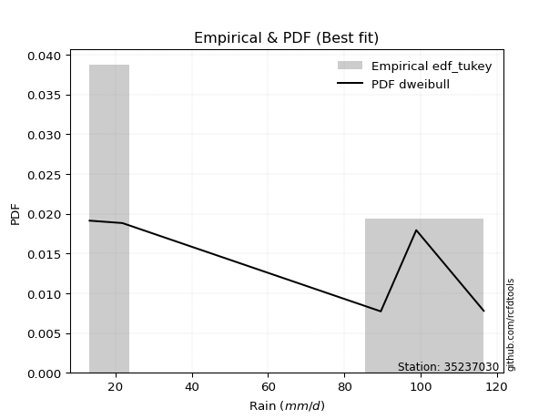</img>

</div>


### 8. EDF Gringorten (1963)

Gringorten plotting position formula is essential for estimating the probability and return periods of extreme events like floods and heavy rainfall. The constant _a=0.44_.

<div align="center">


$P=(m-a)/(n+1-2a)$


</div>


**8.1. Empirical values**

<div align="center">

|                | 0                   | 1                  | 2              | 3                 | 4                  |
|:---------------|:--------------------|:-------------------|:---------------|:------------------|:-------------------|
| date           | 2019                | 2017               | 2025           | 2018              | 2024               |
| x              | 13.2                | 21.8               | 89.6           | 98.9              | 116.6              |
| m              | 1                   | 2                  | 3              | 4                 | 5                  |
| empirical_dist | edf_gringorten      | edf_gringorten     | edf_gringorten | edf_gringorten    | edf_gringorten     |
| empirical      | 0.10937500000000001 | 0.3046875          | 0.5            | 0.6953125         | 0.8906249999999999 |
| empirical_tr   | 1.1228070175438596  | 1.4382022471910112 | 2.0            | 3.282051282051282 | 9.142857142857133  |

</div>


**8.2. Kolmogorov-Smirnov fit test (sorted by Δ)**


<div align="center">

|                | 0                   | 1                   | 2                   | 3                   | 4                   | 5                   | 6                   | 7                  | 8                   | 9                   | 10                 | 11                  | 12                  | 13                 | 14                  | 15                  | 16                  | 17                 | 18                  | 19                 | 20                 | 21                  | 22                  | 23                  | 24                  | 25                  | 26                  | 27                  | 28                 | 29                  | 30                  | 31                 | 32                  | 33                 | 34                  | 35                  | 36                  | 37                 | 38                  | 39                  | 40                  | 41                  | 42                 | 43                 | 44                  | 45                  | 46                  | 47                  | 48                  | 49                 | 50                 | 51                  | 52                 | 53                 | 54                  | 55                  | 56                 | 57                  | 58                  | 59                  | 60                  | 61                  | 62                  | 63                  | 64                  | 65                  | 66                 | 67                  | 68                  | 69                  | 70                 | 71                  | 72                  | 73                  | 74                  | 75                  | 76                  | 77                  | 78                  | 79                  | 80                  | 81                  | 82                  | 83                  | 84                  | 85                 | 86                 | 87                 | 88                  | 89                  | 90                 | 91                 | 92                 | 93                 | 94                 | 95                 | 96                 | 97                  | 98                  | 99                  | 100                 | 101                | 102                 | 103                 | 104                 | 105                | 106                 | 107                | 108                | 109                | 110                 | 111                | 112                | 113                 | 114                 | 115                 | 116                | 117                 | 118                | 119                | 120                | 121                 | 122                 | 123                | 124                | 125                | 126                 | 127                | 128                 | 129                 | 130                | 131                 | 132                 | 133                | 134                 | 135                | 136                | 137                 | 138                | 139                 | 140                | 141                 | 142                | 143                 | 144                 | 145                 | 146                | 147                 | 148                 | 149                | 150                 | 151                 | 152                | 153                | 154                | 155                | 156                | 157                | 158                | 159                |
|:---------------|:--------------------|:--------------------|:--------------------|:--------------------|:--------------------|:--------------------|:--------------------|:-------------------|:--------------------|:--------------------|:-------------------|:--------------------|:--------------------|:-------------------|:--------------------|:--------------------|:--------------------|:-------------------|:--------------------|:-------------------|:-------------------|:--------------------|:--------------------|:--------------------|:--------------------|:--------------------|:--------------------|:--------------------|:-------------------|:--------------------|:--------------------|:-------------------|:--------------------|:-------------------|:--------------------|:--------------------|:--------------------|:-------------------|:--------------------|:--------------------|:--------------------|:--------------------|:-------------------|:-------------------|:--------------------|:--------------------|:--------------------|:--------------------|:--------------------|:-------------------|:-------------------|:--------------------|:-------------------|:-------------------|:--------------------|:--------------------|:-------------------|:--------------------|:--------------------|:--------------------|:--------------------|:--------------------|:--------------------|:--------------------|:--------------------|:--------------------|:-------------------|:--------------------|:--------------------|:--------------------|:-------------------|:--------------------|:--------------------|:--------------------|:--------------------|:--------------------|:--------------------|:--------------------|:--------------------|:--------------------|:--------------------|:--------------------|:--------------------|:--------------------|:--------------------|:-------------------|:-------------------|:-------------------|:--------------------|:--------------------|:-------------------|:-------------------|:-------------------|:-------------------|:-------------------|:-------------------|:-------------------|:--------------------|:--------------------|:--------------------|:--------------------|:-------------------|:--------------------|:--------------------|:--------------------|:-------------------|:--------------------|:-------------------|:-------------------|:-------------------|:--------------------|:-------------------|:-------------------|:--------------------|:--------------------|:--------------------|:-------------------|:--------------------|:-------------------|:-------------------|:-------------------|:--------------------|:--------------------|:-------------------|:-------------------|:-------------------|:--------------------|:-------------------|:--------------------|:--------------------|:-------------------|:--------------------|:--------------------|:-------------------|:--------------------|:-------------------|:-------------------|:--------------------|:-------------------|:--------------------|:-------------------|:--------------------|:-------------------|:--------------------|:--------------------|:--------------------|:-------------------|:--------------------|:--------------------|:-------------------|:--------------------|:--------------------|:-------------------|:-------------------|:-------------------|:-------------------|:-------------------|:-------------------|:-------------------|:-------------------|
| station        | 35237030            | 35237030            | 35237030            | 35237030            | 35237030            | 35237030            | 35237030            | 35237030           | 35237030            | 35237030            | 35237030           | 35237030            | 35237030            | 35237030           | 35237030            | 35237030            | 35237030            | 35237030           | 35237030            | 35237030           | 35237030           | 35237030            | 35237030            | 35237030            | 35237030            | 35237030            | 35237030            | 35237030            | 35237030           | 35237030            | 35237030            | 35237030           | 35237030            | 35237030           | 35237030            | 35237030            | 35237030            | 35237030           | 35237030            | 35237030            | 35237030            | 35237030            | 35237030           | 35237030           | 35237030            | 35237030            | 35237030            | 35237030            | 35237030            | 35237030           | 35237030           | 35237030            | 35237030           | 35237030           | 35237030            | 35237030            | 35237030           | 35237030            | 35237030            | 35237030            | 35237030            | 35237030            | 35237030            | 35237030            | 35237030            | 35237030            | 35237030           | 35237030            | 35237030            | 35237030            | 35237030           | 35237030            | 35237030            | 35237030            | 35237030            | 35237030            | 35237030            | 35237030            | 35237030            | 35237030            | 35237030            | 35237030            | 35237030            | 35237030            | 35237030            | 35237030           | 35237030           | 35237030           | 35237030            | 35237030            | 35237030           | 35237030           | 35237030           | 35237030           | 35237030           | 35237030           | 35237030           | 35237030            | 35237030            | 35237030            | 35237030            | 35237030           | 35237030            | 35237030            | 35237030            | 35237030           | 35237030            | 35237030           | 35237030           | 35237030           | 35237030            | 35237030           | 35237030           | 35237030            | 35237030            | 35237030            | 35237030           | 35237030            | 35237030           | 35237030           | 35237030           | 35237030            | 35237030            | 35237030           | 35237030           | 35237030           | 35237030            | 35237030           | 35237030            | 35237030            | 35237030           | 35237030            | 35237030            | 35237030           | 35237030            | 35237030           | 35237030           | 35237030            | 35237030           | 35237030            | 35237030           | 35237030            | 35237030           | 35237030            | 35237030            | 35237030            | 35237030           | 35237030            | 35237030            | 35237030           | 35237030            | 35237030            | 35237030           | 35237030           | 35237030           | 35237030           | 35237030           | 35237030           | 35237030           | 35237030           |
| empirical_dist | edf_gringorten      | edf_gringorten      | edf_gringorten      | edf_gringorten      | edf_gringorten      | edf_gringorten      | edf_gringorten      | edf_gringorten     | edf_gringorten      | edf_gringorten      | edf_gringorten     | edf_gringorten      | edf_gringorten      | edf_gringorten     | edf_gringorten      | edf_gringorten      | edf_gringorten      | edf_gringorten     | edf_gringorten      | edf_gringorten     | edf_gringorten     | edf_gringorten      | edf_gringorten      | edf_gringorten      | edf_gringorten      | edf_gringorten      | edf_gringorten      | edf_gringorten      | edf_gringorten     | edf_gringorten      | edf_gringorten      | edf_gringorten     | edf_gringorten      | edf_gringorten     | edf_gringorten      | edf_gringorten      | edf_gringorten      | edf_gringorten     | edf_gringorten      | edf_gringorten      | edf_gringorten      | edf_gringorten      | edf_gringorten     | edf_gringorten     | edf_gringorten      | edf_gringorten      | edf_gringorten      | edf_gringorten      | edf_gringorten      | edf_gringorten     | edf_gringorten     | edf_gringorten      | edf_gringorten     | edf_gringorten     | edf_gringorten      | edf_gringorten      | edf_gringorten     | edf_gringorten      | edf_gringorten      | edf_gringorten      | edf_gringorten      | edf_gringorten      | edf_gringorten      | edf_gringorten      | edf_gringorten      | edf_gringorten      | edf_gringorten     | edf_gringorten      | edf_gringorten      | edf_gringorten      | edf_gringorten     | edf_gringorten      | edf_gringorten      | edf_gringorten      | edf_gringorten      | edf_gringorten      | edf_gringorten      | edf_gringorten      | edf_gringorten      | edf_gringorten      | edf_gringorten      | edf_gringorten      | edf_gringorten      | edf_gringorten      | edf_gringorten      | edf_gringorten     | edf_gringorten     | edf_gringorten     | edf_gringorten      | edf_gringorten      | edf_gringorten     | edf_gringorten     | edf_gringorten     | edf_gringorten     | edf_gringorten     | edf_gringorten     | edf_gringorten     | edf_gringorten      | edf_gringorten      | edf_gringorten      | edf_gringorten      | edf_gringorten     | edf_gringorten      | edf_gringorten      | edf_gringorten      | edf_gringorten     | edf_gringorten      | edf_gringorten     | edf_gringorten     | edf_gringorten     | edf_gringorten      | edf_gringorten     | edf_gringorten     | edf_gringorten      | edf_gringorten      | edf_gringorten      | edf_gringorten     | edf_gringorten      | edf_gringorten     | edf_gringorten     | edf_gringorten     | edf_gringorten      | edf_gringorten      | edf_gringorten     | edf_gringorten     | edf_gringorten     | edf_gringorten      | edf_gringorten     | edf_gringorten      | edf_gringorten      | edf_gringorten     | edf_gringorten      | edf_gringorten      | edf_gringorten     | edf_gringorten      | edf_gringorten     | edf_gringorten     | edf_gringorten      | edf_gringorten     | edf_gringorten      | edf_gringorten     | edf_gringorten      | edf_gringorten     | edf_gringorten      | edf_gringorten      | edf_gringorten      | edf_gringorten     | edf_gringorten      | edf_gringorten      | edf_gringorten     | edf_gringorten      | edf_gringorten      | edf_gringorten     | edf_gringorten     | edf_gringorten     | edf_gringorten     | edf_gringorten     | edf_gringorten     | edf_gringorten     | edf_gringorten     |
| p_dist         | dweibull            | dgamma              | wrapcauchy          | genextreme          | loglevy_l           | arcsine             | logweibull_max      | rdist              | johnsonsu           | trapezoid           | ksone              | levy_l              | logarcsine          | genhalflogistic    | loggenextreme       | semicircular        | anglit              | skewnorm           | gumbel_l            | weibull_min        | logtrapezoid       | pearson3            | logksone            | exponnorm           | truncnorm           | norm                | crystalball         | t                   | lomax              | erlang              | foldnorm            | logkappa3          | gamma               | argus              | beta                | rice                | logsemicircular     | triang             | logbeta             | logwrapcauchy       | maxwell             | cosine              | genpareto          | logistic           | rayleigh            | loganglit           | invweibull          | invgamma            | gompertz            | logweibull_min     | halfnorm           | logloggamma         | logburr12          | tukeylambda        | hypsecant           | loggumbel_l         | gennorm            | logpearson3         | logmielke           | betaprime           | kstwobign           | kappa3              | uniform             | vonmises_line       | loggennorm          | loginvweibull       | genexpon           | logargus            | burr                | mielke              | lognct             | logbetaprime        | logalpha            | logexponnorm        | logcrystalball      | lognorm             | logt                | gumbel_r            | logf                | logfatiguelife      | loginvgamma         | loggamma            | loggamma            | logerlang           | bradford            | logfoldnorm        | loggompertz        | logrice            | loginvgauss         | logncf              | halfgennorm        | ncf                | logmaxwell         | gausshyper         | laplace            | halflogistic       | lograyleigh        | kappa4              | loggenexpon         | nct                 | logdgamma           | moyal              | burr12              | logkstwobign        | logloglaplace       | loghalfnorm        | loglogistic         | logburr            | invgauss           | loggenhalflogistic | logcosine           | alpha              | logdweibull        | loghypsecant        | loggumbel_r         | logrdist            | loghalflogistic    | logmoyal            | nakagami           | loglaplace         | loglaplace         | wald                | f                   | loggenpareto       | truncweibull_min   | logtriang          | truncexpon          | logskewnorm        | exponpow            | logexponweib        | gengamma           | logwald             | logexponpow         | loghalfgennorm     | lognakagami         | logkappa4          | loggausshyper      | logtukeylambda      | logvonmises_line   | loguniform          | logbradford        | exponweib           | fatiguelife        | logtruncnorm        | logjohnsonsb        | logtruncexpon       | johnsonsb          | loglomax            | logtruncweibull_min | powerlaw           | truncpareto         | loggengamma         | logpowerlaw        | logtruncpareto     | weibull_max        | logjohnsonsu       | genlogistic        | loggenlogistic     | logvonmises        | vonmises           |
| delta          | 0.07882994182412262 | 0.08496741792507911 | 0.10937494333084608 | 0.11083453398591417 | 0.11758411596525264 | 0.11765316707457174 | 0.13122688881815248 | 0.1391417424061686 | 0.14107376798160148 | 0.14230884509134611 | 0.1474835977526442 | 0.15161208560060846 | 0.15572263742832482 | 0.1578890888560407 | 0.15860388931579517 | 0.16083755944055622 | 0.17111276072342152 | 0.1749410198006891 | 0.17580208761919314 | 0.1774286586107302 | 0.1778396741353312 | 0.18275116488252208 | 0.19184835569019387 | 0.19528842098517463 | 0.19528880513868718 | 0.19528881838227008 | 0.19528882254432156 | 0.19532658830951433 | 0.1973696897809354 | 0.19820987027509207 | 0.19864278623423604 | 0.1996801826145429 | 0.20013757920918684 | 0.2002839754481338 | 0.20528924484447703 | 0.20739959720444812 | 0.20758291196486978 | 0.2096744112792217 | 0.21086379116547133 | 0.21089914395072573 | 0.21177286227506897 | 0.21405493508666573 | 0.2143645101250301 | 0.2163985572641396 | 0.21660316392863654 | 0.21944060317249903 | 0.21979904044317244 | 0.22043883828647237 | 0.22707136726262633 | 0.2297021895432989 | 0.2312125449028506 | 0.23134024592139157 | 0.2314191126761722 | 0.2316439850228349 | 0.23175671275753007 | 0.23198717058462837 | 0.2332361056512738 | 0.23327450973398212 | 0.23444931750161857 | 0.23498460239028918 | 0.23654064784009476 | 0.23851584640840018 | 0.23887814313346223 | 0.24013081426634952 | 0.24219584281132878 | 0.24369345700598977 | 0.2455947246998047 | 0.24564441597490605 | 0.24606705880733415 | 0.24653181542497815 | 0.2465556561134179 | 0.24657570192592582 | 0.24662475545867957 | 0.24683862467492057 | 0.24684101988853913 | 0.24684112095348676 | 0.24684144994180857 | 0.24708816023696956 | 0.24757125449179007 | 0.24761411975767178 | 0.24985238564088097 | 0.25014370806045827 | 0.25014370806045827 | 0.25068244792487193 | 0.25071985057621937 | 0.2510692552160756 | 0.2515976086412205 | 0.2516394061232252 | 0.25173835840561254 | 0.25202729282303804 | 0.2528654685535594 | 0.2554911841554507 | 0.2568411281619507 | 0.2571419081941321 | 0.2572361940743363 | 0.2581843470177354 | 0.2596992861869577 | 0.26090929945418695 | 0.26192029446542275 | 0.26278453411152314 | 0.26326322160517057 | 0.2638734963948466 | 0.26428164299192336 | 0.26553648781344275 | 0.26752906621061523 | 0.2692734123676309 | 0.26948734953999187 | 0.2717277209299601 | 0.2731217363384312 | 0.273602045196369  | 0.27531526615674007 | 0.281259511161727  | 0.2822208667189352 | 0.28449252704767003 | 0.28709168172178967 | 0.29279087647817703 | 0.2938659440057185 | 0.30006886974045677 | 0.3031741829146174 | 0.3046589628322961 | 0.3046589628322961 | 0.31293029418711105 | 0.31517275752934515 | 0.3168199050745071 | 0.3200527238012978 | 0.3221626715232293 | 0.32667776299703766 | 0.3314130654136327 | 0.33151806835525266 | 0.33310772364811536 | 0.3364222633896544 | 0.34047062942532047 | 0.35241600086848135 | 0.3564088356588204 | 0.36104438090408575 | 0.3615407729017234 | 0.3633510172687281 | 0.36817664372431835 | 0.3788208392815442 | 0.37909569369886964 | 0.3805614344924392 | 0.38201014592718163 | 0.4001064958842936 | 0.40406046563635956 | 0.40642898360026036 | 0.41470152945423133 | 0.4247275741503497 | 0.42875869936550093 | 0.4359889579138204  | 0.4642638349263478 | 0.47367569357681205 | 0.49043684262839693 | 0.5187979423848734 | 0.5344506842085438 | 0.5436728675521493 | 0.6081474139168104 | 0.6953125          | 0.6953125          | 1.2225381925380698 | 17.779054740017447 |
| deltao         | 0.5865427407550001  | 0.5865427407550001  | 0.5865427407550001  | 0.5865427407550001  | 0.5865427407550001  | 0.5865427407550001  | 0.5865427407550001  | 0.5865427407550001 | 0.5865427407550001  | 0.5865427407550001  | 0.5865427407550001 | 0.5865427407550001  | 0.5865427407550001  | 0.5865427407550001 | 0.5865427407550001  | 0.5865427407550001  | 0.5865427407550001  | 0.5865427407550001 | 0.5865427407550001  | 0.5865427407550001 | 0.5865427407550001 | 0.5865427407550001  | 0.5865427407550001  | 0.5865427407550001  | 0.5865427407550001  | 0.5865427407550001  | 0.5865427407550001  | 0.5865427407550001  | 0.5865427407550001 | 0.5865427407550001  | 0.5865427407550001  | 0.5865427407550001 | 0.5865427407550001  | 0.5865427407550001 | 0.5865427407550001  | 0.5865427407550001  | 0.5865427407550001  | 0.5865427407550001 | 0.5865427407550001  | 0.5865427407550001  | 0.5865427407550001  | 0.5865427407550001  | 0.5865427407550001 | 0.5865427407550001 | 0.5865427407550001  | 0.5865427407550001  | 0.5865427407550001  | 0.5865427407550001  | 0.5865427407550001  | 0.5865427407550001 | 0.5865427407550001 | 0.5865427407550001  | 0.5865427407550001 | 0.5865427407550001 | 0.5865427407550001  | 0.5865427407550001  | 0.5865427407550001 | 0.5865427407550001  | 0.5865427407550001  | 0.5865427407550001  | 0.5865427407550001  | 0.5865427407550001  | 0.5865427407550001  | 0.5865427407550001  | 0.5865427407550001  | 0.5865427407550001  | 0.5865427407550001 | 0.5865427407550001  | 0.5865427407550001  | 0.5865427407550001  | 0.5865427407550001 | 0.5865427407550001  | 0.5865427407550001  | 0.5865427407550001  | 0.5865427407550001  | 0.5865427407550001  | 0.5865427407550001  | 0.5865427407550001  | 0.5865427407550001  | 0.5865427407550001  | 0.5865427407550001  | 0.5865427407550001  | 0.5865427407550001  | 0.5865427407550001  | 0.5865427407550001  | 0.5865427407550001 | 0.5865427407550001 | 0.5865427407550001 | 0.5865427407550001  | 0.5865427407550001  | 0.5865427407550001 | 0.5865427407550001 | 0.5865427407550001 | 0.5865427407550001 | 0.5865427407550001 | 0.5865427407550001 | 0.5865427407550001 | 0.5865427407550001  | 0.5865427407550001  | 0.5865427407550001  | 0.5865427407550001  | 0.5865427407550001 | 0.5865427407550001  | 0.5865427407550001  | 0.5865427407550001  | 0.5865427407550001 | 0.5865427407550001  | 0.5865427407550001 | 0.5865427407550001 | 0.5865427407550001 | 0.5865427407550001  | 0.5865427407550001 | 0.5865427407550001 | 0.5865427407550001  | 0.5865427407550001  | 0.5865427407550001  | 0.5865427407550001 | 0.5865427407550001  | 0.5865427407550001 | 0.5865427407550001 | 0.5865427407550001 | 0.5865427407550001  | 0.5865427407550001  | 0.5865427407550001 | 0.5865427407550001 | 0.5865427407550001 | 0.5865427407550001  | 0.5865427407550001 | 0.5865427407550001  | 0.5865427407550001  | 0.5865427407550001 | 0.5865427407550001  | 0.5865427407550001  | 0.5865427407550001 | 0.5865427407550001  | 0.5865427407550001 | 0.5865427407550001 | 0.5865427407550001  | 0.5865427407550001 | 0.5865427407550001  | 0.5865427407550001 | 0.5865427407550001  | 0.5865427407550001 | 0.5865427407550001  | 0.5865427407550001  | 0.5865427407550001  | 0.5865427407550001 | 0.5865427407550001  | 0.5865427407550001  | 0.5865427407550001 | 0.5865427407550001  | 0.5865427407550001  | 0.5865427407550001 | 0.5865427407550001 | 0.5865427407550001 | 0.5865427407550001 | 0.5865427407550001 | 0.5865427407550001 | 0.5865427407550001 | 0.5865427407550001 |
| eval           | Δo > Δ              | Δo > Δ              | Δo > Δ              | Δo > Δ              | Δo > Δ              | Δo > Δ              | Δo > Δ              | Δo > Δ             | Δo > Δ              | Δo > Δ              | Δo > Δ             | Δo > Δ              | Δo > Δ              | Δo > Δ             | Δo > Δ              | Δo > Δ              | Δo > Δ              | Δo > Δ             | Δo > Δ              | Δo > Δ             | Δo > Δ             | Δo > Δ              | Δo > Δ              | Δo > Δ              | Δo > Δ              | Δo > Δ              | Δo > Δ              | Δo > Δ              | Δo > Δ             | Δo > Δ              | Δo > Δ              | Δo > Δ             | Δo > Δ              | Δo > Δ             | Δo > Δ              | Δo > Δ              | Δo > Δ              | Δo > Δ             | Δo > Δ              | Δo > Δ              | Δo > Δ              | Δo > Δ              | Δo > Δ             | Δo > Δ             | Δo > Δ              | Δo > Δ              | Δo > Δ              | Δo > Δ              | Δo > Δ              | Δo > Δ             | Δo > Δ             | Δo > Δ              | Δo > Δ             | Δo > Δ             | Δo > Δ              | Δo > Δ              | Δo > Δ             | Δo > Δ              | Δo > Δ              | Δo > Δ              | Δo > Δ              | Δo > Δ              | Δo > Δ              | Δo > Δ              | Δo > Δ              | Δo > Δ              | Δo > Δ             | Δo > Δ              | Δo > Δ              | Δo > Δ              | Δo > Δ             | Δo > Δ              | Δo > Δ              | Δo > Δ              | Δo > Δ              | Δo > Δ              | Δo > Δ              | Δo > Δ              | Δo > Δ              | Δo > Δ              | Δo > Δ              | Δo > Δ              | Δo > Δ              | Δo > Δ              | Δo > Δ              | Δo > Δ             | Δo > Δ             | Δo > Δ             | Δo > Δ              | Δo > Δ              | Δo > Δ             | Δo > Δ             | Δo > Δ             | Δo > Δ             | Δo > Δ             | Δo > Δ             | Δo > Δ             | Δo > Δ              | Δo > Δ              | Δo > Δ              | Δo > Δ              | Δo > Δ             | Δo > Δ              | Δo > Δ              | Δo > Δ              | Δo > Δ             | Δo > Δ              | Δo > Δ             | Δo > Δ             | Δo > Δ             | Δo > Δ              | Δo > Δ             | Δo > Δ             | Δo > Δ              | Δo > Δ              | Δo > Δ              | Δo > Δ             | Δo > Δ              | Δo > Δ             | Δo > Δ             | Δo > Δ             | Δo > Δ              | Δo > Δ              | Δo > Δ             | Δo > Δ             | Δo > Δ             | Δo > Δ              | Δo > Δ             | Δo > Δ              | Δo > Δ              | Δo > Δ             | Δo > Δ              | Δo > Δ              | Δo > Δ             | Δo > Δ              | Δo > Δ             | Δo > Δ             | Δo > Δ              | Δo > Δ             | Δo > Δ              | Δo > Δ             | Δo > Δ              | Δo > Δ             | Δo > Δ              | Δo > Δ              | Δo > Δ              | Δo > Δ             | Δo > Δ              | Δo > Δ              | Δo > Δ             | Δo > Δ              | Δo > Δ              | Δo > Δ             | Δo > Δ             | Δo > Δ             | Δo <= Δ            | Δo <= Δ            | Δo <= Δ            | Δo <= Δ            | Δo <= Δ            |
| fit            | 1                   | 1                   | 1                   | 1                   | 1                   | 1                   | 1                   | 1                  | 1                   | 1                   | 1                  | 1                   | 1                   | 1                  | 1                   | 1                   | 1                   | 1                  | 1                   | 1                  | 1                  | 1                   | 1                   | 1                   | 1                   | 1                   | 1                   | 1                   | 1                  | 1                   | 1                   | 1                  | 1                   | 1                  | 1                   | 1                   | 1                   | 1                  | 1                   | 1                   | 1                   | 1                   | 1                  | 1                  | 1                   | 1                   | 1                   | 1                   | 1                   | 1                  | 1                  | 1                   | 1                  | 1                  | 1                   | 1                   | 1                  | 1                   | 1                   | 1                   | 1                   | 1                   | 1                   | 1                   | 1                   | 1                   | 1                  | 1                   | 1                   | 1                   | 1                  | 1                   | 1                   | 1                   | 1                   | 1                   | 1                   | 1                   | 1                   | 1                   | 1                   | 1                   | 1                   | 1                   | 1                   | 1                  | 1                  | 1                  | 1                   | 1                   | 1                  | 1                  | 1                  | 1                  | 1                  | 1                  | 1                  | 1                   | 1                   | 1                   | 1                   | 1                  | 1                   | 1                   | 1                   | 1                  | 1                   | 1                  | 1                  | 1                  | 1                   | 1                  | 1                  | 1                   | 1                   | 1                   | 1                  | 1                   | 1                  | 1                  | 1                  | 1                   | 1                   | 1                  | 1                  | 1                  | 1                   | 1                  | 1                   | 1                   | 1                  | 1                   | 1                   | 1                  | 1                   | 1                  | 1                  | 1                   | 1                  | 1                   | 1                  | 1                   | 1                  | 1                   | 1                   | 1                   | 1                  | 1                   | 1                   | 1                  | 1                   | 1                   | 1                  | 1                  | 1                  | 0                  | 0                  | 0                  | 0                  | 0                  |
| n              | 5                   | 5                   | 5                   | 5                   | 5                   | 5                   | 5                   | 5                  | 5                   | 5                   | 5                  | 5                   | 5                   | 5                  | 5                   | 5                   | 5                   | 5                  | 5                   | 5                  | 5                  | 5                   | 5                   | 5                   | 5                   | 5                   | 5                   | 5                   | 5                  | 5                   | 5                   | 5                  | 5                   | 5                  | 5                   | 5                   | 5                   | 5                  | 5                   | 5                   | 5                   | 5                   | 5                  | 5                  | 5                   | 5                   | 5                   | 5                   | 5                   | 5                  | 5                  | 5                   | 5                  | 5                  | 5                   | 5                   | 5                  | 5                   | 5                   | 5                   | 5                   | 5                   | 5                   | 5                   | 5                   | 5                   | 5                  | 5                   | 5                   | 5                   | 5                  | 5                   | 5                   | 5                   | 5                   | 5                   | 5                   | 5                   | 5                   | 5                   | 5                   | 5                   | 5                   | 5                   | 5                   | 5                  | 5                  | 5                  | 5                   | 5                   | 5                  | 5                  | 5                  | 5                  | 5                  | 5                  | 5                  | 5                   | 5                   | 5                   | 5                   | 5                  | 5                   | 5                   | 5                   | 5                  | 5                   | 5                  | 5                  | 5                  | 5                   | 5                  | 5                  | 5                   | 5                   | 5                   | 5                  | 5                   | 5                  | 5                  | 5                  | 5                   | 5                   | 5                  | 5                  | 5                  | 5                   | 5                  | 5                   | 5                   | 5                  | 5                   | 5                   | 5                  | 5                   | 5                  | 5                  | 5                   | 5                  | 5                   | 5                  | 5                   | 5                  | 5                   | 5                   | 5                   | 5                  | 5                   | 5                   | 5                  | 5                   | 5                   | 5                  | 5                  | 5                  | 5                  | 5                  | 5                  | 5                  | 5                  |
| best_fit       | 1                   | 0                   | 0                   | 0                   | 0                   | 0                   | 0                   | 0                  | 0                   | 0                   | 0                  | 0                   | 0                   | 0                  | 0                   | 0                   | 0                   | 0                  | 0                   | 0                  | 0                  | 0                   | 0                   | 0                   | 0                   | 0                   | 0                   | 0                   | 0                  | 0                   | 0                   | 0                  | 0                   | 0                  | 0                   | 0                   | 0                   | 0                  | 0                   | 0                   | 0                   | 0                   | 0                  | 0                  | 0                   | 0                   | 0                   | 0                   | 0                   | 0                  | 0                  | 0                   | 0                  | 0                  | 0                   | 0                   | 0                  | 0                   | 0                   | 0                   | 0                   | 0                   | 0                   | 0                   | 0                   | 0                   | 0                  | 0                   | 0                   | 0                   | 0                  | 0                   | 0                   | 0                   | 0                   | 0                   | 0                   | 0                   | 0                   | 0                   | 0                   | 0                   | 0                   | 0                   | 0                   | 0                  | 0                  | 0                  | 0                   | 0                   | 0                  | 0                  | 0                  | 0                  | 0                  | 0                  | 0                  | 0                   | 0                   | 0                   | 0                   | 0                  | 0                   | 0                   | 0                   | 0                  | 0                   | 0                  | 0                  | 0                  | 0                   | 0                  | 0                  | 0                   | 0                   | 0                   | 0                  | 0                   | 0                  | 0                  | 0                  | 0                   | 0                   | 0                  | 0                  | 0                  | 0                   | 0                  | 0                   | 0                   | 0                  | 0                   | 0                   | 0                  | 0                   | 0                  | 0                  | 0                   | 0                  | 0                   | 0                  | 0                   | 0                  | 0                   | 0                   | 0                   | 0                  | 0                   | 0                   | 0                  | 0                   | 0                   | 0                  | 0                  | 0                  | 0                  | 0                  | 0                  | 0                  | 0                  |
| best_fit_sort  | 1                   | 2                   | 3                   | 4                   | 5                   | 6                   | 7                   | 8                  | 9                   | 10                  | 11                 | 12                  | 13                  | 14                 | 15                  | 16                  | 17                  | 18                 | 19                  | 20                 | 21                 | 22                  | 23                  | 24                  | 25                  | 26                  | 27                  | 28                  | 29                 | 30                  | 31                  | 32                 | 33                  | 34                 | 35                  | 36                  | 37                  | 38                 | 39                  | 40                  | 41                  | 42                  | 43                 | 44                 | 45                  | 46                  | 47                  | 48                  | 49                  | 50                 | 51                 | 52                  | 53                 | 54                 | 55                  | 56                  | 57                 | 58                  | 59                  | 60                  | 61                  | 62                  | 63                  | 64                  | 65                  | 66                  | 67                 | 68                  | 69                  | 70                  | 71                 | 72                  | 73                  | 74                  | 75                  | 76                  | 77                  | 78                  | 79                  | 80                  | 81                  | 82                  | 83                  | 84                  | 85                  | 86                 | 87                 | 88                 | 89                  | 90                  | 91                 | 92                 | 93                 | 94                 | 95                 | 96                 | 97                 | 98                  | 99                  | 100                 | 101                 | 102                | 103                 | 104                 | 105                 | 106                | 107                 | 108                | 109                | 110                | 111                 | 112                | 113                | 114                 | 115                 | 116                 | 117                | 118                 | 119                | 120                | 121                | 122                 | 123                 | 124                | 125                | 126                | 127                 | 128                | 129                 | 130                 | 131                | 132                 | 133                 | 134                | 135                 | 136                | 137                | 138                 | 139                | 140                 | 141                | 142                 | 143                | 144                 | 145                 | 146                 | 147                | 148                 | 149                 | 150                | 151                 | 152                 | 153                | 154                | 155                | 156                | 157                | 158                | 159                | 160                |

</div>


**8.3. Best fit**

<div align="center">

|   id |   station | empirical_dist   | p_dist   |     delta |   deltao | eval   |   fit |   n |   best_fit |   best_fit_sort |
|-----:|----------:|:-----------------|:---------|----------:|---------:|:-------|------:|----:|-----------:|----------------:|
|    0 |  35237030 | edf_gringorten   | dweibull | 0.0788299 | 0.586543 | Δo > Δ |     1 |   5 |          1 |               1 |

</div>


<div align="center">

</img></img>

</div>


### 9. EDF Filliben (1975)

The specific values of the constants (0.3175) (often denoted as $alpha$) and (0.365) are derived from a method proposed by James J. Filliben in a 1975 paper. This particular formula is the mean value of the $i$-th order statistic of the normal distribution and is considered a robust and effective plotting position formula for the normal probability plot correlation coefficient test for normality.

<div align="center">


$P=(m-0.3175)/(n+0.365)$


</div>


**9.1. Empirical values**

<div align="center">

|                | 0                   | 1                  | 2            | 3                  | 4                  |
|:---------------|:--------------------|:-------------------|:-------------|:-------------------|:-------------------|
| date           | 2019                | 2017               | 2025         | 2018               | 2024               |
| x              | 13.2                | 21.8               | 89.6         | 98.9               | 116.6              |
| m              | 1                   | 2                  | 3            | 4                  | 5                  |
| empirical_dist | edf_filliben        | edf_filliben       | edf_filliben | edf_filliben       | edf_filliben       |
| empirical      | 0.12721342031686858 | 0.3136067101584343 | 0.5          | 0.6863932898415657 | 0.8727865796831314 |
| empirical_tr   | 1.1457554725040042  | 1.456890699253225  | 2.0          | 3.188707280832095  | 7.860805860805863  |

</div>


**9.2. Kolmogorov-Smirnov fit test (sorted by Δ)**


<div align="center">

|                | 0                   | 1                   | 2                   | 3                   | 4                   | 5                  | 6                   | 7                  | 8                   | 9                  | 10                 | 11                  | 12                  | 13                 | 14                  | 15                  | 16                  | 17                 | 18                 | 19                  | 20                  | 21                 | 22                  | 23                  | 24                  | 25                  | 26                  | 27                  | 28                  | 29                 | 30                  | 31                  | 32                  | 33                  | 34                  | 35                 | 36                 | 37                  | 38                  | 39                  | 40                 | 41                 | 42                  | 43                  | 44                 | 45                  | 46                  | 47                  | 48                  | 49                 | 50                 | 51                  | 52                 | 53                 | 54                  | 55                  | 56                  | 57                  | 58                  | 59                 | 60                  | 61                  | 62                  | 63                  | 64                 | 65                  | 66                 | 67                  | 68                  | 69                  | 70                 | 71                  | 72                  | 73                  | 74                  | 75                  | 76                  | 77                  | 78                  | 79                  | 80                 | 81                  | 82                  | 83                  | 84                  | 85                  | 86                 | 87                 | 88                 | 89                  | 90                  | 91                 | 92                 | 93                 | 94                 | 95                 | 96                 | 97                  | 98                  | 99                  | 100                 | 101                 | 102                | 103                 | 104                 | 105                 | 106                | 107                 | 108                | 109                | 110                | 111                 | 112                | 113                 | 114                 | 115                 | 116                | 117                 | 118                | 119                | 120                | 121                | 122                 | 123                | 124                | 125                | 126                 | 127                | 128                 | 129                 | 130                | 131                 | 132                 | 133                | 134                 | 135                | 136                | 137                 | 138                | 139                 | 140                | 141                 | 142                 | 143                | 144                 | 145                | 146                 | 147                 | 148                 | 149                | 150                | 151                 | 152                | 153                | 154                | 155                | 156                | 157                | 158                | 159                |
|:---------------|:--------------------|:--------------------|:--------------------|:--------------------|:--------------------|:-------------------|:--------------------|:-------------------|:--------------------|:-------------------|:-------------------|:--------------------|:--------------------|:-------------------|:--------------------|:--------------------|:--------------------|:-------------------|:-------------------|:--------------------|:--------------------|:-------------------|:--------------------|:--------------------|:--------------------|:--------------------|:--------------------|:--------------------|:--------------------|:-------------------|:--------------------|:--------------------|:--------------------|:--------------------|:--------------------|:-------------------|:-------------------|:--------------------|:--------------------|:--------------------|:-------------------|:-------------------|:--------------------|:--------------------|:-------------------|:--------------------|:--------------------|:--------------------|:--------------------|:-------------------|:-------------------|:--------------------|:-------------------|:-------------------|:--------------------|:--------------------|:--------------------|:--------------------|:--------------------|:-------------------|:--------------------|:--------------------|:--------------------|:--------------------|:-------------------|:--------------------|:-------------------|:--------------------|:--------------------|:--------------------|:-------------------|:--------------------|:--------------------|:--------------------|:--------------------|:--------------------|:--------------------|:--------------------|:--------------------|:--------------------|:-------------------|:--------------------|:--------------------|:--------------------|:--------------------|:--------------------|:-------------------|:-------------------|:-------------------|:--------------------|:--------------------|:-------------------|:-------------------|:-------------------|:-------------------|:-------------------|:-------------------|:--------------------|:--------------------|:--------------------|:--------------------|:--------------------|:-------------------|:--------------------|:--------------------|:--------------------|:-------------------|:--------------------|:-------------------|:-------------------|:-------------------|:--------------------|:-------------------|:--------------------|:--------------------|:--------------------|:-------------------|:--------------------|:-------------------|:-------------------|:-------------------|:-------------------|:--------------------|:-------------------|:-------------------|:-------------------|:--------------------|:-------------------|:--------------------|:--------------------|:-------------------|:--------------------|:--------------------|:-------------------|:--------------------|:-------------------|:-------------------|:--------------------|:-------------------|:--------------------|:-------------------|:--------------------|:--------------------|:-------------------|:--------------------|:-------------------|:--------------------|:--------------------|:--------------------|:-------------------|:-------------------|:--------------------|:-------------------|:-------------------|:-------------------|:-------------------|:-------------------|:-------------------|:-------------------|:-------------------|
| station        | 35237030            | 35237030            | 35237030            | 35237030            | 35237030            | 35237030           | 35237030            | 35237030           | 35237030            | 35237030           | 35237030           | 35237030            | 35237030            | 35237030           | 35237030            | 35237030            | 35237030            | 35237030           | 35237030           | 35237030            | 35237030            | 35237030           | 35237030            | 35237030            | 35237030            | 35237030            | 35237030            | 35237030            | 35237030            | 35237030           | 35237030            | 35237030            | 35237030            | 35237030            | 35237030            | 35237030           | 35237030           | 35237030            | 35237030            | 35237030            | 35237030           | 35237030           | 35237030            | 35237030            | 35237030           | 35237030            | 35237030            | 35237030            | 35237030            | 35237030           | 35237030           | 35237030            | 35237030           | 35237030           | 35237030            | 35237030            | 35237030            | 35237030            | 35237030            | 35237030           | 35237030            | 35237030            | 35237030            | 35237030            | 35237030           | 35237030            | 35237030           | 35237030            | 35237030            | 35237030            | 35237030           | 35237030            | 35237030            | 35237030            | 35237030            | 35237030            | 35237030            | 35237030            | 35237030            | 35237030            | 35237030           | 35237030            | 35237030            | 35237030            | 35237030            | 35237030            | 35237030           | 35237030           | 35237030           | 35237030            | 35237030            | 35237030           | 35237030           | 35237030           | 35237030           | 35237030           | 35237030           | 35237030            | 35237030            | 35237030            | 35237030            | 35237030            | 35237030           | 35237030            | 35237030            | 35237030            | 35237030           | 35237030            | 35237030           | 35237030           | 35237030           | 35237030            | 35237030           | 35237030            | 35237030            | 35237030            | 35237030           | 35237030            | 35237030           | 35237030           | 35237030           | 35237030           | 35237030            | 35237030           | 35237030           | 35237030           | 35237030            | 35237030           | 35237030            | 35237030            | 35237030           | 35237030            | 35237030            | 35237030           | 35237030            | 35237030           | 35237030           | 35237030            | 35237030           | 35237030            | 35237030           | 35237030            | 35237030            | 35237030           | 35237030            | 35237030           | 35237030            | 35237030            | 35237030            | 35237030           | 35237030           | 35237030            | 35237030           | 35237030           | 35237030           | 35237030           | 35237030           | 35237030           | 35237030           | 35237030           |
| empirical_dist | edf_filliben        | edf_filliben        | edf_filliben        | edf_filliben        | edf_filliben        | edf_filliben       | edf_filliben        | edf_filliben       | edf_filliben        | edf_filliben       | edf_filliben       | edf_filliben        | edf_filliben        | edf_filliben       | edf_filliben        | edf_filliben        | edf_filliben        | edf_filliben       | edf_filliben       | edf_filliben        | edf_filliben        | edf_filliben       | edf_filliben        | edf_filliben        | edf_filliben        | edf_filliben        | edf_filliben        | edf_filliben        | edf_filliben        | edf_filliben       | edf_filliben        | edf_filliben        | edf_filliben        | edf_filliben        | edf_filliben        | edf_filliben       | edf_filliben       | edf_filliben        | edf_filliben        | edf_filliben        | edf_filliben       | edf_filliben       | edf_filliben        | edf_filliben        | edf_filliben       | edf_filliben        | edf_filliben        | edf_filliben        | edf_filliben        | edf_filliben       | edf_filliben       | edf_filliben        | edf_filliben       | edf_filliben       | edf_filliben        | edf_filliben        | edf_filliben        | edf_filliben        | edf_filliben        | edf_filliben       | edf_filliben        | edf_filliben        | edf_filliben        | edf_filliben        | edf_filliben       | edf_filliben        | edf_filliben       | edf_filliben        | edf_filliben        | edf_filliben        | edf_filliben       | edf_filliben        | edf_filliben        | edf_filliben        | edf_filliben        | edf_filliben        | edf_filliben        | edf_filliben        | edf_filliben        | edf_filliben        | edf_filliben       | edf_filliben        | edf_filliben        | edf_filliben        | edf_filliben        | edf_filliben        | edf_filliben       | edf_filliben       | edf_filliben       | edf_filliben        | edf_filliben        | edf_filliben       | edf_filliben       | edf_filliben       | edf_filliben       | edf_filliben       | edf_filliben       | edf_filliben        | edf_filliben        | edf_filliben        | edf_filliben        | edf_filliben        | edf_filliben       | edf_filliben        | edf_filliben        | edf_filliben        | edf_filliben       | edf_filliben        | edf_filliben       | edf_filliben       | edf_filliben       | edf_filliben        | edf_filliben       | edf_filliben        | edf_filliben        | edf_filliben        | edf_filliben       | edf_filliben        | edf_filliben       | edf_filliben       | edf_filliben       | edf_filliben       | edf_filliben        | edf_filliben       | edf_filliben       | edf_filliben       | edf_filliben        | edf_filliben       | edf_filliben        | edf_filliben        | edf_filliben       | edf_filliben        | edf_filliben        | edf_filliben       | edf_filliben        | edf_filliben       | edf_filliben       | edf_filliben        | edf_filliben       | edf_filliben        | edf_filliben       | edf_filliben        | edf_filliben        | edf_filliben       | edf_filliben        | edf_filliben       | edf_filliben        | edf_filliben        | edf_filliben        | edf_filliben       | edf_filliben       | edf_filliben        | edf_filliben       | edf_filliben       | edf_filliben       | edf_filliben       | edf_filliben       | edf_filliben       | edf_filliben       | edf_filliben       |
| p_dist         | dweibull            | dgamma              | loglevy_l           | arcsine             | wrapcauchy          | genextreme         | logweibull_max      | levy_l             | trapezoid           | ksone              | rdist              | johnsonsu           | logarcsine          | genhalflogistic    | loggenextreme       | semicircular        | anglit              | skewnorm           | logtrapezoid       | logkappa3           | pearson3            | gumbel_l           | weibull_min         | logksone            | exponnorm           | truncnorm           | norm                | crystalball         | t                   | lomax              | erlang              | foldnorm            | gamma               | rice                | logsemicircular     | argus              | triang             | logwrapcauchy       | maxwell             | cosine              | beta               | logistic           | rayleigh            | loganglit           | logbeta            | invweibull          | invgamma            | genpareto           | loggennorm          | logweibull_min     | halfnorm           | logloggamma         | logburr12          | tukeylambda        | hypsecant           | loggumbel_l         | logpearson3         | logmielke           | betaprime           | gompertz           | kstwobign           | kappa3              | uniform             | vonmises_line       | gennorm            | loginvweibull       | genexpon           | logargus            | burr                | mielke              | lognct             | logbetaprime        | logalpha            | logexponnorm        | logcrystalball      | lognorm             | logt                | gumbel_r            | logf                | logfatiguelife      | logloglaplace      | loginvgamma         | loggamma            | loggamma            | logerlang           | bradford            | logfoldnorm        | loggompertz        | logrice            | loginvgauss         | logncf              | halfgennorm        | ncf                | logmaxwell         | gausshyper         | laplace            | lograyleigh        | halflogistic        | kappa4              | loggenexpon         | logdgamma           | nct                 | moyal              | burr12              | logdweibull         | logkstwobign        | loghalfnorm        | loglogistic         | logburr            | invgauss           | loggenhalflogistic | logcosine           | alpha              | loghypsecant        | loggumbel_r         | logrdist            | loghalflogistic    | logmoyal            | nakagami           | loglaplace         | loglaplace         | wald               | f                   | loggenpareto       | truncweibull_min   | logtriang          | truncexpon          | logskewnorm        | exponpow            | logexponweib        | gengamma           | logwald             | logexponpow         | loghalfgennorm     | lognakagami         | logkappa4          | loggausshyper      | logtukeylambda      | logvonmises_line   | loguniform          | logbradford        | exponweib           | logjohnsonsb        | fatiguelife        | logtruncnorm        | loglomax           | logtruncexpon       | johnsonsb           | logtruncweibull_min | powerlaw           | loggengamma        | truncpareto         | logpowerlaw        | logtruncpareto     | weibull_max        | logjohnsonsu       | genlogistic        | loggenlogistic     | logvonmises        | vonmises           |
| delta          | 0.09666836214099106 | 0.10280583824194756 | 0.10866490580681831 | 0.11765316707457174 | 0.12721336364771452 | 0.1272134203167461 | 0.13122688881815248 | 0.1373631780834228 | 0.14230884509134611 | 0.1474835977526442 | 0.1480609525646029 | 0.14999297814003576 | 0.15572263742832482 | 0.1578890888560407 | 0.15860388931579517 | 0.16083755944055622 | 0.17111276072342152 | 0.1749410198006891 | 0.1778396741353312 | 0.18184176229767446 | 0.18275116488252208 | 0.1847212977776274 | 0.18634786876916448 | 0.19184835569019387 | 0.19528842098517463 | 0.19528880513868718 | 0.19528881838227008 | 0.19528882254432156 | 0.19532658830951433 | 0.1973696897809354 | 0.19820987027509207 | 0.19864278623423604 | 0.20013757920918684 | 0.20739959720444812 | 0.20758291196486978 | 0.2092031856065681 | 0.2096744112792217 | 0.21089914395072573 | 0.21177286227506897 | 0.21405493508666573 | 0.2142084550029113 | 0.2163985572641396 | 0.21660316392863654 | 0.21944060317249903 | 0.2197830013239056 | 0.21979904044317244 | 0.22043883828647237 | 0.22328372028346438 | 0.22435742249446033 | 0.2297021895432989 | 0.2312125449028506 | 0.23134024592139157 | 0.2314191126761722 | 0.2316439850228349 | 0.23175671275753007 | 0.23198717058462837 | 0.23327450973398212 | 0.23444931750161857 | 0.23498460239028918 | 0.2359905774210606 | 0.23654064784009476 | 0.23851584640840018 | 0.23887814313346223 | 0.24013081426634952 | 0.2421553158097081 | 0.24369345700598977 | 0.2455947246998047 | 0.24564441597490605 | 0.24606705880733415 | 0.24653181542497815 | 0.2465556561134179 | 0.24657570192592582 | 0.24662475545867957 | 0.24683862467492057 | 0.24684101988853913 | 0.24684112095348676 | 0.24684144994180857 | 0.24708816023696956 | 0.24757125449179007 | 0.24761411975767178 | 0.2496906458937468 | 0.24985238564088097 | 0.25014370806045827 | 0.25014370806045827 | 0.25068244792487193 | 0.25071985057621937 | 0.2510692552160756 | 0.2515976086412205 | 0.2516394061232252 | 0.25173835840561254 | 0.25202729282303804 | 0.2528654685535594 | 0.2554911841554507 | 0.2568411281619507 | 0.2571419081941321 | 0.2572361940743363 | 0.2596992861869577 | 0.26044260786829104 | 0.26090929945418695 | 0.26192029446542275 | 0.26228376037382534 | 0.26278453411152314 | 0.2638734963948466 | 0.26428164299192336 | 0.26438244640206676 | 0.26553648781344275 | 0.2692734123676309 | 0.26948734953999187 | 0.2717277209299601 | 0.2731217363384312 | 0.273602045196369  | 0.27531526615674007 | 0.281259511161727  | 0.28449252704767003 | 0.28709168172178967 | 0.29279087647817703 | 0.2938659440057185 | 0.30006886974045677 | 0.3031741829146174 | 0.3046589628322961 | 0.3046589628322961 | 0.3136067101584343 | 0.31517275752934515 | 0.3168199050745071 | 0.3200527238012978 | 0.3221626715232293 | 0.32667776299703766 | 0.3314130654136327 | 0.33151806835525266 | 0.33310772364811536 | 0.3364222633896544 | 0.34047062942532047 | 0.35241600086848135 | 0.3564088356588204 | 0.36104438090408575 | 0.3615407729017234 | 0.3633510172687281 | 0.36817664372431835 | 0.3788208392815442 | 0.37909569369886964 | 0.3805614344924392 | 0.38201014592718163 | 0.39750977344182603 | 0.4001064958842936 | 0.40406046563635956 | 0.4109202790486325 | 0.41470152945423133 | 0.41580836399191534 | 0.4359889579138204  | 0.4642638349263478 | 0.4725984223115285 | 0.47367569357681205 | 0.5098787322264391 | 0.5255314740501096 | 0.5347536573937149 | 0.599228203758376  | 0.6863932898415657 | 0.6863932898415657 | 1.2225381925380698 | 17.796893160334314 |
| deltao         | 0.5865427407550001  | 0.5865427407550001  | 0.5865427407550001  | 0.5865427407550001  | 0.5865427407550001  | 0.5865427407550001 | 0.5865427407550001  | 0.5865427407550001 | 0.5865427407550001  | 0.5865427407550001 | 0.5865427407550001 | 0.5865427407550001  | 0.5865427407550001  | 0.5865427407550001 | 0.5865427407550001  | 0.5865427407550001  | 0.5865427407550001  | 0.5865427407550001 | 0.5865427407550001 | 0.5865427407550001  | 0.5865427407550001  | 0.5865427407550001 | 0.5865427407550001  | 0.5865427407550001  | 0.5865427407550001  | 0.5865427407550001  | 0.5865427407550001  | 0.5865427407550001  | 0.5865427407550001  | 0.5865427407550001 | 0.5865427407550001  | 0.5865427407550001  | 0.5865427407550001  | 0.5865427407550001  | 0.5865427407550001  | 0.5865427407550001 | 0.5865427407550001 | 0.5865427407550001  | 0.5865427407550001  | 0.5865427407550001  | 0.5865427407550001 | 0.5865427407550001 | 0.5865427407550001  | 0.5865427407550001  | 0.5865427407550001 | 0.5865427407550001  | 0.5865427407550001  | 0.5865427407550001  | 0.5865427407550001  | 0.5865427407550001 | 0.5865427407550001 | 0.5865427407550001  | 0.5865427407550001 | 0.5865427407550001 | 0.5865427407550001  | 0.5865427407550001  | 0.5865427407550001  | 0.5865427407550001  | 0.5865427407550001  | 0.5865427407550001 | 0.5865427407550001  | 0.5865427407550001  | 0.5865427407550001  | 0.5865427407550001  | 0.5865427407550001 | 0.5865427407550001  | 0.5865427407550001 | 0.5865427407550001  | 0.5865427407550001  | 0.5865427407550001  | 0.5865427407550001 | 0.5865427407550001  | 0.5865427407550001  | 0.5865427407550001  | 0.5865427407550001  | 0.5865427407550001  | 0.5865427407550001  | 0.5865427407550001  | 0.5865427407550001  | 0.5865427407550001  | 0.5865427407550001 | 0.5865427407550001  | 0.5865427407550001  | 0.5865427407550001  | 0.5865427407550001  | 0.5865427407550001  | 0.5865427407550001 | 0.5865427407550001 | 0.5865427407550001 | 0.5865427407550001  | 0.5865427407550001  | 0.5865427407550001 | 0.5865427407550001 | 0.5865427407550001 | 0.5865427407550001 | 0.5865427407550001 | 0.5865427407550001 | 0.5865427407550001  | 0.5865427407550001  | 0.5865427407550001  | 0.5865427407550001  | 0.5865427407550001  | 0.5865427407550001 | 0.5865427407550001  | 0.5865427407550001  | 0.5865427407550001  | 0.5865427407550001 | 0.5865427407550001  | 0.5865427407550001 | 0.5865427407550001 | 0.5865427407550001 | 0.5865427407550001  | 0.5865427407550001 | 0.5865427407550001  | 0.5865427407550001  | 0.5865427407550001  | 0.5865427407550001 | 0.5865427407550001  | 0.5865427407550001 | 0.5865427407550001 | 0.5865427407550001 | 0.5865427407550001 | 0.5865427407550001  | 0.5865427407550001 | 0.5865427407550001 | 0.5865427407550001 | 0.5865427407550001  | 0.5865427407550001 | 0.5865427407550001  | 0.5865427407550001  | 0.5865427407550001 | 0.5865427407550001  | 0.5865427407550001  | 0.5865427407550001 | 0.5865427407550001  | 0.5865427407550001 | 0.5865427407550001 | 0.5865427407550001  | 0.5865427407550001 | 0.5865427407550001  | 0.5865427407550001 | 0.5865427407550001  | 0.5865427407550001  | 0.5865427407550001 | 0.5865427407550001  | 0.5865427407550001 | 0.5865427407550001  | 0.5865427407550001  | 0.5865427407550001  | 0.5865427407550001 | 0.5865427407550001 | 0.5865427407550001  | 0.5865427407550001 | 0.5865427407550001 | 0.5865427407550001 | 0.5865427407550001 | 0.5865427407550001 | 0.5865427407550001 | 0.5865427407550001 | 0.5865427407550001 |
| eval           | Δo > Δ              | Δo > Δ              | Δo > Δ              | Δo > Δ              | Δo > Δ              | Δo > Δ             | Δo > Δ              | Δo > Δ             | Δo > Δ              | Δo > Δ             | Δo > Δ             | Δo > Δ              | Δo > Δ              | Δo > Δ             | Δo > Δ              | Δo > Δ              | Δo > Δ              | Δo > Δ             | Δo > Δ             | Δo > Δ              | Δo > Δ              | Δo > Δ             | Δo > Δ              | Δo > Δ              | Δo > Δ              | Δo > Δ              | Δo > Δ              | Δo > Δ              | Δo > Δ              | Δo > Δ             | Δo > Δ              | Δo > Δ              | Δo > Δ              | Δo > Δ              | Δo > Δ              | Δo > Δ             | Δo > Δ             | Δo > Δ              | Δo > Δ              | Δo > Δ              | Δo > Δ             | Δo > Δ             | Δo > Δ              | Δo > Δ              | Δo > Δ             | Δo > Δ              | Δo > Δ              | Δo > Δ              | Δo > Δ              | Δo > Δ             | Δo > Δ             | Δo > Δ              | Δo > Δ             | Δo > Δ             | Δo > Δ              | Δo > Δ              | Δo > Δ              | Δo > Δ              | Δo > Δ              | Δo > Δ             | Δo > Δ              | Δo > Δ              | Δo > Δ              | Δo > Δ              | Δo > Δ             | Δo > Δ              | Δo > Δ             | Δo > Δ              | Δo > Δ              | Δo > Δ              | Δo > Δ             | Δo > Δ              | Δo > Δ              | Δo > Δ              | Δo > Δ              | Δo > Δ              | Δo > Δ              | Δo > Δ              | Δo > Δ              | Δo > Δ              | Δo > Δ             | Δo > Δ              | Δo > Δ              | Δo > Δ              | Δo > Δ              | Δo > Δ              | Δo > Δ             | Δo > Δ             | Δo > Δ             | Δo > Δ              | Δo > Δ              | Δo > Δ             | Δo > Δ             | Δo > Δ             | Δo > Δ             | Δo > Δ             | Δo > Δ             | Δo > Δ              | Δo > Δ              | Δo > Δ              | Δo > Δ              | Δo > Δ              | Δo > Δ             | Δo > Δ              | Δo > Δ              | Δo > Δ              | Δo > Δ             | Δo > Δ              | Δo > Δ             | Δo > Δ             | Δo > Δ             | Δo > Δ              | Δo > Δ             | Δo > Δ              | Δo > Δ              | Δo > Δ              | Δo > Δ             | Δo > Δ              | Δo > Δ             | Δo > Δ             | Δo > Δ             | Δo > Δ             | Δo > Δ              | Δo > Δ             | Δo > Δ             | Δo > Δ             | Δo > Δ              | Δo > Δ             | Δo > Δ              | Δo > Δ              | Δo > Δ             | Δo > Δ              | Δo > Δ              | Δo > Δ             | Δo > Δ              | Δo > Δ             | Δo > Δ             | Δo > Δ              | Δo > Δ             | Δo > Δ              | Δo > Δ             | Δo > Δ              | Δo > Δ              | Δo > Δ             | Δo > Δ              | Δo > Δ             | Δo > Δ              | Δo > Δ              | Δo > Δ              | Δo > Δ             | Δo > Δ             | Δo > Δ              | Δo > Δ             | Δo > Δ             | Δo > Δ             | Δo <= Δ            | Δo <= Δ            | Δo <= Δ            | Δo <= Δ            | Δo <= Δ            |
| fit            | 1                   | 1                   | 1                   | 1                   | 1                   | 1                  | 1                   | 1                  | 1                   | 1                  | 1                  | 1                   | 1                   | 1                  | 1                   | 1                   | 1                   | 1                  | 1                  | 1                   | 1                   | 1                  | 1                   | 1                   | 1                   | 1                   | 1                   | 1                   | 1                   | 1                  | 1                   | 1                   | 1                   | 1                   | 1                   | 1                  | 1                  | 1                   | 1                   | 1                   | 1                  | 1                  | 1                   | 1                   | 1                  | 1                   | 1                   | 1                   | 1                   | 1                  | 1                  | 1                   | 1                  | 1                  | 1                   | 1                   | 1                   | 1                   | 1                   | 1                  | 1                   | 1                   | 1                   | 1                   | 1                  | 1                   | 1                  | 1                   | 1                   | 1                   | 1                  | 1                   | 1                   | 1                   | 1                   | 1                   | 1                   | 1                   | 1                   | 1                   | 1                  | 1                   | 1                   | 1                   | 1                   | 1                   | 1                  | 1                  | 1                  | 1                   | 1                   | 1                  | 1                  | 1                  | 1                  | 1                  | 1                  | 1                   | 1                   | 1                   | 1                   | 1                   | 1                  | 1                   | 1                   | 1                   | 1                  | 1                   | 1                  | 1                  | 1                  | 1                   | 1                  | 1                   | 1                   | 1                   | 1                  | 1                   | 1                  | 1                  | 1                  | 1                  | 1                   | 1                  | 1                  | 1                  | 1                   | 1                  | 1                   | 1                   | 1                  | 1                   | 1                   | 1                  | 1                   | 1                  | 1                  | 1                   | 1                  | 1                   | 1                  | 1                   | 1                   | 1                  | 1                   | 1                  | 1                   | 1                   | 1                   | 1                  | 1                  | 1                   | 1                  | 1                  | 1                  | 0                  | 0                  | 0                  | 0                  | 0                  |
| n              | 5                   | 5                   | 5                   | 5                   | 5                   | 5                  | 5                   | 5                  | 5                   | 5                  | 5                  | 5                   | 5                   | 5                  | 5                   | 5                   | 5                   | 5                  | 5                  | 5                   | 5                   | 5                  | 5                   | 5                   | 5                   | 5                   | 5                   | 5                   | 5                   | 5                  | 5                   | 5                   | 5                   | 5                   | 5                   | 5                  | 5                  | 5                   | 5                   | 5                   | 5                  | 5                  | 5                   | 5                   | 5                  | 5                   | 5                   | 5                   | 5                   | 5                  | 5                  | 5                   | 5                  | 5                  | 5                   | 5                   | 5                   | 5                   | 5                   | 5                  | 5                   | 5                   | 5                   | 5                   | 5                  | 5                   | 5                  | 5                   | 5                   | 5                   | 5                  | 5                   | 5                   | 5                   | 5                   | 5                   | 5                   | 5                   | 5                   | 5                   | 5                  | 5                   | 5                   | 5                   | 5                   | 5                   | 5                  | 5                  | 5                  | 5                   | 5                   | 5                  | 5                  | 5                  | 5                  | 5                  | 5                  | 5                   | 5                   | 5                   | 5                   | 5                   | 5                  | 5                   | 5                   | 5                   | 5                  | 5                   | 5                  | 5                  | 5                  | 5                   | 5                  | 5                   | 5                   | 5                   | 5                  | 5                   | 5                  | 5                  | 5                  | 5                  | 5                   | 5                  | 5                  | 5                  | 5                   | 5                  | 5                   | 5                   | 5                  | 5                   | 5                   | 5                  | 5                   | 5                  | 5                  | 5                   | 5                  | 5                   | 5                  | 5                   | 5                   | 5                  | 5                   | 5                  | 5                   | 5                   | 5                   | 5                  | 5                  | 5                   | 5                  | 5                  | 5                  | 5                  | 5                  | 5                  | 5                  | 5                  |
| best_fit       | 1                   | 0                   | 0                   | 0                   | 0                   | 0                  | 0                   | 0                  | 0                   | 0                  | 0                  | 0                   | 0                   | 0                  | 0                   | 0                   | 0                   | 0                  | 0                  | 0                   | 0                   | 0                  | 0                   | 0                   | 0                   | 0                   | 0                   | 0                   | 0                   | 0                  | 0                   | 0                   | 0                   | 0                   | 0                   | 0                  | 0                  | 0                   | 0                   | 0                   | 0                  | 0                  | 0                   | 0                   | 0                  | 0                   | 0                   | 0                   | 0                   | 0                  | 0                  | 0                   | 0                  | 0                  | 0                   | 0                   | 0                   | 0                   | 0                   | 0                  | 0                   | 0                   | 0                   | 0                   | 0                  | 0                   | 0                  | 0                   | 0                   | 0                   | 0                  | 0                   | 0                   | 0                   | 0                   | 0                   | 0                   | 0                   | 0                   | 0                   | 0                  | 0                   | 0                   | 0                   | 0                   | 0                   | 0                  | 0                  | 0                  | 0                   | 0                   | 0                  | 0                  | 0                  | 0                  | 0                  | 0                  | 0                   | 0                   | 0                   | 0                   | 0                   | 0                  | 0                   | 0                   | 0                   | 0                  | 0                   | 0                  | 0                  | 0                  | 0                   | 0                  | 0                   | 0                   | 0                   | 0                  | 0                   | 0                  | 0                  | 0                  | 0                  | 0                   | 0                  | 0                  | 0                  | 0                   | 0                  | 0                   | 0                   | 0                  | 0                   | 0                   | 0                  | 0                   | 0                  | 0                  | 0                   | 0                  | 0                   | 0                  | 0                   | 0                   | 0                  | 0                   | 0                  | 0                   | 0                   | 0                   | 0                  | 0                  | 0                   | 0                  | 0                  | 0                  | 0                  | 0                  | 0                  | 0                  | 0                  |
| best_fit_sort  | 1                   | 2                   | 3                   | 4                   | 5                   | 6                  | 7                   | 8                  | 9                   | 10                 | 11                 | 12                  | 13                  | 14                 | 15                  | 16                  | 17                  | 18                 | 19                 | 20                  | 21                  | 22                 | 23                  | 24                  | 25                  | 26                  | 27                  | 28                  | 29                  | 30                 | 31                  | 32                  | 33                  | 34                  | 35                  | 36                 | 37                 | 38                  | 39                  | 40                  | 41                 | 42                 | 43                  | 44                  | 45                 | 46                  | 47                  | 48                  | 49                  | 50                 | 51                 | 52                  | 53                 | 54                 | 55                  | 56                  | 57                  | 58                  | 59                  | 60                 | 61                  | 62                  | 63                  | 64                  | 65                 | 66                  | 67                 | 68                  | 69                  | 70                  | 71                 | 72                  | 73                  | 74                  | 75                  | 76                  | 77                  | 78                  | 79                  | 80                  | 81                 | 82                  | 83                  | 84                  | 85                  | 86                  | 87                 | 88                 | 89                 | 90                  | 91                  | 92                 | 93                 | 94                 | 95                 | 96                 | 97                 | 98                  | 99                  | 100                 | 101                 | 102                 | 103                | 104                 | 105                 | 106                 | 107                | 108                 | 109                | 110                | 111                | 112                 | 113                | 114                 | 115                 | 116                 | 117                | 118                 | 119                | 120                | 121                | 122                | 123                 | 124                | 125                | 126                | 127                 | 128                | 129                 | 130                 | 131                | 132                 | 133                 | 134                | 135                 | 136                | 137                | 138                 | 139                | 140                 | 141                | 142                 | 143                 | 144                | 145                 | 146                | 147                 | 148                 | 149                 | 150                | 151                | 152                 | 153                | 154                | 155                | 156                | 157                | 158                | 159                | 160                |

</div>


**9.3. Best fit**

<div align="center">

|   id |   station | empirical_dist   | p_dist   |     delta |   deltao | eval   |   fit |   n |   best_fit |   best_fit_sort |
|-----:|----------:|:-----------------|:---------|----------:|---------:|:-------|------:|----:|-----------:|----------------:|
|    0 |  35237030 | edf_filliben     | dweibull | 0.0966684 | 0.586543 | Δo > Δ |     1 |   5 |          1 |               1 |

</div>


<div align="center">

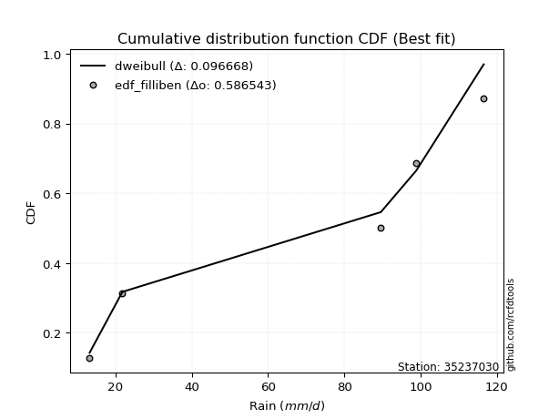</img></img>

</div>


### 10. EDF Jenkinson (1977)

The Jenkinson formula in hydrology is an empirical plotting position formula used to estimate the non-exceedance probability _(P)_ or return period _(T)_ of a given ordered observation within a sample. It is a widely used method in the frequency analysis of extreme events such as floods and rainfall, as it provides a distribution-free way to plot data. _a≈0.31_ and _b≈0.38_ are constants derived to approximate the median of the probability distribution for the given rank.

<div align="center">


$P=(m-a)/(n+b)$


</div>


**10.1. Empirical values**

<div align="center">

|                | 0                   | 1                  | 2             | 3                  | 4                  |
|:---------------|:--------------------|:-------------------|:--------------|:-------------------|:-------------------|
| date           | 2019                | 2017               | 2025          | 2018               | 2024               |
| x              | 13.2                | 21.8               | 89.6          | 98.9               | 116.6              |
| m              | 1                   | 2                  | 3             | 4                  | 5                  |
| empirical_dist | edf_jenkinson       | edf_jenkinson      | edf_jenkinson | edf_jenkinson      | edf_jenkinson      |
| empirical      | 0.12825278810408922 | 0.3141263940520446 | 0.5           | 0.6858736059479554 | 0.8717472118959109 |
| empirical_tr   | 1.1471215351812367  | 1.4579945799457996 | 2.0           | 3.183431952662722  | 7.797101449275368  |

</div>


**10.2. Kolmogorov-Smirnov fit test (sorted by Δ)**


<div align="center">

|                | 0                   | 1                   | 2                   | 3                   | 4                  | 5                   | 6                   | 7                   | 8                   | 9                  | 10                  | 11                 | 12                  | 13                 | 14                  | 15                  | 16                  | 17                 | 18                 | 19                  | 20                  | 21                  | 22                  | 23                  | 24                  | 25                  | 26                  | 27                  | 28                  | 29                 | 30                  | 31                  | 32                  | 33                  | 34                  | 35                 | 36                  | 37                  | 38                  | 39                  | 40                  | 41                 | 42                  | 43                  | 44                  | 45                  | 46                  | 47                  | 48                  | 49                 | 50                 | 51                  | 52                 | 53                 | 54                  | 55                  | 56                  | 57                  | 58                  | 59                  | 60                  | 61                  | 62                  | 63                  | 64                  | 65                  | 66                 | 67                  | 68                  | 69                  | 70                 | 71                  | 72                  | 73                  | 74                  | 75                  | 76                  | 77                  | 78                  | 79                  | 80                 | 81                  | 82                  | 83                  | 84                  | 85                  | 86                 | 87                 | 88                 | 89                  | 90                  | 91                 | 92                 | 93                 | 94                 | 95                 | 96                 | 97                  | 98                 | 99                  | 100                 | 101                | 102                | 103                | 104                 | 105                 | 106                | 107                 | 108                | 109                | 110                | 111                 | 112                | 113                 | 114                 | 115                 | 116                | 117                 | 118                | 119                | 120                | 121                | 122                 | 123                | 124                | 125                | 126                 | 127                | 128                 | 129                 | 130                | 131                 | 132                 | 133                | 134                 | 135                | 136                | 137                 | 138                | 139                 | 140                | 141                 | 142                | 143                | 144                 | 145                | 146                 | 147                | 148                 | 149                | 150                | 151                 | 152                | 153                | 154                | 155                | 156                | 157                | 158                | 159                |
|:---------------|:--------------------|:--------------------|:--------------------|:--------------------|:-------------------|:--------------------|:--------------------|:--------------------|:--------------------|:-------------------|:--------------------|:-------------------|:--------------------|:-------------------|:--------------------|:--------------------|:--------------------|:-------------------|:-------------------|:--------------------|:--------------------|:--------------------|:--------------------|:--------------------|:--------------------|:--------------------|:--------------------|:--------------------|:--------------------|:-------------------|:--------------------|:--------------------|:--------------------|:--------------------|:--------------------|:-------------------|:--------------------|:--------------------|:--------------------|:--------------------|:--------------------|:-------------------|:--------------------|:--------------------|:--------------------|:--------------------|:--------------------|:--------------------|:--------------------|:-------------------|:-------------------|:--------------------|:-------------------|:-------------------|:--------------------|:--------------------|:--------------------|:--------------------|:--------------------|:--------------------|:--------------------|:--------------------|:--------------------|:--------------------|:--------------------|:--------------------|:-------------------|:--------------------|:--------------------|:--------------------|:-------------------|:--------------------|:--------------------|:--------------------|:--------------------|:--------------------|:--------------------|:--------------------|:--------------------|:--------------------|:-------------------|:--------------------|:--------------------|:--------------------|:--------------------|:--------------------|:-------------------|:-------------------|:-------------------|:--------------------|:--------------------|:-------------------|:-------------------|:-------------------|:-------------------|:-------------------|:-------------------|:--------------------|:-------------------|:--------------------|:--------------------|:-------------------|:-------------------|:-------------------|:--------------------|:--------------------|:-------------------|:--------------------|:-------------------|:-------------------|:-------------------|:--------------------|:-------------------|:--------------------|:--------------------|:--------------------|:-------------------|:--------------------|:-------------------|:-------------------|:-------------------|:-------------------|:--------------------|:-------------------|:-------------------|:-------------------|:--------------------|:-------------------|:--------------------|:--------------------|:-------------------|:--------------------|:--------------------|:-------------------|:--------------------|:-------------------|:-------------------|:--------------------|:-------------------|:--------------------|:-------------------|:--------------------|:-------------------|:-------------------|:--------------------|:-------------------|:--------------------|:-------------------|:--------------------|:-------------------|:-------------------|:--------------------|:-------------------|:-------------------|:-------------------|:-------------------|:-------------------|:-------------------|:-------------------|:-------------------|
| station        | 35237030            | 35237030            | 35237030            | 35237030            | 35237030           | 35237030            | 35237030            | 35237030            | 35237030            | 35237030           | 35237030            | 35237030           | 35237030            | 35237030           | 35237030            | 35237030            | 35237030            | 35237030           | 35237030           | 35237030            | 35237030            | 35237030            | 35237030            | 35237030            | 35237030            | 35237030            | 35237030            | 35237030            | 35237030            | 35237030           | 35237030            | 35237030            | 35237030            | 35237030            | 35237030            | 35237030           | 35237030            | 35237030            | 35237030            | 35237030            | 35237030            | 35237030           | 35237030            | 35237030            | 35237030            | 35237030            | 35237030            | 35237030            | 35237030            | 35237030           | 35237030           | 35237030            | 35237030           | 35237030           | 35237030            | 35237030            | 35237030            | 35237030            | 35237030            | 35237030            | 35237030            | 35237030            | 35237030            | 35237030            | 35237030            | 35237030            | 35237030           | 35237030            | 35237030            | 35237030            | 35237030           | 35237030            | 35237030            | 35237030            | 35237030            | 35237030            | 35237030            | 35237030            | 35237030            | 35237030            | 35237030           | 35237030            | 35237030            | 35237030            | 35237030            | 35237030            | 35237030           | 35237030           | 35237030           | 35237030            | 35237030            | 35237030           | 35237030           | 35237030           | 35237030           | 35237030           | 35237030           | 35237030            | 35237030           | 35237030            | 35237030            | 35237030           | 35237030           | 35237030           | 35237030            | 35237030            | 35237030           | 35237030            | 35237030           | 35237030           | 35237030           | 35237030            | 35237030           | 35237030            | 35237030            | 35237030            | 35237030           | 35237030            | 35237030           | 35237030           | 35237030           | 35237030           | 35237030            | 35237030           | 35237030           | 35237030           | 35237030            | 35237030           | 35237030            | 35237030            | 35237030           | 35237030            | 35237030            | 35237030           | 35237030            | 35237030           | 35237030           | 35237030            | 35237030           | 35237030            | 35237030           | 35237030            | 35237030           | 35237030           | 35237030            | 35237030           | 35237030            | 35237030           | 35237030            | 35237030           | 35237030           | 35237030            | 35237030           | 35237030           | 35237030           | 35237030           | 35237030           | 35237030           | 35237030           | 35237030           |
| empirical_dist | edf_jenkinson       | edf_jenkinson       | edf_jenkinson       | edf_jenkinson       | edf_jenkinson      | edf_jenkinson       | edf_jenkinson       | edf_jenkinson       | edf_jenkinson       | edf_jenkinson      | edf_jenkinson       | edf_jenkinson      | edf_jenkinson       | edf_jenkinson      | edf_jenkinson       | edf_jenkinson       | edf_jenkinson       | edf_jenkinson      | edf_jenkinson      | edf_jenkinson       | edf_jenkinson       | edf_jenkinson       | edf_jenkinson       | edf_jenkinson       | edf_jenkinson       | edf_jenkinson       | edf_jenkinson       | edf_jenkinson       | edf_jenkinson       | edf_jenkinson      | edf_jenkinson       | edf_jenkinson       | edf_jenkinson       | edf_jenkinson       | edf_jenkinson       | edf_jenkinson      | edf_jenkinson       | edf_jenkinson       | edf_jenkinson       | edf_jenkinson       | edf_jenkinson       | edf_jenkinson      | edf_jenkinson       | edf_jenkinson       | edf_jenkinson       | edf_jenkinson       | edf_jenkinson       | edf_jenkinson       | edf_jenkinson       | edf_jenkinson      | edf_jenkinson      | edf_jenkinson       | edf_jenkinson      | edf_jenkinson      | edf_jenkinson       | edf_jenkinson       | edf_jenkinson       | edf_jenkinson       | edf_jenkinson       | edf_jenkinson       | edf_jenkinson       | edf_jenkinson       | edf_jenkinson       | edf_jenkinson       | edf_jenkinson       | edf_jenkinson       | edf_jenkinson      | edf_jenkinson       | edf_jenkinson       | edf_jenkinson       | edf_jenkinson      | edf_jenkinson       | edf_jenkinson       | edf_jenkinson       | edf_jenkinson       | edf_jenkinson       | edf_jenkinson       | edf_jenkinson       | edf_jenkinson       | edf_jenkinson       | edf_jenkinson      | edf_jenkinson       | edf_jenkinson       | edf_jenkinson       | edf_jenkinson       | edf_jenkinson       | edf_jenkinson      | edf_jenkinson      | edf_jenkinson      | edf_jenkinson       | edf_jenkinson       | edf_jenkinson      | edf_jenkinson      | edf_jenkinson      | edf_jenkinson      | edf_jenkinson      | edf_jenkinson      | edf_jenkinson       | edf_jenkinson      | edf_jenkinson       | edf_jenkinson       | edf_jenkinson      | edf_jenkinson      | edf_jenkinson      | edf_jenkinson       | edf_jenkinson       | edf_jenkinson      | edf_jenkinson       | edf_jenkinson      | edf_jenkinson      | edf_jenkinson      | edf_jenkinson       | edf_jenkinson      | edf_jenkinson       | edf_jenkinson       | edf_jenkinson       | edf_jenkinson      | edf_jenkinson       | edf_jenkinson      | edf_jenkinson      | edf_jenkinson      | edf_jenkinson      | edf_jenkinson       | edf_jenkinson      | edf_jenkinson      | edf_jenkinson      | edf_jenkinson       | edf_jenkinson      | edf_jenkinson       | edf_jenkinson       | edf_jenkinson      | edf_jenkinson       | edf_jenkinson       | edf_jenkinson      | edf_jenkinson       | edf_jenkinson      | edf_jenkinson      | edf_jenkinson       | edf_jenkinson      | edf_jenkinson       | edf_jenkinson      | edf_jenkinson       | edf_jenkinson      | edf_jenkinson      | edf_jenkinson       | edf_jenkinson      | edf_jenkinson       | edf_jenkinson      | edf_jenkinson       | edf_jenkinson      | edf_jenkinson      | edf_jenkinson       | edf_jenkinson      | edf_jenkinson      | edf_jenkinson      | edf_jenkinson      | edf_jenkinson      | edf_jenkinson      | edf_jenkinson      | edf_jenkinson      |
| p_dist         | dweibull            | dgamma              | loglevy_l           | arcsine             | wrapcauchy         | genextreme          | logweibull_max      | levy_l              | trapezoid           | ksone              | rdist               | johnsonsu          | logarcsine          | genhalflogistic    | loggenextreme       | semicircular        | anglit              | skewnorm           | logtrapezoid       | logkappa3           | pearson3            | gumbel_l            | weibull_min         | logksone            | exponnorm           | truncnorm           | norm                | crystalball         | t                   | lomax              | erlang              | foldnorm            | gamma               | rice                | logsemicircular     | triang             | argus               | logwrapcauchy       | maxwell             | cosine              | beta                | logistic           | rayleigh            | loganglit           | invweibull          | logbeta             | invgamma            | loggennorm          | genpareto           | logweibull_min     | halfnorm           | logloggamma         | logburr12          | tukeylambda        | hypsecant           | loggumbel_l         | logpearson3         | logmielke           | betaprime           | gompertz            | kstwobign           | kappa3              | uniform             | vonmises_line       | gennorm             | loginvweibull       | genexpon           | logargus            | burr                | mielke              | lognct             | logbetaprime        | logalpha            | logexponnorm        | logcrystalball      | lognorm             | logt                | gumbel_r            | logf                | logfatiguelife      | logloglaplace      | loginvgamma         | loggamma            | loggamma            | logerlang           | bradford            | logfoldnorm        | loggompertz        | logrice            | loginvgauss         | logncf              | halfgennorm        | ncf                | logmaxwell         | gausshyper         | laplace            | lograyleigh        | kappa4              | halflogistic       | loggenexpon         | nct                 | logdgamma          | logdweibull        | moyal              | burr12              | logkstwobign        | loghalfnorm        | loglogistic         | logburr            | invgauss           | loggenhalflogistic | logcosine           | alpha              | loghypsecant        | loggumbel_r         | logrdist            | loghalflogistic    | logmoyal            | nakagami           | loglaplace         | loglaplace         | wald               | f                   | loggenpareto       | truncweibull_min   | logtriang          | truncexpon          | logskewnorm        | exponpow            | logexponweib        | gengamma           | logwald             | logexponpow         | loghalfgennorm     | lognakagami         | logkappa4          | loggausshyper      | logtukeylambda      | logvonmises_line   | loguniform          | logbradford        | exponweib           | logjohnsonsb       | fatiguelife        | logtruncnorm        | loglomax           | logtruncexpon       | johnsonsb          | logtruncweibull_min | powerlaw           | loggengamma        | truncpareto         | logpowerlaw        | logtruncpareto     | weibull_max        | logjohnsonsu       | genlogistic        | loggenlogistic     | logvonmises        | vonmises           |
| delta          | 0.09770772992821164 | 0.10384520602916814 | 0.10814522191320808 | 0.11765316707457174 | 0.1282527314349351 | 0.12825278810396668 | 0.13122688881815248 | 0.13684349418981256 | 0.14230884509134611 | 0.1474835977526442 | 0.14858063645821323 | 0.1505126620336461 | 0.15572263742832482 | 0.1578890888560407 | 0.15860388931579517 | 0.16083755944055622 | 0.17111276072342152 | 0.1749410198006891 | 0.1778396741353312 | 0.18080239451045388 | 0.18275116488252208 | 0.18524098167123776 | 0.18686755266277483 | 0.19184835569019387 | 0.19528842098517463 | 0.19528880513868718 | 0.19528881838227008 | 0.19528882254432156 | 0.19532658830951433 | 0.1973696897809354 | 0.19820987027509207 | 0.19864278623423604 | 0.20013757920918684 | 0.20739959720444812 | 0.20758291196486978 | 0.2096744112792217 | 0.20972286950017843 | 0.21089914395072573 | 0.21177286227506897 | 0.21405493508666573 | 0.21472813889652165 | 0.2163985572641396 | 0.21660316392863654 | 0.21944060317249903 | 0.21979904044317244 | 0.22030268521751595 | 0.22043883828647237 | 0.22331805470723975 | 0.22380340417707473 | 0.2297021895432989 | 0.2312125449028506 | 0.23134024592139157 | 0.2314191126761722 | 0.2316439850228349 | 0.23175671275753007 | 0.23198717058462837 | 0.23327450973398212 | 0.23444931750161857 | 0.23498460239028918 | 0.23651026131467096 | 0.23654064784009476 | 0.23851584640840018 | 0.23887814313346223 | 0.24013081426634952 | 0.24267499970331843 | 0.24369345700598977 | 0.2455947246998047 | 0.24564441597490605 | 0.24606705880733415 | 0.24653181542497815 | 0.2465556561134179 | 0.24657570192592582 | 0.24662475545867957 | 0.24683862467492057 | 0.24684101988853913 | 0.24684112095348676 | 0.24684144994180857 | 0.24708816023696956 | 0.24757125449179007 | 0.24761411975767178 | 0.2486512781065262 | 0.24985238564088097 | 0.25014370806045827 | 0.25014370806045827 | 0.25068244792487193 | 0.25071985057621937 | 0.2510692552160756 | 0.2515976086412205 | 0.2516394061232252 | 0.25173835840561254 | 0.25202729282303804 | 0.2528654685535594 | 0.2554911841554507 | 0.2568411281619507 | 0.2571419081941321 | 0.2572361940743363 | 0.2596992861869577 | 0.26090929945418695 | 0.2609622917619014 | 0.26192029446542275 | 0.26278453411152314 | 0.2628034442674357 | 0.2633430786148462 | 0.2638734963948466 | 0.26428164299192336 | 0.26553648781344275 | 0.2692734123676309 | 0.26948734953999187 | 0.2717277209299601 | 0.2731217363384312 | 0.273602045196369  | 0.27531526615674007 | 0.281259511161727  | 0.28449252704767003 | 0.28709168172178967 | 0.29279087647817703 | 0.2938659440057185 | 0.30006886974045677 | 0.3031741829146174 | 0.3046589628322961 | 0.3046589628322961 | 0.3141263940520446 | 0.31517275752934515 | 0.3168199050745071 | 0.3200527238012978 | 0.3221626715232293 | 0.32667776299703766 | 0.3314130654136327 | 0.33151806835525266 | 0.33310772364811536 | 0.3364222633896544 | 0.34047062942532047 | 0.35241600086848135 | 0.3564088356588204 | 0.36104438090408575 | 0.3615407729017234 | 0.3633510172687281 | 0.36817664372431835 | 0.3788208392815442 | 0.37909569369886964 | 0.3805614344924392 | 0.38201014592718163 | 0.3969900895482158 | 0.4001064958842936 | 0.40406046563635956 | 0.4098809112614119 | 0.41470152945423133 | 0.4152886800983051 | 0.4359889579138204  | 0.4642638349263478 | 0.4715590545243079 | 0.47367569357681205 | 0.5093590483328287 | 0.5250117901564992 | 0.5342339735001047 | 0.5987085198647659 | 0.6858736059479554 | 0.6858736059479554 | 1.2225381925380698 | 17.797932528121535 |
| deltao         | 0.5865427407550001  | 0.5865427407550001  | 0.5865427407550001  | 0.5865427407550001  | 0.5865427407550001 | 0.5865427407550001  | 0.5865427407550001  | 0.5865427407550001  | 0.5865427407550001  | 0.5865427407550001 | 0.5865427407550001  | 0.5865427407550001 | 0.5865427407550001  | 0.5865427407550001 | 0.5865427407550001  | 0.5865427407550001  | 0.5865427407550001  | 0.5865427407550001 | 0.5865427407550001 | 0.5865427407550001  | 0.5865427407550001  | 0.5865427407550001  | 0.5865427407550001  | 0.5865427407550001  | 0.5865427407550001  | 0.5865427407550001  | 0.5865427407550001  | 0.5865427407550001  | 0.5865427407550001  | 0.5865427407550001 | 0.5865427407550001  | 0.5865427407550001  | 0.5865427407550001  | 0.5865427407550001  | 0.5865427407550001  | 0.5865427407550001 | 0.5865427407550001  | 0.5865427407550001  | 0.5865427407550001  | 0.5865427407550001  | 0.5865427407550001  | 0.5865427407550001 | 0.5865427407550001  | 0.5865427407550001  | 0.5865427407550001  | 0.5865427407550001  | 0.5865427407550001  | 0.5865427407550001  | 0.5865427407550001  | 0.5865427407550001 | 0.5865427407550001 | 0.5865427407550001  | 0.5865427407550001 | 0.5865427407550001 | 0.5865427407550001  | 0.5865427407550001  | 0.5865427407550001  | 0.5865427407550001  | 0.5865427407550001  | 0.5865427407550001  | 0.5865427407550001  | 0.5865427407550001  | 0.5865427407550001  | 0.5865427407550001  | 0.5865427407550001  | 0.5865427407550001  | 0.5865427407550001 | 0.5865427407550001  | 0.5865427407550001  | 0.5865427407550001  | 0.5865427407550001 | 0.5865427407550001  | 0.5865427407550001  | 0.5865427407550001  | 0.5865427407550001  | 0.5865427407550001  | 0.5865427407550001  | 0.5865427407550001  | 0.5865427407550001  | 0.5865427407550001  | 0.5865427407550001 | 0.5865427407550001  | 0.5865427407550001  | 0.5865427407550001  | 0.5865427407550001  | 0.5865427407550001  | 0.5865427407550001 | 0.5865427407550001 | 0.5865427407550001 | 0.5865427407550001  | 0.5865427407550001  | 0.5865427407550001 | 0.5865427407550001 | 0.5865427407550001 | 0.5865427407550001 | 0.5865427407550001 | 0.5865427407550001 | 0.5865427407550001  | 0.5865427407550001 | 0.5865427407550001  | 0.5865427407550001  | 0.5865427407550001 | 0.5865427407550001 | 0.5865427407550001 | 0.5865427407550001  | 0.5865427407550001  | 0.5865427407550001 | 0.5865427407550001  | 0.5865427407550001 | 0.5865427407550001 | 0.5865427407550001 | 0.5865427407550001  | 0.5865427407550001 | 0.5865427407550001  | 0.5865427407550001  | 0.5865427407550001  | 0.5865427407550001 | 0.5865427407550001  | 0.5865427407550001 | 0.5865427407550001 | 0.5865427407550001 | 0.5865427407550001 | 0.5865427407550001  | 0.5865427407550001 | 0.5865427407550001 | 0.5865427407550001 | 0.5865427407550001  | 0.5865427407550001 | 0.5865427407550001  | 0.5865427407550001  | 0.5865427407550001 | 0.5865427407550001  | 0.5865427407550001  | 0.5865427407550001 | 0.5865427407550001  | 0.5865427407550001 | 0.5865427407550001 | 0.5865427407550001  | 0.5865427407550001 | 0.5865427407550001  | 0.5865427407550001 | 0.5865427407550001  | 0.5865427407550001 | 0.5865427407550001 | 0.5865427407550001  | 0.5865427407550001 | 0.5865427407550001  | 0.5865427407550001 | 0.5865427407550001  | 0.5865427407550001 | 0.5865427407550001 | 0.5865427407550001  | 0.5865427407550001 | 0.5865427407550001 | 0.5865427407550001 | 0.5865427407550001 | 0.5865427407550001 | 0.5865427407550001 | 0.5865427407550001 | 0.5865427407550001 |
| eval           | Δo > Δ              | Δo > Δ              | Δo > Δ              | Δo > Δ              | Δo > Δ             | Δo > Δ              | Δo > Δ              | Δo > Δ              | Δo > Δ              | Δo > Δ             | Δo > Δ              | Δo > Δ             | Δo > Δ              | Δo > Δ             | Δo > Δ              | Δo > Δ              | Δo > Δ              | Δo > Δ             | Δo > Δ             | Δo > Δ              | Δo > Δ              | Δo > Δ              | Δo > Δ              | Δo > Δ              | Δo > Δ              | Δo > Δ              | Δo > Δ              | Δo > Δ              | Δo > Δ              | Δo > Δ             | Δo > Δ              | Δo > Δ              | Δo > Δ              | Δo > Δ              | Δo > Δ              | Δo > Δ             | Δo > Δ              | Δo > Δ              | Δo > Δ              | Δo > Δ              | Δo > Δ              | Δo > Δ             | Δo > Δ              | Δo > Δ              | Δo > Δ              | Δo > Δ              | Δo > Δ              | Δo > Δ              | Δo > Δ              | Δo > Δ             | Δo > Δ             | Δo > Δ              | Δo > Δ             | Δo > Δ             | Δo > Δ              | Δo > Δ              | Δo > Δ              | Δo > Δ              | Δo > Δ              | Δo > Δ              | Δo > Δ              | Δo > Δ              | Δo > Δ              | Δo > Δ              | Δo > Δ              | Δo > Δ              | Δo > Δ             | Δo > Δ              | Δo > Δ              | Δo > Δ              | Δo > Δ             | Δo > Δ              | Δo > Δ              | Δo > Δ              | Δo > Δ              | Δo > Δ              | Δo > Δ              | Δo > Δ              | Δo > Δ              | Δo > Δ              | Δo > Δ             | Δo > Δ              | Δo > Δ              | Δo > Δ              | Δo > Δ              | Δo > Δ              | Δo > Δ             | Δo > Δ             | Δo > Δ             | Δo > Δ              | Δo > Δ              | Δo > Δ             | Δo > Δ             | Δo > Δ             | Δo > Δ             | Δo > Δ             | Δo > Δ             | Δo > Δ              | Δo > Δ             | Δo > Δ              | Δo > Δ              | Δo > Δ             | Δo > Δ             | Δo > Δ             | Δo > Δ              | Δo > Δ              | Δo > Δ             | Δo > Δ              | Δo > Δ             | Δo > Δ             | Δo > Δ             | Δo > Δ              | Δo > Δ             | Δo > Δ              | Δo > Δ              | Δo > Δ              | Δo > Δ             | Δo > Δ              | Δo > Δ             | Δo > Δ             | Δo > Δ             | Δo > Δ             | Δo > Δ              | Δo > Δ             | Δo > Δ             | Δo > Δ             | Δo > Δ              | Δo > Δ             | Δo > Δ              | Δo > Δ              | Δo > Δ             | Δo > Δ              | Δo > Δ              | Δo > Δ             | Δo > Δ              | Δo > Δ             | Δo > Δ             | Δo > Δ              | Δo > Δ             | Δo > Δ              | Δo > Δ             | Δo > Δ              | Δo > Δ             | Δo > Δ             | Δo > Δ              | Δo > Δ             | Δo > Δ              | Δo > Δ             | Δo > Δ              | Δo > Δ             | Δo > Δ             | Δo > Δ              | Δo > Δ             | Δo > Δ             | Δo > Δ             | Δo <= Δ            | Δo <= Δ            | Δo <= Δ            | Δo <= Δ            | Δo <= Δ            |
| fit            | 1                   | 1                   | 1                   | 1                   | 1                  | 1                   | 1                   | 1                   | 1                   | 1                  | 1                   | 1                  | 1                   | 1                  | 1                   | 1                   | 1                   | 1                  | 1                  | 1                   | 1                   | 1                   | 1                   | 1                   | 1                   | 1                   | 1                   | 1                   | 1                   | 1                  | 1                   | 1                   | 1                   | 1                   | 1                   | 1                  | 1                   | 1                   | 1                   | 1                   | 1                   | 1                  | 1                   | 1                   | 1                   | 1                   | 1                   | 1                   | 1                   | 1                  | 1                  | 1                   | 1                  | 1                  | 1                   | 1                   | 1                   | 1                   | 1                   | 1                   | 1                   | 1                   | 1                   | 1                   | 1                   | 1                   | 1                  | 1                   | 1                   | 1                   | 1                  | 1                   | 1                   | 1                   | 1                   | 1                   | 1                   | 1                   | 1                   | 1                   | 1                  | 1                   | 1                   | 1                   | 1                   | 1                   | 1                  | 1                  | 1                  | 1                   | 1                   | 1                  | 1                  | 1                  | 1                  | 1                  | 1                  | 1                   | 1                  | 1                   | 1                   | 1                  | 1                  | 1                  | 1                   | 1                   | 1                  | 1                   | 1                  | 1                  | 1                  | 1                   | 1                  | 1                   | 1                   | 1                   | 1                  | 1                   | 1                  | 1                  | 1                  | 1                  | 1                   | 1                  | 1                  | 1                  | 1                   | 1                  | 1                   | 1                   | 1                  | 1                   | 1                   | 1                  | 1                   | 1                  | 1                  | 1                   | 1                  | 1                   | 1                  | 1                   | 1                  | 1                  | 1                   | 1                  | 1                   | 1                  | 1                   | 1                  | 1                  | 1                   | 1                  | 1                  | 1                  | 0                  | 0                  | 0                  | 0                  | 0                  |
| n              | 5                   | 5                   | 5                   | 5                   | 5                  | 5                   | 5                   | 5                   | 5                   | 5                  | 5                   | 5                  | 5                   | 5                  | 5                   | 5                   | 5                   | 5                  | 5                  | 5                   | 5                   | 5                   | 5                   | 5                   | 5                   | 5                   | 5                   | 5                   | 5                   | 5                  | 5                   | 5                   | 5                   | 5                   | 5                   | 5                  | 5                   | 5                   | 5                   | 5                   | 5                   | 5                  | 5                   | 5                   | 5                   | 5                   | 5                   | 5                   | 5                   | 5                  | 5                  | 5                   | 5                  | 5                  | 5                   | 5                   | 5                   | 5                   | 5                   | 5                   | 5                   | 5                   | 5                   | 5                   | 5                   | 5                   | 5                  | 5                   | 5                   | 5                   | 5                  | 5                   | 5                   | 5                   | 5                   | 5                   | 5                   | 5                   | 5                   | 5                   | 5                  | 5                   | 5                   | 5                   | 5                   | 5                   | 5                  | 5                  | 5                  | 5                   | 5                   | 5                  | 5                  | 5                  | 5                  | 5                  | 5                  | 5                   | 5                  | 5                   | 5                   | 5                  | 5                  | 5                  | 5                   | 5                   | 5                  | 5                   | 5                  | 5                  | 5                  | 5                   | 5                  | 5                   | 5                   | 5                   | 5                  | 5                   | 5                  | 5                  | 5                  | 5                  | 5                   | 5                  | 5                  | 5                  | 5                   | 5                  | 5                   | 5                   | 5                  | 5                   | 5                   | 5                  | 5                   | 5                  | 5                  | 5                   | 5                  | 5                   | 5                  | 5                   | 5                  | 5                  | 5                   | 5                  | 5                   | 5                  | 5                   | 5                  | 5                  | 5                   | 5                  | 5                  | 5                  | 5                  | 5                  | 5                  | 5                  | 5                  |
| best_fit       | 1                   | 0                   | 0                   | 0                   | 0                  | 0                   | 0                   | 0                   | 0                   | 0                  | 0                   | 0                  | 0                   | 0                  | 0                   | 0                   | 0                   | 0                  | 0                  | 0                   | 0                   | 0                   | 0                   | 0                   | 0                   | 0                   | 0                   | 0                   | 0                   | 0                  | 0                   | 0                   | 0                   | 0                   | 0                   | 0                  | 0                   | 0                   | 0                   | 0                   | 0                   | 0                  | 0                   | 0                   | 0                   | 0                   | 0                   | 0                   | 0                   | 0                  | 0                  | 0                   | 0                  | 0                  | 0                   | 0                   | 0                   | 0                   | 0                   | 0                   | 0                   | 0                   | 0                   | 0                   | 0                   | 0                   | 0                  | 0                   | 0                   | 0                   | 0                  | 0                   | 0                   | 0                   | 0                   | 0                   | 0                   | 0                   | 0                   | 0                   | 0                  | 0                   | 0                   | 0                   | 0                   | 0                   | 0                  | 0                  | 0                  | 0                   | 0                   | 0                  | 0                  | 0                  | 0                  | 0                  | 0                  | 0                   | 0                  | 0                   | 0                   | 0                  | 0                  | 0                  | 0                   | 0                   | 0                  | 0                   | 0                  | 0                  | 0                  | 0                   | 0                  | 0                   | 0                   | 0                   | 0                  | 0                   | 0                  | 0                  | 0                  | 0                  | 0                   | 0                  | 0                  | 0                  | 0                   | 0                  | 0                   | 0                   | 0                  | 0                   | 0                   | 0                  | 0                   | 0                  | 0                  | 0                   | 0                  | 0                   | 0                  | 0                   | 0                  | 0                  | 0                   | 0                  | 0                   | 0                  | 0                   | 0                  | 0                  | 0                   | 0                  | 0                  | 0                  | 0                  | 0                  | 0                  | 0                  | 0                  |
| best_fit_sort  | 1                   | 2                   | 3                   | 4                   | 5                  | 6                   | 7                   | 8                   | 9                   | 10                 | 11                  | 12                 | 13                  | 14                 | 15                  | 16                  | 17                  | 18                 | 19                 | 20                  | 21                  | 22                  | 23                  | 24                  | 25                  | 26                  | 27                  | 28                  | 29                  | 30                 | 31                  | 32                  | 33                  | 34                  | 35                  | 36                 | 37                  | 38                  | 39                  | 40                  | 41                  | 42                 | 43                  | 44                  | 45                  | 46                  | 47                  | 48                  | 49                  | 50                 | 51                 | 52                  | 53                 | 54                 | 55                  | 56                  | 57                  | 58                  | 59                  | 60                  | 61                  | 62                  | 63                  | 64                  | 65                  | 66                  | 67                 | 68                  | 69                  | 70                  | 71                 | 72                  | 73                  | 74                  | 75                  | 76                  | 77                  | 78                  | 79                  | 80                  | 81                 | 82                  | 83                  | 84                  | 85                  | 86                  | 87                 | 88                 | 89                 | 90                  | 91                  | 92                 | 93                 | 94                 | 95                 | 96                 | 97                 | 98                  | 99                 | 100                 | 101                 | 102                | 103                | 104                | 105                 | 106                 | 107                | 108                 | 109                | 110                | 111                | 112                 | 113                | 114                 | 115                 | 116                 | 117                | 118                 | 119                | 120                | 121                | 122                | 123                 | 124                | 125                | 126                | 127                 | 128                | 129                 | 130                 | 131                | 132                 | 133                 | 134                | 135                 | 136                | 137                | 138                 | 139                | 140                 | 141                | 142                 | 143                | 144                | 145                 | 146                | 147                 | 148                | 149                 | 150                | 151                | 152                 | 153                | 154                | 155                | 156                | 157                | 158                | 159                | 160                |

</div>


**10.3. Best fit**

<div align="center">

|   id |   station | empirical_dist   | p_dist   |     delta |   deltao | eval   |   fit |   n |   best_fit |   best_fit_sort |
|-----:|----------:|:-----------------|:---------|----------:|---------:|:-------|------:|----:|-----------:|----------------:|
|    0 |  35237030 | edf_jenkinson    | dweibull | 0.0977077 | 0.586543 | Δo > Δ |     1 |   5 |          1 |               1 |

</div>


<div align="center">

</img>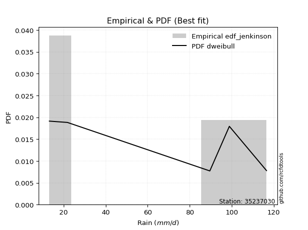</img>

</div>


### 11. EDF Cunnane (1978)

Cunnane´s work in statistical hydrology has focused on the performance and evaluation of different probability distributions (such as GEV, Gumbel, Lognormal) for flood frequency estimation. _b_ is a constant, typically set to 0.4.

<div align="center">


$P=(m-b)/(n+1-2b)$


</div>


**11.1. Empirical values**

<div align="center">

|                | 0                   | 1                  | 2           | 3                  | 4                  |
|:---------------|:--------------------|:-------------------|:------------|:-------------------|:-------------------|
| date           | 2019                | 2017               | 2025        | 2018               | 2024               |
| x              | 13.2                | 21.8               | 89.6        | 98.9               | 116.6              |
| m              | 1                   | 2                  | 3           | 4                  | 5                  |
| empirical_dist | edf_cunnane         | edf_cunnane        | edf_cunnane | edf_cunnane        | edf_cunnane        |
| empirical      | 0.11538461538461538 | 0.3076923076923077 | 0.5         | 0.6923076923076923 | 0.8846153846153845 |
| empirical_tr   | 1.1304347826086958  | 1.4444444444444444 | 2.0         | 3.25               | 8.666666666666655  |

</div>


**11.2. Kolmogorov-Smirnov fit test (sorted by Δ)**


<div align="center">

|                | 0                   | 1                   | 2                   | 3                  | 4                   | 5                   | 6                   | 7                   | 8                   | 9                  | 10                 | 11                 | 12                  | 13                 | 14                  | 15                  | 16                  | 17                 | 18                 | 19                  | 20                  | 21                  | 22                  | 23                  | 24                  | 25                  | 26                  | 27                  | 28                  | 29                 | 30                  | 31                  | 32                  | 33                  | 34                  | 35                  | 36                  | 37                 | 38                  | 39                  | 40                  | 41                  | 42                 | 43                  | 44                  | 45                  | 46                  | 47                  | 48                 | 49                  | 50                 | 51                  | 52                 | 53                 | 54                  | 55                  | 56                  | 57                  | 58                  | 59                  | 60                  | 61                  | 62                  | 63                  | 64                  | 65                  | 66                 | 67                  | 68                  | 69                  | 70                 | 71                  | 72                  | 73                  | 74                  | 75                  | 76                  | 77                  | 78                  | 79                  | 80                  | 81                  | 82                  | 83                  | 84                  | 85                 | 86                 | 87                 | 88                  | 89                  | 90                 | 91                 | 92                 | 93                 | 94                 | 95                  | 96                 | 97                 | 98                  | 99                 | 100                 | 101                 | 102                | 103                 | 104                 | 105                | 106                 | 107                | 108                | 109                | 110                 | 111                | 112                | 113                 | 114                 | 115                 | 116                | 117                 | 118                | 119                | 120                | 121                 | 122                 | 123                | 124                | 125                | 126                 | 127                | 128                 | 129                 | 130                | 131                 | 132                 | 133                | 134                 | 135                | 136                | 137                 | 138                | 139                 | 140                | 141                 | 142                | 143                 | 144                 | 145                 | 146                 | 147                | 148                 | 149                | 150                 | 151                | 152                | 153                | 154                | 155                | 156                | 157                | 158                | 159                |
|:---------------|:--------------------|:--------------------|:--------------------|:-------------------|:--------------------|:--------------------|:--------------------|:--------------------|:--------------------|:-------------------|:-------------------|:-------------------|:--------------------|:-------------------|:--------------------|:--------------------|:--------------------|:-------------------|:-------------------|:--------------------|:--------------------|:--------------------|:--------------------|:--------------------|:--------------------|:--------------------|:--------------------|:--------------------|:--------------------|:-------------------|:--------------------|:--------------------|:--------------------|:--------------------|:--------------------|:--------------------|:--------------------|:-------------------|:--------------------|:--------------------|:--------------------|:--------------------|:-------------------|:--------------------|:--------------------|:--------------------|:--------------------|:--------------------|:-------------------|:--------------------|:-------------------|:--------------------|:-------------------|:-------------------|:--------------------|:--------------------|:--------------------|:--------------------|:--------------------|:--------------------|:--------------------|:--------------------|:--------------------|:--------------------|:--------------------|:--------------------|:-------------------|:--------------------|:--------------------|:--------------------|:-------------------|:--------------------|:--------------------|:--------------------|:--------------------|:--------------------|:--------------------|:--------------------|:--------------------|:--------------------|:--------------------|:--------------------|:--------------------|:--------------------|:--------------------|:-------------------|:-------------------|:-------------------|:--------------------|:--------------------|:-------------------|:-------------------|:-------------------|:-------------------|:-------------------|:--------------------|:-------------------|:-------------------|:--------------------|:-------------------|:--------------------|:--------------------|:-------------------|:--------------------|:--------------------|:-------------------|:--------------------|:-------------------|:-------------------|:-------------------|:--------------------|:-------------------|:-------------------|:--------------------|:--------------------|:--------------------|:-------------------|:--------------------|:-------------------|:-------------------|:-------------------|:--------------------|:--------------------|:-------------------|:-------------------|:-------------------|:--------------------|:-------------------|:--------------------|:--------------------|:-------------------|:--------------------|:--------------------|:-------------------|:--------------------|:-------------------|:-------------------|:--------------------|:-------------------|:--------------------|:-------------------|:--------------------|:-------------------|:--------------------|:--------------------|:--------------------|:--------------------|:-------------------|:--------------------|:-------------------|:--------------------|:-------------------|:-------------------|:-------------------|:-------------------|:-------------------|:-------------------|:-------------------|:-------------------|:-------------------|
| station        | 35237030            | 35237030            | 35237030            | 35237030           | 35237030            | 35237030            | 35237030            | 35237030            | 35237030            | 35237030           | 35237030           | 35237030           | 35237030            | 35237030           | 35237030            | 35237030            | 35237030            | 35237030           | 35237030           | 35237030            | 35237030            | 35237030            | 35237030            | 35237030            | 35237030            | 35237030            | 35237030            | 35237030            | 35237030            | 35237030           | 35237030            | 35237030            | 35237030            | 35237030            | 35237030            | 35237030            | 35237030            | 35237030           | 35237030            | 35237030            | 35237030            | 35237030            | 35237030           | 35237030            | 35237030            | 35237030            | 35237030            | 35237030            | 35237030           | 35237030            | 35237030           | 35237030            | 35237030           | 35237030           | 35237030            | 35237030            | 35237030            | 35237030            | 35237030            | 35237030            | 35237030            | 35237030            | 35237030            | 35237030            | 35237030            | 35237030            | 35237030           | 35237030            | 35237030            | 35237030            | 35237030           | 35237030            | 35237030            | 35237030            | 35237030            | 35237030            | 35237030            | 35237030            | 35237030            | 35237030            | 35237030            | 35237030            | 35237030            | 35237030            | 35237030            | 35237030           | 35237030           | 35237030           | 35237030            | 35237030            | 35237030           | 35237030           | 35237030           | 35237030           | 35237030           | 35237030            | 35237030           | 35237030           | 35237030            | 35237030           | 35237030            | 35237030            | 35237030           | 35237030            | 35237030            | 35237030           | 35237030            | 35237030           | 35237030           | 35237030           | 35237030            | 35237030           | 35237030           | 35237030            | 35237030            | 35237030            | 35237030           | 35237030            | 35237030           | 35237030           | 35237030           | 35237030            | 35237030            | 35237030           | 35237030           | 35237030           | 35237030            | 35237030           | 35237030            | 35237030            | 35237030           | 35237030            | 35237030            | 35237030           | 35237030            | 35237030           | 35237030           | 35237030            | 35237030           | 35237030            | 35237030           | 35237030            | 35237030           | 35237030            | 35237030            | 35237030            | 35237030            | 35237030           | 35237030            | 35237030           | 35237030            | 35237030           | 35237030           | 35237030           | 35237030           | 35237030           | 35237030           | 35237030           | 35237030           | 35237030           |
| empirical_dist | edf_cunnane         | edf_cunnane         | edf_cunnane         | edf_cunnane        | edf_cunnane         | edf_cunnane         | edf_cunnane         | edf_cunnane         | edf_cunnane         | edf_cunnane        | edf_cunnane        | edf_cunnane        | edf_cunnane         | edf_cunnane        | edf_cunnane         | edf_cunnane         | edf_cunnane         | edf_cunnane        | edf_cunnane        | edf_cunnane         | edf_cunnane         | edf_cunnane         | edf_cunnane         | edf_cunnane         | edf_cunnane         | edf_cunnane         | edf_cunnane         | edf_cunnane         | edf_cunnane         | edf_cunnane        | edf_cunnane         | edf_cunnane         | edf_cunnane         | edf_cunnane         | edf_cunnane         | edf_cunnane         | edf_cunnane         | edf_cunnane        | edf_cunnane         | edf_cunnane         | edf_cunnane         | edf_cunnane         | edf_cunnane        | edf_cunnane         | edf_cunnane         | edf_cunnane         | edf_cunnane         | edf_cunnane         | edf_cunnane        | edf_cunnane         | edf_cunnane        | edf_cunnane         | edf_cunnane        | edf_cunnane        | edf_cunnane         | edf_cunnane         | edf_cunnane         | edf_cunnane         | edf_cunnane         | edf_cunnane         | edf_cunnane         | edf_cunnane         | edf_cunnane         | edf_cunnane         | edf_cunnane         | edf_cunnane         | edf_cunnane        | edf_cunnane         | edf_cunnane         | edf_cunnane         | edf_cunnane        | edf_cunnane         | edf_cunnane         | edf_cunnane         | edf_cunnane         | edf_cunnane         | edf_cunnane         | edf_cunnane         | edf_cunnane         | edf_cunnane         | edf_cunnane         | edf_cunnane         | edf_cunnane         | edf_cunnane         | edf_cunnane         | edf_cunnane        | edf_cunnane        | edf_cunnane        | edf_cunnane         | edf_cunnane         | edf_cunnane        | edf_cunnane        | edf_cunnane        | edf_cunnane        | edf_cunnane        | edf_cunnane         | edf_cunnane        | edf_cunnane        | edf_cunnane         | edf_cunnane        | edf_cunnane         | edf_cunnane         | edf_cunnane        | edf_cunnane         | edf_cunnane         | edf_cunnane        | edf_cunnane         | edf_cunnane        | edf_cunnane        | edf_cunnane        | edf_cunnane         | edf_cunnane        | edf_cunnane        | edf_cunnane         | edf_cunnane         | edf_cunnane         | edf_cunnane        | edf_cunnane         | edf_cunnane        | edf_cunnane        | edf_cunnane        | edf_cunnane         | edf_cunnane         | edf_cunnane        | edf_cunnane        | edf_cunnane        | edf_cunnane         | edf_cunnane        | edf_cunnane         | edf_cunnane         | edf_cunnane        | edf_cunnane         | edf_cunnane         | edf_cunnane        | edf_cunnane         | edf_cunnane        | edf_cunnane        | edf_cunnane         | edf_cunnane        | edf_cunnane         | edf_cunnane        | edf_cunnane         | edf_cunnane        | edf_cunnane         | edf_cunnane         | edf_cunnane         | edf_cunnane         | edf_cunnane        | edf_cunnane         | edf_cunnane        | edf_cunnane         | edf_cunnane        | edf_cunnane        | edf_cunnane        | edf_cunnane        | edf_cunnane        | edf_cunnane        | edf_cunnane        | edf_cunnane        | edf_cunnane        |
| p_dist         | dweibull            | dgamma              | loglevy_l           | wrapcauchy         | genextreme          | arcsine             | logweibull_max      | rdist               | trapezoid           | johnsonsu          | levy_l             | ksone              | logarcsine          | genhalflogistic    | loggenextreme       | semicircular        | anglit              | skewnorm           | logtrapezoid       | gumbel_l            | weibull_min         | pearson3            | logksone            | logkappa3           | exponnorm           | truncnorm           | norm                | crystalball         | t                   | lomax              | erlang              | foldnorm            | gamma               | argus               | rice                | logsemicircular     | beta                | triang             | logwrapcauchy       | maxwell             | logbeta             | cosine              | logistic           | rayleigh            | genpareto           | loganglit           | invweibull          | invgamma            | logweibull_min     | gompertz            | halfnorm           | logloggamma         | logburr12          | tukeylambda        | hypsecant           | loggumbel_l         | logpearson3         | logmielke           | betaprime           | loggennorm          | gennorm             | kstwobign           | kappa3              | uniform             | vonmises_line       | loginvweibull       | genexpon           | logargus            | burr                | mielke              | lognct             | logbetaprime        | logalpha            | logexponnorm        | logcrystalball      | lognorm             | logt                | gumbel_r            | logf                | logfatiguelife      | loginvgamma         | loggamma            | loggamma            | logerlang           | bradford            | logfoldnorm        | loggompertz        | logrice            | loginvgauss         | logncf              | halfgennorm        | ncf                | logmaxwell         | gausshyper         | laplace            | logdgamma           | halflogistic       | lograyleigh        | kappa4              | logloglaplace      | loggenexpon         | nct                 | moyal              | burr12              | logkstwobign        | loghalfnorm        | loglogistic         | logburr            | invgauss           | loggenhalflogistic | logcosine           | logdweibull        | alpha              | loghypsecant        | loggumbel_r         | logrdist            | loghalflogistic    | logmoyal            | nakagami           | loglaplace         | loglaplace         | wald                | f                   | loggenpareto       | truncweibull_min   | logtriang          | truncexpon          | logskewnorm        | exponpow            | logexponweib        | gengamma           | logwald             | logexponpow         | loghalfgennorm     | lognakagami         | logkappa4          | loggausshyper      | logtukeylambda      | logvonmises_line   | loguniform          | logbradford        | exponweib           | fatiguelife        | logjohnsonsb        | logtruncnorm        | logtruncexpon       | johnsonsb           | loglomax           | logtruncweibull_min | powerlaw           | truncpareto         | loggengamma        | logpowerlaw        | logtruncpareto     | weibull_max        | logjohnsonsu       | genlogistic        | loggenlogistic     | logvonmises        | vonmises           |
| delta          | 0.08483955720873804 | 0.09097703330969453 | 0.11457930827294494 | 0.1153845587154615 | 0.11538461538449307 | 0.11765316707457174 | 0.13122688881815248 | 0.14214655009847632 | 0.14230884509134611 | 0.1440785756739092 | 0.1456024702159931 | 0.1474835977526442 | 0.15572263742832482 | 0.1578890888560407 | 0.15860388931579517 | 0.16083755944055622 | 0.17111276072342152 | 0.1749410198006891 | 0.1778396741353312 | 0.17880689531150085 | 0.18043346630303791 | 0.18275116488252208 | 0.19184835569019387 | 0.19367056722992748 | 0.19528842098517463 | 0.19528880513868718 | 0.19528881838227008 | 0.19528882254432156 | 0.19532658830951433 | 0.1973696897809354 | 0.19820987027509207 | 0.19864278623423604 | 0.20013757920918684 | 0.20328878314044152 | 0.20739959720444812 | 0.20758291196486978 | 0.20829405253678474 | 0.2096744112792217 | 0.21089914395072573 | 0.21177286227506897 | 0.21386859885777904 | 0.21405493508666573 | 0.2163985572641396 | 0.21660316392863654 | 0.21736931781733781 | 0.21944060317249903 | 0.21979904044317244 | 0.22043883828647237 | 0.2297021895432989 | 0.23007617495493404 | 0.2312125449028506 | 0.23134024592139157 | 0.2314191126761722 | 0.2316439850228349 | 0.23175671275753007 | 0.23198717058462837 | 0.23327450973398212 | 0.23444931750161857 | 0.23498460239028918 | 0.23618622742671336 | 0.23624091334358152 | 0.23654064784009476 | 0.23851584640840018 | 0.23887814313346223 | 0.24013081426634952 | 0.24369345700598977 | 0.2455947246998047 | 0.24564441597490605 | 0.24606705880733415 | 0.24653181542497815 | 0.2465556561134179 | 0.24657570192592582 | 0.24662475545867957 | 0.24683862467492057 | 0.24684101988853913 | 0.24684112095348676 | 0.24684144994180857 | 0.24708816023696956 | 0.24757125449179007 | 0.24761411975767178 | 0.24985238564088097 | 0.25014370806045827 | 0.25014370806045827 | 0.25068244792487193 | 0.25071985057621937 | 0.2510692552160756 | 0.2515976086412205 | 0.2516394061232252 | 0.25173835840561254 | 0.25202729282303804 | 0.2528654685535594 | 0.2554911841554507 | 0.2568411281619507 | 0.2571419081941321 | 0.2572361940743363 | 0.25725360622055515 | 0.2581843470177354 | 0.2596992861869577 | 0.26090929945418695 | 0.2615194508259998 | 0.26192029446542275 | 0.26278453411152314 | 0.2638734963948466 | 0.26428164299192336 | 0.26553648781344275 | 0.2692734123676309 | 0.26948734953999187 | 0.2717277209299601 | 0.2731217363384312 | 0.273602045196369  | 0.27531526615674007 | 0.2762112513343198 | 0.281259511161727  | 0.28449252704767003 | 0.28709168172178967 | 0.29279087647817703 | 0.2938659440057185 | 0.30006886974045677 | 0.3031741829146174 | 0.3046589628322961 | 0.3046589628322961 | 0.31293029418711105 | 0.31517275752934515 | 0.3168199050745071 | 0.3200527238012978 | 0.3221626715232293 | 0.32667776299703766 | 0.3314130654136327 | 0.33151806835525266 | 0.33310772364811536 | 0.3364222633896544 | 0.34047062942532047 | 0.35241600086848135 | 0.3564088356588204 | 0.36104438090408575 | 0.3615407729017234 | 0.3633510172687281 | 0.36817664372431835 | 0.3788208392815442 | 0.37909569369886964 | 0.3805614344924392 | 0.38201014592718163 | 0.4001064958842936 | 0.40342417590795265 | 0.40406046563635956 | 0.41470152945423133 | 0.42172276645804196 | 0.4227490839808855 | 0.4359889579138204  | 0.4642638349263478 | 0.47367569357681205 | 0.4844272272437815 | 0.5157931346925657 | 0.5314458765162361 | 0.5406680598598416 | 0.6051426062245027 | 0.6923076923076923 | 0.6923076923076923 | 1.2225381925380698 | 17.785064355402064 |
| deltao         | 0.5865427407550001  | 0.5865427407550001  | 0.5865427407550001  | 0.5865427407550001 | 0.5865427407550001  | 0.5865427407550001  | 0.5865427407550001  | 0.5865427407550001  | 0.5865427407550001  | 0.5865427407550001 | 0.5865427407550001 | 0.5865427407550001 | 0.5865427407550001  | 0.5865427407550001 | 0.5865427407550001  | 0.5865427407550001  | 0.5865427407550001  | 0.5865427407550001 | 0.5865427407550001 | 0.5865427407550001  | 0.5865427407550001  | 0.5865427407550001  | 0.5865427407550001  | 0.5865427407550001  | 0.5865427407550001  | 0.5865427407550001  | 0.5865427407550001  | 0.5865427407550001  | 0.5865427407550001  | 0.5865427407550001 | 0.5865427407550001  | 0.5865427407550001  | 0.5865427407550001  | 0.5865427407550001  | 0.5865427407550001  | 0.5865427407550001  | 0.5865427407550001  | 0.5865427407550001 | 0.5865427407550001  | 0.5865427407550001  | 0.5865427407550001  | 0.5865427407550001  | 0.5865427407550001 | 0.5865427407550001  | 0.5865427407550001  | 0.5865427407550001  | 0.5865427407550001  | 0.5865427407550001  | 0.5865427407550001 | 0.5865427407550001  | 0.5865427407550001 | 0.5865427407550001  | 0.5865427407550001 | 0.5865427407550001 | 0.5865427407550001  | 0.5865427407550001  | 0.5865427407550001  | 0.5865427407550001  | 0.5865427407550001  | 0.5865427407550001  | 0.5865427407550001  | 0.5865427407550001  | 0.5865427407550001  | 0.5865427407550001  | 0.5865427407550001  | 0.5865427407550001  | 0.5865427407550001 | 0.5865427407550001  | 0.5865427407550001  | 0.5865427407550001  | 0.5865427407550001 | 0.5865427407550001  | 0.5865427407550001  | 0.5865427407550001  | 0.5865427407550001  | 0.5865427407550001  | 0.5865427407550001  | 0.5865427407550001  | 0.5865427407550001  | 0.5865427407550001  | 0.5865427407550001  | 0.5865427407550001  | 0.5865427407550001  | 0.5865427407550001  | 0.5865427407550001  | 0.5865427407550001 | 0.5865427407550001 | 0.5865427407550001 | 0.5865427407550001  | 0.5865427407550001  | 0.5865427407550001 | 0.5865427407550001 | 0.5865427407550001 | 0.5865427407550001 | 0.5865427407550001 | 0.5865427407550001  | 0.5865427407550001 | 0.5865427407550001 | 0.5865427407550001  | 0.5865427407550001 | 0.5865427407550001  | 0.5865427407550001  | 0.5865427407550001 | 0.5865427407550001  | 0.5865427407550001  | 0.5865427407550001 | 0.5865427407550001  | 0.5865427407550001 | 0.5865427407550001 | 0.5865427407550001 | 0.5865427407550001  | 0.5865427407550001 | 0.5865427407550001 | 0.5865427407550001  | 0.5865427407550001  | 0.5865427407550001  | 0.5865427407550001 | 0.5865427407550001  | 0.5865427407550001 | 0.5865427407550001 | 0.5865427407550001 | 0.5865427407550001  | 0.5865427407550001  | 0.5865427407550001 | 0.5865427407550001 | 0.5865427407550001 | 0.5865427407550001  | 0.5865427407550001 | 0.5865427407550001  | 0.5865427407550001  | 0.5865427407550001 | 0.5865427407550001  | 0.5865427407550001  | 0.5865427407550001 | 0.5865427407550001  | 0.5865427407550001 | 0.5865427407550001 | 0.5865427407550001  | 0.5865427407550001 | 0.5865427407550001  | 0.5865427407550001 | 0.5865427407550001  | 0.5865427407550001 | 0.5865427407550001  | 0.5865427407550001  | 0.5865427407550001  | 0.5865427407550001  | 0.5865427407550001 | 0.5865427407550001  | 0.5865427407550001 | 0.5865427407550001  | 0.5865427407550001 | 0.5865427407550001 | 0.5865427407550001 | 0.5865427407550001 | 0.5865427407550001 | 0.5865427407550001 | 0.5865427407550001 | 0.5865427407550001 | 0.5865427407550001 |
| eval           | Δo > Δ              | Δo > Δ              | Δo > Δ              | Δo > Δ             | Δo > Δ              | Δo > Δ              | Δo > Δ              | Δo > Δ              | Δo > Δ              | Δo > Δ             | Δo > Δ             | Δo > Δ             | Δo > Δ              | Δo > Δ             | Δo > Δ              | Δo > Δ              | Δo > Δ              | Δo > Δ             | Δo > Δ             | Δo > Δ              | Δo > Δ              | Δo > Δ              | Δo > Δ              | Δo > Δ              | Δo > Δ              | Δo > Δ              | Δo > Δ              | Δo > Δ              | Δo > Δ              | Δo > Δ             | Δo > Δ              | Δo > Δ              | Δo > Δ              | Δo > Δ              | Δo > Δ              | Δo > Δ              | Δo > Δ              | Δo > Δ             | Δo > Δ              | Δo > Δ              | Δo > Δ              | Δo > Δ              | Δo > Δ             | Δo > Δ              | Δo > Δ              | Δo > Δ              | Δo > Δ              | Δo > Δ              | Δo > Δ             | Δo > Δ              | Δo > Δ             | Δo > Δ              | Δo > Δ             | Δo > Δ             | Δo > Δ              | Δo > Δ              | Δo > Δ              | Δo > Δ              | Δo > Δ              | Δo > Δ              | Δo > Δ              | Δo > Δ              | Δo > Δ              | Δo > Δ              | Δo > Δ              | Δo > Δ              | Δo > Δ             | Δo > Δ              | Δo > Δ              | Δo > Δ              | Δo > Δ             | Δo > Δ              | Δo > Δ              | Δo > Δ              | Δo > Δ              | Δo > Δ              | Δo > Δ              | Δo > Δ              | Δo > Δ              | Δo > Δ              | Δo > Δ              | Δo > Δ              | Δo > Δ              | Δo > Δ              | Δo > Δ              | Δo > Δ             | Δo > Δ             | Δo > Δ             | Δo > Δ              | Δo > Δ              | Δo > Δ             | Δo > Δ             | Δo > Δ             | Δo > Δ             | Δo > Δ             | Δo > Δ              | Δo > Δ             | Δo > Δ             | Δo > Δ              | Δo > Δ             | Δo > Δ              | Δo > Δ              | Δo > Δ             | Δo > Δ              | Δo > Δ              | Δo > Δ             | Δo > Δ              | Δo > Δ             | Δo > Δ             | Δo > Δ             | Δo > Δ              | Δo > Δ             | Δo > Δ             | Δo > Δ              | Δo > Δ              | Δo > Δ              | Δo > Δ             | Δo > Δ              | Δo > Δ             | Δo > Δ             | Δo > Δ             | Δo > Δ              | Δo > Δ              | Δo > Δ             | Δo > Δ             | Δo > Δ             | Δo > Δ              | Δo > Δ             | Δo > Δ              | Δo > Δ              | Δo > Δ             | Δo > Δ              | Δo > Δ              | Δo > Δ             | Δo > Δ              | Δo > Δ             | Δo > Δ             | Δo > Δ              | Δo > Δ             | Δo > Δ              | Δo > Δ             | Δo > Δ              | Δo > Δ             | Δo > Δ              | Δo > Δ              | Δo > Δ              | Δo > Δ              | Δo > Δ             | Δo > Δ              | Δo > Δ             | Δo > Δ              | Δo > Δ             | Δo > Δ             | Δo > Δ             | Δo > Δ             | Δo <= Δ            | Δo <= Δ            | Δo <= Δ            | Δo <= Δ            | Δo <= Δ            |
| fit            | 1                   | 1                   | 1                   | 1                  | 1                   | 1                   | 1                   | 1                   | 1                   | 1                  | 1                  | 1                  | 1                   | 1                  | 1                   | 1                   | 1                   | 1                  | 1                  | 1                   | 1                   | 1                   | 1                   | 1                   | 1                   | 1                   | 1                   | 1                   | 1                   | 1                  | 1                   | 1                   | 1                   | 1                   | 1                   | 1                   | 1                   | 1                  | 1                   | 1                   | 1                   | 1                   | 1                  | 1                   | 1                   | 1                   | 1                   | 1                   | 1                  | 1                   | 1                  | 1                   | 1                  | 1                  | 1                   | 1                   | 1                   | 1                   | 1                   | 1                   | 1                   | 1                   | 1                   | 1                   | 1                   | 1                   | 1                  | 1                   | 1                   | 1                   | 1                  | 1                   | 1                   | 1                   | 1                   | 1                   | 1                   | 1                   | 1                   | 1                   | 1                   | 1                   | 1                   | 1                   | 1                   | 1                  | 1                  | 1                  | 1                   | 1                   | 1                  | 1                  | 1                  | 1                  | 1                  | 1                   | 1                  | 1                  | 1                   | 1                  | 1                   | 1                   | 1                  | 1                   | 1                   | 1                  | 1                   | 1                  | 1                  | 1                  | 1                   | 1                  | 1                  | 1                   | 1                   | 1                   | 1                  | 1                   | 1                  | 1                  | 1                  | 1                   | 1                   | 1                  | 1                  | 1                  | 1                   | 1                  | 1                   | 1                   | 1                  | 1                   | 1                   | 1                  | 1                   | 1                  | 1                  | 1                   | 1                  | 1                   | 1                  | 1                   | 1                  | 1                   | 1                   | 1                   | 1                   | 1                  | 1                   | 1                  | 1                   | 1                  | 1                  | 1                  | 1                  | 0                  | 0                  | 0                  | 0                  | 0                  |
| n              | 5                   | 5                   | 5                   | 5                  | 5                   | 5                   | 5                   | 5                   | 5                   | 5                  | 5                  | 5                  | 5                   | 5                  | 5                   | 5                   | 5                   | 5                  | 5                  | 5                   | 5                   | 5                   | 5                   | 5                   | 5                   | 5                   | 5                   | 5                   | 5                   | 5                  | 5                   | 5                   | 5                   | 5                   | 5                   | 5                   | 5                   | 5                  | 5                   | 5                   | 5                   | 5                   | 5                  | 5                   | 5                   | 5                   | 5                   | 5                   | 5                  | 5                   | 5                  | 5                   | 5                  | 5                  | 5                   | 5                   | 5                   | 5                   | 5                   | 5                   | 5                   | 5                   | 5                   | 5                   | 5                   | 5                   | 5                  | 5                   | 5                   | 5                   | 5                  | 5                   | 5                   | 5                   | 5                   | 5                   | 5                   | 5                   | 5                   | 5                   | 5                   | 5                   | 5                   | 5                   | 5                   | 5                  | 5                  | 5                  | 5                   | 5                   | 5                  | 5                  | 5                  | 5                  | 5                  | 5                   | 5                  | 5                  | 5                   | 5                  | 5                   | 5                   | 5                  | 5                   | 5                   | 5                  | 5                   | 5                  | 5                  | 5                  | 5                   | 5                  | 5                  | 5                   | 5                   | 5                   | 5                  | 5                   | 5                  | 5                  | 5                  | 5                   | 5                   | 5                  | 5                  | 5                  | 5                   | 5                  | 5                   | 5                   | 5                  | 5                   | 5                   | 5                  | 5                   | 5                  | 5                  | 5                   | 5                  | 5                   | 5                  | 5                   | 5                  | 5                   | 5                   | 5                   | 5                   | 5                  | 5                   | 5                  | 5                   | 5                  | 5                  | 5                  | 5                  | 5                  | 5                  | 5                  | 5                  | 5                  |
| best_fit       | 1                   | 0                   | 0                   | 0                  | 0                   | 0                   | 0                   | 0                   | 0                   | 0                  | 0                  | 0                  | 0                   | 0                  | 0                   | 0                   | 0                   | 0                  | 0                  | 0                   | 0                   | 0                   | 0                   | 0                   | 0                   | 0                   | 0                   | 0                   | 0                   | 0                  | 0                   | 0                   | 0                   | 0                   | 0                   | 0                   | 0                   | 0                  | 0                   | 0                   | 0                   | 0                   | 0                  | 0                   | 0                   | 0                   | 0                   | 0                   | 0                  | 0                   | 0                  | 0                   | 0                  | 0                  | 0                   | 0                   | 0                   | 0                   | 0                   | 0                   | 0                   | 0                   | 0                   | 0                   | 0                   | 0                   | 0                  | 0                   | 0                   | 0                   | 0                  | 0                   | 0                   | 0                   | 0                   | 0                   | 0                   | 0                   | 0                   | 0                   | 0                   | 0                   | 0                   | 0                   | 0                   | 0                  | 0                  | 0                  | 0                   | 0                   | 0                  | 0                  | 0                  | 0                  | 0                  | 0                   | 0                  | 0                  | 0                   | 0                  | 0                   | 0                   | 0                  | 0                   | 0                   | 0                  | 0                   | 0                  | 0                  | 0                  | 0                   | 0                  | 0                  | 0                   | 0                   | 0                   | 0                  | 0                   | 0                  | 0                  | 0                  | 0                   | 0                   | 0                  | 0                  | 0                  | 0                   | 0                  | 0                   | 0                   | 0                  | 0                   | 0                   | 0                  | 0                   | 0                  | 0                  | 0                   | 0                  | 0                   | 0                  | 0                   | 0                  | 0                   | 0                   | 0                   | 0                   | 0                  | 0                   | 0                  | 0                   | 0                  | 0                  | 0                  | 0                  | 0                  | 0                  | 0                  | 0                  | 0                  |
| best_fit_sort  | 1                   | 2                   | 3                   | 4                  | 5                   | 6                   | 7                   | 8                   | 9                   | 10                 | 11                 | 12                 | 13                  | 14                 | 15                  | 16                  | 17                  | 18                 | 19                 | 20                  | 21                  | 22                  | 23                  | 24                  | 25                  | 26                  | 27                  | 28                  | 29                  | 30                 | 31                  | 32                  | 33                  | 34                  | 35                  | 36                  | 37                  | 38                 | 39                  | 40                  | 41                  | 42                  | 43                 | 44                  | 45                  | 46                  | 47                  | 48                  | 49                 | 50                  | 51                 | 52                  | 53                 | 54                 | 55                  | 56                  | 57                  | 58                  | 59                  | 60                  | 61                  | 62                  | 63                  | 64                  | 65                  | 66                  | 67                 | 68                  | 69                  | 70                  | 71                 | 72                  | 73                  | 74                  | 75                  | 76                  | 77                  | 78                  | 79                  | 80                  | 81                  | 82                  | 83                  | 84                  | 85                  | 86                 | 87                 | 88                 | 89                  | 90                  | 91                 | 92                 | 93                 | 94                 | 95                 | 96                  | 97                 | 98                 | 99                  | 100                | 101                 | 102                 | 103                | 104                 | 105                 | 106                | 107                 | 108                | 109                | 110                | 111                 | 112                | 113                | 114                 | 115                 | 116                 | 117                | 118                 | 119                | 120                | 121                | 122                 | 123                 | 124                | 125                | 126                | 127                 | 128                | 129                 | 130                 | 131                | 132                 | 133                 | 134                | 135                 | 136                | 137                | 138                 | 139                | 140                 | 141                | 142                 | 143                | 144                 | 145                 | 146                 | 147                 | 148                | 149                 | 150                | 151                 | 152                | 153                | 154                | 155                | 156                | 157                | 158                | 159                | 160                |

</div>


**11.3. Best fit**

<div align="center">

|   id |   station | empirical_dist   | p_dist   |     delta |   deltao | eval   |   fit |   n |   best_fit |   best_fit_sort |
|-----:|----------:|:-----------------|:---------|----------:|---------:|:-------|------:|----:|-----------:|----------------:|
|    0 |  35237030 | edf_cunnane      | dweibull | 0.0848396 | 0.586543 | Δo > Δ |     1 |   5 |          1 |               1 |

</div>


<div align="center">

</img></img>

</div>


### 12. EDF Adamowski (1981)

The Adamowski formula in hydrology refers to a specific plotting position formula used for estimating the non-parametric empirical distribution of hydrological events (like flood peaks) to calculate their return periods. This formula provides an alternative to traditional parametric methods (like the Gumbel or Log Pearson Type III distributions). 

<div align="center">


$P=(m-0.25)/(n+0.5)$


</div>


**12.1. Empirical values**

<div align="center">

|                | 0                   | 1                  | 2             | 3                  | 4                  |
|:---------------|:--------------------|:-------------------|:--------------|:-------------------|:-------------------|
| date           | 2019                | 2017               | 2025          | 2018               | 2024               |
| x              | 13.2                | 21.8               | 89.6          | 98.9               | 116.6              |
| m              | 1                   | 2                  | 3             | 4                  | 5                  |
| empirical_dist | edf_adamowski       | edf_adamowski      | edf_adamowski | edf_adamowski      | edf_adamowski      |
| empirical      | 0.13636363636363635 | 0.3181818181818182 | 0.5           | 0.6818181818181818 | 0.8636363636363636 |
| empirical_tr   | 1.1578947368421053  | 1.4666666666666666 | 2.0           | 3.1428571428571423 | 7.333333333333334  |

</div>


**12.2. Kolmogorov-Smirnov fit test (sorted by Δ)**


<div align="center">

|                | 0                   | 1                   | 2                   | 3                   | 4                  | 5                   | 6                  | 7                  | 8                   | 9                  | 10                 | 11                  | 12                  | 13                 | 14                  | 15                  | 16                  | 17                  | 18                 | 19                 | 20                  | 21                 | 22                  | 23                  | 24                  | 25                  | 26                  | 27                  | 28                  | 29                 | 30                  | 31                  | 32                  | 33                  | 34                  | 35                 | 36                  | 37                  | 38                 | 39                  | 40                 | 41                  | 42                 | 43                  | 44                  | 45                  | 46                 | 47                  | 48                  | 49                 | 50                 | 51                  | 52                 | 53                 | 54                  | 55                  | 56                  | 57                  | 58                  | 59                  | 60                  | 61                  | 62                  | 63                 | 64                  | 65                  | 66                 | 67                  | 68                  | 69                  | 70                 | 71                  | 72                  | 73                 | 74                  | 75                  | 76                  | 77                  | 78                  | 79                  | 80                  | 81                  | 82                  | 83                  | 84                  | 85                  | 86                 | 87                 | 88                 | 89                  | 90                  | 91                 | 92                  | 93                 | 94                 | 95                 | 96                 | 97                 | 98                  | 99                  | 100                 | 101                | 102                 | 103                 | 104                 | 105                 | 106                | 107                 | 108                | 109                | 110                | 111                 | 112                | 113                 | 114                 | 115                 | 116                | 117                 | 118                | 119                | 120                | 121                 | 122                | 123                | 124                | 125                | 126                 | 127                | 128                 | 129                 | 130                | 131                 | 132                 | 133                | 134                 | 135                | 136                | 137                 | 138                | 139                 | 140                | 141                 | 142                 | 143                | 144                | 145                 | 146                 | 147                 | 148                 | 149                | 150                | 151                 | 152                | 153                | 154                | 155                | 156                | 157                | 158                | 159                |
|:---------------|:--------------------|:--------------------|:--------------------|:--------------------|:-------------------|:--------------------|:-------------------|:-------------------|:--------------------|:-------------------|:-------------------|:--------------------|:--------------------|:-------------------|:--------------------|:--------------------|:--------------------|:--------------------|:-------------------|:-------------------|:--------------------|:-------------------|:--------------------|:--------------------|:--------------------|:--------------------|:--------------------|:--------------------|:--------------------|:-------------------|:--------------------|:--------------------|:--------------------|:--------------------|:--------------------|:-------------------|:--------------------|:--------------------|:-------------------|:--------------------|:-------------------|:--------------------|:-------------------|:--------------------|:--------------------|:--------------------|:-------------------|:--------------------|:--------------------|:-------------------|:-------------------|:--------------------|:-------------------|:-------------------|:--------------------|:--------------------|:--------------------|:--------------------|:--------------------|:--------------------|:--------------------|:--------------------|:--------------------|:-------------------|:--------------------|:--------------------|:-------------------|:--------------------|:--------------------|:--------------------|:-------------------|:--------------------|:--------------------|:-------------------|:--------------------|:--------------------|:--------------------|:--------------------|:--------------------|:--------------------|:--------------------|:--------------------|:--------------------|:--------------------|:--------------------|:--------------------|:-------------------|:-------------------|:-------------------|:--------------------|:--------------------|:-------------------|:--------------------|:-------------------|:-------------------|:-------------------|:-------------------|:-------------------|:--------------------|:--------------------|:--------------------|:-------------------|:--------------------|:--------------------|:--------------------|:--------------------|:-------------------|:--------------------|:-------------------|:-------------------|:-------------------|:--------------------|:-------------------|:--------------------|:--------------------|:--------------------|:-------------------|:--------------------|:-------------------|:-------------------|:-------------------|:--------------------|:-------------------|:-------------------|:-------------------|:-------------------|:--------------------|:-------------------|:--------------------|:--------------------|:-------------------|:--------------------|:--------------------|:-------------------|:--------------------|:-------------------|:-------------------|:--------------------|:-------------------|:--------------------|:-------------------|:--------------------|:--------------------|:-------------------|:-------------------|:--------------------|:--------------------|:--------------------|:--------------------|:-------------------|:-------------------|:--------------------|:-------------------|:-------------------|:-------------------|:-------------------|:-------------------|:-------------------|:-------------------|:-------------------|
| station        | 35237030            | 35237030            | 35237030            | 35237030            | 35237030           | 35237030            | 35237030           | 35237030           | 35237030            | 35237030           | 35237030           | 35237030            | 35237030            | 35237030           | 35237030            | 35237030            | 35237030            | 35237030            | 35237030           | 35237030           | 35237030            | 35237030           | 35237030            | 35237030            | 35237030            | 35237030            | 35237030            | 35237030            | 35237030            | 35237030           | 35237030            | 35237030            | 35237030            | 35237030            | 35237030            | 35237030           | 35237030            | 35237030            | 35237030           | 35237030            | 35237030           | 35237030            | 35237030           | 35237030            | 35237030            | 35237030            | 35237030           | 35237030            | 35237030            | 35237030           | 35237030           | 35237030            | 35237030           | 35237030           | 35237030            | 35237030            | 35237030            | 35237030            | 35237030            | 35237030            | 35237030            | 35237030            | 35237030            | 35237030           | 35237030            | 35237030            | 35237030           | 35237030            | 35237030            | 35237030            | 35237030           | 35237030            | 35237030            | 35237030           | 35237030            | 35237030            | 35237030            | 35237030            | 35237030            | 35237030            | 35237030            | 35237030            | 35237030            | 35237030            | 35237030            | 35237030            | 35237030           | 35237030           | 35237030           | 35237030            | 35237030            | 35237030           | 35237030            | 35237030           | 35237030           | 35237030           | 35237030           | 35237030           | 35237030            | 35237030            | 35237030            | 35237030           | 35237030            | 35237030            | 35237030            | 35237030            | 35237030           | 35237030            | 35237030           | 35237030           | 35237030           | 35237030            | 35237030           | 35237030            | 35237030            | 35237030            | 35237030           | 35237030            | 35237030           | 35237030           | 35237030           | 35237030            | 35237030           | 35237030           | 35237030           | 35237030           | 35237030            | 35237030           | 35237030            | 35237030            | 35237030           | 35237030            | 35237030            | 35237030           | 35237030            | 35237030           | 35237030           | 35237030            | 35237030           | 35237030            | 35237030           | 35237030            | 35237030            | 35237030           | 35237030           | 35237030            | 35237030            | 35237030            | 35237030            | 35237030           | 35237030           | 35237030            | 35237030           | 35237030           | 35237030           | 35237030           | 35237030           | 35237030           | 35237030           | 35237030           |
| empirical_dist | edf_adamowski       | edf_adamowski       | edf_adamowski       | edf_adamowski       | edf_adamowski      | edf_adamowski       | edf_adamowski      | edf_adamowski      | edf_adamowski       | edf_adamowski      | edf_adamowski      | edf_adamowski       | edf_adamowski       | edf_adamowski      | edf_adamowski       | edf_adamowski       | edf_adamowski       | edf_adamowski       | edf_adamowski      | edf_adamowski      | edf_adamowski       | edf_adamowski      | edf_adamowski       | edf_adamowski       | edf_adamowski       | edf_adamowski       | edf_adamowski       | edf_adamowski       | edf_adamowski       | edf_adamowski      | edf_adamowski       | edf_adamowski       | edf_adamowski       | edf_adamowski       | edf_adamowski       | edf_adamowski      | edf_adamowski       | edf_adamowski       | edf_adamowski      | edf_adamowski       | edf_adamowski      | edf_adamowski       | edf_adamowski      | edf_adamowski       | edf_adamowski       | edf_adamowski       | edf_adamowski      | edf_adamowski       | edf_adamowski       | edf_adamowski      | edf_adamowski      | edf_adamowski       | edf_adamowski      | edf_adamowski      | edf_adamowski       | edf_adamowski       | edf_adamowski       | edf_adamowski       | edf_adamowski       | edf_adamowski       | edf_adamowski       | edf_adamowski       | edf_adamowski       | edf_adamowski      | edf_adamowski       | edf_adamowski       | edf_adamowski      | edf_adamowski       | edf_adamowski       | edf_adamowski       | edf_adamowski      | edf_adamowski       | edf_adamowski       | edf_adamowski      | edf_adamowski       | edf_adamowski       | edf_adamowski       | edf_adamowski       | edf_adamowski       | edf_adamowski       | edf_adamowski       | edf_adamowski       | edf_adamowski       | edf_adamowski       | edf_adamowski       | edf_adamowski       | edf_adamowski      | edf_adamowski      | edf_adamowski      | edf_adamowski       | edf_adamowski       | edf_adamowski      | edf_adamowski       | edf_adamowski      | edf_adamowski      | edf_adamowski      | edf_adamowski      | edf_adamowski      | edf_adamowski       | edf_adamowski       | edf_adamowski       | edf_adamowski      | edf_adamowski       | edf_adamowski       | edf_adamowski       | edf_adamowski       | edf_adamowski      | edf_adamowski       | edf_adamowski      | edf_adamowski      | edf_adamowski      | edf_adamowski       | edf_adamowski      | edf_adamowski       | edf_adamowski       | edf_adamowski       | edf_adamowski      | edf_adamowski       | edf_adamowski      | edf_adamowski      | edf_adamowski      | edf_adamowski       | edf_adamowski      | edf_adamowski      | edf_adamowski      | edf_adamowski      | edf_adamowski       | edf_adamowski      | edf_adamowski       | edf_adamowski       | edf_adamowski      | edf_adamowski       | edf_adamowski       | edf_adamowski      | edf_adamowski       | edf_adamowski      | edf_adamowski      | edf_adamowski       | edf_adamowski      | edf_adamowski       | edf_adamowski      | edf_adamowski       | edf_adamowski       | edf_adamowski      | edf_adamowski      | edf_adamowski       | edf_adamowski       | edf_adamowski       | edf_adamowski       | edf_adamowski      | edf_adamowski      | edf_adamowski       | edf_adamowski      | edf_adamowski      | edf_adamowski      | edf_adamowski      | edf_adamowski      | edf_adamowski      | edf_adamowski      | edf_adamowski      |
| p_dist         | loglevy_l           | dweibull            | dgamma              | arcsine             | levy_l             | wrapcauchy          | logweibull_max     | genextreme         | trapezoid           | ksone              | rdist              | johnsonsu           | logarcsine          | genhalflogistic    | loggenextreme       | semicircular        | anglit              | logkappa3           | skewnorm           | logtrapezoid       | pearson3            | gumbel_l           | weibull_min         | logksone            | exponnorm           | truncnorm           | norm                | crystalball         | t                   | lomax              | erlang              | foldnorm            | gamma               | rice                | logsemicircular     | triang             | logwrapcauchy       | maxwell             | argus              | cosine              | logistic           | rayleigh            | beta               | loganglit           | invweibull          | invgamma            | logbeta            | loggennorm          | genpareto           | logweibull_min     | halfnorm           | logloggamma         | logburr12          | tukeylambda        | hypsecant           | loggumbel_l         | logpearson3         | logmielke           | betaprime           | kstwobign           | kappa3              | uniform             | vonmises_line       | gompertz           | logloglaplace       | loginvweibull       | genexpon           | logargus            | burr                | mielke              | lognct             | logbetaprime        | logalpha            | gennorm            | logexponnorm        | logcrystalball      | lognorm             | logt                | gumbel_r            | logf                | logfatiguelife      | loginvgamma         | loggamma            | loggamma            | logerlang           | bradford            | logfoldnorm        | loggompertz        | logrice            | loginvgauss         | logncf              | halfgennorm        | logdweibull         | ncf                | logmaxwell         | gausshyper         | laplace            | lograyleigh        | kappa4              | loggenexpon         | nct                 | moyal              | burr12              | halflogistic        | logkstwobign        | logdgamma           | loghalfnorm        | loglogistic         | logburr            | invgauss           | loggenhalflogistic | logcosine           | alpha              | loghypsecant        | loggumbel_r         | logrdist            | loghalflogistic    | logmoyal            | nakagami           | loglaplace         | loglaplace         | f                   | loggenpareto       | wald               | truncweibull_min   | logtriang          | truncexpon          | logskewnorm        | exponpow            | logexponweib        | gengamma           | logwald             | logexponpow         | loghalfgennorm     | lognakagami         | logkappa4          | loggausshyper      | logtukeylambda      | logvonmises_line   | loguniform          | logbradford        | exponweib           | logjohnsonsb        | fatiguelife        | loglomax           | logtruncnorm        | johnsonsb           | logtruncexpon       | logtruncweibull_min | loggengamma        | powerlaw           | truncpareto         | logpowerlaw        | logtruncpareto     | weibull_max        | logjohnsonsu       | genlogistic        | loggenlogistic     | logvonmises        | vonmises           |
| delta          | 0.10408979778343441 | 0.10581857818775886 | 0.11195605428871536 | 0.11765316707457174 | 0.1327880700600389 | 0.13636357969448232 | 0.1363636294199574 | 0.1363636363635139 | 0.14230884509134611 | 0.1474835977526442 | 0.1526360605879868 | 0.15456808616341966 | 0.15572263742832482 | 0.1578890888560407 | 0.15860388931579517 | 0.16083755944055622 | 0.17111276072342152 | 0.17269154625090666 | 0.1772895108622376 | 0.1778396741353312 | 0.18275116488252208 | 0.1892964058010113 | 0.19092297679254838 | 0.19184835569019387 | 0.19528842098517463 | 0.19528880513868718 | 0.19528881838227008 | 0.19528882254432156 | 0.19532658830951433 | 0.1973696897809354 | 0.19820987027509207 | 0.19864278623423604 | 0.20013757920918684 | 0.20739959720444812 | 0.20758291196486978 | 0.2096744112792217 | 0.21089914395072573 | 0.21177286227506897 | 0.213778293629952  | 0.21405493508666573 | 0.2163985572641396 | 0.21660316392863654 | 0.2187835630262952 | 0.21944060317249903 | 0.21979904044317244 | 0.22043883828647237 | 0.2243581093472895 | 0.22655135897056222 | 0.22785882830684828 | 0.2297021895432989 | 0.2312125449028506 | 0.23134024592139157 | 0.2314191126761722 | 0.2316439850228349 | 0.23175671275753007 | 0.23198717058462837 | 0.23327450973398212 | 0.23444931750161857 | 0.23498460239028918 | 0.23654064784009476 | 0.23851584640840018 | 0.23887814313346223 | 0.24013081426634952 | 0.2405656854444445 | 0.24097349659362277 | 0.24369345700598977 | 0.2455947246998047 | 0.24564441597490605 | 0.24606705880733415 | 0.24653181542497815 | 0.2465556561134179 | 0.24657570192592582 | 0.24662475545867957 | 0.246730423833092  | 0.24683862467492057 | 0.24684101988853913 | 0.24684112095348676 | 0.24684144994180857 | 0.24708816023696956 | 0.24757125449179007 | 0.24761411975767178 | 0.24985238564088097 | 0.25014370806045827 | 0.25014370806045827 | 0.25068244792487193 | 0.25071985057621937 | 0.2510692552160756 | 0.2515976086412205 | 0.2516394061232252 | 0.25173835840561254 | 0.25202729282303804 | 0.2528654685535594 | 0.25523223035529896 | 0.2554911841554507 | 0.2568411281619507 | 0.2571419081941321 | 0.2572361940743363 | 0.2596992861869577 | 0.26090929945418695 | 0.26192029446542275 | 0.26278453411152314 | 0.2638734963948466 | 0.26428164299192336 | 0.26501771589167494 | 0.26553648781344275 | 0.26685886839720924 | 0.2692734123676309 | 0.26948734953999187 | 0.2717277209299601 | 0.2731217363384312 | 0.273602045196369  | 0.27531526615674007 | 0.281259511161727  | 0.28449252704767003 | 0.28709168172178967 | 0.29279087647817703 | 0.2938659440057185 | 0.30006886974045677 | 0.3031741829146174 | 0.3046589628322961 | 0.3046589628322961 | 0.31517275752934515 | 0.3168199050745071 | 0.3181818181818182 | 0.3200527238012978 | 0.3221626715232293 | 0.32667776299703766 | 0.3314130654136327 | 0.33151806835525266 | 0.33310772364811536 | 0.3364222633896544 | 0.34047062942532047 | 0.35241600086848135 | 0.3564088356588204 | 0.36104438090408575 | 0.3615407729017234 | 0.3633510172687281 | 0.36817664372431835 | 0.3788208392815442 | 0.37909569369886964 | 0.3805614344924392 | 0.38201014592718163 | 0.39293466541844213 | 0.4001064958842936 | 0.4017700630018647 | 0.40406046563635956 | 0.41123325596853144 | 0.41470152945423133 | 0.4359889579138204  | 0.4634482062647607 | 0.4642638349263478 | 0.47367569357681205 | 0.5053036242030553 | 0.5209563660267256 | 0.530178549370331  | 0.5946530957349923 | 0.6818181818181818 | 0.6818181818181818 | 1.2225381925380698 | 17.806043376381083 |
| deltao         | 0.5865427407550001  | 0.5865427407550001  | 0.5865427407550001  | 0.5865427407550001  | 0.5865427407550001 | 0.5865427407550001  | 0.5865427407550001 | 0.5865427407550001 | 0.5865427407550001  | 0.5865427407550001 | 0.5865427407550001 | 0.5865427407550001  | 0.5865427407550001  | 0.5865427407550001 | 0.5865427407550001  | 0.5865427407550001  | 0.5865427407550001  | 0.5865427407550001  | 0.5865427407550001 | 0.5865427407550001 | 0.5865427407550001  | 0.5865427407550001 | 0.5865427407550001  | 0.5865427407550001  | 0.5865427407550001  | 0.5865427407550001  | 0.5865427407550001  | 0.5865427407550001  | 0.5865427407550001  | 0.5865427407550001 | 0.5865427407550001  | 0.5865427407550001  | 0.5865427407550001  | 0.5865427407550001  | 0.5865427407550001  | 0.5865427407550001 | 0.5865427407550001  | 0.5865427407550001  | 0.5865427407550001 | 0.5865427407550001  | 0.5865427407550001 | 0.5865427407550001  | 0.5865427407550001 | 0.5865427407550001  | 0.5865427407550001  | 0.5865427407550001  | 0.5865427407550001 | 0.5865427407550001  | 0.5865427407550001  | 0.5865427407550001 | 0.5865427407550001 | 0.5865427407550001  | 0.5865427407550001 | 0.5865427407550001 | 0.5865427407550001  | 0.5865427407550001  | 0.5865427407550001  | 0.5865427407550001  | 0.5865427407550001  | 0.5865427407550001  | 0.5865427407550001  | 0.5865427407550001  | 0.5865427407550001  | 0.5865427407550001 | 0.5865427407550001  | 0.5865427407550001  | 0.5865427407550001 | 0.5865427407550001  | 0.5865427407550001  | 0.5865427407550001  | 0.5865427407550001 | 0.5865427407550001  | 0.5865427407550001  | 0.5865427407550001 | 0.5865427407550001  | 0.5865427407550001  | 0.5865427407550001  | 0.5865427407550001  | 0.5865427407550001  | 0.5865427407550001  | 0.5865427407550001  | 0.5865427407550001  | 0.5865427407550001  | 0.5865427407550001  | 0.5865427407550001  | 0.5865427407550001  | 0.5865427407550001 | 0.5865427407550001 | 0.5865427407550001 | 0.5865427407550001  | 0.5865427407550001  | 0.5865427407550001 | 0.5865427407550001  | 0.5865427407550001 | 0.5865427407550001 | 0.5865427407550001 | 0.5865427407550001 | 0.5865427407550001 | 0.5865427407550001  | 0.5865427407550001  | 0.5865427407550001  | 0.5865427407550001 | 0.5865427407550001  | 0.5865427407550001  | 0.5865427407550001  | 0.5865427407550001  | 0.5865427407550001 | 0.5865427407550001  | 0.5865427407550001 | 0.5865427407550001 | 0.5865427407550001 | 0.5865427407550001  | 0.5865427407550001 | 0.5865427407550001  | 0.5865427407550001  | 0.5865427407550001  | 0.5865427407550001 | 0.5865427407550001  | 0.5865427407550001 | 0.5865427407550001 | 0.5865427407550001 | 0.5865427407550001  | 0.5865427407550001 | 0.5865427407550001 | 0.5865427407550001 | 0.5865427407550001 | 0.5865427407550001  | 0.5865427407550001 | 0.5865427407550001  | 0.5865427407550001  | 0.5865427407550001 | 0.5865427407550001  | 0.5865427407550001  | 0.5865427407550001 | 0.5865427407550001  | 0.5865427407550001 | 0.5865427407550001 | 0.5865427407550001  | 0.5865427407550001 | 0.5865427407550001  | 0.5865427407550001 | 0.5865427407550001  | 0.5865427407550001  | 0.5865427407550001 | 0.5865427407550001 | 0.5865427407550001  | 0.5865427407550001  | 0.5865427407550001  | 0.5865427407550001  | 0.5865427407550001 | 0.5865427407550001 | 0.5865427407550001  | 0.5865427407550001 | 0.5865427407550001 | 0.5865427407550001 | 0.5865427407550001 | 0.5865427407550001 | 0.5865427407550001 | 0.5865427407550001 | 0.5865427407550001 |
| eval           | Δo > Δ              | Δo > Δ              | Δo > Δ              | Δo > Δ              | Δo > Δ             | Δo > Δ              | Δo > Δ             | Δo > Δ             | Δo > Δ              | Δo > Δ             | Δo > Δ             | Δo > Δ              | Δo > Δ              | Δo > Δ             | Δo > Δ              | Δo > Δ              | Δo > Δ              | Δo > Δ              | Δo > Δ             | Δo > Δ             | Δo > Δ              | Δo > Δ             | Δo > Δ              | Δo > Δ              | Δo > Δ              | Δo > Δ              | Δo > Δ              | Δo > Δ              | Δo > Δ              | Δo > Δ             | Δo > Δ              | Δo > Δ              | Δo > Δ              | Δo > Δ              | Δo > Δ              | Δo > Δ             | Δo > Δ              | Δo > Δ              | Δo > Δ             | Δo > Δ              | Δo > Δ             | Δo > Δ              | Δo > Δ             | Δo > Δ              | Δo > Δ              | Δo > Δ              | Δo > Δ             | Δo > Δ              | Δo > Δ              | Δo > Δ             | Δo > Δ             | Δo > Δ              | Δo > Δ             | Δo > Δ             | Δo > Δ              | Δo > Δ              | Δo > Δ              | Δo > Δ              | Δo > Δ              | Δo > Δ              | Δo > Δ              | Δo > Δ              | Δo > Δ              | Δo > Δ             | Δo > Δ              | Δo > Δ              | Δo > Δ             | Δo > Δ              | Δo > Δ              | Δo > Δ              | Δo > Δ             | Δo > Δ              | Δo > Δ              | Δo > Δ             | Δo > Δ              | Δo > Δ              | Δo > Δ              | Δo > Δ              | Δo > Δ              | Δo > Δ              | Δo > Δ              | Δo > Δ              | Δo > Δ              | Δo > Δ              | Δo > Δ              | Δo > Δ              | Δo > Δ             | Δo > Δ             | Δo > Δ             | Δo > Δ              | Δo > Δ              | Δo > Δ             | Δo > Δ              | Δo > Δ             | Δo > Δ             | Δo > Δ             | Δo > Δ             | Δo > Δ             | Δo > Δ              | Δo > Δ              | Δo > Δ              | Δo > Δ             | Δo > Δ              | Δo > Δ              | Δo > Δ              | Δo > Δ              | Δo > Δ             | Δo > Δ              | Δo > Δ             | Δo > Δ             | Δo > Δ             | Δo > Δ              | Δo > Δ             | Δo > Δ              | Δo > Δ              | Δo > Δ              | Δo > Δ             | Δo > Δ              | Δo > Δ             | Δo > Δ             | Δo > Δ             | Δo > Δ              | Δo > Δ             | Δo > Δ             | Δo > Δ             | Δo > Δ             | Δo > Δ              | Δo > Δ             | Δo > Δ              | Δo > Δ              | Δo > Δ             | Δo > Δ              | Δo > Δ              | Δo > Δ             | Δo > Δ              | Δo > Δ             | Δo > Δ             | Δo > Δ              | Δo > Δ             | Δo > Δ              | Δo > Δ             | Δo > Δ              | Δo > Δ              | Δo > Δ             | Δo > Δ             | Δo > Δ              | Δo > Δ              | Δo > Δ              | Δo > Δ              | Δo > Δ             | Δo > Δ             | Δo > Δ              | Δo > Δ             | Δo > Δ             | Δo > Δ             | Δo <= Δ            | Δo <= Δ            | Δo <= Δ            | Δo <= Δ            | Δo <= Δ            |
| fit            | 1                   | 1                   | 1                   | 1                   | 1                  | 1                   | 1                  | 1                  | 1                   | 1                  | 1                  | 1                   | 1                   | 1                  | 1                   | 1                   | 1                   | 1                   | 1                  | 1                  | 1                   | 1                  | 1                   | 1                   | 1                   | 1                   | 1                   | 1                   | 1                   | 1                  | 1                   | 1                   | 1                   | 1                   | 1                   | 1                  | 1                   | 1                   | 1                  | 1                   | 1                  | 1                   | 1                  | 1                   | 1                   | 1                   | 1                  | 1                   | 1                   | 1                  | 1                  | 1                   | 1                  | 1                  | 1                   | 1                   | 1                   | 1                   | 1                   | 1                   | 1                   | 1                   | 1                   | 1                  | 1                   | 1                   | 1                  | 1                   | 1                   | 1                   | 1                  | 1                   | 1                   | 1                  | 1                   | 1                   | 1                   | 1                   | 1                   | 1                   | 1                   | 1                   | 1                   | 1                   | 1                   | 1                   | 1                  | 1                  | 1                  | 1                   | 1                   | 1                  | 1                   | 1                  | 1                  | 1                  | 1                  | 1                  | 1                   | 1                   | 1                   | 1                  | 1                   | 1                   | 1                   | 1                   | 1                  | 1                   | 1                  | 1                  | 1                  | 1                   | 1                  | 1                   | 1                   | 1                   | 1                  | 1                   | 1                  | 1                  | 1                  | 1                   | 1                  | 1                  | 1                  | 1                  | 1                   | 1                  | 1                   | 1                   | 1                  | 1                   | 1                   | 1                  | 1                   | 1                  | 1                  | 1                   | 1                  | 1                   | 1                  | 1                   | 1                   | 1                  | 1                  | 1                   | 1                   | 1                   | 1                   | 1                  | 1                  | 1                   | 1                  | 1                  | 1                  | 0                  | 0                  | 0                  | 0                  | 0                  |
| n              | 5                   | 5                   | 5                   | 5                   | 5                  | 5                   | 5                  | 5                  | 5                   | 5                  | 5                  | 5                   | 5                   | 5                  | 5                   | 5                   | 5                   | 5                   | 5                  | 5                  | 5                   | 5                  | 5                   | 5                   | 5                   | 5                   | 5                   | 5                   | 5                   | 5                  | 5                   | 5                   | 5                   | 5                   | 5                   | 5                  | 5                   | 5                   | 5                  | 5                   | 5                  | 5                   | 5                  | 5                   | 5                   | 5                   | 5                  | 5                   | 5                   | 5                  | 5                  | 5                   | 5                  | 5                  | 5                   | 5                   | 5                   | 5                   | 5                   | 5                   | 5                   | 5                   | 5                   | 5                  | 5                   | 5                   | 5                  | 5                   | 5                   | 5                   | 5                  | 5                   | 5                   | 5                  | 5                   | 5                   | 5                   | 5                   | 5                   | 5                   | 5                   | 5                   | 5                   | 5                   | 5                   | 5                   | 5                  | 5                  | 5                  | 5                   | 5                   | 5                  | 5                   | 5                  | 5                  | 5                  | 5                  | 5                  | 5                   | 5                   | 5                   | 5                  | 5                   | 5                   | 5                   | 5                   | 5                  | 5                   | 5                  | 5                  | 5                  | 5                   | 5                  | 5                   | 5                   | 5                   | 5                  | 5                   | 5                  | 5                  | 5                  | 5                   | 5                  | 5                  | 5                  | 5                  | 5                   | 5                  | 5                   | 5                   | 5                  | 5                   | 5                   | 5                  | 5                   | 5                  | 5                  | 5                   | 5                  | 5                   | 5                  | 5                   | 5                   | 5                  | 5                  | 5                   | 5                   | 5                   | 5                   | 5                  | 5                  | 5                   | 5                  | 5                  | 5                  | 5                  | 5                  | 5                  | 5                  | 5                  |
| best_fit       | 1                   | 0                   | 0                   | 0                   | 0                  | 0                   | 0                  | 0                  | 0                   | 0                  | 0                  | 0                   | 0                   | 0                  | 0                   | 0                   | 0                   | 0                   | 0                  | 0                  | 0                   | 0                  | 0                   | 0                   | 0                   | 0                   | 0                   | 0                   | 0                   | 0                  | 0                   | 0                   | 0                   | 0                   | 0                   | 0                  | 0                   | 0                   | 0                  | 0                   | 0                  | 0                   | 0                  | 0                   | 0                   | 0                   | 0                  | 0                   | 0                   | 0                  | 0                  | 0                   | 0                  | 0                  | 0                   | 0                   | 0                   | 0                   | 0                   | 0                   | 0                   | 0                   | 0                   | 0                  | 0                   | 0                   | 0                  | 0                   | 0                   | 0                   | 0                  | 0                   | 0                   | 0                  | 0                   | 0                   | 0                   | 0                   | 0                   | 0                   | 0                   | 0                   | 0                   | 0                   | 0                   | 0                   | 0                  | 0                  | 0                  | 0                   | 0                   | 0                  | 0                   | 0                  | 0                  | 0                  | 0                  | 0                  | 0                   | 0                   | 0                   | 0                  | 0                   | 0                   | 0                   | 0                   | 0                  | 0                   | 0                  | 0                  | 0                  | 0                   | 0                  | 0                   | 0                   | 0                   | 0                  | 0                   | 0                  | 0                  | 0                  | 0                   | 0                  | 0                  | 0                  | 0                  | 0                   | 0                  | 0                   | 0                   | 0                  | 0                   | 0                   | 0                  | 0                   | 0                  | 0                  | 0                   | 0                  | 0                   | 0                  | 0                   | 0                   | 0                  | 0                  | 0                   | 0                   | 0                   | 0                   | 0                  | 0                  | 0                   | 0                  | 0                  | 0                  | 0                  | 0                  | 0                  | 0                  | 0                  |
| best_fit_sort  | 1                   | 2                   | 3                   | 4                   | 5                  | 6                   | 7                  | 8                  | 9                   | 10                 | 11                 | 12                  | 13                  | 14                 | 15                  | 16                  | 17                  | 18                  | 19                 | 20                 | 21                  | 22                 | 23                  | 24                  | 25                  | 26                  | 27                  | 28                  | 29                  | 30                 | 31                  | 32                  | 33                  | 34                  | 35                  | 36                 | 37                  | 38                  | 39                 | 40                  | 41                 | 42                  | 43                 | 44                  | 45                  | 46                  | 47                 | 48                  | 49                  | 50                 | 51                 | 52                  | 53                 | 54                 | 55                  | 56                  | 57                  | 58                  | 59                  | 60                  | 61                  | 62                  | 63                  | 64                 | 65                  | 66                  | 67                 | 68                  | 69                  | 70                  | 71                 | 72                  | 73                  | 74                 | 75                  | 76                  | 77                  | 78                  | 79                  | 80                  | 81                  | 82                  | 83                  | 84                  | 85                  | 86                  | 87                 | 88                 | 89                 | 90                  | 91                  | 92                 | 93                  | 94                 | 95                 | 96                 | 97                 | 98                 | 99                  | 100                 | 101                 | 102                | 103                 | 104                 | 105                 | 106                 | 107                | 108                 | 109                | 110                | 111                | 112                 | 113                | 114                 | 115                 | 116                 | 117                | 118                 | 119                | 120                | 121                | 122                 | 123                | 124                | 125                | 126                | 127                 | 128                | 129                 | 130                 | 131                | 132                 | 133                 | 134                | 135                 | 136                | 137                | 138                 | 139                | 140                 | 141                | 142                 | 143                 | 144                | 145                | 146                 | 147                 | 148                 | 149                 | 150                | 151                | 152                 | 153                | 154                | 155                | 156                | 157                | 158                | 159                | 160                |

</div>


**12.3. Best fit**

<div align="center">

|   id |   station | empirical_dist   | p_dist    |   delta |   deltao | eval   |   fit |   n |   best_fit |   best_fit_sort |
|-----:|----------:|:-----------------|:----------|--------:|---------:|:-------|------:|----:|-----------:|----------------:|
|    0 |  35237030 | edf_adamowski    | loglevy_l | 0.10409 | 0.586543 | Δo > Δ |     1 |   5 |          1 |               1 |

</div>


<div align="center">

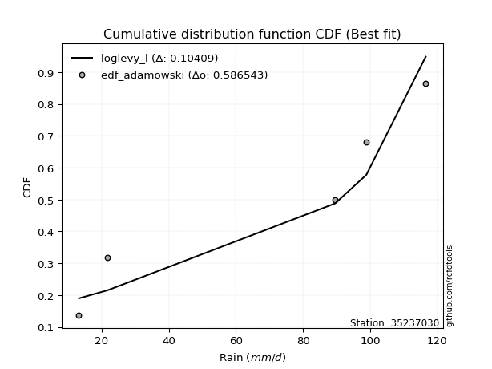</img>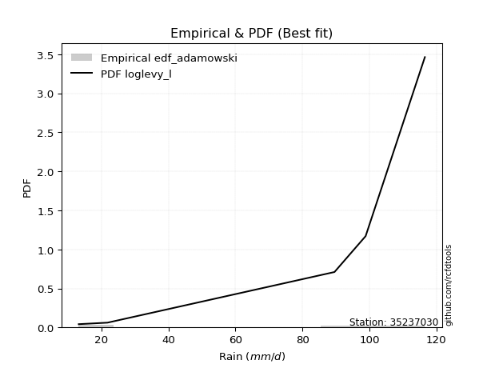</img>

</div>


## C. Best fit & Estimate extreme values for specific return periods - Tr

Best fit in probability distribution analysis means finding the theoretical distribution (like Normal, Poisson, Exponential, etc.) that most accurately mirrors your real-world data´s patterns (shape, center, spread) for better predictions, using methods like visual checks (Q-Q plots), goodness-of-fit tests (Kolmogorov-Smirnov, Chi-Squared), and information criteria (AIC) to score and select the simplest, most representative model.


### 1. Best fit (ordered by delta Δ)

:file_folder:Table: [bestfit_35237030.csv](table/bestfit_35237030.csv)

<div align="center">

|   id |   station | empirical_dist   | p_dist    |     delta |   deltao | eval   |   fit |   n |   best_fit |   best_fit_sort |
|-----:|----------:|:-----------------|:----------|----------:|---------:|:-------|------:|----:|-----------:|----------------:|
|    0 |  35237030 | edf_hazen        | dweibull  | 0.0694549 | 0.586543 | Δo > Δ |     1 |   5 |          1 |               1 |
|    1 |  35237030 | edf_gringorten   | dweibull  | 0.0788299 | 0.586543 | Δo > Δ |     1 |   5 |          1 |               2 |
|    2 |  35237030 | edf_california   | dgamma    | 0.0789861 | 0.586543 | Δo > Δ |     1 |   5 |          1 |               3 |
|    3 |  35237030 | edf_cunnane      | dweibull  | 0.0848396 | 0.586543 | Δo > Δ |     1 |   5 |          1 |               4 |
|    4 |  35237030 | edf_blom         | dweibull  | 0.0885026 | 0.586543 | Δo > Δ |     1 |   5 |          1 |               5 |
|    5 |  35237030 | edf_tukey        | dweibull  | 0.0944549 | 0.586543 | Δo > Δ |     1 |   5 |          1 |               6 |
|    6 |  35237030 | edf_filliben     | dweibull  | 0.0966684 | 0.586543 | Δo > Δ |     1 |   5 |          1 |               7 |
|    7 |  35237030 | edf_jenkinson    | dweibull  | 0.0977077 | 0.586543 | Δo > Δ |     1 |   5 |          1 |               8 |
|    8 |  35237030 | edf_beard        | dweibull  | 0.0977077 | 0.586543 | Δo > Δ |     1 |   5 |          1 |               9 |
|    9 |  35237030 | edf_chegodayev   | dweibull  | 0.0990846 | 0.586543 | Δo > Δ |     1 |   5 |          1 |              10 |
|   10 |  35237030 | edf_adamowski    | loglevy_l | 0.10409   | 0.586543 | Δo > Δ |     1 |   5 |          1 |              11 |
|   11 |  35237030 | edf_weibull      | levy_l    | 0.117637  | 0.586543 | Δo > Δ |     1 |   5 |          1 |              12 |

</div>


### 2. Extreme values and % difference analysis

In hydrology, a return period (or recurrence interval $Tr$) is the statistical average time between extreme events like floods or droughts of a specific magnitude, indicating how rare an event is, with a 100-year flood, for example, having a 1% chance of occurring in any given year, not that it happens exactly every century. It is a key tool for infrastructure design (like bridges or dams) and risk assessment, calculated from historical data to determine the probability of future events, although it is important to remember it is statistical average, and events can cluster or be missed.

The extreme value porcentage difference is evaluated as $pdiff = 1 - (ETrBf / ETr) * 100$, where _ETrBf_ correspond to the bestfit extreme value for a specific recurrence interval and _ETr_ correspond to the extreme value for one of the most used PDFsused in hydrology.

> risk_rate: assuming the return period as the project useful life.

:file_folder:Table: [extreme_35237030.csv](table/extreme_35237030.csv), all PDFs.  
:file_folder:Table: [extremepdiff_35237030.csv](table/extremepdiff_35237030.csv), % difference between bestfit and most used PDFs in Hydrology.

<div align="center">

Extreme values table for only best fit PDFs
|   id |      tr |   prob_l |     prob_g |      alpha |   anglit |   arcsine |    argus |     beta |   betaprime |   bradford |       burr |   burr12 |   cosine |   crystalball |   dgamma |   dweibull |   erlang |   exponnorm |   exponpow |   exponweib |        f |   fatiguelife |   foldnorm |    gamma |   gausshyper |   genexpon |   genextreme |   gengamma |   genhalflogistic |   genlogistic |   gennorm |   genpareto |   gompertz |   gumbel_l |   gumbel_r |   halfgennorm |   halflogistic |   halfnorm |   hypsecant |   invgamma |   invgauss |   invweibull |   johnsonsb |   johnsonsu |   kappa3 |   kappa4 |    ksone |   kstwobign |   laplace |   levy_l |   loggamma |   logistic |   loglaplace |    lomax |   maxwell |     mielke |    moyal |   nakagami |      ncf |        nct |     norm |   pearson3 |   powerlaw |   rayleigh |    rdist |     rice |   semicircular |   skewnorm |        t |   trapezoid |   triang |   truncexpon |   truncnorm |   truncpareto |   truncweibull_min |   tukeylambda |   uniform |   vonmises |   vonmises_line |     wald |   weibull_max |   weibull_min |   wrapcauchy |   logalpha |   loganglit |   logarcsine |   logargus |   logbeta |   logbetaprime |   logbradford |   logburr |   logburr12 |   logcosine |   logcrystalball |   logdgamma |   logdweibull |   logerlang |   logexponnorm |      logexponpow |   logexponweib |     logf |   logfatiguelife |   logfoldnorm |   loggausshyper |   loggenexpon |   loggenextreme |   loggengamma |   loggenhalflogistic |   loggenlogistic |   loggennorm |   loggenpareto |   loggompertz |   loggumbel_l |   loggumbel_r |   loghalfgennorm |   loghalflogistic |   loghalfnorm |   loghypsecant |   loginvgamma |   loginvgauss |   loginvweibull |   logjohnsonsb |   logjohnsonsu |   logkappa3 |   logkappa4 |   logksone |   logkstwobign |   loglevy_l |   logloggamma |   loglogistic |    logloglaplace |         loglomax |   logmaxwell |   logmielke |   logmoyal |   lognakagami |    logncf |   lognct |   lognorm |   logpearson3 |   logpowerlaw |   lograyleigh |   logrdist |   logrice |   logsemicircular |   logskewnorm |     logt |   logtrapezoid |   logtriang |   logtruncexpon |   logtruncnorm |   logtruncpareto |   logtruncweibull_min |   logtukeylambda |   loguniform |   logvonmises |   logvonmises_line |    logwald |   logweibull_max |   logweibull_min |   logwrapcauchy |   station |   n |   risk_rate |
|-----:|--------:|---------:|-----------:|-----------:|---------:|----------:|---------:|---------:|------------:|-----------:|-----------:|---------:|---------:|--------------:|---------:|-----------:|---------:|------------:|-----------:|------------:|---------:|--------------:|-----------:|---------:|-------------:|-----------:|-------------:|-----------:|------------------:|--------------:|----------:|------------:|-----------:|-----------:|-----------:|--------------:|---------------:|-----------:|------------:|-----------:|-----------:|-------------:|------------:|------------:|---------:|---------:|---------:|------------:|----------:|---------:|-----------:|-----------:|-------------:|---------:|----------:|-----------:|---------:|-----------:|---------:|-----------:|---------:|-----------:|-----------:|-----------:|---------:|---------:|---------------:|-----------:|---------:|------------:|---------:|-------------:|------------:|--------------:|-------------------:|--------------:|----------:|-----------:|----------------:|---------:|--------------:|--------------:|-------------:|-----------:|------------:|-------------:|-----------:|----------:|---------------:|--------------:|----------:|------------:|------------:|-----------------:|------------:|--------------:|------------:|---------------:|-----------------:|---------------:|---------:|-----------------:|--------------:|----------------:|--------------:|----------------:|--------------:|---------------------:|-----------------:|-------------:|---------------:|--------------:|--------------:|--------------:|-----------------:|------------------:|--------------:|---------------:|--------------:|--------------:|----------------:|---------------:|---------------:|------------:|------------:|-----------:|---------------:|------------:|--------------:|--------------:|-----------------:|-----------------:|-------------:|------------:|-----------:|--------------:|----------:|---------:|----------:|--------------:|--------------:|--------------:|-----------:|----------:|------------------:|--------------:|---------:|---------------:|------------:|----------------:|---------------:|-----------------:|----------------------:|-----------------:|-------------:|--------------:|-------------------:|-----------:|-----------------:|-----------------:|----------------:|----------:|----:|------------:|
|    0 |    2    | 0.5      | 0.5        |    36.8447 |   68.02  |   68.02   |  77.3319 |  83.3607 |     55.7774 |    62.4441 |    42.8872 |  33.3416 |  66.4896 |       68.02   |  58.4782 |    60.8373 |  67.1735 |     68.0201 |    38.7872 |     34.7467 |  37.6874 |       13.2001 |    68.3825 |  66.9805 |      58.426  |    50.4134 |      83.9079 |    31.9418 |           71.9171 |           inf |   89.6    |     91.223  |    65.3893 |    74.9593 |    61.0807 |       42.4906 |        57.6309 |    59.3736 |     68.02   |    62.5479 |    44.1717 |      60.6919 |     116.519 |     88.7227 |   13.2   |  60.3158 |  68.02   |     58.9012 |   68.02   |  93.7197 |    48.1849 |    68.02   |      49.5047 |  57.506  |   64.4074 |    42.7429 |  58.8405 |    20.3471 |  41.9318 |    38.1837 |  68.02   |    70.0602 |    13.5245 |    63.1261 |  71.0909 |  65.6598 |        68.02   |    73.1755 |  68.0164 |     72.6946 |  66.4146 |      50.0335 |     68.02   |       15.7162 |            51.18   |       64.6529 |   64.9    |    2.8079  |         64.6508 |  54.3278 |       116.216 |       76.0406 |       64.9   |    47.718  |     49.5047 |      49.5049 |    62.981  |   93.4408 |        49.1403 |       38.7097 |   58.197  |     58.1684 |     46.6456 |          49.5047 |      98.9   |        98.9   |     48.2999 |        49.505  |     17.315       |        26.8973 |  49.2361 |          49.4234 |       49.6483 |         38.5203 |       39.0922 |         69.5254 |   9.50477e+11 |              53.6335 |          inf     |       89.6   |        26.5138 |       51.3463 |       57.3245 |       42.7517 |          39.2366 |           39.7454 |       41.2361 |        49.5047 |       47.2152 |       45.6945 |         42.9114 |        116.428 |        116.599 |     63.8607 |     40.0688 |    49.5047 |        40.4723 |     91.0771 |       64.9051 |       49.5047 |     89.6         |    150.981       |      45.8657 |       0     |    40.7747 |       23.4411 |   47.2656 |  49.4269 |   49.5047 |       53.123  |       13.3532 |       44.6403 |    39.2316 |   47.2859 |           49.5047 |       50.615  |  49.5047 |        57.6987 |     50.9873 |         31.9541 |        41.1833 |          14.0298 |               25.194  |          39.2401 |      39.2316 |      0.100063 |            39.2456 |    37.0658 |          66.4526 |          58.763  |         39.2316 |  35237030 |   5 |    0.75     |
|    1 |    2.33 | 0.570815 | 0.429185   |    43.8548 |   76.8   |   81.2002 |  83.8673 |  90.7645 |     64.3113 |    70.1142 |    51.4329 |  40.8259 |  73.8608 |       75.5576 |  91.3906 |    92.3425 |  74.8272 |     75.5577 |    46.0623 |     40.163  |  44.9985 |       14.6801 |    75.6568 |  74.6188 |      66.8302 |    59.2706 |      91.4443 |    38.1656 |           80.3404 |           inf |   91.3557 |     98.4706 |    72.9627 |    81.5171 |    68.0652 |       51.3937 |        64.812  |    67.5087 |     74.0524 |    70.4836 |    52.1072 |      68.9117 |     116.584 |     94.7299 |   13.2   |  68.1168 |  78.3818 |     66.9325 |   72.5814 | 100.791  |    56.6644 |    74.6612 |      54.5149 |  67.2679 |   72.2385 |    51.2702 |  65.4522 |    26.9408 |  52.282  |    45.9054 |  75.5576 |    77.5021 |    14.1762 |    71.0731 |  83.3332 |  73.3306 |        77.4367 |    80.1054 |  75.5537 |     81.3711 |  74.7105 |      57.6692 |     75.5576 |       16.9275 |            58.8476 |       72.3196 |   72.2223 |    3.08793 |         72.0084 |  59.2703 |       116.43  |       82.6759 |       92.615 |    56.2805 |     59.5986 |      65.4069 |    70.4459 |  102.431  |        57.711  |       45.2526 |   66.0749 |     66.5354 |     54.5748 |          58.0541 |     107.079 |       108.534 |     56.7485 |        58.0544 |     19.941       |        31.7274 |  57.783  |          57.9426 |       57.9969 |         45.3626 |       47.1701 |         78.9551 |   1.38439e+56 |              62.6786 |          inf     |      100.08  |        37.3291 |       59.712  |       65.8466 |       49.552  |          46.2323 |           46.2595 |       48.9723 |        56.2362 |       55.76   |       54.1826 |         51.5589 |        116.563 |        116.6   |     79.8368 |     47.1199 |    61.6247 |        48.4106 |     98.307  |       72.6197 |       56.9645 |    103.115       |    258.29        |      54.1212 |       0     |    46.8897 |       25.2651 |   55.6458 |  57.9906 |   58.0541 |       62.0485 |       13.6212 |       52.8044 |    48.957  |   55.7551 |           60.406  |       57.8251 |  58.054  |        69.3116 |     58.4583 |         37.1729 |        46.046  |          14.442  |               29.4008 |          46.1312 |      45.7759 |      0.116649 |            45.7935 |    41.147  |          79.7571 |          67.0711 |         60.647  |  35237030 |   5 |    0.729209 |
|    2 |    5    | 0.8      | 0.2        |    98.2119 |  107.778 |  116.347  | 102.899  | 109.044  |    103.657  |    94.9376 |   113.033  | 110.975  | 100.424  |      103.57   | 102.459  |   105.63   | 103.762  |    103.57   |    81.9248 |     68.7748 |  85.2082 |       46.1188 |   102.69   | 103.486  |      94.8571 |   103.554  |     108.542  |    77.3073 |          102.509  |           inf |  110.08   |    113.226  |   101.71   |   102.703  |    98.4089 |      106.614  |        97.3052 |   101.911  |     98.2496 |   102.561  |    97.8638 |     104.622  |     116.6   |    108.873  |   13.2   |  94.0802 | 111.916  |    101.048  |   95.3875 | 112.507  |   104.749  |   100.304  |      88.2767 | 116.075  |  103.061  |   112.918  |  96.0781 |    88.0225 | 102.927  |   107.918  | 103.57   |   104.033  |    29.3665 |   102.888  | 116.839  | 103.058  |       109.572  |   100.289  | 103.564  |    106.264  |  98.5108 |      85.8902 |    103.57   |       29.2822 |            86.8732 |       96.8205 |   95.92   |    4.16853 |         95.8203 |  86.9385 |       116.595 |      104.112  |      111.805 |   106.881  |    114.702  |     137.475  |    95.9967 |  115.582  |       105.38   |       75.015  |   93.0549 |    102.715  |     96.0932 |         104.941  |     175.112 |       224.865 |    104.458  |       104.942  |     54.5457      |        73.3293 | 104.847  |         104.726  |      103.336  |         77.5881 |      106.336  |        104.002  | inf           |              93.0807 |          inf     |      185.085 |        85.8326 |      101.423  |      103.036  |       94.0976 |          78.623  |           91.9292 |      101.329  |        93.7813 |      105.634  |      106.198  |        114.47   |        116.6   |        116.6   |    164.449  |     78.605  |   125.187  |       103.596  |    111.57   |       96.6832 |       97.9424 |    222.752       |   3784.27        |     103.82   |       0     |    89.5747 |       54.7657 |  104.911  | 105.121  |  104.941  |      106.321  |       19.7535 |      103.441  |    90.9962 |  104.731  |          119.135  |       85.2254 | 104.941  |       117.297  |     86.5398 |         64.7268 |        70.4409 |          19.2095 |               55.0687 |          77.2758 |      75.4178 |      0.210662 |            75.4575 |    73.84   |         108.821  |         102.819  |         99.9251 |  35237030 |   5 |    0.67232  |
|    3 |   10    | 0.9      | 0.1        |   198.079  |  125.312 |  124.832  | 111.121  | 114.083  |    137.087  |   105.769  |   214.351  | inf      | 116.472  |      122.152  | 108.074  |   110.87   | 123.387  |    122.152  |   111.891  |     96.2621 | 124.779  |       89.5277 |   120.623  | 123.056  |     106.762  |   143.754  |     113.412  |   122.837  |          110.172  |           inf |  139.193  |    115.867  |   120.197  |   114.498  |   123.123  |      170.997  |       124.289  |   127.368  |    117.572  |   126.338  |   147.995  |     133.709  |     116.6   |    113.82   |   13.2   | 105.552  | 126.549  |    127.022  |  116.09   | 115.336  |   159.124  |   119.188  |     136.732  | 160.381  |  124.752  |   214.707  | 122.743  |   158.663  | 149.954  |   227.405  | 122.152  |   120.671  |    56.2528 |   125.573  | 125.596  | 123.485  |       126.061  |   108.51   | 122.146  |    115.987  | 107.807  |     100.363  |    122.152  |       49.743  |           100.998  |      107.114  |  106.26   |    4.89658 |        106.21   | 116.301  |       116.6   |      116.046  |      114.444 |   167.889  |    166.154  |     164.476  |   109.036  |  116.512  |       157.763  |       93.5246 |  105.568  |    130.81   |    135.25   |         155.421  |     281.557 |       504.536 |    158.106  |       155.422  |    177.808       |       158.351  | 155.802  |         155.209  |      151.586  |         97.0638 |      198.596  |        111.793  | inf           |             105.811  |          inf     |      340.203 |       106.244  |      139.168  |      132.207  |      158.645  |          99.1231 |          162.607  |      173.542  |       141.081  |      164.452  |      172.062  |        219.191  |        116.6   |        116.6   |    225.471  |     96.9878 |   170.555  |       184.886  |    115.032  |      106.837  |      145.985  |    499.793       |  43284.3         |     164.202  |       0     |   157.374  |      141.573  |  163.797  | 156.117  |  155.421  |      147.097  |       35.2476 |      167.075  |   108.234  |  160.765  |          168.807  |       99.8109 | 155.421  |       144.057  |    100.87   |         85.7557 |        88.6931 |          30.066  |               77.9933 |          95.847  |      93.7748 |      0.327426 |            93.8329 |   137.34   |         114.609  |         130.428  |        108.723  |  35237030 |   5 |    0.651322 |
|    4 |   15    | 0.933333 | 0.0666667  |   297.59   |  132.799 |  126.45   | 114.099  | 115.273  |    156.173  |   109.379  |   307.469  | inf      | 123.783  |      131.425  | 110.792  |   113.127  | 133.31   |    131.425  |   128.143  |    112.822  | 148.755  |      117.918  |   129.572  | 132.948  |     110.469  |   167.269  |     114.711  |   153.385  |          112.478  |           inf |  161.49   |    116.3    |   129.053  |   119.84   |   137.067  |      214.591  |       139.56   |   140.615  |    128.599  |   139.032  |   180.712  |     150.119  |     116.6   |    115.504  |   13.2   | 109.35   | 131.426  |    140.811  |  128.201  | 116.19   |   196.664  |   129.478  |     176.616  | 186.299  |  135.882  |   308.506  | 138.218  |   199.398  | 178.614  |   350.515  | 131.425  |   128.691  |    71.4567 |   137.261  | 127.392  | 133.817  |       132.491  |   111.214  | 131.418  |    119.106  | 110.79   |     105.558  |    131.425  |       63.3341 |           106.02   |      110.427  |  109.707  |    5.21192 |        109.673  | 135.156  |       116.6   |      121.451  |      115.188 |   212.093  |    194.641  |     170.198  |   114.095  |  116.579  |       193.191  |      100.659  |  109.842  |    145.949  |    158.035  |         189.071  |     373.48  |       841.908 |    195.003  |       189.072  |    378.712       |       248.993  | 189.898  |         188.922  |      183.526  |        104.025  |      277.239  |        113.839  | inf           |             109.777  |          inf     |      493.377 |       111.323  |      161.21   |      148.008  |      213.016  |         107.098  |          224.547  |      229.618  |       178.108  |      206.305  |      221.388  |        316.226  |        116.6   |        116.6   |    250.864  |    103.639  |   189.075  |       251.45   |    116.098  |      110.183  |      181.448  |    846.638       | 180063           |     207.747  |     109.985 |   218.26   |      246.826  |  206.165  | 190.231  |  189.071  |      171.342  |       48.0988 |      213.892  |   112.419  |  199.504  |          193.38   |      105.136  | 189.07   |       153.875  |    105.953  |         94.816  |        96.6344 |          40.0462 |               88.664  |         102.688  |     100.838  |      0.419951 |           100.904  |   204.579  |         115.686  |         145.262  |        111.375  |  35237030 |   5 |    0.644736 |
|    5 |   20    | 0.95     | 0.05       |   397.013  |  137.203 |  127.02   | 115.702  | 115.757  |    169.588  |   111.184  |   395.794  | inf      | 128.278  |      137.498  | 112.567  |   114.516  | 139.854  |    137.498  |   139.14   |    124.75   | 166.05   |      138.937  |   135.433  | 139.472  |     112.226  |   183.954  |     115.29   |   176.702  |          113.58   |           inf |  179.703  |    116.441  |   134.7    |   123.165  |   146.83   |      248.103  |       150.259  |   149.448  |    136.378  |   147.665  |   205.284  |     161.609  |     116.6   |    116.399  |   13.2   | 111.235  | 133.865  |    150.1    |  136.793  | 116.628  |   226.184  |   136.589  |     211.786  | 204.687  |  143.268  |   397.626  | 149.177  |   227.293  | 199.603  |   476.189  | 137.498  |   133.843  |    80.6947 |   145.03   | 128.054  | 140.622  |       136.058  |   112.563  | 137.491  |    120.645  | 112.262  |     108.234  |    137.498  |       72.5306 |           108.596  |      112.047  |  111.43   |    5.38508 |        111.405  | 149.207  |       116.6   |      124.815  |      115.548 |   247.954  |    213.63   |     172.261  |   116.893  |  116.592  |       220.697  |      104.428  |  111.998  |    156.245  |    173.915  |         214.963  |     456.992 |      1227.89  |    223.952  |       214.965  |    659.567       |       343.533  | 216.194  |         214.894  |      208.007  |        107.49   |      347.456  |        114.732  | inf           |             111.671  |          inf     |      646.072 |       113.354  |      176.835  |      158.783  |      261.833  |         111.358  |          281.523  |      276.745  |       209.936  |      239.848  |      262.213  |        408.74   |        116.6   |        116.6   |    265.172  |    107.011  |   199.075  |       309.324  |    116.648  |      111.849  |      210.876  |   1263.83        | 495084           |     242.846  |     111.663 |   275.15   |      361.707  |  240.371  | 216.537  |  214.963  |      188.717  |       57.8824 |      252.059  |   114.064  |  229.937  |          208.52   |      107.896  | 214.963  |       158.962  |    108.554  |         99.8372 |       101.074  |          48.4334 |               94.773  |         106.199  |     104.566  |      0.501625 |           104.637  |   275.313  |         116.071  |         155.336  |        112.682  |  35237030 |   5 |    0.641514 |
|    6 |   25    | 0.96     | 0.04       |   496.402  |  140.188 |  127.284  | 116.723  | 116.007  |    179.943  |   112.268  |   480.759  | inf      | 131.431  |      141.968  | 113.875  |   115.5    | 144.696  |    141.968  |   147.384  |    134.096  | 179.605  |      155.638  |   139.747  | 144.298  |     113.238  |   196.895  |     115.612  |   195.694  |          114.224  |           inf |  195.217  |    116.503  |   138.777  |   125.531  |   154.35   |      275.55   |       158.502  |   156.019  |    142.398  |   154.189  |   225.062  |     170.459  |     116.6   |    116.971  |   13.2   | 112.359  | 135.328  |    157.058  |  143.458  | 116.902  |   250.857  |   142.03   |     243.821  | 218.951  |  148.752  |   483.462  | 157.672  |   248.277  | 216.298  |   603.837  | 141.968  |   137.585  |    86.8356 |   150.802  | 128.371  | 145.65   |       138.372  |   113.371  | 141.961  |    121.562  | 113.138  |     109.866  |    141.968  |       79.0826 |           110.163  |      113.004  |  112.464  |    5.49346 |        112.444  | 160.462  |       116.6   |      127.209  |      115.761 |   278.628  |    227.541  |     173.226  |   118.706  |  116.597  |       243.473  |      106.756  |  113.298  |    164.012  |    185.994  |         236.263  |     534.751 |      1657.31  |    248.108  |       236.265  |   1022.11        |       441.103  | 237.862  |         236.277  |      228.092  |        109.533  |      411.725  |        115.219  | inf           |             112.77   |          inf     |      798.81  |       114.378  |      188.947  |      166.926  |      306.937  |         114.038  |          335.101  |      317.981  |       238.421  |      268.276  |      297.637  |        498.073  |        116.6   |        116.6   |    274.668  |    109.034  |   205.328  |       361.242  |    116.995  |      112.847  |      236.572  |   1752.58        |      1.0849e+06  |     272.686  |     112.668 |   329.262  |      482.406  |  269.523  | 238.211  |  236.263  |      202.286  |       65.3793 |      284.762  |   114.884  |  255.335  |          218.97   |      109.585  | 236.263  |       162.073  |    110.134  |        103.024  |       103.909  |          55.3695 |               98.7212 |         108.323  |     106.869  |      0.576646 |           106.942  |   349.242  |         116.253  |         162.927  |        113.463  |  35237030 |   5 |    0.639603 |
|    7 |   50    | 0.98     | 0.02       |   993.188  |  147.535 |  127.638  | 119.003  | 116.401  |    211.924  |   114.434  |   875.084  | inf      | 139.686  |      154.769  | 117.643  |   118.166  | 158.672  |    154.769  |   171.538  |    163.585  | 222.382  |      209.222  |   152.101  | 158.226  |     115.119  |   237.095  |     116.186  |   259.534  |          115.465  |           inf |  251.283  |    116.579  |   150.07   |   131.954  |   177.516  |      368.784  |       183.901  |   175.12   |    161.064  |   173.697  |   290.1    |     197.724  |     116.6   |    118.275  |  114.582 | 114.579  | 138.254  |    177.489  |  164.16   | 117.521  |   338.355  |   158.652  |     377.656  | 263.257  |  164.655  |   882.771  | 184.044  |   309.81   | 270.745  |  1262.04   | 154.769  |   148.066  |   100.609  |   167.557  | 128.815  | 160.117  |       143.657  |   114.986  | 154.762  |    123.382  | 114.878  |     113.19   |    154.769  |       95.1814 |           113.347  |      114.869  |  114.532  |    5.71829 |        114.522  | 197.208  |       116.6   |      133.708  |      116.182 |   392.22   |    265.766  |     174.524  |   122.839  |  116.6    |       322.887  |      111.57   |  115.914  |    187.097  |    221.748  |         309.666  |     873.504 |      4358.29  |    333.52   |       309.669  |   4098.79        |       960.441  | 312.756  |         310.088  |      296.993  |        113.435  |      680.095  |        116.057  | inf           |             114.85   |          inf     |     1568.26  |       115.921  |      226.534  |      191.195  |      500.822  |         119.945  |          573.199  |      476.138  |       353.73   |      371.698  |      432.224  |        915.679  |        116.6   |        116.6   |    298.382  |    113.016  |   218.428  |       569.736  |    117.779  |      114.837  |      336.15   |   5335.75        |      1.24091e+07 |     381.625  |     114.673 |   574.909  |     1123.65   |  376.701  | 313.116  |  309.666  |      244.897  |       85.6392 |      405.766  |   116.093  |  345.05   |          244.851  |      113.039  | 309.666  |       168.427  |    113.338  |        109.826  |       110.008  |          76.5374 |              107.327  |         112.575  |     111.629  |      0.890851 |           111.707  |   759.277  |         116.506  |         185.457  |        115.026  |  35237030 |   5 |    0.63583  |
|    8 |   75    | 0.986667 | 0.0133333  |  1489.9    |  150.769 |  127.703  | 119.895  | 116.495  |    230.565  |   115.156  |  1239.42   | inf      | 143.629  |      161.638  | 119.688  |   119.518  | 166.239  |    161.638  |   184.748  |    181.124  | 247.811  |      241.492  |   158.73   | 165.766  |     115.685  |   260.61   |     116.35   |   300.146  |          115.861  |           inf |  289.725  |    116.591  |   155.895  |   135.201  |   190.981  |      428.837  |       198.665  |   185.518  |    171.972  |   184.696  |   330.393  |     213.571  |     116.6   |    118.81   |  115.271 | 115.306  | 139.23   |    188.73   |  176.271  | 117.775  |   397.946  |   168.252  |     487.813  | 289.174  |  173.302  |  1252.64   | 199.465  |   343.401  | 304.598  |  1942.1    | 161.638  |   153.547  |   105.679  |   176.673  | 128.904  | 167.918  |       145.769  |   115.524  | 161.63   |    123.984  | 115.454  |     114.317  |    161.638  |      101.636  |           114.424  |      115.469  |  115.221  |    5.79494 |        115.215  | 219.819  |       116.6   |      136.994  |      116.321 |   473.578  |    284.564  |     174.766  |   124.487  |  116.6    |       375.937  |      113.223  |  116.801  |    199.981  |    241.171  |         358.047  |    1165.58  |      7843.26  |    391.5    |       358.051  |   9341.95        |      1515.43   | 362.284  |         358.829  |      342.18   |        114.633  |      898.596  |        116.284  | inf           |             115.493  |          inf     |     2349.85  |       116.261  |      248.498  |      204.78   |      665.693  |         122.294  |          783.109  |      593.167  |       445.445  |      444.232  |      531.369  |       1304.52   |        116.6   |        116.6   |    309.879  |    114.296  |   222.978  |       732.056  |    118.103  |      115.499  |      411.767  |  11029.5         |      5.16218e+07 |     458.141  |     115.34  |   796.433  |     1783.3    |  452.8    | 362.645  |  358.047  |      270.099  |       94.4902 |      491.977  |   116.352  |  405.79   |          256.025  |      114.214  | 358.047  |       170.585  |    114.419  |        112.228  |       112.18   |          86.9849 |              110.424  |         113.976  |     113.262  |      1.12959  |           113.342  |  1224.46   |         116.556  |         198.01   |        115.549  |  35237030 |   5 |    0.634587 |
|    9 |  100    | 0.99     | 0.01       |  1986.6    |  152.692 |  127.726  | 120.389  | 116.533  |    243.783  |   115.517  |  1585.63   | inf      | 146.1    |      166.283  | 121.081  |   120.405  | 171.385  |    166.283  |   193.751  |    193.685  | 266.012  |      264.712  |   163.213  | 170.892  |     115.95   |   277.294  |     116.425  |   330.371  |          116.055  |           inf |  319.585  |    116.595  |   159.744  |   137.326  |   200.511  |      473.882  |       209.114  |   192.602  |    179.709  |   192.356  |   359.869  |     224.787  |     116.6   |    119.119  |  115.616 | 115.666  | 139.717  |    196.432  |  184.863  | 117.923  |   444.391  |   175.03   |     584.953  | 307.563  |  179.191  |  1604.69   | 210.406  |   366.258  | 329.601  |  2636.78   | 166.283  |   157.199  |   108.309  |   182.883  | 128.937  | 173.207  |       146.951  |   115.793  | 166.275  |    124.285  | 115.741  |     114.884  |    166.283  |      105.105  |           114.965  |      115.764  |  115.566  |    5.83347 |        115.561  | 236.305  |       116.6   |      139.144  |      116.391 |   539.076  |    296.366  |     174.85   |   125.408  |  116.6    |       416.782  |      114.058  |  117.26   |    208.885  |    254.203  |         394.986  |    1431.02  |     12005.4   |    436.595  |       394.99   |  16798.1         |      2095.14   | 400.178  |         396.088  |      376.58   |        115.199  |     1088.79   |        116.385  | inf           |             115.8    |          inf     |     3143.21  |       116.393  |      264.073  |      214.185  |      814.229  |         123.648  |          976.649  |      688.964  |       524.585  |      501.824  |      612.582  |       1675.87   |        116.6   |        116.6   |    317.48   |    114.919  |   225.289  |       869.235  |    118.293  |      115.83   |      475.188  |  19153.8         |      1.41934e+08 |     518.868  |     115.673 |  1003.63   |     2441.91   |  513.709  | 400.537  |  394.986  |      288.081  |       99.4182 |      560.98   |   116.451  |  452.917  |          262.504  |      114.806  | 394.986  |       171.671  |    114.962  |        113.456  |       113.294  |          93.1394 |              112.018  |         114.668  |     114.087  |      1.31025  |           114.169  |  1734.85   |         116.574  |         206.677  |        115.811  |  35237030 |   5 |    0.633968 |
|   10 |  200    | 0.995    | 0.005      |  3973.36   |  156.324 |  127.748  | 121.244  | 116.578  |    275.654  |   116.058  |  2866.71   | inf      | 151.124  |      176.821  | 124.282  |   122.344  | 183.137  |    176.821  |   214.313  |    224.311  | 310.356  |      321.55   |   173.383  | 182.6    |     116.315  |   317.494  |     116.526  |   407.848  |          116.338  |           inf |  400.547  |    116.599  |   168.206  |   141.944  |   223.422  |      590.639  |       234.237  |   208.802  |    198.35   |   210.423  |   433.579  |     251.751  |     116.6   |    119.693  |  116.133 | 116.197  | 140.449  |    214.172  |  205.566  | 118.205  |   571.973  |   191.289  |     906.038  | 351.869  |  192.665  |  2910.6    | 236.766  |   418.36   | 393.482  |  5508.3    | 176.821  |   165.315  |   112.378  |   197.093  | 128.969  | 185.24   |       149.013  |   116.197  | 176.813  |    124.734  | 116.171  |     115.739  |    176.821  |      110.638  |           115.78   |      116.195  |  116.083  |    5.89143 |        116.081  | 277.371  |       116.6   |      143.816  |      116.496 |   727.805  |    320.015  |     174.932  |   127.014  |  116.6    |       527.048  |      115.323  |  118.035  |    229.63   |    282.914  |         493.522  |    2349.25  |     34410.8   |    560.115  |       493.528  |  69126.7         |      4577.08   | 501.557  |         495.648  |      467.978  |        115.983  |     1700.44   |        116.515  | inf           |             116.234  |          inf     |     6414.95  |       116.537  |      301.571  |      236.141  |     1321.42   |         126.193  |         1660.86   |      970.296  |       777.882  |      664.361  |      852.383  |       3060.42   |        116.6   |        116.6   |    334.857  |    115.815  |   228.799  |      1291.05   |    118.653  |      116.325  |      670.045  |  83069.1         |      1.62344e+09 |     689.814  |     116.172 |  1751.98   |     4998.42   |  687.649  | 501.905  |  493.522  |      331.674  |      107.526  |      757.485  |   116.556  |  581.425  |          274.194  |      115.699  | 493.522  |       173.311  |    115.78   |        115.333  |       115.002  |         103.812  |              114.47   |         115.686  |     115.337  |      1.70798  |           115.42   |  4132.18   |         116.593  |         226.846  |        116.205  |  35237030 |   5 |    0.633042 |
|   11 |  250    | 0.996    | 0.004      |  4966.73   |  157.249 |  127.751  | 121.443  | 116.584  |    285.933  |   116.167  |  3467.86   | inf      | 152.501  |      180.042  | 125.271  |   122.918  | 186.751  |    180.042  |   220.62   |    234.271  | 324.767  |      340.073  |   176.491  | 186.2    |     116.381  |   330.435  |     116.544  |   434.154  |          116.392  |           inf |  429.375  |    116.599  |   170.72   |   143.302  |   230.787  |      630.681  |       242.313  |   213.786  |    204.351  |   216.142  |   458.039  |     260.42   |     116.6   |    119.839  |  116.237 | 116.301  | 140.595  |    219.662  |  212.231  | 118.278  |   618.176  |   196.509  |    1043.09   | 366.132  |  196.813  |  3524.64   | 245.252  |   434.326  | 415.217  |  6982.51   | 180.042  |   167.75   |   113.21   |   201.467  | 128.974  | 188.926  |       149.496  |   116.277  | 180.033  |    124.824  | 116.257  |     115.911  |    180.042  |      111.795  |           115.944  |      116.279  |  116.186  |    5.90304 |        116.184  | 290.956  |       116.6   |      145.191  |      116.516 |   799.163  |    326.33   |     174.942  |   127.39   |  116.6    |       566.364  |      115.578  |  118.225  |    236.118  |    291.336  |         528.282  |    2756.69  |     48666.6   |    604.733  |       528.288  | 108891           |      5887.86   | 537.413  |         530.824  |      500.108  |        116.127  |     1954.11   |        116.537  | inf           |             116.315  |          inf     |     8099.57  |       116.557  |      313.635  |      243.02   |     1543.99   |         126.857  |         1970.01   |     1078.08   |       883.063  |      724.664  |      944.976  |       3714.17   |        116.6   |        116.6   |    340.333  |    115.986  |   229.508  |      1459.19   |    118.747  |      116.424  |      748.198  | 139314           |      3.55752e+09 |     753.013  |     116.272 |  2096.13   |     6224.99   |  752.875  | 537.755  |  528.282  |      345.769  |      109.259  |      830.849  |   116.571  |  627.629  |          277.011  |      115.879  | 528.281  |       173.64   |    115.944  |        115.713  |       115.349  |         106.185  |              114.969  |         115.886  |     115.588  |      1.81111  |           115.672  |  5506.48   |         116.595  |         233.147  |        116.284  |  35237030 |   5 |    0.632858 |
|   12 |  500    | 0.998    | 0.002      |  9933.55   |  159.541 |  127.754  | 121.899  | 116.595  |    317.957  |   116.383  |  6261.34   | inf      | 156.167  |      189.592  | 128.241  |   124.576  | 197.532  |    189.592  |   239.351  |    265.498  | 369.917  |      398.181  |   185.707  | 196.936  |     116.504  |   370.635  |     116.576  |   519.975  |          116.5    |           inf |  527.724  |    116.6    |   177.98   |   147.197  |   253.648  |      762.616  |       267.381  |   228.646  |    222.99   |   233.68   |   536      |     287.326  |     116.6   |    120.203  |  116.444 | 116.507  | 140.888  |    236.114  |  232.933  | 118.467  |   779.514  |   212.698  |    1615.64   | 410.438  |  209.189  |  6384.69   | 271.612  |   481.721  | 486.683  | 14585.8    | 189.592  |   174.847  |   114.893  |   214.518  | 128.98   | 199.878  |       150.61   |   116.439  | 189.583  |    125.004  | 116.429  |     116.255  |    189.592  |      114.161  |           116.272  |      116.444  |  116.393  |    5.92626 |        116.392  | 334.154  |       116.6   |      149.131  |      116.558 |  1060.04   |    342.529  |     174.955  |   128.256  |  116.6    |       701.47   |      116.088  |  118.719  |    255.75   |    314.99   |         646.432  |    4534.53  |    145966     |    760.128  |       646.439  | 443553           |     12882.6    | 659.612  |         650.583  |      608.953  |        116.392  |     2973.72   |        116.575  | inf           |             116.47   |          116.408 |    16881.7   |       116.587  |      351.086  |      263.871  |     2503.12   |         128.59   |         3346.29   |     1475.89   |      1309.41   |      940.636  |     1290.81   |       6773.81   |        116.6   |        116.6   |    357.393  |    116.314  |   230.932  |      2105.97   |    118.99   |      116.623  |     1053.43   | 810370           |      4.06908e+10 |     978.151  |     116.472 |  3659.04   |    11939.5    |  989.147  | 659.929  |  646.431  |      389.665  |      112.846  |     1094.74   |   116.591  |  787.652  |          283.607  |      116.239  | 646.431  |       174.3    |    116.273  |        116.479  |       116.048  |         111.199  |              115.976  |         116.278  |     116.093  |      2.04464  |           116.177  | 13720.3    |         116.599  |         252.197  |        116.442  |  35237030 |   5 |    0.632489 |
|   13 |  750    | 0.998667 | 0.00133333 | 14900.4    |  160.556 |  127.755  | 122.081  | 116.597  |    336.774  |   116.456  |  8844.56   | inf      | 157.943  |      194.897  | 129.915  |   125.469  | 203.56   |    194.897  |   249.754  |    283.953  | 396.582  |      432.514  |   190.827  | 202.94   |     116.541  |   394.15   |     116.586  |   572.991  |          116.535  |           inf |  591.55   |    116.6    |   181.892  |   149.278  |   267.013  |      845.059  |       282.036  |   236.948  |    233.893  |   243.807  |   582.857  |     303.056  |     116.6   |    120.368  |  116.513 | 116.575  | 140.986  |    245.356  |  245.044  | 118.557  |   887.565  |   222.156  |    2086.91   | 436.355  |  216.112  |  9036.1    | 287.031  |   508.059  | 531.45   | 22442.2    | 194.897  |   178.709  |   115.459  |   221.816  | 128.981  | 205.975  |       151.058  |   116.492  | 194.888  |    125.063  | 116.486  |     116.37   |    194.897  |      114.966  |           116.381  |      116.498  |  116.462  |    5.93401 |        116.461  | 360.054  |       116.6   |      151.238  |      116.572 |  1244.37   |    349.956  |     174.957  |   128.605  |  116.6    |       790.295  |      116.259  |  118.969  |    266.903  |    327.134  |         723.131  |    6070.18  |    281492     |    863.889  |       723.14   |      1.00211e+06 |     20376.1    | 739.182  |         728.475  |      679.347  |        116.472  |     3772.97   |        116.585  | inf           |             116.517  |          116.475 |    26114.9   |       116.594  |      372.98   |      275.739  |     3320.1    |         129.428  |         4561.18   |     1758.96   |      1648.75   |     1089.59   |     1541.07   |       9624.91   |        116.6   |        116.6   |    367.564  |    116.417  |   231.409  |      2588      |    119.105  |      116.689  |     1286.53   |      2.5552e+06  |      1.69274e+11 |    1132.26   |     116.539 |  5068.71   |    17143.7    | 1154.27   | 739.482  |  723.131  |      415.381  |      114.078  |     1277.32   |   116.596  |  893.747  |          286.306  |      116.359  | 723.13   |       174.52   |    116.382  |        116.736  |       116.283  |         112.955  |              116.315  |         116.405  |     116.262  |      2.13079  |           116.346  | 23718.6    |         116.599  |         263.008  |        116.495  |  35237030 |   5 |    0.632366 |
|   14 | 1000    | 0.999    | 0.001      | 19867.2    |  161.161 |  127.755  | 122.184  | 116.598  |    350.168  |   116.492  | 11300.1    | inf      | 159.063  |      198.549  | 131.077  |   126.073  | 207.728  |    198.549  |   256.909  |    297.126  | 415.608  |      457.004  |   194.352  | 207.09   |     116.558  |   410.834  |     116.59   |   611.838  |          116.552  |           inf |  639.71   |    116.6    |   184.536  |   150.679  |   276.493  |      905.896  |       292.431  |   242.681  |    241.629  |   250.947  |   616.605  |     314.213  |     116.6   |    120.469  |  116.547 | 116.608  | 141.034  |    251.759  |  253.636  | 118.613  |   970.945  |   228.863  |    2502.48   | 454.744  |  220.896  | 11560.5    | 297.972  |   526.189  | 564.631  | 30467.7    | 198.549  |   181.335  |   115.743  |   226.859  | 128.981  | 210.178  |       151.31   |   116.519  | 198.54   |    125.093  | 116.514  |     116.427  |    198.549  |      115.371  |           116.436  |      116.524  |  116.497  |    5.93788 |        116.496  | 378.685  |       116.6   |      152.655  |      116.579 |  1391.61   |    354.458  |     174.958  |   128.8    |  116.6    |       858.042  |      116.345  |  119.136  |    274.683  |    335.035  |         781.166  |    7467.33  |    451254     |    943.809  |       781.175  |      1.78057e+06 |     28214.9    | 799.503  |         787.483  |      732.488  |        116.509  |     4453.65   |        116.59   | inf           |             116.54   |          116.509 |    35690     |       116.596  |      388.507  |      284.025  |     4056.63   |         129.964  |         5681.89   |     1985.55   |      1941.6    |     1206.7    |     1743.94   |      12348.5    |        116.6   |        116.6   |    374.918  |    116.467  |   231.647  |      2985.22   |    119.177  |      116.722  |     1482.46   |      6.11664e+06 |      4.65419e+11 |    1252.74   |     116.572 |  6387.27   |    21990.3    | 1285.21   | 799.79   |  781.165  |      433.625  |      114.701  |     1420.98   |   116.598  |  975.064  |          287.834  |      116.419  | 781.165  |       174.631  |    116.437  |        116.864  |       116.4    |         113.849  |              116.484  |         116.468  |     116.346  |      2.17543  |           116.431  | 35163.5    |         116.6    |         270.544  |        116.521  |  35237030 |   5 |    0.632305 |


</div>


<div align="center">

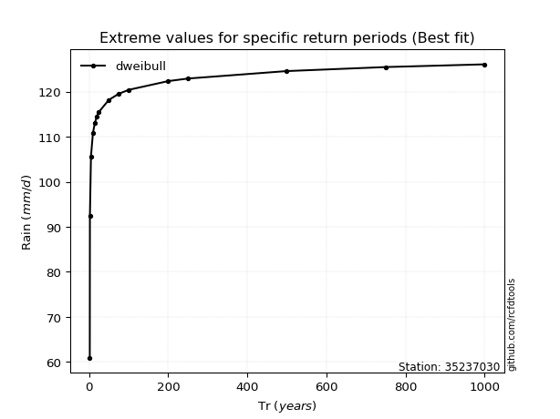</img>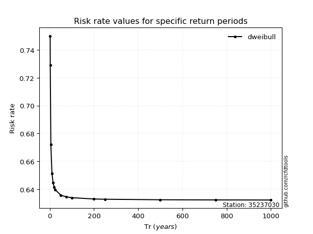</img>

</div>


<sub>**APP DISCLAIMER**: NO WARRANTY - This software is provided by [github.com/rcfdtools](https://github.com/rcfdtools) "as is", without any express or implied warranty, including warranties of merchantability, fitness for a particular purpose, or non-infringement. There is no guarantee that the software will be error-free or operate without interruption. LIMITATION OF LIABILITY - Neither the authors nor copyright holders will be liable for claims or damages arising from the software or its use. You are responsible for determining if the software is appropriate for your use and assume all associated risks, including errors, legal compliance, and data loss. NO PROFESSIONAL ADVICE - The software provides general information and does not offer professional advice. It should not replace consultation with professional advisors.</sub>