<div align="center">


</div>

# PMax24h Station (Rain): 36015020

Maximum Precipitation in 24 hours (PMax24h) is the greatest amount of rainfall for a specific duration that is meteorologically possible for a given location, acting as a "worst-case" scenario for extreme storms, crucial for designing safety-critical infrastructure like bridges, river deviations, dams, spillways, and nuclear plants to prevent catastrophic failure. The PMax24h is related with the Probable Maximum Precipitation (PMP) and it is calculated by hydrologists using meteorological data to determine the upper limit of extreme rainfall, often leading to the Probable Maximum Flood (PMF) for flood control design, and is increasingly being studied for climate change impacts. Probable Maximum Precipitation (PMP) is the theoretical upper limit of rainfall, a deterministic estimate for extreme events, while probability distributions (like GEV, Gumbel) describe the likelihood and frequency of various precipitation amounts, including rare ones, showing how often events occur, with PMP representing the extreme end of these distributions, used for critical infrastructure design to ensure safety against the worst conceivable weather, unlike standard statistical forecasts which cover typical probabilities.

The most common probability distributions in hydrology, used for analyzing floods, rainfall, and streamflow, include the Normal, Log-Normal, Gumbel, Gamma (including Log-Pearson Type III), and Generalized Extreme Value (GEV) distributions, often chosen based on the data´s skewness and whether modeling extremes or general conditions, with Gumbel and GEV popular for extreme events like floods, while the Normal distribution serves as a baseline, though often requiring transformations for skewed hydrological data. These distributions help in designing water infrastructure, managing water resources, and forecasting hydrologic events.

> Hydrological data often isn´t perfectly normal (it´s skewed), so different distributions are needed for different applications, such as: **Flood Frequency Analysis**: Using Gumbel, GEV, or Log-Pearson Type III for predicting extreme flood magnitudes and their return periods, **Rainfall Analysis**: Normal for annual totals, but Log-Normal, Weibull, or GEV for intensity or extreme daily rainfall, **Streamflow Modeling**: Gamma and Log-Normal for maximum flows, GEV for minimum flows, and Kappa for daily flows.

<div align="center">

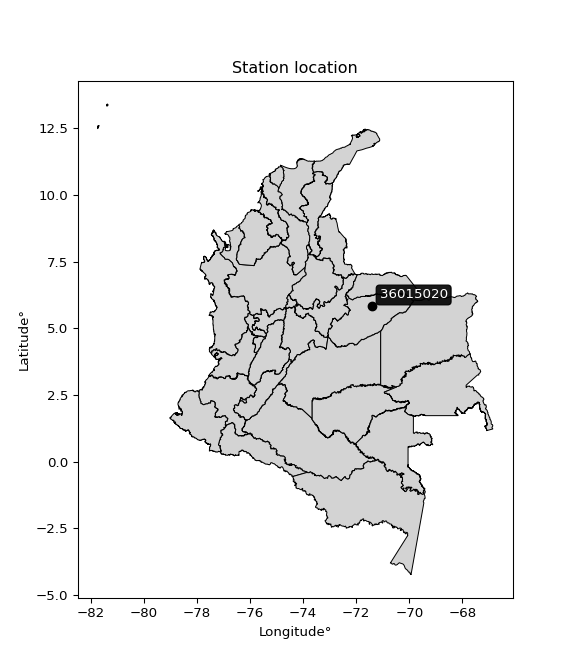</img>

</div>


## A. General information


### 1. General running parameters

• app_version: _v20260312_. • runtime: _2026-03-12 07:15:23.203550_. • Python version: _3.14.0_. • SciPy version: _1.16.3_. • Pandas version: _2.3.3_. • NumPy version: _2.3.5_. • Stations dataset (station_dataset_file): _dataset/pmax24h_in/automatic_colombia_2003_2025.csv_. • Stations catalog (station_catalog_file): _dataset/CNE.xls_. • Minimum year to eval til year_max (date_min): _1900_. • Maximum year to eval since year_min (date_max): _2025_. • Creates, save and include plots into reports (create_plot): _True_. • Plot only fit distributions with Δo > Δ (plot_only_fit): _True_. • Plot only simple graphs avoiding multiple CDFs and multiple Extreme values plots (plot_only_simple): _True_. • Eval low extreme values, if False, evaluates high extreme values (low_extreme): _False_. • Eval every SciPy distribution as logarithmic (pdist_logarithmic_on): _True_. • Standard deviation normalized (ddof): _1.0_. • Return periods to eval in years (Tr): _[2, 2.33, 5, 10, 15, 20, 25, 50, 75, 100, 200, 250, 500, 750, 1000]_. • Minimum data sample per station, 0 means any (minimum_sample): _5_. • Z-Score maximum threshold to adjust a value, 0 means disable (zscore_max): _3.5_. • Z-Score minimum threshold to adjust a value, 0 means disable (zscore_min): _-2.5_. • Avoid zeros, e.g. rain = 0 (avoid_zeros): _True_. • Avoid null values (avoid_nans): _True_. 

:file_folder:Table: [dataset.csv](../../dataset/pmax24h_in/automatic_colombia_2003_2025.csv)

> Delta Degrees of Freedom (DDOF): is a parameter used in the formulas for calculating variance and standard deviation. When ddof=0, the divisor is $N$ (the total number of observations) and this is used when your data set is the entire population. When ddof=1, the divisor is $N-1$ and this is used when your data set is a sample drawn from a larger population. Using $N-1$ provides an unbiased estimate of the population variance (known as Bessel´s correction).


### 2. Station info and location

|   id |   CODIGO | NOMBRE                       | CATEGORIA               | TECNOLOGIA                | ESTADO           | FECHA_INSTALACION   |   FECHA_SUSPENSION |   ALTITUD |   LATITUD |   LONGITUD | DEPARTAMENTO   | MUNICIPIO      | AREA_OPERATIVA                              | ENTIDAD                                                     | AREA_HIDROGRAFICA   | ZONA_HIDROGRAFICA   | SUBZONA_HIDROGRAFICA                           |   CORRIENTE | Catalogo   |   Version |
|-----:|---------:|:-----------------------------|:------------------------|:--------------------------|:-----------------|:--------------------|-------------------:|----------:|----------:|-----------:|:---------------|:---------------|:--------------------------------------------|:------------------------------------------------------------|:--------------------|:--------------------|:-----------------------------------------------|------------:|:-----------|----------:|
|    0 | 36015020 | EL DIAMANTE - AUT [36015020] | Climatológica Principal | Automática con Telemetría | En Mantenimiento | 19/11/2005          |                nan |       160 |   5.81619 |   -71.4198 | Casanare       | Paz De Ariporo | Area Operativa 06 - Boyacá-Casanare-Vichada | INSTITUTO DE HIDROLOGIA METEOROLOGIA Y ESTUDIOS AMBIENTALES | Orinoco             | Meta                | Directos al Río Meta entre ríos Pauto y Carare |         nan | CNE_IDEAM  |  20251226 |

<div align="center">

Dynamic map: [:earth_americas:Google](http://maps.google.com/maps?q=5.816194444,-71.41983333) [:earth_americas:OSM](https://www.openstreetmap.org/#map=18/5.816194444/-71.41983333&layers=P) [:earth_americas:Bing](https://www.bing.com/maps?cp=5.816194444~-71.41983333&lvl=18) [:earth_americas:Apple](https://maps.apple.com/frame?center=5.816194444%2C-71.41983333&span=0.003%2C0.006)

</div>


<div align="center">

```geojson
{
  "type": "Feature",
  "geometry": {
    "type": "Point", 
    "coordinates": [-71.41983333, 5.816194444]
  }, 
  "properties": {
    "Name": "36015020"
  }
}
```

</div>


### 3. Discrete values table and plot

<div align="center">

|               |          0 |           1 |           2 |          3 |            4 |          5 |          6 |           7 |
|:--------------|-----------:|------------:|------------:|-----------:|-------------:|-----------:|-----------:|------------:|
| Date          | 2017       | 2018        | 2019        | 2020       | 2021         | 2022       | 2023       | 2025        |
| Value         |  180.2     |   68.8      |  118.5      |  125.2     |   91.3       |   11.1     |    9.5     |   95        |
| Value_initial |  180.2     |   68.8      |  118.5      |  125.2     |   91.3       |   11.1     |    9.5     |   95        |
| count         |    8       |    8        |    8        |    8       |    8         |    8       |    8       |    8        |
| mean          |   87.45    |   87.45     |   87.45     |   87.45    |   87.45      |   87.45    |   87.45    |   87.45     |
| std           |   57.7147  |   57.7147   |   57.7147   |   57.7147  |   57.7147    |   57.7147  |   57.7147  |   57.7147   |
| zscore        |    1.60704 |   -0.323141 |    0.537991 |    0.65408 |    0.0667075 |   -1.32289 |   -1.35061 |    0.130816 |


</div>


<div align="center">

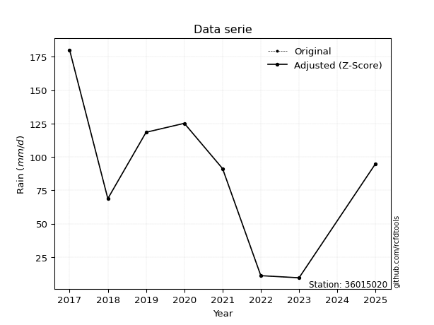</img>

</div>


> The initial value (value_initial) correspond to the initial obtained or null completed value, and value (value) is adjusted only when the initial value is outside the valid range (outlier) definite through the Z-Score value. If Z-Score is active, values out of range or outliers are replaced with the station mean value. A Z-Score (or standard score) measures how many standard deviations a data point is from the mean of a dataset, indicating its relative position; positive scores mean above the mean, negative mean below, and a score of zero is exactly at the mean, allowing for comparison of values from different distributions. It´s calculated using the formula $z=(x–μ)/σ$, where $x$ is the data point, $μ$ is the mean, and $σ$ is the standard deviation, helping identify outliers and understand probability.
>
> <sub>**Note**: In this study, "completing" (filling gaps in) and "extending" (forecasting or lengthening the historical record) rainfall data series are avoided for certain critical analyses because they introduce artificial bias and uncertainty, which can distort the statistics of rare events (extremes), alter day-to-day variability, and compromise the integrity and homogeneity of the original data. Some reasons against Completing/Extending rainfall data are: **Distortion of Extremes and Variability**: The primary issue is that most gap-filling or extension methods rely on averaging or regression with nearby stations, which inherently smooths the data. Rainfall is highly variable in space and time, with a large percentage of zero values and occasional large storms. Infilling methods often underestimate the highest values and overestimate the lowest (zero) values, which severely distorts analyses focused on flood frequency, drought severity, and intensity-duration-frequency (IDF) curves, **Loss of Data Homogeneity**: Infilled or extended data are synthetic estimates, not actual measurements. Combining these estimates with observed data can violate the assumption of data homogeneity, which requires that the data properties do not change over time. Inhomogeneity can lead to incorrect conclusions about long-term trends or changes in climate patterns, **Propagation of Errors**: Errors and biases from the original data (e.g., wind-induced undercatch, instrument errors, site changes) or the data used for imputation can propagate through the analysis, leading to unreliable hydrological models and inaccurate predictions, **Compromised Statistical Integrity**: For statistical analyses, especially those involving the frequency of events, using artificial data can introduce time bias or autocorrelation that doesn´t exist in reality, making it difficult to assess the true probability of events, **Difficulty in Validation**: It is difficult to accurately validate the quality of filled or extended data, especially for past periods where ground-truth measurements are unavailable. The reliability of imputation techniques heavily depends on the density of the surrounding station network and the complexity of the local topography.</sub>


### 4. Active continuous probability distributions from SciPy (80 of 104 available)

A Probability Density Function (PDF) describes the relative likelihood of a continuous random variable falling within a specific range, where the total area under its curve equals 1, and the area over any interval gives the actual probability for that range. Unlike discrete probabilities (like rolling a die), a PDF shows density, not direct probability for a single point (which is zero), with higher points indicating higher likelihood, often visualized as a bell curve for normal distributions.

A log of a probability density function (log-PDF) is simply the logarithm of the PDF´s value, denoted as $log(f(x))$, useful for converting multiplication of probabilities into addition, improving numerical stability with tiny numbers, and connecting to information theory concepts like entropy. Instead of dealing with very small probabilities (e.g., 0.000001), log-PDFs use negative numbers (e.g., $log(0.00001) ≈ -11.51$ that are easier for computers to handle, preventing underflow errors and simplifying complex calculations. In this study, each active probability distribution from SciPy is also evaluated in the $log$ form.

[scipy.stats](https://docs.scipy.org/doc/scipy/reference/stats.html) is a Python´s powerful submodule within the SciPy library for comprehensive statistical analysis, offering over 130 probability distributions (like Normal, Poisson, etc.), functions for descriptive stats (mean, variance), hypothesis testing (t-tests, chi-square), random variable generation, and statistical tests, making it essential for data science, modeling, and research. It provides tools to explore, model, and draw conclusions from data efficiently, working seamlessly with [NumPy](https://numpy.org/).

<div align="center">

|   id | p_dist           |   n_parameter | fit_method   | label                                                                       | active   | ref                                                                                                      |
|-----:|:-----------------|--------------:|:-------------|:----------------------------------------------------------------------------|:---------|:---------------------------------------------------------------------------------------------------------|
|    0 | alpha            |             3 | MLE          | Alpha                                                                       | True     | [:mortar_board:](https://docs.scipy.org/doc/scipy/reference/generated/scipy.stats.alpha.html)            |
|    1 | anglit           |             2 | MM           | Anglit                                                                      | True     | [:mortar_board:](https://docs.scipy.org/doc/scipy/reference/generated/scipy.stats.anglit.html)           |
|    2 | arcsine          |             2 | MM           | Arcsine                                                                     | True     | [:mortar_board:](https://docs.scipy.org/doc/scipy/reference/generated/scipy.stats.arcsine.html)          |
|    3 | argus            |             3 | MLE          | Argus                                                                       | True     | [:mortar_board:](https://docs.scipy.org/doc/scipy/reference/generated/scipy.stats.argus.html)            |
|    4 | beta             |             4 | MLE          | Beta                                                                        | True     | [:mortar_board:](https://docs.scipy.org/doc/scipy/reference/generated/scipy.stats.beta.html)             |
|    5 | betaprime        |             4 | MLE          | Beta prime                                                                  | True     | [:mortar_board:](https://docs.scipy.org/doc/scipy/reference/generated/scipy.stats.betaprime.html)        |
|    6 | bradford         |             3 | MLE          | Bradford                                                                    | True     | [:mortar_board:](https://docs.scipy.org/doc/scipy/reference/generated/scipy.stats.bradford.html)         |
|    7 | burr             |             4 | MLE          | Burr (Type III)                                                             | True     | [:mortar_board:](https://docs.scipy.org/doc/scipy/reference/generated/scipy.stats.burr.html)             |
|    8 | burr12           |             4 | MLE          | Burr (Type III) 12                                                          | True     | [:mortar_board:](https://docs.scipy.org/doc/scipy/reference/generated/scipy.stats.burr12.html)           |
|    9 | cosine           |             2 | MLE          | Cosine                                                                      | True     | [:mortar_board:](https://docs.scipy.org/doc/scipy/reference/generated/scipy.stats.cosine.html)           |
|   10 | crystalball      |             4 | MLE          | Crystalball                                                                 | True     | [:mortar_board:](https://docs.scipy.org/doc/scipy/reference/generated/scipy.stats.crystalball.html)      |
|   11 | dgamma           |             3 | MLE          | Double gamma                                                                | True     | [:mortar_board:](https://docs.scipy.org/doc/scipy/reference/generated/scipy.stats.dgamma.html)           |
|   12 | dweibull         |             3 | MLE          | Double Weibull                                                              | True     | [:mortar_board:](https://docs.scipy.org/doc/scipy/reference/generated/scipy.stats.dweibull.html)         |
|   13 | erlang           |             3 | MLE          | Erlang                                                                      | True     | [:mortar_board:](https://docs.scipy.org/doc/scipy/reference/generated/scipy.stats.erlang.html)           |
|   14 | exponnorm        |             3 | MLE          | Exponentially modified Normal                                               | True     | [:mortar_board:](https://docs.scipy.org/doc/scipy/reference/generated/scipy.stats.exponnorm.html)        |
|   15 | exponpow         |             3 | MLE          | Exponential power                                                           | True     | [:mortar_board:](https://docs.scipy.org/doc/scipy/reference/generated/scipy.stats.exponpow.html)         |
|   16 | exponweib        |             4 | MLE          | Exponentiated Weibull                                                       | True     | [:mortar_board:](https://docs.scipy.org/doc/scipy/reference/generated/scipy.stats.exponweib.html)        |
|   17 | f                |             4 | MLE          | F                                                                           | True     | [:mortar_board:](https://docs.scipy.org/doc/scipy/reference/generated/scipy.stats.f.html)                |
|   18 | fatiguelife      |             3 | MLE          | Fatigue-life (Birnbaum-Saunders)                                            | True     | [:mortar_board:](https://docs.scipy.org/doc/scipy/reference/generated/scipy.stats.fatiguelife.html)      |
|   19 | foldnorm         |             3 | MM           | Fold Normal                                                                 | True     | [:mortar_board:](https://docs.scipy.org/doc/scipy/reference/generated/scipy.stats.foldnorm.html)         |
|   20 | gamma            |             3 | MLE          | Gamma                                                                       | True     | [:mortar_board:](https://docs.scipy.org/doc/scipy/reference/generated/scipy.stats.gamma.html)            |
|   21 | gausshyper       |             6 | MLE          | Gauss hypergeometric                                                        | True     | [:mortar_board:](https://docs.scipy.org/doc/scipy/reference/generated/scipy.stats.gausshyper.html)       |
|   22 | genexpon         |             5 | MLE          | Generalized exponential                                                     | True     | [:mortar_board:](https://docs.scipy.org/doc/scipy/reference/generated/scipy.stats.genexpon.html)         |
|   23 | genextreme       |             3 | MLE          | Generalized exponential                                                     | True     | [:mortar_board:](https://docs.scipy.org/doc/scipy/reference/generated/scipy.stats.genextreme.html)       |
|   24 | gengamma         |             4 | MLE          | Generalized gamma                                                           | True     | [:mortar_board:](https://docs.scipy.org/doc/scipy/reference/generated/scipy.stats.gengamma.html)         |
|   25 | genhalflogistic  |             3 | MLE          | Generalized half-logistic                                                   | True     | [:mortar_board:](https://docs.scipy.org/doc/scipy/reference/generated/scipy.stats.genhalflogistic.html)  |
|   26 | genlogistic      |             3 | MLE          | Generalized logistic                                                        | True     | [:mortar_board:](https://docs.scipy.org/doc/scipy/reference/generated/scipy.stats.genlogistic.html)      |
|   27 | gennorm          |             3 | MLE          | Generalized Normal                                                          | True     | [:mortar_board:](https://docs.scipy.org/doc/scipy/reference/generated/scipy.stats.gennorm.html)          |
|   28 | genpareto        |             3 | MLE          | Generalized Pareto                                                          | True     | [:mortar_board:](https://docs.scipy.org/doc/scipy/reference/generated/scipy.stats.genpareto.html)        |
|   29 | gompertz         |             3 | MLE          | Gompertz (or truncated Gumbel)                                              | True     | [:mortar_board:](https://docs.scipy.org/doc/scipy/reference/generated/scipy.stats.gompertz.html)         |
|   30 | gumbel_l         |             2 | MM           | Gumbel Left Skew                                                            | True     | [:mortar_board:](https://docs.scipy.org/doc/scipy/reference/generated/scipy.stats.gumbel_l.html)         |
|   31 | gumbel_r         |             2 | MM           | Gumbel Right Skew                                                           | True     | [:mortar_board:](https://docs.scipy.org/doc/scipy/reference/generated/scipy.stats.gumbel_r.html)         |
|   32 | halfgennorm      |             3 | MLE          | Upper half of a generalized normal                                          | True     | [:mortar_board:](https://docs.scipy.org/doc/scipy/reference/generated/scipy.stats.halfgennorm.html)      |
|   33 | halflogistic     |             2 | MM           | Half-logistic                                                               | True     | [:mortar_board:](https://docs.scipy.org/doc/scipy/reference/generated/scipy.stats.halflogistic.html)     |
|   34 | halfnorm         |             2 | MM           | Half Normal                                                                 | True     | [:mortar_board:](https://docs.scipy.org/doc/scipy/reference/generated/scipy.stats.halfnorm.html)         |
|   35 | hypsecant        |             2 | MM           | hyperbolic secant                                                           | True     | [:mortar_board:](https://docs.scipy.org/doc/scipy/reference/generated/scipy.stats.hypsecant.html)        |
|   36 | invgamma         |             3 | MLE          | Inverted gamma                                                              | True     | [:mortar_board:](https://docs.scipy.org/doc/scipy/reference/generated/scipy.stats.invgamma.html)         |
|   37 | invgauss         |             3 | MLE          | Inverse Gaussian                                                            | True     | [:mortar_board:](https://docs.scipy.org/doc/scipy/reference/generated/scipy.stats.invgauss.html)         |
|   38 | invweibull       |             3 | MLE          | Inverted Weibull                                                            | True     | [:mortar_board:](https://docs.scipy.org/doc/scipy/reference/generated/scipy.stats.invweibull.html)       |
|   39 | johnsonsb        |             4 | MLE          | Johnson SB                                                                  | True     | [:mortar_board:](https://docs.scipy.org/doc/scipy/reference/generated/scipy.stats.johnsonsb.html)        |
|   40 | johnsonsu        |             4 | MLE          | Johnson Su                                                                  | True     | [:mortar_board:](https://docs.scipy.org/doc/scipy/reference/generated/scipy.stats.johnsonsu.html)        |
|   41 | kappa3           |             3 | MLE          | Kappa 3                                                                     | True     | [:mortar_board:](https://docs.scipy.org/doc/scipy/reference/generated/scipy.stats.kappa3.html)           |
|   42 | kappa4           |             4 | MLE          | Kappa 4                                                                     | True     | [:mortar_board:](https://docs.scipy.org/doc/scipy/reference/generated/scipy.stats.kappa4.html)           |
|   43 | ksone            |             3 | MLE          | Kolmogorov-Smirnov one-sided test statistic distribution                    | True     | [:mortar_board:](https://docs.scipy.org/doc/scipy/reference/generated/scipy.stats.ksone.html)            |
|   44 | kstwobign        |             2 | MLE          | Limiting distribution of scaled Kolmogorov-Smirnov two-sided test statistic | True     | [:mortar_board:](https://docs.scipy.org/doc/scipy/reference/generated/scipy.stats.kstwobign.html)        |
|   45 | laplace          |             2 | MM           | Laplace                                                                     | True     | [:mortar_board:](https://docs.scipy.org/doc/scipy/reference/generated/scipy.stats.laplace.html)          |
|   46 | levy_l           |             2 | MLE          | Left-skewed Levy                                                            | True     | [:mortar_board:](https://docs.scipy.org/doc/scipy/reference/generated/scipy.stats.levy_l.html)           |
|   47 | loggamma         |             3 | MLE          | Log gamma                                                                   | True     | [:mortar_board:](https://docs.scipy.org/doc/scipy/reference/generated/scipy.stats.loggamma.html)         |
|   48 | logistic         |             2 | MM           | Logistic (or Sech-squared)                                                  | True     | [:mortar_board:](https://docs.scipy.org/doc/scipy/reference/generated/scipy.stats.logistic.html)         |
|   49 | loglaplace       |             3 | MLE          | Log-Laplace                                                                 | True     | [:mortar_board:](https://docs.scipy.org/doc/scipy/reference/generated/scipy.stats.loglaplace.html)       |
|   50 | lomax            |             3 | MLE          | Lomax (Pareto of the second kind)                                           | True     | [:mortar_board:](https://docs.scipy.org/doc/scipy/reference/generated/scipy.stats.lomax.html)            |
|   51 | maxwell          |             2 | MM           | Maxwell                                                                     | True     | [:mortar_board:](https://docs.scipy.org/doc/scipy/reference/generated/scipy.stats.maxwell.html)          |
|   52 | mielke           |             4 | MLE          | Mielke Beta-Kappa / Dagum                                                   | True     | [:mortar_board:](https://docs.scipy.org/doc/scipy/reference/generated/scipy.stats.mielke.html)           |
|   53 | moyal            |             2 | MM           | Moyal                                                                       | True     | [:mortar_board:](https://docs.scipy.org/doc/scipy/reference/generated/scipy.stats.moyal.html)            |
|   54 | nakagami         |             3 | MLE          | Nakagami                                                                    | True     | [:mortar_board:](https://docs.scipy.org/doc/scipy/reference/generated/scipy.stats.nakagami.html)         |
|   55 | ncf              |             5 | MLE          | Non-central F distribution                                                  | True     | [:mortar_board:](https://docs.scipy.org/doc/scipy/reference/generated/scipy.stats.ncf.html)              |
|   56 | nct              |             4 | MLE          | Non-central Student’s t                                                     | True     | [:mortar_board:](https://docs.scipy.org/doc/scipy/reference/generated/scipy.stats.nct.html)              |
|   57 | norm             |             2 | MM           | Normal                                                                      | True     | [:mortar_board:](https://docs.scipy.org/doc/scipy/reference/generated/scipy.stats.norm.html)             |
|   58 | pearson3         |             3 | MM           | Pearson type III                                                            | True     | [:mortar_board:](https://docs.scipy.org/doc/scipy/reference/generated/scipy.stats.pearson3.html)         |
|   59 | powerlaw         |             3 | MLE          | Power-function                                                              | True     | [:mortar_board:](https://docs.scipy.org/doc/scipy/reference/generated/scipy.stats.powerlaw.html)         |
|   60 | rayleigh         |             2 | MM           | Rayleigh                                                                    | True     | [:mortar_board:](https://docs.scipy.org/doc/scipy/reference/generated/scipy.stats.rayleigh.html)         |
|   61 | rdist            |             3 | MLE          | R-distributed (symmetric beta)                                              | True     | [:mortar_board:](https://docs.scipy.org/doc/scipy/reference/generated/scipy.stats.rdist.html)            |
|   62 | rice             |             3 | MLE          | Rice                                                                        | True     | [:mortar_board:](https://docs.scipy.org/doc/scipy/reference/generated/scipy.stats.rice.html)             |
|   63 | semicircular     |             2 | MM           | Semicircular                                                                | True     | [:mortar_board:](https://docs.scipy.org/doc/scipy/reference/generated/scipy.stats.semicircular.html)     |
|   64 | skewnorm         |             3 | MLE          | Skew normal                                                                 | True     | [:mortar_board:](https://docs.scipy.org/doc/scipy/reference/generated/scipy.stats.skewnorm.html)         |
|   65 | t                |             3 | MLE          | Student’s t                                                                 | True     | [:mortar_board:](https://docs.scipy.org/doc/scipy/reference/generated/scipy.stats.t.html)                |
|   66 | trapezoid        |             4 | MLE          | Trapezoid                                                                   | True     | [:mortar_board:](https://docs.scipy.org/doc/scipy/reference/generated/scipy.stats.trapezoid.html)        |
|   67 | triang           |             3 | MLE          | Triangular                                                                  | True     | [:mortar_board:](https://docs.scipy.org/doc/scipy/reference/generated/scipy.stats.triang.html)           |
|   68 | truncexpon       |             3 | MLE          | Truncated exponential                                                       | True     | [:mortar_board:](https://docs.scipy.org/doc/scipy/reference/generated/scipy.stats.truncexpon.html)       |
|   69 | truncnorm        |             4 | MLE          | Truncated normal                                                            | True     | [:mortar_board:](https://docs.scipy.org/doc/scipy/reference/generated/scipy.stats.truncnorm.html)        |
|   70 | truncpareto      |             4 | MLE          | Upper truncated Pareto                                                      | True     | [:mortar_board:](https://docs.scipy.org/doc/scipy/reference/generated/scipy.stats.truncpareto.html)      |
|   71 | truncweibull_min |             5 | MLE          | Doubly truncated Weibull minimum                                            | True     | [:mortar_board:](https://docs.scipy.org/doc/scipy/reference/generated/scipy.stats.truncweibull_min.html) |
|   72 | tukeylambda      |             3 | MLE          | Tukey-Lamdba                                                                | True     | [:mortar_board:](https://docs.scipy.org/doc/scipy/reference/generated/scipy.stats.tukeylambda.html)      |
|   73 | uniform          |             2 | MLE          | Uniform                                                                     | True     | [:mortar_board:](https://docs.scipy.org/doc/scipy/reference/generated/scipy.stats.uniform.html)          |
|   74 | vonmises         |             3 | MLE          | Von Mises                                                                   | True     | [:mortar_board:](https://docs.scipy.org/doc/scipy/reference/generated/scipy.stats.vonmises.html)         |
|   75 | vonmises_line    |             3 | MLE          | Von Mises line                                                              | True     | [:mortar_board:](https://docs.scipy.org/doc/scipy/reference/generated/scipy.stats.vonmises_line.html)    |
|   76 | wald             |             2 | MM           | Wald                                                                        | True     | [:mortar_board:](https://docs.scipy.org/doc/scipy/reference/generated/scipy.stats.wald.html)             |
|   77 | weibull_max      |             3 | MLE          | Weibull maximum                                                             | True     | [:mortar_board:](https://docs.scipy.org/doc/scipy/reference/generated/scipy.stats.weibull_max.html)      |
|   78 | weibull_min      |             3 | MLE          | Weibull minimum                                                             | True     | [:mortar_board:](https://docs.scipy.org/doc/scipy/reference/generated/scipy.stats.weibull_min.html)      |
|   79 | wrapcauchy       |             3 | MLE          | Wrapped  Cauchy                                                             | True     | [:mortar_board:](https://docs.scipy.org/doc/scipy/reference/generated/scipy.stats.wrapcauchy.html)       |

</div>

> **n_parameter:** # arguments & localization & scale.
>
> **Fit methods:** (MLE) maximum likelihood, (MM) L-moments.
>
>**Inactive** (With the only purpose of prevent loops, zero divisions, infinite values, over high estimated values or horizontal trending for recurrence intervals estimations, the follow distributions were disabled.)**:** lognorm, norminvgauss, powernorm, powerlognorm, cauchy, halfcauchy, foldcauchy, skewcauchy, chi2, expon, fisk, genhyperbolic, geninvgauss, gibrat, kstwo, laplace_asymmetric, levy, levy_stable, ncx2, pareto, rel_breitwigner, recipinvgauss, studentized_range, loguniform, 


## B. Probability (PDF) vs. Empirical (EDF) distributions functions

A continuous probability distribution (CPD) describes probabilities for variables that can take any value within a range (like rain any time), unlike discrete variables with specific outcomes (like temperature). It uses a Probability Density Function (PDF), a curve where the total area under it equals 1, and the probability of the variable falling within an interval (a to b) is found by calculating the area under the curve between those points. A key feature is that the probability of hitting any single exact value is zero, so probabilities are always expressed for ranges, e.g., $P(a ≤ X ≤ b)$.

<div align="center">

Distributions parameters from station values
|     |   station | p_dist              |   n |             loc |            scale | shape                  | shape1                 | shape2             | shape3             |
|----:|----------:|:--------------------|----:|----------------:|-----------------:|:-----------------------|:-----------------------|:-------------------|:-------------------|
|   0 |  36015020 | alpha               |   8 |    -0.0544474   |     20.2236      | 3.6328199600898447e-09 |                        |                    |                    |
|   1 |  36015020 | anglit              |   8 |    87.45        |    157.934       |                        |                        |                    |                    |
|   2 |  36015020 | arcsine             |   8 |    11.1006      |    152.699       |                        |                        |                    |                    |
|   3 |  36015020 | argus               |   8 |   -38.6791      |    227.395       | 1.1969353049173084e-06 |                        |                    |                    |
|   4 |  36015020 | beta                |   8 |     9.5         |    248.25        | 0.5971952290460218     | 2.4212809774932635     |                    |                    |
|   5 |  36015020 | betaprime           |   8 |  -408.534       | 165176           | 83.85587362754404      | 27885.489162801998     |                    |                    |
|   6 |  36015020 | bradford            |   8 |     9.49997     |    170.7         | 0.5088238755155448     |                        |                    |                    |
|   7 |  36015020 | burr                |   8 |    -1.23636     |    183.989       | 249.81424512105576     | 0.003696082571018507   |                    |                    |
|   8 |  36015020 | burr12              |   8 |    -1.11266     |     10.4439      | 248.67969087589165     | 0.002256237830758581   |                    |                    |
|   9 |  36015020 | cosine              |   8 |    87.947       |     45.2275      |                        |                        |                    |                    |
|  10 |  36015020 | crystalball         |   8 |    87.45        |     53.9872      | 6111.6410118363465     | 5960.5093993507335     |                    |                    |
|  11 |  36015020 | dgamma              |   8 |    95           |     48.2872      | 0.8341228877959777     |                        |                    |                    |
|  12 |  36015020 | dweibull            |   8 |    95           |     43.2919      | 0.9226204617977609     |                        |                    |                    |
|  13 |  36015020 | erlang              |   8 | -3357.59        |      0.846678    | 4068.8738416706547     |                        |                    |                    |
|  14 |  36015020 | exponnorm           |   8 |    87.3994      |     53.9872      | 0.0009293587249362373  |                        |                    |                    |
|  15 |  36015020 | exponpow            |   8 |     9.5         |      5.47961     | 0.17765608028325613    |                        |                    |                    |
|  16 |  36015020 | exponweib           |   8 | -1736.9         |   1213.94        | 1279.1066895237072     | 4.996798018524483      |                    |                    |
|  17 |  36015020 | f                   |   8 | -9854.4         |   9941.44        | 2598888.169520898      | 69389.44091468661      |                    |                    |
|  18 |  36015020 | fatiguelife         |   8 |     9.5         |      5.35826e-05 | 1152.3009352488025     |                        |                    |                    |
|  19 |  36015020 | foldnorm            |   8 |  -326.75        |     53.7727      | 7.703768280273317      |                        |                    |                    |
|  20 |  36015020 | gamma               |   8 | -3370.74        |      0.844446    | 4095.177201440134      |                        |                    |                    |
|  21 |  36015020 | gausshyper          |   8 |     4.70183     |    175.498       | 0.9821143344614103     | 0.892804570247447      | 1.0625179394540707 | 1.1219539614465126 |
|  22 |  36015020 | genexpon            |   8 |     9.5         |      2.74388     | 0.0324062521295861     | 4.2271752912568884e-07 | 2.974408954723954  |                    |
|  23 |  36015020 | genextreme          |   8 |    70.1409      |     55.0253      | 0.3492800767263803     |                        |                    |                    |
|  24 |  36015020 | gengamma            |   8 |     9.5         |     37.5332      | 1.1757167563759152     | 0.6885332731224175     |                    |                    |
|  25 |  36015020 | genhalflogistic     |   8 |    -7.77897     |    203.564       | 1.08290823965747       |                        |                    |                    |
|  26 |  36015020 | genlogistic         |   8 |   101.753       |     28.1723      | 0.7557531151335282     |                        |                    |                    |
|  27 |  36015020 | gennorm             |   8 |    94.85        |     85.3502      | 7508774.893077519      |                        |                    |                    |
|  28 |  36015020 | genpareto           |   8 |    -1.80119     |    251.29        | -1.3807075990584208    |                        |                    |                    |
|  29 |  36015020 | gompertz            |   8 |    68.8         |     21.2436      | 0.027769349617557216   |                        |                    |                    |
|  30 |  36015020 | gumbel_l            |   8 |   111.747       |     42.0936      |                        |                        |                    |                    |
|  31 |  36015020 | gumbel_r            |   8 |    63.1529      |     42.0936      |                        |                        |                    |                    |
|  32 |  36015020 | halfgennorm         |   8 |     9.5         |      6.06019     | 0.4075022020248612     |                        |                    |                    |
|  33 |  36015020 | halflogistic        |   8 |    23.4627      |     46.1571      |                        |                        |                    |                    |
|  34 |  36015020 | halfnorm            |   8 |    15.9921      |     89.5591      |                        |                        |                    |                    |
|  35 |  36015020 | hypsecant           |   8 |    87.45        |     34.3693      |                        |                        |                    |                    |
|  36 |  36015020 | invgamma            |   8 |  -434.808       |  46079.3         | 89.42341077782498      |                        |                    |                    |
|  37 |  36015020 | invgauss            |   8 |  -168.379       |   5060.07        | 0.05022450040263052    |                        |                    |                    |
|  38 |  36015020 | invweibull          |   8 |     9.5         |      3.1763      | 0.0643599395774436     |                        |                    |                    |
|  39 |  36015020 | johnsonsb           |   8 |    -5.45553     |    185.656       | -0.059580297820465096  | 0.10753572153941715    |                    |                    |
|  40 |  36015020 | johnsonsu           |   8 |  1347.17        |   2051.05        | 25.901495333274966     | 44.594141081465864     |                    |                    |
|  41 |  36015020 | kappa3              |   8 |     9.5         |    117.402       | 7.940477047554156      |                        |                    |                    |
|  42 |  36015020 | kappa4              |   8 |    -5.81964     |    186.785       | 1.0893470656459372     | 1.0003417918916124     |                    |                    |
|  43 |  36015020 | ksone               |   8 |    -6.05849     |    187.017       | 1.0                    |                        |                    |                    |
|  44 |  36015020 | kstwobign           |   8 |  -113.032       |    228.86        |                        |                        |                    |                    |
|  45 |  36015020 | laplace             |   8 |    87.45        |     38.1747      |                        |                        |                    |                    |
|  46 |  36015020 | levy_l              |   8 |   190.238       |     47.3681      |                        |                        |                    |                    |
|  47 |  36015020 | loggamma            |   8 | -5243.72        |    934.807       | 300.25385619518624     |                        |                    |                    |
|  48 |  36015020 | logistic            |   8 |    87.45        |     29.7647      |                        |                        |                    |                    |
|  49 |  36015020 | loglaplace          |   8 |    -0.245555    |     95.2456      | 1.3551251629291539     |                        |                    |                    |
|  50 |  36015020 | lomax               |   8 |     9.49776     | 330554           | 4286.197252501213      |                        |                    |                    |
|  51 |  36015020 | maxwell             |   8 |   -40.4769      |     80.1663      |                        |                        |                    |                    |
|  52 |  36015020 | mielke              |   8 |    -2.61192     |    184.864       | 0.956000641973997      | 331.6980037969871      |                    |                    |
|  53 |  36015020 | moyal               |   8 |    56.5767      |     24.3028      |                        |                        |                    |                    |
|  54 |  36015020 | nakagami            |   8 |     9.5         |    111.857       | 0.28658481536813984    |                        |                    |                    |
|  55 |  36015020 | ncf                 |   8 |    -0.00485219  |      6.27585e-06 | 7.89645444958611e-07   | 6.976647153679679      | 9.34573749161325   |                    |
|  56 |  36015020 | nct                 |   8 |    -0.41165     |      0.381864    | 0.6392312045876839     | 54.73624432170447      |                    |                    |
|  57 |  36015020 | norm                |   8 |    87.45        |     53.9872      |                        |                        |                    |                    |
|  58 |  36015020 | pearson3            |   8 |    87.45        |     53.9871      | -0.034226309444137154  |                        |                    |                    |
|  59 |  36015020 | powerlaw            |   8 |     9.5         |    170.7         | 0.16986649064124587    |                        |                    |                    |
|  60 |  36015020 | rayleigh            |   8 |   -15.8306      |     82.406       |                        |                        |                    |                    |
|  61 |  36015020 | rdist               |   8 |    -6.96212     |    101.962       | 0.9369505466579868     |                        |                    |                    |
|  62 |  36015020 | rice                |   8 |   -22.3593      |     63.2525      | 1.3199814051896506     |                        |                    |                    |
|  63 |  36015020 | semicircular        |   8 |    87.45        |    107.974       |                        |                        |                    |                    |
|  64 |  36015020 | skewnorm            |   8 |    97.8213      |     54.9743      | -0.24334264928620847   |                        |                    |                    |
|  65 |  36015020 | t                   |   8 |    87.4505      |     53.9872      | 596691467.1035959      |                        |                    |                    |
|  66 |  36015020 | trapezoid           |   8 |    -7.9485      |    204.84        | 1.0                    | 1.0                    |                    |                    |
|  67 |  36015020 | triang              |   8 |    -8.37703     |    188.577       | 0.9999999217902868     |                        |                    |                    |
|  68 |  36015020 | truncexpon          |   8 |     8.30285     |    184.165       | 0.9333883510066845     |                        |                    |                    |
|  69 |  36015020 | truncnorm           |   8 |    87.45        |     53.9871      | -738.5021138149019     | 81.52079230892721      |                    |                    |
|  70 |  36015020 | truncpareto         |   8 |     9.47918     |      0.0208203   | 0.1451781385519201     | 8199.722488220032      |                    |                    |
|  71 |  36015020 | truncweibull_min    |   8 |     9.28436     |    174.138       | 0.5989913998982513     | 0.001238329002335844   | 0.9814949460167149 |                    |
|  72 |  36015020 | tukeylambda         |   8 |    96.4522      |    104.247       | 1.1989021774752255     |                        |                    |                    |
|  73 |  36015020 | uniform             |   8 |     9.5         |    170.7         |                        |                        |                    |                    |
|  74 |  36015020 | vonmises            |   8 |    -1.27717     |      1           | 0.8565026907257116     |                        |                    |                    |
|  75 |  36015020 | vonmises_line       |   8 |    94.85        |     27.1678      | 0.16278290714972868    |                        |                    |                    |
|  76 |  36015020 | wald                |   8 |    33.461       |     53.9883      |                        |                        |                    |                    |
|  77 |  36015020 | weibull_max         |   8 |   180.2         |      1.46153     | 0.21777384045970274    |                        |                    |                    |
|  78 |  36015020 | weibull_min         |   8 |   -31.3892      |    134.198       | 2.381592090858944      |                        |                    |                    |
|  79 |  36015020 | wrapcauchy          |   8 |     9.49998     |     27.3093      | 1.2274003980952217e-05 |                        |                    |                    |
|  80 |  36015020 | logalpha            |   8 |   -24.6907      |    754.636       | 26.259758193218474     |                        |                    |                    |
|  81 |  36015020 | loganglit           |   8 |     4.09455     |      3.07931     |                        |                        |                    |                    |
|  82 |  36015020 | logarcsine          |   8 |     2.60591     |      2.97726     |                        |                        |                    |                    |
|  83 |  36015020 | logargus            |   8 |     0.967726    |      4.3029      | 2.309243293460542      |                        |                    |                    |
|  84 |  36015020 | logbeta             |   8 |     1.99859     |      3.19548     | 0.3261693154598039     | 0.12905021164330027    |                    |                    |
|  85 |  36015020 | logbetaprime        |   8 |     0.043027    |  22839.3         | 10.230006229680857     | 57236.13224323976      |                    |                    |
|  86 |  36015020 | logbradford         |   8 |     2.24393     |      2.95015     | 2.653234744144326e-05  |                        |                    |                    |
|  87 |  36015020 | logburr             |   8 |    -1.7702      |      6.98271     | 1286.3431060895718     | 0.0040247599389173026  |                    |                    |
|  88 |  36015020 | logburr12           |   8 | -2655.4         |   2669.64        | 3815.348282459385      | 1049817.785206867      |                    |                    |
|  89 |  36015020 | logcosine           |   8 |     3.96052     |      0.865893    |                        |                        |                    |                    |
|  90 |  36015020 | logcrystalball      |   8 |     4.09455     |      1.05261     | 7.667736439093421      | 74.16097951142353      |                    |                    |
|  91 |  36015020 | logdgamma           |   8 |     4.51415     |      1.0858      | 0.5340807837672535     |                        |                    |                    |
|  92 |  36015020 | logdweibull         |   8 |     4.51415     |      0.853555    | 0.8423783692074535     |                        |                    |                    |
|  93 |  36015020 | logerlang           |   8 |   -13.2623      |      0.0685666   | 253.430755116643       |                        |                    |                    |
|  94 |  36015020 | logexponnorm        |   8 |     4.09393     |      1.05261     | 0.0005953797714894876  |                        |                    |                    |
|  95 |  36015020 | logexponpow         |   8 |     2.25129     |      1.34465     | 0.41832664467997394    |                        |                    |                    |
|  96 |  36015020 | logexponweib        |   8 |     2.25129     |      1.11251     | 1.1258119238521502     | 0.7662685844810364     |                    |                    |
|  97 |  36015020 | logf                |   8 | -1372.73        |   1376.82        | 8976562.582229864      | 5481959.539566517      |                    |                    |
|  98 |  36015020 | logfatiguelife      |   8 |  -374.042       |    378.136       | 0.002787293637487349   |                        |                    |                    |
|  99 |  36015020 | logfoldnorm         |   8 |     2.75345     |      1.2239      | 0.9127345179097517     |                        |                    |                    |
| 100 |  36015020 | loggamma            |   8 |   -13.2275      |      0.0681638   | 254.13198972785494     |                        |                    |                    |
| 101 |  36015020 | loggausshyper       |   8 |     2.20241     |      2.99166     | 1.1276195916107774     | 0.7547164284700997     | 1.0523228101107247 | 0.9600860273524432 |
| 102 |  36015020 | loggenexpon         |   8 |     2.25129     |      2.40313e+07 | 7262469.924388129      | 34354153.4150608       | 3532149.8263110407 |                    |
| 103 |  36015020 | loggenextreme       |   8 |     4.1979      |      1.17409     | 1.1786040670196654     |                        |                    |                    |
| 104 |  36015020 | loggengamma         |   8 |     2.25129     |      1.33746     | 1.0287540317022499     | 0.20662881694895913    |                    |                    |
| 105 |  36015020 | loggenhalflogistic  |   8 |     1.85608     |      3.55222     | 1.0641818312255464     |                        |                    |                    |
| 106 |  36015020 | loggenlogistic      |   8 |     5.19416     |      5.01903e-06 | 4.5766997432251254e-06 |                        |                    |                    |
| 107 |  36015020 | loggennorm          |   8 |     4.55388     |      0.0821885   | 0.4642623660340517     |                        |                    |                    |
| 108 |  36015020 | loggenpareto        |   8 |    -0.0107872   |     12.1635      | -2.336952788457431     |                        |                    |                    |
| 109 |  36015020 | loggompertz         |   8 |     2.25129     |      0.830475    | 0.07012702063632448    |                        |                    |                    |
| 110 |  36015020 | loggumbel_l         |   8 |     4.56828     |      0.820718    |                        |                        |                    |                    |
| 111 |  36015020 | loggumbel_r         |   8 |     3.62081     |      0.820718    |                        |                        |                    |                    |
| 112 |  36015020 | loghalfgennorm      |   8 |     2.25129     |      1.12006     | 0.7627273693809368     |                        |                    |                    |
| 113 |  36015020 | loghalflogistic     |   8 |     2.84697     |      0.899935    |                        |                        |                    |                    |
| 114 |  36015020 | loghalfnorm         |   8 |     2.70132     |      1.74615     |                        |                        |                    |                    |
| 115 |  36015020 | loghypsecant        |   8 |     4.09455     |      0.670113    |                        |                        |                    |                    |
| 116 |  36015020 | loginvgamma         |   8 |   -16.0733      |   6890.2         | 342.6496074712977      |                        |                    |                    |
| 117 |  36015020 | loginvgauss         |   8 |    -4.4581      |    469.466       | 0.01821215548696442    |                        |                    |                    |
| 118 |  36015020 | loginvweibull       |   8 |    -1.87969e+08 |      1.87969e+08 | 166426924.68038937     |                        |                    |                    |
| 119 |  36015020 | logjohnsonsb        |   8 |     2.03857     |      3.1555      | -0.36371139967955296   | 0.11394227426252604    |                    |                    |
| 120 |  36015020 | logjohnsonsu        |   8 |     5.36654     |      0.00813962  | 6.1214200539393655     | 1.1361237205625279     |                    |                    |
| 121 |  36015020 | logkappa3           |   8 |     2.25129     |      2.94128     | 4080.2617690507795     |                        |                    |                    |
| 122 |  36015020 | logkappa4           |   8 |     1.98434     |      3.25606     | 1.0893549450775435     | 1.0110422016447644     |                    |                    |
| 123 |  36015020 | logksone            |   8 |     1.95701     |      3.53133     | 1.0                    |                        |                    |                    |
| 124 |  36015020 | logkstwobign        |   8 |    -0.376646    |      5.08604     |                        |                        |                    |                    |
| 125 |  36015020 | loglaplace          |   8 |     4.09455     |      0.744308    |                        |                        |                    |                    |
| 126 |  36015020 | loglevy_l           |   8 |     5.27679     |      0.387376    |                        |                        |                    |                    |
| 127 |  36015020 | logloggamma         |   8 |     5.19408     |      7.16152e-07 | 6.509700752259822e-07  |                        |                    |                    |
| 128 |  36015020 | loglogistic         |   8 |     4.09455     |      0.580335    |                        |                        |                    |                    |
| 129 |  36015020 | logloglaplace       |   8 |    -0.00197513  |      4.51613     | 4.816985028539175      |                        |                    |                    |
| 130 |  36015020 | loglomax            |   8 |     2.25002     |    961.41        | 521.9622396423745      |                        |                    |                    |
| 131 |  36015020 | logmaxwell          |   8 |     1.6003      |      1.56304     |                        |                        |                    |                    |
| 132 |  36015020 | logmielke           |   8 |    -2.55692     |      7.75231     | 6.062205978452296      | 36116.66917905871      |                    |                    |
| 133 |  36015020 | logmoyal            |   8 |     3.49259     |      0.473841    |                        |                        |                    |                    |
| 134 |  36015020 | lognakagami         |   8 |  -846.598       |    850.691       | 162740.35060026983     |                        |                    |                    |
| 135 |  36015020 | logncf              |   8 |    -1.0424      |      1.18083e-06 | 2.1954034441712666e-05 | 253.48250144474284     | 94.89301469698032  |                    |
| 136 |  36015020 | lognct              |   8 |    85.1428      |      1.0497      | 519498.3820312496      | -77.2105906809897      |                    |                    |
| 137 |  36015020 | lognorm             |   8 |     4.09455     |      1.05261     |                        |                        |                    |                    |
| 138 |  36015020 | logpearson3         |   8 |     4.09455     |      1.05261     | -0.9489564240373216    |                        |                    |                    |
| 139 |  36015020 | logpowerlaw         |   8 |     2.25129     |      2.94278     | 0.19724138501916072    |                        |                    |                    |
| 140 |  36015020 | lograyleigh         |   8 |     2.08084     |      1.60671     |                        |                        |                    |                    |
| 141 |  36015020 | logrdist            |   8 |     3.07418     |      1.75573     | 1.0615583035611595     |                        |                    |                    |
| 142 |  36015020 | logrice             |   8 |     1.55738     |      1.1596      | 1.900310910027271      |                        |                    |                    |
| 143 |  36015020 | logsemicircular     |   8 |     4.09455     |      2.10522     |                        |                        |                    |                    |
| 144 |  36015020 | logskewnorm         |   8 |     5.19407     |      1.522       | -33692388.36289553     |                        |                    |                    |
| 145 |  36015020 | logt                |   8 |     4.09455     |      1.05261     | 46059052612.565094     |                        |                    |                    |
| 146 |  36015020 | logtrapezoid        |   8 |     1.11731     |      4.46585     | 1.0                    | 1.0                    |                    |                    |
| 147 |  36015020 | logtriang           |   8 |     1.38694     |      3.80713     | 0.999999098124349      |                        |                    |                    |
| 148 |  36015020 | logtruncexpon       |   8 |     2.24058     |      4.09159     | 0.7218430250343357     |                        |                    |                    |
| 149 |  36015020 | logtruncnorm        |   8 |    -0.227042    |      3.48318     | 0.7101957934672062     | 1.5563670773842535     |                    |                    |
| 150 |  36015020 | logtruncpareto      |   8 |     2.25072     |      0.000573713 | 0.14369190736484502    | 5130.348228456912      |                    |                    |
| 151 |  36015020 | logtruncweibull_min |   8 |     2.25105     |      3.94436     | 0.9790788896194142     | 6.0697715007862276e-05 | 0.7461320243926997 |                    |
| 152 |  36015020 | logtukeylambda      |   8 |     3.54049     |      1.37534     | 1.066636455241714      |                        |                    |                    |
| 153 |  36015020 | loguniform          |   8 |     2.25129     |      2.94278     |                        |                        |                    |                    |
| 154 |  36015020 | logvonmises         |   8 |    -1.91709     |      1           | 1.395839656104676      |                        |                    |                    |
| 155 |  36015020 | logvonmises_line    |   8 |     3.72231     |      0.46848     | 1.4080675054074841e-06 |                        |                    |                    |
| 156 |  36015020 | logwald             |   8 |     3.04196     |      1.05259     |                        |                        |                    |                    |
| 157 |  36015020 | logweibull_max      |   8 |     5.19407     |      1.23361     | 0.22368947813774182    |                        |                    |                    |
| 158 |  36015020 | logweibull_min      |   8 |    -4.83003e+07 |      4.83003e+07 | 69391824.83006905      |                        |                    |                    |
| 159 |  36015020 | logwrapcauchy       |   8 |     2.25129     |      0.468357    | 0.46331696878548556    |                        |                    |                    |

</div>

> **loc** (Location parameter): This shifts the distribution along the x-axis. For many common distributions, like the normal (Gaussian) distribution, loc represents the mean $μ$. For others, like the uniform distribution, it might represent the minimum value, or for the beta distribution, the left end of the support interval.
>
> **scale** (Scale parameter): This determines the width or spread of the distribution. For the normal distribution, scale represents the standard deviation $σ$. For a uniform distribution, it defines the length of the interval (from $loc$ to $loc + scale$).
>
> **shape** (Shape parameters): Refers to parameters that define the specific form of a probability distribution, distinct from its location (loc) and scale (scale). These parameters are required arguments for most distribution functions. For example, a normal (Gaussian) distribution is fully defined by its location (mean) and scale (standard deviation), so it has no specific shape parameters beyond loc and scale. However, other distributions have intrinsic properties that need specification, as Gamma distribution that takes a shape parameter, often named $a$ or $alpha$.


### 0. Cumulative distribution values - CDF (160 evaluated)

Cumulative Distribution Function (CDF), denoted as $F$<sub>$X$</sub>$(x)$, is a function that gives the probability that a random variable $X$ will take a value less than or equal to a specific value, $x$ (i.e., $(P(X≥x)$. It essentially "accumulates" probabilities from a given point up to the far right (positive infinity), providing a complete picture of the distribution´s probabilities for both discrete (like rain) and continuous (like temperature) variables, helping to find probabilities over ranges or above certain values. Each station is evaluated separately ordering the $x$ values ascending, calculating the CDF and PDF values for the activated distributions and their logarithmic forms.

<div align="center">

CDF ordered by x ascending and calculating $log(f(x))$ separately
|   id |   Station |   date |     x |   count |   mean |     std |     zscore |   Value_initial |   station |   m |     alpha |   alpha_pdf |    anglit |   anglit_pdf |   arcsine |   arcsine_pdf |     argus |   argus_pdf |        beta |        beta_pdf |   betaprime |   betaprime_pdf |    bradford |   bradford_pdf |      burr |     burr_pdf |     burr12 |   burr12_pdf |    cosine |   cosine_pdf |   crystalball |   crystalball_pdf |    dgamma |   dgamma_pdf |   dweibull |   dweibull_pdf |    erlang |   erlang_pdf |   exponnorm |   exponnorm_pdf |   exponpow |   exponpow_pdf |   exponweib |   exponweib_pdf |         f |      f_pdf |   fatiguelife |   fatiguelife_pdf |   foldnorm |   foldnorm_pdf |     gamma |   gamma_pdf |   gausshyper |   gausshyper_pdf |    genexpon |   genexpon_pdf |   genextreme |   genextreme_pdf |    gengamma |   gengamma_pdf |   genhalflogistic |   genhalflogistic_pdf |   genlogistic |   genlogistic_pdf |     gennorm |   gennorm_pdf |   genpareto |   genpareto_pdf |    gompertz |   gompertz_pdf |   gumbel_l |   gumbel_l_pdf |   gumbel_r |   gumbel_r_pdf |   halfgennorm |   halfgennorm_pdf |   halflogistic |   halflogistic_pdf |   halfnorm |   halfnorm_pdf |   hypsecant |   hypsecant_pdf |   invgamma |   invgamma_pdf |   invgauss |   invgauss_pdf |   invweibull |   invweibull_pdf |   johnsonsb |   johnsonsb_pdf |   johnsonsu |   johnsonsu_pdf |      kappa3 |   kappa3_pdf |      kappa4 |   kappa4_pdf |     ksone |   ksone_pdf |   kstwobign |   kstwobign_pdf |   laplace |   laplace_pdf |   levy_l |   levy_l_pdf |   loggamma |   loggamma_pdf |   logistic |   logistic_pdf |   loglaplace |   loglaplace_pdf |       lomax |   lomax_pdf |   maxwell |   maxwell_pdf |    mielke |   mielke_pdf |      moyal |   moyal_pdf |    nakagami |   nakagami_pdf |       ncf |    ncf_pdf |       nct |     nct_pdf |      norm |   norm_pdf |   pearson3 |   pearson3_pdf |   powerlaw |   powerlaw_pdf |   rayleigh |   rayleigh_pdf |    rdist |       rdist_pdf |      rice |   rice_pdf |   semicircular |   semicircular_pdf |   skewnorm |   skewnorm_pdf |         t |      t_pdf |   trapezoid |   trapezoid_pdf |     triang |   triang_pdf |   truncexpon |   truncexpon_pdf |   truncnorm |   truncnorm_pdf |   truncpareto |   truncpareto_pdf |   truncweibull_min |   truncweibull_min_pdf |   tukeylambda |   tukeylambda_pdf |    uniform |   uniform_pdf |   vonmises |   vonmises_pdf |   vonmises_line |   vonmises_line_pdf |     wald |   wald_pdf |   weibull_max |   weibull_max_pdf |   weibull_min |   weibull_min_pdf |   wrapcauchy |   wrapcauchy_pdf |   logalpha |   logalpha_pdf |   loganglit |   loganglit_pdf |   logarcsine |   logarcsine_pdf |   logargus |   logargus_pdf |   logbeta |   logbeta_pdf |   logbetaprime |   logbetaprime_pdf |   logbradford |   logbradford_pdf |   logburr |   logburr_pdf |   logburr12 |   logburr12_pdf |   logcosine |   logcosine_pdf |   logcrystalball |   logcrystalball_pdf |   logdgamma |   logdgamma_pdf |   logdweibull |   logdweibull_pdf |   logerlang |   logerlang_pdf |   logexponnorm |   logexponnorm_pdf |   logexponpow |   logexponpow_pdf |   logexponweib |   logexponweib_pdf |      logf |   logf_pdf |   logfatiguelife |   logfatiguelife_pdf |   logfoldnorm |   logfoldnorm_pdf |   loggausshyper |   loggausshyper_pdf |   loggenexpon |   loggenexpon_pdf |   loggenextreme |   loggenextreme_pdf |   loggengamma |   loggengamma_pdf |   loggenhalflogistic |   loggenhalflogistic_pdf |   loggenlogistic |   loggenlogistic_pdf |   loggennorm |   loggennorm_pdf |   loggenpareto |   loggenpareto_pdf |   loggompertz |   loggompertz_pdf |   loggumbel_l |   loggumbel_l_pdf |   loggumbel_r |   loggumbel_r_pdf |   loghalfgennorm |   loghalfgennorm_pdf |   loghalflogistic |   loghalflogistic_pdf |   loghalfnorm |   loghalfnorm_pdf |   loghypsecant |   loghypsecant_pdf |   loginvgamma |   loginvgamma_pdf |   loginvgauss |   loginvgauss_pdf |   loginvweibull |   loginvweibull_pdf |   logjohnsonsb |   logjohnsonsb_pdf |   logjohnsonsu |   logjohnsonsu_pdf |   logkappa3 |   logkappa3_pdf |   logkappa4 |   logkappa4_pdf |   logksone |   logksone_pdf |   logkstwobign |   logkstwobign_pdf |   loglevy_l |   loglevy_l_pdf |   logloggamma |   logloggamma_pdf |   loglogistic |   loglogistic_pdf |   logloglaplace |   logloglaplace_pdf |    loglomax |   loglomax_pdf |   logmaxwell |   logmaxwell_pdf |   logmielke |   logmielke_pdf |    logmoyal |   logmoyal_pdf |   lognakagami |   lognakagami_pdf |    logncf |   logncf_pdf |    lognct |   lognct_pdf |   lognorm |   lognorm_pdf |   logpearson3 |   logpearson3_pdf |   logpowerlaw |   logpowerlaw_pdf |   lograyleigh |   lograyleigh_pdf |   logrdist |   logrdist_pdf |   logrice |   logrice_pdf |   logsemicircular |   logsemicircular_pdf |   logskewnorm |   logskewnorm_pdf |      logt |   logt_pdf |   logtrapezoid |   logtrapezoid_pdf |   logtriang |   logtriang_pdf |   logtruncexpon |   logtruncexpon_pdf |   logtruncnorm |   logtruncnorm_pdf |   logtruncpareto |   logtruncpareto_pdf |   logtruncweibull_min |   logtruncweibull_min_pdf |   logtukeylambda |   logtukeylambda_pdf |   loguniform |   loguniform_pdf |   logvonmises |   logvonmises_pdf |   logvonmises_line |   logvonmises_line_pdf |   logwald |   logwald_pdf |   logweibull_max |   logweibull_max_pdf |   logweibull_min |   logweibull_min_pdf |   logwrapcauchy |   logwrapcauchy_pdf |
|-----:|----------:|-------:|------:|--------:|-------:|--------:|-----------:|----------------:|----------:|----:|----------:|------------:|----------:|-------------:|----------:|--------------:|----------:|------------:|------------:|----------------:|------------:|----------------:|------------:|---------------:|----------:|-------------:|-----------:|-------------:|----------:|-------------:|--------------:|------------------:|----------:|-------------:|-----------:|---------------:|----------:|-------------:|------------:|----------------:|-----------:|---------------:|------------:|----------------:|----------:|-----------:|--------------:|------------------:|-----------:|---------------:|----------:|------------:|-------------:|-----------------:|------------:|---------------:|-------------:|-----------------:|------------:|---------------:|------------------:|----------------------:|--------------:|------------------:|------------:|--------------:|------------:|----------------:|------------:|---------------:|-----------:|---------------:|-----------:|---------------:|--------------:|------------------:|---------------:|-------------------:|-----------:|---------------:|------------:|----------------:|-----------:|---------------:|-----------:|---------------:|-------------:|-----------------:|------------:|----------------:|------------:|----------------:|------------:|-------------:|------------:|-------------:|----------:|------------:|------------:|----------------:|----------:|--------------:|---------:|-------------:|-----------:|---------------:|-----------:|---------------:|-------------:|-----------------:|------------:|------------:|----------:|--------------:|----------:|-------------:|-----------:|------------:|------------:|---------------:|----------:|-----------:|----------:|------------:|----------:|-----------:|-----------:|---------------:|-----------:|---------------:|-----------:|---------------:|---------:|----------------:|----------:|-----------:|---------------:|-------------------:|-----------:|---------------:|----------:|-----------:|------------:|----------------:|-----------:|-------------:|-------------:|-----------------:|------------:|----------------:|--------------:|------------------:|-------------------:|-----------------------:|--------------:|------------------:|-----------:|--------------:|-----------:|---------------:|----------------:|--------------------:|---------:|-----------:|--------------:|------------------:|--------------:|------------------:|-------------:|-----------------:|-----------:|---------------:|------------:|----------------:|-------------:|-----------------:|-----------:|---------------:|----------:|--------------:|---------------:|-------------------:|--------------:|------------------:|----------:|--------------:|------------:|----------------:|------------:|----------------:|-----------------:|---------------------:|------------:|----------------:|--------------:|------------------:|------------:|----------------:|---------------:|-------------------:|--------------:|------------------:|---------------:|-------------------:|----------:|-----------:|-----------------:|---------------------:|--------------:|------------------:|----------------:|--------------------:|--------------:|------------------:|----------------:|--------------------:|--------------:|------------------:|---------------------:|-------------------------:|-----------------:|---------------------:|-------------:|-----------------:|---------------:|-------------------:|--------------:|------------------:|--------------:|------------------:|--------------:|------------------:|-----------------:|---------------------:|------------------:|----------------------:|--------------:|------------------:|---------------:|-------------------:|--------------:|------------------:|--------------:|------------------:|----------------:|--------------------:|---------------:|-------------------:|---------------:|-------------------:|------------:|----------------:|------------:|----------------:|-----------:|---------------:|---------------:|-------------------:|------------:|----------------:|--------------:|------------------:|--------------:|------------------:|----------------:|--------------------:|------------:|---------------:|-------------:|-----------------:|------------:|----------------:|------------:|---------------:|--------------:|------------------:|----------:|-------------:|----------:|-------------:|----------:|--------------:|--------------:|------------------:|--------------:|------------------:|--------------:|------------------:|-----------:|---------------:|----------:|--------------:|------------------:|----------------------:|--------------:|------------------:|----------:|-----------:|---------------:|-------------------:|------------:|----------------:|----------------:|--------------------:|---------------:|-------------------:|-----------------:|---------------------:|----------------------:|--------------------------:|-----------------:|---------------------:|-------------:|-----------------:|--------------:|------------------:|-------------------:|-----------------------:|----------:|--------------:|-----------------:|---------------------:|-----------------:|---------------------:|----------------:|--------------------:|
|    0 |  36015020 |   2023 |   9.5 |       8 |  87.45 | 57.7147 | -1.35061   |             9.5 |  36015020 |   1 | 0.0342881 | 0.0188151   | 0.0827785 |   0.0034894  |  0        |    0          | 0.0665744 |  0.00273177 | 1.04261e-10 | 35051.6         |   0.0673045 |      0.00269223 | 1.82255e-07 |     0.00724674 | 0.0725547 | nan          | 0.00899449 |   0.0514382  | 0.0669192 |   0.0029455  |     0.0743889 |        0.0026057  | 0.0643445 |   0.0014213  |  0.0767808 |     0.00155238 | 0.0736857 |   0.00262565 |   0.0743904 |      0.00260574 | 0.00177111 |    1.77131e+11 |   0.0659904 |      0.00316233 | 0.0745097 | 0.00263141 |     0.0298393 |       5.60509e+09 |  0.0734468 |     0.00259074 | 0.0738649 |  0.00262883 |    0.0398846 |       0.00804509 | 2.92466e-08 |     0.0118104  |    0.0788319 |       0.00262798 | 5.60067e-14 |   25.5233      |         0.0444908 |            0.00269951 |     0.0818505 |        0.00211569 | 9.41127e-07 |    0.00585822 |   0.0453682 |      0.00405043 | 0           |     0          |  0.0843502 |    0.00191688  |  0.027951  |     0.0023754  |   6.96958e-08 |        0.0521187  |       0        |         0          |   0        |     0          |   0.0656675 |      0.00189712 |  0.0705214 |     0.00302049 |  0.0668301 |     0.00332343 |  6.86752e-05 |      2.38522e+10 |    0.373949 |     0.0029628   |   0.0753196 |      0.00258628 | 1.78947e-13 |   0.00656148 | 2.25938e-15 |   0.108956   | 0.0831929 |  0.00534711 |   0.0632869 |      0.00392921 | 0.064889  |    0.00169979 | 0.391306 |  0.000991214 |  0.0409341 |      0.0871207 |  0.0679334 |     0.0021273  |    0.0420199 |        0.056455  | 2.90529e-05 |  0.0129663  | 0.0574223 |    0.003185   | 0.0738652 |   0.00583022 | 0.00843577 |  0.00134649 | 1.82664e-10 | 58939.5        | 0.0483032 | 0.00534929 | 0.0508437 | 0.0194741   | 0.0743889 | 0.0026057  |  0.075241  |     0.00258604 | 0.00130379 |    1.24677e+11 |  0.046145  |     0.00355803 | 0.54934  |      0.00302541 | 0.0525983 | 0.00326868 |      0.0842427 |         0.00407985 |  0.074463  |     0.00260374 | 0.0743878 | 0.00260567 |  0.00725582 |     0.000831684 | 0.00898697 |   0.00100542 |    0.0106783 |       0.00889076 |   0.0743889 |      0.0026057  |      0        |       9.5555      |        1.70675e-12 |             0.0811141  |   7.10543e-15 |        0.00957789 | 0          |    0.00585823 |    2.09943 |      0.110906  |     7.02877e-09 |          0.00494537 | 0        | 0          |     0.0596128 |       0.000214458 |     0.0572831 |        0.00323902 |  1.26593e-07 |       0.00582801 |  0.0400659 |      0.0897086 |   0.034492  |        0.118526 |     0        |         0        |  0.0393515 |      0.0673224 |  0.132883 |   0.18107     |      0.0470873 |           0.116952 |     0.0024968 |          0.338971 | 0.0574578 |   nan         |   0.0359128 |       0.0506198 |   0.039441  |        0.111694 |        0.0399622 |            0.0818038 |   0.022761  |     0.0244813   |     0.0514783 |         0.0435671 |   0.03997   |       0.0851169 |      0.0399622 |          0.0818035 |   3.34062e-07 |       3.14682e+08 |    5.19781e-14 |        100.971     | 0.0403451 |  0.0823386 |        0.039879  |            0.0819592 |      0        |          0        |       0.0110263 |            0.252885 |   1.82365e-10 |          0.302208 |       0.0815206 |           0.0589222 |   0.000505978 |       2.42119e+11 |            0.0591378 |                 0.159102 |         0        |            0.0623017 |    0.0316303 |        0.0239237 |       0.21652  |        0.113926    |   8.57693e-10 |         0.0844421 |     0.0576893 |         0.0682236 |    0.00496566 |         0.0320986 |      1.11399e-09 |             0.76014  |          0        |              0        |      0        |          0        |      0.0406157 |          0.0604459 |     0.0388133 |          0.087628 |     0.041129  |         0.0982979 |       0.0456905 |            0.124836 |       0.253649 |        0.183919    |      0.0773714 |          0.0528625 | 1.21891e-11 |        0.339296 | 2.25993e-15 |        6.25751  |  0.0833333 |       0.283179 |      0.047749  |           0.149756 |    0.279524 |       0.0442566 |     0.0689106 |         0.0626385 |     0.0400717 |         0.0662823 |       0.0175576 |           0.0375342 | 0.000691049 |       0.542537 |    0.0182453 |        0.0811927 |   0.0552599 |       0.0696718 | 0.000210941 |     0.00325442 |     0.0403196 |         0.0823195 | 0.0389421 |    0.0965784 | 0.0399556 |     0.081764 | 0.0399622 |     0.0818038 |     0.0585073 |         0.0744259 |   0.000757508 |       3.36446e+11 |     0.0056116 |         0.0656582 |   0.338603 |    0.212237    | 0.0314029 |     0.0957693 |         0.0258496 |              0.146091 |     0.0531755 |         0.0808618 | 0.0399623 |  0.0818039 |      0.0644767 |           0.113717 |   0.0515445 |        0.119268 |      0.00508441 |            0.474118 |     0.00228296 |           0.496816 |         0        |          354.261     |           1.25279e-08 |                  0.576074 |      0.000106727 |             0.471016 |    0         |         0.339815 |       1.03367 |         0.0498673 |        0.000254661 |               0.339726 |  0        |     0         |         0.296806 |          0.0274045   |        0.0358167 |            0.0505242 |     2.16075e-07 |            0.926538 |
|    1 |  36015020 |   2022 |  11.1 |       8 |  87.45 | 57.7147 | -1.32289   |            11.1 |  36015020 |   2 | 0.0698239 | 0.0250672   | 0.0884468 |   0.00359572 |  0        |    0          | 0.0710143 |  0.00281801 | 0.0886017   |     0.0328803   |   0.0717137 |      0.00281974 | 0.0115674   |     0.00721235 | 0.0824841 |   0.00617365 | 0.084041   |   0.0420815  | 0.0717304 |   0.00306865 |     0.0786479 |        0.00271843 | 0.0666604 |   0.00147379 |  0.0793071 |     0.00160581 | 0.0779783 |   0.00274049 |   0.0786494 |      0.00271846 | 0.708724   |    0.0580453   |   0.0711825 |      0.00332815 | 0.078811  | 0.00274558 |     0.559601  |       0.0184873   |  0.0776821 |     0.00270381 | 0.0781625 |  0.00274363 |    0.0526613 |       0.00792825 | 0.0187194   |     0.0115894  |    0.0831206 |       0.00273321 | 0.0672624   |    0.0322793   |         0.0488295 |            0.00272394 |     0.0853028 |        0.00220024 | 0.5         |    0.00585822 |   0.0518573 |      0.00406096 | 0           |     0          |  0.0874709 |    0.00198435  |  0.0319405 |     0.00261321 |   0.0557333   |        0.0292032  |       0        |         0          |   0        |     0          |   0.068773  |      0.00198547 |  0.0754704 |     0.00316613 |  0.0722856 |     0.00349624 |  0.351649    |      0.0147833   |    0.378483 |     0.00271199  |   0.0795457 |      0.00269673 | 0.0104984   |   0.00656148 | 0.0136918   |   0.00785552 | 0.0917483 |  0.00534711 |   0.0697513 |      0.00415086 | 0.0676665 |    0.00177255 | 0.392902 |  0.00100335  |  0.0563668 |      0.11178   |  0.0714172 |     0.00222804 |    0.0517937 |        0.0695863 | 0.0205614   |  0.0127     | 0.0626499 |    0.00334959 | 0.0831676 |   0.00579847 | 0.010809   |  0.0016252  | 0.0681027   |     0.0243954  | 0.0571565 | 0.00571293 | 0.0843372 | 0.0220012   | 0.0786479 | 0.00271843 |  0.0794667 |     0.00269652 | 0.452368   |    0.0480263   |  0.0519996 |     0.00375956 | 0.554187 |      0.00303422 | 0.0579534 | 0.00342496 |      0.0908424 |         0.00416909 |  0.0787187 |     0.00271626 | 0.0786467 | 0.0027184  |  0.00864753 |     0.000907949 | 0.0106676  |   0.00109541 |    0.0248419 |       0.00881385 |   0.0786479 |      0.00271843 |      0.64214  |       0.0652286   |        0.0736877   |             0.0329378  |   0.0114397   |        0.00680959 | 0.00937317 |    0.00585823 |    2.44081 |      0.309661  |     0.00791334  |          0.00494676 | 0        | 0          |     0.0599582 |       0.000217296 |     0.0625913 |        0.00339619 |  0.00932495  |       0.00582801 |  0.0560268 |      0.116007  |   0.0552864 |        0.148435 |     0        |         0        |  0.0507389 |      0.0792225 |  0.157191 |   0.13739     |      0.0677198 |           0.148465 |     0.0552587 |          0.33897  | 0.0699412 |     0.0866863 |   0.0447011 |       0.0627136 |   0.0592459 |        0.143085 |        0.0544396 |            0.10483   |   0.0269279 |     0.0292088   |     0.0587697 |         0.0502999 |   0.0550534 |       0.109292  |      0.0544395 |          0.104829  |   0.393728    |       0.991966    |    0.162175    |          0.802923  | 0.0549089 |  0.105401  |        0.0543882 |            0.105085  |      0        |          0        |       0.0542824 |            0.292482 |   0.0483575   |          0.318365 |       0.0912698 |           0.0665144 |   0.459396    |       0.449697    |            0.0845377 |                 0.167372 |         0        |            0.0718029 |    0.0356465 |        0.0278017 |       0.234529 |        0.117523    |   0.0143521   |         0.100387  |     0.0693101 |         0.0814539 |    0.0124168  |         0.0663977 |      0.104511    |             0.60883  |          0        |              0        |      0        |          0        |      0.0511945 |          0.0760679 |     0.0544303 |          0.11368  |     0.0586457 |         0.127363  |       0.0679766 |            0.161816 |       0.276158 |        0.117091    |      0.0861668 |          0.0603475 | 0.0528126   |        0.339296 | 0.066435    |        0.391921 |  0.127411  |       0.283179 |      0.0744975 |           0.193694 |    0.286678 |       0.0477394 |     0.0793839 |         0.0721586 |     0.0517607 |         0.0845745 |       0.0242217 |           0.0484348 | 0.0816628   |       0.498496 |    0.0337695 |        0.119005  |   0.067033  |       0.0818652 | 0.001665    |     0.0188791  |     0.0548814 |         0.105395  | 0.0562276 |    0.126136  | 0.0544256 |     0.104774 | 0.0544396 |     0.10483   |     0.071187  |         0.0888514 |   0.560018    |       0.709646    |     0.0203869 |         0.123749  |   0.3709   |    0.203265    | 0.048383  |     0.12281   |         0.0514242 |              0.180783 |     0.0670672 |         0.0980275 | 0.0544397 |  0.10483   |      0.083392  |           0.129327 |   0.0717806 |        0.140746 |      0.0774963  |            0.45642  |     0.0783724  |           0.480788 |         0.782489 |            0.581251  |           0.0782932   |                  0.48226  |      0.0637351   |             0.397749 |    0.0528934 |         0.339815 |       1.04222 |         0.0605369 |        0.0531341   |               0.339726 |  0        |     0         |         0.301194 |          0.029008    |        0.0445895 |            0.0626107 |     0.136524    |            0.787848 |
|    2 |  36015020 |   2018 |  68.8 |       8 |  87.45 | 57.7147 | -0.323141  |            68.8 |  36015020 |   3 | 0.768976  | 0.00325988  | 0.383007  |   0.00615599 |  0.421451 |    0.00429936 | 0.315624  |  0.00549518 | 0.674457    |     0.00525377  |   0.372571  |      0.00715165 | 0.395707    |     0.00615821 | 0.409912  |   0.00540413 | 0.655872   |   0.00276178 | 0.367239  |   0.00672731 |     0.364877  |        0.00696155 | 0.24747   |   0.00590519 |  0.266516  |     0.00590495 | 0.366744  |   0.00699597 |   0.36488   |      0.00696155 | 0.972756   |    0.000573567 |   0.411319  |      0.00735644 | 0.36712   | 0.0069806  |     0.819367  |       0.00202435  |  0.363995  |     0.00698363 | 0.366967  |  0.00699318 |    0.437729  |       0.00576409 | 0.503596    |     0.0058628  |    0.358954  |       0.00662725 | 0.683602    |    0.00461835  |         0.236981  |            0.00391193 |     0.336772  |        0.00689399 | 0.5         |    0.00585822 |   0.2992    |      0.00455625 | 5.02576e-08 |     0.00130719 |  0.302669  |    0.00597204  |  0.41709   |     0.00866463 |   0.604077    |        0.00414675 |       0.455105 |         0.00858893 |   0.44457  |     0.00748743 |   0.335175  |      0.00804732 |  0.400159  |     0.00730874 |  0.421032  |     0.00740867 |  0.436789    |      0.000392666 |    0.458903 |     0.000957732 |   0.363088  |      0.00692325 | 0.389069    |   0.00655738 | 0.377346    |   0.00584187 | 0.400276  |  0.00534711 |   0.446907  |      0.00714909 | 0.30676   |    0.00803568 | 0.467731 |  0.00168818  |  0.557969  |      0.361324  |  0.348286  |     0.00762591 |    0.583868  |        0.559086  | 0.536471    |  0.00600937 | 0.39763   |    0.00730359 | 0.402803  |   0.00539238 | 0.436776   |  0.00943454 | 0.530578    |     0.00481597 | 0.482501  | 0.00634127 | 0.641466  | 0.00323887  | 0.364877  | 0.00696155 |  0.362991  |     0.00692209 | 0.835605   |    0.00239361  |  0.409839  |     0.00735496 | 0.756826 |      0.00457192 | 0.38676   | 0.00719263 |      0.390588  |         0.00580741 |  0.364702  |     0.00695828 | 0.364874  | 0.00696153 |  0.140382   |     0.00365822  | 0.167494   |   0.00434051 |    0.461441  |       0.00644315 |   0.364877  |      0.00696155 |      0.938568 |       0.00105678  |        0.640731    |             0.00512692 |   0.347379    |        0.0055482  | 0.347393   |    0.00585823 |   11.7683  |      0.21789   |     0.325761    |          0.00639007 | 0.48562  | 0.0127378  |     0.0765654 |       0.00038461  |     0.392596  |        0.00719851 |  0.345596    |       0.00582779 |  0.566528  |      0.354894  |   0.544321  |        0.32347  |     0.529263 |         0.214734 |  0.435054  |      0.427354  |  0.335792 |   0.110368    |      0.573997  |           0.301144 |     0.673623  |          0.338965 | 0.456551  |     0.393852  |   0.465709  |       0.48043   |   0.598699  |        0.358701 |        0.551649  |            0.375822  |   0.24845   |     0.399442    |     0.337005  |         0.395819  |   0.550736  |       0.360872  |      0.551646  |          0.375821  |   0.893583    |       0.0856589   |    0.765696    |          0.138865  | 0.551909  |  0.374744  |        0.551984  |            0.375157  |      0.598882 |          0.346552 |       0.620092  |            0.320908 |   0.622044    |          0.250645 |       0.378492  |           0.324036  |   0.650021    |       0.0389685   |            0.52565   |                 0.353137 |         0        |            0.378952  |    0.241768  |        0.398076  |       0.514253 |        0.215872    |   0.498765    |         0.459187  |     0.484791  |         0.416316  |    0.621674   |         0.360058  |      0.685593    |             0.162277 |          0.646392 |              0.323456 |      0.619049 |          0.311293 |      0.564469  |          0.4653    |     0.564016  |          0.357821 |     0.574273  |         0.335058  |       0.585883  |            0.277335 |       0.393602 |        0.0655101   |      0.391193  |          0.384266  | 0.671777    |        0.339296 | 0.688893    |        0.321694 |  0.644004  |       0.283179 |      0.615472  |           0.267974 |    0.45726  |       0.192968  |     0.416762  |         0.378829  |     0.5586    |         0.424869  |       0.366113  |           0.416605  | 0.658533    |       0.185006 |    0.58193   |        0.350775  |   0.447016  |       0.399212  | 0.646458    |     0.347623   |     0.55229   |         0.375094  | 0.573149  |    0.334931  | 0.551462  |     0.375819 | 0.551649  |     0.375822  |     0.489177  |         0.392918  |   0.92481     |       0.0921308   |     0.591644  |         0.340156  |   0.737313 |    0.246808    | 0.562261  |     0.360821  |         0.541297  |              0.301762 |     0.526975  |         0.429159  | 0.551649  |  0.375822  |      0.486182  |           0.312266 |   0.558141  |        0.392469 |      0.749275   |            0.292235 |     0.773866   |           0.282091 |         0.97572  |            0.0318313 |           0.755858    |                  0.286656 |      0.763806    |             0.384598 |    0.672804  |         0.339815 |       1.44429 |         0.409512  |        0.672883    |               0.339727 |  0.715227 |     0.313253  |         0.38826  |          0.0853358   |        0.465854  |            0.481222  |     0.56932     |            0.162064 |
|    3 |  36015020 |   2021 |  91.3 |       8 |  87.45 | 57.7147 |  0.0667075 |            91.3 |  36015020 |   4 | 0.8248    | 0.00188668  | 0.524368  |   0.00632424 |  0.516058 |    0.00417443 | 0.447558  |  0.00618769 | 0.775951    |     0.00385425  |   0.5373    |      0.00727867 | 0.530463    |     0.00582615 | 0.530155  |   0.00528993 | 0.705741   |   0.00178659 | 0.523588  |   0.0070283  |     0.528426  |        0.00737081 | 0.439767  |   0.01302    |  0.45089   |     0.0116237  | 0.530574  |   0.00735952 |   0.528429  |      0.00737079 | 0.98232    |    0.000312543 |   0.572133  |      0.00675704 | 0.530665  | 0.00735089 |     0.858197  |       0.00147151  |  0.528153  |     0.00740057 | 0.530711  |  0.00735503 |    0.561921  |       0.00529743 | 0.619436    |     0.00449466 |    0.515969  |       0.00716746 | 0.768827    |    0.0030928   |         0.332596  |            0.00461917 |     0.508143  |        0.00806593 | 0.5         |    0.00585822 |   0.404847  |      0.00484869 | 0.0509698   |     0.00357764 |  0.459486  |    0.00790008  |  0.599065  |     0.00729213 |   0.682183    |        0.0029082  |       0.626025 |         0.00658721 |   0.599581 |     0.00625594 |   0.535582  |      0.00920366 |  0.563722  |     0.00702808 |  0.582281  |     0.0067503  |  0.444266    |      0.000283599 |    0.479872 |     0.000924783 |   0.526297  |      0.00738123 | 0.536248    |   0.00650908 | 0.506982    |   0.00569018 | 0.520586  |  0.00534711 |   0.597291  |      0.00612518 | 0.547967  |    0.0118412  | 0.511017 |  0.00219606  |  0.656688  |      0.333059  |  0.532292  |     0.00836418 |    0.715465  |        0.382281  | 0.653743    |  0.0044887  | 0.560123  |    0.00696464 | 0.523371  |   0.00532779 | 0.624495   |  0.00712804 | 0.628145    |     0.0039037  | 0.607318  | 0.00478862 | 0.699601  | 0.00206757  | 0.528426  | 0.00737081 |  0.526167  |     0.00737962 | 0.882533   |    0.00183267  |  0.570462  |     0.00677638 | 0.904706 |      0.0121459  | 0.549049  | 0.0070627  |      0.522695  |         0.00589228 |  0.528225  |     0.00737195 | 0.528422  | 0.00737081 |  0.234757   |     0.00473069  | 0.279391   |   0.00560593 |    0.597906  |       0.00570216 |   0.528426  |      0.00737081 |      0.958263 |       0.000731226 |        0.742819    |             0.00403334 |   0.471633    |        0.00550672 | 0.479203   |    0.00585823 |   15.1133  |      0.122598  |     0.475699    |          0.00683892 | 0.695098 | 0.00664811 |     0.086604  |       0.000519004 |     0.554129  |        0.00699092 |  0.47672     |       0.00582773 |  0.662879  |      0.323126  |   0.634586  |        0.312763 |     0.590956 |         0.222864 |  0.570708  |      0.532573  |  0.370436 |   0.13789     |      0.655124  |           0.270948 |     0.769532  |          0.338964 | 0.579526  |     0.477429  |   0.60961   |       0.526714  |   0.696726  |        0.331302 |        0.654918  |            0.350054  |   0.5       |     2.96447e+06 |     0.5       |       113.461     |   0.649577  |       0.334345  |      0.654915  |          0.350054  |   0.915152    |       0.0676085   |    0.801391    |          0.114404  | 0.654873  |  0.34902   |        0.655029  |            0.349171  |      0.691154 |          0.304409 |       0.712762  |            0.335903 |   0.688644    |          0.220032 |       0.485196  |           0.437878  |   0.660318    |       0.0340293   |            0.633711  |                 0.413521 |         0        |            0.490498  |    0.435012  |        1.28692   |       0.581448 |        0.263417    |   0.631944    |         0.474054  |     0.607877  |         0.447289  |    0.714104   |         0.292985  |      0.727889    |             0.137508 |          0.728855 |              0.260447 |      0.700817 |          0.266569 |      0.687439  |          0.395006  |     0.661257  |          0.32639  |     0.664681  |         0.301749  |       0.659576  |            0.24303  |       0.414311 |        0.0832444   |      0.519714  |          0.531062  | 0.76778     |        0.339296 | 0.779564    |        0.319355 |  0.724128  |       0.283179 |      0.68656   |           0.234267 |    0.523968 |       0.2892    |     0.538997  |         0.489938  |     0.673276  |         0.379049  |       0.5       |           0.533309  | 0.707059    |       0.158668 |    0.676025  |        0.31211   |   0.572584  |       0.49089   | 0.733637    |     0.270385   |     0.655339  |         0.349253  | 0.663438  |    0.301089  | 0.654739  |     0.350112 | 0.654918  |     0.350054  |     0.604676  |         0.418772  |   0.9495      |       0.0827628   |     0.682353  |         0.299413  |   0.815643 |    0.319039    | 0.660794  |     0.332359  |         0.626044  |              0.296333 |     0.655073  |         0.47445   | 0.654918  |  0.350054  |      0.578551  |           0.340641 |   0.674713  |        0.431511 |      0.829168   |            0.272709 |     0.849593   |           0.253397 |         0.984059 |            0.0273228 |           0.834037    |                  0.266224 |      0.873334    |             0.390408 |    0.768954  |         0.339815 |       1.56109 |         0.408452  |        0.769008    |               0.339726 |  0.789132 |     0.216482  |         0.416763 |          0.120007    |        0.609999  |            0.527586  |     0.624741    |            0.241605 |
|    4 |  36015020 |   2025 |  95   |       8 |  87.45 | 57.7147 |  0.130816  |            95   |  36015020 |   5 | 0.831516  | 0.00174592  | 0.547732  |   0.00630284 |  0.531528 |    0.00418966 | 0.470615  |  0.00627404 | 0.789862    |     0.00366712  |   0.564059  |      0.00718073 | 0.551924    |     0.00577495 | 0.549699  |   0.00527405 | 0.712151   |   0.00168039 | 0.549538  |   0.00699526 |     0.55561   |        0.00731767 | 0.5       |   3.08439    |  0.5       |     0.159375   | 0.557702  |   0.00729864 |   0.555613  |      0.00731765 | 0.983426   |    0.000286141 |   0.59679   |      0.0065684  | 0.557764  | 0.00729169 |     0.863513  |       0.00140238  |  0.555447  |     0.00734728 | 0.557822  |  0.00729408 |    0.581401  |       0.00523296 | 0.635709    |     0.00430248 |    0.542483  |       0.00715934 | 0.779925    |    0.00290888  |         0.349937  |            0.00475563 |     0.538026  |        0.00807742 | 0.5         |    0.00585822 |   0.422892  |      0.00490586 | 0.0653202   |     0.00419393 |  0.489191  |    0.00815185  |  0.625459  |     0.00697277 |   0.692664    |        0.00275936 |       0.649789 |         0.00625879 |   0.622324 |     0.00603719 |   0.569368  |      0.00904241 |  0.589451  |     0.0068749  |  0.606902  |     0.00655545 |  0.445292    |      0.000271179 |    0.483302 |     0.000929772 |   0.553536  |      0.00733649 | 0.560293    |   0.00648726 | 0.527997    |   0.00566965 | 0.540371  |  0.00534711 |   0.619568  |      0.00591578 | 0.589723  |    0.0107474  | 0.519339 |  0.00230374  |  0.669811  |      0.327564  |  0.563076  |     0.00826555 |    0.730254  |        0.362412  | 0.66996     |  0.00427843 | 0.585624  |    0.00681615 | 0.543067  |   0.00531874 | 0.650108   |  0.00671828 | 0.642352    |     0.00377675 | 0.624608  | 0.00455882 | 0.707012  | 0.00194022  | 0.55561   | 0.00731767 |  0.553399  |     0.00733493 | 0.88919    |    0.00176659  |  0.595225  |     0.00660627 | 1        | 298491          | 0.574975  | 0.00694711 |      0.544479  |         0.0058816  |  0.555415  |     0.00731955 | 0.555607  | 0.00731768 |  0.252587   |     0.00490705  | 0.300518   |   0.00581402 |    0.618793  |       0.00558874 |   0.55561   |      0.00731767 |      0.960901 |       0.000695113 |        0.757485    |             0.00389557 |   0.492005    |        0.00550541 | 0.500879   |    0.00585823 |   15.9248  |      0.0913867 |     0.501027    |          0.0068484  | 0.71851  | 0.00602017 |     0.0885786 |       0.000548786 |     0.579769  |        0.00686499 |  0.498283    |       0.00582773 |  0.675601  |      0.317334  |   0.646964  |        0.310403 |     0.599847 |         0.224796 |  0.592161  |      0.54742   |  0.376029 |   0.143788    |      0.665793  |           0.26614  |     0.782997  |          0.338964 | 0.598744  |     0.490163  |   0.630559  |       0.527669  |   0.709786  |        0.326116 |        0.668717  |            0.344582  |   0.595027  |     1.24736     |     0.53635   |         0.742066  |   0.662756  |       0.329075  |      0.668714  |          0.344582  |   0.917795    |       0.065435    |    0.805876    |          0.111404  | 0.668631  |  0.343572  |        0.668793  |            0.343686  |      0.703119 |          0.297938 |       0.726167  |            0.339031 |   0.697299    |          0.215722 |       0.502989  |           0.458096  |   0.661658    |       0.0334316   |            0.650336  |                 0.423514 |         0        |            0.508592  |    0.5       |        2.62582   |       0.592093 |        0.272648    |   0.650738    |         0.47189   |     0.625667  |         0.448173  |    0.725557   |         0.283618  |      0.73329     |             0.134402 |          0.739036 |              0.252144 |      0.711282 |          0.26028  |      0.702869  |          0.381758  |     0.674109  |          0.320596 |     0.676557  |         0.296111  |       0.669131  |            0.23803  |       0.417695 |        0.0871739   |      0.541279  |          0.554713  | 0.781259    |        0.339296 | 0.792245    |        0.319101 |  0.735378  |       0.283179 |      0.695771  |           0.229465 |    0.535843 |       0.30902   |     0.558816  |         0.507954  |     0.688152  |         0.369784  |       0.520655  |           0.50682   | 0.713294    |       0.155284 |    0.688298  |        0.30574   |   0.592364  |       0.505012  | 0.744181    |     0.260495   |     0.669106  |         0.343783  | 0.675287  |    0.295403  | 0.66854   |     0.344647 | 0.668717  |     0.344582  |     0.621337  |         0.419895  |   0.952765    |       0.0816146   |     0.694121  |         0.293027  |   0.828678 |    0.337851    | 0.67389   |     0.32688   |         0.637792  |              0.295115 |     0.674029  |         0.479851  | 0.668717  |  0.344582  |      0.592162  |           0.344625 |   0.691964  |        0.436993 |      0.839949   |            0.270074 |     0.859581   |           0.249478 |         0.985133 |            0.0267844 |           0.844558    |                  0.263486 |      0.888869    |             0.391754 |    0.782454  |         0.339815 |       1.57725 |         0.404684  |        0.782504    |               0.339726 |  0.797523 |     0.206044  |         0.421671 |          0.127229    |        0.630982  |            0.52852   |     0.634693    |            0.259849 |
|    5 |  36015020 |   2019 | 118.5 |       8 |  87.45 | 57.7147 |  0.537991  |           118.5 |  36015020 |   6 | 0.86455   | 0.00113147  | 0.691574  |   0.00584856 |  0.633315 |    0.00456355 | 0.622619  |  0.00658994 | 0.863696    |     0.00266433  |   0.72015   |      0.0059529  | 0.683983    |     0.00546962 | 0.672569  |   0.00518644 | 0.745397   |   0.0011943  | 0.707038  |   0.00626509 |     0.717401  |        0.00626313 | 0.735985  |   0.00635847 |  0.716984  |     0.00632352 | 0.718587  |   0.00621077 |   0.717403  |      0.00626309 | 0.988663   |    0.000172232 |   0.73439   |      0.00508631 | 0.718608  | 0.00621357 |     0.892097  |       0.00105296  |  0.717848  |     0.00628332 | 0.718606  |  0.00620707 |    0.700185  |       0.00489768 | 0.723998    |     0.00325973 |    0.704684  |       0.00646774 | 0.836973    |    0.0020152   |         0.473349  |            0.0058066  |     0.717397  |        0.00684385 | 0.5         |    0.00585822 |   0.543177  |      0.00536242 | 0.229237    |     0.0104545  |  0.690875  |    0.00862163  |  0.764516  |     0.0048768  |   0.748326    |        0.00203225 |       0.773707 |         0.00434795 |   0.747618 |     0.00462756 |   0.754924  |      0.00644676 |  0.735566  |     0.00545982 |  0.743839  |     0.00504518 |  0.450913    |      0.000212059 |    0.50616  |     0.00104128  |   0.716272  |      0.00631869 | 0.709147    |   0.00608123 | 0.65987     |   0.00555844 | 0.666028  |  0.00534711 |   0.742308  |      0.00452703 | 0.778318  |    0.00580703 | 0.583542 |  0.00324822  |  0.738411  |      0.291835  |  0.739464  |     0.00647268 |    0.79956   |        0.269297  | 0.756629    |  0.00315468 | 0.73117   |    0.00547861 | 0.667444  |   0.00526849 | 0.779699   |  0.00441545 | 0.722471    |     0.00306646 | 0.716392  | 0.00331432 | 0.745142  | 0.00135981  | 0.717401  | 0.00626313 |  0.716111  |     0.00631832 | 0.926635   |    0.00144408  |  0.735159  |     0.00523894 | 1        |      0          | 0.725413  | 0.0057368  |      0.680516  |         0.00564698 |  0.717293  |     0.00626812 | 0.717398  | 0.00626316 |  0.381064   |     0.00602718  | 0.452677   |   0.00713568 |    0.742094  |       0.00491922 |   0.717401  |      0.00626313 |      0.975082 |       0.000526393 |        0.840254    |             0.00319161 |   0.621574    |        0.00553203 | 0.638547   |    0.00585823 |   19.622   |      0.294202  |     0.658814    |          0.00646328 | 0.825086 | 0.00336536 |     0.104417  |       0.000832678 |     0.727821  |        0.00562765 |  0.635235    |       0.00582778 |  0.741832  |      0.280901  |   0.713827  |        0.293554 |     0.651092 |         0.240406 |  0.721644  |      0.62006   |  0.41285  |   0.196626    |      0.721533  |           0.237854 |     0.85792   |          0.338963 | 0.715296  |     0.565803  |   0.745189  |       0.499672  |   0.778265  |        0.292132 |        0.740978  |            0.307554  |   0.742426  |     0.423496    |     0.654041  |         0.411599  |   0.731817  |       0.294456  |      0.740975  |          0.307555  |   0.931028    |       0.0546619   |    0.828787    |          0.0963339 | 0.740688  |  0.306744  |        0.740855  |            0.306679  |      0.764854 |          0.260253 |       0.803645  |            0.364941 |   0.74235     |          0.192009 |       0.618939  |           0.601062  |   0.668708    |       0.0304453   |            0.750838  |                 0.489    |         0        |            0.622163  |    0.711193  |        0.539466  |       0.659706 |        0.3474      |   0.751942    |         0.437354  |     0.723711  |         0.433027  |    0.782649   |         0.233704  |      0.761203    |             0.118553 |          0.789897 |              0.208939 |      0.764978 |          0.225754 |      0.778721  |          0.30425   |     0.741043  |          0.283949 |     0.738308  |         0.26196   |       0.718664  |            0.210209 |       0.440406 |        0.123662    |      0.678776  |          0.687759  | 0.856256    |        0.339296 | 0.862655    |        0.31812  |  0.797971  |       0.283179 |      0.743554  |           0.202982 |    0.620355 |       0.474758  |     0.683166  |         0.620986  |     0.763573  |         0.311077  |       0.618463  |           0.38474   | 0.745639    |       0.137734 |    0.75174   |        0.267696  |   0.713151  |       0.589657  | 0.796071    |     0.210439   |     0.741196  |         0.306824  | 0.736861  |    0.261112  | 0.740819  |     0.307653 | 0.740978  |     0.307554  |     0.713722  |         0.411748  |   0.970147    |       0.0758248   |     0.754824  |         0.255868  |   0.927999 |    0.698229    | 0.742354  |     0.291306  |         0.702104  |              0.286173 |     0.783011  |         0.504727  | 0.740977  |  0.307554  |      0.670787  |           0.36679  |   0.791926  |        0.467493 |      0.898061   |            0.255871 |     0.912357   |           0.228207 |         0.990749 |            0.0241193 |           0.901158    |                  0.2488   |      0.976867    |             0.409288 |    0.857565  |         0.339815 |       1.66324 |         0.369672  |        0.857595    |               0.339726 |  0.837473 |     0.158036  |         0.455902 |          0.191107    |        0.745771  |            0.500209  |     0.7077      |            0.420269 |
|    6 |  36015020 |   2020 | 125.2 |       8 |  87.45 | 57.7147 |  0.65408   |           125.2 |  36015020 |   7 | 0.871731  | 0.0010152   | 0.730023  |   0.00562194 |  0.664626 |    0.00479643 | 0.666802  |  0.0065915  | 0.880736    |     0.00242502  |   0.758444  |      0.00547216 | 0.720356    |     0.0053884  | 0.707245  |   0.00516484 | 0.753065   |   0.00109689 | 0.747857  |   0.00591022 |     0.757799  |        0.00578693 | 0.774931  |   0.00530912 |  0.755966  |     0.00534771 | 0.758624  |   0.00573219 |   0.757801  |      0.00578689 | 0.989744   |    0.000151063 |   0.766944  |      0.00463167 | 0.75867   | 0.00573668 |     0.898886  |       0.000975008 |  0.758367  |     0.00580262 | 0.758621  |  0.00572904 |    0.732754  |       0.0048261  | 0.744997    |     0.00301172 |    0.746795  |       0.00609143 | 0.849828    |    0.00182576  |         0.513486  |            0.00618144 |     0.761103  |        0.00618991 | 0.5         |    0.00585822 |   0.57967   |      0.00553511 | 0.30734     |     0.0128787  |  0.747557  |    0.00825554  |  0.795327  |     0.00432681 |   0.76141     |        0.00187623 |       0.801244 |         0.00387815 |   0.777305 |     0.00423594 |   0.79512   |      0.00555798 |  0.770546  |     0.00497996 |  0.776096  |     0.00458421 |  0.452292    |      0.000199622 |    0.513347 |     0.00110774  |   0.757054  |      0.00584522 | 0.749068    |   0.00582136 | 0.69702     |   0.00553152 | 0.701853  |  0.00534711 |   0.771341  |      0.0041414  | 0.814003  |    0.00487227 | 0.606568 |  0.00363704  |  0.754189  |      0.281881  |  0.780448  |     0.00575678 |    0.813837  |        0.250115  | 0.776873    |  0.00289221 | 0.766361  |    0.00502377 | 0.702701  |   0.00525603 | 0.807468   |  0.00388332 | 0.742414    |     0.00288804 | 0.737614  | 0.00302514 | 0.753856  | 0.00124423  | 0.757799  | 0.00578693 |  0.756892  |     0.00584536 | 0.936073   |    0.00137431  |  0.768798  |     0.00480161 | 1        |      0          | 0.762358  | 0.00528681 |      0.717954  |         0.00552394 |  0.757726  |     0.00579213 | 0.757796  | 0.00578696 |  0.422516   |     0.00634654  | 0.501748   |   0.00751249 |    0.774461  |       0.00474347 |   0.757799  |      0.00578693 |      0.97849  |       0.000491641 |        0.861094    |             0.00303191 |   0.658701    |        0.00555188 | 0.677797   |    0.00585823 |   20.7342  |      0.240487  |     0.701419    |          0.00624996 | 0.845989 | 0.002889   |     0.110415  |       0.000963355 |     0.764049  |        0.00518244 |  0.674281    |       0.0058278  |  0.757011  |      0.271013  |   0.729833  |        0.288406 |     0.664462 |         0.245929 |  0.756103  |      0.632374  |  0.424261 |   0.219334    |      0.734414  |           0.230556 |     0.876563  |          0.338963 | 0.746965  |     0.58593   |   0.772237  |       0.48328   |   0.794069  |        0.282489 |        0.757603  |            0.296935  |   0.764132  |     0.368235    |     0.675627  |         0.374449  |   0.747746  |       0.28473   |      0.7576    |          0.296936  |   0.933969    |       0.052292    |    0.833992    |          0.0929701 | 0.757271  |  0.296189  |        0.757433  |            0.296087  |      0.778902 |          0.250573 |       0.823983  |            0.374957 |   0.752751    |          0.186222 |       0.653262  |           0.648061  |   0.670364    |       0.0297809   |            0.778267  |                 0.508739 |         0        |            0.654161  |    0.738405  |        0.45421   |       0.679584 |        0.376511    |   0.775604    |         0.422723  |     0.747277  |         0.423545  |    0.795181   |         0.222055  |      0.767624    |             0.114957 |          0.801114 |              0.199023 |      0.777163 |          0.217358 |      0.794931  |          0.285287  |     0.756387  |          0.273962 |     0.752468  |         0.252958  |       0.730037  |            0.203387 |       0.447632 |        0.139894    |      0.717396  |          0.715789  | 0.874917    |        0.339296 | 0.880148    |        0.318025 |  0.813546  |       0.283179 |      0.754539  |           0.196517 |    0.64817  |       0.538836  |     0.718188  |         0.65282   |     0.780253  |         0.295447  |       0.638933  |           0.359953  | 0.753103    |       0.133685 |    0.766191  |        0.257783  |   0.746204  |       0.612393  | 0.807336    |     0.199302   |     0.757782  |         0.296235  | 0.750975  |    0.252109  | 0.75745   |     0.29704  | 0.757603  |     0.296935  |     0.736205  |         0.405533  |   0.974281    |       0.0745238   |     0.768636  |         0.246383  |   1        |    2.18149e+06 | 0.758105  |     0.281389  |         0.717766  |              0.283352 |     0.810903  |         0.509442  | 0.757603  |  0.296935  |      0.691112  |           0.372306 |   0.817846  |        0.475082 |      0.91204    |            0.252455 |     0.924767   |           0.223063 |         0.99206  |            0.023532  |           0.914745    |                  0.245285 |      1           |             0.65264  |    0.876255  |         0.339815 |       1.68325 |         0.357872  |        0.87628     |               0.339726 |  0.845894 |     0.14829   |         0.46713  |          0.218407    |        0.772846  |            0.483687  |     0.732451    |            0.481463 |
|    7 |  36015020 |   2017 | 180.2 |       8 |  87.45 | 57.7147 |  1.60704   |           180.2 |  36015020 |   8 | 0.910669  | 0.000493507 | 0.961256  |   0.00244384 |  1        |    0          | 0.980075  |  0.00344269 | 0.970459    |     0.000967856 |   0.94896   |      0.00172335 | 1           |     0.00480291 | 0.987072  |   0.00487462 | 0.798394   |   0.00062388 | 0.966609  |   0.00192856 |     0.957102  |        0.00168929 | 0.935228  |   0.00143099 |  0.922752  |     0.00156225 | 0.956146  |   0.00168881 |   0.957102  |      0.00168927 | 0.995059   |    5.97794e-05 |   0.932087  |      0.00167593 | 0.956392  | 0.00168803 |     0.939304  |       0.000545372 |  0.957636  |     0.00167894 | 0.956094  |  0.00168952 |    1         |       0.179192   | 0.866821    |     0.00157292 |    0.968251  |       0.00188371 | 0.920121    |    0.000870524 |         1         |            0.163615   |     0.955721  |        0.00149128 | 0.999999    |    0.00585822 |   1         |     99.7796     | 0.994658    |     0.00132274 |  0.993808  |    0.000747901 |  0.939884  |     0.00138434 |   0.839169    |        0.00105978 |       0.935142 |         0.00135959 |   0.933274 |     0.00165894 |   0.957222  |      0.00124093 |  0.943988  |     0.00163681 |  0.9376    |     0.0016005  |  0.46125     |      0.000134572 |    0.99995  |     1.07366e+09 |   0.958203  |      0.00168756 | 0.957953    |   0.00162189 | 0.996238    |   0.0053658  | 0.995944  |  0.00534711 |   0.924998  |      0.00167934 | 0.955965  |    0.00115352 | 0.970164 |  0.0081565   |  0.844116  |      0.211269  |  0.957552  |     0.00136557 |    0.885867  |        0.153342  | 0.890614    |  0.00141764 | 0.944402  |    0.0017062  | 0.989315  |   0.00504909 | 0.937352   |  0.00128626 | 0.866648    |     0.00170538 | 0.85548   | 0.0014679  | 0.804633  | 0.000689213 | 0.957102  | 0.00168929 |  0.958133  |     0.00168969 | 1          |    0.000995117 |  0.940954  |     0.0017045  | 1        |      0          | 0.949244  | 0.0017293  |      0.968903  |         0.00301862 |  0.957192  |     0.0016892  | 0.957101  | 0.00168931 |  0.843669   |     0.00896812  | 1          |   0.0106057  |    1         |       0.00351881 |   0.957102  |      0.00168929 |      1        |       0.00031496  |        1           |             0.00211333 |   0.977865    |        0.00655146 | 1          |    0.00585823 |   29.2851  |      0.252024  |     1           |          0.00494537 | 0.940425 | 0.00095817 |     0.998968  |       7.90634e+09 |     0.948062  |        0.00172907 |  0.994817    |       0.00582801 |  0.843324  |      0.202777  |   0.827482  |        0.245399 |     0.764519 |         0.317191 |  0.975903  |      0.45051   |  0.993408 |   2.39784e+12 |      0.809517  |           0.182122 |     0.999998  |          0.338962 | 0.986273  |     0.709547  |   0.917426  |       0.295329  |   0.884188  |        0.210581 |        0.851888  |            0.219639  |   0.8587    |     0.184195    |     0.781024  |         0.223997  |   0.838915  |       0.215073  |      0.851886  |          0.21964   |   0.95049     |       0.0391207   |    0.864216    |          0.0738858 | 0.851371  |  0.219373  |        0.851465  |            0.219136  |      0.858413 |          0.186415 |       1         |         1746.37     |   0.813813    |          0.149728 |       1         |         222.862     |   0.68049     |       0.0260015   |            1         |                 5.16139  |         0.999919 |            0.911796  |    0.846943  |        0.196375  |       1        |        1.10266e+08 |   0.905142    |         0.277044  |     0.882769  |         0.306192  |    0.863243   |         0.154679  |      0.805541    |             0.094096 |          0.862759 |              0.142036 |      0.846583 |          0.164939 |      0.878119  |          0.17747   |     0.843611  |          0.204767 |     0.83354   |         0.192425  |       0.796174  |            0.160679 |       0.999934 |        8.72625e+10 |      0.968847  |          0.461907  | 0.998473    |        0.338632 | 0.99644     |        0.326952 |  0.916667  |       0.283179 |      0.81858   |           0.155926 |    0.969532 |       1.00389   |     0.999986  |         0.90897   |     0.869283  |         0.195801  |       0.745561  |           0.235877  | 0.797278    |       0.109724 |    0.848014  |        0.191956  |   0.998965  |       0.779678  | 0.868109    |     0.137897   |     0.851858  |         0.219207  | 0.831772  |    0.191836  | 0.851778  |     0.219762 | 0.851888  |     0.219639  |     0.870474  |         0.318804  |   1           |       0.0670256   |     0.846988  |         0.184529  |   1        |    0           | 0.847867  |     0.210765  |         0.816691  |              0.257879 |     1         |         0.524234  | 0.851888  |  0.219639  |      0.833338  |           0.408824 |   0.999999  |        0.525331 |      1          |            0.230957 |     1          |           0.190606 |         1        |            0.0202329 |           1           |                  0.223316 |      1           |             0        |    1         |         0.339815 |       1.797   |         0.263989  |        0.999993    |               0.339726 |  0.890253 |     0.0992788 |         0.99959  |          1.03207e+11 |        0.917989  |            0.294665  |     1           |            0.926538 |


</div>

An Empirical Distribution Function (EDF) is a step-function estimate of a true cumulative distribution function (CDF) based on observed sample data, representing the proportion of data points less than or equal to a given value. It is calculated by ordering your data and jumping up by $1/n$ (where $n$ is sample size) at each unique data point, allowing analysis without assuming an underlying population distribution, and it gets closer to the true CDF as the sample size grows. For the empirical probability calculations, the parameter $m$ correspond to the order number which means the position of the $x$ values in an ascending order list.

The Kolmogorov-Smirnov (K-S) test is a non-parametric statistical test used to determine if a sample data set comes from a specific theoretical distribution (one-sample) or if two different samples come from the same underlying distribution (two-sample), by comparing their cumulative distribution functions (CDFs). It calculates the maximum vertical difference (D statistic) between these functions, with a small p-value indicating a significant difference and rejection of the null hypothesis (that the data/samples match).


### 1. EDF California (1923)

California´s estimates the true probability distribution of water-related data (like rainfall, streamflow) using observed samples, crucial for risk assessment.

<div align="center">


$P=m/n$


</div>


**1.1. Empirical values**

<div align="center">

|                | 0                  | 1                  | 2              | 3              | 4                  | 5              | 6              | 7              |
|:---------------|:-------------------|:-------------------|:---------------|:---------------|:-------------------|:---------------|:---------------|:---------------|
| date           | 2023               | 2022               | 2018           | 2021           | 2025               | 2019           | 2020           | 2017           |
| x              | 9.5                | 11.1               | 68.8           | 91.3           | 95.0               | 118.5          | 125.2          | 180.2          |
| m              | 1                  | 2                  | 3              | 4              | 5                  | 6              | 7              | 8              |
| empirical_dist | edf_california     | edf_california     | edf_california | edf_california | edf_california     | edf_california | edf_california | edf_california |
| empirical      | 0.125              | 0.25               | 0.375          | 0.5            | 0.625              | 0.75           | 0.875          | 1.0            |
| empirical_tr   | 1.1428571428571428 | 1.3333333333333333 | 1.6            | 2.0            | 2.6666666666666665 | 4.0            | 8.0            | inf            |

</div>


**1.2. Kolmogorov-Smirnov fit test (sorted by Δ)**


<div align="center">

|                | 0                  | 1                   | 2                  | 3                  | 4                   | 5                   | 6                   | 7                   | 8                   | 9                   | 10                  | 11                 | 12                  | 13                  | 14                 | 15                  | 16                  | 17                 | 18                  | 19                  | 20                 | 21                 | 22                  | 23                  | 24                 | 25                 | 26                  | 27                  | 28                  | 29                  | 30                  | 31                  | 32                 | 33                 | 34                  | 35                  | 36                  | 37                  | 38                 | 39                 | 40                  | 41                  | 42                  | 43                 | 44                  | 45                  | 46                  | 47                  | 48                  | 49                 | 50                  | 51                  | 52                  | 53                  | 54                 | 55                  | 56                  | 57                  | 58                  | 59                  | 60                  | 61                  | 62                  | 63                  | 64                 | 65                  | 66                 | 67                  | 68                  | 69                  | 70                 | 71                  | 72                  | 73                  | 74                  | 75                  | 76                  | 77                  | 78                  | 79                 | 80                  | 81                  | 82                  | 83                  | 84                 | 85                  | 86                  | 87                  | 88                  | 89                  | 90                  | 91                 | 92                  | 93                  | 94                 | 95                  | 96                  | 97                  | 98                  | 99                  | 100                 | 101                 | 102                 | 103                 | 104                | 105                | 106                | 107                | 108                | 109                | 110                | 111                | 112                | 113                | 114                 | 115                 | 116                 | 117                | 118                 | 119                | 120                | 121                 | 122                 | 123                | 124                 | 125                | 126                 | 127                | 128                | 129                | 130                | 131                | 132                 | 133                | 134                | 135                 | 136                | 137                 | 138                | 139                 | 140                | 141                | 142                | 143                | 144                | 145                 | 146                 | 147                | 148                | 149                | 150                | 151                | 152                | 153                | 154                | 155                | 156                | 157                | 158                | 159                |
|:---------------|:-------------------|:--------------------|:-------------------|:-------------------|:--------------------|:--------------------|:--------------------|:--------------------|:--------------------|:--------------------|:--------------------|:-------------------|:--------------------|:--------------------|:-------------------|:--------------------|:--------------------|:-------------------|:--------------------|:--------------------|:-------------------|:-------------------|:--------------------|:--------------------|:-------------------|:-------------------|:--------------------|:--------------------|:--------------------|:--------------------|:--------------------|:--------------------|:-------------------|:-------------------|:--------------------|:--------------------|:--------------------|:--------------------|:-------------------|:-------------------|:--------------------|:--------------------|:--------------------|:-------------------|:--------------------|:--------------------|:--------------------|:--------------------|:--------------------|:-------------------|:--------------------|:--------------------|:--------------------|:--------------------|:-------------------|:--------------------|:--------------------|:--------------------|:--------------------|:--------------------|:--------------------|:--------------------|:--------------------|:--------------------|:-------------------|:--------------------|:-------------------|:--------------------|:--------------------|:--------------------|:-------------------|:--------------------|:--------------------|:--------------------|:--------------------|:--------------------|:--------------------|:--------------------|:--------------------|:-------------------|:--------------------|:--------------------|:--------------------|:--------------------|:-------------------|:--------------------|:--------------------|:--------------------|:--------------------|:--------------------|:--------------------|:-------------------|:--------------------|:--------------------|:-------------------|:--------------------|:--------------------|:--------------------|:--------------------|:--------------------|:--------------------|:--------------------|:--------------------|:--------------------|:-------------------|:-------------------|:-------------------|:-------------------|:-------------------|:-------------------|:-------------------|:-------------------|:-------------------|:-------------------|:--------------------|:--------------------|:--------------------|:-------------------|:--------------------|:-------------------|:-------------------|:--------------------|:--------------------|:-------------------|:--------------------|:-------------------|:--------------------|:-------------------|:-------------------|:-------------------|:-------------------|:-------------------|:--------------------|:-------------------|:-------------------|:--------------------|:-------------------|:--------------------|:-------------------|:--------------------|:-------------------|:-------------------|:-------------------|:-------------------|:-------------------|:--------------------|:--------------------|:-------------------|:-------------------|:-------------------|:-------------------|:-------------------|:-------------------|:-------------------|:-------------------|:-------------------|:-------------------|:-------------------|:-------------------|:-------------------|
| station        | 36015020           | 36015020            | 36015020           | 36015020           | 36015020            | 36015020            | 36015020            | 36015020            | 36015020            | 36015020            | 36015020            | 36015020           | 36015020            | 36015020            | 36015020           | 36015020            | 36015020            | 36015020           | 36015020            | 36015020            | 36015020           | 36015020           | 36015020            | 36015020            | 36015020           | 36015020           | 36015020            | 36015020            | 36015020            | 36015020            | 36015020            | 36015020            | 36015020           | 36015020           | 36015020            | 36015020            | 36015020            | 36015020            | 36015020           | 36015020           | 36015020            | 36015020            | 36015020            | 36015020           | 36015020            | 36015020            | 36015020            | 36015020            | 36015020            | 36015020           | 36015020            | 36015020            | 36015020            | 36015020            | 36015020           | 36015020            | 36015020            | 36015020            | 36015020            | 36015020            | 36015020            | 36015020            | 36015020            | 36015020            | 36015020           | 36015020            | 36015020           | 36015020            | 36015020            | 36015020            | 36015020           | 36015020            | 36015020            | 36015020            | 36015020            | 36015020            | 36015020            | 36015020            | 36015020            | 36015020           | 36015020            | 36015020            | 36015020            | 36015020            | 36015020           | 36015020            | 36015020            | 36015020            | 36015020            | 36015020            | 36015020            | 36015020           | 36015020            | 36015020            | 36015020           | 36015020            | 36015020            | 36015020            | 36015020            | 36015020            | 36015020            | 36015020            | 36015020            | 36015020            | 36015020           | 36015020           | 36015020           | 36015020           | 36015020           | 36015020           | 36015020           | 36015020           | 36015020           | 36015020           | 36015020            | 36015020            | 36015020            | 36015020           | 36015020            | 36015020           | 36015020           | 36015020            | 36015020            | 36015020           | 36015020            | 36015020           | 36015020            | 36015020           | 36015020           | 36015020           | 36015020           | 36015020           | 36015020            | 36015020           | 36015020           | 36015020            | 36015020           | 36015020            | 36015020           | 36015020            | 36015020           | 36015020           | 36015020           | 36015020           | 36015020           | 36015020            | 36015020            | 36015020           | 36015020           | 36015020           | 36015020           | 36015020           | 36015020           | 36015020           | 36015020           | 36015020           | 36015020           | 36015020           | 36015020           | 36015020           |
| empirical_dist | edf_california     | edf_california      | edf_california     | edf_california     | edf_california      | edf_california      | edf_california      | edf_california      | edf_california      | edf_california      | edf_california      | edf_california     | edf_california      | edf_california      | edf_california     | edf_california      | edf_california      | edf_california     | edf_california      | edf_california      | edf_california     | edf_california     | edf_california      | edf_california      | edf_california     | edf_california     | edf_california      | edf_california      | edf_california      | edf_california      | edf_california      | edf_california      | edf_california     | edf_california     | edf_california      | edf_california      | edf_california      | edf_california      | edf_california     | edf_california     | edf_california      | edf_california      | edf_california      | edf_california     | edf_california      | edf_california      | edf_california      | edf_california      | edf_california      | edf_california     | edf_california      | edf_california      | edf_california      | edf_california      | edf_california     | edf_california      | edf_california      | edf_california      | edf_california      | edf_california      | edf_california      | edf_california      | edf_california      | edf_california      | edf_california     | edf_california      | edf_california     | edf_california      | edf_california      | edf_california      | edf_california     | edf_california      | edf_california      | edf_california      | edf_california      | edf_california      | edf_california      | edf_california      | edf_california      | edf_california     | edf_california      | edf_california      | edf_california      | edf_california      | edf_california     | edf_california      | edf_california      | edf_california      | edf_california      | edf_california      | edf_california      | edf_california     | edf_california      | edf_california      | edf_california     | edf_california      | edf_california      | edf_california      | edf_california      | edf_california      | edf_california      | edf_california      | edf_california      | edf_california      | edf_california     | edf_california     | edf_california     | edf_california     | edf_california     | edf_california     | edf_california     | edf_california     | edf_california     | edf_california     | edf_california      | edf_california      | edf_california      | edf_california     | edf_california      | edf_california     | edf_california     | edf_california      | edf_california      | edf_california     | edf_california      | edf_california     | edf_california      | edf_california     | edf_california     | edf_california     | edf_california     | edf_california     | edf_california      | edf_california     | edf_california     | edf_california      | edf_california     | edf_california      | edf_california     | edf_california      | edf_california     | edf_california     | edf_california     | edf_california     | edf_california     | edf_california      | edf_california      | edf_california     | edf_california     | edf_california     | edf_california     | edf_california     | edf_california     | edf_california     | edf_california     | edf_california     | edf_california     | edf_california     | edf_california     | edf_california     |
| p_dist         | semicircular       | anglit              | gumbel_l           | logjohnsonsu       | genlogistic         | loggenhalflogistic  | genextreme          | burr                | johnsonsu           | pearson3            | logloggamma         | dweibull           | f                   | skewnorm            | exponnorm          | truncnorm           | norm                | crystalball        | t                   | gamma               | erlang             | mielke             | foldnorm            | ksone               | invgamma           | invgauss           | cosine              | betaprime           | logistic            | logpearson3         | exponweib           | logburr             | kstwobign          | loggumbel_l        | hypsecant           | nakagami            | laplace             | logskewnorm         | logmielke          | logtriang          | dgamma              | logtrapezoid        | maxwell             | weibull_min        | rice                | ncf                 | loggamma            | loggamma            | logalpha            | logwrapcauchy      | loganglit           | logerlang           | logf                | lognakagami         | loggenpareto       | logt                | logcrystalball      | lognorm             | logexponnorm        | loginvgamma         | lognct              | logfatiguelife      | gausshyper          | rayleigh            | logncf             | loglogistic         | logsemicircular    | loghypsecant        | logbetaprime        | logargus            | loginvgauss        | logrice             | logburr12           | logweibull_min      | argus               | loginvweibull       | loggennorm          | loglaplace          | loglaplace          | logmaxwell         | gumbel_r            | logdweibull         | loggenextreme       | logdgamma           | logcosine          | truncexpon          | loglevy_l           | halfgennorm         | lomax               | lograyleigh         | genexpon            | loggompertz        | kappa4              | bradford            | tukeylambda        | moyal               | kappa3              | logkstwobign        | uniform             | wrapcauchy          | vonmises_line       | loggausshyper       | loggumbel_r         | loggenexpon         | halflogistic       | arcsine            | logarcsine         | wald               | logfoldnorm        | loghalfnorm        | halfnorm           | logloglaplace      | truncweibull_min   | nct                | levy_l              | logksone            | loghalflogistic     | logmoyal           | burr12              | loglomax           | genpareto          | logkappa3           | loguniform          | logvonmises_line   | logbradford         | beta               | gengamma            | loghalfgennorm     | logkappa4          | loggengamma        | logwald            | genhalflogistic    | johnsonsb           | logrdist           | triang             | logtruncexpon       | gennorm            | logtruncweibull_min | logtukeylambda     | logexponweib        | alpha              | logtruncnorm       | logweibull_max     | rdist              | logjohnsonsb       | fatiguelife         | logbeta             | trapezoid          | powerlaw           | logexponpow        | invweibull         | logpowerlaw        | truncpareto        | gompertz           | exponpow           | logtruncpareto     | weibull_max        | loggenlogistic     | logvonmises        | vonmises           |
| delta          | 0.1591576051056584 | 0.16155324241985403 | 0.1625290706619716 | 0.1638331715356035 | 0.16469717541016948 | 0.16546233231137786 | 0.16687937704837746 | 0.16775478085471662 | 0.17045431112210868 | 0.17053331075056394 | 0.17061606610219032 | 0.1706928551080525 | 0.17118901028787736 | 0.17128128296198314 | 0.1713506023913854 | 0.17135212880221629 | 0.17135213223189583 | 0.1713521372923602 | 0.17135331139336324 | 0.17183746236561687 | 0.1720217267745776 | 0.1722987998370562 | 0.17231789020915916 | 0.17314666862750705 | 0.1745295969148603 | 0.1777143903914412 | 0.17826961329125435 | 0.17828627823840099 | 0.17858281963192818 | 0.17881300018762464 | 0.17881750175239533 | 0.18005875180366163 | 0.1802486649470288 | 0.1806899106421339 | 0.18122695702736757 | 0.18189731426964922 | 0.18233349018091133 | 0.18293284949627303 | 0.1829669663636429 | 0.1831413419725647 | 0.18333964420858398 | 0.18388840357220282 | 0.18735013849348026 | 0.1874087004652712 | 0.19204660635486487 | 0.19284345691304516 | 0.19363322467732608 | 0.19363322467732608 | 0.19397320136893514 | 0.1943198847902492 | 0.19471362167244644 | 0.19494656081248657 | 0.19509107225275782 | 0.19511861367215239 | 0.1954160425327156 | 0.19556028883320192 | 0.19556039419153115 | 0.19556039517036383 | 0.19556047020410905 | 0.19556974048928494 | 0.19557443763933546 | 0.19561177081636247 | 0.19733869071933685 | 0.19800044330250866 | 0.198148550262623  | 0.19823931239060327 | 0.1985757870802275 | 0.19880547155192776 | 0.19899716246586086 | 0.19926106037244318 | 0.1992729417590149 | 0.20161695834242138 | 0.20529887178883632 | 0.20541048966110767 | 0.20819786573963883 | 0.21088271636060119 | 0.21435352847229291 | 0.21546515006305933 | 0.21546515006305933 | 0.2162304531246347 | 0.21805949839747527 | 0.21897618915895678 | 0.22173844051406633 | 0.22307209073697928 | 0.2236991290384165 | 0.22515814007270993 | 0.22683020538077114 | 0.22907721039113116 | 0.22943857788831518 | 0.22961308982489254 | 0.23128064924447214 | 0.2356478612400369 | 0.23630819898488542 | 0.23843258886814356 | 0.2385602617678657 | 0.23919099790745918 | 0.23950162931325564 | 0.24047232483124326 | 0.24062683069712948 | 0.24067505204459394 | 0.24208666220499891 | 0.24509194396942158 | 0.24667420108189453 | 0.24704427681282803 | 0.25               | 0.25               | 0.25               | 0.25               | 0.25               | 0.25               | 0.25               | 0.2544389610005605 | 0.2657310911295857 | 0.2664661419710863 | 0.26843150745910815 | 0.26900355633704387 | 0.27139150346227703 | 0.2714579882499557 | 0.28087217962110733 | 0.2835332982177945 | 0.2953300519754811 | 0.29677703956453105 | 0.29780426760445267 | 0.2978831185794659 | 0.29862276643588037 | 0.2994571406750862 | 0.30860167671447725 | 0.3105925115965804 | 0.3138932756564532 | 0.319509569465418  | 0.3402269948181089 | 0.3615144335888213 | 0.36165270313153464 | 0.3623128145441702 | 0.3732517437370543 | 0.37427488097513906 | 0.375              | 0.38085836211891977 | 0.3888062804990895 | 0.39069622565674134 | 0.393975643926912  | 0.3988664224345221 | 0.4078697566545629 | 0.4243399093777148 | 0.4273675828930652 | 0.44436670406639434 | 0.45073904304286205 | 0.4524841338092576 | 0.4606047574816766 | 0.5185828361434563 | 0.5387500207231984 | 0.5498100406122972 | 0.5635677920121716 | 0.567659972180417  | 0.5977556911653243 | 0.6007203160814027 | 0.7645849163108926 | 0.875              | 1.0692921758118472 | 28.28508720321323  |
| deltao         | 0.4472608134160001 | 0.4472608134160001  | 0.4472608134160001 | 0.4472608134160001 | 0.4472608134160001  | 0.4472608134160001  | 0.4472608134160001  | 0.4472608134160001  | 0.4472608134160001  | 0.4472608134160001  | 0.4472608134160001  | 0.4472608134160001 | 0.4472608134160001  | 0.4472608134160001  | 0.4472608134160001 | 0.4472608134160001  | 0.4472608134160001  | 0.4472608134160001 | 0.4472608134160001  | 0.4472608134160001  | 0.4472608134160001 | 0.4472608134160001 | 0.4472608134160001  | 0.4472608134160001  | 0.4472608134160001 | 0.4472608134160001 | 0.4472608134160001  | 0.4472608134160001  | 0.4472608134160001  | 0.4472608134160001  | 0.4472608134160001  | 0.4472608134160001  | 0.4472608134160001 | 0.4472608134160001 | 0.4472608134160001  | 0.4472608134160001  | 0.4472608134160001  | 0.4472608134160001  | 0.4472608134160001 | 0.4472608134160001 | 0.4472608134160001  | 0.4472608134160001  | 0.4472608134160001  | 0.4472608134160001 | 0.4472608134160001  | 0.4472608134160001  | 0.4472608134160001  | 0.4472608134160001  | 0.4472608134160001  | 0.4472608134160001 | 0.4472608134160001  | 0.4472608134160001  | 0.4472608134160001  | 0.4472608134160001  | 0.4472608134160001 | 0.4472608134160001  | 0.4472608134160001  | 0.4472608134160001  | 0.4472608134160001  | 0.4472608134160001  | 0.4472608134160001  | 0.4472608134160001  | 0.4472608134160001  | 0.4472608134160001  | 0.4472608134160001 | 0.4472608134160001  | 0.4472608134160001 | 0.4472608134160001  | 0.4472608134160001  | 0.4472608134160001  | 0.4472608134160001 | 0.4472608134160001  | 0.4472608134160001  | 0.4472608134160001  | 0.4472608134160001  | 0.4472608134160001  | 0.4472608134160001  | 0.4472608134160001  | 0.4472608134160001  | 0.4472608134160001 | 0.4472608134160001  | 0.4472608134160001  | 0.4472608134160001  | 0.4472608134160001  | 0.4472608134160001 | 0.4472608134160001  | 0.4472608134160001  | 0.4472608134160001  | 0.4472608134160001  | 0.4472608134160001  | 0.4472608134160001  | 0.4472608134160001 | 0.4472608134160001  | 0.4472608134160001  | 0.4472608134160001 | 0.4472608134160001  | 0.4472608134160001  | 0.4472608134160001  | 0.4472608134160001  | 0.4472608134160001  | 0.4472608134160001  | 0.4472608134160001  | 0.4472608134160001  | 0.4472608134160001  | 0.4472608134160001 | 0.4472608134160001 | 0.4472608134160001 | 0.4472608134160001 | 0.4472608134160001 | 0.4472608134160001 | 0.4472608134160001 | 0.4472608134160001 | 0.4472608134160001 | 0.4472608134160001 | 0.4472608134160001  | 0.4472608134160001  | 0.4472608134160001  | 0.4472608134160001 | 0.4472608134160001  | 0.4472608134160001 | 0.4472608134160001 | 0.4472608134160001  | 0.4472608134160001  | 0.4472608134160001 | 0.4472608134160001  | 0.4472608134160001 | 0.4472608134160001  | 0.4472608134160001 | 0.4472608134160001 | 0.4472608134160001 | 0.4472608134160001 | 0.4472608134160001 | 0.4472608134160001  | 0.4472608134160001 | 0.4472608134160001 | 0.4472608134160001  | 0.4472608134160001 | 0.4472608134160001  | 0.4472608134160001 | 0.4472608134160001  | 0.4472608134160001 | 0.4472608134160001 | 0.4472608134160001 | 0.4472608134160001 | 0.4472608134160001 | 0.4472608134160001  | 0.4472608134160001  | 0.4472608134160001 | 0.4472608134160001 | 0.4472608134160001 | 0.4472608134160001 | 0.4472608134160001 | 0.4472608134160001 | 0.4472608134160001 | 0.4472608134160001 | 0.4472608134160001 | 0.4472608134160001 | 0.4472608134160001 | 0.4472608134160001 | 0.4472608134160001 |
| eval           | Δo > Δ             | Δo > Δ              | Δo > Δ             | Δo > Δ             | Δo > Δ              | Δo > Δ              | Δo > Δ              | Δo > Δ              | Δo > Δ              | Δo > Δ              | Δo > Δ              | Δo > Δ             | Δo > Δ              | Δo > Δ              | Δo > Δ             | Δo > Δ              | Δo > Δ              | Δo > Δ             | Δo > Δ              | Δo > Δ              | Δo > Δ             | Δo > Δ             | Δo > Δ              | Δo > Δ              | Δo > Δ             | Δo > Δ             | Δo > Δ              | Δo > Δ              | Δo > Δ              | Δo > Δ              | Δo > Δ              | Δo > Δ              | Δo > Δ             | Δo > Δ             | Δo > Δ              | Δo > Δ              | Δo > Δ              | Δo > Δ              | Δo > Δ             | Δo > Δ             | Δo > Δ              | Δo > Δ              | Δo > Δ              | Δo > Δ             | Δo > Δ              | Δo > Δ              | Δo > Δ              | Δo > Δ              | Δo > Δ              | Δo > Δ             | Δo > Δ              | Δo > Δ              | Δo > Δ              | Δo > Δ              | Δo > Δ             | Δo > Δ              | Δo > Δ              | Δo > Δ              | Δo > Δ              | Δo > Δ              | Δo > Δ              | Δo > Δ              | Δo > Δ              | Δo > Δ              | Δo > Δ             | Δo > Δ              | Δo > Δ             | Δo > Δ              | Δo > Δ              | Δo > Δ              | Δo > Δ             | Δo > Δ              | Δo > Δ              | Δo > Δ              | Δo > Δ              | Δo > Δ              | Δo > Δ              | Δo > Δ              | Δo > Δ              | Δo > Δ             | Δo > Δ              | Δo > Δ              | Δo > Δ              | Δo > Δ              | Δo > Δ             | Δo > Δ              | Δo > Δ              | Δo > Δ              | Δo > Δ              | Δo > Δ              | Δo > Δ              | Δo > Δ             | Δo > Δ              | Δo > Δ              | Δo > Δ             | Δo > Δ              | Δo > Δ              | Δo > Δ              | Δo > Δ              | Δo > Δ              | Δo > Δ              | Δo > Δ              | Δo > Δ              | Δo > Δ              | Δo > Δ             | Δo > Δ             | Δo > Δ             | Δo > Δ             | Δo > Δ             | Δo > Δ             | Δo > Δ             | Δo > Δ             | Δo > Δ             | Δo > Δ             | Δo > Δ              | Δo > Δ              | Δo > Δ              | Δo > Δ             | Δo > Δ              | Δo > Δ             | Δo > Δ             | Δo > Δ              | Δo > Δ              | Δo > Δ             | Δo > Δ              | Δo > Δ             | Δo > Δ              | Δo > Δ             | Δo > Δ             | Δo > Δ             | Δo > Δ             | Δo > Δ             | Δo > Δ              | Δo > Δ             | Δo > Δ             | Δo > Δ              | Δo > Δ             | Δo > Δ              | Δo > Δ             | Δo > Δ              | Δo > Δ             | Δo > Δ             | Δo > Δ             | Δo > Δ             | Δo > Δ             | Δo > Δ              | Δo <= Δ             | Δo <= Δ            | Δo <= Δ            | Δo <= Δ            | Δo <= Δ            | Δo <= Δ            | Δo <= Δ            | Δo <= Δ            | Δo <= Δ            | Δo <= Δ            | Δo <= Δ            | Δo <= Δ            | Δo <= Δ            | Δo <= Δ            |
| fit            | 1                  | 1                   | 1                  | 1                  | 1                   | 1                   | 1                   | 1                   | 1                   | 1                   | 1                   | 1                  | 1                   | 1                   | 1                  | 1                   | 1                   | 1                  | 1                   | 1                   | 1                  | 1                  | 1                   | 1                   | 1                  | 1                  | 1                   | 1                   | 1                   | 1                   | 1                   | 1                   | 1                  | 1                  | 1                   | 1                   | 1                   | 1                   | 1                  | 1                  | 1                   | 1                   | 1                   | 1                  | 1                   | 1                   | 1                   | 1                   | 1                   | 1                  | 1                   | 1                   | 1                   | 1                   | 1                  | 1                   | 1                   | 1                   | 1                   | 1                   | 1                   | 1                   | 1                   | 1                   | 1                  | 1                   | 1                  | 1                   | 1                   | 1                   | 1                  | 1                   | 1                   | 1                   | 1                   | 1                   | 1                   | 1                   | 1                   | 1                  | 1                   | 1                   | 1                   | 1                   | 1                  | 1                   | 1                   | 1                   | 1                   | 1                   | 1                   | 1                  | 1                   | 1                   | 1                  | 1                   | 1                   | 1                   | 1                   | 1                   | 1                   | 1                   | 1                   | 1                   | 1                  | 1                  | 1                  | 1                  | 1                  | 1                  | 1                  | 1                  | 1                  | 1                  | 1                   | 1                   | 1                   | 1                  | 1                   | 1                  | 1                  | 1                   | 1                   | 1                  | 1                   | 1                  | 1                   | 1                  | 1                  | 1                  | 1                  | 1                  | 1                   | 1                  | 1                  | 1                   | 1                  | 1                   | 1                  | 1                   | 1                  | 1                  | 1                  | 1                  | 1                  | 1                   | 0                   | 0                  | 0                  | 0                  | 0                  | 0                  | 0                  | 0                  | 0                  | 0                  | 0                  | 0                  | 0                  | 0                  |
| n              | 8                  | 8                   | 8                  | 8                  | 8                   | 8                   | 8                   | 8                   | 8                   | 8                   | 8                   | 8                  | 8                   | 8                   | 8                  | 8                   | 8                   | 8                  | 8                   | 8                   | 8                  | 8                  | 8                   | 8                   | 8                  | 8                  | 8                   | 8                   | 8                   | 8                   | 8                   | 8                   | 8                  | 8                  | 8                   | 8                   | 8                   | 8                   | 8                  | 8                  | 8                   | 8                   | 8                   | 8                  | 8                   | 8                   | 8                   | 8                   | 8                   | 8                  | 8                   | 8                   | 8                   | 8                   | 8                  | 8                   | 8                   | 8                   | 8                   | 8                   | 8                   | 8                   | 8                   | 8                   | 8                  | 8                   | 8                  | 8                   | 8                   | 8                   | 8                  | 8                   | 8                   | 8                   | 8                   | 8                   | 8                   | 8                   | 8                   | 8                  | 8                   | 8                   | 8                   | 8                   | 8                  | 8                   | 8                   | 8                   | 8                   | 8                   | 8                   | 8                  | 8                   | 8                   | 8                  | 8                   | 8                   | 8                   | 8                   | 8                   | 8                   | 8                   | 8                   | 8                   | 8                  | 8                  | 8                  | 8                  | 8                  | 8                  | 8                  | 8                  | 8                  | 8                  | 8                   | 8                   | 8                   | 8                  | 8                   | 8                  | 8                  | 8                   | 8                   | 8                  | 8                   | 8                  | 8                   | 8                  | 8                  | 8                  | 8                  | 8                  | 8                   | 8                  | 8                  | 8                   | 8                  | 8                   | 8                  | 8                   | 8                  | 8                  | 8                  | 8                  | 8                  | 8                   | 8                   | 8                  | 8                  | 8                  | 8                  | 8                  | 8                  | 8                  | 8                  | 8                  | 8                  | 8                  | 8                  | 8                  |
| best_fit       | 1                  | 0                   | 0                  | 0                  | 0                   | 0                   | 0                   | 0                   | 0                   | 0                   | 0                   | 0                  | 0                   | 0                   | 0                  | 0                   | 0                   | 0                  | 0                   | 0                   | 0                  | 0                  | 0                   | 0                   | 0                  | 0                  | 0                   | 0                   | 0                   | 0                   | 0                   | 0                   | 0                  | 0                  | 0                   | 0                   | 0                   | 0                   | 0                  | 0                  | 0                   | 0                   | 0                   | 0                  | 0                   | 0                   | 0                   | 0                   | 0                   | 0                  | 0                   | 0                   | 0                   | 0                   | 0                  | 0                   | 0                   | 0                   | 0                   | 0                   | 0                   | 0                   | 0                   | 0                   | 0                  | 0                   | 0                  | 0                   | 0                   | 0                   | 0                  | 0                   | 0                   | 0                   | 0                   | 0                   | 0                   | 0                   | 0                   | 0                  | 0                   | 0                   | 0                   | 0                   | 0                  | 0                   | 0                   | 0                   | 0                   | 0                   | 0                   | 0                  | 0                   | 0                   | 0                  | 0                   | 0                   | 0                   | 0                   | 0                   | 0                   | 0                   | 0                   | 0                   | 0                  | 0                  | 0                  | 0                  | 0                  | 0                  | 0                  | 0                  | 0                  | 0                  | 0                   | 0                   | 0                   | 0                  | 0                   | 0                  | 0                  | 0                   | 0                   | 0                  | 0                   | 0                  | 0                   | 0                  | 0                  | 0                  | 0                  | 0                  | 0                   | 0                  | 0                  | 0                   | 0                  | 0                   | 0                  | 0                   | 0                  | 0                  | 0                  | 0                  | 0                  | 0                   | 0                   | 0                  | 0                  | 0                  | 0                  | 0                  | 0                  | 0                  | 0                  | 0                  | 0                  | 0                  | 0                  | 0                  |
| best_fit_sort  | 1                  | 2                   | 3                  | 4                  | 5                   | 6                   | 7                   | 8                   | 9                   | 10                  | 11                  | 12                 | 13                  | 14                  | 15                 | 16                  | 17                  | 18                 | 19                  | 20                  | 21                 | 22                 | 23                  | 24                  | 25                 | 26                 | 27                  | 28                  | 29                  | 30                  | 31                  | 32                  | 33                 | 34                 | 35                  | 36                  | 37                  | 38                  | 39                 | 40                 | 41                  | 42                  | 43                  | 44                 | 45                  | 46                  | 47                  | 48                  | 49                  | 50                 | 51                  | 52                  | 53                  | 54                  | 55                 | 56                  | 57                  | 58                  | 59                  | 60                  | 61                  | 62                  | 63                  | 64                  | 65                 | 66                  | 67                 | 68                  | 69                  | 70                  | 71                 | 72                  | 73                  | 74                  | 75                  | 76                  | 77                  | 78                  | 79                  | 80                 | 81                  | 82                  | 83                  | 84                  | 85                 | 86                  | 87                  | 88                  | 89                  | 90                  | 91                  | 92                 | 93                  | 94                  | 95                 | 96                  | 97                  | 98                  | 99                  | 100                 | 101                 | 102                 | 103                 | 104                 | 105                | 106                | 107                | 108                | 109                | 110                | 111                | 112                | 113                | 114                | 115                 | 116                 | 117                 | 118                | 119                 | 120                | 121                | 122                 | 123                 | 124                | 125                 | 126                | 127                 | 128                | 129                | 130                | 131                | 132                | 133                 | 134                | 135                | 136                 | 137                | 138                 | 139                | 140                 | 141                | 142                | 143                | 144                | 145                | 146                 | 147                 | 148                | 149                | 150                | 151                | 152                | 153                | 154                | 155                | 156                | 157                | 158                | 159                | 160                |

</div>


**1.3. Best fit**

<div align="center">

|   id |   station | empirical_dist   | p_dist       |    delta |   deltao | eval   |   fit |   n |   best_fit |   best_fit_sort |
|-----:|----------:|:-----------------|:-------------|---------:|---------:|:-------|------:|----:|-----------:|----------------:|
|    0 |  36015020 | edf_california   | semicircular | 0.159158 | 0.447261 | Δo > Δ |     1 |   8 |          1 |               1 |

</div>


<div align="center">

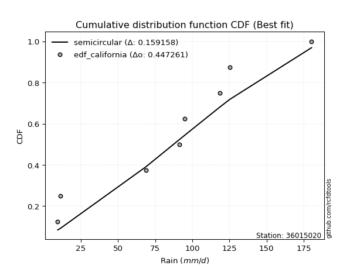</img></img>

</div>


### 2. EDF Hazen (1930)

Hazen method for plotting positions is a formula used to estimate the empirical cumulative probability distribution of flood events or other hydrological data. This formula often results in biased estimations, particularly when extrapolating to extreme events (high return periods).

<div align="center">


$P=(m-0.5)/n$


</div>


**2.1. Empirical values**

<div align="center">

|                | 0                  | 1                  | 2                  | 3                  | 4                  | 5         | 6                 | 7         |
|:---------------|:-------------------|:-------------------|:-------------------|:-------------------|:-------------------|:----------|:------------------|:----------|
| date           | 2023               | 2022               | 2018               | 2021               | 2025               | 2019      | 2020              | 2017      |
| x              | 9.5                | 11.1               | 68.8               | 91.3               | 95.0               | 118.5     | 125.2             | 180.2     |
| m              | 1                  | 2                  | 3                  | 4                  | 5                  | 6         | 7                 | 8         |
| empirical_dist | edf_hazen          | edf_hazen          | edf_hazen          | edf_hazen          | edf_hazen          | edf_hazen | edf_hazen         | edf_hazen |
| empirical      | 0.0625             | 0.1875             | 0.3125             | 0.4375             | 0.5625             | 0.6875    | 0.8125            | 0.9375    |
| empirical_tr   | 1.0666666666666667 | 1.2307692307692308 | 1.4545454545454546 | 1.7777777777777777 | 2.2857142857142856 | 3.2       | 5.333333333333333 | 16.0      |

</div>


**2.2. Kolmogorov-Smirnov fit test (sorted by Δ)**


<div align="center">

|                | 0                  | 1                   | 2                  | 3                  | 4                   | 5                   | 6                   | 7                   | 8                   | 9                   | 10                  | 11                  | 12                  | 13                  | 14                  | 15                  | 16                  | 17                  | 18                  | 19                  | 20                 | 21                  | 22                  | 23                  | 24                 | 25                  | 26                  | 27                  | 28                  | 29                  | 30                  | 31                  | 32                  | 33                  | 34                  | 35                  | 36                  | 37                  | 38                  | 39                  | 40                  | 41                  | 42                  | 43                  | 44                 | 45                  | 46                  | 47                  | 48                  | 49                  | 50                  | 51                 | 52                  | 53                  | 54                  | 55                 | 56                  | 57                  | 58                  | 59                  | 60                  | 61                  | 62                 | 63                 | 64                  | 65                  | 66                  | 67                  | 68                  | 69                  | 70                  | 71                  | 72                 | 73                  | 74                 | 75                 | 76                  | 77                  | 78                  | 79                  | 80                  | 81                 | 82                 | 83                 | 84                 | 85                  | 86                  | 87                  | 88                  | 89                 | 90                  | 91                  | 92                  | 93                 | 94                 | 95                 | 96                 | 97                 | 98                  | 99                 | 100                | 101                | 102                 | 103                 | 104                | 105                | 106                | 107                 | 108                | 109                 | 110                 | 111                | 112                 | 113                 | 114                | 115                 | 116                | 117                | 118                | 119                | 120                 | 121                 | 122                | 123                 | 124                 | 125                | 126                | 127                 | 128                 | 129                | 130                 | 131                | 132                | 133                 | 134                | 135                | 136                 | 137                | 138                | 139                | 140                 | 141                 | 142                | 143                 | 144                | 145                | 146                 | 147                | 148                | 149                | 150                | 151                | 152                | 153                | 154                | 155                | 156                | 157                | 158                | 159                |
|:---------------|:-------------------|:--------------------|:-------------------|:-------------------|:--------------------|:--------------------|:--------------------|:--------------------|:--------------------|:--------------------|:--------------------|:--------------------|:--------------------|:--------------------|:--------------------|:--------------------|:--------------------|:--------------------|:--------------------|:--------------------|:-------------------|:--------------------|:--------------------|:--------------------|:-------------------|:--------------------|:--------------------|:--------------------|:--------------------|:--------------------|:--------------------|:--------------------|:--------------------|:--------------------|:--------------------|:--------------------|:--------------------|:--------------------|:--------------------|:--------------------|:--------------------|:--------------------|:--------------------|:--------------------|:-------------------|:--------------------|:--------------------|:--------------------|:--------------------|:--------------------|:--------------------|:-------------------|:--------------------|:--------------------|:--------------------|:-------------------|:--------------------|:--------------------|:--------------------|:--------------------|:--------------------|:--------------------|:-------------------|:-------------------|:--------------------|:--------------------|:--------------------|:--------------------|:--------------------|:--------------------|:--------------------|:--------------------|:-------------------|:--------------------|:-------------------|:-------------------|:--------------------|:--------------------|:--------------------|:--------------------|:--------------------|:-------------------|:-------------------|:-------------------|:-------------------|:--------------------|:--------------------|:--------------------|:--------------------|:-------------------|:--------------------|:--------------------|:--------------------|:-------------------|:-------------------|:-------------------|:-------------------|:-------------------|:--------------------|:-------------------|:-------------------|:-------------------|:--------------------|:--------------------|:-------------------|:-------------------|:-------------------|:--------------------|:-------------------|:--------------------|:--------------------|:-------------------|:--------------------|:--------------------|:-------------------|:--------------------|:-------------------|:-------------------|:-------------------|:-------------------|:--------------------|:--------------------|:-------------------|:--------------------|:--------------------|:-------------------|:-------------------|:--------------------|:--------------------|:-------------------|:--------------------|:-------------------|:-------------------|:--------------------|:-------------------|:-------------------|:--------------------|:-------------------|:-------------------|:-------------------|:--------------------|:--------------------|:-------------------|:--------------------|:-------------------|:-------------------|:--------------------|:-------------------|:-------------------|:-------------------|:-------------------|:-------------------|:-------------------|:-------------------|:-------------------|:-------------------|:-------------------|:-------------------|:-------------------|:-------------------|
| station        | 36015020           | 36015020            | 36015020           | 36015020           | 36015020            | 36015020            | 36015020            | 36015020            | 36015020            | 36015020            | 36015020            | 36015020            | 36015020            | 36015020            | 36015020            | 36015020            | 36015020            | 36015020            | 36015020            | 36015020            | 36015020           | 36015020            | 36015020            | 36015020            | 36015020           | 36015020            | 36015020            | 36015020            | 36015020            | 36015020            | 36015020            | 36015020            | 36015020            | 36015020            | 36015020            | 36015020            | 36015020            | 36015020            | 36015020            | 36015020            | 36015020            | 36015020            | 36015020            | 36015020            | 36015020           | 36015020            | 36015020            | 36015020            | 36015020            | 36015020            | 36015020            | 36015020           | 36015020            | 36015020            | 36015020            | 36015020           | 36015020            | 36015020            | 36015020            | 36015020            | 36015020            | 36015020            | 36015020           | 36015020           | 36015020            | 36015020            | 36015020            | 36015020            | 36015020            | 36015020            | 36015020            | 36015020            | 36015020           | 36015020            | 36015020           | 36015020           | 36015020            | 36015020            | 36015020            | 36015020            | 36015020            | 36015020           | 36015020           | 36015020           | 36015020           | 36015020            | 36015020            | 36015020            | 36015020            | 36015020           | 36015020            | 36015020            | 36015020            | 36015020           | 36015020           | 36015020           | 36015020           | 36015020           | 36015020            | 36015020           | 36015020           | 36015020           | 36015020            | 36015020            | 36015020           | 36015020           | 36015020           | 36015020            | 36015020           | 36015020            | 36015020            | 36015020           | 36015020            | 36015020            | 36015020           | 36015020            | 36015020           | 36015020           | 36015020           | 36015020           | 36015020            | 36015020            | 36015020           | 36015020            | 36015020            | 36015020           | 36015020           | 36015020            | 36015020            | 36015020           | 36015020            | 36015020           | 36015020           | 36015020            | 36015020           | 36015020           | 36015020            | 36015020           | 36015020           | 36015020           | 36015020            | 36015020            | 36015020           | 36015020            | 36015020           | 36015020           | 36015020            | 36015020           | 36015020           | 36015020           | 36015020           | 36015020           | 36015020           | 36015020           | 36015020           | 36015020           | 36015020           | 36015020           | 36015020           | 36015020           |
| empirical_dist | edf_hazen          | edf_hazen           | edf_hazen          | edf_hazen          | edf_hazen           | edf_hazen           | edf_hazen           | edf_hazen           | edf_hazen           | edf_hazen           | edf_hazen           | edf_hazen           | edf_hazen           | edf_hazen           | edf_hazen           | edf_hazen           | edf_hazen           | edf_hazen           | edf_hazen           | edf_hazen           | edf_hazen          | edf_hazen           | edf_hazen           | edf_hazen           | edf_hazen          | edf_hazen           | edf_hazen           | edf_hazen           | edf_hazen           | edf_hazen           | edf_hazen           | edf_hazen           | edf_hazen           | edf_hazen           | edf_hazen           | edf_hazen           | edf_hazen           | edf_hazen           | edf_hazen           | edf_hazen           | edf_hazen           | edf_hazen           | edf_hazen           | edf_hazen           | edf_hazen          | edf_hazen           | edf_hazen           | edf_hazen           | edf_hazen           | edf_hazen           | edf_hazen           | edf_hazen          | edf_hazen           | edf_hazen           | edf_hazen           | edf_hazen          | edf_hazen           | edf_hazen           | edf_hazen           | edf_hazen           | edf_hazen           | edf_hazen           | edf_hazen          | edf_hazen          | edf_hazen           | edf_hazen           | edf_hazen           | edf_hazen           | edf_hazen           | edf_hazen           | edf_hazen           | edf_hazen           | edf_hazen          | edf_hazen           | edf_hazen          | edf_hazen          | edf_hazen           | edf_hazen           | edf_hazen           | edf_hazen           | edf_hazen           | edf_hazen          | edf_hazen          | edf_hazen          | edf_hazen          | edf_hazen           | edf_hazen           | edf_hazen           | edf_hazen           | edf_hazen          | edf_hazen           | edf_hazen           | edf_hazen           | edf_hazen          | edf_hazen          | edf_hazen          | edf_hazen          | edf_hazen          | edf_hazen           | edf_hazen          | edf_hazen          | edf_hazen          | edf_hazen           | edf_hazen           | edf_hazen          | edf_hazen          | edf_hazen          | edf_hazen           | edf_hazen          | edf_hazen           | edf_hazen           | edf_hazen          | edf_hazen           | edf_hazen           | edf_hazen          | edf_hazen           | edf_hazen          | edf_hazen          | edf_hazen          | edf_hazen          | edf_hazen           | edf_hazen           | edf_hazen          | edf_hazen           | edf_hazen           | edf_hazen          | edf_hazen          | edf_hazen           | edf_hazen           | edf_hazen          | edf_hazen           | edf_hazen          | edf_hazen          | edf_hazen           | edf_hazen          | edf_hazen          | edf_hazen           | edf_hazen          | edf_hazen          | edf_hazen          | edf_hazen           | edf_hazen           | edf_hazen          | edf_hazen           | edf_hazen          | edf_hazen          | edf_hazen           | edf_hazen          | edf_hazen          | edf_hazen          | edf_hazen          | edf_hazen          | edf_hazen          | edf_hazen          | edf_hazen          | edf_hazen          | edf_hazen          | edf_hazen          | edf_hazen          | edf_hazen          |
| p_dist         | semicircular       | anglit              | gumbel_l           | logjohnsonsu       | genlogistic         | genextreme          | burr                | johnsonsu           | pearson3            | logloggamma         | dweibull            | f                   | skewnorm            | exponnorm           | truncnorm           | norm                | crystalball         | t                   | gamma               | erlang              | mielke             | foldnorm            | ksone               | cosine              | betaprime          | logistic            | hypsecant           | laplace             | dgamma              | maxwell             | weibull_min         | invgamma            | rice                | exponweib           | gausshyper          | logmielke           | rayleigh            | logargus            | logburr             | invgauss            | argus               | loggennorm          | logdweibull         | loggenextreme       | kstwobign          | logdgamma           | gumbel_r            | truncexpon          | ncf                 | logburr12           | loggumbel_l         | logweibull_min     | logtrapezoid        | kappa4              | bradford            | tukeylambda        | logpearson3         | kappa3              | uniform             | wrapcauchy          | vonmises_line       | moyal               | arcsine            | halfnorm           | halflogistic        | genexpon            | logloglaplace       | loggompertz         | loggenpareto        | loggenhalflogistic  | logarcsine          | loglevy_l           | logskewnorm        | nakagami            | lomax              | logsemicircular    | loganglit           | genpareto           | logerlang           | lognct              | logexponnorm        | logt               | lognorm            | logcrystalball     | logf               | logfatiguelife      | lognakagami         | loggamma            | loggamma            | logtriang          | loglogistic         | logrice             | loginvgamma         | loghypsecant       | logalpha           | logwrapcauchy      | wald               | logncf             | logbetaprime        | loginvgauss        | logmaxwell         | loginvweibull      | loglaplace          | loglaplace          | lograyleigh        | logcosine          | logfoldnorm        | halfgennorm         | genhalflogistic    | logkstwobign        | loghalfnorm         | loggausshyper      | loggumbel_r         | loggenexpon         | triang             | johnsonsb           | gennorm            | truncweibull_min   | levy_l             | nct                | logksone            | loghalflogistic     | logmoyal           | loggengamma         | burr12              | logweibull_max     | loglomax           | logkappa3           | loguniform          | logvonmises_line   | logbradford         | beta               | logjohnsonsb       | gengamma            | loghalfgennorm     | logkappa4          | logbeta             | trapezoid          | logwald            | logrdist           | logtruncexpon       | logtruncweibull_min | logtukeylambda     | logexponweib        | alpha              | logtruncnorm       | invweibull          | rdist              | gompertz           | fatiguelife        | powerlaw           | logexponpow        | logpowerlaw        | truncpareto        | exponpow           | logtruncpareto     | weibull_max        | loggenlogistic     | logvonmises        | vonmises           |
| delta          | 0.0966576051056584 | 0.09905324241985403 | 0.1000290706619716 | 0.1013331715356035 | 0.10219717541016947 | 0.10437937704837748 | 0.10525478085471662 | 0.10795431112210868 | 0.10803331075056394 | 0.10811606610219034 | 0.10819285510805249 | 0.10868901028787738 | 0.10878128296198314 | 0.10885060239138537 | 0.10885212880221629 | 0.10885213223189581 | 0.10885213729236022 | 0.10885331139336325 | 0.10933746236561685 | 0.10952172677457761 | 0.1097987998370562 | 0.10981789020915916 | 0.11064666862750705 | 0.11576961329125435 | 0.115786278238401  | 0.11608281963192818 | 0.11872695702736756 | 0.11983349018091134 | 0.12083964420858398 | 0.12485013849348026 | 0.12490870046527118 | 0.12622223039259495 | 0.12954660635486487 | 0.13463250068838872 | 0.13483869071933685 | 0.13508376918994947 | 0.13550044330250866 | 0.13676106037244318 | 0.14405089044742092 | 0.14478070189897163 | 0.14569786573963883 | 0.15185352847229291 | 0.15647618915895678 | 0.15923844051406633 | 0.1597905990066627 | 0.16057209073697928 | 0.16156494893746853 | 0.16265814007270993 | 0.17000124041428866 | 0.17211017380024485 | 0.17229111279598852 | 0.1724987341159463 | 0.17368192051135922 | 0.17380819898488542 | 0.17593258886814356 | 0.1760602617678657 | 0.17667689921991048 | 0.17700162931325564 | 0.17812683069712948 | 0.17817505204459394 | 0.17958666220499891 | 0.18699458935171154 | 0.1875             | 0.1875             | 0.18852502662803194 | 0.19109585807750773 | 0.19193896100056052 | 0.19444436740172655 | 0.20175257006206937 | 0.21315032235360953 | 0.21676275161395098 | 0.21702384198994906 | 0.2175729776555806 | 0.21807845282874183 | 0.2239710514739952 | 0.2287965580973378 | 0.23182140436721765 | 0.23283005197548112 | 0.23823597592640433 | 0.23896181645979797 | 0.23914606459440646 | 0.2391487767030105 | 0.2391488245089003 | 0.2391488312103821 | 0.2394094423153723 | 0.23948402709845862 | 0.23978971012168193 | 0.24546866175779247 | 0.24546866175779247 | 0.2456413419725647 | 0.24610003644105516 | 0.24976135570086067 | 0.25151564882181177 | 0.2519687712899005 | 0.2540282921631192 | 0.2568198847902492 | 0.2575978566852083 | 0.260648550262623  | 0.26149716246586086 | 0.2617729417590149 | 0.2694304382243241 | 0.2733827163606012 | 0.27796515006305933 | 0.27796515006305933 | 0.2791441121737597 | 0.2861991290384165 | 0.2863819561938096 | 0.29157721039113116 | 0.2990144335888213 | 0.30297232483124326 | 0.30654937974320084 | 0.3075919439694216 | 0.30917420108189453 | 0.30954427681282803 | 0.3107517437370543 | 0.31144942607515486 | 0.3125             | 0.3282310911295857 | 0.3288058896132744 | 0.3289661419710863 | 0.33150355633704387 | 0.33389150346227703 | 0.3339579882499557 | 0.33752142331012425 | 0.34337217962110733 | 0.3453697566545629 | 0.3460332982177945 | 0.35927703956453105 | 0.36030426760445267 | 0.3603831185794659 | 0.36112276643588037 | 0.3619571406750862 | 0.3648675828930652 | 0.37110167671447725 | 0.3730925115965804 | 0.3763932756564532 | 0.38823904304286205 | 0.3899841338092576 | 0.4027269948181089 | 0.4248128145441702 | 0.43677488097513906 | 0.44335836211891977 | 0.4513062804990895 | 0.45319622565674134 | 0.456475643926912  | 0.4613664224345221 | 0.47625002072319844 | 0.4868399093777148 | 0.505159972180417  | 0.5068667040663943 | 0.5231047574816766 | 0.5810828361434563 | 0.6123100406122972 | 0.6260677920121716 | 0.6602556911653243 | 0.6632203160814027 | 0.7020849163108926 | 0.8125             | 1.1317921758118472 | 28.34758720321323  |
| deltao         | 0.4472608134160001 | 0.4472608134160001  | 0.4472608134160001 | 0.4472608134160001 | 0.4472608134160001  | 0.4472608134160001  | 0.4472608134160001  | 0.4472608134160001  | 0.4472608134160001  | 0.4472608134160001  | 0.4472608134160001  | 0.4472608134160001  | 0.4472608134160001  | 0.4472608134160001  | 0.4472608134160001  | 0.4472608134160001  | 0.4472608134160001  | 0.4472608134160001  | 0.4472608134160001  | 0.4472608134160001  | 0.4472608134160001 | 0.4472608134160001  | 0.4472608134160001  | 0.4472608134160001  | 0.4472608134160001 | 0.4472608134160001  | 0.4472608134160001  | 0.4472608134160001  | 0.4472608134160001  | 0.4472608134160001  | 0.4472608134160001  | 0.4472608134160001  | 0.4472608134160001  | 0.4472608134160001  | 0.4472608134160001  | 0.4472608134160001  | 0.4472608134160001  | 0.4472608134160001  | 0.4472608134160001  | 0.4472608134160001  | 0.4472608134160001  | 0.4472608134160001  | 0.4472608134160001  | 0.4472608134160001  | 0.4472608134160001 | 0.4472608134160001  | 0.4472608134160001  | 0.4472608134160001  | 0.4472608134160001  | 0.4472608134160001  | 0.4472608134160001  | 0.4472608134160001 | 0.4472608134160001  | 0.4472608134160001  | 0.4472608134160001  | 0.4472608134160001 | 0.4472608134160001  | 0.4472608134160001  | 0.4472608134160001  | 0.4472608134160001  | 0.4472608134160001  | 0.4472608134160001  | 0.4472608134160001 | 0.4472608134160001 | 0.4472608134160001  | 0.4472608134160001  | 0.4472608134160001  | 0.4472608134160001  | 0.4472608134160001  | 0.4472608134160001  | 0.4472608134160001  | 0.4472608134160001  | 0.4472608134160001 | 0.4472608134160001  | 0.4472608134160001 | 0.4472608134160001 | 0.4472608134160001  | 0.4472608134160001  | 0.4472608134160001  | 0.4472608134160001  | 0.4472608134160001  | 0.4472608134160001 | 0.4472608134160001 | 0.4472608134160001 | 0.4472608134160001 | 0.4472608134160001  | 0.4472608134160001  | 0.4472608134160001  | 0.4472608134160001  | 0.4472608134160001 | 0.4472608134160001  | 0.4472608134160001  | 0.4472608134160001  | 0.4472608134160001 | 0.4472608134160001 | 0.4472608134160001 | 0.4472608134160001 | 0.4472608134160001 | 0.4472608134160001  | 0.4472608134160001 | 0.4472608134160001 | 0.4472608134160001 | 0.4472608134160001  | 0.4472608134160001  | 0.4472608134160001 | 0.4472608134160001 | 0.4472608134160001 | 0.4472608134160001  | 0.4472608134160001 | 0.4472608134160001  | 0.4472608134160001  | 0.4472608134160001 | 0.4472608134160001  | 0.4472608134160001  | 0.4472608134160001 | 0.4472608134160001  | 0.4472608134160001 | 0.4472608134160001 | 0.4472608134160001 | 0.4472608134160001 | 0.4472608134160001  | 0.4472608134160001  | 0.4472608134160001 | 0.4472608134160001  | 0.4472608134160001  | 0.4472608134160001 | 0.4472608134160001 | 0.4472608134160001  | 0.4472608134160001  | 0.4472608134160001 | 0.4472608134160001  | 0.4472608134160001 | 0.4472608134160001 | 0.4472608134160001  | 0.4472608134160001 | 0.4472608134160001 | 0.4472608134160001  | 0.4472608134160001 | 0.4472608134160001 | 0.4472608134160001 | 0.4472608134160001  | 0.4472608134160001  | 0.4472608134160001 | 0.4472608134160001  | 0.4472608134160001 | 0.4472608134160001 | 0.4472608134160001  | 0.4472608134160001 | 0.4472608134160001 | 0.4472608134160001 | 0.4472608134160001 | 0.4472608134160001 | 0.4472608134160001 | 0.4472608134160001 | 0.4472608134160001 | 0.4472608134160001 | 0.4472608134160001 | 0.4472608134160001 | 0.4472608134160001 | 0.4472608134160001 |
| eval           | Δo > Δ             | Δo > Δ              | Δo > Δ             | Δo > Δ             | Δo > Δ              | Δo > Δ              | Δo > Δ              | Δo > Δ              | Δo > Δ              | Δo > Δ              | Δo > Δ              | Δo > Δ              | Δo > Δ              | Δo > Δ              | Δo > Δ              | Δo > Δ              | Δo > Δ              | Δo > Δ              | Δo > Δ              | Δo > Δ              | Δo > Δ             | Δo > Δ              | Δo > Δ              | Δo > Δ              | Δo > Δ             | Δo > Δ              | Δo > Δ              | Δo > Δ              | Δo > Δ              | Δo > Δ              | Δo > Δ              | Δo > Δ              | Δo > Δ              | Δo > Δ              | Δo > Δ              | Δo > Δ              | Δo > Δ              | Δo > Δ              | Δo > Δ              | Δo > Δ              | Δo > Δ              | Δo > Δ              | Δo > Δ              | Δo > Δ              | Δo > Δ             | Δo > Δ              | Δo > Δ              | Δo > Δ              | Δo > Δ              | Δo > Δ              | Δo > Δ              | Δo > Δ             | Δo > Δ              | Δo > Δ              | Δo > Δ              | Δo > Δ             | Δo > Δ              | Δo > Δ              | Δo > Δ              | Δo > Δ              | Δo > Δ              | Δo > Δ              | Δo > Δ             | Δo > Δ             | Δo > Δ              | Δo > Δ              | Δo > Δ              | Δo > Δ              | Δo > Δ              | Δo > Δ              | Δo > Δ              | Δo > Δ              | Δo > Δ             | Δo > Δ              | Δo > Δ             | Δo > Δ             | Δo > Δ              | Δo > Δ              | Δo > Δ              | Δo > Δ              | Δo > Δ              | Δo > Δ             | Δo > Δ             | Δo > Δ             | Δo > Δ             | Δo > Δ              | Δo > Δ              | Δo > Δ              | Δo > Δ              | Δo > Δ             | Δo > Δ              | Δo > Δ              | Δo > Δ              | Δo > Δ             | Δo > Δ             | Δo > Δ             | Δo > Δ             | Δo > Δ             | Δo > Δ              | Δo > Δ             | Δo > Δ             | Δo > Δ             | Δo > Δ              | Δo > Δ              | Δo > Δ             | Δo > Δ             | Δo > Δ             | Δo > Δ              | Δo > Δ             | Δo > Δ              | Δo > Δ              | Δo > Δ             | Δo > Δ              | Δo > Δ              | Δo > Δ             | Δo > Δ              | Δo > Δ             | Δo > Δ             | Δo > Δ             | Δo > Δ             | Δo > Δ              | Δo > Δ              | Δo > Δ             | Δo > Δ              | Δo > Δ              | Δo > Δ             | Δo > Δ             | Δo > Δ              | Δo > Δ              | Δo > Δ             | Δo > Δ              | Δo > Δ             | Δo > Δ             | Δo > Δ              | Δo > Δ             | Δo > Δ             | Δo > Δ              | Δo > Δ             | Δo > Δ             | Δo > Δ             | Δo > Δ              | Δo > Δ              | Δo <= Δ            | Δo <= Δ             | Δo <= Δ            | Δo <= Δ            | Δo <= Δ             | Δo <= Δ            | Δo <= Δ            | Δo <= Δ            | Δo <= Δ            | Δo <= Δ            | Δo <= Δ            | Δo <= Δ            | Δo <= Δ            | Δo <= Δ            | Δo <= Δ            | Δo <= Δ            | Δo <= Δ            | Δo <= Δ            |
| fit            | 1                  | 1                   | 1                  | 1                  | 1                   | 1                   | 1                   | 1                   | 1                   | 1                   | 1                   | 1                   | 1                   | 1                   | 1                   | 1                   | 1                   | 1                   | 1                   | 1                   | 1                  | 1                   | 1                   | 1                   | 1                  | 1                   | 1                   | 1                   | 1                   | 1                   | 1                   | 1                   | 1                   | 1                   | 1                   | 1                   | 1                   | 1                   | 1                   | 1                   | 1                   | 1                   | 1                   | 1                   | 1                  | 1                   | 1                   | 1                   | 1                   | 1                   | 1                   | 1                  | 1                   | 1                   | 1                   | 1                  | 1                   | 1                   | 1                   | 1                   | 1                   | 1                   | 1                  | 1                  | 1                   | 1                   | 1                   | 1                   | 1                   | 1                   | 1                   | 1                   | 1                  | 1                   | 1                  | 1                  | 1                   | 1                   | 1                   | 1                   | 1                   | 1                  | 1                  | 1                  | 1                  | 1                   | 1                   | 1                   | 1                   | 1                  | 1                   | 1                   | 1                   | 1                  | 1                  | 1                  | 1                  | 1                  | 1                   | 1                  | 1                  | 1                  | 1                   | 1                   | 1                  | 1                  | 1                  | 1                   | 1                  | 1                   | 1                   | 1                  | 1                   | 1                   | 1                  | 1                   | 1                  | 1                  | 1                  | 1                  | 1                   | 1                   | 1                  | 1                   | 1                   | 1                  | 1                  | 1                   | 1                   | 1                  | 1                   | 1                  | 1                  | 1                   | 1                  | 1                  | 1                   | 1                  | 1                  | 1                  | 1                   | 1                   | 0                  | 0                   | 0                  | 0                  | 0                   | 0                  | 0                  | 0                  | 0                  | 0                  | 0                  | 0                  | 0                  | 0                  | 0                  | 0                  | 0                  | 0                  |
| n              | 8                  | 8                   | 8                  | 8                  | 8                   | 8                   | 8                   | 8                   | 8                   | 8                   | 8                   | 8                   | 8                   | 8                   | 8                   | 8                   | 8                   | 8                   | 8                   | 8                   | 8                  | 8                   | 8                   | 8                   | 8                  | 8                   | 8                   | 8                   | 8                   | 8                   | 8                   | 8                   | 8                   | 8                   | 8                   | 8                   | 8                   | 8                   | 8                   | 8                   | 8                   | 8                   | 8                   | 8                   | 8                  | 8                   | 8                   | 8                   | 8                   | 8                   | 8                   | 8                  | 8                   | 8                   | 8                   | 8                  | 8                   | 8                   | 8                   | 8                   | 8                   | 8                   | 8                  | 8                  | 8                   | 8                   | 8                   | 8                   | 8                   | 8                   | 8                   | 8                   | 8                  | 8                   | 8                  | 8                  | 8                   | 8                   | 8                   | 8                   | 8                   | 8                  | 8                  | 8                  | 8                  | 8                   | 8                   | 8                   | 8                   | 8                  | 8                   | 8                   | 8                   | 8                  | 8                  | 8                  | 8                  | 8                  | 8                   | 8                  | 8                  | 8                  | 8                   | 8                   | 8                  | 8                  | 8                  | 8                   | 8                  | 8                   | 8                   | 8                  | 8                   | 8                   | 8                  | 8                   | 8                  | 8                  | 8                  | 8                  | 8                   | 8                   | 8                  | 8                   | 8                   | 8                  | 8                  | 8                   | 8                   | 8                  | 8                   | 8                  | 8                  | 8                   | 8                  | 8                  | 8                   | 8                  | 8                  | 8                  | 8                   | 8                   | 8                  | 8                   | 8                  | 8                  | 8                   | 8                  | 8                  | 8                  | 8                  | 8                  | 8                  | 8                  | 8                  | 8                  | 8                  | 8                  | 8                  | 8                  |
| best_fit       | 1                  | 0                   | 0                  | 0                  | 0                   | 0                   | 0                   | 0                   | 0                   | 0                   | 0                   | 0                   | 0                   | 0                   | 0                   | 0                   | 0                   | 0                   | 0                   | 0                   | 0                  | 0                   | 0                   | 0                   | 0                  | 0                   | 0                   | 0                   | 0                   | 0                   | 0                   | 0                   | 0                   | 0                   | 0                   | 0                   | 0                   | 0                   | 0                   | 0                   | 0                   | 0                   | 0                   | 0                   | 0                  | 0                   | 0                   | 0                   | 0                   | 0                   | 0                   | 0                  | 0                   | 0                   | 0                   | 0                  | 0                   | 0                   | 0                   | 0                   | 0                   | 0                   | 0                  | 0                  | 0                   | 0                   | 0                   | 0                   | 0                   | 0                   | 0                   | 0                   | 0                  | 0                   | 0                  | 0                  | 0                   | 0                   | 0                   | 0                   | 0                   | 0                  | 0                  | 0                  | 0                  | 0                   | 0                   | 0                   | 0                   | 0                  | 0                   | 0                   | 0                   | 0                  | 0                  | 0                  | 0                  | 0                  | 0                   | 0                  | 0                  | 0                  | 0                   | 0                   | 0                  | 0                  | 0                  | 0                   | 0                  | 0                   | 0                   | 0                  | 0                   | 0                   | 0                  | 0                   | 0                  | 0                  | 0                  | 0                  | 0                   | 0                   | 0                  | 0                   | 0                   | 0                  | 0                  | 0                   | 0                   | 0                  | 0                   | 0                  | 0                  | 0                   | 0                  | 0                  | 0                   | 0                  | 0                  | 0                  | 0                   | 0                   | 0                  | 0                   | 0                  | 0                  | 0                   | 0                  | 0                  | 0                  | 0                  | 0                  | 0                  | 0                  | 0                  | 0                  | 0                  | 0                  | 0                  | 0                  |
| best_fit_sort  | 1                  | 2                   | 3                  | 4                  | 5                   | 6                   | 7                   | 8                   | 9                   | 10                  | 11                  | 12                  | 13                  | 14                  | 15                  | 16                  | 17                  | 18                  | 19                  | 20                  | 21                 | 22                  | 23                  | 24                  | 25                 | 26                  | 27                  | 28                  | 29                  | 30                  | 31                  | 32                  | 33                  | 34                  | 35                  | 36                  | 37                  | 38                  | 39                  | 40                  | 41                  | 42                  | 43                  | 44                  | 45                 | 46                  | 47                  | 48                  | 49                  | 50                  | 51                  | 52                 | 53                  | 54                  | 55                  | 56                 | 57                  | 58                  | 59                  | 60                  | 61                  | 62                  | 63                 | 64                 | 65                  | 66                  | 67                  | 68                  | 69                  | 70                  | 71                  | 72                  | 73                 | 74                  | 75                 | 76                 | 77                  | 78                  | 79                  | 80                  | 81                  | 82                 | 83                 | 84                 | 85                 | 86                  | 87                  | 88                  | 89                  | 90                 | 91                  | 92                  | 93                  | 94                 | 95                 | 96                 | 97                 | 98                 | 99                  | 100                | 101                | 102                | 103                 | 104                 | 105                | 106                | 107                | 108                 | 109                | 110                 | 111                 | 112                | 113                 | 114                 | 115                | 116                 | 117                | 118                | 119                | 120                | 121                 | 122                 | 123                | 124                 | 125                 | 126                | 127                | 128                 | 129                 | 130                | 131                 | 132                | 133                | 134                 | 135                | 136                | 137                 | 138                | 139                | 140                | 141                 | 142                 | 143                | 144                 | 145                | 146                | 147                 | 148                | 149                | 150                | 151                | 152                | 153                | 154                | 155                | 156                | 157                | 158                | 159                | 160                |

</div>


**2.3. Best fit**

<div align="center">

|   id |   station | empirical_dist   | p_dist       |     delta |   deltao | eval   |   fit |   n |   best_fit |   best_fit_sort |
|-----:|----------:|:-----------------|:-------------|----------:|---------:|:-------|------:|----:|-----------:|----------------:|
|    0 |  36015020 | edf_hazen        | semicircular | 0.0966576 | 0.447261 | Δo > Δ |     1 |   8 |          1 |               1 |

</div>


<div align="center">

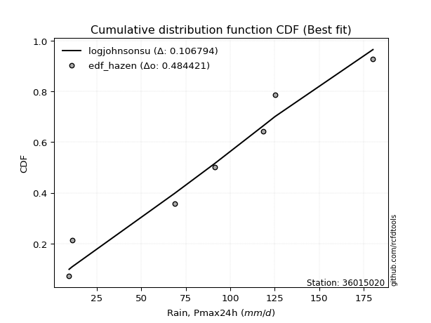</img>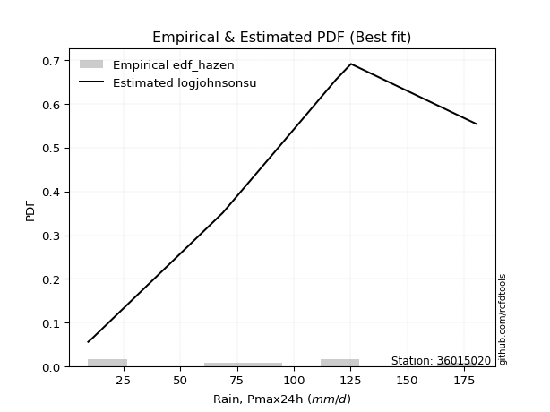</img>

</div>


### 3. EDF Weibull (1939)

Weibull plotting position formula is an empirical method used to estimate the non-exceedance probability or plotting position for a set of observed data, is often recommended or widely used in practice, particularly in flood frequency analysis.

<div align="center">


$P=m/(n+1)$


</div>


**3.1. Empirical values**

<div align="center">

|                | 0                  | 1                  | 2                  | 3                  | 4                  | 5                  | 6                  | 7                  |
|:---------------|:-------------------|:-------------------|:-------------------|:-------------------|:-------------------|:-------------------|:-------------------|:-------------------|
| date           | 2023               | 2022               | 2018               | 2021               | 2025               | 2019               | 2020               | 2017               |
| x              | 9.5                | 11.1               | 68.8               | 91.3               | 95.0               | 118.5              | 125.2              | 180.2              |
| m              | 1                  | 2                  | 3                  | 4                  | 5                  | 6                  | 7                  | 8                  |
| empirical_dist | edf_weibull        | edf_weibull        | edf_weibull        | edf_weibull        | edf_weibull        | edf_weibull        | edf_weibull        | edf_weibull        |
| empirical      | 0.1111111111111111 | 0.2222222222222222 | 0.3333333333333333 | 0.4444444444444444 | 0.5555555555555556 | 0.6666666666666666 | 0.7777777777777778 | 0.8888888888888888 |
| empirical_tr   | 1.125              | 1.2857142857142856 | 1.4999999999999998 | 1.7999999999999998 | 2.25               | 2.9999999999999996 | 4.5                | 8.999999999999996  |

</div>


**3.2. Kolmogorov-Smirnov fit test (sorted by Δ)**


<div align="center">

|                | 0                  | 1                  | 2                   | 3                   | 4                  | 5                   | 6                  | 7                   | 8                   | 9                   | 10                 | 11                  | 12                  | 13                 | 14                  | 15                  | 16                 | 17                 | 18                  | 19                  | 20                  | 21                  | 22                  | 23                  | 24                  | 25                  | 26                  | 27                 | 28                 | 29                  | 30                 | 31                  | 32                  | 33                 | 34                  | 35                  | 36                 | 37                 | 38                  | 39                 | 40                  | 41                  | 42                  | 43                  | 44                  | 45                  | 46                  | 47                  | 48                 | 49                  | 50                  | 51                  | 52                  | 53                  | 54                  | 55                 | 56                  | 57                  | 58                 | 59                 | 60                  | 61                 | 62                  | 63                  | 64                  | 65                  | 66                  | 67                  | 68                  | 69                 | 70                  | 71                 | 72                  | 73                  | 74                  | 75                  | 76                  | 77                  | 78                  | 79                 | 80                 | 81                 | 82                  | 83                 | 84                 | 85                 | 86                 | 87                  | 88                  | 89                 | 90                  | 91                 | 92                  | 93                  | 94                  | 95                 | 96                  | 97                  | 98                  | 99                 | 100                | 101                 | 102                 | 103                | 104                | 105                | 106                 | 107                 | 108                | 109                | 110                 | 111                | 112                | 113                 | 114                 | 115                 | 116                | 117                | 118                | 119                | 120                 | 121                 | 122                | 123                | 124                 | 125                | 126                | 127                | 128                 | 129                 | 130                | 131                 | 132                | 133                 | 134                | 135                 | 136                | 137                | 138                | 139                | 140                 | 141                 | 142                | 143                | 144                | 145                 | 146                 | 147                 | 148                | 149                 | 150                | 151                | 152                | 153                | 154                | 155                | 156                | 157                | 158                | 159                |
|:---------------|:-------------------|:-------------------|:--------------------|:--------------------|:-------------------|:--------------------|:-------------------|:--------------------|:--------------------|:--------------------|:-------------------|:--------------------|:--------------------|:-------------------|:--------------------|:--------------------|:-------------------|:-------------------|:--------------------|:--------------------|:--------------------|:--------------------|:--------------------|:--------------------|:--------------------|:--------------------|:--------------------|:-------------------|:-------------------|:--------------------|:-------------------|:--------------------|:--------------------|:-------------------|:--------------------|:--------------------|:-------------------|:-------------------|:--------------------|:-------------------|:--------------------|:--------------------|:--------------------|:--------------------|:--------------------|:--------------------|:--------------------|:--------------------|:-------------------|:--------------------|:--------------------|:--------------------|:--------------------|:--------------------|:--------------------|:-------------------|:--------------------|:--------------------|:-------------------|:-------------------|:--------------------|:-------------------|:--------------------|:--------------------|:--------------------|:--------------------|:--------------------|:--------------------|:--------------------|:-------------------|:--------------------|:-------------------|:--------------------|:--------------------|:--------------------|:--------------------|:--------------------|:--------------------|:--------------------|:-------------------|:-------------------|:-------------------|:--------------------|:-------------------|:-------------------|:-------------------|:-------------------|:--------------------|:--------------------|:-------------------|:--------------------|:-------------------|:--------------------|:--------------------|:--------------------|:-------------------|:--------------------|:--------------------|:--------------------|:-------------------|:-------------------|:--------------------|:--------------------|:-------------------|:-------------------|:-------------------|:--------------------|:--------------------|:-------------------|:-------------------|:--------------------|:-------------------|:-------------------|:--------------------|:--------------------|:--------------------|:-------------------|:-------------------|:-------------------|:-------------------|:--------------------|:--------------------|:-------------------|:-------------------|:--------------------|:-------------------|:-------------------|:-------------------|:--------------------|:--------------------|:-------------------|:--------------------|:-------------------|:--------------------|:-------------------|:--------------------|:-------------------|:-------------------|:-------------------|:-------------------|:--------------------|:--------------------|:-------------------|:-------------------|:-------------------|:--------------------|:--------------------|:--------------------|:-------------------|:--------------------|:-------------------|:-------------------|:-------------------|:-------------------|:-------------------|:-------------------|:-------------------|:-------------------|:-------------------|:-------------------|
| station        | 36015020           | 36015020           | 36015020            | 36015020            | 36015020           | 36015020            | 36015020           | 36015020            | 36015020            | 36015020            | 36015020           | 36015020            | 36015020            | 36015020           | 36015020            | 36015020            | 36015020           | 36015020           | 36015020            | 36015020            | 36015020            | 36015020            | 36015020            | 36015020            | 36015020            | 36015020            | 36015020            | 36015020           | 36015020           | 36015020            | 36015020           | 36015020            | 36015020            | 36015020           | 36015020            | 36015020            | 36015020           | 36015020           | 36015020            | 36015020           | 36015020            | 36015020            | 36015020            | 36015020            | 36015020            | 36015020            | 36015020            | 36015020            | 36015020           | 36015020            | 36015020            | 36015020            | 36015020            | 36015020            | 36015020            | 36015020           | 36015020            | 36015020            | 36015020           | 36015020           | 36015020            | 36015020           | 36015020            | 36015020            | 36015020            | 36015020            | 36015020            | 36015020            | 36015020            | 36015020           | 36015020            | 36015020           | 36015020            | 36015020            | 36015020            | 36015020            | 36015020            | 36015020            | 36015020            | 36015020           | 36015020           | 36015020           | 36015020            | 36015020           | 36015020           | 36015020           | 36015020           | 36015020            | 36015020            | 36015020           | 36015020            | 36015020           | 36015020            | 36015020            | 36015020            | 36015020           | 36015020            | 36015020            | 36015020            | 36015020           | 36015020           | 36015020            | 36015020            | 36015020           | 36015020           | 36015020           | 36015020            | 36015020            | 36015020           | 36015020           | 36015020            | 36015020           | 36015020           | 36015020            | 36015020            | 36015020            | 36015020           | 36015020           | 36015020           | 36015020           | 36015020            | 36015020            | 36015020           | 36015020           | 36015020            | 36015020           | 36015020           | 36015020           | 36015020            | 36015020            | 36015020           | 36015020            | 36015020           | 36015020            | 36015020           | 36015020            | 36015020           | 36015020           | 36015020           | 36015020           | 36015020            | 36015020            | 36015020           | 36015020           | 36015020           | 36015020            | 36015020            | 36015020            | 36015020           | 36015020            | 36015020           | 36015020           | 36015020           | 36015020           | 36015020           | 36015020           | 36015020           | 36015020           | 36015020           | 36015020           |
| empirical_dist | edf_weibull        | edf_weibull        | edf_weibull         | edf_weibull         | edf_weibull        | edf_weibull         | edf_weibull        | edf_weibull         | edf_weibull         | edf_weibull         | edf_weibull        | edf_weibull         | edf_weibull         | edf_weibull        | edf_weibull         | edf_weibull         | edf_weibull        | edf_weibull        | edf_weibull         | edf_weibull         | edf_weibull         | edf_weibull         | edf_weibull         | edf_weibull         | edf_weibull         | edf_weibull         | edf_weibull         | edf_weibull        | edf_weibull        | edf_weibull         | edf_weibull        | edf_weibull         | edf_weibull         | edf_weibull        | edf_weibull         | edf_weibull         | edf_weibull        | edf_weibull        | edf_weibull         | edf_weibull        | edf_weibull         | edf_weibull         | edf_weibull         | edf_weibull         | edf_weibull         | edf_weibull         | edf_weibull         | edf_weibull         | edf_weibull        | edf_weibull         | edf_weibull         | edf_weibull         | edf_weibull         | edf_weibull         | edf_weibull         | edf_weibull        | edf_weibull         | edf_weibull         | edf_weibull        | edf_weibull        | edf_weibull         | edf_weibull        | edf_weibull         | edf_weibull         | edf_weibull         | edf_weibull         | edf_weibull         | edf_weibull         | edf_weibull         | edf_weibull        | edf_weibull         | edf_weibull        | edf_weibull         | edf_weibull         | edf_weibull         | edf_weibull         | edf_weibull         | edf_weibull         | edf_weibull         | edf_weibull        | edf_weibull        | edf_weibull        | edf_weibull         | edf_weibull        | edf_weibull        | edf_weibull        | edf_weibull        | edf_weibull         | edf_weibull         | edf_weibull        | edf_weibull         | edf_weibull        | edf_weibull         | edf_weibull         | edf_weibull         | edf_weibull        | edf_weibull         | edf_weibull         | edf_weibull         | edf_weibull        | edf_weibull        | edf_weibull         | edf_weibull         | edf_weibull        | edf_weibull        | edf_weibull        | edf_weibull         | edf_weibull         | edf_weibull        | edf_weibull        | edf_weibull         | edf_weibull        | edf_weibull        | edf_weibull         | edf_weibull         | edf_weibull         | edf_weibull        | edf_weibull        | edf_weibull        | edf_weibull        | edf_weibull         | edf_weibull         | edf_weibull        | edf_weibull        | edf_weibull         | edf_weibull        | edf_weibull        | edf_weibull        | edf_weibull         | edf_weibull         | edf_weibull        | edf_weibull         | edf_weibull        | edf_weibull         | edf_weibull        | edf_weibull         | edf_weibull        | edf_weibull        | edf_weibull        | edf_weibull        | edf_weibull         | edf_weibull         | edf_weibull        | edf_weibull        | edf_weibull        | edf_weibull         | edf_weibull         | edf_weibull         | edf_weibull        | edf_weibull         | edf_weibull        | edf_weibull        | edf_weibull        | edf_weibull        | edf_weibull        | edf_weibull        | edf_weibull        | edf_weibull        | edf_weibull        | edf_weibull        |
| p_dist         | ksone              | loggenextreme      | semicircular        | anglit              | gumbel_l           | logjohnsonsu        | genlogistic        | mielke              | genextreme          | burr                | johnsonsu          | pearson3            | logloggamma         | dweibull           | f                   | skewnorm            | exponnorm          | truncnorm          | norm                | crystalball         | t                   | gamma               | erlang              | foldnorm            | invgamma            | invgauss            | cosine              | betaprime          | logistic           | exponweib           | argus              | logburr             | kstwobign           | logtrapezoid       | hypsecant           | laplace             | logmielke          | dgamma             | maxwell             | weibull_min        | logpearson3         | loggumbel_l         | logdweibull         | rice                | ncf                 | loglevy_l           | gausshyper          | rayleigh            | logargus           | logburr12           | logweibull_min      | loggenpareto        | loggennorm          | gumbel_r            | loggenhalflogistic  | logdgamma          | nakagami            | truncexpon          | logloglaplace      | genpareto          | genexpon            | loggompertz        | logsemicircular     | kappa4              | lomax               | logskewnorm         | bradford            | tukeylambda         | loganglit           | moyal              | kappa3              | uniform            | wrapcauchy          | vonmises_line       | logerlang           | lognct              | logexponnorm        | logt                | lognorm             | logcrystalball     | logf               | logfatiguelife     | lognakagami         | arcsine            | halflogistic       | logarcsine         | halfnorm           | loggamma            | loggamma            | loglogistic        | logrice             | logtriang          | loginvgamma         | logalpha            | logwrapcauchy       | logncf             | logbetaprime        | loginvgauss         | loghypsecant        | logmaxwell         | wald               | loginvweibull       | lograyleigh         | genhalflogistic    | johnsonsb          | logcosine          | logfoldnorm         | halfgennorm         | loglaplace         | loglaplace         | triang              | gennorm            | levy_l             | logkstwobign        | loghalfnorm         | loggausshyper       | loggumbel_r        | loggenexpon        | truncweibull_min   | nct                | logweibull_max      | logksone            | loghalflogistic    | logmoyal           | loggengamma         | burr12             | loglomax           | logjohnsonsb       | logkappa3           | loguniform          | logvonmises_line   | logbradford         | beta               | gengamma            | loghalfgennorm     | logbeta             | trapezoid          | logkappa4          | logwald            | logrdist           | logtruncexpon       | logtruncweibull_min | invweibull         | logtukeylambda     | logexponweib       | alpha               | logtruncnorm        | rdist               | fatiguelife        | gompertz            | powerlaw           | logexponpow        | logpowerlaw        | truncpareto        | exponpow           | logtruncpareto     | weibull_max        | loggenlogistic     | logvonmises        | vonmises           |
| delta          | 0.1304739268656614 | 0.1309523749194132 | 0.13137982732788062 | 0.13377546464207624 | 0.1347512928841938 | 0.13605539375782572 | 0.1369193976323917 | 0.13905466703153643 | 0.13910159927059967 | 0.13973812944308447 | 0.1426765333443309 | 0.14275553297278615 | 0.14283828832441253 | 0.1429150773302747 | 0.14341123251009957 | 0.14350350518420535 | 0.1435728246136076 | 0.1435743510244385 | 0.14357435445411804 | 0.14357435951458242 | 0.14357553361558545 | 0.14405968458783908 | 0.14424394899679982 | 0.14454011243138137 | 0.14675181913708252 | 0.14993661261366342 | 0.15049183551347656 | 0.1505085004606232 | 0.1508050418541504 | 0.15103972397461754 | 0.1512078910289154 | 0.15228097402588384 | 0.15284615456221828 | 0.1528485871780259 | 0.15344917924958978 | 0.15455571240313354 | 0.1551891885858651 | 0.1555618664308062 | 0.15957236071570247 | 0.1596309226874934 | 0.16023146862500304 | 0.16343218420122751 | 0.16345250312489107 | 0.16426882857708708 | 0.16506567913526737 | 0.16841273087883796 | 0.16956091294155906 | 0.17022266552473087 | 0.1714832825946654 | 0.17752109401105853 | 0.17763271188332988 | 0.18091923672873605 | 0.18657575069451512 | 0.19028172061969748 | 0.19231698902027622 | 0.1952943129592015 | 0.19724511949540852 | 0.19738036229493214 | 0.1980005216135018 | 0.1981078297532589 | 0.20350287146669435 | 0.2078700834622591 | 0.20796322476400447 | 0.20853042120710763 | 0.20929901391977834 | 0.21062853321113617 | 0.21065481109036577 | 0.21078248399008792 | 0.21098807103388434 | 0.2114132201296814 | 0.21172385153547785 | 0.2128490529193517 | 0.21289727426681615 | 0.21430888442722112 | 0.21740264259307102 | 0.21812848312646466 | 0.21831273126107315 | 0.21831544336967718 | 0.21831549117556698 | 0.2183154978770488 | 0.218576108982039  | 0.2186506937651253 | 0.21895637678834862 | 0.2222222222222222 | 0.2222222222222222 | 0.2222222222222222 | 0.2222222222222222 | 0.22463532842445916 | 0.22463532842445916 | 0.2288317574715617 | 0.22892802236752735 | 0.2302682568268014 | 0.23068231548847845 | 0.23319495882978586 | 0.23598655145691588 | 0.2398152169292897 | 0.24066382913252754 | 0.24093960842568157 | 0.24299433927624436 | 0.2485971048909908 | 0.2506534122407639 | 0.25254938302726787 | 0.25831077884042636 | 0.2642922113665991 | 0.2644304809093124 | 0.2653657957050832 | 0.26554862286047626 | 0.27074387705779784 | 0.2710207056186149 | 0.2710207056186149 | 0.27602952151483207 | 0.2777777777777778 | 0.2801947785021633 | 0.28213899149790994 | 0.28571604640986753 | 0.28675861063608826 | 0.2883408677485612 | 0.2887109434794947 | 0.3073977577962524 | 0.308132808637753  | 0.31064753443234067 | 0.31067022300371055 | 0.3130581701289437 | 0.3131246549166224 | 0.31668808997679093 | 0.322538846287774  | 0.3251999648844612 | 0.330145360670843  | 0.33844370623119774 | 0.33947093427111935 | 0.3395497852461326 | 0.34028943310254706 | 0.3411238073417529 | 0.35026834338114393 | 0.3522591782632471 | 0.35351682082063984 | 0.3552619115870354 | 0.3555599423231199 | 0.3818936614847756 | 0.4039794812108369 | 0.41594154764180574 | 0.42252502878558645 | 0.4276389096120873 | 0.4304729471657562 | 0.432362892323408  | 0.43564231059357866 | 0.44053308910118877 | 0.46026186133269265 | 0.486033370733061  | 0.49023537925028204 | 0.5022714241483432 | 0.5602495028101231 | 0.591476707278964  | 0.6052344586788383 | 0.6394223578319911 | 0.6423869827480695 | 0.6673626940886704 | 0.7777777777777778 | 1.1166494103987998 | 28.39619831432434  |
| deltao         | 0.4472608134160001 | 0.4472608134160001 | 0.4472608134160001  | 0.4472608134160001  | 0.4472608134160001 | 0.4472608134160001  | 0.4472608134160001 | 0.4472608134160001  | 0.4472608134160001  | 0.4472608134160001  | 0.4472608134160001 | 0.4472608134160001  | 0.4472608134160001  | 0.4472608134160001 | 0.4472608134160001  | 0.4472608134160001  | 0.4472608134160001 | 0.4472608134160001 | 0.4472608134160001  | 0.4472608134160001  | 0.4472608134160001  | 0.4472608134160001  | 0.4472608134160001  | 0.4472608134160001  | 0.4472608134160001  | 0.4472608134160001  | 0.4472608134160001  | 0.4472608134160001 | 0.4472608134160001 | 0.4472608134160001  | 0.4472608134160001 | 0.4472608134160001  | 0.4472608134160001  | 0.4472608134160001 | 0.4472608134160001  | 0.4472608134160001  | 0.4472608134160001 | 0.4472608134160001 | 0.4472608134160001  | 0.4472608134160001 | 0.4472608134160001  | 0.4472608134160001  | 0.4472608134160001  | 0.4472608134160001  | 0.4472608134160001  | 0.4472608134160001  | 0.4472608134160001  | 0.4472608134160001  | 0.4472608134160001 | 0.4472608134160001  | 0.4472608134160001  | 0.4472608134160001  | 0.4472608134160001  | 0.4472608134160001  | 0.4472608134160001  | 0.4472608134160001 | 0.4472608134160001  | 0.4472608134160001  | 0.4472608134160001 | 0.4472608134160001 | 0.4472608134160001  | 0.4472608134160001 | 0.4472608134160001  | 0.4472608134160001  | 0.4472608134160001  | 0.4472608134160001  | 0.4472608134160001  | 0.4472608134160001  | 0.4472608134160001  | 0.4472608134160001 | 0.4472608134160001  | 0.4472608134160001 | 0.4472608134160001  | 0.4472608134160001  | 0.4472608134160001  | 0.4472608134160001  | 0.4472608134160001  | 0.4472608134160001  | 0.4472608134160001  | 0.4472608134160001 | 0.4472608134160001 | 0.4472608134160001 | 0.4472608134160001  | 0.4472608134160001 | 0.4472608134160001 | 0.4472608134160001 | 0.4472608134160001 | 0.4472608134160001  | 0.4472608134160001  | 0.4472608134160001 | 0.4472608134160001  | 0.4472608134160001 | 0.4472608134160001  | 0.4472608134160001  | 0.4472608134160001  | 0.4472608134160001 | 0.4472608134160001  | 0.4472608134160001  | 0.4472608134160001  | 0.4472608134160001 | 0.4472608134160001 | 0.4472608134160001  | 0.4472608134160001  | 0.4472608134160001 | 0.4472608134160001 | 0.4472608134160001 | 0.4472608134160001  | 0.4472608134160001  | 0.4472608134160001 | 0.4472608134160001 | 0.4472608134160001  | 0.4472608134160001 | 0.4472608134160001 | 0.4472608134160001  | 0.4472608134160001  | 0.4472608134160001  | 0.4472608134160001 | 0.4472608134160001 | 0.4472608134160001 | 0.4472608134160001 | 0.4472608134160001  | 0.4472608134160001  | 0.4472608134160001 | 0.4472608134160001 | 0.4472608134160001  | 0.4472608134160001 | 0.4472608134160001 | 0.4472608134160001 | 0.4472608134160001  | 0.4472608134160001  | 0.4472608134160001 | 0.4472608134160001  | 0.4472608134160001 | 0.4472608134160001  | 0.4472608134160001 | 0.4472608134160001  | 0.4472608134160001 | 0.4472608134160001 | 0.4472608134160001 | 0.4472608134160001 | 0.4472608134160001  | 0.4472608134160001  | 0.4472608134160001 | 0.4472608134160001 | 0.4472608134160001 | 0.4472608134160001  | 0.4472608134160001  | 0.4472608134160001  | 0.4472608134160001 | 0.4472608134160001  | 0.4472608134160001 | 0.4472608134160001 | 0.4472608134160001 | 0.4472608134160001 | 0.4472608134160001 | 0.4472608134160001 | 0.4472608134160001 | 0.4472608134160001 | 0.4472608134160001 | 0.4472608134160001 |
| eval           | Δo > Δ             | Δo > Δ             | Δo > Δ              | Δo > Δ              | Δo > Δ             | Δo > Δ              | Δo > Δ             | Δo > Δ              | Δo > Δ              | Δo > Δ              | Δo > Δ             | Δo > Δ              | Δo > Δ              | Δo > Δ             | Δo > Δ              | Δo > Δ              | Δo > Δ             | Δo > Δ             | Δo > Δ              | Δo > Δ              | Δo > Δ              | Δo > Δ              | Δo > Δ              | Δo > Δ              | Δo > Δ              | Δo > Δ              | Δo > Δ              | Δo > Δ             | Δo > Δ             | Δo > Δ              | Δo > Δ             | Δo > Δ              | Δo > Δ              | Δo > Δ             | Δo > Δ              | Δo > Δ              | Δo > Δ             | Δo > Δ             | Δo > Δ              | Δo > Δ             | Δo > Δ              | Δo > Δ              | Δo > Δ              | Δo > Δ              | Δo > Δ              | Δo > Δ              | Δo > Δ              | Δo > Δ              | Δo > Δ             | Δo > Δ              | Δo > Δ              | Δo > Δ              | Δo > Δ              | Δo > Δ              | Δo > Δ              | Δo > Δ             | Δo > Δ              | Δo > Δ              | Δo > Δ             | Δo > Δ             | Δo > Δ              | Δo > Δ             | Δo > Δ              | Δo > Δ              | Δo > Δ              | Δo > Δ              | Δo > Δ              | Δo > Δ              | Δo > Δ              | Δo > Δ             | Δo > Δ              | Δo > Δ             | Δo > Δ              | Δo > Δ              | Δo > Δ              | Δo > Δ              | Δo > Δ              | Δo > Δ              | Δo > Δ              | Δo > Δ             | Δo > Δ             | Δo > Δ             | Δo > Δ              | Δo > Δ             | Δo > Δ             | Δo > Δ             | Δo > Δ             | Δo > Δ              | Δo > Δ              | Δo > Δ             | Δo > Δ              | Δo > Δ             | Δo > Δ              | Δo > Δ              | Δo > Δ              | Δo > Δ             | Δo > Δ              | Δo > Δ              | Δo > Δ              | Δo > Δ             | Δo > Δ             | Δo > Δ              | Δo > Δ              | Δo > Δ             | Δo > Δ             | Δo > Δ             | Δo > Δ              | Δo > Δ              | Δo > Δ             | Δo > Δ             | Δo > Δ              | Δo > Δ             | Δo > Δ             | Δo > Δ              | Δo > Δ              | Δo > Δ              | Δo > Δ             | Δo > Δ             | Δo > Δ             | Δo > Δ             | Δo > Δ              | Δo > Δ              | Δo > Δ             | Δo > Δ             | Δo > Δ              | Δo > Δ             | Δo > Δ             | Δo > Δ             | Δo > Δ              | Δo > Δ              | Δo > Δ             | Δo > Δ              | Δo > Δ             | Δo > Δ              | Δo > Δ             | Δo > Δ              | Δo > Δ             | Δo > Δ             | Δo > Δ             | Δo > Δ             | Δo > Δ              | Δo > Δ              | Δo > Δ             | Δo > Δ             | Δo > Δ             | Δo > Δ              | Δo > Δ              | Δo <= Δ             | Δo <= Δ            | Δo <= Δ             | Δo <= Δ            | Δo <= Δ            | Δo <= Δ            | Δo <= Δ            | Δo <= Δ            | Δo <= Δ            | Δo <= Δ            | Δo <= Δ            | Δo <= Δ            | Δo <= Δ            |
| fit            | 1                  | 1                  | 1                   | 1                   | 1                  | 1                   | 1                  | 1                   | 1                   | 1                   | 1                  | 1                   | 1                   | 1                  | 1                   | 1                   | 1                  | 1                  | 1                   | 1                   | 1                   | 1                   | 1                   | 1                   | 1                   | 1                   | 1                   | 1                  | 1                  | 1                   | 1                  | 1                   | 1                   | 1                  | 1                   | 1                   | 1                  | 1                  | 1                   | 1                  | 1                   | 1                   | 1                   | 1                   | 1                   | 1                   | 1                   | 1                   | 1                  | 1                   | 1                   | 1                   | 1                   | 1                   | 1                   | 1                  | 1                   | 1                   | 1                  | 1                  | 1                   | 1                  | 1                   | 1                   | 1                   | 1                   | 1                   | 1                   | 1                   | 1                  | 1                   | 1                  | 1                   | 1                   | 1                   | 1                   | 1                   | 1                   | 1                   | 1                  | 1                  | 1                  | 1                   | 1                  | 1                  | 1                  | 1                  | 1                   | 1                   | 1                  | 1                   | 1                  | 1                   | 1                   | 1                   | 1                  | 1                   | 1                   | 1                   | 1                  | 1                  | 1                   | 1                   | 1                  | 1                  | 1                  | 1                   | 1                   | 1                  | 1                  | 1                   | 1                  | 1                  | 1                   | 1                   | 1                   | 1                  | 1                  | 1                  | 1                  | 1                   | 1                   | 1                  | 1                  | 1                   | 1                  | 1                  | 1                  | 1                   | 1                   | 1                  | 1                   | 1                  | 1                   | 1                  | 1                   | 1                  | 1                  | 1                  | 1                  | 1                   | 1                   | 1                  | 1                  | 1                  | 1                   | 1                   | 0                   | 0                  | 0                   | 0                  | 0                  | 0                  | 0                  | 0                  | 0                  | 0                  | 0                  | 0                  | 0                  |
| n              | 8                  | 8                  | 8                   | 8                   | 8                  | 8                   | 8                  | 8                   | 8                   | 8                   | 8                  | 8                   | 8                   | 8                  | 8                   | 8                   | 8                  | 8                  | 8                   | 8                   | 8                   | 8                   | 8                   | 8                   | 8                   | 8                   | 8                   | 8                  | 8                  | 8                   | 8                  | 8                   | 8                   | 8                  | 8                   | 8                   | 8                  | 8                  | 8                   | 8                  | 8                   | 8                   | 8                   | 8                   | 8                   | 8                   | 8                   | 8                   | 8                  | 8                   | 8                   | 8                   | 8                   | 8                   | 8                   | 8                  | 8                   | 8                   | 8                  | 8                  | 8                   | 8                  | 8                   | 8                   | 8                   | 8                   | 8                   | 8                   | 8                   | 8                  | 8                   | 8                  | 8                   | 8                   | 8                   | 8                   | 8                   | 8                   | 8                   | 8                  | 8                  | 8                  | 8                   | 8                  | 8                  | 8                  | 8                  | 8                   | 8                   | 8                  | 8                   | 8                  | 8                   | 8                   | 8                   | 8                  | 8                   | 8                   | 8                   | 8                  | 8                  | 8                   | 8                   | 8                  | 8                  | 8                  | 8                   | 8                   | 8                  | 8                  | 8                   | 8                  | 8                  | 8                   | 8                   | 8                   | 8                  | 8                  | 8                  | 8                  | 8                   | 8                   | 8                  | 8                  | 8                   | 8                  | 8                  | 8                  | 8                   | 8                   | 8                  | 8                   | 8                  | 8                   | 8                  | 8                   | 8                  | 8                  | 8                  | 8                  | 8                   | 8                   | 8                  | 8                  | 8                  | 8                   | 8                   | 8                   | 8                  | 8                   | 8                  | 8                  | 8                  | 8                  | 8                  | 8                  | 8                  | 8                  | 8                  | 8                  |
| best_fit       | 1                  | 0                  | 0                   | 0                   | 0                  | 0                   | 0                  | 0                   | 0                   | 0                   | 0                  | 0                   | 0                   | 0                  | 0                   | 0                   | 0                  | 0                  | 0                   | 0                   | 0                   | 0                   | 0                   | 0                   | 0                   | 0                   | 0                   | 0                  | 0                  | 0                   | 0                  | 0                   | 0                   | 0                  | 0                   | 0                   | 0                  | 0                  | 0                   | 0                  | 0                   | 0                   | 0                   | 0                   | 0                   | 0                   | 0                   | 0                   | 0                  | 0                   | 0                   | 0                   | 0                   | 0                   | 0                   | 0                  | 0                   | 0                   | 0                  | 0                  | 0                   | 0                  | 0                   | 0                   | 0                   | 0                   | 0                   | 0                   | 0                   | 0                  | 0                   | 0                  | 0                   | 0                   | 0                   | 0                   | 0                   | 0                   | 0                   | 0                  | 0                  | 0                  | 0                   | 0                  | 0                  | 0                  | 0                  | 0                   | 0                   | 0                  | 0                   | 0                  | 0                   | 0                   | 0                   | 0                  | 0                   | 0                   | 0                   | 0                  | 0                  | 0                   | 0                   | 0                  | 0                  | 0                  | 0                   | 0                   | 0                  | 0                  | 0                   | 0                  | 0                  | 0                   | 0                   | 0                   | 0                  | 0                  | 0                  | 0                  | 0                   | 0                   | 0                  | 0                  | 0                   | 0                  | 0                  | 0                  | 0                   | 0                   | 0                  | 0                   | 0                  | 0                   | 0                  | 0                   | 0                  | 0                  | 0                  | 0                  | 0                   | 0                   | 0                  | 0                  | 0                  | 0                   | 0                   | 0                   | 0                  | 0                   | 0                  | 0                  | 0                  | 0                  | 0                  | 0                  | 0                  | 0                  | 0                  | 0                  |
| best_fit_sort  | 1                  | 2                  | 3                   | 4                   | 5                  | 6                   | 7                  | 8                   | 9                   | 10                  | 11                 | 12                  | 13                  | 14                 | 15                  | 16                  | 17                 | 18                 | 19                  | 20                  | 21                  | 22                  | 23                  | 24                  | 25                  | 26                  | 27                  | 28                 | 29                 | 30                  | 31                 | 32                  | 33                  | 34                 | 35                  | 36                  | 37                 | 38                 | 39                  | 40                 | 41                  | 42                  | 43                  | 44                  | 45                  | 46                  | 47                  | 48                  | 49                 | 50                  | 51                  | 52                  | 53                  | 54                  | 55                  | 56                 | 57                  | 58                  | 59                 | 60                 | 61                  | 62                 | 63                  | 64                  | 65                  | 66                  | 67                  | 68                  | 69                  | 70                 | 71                  | 72                 | 73                  | 74                  | 75                  | 76                  | 77                  | 78                  | 79                  | 80                 | 81                 | 82                 | 83                  | 84                 | 85                 | 86                 | 87                 | 88                  | 89                  | 90                 | 91                  | 92                 | 93                  | 94                  | 95                  | 96                 | 97                  | 98                  | 99                  | 100                | 101                | 102                 | 103                 | 104                | 105                | 106                | 107                 | 108                 | 109                | 110                | 111                 | 112                | 113                | 114                 | 115                 | 116                 | 117                | 118                | 119                | 120                | 121                 | 122                 | 123                | 124                | 125                 | 126                | 127                | 128                | 129                 | 130                 | 131                | 132                 | 133                | 134                 | 135                | 136                 | 137                | 138                | 139                | 140                | 141                 | 142                 | 143                | 144                | 145                | 146                 | 147                 | 148                 | 149                | 150                 | 151                | 152                | 153                | 154                | 155                | 156                | 157                | 158                | 159                | 160                |

</div>


**3.3. Best fit**

<div align="center">

|   id |   station | empirical_dist   | p_dist   |    delta |   deltao | eval   |   fit |   n |   best_fit |   best_fit_sort |
|-----:|----------:|:-----------------|:---------|---------:|---------:|:-------|------:|----:|-----------:|----------------:|
|    0 |  36015020 | edf_weibull      | ksone    | 0.130474 | 0.447261 | Δo > Δ |     1 |   8 |          1 |               1 |

</div>


<div align="center">

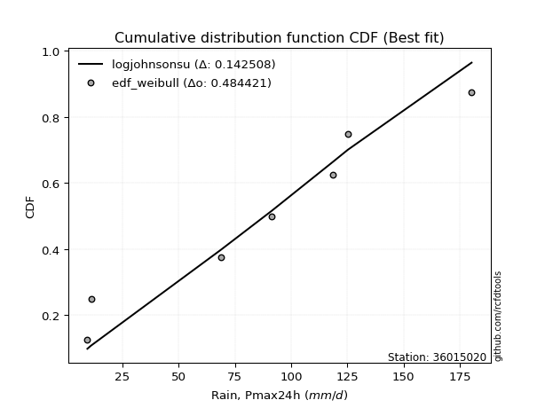</img></img>

</div>


### 4. EDF Beard (1943)

The Beard formula (or Beard´s plotting position formula) in hydrology is used to estimate the empirical non-exceedance probability _(P)_ of a flood event (or other extreme hydrological data point) within a given dataset.

<div align="center">


$P=(m-0.31)/(n+0.38)$


</div>


**4.1. Empirical values**

<div align="center">

|                | 0                   | 1                   | 2                  | 3                   | 4                  | 5                  | 6                  | 7                  |
|:---------------|:--------------------|:--------------------|:-------------------|:--------------------|:-------------------|:-------------------|:-------------------|:-------------------|
| date           | 2023                | 2022                | 2018               | 2021                | 2025               | 2019               | 2020               | 2017               |
| x              | 9.5                 | 11.1                | 68.8               | 91.3                | 95.0               | 118.5              | 125.2              | 180.2              |
| m              | 1                   | 2                   | 3                  | 4                   | 5                  | 6                  | 7                  | 8                  |
| empirical_dist | edf_beard           | edf_beard           | edf_beard          | edf_beard           | edf_beard          | edf_beard          | edf_beard          | edf_beard          |
| empirical      | 0.08233890214797135 | 0.20167064439140808 | 0.3210023866348448 | 0.44033412887828155 | 0.5596658711217184 | 0.6789976133651551 | 0.7983293556085919 | 0.9176610978520287 |
| empirical_tr   | 1.0897269180754225  | 1.2526158445440956  | 1.4727592267135323 | 1.7867803837953091  | 2.2710027100271004 | 3.115241635687732  | 4.958579881656804  | 12.144927536231886 |

</div>


**4.2. Kolmogorov-Smirnov fit test (sorted by Δ)**


<div align="center">

|                | 0                   | 1                   | 2                   | 3                   | 4                   | 5                   | 6                  | 7                   | 8                   | 9                   | 10                  | 11                  | 12                  | 13                  | 14                  | 15                  | 16                  | 17                 | 18                 | 19                  | 20                  | 21                  | 22                  | 23                 | 24                  | 25                  | 26                  | 27                 | 28                  | 29                  | 30                 | 31                  | 32                  | 33                  | 34                  | 35                  | 36                  | 37                  | 38                  | 39                 | 40                  | 41                  | 42                  | 43                  | 44                 | 45                 | 46                  | 47                  | 48                  | 49                 | 50                  | 51                  | 52                  | 53                 | 54                  | 55                  | 56                 | 57                  | 58                 | 59                  | 60                  | 61                 | 62                  | 63                  | 64                  | 65                 | 66                 | 67                  | 68                  | 69                  | 70                  | 71                  | 72                  | 73                  | 74                 | 75                  | 76                  | 77                  | 78                  | 79                  | 80                  | 81                  | 82                  | 83                 | 84                 | 85                 | 86                  | 87                  | 88                  | 89                 | 90                  | 91                  | 92                  | 93                  | 94                  | 95                  | 96                 | 97                  | 98                  | 99                  | 100                | 101                 | 102                 | 103                | 104                | 105                | 106                 | 107                 | 108                 | 109                | 110                 | 111                 | 112                 | 113                | 114                 | 115                | 116                | 117                 | 118                | 119                | 120                 | 121                | 122                | 123                 | 124                 | 125                | 126                | 127                 | 128                 | 129                 | 130                | 131                 | 132                | 133                 | 134                | 135                | 136                | 137                | 138                | 139                | 140                 | 141                 | 142                | 143                | 144                 | 145                 | 146                | 147                 | 148                 | 149                | 150                | 151                | 152                | 153                | 154                | 155                | 156                | 157                | 158                | 159                |
|:---------------|:--------------------|:--------------------|:--------------------|:--------------------|:--------------------|:--------------------|:-------------------|:--------------------|:--------------------|:--------------------|:--------------------|:--------------------|:--------------------|:--------------------|:--------------------|:--------------------|:--------------------|:-------------------|:-------------------|:--------------------|:--------------------|:--------------------|:--------------------|:-------------------|:--------------------|:--------------------|:--------------------|:-------------------|:--------------------|:--------------------|:-------------------|:--------------------|:--------------------|:--------------------|:--------------------|:--------------------|:--------------------|:--------------------|:--------------------|:-------------------|:--------------------|:--------------------|:--------------------|:--------------------|:-------------------|:-------------------|:--------------------|:--------------------|:--------------------|:-------------------|:--------------------|:--------------------|:--------------------|:-------------------|:--------------------|:--------------------|:-------------------|:--------------------|:-------------------|:--------------------|:--------------------|:-------------------|:--------------------|:--------------------|:--------------------|:-------------------|:-------------------|:--------------------|:--------------------|:--------------------|:--------------------|:--------------------|:--------------------|:--------------------|:-------------------|:--------------------|:--------------------|:--------------------|:--------------------|:--------------------|:--------------------|:--------------------|:--------------------|:-------------------|:-------------------|:-------------------|:--------------------|:--------------------|:--------------------|:-------------------|:--------------------|:--------------------|:--------------------|:--------------------|:--------------------|:--------------------|:-------------------|:--------------------|:--------------------|:--------------------|:-------------------|:--------------------|:--------------------|:-------------------|:-------------------|:-------------------|:--------------------|:--------------------|:--------------------|:-------------------|:--------------------|:--------------------|:--------------------|:-------------------|:--------------------|:-------------------|:-------------------|:--------------------|:-------------------|:-------------------|:--------------------|:-------------------|:-------------------|:--------------------|:--------------------|:-------------------|:-------------------|:--------------------|:--------------------|:--------------------|:-------------------|:--------------------|:-------------------|:--------------------|:-------------------|:-------------------|:-------------------|:-------------------|:-------------------|:-------------------|:--------------------|:--------------------|:-------------------|:-------------------|:--------------------|:--------------------|:-------------------|:--------------------|:--------------------|:-------------------|:-------------------|:-------------------|:-------------------|:-------------------|:-------------------|:-------------------|:-------------------|:-------------------|:-------------------|:-------------------|
| station        | 36015020            | 36015020            | 36015020            | 36015020            | 36015020            | 36015020            | 36015020           | 36015020            | 36015020            | 36015020            | 36015020            | 36015020            | 36015020            | 36015020            | 36015020            | 36015020            | 36015020            | 36015020           | 36015020           | 36015020            | 36015020            | 36015020            | 36015020            | 36015020           | 36015020            | 36015020            | 36015020            | 36015020           | 36015020            | 36015020            | 36015020           | 36015020            | 36015020            | 36015020            | 36015020            | 36015020            | 36015020            | 36015020            | 36015020            | 36015020           | 36015020            | 36015020            | 36015020            | 36015020            | 36015020           | 36015020           | 36015020            | 36015020            | 36015020            | 36015020           | 36015020            | 36015020            | 36015020            | 36015020           | 36015020            | 36015020            | 36015020           | 36015020            | 36015020           | 36015020            | 36015020            | 36015020           | 36015020            | 36015020            | 36015020            | 36015020           | 36015020           | 36015020            | 36015020            | 36015020            | 36015020            | 36015020            | 36015020            | 36015020            | 36015020           | 36015020            | 36015020            | 36015020            | 36015020            | 36015020            | 36015020            | 36015020            | 36015020            | 36015020           | 36015020           | 36015020           | 36015020            | 36015020            | 36015020            | 36015020           | 36015020            | 36015020            | 36015020            | 36015020            | 36015020            | 36015020            | 36015020           | 36015020            | 36015020            | 36015020            | 36015020           | 36015020            | 36015020            | 36015020           | 36015020           | 36015020           | 36015020            | 36015020            | 36015020            | 36015020           | 36015020            | 36015020            | 36015020            | 36015020           | 36015020            | 36015020           | 36015020           | 36015020            | 36015020           | 36015020           | 36015020            | 36015020           | 36015020           | 36015020            | 36015020            | 36015020           | 36015020           | 36015020            | 36015020            | 36015020            | 36015020           | 36015020            | 36015020           | 36015020            | 36015020           | 36015020           | 36015020           | 36015020           | 36015020           | 36015020           | 36015020            | 36015020            | 36015020           | 36015020           | 36015020            | 36015020            | 36015020           | 36015020            | 36015020            | 36015020           | 36015020           | 36015020           | 36015020           | 36015020           | 36015020           | 36015020           | 36015020           | 36015020           | 36015020           | 36015020           |
| empirical_dist | edf_beard           | edf_beard           | edf_beard           | edf_beard           | edf_beard           | edf_beard           | edf_beard          | edf_beard           | edf_beard           | edf_beard           | edf_beard           | edf_beard           | edf_beard           | edf_beard           | edf_beard           | edf_beard           | edf_beard           | edf_beard          | edf_beard          | edf_beard           | edf_beard           | edf_beard           | edf_beard           | edf_beard          | edf_beard           | edf_beard           | edf_beard           | edf_beard          | edf_beard           | edf_beard           | edf_beard          | edf_beard           | edf_beard           | edf_beard           | edf_beard           | edf_beard           | edf_beard           | edf_beard           | edf_beard           | edf_beard          | edf_beard           | edf_beard           | edf_beard           | edf_beard           | edf_beard          | edf_beard          | edf_beard           | edf_beard           | edf_beard           | edf_beard          | edf_beard           | edf_beard           | edf_beard           | edf_beard          | edf_beard           | edf_beard           | edf_beard          | edf_beard           | edf_beard          | edf_beard           | edf_beard           | edf_beard          | edf_beard           | edf_beard           | edf_beard           | edf_beard          | edf_beard          | edf_beard           | edf_beard           | edf_beard           | edf_beard           | edf_beard           | edf_beard           | edf_beard           | edf_beard          | edf_beard           | edf_beard           | edf_beard           | edf_beard           | edf_beard           | edf_beard           | edf_beard           | edf_beard           | edf_beard          | edf_beard          | edf_beard          | edf_beard           | edf_beard           | edf_beard           | edf_beard          | edf_beard           | edf_beard           | edf_beard           | edf_beard           | edf_beard           | edf_beard           | edf_beard          | edf_beard           | edf_beard           | edf_beard           | edf_beard          | edf_beard           | edf_beard           | edf_beard          | edf_beard          | edf_beard          | edf_beard           | edf_beard           | edf_beard           | edf_beard          | edf_beard           | edf_beard           | edf_beard           | edf_beard          | edf_beard           | edf_beard          | edf_beard          | edf_beard           | edf_beard          | edf_beard          | edf_beard           | edf_beard          | edf_beard          | edf_beard           | edf_beard           | edf_beard          | edf_beard          | edf_beard           | edf_beard           | edf_beard           | edf_beard          | edf_beard           | edf_beard          | edf_beard           | edf_beard          | edf_beard          | edf_beard          | edf_beard          | edf_beard          | edf_beard          | edf_beard           | edf_beard           | edf_beard          | edf_beard          | edf_beard           | edf_beard           | edf_beard          | edf_beard           | edf_beard           | edf_beard          | edf_beard          | edf_beard          | edf_beard          | edf_beard          | edf_beard          | edf_beard          | edf_beard          | edf_beard          | edf_beard          | edf_beard          |
| p_dist         | ksone               | semicircular        | anglit              | gumbel_l            | logjohnsonsu        | genlogistic         | mielke             | genextreme          | burr                | johnsonsu           | pearson3            | logloggamma         | dweibull            | f                   | skewnorm            | exponnorm           | truncnorm           | norm               | crystalball        | t                   | gamma               | erlang              | foldnorm            | invgamma           | cosine              | betaprime           | logistic            | argus              | exponweib           | hypsecant           | laplace            | logmielke           | dgamma              | maxwell             | weibull_min         | logburr             | invgauss            | logdweibull         | rice                | loggenextreme      | gausshyper          | rayleigh            | logargus            | kstwobign           | logtrapezoid       | loggennorm         | ncf                 | loggumbel_l         | logpearson3         | logburr12          | logweibull_min      | gumbel_r            | logdgamma           | truncexpon         | logloglaplace       | genexpon            | kappa4             | bradford            | tukeylambda        | moyal               | kappa3              | loggompertz        | uniform             | wrapcauchy          | loggenpareto        | vonmises_line      | loglevy_l          | halfnorm            | arcsine             | halflogistic        | loggenhalflogistic  | logarcsine          | nakagami            | logskewnorm         | lomax              | genpareto           | logsemicircular     | loganglit           | logerlang           | lognct              | logexponnorm        | logt                | lognorm             | logcrystalball     | logf               | logfatiguelife     | lognakagami         | loggamma            | loggamma            | logtriang          | loglogistic         | logrice             | loginvgamma         | logalpha            | loghypsecant        | logwrapcauchy       | logncf             | logbetaprime        | loginvgauss         | wald                | logmaxwell         | loginvweibull       | lograyleigh         | loglaplace         | loglaplace         | logcosine          | logfoldnorm         | halfgennorm         | genhalflogistic     | johnsonsb          | logkstwobign        | triang              | loghalfnorm         | gennorm            | loggausshyper       | loggumbel_r        | loggenexpon        | levy_l              | truncweibull_min   | nct                | logksone            | loghalflogistic    | logmoyal           | loggengamma         | logweibull_max      | burr12             | loglomax           | logjohnsonsb        | logkappa3           | loguniform          | logvonmises_line   | logbradford         | beta               | gengamma            | loghalfgennorm     | logkappa4          | logbeta            | trapezoid          | logwald            | logrdist           | logtruncexpon       | logtruncweibull_min | logtukeylambda     | logexponweib       | alpha               | logtruncnorm        | invweibull         | rdist               | gompertz            | fatiguelife        | powerlaw           | logexponpow        | logpowerlaw        | truncpareto        | exponpow           | logtruncpareto     | weibull_max        | loggenlogistic     | logvonmises        | vonmises           |
| delta          | 0.10992234903484728 | 0.11082824949706649 | 0.11322388681126211 | 0.11419971505337968 | 0.11550381592701159 | 0.11636781980157755 | 0.1185030892007223 | 0.11855002143978556 | 0.11918655161227035 | 0.12212495551351676 | 0.12220395514197202 | 0.12228671049359842 | 0.12236349949946057 | 0.12285965467928546 | 0.12295192735339122 | 0.12302124678279346 | 0.12302277319362437 | 0.1230227766233039 | 0.1230227816837683 | 0.12302395578477134 | 0.12350810675702494 | 0.12369237116598569 | 0.12398853460056725 | 0.1262002413062684 | 0.12994025768266243 | 0.12995692262980907 | 0.13025346402333626 | 0.1315272213482307 | 0.13179837181010717 | 0.13289760141877566 | 0.1340041345723194 | 0.13463761075505098 | 0.13501028859999206 | 0.13902078288488834 | 0.13907934485667928 | 0.13919168451528913 | 0.14194657302069008 | 0.14290092529407694 | 0.14371725074627295 | 0.1450677961226582 | 0.14900933511074493 | 0.14967108769391674 | 0.15093170476385126 | 0.15695647012838115 | 0.1651795338765144 | 0.166024172863701  | 0.16698387800152142 | 0.16754249976739038 | 0.16817451258506566 | 0.1692760449219633 | 0.16966460523766475 | 0.16973014278888335 | 0.17474273512838737 | 0.176828784464118  | 0.17744894378268766 | 0.18295129363588022 | 0.1879788433762935 | 0.19010323325955164 | 0.1902309061592738 | 0.19086164229886726 | 0.19117227370466372 | 0.191610238523445  | 0.19229747508853756 | 0.19234569643600202 | 0.19325018342722455 | 0.193757306596407  | 0.1971849398419777 | 0.20167064439140808 | 0.20167064439140808 | 0.20167064439140808 | 0.20464793571876472 | 0.20826036497910616 | 0.20957606619389701 | 0.21473884877729904 | 0.2154686648391504 | 0.21865940758407298 | 0.22029417146249297 | 0.22331901773237284 | 0.22973358929155951 | 0.23045942982495315 | 0.23064367795956164 | 0.23064639006816567 | 0.23064643787405548 | 0.2306464445755373 | 0.2309070556805275 | 0.2309816404636138 | 0.23128732348683712 | 0.23696627512294766 | 0.23696627512294766 | 0.2371389553377199 | 0.23759764980621034 | 0.24125896906601585 | 0.24301326218696695 | 0.24552590552827436 | 0.24710465484240723 | 0.24831749815540438 | 0.2521461636277782 | 0.25299477583101604 | 0.25327055512417007 | 0.25476372780692674 | 0.2609280515894793 | 0.26488032972575637 | 0.27064172553891486 | 0.2751310211847778 | 0.2751310211847778 | 0.2776967424035717 | 0.27787956955896476 | 0.28307482375628634 | 0.28484378919741316 | 0.2916105239271835 | 0.29446993819639844 | 0.29658109934564614 | 0.29804699310835603 | 0.2983293556085919 | 0.29908955733457676 | 0.3006718144470497 | 0.3010418901779832 | 0.30896698746530304 | 0.3197287044947409 | 0.3204637553362415 | 0.32300116970219905 | 0.3253891168274322 | 0.3254556016151109 | 0.32901903667527943 | 0.33119911226315474 | 0.3348697929862625 | 0.3375309115829497 | 0.35069693850165706 | 0.35077465292968624 | 0.35180188096960785 | 0.3518807319446211 | 0.35262037980103556 | 0.3534547540402414 | 0.36259929007963243 | 0.3645901249617356 | 0.3678908890216084 | 0.3740683986514539 | 0.3758134894178495 | 0.3942246081832641 | 0.4163104279093254 | 0.42827249434029424 | 0.43485597548407495 | 0.4428038938642447 | 0.4446938390218965 | 0.44797325729206716 | 0.45286403579967727 | 0.4564111185752271 | 0.46700100722974347 | 0.49434569481644486 | 0.4983643174315495 | 0.5146023708468318 | 0.5725804495086115 | 0.6038076539774524 | 0.6175654053773267 | 0.6517533045304795 | 0.6547179294465579 | 0.6879142719194845 | 0.7983293556085919 | 1.1232897891770024 | 28.3674261053612   |
| deltao         | 0.4472608134160001  | 0.4472608134160001  | 0.4472608134160001  | 0.4472608134160001  | 0.4472608134160001  | 0.4472608134160001  | 0.4472608134160001 | 0.4472608134160001  | 0.4472608134160001  | 0.4472608134160001  | 0.4472608134160001  | 0.4472608134160001  | 0.4472608134160001  | 0.4472608134160001  | 0.4472608134160001  | 0.4472608134160001  | 0.4472608134160001  | 0.4472608134160001 | 0.4472608134160001 | 0.4472608134160001  | 0.4472608134160001  | 0.4472608134160001  | 0.4472608134160001  | 0.4472608134160001 | 0.4472608134160001  | 0.4472608134160001  | 0.4472608134160001  | 0.4472608134160001 | 0.4472608134160001  | 0.4472608134160001  | 0.4472608134160001 | 0.4472608134160001  | 0.4472608134160001  | 0.4472608134160001  | 0.4472608134160001  | 0.4472608134160001  | 0.4472608134160001  | 0.4472608134160001  | 0.4472608134160001  | 0.4472608134160001 | 0.4472608134160001  | 0.4472608134160001  | 0.4472608134160001  | 0.4472608134160001  | 0.4472608134160001 | 0.4472608134160001 | 0.4472608134160001  | 0.4472608134160001  | 0.4472608134160001  | 0.4472608134160001 | 0.4472608134160001  | 0.4472608134160001  | 0.4472608134160001  | 0.4472608134160001 | 0.4472608134160001  | 0.4472608134160001  | 0.4472608134160001 | 0.4472608134160001  | 0.4472608134160001 | 0.4472608134160001  | 0.4472608134160001  | 0.4472608134160001 | 0.4472608134160001  | 0.4472608134160001  | 0.4472608134160001  | 0.4472608134160001 | 0.4472608134160001 | 0.4472608134160001  | 0.4472608134160001  | 0.4472608134160001  | 0.4472608134160001  | 0.4472608134160001  | 0.4472608134160001  | 0.4472608134160001  | 0.4472608134160001 | 0.4472608134160001  | 0.4472608134160001  | 0.4472608134160001  | 0.4472608134160001  | 0.4472608134160001  | 0.4472608134160001  | 0.4472608134160001  | 0.4472608134160001  | 0.4472608134160001 | 0.4472608134160001 | 0.4472608134160001 | 0.4472608134160001  | 0.4472608134160001  | 0.4472608134160001  | 0.4472608134160001 | 0.4472608134160001  | 0.4472608134160001  | 0.4472608134160001  | 0.4472608134160001  | 0.4472608134160001  | 0.4472608134160001  | 0.4472608134160001 | 0.4472608134160001  | 0.4472608134160001  | 0.4472608134160001  | 0.4472608134160001 | 0.4472608134160001  | 0.4472608134160001  | 0.4472608134160001 | 0.4472608134160001 | 0.4472608134160001 | 0.4472608134160001  | 0.4472608134160001  | 0.4472608134160001  | 0.4472608134160001 | 0.4472608134160001  | 0.4472608134160001  | 0.4472608134160001  | 0.4472608134160001 | 0.4472608134160001  | 0.4472608134160001 | 0.4472608134160001 | 0.4472608134160001  | 0.4472608134160001 | 0.4472608134160001 | 0.4472608134160001  | 0.4472608134160001 | 0.4472608134160001 | 0.4472608134160001  | 0.4472608134160001  | 0.4472608134160001 | 0.4472608134160001 | 0.4472608134160001  | 0.4472608134160001  | 0.4472608134160001  | 0.4472608134160001 | 0.4472608134160001  | 0.4472608134160001 | 0.4472608134160001  | 0.4472608134160001 | 0.4472608134160001 | 0.4472608134160001 | 0.4472608134160001 | 0.4472608134160001 | 0.4472608134160001 | 0.4472608134160001  | 0.4472608134160001  | 0.4472608134160001 | 0.4472608134160001 | 0.4472608134160001  | 0.4472608134160001  | 0.4472608134160001 | 0.4472608134160001  | 0.4472608134160001  | 0.4472608134160001 | 0.4472608134160001 | 0.4472608134160001 | 0.4472608134160001 | 0.4472608134160001 | 0.4472608134160001 | 0.4472608134160001 | 0.4472608134160001 | 0.4472608134160001 | 0.4472608134160001 | 0.4472608134160001 |
| eval           | Δo > Δ              | Δo > Δ              | Δo > Δ              | Δo > Δ              | Δo > Δ              | Δo > Δ              | Δo > Δ             | Δo > Δ              | Δo > Δ              | Δo > Δ              | Δo > Δ              | Δo > Δ              | Δo > Δ              | Δo > Δ              | Δo > Δ              | Δo > Δ              | Δo > Δ              | Δo > Δ             | Δo > Δ             | Δo > Δ              | Δo > Δ              | Δo > Δ              | Δo > Δ              | Δo > Δ             | Δo > Δ              | Δo > Δ              | Δo > Δ              | Δo > Δ             | Δo > Δ              | Δo > Δ              | Δo > Δ             | Δo > Δ              | Δo > Δ              | Δo > Δ              | Δo > Δ              | Δo > Δ              | Δo > Δ              | Δo > Δ              | Δo > Δ              | Δo > Δ             | Δo > Δ              | Δo > Δ              | Δo > Δ              | Δo > Δ              | Δo > Δ             | Δo > Δ             | Δo > Δ              | Δo > Δ              | Δo > Δ              | Δo > Δ             | Δo > Δ              | Δo > Δ              | Δo > Δ              | Δo > Δ             | Δo > Δ              | Δo > Δ              | Δo > Δ             | Δo > Δ              | Δo > Δ             | Δo > Δ              | Δo > Δ              | Δo > Δ             | Δo > Δ              | Δo > Δ              | Δo > Δ              | Δo > Δ             | Δo > Δ             | Δo > Δ              | Δo > Δ              | Δo > Δ              | Δo > Δ              | Δo > Δ              | Δo > Δ              | Δo > Δ              | Δo > Δ             | Δo > Δ              | Δo > Δ              | Δo > Δ              | Δo > Δ              | Δo > Δ              | Δo > Δ              | Δo > Δ              | Δo > Δ              | Δo > Δ             | Δo > Δ             | Δo > Δ             | Δo > Δ              | Δo > Δ              | Δo > Δ              | Δo > Δ             | Δo > Δ              | Δo > Δ              | Δo > Δ              | Δo > Δ              | Δo > Δ              | Δo > Δ              | Δo > Δ             | Δo > Δ              | Δo > Δ              | Δo > Δ              | Δo > Δ             | Δo > Δ              | Δo > Δ              | Δo > Δ             | Δo > Δ             | Δo > Δ             | Δo > Δ              | Δo > Δ              | Δo > Δ              | Δo > Δ             | Δo > Δ              | Δo > Δ              | Δo > Δ              | Δo > Δ             | Δo > Δ              | Δo > Δ             | Δo > Δ             | Δo > Δ              | Δo > Δ             | Δo > Δ             | Δo > Δ              | Δo > Δ             | Δo > Δ             | Δo > Δ              | Δo > Δ              | Δo > Δ             | Δo > Δ             | Δo > Δ              | Δo > Δ              | Δo > Δ              | Δo > Δ             | Δo > Δ              | Δo > Δ             | Δo > Δ              | Δo > Δ             | Δo > Δ             | Δo > Δ             | Δo > Δ             | Δo > Δ             | Δo > Δ             | Δo > Δ              | Δo > Δ              | Δo > Δ             | Δo > Δ             | Δo <= Δ             | Δo <= Δ             | Δo <= Δ            | Δo <= Δ             | Δo <= Δ             | Δo <= Δ            | Δo <= Δ            | Δo <= Δ            | Δo <= Δ            | Δo <= Δ            | Δo <= Δ            | Δo <= Δ            | Δo <= Δ            | Δo <= Δ            | Δo <= Δ            | Δo <= Δ            |
| fit            | 1                   | 1                   | 1                   | 1                   | 1                   | 1                   | 1                  | 1                   | 1                   | 1                   | 1                   | 1                   | 1                   | 1                   | 1                   | 1                   | 1                   | 1                  | 1                  | 1                   | 1                   | 1                   | 1                   | 1                  | 1                   | 1                   | 1                   | 1                  | 1                   | 1                   | 1                  | 1                   | 1                   | 1                   | 1                   | 1                   | 1                   | 1                   | 1                   | 1                  | 1                   | 1                   | 1                   | 1                   | 1                  | 1                  | 1                   | 1                   | 1                   | 1                  | 1                   | 1                   | 1                   | 1                  | 1                   | 1                   | 1                  | 1                   | 1                  | 1                   | 1                   | 1                  | 1                   | 1                   | 1                   | 1                  | 1                  | 1                   | 1                   | 1                   | 1                   | 1                   | 1                   | 1                   | 1                  | 1                   | 1                   | 1                   | 1                   | 1                   | 1                   | 1                   | 1                   | 1                  | 1                  | 1                  | 1                   | 1                   | 1                   | 1                  | 1                   | 1                   | 1                   | 1                   | 1                   | 1                   | 1                  | 1                   | 1                   | 1                   | 1                  | 1                   | 1                   | 1                  | 1                  | 1                  | 1                   | 1                   | 1                   | 1                  | 1                   | 1                   | 1                   | 1                  | 1                   | 1                  | 1                  | 1                   | 1                  | 1                  | 1                   | 1                  | 1                  | 1                   | 1                   | 1                  | 1                  | 1                   | 1                   | 1                   | 1                  | 1                   | 1                  | 1                   | 1                  | 1                  | 1                  | 1                  | 1                  | 1                  | 1                   | 1                   | 1                  | 1                  | 0                   | 0                   | 0                  | 0                   | 0                   | 0                  | 0                  | 0                  | 0                  | 0                  | 0                  | 0                  | 0                  | 0                  | 0                  | 0                  |
| n              | 8                   | 8                   | 8                   | 8                   | 8                   | 8                   | 8                  | 8                   | 8                   | 8                   | 8                   | 8                   | 8                   | 8                   | 8                   | 8                   | 8                   | 8                  | 8                  | 8                   | 8                   | 8                   | 8                   | 8                  | 8                   | 8                   | 8                   | 8                  | 8                   | 8                   | 8                  | 8                   | 8                   | 8                   | 8                   | 8                   | 8                   | 8                   | 8                   | 8                  | 8                   | 8                   | 8                   | 8                   | 8                  | 8                  | 8                   | 8                   | 8                   | 8                  | 8                   | 8                   | 8                   | 8                  | 8                   | 8                   | 8                  | 8                   | 8                  | 8                   | 8                   | 8                  | 8                   | 8                   | 8                   | 8                  | 8                  | 8                   | 8                   | 8                   | 8                   | 8                   | 8                   | 8                   | 8                  | 8                   | 8                   | 8                   | 8                   | 8                   | 8                   | 8                   | 8                   | 8                  | 8                  | 8                  | 8                   | 8                   | 8                   | 8                  | 8                   | 8                   | 8                   | 8                   | 8                   | 8                   | 8                  | 8                   | 8                   | 8                   | 8                  | 8                   | 8                   | 8                  | 8                  | 8                  | 8                   | 8                   | 8                   | 8                  | 8                   | 8                   | 8                   | 8                  | 8                   | 8                  | 8                  | 8                   | 8                  | 8                  | 8                   | 8                  | 8                  | 8                   | 8                   | 8                  | 8                  | 8                   | 8                   | 8                   | 8                  | 8                   | 8                  | 8                   | 8                  | 8                  | 8                  | 8                  | 8                  | 8                  | 8                   | 8                   | 8                  | 8                  | 8                   | 8                   | 8                  | 8                   | 8                   | 8                  | 8                  | 8                  | 8                  | 8                  | 8                  | 8                  | 8                  | 8                  | 8                  | 8                  |
| best_fit       | 1                   | 0                   | 0                   | 0                   | 0                   | 0                   | 0                  | 0                   | 0                   | 0                   | 0                   | 0                   | 0                   | 0                   | 0                   | 0                   | 0                   | 0                  | 0                  | 0                   | 0                   | 0                   | 0                   | 0                  | 0                   | 0                   | 0                   | 0                  | 0                   | 0                   | 0                  | 0                   | 0                   | 0                   | 0                   | 0                   | 0                   | 0                   | 0                   | 0                  | 0                   | 0                   | 0                   | 0                   | 0                  | 0                  | 0                   | 0                   | 0                   | 0                  | 0                   | 0                   | 0                   | 0                  | 0                   | 0                   | 0                  | 0                   | 0                  | 0                   | 0                   | 0                  | 0                   | 0                   | 0                   | 0                  | 0                  | 0                   | 0                   | 0                   | 0                   | 0                   | 0                   | 0                   | 0                  | 0                   | 0                   | 0                   | 0                   | 0                   | 0                   | 0                   | 0                   | 0                  | 0                  | 0                  | 0                   | 0                   | 0                   | 0                  | 0                   | 0                   | 0                   | 0                   | 0                   | 0                   | 0                  | 0                   | 0                   | 0                   | 0                  | 0                   | 0                   | 0                  | 0                  | 0                  | 0                   | 0                   | 0                   | 0                  | 0                   | 0                   | 0                   | 0                  | 0                   | 0                  | 0                  | 0                   | 0                  | 0                  | 0                   | 0                  | 0                  | 0                   | 0                   | 0                  | 0                  | 0                   | 0                   | 0                   | 0                  | 0                   | 0                  | 0                   | 0                  | 0                  | 0                  | 0                  | 0                  | 0                  | 0                   | 0                   | 0                  | 0                  | 0                   | 0                   | 0                  | 0                   | 0                   | 0                  | 0                  | 0                  | 0                  | 0                  | 0                  | 0                  | 0                  | 0                  | 0                  | 0                  |
| best_fit_sort  | 1                   | 2                   | 3                   | 4                   | 5                   | 6                   | 7                  | 8                   | 9                   | 10                  | 11                  | 12                  | 13                  | 14                  | 15                  | 16                  | 17                  | 18                 | 19                 | 20                  | 21                  | 22                  | 23                  | 24                 | 25                  | 26                  | 27                  | 28                 | 29                  | 30                  | 31                 | 32                  | 33                  | 34                  | 35                  | 36                  | 37                  | 38                  | 39                  | 40                 | 41                  | 42                  | 43                  | 44                  | 45                 | 46                 | 47                  | 48                  | 49                  | 50                 | 51                  | 52                  | 53                  | 54                 | 55                  | 56                  | 57                 | 58                  | 59                 | 60                  | 61                  | 62                 | 63                  | 64                  | 65                  | 66                 | 67                 | 68                  | 69                  | 70                  | 71                  | 72                  | 73                  | 74                  | 75                 | 76                  | 77                  | 78                  | 79                  | 80                  | 81                  | 82                  | 83                  | 84                 | 85                 | 86                 | 87                  | 88                  | 89                  | 90                 | 91                  | 92                  | 93                  | 94                  | 95                  | 96                  | 97                 | 98                  | 99                  | 100                 | 101                | 102                 | 103                 | 104                | 105                | 106                | 107                 | 108                 | 109                 | 110                | 111                 | 112                 | 113                 | 114                | 115                 | 116                | 117                | 118                 | 119                | 120                | 121                 | 122                | 123                | 124                 | 125                 | 126                | 127                | 128                 | 129                 | 130                 | 131                | 132                 | 133                | 134                 | 135                | 136                | 137                | 138                | 139                | 140                | 141                 | 142                 | 143                | 144                | 145                 | 146                 | 147                | 148                 | 149                 | 150                | 151                | 152                | 153                | 154                | 155                | 156                | 157                | 158                | 159                | 160                |

</div>


**4.3. Best fit**

<div align="center">

|   id |   station | empirical_dist   | p_dist   |    delta |   deltao | eval   |   fit |   n |   best_fit |   best_fit_sort |
|-----:|----------:|:-----------------|:---------|---------:|---------:|:-------|------:|----:|-----------:|----------------:|
|    0 |  36015020 | edf_beard        | ksone    | 0.109922 | 0.447261 | Δo > Δ |     1 |   8 |          1 |               1 |

</div>


<div align="center">

</img></img>

</div>


### 5. EDF Chegodayev (1955)

The Chegodayev formula is an empirical plotting position formula used in hydrological frequency analysis to estimate the exceedance probability or return period of a specific event from a set of observed data. It is primarily used for plotting observed data points on probability paper to fit a theoretical distribution, particularly for analyzing extreme events like maximum flood flows or rainfall intensities. The constant _b_ value in the generalized plotting position formula is 0.3.

<div align="center">


$P=(m-b)/(n+1-2b)$


</div>


**5.1. Empirical values**

<div align="center">

|                | 0                   | 1                   | 2                   | 3                   | 4                  | 5                  | 6                  | 7                  |
|:---------------|:--------------------|:--------------------|:--------------------|:--------------------|:-------------------|:-------------------|:-------------------|:-------------------|
| date           | 2023                | 2022                | 2018                | 2021                | 2025               | 2019               | 2020               | 2017               |
| x              | 9.5                 | 11.1                | 68.8                | 91.3                | 95.0               | 118.5              | 125.2              | 180.2              |
| m              | 1                   | 2                   | 3                   | 4                   | 5                  | 6                  | 7                  | 8                  |
| empirical_dist | edf_chegodayev      | edf_chegodayev      | edf_chegodayev      | edf_chegodayev      | edf_chegodayev     | edf_chegodayev     | edf_chegodayev     | edf_chegodayev     |
| empirical      | 0.08333333333333333 | 0.20238095238095236 | 0.32142857142857145 | 0.44047619047619047 | 0.5595238095238095 | 0.6785714285714286 | 0.7976190476190476 | 0.9166666666666666 |
| empirical_tr   | 1.090909090909091   | 1.253731343283582   | 1.4736842105263157  | 1.7872340425531914  | 2.27027027027027   | 3.1111111111111116 | 4.941176470588234  | 11.999999999999995 |

</div>


**5.2. Kolmogorov-Smirnov fit test (sorted by Δ)**


<div align="center">

|                | 0                   | 1                   | 2                   | 3                   | 4                   | 5                   | 6                   | 7                   | 8                   | 9                   | 10                 | 11                  | 12                  | 13                  | 14                 | 15                  | 16                  | 17                  | 18                  | 19                  | 20                  | 21                  | 22                  | 23                  | 24                 | 25                  | 26                  | 27                  | 28                  | 29                 | 30                 | 31                  | 32                  | 33                 | 34                 | 35                  | 36                  | 37                  | 38                 | 39                 | 40                 | 41                 | 42                  | 43                  | 44                  | 45                  | 46                 | 47                  | 48                  | 49                  | 50                  | 51                  | 52                  | 53                  | 54                 | 55                 | 56                  | 57                 | 58                  | 59                  | 60                  | 61                 | 62                  | 63                  | 64                 | 65                  | 66                  | 67                  | 68                  | 69                  | 70                  | 71                  | 72                  | 73                  | 74                  | 75                  | 76                  | 77                 | 78                  | 79                  | 80                 | 81                  | 82                  | 83                  | 84                  | 85                  | 86                  | 87                  | 88                  | 89                  | 90                 | 91                 | 92                 | 93                  | 94                  | 95                  | 96                  | 97                 | 98                  | 99                 | 100                 | 101                 | 102                | 103                 | 104                 | 105                 | 106                | 107                | 108                 | 109                 | 110                | 111                 | 112                 | 113                | 114                | 115                | 116                | 117                | 118                 | 119                 | 120                | 121                | 122                 | 123                | 124                 | 125                | 126                 | 127                 | 128                | 129                | 130                 | 131                | 132                 | 133                | 134                 | 135                 | 136                | 137                | 138                 | 139                 | 140                | 141                 | 142                 | 143                | 144                | 145                 | 146                 | 147                | 148                | 149                | 150                | 151                | 152                | 153                | 154                | 155                | 156                | 157                | 158                | 159                |
|:---------------|:--------------------|:--------------------|:--------------------|:--------------------|:--------------------|:--------------------|:--------------------|:--------------------|:--------------------|:--------------------|:-------------------|:--------------------|:--------------------|:--------------------|:-------------------|:--------------------|:--------------------|:--------------------|:--------------------|:--------------------|:--------------------|:--------------------|:--------------------|:--------------------|:-------------------|:--------------------|:--------------------|:--------------------|:--------------------|:-------------------|:-------------------|:--------------------|:--------------------|:-------------------|:-------------------|:--------------------|:--------------------|:--------------------|:-------------------|:-------------------|:-------------------|:-------------------|:--------------------|:--------------------|:--------------------|:--------------------|:-------------------|:--------------------|:--------------------|:--------------------|:--------------------|:--------------------|:--------------------|:--------------------|:-------------------|:-------------------|:--------------------|:-------------------|:--------------------|:--------------------|:--------------------|:-------------------|:--------------------|:--------------------|:-------------------|:--------------------|:--------------------|:--------------------|:--------------------|:--------------------|:--------------------|:--------------------|:--------------------|:--------------------|:--------------------|:--------------------|:--------------------|:-------------------|:--------------------|:--------------------|:-------------------|:--------------------|:--------------------|:--------------------|:--------------------|:--------------------|:--------------------|:--------------------|:--------------------|:--------------------|:-------------------|:-------------------|:-------------------|:--------------------|:--------------------|:--------------------|:--------------------|:-------------------|:--------------------|:-------------------|:--------------------|:--------------------|:-------------------|:--------------------|:--------------------|:--------------------|:-------------------|:-------------------|:--------------------|:--------------------|:-------------------|:--------------------|:--------------------|:-------------------|:-------------------|:-------------------|:-------------------|:-------------------|:--------------------|:--------------------|:-------------------|:-------------------|:--------------------|:-------------------|:--------------------|:-------------------|:--------------------|:--------------------|:-------------------|:-------------------|:--------------------|:-------------------|:--------------------|:-------------------|:--------------------|:--------------------|:-------------------|:-------------------|:--------------------|:--------------------|:-------------------|:--------------------|:--------------------|:-------------------|:-------------------|:--------------------|:--------------------|:-------------------|:-------------------|:-------------------|:-------------------|:-------------------|:-------------------|:-------------------|:-------------------|:-------------------|:-------------------|:-------------------|:-------------------|:-------------------|
| station        | 36015020            | 36015020            | 36015020            | 36015020            | 36015020            | 36015020            | 36015020            | 36015020            | 36015020            | 36015020            | 36015020           | 36015020            | 36015020            | 36015020            | 36015020           | 36015020            | 36015020            | 36015020            | 36015020            | 36015020            | 36015020            | 36015020            | 36015020            | 36015020            | 36015020           | 36015020            | 36015020            | 36015020            | 36015020            | 36015020           | 36015020           | 36015020            | 36015020            | 36015020           | 36015020           | 36015020            | 36015020            | 36015020            | 36015020           | 36015020           | 36015020           | 36015020           | 36015020            | 36015020            | 36015020            | 36015020            | 36015020           | 36015020            | 36015020            | 36015020            | 36015020            | 36015020            | 36015020            | 36015020            | 36015020           | 36015020           | 36015020            | 36015020           | 36015020            | 36015020            | 36015020            | 36015020           | 36015020            | 36015020            | 36015020           | 36015020            | 36015020            | 36015020            | 36015020            | 36015020            | 36015020            | 36015020            | 36015020            | 36015020            | 36015020            | 36015020            | 36015020            | 36015020           | 36015020            | 36015020            | 36015020           | 36015020            | 36015020            | 36015020            | 36015020            | 36015020            | 36015020            | 36015020            | 36015020            | 36015020            | 36015020           | 36015020           | 36015020           | 36015020            | 36015020            | 36015020            | 36015020            | 36015020           | 36015020            | 36015020           | 36015020            | 36015020            | 36015020           | 36015020            | 36015020            | 36015020            | 36015020           | 36015020           | 36015020            | 36015020            | 36015020           | 36015020            | 36015020            | 36015020           | 36015020           | 36015020           | 36015020           | 36015020           | 36015020            | 36015020            | 36015020           | 36015020           | 36015020            | 36015020           | 36015020            | 36015020           | 36015020            | 36015020            | 36015020           | 36015020           | 36015020            | 36015020           | 36015020            | 36015020           | 36015020            | 36015020            | 36015020           | 36015020           | 36015020            | 36015020            | 36015020           | 36015020            | 36015020            | 36015020           | 36015020           | 36015020            | 36015020            | 36015020           | 36015020           | 36015020           | 36015020           | 36015020           | 36015020           | 36015020           | 36015020           | 36015020           | 36015020           | 36015020           | 36015020           | 36015020           |
| empirical_dist | edf_chegodayev      | edf_chegodayev      | edf_chegodayev      | edf_chegodayev      | edf_chegodayev      | edf_chegodayev      | edf_chegodayev      | edf_chegodayev      | edf_chegodayev      | edf_chegodayev      | edf_chegodayev     | edf_chegodayev      | edf_chegodayev      | edf_chegodayev      | edf_chegodayev     | edf_chegodayev      | edf_chegodayev      | edf_chegodayev      | edf_chegodayev      | edf_chegodayev      | edf_chegodayev      | edf_chegodayev      | edf_chegodayev      | edf_chegodayev      | edf_chegodayev     | edf_chegodayev      | edf_chegodayev      | edf_chegodayev      | edf_chegodayev      | edf_chegodayev     | edf_chegodayev     | edf_chegodayev      | edf_chegodayev      | edf_chegodayev     | edf_chegodayev     | edf_chegodayev      | edf_chegodayev      | edf_chegodayev      | edf_chegodayev     | edf_chegodayev     | edf_chegodayev     | edf_chegodayev     | edf_chegodayev      | edf_chegodayev      | edf_chegodayev      | edf_chegodayev      | edf_chegodayev     | edf_chegodayev      | edf_chegodayev      | edf_chegodayev      | edf_chegodayev      | edf_chegodayev      | edf_chegodayev      | edf_chegodayev      | edf_chegodayev     | edf_chegodayev     | edf_chegodayev      | edf_chegodayev     | edf_chegodayev      | edf_chegodayev      | edf_chegodayev      | edf_chegodayev     | edf_chegodayev      | edf_chegodayev      | edf_chegodayev     | edf_chegodayev      | edf_chegodayev      | edf_chegodayev      | edf_chegodayev      | edf_chegodayev      | edf_chegodayev      | edf_chegodayev      | edf_chegodayev      | edf_chegodayev      | edf_chegodayev      | edf_chegodayev      | edf_chegodayev      | edf_chegodayev     | edf_chegodayev      | edf_chegodayev      | edf_chegodayev     | edf_chegodayev      | edf_chegodayev      | edf_chegodayev      | edf_chegodayev      | edf_chegodayev      | edf_chegodayev      | edf_chegodayev      | edf_chegodayev      | edf_chegodayev      | edf_chegodayev     | edf_chegodayev     | edf_chegodayev     | edf_chegodayev      | edf_chegodayev      | edf_chegodayev      | edf_chegodayev      | edf_chegodayev     | edf_chegodayev      | edf_chegodayev     | edf_chegodayev      | edf_chegodayev      | edf_chegodayev     | edf_chegodayev      | edf_chegodayev      | edf_chegodayev      | edf_chegodayev     | edf_chegodayev     | edf_chegodayev      | edf_chegodayev      | edf_chegodayev     | edf_chegodayev      | edf_chegodayev      | edf_chegodayev     | edf_chegodayev     | edf_chegodayev     | edf_chegodayev     | edf_chegodayev     | edf_chegodayev      | edf_chegodayev      | edf_chegodayev     | edf_chegodayev     | edf_chegodayev      | edf_chegodayev     | edf_chegodayev      | edf_chegodayev     | edf_chegodayev      | edf_chegodayev      | edf_chegodayev     | edf_chegodayev     | edf_chegodayev      | edf_chegodayev     | edf_chegodayev      | edf_chegodayev     | edf_chegodayev      | edf_chegodayev      | edf_chegodayev     | edf_chegodayev     | edf_chegodayev      | edf_chegodayev      | edf_chegodayev     | edf_chegodayev      | edf_chegodayev      | edf_chegodayev     | edf_chegodayev     | edf_chegodayev      | edf_chegodayev      | edf_chegodayev     | edf_chegodayev     | edf_chegodayev     | edf_chegodayev     | edf_chegodayev     | edf_chegodayev     | edf_chegodayev     | edf_chegodayev     | edf_chegodayev     | edf_chegodayev     | edf_chegodayev     | edf_chegodayev     | edf_chegodayev     |
| p_dist         | ksone               | semicircular        | anglit              | gumbel_l            | logjohnsonsu        | genlogistic         | mielke              | genextreme          | burr                | johnsonsu           | pearson3           | logloggamma         | dweibull            | f                   | skewnorm           | exponnorm           | truncnorm           | norm                | crystalball         | t                   | gamma               | erlang              | foldnorm            | invgamma            | cosine             | betaprime           | logistic            | argus               | exponweib           | hypsecant          | laplace            | logmielke           | dgamma              | logburr            | maxwell            | weibull_min         | invgauss            | logdweibull         | loggenextreme      | rice               | gausshyper         | rayleigh           | logargus            | kstwobign           | logtrapezoid        | loggennorm          | ncf                | loggumbel_l         | logpearson3         | logburr12           | logweibull_min      | gumbel_r            | logdgamma           | truncexpon          | logloglaplace      | genexpon           | kappa4              | bradford           | tukeylambda         | loggompertz         | moyal               | kappa3             | loggenpareto        | uniform             | wrapcauchy         | vonmises_line       | loglevy_l           | halfnorm            | arcsine             | halflogistic        | loggenhalflogistic  | logarcsine          | nakagami            | logskewnorm         | lomax               | genpareto           | logsemicircular     | loganglit          | logerlang           | lognct              | logexponnorm       | logt                | lognorm             | logcrystalball      | logf                | logfatiguelife      | lognakagami         | loggamma            | loggamma            | logtriang           | loglogistic        | logrice            | loginvgamma        | logalpha            | loghypsecant        | logwrapcauchy       | logncf              | logbetaprime       | loginvgauss         | wald               | logmaxwell          | loginvweibull       | lograyleigh        | loglaplace          | loglaplace          | logcosine           | logfoldnorm        | halfgennorm        | genhalflogistic     | johnsonsb           | logkstwobign       | triang              | gennorm             | loghalfnorm        | loggausshyper      | loggumbel_r        | loggenexpon        | levy_l             | truncweibull_min    | nct                 | logksone           | loghalflogistic    | logmoyal            | loggengamma        | logweibull_max      | burr12             | loglomax            | logjohnsonsb        | logkappa3          | loguniform         | logvonmises_line    | logbradford        | beta                | gengamma           | loghalfgennorm      | logkappa4           | logbeta            | trapezoid          | logwald             | logrdist            | logtruncexpon      | logtruncweibull_min | logtukeylambda      | logexponweib       | alpha              | logtruncnorm        | invweibull          | rdist              | gompertz           | fatiguelife        | powerlaw           | logexponpow        | logpowerlaw        | truncpareto        | exponpow           | logtruncpareto     | weibull_max        | loggenlogistic     | logvonmises        | vonmises           |
| delta          | 0.11063265702439155 | 0.11153855748661076 | 0.11393419480080638 | 0.11491002304292396 | 0.11621412391655586 | 0.11707812779112182 | 0.11921339719026658 | 0.11926032942932983 | 0.11989685960181462 | 0.12283526350306104 | 0.1229142631315163 | 0.12299701848314269 | 0.12307380748900484 | 0.12356996266882973 | 0.1236622353429355 | 0.12373155477233773 | 0.12373308118316864 | 0.12373308461284817 | 0.12373308967331258 | 0.12373426377431561 | 0.12421841474656921 | 0.12440267915552997 | 0.12469884259011152 | 0.12691054929581266 | 0.1306505656722067 | 0.13066723061935337 | 0.13096377201288054 | 0.13136662118764555 | 0.13165631021219826 | 0.1336079094083199 | 0.1347144425618637 | 0.13534791874459529 | 0.13572059658953634 | 0.1390496229173802 | 0.1397310908744326 | 0.13978965284622352 | 0.14180451142278117 | 0.14361123328362121 | 0.1443574881331139 | 0.1444275587358172 | 0.1497196431002892 | 0.150381395683461  | 0.15164201275339553 | 0.15681440853047224 | 0.16475334908278777 | 0.16673448085324527 | 0.1668418164036125 | 0.16740043816948147 | 0.16774832779133902 | 0.16913398332405438 | 0.16952254363975583 | 0.17044045077842762 | 0.17545304311793164 | 0.17753909245366228 | 0.1781592517722319 | 0.1836616016254245 | 0.18868915136583778 | 0.1908135412490959 | 0.19094121414881807 | 0.19146817692553608 | 0.19157195028841154 | 0.191882581694208  | 0.19282399863349792 | 0.19300778307808183 | 0.1930560044255463 | 0.19446761458595127 | 0.19619050865661575 | 0.20238095238095236 | 0.20238095238095236 | 0.20238095238095236 | 0.20422175092503808 | 0.20783418018537952 | 0.20914988140017038 | 0.21459678717939012 | 0.21504248004542376 | 0.21794909959452868 | 0.21986798666876634 | 0.2228928329386462 | 0.22930740449783288 | 0.23003324503122652 | 0.230217493165835  | 0.23022020527443904 | 0.23022025308032884 | 0.23022025978181065 | 0.23048087088680086 | 0.23055545566988717 | 0.23086113869311048 | 0.23654009032922102 | 0.23654009032922102 | 0.23671277054399326 | 0.2371714650124837 | 0.2408327842722892 | 0.2425870773932403 | 0.24509972073454772 | 0.24696259324449832 | 0.24789131336167775 | 0.25171997883405156 | 0.2525685910372894 | 0.25284437033044344 | 0.2546216662090178 | 0.26050186679575266 | 0.26445414493202973 | 0.2702155407451882 | 0.27498895958686886 | 0.27498895958686886 | 0.27727055760984504 | 0.2774533847652381 | 0.2826486389625597 | 0.28413348120786885 | 0.29061609274182154 | 0.2940437534026718 | 0.29587079135610184 | 0.29761904761904767 | 0.2976208083146294 | 0.2986633725408501 | 0.3002456296533231 | 0.3006157053842566 | 0.3079725562799411 | 0.31930251970101425 | 0.32003757054251486 | 0.3225749849084724 | 0.3249629320337056 | 0.32502941682138425 | 0.3285928518815528 | 0.33048880427361044 | 0.3344436081925359 | 0.33710472678922304 | 0.34998663051211276 | 0.3503484681359596 | 0.3513756961758812 | 0.35145454715089447 | 0.3521941950073089 | 0.35302856924651477 | 0.3621731052859058 | 0.36416394016800896 | 0.36746470422788174 | 0.3733580906619096 | 0.3751031814283052 | 0.39379842338953747 | 0.41588424311559874 | 0.4278463095465676 | 0.4344297906903483  | 0.44237770907051804 | 0.4442676542281699 | 0.4475470724983405 | 0.45243785100595063 | 0.45541668738986507 | 0.4660065760443815 | 0.494203633218536  | 0.4979381326378229 | 0.5141761860531051 | 0.572154264714885  | 0.6033814691837258 | 0.6171392205836002 | 0.651327119736753  | 0.6542917446528314 | 0.6872039639299402 | 0.7976190476190476 | 1.1228636043832758 | 28.368420536546562 |
| deltao         | 0.4472608134160001  | 0.4472608134160001  | 0.4472608134160001  | 0.4472608134160001  | 0.4472608134160001  | 0.4472608134160001  | 0.4472608134160001  | 0.4472608134160001  | 0.4472608134160001  | 0.4472608134160001  | 0.4472608134160001 | 0.4472608134160001  | 0.4472608134160001  | 0.4472608134160001  | 0.4472608134160001 | 0.4472608134160001  | 0.4472608134160001  | 0.4472608134160001  | 0.4472608134160001  | 0.4472608134160001  | 0.4472608134160001  | 0.4472608134160001  | 0.4472608134160001  | 0.4472608134160001  | 0.4472608134160001 | 0.4472608134160001  | 0.4472608134160001  | 0.4472608134160001  | 0.4472608134160001  | 0.4472608134160001 | 0.4472608134160001 | 0.4472608134160001  | 0.4472608134160001  | 0.4472608134160001 | 0.4472608134160001 | 0.4472608134160001  | 0.4472608134160001  | 0.4472608134160001  | 0.4472608134160001 | 0.4472608134160001 | 0.4472608134160001 | 0.4472608134160001 | 0.4472608134160001  | 0.4472608134160001  | 0.4472608134160001  | 0.4472608134160001  | 0.4472608134160001 | 0.4472608134160001  | 0.4472608134160001  | 0.4472608134160001  | 0.4472608134160001  | 0.4472608134160001  | 0.4472608134160001  | 0.4472608134160001  | 0.4472608134160001 | 0.4472608134160001 | 0.4472608134160001  | 0.4472608134160001 | 0.4472608134160001  | 0.4472608134160001  | 0.4472608134160001  | 0.4472608134160001 | 0.4472608134160001  | 0.4472608134160001  | 0.4472608134160001 | 0.4472608134160001  | 0.4472608134160001  | 0.4472608134160001  | 0.4472608134160001  | 0.4472608134160001  | 0.4472608134160001  | 0.4472608134160001  | 0.4472608134160001  | 0.4472608134160001  | 0.4472608134160001  | 0.4472608134160001  | 0.4472608134160001  | 0.4472608134160001 | 0.4472608134160001  | 0.4472608134160001  | 0.4472608134160001 | 0.4472608134160001  | 0.4472608134160001  | 0.4472608134160001  | 0.4472608134160001  | 0.4472608134160001  | 0.4472608134160001  | 0.4472608134160001  | 0.4472608134160001  | 0.4472608134160001  | 0.4472608134160001 | 0.4472608134160001 | 0.4472608134160001 | 0.4472608134160001  | 0.4472608134160001  | 0.4472608134160001  | 0.4472608134160001  | 0.4472608134160001 | 0.4472608134160001  | 0.4472608134160001 | 0.4472608134160001  | 0.4472608134160001  | 0.4472608134160001 | 0.4472608134160001  | 0.4472608134160001  | 0.4472608134160001  | 0.4472608134160001 | 0.4472608134160001 | 0.4472608134160001  | 0.4472608134160001  | 0.4472608134160001 | 0.4472608134160001  | 0.4472608134160001  | 0.4472608134160001 | 0.4472608134160001 | 0.4472608134160001 | 0.4472608134160001 | 0.4472608134160001 | 0.4472608134160001  | 0.4472608134160001  | 0.4472608134160001 | 0.4472608134160001 | 0.4472608134160001  | 0.4472608134160001 | 0.4472608134160001  | 0.4472608134160001 | 0.4472608134160001  | 0.4472608134160001  | 0.4472608134160001 | 0.4472608134160001 | 0.4472608134160001  | 0.4472608134160001 | 0.4472608134160001  | 0.4472608134160001 | 0.4472608134160001  | 0.4472608134160001  | 0.4472608134160001 | 0.4472608134160001 | 0.4472608134160001  | 0.4472608134160001  | 0.4472608134160001 | 0.4472608134160001  | 0.4472608134160001  | 0.4472608134160001 | 0.4472608134160001 | 0.4472608134160001  | 0.4472608134160001  | 0.4472608134160001 | 0.4472608134160001 | 0.4472608134160001 | 0.4472608134160001 | 0.4472608134160001 | 0.4472608134160001 | 0.4472608134160001 | 0.4472608134160001 | 0.4472608134160001 | 0.4472608134160001 | 0.4472608134160001 | 0.4472608134160001 | 0.4472608134160001 |
| eval           | Δo > Δ              | Δo > Δ              | Δo > Δ              | Δo > Δ              | Δo > Δ              | Δo > Δ              | Δo > Δ              | Δo > Δ              | Δo > Δ              | Δo > Δ              | Δo > Δ             | Δo > Δ              | Δo > Δ              | Δo > Δ              | Δo > Δ             | Δo > Δ              | Δo > Δ              | Δo > Δ              | Δo > Δ              | Δo > Δ              | Δo > Δ              | Δo > Δ              | Δo > Δ              | Δo > Δ              | Δo > Δ             | Δo > Δ              | Δo > Δ              | Δo > Δ              | Δo > Δ              | Δo > Δ             | Δo > Δ             | Δo > Δ              | Δo > Δ              | Δo > Δ             | Δo > Δ             | Δo > Δ              | Δo > Δ              | Δo > Δ              | Δo > Δ             | Δo > Δ             | Δo > Δ             | Δo > Δ             | Δo > Δ              | Δo > Δ              | Δo > Δ              | Δo > Δ              | Δo > Δ             | Δo > Δ              | Δo > Δ              | Δo > Δ              | Δo > Δ              | Δo > Δ              | Δo > Δ              | Δo > Δ              | Δo > Δ             | Δo > Δ             | Δo > Δ              | Δo > Δ             | Δo > Δ              | Δo > Δ              | Δo > Δ              | Δo > Δ             | Δo > Δ              | Δo > Δ              | Δo > Δ             | Δo > Δ              | Δo > Δ              | Δo > Δ              | Δo > Δ              | Δo > Δ              | Δo > Δ              | Δo > Δ              | Δo > Δ              | Δo > Δ              | Δo > Δ              | Δo > Δ              | Δo > Δ              | Δo > Δ             | Δo > Δ              | Δo > Δ              | Δo > Δ             | Δo > Δ              | Δo > Δ              | Δo > Δ              | Δo > Δ              | Δo > Δ              | Δo > Δ              | Δo > Δ              | Δo > Δ              | Δo > Δ              | Δo > Δ             | Δo > Δ             | Δo > Δ             | Δo > Δ              | Δo > Δ              | Δo > Δ              | Δo > Δ              | Δo > Δ             | Δo > Δ              | Δo > Δ             | Δo > Δ              | Δo > Δ              | Δo > Δ             | Δo > Δ              | Δo > Δ              | Δo > Δ              | Δo > Δ             | Δo > Δ             | Δo > Δ              | Δo > Δ              | Δo > Δ             | Δo > Δ              | Δo > Δ              | Δo > Δ             | Δo > Δ             | Δo > Δ             | Δo > Δ             | Δo > Δ             | Δo > Δ              | Δo > Δ              | Δo > Δ             | Δo > Δ             | Δo > Δ              | Δo > Δ             | Δo > Δ              | Δo > Δ             | Δo > Δ              | Δo > Δ              | Δo > Δ             | Δo > Δ             | Δo > Δ              | Δo > Δ             | Δo > Δ              | Δo > Δ             | Δo > Δ              | Δo > Δ              | Δo > Δ             | Δo > Δ             | Δo > Δ              | Δo > Δ              | Δo > Δ             | Δo > Δ              | Δo > Δ              | Δo > Δ             | Δo <= Δ            | Δo <= Δ             | Δo <= Δ             | Δo <= Δ            | Δo <= Δ            | Δo <= Δ            | Δo <= Δ            | Δo <= Δ            | Δo <= Δ            | Δo <= Δ            | Δo <= Δ            | Δo <= Δ            | Δo <= Δ            | Δo <= Δ            | Δo <= Δ            | Δo <= Δ            |
| fit            | 1                   | 1                   | 1                   | 1                   | 1                   | 1                   | 1                   | 1                   | 1                   | 1                   | 1                  | 1                   | 1                   | 1                   | 1                  | 1                   | 1                   | 1                   | 1                   | 1                   | 1                   | 1                   | 1                   | 1                   | 1                  | 1                   | 1                   | 1                   | 1                   | 1                  | 1                  | 1                   | 1                   | 1                  | 1                  | 1                   | 1                   | 1                   | 1                  | 1                  | 1                  | 1                  | 1                   | 1                   | 1                   | 1                   | 1                  | 1                   | 1                   | 1                   | 1                   | 1                   | 1                   | 1                   | 1                  | 1                  | 1                   | 1                  | 1                   | 1                   | 1                   | 1                  | 1                   | 1                   | 1                  | 1                   | 1                   | 1                   | 1                   | 1                   | 1                   | 1                   | 1                   | 1                   | 1                   | 1                   | 1                   | 1                  | 1                   | 1                   | 1                  | 1                   | 1                   | 1                   | 1                   | 1                   | 1                   | 1                   | 1                   | 1                   | 1                  | 1                  | 1                  | 1                   | 1                   | 1                   | 1                   | 1                  | 1                   | 1                  | 1                   | 1                   | 1                  | 1                   | 1                   | 1                   | 1                  | 1                  | 1                   | 1                   | 1                  | 1                   | 1                   | 1                  | 1                  | 1                  | 1                  | 1                  | 1                   | 1                   | 1                  | 1                  | 1                   | 1                  | 1                   | 1                  | 1                   | 1                   | 1                  | 1                  | 1                   | 1                  | 1                   | 1                  | 1                   | 1                   | 1                  | 1                  | 1                   | 1                   | 1                  | 1                   | 1                   | 1                  | 0                  | 0                   | 0                   | 0                  | 0                  | 0                  | 0                  | 0                  | 0                  | 0                  | 0                  | 0                  | 0                  | 0                  | 0                  | 0                  |
| n              | 8                   | 8                   | 8                   | 8                   | 8                   | 8                   | 8                   | 8                   | 8                   | 8                   | 8                  | 8                   | 8                   | 8                   | 8                  | 8                   | 8                   | 8                   | 8                   | 8                   | 8                   | 8                   | 8                   | 8                   | 8                  | 8                   | 8                   | 8                   | 8                   | 8                  | 8                  | 8                   | 8                   | 8                  | 8                  | 8                   | 8                   | 8                   | 8                  | 8                  | 8                  | 8                  | 8                   | 8                   | 8                   | 8                   | 8                  | 8                   | 8                   | 8                   | 8                   | 8                   | 8                   | 8                   | 8                  | 8                  | 8                   | 8                  | 8                   | 8                   | 8                   | 8                  | 8                   | 8                   | 8                  | 8                   | 8                   | 8                   | 8                   | 8                   | 8                   | 8                   | 8                   | 8                   | 8                   | 8                   | 8                   | 8                  | 8                   | 8                   | 8                  | 8                   | 8                   | 8                   | 8                   | 8                   | 8                   | 8                   | 8                   | 8                   | 8                  | 8                  | 8                  | 8                   | 8                   | 8                   | 8                   | 8                  | 8                   | 8                  | 8                   | 8                   | 8                  | 8                   | 8                   | 8                   | 8                  | 8                  | 8                   | 8                   | 8                  | 8                   | 8                   | 8                  | 8                  | 8                  | 8                  | 8                  | 8                   | 8                   | 8                  | 8                  | 8                   | 8                  | 8                   | 8                  | 8                   | 8                   | 8                  | 8                  | 8                   | 8                  | 8                   | 8                  | 8                   | 8                   | 8                  | 8                  | 8                   | 8                   | 8                  | 8                   | 8                   | 8                  | 8                  | 8                   | 8                   | 8                  | 8                  | 8                  | 8                  | 8                  | 8                  | 8                  | 8                  | 8                  | 8                  | 8                  | 8                  | 8                  |
| best_fit       | 1                   | 0                   | 0                   | 0                   | 0                   | 0                   | 0                   | 0                   | 0                   | 0                   | 0                  | 0                   | 0                   | 0                   | 0                  | 0                   | 0                   | 0                   | 0                   | 0                   | 0                   | 0                   | 0                   | 0                   | 0                  | 0                   | 0                   | 0                   | 0                   | 0                  | 0                  | 0                   | 0                   | 0                  | 0                  | 0                   | 0                   | 0                   | 0                  | 0                  | 0                  | 0                  | 0                   | 0                   | 0                   | 0                   | 0                  | 0                   | 0                   | 0                   | 0                   | 0                   | 0                   | 0                   | 0                  | 0                  | 0                   | 0                  | 0                   | 0                   | 0                   | 0                  | 0                   | 0                   | 0                  | 0                   | 0                   | 0                   | 0                   | 0                   | 0                   | 0                   | 0                   | 0                   | 0                   | 0                   | 0                   | 0                  | 0                   | 0                   | 0                  | 0                   | 0                   | 0                   | 0                   | 0                   | 0                   | 0                   | 0                   | 0                   | 0                  | 0                  | 0                  | 0                   | 0                   | 0                   | 0                   | 0                  | 0                   | 0                  | 0                   | 0                   | 0                  | 0                   | 0                   | 0                   | 0                  | 0                  | 0                   | 0                   | 0                  | 0                   | 0                   | 0                  | 0                  | 0                  | 0                  | 0                  | 0                   | 0                   | 0                  | 0                  | 0                   | 0                  | 0                   | 0                  | 0                   | 0                   | 0                  | 0                  | 0                   | 0                  | 0                   | 0                  | 0                   | 0                   | 0                  | 0                  | 0                   | 0                   | 0                  | 0                   | 0                   | 0                  | 0                  | 0                   | 0                   | 0                  | 0                  | 0                  | 0                  | 0                  | 0                  | 0                  | 0                  | 0                  | 0                  | 0                  | 0                  | 0                  |
| best_fit_sort  | 1                   | 2                   | 3                   | 4                   | 5                   | 6                   | 7                   | 8                   | 9                   | 10                  | 11                 | 12                  | 13                  | 14                  | 15                 | 16                  | 17                  | 18                  | 19                  | 20                  | 21                  | 22                  | 23                  | 24                  | 25                 | 26                  | 27                  | 28                  | 29                  | 30                 | 31                 | 32                  | 33                  | 34                 | 35                 | 36                  | 37                  | 38                  | 39                 | 40                 | 41                 | 42                 | 43                  | 44                  | 45                  | 46                  | 47                 | 48                  | 49                  | 50                  | 51                  | 52                  | 53                  | 54                  | 55                 | 56                 | 57                  | 58                 | 59                  | 60                  | 61                  | 62                 | 63                  | 64                  | 65                 | 66                  | 67                  | 68                  | 69                  | 70                  | 71                  | 72                  | 73                  | 74                  | 75                  | 76                  | 77                  | 78                 | 79                  | 80                  | 81                 | 82                  | 83                  | 84                  | 85                  | 86                  | 87                  | 88                  | 89                  | 90                  | 91                 | 92                 | 93                 | 94                  | 95                  | 96                  | 97                  | 98                 | 99                  | 100                | 101                 | 102                 | 103                | 104                 | 105                 | 106                 | 107                | 108                | 109                 | 110                 | 111                | 112                 | 113                 | 114                | 115                | 116                | 117                | 118                | 119                 | 120                 | 121                | 122                | 123                 | 124                | 125                 | 126                | 127                 | 128                 | 129                | 130                | 131                 | 132                | 133                 | 134                | 135                 | 136                 | 137                | 138                | 139                 | 140                 | 141                | 142                 | 143                 | 144                | 145                | 146                 | 147                 | 148                | 149                | 150                | 151                | 152                | 153                | 154                | 155                | 156                | 157                | 158                | 159                | 160                |

</div>


**5.3. Best fit**

<div align="center">

|   id |   station | empirical_dist   | p_dist   |    delta |   deltao | eval   |   fit |   n |   best_fit |   best_fit_sort |
|-----:|----------:|:-----------------|:---------|---------:|---------:|:-------|------:|----:|-----------:|----------------:|
|    0 |  36015020 | edf_chegodayev   | ksone    | 0.110633 | 0.447261 | Δo > Δ |     1 |   8 |          1 |               1 |

</div>


<div align="center">

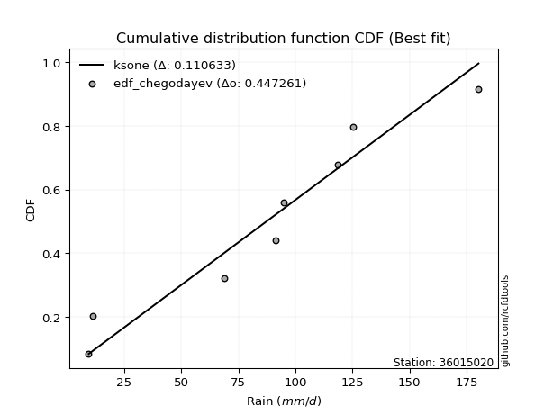</img>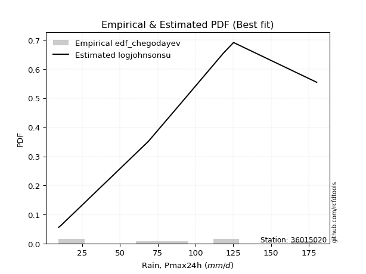</img>

</div>


### 6. EDF Blom (1958)

The Blom formula is a specific "plotting position" formula used in hydrology and statistical analysis to estimate the empirical cumulative probability (or non-exceedance probability) of a data series. It is particularly recommended for data that are approximately normally distributed. The constant _a_ is set to 0.375 (or 3/8).

<div align="center">


$P=(m-a)/(n+1-2a)$


</div>


**6.1. Empirical values**

<div align="center">

|                | 0                   | 1                   | 2                  | 3                  | 4                  | 5                  | 6                 | 7                  |
|:---------------|:--------------------|:--------------------|:-------------------|:-------------------|:-------------------|:-------------------|:------------------|:-------------------|
| date           | 2023                | 2022                | 2018               | 2021               | 2025               | 2019               | 2020              | 2017               |
| x              | 9.5                 | 11.1                | 68.8               | 91.3               | 95.0               | 118.5              | 125.2             | 180.2              |
| m              | 1                   | 2                   | 3                  | 4                  | 5                  | 6                  | 7                 | 8                  |
| empirical_dist | edf_blom            | edf_blom            | edf_blom           | edf_blom           | edf_blom           | edf_blom           | edf_blom          | edf_blom           |
| empirical      | 0.07575757575757576 | 0.19696969696969696 | 0.3181818181818182 | 0.4393939393939394 | 0.5606060606060606 | 0.6818181818181818 | 0.803030303030303 | 0.9242424242424242 |
| empirical_tr   | 1.0819672131147542  | 1.2452830188679247  | 1.4666666666666666 | 1.783783783783784  | 2.275862068965517  | 3.1428571428571423 | 5.076923076923076 | 13.199999999999992 |

</div>


**6.2. Kolmogorov-Smirnov fit test (sorted by Δ)**


<div align="center">

|                | 0                   | 1                   | 2                   | 3                   | 4                   | 5                   | 6                   | 7                   | 8                   | 9                   | 10                 | 11                 | 12                  | 13                  | 14                 | 15                  | 16                  | 17                  | 18                  | 19                  | 20                  | 21                  | 22                  | 23                  | 24                 | 25                  | 26                  | 27                  | 28                 | 29                  | 30                  | 31                  | 32                  | 33                  | 34                  | 35                  | 36                  | 37                  | 38                  | 39                 | 40                  | 41                  | 42                 | 43                 | 44                  | 45                  | 46                  | 47                  | 48                  | 49                  | 50                  | 51                 | 52                 | 53                 | 54                 | 55                  | 56                  | 57                  | 58                  | 59                  | 60                 | 61                  | 62                 | 63                  | 64                  | 65                 | 66                  | 67                  | 68                  | 69                  | 70                  | 71                 | 72                  | 73                 | 74                  | 75                 | 76                 | 77                  | 78                  | 79                 | 80                  | 81                 | 82                  | 83                  | 84                  | 85                  | 86                  | 87                 | 88                 | 89                  | 90                  | 91                 | 92                 | 93                 | 94                 | 95                 | 96                  | 97                 | 98                 | 99                 | 100                 | 101                | 102                | 103                 | 104                 | 105                | 106                | 107                | 108                | 109                | 110                | 111                 | 112                 | 113                | 114                 | 115                 | 116                 | 117                 | 118                 | 119                 | 120                | 121                 | 122                 | 123                 | 124                 | 125                 | 126                | 127                | 128                | 129                 | 130                | 131                | 132                 | 133                 | 134                 | 135                | 136                 | 137                | 138                 | 139                | 140                | 141                 | 142                | 143                 | 144                | 145                | 146                 | 147                | 148                | 149                | 150                | 151                | 152                | 153                | 154                | 155                | 156                | 157                | 158                | 159                |
|:---------------|:--------------------|:--------------------|:--------------------|:--------------------|:--------------------|:--------------------|:--------------------|:--------------------|:--------------------|:--------------------|:-------------------|:-------------------|:--------------------|:--------------------|:-------------------|:--------------------|:--------------------|:--------------------|:--------------------|:--------------------|:--------------------|:--------------------|:--------------------|:--------------------|:-------------------|:--------------------|:--------------------|:--------------------|:-------------------|:--------------------|:--------------------|:--------------------|:--------------------|:--------------------|:--------------------|:--------------------|:--------------------|:--------------------|:--------------------|:-------------------|:--------------------|:--------------------|:-------------------|:-------------------|:--------------------|:--------------------|:--------------------|:--------------------|:--------------------|:--------------------|:--------------------|:-------------------|:-------------------|:-------------------|:-------------------|:--------------------|:--------------------|:--------------------|:--------------------|:--------------------|:-------------------|:--------------------|:-------------------|:--------------------|:--------------------|:-------------------|:--------------------|:--------------------|:--------------------|:--------------------|:--------------------|:-------------------|:--------------------|:-------------------|:--------------------|:-------------------|:-------------------|:--------------------|:--------------------|:-------------------|:--------------------|:-------------------|:--------------------|:--------------------|:--------------------|:--------------------|:--------------------|:-------------------|:-------------------|:--------------------|:--------------------|:-------------------|:-------------------|:-------------------|:-------------------|:-------------------|:--------------------|:-------------------|:-------------------|:-------------------|:--------------------|:-------------------|:-------------------|:--------------------|:--------------------|:-------------------|:-------------------|:-------------------|:-------------------|:-------------------|:-------------------|:--------------------|:--------------------|:-------------------|:--------------------|:--------------------|:--------------------|:--------------------|:--------------------|:--------------------|:-------------------|:--------------------|:--------------------|:--------------------|:--------------------|:--------------------|:-------------------|:-------------------|:-------------------|:--------------------|:-------------------|:-------------------|:--------------------|:--------------------|:--------------------|:-------------------|:--------------------|:-------------------|:--------------------|:-------------------|:-------------------|:--------------------|:-------------------|:--------------------|:-------------------|:-------------------|:--------------------|:-------------------|:-------------------|:-------------------|:-------------------|:-------------------|:-------------------|:-------------------|:-------------------|:-------------------|:-------------------|:-------------------|:-------------------|:-------------------|
| station        | 36015020            | 36015020            | 36015020            | 36015020            | 36015020            | 36015020            | 36015020            | 36015020            | 36015020            | 36015020            | 36015020           | 36015020           | 36015020            | 36015020            | 36015020           | 36015020            | 36015020            | 36015020            | 36015020            | 36015020            | 36015020            | 36015020            | 36015020            | 36015020            | 36015020           | 36015020            | 36015020            | 36015020            | 36015020           | 36015020            | 36015020            | 36015020            | 36015020            | 36015020            | 36015020            | 36015020            | 36015020            | 36015020            | 36015020            | 36015020           | 36015020            | 36015020            | 36015020           | 36015020           | 36015020            | 36015020            | 36015020            | 36015020            | 36015020            | 36015020            | 36015020            | 36015020           | 36015020           | 36015020           | 36015020           | 36015020            | 36015020            | 36015020            | 36015020            | 36015020            | 36015020           | 36015020            | 36015020           | 36015020            | 36015020            | 36015020           | 36015020            | 36015020            | 36015020            | 36015020            | 36015020            | 36015020           | 36015020            | 36015020           | 36015020            | 36015020           | 36015020           | 36015020            | 36015020            | 36015020           | 36015020            | 36015020           | 36015020            | 36015020            | 36015020            | 36015020            | 36015020            | 36015020           | 36015020           | 36015020            | 36015020            | 36015020           | 36015020           | 36015020           | 36015020           | 36015020           | 36015020            | 36015020           | 36015020           | 36015020           | 36015020            | 36015020           | 36015020           | 36015020            | 36015020            | 36015020           | 36015020           | 36015020           | 36015020           | 36015020           | 36015020           | 36015020            | 36015020            | 36015020           | 36015020            | 36015020            | 36015020            | 36015020            | 36015020            | 36015020            | 36015020           | 36015020            | 36015020            | 36015020            | 36015020            | 36015020            | 36015020           | 36015020           | 36015020           | 36015020            | 36015020           | 36015020           | 36015020            | 36015020            | 36015020            | 36015020           | 36015020            | 36015020           | 36015020            | 36015020           | 36015020           | 36015020            | 36015020           | 36015020            | 36015020           | 36015020           | 36015020            | 36015020           | 36015020           | 36015020           | 36015020           | 36015020           | 36015020           | 36015020           | 36015020           | 36015020           | 36015020           | 36015020           | 36015020           | 36015020           |
| empirical_dist | edf_blom            | edf_blom            | edf_blom            | edf_blom            | edf_blom            | edf_blom            | edf_blom            | edf_blom            | edf_blom            | edf_blom            | edf_blom           | edf_blom           | edf_blom            | edf_blom            | edf_blom           | edf_blom            | edf_blom            | edf_blom            | edf_blom            | edf_blom            | edf_blom            | edf_blom            | edf_blom            | edf_blom            | edf_blom           | edf_blom            | edf_blom            | edf_blom            | edf_blom           | edf_blom            | edf_blom            | edf_blom            | edf_blom            | edf_blom            | edf_blom            | edf_blom            | edf_blom            | edf_blom            | edf_blom            | edf_blom           | edf_blom            | edf_blom            | edf_blom           | edf_blom           | edf_blom            | edf_blom            | edf_blom            | edf_blom            | edf_blom            | edf_blom            | edf_blom            | edf_blom           | edf_blom           | edf_blom           | edf_blom           | edf_blom            | edf_blom            | edf_blom            | edf_blom            | edf_blom            | edf_blom           | edf_blom            | edf_blom           | edf_blom            | edf_blom            | edf_blom           | edf_blom            | edf_blom            | edf_blom            | edf_blom            | edf_blom            | edf_blom           | edf_blom            | edf_blom           | edf_blom            | edf_blom           | edf_blom           | edf_blom            | edf_blom            | edf_blom           | edf_blom            | edf_blom           | edf_blom            | edf_blom            | edf_blom            | edf_blom            | edf_blom            | edf_blom           | edf_blom           | edf_blom            | edf_blom            | edf_blom           | edf_blom           | edf_blom           | edf_blom           | edf_blom           | edf_blom            | edf_blom           | edf_blom           | edf_blom           | edf_blom            | edf_blom           | edf_blom           | edf_blom            | edf_blom            | edf_blom           | edf_blom           | edf_blom           | edf_blom           | edf_blom           | edf_blom           | edf_blom            | edf_blom            | edf_blom           | edf_blom            | edf_blom            | edf_blom            | edf_blom            | edf_blom            | edf_blom            | edf_blom           | edf_blom            | edf_blom            | edf_blom            | edf_blom            | edf_blom            | edf_blom           | edf_blom           | edf_blom           | edf_blom            | edf_blom           | edf_blom           | edf_blom            | edf_blom            | edf_blom            | edf_blom           | edf_blom            | edf_blom           | edf_blom            | edf_blom           | edf_blom           | edf_blom            | edf_blom           | edf_blom            | edf_blom           | edf_blom           | edf_blom            | edf_blom           | edf_blom           | edf_blom           | edf_blom           | edf_blom           | edf_blom           | edf_blom           | edf_blom           | edf_blom           | edf_blom           | edf_blom           | edf_blom           | edf_blom           |
| p_dist         | ksone               | semicircular        | anglit              | gumbel_l            | logjohnsonsu        | genlogistic         | mielke              | genextreme          | burr                | johnsonsu           | pearson3           | logloggamma        | dweibull            | f                   | skewnorm           | exponnorm           | truncnorm           | norm                | crystalball         | t                   | gamma               | erlang              | foldnorm            | invgamma            | cosine             | betaprime           | logistic            | hypsecant           | laplace            | dgamma              | exponweib           | logmielke           | maxwell             | weibull_min         | argus               | rice                | logburr             | invgauss            | logdweibull         | gausshyper         | rayleigh            | logargus            | loggenextreme      | kstwobign          | loggennorm          | gumbel_r            | ncf                 | logtrapezoid        | loggumbel_l         | logdgamma           | logburr12           | logweibull_min     | logpearson3        | truncexpon         | logloglaplace      | kappa4              | bradford            | genexpon            | tukeylambda         | moyal               | kappa3             | uniform             | wrapcauchy         | vonmises_line       | loggompertz         | loggenpareto       | arcsine             | halfnorm            | halflogistic        | loglevy_l           | loggenhalflogistic  | logarcsine         | nakagami            | logskewnorm        | lomax               | logsemicircular    | genpareto          | loganglit           | logerlang           | lognct             | logexponnorm        | logt               | lognorm             | logcrystalball      | logf                | logfatiguelife      | lognakagami         | loggamma           | loggamma           | logtriang           | loglogistic         | logrice            | loginvgamma        | loghypsecant       | logalpha           | logwrapcauchy      | logncf              | wald               | logbetaprime       | loginvgauss        | logmaxwell          | loginvweibull      | lograyleigh        | loglaplace          | loglaplace          | logcosine          | logfoldnorm        | halfgennorm        | genhalflogistic    | logkstwobign       | johnsonsb          | loghalfnorm         | triang              | loggausshyper      | gennorm             | loggumbel_r         | loggenexpon         | levy_l              | truncweibull_min    | nct                 | logksone           | loghalflogistic     | logmoyal            | loggengamma         | logweibull_max      | burr12              | loglomax           | logkappa3          | loguniform         | logvonmises_line    | logjohnsonsb       | logbradford        | beta                | gengamma            | loghalfgennorm      | logkappa4          | logbeta             | trapezoid          | logwald             | logrdist           | logtruncexpon      | logtruncweibull_min | logtukeylambda     | logexponweib        | alpha              | logtruncnorm       | invweibull          | rdist              | gompertz           | fatiguelife        | powerlaw           | logexponpow        | logpowerlaw        | truncpareto        | exponpow           | logtruncpareto     | weibull_max        | loggenlogistic     | logvonmises        | vonmises           |
| delta          | 0.10522140161313616 | 0.10612730207535537 | 0.10852293938955099 | 0.10949876763166856 | 0.11080286850530047 | 0.11166687237986643 | 0.11380214177901118 | 0.11384907401807444 | 0.11448560419055923 | 0.11742400809180564 | 0.1175030077202609 | 0.1175857630718873 | 0.11766255207774945 | 0.11815870725757434 | 0.1182509799316801 | 0.11832029936108233 | 0.11832182577191325 | 0.11832182920159277 | 0.11832183426205718 | 0.11832300836306021 | 0.11880715933531381 | 0.11899142374427457 | 0.11928758717885612 | 0.12432829099865556 | 0.1252393102609513 | 0.12525597520809795 | 0.12555251660162514 | 0.12819665399706454 | 0.1293031871506083 | 0.13030934117828094 | 0.13273856129444933 | 0.13318982979601007 | 0.13431983546317722 | 0.13437839743496816 | 0.13622816876994182 | 0.13901630332456183 | 0.14013187399963128 | 0.14288676250503224 | 0.14321861340138098 | 0.1443083876890338 | 0.14497014027220562 | 0.14623075734214014 | 0.1497687435443693 | 0.1578966596127233 | 0.16132322544198988 | 0.16502919536717223 | 0.16792406748586358 | 0.16800010232954105 | 0.16848268925173254 | 0.17004178770667625 | 0.17021623440630546 | 0.1706047947220069 | 0.1709950810380923 | 0.1721278370424069 | 0.1786813852429847 | 0.18327789595458238 | 0.18540228583784052 | 0.18541403989568955 | 0.18552995873756267 | 0.18616069487715614 | 0.1864713262829526 | 0.18759652766682644 | 0.1876447490142909 | 0.18905635917469588 | 0.19255042800778716 | 0.1960707518802512 | 0.19696969696969696 | 0.19696969696969696 | 0.19696969696969696 | 0.20376626623237332 | 0.20746850417179136 | 0.2110809334321328 | 0.21239663464692365 | 0.2156790382616412 | 0.21828923329217703 | 0.2231147399155196 | 0.2233603550057841 | 0.22613958618539948 | 0.23255415774458615 | 0.2332799982779798 | 0.23346424641258828 | 0.2334669585211923 | 0.23346700632708212 | 0.23346701302856393 | 0.23372762413355413 | 0.23380220891664044 | 0.23410789193986375 | 0.2397868435759743 | 0.2397868435759743 | 0.23995952379074653 | 0.24041821825923698 | 0.2440795375190425 | 0.2458338306399936 | 0.2480448443267494 | 0.248346473981301  | 0.251138066608431  | 0.25496673208080484 | 0.2557039172912689 | 0.2558153442840427 | 0.2560911235771967 | 0.26374862004250593 | 0.267700898178783  | 0.2734622939919415 | 0.27607121066911994 | 0.27607121066911994 | 0.2805173108565983 | 0.2807001380119914 | 0.285895392209313  | 0.2895447366191243 | 0.2972905066494251 | 0.2981918503175791 | 0.30086756156138267 | 0.30128204676735726 | 0.3019101257876034 | 0.30303030303030304 | 0.30349238290007635 | 0.30386245863100986 | 0.31554831385569865 | 0.32254927294776753 | 0.32328432378926814 | 0.3258217381552257 | 0.32820968528045885 | 0.32827617006813753 | 0.33183960512830607 | 0.33590005968486586 | 0.33769036143928916 | 0.3403514800359763 | 0.3535952213827129 | 0.3546224494226345 | 0.35470130039764775 | 0.3553978859233682 | 0.3554409482540622 | 0.35627532249326804 | 0.36541985853265907 | 0.36741069341476223 | 0.370711457474635  | 0.37876934607316504 | 0.3805144368395606 | 0.39704517663629074 | 0.419130996362352  | 0.4310930627933209 | 0.4376765439371016  | 0.4456244623172713 | 0.44751440747492316 | 0.4507938257450938 | 0.4556846042527039 | 0.46299244496562264 | 0.4735823336201391 | 0.49569027521072   | 0.5011848858845762 | 0.5174229392998584 | 0.5754010179616382 | 0.6066282224304791 | 0.6203859738303534 | 0.6545738729835062 | 0.6575384978995846 | 0.6926152193411956 | 0.803030303030303  | 1.126110357630029  | 28.360844778970804 |
| deltao         | 0.4472608134160001  | 0.4472608134160001  | 0.4472608134160001  | 0.4472608134160001  | 0.4472608134160001  | 0.4472608134160001  | 0.4472608134160001  | 0.4472608134160001  | 0.4472608134160001  | 0.4472608134160001  | 0.4472608134160001 | 0.4472608134160001 | 0.4472608134160001  | 0.4472608134160001  | 0.4472608134160001 | 0.4472608134160001  | 0.4472608134160001  | 0.4472608134160001  | 0.4472608134160001  | 0.4472608134160001  | 0.4472608134160001  | 0.4472608134160001  | 0.4472608134160001  | 0.4472608134160001  | 0.4472608134160001 | 0.4472608134160001  | 0.4472608134160001  | 0.4472608134160001  | 0.4472608134160001 | 0.4472608134160001  | 0.4472608134160001  | 0.4472608134160001  | 0.4472608134160001  | 0.4472608134160001  | 0.4472608134160001  | 0.4472608134160001  | 0.4472608134160001  | 0.4472608134160001  | 0.4472608134160001  | 0.4472608134160001 | 0.4472608134160001  | 0.4472608134160001  | 0.4472608134160001 | 0.4472608134160001 | 0.4472608134160001  | 0.4472608134160001  | 0.4472608134160001  | 0.4472608134160001  | 0.4472608134160001  | 0.4472608134160001  | 0.4472608134160001  | 0.4472608134160001 | 0.4472608134160001 | 0.4472608134160001 | 0.4472608134160001 | 0.4472608134160001  | 0.4472608134160001  | 0.4472608134160001  | 0.4472608134160001  | 0.4472608134160001  | 0.4472608134160001 | 0.4472608134160001  | 0.4472608134160001 | 0.4472608134160001  | 0.4472608134160001  | 0.4472608134160001 | 0.4472608134160001  | 0.4472608134160001  | 0.4472608134160001  | 0.4472608134160001  | 0.4472608134160001  | 0.4472608134160001 | 0.4472608134160001  | 0.4472608134160001 | 0.4472608134160001  | 0.4472608134160001 | 0.4472608134160001 | 0.4472608134160001  | 0.4472608134160001  | 0.4472608134160001 | 0.4472608134160001  | 0.4472608134160001 | 0.4472608134160001  | 0.4472608134160001  | 0.4472608134160001  | 0.4472608134160001  | 0.4472608134160001  | 0.4472608134160001 | 0.4472608134160001 | 0.4472608134160001  | 0.4472608134160001  | 0.4472608134160001 | 0.4472608134160001 | 0.4472608134160001 | 0.4472608134160001 | 0.4472608134160001 | 0.4472608134160001  | 0.4472608134160001 | 0.4472608134160001 | 0.4472608134160001 | 0.4472608134160001  | 0.4472608134160001 | 0.4472608134160001 | 0.4472608134160001  | 0.4472608134160001  | 0.4472608134160001 | 0.4472608134160001 | 0.4472608134160001 | 0.4472608134160001 | 0.4472608134160001 | 0.4472608134160001 | 0.4472608134160001  | 0.4472608134160001  | 0.4472608134160001 | 0.4472608134160001  | 0.4472608134160001  | 0.4472608134160001  | 0.4472608134160001  | 0.4472608134160001  | 0.4472608134160001  | 0.4472608134160001 | 0.4472608134160001  | 0.4472608134160001  | 0.4472608134160001  | 0.4472608134160001  | 0.4472608134160001  | 0.4472608134160001 | 0.4472608134160001 | 0.4472608134160001 | 0.4472608134160001  | 0.4472608134160001 | 0.4472608134160001 | 0.4472608134160001  | 0.4472608134160001  | 0.4472608134160001  | 0.4472608134160001 | 0.4472608134160001  | 0.4472608134160001 | 0.4472608134160001  | 0.4472608134160001 | 0.4472608134160001 | 0.4472608134160001  | 0.4472608134160001 | 0.4472608134160001  | 0.4472608134160001 | 0.4472608134160001 | 0.4472608134160001  | 0.4472608134160001 | 0.4472608134160001 | 0.4472608134160001 | 0.4472608134160001 | 0.4472608134160001 | 0.4472608134160001 | 0.4472608134160001 | 0.4472608134160001 | 0.4472608134160001 | 0.4472608134160001 | 0.4472608134160001 | 0.4472608134160001 | 0.4472608134160001 |
| eval           | Δo > Δ              | Δo > Δ              | Δo > Δ              | Δo > Δ              | Δo > Δ              | Δo > Δ              | Δo > Δ              | Δo > Δ              | Δo > Δ              | Δo > Δ              | Δo > Δ             | Δo > Δ             | Δo > Δ              | Δo > Δ              | Δo > Δ             | Δo > Δ              | Δo > Δ              | Δo > Δ              | Δo > Δ              | Δo > Δ              | Δo > Δ              | Δo > Δ              | Δo > Δ              | Δo > Δ              | Δo > Δ             | Δo > Δ              | Δo > Δ              | Δo > Δ              | Δo > Δ             | Δo > Δ              | Δo > Δ              | Δo > Δ              | Δo > Δ              | Δo > Δ              | Δo > Δ              | Δo > Δ              | Δo > Δ              | Δo > Δ              | Δo > Δ              | Δo > Δ             | Δo > Δ              | Δo > Δ              | Δo > Δ             | Δo > Δ             | Δo > Δ              | Δo > Δ              | Δo > Δ              | Δo > Δ              | Δo > Δ              | Δo > Δ              | Δo > Δ              | Δo > Δ             | Δo > Δ             | Δo > Δ             | Δo > Δ             | Δo > Δ              | Δo > Δ              | Δo > Δ              | Δo > Δ              | Δo > Δ              | Δo > Δ             | Δo > Δ              | Δo > Δ             | Δo > Δ              | Δo > Δ              | Δo > Δ             | Δo > Δ              | Δo > Δ              | Δo > Δ              | Δo > Δ              | Δo > Δ              | Δo > Δ             | Δo > Δ              | Δo > Δ             | Δo > Δ              | Δo > Δ             | Δo > Δ             | Δo > Δ              | Δo > Δ              | Δo > Δ             | Δo > Δ              | Δo > Δ             | Δo > Δ              | Δo > Δ              | Δo > Δ              | Δo > Δ              | Δo > Δ              | Δo > Δ             | Δo > Δ             | Δo > Δ              | Δo > Δ              | Δo > Δ             | Δo > Δ             | Δo > Δ             | Δo > Δ             | Δo > Δ             | Δo > Δ              | Δo > Δ             | Δo > Δ             | Δo > Δ             | Δo > Δ              | Δo > Δ             | Δo > Δ             | Δo > Δ              | Δo > Δ              | Δo > Δ             | Δo > Δ             | Δo > Δ             | Δo > Δ             | Δo > Δ             | Δo > Δ             | Δo > Δ              | Δo > Δ              | Δo > Δ             | Δo > Δ              | Δo > Δ              | Δo > Δ              | Δo > Δ              | Δo > Δ              | Δo > Δ              | Δo > Δ             | Δo > Δ              | Δo > Δ              | Δo > Δ              | Δo > Δ              | Δo > Δ              | Δo > Δ             | Δo > Δ             | Δo > Δ             | Δo > Δ              | Δo > Δ             | Δo > Δ             | Δo > Δ              | Δo > Δ              | Δo > Δ              | Δo > Δ             | Δo > Δ              | Δo > Δ             | Δo > Δ              | Δo > Δ             | Δo > Δ             | Δo > Δ              | Δo > Δ             | Δo <= Δ             | Δo <= Δ            | Δo <= Δ            | Δo <= Δ             | Δo <= Δ            | Δo <= Δ            | Δo <= Δ            | Δo <= Δ            | Δo <= Δ            | Δo <= Δ            | Δo <= Δ            | Δo <= Δ            | Δo <= Δ            | Δo <= Δ            | Δo <= Δ            | Δo <= Δ            | Δo <= Δ            |
| fit            | 1                   | 1                   | 1                   | 1                   | 1                   | 1                   | 1                   | 1                   | 1                   | 1                   | 1                  | 1                  | 1                   | 1                   | 1                  | 1                   | 1                   | 1                   | 1                   | 1                   | 1                   | 1                   | 1                   | 1                   | 1                  | 1                   | 1                   | 1                   | 1                  | 1                   | 1                   | 1                   | 1                   | 1                   | 1                   | 1                   | 1                   | 1                   | 1                   | 1                  | 1                   | 1                   | 1                  | 1                  | 1                   | 1                   | 1                   | 1                   | 1                   | 1                   | 1                   | 1                  | 1                  | 1                  | 1                  | 1                   | 1                   | 1                   | 1                   | 1                   | 1                  | 1                   | 1                  | 1                   | 1                   | 1                  | 1                   | 1                   | 1                   | 1                   | 1                   | 1                  | 1                   | 1                  | 1                   | 1                  | 1                  | 1                   | 1                   | 1                  | 1                   | 1                  | 1                   | 1                   | 1                   | 1                   | 1                   | 1                  | 1                  | 1                   | 1                   | 1                  | 1                  | 1                  | 1                  | 1                  | 1                   | 1                  | 1                  | 1                  | 1                   | 1                  | 1                  | 1                   | 1                   | 1                  | 1                  | 1                  | 1                  | 1                  | 1                  | 1                   | 1                   | 1                  | 1                   | 1                   | 1                   | 1                   | 1                   | 1                   | 1                  | 1                   | 1                   | 1                   | 1                   | 1                   | 1                  | 1                  | 1                  | 1                   | 1                  | 1                  | 1                   | 1                   | 1                   | 1                  | 1                   | 1                  | 1                   | 1                  | 1                  | 1                   | 1                  | 0                   | 0                  | 0                  | 0                   | 0                  | 0                  | 0                  | 0                  | 0                  | 0                  | 0                  | 0                  | 0                  | 0                  | 0                  | 0                  | 0                  |
| n              | 8                   | 8                   | 8                   | 8                   | 8                   | 8                   | 8                   | 8                   | 8                   | 8                   | 8                  | 8                  | 8                   | 8                   | 8                  | 8                   | 8                   | 8                   | 8                   | 8                   | 8                   | 8                   | 8                   | 8                   | 8                  | 8                   | 8                   | 8                   | 8                  | 8                   | 8                   | 8                   | 8                   | 8                   | 8                   | 8                   | 8                   | 8                   | 8                   | 8                  | 8                   | 8                   | 8                  | 8                  | 8                   | 8                   | 8                   | 8                   | 8                   | 8                   | 8                   | 8                  | 8                  | 8                  | 8                  | 8                   | 8                   | 8                   | 8                   | 8                   | 8                  | 8                   | 8                  | 8                   | 8                   | 8                  | 8                   | 8                   | 8                   | 8                   | 8                   | 8                  | 8                   | 8                  | 8                   | 8                  | 8                  | 8                   | 8                   | 8                  | 8                   | 8                  | 8                   | 8                   | 8                   | 8                   | 8                   | 8                  | 8                  | 8                   | 8                   | 8                  | 8                  | 8                  | 8                  | 8                  | 8                   | 8                  | 8                  | 8                  | 8                   | 8                  | 8                  | 8                   | 8                   | 8                  | 8                  | 8                  | 8                  | 8                  | 8                  | 8                   | 8                   | 8                  | 8                   | 8                   | 8                   | 8                   | 8                   | 8                   | 8                  | 8                   | 8                   | 8                   | 8                   | 8                   | 8                  | 8                  | 8                  | 8                   | 8                  | 8                  | 8                   | 8                   | 8                   | 8                  | 8                   | 8                  | 8                   | 8                  | 8                  | 8                   | 8                  | 8                   | 8                  | 8                  | 8                   | 8                  | 8                  | 8                  | 8                  | 8                  | 8                  | 8                  | 8                  | 8                  | 8                  | 8                  | 8                  | 8                  |
| best_fit       | 1                   | 0                   | 0                   | 0                   | 0                   | 0                   | 0                   | 0                   | 0                   | 0                   | 0                  | 0                  | 0                   | 0                   | 0                  | 0                   | 0                   | 0                   | 0                   | 0                   | 0                   | 0                   | 0                   | 0                   | 0                  | 0                   | 0                   | 0                   | 0                  | 0                   | 0                   | 0                   | 0                   | 0                   | 0                   | 0                   | 0                   | 0                   | 0                   | 0                  | 0                   | 0                   | 0                  | 0                  | 0                   | 0                   | 0                   | 0                   | 0                   | 0                   | 0                   | 0                  | 0                  | 0                  | 0                  | 0                   | 0                   | 0                   | 0                   | 0                   | 0                  | 0                   | 0                  | 0                   | 0                   | 0                  | 0                   | 0                   | 0                   | 0                   | 0                   | 0                  | 0                   | 0                  | 0                   | 0                  | 0                  | 0                   | 0                   | 0                  | 0                   | 0                  | 0                   | 0                   | 0                   | 0                   | 0                   | 0                  | 0                  | 0                   | 0                   | 0                  | 0                  | 0                  | 0                  | 0                  | 0                   | 0                  | 0                  | 0                  | 0                   | 0                  | 0                  | 0                   | 0                   | 0                  | 0                  | 0                  | 0                  | 0                  | 0                  | 0                   | 0                   | 0                  | 0                   | 0                   | 0                   | 0                   | 0                   | 0                   | 0                  | 0                   | 0                   | 0                   | 0                   | 0                   | 0                  | 0                  | 0                  | 0                   | 0                  | 0                  | 0                   | 0                   | 0                   | 0                  | 0                   | 0                  | 0                   | 0                  | 0                  | 0                   | 0                  | 0                   | 0                  | 0                  | 0                   | 0                  | 0                  | 0                  | 0                  | 0                  | 0                  | 0                  | 0                  | 0                  | 0                  | 0                  | 0                  | 0                  |
| best_fit_sort  | 1                   | 2                   | 3                   | 4                   | 5                   | 6                   | 7                   | 8                   | 9                   | 10                  | 11                 | 12                 | 13                  | 14                  | 15                 | 16                  | 17                  | 18                  | 19                  | 20                  | 21                  | 22                  | 23                  | 24                  | 25                 | 26                  | 27                  | 28                  | 29                 | 30                  | 31                  | 32                  | 33                  | 34                  | 35                  | 36                  | 37                  | 38                  | 39                  | 40                 | 41                  | 42                  | 43                 | 44                 | 45                  | 46                  | 47                  | 48                  | 49                  | 50                  | 51                  | 52                 | 53                 | 54                 | 55                 | 56                  | 57                  | 58                  | 59                  | 60                  | 61                 | 62                  | 63                 | 64                  | 65                  | 66                 | 67                  | 68                  | 69                  | 70                  | 71                  | 72                 | 73                  | 74                 | 75                  | 76                 | 77                 | 78                  | 79                  | 80                 | 81                  | 82                 | 83                  | 84                  | 85                  | 86                  | 87                  | 88                 | 89                 | 90                  | 91                  | 92                 | 93                 | 94                 | 95                 | 96                 | 97                  | 98                 | 99                 | 100                | 101                 | 102                | 103                | 104                 | 105                 | 106                | 107                | 108                | 109                | 110                | 111                | 112                 | 113                 | 114                | 115                 | 116                 | 117                 | 118                 | 119                 | 120                 | 121                | 122                 | 123                 | 124                 | 125                 | 126                 | 127                | 128                | 129                | 130                 | 131                | 132                | 133                 | 134                 | 135                 | 136                | 137                 | 138                | 139                 | 140                | 141                | 142                 | 143                | 144                 | 145                | 146                | 147                 | 148                | 149                | 150                | 151                | 152                | 153                | 154                | 155                | 156                | 157                | 158                | 159                | 160                |

</div>


**6.3. Best fit**

<div align="center">

|   id |   station | empirical_dist   | p_dist   |    delta |   deltao | eval   |   fit |   n |   best_fit |   best_fit_sort |
|-----:|----------:|:-----------------|:---------|---------:|---------:|:-------|------:|----:|-----------:|----------------:|
|    0 |  36015020 | edf_blom         | ksone    | 0.105221 | 0.447261 | Δo > Δ |     1 |   8 |          1 |               1 |

</div>


<div align="center">

</img></img>

</div>


### 7. EDF Tukey (1962)

In hydrology, the Tukey formula is used as a plotting position formula to estimate the empirical probability or frequency of a flood event (or other hydrological data). The formula parameter is given as _c=0.333_ (or 1/3).

<div align="center">


$P=(m-c)/(n+1-2c)$


</div>


**7.1. Empirical values**

<div align="center">

|                | 0                  | 1         | 2                  | 3                  | 4                 | 5                  | 6                 | 7                  |
|:---------------|:-------------------|:----------|:-------------------|:-------------------|:------------------|:-------------------|:------------------|:-------------------|
| date           | 2023               | 2022      | 2018               | 2021               | 2025              | 2019               | 2020              | 2017               |
| x              | 9.5                | 11.1      | 68.8               | 91.3               | 95.0              | 118.5              | 125.2             | 180.2              |
| m              | 1                  | 2         | 3                  | 4                  | 5                 | 6                  | 7                 | 8                  |
| empirical_dist | edf_tukey          | edf_tukey | edf_tukey          | edf_tukey          | edf_tukey         | edf_tukey          | edf_tukey         | edf_tukey          |
| empirical      | 0.08               | 0.2       | 0.32               | 0.44               | 0.56              | 0.68               | 0.8               | 0.92               |
| empirical_tr   | 1.0869565217391304 | 1.25      | 1.4705882352941178 | 1.7857142857142856 | 2.272727272727273 | 3.1250000000000004 | 5.000000000000001 | 12.500000000000007 |

</div>


**7.2. Kolmogorov-Smirnov fit test (sorted by Δ)**


<div align="center">

|                | 0                   | 1                   | 2                   | 3                   | 4                   | 5                   | 6                   | 7                   | 8                   | 9                   | 10                  | 11                  | 12                 | 13                  | 14                  | 15                  | 16                 | 17                  | 18                  | 19                  | 20                  | 21                  | 22                  | 23                  | 24                  | 25                 | 26                 | 27                  | 28                  | 29                  | 30                 | 31                  | 32                 | 33                  | 34                 | 35                  | 36                  | 37                  | 38                  | 39                  | 40                  | 41                  | 42                 | 43                 | 44                  | 45                  | 46                  | 47                  | 48                  | 49                  | 50                  | 51                 | 52                 | 53                  | 54                 | 55                  | 56                  | 57                  | 58                  | 59                 | 60                  | 61                 | 62                  | 63                  | 64                  | 65                  | 66                  | 67                 | 68                 | 69                 | 70                  | 71                  | 72                  | 73                 | 74                 | 75                  | 76                  | 77                  | 78                  | 79                  | 80                  | 81                  | 82                 | 83                 | 84                 | 85                 | 86                  | 87                  | 88                  | 89                 | 90                  | 91                  | 92                  | 93                  | 94                  | 95                 | 96                 | 97                  | 98                 | 99                 | 100                | 101                | 102                 | 103                | 104                | 105                | 106                 | 107                 | 108                 | 109                 | 110                 | 111                | 112                 | 113                 | 114                 | 115                | 116                | 117                | 118                | 119                | 120                 | 121                | 122                | 123                 | 124                | 125                | 126                | 127                 | 128                 | 129                 | 130                | 131                 | 132                | 133                 | 134                | 135                | 136                | 137                 | 138                | 139                | 140                 | 141                 | 142                | 143                 | 144                 | 145                | 146                | 147                | 148                | 149                 | 150                | 151                | 152                | 153                | 154                | 155                | 156                | 157                | 158                | 159                |
|:---------------|:--------------------|:--------------------|:--------------------|:--------------------|:--------------------|:--------------------|:--------------------|:--------------------|:--------------------|:--------------------|:--------------------|:--------------------|:-------------------|:--------------------|:--------------------|:--------------------|:-------------------|:--------------------|:--------------------|:--------------------|:--------------------|:--------------------|:--------------------|:--------------------|:--------------------|:-------------------|:-------------------|:--------------------|:--------------------|:--------------------|:-------------------|:--------------------|:-------------------|:--------------------|:-------------------|:--------------------|:--------------------|:--------------------|:--------------------|:--------------------|:--------------------|:--------------------|:-------------------|:-------------------|:--------------------|:--------------------|:--------------------|:--------------------|:--------------------|:--------------------|:--------------------|:-------------------|:-------------------|:--------------------|:-------------------|:--------------------|:--------------------|:--------------------|:--------------------|:-------------------|:--------------------|:-------------------|:--------------------|:--------------------|:--------------------|:--------------------|:--------------------|:-------------------|:-------------------|:-------------------|:--------------------|:--------------------|:--------------------|:-------------------|:-------------------|:--------------------|:--------------------|:--------------------|:--------------------|:--------------------|:--------------------|:--------------------|:-------------------|:-------------------|:-------------------|:-------------------|:--------------------|:--------------------|:--------------------|:-------------------|:--------------------|:--------------------|:--------------------|:--------------------|:--------------------|:-------------------|:-------------------|:--------------------|:-------------------|:-------------------|:-------------------|:-------------------|:--------------------|:-------------------|:-------------------|:-------------------|:--------------------|:--------------------|:--------------------|:--------------------|:--------------------|:-------------------|:--------------------|:--------------------|:--------------------|:-------------------|:-------------------|:-------------------|:-------------------|:-------------------|:--------------------|:-------------------|:-------------------|:--------------------|:-------------------|:-------------------|:-------------------|:--------------------|:--------------------|:--------------------|:-------------------|:--------------------|:-------------------|:--------------------|:-------------------|:-------------------|:-------------------|:--------------------|:-------------------|:-------------------|:--------------------|:--------------------|:-------------------|:--------------------|:--------------------|:-------------------|:-------------------|:-------------------|:-------------------|:--------------------|:-------------------|:-------------------|:-------------------|:-------------------|:-------------------|:-------------------|:-------------------|:-------------------|:-------------------|:-------------------|
| station        | 36015020            | 36015020            | 36015020            | 36015020            | 36015020            | 36015020            | 36015020            | 36015020            | 36015020            | 36015020            | 36015020            | 36015020            | 36015020           | 36015020            | 36015020            | 36015020            | 36015020           | 36015020            | 36015020            | 36015020            | 36015020            | 36015020            | 36015020            | 36015020            | 36015020            | 36015020           | 36015020           | 36015020            | 36015020            | 36015020            | 36015020           | 36015020            | 36015020           | 36015020            | 36015020           | 36015020            | 36015020            | 36015020            | 36015020            | 36015020            | 36015020            | 36015020            | 36015020           | 36015020           | 36015020            | 36015020            | 36015020            | 36015020            | 36015020            | 36015020            | 36015020            | 36015020           | 36015020           | 36015020            | 36015020           | 36015020            | 36015020            | 36015020            | 36015020            | 36015020           | 36015020            | 36015020           | 36015020            | 36015020            | 36015020            | 36015020            | 36015020            | 36015020           | 36015020           | 36015020           | 36015020            | 36015020            | 36015020            | 36015020           | 36015020           | 36015020            | 36015020            | 36015020            | 36015020            | 36015020            | 36015020            | 36015020            | 36015020           | 36015020           | 36015020           | 36015020           | 36015020            | 36015020            | 36015020            | 36015020           | 36015020            | 36015020            | 36015020            | 36015020            | 36015020            | 36015020           | 36015020           | 36015020            | 36015020           | 36015020           | 36015020           | 36015020           | 36015020            | 36015020           | 36015020           | 36015020           | 36015020            | 36015020            | 36015020            | 36015020            | 36015020            | 36015020           | 36015020            | 36015020            | 36015020            | 36015020           | 36015020           | 36015020           | 36015020           | 36015020           | 36015020            | 36015020           | 36015020           | 36015020            | 36015020           | 36015020           | 36015020           | 36015020            | 36015020            | 36015020            | 36015020           | 36015020            | 36015020           | 36015020            | 36015020           | 36015020           | 36015020           | 36015020            | 36015020           | 36015020           | 36015020            | 36015020            | 36015020           | 36015020            | 36015020            | 36015020           | 36015020           | 36015020           | 36015020           | 36015020            | 36015020           | 36015020           | 36015020           | 36015020           | 36015020           | 36015020           | 36015020           | 36015020           | 36015020           | 36015020           |
| empirical_dist | edf_tukey           | edf_tukey           | edf_tukey           | edf_tukey           | edf_tukey           | edf_tukey           | edf_tukey           | edf_tukey           | edf_tukey           | edf_tukey           | edf_tukey           | edf_tukey           | edf_tukey          | edf_tukey           | edf_tukey           | edf_tukey           | edf_tukey          | edf_tukey           | edf_tukey           | edf_tukey           | edf_tukey           | edf_tukey           | edf_tukey           | edf_tukey           | edf_tukey           | edf_tukey          | edf_tukey          | edf_tukey           | edf_tukey           | edf_tukey           | edf_tukey          | edf_tukey           | edf_tukey          | edf_tukey           | edf_tukey          | edf_tukey           | edf_tukey           | edf_tukey           | edf_tukey           | edf_tukey           | edf_tukey           | edf_tukey           | edf_tukey          | edf_tukey          | edf_tukey           | edf_tukey           | edf_tukey           | edf_tukey           | edf_tukey           | edf_tukey           | edf_tukey           | edf_tukey          | edf_tukey          | edf_tukey           | edf_tukey          | edf_tukey           | edf_tukey           | edf_tukey           | edf_tukey           | edf_tukey          | edf_tukey           | edf_tukey          | edf_tukey           | edf_tukey           | edf_tukey           | edf_tukey           | edf_tukey           | edf_tukey          | edf_tukey          | edf_tukey          | edf_tukey           | edf_tukey           | edf_tukey           | edf_tukey          | edf_tukey          | edf_tukey           | edf_tukey           | edf_tukey           | edf_tukey           | edf_tukey           | edf_tukey           | edf_tukey           | edf_tukey          | edf_tukey          | edf_tukey          | edf_tukey          | edf_tukey           | edf_tukey           | edf_tukey           | edf_tukey          | edf_tukey           | edf_tukey           | edf_tukey           | edf_tukey           | edf_tukey           | edf_tukey          | edf_tukey          | edf_tukey           | edf_tukey          | edf_tukey          | edf_tukey          | edf_tukey          | edf_tukey           | edf_tukey          | edf_tukey          | edf_tukey          | edf_tukey           | edf_tukey           | edf_tukey           | edf_tukey           | edf_tukey           | edf_tukey          | edf_tukey           | edf_tukey           | edf_tukey           | edf_tukey          | edf_tukey          | edf_tukey          | edf_tukey          | edf_tukey          | edf_tukey           | edf_tukey          | edf_tukey          | edf_tukey           | edf_tukey          | edf_tukey          | edf_tukey          | edf_tukey           | edf_tukey           | edf_tukey           | edf_tukey          | edf_tukey           | edf_tukey          | edf_tukey           | edf_tukey          | edf_tukey          | edf_tukey          | edf_tukey           | edf_tukey          | edf_tukey          | edf_tukey           | edf_tukey           | edf_tukey          | edf_tukey           | edf_tukey           | edf_tukey          | edf_tukey          | edf_tukey          | edf_tukey          | edf_tukey           | edf_tukey          | edf_tukey          | edf_tukey          | edf_tukey          | edf_tukey          | edf_tukey          | edf_tukey          | edf_tukey          | edf_tukey          | edf_tukey          |
| p_dist         | ksone               | semicircular        | anglit              | gumbel_l            | logjohnsonsu        | genlogistic         | mielke              | genextreme          | burr                | johnsonsu           | pearson3            | logloggamma         | dweibull           | f                   | skewnorm            | exponnorm           | truncnorm          | norm                | crystalball         | t                   | gamma               | erlang              | foldnorm            | invgamma            | cosine              | betaprime          | logistic           | hypsecant           | exponweib           | laplace             | logmielke          | argus               | dgamma             | maxwell             | weibull_min        | logburr             | logdweibull         | rice                | invgauss            | loggenextreme       | gausshyper          | rayleigh            | logargus           | kstwobign          | loggennorm          | logtrapezoid        | ncf                 | loggumbel_l         | gumbel_r            | logpearson3         | logburr12           | logweibull_min     | logdgamma          | truncexpon          | logloglaplace      | genexpon            | kappa4              | bradford            | tukeylambda         | moyal              | kappa3              | uniform            | wrapcauchy          | loggompertz         | vonmises_line       | loggenpareto        | loglevy_l           | halfnorm           | arcsine            | halflogistic       | loggenhalflogistic  | logarcsine          | nakagami            | logskewnorm        | lomax              | genpareto           | logsemicircular     | loganglit           | logerlang           | lognct              | logexponnorm        | logt                | lognorm            | logcrystalball     | logf               | logfatiguelife     | lognakagami         | loggamma            | loggamma            | logtriang          | loglogistic         | logrice             | loginvgamma         | logalpha            | loghypsecant        | logwrapcauchy      | logncf             | logbetaprime        | loginvgauss        | wald               | logmaxwell         | loginvweibull      | lograyleigh         | loglaplace         | loglaplace         | logcosine          | logfoldnorm         | halfgennorm         | genhalflogistic     | johnsonsb           | logkstwobign        | triang             | loghalfnorm         | gennorm             | loggausshyper       | loggumbel_r        | loggenexpon        | levy_l             | truncweibull_min   | nct                | logksone            | loghalflogistic    | logmoyal           | loggengamma         | logweibull_max     | burr12             | loglomax           | logkappa3           | logjohnsonsb        | loguniform          | logvonmises_line   | logbradford         | beta               | gengamma            | loghalfgennorm     | logkappa4          | logbeta            | trapezoid           | logwald            | logrdist           | logtruncexpon       | logtruncweibull_min | logtukeylambda     | logexponweib        | alpha               | logtruncnorm       | invweibull         | rdist              | gompertz           | fatiguelife         | powerlaw           | logexponpow        | logpowerlaw        | truncpareto        | exponpow           | logtruncpareto     | weibull_max        | loggenlogistic     | logvonmises        | vonmises           |
| delta          | 0.10825170464343921 | 0.10915760510565842 | 0.11155324241985404 | 0.11252907066197161 | 0.11383317153560352 | 0.11469717541016948 | 0.11683244480931423 | 0.11687937704837749 | 0.11751590722086228 | 0.12045431112210869 | 0.12053331075056395 | 0.12061606610219035 | 0.1206928551080525 | 0.12118901028787739 | 0.12128128296198315 | 0.12135060239138538 | 0.1213521288022163 | 0.12135213223189582 | 0.12135213729236023 | 0.12135331139336326 | 0.12183746236561686 | 0.12202172677457762 | 0.12231789020915917 | 0.12452959691486032 | 0.12826961329125436 | 0.128286278238401  | 0.1285828196319282 | 0.13122695702736759 | 0.13213250068838872 | 0.13233349018091134 | 0.1329669663636429 | 0.13319786573963888 | 0.133339644208584  | 0.13735013849348027 | 0.1374087004652712 | 0.13952581339357067 | 0.14123028090266887 | 0.14204660635486488 | 0.14228070189897163 | 0.14673844051406637 | 0.14733869071933686 | 0.14800044330250867 | 0.1492610603724432 | 0.1572905990066627 | 0.16435352847229293 | 0.16618192051135922 | 0.16731800687980297 | 0.16787662864567193 | 0.16805949839747528 | 0.16917689921991047 | 0.16961017380024485 | 0.1699987341159463 | 0.1730720907369793 | 0.17515814007270994 | 0.1757782993912796 | 0.18359585807750772 | 0.18630819898488543 | 0.18843258886814357 | 0.18856026176786572 | 0.1891909979074592 | 0.18950162931325565 | 0.1906268306971295 | 0.19067505204459395 | 0.19194436740172655 | 0.19208666220499893 | 0.19425257006206936 | 0.19952384198994905 | 0.2                | 0.2                | 0.2                | 0.20565032235360953 | 0.20926275161395097 | 0.21057845282874182 | 0.2150729776555806 | 0.2164710514739952 | 0.22033005197548117 | 0.22129655809733778 | 0.22432140436721765 | 0.23073597592640432 | 0.23146181645979796 | 0.23164606459440645 | 0.23164877670301048 | 0.2316488245089003 | 0.2316488312103821 | 0.2319094423153723 | 0.2319840270984586 | 0.23228971012168192 | 0.23796866175779247 | 0.23796866175779247 | 0.2381413419725647 | 0.23860003644105515 | 0.24226135570086066 | 0.24401564882181176 | 0.24652829216311917 | 0.24743878372068878 | 0.2493198847902492 | 0.253148550262623  | 0.25399716246586085 | 0.2542729417590149 | 0.2550978566852083 | 0.2619304382243241 | 0.2658827163606012 | 0.27164411217375967 | 0.2754651500630593 | 0.2754651500630593 | 0.2786991290384165 | 0.27888195619380957 | 0.28407721039113115 | 0.28651443358882134 | 0.29394942607515484 | 0.29547232483124325 | 0.2982517437370543 | 0.29904937974320084 | 0.30000000000000004 | 0.30009194396942157 | 0.3016742010818945 | 0.302044276812828  | 0.3113058896132744 | 0.3207310911295857 | 0.3214661419710863 | 0.32400355633704386 | 0.326391503462277  | 0.3264579882499557 | 0.33002142331012424 | 0.3328697566545629 | 0.3358721796211073 | 0.3385332982177945 | 0.35177703956453105 | 0.35236758289306525 | 0.35280426760445266 | 0.3528831185794659 | 0.35362276643588036 | 0.3544571406750862 | 0.36360167671447724 | 0.3655925115965804 | 0.3688932756564532 | 0.3757390430428621 | 0.37748413380925766 | 0.3952269948181089 | 0.4173128145441702 | 0.42927488097513905 | 0.43585836211891976 | 0.4438062804990895 | 0.44569622565674133 | 0.44897564392691197 | 0.4538664224345221 | 0.4587500207231985 | 0.4693399093777148 | 0.4946798236947265 | 0.49936670406639433 | 0.5156047574816767 | 0.5735828361434563 | 0.6048100406122972 | 0.6185677920121715 | 0.6527556911653243 | 0.6557203160814027 | 0.6895849163108927 | 0.8                | 1.1242921758118471 | 28.36508720321323  |
| deltao         | 0.4472608134160001  | 0.4472608134160001  | 0.4472608134160001  | 0.4472608134160001  | 0.4472608134160001  | 0.4472608134160001  | 0.4472608134160001  | 0.4472608134160001  | 0.4472608134160001  | 0.4472608134160001  | 0.4472608134160001  | 0.4472608134160001  | 0.4472608134160001 | 0.4472608134160001  | 0.4472608134160001  | 0.4472608134160001  | 0.4472608134160001 | 0.4472608134160001  | 0.4472608134160001  | 0.4472608134160001  | 0.4472608134160001  | 0.4472608134160001  | 0.4472608134160001  | 0.4472608134160001  | 0.4472608134160001  | 0.4472608134160001 | 0.4472608134160001 | 0.4472608134160001  | 0.4472608134160001  | 0.4472608134160001  | 0.4472608134160001 | 0.4472608134160001  | 0.4472608134160001 | 0.4472608134160001  | 0.4472608134160001 | 0.4472608134160001  | 0.4472608134160001  | 0.4472608134160001  | 0.4472608134160001  | 0.4472608134160001  | 0.4472608134160001  | 0.4472608134160001  | 0.4472608134160001 | 0.4472608134160001 | 0.4472608134160001  | 0.4472608134160001  | 0.4472608134160001  | 0.4472608134160001  | 0.4472608134160001  | 0.4472608134160001  | 0.4472608134160001  | 0.4472608134160001 | 0.4472608134160001 | 0.4472608134160001  | 0.4472608134160001 | 0.4472608134160001  | 0.4472608134160001  | 0.4472608134160001  | 0.4472608134160001  | 0.4472608134160001 | 0.4472608134160001  | 0.4472608134160001 | 0.4472608134160001  | 0.4472608134160001  | 0.4472608134160001  | 0.4472608134160001  | 0.4472608134160001  | 0.4472608134160001 | 0.4472608134160001 | 0.4472608134160001 | 0.4472608134160001  | 0.4472608134160001  | 0.4472608134160001  | 0.4472608134160001 | 0.4472608134160001 | 0.4472608134160001  | 0.4472608134160001  | 0.4472608134160001  | 0.4472608134160001  | 0.4472608134160001  | 0.4472608134160001  | 0.4472608134160001  | 0.4472608134160001 | 0.4472608134160001 | 0.4472608134160001 | 0.4472608134160001 | 0.4472608134160001  | 0.4472608134160001  | 0.4472608134160001  | 0.4472608134160001 | 0.4472608134160001  | 0.4472608134160001  | 0.4472608134160001  | 0.4472608134160001  | 0.4472608134160001  | 0.4472608134160001 | 0.4472608134160001 | 0.4472608134160001  | 0.4472608134160001 | 0.4472608134160001 | 0.4472608134160001 | 0.4472608134160001 | 0.4472608134160001  | 0.4472608134160001 | 0.4472608134160001 | 0.4472608134160001 | 0.4472608134160001  | 0.4472608134160001  | 0.4472608134160001  | 0.4472608134160001  | 0.4472608134160001  | 0.4472608134160001 | 0.4472608134160001  | 0.4472608134160001  | 0.4472608134160001  | 0.4472608134160001 | 0.4472608134160001 | 0.4472608134160001 | 0.4472608134160001 | 0.4472608134160001 | 0.4472608134160001  | 0.4472608134160001 | 0.4472608134160001 | 0.4472608134160001  | 0.4472608134160001 | 0.4472608134160001 | 0.4472608134160001 | 0.4472608134160001  | 0.4472608134160001  | 0.4472608134160001  | 0.4472608134160001 | 0.4472608134160001  | 0.4472608134160001 | 0.4472608134160001  | 0.4472608134160001 | 0.4472608134160001 | 0.4472608134160001 | 0.4472608134160001  | 0.4472608134160001 | 0.4472608134160001 | 0.4472608134160001  | 0.4472608134160001  | 0.4472608134160001 | 0.4472608134160001  | 0.4472608134160001  | 0.4472608134160001 | 0.4472608134160001 | 0.4472608134160001 | 0.4472608134160001 | 0.4472608134160001  | 0.4472608134160001 | 0.4472608134160001 | 0.4472608134160001 | 0.4472608134160001 | 0.4472608134160001 | 0.4472608134160001 | 0.4472608134160001 | 0.4472608134160001 | 0.4472608134160001 | 0.4472608134160001 |
| eval           | Δo > Δ              | Δo > Δ              | Δo > Δ              | Δo > Δ              | Δo > Δ              | Δo > Δ              | Δo > Δ              | Δo > Δ              | Δo > Δ              | Δo > Δ              | Δo > Δ              | Δo > Δ              | Δo > Δ             | Δo > Δ              | Δo > Δ              | Δo > Δ              | Δo > Δ             | Δo > Δ              | Δo > Δ              | Δo > Δ              | Δo > Δ              | Δo > Δ              | Δo > Δ              | Δo > Δ              | Δo > Δ              | Δo > Δ             | Δo > Δ             | Δo > Δ              | Δo > Δ              | Δo > Δ              | Δo > Δ             | Δo > Δ              | Δo > Δ             | Δo > Δ              | Δo > Δ             | Δo > Δ              | Δo > Δ              | Δo > Δ              | Δo > Δ              | Δo > Δ              | Δo > Δ              | Δo > Δ              | Δo > Δ             | Δo > Δ             | Δo > Δ              | Δo > Δ              | Δo > Δ              | Δo > Δ              | Δo > Δ              | Δo > Δ              | Δo > Δ              | Δo > Δ             | Δo > Δ             | Δo > Δ              | Δo > Δ             | Δo > Δ              | Δo > Δ              | Δo > Δ              | Δo > Δ              | Δo > Δ             | Δo > Δ              | Δo > Δ             | Δo > Δ              | Δo > Δ              | Δo > Δ              | Δo > Δ              | Δo > Δ              | Δo > Δ             | Δo > Δ             | Δo > Δ             | Δo > Δ              | Δo > Δ              | Δo > Δ              | Δo > Δ             | Δo > Δ             | Δo > Δ              | Δo > Δ              | Δo > Δ              | Δo > Δ              | Δo > Δ              | Δo > Δ              | Δo > Δ              | Δo > Δ             | Δo > Δ             | Δo > Δ             | Δo > Δ             | Δo > Δ              | Δo > Δ              | Δo > Δ              | Δo > Δ             | Δo > Δ              | Δo > Δ              | Δo > Δ              | Δo > Δ              | Δo > Δ              | Δo > Δ             | Δo > Δ             | Δo > Δ              | Δo > Δ             | Δo > Δ             | Δo > Δ             | Δo > Δ             | Δo > Δ              | Δo > Δ             | Δo > Δ             | Δo > Δ             | Δo > Δ              | Δo > Δ              | Δo > Δ              | Δo > Δ              | Δo > Δ              | Δo > Δ             | Δo > Δ              | Δo > Δ              | Δo > Δ              | Δo > Δ             | Δo > Δ             | Δo > Δ             | Δo > Δ             | Δo > Δ             | Δo > Δ              | Δo > Δ             | Δo > Δ             | Δo > Δ              | Δo > Δ             | Δo > Δ             | Δo > Δ             | Δo > Δ              | Δo > Δ              | Δo > Δ              | Δo > Δ             | Δo > Δ              | Δo > Δ             | Δo > Δ              | Δo > Δ             | Δo > Δ             | Δo > Δ             | Δo > Δ              | Δo > Δ             | Δo > Δ             | Δo > Δ              | Δo > Δ              | Δo > Δ             | Δo > Δ              | Δo <= Δ             | Δo <= Δ            | Δo <= Δ            | Δo <= Δ            | Δo <= Δ            | Δo <= Δ             | Δo <= Δ            | Δo <= Δ            | Δo <= Δ            | Δo <= Δ            | Δo <= Δ            | Δo <= Δ            | Δo <= Δ            | Δo <= Δ            | Δo <= Δ            | Δo <= Δ            |
| fit            | 1                   | 1                   | 1                   | 1                   | 1                   | 1                   | 1                   | 1                   | 1                   | 1                   | 1                   | 1                   | 1                  | 1                   | 1                   | 1                   | 1                  | 1                   | 1                   | 1                   | 1                   | 1                   | 1                   | 1                   | 1                   | 1                  | 1                  | 1                   | 1                   | 1                   | 1                  | 1                   | 1                  | 1                   | 1                  | 1                   | 1                   | 1                   | 1                   | 1                   | 1                   | 1                   | 1                  | 1                  | 1                   | 1                   | 1                   | 1                   | 1                   | 1                   | 1                   | 1                  | 1                  | 1                   | 1                  | 1                   | 1                   | 1                   | 1                   | 1                  | 1                   | 1                  | 1                   | 1                   | 1                   | 1                   | 1                   | 1                  | 1                  | 1                  | 1                   | 1                   | 1                   | 1                  | 1                  | 1                   | 1                   | 1                   | 1                   | 1                   | 1                   | 1                   | 1                  | 1                  | 1                  | 1                  | 1                   | 1                   | 1                   | 1                  | 1                   | 1                   | 1                   | 1                   | 1                   | 1                  | 1                  | 1                   | 1                  | 1                  | 1                  | 1                  | 1                   | 1                  | 1                  | 1                  | 1                   | 1                   | 1                   | 1                   | 1                   | 1                  | 1                   | 1                   | 1                   | 1                  | 1                  | 1                  | 1                  | 1                  | 1                   | 1                  | 1                  | 1                   | 1                  | 1                  | 1                  | 1                   | 1                   | 1                   | 1                  | 1                   | 1                  | 1                   | 1                  | 1                  | 1                  | 1                   | 1                  | 1                  | 1                   | 1                   | 1                  | 1                   | 0                   | 0                  | 0                  | 0                  | 0                  | 0                   | 0                  | 0                  | 0                  | 0                  | 0                  | 0                  | 0                  | 0                  | 0                  | 0                  |
| n              | 8                   | 8                   | 8                   | 8                   | 8                   | 8                   | 8                   | 8                   | 8                   | 8                   | 8                   | 8                   | 8                  | 8                   | 8                   | 8                   | 8                  | 8                   | 8                   | 8                   | 8                   | 8                   | 8                   | 8                   | 8                   | 8                  | 8                  | 8                   | 8                   | 8                   | 8                  | 8                   | 8                  | 8                   | 8                  | 8                   | 8                   | 8                   | 8                   | 8                   | 8                   | 8                   | 8                  | 8                  | 8                   | 8                   | 8                   | 8                   | 8                   | 8                   | 8                   | 8                  | 8                  | 8                   | 8                  | 8                   | 8                   | 8                   | 8                   | 8                  | 8                   | 8                  | 8                   | 8                   | 8                   | 8                   | 8                   | 8                  | 8                  | 8                  | 8                   | 8                   | 8                   | 8                  | 8                  | 8                   | 8                   | 8                   | 8                   | 8                   | 8                   | 8                   | 8                  | 8                  | 8                  | 8                  | 8                   | 8                   | 8                   | 8                  | 8                   | 8                   | 8                   | 8                   | 8                   | 8                  | 8                  | 8                   | 8                  | 8                  | 8                  | 8                  | 8                   | 8                  | 8                  | 8                  | 8                   | 8                   | 8                   | 8                   | 8                   | 8                  | 8                   | 8                   | 8                   | 8                  | 8                  | 8                  | 8                  | 8                  | 8                   | 8                  | 8                  | 8                   | 8                  | 8                  | 8                  | 8                   | 8                   | 8                   | 8                  | 8                   | 8                  | 8                   | 8                  | 8                  | 8                  | 8                   | 8                  | 8                  | 8                   | 8                   | 8                  | 8                   | 8                   | 8                  | 8                  | 8                  | 8                  | 8                   | 8                  | 8                  | 8                  | 8                  | 8                  | 8                  | 8                  | 8                  | 8                  | 8                  |
| best_fit       | 1                   | 0                   | 0                   | 0                   | 0                   | 0                   | 0                   | 0                   | 0                   | 0                   | 0                   | 0                   | 0                  | 0                   | 0                   | 0                   | 0                  | 0                   | 0                   | 0                   | 0                   | 0                   | 0                   | 0                   | 0                   | 0                  | 0                  | 0                   | 0                   | 0                   | 0                  | 0                   | 0                  | 0                   | 0                  | 0                   | 0                   | 0                   | 0                   | 0                   | 0                   | 0                   | 0                  | 0                  | 0                   | 0                   | 0                   | 0                   | 0                   | 0                   | 0                   | 0                  | 0                  | 0                   | 0                  | 0                   | 0                   | 0                   | 0                   | 0                  | 0                   | 0                  | 0                   | 0                   | 0                   | 0                   | 0                   | 0                  | 0                  | 0                  | 0                   | 0                   | 0                   | 0                  | 0                  | 0                   | 0                   | 0                   | 0                   | 0                   | 0                   | 0                   | 0                  | 0                  | 0                  | 0                  | 0                   | 0                   | 0                   | 0                  | 0                   | 0                   | 0                   | 0                   | 0                   | 0                  | 0                  | 0                   | 0                  | 0                  | 0                  | 0                  | 0                   | 0                  | 0                  | 0                  | 0                   | 0                   | 0                   | 0                   | 0                   | 0                  | 0                   | 0                   | 0                   | 0                  | 0                  | 0                  | 0                  | 0                  | 0                   | 0                  | 0                  | 0                   | 0                  | 0                  | 0                  | 0                   | 0                   | 0                   | 0                  | 0                   | 0                  | 0                   | 0                  | 0                  | 0                  | 0                   | 0                  | 0                  | 0                   | 0                   | 0                  | 0                   | 0                   | 0                  | 0                  | 0                  | 0                  | 0                   | 0                  | 0                  | 0                  | 0                  | 0                  | 0                  | 0                  | 0                  | 0                  | 0                  |
| best_fit_sort  | 1                   | 2                   | 3                   | 4                   | 5                   | 6                   | 7                   | 8                   | 9                   | 10                  | 11                  | 12                  | 13                 | 14                  | 15                  | 16                  | 17                 | 18                  | 19                  | 20                  | 21                  | 22                  | 23                  | 24                  | 25                  | 26                 | 27                 | 28                  | 29                  | 30                  | 31                 | 32                  | 33                 | 34                  | 35                 | 36                  | 37                  | 38                  | 39                  | 40                  | 41                  | 42                  | 43                 | 44                 | 45                  | 46                  | 47                  | 48                  | 49                  | 50                  | 51                  | 52                 | 53                 | 54                  | 55                 | 56                  | 57                  | 58                  | 59                  | 60                 | 61                  | 62                 | 63                  | 64                  | 65                  | 66                  | 67                  | 68                 | 69                 | 70                 | 71                  | 72                  | 73                  | 74                 | 75                 | 76                  | 77                  | 78                  | 79                  | 80                  | 81                  | 82                  | 83                 | 84                 | 85                 | 86                 | 87                  | 88                  | 89                  | 90                 | 91                  | 92                  | 93                  | 94                  | 95                  | 96                 | 97                 | 98                  | 99                 | 100                | 101                | 102                | 103                 | 104                | 105                | 106                | 107                 | 108                 | 109                 | 110                 | 111                 | 112                | 113                 | 114                 | 115                 | 116                | 117                | 118                | 119                | 120                | 121                 | 122                | 123                | 124                 | 125                | 126                | 127                | 128                 | 129                 | 130                 | 131                | 132                 | 133                | 134                 | 135                | 136                | 137                | 138                 | 139                | 140                | 141                 | 142                 | 143                | 144                 | 145                 | 146                | 147                | 148                | 149                | 150                 | 151                | 152                | 153                | 154                | 155                | 156                | 157                | 158                | 159                | 160                |

</div>


**7.3. Best fit**

<div align="center">

|   id |   station | empirical_dist   | p_dist   |    delta |   deltao | eval   |   fit |   n |   best_fit |   best_fit_sort |
|-----:|----------:|:-----------------|:---------|---------:|---------:|:-------|------:|----:|-----------:|----------------:|
|    0 |  36015020 | edf_tukey        | ksone    | 0.108252 | 0.447261 | Δo > Δ |     1 |   8 |          1 |               1 |

</div>


<div align="center">

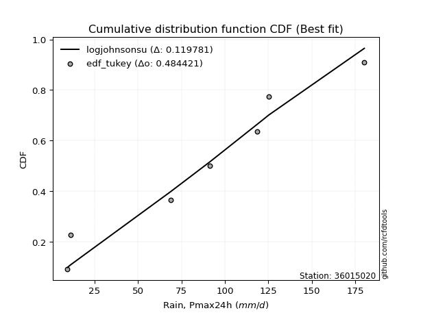</img></img>

</div>


### 8. EDF Gringorten (1963)

Gringorten plotting position formula is essential for estimating the probability and return periods of extreme events like floods and heavy rainfall. The constant _a=0.44_.

<div align="center">


$P=(m-a)/(n+1-2a)$


</div>


**8.1. Empirical values**

<div align="center">

|                | 0                   | 1                   | 2                  | 3                  | 4                  | 5                  | 6                  | 7                  |
|:---------------|:--------------------|:--------------------|:-------------------|:-------------------|:-------------------|:-------------------|:-------------------|:-------------------|
| date           | 2023                | 2022                | 2018               | 2021               | 2025               | 2019               | 2020               | 2017               |
| x              | 9.5                 | 11.1                | 68.8               | 91.3               | 95.0               | 118.5              | 125.2              | 180.2              |
| m              | 1                   | 2                   | 3                  | 4                  | 5                  | 6                  | 7                  | 8                  |
| empirical_dist | edf_gringorten      | edf_gringorten      | edf_gringorten     | edf_gringorten     | edf_gringorten     | edf_gringorten     | edf_gringorten     | edf_gringorten     |
| empirical      | 0.06896551724137932 | 0.19211822660098524 | 0.3152709359605912 | 0.4384236453201971 | 0.5615763546798029 | 0.6847290640394089 | 0.8078817733990148 | 0.9310344827586208 |
| empirical_tr   | 1.0740740740740742  | 1.2378048780487805  | 1.460431654676259  | 1.780701754385965  | 2.2808988764044944 | 3.1718750000000004 | 5.205128205128205  | 14.500000000000018 |

</div>


**8.2. Kolmogorov-Smirnov fit test (sorted by Δ)**


<div align="center">

|                | 0                   | 1                   | 2                   | 3                   | 4                   | 5                  | 6                   | 7                   | 8                  | 9                   | 10                  | 11                  | 12                  | 13                  | 14                  | 15                  | 16                  | 17                  | 18                  | 19                  | 20                  | 21                  | 22                 | 23                  | 24                  | 25                  | 26                 | 27                  | 28                  | 29                  | 30                 | 31                 | 32                 | 33                  | 34                  | 35                 | 36                 | 37                  | 38                  | 39                  | 40                 | 41                  | 42                  | 43                  | 44                  | 45                 | 46                  | 47                  | 48                  | 49                  | 50                  | 51                  | 52                  | 53                  | 54                  | 55                 | 56                  | 57                  | 58                  | 59                  | 60                  | 61                 | 62                  | 63                  | 64                  | 65                  | 66                  | 67                  | 68                  | 69                  | 70                  | 71                  | 72                  | 73                  | 74                  | 75                 | 76                 | 77                  | 78                  | 79                  | 80                  | 81                 | 82                 | 83                  | 84                  | 85                  | 86                  | 87                  | 88                  | 89                  | 90                  | 91                  | 92                  | 93                  | 94                 | 95                 | 96                 | 97                 | 98                  | 99                 | 100                | 101                | 102                | 103                | 104                | 105                | 106                | 107                 | 108                | 109                 | 110                 | 111                | 112                | 113                 | 114                 | 115                 | 116                | 117                 | 118                | 119                | 120                | 121                 | 122                | 123                 | 124                 | 125                 | 126                | 127                 | 128                | 129                 | 130                | 131                | 132                | 133                 | 134                | 135                | 136                 | 137                | 138                | 139                | 140                 | 141                 | 142                | 143                 | 144                | 145                | 146                | 147                | 148                | 149                | 150                | 151                | 152                | 153                | 154                | 155                | 156                | 157                | 158                | 159                |
|:---------------|:--------------------|:--------------------|:--------------------|:--------------------|:--------------------|:-------------------|:--------------------|:--------------------|:-------------------|:--------------------|:--------------------|:--------------------|:--------------------|:--------------------|:--------------------|:--------------------|:--------------------|:--------------------|:--------------------|:--------------------|:--------------------|:--------------------|:-------------------|:--------------------|:--------------------|:--------------------|:-------------------|:--------------------|:--------------------|:--------------------|:-------------------|:-------------------|:-------------------|:--------------------|:--------------------|:-------------------|:-------------------|:--------------------|:--------------------|:--------------------|:-------------------|:--------------------|:--------------------|:--------------------|:--------------------|:-------------------|:--------------------|:--------------------|:--------------------|:--------------------|:--------------------|:--------------------|:--------------------|:--------------------|:--------------------|:-------------------|:--------------------|:--------------------|:--------------------|:--------------------|:--------------------|:-------------------|:--------------------|:--------------------|:--------------------|:--------------------|:--------------------|:--------------------|:--------------------|:--------------------|:--------------------|:--------------------|:--------------------|:--------------------|:--------------------|:-------------------|:-------------------|:--------------------|:--------------------|:--------------------|:--------------------|:-------------------|:-------------------|:--------------------|:--------------------|:--------------------|:--------------------|:--------------------|:--------------------|:--------------------|:--------------------|:--------------------|:--------------------|:--------------------|:-------------------|:-------------------|:-------------------|:-------------------|:--------------------|:-------------------|:-------------------|:-------------------|:-------------------|:-------------------|:-------------------|:-------------------|:-------------------|:--------------------|:-------------------|:--------------------|:--------------------|:-------------------|:-------------------|:--------------------|:--------------------|:--------------------|:-------------------|:--------------------|:-------------------|:-------------------|:-------------------|:--------------------|:-------------------|:--------------------|:--------------------|:--------------------|:-------------------|:--------------------|:-------------------|:--------------------|:-------------------|:-------------------|:-------------------|:--------------------|:-------------------|:-------------------|:--------------------|:-------------------|:-------------------|:-------------------|:--------------------|:--------------------|:-------------------|:--------------------|:-------------------|:-------------------|:-------------------|:-------------------|:-------------------|:-------------------|:-------------------|:-------------------|:-------------------|:-------------------|:-------------------|:-------------------|:-------------------|:-------------------|:-------------------|:-------------------|
| station        | 36015020            | 36015020            | 36015020            | 36015020            | 36015020            | 36015020           | 36015020            | 36015020            | 36015020           | 36015020            | 36015020            | 36015020            | 36015020            | 36015020            | 36015020            | 36015020            | 36015020            | 36015020            | 36015020            | 36015020            | 36015020            | 36015020            | 36015020           | 36015020            | 36015020            | 36015020            | 36015020           | 36015020            | 36015020            | 36015020            | 36015020           | 36015020           | 36015020           | 36015020            | 36015020            | 36015020           | 36015020           | 36015020            | 36015020            | 36015020            | 36015020           | 36015020            | 36015020            | 36015020            | 36015020            | 36015020           | 36015020            | 36015020            | 36015020            | 36015020            | 36015020            | 36015020            | 36015020            | 36015020            | 36015020            | 36015020           | 36015020            | 36015020            | 36015020            | 36015020            | 36015020            | 36015020           | 36015020            | 36015020            | 36015020            | 36015020            | 36015020            | 36015020            | 36015020            | 36015020            | 36015020            | 36015020            | 36015020            | 36015020            | 36015020            | 36015020           | 36015020           | 36015020            | 36015020            | 36015020            | 36015020            | 36015020           | 36015020           | 36015020            | 36015020            | 36015020            | 36015020            | 36015020            | 36015020            | 36015020            | 36015020            | 36015020            | 36015020            | 36015020            | 36015020           | 36015020           | 36015020           | 36015020           | 36015020            | 36015020           | 36015020           | 36015020           | 36015020           | 36015020           | 36015020           | 36015020           | 36015020           | 36015020            | 36015020           | 36015020            | 36015020            | 36015020           | 36015020           | 36015020            | 36015020            | 36015020            | 36015020           | 36015020            | 36015020           | 36015020           | 36015020           | 36015020            | 36015020           | 36015020            | 36015020            | 36015020            | 36015020           | 36015020            | 36015020           | 36015020            | 36015020           | 36015020           | 36015020           | 36015020            | 36015020           | 36015020           | 36015020            | 36015020           | 36015020           | 36015020           | 36015020            | 36015020            | 36015020           | 36015020            | 36015020           | 36015020           | 36015020           | 36015020           | 36015020           | 36015020           | 36015020           | 36015020           | 36015020           | 36015020           | 36015020           | 36015020           | 36015020           | 36015020           | 36015020           | 36015020           |
| empirical_dist | edf_gringorten      | edf_gringorten      | edf_gringorten      | edf_gringorten      | edf_gringorten      | edf_gringorten     | edf_gringorten      | edf_gringorten      | edf_gringorten     | edf_gringorten      | edf_gringorten      | edf_gringorten      | edf_gringorten      | edf_gringorten      | edf_gringorten      | edf_gringorten      | edf_gringorten      | edf_gringorten      | edf_gringorten      | edf_gringorten      | edf_gringorten      | edf_gringorten      | edf_gringorten     | edf_gringorten      | edf_gringorten      | edf_gringorten      | edf_gringorten     | edf_gringorten      | edf_gringorten      | edf_gringorten      | edf_gringorten     | edf_gringorten     | edf_gringorten     | edf_gringorten      | edf_gringorten      | edf_gringorten     | edf_gringorten     | edf_gringorten      | edf_gringorten      | edf_gringorten      | edf_gringorten     | edf_gringorten      | edf_gringorten      | edf_gringorten      | edf_gringorten      | edf_gringorten     | edf_gringorten      | edf_gringorten      | edf_gringorten      | edf_gringorten      | edf_gringorten      | edf_gringorten      | edf_gringorten      | edf_gringorten      | edf_gringorten      | edf_gringorten     | edf_gringorten      | edf_gringorten      | edf_gringorten      | edf_gringorten      | edf_gringorten      | edf_gringorten     | edf_gringorten      | edf_gringorten      | edf_gringorten      | edf_gringorten      | edf_gringorten      | edf_gringorten      | edf_gringorten      | edf_gringorten      | edf_gringorten      | edf_gringorten      | edf_gringorten      | edf_gringorten      | edf_gringorten      | edf_gringorten     | edf_gringorten     | edf_gringorten      | edf_gringorten      | edf_gringorten      | edf_gringorten      | edf_gringorten     | edf_gringorten     | edf_gringorten      | edf_gringorten      | edf_gringorten      | edf_gringorten      | edf_gringorten      | edf_gringorten      | edf_gringorten      | edf_gringorten      | edf_gringorten      | edf_gringorten      | edf_gringorten      | edf_gringorten     | edf_gringorten     | edf_gringorten     | edf_gringorten     | edf_gringorten      | edf_gringorten     | edf_gringorten     | edf_gringorten     | edf_gringorten     | edf_gringorten     | edf_gringorten     | edf_gringorten     | edf_gringorten     | edf_gringorten      | edf_gringorten     | edf_gringorten      | edf_gringorten      | edf_gringorten     | edf_gringorten     | edf_gringorten      | edf_gringorten      | edf_gringorten      | edf_gringorten     | edf_gringorten      | edf_gringorten     | edf_gringorten     | edf_gringorten     | edf_gringorten      | edf_gringorten     | edf_gringorten      | edf_gringorten      | edf_gringorten      | edf_gringorten     | edf_gringorten      | edf_gringorten     | edf_gringorten      | edf_gringorten     | edf_gringorten     | edf_gringorten     | edf_gringorten      | edf_gringorten     | edf_gringorten     | edf_gringorten      | edf_gringorten     | edf_gringorten     | edf_gringorten     | edf_gringorten      | edf_gringorten      | edf_gringorten     | edf_gringorten      | edf_gringorten     | edf_gringorten     | edf_gringorten     | edf_gringorten     | edf_gringorten     | edf_gringorten     | edf_gringorten     | edf_gringorten     | edf_gringorten     | edf_gringorten     | edf_gringorten     | edf_gringorten     | edf_gringorten     | edf_gringorten     | edf_gringorten     | edf_gringorten     |
| p_dist         | semicircular        | anglit              | gumbel_l            | logjohnsonsu        | ksone               | genlogistic        | mielke              | genextreme          | burr               | johnsonsu           | pearson3            | logloggamma         | dweibull            | f                   | skewnorm            | exponnorm           | truncnorm           | norm                | crystalball         | t                   | gamma               | erlang              | foldnorm           | cosine              | betaprime           | logistic            | hypsecant          | laplace             | invgamma            | dgamma              | maxwell            | weibull_min        | exponweib          | logmielke           | rice                | gausshyper         | rayleigh           | argus               | logburr             | logargus            | invgauss           | logdweibull         | loggenextreme       | loggennorm          | kstwobign           | gumbel_r           | logdgamma           | truncexpon          | ncf                 | loggumbel_l         | logtrapezoid        | logburr12           | logweibull_min      | logpearson3         | kappa4              | bradford           | tukeylambda         | kappa3              | uniform             | wrapcauchy          | vonmises_line       | logloglaplace      | moyal               | genexpon            | arcsine             | halflogistic        | halfnorm            | loggompertz         | loggenpareto        | loggenhalflogistic  | loglevy_l           | logarcsine          | nakagami            | logskewnorm         | lomax               | logsemicircular    | genpareto          | loganglit           | logerlang           | lognct              | logexponnorm        | logt               | lognorm            | logcrystalball      | logf                | logfatiguelife      | lognakagami         | loggamma            | loggamma            | logtriang           | loglogistic         | logrice             | loginvgamma         | loghypsecant        | logalpha           | logwrapcauchy      | wald               | logncf             | logbetaprime        | loginvgauss        | logmaxwell         | loginvweibull      | lograyleigh        | loglaplace         | loglaplace         | logcosine          | logfoldnorm        | halfgennorm         | genhalflogistic    | logkstwobign        | loghalfnorm         | loggausshyper      | johnsonsb          | triang              | loggumbel_r         | loggenexpon         | gennorm            | levy_l              | truncweibull_min   | nct                | logksone           | loghalflogistic     | logmoyal           | loggengamma         | burr12              | logweibull_max      | loglomax           | logkappa3           | loguniform         | logvonmises_line    | logbradford        | beta               | logjohnsonsb       | gengamma            | loghalfgennorm     | logkappa4          | logbeta             | trapezoid          | logwald            | logrdist           | logtruncexpon       | logtruncweibull_min | logtukeylambda     | logexponweib        | alpha              | logtruncnorm       | invweibull         | rdist              | gompertz           | fatiguelife        | powerlaw           | logexponpow        | logpowerlaw        | truncpareto        | exponpow           | logtruncpareto     | weibull_max        | loggenlogistic     | logvonmises        | vonmises           |
| delta          | 0.10127583170664364 | 0.10367146902083926 | 0.10464729726295684 | 0.10595139813658874 | 0.10602844202652184 | 0.1068154020111547 | 0.10895067141029946 | 0.10899760364936271 | 0.1096341338218475 | 0.11257253772309392 | 0.11265153735154917 | 0.11273429270317557 | 0.11281108170903772 | 0.11330723688886261 | 0.11339950956296838 | 0.11346882899237061 | 0.11347035540320152 | 0.11347035883288105 | 0.11347036389334546 | 0.11347153799434849 | 0.11395568896660209 | 0.11413995337556285 | 0.1144361168101444 | 0.12038783989223958 | 0.12040450483938624 | 0.12070104623291342 | 0.1233451836283528 | 0.12445171678189658 | 0.12529858507239783 | 0.12545787080956922 | 0.1294683650944655 | 0.1295269270662564 | 0.1337088553681916 | 0.13416012386975235 | 0.13416483295585008 | 0.1394569173203221 | 0.1401186699034939 | 0.14107963913865362 | 0.14127995448682973 | 0.14137928697342841 | 0.1438570565787745 | 0.15001067191757755 | 0.15462021391308112 | 0.15647175507327815 | 0.15886695368646558 | 0.1606413036172714 | 0.16519031733796452 | 0.16727636667369516 | 0.16889436155960585 | 0.16952017683539733 | 0.17091098455076803 | 0.17118652848004773 | 0.17157508879574918 | 0.17390596325931929 | 0.17842642558587066 | 0.1805508154691288 | 0.18067848836885095 | 0.18161985591424087 | 0.18274505729811472 | 0.18279327864557918 | 0.18420488880598415 | 0.1854734437591813 | 0.18607094403151442 | 0.18832492211691654 | 0.19211822660098524 | 0.19211822660098524 | 0.19211822660098524 | 0.19352072208152943 | 0.19898163410147818 | 0.21037938639301834 | 0.21055832474856973 | 0.21399181565335978 | 0.21530751686815064 | 0.21664933233538347 | 0.22120011551340402 | 0.2260256221367466 | 0.2282118253744959 | 0.22905046840662646 | 0.23546503996581314 | 0.23619088049920678 | 0.23637512863381527 | 0.2363778407424193 | 0.2363778885483091 | 0.23637789524979091 | 0.23663850635478112 | 0.23671309113786743 | 0.23701877416109074 | 0.24269772579720128 | 0.24269772579720128 | 0.24287040601197352 | 0.24332910048046397 | 0.24699041974026947 | 0.24874471286122057 | 0.24919783532930928 | 0.251257356202528  | 0.254048948829658  | 0.2566742113650112 | 0.2578776143020318 | 0.25872622650526966 | 0.2590020057984237 | 0.2666595022637329 | 0.27061178040001   | 0.2763731762131685 | 0.2770415047428622 | 0.2770415047428622 | 0.2834281930778253 | 0.2836110202332184 | 0.28880627443053997 | 0.2943962069878361 | 0.30020138887065206 | 0.30377844378260965 | 0.3048210080088304 | 0.3049839088337755 | 0.30613351713606907 | 0.30640326512130334 | 0.30677334085223684 | 0.3078817733990148 | 0.32234037237189506 | 0.3254601551689945 | 0.3261952060104951 | 0.3287326203764527 | 0.33112056750168584 | 0.3311870522893645 | 0.33475048734953305 | 0.34060124366051614 | 0.34075153005357767 | 0.3432623622572033 | 0.35650610360393986 | 0.3575333316438615 | 0.35761218261887473 | 0.3583518304752892 | 0.359186204714495  | 0.36024935629208   | 0.36833074075388605 | 0.3703215756359892 | 0.373622339695862  | 0.38362081644187684 | 0.3853659072082724 | 0.3999560588575177 | 0.422041878583579  | 0.43400394501454787 | 0.4405874261583286  | 0.4485353445384983 | 0.45042528969615014 | 0.4537047079663208 | 0.4585954864739309 | 0.4697845034818192 | 0.4803743921363355 | 0.5005417455794319 | 0.5040957681058031 | 0.5203338215210854 | 0.5783119001828652 | 0.609539104651706  | 0.6232968560515804 | 0.6574847552047332 | 0.6604493801208116 | 0.6974666897099074 | 0.8078817733990148 | 1.129021239851256  | 28.35405272045461  |
| deltao         | 0.4472608134160001  | 0.4472608134160001  | 0.4472608134160001  | 0.4472608134160001  | 0.4472608134160001  | 0.4472608134160001 | 0.4472608134160001  | 0.4472608134160001  | 0.4472608134160001 | 0.4472608134160001  | 0.4472608134160001  | 0.4472608134160001  | 0.4472608134160001  | 0.4472608134160001  | 0.4472608134160001  | 0.4472608134160001  | 0.4472608134160001  | 0.4472608134160001  | 0.4472608134160001  | 0.4472608134160001  | 0.4472608134160001  | 0.4472608134160001  | 0.4472608134160001 | 0.4472608134160001  | 0.4472608134160001  | 0.4472608134160001  | 0.4472608134160001 | 0.4472608134160001  | 0.4472608134160001  | 0.4472608134160001  | 0.4472608134160001 | 0.4472608134160001 | 0.4472608134160001 | 0.4472608134160001  | 0.4472608134160001  | 0.4472608134160001 | 0.4472608134160001 | 0.4472608134160001  | 0.4472608134160001  | 0.4472608134160001  | 0.4472608134160001 | 0.4472608134160001  | 0.4472608134160001  | 0.4472608134160001  | 0.4472608134160001  | 0.4472608134160001 | 0.4472608134160001  | 0.4472608134160001  | 0.4472608134160001  | 0.4472608134160001  | 0.4472608134160001  | 0.4472608134160001  | 0.4472608134160001  | 0.4472608134160001  | 0.4472608134160001  | 0.4472608134160001 | 0.4472608134160001  | 0.4472608134160001  | 0.4472608134160001  | 0.4472608134160001  | 0.4472608134160001  | 0.4472608134160001 | 0.4472608134160001  | 0.4472608134160001  | 0.4472608134160001  | 0.4472608134160001  | 0.4472608134160001  | 0.4472608134160001  | 0.4472608134160001  | 0.4472608134160001  | 0.4472608134160001  | 0.4472608134160001  | 0.4472608134160001  | 0.4472608134160001  | 0.4472608134160001  | 0.4472608134160001 | 0.4472608134160001 | 0.4472608134160001  | 0.4472608134160001  | 0.4472608134160001  | 0.4472608134160001  | 0.4472608134160001 | 0.4472608134160001 | 0.4472608134160001  | 0.4472608134160001  | 0.4472608134160001  | 0.4472608134160001  | 0.4472608134160001  | 0.4472608134160001  | 0.4472608134160001  | 0.4472608134160001  | 0.4472608134160001  | 0.4472608134160001  | 0.4472608134160001  | 0.4472608134160001 | 0.4472608134160001 | 0.4472608134160001 | 0.4472608134160001 | 0.4472608134160001  | 0.4472608134160001 | 0.4472608134160001 | 0.4472608134160001 | 0.4472608134160001 | 0.4472608134160001 | 0.4472608134160001 | 0.4472608134160001 | 0.4472608134160001 | 0.4472608134160001  | 0.4472608134160001 | 0.4472608134160001  | 0.4472608134160001  | 0.4472608134160001 | 0.4472608134160001 | 0.4472608134160001  | 0.4472608134160001  | 0.4472608134160001  | 0.4472608134160001 | 0.4472608134160001  | 0.4472608134160001 | 0.4472608134160001 | 0.4472608134160001 | 0.4472608134160001  | 0.4472608134160001 | 0.4472608134160001  | 0.4472608134160001  | 0.4472608134160001  | 0.4472608134160001 | 0.4472608134160001  | 0.4472608134160001 | 0.4472608134160001  | 0.4472608134160001 | 0.4472608134160001 | 0.4472608134160001 | 0.4472608134160001  | 0.4472608134160001 | 0.4472608134160001 | 0.4472608134160001  | 0.4472608134160001 | 0.4472608134160001 | 0.4472608134160001 | 0.4472608134160001  | 0.4472608134160001  | 0.4472608134160001 | 0.4472608134160001  | 0.4472608134160001 | 0.4472608134160001 | 0.4472608134160001 | 0.4472608134160001 | 0.4472608134160001 | 0.4472608134160001 | 0.4472608134160001 | 0.4472608134160001 | 0.4472608134160001 | 0.4472608134160001 | 0.4472608134160001 | 0.4472608134160001 | 0.4472608134160001 | 0.4472608134160001 | 0.4472608134160001 | 0.4472608134160001 |
| eval           | Δo > Δ              | Δo > Δ              | Δo > Δ              | Δo > Δ              | Δo > Δ              | Δo > Δ             | Δo > Δ              | Δo > Δ              | Δo > Δ             | Δo > Δ              | Δo > Δ              | Δo > Δ              | Δo > Δ              | Δo > Δ              | Δo > Δ              | Δo > Δ              | Δo > Δ              | Δo > Δ              | Δo > Δ              | Δo > Δ              | Δo > Δ              | Δo > Δ              | Δo > Δ             | Δo > Δ              | Δo > Δ              | Δo > Δ              | Δo > Δ             | Δo > Δ              | Δo > Δ              | Δo > Δ              | Δo > Δ             | Δo > Δ             | Δo > Δ             | Δo > Δ              | Δo > Δ              | Δo > Δ             | Δo > Δ             | Δo > Δ              | Δo > Δ              | Δo > Δ              | Δo > Δ             | Δo > Δ              | Δo > Δ              | Δo > Δ              | Δo > Δ              | Δo > Δ             | Δo > Δ              | Δo > Δ              | Δo > Δ              | Δo > Δ              | Δo > Δ              | Δo > Δ              | Δo > Δ              | Δo > Δ              | Δo > Δ              | Δo > Δ             | Δo > Δ              | Δo > Δ              | Δo > Δ              | Δo > Δ              | Δo > Δ              | Δo > Δ             | Δo > Δ              | Δo > Δ              | Δo > Δ              | Δo > Δ              | Δo > Δ              | Δo > Δ              | Δo > Δ              | Δo > Δ              | Δo > Δ              | Δo > Δ              | Δo > Δ              | Δo > Δ              | Δo > Δ              | Δo > Δ             | Δo > Δ             | Δo > Δ              | Δo > Δ              | Δo > Δ              | Δo > Δ              | Δo > Δ             | Δo > Δ             | Δo > Δ              | Δo > Δ              | Δo > Δ              | Δo > Δ              | Δo > Δ              | Δo > Δ              | Δo > Δ              | Δo > Δ              | Δo > Δ              | Δo > Δ              | Δo > Δ              | Δo > Δ             | Δo > Δ             | Δo > Δ             | Δo > Δ             | Δo > Δ              | Δo > Δ             | Δo > Δ             | Δo > Δ             | Δo > Δ             | Δo > Δ             | Δo > Δ             | Δo > Δ             | Δo > Δ             | Δo > Δ              | Δo > Δ             | Δo > Δ              | Δo > Δ              | Δo > Δ             | Δo > Δ             | Δo > Δ              | Δo > Δ              | Δo > Δ              | Δo > Δ             | Δo > Δ              | Δo > Δ             | Δo > Δ             | Δo > Δ             | Δo > Δ              | Δo > Δ             | Δo > Δ              | Δo > Δ              | Δo > Δ              | Δo > Δ             | Δo > Δ              | Δo > Δ             | Δo > Δ              | Δo > Δ             | Δo > Δ             | Δo > Δ             | Δo > Δ              | Δo > Δ             | Δo > Δ             | Δo > Δ              | Δo > Δ             | Δo > Δ             | Δo > Δ             | Δo > Δ              | Δo > Δ              | Δo <= Δ            | Δo <= Δ             | Δo <= Δ            | Δo <= Δ            | Δo <= Δ            | Δo <= Δ            | Δo <= Δ            | Δo <= Δ            | Δo <= Δ            | Δo <= Δ            | Δo <= Δ            | Δo <= Δ            | Δo <= Δ            | Δo <= Δ            | Δo <= Δ            | Δo <= Δ            | Δo <= Δ            | Δo <= Δ            |
| fit            | 1                   | 1                   | 1                   | 1                   | 1                   | 1                  | 1                   | 1                   | 1                  | 1                   | 1                   | 1                   | 1                   | 1                   | 1                   | 1                   | 1                   | 1                   | 1                   | 1                   | 1                   | 1                   | 1                  | 1                   | 1                   | 1                   | 1                  | 1                   | 1                   | 1                   | 1                  | 1                  | 1                  | 1                   | 1                   | 1                  | 1                  | 1                   | 1                   | 1                   | 1                  | 1                   | 1                   | 1                   | 1                   | 1                  | 1                   | 1                   | 1                   | 1                   | 1                   | 1                   | 1                   | 1                   | 1                   | 1                  | 1                   | 1                   | 1                   | 1                   | 1                   | 1                  | 1                   | 1                   | 1                   | 1                   | 1                   | 1                   | 1                   | 1                   | 1                   | 1                   | 1                   | 1                   | 1                   | 1                  | 1                  | 1                   | 1                   | 1                   | 1                   | 1                  | 1                  | 1                   | 1                   | 1                   | 1                   | 1                   | 1                   | 1                   | 1                   | 1                   | 1                   | 1                   | 1                  | 1                  | 1                  | 1                  | 1                   | 1                  | 1                  | 1                  | 1                  | 1                  | 1                  | 1                  | 1                  | 1                   | 1                  | 1                   | 1                   | 1                  | 1                  | 1                   | 1                   | 1                   | 1                  | 1                   | 1                  | 1                  | 1                  | 1                   | 1                  | 1                   | 1                   | 1                   | 1                  | 1                   | 1                  | 1                   | 1                  | 1                  | 1                  | 1                   | 1                  | 1                  | 1                   | 1                  | 1                  | 1                  | 1                   | 1                   | 0                  | 0                   | 0                  | 0                  | 0                  | 0                  | 0                  | 0                  | 0                  | 0                  | 0                  | 0                  | 0                  | 0                  | 0                  | 0                  | 0                  | 0                  |
| n              | 8                   | 8                   | 8                   | 8                   | 8                   | 8                  | 8                   | 8                   | 8                  | 8                   | 8                   | 8                   | 8                   | 8                   | 8                   | 8                   | 8                   | 8                   | 8                   | 8                   | 8                   | 8                   | 8                  | 8                   | 8                   | 8                   | 8                  | 8                   | 8                   | 8                   | 8                  | 8                  | 8                  | 8                   | 8                   | 8                  | 8                  | 8                   | 8                   | 8                   | 8                  | 8                   | 8                   | 8                   | 8                   | 8                  | 8                   | 8                   | 8                   | 8                   | 8                   | 8                   | 8                   | 8                   | 8                   | 8                  | 8                   | 8                   | 8                   | 8                   | 8                   | 8                  | 8                   | 8                   | 8                   | 8                   | 8                   | 8                   | 8                   | 8                   | 8                   | 8                   | 8                   | 8                   | 8                   | 8                  | 8                  | 8                   | 8                   | 8                   | 8                   | 8                  | 8                  | 8                   | 8                   | 8                   | 8                   | 8                   | 8                   | 8                   | 8                   | 8                   | 8                   | 8                   | 8                  | 8                  | 8                  | 8                  | 8                   | 8                  | 8                  | 8                  | 8                  | 8                  | 8                  | 8                  | 8                  | 8                   | 8                  | 8                   | 8                   | 8                  | 8                  | 8                   | 8                   | 8                   | 8                  | 8                   | 8                  | 8                  | 8                  | 8                   | 8                  | 8                   | 8                   | 8                   | 8                  | 8                   | 8                  | 8                   | 8                  | 8                  | 8                  | 8                   | 8                  | 8                  | 8                   | 8                  | 8                  | 8                  | 8                   | 8                   | 8                  | 8                   | 8                  | 8                  | 8                  | 8                  | 8                  | 8                  | 8                  | 8                  | 8                  | 8                  | 8                  | 8                  | 8                  | 8                  | 8                  | 8                  |
| best_fit       | 1                   | 0                   | 0                   | 0                   | 0                   | 0                  | 0                   | 0                   | 0                  | 0                   | 0                   | 0                   | 0                   | 0                   | 0                   | 0                   | 0                   | 0                   | 0                   | 0                   | 0                   | 0                   | 0                  | 0                   | 0                   | 0                   | 0                  | 0                   | 0                   | 0                   | 0                  | 0                  | 0                  | 0                   | 0                   | 0                  | 0                  | 0                   | 0                   | 0                   | 0                  | 0                   | 0                   | 0                   | 0                   | 0                  | 0                   | 0                   | 0                   | 0                   | 0                   | 0                   | 0                   | 0                   | 0                   | 0                  | 0                   | 0                   | 0                   | 0                   | 0                   | 0                  | 0                   | 0                   | 0                   | 0                   | 0                   | 0                   | 0                   | 0                   | 0                   | 0                   | 0                   | 0                   | 0                   | 0                  | 0                  | 0                   | 0                   | 0                   | 0                   | 0                  | 0                  | 0                   | 0                   | 0                   | 0                   | 0                   | 0                   | 0                   | 0                   | 0                   | 0                   | 0                   | 0                  | 0                  | 0                  | 0                  | 0                   | 0                  | 0                  | 0                  | 0                  | 0                  | 0                  | 0                  | 0                  | 0                   | 0                  | 0                   | 0                   | 0                  | 0                  | 0                   | 0                   | 0                   | 0                  | 0                   | 0                  | 0                  | 0                  | 0                   | 0                  | 0                   | 0                   | 0                   | 0                  | 0                   | 0                  | 0                   | 0                  | 0                  | 0                  | 0                   | 0                  | 0                  | 0                   | 0                  | 0                  | 0                  | 0                   | 0                   | 0                  | 0                   | 0                  | 0                  | 0                  | 0                  | 0                  | 0                  | 0                  | 0                  | 0                  | 0                  | 0                  | 0                  | 0                  | 0                  | 0                  | 0                  |
| best_fit_sort  | 1                   | 2                   | 3                   | 4                   | 5                   | 6                  | 7                   | 8                   | 9                  | 10                  | 11                  | 12                  | 13                  | 14                  | 15                  | 16                  | 17                  | 18                  | 19                  | 20                  | 21                  | 22                  | 23                 | 24                  | 25                  | 26                  | 27                 | 28                  | 29                  | 30                  | 31                 | 32                 | 33                 | 34                  | 35                  | 36                 | 37                 | 38                  | 39                  | 40                  | 41                 | 42                  | 43                  | 44                  | 45                  | 46                 | 47                  | 48                  | 49                  | 50                  | 51                  | 52                  | 53                  | 54                  | 55                  | 56                 | 57                  | 58                  | 59                  | 60                  | 61                  | 62                 | 63                  | 64                  | 65                  | 66                  | 67                  | 68                  | 69                  | 70                  | 71                  | 72                  | 73                  | 74                  | 75                  | 76                 | 77                 | 78                  | 79                  | 80                  | 81                  | 82                 | 83                 | 84                  | 85                  | 86                  | 87                  | 88                  | 89                  | 90                  | 91                  | 92                  | 93                  | 94                  | 95                 | 96                 | 97                 | 98                 | 99                  | 100                | 101                | 102                | 103                | 104                | 105                | 106                | 107                | 108                 | 109                | 110                 | 111                 | 112                | 113                | 114                 | 115                 | 116                 | 117                | 118                 | 119                | 120                | 121                | 122                 | 123                | 124                 | 125                 | 126                 | 127                | 128                 | 129                | 130                 | 131                | 132                | 133                | 134                 | 135                | 136                | 137                 | 138                | 139                | 140                | 141                 | 142                 | 143                | 144                 | 145                | 146                | 147                | 148                | 149                | 150                | 151                | 152                | 153                | 154                | 155                | 156                | 157                | 158                | 159                | 160                |

</div>


**8.3. Best fit**

<div align="center">

|   id |   station | empirical_dist   | p_dist       |    delta |   deltao | eval   |   fit |   n |   best_fit |   best_fit_sort |
|-----:|----------:|:-----------------|:-------------|---------:|---------:|:-------|------:|----:|-----------:|----------------:|
|    0 |  36015020 | edf_gringorten   | semicircular | 0.101276 | 0.447261 | Δo > Δ |     1 |   8 |          1 |               1 |

</div>


<div align="center">

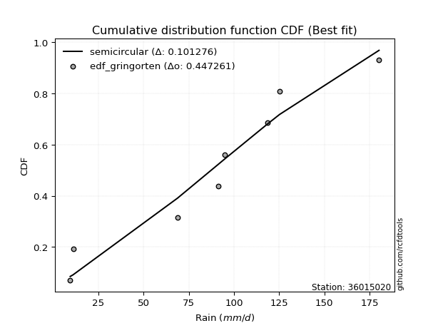</img>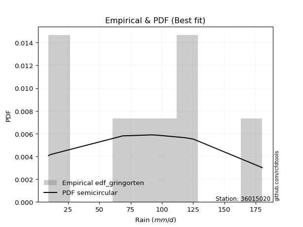</img>

</div>


### 9. EDF Filliben (1975)

The specific values of the constants (0.3175) (often denoted as $alpha$) and (0.365) are derived from a method proposed by James J. Filliben in a 1975 paper. This particular formula is the mean value of the $i$-th order statistic of the normal distribution and is considered a robust and effective plotting position formula for the normal probability plot correlation coefficient test for normality.

<div align="center">


$P=(m-0.3175)/(n+0.365)$


</div>


**9.1. Empirical values**

<div align="center">

|                | 0                  | 1                   | 2                  | 3                   | 4                  | 5                  | 6                  | 7                  |
|:---------------|:-------------------|:--------------------|:-------------------|:--------------------|:-------------------|:-------------------|:-------------------|:-------------------|
| date           | 2023               | 2022                | 2018               | 2021                | 2025               | 2019               | 2020               | 2017               |
| x              | 9.5                | 11.1                | 68.8               | 91.3                | 95.0               | 118.5              | 125.2              | 180.2              |
| m              | 1                  | 2                   | 3                  | 4                   | 5                  | 6                  | 7                  | 8                  |
| empirical_dist | edf_filliben       | edf_filliben        | edf_filliben       | edf_filliben        | edf_filliben       | edf_filliben       | edf_filliben       | edf_filliben       |
| empirical      | 0.0815899581589958 | 0.20113568439928273 | 0.3206814106395696 | 0.44022713687985654 | 0.5597728631201434 | 0.6793185893604303 | 0.7988643156007172 | 0.9184100418410042 |
| empirical_tr   | 1.0888382687927107 | 1.2517770295548074  | 1.4720633523977125 | 1.7864388681260008  | 2.271554650373387  | 3.118359739049394  | 4.971768202080237  | 12.256410256410254 |

</div>


**9.2. Kolmogorov-Smirnov fit test (sorted by Δ)**


<div align="center">

|                | 0                   | 1                   | 2                   | 3                   | 4                   | 5                  | 6                   | 7                  | 8                   | 9                   | 10                  | 11                  | 12                  | 13                 | 14                  | 15                 | 16                  | 17                  | 18                  | 19                  | 20                  | 21                  | 22                  | 23                  | 24                  | 25                  | 26                 | 27                  | 28                  | 29                  | 30                  | 31                  | 32                 | 33                  | 34                 | 35                  | 36                 | 37                  | 38                  | 39                  | 40                  | 41                  | 42                 | 43                  | 44                  | 45                 | 46                  | 47                 | 48                  | 49                 | 50                 | 51                  | 52                 | 53                  | 54                  | 55                 | 56                  | 57                  | 58                  | 59                 | 60                  | 61                 | 62                 | 63                  | 64                  | 65                  | 66                  | 67                  | 68                  | 69                  | 70                  | 71                  | 72                 | 73                  | 74                 | 75                  | 76                  | 77                  | 78                 | 79                  | 80                  | 81                  | 82                  | 83                 | 84                 | 85                 | 86                 | 87                  | 88                  | 89                 | 90                  | 91                  | 92                  | 93                  | 94                  | 95                  | 96                 | 97                  | 98                  | 99                  | 100                | 101                 | 102                 | 103                | 104                | 105                 | 106                 | 107                 | 108                 | 109                | 110                 | 111                | 112                | 113                 | 114                 | 115                | 116                | 117                 | 118                | 119                | 120                 | 121                | 122                | 123                | 124                | 125                | 126                | 127                 | 128                 | 129                 | 130                | 131                 | 132                | 133                | 134                | 135                | 136                | 137                 | 138                | 139                | 140                 | 141                 | 142                | 143                | 144                 | 145                 | 146                | 147                | 148                 | 149                | 150                | 151                | 152                | 153                | 154                | 155                | 156                | 157                | 158                | 159                |
|:---------------|:--------------------|:--------------------|:--------------------|:--------------------|:--------------------|:-------------------|:--------------------|:-------------------|:--------------------|:--------------------|:--------------------|:--------------------|:--------------------|:-------------------|:--------------------|:-------------------|:--------------------|:--------------------|:--------------------|:--------------------|:--------------------|:--------------------|:--------------------|:--------------------|:--------------------|:--------------------|:-------------------|:--------------------|:--------------------|:--------------------|:--------------------|:--------------------|:-------------------|:--------------------|:-------------------|:--------------------|:-------------------|:--------------------|:--------------------|:--------------------|:--------------------|:--------------------|:-------------------|:--------------------|:--------------------|:-------------------|:--------------------|:-------------------|:--------------------|:-------------------|:-------------------|:--------------------|:-------------------|:--------------------|:--------------------|:-------------------|:--------------------|:--------------------|:--------------------|:-------------------|:--------------------|:-------------------|:-------------------|:--------------------|:--------------------|:--------------------|:--------------------|:--------------------|:--------------------|:--------------------|:--------------------|:--------------------|:-------------------|:--------------------|:-------------------|:--------------------|:--------------------|:--------------------|:-------------------|:--------------------|:--------------------|:--------------------|:--------------------|:-------------------|:-------------------|:-------------------|:-------------------|:--------------------|:--------------------|:-------------------|:--------------------|:--------------------|:--------------------|:--------------------|:--------------------|:--------------------|:-------------------|:--------------------|:--------------------|:--------------------|:-------------------|:--------------------|:--------------------|:-------------------|:-------------------|:--------------------|:--------------------|:--------------------|:--------------------|:-------------------|:--------------------|:-------------------|:-------------------|:--------------------|:--------------------|:-------------------|:-------------------|:--------------------|:-------------------|:-------------------|:--------------------|:-------------------|:-------------------|:-------------------|:-------------------|:-------------------|:-------------------|:--------------------|:--------------------|:--------------------|:-------------------|:--------------------|:-------------------|:-------------------|:-------------------|:-------------------|:-------------------|:--------------------|:-------------------|:-------------------|:--------------------|:--------------------|:-------------------|:-------------------|:--------------------|:--------------------|:-------------------|:-------------------|:--------------------|:-------------------|:-------------------|:-------------------|:-------------------|:-------------------|:-------------------|:-------------------|:-------------------|:-------------------|:-------------------|:-------------------|
| station        | 36015020            | 36015020            | 36015020            | 36015020            | 36015020            | 36015020           | 36015020            | 36015020           | 36015020            | 36015020            | 36015020            | 36015020            | 36015020            | 36015020           | 36015020            | 36015020           | 36015020            | 36015020            | 36015020            | 36015020            | 36015020            | 36015020            | 36015020            | 36015020            | 36015020            | 36015020            | 36015020           | 36015020            | 36015020            | 36015020            | 36015020            | 36015020            | 36015020           | 36015020            | 36015020           | 36015020            | 36015020           | 36015020            | 36015020            | 36015020            | 36015020            | 36015020            | 36015020           | 36015020            | 36015020            | 36015020           | 36015020            | 36015020           | 36015020            | 36015020           | 36015020           | 36015020            | 36015020           | 36015020            | 36015020            | 36015020           | 36015020            | 36015020            | 36015020            | 36015020           | 36015020            | 36015020           | 36015020           | 36015020            | 36015020            | 36015020            | 36015020            | 36015020            | 36015020            | 36015020            | 36015020            | 36015020            | 36015020           | 36015020            | 36015020           | 36015020            | 36015020            | 36015020            | 36015020           | 36015020            | 36015020            | 36015020            | 36015020            | 36015020           | 36015020           | 36015020           | 36015020           | 36015020            | 36015020            | 36015020           | 36015020            | 36015020            | 36015020            | 36015020            | 36015020            | 36015020            | 36015020           | 36015020            | 36015020            | 36015020            | 36015020           | 36015020            | 36015020            | 36015020           | 36015020           | 36015020            | 36015020            | 36015020            | 36015020            | 36015020           | 36015020            | 36015020           | 36015020           | 36015020            | 36015020            | 36015020           | 36015020           | 36015020            | 36015020           | 36015020           | 36015020            | 36015020           | 36015020           | 36015020           | 36015020           | 36015020           | 36015020           | 36015020            | 36015020            | 36015020            | 36015020           | 36015020            | 36015020           | 36015020           | 36015020           | 36015020           | 36015020           | 36015020            | 36015020           | 36015020           | 36015020            | 36015020            | 36015020           | 36015020           | 36015020            | 36015020            | 36015020           | 36015020           | 36015020            | 36015020           | 36015020           | 36015020           | 36015020           | 36015020           | 36015020           | 36015020           | 36015020           | 36015020           | 36015020           | 36015020           |
| empirical_dist | edf_filliben        | edf_filliben        | edf_filliben        | edf_filliben        | edf_filliben        | edf_filliben       | edf_filliben        | edf_filliben       | edf_filliben        | edf_filliben        | edf_filliben        | edf_filliben        | edf_filliben        | edf_filliben       | edf_filliben        | edf_filliben       | edf_filliben        | edf_filliben        | edf_filliben        | edf_filliben        | edf_filliben        | edf_filliben        | edf_filliben        | edf_filliben        | edf_filliben        | edf_filliben        | edf_filliben       | edf_filliben        | edf_filliben        | edf_filliben        | edf_filliben        | edf_filliben        | edf_filliben       | edf_filliben        | edf_filliben       | edf_filliben        | edf_filliben       | edf_filliben        | edf_filliben        | edf_filliben        | edf_filliben        | edf_filliben        | edf_filliben       | edf_filliben        | edf_filliben        | edf_filliben       | edf_filliben        | edf_filliben       | edf_filliben        | edf_filliben       | edf_filliben       | edf_filliben        | edf_filliben       | edf_filliben        | edf_filliben        | edf_filliben       | edf_filliben        | edf_filliben        | edf_filliben        | edf_filliben       | edf_filliben        | edf_filliben       | edf_filliben       | edf_filliben        | edf_filliben        | edf_filliben        | edf_filliben        | edf_filliben        | edf_filliben        | edf_filliben        | edf_filliben        | edf_filliben        | edf_filliben       | edf_filliben        | edf_filliben       | edf_filliben        | edf_filliben        | edf_filliben        | edf_filliben       | edf_filliben        | edf_filliben        | edf_filliben        | edf_filliben        | edf_filliben       | edf_filliben       | edf_filliben       | edf_filliben       | edf_filliben        | edf_filliben        | edf_filliben       | edf_filliben        | edf_filliben        | edf_filliben        | edf_filliben        | edf_filliben        | edf_filliben        | edf_filliben       | edf_filliben        | edf_filliben        | edf_filliben        | edf_filliben       | edf_filliben        | edf_filliben        | edf_filliben       | edf_filliben       | edf_filliben        | edf_filliben        | edf_filliben        | edf_filliben        | edf_filliben       | edf_filliben        | edf_filliben       | edf_filliben       | edf_filliben        | edf_filliben        | edf_filliben       | edf_filliben       | edf_filliben        | edf_filliben       | edf_filliben       | edf_filliben        | edf_filliben       | edf_filliben       | edf_filliben       | edf_filliben       | edf_filliben       | edf_filliben       | edf_filliben        | edf_filliben        | edf_filliben        | edf_filliben       | edf_filliben        | edf_filliben       | edf_filliben       | edf_filliben       | edf_filliben       | edf_filliben       | edf_filliben        | edf_filliben       | edf_filliben       | edf_filliben        | edf_filliben        | edf_filliben       | edf_filliben       | edf_filliben        | edf_filliben        | edf_filliben       | edf_filliben       | edf_filliben        | edf_filliben       | edf_filliben       | edf_filliben       | edf_filliben       | edf_filliben       | edf_filliben       | edf_filliben       | edf_filliben       | edf_filliben       | edf_filliben       | edf_filliben       |
| p_dist         | ksone               | semicircular        | anglit              | gumbel_l            | logjohnsonsu        | genlogistic        | mielke              | genextreme         | burr                | johnsonsu           | pearson3            | logloggamma         | dweibull            | f                  | skewnorm            | exponnorm          | truncnorm           | norm                | crystalball         | t                   | gamma               | erlang              | foldnorm            | invgamma            | cosine              | betaprime           | logistic           | exponweib           | argus               | hypsecant           | laplace             | logmielke           | dgamma             | maxwell             | weibull_min        | logburr             | invgauss           | logdweibull         | rice                | loggenextreme       | gausshyper          | rayleigh            | logargus           | kstwobign           | loggennorm          | logtrapezoid       | ncf                 | loggumbel_l        | logpearson3         | gumbel_r           | logburr12          | logweibull_min      | logdgamma          | truncexpon          | logloglaplace       | genexpon           | kappa4              | bradford            | tukeylambda         | moyal              | kappa3              | loggompertz        | uniform            | wrapcauchy          | vonmises_line       | loggenpareto        | loglevy_l           | halfnorm            | arcsine             | halflogistic        | loggenhalflogistic  | logarcsine          | nakagami           | logskewnorm         | lomax              | genpareto           | logsemicircular     | loganglit           | logerlang          | lognct              | logexponnorm        | logt                | lognorm             | logcrystalball     | logf               | logfatiguelife     | lognakagami        | loggamma            | loggamma            | logtriang          | loglogistic         | logrice             | loginvgamma         | logalpha            | loghypsecant        | logwrapcauchy       | logncf             | logbetaprime        | loginvgauss         | wald                | logmaxwell         | loginvweibull       | lograyleigh         | loglaplace         | loglaplace         | logcosine           | logfoldnorm         | halfgennorm         | genhalflogistic     | johnsonsb          | logkstwobign        | triang             | loghalfnorm        | gennorm             | loggausshyper       | loggumbel_r        | loggenexpon        | levy_l              | truncweibull_min   | nct                | logksone            | loghalflogistic    | logmoyal           | loggengamma        | logweibull_max     | burr12             | loglomax           | logkappa3           | logjohnsonsb        | loguniform          | logvonmises_line   | logbradford         | beta               | gengamma           | loghalfgennorm     | logkappa4          | logbeta            | trapezoid           | logwald            | logrdist           | logtruncexpon       | logtruncweibull_min | logtukeylambda     | logexponweib       | alpha               | logtruncnorm        | invweibull         | rdist              | gompertz            | fatiguelife        | powerlaw           | logexponpow        | logpowerlaw        | truncpareto        | exponpow           | logtruncpareto     | weibull_max        | loggenlogistic     | logvonmises        | vonmises           |
| delta          | 0.10938738904272192 | 0.11029328950494113 | 0.11268892681913675 | 0.11366475506125433 | 0.11496885593488623 | 0.1158328598094522 | 0.11796812920859695 | 0.1180150614476602 | 0.11865159162014499 | 0.12158999552139141 | 0.12166899514984666 | 0.12175175050147306 | 0.12182853950733522 | 0.1223246946871601 | 0.12241696736126587 | 0.1224862867906681 | 0.12248781320149901 | 0.12248781663117854 | 0.12248782169164295 | 0.12248899579264598 | 0.12297314676489958 | 0.12315741117386034 | 0.12345357460844189 | 0.12566528131414303 | 0.12940529769053707 | 0.12942196263768374 | 0.1297185040312109 | 0.13190536380853218 | 0.13206218134035608 | 0.13236264142665027 | 0.13346917458019408 | 0.13410265076292566 | 0.1344753286078667 | 0.13848582289276298 | 0.1385443848645539 | 0.13929867651371414 | 0.1420535650191151 | 0.14236596530195159 | 0.14318229075414757 | 0.14560275611478357 | 0.14847437511861958 | 0.14913612770179138 | 0.1503967447717259 | 0.15706346212680616 | 0.16548921287157564 | 0.1655005098717896 | 0.16709086999994643 | 0.1676494917658154 | 0.16849548858034086 | 0.169195182796758  | 0.1693830369203883 | 0.16977159723608976 | 0.174207775136262  | 0.17629382447199266 | 0.17691398379056228 | 0.1829144474379381 | 0.18744388338416815 | 0.18956827326742628 | 0.18969594616714844 | 0.1903266823067419 | 0.19063731371253836 | 0.19171723052187   | 0.1917625150964122 | 0.19181073644387667 | 0.19322234660428164 | 0.19357115942249975 | 0.19793388383095326 | 0.20113568439928273 | 0.20113568439928273 | 0.20113568439928273 | 0.20496891171403991 | 0.20858134097438136 | 0.2098970421891722 | 0.21484584077572405 | 0.2157896408344256 | 0.21919436757619837 | 0.22061514745776817 | 0.22363999372764803 | 0.2300545652868347 | 0.23078040582022835 | 0.23096465395483684 | 0.23096736606344087 | 0.23096741386933067 | 0.2309674205708125 | 0.2312280316758027 | 0.231302616458889  | 0.2316082994821123 | 0.23728725111822285 | 0.23728725111822285 | 0.2374599313329951 | 0.23791862580148554 | 0.24157994506129105 | 0.24333423818224215 | 0.24584688152354955 | 0.24721164684083224 | 0.24863847415067958 | 0.2524671396230534 | 0.25331575182629124 | 0.25359153111944527 | 0.25487071980535175 | 0.2612490275847545 | 0.26520130572103157 | 0.27096270153419005 | 0.2752380131832028 | 0.2752380131832028 | 0.27801771839884687 | 0.27820054555423995 | 0.28339579975156154 | 0.28537874918953854 | 0.2923594679161591 | 0.29479091419167364 | 0.2971160593377715 | 0.2983679691036312 | 0.29886431560071725 | 0.29941053332985196 | 0.3009927904423249 | 0.3013628661732584 | 0.30971593145427856 | 0.3200496804900161 | 0.3207847313315167 | 0.32332214569747425 | 0.3257100928227074 | 0.3257765776103861 | 0.3293400126705546 | 0.3317340722552801 | 0.3351907689815377 | 0.3378518875782249 | 0.35109562892496143 | 0.35123189849378245 | 0.35212285696488305 | 0.3522017079398963 | 0.35294135579631075 | 0.3537757300355166 | 0.3629202660749076 | 0.3649111009570108 | 0.3682118650168836 | 0.3746033586435793 | 0.37634844940997486 | 0.3945455841785393 | 0.4166314039046006 | 0.42859347033556944 | 0.43517695147935015 | 0.4431248698595199 | 0.4450148150171717 | 0.44829423328734236 | 0.45318501179495246 | 0.4571600625642026 | 0.467749951218719  | 0.49445268681486987 | 0.4986852934268247 | 0.514923346842107  | 0.5729014255038867 | 0.6041286299727275 | 0.6178863813726019 | 0.6520742805257547 | 0.6550389054418331 | 0.6884492319116099 | 0.7988643156007172 | 1.1236107651722775 | 28.366677161372227 |
| deltao         | 0.4472608134160001  | 0.4472608134160001  | 0.4472608134160001  | 0.4472608134160001  | 0.4472608134160001  | 0.4472608134160001 | 0.4472608134160001  | 0.4472608134160001 | 0.4472608134160001  | 0.4472608134160001  | 0.4472608134160001  | 0.4472608134160001  | 0.4472608134160001  | 0.4472608134160001 | 0.4472608134160001  | 0.4472608134160001 | 0.4472608134160001  | 0.4472608134160001  | 0.4472608134160001  | 0.4472608134160001  | 0.4472608134160001  | 0.4472608134160001  | 0.4472608134160001  | 0.4472608134160001  | 0.4472608134160001  | 0.4472608134160001  | 0.4472608134160001 | 0.4472608134160001  | 0.4472608134160001  | 0.4472608134160001  | 0.4472608134160001  | 0.4472608134160001  | 0.4472608134160001 | 0.4472608134160001  | 0.4472608134160001 | 0.4472608134160001  | 0.4472608134160001 | 0.4472608134160001  | 0.4472608134160001  | 0.4472608134160001  | 0.4472608134160001  | 0.4472608134160001  | 0.4472608134160001 | 0.4472608134160001  | 0.4472608134160001  | 0.4472608134160001 | 0.4472608134160001  | 0.4472608134160001 | 0.4472608134160001  | 0.4472608134160001 | 0.4472608134160001 | 0.4472608134160001  | 0.4472608134160001 | 0.4472608134160001  | 0.4472608134160001  | 0.4472608134160001 | 0.4472608134160001  | 0.4472608134160001  | 0.4472608134160001  | 0.4472608134160001 | 0.4472608134160001  | 0.4472608134160001 | 0.4472608134160001 | 0.4472608134160001  | 0.4472608134160001  | 0.4472608134160001  | 0.4472608134160001  | 0.4472608134160001  | 0.4472608134160001  | 0.4472608134160001  | 0.4472608134160001  | 0.4472608134160001  | 0.4472608134160001 | 0.4472608134160001  | 0.4472608134160001 | 0.4472608134160001  | 0.4472608134160001  | 0.4472608134160001  | 0.4472608134160001 | 0.4472608134160001  | 0.4472608134160001  | 0.4472608134160001  | 0.4472608134160001  | 0.4472608134160001 | 0.4472608134160001 | 0.4472608134160001 | 0.4472608134160001 | 0.4472608134160001  | 0.4472608134160001  | 0.4472608134160001 | 0.4472608134160001  | 0.4472608134160001  | 0.4472608134160001  | 0.4472608134160001  | 0.4472608134160001  | 0.4472608134160001  | 0.4472608134160001 | 0.4472608134160001  | 0.4472608134160001  | 0.4472608134160001  | 0.4472608134160001 | 0.4472608134160001  | 0.4472608134160001  | 0.4472608134160001 | 0.4472608134160001 | 0.4472608134160001  | 0.4472608134160001  | 0.4472608134160001  | 0.4472608134160001  | 0.4472608134160001 | 0.4472608134160001  | 0.4472608134160001 | 0.4472608134160001 | 0.4472608134160001  | 0.4472608134160001  | 0.4472608134160001 | 0.4472608134160001 | 0.4472608134160001  | 0.4472608134160001 | 0.4472608134160001 | 0.4472608134160001  | 0.4472608134160001 | 0.4472608134160001 | 0.4472608134160001 | 0.4472608134160001 | 0.4472608134160001 | 0.4472608134160001 | 0.4472608134160001  | 0.4472608134160001  | 0.4472608134160001  | 0.4472608134160001 | 0.4472608134160001  | 0.4472608134160001 | 0.4472608134160001 | 0.4472608134160001 | 0.4472608134160001 | 0.4472608134160001 | 0.4472608134160001  | 0.4472608134160001 | 0.4472608134160001 | 0.4472608134160001  | 0.4472608134160001  | 0.4472608134160001 | 0.4472608134160001 | 0.4472608134160001  | 0.4472608134160001  | 0.4472608134160001 | 0.4472608134160001 | 0.4472608134160001  | 0.4472608134160001 | 0.4472608134160001 | 0.4472608134160001 | 0.4472608134160001 | 0.4472608134160001 | 0.4472608134160001 | 0.4472608134160001 | 0.4472608134160001 | 0.4472608134160001 | 0.4472608134160001 | 0.4472608134160001 |
| eval           | Δo > Δ              | Δo > Δ              | Δo > Δ              | Δo > Δ              | Δo > Δ              | Δo > Δ             | Δo > Δ              | Δo > Δ             | Δo > Δ              | Δo > Δ              | Δo > Δ              | Δo > Δ              | Δo > Δ              | Δo > Δ             | Δo > Δ              | Δo > Δ             | Δo > Δ              | Δo > Δ              | Δo > Δ              | Δo > Δ              | Δo > Δ              | Δo > Δ              | Δo > Δ              | Δo > Δ              | Δo > Δ              | Δo > Δ              | Δo > Δ             | Δo > Δ              | Δo > Δ              | Δo > Δ              | Δo > Δ              | Δo > Δ              | Δo > Δ             | Δo > Δ              | Δo > Δ             | Δo > Δ              | Δo > Δ             | Δo > Δ              | Δo > Δ              | Δo > Δ              | Δo > Δ              | Δo > Δ              | Δo > Δ             | Δo > Δ              | Δo > Δ              | Δo > Δ             | Δo > Δ              | Δo > Δ             | Δo > Δ              | Δo > Δ             | Δo > Δ             | Δo > Δ              | Δo > Δ             | Δo > Δ              | Δo > Δ              | Δo > Δ             | Δo > Δ              | Δo > Δ              | Δo > Δ              | Δo > Δ             | Δo > Δ              | Δo > Δ             | Δo > Δ             | Δo > Δ              | Δo > Δ              | Δo > Δ              | Δo > Δ              | Δo > Δ              | Δo > Δ              | Δo > Δ              | Δo > Δ              | Δo > Δ              | Δo > Δ             | Δo > Δ              | Δo > Δ             | Δo > Δ              | Δo > Δ              | Δo > Δ              | Δo > Δ             | Δo > Δ              | Δo > Δ              | Δo > Δ              | Δo > Δ              | Δo > Δ             | Δo > Δ             | Δo > Δ             | Δo > Δ             | Δo > Δ              | Δo > Δ              | Δo > Δ             | Δo > Δ              | Δo > Δ              | Δo > Δ              | Δo > Δ              | Δo > Δ              | Δo > Δ              | Δo > Δ             | Δo > Δ              | Δo > Δ              | Δo > Δ              | Δo > Δ             | Δo > Δ              | Δo > Δ              | Δo > Δ             | Δo > Δ             | Δo > Δ              | Δo > Δ              | Δo > Δ              | Δo > Δ              | Δo > Δ             | Δo > Δ              | Δo > Δ             | Δo > Δ             | Δo > Δ              | Δo > Δ              | Δo > Δ             | Δo > Δ             | Δo > Δ              | Δo > Δ             | Δo > Δ             | Δo > Δ              | Δo > Δ             | Δo > Δ             | Δo > Δ             | Δo > Δ             | Δo > Δ             | Δo > Δ             | Δo > Δ              | Δo > Δ              | Δo > Δ              | Δo > Δ             | Δo > Δ              | Δo > Δ             | Δo > Δ             | Δo > Δ             | Δo > Δ             | Δo > Δ             | Δo > Δ              | Δo > Δ             | Δo > Δ             | Δo > Δ              | Δo > Δ              | Δo > Δ             | Δo > Δ             | Δo <= Δ             | Δo <= Δ             | Δo <= Δ            | Δo <= Δ            | Δo <= Δ             | Δo <= Δ            | Δo <= Δ            | Δo <= Δ            | Δo <= Δ            | Δo <= Δ            | Δo <= Δ            | Δo <= Δ            | Δo <= Δ            | Δo <= Δ            | Δo <= Δ            | Δo <= Δ            |
| fit            | 1                   | 1                   | 1                   | 1                   | 1                   | 1                  | 1                   | 1                  | 1                   | 1                   | 1                   | 1                   | 1                   | 1                  | 1                   | 1                  | 1                   | 1                   | 1                   | 1                   | 1                   | 1                   | 1                   | 1                   | 1                   | 1                   | 1                  | 1                   | 1                   | 1                   | 1                   | 1                   | 1                  | 1                   | 1                  | 1                   | 1                  | 1                   | 1                   | 1                   | 1                   | 1                   | 1                  | 1                   | 1                   | 1                  | 1                   | 1                  | 1                   | 1                  | 1                  | 1                   | 1                  | 1                   | 1                   | 1                  | 1                   | 1                   | 1                   | 1                  | 1                   | 1                  | 1                  | 1                   | 1                   | 1                   | 1                   | 1                   | 1                   | 1                   | 1                   | 1                   | 1                  | 1                   | 1                  | 1                   | 1                   | 1                   | 1                  | 1                   | 1                   | 1                   | 1                   | 1                  | 1                  | 1                  | 1                  | 1                   | 1                   | 1                  | 1                   | 1                   | 1                   | 1                   | 1                   | 1                   | 1                  | 1                   | 1                   | 1                   | 1                  | 1                   | 1                   | 1                  | 1                  | 1                   | 1                   | 1                   | 1                   | 1                  | 1                   | 1                  | 1                  | 1                   | 1                   | 1                  | 1                  | 1                   | 1                  | 1                  | 1                   | 1                  | 1                  | 1                  | 1                  | 1                  | 1                  | 1                   | 1                   | 1                   | 1                  | 1                   | 1                  | 1                  | 1                  | 1                  | 1                  | 1                   | 1                  | 1                  | 1                   | 1                   | 1                  | 1                  | 0                   | 0                   | 0                  | 0                  | 0                   | 0                  | 0                  | 0                  | 0                  | 0                  | 0                  | 0                  | 0                  | 0                  | 0                  | 0                  |
| n              | 8                   | 8                   | 8                   | 8                   | 8                   | 8                  | 8                   | 8                  | 8                   | 8                   | 8                   | 8                   | 8                   | 8                  | 8                   | 8                  | 8                   | 8                   | 8                   | 8                   | 8                   | 8                   | 8                   | 8                   | 8                   | 8                   | 8                  | 8                   | 8                   | 8                   | 8                   | 8                   | 8                  | 8                   | 8                  | 8                   | 8                  | 8                   | 8                   | 8                   | 8                   | 8                   | 8                  | 8                   | 8                   | 8                  | 8                   | 8                  | 8                   | 8                  | 8                  | 8                   | 8                  | 8                   | 8                   | 8                  | 8                   | 8                   | 8                   | 8                  | 8                   | 8                  | 8                  | 8                   | 8                   | 8                   | 8                   | 8                   | 8                   | 8                   | 8                   | 8                   | 8                  | 8                   | 8                  | 8                   | 8                   | 8                   | 8                  | 8                   | 8                   | 8                   | 8                   | 8                  | 8                  | 8                  | 8                  | 8                   | 8                   | 8                  | 8                   | 8                   | 8                   | 8                   | 8                   | 8                   | 8                  | 8                   | 8                   | 8                   | 8                  | 8                   | 8                   | 8                  | 8                  | 8                   | 8                   | 8                   | 8                   | 8                  | 8                   | 8                  | 8                  | 8                   | 8                   | 8                  | 8                  | 8                   | 8                  | 8                  | 8                   | 8                  | 8                  | 8                  | 8                  | 8                  | 8                  | 8                   | 8                   | 8                   | 8                  | 8                   | 8                  | 8                  | 8                  | 8                  | 8                  | 8                   | 8                  | 8                  | 8                   | 8                   | 8                  | 8                  | 8                   | 8                   | 8                  | 8                  | 8                   | 8                  | 8                  | 8                  | 8                  | 8                  | 8                  | 8                  | 8                  | 8                  | 8                  | 8                  |
| best_fit       | 1                   | 0                   | 0                   | 0                   | 0                   | 0                  | 0                   | 0                  | 0                   | 0                   | 0                   | 0                   | 0                   | 0                  | 0                   | 0                  | 0                   | 0                   | 0                   | 0                   | 0                   | 0                   | 0                   | 0                   | 0                   | 0                   | 0                  | 0                   | 0                   | 0                   | 0                   | 0                   | 0                  | 0                   | 0                  | 0                   | 0                  | 0                   | 0                   | 0                   | 0                   | 0                   | 0                  | 0                   | 0                   | 0                  | 0                   | 0                  | 0                   | 0                  | 0                  | 0                   | 0                  | 0                   | 0                   | 0                  | 0                   | 0                   | 0                   | 0                  | 0                   | 0                  | 0                  | 0                   | 0                   | 0                   | 0                   | 0                   | 0                   | 0                   | 0                   | 0                   | 0                  | 0                   | 0                  | 0                   | 0                   | 0                   | 0                  | 0                   | 0                   | 0                   | 0                   | 0                  | 0                  | 0                  | 0                  | 0                   | 0                   | 0                  | 0                   | 0                   | 0                   | 0                   | 0                   | 0                   | 0                  | 0                   | 0                   | 0                   | 0                  | 0                   | 0                   | 0                  | 0                  | 0                   | 0                   | 0                   | 0                   | 0                  | 0                   | 0                  | 0                  | 0                   | 0                   | 0                  | 0                  | 0                   | 0                  | 0                  | 0                   | 0                  | 0                  | 0                  | 0                  | 0                  | 0                  | 0                   | 0                   | 0                   | 0                  | 0                   | 0                  | 0                  | 0                  | 0                  | 0                  | 0                   | 0                  | 0                  | 0                   | 0                   | 0                  | 0                  | 0                   | 0                   | 0                  | 0                  | 0                   | 0                  | 0                  | 0                  | 0                  | 0                  | 0                  | 0                  | 0                  | 0                  | 0                  | 0                  |
| best_fit_sort  | 1                   | 2                   | 3                   | 4                   | 5                   | 6                  | 7                   | 8                  | 9                   | 10                  | 11                  | 12                  | 13                  | 14                 | 15                  | 16                 | 17                  | 18                  | 19                  | 20                  | 21                  | 22                  | 23                  | 24                  | 25                  | 26                  | 27                 | 28                  | 29                  | 30                  | 31                  | 32                  | 33                 | 34                  | 35                 | 36                  | 37                 | 38                  | 39                  | 40                  | 41                  | 42                  | 43                 | 44                  | 45                  | 46                 | 47                  | 48                 | 49                  | 50                 | 51                 | 52                  | 53                 | 54                  | 55                  | 56                 | 57                  | 58                  | 59                  | 60                 | 61                  | 62                 | 63                 | 64                  | 65                  | 66                  | 67                  | 68                  | 69                  | 70                  | 71                  | 72                  | 73                 | 74                  | 75                 | 76                  | 77                  | 78                  | 79                 | 80                  | 81                  | 82                  | 83                  | 84                 | 85                 | 86                 | 87                 | 88                  | 89                  | 90                 | 91                  | 92                  | 93                  | 94                  | 95                  | 96                  | 97                 | 98                  | 99                  | 100                 | 101                | 102                 | 103                 | 104                | 105                | 106                 | 107                 | 108                 | 109                 | 110                | 111                 | 112                | 113                | 114                 | 115                 | 116                | 117                | 118                 | 119                | 120                | 121                 | 122                | 123                | 124                | 125                | 126                | 127                | 128                 | 129                 | 130                 | 131                | 132                 | 133                | 134                | 135                | 136                | 137                | 138                 | 139                | 140                | 141                 | 142                 | 143                | 144                | 145                 | 146                 | 147                | 148                | 149                 | 150                | 151                | 152                | 153                | 154                | 155                | 156                | 157                | 158                | 159                | 160                |

</div>


**9.3. Best fit**

<div align="center">

|   id |   station | empirical_dist   | p_dist   |    delta |   deltao | eval   |   fit |   n |   best_fit |   best_fit_sort |
|-----:|----------:|:-----------------|:---------|---------:|---------:|:-------|------:|----:|-----------:|----------------:|
|    0 |  36015020 | edf_filliben     | ksone    | 0.109387 | 0.447261 | Δo > Δ |     1 |   8 |          1 |               1 |

</div>


<div align="center">

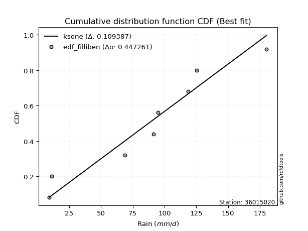</img>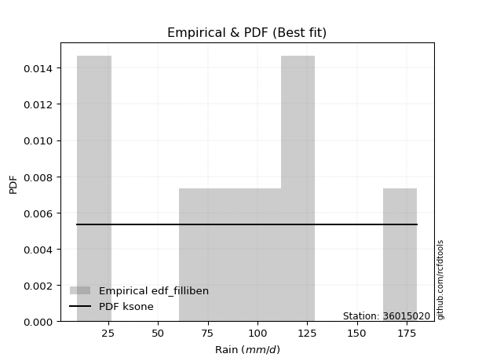</img>

</div>


### 10. EDF Jenkinson (1977)

The Jenkinson formula in hydrology is an empirical plotting position formula used to estimate the non-exceedance probability _(P)_ or return period _(T)_ of a given ordered observation within a sample. It is a widely used method in the frequency analysis of extreme events such as floods and rainfall, as it provides a distribution-free way to plot data. _a≈0.31_ and _b≈0.38_ are constants derived to approximate the median of the probability distribution for the given rank.

<div align="center">


$P=(m-a)/(n+b)$


</div>


**10.1. Empirical values**

<div align="center">

|                | 0                   | 1                   | 2                  | 3                   | 4                  | 5                  | 6                  | 7                  |
|:---------------|:--------------------|:--------------------|:-------------------|:--------------------|:-------------------|:-------------------|:-------------------|:-------------------|
| date           | 2023                | 2022                | 2018               | 2021                | 2025               | 2019               | 2020               | 2017               |
| x              | 9.5                 | 11.1                | 68.8               | 91.3                | 95.0               | 118.5              | 125.2              | 180.2              |
| m              | 1                   | 2                   | 3                  | 4                   | 5                  | 6                  | 7                  | 8                  |
| empirical_dist | edf_jenkinson       | edf_jenkinson       | edf_jenkinson      | edf_jenkinson       | edf_jenkinson      | edf_jenkinson      | edf_jenkinson      | edf_jenkinson      |
| empirical      | 0.08233890214797135 | 0.20167064439140808 | 0.3210023866348448 | 0.44033412887828155 | 0.5596658711217184 | 0.6789976133651551 | 0.7983293556085919 | 0.9176610978520287 |
| empirical_tr   | 1.0897269180754225  | 1.2526158445440956  | 1.4727592267135323 | 1.7867803837953091  | 2.2710027100271004 | 3.115241635687732  | 4.958579881656804  | 12.144927536231886 |

</div>


**10.2. Kolmogorov-Smirnov fit test (sorted by Δ)**


<div align="center">

|                | 0                   | 1                   | 2                   | 3                   | 4                   | 5                   | 6                  | 7                   | 8                   | 9                   | 10                  | 11                  | 12                  | 13                  | 14                  | 15                  | 16                  | 17                 | 18                 | 19                  | 20                  | 21                  | 22                  | 23                 | 24                  | 25                  | 26                  | 27                 | 28                  | 29                  | 30                 | 31                  | 32                  | 33                  | 34                  | 35                  | 36                  | 37                  | 38                  | 39                 | 40                  | 41                  | 42                  | 43                  | 44                 | 45                 | 46                  | 47                  | 48                  | 49                 | 50                  | 51                  | 52                  | 53                 | 54                  | 55                  | 56                 | 57                  | 58                 | 59                  | 60                  | 61                 | 62                  | 63                  | 64                  | 65                 | 66                 | 67                  | 68                  | 69                  | 70                  | 71                  | 72                  | 73                  | 74                 | 75                  | 76                  | 77                  | 78                  | 79                  | 80                  | 81                  | 82                  | 83                 | 84                 | 85                 | 86                  | 87                  | 88                  | 89                 | 90                  | 91                  | 92                  | 93                  | 94                  | 95                  | 96                 | 97                  | 98                  | 99                  | 100                | 101                 | 102                 | 103                | 104                | 105                | 106                 | 107                 | 108                 | 109                | 110                 | 111                 | 112                 | 113                | 114                 | 115                | 116                | 117                 | 118                | 119                | 120                 | 121                | 122                | 123                 | 124                 | 125                | 126                | 127                 | 128                 | 129                 | 130                | 131                 | 132                | 133                 | 134                | 135                | 136                | 137                | 138                | 139                | 140                 | 141                 | 142                | 143                | 144                 | 145                 | 146                | 147                 | 148                 | 149                | 150                | 151                | 152                | 153                | 154                | 155                | 156                | 157                | 158                | 159                |
|:---------------|:--------------------|:--------------------|:--------------------|:--------------------|:--------------------|:--------------------|:-------------------|:--------------------|:--------------------|:--------------------|:--------------------|:--------------------|:--------------------|:--------------------|:--------------------|:--------------------|:--------------------|:-------------------|:-------------------|:--------------------|:--------------------|:--------------------|:--------------------|:-------------------|:--------------------|:--------------------|:--------------------|:-------------------|:--------------------|:--------------------|:-------------------|:--------------------|:--------------------|:--------------------|:--------------------|:--------------------|:--------------------|:--------------------|:--------------------|:-------------------|:--------------------|:--------------------|:--------------------|:--------------------|:-------------------|:-------------------|:--------------------|:--------------------|:--------------------|:-------------------|:--------------------|:--------------------|:--------------------|:-------------------|:--------------------|:--------------------|:-------------------|:--------------------|:-------------------|:--------------------|:--------------------|:-------------------|:--------------------|:--------------------|:--------------------|:-------------------|:-------------------|:--------------------|:--------------------|:--------------------|:--------------------|:--------------------|:--------------------|:--------------------|:-------------------|:--------------------|:--------------------|:--------------------|:--------------------|:--------------------|:--------------------|:--------------------|:--------------------|:-------------------|:-------------------|:-------------------|:--------------------|:--------------------|:--------------------|:-------------------|:--------------------|:--------------------|:--------------------|:--------------------|:--------------------|:--------------------|:-------------------|:--------------------|:--------------------|:--------------------|:-------------------|:--------------------|:--------------------|:-------------------|:-------------------|:-------------------|:--------------------|:--------------------|:--------------------|:-------------------|:--------------------|:--------------------|:--------------------|:-------------------|:--------------------|:-------------------|:-------------------|:--------------------|:-------------------|:-------------------|:--------------------|:-------------------|:-------------------|:--------------------|:--------------------|:-------------------|:-------------------|:--------------------|:--------------------|:--------------------|:-------------------|:--------------------|:-------------------|:--------------------|:-------------------|:-------------------|:-------------------|:-------------------|:-------------------|:-------------------|:--------------------|:--------------------|:-------------------|:-------------------|:--------------------|:--------------------|:-------------------|:--------------------|:--------------------|:-------------------|:-------------------|:-------------------|:-------------------|:-------------------|:-------------------|:-------------------|:-------------------|:-------------------|:-------------------|:-------------------|
| station        | 36015020            | 36015020            | 36015020            | 36015020            | 36015020            | 36015020            | 36015020           | 36015020            | 36015020            | 36015020            | 36015020            | 36015020            | 36015020            | 36015020            | 36015020            | 36015020            | 36015020            | 36015020           | 36015020           | 36015020            | 36015020            | 36015020            | 36015020            | 36015020           | 36015020            | 36015020            | 36015020            | 36015020           | 36015020            | 36015020            | 36015020           | 36015020            | 36015020            | 36015020            | 36015020            | 36015020            | 36015020            | 36015020            | 36015020            | 36015020           | 36015020            | 36015020            | 36015020            | 36015020            | 36015020           | 36015020           | 36015020            | 36015020            | 36015020            | 36015020           | 36015020            | 36015020            | 36015020            | 36015020           | 36015020            | 36015020            | 36015020           | 36015020            | 36015020           | 36015020            | 36015020            | 36015020           | 36015020            | 36015020            | 36015020            | 36015020           | 36015020           | 36015020            | 36015020            | 36015020            | 36015020            | 36015020            | 36015020            | 36015020            | 36015020           | 36015020            | 36015020            | 36015020            | 36015020            | 36015020            | 36015020            | 36015020            | 36015020            | 36015020           | 36015020           | 36015020           | 36015020            | 36015020            | 36015020            | 36015020           | 36015020            | 36015020            | 36015020            | 36015020            | 36015020            | 36015020            | 36015020           | 36015020            | 36015020            | 36015020            | 36015020           | 36015020            | 36015020            | 36015020           | 36015020           | 36015020           | 36015020            | 36015020            | 36015020            | 36015020           | 36015020            | 36015020            | 36015020            | 36015020           | 36015020            | 36015020           | 36015020           | 36015020            | 36015020           | 36015020           | 36015020            | 36015020           | 36015020           | 36015020            | 36015020            | 36015020           | 36015020           | 36015020            | 36015020            | 36015020            | 36015020           | 36015020            | 36015020           | 36015020            | 36015020           | 36015020           | 36015020           | 36015020           | 36015020           | 36015020           | 36015020            | 36015020            | 36015020           | 36015020           | 36015020            | 36015020            | 36015020           | 36015020            | 36015020            | 36015020           | 36015020           | 36015020           | 36015020           | 36015020           | 36015020           | 36015020           | 36015020           | 36015020           | 36015020           | 36015020           |
| empirical_dist | edf_jenkinson       | edf_jenkinson       | edf_jenkinson       | edf_jenkinson       | edf_jenkinson       | edf_jenkinson       | edf_jenkinson      | edf_jenkinson       | edf_jenkinson       | edf_jenkinson       | edf_jenkinson       | edf_jenkinson       | edf_jenkinson       | edf_jenkinson       | edf_jenkinson       | edf_jenkinson       | edf_jenkinson       | edf_jenkinson      | edf_jenkinson      | edf_jenkinson       | edf_jenkinson       | edf_jenkinson       | edf_jenkinson       | edf_jenkinson      | edf_jenkinson       | edf_jenkinson       | edf_jenkinson       | edf_jenkinson      | edf_jenkinson       | edf_jenkinson       | edf_jenkinson      | edf_jenkinson       | edf_jenkinson       | edf_jenkinson       | edf_jenkinson       | edf_jenkinson       | edf_jenkinson       | edf_jenkinson       | edf_jenkinson       | edf_jenkinson      | edf_jenkinson       | edf_jenkinson       | edf_jenkinson       | edf_jenkinson       | edf_jenkinson      | edf_jenkinson      | edf_jenkinson       | edf_jenkinson       | edf_jenkinson       | edf_jenkinson      | edf_jenkinson       | edf_jenkinson       | edf_jenkinson       | edf_jenkinson      | edf_jenkinson       | edf_jenkinson       | edf_jenkinson      | edf_jenkinson       | edf_jenkinson      | edf_jenkinson       | edf_jenkinson       | edf_jenkinson      | edf_jenkinson       | edf_jenkinson       | edf_jenkinson       | edf_jenkinson      | edf_jenkinson      | edf_jenkinson       | edf_jenkinson       | edf_jenkinson       | edf_jenkinson       | edf_jenkinson       | edf_jenkinson       | edf_jenkinson       | edf_jenkinson      | edf_jenkinson       | edf_jenkinson       | edf_jenkinson       | edf_jenkinson       | edf_jenkinson       | edf_jenkinson       | edf_jenkinson       | edf_jenkinson       | edf_jenkinson      | edf_jenkinson      | edf_jenkinson      | edf_jenkinson       | edf_jenkinson       | edf_jenkinson       | edf_jenkinson      | edf_jenkinson       | edf_jenkinson       | edf_jenkinson       | edf_jenkinson       | edf_jenkinson       | edf_jenkinson       | edf_jenkinson      | edf_jenkinson       | edf_jenkinson       | edf_jenkinson       | edf_jenkinson      | edf_jenkinson       | edf_jenkinson       | edf_jenkinson      | edf_jenkinson      | edf_jenkinson      | edf_jenkinson       | edf_jenkinson       | edf_jenkinson       | edf_jenkinson      | edf_jenkinson       | edf_jenkinson       | edf_jenkinson       | edf_jenkinson      | edf_jenkinson       | edf_jenkinson      | edf_jenkinson      | edf_jenkinson       | edf_jenkinson      | edf_jenkinson      | edf_jenkinson       | edf_jenkinson      | edf_jenkinson      | edf_jenkinson       | edf_jenkinson       | edf_jenkinson      | edf_jenkinson      | edf_jenkinson       | edf_jenkinson       | edf_jenkinson       | edf_jenkinson      | edf_jenkinson       | edf_jenkinson      | edf_jenkinson       | edf_jenkinson      | edf_jenkinson      | edf_jenkinson      | edf_jenkinson      | edf_jenkinson      | edf_jenkinson      | edf_jenkinson       | edf_jenkinson       | edf_jenkinson      | edf_jenkinson      | edf_jenkinson       | edf_jenkinson       | edf_jenkinson      | edf_jenkinson       | edf_jenkinson       | edf_jenkinson      | edf_jenkinson      | edf_jenkinson      | edf_jenkinson      | edf_jenkinson      | edf_jenkinson      | edf_jenkinson      | edf_jenkinson      | edf_jenkinson      | edf_jenkinson      | edf_jenkinson      |
| p_dist         | ksone               | semicircular        | anglit              | gumbel_l            | logjohnsonsu        | genlogistic         | mielke             | genextreme          | burr                | johnsonsu           | pearson3            | logloggamma         | dweibull            | f                   | skewnorm            | exponnorm           | truncnorm           | norm               | crystalball        | t                   | gamma               | erlang              | foldnorm            | invgamma           | cosine              | betaprime           | logistic            | argus              | exponweib           | hypsecant           | laplace            | logmielke           | dgamma              | maxwell             | weibull_min         | logburr             | invgauss            | logdweibull         | rice                | loggenextreme      | gausshyper          | rayleigh            | logargus            | kstwobign           | logtrapezoid       | loggennorm         | ncf                 | loggumbel_l         | logpearson3         | logburr12          | logweibull_min      | gumbel_r            | logdgamma           | truncexpon         | logloglaplace       | genexpon            | kappa4             | bradford            | tukeylambda        | moyal               | kappa3              | loggompertz        | uniform             | wrapcauchy          | loggenpareto        | vonmises_line      | loglevy_l          | halfnorm            | arcsine             | halflogistic        | loggenhalflogistic  | logarcsine          | nakagami            | logskewnorm         | lomax              | genpareto           | logsemicircular     | loganglit           | logerlang           | lognct              | logexponnorm        | logt                | lognorm             | logcrystalball     | logf               | logfatiguelife     | lognakagami         | loggamma            | loggamma            | logtriang          | loglogistic         | logrice             | loginvgamma         | logalpha            | loghypsecant        | logwrapcauchy       | logncf             | logbetaprime        | loginvgauss         | wald                | logmaxwell         | loginvweibull       | lograyleigh         | loglaplace         | loglaplace         | logcosine          | logfoldnorm         | halfgennorm         | genhalflogistic     | johnsonsb          | logkstwobign        | triang              | loghalfnorm         | gennorm            | loggausshyper       | loggumbel_r        | loggenexpon        | levy_l              | truncweibull_min   | nct                | logksone            | loghalflogistic    | logmoyal           | loggengamma         | logweibull_max      | burr12             | loglomax           | logjohnsonsb        | logkappa3           | loguniform          | logvonmises_line   | logbradford         | beta               | gengamma            | loghalfgennorm     | logkappa4          | logbeta            | trapezoid          | logwald            | logrdist           | logtruncexpon       | logtruncweibull_min | logtukeylambda     | logexponweib       | alpha               | logtruncnorm        | invweibull         | rdist               | gompertz            | fatiguelife        | powerlaw           | logexponpow        | logpowerlaw        | truncpareto        | exponpow           | logtruncpareto     | weibull_max        | loggenlogistic     | logvonmises        | vonmises           |
| delta          | 0.10992234903484728 | 0.11082824949706649 | 0.11322388681126211 | 0.11419971505337968 | 0.11550381592701159 | 0.11636781980157755 | 0.1185030892007223 | 0.11855002143978556 | 0.11918655161227035 | 0.12212495551351676 | 0.12220395514197202 | 0.12228671049359842 | 0.12236349949946057 | 0.12285965467928546 | 0.12295192735339122 | 0.12302124678279346 | 0.12302277319362437 | 0.1230227766233039 | 0.1230227816837683 | 0.12302395578477134 | 0.12350810675702494 | 0.12369237116598569 | 0.12398853460056725 | 0.1262002413062684 | 0.12994025768266243 | 0.12995692262980907 | 0.13025346402333626 | 0.1315272213482307 | 0.13179837181010717 | 0.13289760141877566 | 0.1340041345723194 | 0.13463761075505098 | 0.13501028859999206 | 0.13902078288488834 | 0.13907934485667928 | 0.13919168451528913 | 0.14194657302069008 | 0.14290092529407694 | 0.14371725074627295 | 0.1450677961226582 | 0.14900933511074493 | 0.14967108769391674 | 0.15093170476385126 | 0.15695647012838115 | 0.1651795338765144 | 0.166024172863701  | 0.16698387800152142 | 0.16754249976739038 | 0.16817451258506566 | 0.1692760449219633 | 0.16966460523766475 | 0.16973014278888335 | 0.17474273512838737 | 0.176828784464118  | 0.17744894378268766 | 0.18295129363588022 | 0.1879788433762935 | 0.19010323325955164 | 0.1902309061592738 | 0.19086164229886726 | 0.19117227370466372 | 0.191610238523445  | 0.19229747508853756 | 0.19234569643600202 | 0.19325018342722455 | 0.193757306596407  | 0.1971849398419777 | 0.20167064439140808 | 0.20167064439140808 | 0.20167064439140808 | 0.20464793571876472 | 0.20826036497910616 | 0.20957606619389701 | 0.21473884877729904 | 0.2154686648391504 | 0.21865940758407298 | 0.22029417146249297 | 0.22331901773237284 | 0.22973358929155951 | 0.23045942982495315 | 0.23064367795956164 | 0.23064639006816567 | 0.23064643787405548 | 0.2306464445755373 | 0.2309070556805275 | 0.2309816404636138 | 0.23128732348683712 | 0.23696627512294766 | 0.23696627512294766 | 0.2371389553377199 | 0.23759764980621034 | 0.24125896906601585 | 0.24301326218696695 | 0.24552590552827436 | 0.24710465484240723 | 0.24831749815540438 | 0.2521461636277782 | 0.25299477583101604 | 0.25327055512417007 | 0.25476372780692674 | 0.2609280515894793 | 0.26488032972575637 | 0.27064172553891486 | 0.2751310211847778 | 0.2751310211847778 | 0.2776967424035717 | 0.27787956955896476 | 0.28307482375628634 | 0.28484378919741316 | 0.2916105239271835 | 0.29446993819639844 | 0.29658109934564614 | 0.29804699310835603 | 0.2983293556085919 | 0.29908955733457676 | 0.3006718144470497 | 0.3010418901779832 | 0.30896698746530304 | 0.3197287044947409 | 0.3204637553362415 | 0.32300116970219905 | 0.3253891168274322 | 0.3254556016151109 | 0.32901903667527943 | 0.33119911226315474 | 0.3348697929862625 | 0.3375309115829497 | 0.35069693850165706 | 0.35077465292968624 | 0.35180188096960785 | 0.3518807319446211 | 0.35262037980103556 | 0.3534547540402414 | 0.36259929007963243 | 0.3645901249617356 | 0.3678908890216084 | 0.3740683986514539 | 0.3758134894178495 | 0.3942246081832641 | 0.4163104279093254 | 0.42827249434029424 | 0.43485597548407495 | 0.4428038938642447 | 0.4446938390218965 | 0.44797325729206716 | 0.45286403579967727 | 0.4564111185752271 | 0.46700100722974347 | 0.49434569481644486 | 0.4983643174315495 | 0.5146023708468318 | 0.5725804495086115 | 0.6038076539774524 | 0.6175654053773267 | 0.6517533045304795 | 0.6547179294465579 | 0.6879142719194845 | 0.7983293556085919 | 1.1232897891770024 | 28.3674261053612   |
| deltao         | 0.4472608134160001  | 0.4472608134160001  | 0.4472608134160001  | 0.4472608134160001  | 0.4472608134160001  | 0.4472608134160001  | 0.4472608134160001 | 0.4472608134160001  | 0.4472608134160001  | 0.4472608134160001  | 0.4472608134160001  | 0.4472608134160001  | 0.4472608134160001  | 0.4472608134160001  | 0.4472608134160001  | 0.4472608134160001  | 0.4472608134160001  | 0.4472608134160001 | 0.4472608134160001 | 0.4472608134160001  | 0.4472608134160001  | 0.4472608134160001  | 0.4472608134160001  | 0.4472608134160001 | 0.4472608134160001  | 0.4472608134160001  | 0.4472608134160001  | 0.4472608134160001 | 0.4472608134160001  | 0.4472608134160001  | 0.4472608134160001 | 0.4472608134160001  | 0.4472608134160001  | 0.4472608134160001  | 0.4472608134160001  | 0.4472608134160001  | 0.4472608134160001  | 0.4472608134160001  | 0.4472608134160001  | 0.4472608134160001 | 0.4472608134160001  | 0.4472608134160001  | 0.4472608134160001  | 0.4472608134160001  | 0.4472608134160001 | 0.4472608134160001 | 0.4472608134160001  | 0.4472608134160001  | 0.4472608134160001  | 0.4472608134160001 | 0.4472608134160001  | 0.4472608134160001  | 0.4472608134160001  | 0.4472608134160001 | 0.4472608134160001  | 0.4472608134160001  | 0.4472608134160001 | 0.4472608134160001  | 0.4472608134160001 | 0.4472608134160001  | 0.4472608134160001  | 0.4472608134160001 | 0.4472608134160001  | 0.4472608134160001  | 0.4472608134160001  | 0.4472608134160001 | 0.4472608134160001 | 0.4472608134160001  | 0.4472608134160001  | 0.4472608134160001  | 0.4472608134160001  | 0.4472608134160001  | 0.4472608134160001  | 0.4472608134160001  | 0.4472608134160001 | 0.4472608134160001  | 0.4472608134160001  | 0.4472608134160001  | 0.4472608134160001  | 0.4472608134160001  | 0.4472608134160001  | 0.4472608134160001  | 0.4472608134160001  | 0.4472608134160001 | 0.4472608134160001 | 0.4472608134160001 | 0.4472608134160001  | 0.4472608134160001  | 0.4472608134160001  | 0.4472608134160001 | 0.4472608134160001  | 0.4472608134160001  | 0.4472608134160001  | 0.4472608134160001  | 0.4472608134160001  | 0.4472608134160001  | 0.4472608134160001 | 0.4472608134160001  | 0.4472608134160001  | 0.4472608134160001  | 0.4472608134160001 | 0.4472608134160001  | 0.4472608134160001  | 0.4472608134160001 | 0.4472608134160001 | 0.4472608134160001 | 0.4472608134160001  | 0.4472608134160001  | 0.4472608134160001  | 0.4472608134160001 | 0.4472608134160001  | 0.4472608134160001  | 0.4472608134160001  | 0.4472608134160001 | 0.4472608134160001  | 0.4472608134160001 | 0.4472608134160001 | 0.4472608134160001  | 0.4472608134160001 | 0.4472608134160001 | 0.4472608134160001  | 0.4472608134160001 | 0.4472608134160001 | 0.4472608134160001  | 0.4472608134160001  | 0.4472608134160001 | 0.4472608134160001 | 0.4472608134160001  | 0.4472608134160001  | 0.4472608134160001  | 0.4472608134160001 | 0.4472608134160001  | 0.4472608134160001 | 0.4472608134160001  | 0.4472608134160001 | 0.4472608134160001 | 0.4472608134160001 | 0.4472608134160001 | 0.4472608134160001 | 0.4472608134160001 | 0.4472608134160001  | 0.4472608134160001  | 0.4472608134160001 | 0.4472608134160001 | 0.4472608134160001  | 0.4472608134160001  | 0.4472608134160001 | 0.4472608134160001  | 0.4472608134160001  | 0.4472608134160001 | 0.4472608134160001 | 0.4472608134160001 | 0.4472608134160001 | 0.4472608134160001 | 0.4472608134160001 | 0.4472608134160001 | 0.4472608134160001 | 0.4472608134160001 | 0.4472608134160001 | 0.4472608134160001 |
| eval           | Δo > Δ              | Δo > Δ              | Δo > Δ              | Δo > Δ              | Δo > Δ              | Δo > Δ              | Δo > Δ             | Δo > Δ              | Δo > Δ              | Δo > Δ              | Δo > Δ              | Δo > Δ              | Δo > Δ              | Δo > Δ              | Δo > Δ              | Δo > Δ              | Δo > Δ              | Δo > Δ             | Δo > Δ             | Δo > Δ              | Δo > Δ              | Δo > Δ              | Δo > Δ              | Δo > Δ             | Δo > Δ              | Δo > Δ              | Δo > Δ              | Δo > Δ             | Δo > Δ              | Δo > Δ              | Δo > Δ             | Δo > Δ              | Δo > Δ              | Δo > Δ              | Δo > Δ              | Δo > Δ              | Δo > Δ              | Δo > Δ              | Δo > Δ              | Δo > Δ             | Δo > Δ              | Δo > Δ              | Δo > Δ              | Δo > Δ              | Δo > Δ             | Δo > Δ             | Δo > Δ              | Δo > Δ              | Δo > Δ              | Δo > Δ             | Δo > Δ              | Δo > Δ              | Δo > Δ              | Δo > Δ             | Δo > Δ              | Δo > Δ              | Δo > Δ             | Δo > Δ              | Δo > Δ             | Δo > Δ              | Δo > Δ              | Δo > Δ             | Δo > Δ              | Δo > Δ              | Δo > Δ              | Δo > Δ             | Δo > Δ             | Δo > Δ              | Δo > Δ              | Δo > Δ              | Δo > Δ              | Δo > Δ              | Δo > Δ              | Δo > Δ              | Δo > Δ             | Δo > Δ              | Δo > Δ              | Δo > Δ              | Δo > Δ              | Δo > Δ              | Δo > Δ              | Δo > Δ              | Δo > Δ              | Δo > Δ             | Δo > Δ             | Δo > Δ             | Δo > Δ              | Δo > Δ              | Δo > Δ              | Δo > Δ             | Δo > Δ              | Δo > Δ              | Δo > Δ              | Δo > Δ              | Δo > Δ              | Δo > Δ              | Δo > Δ             | Δo > Δ              | Δo > Δ              | Δo > Δ              | Δo > Δ             | Δo > Δ              | Δo > Δ              | Δo > Δ             | Δo > Δ             | Δo > Δ             | Δo > Δ              | Δo > Δ              | Δo > Δ              | Δo > Δ             | Δo > Δ              | Δo > Δ              | Δo > Δ              | Δo > Δ             | Δo > Δ              | Δo > Δ             | Δo > Δ             | Δo > Δ              | Δo > Δ             | Δo > Δ             | Δo > Δ              | Δo > Δ             | Δo > Δ             | Δo > Δ              | Δo > Δ              | Δo > Δ             | Δo > Δ             | Δo > Δ              | Δo > Δ              | Δo > Δ              | Δo > Δ             | Δo > Δ              | Δo > Δ             | Δo > Δ              | Δo > Δ             | Δo > Δ             | Δo > Δ             | Δo > Δ             | Δo > Δ             | Δo > Δ             | Δo > Δ              | Δo > Δ              | Δo > Δ             | Δo > Δ             | Δo <= Δ             | Δo <= Δ             | Δo <= Δ            | Δo <= Δ             | Δo <= Δ             | Δo <= Δ            | Δo <= Δ            | Δo <= Δ            | Δo <= Δ            | Δo <= Δ            | Δo <= Δ            | Δo <= Δ            | Δo <= Δ            | Δo <= Δ            | Δo <= Δ            | Δo <= Δ            |
| fit            | 1                   | 1                   | 1                   | 1                   | 1                   | 1                   | 1                  | 1                   | 1                   | 1                   | 1                   | 1                   | 1                   | 1                   | 1                   | 1                   | 1                   | 1                  | 1                  | 1                   | 1                   | 1                   | 1                   | 1                  | 1                   | 1                   | 1                   | 1                  | 1                   | 1                   | 1                  | 1                   | 1                   | 1                   | 1                   | 1                   | 1                   | 1                   | 1                   | 1                  | 1                   | 1                   | 1                   | 1                   | 1                  | 1                  | 1                   | 1                   | 1                   | 1                  | 1                   | 1                   | 1                   | 1                  | 1                   | 1                   | 1                  | 1                   | 1                  | 1                   | 1                   | 1                  | 1                   | 1                   | 1                   | 1                  | 1                  | 1                   | 1                   | 1                   | 1                   | 1                   | 1                   | 1                   | 1                  | 1                   | 1                   | 1                   | 1                   | 1                   | 1                   | 1                   | 1                   | 1                  | 1                  | 1                  | 1                   | 1                   | 1                   | 1                  | 1                   | 1                   | 1                   | 1                   | 1                   | 1                   | 1                  | 1                   | 1                   | 1                   | 1                  | 1                   | 1                   | 1                  | 1                  | 1                  | 1                   | 1                   | 1                   | 1                  | 1                   | 1                   | 1                   | 1                  | 1                   | 1                  | 1                  | 1                   | 1                  | 1                  | 1                   | 1                  | 1                  | 1                   | 1                   | 1                  | 1                  | 1                   | 1                   | 1                   | 1                  | 1                   | 1                  | 1                   | 1                  | 1                  | 1                  | 1                  | 1                  | 1                  | 1                   | 1                   | 1                  | 1                  | 0                   | 0                   | 0                  | 0                   | 0                   | 0                  | 0                  | 0                  | 0                  | 0                  | 0                  | 0                  | 0                  | 0                  | 0                  | 0                  |
| n              | 8                   | 8                   | 8                   | 8                   | 8                   | 8                   | 8                  | 8                   | 8                   | 8                   | 8                   | 8                   | 8                   | 8                   | 8                   | 8                   | 8                   | 8                  | 8                  | 8                   | 8                   | 8                   | 8                   | 8                  | 8                   | 8                   | 8                   | 8                  | 8                   | 8                   | 8                  | 8                   | 8                   | 8                   | 8                   | 8                   | 8                   | 8                   | 8                   | 8                  | 8                   | 8                   | 8                   | 8                   | 8                  | 8                  | 8                   | 8                   | 8                   | 8                  | 8                   | 8                   | 8                   | 8                  | 8                   | 8                   | 8                  | 8                   | 8                  | 8                   | 8                   | 8                  | 8                   | 8                   | 8                   | 8                  | 8                  | 8                   | 8                   | 8                   | 8                   | 8                   | 8                   | 8                   | 8                  | 8                   | 8                   | 8                   | 8                   | 8                   | 8                   | 8                   | 8                   | 8                  | 8                  | 8                  | 8                   | 8                   | 8                   | 8                  | 8                   | 8                   | 8                   | 8                   | 8                   | 8                   | 8                  | 8                   | 8                   | 8                   | 8                  | 8                   | 8                   | 8                  | 8                  | 8                  | 8                   | 8                   | 8                   | 8                  | 8                   | 8                   | 8                   | 8                  | 8                   | 8                  | 8                  | 8                   | 8                  | 8                  | 8                   | 8                  | 8                  | 8                   | 8                   | 8                  | 8                  | 8                   | 8                   | 8                   | 8                  | 8                   | 8                  | 8                   | 8                  | 8                  | 8                  | 8                  | 8                  | 8                  | 8                   | 8                   | 8                  | 8                  | 8                   | 8                   | 8                  | 8                   | 8                   | 8                  | 8                  | 8                  | 8                  | 8                  | 8                  | 8                  | 8                  | 8                  | 8                  | 8                  |
| best_fit       | 1                   | 0                   | 0                   | 0                   | 0                   | 0                   | 0                  | 0                   | 0                   | 0                   | 0                   | 0                   | 0                   | 0                   | 0                   | 0                   | 0                   | 0                  | 0                  | 0                   | 0                   | 0                   | 0                   | 0                  | 0                   | 0                   | 0                   | 0                  | 0                   | 0                   | 0                  | 0                   | 0                   | 0                   | 0                   | 0                   | 0                   | 0                   | 0                   | 0                  | 0                   | 0                   | 0                   | 0                   | 0                  | 0                  | 0                   | 0                   | 0                   | 0                  | 0                   | 0                   | 0                   | 0                  | 0                   | 0                   | 0                  | 0                   | 0                  | 0                   | 0                   | 0                  | 0                   | 0                   | 0                   | 0                  | 0                  | 0                   | 0                   | 0                   | 0                   | 0                   | 0                   | 0                   | 0                  | 0                   | 0                   | 0                   | 0                   | 0                   | 0                   | 0                   | 0                   | 0                  | 0                  | 0                  | 0                   | 0                   | 0                   | 0                  | 0                   | 0                   | 0                   | 0                   | 0                   | 0                   | 0                  | 0                   | 0                   | 0                   | 0                  | 0                   | 0                   | 0                  | 0                  | 0                  | 0                   | 0                   | 0                   | 0                  | 0                   | 0                   | 0                   | 0                  | 0                   | 0                  | 0                  | 0                   | 0                  | 0                  | 0                   | 0                  | 0                  | 0                   | 0                   | 0                  | 0                  | 0                   | 0                   | 0                   | 0                  | 0                   | 0                  | 0                   | 0                  | 0                  | 0                  | 0                  | 0                  | 0                  | 0                   | 0                   | 0                  | 0                  | 0                   | 0                   | 0                  | 0                   | 0                   | 0                  | 0                  | 0                  | 0                  | 0                  | 0                  | 0                  | 0                  | 0                  | 0                  | 0                  |
| best_fit_sort  | 1                   | 2                   | 3                   | 4                   | 5                   | 6                   | 7                  | 8                   | 9                   | 10                  | 11                  | 12                  | 13                  | 14                  | 15                  | 16                  | 17                  | 18                 | 19                 | 20                  | 21                  | 22                  | 23                  | 24                 | 25                  | 26                  | 27                  | 28                 | 29                  | 30                  | 31                 | 32                  | 33                  | 34                  | 35                  | 36                  | 37                  | 38                  | 39                  | 40                 | 41                  | 42                  | 43                  | 44                  | 45                 | 46                 | 47                  | 48                  | 49                  | 50                 | 51                  | 52                  | 53                  | 54                 | 55                  | 56                  | 57                 | 58                  | 59                 | 60                  | 61                  | 62                 | 63                  | 64                  | 65                  | 66                 | 67                 | 68                  | 69                  | 70                  | 71                  | 72                  | 73                  | 74                  | 75                 | 76                  | 77                  | 78                  | 79                  | 80                  | 81                  | 82                  | 83                  | 84                 | 85                 | 86                 | 87                  | 88                  | 89                  | 90                 | 91                  | 92                  | 93                  | 94                  | 95                  | 96                  | 97                 | 98                  | 99                  | 100                 | 101                | 102                 | 103                 | 104                | 105                | 106                | 107                 | 108                 | 109                 | 110                | 111                 | 112                 | 113                 | 114                | 115                 | 116                | 117                | 118                 | 119                | 120                | 121                 | 122                | 123                | 124                 | 125                 | 126                | 127                | 128                 | 129                 | 130                 | 131                | 132                 | 133                | 134                 | 135                | 136                | 137                | 138                | 139                | 140                | 141                 | 142                 | 143                | 144                | 145                 | 146                 | 147                | 148                 | 149                 | 150                | 151                | 152                | 153                | 154                | 155                | 156                | 157                | 158                | 159                | 160                |

</div>


**10.3. Best fit**

<div align="center">

|   id |   station | empirical_dist   | p_dist   |    delta |   deltao | eval   |   fit |   n |   best_fit |   best_fit_sort |
|-----:|----------:|:-----------------|:---------|---------:|---------:|:-------|------:|----:|-----------:|----------------:|
|    0 |  36015020 | edf_jenkinson    | ksone    | 0.109922 | 0.447261 | Δo > Δ |     1 |   8 |          1 |               1 |

</div>


<div align="center">

</img>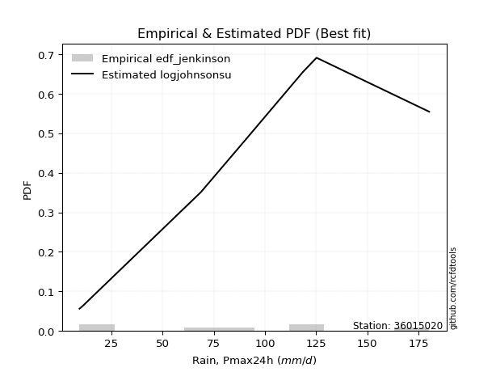</img>

</div>


### 11. EDF Cunnane (1978)

Cunnane´s work in statistical hydrology has focused on the performance and evaluation of different probability distributions (such as GEV, Gumbel, Lognormal) for flood frequency estimation. _b_ is a constant, typically set to 0.4.

<div align="center">


$P=(m-b)/(n+1-2b)$


</div>


**11.1. Empirical values**

<div align="center">

|                | 0                   | 1                   | 2                  | 3                  | 4                  | 5                  | 6                  | 7                  |
|:---------------|:--------------------|:--------------------|:-------------------|:-------------------|:-------------------|:-------------------|:-------------------|:-------------------|
| date           | 2023                | 2022                | 2018               | 2021               | 2025               | 2019               | 2020               | 2017               |
| x              | 9.5                 | 11.1                | 68.8               | 91.3               | 95.0               | 118.5              | 125.2              | 180.2              |
| m              | 1                   | 2                   | 3                  | 4                  | 5                  | 6                  | 7                  | 8                  |
| empirical_dist | edf_cunnane         | edf_cunnane         | edf_cunnane        | edf_cunnane        | edf_cunnane        | edf_cunnane        | edf_cunnane        | edf_cunnane        |
| empirical      | 0.07317073170731708 | 0.19512195121951223 | 0.3170731707317074 | 0.4390243902439025 | 0.5609756097560976 | 0.6829268292682927 | 0.8048780487804879 | 0.926829268292683  |
| empirical_tr   | 1.0789473684210527  | 1.2424242424242424  | 1.4642857142857144 | 1.782608695652174  | 2.277777777777778  | 3.153846153846154  | 5.125000000000001  | 13.666666666666675 |

</div>


**11.2. Kolmogorov-Smirnov fit test (sorted by Δ)**


<div align="center">

|                | 0                   | 1                   | 2                   | 3                   | 4                   | 5                  | 6                   | 7                   | 8                  | 9                   | 10                  | 11                  | 12                  | 13                 | 14                  | 15                 | 16                  | 17                  | 18                  | 19                  | 20                  | 21                  | 22                 | 23                  | 24                  | 25                  | 26                  | 27                  | 28                  | 29                 | 30                  | 31                 | 32                  | 33                  | 34                  | 35                  | 36                  | 37                  | 38                  | 39                  | 40                 | 41                  | 42                  | 43                 | 44                  | 45                 | 46                 | 47                  | 48                  | 49                  | 50                  | 51                  | 52                 | 53                 | 54                 | 55                  | 56                 | 57                  | 58                  | 59                  | 60                 | 61                  | 62                  | 63                  | 64                  | 65                  | 66                  | 67                  | 68                 | 69                  | 70                  | 71                 | 72                  | 73                 | 74                  | 75                 | 76                  | 77                  | 78                  | 79                 | 80                  | 81                 | 82                  | 83                  | 84                  | 85                  | 86                  | 87                 | 88                 | 89                  | 90                  | 91                 | 92                 | 93                 | 94                 | 95                 | 96                 | 97                  | 98                 | 99                 | 100                 | 101                | 102                | 103                 | 104                 | 105                | 106                | 107                | 108                 | 109                | 110                | 111                 | 112                | 113                 | 114                 | 115                 | 116                 | 117                | 118                 | 119                 | 120                | 121                 | 122                 | 123                 | 124                 | 125                 | 126                | 127                | 128                | 129                 | 130                | 131                 | 132                 | 133                 | 134                 | 135                | 136                | 137                 | 138                 | 139                | 140                | 141                 | 142                | 143                 | 144                | 145                | 146                | 147                 | 148                | 149                | 150                | 151                | 152                | 153                | 154                | 155                | 156                | 157                | 158                | 159                |
|:---------------|:--------------------|:--------------------|:--------------------|:--------------------|:--------------------|:-------------------|:--------------------|:--------------------|:-------------------|:--------------------|:--------------------|:--------------------|:--------------------|:-------------------|:--------------------|:-------------------|:--------------------|:--------------------|:--------------------|:--------------------|:--------------------|:--------------------|:-------------------|:--------------------|:--------------------|:--------------------|:--------------------|:--------------------|:--------------------|:-------------------|:--------------------|:-------------------|:--------------------|:--------------------|:--------------------|:--------------------|:--------------------|:--------------------|:--------------------|:--------------------|:-------------------|:--------------------|:--------------------|:-------------------|:--------------------|:-------------------|:-------------------|:--------------------|:--------------------|:--------------------|:--------------------|:--------------------|:-------------------|:-------------------|:-------------------|:--------------------|:-------------------|:--------------------|:--------------------|:--------------------|:-------------------|:--------------------|:--------------------|:--------------------|:--------------------|:--------------------|:--------------------|:--------------------|:-------------------|:--------------------|:--------------------|:-------------------|:--------------------|:-------------------|:--------------------|:-------------------|:--------------------|:--------------------|:--------------------|:-------------------|:--------------------|:-------------------|:--------------------|:--------------------|:--------------------|:--------------------|:--------------------|:-------------------|:-------------------|:--------------------|:--------------------|:-------------------|:-------------------|:-------------------|:-------------------|:-------------------|:-------------------|:--------------------|:-------------------|:-------------------|:--------------------|:-------------------|:-------------------|:--------------------|:--------------------|:-------------------|:-------------------|:-------------------|:--------------------|:-------------------|:-------------------|:--------------------|:-------------------|:--------------------|:--------------------|:--------------------|:--------------------|:-------------------|:--------------------|:--------------------|:-------------------|:--------------------|:--------------------|:--------------------|:--------------------|:--------------------|:-------------------|:-------------------|:-------------------|:--------------------|:-------------------|:--------------------|:--------------------|:--------------------|:--------------------|:-------------------|:-------------------|:--------------------|:--------------------|:-------------------|:-------------------|:--------------------|:-------------------|:--------------------|:-------------------|:-------------------|:-------------------|:--------------------|:-------------------|:-------------------|:-------------------|:-------------------|:-------------------|:-------------------|:-------------------|:-------------------|:-------------------|:-------------------|:-------------------|:-------------------|
| station        | 36015020            | 36015020            | 36015020            | 36015020            | 36015020            | 36015020           | 36015020            | 36015020            | 36015020           | 36015020            | 36015020            | 36015020            | 36015020            | 36015020           | 36015020            | 36015020           | 36015020            | 36015020            | 36015020            | 36015020            | 36015020            | 36015020            | 36015020           | 36015020            | 36015020            | 36015020            | 36015020            | 36015020            | 36015020            | 36015020           | 36015020            | 36015020           | 36015020            | 36015020            | 36015020            | 36015020            | 36015020            | 36015020            | 36015020            | 36015020            | 36015020           | 36015020            | 36015020            | 36015020           | 36015020            | 36015020           | 36015020           | 36015020            | 36015020            | 36015020            | 36015020            | 36015020            | 36015020           | 36015020           | 36015020           | 36015020            | 36015020           | 36015020            | 36015020            | 36015020            | 36015020           | 36015020            | 36015020            | 36015020            | 36015020            | 36015020            | 36015020            | 36015020            | 36015020           | 36015020            | 36015020            | 36015020           | 36015020            | 36015020           | 36015020            | 36015020           | 36015020            | 36015020            | 36015020            | 36015020           | 36015020            | 36015020           | 36015020            | 36015020            | 36015020            | 36015020            | 36015020            | 36015020           | 36015020           | 36015020            | 36015020            | 36015020           | 36015020           | 36015020           | 36015020           | 36015020           | 36015020           | 36015020            | 36015020           | 36015020           | 36015020            | 36015020           | 36015020           | 36015020            | 36015020            | 36015020           | 36015020           | 36015020           | 36015020            | 36015020           | 36015020           | 36015020            | 36015020           | 36015020            | 36015020            | 36015020            | 36015020            | 36015020           | 36015020            | 36015020            | 36015020           | 36015020            | 36015020            | 36015020            | 36015020            | 36015020            | 36015020           | 36015020           | 36015020           | 36015020            | 36015020           | 36015020            | 36015020            | 36015020            | 36015020            | 36015020           | 36015020           | 36015020            | 36015020            | 36015020           | 36015020           | 36015020            | 36015020           | 36015020            | 36015020           | 36015020           | 36015020           | 36015020            | 36015020           | 36015020           | 36015020           | 36015020           | 36015020           | 36015020           | 36015020           | 36015020           | 36015020           | 36015020           | 36015020           | 36015020           |
| empirical_dist | edf_cunnane         | edf_cunnane         | edf_cunnane         | edf_cunnane         | edf_cunnane         | edf_cunnane        | edf_cunnane         | edf_cunnane         | edf_cunnane        | edf_cunnane         | edf_cunnane         | edf_cunnane         | edf_cunnane         | edf_cunnane        | edf_cunnane         | edf_cunnane        | edf_cunnane         | edf_cunnane         | edf_cunnane         | edf_cunnane         | edf_cunnane         | edf_cunnane         | edf_cunnane        | edf_cunnane         | edf_cunnane         | edf_cunnane         | edf_cunnane         | edf_cunnane         | edf_cunnane         | edf_cunnane        | edf_cunnane         | edf_cunnane        | edf_cunnane         | edf_cunnane         | edf_cunnane         | edf_cunnane         | edf_cunnane         | edf_cunnane         | edf_cunnane         | edf_cunnane         | edf_cunnane        | edf_cunnane         | edf_cunnane         | edf_cunnane        | edf_cunnane         | edf_cunnane        | edf_cunnane        | edf_cunnane         | edf_cunnane         | edf_cunnane         | edf_cunnane         | edf_cunnane         | edf_cunnane        | edf_cunnane        | edf_cunnane        | edf_cunnane         | edf_cunnane        | edf_cunnane         | edf_cunnane         | edf_cunnane         | edf_cunnane        | edf_cunnane         | edf_cunnane         | edf_cunnane         | edf_cunnane         | edf_cunnane         | edf_cunnane         | edf_cunnane         | edf_cunnane        | edf_cunnane         | edf_cunnane         | edf_cunnane        | edf_cunnane         | edf_cunnane        | edf_cunnane         | edf_cunnane        | edf_cunnane         | edf_cunnane         | edf_cunnane         | edf_cunnane        | edf_cunnane         | edf_cunnane        | edf_cunnane         | edf_cunnane         | edf_cunnane         | edf_cunnane         | edf_cunnane         | edf_cunnane        | edf_cunnane        | edf_cunnane         | edf_cunnane         | edf_cunnane        | edf_cunnane        | edf_cunnane        | edf_cunnane        | edf_cunnane        | edf_cunnane        | edf_cunnane         | edf_cunnane        | edf_cunnane        | edf_cunnane         | edf_cunnane        | edf_cunnane        | edf_cunnane         | edf_cunnane         | edf_cunnane        | edf_cunnane        | edf_cunnane        | edf_cunnane         | edf_cunnane        | edf_cunnane        | edf_cunnane         | edf_cunnane        | edf_cunnane         | edf_cunnane         | edf_cunnane         | edf_cunnane         | edf_cunnane        | edf_cunnane         | edf_cunnane         | edf_cunnane        | edf_cunnane         | edf_cunnane         | edf_cunnane         | edf_cunnane         | edf_cunnane         | edf_cunnane        | edf_cunnane        | edf_cunnane        | edf_cunnane         | edf_cunnane        | edf_cunnane         | edf_cunnane         | edf_cunnane         | edf_cunnane         | edf_cunnane        | edf_cunnane        | edf_cunnane         | edf_cunnane         | edf_cunnane        | edf_cunnane        | edf_cunnane         | edf_cunnane        | edf_cunnane         | edf_cunnane        | edf_cunnane        | edf_cunnane        | edf_cunnane         | edf_cunnane        | edf_cunnane        | edf_cunnane        | edf_cunnane        | edf_cunnane        | edf_cunnane        | edf_cunnane        | edf_cunnane        | edf_cunnane        | edf_cunnane        | edf_cunnane        | edf_cunnane        |
| p_dist         | ksone               | semicircular        | anglit              | gumbel_l            | logjohnsonsu        | genlogistic        | mielke              | genextreme          | burr               | johnsonsu           | pearson3            | logloggamma         | dweibull            | f                  | skewnorm            | exponnorm          | truncnorm           | norm                | crystalball         | t                   | gamma               | erlang              | foldnorm           | cosine              | betaprime           | logistic            | invgamma            | hypsecant           | laplace             | dgamma             | maxwell             | weibull_min        | exponweib           | logmielke           | rice                | argus               | logburr             | gausshyper          | rayleigh            | invgauss            | logargus           | logdweibull         | loggenextreme       | kstwobign          | loggennorm          | gumbel_r           | logdgamma          | ncf                 | loggumbel_l         | logtrapezoid        | truncexpon          | logburr12           | logweibull_min     | logpearson3        | logloglaplace      | kappa4              | bradford           | tukeylambda         | kappa3              | moyal               | uniform            | wrapcauchy          | genexpon            | vonmises_line       | loggompertz         | halfnorm            | arcsine             | halflogistic        | loggenpareto       | loglevy_l           | loggenhalflogistic  | logarcsine         | nakagami            | logskewnorm        | lomax               | logsemicircular    | genpareto           | loganglit           | logerlang           | lognct             | logexponnorm        | logt               | lognorm             | logcrystalball      | logf                | logfatiguelife      | lognakagami         | loggamma           | loggamma           | logtriang           | loglogistic         | logrice            | loginvgamma        | loghypsecant       | logalpha           | logwrapcauchy      | wald               | logncf              | logbetaprime       | loginvgauss        | logmaxwell          | loginvweibull      | lograyleigh        | loglaplace          | loglaplace          | logcosine          | logfoldnorm        | halfgennorm        | genhalflogistic     | logkstwobign       | johnsonsb          | loghalfnorm         | loggausshyper      | triang              | loggumbel_r         | gennorm             | loggenexpon         | levy_l             | truncweibull_min    | nct                 | logksone           | loghalflogistic     | logmoyal            | loggengamma         | logweibull_max      | burr12              | loglomax           | logkappa3          | loguniform         | logvonmises_line    | logbradford        | logjohnsonsb        | beta                | gengamma            | loghalfgennorm      | logkappa4          | logbeta            | trapezoid           | logwald             | logrdist           | logtruncexpon      | logtruncweibull_min | logtukeylambda     | logexponweib        | alpha              | logtruncnorm       | invweibull         | rdist               | gompertz           | fatiguelife        | powerlaw           | logexponpow        | logpowerlaw        | truncpareto        | exponpow           | logtruncpareto     | weibull_max        | loggenlogistic     | logvonmises        | vonmises           |
| delta          | 0.10337365586295143 | 0.10427955632517064 | 0.10667519363936626 | 0.10765102188148383 | 0.10895512275511574 | 0.1098191266296817 | 0.11195439602882645 | 0.11200132826788971 | 0.1126378584403745 | 0.11557626234162091 | 0.11565526197007617 | 0.11573801732170257 | 0.11581480632756472 | 0.1163109615073896 | 0.11640323418149537 | 0.1164725536108976 | 0.11647408002172852 | 0.11647408345140804 | 0.11647408851187245 | 0.11647526261287548 | 0.11695941358512908 | 0.11714367799408984 | 0.1174398414286714 | 0.12339156451076658 | 0.12340822945791323 | 0.12370477085144041 | 0.12469784014869245 | 0.12634890824687978 | 0.12745544140042359 | 0.1284615954280962 | 0.13247208971299249 | 0.1325306516847834 | 0.13310811044448623 | 0.13355937894604697 | 0.13716855757437707 | 0.13807591452012669 | 0.14050142314966818 | 0.14246064193884908 | 0.14312239452202088 | 0.14325631165506914 | 0.1443830115919554 | 0.14580545745163975 | 0.15161648929455418 | 0.1582662087627602 | 0.15947547969180514 | 0.1631814496169875 | 0.1681940419564915 | 0.16829361663590048 | 0.16885223840176944 | 0.16910874977965185 | 0.17028009129222216 | 0.17058578355634235 | 0.1709743438720438 | 0.1721037284882031 | 0.1812682292932435 | 0.18143015020439765 | 0.1835545400876558 | 0.18368221298737794 | 0.18462358053276787 | 0.18547019910780904 | 0.1857487819166417 | 0.18579700326410617 | 0.18652268734580035 | 0.18720861342451114 | 0.19291997715782405 | 0.19512195121951223 | 0.19512195121951223 | 0.19512195121951223 | 0.197179399330362  | 0.20635311028263198 | 0.20857715162190216 | 0.2121895808822436 | 0.21350528209703445 | 0.2160485874116781 | 0.21939788074228783 | 0.2242233873656304 | 0.22520810075596898 | 0.22724823363551028 | 0.23366280519469695 | 0.2343886457280906 | 0.23457289386269908 | 0.2345756059713031 | 0.23457565377719292 | 0.23457566047867473 | 0.23483627158366494 | 0.23491085636675124 | 0.23521653938997455 | 0.2408954910260851 | 0.2408954910260851 | 0.24106817124085733 | 0.24152686570934778 | 0.2451881849691533 | 0.2469424780901044 | 0.2484143934767863 | 0.2494551214314118 | 0.2522467140585418 | 0.2560734664413058 | 0.25607537953091564 | 0.2569239917341535 | 0.2571997710273075 | 0.26485726749261673 | 0.2688095456288938 | 0.2745709414420523 | 0.27644075981915683 | 0.27644075981915683 | 0.2816259583067091 | 0.2818087854621022 | 0.2870040396594238 | 0.29139248236930915 | 0.2983991540995359 | 0.3007786943678378 | 0.30197620901149347 | 0.3030187732377142 | 0.30312979251754213 | 0.30460103035018715 | 0.30487804878048785 | 0.30497110608112066 | 0.3181351579059573 | 0.32365792039787833 | 0.32439297123937894 | 0.3269303856053365 | 0.32931833273056965 | 0.32938481751824833 | 0.33294825257841687 | 0.33774780543505073 | 0.33879900888939996 | 0.3414601274860871 | 0.3547038688328237 | 0.3557310968727453 | 0.35580994784775855 | 0.356549595704173  | 0.35724563167355305 | 0.35738396994337884 | 0.36652850598276987 | 0.36851934086487304 | 0.3718201049247458 | 0.3806170918233499 | 0.38236218258974547 | 0.39815382408640154 | 0.4202396438124628 | 0.4322017102434317 | 0.4387851913872124  | 0.4467331097673821 | 0.44862305492503396 | 0.4519024731952046 | 0.4567932517028147 | 0.4655792890158814 | 0.47616917767039774 | 0.4975380209609049 | 0.502293533334687  | 0.5185315867499692 | 0.576509665411749  | 0.6077368698805898 | 0.6214946212804642 | 0.655682520433617  | 0.6586471453496954 | 0.6944629650913805 | 0.8048780487804879 | 1.1272190050801398 | 28.358257934920548 |
| deltao         | 0.4472608134160001  | 0.4472608134160001  | 0.4472608134160001  | 0.4472608134160001  | 0.4472608134160001  | 0.4472608134160001 | 0.4472608134160001  | 0.4472608134160001  | 0.4472608134160001 | 0.4472608134160001  | 0.4472608134160001  | 0.4472608134160001  | 0.4472608134160001  | 0.4472608134160001 | 0.4472608134160001  | 0.4472608134160001 | 0.4472608134160001  | 0.4472608134160001  | 0.4472608134160001  | 0.4472608134160001  | 0.4472608134160001  | 0.4472608134160001  | 0.4472608134160001 | 0.4472608134160001  | 0.4472608134160001  | 0.4472608134160001  | 0.4472608134160001  | 0.4472608134160001  | 0.4472608134160001  | 0.4472608134160001 | 0.4472608134160001  | 0.4472608134160001 | 0.4472608134160001  | 0.4472608134160001  | 0.4472608134160001  | 0.4472608134160001  | 0.4472608134160001  | 0.4472608134160001  | 0.4472608134160001  | 0.4472608134160001  | 0.4472608134160001 | 0.4472608134160001  | 0.4472608134160001  | 0.4472608134160001 | 0.4472608134160001  | 0.4472608134160001 | 0.4472608134160001 | 0.4472608134160001  | 0.4472608134160001  | 0.4472608134160001  | 0.4472608134160001  | 0.4472608134160001  | 0.4472608134160001 | 0.4472608134160001 | 0.4472608134160001 | 0.4472608134160001  | 0.4472608134160001 | 0.4472608134160001  | 0.4472608134160001  | 0.4472608134160001  | 0.4472608134160001 | 0.4472608134160001  | 0.4472608134160001  | 0.4472608134160001  | 0.4472608134160001  | 0.4472608134160001  | 0.4472608134160001  | 0.4472608134160001  | 0.4472608134160001 | 0.4472608134160001  | 0.4472608134160001  | 0.4472608134160001 | 0.4472608134160001  | 0.4472608134160001 | 0.4472608134160001  | 0.4472608134160001 | 0.4472608134160001  | 0.4472608134160001  | 0.4472608134160001  | 0.4472608134160001 | 0.4472608134160001  | 0.4472608134160001 | 0.4472608134160001  | 0.4472608134160001  | 0.4472608134160001  | 0.4472608134160001  | 0.4472608134160001  | 0.4472608134160001 | 0.4472608134160001 | 0.4472608134160001  | 0.4472608134160001  | 0.4472608134160001 | 0.4472608134160001 | 0.4472608134160001 | 0.4472608134160001 | 0.4472608134160001 | 0.4472608134160001 | 0.4472608134160001  | 0.4472608134160001 | 0.4472608134160001 | 0.4472608134160001  | 0.4472608134160001 | 0.4472608134160001 | 0.4472608134160001  | 0.4472608134160001  | 0.4472608134160001 | 0.4472608134160001 | 0.4472608134160001 | 0.4472608134160001  | 0.4472608134160001 | 0.4472608134160001 | 0.4472608134160001  | 0.4472608134160001 | 0.4472608134160001  | 0.4472608134160001  | 0.4472608134160001  | 0.4472608134160001  | 0.4472608134160001 | 0.4472608134160001  | 0.4472608134160001  | 0.4472608134160001 | 0.4472608134160001  | 0.4472608134160001  | 0.4472608134160001  | 0.4472608134160001  | 0.4472608134160001  | 0.4472608134160001 | 0.4472608134160001 | 0.4472608134160001 | 0.4472608134160001  | 0.4472608134160001 | 0.4472608134160001  | 0.4472608134160001  | 0.4472608134160001  | 0.4472608134160001  | 0.4472608134160001 | 0.4472608134160001 | 0.4472608134160001  | 0.4472608134160001  | 0.4472608134160001 | 0.4472608134160001 | 0.4472608134160001  | 0.4472608134160001 | 0.4472608134160001  | 0.4472608134160001 | 0.4472608134160001 | 0.4472608134160001 | 0.4472608134160001  | 0.4472608134160001 | 0.4472608134160001 | 0.4472608134160001 | 0.4472608134160001 | 0.4472608134160001 | 0.4472608134160001 | 0.4472608134160001 | 0.4472608134160001 | 0.4472608134160001 | 0.4472608134160001 | 0.4472608134160001 | 0.4472608134160001 |
| eval           | Δo > Δ              | Δo > Δ              | Δo > Δ              | Δo > Δ              | Δo > Δ              | Δo > Δ             | Δo > Δ              | Δo > Δ              | Δo > Δ             | Δo > Δ              | Δo > Δ              | Δo > Δ              | Δo > Δ              | Δo > Δ             | Δo > Δ              | Δo > Δ             | Δo > Δ              | Δo > Δ              | Δo > Δ              | Δo > Δ              | Δo > Δ              | Δo > Δ              | Δo > Δ             | Δo > Δ              | Δo > Δ              | Δo > Δ              | Δo > Δ              | Δo > Δ              | Δo > Δ              | Δo > Δ             | Δo > Δ              | Δo > Δ             | Δo > Δ              | Δo > Δ              | Δo > Δ              | Δo > Δ              | Δo > Δ              | Δo > Δ              | Δo > Δ              | Δo > Δ              | Δo > Δ             | Δo > Δ              | Δo > Δ              | Δo > Δ             | Δo > Δ              | Δo > Δ             | Δo > Δ             | Δo > Δ              | Δo > Δ              | Δo > Δ              | Δo > Δ              | Δo > Δ              | Δo > Δ             | Δo > Δ             | Δo > Δ             | Δo > Δ              | Δo > Δ             | Δo > Δ              | Δo > Δ              | Δo > Δ              | Δo > Δ             | Δo > Δ              | Δo > Δ              | Δo > Δ              | Δo > Δ              | Δo > Δ              | Δo > Δ              | Δo > Δ              | Δo > Δ             | Δo > Δ              | Δo > Δ              | Δo > Δ             | Δo > Δ              | Δo > Δ             | Δo > Δ              | Δo > Δ             | Δo > Δ              | Δo > Δ              | Δo > Δ              | Δo > Δ             | Δo > Δ              | Δo > Δ             | Δo > Δ              | Δo > Δ              | Δo > Δ              | Δo > Δ              | Δo > Δ              | Δo > Δ             | Δo > Δ             | Δo > Δ              | Δo > Δ              | Δo > Δ             | Δo > Δ             | Δo > Δ             | Δo > Δ             | Δo > Δ             | Δo > Δ             | Δo > Δ              | Δo > Δ             | Δo > Δ             | Δo > Δ              | Δo > Δ             | Δo > Δ             | Δo > Δ              | Δo > Δ              | Δo > Δ             | Δo > Δ             | Δo > Δ             | Δo > Δ              | Δo > Δ             | Δo > Δ             | Δo > Δ              | Δo > Δ             | Δo > Δ              | Δo > Δ              | Δo > Δ              | Δo > Δ              | Δo > Δ             | Δo > Δ              | Δo > Δ              | Δo > Δ             | Δo > Δ              | Δo > Δ              | Δo > Δ              | Δo > Δ              | Δo > Δ              | Δo > Δ             | Δo > Δ             | Δo > Δ             | Δo > Δ              | Δo > Δ             | Δo > Δ              | Δo > Δ              | Δo > Δ              | Δo > Δ              | Δo > Δ             | Δo > Δ             | Δo > Δ              | Δo > Δ              | Δo > Δ             | Δo > Δ             | Δo > Δ              | Δo > Δ             | Δo <= Δ             | Δo <= Δ            | Δo <= Δ            | Δo <= Δ            | Δo <= Δ             | Δo <= Δ            | Δo <= Δ            | Δo <= Δ            | Δo <= Δ            | Δo <= Δ            | Δo <= Δ            | Δo <= Δ            | Δo <= Δ            | Δo <= Δ            | Δo <= Δ            | Δo <= Δ            | Δo <= Δ            |
| fit            | 1                   | 1                   | 1                   | 1                   | 1                   | 1                  | 1                   | 1                   | 1                  | 1                   | 1                   | 1                   | 1                   | 1                  | 1                   | 1                  | 1                   | 1                   | 1                   | 1                   | 1                   | 1                   | 1                  | 1                   | 1                   | 1                   | 1                   | 1                   | 1                   | 1                  | 1                   | 1                  | 1                   | 1                   | 1                   | 1                   | 1                   | 1                   | 1                   | 1                   | 1                  | 1                   | 1                   | 1                  | 1                   | 1                  | 1                  | 1                   | 1                   | 1                   | 1                   | 1                   | 1                  | 1                  | 1                  | 1                   | 1                  | 1                   | 1                   | 1                   | 1                  | 1                   | 1                   | 1                   | 1                   | 1                   | 1                   | 1                   | 1                  | 1                   | 1                   | 1                  | 1                   | 1                  | 1                   | 1                  | 1                   | 1                   | 1                   | 1                  | 1                   | 1                  | 1                   | 1                   | 1                   | 1                   | 1                   | 1                  | 1                  | 1                   | 1                   | 1                  | 1                  | 1                  | 1                  | 1                  | 1                  | 1                   | 1                  | 1                  | 1                   | 1                  | 1                  | 1                   | 1                   | 1                  | 1                  | 1                  | 1                   | 1                  | 1                  | 1                   | 1                  | 1                   | 1                   | 1                   | 1                   | 1                  | 1                   | 1                   | 1                  | 1                   | 1                   | 1                   | 1                   | 1                   | 1                  | 1                  | 1                  | 1                   | 1                  | 1                   | 1                   | 1                   | 1                   | 1                  | 1                  | 1                   | 1                   | 1                  | 1                  | 1                   | 1                  | 0                   | 0                  | 0                  | 0                  | 0                   | 0                  | 0                  | 0                  | 0                  | 0                  | 0                  | 0                  | 0                  | 0                  | 0                  | 0                  | 0                  |
| n              | 8                   | 8                   | 8                   | 8                   | 8                   | 8                  | 8                   | 8                   | 8                  | 8                   | 8                   | 8                   | 8                   | 8                  | 8                   | 8                  | 8                   | 8                   | 8                   | 8                   | 8                   | 8                   | 8                  | 8                   | 8                   | 8                   | 8                   | 8                   | 8                   | 8                  | 8                   | 8                  | 8                   | 8                   | 8                   | 8                   | 8                   | 8                   | 8                   | 8                   | 8                  | 8                   | 8                   | 8                  | 8                   | 8                  | 8                  | 8                   | 8                   | 8                   | 8                   | 8                   | 8                  | 8                  | 8                  | 8                   | 8                  | 8                   | 8                   | 8                   | 8                  | 8                   | 8                   | 8                   | 8                   | 8                   | 8                   | 8                   | 8                  | 8                   | 8                   | 8                  | 8                   | 8                  | 8                   | 8                  | 8                   | 8                   | 8                   | 8                  | 8                   | 8                  | 8                   | 8                   | 8                   | 8                   | 8                   | 8                  | 8                  | 8                   | 8                   | 8                  | 8                  | 8                  | 8                  | 8                  | 8                  | 8                   | 8                  | 8                  | 8                   | 8                  | 8                  | 8                   | 8                   | 8                  | 8                  | 8                  | 8                   | 8                  | 8                  | 8                   | 8                  | 8                   | 8                   | 8                   | 8                   | 8                  | 8                   | 8                   | 8                  | 8                   | 8                   | 8                   | 8                   | 8                   | 8                  | 8                  | 8                  | 8                   | 8                  | 8                   | 8                   | 8                   | 8                   | 8                  | 8                  | 8                   | 8                   | 8                  | 8                  | 8                   | 8                  | 8                   | 8                  | 8                  | 8                  | 8                   | 8                  | 8                  | 8                  | 8                  | 8                  | 8                  | 8                  | 8                  | 8                  | 8                  | 8                  | 8                  |
| best_fit       | 1                   | 0                   | 0                   | 0                   | 0                   | 0                  | 0                   | 0                   | 0                  | 0                   | 0                   | 0                   | 0                   | 0                  | 0                   | 0                  | 0                   | 0                   | 0                   | 0                   | 0                   | 0                   | 0                  | 0                   | 0                   | 0                   | 0                   | 0                   | 0                   | 0                  | 0                   | 0                  | 0                   | 0                   | 0                   | 0                   | 0                   | 0                   | 0                   | 0                   | 0                  | 0                   | 0                   | 0                  | 0                   | 0                  | 0                  | 0                   | 0                   | 0                   | 0                   | 0                   | 0                  | 0                  | 0                  | 0                   | 0                  | 0                   | 0                   | 0                   | 0                  | 0                   | 0                   | 0                   | 0                   | 0                   | 0                   | 0                   | 0                  | 0                   | 0                   | 0                  | 0                   | 0                  | 0                   | 0                  | 0                   | 0                   | 0                   | 0                  | 0                   | 0                  | 0                   | 0                   | 0                   | 0                   | 0                   | 0                  | 0                  | 0                   | 0                   | 0                  | 0                  | 0                  | 0                  | 0                  | 0                  | 0                   | 0                  | 0                  | 0                   | 0                  | 0                  | 0                   | 0                   | 0                  | 0                  | 0                  | 0                   | 0                  | 0                  | 0                   | 0                  | 0                   | 0                   | 0                   | 0                   | 0                  | 0                   | 0                   | 0                  | 0                   | 0                   | 0                   | 0                   | 0                   | 0                  | 0                  | 0                  | 0                   | 0                  | 0                   | 0                   | 0                   | 0                   | 0                  | 0                  | 0                   | 0                   | 0                  | 0                  | 0                   | 0                  | 0                   | 0                  | 0                  | 0                  | 0                   | 0                  | 0                  | 0                  | 0                  | 0                  | 0                  | 0                  | 0                  | 0                  | 0                  | 0                  | 0                  |
| best_fit_sort  | 1                   | 2                   | 3                   | 4                   | 5                   | 6                  | 7                   | 8                   | 9                  | 10                  | 11                  | 12                  | 13                  | 14                 | 15                  | 16                 | 17                  | 18                  | 19                  | 20                  | 21                  | 22                  | 23                 | 24                  | 25                  | 26                  | 27                  | 28                  | 29                  | 30                 | 31                  | 32                 | 33                  | 34                  | 35                  | 36                  | 37                  | 38                  | 39                  | 40                  | 41                 | 42                  | 43                  | 44                 | 45                  | 46                 | 47                 | 48                  | 49                  | 50                  | 51                  | 52                  | 53                 | 54                 | 55                 | 56                  | 57                 | 58                  | 59                  | 60                  | 61                 | 62                  | 63                  | 64                  | 65                  | 66                  | 67                  | 68                  | 69                 | 70                  | 71                  | 72                 | 73                  | 74                 | 75                  | 76                 | 77                  | 78                  | 79                  | 80                 | 81                  | 82                 | 83                  | 84                  | 85                  | 86                  | 87                  | 88                 | 89                 | 90                  | 91                  | 92                 | 93                 | 94                 | 95                 | 96                 | 97                 | 98                  | 99                 | 100                | 101                 | 102                | 103                | 104                 | 105                 | 106                | 107                | 108                | 109                 | 110                | 111                | 112                 | 113                | 114                 | 115                 | 116                 | 117                 | 118                | 119                 | 120                 | 121                | 122                 | 123                 | 124                 | 125                 | 126                 | 127                | 128                | 129                | 130                 | 131                | 132                 | 133                 | 134                 | 135                 | 136                | 137                | 138                 | 139                 | 140                | 141                | 142                 | 143                | 144                 | 145                | 146                | 147                | 148                 | 149                | 150                | 151                | 152                | 153                | 154                | 155                | 156                | 157                | 158                | 159                | 160                |

</div>


**11.3. Best fit**

<div align="center">

|   id |   station | empirical_dist   | p_dist   |    delta |   deltao | eval   |   fit |   n |   best_fit |   best_fit_sort |
|-----:|----------:|:-----------------|:---------|---------:|---------:|:-------|------:|----:|-----------:|----------------:|
|    0 |  36015020 | edf_cunnane      | ksone    | 0.103374 | 0.447261 | Δo > Δ |     1 |   8 |          1 |               1 |

</div>


<div align="center">

</img></img>

</div>


### 12. EDF Adamowski (1981)

The Adamowski formula in hydrology refers to a specific plotting position formula used for estimating the non-parametric empirical distribution of hydrological events (like flood peaks) to calculate their return periods. This formula provides an alternative to traditional parametric methods (like the Gumbel or Log Pearson Type III distributions). 

<div align="center">


$P=(m-0.25)/(n+0.5)$


</div>


**12.1. Empirical values**

<div align="center">

|                | 0                   | 1                   | 2                  | 3                  | 4                  | 5                  | 6                  | 7                  |
|:---------------|:--------------------|:--------------------|:-------------------|:-------------------|:-------------------|:-------------------|:-------------------|:-------------------|
| date           | 2023                | 2022                | 2018               | 2021               | 2025               | 2019               | 2020               | 2017               |
| x              | 9.5                 | 11.1                | 68.8               | 91.3               | 95.0               | 118.5              | 125.2              | 180.2              |
| m              | 1                   | 2                   | 3                  | 4                  | 5                  | 6                  | 7                  | 8                  |
| empirical_dist | edf_adamowski       | edf_adamowski       | edf_adamowski      | edf_adamowski      | edf_adamowski      | edf_adamowski      | edf_adamowski      | edf_adamowski      |
| empirical      | 0.08823529411764706 | 0.20588235294117646 | 0.3235294117647059 | 0.4411764705882353 | 0.5588235294117647 | 0.6764705882352942 | 0.7941176470588235 | 0.9117647058823529 |
| empirical_tr   | 1.096774193548387   | 1.259259259259259   | 1.4782608695652173 | 1.7894736842105263 | 2.2666666666666666 | 3.0909090909090913 | 4.857142857142856  | 11.33333333333333  |

</div>


**12.2. Kolmogorov-Smirnov fit test (sorted by Δ)**


<div align="center">

|                | 0                   | 1                   | 2                   | 3                   | 4                   | 5                   | 6                   | 7                   | 8                   | 9                   | 10                 | 11                  | 12                  | 13                  | 14                 | 15                  | 16                  | 17                 | 18                  | 19                 | 20                  | 21                  | 22                  | 23                  | 24                 | 25                  | 26                  | 27                 | 28                  | 29                  | 30                 | 31                 | 32                  | 33                  | 34                 | 35                  | 36                  | 37                  | 38                  | 39                  | 40                 | 41                  | 42                  | 43                  | 44                  | 45                  | 46                 | 47                  | 48                  | 49                  | 50                  | 51                  | 52                  | 53                 | 54                  | 55                 | 56                  | 57                  | 58                  | 59                  | 60                  | 61                  | 62                  | 63                 | 64                  | 65                 | 66                  | 67                  | 68                  | 69                  | 70                  | 71                  | 72                  | 73                 | 74                 | 75                 | 76                 | 77                  | 78                  | 79                  | 80                  | 81                 | 82                 | 83                 | 84                 | 85                  | 86                  | 87                  | 88                  | 89                 | 90                  | 91                  | 92                  | 93                  | 94                 | 95                 | 96                  | 97                  | 98                 | 99                 | 100                | 101                | 102                | 103                 | 104                 | 105                | 106                | 107                 | 108                | 109                | 110                 | 111                 | 112                 | 113                 | 114                | 115                 | 116                 | 117                | 118                | 119                | 120                 | 121                 | 122                | 123                 | 124                 | 125                 | 126                | 127                | 128                 | 129                 | 130                | 131                | 132                | 133                 | 134                | 135                | 136                 | 137                | 138                | 139                | 140                 | 141                 | 142                | 143                 | 144                | 145                | 146                 | 147                | 148                | 149                 | 150                | 151                | 152                | 153                | 154                | 155                | 156                | 157                | 158                | 159                |
|:---------------|:--------------------|:--------------------|:--------------------|:--------------------|:--------------------|:--------------------|:--------------------|:--------------------|:--------------------|:--------------------|:-------------------|:--------------------|:--------------------|:--------------------|:-------------------|:--------------------|:--------------------|:-------------------|:--------------------|:-------------------|:--------------------|:--------------------|:--------------------|:--------------------|:-------------------|:--------------------|:--------------------|:-------------------|:--------------------|:--------------------|:-------------------|:-------------------|:--------------------|:--------------------|:-------------------|:--------------------|:--------------------|:--------------------|:--------------------|:--------------------|:-------------------|:--------------------|:--------------------|:--------------------|:--------------------|:--------------------|:-------------------|:--------------------|:--------------------|:--------------------|:--------------------|:--------------------|:--------------------|:-------------------|:--------------------|:-------------------|:--------------------|:--------------------|:--------------------|:--------------------|:--------------------|:--------------------|:--------------------|:-------------------|:--------------------|:-------------------|:--------------------|:--------------------|:--------------------|:--------------------|:--------------------|:--------------------|:--------------------|:-------------------|:-------------------|:-------------------|:-------------------|:--------------------|:--------------------|:--------------------|:--------------------|:-------------------|:-------------------|:-------------------|:-------------------|:--------------------|:--------------------|:--------------------|:--------------------|:-------------------|:--------------------|:--------------------|:--------------------|:--------------------|:-------------------|:-------------------|:--------------------|:--------------------|:-------------------|:-------------------|:-------------------|:-------------------|:-------------------|:--------------------|:--------------------|:-------------------|:-------------------|:--------------------|:-------------------|:-------------------|:--------------------|:--------------------|:--------------------|:--------------------|:-------------------|:--------------------|:--------------------|:-------------------|:-------------------|:-------------------|:--------------------|:--------------------|:-------------------|:--------------------|:--------------------|:--------------------|:-------------------|:-------------------|:--------------------|:--------------------|:-------------------|:-------------------|:-------------------|:--------------------|:-------------------|:-------------------|:--------------------|:-------------------|:-------------------|:-------------------|:--------------------|:--------------------|:-------------------|:--------------------|:-------------------|:-------------------|:--------------------|:-------------------|:-------------------|:--------------------|:-------------------|:-------------------|:-------------------|:-------------------|:-------------------|:-------------------|:-------------------|:-------------------|:-------------------|:-------------------|
| station        | 36015020            | 36015020            | 36015020            | 36015020            | 36015020            | 36015020            | 36015020            | 36015020            | 36015020            | 36015020            | 36015020           | 36015020            | 36015020            | 36015020            | 36015020           | 36015020            | 36015020            | 36015020           | 36015020            | 36015020           | 36015020            | 36015020            | 36015020            | 36015020            | 36015020           | 36015020            | 36015020            | 36015020           | 36015020            | 36015020            | 36015020           | 36015020           | 36015020            | 36015020            | 36015020           | 36015020            | 36015020            | 36015020            | 36015020            | 36015020            | 36015020           | 36015020            | 36015020            | 36015020            | 36015020            | 36015020            | 36015020           | 36015020            | 36015020            | 36015020            | 36015020            | 36015020            | 36015020            | 36015020           | 36015020            | 36015020           | 36015020            | 36015020            | 36015020            | 36015020            | 36015020            | 36015020            | 36015020            | 36015020           | 36015020            | 36015020           | 36015020            | 36015020            | 36015020            | 36015020            | 36015020            | 36015020            | 36015020            | 36015020           | 36015020           | 36015020           | 36015020           | 36015020            | 36015020            | 36015020            | 36015020            | 36015020           | 36015020           | 36015020           | 36015020           | 36015020            | 36015020            | 36015020            | 36015020            | 36015020           | 36015020            | 36015020            | 36015020            | 36015020            | 36015020           | 36015020           | 36015020            | 36015020            | 36015020           | 36015020           | 36015020           | 36015020           | 36015020           | 36015020            | 36015020            | 36015020           | 36015020           | 36015020            | 36015020           | 36015020           | 36015020            | 36015020            | 36015020            | 36015020            | 36015020           | 36015020            | 36015020            | 36015020           | 36015020           | 36015020           | 36015020            | 36015020            | 36015020           | 36015020            | 36015020            | 36015020            | 36015020           | 36015020           | 36015020            | 36015020            | 36015020           | 36015020           | 36015020           | 36015020            | 36015020           | 36015020           | 36015020            | 36015020           | 36015020           | 36015020           | 36015020            | 36015020            | 36015020           | 36015020            | 36015020           | 36015020           | 36015020            | 36015020           | 36015020           | 36015020            | 36015020           | 36015020           | 36015020           | 36015020           | 36015020           | 36015020           | 36015020           | 36015020           | 36015020           | 36015020           |
| empirical_dist | edf_adamowski       | edf_adamowski       | edf_adamowski       | edf_adamowski       | edf_adamowski       | edf_adamowski       | edf_adamowski       | edf_adamowski       | edf_adamowski       | edf_adamowski       | edf_adamowski      | edf_adamowski       | edf_adamowski       | edf_adamowski       | edf_adamowski      | edf_adamowski       | edf_adamowski       | edf_adamowski      | edf_adamowski       | edf_adamowski      | edf_adamowski       | edf_adamowski       | edf_adamowski       | edf_adamowski       | edf_adamowski      | edf_adamowski       | edf_adamowski       | edf_adamowski      | edf_adamowski       | edf_adamowski       | edf_adamowski      | edf_adamowski      | edf_adamowski       | edf_adamowski       | edf_adamowski      | edf_adamowski       | edf_adamowski       | edf_adamowski       | edf_adamowski       | edf_adamowski       | edf_adamowski      | edf_adamowski       | edf_adamowski       | edf_adamowski       | edf_adamowski       | edf_adamowski       | edf_adamowski      | edf_adamowski       | edf_adamowski       | edf_adamowski       | edf_adamowski       | edf_adamowski       | edf_adamowski       | edf_adamowski      | edf_adamowski       | edf_adamowski      | edf_adamowski       | edf_adamowski       | edf_adamowski       | edf_adamowski       | edf_adamowski       | edf_adamowski       | edf_adamowski       | edf_adamowski      | edf_adamowski       | edf_adamowski      | edf_adamowski       | edf_adamowski       | edf_adamowski       | edf_adamowski       | edf_adamowski       | edf_adamowski       | edf_adamowski       | edf_adamowski      | edf_adamowski      | edf_adamowski      | edf_adamowski      | edf_adamowski       | edf_adamowski       | edf_adamowski       | edf_adamowski       | edf_adamowski      | edf_adamowski      | edf_adamowski      | edf_adamowski      | edf_adamowski       | edf_adamowski       | edf_adamowski       | edf_adamowski       | edf_adamowski      | edf_adamowski       | edf_adamowski       | edf_adamowski       | edf_adamowski       | edf_adamowski      | edf_adamowski      | edf_adamowski       | edf_adamowski       | edf_adamowski      | edf_adamowski      | edf_adamowski      | edf_adamowski      | edf_adamowski      | edf_adamowski       | edf_adamowski       | edf_adamowski      | edf_adamowski      | edf_adamowski       | edf_adamowski      | edf_adamowski      | edf_adamowski       | edf_adamowski       | edf_adamowski       | edf_adamowski       | edf_adamowski      | edf_adamowski       | edf_adamowski       | edf_adamowski      | edf_adamowski      | edf_adamowski      | edf_adamowski       | edf_adamowski       | edf_adamowski      | edf_adamowski       | edf_adamowski       | edf_adamowski       | edf_adamowski      | edf_adamowski      | edf_adamowski       | edf_adamowski       | edf_adamowski      | edf_adamowski      | edf_adamowski      | edf_adamowski       | edf_adamowski      | edf_adamowski      | edf_adamowski       | edf_adamowski      | edf_adamowski      | edf_adamowski      | edf_adamowski       | edf_adamowski       | edf_adamowski      | edf_adamowski       | edf_adamowski      | edf_adamowski      | edf_adamowski       | edf_adamowski      | edf_adamowski      | edf_adamowski       | edf_adamowski      | edf_adamowski      | edf_adamowski      | edf_adamowski      | edf_adamowski      | edf_adamowski      | edf_adamowski      | edf_adamowski      | edf_adamowski      | edf_adamowski      |
| p_dist         | ksone               | semicircular        | anglit              | gumbel_l            | logjohnsonsu        | genlogistic         | mielke              | genextreme          | burr                | johnsonsu           | pearson3           | logloggamma         | dweibull            | f                   | skewnorm           | exponnorm           | truncnorm           | norm               | crystalball         | t                  | gamma               | erlang              | foldnorm            | invgamma            | cosine             | betaprime           | logistic            | exponweib          | argus               | hypsecant           | laplace            | logburr            | logmielke           | dgamma              | loggenextreme      | invgauss            | maxwell             | weibull_min         | logdweibull         | rice                | gausshyper         | rayleigh            | logargus            | kstwobign           | logtrapezoid        | logpearson3         | ncf                | loggumbel_l         | logburr12           | logweibull_min      | loggennorm          | gumbel_r            | logdgamma           | truncexpon         | logloglaplace       | genexpon           | loggenpareto        | loglevy_l           | loggompertz         | kappa4              | bradford            | tukeylambda         | moyal               | kappa3             | uniform             | wrapcauchy         | vonmises_line       | loggenhalflogistic  | halflogistic        | arcsine             | logarcsine          | halfnorm            | nakagami            | lomax              | logskewnorm        | genpareto          | logsemicircular    | loganglit           | logerlang           | lognct              | logexponnorm        | logt               | lognorm            | logcrystalball     | logf               | logfatiguelife      | lognakagami         | loggamma            | loggamma            | logtriang          | loglogistic         | logrice             | loginvgamma         | logalpha            | logwrapcauchy      | loghypsecant       | logncf              | logbetaprime        | loginvgauss        | wald               | logmaxwell         | loginvweibull      | lograyleigh        | loglaplace          | loglaplace          | logcosine          | logfoldnorm        | halfgennorm         | genhalflogistic    | johnsonsb          | logkstwobign        | triang              | gennorm             | loghalfnorm         | loggausshyper      | loggumbel_r         | loggenexpon         | levy_l             | truncweibull_min   | nct                | logksone            | loghalflogistic     | logmoyal           | loggengamma         | logweibull_max      | burr12              | loglomax           | logjohnsonsb       | logkappa3           | loguniform          | logvonmises_line   | logbradford        | beta               | gengamma            | loghalfgennorm     | logkappa4          | logbeta             | trapezoid          | logwald            | logrdist           | logtruncexpon       | logtruncweibull_min | logtukeylambda     | logexponweib        | alpha              | logtruncnorm       | invweibull          | rdist              | gompertz           | fatiguelife         | powerlaw           | logexponpow        | logpowerlaw        | truncpareto        | exponpow           | logtruncpareto     | weibull_max        | loggenlogistic     | logvonmises        | vonmises           |
| delta          | 0.11413405758461566 | 0.11503995804683487 | 0.11743559536103049 | 0.11841142360314806 | 0.11971552447677997 | 0.12057952835134593 | 0.12271479775049068 | 0.12276172998955394 | 0.12339826016203873 | 0.12633666406328514 | 0.1264156636917404 | 0.12649841904336678 | 0.12657520804922895 | 0.12707136322905382 | 0.1271636359031596 | 0.12723295533256185 | 0.12723448174339275 | 0.1272344851730723 | 0.12723449023353667 | 0.1272356643345397 | 0.12771981530679333 | 0.12790407971575407 | 0.12820024315033562 | 0.13041194985603677 | 0.1341519662324308 | 0.13416863117957745 | 0.13446517257310464 | 0.1346998546935718 | 0.13486802174786966 | 0.13710930996854404 | 0.1382158431220878 | 0.1383493428053354 | 0.13884931930481936 | 0.13922199714976044 | 0.1408560875728898 | 0.14110423131073635 | 0.14323249143465672 | 0.14329105340644765 | 0.14711263384384532 | 0.14792895929604133 | 0.1532210436605133 | 0.15388279624368512 | 0.15514341331361964 | 0.15611412841842742 | 0.16265250874665332 | 0.16564748745520458 | 0.1661415362915677 | 0.16670015805743665 | 0.16843370321200957 | 0.16882226352771101 | 0.17023588141346938 | 0.17394185133865173 | 0.17895444367815574 | 0.1810404930138864 | 0.18166065233245604 | 0.1871630021856486 | 0.19072315829736347 | 0.19128854787230198 | 0.19153021418121335 | 0.19219055192606188 | 0.19431494180932002 | 0.19444261470904217 | 0.19507335084863564 | 0.1953839822544321 | 0.19650918363830594 | 0.1965574049857704 | 0.19796901514617538 | 0.20212091058890364 | 0.20588235294117646 | 0.20588235294117646 | 0.20588235294117646 | 0.20588235294117646 | 0.20704904106403593 | 0.2129416397092893 | 0.2138965070673453 | 0.2144476990343046 | 0.2177671463326319 | 0.22079199260251176 | 0.22720656416169843 | 0.22793240469509207 | 0.22811665282970056 | 0.2281193649383046 | 0.2281194127441944 | 0.2281194194456762 | 0.2283800305506664 | 0.22845461533375272 | 0.22876029835697603 | 0.23443924999308657 | 0.23443924999308657 | 0.2346119302078588 | 0.23507062467634926 | 0.23873194393615477 | 0.24048623705710587 | 0.24299888039841328 | 0.2457904730255433 | 0.2462623131324535 | 0.24961913849791711 | 0.25046775070115496 | 0.250743529994309  | 0.253921386096973  | 0.2584010264596182 | 0.2623533045958953 | 0.2681147004090538 | 0.27428867947482405 | 0.27428867947482405 | 0.2751697172737106 | 0.2753525444291037 | 0.28054779862642526 | 0.2806320806476448 | 0.2857141319575078 | 0.29194291306653736 | 0.29236939079587776 | 0.29411764705882354 | 0.29551996797849495 | 0.2965625322047157 | 0.29814478931718863 | 0.29851486504812214 | 0.3030705954956273 | 0.3172016793648798 | 0.3179367302063804 | 0.32047414457233797 | 0.32286209169757113 | 0.3229285764852498 | 0.32649201154541835 | 0.32698740371338636 | 0.33234276785640143 | 0.3350038864530886 | 0.3464852299518887 | 0.34824762779982515 | 0.34927485583974677 | 0.34935370681476   | 0.3500933546711745 | 0.3509277289103803 | 0.36007226494977135 | 0.3620630998318745 | 0.3653638638917473 | 0.36985669010168554 | 0.3716017808680811 | 0.391697583053403  | 0.4137834027794643 | 0.42574546921043316 | 0.43232895035421387 | 0.4402768687343836 | 0.44216681389203544 | 0.4454462321622061 | 0.4503370106698162 | 0.45051472660555136 | 0.4635298351889018 | 0.4935033531064912 | 0.49583729230168844 | 0.5120753457169707 | 0.5700534243787505 | 0.6012806288475914 | 0.6150383802474657 | 0.6492262794006185 | 0.6521909043166969 | 0.6837025633697161 | 0.7941176470588235 | 1.1207627640471414 | 28.37332249733088  |
| deltao         | 0.4472608134160001  | 0.4472608134160001  | 0.4472608134160001  | 0.4472608134160001  | 0.4472608134160001  | 0.4472608134160001  | 0.4472608134160001  | 0.4472608134160001  | 0.4472608134160001  | 0.4472608134160001  | 0.4472608134160001 | 0.4472608134160001  | 0.4472608134160001  | 0.4472608134160001  | 0.4472608134160001 | 0.4472608134160001  | 0.4472608134160001  | 0.4472608134160001 | 0.4472608134160001  | 0.4472608134160001 | 0.4472608134160001  | 0.4472608134160001  | 0.4472608134160001  | 0.4472608134160001  | 0.4472608134160001 | 0.4472608134160001  | 0.4472608134160001  | 0.4472608134160001 | 0.4472608134160001  | 0.4472608134160001  | 0.4472608134160001 | 0.4472608134160001 | 0.4472608134160001  | 0.4472608134160001  | 0.4472608134160001 | 0.4472608134160001  | 0.4472608134160001  | 0.4472608134160001  | 0.4472608134160001  | 0.4472608134160001  | 0.4472608134160001 | 0.4472608134160001  | 0.4472608134160001  | 0.4472608134160001  | 0.4472608134160001  | 0.4472608134160001  | 0.4472608134160001 | 0.4472608134160001  | 0.4472608134160001  | 0.4472608134160001  | 0.4472608134160001  | 0.4472608134160001  | 0.4472608134160001  | 0.4472608134160001 | 0.4472608134160001  | 0.4472608134160001 | 0.4472608134160001  | 0.4472608134160001  | 0.4472608134160001  | 0.4472608134160001  | 0.4472608134160001  | 0.4472608134160001  | 0.4472608134160001  | 0.4472608134160001 | 0.4472608134160001  | 0.4472608134160001 | 0.4472608134160001  | 0.4472608134160001  | 0.4472608134160001  | 0.4472608134160001  | 0.4472608134160001  | 0.4472608134160001  | 0.4472608134160001  | 0.4472608134160001 | 0.4472608134160001 | 0.4472608134160001 | 0.4472608134160001 | 0.4472608134160001  | 0.4472608134160001  | 0.4472608134160001  | 0.4472608134160001  | 0.4472608134160001 | 0.4472608134160001 | 0.4472608134160001 | 0.4472608134160001 | 0.4472608134160001  | 0.4472608134160001  | 0.4472608134160001  | 0.4472608134160001  | 0.4472608134160001 | 0.4472608134160001  | 0.4472608134160001  | 0.4472608134160001  | 0.4472608134160001  | 0.4472608134160001 | 0.4472608134160001 | 0.4472608134160001  | 0.4472608134160001  | 0.4472608134160001 | 0.4472608134160001 | 0.4472608134160001 | 0.4472608134160001 | 0.4472608134160001 | 0.4472608134160001  | 0.4472608134160001  | 0.4472608134160001 | 0.4472608134160001 | 0.4472608134160001  | 0.4472608134160001 | 0.4472608134160001 | 0.4472608134160001  | 0.4472608134160001  | 0.4472608134160001  | 0.4472608134160001  | 0.4472608134160001 | 0.4472608134160001  | 0.4472608134160001  | 0.4472608134160001 | 0.4472608134160001 | 0.4472608134160001 | 0.4472608134160001  | 0.4472608134160001  | 0.4472608134160001 | 0.4472608134160001  | 0.4472608134160001  | 0.4472608134160001  | 0.4472608134160001 | 0.4472608134160001 | 0.4472608134160001  | 0.4472608134160001  | 0.4472608134160001 | 0.4472608134160001 | 0.4472608134160001 | 0.4472608134160001  | 0.4472608134160001 | 0.4472608134160001 | 0.4472608134160001  | 0.4472608134160001 | 0.4472608134160001 | 0.4472608134160001 | 0.4472608134160001  | 0.4472608134160001  | 0.4472608134160001 | 0.4472608134160001  | 0.4472608134160001 | 0.4472608134160001 | 0.4472608134160001  | 0.4472608134160001 | 0.4472608134160001 | 0.4472608134160001  | 0.4472608134160001 | 0.4472608134160001 | 0.4472608134160001 | 0.4472608134160001 | 0.4472608134160001 | 0.4472608134160001 | 0.4472608134160001 | 0.4472608134160001 | 0.4472608134160001 | 0.4472608134160001 |
| eval           | Δo > Δ              | Δo > Δ              | Δo > Δ              | Δo > Δ              | Δo > Δ              | Δo > Δ              | Δo > Δ              | Δo > Δ              | Δo > Δ              | Δo > Δ              | Δo > Δ             | Δo > Δ              | Δo > Δ              | Δo > Δ              | Δo > Δ             | Δo > Δ              | Δo > Δ              | Δo > Δ             | Δo > Δ              | Δo > Δ             | Δo > Δ              | Δo > Δ              | Δo > Δ              | Δo > Δ              | Δo > Δ             | Δo > Δ              | Δo > Δ              | Δo > Δ             | Δo > Δ              | Δo > Δ              | Δo > Δ             | Δo > Δ             | Δo > Δ              | Δo > Δ              | Δo > Δ             | Δo > Δ              | Δo > Δ              | Δo > Δ              | Δo > Δ              | Δo > Δ              | Δo > Δ             | Δo > Δ              | Δo > Δ              | Δo > Δ              | Δo > Δ              | Δo > Δ              | Δo > Δ             | Δo > Δ              | Δo > Δ              | Δo > Δ              | Δo > Δ              | Δo > Δ              | Δo > Δ              | Δo > Δ             | Δo > Δ              | Δo > Δ             | Δo > Δ              | Δo > Δ              | Δo > Δ              | Δo > Δ              | Δo > Δ              | Δo > Δ              | Δo > Δ              | Δo > Δ             | Δo > Δ              | Δo > Δ             | Δo > Δ              | Δo > Δ              | Δo > Δ              | Δo > Δ              | Δo > Δ              | Δo > Δ              | Δo > Δ              | Δo > Δ             | Δo > Δ             | Δo > Δ             | Δo > Δ             | Δo > Δ              | Δo > Δ              | Δo > Δ              | Δo > Δ              | Δo > Δ             | Δo > Δ             | Δo > Δ             | Δo > Δ             | Δo > Δ              | Δo > Δ              | Δo > Δ              | Δo > Δ              | Δo > Δ             | Δo > Δ              | Δo > Δ              | Δo > Δ              | Δo > Δ              | Δo > Δ             | Δo > Δ             | Δo > Δ              | Δo > Δ              | Δo > Δ             | Δo > Δ             | Δo > Δ             | Δo > Δ             | Δo > Δ             | Δo > Δ              | Δo > Δ              | Δo > Δ             | Δo > Δ             | Δo > Δ              | Δo > Δ             | Δo > Δ             | Δo > Δ              | Δo > Δ              | Δo > Δ              | Δo > Δ              | Δo > Δ             | Δo > Δ              | Δo > Δ              | Δo > Δ             | Δo > Δ             | Δo > Δ             | Δo > Δ              | Δo > Δ              | Δo > Δ             | Δo > Δ              | Δo > Δ              | Δo > Δ              | Δo > Δ             | Δo > Δ             | Δo > Δ              | Δo > Δ              | Δo > Δ             | Δo > Δ             | Δo > Δ             | Δo > Δ              | Δo > Δ             | Δo > Δ             | Δo > Δ              | Δo > Δ             | Δo > Δ             | Δo > Δ             | Δo > Δ              | Δo > Δ              | Δo > Δ             | Δo > Δ              | Δo > Δ             | Δo <= Δ            | Δo <= Δ             | Δo <= Δ            | Δo <= Δ            | Δo <= Δ             | Δo <= Δ            | Δo <= Δ            | Δo <= Δ            | Δo <= Δ            | Δo <= Δ            | Δo <= Δ            | Δo <= Δ            | Δo <= Δ            | Δo <= Δ            | Δo <= Δ            |
| fit            | 1                   | 1                   | 1                   | 1                   | 1                   | 1                   | 1                   | 1                   | 1                   | 1                   | 1                  | 1                   | 1                   | 1                   | 1                  | 1                   | 1                   | 1                  | 1                   | 1                  | 1                   | 1                   | 1                   | 1                   | 1                  | 1                   | 1                   | 1                  | 1                   | 1                   | 1                  | 1                  | 1                   | 1                   | 1                  | 1                   | 1                   | 1                   | 1                   | 1                   | 1                  | 1                   | 1                   | 1                   | 1                   | 1                   | 1                  | 1                   | 1                   | 1                   | 1                   | 1                   | 1                   | 1                  | 1                   | 1                  | 1                   | 1                   | 1                   | 1                   | 1                   | 1                   | 1                   | 1                  | 1                   | 1                  | 1                   | 1                   | 1                   | 1                   | 1                   | 1                   | 1                   | 1                  | 1                  | 1                  | 1                  | 1                   | 1                   | 1                   | 1                   | 1                  | 1                  | 1                  | 1                  | 1                   | 1                   | 1                   | 1                   | 1                  | 1                   | 1                   | 1                   | 1                   | 1                  | 1                  | 1                   | 1                   | 1                  | 1                  | 1                  | 1                  | 1                  | 1                   | 1                   | 1                  | 1                  | 1                   | 1                  | 1                  | 1                   | 1                   | 1                   | 1                   | 1                  | 1                   | 1                   | 1                  | 1                  | 1                  | 1                   | 1                   | 1                  | 1                   | 1                   | 1                   | 1                  | 1                  | 1                   | 1                   | 1                  | 1                  | 1                  | 1                   | 1                  | 1                  | 1                   | 1                  | 1                  | 1                  | 1                   | 1                   | 1                  | 1                   | 1                  | 0                  | 0                   | 0                  | 0                  | 0                   | 0                  | 0                  | 0                  | 0                  | 0                  | 0                  | 0                  | 0                  | 0                  | 0                  |
| n              | 8                   | 8                   | 8                   | 8                   | 8                   | 8                   | 8                   | 8                   | 8                   | 8                   | 8                  | 8                   | 8                   | 8                   | 8                  | 8                   | 8                   | 8                  | 8                   | 8                  | 8                   | 8                   | 8                   | 8                   | 8                  | 8                   | 8                   | 8                  | 8                   | 8                   | 8                  | 8                  | 8                   | 8                   | 8                  | 8                   | 8                   | 8                   | 8                   | 8                   | 8                  | 8                   | 8                   | 8                   | 8                   | 8                   | 8                  | 8                   | 8                   | 8                   | 8                   | 8                   | 8                   | 8                  | 8                   | 8                  | 8                   | 8                   | 8                   | 8                   | 8                   | 8                   | 8                   | 8                  | 8                   | 8                  | 8                   | 8                   | 8                   | 8                   | 8                   | 8                   | 8                   | 8                  | 8                  | 8                  | 8                  | 8                   | 8                   | 8                   | 8                   | 8                  | 8                  | 8                  | 8                  | 8                   | 8                   | 8                   | 8                   | 8                  | 8                   | 8                   | 8                   | 8                   | 8                  | 8                  | 8                   | 8                   | 8                  | 8                  | 8                  | 8                  | 8                  | 8                   | 8                   | 8                  | 8                  | 8                   | 8                  | 8                  | 8                   | 8                   | 8                   | 8                   | 8                  | 8                   | 8                   | 8                  | 8                  | 8                  | 8                   | 8                   | 8                  | 8                   | 8                   | 8                   | 8                  | 8                  | 8                   | 8                   | 8                  | 8                  | 8                  | 8                   | 8                  | 8                  | 8                   | 8                  | 8                  | 8                  | 8                   | 8                   | 8                  | 8                   | 8                  | 8                  | 8                   | 8                  | 8                  | 8                   | 8                  | 8                  | 8                  | 8                  | 8                  | 8                  | 8                  | 8                  | 8                  | 8                  |
| best_fit       | 1                   | 0                   | 0                   | 0                   | 0                   | 0                   | 0                   | 0                   | 0                   | 0                   | 0                  | 0                   | 0                   | 0                   | 0                  | 0                   | 0                   | 0                  | 0                   | 0                  | 0                   | 0                   | 0                   | 0                   | 0                  | 0                   | 0                   | 0                  | 0                   | 0                   | 0                  | 0                  | 0                   | 0                   | 0                  | 0                   | 0                   | 0                   | 0                   | 0                   | 0                  | 0                   | 0                   | 0                   | 0                   | 0                   | 0                  | 0                   | 0                   | 0                   | 0                   | 0                   | 0                   | 0                  | 0                   | 0                  | 0                   | 0                   | 0                   | 0                   | 0                   | 0                   | 0                   | 0                  | 0                   | 0                  | 0                   | 0                   | 0                   | 0                   | 0                   | 0                   | 0                   | 0                  | 0                  | 0                  | 0                  | 0                   | 0                   | 0                   | 0                   | 0                  | 0                  | 0                  | 0                  | 0                   | 0                   | 0                   | 0                   | 0                  | 0                   | 0                   | 0                   | 0                   | 0                  | 0                  | 0                   | 0                   | 0                  | 0                  | 0                  | 0                  | 0                  | 0                   | 0                   | 0                  | 0                  | 0                   | 0                  | 0                  | 0                   | 0                   | 0                   | 0                   | 0                  | 0                   | 0                   | 0                  | 0                  | 0                  | 0                   | 0                   | 0                  | 0                   | 0                   | 0                   | 0                  | 0                  | 0                   | 0                   | 0                  | 0                  | 0                  | 0                   | 0                  | 0                  | 0                   | 0                  | 0                  | 0                  | 0                   | 0                   | 0                  | 0                   | 0                  | 0                  | 0                   | 0                  | 0                  | 0                   | 0                  | 0                  | 0                  | 0                  | 0                  | 0                  | 0                  | 0                  | 0                  | 0                  |
| best_fit_sort  | 1                   | 2                   | 3                   | 4                   | 5                   | 6                   | 7                   | 8                   | 9                   | 10                  | 11                 | 12                  | 13                  | 14                  | 15                 | 16                  | 17                  | 18                 | 19                  | 20                 | 21                  | 22                  | 23                  | 24                  | 25                 | 26                  | 27                  | 28                 | 29                  | 30                  | 31                 | 32                 | 33                  | 34                  | 35                 | 36                  | 37                  | 38                  | 39                  | 40                  | 41                 | 42                  | 43                  | 44                  | 45                  | 46                  | 47                 | 48                  | 49                  | 50                  | 51                  | 52                  | 53                  | 54                 | 55                  | 56                 | 57                  | 58                  | 59                  | 60                  | 61                  | 62                  | 63                  | 64                 | 65                  | 66                 | 67                  | 68                  | 69                  | 70                  | 71                  | 72                  | 73                  | 74                 | 75                 | 76                 | 77                 | 78                  | 79                  | 80                  | 81                  | 82                 | 83                 | 84                 | 85                 | 86                  | 87                  | 88                  | 89                  | 90                 | 91                  | 92                  | 93                  | 94                  | 95                 | 96                 | 97                  | 98                  | 99                 | 100                | 101                | 102                | 103                | 104                 | 105                 | 106                | 107                | 108                 | 109                | 110                | 111                 | 112                 | 113                 | 114                 | 115                | 116                 | 117                 | 118                | 119                | 120                | 121                 | 122                 | 123                | 124                 | 125                 | 126                 | 127                | 128                | 129                 | 130                 | 131                | 132                | 133                | 134                 | 135                | 136                | 137                 | 138                | 139                | 140                | 141                 | 142                 | 143                | 144                 | 145                | 146                | 147                 | 148                | 149                | 150                 | 151                | 152                | 153                | 154                | 155                | 156                | 157                | 158                | 159                | 160                |

</div>


**12.3. Best fit**

<div align="center">

|   id |   station | empirical_dist   | p_dist   |    delta |   deltao | eval   |   fit |   n |   best_fit |   best_fit_sort |
|-----:|----------:|:-----------------|:---------|---------:|---------:|:-------|------:|----:|-----------:|----------------:|
|    0 |  36015020 | edf_adamowski    | ksone    | 0.114134 | 0.447261 | Δo > Δ |     1 |   8 |          1 |               1 |

</div>


<div align="center">

</img></img>

</div>


## C. Best fit & Estimate extreme values for specific return periods - Tr

Best fit in probability distribution analysis means finding the theoretical distribution (like Normal, Poisson, Exponential, etc.) that most accurately mirrors your real-world data´s patterns (shape, center, spread) for better predictions, using methods like visual checks (Q-Q plots), goodness-of-fit tests (Kolmogorov-Smirnov, Chi-Squared), and information criteria (AIC) to score and select the simplest, most representative model.


### 1. Best fit (ordered by delta Δ)

:file_folder:Table: [bestfit_36015020.csv](table/bestfit_36015020.csv)

<div align="center">

|   id |   station | empirical_dist   | p_dist       |     delta |   deltao | eval   |   fit |   n |   best_fit |   best_fit_sort |
|-----:|----------:|:-----------------|:-------------|----------:|---------:|:-------|------:|----:|-----------:|----------------:|
|    0 |  36015020 | edf_hazen        | semicircular | 0.0966576 | 0.447261 | Δo > Δ |     1 |   8 |          1 |               1 |
|    1 |  36015020 | edf_gringorten   | semicircular | 0.101276  | 0.447261 | Δo > Δ |     1 |   8 |          1 |               2 |
|    2 |  36015020 | edf_cunnane      | ksone        | 0.103374  | 0.447261 | Δo > Δ |     1 |   8 |          1 |               3 |
|    3 |  36015020 | edf_blom         | ksone        | 0.105221  | 0.447261 | Δo > Δ |     1 |   8 |          1 |               4 |
|    4 |  36015020 | edf_tukey        | ksone        | 0.108252  | 0.447261 | Δo > Δ |     1 |   8 |          1 |               5 |
|    5 |  36015020 | edf_filliben     | ksone        | 0.109387  | 0.447261 | Δo > Δ |     1 |   8 |          1 |               6 |
|    6 |  36015020 | edf_beard        | ksone        | 0.109922  | 0.447261 | Δo > Δ |     1 |   8 |          1 |               7 |
|    7 |  36015020 | edf_jenkinson    | ksone        | 0.109922  | 0.447261 | Δo > Δ |     1 |   8 |          1 |               8 |
|    8 |  36015020 | edf_chegodayev   | ksone        | 0.110633  | 0.447261 | Δo > Δ |     1 |   8 |          1 |               9 |
|    9 |  36015020 | edf_adamowski    | ksone        | 0.114134  | 0.447261 | Δo > Δ |     1 |   8 |          1 |              10 |
|   10 |  36015020 | edf_weibull      | ksone        | 0.130474  | 0.447261 | Δo > Δ |     1 |   8 |          1 |              11 |
|   11 |  36015020 | edf_california   | semicircular | 0.159158  | 0.447261 | Δo > Δ |     1 |   8 |          1 |              12 |

</div>


### 2. Extreme values and % difference analysis

In hydrology, a return period (or recurrence interval $Tr$) is the statistical average time between extreme events like floods or droughts of a specific magnitude, indicating how rare an event is, with a 100-year flood, for example, having a 1% chance of occurring in any given year, not that it happens exactly every century. It is a key tool for infrastructure design (like bridges or dams) and risk assessment, calculated from historical data to determine the probability of future events, although it is important to remember it is statistical average, and events can cluster or be missed.

The extreme value porcentage difference is evaluated as $pdiff = 1 - (ETrBf / ETr) * 100$, where _ETrBf_ correspond to the bestfit extreme value for a specific recurrence interval and _ETr_ correspond to the extreme value for one of the most used PDFsused in hydrology.

> risk_rate: assuming the return period as the project useful life.

:file_folder:Table: [extreme_36015020.csv](table/extreme_36015020.csv), all PDFs.  
:file_folder:Table: [extremepdiff_36015020.csv](table/extremepdiff_36015020.csv), % difference between bestfit and most used PDFs in Hydrology.

<div align="center">

Extreme values table for only best fit PDFs
|   id |      tr |   prob_l |     prob_g |      alpha |   anglit |   arcsine |    argus |     beta |   betaprime |   bradford |     burr |   burr12 |   cosine |   crystalball |   dgamma |   dweibull |   erlang |   exponnorm |   exponpow |   exponweib |        f |   fatiguelife |   foldnorm |    gamma |   gausshyper |   genexpon |   genextreme |   gengamma |   genhalflogistic |   genlogistic |   gennorm |   genpareto |   gompertz |   gumbel_l |   gumbel_r |   halfgennorm |   halflogistic |   halfnorm |   hypsecant |   invgamma |   invgauss |      invweibull |   johnsonsb |   johnsonsu |   kappa3 |   kappa4 |   ksone |   kstwobign |   laplace |   levy_l |   loggamma |   logistic |   loglaplace |   lomax |   maxwell |   mielke |    moyal |   nakagami |       ncf |         nct |    norm |   pearson3 |   powerlaw |   rayleigh |    rdist |     rice |   semicircular |   skewnorm |        t |   trapezoid |   triang |   truncexpon |   truncnorm |   truncpareto |   truncweibull_min |   tukeylambda |   uniform |   vonmises |   vonmises_line |     wald |   weibull_max |   weibull_min |   wrapcauchy |   logalpha |   loganglit |   logarcsine |   logargus |   logbeta |   logbetaprime |   logbradford |   logburr |   logburr12 |   logcosine |   logcrystalball |   logdgamma |   logdweibull |   logerlang |   logexponnorm |   logexponpow |     logexponweib |      logf |   logfatiguelife |   logfoldnorm |   loggausshyper |   loggenexpon |   loggenextreme |    loggengamma |   loggenhalflogistic |   loggenlogistic |   loggennorm |   loggenpareto |   loggompertz |   loggumbel_l |   loggumbel_r |   loghalfgennorm |   loghalflogistic |   loghalfnorm |   loghypsecant |   loginvgamma |   loginvgauss |   loginvweibull |   logjohnsonsb |   logjohnsonsu |   logkappa3 |   logkappa4 |   logksone |   logkstwobign |   loglevy_l |   logloggamma |   loglogistic |    logloglaplace |         loglomax |   logmaxwell |   logmielke |   logmoyal |   lognakagami |    logncf |    lognct |   lognorm |   logpearson3 |   logpowerlaw |   lograyleigh |   logrdist |   logrice |   logsemicircular |   logskewnorm |      logt |   logtrapezoid |   logtriang |   logtruncexpon |   logtruncnorm |   logtruncpareto |   logtruncweibull_min |   logtukeylambda |   loguniform |   logvonmises |   logvonmises_line |     logwald |   logweibull_max |   logweibull_min |   logwrapcauchy |   station |   n |   risk_rate |
|-----:|--------:|---------:|-----------:|-----------:|---------:|----------:|---------:|---------:|------------:|-----------:|---------:|---------:|---------:|--------------:|---------:|-----------:|---------:|------------:|-----------:|------------:|---------:|--------------:|-----------:|---------:|-------------:|-----------:|-------------:|-----------:|------------------:|--------------:|----------:|------------:|-----------:|-----------:|-----------:|--------------:|---------------:|-----------:|------------:|-----------:|-----------:|----------------:|------------:|------------:|---------:|---------:|--------:|------------:|----------:|---------:|-----------:|-----------:|-------------:|--------:|----------:|---------:|---------:|-----------:|----------:|------------:|--------:|-----------:|-----------:|-----------:|---------:|---------:|---------------:|-----------:|---------:|------------:|---------:|-------------:|------------:|--------------:|-------------------:|--------------:|----------:|-----------:|----------------:|---------:|--------------:|--------------:|-------------:|-----------:|------------:|-------------:|-----------:|----------:|---------------:|--------------:|----------:|------------:|------------:|-----------------:|------------:|--------------:|------------:|---------------:|--------------:|-----------------:|----------:|-----------------:|--------------:|----------------:|--------------:|----------------:|---------------:|---------------------:|-----------------:|-------------:|---------------:|--------------:|--------------:|--------------:|-----------------:|------------------:|--------------:|---------------:|--------------:|--------------:|----------------:|---------------:|---------------:|------------:|------------:|-----------:|---------------:|------------:|--------------:|--------------:|-----------------:|-----------------:|-------------:|------------:|-----------:|--------------:|----------:|----------:|----------:|--------------:|--------------:|--------------:|-----------:|----------:|------------------:|--------------:|----------:|---------------:|------------:|----------------:|---------------:|-----------------:|----------------------:|-----------------:|-------------:|--------------:|-------------------:|------------:|-----------------:|-----------------:|----------------:|----------:|----:|------------:|
|    0 |    2    | 0.5      | 0.5        |    29.9291 |  87.45   |    87.45  |  99.6472 |  41.9722 |     86.2079 |     86.104 |  85.6132 |  34.8111 |  87.947  |        87.45  |  95      |     95     |  87.1555 |     87.4496 |    9.64824 |     80.9625 |  87.1378 |       9.50005 |    87.5022 |  87.1344 |      79.8441 |    68.1889 |      89.0709 |    39.8628 |           122.995 |       90.2897 |     94.85 |     110.306 |    137.982 |    96.3192 |    78.5808 |       48.2498 |        74.1715 |    76.3989 |     87.45   |    82.4121 |    79.559  |   953.809       |     112.45  |     87.7411 |  85.7415 |  90.0737 |  87.45  |     76.3659 |   87.45   |  86.1181 |    58.6969 |    87.45   |      60.012  |  62.958 |   82.8327 |   86.918 |  75.7175 |    62.6456 |   71.6043 |     39.8618 |  87.45  |    87.7579 |    12.3845 |    81.195  | -6.96212 |  84.434  |        87.45   |    87.4775 |  87.4505 |     136.895 |  124.967 |      74.8839 |      87.45  |       9.95381 |            45.4518 |       96.4522 |    94.85  |  -1.27717  |          94.85  |  69.9486 |       179.928 |       83.667  |      95.2946 |    57.207  |     60.012  |      60.012  |    79.3971 |   158.556 |        54.2165 |       41.2227 |   76.5171 |     73.7976 |     52.4846 |          60.012  |     91.3    |        91.3   |     59.8441 |        60.0124 |       12.6994 |     21.1542      |   59.9445 |          59.9463 |       52.4131 |         47.0383 |       44.0424 |         94.3799 |  12.5026       |              63.8897 |          inf     |      95      |        64.3207 |       68.9852 |       71.3411 |       50.482  |     28.9851      |           46.3234 |       48.3798 |        60.012  |       57.6777 |       55.4148 |         51.3126 |        159.1   |        87.9036 |       9.5   |     38.4866 |    41.3751 |        46.1745 |     83.5377 |       84.0599 |       60.012  |     91.3         |     34.0416      |      54.8454 |   0.0775432 |    47.741  |       59.8957 |   55.5982 |   60.0413 |   60.012  |       70.7124 |       10.3698 |       53.1219 |    21.6322 |   58.0083 |           60.012  |       64.5535 |   60.012  |        71.8905 |     59.0856 |         31.7034 |        29.7701 |          9.60859 |               30.8784 |          34.4839 |      41.3751 |      0.147034 |            41.36   |     42.6636 |          141.799 |          73.7676 |         41.3751 |  36015020 |   8 |    0.75     |
|    1 |    2.33 | 0.570815 | 0.429185   |    35.6226 |  98.6719 |   104.296 | 110.611  |  51.5037 |     95.9428 |     98.284 |  99.0102 |  46.0494 |  98.0508 |        97.084 |  99.5341 |    100.648 |  96.8017 |     97.0837 |    9.84849 |     91.1052 |  96.7947 |      11.7658  |    97.098  |  96.7862 |      92.9838 |    81.1198 |      98.9671 |    48.952  |           134.078 |       99.0706 |     94.85 |     123.594 |    142.064 |   104.701  |    87.5078 |       61.3041 |        83.3498 |    86.7965 |     95.1601 |    92.3121 |    89.6119 | 25488.2         |     161.905 |     97.3624 |  96.6234 | 102.579  | 100.694 |     87.0582 |   93.2801 | 114.453  |    71.2984 |    95.9383 |      67.2365 |  74.738 |   92.8418 |  100.223 |  84.168  |    77.5137 |   84.0345 |     51.3797 |  97.084 |    97.3816 |    15.7911 |    91.3522 | 16.5486  |  94.4022 |        99.4857 |    97.1102 |  97.0845 |     146.813 |  134.097 |      86.6094 |      97.084 |      10.3308  |            56.2256 |      109.308  |   106.938 |  -1.0503   |         105.231 |  76.2659 |       180.097 |       93.7002 |     107.446  |    69.6373 |     74.6898 |      83.3459 |    91.3184 |   173.16  |        68.0781 |       50.8005 |   89.6394 |     84.7867 |     63.6858 |          72.4129 |     93.3938 |       100.069 |     72.7559 |        72.4134 |       14.4197 |     26.3512      |   72.3733 |          72.3546 |       63.5246 |         58.9364 |       56.5386 |        108.893  |  19.2829       |              77.8606 |          inf     |      99.3071 |        87.628  |       80.2676 |       84.0066 |       60.0797 |     38.2185      |           55.4012 |       59.2524 |        69.7469 |       70.1227 |       68.0947 |         65.2002 |        175.427 |       100.049  |       9.5   |     47.7729 |    53.1306 |        58.5597 |    105.322  |       97.2467 |       70.8131 |    105.597       |     45.1188      |      66.6644 |   0.0775432 |    56.2922 |       72.2957 |   68.3229 |   72.4492 |   72.4129 |       84.176  |       11.277  |       64.7561 |    31.3859 |   70.4542 |           75.8843 |       76.0446 |   72.4129 |        89.2432 |     71.0452 |         38.9401 |        36.203  |          9.69529 |               37.9088 |          41.5315 |      50.9617 |      0.174615 |            50.9458 |     48.2555 |          164.219 |          84.7341 |         69.4347 |  36015020 |   8 |    0.729209 |
|    2 |    5    | 0.8      | 0.2        |    79.7712 | 138.265  |   149.218 | 145.778  |  97.8171 |    133.239  |    140.225 | 143.253  | inf      | 134.461  |       132.887 | 130.237  |    134.378 | 132.807  |    132.886  |   13.8326  |    132.749  | 132.791  |      59.8953  |   132.758  | 132.812  |     139.309  |   145.771  |     134.384  |   102.32   |           162.792 |      131.86   |     94.85 |     160.476 |    155.406 |   131.779  |   126.291  |      148.605  |       124.88   |   130.767  |    126.087  |   131.394  |   130.633  |     4.20114e+10 |     180.157 |    132.944  | 134.319  | 143.933  | 143.555 |    132.477  |  122.429  | 161.397  |   148.768  |   128.713  |     118.694  | 133.642 |  132.237  |  143.768 | 123.312  |   147.205  |  149.374  |    173.676  | 132.887 |   132.974  |    55.3909 |   132.016  | 77.447   | 132.693  |       140.558  |   132.893  | 132.887  |     175.266 |  160.291 |     130.664  |     132.887 |      18.2016  |           106.486  |      150.368  |   146.06  |  -0.161099 |         141.734 | 111.63   |       180.199 |      132.49   |     146.772  |   148.146  |    161.631  |     200.111  |   134.123  |   180.181 |       171.187  |       99.8868 |  136.721  |    132.772  |    127.875  |         145.539  |    139.753  |       197.071 |    152.317  |       145.541  |       32.0822 |     90.201       |  145.775  |         145.698  |      136.562  |        117.32   |      164.744  |        152.021  |   3.70356e+07  |             130.577  |          inf     |     148.223  |       159.656  |      132.803  |      142.429  |      127.976  |    170.052       |          124.503  |      139.645  |       127.469  |      148.244  |      153.107  |        184.579  |        180.186 |       140.068  |       9.5   |     97.3375 |   119.352  |       160.678  |    154.614  |      140.977  |      134.164  |    235.181       |    184.757       |     143.707  |   0.0775432 |   120.754  |      145.495  |  154.275  |  145.613  |  145.539  |      147.304  |       24.5485 |      143.089  |    86.7935 |  146.502  |          169.021  |      122.544  |  145.539  |       165.951  |    120.559  |         82.1519 |        75.6011 |         11.4809  |               80.5102 |          75.5765 |     100.034  |      0.340384 |           100.021  |     96.1578 |          179.928 |         132.591  |        141.194  |  36015020 |   8 |    0.67232  |
|    3 |   10    | 0.9      | 0.1        |   160.883  | 160.676  |   160.063 | 162.736  | 133.634  |    158.965  |    159.802 | 162.912  | inf      | 156.459  |       156.637 | 160.665  |    167.513 | 156.83   |    156.637  |   24.4156  |    164.123  | 156.765  |     126.35    |   156.415  | 156.848  |     160.611  |   204.46   |     155.896  |   159.944  |           172.449 |      155.276  |     94.85 |     172.625 |    162.906 |   146.855  |   157.879  |      259.396  |       159.369  |   163.304  |    150.783  |   159.466  |   161.25   |     4.86605e+15 |     180.199 |    156.399  | 156.83   | 162.33   | 162.257 |    167.057  |  148.89   | 172.731  |   245.049  |   152.85   |     198.833  | 187.122 |  159.961  |  162.961 | 157.393  |   202.103  |  218.12   |    515.251  | 156.637 |   156.436  |   101.304  |   161.01   | 90.9019  | 158.805  |       161.634  |   156.618  | 156.638  |     186.38  |  170.523 |     153.772  |     156.637 |      42.3859  |           138.676  |      167.586  |   163.13  |   0.506936 |         160.266 | 149.16   |       180.2   |      159.084  |     163.931  |   249.909  |    250.2    |     247.229  |   157.002  |   180.2   |       337.834  |      134.163  |  159.467  |    170.437  |    194.846  |         231.255  |    237.163  |       409.866 |    251.471  |       231.258  |       74.3366 |    319.783       |  232.013  |         231.965  |      231.722  |        151.323  |      373.71   |        167.981  |   2.80175e+37  |             155.81   |          inf     |     259.363  |       175.934  |      176.937  |      191.097  |      236.922  |    749.494       |          243.903  |      263.35   |       206.311  |      248.595  |      272.853  |        430.798  |        180.2   |       160.521  |     134.806 |    133.265  |   169.9    |       346.504  |    169.629  |      160.48   |      214.792  |    547.701       |    665.509       |     246.738  | 157.878     |   234.685  |      231.411  |  276.888  |  231.366  |  231.255  |      198.756  |       53.3149 |      251.835  |   113.093  |  239.498  |          254.916  |      148.831  |  231.255  |       211.45   |    148.22   |        119.402  |       112.321  |         18.2595  |              117.95   |          97.7341 |     134.262  |      0.565702 |           134.254  |    199.875  |          180.19  |         170.13   |        161.252  |  36015020 |   8 |    0.651322 |
|    4 |   15    | 0.933333 | 0.0666667  |   241.705  | 170.245  |   162.131 | 169.183  | 151.331  |    172.1    |    166.508 | 169.506  | inf      | 166.48   |       168.489 | 178.896  |    187.508 | 168.859  |    168.489  |   34.6071  |    180.95   | 168.756  |     169.812   |   168.22   | 168.883  |     167.602  |   238.791  |     165.764  |   197.017  |           175.297 |      167.894  |     94.85 |     175.873 |    166.314 |   153.682  |   175.701  |      338.262  |       178.887  |   180.236  |    164.877  |   174.167  |   177.611  |     3.50054e+18 |     180.2   |    168.06   | 168.08   | 168.502  | 168.491 |    185.415  |  164.368  | 176.154  |   315.406  |   166.001  |     268.877  | 218.41  |  174.186  |  169.381 | 177.171  |   231.089  |  264.158  |    972.115  | 168.489 |   168.1    |   123.221  |   175.949  | 93.268   | 171.975  |       169.852  |   168.454  | 168.49   |     189.946 |  173.806 |     162.167  |     168.489 |      64.0753  |           151.326  |      173.119  |   168.82  |   0.849617 |         166.807 | 173.26   |       180.2   |      172.508  |     169.65   |   326.681  |    301.522  |     257.403  |   166.046  |   180.2   |       484.291  |      148.027  |  167.347  |    190.847  |    236.052  |         291.373  |    333.627  |       648.637 |    324.046  |       291.377  |      123.694  |    706.941       |  292.588  |         292.619  |      302.431  |        162.627  |      579.365  |        172.679  |   1.58536e+80  |             164.241  |          inf     |     389.196  |       178.534  |      201.706  |      218.306  |      335.362  |   1870.28        |          356.85   |      366.358  |       271.559  |      323.798  |      368.628  |        694.941  |        180.2   |       168.86   |     148.723 |    147.984  |   191.124  |       521.064  |    174.446  |      167.031  |      277.573  |    953.044       |   1409.48        |     325.602  | 165.284     |   345.117  |      291.721  |  375.982  |  291.505  |  291.373  |      226.303  |       75.6009 |      336.988  |   119.379  |  306.448  |          299.219  |      158.658  |  291.373  |       228.545  |    158.377  |        136.338  |       130.142  |         26.9261  |              135.158  |         106.342  |     148.099  |      0.7552   |           148.095  |    319.756  |          180.199 |         190.463  |        167.535  |  36015020 |   8 |    0.644736 |
|    5 |   20    | 0.95     | 0.05       |   322.456  | 175.875  |   162.859 | 172.722  | 162.499  |    180.809  |    169.896 | 172.811  | inf      | 172.642  |       176.251 | 191.953  |    201.906 | 176.751  |    176.251  |   43.8044  |    192.39   | 176.619  |     201.991   |   175.95   | 176.78   |     171.016  |   263.149  |     171.854  |   224.678  |           176.643 |      176.58   |     94.85 |     177.291 |    168.438 |   157.932  |   188.179  |      400.601  |       192.562  |   191.525  |    174.82   |   184.056  |   188.731  |     3.50352e+20 |     180.2   |    175.681  | 175.692  | 171.596  | 171.608 |    197.782  |  175.35   | 177.908  |   372.547  |   175.09   |     333.079  | 240.611 |  183.627  |  172.595 | 191.179  |   250.49   |  299.922  |   1524.93   | 176.251 |   175.723  |   135.71   |   185.878  | 94.0614  | 180.64   |       174.411  |   176.204  | 176.251  |     191.705 |  175.425 |     166.512  |     176.251 |      80.8424  |           158.073  |      175.822  |   171.665 |   1.06047  |         170.127 | 191.219  |       180.2   |      181.338  |     172.51   |   390.336  |    336.501  |     261.085  |   171.088  |   180.2   |       617.811  |      155.487  |  171.343  |    204.768  |    265.611  |         338.978  |    428.998  |       908.213 |    383.047  |       338.983  |      177.966  |   1267.55        |  340.597  |         340.721  |      360.233  |        167.974  |      780.032  |        174.864  |   2.61056e+129 |             168.412  |          inf     |     537.097  |       179.348  |      218.905  |      237.165  |      427.736  |   3646.13        |          465.884  |      456.557  |       329.651  |      385.882  |      450.987  |        971.306  |        180.2   |       173.697  |     156.21  |    155.93   |   202.71   |       685.878  |    176.965  |      170.316  |      331.393  |   1453.8         |   2401.3         |     391.405  | 169.03      |   453.502  |      339.503  |  461.804  |  339.125  |  338.978  |      244.732  |       91.8542 |      408.972  |   121.775  |  360.268  |          327.032  |      163.797  |  338.979  |       237.48   |    163.64   |        145.927  |       140.585  |         35.9799  |              144.948  |         110.881  |     155.544  |      0.926166 |           155.541  |    453.82   |          180.2   |         204.329  |        170.667  |  36015020 |   8 |    0.641514 |
|    6 |   25    | 0.96     | 0.04       |   403.179  | 179.69   |   163.197 | 175.004  | 170.416  |    187.275  |    171.94  | 174.796  | inf      | 176.964  |       181.965 | 202.137  |    213.179 | 182.568  |    181.964  |   52.1007  |    201.02   | 182.413  |     227.558   |   181.641  | 182.6    |     173.021  |   282.043  |     176.133  |   246.867  |           177.422 |      183.21   |     94.85 |     178.062 |    169.95  |   160.956  |   197.791  |      452.641  |       203.098  |   199.924  |    182.515  |   191.471  |   197.125  |     1.21706e+22 |     180.2   |    181.284  | 181.493  | 173.454  | 173.478 |    207.045  |  183.869  | 179.008  |   421.385  |   182.044  |     393.258  | 257.832 |  190.635  |  174.525 | 202.037  |   264.948  |  329.628  |   2162.19   | 181.965 |   181.326  |   143.735  |   193.256  | 94.4167  | 187.036  |       177.368  |   181.908  | 181.965  |     192.753 |  176.39  |     169.17   |     181.965 |      93.7148  |           162.265  |      177.418  |   173.372 |   1.20188  |         172.131 | 205.604  |       180.2   |      187.853  |     174.226  |   445.586  |    362.486  |     262.811  |   174.369  |   180.2   |       741.991  |      160.143  |  173.758  |    215.288  |    288.521  |         378.924  |    523.574  |      1185.72  |    433.508  |       378.93   |      236.021  |   2016.23        |  380.907  |         381.129  |      409.804  |        171.01   |      975.897  |        176.108  |   1.40801e+182 |             170.887  |          inf     |     702.953  |       179.693  |      232.058  |      251.57   |      515.897  |   6181.52        |          572.123  |      537.794  |       383.01   |      439.595  |      524.399  |       1257.07   |        180.2   |       176.963  |     160.883 |    160.894  |   209.997  |       842.654  |    178.565  |      172.289  |      379.51   |   2053.49        |   3630.89        |     448.718  | 171.291     |   560.423  |      379.611  |  538.724  |  379.082  |  378.924  |      258.402  |      103.95   |      472.24   |   122.938  |  405.907  |          346.442  |      166.957  |  378.925  |       242.969  |    166.859  |        152.085  |       147.432  |         44.7392  |              151.253  |         113.676  |     160.189  |      1.08289  |           160.188  |    600.736  |          180.2   |         214.807  |        172.552  |  36015020 |   8 |    0.639603 |
|    7 |   50    | 0.98     | 0.02       |   806.665  | 189.081  |   163.649 | 180.178  | 191.282  |    206.049  |    176.053 | 178.774  | inf      | 188.279  |       198.326 | 234.007  |    248.706 | 199.262  |    198.326  |   84.4852  |    226.683  | 199.028  |     309.589   |   197.938  | 199.302  |     176.875  |   340.732  |     187.362  |   319.616  |           178.903 |      203.413  |     94.85 |     179.379 |    174.061 |   169.165  |   227.4    |      635.131  |       235.56   |   224.338  |    206.372  |   213.367  |   222.167  |     6.78916e+26 |     180.2   |    197.29   | 199.45   | 177.175  | 177.218 |    234.246  |  210.33   | 181.486  |   601.359  |   203.289  |     658.775  | 311.333 |  210.962  |  178.387 | 235.743  |   307.023  |  434.363  |   6395.55   | 198.326 |   197.333  |   161.059  |   214.671  | 94.8671  | 205.425  |       184.124  |   198.24   | 198.327  |     194.833 |  178.305 |     174.602  |     198.326 |     128.318   |           170.99   |      180.525  |   176.786 |   1.51769  |         176.158 | 252.571  |       180.2   |      206.561  |     177.658  |   655.165  |    435.321  |     265.134  |   181.887  |   180.2   |      1277.07   |      169.876  |  178.636  |    246.654  |    358.315  |         521.31   |    989.898  |      2788.98  |    619.677  |       521.317  |      564.448  |   9033.5         |  524.751  |         525.45   |      593.155  |        176.466  |     1897.58   |        178.403  | inf            |             175.732  |          inf     |    1803.51   |       180.1    |      272      |      295.237  |      918.924  |  33571.3         |         1077.37   |      865.645  |       609.849  |      642.111  |      816.823  |       2782.18   |        180.2   |       185.048  |     170.651 |    171.264  |   225.364  |      1542.33   |    182.22   |      176.242  |      574.273  |   6687.79        |  13130.6         |     666.946  | 175.844     |  1081.25   |      522.664  |  848.461  |  521.495  |  521.31   |      297.523  |      135.311  |      716.97   |   124.582  |  571.572  |          395.218  |      173.454  |  521.31   |       254.24   |    173.435  |        165.401  |       162.635  |         79.1249  |              164.93   |         119.409  |     169.9    |      1.68936  |           169.901  |   1500.94   |          180.2   |         246.038  |        176.348  |  36015020 |   8 |    0.63583  |
|    8 |   75    | 0.986667 | 0.0133333  |  1210.1    | 193.214  |   163.732 | 182.23   | 201.199  |    216.282  |    177.432 | 180.117  | inf      | 193.683  |       207.105 | 252.78   |    269.799 | 208.241  |    207.105  |  108.095   |    241.005  | 207.958  |     358.992   |   206.682  | 208.286  |     178.084  |   375.062  |     192.727  |   364.688  |           179.367 |      215.058  |     94.85 |     179.731 |    176.142 |   173.316  |   244.609  |      756.737  |       254.43   |   237.628  |    220.313  |   225.534  |   236.231  |     3.89641e+29 |     180.2   |    205.857  | 210.181  | 178.417  | 178.465 |    249.211  |  225.808  | 182.504  |   729.086  |   215.559  |     890.847  | 342.632 |  222.013  |  179.68  | 255.453  |   329.931  |  505.643  |  12060.5    | 207.105 |   205.898  |   167.23   |   226.322  | 94.944   | 215.331  |       186.823  |   207.002  | 207.106  |     195.521 |  178.939 |     176.449  |     207.105 |     143.289   |           174.005  |      181.525  |   177.924 |   1.63109  |         177.505 | 281.472  |       180.2   |      216.622  |     178.801  |   808.95   |    471.852  |     265.567  |   184.9    |   180.2   |      1728.64   |      173.25   |  180.3    |    264.216  |    397.372  |         618.634  |   1450.97   |      4677.71  |    751.967  |       618.643  |      933.896  |  22552.1         |  623.193  |         624.323  |      723.503  |        178.007  |     2749.77   |        179.088  | inf            |             177.296  |          inf     |    3369.69   |       180.161  |      294.81   |      320.127  |     1285.3    |  93472.7         |         1556.5    |     1121.69   |       800.343  |      789.673  |     1043.39   |       4414.97   |        180.2   |       188.69   |     174.037 |    174.849  |   230.733  |      2150.9    |    183.743  |      177.561  |      729.489  |  14497.3         |  27873.8         |     827.309  | 177.371     |  1587.92   |      620.513  | 1091.52   |  618.83   |  618.634  |      318.179  |      148.482  |      899.821  |   124.912  |  687.063  |          416.571  |      175.674  |  618.635  |       258.085  |    175.669  |        170.16   |       168.205  |        100.68    |              169.833  |         121.351  |     173.266  |      2.07412  |           173.268  |   2636.81   |          180.2   |         263.52   |        177.624  |  36015020 |   8 |    0.634587 |
|    9 |  100    | 0.99     | 0.01       |  1613.51   | 195.671  |   163.762 | 183.376  | 207.356  |    223.265  |    178.122 | 180.811  | inf      | 197.07   |       213.043 | 266.145  |    284.886 | 214.322  |    213.043  |  126.92    |    250.896  | 214.004  |     394.54    |   212.596  | 214.37   |     178.665  |   399.42   |     196.087  |   397.726  |           179.591 |      223.273  |     94.85 |     179.885 |    177.504 |   176.032  |   256.79   |      849.78   |       267.786  |   246.681  |    230.203  |   233.934  |   245.997  |     3.49359e+31 |     180.2   |    211.643  | 217.986  | 179.038  | 179.088 |    259.465  |  236.79   | 183.099  |   831.11   |   224.222  |    1103.56   | 364.842 |  229.54   |  180.336 | 269.437  |   345.53   |  561.36   |  18915.7    | 213.043 |   211.683  |   170.393  |   234.26   | 94.9697  | 222.045  |       188.334  |   212.927  | 213.043  |     195.865 |  179.255 |     177.38   |     213.043 |     151.578   |           175.532  |      182.015  |   178.493 |   1.68883  |         178.178 | 302.544  |       180.2   |      223.431  |     179.373  |   934.464  |    495.012  |     265.719  |   186.59   |   180.2   |      2131.18   |      174.962  |  181.169  |    276.375  |    423.994  |         694.564  |   1909.75   |      6796.6   |    857.714  |       694.575  |     1329.82   |  43841.6         |  700.053  |         701.573  |      827.596  |        178.699  |     3553.53   |        179.408  | inf            |             178.061  |          inf     |    5426.21   |       180.18   |      310.775  |      337.532  |     1629.84   | 196076           |         2019.49   |     1338.23   |       970.55   |      909.557  |     1234.75   |       6121.6    |        180.2   |       190.909  |     175.756 |    176.663  |   233.465  |      2701.37   |    184.64   |      178.221  |      863.724  |  26147.7         |  47566.2         |     958.091  | 178.136     |  2085.64   |      696.885  | 1298.58   |  694.765  |  694.564  |      331.895  |      155.691  |     1050.43   |   125.032  |  778.243  |          429.029  |      176.795  |  694.565  |       260.025  |    176.794  |        172.603  |       171.093  |        114.9     |              172.353  |         122.324  |     174.974  |      2.32648  |           174.977  |   3976.48   |          180.2   |         275.621  |        178.265  |  36015020 |   8 |    0.633968 |
|   10 |  200    | 0.995    | 0.005      |  3227.14   | 200.314  |   163.79  | 185.367  | 219.643  |    239.296  |    179.16  | 181.975  | inf      | 203.957  |       226.512 | 298.472  |    321.61  | 228.142  |    226.512  |  179.225   |    273.903  | 227.735  |     481.552   |   226.011  | 228.197  |     179.493  |   458.109  |     202.902  |   480.754  |           179.913 |      242.966  |     94.85 |     180.079 |    180.466 |   181.934  |   286.073  |     1097.41   |       299.896  |   267.388  |    254.028  |   253.518  |   268.923  |     1.72797e+36 |     180.2   |    224.741  | 237.655  | 179.969  | 180.023 |    283.082  |  263.251  | 184.227  |  1120.98   |   245.004  |    1848.65   | 418.359 |  246.762  |  181.393 | 303.129  |   381.174  |  715.726  |  55944      | 226.512 |   224.776  |   175.236  |   252.421  | 94.9931  | 237.31   |       190.969  |   226.366  | 226.512  |     196.379 |  179.728 |     178.785  |     226.512 |     165.138   |           177.85   |      182.732  |   179.346 |   1.77634  |         179.189 | 355.032  |       180.2   |      238.883  |     180.231  |  1302.59   |    541.913  |     265.865  |   189.539  |   180.2   |      3473.96   |      177.562  |  182.653  |    304.767  |    483.751  |         903.153  |   3737.37   |     17070.3   |   1158.47   |       903.168  |     3070.89   | 228639           |  911.419  |         914.222  |     1122.78   |        179.599  |     6462.83   |        179.851  | inf            |             179.176  |          inf     |   19125.2    |       180.196  |      348.584  |      378.695  |     2884.71   |      1.22339e+06 |         3776.85   |     2003.85   |      1544.4    |     1258.79   |     1824.68   |      13430.6    |        180.2   |       195.29   |     178.365 |    179.407  |   237.624  |      4565.89   |    186.351  |      179.212  |     1295.22   | 126249           | 172606           |    1340.39   | 179.286     |  4022.81   |      906.809  | 1945.41   |  903.351  |  903.153  |      361.949  |      167.373  |     1496.77   |   125.155  | 1032.84   |          451.645  |      178.49   |  903.154  |       262.955  |    178.491  |        176.351  |       175.561  |        142.365   |              176.221  |         123.78   |     177.568  |      2.80001  |           177.571  |  11064.3    |          180.2   |         303.877  |        179.23   |  36015020 |   8 |    0.633042 |
|   11 |  250    | 0.996    | 0.004      |  4033.95   | 201.496  |   163.793 | 185.833  | 222.936  |    244.247  |    179.368 | 182.259  | inf      | 205.845  |       230.628 | 308.911  |    333.535 | 232.373  |    230.628  |  198.109   |    281.08   | 231.937  |     509.91    |   230.111  | 232.43   |     179.649  |   477.003  |     204.764  |   508.469  |           179.975 |      249.285  |     94.85 |     180.111 |    181.338 |   183.67   |   295.487  |     1184.28   |       310.218  |   273.758  |    261.698  |   259.653  |   276.147  |     5.5805e+37  |     180.2   |    228.736  | 244.291  | 180.156  | 180.21  |    290.391  |  271.769  | 184.52   |  1229.02   |   251.675  |    2182.66   | 435.59  |  252.063  |  181.638 | 313.975  |   392.129  |  772.224  |  79315.5    | 230.628 |   228.77   |   176.219  |   258.012  | 94.9957  | 241.985  |       191.587  |   230.472  | 230.628  |     196.481 |  179.822 |     179.067  |     230.628 |     168.024   |           178.318  |      182.872  |   179.517 |   1.79393  |         179.391 | 372.396  |       180.2   |      243.605  |     180.403  |  1443.77   |    554.543  |     265.883  |   190.232  |   180.2   |      4048.91   |      178.087  |  183.022  |    313.664  |    501.555  |         978.62   |   4650.27   |     23094.2   |   1270.67   |       978.637  |     4001.79   | 394670           |  987.962  |         991.299  |     1232.51   |        179.753  |     7794.36   |        179.932  | inf            |             179.393  |          inf     |   29670.5    |       180.198  |      360.575  |      391.736  |     3465.91   |      2.23487e+06 |         4618.89   |     2268.84   |      1793.51   |     1391.9    |     2060.9    |      17290      |        180.2   |       196.465  |     178.891 |    179.957  |   238.464  |      5371.15   |    186.798  |      179.41   |     1475.15   | 220363           | 261466           |    1486.35   | 179.517     |  4970.16   |      982.799  | 2207.53   |  978.812  |  978.62   |      370.779  |      169.843  |     1669.14   |   125.17   | 1126.27   |          457.12   |      178.83   |  978.622  |       263.544  |    178.832  |        177.112  |       176.475  |        148.971   |              177.008  |         124.069  |     178.091  |      2.90986  |           178.094  |  15522.1    |          180.2   |         312.729  |        179.424  |  36015020 |   8 |    0.632858 |
|   12 |  500    | 0.998    | 0.002      |  8067.98   | 204.426  |   163.798 | 186.904  | 231.485  |    259.076  |    179.784 | 182.996  | inf      | 210.869  |       242.834 | 341.419  |    370.865 | 244.938  |    242.834  |  262.911   |    302.731  | 244.409  |     598.868   |   242.269  | 245.001  |     179.946  |   535.692  |     209.698  |   597.47   |           180.094 |      268.879  |     94.85 |     180.166 |    183.838 |   188.648  |   324.706  |     1476.77   |       342.258  |   292.751  |    285.521  |   278.275  |   298.18   |     2.69604e+42 |     180.2   |    240.566  | 265.998  | 180.528  | 180.584 |    312.295  |  298.23   | 185.278  |  1617.23   |   272.366  |    3656.33   | 489.119 |  267.882  |  182.251 | 347.666  |   424.753  |  972.426  | 234577      | 242.834 |   240.592  |   178.2    |   274.692  | 94.999   | 255.869  |       193.01   |   242.647  | 242.834  |     196.687 |  180.011 |     179.633  |     242.834 |     173.983   |           179.256  |      183.145  |   179.859 |   1.82916  |         179.796 | 427.609  |       180.2   |      257.605  |     180.746  |  1966.69   |    587.145  |     265.906  |   191.827  |   180.2   |      6444.8    |      179.141  |  183.992  |    340.634  |    552.195  |        1241.57   |   9224.18   |     60024.6   |   1674.18   |      1241.59   |     8973.59   |      2.24204e+06 | 1254.91   |        1260.36   |     1625.19   |        180.021  |    13755.7    |        180.082  | inf            |             179.814  |          179.821 |  128832      |       180.2    |      397.323  |      431.664  |     6126.82   |      1.50955e+07 |         8626.54   |     3285.69   |      2853.84   |     1881.71   |     2976.81   |      37868.8    |        180.2   |       199.555  |     179.949 |    181.059  |   240.154  |      8739.12   |    187.96   |      179.806  |     2208.21   |      1.47979e+06 | 950945           |    2023.35   | 179.977     |  9586.33   |     1247.71   | 3237.65   | 1241.72   | 1241.57   |      395.804  |      174.924  |     2310.67   |   125.192  | 1456.35   |          469.983  |      179.514  | 1241.57   |       264.726  |    179.515  |        178.648  |       178.323  |        163.545   |              178.595  |         124.643  |     179.143  |      3.14549  |           179.146  |  45546.3    |          180.2   |         339.56   |        179.811  |  36015020 |   8 |    0.632489 |
|   13 |  750    | 0.998667 | 0.00133333 | 12102      | 205.723  |   163.799 | 187.334  | 235.489  |    267.408  |    179.922 | 183.367  | inf      | 213.304  |       249.614 | 360.483  |    392.888 | 251.93   |    249.614  |  304.992   |    314.975  | 251.346  |     651.428   |   249.022  | 251.997  |     180.039  |   570.023  |     212.074  |   651.494  |           180.132 |      280.323  |     94.85 |     180.18  |    185.175 |   191.308  |   341.788  |     1663.98   |       360.989  |   303.361  |    299.457  |   288.904  |   310.82   |     1.47576e+45 |     180.2   |    247.126  | 279.538  | 180.653  | 180.709 |    324.599  |  313.709  | 185.638  |  1885.6    |   284.455  |    4944.38   | 520.436 |  276.73   |  182.548 | 367.374  |   442.954  | 1109.23   | 442342      | 249.614 |   247.146  |   178.864  |   284.02   | 94.9996  | 263.595  |       193.583  |   249.41   | 249.615  |     196.755 |  180.074 |     179.821  |     249.614 |     176.026   |           179.57   |      183.234  |   179.972 |   1.84091  |         179.93  | 460.713  |       180.2   |      265.377  |     180.86   |  2341.18   |    602.184  |     265.911  |   192.47   |   180.2   |      8401.48   |      179.494  |  184.487  |    355.987  |    578.543  |        1417.05   |  13819.8    |    106079     |   1953.41   |      1417.08   |    14241.6    |      6.36694e+06 | 1433.25   |        1440.32   |     1895.13   |        180.096  |    19012.8    |        180.127  | inf            |             179.949  |          179.952 |  327199      |       180.2    |      418.498  |      454.646  |     8548.21   |      4.73516e+07 |        12429.1    |     4040.83   |      3744.82   |     2229.79   |     3667.41   |      59886.7    |        180.2   |       201.042  |     180.303 |    181.426  |   240.72   |     11487.5    |    188.513  |      179.938  |     2795.12   |      5.15385e+06 |      2.02541e+06 |    2404.31   | 180.131     | 14077.7    |     1424.6    | 4026.75   | 1417.17   | 1417.05   |      408.882  |      176.66   |     2771.54   |   125.196  | 1680.11   |          475.261  |      179.742  | 1417.06   |       265.12   |    179.743  |        179.163  |       178.946  |        168.849   |              179.128  |         124.832  |     179.494  |      3.22878  |           179.498  |  86847.3    |          180.2   |         354.832  |        179.941  |  36015020 |   8 |    0.632366 |
|   14 | 1000    | 0.999    | 0.001      | 16136      | 206.496  |   163.799 | 187.576  | 237.958  |    273.184  |    179.992 | 183.615  | inf      | 214.84   |       254.283 | 374.029  |    408.591 | 256.75   |    254.283  |  336.655   |    323.486  | 256.126  |     688.92    |   253.672  | 256.819  |     180.083  |   594.381  |     213.567  |   690.67   |           180.15  |      288.439  |     94.85 |     180.187 |    186.075 |   193.099  |   353.904  |     1804.13   |       374.275  |   310.689  |    309.344  |   296.344  |   319.691  |     1.29239e+47 |     180.2   |    251.637  | 289.553  | 180.715  | 180.771 |    333.124  |  324.691  | 185.864  |  2096.75   |   293.027  |    6124.98   | 542.657 |  282.845  |  182.743 | 381.357  |   455.513  | 1216.35   | 693762      | 254.283 |   251.653  |   179.198  |   290.466  | 94.9998  | 268.92   |       193.905  |   254.066  | 254.283  |     196.789 |  180.106 |     179.916  |     254.283 |     177.059   |           179.727  |      183.278  |   180.029 |   1.84679  |         179.998 | 484.526  |       180.2   |      270.726  |     180.918  |  2642.6    |    611.329  |     265.912  |   192.831  |   180.2   |     10113.2    |      179.67   |  184.819  |    366.708  |    595.807  |        1552.09   |  18436.5    |    159602     |   2173.23   |      1552.12   |    19672.3    |      1.35098e+07 | 1570.58   |        1578.98   |     2106.64   |        180.129  |    23838.9    |        180.148  | inf            |             180.015  |          180.018 |  654997      |       180.2    |      433.389  |      470.799  |    10826.1    |      1.07745e+08 |        16104.2    |     4661.42   |      4541.03   |     2508.55   |     4241.69   |      82894      |        180.2   |       201.981  |     180.482 |    181.609  |   241.004  |     13883.6    |    188.862  |      180.005  |     3303.63   |      1.33433e+07 |      3.4645e+06  |    2708.77   | 180.208     | 18489.9    |     1560.78   | 4689.86   | 1552.16   | 1552.09   |      417.518  |      177.537  |     3142.7    |   125.198  | 1853.95   |          478.253  |      179.857  | 1552.09   |       265.318  |    179.858  |        179.422  |       179.258  |        171.591   |              179.395  |         124.926  |     179.67   |      3.27131  |           179.674  | 138161      |          180.2   |         365.495  |        180.006  |  36015020 |   8 |    0.632305 |


</div>


<div align="center">

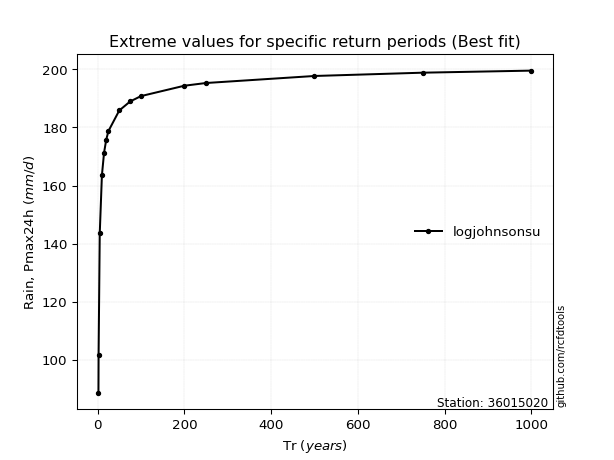</img>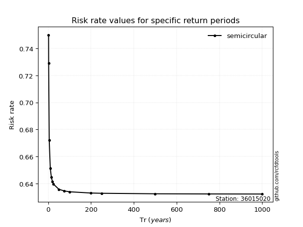</img>

</div>


<sub>**APP DISCLAIMER**: NO WARRANTY - This software is provided by [github.com/rcfdtools](https://github.com/rcfdtools) "as is", without any express or implied warranty, including warranties of merchantability, fitness for a particular purpose, or non-infringement. There is no guarantee that the software will be error-free or operate without interruption. LIMITATION OF LIABILITY - Neither the authors nor copyright holders will be liable for claims or damages arising from the software or its use. You are responsible for determining if the software is appropriate for your use and assume all associated risks, including errors, legal compliance, and data loss. NO PROFESSIONAL ADVICE - The software provides general information and does not offer professional advice. It should not replace consultation with professional advisors.</sub>