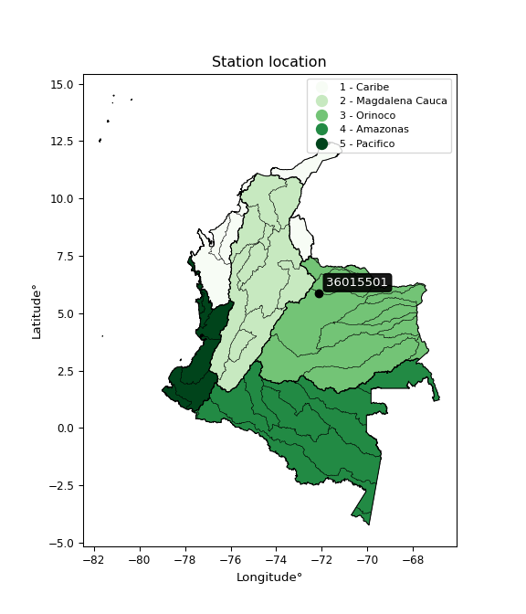

<div align="center">


</div>

# PMax24h Station (Rain, Pmax24h): 36015501

Maximum Precipitation in 24 hours (PMax24h) is the greatest amount of rainfall for a specific duration that is meteorologically possible for a given location, acting as a "worst-case" scenario for extreme storms, crucial for designing safety-critical infrastructure like bridges, river deviations, dams, spillways, and nuclear plants to prevent catastrophic failure. The PMax24h is related with the Probable Maximum Precipitation (PMP) and it is calculated by hydrologists using meteorological data to determine the upper limit of extreme rainfall, often leading to the Probable Maximum Flood (PMF) for flood control design, and is increasingly being studied for climate change impacts. Probable Maximum Precipitation (PMP) is the theoretical upper limit of rainfall, a deterministic estimate for extreme events, while probability distributions (like GEV, Gumbel) describe the likelihood and frequency of various precipitation amounts, including rare ones, showing how often events occur, with PMP representing the extreme end of these distributions, used for critical infrastructure design to ensure safety against the worst conceivable weather, unlike standard statistical forecasts which cover typical probabilities.

The most common probability distributions in hydrology, used for analyzing floods, rainfall, and streamflow, include the Normal, Log-Normal, Gumbel, Gamma (including Log-Pearson Type III), and Generalized Extreme Value (GEV) distributions, often chosen based on the data´s skewness and whether modeling extremes or general conditions, with Gumbel and GEV popular for extreme events like floods, while the Normal distribution serves as a baseline, though often requiring transformations for skewed hydrological data. These distributions help in designing water infrastructure, managing water resources, and forecasting hydrologic events.

> Hydrological data often isn´t perfectly normal (it´s skewed), so different distributions are needed for different applications, such as: **Flood Frequency Analysis**: Using Gumbel, GEV, or Log-Pearson Type III for predicting extreme flood magnitudes and their return periods, **Rainfall Analysis**: Normal for annual totals, but Log-Normal, Weibull, or GEV for intensity or extreme daily rainfall, **Streamflow Modeling**: Gamma and Log-Normal for maximum flows, GEV for minimum flows, and Kappa for daily flows.

<div align="center">

</img>

</div>


## A. General information


### 1. General running parameters

• app_version: _v20260225_. • runtime: _2026-02-27 14:50:08.749431_. • Python version: _3.14.0_. • SciPy version: _1.16.3_. • Pandas version: _2.3.3_. • NumPy version: _2.3.5_. • Stations dataset (station_dataset_file): _dataset/pmax24h_in/automatic_colombia_2003_2025.csv_. • Stations catalog (station_catalog_file): _dataset/CNE.xls_. • Minimum year to eval til year_max (date_min): _1900_. • Maximum year to eval since year_min (date_max): _2025_. • Creates, save and include plots into reports (create_plot): _False_. • Plot only fit distributions with Δo > Δ (plot_only_fit): _True_. • Plot only simple graphs avoiding multiple CDFs and multiple Extreme values plots (plot_only_simple): _False_. • Eval low extreme values, if False, evaluates high extreme values (low_extreme): _False_. • Eval every SciPy distribution as logarithmic (pdist_logarithmic_on): _True_. • Standard deviation normalized (ddof): _1.0_. • Return periods to eval in years (Tr): _[2, 2.33, 5, 10, 15, 20, 25, 50, 75, 100, 200, 250, 500, 750, 1000]_. • Minimum data sample per station, 0 means any (minimum_sample): _5_. • Z-Score maximum threshold to adjust a value, 0 means disable (zscore_max): _3.5_. • Z-Score minimum threshold to adjust a value, 0 means disable (zscore_min): _-2.5_. • Avoid zeros, e.g. rain = 0 (avoid_zeros): _True_. • Avoid null values (avoid_nans): _True_. 

:file_folder:Table: [dataset.csv](../../dataset/pmax24h_in/automatic_colombia_2003_2025.csv)

> Delta Degrees of Freedom (DDOF): is a parameter used in the formulas for calculating variance and standard deviation. When ddof=0, the divisor is $N$ (the total number of observations) and this is used when your data set is the entire population. When ddof=1, the divisor is $N-1$ and this is used when your data set is a sample drawn from a larger population. Using $N-1$ provides an unbiased estimate of the population variance (known as Bessel´s correction).


### 2. Station info and location

|   id |   CODIGO | NOMBRE                    | CATEGORIA               | TECNOLOGIA                | ESTADO   | FECHA_INSTALACION   |   FECHA_SUSPENSION |   ALTITUD |   LATITUD |   LONGITUD | DEPARTAMENTO   | MUNICIPIO   | AREA_OPERATIVA                              | ENTIDAD                                    | AREA_HIDROGRAFICA   | ZONA_HIDROGRAFICA   | SUBZONA_HIDROGRAFICA   |   CORRIENTE | Catalogo   |   Version |
|-----:|---------:|:--------------------------|:------------------------|:--------------------------|:---------|:--------------------|-------------------:|----------:|----------:|-----------:|:---------------|:------------|:--------------------------------------------|:-------------------------------------------|:--------------------|:--------------------|:-----------------------|------------:|:-----------|----------:|
|    0 | 36015501 | TAMARA  - AUT  [36015501] | Climatológica Principal | Automática con Telemetría | Activa   | 19/06/2013          |                nan |       999 |   5.87222 |   -72.1194 | Casanare       | Támara      | Area Operativa 06 - Boyacá-Casanare-Vichada | CENTRO NACIONAL DE INVESTIGACIONES DE CAFE | Orinoco             | Casanare            | Río Ariporo            |         nan | CNE_OE     |  20251226 |

<div align="center">

Dynamic map: [:earth_americas:Google](http://maps.google.com/maps?q=5.872219444,-72.11944167) [:earth_americas:OSM](https://www.openstreetmap.org/#map=18/5.872219444/-72.11944167&layers=P) [:earth_americas:Bing](https://www.bing.com/maps?cp=5.872219444~-72.11944167&lvl=18) [:earth_americas:Apple](https://maps.apple.com/frame?center=5.872219444%2C-72.11944167&span=0.003%2C0.006)

</div>


<div align="center">

```geojson
{
  "type": "Feature",
  "geometry": {
    "type": "Point", 
    "coordinates": [-72.11944167, 5.872219444]
  }, 
  "properties": {
    "Name": "36015501"
  }
}
```

</div>


### 3. Discrete values table and plot

<div align="center">

|               |           0 |           1 |          2 |          3 |          4 |           5 |           6 |
|:--------------|------------:|------------:|-----------:|-----------:|-----------:|------------:|------------:|
| Date          | 2017        | 2018        | 2019       | 2020       | 2021       | 2022        | 2023        |
| Value         |  118.2      |  111.4      |  112.5     |   54.7     |   68       |  106.6      |  103.8      |
| Value_initial |  118.2      |  111.4      |  112.5     |   54.7     |   68       |  106.6      |  103.8      |
| count         |    7        |    7        |    7       |    7       |    7       |    7        |    7        |
| mean          |   96.4571   |   96.4571   |   96.4571  |   96.4571  |   96.4571  |   96.4571   |   96.4571   |
| std           |   24.7106   |   24.7106   |   24.7106  |   24.7106  |   24.7106  |   24.7106   |   24.7106   |
| zscore        |    0.879901 |    0.604715 |    0.64923 |   -1.68985 |   -1.15162 |    0.410466 |    0.297154 |


</div>


> The initial value (value_initial) correspond to the initial obtained or null completed value, and value (value) is adjusted only when the initial value is outside the valid range (outlier) definite through the Z-Score value. If Z-Score is active, values out of range or outliers are replaced with the station mean value. A Z-Score (or standard score) measures how many standard deviations a data point is from the mean of a dataset, indicating its relative position; positive scores mean above the mean, negative mean below, and a score of zero is exactly at the mean, allowing for comparison of values from different distributions. It´s calculated using the formula $z=(x–μ)/σ$, where $x$ is the data point, $μ$ is the mean, and $σ$ is the standard deviation, helping identify outliers and understand probability.
>
> <sub>**Note**: In this study, "completing" (filling gaps in) and "extending" (forecasting or lengthening the historical record) rainfall data series are avoided for certain critical analyses because they introduce artificial bias and uncertainty, which can distort the statistics of rare events (extremes), alter day-to-day variability, and compromise the integrity and homogeneity of the original data. Some reasons against Completing/Extending rainfall data are: **Distortion of Extremes and Variability**: The primary issue is that most gap-filling or extension methods rely on averaging or regression with nearby stations, which inherently smooths the data. Rainfall is highly variable in space and time, with a large percentage of zero values and occasional large storms. Infilling methods often underestimate the highest values and overestimate the lowest (zero) values, which severely distorts analyses focused on flood frequency, drought severity, and intensity-duration-frequency (IDF) curves, **Loss of Data Homogeneity**: Infilled or extended data are synthetic estimates, not actual measurements. Combining these estimates with observed data can violate the assumption of data homogeneity, which requires that the data properties do not change over time. Inhomogeneity can lead to incorrect conclusions about long-term trends or changes in climate patterns, **Propagation of Errors**: Errors and biases from the original data (e.g., wind-induced undercatch, instrument errors, site changes) or the data used for imputation can propagate through the analysis, leading to unreliable hydrological models and inaccurate predictions, **Compromised Statistical Integrity**: For statistical analyses, especially those involving the frequency of events, using artificial data can introduce time bias or autocorrelation that doesn´t exist in reality, making it difficult to assess the true probability of events, **Difficulty in Validation**: It is difficult to accurately validate the quality of filled or extended data, especially for past periods where ground-truth measurements are unavailable. The reliability of imputation techniques heavily depends on the density of the surrounding station network and the complexity of the local topography.</sub>


### 4. Active continuous probability distributions from SciPy (80 of 104 available)

A Probability Density Function (PDF) describes the relative likelihood of a continuous random variable falling within a specific range, where the total area under its curve equals 1, and the area over any interval gives the actual probability for that range. Unlike discrete probabilities (like rolling a die), a PDF shows density, not direct probability for a single point (which is zero), with higher points indicating higher likelihood, often visualized as a bell curve for normal distributions.

A log of a probability density function (log-PDF) is simply the logarithm of the PDF´s value, denoted as $log(f(x))$, useful for converting multiplication of probabilities into addition, improving numerical stability with tiny numbers, and connecting to information theory concepts like entropy. Instead of dealing with very small probabilities (e.g., 0.000001), log-PDFs use negative numbers (e.g., $log(0.00001) ≈ -11.51$ that are easier for computers to handle, preventing underflow errors and simplifying complex calculations. In this study, each active probability distribution from SciPy is also evaluated in the $log$ form.

[scipy.stats](https://docs.scipy.org/doc/scipy/reference/stats.html) is a Python´s powerful submodule within the SciPy library for comprehensive statistical analysis, offering over 130 probability distributions (like Normal, Poisson, etc.), functions for descriptive stats (mean, variance), hypothesis testing (t-tests, chi-square), random variable generation, and statistical tests, making it essential for data science, modeling, and research. It provides tools to explore, model, and draw conclusions from data efficiently, working seamlessly with [NumPy](https://numpy.org/).

<div align="center">

|   id | p_dist           |   n_parameter | fit_method   | label                                                                       | active   | ref                                                                                                      |
|-----:|:-----------------|--------------:|:-------------|:----------------------------------------------------------------------------|:---------|:---------------------------------------------------------------------------------------------------------|
|    0 | alpha            |             3 | MLE          | Alpha                                                                       | True     | [:mortar_board:](https://docs.scipy.org/doc/scipy/reference/generated/scipy.stats.alpha.html)            |
|    1 | anglit           |             2 | MM           | Anglit                                                                      | True     | [:mortar_board:](https://docs.scipy.org/doc/scipy/reference/generated/scipy.stats.anglit.html)           |
|    2 | arcsine          |             2 | MM           | Arcsine                                                                     | True     | [:mortar_board:](https://docs.scipy.org/doc/scipy/reference/generated/scipy.stats.arcsine.html)          |
|    3 | argus            |             3 | MLE          | Argus                                                                       | True     | [:mortar_board:](https://docs.scipy.org/doc/scipy/reference/generated/scipy.stats.argus.html)            |
|    4 | beta             |             4 | MLE          | Beta                                                                        | True     | [:mortar_board:](https://docs.scipy.org/doc/scipy/reference/generated/scipy.stats.beta.html)             |
|    5 | betaprime        |             4 | MLE          | Beta prime                                                                  | True     | [:mortar_board:](https://docs.scipy.org/doc/scipy/reference/generated/scipy.stats.betaprime.html)        |
|    6 | bradford         |             3 | MLE          | Bradford                                                                    | True     | [:mortar_board:](https://docs.scipy.org/doc/scipy/reference/generated/scipy.stats.bradford.html)         |
|    7 | burr             |             4 | MLE          | Burr (Type III)                                                             | True     | [:mortar_board:](https://docs.scipy.org/doc/scipy/reference/generated/scipy.stats.burr.html)             |
|    8 | burr12           |             4 | MLE          | Burr (Type III) 12                                                          | True     | [:mortar_board:](https://docs.scipy.org/doc/scipy/reference/generated/scipy.stats.burr12.html)           |
|    9 | cosine           |             2 | MLE          | Cosine                                                                      | True     | [:mortar_board:](https://docs.scipy.org/doc/scipy/reference/generated/scipy.stats.cosine.html)           |
|   10 | crystalball      |             4 | MLE          | Crystalball                                                                 | True     | [:mortar_board:](https://docs.scipy.org/doc/scipy/reference/generated/scipy.stats.crystalball.html)      |
|   11 | dgamma           |             3 | MLE          | Double gamma                                                                | True     | [:mortar_board:](https://docs.scipy.org/doc/scipy/reference/generated/scipy.stats.dgamma.html)           |
|   12 | dweibull         |             3 | MLE          | Double Weibull                                                              | True     | [:mortar_board:](https://docs.scipy.org/doc/scipy/reference/generated/scipy.stats.dweibull.html)         |
|   13 | erlang           |             3 | MLE          | Erlang                                                                      | True     | [:mortar_board:](https://docs.scipy.org/doc/scipy/reference/generated/scipy.stats.erlang.html)           |
|   14 | exponnorm        |             3 | MLE          | Exponentially modified Normal                                               | True     | [:mortar_board:](https://docs.scipy.org/doc/scipy/reference/generated/scipy.stats.exponnorm.html)        |
|   15 | exponpow         |             3 | MLE          | Exponential power                                                           | True     | [:mortar_board:](https://docs.scipy.org/doc/scipy/reference/generated/scipy.stats.exponpow.html)         |
|   16 | exponweib        |             4 | MLE          | Exponentiated Weibull                                                       | True     | [:mortar_board:](https://docs.scipy.org/doc/scipy/reference/generated/scipy.stats.exponweib.html)        |
|   17 | f                |             4 | MLE          | F                                                                           | True     | [:mortar_board:](https://docs.scipy.org/doc/scipy/reference/generated/scipy.stats.f.html)                |
|   18 | fatiguelife      |             3 | MLE          | Fatigue-life (Birnbaum-Saunders)                                            | True     | [:mortar_board:](https://docs.scipy.org/doc/scipy/reference/generated/scipy.stats.fatiguelife.html)      |
|   19 | foldnorm         |             3 | MM           | Fold Normal                                                                 | True     | [:mortar_board:](https://docs.scipy.org/doc/scipy/reference/generated/scipy.stats.foldnorm.html)         |
|   20 | gamma            |             3 | MLE          | Gamma                                                                       | True     | [:mortar_board:](https://docs.scipy.org/doc/scipy/reference/generated/scipy.stats.gamma.html)            |
|   21 | gausshyper       |             6 | MLE          | Gauss hypergeometric                                                        | True     | [:mortar_board:](https://docs.scipy.org/doc/scipy/reference/generated/scipy.stats.gausshyper.html)       |
|   22 | genexpon         |             5 | MLE          | Generalized exponential                                                     | True     | [:mortar_board:](https://docs.scipy.org/doc/scipy/reference/generated/scipy.stats.genexpon.html)         |
|   23 | genextreme       |             3 | MLE          | Generalized exponential                                                     | True     | [:mortar_board:](https://docs.scipy.org/doc/scipy/reference/generated/scipy.stats.genextreme.html)       |
|   24 | gengamma         |             4 | MLE          | Generalized gamma                                                           | True     | [:mortar_board:](https://docs.scipy.org/doc/scipy/reference/generated/scipy.stats.gengamma.html)         |
|   25 | genhalflogistic  |             3 | MLE          | Generalized half-logistic                                                   | True     | [:mortar_board:](https://docs.scipy.org/doc/scipy/reference/generated/scipy.stats.genhalflogistic.html)  |
|   26 | genlogistic      |             3 | MLE          | Generalized logistic                                                        | True     | [:mortar_board:](https://docs.scipy.org/doc/scipy/reference/generated/scipy.stats.genlogistic.html)      |
|   27 | gennorm          |             3 | MLE          | Generalized Normal                                                          | True     | [:mortar_board:](https://docs.scipy.org/doc/scipy/reference/generated/scipy.stats.gennorm.html)          |
|   28 | genpareto        |             3 | MLE          | Generalized Pareto                                                          | True     | [:mortar_board:](https://docs.scipy.org/doc/scipy/reference/generated/scipy.stats.genpareto.html)        |
|   29 | gompertz         |             3 | MLE          | Gompertz (or truncated Gumbel)                                              | True     | [:mortar_board:](https://docs.scipy.org/doc/scipy/reference/generated/scipy.stats.gompertz.html)         |
|   30 | gumbel_l         |             2 | MM           | Gumbel Left Skew                                                            | True     | [:mortar_board:](https://docs.scipy.org/doc/scipy/reference/generated/scipy.stats.gumbel_l.html)         |
|   31 | gumbel_r         |             2 | MM           | Gumbel Right Skew                                                           | True     | [:mortar_board:](https://docs.scipy.org/doc/scipy/reference/generated/scipy.stats.gumbel_r.html)         |
|   32 | halfgennorm      |             3 | MLE          | Upper half of a generalized normal                                          | True     | [:mortar_board:](https://docs.scipy.org/doc/scipy/reference/generated/scipy.stats.halfgennorm.html)      |
|   33 | halflogistic     |             2 | MM           | Half-logistic                                                               | True     | [:mortar_board:](https://docs.scipy.org/doc/scipy/reference/generated/scipy.stats.halflogistic.html)     |
|   34 | halfnorm         |             2 | MM           | Half Normal                                                                 | True     | [:mortar_board:](https://docs.scipy.org/doc/scipy/reference/generated/scipy.stats.halfnorm.html)         |
|   35 | hypsecant        |             2 | MM           | hyperbolic secant                                                           | True     | [:mortar_board:](https://docs.scipy.org/doc/scipy/reference/generated/scipy.stats.hypsecant.html)        |
|   36 | invgamma         |             3 | MLE          | Inverted gamma                                                              | True     | [:mortar_board:](https://docs.scipy.org/doc/scipy/reference/generated/scipy.stats.invgamma.html)         |
|   37 | invgauss         |             3 | MLE          | Inverse Gaussian                                                            | True     | [:mortar_board:](https://docs.scipy.org/doc/scipy/reference/generated/scipy.stats.invgauss.html)         |
|   38 | invweibull       |             3 | MLE          | Inverted Weibull                                                            | True     | [:mortar_board:](https://docs.scipy.org/doc/scipy/reference/generated/scipy.stats.invweibull.html)       |
|   39 | johnsonsb        |             4 | MLE          | Johnson SB                                                                  | True     | [:mortar_board:](https://docs.scipy.org/doc/scipy/reference/generated/scipy.stats.johnsonsb.html)        |
|   40 | johnsonsu        |             4 | MLE          | Johnson Su                                                                  | True     | [:mortar_board:](https://docs.scipy.org/doc/scipy/reference/generated/scipy.stats.johnsonsu.html)        |
|   41 | kappa3           |             3 | MLE          | Kappa 3                                                                     | True     | [:mortar_board:](https://docs.scipy.org/doc/scipy/reference/generated/scipy.stats.kappa3.html)           |
|   42 | kappa4           |             4 | MLE          | Kappa 4                                                                     | True     | [:mortar_board:](https://docs.scipy.org/doc/scipy/reference/generated/scipy.stats.kappa4.html)           |
|   43 | ksone            |             3 | MLE          | Kolmogorov-Smirnov one-sided test statistic distribution                    | True     | [:mortar_board:](https://docs.scipy.org/doc/scipy/reference/generated/scipy.stats.ksone.html)            |
|   44 | kstwobign        |             2 | MLE          | Limiting distribution of scaled Kolmogorov-Smirnov two-sided test statistic | True     | [:mortar_board:](https://docs.scipy.org/doc/scipy/reference/generated/scipy.stats.kstwobign.html)        |
|   45 | laplace          |             2 | MM           | Laplace                                                                     | True     | [:mortar_board:](https://docs.scipy.org/doc/scipy/reference/generated/scipy.stats.laplace.html)          |
|   46 | levy_l           |             2 | MLE          | Left-skewed Levy                                                            | True     | [:mortar_board:](https://docs.scipy.org/doc/scipy/reference/generated/scipy.stats.levy_l.html)           |
|   47 | loggamma         |             3 | MLE          | Log gamma                                                                   | True     | [:mortar_board:](https://docs.scipy.org/doc/scipy/reference/generated/scipy.stats.loggamma.html)         |
|   48 | logistic         |             2 | MM           | Logistic (or Sech-squared)                                                  | True     | [:mortar_board:](https://docs.scipy.org/doc/scipy/reference/generated/scipy.stats.logistic.html)         |
|   49 | loglaplace       |             3 | MLE          | Log-Laplace                                                                 | True     | [:mortar_board:](https://docs.scipy.org/doc/scipy/reference/generated/scipy.stats.loglaplace.html)       |
|   50 | lomax            |             3 | MLE          | Lomax (Pareto of the second kind)                                           | True     | [:mortar_board:](https://docs.scipy.org/doc/scipy/reference/generated/scipy.stats.lomax.html)            |
|   51 | maxwell          |             2 | MM           | Maxwell                                                                     | True     | [:mortar_board:](https://docs.scipy.org/doc/scipy/reference/generated/scipy.stats.maxwell.html)          |
|   52 | mielke           |             4 | MLE          | Mielke Beta-Kappa / Dagum                                                   | True     | [:mortar_board:](https://docs.scipy.org/doc/scipy/reference/generated/scipy.stats.mielke.html)           |
|   53 | moyal            |             2 | MM           | Moyal                                                                       | True     | [:mortar_board:](https://docs.scipy.org/doc/scipy/reference/generated/scipy.stats.moyal.html)            |
|   54 | nakagami         |             3 | MLE          | Nakagami                                                                    | True     | [:mortar_board:](https://docs.scipy.org/doc/scipy/reference/generated/scipy.stats.nakagami.html)         |
|   55 | ncf              |             5 | MLE          | Non-central F distribution                                                  | True     | [:mortar_board:](https://docs.scipy.org/doc/scipy/reference/generated/scipy.stats.ncf.html)              |
|   56 | nct              |             4 | MLE          | Non-central Student’s t                                                     | True     | [:mortar_board:](https://docs.scipy.org/doc/scipy/reference/generated/scipy.stats.nct.html)              |
|   57 | norm             |             2 | MM           | Normal                                                                      | True     | [:mortar_board:](https://docs.scipy.org/doc/scipy/reference/generated/scipy.stats.norm.html)             |
|   58 | pearson3         |             3 | MM           | Pearson type III                                                            | True     | [:mortar_board:](https://docs.scipy.org/doc/scipy/reference/generated/scipy.stats.pearson3.html)         |
|   59 | powerlaw         |             3 | MLE          | Power-function                                                              | True     | [:mortar_board:](https://docs.scipy.org/doc/scipy/reference/generated/scipy.stats.powerlaw.html)         |
|   60 | rayleigh         |             2 | MM           | Rayleigh                                                                    | True     | [:mortar_board:](https://docs.scipy.org/doc/scipy/reference/generated/scipy.stats.rayleigh.html)         |
|   61 | rdist            |             3 | MLE          | R-distributed (symmetric beta)                                              | True     | [:mortar_board:](https://docs.scipy.org/doc/scipy/reference/generated/scipy.stats.rdist.html)            |
|   62 | rice             |             3 | MLE          | Rice                                                                        | True     | [:mortar_board:](https://docs.scipy.org/doc/scipy/reference/generated/scipy.stats.rice.html)             |
|   63 | semicircular     |             2 | MM           | Semicircular                                                                | True     | [:mortar_board:](https://docs.scipy.org/doc/scipy/reference/generated/scipy.stats.semicircular.html)     |
|   64 | skewnorm         |             3 | MLE          | Skew normal                                                                 | True     | [:mortar_board:](https://docs.scipy.org/doc/scipy/reference/generated/scipy.stats.skewnorm.html)         |
|   65 | t                |             3 | MLE          | Student’s t                                                                 | True     | [:mortar_board:](https://docs.scipy.org/doc/scipy/reference/generated/scipy.stats.t.html)                |
|   66 | trapezoid        |             4 | MLE          | Trapezoid                                                                   | True     | [:mortar_board:](https://docs.scipy.org/doc/scipy/reference/generated/scipy.stats.trapezoid.html)        |
|   67 | triang           |             3 | MLE          | Triangular                                                                  | True     | [:mortar_board:](https://docs.scipy.org/doc/scipy/reference/generated/scipy.stats.triang.html)           |
|   68 | truncexpon       |             3 | MLE          | Truncated exponential                                                       | True     | [:mortar_board:](https://docs.scipy.org/doc/scipy/reference/generated/scipy.stats.truncexpon.html)       |
|   69 | truncnorm        |             4 | MLE          | Truncated normal                                                            | True     | [:mortar_board:](https://docs.scipy.org/doc/scipy/reference/generated/scipy.stats.truncnorm.html)        |
|   70 | truncpareto      |             4 | MLE          | Upper truncated Pareto                                                      | True     | [:mortar_board:](https://docs.scipy.org/doc/scipy/reference/generated/scipy.stats.truncpareto.html)      |
|   71 | truncweibull_min |             5 | MLE          | Doubly truncated Weibull minimum                                            | True     | [:mortar_board:](https://docs.scipy.org/doc/scipy/reference/generated/scipy.stats.truncweibull_min.html) |
|   72 | tukeylambda      |             3 | MLE          | Tukey-Lamdba                                                                | True     | [:mortar_board:](https://docs.scipy.org/doc/scipy/reference/generated/scipy.stats.tukeylambda.html)      |
|   73 | uniform          |             2 | MLE          | Uniform                                                                     | True     | [:mortar_board:](https://docs.scipy.org/doc/scipy/reference/generated/scipy.stats.uniform.html)          |
|   74 | vonmises         |             3 | MLE          | Von Mises                                                                   | True     | [:mortar_board:](https://docs.scipy.org/doc/scipy/reference/generated/scipy.stats.vonmises.html)         |
|   75 | vonmises_line    |             3 | MLE          | Von Mises line                                                              | True     | [:mortar_board:](https://docs.scipy.org/doc/scipy/reference/generated/scipy.stats.vonmises_line.html)    |
|   76 | wald             |             2 | MM           | Wald                                                                        | True     | [:mortar_board:](https://docs.scipy.org/doc/scipy/reference/generated/scipy.stats.wald.html)             |
|   77 | weibull_max      |             3 | MLE          | Weibull maximum                                                             | True     | [:mortar_board:](https://docs.scipy.org/doc/scipy/reference/generated/scipy.stats.weibull_max.html)      |
|   78 | weibull_min      |             3 | MLE          | Weibull minimum                                                             | True     | [:mortar_board:](https://docs.scipy.org/doc/scipy/reference/generated/scipy.stats.weibull_min.html)      |
|   79 | wrapcauchy       |             3 | MLE          | Wrapped  Cauchy                                                             | True     | [:mortar_board:](https://docs.scipy.org/doc/scipy/reference/generated/scipy.stats.wrapcauchy.html)       |

</div>

> **n_parameter:** # arguments & localization & scale.
>
> **Fit methods:** (MLE) maximum likelihood, (MM) L-moments.
>
>**Inactive** (With the only purpose of prevent loops, zero divisions, infinite values, over high estimated values or horizontal trending for recurrence intervals estimations, the follow distributions were disabled.)**:** lognorm, norminvgauss, powernorm, powerlognorm, cauchy, halfcauchy, foldcauchy, skewcauchy, chi2, expon, fisk, genhyperbolic, geninvgauss, gibrat, kstwo, laplace_asymmetric, levy, levy_stable, ncx2, pareto, rel_breitwigner, recipinvgauss, studentized_range, loguniform, 


## B. Probability (PDF) vs. Empirical (EDF) distributions functions

A continuous probability distribution (CPD) describes probabilities for variables that can take any value within a range (like rain any time), unlike discrete variables with specific outcomes (like temperature). It uses a Probability Density Function (PDF), a curve where the total area under it equals 1, and the probability of the variable falling within an interval (a to b) is found by calculating the area under the curve between those points. A key feature is that the probability of hitting any single exact value is zero, so probabilities are always expressed for ranges, e.g., $P(a ≤ X ≤ b)$.

<div align="center">

Distributions parameters from station values
|     |   station | p_dist              |   n |              loc |           scale | shape                  | shape1                | shape2                 | shape3             |
|----:|----------:|:--------------------|----:|-----------------:|----------------:|:-----------------------|:----------------------|:-----------------------|:-------------------|
|   0 |  36015501 | alpha               |   7 |   -500.168       | 14812.2         | 24.869134771374682     |                       |                        |                    |
|   1 |  36015501 | anglit              |   7 |     96.4571      |    66.926       |                        |                       |                        |                    |
|   2 |  36015501 | arcsine             |   7 |     64.1034      |    64.7075      |                        |                       |                        |                    |
|   3 |  36015501 | argus               |   7 |     27.5916      |    92.3553      | 2.4998913847792137     |                       |                        |                    |
|   4 |  36015501 | beta                |   7 |     49.7973      |    68.4027      | 0.28718946101519993    | 0.11765739095807372   |                        |                    |
|   5 |  36015501 | betaprime           |   7 |   -382.708       | 54792.9         | 409.2330295743882      | 46788.50022412618     |                        |                    |
|   6 |  36015501 | bradford            |   7 |     54.6999      |    63.5001      | 1.0456717065585486     |                       |                        |                    |
|   7 |  36015501 | burr                |   7 |     -3.2271      |   122.036       | 595.9490803126971      | 0.006928271869690049  |                        |                    |
|   8 |  36015501 | burr12              |   7 |     -2.90519     |    57.3485      | 949.5250257940943      | 0.0020371376480755863 |                        |                    |
|   9 |  36015501 | cosine              |   7 |     93.5252      |    18.8168      |                        |                       |                        |                    |
|  10 |  36015501 | crystalball         |   7 |     96.4571      |    22.8776      | 6178.646594411891      | 9043.23086393001      |                        |                    |
|  11 |  36015501 | dgamma              |   7 |    106.6         |    16.9425      | 0.9143203898249825     |                       |                        |                    |
|  12 |  36015501 | dweibull            |   7 |    111.4         |    18.3397      | 0.7768100956219242     |                       |                        |                    |
|  13 |  36015501 | erlang              |   7 |   -270.965       |     1.53743     | 238.77201565177614     |                       |                        |                    |
|  14 |  36015501 | exponnorm           |   7 |     96.4461      |    22.8774      | 0.00047979885564092517 |                       |                        |                    |
|  15 |  36015501 | exponpow            |   7 |     54.7         |     1.65065     | 0.08986271826114847    |                       |                        |                    |
|  16 |  36015501 | exponweib           |   7 |     54.7         |     1.16228     | 1.3706732051477601     | 0.2644290060615136    |                        |                    |
|  17 |  36015501 | f                   |   7 | -11843.1         | 11939.5         | 587864.5955371306      | 7243044.793839542     |                        |                    |
|  18 |  36015501 | fatiguelife         |   7 |     54.7         |     0.000294157 | 324.4666471462916      |                       |                        |                    |
|  19 |  36015501 | foldnorm            |   7 |     98.6847      |     1.93114     | 4.6964786662531055e-09 |                       |                        |                    |
|  20 |  36015501 | gamma               |   7 |   -276.922       |     1.49025     | 250.42614850673357     |                       |                        |                    |
|  21 |  36015501 | gausshyper          |   7 |     52.4758      |    65.7242      | 1.1455770483648324     | 0.6921424218222908    | 1.0862406428533409     | 1.1138661093165165 |
|  22 |  36015501 | genexpon            |   7 |     54.7         |     2.23886     | 0.05361747952605879    | 2.569177477353412e-07 | 0.6715880203829404     |                    |
|  23 |  36015501 | genextreme          |   7 |    103.762       |    15.1653      | 1.0503923889393931     |                       |                        |                    |
|  24 |  36015501 | gengamma            |   7 |     54.7         |     1.12322     | 1.4006974351144506     | 0.21859971489967225   |                        |                    |
|  25 |  36015501 | genhalflogistic     |   7 |     50.5341      |    81.9985      | 1.2118136969204616     |                       |                        |                    |
|  26 |  36015501 | genlogistic         |   7 |    118.2         |     1.22536e-05 | 5.626536570382093e-07  |                       |                        |                    |
|  27 |  36015501 | gennorm             |   7 |    106.6         |     0.3209      | 0.3377013139024212     |                       |                        |                    |
|  28 |  36015501 | genpareto           |   7 |     -1.13495     |   270.593       | -2.267511771114684     |                       |                        |                    |
|  29 |  36015501 | gompertz            |   7 |     71.6774      |     2.00373     | 3.636563181306418e-10  |                       |                        |                    |
|  30 |  36015501 | gumbel_l            |   7 |    106.753       |    17.8376      |                        |                       |                        |                    |
|  31 |  36015501 | gumbel_r            |   7 |     86.161       |    17.8376      |                        |                       |                        |                    |
|  32 |  36015501 | halfgennorm         |   7 |     54.7         |     1.36436     | 0.3454977440443109     |                       |                        |                    |
|  33 |  36015501 | halflogistic        |   7 |     69.3419      |    19.5595      |                        |                       |                        |                    |
|  34 |  36015501 | halfnorm            |   7 |     66.1762      |    37.9515      |                        |                       |                        |                    |
|  35 |  36015501 | hypsecant           |   7 |     96.4571      |    14.5643      |                        |                       |                        |                    |
|  36 |  36015501 | invgamma            |   7 |   -223.353       | 53363           | 167.895786606637       |                       |                        |                    |
|  37 |  36015501 | invgauss            |   7 |    -51.0163      |  4654.49        | 0.03152900924258435    |                       |                        |                    |
|  38 |  36015501 | invweibull          |   7 |     54.7         |     1.61896     | 0.06317401225120556    |                       |                        |                    |
|  39 |  36015501 | johnsonsb           |   7 |     44.4095      |    73.7905      | -0.19708623059007513   | 0.13516949525544303   |                        |                    |
|  40 |  36015501 | johnsonsu           |   7 |    119.565       |     0.0339707   | 5.488112495136935      | 0.8293116372723808    |                        |                    |
|  41 |  36015501 | kappa3              |   7 |     54.6999      |    63.5784      | 541821.9549523777      |                       |                        |                    |
|  42 |  36015501 | kappa4              |   7 |     50.2082      |    71.464       | 1.0671857507748082     | 1.05058611591732      |                        |                    |
|  43 |  36015501 | ksone               |   7 |     48.35        |    76.2         | 1.0                    |                       |                        |                    |
|  44 |  36015501 | kstwobign           |   7 |     -0.569821    |   110.432       |                        |                       |                        |                    |
|  45 |  36015501 | laplace             |   7 |     96.4571      |    16.1769      |                        |                       |                        |                    |
|  46 |  36015501 | levy_l              |   7 |    119.536       |     5.88734     |                        |                       |                        |                    |
|  47 |  36015501 | loggamma            |   7 |    118.204       |     7.5343e-06  | 3.463415852904806e-07  |                       |                        |                    |
|  48 |  36015501 | logistic            |   7 |     96.4571      |    12.6131      |                        |                       |                        |                    |
|  49 |  36015501 | loglaplace          |   7 |     -0.341514    |   106.942       | 5.227958596932758      |                       |                        |                    |
|  50 |  36015501 | lomax               |   7 |     54.6913      |   987.714       | 21.597616785483034     |                       |                        |                    |
|  51 |  36015501 | maxwell             |   7 |     42.2469      |    33.9712      |                        |                       |                        |                    |
|  52 |  36015501 | mielke              |   7 |     24.3585      |    94.2031      | 2.968642637320576      | 1003.0854518875913    |                        |                    |
|  53 |  36015501 | moyal               |   7 |     83.3743      |    10.2985      |                        |                       |                        |                    |
|  54 |  36015501 | nakagami            |   7 | -11845.7         | 11942.2         | 68031.25337148838      |                       |                        |                    |
|  55 |  36015501 | ncf                 |   7 |     -1.42501     |    96.6977      | 35.90683485579068      | 109.13950849779076    | 8.231500168590104e-12  |                    |
|  56 |  36015501 | nct                 |   7 |  -1607.65        |    22.7624      | 264252.6101370735      | 74.86507253476735     |                        |                    |
|  57 |  36015501 | norm                |   7 |     96.4571      |    22.8776      |                        |                       |                        |                    |
|  58 |  36015501 | pearson3            |   7 |     96.4572      |    22.8775      | -0.9147362410473718    |                       |                        |                    |
|  59 |  36015501 | powerlaw            |   7 |     54.7         |    63.5         | 0.17967859673958897    |                       |                        |                    |
|  60 |  36015501 | rayleigh            |   7 |     52.691       |    34.9203      |                        |                       |                        |                    |
|  61 |  36015501 | rdist               |   7 |     61.3501      |     6.65006     | 1.320949758651203      |                       |                        |                    |
|  62 |  36015501 | rice                |   7 |     40.342       |    25.1081      | 1.9558050458895369     |                       |                        |                    |
|  63 |  36015501 | semicircular        |   7 |     96.4571      |    45.7551      |                        |                       |                        |                    |
|  64 |  36015501 | skewnorm            |   7 |    118.2         |    31.5595      | -20338993.780604735    |                       |                        |                    |
|  65 |  36015501 | t                   |   7 |     96.4567      |    22.8798      | 2545681.7614760273     |                       |                        |                    |
|  66 |  36015501 | trapezoid           |   7 |     31.7497      |    97.0612      | 1.0                    | 1.0                   |                        |                    |
|  67 |  36015501 | triang              |   7 |     31.4961      |    86.7039      | 0.9999996131655298     |                       |                        |                    |
|  68 |  36015501 | truncexpon          |   7 |     54.6917      |    83.9437      | 0.7565586909567973     |                       |                        |                    |
|  69 |  36015501 | truncnorm           |   7 |     95.6964      |    22.4106      | -1.8293253394407065    | 86.9242191987127      |                        |                    |
|  70 |  36015501 | truncpareto         |   7 |     54.6577      |     0.0423118   | 0.1680274037031647     | 1501.7619807280892    |                        |                    |
|  71 |  36015501 | truncweibull_min    |   7 |     54.6473      |    82.2947      | 0.9104125814616313     | 0.0006368056053221729 | 0.7722576593501951     |                    |
|  72 |  36015501 | tukeylambda         |   7 |     61.35        |     9.48571     | 1.426422058676651      |                       |                        |                    |
|  73 |  36015501 | uniform             |   7 |     54.7         |    63.5         |                        |                       |                        |                    |
|  74 |  36015501 | vonmises            |   7 |     -1.31327     |     1           | 1.9602616401420578     |                       |                        |                    |
|  75 |  36015501 | vonmises_line       |   7 |    104.054       |    15.7097      | 1.0306779671259032     |                       |                        |                    |
|  76 |  36015501 | wald                |   7 |     73.5796      |    22.8775      |                        |                       |                        |                    |
|  77 |  36015501 | weibull_max         |   7 |    118.2         |    24.6768      | 0.7591340968412894     |                       |                        |                    |
|  78 |  36015501 | weibull_min         |   7 |     -8.12001e+09 |     8.12001e+09 | 512072592.6842519      |                       |                        |                    |
|  79 |  36015501 | wrapcauchy          |   7 |     54.7         |    10.1063      | 0.5086696793255228     |                       |                        |                    |
|  80 |  36015501 | logalpha            |   7 |     -6.3253      |   405.298       | 37.345154116461686     |                       |                        |                    |
|  81 |  36015501 | loganglit           |   7 |      4.53448     |     0.810031    |                        |                       |                        |                    |
|  82 |  36015501 | logarcsine          |   7 |      4.1429      |     0.783156    |                        |                       |                        |                    |
|  83 |  36015501 | logargus            |   7 |      3.67162     |     1.12072     | 2.733988323841546      |                       |                        |                    |
|  84 |  36015501 | logbeta             |   7 |      3.90987     |     0.862512    | 0.28479844172966706    | 0.11109081888356019   |                        |                    |
|  85 |  36015501 | logbetaprime        |   7 |     -1.19824     |    21.8701      | 528.9710157843415      | 2022.5343770389672    |                        |                    |
|  86 |  36015501 | logbradford         |   7 |      4.00186     |     0.770524    | 1.0633650232210368     |                       |                        |                    |
|  87 |  36015501 | logburr             |   7 |      1.21136     |     3.56576     | 2487.4956016771857     | 0.00536747569804387   |                        |                    |
|  88 |  36015501 | logburr12           |   7 |   -210.114       |   216.729       | 1239.5533831490225     | 77838.78324333724     |                        |                    |
|  89 |  36015501 | logcosine           |   7 |      4.49372     |     0.231168    |                        |                       |                        |                    |
|  90 |  36015501 | logcrystalball      |   7 |      4.53448     |     0.276895    | 236.07695019471365     | 35.9664299462913      |                        |                    |
|  91 |  36015501 | logdgamma           |   7 |      4.66908     |     0.189929    | 0.9049862248487048     |                       |                        |                    |
|  92 |  36015501 | logdweibull         |   7 |      4.66908     |     0.185205    | 0.8544630020901411     |                       |                        |                    |
|  93 |  36015501 | logerlang           |   7 |      0.484796    |     0.0198335   | 203.95966590480202     |                       |                        |                    |
|  94 |  36015501 | logexponnorm        |   7 |      4.53431     |     0.276895    | 0.0006242684056141734  |                       |                        |                    |
|  95 |  36015501 | logexponpow         |   7 |     -2.12945e+07 |     2.12945e+07 | 109151038.64016792     |                       |                        |                    |
|  96 |  36015501 | logexponweib        |   7 |      4.00186     |     0.837873    | 0.26649611140271895    | 2.2502065733633154    |                        |                    |
|  97 |  36015501 | logf                |   7 |   -105.262       |   109.795       | 387293.6184954583      | 1608785.3613691442    |                        |                    |
|  98 |  36015501 | logfatiguelife      |   7 |   -178.416       |   182.951       | 0.0015077265364658908  |                       |                        |                    |
|  99 |  36015501 | logfoldnorm         |   7 |      4.17825     |     0.428956    | 0.2900061005847071     |                       |                        |                    |
| 100 |  36015501 | loggamma            |   7 |      0.145364    |     0.0188027   | 233.09924765765072     |                       |                        |                    |
| 101 |  36015501 | loggausshyper       |   7 |      3.95578     |     0.816599    | 1.3674311505967052     | 0.6017084667898971    | 0.9963733622799154     | 0.9909591942225401 |
| 102 |  36015501 | loggenexpon         |   7 |      4.00117     |     0.00467109  | 0.0031890458280436984  | 4.001255130101162     | 1.9141258120586047e-05 |                    |
| 103 |  36015501 | loggenextreme       |   7 |      4.61233     |     0.168392    | 1.0521176282748002     |                       |                        |                    |
| 104 |  36015501 | loggengamma         |   7 |     -2.02814e+07 |     2.02814e+07 | 7.464579501769057      | 29220572.271836832    |                        |                    |
| 105 |  36015501 | loggenhalflogistic  |   7 |      3.85291     |     0.971481    | 1.0565714298443325     |                       |                        |                    |
| 106 |  36015501 | loggenlogistic      |   7 |      4.77239     |     7.39471e-07 | 3.110915608525871e-06  |                       |                        |                    |
| 107 |  36015501 | loggennorm          |   7 |      4.66907     |     0.200887    | 0.9717666319474789     |                       |                        |                    |
| 108 |  36015501 | loggenpareto        |   7 |     -0.00652832  |     8.94019     | -1.8707597418362276    |                       |                        |                    |
| 109 |  36015501 | loggompertz         |   7 |      3.99523     |     0.194101    | 0.035845924235496776   |                       |                        |                    |
| 110 |  36015501 | loggumbel_l         |   7 |      4.6591      |     0.215895    |                        |                       |                        |                    |
| 111 |  36015501 | loggumbel_r         |   7 |      4.40986     |     0.215895    |                        |                       |                        |                    |
| 112 |  36015501 | loghalfgennorm      |   7 |      4.00186     |     0.770546    | 231397.4107965316      |                       |                        |                    |
| 113 |  36015501 | loghalflogistic     |   7 |      4.2063      |     0.236733    |                        |                       |                        |                    |
| 114 |  36015501 | loghalfnorm         |   7 |      4.16799     |     0.459332    |                        |                       |                        |                    |
| 115 |  36015501 | loghypsecant        |   7 |      4.53448     |     0.176277    |                        |                       |                        |                    |
| 116 |  36015501 | loginvgamma         |   7 |     -1.67466     |  2833.27        | 457.2728739931764      |                       |                        |                    |
| 117 |  36015501 | loginvgauss         |   7 |      1.71375     |   245.107       | 0.011490123208323008   |                       |                        |                    |
| 118 |  36015501 | loginvweibull       |   7 |     -3.14114e+07 |     3.14114e+07 | 102574560.26106918     |                       |                        |                    |
| 119 |  36015501 | logjohnsonsb        |   7 |      4.00186     |     0.772331    | 0.14703936967781017    | 0.15127265938687487   |                        |                    |
| 120 |  36015501 | logjohnsonsu        |   7 |      4.77781     |     0.000123332 | 4.866394252991764      | 0.6558602962336362    |                        |                    |
| 121 |  36015501 | logkappa3           |   7 |      4.00186     |     0.770052    | 3275.2086902936308     |                       |                        |                    |
| 122 |  36015501 | logkappa4           |   7 |      3.94827     |     0.914615    | 1.0428544711042225     | 1.1098212441940594    |                        |                    |
| 123 |  36015501 | logksone            |   7 |      3.92481     |     0.924617    | 1.0                    |                       |                        |                    |
| 124 |  36015501 | logkstwobign        |   7 |      3.32314     |     1.38006     |                        |                       |                        |                    |
| 125 |  36015501 | loglaplace          |   7 |      4.53448     |     0.195795    |                        |                       |                        |                    |
| 126 |  36015501 | loglevy_l           |   7 |      4.78445     |     0.0531108   |                        |                       |                        |                    |
| 127 |  36015501 | logloggamma         |   7 |      4.77238     |     3.26594e-07 | 1.387119283041654e-06  |                       |                        |                    |
| 128 |  36015501 | loglogistic         |   7 |      4.53448     |     0.152661    |                        |                       |                        |                    |
| 129 |  36015501 | logloglaplace       |   7 |     -0.0189854   |     4.68807     | 23.0636942268577       |                       |                        |                    |
| 130 |  36015501 | loglomax            |   7 |      4.00186     |    17.0555      | 32.26878923719458      |                       |                        |                    |
| 131 |  36015501 | logmaxwell          |   7 |      3.87836     |     0.411167    |                        |                       |                        |                    |
| 132 |  36015501 | logmielke           |   7 |     -2.78397e+07 |     2.78397e+07 | 112070206.9726564      | 2565708930.016168     |                        |                    |
| 133 |  36015501 | logmoyal            |   7 |      4.37614     |     0.124647    |                        |                       |                        |                    |
| 134 |  36015501 | lognakagami         |   7 |   -182.609       |   187.144       | 114060.66411080919     |                       |                        |                    |
| 135 |  36015501 | logncf              |   7 |    -47.8985      |    52.2472      | 111507.4234997941      | 194563.20038733317    | 397.9648898911844      |                    |
| 136 |  36015501 | lognct              |   7 |     12.0521      |     0.271443    | 10663.19317724395      | -27.68489706731114    |                        |                    |
| 137 |  36015501 | lognorm             |   7 |      4.53448     |     0.276896    |                        |                       |                        |                    |
| 138 |  36015501 | logpearson3         |   7 |      4.53448     |     0.276896    | -1.0280562022332633    |                       |                        |                    |
| 139 |  36015501 | logpowerlaw         |   7 |      4.00186     |     0.770514    | 0.19371393634690384    |                       |                        |                    |
| 140 |  36015501 | lograyleigh         |   7 |      4.00476     |     0.422655    |                        |                       |                        |                    |
| 141 |  36015501 | logrdist            |   7 |      4.29406     |     0.478315    | 1.0995886537834205     |                       |                        |                    |
| 142 |  36015501 | logrice             |   7 |      3.81446     |     0.299726    | 2.1504215727658798     |                       |                        |                    |
| 143 |  36015501 | logsemicircular     |   7 |      4.53448     |     0.553792    |                        |                       |                        |                    |
| 144 |  36015501 | logskewnorm         |   7 |      4.77238     |     0.365007    | -2782569.3597363625    |                       |                        |                    |
| 145 |  36015501 | logt                |   7 |      4.53448     |     0.276897    | 469704324.00602645     |                       |                        |                    |
| 146 |  36015501 | logtrapezoid        |   7 |      3.7513      |     1.17477     | 1.0                    | 1.0                   |                        |                    |
| 147 |  36015501 | logtriang           |   7 |      3.85049     |     0.921888    | 0.9999999825453239     |                       |                        |                    |
| 148 |  36015501 | logtruncexpon       |   7 |      4.00186     |     0.879731    | 0.8758657475803406     |                       |                        |                    |
| 149 |  36015501 | logtruncnorm        |   7 |     -0.0603576   |     0.989546    | 4.752508121267629      | 4.883793371919036     |                        |                    |
| 150 |  36015501 | logtruncpareto      |   7 |      4.00131     |     0.000554938 | 0.1679335063655996     | 1389.47042646037      |                        |                    |
| 151 |  36015501 | logtruncweibull_min |   7 |      3.98702     |     1.16543     | 1.1439591449677469     | 0.004613366905593198  | 0.6738763622141097     |                    |
| 152 |  36015501 | logtukeylambda      |   7 |      4.38779     |     0.444961    | 1.1529643797217983     |                       |                        |                    |
| 153 |  36015501 | loguniform          |   7 |      4.00186     |     0.770514    |                        |                       |                        |                    |
| 154 |  36015501 | logvonmises         |   7 |     -1.74498     |     1           | 13.507000865786992     |                       |                        |                    |
| 155 |  36015501 | logvonmises_line    |   7 |      4.60505     |     0.191999    | 0.8782443652514654     |                       |                        |                    |
| 156 |  36015501 | logwald             |   7 |      4.2576      |     0.276883    |                        |                       |                        |                    |
| 157 |  36015501 | logweibull_max      |   7 |      4.77238     |     0.466233    | 0.19511787525289853    |                       |                        |                    |
| 158 |  36015501 | logweibull_min      |   7 |     -8.31696e+06 |     8.31696e+06 | 48040896.079906136     |                       |                        |                    |
| 159 |  36015501 | logwrapcauchy       |   7 |      4.00186     |     0.122631    | 0.525                  |                       |                        |                    |

</div>

> **loc** (Location parameter): This shifts the distribution along the x-axis. For many common distributions, like the normal (Gaussian) distribution, loc represents the mean $μ$. For others, like the uniform distribution, it might represent the minimum value, or for the beta distribution, the left end of the support interval.
>
> **scale** (Scale parameter): This determines the width or spread of the distribution. For the normal distribution, scale represents the standard deviation $σ$. For a uniform distribution, it defines the length of the interval (from $loc$ to $loc + scale$).
>
> **shape** (Shape parameters): Refers to parameters that define the specific form of a probability distribution, distinct from its location (loc) and scale (scale). These parameters are required arguments for most distribution functions. For example, a normal (Gaussian) distribution is fully defined by its location (mean) and scale (standard deviation), so it has no specific shape parameters beyond loc and scale. However, other distributions have intrinsic properties that need specification, as Gamma distribution that takes a shape parameter, often named $a$ or $alpha$.


### 0. Cumulative distribution values - CDF (160 evaluated)

Cumulative Distribution Function (CDF), denoted as $F$<sub>$X$</sub>$(x)$, is a function that gives the probability that a random variable $X$ will take a value less than or equal to a specific value, $x$ (i.e., $(P(X≥x)$. It essentially "accumulates" probabilities from a given point up to the far right (positive infinity), providing a complete picture of the distribution´s probabilities for both discrete (like rain) and continuous (like temperature) variables, helping to find probabilities over ranges or above certain values. Each station is evaluated separately ordering the $x$ values ascending, calculating the CDF and PDF values for the activated distributions and their logarithmic forms.

<div align="center">

CDF ordered by x ascending and calculating $log(f(x))$ separately
|   id |   Station |   date |     x |   count |    mean |     std |    zscore |   Value_initial |   station |   m |     alpha |   alpha_pdf |    anglit |   anglit_pdf |   arcsine |   arcsine_pdf |     argus |   argus_pdf |     beta |    beta_pdf |   betaprime |   betaprime_pdf |    bradford |   bradford_pdf |      burr |   burr_pdf |     burr12 |   burr12_pdf |    cosine |   cosine_pdf |   crystalball |   crystalball_pdf |    dgamma |   dgamma_pdf |   dweibull |   dweibull_pdf |    erlang |   erlang_pdf |   exponnorm |   exponnorm_pdf |   exponpow |   exponpow_pdf |   exponweib |   exponweib_pdf |         f |      f_pdf |   fatiguelife |   fatiguelife_pdf |   foldnorm |   foldnorm_pdf |     gamma |   gamma_pdf |   gausshyper |   gausshyper_pdf |    genexpon |   genexpon_pdf |   genextreme |   genextreme_pdf |    gengamma |   gengamma_pdf |   genhalflogistic |   genhalflogistic_pdf |   genlogistic |   genlogistic_pdf |   gennorm |   gennorm_pdf |   genpareto |   genpareto_pdf |   gompertz |   gompertz_pdf |   gumbel_l |   gumbel_l_pdf |   gumbel_r |   gumbel_r_pdf |   halfgennorm |   halfgennorm_pdf |   halflogistic |   halflogistic_pdf |   halfnorm |   halfnorm_pdf |   hypsecant |   hypsecant_pdf |   invgamma |   invgamma_pdf |   invgauss |   invgauss_pdf |   invweibull |   invweibull_pdf |   johnsonsb |   johnsonsb_pdf |   johnsonsu |   johnsonsu_pdf |      kappa3 |   kappa3_pdf |      kappa4 |   kappa4_pdf |     ksone |   ksone_pdf |   kstwobign |   kstwobign_pdf |   laplace |   laplace_pdf |   levy_l |   levy_l_pdf |   loggamma |   loggamma_pdf |   logistic |   logistic_pdf |   loglaplace |   loglaplace_pdf |       lomax |   lomax_pdf |   maxwell |   maxwell_pdf |    mielke |   mielke_pdf |       moyal |   moyal_pdf |   nakagami |   nakagami_pdf |       ncf |    ncf_pdf |      nct |    nct_pdf |     norm |   norm_pdf |   pearson3 |   pearson3_pdf |   powerlaw |   powerlaw_pdf |   rayleigh |   rayleigh_pdf |       rdist |   rdist_pdf |      rice |   rice_pdf |   semicircular |   semicircular_pdf |   skewnorm |   skewnorm_pdf |         t |      t_pdf |   trapezoid |   trapezoid_pdf |    triang |   triang_pdf |   truncexpon |   truncexpon_pdf |   truncnorm |   truncnorm_pdf |   truncpareto |   truncpareto_pdf |   truncweibull_min |   truncweibull_min_pdf |   tukeylambda |   tukeylambda_pdf |   uniform |   uniform_pdf |   vonmises |   vonmises_pdf |   vonmises_line |   vonmises_line_pdf |     wald |   wald_pdf |   weibull_max |   weibull_max_pdf |   weibull_min |   weibull_min_pdf |   wrapcauchy |   wrapcauchy_pdf |   logalpha |   logalpha_pdf |   loganglit |   loganglit_pdf |   logarcsine |   logarcsine_pdf |   logargus |   logargus_pdf |   logbeta |   logbeta_pdf |   logbetaprime |   logbetaprime_pdf |   logbradford |   logbradford_pdf |   logburr |   logburr_pdf |   logburr12 |   logburr12_pdf |   logcosine |   logcosine_pdf |   logcrystalball |   logcrystalball_pdf |   logdgamma |   logdgamma_pdf |   logdweibull |   logdweibull_pdf |   logerlang |   logerlang_pdf |   logexponnorm |   logexponnorm_pdf |   logexponpow |   logexponpow_pdf |   logexponweib |   logexponweib_pdf |      logf |   logf_pdf |   logfatiguelife |   logfatiguelife_pdf |   logfoldnorm |   logfoldnorm_pdf |   loggausshyper |   loggausshyper_pdf |   loggenexpon |   loggenexpon_pdf |   loggenextreme |   loggenextreme_pdf |   loggengamma |   loggengamma_pdf |   loggenhalflogistic |   loggenhalflogistic_pdf |   loggenlogistic |   loggenlogistic_pdf |   loggennorm |   loggennorm_pdf |   loggenpareto |   loggenpareto_pdf |   loggompertz |   loggompertz_pdf |   loggumbel_l |   loggumbel_l_pdf |   loggumbel_r |   loggumbel_r_pdf |   loghalfgennorm |   loghalfgennorm_pdf |   loghalflogistic |   loghalflogistic_pdf |   loghalfnorm |   loghalfnorm_pdf |   loghypsecant |   loghypsecant_pdf |   loginvgamma |   loginvgamma_pdf |   loginvgauss |   loginvgauss_pdf |   loginvweibull |   loginvweibull_pdf |   logjohnsonsb |   logjohnsonsb_pdf |   logjohnsonsu |   logjohnsonsu_pdf |   logkappa3 |   logkappa3_pdf |   logkappa4 |   logkappa4_pdf |   logksone |   logksone_pdf |   logkstwobign |   logkstwobign_pdf |   loglevy_l |   loglevy_l_pdf |   logloggamma |   logloggamma_pdf |   loglogistic |   loglogistic_pdf |   logloglaplace |   logloglaplace_pdf |    loglomax |   loglomax_pdf |   logmaxwell |   logmaxwell_pdf |   logmielke |   logmielke_pdf |    logmoyal |   logmoyal_pdf |   lognakagami |   lognakagami_pdf |    logncf |   logncf_pdf |    lognct |   lognct_pdf |   lognorm |   lognorm_pdf |   logpearson3 |   logpearson3_pdf |   logpowerlaw |   logpowerlaw_pdf |   lograyleigh |   lograyleigh_pdf |   logrdist |   logrdist_pdf |   logrice |   logrice_pdf |   logsemicircular |   logsemicircular_pdf |   logskewnorm |   logskewnorm_pdf |      logt |   logt_pdf |   logtrapezoid |   logtrapezoid_pdf |   logtriang |   logtriang_pdf |   logtruncexpon |   logtruncexpon_pdf |   logtruncnorm |   logtruncnorm_pdf |   logtruncpareto |   logtruncpareto_pdf |   logtruncweibull_min |   logtruncweibull_min_pdf |   logtukeylambda |   logtukeylambda_pdf |   loguniform |   loguniform_pdf |   logvonmises |   logvonmises_pdf |   logvonmises_line |   logvonmises_line_pdf |   logwald |   logwald_pdf |   logweibull_max |   logweibull_max_pdf |   logweibull_min |   logweibull_min_pdf |   logwrapcauchy |   logwrapcauchy_pdf |
|-----:|----------:|-------:|------:|--------:|--------:|--------:|----------:|----------------:|----------:|----:|----------:|------------:|----------:|-------------:|----------:|--------------:|----------:|------------:|---------:|------------:|------------:|----------------:|------------:|---------------:|----------:|-----------:|-----------:|-------------:|----------:|-------------:|--------------:|------------------:|----------:|-------------:|-----------:|---------------:|----------:|-------------:|------------:|----------------:|-----------:|---------------:|------------:|----------------:|----------:|-----------:|--------------:|------------------:|-----------:|---------------:|----------:|------------:|-------------:|-----------------:|------------:|---------------:|-------------:|-----------------:|------------:|---------------:|------------------:|----------------------:|--------------:|------------------:|----------:|--------------:|------------:|----------------:|-----------:|---------------:|-----------:|---------------:|-----------:|---------------:|--------------:|------------------:|---------------:|-------------------:|-----------:|---------------:|------------:|----------------:|-----------:|---------------:|-----------:|---------------:|-------------:|-----------------:|------------:|----------------:|------------:|----------------:|------------:|-------------:|------------:|-------------:|----------:|------------:|------------:|----------------:|----------:|--------------:|---------:|-------------:|-----------:|---------------:|-----------:|---------------:|-------------:|-----------------:|------------:|------------:|----------:|--------------:|----------:|-------------:|------------:|------------:|-----------:|---------------:|----------:|-----------:|---------:|-----------:|---------:|-----------:|-----------:|---------------:|-----------:|---------------:|-----------:|---------------:|------------:|------------:|----------:|-----------:|---------------:|-------------------:|-----------:|---------------:|----------:|-----------:|------------:|----------------:|----------:|-------------:|-------------:|-----------------:|------------:|----------------:|--------------:|------------------:|-------------------:|-----------------------:|--------------:|------------------:|----------:|--------------:|-----------:|---------------:|----------------:|--------------------:|---------:|-----------:|--------------:|------------------:|--------------:|------------------:|-------------:|-----------------:|-----------:|---------------:|------------:|----------------:|-------------:|-----------------:|-----------:|---------------:|----------:|--------------:|---------------:|-------------------:|--------------:|------------------:|----------:|--------------:|------------:|----------------:|------------:|----------------:|-----------------:|---------------------:|------------:|----------------:|--------------:|------------------:|------------:|----------------:|---------------:|-------------------:|--------------:|------------------:|---------------:|-------------------:|----------:|-----------:|-----------------:|---------------------:|--------------:|------------------:|----------------:|--------------------:|--------------:|------------------:|----------------:|--------------------:|--------------:|------------------:|---------------------:|-------------------------:|-----------------:|---------------------:|-------------:|-----------------:|---------------:|-------------------:|--------------:|------------------:|--------------:|------------------:|--------------:|------------------:|-----------------:|---------------------:|------------------:|----------------------:|--------------:|------------------:|---------------:|-------------------:|--------------:|------------------:|--------------:|------------------:|----------------:|--------------------:|---------------:|-------------------:|---------------:|-------------------:|------------:|----------------:|------------:|----------------:|-----------:|---------------:|---------------:|-------------------:|------------:|----------------:|--------------:|------------------:|--------------:|------------------:|----------------:|--------------------:|------------:|---------------:|-------------:|-----------------:|------------:|----------------:|------------:|---------------:|--------------:|------------------:|----------:|-------------:|----------:|-------------:|----------:|--------------:|--------------:|------------------:|--------------:|------------------:|--------------:|------------------:|-----------:|---------------:|----------:|--------------:|------------------:|----------------------:|--------------:|------------------:|----------:|-----------:|---------------:|-------------------:|------------:|----------------:|----------------:|--------------------:|---------------:|-------------------:|-----------------:|---------------------:|----------------------:|--------------------------:|-----------------:|---------------------:|-------------:|-----------------:|--------------:|------------------:|-------------------:|-----------------------:|----------:|--------------:|-----------------:|---------------------:|-----------------:|---------------------:|----------------:|--------------------:|
|    0 |  36015501 |   2020 |  54.7 |       7 | 96.4571 | 24.7106 | -1.68985  |            54.7 |  36015501 |   1 | 0.0339298 |  0.00362386 | 0.0258461 |   0.00474183 |  0        |     0         | 0.029406  |  0.00242094 | 0.144433 | 0.00890376  |   0.0362285 |      0.00355276 | 2.27834e-06 |      0.0230077 | 0.0461177 | 0.00328715 | 0.00863088 |   0.0328166  | 0.0313738 |   0.00445866 |      0.033982 |        0.00329663 | 0.0196429 |   0.00118507 |  0.0452154 |     0.00148868 | 0.0365285 |   0.00364949 |   0.0339814 |      0.0032966  |  0.0511487 |    6.46305e+11 | 7.05092e-06 |     3.59634e+08 | 0.0343614 | 0.00333215 |     0.0482372 |       8.23641e+07 |   0        |    0           | 0.0350111 |  0.00354685 |    0.0231049 |        0.0117388 | 7.21932e-07 |     0.0239486  |    0.0166306 |       0.0010214  | 3.61276e-05 |    1.55632e+09 |         0.0262119 |            0.00649325 |      0        |        0.002487   | 0.040445  |    0.00103795 |    0.242879 |     0.00525826  | 0          |     0          |   0.052598 |     0.00286978 | 0.00292551 |    0.000956871 |   3.56226e-14 |        0.13926    |       0        |         0          |  0         |     0          |   0.036162  |      0.00247758 |  0.0361236 |     0.00386504 |  0.0379721 |     0.00447811 |  0.000311874 |      2.2385e+10  |    0.328858 |     0.00552014  |    0.088217 |      0.00204549 | 2.10337e-06 |    0.0157282 | 2.14746e-15 |    0.135777  | 0.0833333 |   0.0131234 |   0.0363674 |      0.00582353 | 0.0378383 |    0.00233904 | 0.236841 |   0.00177184 |  0.0293391 |       0.253483 |  0.0352084 |     0.00269314 |    0.0329278 |         0.168175 | 0.000189386 |  0.0218619  | 0.0125856 |    0.00295107 | 0.0346216 |   0.0033874  | 5.73356e-05 | 4.75788e-05 |   0.033913 |     0.00329278 | 0.0320798 | 0.00424035 | 0.033995 | 0.00329858 | 0.033982 | 0.00329663 |   0.052536 |     0.00314243 | 0.00136117 |    3.44207e+10 | 0.00165346 |     0.00164473 | 1.33306e-11 | 11925.3     | 0.0258455 | 0.00382205 |      0.0152977 |         0.00568794 |  0.0442124 |     0.00333967 | 0.0339971 | 0.00329751 |   0.0559097 |      0.00487223 | 0.0716217 |   0.00617325 |  0.000186724 |        0.0224441 | 3.62651e-12 |      0.00345672 |      0        |        5.61359    |        1.18195e-05 |              0.039171  |   2.58986e-10 |          0.105413 |  0        |      0.015748 |    9.25037 |      0.387392  |     5.13016e-12 |          0.00281551 | 0        | 0          |      0.128821 |        0.00315604 |     0.0380036 |        0.0023505  |  1.30218e-06 |        0.0483556 |  0.0286721 |       0.249036 |   0.0162615 |        0.312283 |     0        |         0        |  0.020657  |       0.143322 |  0.157941 |   0.528715    |      0.0272457 |           0.24266  |   5.33319e-06 |          1.90526  | 0.0378858 |      0.18127  |   0.0227179 |        0.130012 |   0.0262615 |        0.324589 |        0.0272061 |             0.226541 |   0.012157  |        0.065412 |     0.0251547 |         0.0963056 |    0.026865 |        0.240661 |      0.0272061 |           0.226541 |     0.0234617 |          0.120237 |    1.04741e-09 |      707177        | 0.0276884 |   0.229925 |        0.0264505 |             0.222771 |     0         |          0        |       0.0172387 |         0.505008    |   0.000477166 |          0.684843 |       0.0116362 |           0.0639264 |     0.0303318 |          0.207948 |            0.0834412 |                 0.609896 |         0        |             0.164506 |    0.0213523 |        0.0991291 |       0.622993 |         0.261548   |    0.00124567 |          0.19086  |     0.0465156 |          0.210364 |    0.00133591 |         0.0409516 |         0        |              1.29778 |         0         |              0        |     0         |          0        |      0.0309973 |           0.175566 |     0.0276994 |          0.247012 |     0.0293444 |          0.274262 |       0.0302891 |            0.345884 |    2.13408e-07 |        1.90505e+08 |      0.0925862 |           0.140172 | 3.15594e-08 |         1.29541 |   0.0217484 |         1.29688 |  0.0833333 |        1.08153 |      0.0310567 |           0.421018 |    0.20553  |        0.12837  |     0.037909  |          0.161008 |     0.0296295 |          0.188337 |       0.0144934 |           0.0831346 | 3.94058e-11 |       1.89198  |   0.00701655 |         0.167372 |   0.0432187 |        0.173979 | 7.20126e-06 |    0.000608297 |     0.0272602 |          0.226996 | 0.0272281 |     0.227478 | 0.0266606 |     0.222089 | 0.0272064 |      0.226543 |     0.0473094 |          0.226637 |    0.00127716 |       2.78553e+11 |      0        |          0        |   0.278375 |    0.876587    | 0.0217255 |      0.255858 |        0.00446109 |              0.314827 |     0.0347759 |          0.235505 | 0.0272069 |   0.226546 |      0.0454905 |           0.363109 |   0.0269612 |        0.356222 |     1.85384e-07 |            1.94809  |    0           |            0       |         0        |          430.237     |            0.00991225 |                   1.1096  |      7.10543e-15 |              2.23209 |     0        |          1.29783 |       1.02691 |          0.21793  |        1.42618e-08 |               0.286472 |  0        |      0        |         0.331878 |          0.092697    |        0.02283   |             0.130355 |        0        |             4.16673 |
|    1 |  36015501 |   2021 |  68   |       7 | 96.4571 | 24.7106 | -1.15162  |            68   |  36015501 |   2 | 0.114867  |  0.00889898 | 0.124226  |   0.00985683 |  0.157835 |     0.0206784 | 0.0754133 |  0.00471674 | 0.22021  | 0.00430075  |   0.113565  |      0.00842604 | 0.276703    |      0.018874  | 0.108266  | 0.00627596 | 0.336652   |   0.0180963  | 0.12859   |   0.0102568  |      0.10677  |        0.00804484 | 0.0439155 |   0.00266493 |  0.0709559 |     0.00247979 | 0.116223  |   0.00868196 |   0.106769  |      0.00804484 |  0.903759  |    0.00262051  | 0.801838    |     0.00727788  | 0.107823  | 0.00810833 |     0.743871  |       0.00792958  |   0        |    0           | 0.113239  |  0.0085802  |    0.197334  |        0.0135257 | 0.272774    |     0.0174161  |    0.0378085 |       0.00234842 | 0.701711    |    0.00709517  |         0.122571  |            0.00809573 |      0        |        0.00458035 | 0.0584937 |    0.00176347 |    0.317424 |     0.0059965   | 0          |     0          |   0.107639 |     0.00569734 | 0.0627858  |    0.00974309  |   0.402206    |        0.01549    |       0        |         0          |  0.0383282 |     0.0209995  |   0.0896254 |      0.00607278 |  0.121135  |     0.00921955 |  0.136008  |     0.0104257  |  0.416684    |      0.00173266  |    0.382408 |     0.00321302  |    0.122715 |      0.00326821 | 0.209188    |    0.0157282 | 0.221693    |    0.0157112 | 0.257874  |   0.0131234 |   0.164574  |      0.01296    | 0.0860977 |    0.00532227 | 0.264629 |   0.00247111 |  0.140102  |       0.814454 |  0.094819  |     0.00680472 |    0.100074  |         0.511116 | 0.251038    |  0.0161593  | 0.0977993 |    0.0101268  | 0.101855  |   0.00692854 | 0.0349049   | 0.00883161  |   0.106636 |     0.00803855 | 0.128729  | 0.010439   | 0.106823 | 0.00804866 | 0.10677  | 0.00804484 |   0.112829 |     0.00619807 | 0.755113   |    0.0102013   | 0.0916232  |     0.011404   | 0.999679    |     1.91438 | 0.109305  | 0.00898553 |      0.131319  |         0.0108952  |  0.111689  |     0.007135   | 0.106796  | 0.00804547 |   0.139487  |      0.00769574 | 0.177256  |   0.00971162 |  0.276247    |        0.0191555 | 0.0771794   |      0.00858369 |      0.875985 |        0.00677033 |        0.316665    |              0.0197345 |   1           |          0.105399 |  0.209449 |      0.015748 |   11.5998  |      0.490465  |     0.0424053   |          0.00398673 | 0        | 0          |      0.180061 |        0.00466833 |     0.0857339 |        0.00516796 |  0.373064    |        0.0116461 |  0.137714  |       0.802247 |   0.149184  |        0.879644 |     0.202502 |         1.36821  |  0.0738888 |       0.383323 |  0.237648 |   0.298122    |      0.1366    |           0.818385 |   0.362599    |          1.46518  | 0.103266  |      0.458344 |   0.0777697 |        0.431804 |   0.163685  |        0.946799 |        0.127659  |             0.754421 |   0.0393782 |        0.213607 |     0.05921   |         0.240094  |    0.135196 |        0.809281 |      0.127659  |           0.75442  |     0.0715352 |          0.366031 |    0.442749    |           1.19076  | 0.129158  |   0.759488 |        0.126131  |             0.752281 |     0.0734731 |          1.77593  |       0.175829  |         0.875951    |   0.207618    |          1.148    |       0.0388279 |           0.216848  |     0.117858  |          0.655998 |            0.236173  |                 0.808206 |         0        |             0.410988 |    0.0588906 |        0.275748  |       0.684288 |         0.305246   |    0.0750206  |          0.542451 |     0.122371  |          0.530619 |    0.0893644  |         0.999644  |         0        |              1.29778 |         0.0278865 |              2.11044  |     0.0893029 |          1.72616  |      0.105649  |           0.588388 |     0.137315  |          0.810306 |     0.149469  |          0.868774 |       0.17942   |            1.00659  |    0.502201    |        0.386076    |      0.133694  |           0.253359 | 0.281938    |         1.29541 |   0.287144  |         1.19988 |  0.318722  |        1.08153 |      0.207237  |           1.12101  |    0.240861 |        0.206575 |     0.0955426 |          0.405791 |     0.112722  |          0.655149 |       0.048886  |           0.266012  | 0.335801    |       1.24082  |   0.124078   |         0.946872 |   0.103794  |        0.417828 | 0.0608756   |    1.03555     |     0.127864  |          0.755231 | 0.127987  |     0.755502 | 0.125535  |     0.745064 | 0.12766   |      0.754423 |     0.128111  |          0.555617 |    0.782789   |       0.696721    |      0.121092 |          1.05656  |   0.446845 |    0.718246    | 0.132921  |      0.810811 |        0.158515   |              0.945521 |     0.129852  |          0.694135 | 0.127661  |   0.754424 |      0.158842  |           0.678516 |   0.160227  |        0.8684   |     0.375614    |            1.52113  |    0           |            0       |         0.900415 |            0.401215  |            0.307522   |                   1.41725 |      0.288895    |              1.26528 |     0.282466 |          1.29783 |       1.12404 |          0.735556 |        0.0752784   |               0.47533  |  0        |      0        |         0.355648 |          0.129759    |        0.0779797 |             0.432393 |        0.420932 |             0.63166 |
|    2 |  36015501 |   2023 | 103.8 |       7 | 96.4571 | 24.7106 |  0.297154 |           103.8 |  36015501 |   3 | 0.634673  |  0.0152675  | 0.608838  |   0.0145836  |  0.572877 |     0.010102  | 0.526188  |  0.0257934  | 0.372601 | 0.00596251  |   0.625532  |      0.0157683  | 0.827861    |      0.0127217 | 0.581676  | 0.0224399  | 0.699125   |   0.00545415 | 0.669557  |   0.0156863  |      0.625881 |        0.0165627  | 0.407733  |   0.027605   |  0.301922  |     0.015567   | 0.633875  |   0.0156197  |   0.625883  |      0.0165628  |  0.944001  |    0.000539746 | 0.908229    |     0.00131252  | 0.627869  | 0.0165121  |     0.896012  |       0.00231528  |   0.991923 |    0.012375    | 0.632305  |  0.0157647  |    0.696741  |        0.0154408 | 0.691453    |     0.0073893  |    0.368796  |       0.0243215  | 0.816745    |    0.00162585  |         0.56384   |            0.0195438  |      0        |        0.0237034  | 0.32313   |    0.0341142  |    0.606475 |     0.012052    | 0.00332897 |     0.00165862 |   0.571479 |     0.0203579  | 0.689356   |    0.0143763   |   0.691986    |        0.00442714 |       0.706846 |         0.0127909  |  0.678492  |     0.0128617  |   0.654086  |      0.0193444  |  0.635658  |     0.0147335  |  0.651991  |     0.0135022  |  0.446599    |      0.000463191 |    0.49778  |     0.00465268  |    0.429064 |      0.0206531  | 0.772259    |    0.0157282 | 0.769474    |    0.0153455 | 0.72769   |   0.0131234 |   0.666467  |      0.011256   | 0.68243   |    0.0196311  | 0.459235 |   0.0128609  |  0.661389  |       1.25257  |  0.641565  |     0.0182318  |    0.711961  |         1.47113  | 0.649355    |  0.00730414 | 0.649991  |    0.0149349  | 0.602933  |   0.0225309  | 0.710673    | 0.0134144   |   0.625383 |     0.0165552  | 0.639629  | 0.0132031  | 0.625931 | 0.0165567  | 0.625881 | 0.0165627  |   0.572648 |     0.0189696  | 0.954842   |    0.00349419  | 0.65735    |     0.0143612  | 1           |     0       | 0.632688  | 0.015787   |      0.601726  |         0.0137333  |  0.648188  |     0.0227825  | 0.625877  | 0.0165611  |   0.551037  |      0.0152959  | 0.695418  |   0.019236   |  0.834529    |        0.0125048 | 0.628669    |      0.017256   |      0.98175  |        0.00147654 |        0.850837    |              0.0113712 |   1           |          0        |  0.773228 |      0.015748 |   17.031   |      0.0556567 |     0.49439     |          0.0221174  | 0.770488 | 0.0110466  |      0.514591 |        0.0180234  |     0.575549  |        0.0229384  |  0.61477     |        0.010509  |  0.652316  |       1.24495  |   0.631734  |        1.1909   |     0.588931 |         0.845681 |  0.576095  |       2.63048  |  0.385859 |   0.58345     |      0.669435  |           1.27555  |   0.874501    |          1.01125  | 0.598135  |      2.32754  |   0.606346  |        2.11826  |   0.697901  |        1.23928  |        0.651723  |             1.33527  |   0.41792   |        2.59059  |     0.413231  |         2.5284    |    0.661521 |        1.26783  |      0.651723  |           1.33527  |     0.580951  |          2.51338  |    0.79413     |           0.558647 | 0.652704  |   1.32793  |        0.65149   |             1.33992  |     0.700874  |          1.04232  |       0.65885   |         1.59797     |   0.686202    |          0.919694 |       0.440375  |           2.64235   |     0.641684  |          1.50833  |            0.72876   |                 1.70809  |         0        |             2.43555  |    0.439044  |        2.13633   |       0.854428 |         0.598978   |    0.620987   |          1.96443  |     0.603803  |          1.69905  |    0.711424   |         1.12198   |         0        |              1.29778 |         0.726473  |              0.997405 |     0.698382  |          1.01885  |      0.683826  |           1.51289  |     0.654319  |          1.24002  |     0.662436  |          1.16579  |       0.649399  |            0.915492 |    0.650363    |        0.512625    |      0.428692  |           1.90221  | 0.829841    |         1.29541 |   0.809914  |         1.32458 |  0.776163  |        1.08153 |      0.679818  |           0.876086 |    0.459197 |        1.42529  |     0.575921  |          2.44607  |     0.669813  |          1.44873  |       0.438468  |           2.16943   | 0.695719    |       0.554855 |   0.673174   |         1.19193  |   0.569665  |        2.29321  | 0.731163    |    1.03663     |     0.651849  |          1.33403  | 0.650031  |     1.32738  | 0.648622  |     1.34384  | 0.651723  |      1.33527  |     0.596518  |          1.6143   |    0.964863   |       0.291768    |      0.679619 |          1.1437   |   0.773977 |    0.998437    | 0.655917  |      1.28032  |        0.623343   |              1.1275   |     0.721902  |          2.05178  | 0.651723  |   1.33527  |      0.575452  |           1.29146  |   0.738017  |        1.86374  |     0.886399    |            0.940515 |    2.78569e-06 |           10.3721  |         0.986729 |            0.113934  |            0.857433   |                   1.14845 |      0.821441    |              1.29257 |     0.831396 |          1.29783 |       1.64777 |          1.34945  |        0.561746    |               1.6319   |  0.787152 |      0.832398 |         0.458715 |          0.53692     |        0.607171  |             2.12019  |        0.655624 |             1.23418 |
|    3 |  36015501 |   2022 | 106.6 |       7 | 96.4571 | 24.7106 |  0.410466 |           106.6 |  36015501 |   4 | 0.676318  |  0.014456   | 0.649243  |   0.0142607  |  0.601501 |     0.0103607 | 0.602554  |  0.0287441  | 0.390593 | 0.00696044  |   0.668692  |      0.015032   | 0.863035    |      0.0124054 | 0.647127  | 0.0243284  | 0.713828   |   0.00505497 | 0.712491  |   0.0149553  |      0.671245 |        0.0158058  | 0.5       |   0.546402   |  0.351287  |     0.0200685  | 0.676553  |   0.014838   |   0.671248  |      0.0158059  |  0.94546   |    0.000503205 | 0.91176     |     0.00121221  | 0.673078  | 0.015746   |     0.902264  |       0.00215242  |   0.999958 |    9.2916e-05  | 0.675383  |  0.0149779  |    0.740955  |        0.0161851 | 0.711465    |     0.00691005 |    0.444     |       0.0295864  | 0.821148    |    0.0015215   |         0.621632  |            0.0218244  |      0        |        0.0269555  | 0.5       |    0.272467   |    0.642267 |     0.0136004   | 0.0133964  |     0.00664075 |   0.62896  |     0.0206231  | 0.727634   |    0.0129702   |   0.703975    |        0.00414141 |       0.740881 |         0.0115314  |  0.713189  |     0.0119221  |   0.705665  |      0.01745    |  0.675832  |     0.0139424  |  0.688669  |     0.0126852  |  0.44786     |      0.000437903 |    0.511923 |     0.00551332  |    0.493378 |      0.0255142  | 0.816298    |    0.0157282 | 0.812578    |    0.015449  | 0.764436  |   0.0131234 |   0.696981  |      0.0105389  | 0.732903  |    0.016511   | 0.500077 |   0.0165702  |  0.693997  |       1.19635  |  0.690863  |     0.0169326  |    0.748574  |         1.28413  | 0.669195    |  0.00687229 | 0.69054   |    0.0140122  | 0.668233  |   0.024121   | 0.746088    | 0.0119027   |   0.67073  |     0.0158008  | 0.675504  | 0.0124124  | 0.671278 | 0.0157996  | 0.671245 | 0.0158058  |   0.626135 |     0.0191805  | 0.964404   |    0.00333878  | 0.69627    |     0.0134274  | 1           |     0       | 0.675857  | 0.0150203  |      0.639959  |         0.0135675  |  0.713202  |     0.0236305  | 0.671237  | 0.0158044  |   0.594697  |      0.0158903  | 0.750322  |   0.0199809  |  0.868965    |        0.0120946 | 0.675789    |      0.0163655  |      0.985752 |        0.001384   |        0.882088    |              0.0109546 |   1           |          0        |  0.817323 |      0.015748 |   17.9057  |      0.174895  |     0.556074    |          0.0218236  | 0.799028 | 0.0093944  |      0.569037 |        0.0209958  |     0.640291  |        0.0231938  |  0.64854     |        0.0138782 |  0.684758  |       1.1915   |   0.663125  |        1.16697  |     0.611694 |         0.865637 |  0.649511  |       2.88254  |  0.402792 |   0.697315    |      0.702592  |           1.21452  |   0.901159    |          0.991909 | 0.663145  |      2.56065  |   0.662803  |        2.11549  |   0.730223  |        1.18817  |        0.686554  |             1.28021  |   0.5       |       53.2267   |     0.5       |       279.883     |    0.694512 |        1.20982  |      0.686554  |           1.28022  |     0.649672  |          2.63907  |    0.808627    |           0.530696 | 0.687339  |   1.27287  |        0.686438  |             1.28437  |     0.727764  |          0.978226 |       0.703232  |         1.74477     |   0.710111    |          0.876632 |       0.517089  |           3.13809   |     0.681235  |          1.46065  |            0.775737  |                 1.82444  |         0        |             2.72413  |    0.500028  |        2.45774   |       0.871219 |         0.666435   |    0.673083   |          1.94346  |     0.649125  |          1.70213  |    0.740083   |         1.0318    |         0        |              1.29778 |         0.751954  |              0.917839 |     0.724691  |          0.958044 |      0.722384  |           1.38268  |     0.686614  |          1.18542  |     0.692751  |          1.1112   |       0.673162  |            0.86999  |    0.665167    |        0.606787    |      0.485607  |           2.40486  | 0.864322    |         1.29541 |   0.845526  |         1.35248 |  0.804951  |        1.08153 |      0.702556  |           0.832403 |    0.502541 |        1.8638   |     0.644853  |          2.73883  |     0.707174  |          1.35647  |       0.5       |           2.45983   | 0.710124    |       0.527793 |   0.704077   |         1.12937  |   0.634094  |        2.5525   | 0.757485    |    0.942281    |     0.686646  |          1.27897  | 0.684661  |     1.27309  | 0.683692  |     1.28958  | 0.686554  |      1.28021  |     0.63973   |          1.62949  |    0.972502   |       0.282347    |      0.709237 |          1.0813   |   0.801715 |    1.09132     | 0.689292  |      1.22608  |        0.653195   |              1.11509  |     0.777181  |          2.10014  | 0.686554  |   1.28021  |      0.610341  |           1.33004  |   0.788459  |        1.92638  |     0.911059    |            0.912484 |    0.259135    |            9.12415 |         0.98969  |            0.108648  |            0.887723   |                   1.12752 |      0.856025    |              1.30666 |     0.865941 |          1.29783 |       1.68297 |          1.29373  |        0.604558    |               1.58087  |  0.807972 |      0.734509 |         0.474625 |          0.668129    |        0.663674  |             2.11692  |        0.693397 |             1.63044 |
|    4 |  36015501 |   2018 | 111.4 |       7 | 96.4571 | 24.7106 |  0.604715 |           111.4 |  36015501 |   5 | 0.74184   |  0.0127988  | 0.715928  |   0.0134767  |  0.652817 |     0.0110924 | 0.751431  |  0.0329394  | 0.431095 | 0.010524    |   0.737147  |      0.0134297  | 0.921347    |      0.0118983 | 0.772139  | 0.0278126  | 0.736617   |   0.00445706 | 0.780641  |   0.0133785  |      0.743176 |        0.0140883  | 0.643077  |   0.0234242  |  0.5       |    49.9418     | 0.743935  |   0.013182   |   0.743178  |      0.0140884  |  0.947743  |    0.000449715 | 0.917217    |     0.00106649  | 0.744695  | 0.0140193  |     0.911988  |       0.00190573  |   1        |    1.59237e-10 | 0.743396  |  0.0133029  |    0.82338   |        0.0184625 | 0.742797    |     0.00615967 |    0.613661  |       0.0419533  | 0.828071    |    0.00136779  |         0.738888  |            0.0275502  |      0        |        0.0336022  | 0.732032  |    0.0225292  |    0.717338 |     0.0183319   | 0.137574   |     0.0637035  |   0.726809 |     0.0198731  | 0.784317   |    0.0106821   |   0.722798    |        0.00371339 |       0.791387 |         0.00955308 |  0.76659   |     0.0103364  |   0.780892  |      0.013884   |  0.739054  |     0.0123622  |  0.745959  |     0.0111685  |  0.449869    |      0.000400386 |    0.54464  |     0.00868034  |    0.643137 |      0.0378813  | 0.891793    |    0.0157282 | 0.887381    |    0.0157565 | 0.827428  |   0.0131234 |   0.74463   |      0.00931962 | 0.80148   |    0.0122719  | 0.605029 |   0.0290468  |  0.74439   |       1.08946  |  0.765794  |     0.0142197  |    0.799222  |         1.02545  | 0.700522    |  0.00619289 | 0.753653  |    0.0122578  | 0.790791  |   0.0269707  | 0.797573    | 0.00961434  |   0.742648 |     0.0140881  | 0.731642  | 0.010966   | 0.743179 | 0.0140824  | 0.743176 | 0.0140883  |   0.717482 |     0.018686   | 0.979854   |    0.00310509  | 0.756652   |     0.0117159  | 1           |     0       | 0.744149  | 0.0133752  |      0.704152  |         0.0131507  |  0.829404  |     0.0247018  | 0.743162  | 0.0140874  |   0.673416  |      0.0169093  | 0.849295  |   0.0212579  |  0.92539     |        0.0114224 | 0.749837    |      0.0144116  |      0.992059 |        0.00124824 |        0.933043    |              0.0102854 |   1           |          0        |  0.892913 |      0.015748 |   18.3132  |      0.441835  |     0.656663    |          0.0198032  | 0.838599 | 0.00721086 |      0.686683 |        0.0288149  |     0.749403  |        0.0218705  |  0.738672    |        0.0252051 |  0.735042  |       1.08942  |   0.713459  |        1.11637  |     0.650796 |         0.913494 |  0.783995  |       3.18462  |  0.440773 |   1.09769     |      0.753599  |           1.09917  |   0.944169    |          0.961484 | 0.78524   |      2.99397  |   0.753813  |        1.99105  |   0.780441  |        1.08944  |        0.740591  |             1.17006  |   0.624131  |        2.25305  |     0.627026  |         2.1208    |    0.745427 |        1.09964  |      0.740591  |           1.17006  |     0.767081  |          2.63709  |    0.83101     |           0.486038 | 0.74106   |   1.16315  |        0.740638  |             1.17328  |     0.76854   |          0.873852 |       0.788107  |         2.1638      |   0.747121    |          0.803699 |       0.677816  |           4.22833   |     0.743221  |          1.34739  |            0.861104  |                 2.06461  |         0        |             3.27868  |    0.596624  |        1.95504   |       0.904319 |         0.8632     |    0.756337   |          1.8175   |     0.723167  |          1.64686  |    0.782355   |         0.889444  |         0        |              1.29778 |         0.789635  |              0.795152 |     0.764696  |          0.858934 |      0.778339  |           1.15826  |     0.736599  |          1.08203  |     0.739537  |          1.01172  |       0.709815  |            0.794468 |    0.697919    |        0.93815     |      0.619633  |           3.86167  | 0.921376    |         1.29541 |   0.906515  |         1.42469 |  0.852585  |        1.08153 |      0.737634  |           0.760686 |    0.611816 |        3.32612  |     0.777502  |          3.30222  |     0.763182  |          1.1839   |       0.596999  |           1.96417   | 0.732436    |       0.485961 |   0.751404   |         1.01849  |   0.757046  |        3.04232  | 0.795806    |    0.800967    |     0.74063   |          1.16889  | 0.738421  |     1.16465  | 0.73816   |     1.18017  | 0.740591  |      1.17006  |     0.711293  |          1.61016  |    0.984619   |       0.268163    |      0.754502 |          0.973492 |   0.855065 |    1.3702      | 0.741035  |      1.12067  |        0.701744   |              1.08811  |     0.871046  |          2.15733  | 0.740591  |   1.17006  |      0.670326  |           1.39386  |   0.875586  |        2.03002  |     0.950259    |            0.867926 |    0.621018    |            7.36845 |         0.994299 |            0.100838  |            0.936621   |                   1.09289 |      0.914297    |              1.34323 |     0.923102 |          1.29783 |       1.73757 |          1.18167  |        0.671471    |               1.44898  |  0.837278 |      0.601645 |         0.512405 |          1.12826     |        0.754719  |             1.99111  |        0.786968 |             2.71853 |
|    5 |  36015501 |   2019 | 112.5 |       7 | 96.4571 | 24.7106 |  0.64923  |           112.5 |  36015501 |   6 | 0.755693  |  0.0123863  | 0.730633  |   0.0132574  |  0.665146 |     0.0113293 | 0.787969  |  0.0334458  | 0.443512 | 0.0121428   |   0.751694  |      0.0130167  | 0.934374    |      0.0117879 | 0.803195  | 0.0286563  | 0.741451   |   0.00433355 | 0.795134  |   0.0129681  |      0.758426 |        0.013637   | 0.667801  |   0.021567   |  0.553153  |     0.0354665  | 0.758205  |   0.0127614  |   0.758429  |      0.013637   |  0.948231  |    0.000438827 | 0.918374    |     0.00103701  | 0.759869  | 0.013567   |     0.914056  |       0.00185428  |   1        |    3.18247e-12 | 0.757795  |  0.0128764  |    0.844156  |        0.0193496 | 0.749485    |     0.00599952 |    0.661795  |       0.0456285  | 0.829558    |    0.00133635  |         0.770205  |            0.0294458  |      0        |        0.035343   | 0.754666  |    0.0188194  |    0.738501 |     0.0202323   | 0.226067   |     0.0989834  |   0.748452 |     0.0194627  | 0.795796   |    0.0101903   |   0.726834    |        0.00362482 |       0.801664 |         0.00913457 |  0.777764  |     0.00998134 |   0.795722  |      0.0130828  |  0.752439  |     0.0119731  |  0.758048  |     0.0108103  |  0.450305    |      0.00039267  |    0.554953 |     0.010155    |    0.686819 |      0.0415929  | 0.909094    |    0.0157282 | 0.904773    |    0.0158696 | 0.841864  |   0.0131234 |   0.75473   |      0.00904552 | 0.81453   |    0.0114651  | 0.639658 |   0.0341317  |  0.754969  |       1.0638   |  0.781072  |     0.0135573  |    0.809049  |         0.97526  | 0.707254    |  0.00604732 | 0.766906  |    0.0118376  | 0.820829  |   0.0276459  | 0.807888    | 0.00914477  |   0.757898 |     0.0136379  | 0.743519  | 0.0106273  | 0.758423 | 0.0136313  | 0.758426 | 0.013637   |   0.737886 |     0.0184019  | 0.983243   |    0.00305654  | 0.769319   |     0.0113142  | 1           |     0       | 0.758631  | 0.0129537  |      0.718553  |         0.0130303  |  0.856673  |     0.0248729  | 0.758411  | 0.0136361  |   0.692145  |      0.0171428  | 0.87284   |   0.0215506  |  0.937873    |        0.0112737 | 0.765414    |      0.0139075  |      0.993417 |        0.00122056 |        0.944276    |              0.0101395 |   1           |          0        |  0.910236 |      0.015748 |   18.8131  |      0.314965  |     0.67808     |          0.0191267  | 0.846303 | 0.00680114 |      0.719817 |        0.0315168  |     0.773117  |        0.0212233  |  0.768573    |        0.0292587 |  0.745627  |       1.06483  |   0.724364  |        1.10325  |     0.659839 |         0.927374 |  0.815413  |       3.20581  |  0.452396 |   1.27851     |      0.764264  |           1.0716   |   0.953585    |          0.954949 | 0.815174  |      3.0994   |   0.773141  |        1.94167  |   0.791027  |        1.06529  |        0.751955  |             1.14286  |   0.645496  |        2.0989   |     0.646997  |         1.94927   |    0.756102 |        1.07321  |      0.751955  |           1.14286  |     0.792755  |          2.58491  |    0.835738    |           0.476343 | 0.752357  |   1.1361   |        0.752032  |             1.14586  |     0.777014  |          0.850997 |       0.810115  |         2.32251     |   0.754937    |          0.787285 |       0.720856  |           4.53739   |     0.756312  |          1.31691  |            0.881712  |                 2.13117  |         0        |             3.41705  |    0.615366  |        1.86069   |       0.913158 |         0.939216   |    0.773984   |          1.77341  |     0.739237  |          1.62349  |    0.790946   |         0.859202  |         0        |              1.29778 |         0.797321  |              0.76939  |     0.773029  |          0.83721  |      0.789478  |           1.10909  |     0.74711   |          1.05726  |     0.749364  |          0.988413 |       0.717539  |            0.777753 |    0.707823    |        1.08613     |      0.660041  |           4.38028  | 0.934105    |         1.29541 |   0.920632  |         1.44953 |  0.863212  |        1.08153 |      0.745031  |           0.744891 |    0.647264 |        3.91437  |     0.810635  |          3.44295  |     0.774618  |          1.14362  |       0.615825  |           1.86854   | 0.737167    |       0.477104 |   0.761286   |         0.99295  |   0.787505  |        3.15677  | 0.803533    |    0.771968    |     0.751983  |          1.14172  | 0.749734  |     1.13789  | 0.749624  |     1.15303  | 0.751955  |      1.14286  |     0.727054  |          1.5973   |    0.98724    |       0.265213    |      0.763948 |          0.949022 |   0.869041 |    1.47948     | 0.751921  |      1.09502  |        0.712401   |              1.08094  |     0.892288  |          2.16599  | 0.751954  |   1.14285  |      0.684092  |           1.4081   |   0.895647  |        2.05315  |     0.958739    |            0.858285 |    0.691711    |            7.02347 |         0.995282 |            0.0992362 |            0.947322   |                   1.08518 |      0.927554    |              1.35559 |     0.935855 |          1.29783 |       1.74904 |          1.15395  |        0.685535    |               1.41328  |  0.843063 |      0.576128 |         0.524454 |          1.33624     |        0.774045  |             1.94134  |        0.815221 |             3.03502 |
|    6 |  36015501 |   2017 | 118.2 |       7 | 96.4571 | 24.7106 |  0.879901 |           118.2 |  36015501 |   7 | 0.820001  |  0.0101646  | 0.802497  |   0.0118972  |  0.73458  |     0.0132859 | 0.968766  |  0.0253365  | 0.989337 | 8.25973e+10 |   0.819447  |      0.0107255  | 1           |      0.011247  | 0.979232  | 0.0316868  | 0.764472   |   0.0037619  | 0.86253   |   0.0106283  |      0.829046 |        0.0111009  | 0.769058  |   0.0145386  |  0.685204  |     0.0166387  | 0.824445  |   0.0104571  |   0.829048  |      0.0111009  |  0.950586  |    0.000389024 | 0.923889    |     0.000903056 | 0.830091  | 0.0110329  |     0.92392   |       0.00161356  |   1        |    2.75754e-23 | 0.824595  |  0.0105376  |    1         |      578.776     | 0.78145     |     0.00523398 |    1         |       0.38421    | 0.83675     |    0.00119188  |         1         |           14.9947     |      0.999985 |        0.0459167  | 0.830357  |    0.00948131 |    1        |     3.06271e+06 | 0.987807   |     0.0268164  |   0.850394 |     0.0159335  | 0.8471     |    0.00788026  |   0.746287    |        0.0032133  |       0.847992 |         0.0071809  |  0.829561  |     0.00821625 |   0.859275  |      0.00935065 |  0.814785  |     0.00989336 |  0.814368  |     0.00895813 |  0.452438    |      0.000356988 |    0.999999 |     5.91057e+07 |    0.967839 |      0.043763   | 0.998745    |    0.0157282 | 0.999336    |    0.020262  | 0.916667  |   0.0131234 |   0.802345  |      0.00767751 | 0.869609  |    0.00806033 | 0.964175 |   0.0692383  |  0.804238  |       0.928496 |  0.848622  |     0.0101849  |    0.851648  |         0.757689 | 0.739689    |  0.00534815 | 0.828117  |    0.00964306 | 0.988589  |   0.0306264  | 0.853723    | 0.00702172  |   0.828541 |     0.0111078  | 0.799107  | 0.00888657 | 0.829014 | 0.0110967  | 0.829046 | 0.0111009  |   0.836354 |     0.0158471  | 1          |    0.00282958  | 0.827887   |     0.00924608 | 1           |     0       | 0.825913  | 0.0106246  |      0.790716  |         0.0122423  |  1         |     0.0252819  | 0.829027  | 0.0111006  |   0.793308  |      0.0183529  | 1         |   0.023067   |  1           |        0.0105336 | 0.836853    |      0.011127   |      1        |        0.00109366 |        1           |              0.0094236 |   1           |          0        |  1        |      0.015748 |   19.5673  |      0.500945  |     0.7756      |          0.0149709  | 0.879872 | 0.00507867 |      1        |      144.127      |     0.880559  |        0.0160056  |  1           |        0.0483556 |  0.795078  |       0.934807 |   0.777088  |        1.02761  |     0.70784  |         1.02341  |  0.964594  |       2.49882  |  0.987347 |   1.46789e+13 |      0.813687  |           0.927057 |   0.999994    |          0.923381 | 0.982223  |      3.55244  |   0.860942  |        1.5825   |   0.840505  |        0.934455 |        0.804871  |             0.996115 |   0.73389   |        1.52094  |     0.727562  |         1.3684    |    0.805742 |        0.934131 |      0.804871  |           0.996115 |     0.907484  |          1.95247  |    0.858102    |           0.429048 | 0.804965  |   0.990443 |        0.80507   |             0.998011 |     0.81629   |          0.739313 |       1         |         1.70655e+06 |   0.791809    |          0.704842 |       1         |          36.6441    |     0.817191  |          1.14095  |            1         |                14.7178   |         0.999968 |             4.20666  |    0.696876  |        1.45545   |       1        |         2.9843e+06 |    0.854678   |          1.47092  |     0.815468  |          1.44444  |    0.829827   |         0.71699   |         0.999962 |              1.29768 |         0.832309  |              0.648964 |     0.811758  |          0.730904 |      0.838448  |           0.877624 |     0.796173  |          0.926824 |     0.795254  |          0.867909 |       0.75393   |            0.695398 |    0.855937    |       18.9402      |      0.973121  |           7.49157  | 0.998129    |         1.29259 |   1         |        41.4507  |  0.916667  |        1.08153 |      0.779914  |           0.66719  |    0.964027 |        7.68372  |     0.999982  |          4.24714  |     0.826113  |          0.940977 |       0.69754   |           1.45592   | 0.759691    |       0.435008 |   0.807153   |         0.862879 |   0.946942  |        2.71776  | 0.838325    |    0.639581    |     0.804847  |          0.995166 | 0.802464  |     0.993611 | 0.803042  |     1.00611  | 0.804871  |      0.996113 |     0.803469  |          1.47981  |    1          |       0.251409    |      0.807805 |          0.825873 |   1        |    5.79776e+06 | 0.802706  |      0.958158 |        0.764816   |              1.03809  |     0.999999  |          2.18594  | 0.804871  |   0.996111 |      0.755457  |           1.47973  |   0.999998  |        2.16946  |     0.99999     |            0.811395 |    0.999998    |            5.51005 |         1        |            0.0918477 |            1          |                   1.04653 |      0.997753    |              1.61321 |     1        |          1.29783 |       1.80244 |          1.00441  |        0.750552    |               1.2134   |  0.868701 |      0.466022 |         0.998659 |          2.94482e+11 |        0.861777  |             1.57997  |        1        |             4.16673 |


</div>

An Empirical Distribution Function (EDF) is a step-function estimate of a true cumulative distribution function (CDF) based on observed sample data, representing the proportion of data points less than or equal to a given value. It is calculated by ordering your data and jumping up by $1/n$ (where $n$ is sample size) at each unique data point, allowing analysis without assuming an underlying population distribution, and it gets closer to the true CDF as the sample size grows. For the empirical probability calculations, the parameter $m$ correspond to the order number which means the position of the $x$ values in an ascending order list.

The Kolmogorov-Smirnov (K-S) test is a non-parametric statistical test used to determine if a sample data set comes from a specific theoretical distribution (one-sample) or if two different samples come from the same underlying distribution (two-sample), by comparing their cumulative distribution functions (CDFs). It calculates the maximum vertical difference (D statistic) between these functions, with a small p-value indicating a significant difference and rejection of the null hypothesis (that the data/samples match).


### 1. EDF California (1923)

California´s estimates the true probability distribution of water-related data (like rainfall, streamflow) using observed samples, crucial for risk assessment.

<div align="center">


$P=m/n$


</div>


**1.1. Empirical values**

<div align="center">

|                | 0                   | 1                  | 2                   | 3                  | 4                  | 5                  | 6              |
|:---------------|:--------------------|:-------------------|:--------------------|:-------------------|:-------------------|:-------------------|:---------------|
| date           | 2020                | 2021               | 2023                | 2022               | 2018               | 2019               | 2017           |
| x              | 54.7                | 68.0               | 103.8               | 106.6              | 111.4              | 112.5              | 118.2          |
| m              | 1                   | 2                  | 3                   | 4                  | 5                  | 6                  | 7              |
| empirical_dist | edf_california      | edf_california     | edf_california      | edf_california     | edf_california     | edf_california     | edf_california |
| empirical      | 0.14285714285714285 | 0.2857142857142857 | 0.42857142857142855 | 0.5714285714285714 | 0.7142857142857143 | 0.8571428571428571 | 1.0            |
| empirical_tr   | 1.1666666666666665  | 1.4                | 1.75                | 2.333333333333333  | 3.5                | 6.999999999999997  | inf            |

</div>


**1.2. Kolmogorov-Smirnov fit test (sorted by Δ)**


<div align="center">

|                | 0                   | 1                   | 2                   | 3                   | 4                   | 5                   | 6                   | 7                   | 8                   | 9                   | 10                  | 11                  | 12                  | 13                  | 14                  | 15                  | 16                  | 17                  | 18                  | 19                  | 20                  | 21                  | 22                  | 23                  | 24                  | 25                  | 26                  | 27                  | 28                  | 29                  | 30                  | 31                  | 32                  | 33                  | 34                  | 35                  | 36                  | 37                  | 38                  | 39                  | 40                  | 41                  | 42                  | 43                  | 44                  | 45                  | 46                  | 47                  | 48                  | 49                  | 50                  | 51                  | 52                  | 53                  | 54                  | 55                  | 56                  | 57                  | 58                  | 59                  | 60                  | 61                  | 62                  | 63                  | 64                  | 65                  | 66                  | 67                  | 68                  | 69                  | 70                  | 71                  | 72                  | 73                  | 74                  | 75                  | 76                  | 77                  | 78                  | 79                  | 80                  | 81                  | 82                  | 83                  | 84                  | 85                  | 86                  | 87                  | 88                  | 89                  | 90                  | 91                  | 92                  | 93                  | 94                  | 95                  | 96                  | 97                  | 98                  | 99                  | 100                 | 101                 | 102                 | 103                 | 104                 | 105                 | 106                 | 107                 | 108                 | 109                 | 110                 | 111                 | 112                 | 113                 | 114                 | 115                 | 116                 | 117                 | 118                 | 119                 | 120                 | 121                 | 122                 | 123                 | 124                 | 125                 | 126                 | 127                 | 128                 | 129                 | 130                 | 131                 | 132                 | 133                 | 134                 | 135                 | 136                 | 137                 | 138                 | 139                 | 140                 | 141                 | 142                 | 143                 | 144                 | 145                 | 146                 | 147                 | 148                 | 149                 | 150                 | 151                 | 152                 | 153                 | 154                 | 155                 | 156                 | 157                 | 158                 | 159                 |
|:---------------|:--------------------|:--------------------|:--------------------|:--------------------|:--------------------|:--------------------|:--------------------|:--------------------|:--------------------|:--------------------|:--------------------|:--------------------|:--------------------|:--------------------|:--------------------|:--------------------|:--------------------|:--------------------|:--------------------|:--------------------|:--------------------|:--------------------|:--------------------|:--------------------|:--------------------|:--------------------|:--------------------|:--------------------|:--------------------|:--------------------|:--------------------|:--------------------|:--------------------|:--------------------|:--------------------|:--------------------|:--------------------|:--------------------|:--------------------|:--------------------|:--------------------|:--------------------|:--------------------|:--------------------|:--------------------|:--------------------|:--------------------|:--------------------|:--------------------|:--------------------|:--------------------|:--------------------|:--------------------|:--------------------|:--------------------|:--------------------|:--------------------|:--------------------|:--------------------|:--------------------|:--------------------|:--------------------|:--------------------|:--------------------|:--------------------|:--------------------|:--------------------|:--------------------|:--------------------|:--------------------|:--------------------|:--------------------|:--------------------|:--------------------|:--------------------|:--------------------|:--------------------|:--------------------|:--------------------|:--------------------|:--------------------|:--------------------|:--------------------|:--------------------|:--------------------|:--------------------|:--------------------|:--------------------|:--------------------|:--------------------|:--------------------|:--------------------|:--------------------|:--------------------|:--------------------|:--------------------|:--------------------|:--------------------|:--------------------|:--------------------|:--------------------|:--------------------|:--------------------|:--------------------|:--------------------|:--------------------|:--------------------|:--------------------|:--------------------|:--------------------|:--------------------|:--------------------|:--------------------|:--------------------|:--------------------|:--------------------|:--------------------|:--------------------|:--------------------|:--------------------|:--------------------|:--------------------|:--------------------|:--------------------|:--------------------|:--------------------|:--------------------|:--------------------|:--------------------|:--------------------|:--------------------|:--------------------|:--------------------|:--------------------|:--------------------|:--------------------|:--------------------|:--------------------|:--------------------|:--------------------|:--------------------|:--------------------|:--------------------|:--------------------|:--------------------|:--------------------|:--------------------|:--------------------|:--------------------|:--------------------|:--------------------|:--------------------|:--------------------|:--------------------|:--------------------|:--------------------|:--------------------|:--------------------|:--------------------|:--------------------|
| station        | 36015501            | 36015501            | 36015501            | 36015501            | 36015501            | 36015501            | 36015501            | 36015501            | 36015501            | 36015501            | 36015501            | 36015501            | 36015501            | 36015501            | 36015501            | 36015501            | 36015501            | 36015501            | 36015501            | 36015501            | 36015501            | 36015501            | 36015501            | 36015501            | 36015501            | 36015501            | 36015501            | 36015501            | 36015501            | 36015501            | 36015501            | 36015501            | 36015501            | 36015501            | 36015501            | 36015501            | 36015501            | 36015501            | 36015501            | 36015501            | 36015501            | 36015501            | 36015501            | 36015501            | 36015501            | 36015501            | 36015501            | 36015501            | 36015501            | 36015501            | 36015501            | 36015501            | 36015501            | 36015501            | 36015501            | 36015501            | 36015501            | 36015501            | 36015501            | 36015501            | 36015501            | 36015501            | 36015501            | 36015501            | 36015501            | 36015501            | 36015501            | 36015501            | 36015501            | 36015501            | 36015501            | 36015501            | 36015501            | 36015501            | 36015501            | 36015501            | 36015501            | 36015501            | 36015501            | 36015501            | 36015501            | 36015501            | 36015501            | 36015501            | 36015501            | 36015501            | 36015501            | 36015501            | 36015501            | 36015501            | 36015501            | 36015501            | 36015501            | 36015501            | 36015501            | 36015501            | 36015501            | 36015501            | 36015501            | 36015501            | 36015501            | 36015501            | 36015501            | 36015501            | 36015501            | 36015501            | 36015501            | 36015501            | 36015501            | 36015501            | 36015501            | 36015501            | 36015501            | 36015501            | 36015501            | 36015501            | 36015501            | 36015501            | 36015501            | 36015501            | 36015501            | 36015501            | 36015501            | 36015501            | 36015501            | 36015501            | 36015501            | 36015501            | 36015501            | 36015501            | 36015501            | 36015501            | 36015501            | 36015501            | 36015501            | 36015501            | 36015501            | 36015501            | 36015501            | 36015501            | 36015501            | 36015501            | 36015501            | 36015501            | 36015501            | 36015501            | 36015501            | 36015501            | 36015501            | 36015501            | 36015501            | 36015501            | 36015501            | 36015501            | 36015501            | 36015501            | 36015501            | 36015501            | 36015501            | 36015501            |
| empirical_dist | edf_california      | edf_california      | edf_california      | edf_california      | edf_california      | edf_california      | edf_california      | edf_california      | edf_california      | edf_california      | edf_california      | edf_california      | edf_california      | edf_california      | edf_california      | edf_california      | edf_california      | edf_california      | edf_california      | edf_california      | edf_california      | edf_california      | edf_california      | edf_california      | edf_california      | edf_california      | edf_california      | edf_california      | edf_california      | edf_california      | edf_california      | edf_california      | edf_california      | edf_california      | edf_california      | edf_california      | edf_california      | edf_california      | edf_california      | edf_california      | edf_california      | edf_california      | edf_california      | edf_california      | edf_california      | edf_california      | edf_california      | edf_california      | edf_california      | edf_california      | edf_california      | edf_california      | edf_california      | edf_california      | edf_california      | edf_california      | edf_california      | edf_california      | edf_california      | edf_california      | edf_california      | edf_california      | edf_california      | edf_california      | edf_california      | edf_california      | edf_california      | edf_california      | edf_california      | edf_california      | edf_california      | edf_california      | edf_california      | edf_california      | edf_california      | edf_california      | edf_california      | edf_california      | edf_california      | edf_california      | edf_california      | edf_california      | edf_california      | edf_california      | edf_california      | edf_california      | edf_california      | edf_california      | edf_california      | edf_california      | edf_california      | edf_california      | edf_california      | edf_california      | edf_california      | edf_california      | edf_california      | edf_california      | edf_california      | edf_california      | edf_california      | edf_california      | edf_california      | edf_california      | edf_california      | edf_california      | edf_california      | edf_california      | edf_california      | edf_california      | edf_california      | edf_california      | edf_california      | edf_california      | edf_california      | edf_california      | edf_california      | edf_california      | edf_california      | edf_california      | edf_california      | edf_california      | edf_california      | edf_california      | edf_california      | edf_california      | edf_california      | edf_california      | edf_california      | edf_california      | edf_california      | edf_california      | edf_california      | edf_california      | edf_california      | edf_california      | edf_california      | edf_california      | edf_california      | edf_california      | edf_california      | edf_california      | edf_california      | edf_california      | edf_california      | edf_california      | edf_california      | edf_california      | edf_california      | edf_california      | edf_california      | edf_california      | edf_california      | edf_california      | edf_california      | edf_california      | edf_california      | edf_california      | edf_california      | edf_california      |
| p_dist         | weibull_max         | genhalflogistic     | johnsonsu           | pearson3            | burr                | genpareto           | gumbel_l            | logmielke           | logburr             | mielke              | loggumbel_l         | wrapcauchy          | logloggamma         | logpearson3         | nakagami            | betaprime           | logjohnsonsu        | t                   | crystalball         | norm                | exponnorm           | nct                 | anglit              | f                   | weibull_min         | gamma               | rice                | erlang              | alpha               | trapezoid           | invgamma            | logweibull_min      | logburr12           | truncnorm           | semicircular        | loglevy_l           | argus               | loggompertz         | ncf                 | logargus            | logistic            | loggengamma         | logexponpow         | levy_l              | skewnorm            | lognct              | maxwell             | logncf              | logjohnsonsb        | loganglit           | logfatiguelife      | logexponnorm        | logcrystalball      | logt                | lognorm             | lognakagami         | invgauss            | logalpha            | logf                | hypsecant           | loginvgamma         | logwrapcauchy       | gennorm             | logrice             | rayleigh            | loggausshyper       | loggamma            | loggamma            | logerlang           | loginvgauss         | logsemicircular     | kstwobign           | logbetaprime        | cosine              | loglogistic         | dgamma              | vonmises_line       | logtrapezoid        | logmaxwell          | loginvweibull       | loggenextreme       | genextreme          | logvonmises_line    | halfnorm            | lograyleigh         | logkstwobign        | laplace             | loghypsecant        | loggenexpon         | lomax               | gumbel_r            | genexpon            | halfgennorm         | arcsine             | logdgamma           | triang              | loglomax            | gausshyper          | logcosine           | loghalfnorm         | burr12              | logfoldnorm         | logdweibull         | moyal               | loggumbel_r         | loglaplace          | loglaplace          | halflogistic        | logarcsine          | logskewnorm         | loghalflogistic     | ksone               | loggenhalflogistic  | johnsonsb           | logloglaplace       | logmoyal            | loggennorm          | logtriang           | dweibull            | logweibull_max      | kappa4              | wald                | kappa3              | uniform             | logrdist            | logksone            | logwald             | logexponweib        | logkappa4           | logtukeylambda      | bradford            | logkappa3           | loguniform          | logbeta             | truncexpon          | beta                | gengamma            | truncweibull_min    | logtruncnorm        | logtruncweibull_min | logbradford         | logtruncexpon       | fatiguelife         | loggenpareto        | exponweib           | powerlaw            | logpowerlaw         | invweibull          | foldnorm            | truncpareto         | logtruncpareto      | exponpow            | gompertz            | rdist               | tukeylambda         | genlogistic         | loggenlogistic      | loghalfgennorm      | logvonmises         | vonmises            |
| delta          | 0.1373255211207315  | 0.16314346957168574 | 0.17032378956693184 | 0.17288486081161272 | 0.17744841278031176 | 0.17790363544596804 | 0.17807480705945047 | 0.18192011523644874 | 0.1824480502558821  | 0.18385895209767453 | 0.18453214435083398 | 0.1861984334453995  | 0.19017173222124617 | 0.1965310051855127  | 0.19681190418595024 | 0.19696022263304364 | 0.1971016390345286  | 0.1973054776060153  | 0.19730950400234298 | 0.19730950490901372 | 0.19731165467746553 | 0.1973596675378247  | 0.1975029744298067  | 0.19929717734551594 | 0.19998036606622516 | 0.20373341454426536 | 0.20411632593815304 | 0.20530344093173264 | 0.20610156421239217 | 0.20669197318482846 | 0.2070862707667373  | 0.2077345583402811  | 0.20794454635767398 | 0.20853490251861184 | 0.20928426206993134 | 0.20987882541377567 | 0.2103009826216905  | 0.2106936651636177  | 0.21105752392308413 | 0.21182549986077925 | 0.2129935773048059  | 0.2131128443064661  | 0.21417909805466398 | 0.21748508656455978 | 0.2196165337603609  | 0.22005025973222186 | 0.22141967995431006 | 0.22145981588051106 | 0.2217919697042539  | 0.22291172504066947 | 0.2229182206898706  | 0.22315153235323476 | 0.2231515959018781  | 0.22315175960687778 | 0.22315200301431665 | 0.22327745852355868 | 0.2234195520947228  | 0.223744758571699   | 0.22413275963850415 | 0.22551407262794337 | 0.2257478995159911  | 0.2270526720391473  | 0.22722059193284552 | 0.22734591803272147 | 0.22877874934247183 | 0.23027809404624994 | 0.23281746573026957 | 0.23281746573026957 | 0.23294983520650075 | 0.23386460199405396 | 0.23518449722110013 | 0.23789579390747245 | 0.24086337384111195 | 0.24098569914799867 | 0.24124193652182374 | 0.2417988205749948  | 0.2433089471929225  | 0.2445427214584155  | 0.2446029191051043  | 0.24606963925081204 | 0.24688634591213926 | 0.24790576581665844 | 0.24944769194540328 | 0.24992097620219839 | 0.2510475481463151  | 0.25124661650300234 | 0.25385887327232864 | 0.25525493435147145 | 0.2576308382418638  | 0.2603113171090238  | 0.2607842973226158  | 0.26288167441495075 | 0.26341495208450855 | 0.2654202655277573  | 0.26611048086053224 | 0.26684668067756573 | 0.2671471347693471  | 0.26816919391017663 | 0.26932967751651266 | 0.26981085885723827 | 0.2705535790302028  | 0.2723021941098465  | 0.2724381855112724  | 0.28210172023458785 | 0.2828530709787838  | 0.2833893843114808  | 0.2833893843114808  | 0.2857142857142857  | 0.2921603594903406  | 0.2933303677835413  | 0.2979017194230998  | 0.2991188601424822  | 0.30018843337260276 | 0.30219020444659894 | 0.30246048945483295 | 0.3025913315101754  | 0.30312391178705855 | 0.3094457159940078  | 0.3147956350600136  | 0.33268856707206484 | 0.34090269109298793 | 0.34191654213396144 | 0.343687175923201   | 0.34465691788526426 | 0.34540601866201387 | 0.34759155316356466 | 0.35858067112418773 | 0.3655590243059013  | 0.38134254128943107 | 0.39286995185272594 | 0.39928935451714315 | 0.40126952871267246 | 0.4028241495105634  | 0.4047468191220393  | 0.4059578307327572  | 0.4136306042075353  | 0.4159971588912815  | 0.42226562924882965 | 0.4285686428838138  | 0.4288613312858223  | 0.4459295307317446  | 0.45782805534501    | 0.4674409040230833  | 0.48013553632405165 | 0.5161241052249526  | 0.5262700932323006  | 0.5362915342095325  | 0.5475615424547973  | 0.5633517188488131  | 0.5902704413917195  | 0.6147002881741861  | 0.6180442846451203  | 0.6310757305198269  | 0.7139649820326263  | 0.7142857118656555  | 0.8571428571428571  | 0.8571428571428571  | 0.8571428571428571  | 1.2192027377770562  | 18.567269859766487  |
| deltao         | 0.48442053926100004 | 0.48442053926100004 | 0.48442053926100004 | 0.48442053926100004 | 0.48442053926100004 | 0.48442053926100004 | 0.48442053926100004 | 0.48442053926100004 | 0.48442053926100004 | 0.48442053926100004 | 0.48442053926100004 | 0.48442053926100004 | 0.48442053926100004 | 0.48442053926100004 | 0.48442053926100004 | 0.48442053926100004 | 0.48442053926100004 | 0.48442053926100004 | 0.48442053926100004 | 0.48442053926100004 | 0.48442053926100004 | 0.48442053926100004 | 0.48442053926100004 | 0.48442053926100004 | 0.48442053926100004 | 0.48442053926100004 | 0.48442053926100004 | 0.48442053926100004 | 0.48442053926100004 | 0.48442053926100004 | 0.48442053926100004 | 0.48442053926100004 | 0.48442053926100004 | 0.48442053926100004 | 0.48442053926100004 | 0.48442053926100004 | 0.48442053926100004 | 0.48442053926100004 | 0.48442053926100004 | 0.48442053926100004 | 0.48442053926100004 | 0.48442053926100004 | 0.48442053926100004 | 0.48442053926100004 | 0.48442053926100004 | 0.48442053926100004 | 0.48442053926100004 | 0.48442053926100004 | 0.48442053926100004 | 0.48442053926100004 | 0.48442053926100004 | 0.48442053926100004 | 0.48442053926100004 | 0.48442053926100004 | 0.48442053926100004 | 0.48442053926100004 | 0.48442053926100004 | 0.48442053926100004 | 0.48442053926100004 | 0.48442053926100004 | 0.48442053926100004 | 0.48442053926100004 | 0.48442053926100004 | 0.48442053926100004 | 0.48442053926100004 | 0.48442053926100004 | 0.48442053926100004 | 0.48442053926100004 | 0.48442053926100004 | 0.48442053926100004 | 0.48442053926100004 | 0.48442053926100004 | 0.48442053926100004 | 0.48442053926100004 | 0.48442053926100004 | 0.48442053926100004 | 0.48442053926100004 | 0.48442053926100004 | 0.48442053926100004 | 0.48442053926100004 | 0.48442053926100004 | 0.48442053926100004 | 0.48442053926100004 | 0.48442053926100004 | 0.48442053926100004 | 0.48442053926100004 | 0.48442053926100004 | 0.48442053926100004 | 0.48442053926100004 | 0.48442053926100004 | 0.48442053926100004 | 0.48442053926100004 | 0.48442053926100004 | 0.48442053926100004 | 0.48442053926100004 | 0.48442053926100004 | 0.48442053926100004 | 0.48442053926100004 | 0.48442053926100004 | 0.48442053926100004 | 0.48442053926100004 | 0.48442053926100004 | 0.48442053926100004 | 0.48442053926100004 | 0.48442053926100004 | 0.48442053926100004 | 0.48442053926100004 | 0.48442053926100004 | 0.48442053926100004 | 0.48442053926100004 | 0.48442053926100004 | 0.48442053926100004 | 0.48442053926100004 | 0.48442053926100004 | 0.48442053926100004 | 0.48442053926100004 | 0.48442053926100004 | 0.48442053926100004 | 0.48442053926100004 | 0.48442053926100004 | 0.48442053926100004 | 0.48442053926100004 | 0.48442053926100004 | 0.48442053926100004 | 0.48442053926100004 | 0.48442053926100004 | 0.48442053926100004 | 0.48442053926100004 | 0.48442053926100004 | 0.48442053926100004 | 0.48442053926100004 | 0.48442053926100004 | 0.48442053926100004 | 0.48442053926100004 | 0.48442053926100004 | 0.48442053926100004 | 0.48442053926100004 | 0.48442053926100004 | 0.48442053926100004 | 0.48442053926100004 | 0.48442053926100004 | 0.48442053926100004 | 0.48442053926100004 | 0.48442053926100004 | 0.48442053926100004 | 0.48442053926100004 | 0.48442053926100004 | 0.48442053926100004 | 0.48442053926100004 | 0.48442053926100004 | 0.48442053926100004 | 0.48442053926100004 | 0.48442053926100004 | 0.48442053926100004 | 0.48442053926100004 | 0.48442053926100004 | 0.48442053926100004 | 0.48442053926100004 | 0.48442053926100004 | 0.48442053926100004 |
| eval           | Δo > Δ              | Δo > Δ              | Δo > Δ              | Δo > Δ              | Δo > Δ              | Δo > Δ              | Δo > Δ              | Δo > Δ              | Δo > Δ              | Δo > Δ              | Δo > Δ              | Δo > Δ              | Δo > Δ              | Δo > Δ              | Δo > Δ              | Δo > Δ              | Δo > Δ              | Δo > Δ              | Δo > Δ              | Δo > Δ              | Δo > Δ              | Δo > Δ              | Δo > Δ              | Δo > Δ              | Δo > Δ              | Δo > Δ              | Δo > Δ              | Δo > Δ              | Δo > Δ              | Δo > Δ              | Δo > Δ              | Δo > Δ              | Δo > Δ              | Δo > Δ              | Δo > Δ              | Δo > Δ              | Δo > Δ              | Δo > Δ              | Δo > Δ              | Δo > Δ              | Δo > Δ              | Δo > Δ              | Δo > Δ              | Δo > Δ              | Δo > Δ              | Δo > Δ              | Δo > Δ              | Δo > Δ              | Δo > Δ              | Δo > Δ              | Δo > Δ              | Δo > Δ              | Δo > Δ              | Δo > Δ              | Δo > Δ              | Δo > Δ              | Δo > Δ              | Δo > Δ              | Δo > Δ              | Δo > Δ              | Δo > Δ              | Δo > Δ              | Δo > Δ              | Δo > Δ              | Δo > Δ              | Δo > Δ              | Δo > Δ              | Δo > Δ              | Δo > Δ              | Δo > Δ              | Δo > Δ              | Δo > Δ              | Δo > Δ              | Δo > Δ              | Δo > Δ              | Δo > Δ              | Δo > Δ              | Δo > Δ              | Δo > Δ              | Δo > Δ              | Δo > Δ              | Δo > Δ              | Δo > Δ              | Δo > Δ              | Δo > Δ              | Δo > Δ              | Δo > Δ              | Δo > Δ              | Δo > Δ              | Δo > Δ              | Δo > Δ              | Δo > Δ              | Δo > Δ              | Δo > Δ              | Δo > Δ              | Δo > Δ              | Δo > Δ              | Δo > Δ              | Δo > Δ              | Δo > Δ              | Δo > Δ              | Δo > Δ              | Δo > Δ              | Δo > Δ              | Δo > Δ              | Δo > Δ              | Δo > Δ              | Δo > Δ              | Δo > Δ              | Δo > Δ              | Δo > Δ              | Δo > Δ              | Δo > Δ              | Δo > Δ              | Δo > Δ              | Δo > Δ              | Δo > Δ              | Δo > Δ              | Δo > Δ              | Δo > Δ              | Δo > Δ              | Δo > Δ              | Δo > Δ              | Δo > Δ              | Δo > Δ              | Δo > Δ              | Δo > Δ              | Δo > Δ              | Δo > Δ              | Δo > Δ              | Δo > Δ              | Δo > Δ              | Δo > Δ              | Δo > Δ              | Δo > Δ              | Δo > Δ              | Δo > Δ              | Δo > Δ              | Δo > Δ              | Δo > Δ              | Δo > Δ              | Δo > Δ              | Δo > Δ              | Δo > Δ              | Δo <= Δ             | Δo <= Δ             | Δo <= Δ             | Δo <= Δ             | Δo <= Δ             | Δo <= Δ             | Δo <= Δ             | Δo <= Δ             | Δo <= Δ             | Δo <= Δ             | Δo <= Δ             | Δo <= Δ             | Δo <= Δ             | Δo <= Δ             | Δo <= Δ             | Δo <= Δ             |
| fit            | 1                   | 1                   | 1                   | 1                   | 1                   | 1                   | 1                   | 1                   | 1                   | 1                   | 1                   | 1                   | 1                   | 1                   | 1                   | 1                   | 1                   | 1                   | 1                   | 1                   | 1                   | 1                   | 1                   | 1                   | 1                   | 1                   | 1                   | 1                   | 1                   | 1                   | 1                   | 1                   | 1                   | 1                   | 1                   | 1                   | 1                   | 1                   | 1                   | 1                   | 1                   | 1                   | 1                   | 1                   | 1                   | 1                   | 1                   | 1                   | 1                   | 1                   | 1                   | 1                   | 1                   | 1                   | 1                   | 1                   | 1                   | 1                   | 1                   | 1                   | 1                   | 1                   | 1                   | 1                   | 1                   | 1                   | 1                   | 1                   | 1                   | 1                   | 1                   | 1                   | 1                   | 1                   | 1                   | 1                   | 1                   | 1                   | 1                   | 1                   | 1                   | 1                   | 1                   | 1                   | 1                   | 1                   | 1                   | 1                   | 1                   | 1                   | 1                   | 1                   | 1                   | 1                   | 1                   | 1                   | 1                   | 1                   | 1                   | 1                   | 1                   | 1                   | 1                   | 1                   | 1                   | 1                   | 1                   | 1                   | 1                   | 1                   | 1                   | 1                   | 1                   | 1                   | 1                   | 1                   | 1                   | 1                   | 1                   | 1                   | 1                   | 1                   | 1                   | 1                   | 1                   | 1                   | 1                   | 1                   | 1                   | 1                   | 1                   | 1                   | 1                   | 1                   | 1                   | 1                   | 1                   | 1                   | 1                   | 1                   | 1                   | 1                   | 1                   | 1                   | 0                   | 0                   | 0                   | 0                   | 0                   | 0                   | 0                   | 0                   | 0                   | 0                   | 0                   | 0                   | 0                   | 0                   | 0                   | 0                   |
| n              | 7                   | 7                   | 7                   | 7                   | 7                   | 7                   | 7                   | 7                   | 7                   | 7                   | 7                   | 7                   | 7                   | 7                   | 7                   | 7                   | 7                   | 7                   | 7                   | 7                   | 7                   | 7                   | 7                   | 7                   | 7                   | 7                   | 7                   | 7                   | 7                   | 7                   | 7                   | 7                   | 7                   | 7                   | 7                   | 7                   | 7                   | 7                   | 7                   | 7                   | 7                   | 7                   | 7                   | 7                   | 7                   | 7                   | 7                   | 7                   | 7                   | 7                   | 7                   | 7                   | 7                   | 7                   | 7                   | 7                   | 7                   | 7                   | 7                   | 7                   | 7                   | 7                   | 7                   | 7                   | 7                   | 7                   | 7                   | 7                   | 7                   | 7                   | 7                   | 7                   | 7                   | 7                   | 7                   | 7                   | 7                   | 7                   | 7                   | 7                   | 7                   | 7                   | 7                   | 7                   | 7                   | 7                   | 7                   | 7                   | 7                   | 7                   | 7                   | 7                   | 7                   | 7                   | 7                   | 7                   | 7                   | 7                   | 7                   | 7                   | 7                   | 7                   | 7                   | 7                   | 7                   | 7                   | 7                   | 7                   | 7                   | 7                   | 7                   | 7                   | 7                   | 7                   | 7                   | 7                   | 7                   | 7                   | 7                   | 7                   | 7                   | 7                   | 7                   | 7                   | 7                   | 7                   | 7                   | 7                   | 7                   | 7                   | 7                   | 7                   | 7                   | 7                   | 7                   | 7                   | 7                   | 7                   | 7                   | 7                   | 7                   | 7                   | 7                   | 7                   | 7                   | 7                   | 7                   | 7                   | 7                   | 7                   | 7                   | 7                   | 7                   | 7                   | 7                   | 7                   | 7                   | 7                   | 7                   | 7                   |
| best_fit       | 1                   | 0                   | 0                   | 0                   | 0                   | 0                   | 0                   | 0                   | 0                   | 0                   | 0                   | 0                   | 0                   | 0                   | 0                   | 0                   | 0                   | 0                   | 0                   | 0                   | 0                   | 0                   | 0                   | 0                   | 0                   | 0                   | 0                   | 0                   | 0                   | 0                   | 0                   | 0                   | 0                   | 0                   | 0                   | 0                   | 0                   | 0                   | 0                   | 0                   | 0                   | 0                   | 0                   | 0                   | 0                   | 0                   | 0                   | 0                   | 0                   | 0                   | 0                   | 0                   | 0                   | 0                   | 0                   | 0                   | 0                   | 0                   | 0                   | 0                   | 0                   | 0                   | 0                   | 0                   | 0                   | 0                   | 0                   | 0                   | 0                   | 0                   | 0                   | 0                   | 0                   | 0                   | 0                   | 0                   | 0                   | 0                   | 0                   | 0                   | 0                   | 0                   | 0                   | 0                   | 0                   | 0                   | 0                   | 0                   | 0                   | 0                   | 0                   | 0                   | 0                   | 0                   | 0                   | 0                   | 0                   | 0                   | 0                   | 0                   | 0                   | 0                   | 0                   | 0                   | 0                   | 0                   | 0                   | 0                   | 0                   | 0                   | 0                   | 0                   | 0                   | 0                   | 0                   | 0                   | 0                   | 0                   | 0                   | 0                   | 0                   | 0                   | 0                   | 0                   | 0                   | 0                   | 0                   | 0                   | 0                   | 0                   | 0                   | 0                   | 0                   | 0                   | 0                   | 0                   | 0                   | 0                   | 0                   | 0                   | 0                   | 0                   | 0                   | 0                   | 0                   | 0                   | 0                   | 0                   | 0                   | 0                   | 0                   | 0                   | 0                   | 0                   | 0                   | 0                   | 0                   | 0                   | 0                   | 0                   |
| best_fit_sort  | 1                   | 2                   | 3                   | 4                   | 5                   | 6                   | 7                   | 8                   | 9                   | 10                  | 11                  | 12                  | 13                  | 14                  | 15                  | 16                  | 17                  | 18                  | 19                  | 20                  | 21                  | 22                  | 23                  | 24                  | 25                  | 26                  | 27                  | 28                  | 29                  | 30                  | 31                  | 32                  | 33                  | 34                  | 35                  | 36                  | 37                  | 38                  | 39                  | 40                  | 41                  | 42                  | 43                  | 44                  | 45                  | 46                  | 47                  | 48                  | 49                  | 50                  | 51                  | 52                  | 53                  | 54                  | 55                  | 56                  | 57                  | 58                  | 59                  | 60                  | 61                  | 62                  | 63                  | 64                  | 65                  | 66                  | 67                  | 68                  | 69                  | 70                  | 71                  | 72                  | 73                  | 74                  | 75                  | 76                  | 77                  | 78                  | 79                  | 80                  | 81                  | 82                  | 83                  | 84                  | 85                  | 86                  | 87                  | 88                  | 89                  | 90                  | 91                  | 92                  | 93                  | 94                  | 95                  | 96                  | 97                  | 98                  | 99                  | 100                 | 101                 | 102                 | 103                 | 104                 | 105                 | 106                 | 107                 | 108                 | 109                 | 110                 | 111                 | 112                 | 113                 | 114                 | 115                 | 116                 | 117                 | 118                 | 119                 | 120                 | 121                 | 122                 | 123                 | 124                 | 125                 | 126                 | 127                 | 128                 | 129                 | 130                 | 131                 | 132                 | 133                 | 134                 | 135                 | 136                 | 137                 | 138                 | 139                 | 140                 | 141                 | 142                 | 143                 | 144                 | 145                 | 146                 | 147                 | 148                 | 149                 | 150                 | 151                 | 152                 | 153                 | 154                 | 155                 | 156                 | 157                 | 158                 | 159                 | 160                 |

</div>


**1.3. Best fit**

<div align="center">

|   id |   station | empirical_dist   | p_dist      |    delta |   deltao | eval   |   fit |   n |   best_fit |   best_fit_sort |
|-----:|----------:|:-----------------|:------------|---------:|---------:|:-------|------:|----:|-----------:|----------------:|
|    0 |  36015501 | edf_california   | weibull_max | 0.137326 | 0.484421 | Δo > Δ |     1 |   7 |          1 |               1 |

</div>


### 2. EDF Hazen (1930)

Hazen method for plotting positions is a formula used to estimate the empirical cumulative probability distribution of flood events or other hydrological data. This formula often results in biased estimations, particularly when extrapolating to extreme events (high return periods).

<div align="center">


$P=(m-0.5)/n$


</div>


**2.1. Empirical values**

<div align="center">

|                | 0                   | 1                   | 2                   | 3         | 4                  | 5                  | 6                  |
|:---------------|:--------------------|:--------------------|:--------------------|:----------|:-------------------|:-------------------|:-------------------|
| date           | 2020                | 2021                | 2023                | 2022      | 2018               | 2019               | 2017               |
| x              | 54.7                | 68.0                | 103.8               | 106.6     | 111.4              | 112.5              | 118.2              |
| m              | 1                   | 2                   | 3                   | 4         | 5                  | 6                  | 7                  |
| empirical_dist | edf_hazen           | edf_hazen           | edf_hazen           | edf_hazen | edf_hazen          | edf_hazen          | edf_hazen          |
| empirical      | 0.07142857142857142 | 0.21428571428571427 | 0.35714285714285715 | 0.5       | 0.6428571428571429 | 0.7857142857142857 | 0.9285714285714286 |
| empirical_tr   | 1.0769230769230769  | 1.2727272727272727  | 1.5555555555555558  | 2.0       | 2.8000000000000003 | 4.666666666666666  | 14.000000000000007 |

</div>


**2.2. Kolmogorov-Smirnov fit test (sorted by Δ)**


<div align="center">

|                | 0                   | 1                   | 2                   | 3                   | 4                   | 5                   | 6                   | 7                   | 8                   | 9                   | 10                  | 11                  | 12                  | 13                  | 14                  | 15                  | 16                  | 17                  | 18                  | 19                  | 20                  | 21                  | 22                  | 23                  | 24                  | 25                  | 26                  | 27                  | 28                  | 29                  | 30                  | 31                  | 32                  | 33                  | 34                  | 35                  | 36                  | 37                  | 38                  | 39                  | 40                  | 41                  | 42                  | 43                  | 44                  | 45                  | 46                  | 47                  | 48                  | 49                  | 50                  | 51                  | 52                  | 53                  | 54                  | 55                  | 56                  | 57                  | 58                  | 59                  | 60                  | 61                  | 62                  | 63                  | 64                  | 65                  | 66                  | 67                  | 68                  | 69                  | 70                  | 71                  | 72                  | 73                  | 74                  | 75                  | 76                  | 77                  | 78                  | 79                  | 80                  | 81                  | 82                  | 83                  | 84                  | 85                  | 86                  | 87                  | 88                  | 89                  | 90                  | 91                  | 92                  | 93                  | 94                  | 95                  | 96                  | 97                  | 98                  | 99                  | 100                 | 101                 | 102                 | 103                 | 104                 | 105                 | 106                 | 107                 | 108                 | 109                 | 110                 | 111                 | 112                 | 113                 | 114                 | 115                 | 116                 | 117                 | 118                 | 119                 | 120                 | 121                 | 122                 | 123                 | 124                 | 125                 | 126                 | 127                 | 128                 | 129                 | 130                 | 131                 | 132                 | 133                 | 134                 | 135                 | 136                 | 137                 | 138                 | 139                 | 140                 | 141                 | 142                 | 143                 | 144                 | 145                 | 146                 | 147                 | 148                 | 149                 | 150                 | 151                 | 152                 | 153                 | 154                 | 155                 | 156                 | 157                 | 158                 | 159                 |
|:---------------|:--------------------|:--------------------|:--------------------|:--------------------|:--------------------|:--------------------|:--------------------|:--------------------|:--------------------|:--------------------|:--------------------|:--------------------|:--------------------|:--------------------|:--------------------|:--------------------|:--------------------|:--------------------|:--------------------|:--------------------|:--------------------|:--------------------|:--------------------|:--------------------|:--------------------|:--------------------|:--------------------|:--------------------|:--------------------|:--------------------|:--------------------|:--------------------|:--------------------|:--------------------|:--------------------|:--------------------|:--------------------|:--------------------|:--------------------|:--------------------|:--------------------|:--------------------|:--------------------|:--------------------|:--------------------|:--------------------|:--------------------|:--------------------|:--------------------|:--------------------|:--------------------|:--------------------|:--------------------|:--------------------|:--------------------|:--------------------|:--------------------|:--------------------|:--------------------|:--------------------|:--------------------|:--------------------|:--------------------|:--------------------|:--------------------|:--------------------|:--------------------|:--------------------|:--------------------|:--------------------|:--------------------|:--------------------|:--------------------|:--------------------|:--------------------|:--------------------|:--------------------|:--------------------|:--------------------|:--------------------|:--------------------|:--------------------|:--------------------|:--------------------|:--------------------|:--------------------|:--------------------|:--------------------|:--------------------|:--------------------|:--------------------|:--------------------|:--------------------|:--------------------|:--------------------|:--------------------|:--------------------|:--------------------|:--------------------|:--------------------|:--------------------|:--------------------|:--------------------|:--------------------|:--------------------|:--------------------|:--------------------|:--------------------|:--------------------|:--------------------|:--------------------|:--------------------|:--------------------|:--------------------|:--------------------|:--------------------|:--------------------|:--------------------|:--------------------|:--------------------|:--------------------|:--------------------|:--------------------|:--------------------|:--------------------|:--------------------|:--------------------|:--------------------|:--------------------|:--------------------|:--------------------|:--------------------|:--------------------|:--------------------|:--------------------|:--------------------|:--------------------|:--------------------|:--------------------|:--------------------|:--------------------|:--------------------|:--------------------|:--------------------|:--------------------|:--------------------|:--------------------|:--------------------|:--------------------|:--------------------|:--------------------|:--------------------|:--------------------|:--------------------|:--------------------|:--------------------|:--------------------|:--------------------|:--------------------|:--------------------|
| station        | 36015501            | 36015501            | 36015501            | 36015501            | 36015501            | 36015501            | 36015501            | 36015501            | 36015501            | 36015501            | 36015501            | 36015501            | 36015501            | 36015501            | 36015501            | 36015501            | 36015501            | 36015501            | 36015501            | 36015501            | 36015501            | 36015501            | 36015501            | 36015501            | 36015501            | 36015501            | 36015501            | 36015501            | 36015501            | 36015501            | 36015501            | 36015501            | 36015501            | 36015501            | 36015501            | 36015501            | 36015501            | 36015501            | 36015501            | 36015501            | 36015501            | 36015501            | 36015501            | 36015501            | 36015501            | 36015501            | 36015501            | 36015501            | 36015501            | 36015501            | 36015501            | 36015501            | 36015501            | 36015501            | 36015501            | 36015501            | 36015501            | 36015501            | 36015501            | 36015501            | 36015501            | 36015501            | 36015501            | 36015501            | 36015501            | 36015501            | 36015501            | 36015501            | 36015501            | 36015501            | 36015501            | 36015501            | 36015501            | 36015501            | 36015501            | 36015501            | 36015501            | 36015501            | 36015501            | 36015501            | 36015501            | 36015501            | 36015501            | 36015501            | 36015501            | 36015501            | 36015501            | 36015501            | 36015501            | 36015501            | 36015501            | 36015501            | 36015501            | 36015501            | 36015501            | 36015501            | 36015501            | 36015501            | 36015501            | 36015501            | 36015501            | 36015501            | 36015501            | 36015501            | 36015501            | 36015501            | 36015501            | 36015501            | 36015501            | 36015501            | 36015501            | 36015501            | 36015501            | 36015501            | 36015501            | 36015501            | 36015501            | 36015501            | 36015501            | 36015501            | 36015501            | 36015501            | 36015501            | 36015501            | 36015501            | 36015501            | 36015501            | 36015501            | 36015501            | 36015501            | 36015501            | 36015501            | 36015501            | 36015501            | 36015501            | 36015501            | 36015501            | 36015501            | 36015501            | 36015501            | 36015501            | 36015501            | 36015501            | 36015501            | 36015501            | 36015501            | 36015501            | 36015501            | 36015501            | 36015501            | 36015501            | 36015501            | 36015501            | 36015501            | 36015501            | 36015501            | 36015501            | 36015501            | 36015501            | 36015501            |
| empirical_dist | edf_hazen           | edf_hazen           | edf_hazen           | edf_hazen           | edf_hazen           | edf_hazen           | edf_hazen           | edf_hazen           | edf_hazen           | edf_hazen           | edf_hazen           | edf_hazen           | edf_hazen           | edf_hazen           | edf_hazen           | edf_hazen           | edf_hazen           | edf_hazen           | edf_hazen           | edf_hazen           | edf_hazen           | edf_hazen           | edf_hazen           | edf_hazen           | edf_hazen           | edf_hazen           | edf_hazen           | edf_hazen           | edf_hazen           | edf_hazen           | edf_hazen           | edf_hazen           | edf_hazen           | edf_hazen           | edf_hazen           | edf_hazen           | edf_hazen           | edf_hazen           | edf_hazen           | edf_hazen           | edf_hazen           | edf_hazen           | edf_hazen           | edf_hazen           | edf_hazen           | edf_hazen           | edf_hazen           | edf_hazen           | edf_hazen           | edf_hazen           | edf_hazen           | edf_hazen           | edf_hazen           | edf_hazen           | edf_hazen           | edf_hazen           | edf_hazen           | edf_hazen           | edf_hazen           | edf_hazen           | edf_hazen           | edf_hazen           | edf_hazen           | edf_hazen           | edf_hazen           | edf_hazen           | edf_hazen           | edf_hazen           | edf_hazen           | edf_hazen           | edf_hazen           | edf_hazen           | edf_hazen           | edf_hazen           | edf_hazen           | edf_hazen           | edf_hazen           | edf_hazen           | edf_hazen           | edf_hazen           | edf_hazen           | edf_hazen           | edf_hazen           | edf_hazen           | edf_hazen           | edf_hazen           | edf_hazen           | edf_hazen           | edf_hazen           | edf_hazen           | edf_hazen           | edf_hazen           | edf_hazen           | edf_hazen           | edf_hazen           | edf_hazen           | edf_hazen           | edf_hazen           | edf_hazen           | edf_hazen           | edf_hazen           | edf_hazen           | edf_hazen           | edf_hazen           | edf_hazen           | edf_hazen           | edf_hazen           | edf_hazen           | edf_hazen           | edf_hazen           | edf_hazen           | edf_hazen           | edf_hazen           | edf_hazen           | edf_hazen           | edf_hazen           | edf_hazen           | edf_hazen           | edf_hazen           | edf_hazen           | edf_hazen           | edf_hazen           | edf_hazen           | edf_hazen           | edf_hazen           | edf_hazen           | edf_hazen           | edf_hazen           | edf_hazen           | edf_hazen           | edf_hazen           | edf_hazen           | edf_hazen           | edf_hazen           | edf_hazen           | edf_hazen           | edf_hazen           | edf_hazen           | edf_hazen           | edf_hazen           | edf_hazen           | edf_hazen           | edf_hazen           | edf_hazen           | edf_hazen           | edf_hazen           | edf_hazen           | edf_hazen           | edf_hazen           | edf_hazen           | edf_hazen           | edf_hazen           | edf_hazen           | edf_hazen           | edf_hazen           | edf_hazen           | edf_hazen           | edf_hazen           | edf_hazen           | edf_hazen           |
| p_dist         | johnsonsu           | logjohnsonsu        | loglevy_l           | gennorm             | weibull_max         | levy_l              | argus               | dgamma              | vonmises_line       | loggenextreme       | genextreme          | trapezoid           | logdgamma           | logdweibull         | logvonmises_line    | genhalflogistic     | logmielke           | gumbel_l            | pearson3            | arcsine             | logtrapezoid        | weibull_min         | logloggamma         | logargus            | logexponpow         | burr                | logloglaplace       | loggennorm          | logarcsine          | logpearson3         | logburr             | dweibull            | semicircular        | mielke              | loggumbel_l         | logburr12           | genpareto           | logweibull_min      | anglit              | johnsonsb           | wrapcauchy          | logweibull_max      | loggompertz         | logsemicircular     | nakagami            | betaprime           | t                   | crystalball         | norm                | exponnorm           | nct                 | f                   | truncnorm           | loganglit           | gamma               | rice                | erlang              | alpha               | invgamma            | ncf                 | logistic            | loggengamma         | skewnorm            | lognct              | lomax               | loginvweibull       | maxwell             | logncf              | logjohnsonsb        | logfatiguelife      | logexponnorm        | logcrystalball      | logt                | lognorm             | lognakagami         | invgauss            | logalpha            | logf                | hypsecant           | loginvgamma         | logwrapcauchy       | logrice             | rayleigh            | loggausshyper       | loggamma            | loggamma            | logerlang           | loginvgauss         | kstwobign           | logbetaprime        | cosine              | loglogistic         | logmaxwell          | halfnorm            | lograyleigh         | logkstwobign        | laplace             | loghypsecant        | loggenexpon         | gumbel_r            | logbeta             | genexpon            | halfgennorm         | triang              | loglomax            | gausshyper          | logcosine           | loghalfnorm         | burr12              | beta                | logfoldnorm         | halflogistic        | moyal               | loggumbel_r         | loglaplace          | loglaplace          | logtruncnorm        | logskewnorm         | loghalflogistic     | ksone               | loggenhalflogistic  | logmoyal            | logtriang           | kappa4              | wald                | kappa3              | uniform             | logrdist            | logksone            | logwald             | logexponweib        | logkappa4           | logtukeylambda      | bradford            | logkappa3           | loguniform          | invweibull          | truncexpon          | gengamma            | truncweibull_min    | logtruncweibull_min | logbradford         | logtruncexpon       | fatiguelife         | loggenpareto        | gompertz            | exponweib           | powerlaw            | logpowerlaw         | foldnorm            | truncpareto         | logtruncpareto      | exponpow            | rdist               | tukeylambda         | genlogistic         | loggenlogistic      | loghalfgennorm      | logvonmises         | vonmises            |
| delta          | 0.09889521813836044 | 0.1256730676059572  | 0.13845025398520427 | 0.1557920205042741  | 0.15744835752333236 | 0.16541275932940655 | 0.16904488736000373 | 0.1703702491464234  | 0.17188037576435108 | 0.1754577744835678  | 0.176477194388087   | 0.19389384446370345 | 0.19468190943196084 | 0.20100961408270102 | 0.20460297245410347 | 0.20669733287630393 | 0.21252202487814126 | 0.21433613886660668 | 0.21550533463801497 | 0.2157343211824883  | 0.21830873984065274 | 0.21840575718915894 | 0.2187783868222682  | 0.21895212344478882 | 0.22380780005597106 | 0.22453279574120316 | 0.23103191802626155 | 0.23169534035848716 | 0.23178822246682546 | 0.23937537829236172 | 0.24099217163424275 | 0.24336706363144223 | 0.24458271767753598 | 0.24579004609892413 | 0.24666007890834568 | 0.24920277340692237 | 0.24933220687453944 | 0.250027918207901   | 0.25169488184790073 | 0.25742902114958    | 0.2576270048739709  | 0.26125999564349345 | 0.2638438823835037  | 0.266199702058276   | 0.26824047561452163 | 0.26838879406161503 | 0.2687340490345867  | 0.2687380754309144  | 0.2687380763375851  | 0.26874022610603693 | 0.2687882389663961  | 0.27072574877408734 | 0.27152595757232884 | 0.2745908909594948  | 0.27516198597283675 | 0.27554489736672444 | 0.27673201236030404 | 0.27753013564096357 | 0.2785148421953087  | 0.28248609535165553 | 0.2844221487333773  | 0.2845414157350375  | 0.2910451051889323  | 0.29147883116079326 | 0.2922120513997433  | 0.29225567395803825 | 0.29284825138288145 | 0.29288838730908245 | 0.2932205411328253  | 0.294346792118442   | 0.29458010378180616 | 0.2945801673304495  | 0.29458033103544917 | 0.29458057444288804 | 0.2947060299521301  | 0.2948481235232942  | 0.2951733300002704  | 0.29556133106707555 | 0.29694264405651477 | 0.2971764709445625  | 0.2984812434677187  | 0.29877448946129287 | 0.30020732077104323 | 0.30170666547482133 | 0.30424603715884097 | 0.30424603715884097 | 0.30437840663507215 | 0.30529317342262535 | 0.30932436533604385 | 0.31229194526968335 | 0.31241427057657006 | 0.31267050795039514 | 0.3160314905336757  | 0.3213495476307698  | 0.3224761195748865  | 0.32267518793157374 | 0.32528744470090004 | 0.32668350578004285 | 0.3290594096704352  | 0.3322128687511872  | 0.3333182476934679  | 0.33431024584352215 | 0.33484352351307994 | 0.3382752521061371  | 0.3385757061979185  | 0.339597765338748   | 0.34075824894508405 | 0.34123943028580966 | 0.34198215045877417 | 0.3422020327789639  | 0.3437307655384179  | 0.3497034579499468  | 0.35353029166315925 | 0.3542816424073552  | 0.3548179557400522  | 0.3548179557400522  | 0.3571400714552424  | 0.3647589392121127  | 0.3693302908516712  | 0.3705474315710536  | 0.37161700480117416 | 0.3740199029387468  | 0.38087428742257917 | 0.4123312625215593  | 0.41334511356253284 | 0.4151157473517724  | 0.41608548931383565 | 0.41683459009058527 | 0.41902012459213606 | 0.43000924255275913 | 0.4369875957344727  | 0.45277111271800247 | 0.46429852328129734 | 0.47071792594571454 | 0.47269810014124386 | 0.4742527209391348  | 0.47613297102622587 | 0.4773864021613286  | 0.4874257303198529  | 0.49369420067740105 | 0.5002899027143937  | 0.517358102160316   | 0.5292566267735814  | 0.5388694754516548  | 0.5515641077526231  | 0.5596471590912555  | 0.587552676653524   | 0.597698664660872   | 0.6077201056381039  | 0.6347802902773845  | 0.6616990128202909  | 0.6861288596027575  | 0.6894728560736917  | 0.7853935534611977  | 0.7857142832942269  | 0.7857142857142857  | 0.7857142857142857  | 0.7857142857142857  | 1.2906313092056276  | 18.63869843119506   |
| deltao         | 0.48442053926100004 | 0.48442053926100004 | 0.48442053926100004 | 0.48442053926100004 | 0.48442053926100004 | 0.48442053926100004 | 0.48442053926100004 | 0.48442053926100004 | 0.48442053926100004 | 0.48442053926100004 | 0.48442053926100004 | 0.48442053926100004 | 0.48442053926100004 | 0.48442053926100004 | 0.48442053926100004 | 0.48442053926100004 | 0.48442053926100004 | 0.48442053926100004 | 0.48442053926100004 | 0.48442053926100004 | 0.48442053926100004 | 0.48442053926100004 | 0.48442053926100004 | 0.48442053926100004 | 0.48442053926100004 | 0.48442053926100004 | 0.48442053926100004 | 0.48442053926100004 | 0.48442053926100004 | 0.48442053926100004 | 0.48442053926100004 | 0.48442053926100004 | 0.48442053926100004 | 0.48442053926100004 | 0.48442053926100004 | 0.48442053926100004 | 0.48442053926100004 | 0.48442053926100004 | 0.48442053926100004 | 0.48442053926100004 | 0.48442053926100004 | 0.48442053926100004 | 0.48442053926100004 | 0.48442053926100004 | 0.48442053926100004 | 0.48442053926100004 | 0.48442053926100004 | 0.48442053926100004 | 0.48442053926100004 | 0.48442053926100004 | 0.48442053926100004 | 0.48442053926100004 | 0.48442053926100004 | 0.48442053926100004 | 0.48442053926100004 | 0.48442053926100004 | 0.48442053926100004 | 0.48442053926100004 | 0.48442053926100004 | 0.48442053926100004 | 0.48442053926100004 | 0.48442053926100004 | 0.48442053926100004 | 0.48442053926100004 | 0.48442053926100004 | 0.48442053926100004 | 0.48442053926100004 | 0.48442053926100004 | 0.48442053926100004 | 0.48442053926100004 | 0.48442053926100004 | 0.48442053926100004 | 0.48442053926100004 | 0.48442053926100004 | 0.48442053926100004 | 0.48442053926100004 | 0.48442053926100004 | 0.48442053926100004 | 0.48442053926100004 | 0.48442053926100004 | 0.48442053926100004 | 0.48442053926100004 | 0.48442053926100004 | 0.48442053926100004 | 0.48442053926100004 | 0.48442053926100004 | 0.48442053926100004 | 0.48442053926100004 | 0.48442053926100004 | 0.48442053926100004 | 0.48442053926100004 | 0.48442053926100004 | 0.48442053926100004 | 0.48442053926100004 | 0.48442053926100004 | 0.48442053926100004 | 0.48442053926100004 | 0.48442053926100004 | 0.48442053926100004 | 0.48442053926100004 | 0.48442053926100004 | 0.48442053926100004 | 0.48442053926100004 | 0.48442053926100004 | 0.48442053926100004 | 0.48442053926100004 | 0.48442053926100004 | 0.48442053926100004 | 0.48442053926100004 | 0.48442053926100004 | 0.48442053926100004 | 0.48442053926100004 | 0.48442053926100004 | 0.48442053926100004 | 0.48442053926100004 | 0.48442053926100004 | 0.48442053926100004 | 0.48442053926100004 | 0.48442053926100004 | 0.48442053926100004 | 0.48442053926100004 | 0.48442053926100004 | 0.48442053926100004 | 0.48442053926100004 | 0.48442053926100004 | 0.48442053926100004 | 0.48442053926100004 | 0.48442053926100004 | 0.48442053926100004 | 0.48442053926100004 | 0.48442053926100004 | 0.48442053926100004 | 0.48442053926100004 | 0.48442053926100004 | 0.48442053926100004 | 0.48442053926100004 | 0.48442053926100004 | 0.48442053926100004 | 0.48442053926100004 | 0.48442053926100004 | 0.48442053926100004 | 0.48442053926100004 | 0.48442053926100004 | 0.48442053926100004 | 0.48442053926100004 | 0.48442053926100004 | 0.48442053926100004 | 0.48442053926100004 | 0.48442053926100004 | 0.48442053926100004 | 0.48442053926100004 | 0.48442053926100004 | 0.48442053926100004 | 0.48442053926100004 | 0.48442053926100004 | 0.48442053926100004 | 0.48442053926100004 | 0.48442053926100004 | 0.48442053926100004 | 0.48442053926100004 |
| eval           | Δo > Δ              | Δo > Δ              | Δo > Δ              | Δo > Δ              | Δo > Δ              | Δo > Δ              | Δo > Δ              | Δo > Δ              | Δo > Δ              | Δo > Δ              | Δo > Δ              | Δo > Δ              | Δo > Δ              | Δo > Δ              | Δo > Δ              | Δo > Δ              | Δo > Δ              | Δo > Δ              | Δo > Δ              | Δo > Δ              | Δo > Δ              | Δo > Δ              | Δo > Δ              | Δo > Δ              | Δo > Δ              | Δo > Δ              | Δo > Δ              | Δo > Δ              | Δo > Δ              | Δo > Δ              | Δo > Δ              | Δo > Δ              | Δo > Δ              | Δo > Δ              | Δo > Δ              | Δo > Δ              | Δo > Δ              | Δo > Δ              | Δo > Δ              | Δo > Δ              | Δo > Δ              | Δo > Δ              | Δo > Δ              | Δo > Δ              | Δo > Δ              | Δo > Δ              | Δo > Δ              | Δo > Δ              | Δo > Δ              | Δo > Δ              | Δo > Δ              | Δo > Δ              | Δo > Δ              | Δo > Δ              | Δo > Δ              | Δo > Δ              | Δo > Δ              | Δo > Δ              | Δo > Δ              | Δo > Δ              | Δo > Δ              | Δo > Δ              | Δo > Δ              | Δo > Δ              | Δo > Δ              | Δo > Δ              | Δo > Δ              | Δo > Δ              | Δo > Δ              | Δo > Δ              | Δo > Δ              | Δo > Δ              | Δo > Δ              | Δo > Δ              | Δo > Δ              | Δo > Δ              | Δo > Δ              | Δo > Δ              | Δo > Δ              | Δo > Δ              | Δo > Δ              | Δo > Δ              | Δo > Δ              | Δo > Δ              | Δo > Δ              | Δo > Δ              | Δo > Δ              | Δo > Δ              | Δo > Δ              | Δo > Δ              | Δo > Δ              | Δo > Δ              | Δo > Δ              | Δo > Δ              | Δo > Δ              | Δo > Δ              | Δo > Δ              | Δo > Δ              | Δo > Δ              | Δo > Δ              | Δo > Δ              | Δo > Δ              | Δo > Δ              | Δo > Δ              | Δo > Δ              | Δo > Δ              | Δo > Δ              | Δo > Δ              | Δo > Δ              | Δo > Δ              | Δo > Δ              | Δo > Δ              | Δo > Δ              | Δo > Δ              | Δo > Δ              | Δo > Δ              | Δo > Δ              | Δo > Δ              | Δo > Δ              | Δo > Δ              | Δo > Δ              | Δo > Δ              | Δo > Δ              | Δo > Δ              | Δo > Δ              | Δo > Δ              | Δo > Δ              | Δo > Δ              | Δo > Δ              | Δo > Δ              | Δo > Δ              | Δo > Δ              | Δo > Δ              | Δo > Δ              | Δo > Δ              | Δo > Δ              | Δo > Δ              | Δo > Δ              | Δo <= Δ             | Δo <= Δ             | Δo <= Δ             | Δo <= Δ             | Δo <= Δ             | Δo <= Δ             | Δo <= Δ             | Δo <= Δ             | Δo <= Δ             | Δo <= Δ             | Δo <= Δ             | Δo <= Δ             | Δo <= Δ             | Δo <= Δ             | Δo <= Δ             | Δo <= Δ             | Δo <= Δ             | Δo <= Δ             | Δo <= Δ             | Δo <= Δ             | Δo <= Δ             | Δo <= Δ             |
| fit            | 1                   | 1                   | 1                   | 1                   | 1                   | 1                   | 1                   | 1                   | 1                   | 1                   | 1                   | 1                   | 1                   | 1                   | 1                   | 1                   | 1                   | 1                   | 1                   | 1                   | 1                   | 1                   | 1                   | 1                   | 1                   | 1                   | 1                   | 1                   | 1                   | 1                   | 1                   | 1                   | 1                   | 1                   | 1                   | 1                   | 1                   | 1                   | 1                   | 1                   | 1                   | 1                   | 1                   | 1                   | 1                   | 1                   | 1                   | 1                   | 1                   | 1                   | 1                   | 1                   | 1                   | 1                   | 1                   | 1                   | 1                   | 1                   | 1                   | 1                   | 1                   | 1                   | 1                   | 1                   | 1                   | 1                   | 1                   | 1                   | 1                   | 1                   | 1                   | 1                   | 1                   | 1                   | 1                   | 1                   | 1                   | 1                   | 1                   | 1                   | 1                   | 1                   | 1                   | 1                   | 1                   | 1                   | 1                   | 1                   | 1                   | 1                   | 1                   | 1                   | 1                   | 1                   | 1                   | 1                   | 1                   | 1                   | 1                   | 1                   | 1                   | 1                   | 1                   | 1                   | 1                   | 1                   | 1                   | 1                   | 1                   | 1                   | 1                   | 1                   | 1                   | 1                   | 1                   | 1                   | 1                   | 1                   | 1                   | 1                   | 1                   | 1                   | 1                   | 1                   | 1                   | 1                   | 1                   | 1                   | 1                   | 1                   | 1                   | 1                   | 1                   | 1                   | 1                   | 1                   | 1                   | 1                   | 0                   | 0                   | 0                   | 0                   | 0                   | 0                   | 0                   | 0                   | 0                   | 0                   | 0                   | 0                   | 0                   | 0                   | 0                   | 0                   | 0                   | 0                   | 0                   | 0                   | 0                   | 0                   |
| n              | 7                   | 7                   | 7                   | 7                   | 7                   | 7                   | 7                   | 7                   | 7                   | 7                   | 7                   | 7                   | 7                   | 7                   | 7                   | 7                   | 7                   | 7                   | 7                   | 7                   | 7                   | 7                   | 7                   | 7                   | 7                   | 7                   | 7                   | 7                   | 7                   | 7                   | 7                   | 7                   | 7                   | 7                   | 7                   | 7                   | 7                   | 7                   | 7                   | 7                   | 7                   | 7                   | 7                   | 7                   | 7                   | 7                   | 7                   | 7                   | 7                   | 7                   | 7                   | 7                   | 7                   | 7                   | 7                   | 7                   | 7                   | 7                   | 7                   | 7                   | 7                   | 7                   | 7                   | 7                   | 7                   | 7                   | 7                   | 7                   | 7                   | 7                   | 7                   | 7                   | 7                   | 7                   | 7                   | 7                   | 7                   | 7                   | 7                   | 7                   | 7                   | 7                   | 7                   | 7                   | 7                   | 7                   | 7                   | 7                   | 7                   | 7                   | 7                   | 7                   | 7                   | 7                   | 7                   | 7                   | 7                   | 7                   | 7                   | 7                   | 7                   | 7                   | 7                   | 7                   | 7                   | 7                   | 7                   | 7                   | 7                   | 7                   | 7                   | 7                   | 7                   | 7                   | 7                   | 7                   | 7                   | 7                   | 7                   | 7                   | 7                   | 7                   | 7                   | 7                   | 7                   | 7                   | 7                   | 7                   | 7                   | 7                   | 7                   | 7                   | 7                   | 7                   | 7                   | 7                   | 7                   | 7                   | 7                   | 7                   | 7                   | 7                   | 7                   | 7                   | 7                   | 7                   | 7                   | 7                   | 7                   | 7                   | 7                   | 7                   | 7                   | 7                   | 7                   | 7                   | 7                   | 7                   | 7                   | 7                   |
| best_fit       | 1                   | 0                   | 0                   | 0                   | 0                   | 0                   | 0                   | 0                   | 0                   | 0                   | 0                   | 0                   | 0                   | 0                   | 0                   | 0                   | 0                   | 0                   | 0                   | 0                   | 0                   | 0                   | 0                   | 0                   | 0                   | 0                   | 0                   | 0                   | 0                   | 0                   | 0                   | 0                   | 0                   | 0                   | 0                   | 0                   | 0                   | 0                   | 0                   | 0                   | 0                   | 0                   | 0                   | 0                   | 0                   | 0                   | 0                   | 0                   | 0                   | 0                   | 0                   | 0                   | 0                   | 0                   | 0                   | 0                   | 0                   | 0                   | 0                   | 0                   | 0                   | 0                   | 0                   | 0                   | 0                   | 0                   | 0                   | 0                   | 0                   | 0                   | 0                   | 0                   | 0                   | 0                   | 0                   | 0                   | 0                   | 0                   | 0                   | 0                   | 0                   | 0                   | 0                   | 0                   | 0                   | 0                   | 0                   | 0                   | 0                   | 0                   | 0                   | 0                   | 0                   | 0                   | 0                   | 0                   | 0                   | 0                   | 0                   | 0                   | 0                   | 0                   | 0                   | 0                   | 0                   | 0                   | 0                   | 0                   | 0                   | 0                   | 0                   | 0                   | 0                   | 0                   | 0                   | 0                   | 0                   | 0                   | 0                   | 0                   | 0                   | 0                   | 0                   | 0                   | 0                   | 0                   | 0                   | 0                   | 0                   | 0                   | 0                   | 0                   | 0                   | 0                   | 0                   | 0                   | 0                   | 0                   | 0                   | 0                   | 0                   | 0                   | 0                   | 0                   | 0                   | 0                   | 0                   | 0                   | 0                   | 0                   | 0                   | 0                   | 0                   | 0                   | 0                   | 0                   | 0                   | 0                   | 0                   | 0                   |
| best_fit_sort  | 1                   | 2                   | 3                   | 4                   | 5                   | 6                   | 7                   | 8                   | 9                   | 10                  | 11                  | 12                  | 13                  | 14                  | 15                  | 16                  | 17                  | 18                  | 19                  | 20                  | 21                  | 22                  | 23                  | 24                  | 25                  | 26                  | 27                  | 28                  | 29                  | 30                  | 31                  | 32                  | 33                  | 34                  | 35                  | 36                  | 37                  | 38                  | 39                  | 40                  | 41                  | 42                  | 43                  | 44                  | 45                  | 46                  | 47                  | 48                  | 49                  | 50                  | 51                  | 52                  | 53                  | 54                  | 55                  | 56                  | 57                  | 58                  | 59                  | 60                  | 61                  | 62                  | 63                  | 64                  | 65                  | 66                  | 67                  | 68                  | 69                  | 70                  | 71                  | 72                  | 73                  | 74                  | 75                  | 76                  | 77                  | 78                  | 79                  | 80                  | 81                  | 82                  | 83                  | 84                  | 85                  | 86                  | 87                  | 88                  | 89                  | 90                  | 91                  | 92                  | 93                  | 94                  | 95                  | 96                  | 97                  | 98                  | 99                  | 100                 | 101                 | 102                 | 103                 | 104                 | 105                 | 106                 | 107                 | 108                 | 109                 | 110                 | 111                 | 112                 | 113                 | 114                 | 115                 | 116                 | 117                 | 118                 | 119                 | 120                 | 121                 | 122                 | 123                 | 124                 | 125                 | 126                 | 127                 | 128                 | 129                 | 130                 | 131                 | 132                 | 133                 | 134                 | 135                 | 136                 | 137                 | 138                 | 139                 | 140                 | 141                 | 142                 | 143                 | 144                 | 145                 | 146                 | 147                 | 148                 | 149                 | 150                 | 151                 | 152                 | 153                 | 154                 | 155                 | 156                 | 157                 | 158                 | 159                 | 160                 |

</div>


**2.3. Best fit**

<div align="center">

|   id |   station | empirical_dist   | p_dist    |     delta |   deltao | eval   |   fit |   n |   best_fit |   best_fit_sort |
|-----:|----------:|:-----------------|:----------|----------:|---------:|:-------|------:|----:|-----------:|----------------:|
|    0 |  36015501 | edf_hazen        | johnsonsu | 0.0988952 | 0.484421 | Δo > Δ |     1 |   7 |          1 |               1 |

</div>


### 3. EDF Weibull (1939)

Weibull plotting position formula is an empirical method used to estimate the non-exceedance probability or plotting position for a set of observed data, is often recommended or widely used in practice, particularly in flood frequency analysis.

<div align="center">


$P=m/(n+1)$


</div>


**3.1. Empirical values**

<div align="center">

|                | 0                  | 1                  | 2           | 3           | 4                  | 5           | 6           |
|:---------------|:-------------------|:-------------------|:------------|:------------|:-------------------|:------------|:------------|
| date           | 2020               | 2021               | 2023        | 2022        | 2018               | 2019        | 2017        |
| x              | 54.7               | 68.0               | 103.8       | 106.6       | 111.4              | 112.5       | 118.2       |
| m              | 1                  | 2                  | 3           | 4           | 5                  | 6           | 7           |
| empirical_dist | edf_weibull        | edf_weibull        | edf_weibull | edf_weibull | edf_weibull        | edf_weibull | edf_weibull |
| empirical      | 0.125              | 0.25               | 0.375       | 0.5         | 0.625              | 0.75        | 0.875       |
| empirical_tr   | 1.1428571428571428 | 1.3333333333333333 | 1.6         | 2.0         | 2.6666666666666665 | 4.0         | 8.0         |

</div>


**3.2. Kolmogorov-Smirnov fit test (sorted by Δ)**


<div align="center">

|                | 0                   | 1                   | 2                   | 3                   | 4                   | 5                   | 6                   | 7                   | 8                   | 9                   | 10                  | 11                  | 12                  | 13                  | 14                  | 15                  | 16                  | 17                  | 18                  | 19                  | 20                  | 21                  | 22                  | 23                  | 24                  | 25                  | 26                  | 27                  | 28                  | 29                  | 30                  | 31                  | 32                  | 33                  | 34                  | 35                  | 36                  | 37                  | 38                  | 39                  | 40                  | 41                  | 42                  | 43                  | 44                  | 45                  | 46                  | 47                  | 48                  | 49                  | 50                  | 51                  | 52                  | 53                  | 54                  | 55                  | 56                  | 57                  | 58                  | 59                  | 60                  | 61                  | 62                  | 63                  | 64                  | 65                  | 66                  | 67                  | 68                  | 69                  | 70                  | 71                  | 72                  | 73                  | 74                  | 75                  | 76                  | 77                  | 78                  | 79                  | 80                  | 81                  | 82                  | 83                  | 84                  | 85                  | 86                  | 87                  | 88                  | 89                  | 90                  | 91                  | 92                  | 93                  | 94                  | 95                  | 96                  | 97                  | 98                  | 99                  | 100                 | 101                 | 102                 | 103                 | 104                 | 105                 | 106                 | 107                 | 108                 | 109                 | 110                 | 111                 | 112                 | 113                 | 114                 | 115                 | 116                 | 117                 | 118                 | 119                 | 120                 | 121                 | 122                 | 123                 | 124                 | 125                 | 126                 | 127                 | 128                 | 129                 | 130                 | 131                 | 132                 | 133                 | 134                 | 135                 | 136                 | 137                 | 138                 | 139                 | 140                 | 141                 | 142                 | 143                 | 144                 | 145                 | 146                 | 147                 | 148                 | 149                 | 150                 | 151                 | 152                 | 153                 | 154                 | 155                 | 156                 | 157                 | 158                 | 159                 |
|:---------------|:--------------------|:--------------------|:--------------------|:--------------------|:--------------------|:--------------------|:--------------------|:--------------------|:--------------------|:--------------------|:--------------------|:--------------------|:--------------------|:--------------------|:--------------------|:--------------------|:--------------------|:--------------------|:--------------------|:--------------------|:--------------------|:--------------------|:--------------------|:--------------------|:--------------------|:--------------------|:--------------------|:--------------------|:--------------------|:--------------------|:--------------------|:--------------------|:--------------------|:--------------------|:--------------------|:--------------------|:--------------------|:--------------------|:--------------------|:--------------------|:--------------------|:--------------------|:--------------------|:--------------------|:--------------------|:--------------------|:--------------------|:--------------------|:--------------------|:--------------------|:--------------------|:--------------------|:--------------------|:--------------------|:--------------------|:--------------------|:--------------------|:--------------------|:--------------------|:--------------------|:--------------------|:--------------------|:--------------------|:--------------------|:--------------------|:--------------------|:--------------------|:--------------------|:--------------------|:--------------------|:--------------------|:--------------------|:--------------------|:--------------------|:--------------------|:--------------------|:--------------------|:--------------------|:--------------------|:--------------------|:--------------------|:--------------------|:--------------------|:--------------------|:--------------------|:--------------------|:--------------------|:--------------------|:--------------------|:--------------------|:--------------------|:--------------------|:--------------------|:--------------------|:--------------------|:--------------------|:--------------------|:--------------------|:--------------------|:--------------------|:--------------------|:--------------------|:--------------------|:--------------------|:--------------------|:--------------------|:--------------------|:--------------------|:--------------------|:--------------------|:--------------------|:--------------------|:--------------------|:--------------------|:--------------------|:--------------------|:--------------------|:--------------------|:--------------------|:--------------------|:--------------------|:--------------------|:--------------------|:--------------------|:--------------------|:--------------------|:--------------------|:--------------------|:--------------------|:--------------------|:--------------------|:--------------------|:--------------------|:--------------------|:--------------------|:--------------------|:--------------------|:--------------------|:--------------------|:--------------------|:--------------------|:--------------------|:--------------------|:--------------------|:--------------------|:--------------------|:--------------------|:--------------------|:--------------------|:--------------------|:--------------------|:--------------------|:--------------------|:--------------------|:--------------------|:--------------------|:--------------------|:--------------------|:--------------------|:--------------------|
| station        | 36015501            | 36015501            | 36015501            | 36015501            | 36015501            | 36015501            | 36015501            | 36015501            | 36015501            | 36015501            | 36015501            | 36015501            | 36015501            | 36015501            | 36015501            | 36015501            | 36015501            | 36015501            | 36015501            | 36015501            | 36015501            | 36015501            | 36015501            | 36015501            | 36015501            | 36015501            | 36015501            | 36015501            | 36015501            | 36015501            | 36015501            | 36015501            | 36015501            | 36015501            | 36015501            | 36015501            | 36015501            | 36015501            | 36015501            | 36015501            | 36015501            | 36015501            | 36015501            | 36015501            | 36015501            | 36015501            | 36015501            | 36015501            | 36015501            | 36015501            | 36015501            | 36015501            | 36015501            | 36015501            | 36015501            | 36015501            | 36015501            | 36015501            | 36015501            | 36015501            | 36015501            | 36015501            | 36015501            | 36015501            | 36015501            | 36015501            | 36015501            | 36015501            | 36015501            | 36015501            | 36015501            | 36015501            | 36015501            | 36015501            | 36015501            | 36015501            | 36015501            | 36015501            | 36015501            | 36015501            | 36015501            | 36015501            | 36015501            | 36015501            | 36015501            | 36015501            | 36015501            | 36015501            | 36015501            | 36015501            | 36015501            | 36015501            | 36015501            | 36015501            | 36015501            | 36015501            | 36015501            | 36015501            | 36015501            | 36015501            | 36015501            | 36015501            | 36015501            | 36015501            | 36015501            | 36015501            | 36015501            | 36015501            | 36015501            | 36015501            | 36015501            | 36015501            | 36015501            | 36015501            | 36015501            | 36015501            | 36015501            | 36015501            | 36015501            | 36015501            | 36015501            | 36015501            | 36015501            | 36015501            | 36015501            | 36015501            | 36015501            | 36015501            | 36015501            | 36015501            | 36015501            | 36015501            | 36015501            | 36015501            | 36015501            | 36015501            | 36015501            | 36015501            | 36015501            | 36015501            | 36015501            | 36015501            | 36015501            | 36015501            | 36015501            | 36015501            | 36015501            | 36015501            | 36015501            | 36015501            | 36015501            | 36015501            | 36015501            | 36015501            | 36015501            | 36015501            | 36015501            | 36015501            | 36015501            | 36015501            |
| empirical_dist | edf_weibull         | edf_weibull         | edf_weibull         | edf_weibull         | edf_weibull         | edf_weibull         | edf_weibull         | edf_weibull         | edf_weibull         | edf_weibull         | edf_weibull         | edf_weibull         | edf_weibull         | edf_weibull         | edf_weibull         | edf_weibull         | edf_weibull         | edf_weibull         | edf_weibull         | edf_weibull         | edf_weibull         | edf_weibull         | edf_weibull         | edf_weibull         | edf_weibull         | edf_weibull         | edf_weibull         | edf_weibull         | edf_weibull         | edf_weibull         | edf_weibull         | edf_weibull         | edf_weibull         | edf_weibull         | edf_weibull         | edf_weibull         | edf_weibull         | edf_weibull         | edf_weibull         | edf_weibull         | edf_weibull         | edf_weibull         | edf_weibull         | edf_weibull         | edf_weibull         | edf_weibull         | edf_weibull         | edf_weibull         | edf_weibull         | edf_weibull         | edf_weibull         | edf_weibull         | edf_weibull         | edf_weibull         | edf_weibull         | edf_weibull         | edf_weibull         | edf_weibull         | edf_weibull         | edf_weibull         | edf_weibull         | edf_weibull         | edf_weibull         | edf_weibull         | edf_weibull         | edf_weibull         | edf_weibull         | edf_weibull         | edf_weibull         | edf_weibull         | edf_weibull         | edf_weibull         | edf_weibull         | edf_weibull         | edf_weibull         | edf_weibull         | edf_weibull         | edf_weibull         | edf_weibull         | edf_weibull         | edf_weibull         | edf_weibull         | edf_weibull         | edf_weibull         | edf_weibull         | edf_weibull         | edf_weibull         | edf_weibull         | edf_weibull         | edf_weibull         | edf_weibull         | edf_weibull         | edf_weibull         | edf_weibull         | edf_weibull         | edf_weibull         | edf_weibull         | edf_weibull         | edf_weibull         | edf_weibull         | edf_weibull         | edf_weibull         | edf_weibull         | edf_weibull         | edf_weibull         | edf_weibull         | edf_weibull         | edf_weibull         | edf_weibull         | edf_weibull         | edf_weibull         | edf_weibull         | edf_weibull         | edf_weibull         | edf_weibull         | edf_weibull         | edf_weibull         | edf_weibull         | edf_weibull         | edf_weibull         | edf_weibull         | edf_weibull         | edf_weibull         | edf_weibull         | edf_weibull         | edf_weibull         | edf_weibull         | edf_weibull         | edf_weibull         | edf_weibull         | edf_weibull         | edf_weibull         | edf_weibull         | edf_weibull         | edf_weibull         | edf_weibull         | edf_weibull         | edf_weibull         | edf_weibull         | edf_weibull         | edf_weibull         | edf_weibull         | edf_weibull         | edf_weibull         | edf_weibull         | edf_weibull         | edf_weibull         | edf_weibull         | edf_weibull         | edf_weibull         | edf_weibull         | edf_weibull         | edf_weibull         | edf_weibull         | edf_weibull         | edf_weibull         | edf_weibull         | edf_weibull         | edf_weibull         | edf_weibull         |
| p_dist         | loglevy_l           | levy_l              | logjohnsonsu        | johnsonsu           | weibull_max         | argus               | trapezoid           | logvonmises_line    | genhalflogistic     | logdweibull         | loggennorm          | gennorm             | logmielke           | gumbel_l            | dweibull            | pearson3            | arcsine             | logtrapezoid        | weibull_min         | logloggamma         | logargus            | logloglaplace       | johnsonsb           | logexponpow         | dgamma              | burr                | vonmises_line       | logdgamma           | loggenextreme       | genextreme          | logarcsine          | logpearson3         | logburr             | logweibull_max      | semicircular        | mielke              | loggumbel_l         | logburr12           | genpareto           | logweibull_min      | anglit              | wrapcauchy          | loggompertz         | logsemicircular     | nakagami            | betaprime           | t                   | crystalball         | norm                | exponnorm           | nct                 | f                   | truncnorm           | loganglit           | gamma               | rice                | erlang              | alpha               | invgamma            | ncf                 | logistic            | loggengamma         | skewnorm            | lognct              | lomax               | loginvweibull       | maxwell             | logncf              | logjohnsonsb        | logfatiguelife      | logexponnorm        | logcrystalball      | logt                | lognorm             | lognakagami         | invgauss            | logalpha            | logf                | hypsecant           | loginvgamma         | logwrapcauchy       | logrice             | rayleigh            | loggausshyper       | loggamma            | loggamma            | logerlang           | loginvgauss         | kstwobign           | logbetaprime        | cosine              | loglogistic         | logbeta             | logmaxwell          | halfnorm            | lograyleigh         | logkstwobign        | beta                | laplace             | loghypsecant        | loggenexpon         | gumbel_r            | genexpon            | halfgennorm         | triang              | loglomax            | gausshyper          | logcosine           | loghalfnorm         | burr12              | logfoldnorm         | halflogistic        | moyal               | loggumbel_r         | loglaplace          | loglaplace          | logskewnorm         | loghalflogistic     | ksone               | loggenhalflogistic  | logmoyal            | logtriang           | logtruncnorm        | kappa4              | wald                | kappa3              | uniform             | logrdist            | logksone            | logwald             | logexponweib        | invweibull          | logkappa4           | logtukeylambda      | gengamma            | bradford            | logkappa3           | loguniform          | truncexpon          | truncweibull_min    | logtruncweibull_min | loggenpareto        | logbradford         | logtruncexpon       | fatiguelife         | gompertz            | exponweib           | powerlaw            | logpowerlaw         | foldnorm            | truncpareto         | logtruncpareto      | exponpow            | rdist               | tukeylambda         | genlogistic         | loggenlogistic      | loghalfgennorm      | logvonmises         | vonmises            |
| delta          | 0.10273596827091858 | 0.11184133075797797 | 0.11630639327303166 | 0.12728470226460709 | 0.1395912146661895  | 0.1745866969074048  | 0.1760367016065606  | 0.18674582959696062 | 0.18884019001916108 | 0.19079002528700548 | 0.1911093937431952  | 0.19150630621855982 | 0.1946648820209984  | 0.19647899600946384 | 0.19684664942268149 | 0.19764819178087212 | 0.19787717832534546 | 0.2004515969835099  | 0.2005486143320161  | 0.20092124396512534 | 0.20109498058764597 | 0.20111404788121504 | 0.2038575925781514  | 0.2059506571988282  | 0.2060845348607091  | 0.2066756528840603  | 0.2075946614786368  | 0.21062183159392908 | 0.21117206019785356 | 0.21219148010237274 | 0.2139310796096826  | 0.22151823543521887 | 0.2231350287770999  | 0.22554570992920775 | 0.22672557482039313 | 0.22793290324178128 | 0.22880293605120283 | 0.23134563054977952 | 0.2314750640173966  | 0.23217077535075814 | 0.23383773899075788 | 0.23976986201682804 | 0.24598673952636085 | 0.24834255920113313 | 0.2503833327573788  | 0.2505316512044722  | 0.25087690617744385 | 0.25088093257377153 | 0.25088093348044227 | 0.2508830832488941  | 0.25093109610925324 | 0.2528686059169445  | 0.253668814715186   | 0.25673374810235194 | 0.2573048431156939  | 0.2576877545095816  | 0.2588748695031612  | 0.2596729927838207  | 0.26065769933816585 | 0.2646289524945127  | 0.26656500587623444 | 0.26668427287789465 | 0.27318796233178944 | 0.2736216883036504  | 0.2743549085426005  | 0.2743985311008954  | 0.2749911085257386  | 0.2750312444519396  | 0.27536339827568246 | 0.27648964926129915 | 0.2767229609246633  | 0.27672302447330666 | 0.2767231881783063  | 0.2767234315857452  | 0.27684888709498723 | 0.27699098066615135 | 0.27731618714312756 | 0.2777041882099327  | 0.2790855011993719  | 0.27931932808741966 | 0.28062410061057586 | 0.28091734660415    | 0.2823501779139004  | 0.2838495226176785  | 0.2863888943016981  | 0.2863888943016981  | 0.2865212637779293  | 0.2874360305654825  | 0.291467222478901   | 0.2944348024125405  | 0.2945571277194272  | 0.2948133650932523  | 0.2976039619791822  | 0.29817434767653284 | 0.30349240477362693 | 0.30461897671774363 | 0.3048180450744309  | 0.3064877470646782  | 0.3074303018437572  | 0.3088263629229     | 0.3112022668132923  | 0.31435572589404437 | 0.3164531029863793  | 0.3169863806559371  | 0.3204181092489943  | 0.32071856334077564 | 0.3217406224816052  | 0.3229011060879412  | 0.3233822874286668  | 0.3241250076016313  | 0.32587362268127507 | 0.33184631509280393 | 0.3356731488060164  | 0.33642449955021236 | 0.33696081288290936 | 0.33696081288290936 | 0.34690179635496987 | 0.35147314799452833 | 0.3526902887139107  | 0.3537598619440313  | 0.35616276008160397 | 0.3630171445654363  | 0.37499721431238525 | 0.3944741196644165  | 0.39548797070539    | 0.3972586044946296  | 0.3982283464566928  | 0.3989774472334424  | 0.4011629817349932  | 0.4121520996956163  | 0.41913045287732986 | 0.42256154245479727 | 0.4349139698608596  | 0.4464413804241545  | 0.4517114446055672  | 0.4528607830885717  | 0.454840957284101   | 0.45639557808199194 | 0.45952925930418576 | 0.4758370578202582  | 0.48243275985725087 | 0.4979926791811945  | 0.4995009593031732  | 0.5113994839164385  | 0.5210123325945119  | 0.5239328733769698  | 0.5518383909392383  | 0.5798415218037292  | 0.5898629627809611  | 0.6169231474202417  | 0.6259847271060052  | 0.6504145738884718  | 0.653758570359406   | 0.749679267746912   | 0.7499999975799412  | 0.75                | 0.75                | 0.75                | 1.2727741663484848  | 18.692269859766487  |
| deltao         | 0.48442053926100004 | 0.48442053926100004 | 0.48442053926100004 | 0.48442053926100004 | 0.48442053926100004 | 0.48442053926100004 | 0.48442053926100004 | 0.48442053926100004 | 0.48442053926100004 | 0.48442053926100004 | 0.48442053926100004 | 0.48442053926100004 | 0.48442053926100004 | 0.48442053926100004 | 0.48442053926100004 | 0.48442053926100004 | 0.48442053926100004 | 0.48442053926100004 | 0.48442053926100004 | 0.48442053926100004 | 0.48442053926100004 | 0.48442053926100004 | 0.48442053926100004 | 0.48442053926100004 | 0.48442053926100004 | 0.48442053926100004 | 0.48442053926100004 | 0.48442053926100004 | 0.48442053926100004 | 0.48442053926100004 | 0.48442053926100004 | 0.48442053926100004 | 0.48442053926100004 | 0.48442053926100004 | 0.48442053926100004 | 0.48442053926100004 | 0.48442053926100004 | 0.48442053926100004 | 0.48442053926100004 | 0.48442053926100004 | 0.48442053926100004 | 0.48442053926100004 | 0.48442053926100004 | 0.48442053926100004 | 0.48442053926100004 | 0.48442053926100004 | 0.48442053926100004 | 0.48442053926100004 | 0.48442053926100004 | 0.48442053926100004 | 0.48442053926100004 | 0.48442053926100004 | 0.48442053926100004 | 0.48442053926100004 | 0.48442053926100004 | 0.48442053926100004 | 0.48442053926100004 | 0.48442053926100004 | 0.48442053926100004 | 0.48442053926100004 | 0.48442053926100004 | 0.48442053926100004 | 0.48442053926100004 | 0.48442053926100004 | 0.48442053926100004 | 0.48442053926100004 | 0.48442053926100004 | 0.48442053926100004 | 0.48442053926100004 | 0.48442053926100004 | 0.48442053926100004 | 0.48442053926100004 | 0.48442053926100004 | 0.48442053926100004 | 0.48442053926100004 | 0.48442053926100004 | 0.48442053926100004 | 0.48442053926100004 | 0.48442053926100004 | 0.48442053926100004 | 0.48442053926100004 | 0.48442053926100004 | 0.48442053926100004 | 0.48442053926100004 | 0.48442053926100004 | 0.48442053926100004 | 0.48442053926100004 | 0.48442053926100004 | 0.48442053926100004 | 0.48442053926100004 | 0.48442053926100004 | 0.48442053926100004 | 0.48442053926100004 | 0.48442053926100004 | 0.48442053926100004 | 0.48442053926100004 | 0.48442053926100004 | 0.48442053926100004 | 0.48442053926100004 | 0.48442053926100004 | 0.48442053926100004 | 0.48442053926100004 | 0.48442053926100004 | 0.48442053926100004 | 0.48442053926100004 | 0.48442053926100004 | 0.48442053926100004 | 0.48442053926100004 | 0.48442053926100004 | 0.48442053926100004 | 0.48442053926100004 | 0.48442053926100004 | 0.48442053926100004 | 0.48442053926100004 | 0.48442053926100004 | 0.48442053926100004 | 0.48442053926100004 | 0.48442053926100004 | 0.48442053926100004 | 0.48442053926100004 | 0.48442053926100004 | 0.48442053926100004 | 0.48442053926100004 | 0.48442053926100004 | 0.48442053926100004 | 0.48442053926100004 | 0.48442053926100004 | 0.48442053926100004 | 0.48442053926100004 | 0.48442053926100004 | 0.48442053926100004 | 0.48442053926100004 | 0.48442053926100004 | 0.48442053926100004 | 0.48442053926100004 | 0.48442053926100004 | 0.48442053926100004 | 0.48442053926100004 | 0.48442053926100004 | 0.48442053926100004 | 0.48442053926100004 | 0.48442053926100004 | 0.48442053926100004 | 0.48442053926100004 | 0.48442053926100004 | 0.48442053926100004 | 0.48442053926100004 | 0.48442053926100004 | 0.48442053926100004 | 0.48442053926100004 | 0.48442053926100004 | 0.48442053926100004 | 0.48442053926100004 | 0.48442053926100004 | 0.48442053926100004 | 0.48442053926100004 | 0.48442053926100004 | 0.48442053926100004 | 0.48442053926100004 | 0.48442053926100004 |
| eval           | Δo > Δ              | Δo > Δ              | Δo > Δ              | Δo > Δ              | Δo > Δ              | Δo > Δ              | Δo > Δ              | Δo > Δ              | Δo > Δ              | Δo > Δ              | Δo > Δ              | Δo > Δ              | Δo > Δ              | Δo > Δ              | Δo > Δ              | Δo > Δ              | Δo > Δ              | Δo > Δ              | Δo > Δ              | Δo > Δ              | Δo > Δ              | Δo > Δ              | Δo > Δ              | Δo > Δ              | Δo > Δ              | Δo > Δ              | Δo > Δ              | Δo > Δ              | Δo > Δ              | Δo > Δ              | Δo > Δ              | Δo > Δ              | Δo > Δ              | Δo > Δ              | Δo > Δ              | Δo > Δ              | Δo > Δ              | Δo > Δ              | Δo > Δ              | Δo > Δ              | Δo > Δ              | Δo > Δ              | Δo > Δ              | Δo > Δ              | Δo > Δ              | Δo > Δ              | Δo > Δ              | Δo > Δ              | Δo > Δ              | Δo > Δ              | Δo > Δ              | Δo > Δ              | Δo > Δ              | Δo > Δ              | Δo > Δ              | Δo > Δ              | Δo > Δ              | Δo > Δ              | Δo > Δ              | Δo > Δ              | Δo > Δ              | Δo > Δ              | Δo > Δ              | Δo > Δ              | Δo > Δ              | Δo > Δ              | Δo > Δ              | Δo > Δ              | Δo > Δ              | Δo > Δ              | Δo > Δ              | Δo > Δ              | Δo > Δ              | Δo > Δ              | Δo > Δ              | Δo > Δ              | Δo > Δ              | Δo > Δ              | Δo > Δ              | Δo > Δ              | Δo > Δ              | Δo > Δ              | Δo > Δ              | Δo > Δ              | Δo > Δ              | Δo > Δ              | Δo > Δ              | Δo > Δ              | Δo > Δ              | Δo > Δ              | Δo > Δ              | Δo > Δ              | Δo > Δ              | Δo > Δ              | Δo > Δ              | Δo > Δ              | Δo > Δ              | Δo > Δ              | Δo > Δ              | Δo > Δ              | Δo > Δ              | Δo > Δ              | Δo > Δ              | Δo > Δ              | Δo > Δ              | Δo > Δ              | Δo > Δ              | Δo > Δ              | Δo > Δ              | Δo > Δ              | Δo > Δ              | Δo > Δ              | Δo > Δ              | Δo > Δ              | Δo > Δ              | Δo > Δ              | Δo > Δ              | Δo > Δ              | Δo > Δ              | Δo > Δ              | Δo > Δ              | Δo > Δ              | Δo > Δ              | Δo > Δ              | Δo > Δ              | Δo > Δ              | Δo > Δ              | Δo > Δ              | Δo > Δ              | Δo > Δ              | Δo > Δ              | Δo > Δ              | Δo > Δ              | Δo > Δ              | Δo > Δ              | Δo > Δ              | Δo > Δ              | Δo > Δ              | Δo > Δ              | Δo > Δ              | Δo > Δ              | Δo <= Δ             | Δo <= Δ             | Δo <= Δ             | Δo <= Δ             | Δo <= Δ             | Δo <= Δ             | Δo <= Δ             | Δo <= Δ             | Δo <= Δ             | Δo <= Δ             | Δo <= Δ             | Δo <= Δ             | Δo <= Δ             | Δo <= Δ             | Δo <= Δ             | Δo <= Δ             | Δo <= Δ             | Δo <= Δ             | Δo <= Δ             |
| fit            | 1                   | 1                   | 1                   | 1                   | 1                   | 1                   | 1                   | 1                   | 1                   | 1                   | 1                   | 1                   | 1                   | 1                   | 1                   | 1                   | 1                   | 1                   | 1                   | 1                   | 1                   | 1                   | 1                   | 1                   | 1                   | 1                   | 1                   | 1                   | 1                   | 1                   | 1                   | 1                   | 1                   | 1                   | 1                   | 1                   | 1                   | 1                   | 1                   | 1                   | 1                   | 1                   | 1                   | 1                   | 1                   | 1                   | 1                   | 1                   | 1                   | 1                   | 1                   | 1                   | 1                   | 1                   | 1                   | 1                   | 1                   | 1                   | 1                   | 1                   | 1                   | 1                   | 1                   | 1                   | 1                   | 1                   | 1                   | 1                   | 1                   | 1                   | 1                   | 1                   | 1                   | 1                   | 1                   | 1                   | 1                   | 1                   | 1                   | 1                   | 1                   | 1                   | 1                   | 1                   | 1                   | 1                   | 1                   | 1                   | 1                   | 1                   | 1                   | 1                   | 1                   | 1                   | 1                   | 1                   | 1                   | 1                   | 1                   | 1                   | 1                   | 1                   | 1                   | 1                   | 1                   | 1                   | 1                   | 1                   | 1                   | 1                   | 1                   | 1                   | 1                   | 1                   | 1                   | 1                   | 1                   | 1                   | 1                   | 1                   | 1                   | 1                   | 1                   | 1                   | 1                   | 1                   | 1                   | 1                   | 1                   | 1                   | 1                   | 1                   | 1                   | 1                   | 1                   | 1                   | 1                   | 1                   | 1                   | 1                   | 1                   | 0                   | 0                   | 0                   | 0                   | 0                   | 0                   | 0                   | 0                   | 0                   | 0                   | 0                   | 0                   | 0                   | 0                   | 0                   | 0                   | 0                   | 0                   | 0                   |
| n              | 7                   | 7                   | 7                   | 7                   | 7                   | 7                   | 7                   | 7                   | 7                   | 7                   | 7                   | 7                   | 7                   | 7                   | 7                   | 7                   | 7                   | 7                   | 7                   | 7                   | 7                   | 7                   | 7                   | 7                   | 7                   | 7                   | 7                   | 7                   | 7                   | 7                   | 7                   | 7                   | 7                   | 7                   | 7                   | 7                   | 7                   | 7                   | 7                   | 7                   | 7                   | 7                   | 7                   | 7                   | 7                   | 7                   | 7                   | 7                   | 7                   | 7                   | 7                   | 7                   | 7                   | 7                   | 7                   | 7                   | 7                   | 7                   | 7                   | 7                   | 7                   | 7                   | 7                   | 7                   | 7                   | 7                   | 7                   | 7                   | 7                   | 7                   | 7                   | 7                   | 7                   | 7                   | 7                   | 7                   | 7                   | 7                   | 7                   | 7                   | 7                   | 7                   | 7                   | 7                   | 7                   | 7                   | 7                   | 7                   | 7                   | 7                   | 7                   | 7                   | 7                   | 7                   | 7                   | 7                   | 7                   | 7                   | 7                   | 7                   | 7                   | 7                   | 7                   | 7                   | 7                   | 7                   | 7                   | 7                   | 7                   | 7                   | 7                   | 7                   | 7                   | 7                   | 7                   | 7                   | 7                   | 7                   | 7                   | 7                   | 7                   | 7                   | 7                   | 7                   | 7                   | 7                   | 7                   | 7                   | 7                   | 7                   | 7                   | 7                   | 7                   | 7                   | 7                   | 7                   | 7                   | 7                   | 7                   | 7                   | 7                   | 7                   | 7                   | 7                   | 7                   | 7                   | 7                   | 7                   | 7                   | 7                   | 7                   | 7                   | 7                   | 7                   | 7                   | 7                   | 7                   | 7                   | 7                   | 7                   |
| best_fit       | 1                   | 0                   | 0                   | 0                   | 0                   | 0                   | 0                   | 0                   | 0                   | 0                   | 0                   | 0                   | 0                   | 0                   | 0                   | 0                   | 0                   | 0                   | 0                   | 0                   | 0                   | 0                   | 0                   | 0                   | 0                   | 0                   | 0                   | 0                   | 0                   | 0                   | 0                   | 0                   | 0                   | 0                   | 0                   | 0                   | 0                   | 0                   | 0                   | 0                   | 0                   | 0                   | 0                   | 0                   | 0                   | 0                   | 0                   | 0                   | 0                   | 0                   | 0                   | 0                   | 0                   | 0                   | 0                   | 0                   | 0                   | 0                   | 0                   | 0                   | 0                   | 0                   | 0                   | 0                   | 0                   | 0                   | 0                   | 0                   | 0                   | 0                   | 0                   | 0                   | 0                   | 0                   | 0                   | 0                   | 0                   | 0                   | 0                   | 0                   | 0                   | 0                   | 0                   | 0                   | 0                   | 0                   | 0                   | 0                   | 0                   | 0                   | 0                   | 0                   | 0                   | 0                   | 0                   | 0                   | 0                   | 0                   | 0                   | 0                   | 0                   | 0                   | 0                   | 0                   | 0                   | 0                   | 0                   | 0                   | 0                   | 0                   | 0                   | 0                   | 0                   | 0                   | 0                   | 0                   | 0                   | 0                   | 0                   | 0                   | 0                   | 0                   | 0                   | 0                   | 0                   | 0                   | 0                   | 0                   | 0                   | 0                   | 0                   | 0                   | 0                   | 0                   | 0                   | 0                   | 0                   | 0                   | 0                   | 0                   | 0                   | 0                   | 0                   | 0                   | 0                   | 0                   | 0                   | 0                   | 0                   | 0                   | 0                   | 0                   | 0                   | 0                   | 0                   | 0                   | 0                   | 0                   | 0                   | 0                   |
| best_fit_sort  | 1                   | 2                   | 3                   | 4                   | 5                   | 6                   | 7                   | 8                   | 9                   | 10                  | 11                  | 12                  | 13                  | 14                  | 15                  | 16                  | 17                  | 18                  | 19                  | 20                  | 21                  | 22                  | 23                  | 24                  | 25                  | 26                  | 27                  | 28                  | 29                  | 30                  | 31                  | 32                  | 33                  | 34                  | 35                  | 36                  | 37                  | 38                  | 39                  | 40                  | 41                  | 42                  | 43                  | 44                  | 45                  | 46                  | 47                  | 48                  | 49                  | 50                  | 51                  | 52                  | 53                  | 54                  | 55                  | 56                  | 57                  | 58                  | 59                  | 60                  | 61                  | 62                  | 63                  | 64                  | 65                  | 66                  | 67                  | 68                  | 69                  | 70                  | 71                  | 72                  | 73                  | 74                  | 75                  | 76                  | 77                  | 78                  | 79                  | 80                  | 81                  | 82                  | 83                  | 84                  | 85                  | 86                  | 87                  | 88                  | 89                  | 90                  | 91                  | 92                  | 93                  | 94                  | 95                  | 96                  | 97                  | 98                  | 99                  | 100                 | 101                 | 102                 | 103                 | 104                 | 105                 | 106                 | 107                 | 108                 | 109                 | 110                 | 111                 | 112                 | 113                 | 114                 | 115                 | 116                 | 117                 | 118                 | 119                 | 120                 | 121                 | 122                 | 123                 | 124                 | 125                 | 126                 | 127                 | 128                 | 129                 | 130                 | 131                 | 132                 | 133                 | 134                 | 135                 | 136                 | 137                 | 138                 | 139                 | 140                 | 141                 | 142                 | 143                 | 144                 | 145                 | 146                 | 147                 | 148                 | 149                 | 150                 | 151                 | 152                 | 153                 | 154                 | 155                 | 156                 | 157                 | 158                 | 159                 | 160                 |

</div>


**3.3. Best fit**

<div align="center">

|   id |   station | empirical_dist   | p_dist    |    delta |   deltao | eval   |   fit |   n |   best_fit |   best_fit_sort |
|-----:|----------:|:-----------------|:----------|---------:|---------:|:-------|------:|----:|-----------:|----------------:|
|    0 |  36015501 | edf_weibull      | loglevy_l | 0.102736 | 0.484421 | Δo > Δ |     1 |   7 |          1 |               1 |

</div>


### 4. EDF Beard (1943)

The Beard formula (or Beard´s plotting position formula) in hydrology is used to estimate the empirical non-exceedance probability _(P)_ of a flood event (or other extreme hydrological data point) within a given dataset.

<div align="center">


$P=(m-0.31)/(n+0.38)$


</div>


**4.1. Empirical values**

<div align="center">

|                | 0                   | 1                   | 2                   | 3         | 4                  | 5                  | 6                  |
|:---------------|:--------------------|:--------------------|:--------------------|:----------|:-------------------|:-------------------|:-------------------|
| date           | 2020                | 2021                | 2023                | 2022      | 2018               | 2019               | 2017               |
| x              | 54.7                | 68.0                | 103.8               | 106.6     | 111.4              | 112.5              | 118.2              |
| m              | 1                   | 2                   | 3                   | 4         | 5                  | 6                  | 7                  |
| empirical_dist | edf_beard           | edf_beard           | edf_beard           | edf_beard | edf_beard          | edf_beard          | edf_beard          |
| empirical      | 0.09349593495934959 | 0.22899728997289973 | 0.36449864498644985 | 0.5       | 0.6355013550135502 | 0.7710027100271003 | 0.9065040650406505 |
| empirical_tr   | 1.1031390134529149  | 1.29701230228471    | 1.5735607675906182  | 2.0       | 2.743494423791822  | 4.366863905325444  | 10.695652173913055 |

</div>


**4.2. Kolmogorov-Smirnov fit test (sorted by Δ)**


<div align="center">

|                | 0                   | 1                   | 2                   | 3                   | 4                   | 5                   | 6                   | 7                   | 8                   | 9                   | 10                  | 11                  | 12                  | 13                  | 14                  | 15                  | 16                  | 17                  | 18                  | 19                  | 20                  | 21                  | 22                  | 23                  | 24                  | 25                  | 26                  | 27                  | 28                  | 29                  | 30                  | 31                  | 32                  | 33                  | 34                  | 35                  | 36                  | 37                  | 38                  | 39                  | 40                  | 41                  | 42                  | 43                  | 44                  | 45                  | 46                  | 47                  | 48                  | 49                  | 50                  | 51                  | 52                  | 53                  | 54                  | 55                  | 56                  | 57                  | 58                  | 59                  | 60                  | 61                  | 62                  | 63                  | 64                  | 65                  | 66                  | 67                  | 68                  | 69                  | 70                  | 71                  | 72                  | 73                  | 74                  | 75                  | 76                  | 77                  | 78                  | 79                  | 80                  | 81                  | 82                  | 83                  | 84                  | 85                  | 86                  | 87                  | 88                  | 89                  | 90                  | 91                  | 92                  | 93                  | 94                  | 95                  | 96                  | 97                  | 98                  | 99                  | 100                 | 101                 | 102                 | 103                 | 104                 | 105                 | 106                 | 107                 | 108                 | 109                 | 110                 | 111                 | 112                 | 113                 | 114                 | 115                 | 116                 | 117                 | 118                 | 119                 | 120                 | 121                 | 122                 | 123                 | 124                 | 125                 | 126                 | 127                 | 128                 | 129                 | 130                 | 131                 | 132                 | 133                 | 134                 | 135                 | 136                 | 137                 | 138                 | 139                 | 140                 | 141                 | 142                 | 143                 | 144                 | 145                 | 146                 | 147                 | 148                 | 149                 | 150                 | 151                 | 152                 | 153                 | 154                 | 155                 | 156                 | 157                 | 158                 | 159                 |
|:---------------|:--------------------|:--------------------|:--------------------|:--------------------|:--------------------|:--------------------|:--------------------|:--------------------|:--------------------|:--------------------|:--------------------|:--------------------|:--------------------|:--------------------|:--------------------|:--------------------|:--------------------|:--------------------|:--------------------|:--------------------|:--------------------|:--------------------|:--------------------|:--------------------|:--------------------|:--------------------|:--------------------|:--------------------|:--------------------|:--------------------|:--------------------|:--------------------|:--------------------|:--------------------|:--------------------|:--------------------|:--------------------|:--------------------|:--------------------|:--------------------|:--------------------|:--------------------|:--------------------|:--------------------|:--------------------|:--------------------|:--------------------|:--------------------|:--------------------|:--------------------|:--------------------|:--------------------|:--------------------|:--------------------|:--------------------|:--------------------|:--------------------|:--------------------|:--------------------|:--------------------|:--------------------|:--------------------|:--------------------|:--------------------|:--------------------|:--------------------|:--------------------|:--------------------|:--------------------|:--------------------|:--------------------|:--------------------|:--------------------|:--------------------|:--------------------|:--------------------|:--------------------|:--------------------|:--------------------|:--------------------|:--------------------|:--------------------|:--------------------|:--------------------|:--------------------|:--------------------|:--------------------|:--------------------|:--------------------|:--------------------|:--------------------|:--------------------|:--------------------|:--------------------|:--------------------|:--------------------|:--------------------|:--------------------|:--------------------|:--------------------|:--------------------|:--------------------|:--------------------|:--------------------|:--------------------|:--------------------|:--------------------|:--------------------|:--------------------|:--------------------|:--------------------|:--------------------|:--------------------|:--------------------|:--------------------|:--------------------|:--------------------|:--------------------|:--------------------|:--------------------|:--------------------|:--------------------|:--------------------|:--------------------|:--------------------|:--------------------|:--------------------|:--------------------|:--------------------|:--------------------|:--------------------|:--------------------|:--------------------|:--------------------|:--------------------|:--------------------|:--------------------|:--------------------|:--------------------|:--------------------|:--------------------|:--------------------|:--------------------|:--------------------|:--------------------|:--------------------|:--------------------|:--------------------|:--------------------|:--------------------|:--------------------|:--------------------|:--------------------|:--------------------|:--------------------|:--------------------|:--------------------|:--------------------|:--------------------|:--------------------|
| station        | 36015501            | 36015501            | 36015501            | 36015501            | 36015501            | 36015501            | 36015501            | 36015501            | 36015501            | 36015501            | 36015501            | 36015501            | 36015501            | 36015501            | 36015501            | 36015501            | 36015501            | 36015501            | 36015501            | 36015501            | 36015501            | 36015501            | 36015501            | 36015501            | 36015501            | 36015501            | 36015501            | 36015501            | 36015501            | 36015501            | 36015501            | 36015501            | 36015501            | 36015501            | 36015501            | 36015501            | 36015501            | 36015501            | 36015501            | 36015501            | 36015501            | 36015501            | 36015501            | 36015501            | 36015501            | 36015501            | 36015501            | 36015501            | 36015501            | 36015501            | 36015501            | 36015501            | 36015501            | 36015501            | 36015501            | 36015501            | 36015501            | 36015501            | 36015501            | 36015501            | 36015501            | 36015501            | 36015501            | 36015501            | 36015501            | 36015501            | 36015501            | 36015501            | 36015501            | 36015501            | 36015501            | 36015501            | 36015501            | 36015501            | 36015501            | 36015501            | 36015501            | 36015501            | 36015501            | 36015501            | 36015501            | 36015501            | 36015501            | 36015501            | 36015501            | 36015501            | 36015501            | 36015501            | 36015501            | 36015501            | 36015501            | 36015501            | 36015501            | 36015501            | 36015501            | 36015501            | 36015501            | 36015501            | 36015501            | 36015501            | 36015501            | 36015501            | 36015501            | 36015501            | 36015501            | 36015501            | 36015501            | 36015501            | 36015501            | 36015501            | 36015501            | 36015501            | 36015501            | 36015501            | 36015501            | 36015501            | 36015501            | 36015501            | 36015501            | 36015501            | 36015501            | 36015501            | 36015501            | 36015501            | 36015501            | 36015501            | 36015501            | 36015501            | 36015501            | 36015501            | 36015501            | 36015501            | 36015501            | 36015501            | 36015501            | 36015501            | 36015501            | 36015501            | 36015501            | 36015501            | 36015501            | 36015501            | 36015501            | 36015501            | 36015501            | 36015501            | 36015501            | 36015501            | 36015501            | 36015501            | 36015501            | 36015501            | 36015501            | 36015501            | 36015501            | 36015501            | 36015501            | 36015501            | 36015501            | 36015501            |
| empirical_dist | edf_beard           | edf_beard           | edf_beard           | edf_beard           | edf_beard           | edf_beard           | edf_beard           | edf_beard           | edf_beard           | edf_beard           | edf_beard           | edf_beard           | edf_beard           | edf_beard           | edf_beard           | edf_beard           | edf_beard           | edf_beard           | edf_beard           | edf_beard           | edf_beard           | edf_beard           | edf_beard           | edf_beard           | edf_beard           | edf_beard           | edf_beard           | edf_beard           | edf_beard           | edf_beard           | edf_beard           | edf_beard           | edf_beard           | edf_beard           | edf_beard           | edf_beard           | edf_beard           | edf_beard           | edf_beard           | edf_beard           | edf_beard           | edf_beard           | edf_beard           | edf_beard           | edf_beard           | edf_beard           | edf_beard           | edf_beard           | edf_beard           | edf_beard           | edf_beard           | edf_beard           | edf_beard           | edf_beard           | edf_beard           | edf_beard           | edf_beard           | edf_beard           | edf_beard           | edf_beard           | edf_beard           | edf_beard           | edf_beard           | edf_beard           | edf_beard           | edf_beard           | edf_beard           | edf_beard           | edf_beard           | edf_beard           | edf_beard           | edf_beard           | edf_beard           | edf_beard           | edf_beard           | edf_beard           | edf_beard           | edf_beard           | edf_beard           | edf_beard           | edf_beard           | edf_beard           | edf_beard           | edf_beard           | edf_beard           | edf_beard           | edf_beard           | edf_beard           | edf_beard           | edf_beard           | edf_beard           | edf_beard           | edf_beard           | edf_beard           | edf_beard           | edf_beard           | edf_beard           | edf_beard           | edf_beard           | edf_beard           | edf_beard           | edf_beard           | edf_beard           | edf_beard           | edf_beard           | edf_beard           | edf_beard           | edf_beard           | edf_beard           | edf_beard           | edf_beard           | edf_beard           | edf_beard           | edf_beard           | edf_beard           | edf_beard           | edf_beard           | edf_beard           | edf_beard           | edf_beard           | edf_beard           | edf_beard           | edf_beard           | edf_beard           | edf_beard           | edf_beard           | edf_beard           | edf_beard           | edf_beard           | edf_beard           | edf_beard           | edf_beard           | edf_beard           | edf_beard           | edf_beard           | edf_beard           | edf_beard           | edf_beard           | edf_beard           | edf_beard           | edf_beard           | edf_beard           | edf_beard           | edf_beard           | edf_beard           | edf_beard           | edf_beard           | edf_beard           | edf_beard           | edf_beard           | edf_beard           | edf_beard           | edf_beard           | edf_beard           | edf_beard           | edf_beard           | edf_beard           | edf_beard           | edf_beard           | edf_beard           |
| p_dist         | johnsonsu           | logjohnsonsu        | loglevy_l           | levy_l              | weibull_max         | argus               | gennorm             | logdweibull         | dgamma              | trapezoid           | vonmises_line       | logdgamma           | loggenextreme       | genextreme          | logvonmises_line    | genhalflogistic     | logmielke           | gumbel_l            | pearson3            | arcsine             | logloglaplace       | loggennorm          | logtrapezoid        | weibull_min         | logloggamma         | logargus            | logexponpow         | burr                | dweibull            | logarcsine          | logpearson3         | logburr             | johnsonsb           | semicircular        | mielke              | loggumbel_l         | logburr12           | genpareto           | logweibull_min      | anglit              | logweibull_max      | wrapcauchy          | loggompertz         | logsemicircular     | nakagami            | betaprime           | t                   | crystalball         | norm                | exponnorm           | nct                 | f                   | truncnorm           | loganglit           | gamma               | rice                | erlang              | alpha               | invgamma            | ncf                 | logistic            | loggengamma         | skewnorm            | lognct              | lomax               | loginvweibull       | maxwell             | logncf              | logjohnsonsb        | logfatiguelife      | logexponnorm        | logcrystalball      | logt                | lognorm             | lognakagami         | invgauss            | logalpha            | logf                | hypsecant           | loginvgamma         | logwrapcauchy       | logrice             | rayleigh            | loggausshyper       | loggamma            | loggamma            | logerlang           | loginvgauss         | kstwobign           | logbetaprime        | cosine              | loglogistic         | logmaxwell          | halfnorm            | lograyleigh         | logkstwobign        | laplace             | logbeta             | loghypsecant        | loggenexpon         | gumbel_r            | genexpon            | halfgennorm         | beta                | triang              | loglomax            | gausshyper          | logcosine           | loghalfnorm         | burr12              | logfoldnorm         | halflogistic        | moyal               | loggumbel_r         | loglaplace          | loglaplace          | logskewnorm         | loghalflogistic     | ksone               | loggenhalflogistic  | logtruncnorm        | logmoyal            | logtriang           | kappa4              | wald                | kappa3              | uniform             | logrdist            | logksone            | logwald             | logexponweib        | logkappa4           | invweibull          | logtukeylambda      | bradford            | logkappa3           | loguniform          | truncexpon          | gengamma            | truncweibull_min    | logtruncweibull_min | logbradford         | logtruncexpon       | loggenpareto        | fatiguelife         | gompertz            | exponweib           | powerlaw            | logpowerlaw         | foldnorm            | truncpareto         | logtruncpareto      | exponpow            | rdist               | tukeylambda         | genlogistic         | loggenlogistic      | loghalfgennorm      | logvonmises         | vonmises            |
| delta          | 0.10628199223750681 | 0.1109614919187718  | 0.12373867829801888 | 0.14334539579862837 | 0.15009256967973966 | 0.16168909951641103 | 0.17050359619145955 | 0.17894225055192292 | 0.18508182483360885 | 0.18653805662011075 | 0.18659195145153654 | 0.1896191215668288  | 0.19016935017075326 | 0.19118877007527246 | 0.19724718461051077 | 0.19934154503271123 | 0.20516623703454856 | 0.206980351023014   | 0.20814954679442227 | 0.2083785333388956  | 0.20896455449548346 | 0.20962797682770906 | 0.21095295199706005 | 0.21104996934556625 | 0.2114225989786755  | 0.21159633560119612 | 0.21645201221237836 | 0.21717700789761046 | 0.22129970010066413 | 0.22443243462323276 | 0.23201959044876902 | 0.23363638379065005 | 0.2353616576188018  | 0.23722692983394328 | 0.23843425825533143 | 0.23930429106475298 | 0.24184698556332968 | 0.24197641903094674 | 0.2426721303643083  | 0.24433909400430803 | 0.24654841995630805 | 0.2502712170303782  | 0.256488094539911   | 0.2588439142146833  | 0.26088468777092894 | 0.26103300621802233 | 0.261378261190994   | 0.2613822875873217  | 0.2613822884939924  | 0.26138443826244423 | 0.2614324511228034  | 0.26336996093049464 | 0.26417016972873614 | 0.2672351031159021  | 0.26780619812924406 | 0.26818910952313174 | 0.26937622451671134 | 0.2701743477973709  | 0.271159054351716   | 0.27513030750806283 | 0.2770663608897846  | 0.2771856278914448  | 0.2836893173453396  | 0.28412304331720056 | 0.2848562635561506  | 0.28489988611444556 | 0.28549246353928875 | 0.28553259946548976 | 0.2858647532892326  | 0.2869910042748493  | 0.28722431593821346 | 0.2872243794868568  | 0.2872245431918565  | 0.28722478659929535 | 0.2873502421085374  | 0.2874923356797015  | 0.2878175421566777  | 0.28820554322348285 | 0.2895868562129221  | 0.2898206831009698  | 0.291125455624126   | 0.29141870161770017 | 0.29285153292745053 | 0.29435087763122864 | 0.29689024931524827 | 0.29689024931524827 | 0.29702261879147945 | 0.29793738557903265 | 0.30196857749245115 | 0.30493615742609065 | 0.30505848273297737 | 0.30531472010680244 | 0.308675702690083   | 0.3139937597871771  | 0.3151203317312938  | 0.31531940008798104 | 0.31793165685730734 | 0.3186066720062825  | 0.31932771793645015 | 0.3217036218268425  | 0.3248570809075945  | 0.32695445799992945 | 0.32748773566948725 | 0.3274904570917785  | 0.3309194642625444  | 0.3312199183543258  | 0.3322419774951553  | 0.33340246110149135 | 0.33388364244221697 | 0.33462636261518147 | 0.3363749776948252  | 0.3423476701063541  | 0.34617450381956655 | 0.3469258545637625  | 0.3474621678964595  | 0.3474621678964595  | 0.35740315136852    | 0.3619745030080785  | 0.3631916437274609  | 0.36426121695758146 | 0.3644958592988351  | 0.3666641150951541  | 0.3735184995789865  | 0.40497547467796663 | 0.40598932571894014 | 0.4077599595081797  | 0.40872970147024296 | 0.40947880224699257 | 0.41166433674854336 | 0.42265345470916643 | 0.42963180789088    | 0.44541532487440977 | 0.4540656074954478  | 0.45694273543770464 | 0.46336213810212185 | 0.46534231229765116 | 0.4668969330955421  | 0.4700306143177359  | 0.4727141546326675  | 0.48633841283380835 | 0.492934114870801   | 0.5100023143167234  | 0.5219008389299886  | 0.5294967442218449  | 0.531513687608062   | 0.5449355834040701  | 0.5728411009663386  | 0.5903428768172794  | 0.6003643177945113  | 0.6274245024337919  | 0.6469874371331055  | 0.6714172839155721  | 0.6747612803865063  | 0.7706819777740123  | 0.7710027076070415  | 0.7710027100271003  | 0.7710027100271003  | 0.7710027100271003  | 1.283275521362035   | 18.660765794725837  |
| deltao         | 0.48442053926100004 | 0.48442053926100004 | 0.48442053926100004 | 0.48442053926100004 | 0.48442053926100004 | 0.48442053926100004 | 0.48442053926100004 | 0.48442053926100004 | 0.48442053926100004 | 0.48442053926100004 | 0.48442053926100004 | 0.48442053926100004 | 0.48442053926100004 | 0.48442053926100004 | 0.48442053926100004 | 0.48442053926100004 | 0.48442053926100004 | 0.48442053926100004 | 0.48442053926100004 | 0.48442053926100004 | 0.48442053926100004 | 0.48442053926100004 | 0.48442053926100004 | 0.48442053926100004 | 0.48442053926100004 | 0.48442053926100004 | 0.48442053926100004 | 0.48442053926100004 | 0.48442053926100004 | 0.48442053926100004 | 0.48442053926100004 | 0.48442053926100004 | 0.48442053926100004 | 0.48442053926100004 | 0.48442053926100004 | 0.48442053926100004 | 0.48442053926100004 | 0.48442053926100004 | 0.48442053926100004 | 0.48442053926100004 | 0.48442053926100004 | 0.48442053926100004 | 0.48442053926100004 | 0.48442053926100004 | 0.48442053926100004 | 0.48442053926100004 | 0.48442053926100004 | 0.48442053926100004 | 0.48442053926100004 | 0.48442053926100004 | 0.48442053926100004 | 0.48442053926100004 | 0.48442053926100004 | 0.48442053926100004 | 0.48442053926100004 | 0.48442053926100004 | 0.48442053926100004 | 0.48442053926100004 | 0.48442053926100004 | 0.48442053926100004 | 0.48442053926100004 | 0.48442053926100004 | 0.48442053926100004 | 0.48442053926100004 | 0.48442053926100004 | 0.48442053926100004 | 0.48442053926100004 | 0.48442053926100004 | 0.48442053926100004 | 0.48442053926100004 | 0.48442053926100004 | 0.48442053926100004 | 0.48442053926100004 | 0.48442053926100004 | 0.48442053926100004 | 0.48442053926100004 | 0.48442053926100004 | 0.48442053926100004 | 0.48442053926100004 | 0.48442053926100004 | 0.48442053926100004 | 0.48442053926100004 | 0.48442053926100004 | 0.48442053926100004 | 0.48442053926100004 | 0.48442053926100004 | 0.48442053926100004 | 0.48442053926100004 | 0.48442053926100004 | 0.48442053926100004 | 0.48442053926100004 | 0.48442053926100004 | 0.48442053926100004 | 0.48442053926100004 | 0.48442053926100004 | 0.48442053926100004 | 0.48442053926100004 | 0.48442053926100004 | 0.48442053926100004 | 0.48442053926100004 | 0.48442053926100004 | 0.48442053926100004 | 0.48442053926100004 | 0.48442053926100004 | 0.48442053926100004 | 0.48442053926100004 | 0.48442053926100004 | 0.48442053926100004 | 0.48442053926100004 | 0.48442053926100004 | 0.48442053926100004 | 0.48442053926100004 | 0.48442053926100004 | 0.48442053926100004 | 0.48442053926100004 | 0.48442053926100004 | 0.48442053926100004 | 0.48442053926100004 | 0.48442053926100004 | 0.48442053926100004 | 0.48442053926100004 | 0.48442053926100004 | 0.48442053926100004 | 0.48442053926100004 | 0.48442053926100004 | 0.48442053926100004 | 0.48442053926100004 | 0.48442053926100004 | 0.48442053926100004 | 0.48442053926100004 | 0.48442053926100004 | 0.48442053926100004 | 0.48442053926100004 | 0.48442053926100004 | 0.48442053926100004 | 0.48442053926100004 | 0.48442053926100004 | 0.48442053926100004 | 0.48442053926100004 | 0.48442053926100004 | 0.48442053926100004 | 0.48442053926100004 | 0.48442053926100004 | 0.48442053926100004 | 0.48442053926100004 | 0.48442053926100004 | 0.48442053926100004 | 0.48442053926100004 | 0.48442053926100004 | 0.48442053926100004 | 0.48442053926100004 | 0.48442053926100004 | 0.48442053926100004 | 0.48442053926100004 | 0.48442053926100004 | 0.48442053926100004 | 0.48442053926100004 | 0.48442053926100004 | 0.48442053926100004 | 0.48442053926100004 |
| eval           | Δo > Δ              | Δo > Δ              | Δo > Δ              | Δo > Δ              | Δo > Δ              | Δo > Δ              | Δo > Δ              | Δo > Δ              | Δo > Δ              | Δo > Δ              | Δo > Δ              | Δo > Δ              | Δo > Δ              | Δo > Δ              | Δo > Δ              | Δo > Δ              | Δo > Δ              | Δo > Δ              | Δo > Δ              | Δo > Δ              | Δo > Δ              | Δo > Δ              | Δo > Δ              | Δo > Δ              | Δo > Δ              | Δo > Δ              | Δo > Δ              | Δo > Δ              | Δo > Δ              | Δo > Δ              | Δo > Δ              | Δo > Δ              | Δo > Δ              | Δo > Δ              | Δo > Δ              | Δo > Δ              | Δo > Δ              | Δo > Δ              | Δo > Δ              | Δo > Δ              | Δo > Δ              | Δo > Δ              | Δo > Δ              | Δo > Δ              | Δo > Δ              | Δo > Δ              | Δo > Δ              | Δo > Δ              | Δo > Δ              | Δo > Δ              | Δo > Δ              | Δo > Δ              | Δo > Δ              | Δo > Δ              | Δo > Δ              | Δo > Δ              | Δo > Δ              | Δo > Δ              | Δo > Δ              | Δo > Δ              | Δo > Δ              | Δo > Δ              | Δo > Δ              | Δo > Δ              | Δo > Δ              | Δo > Δ              | Δo > Δ              | Δo > Δ              | Δo > Δ              | Δo > Δ              | Δo > Δ              | Δo > Δ              | Δo > Δ              | Δo > Δ              | Δo > Δ              | Δo > Δ              | Δo > Δ              | Δo > Δ              | Δo > Δ              | Δo > Δ              | Δo > Δ              | Δo > Δ              | Δo > Δ              | Δo > Δ              | Δo > Δ              | Δo > Δ              | Δo > Δ              | Δo > Δ              | Δo > Δ              | Δo > Δ              | Δo > Δ              | Δo > Δ              | Δo > Δ              | Δo > Δ              | Δo > Δ              | Δo > Δ              | Δo > Δ              | Δo > Δ              | Δo > Δ              | Δo > Δ              | Δo > Δ              | Δo > Δ              | Δo > Δ              | Δo > Δ              | Δo > Δ              | Δo > Δ              | Δo > Δ              | Δo > Δ              | Δo > Δ              | Δo > Δ              | Δo > Δ              | Δo > Δ              | Δo > Δ              | Δo > Δ              | Δo > Δ              | Δo > Δ              | Δo > Δ              | Δo > Δ              | Δo > Δ              | Δo > Δ              | Δo > Δ              | Δo > Δ              | Δo > Δ              | Δo > Δ              | Δo > Δ              | Δo > Δ              | Δo > Δ              | Δo > Δ              | Δo > Δ              | Δo > Δ              | Δo > Δ              | Δo > Δ              | Δo > Δ              | Δo > Δ              | Δo > Δ              | Δo > Δ              | Δo > Δ              | Δo > Δ              | Δo > Δ              | Δo <= Δ             | Δo <= Δ             | Δo <= Δ             | Δo <= Δ             | Δo <= Δ             | Δo <= Δ             | Δo <= Δ             | Δo <= Δ             | Δo <= Δ             | Δo <= Δ             | Δo <= Δ             | Δo <= Δ             | Δo <= Δ             | Δo <= Δ             | Δo <= Δ             | Δo <= Δ             | Δo <= Δ             | Δo <= Δ             | Δo <= Δ             | Δo <= Δ             | Δo <= Δ             |
| fit            | 1                   | 1                   | 1                   | 1                   | 1                   | 1                   | 1                   | 1                   | 1                   | 1                   | 1                   | 1                   | 1                   | 1                   | 1                   | 1                   | 1                   | 1                   | 1                   | 1                   | 1                   | 1                   | 1                   | 1                   | 1                   | 1                   | 1                   | 1                   | 1                   | 1                   | 1                   | 1                   | 1                   | 1                   | 1                   | 1                   | 1                   | 1                   | 1                   | 1                   | 1                   | 1                   | 1                   | 1                   | 1                   | 1                   | 1                   | 1                   | 1                   | 1                   | 1                   | 1                   | 1                   | 1                   | 1                   | 1                   | 1                   | 1                   | 1                   | 1                   | 1                   | 1                   | 1                   | 1                   | 1                   | 1                   | 1                   | 1                   | 1                   | 1                   | 1                   | 1                   | 1                   | 1                   | 1                   | 1                   | 1                   | 1                   | 1                   | 1                   | 1                   | 1                   | 1                   | 1                   | 1                   | 1                   | 1                   | 1                   | 1                   | 1                   | 1                   | 1                   | 1                   | 1                   | 1                   | 1                   | 1                   | 1                   | 1                   | 1                   | 1                   | 1                   | 1                   | 1                   | 1                   | 1                   | 1                   | 1                   | 1                   | 1                   | 1                   | 1                   | 1                   | 1                   | 1                   | 1                   | 1                   | 1                   | 1                   | 1                   | 1                   | 1                   | 1                   | 1                   | 1                   | 1                   | 1                   | 1                   | 1                   | 1                   | 1                   | 1                   | 1                   | 1                   | 1                   | 1                   | 1                   | 1                   | 1                   | 0                   | 0                   | 0                   | 0                   | 0                   | 0                   | 0                   | 0                   | 0                   | 0                   | 0                   | 0                   | 0                   | 0                   | 0                   | 0                   | 0                   | 0                   | 0                   | 0                   | 0                   |
| n              | 7                   | 7                   | 7                   | 7                   | 7                   | 7                   | 7                   | 7                   | 7                   | 7                   | 7                   | 7                   | 7                   | 7                   | 7                   | 7                   | 7                   | 7                   | 7                   | 7                   | 7                   | 7                   | 7                   | 7                   | 7                   | 7                   | 7                   | 7                   | 7                   | 7                   | 7                   | 7                   | 7                   | 7                   | 7                   | 7                   | 7                   | 7                   | 7                   | 7                   | 7                   | 7                   | 7                   | 7                   | 7                   | 7                   | 7                   | 7                   | 7                   | 7                   | 7                   | 7                   | 7                   | 7                   | 7                   | 7                   | 7                   | 7                   | 7                   | 7                   | 7                   | 7                   | 7                   | 7                   | 7                   | 7                   | 7                   | 7                   | 7                   | 7                   | 7                   | 7                   | 7                   | 7                   | 7                   | 7                   | 7                   | 7                   | 7                   | 7                   | 7                   | 7                   | 7                   | 7                   | 7                   | 7                   | 7                   | 7                   | 7                   | 7                   | 7                   | 7                   | 7                   | 7                   | 7                   | 7                   | 7                   | 7                   | 7                   | 7                   | 7                   | 7                   | 7                   | 7                   | 7                   | 7                   | 7                   | 7                   | 7                   | 7                   | 7                   | 7                   | 7                   | 7                   | 7                   | 7                   | 7                   | 7                   | 7                   | 7                   | 7                   | 7                   | 7                   | 7                   | 7                   | 7                   | 7                   | 7                   | 7                   | 7                   | 7                   | 7                   | 7                   | 7                   | 7                   | 7                   | 7                   | 7                   | 7                   | 7                   | 7                   | 7                   | 7                   | 7                   | 7                   | 7                   | 7                   | 7                   | 7                   | 7                   | 7                   | 7                   | 7                   | 7                   | 7                   | 7                   | 7                   | 7                   | 7                   | 7                   |
| best_fit       | 1                   | 0                   | 0                   | 0                   | 0                   | 0                   | 0                   | 0                   | 0                   | 0                   | 0                   | 0                   | 0                   | 0                   | 0                   | 0                   | 0                   | 0                   | 0                   | 0                   | 0                   | 0                   | 0                   | 0                   | 0                   | 0                   | 0                   | 0                   | 0                   | 0                   | 0                   | 0                   | 0                   | 0                   | 0                   | 0                   | 0                   | 0                   | 0                   | 0                   | 0                   | 0                   | 0                   | 0                   | 0                   | 0                   | 0                   | 0                   | 0                   | 0                   | 0                   | 0                   | 0                   | 0                   | 0                   | 0                   | 0                   | 0                   | 0                   | 0                   | 0                   | 0                   | 0                   | 0                   | 0                   | 0                   | 0                   | 0                   | 0                   | 0                   | 0                   | 0                   | 0                   | 0                   | 0                   | 0                   | 0                   | 0                   | 0                   | 0                   | 0                   | 0                   | 0                   | 0                   | 0                   | 0                   | 0                   | 0                   | 0                   | 0                   | 0                   | 0                   | 0                   | 0                   | 0                   | 0                   | 0                   | 0                   | 0                   | 0                   | 0                   | 0                   | 0                   | 0                   | 0                   | 0                   | 0                   | 0                   | 0                   | 0                   | 0                   | 0                   | 0                   | 0                   | 0                   | 0                   | 0                   | 0                   | 0                   | 0                   | 0                   | 0                   | 0                   | 0                   | 0                   | 0                   | 0                   | 0                   | 0                   | 0                   | 0                   | 0                   | 0                   | 0                   | 0                   | 0                   | 0                   | 0                   | 0                   | 0                   | 0                   | 0                   | 0                   | 0                   | 0                   | 0                   | 0                   | 0                   | 0                   | 0                   | 0                   | 0                   | 0                   | 0                   | 0                   | 0                   | 0                   | 0                   | 0                   | 0                   |
| best_fit_sort  | 1                   | 2                   | 3                   | 4                   | 5                   | 6                   | 7                   | 8                   | 9                   | 10                  | 11                  | 12                  | 13                  | 14                  | 15                  | 16                  | 17                  | 18                  | 19                  | 20                  | 21                  | 22                  | 23                  | 24                  | 25                  | 26                  | 27                  | 28                  | 29                  | 30                  | 31                  | 32                  | 33                  | 34                  | 35                  | 36                  | 37                  | 38                  | 39                  | 40                  | 41                  | 42                  | 43                  | 44                  | 45                  | 46                  | 47                  | 48                  | 49                  | 50                  | 51                  | 52                  | 53                  | 54                  | 55                  | 56                  | 57                  | 58                  | 59                  | 60                  | 61                  | 62                  | 63                  | 64                  | 65                  | 66                  | 67                  | 68                  | 69                  | 70                  | 71                  | 72                  | 73                  | 74                  | 75                  | 76                  | 77                  | 78                  | 79                  | 80                  | 81                  | 82                  | 83                  | 84                  | 85                  | 86                  | 87                  | 88                  | 89                  | 90                  | 91                  | 92                  | 93                  | 94                  | 95                  | 96                  | 97                  | 98                  | 99                  | 100                 | 101                 | 102                 | 103                 | 104                 | 105                 | 106                 | 107                 | 108                 | 109                 | 110                 | 111                 | 112                 | 113                 | 114                 | 115                 | 116                 | 117                 | 118                 | 119                 | 120                 | 121                 | 122                 | 123                 | 124                 | 125                 | 126                 | 127                 | 128                 | 129                 | 130                 | 131                 | 132                 | 133                 | 134                 | 135                 | 136                 | 137                 | 138                 | 139                 | 140                 | 141                 | 142                 | 143                 | 144                 | 145                 | 146                 | 147                 | 148                 | 149                 | 150                 | 151                 | 152                 | 153                 | 154                 | 155                 | 156                 | 157                 | 158                 | 159                 | 160                 |

</div>


**4.3. Best fit**

<div align="center">

|   id |   station | empirical_dist   | p_dist    |    delta |   deltao | eval   |   fit |   n |   best_fit |   best_fit_sort |
|-----:|----------:|:-----------------|:----------|---------:|---------:|:-------|------:|----:|-----------:|----------------:|
|    0 |  36015501 | edf_beard        | johnsonsu | 0.106282 | 0.484421 | Δo > Δ |     1 |   7 |          1 |               1 |

</div>


### 5. EDF Chegodayev (1955)

The Chegodayev formula is an empirical plotting position formula used in hydrological frequency analysis to estimate the exceedance probability or return period of a specific event from a set of observed data. It is primarily used for plotting observed data points on probability paper to fit a theoretical distribution, particularly for analyzing extreme events like maximum flood flows or rainfall intensities. The constant _b_ value in the generalized plotting position formula is 0.3.

<div align="center">


$P=(m-b)/(n+1-2b)$


</div>


**5.1. Empirical values**

<div align="center">

|                | 0                   | 1                   | 2                   | 3              | 4                  | 5                  | 6                  |
|:---------------|:--------------------|:--------------------|:--------------------|:---------------|:-------------------|:-------------------|:-------------------|
| date           | 2020                | 2021                | 2023                | 2022           | 2018               | 2019               | 2017               |
| x              | 54.7                | 68.0                | 103.8               | 106.6          | 111.4              | 112.5              | 118.2              |
| m              | 1                   | 2                   | 3                   | 4              | 5                  | 6                  | 7                  |
| empirical_dist | edf_chegodayev      | edf_chegodayev      | edf_chegodayev      | edf_chegodayev | edf_chegodayev     | edf_chegodayev     | edf_chegodayev     |
| empirical      | 0.09459459459459459 | 0.22972972972972971 | 0.36486486486486486 | 0.5            | 0.6351351351351351 | 0.7702702702702703 | 0.9054054054054054 |
| empirical_tr   | 1.1044776119402986  | 1.2982456140350878  | 1.574468085106383   | 2.0            | 2.7407407407407405 | 4.352941176470589  | 10.571428571428568 |

</div>


**5.2. Kolmogorov-Smirnov fit test (sorted by Δ)**


<div align="center">

|                | 0                   | 1                   | 2                   | 3                   | 4                   | 5                   | 6                   | 7                   | 8                   | 9                   | 10                  | 11                  | 12                  | 13                  | 14                  | 15                  | 16                  | 17                  | 18                  | 19                  | 20                  | 21                  | 22                  | 23                  | 24                  | 25                  | 26                  | 27                  | 28                  | 29                  | 30                  | 31                  | 32                  | 33                  | 34                  | 35                  | 36                  | 37                  | 38                  | 39                  | 40                  | 41                  | 42                  | 43                  | 44                  | 45                  | 46                  | 47                  | 48                  | 49                  | 50                  | 51                  | 52                  | 53                  | 54                  | 55                  | 56                  | 57                  | 58                  | 59                  | 60                  | 61                  | 62                  | 63                  | 64                  | 65                  | 66                  | 67                  | 68                  | 69                  | 70                  | 71                  | 72                  | 73                  | 74                  | 75                  | 76                  | 77                  | 78                  | 79                  | 80                  | 81                  | 82                  | 83                  | 84                  | 85                  | 86                  | 87                  | 88                  | 89                  | 90                  | 91                  | 92                  | 93                  | 94                  | 95                  | 96                  | 97                  | 98                  | 99                  | 100                 | 101                 | 102                 | 103                 | 104                 | 105                 | 106                 | 107                 | 108                 | 109                 | 110                 | 111                 | 112                 | 113                 | 114                 | 115                 | 116                 | 117                 | 118                 | 119                 | 120                 | 121                 | 122                 | 123                 | 124                 | 125                 | 126                 | 127                 | 128                 | 129                 | 130                 | 131                 | 132                 | 133                 | 134                 | 135                 | 136                 | 137                 | 138                 | 139                 | 140                 | 141                 | 142                 | 143                 | 144                 | 145                 | 146                 | 147                 | 148                 | 149                 | 150                 | 151                 | 152                 | 153                 | 154                 | 155                 | 156                 | 157                 | 158                 | 159                 |
|:---------------|:--------------------|:--------------------|:--------------------|:--------------------|:--------------------|:--------------------|:--------------------|:--------------------|:--------------------|:--------------------|:--------------------|:--------------------|:--------------------|:--------------------|:--------------------|:--------------------|:--------------------|:--------------------|:--------------------|:--------------------|:--------------------|:--------------------|:--------------------|:--------------------|:--------------------|:--------------------|:--------------------|:--------------------|:--------------------|:--------------------|:--------------------|:--------------------|:--------------------|:--------------------|:--------------------|:--------------------|:--------------------|:--------------------|:--------------------|:--------------------|:--------------------|:--------------------|:--------------------|:--------------------|:--------------------|:--------------------|:--------------------|:--------------------|:--------------------|:--------------------|:--------------------|:--------------------|:--------------------|:--------------------|:--------------------|:--------------------|:--------------------|:--------------------|:--------------------|:--------------------|:--------------------|:--------------------|:--------------------|:--------------------|:--------------------|:--------------------|:--------------------|:--------------------|:--------------------|:--------------------|:--------------------|:--------------------|:--------------------|:--------------------|:--------------------|:--------------------|:--------------------|:--------------------|:--------------------|:--------------------|:--------------------|:--------------------|:--------------------|:--------------------|:--------------------|:--------------------|:--------------------|:--------------------|:--------------------|:--------------------|:--------------------|:--------------------|:--------------------|:--------------------|:--------------------|:--------------------|:--------------------|:--------------------|:--------------------|:--------------------|:--------------------|:--------------------|:--------------------|:--------------------|:--------------------|:--------------------|:--------------------|:--------------------|:--------------------|:--------------------|:--------------------|:--------------------|:--------------------|:--------------------|:--------------------|:--------------------|:--------------------|:--------------------|:--------------------|:--------------------|:--------------------|:--------------------|:--------------------|:--------------------|:--------------------|:--------------------|:--------------------|:--------------------|:--------------------|:--------------------|:--------------------|:--------------------|:--------------------|:--------------------|:--------------------|:--------------------|:--------------------|:--------------------|:--------------------|:--------------------|:--------------------|:--------------------|:--------------------|:--------------------|:--------------------|:--------------------|:--------------------|:--------------------|:--------------------|:--------------------|:--------------------|:--------------------|:--------------------|:--------------------|:--------------------|:--------------------|:--------------------|:--------------------|:--------------------|:--------------------|
| station        | 36015501            | 36015501            | 36015501            | 36015501            | 36015501            | 36015501            | 36015501            | 36015501            | 36015501            | 36015501            | 36015501            | 36015501            | 36015501            | 36015501            | 36015501            | 36015501            | 36015501            | 36015501            | 36015501            | 36015501            | 36015501            | 36015501            | 36015501            | 36015501            | 36015501            | 36015501            | 36015501            | 36015501            | 36015501            | 36015501            | 36015501            | 36015501            | 36015501            | 36015501            | 36015501            | 36015501            | 36015501            | 36015501            | 36015501            | 36015501            | 36015501            | 36015501            | 36015501            | 36015501            | 36015501            | 36015501            | 36015501            | 36015501            | 36015501            | 36015501            | 36015501            | 36015501            | 36015501            | 36015501            | 36015501            | 36015501            | 36015501            | 36015501            | 36015501            | 36015501            | 36015501            | 36015501            | 36015501            | 36015501            | 36015501            | 36015501            | 36015501            | 36015501            | 36015501            | 36015501            | 36015501            | 36015501            | 36015501            | 36015501            | 36015501            | 36015501            | 36015501            | 36015501            | 36015501            | 36015501            | 36015501            | 36015501            | 36015501            | 36015501            | 36015501            | 36015501            | 36015501            | 36015501            | 36015501            | 36015501            | 36015501            | 36015501            | 36015501            | 36015501            | 36015501            | 36015501            | 36015501            | 36015501            | 36015501            | 36015501            | 36015501            | 36015501            | 36015501            | 36015501            | 36015501            | 36015501            | 36015501            | 36015501            | 36015501            | 36015501            | 36015501            | 36015501            | 36015501            | 36015501            | 36015501            | 36015501            | 36015501            | 36015501            | 36015501            | 36015501            | 36015501            | 36015501            | 36015501            | 36015501            | 36015501            | 36015501            | 36015501            | 36015501            | 36015501            | 36015501            | 36015501            | 36015501            | 36015501            | 36015501            | 36015501            | 36015501            | 36015501            | 36015501            | 36015501            | 36015501            | 36015501            | 36015501            | 36015501            | 36015501            | 36015501            | 36015501            | 36015501            | 36015501            | 36015501            | 36015501            | 36015501            | 36015501            | 36015501            | 36015501            | 36015501            | 36015501            | 36015501            | 36015501            | 36015501            | 36015501            |
| empirical_dist | edf_chegodayev      | edf_chegodayev      | edf_chegodayev      | edf_chegodayev      | edf_chegodayev      | edf_chegodayev      | edf_chegodayev      | edf_chegodayev      | edf_chegodayev      | edf_chegodayev      | edf_chegodayev      | edf_chegodayev      | edf_chegodayev      | edf_chegodayev      | edf_chegodayev      | edf_chegodayev      | edf_chegodayev      | edf_chegodayev      | edf_chegodayev      | edf_chegodayev      | edf_chegodayev      | edf_chegodayev      | edf_chegodayev      | edf_chegodayev      | edf_chegodayev      | edf_chegodayev      | edf_chegodayev      | edf_chegodayev      | edf_chegodayev      | edf_chegodayev      | edf_chegodayev      | edf_chegodayev      | edf_chegodayev      | edf_chegodayev      | edf_chegodayev      | edf_chegodayev      | edf_chegodayev      | edf_chegodayev      | edf_chegodayev      | edf_chegodayev      | edf_chegodayev      | edf_chegodayev      | edf_chegodayev      | edf_chegodayev      | edf_chegodayev      | edf_chegodayev      | edf_chegodayev      | edf_chegodayev      | edf_chegodayev      | edf_chegodayev      | edf_chegodayev      | edf_chegodayev      | edf_chegodayev      | edf_chegodayev      | edf_chegodayev      | edf_chegodayev      | edf_chegodayev      | edf_chegodayev      | edf_chegodayev      | edf_chegodayev      | edf_chegodayev      | edf_chegodayev      | edf_chegodayev      | edf_chegodayev      | edf_chegodayev      | edf_chegodayev      | edf_chegodayev      | edf_chegodayev      | edf_chegodayev      | edf_chegodayev      | edf_chegodayev      | edf_chegodayev      | edf_chegodayev      | edf_chegodayev      | edf_chegodayev      | edf_chegodayev      | edf_chegodayev      | edf_chegodayev      | edf_chegodayev      | edf_chegodayev      | edf_chegodayev      | edf_chegodayev      | edf_chegodayev      | edf_chegodayev      | edf_chegodayev      | edf_chegodayev      | edf_chegodayev      | edf_chegodayev      | edf_chegodayev      | edf_chegodayev      | edf_chegodayev      | edf_chegodayev      | edf_chegodayev      | edf_chegodayev      | edf_chegodayev      | edf_chegodayev      | edf_chegodayev      | edf_chegodayev      | edf_chegodayev      | edf_chegodayev      | edf_chegodayev      | edf_chegodayev      | edf_chegodayev      | edf_chegodayev      | edf_chegodayev      | edf_chegodayev      | edf_chegodayev      | edf_chegodayev      | edf_chegodayev      | edf_chegodayev      | edf_chegodayev      | edf_chegodayev      | edf_chegodayev      | edf_chegodayev      | edf_chegodayev      | edf_chegodayev      | edf_chegodayev      | edf_chegodayev      | edf_chegodayev      | edf_chegodayev      | edf_chegodayev      | edf_chegodayev      | edf_chegodayev      | edf_chegodayev      | edf_chegodayev      | edf_chegodayev      | edf_chegodayev      | edf_chegodayev      | edf_chegodayev      | edf_chegodayev      | edf_chegodayev      | edf_chegodayev      | edf_chegodayev      | edf_chegodayev      | edf_chegodayev      | edf_chegodayev      | edf_chegodayev      | edf_chegodayev      | edf_chegodayev      | edf_chegodayev      | edf_chegodayev      | edf_chegodayev      | edf_chegodayev      | edf_chegodayev      | edf_chegodayev      | edf_chegodayev      | edf_chegodayev      | edf_chegodayev      | edf_chegodayev      | edf_chegodayev      | edf_chegodayev      | edf_chegodayev      | edf_chegodayev      | edf_chegodayev      | edf_chegodayev      | edf_chegodayev      | edf_chegodayev      | edf_chegodayev      | edf_chegodayev      | edf_chegodayev      |
| p_dist         | johnsonsu           | logjohnsonsu        | loglevy_l           | levy_l              | weibull_max         | argus               | gennorm             | logdweibull         | dgamma              | trapezoid           | vonmises_line       | logdgamma           | loggenextreme       | genextreme          | logvonmises_line    | genhalflogistic     | logmielke           | gumbel_l            | pearson3            | logloglaplace       | arcsine             | loggennorm          | logtrapezoid        | weibull_min         | logloggamma         | logargus            | logexponpow         | burr                | dweibull            | logarcsine          | logpearson3         | logburr             | johnsonsb           | semicircular        | mielke              | loggumbel_l         | logburr12           | genpareto           | logweibull_min      | anglit              | logweibull_max      | wrapcauchy          | loggompertz         | logsemicircular     | nakagami            | betaprime           | t                   | crystalball         | norm                | exponnorm           | nct                 | f                   | truncnorm           | loganglit           | gamma               | rice                | erlang              | alpha               | invgamma            | ncf                 | logistic            | loggengamma         | skewnorm            | lognct              | lomax               | loginvweibull       | maxwell             | logncf              | logjohnsonsb        | logfatiguelife      | logexponnorm        | logcrystalball      | logt                | lognorm             | lognakagami         | invgauss            | logalpha            | logf                | hypsecant           | loginvgamma         | logwrapcauchy       | logrice             | rayleigh            | loggausshyper       | loggamma            | loggamma            | logerlang           | loginvgauss         | kstwobign           | logbetaprime        | cosine              | loglogistic         | logmaxwell          | halfnorm            | lograyleigh         | logkstwobign        | laplace             | logbeta             | loghypsecant        | loggenexpon         | gumbel_r            | genexpon            | beta                | halfgennorm         | triang              | loglomax            | gausshyper          | logcosine           | loghalfnorm         | burr12              | logfoldnorm         | halflogistic        | moyal               | loggumbel_r         | loglaplace          | loglaplace          | logskewnorm         | loghalflogistic     | ksone               | loggenhalflogistic  | logtruncnorm        | logmoyal            | logtriang           | kappa4              | wald                | kappa3              | uniform             | logrdist            | logksone            | logwald             | logexponweib        | logkappa4           | invweibull          | logtukeylambda      | bradford            | logkappa3           | loguniform          | truncexpon          | gengamma            | truncweibull_min    | logtruncweibull_min | logbradford         | logtruncexpon       | loggenpareto        | fatiguelife         | gompertz            | exponweib           | powerlaw            | logpowerlaw         | foldnorm            | truncpareto         | logtruncpareto      | exponpow            | rdist               | tukeylambda         | genlogistic         | loggenlogistic      | loghalfgennorm      | logvonmises         | vonmises            |
| delta          | 0.1070144319943368  | 0.11022905216194179 | 0.12300623854118886 | 0.1422467361633834  | 0.14972634980132465 | 0.16132287963799602 | 0.17123603594828954 | 0.17784359091667779 | 0.18581426459043882 | 0.18617183674169574 | 0.18732439120836653 | 0.1903515613236588  | 0.19090178992758328 | 0.19192120983210245 | 0.19688096473209576 | 0.19897532515429622 | 0.20480001715613355 | 0.20661413114459898 | 0.20778332691600726 | 0.20786589486023832 | 0.2080123134604806  | 0.20852931719246393 | 0.21058673211864504 | 0.21068374946715124 | 0.21105637910026048 | 0.2112301157227811  | 0.21608579233396336 | 0.21681078801919546 | 0.220201040465419   | 0.22406621474481775 | 0.231653370570354   | 0.23327016391223504 | 0.23426299798355682 | 0.23686070995552827 | 0.23806803837691642 | 0.23893807118633797 | 0.24148076568491467 | 0.24161019915253173 | 0.24230591048589328 | 0.24397287412589302 | 0.24581598019947803 | 0.24990499715196318 | 0.256121874661496   | 0.25847769433626827 | 0.2605184678925139  | 0.2606667863396073  | 0.261012041312579   | 0.2610160677089067  | 0.2610160686155774  | 0.2610182183840292  | 0.2610662312443884  | 0.26300374105207963 | 0.26380394985032113 | 0.2668688832374871  | 0.26743997825082905 | 0.26782288964471673 | 0.26901000463829633 | 0.26980812791895586 | 0.270792834473301   | 0.2747640876296478  | 0.2767001410113696  | 0.2768194080130298  | 0.2833230974669246  | 0.28375682343878555 | 0.2844900436777356  | 0.28453366623603055 | 0.28512624366087375 | 0.28516637958707475 | 0.2854985334108176  | 0.2866247843964343  | 0.28685809605979845 | 0.2868581596084418  | 0.28685832331344147 | 0.28685856672088034 | 0.28698402223012237 | 0.2871261158012865  | 0.2874513222782627  | 0.28783932334506784 | 0.28922063633450706 | 0.2894544632225548  | 0.290759235745711   | 0.29105248173928516 | 0.2924853130490355  | 0.2939846577528136  | 0.29652402943683326 | 0.29652402943683326 | 0.29665639891306445 | 0.29757116570061765 | 0.30160235761403614 | 0.30456993754767564 | 0.30469226285456236 | 0.30494850022838743 | 0.308309482811668   | 0.3136275399087621  | 0.31475411185287877 | 0.31495318020956603 | 0.31756543697889233 | 0.3178742322494525  | 0.31896149805803514 | 0.32133740194842747 | 0.3244908610291795  | 0.32658823812151444 | 0.32675801733494847 | 0.32712151579107224 | 0.3305532443841294  | 0.3308536984759108  | 0.3318757576167403  | 0.33303624122307635 | 0.33351742256380196 | 0.33426014273676646 | 0.3360087578164102  | 0.3419814502279391  | 0.34580828394115154 | 0.3465596346853475  | 0.3470959480180445  | 0.3470959480180445  | 0.357036931490105   | 0.3616082831296635  | 0.36282542384904587 | 0.36389499707916645 | 0.3648620791772501  | 0.3662978952167391  | 0.37315227970057147 | 0.4046092547995516  | 0.40562310584052513 | 0.4073937396297647  | 0.40836348159182795 | 0.40911258236857756 | 0.41129811687012835 | 0.4222872348307514  | 0.429265588012465   | 0.44504910499599476 | 0.45296694786020264 | 0.45657651555928963 | 0.46299591822370684 | 0.46497609241923615 | 0.4665307132171271  | 0.4696643944393209  | 0.4719817148758375  | 0.48597219295539335 | 0.492567894992386   | 0.5096360944383083  | 0.5215346190515737  | 0.5283980845865999  | 0.531147467729647   | 0.5442031436472401  | 0.5721086612095085  | 0.5899766569388643  | 0.5999980979160962  | 0.6270582825553768  | 0.6462549973762755  | 0.6706848441587421  | 0.6740288406296763  | 0.7699495380171822  | 0.7702702678502115  | 0.7702702702702703  | 0.7702702702702703  | 0.7702702702702703  | 1.28290930148362    | 18.66186445436108   |
| deltao         | 0.48442053926100004 | 0.48442053926100004 | 0.48442053926100004 | 0.48442053926100004 | 0.48442053926100004 | 0.48442053926100004 | 0.48442053926100004 | 0.48442053926100004 | 0.48442053926100004 | 0.48442053926100004 | 0.48442053926100004 | 0.48442053926100004 | 0.48442053926100004 | 0.48442053926100004 | 0.48442053926100004 | 0.48442053926100004 | 0.48442053926100004 | 0.48442053926100004 | 0.48442053926100004 | 0.48442053926100004 | 0.48442053926100004 | 0.48442053926100004 | 0.48442053926100004 | 0.48442053926100004 | 0.48442053926100004 | 0.48442053926100004 | 0.48442053926100004 | 0.48442053926100004 | 0.48442053926100004 | 0.48442053926100004 | 0.48442053926100004 | 0.48442053926100004 | 0.48442053926100004 | 0.48442053926100004 | 0.48442053926100004 | 0.48442053926100004 | 0.48442053926100004 | 0.48442053926100004 | 0.48442053926100004 | 0.48442053926100004 | 0.48442053926100004 | 0.48442053926100004 | 0.48442053926100004 | 0.48442053926100004 | 0.48442053926100004 | 0.48442053926100004 | 0.48442053926100004 | 0.48442053926100004 | 0.48442053926100004 | 0.48442053926100004 | 0.48442053926100004 | 0.48442053926100004 | 0.48442053926100004 | 0.48442053926100004 | 0.48442053926100004 | 0.48442053926100004 | 0.48442053926100004 | 0.48442053926100004 | 0.48442053926100004 | 0.48442053926100004 | 0.48442053926100004 | 0.48442053926100004 | 0.48442053926100004 | 0.48442053926100004 | 0.48442053926100004 | 0.48442053926100004 | 0.48442053926100004 | 0.48442053926100004 | 0.48442053926100004 | 0.48442053926100004 | 0.48442053926100004 | 0.48442053926100004 | 0.48442053926100004 | 0.48442053926100004 | 0.48442053926100004 | 0.48442053926100004 | 0.48442053926100004 | 0.48442053926100004 | 0.48442053926100004 | 0.48442053926100004 | 0.48442053926100004 | 0.48442053926100004 | 0.48442053926100004 | 0.48442053926100004 | 0.48442053926100004 | 0.48442053926100004 | 0.48442053926100004 | 0.48442053926100004 | 0.48442053926100004 | 0.48442053926100004 | 0.48442053926100004 | 0.48442053926100004 | 0.48442053926100004 | 0.48442053926100004 | 0.48442053926100004 | 0.48442053926100004 | 0.48442053926100004 | 0.48442053926100004 | 0.48442053926100004 | 0.48442053926100004 | 0.48442053926100004 | 0.48442053926100004 | 0.48442053926100004 | 0.48442053926100004 | 0.48442053926100004 | 0.48442053926100004 | 0.48442053926100004 | 0.48442053926100004 | 0.48442053926100004 | 0.48442053926100004 | 0.48442053926100004 | 0.48442053926100004 | 0.48442053926100004 | 0.48442053926100004 | 0.48442053926100004 | 0.48442053926100004 | 0.48442053926100004 | 0.48442053926100004 | 0.48442053926100004 | 0.48442053926100004 | 0.48442053926100004 | 0.48442053926100004 | 0.48442053926100004 | 0.48442053926100004 | 0.48442053926100004 | 0.48442053926100004 | 0.48442053926100004 | 0.48442053926100004 | 0.48442053926100004 | 0.48442053926100004 | 0.48442053926100004 | 0.48442053926100004 | 0.48442053926100004 | 0.48442053926100004 | 0.48442053926100004 | 0.48442053926100004 | 0.48442053926100004 | 0.48442053926100004 | 0.48442053926100004 | 0.48442053926100004 | 0.48442053926100004 | 0.48442053926100004 | 0.48442053926100004 | 0.48442053926100004 | 0.48442053926100004 | 0.48442053926100004 | 0.48442053926100004 | 0.48442053926100004 | 0.48442053926100004 | 0.48442053926100004 | 0.48442053926100004 | 0.48442053926100004 | 0.48442053926100004 | 0.48442053926100004 | 0.48442053926100004 | 0.48442053926100004 | 0.48442053926100004 | 0.48442053926100004 | 0.48442053926100004 | 0.48442053926100004 |
| eval           | Δo > Δ              | Δo > Δ              | Δo > Δ              | Δo > Δ              | Δo > Δ              | Δo > Δ              | Δo > Δ              | Δo > Δ              | Δo > Δ              | Δo > Δ              | Δo > Δ              | Δo > Δ              | Δo > Δ              | Δo > Δ              | Δo > Δ              | Δo > Δ              | Δo > Δ              | Δo > Δ              | Δo > Δ              | Δo > Δ              | Δo > Δ              | Δo > Δ              | Δo > Δ              | Δo > Δ              | Δo > Δ              | Δo > Δ              | Δo > Δ              | Δo > Δ              | Δo > Δ              | Δo > Δ              | Δo > Δ              | Δo > Δ              | Δo > Δ              | Δo > Δ              | Δo > Δ              | Δo > Δ              | Δo > Δ              | Δo > Δ              | Δo > Δ              | Δo > Δ              | Δo > Δ              | Δo > Δ              | Δo > Δ              | Δo > Δ              | Δo > Δ              | Δo > Δ              | Δo > Δ              | Δo > Δ              | Δo > Δ              | Δo > Δ              | Δo > Δ              | Δo > Δ              | Δo > Δ              | Δo > Δ              | Δo > Δ              | Δo > Δ              | Δo > Δ              | Δo > Δ              | Δo > Δ              | Δo > Δ              | Δo > Δ              | Δo > Δ              | Δo > Δ              | Δo > Δ              | Δo > Δ              | Δo > Δ              | Δo > Δ              | Δo > Δ              | Δo > Δ              | Δo > Δ              | Δo > Δ              | Δo > Δ              | Δo > Δ              | Δo > Δ              | Δo > Δ              | Δo > Δ              | Δo > Δ              | Δo > Δ              | Δo > Δ              | Δo > Δ              | Δo > Δ              | Δo > Δ              | Δo > Δ              | Δo > Δ              | Δo > Δ              | Δo > Δ              | Δo > Δ              | Δo > Δ              | Δo > Δ              | Δo > Δ              | Δo > Δ              | Δo > Δ              | Δo > Δ              | Δo > Δ              | Δo > Δ              | Δo > Δ              | Δo > Δ              | Δo > Δ              | Δo > Δ              | Δo > Δ              | Δo > Δ              | Δo > Δ              | Δo > Δ              | Δo > Δ              | Δo > Δ              | Δo > Δ              | Δo > Δ              | Δo > Δ              | Δo > Δ              | Δo > Δ              | Δo > Δ              | Δo > Δ              | Δo > Δ              | Δo > Δ              | Δo > Δ              | Δo > Δ              | Δo > Δ              | Δo > Δ              | Δo > Δ              | Δo > Δ              | Δo > Δ              | Δo > Δ              | Δo > Δ              | Δo > Δ              | Δo > Δ              | Δo > Δ              | Δo > Δ              | Δo > Δ              | Δo > Δ              | Δo > Δ              | Δo > Δ              | Δo > Δ              | Δo > Δ              | Δo > Δ              | Δo > Δ              | Δo > Δ              | Δo > Δ              | Δo > Δ              | Δo > Δ              | Δo <= Δ             | Δo <= Δ             | Δo <= Δ             | Δo <= Δ             | Δo <= Δ             | Δo <= Δ             | Δo <= Δ             | Δo <= Δ             | Δo <= Δ             | Δo <= Δ             | Δo <= Δ             | Δo <= Δ             | Δo <= Δ             | Δo <= Δ             | Δo <= Δ             | Δo <= Δ             | Δo <= Δ             | Δo <= Δ             | Δo <= Δ             | Δo <= Δ             | Δo <= Δ             |
| fit            | 1                   | 1                   | 1                   | 1                   | 1                   | 1                   | 1                   | 1                   | 1                   | 1                   | 1                   | 1                   | 1                   | 1                   | 1                   | 1                   | 1                   | 1                   | 1                   | 1                   | 1                   | 1                   | 1                   | 1                   | 1                   | 1                   | 1                   | 1                   | 1                   | 1                   | 1                   | 1                   | 1                   | 1                   | 1                   | 1                   | 1                   | 1                   | 1                   | 1                   | 1                   | 1                   | 1                   | 1                   | 1                   | 1                   | 1                   | 1                   | 1                   | 1                   | 1                   | 1                   | 1                   | 1                   | 1                   | 1                   | 1                   | 1                   | 1                   | 1                   | 1                   | 1                   | 1                   | 1                   | 1                   | 1                   | 1                   | 1                   | 1                   | 1                   | 1                   | 1                   | 1                   | 1                   | 1                   | 1                   | 1                   | 1                   | 1                   | 1                   | 1                   | 1                   | 1                   | 1                   | 1                   | 1                   | 1                   | 1                   | 1                   | 1                   | 1                   | 1                   | 1                   | 1                   | 1                   | 1                   | 1                   | 1                   | 1                   | 1                   | 1                   | 1                   | 1                   | 1                   | 1                   | 1                   | 1                   | 1                   | 1                   | 1                   | 1                   | 1                   | 1                   | 1                   | 1                   | 1                   | 1                   | 1                   | 1                   | 1                   | 1                   | 1                   | 1                   | 1                   | 1                   | 1                   | 1                   | 1                   | 1                   | 1                   | 1                   | 1                   | 1                   | 1                   | 1                   | 1                   | 1                   | 1                   | 1                   | 0                   | 0                   | 0                   | 0                   | 0                   | 0                   | 0                   | 0                   | 0                   | 0                   | 0                   | 0                   | 0                   | 0                   | 0                   | 0                   | 0                   | 0                   | 0                   | 0                   | 0                   |
| n              | 7                   | 7                   | 7                   | 7                   | 7                   | 7                   | 7                   | 7                   | 7                   | 7                   | 7                   | 7                   | 7                   | 7                   | 7                   | 7                   | 7                   | 7                   | 7                   | 7                   | 7                   | 7                   | 7                   | 7                   | 7                   | 7                   | 7                   | 7                   | 7                   | 7                   | 7                   | 7                   | 7                   | 7                   | 7                   | 7                   | 7                   | 7                   | 7                   | 7                   | 7                   | 7                   | 7                   | 7                   | 7                   | 7                   | 7                   | 7                   | 7                   | 7                   | 7                   | 7                   | 7                   | 7                   | 7                   | 7                   | 7                   | 7                   | 7                   | 7                   | 7                   | 7                   | 7                   | 7                   | 7                   | 7                   | 7                   | 7                   | 7                   | 7                   | 7                   | 7                   | 7                   | 7                   | 7                   | 7                   | 7                   | 7                   | 7                   | 7                   | 7                   | 7                   | 7                   | 7                   | 7                   | 7                   | 7                   | 7                   | 7                   | 7                   | 7                   | 7                   | 7                   | 7                   | 7                   | 7                   | 7                   | 7                   | 7                   | 7                   | 7                   | 7                   | 7                   | 7                   | 7                   | 7                   | 7                   | 7                   | 7                   | 7                   | 7                   | 7                   | 7                   | 7                   | 7                   | 7                   | 7                   | 7                   | 7                   | 7                   | 7                   | 7                   | 7                   | 7                   | 7                   | 7                   | 7                   | 7                   | 7                   | 7                   | 7                   | 7                   | 7                   | 7                   | 7                   | 7                   | 7                   | 7                   | 7                   | 7                   | 7                   | 7                   | 7                   | 7                   | 7                   | 7                   | 7                   | 7                   | 7                   | 7                   | 7                   | 7                   | 7                   | 7                   | 7                   | 7                   | 7                   | 7                   | 7                   | 7                   |
| best_fit       | 1                   | 0                   | 0                   | 0                   | 0                   | 0                   | 0                   | 0                   | 0                   | 0                   | 0                   | 0                   | 0                   | 0                   | 0                   | 0                   | 0                   | 0                   | 0                   | 0                   | 0                   | 0                   | 0                   | 0                   | 0                   | 0                   | 0                   | 0                   | 0                   | 0                   | 0                   | 0                   | 0                   | 0                   | 0                   | 0                   | 0                   | 0                   | 0                   | 0                   | 0                   | 0                   | 0                   | 0                   | 0                   | 0                   | 0                   | 0                   | 0                   | 0                   | 0                   | 0                   | 0                   | 0                   | 0                   | 0                   | 0                   | 0                   | 0                   | 0                   | 0                   | 0                   | 0                   | 0                   | 0                   | 0                   | 0                   | 0                   | 0                   | 0                   | 0                   | 0                   | 0                   | 0                   | 0                   | 0                   | 0                   | 0                   | 0                   | 0                   | 0                   | 0                   | 0                   | 0                   | 0                   | 0                   | 0                   | 0                   | 0                   | 0                   | 0                   | 0                   | 0                   | 0                   | 0                   | 0                   | 0                   | 0                   | 0                   | 0                   | 0                   | 0                   | 0                   | 0                   | 0                   | 0                   | 0                   | 0                   | 0                   | 0                   | 0                   | 0                   | 0                   | 0                   | 0                   | 0                   | 0                   | 0                   | 0                   | 0                   | 0                   | 0                   | 0                   | 0                   | 0                   | 0                   | 0                   | 0                   | 0                   | 0                   | 0                   | 0                   | 0                   | 0                   | 0                   | 0                   | 0                   | 0                   | 0                   | 0                   | 0                   | 0                   | 0                   | 0                   | 0                   | 0                   | 0                   | 0                   | 0                   | 0                   | 0                   | 0                   | 0                   | 0                   | 0                   | 0                   | 0                   | 0                   | 0                   | 0                   |
| best_fit_sort  | 1                   | 2                   | 3                   | 4                   | 5                   | 6                   | 7                   | 8                   | 9                   | 10                  | 11                  | 12                  | 13                  | 14                  | 15                  | 16                  | 17                  | 18                  | 19                  | 20                  | 21                  | 22                  | 23                  | 24                  | 25                  | 26                  | 27                  | 28                  | 29                  | 30                  | 31                  | 32                  | 33                  | 34                  | 35                  | 36                  | 37                  | 38                  | 39                  | 40                  | 41                  | 42                  | 43                  | 44                  | 45                  | 46                  | 47                  | 48                  | 49                  | 50                  | 51                  | 52                  | 53                  | 54                  | 55                  | 56                  | 57                  | 58                  | 59                  | 60                  | 61                  | 62                  | 63                  | 64                  | 65                  | 66                  | 67                  | 68                  | 69                  | 70                  | 71                  | 72                  | 73                  | 74                  | 75                  | 76                  | 77                  | 78                  | 79                  | 80                  | 81                  | 82                  | 83                  | 84                  | 85                  | 86                  | 87                  | 88                  | 89                  | 90                  | 91                  | 92                  | 93                  | 94                  | 95                  | 96                  | 97                  | 98                  | 99                  | 100                 | 101                 | 102                 | 103                 | 104                 | 105                 | 106                 | 107                 | 108                 | 109                 | 110                 | 111                 | 112                 | 113                 | 114                 | 115                 | 116                 | 117                 | 118                 | 119                 | 120                 | 121                 | 122                 | 123                 | 124                 | 125                 | 126                 | 127                 | 128                 | 129                 | 130                 | 131                 | 132                 | 133                 | 134                 | 135                 | 136                 | 137                 | 138                 | 139                 | 140                 | 141                 | 142                 | 143                 | 144                 | 145                 | 146                 | 147                 | 148                 | 149                 | 150                 | 151                 | 152                 | 153                 | 154                 | 155                 | 156                 | 157                 | 158                 | 159                 | 160                 |

</div>


**5.3. Best fit**

<div align="center">

|   id |   station | empirical_dist   | p_dist    |    delta |   deltao | eval   |   fit |   n |   best_fit |   best_fit_sort |
|-----:|----------:|:-----------------|:----------|---------:|---------:|:-------|------:|----:|-----------:|----------------:|
|    0 |  36015501 | edf_chegodayev   | johnsonsu | 0.107014 | 0.484421 | Δo > Δ |     1 |   7 |          1 |               1 |

</div>


### 6. EDF Blom (1958)

The Blom formula is a specific "plotting position" formula used in hydrology and statistical analysis to estimate the empirical cumulative probability (or non-exceedance probability) of a data series. It is particularly recommended for data that are approximately normally distributed. The constant _a_ is set to 0.375 (or 3/8).

<div align="center">


$P=(m-a)/(n+1-2a)$


</div>


**6.1. Empirical values**

<div align="center">

|                | 0                   | 1                   | 2                  | 3        | 4                  | 5                  | 6                  |
|:---------------|:--------------------|:--------------------|:-------------------|:---------|:-------------------|:-------------------|:-------------------|
| date           | 2020                | 2021                | 2023               | 2022     | 2018               | 2019               | 2017               |
| x              | 54.7                | 68.0                | 103.8              | 106.6    | 111.4              | 112.5              | 118.2              |
| m              | 1                   | 2                   | 3                  | 4        | 5                  | 6                  | 7                  |
| empirical_dist | edf_blom            | edf_blom            | edf_blom           | edf_blom | edf_blom           | edf_blom           | edf_blom           |
| empirical      | 0.08620689655172414 | 0.22413793103448276 | 0.3620689655172414 | 0.5      | 0.6379310344827587 | 0.7758620689655172 | 0.9137931034482759 |
| empirical_tr   | 1.0943396226415094  | 1.288888888888889   | 1.5675675675675675 | 2.0      | 2.7619047619047623 | 4.461538461538462  | 11.600000000000007 |

</div>


**6.2. Kolmogorov-Smirnov fit test (sorted by Δ)**


<div align="center">

|                | 0                   | 1                   | 2                   | 3                   | 4                   | 5                   | 6                   | 7                   | 8                   | 9                   | 10                  | 11                  | 12                  | 13                  | 14                  | 15                  | 16                  | 17                  | 18                  | 19                  | 20                  | 21                  | 22                  | 23                  | 24                  | 25                  | 26                  | 27                  | 28                  | 29                  | 30                  | 31                  | 32                  | 33                  | 34                  | 35                  | 36                  | 37                  | 38                  | 39                  | 40                  | 41                  | 42                  | 43                  | 44                  | 45                  | 46                  | 47                  | 48                  | 49                  | 50                  | 51                  | 52                  | 53                  | 54                  | 55                  | 56                  | 57                  | 58                  | 59                  | 60                  | 61                  | 62                  | 63                  | 64                  | 65                  | 66                  | 67                  | 68                  | 69                  | 70                  | 71                  | 72                  | 73                  | 74                  | 75                  | 76                  | 77                  | 78                  | 79                  | 80                  | 81                  | 82                  | 83                  | 84                  | 85                  | 86                  | 87                  | 88                  | 89                  | 90                  | 91                  | 92                  | 93                  | 94                  | 95                  | 96                  | 97                  | 98                  | 99                  | 100                 | 101                 | 102                 | 103                 | 104                 | 105                 | 106                 | 107                 | 108                 | 109                 | 110                 | 111                 | 112                 | 113                 | 114                 | 115                 | 116                 | 117                 | 118                 | 119                 | 120                 | 121                 | 122                 | 123                 | 124                 | 125                 | 126                 | 127                 | 128                 | 129                 | 130                 | 131                 | 132                 | 133                 | 134                 | 135                 | 136                 | 137                 | 138                 | 139                 | 140                 | 141                 | 142                 | 143                 | 144                 | 145                 | 146                 | 147                 | 148                 | 149                 | 150                 | 151                 | 152                 | 153                 | 154                 | 155                 | 156                 | 157                 | 158                 | 159                 |
|:---------------|:--------------------|:--------------------|:--------------------|:--------------------|:--------------------|:--------------------|:--------------------|:--------------------|:--------------------|:--------------------|:--------------------|:--------------------|:--------------------|:--------------------|:--------------------|:--------------------|:--------------------|:--------------------|:--------------------|:--------------------|:--------------------|:--------------------|:--------------------|:--------------------|:--------------------|:--------------------|:--------------------|:--------------------|:--------------------|:--------------------|:--------------------|:--------------------|:--------------------|:--------------------|:--------------------|:--------------------|:--------------------|:--------------------|:--------------------|:--------------------|:--------------------|:--------------------|:--------------------|:--------------------|:--------------------|:--------------------|:--------------------|:--------------------|:--------------------|:--------------------|:--------------------|:--------------------|:--------------------|:--------------------|:--------------------|:--------------------|:--------------------|:--------------------|:--------------------|:--------------------|:--------------------|:--------------------|:--------------------|:--------------------|:--------------------|:--------------------|:--------------------|:--------------------|:--------------------|:--------------------|:--------------------|:--------------------|:--------------------|:--------------------|:--------------------|:--------------------|:--------------------|:--------------------|:--------------------|:--------------------|:--------------------|:--------------------|:--------------------|:--------------------|:--------------------|:--------------------|:--------------------|:--------------------|:--------------------|:--------------------|:--------------------|:--------------------|:--------------------|:--------------------|:--------------------|:--------------------|:--------------------|:--------------------|:--------------------|:--------------------|:--------------------|:--------------------|:--------------------|:--------------------|:--------------------|:--------------------|:--------------------|:--------------------|:--------------------|:--------------------|:--------------------|:--------------------|:--------------------|:--------------------|:--------------------|:--------------------|:--------------------|:--------------------|:--------------------|:--------------------|:--------------------|:--------------------|:--------------------|:--------------------|:--------------------|:--------------------|:--------------------|:--------------------|:--------------------|:--------------------|:--------------------|:--------------------|:--------------------|:--------------------|:--------------------|:--------------------|:--------------------|:--------------------|:--------------------|:--------------------|:--------------------|:--------------------|:--------------------|:--------------------|:--------------------|:--------------------|:--------------------|:--------------------|:--------------------|:--------------------|:--------------------|:--------------------|:--------------------|:--------------------|:--------------------|:--------------------|:--------------------|:--------------------|:--------------------|:--------------------|
| station        | 36015501            | 36015501            | 36015501            | 36015501            | 36015501            | 36015501            | 36015501            | 36015501            | 36015501            | 36015501            | 36015501            | 36015501            | 36015501            | 36015501            | 36015501            | 36015501            | 36015501            | 36015501            | 36015501            | 36015501            | 36015501            | 36015501            | 36015501            | 36015501            | 36015501            | 36015501            | 36015501            | 36015501            | 36015501            | 36015501            | 36015501            | 36015501            | 36015501            | 36015501            | 36015501            | 36015501            | 36015501            | 36015501            | 36015501            | 36015501            | 36015501            | 36015501            | 36015501            | 36015501            | 36015501            | 36015501            | 36015501            | 36015501            | 36015501            | 36015501            | 36015501            | 36015501            | 36015501            | 36015501            | 36015501            | 36015501            | 36015501            | 36015501            | 36015501            | 36015501            | 36015501            | 36015501            | 36015501            | 36015501            | 36015501            | 36015501            | 36015501            | 36015501            | 36015501            | 36015501            | 36015501            | 36015501            | 36015501            | 36015501            | 36015501            | 36015501            | 36015501            | 36015501            | 36015501            | 36015501            | 36015501            | 36015501            | 36015501            | 36015501            | 36015501            | 36015501            | 36015501            | 36015501            | 36015501            | 36015501            | 36015501            | 36015501            | 36015501            | 36015501            | 36015501            | 36015501            | 36015501            | 36015501            | 36015501            | 36015501            | 36015501            | 36015501            | 36015501            | 36015501            | 36015501            | 36015501            | 36015501            | 36015501            | 36015501            | 36015501            | 36015501            | 36015501            | 36015501            | 36015501            | 36015501            | 36015501            | 36015501            | 36015501            | 36015501            | 36015501            | 36015501            | 36015501            | 36015501            | 36015501            | 36015501            | 36015501            | 36015501            | 36015501            | 36015501            | 36015501            | 36015501            | 36015501            | 36015501            | 36015501            | 36015501            | 36015501            | 36015501            | 36015501            | 36015501            | 36015501            | 36015501            | 36015501            | 36015501            | 36015501            | 36015501            | 36015501            | 36015501            | 36015501            | 36015501            | 36015501            | 36015501            | 36015501            | 36015501            | 36015501            | 36015501            | 36015501            | 36015501            | 36015501            | 36015501            | 36015501            |
| empirical_dist | edf_blom            | edf_blom            | edf_blom            | edf_blom            | edf_blom            | edf_blom            | edf_blom            | edf_blom            | edf_blom            | edf_blom            | edf_blom            | edf_blom            | edf_blom            | edf_blom            | edf_blom            | edf_blom            | edf_blom            | edf_blom            | edf_blom            | edf_blom            | edf_blom            | edf_blom            | edf_blom            | edf_blom            | edf_blom            | edf_blom            | edf_blom            | edf_blom            | edf_blom            | edf_blom            | edf_blom            | edf_blom            | edf_blom            | edf_blom            | edf_blom            | edf_blom            | edf_blom            | edf_blom            | edf_blom            | edf_blom            | edf_blom            | edf_blom            | edf_blom            | edf_blom            | edf_blom            | edf_blom            | edf_blom            | edf_blom            | edf_blom            | edf_blom            | edf_blom            | edf_blom            | edf_blom            | edf_blom            | edf_blom            | edf_blom            | edf_blom            | edf_blom            | edf_blom            | edf_blom            | edf_blom            | edf_blom            | edf_blom            | edf_blom            | edf_blom            | edf_blom            | edf_blom            | edf_blom            | edf_blom            | edf_blom            | edf_blom            | edf_blom            | edf_blom            | edf_blom            | edf_blom            | edf_blom            | edf_blom            | edf_blom            | edf_blom            | edf_blom            | edf_blom            | edf_blom            | edf_blom            | edf_blom            | edf_blom            | edf_blom            | edf_blom            | edf_blom            | edf_blom            | edf_blom            | edf_blom            | edf_blom            | edf_blom            | edf_blom            | edf_blom            | edf_blom            | edf_blom            | edf_blom            | edf_blom            | edf_blom            | edf_blom            | edf_blom            | edf_blom            | edf_blom            | edf_blom            | edf_blom            | edf_blom            | edf_blom            | edf_blom            | edf_blom            | edf_blom            | edf_blom            | edf_blom            | edf_blom            | edf_blom            | edf_blom            | edf_blom            | edf_blom            | edf_blom            | edf_blom            | edf_blom            | edf_blom            | edf_blom            | edf_blom            | edf_blom            | edf_blom            | edf_blom            | edf_blom            | edf_blom            | edf_blom            | edf_blom            | edf_blom            | edf_blom            | edf_blom            | edf_blom            | edf_blom            | edf_blom            | edf_blom            | edf_blom            | edf_blom            | edf_blom            | edf_blom            | edf_blom            | edf_blom            | edf_blom            | edf_blom            | edf_blom            | edf_blom            | edf_blom            | edf_blom            | edf_blom            | edf_blom            | edf_blom            | edf_blom            | edf_blom            | edf_blom            | edf_blom            | edf_blom            | edf_blom            | edf_blom            |
| p_dist         | johnsonsu           | logjohnsonsu        | loglevy_l           | levy_l              | weibull_max         | argus               | gennorm             | dgamma              | vonmises_line       | logdgamma           | loggenextreme       | logdweibull         | genextreme          | trapezoid           | logvonmises_line    | genhalflogistic     | logmielke           | gumbel_l            | pearson3            | arcsine             | logtrapezoid        | weibull_min         | logloggamma         | logargus            | logloglaplace       | loggennorm          | logexponpow         | burr                | logarcsine          | dweibull            | logpearson3         | logburr             | semicircular        | mielke              | loggumbel_l         | johnsonsb           | logburr12           | genpareto           | logweibull_min      | anglit              | logweibull_max      | wrapcauchy          | loggompertz         | logsemicircular     | nakagami            | betaprime           | t                   | crystalball         | norm                | exponnorm           | nct                 | f                   | truncnorm           | loganglit           | gamma               | rice                | erlang              | alpha               | invgamma            | ncf                 | logistic            | loggengamma         | skewnorm            | lognct              | lomax               | loginvweibull       | maxwell             | logncf              | logjohnsonsb        | logfatiguelife      | logexponnorm        | logcrystalball      | logt                | lognorm             | lognakagami         | invgauss            | logalpha            | logf                | hypsecant           | loginvgamma         | logwrapcauchy       | logrice             | rayleigh            | loggausshyper       | loggamma            | loggamma            | logerlang           | loginvgauss         | kstwobign           | logbetaprime        | cosine              | loglogistic         | logmaxwell          | halfnorm            | lograyleigh         | logkstwobign        | laplace             | loghypsecant        | logbeta             | loggenexpon         | gumbel_r            | genexpon            | halfgennorm         | beta                | triang              | loglomax            | gausshyper          | logcosine           | loghalfnorm         | burr12              | logfoldnorm         | halflogistic        | moyal               | loggumbel_r         | loglaplace          | loglaplace          | logskewnorm         | logtruncnorm        | loghalflogistic     | ksone               | loggenhalflogistic  | logmoyal            | logtriang           | kappa4              | wald                | kappa3              | uniform             | logrdist            | logksone            | logwald             | logexponweib        | logkappa4           | logtukeylambda      | invweibull          | bradford            | logkappa3           | loguniform          | truncexpon          | gengamma            | truncweibull_min    | logtruncweibull_min | logbradford         | logtruncexpon       | fatiguelife         | loggenpareto        | gompertz            | exponweib           | powerlaw            | logpowerlaw         | foldnorm            | truncpareto         | logtruncpareto      | exponpow            | rdist               | tukeylambda         | genlogistic         | loggenlogistic      | loghalfgennorm      | logvonmises         | vonmises            |
| delta          | 0.10142263329908985 | 0.11582085085718874 | 0.1285980372364358  | 0.15063443420625383 | 0.15252224914894813 | 0.1641187789856195  | 0.1656442372530426  | 0.18022246589519186 | 0.18173259251311957 | 0.18475976262841184 | 0.18530999123233632 | 0.18623128895954832 | 0.1863294111368555  | 0.18896773608931922 | 0.19967686407971924 | 0.2017712245019197  | 0.20759591650375703 | 0.20941003049222245 | 0.21057922626363074 | 0.21080821280810408 | 0.2133826314662685  | 0.21347964881477471 | 0.21385227844788396 | 0.21402601507040458 | 0.21625359290310886 | 0.21691701523533446 | 0.21888169168158683 | 0.21960668736681893 | 0.22686211409244122 | 0.22858873850828954 | 0.2344492699179775  | 0.23606606325985852 | 0.23965660930315175 | 0.2408639377245399  | 0.24173397053396145 | 0.24265069602642725 | 0.24427666503253814 | 0.2444060985001552  | 0.24510180983351676 | 0.2467687734735165  | 0.251407778894725   | 0.25270089649958666 | 0.2589177740091195  | 0.26127359368389175 | 0.2633143672401374  | 0.2634626856872308  | 0.26380794066020247 | 0.26381196705653015 | 0.2638119679632009  | 0.2638141177316527  | 0.26386213059201186 | 0.2657996403997031  | 0.2665998491979446  | 0.26966478258511056 | 0.2702358775984525  | 0.2706187889923402  | 0.2718059039859198  | 0.27260402726657934 | 0.27358873382092447 | 0.2775599869772713  | 0.27949604035899306 | 0.27961530736065326 | 0.28611899681454805 | 0.28655272278640903 | 0.2872859430253591  | 0.287329565583654   | 0.2879221430084972  | 0.2879622789346982  | 0.2882944327584411  | 0.28942068374405777 | 0.2896539954074219  | 0.2896540589560653  | 0.28965422266106494 | 0.2896544660685038  | 0.28977992157774585 | 0.28992201514891    | 0.2902472216258862  | 0.2906352226926913  | 0.29201653568213054 | 0.2922503625701783  | 0.2935551350933345  | 0.29384838108690864 | 0.295281212396659   | 0.2967805571004371  | 0.29931992878445673 | 0.29931992878445673 | 0.2994522982606879  | 0.3003670650482411  | 0.3043982569616596  | 0.3073658368952991  | 0.30748816220218583 | 0.3077443995760109  | 0.31110538215929145 | 0.31642343925638555 | 0.31755001120050225 | 0.3177490795571895  | 0.3203613363265158  | 0.3217573974056586  | 0.32346603094469945 | 0.32413330129605095 | 0.327286760376803   | 0.3293841374691379  | 0.3299174151386957  | 0.3323498160301954  | 0.3333491437317529  | 0.33364959782353426 | 0.3346716569643638  | 0.3358321405706998  | 0.33631332191142543 | 0.33705604208438994 | 0.3388046571640337  | 0.34477734957556255 | 0.348604183288775   | 0.349355534032971   | 0.349891847365668   | 0.349891847365668   | 0.3598328308377285  | 0.36206617982962663 | 0.36440418247728695 | 0.36562132319666935 | 0.3666908964267899  | 0.3690937945643626  | 0.37594817904819494 | 0.4074051541471751  | 0.4084190051881486  | 0.4101896389773882  | 0.4111593809394514  | 0.41190848171620104 | 0.4140940162177518  | 0.4250831341783749  | 0.4320614873600885  | 0.44784500434361824 | 0.4593724149069131  | 0.4613546459030732  | 0.4657918175713303  | 0.46777199176685963 | 0.46932661256475056 | 0.4724602937869444  | 0.47757351357108446 | 0.4887680923030168  | 0.4953637943400095  | 0.5124319937859318  | 0.5243305183991971  | 0.5339433670772704  | 0.5367857826294704  | 0.549794942342487   | 0.5777004599047555  | 0.5927725562864878  | 0.6027939972637197  | 0.6298541819030004  | 0.6518467960715224  | 0.676276642853989   | 0.6796206393249232  | 0.7755413367124292  | 0.7758620665454584  | 0.7758620689655172  | 0.7758620689655172  | 0.7758620689655172  | 1.2857052008312435  | 18.65347675631821   |
| deltao         | 0.48442053926100004 | 0.48442053926100004 | 0.48442053926100004 | 0.48442053926100004 | 0.48442053926100004 | 0.48442053926100004 | 0.48442053926100004 | 0.48442053926100004 | 0.48442053926100004 | 0.48442053926100004 | 0.48442053926100004 | 0.48442053926100004 | 0.48442053926100004 | 0.48442053926100004 | 0.48442053926100004 | 0.48442053926100004 | 0.48442053926100004 | 0.48442053926100004 | 0.48442053926100004 | 0.48442053926100004 | 0.48442053926100004 | 0.48442053926100004 | 0.48442053926100004 | 0.48442053926100004 | 0.48442053926100004 | 0.48442053926100004 | 0.48442053926100004 | 0.48442053926100004 | 0.48442053926100004 | 0.48442053926100004 | 0.48442053926100004 | 0.48442053926100004 | 0.48442053926100004 | 0.48442053926100004 | 0.48442053926100004 | 0.48442053926100004 | 0.48442053926100004 | 0.48442053926100004 | 0.48442053926100004 | 0.48442053926100004 | 0.48442053926100004 | 0.48442053926100004 | 0.48442053926100004 | 0.48442053926100004 | 0.48442053926100004 | 0.48442053926100004 | 0.48442053926100004 | 0.48442053926100004 | 0.48442053926100004 | 0.48442053926100004 | 0.48442053926100004 | 0.48442053926100004 | 0.48442053926100004 | 0.48442053926100004 | 0.48442053926100004 | 0.48442053926100004 | 0.48442053926100004 | 0.48442053926100004 | 0.48442053926100004 | 0.48442053926100004 | 0.48442053926100004 | 0.48442053926100004 | 0.48442053926100004 | 0.48442053926100004 | 0.48442053926100004 | 0.48442053926100004 | 0.48442053926100004 | 0.48442053926100004 | 0.48442053926100004 | 0.48442053926100004 | 0.48442053926100004 | 0.48442053926100004 | 0.48442053926100004 | 0.48442053926100004 | 0.48442053926100004 | 0.48442053926100004 | 0.48442053926100004 | 0.48442053926100004 | 0.48442053926100004 | 0.48442053926100004 | 0.48442053926100004 | 0.48442053926100004 | 0.48442053926100004 | 0.48442053926100004 | 0.48442053926100004 | 0.48442053926100004 | 0.48442053926100004 | 0.48442053926100004 | 0.48442053926100004 | 0.48442053926100004 | 0.48442053926100004 | 0.48442053926100004 | 0.48442053926100004 | 0.48442053926100004 | 0.48442053926100004 | 0.48442053926100004 | 0.48442053926100004 | 0.48442053926100004 | 0.48442053926100004 | 0.48442053926100004 | 0.48442053926100004 | 0.48442053926100004 | 0.48442053926100004 | 0.48442053926100004 | 0.48442053926100004 | 0.48442053926100004 | 0.48442053926100004 | 0.48442053926100004 | 0.48442053926100004 | 0.48442053926100004 | 0.48442053926100004 | 0.48442053926100004 | 0.48442053926100004 | 0.48442053926100004 | 0.48442053926100004 | 0.48442053926100004 | 0.48442053926100004 | 0.48442053926100004 | 0.48442053926100004 | 0.48442053926100004 | 0.48442053926100004 | 0.48442053926100004 | 0.48442053926100004 | 0.48442053926100004 | 0.48442053926100004 | 0.48442053926100004 | 0.48442053926100004 | 0.48442053926100004 | 0.48442053926100004 | 0.48442053926100004 | 0.48442053926100004 | 0.48442053926100004 | 0.48442053926100004 | 0.48442053926100004 | 0.48442053926100004 | 0.48442053926100004 | 0.48442053926100004 | 0.48442053926100004 | 0.48442053926100004 | 0.48442053926100004 | 0.48442053926100004 | 0.48442053926100004 | 0.48442053926100004 | 0.48442053926100004 | 0.48442053926100004 | 0.48442053926100004 | 0.48442053926100004 | 0.48442053926100004 | 0.48442053926100004 | 0.48442053926100004 | 0.48442053926100004 | 0.48442053926100004 | 0.48442053926100004 | 0.48442053926100004 | 0.48442053926100004 | 0.48442053926100004 | 0.48442053926100004 | 0.48442053926100004 | 0.48442053926100004 | 0.48442053926100004 |
| eval           | Δo > Δ              | Δo > Δ              | Δo > Δ              | Δo > Δ              | Δo > Δ              | Δo > Δ              | Δo > Δ              | Δo > Δ              | Δo > Δ              | Δo > Δ              | Δo > Δ              | Δo > Δ              | Δo > Δ              | Δo > Δ              | Δo > Δ              | Δo > Δ              | Δo > Δ              | Δo > Δ              | Δo > Δ              | Δo > Δ              | Δo > Δ              | Δo > Δ              | Δo > Δ              | Δo > Δ              | Δo > Δ              | Δo > Δ              | Δo > Δ              | Δo > Δ              | Δo > Δ              | Δo > Δ              | Δo > Δ              | Δo > Δ              | Δo > Δ              | Δo > Δ              | Δo > Δ              | Δo > Δ              | Δo > Δ              | Δo > Δ              | Δo > Δ              | Δo > Δ              | Δo > Δ              | Δo > Δ              | Δo > Δ              | Δo > Δ              | Δo > Δ              | Δo > Δ              | Δo > Δ              | Δo > Δ              | Δo > Δ              | Δo > Δ              | Δo > Δ              | Δo > Δ              | Δo > Δ              | Δo > Δ              | Δo > Δ              | Δo > Δ              | Δo > Δ              | Δo > Δ              | Δo > Δ              | Δo > Δ              | Δo > Δ              | Δo > Δ              | Δo > Δ              | Δo > Δ              | Δo > Δ              | Δo > Δ              | Δo > Δ              | Δo > Δ              | Δo > Δ              | Δo > Δ              | Δo > Δ              | Δo > Δ              | Δo > Δ              | Δo > Δ              | Δo > Δ              | Δo > Δ              | Δo > Δ              | Δo > Δ              | Δo > Δ              | Δo > Δ              | Δo > Δ              | Δo > Δ              | Δo > Δ              | Δo > Δ              | Δo > Δ              | Δo > Δ              | Δo > Δ              | Δo > Δ              | Δo > Δ              | Δo > Δ              | Δo > Δ              | Δo > Δ              | Δo > Δ              | Δo > Δ              | Δo > Δ              | Δo > Δ              | Δo > Δ              | Δo > Δ              | Δo > Δ              | Δo > Δ              | Δo > Δ              | Δo > Δ              | Δo > Δ              | Δo > Δ              | Δo > Δ              | Δo > Δ              | Δo > Δ              | Δo > Δ              | Δo > Δ              | Δo > Δ              | Δo > Δ              | Δo > Δ              | Δo > Δ              | Δo > Δ              | Δo > Δ              | Δo > Δ              | Δo > Δ              | Δo > Δ              | Δo > Δ              | Δo > Δ              | Δo > Δ              | Δo > Δ              | Δo > Δ              | Δo > Δ              | Δo > Δ              | Δo > Δ              | Δo > Δ              | Δo > Δ              | Δo > Δ              | Δo > Δ              | Δo > Δ              | Δo > Δ              | Δo > Δ              | Δo > Δ              | Δo > Δ              | Δo > Δ              | Δo > Δ              | Δo > Δ              | Δo > Δ              | Δo <= Δ             | Δo <= Δ             | Δo <= Δ             | Δo <= Δ             | Δo <= Δ             | Δo <= Δ             | Δo <= Δ             | Δo <= Δ             | Δo <= Δ             | Δo <= Δ             | Δo <= Δ             | Δo <= Δ             | Δo <= Δ             | Δo <= Δ             | Δo <= Δ             | Δo <= Δ             | Δo <= Δ             | Δo <= Δ             | Δo <= Δ             | Δo <= Δ             | Δo <= Δ             |
| fit            | 1                   | 1                   | 1                   | 1                   | 1                   | 1                   | 1                   | 1                   | 1                   | 1                   | 1                   | 1                   | 1                   | 1                   | 1                   | 1                   | 1                   | 1                   | 1                   | 1                   | 1                   | 1                   | 1                   | 1                   | 1                   | 1                   | 1                   | 1                   | 1                   | 1                   | 1                   | 1                   | 1                   | 1                   | 1                   | 1                   | 1                   | 1                   | 1                   | 1                   | 1                   | 1                   | 1                   | 1                   | 1                   | 1                   | 1                   | 1                   | 1                   | 1                   | 1                   | 1                   | 1                   | 1                   | 1                   | 1                   | 1                   | 1                   | 1                   | 1                   | 1                   | 1                   | 1                   | 1                   | 1                   | 1                   | 1                   | 1                   | 1                   | 1                   | 1                   | 1                   | 1                   | 1                   | 1                   | 1                   | 1                   | 1                   | 1                   | 1                   | 1                   | 1                   | 1                   | 1                   | 1                   | 1                   | 1                   | 1                   | 1                   | 1                   | 1                   | 1                   | 1                   | 1                   | 1                   | 1                   | 1                   | 1                   | 1                   | 1                   | 1                   | 1                   | 1                   | 1                   | 1                   | 1                   | 1                   | 1                   | 1                   | 1                   | 1                   | 1                   | 1                   | 1                   | 1                   | 1                   | 1                   | 1                   | 1                   | 1                   | 1                   | 1                   | 1                   | 1                   | 1                   | 1                   | 1                   | 1                   | 1                   | 1                   | 1                   | 1                   | 1                   | 1                   | 1                   | 1                   | 1                   | 1                   | 1                   | 0                   | 0                   | 0                   | 0                   | 0                   | 0                   | 0                   | 0                   | 0                   | 0                   | 0                   | 0                   | 0                   | 0                   | 0                   | 0                   | 0                   | 0                   | 0                   | 0                   | 0                   |
| n              | 7                   | 7                   | 7                   | 7                   | 7                   | 7                   | 7                   | 7                   | 7                   | 7                   | 7                   | 7                   | 7                   | 7                   | 7                   | 7                   | 7                   | 7                   | 7                   | 7                   | 7                   | 7                   | 7                   | 7                   | 7                   | 7                   | 7                   | 7                   | 7                   | 7                   | 7                   | 7                   | 7                   | 7                   | 7                   | 7                   | 7                   | 7                   | 7                   | 7                   | 7                   | 7                   | 7                   | 7                   | 7                   | 7                   | 7                   | 7                   | 7                   | 7                   | 7                   | 7                   | 7                   | 7                   | 7                   | 7                   | 7                   | 7                   | 7                   | 7                   | 7                   | 7                   | 7                   | 7                   | 7                   | 7                   | 7                   | 7                   | 7                   | 7                   | 7                   | 7                   | 7                   | 7                   | 7                   | 7                   | 7                   | 7                   | 7                   | 7                   | 7                   | 7                   | 7                   | 7                   | 7                   | 7                   | 7                   | 7                   | 7                   | 7                   | 7                   | 7                   | 7                   | 7                   | 7                   | 7                   | 7                   | 7                   | 7                   | 7                   | 7                   | 7                   | 7                   | 7                   | 7                   | 7                   | 7                   | 7                   | 7                   | 7                   | 7                   | 7                   | 7                   | 7                   | 7                   | 7                   | 7                   | 7                   | 7                   | 7                   | 7                   | 7                   | 7                   | 7                   | 7                   | 7                   | 7                   | 7                   | 7                   | 7                   | 7                   | 7                   | 7                   | 7                   | 7                   | 7                   | 7                   | 7                   | 7                   | 7                   | 7                   | 7                   | 7                   | 7                   | 7                   | 7                   | 7                   | 7                   | 7                   | 7                   | 7                   | 7                   | 7                   | 7                   | 7                   | 7                   | 7                   | 7                   | 7                   | 7                   |
| best_fit       | 1                   | 0                   | 0                   | 0                   | 0                   | 0                   | 0                   | 0                   | 0                   | 0                   | 0                   | 0                   | 0                   | 0                   | 0                   | 0                   | 0                   | 0                   | 0                   | 0                   | 0                   | 0                   | 0                   | 0                   | 0                   | 0                   | 0                   | 0                   | 0                   | 0                   | 0                   | 0                   | 0                   | 0                   | 0                   | 0                   | 0                   | 0                   | 0                   | 0                   | 0                   | 0                   | 0                   | 0                   | 0                   | 0                   | 0                   | 0                   | 0                   | 0                   | 0                   | 0                   | 0                   | 0                   | 0                   | 0                   | 0                   | 0                   | 0                   | 0                   | 0                   | 0                   | 0                   | 0                   | 0                   | 0                   | 0                   | 0                   | 0                   | 0                   | 0                   | 0                   | 0                   | 0                   | 0                   | 0                   | 0                   | 0                   | 0                   | 0                   | 0                   | 0                   | 0                   | 0                   | 0                   | 0                   | 0                   | 0                   | 0                   | 0                   | 0                   | 0                   | 0                   | 0                   | 0                   | 0                   | 0                   | 0                   | 0                   | 0                   | 0                   | 0                   | 0                   | 0                   | 0                   | 0                   | 0                   | 0                   | 0                   | 0                   | 0                   | 0                   | 0                   | 0                   | 0                   | 0                   | 0                   | 0                   | 0                   | 0                   | 0                   | 0                   | 0                   | 0                   | 0                   | 0                   | 0                   | 0                   | 0                   | 0                   | 0                   | 0                   | 0                   | 0                   | 0                   | 0                   | 0                   | 0                   | 0                   | 0                   | 0                   | 0                   | 0                   | 0                   | 0                   | 0                   | 0                   | 0                   | 0                   | 0                   | 0                   | 0                   | 0                   | 0                   | 0                   | 0                   | 0                   | 0                   | 0                   | 0                   |
| best_fit_sort  | 1                   | 2                   | 3                   | 4                   | 5                   | 6                   | 7                   | 8                   | 9                   | 10                  | 11                  | 12                  | 13                  | 14                  | 15                  | 16                  | 17                  | 18                  | 19                  | 20                  | 21                  | 22                  | 23                  | 24                  | 25                  | 26                  | 27                  | 28                  | 29                  | 30                  | 31                  | 32                  | 33                  | 34                  | 35                  | 36                  | 37                  | 38                  | 39                  | 40                  | 41                  | 42                  | 43                  | 44                  | 45                  | 46                  | 47                  | 48                  | 49                  | 50                  | 51                  | 52                  | 53                  | 54                  | 55                  | 56                  | 57                  | 58                  | 59                  | 60                  | 61                  | 62                  | 63                  | 64                  | 65                  | 66                  | 67                  | 68                  | 69                  | 70                  | 71                  | 72                  | 73                  | 74                  | 75                  | 76                  | 77                  | 78                  | 79                  | 80                  | 81                  | 82                  | 83                  | 84                  | 85                  | 86                  | 87                  | 88                  | 89                  | 90                  | 91                  | 92                  | 93                  | 94                  | 95                  | 96                  | 97                  | 98                  | 99                  | 100                 | 101                 | 102                 | 103                 | 104                 | 105                 | 106                 | 107                 | 108                 | 109                 | 110                 | 111                 | 112                 | 113                 | 114                 | 115                 | 116                 | 117                 | 118                 | 119                 | 120                 | 121                 | 122                 | 123                 | 124                 | 125                 | 126                 | 127                 | 128                 | 129                 | 130                 | 131                 | 132                 | 133                 | 134                 | 135                 | 136                 | 137                 | 138                 | 139                 | 140                 | 141                 | 142                 | 143                 | 144                 | 145                 | 146                 | 147                 | 148                 | 149                 | 150                 | 151                 | 152                 | 153                 | 154                 | 155                 | 156                 | 157                 | 158                 | 159                 | 160                 |

</div>


**6.3. Best fit**

<div align="center">

|   id |   station | empirical_dist   | p_dist    |    delta |   deltao | eval   |   fit |   n |   best_fit |   best_fit_sort |
|-----:|----------:|:-----------------|:----------|---------:|---------:|:-------|------:|----:|-----------:|----------------:|
|    0 |  36015501 | edf_blom         | johnsonsu | 0.101423 | 0.484421 | Δo > Δ |     1 |   7 |          1 |               1 |

</div>


### 7. EDF Tukey (1962)

In hydrology, the Tukey formula is used as a plotting position formula to estimate the empirical probability or frequency of a flood event (or other hydrological data). The formula parameter is given as _c=0.333_ (or 1/3).

<div align="center">


$P=(m-c)/(n+1-2c)$


</div>


**7.1. Empirical values**

<div align="center">

|                | 0                   | 1                   | 2                   | 3         | 4                  | 5                  | 6                  |
|:---------------|:--------------------|:--------------------|:--------------------|:----------|:-------------------|:-------------------|:-------------------|
| date           | 2020                | 2021                | 2023                | 2022      | 2018               | 2019               | 2017               |
| x              | 54.7                | 68.0                | 103.8               | 106.6     | 111.4              | 112.5              | 118.2              |
| m              | 1                   | 2                   | 3                   | 4         | 5                  | 6                  | 7                  |
| empirical_dist | edf_tukey           | edf_tukey           | edf_tukey           | edf_tukey | edf_tukey          | edf_tukey          | edf_tukey          |
| empirical      | 0.09090909090909091 | 0.22727272727272727 | 0.36363636363636365 | 0.5       | 0.6363636363636364 | 0.7727272727272727 | 0.9090909090909091 |
| empirical_tr   | 1.1                 | 1.2941176470588236  | 1.5714285714285714  | 2.0       | 2.75               | 4.3999999999999995 | 10.999999999999996 |

</div>


**7.2. Kolmogorov-Smirnov fit test (sorted by Δ)**


<div align="center">

|                | 0                   | 1                   | 2                   | 3                   | 4                   | 5                   | 6                   | 7                   | 8                   | 9                   | 10                  | 11                  | 12                  | 13                  | 14                  | 15                  | 16                  | 17                  | 18                  | 19                  | 20                  | 21                  | 22                  | 23                  | 24                  | 25                  | 26                  | 27                  | 28                  | 29                  | 30                  | 31                  | 32                  | 33                  | 34                  | 35                  | 36                  | 37                  | 38                  | 39                  | 40                  | 41                  | 42                  | 43                  | 44                  | 45                  | 46                  | 47                  | 48                  | 49                  | 50                  | 51                  | 52                  | 53                  | 54                  | 55                  | 56                  | 57                  | 58                  | 59                  | 60                  | 61                  | 62                  | 63                  | 64                  | 65                  | 66                  | 67                  | 68                  | 69                  | 70                  | 71                  | 72                  | 73                  | 74                  | 75                  | 76                  | 77                  | 78                  | 79                  | 80                  | 81                  | 82                  | 83                  | 84                  | 85                  | 86                  | 87                  | 88                  | 89                  | 90                  | 91                  | 92                  | 93                  | 94                  | 95                  | 96                  | 97                  | 98                  | 99                  | 100                 | 101                 | 102                 | 103                 | 104                 | 105                 | 106                 | 107                 | 108                 | 109                 | 110                 | 111                 | 112                 | 113                 | 114                 | 115                 | 116                 | 117                 | 118                 | 119                 | 120                 | 121                 | 122                 | 123                 | 124                 | 125                 | 126                 | 127                 | 128                 | 129                 | 130                 | 131                 | 132                 | 133                 | 134                 | 135                 | 136                 | 137                 | 138                 | 139                 | 140                 | 141                 | 142                 | 143                 | 144                 | 145                 | 146                 | 147                 | 148                 | 149                 | 150                 | 151                 | 152                 | 153                 | 154                 | 155                 | 156                 | 157                 | 158                 | 159                 |
|:---------------|:--------------------|:--------------------|:--------------------|:--------------------|:--------------------|:--------------------|:--------------------|:--------------------|:--------------------|:--------------------|:--------------------|:--------------------|:--------------------|:--------------------|:--------------------|:--------------------|:--------------------|:--------------------|:--------------------|:--------------------|:--------------------|:--------------------|:--------------------|:--------------------|:--------------------|:--------------------|:--------------------|:--------------------|:--------------------|:--------------------|:--------------------|:--------------------|:--------------------|:--------------------|:--------------------|:--------------------|:--------------------|:--------------------|:--------------------|:--------------------|:--------------------|:--------------------|:--------------------|:--------------------|:--------------------|:--------------------|:--------------------|:--------------------|:--------------------|:--------------------|:--------------------|:--------------------|:--------------------|:--------------------|:--------------------|:--------------------|:--------------------|:--------------------|:--------------------|:--------------------|:--------------------|:--------------------|:--------------------|:--------------------|:--------------------|:--------------------|:--------------------|:--------------------|:--------------------|:--------------------|:--------------------|:--------------------|:--------------------|:--------------------|:--------------------|:--------------------|:--------------------|:--------------------|:--------------------|:--------------------|:--------------------|:--------------------|:--------------------|:--------------------|:--------------------|:--------------------|:--------------------|:--------------------|:--------------------|:--------------------|:--------------------|:--------------------|:--------------------|:--------------------|:--------------------|:--------------------|:--------------------|:--------------------|:--------------------|:--------------------|:--------------------|:--------------------|:--------------------|:--------------------|:--------------------|:--------------------|:--------------------|:--------------------|:--------------------|:--------------------|:--------------------|:--------------------|:--------------------|:--------------------|:--------------------|:--------------------|:--------------------|:--------------------|:--------------------|:--------------------|:--------------------|:--------------------|:--------------------|:--------------------|:--------------------|:--------------------|:--------------------|:--------------------|:--------------------|:--------------------|:--------------------|:--------------------|:--------------------|:--------------------|:--------------------|:--------------------|:--------------------|:--------------------|:--------------------|:--------------------|:--------------------|:--------------------|:--------------------|:--------------------|:--------------------|:--------------------|:--------------------|:--------------------|:--------------------|:--------------------|:--------------------|:--------------------|:--------------------|:--------------------|:--------------------|:--------------------|:--------------------|:--------------------|:--------------------|:--------------------|
| station        | 36015501            | 36015501            | 36015501            | 36015501            | 36015501            | 36015501            | 36015501            | 36015501            | 36015501            | 36015501            | 36015501            | 36015501            | 36015501            | 36015501            | 36015501            | 36015501            | 36015501            | 36015501            | 36015501            | 36015501            | 36015501            | 36015501            | 36015501            | 36015501            | 36015501            | 36015501            | 36015501            | 36015501            | 36015501            | 36015501            | 36015501            | 36015501            | 36015501            | 36015501            | 36015501            | 36015501            | 36015501            | 36015501            | 36015501            | 36015501            | 36015501            | 36015501            | 36015501            | 36015501            | 36015501            | 36015501            | 36015501            | 36015501            | 36015501            | 36015501            | 36015501            | 36015501            | 36015501            | 36015501            | 36015501            | 36015501            | 36015501            | 36015501            | 36015501            | 36015501            | 36015501            | 36015501            | 36015501            | 36015501            | 36015501            | 36015501            | 36015501            | 36015501            | 36015501            | 36015501            | 36015501            | 36015501            | 36015501            | 36015501            | 36015501            | 36015501            | 36015501            | 36015501            | 36015501            | 36015501            | 36015501            | 36015501            | 36015501            | 36015501            | 36015501            | 36015501            | 36015501            | 36015501            | 36015501            | 36015501            | 36015501            | 36015501            | 36015501            | 36015501            | 36015501            | 36015501            | 36015501            | 36015501            | 36015501            | 36015501            | 36015501            | 36015501            | 36015501            | 36015501            | 36015501            | 36015501            | 36015501            | 36015501            | 36015501            | 36015501            | 36015501            | 36015501            | 36015501            | 36015501            | 36015501            | 36015501            | 36015501            | 36015501            | 36015501            | 36015501            | 36015501            | 36015501            | 36015501            | 36015501            | 36015501            | 36015501            | 36015501            | 36015501            | 36015501            | 36015501            | 36015501            | 36015501            | 36015501            | 36015501            | 36015501            | 36015501            | 36015501            | 36015501            | 36015501            | 36015501            | 36015501            | 36015501            | 36015501            | 36015501            | 36015501            | 36015501            | 36015501            | 36015501            | 36015501            | 36015501            | 36015501            | 36015501            | 36015501            | 36015501            | 36015501            | 36015501            | 36015501            | 36015501            | 36015501            | 36015501            |
| empirical_dist | edf_tukey           | edf_tukey           | edf_tukey           | edf_tukey           | edf_tukey           | edf_tukey           | edf_tukey           | edf_tukey           | edf_tukey           | edf_tukey           | edf_tukey           | edf_tukey           | edf_tukey           | edf_tukey           | edf_tukey           | edf_tukey           | edf_tukey           | edf_tukey           | edf_tukey           | edf_tukey           | edf_tukey           | edf_tukey           | edf_tukey           | edf_tukey           | edf_tukey           | edf_tukey           | edf_tukey           | edf_tukey           | edf_tukey           | edf_tukey           | edf_tukey           | edf_tukey           | edf_tukey           | edf_tukey           | edf_tukey           | edf_tukey           | edf_tukey           | edf_tukey           | edf_tukey           | edf_tukey           | edf_tukey           | edf_tukey           | edf_tukey           | edf_tukey           | edf_tukey           | edf_tukey           | edf_tukey           | edf_tukey           | edf_tukey           | edf_tukey           | edf_tukey           | edf_tukey           | edf_tukey           | edf_tukey           | edf_tukey           | edf_tukey           | edf_tukey           | edf_tukey           | edf_tukey           | edf_tukey           | edf_tukey           | edf_tukey           | edf_tukey           | edf_tukey           | edf_tukey           | edf_tukey           | edf_tukey           | edf_tukey           | edf_tukey           | edf_tukey           | edf_tukey           | edf_tukey           | edf_tukey           | edf_tukey           | edf_tukey           | edf_tukey           | edf_tukey           | edf_tukey           | edf_tukey           | edf_tukey           | edf_tukey           | edf_tukey           | edf_tukey           | edf_tukey           | edf_tukey           | edf_tukey           | edf_tukey           | edf_tukey           | edf_tukey           | edf_tukey           | edf_tukey           | edf_tukey           | edf_tukey           | edf_tukey           | edf_tukey           | edf_tukey           | edf_tukey           | edf_tukey           | edf_tukey           | edf_tukey           | edf_tukey           | edf_tukey           | edf_tukey           | edf_tukey           | edf_tukey           | edf_tukey           | edf_tukey           | edf_tukey           | edf_tukey           | edf_tukey           | edf_tukey           | edf_tukey           | edf_tukey           | edf_tukey           | edf_tukey           | edf_tukey           | edf_tukey           | edf_tukey           | edf_tukey           | edf_tukey           | edf_tukey           | edf_tukey           | edf_tukey           | edf_tukey           | edf_tukey           | edf_tukey           | edf_tukey           | edf_tukey           | edf_tukey           | edf_tukey           | edf_tukey           | edf_tukey           | edf_tukey           | edf_tukey           | edf_tukey           | edf_tukey           | edf_tukey           | edf_tukey           | edf_tukey           | edf_tukey           | edf_tukey           | edf_tukey           | edf_tukey           | edf_tukey           | edf_tukey           | edf_tukey           | edf_tukey           | edf_tukey           | edf_tukey           | edf_tukey           | edf_tukey           | edf_tukey           | edf_tukey           | edf_tukey           | edf_tukey           | edf_tukey           | edf_tukey           | edf_tukey           | edf_tukey           | edf_tukey           |
| p_dist         | johnsonsu           | logjohnsonsu        | loglevy_l           | levy_l              | weibull_max         | argus               | gennorm             | logdweibull         | dgamma              | vonmises_line       | trapezoid           | logdgamma           | loggenextreme       | genextreme          | logvonmises_line    | genhalflogistic     | logmielke           | gumbel_l            | pearson3            | arcsine             | logloglaplace       | logtrapezoid        | weibull_min         | loggennorm          | logloggamma         | logargus            | logexponpow         | burr                | dweibull            | logarcsine          | logpearson3         | logburr             | johnsonsb           | semicircular        | mielke              | loggumbel_l         | logburr12           | genpareto           | logweibull_min      | anglit              | logweibull_max      | wrapcauchy          | loggompertz         | logsemicircular     | nakagami            | betaprime           | t                   | crystalball         | norm                | exponnorm           | nct                 | f                   | truncnorm           | loganglit           | gamma               | rice                | erlang              | alpha               | invgamma            | ncf                 | logistic            | loggengamma         | skewnorm            | lognct              | lomax               | loginvweibull       | maxwell             | logncf              | logjohnsonsb        | logfatiguelife      | logexponnorm        | logcrystalball      | logt                | lognorm             | lognakagami         | invgauss            | logalpha            | logf                | hypsecant           | loginvgamma         | logwrapcauchy       | logrice             | rayleigh            | loggausshyper       | loggamma            | loggamma            | logerlang           | loginvgauss         | kstwobign           | logbetaprime        | cosine              | loglogistic         | logmaxwell          | halfnorm            | lograyleigh         | logkstwobign        | laplace             | loghypsecant        | logbeta             | loggenexpon         | gumbel_r            | genexpon            | halfgennorm         | beta                | triang              | loglomax            | gausshyper          | logcosine           | loghalfnorm         | burr12              | logfoldnorm         | halflogistic        | moyal               | loggumbel_r         | loglaplace          | loglaplace          | logskewnorm         | loghalflogistic     | logtruncnorm        | ksone               | loggenhalflogistic  | logmoyal            | logtriang           | kappa4              | wald                | kappa3              | uniform             | logrdist            | logksone            | logwald             | logexponweib        | logkappa4           | invweibull          | logtukeylambda      | bradford            | logkappa3           | loguniform          | truncexpon          | gengamma            | truncweibull_min    | logtruncweibull_min | logbradford         | logtruncexpon       | loggenpareto        | fatiguelife         | gompertz            | exponweib           | powerlaw            | logpowerlaw         | foldnorm            | truncpareto         | logtruncpareto      | exponpow            | rdist               | tukeylambda         | genlogistic         | loggenlogistic      | loghalfgennorm      | logvonmises         | vonmises            |
| delta          | 0.10455742953733435 | 0.11268605461894421 | 0.12546324099819128 | 0.14593223984888706 | 0.15095485102982587 | 0.16255138086649723 | 0.1687790334912871  | 0.18152909460218147 | 0.1833572621334364  | 0.18486738875136408 | 0.18740033797019695 | 0.18789455886665635 | 0.1884447874705808  | 0.1894642073751     | 0.19810946596059698 | 0.20020382638279743 | 0.20602851838463476 | 0.2078426323731002  | 0.20901182814450847 | 0.2092408146889818  | 0.211551398545742   | 0.21181523334714625 | 0.21191225069565245 | 0.2122148208779676  | 0.2122848803287617  | 0.21245861695128232 | 0.21731429356246457 | 0.21803928924769667 | 0.22388654415092268 | 0.22529471597331896 | 0.23288187179885522 | 0.23449866514073625 | 0.23794850166906048 | 0.23808921118402948 | 0.23929653960541764 | 0.24016657241483919 | 0.24270926691341588 | 0.24283870038103295 | 0.2435344117143945  | 0.24520137535439424 | 0.24827298265648046 | 0.2511334983804644  | 0.2573503758899972  | 0.2597061955647695  | 0.26174696912101514 | 0.26189528756810854 | 0.2622405425410802  | 0.2622445689374079  | 0.2622445698440786  | 0.26224671961253043 | 0.2622947324728896  | 0.26423224228058084 | 0.26503245107882234 | 0.2680973844659883  | 0.26866847947933026 | 0.26905139087321794 | 0.27023850586679754 | 0.2710366291474571  | 0.2720213357018022  | 0.27599258885814903 | 0.2779286422398708  | 0.278047909241531   | 0.2845515986954258  | 0.28498532466728677 | 0.2857185449062368  | 0.28576216746453176 | 0.28635474488937496 | 0.28639488081557596 | 0.2867270346393188  | 0.2878532856249355  | 0.28808659728829966 | 0.288086660836943   | 0.2880868245419427  | 0.28808706794938155 | 0.2882125234586236  | 0.2883546170297877  | 0.2886798235067639  | 0.28906782457356905 | 0.2904491375630083  | 0.290682964451056   | 0.2919877369742122  | 0.2922809829677864  | 0.29371381427753673 | 0.29521315898131484 | 0.29775253066533447 | 0.29775253066533447 | 0.29788490014156566 | 0.29879966692911886 | 0.30283085884253735 | 0.30579843877617685 | 0.30592076408306357 | 0.30617700145688864 | 0.3095379840401692  | 0.3148560411372633  | 0.31598261308138    | 0.31618168143806724 | 0.31879393820739355 | 0.32018999928653635 | 0.3203312347064549  | 0.3225659031769287  | 0.3257193622576807  | 0.32781673935001565 | 0.32835001701957345 | 0.3292150197919509  | 0.33178174561263063 | 0.332082199704412   | 0.33310425884524153 | 0.33426474245157756 | 0.33474592379230317 | 0.3354886439652677  | 0.3372372590449114  | 0.3432099514564403  | 0.34703678516965275 | 0.3477881359138487  | 0.3483244492465457  | 0.3483244492465457  | 0.3582654327186062  | 0.3628367843581647  | 0.3636335779487489  | 0.3640539250775471  | 0.36512349830766766 | 0.3675263964452403  | 0.3743807809290727  | 0.40583775602805283 | 0.40685160706902634 | 0.40862224085826593 | 0.40959198282032916 | 0.41034108359707877 | 0.41252661809862956 | 0.42351573605925263 | 0.4304940892409662  | 0.44627760622449597 | 0.45665245154570633 | 0.45780501678779084 | 0.46422441945220805 | 0.46620459364773736 | 0.4677592144456283  | 0.4708928956678221  | 0.47443871733283993 | 0.48720069418389456 | 0.4937963962208872  | 0.5108645956668095  | 0.5227631202800749  | 0.5320835882721036  | 0.5323759689581482  | 0.5466601461042425  | 0.574565663666511   | 0.5912051581673655  | 0.6012265991445974  | 0.628286783783878   | 0.6487119998332779  | 0.6731418466157445  | 0.6764858430866787  | 0.7724065404741847  | 0.7727272703072139  | 0.7727272727272727  | 0.7727272727272727  | 0.7727272727272727  | 1.284137802712121   | 18.658178950675577  |
| deltao         | 0.48442053926100004 | 0.48442053926100004 | 0.48442053926100004 | 0.48442053926100004 | 0.48442053926100004 | 0.48442053926100004 | 0.48442053926100004 | 0.48442053926100004 | 0.48442053926100004 | 0.48442053926100004 | 0.48442053926100004 | 0.48442053926100004 | 0.48442053926100004 | 0.48442053926100004 | 0.48442053926100004 | 0.48442053926100004 | 0.48442053926100004 | 0.48442053926100004 | 0.48442053926100004 | 0.48442053926100004 | 0.48442053926100004 | 0.48442053926100004 | 0.48442053926100004 | 0.48442053926100004 | 0.48442053926100004 | 0.48442053926100004 | 0.48442053926100004 | 0.48442053926100004 | 0.48442053926100004 | 0.48442053926100004 | 0.48442053926100004 | 0.48442053926100004 | 0.48442053926100004 | 0.48442053926100004 | 0.48442053926100004 | 0.48442053926100004 | 0.48442053926100004 | 0.48442053926100004 | 0.48442053926100004 | 0.48442053926100004 | 0.48442053926100004 | 0.48442053926100004 | 0.48442053926100004 | 0.48442053926100004 | 0.48442053926100004 | 0.48442053926100004 | 0.48442053926100004 | 0.48442053926100004 | 0.48442053926100004 | 0.48442053926100004 | 0.48442053926100004 | 0.48442053926100004 | 0.48442053926100004 | 0.48442053926100004 | 0.48442053926100004 | 0.48442053926100004 | 0.48442053926100004 | 0.48442053926100004 | 0.48442053926100004 | 0.48442053926100004 | 0.48442053926100004 | 0.48442053926100004 | 0.48442053926100004 | 0.48442053926100004 | 0.48442053926100004 | 0.48442053926100004 | 0.48442053926100004 | 0.48442053926100004 | 0.48442053926100004 | 0.48442053926100004 | 0.48442053926100004 | 0.48442053926100004 | 0.48442053926100004 | 0.48442053926100004 | 0.48442053926100004 | 0.48442053926100004 | 0.48442053926100004 | 0.48442053926100004 | 0.48442053926100004 | 0.48442053926100004 | 0.48442053926100004 | 0.48442053926100004 | 0.48442053926100004 | 0.48442053926100004 | 0.48442053926100004 | 0.48442053926100004 | 0.48442053926100004 | 0.48442053926100004 | 0.48442053926100004 | 0.48442053926100004 | 0.48442053926100004 | 0.48442053926100004 | 0.48442053926100004 | 0.48442053926100004 | 0.48442053926100004 | 0.48442053926100004 | 0.48442053926100004 | 0.48442053926100004 | 0.48442053926100004 | 0.48442053926100004 | 0.48442053926100004 | 0.48442053926100004 | 0.48442053926100004 | 0.48442053926100004 | 0.48442053926100004 | 0.48442053926100004 | 0.48442053926100004 | 0.48442053926100004 | 0.48442053926100004 | 0.48442053926100004 | 0.48442053926100004 | 0.48442053926100004 | 0.48442053926100004 | 0.48442053926100004 | 0.48442053926100004 | 0.48442053926100004 | 0.48442053926100004 | 0.48442053926100004 | 0.48442053926100004 | 0.48442053926100004 | 0.48442053926100004 | 0.48442053926100004 | 0.48442053926100004 | 0.48442053926100004 | 0.48442053926100004 | 0.48442053926100004 | 0.48442053926100004 | 0.48442053926100004 | 0.48442053926100004 | 0.48442053926100004 | 0.48442053926100004 | 0.48442053926100004 | 0.48442053926100004 | 0.48442053926100004 | 0.48442053926100004 | 0.48442053926100004 | 0.48442053926100004 | 0.48442053926100004 | 0.48442053926100004 | 0.48442053926100004 | 0.48442053926100004 | 0.48442053926100004 | 0.48442053926100004 | 0.48442053926100004 | 0.48442053926100004 | 0.48442053926100004 | 0.48442053926100004 | 0.48442053926100004 | 0.48442053926100004 | 0.48442053926100004 | 0.48442053926100004 | 0.48442053926100004 | 0.48442053926100004 | 0.48442053926100004 | 0.48442053926100004 | 0.48442053926100004 | 0.48442053926100004 | 0.48442053926100004 | 0.48442053926100004 | 0.48442053926100004 |
| eval           | Δo > Δ              | Δo > Δ              | Δo > Δ              | Δo > Δ              | Δo > Δ              | Δo > Δ              | Δo > Δ              | Δo > Δ              | Δo > Δ              | Δo > Δ              | Δo > Δ              | Δo > Δ              | Δo > Δ              | Δo > Δ              | Δo > Δ              | Δo > Δ              | Δo > Δ              | Δo > Δ              | Δo > Δ              | Δo > Δ              | Δo > Δ              | Δo > Δ              | Δo > Δ              | Δo > Δ              | Δo > Δ              | Δo > Δ              | Δo > Δ              | Δo > Δ              | Δo > Δ              | Δo > Δ              | Δo > Δ              | Δo > Δ              | Δo > Δ              | Δo > Δ              | Δo > Δ              | Δo > Δ              | Δo > Δ              | Δo > Δ              | Δo > Δ              | Δo > Δ              | Δo > Δ              | Δo > Δ              | Δo > Δ              | Δo > Δ              | Δo > Δ              | Δo > Δ              | Δo > Δ              | Δo > Δ              | Δo > Δ              | Δo > Δ              | Δo > Δ              | Δo > Δ              | Δo > Δ              | Δo > Δ              | Δo > Δ              | Δo > Δ              | Δo > Δ              | Δo > Δ              | Δo > Δ              | Δo > Δ              | Δo > Δ              | Δo > Δ              | Δo > Δ              | Δo > Δ              | Δo > Δ              | Δo > Δ              | Δo > Δ              | Δo > Δ              | Δo > Δ              | Δo > Δ              | Δo > Δ              | Δo > Δ              | Δo > Δ              | Δo > Δ              | Δo > Δ              | Δo > Δ              | Δo > Δ              | Δo > Δ              | Δo > Δ              | Δo > Δ              | Δo > Δ              | Δo > Δ              | Δo > Δ              | Δo > Δ              | Δo > Δ              | Δo > Δ              | Δo > Δ              | Δo > Δ              | Δo > Δ              | Δo > Δ              | Δo > Δ              | Δo > Δ              | Δo > Δ              | Δo > Δ              | Δo > Δ              | Δo > Δ              | Δo > Δ              | Δo > Δ              | Δo > Δ              | Δo > Δ              | Δo > Δ              | Δo > Δ              | Δo > Δ              | Δo > Δ              | Δo > Δ              | Δo > Δ              | Δo > Δ              | Δo > Δ              | Δo > Δ              | Δo > Δ              | Δo > Δ              | Δo > Δ              | Δo > Δ              | Δo > Δ              | Δo > Δ              | Δo > Δ              | Δo > Δ              | Δo > Δ              | Δo > Δ              | Δo > Δ              | Δo > Δ              | Δo > Δ              | Δo > Δ              | Δo > Δ              | Δo > Δ              | Δo > Δ              | Δo > Δ              | Δo > Δ              | Δo > Δ              | Δo > Δ              | Δo > Δ              | Δo > Δ              | Δo > Δ              | Δo > Δ              | Δo > Δ              | Δo > Δ              | Δo > Δ              | Δo > Δ              | Δo > Δ              | Δo <= Δ             | Δo <= Δ             | Δo <= Δ             | Δo <= Δ             | Δo <= Δ             | Δo <= Δ             | Δo <= Δ             | Δo <= Δ             | Δo <= Δ             | Δo <= Δ             | Δo <= Δ             | Δo <= Δ             | Δo <= Δ             | Δo <= Δ             | Δo <= Δ             | Δo <= Δ             | Δo <= Δ             | Δo <= Δ             | Δo <= Δ             | Δo <= Δ             | Δo <= Δ             |
| fit            | 1                   | 1                   | 1                   | 1                   | 1                   | 1                   | 1                   | 1                   | 1                   | 1                   | 1                   | 1                   | 1                   | 1                   | 1                   | 1                   | 1                   | 1                   | 1                   | 1                   | 1                   | 1                   | 1                   | 1                   | 1                   | 1                   | 1                   | 1                   | 1                   | 1                   | 1                   | 1                   | 1                   | 1                   | 1                   | 1                   | 1                   | 1                   | 1                   | 1                   | 1                   | 1                   | 1                   | 1                   | 1                   | 1                   | 1                   | 1                   | 1                   | 1                   | 1                   | 1                   | 1                   | 1                   | 1                   | 1                   | 1                   | 1                   | 1                   | 1                   | 1                   | 1                   | 1                   | 1                   | 1                   | 1                   | 1                   | 1                   | 1                   | 1                   | 1                   | 1                   | 1                   | 1                   | 1                   | 1                   | 1                   | 1                   | 1                   | 1                   | 1                   | 1                   | 1                   | 1                   | 1                   | 1                   | 1                   | 1                   | 1                   | 1                   | 1                   | 1                   | 1                   | 1                   | 1                   | 1                   | 1                   | 1                   | 1                   | 1                   | 1                   | 1                   | 1                   | 1                   | 1                   | 1                   | 1                   | 1                   | 1                   | 1                   | 1                   | 1                   | 1                   | 1                   | 1                   | 1                   | 1                   | 1                   | 1                   | 1                   | 1                   | 1                   | 1                   | 1                   | 1                   | 1                   | 1                   | 1                   | 1                   | 1                   | 1                   | 1                   | 1                   | 1                   | 1                   | 1                   | 1                   | 1                   | 1                   | 0                   | 0                   | 0                   | 0                   | 0                   | 0                   | 0                   | 0                   | 0                   | 0                   | 0                   | 0                   | 0                   | 0                   | 0                   | 0                   | 0                   | 0                   | 0                   | 0                   | 0                   |
| n              | 7                   | 7                   | 7                   | 7                   | 7                   | 7                   | 7                   | 7                   | 7                   | 7                   | 7                   | 7                   | 7                   | 7                   | 7                   | 7                   | 7                   | 7                   | 7                   | 7                   | 7                   | 7                   | 7                   | 7                   | 7                   | 7                   | 7                   | 7                   | 7                   | 7                   | 7                   | 7                   | 7                   | 7                   | 7                   | 7                   | 7                   | 7                   | 7                   | 7                   | 7                   | 7                   | 7                   | 7                   | 7                   | 7                   | 7                   | 7                   | 7                   | 7                   | 7                   | 7                   | 7                   | 7                   | 7                   | 7                   | 7                   | 7                   | 7                   | 7                   | 7                   | 7                   | 7                   | 7                   | 7                   | 7                   | 7                   | 7                   | 7                   | 7                   | 7                   | 7                   | 7                   | 7                   | 7                   | 7                   | 7                   | 7                   | 7                   | 7                   | 7                   | 7                   | 7                   | 7                   | 7                   | 7                   | 7                   | 7                   | 7                   | 7                   | 7                   | 7                   | 7                   | 7                   | 7                   | 7                   | 7                   | 7                   | 7                   | 7                   | 7                   | 7                   | 7                   | 7                   | 7                   | 7                   | 7                   | 7                   | 7                   | 7                   | 7                   | 7                   | 7                   | 7                   | 7                   | 7                   | 7                   | 7                   | 7                   | 7                   | 7                   | 7                   | 7                   | 7                   | 7                   | 7                   | 7                   | 7                   | 7                   | 7                   | 7                   | 7                   | 7                   | 7                   | 7                   | 7                   | 7                   | 7                   | 7                   | 7                   | 7                   | 7                   | 7                   | 7                   | 7                   | 7                   | 7                   | 7                   | 7                   | 7                   | 7                   | 7                   | 7                   | 7                   | 7                   | 7                   | 7                   | 7                   | 7                   | 7                   |
| best_fit       | 1                   | 0                   | 0                   | 0                   | 0                   | 0                   | 0                   | 0                   | 0                   | 0                   | 0                   | 0                   | 0                   | 0                   | 0                   | 0                   | 0                   | 0                   | 0                   | 0                   | 0                   | 0                   | 0                   | 0                   | 0                   | 0                   | 0                   | 0                   | 0                   | 0                   | 0                   | 0                   | 0                   | 0                   | 0                   | 0                   | 0                   | 0                   | 0                   | 0                   | 0                   | 0                   | 0                   | 0                   | 0                   | 0                   | 0                   | 0                   | 0                   | 0                   | 0                   | 0                   | 0                   | 0                   | 0                   | 0                   | 0                   | 0                   | 0                   | 0                   | 0                   | 0                   | 0                   | 0                   | 0                   | 0                   | 0                   | 0                   | 0                   | 0                   | 0                   | 0                   | 0                   | 0                   | 0                   | 0                   | 0                   | 0                   | 0                   | 0                   | 0                   | 0                   | 0                   | 0                   | 0                   | 0                   | 0                   | 0                   | 0                   | 0                   | 0                   | 0                   | 0                   | 0                   | 0                   | 0                   | 0                   | 0                   | 0                   | 0                   | 0                   | 0                   | 0                   | 0                   | 0                   | 0                   | 0                   | 0                   | 0                   | 0                   | 0                   | 0                   | 0                   | 0                   | 0                   | 0                   | 0                   | 0                   | 0                   | 0                   | 0                   | 0                   | 0                   | 0                   | 0                   | 0                   | 0                   | 0                   | 0                   | 0                   | 0                   | 0                   | 0                   | 0                   | 0                   | 0                   | 0                   | 0                   | 0                   | 0                   | 0                   | 0                   | 0                   | 0                   | 0                   | 0                   | 0                   | 0                   | 0                   | 0                   | 0                   | 0                   | 0                   | 0                   | 0                   | 0                   | 0                   | 0                   | 0                   | 0                   |
| best_fit_sort  | 1                   | 2                   | 3                   | 4                   | 5                   | 6                   | 7                   | 8                   | 9                   | 10                  | 11                  | 12                  | 13                  | 14                  | 15                  | 16                  | 17                  | 18                  | 19                  | 20                  | 21                  | 22                  | 23                  | 24                  | 25                  | 26                  | 27                  | 28                  | 29                  | 30                  | 31                  | 32                  | 33                  | 34                  | 35                  | 36                  | 37                  | 38                  | 39                  | 40                  | 41                  | 42                  | 43                  | 44                  | 45                  | 46                  | 47                  | 48                  | 49                  | 50                  | 51                  | 52                  | 53                  | 54                  | 55                  | 56                  | 57                  | 58                  | 59                  | 60                  | 61                  | 62                  | 63                  | 64                  | 65                  | 66                  | 67                  | 68                  | 69                  | 70                  | 71                  | 72                  | 73                  | 74                  | 75                  | 76                  | 77                  | 78                  | 79                  | 80                  | 81                  | 82                  | 83                  | 84                  | 85                  | 86                  | 87                  | 88                  | 89                  | 90                  | 91                  | 92                  | 93                  | 94                  | 95                  | 96                  | 97                  | 98                  | 99                  | 100                 | 101                 | 102                 | 103                 | 104                 | 105                 | 106                 | 107                 | 108                 | 109                 | 110                 | 111                 | 112                 | 113                 | 114                 | 115                 | 116                 | 117                 | 118                 | 119                 | 120                 | 121                 | 122                 | 123                 | 124                 | 125                 | 126                 | 127                 | 128                 | 129                 | 130                 | 131                 | 132                 | 133                 | 134                 | 135                 | 136                 | 137                 | 138                 | 139                 | 140                 | 141                 | 142                 | 143                 | 144                 | 145                 | 146                 | 147                 | 148                 | 149                 | 150                 | 151                 | 152                 | 153                 | 154                 | 155                 | 156                 | 157                 | 158                 | 159                 | 160                 |

</div>


**7.3. Best fit**

<div align="center">

|   id |   station | empirical_dist   | p_dist    |    delta |   deltao | eval   |   fit |   n |   best_fit |   best_fit_sort |
|-----:|----------:|:-----------------|:----------|---------:|---------:|:-------|------:|----:|-----------:|----------------:|
|    0 |  36015501 | edf_tukey        | johnsonsu | 0.104557 | 0.484421 | Δo > Δ |     1 |   7 |          1 |               1 |

</div>


### 8. EDF Gringorten (1963)

Gringorten plotting position formula is essential for estimating the probability and return periods of extreme events like floods and heavy rainfall. The constant _a=0.44_.

<div align="center">


$P=(m-a)/(n+1-2a)$


</div>


**8.1. Empirical values**

<div align="center">

|                | 0                   | 1                   | 2                  | 3              | 4                  | 5                  | 6                  |
|:---------------|:--------------------|:--------------------|:-------------------|:---------------|:-------------------|:-------------------|:-------------------|
| date           | 2020                | 2021                | 2023               | 2022           | 2018               | 2019               | 2017               |
| x              | 54.7                | 68.0                | 103.8              | 106.6          | 111.4              | 112.5              | 118.2              |
| m              | 1                   | 2                   | 3                  | 4              | 5                  | 6                  | 7                  |
| empirical_dist | edf_gringorten      | edf_gringorten      | edf_gringorten     | edf_gringorten | edf_gringorten     | edf_gringorten     | edf_gringorten     |
| empirical      | 0.07865168539325844 | 0.21910112359550563 | 0.3595505617977528 | 0.5            | 0.6404494382022471 | 0.7808988764044943 | 0.9213483146067415 |
| empirical_tr   | 1.0853658536585364  | 1.2805755395683454  | 1.5614035087719298 | 2.0            | 2.781249999999999  | 4.564102564102562  | 12.714285714285701 |

</div>


**8.2. Kolmogorov-Smirnov fit test (sorted by Δ)**


<div align="center">

|                | 0                   | 1                   | 2                   | 3                   | 4                   | 5                   | 6                   | 7                   | 8                   | 9                   | 10                  | 11                  | 12                  | 13                  | 14                  | 15                  | 16                  | 17                  | 18                  | 19                  | 20                  | 21                  | 22                  | 23                  | 24                  | 25                  | 26                  | 27                  | 28                  | 29                  | 30                  | 31                  | 32                  | 33                  | 34                  | 35                  | 36                  | 37                  | 38                  | 39                  | 40                  | 41                  | 42                  | 43                  | 44                  | 45                  | 46                  | 47                  | 48                  | 49                  | 50                  | 51                  | 52                  | 53                  | 54                  | 55                  | 56                  | 57                  | 58                  | 59                  | 60                  | 61                  | 62                  | 63                  | 64                  | 65                  | 66                  | 67                  | 68                  | 69                  | 70                  | 71                  | 72                  | 73                  | 74                  | 75                  | 76                  | 77                  | 78                  | 79                  | 80                  | 81                  | 82                  | 83                  | 84                  | 85                  | 86                  | 87                  | 88                  | 89                  | 90                  | 91                  | 92                  | 93                  | 94                  | 95                  | 96                  | 97                  | 98                  | 99                  | 100                 | 101                 | 102                 | 103                 | 104                 | 105                 | 106                 | 107                 | 108                 | 109                 | 110                 | 111                 | 112                 | 113                 | 114                 | 115                 | 116                 | 117                 | 118                 | 119                 | 120                 | 121                 | 122                 | 123                 | 124                 | 125                 | 126                 | 127                 | 128                 | 129                 | 130                 | 131                 | 132                 | 133                 | 134                 | 135                 | 136                 | 137                 | 138                 | 139                 | 140                 | 141                 | 142                 | 143                 | 144                 | 145                 | 146                 | 147                 | 148                 | 149                 | 150                 | 151                 | 152                 | 153                 | 154                 | 155                 | 156                 | 157                 | 158                 | 159                 |
|:---------------|:--------------------|:--------------------|:--------------------|:--------------------|:--------------------|:--------------------|:--------------------|:--------------------|:--------------------|:--------------------|:--------------------|:--------------------|:--------------------|:--------------------|:--------------------|:--------------------|:--------------------|:--------------------|:--------------------|:--------------------|:--------------------|:--------------------|:--------------------|:--------------------|:--------------------|:--------------------|:--------------------|:--------------------|:--------------------|:--------------------|:--------------------|:--------------------|:--------------------|:--------------------|:--------------------|:--------------------|:--------------------|:--------------------|:--------------------|:--------------------|:--------------------|:--------------------|:--------------------|:--------------------|:--------------------|:--------------------|:--------------------|:--------------------|:--------------------|:--------------------|:--------------------|:--------------------|:--------------------|:--------------------|:--------------------|:--------------------|:--------------------|:--------------------|:--------------------|:--------------------|:--------------------|:--------------------|:--------------------|:--------------------|:--------------------|:--------------------|:--------------------|:--------------------|:--------------------|:--------------------|:--------------------|:--------------------|:--------------------|:--------------------|:--------------------|:--------------------|:--------------------|:--------------------|:--------------------|:--------------------|:--------------------|:--------------------|:--------------------|:--------------------|:--------------------|:--------------------|:--------------------|:--------------------|:--------------------|:--------------------|:--------------------|:--------------------|:--------------------|:--------------------|:--------------------|:--------------------|:--------------------|:--------------------|:--------------------|:--------------------|:--------------------|:--------------------|:--------------------|:--------------------|:--------------------|:--------------------|:--------------------|:--------------------|:--------------------|:--------------------|:--------------------|:--------------------|:--------------------|:--------------------|:--------------------|:--------------------|:--------------------|:--------------------|:--------------------|:--------------------|:--------------------|:--------------------|:--------------------|:--------------------|:--------------------|:--------------------|:--------------------|:--------------------|:--------------------|:--------------------|:--------------------|:--------------------|:--------------------|:--------------------|:--------------------|:--------------------|:--------------------|:--------------------|:--------------------|:--------------------|:--------------------|:--------------------|:--------------------|:--------------------|:--------------------|:--------------------|:--------------------|:--------------------|:--------------------|:--------------------|:--------------------|:--------------------|:--------------------|:--------------------|:--------------------|:--------------------|:--------------------|:--------------------|:--------------------|:--------------------|
| station        | 36015501            | 36015501            | 36015501            | 36015501            | 36015501            | 36015501            | 36015501            | 36015501            | 36015501            | 36015501            | 36015501            | 36015501            | 36015501            | 36015501            | 36015501            | 36015501            | 36015501            | 36015501            | 36015501            | 36015501            | 36015501            | 36015501            | 36015501            | 36015501            | 36015501            | 36015501            | 36015501            | 36015501            | 36015501            | 36015501            | 36015501            | 36015501            | 36015501            | 36015501            | 36015501            | 36015501            | 36015501            | 36015501            | 36015501            | 36015501            | 36015501            | 36015501            | 36015501            | 36015501            | 36015501            | 36015501            | 36015501            | 36015501            | 36015501            | 36015501            | 36015501            | 36015501            | 36015501            | 36015501            | 36015501            | 36015501            | 36015501            | 36015501            | 36015501            | 36015501            | 36015501            | 36015501            | 36015501            | 36015501            | 36015501            | 36015501            | 36015501            | 36015501            | 36015501            | 36015501            | 36015501            | 36015501            | 36015501            | 36015501            | 36015501            | 36015501            | 36015501            | 36015501            | 36015501            | 36015501            | 36015501            | 36015501            | 36015501            | 36015501            | 36015501            | 36015501            | 36015501            | 36015501            | 36015501            | 36015501            | 36015501            | 36015501            | 36015501            | 36015501            | 36015501            | 36015501            | 36015501            | 36015501            | 36015501            | 36015501            | 36015501            | 36015501            | 36015501            | 36015501            | 36015501            | 36015501            | 36015501            | 36015501            | 36015501            | 36015501            | 36015501            | 36015501            | 36015501            | 36015501            | 36015501            | 36015501            | 36015501            | 36015501            | 36015501            | 36015501            | 36015501            | 36015501            | 36015501            | 36015501            | 36015501            | 36015501            | 36015501            | 36015501            | 36015501            | 36015501            | 36015501            | 36015501            | 36015501            | 36015501            | 36015501            | 36015501            | 36015501            | 36015501            | 36015501            | 36015501            | 36015501            | 36015501            | 36015501            | 36015501            | 36015501            | 36015501            | 36015501            | 36015501            | 36015501            | 36015501            | 36015501            | 36015501            | 36015501            | 36015501            | 36015501            | 36015501            | 36015501            | 36015501            | 36015501            | 36015501            |
| empirical_dist | edf_gringorten      | edf_gringorten      | edf_gringorten      | edf_gringorten      | edf_gringorten      | edf_gringorten      | edf_gringorten      | edf_gringorten      | edf_gringorten      | edf_gringorten      | edf_gringorten      | edf_gringorten      | edf_gringorten      | edf_gringorten      | edf_gringorten      | edf_gringorten      | edf_gringorten      | edf_gringorten      | edf_gringorten      | edf_gringorten      | edf_gringorten      | edf_gringorten      | edf_gringorten      | edf_gringorten      | edf_gringorten      | edf_gringorten      | edf_gringorten      | edf_gringorten      | edf_gringorten      | edf_gringorten      | edf_gringorten      | edf_gringorten      | edf_gringorten      | edf_gringorten      | edf_gringorten      | edf_gringorten      | edf_gringorten      | edf_gringorten      | edf_gringorten      | edf_gringorten      | edf_gringorten      | edf_gringorten      | edf_gringorten      | edf_gringorten      | edf_gringorten      | edf_gringorten      | edf_gringorten      | edf_gringorten      | edf_gringorten      | edf_gringorten      | edf_gringorten      | edf_gringorten      | edf_gringorten      | edf_gringorten      | edf_gringorten      | edf_gringorten      | edf_gringorten      | edf_gringorten      | edf_gringorten      | edf_gringorten      | edf_gringorten      | edf_gringorten      | edf_gringorten      | edf_gringorten      | edf_gringorten      | edf_gringorten      | edf_gringorten      | edf_gringorten      | edf_gringorten      | edf_gringorten      | edf_gringorten      | edf_gringorten      | edf_gringorten      | edf_gringorten      | edf_gringorten      | edf_gringorten      | edf_gringorten      | edf_gringorten      | edf_gringorten      | edf_gringorten      | edf_gringorten      | edf_gringorten      | edf_gringorten      | edf_gringorten      | edf_gringorten      | edf_gringorten      | edf_gringorten      | edf_gringorten      | edf_gringorten      | edf_gringorten      | edf_gringorten      | edf_gringorten      | edf_gringorten      | edf_gringorten      | edf_gringorten      | edf_gringorten      | edf_gringorten      | edf_gringorten      | edf_gringorten      | edf_gringorten      | edf_gringorten      | edf_gringorten      | edf_gringorten      | edf_gringorten      | edf_gringorten      | edf_gringorten      | edf_gringorten      | edf_gringorten      | edf_gringorten      | edf_gringorten      | edf_gringorten      | edf_gringorten      | edf_gringorten      | edf_gringorten      | edf_gringorten      | edf_gringorten      | edf_gringorten      | edf_gringorten      | edf_gringorten      | edf_gringorten      | edf_gringorten      | edf_gringorten      | edf_gringorten      | edf_gringorten      | edf_gringorten      | edf_gringorten      | edf_gringorten      | edf_gringorten      | edf_gringorten      | edf_gringorten      | edf_gringorten      | edf_gringorten      | edf_gringorten      | edf_gringorten      | edf_gringorten      | edf_gringorten      | edf_gringorten      | edf_gringorten      | edf_gringorten      | edf_gringorten      | edf_gringorten      | edf_gringorten      | edf_gringorten      | edf_gringorten      | edf_gringorten      | edf_gringorten      | edf_gringorten      | edf_gringorten      | edf_gringorten      | edf_gringorten      | edf_gringorten      | edf_gringorten      | edf_gringorten      | edf_gringorten      | edf_gringorten      | edf_gringorten      | edf_gringorten      | edf_gringorten      | edf_gringorten      | edf_gringorten      |
| p_dist         | johnsonsu           | logjohnsonsu        | loglevy_l           | weibull_max         | levy_l              | gennorm             | argus               | dgamma              | vonmises_line       | loggenextreme       | genextreme          | logdgamma           | trapezoid           | logdweibull         | logvonmises_line    | genhalflogistic     | logmielke           | gumbel_l            | pearson3            | arcsine             | logtrapezoid        | weibull_min         | logloggamma         | logargus            | logexponpow         | burr                | logloglaplace       | loggennorm          | logarcsine          | dweibull            | logpearson3         | logburr             | semicircular        | mielke              | loggumbel_l         | logburr12           | genpareto           | logweibull_min      | anglit              | johnsonsb           | wrapcauchy          | logweibull_max      | loggompertz         | logsemicircular     | nakagami            | betaprime           | t                   | crystalball         | norm                | exponnorm           | nct                 | f                   | truncnorm           | loganglit           | gamma               | rice                | erlang              | alpha               | invgamma            | ncf                 | logistic            | loggengamma         | skewnorm            | lognct              | lomax               | loginvweibull       | maxwell             | logncf              | logjohnsonsb        | logfatiguelife      | logexponnorm        | logcrystalball      | logt                | lognorm             | lognakagami         | invgauss            | logalpha            | logf                | hypsecant           | loginvgamma         | logwrapcauchy       | logrice             | rayleigh            | loggausshyper       | loggamma            | loggamma            | logerlang           | loginvgauss         | kstwobign           | logbetaprime        | cosine              | loglogistic         | logmaxwell          | halfnorm            | lograyleigh         | logkstwobign        | laplace             | loghypsecant        | loggenexpon         | logbeta             | gumbel_r            | genexpon            | halfgennorm         | triang              | loglomax            | gausshyper          | beta                | logcosine           | loghalfnorm         | burr12              | logfoldnorm         | halflogistic        | moyal               | loggumbel_r         | loglaplace          | loglaplace          | logtruncnorm        | logskewnorm         | loghalflogistic     | ksone               | loggenhalflogistic  | logmoyal            | logtriang           | kappa4              | wald                | kappa3              | uniform             | logrdist            | logksone            | logwald             | logexponweib        | logkappa4           | logtukeylambda      | bradford            | invweibull          | logkappa3           | loguniform          | truncexpon          | gengamma            | truncweibull_min    | logtruncweibull_min | logbradford         | logtruncexpon       | fatiguelife         | loggenpareto        | gompertz            | exponweib           | powerlaw            | logpowerlaw         | foldnorm            | truncpareto         | logtruncpareto      | exponpow            | rdist               | tukeylambda         | genlogistic         | loggenlogistic      | loghalfgennorm      | logvonmises         | vonmises            |
| delta          | 0.09638582586011271 | 0.12085765829616579 | 0.13363484467541287 | 0.1550406528684367  | 0.15818964536471952 | 0.16060742981406545 | 0.16663718270510808 | 0.17518565845621475 | 0.17669578507414244 | 0.18027318379335916 | 0.18129260369787836 | 0.18745879546727373 | 0.1914861398088078  | 0.1937865001180139  | 0.20219526779920782 | 0.20428962822140828 | 0.2101143202232456  | 0.21192843421171104 | 0.21309762998311932 | 0.21332661652759266 | 0.2159010351857571  | 0.2159980525342633  | 0.21637068216737254 | 0.21654441878989317 | 0.22140009540107541 | 0.2221250910863075  | 0.22380880406157444 | 0.22447222639380005 | 0.2293805178119298  | 0.23614394966675512 | 0.23696767363746607 | 0.2385844669793471  | 0.24217501302264033 | 0.24338234144402848 | 0.24425237425345003 | 0.24679506875202673 | 0.2469245022196438  | 0.24762021355300534 | 0.24928717719300508 | 0.25020590718489294 | 0.25521930021907524 | 0.25644458633370204 | 0.26143617772860805 | 0.26379199740338033 | 0.265832770959626   | 0.2659810894067194  | 0.26632634437969105 | 0.26633037077601873 | 0.26633037168268947 | 0.2663325214511413  | 0.26638053431150044 | 0.2683180441191917  | 0.2691182529174332  | 0.27218318630459915 | 0.2727542813179411  | 0.2731371927118288  | 0.2743243077054084  | 0.2751224309860679  | 0.27610713754041305 | 0.2800783906967599  | 0.28201444407848164 | 0.28213371108014185 | 0.28863740053403664 | 0.2890711265058976  | 0.2898043467448477  | 0.2898479693031426  | 0.2904405467279858  | 0.2904806826541868  | 0.29081283647792966 | 0.29193908746354635 | 0.2921723991269105  | 0.29217246267555386 | 0.2921726263805535  | 0.2921728697879924  | 0.29229832529723443 | 0.29244041886839856 | 0.29276562534537476 | 0.2931536264121799  | 0.2945349394016191  | 0.29476876628966686 | 0.29607353881282306 | 0.2963667848063972  | 0.2977996161161476  | 0.2992989608199257  | 0.3018383325039453  | 0.3018383325039453  | 0.3019707019801765  | 0.3028854687677297  | 0.3069166606811482  | 0.3098842406147877  | 0.3100065659216744  | 0.3102628032954995  | 0.31362378587878004 | 0.31894184297587413 | 0.32006841491999083 | 0.3202674832766781  | 0.3228797400460044  | 0.3242758011251472  | 0.32665170501553953 | 0.3285028383836765  | 0.32980516409629157 | 0.3319025411886265  | 0.3324358188581843  | 0.3358675474512415  | 0.33616800154302284 | 0.3371900606838524  | 0.3373866234691725  | 0.3383505442901884  | 0.338831725630914   | 0.3395744458038785  | 0.34132306088352227 | 0.34729575329505114 | 0.3511225870082636  | 0.35187393775245956 | 0.35241025108515656 | 0.35241025108515656 | 0.35954777611013805 | 0.3623512345572171  | 0.36692258619677554 | 0.36813972691615793 | 0.3692093001462785  | 0.37161219828385117 | 0.3784665827676835  | 0.4099235578666637  | 0.4109374089076372  | 0.4127080426968768  | 0.41367778465894    | 0.4144268854356896  | 0.4166124199372404  | 0.4276015378978635  | 0.43457989107957706 | 0.4503634080631068  | 0.4618908186264017  | 0.4683102212908189  | 0.46890985706153876 | 0.4702903954863482  | 0.47184501628423914 | 0.47497869750643296 | 0.4826103210100616  | 0.4912864960225054  | 0.49788219805949807 | 0.5149503975054204  | 0.5268489221186857  | 0.536461770796759   | 0.5443409937879361  | 0.5548317497814641  | 0.5827372673437327  | 0.5952909600059764  | 0.6053124009832083  | 0.6323725856224889  | 0.6568836035104996  | 0.6813134502929662  | 0.6846574467639004  | 0.7805781441514064  | 0.7808988739844356  | 0.7808988764044943  | 0.7808988764044943  | 0.7808988764044943  | 1.288223604550732   | 18.645921545159744  |
| deltao         | 0.48442053926100004 | 0.48442053926100004 | 0.48442053926100004 | 0.48442053926100004 | 0.48442053926100004 | 0.48442053926100004 | 0.48442053926100004 | 0.48442053926100004 | 0.48442053926100004 | 0.48442053926100004 | 0.48442053926100004 | 0.48442053926100004 | 0.48442053926100004 | 0.48442053926100004 | 0.48442053926100004 | 0.48442053926100004 | 0.48442053926100004 | 0.48442053926100004 | 0.48442053926100004 | 0.48442053926100004 | 0.48442053926100004 | 0.48442053926100004 | 0.48442053926100004 | 0.48442053926100004 | 0.48442053926100004 | 0.48442053926100004 | 0.48442053926100004 | 0.48442053926100004 | 0.48442053926100004 | 0.48442053926100004 | 0.48442053926100004 | 0.48442053926100004 | 0.48442053926100004 | 0.48442053926100004 | 0.48442053926100004 | 0.48442053926100004 | 0.48442053926100004 | 0.48442053926100004 | 0.48442053926100004 | 0.48442053926100004 | 0.48442053926100004 | 0.48442053926100004 | 0.48442053926100004 | 0.48442053926100004 | 0.48442053926100004 | 0.48442053926100004 | 0.48442053926100004 | 0.48442053926100004 | 0.48442053926100004 | 0.48442053926100004 | 0.48442053926100004 | 0.48442053926100004 | 0.48442053926100004 | 0.48442053926100004 | 0.48442053926100004 | 0.48442053926100004 | 0.48442053926100004 | 0.48442053926100004 | 0.48442053926100004 | 0.48442053926100004 | 0.48442053926100004 | 0.48442053926100004 | 0.48442053926100004 | 0.48442053926100004 | 0.48442053926100004 | 0.48442053926100004 | 0.48442053926100004 | 0.48442053926100004 | 0.48442053926100004 | 0.48442053926100004 | 0.48442053926100004 | 0.48442053926100004 | 0.48442053926100004 | 0.48442053926100004 | 0.48442053926100004 | 0.48442053926100004 | 0.48442053926100004 | 0.48442053926100004 | 0.48442053926100004 | 0.48442053926100004 | 0.48442053926100004 | 0.48442053926100004 | 0.48442053926100004 | 0.48442053926100004 | 0.48442053926100004 | 0.48442053926100004 | 0.48442053926100004 | 0.48442053926100004 | 0.48442053926100004 | 0.48442053926100004 | 0.48442053926100004 | 0.48442053926100004 | 0.48442053926100004 | 0.48442053926100004 | 0.48442053926100004 | 0.48442053926100004 | 0.48442053926100004 | 0.48442053926100004 | 0.48442053926100004 | 0.48442053926100004 | 0.48442053926100004 | 0.48442053926100004 | 0.48442053926100004 | 0.48442053926100004 | 0.48442053926100004 | 0.48442053926100004 | 0.48442053926100004 | 0.48442053926100004 | 0.48442053926100004 | 0.48442053926100004 | 0.48442053926100004 | 0.48442053926100004 | 0.48442053926100004 | 0.48442053926100004 | 0.48442053926100004 | 0.48442053926100004 | 0.48442053926100004 | 0.48442053926100004 | 0.48442053926100004 | 0.48442053926100004 | 0.48442053926100004 | 0.48442053926100004 | 0.48442053926100004 | 0.48442053926100004 | 0.48442053926100004 | 0.48442053926100004 | 0.48442053926100004 | 0.48442053926100004 | 0.48442053926100004 | 0.48442053926100004 | 0.48442053926100004 | 0.48442053926100004 | 0.48442053926100004 | 0.48442053926100004 | 0.48442053926100004 | 0.48442053926100004 | 0.48442053926100004 | 0.48442053926100004 | 0.48442053926100004 | 0.48442053926100004 | 0.48442053926100004 | 0.48442053926100004 | 0.48442053926100004 | 0.48442053926100004 | 0.48442053926100004 | 0.48442053926100004 | 0.48442053926100004 | 0.48442053926100004 | 0.48442053926100004 | 0.48442053926100004 | 0.48442053926100004 | 0.48442053926100004 | 0.48442053926100004 | 0.48442053926100004 | 0.48442053926100004 | 0.48442053926100004 | 0.48442053926100004 | 0.48442053926100004 | 0.48442053926100004 | 0.48442053926100004 |
| eval           | Δo > Δ              | Δo > Δ              | Δo > Δ              | Δo > Δ              | Δo > Δ              | Δo > Δ              | Δo > Δ              | Δo > Δ              | Δo > Δ              | Δo > Δ              | Δo > Δ              | Δo > Δ              | Δo > Δ              | Δo > Δ              | Δo > Δ              | Δo > Δ              | Δo > Δ              | Δo > Δ              | Δo > Δ              | Δo > Δ              | Δo > Δ              | Δo > Δ              | Δo > Δ              | Δo > Δ              | Δo > Δ              | Δo > Δ              | Δo > Δ              | Δo > Δ              | Δo > Δ              | Δo > Δ              | Δo > Δ              | Δo > Δ              | Δo > Δ              | Δo > Δ              | Δo > Δ              | Δo > Δ              | Δo > Δ              | Δo > Δ              | Δo > Δ              | Δo > Δ              | Δo > Δ              | Δo > Δ              | Δo > Δ              | Δo > Δ              | Δo > Δ              | Δo > Δ              | Δo > Δ              | Δo > Δ              | Δo > Δ              | Δo > Δ              | Δo > Δ              | Δo > Δ              | Δo > Δ              | Δo > Δ              | Δo > Δ              | Δo > Δ              | Δo > Δ              | Δo > Δ              | Δo > Δ              | Δo > Δ              | Δo > Δ              | Δo > Δ              | Δo > Δ              | Δo > Δ              | Δo > Δ              | Δo > Δ              | Δo > Δ              | Δo > Δ              | Δo > Δ              | Δo > Δ              | Δo > Δ              | Δo > Δ              | Δo > Δ              | Δo > Δ              | Δo > Δ              | Δo > Δ              | Δo > Δ              | Δo > Δ              | Δo > Δ              | Δo > Δ              | Δo > Δ              | Δo > Δ              | Δo > Δ              | Δo > Δ              | Δo > Δ              | Δo > Δ              | Δo > Δ              | Δo > Δ              | Δo > Δ              | Δo > Δ              | Δo > Δ              | Δo > Δ              | Δo > Δ              | Δo > Δ              | Δo > Δ              | Δo > Δ              | Δo > Δ              | Δo > Δ              | Δo > Δ              | Δo > Δ              | Δo > Δ              | Δo > Δ              | Δo > Δ              | Δo > Δ              | Δo > Δ              | Δo > Δ              | Δo > Δ              | Δo > Δ              | Δo > Δ              | Δo > Δ              | Δo > Δ              | Δo > Δ              | Δo > Δ              | Δo > Δ              | Δo > Δ              | Δo > Δ              | Δo > Δ              | Δo > Δ              | Δo > Δ              | Δo > Δ              | Δo > Δ              | Δo > Δ              | Δo > Δ              | Δo > Δ              | Δo > Δ              | Δo > Δ              | Δo > Δ              | Δo > Δ              | Δo > Δ              | Δo > Δ              | Δo > Δ              | Δo > Δ              | Δo > Δ              | Δo > Δ              | Δo > Δ              | Δo > Δ              | Δo > Δ              | Δo > Δ              | Δo > Δ              | Δo <= Δ             | Δo <= Δ             | Δo <= Δ             | Δo <= Δ             | Δo <= Δ             | Δo <= Δ             | Δo <= Δ             | Δo <= Δ             | Δo <= Δ             | Δo <= Δ             | Δo <= Δ             | Δo <= Δ             | Δo <= Δ             | Δo <= Δ             | Δo <= Δ             | Δo <= Δ             | Δo <= Δ             | Δo <= Δ             | Δo <= Δ             | Δo <= Δ             | Δo <= Δ             |
| fit            | 1                   | 1                   | 1                   | 1                   | 1                   | 1                   | 1                   | 1                   | 1                   | 1                   | 1                   | 1                   | 1                   | 1                   | 1                   | 1                   | 1                   | 1                   | 1                   | 1                   | 1                   | 1                   | 1                   | 1                   | 1                   | 1                   | 1                   | 1                   | 1                   | 1                   | 1                   | 1                   | 1                   | 1                   | 1                   | 1                   | 1                   | 1                   | 1                   | 1                   | 1                   | 1                   | 1                   | 1                   | 1                   | 1                   | 1                   | 1                   | 1                   | 1                   | 1                   | 1                   | 1                   | 1                   | 1                   | 1                   | 1                   | 1                   | 1                   | 1                   | 1                   | 1                   | 1                   | 1                   | 1                   | 1                   | 1                   | 1                   | 1                   | 1                   | 1                   | 1                   | 1                   | 1                   | 1                   | 1                   | 1                   | 1                   | 1                   | 1                   | 1                   | 1                   | 1                   | 1                   | 1                   | 1                   | 1                   | 1                   | 1                   | 1                   | 1                   | 1                   | 1                   | 1                   | 1                   | 1                   | 1                   | 1                   | 1                   | 1                   | 1                   | 1                   | 1                   | 1                   | 1                   | 1                   | 1                   | 1                   | 1                   | 1                   | 1                   | 1                   | 1                   | 1                   | 1                   | 1                   | 1                   | 1                   | 1                   | 1                   | 1                   | 1                   | 1                   | 1                   | 1                   | 1                   | 1                   | 1                   | 1                   | 1                   | 1                   | 1                   | 1                   | 1                   | 1                   | 1                   | 1                   | 1                   | 1                   | 0                   | 0                   | 0                   | 0                   | 0                   | 0                   | 0                   | 0                   | 0                   | 0                   | 0                   | 0                   | 0                   | 0                   | 0                   | 0                   | 0                   | 0                   | 0                   | 0                   | 0                   |
| n              | 7                   | 7                   | 7                   | 7                   | 7                   | 7                   | 7                   | 7                   | 7                   | 7                   | 7                   | 7                   | 7                   | 7                   | 7                   | 7                   | 7                   | 7                   | 7                   | 7                   | 7                   | 7                   | 7                   | 7                   | 7                   | 7                   | 7                   | 7                   | 7                   | 7                   | 7                   | 7                   | 7                   | 7                   | 7                   | 7                   | 7                   | 7                   | 7                   | 7                   | 7                   | 7                   | 7                   | 7                   | 7                   | 7                   | 7                   | 7                   | 7                   | 7                   | 7                   | 7                   | 7                   | 7                   | 7                   | 7                   | 7                   | 7                   | 7                   | 7                   | 7                   | 7                   | 7                   | 7                   | 7                   | 7                   | 7                   | 7                   | 7                   | 7                   | 7                   | 7                   | 7                   | 7                   | 7                   | 7                   | 7                   | 7                   | 7                   | 7                   | 7                   | 7                   | 7                   | 7                   | 7                   | 7                   | 7                   | 7                   | 7                   | 7                   | 7                   | 7                   | 7                   | 7                   | 7                   | 7                   | 7                   | 7                   | 7                   | 7                   | 7                   | 7                   | 7                   | 7                   | 7                   | 7                   | 7                   | 7                   | 7                   | 7                   | 7                   | 7                   | 7                   | 7                   | 7                   | 7                   | 7                   | 7                   | 7                   | 7                   | 7                   | 7                   | 7                   | 7                   | 7                   | 7                   | 7                   | 7                   | 7                   | 7                   | 7                   | 7                   | 7                   | 7                   | 7                   | 7                   | 7                   | 7                   | 7                   | 7                   | 7                   | 7                   | 7                   | 7                   | 7                   | 7                   | 7                   | 7                   | 7                   | 7                   | 7                   | 7                   | 7                   | 7                   | 7                   | 7                   | 7                   | 7                   | 7                   | 7                   |
| best_fit       | 1                   | 0                   | 0                   | 0                   | 0                   | 0                   | 0                   | 0                   | 0                   | 0                   | 0                   | 0                   | 0                   | 0                   | 0                   | 0                   | 0                   | 0                   | 0                   | 0                   | 0                   | 0                   | 0                   | 0                   | 0                   | 0                   | 0                   | 0                   | 0                   | 0                   | 0                   | 0                   | 0                   | 0                   | 0                   | 0                   | 0                   | 0                   | 0                   | 0                   | 0                   | 0                   | 0                   | 0                   | 0                   | 0                   | 0                   | 0                   | 0                   | 0                   | 0                   | 0                   | 0                   | 0                   | 0                   | 0                   | 0                   | 0                   | 0                   | 0                   | 0                   | 0                   | 0                   | 0                   | 0                   | 0                   | 0                   | 0                   | 0                   | 0                   | 0                   | 0                   | 0                   | 0                   | 0                   | 0                   | 0                   | 0                   | 0                   | 0                   | 0                   | 0                   | 0                   | 0                   | 0                   | 0                   | 0                   | 0                   | 0                   | 0                   | 0                   | 0                   | 0                   | 0                   | 0                   | 0                   | 0                   | 0                   | 0                   | 0                   | 0                   | 0                   | 0                   | 0                   | 0                   | 0                   | 0                   | 0                   | 0                   | 0                   | 0                   | 0                   | 0                   | 0                   | 0                   | 0                   | 0                   | 0                   | 0                   | 0                   | 0                   | 0                   | 0                   | 0                   | 0                   | 0                   | 0                   | 0                   | 0                   | 0                   | 0                   | 0                   | 0                   | 0                   | 0                   | 0                   | 0                   | 0                   | 0                   | 0                   | 0                   | 0                   | 0                   | 0                   | 0                   | 0                   | 0                   | 0                   | 0                   | 0                   | 0                   | 0                   | 0                   | 0                   | 0                   | 0                   | 0                   | 0                   | 0                   | 0                   |
| best_fit_sort  | 1                   | 2                   | 3                   | 4                   | 5                   | 6                   | 7                   | 8                   | 9                   | 10                  | 11                  | 12                  | 13                  | 14                  | 15                  | 16                  | 17                  | 18                  | 19                  | 20                  | 21                  | 22                  | 23                  | 24                  | 25                  | 26                  | 27                  | 28                  | 29                  | 30                  | 31                  | 32                  | 33                  | 34                  | 35                  | 36                  | 37                  | 38                  | 39                  | 40                  | 41                  | 42                  | 43                  | 44                  | 45                  | 46                  | 47                  | 48                  | 49                  | 50                  | 51                  | 52                  | 53                  | 54                  | 55                  | 56                  | 57                  | 58                  | 59                  | 60                  | 61                  | 62                  | 63                  | 64                  | 65                  | 66                  | 67                  | 68                  | 69                  | 70                  | 71                  | 72                  | 73                  | 74                  | 75                  | 76                  | 77                  | 78                  | 79                  | 80                  | 81                  | 82                  | 83                  | 84                  | 85                  | 86                  | 87                  | 88                  | 89                  | 90                  | 91                  | 92                  | 93                  | 94                  | 95                  | 96                  | 97                  | 98                  | 99                  | 100                 | 101                 | 102                 | 103                 | 104                 | 105                 | 106                 | 107                 | 108                 | 109                 | 110                 | 111                 | 112                 | 113                 | 114                 | 115                 | 116                 | 117                 | 118                 | 119                 | 120                 | 121                 | 122                 | 123                 | 124                 | 125                 | 126                 | 127                 | 128                 | 129                 | 130                 | 131                 | 132                 | 133                 | 134                 | 135                 | 136                 | 137                 | 138                 | 139                 | 140                 | 141                 | 142                 | 143                 | 144                 | 145                 | 146                 | 147                 | 148                 | 149                 | 150                 | 151                 | 152                 | 153                 | 154                 | 155                 | 156                 | 157                 | 158                 | 159                 | 160                 |

</div>


**8.3. Best fit**

<div align="center">

|   id |   station | empirical_dist   | p_dist    |     delta |   deltao | eval   |   fit |   n |   best_fit |   best_fit_sort |
|-----:|----------:|:-----------------|:----------|----------:|---------:|:-------|------:|----:|-----------:|----------------:|
|    0 |  36015501 | edf_gringorten   | johnsonsu | 0.0963858 | 0.484421 | Δo > Δ |     1 |   7 |          1 |               1 |

</div>


### 9. EDF Filliben (1975)

The specific values of the constants (0.3175) (often denoted as $alpha$) and (0.365) are derived from a method proposed by James J. Filliben in a 1975 paper. This particular formula is the mean value of the $i$-th order statistic of the normal distribution and is considered a robust and effective plotting position formula for the normal probability plot correlation coefficient test for normality.

<div align="center">


$P=(m-0.3175)/(n+0.365)$


</div>


**9.1. Empirical values**

<div align="center">

|                | 0                   | 1                   | 2                   | 3            | 4                  | 5                  | 6                  |
|:---------------|:--------------------|:--------------------|:--------------------|:-------------|:-------------------|:-------------------|:-------------------|
| date           | 2020                | 2021                | 2023                | 2022         | 2018               | 2019               | 2017               |
| x              | 54.7                | 68.0                | 103.8               | 106.6        | 111.4              | 112.5              | 118.2              |
| m              | 1                   | 2                   | 3                   | 4            | 5                  | 6                  | 7                  |
| empirical_dist | edf_filliben        | edf_filliben        | edf_filliben        | edf_filliben | edf_filliben       | edf_filliben       | edf_filliben       |
| empirical      | 0.09266802443991853 | 0.22844534962661237 | 0.36422267481330617 | 0.5          | 0.6357773251866938 | 0.7715546503733877 | 0.9073319755600815 |
| empirical_tr   | 1.1021324354657687  | 1.2960844698636163  | 1.5728777362520021  | 2.0          | 2.7455731593662627 | 4.377414561664191  | 10.791208791208794 |

</div>


**9.2. Kolmogorov-Smirnov fit test (sorted by Δ)**


<div align="center">

|                | 0                   | 1                   | 2                   | 3                   | 4                   | 5                   | 6                   | 7                   | 8                   | 9                   | 10                  | 11                  | 12                  | 13                  | 14                  | 15                  | 16                  | 17                  | 18                  | 19                  | 20                  | 21                  | 22                  | 23                  | 24                  | 25                  | 26                  | 27                  | 28                  | 29                  | 30                  | 31                  | 32                  | 33                  | 34                  | 35                  | 36                  | 37                  | 38                  | 39                  | 40                  | 41                  | 42                  | 43                  | 44                  | 45                  | 46                  | 47                  | 48                  | 49                  | 50                  | 51                  | 52                  | 53                  | 54                  | 55                  | 56                  | 57                  | 58                  | 59                  | 60                  | 61                  | 62                  | 63                  | 64                  | 65                  | 66                  | 67                  | 68                  | 69                  | 70                  | 71                  | 72                  | 73                  | 74                  | 75                  | 76                  | 77                  | 78                  | 79                  | 80                  | 81                  | 82                  | 83                  | 84                  | 85                  | 86                  | 87                  | 88                  | 89                  | 90                  | 91                  | 92                  | 93                  | 94                  | 95                  | 96                  | 97                  | 98                  | 99                  | 100                 | 101                 | 102                 | 103                 | 104                 | 105                 | 106                 | 107                 | 108                 | 109                 | 110                 | 111                 | 112                 | 113                 | 114                 | 115                 | 116                 | 117                 | 118                 | 119                 | 120                 | 121                 | 122                 | 123                 | 124                 | 125                 | 126                 | 127                 | 128                 | 129                 | 130                 | 131                 | 132                 | 133                 | 134                 | 135                 | 136                 | 137                 | 138                 | 139                 | 140                 | 141                 | 142                 | 143                 | 144                 | 145                 | 146                 | 147                 | 148                 | 149                 | 150                 | 151                 | 152                 | 153                 | 154                 | 155                 | 156                 | 157                 | 158                 | 159                 |
|:---------------|:--------------------|:--------------------|:--------------------|:--------------------|:--------------------|:--------------------|:--------------------|:--------------------|:--------------------|:--------------------|:--------------------|:--------------------|:--------------------|:--------------------|:--------------------|:--------------------|:--------------------|:--------------------|:--------------------|:--------------------|:--------------------|:--------------------|:--------------------|:--------------------|:--------------------|:--------------------|:--------------------|:--------------------|:--------------------|:--------------------|:--------------------|:--------------------|:--------------------|:--------------------|:--------------------|:--------------------|:--------------------|:--------------------|:--------------------|:--------------------|:--------------------|:--------------------|:--------------------|:--------------------|:--------------------|:--------------------|:--------------------|:--------------------|:--------------------|:--------------------|:--------------------|:--------------------|:--------------------|:--------------------|:--------------------|:--------------------|:--------------------|:--------------------|:--------------------|:--------------------|:--------------------|:--------------------|:--------------------|:--------------------|:--------------------|:--------------------|:--------------------|:--------------------|:--------------------|:--------------------|:--------------------|:--------------------|:--------------------|:--------------------|:--------------------|:--------------------|:--------------------|:--------------------|:--------------------|:--------------------|:--------------------|:--------------------|:--------------------|:--------------------|:--------------------|:--------------------|:--------------------|:--------------------|:--------------------|:--------------------|:--------------------|:--------------------|:--------------------|:--------------------|:--------------------|:--------------------|:--------------------|:--------------------|:--------------------|:--------------------|:--------------------|:--------------------|:--------------------|:--------------------|:--------------------|:--------------------|:--------------------|:--------------------|:--------------------|:--------------------|:--------------------|:--------------------|:--------------------|:--------------------|:--------------------|:--------------------|:--------------------|:--------------------|:--------------------|:--------------------|:--------------------|:--------------------|:--------------------|:--------------------|:--------------------|:--------------------|:--------------------|:--------------------|:--------------------|:--------------------|:--------------------|:--------------------|:--------------------|:--------------------|:--------------------|:--------------------|:--------------------|:--------------------|:--------------------|:--------------------|:--------------------|:--------------------|:--------------------|:--------------------|:--------------------|:--------------------|:--------------------|:--------------------|:--------------------|:--------------------|:--------------------|:--------------------|:--------------------|:--------------------|:--------------------|:--------------------|:--------------------|:--------------------|:--------------------|:--------------------|
| station        | 36015501            | 36015501            | 36015501            | 36015501            | 36015501            | 36015501            | 36015501            | 36015501            | 36015501            | 36015501            | 36015501            | 36015501            | 36015501            | 36015501            | 36015501            | 36015501            | 36015501            | 36015501            | 36015501            | 36015501            | 36015501            | 36015501            | 36015501            | 36015501            | 36015501            | 36015501            | 36015501            | 36015501            | 36015501            | 36015501            | 36015501            | 36015501            | 36015501            | 36015501            | 36015501            | 36015501            | 36015501            | 36015501            | 36015501            | 36015501            | 36015501            | 36015501            | 36015501            | 36015501            | 36015501            | 36015501            | 36015501            | 36015501            | 36015501            | 36015501            | 36015501            | 36015501            | 36015501            | 36015501            | 36015501            | 36015501            | 36015501            | 36015501            | 36015501            | 36015501            | 36015501            | 36015501            | 36015501            | 36015501            | 36015501            | 36015501            | 36015501            | 36015501            | 36015501            | 36015501            | 36015501            | 36015501            | 36015501            | 36015501            | 36015501            | 36015501            | 36015501            | 36015501            | 36015501            | 36015501            | 36015501            | 36015501            | 36015501            | 36015501            | 36015501            | 36015501            | 36015501            | 36015501            | 36015501            | 36015501            | 36015501            | 36015501            | 36015501            | 36015501            | 36015501            | 36015501            | 36015501            | 36015501            | 36015501            | 36015501            | 36015501            | 36015501            | 36015501            | 36015501            | 36015501            | 36015501            | 36015501            | 36015501            | 36015501            | 36015501            | 36015501            | 36015501            | 36015501            | 36015501            | 36015501            | 36015501            | 36015501            | 36015501            | 36015501            | 36015501            | 36015501            | 36015501            | 36015501            | 36015501            | 36015501            | 36015501            | 36015501            | 36015501            | 36015501            | 36015501            | 36015501            | 36015501            | 36015501            | 36015501            | 36015501            | 36015501            | 36015501            | 36015501            | 36015501            | 36015501            | 36015501            | 36015501            | 36015501            | 36015501            | 36015501            | 36015501            | 36015501            | 36015501            | 36015501            | 36015501            | 36015501            | 36015501            | 36015501            | 36015501            | 36015501            | 36015501            | 36015501            | 36015501            | 36015501            | 36015501            |
| empirical_dist | edf_filliben        | edf_filliben        | edf_filliben        | edf_filliben        | edf_filliben        | edf_filliben        | edf_filliben        | edf_filliben        | edf_filliben        | edf_filliben        | edf_filliben        | edf_filliben        | edf_filliben        | edf_filliben        | edf_filliben        | edf_filliben        | edf_filliben        | edf_filliben        | edf_filliben        | edf_filliben        | edf_filliben        | edf_filliben        | edf_filliben        | edf_filliben        | edf_filliben        | edf_filliben        | edf_filliben        | edf_filliben        | edf_filliben        | edf_filliben        | edf_filliben        | edf_filliben        | edf_filliben        | edf_filliben        | edf_filliben        | edf_filliben        | edf_filliben        | edf_filliben        | edf_filliben        | edf_filliben        | edf_filliben        | edf_filliben        | edf_filliben        | edf_filliben        | edf_filliben        | edf_filliben        | edf_filliben        | edf_filliben        | edf_filliben        | edf_filliben        | edf_filliben        | edf_filliben        | edf_filliben        | edf_filliben        | edf_filliben        | edf_filliben        | edf_filliben        | edf_filliben        | edf_filliben        | edf_filliben        | edf_filliben        | edf_filliben        | edf_filliben        | edf_filliben        | edf_filliben        | edf_filliben        | edf_filliben        | edf_filliben        | edf_filliben        | edf_filliben        | edf_filliben        | edf_filliben        | edf_filliben        | edf_filliben        | edf_filliben        | edf_filliben        | edf_filliben        | edf_filliben        | edf_filliben        | edf_filliben        | edf_filliben        | edf_filliben        | edf_filliben        | edf_filliben        | edf_filliben        | edf_filliben        | edf_filliben        | edf_filliben        | edf_filliben        | edf_filliben        | edf_filliben        | edf_filliben        | edf_filliben        | edf_filliben        | edf_filliben        | edf_filliben        | edf_filliben        | edf_filliben        | edf_filliben        | edf_filliben        | edf_filliben        | edf_filliben        | edf_filliben        | edf_filliben        | edf_filliben        | edf_filliben        | edf_filliben        | edf_filliben        | edf_filliben        | edf_filliben        | edf_filliben        | edf_filliben        | edf_filliben        | edf_filliben        | edf_filliben        | edf_filliben        | edf_filliben        | edf_filliben        | edf_filliben        | edf_filliben        | edf_filliben        | edf_filliben        | edf_filliben        | edf_filliben        | edf_filliben        | edf_filliben        | edf_filliben        | edf_filliben        | edf_filliben        | edf_filliben        | edf_filliben        | edf_filliben        | edf_filliben        | edf_filliben        | edf_filliben        | edf_filliben        | edf_filliben        | edf_filliben        | edf_filliben        | edf_filliben        | edf_filliben        | edf_filliben        | edf_filliben        | edf_filliben        | edf_filliben        | edf_filliben        | edf_filliben        | edf_filliben        | edf_filliben        | edf_filliben        | edf_filliben        | edf_filliben        | edf_filliben        | edf_filliben        | edf_filliben        | edf_filliben        | edf_filliben        | edf_filliben        | edf_filliben        | edf_filliben        |
| p_dist         | johnsonsu           | logjohnsonsu        | loglevy_l           | levy_l              | weibull_max         | argus               | gennorm             | logdweibull         | dgamma              | vonmises_line       | trapezoid           | logdgamma           | loggenextreme       | genextreme          | logvonmises_line    | genhalflogistic     | logmielke           | gumbel_l            | pearson3            | arcsine             | logloglaplace       | loggennorm          | logtrapezoid        | weibull_min         | logloggamma         | logargus            | logexponpow         | burr                | dweibull            | logarcsine          | logpearson3         | logburr             | johnsonsb           | semicircular        | mielke              | loggumbel_l         | logburr12           | genpareto           | logweibull_min      | anglit              | logweibull_max      | wrapcauchy          | loggompertz         | logsemicircular     | nakagami            | betaprime           | t                   | crystalball         | norm                | exponnorm           | nct                 | f                   | truncnorm           | loganglit           | gamma               | rice                | erlang              | alpha               | invgamma            | ncf                 | logistic            | loggengamma         | skewnorm            | lognct              | lomax               | loginvweibull       | maxwell             | logncf              | logjohnsonsb        | logfatiguelife      | logexponnorm        | logcrystalball      | logt                | lognorm             | lognakagami         | invgauss            | logalpha            | logf                | hypsecant           | loginvgamma         | logwrapcauchy       | logrice             | rayleigh            | loggausshyper       | loggamma            | loggamma            | logerlang           | loginvgauss         | kstwobign           | logbetaprime        | cosine              | loglogistic         | logmaxwell          | halfnorm            | lograyleigh         | logkstwobign        | laplace             | logbeta             | loghypsecant        | loggenexpon         | gumbel_r            | genexpon            | halfgennorm         | beta                | triang              | loglomax            | gausshyper          | logcosine           | loghalfnorm         | burr12              | logfoldnorm         | halflogistic        | moyal               | loggumbel_r         | loglaplace          | loglaplace          | logskewnorm         | loghalflogistic     | ksone               | logtruncnorm        | loggenhalflogistic  | logmoyal            | logtriang           | kappa4              | wald                | kappa3              | uniform             | logrdist            | logksone            | logwald             | logexponweib        | logkappa4           | invweibull          | logtukeylambda      | bradford            | logkappa3           | loguniform          | truncexpon          | gengamma            | truncweibull_min    | logtruncweibull_min | logbradford         | logtruncexpon       | loggenpareto        | fatiguelife         | gompertz            | exponweib           | powerlaw            | logpowerlaw         | foldnorm            | truncpareto         | logtruncpareto      | exponpow            | rdist               | tukeylambda         | genlogistic         | loggenlogistic      | loghalfgennorm      | logvonmises         | vonmises            |
| delta          | 0.10573005189121945 | 0.11151343226505916 | 0.12429061864430624 | 0.14417330631805944 | 0.15036853985288334 | 0.1619650696895547  | 0.1699516558451722  | 0.1797701610713539  | 0.1845298844873215  | 0.18604001110524918 | 0.18681402679325443 | 0.18906718122054145 | 0.1896174098244659  | 0.1906368297289851  | 0.19752315478365445 | 0.1996175152058549  | 0.20544220720769224 | 0.20725632119615767 | 0.20842551696756595 | 0.2086545035120393  | 0.20979246501491444 | 0.21045588734714005 | 0.21122892217020373 | 0.21132593951870993 | 0.21169856915181917 | 0.2118723057743398  | 0.21672798238552204 | 0.21745297807075414 | 0.22212761062009512 | 0.22470840479637644 | 0.2322955606219127  | 0.23391235396379373 | 0.23618956813823286 | 0.23750290000708696 | 0.2387102284284751  | 0.23958026123789666 | 0.24212295573647336 | 0.24225238920409042 | 0.24294810053745197 | 0.2446150641774517  | 0.2471003603025954  | 0.25054718720352187 | 0.2567640647130547  | 0.25911988438782696 | 0.2611606579440726  | 0.261308976391166   | 0.2616542313641377  | 0.26165825776046536 | 0.2616582586671361  | 0.2616604084355879  | 0.26170842129594707 | 0.2636459311036383  | 0.2644461399018798  | 0.2675110732890458  | 0.26808216830238774 | 0.2684650796962754  | 0.269652194689855   | 0.27045031797051455 | 0.2714350245248597  | 0.2754062776812065  | 0.27734233106292827 | 0.2774615980645885  | 0.28396528751848327 | 0.28439901349034424 | 0.2851322337292943  | 0.28517585628758924 | 0.28576843371243243 | 0.28580856963863344 | 0.2861407234623763  | 0.287266974447993   | 0.28750028611135714 | 0.2875003496600005  | 0.28750051336500015 | 0.287500756772439   | 0.28762621228168106 | 0.2877683058528452  | 0.2880935123298214  | 0.28848151339662653 | 0.28986282638606575 | 0.2900966532741135  | 0.2914014257972697  | 0.29169467179084385 | 0.2931275031005942  | 0.2946268478043723  | 0.29716621948839195 | 0.29716621948839195 | 0.29729858896462313 | 0.29821335575217633 | 0.30224454766559483 | 0.30521212759923433 | 0.30533445290612105 | 0.3055906902799461  | 0.30895167286322667 | 0.31426972996032077 | 0.31539630190443746 | 0.3155953702611247  | 0.318207627030451   | 0.31915861235256987 | 0.31960368810959383 | 0.32197959199998616 | 0.3251330510807382  | 0.32723042817307313 | 0.3277637058426309  | 0.32804239743806585 | 0.3311954344356881  | 0.3314958885274695  | 0.332517947668299   | 0.33367843127463503 | 0.33415961261536065 | 0.33490233278832515 | 0.3366509478679689  | 0.34262364027949777 | 0.34645047399271023 | 0.3472018247369062  | 0.3477381380696032  | 0.3477381380696032  | 0.3576791215416637  | 0.36225047318122217 | 0.36346761390060456 | 0.3642198891256914  | 0.36453718713072514 | 0.3669400852682978  | 0.37379446975213015 | 0.4052514448511103  | 0.4062652958920838  | 0.4080359296813234  | 0.40900567164338664 | 0.40975477242013625 | 0.41194030692168704 | 0.4229294248823101  | 0.4299077780640237  | 0.44569129504755345 | 0.45489351801487876 | 0.4572187056108483  | 0.4636381082752655  | 0.46561828247079484 | 0.46717290326868577 | 0.4703065844908796  | 0.4732660949789549  | 0.48661438300695203 | 0.4932100850439447  | 0.510278284489867   | 0.5221768091031324  | 0.530324654741276   | 0.5317896577812057  | 0.5454875237503575  | 0.5733930413126259  | 0.590618846990423   | 0.6006402879676549  | 0.6277004726069355  | 0.6475393774793928  | 0.6719692242618595  | 0.6753132207327937  | 0.7712339181202996  | 0.7715546479533288  | 0.7715546503733877  | 0.7715546503733877  | 0.7715546503733877  | 1.2835514915351787  | 18.659937884206407  |
| deltao         | 0.48442053926100004 | 0.48442053926100004 | 0.48442053926100004 | 0.48442053926100004 | 0.48442053926100004 | 0.48442053926100004 | 0.48442053926100004 | 0.48442053926100004 | 0.48442053926100004 | 0.48442053926100004 | 0.48442053926100004 | 0.48442053926100004 | 0.48442053926100004 | 0.48442053926100004 | 0.48442053926100004 | 0.48442053926100004 | 0.48442053926100004 | 0.48442053926100004 | 0.48442053926100004 | 0.48442053926100004 | 0.48442053926100004 | 0.48442053926100004 | 0.48442053926100004 | 0.48442053926100004 | 0.48442053926100004 | 0.48442053926100004 | 0.48442053926100004 | 0.48442053926100004 | 0.48442053926100004 | 0.48442053926100004 | 0.48442053926100004 | 0.48442053926100004 | 0.48442053926100004 | 0.48442053926100004 | 0.48442053926100004 | 0.48442053926100004 | 0.48442053926100004 | 0.48442053926100004 | 0.48442053926100004 | 0.48442053926100004 | 0.48442053926100004 | 0.48442053926100004 | 0.48442053926100004 | 0.48442053926100004 | 0.48442053926100004 | 0.48442053926100004 | 0.48442053926100004 | 0.48442053926100004 | 0.48442053926100004 | 0.48442053926100004 | 0.48442053926100004 | 0.48442053926100004 | 0.48442053926100004 | 0.48442053926100004 | 0.48442053926100004 | 0.48442053926100004 | 0.48442053926100004 | 0.48442053926100004 | 0.48442053926100004 | 0.48442053926100004 | 0.48442053926100004 | 0.48442053926100004 | 0.48442053926100004 | 0.48442053926100004 | 0.48442053926100004 | 0.48442053926100004 | 0.48442053926100004 | 0.48442053926100004 | 0.48442053926100004 | 0.48442053926100004 | 0.48442053926100004 | 0.48442053926100004 | 0.48442053926100004 | 0.48442053926100004 | 0.48442053926100004 | 0.48442053926100004 | 0.48442053926100004 | 0.48442053926100004 | 0.48442053926100004 | 0.48442053926100004 | 0.48442053926100004 | 0.48442053926100004 | 0.48442053926100004 | 0.48442053926100004 | 0.48442053926100004 | 0.48442053926100004 | 0.48442053926100004 | 0.48442053926100004 | 0.48442053926100004 | 0.48442053926100004 | 0.48442053926100004 | 0.48442053926100004 | 0.48442053926100004 | 0.48442053926100004 | 0.48442053926100004 | 0.48442053926100004 | 0.48442053926100004 | 0.48442053926100004 | 0.48442053926100004 | 0.48442053926100004 | 0.48442053926100004 | 0.48442053926100004 | 0.48442053926100004 | 0.48442053926100004 | 0.48442053926100004 | 0.48442053926100004 | 0.48442053926100004 | 0.48442053926100004 | 0.48442053926100004 | 0.48442053926100004 | 0.48442053926100004 | 0.48442053926100004 | 0.48442053926100004 | 0.48442053926100004 | 0.48442053926100004 | 0.48442053926100004 | 0.48442053926100004 | 0.48442053926100004 | 0.48442053926100004 | 0.48442053926100004 | 0.48442053926100004 | 0.48442053926100004 | 0.48442053926100004 | 0.48442053926100004 | 0.48442053926100004 | 0.48442053926100004 | 0.48442053926100004 | 0.48442053926100004 | 0.48442053926100004 | 0.48442053926100004 | 0.48442053926100004 | 0.48442053926100004 | 0.48442053926100004 | 0.48442053926100004 | 0.48442053926100004 | 0.48442053926100004 | 0.48442053926100004 | 0.48442053926100004 | 0.48442053926100004 | 0.48442053926100004 | 0.48442053926100004 | 0.48442053926100004 | 0.48442053926100004 | 0.48442053926100004 | 0.48442053926100004 | 0.48442053926100004 | 0.48442053926100004 | 0.48442053926100004 | 0.48442053926100004 | 0.48442053926100004 | 0.48442053926100004 | 0.48442053926100004 | 0.48442053926100004 | 0.48442053926100004 | 0.48442053926100004 | 0.48442053926100004 | 0.48442053926100004 | 0.48442053926100004 | 0.48442053926100004 | 0.48442053926100004 |
| eval           | Δo > Δ              | Δo > Δ              | Δo > Δ              | Δo > Δ              | Δo > Δ              | Δo > Δ              | Δo > Δ              | Δo > Δ              | Δo > Δ              | Δo > Δ              | Δo > Δ              | Δo > Δ              | Δo > Δ              | Δo > Δ              | Δo > Δ              | Δo > Δ              | Δo > Δ              | Δo > Δ              | Δo > Δ              | Δo > Δ              | Δo > Δ              | Δo > Δ              | Δo > Δ              | Δo > Δ              | Δo > Δ              | Δo > Δ              | Δo > Δ              | Δo > Δ              | Δo > Δ              | Δo > Δ              | Δo > Δ              | Δo > Δ              | Δo > Δ              | Δo > Δ              | Δo > Δ              | Δo > Δ              | Δo > Δ              | Δo > Δ              | Δo > Δ              | Δo > Δ              | Δo > Δ              | Δo > Δ              | Δo > Δ              | Δo > Δ              | Δo > Δ              | Δo > Δ              | Δo > Δ              | Δo > Δ              | Δo > Δ              | Δo > Δ              | Δo > Δ              | Δo > Δ              | Δo > Δ              | Δo > Δ              | Δo > Δ              | Δo > Δ              | Δo > Δ              | Δo > Δ              | Δo > Δ              | Δo > Δ              | Δo > Δ              | Δo > Δ              | Δo > Δ              | Δo > Δ              | Δo > Δ              | Δo > Δ              | Δo > Δ              | Δo > Δ              | Δo > Δ              | Δo > Δ              | Δo > Δ              | Δo > Δ              | Δo > Δ              | Δo > Δ              | Δo > Δ              | Δo > Δ              | Δo > Δ              | Δo > Δ              | Δo > Δ              | Δo > Δ              | Δo > Δ              | Δo > Δ              | Δo > Δ              | Δo > Δ              | Δo > Δ              | Δo > Δ              | Δo > Δ              | Δo > Δ              | Δo > Δ              | Δo > Δ              | Δo > Δ              | Δo > Δ              | Δo > Δ              | Δo > Δ              | Δo > Δ              | Δo > Δ              | Δo > Δ              | Δo > Δ              | Δo > Δ              | Δo > Δ              | Δo > Δ              | Δo > Δ              | Δo > Δ              | Δo > Δ              | Δo > Δ              | Δo > Δ              | Δo > Δ              | Δo > Δ              | Δo > Δ              | Δo > Δ              | Δo > Δ              | Δo > Δ              | Δo > Δ              | Δo > Δ              | Δo > Δ              | Δo > Δ              | Δo > Δ              | Δo > Δ              | Δo > Δ              | Δo > Δ              | Δo > Δ              | Δo > Δ              | Δo > Δ              | Δo > Δ              | Δo > Δ              | Δo > Δ              | Δo > Δ              | Δo > Δ              | Δo > Δ              | Δo > Δ              | Δo > Δ              | Δo > Δ              | Δo > Δ              | Δo > Δ              | Δo > Δ              | Δo > Δ              | Δo > Δ              | Δo > Δ              | Δo > Δ              | Δo <= Δ             | Δo <= Δ             | Δo <= Δ             | Δo <= Δ             | Δo <= Δ             | Δo <= Δ             | Δo <= Δ             | Δo <= Δ             | Δo <= Δ             | Δo <= Δ             | Δo <= Δ             | Δo <= Δ             | Δo <= Δ             | Δo <= Δ             | Δo <= Δ             | Δo <= Δ             | Δo <= Δ             | Δo <= Δ             | Δo <= Δ             | Δo <= Δ             | Δo <= Δ             |
| fit            | 1                   | 1                   | 1                   | 1                   | 1                   | 1                   | 1                   | 1                   | 1                   | 1                   | 1                   | 1                   | 1                   | 1                   | 1                   | 1                   | 1                   | 1                   | 1                   | 1                   | 1                   | 1                   | 1                   | 1                   | 1                   | 1                   | 1                   | 1                   | 1                   | 1                   | 1                   | 1                   | 1                   | 1                   | 1                   | 1                   | 1                   | 1                   | 1                   | 1                   | 1                   | 1                   | 1                   | 1                   | 1                   | 1                   | 1                   | 1                   | 1                   | 1                   | 1                   | 1                   | 1                   | 1                   | 1                   | 1                   | 1                   | 1                   | 1                   | 1                   | 1                   | 1                   | 1                   | 1                   | 1                   | 1                   | 1                   | 1                   | 1                   | 1                   | 1                   | 1                   | 1                   | 1                   | 1                   | 1                   | 1                   | 1                   | 1                   | 1                   | 1                   | 1                   | 1                   | 1                   | 1                   | 1                   | 1                   | 1                   | 1                   | 1                   | 1                   | 1                   | 1                   | 1                   | 1                   | 1                   | 1                   | 1                   | 1                   | 1                   | 1                   | 1                   | 1                   | 1                   | 1                   | 1                   | 1                   | 1                   | 1                   | 1                   | 1                   | 1                   | 1                   | 1                   | 1                   | 1                   | 1                   | 1                   | 1                   | 1                   | 1                   | 1                   | 1                   | 1                   | 1                   | 1                   | 1                   | 1                   | 1                   | 1                   | 1                   | 1                   | 1                   | 1                   | 1                   | 1                   | 1                   | 1                   | 1                   | 0                   | 0                   | 0                   | 0                   | 0                   | 0                   | 0                   | 0                   | 0                   | 0                   | 0                   | 0                   | 0                   | 0                   | 0                   | 0                   | 0                   | 0                   | 0                   | 0                   | 0                   |
| n              | 7                   | 7                   | 7                   | 7                   | 7                   | 7                   | 7                   | 7                   | 7                   | 7                   | 7                   | 7                   | 7                   | 7                   | 7                   | 7                   | 7                   | 7                   | 7                   | 7                   | 7                   | 7                   | 7                   | 7                   | 7                   | 7                   | 7                   | 7                   | 7                   | 7                   | 7                   | 7                   | 7                   | 7                   | 7                   | 7                   | 7                   | 7                   | 7                   | 7                   | 7                   | 7                   | 7                   | 7                   | 7                   | 7                   | 7                   | 7                   | 7                   | 7                   | 7                   | 7                   | 7                   | 7                   | 7                   | 7                   | 7                   | 7                   | 7                   | 7                   | 7                   | 7                   | 7                   | 7                   | 7                   | 7                   | 7                   | 7                   | 7                   | 7                   | 7                   | 7                   | 7                   | 7                   | 7                   | 7                   | 7                   | 7                   | 7                   | 7                   | 7                   | 7                   | 7                   | 7                   | 7                   | 7                   | 7                   | 7                   | 7                   | 7                   | 7                   | 7                   | 7                   | 7                   | 7                   | 7                   | 7                   | 7                   | 7                   | 7                   | 7                   | 7                   | 7                   | 7                   | 7                   | 7                   | 7                   | 7                   | 7                   | 7                   | 7                   | 7                   | 7                   | 7                   | 7                   | 7                   | 7                   | 7                   | 7                   | 7                   | 7                   | 7                   | 7                   | 7                   | 7                   | 7                   | 7                   | 7                   | 7                   | 7                   | 7                   | 7                   | 7                   | 7                   | 7                   | 7                   | 7                   | 7                   | 7                   | 7                   | 7                   | 7                   | 7                   | 7                   | 7                   | 7                   | 7                   | 7                   | 7                   | 7                   | 7                   | 7                   | 7                   | 7                   | 7                   | 7                   | 7                   | 7                   | 7                   | 7                   |
| best_fit       | 1                   | 0                   | 0                   | 0                   | 0                   | 0                   | 0                   | 0                   | 0                   | 0                   | 0                   | 0                   | 0                   | 0                   | 0                   | 0                   | 0                   | 0                   | 0                   | 0                   | 0                   | 0                   | 0                   | 0                   | 0                   | 0                   | 0                   | 0                   | 0                   | 0                   | 0                   | 0                   | 0                   | 0                   | 0                   | 0                   | 0                   | 0                   | 0                   | 0                   | 0                   | 0                   | 0                   | 0                   | 0                   | 0                   | 0                   | 0                   | 0                   | 0                   | 0                   | 0                   | 0                   | 0                   | 0                   | 0                   | 0                   | 0                   | 0                   | 0                   | 0                   | 0                   | 0                   | 0                   | 0                   | 0                   | 0                   | 0                   | 0                   | 0                   | 0                   | 0                   | 0                   | 0                   | 0                   | 0                   | 0                   | 0                   | 0                   | 0                   | 0                   | 0                   | 0                   | 0                   | 0                   | 0                   | 0                   | 0                   | 0                   | 0                   | 0                   | 0                   | 0                   | 0                   | 0                   | 0                   | 0                   | 0                   | 0                   | 0                   | 0                   | 0                   | 0                   | 0                   | 0                   | 0                   | 0                   | 0                   | 0                   | 0                   | 0                   | 0                   | 0                   | 0                   | 0                   | 0                   | 0                   | 0                   | 0                   | 0                   | 0                   | 0                   | 0                   | 0                   | 0                   | 0                   | 0                   | 0                   | 0                   | 0                   | 0                   | 0                   | 0                   | 0                   | 0                   | 0                   | 0                   | 0                   | 0                   | 0                   | 0                   | 0                   | 0                   | 0                   | 0                   | 0                   | 0                   | 0                   | 0                   | 0                   | 0                   | 0                   | 0                   | 0                   | 0                   | 0                   | 0                   | 0                   | 0                   | 0                   |
| best_fit_sort  | 1                   | 2                   | 3                   | 4                   | 5                   | 6                   | 7                   | 8                   | 9                   | 10                  | 11                  | 12                  | 13                  | 14                  | 15                  | 16                  | 17                  | 18                  | 19                  | 20                  | 21                  | 22                  | 23                  | 24                  | 25                  | 26                  | 27                  | 28                  | 29                  | 30                  | 31                  | 32                  | 33                  | 34                  | 35                  | 36                  | 37                  | 38                  | 39                  | 40                  | 41                  | 42                  | 43                  | 44                  | 45                  | 46                  | 47                  | 48                  | 49                  | 50                  | 51                  | 52                  | 53                  | 54                  | 55                  | 56                  | 57                  | 58                  | 59                  | 60                  | 61                  | 62                  | 63                  | 64                  | 65                  | 66                  | 67                  | 68                  | 69                  | 70                  | 71                  | 72                  | 73                  | 74                  | 75                  | 76                  | 77                  | 78                  | 79                  | 80                  | 81                  | 82                  | 83                  | 84                  | 85                  | 86                  | 87                  | 88                  | 89                  | 90                  | 91                  | 92                  | 93                  | 94                  | 95                  | 96                  | 97                  | 98                  | 99                  | 100                 | 101                 | 102                 | 103                 | 104                 | 105                 | 106                 | 107                 | 108                 | 109                 | 110                 | 111                 | 112                 | 113                 | 114                 | 115                 | 116                 | 117                 | 118                 | 119                 | 120                 | 121                 | 122                 | 123                 | 124                 | 125                 | 126                 | 127                 | 128                 | 129                 | 130                 | 131                 | 132                 | 133                 | 134                 | 135                 | 136                 | 137                 | 138                 | 139                 | 140                 | 141                 | 142                 | 143                 | 144                 | 145                 | 146                 | 147                 | 148                 | 149                 | 150                 | 151                 | 152                 | 153                 | 154                 | 155                 | 156                 | 157                 | 158                 | 159                 | 160                 |

</div>


**9.3. Best fit**

<div align="center">

|   id |   station | empirical_dist   | p_dist    |   delta |   deltao | eval   |   fit |   n |   best_fit |   best_fit_sort |
|-----:|----------:|:-----------------|:----------|--------:|---------:|:-------|------:|----:|-----------:|----------------:|
|    0 |  36015501 | edf_filliben     | johnsonsu | 0.10573 | 0.484421 | Δo > Δ |     1 |   7 |          1 |               1 |

</div>


### 10. EDF Jenkinson (1977)

The Jenkinson formula in hydrology is an empirical plotting position formula used to estimate the non-exceedance probability _(P)_ or return period _(T)_ of a given ordered observation within a sample. It is a widely used method in the frequency analysis of extreme events such as floods and rainfall, as it provides a distribution-free way to plot data. _a≈0.31_ and _b≈0.38_ are constants derived to approximate the median of the probability distribution for the given rank.

<div align="center">


$P=(m-a)/(n+b)$


</div>


**10.1. Empirical values**

<div align="center">

|                | 0                   | 1                   | 2                   | 3             | 4                  | 5                  | 6                  |
|:---------------|:--------------------|:--------------------|:--------------------|:--------------|:-------------------|:-------------------|:-------------------|
| date           | 2020                | 2021                | 2023                | 2022          | 2018               | 2019               | 2017               |
| x              | 54.7                | 68.0                | 103.8               | 106.6         | 111.4              | 112.5              | 118.2              |
| m              | 1                   | 2                   | 3                   | 4             | 5                  | 6                  | 7                  |
| empirical_dist | edf_jenkinson       | edf_jenkinson       | edf_jenkinson       | edf_jenkinson | edf_jenkinson      | edf_jenkinson      | edf_jenkinson      |
| empirical      | 0.09349593495934959 | 0.22899728997289973 | 0.36449864498644985 | 0.5           | 0.6355013550135502 | 0.7710027100271003 | 0.9065040650406505 |
| empirical_tr   | 1.1031390134529149  | 1.29701230228471    | 1.5735607675906182  | 2.0           | 2.743494423791822  | 4.366863905325444  | 10.695652173913055 |

</div>


**10.2. Kolmogorov-Smirnov fit test (sorted by Δ)**


<div align="center">

|                | 0                   | 1                   | 2                   | 3                   | 4                   | 5                   | 6                   | 7                   | 8                   | 9                   | 10                  | 11                  | 12                  | 13                  | 14                  | 15                  | 16                  | 17                  | 18                  | 19                  | 20                  | 21                  | 22                  | 23                  | 24                  | 25                  | 26                  | 27                  | 28                  | 29                  | 30                  | 31                  | 32                  | 33                  | 34                  | 35                  | 36                  | 37                  | 38                  | 39                  | 40                  | 41                  | 42                  | 43                  | 44                  | 45                  | 46                  | 47                  | 48                  | 49                  | 50                  | 51                  | 52                  | 53                  | 54                  | 55                  | 56                  | 57                  | 58                  | 59                  | 60                  | 61                  | 62                  | 63                  | 64                  | 65                  | 66                  | 67                  | 68                  | 69                  | 70                  | 71                  | 72                  | 73                  | 74                  | 75                  | 76                  | 77                  | 78                  | 79                  | 80                  | 81                  | 82                  | 83                  | 84                  | 85                  | 86                  | 87                  | 88                  | 89                  | 90                  | 91                  | 92                  | 93                  | 94                  | 95                  | 96                  | 97                  | 98                  | 99                  | 100                 | 101                 | 102                 | 103                 | 104                 | 105                 | 106                 | 107                 | 108                 | 109                 | 110                 | 111                 | 112                 | 113                 | 114                 | 115                 | 116                 | 117                 | 118                 | 119                 | 120                 | 121                 | 122                 | 123                 | 124                 | 125                 | 126                 | 127                 | 128                 | 129                 | 130                 | 131                 | 132                 | 133                 | 134                 | 135                 | 136                 | 137                 | 138                 | 139                 | 140                 | 141                 | 142                 | 143                 | 144                 | 145                 | 146                 | 147                 | 148                 | 149                 | 150                 | 151                 | 152                 | 153                 | 154                 | 155                 | 156                 | 157                 | 158                 | 159                 |
|:---------------|:--------------------|:--------------------|:--------------------|:--------------------|:--------------------|:--------------------|:--------------------|:--------------------|:--------------------|:--------------------|:--------------------|:--------------------|:--------------------|:--------------------|:--------------------|:--------------------|:--------------------|:--------------------|:--------------------|:--------------------|:--------------------|:--------------------|:--------------------|:--------------------|:--------------------|:--------------------|:--------------------|:--------------------|:--------------------|:--------------------|:--------------------|:--------------------|:--------------------|:--------------------|:--------------------|:--------------------|:--------------------|:--------------------|:--------------------|:--------------------|:--------------------|:--------------------|:--------------------|:--------------------|:--------------------|:--------------------|:--------------------|:--------------------|:--------------------|:--------------------|:--------------------|:--------------------|:--------------------|:--------------------|:--------------------|:--------------------|:--------------------|:--------------------|:--------------------|:--------------------|:--------------------|:--------------------|:--------------------|:--------------------|:--------------------|:--------------------|:--------------------|:--------------------|:--------------------|:--------------------|:--------------------|:--------------------|:--------------------|:--------------------|:--------------------|:--------------------|:--------------------|:--------------------|:--------------------|:--------------------|:--------------------|:--------------------|:--------------------|:--------------------|:--------------------|:--------------------|:--------------------|:--------------------|:--------------------|:--------------------|:--------------------|:--------------------|:--------------------|:--------------------|:--------------------|:--------------------|:--------------------|:--------------------|:--------------------|:--------------------|:--------------------|:--------------------|:--------------------|:--------------------|:--------------------|:--------------------|:--------------------|:--------------------|:--------------------|:--------------------|:--------------------|:--------------------|:--------------------|:--------------------|:--------------------|:--------------------|:--------------------|:--------------------|:--------------------|:--------------------|:--------------------|:--------------------|:--------------------|:--------------------|:--------------------|:--------------------|:--------------------|:--------------------|:--------------------|:--------------------|:--------------------|:--------------------|:--------------------|:--------------------|:--------------------|:--------------------|:--------------------|:--------------------|:--------------------|:--------------------|:--------------------|:--------------------|:--------------------|:--------------------|:--------------------|:--------------------|:--------------------|:--------------------|:--------------------|:--------------------|:--------------------|:--------------------|:--------------------|:--------------------|:--------------------|:--------------------|:--------------------|:--------------------|:--------------------|:--------------------|
| station        | 36015501            | 36015501            | 36015501            | 36015501            | 36015501            | 36015501            | 36015501            | 36015501            | 36015501            | 36015501            | 36015501            | 36015501            | 36015501            | 36015501            | 36015501            | 36015501            | 36015501            | 36015501            | 36015501            | 36015501            | 36015501            | 36015501            | 36015501            | 36015501            | 36015501            | 36015501            | 36015501            | 36015501            | 36015501            | 36015501            | 36015501            | 36015501            | 36015501            | 36015501            | 36015501            | 36015501            | 36015501            | 36015501            | 36015501            | 36015501            | 36015501            | 36015501            | 36015501            | 36015501            | 36015501            | 36015501            | 36015501            | 36015501            | 36015501            | 36015501            | 36015501            | 36015501            | 36015501            | 36015501            | 36015501            | 36015501            | 36015501            | 36015501            | 36015501            | 36015501            | 36015501            | 36015501            | 36015501            | 36015501            | 36015501            | 36015501            | 36015501            | 36015501            | 36015501            | 36015501            | 36015501            | 36015501            | 36015501            | 36015501            | 36015501            | 36015501            | 36015501            | 36015501            | 36015501            | 36015501            | 36015501            | 36015501            | 36015501            | 36015501            | 36015501            | 36015501            | 36015501            | 36015501            | 36015501            | 36015501            | 36015501            | 36015501            | 36015501            | 36015501            | 36015501            | 36015501            | 36015501            | 36015501            | 36015501            | 36015501            | 36015501            | 36015501            | 36015501            | 36015501            | 36015501            | 36015501            | 36015501            | 36015501            | 36015501            | 36015501            | 36015501            | 36015501            | 36015501            | 36015501            | 36015501            | 36015501            | 36015501            | 36015501            | 36015501            | 36015501            | 36015501            | 36015501            | 36015501            | 36015501            | 36015501            | 36015501            | 36015501            | 36015501            | 36015501            | 36015501            | 36015501            | 36015501            | 36015501            | 36015501            | 36015501            | 36015501            | 36015501            | 36015501            | 36015501            | 36015501            | 36015501            | 36015501            | 36015501            | 36015501            | 36015501            | 36015501            | 36015501            | 36015501            | 36015501            | 36015501            | 36015501            | 36015501            | 36015501            | 36015501            | 36015501            | 36015501            | 36015501            | 36015501            | 36015501            | 36015501            |
| empirical_dist | edf_jenkinson       | edf_jenkinson       | edf_jenkinson       | edf_jenkinson       | edf_jenkinson       | edf_jenkinson       | edf_jenkinson       | edf_jenkinson       | edf_jenkinson       | edf_jenkinson       | edf_jenkinson       | edf_jenkinson       | edf_jenkinson       | edf_jenkinson       | edf_jenkinson       | edf_jenkinson       | edf_jenkinson       | edf_jenkinson       | edf_jenkinson       | edf_jenkinson       | edf_jenkinson       | edf_jenkinson       | edf_jenkinson       | edf_jenkinson       | edf_jenkinson       | edf_jenkinson       | edf_jenkinson       | edf_jenkinson       | edf_jenkinson       | edf_jenkinson       | edf_jenkinson       | edf_jenkinson       | edf_jenkinson       | edf_jenkinson       | edf_jenkinson       | edf_jenkinson       | edf_jenkinson       | edf_jenkinson       | edf_jenkinson       | edf_jenkinson       | edf_jenkinson       | edf_jenkinson       | edf_jenkinson       | edf_jenkinson       | edf_jenkinson       | edf_jenkinson       | edf_jenkinson       | edf_jenkinson       | edf_jenkinson       | edf_jenkinson       | edf_jenkinson       | edf_jenkinson       | edf_jenkinson       | edf_jenkinson       | edf_jenkinson       | edf_jenkinson       | edf_jenkinson       | edf_jenkinson       | edf_jenkinson       | edf_jenkinson       | edf_jenkinson       | edf_jenkinson       | edf_jenkinson       | edf_jenkinson       | edf_jenkinson       | edf_jenkinson       | edf_jenkinson       | edf_jenkinson       | edf_jenkinson       | edf_jenkinson       | edf_jenkinson       | edf_jenkinson       | edf_jenkinson       | edf_jenkinson       | edf_jenkinson       | edf_jenkinson       | edf_jenkinson       | edf_jenkinson       | edf_jenkinson       | edf_jenkinson       | edf_jenkinson       | edf_jenkinson       | edf_jenkinson       | edf_jenkinson       | edf_jenkinson       | edf_jenkinson       | edf_jenkinson       | edf_jenkinson       | edf_jenkinson       | edf_jenkinson       | edf_jenkinson       | edf_jenkinson       | edf_jenkinson       | edf_jenkinson       | edf_jenkinson       | edf_jenkinson       | edf_jenkinson       | edf_jenkinson       | edf_jenkinson       | edf_jenkinson       | edf_jenkinson       | edf_jenkinson       | edf_jenkinson       | edf_jenkinson       | edf_jenkinson       | edf_jenkinson       | edf_jenkinson       | edf_jenkinson       | edf_jenkinson       | edf_jenkinson       | edf_jenkinson       | edf_jenkinson       | edf_jenkinson       | edf_jenkinson       | edf_jenkinson       | edf_jenkinson       | edf_jenkinson       | edf_jenkinson       | edf_jenkinson       | edf_jenkinson       | edf_jenkinson       | edf_jenkinson       | edf_jenkinson       | edf_jenkinson       | edf_jenkinson       | edf_jenkinson       | edf_jenkinson       | edf_jenkinson       | edf_jenkinson       | edf_jenkinson       | edf_jenkinson       | edf_jenkinson       | edf_jenkinson       | edf_jenkinson       | edf_jenkinson       | edf_jenkinson       | edf_jenkinson       | edf_jenkinson       | edf_jenkinson       | edf_jenkinson       | edf_jenkinson       | edf_jenkinson       | edf_jenkinson       | edf_jenkinson       | edf_jenkinson       | edf_jenkinson       | edf_jenkinson       | edf_jenkinson       | edf_jenkinson       | edf_jenkinson       | edf_jenkinson       | edf_jenkinson       | edf_jenkinson       | edf_jenkinson       | edf_jenkinson       | edf_jenkinson       | edf_jenkinson       | edf_jenkinson       | edf_jenkinson       | edf_jenkinson       |
| p_dist         | johnsonsu           | logjohnsonsu        | loglevy_l           | levy_l              | weibull_max         | argus               | gennorm             | logdweibull         | dgamma              | trapezoid           | vonmises_line       | logdgamma           | loggenextreme       | genextreme          | logvonmises_line    | genhalflogistic     | logmielke           | gumbel_l            | pearson3            | arcsine             | logloglaplace       | loggennorm          | logtrapezoid        | weibull_min         | logloggamma         | logargus            | logexponpow         | burr                | dweibull            | logarcsine          | logpearson3         | logburr             | johnsonsb           | semicircular        | mielke              | loggumbel_l         | logburr12           | genpareto           | logweibull_min      | anglit              | logweibull_max      | wrapcauchy          | loggompertz         | logsemicircular     | nakagami            | betaprime           | t                   | crystalball         | norm                | exponnorm           | nct                 | f                   | truncnorm           | loganglit           | gamma               | rice                | erlang              | alpha               | invgamma            | ncf                 | logistic            | loggengamma         | skewnorm            | lognct              | lomax               | loginvweibull       | maxwell             | logncf              | logjohnsonsb        | logfatiguelife      | logexponnorm        | logcrystalball      | logt                | lognorm             | lognakagami         | invgauss            | logalpha            | logf                | hypsecant           | loginvgamma         | logwrapcauchy       | logrice             | rayleigh            | loggausshyper       | loggamma            | loggamma            | logerlang           | loginvgauss         | kstwobign           | logbetaprime        | cosine              | loglogistic         | logmaxwell          | halfnorm            | lograyleigh         | logkstwobign        | laplace             | logbeta             | loghypsecant        | loggenexpon         | gumbel_r            | genexpon            | halfgennorm         | beta                | triang              | loglomax            | gausshyper          | logcosine           | loghalfnorm         | burr12              | logfoldnorm         | halflogistic        | moyal               | loggumbel_r         | loglaplace          | loglaplace          | logskewnorm         | loghalflogistic     | ksone               | loggenhalflogistic  | logtruncnorm        | logmoyal            | logtriang           | kappa4              | wald                | kappa3              | uniform             | logrdist            | logksone            | logwald             | logexponweib        | logkappa4           | invweibull          | logtukeylambda      | bradford            | logkappa3           | loguniform          | truncexpon          | gengamma            | truncweibull_min    | logtruncweibull_min | logbradford         | logtruncexpon       | loggenpareto        | fatiguelife         | gompertz            | exponweib           | powerlaw            | logpowerlaw         | foldnorm            | truncpareto         | logtruncpareto      | exponpow            | rdist               | tukeylambda         | genlogistic         | loggenlogistic      | loghalfgennorm      | logvonmises         | vonmises            |
| delta          | 0.10628199223750681 | 0.1109614919187718  | 0.12373867829801888 | 0.14334539579862837 | 0.15009256967973966 | 0.16168909951641103 | 0.17050359619145955 | 0.17894225055192292 | 0.18508182483360885 | 0.18653805662011075 | 0.18659195145153654 | 0.1896191215668288  | 0.19016935017075326 | 0.19118877007527246 | 0.19724718461051077 | 0.19934154503271123 | 0.20516623703454856 | 0.206980351023014   | 0.20814954679442227 | 0.2083785333388956  | 0.20896455449548346 | 0.20962797682770906 | 0.21095295199706005 | 0.21104996934556625 | 0.2114225989786755  | 0.21159633560119612 | 0.21645201221237836 | 0.21717700789761046 | 0.22129970010066413 | 0.22443243462323276 | 0.23201959044876902 | 0.23363638379065005 | 0.2353616576188018  | 0.23722692983394328 | 0.23843425825533143 | 0.23930429106475298 | 0.24184698556332968 | 0.24197641903094674 | 0.2426721303643083  | 0.24433909400430803 | 0.24654841995630805 | 0.2502712170303782  | 0.256488094539911   | 0.2588439142146833  | 0.26088468777092894 | 0.26103300621802233 | 0.261378261190994   | 0.2613822875873217  | 0.2613822884939924  | 0.26138443826244423 | 0.2614324511228034  | 0.26336996093049464 | 0.26417016972873614 | 0.2672351031159021  | 0.26780619812924406 | 0.26818910952313174 | 0.26937622451671134 | 0.2701743477973709  | 0.271159054351716   | 0.27513030750806283 | 0.2770663608897846  | 0.2771856278914448  | 0.2836893173453396  | 0.28412304331720056 | 0.2848562635561506  | 0.28489988611444556 | 0.28549246353928875 | 0.28553259946548976 | 0.2858647532892326  | 0.2869910042748493  | 0.28722431593821346 | 0.2872243794868568  | 0.2872245431918565  | 0.28722478659929535 | 0.2873502421085374  | 0.2874923356797015  | 0.2878175421566777  | 0.28820554322348285 | 0.2895868562129221  | 0.2898206831009698  | 0.291125455624126   | 0.29141870161770017 | 0.29285153292745053 | 0.29435087763122864 | 0.29689024931524827 | 0.29689024931524827 | 0.29702261879147945 | 0.29793738557903265 | 0.30196857749245115 | 0.30493615742609065 | 0.30505848273297737 | 0.30531472010680244 | 0.308675702690083   | 0.3139937597871771  | 0.3151203317312938  | 0.31531940008798104 | 0.31793165685730734 | 0.3186066720062825  | 0.31932771793645015 | 0.3217036218268425  | 0.3248570809075945  | 0.32695445799992945 | 0.32748773566948725 | 0.3274904570917785  | 0.3309194642625444  | 0.3312199183543258  | 0.3322419774951553  | 0.33340246110149135 | 0.33388364244221697 | 0.33462636261518147 | 0.3363749776948252  | 0.3423476701063541  | 0.34617450381956655 | 0.3469258545637625  | 0.3474621678964595  | 0.3474621678964595  | 0.35740315136852    | 0.3619745030080785  | 0.3631916437274609  | 0.36426121695758146 | 0.3644958592988351  | 0.3666641150951541  | 0.3735184995789865  | 0.40497547467796663 | 0.40598932571894014 | 0.4077599595081797  | 0.40872970147024296 | 0.40947880224699257 | 0.41166433674854336 | 0.42265345470916643 | 0.42963180789088    | 0.44541532487440977 | 0.4540656074954478  | 0.45694273543770464 | 0.46336213810212185 | 0.46534231229765116 | 0.4668969330955421  | 0.4700306143177359  | 0.4727141546326675  | 0.48633841283380835 | 0.492934114870801   | 0.5100023143167234  | 0.5219008389299886  | 0.5294967442218449  | 0.531513687608062   | 0.5449355834040701  | 0.5728411009663386  | 0.5903428768172794  | 0.6003643177945113  | 0.6274245024337919  | 0.6469874371331055  | 0.6714172839155721  | 0.6747612803865063  | 0.7706819777740123  | 0.7710027076070415  | 0.7710027100271003  | 0.7710027100271003  | 0.7710027100271003  | 1.283275521362035   | 18.660765794725837  |
| deltao         | 0.48442053926100004 | 0.48442053926100004 | 0.48442053926100004 | 0.48442053926100004 | 0.48442053926100004 | 0.48442053926100004 | 0.48442053926100004 | 0.48442053926100004 | 0.48442053926100004 | 0.48442053926100004 | 0.48442053926100004 | 0.48442053926100004 | 0.48442053926100004 | 0.48442053926100004 | 0.48442053926100004 | 0.48442053926100004 | 0.48442053926100004 | 0.48442053926100004 | 0.48442053926100004 | 0.48442053926100004 | 0.48442053926100004 | 0.48442053926100004 | 0.48442053926100004 | 0.48442053926100004 | 0.48442053926100004 | 0.48442053926100004 | 0.48442053926100004 | 0.48442053926100004 | 0.48442053926100004 | 0.48442053926100004 | 0.48442053926100004 | 0.48442053926100004 | 0.48442053926100004 | 0.48442053926100004 | 0.48442053926100004 | 0.48442053926100004 | 0.48442053926100004 | 0.48442053926100004 | 0.48442053926100004 | 0.48442053926100004 | 0.48442053926100004 | 0.48442053926100004 | 0.48442053926100004 | 0.48442053926100004 | 0.48442053926100004 | 0.48442053926100004 | 0.48442053926100004 | 0.48442053926100004 | 0.48442053926100004 | 0.48442053926100004 | 0.48442053926100004 | 0.48442053926100004 | 0.48442053926100004 | 0.48442053926100004 | 0.48442053926100004 | 0.48442053926100004 | 0.48442053926100004 | 0.48442053926100004 | 0.48442053926100004 | 0.48442053926100004 | 0.48442053926100004 | 0.48442053926100004 | 0.48442053926100004 | 0.48442053926100004 | 0.48442053926100004 | 0.48442053926100004 | 0.48442053926100004 | 0.48442053926100004 | 0.48442053926100004 | 0.48442053926100004 | 0.48442053926100004 | 0.48442053926100004 | 0.48442053926100004 | 0.48442053926100004 | 0.48442053926100004 | 0.48442053926100004 | 0.48442053926100004 | 0.48442053926100004 | 0.48442053926100004 | 0.48442053926100004 | 0.48442053926100004 | 0.48442053926100004 | 0.48442053926100004 | 0.48442053926100004 | 0.48442053926100004 | 0.48442053926100004 | 0.48442053926100004 | 0.48442053926100004 | 0.48442053926100004 | 0.48442053926100004 | 0.48442053926100004 | 0.48442053926100004 | 0.48442053926100004 | 0.48442053926100004 | 0.48442053926100004 | 0.48442053926100004 | 0.48442053926100004 | 0.48442053926100004 | 0.48442053926100004 | 0.48442053926100004 | 0.48442053926100004 | 0.48442053926100004 | 0.48442053926100004 | 0.48442053926100004 | 0.48442053926100004 | 0.48442053926100004 | 0.48442053926100004 | 0.48442053926100004 | 0.48442053926100004 | 0.48442053926100004 | 0.48442053926100004 | 0.48442053926100004 | 0.48442053926100004 | 0.48442053926100004 | 0.48442053926100004 | 0.48442053926100004 | 0.48442053926100004 | 0.48442053926100004 | 0.48442053926100004 | 0.48442053926100004 | 0.48442053926100004 | 0.48442053926100004 | 0.48442053926100004 | 0.48442053926100004 | 0.48442053926100004 | 0.48442053926100004 | 0.48442053926100004 | 0.48442053926100004 | 0.48442053926100004 | 0.48442053926100004 | 0.48442053926100004 | 0.48442053926100004 | 0.48442053926100004 | 0.48442053926100004 | 0.48442053926100004 | 0.48442053926100004 | 0.48442053926100004 | 0.48442053926100004 | 0.48442053926100004 | 0.48442053926100004 | 0.48442053926100004 | 0.48442053926100004 | 0.48442053926100004 | 0.48442053926100004 | 0.48442053926100004 | 0.48442053926100004 | 0.48442053926100004 | 0.48442053926100004 | 0.48442053926100004 | 0.48442053926100004 | 0.48442053926100004 | 0.48442053926100004 | 0.48442053926100004 | 0.48442053926100004 | 0.48442053926100004 | 0.48442053926100004 | 0.48442053926100004 | 0.48442053926100004 | 0.48442053926100004 | 0.48442053926100004 |
| eval           | Δo > Δ              | Δo > Δ              | Δo > Δ              | Δo > Δ              | Δo > Δ              | Δo > Δ              | Δo > Δ              | Δo > Δ              | Δo > Δ              | Δo > Δ              | Δo > Δ              | Δo > Δ              | Δo > Δ              | Δo > Δ              | Δo > Δ              | Δo > Δ              | Δo > Δ              | Δo > Δ              | Δo > Δ              | Δo > Δ              | Δo > Δ              | Δo > Δ              | Δo > Δ              | Δo > Δ              | Δo > Δ              | Δo > Δ              | Δo > Δ              | Δo > Δ              | Δo > Δ              | Δo > Δ              | Δo > Δ              | Δo > Δ              | Δo > Δ              | Δo > Δ              | Δo > Δ              | Δo > Δ              | Δo > Δ              | Δo > Δ              | Δo > Δ              | Δo > Δ              | Δo > Δ              | Δo > Δ              | Δo > Δ              | Δo > Δ              | Δo > Δ              | Δo > Δ              | Δo > Δ              | Δo > Δ              | Δo > Δ              | Δo > Δ              | Δo > Δ              | Δo > Δ              | Δo > Δ              | Δo > Δ              | Δo > Δ              | Δo > Δ              | Δo > Δ              | Δo > Δ              | Δo > Δ              | Δo > Δ              | Δo > Δ              | Δo > Δ              | Δo > Δ              | Δo > Δ              | Δo > Δ              | Δo > Δ              | Δo > Δ              | Δo > Δ              | Δo > Δ              | Δo > Δ              | Δo > Δ              | Δo > Δ              | Δo > Δ              | Δo > Δ              | Δo > Δ              | Δo > Δ              | Δo > Δ              | Δo > Δ              | Δo > Δ              | Δo > Δ              | Δo > Δ              | Δo > Δ              | Δo > Δ              | Δo > Δ              | Δo > Δ              | Δo > Δ              | Δo > Δ              | Δo > Δ              | Δo > Δ              | Δo > Δ              | Δo > Δ              | Δo > Δ              | Δo > Δ              | Δo > Δ              | Δo > Δ              | Δo > Δ              | Δo > Δ              | Δo > Δ              | Δo > Δ              | Δo > Δ              | Δo > Δ              | Δo > Δ              | Δo > Δ              | Δo > Δ              | Δo > Δ              | Δo > Δ              | Δo > Δ              | Δo > Δ              | Δo > Δ              | Δo > Δ              | Δo > Δ              | Δo > Δ              | Δo > Δ              | Δo > Δ              | Δo > Δ              | Δo > Δ              | Δo > Δ              | Δo > Δ              | Δo > Δ              | Δo > Δ              | Δo > Δ              | Δo > Δ              | Δo > Δ              | Δo > Δ              | Δo > Δ              | Δo > Δ              | Δo > Δ              | Δo > Δ              | Δo > Δ              | Δo > Δ              | Δo > Δ              | Δo > Δ              | Δo > Δ              | Δo > Δ              | Δo > Δ              | Δo > Δ              | Δo > Δ              | Δo > Δ              | Δo > Δ              | Δo <= Δ             | Δo <= Δ             | Δo <= Δ             | Δo <= Δ             | Δo <= Δ             | Δo <= Δ             | Δo <= Δ             | Δo <= Δ             | Δo <= Δ             | Δo <= Δ             | Δo <= Δ             | Δo <= Δ             | Δo <= Δ             | Δo <= Δ             | Δo <= Δ             | Δo <= Δ             | Δo <= Δ             | Δo <= Δ             | Δo <= Δ             | Δo <= Δ             | Δo <= Δ             |
| fit            | 1                   | 1                   | 1                   | 1                   | 1                   | 1                   | 1                   | 1                   | 1                   | 1                   | 1                   | 1                   | 1                   | 1                   | 1                   | 1                   | 1                   | 1                   | 1                   | 1                   | 1                   | 1                   | 1                   | 1                   | 1                   | 1                   | 1                   | 1                   | 1                   | 1                   | 1                   | 1                   | 1                   | 1                   | 1                   | 1                   | 1                   | 1                   | 1                   | 1                   | 1                   | 1                   | 1                   | 1                   | 1                   | 1                   | 1                   | 1                   | 1                   | 1                   | 1                   | 1                   | 1                   | 1                   | 1                   | 1                   | 1                   | 1                   | 1                   | 1                   | 1                   | 1                   | 1                   | 1                   | 1                   | 1                   | 1                   | 1                   | 1                   | 1                   | 1                   | 1                   | 1                   | 1                   | 1                   | 1                   | 1                   | 1                   | 1                   | 1                   | 1                   | 1                   | 1                   | 1                   | 1                   | 1                   | 1                   | 1                   | 1                   | 1                   | 1                   | 1                   | 1                   | 1                   | 1                   | 1                   | 1                   | 1                   | 1                   | 1                   | 1                   | 1                   | 1                   | 1                   | 1                   | 1                   | 1                   | 1                   | 1                   | 1                   | 1                   | 1                   | 1                   | 1                   | 1                   | 1                   | 1                   | 1                   | 1                   | 1                   | 1                   | 1                   | 1                   | 1                   | 1                   | 1                   | 1                   | 1                   | 1                   | 1                   | 1                   | 1                   | 1                   | 1                   | 1                   | 1                   | 1                   | 1                   | 1                   | 0                   | 0                   | 0                   | 0                   | 0                   | 0                   | 0                   | 0                   | 0                   | 0                   | 0                   | 0                   | 0                   | 0                   | 0                   | 0                   | 0                   | 0                   | 0                   | 0                   | 0                   |
| n              | 7                   | 7                   | 7                   | 7                   | 7                   | 7                   | 7                   | 7                   | 7                   | 7                   | 7                   | 7                   | 7                   | 7                   | 7                   | 7                   | 7                   | 7                   | 7                   | 7                   | 7                   | 7                   | 7                   | 7                   | 7                   | 7                   | 7                   | 7                   | 7                   | 7                   | 7                   | 7                   | 7                   | 7                   | 7                   | 7                   | 7                   | 7                   | 7                   | 7                   | 7                   | 7                   | 7                   | 7                   | 7                   | 7                   | 7                   | 7                   | 7                   | 7                   | 7                   | 7                   | 7                   | 7                   | 7                   | 7                   | 7                   | 7                   | 7                   | 7                   | 7                   | 7                   | 7                   | 7                   | 7                   | 7                   | 7                   | 7                   | 7                   | 7                   | 7                   | 7                   | 7                   | 7                   | 7                   | 7                   | 7                   | 7                   | 7                   | 7                   | 7                   | 7                   | 7                   | 7                   | 7                   | 7                   | 7                   | 7                   | 7                   | 7                   | 7                   | 7                   | 7                   | 7                   | 7                   | 7                   | 7                   | 7                   | 7                   | 7                   | 7                   | 7                   | 7                   | 7                   | 7                   | 7                   | 7                   | 7                   | 7                   | 7                   | 7                   | 7                   | 7                   | 7                   | 7                   | 7                   | 7                   | 7                   | 7                   | 7                   | 7                   | 7                   | 7                   | 7                   | 7                   | 7                   | 7                   | 7                   | 7                   | 7                   | 7                   | 7                   | 7                   | 7                   | 7                   | 7                   | 7                   | 7                   | 7                   | 7                   | 7                   | 7                   | 7                   | 7                   | 7                   | 7                   | 7                   | 7                   | 7                   | 7                   | 7                   | 7                   | 7                   | 7                   | 7                   | 7                   | 7                   | 7                   | 7                   | 7                   |
| best_fit       | 1                   | 0                   | 0                   | 0                   | 0                   | 0                   | 0                   | 0                   | 0                   | 0                   | 0                   | 0                   | 0                   | 0                   | 0                   | 0                   | 0                   | 0                   | 0                   | 0                   | 0                   | 0                   | 0                   | 0                   | 0                   | 0                   | 0                   | 0                   | 0                   | 0                   | 0                   | 0                   | 0                   | 0                   | 0                   | 0                   | 0                   | 0                   | 0                   | 0                   | 0                   | 0                   | 0                   | 0                   | 0                   | 0                   | 0                   | 0                   | 0                   | 0                   | 0                   | 0                   | 0                   | 0                   | 0                   | 0                   | 0                   | 0                   | 0                   | 0                   | 0                   | 0                   | 0                   | 0                   | 0                   | 0                   | 0                   | 0                   | 0                   | 0                   | 0                   | 0                   | 0                   | 0                   | 0                   | 0                   | 0                   | 0                   | 0                   | 0                   | 0                   | 0                   | 0                   | 0                   | 0                   | 0                   | 0                   | 0                   | 0                   | 0                   | 0                   | 0                   | 0                   | 0                   | 0                   | 0                   | 0                   | 0                   | 0                   | 0                   | 0                   | 0                   | 0                   | 0                   | 0                   | 0                   | 0                   | 0                   | 0                   | 0                   | 0                   | 0                   | 0                   | 0                   | 0                   | 0                   | 0                   | 0                   | 0                   | 0                   | 0                   | 0                   | 0                   | 0                   | 0                   | 0                   | 0                   | 0                   | 0                   | 0                   | 0                   | 0                   | 0                   | 0                   | 0                   | 0                   | 0                   | 0                   | 0                   | 0                   | 0                   | 0                   | 0                   | 0                   | 0                   | 0                   | 0                   | 0                   | 0                   | 0                   | 0                   | 0                   | 0                   | 0                   | 0                   | 0                   | 0                   | 0                   | 0                   | 0                   |
| best_fit_sort  | 1                   | 2                   | 3                   | 4                   | 5                   | 6                   | 7                   | 8                   | 9                   | 10                  | 11                  | 12                  | 13                  | 14                  | 15                  | 16                  | 17                  | 18                  | 19                  | 20                  | 21                  | 22                  | 23                  | 24                  | 25                  | 26                  | 27                  | 28                  | 29                  | 30                  | 31                  | 32                  | 33                  | 34                  | 35                  | 36                  | 37                  | 38                  | 39                  | 40                  | 41                  | 42                  | 43                  | 44                  | 45                  | 46                  | 47                  | 48                  | 49                  | 50                  | 51                  | 52                  | 53                  | 54                  | 55                  | 56                  | 57                  | 58                  | 59                  | 60                  | 61                  | 62                  | 63                  | 64                  | 65                  | 66                  | 67                  | 68                  | 69                  | 70                  | 71                  | 72                  | 73                  | 74                  | 75                  | 76                  | 77                  | 78                  | 79                  | 80                  | 81                  | 82                  | 83                  | 84                  | 85                  | 86                  | 87                  | 88                  | 89                  | 90                  | 91                  | 92                  | 93                  | 94                  | 95                  | 96                  | 97                  | 98                  | 99                  | 100                 | 101                 | 102                 | 103                 | 104                 | 105                 | 106                 | 107                 | 108                 | 109                 | 110                 | 111                 | 112                 | 113                 | 114                 | 115                 | 116                 | 117                 | 118                 | 119                 | 120                 | 121                 | 122                 | 123                 | 124                 | 125                 | 126                 | 127                 | 128                 | 129                 | 130                 | 131                 | 132                 | 133                 | 134                 | 135                 | 136                 | 137                 | 138                 | 139                 | 140                 | 141                 | 142                 | 143                 | 144                 | 145                 | 146                 | 147                 | 148                 | 149                 | 150                 | 151                 | 152                 | 153                 | 154                 | 155                 | 156                 | 157                 | 158                 | 159                 | 160                 |

</div>


**10.3. Best fit**

<div align="center">

|   id |   station | empirical_dist   | p_dist    |    delta |   deltao | eval   |   fit |   n |   best_fit |   best_fit_sort |
|-----:|----------:|:-----------------|:----------|---------:|---------:|:-------|------:|----:|-----------:|----------------:|
|    0 |  36015501 | edf_jenkinson    | johnsonsu | 0.106282 | 0.484421 | Δo > Δ |     1 |   7 |          1 |               1 |

</div>


### 11. EDF Cunnane (1978)

Cunnane´s work in statistical hydrology has focused on the performance and evaluation of different probability distributions (such as GEV, Gumbel, Lognormal) for flood frequency estimation. _b_ is a constant, typically set to 0.4.

<div align="center">


$P=(m-b)/(n+1-2b)$


</div>


**11.1. Empirical values**

<div align="center">

|                | 0                   | 1                   | 2                  | 3           | 4                  | 5                  | 6                  |
|:---------------|:--------------------|:--------------------|:-------------------|:------------|:-------------------|:-------------------|:-------------------|
| date           | 2020                | 2021                | 2023               | 2022        | 2018               | 2019               | 2017               |
| x              | 54.7                | 68.0                | 103.8              | 106.6       | 111.4              | 112.5              | 118.2              |
| m              | 1                   | 2                   | 3                  | 4           | 5                  | 6                  | 7                  |
| empirical_dist | edf_cunnane         | edf_cunnane         | edf_cunnane        | edf_cunnane | edf_cunnane        | edf_cunnane        | edf_cunnane        |
| empirical      | 0.08333333333333333 | 0.22222222222222224 | 0.3611111111111111 | 0.5         | 0.6388888888888888 | 0.7777777777777777 | 0.9166666666666666 |
| empirical_tr   | 1.090909090909091   | 1.2857142857142856  | 1.565217391304348  | 2.0         | 2.7692307692307687 | 4.499999999999998  | 11.999999999999995 |

</div>


**11.2. Kolmogorov-Smirnov fit test (sorted by Δ)**


<div align="center">

|                | 0                   | 1                   | 2                   | 3                   | 4                   | 5                   | 6                   | 7                   | 8                   | 9                   | 10                  | 11                  | 12                  | 13                  | 14                  | 15                  | 16                  | 17                  | 18                  | 19                  | 20                  | 21                  | 22                  | 23                  | 24                  | 25                  | 26                  | 27                  | 28                  | 29                  | 30                  | 31                  | 32                  | 33                  | 34                  | 35                  | 36                  | 37                  | 38                  | 39                  | 40                  | 41                  | 42                  | 43                  | 44                  | 45                  | 46                  | 47                  | 48                  | 49                  | 50                  | 51                  | 52                  | 53                  | 54                  | 55                  | 56                  | 57                  | 58                  | 59                  | 60                  | 61                  | 62                  | 63                  | 64                  | 65                  | 66                  | 67                  | 68                  | 69                  | 70                  | 71                  | 72                  | 73                  | 74                  | 75                  | 76                  | 77                  | 78                  | 79                  | 80                  | 81                  | 82                  | 83                  | 84                  | 85                  | 86                  | 87                  | 88                  | 89                  | 90                  | 91                  | 92                  | 93                  | 94                  | 95                  | 96                  | 97                  | 98                  | 99                  | 100                 | 101                 | 102                 | 103                 | 104                 | 105                 | 106                 | 107                 | 108                 | 109                 | 110                 | 111                 | 112                 | 113                 | 114                 | 115                 | 116                 | 117                 | 118                 | 119                 | 120                 | 121                 | 122                 | 123                 | 124                 | 125                 | 126                 | 127                 | 128                 | 129                 | 130                 | 131                 | 132                 | 133                 | 134                 | 135                 | 136                 | 137                 | 138                 | 139                 | 140                 | 141                 | 142                 | 143                 | 144                 | 145                 | 146                 | 147                 | 148                 | 149                 | 150                 | 151                 | 152                 | 153                 | 154                 | 155                 | 156                 | 157                 | 158                 | 159                 |
|:---------------|:--------------------|:--------------------|:--------------------|:--------------------|:--------------------|:--------------------|:--------------------|:--------------------|:--------------------|:--------------------|:--------------------|:--------------------|:--------------------|:--------------------|:--------------------|:--------------------|:--------------------|:--------------------|:--------------------|:--------------------|:--------------------|:--------------------|:--------------------|:--------------------|:--------------------|:--------------------|:--------------------|:--------------------|:--------------------|:--------------------|:--------------------|:--------------------|:--------------------|:--------------------|:--------------------|:--------------------|:--------------------|:--------------------|:--------------------|:--------------------|:--------------------|:--------------------|:--------------------|:--------------------|:--------------------|:--------------------|:--------------------|:--------------------|:--------------------|:--------------------|:--------------------|:--------------------|:--------------------|:--------------------|:--------------------|:--------------------|:--------------------|:--------------------|:--------------------|:--------------------|:--------------------|:--------------------|:--------------------|:--------------------|:--------------------|:--------------------|:--------------------|:--------------------|:--------------------|:--------------------|:--------------------|:--------------------|:--------------------|:--------------------|:--------------------|:--------------------|:--------------------|:--------------------|:--------------------|:--------------------|:--------------------|:--------------------|:--------------------|:--------------------|:--------------------|:--------------------|:--------------------|:--------------------|:--------------------|:--------------------|:--------------------|:--------------------|:--------------------|:--------------------|:--------------------|:--------------------|:--------------------|:--------------------|:--------------------|:--------------------|:--------------------|:--------------------|:--------------------|:--------------------|:--------------------|:--------------------|:--------------------|:--------------------|:--------------------|:--------------------|:--------------------|:--------------------|:--------------------|:--------------------|:--------------------|:--------------------|:--------------------|:--------------------|:--------------------|:--------------------|:--------------------|:--------------------|:--------------------|:--------------------|:--------------------|:--------------------|:--------------------|:--------------------|:--------------------|:--------------------|:--------------------|:--------------------|:--------------------|:--------------------|:--------------------|:--------------------|:--------------------|:--------------------|:--------------------|:--------------------|:--------------------|:--------------------|:--------------------|:--------------------|:--------------------|:--------------------|:--------------------|:--------------------|:--------------------|:--------------------|:--------------------|:--------------------|:--------------------|:--------------------|:--------------------|:--------------------|:--------------------|:--------------------|:--------------------|:--------------------|
| station        | 36015501            | 36015501            | 36015501            | 36015501            | 36015501            | 36015501            | 36015501            | 36015501            | 36015501            | 36015501            | 36015501            | 36015501            | 36015501            | 36015501            | 36015501            | 36015501            | 36015501            | 36015501            | 36015501            | 36015501            | 36015501            | 36015501            | 36015501            | 36015501            | 36015501            | 36015501            | 36015501            | 36015501            | 36015501            | 36015501            | 36015501            | 36015501            | 36015501            | 36015501            | 36015501            | 36015501            | 36015501            | 36015501            | 36015501            | 36015501            | 36015501            | 36015501            | 36015501            | 36015501            | 36015501            | 36015501            | 36015501            | 36015501            | 36015501            | 36015501            | 36015501            | 36015501            | 36015501            | 36015501            | 36015501            | 36015501            | 36015501            | 36015501            | 36015501            | 36015501            | 36015501            | 36015501            | 36015501            | 36015501            | 36015501            | 36015501            | 36015501            | 36015501            | 36015501            | 36015501            | 36015501            | 36015501            | 36015501            | 36015501            | 36015501            | 36015501            | 36015501            | 36015501            | 36015501            | 36015501            | 36015501            | 36015501            | 36015501            | 36015501            | 36015501            | 36015501            | 36015501            | 36015501            | 36015501            | 36015501            | 36015501            | 36015501            | 36015501            | 36015501            | 36015501            | 36015501            | 36015501            | 36015501            | 36015501            | 36015501            | 36015501            | 36015501            | 36015501            | 36015501            | 36015501            | 36015501            | 36015501            | 36015501            | 36015501            | 36015501            | 36015501            | 36015501            | 36015501            | 36015501            | 36015501            | 36015501            | 36015501            | 36015501            | 36015501            | 36015501            | 36015501            | 36015501            | 36015501            | 36015501            | 36015501            | 36015501            | 36015501            | 36015501            | 36015501            | 36015501            | 36015501            | 36015501            | 36015501            | 36015501            | 36015501            | 36015501            | 36015501            | 36015501            | 36015501            | 36015501            | 36015501            | 36015501            | 36015501            | 36015501            | 36015501            | 36015501            | 36015501            | 36015501            | 36015501            | 36015501            | 36015501            | 36015501            | 36015501            | 36015501            | 36015501            | 36015501            | 36015501            | 36015501            | 36015501            | 36015501            |
| empirical_dist | edf_cunnane         | edf_cunnane         | edf_cunnane         | edf_cunnane         | edf_cunnane         | edf_cunnane         | edf_cunnane         | edf_cunnane         | edf_cunnane         | edf_cunnane         | edf_cunnane         | edf_cunnane         | edf_cunnane         | edf_cunnane         | edf_cunnane         | edf_cunnane         | edf_cunnane         | edf_cunnane         | edf_cunnane         | edf_cunnane         | edf_cunnane         | edf_cunnane         | edf_cunnane         | edf_cunnane         | edf_cunnane         | edf_cunnane         | edf_cunnane         | edf_cunnane         | edf_cunnane         | edf_cunnane         | edf_cunnane         | edf_cunnane         | edf_cunnane         | edf_cunnane         | edf_cunnane         | edf_cunnane         | edf_cunnane         | edf_cunnane         | edf_cunnane         | edf_cunnane         | edf_cunnane         | edf_cunnane         | edf_cunnane         | edf_cunnane         | edf_cunnane         | edf_cunnane         | edf_cunnane         | edf_cunnane         | edf_cunnane         | edf_cunnane         | edf_cunnane         | edf_cunnane         | edf_cunnane         | edf_cunnane         | edf_cunnane         | edf_cunnane         | edf_cunnane         | edf_cunnane         | edf_cunnane         | edf_cunnane         | edf_cunnane         | edf_cunnane         | edf_cunnane         | edf_cunnane         | edf_cunnane         | edf_cunnane         | edf_cunnane         | edf_cunnane         | edf_cunnane         | edf_cunnane         | edf_cunnane         | edf_cunnane         | edf_cunnane         | edf_cunnane         | edf_cunnane         | edf_cunnane         | edf_cunnane         | edf_cunnane         | edf_cunnane         | edf_cunnane         | edf_cunnane         | edf_cunnane         | edf_cunnane         | edf_cunnane         | edf_cunnane         | edf_cunnane         | edf_cunnane         | edf_cunnane         | edf_cunnane         | edf_cunnane         | edf_cunnane         | edf_cunnane         | edf_cunnane         | edf_cunnane         | edf_cunnane         | edf_cunnane         | edf_cunnane         | edf_cunnane         | edf_cunnane         | edf_cunnane         | edf_cunnane         | edf_cunnane         | edf_cunnane         | edf_cunnane         | edf_cunnane         | edf_cunnane         | edf_cunnane         | edf_cunnane         | edf_cunnane         | edf_cunnane         | edf_cunnane         | edf_cunnane         | edf_cunnane         | edf_cunnane         | edf_cunnane         | edf_cunnane         | edf_cunnane         | edf_cunnane         | edf_cunnane         | edf_cunnane         | edf_cunnane         | edf_cunnane         | edf_cunnane         | edf_cunnane         | edf_cunnane         | edf_cunnane         | edf_cunnane         | edf_cunnane         | edf_cunnane         | edf_cunnane         | edf_cunnane         | edf_cunnane         | edf_cunnane         | edf_cunnane         | edf_cunnane         | edf_cunnane         | edf_cunnane         | edf_cunnane         | edf_cunnane         | edf_cunnane         | edf_cunnane         | edf_cunnane         | edf_cunnane         | edf_cunnane         | edf_cunnane         | edf_cunnane         | edf_cunnane         | edf_cunnane         | edf_cunnane         | edf_cunnane         | edf_cunnane         | edf_cunnane         | edf_cunnane         | edf_cunnane         | edf_cunnane         | edf_cunnane         | edf_cunnane         | edf_cunnane         | edf_cunnane         | edf_cunnane         |
| p_dist         | johnsonsu           | logjohnsonsu        | loglevy_l           | weibull_max         | levy_l              | gennorm             | argus               | dgamma              | vonmises_line       | logdgamma           | loggenextreme       | genextreme          | logdweibull         | trapezoid           | logvonmises_line    | genhalflogistic     | logmielke           | gumbel_l            | pearson3            | arcsine             | logtrapezoid        | weibull_min         | logloggamma         | logargus            | logloglaplace       | loggennorm          | logexponpow         | burr                | logarcsine          | dweibull            | logpearson3         | logburr             | semicircular        | mielke              | loggumbel_l         | logburr12           | genpareto           | johnsonsb           | logweibull_min      | anglit              | logweibull_max      | wrapcauchy          | loggompertz         | logsemicircular     | nakagami            | betaprime           | t                   | crystalball         | norm                | exponnorm           | nct                 | f                   | truncnorm           | loganglit           | gamma               | rice                | erlang              | alpha               | invgamma            | ncf                 | logistic            | loggengamma         | skewnorm            | lognct              | lomax               | loginvweibull       | maxwell             | logncf              | logjohnsonsb        | logfatiguelife      | logexponnorm        | logcrystalball      | logt                | lognorm             | lognakagami         | invgauss            | logalpha            | logf                | hypsecant           | loginvgamma         | logwrapcauchy       | logrice             | rayleigh            | loggausshyper       | loggamma            | loggamma            | logerlang           | loginvgauss         | kstwobign           | logbetaprime        | cosine              | loglogistic         | logmaxwell          | halfnorm            | lograyleigh         | logkstwobign        | laplace             | loghypsecant        | loggenexpon         | logbeta             | gumbel_r            | genexpon            | halfgennorm         | beta                | triang              | loglomax            | gausshyper          | logcosine           | loghalfnorm         | burr12              | logfoldnorm         | halflogistic        | moyal               | loggumbel_r         | loglaplace          | loglaplace          | logskewnorm         | logtruncnorm        | loghalflogistic     | ksone               | loggenhalflogistic  | logmoyal            | logtriang           | kappa4              | wald                | kappa3              | uniform             | logrdist            | logksone            | logwald             | logexponweib        | logkappa4           | logtukeylambda      | invweibull          | bradford            | logkappa3           | loguniform          | truncexpon          | gengamma            | truncweibull_min    | logtruncweibull_min | logbradford         | logtruncexpon       | fatiguelife         | loggenpareto        | gompertz            | exponweib           | powerlaw            | logpowerlaw         | foldnorm            | truncpareto         | logtruncpareto      | exponpow            | rdist               | tukeylambda         | genlogistic         | loggenlogistic      | loghalfgennorm      | logvonmises         | vonmises            |
| delta          | 0.09950692448682932 | 0.11773655966944918 | 0.13051374604869626 | 0.1534801035550784  | 0.15350799742464466 | 0.16372852844078206 | 0.16507663339174977 | 0.17830675708293137 | 0.17981688370085905 | 0.18284405381615132 | 0.18339428242007577 | 0.18441370232459497 | 0.18910485217793904 | 0.1899255904954495  | 0.20063471848584952 | 0.20272907890804998 | 0.2085537709098873  | 0.21036788489835273 | 0.211537080669761   | 0.21176606721423435 | 0.2143404858723988  | 0.214437503220905   | 0.21481013285401424 | 0.21498386947653486 | 0.21912715612149958 | 0.21979057845372518 | 0.2198395460877171  | 0.2205645417729492  | 0.2278199684985715  | 0.23146230172668025 | 0.23540712432410776 | 0.2370239176659888  | 0.24061446370928202 | 0.24182179213067018 | 0.24269182494009173 | 0.24523451943866842 | 0.2453639529062855  | 0.24552425924481808 | 0.24605966423964704 | 0.24772662787964678 | 0.25332348770698543 | 0.25365875090571693 | 0.25987562841524975 | 0.262231448090022   | 0.2642722216462677  | 0.2644205400933611  | 0.26476579506633274 | 0.2647698214626604  | 0.26476982236933116 | 0.264771972137783   | 0.26481998499814213 | 0.2667574948058334  | 0.2675577036040749  | 0.27062263699124084 | 0.2711937320045828  | 0.2715766433984705  | 0.2727637583920501  | 0.2735618816727096  | 0.27454658822705474 | 0.2785178413834016  | 0.28045389476512333 | 0.28057316176678354 | 0.28707685122067833 | 0.2875105771925393  | 0.28824379743148937 | 0.2882874199897843  | 0.2888799974146275  | 0.2889201333408285  | 0.28925228716457135 | 0.29037853815018805 | 0.2906118498135522  | 0.29061191336219555 | 0.2906120770671952  | 0.2906123204746341  | 0.2907377759838761  | 0.29087986955504025 | 0.29120507603201645 | 0.2915930770988216  | 0.2929743900882608  | 0.29320821697630856 | 0.29451298949946475 | 0.2948062354930389  | 0.2962390668027893  | 0.2977384115065674  | 0.300277783190587   | 0.300277783190587   | 0.3004101526668182  | 0.3013249194543714  | 0.3053561113677899  | 0.3083236913014294  | 0.3084460166083161  | 0.3087022539821412  | 0.31206323656542173 | 0.31738129366251583 | 0.3185078656066325  | 0.3187069339633198  | 0.3213191907326461  | 0.3227152518117889  | 0.3250911557021812  | 0.3253817397569599  | 0.32824461478293326 | 0.3303419918752682  | 0.330875269544826   | 0.33426552484245586 | 0.33430699813788317 | 0.33460745222966454 | 0.33562951137049407 | 0.3367899949768301  | 0.3372711763175557  | 0.3380138964905202  | 0.33976251157016396 | 0.34573520398169283 | 0.3495620376949053  | 0.35031338843910126 | 0.35084970177179825 | 0.35084970177179825 | 0.36079068524385877 | 0.36110832542349636 | 0.36536203688341723 | 0.3665791776027996  | 0.3676487508329202  | 0.37005164897049286 | 0.3769060334543252  | 0.4083630085533054  | 0.4093768595942789  | 0.41114749338351847 | 0.4121172353455817  | 0.4128663361223313  | 0.4150518706238821  | 0.4260409885845052  | 0.43301934176621876 | 0.4488028587497485  | 0.4603302693130434  | 0.4642282091214639  | 0.4667496719774606  | 0.4687298461729899  | 0.47028446697088083 | 0.47341814819307465 | 0.479489222383345   | 0.4897259467091471  | 0.49632164874613977 | 0.513389848192062   | 0.5252883728053275  | 0.5349012214834008  | 0.5396593458478611  | 0.5517106511547475  | 0.579616168717016   | 0.593730410692618   | 0.6037518516698499  | 0.6308120363091305  | 0.653762504883783   | 0.6781923516662496  | 0.6815363481371838  | 0.7774570455246897  | 0.777777775357719   | 0.7777777777777777  | 0.7777777777777777  | 0.7777777777777777  | 1.2866630552373737  | 18.65060319309982   |
| deltao         | 0.48442053926100004 | 0.48442053926100004 | 0.48442053926100004 | 0.48442053926100004 | 0.48442053926100004 | 0.48442053926100004 | 0.48442053926100004 | 0.48442053926100004 | 0.48442053926100004 | 0.48442053926100004 | 0.48442053926100004 | 0.48442053926100004 | 0.48442053926100004 | 0.48442053926100004 | 0.48442053926100004 | 0.48442053926100004 | 0.48442053926100004 | 0.48442053926100004 | 0.48442053926100004 | 0.48442053926100004 | 0.48442053926100004 | 0.48442053926100004 | 0.48442053926100004 | 0.48442053926100004 | 0.48442053926100004 | 0.48442053926100004 | 0.48442053926100004 | 0.48442053926100004 | 0.48442053926100004 | 0.48442053926100004 | 0.48442053926100004 | 0.48442053926100004 | 0.48442053926100004 | 0.48442053926100004 | 0.48442053926100004 | 0.48442053926100004 | 0.48442053926100004 | 0.48442053926100004 | 0.48442053926100004 | 0.48442053926100004 | 0.48442053926100004 | 0.48442053926100004 | 0.48442053926100004 | 0.48442053926100004 | 0.48442053926100004 | 0.48442053926100004 | 0.48442053926100004 | 0.48442053926100004 | 0.48442053926100004 | 0.48442053926100004 | 0.48442053926100004 | 0.48442053926100004 | 0.48442053926100004 | 0.48442053926100004 | 0.48442053926100004 | 0.48442053926100004 | 0.48442053926100004 | 0.48442053926100004 | 0.48442053926100004 | 0.48442053926100004 | 0.48442053926100004 | 0.48442053926100004 | 0.48442053926100004 | 0.48442053926100004 | 0.48442053926100004 | 0.48442053926100004 | 0.48442053926100004 | 0.48442053926100004 | 0.48442053926100004 | 0.48442053926100004 | 0.48442053926100004 | 0.48442053926100004 | 0.48442053926100004 | 0.48442053926100004 | 0.48442053926100004 | 0.48442053926100004 | 0.48442053926100004 | 0.48442053926100004 | 0.48442053926100004 | 0.48442053926100004 | 0.48442053926100004 | 0.48442053926100004 | 0.48442053926100004 | 0.48442053926100004 | 0.48442053926100004 | 0.48442053926100004 | 0.48442053926100004 | 0.48442053926100004 | 0.48442053926100004 | 0.48442053926100004 | 0.48442053926100004 | 0.48442053926100004 | 0.48442053926100004 | 0.48442053926100004 | 0.48442053926100004 | 0.48442053926100004 | 0.48442053926100004 | 0.48442053926100004 | 0.48442053926100004 | 0.48442053926100004 | 0.48442053926100004 | 0.48442053926100004 | 0.48442053926100004 | 0.48442053926100004 | 0.48442053926100004 | 0.48442053926100004 | 0.48442053926100004 | 0.48442053926100004 | 0.48442053926100004 | 0.48442053926100004 | 0.48442053926100004 | 0.48442053926100004 | 0.48442053926100004 | 0.48442053926100004 | 0.48442053926100004 | 0.48442053926100004 | 0.48442053926100004 | 0.48442053926100004 | 0.48442053926100004 | 0.48442053926100004 | 0.48442053926100004 | 0.48442053926100004 | 0.48442053926100004 | 0.48442053926100004 | 0.48442053926100004 | 0.48442053926100004 | 0.48442053926100004 | 0.48442053926100004 | 0.48442053926100004 | 0.48442053926100004 | 0.48442053926100004 | 0.48442053926100004 | 0.48442053926100004 | 0.48442053926100004 | 0.48442053926100004 | 0.48442053926100004 | 0.48442053926100004 | 0.48442053926100004 | 0.48442053926100004 | 0.48442053926100004 | 0.48442053926100004 | 0.48442053926100004 | 0.48442053926100004 | 0.48442053926100004 | 0.48442053926100004 | 0.48442053926100004 | 0.48442053926100004 | 0.48442053926100004 | 0.48442053926100004 | 0.48442053926100004 | 0.48442053926100004 | 0.48442053926100004 | 0.48442053926100004 | 0.48442053926100004 | 0.48442053926100004 | 0.48442053926100004 | 0.48442053926100004 | 0.48442053926100004 | 0.48442053926100004 | 0.48442053926100004 |
| eval           | Δo > Δ              | Δo > Δ              | Δo > Δ              | Δo > Δ              | Δo > Δ              | Δo > Δ              | Δo > Δ              | Δo > Δ              | Δo > Δ              | Δo > Δ              | Δo > Δ              | Δo > Δ              | Δo > Δ              | Δo > Δ              | Δo > Δ              | Δo > Δ              | Δo > Δ              | Δo > Δ              | Δo > Δ              | Δo > Δ              | Δo > Δ              | Δo > Δ              | Δo > Δ              | Δo > Δ              | Δo > Δ              | Δo > Δ              | Δo > Δ              | Δo > Δ              | Δo > Δ              | Δo > Δ              | Δo > Δ              | Δo > Δ              | Δo > Δ              | Δo > Δ              | Δo > Δ              | Δo > Δ              | Δo > Δ              | Δo > Δ              | Δo > Δ              | Δo > Δ              | Δo > Δ              | Δo > Δ              | Δo > Δ              | Δo > Δ              | Δo > Δ              | Δo > Δ              | Δo > Δ              | Δo > Δ              | Δo > Δ              | Δo > Δ              | Δo > Δ              | Δo > Δ              | Δo > Δ              | Δo > Δ              | Δo > Δ              | Δo > Δ              | Δo > Δ              | Δo > Δ              | Δo > Δ              | Δo > Δ              | Δo > Δ              | Δo > Δ              | Δo > Δ              | Δo > Δ              | Δo > Δ              | Δo > Δ              | Δo > Δ              | Δo > Δ              | Δo > Δ              | Δo > Δ              | Δo > Δ              | Δo > Δ              | Δo > Δ              | Δo > Δ              | Δo > Δ              | Δo > Δ              | Δo > Δ              | Δo > Δ              | Δo > Δ              | Δo > Δ              | Δo > Δ              | Δo > Δ              | Δo > Δ              | Δo > Δ              | Δo > Δ              | Δo > Δ              | Δo > Δ              | Δo > Δ              | Δo > Δ              | Δo > Δ              | Δo > Δ              | Δo > Δ              | Δo > Δ              | Δo > Δ              | Δo > Δ              | Δo > Δ              | Δo > Δ              | Δo > Δ              | Δo > Δ              | Δo > Δ              | Δo > Δ              | Δo > Δ              | Δo > Δ              | Δo > Δ              | Δo > Δ              | Δo > Δ              | Δo > Δ              | Δo > Δ              | Δo > Δ              | Δo > Δ              | Δo > Δ              | Δo > Δ              | Δo > Δ              | Δo > Δ              | Δo > Δ              | Δo > Δ              | Δo > Δ              | Δo > Δ              | Δo > Δ              | Δo > Δ              | Δo > Δ              | Δo > Δ              | Δo > Δ              | Δo > Δ              | Δo > Δ              | Δo > Δ              | Δo > Δ              | Δo > Δ              | Δo > Δ              | Δo > Δ              | Δo > Δ              | Δo > Δ              | Δo > Δ              | Δo > Δ              | Δo > Δ              | Δo > Δ              | Δo > Δ              | Δo > Δ              | Δo > Δ              | Δo <= Δ             | Δo <= Δ             | Δo <= Δ             | Δo <= Δ             | Δo <= Δ             | Δo <= Δ             | Δo <= Δ             | Δo <= Δ             | Δo <= Δ             | Δo <= Δ             | Δo <= Δ             | Δo <= Δ             | Δo <= Δ             | Δo <= Δ             | Δo <= Δ             | Δo <= Δ             | Δo <= Δ             | Δo <= Δ             | Δo <= Δ             | Δo <= Δ             | Δo <= Δ             |
| fit            | 1                   | 1                   | 1                   | 1                   | 1                   | 1                   | 1                   | 1                   | 1                   | 1                   | 1                   | 1                   | 1                   | 1                   | 1                   | 1                   | 1                   | 1                   | 1                   | 1                   | 1                   | 1                   | 1                   | 1                   | 1                   | 1                   | 1                   | 1                   | 1                   | 1                   | 1                   | 1                   | 1                   | 1                   | 1                   | 1                   | 1                   | 1                   | 1                   | 1                   | 1                   | 1                   | 1                   | 1                   | 1                   | 1                   | 1                   | 1                   | 1                   | 1                   | 1                   | 1                   | 1                   | 1                   | 1                   | 1                   | 1                   | 1                   | 1                   | 1                   | 1                   | 1                   | 1                   | 1                   | 1                   | 1                   | 1                   | 1                   | 1                   | 1                   | 1                   | 1                   | 1                   | 1                   | 1                   | 1                   | 1                   | 1                   | 1                   | 1                   | 1                   | 1                   | 1                   | 1                   | 1                   | 1                   | 1                   | 1                   | 1                   | 1                   | 1                   | 1                   | 1                   | 1                   | 1                   | 1                   | 1                   | 1                   | 1                   | 1                   | 1                   | 1                   | 1                   | 1                   | 1                   | 1                   | 1                   | 1                   | 1                   | 1                   | 1                   | 1                   | 1                   | 1                   | 1                   | 1                   | 1                   | 1                   | 1                   | 1                   | 1                   | 1                   | 1                   | 1                   | 1                   | 1                   | 1                   | 1                   | 1                   | 1                   | 1                   | 1                   | 1                   | 1                   | 1                   | 1                   | 1                   | 1                   | 1                   | 0                   | 0                   | 0                   | 0                   | 0                   | 0                   | 0                   | 0                   | 0                   | 0                   | 0                   | 0                   | 0                   | 0                   | 0                   | 0                   | 0                   | 0                   | 0                   | 0                   | 0                   |
| n              | 7                   | 7                   | 7                   | 7                   | 7                   | 7                   | 7                   | 7                   | 7                   | 7                   | 7                   | 7                   | 7                   | 7                   | 7                   | 7                   | 7                   | 7                   | 7                   | 7                   | 7                   | 7                   | 7                   | 7                   | 7                   | 7                   | 7                   | 7                   | 7                   | 7                   | 7                   | 7                   | 7                   | 7                   | 7                   | 7                   | 7                   | 7                   | 7                   | 7                   | 7                   | 7                   | 7                   | 7                   | 7                   | 7                   | 7                   | 7                   | 7                   | 7                   | 7                   | 7                   | 7                   | 7                   | 7                   | 7                   | 7                   | 7                   | 7                   | 7                   | 7                   | 7                   | 7                   | 7                   | 7                   | 7                   | 7                   | 7                   | 7                   | 7                   | 7                   | 7                   | 7                   | 7                   | 7                   | 7                   | 7                   | 7                   | 7                   | 7                   | 7                   | 7                   | 7                   | 7                   | 7                   | 7                   | 7                   | 7                   | 7                   | 7                   | 7                   | 7                   | 7                   | 7                   | 7                   | 7                   | 7                   | 7                   | 7                   | 7                   | 7                   | 7                   | 7                   | 7                   | 7                   | 7                   | 7                   | 7                   | 7                   | 7                   | 7                   | 7                   | 7                   | 7                   | 7                   | 7                   | 7                   | 7                   | 7                   | 7                   | 7                   | 7                   | 7                   | 7                   | 7                   | 7                   | 7                   | 7                   | 7                   | 7                   | 7                   | 7                   | 7                   | 7                   | 7                   | 7                   | 7                   | 7                   | 7                   | 7                   | 7                   | 7                   | 7                   | 7                   | 7                   | 7                   | 7                   | 7                   | 7                   | 7                   | 7                   | 7                   | 7                   | 7                   | 7                   | 7                   | 7                   | 7                   | 7                   | 7                   |
| best_fit       | 1                   | 0                   | 0                   | 0                   | 0                   | 0                   | 0                   | 0                   | 0                   | 0                   | 0                   | 0                   | 0                   | 0                   | 0                   | 0                   | 0                   | 0                   | 0                   | 0                   | 0                   | 0                   | 0                   | 0                   | 0                   | 0                   | 0                   | 0                   | 0                   | 0                   | 0                   | 0                   | 0                   | 0                   | 0                   | 0                   | 0                   | 0                   | 0                   | 0                   | 0                   | 0                   | 0                   | 0                   | 0                   | 0                   | 0                   | 0                   | 0                   | 0                   | 0                   | 0                   | 0                   | 0                   | 0                   | 0                   | 0                   | 0                   | 0                   | 0                   | 0                   | 0                   | 0                   | 0                   | 0                   | 0                   | 0                   | 0                   | 0                   | 0                   | 0                   | 0                   | 0                   | 0                   | 0                   | 0                   | 0                   | 0                   | 0                   | 0                   | 0                   | 0                   | 0                   | 0                   | 0                   | 0                   | 0                   | 0                   | 0                   | 0                   | 0                   | 0                   | 0                   | 0                   | 0                   | 0                   | 0                   | 0                   | 0                   | 0                   | 0                   | 0                   | 0                   | 0                   | 0                   | 0                   | 0                   | 0                   | 0                   | 0                   | 0                   | 0                   | 0                   | 0                   | 0                   | 0                   | 0                   | 0                   | 0                   | 0                   | 0                   | 0                   | 0                   | 0                   | 0                   | 0                   | 0                   | 0                   | 0                   | 0                   | 0                   | 0                   | 0                   | 0                   | 0                   | 0                   | 0                   | 0                   | 0                   | 0                   | 0                   | 0                   | 0                   | 0                   | 0                   | 0                   | 0                   | 0                   | 0                   | 0                   | 0                   | 0                   | 0                   | 0                   | 0                   | 0                   | 0                   | 0                   | 0                   | 0                   |
| best_fit_sort  | 1                   | 2                   | 3                   | 4                   | 5                   | 6                   | 7                   | 8                   | 9                   | 10                  | 11                  | 12                  | 13                  | 14                  | 15                  | 16                  | 17                  | 18                  | 19                  | 20                  | 21                  | 22                  | 23                  | 24                  | 25                  | 26                  | 27                  | 28                  | 29                  | 30                  | 31                  | 32                  | 33                  | 34                  | 35                  | 36                  | 37                  | 38                  | 39                  | 40                  | 41                  | 42                  | 43                  | 44                  | 45                  | 46                  | 47                  | 48                  | 49                  | 50                  | 51                  | 52                  | 53                  | 54                  | 55                  | 56                  | 57                  | 58                  | 59                  | 60                  | 61                  | 62                  | 63                  | 64                  | 65                  | 66                  | 67                  | 68                  | 69                  | 70                  | 71                  | 72                  | 73                  | 74                  | 75                  | 76                  | 77                  | 78                  | 79                  | 80                  | 81                  | 82                  | 83                  | 84                  | 85                  | 86                  | 87                  | 88                  | 89                  | 90                  | 91                  | 92                  | 93                  | 94                  | 95                  | 96                  | 97                  | 98                  | 99                  | 100                 | 101                 | 102                 | 103                 | 104                 | 105                 | 106                 | 107                 | 108                 | 109                 | 110                 | 111                 | 112                 | 113                 | 114                 | 115                 | 116                 | 117                 | 118                 | 119                 | 120                 | 121                 | 122                 | 123                 | 124                 | 125                 | 126                 | 127                 | 128                 | 129                 | 130                 | 131                 | 132                 | 133                 | 134                 | 135                 | 136                 | 137                 | 138                 | 139                 | 140                 | 141                 | 142                 | 143                 | 144                 | 145                 | 146                 | 147                 | 148                 | 149                 | 150                 | 151                 | 152                 | 153                 | 154                 | 155                 | 156                 | 157                 | 158                 | 159                 | 160                 |

</div>


**11.3. Best fit**

<div align="center">

|   id |   station | empirical_dist   | p_dist    |     delta |   deltao | eval   |   fit |   n |   best_fit |   best_fit_sort |
|-----:|----------:|:-----------------|:----------|----------:|---------:|:-------|------:|----:|-----------:|----------------:|
|    0 |  36015501 | edf_cunnane      | johnsonsu | 0.0995069 | 0.484421 | Δo > Δ |     1 |   7 |          1 |               1 |

</div>


### 12. EDF Adamowski (1981)

The Adamowski formula in hydrology refers to a specific plotting position formula used for estimating the non-parametric empirical distribution of hydrological events (like flood peaks) to calculate their return periods. This formula provides an alternative to traditional parametric methods (like the Gumbel or Log Pearson Type III distributions). 

<div align="center">


$P=(m-0.25)/(n+0.5)$


</div>


**12.1. Empirical values**

<div align="center">

|                | 0                  | 1                   | 2                   | 3             | 4                  | 5                  | 6                  |
|:---------------|:-------------------|:--------------------|:--------------------|:--------------|:-------------------|:-------------------|:-------------------|
| date           | 2020               | 2021                | 2023                | 2022          | 2018               | 2019               | 2017               |
| x              | 54.7               | 68.0                | 103.8               | 106.6         | 111.4              | 112.5              | 118.2              |
| m              | 1                  | 2                   | 3                   | 4             | 5                  | 6                  | 7                  |
| empirical_dist | edf_adamowski      | edf_adamowski       | edf_adamowski       | edf_adamowski | edf_adamowski      | edf_adamowski      | edf_adamowski      |
| empirical      | 0.1                | 0.23333333333333334 | 0.36666666666666664 | 0.5           | 0.6333333333333333 | 0.7666666666666667 | 0.9                |
| empirical_tr   | 1.1111111111111112 | 1.3043478260869565  | 1.5789473684210527  | 2.0           | 2.727272727272727  | 4.2857142857142865 | 10.000000000000002 |

</div>


**12.2. Kolmogorov-Smirnov fit test (sorted by Δ)**


<div align="center">

|                | 0                   | 1                   | 2                   | 3                   | 4                   | 5                   | 6                   | 7                   | 8                   | 9                   | 10                  | 11                  | 12                  | 13                  | 14                  | 15                  | 16                  | 17                  | 18                  | 19                  | 20                  | 21                  | 22                  | 23                  | 24                  | 25                  | 26                  | 27                  | 28                  | 29                  | 30                  | 31                  | 32                  | 33                  | 34                  | 35                  | 36                  | 37                  | 38                  | 39                  | 40                  | 41                  | 42                  | 43                  | 44                  | 45                  | 46                  | 47                  | 48                  | 49                  | 50                  | 51                  | 52                  | 53                  | 54                  | 55                  | 56                  | 57                  | 58                  | 59                  | 60                  | 61                  | 62                  | 63                  | 64                  | 65                  | 66                  | 67                  | 68                  | 69                  | 70                  | 71                  | 72                  | 73                  | 74                  | 75                  | 76                  | 77                  | 78                  | 79                  | 80                  | 81                  | 82                  | 83                  | 84                  | 85                  | 86                  | 87                  | 88                  | 89                  | 90                  | 91                  | 92                  | 93                  | 94                  | 95                  | 96                  | 97                  | 98                  | 99                  | 100                 | 101                 | 102                 | 103                 | 104                 | 105                 | 106                 | 107                 | 108                 | 109                 | 110                 | 111                 | 112                 | 113                 | 114                 | 115                 | 116                 | 117                 | 118                 | 119                 | 120                 | 121                 | 122                 | 123                 | 124                 | 125                 | 126                 | 127                 | 128                 | 129                 | 130                 | 131                 | 132                 | 133                 | 134                 | 135                 | 136                 | 137                 | 138                 | 139                 | 140                 | 141                 | 142                 | 143                 | 144                 | 145                 | 146                 | 147                 | 148                 | 149                 | 150                 | 151                 | 152                 | 153                 | 154                 | 155                 | 156                 | 157                 | 158                 | 159                 |
|:---------------|:--------------------|:--------------------|:--------------------|:--------------------|:--------------------|:--------------------|:--------------------|:--------------------|:--------------------|:--------------------|:--------------------|:--------------------|:--------------------|:--------------------|:--------------------|:--------------------|:--------------------|:--------------------|:--------------------|:--------------------|:--------------------|:--------------------|:--------------------|:--------------------|:--------------------|:--------------------|:--------------------|:--------------------|:--------------------|:--------------------|:--------------------|:--------------------|:--------------------|:--------------------|:--------------------|:--------------------|:--------------------|:--------------------|:--------------------|:--------------------|:--------------------|:--------------------|:--------------------|:--------------------|:--------------------|:--------------------|:--------------------|:--------------------|:--------------------|:--------------------|:--------------------|:--------------------|:--------------------|:--------------------|:--------------------|:--------------------|:--------------------|:--------------------|:--------------------|:--------------------|:--------------------|:--------------------|:--------------------|:--------------------|:--------------------|:--------------------|:--------------------|:--------------------|:--------------------|:--------------------|:--------------------|:--------------------|:--------------------|:--------------------|:--------------------|:--------------------|:--------------------|:--------------------|:--------------------|:--------------------|:--------------------|:--------------------|:--------------------|:--------------------|:--------------------|:--------------------|:--------------------|:--------------------|:--------------------|:--------------------|:--------------------|:--------------------|:--------------------|:--------------------|:--------------------|:--------------------|:--------------------|:--------------------|:--------------------|:--------------------|:--------------------|:--------------------|:--------------------|:--------------------|:--------------------|:--------------------|:--------------------|:--------------------|:--------------------|:--------------------|:--------------------|:--------------------|:--------------------|:--------------------|:--------------------|:--------------------|:--------------------|:--------------------|:--------------------|:--------------------|:--------------------|:--------------------|:--------------------|:--------------------|:--------------------|:--------------------|:--------------------|:--------------------|:--------------------|:--------------------|:--------------------|:--------------------|:--------------------|:--------------------|:--------------------|:--------------------|:--------------------|:--------------------|:--------------------|:--------------------|:--------------------|:--------------------|:--------------------|:--------------------|:--------------------|:--------------------|:--------------------|:--------------------|:--------------------|:--------------------|:--------------------|:--------------------|:--------------------|:--------------------|:--------------------|:--------------------|:--------------------|:--------------------|:--------------------|:--------------------|
| station        | 36015501            | 36015501            | 36015501            | 36015501            | 36015501            | 36015501            | 36015501            | 36015501            | 36015501            | 36015501            | 36015501            | 36015501            | 36015501            | 36015501            | 36015501            | 36015501            | 36015501            | 36015501            | 36015501            | 36015501            | 36015501            | 36015501            | 36015501            | 36015501            | 36015501            | 36015501            | 36015501            | 36015501            | 36015501            | 36015501            | 36015501            | 36015501            | 36015501            | 36015501            | 36015501            | 36015501            | 36015501            | 36015501            | 36015501            | 36015501            | 36015501            | 36015501            | 36015501            | 36015501            | 36015501            | 36015501            | 36015501            | 36015501            | 36015501            | 36015501            | 36015501            | 36015501            | 36015501            | 36015501            | 36015501            | 36015501            | 36015501            | 36015501            | 36015501            | 36015501            | 36015501            | 36015501            | 36015501            | 36015501            | 36015501            | 36015501            | 36015501            | 36015501            | 36015501            | 36015501            | 36015501            | 36015501            | 36015501            | 36015501            | 36015501            | 36015501            | 36015501            | 36015501            | 36015501            | 36015501            | 36015501            | 36015501            | 36015501            | 36015501            | 36015501            | 36015501            | 36015501            | 36015501            | 36015501            | 36015501            | 36015501            | 36015501            | 36015501            | 36015501            | 36015501            | 36015501            | 36015501            | 36015501            | 36015501            | 36015501            | 36015501            | 36015501            | 36015501            | 36015501            | 36015501            | 36015501            | 36015501            | 36015501            | 36015501            | 36015501            | 36015501            | 36015501            | 36015501            | 36015501            | 36015501            | 36015501            | 36015501            | 36015501            | 36015501            | 36015501            | 36015501            | 36015501            | 36015501            | 36015501            | 36015501            | 36015501            | 36015501            | 36015501            | 36015501            | 36015501            | 36015501            | 36015501            | 36015501            | 36015501            | 36015501            | 36015501            | 36015501            | 36015501            | 36015501            | 36015501            | 36015501            | 36015501            | 36015501            | 36015501            | 36015501            | 36015501            | 36015501            | 36015501            | 36015501            | 36015501            | 36015501            | 36015501            | 36015501            | 36015501            | 36015501            | 36015501            | 36015501            | 36015501            | 36015501            | 36015501            |
| empirical_dist | edf_adamowski       | edf_adamowski       | edf_adamowski       | edf_adamowski       | edf_adamowski       | edf_adamowski       | edf_adamowski       | edf_adamowski       | edf_adamowski       | edf_adamowski       | edf_adamowski       | edf_adamowski       | edf_adamowski       | edf_adamowski       | edf_adamowski       | edf_adamowski       | edf_adamowski       | edf_adamowski       | edf_adamowski       | edf_adamowski       | edf_adamowski       | edf_adamowski       | edf_adamowski       | edf_adamowski       | edf_adamowski       | edf_adamowski       | edf_adamowski       | edf_adamowski       | edf_adamowski       | edf_adamowski       | edf_adamowski       | edf_adamowski       | edf_adamowski       | edf_adamowski       | edf_adamowski       | edf_adamowski       | edf_adamowski       | edf_adamowski       | edf_adamowski       | edf_adamowski       | edf_adamowski       | edf_adamowski       | edf_adamowski       | edf_adamowski       | edf_adamowski       | edf_adamowski       | edf_adamowski       | edf_adamowski       | edf_adamowski       | edf_adamowski       | edf_adamowski       | edf_adamowski       | edf_adamowski       | edf_adamowski       | edf_adamowski       | edf_adamowski       | edf_adamowski       | edf_adamowski       | edf_adamowski       | edf_adamowski       | edf_adamowski       | edf_adamowski       | edf_adamowski       | edf_adamowski       | edf_adamowski       | edf_adamowski       | edf_adamowski       | edf_adamowski       | edf_adamowski       | edf_adamowski       | edf_adamowski       | edf_adamowski       | edf_adamowski       | edf_adamowski       | edf_adamowski       | edf_adamowski       | edf_adamowski       | edf_adamowski       | edf_adamowski       | edf_adamowski       | edf_adamowski       | edf_adamowski       | edf_adamowski       | edf_adamowski       | edf_adamowski       | edf_adamowski       | edf_adamowski       | edf_adamowski       | edf_adamowski       | edf_adamowski       | edf_adamowski       | edf_adamowski       | edf_adamowski       | edf_adamowski       | edf_adamowski       | edf_adamowski       | edf_adamowski       | edf_adamowski       | edf_adamowski       | edf_adamowski       | edf_adamowski       | edf_adamowski       | edf_adamowski       | edf_adamowski       | edf_adamowski       | edf_adamowski       | edf_adamowski       | edf_adamowski       | edf_adamowski       | edf_adamowski       | edf_adamowski       | edf_adamowski       | edf_adamowski       | edf_adamowski       | edf_adamowski       | edf_adamowski       | edf_adamowski       | edf_adamowski       | edf_adamowski       | edf_adamowski       | edf_adamowski       | edf_adamowski       | edf_adamowski       | edf_adamowski       | edf_adamowski       | edf_adamowski       | edf_adamowski       | edf_adamowski       | edf_adamowski       | edf_adamowski       | edf_adamowski       | edf_adamowski       | edf_adamowski       | edf_adamowski       | edf_adamowski       | edf_adamowski       | edf_adamowski       | edf_adamowski       | edf_adamowski       | edf_adamowski       | edf_adamowski       | edf_adamowski       | edf_adamowski       | edf_adamowski       | edf_adamowski       | edf_adamowski       | edf_adamowski       | edf_adamowski       | edf_adamowski       | edf_adamowski       | edf_adamowski       | edf_adamowski       | edf_adamowski       | edf_adamowski       | edf_adamowski       | edf_adamowski       | edf_adamowski       | edf_adamowski       | edf_adamowski       | edf_adamowski       |
| p_dist         | logjohnsonsu        | johnsonsu           | loglevy_l           | levy_l              | weibull_max         | argus               | logdweibull         | gennorm             | trapezoid           | dgamma              | vonmises_line       | logdgamma           | loggenextreme       | logvonmises_line    | genextreme          | genhalflogistic     | logloglaplace       | logmielke           | loggennorm          | gumbel_l            | pearson3            | arcsine             | logtrapezoid        | weibull_min         | logloggamma         | logargus            | logexponpow         | dweibull            | burr                | logarcsine          | johnsonsb           | logpearson3         | logburr             | semicircular        | mielke              | loggumbel_l         | logburr12           | genpareto           | logweibull_min      | anglit              | logweibull_max      | wrapcauchy          | loggompertz         | logsemicircular     | nakagami            | betaprime           | t                   | crystalball         | norm                | exponnorm           | nct                 | f                   | truncnorm           | loganglit           | gamma               | rice                | erlang              | alpha               | invgamma            | ncf                 | logistic            | loggengamma         | skewnorm            | lognct              | lomax               | loginvweibull       | maxwell             | logncf              | logjohnsonsb        | logfatiguelife      | logexponnorm        | logcrystalball      | logt                | lognorm             | lognakagami         | invgauss            | logalpha            | logf                | hypsecant           | loginvgamma         | logwrapcauchy       | logrice             | rayleigh            | loggausshyper       | loggamma            | loggamma            | logerlang           | loginvgauss         | kstwobign           | logbetaprime        | cosine              | loglogistic         | logmaxwell          | halfnorm            | lograyleigh         | logkstwobign        | logbeta             | laplace             | loghypsecant        | loggenexpon         | gumbel_r            | beta                | genexpon            | halfgennorm         | triang              | loglomax            | gausshyper          | logcosine           | loghalfnorm         | burr12              | logfoldnorm         | halflogistic        | moyal               | loggumbel_r         | loglaplace          | loglaplace          | logskewnorm         | loghalflogistic     | ksone               | loggenhalflogistic  | logmoyal            | logtruncnorm        | logtriang           | kappa4              | wald                | kappa3              | uniform             | logrdist            | logksone            | logwald             | logexponweib        | logkappa4           | invweibull          | logtukeylambda      | bradford            | logkappa3           | loguniform          | truncexpon          | gengamma            | truncweibull_min    | logtruncweibull_min | logbradford         | logtruncexpon       | loggenpareto        | fatiguelife         | gompertz            | exponweib           | powerlaw            | logpowerlaw         | foldnorm            | truncpareto         | logtruncpareto      | exponpow            | rdist               | tukeylambda         | genlogistic         | loggenlogistic      | loghalfgennorm      | logvonmises         | vonmises            |
| delta          | 0.10662544855833822 | 0.11061803559794042 | 0.1194026349375853  | 0.13684133075797797 | 0.14792454799952287 | 0.15952107783619424 | 0.17412335862033881 | 0.17483963955189316 | 0.18437003493989396 | 0.18941786819404244 | 0.19092799481197015 | 0.19395516492726242 | 0.1945053935311869  | 0.19507916293029398 | 0.19552481343570607 | 0.19717352335249444 | 0.20246048945483297 | 0.20299821535433177 | 0.20312391178705858 | 0.2048123293427972  | 0.20598152511420548 | 0.20621051165867882 | 0.20878493031684325 | 0.20888194766534945 | 0.2092545772984587  | 0.20942831392097933 | 0.21428399053216157 | 0.21479563506001365 | 0.21500898621739367 | 0.22226441294301597 | 0.2288575925781514  | 0.22985156876855223 | 0.23146836211043326 | 0.2350589081537265  | 0.23626623657511464 | 0.2371362693845362  | 0.23967896388311288 | 0.23980839735072995 | 0.2405041086840915  | 0.24217107232409124 | 0.24221237659587447 | 0.2481031953501614  | 0.2543200728596942  | 0.2566758925344665  | 0.25871666609071214 | 0.25886498453780554 | 0.2592102395107772  | 0.2592142659071049  | 0.25921426681377563 | 0.25921641658222744 | 0.2592644294425866  | 0.26120193925027785 | 0.26200214804851935 | 0.2650670814356853  | 0.26563817644902726 | 0.26602108784291495 | 0.26720820283649455 | 0.2680063261171541  | 0.2689910326714992  | 0.27296228582784604 | 0.2748983392095678  | 0.275017606211228   | 0.2815212956651228  | 0.28195502163698377 | 0.28268824187593383 | 0.28273186443422876 | 0.28332444185907196 | 0.28336457778527296 | 0.2836967316090158  | 0.2848229825946325  | 0.28505629425799667 | 0.28505635780664    | 0.2850565215116397  | 0.28505676491907855 | 0.2851822204283206  | 0.2853243139994847  | 0.2856495204764609  | 0.28603752154326606 | 0.2874188345327053  | 0.287652661420753   | 0.2889574339439092  | 0.2892506799374834  | 0.29068351124723374 | 0.29218285595101184 | 0.2947222276350315  | 0.2947222276350315  | 0.29485459711126266 | 0.29576936389881586 | 0.29980055581223436 | 0.30276813574587386 | 0.3028904610527606  | 0.30314669842658565 | 0.3065076810098662  | 0.3118257381069603  | 0.312952310051077   | 0.31315137840776425 | 0.3142706286458489  | 0.31576363517709055 | 0.31715969625623336 | 0.3195356001466257  | 0.32268905922737773 | 0.3231544137313449  | 0.32478643631971266 | 0.32531971398927045 | 0.32875144258232764 | 0.329051896674109   | 0.33007395581493854 | 0.33123443942127456 | 0.3317156207620002  | 0.3324583409349647  | 0.3342069560146084  | 0.3401796484261373  | 0.34400648213934976 | 0.3447578328835457  | 0.3452941462162427  | 0.3452941462162427  | 0.35523512968830323 | 0.3598064813278617  | 0.3610236220472441  | 0.36209319527736467 | 0.3644960934149373  | 0.3666638809790519  | 0.3713504778987697  | 0.40280745299774984 | 0.40382130403872335 | 0.40559193782796293 | 0.40656167979002616 | 0.4073107805667758  | 0.40949631506832657 | 0.42048543302894964 | 0.4274637862106632  | 0.443247303194193   | 0.4475615424547973  | 0.45477471375748785 | 0.46119411642190505 | 0.46317429061743437 | 0.4647289114153253  | 0.4678625926375191  | 0.4683781112722339  | 0.48417039115359156 | 0.49076609319058423 | 0.5078342926365065  | 0.5197328172497719  | 0.5229926791811945  | 0.5293456659278453  | 0.5405995400436365  | 0.568505057605905   | 0.5881748551370625  | 0.5981962961142944  | 0.625256480753575   | 0.6426513937726719  | 0.6670812405551385  | 0.6704252370260726  | 0.7663459344135786  | 0.7666666642466078  | 0.7666666666666667  | 0.7666666666666667  | 0.7666666666666667  | 1.2811074996818181  | 18.66726985976649   |
| deltao         | 0.48442053926100004 | 0.48442053926100004 | 0.48442053926100004 | 0.48442053926100004 | 0.48442053926100004 | 0.48442053926100004 | 0.48442053926100004 | 0.48442053926100004 | 0.48442053926100004 | 0.48442053926100004 | 0.48442053926100004 | 0.48442053926100004 | 0.48442053926100004 | 0.48442053926100004 | 0.48442053926100004 | 0.48442053926100004 | 0.48442053926100004 | 0.48442053926100004 | 0.48442053926100004 | 0.48442053926100004 | 0.48442053926100004 | 0.48442053926100004 | 0.48442053926100004 | 0.48442053926100004 | 0.48442053926100004 | 0.48442053926100004 | 0.48442053926100004 | 0.48442053926100004 | 0.48442053926100004 | 0.48442053926100004 | 0.48442053926100004 | 0.48442053926100004 | 0.48442053926100004 | 0.48442053926100004 | 0.48442053926100004 | 0.48442053926100004 | 0.48442053926100004 | 0.48442053926100004 | 0.48442053926100004 | 0.48442053926100004 | 0.48442053926100004 | 0.48442053926100004 | 0.48442053926100004 | 0.48442053926100004 | 0.48442053926100004 | 0.48442053926100004 | 0.48442053926100004 | 0.48442053926100004 | 0.48442053926100004 | 0.48442053926100004 | 0.48442053926100004 | 0.48442053926100004 | 0.48442053926100004 | 0.48442053926100004 | 0.48442053926100004 | 0.48442053926100004 | 0.48442053926100004 | 0.48442053926100004 | 0.48442053926100004 | 0.48442053926100004 | 0.48442053926100004 | 0.48442053926100004 | 0.48442053926100004 | 0.48442053926100004 | 0.48442053926100004 | 0.48442053926100004 | 0.48442053926100004 | 0.48442053926100004 | 0.48442053926100004 | 0.48442053926100004 | 0.48442053926100004 | 0.48442053926100004 | 0.48442053926100004 | 0.48442053926100004 | 0.48442053926100004 | 0.48442053926100004 | 0.48442053926100004 | 0.48442053926100004 | 0.48442053926100004 | 0.48442053926100004 | 0.48442053926100004 | 0.48442053926100004 | 0.48442053926100004 | 0.48442053926100004 | 0.48442053926100004 | 0.48442053926100004 | 0.48442053926100004 | 0.48442053926100004 | 0.48442053926100004 | 0.48442053926100004 | 0.48442053926100004 | 0.48442053926100004 | 0.48442053926100004 | 0.48442053926100004 | 0.48442053926100004 | 0.48442053926100004 | 0.48442053926100004 | 0.48442053926100004 | 0.48442053926100004 | 0.48442053926100004 | 0.48442053926100004 | 0.48442053926100004 | 0.48442053926100004 | 0.48442053926100004 | 0.48442053926100004 | 0.48442053926100004 | 0.48442053926100004 | 0.48442053926100004 | 0.48442053926100004 | 0.48442053926100004 | 0.48442053926100004 | 0.48442053926100004 | 0.48442053926100004 | 0.48442053926100004 | 0.48442053926100004 | 0.48442053926100004 | 0.48442053926100004 | 0.48442053926100004 | 0.48442053926100004 | 0.48442053926100004 | 0.48442053926100004 | 0.48442053926100004 | 0.48442053926100004 | 0.48442053926100004 | 0.48442053926100004 | 0.48442053926100004 | 0.48442053926100004 | 0.48442053926100004 | 0.48442053926100004 | 0.48442053926100004 | 0.48442053926100004 | 0.48442053926100004 | 0.48442053926100004 | 0.48442053926100004 | 0.48442053926100004 | 0.48442053926100004 | 0.48442053926100004 | 0.48442053926100004 | 0.48442053926100004 | 0.48442053926100004 | 0.48442053926100004 | 0.48442053926100004 | 0.48442053926100004 | 0.48442053926100004 | 0.48442053926100004 | 0.48442053926100004 | 0.48442053926100004 | 0.48442053926100004 | 0.48442053926100004 | 0.48442053926100004 | 0.48442053926100004 | 0.48442053926100004 | 0.48442053926100004 | 0.48442053926100004 | 0.48442053926100004 | 0.48442053926100004 | 0.48442053926100004 | 0.48442053926100004 | 0.48442053926100004 | 0.48442053926100004 |
| eval           | Δo > Δ              | Δo > Δ              | Δo > Δ              | Δo > Δ              | Δo > Δ              | Δo > Δ              | Δo > Δ              | Δo > Δ              | Δo > Δ              | Δo > Δ              | Δo > Δ              | Δo > Δ              | Δo > Δ              | Δo > Δ              | Δo > Δ              | Δo > Δ              | Δo > Δ              | Δo > Δ              | Δo > Δ              | Δo > Δ              | Δo > Δ              | Δo > Δ              | Δo > Δ              | Δo > Δ              | Δo > Δ              | Δo > Δ              | Δo > Δ              | Δo > Δ              | Δo > Δ              | Δo > Δ              | Δo > Δ              | Δo > Δ              | Δo > Δ              | Δo > Δ              | Δo > Δ              | Δo > Δ              | Δo > Δ              | Δo > Δ              | Δo > Δ              | Δo > Δ              | Δo > Δ              | Δo > Δ              | Δo > Δ              | Δo > Δ              | Δo > Δ              | Δo > Δ              | Δo > Δ              | Δo > Δ              | Δo > Δ              | Δo > Δ              | Δo > Δ              | Δo > Δ              | Δo > Δ              | Δo > Δ              | Δo > Δ              | Δo > Δ              | Δo > Δ              | Δo > Δ              | Δo > Δ              | Δo > Δ              | Δo > Δ              | Δo > Δ              | Δo > Δ              | Δo > Δ              | Δo > Δ              | Δo > Δ              | Δo > Δ              | Δo > Δ              | Δo > Δ              | Δo > Δ              | Δo > Δ              | Δo > Δ              | Δo > Δ              | Δo > Δ              | Δo > Δ              | Δo > Δ              | Δo > Δ              | Δo > Δ              | Δo > Δ              | Δo > Δ              | Δo > Δ              | Δo > Δ              | Δo > Δ              | Δo > Δ              | Δo > Δ              | Δo > Δ              | Δo > Δ              | Δo > Δ              | Δo > Δ              | Δo > Δ              | Δo > Δ              | Δo > Δ              | Δo > Δ              | Δo > Δ              | Δo > Δ              | Δo > Δ              | Δo > Δ              | Δo > Δ              | Δo > Δ              | Δo > Δ              | Δo > Δ              | Δo > Δ              | Δo > Δ              | Δo > Δ              | Δo > Δ              | Δo > Δ              | Δo > Δ              | Δo > Δ              | Δo > Δ              | Δo > Δ              | Δo > Δ              | Δo > Δ              | Δo > Δ              | Δo > Δ              | Δo > Δ              | Δo > Δ              | Δo > Δ              | Δo > Δ              | Δo > Δ              | Δo > Δ              | Δo > Δ              | Δo > Δ              | Δo > Δ              | Δo > Δ              | Δo > Δ              | Δo > Δ              | Δo > Δ              | Δo > Δ              | Δo > Δ              | Δo > Δ              | Δo > Δ              | Δo > Δ              | Δo > Δ              | Δo > Δ              | Δo > Δ              | Δo > Δ              | Δo > Δ              | Δo > Δ              | Δo > Δ              | Δo > Δ              | Δo <= Δ             | Δo <= Δ             | Δo <= Δ             | Δo <= Δ             | Δo <= Δ             | Δo <= Δ             | Δo <= Δ             | Δo <= Δ             | Δo <= Δ             | Δo <= Δ             | Δo <= Δ             | Δo <= Δ             | Δo <= Δ             | Δo <= Δ             | Δo <= Δ             | Δo <= Δ             | Δo <= Δ             | Δo <= Δ             | Δo <= Δ             | Δo <= Δ             |
| fit            | 1                   | 1                   | 1                   | 1                   | 1                   | 1                   | 1                   | 1                   | 1                   | 1                   | 1                   | 1                   | 1                   | 1                   | 1                   | 1                   | 1                   | 1                   | 1                   | 1                   | 1                   | 1                   | 1                   | 1                   | 1                   | 1                   | 1                   | 1                   | 1                   | 1                   | 1                   | 1                   | 1                   | 1                   | 1                   | 1                   | 1                   | 1                   | 1                   | 1                   | 1                   | 1                   | 1                   | 1                   | 1                   | 1                   | 1                   | 1                   | 1                   | 1                   | 1                   | 1                   | 1                   | 1                   | 1                   | 1                   | 1                   | 1                   | 1                   | 1                   | 1                   | 1                   | 1                   | 1                   | 1                   | 1                   | 1                   | 1                   | 1                   | 1                   | 1                   | 1                   | 1                   | 1                   | 1                   | 1                   | 1                   | 1                   | 1                   | 1                   | 1                   | 1                   | 1                   | 1                   | 1                   | 1                   | 1                   | 1                   | 1                   | 1                   | 1                   | 1                   | 1                   | 1                   | 1                   | 1                   | 1                   | 1                   | 1                   | 1                   | 1                   | 1                   | 1                   | 1                   | 1                   | 1                   | 1                   | 1                   | 1                   | 1                   | 1                   | 1                   | 1                   | 1                   | 1                   | 1                   | 1                   | 1                   | 1                   | 1                   | 1                   | 1                   | 1                   | 1                   | 1                   | 1                   | 1                   | 1                   | 1                   | 1                   | 1                   | 1                   | 1                   | 1                   | 1                   | 1                   | 1                   | 1                   | 1                   | 1                   | 0                   | 0                   | 0                   | 0                   | 0                   | 0                   | 0                   | 0                   | 0                   | 0                   | 0                   | 0                   | 0                   | 0                   | 0                   | 0                   | 0                   | 0                   | 0                   | 0                   |
| n              | 7                   | 7                   | 7                   | 7                   | 7                   | 7                   | 7                   | 7                   | 7                   | 7                   | 7                   | 7                   | 7                   | 7                   | 7                   | 7                   | 7                   | 7                   | 7                   | 7                   | 7                   | 7                   | 7                   | 7                   | 7                   | 7                   | 7                   | 7                   | 7                   | 7                   | 7                   | 7                   | 7                   | 7                   | 7                   | 7                   | 7                   | 7                   | 7                   | 7                   | 7                   | 7                   | 7                   | 7                   | 7                   | 7                   | 7                   | 7                   | 7                   | 7                   | 7                   | 7                   | 7                   | 7                   | 7                   | 7                   | 7                   | 7                   | 7                   | 7                   | 7                   | 7                   | 7                   | 7                   | 7                   | 7                   | 7                   | 7                   | 7                   | 7                   | 7                   | 7                   | 7                   | 7                   | 7                   | 7                   | 7                   | 7                   | 7                   | 7                   | 7                   | 7                   | 7                   | 7                   | 7                   | 7                   | 7                   | 7                   | 7                   | 7                   | 7                   | 7                   | 7                   | 7                   | 7                   | 7                   | 7                   | 7                   | 7                   | 7                   | 7                   | 7                   | 7                   | 7                   | 7                   | 7                   | 7                   | 7                   | 7                   | 7                   | 7                   | 7                   | 7                   | 7                   | 7                   | 7                   | 7                   | 7                   | 7                   | 7                   | 7                   | 7                   | 7                   | 7                   | 7                   | 7                   | 7                   | 7                   | 7                   | 7                   | 7                   | 7                   | 7                   | 7                   | 7                   | 7                   | 7                   | 7                   | 7                   | 7                   | 7                   | 7                   | 7                   | 7                   | 7                   | 7                   | 7                   | 7                   | 7                   | 7                   | 7                   | 7                   | 7                   | 7                   | 7                   | 7                   | 7                   | 7                   | 7                   | 7                   |
| best_fit       | 1                   | 0                   | 0                   | 0                   | 0                   | 0                   | 0                   | 0                   | 0                   | 0                   | 0                   | 0                   | 0                   | 0                   | 0                   | 0                   | 0                   | 0                   | 0                   | 0                   | 0                   | 0                   | 0                   | 0                   | 0                   | 0                   | 0                   | 0                   | 0                   | 0                   | 0                   | 0                   | 0                   | 0                   | 0                   | 0                   | 0                   | 0                   | 0                   | 0                   | 0                   | 0                   | 0                   | 0                   | 0                   | 0                   | 0                   | 0                   | 0                   | 0                   | 0                   | 0                   | 0                   | 0                   | 0                   | 0                   | 0                   | 0                   | 0                   | 0                   | 0                   | 0                   | 0                   | 0                   | 0                   | 0                   | 0                   | 0                   | 0                   | 0                   | 0                   | 0                   | 0                   | 0                   | 0                   | 0                   | 0                   | 0                   | 0                   | 0                   | 0                   | 0                   | 0                   | 0                   | 0                   | 0                   | 0                   | 0                   | 0                   | 0                   | 0                   | 0                   | 0                   | 0                   | 0                   | 0                   | 0                   | 0                   | 0                   | 0                   | 0                   | 0                   | 0                   | 0                   | 0                   | 0                   | 0                   | 0                   | 0                   | 0                   | 0                   | 0                   | 0                   | 0                   | 0                   | 0                   | 0                   | 0                   | 0                   | 0                   | 0                   | 0                   | 0                   | 0                   | 0                   | 0                   | 0                   | 0                   | 0                   | 0                   | 0                   | 0                   | 0                   | 0                   | 0                   | 0                   | 0                   | 0                   | 0                   | 0                   | 0                   | 0                   | 0                   | 0                   | 0                   | 0                   | 0                   | 0                   | 0                   | 0                   | 0                   | 0                   | 0                   | 0                   | 0                   | 0                   | 0                   | 0                   | 0                   | 0                   |
| best_fit_sort  | 1                   | 2                   | 3                   | 4                   | 5                   | 6                   | 7                   | 8                   | 9                   | 10                  | 11                  | 12                  | 13                  | 14                  | 15                  | 16                  | 17                  | 18                  | 19                  | 20                  | 21                  | 22                  | 23                  | 24                  | 25                  | 26                  | 27                  | 28                  | 29                  | 30                  | 31                  | 32                  | 33                  | 34                  | 35                  | 36                  | 37                  | 38                  | 39                  | 40                  | 41                  | 42                  | 43                  | 44                  | 45                  | 46                  | 47                  | 48                  | 49                  | 50                  | 51                  | 52                  | 53                  | 54                  | 55                  | 56                  | 57                  | 58                  | 59                  | 60                  | 61                  | 62                  | 63                  | 64                  | 65                  | 66                  | 67                  | 68                  | 69                  | 70                  | 71                  | 72                  | 73                  | 74                  | 75                  | 76                  | 77                  | 78                  | 79                  | 80                  | 81                  | 82                  | 83                  | 84                  | 85                  | 86                  | 87                  | 88                  | 89                  | 90                  | 91                  | 92                  | 93                  | 94                  | 95                  | 96                  | 97                  | 98                  | 99                  | 100                 | 101                 | 102                 | 103                 | 104                 | 105                 | 106                 | 107                 | 108                 | 109                 | 110                 | 111                 | 112                 | 113                 | 114                 | 115                 | 116                 | 117                 | 118                 | 119                 | 120                 | 121                 | 122                 | 123                 | 124                 | 125                 | 126                 | 127                 | 128                 | 129                 | 130                 | 131                 | 132                 | 133                 | 134                 | 135                 | 136                 | 137                 | 138                 | 139                 | 140                 | 141                 | 142                 | 143                 | 144                 | 145                 | 146                 | 147                 | 148                 | 149                 | 150                 | 151                 | 152                 | 153                 | 154                 | 155                 | 156                 | 157                 | 158                 | 159                 | 160                 |

</div>


**12.3. Best fit**

<div align="center">

|   id |   station | empirical_dist   | p_dist       |    delta |   deltao | eval   |   fit |   n |   best_fit |   best_fit_sort |
|-----:|----------:|:-----------------|:-------------|---------:|---------:|:-------|------:|----:|-----------:|----------------:|
|    0 |  36015501 | edf_adamowski    | logjohnsonsu | 0.106625 | 0.484421 | Δo > Δ |     1 |   7 |          1 |               1 |

</div>


## C. Best fit & Estimate extreme values for specific return periods - Tr

Best fit in probability distribution analysis means finding the theoretical distribution (like Normal, Poisson, Exponential, etc.) that most accurately mirrors your real-world data´s patterns (shape, center, spread) for better predictions, using methods like visual checks (Q-Q plots), goodness-of-fit tests (Kolmogorov-Smirnov, Chi-Squared), and information criteria (AIC) to score and select the simplest, most representative model.


### 1. Best fit (ordered by delta Δ)

:file_folder:Table: [bestfit_36015501.csv](table/bestfit_36015501.csv)

<div align="center">

|   id |   station | empirical_dist   | p_dist       |     delta |   deltao | eval   |   fit |   n |   best_fit |   best_fit_sort |
|-----:|----------:|:-----------------|:-------------|----------:|---------:|:-------|------:|----:|-----------:|----------------:|
|    0 |  36015501 | edf_gringorten   | johnsonsu    | 0.0963858 | 0.484421 | Δo > Δ |     1 |   7 |          1 |               1 |
|    1 |  36015501 | edf_hazen        | johnsonsu    | 0.0988952 | 0.484421 | Δo > Δ |     1 |   7 |          1 |               2 |
|    2 |  36015501 | edf_cunnane      | johnsonsu    | 0.0995069 | 0.484421 | Δo > Δ |     1 |   7 |          1 |               3 |
|    3 |  36015501 | edf_blom         | johnsonsu    | 0.101423  | 0.484421 | Δo > Δ |     1 |   7 |          1 |               4 |
|    4 |  36015501 | edf_weibull      | loglevy_l    | 0.102736  | 0.484421 | Δo > Δ |     1 |   7 |          1 |               5 |
|    5 |  36015501 | edf_tukey        | johnsonsu    | 0.104557  | 0.484421 | Δo > Δ |     1 |   7 |          1 |               6 |
|    6 |  36015501 | edf_filliben     | johnsonsu    | 0.10573   | 0.484421 | Δo > Δ |     1 |   7 |          1 |               7 |
|    7 |  36015501 | edf_jenkinson    | johnsonsu    | 0.106282  | 0.484421 | Δo > Δ |     1 |   7 |          1 |               8 |
|    8 |  36015501 | edf_beard        | johnsonsu    | 0.106282  | 0.484421 | Δo > Δ |     1 |   7 |          1 |               9 |
|    9 |  36015501 | edf_adamowski    | logjohnsonsu | 0.106625  | 0.484421 | Δo > Δ |     1 |   7 |          1 |              10 |
|   10 |  36015501 | edf_chegodayev   | johnsonsu    | 0.107014  | 0.484421 | Δo > Δ |     1 |   7 |          1 |              11 |
|   11 |  36015501 | edf_california   | weibull_max  | 0.137326  | 0.484421 | Δo > Δ |     1 |   7 |          1 |              12 |

</div>


### 2. Extreme values and % difference analysis

In hydrology, a return period (or recurrence interval $Tr$) is the statistical average time between extreme events like floods or droughts of a specific magnitude, indicating how rare an event is, with a 100-year flood, for example, having a 1% chance of occurring in any given year, not that it happens exactly every century. It is a key tool for infrastructure design (like bridges or dams) and risk assessment, calculated from historical data to determine the probability of future events, although it is important to remember it is statistical average, and events can cluster or be missed.

The extreme value porcentage difference is evaluated as $pdiff = 1 - (ETrBf / ETr) * 100$, where _ETrBf_ correspond to the bestfit extreme value for a specific recurrence interval and _ETr_ correspond to the extreme value for one of the most used PDFsused in hydrology.

> risk_rate: assuming the return period as the project useful life.

:file_folder:Table: [extreme_36015501.csv](table/extreme_36015501.csv), all PDFs.  
:file_folder:Table: [extremepdiff_36015501.csv](table/extremepdiff_36015501.csv), % difference between bestfit and most used PDFs in Hydrology.

<div align="center">

Extreme values table for only best fit PDFs
|   id |      tr |   prob_l |     prob_g |    alpha |   anglit |   arcsine |   argus |    beta |   betaprime |   bradford |     burr |   burr12 |   cosine |   crystalball |   dgamma |   dweibull |   erlang |   exponnorm |   exponpow |   exponweib |        f |   fatiguelife |   foldnorm |    gamma |   gausshyper |   genexpon |   genextreme |   gengamma |   genhalflogistic |   genlogistic |   gennorm |   genpareto |   gompertz |   gumbel_l |   gumbel_r |   halfgennorm |   halflogistic |   halfnorm |   hypsecant |   invgamma |   invgauss |      invweibull |   johnsonsb |   johnsonsu |   kappa3 |   kappa4 |    ksone |   kstwobign |   laplace |   levy_l |   loggamma |   logistic |   loglaplace |    lomax |   maxwell |   mielke |    moyal |   nakagami |      ncf |      nct |     norm |   pearson3 |   powerlaw |   rayleigh |   rdist |     rice |   semicircular |   skewnorm |        t |   trapezoid |   triang |   truncexpon |   truncnorm |   truncpareto |   truncweibull_min |   tukeylambda |   uniform |   vonmises |   vonmises_line |     wald |   weibull_max |   weibull_min |   wrapcauchy |   logalpha |   loganglit |   logarcsine |   logargus |   logbeta |   logbetaprime |   logbradford |   logburr |   logburr12 |   logcosine |   logcrystalball |   logdgamma |   logdweibull |   logerlang |   logexponnorm |   logexponpow |   logexponweib |     logf |   logfatiguelife |   logfoldnorm |   loggausshyper |   loggenexpon |   loggenextreme |   loggengamma |   loggenhalflogistic |   loggenlogistic |   loggennorm |   loggenpareto |   loggompertz |   loggumbel_l |   loggumbel_r |   loghalfgennorm |   loghalflogistic |   loghalfnorm |   loghypsecant |   loginvgamma |   loginvgauss |   loginvweibull |   logjohnsonsb |   logjohnsonsu |   logkappa3 |   logkappa4 |   logksone |   logkstwobign |   loglevy_l |   logloggamma |   loglogistic |   logloglaplace |   loglomax |   logmaxwell |   logmielke |   logmoyal |   lognakagami |   logncf |   lognct |   lognorm |   logpearson3 |   logpowerlaw |   lograyleigh |   logrdist |   logrice |   logsemicircular |   logskewnorm |     logt |   logtrapezoid |   logtriang |   logtruncexpon |   logtruncnorm |   logtruncpareto |   logtruncweibull_min |   logtukeylambda |   loguniform |   logvonmises |   logvonmises_line |   logwald |   logweibull_max |   logweibull_min |   logwrapcauchy |   station |   n |   risk_rate |
|-----:|--------:|---------:|-----------:|---------:|---------:|----------:|--------:|--------:|------------:|-----------:|---------:|---------:|---------:|--------------:|---------:|-----------:|---------:|------------:|-----------:|------------:|---------:|--------------:|-----------:|---------:|-------------:|-----------:|-------------:|-----------:|------------------:|--------------:|----------:|------------:|-----------:|-----------:|-----------:|--------------:|---------------:|-----------:|------------:|-----------:|-----------:|----------------:|------------:|------------:|---------:|---------:|---------:|------------:|----------:|---------:|-----------:|-----------:|-------------:|---------:|----------:|---------:|---------:|-----------:|---------:|---------:|---------:|-----------:|-----------:|-----------:|--------:|---------:|---------------:|-----------:|---------:|------------:|---------:|-------------:|------------:|--------------:|-------------------:|--------------:|----------:|-----------:|----------------:|---------:|--------------:|--------------:|-------------:|-----------:|------------:|-------------:|-----------:|----------:|---------------:|--------------:|----------:|------------:|------------:|-----------------:|------------:|--------------:|------------:|---------------:|--------------:|---------------:|---------:|-----------------:|--------------:|----------------:|--------------:|----------------:|--------------:|---------------------:|-----------------:|-------------:|---------------:|--------------:|--------------:|--------------:|-----------------:|------------------:|--------------:|---------------:|--------------:|--------------:|----------------:|---------------:|---------------:|------------:|------------:|-----------:|---------------:|------------:|--------------:|--------------:|----------------:|-----------:|-------------:|------------:|-----------:|--------------:|---------:|---------:|----------:|--------------:|--------------:|--------------:|-----------:|----------:|------------------:|--------------:|---------:|---------------:|------------:|----------------:|---------------:|-----------------:|----------------------:|-----------------:|-------------:|--------------:|-------------------:|----------:|-----------------:|-----------------:|----------------:|----------:|----:|------------:|
|    0 |    2    | 0.5      | 0.5        |  95.4395 |  96.4571 |   96.4571 | 102.763 | 115.829 |     96.1479 |    80.8287 |  99.9489 |  79.158  |  93.5252 |       96.4571 |  106.6   |    111.4   |  95.6185 |     96.4571 |    54.7013 |     55.5621 |  96.3285 |       54.7003 |    99.9872 |  95.7791 |      90.2094 |     83.643 |      108.376 |    56.3317 |           100.327 |           inf |   106.6   |     93.4156 |    114.494 |    100.216 |    92.6987 |        75.632 |        90.8302 |    91.7741 |     96.4571 |    95.1129 |    93.4634 |   590.321       |     104.271 |     106.857 |  54.6999 |  86.0923 |  86.45   |     90.8208 |   96.4571 |  106.595 |    92.0178 |    96.4571 |      93.1753 |  86.9049 |   94.5005 |  98.9452 |  91.4854 |    96.4816 |  94.0666 |  96.4521 |  96.4571 |    99.8984 |    56.0409 |    93.8065 | 61.3501 |  95.7562 |        96.4571 |    96.9134 |  96.4567 |     100.382 |  92.805  |      80.5779 |     96.6425 |       55.2261 |            78.1795 |       61.35   |   86.45   | -1.31327   |         104.054 |  89.0412 |       102.973 |       100.436 |      86.45   |    92.5236 |     93.1753 |      93.1753 |    100.664 |   115.598 |        91.743  |       75.0467 |   99.1586 |     98.6049 |     89.4532 |          93.1754 |     106.6   |       106.6   |     92.1503 |        93.1754 |       100.362 |        71.5315 |  93.0655 |          93.227  |       88.2277 |         92.6988 |       86.888  |         106.011 |       94.6866 |              88.62   |          inf     |      106.599 |        31.9984 |       97.5091 |       97.5117 |       89.0318 |           54.7   |           87.0409 |       88.0411 |        93.1753 |       92.3766 |       91.2851 |         89.7896 |        67.6165 |        107.222 |      54.7   |     81.1292 |    80.4086 |        86.9417 |     106.454 |       100.402 |       93.1753 |         106.6   |    79.2167 |      90.9947 |     100.49  |    87.7338 |       93.1595 |  93.2258 |  93.4182 |   93.1753 |       97.6228 |       55.8898 |       90.2335 |    73.2636 |   92.5399 |           93.1753 |       92.4054 |  93.1753 |        97.7087 |     90.2302 |         74.0939 |        109.654 |          55.0718 |               78.094  |          80.4625 |      80.4086 |      0.174649 |            99.9876 |   85.1767 |          110.071 |          98.5698 |         80.4086 |  36015501 |   7 |    0.75     |
|    1 |    2.33 | 0.570815 | 0.429185   |  99.7442 | 101.213  |  103.596  | 105.473 | 117.542 |    100.405  |    85.3444 | 103.313  |  85.8998 |  97.7288 |      100.54   |  108.65  |    113.032 |  99.8708 |    100.54   |    54.7071 |     56.3182 | 100.415  |       55.6868 |   100.211  | 100      |      95.2553 |     90.02  |      110.338 |    58.1309 |           104.155 |           inf |   107.249 |    100.67   |    114.893 |    103.767 |    96.4816 |        83.327 |        94.7197 |    96.1802 |     99.7244 |    99.5431 |    98.0963 | 15428.7         |     113.883 |     109.317 |  54.6999 |  90.7555 |  91.8461 |     95.9801 |   98.9277 |  110.117 |    96.8697 |   100.054  |      96.0035 |  94.1426 |   98.742  | 102.349  |  95.0664 |   100.567  |  98.827  | 100.536  | 100.54   |   103.703  |    57.5025 |    98.1107 | 62.5712 |  99.9792 |       101.557  |   100.31   | 100.54   |     105.082 |  97.0029 |      84.9861 |    100.523  |       55.5765 |            82.628  |       62.3489 |   90.9468 | -1.17344   |         107.278 |  91.7181 |       106.684 |       103.593 |      98.7212 |    97.4727 |     98.6955 |     101.584  |    103.591 |   117.528 |        96.4476 |       79.2727 |  102.563  |    102.065  |     94.1942 |          97.895  |     109.01  |       108.812 |     96.9436 |        97.895  |       103.38  |        76.7339 |  97.7983 |          97.9315 |       92.9265 |         97.8135 |       92.5514 |         108.343 |       99.113  |              93.5913 |          inf     |      109.986 |        44.2749 |      101.176  |      101.795  |       93.2029 |           54.7   |           91.2363 |       92.8636 |        96.9337 |       97.312  |       96.3501 |         95.8144 |        83.7619 |        109.883 |      54.7   |     85.9637 |    85.8497 |        92.732  |     109.89  |       103.583 |       97.3214 |         109.972 |    86.0437 |      95.7879 |     103.852 |    91.62   |       97.8815 |  97.9784 |  98.1383 |   97.895  |      102.152  |       57.0825 |       95.0589 |    80.8914 |   97.373  |           99.1083 |       96.1081 |  97.895  |       103.427  |     94.3488 |         78.1177 |        110.656 |          55.3184 |               82.3353 |          85.1528 |      84.9179 |      0.183426 |           104.38   |   87.9815 |          115.393 |         102.027  |         93.8015 |  36015501 |   7 |    0.729209 |
|    2 |    5    | 0.8      | 0.2        | 116.302  | 117.991  |  122.632  | 112.859 | 118.199 |    116.446  |   101.632  | 112.388  | inf      | 112.877  |      115.711  |  120.493 |    127.788 | 115.961  |    115.711  |    55.7376 |     67.7503 | 115.612  |       76.6364 |   101.16   | 115.965  |     110.104  |    121.904 |      115.213 |    94.6682 |           113.479 |           inf |   115.435 |    115.097  |    116.182 |    115.242 |   112.916  |       138.378 |       112.319  |   114.813  |    112.83   |   116.745  |   116.64   |     3.31655e+10 |     118.166 |     114.959 |  54.6999 | 105.785  | 109.31   |    117.896  |  111.28   |  115.952 |   117.665  |   113.943  |     111.485  | 131.107  |  115.436  | 111.74   | 111.654  |   115.754  | 118.301  | 115.713  | 115.711  |   115.993  |    73.0409 |   115.342  | 66.1689 | 115.868  |       118.962  |   110.204  | 115.713  |     118.564 | 109.046  |     101.083  |    115.102  |       60.7325 |            99.459  |       65.5176 |  105.5    | -0.63781   |         119.904 | 106.704  |       114.779 |       113.794 |     113.504  |   118.829  |    120.918  |     127.903  |    111.96  |   118.199 |       116.507  |       96.6162 |  111.946  |    114.101  |    113.461  |         117.628  |     124.317 |       125.999 |    117.482  |       117.628  |       112.817 |       104.908  | 117.613  |         117.606  |      115.703  |        112.003  |      119.601  |         114.36  |      116.475  |             108.003  |          inf     |      128.947 |        93.4123 |      114.199  |      116.961  |      113.715  |           54.7   |          112.895  |      116.355  |       113.596  |      118.692  |      118.853  |        127.047  |       117.501  |        115.503 |      54.7   |    103.024  |   106.113  |       121.948  |     115.829 |       112.151 |      115.136  |         128.906 |   130.856  |     117.236  |     112.943 |   111.991  |      117.63   | 117.908  | 117.845  |  117.628  |      117.924  |       69.7814 |      117.103  |   106.432  |  117.868  |          122.348  |      107.76   | 117.628  |       121.76   |    107.238  |         95.1152 |        114.318 |          59.0123 |               98.8183 |         102.088  |     101.319  |      0.220198 |           123.539  |  105.477  |          118.175 |         114.046  |        111.921  |  36015501 |   7 |    0.67232  |
|    3 |   10    | 0.9      | 0.1        | 127.8    | 127.487  |  127.227  | 115.866 | 118.2   |    127.282  |   109.62   | 115.734  | inf      | 122.03   |      125.776  |  131.703 |    145.241 | 126.887  |    125.776  |    66.6514 |     98.0574 | 125.7    |      105.562  |   101.861  | 126.8    |     115.166  |    150.847 |      116.842 |   217.564  |           116.291 |           inf |   129.57  |    117.555  |    116.899 |    121.63  |   126.302  |       213.668 |       126.934  |   128.601  |    123.295  |   128.834  |   130.157  |     4.78141e+15 |     118.199 |     116.855 |  54.6999 | 112.199  | 116.93   |    134.582  |  122.493  |  117.36  |   134.281  |   124.171  |     127.69   | 165.813  |  127.184  | 115.277  | 126.096  |   125.832  | 132.916  | 125.783  | 125.776  |   122.636  |    90.0273 |   127.629  | 67.3464 | 126.527  |       127.893  |   114.234  | 125.778  |     123.83  | 113.751  |     109.206  |    124.852  |       72.1702 |           108.253  |       66.8229 |  111.85   | -0.245694  |         129.575 | 122.607  |       116.927 |       119.473 |     116.069  |   136.064  |    135.646  |     135.219  |    115.544 |   118.2   |       132.426  |      106.476  |  115.479  |    121.41   |    126.963  |         132.866  |     140.868 |       147.279 |    133.889  |       132.866  |       117.756 |       131.989  | 132.944  |         132.805  |      136.042  |        116.198  |      143.883  |         116.441 |      128.768  |             113.455  |          inf     |      149.287 |       110.833  |      122.264  |      126.364  |      133.715  |           54.7   |          134.74   |      137.486  |       128.936  |      136.039  |      137.747  |        159.87   |       118.364  |        117.124 |     109.577 |    110.89   |   116.392  |       150.223  |     117.31  |       115.304 |      130.31   |         149.592 |   193.129  |     135.15   |     116.407 |   133.381  |      132.887  | 133.362  | 133.033  |  132.866  |      127.123  |       85.5527 |      135.879  |   114.656  |  133.944  |          136.315  |      112.901  | 132.866  |       129.773  |    112.738  |        105.325  |        116.163 |          67.93   |              107.772  |         110.216  |     109.435  |      0.248827 |           140.279  |  127.864  |          118.199 |         121.341  |        115.312  |  36015501 |   7 |    0.651322 |
|    4 |   15    | 0.933333 | 0.0666667  | 133.699  | 131.542  |  128.104  | 116.934 | 118.2   |    132.748  |   112.412  | 116.786  | inf      | 126.199  |      130.798  |  138.336 |    156.592 | 132.414  |    130.798  |    88.1601 |    130.099  | 130.737  |      124.481  |   102.226  | 132.28   |     116.502  |    167.777 |      117.329 |   365.219  |           117.057 |           inf |   140.992 |    117.943  |    117.224 |    124.524 |   133.854  |       269.692 |       135.205  |   135.776  |    129.268  |   135.08   |   137.285  |     3.89176e+18 |     118.2   |     117.486 |  54.6999 | 114.286  | 119.47   |    143.44   |  129.052  |  117.786 |   143.563  |   129.744  |     138.24   | 186.637  |  133.212  | 116.397  | 134.477  |   130.862  | 140.766  | 130.808  | 130.798  |   125.534  |    97.9527 |   133.959  | 67.6446 | 131.871  |       131.376  |   115.56   | 130.801  |     125.52  | 115.26   |     112.098  |    129.731  |       80.7669 |           111.428  |       67.237  |  113.967  | -0.0281077 |         134.84  | 132.819  |       117.471 |       122.045 |     116.803  |   145.76   |    142.47   |     136.661  |    116.842 |   118.2   |       141.283  |      110.156  |  116.598  |    124.873  |    133.635  |         141.193  |     151.696 |       162.317 |    143.054  |       141.193  |       119.9   |       148.207  | 141.332  |         141.114  |      147.986  |        117.175  |      158.32   |         117.07  |      135.128  |             115.143  |          inf     |      162.742 |       114.691  |      126.118  |      130.867  |      146.513  |           54.7   |          148.926  |      149.96   |       138.601  |      145.831  |      148.649  |        182.001  |       118.403  |        117.611 |     112.433 |    113.481  |   120.036  |       167.808  |     117.762 |       116.296 |      139.402  |         163.542 |   243.464  |     145.379  |     117.638 |   147.622  |      141.226  | 141.829  | 141.323  |  141.193  |      131.258  |       93.8317 |      146.7    |   116.483  |  142.803  |          142.183  |      114.646  | 141.193  |       132.454  |    114.562  |        109.272  |        116.819 |          75.4202 |              111.066  |         112.98   |     112.282  |      0.264606 |           149.816  |  144.686  |          118.2   |         124.797  |        116.299  |  36015501 |   7 |    0.644736 |
|    5 |   20    | 0.95     | 0.05       | 137.623  | 133.928  |  128.413  | 117.503 | 118.2   |    136.349  |   113.833  | 117.302  | inf      | 128.762  |      134.087  |  143.063 |    165.064 | 136.062  |    134.087  |   116.717  |    161.422  | 134.036  |      138.487  |   102.47   | 135.895  |     117.077  |    179.79  |      117.562 |   520.053  |           117.401 |           inf |   150.594 |    118.066  |    117.427 |    126.324 |   139.142  |       315.087 |       140.999  |   140.56   |    133.481  |   139.251  |   142.095  |     4.24685e+20 |     118.2   |     117.817 |  54.6999 | 115.314  | 120.74   |    149.408  |  133.706  |  118.004 |   150.037  |   133.596  |     146.25   | 201.65   |  137.213  | 116.948  | 140.413  |   134.157  | 146.119  | 134.1    | 134.087  |   127.289  |   102.43   |   138.167  | 67.7697 | 135.379  |       133.308  |   116.221  | 134.091  |     126.353 | 116.005  |     113.583  |    132.929  |       86.8747 |           113.067  |       67.4381 |  115.025  |  0.12616   |         138.289 | 140.43   |       117.707 |       123.646 |     117.158  |   152.55   |    146.644  |     137.173  |    117.541 |   118.2   |       147.447  |      112.079  |  117.148  |    127.078  |    137.911  |         146.927  |     159.922 |       174.274 |    149.446  |       146.927  |       121.205 |       159.854  | 147.112  |         146.836  |      156.519  |        117.563  |      168.727  |         117.372 |      139.374  |             115.957  |          inf     |      173.056 |       116.138  |      128.583  |      133.751  |      156.196  |           54.7   |          159.746  |      158.898  |       145.853  |      152.703  |      156.399  |        199.297  |       118.41   |        117.852 |     113.889 |    114.751  |   121.9    |       180.8    |     117.993 |       116.782 |      146.055  |         174.388 |   287.456  |     152.592  |     118.335 |   158.618  |      146.97   | 147.668  | 147.027  |  146.927  |      133.791  |       98.8034 |      154.364  |   117.178  |  148.931  |          145.547  |      115.525  | 146.927  |       133.797  |    115.473  |        111.367  |        117.155 |          81.2053 |              112.778  |         114.36   |     113.733  |      0.275538 |           156.056  |  158.646  |          118.2   |         126.997  |        116.78   |  36015501 |   7 |    0.641514 |
|    6 |   25    | 0.96     | 0.04       | 140.543  | 135.545  |  128.556  | 117.865 | 118.2   |    139.01   |   114.694  | 117.609  | inf      | 130.56   |      136.509  |  146.74  |    171.849 | 138.76   |    136.508  |   149.865  |    191.548  | 136.465  |      149.616  |   102.651  | 138.57   |     117.386  |    189.107 |      117.698 |   676.122  |           117.594 |           inf |   158.932 |    118.119  |    117.571 |    127.606 |   143.215  |       353.633 |       145.464  |   144.119  |    136.742  |   142.362  |   145.709  |     1.57689e+22 |     118.2   |     118.026 |  54.6999 | 115.922  | 121.502  |    153.877  |  137.316  |  118.141 |   155.015  |   136.542  |     152.781  | 213.434  |  140.183  | 117.275  | 145.014  |   136.582  | 150.171  | 136.523  | 136.509  |   128.512  |   105.295  |   141.293  | 67.8356 | 137.964  |       134.561  |   116.617  | 136.512  |     126.85  | 116.448  |     114.486  |    135.286  |       91.3393 |           114.067  |       67.5564 |  115.66   |  0.247163  |         140.72  | 146.525  |       117.835 |       124.785 |     117.369  |   157.787  |    149.541  |     137.411  |    117.986 |   118.2   |       152.178  |      113.26   |  117.475  |    128.672  |    140.991  |         151.296  |     166.629 |       184.348 |    154.361  |       151.296  |       122.118 |       168.966  | 151.519  |         151.197  |      163.182  |        117.76   |      176.908  |         117.548 |      142.539  |             116.434  |          inf     |      181.525 |       116.838  |      130.368  |      135.841  |      164.089  |           54.7   |          168.616  |      165.893  |       151.724  |      158.011  |      162.439  |        213.731  |       118.413  |        118     |     114.772 |    115.498  |   123.032  |       191.187  |     118.139 |       117.07  |      151.358  |         183.395 |   327.319  |     158.177  |     118.81  |   167.702  |      151.347  | 152.123  | 151.371  |  151.296  |      135.564  |      102.102  |      160.317  |   117.517  |  153.615  |          147.771  |      116.056  | 151.297  |       134.604  |    116.019  |        112.666  |        117.36  |          85.6978 |              113.828  |         115.185  |     114.613  |      0.283908 |           160.413  |  170.792  |          118.2   |         128.587  |        117.065  |  36015501 |   7 |    0.639603 |
|    7 |   50    | 0.98     | 0.02       | 149.054  | 139.524  |  128.747  | 118.668 | 118.2   |    146.682  |   116.434  | 118.224  | inf      | 135.268  |      143.442  |  158.201 |    193.998 | 146.554  |    143.442  |   345.732  |    325.012  | 143.423  |      185.322  |   103.177  | 146.292  |     117.9    |    218.05  |      117.96  |  1424.8    |           117.942 |           inf |   190.04  |    118.183  |    117.961 |    131.085 |   155.762  |       492.736 |       159.22   |   154.465  |    146.851  |   151.469  |   156.407  |     1.07996e+27 |     118.2   |     118.498 |  54.6999 | 117.116  | 123.026  |    167.003  |  148.528  |  118.449 |   170.338  |   145.545  |     174.989  | 250.825  |  148.796  | 117.923  | 159.298  |   143.528  | 162.32   | 143.461  | 143.442  |   131.699  |   111.447  |   150.368  | 67.9424 | 145.382  |       137.424  |   117.409  | 143.446  |     127.835 | 117.329  |     116.322  |    142.039  |      102.631  |           116.106  |       67.786  |  116.93   |  0.636112  |         146.534 | 166.427  |       118.055 |       127.878 |     117.786  |   173.996  |    156.92   |     137.729  |    118.982 |   118.2   |       166.704  |      115.686  |  118.126  |    133.098  |    149.387  |         164.541  |     189.408 |       220.651 |    169.491  |       164.541  |       124.535 |       197.701  | 164.887  |         164.42   |      184.179  |        118.061  |      203.014  |         117.889 |      151.791  |             117.357  |          inf     |      210.688 |       117.826  |      135.346  |      141.683  |      191      |           54.7   |          199.162  |      188.021  |       171.472  |      174.477  |      181.471  |        265.104  |       118.415  |        118.312 |     116.557 |    116.94   |   125.328  |       225.265  |     118.468 |       117.64  |      168.782  |         215.127 |   492.8    |     175.557  |     120.062 |   199.351  |      164.616  | 165.65   | 164.528  |  164.541  |      140.214  |      109.516  |      178.929  |   118.006  |  167.883  |          152.981  |      117.123  | 164.541  |       136.219  |    117.11   |        115.363  |        117.776 |          98.1462 |              115.978  |         116.815  |     116.392  |      0.309518 |           170.666  |  217.309  |          118.2   |         133.002  |        117.633  |  36015501 |   7 |    0.63583  |
|    8 |   75    | 0.986667 | 0.0133333  | 153.714  | 141.275  |  128.783  | 118.981 | 118.2   |    150.829  |   117.02   | 118.444  | inf      | 137.517  |      147.162  |  164.929 |    207.627 | 150.776  |    147.162  |   554.687  |    437.266  | 147.157  |      206.826  |   103.464  | 150.475  |     118.033  |    234.981 |      118.044 |  2104.48   |           118.043 |           inf |   212.081 |    118.193  |    118.159 |    132.844 |   163.055  |       588.289 |       167.217  |   160.096  |    152.759  |   156.48   |   162.365  |     6.98305e+29 |     118.2   |     118.688 |  54.6999 | 117.503  | 123.534  |    174.224  |  155.088  |  118.575 |   179.263  |   150.745  |     189.447  | 273.26   |  153.479  | 118.138  | 167.65   |   147.256  | 169.185  | 147.185  | 147.162  |   133.226  |   113.629  |   155.305  | 67.9689 | 149.371  |       138.567  |   117.673  | 147.167  |     128.162 | 117.62   |     116.944  |    145.665  |      107.266  |           116.798  |       67.8598 |  117.353  |  0.869933  |         148.743 | 178.674  |       118.116 |       129.442 |     117.924  |   183.496  |    160.282  |     137.788  |    119.372 |   118.2   |       175.14   |      116.514  |  118.351  |    135.395  |    153.57   |         172.119  |     204.209 |       245.904 |    178.304  |       172.119  |       125.722 |       214.828  | 172.543  |         171.988  |      196.708  |        118.129  |      218.823  |         117.997 |      156.868  |             117.652  |          inf     |      229.953 |       118.025  |      137.939  |      144.732  |      208.626  |           54.7   |          219.401  |      201.284  |       184.183  |      184.156  |      192.858  |        300.462  |       118.415  |        118.428 |     117.159 |    117.395  |   126.103  |       246.539  |     118.603 |       117.828 |      179.746  |         236.708 |   628.64   |     185.795  |     120.704 |   220.558  |      172.211  | 173.406  | 172.049  |  172.119  |      142.446  |      112.257  |      189.947  |   118.107  |  176.092  |          155.114  |      117.481  | 172.119  |       136.758  |    117.473  |        116.293  |        117.916 |         103.743  |              116.711  |         117.347  |     116.992  |      0.324348 |           174.527  |  252.029  |          118.2   |         135.292  |        117.822  |  36015501 |   7 |    0.634587 |
|    9 |  100    | 0.99     | 0.01       | 156.904  | 142.317  |  128.795  | 119.154 | 118.2   |    153.646  |   117.314  | 118.567  | inf      | 138.926  |      149.678  |  169.71  |    217.57  | 153.647  |    149.678  |   761.003  |    535.364  | 149.684  |      222.299  |   103.659  | 153.319  |     118.09   |    246.993 |      118.085 |  2725.36   |           118.089 |           inf |   229.531 |    118.197  |    118.288 |    133.994 |   168.216  |       662.715 |       172.876  |   163.933  |    156.95   |   159.919  |   166.483  |     6.81252e+31 |     118.2   |     118.797 |  54.6999 | 117.693  | 123.788  |    179.172  |  159.741  |  118.649 |   185.599  |   154.416  |     200.424  | 289.436  |  156.669  | 118.246  | 173.576  |   149.778  | 173.972  | 149.703  | 149.678  |   134.191  |   114.746  |   158.669  | 67.9799 | 152.071  |       139.208  |   117.804  | 149.683  |     128.324 | 117.765  |     117.256  |    148.119  |      109.778  |           117.146  |       67.896  |  117.565  |  1.03188   |         149.886 | 187.603  |       118.142 |       130.465 |     117.993  |   190.267  |    162.315  |     137.809  |    119.588 |   118.2   |       181.118  |      116.932  |  118.471  |    136.918  |    156.252  |         177.441  |     215.427 |       265.895 |    184.562  |       177.441  |       126.485 |       227.13   | 177.924  |         177.304  |      205.721  |        118.156  |      230.301  |         118.05  |      160.347  |             117.796  |          inf     |      244.716 |       118.098  |      139.663  |      146.762  |      222.075  |           54.7   |          234.956  |      210.851  |       193.766  |      191.067  |      201.076  |        328.302  |       118.415  |        118.492 |     117.46  |    117.614  |   126.493  |       262.264  |     118.682 |       117.921 |      187.913  |         253.581 |   748.564  |     193.109  |     121.137 |   236.958  |      177.546  | 178.861  | 177.329  |  177.441  |      143.854  |      113.684  |      197.84   |   118.145  |  181.876  |          156.321  |      117.661  | 177.441  |       137.028  |    117.655  |        116.764  |        117.987 |         106.905  |              117.08   |         117.609  |     117.293  |      0.334847 |           176.53   |  280.791  |          118.2   |         136.812  |        117.917  |  36015501 |   7 |    0.633968 |
|   10 |  200    | 0.995    | 0.005      | 164.258  | 144.284  |  128.807  | 119.452 | 118.2   |    160.073  |   117.756  | 118.796  | inf      | 141.791  |      155.386  |  181.251 |    242.378 | 160.208  |    155.385  |  1517.93   |    846.378  | 155.416  |      260.173  |   104.105  | 159.817  |     118.16   |    275.936 |      118.145 |  4815.31   |           118.152 |           inf |   278.057 |    118.199  |    118.569 |    136.495 |   180.625  |       865.588 |       186.483  |   172.707  |    167.046  |   167.875  |   176.09   |     4.12757e+36 |     118.2   |     118.997 |  54.6999 | 117.971  | 124.169  |    190.568  |  170.954  |  118.789 |   200.931  |   163.222  |     229.557  | 329.305  |  163.967  | 118.422  | 187.853  |   155.498  | 185.278  | 155.416  | 155.386  |   136.183  |   116.453  |   166.365  | 67.993  | 158.204  |       140.324  |   118.002  | 155.391  |     128.568 | 117.983  |     117.727  |    153.687  |      113.814  |           117.671  |       67.9492 |  117.882  |  1.36733   |         151.635 | 209.845  |       118.177 |       132.688 |     118.097  |   206.742  |    166.227  |     137.829  |    119.961 |   118.2   |       195.551  |      117.564  |  118.687  |    140.29   |    161.85   |         190.132  |     245.121 |       322.263 |    199.704  |       190.132  |       128.111 |       257.325  | 190.763  |         189.983  |      227.894  |        118.186  |      258.906  |         118.128 |      168.367  |             118.006  |          inf     |      284.421 |       118.172  |      143.488  |      151.272  |      258.063  |           54.7   |          277.019  |      234.475  |       218.951  |      207.921  |      221.419  |        406.249  |       118.415  |        118.604 |     117.915 |    117.928  |   127.079  |       302.405  |     118.832 |       118.061 |      209.048  |         300.412 |  1147.44   |     210.942  |     122.133 |   281.655  |      190.268  | 191.889  | 189.907  |  190.132  |      146.746  |      115.896  |      217.154  |   118.184  |  195.724  |          158.447  |      117.93   | 190.133  |       137.432  |    117.928  |        117.478  |        118.093 |         112.181  |              117.638  |         117.994  |     117.746  |      0.360186 |           179.612  |  367.527  |          118.2   |         140.173  |        118.058  |  36015501 |   7 |    0.633042 |
|   11 |  250    | 0.996    | 0.004      | 166.538  | 144.785  |  128.808  | 119.521 | 118.2   |    162.047  |   117.845  | 118.859  | inf      | 142.576  |      157.13   |  184.973 |    250.605 | 162.226  |    157.13   |  1857.26   |    972.221  | 157.168  |      272.517  |   104.243  | 161.816  |     118.171  |    285.254 |      118.156 |  5702.17   |           118.164 |           inf |   295.707 |    118.2    |    118.652 |    137.231 |   184.615  |       938.226 |       190.857  |   175.407  |    170.296  |   170.35   |   179.101  |     1.42286e+38 |     118.2   |     119.047 |  54.6999 | 118.025  | 124.245  |    194.095  |  174.564  |  118.826 |   205.898  |   166.049  |     239.809  | 342.415  |  166.213  | 118.462  | 192.449  |   157.246  | 188.861  | 157.162  | 157.13   |   136.741  |   116.799  |   168.734  | 67.9951 | 160.08   |       140.586  |   118.042  | 157.136  |     128.617 | 118.026  |     117.821  |    155.39   |      114.662  |           117.777  |       67.9596 |  117.946  |  1.45076   |         151.989 | 217.203  |       118.183 |       133.342 |     118.117  |   212.107  |    167.237  |     137.831  |    120.049 |   118.2   |       200.217  |      117.691  |  118.743  |    141.298  |    163.419  |         194.188  |     255.543 |       343.215 |    204.609  |       194.188  |       128.58  |       267.222  | 194.87   |         194.037  |      235.178  |        118.19   |      268.413  |         118.143 |      170.854  |             118.047  |          inf     |      298.563 |       118.182  |      144.634  |      152.626  |      270.829  |           54.7   |          292.08   |      242.262  |       227.736  |      213.421  |      228.146  |        435.047  |       118.415  |        118.63  |     118.006 |    117.988  |   127.196  |       316.032  |     118.871 |       118.089 |      216.325  |         317.604 |  1319.17   |     216.756  |     122.446 |   297.767  |      194.335  | 196.061  | 193.924  |  194.189  |      147.549  |      116.35   |      223.471  |   118.19   |  200.167  |          158.95   |      117.984  | 194.189  |       137.513  |    117.982  |        117.622  |        118.114 |         113.321  |              117.75   |         118.07   |     117.836  |      0.36838  |           180.238  |  401.759  |          118.2   |         141.178  |        118.087  |  36015501 |   7 |    0.632858 |
|   12 |  500    | 0.998    | 0.002      | 173.392  | 146.027  |  128.81   | 119.68  | 118.2   |    167.93   |   118.022  | 119.033  | inf      | 144.667  |      162.302  |  196.546 |    276.844 | 168.248  |    162.302  |  3286.62   |   1457.53   | 162.365  |      311.238  |   104.652  | 167.778  |     118.189  |    314.197 |      118.179 |  9287.84   |           118.184 |           inf |   357.159 |    118.2    |    118.889 |    139.341 |   196.997  |      1187.63  |       204.435  |   183.455  |    180.392  |   177.811  |   188.241  |     8.41677e+42 |     118.2   |     119.171 |  54.6999 | 118.132  | 124.398  |    204.664  |  185.777  |  118.92  |   221.459  |   174.817  |     274.666  | 384.012  |  172.917  | 118.565  | 206.726  |   162.431  | 199.853  | 162.34   | 162.302  |   138.259  |   117.496  |   175.803  | 67.9983 | 165.649  |       141.189  |   118.121  | 162.308  |     128.714 | 118.113  |     118.01   |    160.44   |      116.402  |           117.988  |       67.9801 |  118.073  |  1.6329    |         152.697 | 240.6    |       118.193 |       135.217 |     118.159  |   229      |    169.77   |     137.834  |    120.248 |   118.2   |       214.806  |      117.945  |  118.896  |    144.227  |    167.67   |         206.734  |     290.882 |       418.686 |    219.981  |       206.734  |       129.903 |       298.556  | 207.581  |         206.577  |      258.287  |        118.197  |      298.924  |         118.173 |      178.326  |             118.126  |          118.145 |      347.252 |       118.195  |      147.971  |      156.573  |      314.615  |          118.021 |          344.246  |      267.049  |       257.334  |      230.775  |      249.654  |        538.089  |       118.415  |        118.693 |     118.188 |    118.102  |   127.432  |       360.655  |     118.972 |       118.145 |      240.544  |         378.852 |  2047.12   |     235.075  |     123.402 |   353.934  |      206.915  | 208.981  | 206.341  |  206.734  |      149.717  |      117.267  |      243.432  |   118.197  |  213.955  |          160.115  |      118.092  | 206.735  |       137.675  |    118.091  |        117.911  |        118.157 |         115.695  |              117.974  |         118.218  |     118.018  |      0.39404  |           181.499  |  533.264  |          118.2   |         144.098  |        118.143  |  36015501 |   7 |    0.632489 |
|   13 |  750    | 0.998667 | 0.00133333 | 177.261  | 146.576  |  128.811  | 119.744 | 118.2   |    171.216  |   118.082  | 119.126  | inf      | 145.68   |      165.176  |  203.324 |    292.646 | 171.616  |    165.175  |  4433.63   |   1816.55   | 165.252  |      334.116  |   104.881  | 171.112  |     118.194  |    331.127 |      118.186 | 12075.6    |           118.19  |           inf |   397.941 |    118.2    |    119.015 |    140.468 |   204.235  |      1350.76  |       212.372  |   187.952  |    186.297  |   182.037  |   193.455  |     5.1861e+45  |     118.2   |     119.227 |  54.6999 | 118.166  | 124.448  |    210.601  |  192.336  |  118.965 |   230.673  |   179.94   |     297.36   | 408.972  |  176.666  | 118.614  | 215.078  |   165.312  | 206.205  | 165.216  | 165.176  |   139.019  |   117.73   |   179.756  | 67.9992 | 168.746  |       141.432  |   118.147  | 165.182  |     128.746 | 118.142  |     118.074  |    163.246  |      116.994  |           118.059  |       67.9868 |  118.115  |  1.69714   |         152.934 | 254.628  |       118.196 |       136.219 |     118.172  |   239.063  |    170.903  |     137.835  |    120.328 |   118.2   |       223.424  |      118.03   |  118.977  |    145.818  |    169.77   |         214.05   |     313.811 |       471.262 |    229.084  |       214.05   |       130.597 |       317.321  | 214.999  |         213.893  |      272.157  |        118.198  |      317.484  |         118.182 |      182.54   |             118.152  |          118.163 |      379.421 |       118.198  |      149.788  |      158.724  |      343.422  |          118.082 |          378.957  |      281.984  |       276.4    |      241.139  |      262.696  |        609.288  |       118.415  |        118.719 |     118.249 |    118.137  |   127.51   |       388.433  |     119.02  |       118.163 |      255.93   |         421.063 |  2658.85   |     245.989  |     123.957 |   391.581  |      214.253  | 216.529  | 213.576  |  214.05   |      150.79   |      117.577  |      255.361  |   118.199  |  222.027  |          160.586  |      118.128  | 214.051  |       137.729  |    118.127  |        118.008  |        118.171 |         116.515  |              118.05   |         118.266  |     118.079  |      0.409238 |           181.922  |  631.94   |          118.2   |         145.683  |        118.162  |  36015501 |   7 |    0.632366 |
|   14 | 1000    | 0.999    | 0.001      | 179.951  | 146.904  |  128.811  | 119.779 | 118.2   |    173.486  |   118.111  | 119.191  | inf      | 146.319  |      167.154  |  208.137 |    304.049 | 173.946  |    167.154  |  5409.75   |   2109.33   | 167.241  |      350.435  |   105.039  | 173.418  |     118.196  |    343.14  |      118.19  | 14417.7    |           118.193 |           inf |   429.127 |    118.2    |    119.101 |    141.227 |   209.37   |      1474.5   |       218.002  |   191.057  |    190.487  |   184.981  |   197.103  |     4.93946e+47 |     118.2   |     119.26  | 118.216  | 118.183  | 124.474  |    214.715  |  196.99   |  118.993 |   237.267  |   183.572  |     314.59   | 426.967  |  179.258  | 118.647  | 221.003  |   167.295  | 210.684  | 167.197  | 167.154  |   139.511  |   117.847  |   182.487  | 67.9995 | 170.879  |       141.568  |   118.16   | 167.161  |     128.762 | 118.157  |     118.105  |    165.178  |      117.293  |           118.094  |       67.9902 |  118.137  |  1.72969   |         153.052 | 264.718  |       118.197 |       136.894 |     118.179  |   246.293  |    171.582  |     137.835  |    120.373 |   118.2   |       229.584  |      118.073  |  119.031  |    146.898  |    171.108  |         219.237  |     331.181 |       512.956 |    235.599  |       219.237  |       131.058 |       330.841  | 220.261  |         219.08   |      282.162  |        118.199  |      330.984  |         118.187 |      185.466  |             118.165  |          118.173 |      404.073 |       118.199  |      151.023  |      160.188  |      365.441  |          118.112 |          405.68   |      292.784  |       290.778  |      248.596  |      272.167  |        665.434  |       118.415  |        118.735 |     118.28  |    118.154  |   127.55   |       408.923  |     119.051 |       118.173 |      267.434  |         454.349 |  3207.23   |     253.826  |     124.35  |   420.695  |      219.456  | 221.886  | 218.703  |  219.237  |      151.476  |      117.732  |      263.944  |   118.199  |  227.764  |          160.851  |      118.146  | 219.238  |       137.756  |    118.146  |        118.056  |        118.179 |         116.93   |              118.087  |         118.29   |     118.109  |      0.420123 |           182.133  |  714.028  |          118.2   |         146.76   |        118.172  |  36015501 |   7 |    0.632305 |


</div>


<sub>**APP DISCLAIMER**: NO WARRANTY - This software is provided by [github.com/rcfdtools](https://github.com/rcfdtools) "as is", without any express or implied warranty, including warranties of merchantability, fitness for a particular purpose, or non-infringement. There is no guarantee that the software will be error-free or operate without interruption. LIMITATION OF LIABILITY - Neither the authors nor copyright holders will be liable for claims or damages arising from the software or its use. You are responsible for determining if the software is appropriate for your use and assume all associated risks, including errors, legal compliance, and data loss. NO PROFESSIONAL ADVICE - The software provides general information and does not offer professional advice. It should not replace consultation with professional advisors.</sub>