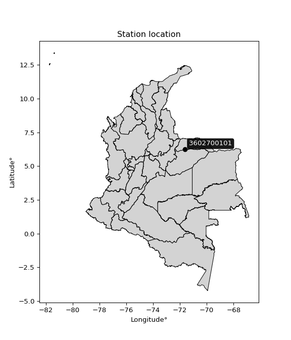

<div align="center">


</div>

# PMP Station (Rain, Pmax24h): 3602700101

Probable Maximum Precipitation (PMP) is the greatest amount of rainfall for a specific duration that is meteorologically possible for a given location, acting as a "worst-case" scenario for extreme storms, crucial for designing safety-critical infrastructure like bridges, river deviations, dams, spillways, and nuclear plants to prevent catastrophic failure. PMP is calculated by hydrologists using meteorological data to determine the upper limit of extreme rainfall, often leading to the Probable Maximum Flood (PMF) for flood control design, and is increasingly being studied for climate change impacts. Probable Maximum Precipitation (PMP) is the theoretical upper limit of rainfall, a deterministic estimate for extreme events, while probability distributions (like GEV, Gumbel) describe the likelihood and frequency of various precipitation amounts, including rare ones, showing how often events occur, with PMP representing the extreme end of these distributions, used for critical infrastructure design to ensure safety against the worst conceivable weather, unlike standard statistical forecasts which cover typical probabilities.

The most common probability distributions in hydrology, used for analyzing floods, rainfall, and streamflow, include the Normal, Log-Normal, Gumbel, Gamma (including Log-Pearson Type III), and Generalized Extreme Value (GEV) distributions, often chosen based on the data´s skewness and whether modeling extremes or general conditions, with Gumbel and GEV popular for extreme events like floods, while the Normal distribution serves as a baseline, though often requiring transformations for skewed hydrological data. These distributions help in designing water infrastructure, managing water resources, and forecasting hydrologic events.

> Hydrological data often isn´t perfectly normal (it´s skewed), so different distributions are needed for different applications, such as: **Flood Frequency Analysis**: Using Gumbel, GEV, or Log-Pearson Type III for predicting extreme flood magnitudes and their return periods, **Rainfall Analysis**: Normal for annual totals, but Log-Normal, Weibull, or GEV for intensity or extreme daily rainfall, **Streamflow Modeling**: Gamma and Log-Normal for maximum flows, GEV for minimum flows, and Kappa for daily flows.

<div align="center">

</img>

</div>


## A. General information


### 1. General running parameters

• app_version: _v20260108_. • runtime: _2026-01-09 11:32:22.148588_. • Python version: _3.14.0_. • SciPy version: _1.16.3_. • Pandas version: _2.3.3_. • NumPy version: _2.3.5_. • Stations dataset (station_dataset_file): _dataset/pmax24h_in/automatic_colombia_2003_2024.csv_. • Stations catalog (station_catalog_file): _dataset/CNE.xls_. • Minimum year to eval til year_max (date_min): _1900_. • Maximum year to eval since year_min (date_max): _2024_. • Creates, save and include plots into reports (create_plot): _False_. • Plot only fit distributions with Δo > Δ (plot_only_fit): _True_. • Plot only simple graphs avoiding multiple CDFs and multiple Extreme values plots (plot_only_simple): _True_. • Eval low extreme values, if False, evaluates high extreme values (low_extreme): _False_. • Eval every SciPy distribution as logarithmic (pdist_logarithmic_on): _True_. • Standard deviation normalized (ddof): _1.0_. • Return periods to eval in years (Tr): _[2, 2.33, 5, 10, 15, 20, 25, 50, 75, 100, 200, 250, 500, 750, 1000]_. • Minimum data sample per station, 0 means any (minimum_sample): _5_. • Z-Score maximum threshold to adjust a value, 0 means disable (zscore_max): _3.5_. • Z-Score minimum threshold to adjust a value, 0 means disable (zscore_min): _-2.5_. • Avoid zeros, e.g. rain = 0 (avoid_zeros): _True_. • Avoid null values (avoid_nans): _True_. 

:file_folder:Table: [dataset.csv](../../dataset/pmax24h_in/automatic_colombia_2003_2024.csv)

> Delta Degrees of Freedom (DDOF): is a parameter used in the formulas for calculating variance and standard deviation. When ddof=0, the divisor is $N$ (the total number of observations) and this is used when your data set is the entire population. When ddof=1, the divisor is $N-1$ and this is used when your data set is a sample drawn from a larger population. Using $N-1$ provides an unbiased estimate of the population variance (known as Bessel´s correction).


### 2. Station info and location

|   id |     CODIGO | NOMBRE                            | CATEGORIA    | TECNOLOGIA                              | ESTADO           | FECHA_INSTALACION   |   FECHA_SUSPENSION |   ALTITUD |   LATITUD |   LONGITUD | DEPARTAMENTO   | MUNICIPIO   | AREA_OPERATIVA                              | ENTIDAD                                                     | AREA_HIDROGRAFICA   | ZONA_HIDROGRAFICA   | SUBZONA_HIDROGRAFICA   | CORRIENTE   | Catalogo   |   Version |
|-----:|-----------:|:----------------------------------|:-------------|:----------------------------------------|:-----------------|:--------------------|-------------------:|----------:|----------:|-----------:|:---------------|:------------|:--------------------------------------------|:------------------------------------------------------------|:--------------------|:--------------------|:-----------------------|:------------|:-----------|----------:|
|    0 | 3602700101 | SAN SALVADOR - AUT   [3602700101] | Limnigráfica | Automática con Telemetría, Convencional | En Mantenimiento | 17/03/2018          |                nan |       178 |   6.22768 |   -71.6185 | Arauca         | Tame        | Area Operativa 06 - Boyacá-Casanare-Vichada | INSTITUTO DE HIDROLOGIA METEOROLOGIA Y ESTUDIOS AMBIENTALES | Orinoco             | Casanare            | Río Casanare           | Cravo Norte | CNE_IDEAM  |  20251226 |

<div align="center">

Dynamic map: [:earth_americas:Google](http://maps.google.com/maps?q=6.227680556,-71.618483333) [:earth_americas:OSM](https://www.openstreetmap.org/#map=18/6.227680556/-71.618483333&layers=P) [:earth_americas:Bing](https://www.bing.com/maps?cp=6.227680556~-71.618483333&lvl=18) [:earth_americas:Apple](https://maps.apple.com/frame?center=6.227680556%2C-71.618483333&span=0.003%2C0.006)

</div>


<div align="center">

```geojson
{
  "type": "Feature",
  "geometry": {
    "type": "Point", 
    "coordinates": [-71.618483333, 6.227680556]
  }, 
  "properties": {
    "Name": "3602700101"
  }
}
```

</div>


### 3. Discrete values table and plot

<div align="center">

|               |          0 |           1 |           2 |           3 |           4 |          5 |
|:--------------|-----------:|------------:|------------:|------------:|------------:|-----------:|
| Date          | 2019       | 2020        | 2021        | 2022        | 2023        | 2024       |
| Value         |  124.2     |   82.2      |  101.2      |   26.4      |   16.6      |    6.8     |
| Value_initial |  124.2     |   82.2      |  101.2      |   26.4      |   16.6      |    6.8     |
| count         |    6       |    6        |    6        |    6        |    6        |    6       |
| mean          |   59.5667  |   59.5667   |   59.5667   |   59.5667   |   59.5667   |   59.5667  |
| std           |   49.3022  |   49.3022   |   49.3022   |   49.3022   |   49.3022   |   49.3022  |
| zscore        |    1.31096 |    0.459073 |    0.844451 |   -0.672721 |   -0.871495 |   -1.07027 |


</div>


> The initial value (value_initial) correspond to the initial obtained or null completed value, and value (value) is adjusted only when the initial value is outside the valid range (outlier) definite through the Z-Score value. If Z-Score is active, values out of range or outliers are replaced with the station mean value. A Z-Score (or standard score) measures how many standard deviations a data point is from the mean of a dataset, indicating its relative position; positive scores mean above the mean, negative mean below, and a score of zero is exactly at the mean, allowing for comparison of values from different distributions. It´s calculated using the formula $z=(x–μ)/σ$, where $x$ is the data point, $μ$ is the mean, and $σ$ is the standard deviation, helping identify outliers and understand probability.
>
> <sub>**Note**: In this study, "completing" (filling gaps in) and "extending" (forecasting or lengthening the historical record) rainfall data series are avoided for certain critical analyses because they introduce artificial bias and uncertainty, which can distort the statistics of rare events (extremes), alter day-to-day variability, and compromise the integrity and homogeneity of the original data. Some reasons against Completing/Extending rainfall data are: **Distortion of Extremes and Variability**: The primary issue is that most gap-filling or extension methods rely on averaging or regression with nearby stations, which inherently smooths the data. Rainfall is highly variable in space and time, with a large percentage of zero values and occasional large storms. Infilling methods often underestimate the highest values and overestimate the lowest (zero) values, which severely distorts analyses focused on flood frequency, drought severity, and intensity-duration-frequency (IDF) curves, **Loss of Data Homogeneity**: Infilled or extended data are synthetic estimates, not actual measurements. Combining these estimates with observed data can violate the assumption of data homogeneity, which requires that the data properties do not change over time. Inhomogeneity can lead to incorrect conclusions about long-term trends or changes in climate patterns, **Propagation of Errors**: Errors and biases from the original data (e.g., wind-induced undercatch, instrument errors, site changes) or the data used for imputation can propagate through the analysis, leading to unreliable hydrological models and inaccurate predictions, **Compromised Statistical Integrity**: For statistical analyses, especially those involving the frequency of events, using artificial data can introduce time bias or autocorrelation that doesn´t exist in reality, making it difficult to assess the true probability of events, **Difficulty in Validation**: It is difficult to accurately validate the quality of filled or extended data, especially for past periods where ground-truth measurements are unavailable. The reliability of imputation techniques heavily depends on the density of the surrounding station network and the complexity of the local topography.</sub>


### 4. Active continuous probability distributions from SciPy (45 of 104 available)

A Probability Density Function (PDF) describes the relative likelihood of a continuous random variable falling within a specific range, where the total area under its curve equals 1, and the area over any interval gives the actual probability for that range. Unlike discrete probabilities (like rolling a die), a PDF shows density, not direct probability for a single point (which is zero), with higher points indicating higher likelihood, often visualized as a bell curve for normal distributions.

A log of a probability density function (log-PDF) is simply the logarithm of the PDF´s value, denoted as $log(f(x))$, useful for converting multiplication of probabilities into addition, improving numerical stability with tiny numbers, and connecting to information theory concepts like entropy. Instead of dealing with very small probabilities (e.g., 0.000001), log-PDFs use negative numbers (e.g., $log(0.00001) ≈ -11.51$ that are easier for computers to handle, preventing underflow errors and simplifying complex calculations. In this study, each active probability distribution from SciPy is also evaluated in the $log$ form.

[scipy.stats](https://docs.scipy.org/doc/scipy/reference/stats.html) is a Python´s powerful submodule within the SciPy library for comprehensive statistical analysis, offering over 130 probability distributions (like Normal, Poisson), functions for descriptive stats (mean, variance), hypothesis testing (t-tests, chi-square), random variable generation, and statistical tests, making it essential for data science, modeling, and research. It provides tools to explore, model, and draw conclusions from data efficiently, working seamlessly with NumPy.

<div align="center">

|   id | p_dist             |   n_parameter | fit_method   | label                                                                       | active   | ref                                                                                                        |
|-----:|:-------------------|--------------:|:-------------|:----------------------------------------------------------------------------|:---------|:-----------------------------------------------------------------------------------------------------------|
|    0 | alpha              |             3 | MLE          | Alpha                                                                       | True     | [:mortar_board:](https://docs.scipy.org/doc/scipy/reference/generated/scipy.stats.alpha.html)              |
|    1 | betaprime          |             4 | MLE          | Beta prime                                                                  | True     | [:mortar_board:](https://docs.scipy.org/doc/scipy/reference/generated/scipy.stats.betaprime.html)          |
|    2 | chi2               |             3 | MLE          | Chi²                                                                        | True     | [:mortar_board:](https://docs.scipy.org/doc/scipy/reference/generated/scipy.stats.chi2.html)               |
|    3 | crystalball        |             4 | MLE          | Crystalball                                                                 | True     | [:mortar_board:](https://docs.scipy.org/doc/scipy/reference/generated/scipy.stats.crystalball.html)        |
|    4 | dweibull           |             3 | MLE          | Double Weibull                                                              | True     | [:mortar_board:](https://docs.scipy.org/doc/scipy/reference/generated/scipy.stats.dweibull.html)           |
|    5 | erlang             |             3 | MLE          | Erlang                                                                      | True     | [:mortar_board:](https://docs.scipy.org/doc/scipy/reference/generated/scipy.stats.erlang.html)             |
|    6 | expon              |             2 | MLE          | Exponential                                                                 | True     | [:mortar_board:](https://docs.scipy.org/doc/scipy/reference/generated/scipy.stats.expon.html)              |
|    7 | exponnorm          |             3 | MLE          | Exponentially modified Normal                                               | True     | [:mortar_board:](https://docs.scipy.org/doc/scipy/reference/generated/scipy.stats.exponnorm.html)          |
|    8 | f                  |             4 | MLE          | F                                                                           | True     | [:mortar_board:](https://docs.scipy.org/doc/scipy/reference/generated/scipy.stats.f.html)                  |
|    9 | fatiguelife        |             3 | MLE          | Fatigue-life (Birnbaum-Saunders)                                            | True     | [:mortar_board:](https://docs.scipy.org/doc/scipy/reference/generated/scipy.stats.fatiguelife.html)        |
|   10 | fisk               |             3 | MLE          | Fisk                                                                        | True     | [:mortar_board:](https://docs.scipy.org/doc/scipy/reference/generated/scipy.stats.fisk.html)               |
|   11 | gamma              |             3 | MLE          | Gamma                                                                       | True     | [:mortar_board:](https://docs.scipy.org/doc/scipy/reference/generated/scipy.stats.gamma.html)              |
|   12 | genexpon           |             5 | MLE          | Generalized exponential                                                     | True     | [:mortar_board:](https://docs.scipy.org/doc/scipy/reference/generated/scipy.stats.genexpon.html)           |
|   13 | genlogistic        |             3 | MLE          | Generalized logistic                                                        | True     | [:mortar_board:](https://docs.scipy.org/doc/scipy/reference/generated/scipy.stats.genlogistic.html)        |
|   14 | gibrat             |             2 | MM           | Gibrat                                                                      | True     | [:mortar_board:](https://docs.scipy.org/doc/scipy/reference/generated/scipy.stats.gibrat.html)             |
|   15 | gompertz           |             3 | MLE          | Gompertz (or truncated Gumbel)                                              | True     | [:mortar_board:](https://docs.scipy.org/doc/scipy/reference/generated/scipy.stats.gompertz.html)           |
|   16 | gumbel_l           |             2 | MM           | Gumbel Left Skew                                                            | True     | [:mortar_board:](https://docs.scipy.org/doc/scipy/reference/generated/scipy.stats.gumbel_l.html)           |
|   17 | gumbel_r           |             2 | MM           | Gumbel Right Skew                                                           | True     | [:mortar_board:](https://docs.scipy.org/doc/scipy/reference/generated/scipy.stats.gumbel_r.html)           |
|   18 | halflogistic       |             2 | MM           | Half-logistic                                                               | True     | [:mortar_board:](https://docs.scipy.org/doc/scipy/reference/generated/scipy.stats.halflogistic.html)       |
|   19 | halfnorm           |             2 | MM           | Half Normal                                                                 | True     | [:mortar_board:](https://docs.scipy.org/doc/scipy/reference/generated/scipy.stats.halfnorm.html)           |
|   20 | hypsecant          |             2 | MM           | hyperbolic secant                                                           | True     | [:mortar_board:](https://docs.scipy.org/doc/scipy/reference/generated/scipy.stats.hypsecant.html)          |
|   21 | invgamma           |             3 | MLE          | Inverted gamma                                                              | True     | [:mortar_board:](https://docs.scipy.org/doc/scipy/reference/generated/scipy.stats.invgamma.html)           |
|   22 | invgauss           |             3 | MLE          | Inverse Gaussian                                                            | True     | [:mortar_board:](https://docs.scipy.org/doc/scipy/reference/generated/scipy.stats.invgauss.html)           |
|   23 | invweibull         |             3 | MLE          | Inverted Weibull                                                            | True     | [:mortar_board:](https://docs.scipy.org/doc/scipy/reference/generated/scipy.stats.invweibull.html)         |
|   24 | kappa4             |             4 | MLE          | Kappa 4                                                                     | True     | [:mortar_board:](https://docs.scipy.org/doc/scipy/reference/generated/scipy.stats.kappa4.html)             |
|   25 | kstwobign          |             2 | MLE          | Limiting distribution of scaled Kolmogorov-Smirnov two-sided test statistic | True     | [:mortar_board:](https://docs.scipy.org/doc/scipy/reference/generated/scipy.stats.kstwobign.html)          |
|   26 | laplace            |             2 | MM           | Laplace                                                                     | True     | [:mortar_board:](https://docs.scipy.org/doc/scipy/reference/generated/scipy.stats.laplace.html)            |
|   27 | laplace_asymmetric |             3 | MLE          | Asymmetric Laplace                                                          | True     | [:mortar_board:](https://docs.scipy.org/doc/scipy/reference/generated/scipy.stats.laplace_asymmetric.html) |
|   28 | loggamma           |             3 | MLE          | Log gamma                                                                   | True     | [:mortar_board:](https://docs.scipy.org/doc/scipy/reference/generated/scipy.stats.loggamma.html)           |
|   29 | logistic           |             2 | MM           | Logistic (or Sech-squared)                                                  | True     | [:mortar_board:](https://docs.scipy.org/doc/scipy/reference/generated/scipy.stats.logistic.html)           |
|   30 | lognorm            |             3 | MLE          | Log Normal                                                                  | True     | [:mortar_board:](https://docs.scipy.org/doc/scipy/reference/generated/scipy.stats.lognorm.html)            |
|   31 | maxwell            |             2 | MM           | Maxwell                                                                     | True     | [:mortar_board:](https://docs.scipy.org/doc/scipy/reference/generated/scipy.stats.maxwell.html)            |
|   32 | mielke             |             4 | MLE          | Mielke Beta-Kappa / Dagum                                                   | True     | [:mortar_board:](https://docs.scipy.org/doc/scipy/reference/generated/scipy.stats.mielke.html)             |
|   33 | moyal              |             2 | MM           | Moyal                                                                       | True     | [:mortar_board:](https://docs.scipy.org/doc/scipy/reference/generated/scipy.stats.moyal.html)              |
|   34 | nakagami           |             3 | MLE          | Nakagami                                                                    | True     | [:mortar_board:](https://docs.scipy.org/doc/scipy/reference/generated/scipy.stats.nakagami.html)           |
|   35 | ncf                |             5 | MLE          | Non-central F distribution                                                  | True     | [:mortar_board:](https://docs.scipy.org/doc/scipy/reference/generated/scipy.stats.ncf.html)                |
|   36 | nct                |             4 | MLE          | Non-central Student’s t                                                     | True     | [:mortar_board:](https://docs.scipy.org/doc/scipy/reference/generated/scipy.stats.nct.html)                |
|   37 | norm               |             2 | MM           | Normal                                                                      | True     | [:mortar_board:](https://docs.scipy.org/doc/scipy/reference/generated/scipy.stats.norm.html)               |
|   38 | pearson3           |             3 | MM           | Pearson type III                                                            | True     | [:mortar_board:](https://docs.scipy.org/doc/scipy/reference/generated/scipy.stats.pearson3.html)           |
|   39 | rayleigh           |             2 | MM           | Rayleigh                                                                    | True     | [:mortar_board:](https://docs.scipy.org/doc/scipy/reference/generated/scipy.stats.rayleigh.html)           |
|   40 | rice               |             3 | MLE          | Rice                                                                        | True     | [:mortar_board:](https://docs.scipy.org/doc/scipy/reference/generated/scipy.stats.rice.html)               |
|   41 | t                  |             3 | MLE          | Student’s t                                                                 | True     | [:mortar_board:](https://docs.scipy.org/doc/scipy/reference/generated/scipy.stats.t.html)                  |
|   42 | truncnorm          |             4 | MLE          | Truncated normal                                                            | True     | [:mortar_board:](https://docs.scipy.org/doc/scipy/reference/generated/scipy.stats.truncnorm.html)          |
|   43 | wald               |             2 | MM           | Wald                                                                        | True     | [:mortar_board:](https://docs.scipy.org/doc/scipy/reference/generated/scipy.stats.wald.html)               |
|   44 | weibull_min        |             3 | MLE          | Weibull minimum                                                             | True     | [:mortar_board:](https://docs.scipy.org/doc/scipy/reference/generated/scipy.stats.weibull_min.html)        |

</div>

> **n_parameter:** # arguments & localization & scale.
>
> **Fit methods:** (MLE) maximum likelihood, (MM) L-moments.
>
>**Inactive** (With the only purpose of prevent loops, zero divisions, infinite values, over high estimated values or horizontal trending for recurrence intervals estimations, the follow distributions were disabled.)**:** foldnorm, gennorm, norminvgauss, powernorm, powerlognorm, skewnorm, genextreme, anglit, arcsine, argus, beta, bradford, burr, burr12, cauchy, cosine, halfcauchy, foldcauchy, skewcauchy, wrapcauchy, dgamma, gengamma, exponweib, exponpow, truncexpon, gausshyper, genhalflogistic, genhyperbolic, geninvgauss, halfgennorm, johnsonsb, johnsonsu, kappa3, ksone, kstwo, loglaplace, levy, levy_l, levy_stable, ncx2, pareto, genpareto, truncpareto, lomax, powerlaw, rdist, rel_breitwigner, recipinvgauss, semicircular, studentized_range, trapezoid, triang, truncweibull_min, tukeylambda, uniform, loguniform, vonmises, vonmises_line, weibull_max, 


## B. Probability (PDF) vs. Empirical (EDF) distributions functions

A continuous probability distribution (CPD) describes probabilities for variables that can take any value within a range (like rain any time), unlike discrete variables with specific outcomes (like temperature). It uses a Probability Density Function (PDF), a curve where the total area under it equals 1, and the probability of the variable falling within an interval (a to b) is found by calculating the area under the curve between those points. A key feature is that the probability of hitting any single exact value is zero, so probabilities are always expressed for ranges, e.g., $P(a ≤ X ≤ b)$.

<div align="center">

Distributions parameters from station values
|    |    station | p_dist                |   n |             loc |          scale | shape                  | shape1                | shape2                | shape3   |
|---:|-----------:|:----------------------|----:|----------------:|---------------:|:-----------------------|:----------------------|:----------------------|:---------|
|  0 | 3602700101 | alpha                 |   6 |    -0.0338201   |   14.9827      | 1.1048262357403598e-09 |                       |                       |          |
|  1 | 3602700101 | betaprime             |   6 |    -2.44297     |  328.252       | 1.6043588558184183     | 9.356210062672595     |                       |          |
|  2 | 3602700101 | chi2                  |   6 |     6.8         |    4.42628     | 1.5558433401969358     |                       |                       |          |
|  3 | 3602700101 | crystalball           |   6 |    59.5667      |   45.0066      | 1342.7678829539632     | 17832.257131651677    |                       |          |
|  4 | 3602700101 | dweibull              |   6 |    60.0219      |   47.7884      | 3.5959299961795477     |                       |                       |          |
|  5 | 3602700101 | erlang                |   6 |   -11.381       |   26.17        | 2.477011255331063      |                       |                       |          |
|  6 | 3602700101 | expon                 |   6 |     6.8         |   52.7667      |                        |                       |                       |          |
|  7 | 3602700101 | exponnorm             |   6 |    54.9194      |   44.7661      | 0.10381259410851774    |                       |                       |          |
|  8 | 3602700101 | f                     |   6 |    -0.463968    |   60.7875      | 2.620941102760944      | 132.1550848574443     |                       |          |
|  9 | 3602700101 | fatiguelife           |   6 |     6.8         |    9.76956e-05 | 646.1057931063425      |                       |                       |          |
| 10 | 3602700101 | fisk                  |   6 |     6.8         |   37.8143      | 0.4591138029634416     |                       |                       |          |
| 11 | 3602700101 | gamma                 |   6 |   -23.1298      |   22.2771      | 3.4351127269730073     |                       |                       |          |
| 12 | 3602700101 | genexpon              |   6 |     6.8         |    2.76522     | 0.05241450240093786    | 7.455729752196345e-08 | 3.370172305068457     |          |
| 13 | 3602700101 | genlogistic           |   6 |  -230.719       |   36.9499      | 1425.2754456802973     |                       |                       |          |
| 14 | 3602700101 | gibrat                |   6 |    25.2323      |   20.8248      |                        |                       |                       |          |
| 15 | 3602700101 | gompertz              |   6 |     6.8         |  125.781       | 1.6106132966480313     |                       |                       |          |
| 16 | 3602700101 | gumbel_l              |   6 |    79.822       |   35.0915      |                        |                       |                       |          |
| 17 | 3602700101 | gumbel_r              |   6 |    39.3113      |   35.0915      |                        |                       |                       |          |
| 18 | 3602700101 | halflogistic          |   6 |     6.22341     |   38.479       |                        |                       |                       |          |
| 19 | 3602700101 | halfnorm              |   6 |    -0.00440672  |   74.6613      |                        |                       |                       |          |
| 20 | 3602700101 | hypsecant             |   6 |    59.5667      |   28.6521      |                        |                       |                       |          |
| 21 | 3602700101 | invgamma              |   6 |   -13.1519      |   92.879       | 2.097951843164916      |                       |                       |          |
| 22 | 3602700101 | invgauss              |   6 |    -2.53316     |   47.361       | 1.3112008033174694     |                       |                       |          |
| 23 | 3602700101 | invweibull            |   6 |   -12.9314      |   39.3929      | 1.5073197445418667     |                       |                       |          |
| 24 | 3602700101 | kappa4                |   6 |   -16.8583      |  141.859       | 1.1997659096058744     | 0.9817474295941936    |                       |          |
| 25 | 3602700101 | kstwobign             |   6 |   -87.3493      |  167.416       |                        |                       |                       |          |
| 26 | 3602700101 | laplace               |   6 |    59.5667      |   31.8245      |                        |                       |                       |          |
| 27 | 3602700101 | laplace_asymmetric    |   6 |     6.8         |    0.000374896 | 7.1047892196631075e-06 |                       |                       |          |
| 28 | 3602700101 | loggamma              |   6 | -8821.92        | 1317.08        | 848.8702377909603      |                       |                       |          |
| 29 | 3602700101 | logistic              |   6 |    59.5667      |   24.8134      |                        |                       |                       |          |
| 30 | 3602700101 | lognorm               |   6 |     6.8         |    0.0722768   | 14.35187835548808      |                       |                       |          |
| 31 | 3602700101 | maxwell               |   6 |   -47.08        |   66.8309      |                        |                       |                       |          |
| 32 | 3602700101 | mielke                |   6 |    -0.580015    |  128.263       | 0.7682812696037349     | 3.3027198538268436    |                       |          |
| 33 | 3602700101 | moyal                 |   6 |    33.829       |   20.2601      |                        |                       |                       |          |
| 34 | 3602700101 | nakagami              |   6 |     6.8         |   74.8989      | 0.4329669056168737     |                       |                       |          |
| 35 | 3602700101 | ncf                   |   6 |    -0.775495    |   35.0728      | 2.3723332669283455     | 148.46915273879426    | 1.6601619604047748    |          |
| 36 | 3602700101 | nct                   |   6 |   -31.3838      |    1.74608     | 2.224410207672622      | 35.155960820776315    |                       |          |
| 37 | 3602700101 | norm                  |   6 |    59.5667      |   45.0066      |                        |                       |                       |          |
| 38 | 3602700101 | pearson3              |   6 |    59.5667      |   45.0066      | 0.16643567082117777    |                       |                       |          |
| 39 | 3602700101 | rayleigh              |   6 |   -26.5335      |   68.698       |                        |                       |                       |          |
| 40 | 3602700101 | rice                  |   6 |   -18.9614      |   58.0925      | 0.6538559377087008     |                       |                       |          |
| 41 | 3602700101 | t                     |   6 |    59.5662      |   45.0066      | 709913890.4573994      |                       |                       |          |
| 42 | 3602700101 | truncnorm             |   6 |    59.5667      |   45.0066      | -583.0867972272656     | 691.7114272982697     |                       |          |
| 43 | 3602700101 | wald                  |   6 |    14.5601      |   45.0066      |                        |                       |                       |          |
| 44 | 3602700101 | weibull_min           |   6 |     6.8         |   60.8128      | 0.880752881950364      |                       |                       |          |
| 45 | 3602700101 | logalpha              |   6 |   -19.9877      |  508.718       | 21.57929668421399      |                       |                       |          |
| 46 | 3602700101 | logbetaprime          |   6 |   -12.6806      |  312.58        | 239.26188697395418     | 4588.845142880107     |                       |          |
| 47 | 3602700101 | logchi2               |   6 |     1.91692     |    1.00916     | 1.1781426574827387     |                       |                       |          |
| 48 | 3602700101 | logcrystalball        |   6 |     3.64131     |    1.0596      | 872.0649388234883      | 10.843042285702063    |                       |          |
| 49 | 3602700101 | logdweibull           |   6 |     3.67958     |    1.10153     | 2.5028887246675726     |                       |                       |          |
| 50 | 3602700101 | logerlang             |   6 |   -13.8165      |    0.0656327   | 266.00852596140635     |                       |                       |          |
| 51 | 3602700101 | logexpon              |   6 |     1.91692     |    1.72438     |                        |                       |                       |          |
| 52 | 3602700101 | logexponnorm          |   6 |     3.64045     |    1.0596      | 0.0008072899168253428  |                       |                       |          |
| 53 | 3602700101 | logf                  |   6 |  -502.524       |  506.163       | 1372409.9268088178     | 680463.304037479      |                       |          |
| 54 | 3602700101 | logfatiguelife        |   6 |  -205.401       |  209.043       | 0.0050715327203315445  |                       |                       |          |
| 55 | 3602700101 | logfisk               |   6 |    -1.98275e+06 |    1.98275e+06 | 3038438.1279039374     |                       |                       |          |
| 56 | 3602700101 | loggamma              |   6 |   -13.0255      |    0.0692156   | 240.80557364767537     |                       |                       |          |
| 57 | 3602700101 | loggenexpon           |   6 |     1.91647     |    0.0336777   | 0.009211097979897432   | 4.2251172467664855    | 6.931246870702475e-05 |          |
| 58 | 3602700101 | loggenlogistic        |   6 |     4.82191     |    1.84845e-06 | 1.5721300720461298e-06 |                       |                       |          |
| 59 | 3602700101 | loggibrat             |   6 |     2.83306     |    0.490233    |                        |                       |                       |          |
| 60 | 3602700101 | loggompertz           |   6 |     1.91692     |    1.17518     | 0.19709419130440473    |                       |                       |          |
| 61 | 3602700101 | loggumbel_l           |   6 |     4.11818     |    0.826165    |                        |                       |                       |          |
| 62 | 3602700101 | loggumbel_r           |   6 |     3.16443     |    0.826165    |                        |                       |                       |          |
| 63 | 3602700101 | loghalflogistic       |   6 |     2.38544     |    0.905914    |                        |                       |                       |          |
| 64 | 3602700101 | loghalfnorm           |   6 |     2.23881     |    1.75776     |                        |                       |                       |          |
| 65 | 3602700101 | loghypsecant          |   6 |     3.64131     |    0.674561    |                        |                       |                       |          |
| 66 | 3602700101 | loginvgamma           |   6 |   -14.1262      | 4745.38        | 268.19489624849166     |                       |                       |          |
| 67 | 3602700101 | loginvgauss           |   6 |    -3.78687     |  333.687       | 0.022290944563979502   |                       |                       |          |
| 68 | 3602700101 | loginvweibull         |   6 |    -4.56879e+08 |    4.56879e+08 | 462442669.8646555      |                       |                       |          |
| 69 | 3602700101 | logkappa4             |   6 |     1.85334     |    3.22833     | 1.007001840700886      | 1.0875085465679077    |                       |          |
| 70 | 3602700101 | logkstwobign          |   6 |    -0.468379    |    4.68449     |                        |                       |                       |          |
| 71 | 3602700101 | loglaplace            |   6 |     3.64131     |    0.749249    |                        |                       |                       |          |
| 72 | 3602700101 | loglaplace_asymmetric |   6 |     3.27336     |    0.920637    | 0.8199318468455099     |                       |                       |          |
| 73 | 3602700101 | logloggamma           |   6 |     4.82199     |    6.68495e-06 | 5.648833011624463e-06  |                       |                       |          |
| 74 | 3602700101 | loglogistic           |   6 |     3.64131     |    0.584187    |                        |                       |                       |          |
| 75 | 3602700101 | loglognorm            |   6 |     1.91692     |    0.00416959  | 13.674979724896795     |                       |                       |          |
| 76 | 3602700101 | logmaxwell            |   6 |     1.1305      |    1.57341     |                        |                       |                       |          |
| 77 | 3602700101 | logmielke             |   6 |     1.91692     |    2.92983     | 0.7943500880720933     | 846.9584073265148     |                       |          |
| 78 | 3602700101 | logmoyal              |   6 |     3.03536     |    0.476987    |                        |                       |                       |          |
| 79 | 3602700101 | lognakagami           |   6 |     2.8094      |    1.39311     | 0.2952485901022012     |                       |                       |          |
| 80 | 3602700101 | logncf                |   6 |   -39.9777      |   43.61        | 4786.478962942582      | 10776.918154870205    | 0.34829640431940945   |          |
| 81 | 3602700101 | lognct                |   6 |   -43.1258      |    1.00486     | 9202.40165529762       | 46.536414895798856    |                       |          |
| 82 | 3602700101 | lognorm               |   6 |     3.64131     |    1.0596      |                        |                       |                       |          |
| 83 | 3602700101 | logpearson3           |   6 |     3.64131     |    1.0596      | -0.38187418990238636   |                       |                       |          |
| 84 | 3602700101 | lograyleigh           |   6 |     1.61423     |    1.61737     |                        |                       |                       |          |
| 85 | 3602700101 | logrice               |   6 |     1.32353     |    1.20515     | 1.5722515812318698     |                       |                       |          |
| 86 | 3602700101 | logt                  |   6 |     3.64132     |    1.0596      | 850156193.3473513      |                       |                       |          |
| 87 | 3602700101 | logtruncnorm          |   6 |    -0.270175    |    2.11941     | 1.449979949995957      | 2.4025922815789453    |                       |          |
| 88 | 3602700101 | logwald               |   6 |     2.58173     |    1.05959     |                        |                       |                       |          |
| 89 | 3602700101 | logweibull_min        |   6 |    -3.89889e+07 |    3.89889e+07 | 46723728.0695532       |                       |                       |          |

</div>

> **loc** (Location parameter): This shifts the distribution along the x-axis. For many common distributions, like the normal (Gaussian) distribution, loc represents the mean $μ$. For others, like the uniform distribution, it might represent the minimum value, or for the beta distribution, the left end of the support interval.
>
> **scale** (Scale parameter): This determines the width or spread of the distribution. For the normal distribution, scale represents the standard deviation $σ$. For a uniform distribution, it defines the length of the interval (from $loc$ to $loc + scale$).
>
> **shape** (Shape parameters): Refers to parameters that define the specific form of a probability distribution, distinct from its location (loc) and scale (scale). These parameters are required arguments for most distribution functions. For example, a normal (Gaussian) distribution is fully defined by its location (mean) and scale (standard deviation), so it has no specific shape parameters beyond loc and scale. However, other distributions have intrinsic properties that need specification, as Gamma distribution that takes a shape parameter, often named $a$ or $alpha$.


### 0. Cumulative distribution values - CDF (90 evaluated)

Cumulative Distribution Function (CDF), denoted as $F$<sub>$X$</sub>$(x)$, is a function that gives the probability that a random variable $X$ will take a value less than or equal to a specific value, $x$ (i.e., $(P(X≥x)$. It essentially "accumulates" probabilities from a given point up to the far right (positive infinity), providing a complete picture of the distribution´s probabilities for both discrete (like rain) and continuous (like temperature) variables, helping to find probabilities over ranges or above certain values. Each station is evaluated separately ordering the $x$ values ascending, calculating the CDF and PDF values for the activated distributions and their logarithmic forms.

<div align="center">

CDF ordered by x ascending and calculating $log(f(x))$ separately
|   id |    Station |   date |     x |   count |    mean |     std |    zscore |   Value_initial |    station |   m |     alpha |   alpha_pdf |   betaprime |   betaprime_pdf |        chi2 |      chi2_pdf |   crystalball |   crystalball_pdf |   dweibull |   dweibull_pdf |    erlang |   erlang_pdf |    expon |   expon_pdf |   exponnorm |   exponnorm_pdf |         f |      f_pdf |   fatiguelife |   fatiguelife_pdf |        fisk |    fisk_pdf |     gamma |   gamma_pdf |    genexpon |   genexpon_pdf |   genlogistic |   genlogistic_pdf |     gibrat |   gibrat_pdf |   gompertz |   gompertz_pdf |   gumbel_l |   gumbel_l_pdf |   gumbel_r |   gumbel_r_pdf |   halflogistic |   halflogistic_pdf |   halfnorm |   halfnorm_pdf |   hypsecant |   hypsecant_pdf |   invgamma |   invgamma_pdf |   invgauss |   invgauss_pdf |   invweibull |   invweibull_pdf |      kappa4 |   kappa4_pdf |   kstwobign |   kstwobign_pdf |   laplace |   laplace_pdf |   laplace_asymmetric |   laplace_asymmetric_pdf |   loggamma |   loggamma_pdf |   logistic |   logistic_pdf |   lognorm |   lognorm_pdf |   maxwell |   maxwell_pdf |   mielke |   mielke_pdf |     moyal |   moyal_pdf |    nakagami |   nakagami_pdf |       ncf |    ncf_pdf |       nct |    nct_pdf |     norm |   norm_pdf |   pearson3 |   pearson3_pdf |   rayleigh |   rayleigh_pdf |      rice |   rice_pdf |        t |      t_pdf |   truncnorm |   truncnorm_pdf |        wald |    wald_pdf |   weibull_min |   weibull_min_pdf |   logalpha |   logalpha_pdf |   logbetaprime |   logbetaprime_pdf |     logchi2 |   logchi2_pdf |   logcrystalball |   logcrystalball_pdf |   logdweibull |   logdweibull_pdf |   logerlang |   logerlang_pdf |   logexpon |   logexpon_pdf |   logexponnorm |   logexponnorm_pdf |      logf |   logf_pdf |   logfatiguelife |   logfatiguelife_pdf |   logfisk |   logfisk_pdf |   loggenexpon |   loggenexpon_pdf |   loggenlogistic |   loggenlogistic_pdf |   loggibrat |   loggibrat_pdf |   loggompertz |   loggompertz_pdf |   loggumbel_l |   loggumbel_l_pdf |   loggumbel_r |   loggumbel_r_pdf |   loghalflogistic |   loghalflogistic_pdf |   loghalfnorm |   loghalfnorm_pdf |   loghypsecant |   loghypsecant_pdf |   loginvgamma |   loginvgamma_pdf |   loginvgauss |   loginvgauss_pdf |   loginvweibull |   loginvweibull_pdf |   logkappa4 |   logkappa4_pdf |   logkstwobign |   logkstwobign_pdf |   loglaplace |   loglaplace_pdf |   loglaplace_asymmetric |   loglaplace_asymmetric_pdf |   logloggamma |   logloggamma_pdf |   loglogistic |   loglogistic_pdf |   loglognorm |   loglognorm_pdf |   logmaxwell |   logmaxwell_pdf |   logmielke |   logmielke_pdf |   logmoyal |   logmoyal_pdf |   lognakagami |   lognakagami_pdf |    logncf |   logncf_pdf |    lognct |   lognct_pdf |   logpearson3 |   logpearson3_pdf |   lograyleigh |   lograyleigh_pdf |   logrice |   logrice_pdf |      logt |   logt_pdf |   logtruncnorm |   logtruncnorm_pdf |   logwald |   logwald_pdf |   logweibull_min |   logweibull_min_pdf |
|-----:|-----------:|-------:|------:|--------:|--------:|--------:|----------:|----------------:|-----------:|----:|----------:|------------:|------------:|----------------:|------------:|--------------:|--------------:|------------------:|-----------:|---------------:|----------:|-------------:|---------:|------------:|------------:|----------------:|----------:|-----------:|--------------:|------------------:|------------:|------------:|----------:|------------:|------------:|---------------:|--------------:|------------------:|-----------:|-------------:|-----------:|---------------:|-----------:|---------------:|-----------:|---------------:|---------------:|-------------------:|-----------:|---------------:|------------:|----------------:|-----------:|---------------:|-----------:|---------------:|-------------:|-----------------:|------------:|-------------:|------------:|----------------:|----------:|--------------:|---------------------:|-------------------------:|-----------:|---------------:|-----------:|---------------:|----------:|--------------:|----------:|--------------:|---------:|-------------:|----------:|------------:|------------:|---------------:|----------:|-----------:|----------:|-----------:|---------:|-----------:|-----------:|---------------:|-----------:|---------------:|----------:|-----------:|---------:|-----------:|------------:|----------------:|------------:|------------:|--------------:|------------------:|-----------:|---------------:|---------------:|-------------------:|------------:|--------------:|-----------------:|---------------------:|--------------:|------------------:|------------:|----------------:|-----------:|---------------:|---------------:|-------------------:|----------:|-----------:|-----------------:|---------------------:|----------:|--------------:|--------------:|------------------:|-----------------:|---------------------:|------------:|----------------:|--------------:|------------------:|--------------:|------------------:|--------------:|------------------:|------------------:|----------------------:|--------------:|------------------:|---------------:|-------------------:|--------------:|------------------:|--------------:|------------------:|----------------:|--------------------:|------------:|----------------:|---------------:|-------------------:|-------------:|-----------------:|------------------------:|----------------------------:|--------------:|------------------:|--------------:|------------------:|-------------:|-----------------:|-------------:|-----------------:|------------:|----------------:|-----------:|---------------:|--------------:|------------------:|----------:|-------------:|----------:|-------------:|--------------:|------------------:|--------------:|------------------:|----------:|--------------:|----------:|-----------:|---------------:|-------------------:|----------:|--------------:|-----------------:|---------------------:|
|    0 | 3602700101 |   2024 |   6.8 |       6 | 59.5667 | 49.3022 | -1.07027  |             6.8 | 3602700101 |   1 | 0.0283481 |  0.0231434  |   0.0716474 |      0.0110388  | 3.87161e-13 | 339.1         |      0.120514 |        0.0044581  |   0.11463  |     0.0114075  | 0.0771964 |   0.00851465 | 0        |  0.0189514  |    0.120478 |      0.00446078 | 0.0687895 | 0.0115716  |     0.0531083 |       9.74559e+08 | 2.31913e-08 | 1.1988e+07  | 0.0945037 |  0.00776523 | 5.35977e-09 |     0.0189549  |      0.1002   |        0.00623365 | 0          |   0          |  3.024e-12 |     0.0128049  |   0.117342 |     0.00313954 |  0.0800115 |     0.00575854 |     0.00749211 |         0.0129934  |  0.0726163 |     0.0106424  |    0.100108 |      0.0034366  |  0.0610679 |     0.0114895  |  0.0497834 |     0.0154168  |    0.0587051 |       0.0127149  | 5.03401e-14 |   3.18568    |   0.0901399 |      0.0065122  | 0.0952547 |    0.00299313 |          6.53411e-11 |               0.0189514  |   0.050142 |       0.103534 |   0.106544 |     0.00383633 | 0.0518268 |      0.100155 |  0.115099 |    0.00560689 | 0.111504 |   0.0116069  | 0.0513572 |  0.00574841 | 1.73145e-15 |     1.68808    | 0.0759131 | 0.0114155  | 0.0699405 | 0.0101259  | 0.120514 | 0.0044581  |   0.118028 |     0.00470465 |   0.111054 |     0.00627868 | 0.0764082 | 0.00570522 | 0.120516 | 0.00445816 |    0.120514 |      0.0044581  | 0           | 0           |   1.48624e-15 |        1.47382    |  0.0499941 |       0.109338 |      0.0532327 |           0.10834  | 4.45399e-10 |   1.18162e+06 |        0.0518268 |             0.100155 |     0.0195124 |         0.0898683 |   0.0497126 |        0.102815 |   0        |       0.579917 |      0.0518268 |           0.100155 | 0.0520039 |   0.100646 |        0.0511252 |            0.0998472 | 0.0607327 |     0.0874168 |   0.000125064 |          0.273591 |         0        |            0.0718881 |    0        |       0         |   3.01061e-09 |          0.167715 |     0.0672696 |         0.0786217 |     0.0108161 |         0.0592635 |          0        |              0        |      0        |          0        |      0.0492972 |          0.0727886 |     0.0494033 |          0.107754 |     0.0432386 |          0.10905  |       0.0394941 |            0.129184 |   0.0132443 |        0.319837 |      0.0422397 |           0.150813 |    0.0500552 |        0.0668071 |               0.0666563 |                   0.0883029 |     0.0858803 |         0.0725695 |     0.0496532 |          0.080775 |    0.0127083 |      1.08102e+13 |    0.0308276 |         0.111808 | 1.63774e-07 |       15.486    | 0.00123908 |      0.0146715 |   0           |          0        | 0.0516485 |     0.102298 | 0.0519417 |     0.100819 |     0.0610238 |         0.0952134 |      0.01736  |          0.113703 | 0.0356652 |      0.121512 | 0.0518256 |   0.100153 |     0          |           0        | 0         |     0         |        0.0668324 |             0.077353 |
|    1 | 3602700101 |   2023 |  16.6 |       6 | 59.5667 | 49.3022 | -0.871495 |            16.6 | 3602700101 |   2 | 0.367728  |  0.0287984  |   0.189721  |      0.012485   | 0.759071    |   0.0306769   |      0.169871 |        0.00561985 |   0.246183 |     0.0144451  | 0.174804  |   0.0110687  | 0.169497 |  0.0157392  |    0.169867 |      0.00562364 | 0.18729   | 0.0121716  |     0.688001  |       0.00884814  | 0.349794    | 0.0106551   | 0.182367  |  0.00996901 | 0.169526    |     0.0157416  |      0.171193 |        0.00817222 | 0          |   0          |  0.122348  |     0.0121488  |   0.152131 |     0.00398738 |  0.148052  |     0.00805916 |     0.134023   |         0.0127607  |  0.175995  |     0.0104257  |    0.139814 |      0.00472431 |  0.200215  |     0.0154398  |  0.229146  |     0.0181394  |    0.213548  |       0.0168281  | 0.125043    |   0.0106265  |   0.164548  |      0.00854823 | 0.129605  |    0.00407251 |          0.169497    |               0.0157392  |   0.22156  |       0.286397 |   0.150384 |     0.00514919 | 0.216194  |      0.276643 |  0.176486 |    0.00688431 | 0.213353 |   0.00952858 | 0.126044  |  0.00934721 | 0.134703    |     0.011841   | 0.190655  | 0.0117218  | 0.191946  | 0.0138649  | 0.169871 | 0.00561985 |   0.170228 |     0.0059467  |   0.178901 |     0.00750451 | 0.14067   | 0.00734099 | 0.169874 | 0.00561991 |    0.169871 |      0.00561985 | 7.02363e-06 | 3.95075e-05 |   0.181547    |        0.0147363  |  0.230953  |       0.297914 |      0.229399  |           0.29067  | 0.593281    |   0.293928    |        0.216194  |             0.276643 |     0.287241  |         0.457948  |   0.220549  |        0.286167 |   0.40403  |       0.345613 |      0.216194  |           0.276642 | 0.216978  |   0.27728  |        0.215634  |            0.277183  | 0.202467  |     0.247449  |   0.293266    |          0.356093 |         0        |            0.153573  |    0        |       0         |   0.200775    |          0.286459 |     0.18545   |         0.202236  |     0.215059  |         0.400055  |          0.229819 |              0.522777 |      0.254526 |          0.430625 |      0.18048   |          0.253444  |     0.228794  |          0.297054 |     0.231776  |          0.311097 |       0.269961  |            0.357813 |   0.298143  |        0.322319 |      0.28828   |           0.355291 |    0.164727  |        0.219857  |               0.217427  |                   0.288036  |     0.182565  |         0.154269  |     0.19403   |          0.267692 |    0.652622  |      0.0302655   |    0.232231  |         0.326755 | 0.388975    |        0.346207 | 0.205062   |      0.474834  |   5.48973e-10 |     729959        | 0.219379  |     0.280551 | 0.217239  |     0.277697 |     0.208414  |         0.246587  |      0.23893  |          0.347724 | 0.228237  |      0.303654 | 0.21619   |   0.276639 |     0.00650663 |           1.00162  | 0.0775635 |     0.900644  |        0.182549  |             0.197457 |
|    2 | 3602700101 |   2022 |  26.4 |       6 | 59.5667 | 49.3022 | -0.672721 |            26.4 | 3602700101 |   3 | 0.57085   |  0.0145696  |   0.309776  |      0.0118276  | 0.928422    |   0.00869331  |      0.230583 |        0.0067563  |   0.376978 |     0.0113869  | 0.288362  |   0.0118599  | 0.310264 |  0.0130714  |    0.230619 |      0.00676069 | 0.302927  | 0.0113144  |     0.755921  |       0.00554824  | 0.42514     | 0.00572477  | 0.285973  |  0.0109841  | 0.310312    |     0.013073   |      0.25821  |        0.00945729 | 0.00198112 |   0.00538331 |  0.23783   |     0.0114051  |   0.196032 |     0.004999   |  0.235806  |     0.00970833 |     0.25633    |         0.0121403  |  0.276403  |     0.0100389  |    0.193837 |      0.00635476 |  0.34588   |     0.0138516  |  0.386759  |     0.013968   |    0.367013  |       0.0140984  | 0.222675    |   0.00945328 |   0.254871  |      0.00973521 | 0.176343  |    0.00554113 |          0.310264    |               0.0130714  |   0.372859 |       0.357659 |   0.208063 |     0.00664046 | 0.364203  |      0.354475 |  0.249125 |    0.00788572 | 0.30147  |   0.00853508 | 0.229664  |  0.0114964  | 0.243863    |     0.0105529  | 0.302594  | 0.0110328  | 0.327773  | 0.0133947  | 0.230583 | 0.0067563  |   0.234328 |     0.00711032 |   0.256848 |     0.00833528 | 0.218835  | 0.00853228 | 0.230586 | 0.00675636 |    0.230583 |      0.0067563  | 0.126353    | 0.0234025   |   0.3085      |        0.0114628  |  0.385671  |       0.359573 |      0.381847  |           0.358072 | 0.704907    |   0.196653    |        0.364203  |             0.354475 |     0.460476  |         0.233637  |   0.371951  |        0.358354 |   0.54462  |       0.264083 |      0.364203  |           0.354474 | 0.365157  |   0.354498 |        0.36387   |            0.354801  | 0.34075   |     0.344246  |   0.455889    |          0.339187 |         0        |            0.227871  |    0.457226 |       0.900856  |   0.348199    |          0.346712 |     0.302091  |         0.303831  |     0.41625   |         0.441595  |          0.454274 |              0.43803  |      0.443846 |          0.381733 |      0.334396  |          0.409443  |     0.38371   |          0.361402 |     0.391275  |          0.36547  |       0.440984  |            0.365451 |   0.448974  |        0.328246 |      0.453823  |           0.347776 |    0.305982  |        0.408385  |               0.402017  |                   0.532572  |     0.270199  |         0.22832   |     0.347548  |          0.38816  |    0.66386   |      0.0196664   |    0.396922  |         0.372075 | 0.542422    |        0.317649 | 0.435862   |      0.481073  |   0.402727    |          0.499745 | 0.368422  |     0.354487 | 0.365542  |     0.354554 |     0.343395  |         0.332268  |      0.409127 |          0.374762 | 0.383709  |      0.358492 | 0.364198  |   0.354472 |     0.401651   |           0.711463 | 0.484364  |     0.650944  |        0.296345  |             0.296374 |
|    3 | 3602700101 |   2020 |  82.2 |       6 | 59.5667 | 49.3022 |  0.459073 |            82.2 | 3602700101 |   4 | 0.855429  |  0.00173869 |   0.754689  |      0.00461677 | 0.999898    |   1.17971e-05 |      0.692479 |        0.0078112  |   0.53065  |     0.00481403 | 0.794551  |   0.00536894 | 0.760435 |  0.00454007 |    0.692587 |      0.00780768 | 0.740395  | 0.00480539 |     0.913038  |       0.00142723  | 0.578555    | 0.00148469  | 0.78856   |  0.00563488 | 0.7605      |     0.00453971 |      0.741431 |        0.00600253 | 0.842873   |   0.00422059 |  0.733534  |     0.00621377 |   0.657031 |     0.0104588  |  0.744843  |     0.00625273 |     0.756186   |         0.00556385 |  0.729117  |     0.00582913 |    0.728755 |      0.00836202 |  0.770946  |     0.00358423 |  0.784587  |     0.0033917  |    0.767397  |       0.00321914 | 0.681054    |   0.00744947 |   0.743412  |      0.00616904 | 0.754471  |    0.0077151  |          0.760436    |               0.00454007 |   0.765754 |       0.277142 |   0.713438 |     0.00823926 | 0.76567   |      0.289559 |  0.7093   |    0.00687856 | 0.680035 |   0.00510857 | 0.761827  |  0.0057001  | 0.697609    |     0.0058512  | 0.744881  | 0.00499562 | 0.769695  | 0.00384867 | 0.692479 | 0.0078112  |   0.699753 |     0.00751879 |   0.714236 |     0.00658389 | 0.711207  | 0.00718158 | 0.692483 | 0.00781116 |    0.692479 |      0.0078112  | 0.811344    | 0.00442286  |   0.701351    |        0.00421585 |  0.766549  |       0.261688 |      0.770467  |           0.271439 | 0.855886    |   0.0872455   |        0.76567   |             0.289559 |     0.649972  |         0.428202  |   0.766225  |        0.278146 |   0.764322 |       0.136674 |      0.765669  |           0.289559 | 0.765772  |   0.288534 |        0.764908  |            0.288864  | 0.746602  |     0.289918  |   0.772949    |          0.207862 |         0        |            0.598712  |    0.878561 |       0.127992  |   0.764519    |          0.329267 |     0.758815  |         0.415185  |     0.801191  |         0.214955  |          0.806505 |              0.192927 |      0.783066 |          0.211803 |      0.802626  |          0.274203  |     0.768721  |          0.26497  |     0.766131  |          0.251423 |       0.771559  |            0.202535 |   0.836942  |        0.363507 |      0.771582  |           0.202166 |    0.82057   |        0.239479  |               0.782541  |                   0.193672  |     0.705502  |         0.596154  |     0.788247  |          0.28572  |    0.679931  |      0.0104939   |    0.773191  |         0.25114  | 0.879416    |        0.280297 | 0.812727   |      0.192663  |   0.77543     |          0.21074  | 0.764172  |     0.283009 | 0.765608  |     0.287853 |     0.756975  |         0.326098  |      0.775326 |          0.240051 | 0.767327  |      0.268973 | 0.765665  |   0.289562 |     0.91608    |           0.251572 | 0.849894  |     0.142758  |        0.746124  |             0.417087 |
|    4 | 3602700101 |   2021 | 101.2 |       6 | 59.5667 | 49.3022 |  0.844451 |           101.2 | 3602700101 |   5 | 0.882342  |  0.00115378 |   0.828     |      0.00318667 | 0.999989    |   1.31216e-06 |      0.82253  |        0.00577853 |   0.721577 |     0.0142348  | 0.876928  |   0.00341312 | 0.832874 |  0.00316726 |    0.822558 |      0.0057742  | 0.817817  | 0.00341588 |     0.935921  |       0.00101048  | 0.603489    | 0.00116379  | 0.875294  |  0.00359637 | 0.83293     |     0.00316679 |      0.836186 |        0.00404841 | 0.902195   |   0.00227296 |  0.834832  |     0.00447965 |   0.841019 |     0.0083314  |  0.842468  |     0.00411541 |     0.843774   |         0.00374288 |  0.824746  |     0.00426436 |    0.853753 |      0.00492654 |  0.826844  |     0.00240001 |  0.838295  |     0.00234522 |    0.817745  |       0.00217298 | 0.819284    |   0.00710757 |   0.841841  |      0.00424952 | 0.864849  |    0.00424675 |          0.832874    |               0.00316726 |   0.819132 |       0.23592  |   0.84262  |     0.00534434 | 0.821451  |      0.246384 |  0.82246  |    0.00501424 | 0.765944 |   0.00394415 | 0.849595  |  0.00366757 | 0.795011    |     0.00442611 | 0.825318  | 0.00353888 | 0.829444  | 0.00254907 | 0.82253  | 0.00577853 |   0.823787 |     0.0054749  |   0.822465 |     0.00480508 | 0.82816   | 0.00511995 | 0.822533 | 0.00577847 |    0.82253  |      0.00577853 | 0.876883    | 0.00265733  |   0.770764    |        0.00315042 |  0.816937  |       0.222837 |      0.822698  |           0.230654 | 0.872845    |   0.0761548   |        0.821451  |             0.246384 |     0.743629  |         0.457187  |   0.819778  |        0.236588 |   0.791096 |       0.121147 |      0.82145   |           0.246384 | 0.821357  |   0.24554  |        0.820562  |            0.245876  | 0.802062  |     0.243287  |   0.813347    |          0.180847 |         0        |            0.71454   |    0.901778 |       0.097089  |   0.828676    |          0.285929 |     0.839463  |         0.355449  |     0.841699  |         0.175573  |          0.843077 |              0.15963  |      0.823952 |          0.181742 |      0.852832  |          0.210478  |     0.819693  |          0.225145 |     0.81452   |          0.214043 |       0.810488  |            0.172373 |   0.914425  |        0.384357 |      0.810762  |           0.174971 |    0.864055  |        0.181441  |               0.819304  |                   0.16093   |     0.841026  |         0.710674  |     0.841621  |          0.228171 |    0.682024  |      0.00965904  |    0.821524  |         0.213763 | 0.937218    |        0.275715 | 0.84891    |      0.156473  |   0.815993    |          0.17997  | 0.818728  |     0.241268 | 0.821065  |     0.245    |     0.820303  |         0.281433  |      0.821568 |          0.204829 | 0.81926   |      0.230215 | 0.821446  |   0.246387 |     0.963044   |           0.201602 | 0.876387  |     0.113408  |        0.827761  |             0.363047 |
|    5 | 3602700101 |   2019 | 124.2 |       6 | 59.5667 | 49.3022 |  1.31096  |           124.2 | 3602700101 |   6 | 0.904007  |  0.00076894 |   0.887062  |      0.00203689 | 0.999999    |   9.3027e-08  |      0.924511 |        0.00316083 |   0.97214  |     0.00450725 | 0.936096  |   0.00186512 | 0.891921 |  0.00204825 |    0.924462 |      0.00315883 | 0.881891  | 0.00223465 |     0.955119  |       0.000683471 | 0.627178    | 0.000914417 | 0.937324  |  0.00193634 | 0.891966    |     0.00204778 |      0.908458 |        0.00236036 | 0.94046    |   0.00119642 |  0.916696  |     0.00271266 |   0.971039 |     0.00292305 |  0.914841  |     0.00232036 |     0.910936   |         0.00221153 |  0.903802  |     0.00267853 |    0.933531 |      0.00230303 |  0.871471  |     0.00155851 |  0.882588  |     0.00157174 |    0.858503  |       0.00143968 | 0.977751    |   0.00660557 |   0.917946  |      0.00247679 | 0.934393  |    0.00206151 |          0.891921    |               0.00204825 |   0.863227 |       0.194869 |   0.931168 |     0.00258304 | 0.8674    |      0.202396 |  0.912996 |    0.00293842 | 0.841932 |   0.00270967 | 0.914393  |  0.00210458 | 0.879237    |     0.0029515  | 0.891203  | 0.00227204 | 0.87645   | 0.0016249  | 0.924511 | 0.00316083 |   0.920736 |     0.00304287 |   0.909927 |     0.00287683 | 0.919235  | 0.00289788 | 0.924513 | 0.00316078 |    0.924511 |      0.00316083 | 0.923581    | 0.00152673  |   0.832182    |        0.00224715 |  0.858683  |       0.18513  |      0.865785  |           0.190333 | 0.887456    |   0.0667703   |        0.8674    |             0.202396 |     0.832777  |         0.401307  |   0.863974  |        0.195191 |   0.814489 |       0.107581 |      0.867399  |           0.202396 | 0.867158  |   0.201798 |        0.866434  |            0.20216   | 0.847234  |     0.198341  |   0.847762    |          0.155506 |         0.999982 |            0.850484  |    0.919306 |       0.0752399 |   0.88206     |          0.234307 |     0.904039  |         0.272239  |     0.874155  |         0.14231   |          0.872808 |              0.131472 |      0.858311 |          0.154186 |      0.890483  |          0.159169  |     0.861805  |          0.186381 |     0.854681  |          0.178531 |       0.843006  |            0.145723 |   1         |        5.95443  |      0.844021  |           0.150196 |    0.896568  |        0.138048  |               0.849431  |                   0.134099  |     0.999921  |         0.84494   |     0.882975  |          0.176879 |    0.683928  |      0.00895528  |    0.861613  |         0.178061 | 0.993255    |        0.271401 | 0.877843   |      0.127045  |   0.850026    |          0.152906 | 0.863816  |     0.199147 | 0.866774  |     0.20145  |     0.872821  |         0.230764  |      0.860076 |          0.171578 | 0.862435  |      0.191544 | 0.867396  |   0.202399 |     1          |           0.160582 | 0.897253  |     0.0913171 |        0.894402  |             0.284492 |


</div>

An Empirical Distribution Function (EDF) is a step-function estimate of a true cumulative distribution function (CDF) based on observed sample data, representing the proportion of data points less than or equal to a given value. It is calculated by ordering your data and jumping up by $1/n$ (where $n$ is sample size) at each unique data point, allowing analysis without assuming an underlying population distribution, and it gets closer to the true CDF as the sample size grows. For the empirical probability calculations, the parameter $m$ correspond to the order number which means the position of the $x$ values in an ascending order list.

The Kolmogorov-Smirnov (K-S) test is a non-parametric statistical test used to determine if a sample data set comes from a specific theoretical distribution (one-sample) or if two different samples come from the same underlying distribution (two-sample), by comparing their cumulative distribution functions (CDFs). It calculates the maximum vertical difference (D statistic) between these functions, with a small p-value indicating a significant difference and rejection of the null hypothesis (that the data/samples match).


### 1. EDF California (1923)

California´s estimates the true probability distribution of water-related data (like rainfall, streamflow) using observed samples, crucial for risk assessment.

<div align="center">


$P=m/n$


</div>


**1.1. Empirical values**

<div align="center">

|                | 0                   | 1                  | 2              | 3                  | 4                  | 5              |
|:---------------|:--------------------|:-------------------|:---------------|:-------------------|:-------------------|:---------------|
| date           | 2024                | 2023               | 2022           | 2020               | 2021               | 2019           |
| x              | 6.8                 | 16.6               | 26.4           | 82.2               | 101.2              | 124.2          |
| m              | 1                   | 2                  | 3              | 4                  | 5                  | 6              |
| empirical_dist | edf_california      | edf_california     | edf_california | edf_california     | edf_california     | edf_california |
| empirical      | 0.16666666666666666 | 0.3333333333333333 | 0.5            | 0.6666666666666666 | 0.8333333333333334 | 1.0            |
| empirical_tr   | 1.2                 | 1.4999999999999998 | 2.0            | 2.9999999999999996 | 6.000000000000002  | inf            |

</div>


**1.2. Kolmogorov-Smirnov fit test (sorted by Δ)**


<div align="center">

|                | 0                   | 1                   | 2                   | 3                   | 4                   | 5                   | 6                   | 7                  | 8                   | 9                   | 10                  | 11                  | 12                 | 13                  | 14                  | 15                  | 16                  | 17                  | 18                  | 19                 | 20                  | 21                  | 22                    | 23                  | 24                  | 25                 | 26                | 27                  | 28                  | 29                  | 30                  | 31                  | 32                  | 33                  | 34                  | 35                  | 36                  | 37                  | 38                  | 39                 | 40                  | 41                  | 42                  | 43                 | 44                  | 45                  | 46                  | 47                  | 48                  | 49                 | 50                  | 51                  | 52                 | 53                  | 54                 | 55                  | 56                  | 57                  | 58                  | 59                | 60                  | 61                 | 62                 | 63                  | 64                 | 65                 | 66                 | 67                 | 68                | 69                 | 70                 | 71                 | 72                 | 73                  | 74                 | 75                  | 76                 | 77                  | 78                  | 79                 | 80                  | 81                 | 82                 | 83                 | 84                  | 85                 | 86                  | 87                | 88                  | 89                 |
|:---------------|:--------------------|:--------------------|:--------------------|:--------------------|:--------------------|:--------------------|:--------------------|:-------------------|:--------------------|:--------------------|:--------------------|:--------------------|:-------------------|:--------------------|:--------------------|:--------------------|:--------------------|:--------------------|:--------------------|:-------------------|:--------------------|:--------------------|:----------------------|:--------------------|:--------------------|:-------------------|:------------------|:--------------------|:--------------------|:--------------------|:--------------------|:--------------------|:--------------------|:--------------------|:--------------------|:--------------------|:--------------------|:--------------------|:--------------------|:-------------------|:--------------------|:--------------------|:--------------------|:-------------------|:--------------------|:--------------------|:--------------------|:--------------------|:--------------------|:-------------------|:--------------------|:--------------------|:-------------------|:--------------------|:-------------------|:--------------------|:--------------------|:--------------------|:--------------------|:------------------|:--------------------|:-------------------|:-------------------|:--------------------|:-------------------|:-------------------|:-------------------|:-------------------|:------------------|:-------------------|:-------------------|:-------------------|:-------------------|:--------------------|:-------------------|:--------------------|:-------------------|:--------------------|:--------------------|:-------------------|:--------------------|:-------------------|:-------------------|:-------------------|:--------------------|:-------------------|:--------------------|:------------------|:--------------------|:-------------------|
| station        | 3602700101          | 3602700101          | 3602700101          | 3602700101          | 3602700101          | 3602700101          | 3602700101          | 3602700101         | 3602700101          | 3602700101          | 3602700101          | 3602700101          | 3602700101         | 3602700101          | 3602700101          | 3602700101          | 3602700101          | 3602700101          | 3602700101          | 3602700101         | 3602700101          | 3602700101          | 3602700101            | 3602700101          | 3602700101          | 3602700101         | 3602700101        | 3602700101          | 3602700101          | 3602700101          | 3602700101          | 3602700101          | 3602700101          | 3602700101          | 3602700101          | 3602700101          | 3602700101          | 3602700101          | 3602700101          | 3602700101         | 3602700101          | 3602700101          | 3602700101          | 3602700101         | 3602700101          | 3602700101          | 3602700101          | 3602700101          | 3602700101          | 3602700101         | 3602700101          | 3602700101          | 3602700101         | 3602700101          | 3602700101         | 3602700101          | 3602700101          | 3602700101          | 3602700101          | 3602700101        | 3602700101          | 3602700101         | 3602700101         | 3602700101          | 3602700101         | 3602700101         | 3602700101         | 3602700101         | 3602700101        | 3602700101         | 3602700101         | 3602700101         | 3602700101         | 3602700101          | 3602700101         | 3602700101          | 3602700101         | 3602700101          | 3602700101          | 3602700101         | 3602700101          | 3602700101         | 3602700101         | 3602700101         | 3602700101          | 3602700101         | 3602700101          | 3602700101        | 3602700101          | 3602700101         |
| empirical_dist | edf_california      | edf_california      | edf_california      | edf_california      | edf_california      | edf_california      | edf_california      | edf_california     | edf_california      | edf_california      | edf_california      | edf_california      | edf_california     | edf_california      | edf_california      | edf_california      | edf_california      | edf_california      | edf_california      | edf_california     | edf_california      | edf_california      | edf_california        | edf_california      | edf_california      | edf_california     | edf_california    | edf_california      | edf_california      | edf_california      | edf_california      | edf_california      | edf_california      | edf_california      | edf_california      | edf_california      | edf_california      | edf_california      | edf_california      | edf_california     | edf_california      | edf_california      | edf_california      | edf_california     | edf_california      | edf_california      | edf_california      | edf_california      | edf_california      | edf_california     | edf_california      | edf_california      | edf_california     | edf_california      | edf_california     | edf_california      | edf_california      | edf_california      | edf_california      | edf_california    | edf_california      | edf_california     | edf_california     | edf_california      | edf_california     | edf_california     | edf_california     | edf_california     | edf_california    | edf_california     | edf_california     | edf_california     | edf_california     | edf_california      | edf_california     | edf_california      | edf_california     | edf_california      | edf_california      | edf_california     | edf_california      | edf_california     | edf_california     | edf_california     | edf_california      | edf_california     | edf_california      | edf_california    | edf_california      | edf_california     |
| p_dist         | invgauss            | logbetaprime        | lognct              | logf                | lognorm             | lognorm             | logcrystalball      | logexponnorm       | logt                | dweibull            | logerlang           | logfatiguelife      | logncf             | loggamma            | loggamma            | logrice             | loginvgamma         | logmaxwell          | logalpha            | invweibull         | loginvgauss         | lograyleigh         | loglaplace_asymmetric | loglogistic         | invgamma            | loggumbel_r        | logkstwobign      | logpearson3         | loginvweibull       | logfisk             | logmoyal            | loghypsecant        | loggenexpon         | loggompertz         | loghalflogistic     | loghalfnorm         | logdweibull         | logkappa4           | nct                 | logexpon           | alpha               | genexpon            | laplace_asymmetric  | expon              | betaprime           | weibull_min         | loglaplace          | f                   | ncf                 | loggumbel_l        | mielke              | logweibull_min      | erlang             | logmielke           | gamma              | halfnorm            | logloggamma         | genlogistic         | rayleigh            | halflogistic      | kstwobign           | maxwell            | logwald            | nakagami            | logchi2            | gompertz           | gumbel_r           | pearson3           | exponnorm         | t                  | norm               | crystalball        | truncnorm          | moyal               | kappa4             | rice                | logistic           | gumbel_l            | hypsecant           | loglognorm         | laplace             | logtruncnorm       | lognakagami        | loggibrat          | fatiguelife         | fisk               | wald                | chi2              | gibrat              | loggenlogistic     |
| delta          | 0.11792006087851403 | 0.13421452125128341 | 0.13445774728427873 | 0.13484285478150915 | 0.13579701713465048 | 0.13579701713465048 | 0.13579702039258684 | 0.1357974116401457 | 0.13580228195366573 | 0.13601661890212535 | 0.13602581039555484 | 0.13612984149494523 | 0.1361837236290122 | 0.13677259520493013 | 0.13677259520493013 | 0.13756531839455233 | 0.13819531546519837 | 0.13838726534382018 | 0.14131675867664462 | 0.1414974325962619 | 0.14531859366257782 | 0.14930665153754602 | 0.15056903133804445   | 0.15245225230331927 | 0.15411986360915853 | 0.1558505667241305 | 0.155978916198388 | 0.15660485589237566 | 0.15699440506658768 | 0.15925049454474588 | 0.16542759027525897 | 0.16560371583936362 | 0.16654160264772355 | 0.16666666365605312 | 0.16666666666666666 | 0.16666666666666666 | 0.16722301495047032 | 0.17027555328495836 | 0.17222721567376126 | 0.1855106473960948 | 0.18876194816851022 | 0.18968760781302507 | 0.18973575090943873 | 0.1897358227094137 | 0.19022433830669455 | 0.19149981173538405 | 0.19401775997345544 | 0.19707336198650133 | 0.19740575625142504 | 0.1979087476781483 | 0.19853020081256606 | 0.20365538988738063 | 0.2116382935994059 | 0.21274942464536817 | 0.2140272647108586 | 0.22359668935113053 | 0.22980143564969174 | 0.24178990978361165 | 0.24315224242191674 | 0.243669883834722 | 0.24512920269096944 | 0.2508748130869075 | 0.2557698268168519 | 0.25613705635208467 | 0.2599478354410483 | 0.2621696848391748 | 0.2641938106028042 | 0.2656722110729939 | 0.269381117297008 | 0.2694139199799348 | 0.2694173231309878 | 0.2694173258663695 | 0.2694173484385175 | 0.27033576066726195 | 0.2773253481950424 | 0.28116511551359546 | 0.2919371556550485 | 0.30396831466023655 | 0.30616293125779726 | 0.3192886632901198 | 0.32365669204331865 | 0.3268267075210404 | 0.3333333327843603 | 0.3333333333333333 | 0.35466814245677575 | 0.3728218143041394 | 0.37364731006804375 | 0.428421597212713 | 0.49801887887012075 | 0.8333333333333334 |
| deltao         | 0.530385761606      | 0.530385761606      | 0.530385761606      | 0.530385761606      | 0.530385761606      | 0.530385761606      | 0.530385761606      | 0.530385761606     | 0.530385761606      | 0.530385761606      | 0.530385761606      | 0.530385761606      | 0.530385761606     | 0.530385761606      | 0.530385761606      | 0.530385761606      | 0.530385761606      | 0.530385761606      | 0.530385761606      | 0.530385761606     | 0.530385761606      | 0.530385761606      | 0.530385761606        | 0.530385761606      | 0.530385761606      | 0.530385761606     | 0.530385761606    | 0.530385761606      | 0.530385761606      | 0.530385761606      | 0.530385761606      | 0.530385761606      | 0.530385761606      | 0.530385761606      | 0.530385761606      | 0.530385761606      | 0.530385761606      | 0.530385761606      | 0.530385761606      | 0.530385761606     | 0.530385761606      | 0.530385761606      | 0.530385761606      | 0.530385761606     | 0.530385761606      | 0.530385761606      | 0.530385761606      | 0.530385761606      | 0.530385761606      | 0.530385761606     | 0.530385761606      | 0.530385761606      | 0.530385761606     | 0.530385761606      | 0.530385761606     | 0.530385761606      | 0.530385761606      | 0.530385761606      | 0.530385761606      | 0.530385761606    | 0.530385761606      | 0.530385761606     | 0.530385761606     | 0.530385761606      | 0.530385761606     | 0.530385761606     | 0.530385761606     | 0.530385761606     | 0.530385761606    | 0.530385761606     | 0.530385761606     | 0.530385761606     | 0.530385761606     | 0.530385761606      | 0.530385761606     | 0.530385761606      | 0.530385761606     | 0.530385761606      | 0.530385761606      | 0.530385761606     | 0.530385761606      | 0.530385761606     | 0.530385761606     | 0.530385761606     | 0.530385761606      | 0.530385761606     | 0.530385761606      | 0.530385761606    | 0.530385761606      | 0.530385761606     |
| eval           | Δo > Δ              | Δo > Δ              | Δo > Δ              | Δo > Δ              | Δo > Δ              | Δo > Δ              | Δo > Δ              | Δo > Δ             | Δo > Δ              | Δo > Δ              | Δo > Δ              | Δo > Δ              | Δo > Δ             | Δo > Δ              | Δo > Δ              | Δo > Δ              | Δo > Δ              | Δo > Δ              | Δo > Δ              | Δo > Δ             | Δo > Δ              | Δo > Δ              | Δo > Δ                | Δo > Δ              | Δo > Δ              | Δo > Δ             | Δo > Δ            | Δo > Δ              | Δo > Δ              | Δo > Δ              | Δo > Δ              | Δo > Δ              | Δo > Δ              | Δo > Δ              | Δo > Δ              | Δo > Δ              | Δo > Δ              | Δo > Δ              | Δo > Δ              | Δo > Δ             | Δo > Δ              | Δo > Δ              | Δo > Δ              | Δo > Δ             | Δo > Δ              | Δo > Δ              | Δo > Δ              | Δo > Δ              | Δo > Δ              | Δo > Δ             | Δo > Δ              | Δo > Δ              | Δo > Δ             | Δo > Δ              | Δo > Δ             | Δo > Δ              | Δo > Δ              | Δo > Δ              | Δo > Δ              | Δo > Δ            | Δo > Δ              | Δo > Δ             | Δo > Δ             | Δo > Δ              | Δo > Δ             | Δo > Δ             | Δo > Δ             | Δo > Δ             | Δo > Δ            | Δo > Δ             | Δo > Δ             | Δo > Δ             | Δo > Δ             | Δo > Δ              | Δo > Δ             | Δo > Δ              | Δo > Δ             | Δo > Δ              | Δo > Δ              | Δo > Δ             | Δo > Δ              | Δo > Δ             | Δo > Δ             | Δo > Δ             | Δo > Δ              | Δo > Δ             | Δo > Δ              | Δo > Δ            | Δo > Δ              | Δo <= Δ            |
| fit            | 1                   | 1                   | 1                   | 1                   | 1                   | 1                   | 1                   | 1                  | 1                   | 1                   | 1                   | 1                   | 1                  | 1                   | 1                   | 1                   | 1                   | 1                   | 1                   | 1                  | 1                   | 1                   | 1                     | 1                   | 1                   | 1                  | 1                 | 1                   | 1                   | 1                   | 1                   | 1                   | 1                   | 1                   | 1                   | 1                   | 1                   | 1                   | 1                   | 1                  | 1                   | 1                   | 1                   | 1                  | 1                   | 1                   | 1                   | 1                   | 1                   | 1                  | 1                   | 1                   | 1                  | 1                   | 1                  | 1                   | 1                   | 1                   | 1                   | 1                 | 1                   | 1                  | 1                  | 1                   | 1                  | 1                  | 1                  | 1                  | 1                 | 1                  | 1                  | 1                  | 1                  | 1                   | 1                  | 1                   | 1                  | 1                   | 1                   | 1                  | 1                   | 1                  | 1                  | 1                  | 1                   | 1                  | 1                   | 1                 | 1                   | 0                  |
| n              | 6                   | 6                   | 6                   | 6                   | 6                   | 6                   | 6                   | 6                  | 6                   | 6                   | 6                   | 6                   | 6                  | 6                   | 6                   | 6                   | 6                   | 6                   | 6                   | 6                  | 6                   | 6                   | 6                     | 6                   | 6                   | 6                  | 6                 | 6                   | 6                   | 6                   | 6                   | 6                   | 6                   | 6                   | 6                   | 6                   | 6                   | 6                   | 6                   | 6                  | 6                   | 6                   | 6                   | 6                  | 6                   | 6                   | 6                   | 6                   | 6                   | 6                  | 6                   | 6                   | 6                  | 6                   | 6                  | 6                   | 6                   | 6                   | 6                   | 6                 | 6                   | 6                  | 6                  | 6                   | 6                  | 6                  | 6                  | 6                  | 6                 | 6                  | 6                  | 6                  | 6                  | 6                   | 6                  | 6                   | 6                  | 6                   | 6                   | 6                  | 6                   | 6                  | 6                  | 6                  | 6                   | 6                  | 6                   | 6                 | 6                   | 6                  |
| best_fit       | 1                   | 0                   | 0                   | 0                   | 0                   | 0                   | 0                   | 0                  | 0                   | 0                   | 0                   | 0                   | 0                  | 0                   | 0                   | 0                   | 0                   | 0                   | 0                   | 0                  | 0                   | 0                   | 0                     | 0                   | 0                   | 0                  | 0                 | 0                   | 0                   | 0                   | 0                   | 0                   | 0                   | 0                   | 0                   | 0                   | 0                   | 0                   | 0                   | 0                  | 0                   | 0                   | 0                   | 0                  | 0                   | 0                   | 0                   | 0                   | 0                   | 0                  | 0                   | 0                   | 0                  | 0                   | 0                  | 0                   | 0                   | 0                   | 0                   | 0                 | 0                   | 0                  | 0                  | 0                   | 0                  | 0                  | 0                  | 0                  | 0                 | 0                  | 0                  | 0                  | 0                  | 0                   | 0                  | 0                   | 0                  | 0                   | 0                   | 0                  | 0                   | 0                  | 0                  | 0                  | 0                   | 0                  | 0                   | 0                 | 0                   | 0                  |
| best_fit_sort  | 1                   | 2                   | 3                   | 4                   | 5                   | 6                   | 7                   | 8                  | 9                   | 10                  | 11                  | 12                  | 13                 | 14                  | 15                  | 16                  | 17                  | 18                  | 19                  | 20                 | 21                  | 22                  | 23                    | 24                  | 25                  | 26                 | 27                | 28                  | 29                  | 30                  | 31                  | 32                  | 33                  | 34                  | 35                  | 36                  | 37                  | 38                  | 39                  | 40                 | 41                  | 42                  | 43                  | 44                 | 45                  | 46                  | 47                  | 48                  | 49                  | 50                 | 51                  | 52                  | 53                 | 54                  | 55                 | 56                  | 57                  | 58                  | 59                  | 60                | 61                  | 62                 | 63                 | 64                  | 65                 | 66                 | 67                 | 68                 | 69                | 70                 | 71                 | 72                 | 73                 | 74                  | 75                 | 76                  | 77                 | 78                  | 79                  | 80                 | 81                  | 82                 | 83                 | 84                 | 85                  | 86                 | 87                  | 88                | 89                  | 90                 |

</div>


**1.3. Best fit**

<div align="center">

|   id |    station | empirical_dist   | p_dist   |   delta |   deltao | eval   |   fit |   n |   best_fit |   best_fit_sort |
|-----:|-----------:|:-----------------|:---------|--------:|---------:|:-------|------:|----:|-----------:|----------------:|
|    0 | 3602700101 | edf_california   | invgauss | 0.11792 | 0.530386 | Δo > Δ |     1 |   6 |          1 |               1 |

</div>


### 2. EDF Hazen (1930)

Hazen method for plotting positions is a formula used to estimate the empirical cumulative probability distribution of flood events or other hydrological data. This formula often results in biased estimations, particularly when extrapolating to extreme events (high return periods).

<div align="center">


$P=(m-0.5)/n$


</div>


**2.1. Empirical values**

<div align="center">

|                | 0                   | 1                  | 2                  | 3                  | 4         | 5                  |
|:---------------|:--------------------|:-------------------|:-------------------|:-------------------|:----------|:-------------------|
| date           | 2024                | 2023               | 2022               | 2020               | 2021      | 2019               |
| x              | 6.8                 | 16.6               | 26.4               | 82.2               | 101.2     | 124.2              |
| m              | 1                   | 2                  | 3                  | 4                  | 5         | 6                  |
| empirical_dist | edf_hazen           | edf_hazen          | edf_hazen          | edf_hazen          | edf_hazen | edf_hazen          |
| empirical      | 0.08333333333333333 | 0.25               | 0.4166666666666667 | 0.5833333333333334 | 0.75      | 0.9166666666666666 |
| empirical_tr   | 1.090909090909091   | 1.3333333333333333 | 1.7142857142857144 | 2.4000000000000004 | 4.0       | 11.999999999999995 |

</div>


**2.2. Kolmogorov-Smirnov fit test (sorted by Δ)**


<div align="center">

|                | 0                    | 1                   | 2                   | 3                   | 4                  | 5                   | 6                   | 7                   | 8                   | 9                 | 10                  | 11                  | 12                  | 13                  | 14                 | 15                  | 16                  | 17                  | 18                  | 19                 | 20                  | 21                  | 22                  | 23               | 24                 | 25                 | 26                 | 27                | 28                 | 29                 | 30                  | 31                  | 32                  | 33                  | 34                  | 35                  | 36                  | 37                  | 38                  | 39                  | 40                  | 41                 | 42                  | 43                  | 44                  | 45                 | 46                 | 47                 | 48                 | 49                  | 50                  | 51                 | 52                  | 53                  | 54                  | 55                 | 56                  | 57                  | 58                  | 59                  | 60                    | 61                  | 62                 | 63                 | 64                  | 65                 | 66                  | 67                  | 68                  | 69                  | 70                  | 71                | 72                | 73                  | 74                  | 75                  | 76                 | 77                  | 78                 | 79                  | 80                  | 81                 | 82                 | 83                 | 84                  | 85                 | 86                  | 87                  | 88                 | 89             |
|:---------------|:---------------------|:--------------------|:--------------------|:--------------------|:-------------------|:--------------------|:--------------------|:--------------------|:--------------------|:------------------|:--------------------|:--------------------|:--------------------|:--------------------|:-------------------|:--------------------|:--------------------|:--------------------|:--------------------|:-------------------|:--------------------|:--------------------|:--------------------|:-----------------|:-------------------|:-------------------|:-------------------|:------------------|:-------------------|:-------------------|:--------------------|:--------------------|:--------------------|:--------------------|:--------------------|:--------------------|:--------------------|:--------------------|:--------------------|:--------------------|:--------------------|:-------------------|:--------------------|:--------------------|:--------------------|:-------------------|:-------------------|:-------------------|:-------------------|:--------------------|:--------------------|:-------------------|:--------------------|:--------------------|:--------------------|:-------------------|:--------------------|:--------------------|:--------------------|:--------------------|:----------------------|:--------------------|:-------------------|:-------------------|:--------------------|:-------------------|:--------------------|:--------------------|:--------------------|:--------------------|:--------------------|:------------------|:------------------|:--------------------|:--------------------|:--------------------|:-------------------|:--------------------|:-------------------|:--------------------|:--------------------|:-------------------|:-------------------|:-------------------|:--------------------|:-------------------|:--------------------|:--------------------|:-------------------|:---------------|
| station        | 3602700101           | 3602700101          | 3602700101          | 3602700101          | 3602700101         | 3602700101          | 3602700101          | 3602700101          | 3602700101          | 3602700101        | 3602700101          | 3602700101          | 3602700101          | 3602700101          | 3602700101         | 3602700101          | 3602700101          | 3602700101          | 3602700101          | 3602700101         | 3602700101          | 3602700101          | 3602700101          | 3602700101       | 3602700101         | 3602700101         | 3602700101         | 3602700101        | 3602700101         | 3602700101         | 3602700101          | 3602700101          | 3602700101          | 3602700101          | 3602700101          | 3602700101          | 3602700101          | 3602700101          | 3602700101          | 3602700101          | 3602700101          | 3602700101         | 3602700101          | 3602700101          | 3602700101          | 3602700101         | 3602700101         | 3602700101         | 3602700101         | 3602700101          | 3602700101          | 3602700101         | 3602700101          | 3602700101          | 3602700101          | 3602700101         | 3602700101          | 3602700101          | 3602700101          | 3602700101          | 3602700101            | 3602700101          | 3602700101         | 3602700101         | 3602700101          | 3602700101         | 3602700101          | 3602700101          | 3602700101          | 3602700101          | 3602700101          | 3602700101        | 3602700101        | 3602700101          | 3602700101          | 3602700101          | 3602700101         | 3602700101          | 3602700101         | 3602700101          | 3602700101          | 3602700101         | 3602700101         | 3602700101         | 3602700101          | 3602700101         | 3602700101          | 3602700101          | 3602700101         | 3602700101     |
| empirical_dist | edf_hazen            | edf_hazen           | edf_hazen           | edf_hazen           | edf_hazen          | edf_hazen           | edf_hazen           | edf_hazen           | edf_hazen           | edf_hazen         | edf_hazen           | edf_hazen           | edf_hazen           | edf_hazen           | edf_hazen          | edf_hazen           | edf_hazen           | edf_hazen           | edf_hazen           | edf_hazen          | edf_hazen           | edf_hazen           | edf_hazen           | edf_hazen        | edf_hazen          | edf_hazen          | edf_hazen          | edf_hazen         | edf_hazen          | edf_hazen          | edf_hazen           | edf_hazen           | edf_hazen           | edf_hazen           | edf_hazen           | edf_hazen           | edf_hazen           | edf_hazen           | edf_hazen           | edf_hazen           | edf_hazen           | edf_hazen          | edf_hazen           | edf_hazen           | edf_hazen           | edf_hazen          | edf_hazen          | edf_hazen          | edf_hazen          | edf_hazen           | edf_hazen           | edf_hazen          | edf_hazen           | edf_hazen           | edf_hazen           | edf_hazen          | edf_hazen           | edf_hazen           | edf_hazen           | edf_hazen           | edf_hazen             | edf_hazen           | edf_hazen          | edf_hazen          | edf_hazen           | edf_hazen          | edf_hazen           | edf_hazen           | edf_hazen           | edf_hazen           | edf_hazen           | edf_hazen         | edf_hazen         | edf_hazen           | edf_hazen           | edf_hazen           | edf_hazen          | edf_hazen           | edf_hazen          | edf_hazen           | edf_hazen           | edf_hazen          | edf_hazen          | edf_hazen          | edf_hazen           | edf_hazen          | edf_hazen           | edf_hazen           | edf_hazen          | edf_hazen      |
| p_dist         | dweibull             | logdweibull         | mielke              | weibull_min         | halfnorm           | logloggamma         | f                   | genlogistic         | rayleigh            | ncf               | kstwobign           | logweibull_min      | logfisk             | maxwell             | betaprime          | nakagami            | halflogistic        | logpearson3         | loggumbel_l         | expon              | laplace_asymmetric  | genexpon            | gompertz            | logncf           | gumbel_r           | logexpon           | loggompertz        | logfatiguelife    | lognct             | logt               | logexponnorm        | logcrystalball      | lognorm             | lognorm             | pearson3            | loggamma            | loggamma            | logf                | loginvgauss         | logerlang           | logalpha            | logrice            | invweibull          | loginvgamma         | exponnorm           | t                  | norm               | crystalball        | truncnorm          | nct                 | moyal               | logbetaprime       | invgamma            | loginvweibull       | logkstwobign        | loggenexpon        | logmaxwell          | lograyleigh         | kappa4              | rice                | loglaplace_asymmetric | loghalfnorm         | invgauss           | loglogistic        | gamma               | logistic           | erlang              | loggumbel_r         | loghypsecant        | gumbel_l            | hypsecant           | loghalflogistic   | logmoyal          | loglaplace          | laplace             | lognakagami         | logkappa4          | logwald             | alpha              | fisk                | wald                | loggibrat          | logmielke          | logtruncnorm       | logchi2             | loglognorm         | gibrat              | fatiguelife         | chi2               | loggenlogistic |
| delta          | 0.055473621870243184 | 0.08388968161713695 | 0.11519686747923275 | 0.11801761514574827 | 0.1457837091009636 | 0.14646810231635843 | 0.15706129315810968 | 0.15845657645027833 | 0.15981890908858343 | 0.161547863294777 | 0.16179586935763612 | 0.16279105293887397 | 0.16326900102133535 | 0.16754147975357417 | 0.1713552923664391 | 0.17280372301875135 | 0.17285257025236966 | 0.17364215109140724 | 0.17548133051728676 | 0.1771021234248692 | 0.17710221931578674 | 0.17716655075106602 | 0.17883635150584148 | 0.18083832142182 | 0.1808604772694709 | 0.1809887404230992 | 0.1811859155371448 | 0.181574981740122 | 0.1822750258832737 | 0.1823315831686767 | 0.18233580648540515 | 0.18233648891545018 | 0.18233653052463772 | 0.18233653052463772 | 0.18233887773966054 | 0.18242052842306344 | 0.18242052842306344 | 0.18243912753253178 | 0.18279741334861066 | 0.18289152910262207 | 0.18321539993512181 | 0.1839939338000236 | 0.18406319389033232 | 0.18538772758390665 | 0.18604778396367463 | 0.1860805866466015 | 0.1860839897976545 | 0.1860839925330362 | 0.1860840151051842 | 0.18636127824534798 | 0.18700242733392863 | 0.1871332142365415 | 0.18761242586217097 | 0.18822524452009803 | 0.18824892758872536 | 0.1896153821146439 | 0.18985757888654387 | 0.19199281086338738 | 0.19399201486170908 | 0.19783178218026212 | 0.19920740352628763   | 0.19973287113723603 | 0.2012533942118473 | 0.2049133233419147 | 0.20522626997445292 | 0.2086038223217152 | 0.21121742694416556 | 0.21785765458013107 | 0.21929287024236932 | 0.22063498132690326 | 0.22282959792446394 | 0.223171289736528 | 0.229393649722602 | 0.23723700922300717 | 0.24032335870998534 | 0.24999999945102697 | 0.2536088866182916 | 0.26656115390439783 | 0.2720952815018435 | 0.28948848097080604 | 0.29031397673471043 | 0.2952273985050483 | 0.2960827579787014 | 0.3327470988250548 | 0.34328116877438164 | 0.4026219966234531 | 0.41468554553678744 | 0.43800147579010906 | 0.5117549305460463 | 0.75           |
| deltao         | 0.530385761606       | 0.530385761606      | 0.530385761606      | 0.530385761606      | 0.530385761606     | 0.530385761606      | 0.530385761606      | 0.530385761606      | 0.530385761606      | 0.530385761606    | 0.530385761606      | 0.530385761606      | 0.530385761606      | 0.530385761606      | 0.530385761606     | 0.530385761606      | 0.530385761606      | 0.530385761606      | 0.530385761606      | 0.530385761606     | 0.530385761606      | 0.530385761606      | 0.530385761606      | 0.530385761606   | 0.530385761606     | 0.530385761606     | 0.530385761606     | 0.530385761606    | 0.530385761606     | 0.530385761606     | 0.530385761606      | 0.530385761606      | 0.530385761606      | 0.530385761606      | 0.530385761606      | 0.530385761606      | 0.530385761606      | 0.530385761606      | 0.530385761606      | 0.530385761606      | 0.530385761606      | 0.530385761606     | 0.530385761606      | 0.530385761606      | 0.530385761606      | 0.530385761606     | 0.530385761606     | 0.530385761606     | 0.530385761606     | 0.530385761606      | 0.530385761606      | 0.530385761606     | 0.530385761606      | 0.530385761606      | 0.530385761606      | 0.530385761606     | 0.530385761606      | 0.530385761606      | 0.530385761606      | 0.530385761606      | 0.530385761606        | 0.530385761606      | 0.530385761606     | 0.530385761606     | 0.530385761606      | 0.530385761606     | 0.530385761606      | 0.530385761606      | 0.530385761606      | 0.530385761606      | 0.530385761606      | 0.530385761606    | 0.530385761606    | 0.530385761606      | 0.530385761606      | 0.530385761606      | 0.530385761606     | 0.530385761606      | 0.530385761606     | 0.530385761606      | 0.530385761606      | 0.530385761606     | 0.530385761606     | 0.530385761606     | 0.530385761606      | 0.530385761606     | 0.530385761606      | 0.530385761606      | 0.530385761606     | 0.530385761606 |
| eval           | Δo > Δ               | Δo > Δ              | Δo > Δ              | Δo > Δ              | Δo > Δ             | Δo > Δ              | Δo > Δ              | Δo > Δ              | Δo > Δ              | Δo > Δ            | Δo > Δ              | Δo > Δ              | Δo > Δ              | Δo > Δ              | Δo > Δ             | Δo > Δ              | Δo > Δ              | Δo > Δ              | Δo > Δ              | Δo > Δ             | Δo > Δ              | Δo > Δ              | Δo > Δ              | Δo > Δ           | Δo > Δ             | Δo > Δ             | Δo > Δ             | Δo > Δ            | Δo > Δ             | Δo > Δ             | Δo > Δ              | Δo > Δ              | Δo > Δ              | Δo > Δ              | Δo > Δ              | Δo > Δ              | Δo > Δ              | Δo > Δ              | Δo > Δ              | Δo > Δ              | Δo > Δ              | Δo > Δ             | Δo > Δ              | Δo > Δ              | Δo > Δ              | Δo > Δ             | Δo > Δ             | Δo > Δ             | Δo > Δ             | Δo > Δ              | Δo > Δ              | Δo > Δ             | Δo > Δ              | Δo > Δ              | Δo > Δ              | Δo > Δ             | Δo > Δ              | Δo > Δ              | Δo > Δ              | Δo > Δ              | Δo > Δ                | Δo > Δ              | Δo > Δ             | Δo > Δ             | Δo > Δ              | Δo > Δ             | Δo > Δ              | Δo > Δ              | Δo > Δ              | Δo > Δ              | Δo > Δ              | Δo > Δ            | Δo > Δ            | Δo > Δ              | Δo > Δ              | Δo > Δ              | Δo > Δ             | Δo > Δ              | Δo > Δ             | Δo > Δ              | Δo > Δ              | Δo > Δ             | Δo > Δ             | Δo > Δ             | Δo > Δ              | Δo > Δ             | Δo > Δ              | Δo > Δ              | Δo > Δ             | Δo <= Δ        |
| fit            | 1                    | 1                   | 1                   | 1                   | 1                  | 1                   | 1                   | 1                   | 1                   | 1                 | 1                   | 1                   | 1                   | 1                   | 1                  | 1                   | 1                   | 1                   | 1                   | 1                  | 1                   | 1                   | 1                   | 1                | 1                  | 1                  | 1                  | 1                 | 1                  | 1                  | 1                   | 1                   | 1                   | 1                   | 1                   | 1                   | 1                   | 1                   | 1                   | 1                   | 1                   | 1                  | 1                   | 1                   | 1                   | 1                  | 1                  | 1                  | 1                  | 1                   | 1                   | 1                  | 1                   | 1                   | 1                   | 1                  | 1                   | 1                   | 1                   | 1                   | 1                     | 1                   | 1                  | 1                  | 1                   | 1                  | 1                   | 1                   | 1                   | 1                   | 1                   | 1                 | 1                 | 1                   | 1                   | 1                   | 1                  | 1                   | 1                  | 1                   | 1                   | 1                  | 1                  | 1                  | 1                   | 1                  | 1                   | 1                   | 1                  | 0              |
| n              | 6                    | 6                   | 6                   | 6                   | 6                  | 6                   | 6                   | 6                   | 6                   | 6                 | 6                   | 6                   | 6                   | 6                   | 6                  | 6                   | 6                   | 6                   | 6                   | 6                  | 6                   | 6                   | 6                   | 6                | 6                  | 6                  | 6                  | 6                 | 6                  | 6                  | 6                   | 6                   | 6                   | 6                   | 6                   | 6                   | 6                   | 6                   | 6                   | 6                   | 6                   | 6                  | 6                   | 6                   | 6                   | 6                  | 6                  | 6                  | 6                  | 6                   | 6                   | 6                  | 6                   | 6                   | 6                   | 6                  | 6                   | 6                   | 6                   | 6                   | 6                     | 6                   | 6                  | 6                  | 6                   | 6                  | 6                   | 6                   | 6                   | 6                   | 6                   | 6                 | 6                 | 6                   | 6                   | 6                   | 6                  | 6                   | 6                  | 6                   | 6                   | 6                  | 6                  | 6                  | 6                   | 6                  | 6                   | 6                   | 6                  | 6              |
| best_fit       | 1                    | 0                   | 0                   | 0                   | 0                  | 0                   | 0                   | 0                   | 0                   | 0                 | 0                   | 0                   | 0                   | 0                   | 0                  | 0                   | 0                   | 0                   | 0                   | 0                  | 0                   | 0                   | 0                   | 0                | 0                  | 0                  | 0                  | 0                 | 0                  | 0                  | 0                   | 0                   | 0                   | 0                   | 0                   | 0                   | 0                   | 0                   | 0                   | 0                   | 0                   | 0                  | 0                   | 0                   | 0                   | 0                  | 0                  | 0                  | 0                  | 0                   | 0                   | 0                  | 0                   | 0                   | 0                   | 0                  | 0                   | 0                   | 0                   | 0                   | 0                     | 0                   | 0                  | 0                  | 0                   | 0                  | 0                   | 0                   | 0                   | 0                   | 0                   | 0                 | 0                 | 0                   | 0                   | 0                   | 0                  | 0                   | 0                  | 0                   | 0                   | 0                  | 0                  | 0                  | 0                   | 0                  | 0                   | 0                   | 0                  | 0              |
| best_fit_sort  | 1                    | 2                   | 3                   | 4                   | 5                  | 6                   | 7                   | 8                   | 9                   | 10                | 11                  | 12                  | 13                  | 14                  | 15                 | 16                  | 17                  | 18                  | 19                  | 20                 | 21                  | 22                  | 23                  | 24               | 25                 | 26                 | 27                 | 28                | 29                 | 30                 | 31                  | 32                  | 33                  | 34                  | 35                  | 36                  | 37                  | 38                  | 39                  | 40                  | 41                  | 42                 | 43                  | 44                  | 45                  | 46                 | 47                 | 48                 | 49                 | 50                  | 51                  | 52                 | 53                  | 54                  | 55                  | 56                 | 57                  | 58                  | 59                  | 60                  | 61                    | 62                  | 63                 | 64                 | 65                  | 66                 | 67                  | 68                  | 69                  | 70                  | 71                  | 72                | 73                | 74                  | 75                  | 76                  | 77                 | 78                  | 79                 | 80                  | 81                  | 82                 | 83                 | 84                 | 85                  | 86                 | 87                  | 88                  | 89                 | 90             |

</div>


**2.3. Best fit**

<div align="center">

|   id |    station | empirical_dist   | p_dist   |     delta |   deltao | eval   |   fit |   n |   best_fit |   best_fit_sort |
|-----:|-----------:|:-----------------|:---------|----------:|---------:|:-------|------:|----:|-----------:|----------------:|
|    0 | 3602700101 | edf_hazen        | dweibull | 0.0554736 | 0.530386 | Δo > Δ |     1 |   6 |          1 |               1 |

</div>


### 3. EDF Weibull (1939)

Weibull plotting position formula is an empirical method used to estimate the non-exceedance probability or plotting position for a set of observed data, is often recommended or widely used in practice, particularly in flood frequency analysis.

<div align="center">


$P=m/(n+1)$


</div>


**3.1. Empirical values**

<div align="center">

|                | 0                   | 1                  | 2                   | 3                  | 4                  | 5                  |
|:---------------|:--------------------|:-------------------|:--------------------|:-------------------|:-------------------|:-------------------|
| date           | 2024                | 2023               | 2022                | 2020               | 2021               | 2019               |
| x              | 6.8                 | 16.6               | 26.4                | 82.2               | 101.2              | 124.2              |
| m              | 1                   | 2                  | 3                   | 4                  | 5                  | 6                  |
| empirical_dist | edf_weibull         | edf_weibull        | edf_weibull         | edf_weibull        | edf_weibull        | edf_weibull        |
| empirical      | 0.14285714285714285 | 0.2857142857142857 | 0.42857142857142855 | 0.5714285714285714 | 0.7142857142857143 | 0.8571428571428571 |
| empirical_tr   | 1.1666666666666665  | 1.4                | 1.75                | 2.333333333333333  | 3.5                | 6.999999999999997  |

</div>


**3.2. Kolmogorov-Smirnov fit test (sorted by Δ)**


<div align="center">

|                | 0                   | 1                   | 2                  | 3                   | 4                   | 5                  | 6                   | 7                  | 8                  | 9                   | 10                | 11                  | 12                  | 13                  | 14                  | 15                  | 16                  | 17                 | 18                  | 19                  | 20                 | 21                | 22                  | 23                  | 24                  | 25                  | 26                  | 27                  | 28                  | 29                  | 30                  | 31                  | 32                 | 33                 | 34                 | 35                  | 36                  | 37                  | 38                  | 39                  | 40                 | 41                  | 42                 | 43                  | 44                 | 45                  | 46                  | 47                  | 48                  | 49                  | 50                 | 51                  | 52                  | 53               | 54                  | 55                  | 56                  | 57                  | 58                  | 59                  | 60                    | 61                | 62                  | 63                  | 64                 | 65                  | 66                  | 67                  | 68                 | 69                 | 70                  | 71                 | 72                  | 73                  | 74                  | 75                 | 76                 | 77                 | 78                  | 79                  | 80                 | 81                 | 82                  | 83                 | 84                 | 85                 | 86                  | 87                 | 88                  | 89                 |
|:---------------|:--------------------|:--------------------|:-------------------|:--------------------|:--------------------|:-------------------|:--------------------|:-------------------|:-------------------|:--------------------|:------------------|:--------------------|:--------------------|:--------------------|:--------------------|:--------------------|:--------------------|:-------------------|:--------------------|:--------------------|:-------------------|:------------------|:--------------------|:--------------------|:--------------------|:--------------------|:--------------------|:--------------------|:--------------------|:--------------------|:--------------------|:--------------------|:-------------------|:-------------------|:-------------------|:--------------------|:--------------------|:--------------------|:--------------------|:--------------------|:-------------------|:--------------------|:-------------------|:--------------------|:-------------------|:--------------------|:--------------------|:--------------------|:--------------------|:--------------------|:-------------------|:--------------------|:--------------------|:-----------------|:--------------------|:--------------------|:--------------------|:--------------------|:--------------------|:--------------------|:----------------------|:------------------|:--------------------|:--------------------|:-------------------|:--------------------|:--------------------|:--------------------|:-------------------|:-------------------|:--------------------|:-------------------|:--------------------|:--------------------|:--------------------|:-------------------|:-------------------|:-------------------|:--------------------|:--------------------|:-------------------|:-------------------|:--------------------|:-------------------|:-------------------|:-------------------|:--------------------|:-------------------|:--------------------|:-------------------|
| station        | 3602700101          | 3602700101          | 3602700101         | 3602700101          | 3602700101          | 3602700101         | 3602700101          | 3602700101         | 3602700101         | 3602700101          | 3602700101        | 3602700101          | 3602700101          | 3602700101          | 3602700101          | 3602700101          | 3602700101          | 3602700101         | 3602700101          | 3602700101          | 3602700101         | 3602700101        | 3602700101          | 3602700101          | 3602700101          | 3602700101          | 3602700101          | 3602700101          | 3602700101          | 3602700101          | 3602700101          | 3602700101          | 3602700101         | 3602700101         | 3602700101         | 3602700101          | 3602700101          | 3602700101          | 3602700101          | 3602700101          | 3602700101         | 3602700101          | 3602700101         | 3602700101          | 3602700101         | 3602700101          | 3602700101          | 3602700101          | 3602700101          | 3602700101          | 3602700101         | 3602700101          | 3602700101          | 3602700101       | 3602700101          | 3602700101          | 3602700101          | 3602700101          | 3602700101          | 3602700101          | 3602700101            | 3602700101        | 3602700101          | 3602700101          | 3602700101         | 3602700101          | 3602700101          | 3602700101          | 3602700101         | 3602700101         | 3602700101          | 3602700101         | 3602700101          | 3602700101          | 3602700101          | 3602700101         | 3602700101         | 3602700101         | 3602700101          | 3602700101          | 3602700101         | 3602700101         | 3602700101          | 3602700101         | 3602700101         | 3602700101         | 3602700101          | 3602700101         | 3602700101          | 3602700101         |
| empirical_dist | edf_weibull         | edf_weibull         | edf_weibull        | edf_weibull         | edf_weibull         | edf_weibull        | edf_weibull         | edf_weibull        | edf_weibull        | edf_weibull         | edf_weibull       | edf_weibull         | edf_weibull         | edf_weibull         | edf_weibull         | edf_weibull         | edf_weibull         | edf_weibull        | edf_weibull         | edf_weibull         | edf_weibull        | edf_weibull       | edf_weibull         | edf_weibull         | edf_weibull         | edf_weibull         | edf_weibull         | edf_weibull         | edf_weibull         | edf_weibull         | edf_weibull         | edf_weibull         | edf_weibull        | edf_weibull        | edf_weibull        | edf_weibull         | edf_weibull         | edf_weibull         | edf_weibull         | edf_weibull         | edf_weibull        | edf_weibull         | edf_weibull        | edf_weibull         | edf_weibull        | edf_weibull         | edf_weibull         | edf_weibull         | edf_weibull         | edf_weibull         | edf_weibull        | edf_weibull         | edf_weibull         | edf_weibull      | edf_weibull         | edf_weibull         | edf_weibull         | edf_weibull         | edf_weibull         | edf_weibull         | edf_weibull           | edf_weibull       | edf_weibull         | edf_weibull         | edf_weibull        | edf_weibull         | edf_weibull         | edf_weibull         | edf_weibull        | edf_weibull        | edf_weibull         | edf_weibull        | edf_weibull         | edf_weibull         | edf_weibull         | edf_weibull        | edf_weibull        | edf_weibull        | edf_weibull         | edf_weibull         | edf_weibull        | edf_weibull        | edf_weibull         | edf_weibull        | edf_weibull        | edf_weibull        | edf_weibull         | edf_weibull        | edf_weibull         | edf_weibull        |
| p_dist         | dweibull            | logdweibull         | mielke             | weibull_min         | halfnorm            | logloggamma        | f                   | genlogistic        | rayleigh           | ncf                 | kstwobign         | logweibull_min      | logfisk             | maxwell             | betaprime           | nakagami            | halflogistic        | logpearson3        | loggumbel_l         | expon               | laplace_asymmetric | genexpon          | gompertz            | logncf              | gumbel_r            | logexpon            | loggompertz         | logfatiguelife      | lognct              | logt                | logexponnorm        | logcrystalball      | lognorm            | lognorm            | pearson3           | loggamma            | loggamma            | logf                | loginvgauss         | logerlang           | logalpha           | logrice             | invweibull         | loginvgamma         | exponnorm          | t                   | norm                | crystalball         | truncnorm           | nct                 | moyal              | logbetaprime        | invgamma            | loginvweibull    | logkstwobign        | loggenexpon         | logmaxwell          | lograyleigh         | kappa4              | rice                | loglaplace_asymmetric | loghalfnorm       | invgauss            | loglogistic         | gamma              | logistic            | erlang              | loggumbel_r         | fisk               | loghypsecant       | gumbel_l            | hypsecant          | loghalflogistic     | logmoyal            | loglaplace          | laplace            | logkappa4          | logwald            | alpha               | lognakagami         | wald               | loggibrat          | logchi2             | logmielke          | logtruncnorm       | loglognorm         | fatiguelife         | gibrat             | chi2                | loggenlogistic     |
| delta          | 0.11499743139405272 | 0.12334476626431438 | 0.1271016293839946 | 0.14285714285714135 | 0.15768847100572558 | 0.1583728642211203 | 0.16896605506287166 | 0.1703613383550402 | 0.1717236709933453 | 0.17345262519953897 | 0.173700631262398 | 0.17469581484363594 | 0.17517376292609732 | 0.17944624165833603 | 0.18326005427120107 | 0.18470848492351322 | 0.18475733215713164 | 0.1855469129961692 | 0.18738609242204873 | 0.18900688532963117 | 0.1890069812205487 | 0.189071312655828 | 0.19074111341060335 | 0.19274308332658197 | 0.19276523917423277 | 0.19289350232786118 | 0.19309067744190678 | 0.19347974364488396 | 0.19417978778803568 | 0.19423634507343868 | 0.19424056839016712 | 0.19424125082021215 | 0.1942412924293997 | 0.1942412924293997 | 0.1942436396444224 | 0.19432529032782542 | 0.19432529032782542 | 0.19434388943729375 | 0.19470217525337263 | 0.19479629100738405 | 0.1951201618398838 | 0.19589869570478557 | 0.1959679557950943 | 0.19729248948866862 | 0.1979525458684365 | 0.19798534855136335 | 0.19798875170241637 | 0.19798875443779806 | 0.19798877700994605 | 0.19826604015010996 | 0.1989071892386905 | 0.19903797614130347 | 0.19951718776693295 | 0.20013000642486 | 0.20015368949348733 | 0.20152014401940588 | 0.20176234079130584 | 0.20389757276814935 | 0.20589677676647095 | 0.20973654408502398 | 0.2111121654310496    | 0.211637633041998 | 0.21315815611660927 | 0.21681808524667667 | 0.2171310318792149 | 0.22050858422647707 | 0.22312218884892754 | 0.22976241648489304 | 0.2299646714469965 | 0.2311976321471313 | 0.23253974323166512 | 0.2347343598292258 | 0.23507605164128997 | 0.24129841162736398 | 0.24914177112776914 | 0.2522281206147472 | 0.2655136485230536 | 0.2784659158091598 | 0.28400004340660545 | 0.28571428516531266 | 0.3022187386394723 | 0.3071321604098103 | 0.30756688306009594 | 0.3079875198834634 | 0.3446518607298168 | 0.3669077109091674 | 0.40228719007582336 | 0.4265903074415493 | 0.49985016864128445 | 0.7142857142857143 |
| deltao         | 0.530385761606      | 0.530385761606      | 0.530385761606     | 0.530385761606      | 0.530385761606      | 0.530385761606     | 0.530385761606      | 0.530385761606     | 0.530385761606     | 0.530385761606      | 0.530385761606    | 0.530385761606      | 0.530385761606      | 0.530385761606      | 0.530385761606      | 0.530385761606      | 0.530385761606      | 0.530385761606     | 0.530385761606      | 0.530385761606      | 0.530385761606     | 0.530385761606    | 0.530385761606      | 0.530385761606      | 0.530385761606      | 0.530385761606      | 0.530385761606      | 0.530385761606      | 0.530385761606      | 0.530385761606      | 0.530385761606      | 0.530385761606      | 0.530385761606     | 0.530385761606     | 0.530385761606     | 0.530385761606      | 0.530385761606      | 0.530385761606      | 0.530385761606      | 0.530385761606      | 0.530385761606     | 0.530385761606      | 0.530385761606     | 0.530385761606      | 0.530385761606     | 0.530385761606      | 0.530385761606      | 0.530385761606      | 0.530385761606      | 0.530385761606      | 0.530385761606     | 0.530385761606      | 0.530385761606      | 0.530385761606   | 0.530385761606      | 0.530385761606      | 0.530385761606      | 0.530385761606      | 0.530385761606      | 0.530385761606      | 0.530385761606        | 0.530385761606    | 0.530385761606      | 0.530385761606      | 0.530385761606     | 0.530385761606      | 0.530385761606      | 0.530385761606      | 0.530385761606     | 0.530385761606     | 0.530385761606      | 0.530385761606     | 0.530385761606      | 0.530385761606      | 0.530385761606      | 0.530385761606     | 0.530385761606     | 0.530385761606     | 0.530385761606      | 0.530385761606      | 0.530385761606     | 0.530385761606     | 0.530385761606      | 0.530385761606     | 0.530385761606     | 0.530385761606     | 0.530385761606      | 0.530385761606     | 0.530385761606      | 0.530385761606     |
| eval           | Δo > Δ              | Δo > Δ              | Δo > Δ             | Δo > Δ              | Δo > Δ              | Δo > Δ             | Δo > Δ              | Δo > Δ             | Δo > Δ             | Δo > Δ              | Δo > Δ            | Δo > Δ              | Δo > Δ              | Δo > Δ              | Δo > Δ              | Δo > Δ              | Δo > Δ              | Δo > Δ             | Δo > Δ              | Δo > Δ              | Δo > Δ             | Δo > Δ            | Δo > Δ              | Δo > Δ              | Δo > Δ              | Δo > Δ              | Δo > Δ              | Δo > Δ              | Δo > Δ              | Δo > Δ              | Δo > Δ              | Δo > Δ              | Δo > Δ             | Δo > Δ             | Δo > Δ             | Δo > Δ              | Δo > Δ              | Δo > Δ              | Δo > Δ              | Δo > Δ              | Δo > Δ             | Δo > Δ              | Δo > Δ             | Δo > Δ              | Δo > Δ             | Δo > Δ              | Δo > Δ              | Δo > Δ              | Δo > Δ              | Δo > Δ              | Δo > Δ             | Δo > Δ              | Δo > Δ              | Δo > Δ           | Δo > Δ              | Δo > Δ              | Δo > Δ              | Δo > Δ              | Δo > Δ              | Δo > Δ              | Δo > Δ                | Δo > Δ            | Δo > Δ              | Δo > Δ              | Δo > Δ             | Δo > Δ              | Δo > Δ              | Δo > Δ              | Δo > Δ             | Δo > Δ             | Δo > Δ              | Δo > Δ             | Δo > Δ              | Δo > Δ              | Δo > Δ              | Δo > Δ             | Δo > Δ             | Δo > Δ             | Δo > Δ              | Δo > Δ              | Δo > Δ             | Δo > Δ             | Δo > Δ              | Δo > Δ             | Δo > Δ             | Δo > Δ             | Δo > Δ              | Δo > Δ             | Δo > Δ              | Δo <= Δ            |
| fit            | 1                   | 1                   | 1                  | 1                   | 1                   | 1                  | 1                   | 1                  | 1                  | 1                   | 1                 | 1                   | 1                   | 1                   | 1                   | 1                   | 1                   | 1                  | 1                   | 1                   | 1                  | 1                 | 1                   | 1                   | 1                   | 1                   | 1                   | 1                   | 1                   | 1                   | 1                   | 1                   | 1                  | 1                  | 1                  | 1                   | 1                   | 1                   | 1                   | 1                   | 1                  | 1                   | 1                  | 1                   | 1                  | 1                   | 1                   | 1                   | 1                   | 1                   | 1                  | 1                   | 1                   | 1                | 1                   | 1                   | 1                   | 1                   | 1                   | 1                   | 1                     | 1                 | 1                   | 1                   | 1                  | 1                   | 1                   | 1                   | 1                  | 1                  | 1                   | 1                  | 1                   | 1                   | 1                   | 1                  | 1                  | 1                  | 1                   | 1                   | 1                  | 1                  | 1                   | 1                  | 1                  | 1                  | 1                   | 1                  | 1                   | 0                  |
| n              | 6                   | 6                   | 6                  | 6                   | 6                   | 6                  | 6                   | 6                  | 6                  | 6                   | 6                 | 6                   | 6                   | 6                   | 6                   | 6                   | 6                   | 6                  | 6                   | 6                   | 6                  | 6                 | 6                   | 6                   | 6                   | 6                   | 6                   | 6                   | 6                   | 6                   | 6                   | 6                   | 6                  | 6                  | 6                  | 6                   | 6                   | 6                   | 6                   | 6                   | 6                  | 6                   | 6                  | 6                   | 6                  | 6                   | 6                   | 6                   | 6                   | 6                   | 6                  | 6                   | 6                   | 6                | 6                   | 6                   | 6                   | 6                   | 6                   | 6                   | 6                     | 6                 | 6                   | 6                   | 6                  | 6                   | 6                   | 6                   | 6                  | 6                  | 6                   | 6                  | 6                   | 6                   | 6                   | 6                  | 6                  | 6                  | 6                   | 6                   | 6                  | 6                  | 6                   | 6                  | 6                  | 6                  | 6                   | 6                  | 6                   | 6                  |
| best_fit       | 1                   | 0                   | 0                  | 0                   | 0                   | 0                  | 0                   | 0                  | 0                  | 0                   | 0                 | 0                   | 0                   | 0                   | 0                   | 0                   | 0                   | 0                  | 0                   | 0                   | 0                  | 0                 | 0                   | 0                   | 0                   | 0                   | 0                   | 0                   | 0                   | 0                   | 0                   | 0                   | 0                  | 0                  | 0                  | 0                   | 0                   | 0                   | 0                   | 0                   | 0                  | 0                   | 0                  | 0                   | 0                  | 0                   | 0                   | 0                   | 0                   | 0                   | 0                  | 0                   | 0                   | 0                | 0                   | 0                   | 0                   | 0                   | 0                   | 0                   | 0                     | 0                 | 0                   | 0                   | 0                  | 0                   | 0                   | 0                   | 0                  | 0                  | 0                   | 0                  | 0                   | 0                   | 0                   | 0                  | 0                  | 0                  | 0                   | 0                   | 0                  | 0                  | 0                   | 0                  | 0                  | 0                  | 0                   | 0                  | 0                   | 0                  |
| best_fit_sort  | 1                   | 2                   | 3                  | 4                   | 5                   | 6                  | 7                   | 8                  | 9                  | 10                  | 11                | 12                  | 13                  | 14                  | 15                  | 16                  | 17                  | 18                 | 19                  | 20                  | 21                 | 22                | 23                  | 24                  | 25                  | 26                  | 27                  | 28                  | 29                  | 30                  | 31                  | 32                  | 33                 | 34                 | 35                 | 36                  | 37                  | 38                  | 39                  | 40                  | 41                 | 42                  | 43                 | 44                  | 45                 | 46                  | 47                  | 48                  | 49                  | 50                  | 51                 | 52                  | 53                  | 54               | 55                  | 56                  | 57                  | 58                  | 59                  | 60                  | 61                    | 62                | 63                  | 64                  | 65                 | 66                  | 67                  | 68                  | 69                 | 70                 | 71                  | 72                 | 73                  | 74                  | 75                  | 76                 | 77                 | 78                 | 79                  | 80                  | 81                 | 82                 | 83                  | 84                 | 85                 | 86                 | 87                  | 88                 | 89                  | 90                 |

</div>


**3.3. Best fit**

<div align="center">

|   id |    station | empirical_dist   | p_dist   |    delta |   deltao | eval   |   fit |   n |   best_fit |   best_fit_sort |
|-----:|-----------:|:-----------------|:---------|---------:|---------:|:-------|------:|----:|-----------:|----------------:|
|    0 | 3602700101 | edf_weibull      | dweibull | 0.114997 | 0.530386 | Δo > Δ |     1 |   6 |          1 |               1 |

</div>


### 4. EDF Beard (1943)

The Beard formula (or Beard´s plotting position formula) in hydrology is used to estimate the empirical non-exceedance probability _(P)_ of a flood event (or other extreme hydrological data point) within a given dataset.

<div align="center">


$P=(m-0.31)/(n+0.38)$


</div>


**4.1. Empirical values**

<div align="center">

|                | 0                   | 1                   | 2                  | 3                  | 4                  | 5                  |
|:---------------|:--------------------|:--------------------|:-------------------|:-------------------|:-------------------|:-------------------|
| date           | 2024                | 2023                | 2022               | 2020               | 2021               | 2019               |
| x              | 6.8                 | 16.6                | 26.4               | 82.2               | 101.2              | 124.2              |
| m              | 1                   | 2                   | 3                  | 4                  | 5                  | 6                  |
| empirical_dist | edf_beard           | edf_beard           | edf_beard          | edf_beard          | edf_beard          | edf_beard          |
| empirical      | 0.10815047021943573 | 0.26489028213166144 | 0.4216300940438871 | 0.5783699059561128 | 0.7351097178683387 | 0.8918495297805643 |
| empirical_tr   | 1.1212653778558874  | 1.3603411513859276  | 1.7289972899728996 | 2.3717472118959106 | 3.7751479289940844 | 9.246376811594207  |

</div>


**4.2. Kolmogorov-Smirnov fit test (sorted by Δ)**


<div align="center">

|                | 0                  | 1                   | 2                   | 3                   | 4                   | 5                   | 6                   | 7                   | 8                   | 9                   | 10                  | 11                  | 12                 | 13                 | 14                  | 15                 | 16                  | 17                 | 18                 | 19                  | 20                 | 21                  | 22                  | 23                  | 24                  | 25                  | 26                  | 27                  | 28                  | 29                  | 30                 | 31                  | 32                  | 33                  | 34                  | 35                | 36                | 37                  | 38                 | 39                  | 40                  | 41                  | 42                  | 43                 | 44                  | 45                  | 46                  | 47                  | 48                  | 49                  | 50                  | 51                  | 52                  | 53                 | 54                 | 55                  | 56                  | 57                  | 58                  | 59                  | 60                    | 61                 | 62                  | 63                  | 64                  | 65                  | 66                  | 67                  | 68                  | 69                 | 70                  | 71                  | 72                  | 73                  | 74                  | 75                  | 76                 | 77                 | 78                 | 79                  | 80                 | 81                  | 82                | 83                 | 84                 | 85                  | 86                 | 87                 | 88                 | 89                 |
|:---------------|:-------------------|:--------------------|:--------------------|:--------------------|:--------------------|:--------------------|:--------------------|:--------------------|:--------------------|:--------------------|:--------------------|:--------------------|:-------------------|:-------------------|:--------------------|:-------------------|:--------------------|:-------------------|:-------------------|:--------------------|:-------------------|:--------------------|:--------------------|:--------------------|:--------------------|:--------------------|:--------------------|:--------------------|:--------------------|:--------------------|:-------------------|:--------------------|:--------------------|:--------------------|:--------------------|:------------------|:------------------|:--------------------|:-------------------|:--------------------|:--------------------|:--------------------|:--------------------|:-------------------|:--------------------|:--------------------|:--------------------|:--------------------|:--------------------|:--------------------|:--------------------|:--------------------|:--------------------|:-------------------|:-------------------|:--------------------|:--------------------|:--------------------|:--------------------|:--------------------|:----------------------|:-------------------|:--------------------|:--------------------|:--------------------|:--------------------|:--------------------|:--------------------|:--------------------|:-------------------|:--------------------|:--------------------|:--------------------|:--------------------|:--------------------|:--------------------|:-------------------|:-------------------|:-------------------|:--------------------|:-------------------|:--------------------|:------------------|:-------------------|:-------------------|:--------------------|:-------------------|:-------------------|:-------------------|:-------------------|
| station        | 3602700101         | 3602700101          | 3602700101          | 3602700101          | 3602700101          | 3602700101          | 3602700101          | 3602700101          | 3602700101          | 3602700101          | 3602700101          | 3602700101          | 3602700101         | 3602700101         | 3602700101          | 3602700101         | 3602700101          | 3602700101         | 3602700101         | 3602700101          | 3602700101         | 3602700101          | 3602700101          | 3602700101          | 3602700101          | 3602700101          | 3602700101          | 3602700101          | 3602700101          | 3602700101          | 3602700101         | 3602700101          | 3602700101          | 3602700101          | 3602700101          | 3602700101        | 3602700101        | 3602700101          | 3602700101         | 3602700101          | 3602700101          | 3602700101          | 3602700101          | 3602700101         | 3602700101          | 3602700101          | 3602700101          | 3602700101          | 3602700101          | 3602700101          | 3602700101          | 3602700101          | 3602700101          | 3602700101         | 3602700101         | 3602700101          | 3602700101          | 3602700101          | 3602700101          | 3602700101          | 3602700101            | 3602700101         | 3602700101          | 3602700101          | 3602700101          | 3602700101          | 3602700101          | 3602700101          | 3602700101          | 3602700101         | 3602700101          | 3602700101          | 3602700101          | 3602700101          | 3602700101          | 3602700101          | 3602700101         | 3602700101         | 3602700101         | 3602700101          | 3602700101         | 3602700101          | 3602700101        | 3602700101         | 3602700101         | 3602700101          | 3602700101         | 3602700101         | 3602700101         | 3602700101         |
| empirical_dist | edf_beard          | edf_beard           | edf_beard           | edf_beard           | edf_beard           | edf_beard           | edf_beard           | edf_beard           | edf_beard           | edf_beard           | edf_beard           | edf_beard           | edf_beard          | edf_beard          | edf_beard           | edf_beard          | edf_beard           | edf_beard          | edf_beard          | edf_beard           | edf_beard          | edf_beard           | edf_beard           | edf_beard           | edf_beard           | edf_beard           | edf_beard           | edf_beard           | edf_beard           | edf_beard           | edf_beard          | edf_beard           | edf_beard           | edf_beard           | edf_beard           | edf_beard         | edf_beard         | edf_beard           | edf_beard          | edf_beard           | edf_beard           | edf_beard           | edf_beard           | edf_beard          | edf_beard           | edf_beard           | edf_beard           | edf_beard           | edf_beard           | edf_beard           | edf_beard           | edf_beard           | edf_beard           | edf_beard          | edf_beard          | edf_beard           | edf_beard           | edf_beard           | edf_beard           | edf_beard           | edf_beard             | edf_beard          | edf_beard           | edf_beard           | edf_beard           | edf_beard           | edf_beard           | edf_beard           | edf_beard           | edf_beard          | edf_beard           | edf_beard           | edf_beard           | edf_beard           | edf_beard           | edf_beard           | edf_beard          | edf_beard          | edf_beard          | edf_beard           | edf_beard          | edf_beard           | edf_beard         | edf_beard          | edf_beard          | edf_beard           | edf_beard          | edf_beard          | edf_beard          | edf_beard          |
| p_dist         | dweibull           | logdweibull         | mielke              | weibull_min         | halfnorm            | logloggamma         | f                   | genlogistic         | rayleigh            | ncf                 | kstwobign           | logweibull_min      | logfisk            | maxwell            | betaprime           | nakagami           | halflogistic        | logpearson3        | loggumbel_l        | expon               | laplace_asymmetric | genexpon            | gompertz            | logncf              | gumbel_r            | logexpon            | loggompertz         | logfatiguelife      | lognct              | logt                | logexponnorm       | logcrystalball      | lognorm             | lognorm             | pearson3            | loggamma          | loggamma          | logf                | loginvgauss        | logerlang           | logalpha            | logrice             | invweibull          | loginvgamma        | exponnorm           | t                   | norm                | crystalball         | truncnorm           | nct                 | moyal               | logbetaprime        | invgamma            | loginvweibull      | logkstwobign       | loggenexpon         | logmaxwell          | lograyleigh         | kappa4              | rice                | loglaplace_asymmetric | loghalfnorm        | invgauss            | loglogistic         | gamma               | logistic            | erlang              | loggumbel_r         | loghypsecant        | gumbel_l           | hypsecant           | loghalflogistic     | logmoyal            | loglaplace          | laplace             | logkappa4           | fisk               | lognakagami        | logwald            | alpha               | wald               | loggibrat           | logmielke         | logchi2            | logtruncnorm       | loglognorm          | gibrat             | fatiguelife        | chi2               | loggenlogistic     |
| delta          | 0.0802907587563455 | 0.08863809362660727 | 0.12016029485645319 | 0.12298104252296882 | 0.15074713647818416 | 0.15143152969357887 | 0.16202472053533024 | 0.16342000382749877 | 0.16478233646580387 | 0.16651129067199755 | 0.16675929673485657 | 0.16775448031609452 | 0.1682324283985559 | 0.1725049071307946 | 0.17631871974365965 | 0.1777671503959718 | 0.17781599762959022 | 0.1786055784686278 | 0.1804447578945073 | 0.18206555080208975 | 0.1820656466930073 | 0.18212997812828657 | 0.18379977888306193 | 0.18580174879904054 | 0.18582390464669135 | 0.18595216780031976 | 0.18614934291436536 | 0.18653840911734254 | 0.18723845326049426 | 0.18729501054589726 | 0.1872992338626257 | 0.18729991629267073 | 0.18729995790185827 | 0.18729995790185827 | 0.18730230511688098 | 0.187383955800284 | 0.187383955800284 | 0.18740255490975233 | 0.1877608407258312 | 0.18785495647984263 | 0.18817882731234237 | 0.18895736117724415 | 0.18902662126755287 | 0.1903511549611272 | 0.19101121134089508 | 0.19104401402382193 | 0.19104741717487495 | 0.19104741991025664 | 0.19104744248240463 | 0.19132470562256854 | 0.19196585471114908 | 0.19209664161376205 | 0.19257585323939153 | 0.1931886718973186 | 0.1932123549659459 | 0.19457880949186446 | 0.19482100626376442 | 0.19695623824060793 | 0.19895544223892953 | 0.20279520955748256 | 0.20417083090350818   | 0.2046962985144566 | 0.20621682158906784 | 0.20987675071913525 | 0.21018969735167348 | 0.21356724969893565 | 0.21618085432138612 | 0.22282108195735162 | 0.22425629761958987 | 0.2255984087041237 | 0.22779302530168438 | 0.22813471711374855 | 0.23435707709982256 | 0.24220043660022772 | 0.24528678608720578 | 0.25857231399551217 | 0.2646713440847037 | 0.2648902815826884 | 0.2715245812816184 | 0.27705870887906403 | 0.2952774041119309 | 0.30019082588226886 | 0.301046185355922 | 0.3283908866427202 | 0.3377105262022754 | 0.38773171449179167 | 0.4196489729140079 | 0.4231111936584476 | 0.5067915031688259 | 0.7351097178683387 |
| deltao         | 0.530385761606     | 0.530385761606      | 0.530385761606      | 0.530385761606      | 0.530385761606      | 0.530385761606      | 0.530385761606      | 0.530385761606      | 0.530385761606      | 0.530385761606      | 0.530385761606      | 0.530385761606      | 0.530385761606     | 0.530385761606     | 0.530385761606      | 0.530385761606     | 0.530385761606      | 0.530385761606     | 0.530385761606     | 0.530385761606      | 0.530385761606     | 0.530385761606      | 0.530385761606      | 0.530385761606      | 0.530385761606      | 0.530385761606      | 0.530385761606      | 0.530385761606      | 0.530385761606      | 0.530385761606      | 0.530385761606     | 0.530385761606      | 0.530385761606      | 0.530385761606      | 0.530385761606      | 0.530385761606    | 0.530385761606    | 0.530385761606      | 0.530385761606     | 0.530385761606      | 0.530385761606      | 0.530385761606      | 0.530385761606      | 0.530385761606     | 0.530385761606      | 0.530385761606      | 0.530385761606      | 0.530385761606      | 0.530385761606      | 0.530385761606      | 0.530385761606      | 0.530385761606      | 0.530385761606      | 0.530385761606     | 0.530385761606     | 0.530385761606      | 0.530385761606      | 0.530385761606      | 0.530385761606      | 0.530385761606      | 0.530385761606        | 0.530385761606     | 0.530385761606      | 0.530385761606      | 0.530385761606      | 0.530385761606      | 0.530385761606      | 0.530385761606      | 0.530385761606      | 0.530385761606     | 0.530385761606      | 0.530385761606      | 0.530385761606      | 0.530385761606      | 0.530385761606      | 0.530385761606      | 0.530385761606     | 0.530385761606     | 0.530385761606     | 0.530385761606      | 0.530385761606     | 0.530385761606      | 0.530385761606    | 0.530385761606     | 0.530385761606     | 0.530385761606      | 0.530385761606     | 0.530385761606     | 0.530385761606     | 0.530385761606     |
| eval           | Δo > Δ             | Δo > Δ              | Δo > Δ              | Δo > Δ              | Δo > Δ              | Δo > Δ              | Δo > Δ              | Δo > Δ              | Δo > Δ              | Δo > Δ              | Δo > Δ              | Δo > Δ              | Δo > Δ             | Δo > Δ             | Δo > Δ              | Δo > Δ             | Δo > Δ              | Δo > Δ             | Δo > Δ             | Δo > Δ              | Δo > Δ             | Δo > Δ              | Δo > Δ              | Δo > Δ              | Δo > Δ              | Δo > Δ              | Δo > Δ              | Δo > Δ              | Δo > Δ              | Δo > Δ              | Δo > Δ             | Δo > Δ              | Δo > Δ              | Δo > Δ              | Δo > Δ              | Δo > Δ            | Δo > Δ            | Δo > Δ              | Δo > Δ             | Δo > Δ              | Δo > Δ              | Δo > Δ              | Δo > Δ              | Δo > Δ             | Δo > Δ              | Δo > Δ              | Δo > Δ              | Δo > Δ              | Δo > Δ              | Δo > Δ              | Δo > Δ              | Δo > Δ              | Δo > Δ              | Δo > Δ             | Δo > Δ             | Δo > Δ              | Δo > Δ              | Δo > Δ              | Δo > Δ              | Δo > Δ              | Δo > Δ                | Δo > Δ             | Δo > Δ              | Δo > Δ              | Δo > Δ              | Δo > Δ              | Δo > Δ              | Δo > Δ              | Δo > Δ              | Δo > Δ             | Δo > Δ              | Δo > Δ              | Δo > Δ              | Δo > Δ              | Δo > Δ              | Δo > Δ              | Δo > Δ             | Δo > Δ             | Δo > Δ             | Δo > Δ              | Δo > Δ             | Δo > Δ              | Δo > Δ            | Δo > Δ             | Δo > Δ             | Δo > Δ              | Δo > Δ             | Δo > Δ             | Δo > Δ             | Δo <= Δ            |
| fit            | 1                  | 1                   | 1                   | 1                   | 1                   | 1                   | 1                   | 1                   | 1                   | 1                   | 1                   | 1                   | 1                  | 1                  | 1                   | 1                  | 1                   | 1                  | 1                  | 1                   | 1                  | 1                   | 1                   | 1                   | 1                   | 1                   | 1                   | 1                   | 1                   | 1                   | 1                  | 1                   | 1                   | 1                   | 1                   | 1                 | 1                 | 1                   | 1                  | 1                   | 1                   | 1                   | 1                   | 1                  | 1                   | 1                   | 1                   | 1                   | 1                   | 1                   | 1                   | 1                   | 1                   | 1                  | 1                  | 1                   | 1                   | 1                   | 1                   | 1                   | 1                     | 1                  | 1                   | 1                   | 1                   | 1                   | 1                   | 1                   | 1                   | 1                  | 1                   | 1                   | 1                   | 1                   | 1                   | 1                   | 1                  | 1                  | 1                  | 1                   | 1                  | 1                   | 1                 | 1                  | 1                  | 1                   | 1                  | 1                  | 1                  | 0                  |
| n              | 6                  | 6                   | 6                   | 6                   | 6                   | 6                   | 6                   | 6                   | 6                   | 6                   | 6                   | 6                   | 6                  | 6                  | 6                   | 6                  | 6                   | 6                  | 6                  | 6                   | 6                  | 6                   | 6                   | 6                   | 6                   | 6                   | 6                   | 6                   | 6                   | 6                   | 6                  | 6                   | 6                   | 6                   | 6                   | 6                 | 6                 | 6                   | 6                  | 6                   | 6                   | 6                   | 6                   | 6                  | 6                   | 6                   | 6                   | 6                   | 6                   | 6                   | 6                   | 6                   | 6                   | 6                  | 6                  | 6                   | 6                   | 6                   | 6                   | 6                   | 6                     | 6                  | 6                   | 6                   | 6                   | 6                   | 6                   | 6                   | 6                   | 6                  | 6                   | 6                   | 6                   | 6                   | 6                   | 6                   | 6                  | 6                  | 6                  | 6                   | 6                  | 6                   | 6                 | 6                  | 6                  | 6                   | 6                  | 6                  | 6                  | 6                  |
| best_fit       | 1                  | 0                   | 0                   | 0                   | 0                   | 0                   | 0                   | 0                   | 0                   | 0                   | 0                   | 0                   | 0                  | 0                  | 0                   | 0                  | 0                   | 0                  | 0                  | 0                   | 0                  | 0                   | 0                   | 0                   | 0                   | 0                   | 0                   | 0                   | 0                   | 0                   | 0                  | 0                   | 0                   | 0                   | 0                   | 0                 | 0                 | 0                   | 0                  | 0                   | 0                   | 0                   | 0                   | 0                  | 0                   | 0                   | 0                   | 0                   | 0                   | 0                   | 0                   | 0                   | 0                   | 0                  | 0                  | 0                   | 0                   | 0                   | 0                   | 0                   | 0                     | 0                  | 0                   | 0                   | 0                   | 0                   | 0                   | 0                   | 0                   | 0                  | 0                   | 0                   | 0                   | 0                   | 0                   | 0                   | 0                  | 0                  | 0                  | 0                   | 0                  | 0                   | 0                 | 0                  | 0                  | 0                   | 0                  | 0                  | 0                  | 0                  |
| best_fit_sort  | 1                  | 2                   | 3                   | 4                   | 5                   | 6                   | 7                   | 8                   | 9                   | 10                  | 11                  | 12                  | 13                 | 14                 | 15                  | 16                 | 17                  | 18                 | 19                 | 20                  | 21                 | 22                  | 23                  | 24                  | 25                  | 26                  | 27                  | 28                  | 29                  | 30                  | 31                 | 32                  | 33                  | 34                  | 35                  | 36                | 37                | 38                  | 39                 | 40                  | 41                  | 42                  | 43                  | 44                 | 45                  | 46                  | 47                  | 48                  | 49                  | 50                  | 51                  | 52                  | 53                  | 54                 | 55                 | 56                  | 57                  | 58                  | 59                  | 60                  | 61                    | 62                 | 63                  | 64                  | 65                  | 66                  | 67                  | 68                  | 69                  | 70                 | 71                  | 72                  | 73                  | 74                  | 75                  | 76                  | 77                 | 78                 | 79                 | 80                  | 81                 | 82                  | 83                | 84                 | 85                 | 86                  | 87                 | 88                 | 89                 | 90                 |

</div>


**4.3. Best fit**

<div align="center">

|   id |    station | empirical_dist   | p_dist   |     delta |   deltao | eval   |   fit |   n |   best_fit |   best_fit_sort |
|-----:|-----------:|:-----------------|:---------|----------:|---------:|:-------|------:|----:|-----------:|----------------:|
|    0 | 3602700101 | edf_beard        | dweibull | 0.0802908 | 0.530386 | Δo > Δ |     1 |   6 |          1 |               1 |

</div>


### 5. EDF Chegodayev (1955)

The Chegodayev formula is an empirical plotting position formula used in hydrological frequency analysis to estimate the exceedance probability or return period of a specific event from a set of observed data. It is primarily used for plotting observed data points on probability paper to fit a theoretical distribution, particularly for analyzing extreme events like maximum flood flows or rainfall intensities. The constant _b_ value in the generalized plotting position formula is 0.3.

<div align="center">


$P=(m-b)/(n+1-2b)$


</div>


**5.1. Empirical values**

<div align="center">

|                | 0                   | 1                  | 2                  | 3                  | 4                 | 5                 |
|:---------------|:--------------------|:-------------------|:-------------------|:-------------------|:------------------|:------------------|
| date           | 2024                | 2023               | 2022               | 2020               | 2021              | 2019              |
| x              | 6.8                 | 16.6               | 26.4               | 82.2               | 101.2             | 124.2             |
| m              | 1                   | 2                  | 3                  | 4                  | 5                 | 6                 |
| empirical_dist | edf_chegodayev      | edf_chegodayev     | edf_chegodayev     | edf_chegodayev     | edf_chegodayev    | edf_chegodayev    |
| empirical      | 0.10937499999999999 | 0.265625           | 0.421875           | 0.578125           | 0.734375          | 0.890625          |
| empirical_tr   | 1.1228070175438596  | 1.3617021276595744 | 1.7297297297297298 | 2.3703703703703702 | 3.764705882352941 | 9.142857142857142 |

</div>


**5.2. Kolmogorov-Smirnov fit test (sorted by Δ)**


<div align="center">

|                | 0                   | 1                   | 2                   | 3                   | 4                   | 5                   | 6                   | 7                   | 8                   | 9                   | 10                  | 11                  | 12                  | 13                  | 14                  | 15                  | 16                  | 17                 | 18                  | 19                  | 20                 | 21                 | 22                 | 23                  | 24                  | 25                  | 26                  | 27                  | 28                  | 29                  | 30                  | 31                  | 32                 | 33                 | 34                  | 35                  | 36                  | 37                  | 38                  | 39                  | 40                  | 41                  | 42                 | 43                  | 44                  | 45                 | 46                  | 47                  | 48                 | 49                  | 50                  | 51                  | 52                  | 53                 | 54                  | 55                  | 56                  | 57                  | 58                 | 59                  | 60                    | 61                 | 62                  | 63                  | 64                 | 65                  | 66                  | 67                  | 68                 | 69                  | 70                  | 71                  | 72                  | 73                  | 74                  | 75                | 76                 | 77                  | 78                 | 79                  | 80                  | 81                 | 82                 | 83                  | 84                 | 85                 | 86                  | 87                  | 88                | 89             |
|:---------------|:--------------------|:--------------------|:--------------------|:--------------------|:--------------------|:--------------------|:--------------------|:--------------------|:--------------------|:--------------------|:--------------------|:--------------------|:--------------------|:--------------------|:--------------------|:--------------------|:--------------------|:-------------------|:--------------------|:--------------------|:-------------------|:-------------------|:-------------------|:--------------------|:--------------------|:--------------------|:--------------------|:--------------------|:--------------------|:--------------------|:--------------------|:--------------------|:-------------------|:-------------------|:--------------------|:--------------------|:--------------------|:--------------------|:--------------------|:--------------------|:--------------------|:--------------------|:-------------------|:--------------------|:--------------------|:-------------------|:--------------------|:--------------------|:-------------------|:--------------------|:--------------------|:--------------------|:--------------------|:-------------------|:--------------------|:--------------------|:--------------------|:--------------------|:-------------------|:--------------------|:----------------------|:-------------------|:--------------------|:--------------------|:-------------------|:--------------------|:--------------------|:--------------------|:-------------------|:--------------------|:--------------------|:--------------------|:--------------------|:--------------------|:--------------------|:------------------|:-------------------|:--------------------|:-------------------|:--------------------|:--------------------|:-------------------|:-------------------|:--------------------|:-------------------|:-------------------|:--------------------|:--------------------|:------------------|:---------------|
| station        | 3602700101          | 3602700101          | 3602700101          | 3602700101          | 3602700101          | 3602700101          | 3602700101          | 3602700101          | 3602700101          | 3602700101          | 3602700101          | 3602700101          | 3602700101          | 3602700101          | 3602700101          | 3602700101          | 3602700101          | 3602700101         | 3602700101          | 3602700101          | 3602700101         | 3602700101         | 3602700101         | 3602700101          | 3602700101          | 3602700101          | 3602700101          | 3602700101          | 3602700101          | 3602700101          | 3602700101          | 3602700101          | 3602700101         | 3602700101         | 3602700101          | 3602700101          | 3602700101          | 3602700101          | 3602700101          | 3602700101          | 3602700101          | 3602700101          | 3602700101         | 3602700101          | 3602700101          | 3602700101         | 3602700101          | 3602700101          | 3602700101         | 3602700101          | 3602700101          | 3602700101          | 3602700101          | 3602700101         | 3602700101          | 3602700101          | 3602700101          | 3602700101          | 3602700101         | 3602700101          | 3602700101            | 3602700101         | 3602700101          | 3602700101          | 3602700101         | 3602700101          | 3602700101          | 3602700101          | 3602700101         | 3602700101          | 3602700101          | 3602700101          | 3602700101          | 3602700101          | 3602700101          | 3602700101        | 3602700101         | 3602700101          | 3602700101         | 3602700101          | 3602700101          | 3602700101         | 3602700101         | 3602700101          | 3602700101         | 3602700101         | 3602700101          | 3602700101          | 3602700101        | 3602700101     |
| empirical_dist | edf_chegodayev      | edf_chegodayev      | edf_chegodayev      | edf_chegodayev      | edf_chegodayev      | edf_chegodayev      | edf_chegodayev      | edf_chegodayev      | edf_chegodayev      | edf_chegodayev      | edf_chegodayev      | edf_chegodayev      | edf_chegodayev      | edf_chegodayev      | edf_chegodayev      | edf_chegodayev      | edf_chegodayev      | edf_chegodayev     | edf_chegodayev      | edf_chegodayev      | edf_chegodayev     | edf_chegodayev     | edf_chegodayev     | edf_chegodayev      | edf_chegodayev      | edf_chegodayev      | edf_chegodayev      | edf_chegodayev      | edf_chegodayev      | edf_chegodayev      | edf_chegodayev      | edf_chegodayev      | edf_chegodayev     | edf_chegodayev     | edf_chegodayev      | edf_chegodayev      | edf_chegodayev      | edf_chegodayev      | edf_chegodayev      | edf_chegodayev      | edf_chegodayev      | edf_chegodayev      | edf_chegodayev     | edf_chegodayev      | edf_chegodayev      | edf_chegodayev     | edf_chegodayev      | edf_chegodayev      | edf_chegodayev     | edf_chegodayev      | edf_chegodayev      | edf_chegodayev      | edf_chegodayev      | edf_chegodayev     | edf_chegodayev      | edf_chegodayev      | edf_chegodayev      | edf_chegodayev      | edf_chegodayev     | edf_chegodayev      | edf_chegodayev        | edf_chegodayev     | edf_chegodayev      | edf_chegodayev      | edf_chegodayev     | edf_chegodayev      | edf_chegodayev      | edf_chegodayev      | edf_chegodayev     | edf_chegodayev      | edf_chegodayev      | edf_chegodayev      | edf_chegodayev      | edf_chegodayev      | edf_chegodayev      | edf_chegodayev    | edf_chegodayev     | edf_chegodayev      | edf_chegodayev     | edf_chegodayev      | edf_chegodayev      | edf_chegodayev     | edf_chegodayev     | edf_chegodayev      | edf_chegodayev     | edf_chegodayev     | edf_chegodayev      | edf_chegodayev      | edf_chegodayev    | edf_chegodayev |
| p_dist         | dweibull            | logdweibull         | mielke              | weibull_min         | halfnorm            | logloggamma         | f                   | genlogistic         | rayleigh            | ncf                 | kstwobign           | logweibull_min      | logfisk             | maxwell             | betaprime           | nakagami            | halflogistic        | logpearson3        | loggumbel_l         | expon               | laplace_asymmetric | genexpon           | gompertz           | logncf              | gumbel_r            | logexpon            | loggompertz         | logfatiguelife      | lognct              | logt                | logexponnorm        | logcrystalball      | lognorm            | lognorm            | pearson3            | loggamma            | loggamma            | logf                | loginvgauss         | logerlang           | logalpha            | logrice             | invweibull         | loginvgamma         | exponnorm           | t                  | norm                | crystalball         | truncnorm          | nct                 | moyal               | logbetaprime        | invgamma            | loginvweibull      | logkstwobign        | loggenexpon         | logmaxwell          | lograyleigh         | kappa4             | rice                | loglaplace_asymmetric | loghalfnorm        | invgauss            | loglogistic         | gamma              | logistic            | erlang              | loggumbel_r         | loghypsecant       | gumbel_l            | hypsecant           | loghalflogistic     | logmoyal            | loglaplace          | laplace             | logkappa4         | fisk               | lognakagami         | logwald            | alpha               | wald                | loggibrat          | logmielke          | logchi2             | logtruncnorm       | loglognorm         | gibrat              | fatiguelife         | chi2              | loggenlogistic |
| delta          | 0.08151528853690981 | 0.08986262340717152 | 0.12040520081256606 | 0.12322594847908164 | 0.15099204243429698 | 0.15167643564969174 | 0.16226962649144305 | 0.16366490978361165 | 0.16502724242191674 | 0.16675619662811036 | 0.16700420269096944 | 0.16799938627220734 | 0.16847733435466872 | 0.17274981308690748 | 0.17656362569977246 | 0.17801205635208467 | 0.17806090358570303 | 0.1788504844247406 | 0.18068966385062013 | 0.18231045675820257 | 0.1823105526491201 | 0.1823748840843994 | 0.1840446848391748 | 0.18604665475515336 | 0.18606881060280422 | 0.18619707375643257 | 0.18639424887047817 | 0.18678331507345536 | 0.18748335921660708 | 0.18753991650201007 | 0.18754413981873852 | 0.18754482224878355 | 0.1875448638579711 | 0.1875448638579711 | 0.18754721107299385 | 0.18762886175639681 | 0.18762886175639681 | 0.18764746086586515 | 0.18800574668194403 | 0.18809986243595544 | 0.18842373326845518 | 0.18920226713335697 | 0.1892715272236657 | 0.19059606091724002 | 0.19125611729700795 | 0.1912889199799348 | 0.19129232313098782 | 0.19129232586636952 | 0.1912923484385175 | 0.19156961157868135 | 0.19221076066726195 | 0.19234154756987487 | 0.19282075919550434 | 0.1934335778534314 | 0.19345726092205873 | 0.19482371544797727 | 0.19506591221987724 | 0.19720114419672075 | 0.1992003481950424 | 0.20304011551359544 | 0.204415736859621     | 0.2049412044705694 | 0.20646172754518066 | 0.21012165667524807 | 0.2104346033077863 | 0.21381215565504852 | 0.21642576027749894 | 0.22306598791346444 | 0.2245012035757027 | 0.22584331466023658 | 0.22803793125779726 | 0.22837962306986137 | 0.23460198305593538 | 0.24244534255634054 | 0.24553169204331865 | 0.258817219951625 | 0.2634468143041394 | 0.26562499945102697 | 0.2717694872377312 | 0.27730361483517685 | 0.29552231006804375 | 0.3004357318383817 | 0.3012910913120348 | 0.32765616877438164 | 0.3379554321583882 | 0.3869969966234531 | 0.41989387887012075 | 0.42237647579010906 | 0.506546597212713 | 0.734375       |
| deltao         | 0.530385761606      | 0.530385761606      | 0.530385761606      | 0.530385761606      | 0.530385761606      | 0.530385761606      | 0.530385761606      | 0.530385761606      | 0.530385761606      | 0.530385761606      | 0.530385761606      | 0.530385761606      | 0.530385761606      | 0.530385761606      | 0.530385761606      | 0.530385761606      | 0.530385761606      | 0.530385761606     | 0.530385761606      | 0.530385761606      | 0.530385761606     | 0.530385761606     | 0.530385761606     | 0.530385761606      | 0.530385761606      | 0.530385761606      | 0.530385761606      | 0.530385761606      | 0.530385761606      | 0.530385761606      | 0.530385761606      | 0.530385761606      | 0.530385761606     | 0.530385761606     | 0.530385761606      | 0.530385761606      | 0.530385761606      | 0.530385761606      | 0.530385761606      | 0.530385761606      | 0.530385761606      | 0.530385761606      | 0.530385761606     | 0.530385761606      | 0.530385761606      | 0.530385761606     | 0.530385761606      | 0.530385761606      | 0.530385761606     | 0.530385761606      | 0.530385761606      | 0.530385761606      | 0.530385761606      | 0.530385761606     | 0.530385761606      | 0.530385761606      | 0.530385761606      | 0.530385761606      | 0.530385761606     | 0.530385761606      | 0.530385761606        | 0.530385761606     | 0.530385761606      | 0.530385761606      | 0.530385761606     | 0.530385761606      | 0.530385761606      | 0.530385761606      | 0.530385761606     | 0.530385761606      | 0.530385761606      | 0.530385761606      | 0.530385761606      | 0.530385761606      | 0.530385761606      | 0.530385761606    | 0.530385761606     | 0.530385761606      | 0.530385761606     | 0.530385761606      | 0.530385761606      | 0.530385761606     | 0.530385761606     | 0.530385761606      | 0.530385761606     | 0.530385761606     | 0.530385761606      | 0.530385761606      | 0.530385761606    | 0.530385761606 |
| eval           | Δo > Δ              | Δo > Δ              | Δo > Δ              | Δo > Δ              | Δo > Δ              | Δo > Δ              | Δo > Δ              | Δo > Δ              | Δo > Δ              | Δo > Δ              | Δo > Δ              | Δo > Δ              | Δo > Δ              | Δo > Δ              | Δo > Δ              | Δo > Δ              | Δo > Δ              | Δo > Δ             | Δo > Δ              | Δo > Δ              | Δo > Δ             | Δo > Δ             | Δo > Δ             | Δo > Δ              | Δo > Δ              | Δo > Δ              | Δo > Δ              | Δo > Δ              | Δo > Δ              | Δo > Δ              | Δo > Δ              | Δo > Δ              | Δo > Δ             | Δo > Δ             | Δo > Δ              | Δo > Δ              | Δo > Δ              | Δo > Δ              | Δo > Δ              | Δo > Δ              | Δo > Δ              | Δo > Δ              | Δo > Δ             | Δo > Δ              | Δo > Δ              | Δo > Δ             | Δo > Δ              | Δo > Δ              | Δo > Δ             | Δo > Δ              | Δo > Δ              | Δo > Δ              | Δo > Δ              | Δo > Δ             | Δo > Δ              | Δo > Δ              | Δo > Δ              | Δo > Δ              | Δo > Δ             | Δo > Δ              | Δo > Δ                | Δo > Δ             | Δo > Δ              | Δo > Δ              | Δo > Δ             | Δo > Δ              | Δo > Δ              | Δo > Δ              | Δo > Δ             | Δo > Δ              | Δo > Δ              | Δo > Δ              | Δo > Δ              | Δo > Δ              | Δo > Δ              | Δo > Δ            | Δo > Δ             | Δo > Δ              | Δo > Δ             | Δo > Δ              | Δo > Δ              | Δo > Δ             | Δo > Δ             | Δo > Δ              | Δo > Δ             | Δo > Δ             | Δo > Δ              | Δo > Δ              | Δo > Δ            | Δo <= Δ        |
| fit            | 1                   | 1                   | 1                   | 1                   | 1                   | 1                   | 1                   | 1                   | 1                   | 1                   | 1                   | 1                   | 1                   | 1                   | 1                   | 1                   | 1                   | 1                  | 1                   | 1                   | 1                  | 1                  | 1                  | 1                   | 1                   | 1                   | 1                   | 1                   | 1                   | 1                   | 1                   | 1                   | 1                  | 1                  | 1                   | 1                   | 1                   | 1                   | 1                   | 1                   | 1                   | 1                   | 1                  | 1                   | 1                   | 1                  | 1                   | 1                   | 1                  | 1                   | 1                   | 1                   | 1                   | 1                  | 1                   | 1                   | 1                   | 1                   | 1                  | 1                   | 1                     | 1                  | 1                   | 1                   | 1                  | 1                   | 1                   | 1                   | 1                  | 1                   | 1                   | 1                   | 1                   | 1                   | 1                   | 1                 | 1                  | 1                   | 1                  | 1                   | 1                   | 1                  | 1                  | 1                   | 1                  | 1                  | 1                   | 1                   | 1                 | 0              |
| n              | 6                   | 6                   | 6                   | 6                   | 6                   | 6                   | 6                   | 6                   | 6                   | 6                   | 6                   | 6                   | 6                   | 6                   | 6                   | 6                   | 6                   | 6                  | 6                   | 6                   | 6                  | 6                  | 6                  | 6                   | 6                   | 6                   | 6                   | 6                   | 6                   | 6                   | 6                   | 6                   | 6                  | 6                  | 6                   | 6                   | 6                   | 6                   | 6                   | 6                   | 6                   | 6                   | 6                  | 6                   | 6                   | 6                  | 6                   | 6                   | 6                  | 6                   | 6                   | 6                   | 6                   | 6                  | 6                   | 6                   | 6                   | 6                   | 6                  | 6                   | 6                     | 6                  | 6                   | 6                   | 6                  | 6                   | 6                   | 6                   | 6                  | 6                   | 6                   | 6                   | 6                   | 6                   | 6                   | 6                 | 6                  | 6                   | 6                  | 6                   | 6                   | 6                  | 6                  | 6                   | 6                  | 6                  | 6                   | 6                   | 6                 | 6              |
| best_fit       | 1                   | 0                   | 0                   | 0                   | 0                   | 0                   | 0                   | 0                   | 0                   | 0                   | 0                   | 0                   | 0                   | 0                   | 0                   | 0                   | 0                   | 0                  | 0                   | 0                   | 0                  | 0                  | 0                  | 0                   | 0                   | 0                   | 0                   | 0                   | 0                   | 0                   | 0                   | 0                   | 0                  | 0                  | 0                   | 0                   | 0                   | 0                   | 0                   | 0                   | 0                   | 0                   | 0                  | 0                   | 0                   | 0                  | 0                   | 0                   | 0                  | 0                   | 0                   | 0                   | 0                   | 0                  | 0                   | 0                   | 0                   | 0                   | 0                  | 0                   | 0                     | 0                  | 0                   | 0                   | 0                  | 0                   | 0                   | 0                   | 0                  | 0                   | 0                   | 0                   | 0                   | 0                   | 0                   | 0                 | 0                  | 0                   | 0                  | 0                   | 0                   | 0                  | 0                  | 0                   | 0                  | 0                  | 0                   | 0                   | 0                 | 0              |
| best_fit_sort  | 1                   | 2                   | 3                   | 4                   | 5                   | 6                   | 7                   | 8                   | 9                   | 10                  | 11                  | 12                  | 13                  | 14                  | 15                  | 16                  | 17                  | 18                 | 19                  | 20                  | 21                 | 22                 | 23                 | 24                  | 25                  | 26                  | 27                  | 28                  | 29                  | 30                  | 31                  | 32                  | 33                 | 34                 | 35                  | 36                  | 37                  | 38                  | 39                  | 40                  | 41                  | 42                  | 43                 | 44                  | 45                  | 46                 | 47                  | 48                  | 49                 | 50                  | 51                  | 52                  | 53                  | 54                 | 55                  | 56                  | 57                  | 58                  | 59                 | 60                  | 61                    | 62                 | 63                  | 64                  | 65                 | 66                  | 67                  | 68                  | 69                 | 70                  | 71                  | 72                  | 73                  | 74                  | 75                  | 76                | 77                 | 78                  | 79                 | 80                  | 81                  | 82                 | 83                 | 84                  | 85                 | 86                 | 87                  | 88                  | 89                | 90             |

</div>


**5.3. Best fit**

<div align="center">

|   id |    station | empirical_dist   | p_dist   |     delta |   deltao | eval   |   fit |   n |   best_fit |   best_fit_sort |
|-----:|-----------:|:-----------------|:---------|----------:|---------:|:-------|------:|----:|-----------:|----------------:|
|    0 | 3602700101 | edf_chegodayev   | dweibull | 0.0815153 | 0.530386 | Δo > Δ |     1 |   6 |          1 |               1 |

</div>


### 6. EDF Blom (1958)

The Blom formula is a specific "plotting position" formula used in hydrology and statistical analysis to estimate the empirical cumulative probability (or non-exceedance probability) of a data series. It is particularly recommended for data that are approximately normally distributed. The constant _a_ is set to 0.375 (or 3/8).

<div align="center">


$P=(m-a)/(n+1-2a)$


</div>


**6.1. Empirical values**

<div align="center">

|                | 0                  | 1                  | 2                  | 3                 | 4                 | 5                  |
|:---------------|:-------------------|:-------------------|:-------------------|:------------------|:------------------|:-------------------|
| date           | 2024               | 2023               | 2022               | 2020              | 2021              | 2019               |
| x              | 6.8                | 16.6               | 26.4               | 82.2              | 101.2             | 124.2              |
| m              | 1                  | 2                  | 3                  | 4                 | 5                 | 6                  |
| empirical_dist | edf_blom           | edf_blom           | edf_blom           | edf_blom          | edf_blom          | edf_blom           |
| empirical      | 0.1                | 0.26               | 0.42               | 0.58              | 0.74              | 0.9                |
| empirical_tr   | 1.1111111111111112 | 1.3513513513513513 | 1.7241379310344827 | 2.380952380952381 | 3.846153846153846 | 10.000000000000002 |

</div>


**6.2. Kolmogorov-Smirnov fit test (sorted by Δ)**


<div align="center">

|                | 0                   | 1                   | 2                   | 3                   | 4                   | 5                   | 6                  | 7                   | 8                   | 9                  | 10                  | 11                  | 12                  | 13                  | 14                 | 15                  | 16                  | 17                  | 18                  | 19                 | 20                  | 21                  | 22                  | 23                 | 24                 | 25                  | 26                  | 27                 | 28                  | 29                 | 30                  | 31                 | 32                  | 33                  | 34                  | 35                  | 36                  | 37                  | 38                  | 39                  | 40                  | 41                | 42                  | 43                  | 44                  | 45                 | 46                 | 47                 | 48                  | 49                 | 50                  | 51                 | 52                  | 53                  | 54                  | 55                  | 56                  | 57                  | 58                  | 59                  | 60                    | 61                  | 62                 | 63                 | 64                  | 65                 | 66                  | 67                  | 68                  | 69                  | 70                  | 71                 | 72                  | 73                  | 74                  | 75                  | 76                | 77                  | 78                  | 79                 | 80                  | 81                 | 82                  | 83                  | 84                  | 85                 | 86                  | 87                  | 88                 | 89             |
|:---------------|:--------------------|:--------------------|:--------------------|:--------------------|:--------------------|:--------------------|:-------------------|:--------------------|:--------------------|:-------------------|:--------------------|:--------------------|:--------------------|:--------------------|:-------------------|:--------------------|:--------------------|:--------------------|:--------------------|:-------------------|:--------------------|:--------------------|:--------------------|:-------------------|:-------------------|:--------------------|:--------------------|:-------------------|:--------------------|:-------------------|:--------------------|:-------------------|:--------------------|:--------------------|:--------------------|:--------------------|:--------------------|:--------------------|:--------------------|:--------------------|:--------------------|:------------------|:--------------------|:--------------------|:--------------------|:-------------------|:-------------------|:-------------------|:--------------------|:-------------------|:--------------------|:-------------------|:--------------------|:--------------------|:--------------------|:--------------------|:--------------------|:--------------------|:--------------------|:--------------------|:----------------------|:--------------------|:-------------------|:-------------------|:--------------------|:-------------------|:--------------------|:--------------------|:--------------------|:--------------------|:--------------------|:-------------------|:--------------------|:--------------------|:--------------------|:--------------------|:------------------|:--------------------|:--------------------|:-------------------|:--------------------|:-------------------|:--------------------|:--------------------|:--------------------|:-------------------|:--------------------|:--------------------|:-------------------|:---------------|
| station        | 3602700101          | 3602700101          | 3602700101          | 3602700101          | 3602700101          | 3602700101          | 3602700101         | 3602700101          | 3602700101          | 3602700101         | 3602700101          | 3602700101          | 3602700101          | 3602700101          | 3602700101         | 3602700101          | 3602700101          | 3602700101          | 3602700101          | 3602700101         | 3602700101          | 3602700101          | 3602700101          | 3602700101         | 3602700101         | 3602700101          | 3602700101          | 3602700101         | 3602700101          | 3602700101         | 3602700101          | 3602700101         | 3602700101          | 3602700101          | 3602700101          | 3602700101          | 3602700101          | 3602700101          | 3602700101          | 3602700101          | 3602700101          | 3602700101        | 3602700101          | 3602700101          | 3602700101          | 3602700101         | 3602700101         | 3602700101         | 3602700101          | 3602700101         | 3602700101          | 3602700101         | 3602700101          | 3602700101          | 3602700101          | 3602700101          | 3602700101          | 3602700101          | 3602700101          | 3602700101          | 3602700101            | 3602700101          | 3602700101         | 3602700101         | 3602700101          | 3602700101         | 3602700101          | 3602700101          | 3602700101          | 3602700101          | 3602700101          | 3602700101         | 3602700101          | 3602700101          | 3602700101          | 3602700101          | 3602700101        | 3602700101          | 3602700101          | 3602700101         | 3602700101          | 3602700101         | 3602700101          | 3602700101          | 3602700101          | 3602700101         | 3602700101          | 3602700101          | 3602700101         | 3602700101     |
| empirical_dist | edf_blom            | edf_blom            | edf_blom            | edf_blom            | edf_blom            | edf_blom            | edf_blom           | edf_blom            | edf_blom            | edf_blom           | edf_blom            | edf_blom            | edf_blom            | edf_blom            | edf_blom           | edf_blom            | edf_blom            | edf_blom            | edf_blom            | edf_blom           | edf_blom            | edf_blom            | edf_blom            | edf_blom           | edf_blom           | edf_blom            | edf_blom            | edf_blom           | edf_blom            | edf_blom           | edf_blom            | edf_blom           | edf_blom            | edf_blom            | edf_blom            | edf_blom            | edf_blom            | edf_blom            | edf_blom            | edf_blom            | edf_blom            | edf_blom          | edf_blom            | edf_blom            | edf_blom            | edf_blom           | edf_blom           | edf_blom           | edf_blom            | edf_blom           | edf_blom            | edf_blom           | edf_blom            | edf_blom            | edf_blom            | edf_blom            | edf_blom            | edf_blom            | edf_blom            | edf_blom            | edf_blom              | edf_blom            | edf_blom           | edf_blom           | edf_blom            | edf_blom           | edf_blom            | edf_blom            | edf_blom            | edf_blom            | edf_blom            | edf_blom           | edf_blom            | edf_blom            | edf_blom            | edf_blom            | edf_blom          | edf_blom            | edf_blom            | edf_blom           | edf_blom            | edf_blom           | edf_blom            | edf_blom            | edf_blom            | edf_blom           | edf_blom            | edf_blom            | edf_blom           | edf_blom       |
| p_dist         | dweibull            | logdweibull         | mielke              | weibull_min         | halfnorm            | logloggamma         | f                  | genlogistic         | rayleigh            | ncf                | kstwobign           | logweibull_min      | logfisk             | maxwell             | betaprime          | nakagami            | halflogistic        | logpearson3         | loggumbel_l         | expon              | laplace_asymmetric  | genexpon            | gompertz            | logncf             | gumbel_r           | logexpon            | loggompertz         | logfatiguelife     | lognct              | logt               | logexponnorm        | logcrystalball     | lognorm             | lognorm             | pearson3            | loggamma            | loggamma            | logf                | loginvgauss         | logerlang           | logalpha            | logrice           | invweibull          | loginvgamma         | exponnorm           | t                  | norm               | crystalball        | truncnorm           | nct                | moyal               | logbetaprime       | invgamma            | loginvweibull       | logkstwobign        | loggenexpon         | logmaxwell          | lograyleigh         | kappa4              | rice                | loglaplace_asymmetric | loghalfnorm         | invgauss           | loglogistic        | gamma               | logistic           | erlang              | loggumbel_r         | loghypsecant        | gumbel_l            | hypsecant           | loghalflogistic    | logmoyal            | loglaplace          | laplace             | logkappa4           | lognakagami       | logwald             | fisk                | alpha              | wald                | loggibrat          | logmielke           | logchi2             | logtruncnorm        | loglognorm         | gibrat              | fatiguelife         | chi2               | loggenlogistic |
| delta          | 0.07214028853690979 | 0.08048762340717154 | 0.11853020081256604 | 0.12135094847908168 | 0.14911704243429702 | 0.14980143564969173 | 0.1603946264914431 | 0.16178990978361163 | 0.16315224242191673 | 0.1648811966281104 | 0.16512920269096942 | 0.16612438627220738 | 0.16660233435466876 | 0.17087481308690747 | 0.1746886256997725 | 0.17613705635208465 | 0.17618590358570307 | 0.17697548442474065 | 0.17881466385062017 | 0.1804354567582026 | 0.18043555264912015 | 0.18049988408439943 | 0.18216968483917478 | 0.1841716547551534 | 0.1841938106028042 | 0.18432207375643261 | 0.18451924887047821 | 0.1849083150734554 | 0.18560835921660712 | 0.1856649165020101 | 0.18566913981873856 | 0.1856698222487836 | 0.18566986385797113 | 0.18566986385797113 | 0.18567221107299384 | 0.18575386175639685 | 0.18575386175639685 | 0.18577246086586519 | 0.18613074668194407 | 0.18622486243595548 | 0.18654873326845522 | 0.187327267133357 | 0.18739652722366573 | 0.18872106091724006 | 0.18938111729700793 | 0.1894139199799348 | 0.1894173231309878 | 0.1894173258663695 | 0.18941734843851749 | 0.1896946115786814 | 0.19033576066726193 | 0.1904665475698749 | 0.19094575919550438 | 0.19155857785343144 | 0.19158226092205877 | 0.19294871544797731 | 0.19319091221987728 | 0.19532614419672079 | 0.19732534819504238 | 0.20116511551359542 | 0.20254073685962104   | 0.20306620447056944 | 0.2045867275451807 | 0.2082466566752481 | 0.20855960330778633 | 0.2119371556550485 | 0.21455076027749898 | 0.22119098791346448 | 0.22262620357570273 | 0.22396831466023656 | 0.22616293125779724 | 0.2265046230698614 | 0.23272698305593542 | 0.24057034255634058 | 0.24365669204331863 | 0.25694221995162503 | 0.259999999451027 | 0.26989448723773124 | 0.27282181430413943 | 0.2754286148351769 | 0.29364731006804373 | 0.2985607318383817 | 0.29941609131203484 | 0.33328116877438163 | 0.33608043215838823 | 0.3926219966234531 | 0.41801887887012074 | 0.42800147579010905 | 0.5084215972127131 | 0.74           |
| deltao         | 0.530385761606      | 0.530385761606      | 0.530385761606      | 0.530385761606      | 0.530385761606      | 0.530385761606      | 0.530385761606     | 0.530385761606      | 0.530385761606      | 0.530385761606     | 0.530385761606      | 0.530385761606      | 0.530385761606      | 0.530385761606      | 0.530385761606     | 0.530385761606      | 0.530385761606      | 0.530385761606      | 0.530385761606      | 0.530385761606     | 0.530385761606      | 0.530385761606      | 0.530385761606      | 0.530385761606     | 0.530385761606     | 0.530385761606      | 0.530385761606      | 0.530385761606     | 0.530385761606      | 0.530385761606     | 0.530385761606      | 0.530385761606     | 0.530385761606      | 0.530385761606      | 0.530385761606      | 0.530385761606      | 0.530385761606      | 0.530385761606      | 0.530385761606      | 0.530385761606      | 0.530385761606      | 0.530385761606    | 0.530385761606      | 0.530385761606      | 0.530385761606      | 0.530385761606     | 0.530385761606     | 0.530385761606     | 0.530385761606      | 0.530385761606     | 0.530385761606      | 0.530385761606     | 0.530385761606      | 0.530385761606      | 0.530385761606      | 0.530385761606      | 0.530385761606      | 0.530385761606      | 0.530385761606      | 0.530385761606      | 0.530385761606        | 0.530385761606      | 0.530385761606     | 0.530385761606     | 0.530385761606      | 0.530385761606     | 0.530385761606      | 0.530385761606      | 0.530385761606      | 0.530385761606      | 0.530385761606      | 0.530385761606     | 0.530385761606      | 0.530385761606      | 0.530385761606      | 0.530385761606      | 0.530385761606    | 0.530385761606      | 0.530385761606      | 0.530385761606     | 0.530385761606      | 0.530385761606     | 0.530385761606      | 0.530385761606      | 0.530385761606      | 0.530385761606     | 0.530385761606      | 0.530385761606      | 0.530385761606     | 0.530385761606 |
| eval           | Δo > Δ              | Δo > Δ              | Δo > Δ              | Δo > Δ              | Δo > Δ              | Δo > Δ              | Δo > Δ             | Δo > Δ              | Δo > Δ              | Δo > Δ             | Δo > Δ              | Δo > Δ              | Δo > Δ              | Δo > Δ              | Δo > Δ             | Δo > Δ              | Δo > Δ              | Δo > Δ              | Δo > Δ              | Δo > Δ             | Δo > Δ              | Δo > Δ              | Δo > Δ              | Δo > Δ             | Δo > Δ             | Δo > Δ              | Δo > Δ              | Δo > Δ             | Δo > Δ              | Δo > Δ             | Δo > Δ              | Δo > Δ             | Δo > Δ              | Δo > Δ              | Δo > Δ              | Δo > Δ              | Δo > Δ              | Δo > Δ              | Δo > Δ              | Δo > Δ              | Δo > Δ              | Δo > Δ            | Δo > Δ              | Δo > Δ              | Δo > Δ              | Δo > Δ             | Δo > Δ             | Δo > Δ             | Δo > Δ              | Δo > Δ             | Δo > Δ              | Δo > Δ             | Δo > Δ              | Δo > Δ              | Δo > Δ              | Δo > Δ              | Δo > Δ              | Δo > Δ              | Δo > Δ              | Δo > Δ              | Δo > Δ                | Δo > Δ              | Δo > Δ             | Δo > Δ             | Δo > Δ              | Δo > Δ             | Δo > Δ              | Δo > Δ              | Δo > Δ              | Δo > Δ              | Δo > Δ              | Δo > Δ             | Δo > Δ              | Δo > Δ              | Δo > Δ              | Δo > Δ              | Δo > Δ            | Δo > Δ              | Δo > Δ              | Δo > Δ             | Δo > Δ              | Δo > Δ             | Δo > Δ              | Δo > Δ              | Δo > Δ              | Δo > Δ             | Δo > Δ              | Δo > Δ              | Δo > Δ             | Δo <= Δ        |
| fit            | 1                   | 1                   | 1                   | 1                   | 1                   | 1                   | 1                  | 1                   | 1                   | 1                  | 1                   | 1                   | 1                   | 1                   | 1                  | 1                   | 1                   | 1                   | 1                   | 1                  | 1                   | 1                   | 1                   | 1                  | 1                  | 1                   | 1                   | 1                  | 1                   | 1                  | 1                   | 1                  | 1                   | 1                   | 1                   | 1                   | 1                   | 1                   | 1                   | 1                   | 1                   | 1                 | 1                   | 1                   | 1                   | 1                  | 1                  | 1                  | 1                   | 1                  | 1                   | 1                  | 1                   | 1                   | 1                   | 1                   | 1                   | 1                   | 1                   | 1                   | 1                     | 1                   | 1                  | 1                  | 1                   | 1                  | 1                   | 1                   | 1                   | 1                   | 1                   | 1                  | 1                   | 1                   | 1                   | 1                   | 1                 | 1                   | 1                   | 1                  | 1                   | 1                  | 1                   | 1                   | 1                   | 1                  | 1                   | 1                   | 1                  | 0              |
| n              | 6                   | 6                   | 6                   | 6                   | 6                   | 6                   | 6                  | 6                   | 6                   | 6                  | 6                   | 6                   | 6                   | 6                   | 6                  | 6                   | 6                   | 6                   | 6                   | 6                  | 6                   | 6                   | 6                   | 6                  | 6                  | 6                   | 6                   | 6                  | 6                   | 6                  | 6                   | 6                  | 6                   | 6                   | 6                   | 6                   | 6                   | 6                   | 6                   | 6                   | 6                   | 6                 | 6                   | 6                   | 6                   | 6                  | 6                  | 6                  | 6                   | 6                  | 6                   | 6                  | 6                   | 6                   | 6                   | 6                   | 6                   | 6                   | 6                   | 6                   | 6                     | 6                   | 6                  | 6                  | 6                   | 6                  | 6                   | 6                   | 6                   | 6                   | 6                   | 6                  | 6                   | 6                   | 6                   | 6                   | 6                 | 6                   | 6                   | 6                  | 6                   | 6                  | 6                   | 6                   | 6                   | 6                  | 6                   | 6                   | 6                  | 6              |
| best_fit       | 1                   | 0                   | 0                   | 0                   | 0                   | 0                   | 0                  | 0                   | 0                   | 0                  | 0                   | 0                   | 0                   | 0                   | 0                  | 0                   | 0                   | 0                   | 0                   | 0                  | 0                   | 0                   | 0                   | 0                  | 0                  | 0                   | 0                   | 0                  | 0                   | 0                  | 0                   | 0                  | 0                   | 0                   | 0                   | 0                   | 0                   | 0                   | 0                   | 0                   | 0                   | 0                 | 0                   | 0                   | 0                   | 0                  | 0                  | 0                  | 0                   | 0                  | 0                   | 0                  | 0                   | 0                   | 0                   | 0                   | 0                   | 0                   | 0                   | 0                   | 0                     | 0                   | 0                  | 0                  | 0                   | 0                  | 0                   | 0                   | 0                   | 0                   | 0                   | 0                  | 0                   | 0                   | 0                   | 0                   | 0                 | 0                   | 0                   | 0                  | 0                   | 0                  | 0                   | 0                   | 0                   | 0                  | 0                   | 0                   | 0                  | 0              |
| best_fit_sort  | 1                   | 2                   | 3                   | 4                   | 5                   | 6                   | 7                  | 8                   | 9                   | 10                 | 11                  | 12                  | 13                  | 14                  | 15                 | 16                  | 17                  | 18                  | 19                  | 20                 | 21                  | 22                  | 23                  | 24                 | 25                 | 26                  | 27                  | 28                 | 29                  | 30                 | 31                  | 32                 | 33                  | 34                  | 35                  | 36                  | 37                  | 38                  | 39                  | 40                  | 41                  | 42                | 43                  | 44                  | 45                  | 46                 | 47                 | 48                 | 49                  | 50                 | 51                  | 52                 | 53                  | 54                  | 55                  | 56                  | 57                  | 58                  | 59                  | 60                  | 61                    | 62                  | 63                 | 64                 | 65                  | 66                 | 67                  | 68                  | 69                  | 70                  | 71                  | 72                 | 73                  | 74                  | 75                  | 76                  | 77                | 78                  | 79                  | 80                 | 81                  | 82                 | 83                  | 84                  | 85                  | 86                 | 87                  | 88                  | 89                 | 90             |

</div>


**6.3. Best fit**

<div align="center">

|   id |    station | empirical_dist   | p_dist   |     delta |   deltao | eval   |   fit |   n |   best_fit |   best_fit_sort |
|-----:|-----------:|:-----------------|:---------|----------:|---------:|:-------|------:|----:|-----------:|----------------:|
|    0 | 3602700101 | edf_blom         | dweibull | 0.0721403 | 0.530386 | Δo > Δ |     1 |   6 |          1 |               1 |

</div>


### 7. EDF Tukey (1962)

In hydrology, the Tukey formula is used as a plotting position formula to estimate the empirical probability or frequency of a flood event (or other hydrological data). The formula parameter is given as _c=0.333_ (or 1/3).

<div align="center">


$P=(m-c)/(n+1-2c)$


</div>


**7.1. Empirical values**

<div align="center">

|                | 0                   | 1                  | 2                   | 3                  | 4                  | 5                  |
|:---------------|:--------------------|:-------------------|:--------------------|:-------------------|:-------------------|:-------------------|
| date           | 2024                | 2023               | 2022                | 2020               | 2021               | 2019               |
| x              | 6.8                 | 16.6               | 26.4                | 82.2               | 101.2              | 124.2              |
| m              | 1                   | 2                  | 3                   | 4                  | 5                  | 6                  |
| empirical_dist | edf_tukey           | edf_tukey          | edf_tukey           | edf_tukey          | edf_tukey          | edf_tukey          |
| empirical      | 0.10526315789473684 | 0.2631578947368421 | 0.42105263157894735 | 0.5789473684210527 | 0.7368421052631579 | 0.8947368421052632 |
| empirical_tr   | 1.1176470588235294  | 1.357142857142857  | 1.7272727272727273  | 2.375              | 3.7999999999999994 | 9.5                |

</div>


**7.2. Kolmogorov-Smirnov fit test (sorted by Δ)**


<div align="center">

|                | 0                   | 1                   | 2                  | 3                   | 4                   | 5                  | 6                  | 7                 | 8                  | 9                  | 10                  | 11                  | 12                  | 13                  | 14                 | 15                | 16                  | 17                  | 18                  | 19                 | 20                  | 21                  | 22                  | 23                 | 24                  | 25                  | 26                  | 27                 | 28                  | 29                  | 30                  | 31                 | 32                  | 33                  | 34                 | 35                  | 36                  | 37                 | 38                  | 39                 | 40                  | 41                  | 42                  | 43                  | 44                 | 45                  | 46                  | 47                  | 48                  | 49                 | 50                 | 51                  | 52                 | 53                  | 54                  | 55                  | 56                  | 57                 | 58                  | 59                  | 60                    | 61                  | 62                | 63                  | 64                  | 65                  | 66                  | 67                  | 68                  | 69                  | 70                 | 71                  | 72                  | 73                  | 74                | 75                  | 76                  | 77                 | 78                  | 79                 | 80                 | 81                | 82                  | 83                  | 84                  | 85                | 86                 | 87                  | 88                 | 89                 |
|:---------------|:--------------------|:--------------------|:-------------------|:--------------------|:--------------------|:-------------------|:-------------------|:------------------|:-------------------|:-------------------|:--------------------|:--------------------|:--------------------|:--------------------|:-------------------|:------------------|:--------------------|:--------------------|:--------------------|:-------------------|:--------------------|:--------------------|:--------------------|:-------------------|:--------------------|:--------------------|:--------------------|:-------------------|:--------------------|:--------------------|:--------------------|:-------------------|:--------------------|:--------------------|:-------------------|:--------------------|:--------------------|:-------------------|:--------------------|:-------------------|:--------------------|:--------------------|:--------------------|:--------------------|:-------------------|:--------------------|:--------------------|:--------------------|:--------------------|:-------------------|:-------------------|:--------------------|:-------------------|:--------------------|:--------------------|:--------------------|:--------------------|:-------------------|:--------------------|:--------------------|:----------------------|:--------------------|:------------------|:--------------------|:--------------------|:--------------------|:--------------------|:--------------------|:--------------------|:--------------------|:-------------------|:--------------------|:--------------------|:--------------------|:------------------|:--------------------|:--------------------|:-------------------|:--------------------|:-------------------|:-------------------|:------------------|:--------------------|:--------------------|:--------------------|:------------------|:-------------------|:--------------------|:-------------------|:-------------------|
| station        | 3602700101          | 3602700101          | 3602700101         | 3602700101          | 3602700101          | 3602700101         | 3602700101         | 3602700101        | 3602700101         | 3602700101         | 3602700101          | 3602700101          | 3602700101          | 3602700101          | 3602700101         | 3602700101        | 3602700101          | 3602700101          | 3602700101          | 3602700101         | 3602700101          | 3602700101          | 3602700101          | 3602700101         | 3602700101          | 3602700101          | 3602700101          | 3602700101         | 3602700101          | 3602700101          | 3602700101          | 3602700101         | 3602700101          | 3602700101          | 3602700101         | 3602700101          | 3602700101          | 3602700101         | 3602700101          | 3602700101         | 3602700101          | 3602700101          | 3602700101          | 3602700101          | 3602700101         | 3602700101          | 3602700101          | 3602700101          | 3602700101          | 3602700101         | 3602700101         | 3602700101          | 3602700101         | 3602700101          | 3602700101          | 3602700101          | 3602700101          | 3602700101         | 3602700101          | 3602700101          | 3602700101            | 3602700101          | 3602700101        | 3602700101          | 3602700101          | 3602700101          | 3602700101          | 3602700101          | 3602700101          | 3602700101          | 3602700101         | 3602700101          | 3602700101          | 3602700101          | 3602700101        | 3602700101          | 3602700101          | 3602700101         | 3602700101          | 3602700101         | 3602700101         | 3602700101        | 3602700101          | 3602700101          | 3602700101          | 3602700101        | 3602700101         | 3602700101          | 3602700101         | 3602700101         |
| empirical_dist | edf_tukey           | edf_tukey           | edf_tukey          | edf_tukey           | edf_tukey           | edf_tukey          | edf_tukey          | edf_tukey         | edf_tukey          | edf_tukey          | edf_tukey           | edf_tukey           | edf_tukey           | edf_tukey           | edf_tukey          | edf_tukey         | edf_tukey           | edf_tukey           | edf_tukey           | edf_tukey          | edf_tukey           | edf_tukey           | edf_tukey           | edf_tukey          | edf_tukey           | edf_tukey           | edf_tukey           | edf_tukey          | edf_tukey           | edf_tukey           | edf_tukey           | edf_tukey          | edf_tukey           | edf_tukey           | edf_tukey          | edf_tukey           | edf_tukey           | edf_tukey          | edf_tukey           | edf_tukey          | edf_tukey           | edf_tukey           | edf_tukey           | edf_tukey           | edf_tukey          | edf_tukey           | edf_tukey           | edf_tukey           | edf_tukey           | edf_tukey          | edf_tukey          | edf_tukey           | edf_tukey          | edf_tukey           | edf_tukey           | edf_tukey           | edf_tukey           | edf_tukey          | edf_tukey           | edf_tukey           | edf_tukey             | edf_tukey           | edf_tukey         | edf_tukey           | edf_tukey           | edf_tukey           | edf_tukey           | edf_tukey           | edf_tukey           | edf_tukey           | edf_tukey          | edf_tukey           | edf_tukey           | edf_tukey           | edf_tukey         | edf_tukey           | edf_tukey           | edf_tukey          | edf_tukey           | edf_tukey          | edf_tukey          | edf_tukey         | edf_tukey           | edf_tukey           | edf_tukey           | edf_tukey         | edf_tukey          | edf_tukey           | edf_tukey          | edf_tukey          |
| p_dist         | dweibull            | logdweibull         | mielke             | weibull_min         | halfnorm            | logloggamma        | f                  | genlogistic       | rayleigh           | ncf                | kstwobign           | logweibull_min      | logfisk             | maxwell             | betaprime          | nakagami          | halflogistic        | logpearson3         | loggumbel_l         | expon              | laplace_asymmetric  | genexpon            | gompertz            | logncf             | gumbel_r            | logexpon            | loggompertz         | logfatiguelife     | lognct              | logt                | logexponnorm        | logcrystalball     | lognorm             | lognorm             | pearson3           | loggamma            | loggamma            | logf               | loginvgauss         | logerlang          | logalpha            | logrice             | invweibull          | loginvgamma         | exponnorm          | t                   | norm                | crystalball         | truncnorm           | nct                | moyal              | logbetaprime        | invgamma           | loginvweibull       | logkstwobign        | loggenexpon         | logmaxwell          | lograyleigh        | kappa4              | rice                | loglaplace_asymmetric | loghalfnorm         | invgauss          | loglogistic         | gamma               | logistic            | erlang              | loggumbel_r         | loghypsecant        | gumbel_l            | hypsecant          | loghalflogistic     | logmoyal            | loglaplace          | laplace           | logkappa4           | lognakagami         | fisk               | logwald             | alpha              | wald               | loggibrat         | logmielke           | logchi2             | logtruncnorm        | loglognorm        | gibrat             | fatiguelife         | chi2               | loggenlogistic     |
| delta          | 0.07740344643164665 | 0.08575078130190837 | 0.1195828323915134 | 0.12240358005802898 | 0.15016967401324433 | 0.1508540672286391 | 0.1614472580703904 | 0.162842541362559 | 0.1642048740008641 | 0.1659338282070577 | 0.16618183426991678 | 0.16717701785115469 | 0.16765496593361606 | 0.17192744466585483 | 0.1757412572787198 | 0.177189687931032 | 0.17723853516465038 | 0.17802811600368795 | 0.17986729542956748 | 0.1814880883371499 | 0.18148818422806745 | 0.18155251566334674 | 0.18322231641812214 | 0.1852242863341007 | 0.18524644218175157 | 0.18537470533537992 | 0.18557188044942552 | 0.1859609466524027 | 0.18666099079555443 | 0.18671754808095742 | 0.18672177139768587 | 0.1867224538277309 | 0.18672249543691843 | 0.18672249543691843 | 0.1867248426519412 | 0.18680649333534416 | 0.18680649333534416 | 0.1868250924448125 | 0.18718337826089138 | 0.1872774940149028 | 0.18760136484740253 | 0.18837989871230432 | 0.18844915880261304 | 0.18977369249618736 | 0.1904337488759553 | 0.19046655155888215 | 0.19046995470993516 | 0.19046995744531686 | 0.19046998001746485 | 0.1907472431576287 | 0.1913883922462093 | 0.19151917914882222 | 0.1919983907744517 | 0.19261120943237875 | 0.19263489250100607 | 0.19400134702692462 | 0.19424354379882458 | 0.1963787757756681 | 0.19837797977398974 | 0.20221774709254278 | 0.20359336843856835   | 0.20411883604951675 | 0.205639359124128 | 0.20929928825419541 | 0.20961223488673364 | 0.21298978723399586 | 0.21560339185644628 | 0.22224361949241178 | 0.22367883515465004 | 0.22502094623918392 | 0.2272155628367446 | 0.22755725464880872 | 0.23377961463488273 | 0.24162297413528788 | 0.244709323622266 | 0.25799485153057233 | 0.26315789418786906 | 0.2675586564094026 | 0.27094711881667854 | 0.2764812464141242 | 0.2946999416469911 | 0.299613363417329 | 0.30046872289098214 | 0.33012327403753955 | 0.33713306373733554 | 0.389464101886611 | 0.4190715104490681 | 0.42484358105326697 | 0.5073689656337657 | 0.7368421052631579 |
| deltao         | 0.530385761606      | 0.530385761606      | 0.530385761606     | 0.530385761606      | 0.530385761606      | 0.530385761606     | 0.530385761606     | 0.530385761606    | 0.530385761606     | 0.530385761606     | 0.530385761606      | 0.530385761606      | 0.530385761606      | 0.530385761606      | 0.530385761606     | 0.530385761606    | 0.530385761606      | 0.530385761606      | 0.530385761606      | 0.530385761606     | 0.530385761606      | 0.530385761606      | 0.530385761606      | 0.530385761606     | 0.530385761606      | 0.530385761606      | 0.530385761606      | 0.530385761606     | 0.530385761606      | 0.530385761606      | 0.530385761606      | 0.530385761606     | 0.530385761606      | 0.530385761606      | 0.530385761606     | 0.530385761606      | 0.530385761606      | 0.530385761606     | 0.530385761606      | 0.530385761606     | 0.530385761606      | 0.530385761606      | 0.530385761606      | 0.530385761606      | 0.530385761606     | 0.530385761606      | 0.530385761606      | 0.530385761606      | 0.530385761606      | 0.530385761606     | 0.530385761606     | 0.530385761606      | 0.530385761606     | 0.530385761606      | 0.530385761606      | 0.530385761606      | 0.530385761606      | 0.530385761606     | 0.530385761606      | 0.530385761606      | 0.530385761606        | 0.530385761606      | 0.530385761606    | 0.530385761606      | 0.530385761606      | 0.530385761606      | 0.530385761606      | 0.530385761606      | 0.530385761606      | 0.530385761606      | 0.530385761606     | 0.530385761606      | 0.530385761606      | 0.530385761606      | 0.530385761606    | 0.530385761606      | 0.530385761606      | 0.530385761606     | 0.530385761606      | 0.530385761606     | 0.530385761606     | 0.530385761606    | 0.530385761606      | 0.530385761606      | 0.530385761606      | 0.530385761606    | 0.530385761606     | 0.530385761606      | 0.530385761606     | 0.530385761606     |
| eval           | Δo > Δ              | Δo > Δ              | Δo > Δ             | Δo > Δ              | Δo > Δ              | Δo > Δ             | Δo > Δ             | Δo > Δ            | Δo > Δ             | Δo > Δ             | Δo > Δ              | Δo > Δ              | Δo > Δ              | Δo > Δ              | Δo > Δ             | Δo > Δ            | Δo > Δ              | Δo > Δ              | Δo > Δ              | Δo > Δ             | Δo > Δ              | Δo > Δ              | Δo > Δ              | Δo > Δ             | Δo > Δ              | Δo > Δ              | Δo > Δ              | Δo > Δ             | Δo > Δ              | Δo > Δ              | Δo > Δ              | Δo > Δ             | Δo > Δ              | Δo > Δ              | Δo > Δ             | Δo > Δ              | Δo > Δ              | Δo > Δ             | Δo > Δ              | Δo > Δ             | Δo > Δ              | Δo > Δ              | Δo > Δ              | Δo > Δ              | Δo > Δ             | Δo > Δ              | Δo > Δ              | Δo > Δ              | Δo > Δ              | Δo > Δ             | Δo > Δ             | Δo > Δ              | Δo > Δ             | Δo > Δ              | Δo > Δ              | Δo > Δ              | Δo > Δ              | Δo > Δ             | Δo > Δ              | Δo > Δ              | Δo > Δ                | Δo > Δ              | Δo > Δ            | Δo > Δ              | Δo > Δ              | Δo > Δ              | Δo > Δ              | Δo > Δ              | Δo > Δ              | Δo > Δ              | Δo > Δ             | Δo > Δ              | Δo > Δ              | Δo > Δ              | Δo > Δ            | Δo > Δ              | Δo > Δ              | Δo > Δ             | Δo > Δ              | Δo > Δ             | Δo > Δ             | Δo > Δ            | Δo > Δ              | Δo > Δ              | Δo > Δ              | Δo > Δ            | Δo > Δ             | Δo > Δ              | Δo > Δ             | Δo <= Δ            |
| fit            | 1                   | 1                   | 1                  | 1                   | 1                   | 1                  | 1                  | 1                 | 1                  | 1                  | 1                   | 1                   | 1                   | 1                   | 1                  | 1                 | 1                   | 1                   | 1                   | 1                  | 1                   | 1                   | 1                   | 1                  | 1                   | 1                   | 1                   | 1                  | 1                   | 1                   | 1                   | 1                  | 1                   | 1                   | 1                  | 1                   | 1                   | 1                  | 1                   | 1                  | 1                   | 1                   | 1                   | 1                   | 1                  | 1                   | 1                   | 1                   | 1                   | 1                  | 1                  | 1                   | 1                  | 1                   | 1                   | 1                   | 1                   | 1                  | 1                   | 1                   | 1                     | 1                   | 1                 | 1                   | 1                   | 1                   | 1                   | 1                   | 1                   | 1                   | 1                  | 1                   | 1                   | 1                   | 1                 | 1                   | 1                   | 1                  | 1                   | 1                  | 1                  | 1                 | 1                   | 1                   | 1                   | 1                 | 1                  | 1                   | 1                  | 0                  |
| n              | 6                   | 6                   | 6                  | 6                   | 6                   | 6                  | 6                  | 6                 | 6                  | 6                  | 6                   | 6                   | 6                   | 6                   | 6                  | 6                 | 6                   | 6                   | 6                   | 6                  | 6                   | 6                   | 6                   | 6                  | 6                   | 6                   | 6                   | 6                  | 6                   | 6                   | 6                   | 6                  | 6                   | 6                   | 6                  | 6                   | 6                   | 6                  | 6                   | 6                  | 6                   | 6                   | 6                   | 6                   | 6                  | 6                   | 6                   | 6                   | 6                   | 6                  | 6                  | 6                   | 6                  | 6                   | 6                   | 6                   | 6                   | 6                  | 6                   | 6                   | 6                     | 6                   | 6                 | 6                   | 6                   | 6                   | 6                   | 6                   | 6                   | 6                   | 6                  | 6                   | 6                   | 6                   | 6                 | 6                   | 6                   | 6                  | 6                   | 6                  | 6                  | 6                 | 6                   | 6                   | 6                   | 6                 | 6                  | 6                   | 6                  | 6                  |
| best_fit       | 1                   | 0                   | 0                  | 0                   | 0                   | 0                  | 0                  | 0                 | 0                  | 0                  | 0                   | 0                   | 0                   | 0                   | 0                  | 0                 | 0                   | 0                   | 0                   | 0                  | 0                   | 0                   | 0                   | 0                  | 0                   | 0                   | 0                   | 0                  | 0                   | 0                   | 0                   | 0                  | 0                   | 0                   | 0                  | 0                   | 0                   | 0                  | 0                   | 0                  | 0                   | 0                   | 0                   | 0                   | 0                  | 0                   | 0                   | 0                   | 0                   | 0                  | 0                  | 0                   | 0                  | 0                   | 0                   | 0                   | 0                   | 0                  | 0                   | 0                   | 0                     | 0                   | 0                 | 0                   | 0                   | 0                   | 0                   | 0                   | 0                   | 0                   | 0                  | 0                   | 0                   | 0                   | 0                 | 0                   | 0                   | 0                  | 0                   | 0                  | 0                  | 0                 | 0                   | 0                   | 0                   | 0                 | 0                  | 0                   | 0                  | 0                  |
| best_fit_sort  | 1                   | 2                   | 3                  | 4                   | 5                   | 6                  | 7                  | 8                 | 9                  | 10                 | 11                  | 12                  | 13                  | 14                  | 15                 | 16                | 17                  | 18                  | 19                  | 20                 | 21                  | 22                  | 23                  | 24                 | 25                  | 26                  | 27                  | 28                 | 29                  | 30                  | 31                  | 32                 | 33                  | 34                  | 35                 | 36                  | 37                  | 38                 | 39                  | 40                 | 41                  | 42                  | 43                  | 44                  | 45                 | 46                  | 47                  | 48                  | 49                  | 50                 | 51                 | 52                  | 53                 | 54                  | 55                  | 56                  | 57                  | 58                 | 59                  | 60                  | 61                    | 62                  | 63                | 64                  | 65                  | 66                  | 67                  | 68                  | 69                  | 70                  | 71                 | 72                  | 73                  | 74                  | 75                | 76                  | 77                  | 78                 | 79                  | 80                 | 81                 | 82                | 83                  | 84                  | 85                  | 86                | 87                 | 88                  | 89                 | 90                 |

</div>


**7.3. Best fit**

<div align="center">

|   id |    station | empirical_dist   | p_dist   |     delta |   deltao | eval   |   fit |   n |   best_fit |   best_fit_sort |
|-----:|-----------:|:-----------------|:---------|----------:|---------:|:-------|------:|----:|-----------:|----------------:|
|    0 | 3602700101 | edf_tukey        | dweibull | 0.0774034 | 0.530386 | Δo > Δ |     1 |   6 |          1 |               1 |

</div>


### 8. EDF Gringorten (1963)

Gringorten plotting position formula is essential for estimating the probability and return periods of extreme events like floods and heavy rainfall. The constant _a=0.44_.

<div align="center">


$P=(m-a)/(n+1-2a)$


</div>


**8.1. Empirical values**

<div align="center">

|                | 0                   | 1                  | 2                   | 3                  | 4                  | 5                  |
|:---------------|:--------------------|:-------------------|:--------------------|:-------------------|:-------------------|:-------------------|
| date           | 2024                | 2023               | 2022                | 2020               | 2021               | 2019               |
| x              | 6.8                 | 16.6               | 26.4                | 82.2               | 101.2              | 124.2              |
| m              | 1                   | 2                  | 3                   | 4                  | 5                  | 6                  |
| empirical_dist | edf_gringorten      | edf_gringorten     | edf_gringorten      | edf_gringorten     | edf_gringorten     | edf_gringorten     |
| empirical      | 0.09150326797385622 | 0.2549019607843137 | 0.41830065359477125 | 0.5816993464052288 | 0.7450980392156862 | 0.9084967320261437 |
| empirical_tr   | 1.1007194244604317  | 1.3421052631578947 | 1.7191011235955058  | 2.3906250000000004 | 3.9230769230769216 | 10.928571428571415 |

</div>


**8.2. Kolmogorov-Smirnov fit test (sorted by Δ)**


<div align="center">

|                | 0                   | 1                   | 2                   | 3                   | 4                   | 5                 | 6                   | 7                  | 8                 | 9                   | 10                 | 11                  | 12                  | 13                  | 14                  | 15                  | 16                  | 17                 | 18                  | 19                  | 20                 | 21                 | 22                  | 23                  | 24                  | 25                  | 26                  | 27                  | 28                  | 29                  | 30                  | 31                  | 32                 | 33                 | 34                 | 35                | 36                | 37                  | 38                  | 39                  | 40                  | 41                  | 42                 | 43                  | 44                 | 45                  | 46                  | 47                  | 48                  | 49                  | 50                 | 51                  | 52                  | 53                 | 54                  | 55                  | 56                  | 57                  | 58                  | 59                 | 60                    | 61                 | 62                  | 63                  | 64                 | 65                  | 66                  | 67                  | 68                 | 69                  | 70                 | 71                  | 72                  | 73                  | 74                 | 75                 | 76                 | 77                 | 78                  | 79                 | 80                | 81                 | 82                | 83                 | 84                  | 85                 | 86                | 87                  | 88                 | 89                 |
|:---------------|:--------------------|:--------------------|:--------------------|:--------------------|:--------------------|:------------------|:--------------------|:-------------------|:------------------|:--------------------|:-------------------|:--------------------|:--------------------|:--------------------|:--------------------|:--------------------|:--------------------|:-------------------|:--------------------|:--------------------|:-------------------|:-------------------|:--------------------|:--------------------|:--------------------|:--------------------|:--------------------|:--------------------|:--------------------|:--------------------|:--------------------|:--------------------|:-------------------|:-------------------|:-------------------|:------------------|:------------------|:--------------------|:--------------------|:--------------------|:--------------------|:--------------------|:-------------------|:--------------------|:-------------------|:--------------------|:--------------------|:--------------------|:--------------------|:--------------------|:-------------------|:--------------------|:--------------------|:-------------------|:--------------------|:--------------------|:--------------------|:--------------------|:--------------------|:-------------------|:----------------------|:-------------------|:--------------------|:--------------------|:-------------------|:--------------------|:--------------------|:--------------------|:-------------------|:--------------------|:-------------------|:--------------------|:--------------------|:--------------------|:-------------------|:-------------------|:-------------------|:-------------------|:--------------------|:-------------------|:------------------|:-------------------|:------------------|:-------------------|:--------------------|:-------------------|:------------------|:--------------------|:-------------------|:-------------------|
| station        | 3602700101          | 3602700101          | 3602700101          | 3602700101          | 3602700101          | 3602700101        | 3602700101          | 3602700101         | 3602700101        | 3602700101          | 3602700101         | 3602700101          | 3602700101          | 3602700101          | 3602700101          | 3602700101          | 3602700101          | 3602700101         | 3602700101          | 3602700101          | 3602700101         | 3602700101         | 3602700101          | 3602700101          | 3602700101          | 3602700101          | 3602700101          | 3602700101          | 3602700101          | 3602700101          | 3602700101          | 3602700101          | 3602700101         | 3602700101         | 3602700101         | 3602700101        | 3602700101        | 3602700101          | 3602700101          | 3602700101          | 3602700101          | 3602700101          | 3602700101         | 3602700101          | 3602700101         | 3602700101          | 3602700101          | 3602700101          | 3602700101          | 3602700101          | 3602700101         | 3602700101          | 3602700101          | 3602700101         | 3602700101          | 3602700101          | 3602700101          | 3602700101          | 3602700101          | 3602700101         | 3602700101            | 3602700101         | 3602700101          | 3602700101          | 3602700101         | 3602700101          | 3602700101          | 3602700101          | 3602700101         | 3602700101          | 3602700101         | 3602700101          | 3602700101          | 3602700101          | 3602700101         | 3602700101         | 3602700101         | 3602700101         | 3602700101          | 3602700101         | 3602700101        | 3602700101         | 3602700101        | 3602700101         | 3602700101          | 3602700101         | 3602700101        | 3602700101          | 3602700101         | 3602700101         |
| empirical_dist | edf_gringorten      | edf_gringorten      | edf_gringorten      | edf_gringorten      | edf_gringorten      | edf_gringorten    | edf_gringorten      | edf_gringorten     | edf_gringorten    | edf_gringorten      | edf_gringorten     | edf_gringorten      | edf_gringorten      | edf_gringorten      | edf_gringorten      | edf_gringorten      | edf_gringorten      | edf_gringorten     | edf_gringorten      | edf_gringorten      | edf_gringorten     | edf_gringorten     | edf_gringorten      | edf_gringorten      | edf_gringorten      | edf_gringorten      | edf_gringorten      | edf_gringorten      | edf_gringorten      | edf_gringorten      | edf_gringorten      | edf_gringorten      | edf_gringorten     | edf_gringorten     | edf_gringorten     | edf_gringorten    | edf_gringorten    | edf_gringorten      | edf_gringorten      | edf_gringorten      | edf_gringorten      | edf_gringorten      | edf_gringorten     | edf_gringorten      | edf_gringorten     | edf_gringorten      | edf_gringorten      | edf_gringorten      | edf_gringorten      | edf_gringorten      | edf_gringorten     | edf_gringorten      | edf_gringorten      | edf_gringorten     | edf_gringorten      | edf_gringorten      | edf_gringorten      | edf_gringorten      | edf_gringorten      | edf_gringorten     | edf_gringorten        | edf_gringorten     | edf_gringorten      | edf_gringorten      | edf_gringorten     | edf_gringorten      | edf_gringorten      | edf_gringorten      | edf_gringorten     | edf_gringorten      | edf_gringorten     | edf_gringorten      | edf_gringorten      | edf_gringorten      | edf_gringorten     | edf_gringorten     | edf_gringorten     | edf_gringorten     | edf_gringorten      | edf_gringorten     | edf_gringorten    | edf_gringorten     | edf_gringorten    | edf_gringorten     | edf_gringorten      | edf_gringorten     | edf_gringorten    | edf_gringorten      | edf_gringorten     | edf_gringorten     |
| p_dist         | dweibull            | logdweibull         | mielke              | weibull_min         | halfnorm            | logloggamma       | f                   | genlogistic        | rayleigh          | ncf                 | kstwobign          | logweibull_min      | logfisk             | maxwell             | betaprime           | nakagami            | halflogistic        | logpearson3        | loggumbel_l         | expon               | laplace_asymmetric | genexpon           | gompertz            | logncf              | gumbel_r            | logexpon            | loggompertz         | logfatiguelife      | lognct              | logt                | logexponnorm        | logcrystalball      | lognorm            | lognorm            | pearson3           | loggamma          | loggamma          | logf                | loginvgauss         | logerlang           | logalpha            | logrice             | invweibull         | loginvgamma         | exponnorm          | t                   | norm                | crystalball         | truncnorm           | nct                 | moyal              | logbetaprime        | invgamma            | loginvweibull      | logkstwobign        | loggenexpon         | logmaxwell          | lograyleigh         | kappa4              | rice               | loglaplace_asymmetric | loghalfnorm        | invgauss            | loglogistic         | gamma              | logistic            | erlang              | loggumbel_r         | loghypsecant       | gumbel_l            | hypsecant          | loghalflogistic     | logmoyal            | loglaplace          | laplace            | lognakagami        | logkappa4          | logwald            | alpha               | fisk               | wald              | loggibrat          | logmielke         | logtruncnorm       | logchi2             | loglognorm         | gibrat            | fatiguelife         | chi2               | loggenlogistic     |
| delta          | 0.06364355651076614 | 0.07571974697661399 | 0.11683085440733731 | 0.11965160207385284 | 0.14741769602906818 | 0.148102089244463 | 0.15869528008621425 | 0.1600905633783829 | 0.161452896016688 | 0.16318185022288156 | 0.1634298562857407 | 0.16442503986697854 | 0.16490298794943992 | 0.16917546668167874 | 0.17298927929454366 | 0.17443770994685592 | 0.17448655718047423 | 0.1752761380195118 | 0.17711531744539133 | 0.17873611035297376 | 0.1787362062438913 | 0.1788005376791706 | 0.18047033843394605 | 0.18247230834992456 | 0.18249446419757548 | 0.18262272735120377 | 0.18281990246524937 | 0.18320896866822656 | 0.18390901281137828 | 0.18396557009678127 | 0.18396979341350972 | 0.18397047584355475 | 0.1839705174527423 | 0.1839705174527423 | 0.1839728646677651 | 0.184054515351168 | 0.184054515351168 | 0.18407311446063634 | 0.18443140027671523 | 0.18452551603072664 | 0.18484938686322638 | 0.18562792072812817 | 0.1856971808184369 | 0.18702171451201122 | 0.1876817708917792 | 0.18771457357470606 | 0.18771797672575907 | 0.18771797946114077 | 0.18771800203328876 | 0.18799526517345255 | 0.1886364142620332 | 0.18876720116464607 | 0.18924641279027554 | 0.1898592314482026 | 0.18988291451682993 | 0.19124936904274847 | 0.19149156581464843 | 0.19362679779149194 | 0.19562600178981365 | 0.1994657691083667 | 0.2008413904543922    | 0.2013668580653406 | 0.20288738113995186 | 0.20654731027001927 | 0.2068602569025575 | 0.21023780924981977 | 0.21285141387227013 | 0.21949164150823564 | 0.2209268571704739 | 0.22226896825500783 | 0.2244635848525685 | 0.22480527666463257 | 0.23102763665070658 | 0.23887099615111174 | 0.2419573456380899 | 0.2549019602353407 | 0.2552428735463962 | 0.2681951408325024 | 0.27372926842994805 | 0.2813185463302831 | 0.291947963662815 | 0.2968613854331529 | 0.297716744906806 | 0.3343810857531594 | 0.33837920799006793 | 0.3977200358391394 | 0.416319532464892 | 0.43309951500579535 | 0.5101209436179417 | 0.7450980392156862 |
| deltao         | 0.530385761606      | 0.530385761606      | 0.530385761606      | 0.530385761606      | 0.530385761606      | 0.530385761606    | 0.530385761606      | 0.530385761606     | 0.530385761606    | 0.530385761606      | 0.530385761606     | 0.530385761606      | 0.530385761606      | 0.530385761606      | 0.530385761606      | 0.530385761606      | 0.530385761606      | 0.530385761606     | 0.530385761606      | 0.530385761606      | 0.530385761606     | 0.530385761606     | 0.530385761606      | 0.530385761606      | 0.530385761606      | 0.530385761606      | 0.530385761606      | 0.530385761606      | 0.530385761606      | 0.530385761606      | 0.530385761606      | 0.530385761606      | 0.530385761606     | 0.530385761606     | 0.530385761606     | 0.530385761606    | 0.530385761606    | 0.530385761606      | 0.530385761606      | 0.530385761606      | 0.530385761606      | 0.530385761606      | 0.530385761606     | 0.530385761606      | 0.530385761606     | 0.530385761606      | 0.530385761606      | 0.530385761606      | 0.530385761606      | 0.530385761606      | 0.530385761606     | 0.530385761606      | 0.530385761606      | 0.530385761606     | 0.530385761606      | 0.530385761606      | 0.530385761606      | 0.530385761606      | 0.530385761606      | 0.530385761606     | 0.530385761606        | 0.530385761606     | 0.530385761606      | 0.530385761606      | 0.530385761606     | 0.530385761606      | 0.530385761606      | 0.530385761606      | 0.530385761606     | 0.530385761606      | 0.530385761606     | 0.530385761606      | 0.530385761606      | 0.530385761606      | 0.530385761606     | 0.530385761606     | 0.530385761606     | 0.530385761606     | 0.530385761606      | 0.530385761606     | 0.530385761606    | 0.530385761606     | 0.530385761606    | 0.530385761606     | 0.530385761606      | 0.530385761606     | 0.530385761606    | 0.530385761606      | 0.530385761606     | 0.530385761606     |
| eval           | Δo > Δ              | Δo > Δ              | Δo > Δ              | Δo > Δ              | Δo > Δ              | Δo > Δ            | Δo > Δ              | Δo > Δ             | Δo > Δ            | Δo > Δ              | Δo > Δ             | Δo > Δ              | Δo > Δ              | Δo > Δ              | Δo > Δ              | Δo > Δ              | Δo > Δ              | Δo > Δ             | Δo > Δ              | Δo > Δ              | Δo > Δ             | Δo > Δ             | Δo > Δ              | Δo > Δ              | Δo > Δ              | Δo > Δ              | Δo > Δ              | Δo > Δ              | Δo > Δ              | Δo > Δ              | Δo > Δ              | Δo > Δ              | Δo > Δ             | Δo > Δ             | Δo > Δ             | Δo > Δ            | Δo > Δ            | Δo > Δ              | Δo > Δ              | Δo > Δ              | Δo > Δ              | Δo > Δ              | Δo > Δ             | Δo > Δ              | Δo > Δ             | Δo > Δ              | Δo > Δ              | Δo > Δ              | Δo > Δ              | Δo > Δ              | Δo > Δ             | Δo > Δ              | Δo > Δ              | Δo > Δ             | Δo > Δ              | Δo > Δ              | Δo > Δ              | Δo > Δ              | Δo > Δ              | Δo > Δ             | Δo > Δ                | Δo > Δ             | Δo > Δ              | Δo > Δ              | Δo > Δ             | Δo > Δ              | Δo > Δ              | Δo > Δ              | Δo > Δ             | Δo > Δ              | Δo > Δ             | Δo > Δ              | Δo > Δ              | Δo > Δ              | Δo > Δ             | Δo > Δ             | Δo > Δ             | Δo > Δ             | Δo > Δ              | Δo > Δ             | Δo > Δ            | Δo > Δ             | Δo > Δ            | Δo > Δ             | Δo > Δ              | Δo > Δ             | Δo > Δ            | Δo > Δ              | Δo > Δ             | Δo <= Δ            |
| fit            | 1                   | 1                   | 1                   | 1                   | 1                   | 1                 | 1                   | 1                  | 1                 | 1                   | 1                  | 1                   | 1                   | 1                   | 1                   | 1                   | 1                   | 1                  | 1                   | 1                   | 1                  | 1                  | 1                   | 1                   | 1                   | 1                   | 1                   | 1                   | 1                   | 1                   | 1                   | 1                   | 1                  | 1                  | 1                  | 1                 | 1                 | 1                   | 1                   | 1                   | 1                   | 1                   | 1                  | 1                   | 1                  | 1                   | 1                   | 1                   | 1                   | 1                   | 1                  | 1                   | 1                   | 1                  | 1                   | 1                   | 1                   | 1                   | 1                   | 1                  | 1                     | 1                  | 1                   | 1                   | 1                  | 1                   | 1                   | 1                   | 1                  | 1                   | 1                  | 1                   | 1                   | 1                   | 1                  | 1                  | 1                  | 1                  | 1                   | 1                  | 1                 | 1                  | 1                 | 1                  | 1                   | 1                  | 1                 | 1                   | 1                  | 0                  |
| n              | 6                   | 6                   | 6                   | 6                   | 6                   | 6                 | 6                   | 6                  | 6                 | 6                   | 6                  | 6                   | 6                   | 6                   | 6                   | 6                   | 6                   | 6                  | 6                   | 6                   | 6                  | 6                  | 6                   | 6                   | 6                   | 6                   | 6                   | 6                   | 6                   | 6                   | 6                   | 6                   | 6                  | 6                  | 6                  | 6                 | 6                 | 6                   | 6                   | 6                   | 6                   | 6                   | 6                  | 6                   | 6                  | 6                   | 6                   | 6                   | 6                   | 6                   | 6                  | 6                   | 6                   | 6                  | 6                   | 6                   | 6                   | 6                   | 6                   | 6                  | 6                     | 6                  | 6                   | 6                   | 6                  | 6                   | 6                   | 6                   | 6                  | 6                   | 6                  | 6                   | 6                   | 6                   | 6                  | 6                  | 6                  | 6                  | 6                   | 6                  | 6                 | 6                  | 6                 | 6                  | 6                   | 6                  | 6                 | 6                   | 6                  | 6                  |
| best_fit       | 1                   | 0                   | 0                   | 0                   | 0                   | 0                 | 0                   | 0                  | 0                 | 0                   | 0                  | 0                   | 0                   | 0                   | 0                   | 0                   | 0                   | 0                  | 0                   | 0                   | 0                  | 0                  | 0                   | 0                   | 0                   | 0                   | 0                   | 0                   | 0                   | 0                   | 0                   | 0                   | 0                  | 0                  | 0                  | 0                 | 0                 | 0                   | 0                   | 0                   | 0                   | 0                   | 0                  | 0                   | 0                  | 0                   | 0                   | 0                   | 0                   | 0                   | 0                  | 0                   | 0                   | 0                  | 0                   | 0                   | 0                   | 0                   | 0                   | 0                  | 0                     | 0                  | 0                   | 0                   | 0                  | 0                   | 0                   | 0                   | 0                  | 0                   | 0                  | 0                   | 0                   | 0                   | 0                  | 0                  | 0                  | 0                  | 0                   | 0                  | 0                 | 0                  | 0                 | 0                  | 0                   | 0                  | 0                 | 0                   | 0                  | 0                  |
| best_fit_sort  | 1                   | 2                   | 3                   | 4                   | 5                   | 6                 | 7                   | 8                  | 9                 | 10                  | 11                 | 12                  | 13                  | 14                  | 15                  | 16                  | 17                  | 18                 | 19                  | 20                  | 21                 | 22                 | 23                  | 24                  | 25                  | 26                  | 27                  | 28                  | 29                  | 30                  | 31                  | 32                  | 33                 | 34                 | 35                 | 36                | 37                | 38                  | 39                  | 40                  | 41                  | 42                  | 43                 | 44                  | 45                 | 46                  | 47                  | 48                  | 49                  | 50                  | 51                 | 52                  | 53                  | 54                 | 55                  | 56                  | 57                  | 58                  | 59                  | 60                 | 61                    | 62                 | 63                  | 64                  | 65                 | 66                  | 67                  | 68                  | 69                 | 70                  | 71                 | 72                  | 73                  | 74                  | 75                 | 76                 | 77                 | 78                 | 79                  | 80                 | 81                | 82                 | 83                | 84                 | 85                  | 86                 | 87                | 88                  | 89                 | 90                 |

</div>


**8.3. Best fit**

<div align="center">

|   id |    station | empirical_dist   | p_dist   |     delta |   deltao | eval   |   fit |   n |   best_fit |   best_fit_sort |
|-----:|-----------:|:-----------------|:---------|----------:|---------:|:-------|------:|----:|-----------:|----------------:|
|    0 | 3602700101 | edf_gringorten   | dweibull | 0.0636436 | 0.530386 | Δo > Δ |     1 |   6 |          1 |               1 |

</div>


### 9. EDF Filliben (1975)

The specific values of the constants (0.3175) (often denoted as $alpha$) and (0.365) are derived from a method proposed by James J. Filliben in a 1975 paper. This particular formula is the mean value of the $i$-th order statistic of the normal distribution and is considered a robust and effective plotting position formula for the normal probability plot correlation coefficient test for normality.

<div align="center">


$P=(m-0.3175)/(n+0.365)$


</div>


**9.1. Empirical values**

<div align="center">

|                | 0                   | 1                   | 2                  | 3                  | 4                  | 5                  |
|:---------------|:--------------------|:--------------------|:-------------------|:-------------------|:-------------------|:-------------------|
| date           | 2024                | 2023                | 2022               | 2020               | 2021               | 2019               |
| x              | 6.8                 | 16.6                | 26.4               | 82.2               | 101.2              | 124.2              |
| m              | 1                   | 2                   | 3                  | 4                  | 5                  | 6                  |
| empirical_dist | edf_filliben        | edf_filliben        | edf_filliben       | edf_filliben       | edf_filliben       | edf_filliben       |
| empirical      | 0.10722702278083267 | 0.26433621366849963 | 0.4214454045561665 | 0.5785545954438335 | 0.7356637863315004 | 0.8927729772191673 |
| empirical_tr   | 1.1201055873295205  | 1.3593166043780034  | 1.7284453496266123 | 2.3727865796831313 | 3.783060921248143  | 9.326007326007321  |

</div>


**9.2. Kolmogorov-Smirnov fit test (sorted by Δ)**


<div align="center">

|                | 0                   | 1                  | 2                   | 3                   | 4                  | 5                   | 6                   | 7                   | 8                   | 9                  | 10                  | 11                  | 12                  | 13                | 14                | 15                 | 16                  | 17                  | 18                  | 19                 | 20                  | 21                  | 22                  | 23                 | 24                  | 25                 | 26                 | 27                  | 28                 | 29                 | 30                  | 31                  | 32                  | 33                  | 34                  | 35                  | 36                  | 37                  | 38                  | 39                  | 40                 | 41                 | 42                  | 43                  | 44                  | 45                  | 46                  | 47                  | 48                  | 49                  | 50                  | 51                 | 52                  | 53                  | 54                  | 55                 | 56                  | 57                  | 58                  | 59                  | 60                    | 61                  | 62                 | 63                 | 64                  | 65                  | 66                  | 67                  | 68                  | 69                 | 70                  | 71                 | 72                 | 73                  | 74                  | 75                 | 76                 | 77                 | 78                 | 79                 | 80                 | 81                 | 82                 | 83                | 84                 | 85                 | 86                 | 87                  | 88                 | 89                 |
|:---------------|:--------------------|:-------------------|:--------------------|:--------------------|:-------------------|:--------------------|:--------------------|:--------------------|:--------------------|:-------------------|:--------------------|:--------------------|:--------------------|:------------------|:------------------|:-------------------|:--------------------|:--------------------|:--------------------|:-------------------|:--------------------|:--------------------|:--------------------|:-------------------|:--------------------|:-------------------|:-------------------|:--------------------|:-------------------|:-------------------|:--------------------|:--------------------|:--------------------|:--------------------|:--------------------|:--------------------|:--------------------|:--------------------|:--------------------|:--------------------|:-------------------|:-------------------|:--------------------|:--------------------|:--------------------|:--------------------|:--------------------|:--------------------|:--------------------|:--------------------|:--------------------|:-------------------|:--------------------|:--------------------|:--------------------|:-------------------|:--------------------|:--------------------|:--------------------|:--------------------|:----------------------|:--------------------|:-------------------|:-------------------|:--------------------|:--------------------|:--------------------|:--------------------|:--------------------|:-------------------|:--------------------|:-------------------|:-------------------|:--------------------|:--------------------|:-------------------|:-------------------|:-------------------|:-------------------|:-------------------|:-------------------|:-------------------|:-------------------|:------------------|:-------------------|:-------------------|:-------------------|:--------------------|:-------------------|:-------------------|
| station        | 3602700101          | 3602700101         | 3602700101          | 3602700101          | 3602700101         | 3602700101          | 3602700101          | 3602700101          | 3602700101          | 3602700101         | 3602700101          | 3602700101          | 3602700101          | 3602700101        | 3602700101        | 3602700101         | 3602700101          | 3602700101          | 3602700101          | 3602700101         | 3602700101          | 3602700101          | 3602700101          | 3602700101         | 3602700101          | 3602700101         | 3602700101         | 3602700101          | 3602700101         | 3602700101         | 3602700101          | 3602700101          | 3602700101          | 3602700101          | 3602700101          | 3602700101          | 3602700101          | 3602700101          | 3602700101          | 3602700101          | 3602700101         | 3602700101         | 3602700101          | 3602700101          | 3602700101          | 3602700101          | 3602700101          | 3602700101          | 3602700101          | 3602700101          | 3602700101          | 3602700101         | 3602700101          | 3602700101          | 3602700101          | 3602700101         | 3602700101          | 3602700101          | 3602700101          | 3602700101          | 3602700101            | 3602700101          | 3602700101         | 3602700101         | 3602700101          | 3602700101          | 3602700101          | 3602700101          | 3602700101          | 3602700101         | 3602700101          | 3602700101         | 3602700101         | 3602700101          | 3602700101          | 3602700101         | 3602700101         | 3602700101         | 3602700101         | 3602700101         | 3602700101         | 3602700101         | 3602700101         | 3602700101        | 3602700101         | 3602700101         | 3602700101         | 3602700101          | 3602700101         | 3602700101         |
| empirical_dist | edf_filliben        | edf_filliben       | edf_filliben        | edf_filliben        | edf_filliben       | edf_filliben        | edf_filliben        | edf_filliben        | edf_filliben        | edf_filliben       | edf_filliben        | edf_filliben        | edf_filliben        | edf_filliben      | edf_filliben      | edf_filliben       | edf_filliben        | edf_filliben        | edf_filliben        | edf_filliben       | edf_filliben        | edf_filliben        | edf_filliben        | edf_filliben       | edf_filliben        | edf_filliben       | edf_filliben       | edf_filliben        | edf_filliben       | edf_filliben       | edf_filliben        | edf_filliben        | edf_filliben        | edf_filliben        | edf_filliben        | edf_filliben        | edf_filliben        | edf_filliben        | edf_filliben        | edf_filliben        | edf_filliben       | edf_filliben       | edf_filliben        | edf_filliben        | edf_filliben        | edf_filliben        | edf_filliben        | edf_filliben        | edf_filliben        | edf_filliben        | edf_filliben        | edf_filliben       | edf_filliben        | edf_filliben        | edf_filliben        | edf_filliben       | edf_filliben        | edf_filliben        | edf_filliben        | edf_filliben        | edf_filliben          | edf_filliben        | edf_filliben       | edf_filliben       | edf_filliben        | edf_filliben        | edf_filliben        | edf_filliben        | edf_filliben        | edf_filliben       | edf_filliben        | edf_filliben       | edf_filliben       | edf_filliben        | edf_filliben        | edf_filliben       | edf_filliben       | edf_filliben       | edf_filliben       | edf_filliben       | edf_filliben       | edf_filliben       | edf_filliben       | edf_filliben      | edf_filliben       | edf_filliben       | edf_filliben       | edf_filliben        | edf_filliben       | edf_filliben       |
| p_dist         | dweibull            | logdweibull        | mielke              | weibull_min         | halfnorm           | logloggamma         | f                   | genlogistic         | rayleigh            | ncf                | kstwobign           | logweibull_min      | logfisk             | maxwell           | betaprime         | nakagami           | halflogistic        | logpearson3         | loggumbel_l         | expon              | laplace_asymmetric  | genexpon            | gompertz            | logncf             | gumbel_r            | logexpon           | loggompertz        | logfatiguelife      | lognct             | logt               | logexponnorm        | logcrystalball      | lognorm             | lognorm             | pearson3            | loggamma            | loggamma            | logf                | loginvgauss         | logerlang           | logalpha           | logrice            | invweibull          | loginvgamma         | exponnorm           | t                   | norm                | crystalball         | truncnorm           | nct                 | moyal               | logbetaprime       | invgamma            | loginvweibull       | logkstwobign        | loggenexpon        | logmaxwell          | lograyleigh         | kappa4              | rice                | loglaplace_asymmetric | loghalfnorm         | invgauss           | loglogistic        | gamma               | logistic            | erlang              | loggumbel_r         | loghypsecant        | gumbel_l           | hypsecant           | loghalflogistic    | logmoyal           | loglaplace          | laplace             | logkappa4          | lognakagami        | fisk               | logwald            | alpha              | wald               | loggibrat          | logmielke          | logchi2           | logtruncnorm       | loglognorm         | gibrat             | fatiguelife         | chi2               | loggenlogistic     |
| delta          | 0.07936731131774255 | 0.0877146461880042 | 0.11997560536873259 | 0.12279635303524816 | 0.1505624469904635 | 0.15124684020585827 | 0.16184003104760958 | 0.16323531433977817 | 0.16459764697808327 | 0.1663266011842769 | 0.16657460724713596 | 0.16756979082837387 | 0.16804773891083524 | 0.172320217643074 | 0.176134030255939 | 0.1775824609082512 | 0.17763130814186956 | 0.17842088898090713 | 0.18026006840678666 | 0.1818808613143691 | 0.18188095720528663 | 0.18194528864056592 | 0.18361508939534132 | 0.1856170593113199 | 0.18563921515897075 | 0.1857674783125991 | 0.1859646534266447 | 0.18635371962962188 | 0.1870537637727736 | 0.1871103210581766 | 0.18711454437490505 | 0.18711522680495007 | 0.18711526841413761 | 0.18711526841413761 | 0.18711761562916038 | 0.18719926631256334 | 0.18719926631256334 | 0.18721786542203167 | 0.18757615123811056 | 0.18767026699212197 | 0.1879941378246217 | 0.1887726716895235 | 0.18884193177983222 | 0.19016646547340654 | 0.19082652185317447 | 0.19085932453610133 | 0.19086272768715434 | 0.19086273042253604 | 0.19086275299468403 | 0.19114001613484788 | 0.19178116522342847 | 0.1919119521260414 | 0.19239116375167087 | 0.19300398240959793 | 0.19302766547822525 | 0.1943941200041438 | 0.19463631677604376 | 0.19677154875288727 | 0.19877075275120892 | 0.20261052006976196 | 0.20398614141578753   | 0.20451160902673593 | 0.2060321321013472 | 0.2096920612314146 | 0.21000500786395282 | 0.21338256021121504 | 0.21599616483366546 | 0.22263639246963096 | 0.22407160813186922 | 0.2254137192164031 | 0.22760833581396378 | 0.2279500276260279 | 0.2341723876121019 | 0.24201574711250706 | 0.24510209659948518 | 0.2583876245077915 | 0.2643362131195266 | 0.2655947915233067 | 0.2713398917938977 | 0.2768740193913434 | 0.2950927146242103 | 0.3000061363945482 | 0.3008614958682013 | 0.328944955105882 | 0.3375258367145547 | 0.3882857829549535 | 0.4194642834262873 | 0.42366526212160943 | 0.5069761926565465 | 0.7356637863315004 |
| deltao         | 0.530385761606      | 0.530385761606     | 0.530385761606      | 0.530385761606      | 0.530385761606     | 0.530385761606      | 0.530385761606      | 0.530385761606      | 0.530385761606      | 0.530385761606     | 0.530385761606      | 0.530385761606      | 0.530385761606      | 0.530385761606    | 0.530385761606    | 0.530385761606     | 0.530385761606      | 0.530385761606      | 0.530385761606      | 0.530385761606     | 0.530385761606      | 0.530385761606      | 0.530385761606      | 0.530385761606     | 0.530385761606      | 0.530385761606     | 0.530385761606     | 0.530385761606      | 0.530385761606     | 0.530385761606     | 0.530385761606      | 0.530385761606      | 0.530385761606      | 0.530385761606      | 0.530385761606      | 0.530385761606      | 0.530385761606      | 0.530385761606      | 0.530385761606      | 0.530385761606      | 0.530385761606     | 0.530385761606     | 0.530385761606      | 0.530385761606      | 0.530385761606      | 0.530385761606      | 0.530385761606      | 0.530385761606      | 0.530385761606      | 0.530385761606      | 0.530385761606      | 0.530385761606     | 0.530385761606      | 0.530385761606      | 0.530385761606      | 0.530385761606     | 0.530385761606      | 0.530385761606      | 0.530385761606      | 0.530385761606      | 0.530385761606        | 0.530385761606      | 0.530385761606     | 0.530385761606     | 0.530385761606      | 0.530385761606      | 0.530385761606      | 0.530385761606      | 0.530385761606      | 0.530385761606     | 0.530385761606      | 0.530385761606     | 0.530385761606     | 0.530385761606      | 0.530385761606      | 0.530385761606     | 0.530385761606     | 0.530385761606     | 0.530385761606     | 0.530385761606     | 0.530385761606     | 0.530385761606     | 0.530385761606     | 0.530385761606    | 0.530385761606     | 0.530385761606     | 0.530385761606     | 0.530385761606      | 0.530385761606     | 0.530385761606     |
| eval           | Δo > Δ              | Δo > Δ             | Δo > Δ              | Δo > Δ              | Δo > Δ             | Δo > Δ              | Δo > Δ              | Δo > Δ              | Δo > Δ              | Δo > Δ             | Δo > Δ              | Δo > Δ              | Δo > Δ              | Δo > Δ            | Δo > Δ            | Δo > Δ             | Δo > Δ              | Δo > Δ              | Δo > Δ              | Δo > Δ             | Δo > Δ              | Δo > Δ              | Δo > Δ              | Δo > Δ             | Δo > Δ              | Δo > Δ             | Δo > Δ             | Δo > Δ              | Δo > Δ             | Δo > Δ             | Δo > Δ              | Δo > Δ              | Δo > Δ              | Δo > Δ              | Δo > Δ              | Δo > Δ              | Δo > Δ              | Δo > Δ              | Δo > Δ              | Δo > Δ              | Δo > Δ             | Δo > Δ             | Δo > Δ              | Δo > Δ              | Δo > Δ              | Δo > Δ              | Δo > Δ              | Δo > Δ              | Δo > Δ              | Δo > Δ              | Δo > Δ              | Δo > Δ             | Δo > Δ              | Δo > Δ              | Δo > Δ              | Δo > Δ             | Δo > Δ              | Δo > Δ              | Δo > Δ              | Δo > Δ              | Δo > Δ                | Δo > Δ              | Δo > Δ             | Δo > Δ             | Δo > Δ              | Δo > Δ              | Δo > Δ              | Δo > Δ              | Δo > Δ              | Δo > Δ             | Δo > Δ              | Δo > Δ             | Δo > Δ             | Δo > Δ              | Δo > Δ              | Δo > Δ             | Δo > Δ             | Δo > Δ             | Δo > Δ             | Δo > Δ             | Δo > Δ             | Δo > Δ             | Δo > Δ             | Δo > Δ            | Δo > Δ             | Δo > Δ             | Δo > Δ             | Δo > Δ              | Δo > Δ             | Δo <= Δ            |
| fit            | 1                   | 1                  | 1                   | 1                   | 1                  | 1                   | 1                   | 1                   | 1                   | 1                  | 1                   | 1                   | 1                   | 1                 | 1                 | 1                  | 1                   | 1                   | 1                   | 1                  | 1                   | 1                   | 1                   | 1                  | 1                   | 1                  | 1                  | 1                   | 1                  | 1                  | 1                   | 1                   | 1                   | 1                   | 1                   | 1                   | 1                   | 1                   | 1                   | 1                   | 1                  | 1                  | 1                   | 1                   | 1                   | 1                   | 1                   | 1                   | 1                   | 1                   | 1                   | 1                  | 1                   | 1                   | 1                   | 1                  | 1                   | 1                   | 1                   | 1                   | 1                     | 1                   | 1                  | 1                  | 1                   | 1                   | 1                   | 1                   | 1                   | 1                  | 1                   | 1                  | 1                  | 1                   | 1                   | 1                  | 1                  | 1                  | 1                  | 1                  | 1                  | 1                  | 1                  | 1                 | 1                  | 1                  | 1                  | 1                   | 1                  | 0                  |
| n              | 6                   | 6                  | 6                   | 6                   | 6                  | 6                   | 6                   | 6                   | 6                   | 6                  | 6                   | 6                   | 6                   | 6                 | 6                 | 6                  | 6                   | 6                   | 6                   | 6                  | 6                   | 6                   | 6                   | 6                  | 6                   | 6                  | 6                  | 6                   | 6                  | 6                  | 6                   | 6                   | 6                   | 6                   | 6                   | 6                   | 6                   | 6                   | 6                   | 6                   | 6                  | 6                  | 6                   | 6                   | 6                   | 6                   | 6                   | 6                   | 6                   | 6                   | 6                   | 6                  | 6                   | 6                   | 6                   | 6                  | 6                   | 6                   | 6                   | 6                   | 6                     | 6                   | 6                  | 6                  | 6                   | 6                   | 6                   | 6                   | 6                   | 6                  | 6                   | 6                  | 6                  | 6                   | 6                   | 6                  | 6                  | 6                  | 6                  | 6                  | 6                  | 6                  | 6                  | 6                 | 6                  | 6                  | 6                  | 6                   | 6                  | 6                  |
| best_fit       | 1                   | 0                  | 0                   | 0                   | 0                  | 0                   | 0                   | 0                   | 0                   | 0                  | 0                   | 0                   | 0                   | 0                 | 0                 | 0                  | 0                   | 0                   | 0                   | 0                  | 0                   | 0                   | 0                   | 0                  | 0                   | 0                  | 0                  | 0                   | 0                  | 0                  | 0                   | 0                   | 0                   | 0                   | 0                   | 0                   | 0                   | 0                   | 0                   | 0                   | 0                  | 0                  | 0                   | 0                   | 0                   | 0                   | 0                   | 0                   | 0                   | 0                   | 0                   | 0                  | 0                   | 0                   | 0                   | 0                  | 0                   | 0                   | 0                   | 0                   | 0                     | 0                   | 0                  | 0                  | 0                   | 0                   | 0                   | 0                   | 0                   | 0                  | 0                   | 0                  | 0                  | 0                   | 0                   | 0                  | 0                  | 0                  | 0                  | 0                  | 0                  | 0                  | 0                  | 0                 | 0                  | 0                  | 0                  | 0                   | 0                  | 0                  |
| best_fit_sort  | 1                   | 2                  | 3                   | 4                   | 5                  | 6                   | 7                   | 8                   | 9                   | 10                 | 11                  | 12                  | 13                  | 14                | 15                | 16                 | 17                  | 18                  | 19                  | 20                 | 21                  | 22                  | 23                  | 24                 | 25                  | 26                 | 27                 | 28                  | 29                 | 30                 | 31                  | 32                  | 33                  | 34                  | 35                  | 36                  | 37                  | 38                  | 39                  | 40                  | 41                 | 42                 | 43                  | 44                  | 45                  | 46                  | 47                  | 48                  | 49                  | 50                  | 51                  | 52                 | 53                  | 54                  | 55                  | 56                 | 57                  | 58                  | 59                  | 60                  | 61                    | 62                  | 63                 | 64                 | 65                  | 66                  | 67                  | 68                  | 69                  | 70                 | 71                  | 72                 | 73                 | 74                  | 75                  | 76                 | 77                 | 78                 | 79                 | 80                 | 81                 | 82                 | 83                 | 84                | 85                 | 86                 | 87                 | 88                  | 89                 | 90                 |

</div>


**9.3. Best fit**

<div align="center">

|   id |    station | empirical_dist   | p_dist   |     delta |   deltao | eval   |   fit |   n |   best_fit |   best_fit_sort |
|-----:|-----------:|:-----------------|:---------|----------:|---------:|:-------|------:|----:|-----------:|----------------:|
|    0 | 3602700101 | edf_filliben     | dweibull | 0.0793673 | 0.530386 | Δo > Δ |     1 |   6 |          1 |               1 |

</div>


### 10. EDF Jenkinson (1977)

The Jenkinson formula in hydrology is an empirical plotting position formula used to estimate the non-exceedance probability _(P)_ or return period _(T)_ of a given ordered observation within a sample. It is a widely used method in the frequency analysis of extreme events such as floods and rainfall, as it provides a distribution-free way to plot data. _a≈0.31_ and _b≈0.38_ are constants derived to approximate the median of the probability distribution for the given rank.

<div align="center">


$P=(m-a)/(n+b)$


</div>


**10.1. Empirical values**

<div align="center">

|                | 0                   | 1                   | 2                  | 3                  | 4                  | 5                  |
|:---------------|:--------------------|:--------------------|:-------------------|:-------------------|:-------------------|:-------------------|
| date           | 2024                | 2023                | 2022               | 2020               | 2021               | 2019               |
| x              | 6.8                 | 16.6                | 26.4               | 82.2               | 101.2              | 124.2              |
| m              | 1                   | 2                   | 3                  | 4                  | 5                  | 6                  |
| empirical_dist | edf_jenkinson       | edf_jenkinson       | edf_jenkinson      | edf_jenkinson      | edf_jenkinson      | edf_jenkinson      |
| empirical      | 0.10815047021943573 | 0.26489028213166144 | 0.4216300940438871 | 0.5783699059561128 | 0.7351097178683387 | 0.8918495297805643 |
| empirical_tr   | 1.1212653778558874  | 1.3603411513859276  | 1.7289972899728996 | 2.3717472118959106 | 3.7751479289940844 | 9.246376811594207  |

</div>


**10.2. Kolmogorov-Smirnov fit test (sorted by Δ)**


<div align="center">

|                | 0                  | 1                   | 2                   | 3                   | 4                   | 5                   | 6                   | 7                   | 8                   | 9                   | 10                  | 11                  | 12                 | 13                 | 14                  | 15                 | 16                  | 17                 | 18                 | 19                  | 20                 | 21                  | 22                  | 23                  | 24                  | 25                  | 26                  | 27                  | 28                  | 29                  | 30                 | 31                  | 32                  | 33                  | 34                  | 35                | 36                | 37                  | 38                 | 39                  | 40                  | 41                  | 42                  | 43                 | 44                  | 45                  | 46                  | 47                  | 48                  | 49                  | 50                  | 51                  | 52                  | 53                 | 54                 | 55                  | 56                  | 57                  | 58                  | 59                  | 60                    | 61                 | 62                  | 63                  | 64                  | 65                  | 66                  | 67                  | 68                  | 69                 | 70                  | 71                  | 72                  | 73                  | 74                  | 75                  | 76                 | 77                 | 78                 | 79                  | 80                 | 81                  | 82                | 83                 | 84                 | 85                  | 86                 | 87                 | 88                 | 89                 |
|:---------------|:-------------------|:--------------------|:--------------------|:--------------------|:--------------------|:--------------------|:--------------------|:--------------------|:--------------------|:--------------------|:--------------------|:--------------------|:-------------------|:-------------------|:--------------------|:-------------------|:--------------------|:-------------------|:-------------------|:--------------------|:-------------------|:--------------------|:--------------------|:--------------------|:--------------------|:--------------------|:--------------------|:--------------------|:--------------------|:--------------------|:-------------------|:--------------------|:--------------------|:--------------------|:--------------------|:------------------|:------------------|:--------------------|:-------------------|:--------------------|:--------------------|:--------------------|:--------------------|:-------------------|:--------------------|:--------------------|:--------------------|:--------------------|:--------------------|:--------------------|:--------------------|:--------------------|:--------------------|:-------------------|:-------------------|:--------------------|:--------------------|:--------------------|:--------------------|:--------------------|:----------------------|:-------------------|:--------------------|:--------------------|:--------------------|:--------------------|:--------------------|:--------------------|:--------------------|:-------------------|:--------------------|:--------------------|:--------------------|:--------------------|:--------------------|:--------------------|:-------------------|:-------------------|:-------------------|:--------------------|:-------------------|:--------------------|:------------------|:-------------------|:-------------------|:--------------------|:-------------------|:-------------------|:-------------------|:-------------------|
| station        | 3602700101         | 3602700101          | 3602700101          | 3602700101          | 3602700101          | 3602700101          | 3602700101          | 3602700101          | 3602700101          | 3602700101          | 3602700101          | 3602700101          | 3602700101         | 3602700101         | 3602700101          | 3602700101         | 3602700101          | 3602700101         | 3602700101         | 3602700101          | 3602700101         | 3602700101          | 3602700101          | 3602700101          | 3602700101          | 3602700101          | 3602700101          | 3602700101          | 3602700101          | 3602700101          | 3602700101         | 3602700101          | 3602700101          | 3602700101          | 3602700101          | 3602700101        | 3602700101        | 3602700101          | 3602700101         | 3602700101          | 3602700101          | 3602700101          | 3602700101          | 3602700101         | 3602700101          | 3602700101          | 3602700101          | 3602700101          | 3602700101          | 3602700101          | 3602700101          | 3602700101          | 3602700101          | 3602700101         | 3602700101         | 3602700101          | 3602700101          | 3602700101          | 3602700101          | 3602700101          | 3602700101            | 3602700101         | 3602700101          | 3602700101          | 3602700101          | 3602700101          | 3602700101          | 3602700101          | 3602700101          | 3602700101         | 3602700101          | 3602700101          | 3602700101          | 3602700101          | 3602700101          | 3602700101          | 3602700101         | 3602700101         | 3602700101         | 3602700101          | 3602700101         | 3602700101          | 3602700101        | 3602700101         | 3602700101         | 3602700101          | 3602700101         | 3602700101         | 3602700101         | 3602700101         |
| empirical_dist | edf_jenkinson      | edf_jenkinson       | edf_jenkinson       | edf_jenkinson       | edf_jenkinson       | edf_jenkinson       | edf_jenkinson       | edf_jenkinson       | edf_jenkinson       | edf_jenkinson       | edf_jenkinson       | edf_jenkinson       | edf_jenkinson      | edf_jenkinson      | edf_jenkinson       | edf_jenkinson      | edf_jenkinson       | edf_jenkinson      | edf_jenkinson      | edf_jenkinson       | edf_jenkinson      | edf_jenkinson       | edf_jenkinson       | edf_jenkinson       | edf_jenkinson       | edf_jenkinson       | edf_jenkinson       | edf_jenkinson       | edf_jenkinson       | edf_jenkinson       | edf_jenkinson      | edf_jenkinson       | edf_jenkinson       | edf_jenkinson       | edf_jenkinson       | edf_jenkinson     | edf_jenkinson     | edf_jenkinson       | edf_jenkinson      | edf_jenkinson       | edf_jenkinson       | edf_jenkinson       | edf_jenkinson       | edf_jenkinson      | edf_jenkinson       | edf_jenkinson       | edf_jenkinson       | edf_jenkinson       | edf_jenkinson       | edf_jenkinson       | edf_jenkinson       | edf_jenkinson       | edf_jenkinson       | edf_jenkinson      | edf_jenkinson      | edf_jenkinson       | edf_jenkinson       | edf_jenkinson       | edf_jenkinson       | edf_jenkinson       | edf_jenkinson         | edf_jenkinson      | edf_jenkinson       | edf_jenkinson       | edf_jenkinson       | edf_jenkinson       | edf_jenkinson       | edf_jenkinson       | edf_jenkinson       | edf_jenkinson      | edf_jenkinson       | edf_jenkinson       | edf_jenkinson       | edf_jenkinson       | edf_jenkinson       | edf_jenkinson       | edf_jenkinson      | edf_jenkinson      | edf_jenkinson      | edf_jenkinson       | edf_jenkinson      | edf_jenkinson       | edf_jenkinson     | edf_jenkinson      | edf_jenkinson      | edf_jenkinson       | edf_jenkinson      | edf_jenkinson      | edf_jenkinson      | edf_jenkinson      |
| p_dist         | dweibull           | logdweibull         | mielke              | weibull_min         | halfnorm            | logloggamma         | f                   | genlogistic         | rayleigh            | ncf                 | kstwobign           | logweibull_min      | logfisk            | maxwell            | betaprime           | nakagami           | halflogistic        | logpearson3        | loggumbel_l        | expon               | laplace_asymmetric | genexpon            | gompertz            | logncf              | gumbel_r            | logexpon            | loggompertz         | logfatiguelife      | lognct              | logt                | logexponnorm       | logcrystalball      | lognorm             | lognorm             | pearson3            | loggamma          | loggamma          | logf                | loginvgauss        | logerlang           | logalpha            | logrice             | invweibull          | loginvgamma        | exponnorm           | t                   | norm                | crystalball         | truncnorm           | nct                 | moyal               | logbetaprime        | invgamma            | loginvweibull      | logkstwobign       | loggenexpon         | logmaxwell          | lograyleigh         | kappa4              | rice                | loglaplace_asymmetric | loghalfnorm        | invgauss            | loglogistic         | gamma               | logistic            | erlang              | loggumbel_r         | loghypsecant        | gumbel_l           | hypsecant           | loghalflogistic     | logmoyal            | loglaplace          | laplace             | logkappa4           | fisk               | lognakagami        | logwald            | alpha               | wald               | loggibrat           | logmielke         | logchi2            | logtruncnorm       | loglognorm          | gibrat             | fatiguelife        | chi2               | loggenlogistic     |
| delta          | 0.0802907587563455 | 0.08863809362660727 | 0.12016029485645319 | 0.12298104252296882 | 0.15074713647818416 | 0.15143152969357887 | 0.16202472053533024 | 0.16342000382749877 | 0.16478233646580387 | 0.16651129067199755 | 0.16675929673485657 | 0.16775448031609452 | 0.1682324283985559 | 0.1725049071307946 | 0.17631871974365965 | 0.1777671503959718 | 0.17781599762959022 | 0.1786055784686278 | 0.1804447578945073 | 0.18206555080208975 | 0.1820656466930073 | 0.18212997812828657 | 0.18379977888306193 | 0.18580174879904054 | 0.18582390464669135 | 0.18595216780031976 | 0.18614934291436536 | 0.18653840911734254 | 0.18723845326049426 | 0.18729501054589726 | 0.1872992338626257 | 0.18729991629267073 | 0.18729995790185827 | 0.18729995790185827 | 0.18730230511688098 | 0.187383955800284 | 0.187383955800284 | 0.18740255490975233 | 0.1877608407258312 | 0.18785495647984263 | 0.18817882731234237 | 0.18895736117724415 | 0.18902662126755287 | 0.1903511549611272 | 0.19101121134089508 | 0.19104401402382193 | 0.19104741717487495 | 0.19104741991025664 | 0.19104744248240463 | 0.19132470562256854 | 0.19196585471114908 | 0.19209664161376205 | 0.19257585323939153 | 0.1931886718973186 | 0.1932123549659459 | 0.19457880949186446 | 0.19482100626376442 | 0.19695623824060793 | 0.19895544223892953 | 0.20279520955748256 | 0.20417083090350818   | 0.2046962985144566 | 0.20621682158906784 | 0.20987675071913525 | 0.21018969735167348 | 0.21356724969893565 | 0.21618085432138612 | 0.22282108195735162 | 0.22425629761958987 | 0.2255984087041237 | 0.22779302530168438 | 0.22813471711374855 | 0.23435707709982256 | 0.24220043660022772 | 0.24528678608720578 | 0.25857231399551217 | 0.2646713440847037 | 0.2648902815826884 | 0.2715245812816184 | 0.27705870887906403 | 0.2952774041119309 | 0.30019082588226886 | 0.301046185355922 | 0.3283908866427202 | 0.3377105262022754 | 0.38773171449179167 | 0.4196489729140079 | 0.4231111936584476 | 0.5067915031688259 | 0.7351097178683387 |
| deltao         | 0.530385761606     | 0.530385761606      | 0.530385761606      | 0.530385761606      | 0.530385761606      | 0.530385761606      | 0.530385761606      | 0.530385761606      | 0.530385761606      | 0.530385761606      | 0.530385761606      | 0.530385761606      | 0.530385761606     | 0.530385761606     | 0.530385761606      | 0.530385761606     | 0.530385761606      | 0.530385761606     | 0.530385761606     | 0.530385761606      | 0.530385761606     | 0.530385761606      | 0.530385761606      | 0.530385761606      | 0.530385761606      | 0.530385761606      | 0.530385761606      | 0.530385761606      | 0.530385761606      | 0.530385761606      | 0.530385761606     | 0.530385761606      | 0.530385761606      | 0.530385761606      | 0.530385761606      | 0.530385761606    | 0.530385761606    | 0.530385761606      | 0.530385761606     | 0.530385761606      | 0.530385761606      | 0.530385761606      | 0.530385761606      | 0.530385761606     | 0.530385761606      | 0.530385761606      | 0.530385761606      | 0.530385761606      | 0.530385761606      | 0.530385761606      | 0.530385761606      | 0.530385761606      | 0.530385761606      | 0.530385761606     | 0.530385761606     | 0.530385761606      | 0.530385761606      | 0.530385761606      | 0.530385761606      | 0.530385761606      | 0.530385761606        | 0.530385761606     | 0.530385761606      | 0.530385761606      | 0.530385761606      | 0.530385761606      | 0.530385761606      | 0.530385761606      | 0.530385761606      | 0.530385761606     | 0.530385761606      | 0.530385761606      | 0.530385761606      | 0.530385761606      | 0.530385761606      | 0.530385761606      | 0.530385761606     | 0.530385761606     | 0.530385761606     | 0.530385761606      | 0.530385761606     | 0.530385761606      | 0.530385761606    | 0.530385761606     | 0.530385761606     | 0.530385761606      | 0.530385761606     | 0.530385761606     | 0.530385761606     | 0.530385761606     |
| eval           | Δo > Δ             | Δo > Δ              | Δo > Δ              | Δo > Δ              | Δo > Δ              | Δo > Δ              | Δo > Δ              | Δo > Δ              | Δo > Δ              | Δo > Δ              | Δo > Δ              | Δo > Δ              | Δo > Δ             | Δo > Δ             | Δo > Δ              | Δo > Δ             | Δo > Δ              | Δo > Δ             | Δo > Δ             | Δo > Δ              | Δo > Δ             | Δo > Δ              | Δo > Δ              | Δo > Δ              | Δo > Δ              | Δo > Δ              | Δo > Δ              | Δo > Δ              | Δo > Δ              | Δo > Δ              | Δo > Δ             | Δo > Δ              | Δo > Δ              | Δo > Δ              | Δo > Δ              | Δo > Δ            | Δo > Δ            | Δo > Δ              | Δo > Δ             | Δo > Δ              | Δo > Δ              | Δo > Δ              | Δo > Δ              | Δo > Δ             | Δo > Δ              | Δo > Δ              | Δo > Δ              | Δo > Δ              | Δo > Δ              | Δo > Δ              | Δo > Δ              | Δo > Δ              | Δo > Δ              | Δo > Δ             | Δo > Δ             | Δo > Δ              | Δo > Δ              | Δo > Δ              | Δo > Δ              | Δo > Δ              | Δo > Δ                | Δo > Δ             | Δo > Δ              | Δo > Δ              | Δo > Δ              | Δo > Δ              | Δo > Δ              | Δo > Δ              | Δo > Δ              | Δo > Δ             | Δo > Δ              | Δo > Δ              | Δo > Δ              | Δo > Δ              | Δo > Δ              | Δo > Δ              | Δo > Δ             | Δo > Δ             | Δo > Δ             | Δo > Δ              | Δo > Δ             | Δo > Δ              | Δo > Δ            | Δo > Δ             | Δo > Δ             | Δo > Δ              | Δo > Δ             | Δo > Δ             | Δo > Δ             | Δo <= Δ            |
| fit            | 1                  | 1                   | 1                   | 1                   | 1                   | 1                   | 1                   | 1                   | 1                   | 1                   | 1                   | 1                   | 1                  | 1                  | 1                   | 1                  | 1                   | 1                  | 1                  | 1                   | 1                  | 1                   | 1                   | 1                   | 1                   | 1                   | 1                   | 1                   | 1                   | 1                   | 1                  | 1                   | 1                   | 1                   | 1                   | 1                 | 1                 | 1                   | 1                  | 1                   | 1                   | 1                   | 1                   | 1                  | 1                   | 1                   | 1                   | 1                   | 1                   | 1                   | 1                   | 1                   | 1                   | 1                  | 1                  | 1                   | 1                   | 1                   | 1                   | 1                   | 1                     | 1                  | 1                   | 1                   | 1                   | 1                   | 1                   | 1                   | 1                   | 1                  | 1                   | 1                   | 1                   | 1                   | 1                   | 1                   | 1                  | 1                  | 1                  | 1                   | 1                  | 1                   | 1                 | 1                  | 1                  | 1                   | 1                  | 1                  | 1                  | 0                  |
| n              | 6                  | 6                   | 6                   | 6                   | 6                   | 6                   | 6                   | 6                   | 6                   | 6                   | 6                   | 6                   | 6                  | 6                  | 6                   | 6                  | 6                   | 6                  | 6                  | 6                   | 6                  | 6                   | 6                   | 6                   | 6                   | 6                   | 6                   | 6                   | 6                   | 6                   | 6                  | 6                   | 6                   | 6                   | 6                   | 6                 | 6                 | 6                   | 6                  | 6                   | 6                   | 6                   | 6                   | 6                  | 6                   | 6                   | 6                   | 6                   | 6                   | 6                   | 6                   | 6                   | 6                   | 6                  | 6                  | 6                   | 6                   | 6                   | 6                   | 6                   | 6                     | 6                  | 6                   | 6                   | 6                   | 6                   | 6                   | 6                   | 6                   | 6                  | 6                   | 6                   | 6                   | 6                   | 6                   | 6                   | 6                  | 6                  | 6                  | 6                   | 6                  | 6                   | 6                 | 6                  | 6                  | 6                   | 6                  | 6                  | 6                  | 6                  |
| best_fit       | 1                  | 0                   | 0                   | 0                   | 0                   | 0                   | 0                   | 0                   | 0                   | 0                   | 0                   | 0                   | 0                  | 0                  | 0                   | 0                  | 0                   | 0                  | 0                  | 0                   | 0                  | 0                   | 0                   | 0                   | 0                   | 0                   | 0                   | 0                   | 0                   | 0                   | 0                  | 0                   | 0                   | 0                   | 0                   | 0                 | 0                 | 0                   | 0                  | 0                   | 0                   | 0                   | 0                   | 0                  | 0                   | 0                   | 0                   | 0                   | 0                   | 0                   | 0                   | 0                   | 0                   | 0                  | 0                  | 0                   | 0                   | 0                   | 0                   | 0                   | 0                     | 0                  | 0                   | 0                   | 0                   | 0                   | 0                   | 0                   | 0                   | 0                  | 0                   | 0                   | 0                   | 0                   | 0                   | 0                   | 0                  | 0                  | 0                  | 0                   | 0                  | 0                   | 0                 | 0                  | 0                  | 0                   | 0                  | 0                  | 0                  | 0                  |
| best_fit_sort  | 1                  | 2                   | 3                   | 4                   | 5                   | 6                   | 7                   | 8                   | 9                   | 10                  | 11                  | 12                  | 13                 | 14                 | 15                  | 16                 | 17                  | 18                 | 19                 | 20                  | 21                 | 22                  | 23                  | 24                  | 25                  | 26                  | 27                  | 28                  | 29                  | 30                  | 31                 | 32                  | 33                  | 34                  | 35                  | 36                | 37                | 38                  | 39                 | 40                  | 41                  | 42                  | 43                  | 44                 | 45                  | 46                  | 47                  | 48                  | 49                  | 50                  | 51                  | 52                  | 53                  | 54                 | 55                 | 56                  | 57                  | 58                  | 59                  | 60                  | 61                    | 62                 | 63                  | 64                  | 65                  | 66                  | 67                  | 68                  | 69                  | 70                 | 71                  | 72                  | 73                  | 74                  | 75                  | 76                  | 77                 | 78                 | 79                 | 80                  | 81                 | 82                  | 83                | 84                 | 85                 | 86                  | 87                 | 88                 | 89                 | 90                 |

</div>


**10.3. Best fit**

<div align="center">

|   id |    station | empirical_dist   | p_dist   |     delta |   deltao | eval   |   fit |   n |   best_fit |   best_fit_sort |
|-----:|-----------:|:-----------------|:---------|----------:|---------:|:-------|------:|----:|-----------:|----------------:|
|    0 | 3602700101 | edf_jenkinson    | dweibull | 0.0802908 | 0.530386 | Δo > Δ |     1 |   6 |          1 |               1 |

</div>


### 11. EDF Cunnane (1978)

Cunnane´s work in statistical hydrology has focused on the performance and evaluation of different probability distributions (such as GEV, Gumbel, Lognormal) for flood frequency estimation. _b_ is a constant, typically set to 0.4.

<div align="center">


$P=(m-b)/(n+1-2b)$


</div>


**11.1. Empirical values**

<div align="center">

|                | 0                  | 1                   | 2                   | 3                  | 4                  | 5                  |
|:---------------|:-------------------|:--------------------|:--------------------|:-------------------|:-------------------|:-------------------|
| date           | 2024               | 2023                | 2022                | 2020               | 2021               | 2019               |
| x              | 6.8                | 16.6                | 26.4                | 82.2               | 101.2              | 124.2              |
| m              | 1                  | 2                   | 3                   | 4                  | 5                  | 6                  |
| empirical_dist | edf_cunnane        | edf_cunnane         | edf_cunnane         | edf_cunnane        | edf_cunnane        | edf_cunnane        |
| empirical      | 0.0967741935483871 | 0.25806451612903225 | 0.41935483870967744 | 0.5806451612903226 | 0.7419354838709676 | 0.9032258064516128 |
| empirical_tr   | 1.1071428571428572 | 1.3478260869565217  | 1.7222222222222225  | 2.384615384615385  | 3.8749999999999982 | 10.333333333333318 |

</div>


**11.2. Kolmogorov-Smirnov fit test (sorted by Δ)**


<div align="center">

|                | 0                   | 1                   | 2                  | 3                   | 4                   | 5                   | 6                   | 7                   | 8                   | 9                   | 10                  | 11                  | 12                 | 13                  | 14                  | 15                 | 16                  | 17                | 18                 | 19                  | 20                  | 21                  | 22                  | 23                  | 24                  | 25                  | 26                  | 27                  | 28                  | 29                  | 30                 | 31                  | 32                  | 33                  | 34                 | 35                 | 36                 | 37                  | 38                 | 39                  | 40                  | 41                  | 42                  | 43                 | 44                  | 45                  | 46                  | 47                  | 48                  | 49                  | 50                  | 51                  | 52                  | 53                  | 54                 | 55                  | 56                  | 57                  | 58                  | 59                  | 60                    | 61                  | 62                  | 63                  | 64                  | 65                  | 66                  | 67                  | 68                  | 69                | 70                 | 71                  | 72                  | 73                  | 74                  | 75                  | 76                 | 77                 | 78                  | 79                 | 80                 | 81                  | 82                 | 83                 | 84                  | 85                  | 86                 | 87                 | 88                 | 89                 |
|:---------------|:--------------------|:--------------------|:-------------------|:--------------------|:--------------------|:--------------------|:--------------------|:--------------------|:--------------------|:--------------------|:--------------------|:--------------------|:-------------------|:--------------------|:--------------------|:-------------------|:--------------------|:------------------|:-------------------|:--------------------|:--------------------|:--------------------|:--------------------|:--------------------|:--------------------|:--------------------|:--------------------|:--------------------|:--------------------|:--------------------|:-------------------|:--------------------|:--------------------|:--------------------|:-------------------|:-------------------|:-------------------|:--------------------|:-------------------|:--------------------|:--------------------|:--------------------|:--------------------|:-------------------|:--------------------|:--------------------|:--------------------|:--------------------|:--------------------|:--------------------|:--------------------|:--------------------|:--------------------|:--------------------|:-------------------|:--------------------|:--------------------|:--------------------|:--------------------|:--------------------|:----------------------|:--------------------|:--------------------|:--------------------|:--------------------|:--------------------|:--------------------|:--------------------|:--------------------|:------------------|:-------------------|:--------------------|:--------------------|:--------------------|:--------------------|:--------------------|:-------------------|:-------------------|:--------------------|:-------------------|:-------------------|:--------------------|:-------------------|:-------------------|:--------------------|:--------------------|:-------------------|:-------------------|:-------------------|:-------------------|
| station        | 3602700101          | 3602700101          | 3602700101         | 3602700101          | 3602700101          | 3602700101          | 3602700101          | 3602700101          | 3602700101          | 3602700101          | 3602700101          | 3602700101          | 3602700101         | 3602700101          | 3602700101          | 3602700101         | 3602700101          | 3602700101        | 3602700101         | 3602700101          | 3602700101          | 3602700101          | 3602700101          | 3602700101          | 3602700101          | 3602700101          | 3602700101          | 3602700101          | 3602700101          | 3602700101          | 3602700101         | 3602700101          | 3602700101          | 3602700101          | 3602700101         | 3602700101         | 3602700101         | 3602700101          | 3602700101         | 3602700101          | 3602700101          | 3602700101          | 3602700101          | 3602700101         | 3602700101          | 3602700101          | 3602700101          | 3602700101          | 3602700101          | 3602700101          | 3602700101          | 3602700101          | 3602700101          | 3602700101          | 3602700101         | 3602700101          | 3602700101          | 3602700101          | 3602700101          | 3602700101          | 3602700101            | 3602700101          | 3602700101          | 3602700101          | 3602700101          | 3602700101          | 3602700101          | 3602700101          | 3602700101          | 3602700101        | 3602700101         | 3602700101          | 3602700101          | 3602700101          | 3602700101          | 3602700101          | 3602700101         | 3602700101         | 3602700101          | 3602700101         | 3602700101         | 3602700101          | 3602700101         | 3602700101         | 3602700101          | 3602700101          | 3602700101         | 3602700101         | 3602700101         | 3602700101         |
| empirical_dist | edf_cunnane         | edf_cunnane         | edf_cunnane        | edf_cunnane         | edf_cunnane         | edf_cunnane         | edf_cunnane         | edf_cunnane         | edf_cunnane         | edf_cunnane         | edf_cunnane         | edf_cunnane         | edf_cunnane        | edf_cunnane         | edf_cunnane         | edf_cunnane        | edf_cunnane         | edf_cunnane       | edf_cunnane        | edf_cunnane         | edf_cunnane         | edf_cunnane         | edf_cunnane         | edf_cunnane         | edf_cunnane         | edf_cunnane         | edf_cunnane         | edf_cunnane         | edf_cunnane         | edf_cunnane         | edf_cunnane        | edf_cunnane         | edf_cunnane         | edf_cunnane         | edf_cunnane        | edf_cunnane        | edf_cunnane        | edf_cunnane         | edf_cunnane        | edf_cunnane         | edf_cunnane         | edf_cunnane         | edf_cunnane         | edf_cunnane        | edf_cunnane         | edf_cunnane         | edf_cunnane         | edf_cunnane         | edf_cunnane         | edf_cunnane         | edf_cunnane         | edf_cunnane         | edf_cunnane         | edf_cunnane         | edf_cunnane        | edf_cunnane         | edf_cunnane         | edf_cunnane         | edf_cunnane         | edf_cunnane         | edf_cunnane           | edf_cunnane         | edf_cunnane         | edf_cunnane         | edf_cunnane         | edf_cunnane         | edf_cunnane         | edf_cunnane         | edf_cunnane         | edf_cunnane       | edf_cunnane        | edf_cunnane         | edf_cunnane         | edf_cunnane         | edf_cunnane         | edf_cunnane         | edf_cunnane        | edf_cunnane        | edf_cunnane         | edf_cunnane        | edf_cunnane        | edf_cunnane         | edf_cunnane        | edf_cunnane        | edf_cunnane         | edf_cunnane         | edf_cunnane        | edf_cunnane        | edf_cunnane        | edf_cunnane        |
| p_dist         | dweibull            | logdweibull         | mielke             | weibull_min         | halfnorm            | logloggamma         | f                   | genlogistic         | rayleigh            | ncf                 | kstwobign           | logweibull_min      | logfisk            | maxwell             | betaprime           | nakagami           | halflogistic        | logpearson3       | loggumbel_l        | expon               | laplace_asymmetric  | genexpon            | gompertz            | logncf              | gumbel_r            | logexpon            | loggompertz         | logfatiguelife      | lognct              | logt                | logexponnorm       | logcrystalball      | lognorm             | lognorm             | pearson3           | loggamma           | loggamma           | logf                | loginvgauss        | logerlang           | logalpha            | logrice             | invweibull          | loginvgamma        | exponnorm           | t                   | norm                | crystalball         | truncnorm           | nct                 | moyal               | logbetaprime        | invgamma            | loginvweibull       | logkstwobign       | loggenexpon         | logmaxwell          | lograyleigh         | kappa4              | rice                | loglaplace_asymmetric | loghalfnorm         | invgauss            | loglogistic         | gamma               | logistic            | erlang              | loggumbel_r         | loghypsecant        | gumbel_l          | hypsecant          | loghalflogistic     | logmoyal            | loglaplace          | laplace             | logkappa4           | lognakagami        | logwald            | alpha               | fisk               | wald               | loggibrat           | logmielke          | logchi2            | logtruncnorm        | loglognorm          | gibrat             | fatiguelife        | chi2               | loggenlogistic     |
| delta          | 0.06891448208529705 | 0.07726181695555863 | 0.1178850395222435 | 0.12070578718875902 | 0.14847188114397436 | 0.14915627435936918 | 0.15974946520112043 | 0.16114474849328908 | 0.16250708113159418 | 0.16423603533778774 | 0.16448404140064687 | 0.16547922498188472 | 0.1659571730643461 | 0.17022965179658492 | 0.17404346440944984 | 0.1754918950617621 | 0.17554074229538041 | 0.176330323134418 | 0.1781695025602975 | 0.17979029546787995 | 0.17979039135879749 | 0.17985472279407677 | 0.18152452354885223 | 0.18352649346483074 | 0.18354864931248166 | 0.18367691246610995 | 0.18387408758015555 | 0.18426315378313274 | 0.18496319792628446 | 0.18501975521168745 | 0.1850239785284159 | 0.18502466095846093 | 0.18502470256764847 | 0.18502470256764847 | 0.1850270497826713 | 0.1851087004660742 | 0.1851087004660742 | 0.18512729957554253 | 0.1854855853916214 | 0.18557970114563282 | 0.18590357197813256 | 0.18668210584303435 | 0.18675136593334307 | 0.1880758996269174 | 0.18873595600668538 | 0.18876875868961224 | 0.18877216184066525 | 0.18877216457604695 | 0.18877218714819494 | 0.18904945028835873 | 0.18969059937693938 | 0.18982138627955225 | 0.19030059790518172 | 0.19091341656310878 | 0.1909370996317361 | 0.19230355415765465 | 0.19254575092955462 | 0.19468098290639813 | 0.19668018690471983 | 0.20051995422327287 | 0.20189557556929838   | 0.20242104318024678 | 0.20394156625485804 | 0.20760149538492545 | 0.20791444201746367 | 0.21129199436472595 | 0.21390559898717632 | 0.22054582662314182 | 0.22198104228538007 | 0.223323153369914 | 0.2255177699674747 | 0.22585946177953875 | 0.23208182176561276 | 0.23992518126601792 | 0.24301153075299609 | 0.25629705866130237 | 0.2580645155800592 | 0.2692493259474086 | 0.27478345354485423 | 0.2760476207557522 | 0.2930021487777212 | 0.29791557054805906 | 0.2987709300217122 | 0.3352166526453494 | 0.33543527086806557 | 0.39455748049442085 | 0.4173737175797982 | 0.4299369596610768 | 0.5090667585030355 | 0.7419354838709676 |
| deltao         | 0.530385761606      | 0.530385761606      | 0.530385761606     | 0.530385761606      | 0.530385761606      | 0.530385761606      | 0.530385761606      | 0.530385761606      | 0.530385761606      | 0.530385761606      | 0.530385761606      | 0.530385761606      | 0.530385761606     | 0.530385761606      | 0.530385761606      | 0.530385761606     | 0.530385761606      | 0.530385761606    | 0.530385761606     | 0.530385761606      | 0.530385761606      | 0.530385761606      | 0.530385761606      | 0.530385761606      | 0.530385761606      | 0.530385761606      | 0.530385761606      | 0.530385761606      | 0.530385761606      | 0.530385761606      | 0.530385761606     | 0.530385761606      | 0.530385761606      | 0.530385761606      | 0.530385761606     | 0.530385761606     | 0.530385761606     | 0.530385761606      | 0.530385761606     | 0.530385761606      | 0.530385761606      | 0.530385761606      | 0.530385761606      | 0.530385761606     | 0.530385761606      | 0.530385761606      | 0.530385761606      | 0.530385761606      | 0.530385761606      | 0.530385761606      | 0.530385761606      | 0.530385761606      | 0.530385761606      | 0.530385761606      | 0.530385761606     | 0.530385761606      | 0.530385761606      | 0.530385761606      | 0.530385761606      | 0.530385761606      | 0.530385761606        | 0.530385761606      | 0.530385761606      | 0.530385761606      | 0.530385761606      | 0.530385761606      | 0.530385761606      | 0.530385761606      | 0.530385761606      | 0.530385761606    | 0.530385761606     | 0.530385761606      | 0.530385761606      | 0.530385761606      | 0.530385761606      | 0.530385761606      | 0.530385761606     | 0.530385761606     | 0.530385761606      | 0.530385761606     | 0.530385761606     | 0.530385761606      | 0.530385761606     | 0.530385761606     | 0.530385761606      | 0.530385761606      | 0.530385761606     | 0.530385761606     | 0.530385761606     | 0.530385761606     |
| eval           | Δo > Δ              | Δo > Δ              | Δo > Δ             | Δo > Δ              | Δo > Δ              | Δo > Δ              | Δo > Δ              | Δo > Δ              | Δo > Δ              | Δo > Δ              | Δo > Δ              | Δo > Δ              | Δo > Δ             | Δo > Δ              | Δo > Δ              | Δo > Δ             | Δo > Δ              | Δo > Δ            | Δo > Δ             | Δo > Δ              | Δo > Δ              | Δo > Δ              | Δo > Δ              | Δo > Δ              | Δo > Δ              | Δo > Δ              | Δo > Δ              | Δo > Δ              | Δo > Δ              | Δo > Δ              | Δo > Δ             | Δo > Δ              | Δo > Δ              | Δo > Δ              | Δo > Δ             | Δo > Δ             | Δo > Δ             | Δo > Δ              | Δo > Δ             | Δo > Δ              | Δo > Δ              | Δo > Δ              | Δo > Δ              | Δo > Δ             | Δo > Δ              | Δo > Δ              | Δo > Δ              | Δo > Δ              | Δo > Δ              | Δo > Δ              | Δo > Δ              | Δo > Δ              | Δo > Δ              | Δo > Δ              | Δo > Δ             | Δo > Δ              | Δo > Δ              | Δo > Δ              | Δo > Δ              | Δo > Δ              | Δo > Δ                | Δo > Δ              | Δo > Δ              | Δo > Δ              | Δo > Δ              | Δo > Δ              | Δo > Δ              | Δo > Δ              | Δo > Δ              | Δo > Δ            | Δo > Δ             | Δo > Δ              | Δo > Δ              | Δo > Δ              | Δo > Δ              | Δo > Δ              | Δo > Δ             | Δo > Δ             | Δo > Δ              | Δo > Δ             | Δo > Δ             | Δo > Δ              | Δo > Δ             | Δo > Δ             | Δo > Δ              | Δo > Δ              | Δo > Δ             | Δo > Δ             | Δo > Δ             | Δo <= Δ            |
| fit            | 1                   | 1                   | 1                  | 1                   | 1                   | 1                   | 1                   | 1                   | 1                   | 1                   | 1                   | 1                   | 1                  | 1                   | 1                   | 1                  | 1                   | 1                 | 1                  | 1                   | 1                   | 1                   | 1                   | 1                   | 1                   | 1                   | 1                   | 1                   | 1                   | 1                   | 1                  | 1                   | 1                   | 1                   | 1                  | 1                  | 1                  | 1                   | 1                  | 1                   | 1                   | 1                   | 1                   | 1                  | 1                   | 1                   | 1                   | 1                   | 1                   | 1                   | 1                   | 1                   | 1                   | 1                   | 1                  | 1                   | 1                   | 1                   | 1                   | 1                   | 1                     | 1                   | 1                   | 1                   | 1                   | 1                   | 1                   | 1                   | 1                   | 1                 | 1                  | 1                   | 1                   | 1                   | 1                   | 1                   | 1                  | 1                  | 1                   | 1                  | 1                  | 1                   | 1                  | 1                  | 1                   | 1                   | 1                  | 1                  | 1                  | 0                  |
| n              | 6                   | 6                   | 6                  | 6                   | 6                   | 6                   | 6                   | 6                   | 6                   | 6                   | 6                   | 6                   | 6                  | 6                   | 6                   | 6                  | 6                   | 6                 | 6                  | 6                   | 6                   | 6                   | 6                   | 6                   | 6                   | 6                   | 6                   | 6                   | 6                   | 6                   | 6                  | 6                   | 6                   | 6                   | 6                  | 6                  | 6                  | 6                   | 6                  | 6                   | 6                   | 6                   | 6                   | 6                  | 6                   | 6                   | 6                   | 6                   | 6                   | 6                   | 6                   | 6                   | 6                   | 6                   | 6                  | 6                   | 6                   | 6                   | 6                   | 6                   | 6                     | 6                   | 6                   | 6                   | 6                   | 6                   | 6                   | 6                   | 6                   | 6                 | 6                  | 6                   | 6                   | 6                   | 6                   | 6                   | 6                  | 6                  | 6                   | 6                  | 6                  | 6                   | 6                  | 6                  | 6                   | 6                   | 6                  | 6                  | 6                  | 6                  |
| best_fit       | 1                   | 0                   | 0                  | 0                   | 0                   | 0                   | 0                   | 0                   | 0                   | 0                   | 0                   | 0                   | 0                  | 0                   | 0                   | 0                  | 0                   | 0                 | 0                  | 0                   | 0                   | 0                   | 0                   | 0                   | 0                   | 0                   | 0                   | 0                   | 0                   | 0                   | 0                  | 0                   | 0                   | 0                   | 0                  | 0                  | 0                  | 0                   | 0                  | 0                   | 0                   | 0                   | 0                   | 0                  | 0                   | 0                   | 0                   | 0                   | 0                   | 0                   | 0                   | 0                   | 0                   | 0                   | 0                  | 0                   | 0                   | 0                   | 0                   | 0                   | 0                     | 0                   | 0                   | 0                   | 0                   | 0                   | 0                   | 0                   | 0                   | 0                 | 0                  | 0                   | 0                   | 0                   | 0                   | 0                   | 0                  | 0                  | 0                   | 0                  | 0                  | 0                   | 0                  | 0                  | 0                   | 0                   | 0                  | 0                  | 0                  | 0                  |
| best_fit_sort  | 1                   | 2                   | 3                  | 4                   | 5                   | 6                   | 7                   | 8                   | 9                   | 10                  | 11                  | 12                  | 13                 | 14                  | 15                  | 16                 | 17                  | 18                | 19                 | 20                  | 21                  | 22                  | 23                  | 24                  | 25                  | 26                  | 27                  | 28                  | 29                  | 30                  | 31                 | 32                  | 33                  | 34                  | 35                 | 36                 | 37                 | 38                  | 39                 | 40                  | 41                  | 42                  | 43                  | 44                 | 45                  | 46                  | 47                  | 48                  | 49                  | 50                  | 51                  | 52                  | 53                  | 54                  | 55                 | 56                  | 57                  | 58                  | 59                  | 60                  | 61                    | 62                  | 63                  | 64                  | 65                  | 66                  | 67                  | 68                  | 69                  | 70                | 71                 | 72                  | 73                  | 74                  | 75                  | 76                  | 77                 | 78                 | 79                  | 80                 | 81                 | 82                  | 83                 | 84                 | 85                  | 86                  | 87                 | 88                 | 89                 | 90                 |

</div>


**11.3. Best fit**

<div align="center">

|   id |    station | empirical_dist   | p_dist   |     delta |   deltao | eval   |   fit |   n |   best_fit |   best_fit_sort |
|-----:|-----------:|:-----------------|:---------|----------:|---------:|:-------|------:|----:|-----------:|----------------:|
|    0 | 3602700101 | edf_cunnane      | dweibull | 0.0689145 | 0.530386 | Δo > Δ |     1 |   6 |          1 |               1 |

</div>


### 12. EDF Adamowski (1981)

The Adamowski formula in hydrology refers to a specific plotting position formula used for estimating the non-parametric empirical distribution of hydrological events (like flood peaks) to calculate their return periods. This formula provides an alternative to traditional parametric methods (like the Gumbel or Log Pearson Type III distributions). 

<div align="center">


$P=(m-0.25)/(n+0.5)$


</div>


**12.1. Empirical values**

<div align="center">

|                | 0                   | 1                  | 2                  | 3                  | 4                  | 5                  |
|:---------------|:--------------------|:-------------------|:-------------------|:-------------------|:-------------------|:-------------------|
| date           | 2024                | 2023               | 2022               | 2020               | 2021               | 2019               |
| x              | 6.8                 | 16.6               | 26.4               | 82.2               | 101.2              | 124.2              |
| m              | 1                   | 2                  | 3                  | 4                  | 5                  | 6                  |
| empirical_dist | edf_adamowski       | edf_adamowski      | edf_adamowski      | edf_adamowski      | edf_adamowski      | edf_adamowski      |
| empirical      | 0.11538461538461539 | 0.2692307692307692 | 0.4230769230769231 | 0.5769230769230769 | 0.7307692307692307 | 0.8846153846153846 |
| empirical_tr   | 1.1304347826086958  | 1.3684210526315788 | 1.7333333333333334 | 2.3636363636363633 | 3.7142857142857135 | 8.666666666666664  |

</div>


**12.2. Kolmogorov-Smirnov fit test (sorted by Δ)**


<div align="center">

|                | 0                   | 1                   | 2                   | 3                   | 4                  | 5                   | 6                   | 7                   | 8                   | 9                  | 10                 | 11                  | 12                  | 13                  | 14                 | 15                  | 16                  | 17                  | 18                  | 19                 | 20                  | 21                  | 22                  | 23                 | 24                 | 25                 | 26                 | 27                 | 28                 | 29                 | 30                  | 31                  | 32                  | 33                  | 34                  | 35                  | 36                  | 37                  | 38                  | 39                  | 40                 | 41                 | 42                  | 43                  | 44                  | 45                  | 46                 | 47                 | 48                  | 49                  | 50                  | 51                | 52                  | 53                  | 54                  | 55                 | 56                  | 57                  | 58                  | 59                 | 60                    | 61                  | 62                 | 63                 | 64                  | 65                 | 66                  | 67                  | 68                  | 69                  | 70                  | 71                 | 72                 | 73                  | 74                  | 75                | 76                 | 77                 | 78                  | 79              | 80                 | 81                 | 82                 | 83                 | 84                 | 85                 | 86                  | 87                 | 88                 | 89                 |
|:---------------|:--------------------|:--------------------|:--------------------|:--------------------|:-------------------|:--------------------|:--------------------|:--------------------|:--------------------|:-------------------|:-------------------|:--------------------|:--------------------|:--------------------|:-------------------|:--------------------|:--------------------|:--------------------|:--------------------|:-------------------|:--------------------|:--------------------|:--------------------|:-------------------|:-------------------|:-------------------|:-------------------|:-------------------|:-------------------|:-------------------|:--------------------|:--------------------|:--------------------|:--------------------|:--------------------|:--------------------|:--------------------|:--------------------|:--------------------|:--------------------|:-------------------|:-------------------|:--------------------|:--------------------|:--------------------|:--------------------|:-------------------|:-------------------|:--------------------|:--------------------|:--------------------|:------------------|:--------------------|:--------------------|:--------------------|:-------------------|:--------------------|:--------------------|:--------------------|:-------------------|:----------------------|:--------------------|:-------------------|:-------------------|:--------------------|:-------------------|:--------------------|:--------------------|:--------------------|:--------------------|:--------------------|:-------------------|:-------------------|:--------------------|:--------------------|:------------------|:-------------------|:-------------------|:--------------------|:----------------|:-------------------|:-------------------|:-------------------|:-------------------|:-------------------|:-------------------|:--------------------|:-------------------|:-------------------|:-------------------|
| station        | 3602700101          | 3602700101          | 3602700101          | 3602700101          | 3602700101         | 3602700101          | 3602700101          | 3602700101          | 3602700101          | 3602700101         | 3602700101         | 3602700101          | 3602700101          | 3602700101          | 3602700101         | 3602700101          | 3602700101          | 3602700101          | 3602700101          | 3602700101         | 3602700101          | 3602700101          | 3602700101          | 3602700101         | 3602700101         | 3602700101         | 3602700101         | 3602700101         | 3602700101         | 3602700101         | 3602700101          | 3602700101          | 3602700101          | 3602700101          | 3602700101          | 3602700101          | 3602700101          | 3602700101          | 3602700101          | 3602700101          | 3602700101         | 3602700101         | 3602700101          | 3602700101          | 3602700101          | 3602700101          | 3602700101         | 3602700101         | 3602700101          | 3602700101          | 3602700101          | 3602700101        | 3602700101          | 3602700101          | 3602700101          | 3602700101         | 3602700101          | 3602700101          | 3602700101          | 3602700101         | 3602700101            | 3602700101          | 3602700101         | 3602700101         | 3602700101          | 3602700101         | 3602700101          | 3602700101          | 3602700101          | 3602700101          | 3602700101          | 3602700101         | 3602700101         | 3602700101          | 3602700101          | 3602700101        | 3602700101         | 3602700101         | 3602700101          | 3602700101      | 3602700101         | 3602700101         | 3602700101         | 3602700101         | 3602700101         | 3602700101         | 3602700101          | 3602700101         | 3602700101         | 3602700101         |
| empirical_dist | edf_adamowski       | edf_adamowski       | edf_adamowski       | edf_adamowski       | edf_adamowski      | edf_adamowski       | edf_adamowski       | edf_adamowski       | edf_adamowski       | edf_adamowski      | edf_adamowski      | edf_adamowski       | edf_adamowski       | edf_adamowski       | edf_adamowski      | edf_adamowski       | edf_adamowski       | edf_adamowski       | edf_adamowski       | edf_adamowski      | edf_adamowski       | edf_adamowski       | edf_adamowski       | edf_adamowski      | edf_adamowski      | edf_adamowski      | edf_adamowski      | edf_adamowski      | edf_adamowski      | edf_adamowski      | edf_adamowski       | edf_adamowski       | edf_adamowski       | edf_adamowski       | edf_adamowski       | edf_adamowski       | edf_adamowski       | edf_adamowski       | edf_adamowski       | edf_adamowski       | edf_adamowski      | edf_adamowski      | edf_adamowski       | edf_adamowski       | edf_adamowski       | edf_adamowski       | edf_adamowski      | edf_adamowski      | edf_adamowski       | edf_adamowski       | edf_adamowski       | edf_adamowski     | edf_adamowski       | edf_adamowski       | edf_adamowski       | edf_adamowski      | edf_adamowski       | edf_adamowski       | edf_adamowski       | edf_adamowski      | edf_adamowski         | edf_adamowski       | edf_adamowski      | edf_adamowski      | edf_adamowski       | edf_adamowski      | edf_adamowski       | edf_adamowski       | edf_adamowski       | edf_adamowski       | edf_adamowski       | edf_adamowski      | edf_adamowski      | edf_adamowski       | edf_adamowski       | edf_adamowski     | edf_adamowski      | edf_adamowski      | edf_adamowski       | edf_adamowski   | edf_adamowski      | edf_adamowski      | edf_adamowski      | edf_adamowski      | edf_adamowski      | edf_adamowski      | edf_adamowski       | edf_adamowski      | edf_adamowski      | edf_adamowski      |
| p_dist         | dweibull            | logdweibull         | mielke              | weibull_min         | halfnorm           | logloggamma         | f                   | genlogistic         | rayleigh            | ncf                | kstwobign          | logweibull_min      | logfisk             | maxwell             | betaprime          | nakagami            | halflogistic        | logpearson3         | loggumbel_l         | expon              | laplace_asymmetric  | genexpon            | gompertz            | logncf             | gumbel_r           | logexpon           | loggompertz        | logfatiguelife     | lognct             | logt               | logexponnorm        | logcrystalball      | lognorm             | lognorm             | pearson3            | loggamma            | loggamma            | logf                | loginvgauss         | logerlang           | logalpha           | logrice            | invweibull          | loginvgamma         | exponnorm           | t                   | norm               | crystalball        | truncnorm           | nct                 | moyal               | logbetaprime      | invgamma            | loginvweibull       | logkstwobign        | loggenexpon        | logmaxwell          | lograyleigh         | kappa4              | rice               | loglaplace_asymmetric | loghalfnorm         | invgauss           | loglogistic        | gamma               | logistic           | erlang              | loggumbel_r         | loghypsecant        | gumbel_l            | hypsecant           | loghalflogistic    | logmoyal           | loglaplace          | laplace             | fisk              | logkappa4          | lognakagami        | logwald             | alpha           | wald               | loggibrat          | logmielke          | logchi2            | logtruncnorm       | loglognorm         | fatiguelife         | gibrat             | chi2               | loggenlogistic     |
| delta          | 0.08752490392152523 | 0.09587223879178693 | 0.12160712388948913 | 0.12442787155600477 | 0.1521939655112201 | 0.15287835872661482 | 0.16347154956836618 | 0.16486683286053472 | 0.16622916549883981 | 0.1679581197050335 | 0.1682061257678925 | 0.16920130934913047 | 0.16967925743159185 | 0.17395173616383056 | 0.1777655487766956 | 0.17921397942900774 | 0.17926282666262616 | 0.18005240750166374 | 0.18189158692754326 | 0.1835123798351257 | 0.18351247572604323 | 0.18357680716132252 | 0.18524660791609787 | 0.1872485778320765 | 0.1872707336797273 | 0.1873989968333557 | 0.1875961719474013 | 0.1879852381503785 | 0.1886852822935302 | 0.1887418395789332 | 0.18874606289566165 | 0.18874674532570668 | 0.18874678693489422 | 0.18874678693489422 | 0.18874913414991693 | 0.18883078483331994 | 0.18883078483331994 | 0.18884938394278827 | 0.18920766975886716 | 0.18930178551287857 | 0.1896256563453783 | 0.1904041902102801 | 0.19047345030058882 | 0.19179798399416315 | 0.19245804037393102 | 0.19249084305685787 | 0.1924942462079109 | 0.1924942489432926 | 0.19249427151544057 | 0.19277153465560448 | 0.19341268374418502 | 0.193543470646798 | 0.19402268227242747 | 0.19463550093035453 | 0.19465918399898186 | 0.1960256385249004 | 0.19626783529680036 | 0.19840306727364387 | 0.20040227127196547 | 0.2042420385905185 | 0.20561765993654413   | 0.20614312754749253 | 0.2076636506221038 | 0.2113235797521712 | 0.21163652638470942 | 0.2150140787319716 | 0.21762768335442206 | 0.22426791099038756 | 0.22570312665262582 | 0.22704523773715965 | 0.22923985433472033 | 0.2295815461467845 | 0.2358039061328585 | 0.24364726563326367 | 0.24673361512024172 | 0.257437198919524 | 0.2600191430285481 | 0.2692307686817962 | 0.27297141031465433 | 0.2785055379121 | 0.2967242331449668 | 0.3016376549153048 | 0.3024930143889579 | 0.3240503995436124 | 0.3391573552353113 | 0.3833912273926839 | 0.41877070655933984 | 0.4210958019470438 | 0.5053446741357899 | 0.7307692307692307 |
| deltao         | 0.530385761606      | 0.530385761606      | 0.530385761606      | 0.530385761606      | 0.530385761606     | 0.530385761606      | 0.530385761606      | 0.530385761606      | 0.530385761606      | 0.530385761606     | 0.530385761606     | 0.530385761606      | 0.530385761606      | 0.530385761606      | 0.530385761606     | 0.530385761606      | 0.530385761606      | 0.530385761606      | 0.530385761606      | 0.530385761606     | 0.530385761606      | 0.530385761606      | 0.530385761606      | 0.530385761606     | 0.530385761606     | 0.530385761606     | 0.530385761606     | 0.530385761606     | 0.530385761606     | 0.530385761606     | 0.530385761606      | 0.530385761606      | 0.530385761606      | 0.530385761606      | 0.530385761606      | 0.530385761606      | 0.530385761606      | 0.530385761606      | 0.530385761606      | 0.530385761606      | 0.530385761606     | 0.530385761606     | 0.530385761606      | 0.530385761606      | 0.530385761606      | 0.530385761606      | 0.530385761606     | 0.530385761606     | 0.530385761606      | 0.530385761606      | 0.530385761606      | 0.530385761606    | 0.530385761606      | 0.530385761606      | 0.530385761606      | 0.530385761606     | 0.530385761606      | 0.530385761606      | 0.530385761606      | 0.530385761606     | 0.530385761606        | 0.530385761606      | 0.530385761606     | 0.530385761606     | 0.530385761606      | 0.530385761606     | 0.530385761606      | 0.530385761606      | 0.530385761606      | 0.530385761606      | 0.530385761606      | 0.530385761606     | 0.530385761606     | 0.530385761606      | 0.530385761606      | 0.530385761606    | 0.530385761606     | 0.530385761606     | 0.530385761606      | 0.530385761606  | 0.530385761606     | 0.530385761606     | 0.530385761606     | 0.530385761606     | 0.530385761606     | 0.530385761606     | 0.530385761606      | 0.530385761606     | 0.530385761606     | 0.530385761606     |
| eval           | Δo > Δ              | Δo > Δ              | Δo > Δ              | Δo > Δ              | Δo > Δ             | Δo > Δ              | Δo > Δ              | Δo > Δ              | Δo > Δ              | Δo > Δ             | Δo > Δ             | Δo > Δ              | Δo > Δ              | Δo > Δ              | Δo > Δ             | Δo > Δ              | Δo > Δ              | Δo > Δ              | Δo > Δ              | Δo > Δ             | Δo > Δ              | Δo > Δ              | Δo > Δ              | Δo > Δ             | Δo > Δ             | Δo > Δ             | Δo > Δ             | Δo > Δ             | Δo > Δ             | Δo > Δ             | Δo > Δ              | Δo > Δ              | Δo > Δ              | Δo > Δ              | Δo > Δ              | Δo > Δ              | Δo > Δ              | Δo > Δ              | Δo > Δ              | Δo > Δ              | Δo > Δ             | Δo > Δ             | Δo > Δ              | Δo > Δ              | Δo > Δ              | Δo > Δ              | Δo > Δ             | Δo > Δ             | Δo > Δ              | Δo > Δ              | Δo > Δ              | Δo > Δ            | Δo > Δ              | Δo > Δ              | Δo > Δ              | Δo > Δ             | Δo > Δ              | Δo > Δ              | Δo > Δ              | Δo > Δ             | Δo > Δ                | Δo > Δ              | Δo > Δ             | Δo > Δ             | Δo > Δ              | Δo > Δ             | Δo > Δ              | Δo > Δ              | Δo > Δ              | Δo > Δ              | Δo > Δ              | Δo > Δ             | Δo > Δ             | Δo > Δ              | Δo > Δ              | Δo > Δ            | Δo > Δ             | Δo > Δ             | Δo > Δ              | Δo > Δ          | Δo > Δ             | Δo > Δ             | Δo > Δ             | Δo > Δ             | Δo > Δ             | Δo > Δ             | Δo > Δ              | Δo > Δ             | Δo > Δ             | Δo <= Δ            |
| fit            | 1                   | 1                   | 1                   | 1                   | 1                  | 1                   | 1                   | 1                   | 1                   | 1                  | 1                  | 1                   | 1                   | 1                   | 1                  | 1                   | 1                   | 1                   | 1                   | 1                  | 1                   | 1                   | 1                   | 1                  | 1                  | 1                  | 1                  | 1                  | 1                  | 1                  | 1                   | 1                   | 1                   | 1                   | 1                   | 1                   | 1                   | 1                   | 1                   | 1                   | 1                  | 1                  | 1                   | 1                   | 1                   | 1                   | 1                  | 1                  | 1                   | 1                   | 1                   | 1                 | 1                   | 1                   | 1                   | 1                  | 1                   | 1                   | 1                   | 1                  | 1                     | 1                   | 1                  | 1                  | 1                   | 1                  | 1                   | 1                   | 1                   | 1                   | 1                   | 1                  | 1                  | 1                   | 1                   | 1                 | 1                  | 1                  | 1                   | 1               | 1                  | 1                  | 1                  | 1                  | 1                  | 1                  | 1                   | 1                  | 1                  | 0                  |
| n              | 6                   | 6                   | 6                   | 6                   | 6                  | 6                   | 6                   | 6                   | 6                   | 6                  | 6                  | 6                   | 6                   | 6                   | 6                  | 6                   | 6                   | 6                   | 6                   | 6                  | 6                   | 6                   | 6                   | 6                  | 6                  | 6                  | 6                  | 6                  | 6                  | 6                  | 6                   | 6                   | 6                   | 6                   | 6                   | 6                   | 6                   | 6                   | 6                   | 6                   | 6                  | 6                  | 6                   | 6                   | 6                   | 6                   | 6                  | 6                  | 6                   | 6                   | 6                   | 6                 | 6                   | 6                   | 6                   | 6                  | 6                   | 6                   | 6                   | 6                  | 6                     | 6                   | 6                  | 6                  | 6                   | 6                  | 6                   | 6                   | 6                   | 6                   | 6                   | 6                  | 6                  | 6                   | 6                   | 6                 | 6                  | 6                  | 6                   | 6               | 6                  | 6                  | 6                  | 6                  | 6                  | 6                  | 6                   | 6                  | 6                  | 6                  |
| best_fit       | 1                   | 0                   | 0                   | 0                   | 0                  | 0                   | 0                   | 0                   | 0                   | 0                  | 0                  | 0                   | 0                   | 0                   | 0                  | 0                   | 0                   | 0                   | 0                   | 0                  | 0                   | 0                   | 0                   | 0                  | 0                  | 0                  | 0                  | 0                  | 0                  | 0                  | 0                   | 0                   | 0                   | 0                   | 0                   | 0                   | 0                   | 0                   | 0                   | 0                   | 0                  | 0                  | 0                   | 0                   | 0                   | 0                   | 0                  | 0                  | 0                   | 0                   | 0                   | 0                 | 0                   | 0                   | 0                   | 0                  | 0                   | 0                   | 0                   | 0                  | 0                     | 0                   | 0                  | 0                  | 0                   | 0                  | 0                   | 0                   | 0                   | 0                   | 0                   | 0                  | 0                  | 0                   | 0                   | 0                 | 0                  | 0                  | 0                   | 0               | 0                  | 0                  | 0                  | 0                  | 0                  | 0                  | 0                   | 0                  | 0                  | 0                  |
| best_fit_sort  | 1                   | 2                   | 3                   | 4                   | 5                  | 6                   | 7                   | 8                   | 9                   | 10                 | 11                 | 12                  | 13                  | 14                  | 15                 | 16                  | 17                  | 18                  | 19                  | 20                 | 21                  | 22                  | 23                  | 24                 | 25                 | 26                 | 27                 | 28                 | 29                 | 30                 | 31                  | 32                  | 33                  | 34                  | 35                  | 36                  | 37                  | 38                  | 39                  | 40                  | 41                 | 42                 | 43                  | 44                  | 45                  | 46                  | 47                 | 48                 | 49                  | 50                  | 51                  | 52                | 53                  | 54                  | 55                  | 56                 | 57                  | 58                  | 59                  | 60                 | 61                    | 62                  | 63                 | 64                 | 65                  | 66                 | 67                  | 68                  | 69                  | 70                  | 71                  | 72                 | 73                 | 74                  | 75                  | 76                | 77                 | 78                 | 79                  | 80              | 81                 | 82                 | 83                 | 84                 | 85                 | 86                 | 87                  | 88                 | 89                 | 90                 |

</div>


**12.3. Best fit**

<div align="center">

|   id |    station | empirical_dist   | p_dist   |     delta |   deltao | eval   |   fit |   n |   best_fit |   best_fit_sort |
|-----:|-----------:|:-----------------|:---------|----------:|---------:|:-------|------:|----:|-----------:|----------------:|
|    0 | 3602700101 | edf_adamowski    | dweibull | 0.0875249 | 0.530386 | Δo > Δ |     1 |   6 |          1 |               1 |

</div>


## C. Best fit & Estimate extreme values for specific return periods - Tr

Best fit in probability distribution analysis means finding the theoretical distribution (like Normal, Poisson, Exponential) that most accurately mirrors your real-world data´s patterns (shape, center, spread) for better predictions, using methods like visual checks (Q-Q plots), goodness-of-fit tests (Kolmogorov-Smirnov, Chi-Squared), and information criteria (AIC) to score and select the simplest, most representative model.


### 1. Best fit (ordered by delta Δ)

:file_folder:Table: [bestfit_3602700101.csv](table/bestfit_3602700101.csv)

<div align="center">

|   id |    station | empirical_dist   | p_dist   |     delta |   deltao | eval   |   fit |   n |   best_fit |   best_fit_sort |
|-----:|-----------:|:-----------------|:---------|----------:|---------:|:-------|------:|----:|-----------:|----------------:|
|    0 | 3602700101 | edf_hazen        | dweibull | 0.0554736 | 0.530386 | Δo > Δ |     1 |   6 |          1 |               1 |
|    1 | 3602700101 | edf_gringorten   | dweibull | 0.0636436 | 0.530386 | Δo > Δ |     1 |   6 |          1 |               2 |
|    2 | 3602700101 | edf_cunnane      | dweibull | 0.0689145 | 0.530386 | Δo > Δ |     1 |   6 |          1 |               3 |
|    3 | 3602700101 | edf_blom         | dweibull | 0.0721403 | 0.530386 | Δo > Δ |     1 |   6 |          1 |               4 |
|    4 | 3602700101 | edf_tukey        | dweibull | 0.0774034 | 0.530386 | Δo > Δ |     1 |   6 |          1 |               5 |
|    5 | 3602700101 | edf_filliben     | dweibull | 0.0793673 | 0.530386 | Δo > Δ |     1 |   6 |          1 |               6 |
|    6 | 3602700101 | edf_beard        | dweibull | 0.0802908 | 0.530386 | Δo > Δ |     1 |   6 |          1 |               7 |
|    7 | 3602700101 | edf_jenkinson    | dweibull | 0.0802908 | 0.530386 | Δo > Δ |     1 |   6 |          1 |               8 |
|    8 | 3602700101 | edf_chegodayev   | dweibull | 0.0815153 | 0.530386 | Δo > Δ |     1 |   6 |          1 |               9 |
|    9 | 3602700101 | edf_adamowski    | dweibull | 0.0875249 | 0.530386 | Δo > Δ |     1 |   6 |          1 |              10 |
|   10 | 3602700101 | edf_weibull      | dweibull | 0.114997  | 0.530386 | Δo > Δ |     1 |   6 |          1 |              11 |
|   11 | 3602700101 | edf_california   | invgauss | 0.11792   | 0.530386 | Δo > Δ |     1 |   6 |          1 |              12 |

</div>


### 2. Extreme values and % difference analysis

In hydrology, a return period (or recurrence interval $Tr$) is the statistical average time between extreme events like floods or droughts of a specific magnitude, indicating how rare an event is, with a 100-year flood, for example, having a 1% chance of occurring in any given year, not that it happens exactly every century. It is a key tool for infrastructure design (like bridges or dams) and risk assessment, calculated from historical data to determine the probability of future events, although it is important to remember it is statistical average, and events can cluster or be missed.

The extreme value porcentage difference is evaluated as $pdiff = 1 - (ETrBf / ETr) * 100$, where _ETrBf_ correspond to the bestfit extreme value for a specific recurrence interval and _ETr_ correspond to the extreme value for one of the most used PDFsused in hydrology.

> risk_rate: assuming the return period as the project useful life.

:file_folder:Table: [extreme_3602700101.csv](table/extreme_3602700101.csv), all PDFs.  
:file_folder:Table: [extremepdiff_3602700101.csv](table/extremepdiff_3602700101.csv), % difference between bestfit and most used PDFs in Hydrology.

<div align="center">

Extreme values table for only best fit PDFs
|   id |      tr |   prob_l |     prob_g |      alpha |   betaprime |    chi2 |   crystalball |   dweibull |   erlang |    expon |   exponnorm |        f |   fatiguelife |             fisk |    gamma |   genexpon |   genlogistic |   gibrat |   gompertz |   gumbel_l |   gumbel_r |   halflogistic |   halfnorm |   hypsecant |   invgamma |   invgauss |   invweibull |   kappa4 |   kstwobign |   laplace |   laplace_asymmetric |   loggamma |   logistic |   lognorm |   maxwell |   mielke |    moyal |   nakagami |      ncf |       nct |     norm |   pearson3 |   rayleigh |     rice |        t |   truncnorm |     wald |   weibull_min |   logalpha |   logbetaprime |     logchi2 |   logcrystalball |   logdweibull |   logerlang |         logexpon |   logexponnorm |     logf |   logfatiguelife |   logfisk |   loggenexpon |   loggenlogistic |   loggibrat |   loggompertz |   loggumbel_l |   loggumbel_r |   loghalflogistic |   loghalfnorm |   loghypsecant |   loginvgamma |   loginvgauss |   loginvweibull |   logkappa4 |   logkstwobign |   loglaplace |   loglaplace_asymmetric |   logloggamma |   loglogistic |    loglognorm |   logmaxwell |   logmielke |   logmoyal |   lognakagami |    logncf |    lognct |   logpearson3 |   lograyleigh |   logrice |      logt |   logtruncnorm |    logwald |   logweibull_min |    station |   n |   risk_rate |
|-----:|--------:|---------:|-----------:|-----------:|------------:|--------:|--------------:|-----------:|---------:|---------:|------------:|---------:|--------------:|-----------------:|---------:|-----------:|--------------:|---------:|-----------:|-----------:|-----------:|---------------:|-----------:|------------:|-----------:|-----------:|-------------:|---------:|------------:|----------:|---------------------:|-----------:|-----------:|----------:|----------:|---------:|---------:|-----------:|---------:|----------:|---------:|-----------:|-----------:|---------:|---------:|------------:|---------:|--------------:|-----------:|---------------:|------------:|-----------------:|--------------:|------------:|-----------------:|---------------:|---------:|-----------------:|----------:|--------------:|-----------------:|------------:|--------------:|--------------:|--------------:|------------------:|--------------:|---------------:|--------------:|--------------:|----------------:|------------:|---------------:|-------------:|------------------------:|--------------:|--------------:|--------------:|-------------:|------------:|-----------:|--------------:|----------:|----------:|--------------:|--------------:|----------:|----------:|---------------:|-----------:|-----------------:|-----------:|----:|------------:|
|    0 |    2    | 0.5      | 0.5        |    22.1796 |     44.3632 | 11.0534 |       59.5667 |    60.0219 |  44.9586 |  43.3751 |     59.5505 |  45.9905 |       6.8001  |     44.6143      |  46.1107 |    43.3682 |       51.1488 |  46.0572 |    51.8206 |    66.9605 |    52.1728 |        48.4969 |    50.3539 |     59.5667 |    39.1544 |    35.6793 |      37.3051 |  58.691  |     51.1995 |   59.5667 |              43.3751 |    37.2993 |    59.5667 |   38.1416 |   55.7174 |  52.2809 |  49.7858 |    53.922  |  46.216  |   40.8858 |  59.5667 |    58.3187 |    54.3522 |  56.8319 |  59.5662 |     59.5667 |  44.9774 |       46.9115 |    36.1123 |        36.4436 |     12.6069 |          38.1416 |       39.6296 |     37.3556 |     22.4698      |        38.1417 |   38.056 |          38.1726 |   40.6103 |       30.126  |          inf     |     27.7517 |       39.9995 |       45.3941 |       32.0479 |           29.3909 |       30.7043 |        38.1416 |       36.2213 |       35.4983 |         31.1213 |     30.822  |        30.2164 |      38.1416 |                 32.2752 |       54.6912 |       38.1416 |   6.82841     |      34.8371 |     23.1315 |    30.2965 |       32.7278 |   37.7909 |   38.0229 |       40.7966 |       33.7352 |   36.342  |   38.1422 |        30.565  |    27.0541 |          46.5286 | 3602700101 |   6 |    0.75     |
|    1 |    2.33 | 0.570815 | 0.429185   |    26.3977 |     52.5534 | 12.1736 |       67.5981 |    88.36   |  51.9966 |  51.4336 |     67.5818 |  54.6182 |       8.09892 |     77.175       |  53.2915 |    51.4252 |       58.9867 |  50.1256 |    59.8942 |    73.948  |    59.6148 |        56.1485 |    59.0219 |     65.9942 |    46.6908 |    43.0928 |      44.8946 |  67.6914 |     59.0211 |   64.4269 |              51.4336 |    45.2058 |    66.6429 |   46.0806 |   64.0615 |  63.0299 |  56.8306 |    63.0388 |  54.7376 |   48.4131 |  67.5981 |    66.3792 |    62.8198 |  64.6954 |  67.5976 |     67.5981 |  50.2437 |       57.0869 |    43.9569 |        44.2246 |     15.42   |          46.0806 |       66.6524 |     45.2437 |     29.2396      |        46.0807 |   45.993 |          46.1267 |   48.9166 |       37.6379 |          inf     |     30.541  |       48.1793 |       53.5111 |       38.1849 |           35.1923 |       37.6553 |        44.373  |       44.0006 |       43.2742 |         38.3753 |     38.1309 |        37.609  |      42.7655 |                 38.3125 |       63.9726 |       45.0559 |   7.13331     |      42.3992 |     28.8858 |    35.7622 |       39.3623 |   45.7692 |   45.9636 |       49.1168 |       41.1776 |   44.2346 |   46.0813 |        34.3775 |    30.6252 |          54.939  | 3602700101 |   6 |    0.729209 |
|    2 |    5    | 0.8      | 0.2        |    59.1052 |     93.0915 | 18.0706 |       97.4452 |   106.662  |  83.2267 |  91.7247 |     97.438  |  96.2168 |      35.6881  |    781.276       |  84.2768 |    91.7087 |       93.0349 |  73.5486 |    93.9391 |    96.5215 |    91.9464 |        90.7705 |    95.6779 |     91.7767 |    91.1243 |    86.9684 |      93.6267 |  98.4957 |     92.2458 |   88.7271 |              91.7247 |    93.5624 |    93.9654 |   93.0453 |   96.9034 | 110.465  |  89.463  |   102.337  |  94.4831 |   90.8615 |  97.4452 |    97.0355 |    96.7191 |  95.9876 |  97.4446 |     97.4452 |  79.7246 |      111.188  |    94.0081 |        92.069  |     48.2635 |          93.0453 |      114.812  |     93.345  |    109.094       |        93.0456 |   93.052 |          93.3434 |  100.349  |       94.1728 |          inf     |     53.0092 |       91.8819 |       91.0439 |       81.747  |           79.5141 |       89.2525 |        81.4209 |       93.0072 |       94.7349 |         95.3621 |     74.1878 |        95.2885 |      75.7801 |                 90.2992 |       95.3843 |       85.7265 |   1.7134e+181 |      91.8661 |     62.1292 |    77.1044 |       92.8652 |   93.867  |   93.1385 |       94.3469 |       91.4684 |   93.329  |   93.0469 |        56.2923 |    61.3067 |          93.9732 | 3602700101 |   6 |    0.67232  |
|    3 |   10    | 0.9      | 0.1        |   119.197  |    130.976  | 23.6584 |      117.245  |   114.572  | 108.616  | 128.3    |    117.253  | 132.987  |      73.7817  |   4536.82        | 108.758  |   128.277  |      120.765  | 100.248  |   118.461  |   109.089  |   118.28   |       119.523  |   122.802  |    112.365  |   146.131  |   136.413  |     162.377  | 112.721  |    117.542  |  110.786  |             128.3    |   153.316  |   114.087  |  148.3    |  120.016  | 151.246  | 117.874  |   131.77   | 128.229  |  140.996  | 117.245  |   117.987  |   120.89   | 118.108  | 117.244  |    117.245  | 111.011  |      163.566  |   159.982  |       151.617  |    151.702  |         148.3    |      150.171  |    152.548  |    360.489       |       148.3    |  148.594 |         149.187  |  170.346  |      183.832  |          inf     |     99.3843 |      134.578  |      122.392  |      151.958  |          156.467  |      169.028  |       132.203  |      156.381  |      166.336  |        200.153  |     97.4469 |       193.394  |     127.38   |                196.647  |      109.651  |      137.675  | inf           |     158.297  |     88.4832 |   150.514  |      182.024  |  152.021  |  148.983  |      140.975  |      161.589  |  154.594  |  148.303  |        77.2668 |   128.055  |         126.706  | 3602700101 |   6 |    0.651322 |
|    4 |   15    | 0.933333 | 0.0666667  |   179.074  |    154.02   | 26.9858 |      127.125  |   118.089  | 122.748  | 149.695  |    127.144  | 154.33   |      98.6956  |  11865.8         | 122.197  |   149.668  |      136.409  | 118.664  |   130.862  |   114.781  |   133.137  |       135.794  |   136.918  |    124.114  |   187.39   |   169.15   |     219.23   | 117.585  |    130.971  |  123.69   |             149.695  |   196.833  |   125.051  |  187.14   |  131.874  | 176.406  | 134.363  |   147.132  | 147.378  |  177.654  | 127.125  |   128.628  |   133.344  | 129.444  | 127.125  |    127.125  | 131.101  |      195.265  |   210.419  |       195.198  |    304.78   |         187.14   |      170.187  |    195.55   |    725.339       |       187.14   |  187.724 |         188.593  |  227.273  |      260.233  |          inf     |    153.319  |      160.581  |      139.943  |      215.593  |          229.504  |      235.66   |       174.332  |      204.139  |      223.269  |        304.104  |    106.249  |       281.603  |     172.599  |                310.032  |      114.473  |      178.218  | inf           |     209.278  |     99.7849 |   221.907  |      259.588  |  193.701  |  188.41   |      170.688  |      216.645  |  199.244  |  187.143  |        88.2631 |   205.5    |         145.07   | 3602700101 |   6 |    0.644736 |
|    5 |   20    | 0.95     | 0.05       |   238.899  |    170.843  | 29.3656 |      133.596  |   120.285  | 132.544  | 164.875  |    133.623  | 169.441  |     117.141   |  23070.1         | 131.449  |   164.845  |      147.363  | 133.11   |   138.974  |   118.324  |   143.54   |       147.194  |   146.329  |    132.403  |   221.773  |   193.909  |     269.688  | 120.046  |    140.018  |  132.845  |             164.875  |   232.111  |   132.628  |  217.934  |  139.745  | 195.367  | 146.041  |   157.382  | 160.777  |  207.782  | 133.596  |   135.663  |   141.622  | 136.956  | 133.595  |    133.596  | 146.073  |      218.155  |   252.606  |       230.634  |    504.497  |         217.934  |      184.328  |    230.353  |   1191.2         |       217.934  |  218.79  |         219.913  |  277.392  |      328.131  |          inf     |    215.421  |      179.426  |      152.116  |      275.422  |          300.158  |      294.11   |       211.897  |      243.715  |      272.092  |        407.584  |    110.799  |       362.719  |     214.116  |                428.243  |      116.896  |      213.025  | inf           |     251.88   |    106.011  |   292.126  |      329.182  |  227.15   |  219.756  |      192.836  |      263.261  |  235.389  |  217.938  |        95.0654 |   292.341  |         157.821  | 3602700101 |   6 |    0.641514 |
|    6 |   25    | 0.96     | 0.04       |   298.703  |    184.184  | 31.2204 |      138.359  |   121.855  | 140.032  | 176.649  |    138.393  | 181.155  |     131.797   |  38369.3         | 138.491  |   176.617  |      155.8    | 145.153  |   144.924  |   120.845  |   151.553  |       155.977  |   153.331  |    138.818  |   251.832  |   213.924  |     315.914  | 121.533  |    146.794  |  139.947  |             176.649  |   262.223  |   138.425  |  243.796  |  145.587  | 210.877  | 155.092  |   165.01   | 171.082  |  233.873  | 138.359  |   140.876  |   147.772  | 142.526  | 138.359  |    138.359  | 158.065  |      236.118  |   289.466  |       260.948  |    748.991  |         243.796  |      195.31   |    260.025  |   1750.22        |       243.797  |  244.908 |         246.263  |  323.073  |      389.957  |          inf     |    286.03   |      194.251  |      161.418  |      332.603  |          369.109  |      346.82   |       246.442  |      278.054  |      315.537  |        510.729  |    113.558  |       438.443  |     253.08   |                550.177  |      118.354  |      244.175  | inf           |     289.024  |    109.946  |   361.508  |      392.916  |  255.491  |  246.133  |      210.613  |      304.278  |  266.189  |  243.8    |        99.6958 |   387.704  |         167.572  | 3602700101 |   6 |    0.639603 |
|    7 |   50    | 0.98     | 0.02       |   597.627  |    227.405  | 37.0228 |      151.999  |   126.169  | 162.793  | 213.224  |    152.055  | 217.555  |     178.819   | 181595           | 159.752  |   213.186  |      181.791  | 187.605  |   161.793  |   127.689  |   176.236  |       183.039  |   173.684  |    158.706  |   368.216  |   280.157  |     511.464  | 124.541  |    166.692  |  162.006  |             213.224  |   372.951  |   156.136  |  336.116  |  162.533  | 264.68   | 183.191  |   187.191  | 202.712  |  333.262  | 151.999  |   155.965  |   165.625  | 158.642  | 151.998  |    151.999  | 197.218  |      292.956  |   431.061  |       372.854  |   2605.56   |         336.116  |      229.72   |    368.905  |   5783.42        |       336.117  |  338.308 |         340.634  |  514.735  |      644.606  |          inf     |    777.008  |      241.354  |      189.638  |      594.712  |          698.002  |      560.018  |       393.611  |      408.233  |      488.178  |       1023.29   |    119.073  |       765.095  |     425.407  |               1198.13   |      121.277  |      370.502  | inf           |     430.719  |    118.294  |   700.524  |      657.606  |  358.295  |  340.635  |      269.075  |      463.247  |  378.94   |  336.122  |       110.535  |   974.598  |         197.186  | 3602700101 |   6 |    0.63583  |
|    8 |   75    | 0.986667 | 0.0133333  |   896.51   |    254.036  | 40.4401 |      159.318  |   128.388  | 175.822  | 234.619  |    159.387  | 238.888  |     207.139   | 445711           | 171.84   |   234.577  |      196.898  | 216.277  |   170.704  |   131.149  |   190.583  |       198.77   |   184.763  |    170.329  |   456.278  |   321.434  |     674.861  | 125.557  |    177.64   |  174.909  |             234.619  |   451.355  |   166.365  |  399.319  |  171.746  | 300.979  | 199.623  |   199.266  | 221.009  |  407.182  | 159.318  |   164.159  |   175.338  | 167.378  | 159.317  |    159.318  | 221.311  |      326.86   |   536.494  |       452.443  |   5461.8    |         399.319  |      250.176  |    445.82   |  11636.8         |       399.321  |  402.382 |         405.484  |  673.619  |      848.003  |          inf     |   1526.02   |      269.577  |      205.736  |      833.682  |         1010.89   |      726.912  |       517.494  |      503.699  |      621.681  |       1532.58   |    120.876  |      1039.33   |     576.422  |               1888.97   |      122.254  |      471.39   | inf           |     535.047  |    121.226  |  1031.41   |      870.437  |  429.969  |  405.6    |      305.477  |      582.267  |  458.26   |  399.327  |       114.723  |  1718.57   |         214.1    | 3602700101 |   6 |    0.634587 |
|    9 |  100    | 0.99     | 0.01       |  1195.38   |    273.58   | 42.8731 |      164.268  |   129.856  | 184.961  | 249.799  |    164.348  | 254.054  |     227.515   | 840177           | 180.287  |   249.754  |      207.59   | 238.488  |   176.665  |   133.413  |   200.737  |       209.905  |   192.31   |    178.573  |   529.883  |   351.72   |     820.424  | 126.068  |    185.14   |  184.065  |             249.799  |   513.898  |   173.587  |  448.676  |  178.021  | 329.322  | 211.281  |   207.491  | 233.921  |  468.326  | 164.268  |   169.74   |   181.955  | 173.317  | 164.267  |    164.268  | 238.877  |      351.181  |   623.372  |       516.107  |   9270.72   |         448.676  |      264.876  |    507.085  |  19110.7         |       448.678  |  452.483 |         456.246  |  814.516  |     1022.49   |          inf     |   2574.18   |      289.875  |      216.997  |     1058.82   |         1313.85   |      868.265  |       628.352  |      581.587  |      734.351  |       2039.77   |    121.76   |      1282.05   |     715.074  |               2609.21   |      122.743  |      558.758  | inf           |     620.232  |    122.721  |  1357.16   |     1053.56   |  486.585  |  456.464  |      332.259  |      680.425  |  521.225  |  448.685  |       116.946  |  2598.81   |         225.94   | 3602700101 |   6 |    0.633968 |
|   10 |  200    | 0.995    | 0.005      |  2390.84   |    323.029  | 48.7592 |      175.496  |   133.096  | 206.68   | 286.375  |    175.602  | 290.725  |     277.393   |      3.84423e+06 | 200.27   |   286.322  |      233.295  | 298.917  |   189.963  |   138.333  |   225.149  |       236.673  |   209.572  |    198.435  |   754.657  |   427.713  |    1309.18   | 126.843  |    202.417  |  206.124  |             286.374  |   691.268  |   190.912  |  584.438  |  192.378  | 408.015  | 239.368  |   226.299  | 264.856  |  652.297  | 175.496  |   182.518  |   197.096  | 186.871  | 175.495  |    175.496  | 282.633  |      410.608  |   881.855  |       697.373  |  33544.2    |         584.438  |      301.026  |    680.472  |  63149.1         |       584.441  |  590.546 |         596.35   | 1284.6    |     1570.08   |          inf     |  10676.6    |      339.642  |      243.647  |     1881.17   |         2467.41   |     1303.62   |      1002.96   |      809.916  |     1081.46   |       4055.72   |    123.046  |      2078.98   |    1201.98   |               5682.14   |      123.477  |      840.156  | inf           |     869.657  |    125.003  |  2629.13   |     1629.88   |  644.89   |  596.891  |      399.926  |      971.823  |  698.365  |  584.45   |       120.457  |  7280.39   |         253.983  | 3602700101 |   6 |    0.633042 |
|   11 |  250    | 0.996    | 0.004      |  2988.57   |    339.697  | 50.6603 |      178.927  |   134.064  | 213.593  | 298.149  |    179.041  | 302.575  |     293.649   |      6.26383e+06 | 206.606  |   298.094  |      241.558  | 320.598  |   193.961  |   139.781  |   232.997  |       245.278  |   214.883  |    204.829  |   844.285  |   452.996  |    1520.64   | 127      |    207.763  |  213.225  |             298.149  |   757.28   |   196.474  |  633.611  |  196.797  | 436.928  | 248.41   |   232.084  | 274.773  |  724.733  | 178.927  |   186.455  |   201.756  | 191.033  | 178.927  |    178.927  | 297.108  |      429.972  |   982.263  |       765.071  |  50895.5    |         633.611  |      312.903  |    744.883  |  92784.8         |       633.614  |  640.633 |         647.25   | 1486.93   |     1792.01   |          inf     |  17787      |      355.907  |      252.094  |     2262.93   |         3021.55   |     1477.23   |      1165.89   |      897.44   |     1220.43   |       5058.56   |    123.294  |      2414.47   |    1420.72   |               7300.02   |      123.624  |      957.697  | inf           |     965.017  |    125.468  |  3252.85   |     1863.78   |  703.071  |  647.923  |      422.624  |     1084.53   |  763.782  |  633.624  |       121.186  | 10236.7    |         262.878  | 3602700101 |   6 |    0.632858 |
|   12 |  500    | 0.998    | 0.002      |  5977.19   |    393.956  | 56.582  |      189.103  |   136.879  | 234.86   | 334.724  |    189.245  | 339.544  |     344.642   |      2.84717e+07 | 226.033  |   334.662  |      267.207  | 395.53   |   205.627  |   143.931  |   257.356  |       271.989  |   230.716  |    224.689  |  1191.99   |   533.751  |    2417.62   | 127.315  |    223.786  |  235.284  |             334.724  |   994.108  |   213.723  |  805.128  |  209.985  | 539.966  | 276.497  |   249.328  | 305.496  | 1002.02   | 189.103  |   198.221  |   215.662  | 203.428  | 189.102  |    189.103  | 343.136  |      490.784  |  1359.4    |      1008.83   | 187231      |         805.129  |      350.606  |    975.535  | 306597           |       805.133  |  815.633 |         825.35   | 2340.44   |     2659.87   |          inf     | 103795      |      407.124  |      277.968  |     4015.42   |         5666.72   |     2144.57   |      1860.9    |     1221.48   |     1759.37   |      10043      |    123.773  |      3780.35   |    2388.11   |              15897.4    |      123.918  |     1437.46   | inf           |    1316.36   |    126.445  |  6301.43   |     2778.81   |  909.087  |  826.531  |      495.848  |     1504.61   |  996.403  |  805.146  |       122.673  | 30253.3    |         290.143  | 3602700101 |   6 |    0.632489 |
|   13 |  750    | 0.998667 | 0.00133333 |  8965.81   |    427.535  | 60.0558 |      194.756  |   138.408  | 247.173  | 356.119  |    194.914  | 361.29   |     374.77    |      6.8959e+07  | 237.239  |   356.053  |      282.201  | 445.085  |   211.981  |   146.149  |   271.596  |       287.603  |   239.562  |    236.307  |  1455.44   |   582.387  |    3168.52   | 127.421  |    232.787  |  248.188  |             356.119  |  1157.56   |   223.8    |  919.734  |  217.361  | 610.9    | 292.926  |   258.958  | 323.426  | 1209      | 194.756  |   204.815  |   223.438  | 210.343  | 194.755  |    194.756  | 370.733  |      526.791  |  1633.91   |      1177.76   | 402985      |         919.734  |      373.257  |   1134.39   | 616903           |       919.739  |  932.79  |         944.786  | 3050.68   |     3318.13   |          inf     | 333281      |      437.545  |      292.868  |     5614.77   |         8184.4    |     2641.08   |      2446.3    |     1453.41   |     2166      |      14996.2    |    123.925  |      4863.12   |    3235.86   |              25063.8    |      124.016  |     1822.36   | inf           |    1566      |    126.822  |  9277.4    |     3472.49   | 1049.15   |  946.346  |      540.517  |     1806.89   | 1155.22   |  919.754  |       123.178  | 57934.9    |         305.856  | 3602700101 |   6 |    0.632366 |
|   14 | 1000    | 0.999    | 0.001      | 11954.4    |    452.228  | 62.5244 |      198.647  |   139.448  | 255.859  | 371.299  |    198.818  | 376.776  |     396.262   |      1.29133e+08 | 245.128  |   371.231  |      292.837  | 483.007  |   216.303  |   147.641  |   281.697  |       298.679  |   245.67   |    244.549  |  1675.75   |   617.456  |    3837.96   | 127.475  |    239.023  |  257.343  |             371.299  |  1286.04   |   230.947  | 1007.99   |  222.459  | 666.73   | 304.583  |   265.608  | 336.138  | 1380.47   | 198.647  |   209.379  |   228.812  | 215.115  | 198.647  |    198.647  | 390.584  |      552.522  |  1857.18   |      1310.89   | 695459      |        1007.99   |      389.609  |   1259.08   |      1.01312e+06 |      1007.99   | 1023.12  |        1036.97   | 3681.47   |     3866.37   |          124.057 | 813793      |      459.323  |      303.344  |     7122.16   |        10622.7    |     3049.59   |      2970.22   |     1640.02   |     2504.36   |      19929.1    |    123.999  |      5790.21   |    4014.21   |              34620.3    |      124.065  |     2156.29   | inf           |    1765.7    |    127.042  | 12207.2    |     4049.73   | 1158.2    | 1038.84   |      573      |     2050.57   | 1279.15   | 1008.01   |       123.432  | 92450.9    |         316.908  | 3602700101 |   6 |    0.632305 |


</div>


<sub>**APP DISCLAIMER**: NO WARRANTY - This software is provided by [github.com/rcfdtools](https://github.com/rcfdtools) "as is", without any express or implied warranty, including warranties of merchantability, fitness for a particular purpose, or non-infringement. There is no guarantee that the software will be error-free or operate without interruption. LIMITATION OF LIABILITY - Neither the authors nor copyright holders will be liable for claims or damages arising from the software or its use. You are responsible for determining if the software is appropriate for your use and assume all associated risks, including errors, legal compliance, and data loss. NO PROFESSIONAL ADVICE - The software provides general information and does not offer professional advice. It should not replace consultation with professional advisors.</sub>