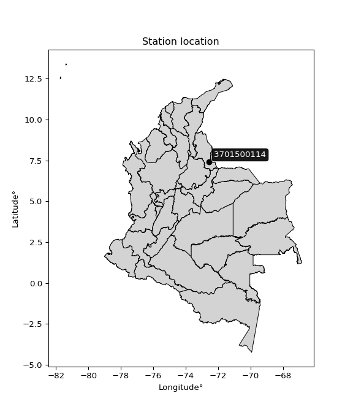

<div align="center">


</div>

# Station (rain, Pmax24h): 3701500114

Probable Maximum Precipitation (PMP) is the greatest amount of rainfall for a specific duration that is meteorologically possible for a given location, acting as a "worst-case" scenario for extreme storms, crucial for designing safety-critical infrastructure like bridges, river deviations, dams, spillways, and nuclear plants to prevent catastrophic failure. PMP is calculated by hydrologists using meteorological data to determine the upper limit of extreme rainfall, often leading to the Probable Maximum Flood (PMF) for flood control design, and is increasingly being studied for climate change impacts.

<div align="center">

</img>

</div>


## A. General information


### 1. General running parameters

• app_version: _v20251226_. • runtime: _2025-12-26 15:38:16.554582_. • Python version: _3.14.0_. • SciPy version: _1.16.3_. • Pandas version: _2.3.3_. • NumPy version: _2.3.5_. • Stations dataset (station_dataset_file): _dataset/pmax24h_in/automatic_colombia_2003_2024.csv_. • Stations catalog (station_catalog_file): _dataset/CNE_IDEAM.xls_. • Minimum year to eval til year_max (date_min): _2003_. • Maximum year to eval since year_min (date_max): _2024_. • Creates, save and include plots into reports (create_plot): _False_. • Plot only fit distributions with Δo > Δ (plot_only_fit): _True_. • Eval low extreme values, if False, evaluates high extreme values (low_extreme): _False_. • Eval every SciPy distribution as logarithmic (pdist_logarithmic_on): _True_. • Standard deviation normalized (ddof): _1.0_. • Return periods to eval in years (Tr): _[2, 2.33, 5, 10, 15, 20, 25, 50, 75, 100, 200, 250, 500, 750, 1000]_. • Minimum data sample per station, 0 means any (minimum_sample): _5_. • Z-Score threshold to adjust a value, 0 means disable (zscore): _3.5_. • Avoid zeros, e.g. rain = 0 (avoid_zeros): _True_. • Avoid null values (avoid_nans): _True_. [:file_folder:Dataset file.](../../dataset/pmax24h_in/automatic_colombia_2003_2024.csv)


### 2. Station info and location

|   id |     CODIGO | NOMBRE                         | CATEGORIA               | TECNOLOGIA                | ESTADO   | FECHA_INSTALACION   |   FECHA_SUSPENSION |   ALTITUD |   LATITUD |   LONGITUD | DEPARTAMENTO       | MUNICIPIO   | AREA_OPERATIVA                         | ENTIDAD                                                     | AREA_HIDROGRAFICA   | ZONA_HIDROGRAFICA   | SUBZONA_HIDROGRAFICA   |   CORRIENTE | OBSERVACION                                                                                 |   SUBRED | Catalogo   |
|-----:|-----------:|:-------------------------------|:------------------------|:--------------------------|:---------|:--------------------|-------------------:|----------:|----------:|-----------:|:-------------------|:------------|:---------------------------------------|:------------------------------------------------------------|:--------------------|:--------------------|:-----------------------|------------:|:--------------------------------------------------------------------------------------------|---------:|:-----------|
|    0 | 3701500114 | CHINACOTA - AUT   [3701500114] | Climatológica Principal | Automática con Telemetría | Activa   | 02/07/2017          |                nan |      2628 |   7.40122 |   -72.5503 | Norte De Santander | Toledo      | Area Operativa 08 - Santanderes-Arauca | INSTITUTO DE HIDROLOGIA METEOROLOGIA Y ESTUDIOS AMBIENTALES | Orinoco             | Arauca              | Río Chítaga            |         nan | Solicitado mediante correo electrónico por Jorge A. González, coordinador área operativa 11 |      nan | CNE_IDEAM  |

<div align="center">

Map location in: [:earth_americas:Google](http://maps.google.com/maps?q=7.401216667,-72.550275) [:earth_americas:OSM](https://www.openstreetmap.org/#map=18/7.401216667/-72.550275&layers=P) [:earth_americas:Bing](https://www.bing.com/maps?cp=7.401216667~-72.550275&lvl=18) [:earth_americas:Apple](https://maps.apple.com/frame?center=7.401216667%2C-72.550275&span=0.003%2C0.006)

</div>


<div align="center">

```geojson
{
  "type": "Feature",
  "geometry": {
    "type": "Point", 
    "coordinates": [-72.550275, 7.401216667]
  }, 
  "properties": {
    "Name": "3701500114"
  }
}
```

</div>


### 3. Discrete values table and plot

|               |           0 |          1 |           2 |           3 |          4 |          5 |
|:--------------|------------:|-----------:|------------:|------------:|-----------:|-----------:|
| Date          | 2019        | 2020       | 2021        | 2022        | 2023       | 2024       |
| Value         |   42.4      |   42.8     |   68.8      |   32.8      |   16.2     |   90.8     |
| Value_initial |   42.4      |   42.8     |   68.8      |   32.8      |   16.2     |   90.8     |
| count         |    6        |    6       |    6        |    6        |    6       |    6       |
| mean          |   48.9667   |   48.9667  |   48.9667   |   48.9667   |   48.9667  |   48.9667  |
| std           |   26.6817   |   26.6817  |   26.6817   |   26.6817   |   26.6817  |   26.6817  |
| zscore        |   -0.246112 |   -0.23112 |    0.743332 |   -0.605909 |   -1.22806 |    1.56787 |
> If Z-Score is active, values out of range or outliers are replaced with the station mean value.


### 4. Active continuous probability distributions from SciPy (45 of 104 available)

[scipy.stats](https://docs.scipy.org/doc/scipy/reference/stats.html) is a Python´s powerful submodule within the SciPy library for comprehensive statistical analysis, offering over 130 probability distributions (like Normal, Poisson), functions for descriptive stats (mean, variance), hypothesis testing (t-tests, chi-square), random variable generation, and statistical tests, making it essential for data science, modeling, and research. It provides tools to explore, model, and draw conclusions from data efficiently, working seamlessly with NumPy.

<div align="center">

|   id | p_dist             |   n_parameter | fit_method   | label                                                                       | active   | ref                                                                                                        |
|-----:|:-------------------|--------------:|:-------------|:----------------------------------------------------------------------------|:---------|:-----------------------------------------------------------------------------------------------------------|
|    0 | alpha              |             3 | MLE          | Alpha                                                                       | True     | [:mortar_board:](https://docs.scipy.org/doc/scipy/reference/generated/scipy.stats.alpha.html)              |
|    1 | betaprime          |             4 | MLE          | Beta prime                                                                  | True     | [:mortar_board:](https://docs.scipy.org/doc/scipy/reference/generated/scipy.stats.betaprime.html)          |
|    2 | chi2               |             3 | MLE          | Chi²                                                                        | True     | [:mortar_board:](https://docs.scipy.org/doc/scipy/reference/generated/scipy.stats.chi2.html)               |
|    3 | crystalball        |             4 | MLE          | Crystalball                                                                 | True     | [:mortar_board:](https://docs.scipy.org/doc/scipy/reference/generated/scipy.stats.crystalball.html)        |
|    4 | erlang             |             3 | MLE          | Erlang                                                                      | True     | [:mortar_board:](https://docs.scipy.org/doc/scipy/reference/generated/scipy.stats.erlang.html)             |
|    5 | expon              |             2 | MLE          | Exponential                                                                 | True     | [:mortar_board:](https://docs.scipy.org/doc/scipy/reference/generated/scipy.stats.expon.html)              |
|    6 | exponnorm          |             3 | MLE          | Exponentially modified Normal                                               | True     | [:mortar_board:](https://docs.scipy.org/doc/scipy/reference/generated/scipy.stats.exponnorm.html)          |
|    7 | f                  |             4 | MLE          | F                                                                           | True     | [:mortar_board:](https://docs.scipy.org/doc/scipy/reference/generated/scipy.stats.f.html)                  |
|    8 | fatiguelife        |             3 | MLE          | Fatigue-life (Birnbaum-Saunders)                                            | True     | [:mortar_board:](https://docs.scipy.org/doc/scipy/reference/generated/scipy.stats.fatiguelife.html)        |
|    9 | fisk               |             3 | MLE          | Fisk                                                                        | True     | [:mortar_board:](https://docs.scipy.org/doc/scipy/reference/generated/scipy.stats.fisk.html)               |
|   10 | gamma              |             3 | MLE          | Gamma                                                                       | True     | [:mortar_board:](https://docs.scipy.org/doc/scipy/reference/generated/scipy.stats.gamma.html)              |
|   11 | genexpon           |             5 | MLE          | Generalized exponential                                                     | True     | [:mortar_board:](https://docs.scipy.org/doc/scipy/reference/generated/scipy.stats.genexpon.html)           |
|   12 | genlogistic        |             3 | MLE          | Generalized logistic                                                        | True     | [:mortar_board:](https://docs.scipy.org/doc/scipy/reference/generated/scipy.stats.genlogistic.html)        |
|   13 | gibrat             |             2 | MM           | Gibrat                                                                      | True     | [:mortar_board:](https://docs.scipy.org/doc/scipy/reference/generated/scipy.stats.gibrat.html)             |
|   14 | gompertz           |             3 | MLE          | Gompertz (or truncated Gumbel)                                              | True     | [:mortar_board:](https://docs.scipy.org/doc/scipy/reference/generated/scipy.stats.gompertz.html)           |
|   15 | gumbel_l           |             2 | MM           | Gumbel Left Skew                                                            | True     | [:mortar_board:](https://docs.scipy.org/doc/scipy/reference/generated/scipy.stats.gumbel_l.html)           |
|   16 | gumbel_r           |             2 | MM           | Gumbel Right Skew                                                           | True     | [:mortar_board:](https://docs.scipy.org/doc/scipy/reference/generated/scipy.stats.gumbel_r.html)           |
|   17 | halflogistic       |             2 | MM           | Half-logistic                                                               | True     | [:mortar_board:](https://docs.scipy.org/doc/scipy/reference/generated/scipy.stats.halflogistic.html)       |
|   18 | halfnorm           |             2 | MM           | Half Normal                                                                 | True     | [:mortar_board:](https://docs.scipy.org/doc/scipy/reference/generated/scipy.stats.halfnorm.html)           |
|   19 | hypsecant          |             2 | MM           | hyperbolic secant                                                           | True     | [:mortar_board:](https://docs.scipy.org/doc/scipy/reference/generated/scipy.stats.hypsecant.html)          |
|   20 | invgamma           |             3 | MLE          | Inverted gamma                                                              | True     | [:mortar_board:](https://docs.scipy.org/doc/scipy/reference/generated/scipy.stats.invgamma.html)           |
|   21 | invgauss           |             3 | MLE          | Inverse Gaussian                                                            | True     | [:mortar_board:](https://docs.scipy.org/doc/scipy/reference/generated/scipy.stats.invgauss.html)           |
|   22 | invweibull         |             3 | MLE          | Inverted Weibull                                                            | True     | [:mortar_board:](https://docs.scipy.org/doc/scipy/reference/generated/scipy.stats.invweibull.html)         |
|   23 | johnsonsu          |             4 | MLE          | Johnson Su                                                                  | True     | [:mortar_board:](https://docs.scipy.org/doc/scipy/reference/generated/scipy.stats.johnsonsu.html)          |
|   24 | kstwobign          |             2 | MLE          | Limiting distribution of scaled Kolmogorov-Smirnov two-sided test statistic | True     | [:mortar_board:](https://docs.scipy.org/doc/scipy/reference/generated/scipy.stats.kstwobign.html)          |
|   25 | laplace            |             2 | MM           | Laplace                                                                     | True     | [:mortar_board:](https://docs.scipy.org/doc/scipy/reference/generated/scipy.stats.laplace.html)            |
|   26 | laplace_asymmetric |             3 | MLE          | Asymmetric Laplace                                                          | True     | [:mortar_board:](https://docs.scipy.org/doc/scipy/reference/generated/scipy.stats.laplace_asymmetric.html) |
|   27 | loggamma           |             3 | MLE          | Log gamma                                                                   | True     | [:mortar_board:](https://docs.scipy.org/doc/scipy/reference/generated/scipy.stats.loggamma.html)           |
|   28 | logistic           |             2 | MM           | Logistic (or Sech-squared)                                                  | True     | [:mortar_board:](https://docs.scipy.org/doc/scipy/reference/generated/scipy.stats.logistic.html)           |
|   29 | lognorm            |             3 | MLE          | Log Normal                                                                  | True     | [:mortar_board:](https://docs.scipy.org/doc/scipy/reference/generated/scipy.stats.lognorm.html)            |
|   30 | maxwell            |             2 | MM           | Maxwell                                                                     | True     | [:mortar_board:](https://docs.scipy.org/doc/scipy/reference/generated/scipy.stats.maxwell.html)            |
|   31 | mielke             |             4 | MLE          | Mielke Beta-Kappa / Dagum                                                   | True     | [:mortar_board:](https://docs.scipy.org/doc/scipy/reference/generated/scipy.stats.mielke.html)             |
|   32 | moyal              |             2 | MM           | Moyal                                                                       | True     | [:mortar_board:](https://docs.scipy.org/doc/scipy/reference/generated/scipy.stats.moyal.html)              |
|   33 | nakagami           |             3 | MLE          | Nakagami                                                                    | True     | [:mortar_board:](https://docs.scipy.org/doc/scipy/reference/generated/scipy.stats.nakagami.html)           |
|   34 | ncf                |             5 | MLE          | Non-central F distribution                                                  | True     | [:mortar_board:](https://docs.scipy.org/doc/scipy/reference/generated/scipy.stats.ncf.html)                |
|   35 | nct                |             4 | MLE          | Non-central Student’s t                                                     | True     | [:mortar_board:](https://docs.scipy.org/doc/scipy/reference/generated/scipy.stats.nct.html)                |
|   36 | norm               |             2 | MM           | Normal                                                                      | True     | [:mortar_board:](https://docs.scipy.org/doc/scipy/reference/generated/scipy.stats.norm.html)               |
|   37 | pareto             |             3 | MLE          | Pareto                                                                      | True     | [:mortar_board:](https://docs.scipy.org/doc/scipy/reference/generated/scipy.stats.pareto.html)             |
|   38 | pearson3           |             3 | MM           | Pearson type III                                                            | True     | [:mortar_board:](https://docs.scipy.org/doc/scipy/reference/generated/scipy.stats.pearson3.html)           |
|   39 | rayleigh           |             2 | MM           | Rayleigh                                                                    | True     | [:mortar_board:](https://docs.scipy.org/doc/scipy/reference/generated/scipy.stats.rayleigh.html)           |
|   40 | rice               |             3 | MLE          | Rice                                                                        | True     | [:mortar_board:](https://docs.scipy.org/doc/scipy/reference/generated/scipy.stats.rice.html)               |
|   41 | t                  |             3 | MLE          | Student’s t                                                                 | True     | [:mortar_board:](https://docs.scipy.org/doc/scipy/reference/generated/scipy.stats.t.html)                  |
|   42 | truncnorm          |             4 | MLE          | Truncated normal                                                            | True     | [:mortar_board:](https://docs.scipy.org/doc/scipy/reference/generated/scipy.stats.truncnorm.html)          |
|   43 | wald               |             2 | MM           | Wald                                                                        | True     | [:mortar_board:](https://docs.scipy.org/doc/scipy/reference/generated/scipy.stats.wald.html)               |
|   44 | weibull_min        |             3 | MLE          | Weibull minimum                                                             | True     | [:mortar_board:](https://docs.scipy.org/doc/scipy/reference/generated/scipy.stats.weibull_min.html)        |

</div>

> **n_parameter:** # arguments & localization & scale.
>
> **Fit methods:** (MLE) maximum likelihood, (MM) L-moments.
>
>**Inactive:** foldnorm, gennorm, norminvgauss, powernorm, powerlognorm, skewnorm, genextreme, anglit, arcsine, argus, beta, bradford, burr, burr12, cauchy, cosine, halfcauchy, foldcauchy, skewcauchy, wrapcauchy, dgamma, gengamma, exponweib, exponpow, truncexpon, gausshyper, genhalflogistic, genhyperbolic, geninvgauss, halfgennorm, johnsonsb, kappa4, kappa3, ksone, kstwo, loglaplace, levy, levy_l, levy_stable, ncx2, genpareto, truncpareto, lomax, powerlaw, rdist, rel_breitwigner, recipinvgauss, semicircular, studentized_range, trapezoid, triang, truncweibull_min, tukeylambda, uniform, loguniform, vonmises, vonmises_line, weibull_max, dweibull, 


## B. Probability distributions vs. Empirical distributions

A continuous probability distribution (CPD) describes probabilities for variables that can take any value within a range (like rain any time), unlike discrete variables with specific outcomes (like temperature). It uses a Probability Density Function (PDF), a curve where the total area under it equals 1, and the probability of the variable falling within an interval (a to b) is found by calculating the area under the curve between those points. A key feature is that the probability of hitting any single exact value is zero, so probabilities are always expressed for ranges, e.g., $P(a ≤ X ≤ b)$.

<div align="center">

Distributions parameters
|    |    station | p_dist                |   n |               loc |            scale | shape                 | shape1                | shape2                | shape3   |
|---:|-----------:|:----------------------|----:|------------------:|-----------------:|:----------------------|:----------------------|:----------------------|:---------|
|  0 | 3701500114 | alpha                 |   6 |     -99.2904      |    914.453       | 6.330228424897244     |                       |                       |          |
|  1 | 3701500114 | betaprime             |   6 |       7.88653     |    426.816       | 2.589612630472619     | 28.063390464068316    |                       |          |
|  2 | 3701500114 | chi2                  |   6 |      16.2         |     14.0037      | 1.7338070444334894    |                       |                       |          |
|  3 | 3701500114 | crystalball           |   6 |      48.9667      |     24.3569      | 21181.412300859192    | 143.94611436478368    |                       |          |
|  4 | 3701500114 | erlang                |   6 |      16.2         |     40.394       | 0.5350851958354557    |                       |                       |          |
|  5 | 3701500114 | expon                 |   6 |      16.2         |     32.7667      |                       |                       |                       |          |
|  6 | 3701500114 | exponnorm             |   6 |      24.109       |     11.09        | 2.2414493656829393    |                       |                       |          |
|  7 | 3701500114 | f                     |   6 |      16.188       |     31.1544      | 1.6288832620927733    | 1522.8154662897118    |                       |          |
|  8 | 3701500114 | fatiguelife           |   6 |      16.2         |      6.47219e-05 | 615.7131998939769     |                       |                       |          |
|  9 | 3701500114 | fisk                  |   6 |      -7.25451     |     51.4872      | 3.7434475582467135    |                       |                       |          |
| 10 | 3701500114 | gamma                 |   6 |      16.2         |     30.5936      | 0.8863593151191124    |                       |                       |          |
| 11 | 3701500114 | genexpon              |   6 |      16.2         |      1.90077     | 0.05798076593845511   | 6.674387533038467e-05 | 1.0647117078764259    |          |
| 12 | 3701500114 | genlogistic           |   6 |     -81.4277      |     19.8043      | 404.4795275145575     |                       |                       |          |
| 13 | 3701500114 | gibrat                |   6 |      30.3854      |     11.2701      |                       |                       |                       |          |
| 14 | 3701500114 | gompertz              |   6 |      16.2         |     56.8461      | 1.0419019574218726    |                       |                       |          |
| 15 | 3701500114 | gumbel_l              |   6 |      59.9286      |     18.991       |                       |                       |                       |          |
| 16 | 3701500114 | gumbel_r              |   6 |      38.0048      |     18.991       |                       |                       |                       |          |
| 17 | 3701500114 | halflogistic          |   6 |      20.0981      |     20.8243      |                       |                       |                       |          |
| 18 | 3701500114 | halfnorm              |   6 |      16.7276      |     40.4056      |                       |                       |                       |          |
| 19 | 3701500114 | hypsecant             |   6 |      48.9667      |     15.5061      |                       |                       |                       |          |
| 20 | 3701500114 | invgamma              |   6 |     -41.641       |   1217.15        | 14.416943098242994    |                       |                       |          |
| 21 | 3701500114 | invgauss              |   6 |     -14.8233      |    388.884       | 0.16403342288208667   |                       |                       |          |
| 22 | 3701500114 | invweibull            |   6 |      16.2         |      1.89828     | 0.04610709933170876   |                       |                       |          |
| 23 | 3701500114 | johnsonsu             |   6 |     -15.2927      |      3.77408     | -8.926908918475817    | 2.5834971828252913    |                       |          |
| 24 | 3701500114 | kstwobign             |   6 |     -32.4023      |     93.3111      |                       |                       |                       |          |
| 25 | 3701500114 | laplace               |   6 |      48.9667      |     17.2229      |                       |                       |                       |          |
| 26 | 3701500114 | laplace_asymmetric    |   6 |      42.4         |     17.5943      | 0.8306496991118173    |                       |                       |          |
| 27 | 3701500114 | loggamma              |   6 |   -7347.08        |   1000.22        | 1627.2497062082298    |                       |                       |          |
| 28 | 3701500114 | logistic              |   6 |      48.9667      |     13.4287      |                       |                       |                       |          |
| 29 | 3701500114 | lognorm               |   6 |      16.2         |      0.0737784   | 13.722334327093485    |                       |                       |          |
| 30 | 3701500114 | maxwell               |   6 |      -8.74897     |     36.1679      |                       |                       |                       |          |
| 31 | 3701500114 | mielke                |   6 |       5.21624     |     63.1144      | 1.4672632345891525    | 4.6253221381468546    |                       |          |
| 32 | 3701500114 | moyal                 |   6 |      35.0378      |     10.9645      |                       |                       |                       |          |
| 33 | 3701500114 | nakagami              |   6 |      32.8         |     20.2778      | 0.10647155774673883   |                       |                       |          |
| 34 | 3701500114 | ncf                   |   6 |      -0.249695    |      1.67236e-06 | 6.74070413619886e-07  | 51.64035667538299     | 19.09885861805306     |          |
| 35 | 3701500114 | nct                   |   6 |      -0.0357698   |     16.7189      | 6.280033085939802     | 2.570212053354049     |                       |          |
| 36 | 3701500114 | norm                  |   6 |      48.9667      |     24.3569      |                       |                       |                       |          |
| 37 | 3701500114 | pareto                |   6 |      16.1054      |      0.0945937   | 0.20382060826445586   |                       |                       |          |
| 38 | 3701500114 | pearson3              |   6 |      48.9667      |     24.3569      | 0.47391462332708323   |                       |                       |          |
| 39 | 3701500114 | rayleigh              |   6 |       2.37048     |     37.1784      |                       |                       |                       |          |
| 40 | 3701500114 | rice                  |   6 |       5.34071     |     34.7292      | 0.2642834965986963    |                       |                       |          |
| 41 | 3701500114 | t                     |   6 |      48.9667      |     24.3567      | 189070300.59079123    |                       |                       |          |
| 42 | 3701500114 | truncnorm             |   6 |      48.9667      |     24.3569      | -301.61836409920284   | 1432.3109125777016    |                       |          |
| 43 | 3701500114 | wald                  |   6 |      24.6098      |     24.3569      |                       |                       |                       |          |
| 44 | 3701500114 | weibull_min           |   6 |      16.2         |     33.0888      | 0.16245263417464728   |                       |                       |          |
| 45 | 3701500114 | logalpha              |   6 |      -7.51171     |    225.017       | 20.03410701776359     |                       |                       |          |
| 46 | 3701500114 | logbetaprime          |   6 |     -16.8292      |     88.2849      | 1699.0968364902774    | 7287.373056165856     |                       |          |
| 47 | 3701500114 | logchi2               |   6 |       2.78501     |      0.944584    | 1.0475909558467333    |                       |                       |          |
| 48 | 3701500114 | logcrystalball        |   6 |       3.75316     |      0.548588    | 2460.4071217552505    | 2.542073967430065     |                       |          |
| 49 | 3701500114 | logerlang             |   6 |      -5.59303     |      0.0329043   | 284.1242656846865     |                       |                       |          |
| 50 | 3701500114 | logexpon              |   6 |       2.78501     |      0.968154    |                       |                       |                       |          |
| 51 | 3701500114 | logexponnorm          |   6 |       3.75278     |      0.548587    | 0.0006986997112029031 |                       |                       |          |
| 52 | 3701500114 | logf                  |   6 |    -293.563       |    297.316       | 1803596.8117773854    | 863298.012424211      |                       |          |
| 53 | 3701500114 | logfatiguelife        |   6 |    -133.28        |    137.033       | 0.003989236653733116  |                       |                       |          |
| 54 | 3701500114 | logfisk               |   6 | -126703           | 126707           | 398412.0351495275     |                       |                       |          |
| 55 | 3701500114 | loggamma              |   6 |      -5.16541     |      0.0348096   | 256.2284873796713     |                       |                       |          |
| 56 | 3701500114 | loggenexpon           |   6 |       2.73216     |      0.00737776  | 0.0023563923005083176 | 3.205259215356554     | 1.701709838628556e-05 |          |
| 57 | 3701500114 | loggenlogistic        |   6 |       4.01273     |      0.254222    | 0.5903423972620438    |                       |                       |          |
| 58 | 3701500114 | loggibrat             |   6 |       3.33463     |      0.253851    |                       |                       |                       |          |
| 59 | 3701500114 | loggompertz           |   6 |       2.78501     |      1.15724     | 0.6789521582417555    |                       |                       |          |
| 60 | 3701500114 | loggumbel_l           |   6 |       4.00006     |      0.427732    |                       |                       |                       |          |
| 61 | 3701500114 | loggumbel_r           |   6 |       3.50627     |      0.427732    |                       |                       |                       |          |
| 62 | 3701500114 | loghalflogistic       |   6 |       3.10295     |      0.469028    |                       |                       |                       |          |
| 63 | 3701500114 | loghalfnorm           |   6 |       3.02704     |      0.910063    |                       |                       |                       |          |
| 64 | 3701500114 | loghypsecant          |   6 |       3.75316     |      0.349242    |                       |                       |                       |          |
| 65 | 3701500114 | loginvgamma           |   6 |      -7.1902      |   4145.05        | 380.0449985493033     |                       |                       |          |
| 66 | 3701500114 | loginvgauss           |   6 |      -1.0314      |    325.143       | 0.014717167840912634  |                       |                       |          |
| 67 | 3701500114 | loginvweibull         |   6 |      -3.10033e+07 |      3.10033e+07 | 55813955.86754807     |                       |                       |          |
| 68 | 3701500114 | logjohnsonsu          |   6 |       5.74426     |      0.0483146   | 15.688851278652812    | 3.587156915084968     |                       |          |
| 69 | 3701500114 | logkstwobign          |   6 |       1.50713     |      2.56714     |                       |                       |                       |          |
| 70 | 3701500114 | loglaplace            |   6 |       3.75316     |      0.38791     |                       |                       |                       |          |
| 71 | 3701500114 | loglaplace_asymmetric |   6 |       3.74715     |      0.412282    | 0.9928646530152113    |                       |                       |          |
| 72 | 3701500114 | logloggamma           |   6 |       3.42368     |      0.711643    | 2.0635764031771604    |                       |                       |          |
| 73 | 3701500114 | loglogistic           |   6 |       3.75316     |      0.302452    |                       |                       |                       |          |
| 74 | 3701500114 | loglognorm            |   6 |       2.78501     |      0.00300064  | 13.214593710924674    |                       |                       |          |
| 75 | 3701500114 | logmaxwell            |   6 |       2.45324     |      0.814606    |                       |                       |                       |          |
| 76 | 3701500114 | logmielke             |   6 |       2.78501     |      1.73042     | 0.5539536653302383    | 886.5390145493229     |                       |          |
| 77 | 3701500114 | logmoyal              |   6 |       3.43945     |      0.246951    |                       |                       |                       |          |
| 78 | 3701500114 | lognakagami           |   6 |       3.49043     |      0.41483     | 0.17352218113822726   |                       |                       |          |
| 79 | 3701500114 | logncf                |   6 |      -6.20777     |      9.95358     | 844.0763925872807     | 2361.8120240627386    | 0.0009864005470622437 |          |
| 80 | 3701500114 | lognct                |   6 |     -27.4993      |      0.519054    | 15034.514280245488    | 60.20742987296356     |                       |          |
| 81 | 3701500114 | lognorm               |   6 |       3.75316     |      0.548588    |                       |                       |                       |          |
| 82 | 3701500114 | logpareto             |   6 |       2.78197     |      0.00304172  | 0.2034723609249452    |                       |                       |          |
| 83 | 3701500114 | logpearson3           |   6 |       3.75316     |      0.548587    | -0.38877631719757566  |                       |                       |          |
| 84 | 3701500114 | lograyleigh           |   6 |       2.70368     |      0.837364    |                       |                       |                       |          |
| 85 | 3701500114 | logrice               |   6 |       2.44336     |      0.60347     | 1.8807446507558612    |                       |                       |          |
| 86 | 3701500114 | logt                  |   6 |       3.75317     |      0.54859     | 452226644.1081517     |                       |                       |          |
| 87 | 3701500114 | logtruncnorm          |   6 |      -0.190381    |      1.35525     | 2.715959303671635     | 3.467282968171065     |                       |          |
| 88 | 3701500114 | logwald               |   6 |       3.2046      |      0.548566    |                       |                       |                       |          |
| 89 | 3701500114 | logweibull_min        |   6 |       0.356775    |      3.6252      | 7.4393133194777645    |                       |                       |          |

</div>

> **loc** (Location parameter): This shifts the distribution along the x-axis. For many common distributions, like the normal (Gaussian) distribution, loc represents the mean $μ$. For others, like the uniform distribution, it might represent the minimum value, or for the beta distribution, the left end of the support interval.
>
> **scale** (Scale parameter): This determines the width or spread of the distribution. For the normal distribution, scale represents the standard deviation $σ$. For a uniform distribution, it defines the length of the interval (from $loc$ to $loc + scale$).
>
> **shape** (Shape parameters): Refers to parameters that define the specific form of a probability distribution, distinct from its location (loc) and scale (scale). These parameters are required arguments for most distribution functions. For example, a normal (Gaussian) distribution is fully defined by its location (mean) and scale (standard deviation), so it has no specific shape parameters beyond loc and scale. However, other distributions have intrinsic properties that need specification, as Gamma distribution that takes a shape parameter, often named $a$ or $alpha$.


### 0. Cumulative distribution values - CDF (90 evaluated)

> Ordered by x ascending and calculating $log(f(x))$ separately. 

|   id |    Station |   date |    x |   count |    mean |     std |    zscore |   Value_initial |    station |   m |     alpha |   alpha_pdf |   betaprime |   betaprime_pdf |        chi2 |   chi2_pdf |   crystalball |   crystalball_pdf |      erlang |      erlang_pdf |    expon |   expon_pdf |   exponnorm |   exponnorm_pdf |          f |      f_pdf |   fatiguelife |   fatiguelife_pdf |      fisk |   fisk_pdf |       gamma |   gamma_pdf |    genexpon |   genexpon_pdf |   genlogistic |   genlogistic_pdf |    gibrat |   gibrat_pdf |    gompertz |   gompertz_pdf |   gumbel_l |   gumbel_l_pdf |   gumbel_r |   gumbel_r_pdf |   halflogistic |   halflogistic_pdf |   halfnorm |   halfnorm_pdf |   hypsecant |   hypsecant_pdf |   invgamma |   invgamma_pdf |   invgauss |   invgauss_pdf |   invweibull |   invweibull_pdf |   johnsonsu |   johnsonsu_pdf |   kstwobign |   kstwobign_pdf |   laplace |   laplace_pdf |   laplace_asymmetric |   laplace_asymmetric_pdf |   loggamma |   loggamma_pdf |   logistic |   logistic_pdf |   lognorm |   lognorm_pdf |   maxwell |   maxwell_pdf |   mielke |   mielke_pdf |    moyal |   moyal_pdf |    nakagami |   nakagami_pdf |       ncf |    ncf_pdf |       nct |    nct_pdf |      norm |   norm_pdf |   pareto |   pareto_pdf |   pearson3 |   pearson3_pdf |   rayleigh |   rayleigh_pdf |      rice |   rice_pdf |         t |      t_pdf |   truncnorm |   truncnorm_pdf |     wald |   wald_pdf |   weibull_min |   weibull_min_pdf |   logalpha |   logalpha_pdf |   logbetaprime |   logbetaprime_pdf |     logchi2 |   logchi2_pdf |   logcrystalball |   logcrystalball_pdf |   logerlang |   logerlang_pdf |   logexpon |   logexpon_pdf |   logexponnorm |   logexponnorm_pdf |      logf |   logf_pdf |   logfatiguelife |   logfatiguelife_pdf |   logfisk |   logfisk_pdf |   loggenexpon |   loggenexpon_pdf |   loggenlogistic |   loggenlogistic_pdf |   loggibrat |   loggibrat_pdf |   loggompertz |   loggompertz_pdf |   loggumbel_l |   loggumbel_l_pdf |   loggumbel_r |   loggumbel_r_pdf |   loghalflogistic |   loghalflogistic_pdf |   loghalfnorm |   loghalfnorm_pdf |   loghypsecant |   loghypsecant_pdf |   loginvgamma |   loginvgamma_pdf |   loginvgauss |   loginvgauss_pdf |   loginvweibull |   loginvweibull_pdf |   logjohnsonsu |   logjohnsonsu_pdf |   logkstwobign |   logkstwobign_pdf |   loglaplace |   loglaplace_pdf |   loglaplace_asymmetric |   loglaplace_asymmetric_pdf |   logloggamma |   logloggamma_pdf |   loglogistic |   loglogistic_pdf |   loglognorm |   loglognorm_pdf |   logmaxwell |   logmaxwell_pdf |   logmielke |   logmielke_pdf |    logmoyal |   logmoyal_pdf |   lognakagami |   lognakagami_pdf |    logncf |   logncf_pdf |   lognct |   lognct_pdf |   logpareto |   logpareto_pdf |   logpearson3 |   logpearson3_pdf |   lograyleigh |   lograyleigh_pdf |   logrice |   logrice_pdf |      logt |   logt_pdf |   logtruncnorm |   logtruncnorm_pdf |   logwald |   logwald_pdf |   logweibull_min |   logweibull_min_pdf |
|-----:|-----------:|-------:|-----:|--------:|--------:|--------:|----------:|----------------:|-----------:|----:|----------:|------------:|------------:|----------------:|------------:|-----------:|--------------:|------------------:|------------:|----------------:|---------:|------------:|------------:|----------------:|-----------:|-----------:|--------------:|------------------:|----------:|-----------:|------------:|------------:|------------:|---------------:|--------------:|------------------:|----------:|-------------:|------------:|---------------:|-----------:|---------------:|-----------:|---------------:|---------------:|-------------------:|-----------:|---------------:|------------:|----------------:|-----------:|---------------:|-----------:|---------------:|-------------:|-----------------:|------------:|----------------:|------------:|----------------:|----------:|--------------:|---------------------:|-------------------------:|-----------:|---------------:|-----------:|---------------:|----------:|--------------:|----------:|--------------:|---------:|-------------:|---------:|------------:|------------:|---------------:|----------:|-----------:|----------:|-----------:|----------:|-----------:|---------:|-------------:|-----------:|---------------:|-----------:|---------------:|----------:|-----------:|----------:|-----------:|------------:|----------------:|---------:|-----------:|--------------:|------------------:|-----------:|---------------:|---------------:|-------------------:|------------:|--------------:|-----------------:|---------------------:|------------:|----------------:|-----------:|---------------:|---------------:|-------------------:|----------:|-----------:|-----------------:|---------------------:|----------:|--------------:|--------------:|------------------:|-----------------:|---------------------:|------------:|----------------:|--------------:|------------------:|--------------:|------------------:|--------------:|------------------:|------------------:|----------------------:|--------------:|------------------:|---------------:|-------------------:|--------------:|------------------:|--------------:|------------------:|----------------:|--------------------:|---------------:|-------------------:|---------------:|-------------------:|-------------:|-----------------:|------------------------:|----------------------------:|--------------:|------------------:|--------------:|------------------:|-------------:|-----------------:|-------------:|-----------------:|------------:|----------------:|------------:|---------------:|--------------:|------------------:|----------:|-------------:|---------:|-------------:|------------:|----------------:|--------------:|------------------:|--------------:|------------------:|----------:|--------------:|----------:|-----------:|---------------:|-------------------:|----------:|--------------:|-----------------:|---------------------:|
|    0 | 3701500114 |   2023 | 16.2 |       6 | 48.9667 | 26.6817 | -1.22806  |            16.2 | 3701500114 |   1 | 0.0561696 |  0.00775444 |   0.0402219 |      0.0105525  | 1.74168e-14 | 4.24991    |     0.0892687 |        0.0066268  | 2.88705e-09 | 434827          | 0        |  0.0305188  |   0.0508498 |      0.00752368 | 0.00149632 | 0.101694   |     0.0419443 |       1.35463e+09 | 0.0500513 | 0.00758858 | 7.84901e-15 |  1.95823    | 5.62941e-07 |     0.0305038  |     0.0542836 |        0.00795733 | 0         |   0          | 1.29515e-13 |     0.0183285  |  0.0951618 |     0.00476452 |  0.0427496 |     0.00709618 |       0        |         0          |   0        |     0          |   0.0765685 |      0.00489048 |  0.0528983 |     0.00804806 |  0.0485134 |     0.00871138 |   0.00843041 |      5.22531e+11 |   0.0499035 |      0.00838766 |   0.0509869 |      0.00849194 | 0.0745974 |    0.00433128 |            0.0679808 |               0.00465155 |  0.0371383 |       0.157215 |   0.080169 |     0.00549138 | 0.0387978 |      0.153231 | 0.0758331 |    0.00827462 | 0.076869 |   0.0102654  | 0.018231 |  0.00529249 | 0           |    0           | 0.0537889 | 0.00835346 | 0.0570906 | 0.00711576 | 0.0892687 | 0.00662681 | 0        |  2.1547      |  0.0747639 |     0.00750826 |  0.0668447 |     0.00933641 | 0.0461117 | 0.00829382 | 0.0892666 | 0.00662674 |   0.0892687 |      0.0066268  | 0        | 0          |    0.00254227 |       1.16101e+11 |  0.0344432 |       0.161849 |      0.0377773 |           0.154098 | 7.33954e-09 |   8.65686e+06 |        0.0387979 |             0.153231 |   0.0363214 |        0.154541 |   0        |       1.03289  |      0.0387978 |           0.153231 | 0.0389497 |   0.153805 |        0.0378687 |             0.151837 | 0.0420634 |      0.1267   |     0.0181154 |          0.365608 |        0.0575175 |             0.132506 |    0        |        0        |   5.08618e-09 |          0.586698 |     0.0567146 |          0.12876  |    0.00452042 |         0.0570601 |          0        |              0        |      0        |          0        |      0.0397541 |           0.113534 |     0.0372383 |          0.163697 |     0.0350137 |          0.168343 |       0.0324702 |            0.20035  |      0.0595208 |           0.143476 |      0.0346538 |           0.242919 |    0.0412145 |         0.106247 |               0.0473214 |                    0.115604 |     0.0564413 |          0.142622 |     0.0391277 |          0.124306 |    0.0126914 |      5.58696e+12 |    0.0170992 |         0.149538 | 0.000242676 |      260.686    | 0.000168359 |     0.00512929 |   0           |       0           | 0.0386833 |     0.161719 | 0.038708 |     0.153683 |    0        |      66.8938    |     0.0485673 |          0.151102 |    0.00470531 |          0.11544  | 0.0289084 |      0.177793 | 0.0387977 |   0.15323  |    0           |           0        |  0        |      0        |        0.0494632 |             0.147728 |
|    1 | 3701500114 |   2022 | 32.8 |       6 | 48.9667 | 26.6817 | -0.605909 |            32.8 | 3701500114 |   2 | 0.276691  |  0.0175407  |   0.318939  |      0.0191703  | 0.515202    | 0.0192935  |     0.253428  |        0.0131408  | 0.610928    |      0.0149568  | 0.397467 |  0.0183886  |   0.291125  |      0.0198032  | 0.449599   | 0.0172058  |     0.79461   |       0.00704715  | 0.280911  | 0.0188787  | 0.476883    |  0.018859   | 0.397631    |     0.0183957  |     0.282906  |        0.0180088  | 0.0617058 |   0.0504273  | 0.297658    |     0.0172384  |  0.213112  |     0.00993064 |  0.268394  |     0.0185887  |       0.295861 |         0.0219087  |   0.309204 |     0.0182448  |   0.215771  |      0.0128738  |  0.282608  |     0.0179592  |  0.293742  |     0.0184162  |   0.404601   |      0.00101687  |   0.288674  |      0.0182925  |   0.286706  |      0.0178233  | 0.195574  |    0.0113554  |            0.211679  |               0.014484   |  0.324009  |       0.658088 |   0.230784 |     0.0132197  | 0.315993  |      0.648419 | 0.275538  |    0.0150495  | 0.294844 |   0.0153499  | 0.268105 |  0.0218237  | 0.000424755 |    1.27295e+10 | 0.282061  | 0.0175212  | 0.273058  | 0.0179784  | 0.253428  | 0.0131408  | 0.651604 |  0.00425349  |  0.266985  |     0.015119   |  0.284626  |     0.0157488  | 0.260572  | 0.0162596  | 0.253426  | 0.0131409  |   0.253428  |      0.0131408  | 0.204512 | 0.0436295  |    0.59098    |       0.00357846  |  0.337969  |       0.679561 |      0.317779  |           0.649593 | 0.595349    |   0.343891    |        0.315994  |             0.648419 |   0.321542  |        0.65854  |   0.517426 |       0.498448 |      0.315994  |           0.64842  | 0.316283  |   0.647311 |        0.315711  |             0.651709 | 0.28751   |      0.644117 |     0.411456  |          0.634787 |        0.27691   |             0.569984 |    0.312702 |        2.27301  |   0.434515    |          0.610334 |     0.261973  |          0.524145 |    0.354257   |         0.859472  |          0.391068 |              0.903001 |      0.389376 |          0.770139 |      0.280372  |           0.702949 |     0.334737  |          0.669373 |     0.341974  |          0.670936 |       0.381901  |            0.661804 |      0.280221  |           0.535845 |      0.410655  |           0.648907 |    0.25399   |         0.654765 |               0.265142  |                    0.64773  |     0.282319  |          0.552795 |     0.295528  |          0.688343 |    0.660261  |      0.0392952   |    0.345392  |         0.705971 | 0.608306    |        0.477693 | 0.367096    |     0.970123   |   5.08367e-06 |       3.97276e+09 | 0.326943  |     0.653159 | 0.316764 |     0.6492   |    0.670131 |       0.0947397 |     0.298335  |          0.595277 |    0.356849   |          0.721635 | 0.329835  |      0.659152 | 0.315991  |   0.648414 |    4.09689e-06 |           2.42132  |  0.383178 |      1.55155  |        0.286979  |             0.572551 |
|    2 | 3701500114 |   2019 | 42.4 |       6 | 48.9667 | 26.6817 | -0.246112 |            42.4 | 3701500114 |   3 | 0.450797  |  0.0180331  |   0.494065  |      0.0168927  | 0.667258    | 0.0128876  |     0.393733  |        0.0157945  | 0.725634    |      0.00953852 | 0.550488 |  0.0137186  |   0.481791  |      0.0188541  | 0.589459   | 0.0122996  |     0.849279  |       0.00461271  | 0.466133  | 0.018761   | 0.628222    |  0.0130833  | 0.550697    |     0.0137212  |     0.459292  |        0.0180273  | 0.525503  |   0.0331369  | 0.456662    |     0.0157892  |  0.327886  |     0.0140619  |  0.452308  |     0.0188962  |       0.489558 |         0.018256   |   0.47481  |     0.0161376  |   0.369057  |      0.0188155  |  0.458099  |     0.0179176  |  0.469173  |     0.0175316  |   0.412296   |      0.00064286  |   0.46483   |      0.0177573  |   0.45853   |      0.017406   | 0.341495  |    0.0198279  |            0.408277  |               0.0279361  |  0.503548  |       0.716224 |   0.380128 |     0.0175468  | 0.495625  |      0.727173 | 0.42759   |    0.0162313  | 0.448152 |   0.0162755  | 0.474722 |  0.0201448  | 0.706513    |    0.015337    | 0.453522  | 0.0175926  | 0.453533  | 0.0187529  | 0.393733  | 0.0157945  | 0.682414 |  0.00246175  |  0.422285  |     0.0167663  |  0.439894  |     0.0162207  | 0.42299   | 0.0171266  | 0.393732  | 0.0157946  |   0.393733  |      0.0157945  | 0.534685 | 0.0249655  |    0.618173   |       0.00227941  |  0.519273  |       0.707342 |      0.49659   |           0.719576 | 0.671922    |   0.25895     |        0.495625  |             0.727173 |   0.501607  |        0.719661 |   0.629827 |       0.382349 |      0.495626  |           0.727174 | 0.495468  |   0.724945 |        0.496151  |             0.729782 | 0.474949  |      0.784117 |     0.568268  |          0.576491 |        0.451725  |             0.775986 |    0.686349 |        0.85957  |   0.585338    |          0.558707 |     0.425133  |          0.744054 |    0.565858   |         0.75329   |          0.595879 |              0.687516 |      0.571216 |          0.641076 |      0.494517  |           0.911296 |     0.51497   |          0.709859 |     0.519543  |          0.688613 |       0.545334  |            0.595287 |      0.440972  |           0.708504 |      0.568306  |           0.568494 |    0.492305  |         1.26912  |               0.496419  |                    1.21273  |     0.447358  |          0.722196 |     0.495027  |          0.826495 |    0.668822  |      0.0285243   |    0.528844  |         0.699921 | 0.72242     |        0.415936 | 0.591728    |     0.750361   |   0.66839     |       0.853702    | 0.504505  |     0.706483 | 0.49636  |     0.726054 |    0.690246 |       0.0653001 |     0.469788  |          0.723346 |    0.539949   |          0.684627 | 0.507999  |      0.706573 | 0.495621  |   0.72717  |    0.483408    |           1.42177  |  0.663689 |      0.739336 |        0.455352  |             0.726156 |
|    3 | 3701500114 |   2020 | 42.8 |       6 | 48.9667 | 26.6817 | -0.23112  |            42.8 | 3701500114 |   4 | 0.457997  |  0.0179691  |   0.500794  |      0.0167539  | 0.672371    | 0.0126792  |     0.400065  |        0.0158624  | 0.729417    |      0.00937823 | 0.555942 |  0.0135521  |   0.489301  |      0.0186962  | 0.594346   | 0.0121375  |     0.851109  |       0.00454073  | 0.473614  | 0.0186448  | 0.633417    |  0.0128912  | 0.556152    |     0.0135546  |     0.466487  |        0.0179443  | 0.538526  |   0.0319849  | 0.462963    |     0.0157163  |  0.333547  |     0.0142403  |  0.45985   |     0.0188108  |       0.496826 |         0.0180838  |   0.481245 |     0.0160356  |   0.376621  |      0.0190052  |  0.465249  |     0.0178354  |  0.476165  |     0.0174272  |   0.412551   |      0.000633142 |   0.471913  |      0.0176605  |   0.465476  |      0.0173235  | 0.349519  |    0.0202938  |            0.419346  |               0.0274135  |  0.51027   |       0.715513 |   0.387172 |     0.0176689  | 0.502453  |      0.727203 | 0.434083  |    0.0162293  | 0.454661 |   0.0162704  | 0.482744 |  0.0199626  | 0.712544    |    0.014822    | 0.460545  | 0.0175233  | 0.46102   | 0.0186797  | 0.400065  | 0.0158624  | 0.68339  |  0.00241741  |  0.428993  |     0.0167735  |  0.446377  |     0.0161932  | 0.429837  | 0.0171061  | 0.400063  | 0.0158625  |   0.400065  |      0.0158624  | 0.54454  | 0.0243123  |    0.619078   |       0.00224533  |  0.525906  |       0.705498 |      0.503345  |           0.719316 | 0.674342    |   0.256478    |        0.502453  |             0.727203 |   0.508361  |        0.719027 |   0.6334   |       0.378659 |      0.502454  |           0.727204 | 0.502275  |   0.724955 |        0.503003  |             0.729745 | 0.482317  |      0.785107 |     0.573666  |          0.573285 |        0.459034  |             0.780897 |    0.694285 |        0.831095 |   0.590572    |          0.556149 |     0.432154  |          0.75128  |    0.572897   |         0.746102  |          0.602296 |              0.679319 |      0.57721  |          0.63583  |      0.503074  |           0.911388 |     0.521629  |          0.708504 |     0.525999  |          0.686626 |       0.550905  |            0.591288 |      0.447649  |           0.713536 |      0.573626  |           0.564537 |    0.504329  |         1.2778   |               0.507678  |                    1.18562  |     0.454161  |          0.726763 |     0.502788  |          0.826551 |    0.669089  |      0.0282395   |    0.535404  |         0.697187 | 0.726317    |        0.414138 | 0.598726    |     0.740192   |   0.676293    |       0.829793    | 0.511135  |     0.705692 | 0.503177 |     0.726016 |    0.690856 |       0.0645437 |     0.476592  |          0.725785 |    0.546362   |          0.681159 | 0.514629  |      0.705722 | 0.502449  |   0.7272   |    0.496625    |           1.3934   |  0.670542 |      0.72058  |        0.462188  |             0.729926 |
|    4 | 3701500114 |   2021 | 68.8 |       6 | 48.9667 | 26.6817 |  0.743332 |            68.8 | 3701500114 |   5 | 0.813263  |  0.00868937 |   0.811599  |      0.00756974 | 0.878044    | 0.00457631 |     0.792258  |        0.0117573  | 0.883328    |      0.00358856 | 0.799169 |  0.00612913 |   0.81702   |      0.00736002 | 0.809446   | 0.00542125 |     0.928425  |       0.00190096  | 0.811591  | 0.00752636 | 0.850907    |  0.00509985 | 0.799369    |     0.00612707 |     0.814402  |        0.00844036 | 0.889954  |   0.00489636 | 0.795347    |     0.00946235 |  0.797177  |     0.017039   |  0.820708  |     0.0085389  |       0.824065 |         0.00770536 |   0.802512 |     0.00860694 |   0.827203  |      0.0106045  |  0.812315  |     0.00846751 |  0.810351  |     0.00821694 |   0.424011   |      0.000318893 |   0.811571  |      0.00828603 |   0.809917  |      0.00881463 | 0.841929  |    0.00917792 |            0.829854  |               0.00803284 |  0.80585   |       0.476621 |   0.81411  |     0.0112695  | 0.808232  |      0.497481 | 0.796228  |    0.0101818  | 0.80695  |   0.00915109 | 0.830186 |  0.00762583 | 0.910495    |    0.00396797  | 0.809615  | 0.008756   | 0.81903   | 0.00833602 | 0.792258  | 0.0117573  | 0.724369 |  0.00106613  |  0.800947  |     0.0101824  |  0.797353  |     0.00973915 | 0.800698  | 0.0101361  | 0.792259  | 0.0117574  |   0.792258  |      0.0117573  | 0.862751 | 0.00558306 |    0.659795   |       0.00113288  |  0.808441  |       0.445037 |      0.804152  |           0.489515 | 0.772183    |   0.165065    |        0.808232  |             0.497481 |   0.805818  |        0.479692 |   0.775474 |       0.231912 |      0.808233  |           0.49748  | 0.807168  |   0.496736 |        0.809025  |             0.496239 | 0.805613  |      0.492406 |     0.798786  |          0.365998 |        0.811856  |             0.560812 |    0.896495 |        0.200715 |   0.815496    |          0.377705 |     0.82034   |          0.72106  |    0.832243   |         0.357292  |          0.834492 |              0.323673 |      0.81422  |          0.365338 |      0.841399  |           0.43557  |     0.80918   |          0.45732  |     0.801251  |          0.43813  |       0.775946  |            0.354356 |      0.801445  |           0.660505 |      0.789866  |           0.346222 |    0.854196  |         0.375871 |               0.843033  |                    0.37801  |     0.804724  |          0.633357 |     0.829281  |          0.468086 |    0.67993   |      0.0187142   |    0.810064  |         0.431028 | 0.905386    |        0.346801 | 0.84048     |     0.31864    |   0.905693    |       0.262633    | 0.802749  |     0.472372 | 0.807964 |     0.495492 |    0.714834 |       0.0400372 |     0.80519   |          0.568398 |    0.810592   |          0.412626 | 0.806556  |      0.473842 | 0.808228  |   0.497484 |    0.904914    |           0.472554 |  0.870269 |      0.231903 |        0.805997  |             0.610866 |
|    5 | 3701500114 |   2024 | 90.8 |       6 | 48.9667 | 26.6817 |  1.56787  |            90.8 | 3701500114 |   6 | 0.935695  |  0.00318208 |   0.924047  |      0.00319606 | 0.946299    | 0.00199149 |     0.957057  |        0.00374744 | 0.939661    |      0.00176944 | 0.897378 |  0.0031319  |   0.924483  |      0.00303798 | 0.897395   | 0.00286055 |     0.959392  |       0.00101952  | 0.9177    | 0.00288341 | 0.929444    |  0.00238786 | 0.897526    |     0.00312946 |     0.934624  |        0.00319052 | 0.953431  |   0.00161274 | 0.9409      |     0.00402391 |  0.993789  |     0.00166196 |  0.939847  |     0.00307019 |       0.935106 |         0.00301514 |   0.93323  |     0.00367903 |   0.957189  |      0.00275261 |  0.933132  |     0.00321025 |  0.930103  |     0.00328354 |   0.429866   |      0.00022431  |   0.931043  |      0.00322997 |   0.938792  |      0.00346406 | 0.955935  |    0.00255853 |            0.93978   |               0.00284308 |  0.909712  |       0.27675  |   0.957516 |     0.00302924 | 0.915769  |      0.281727 | 0.944357  |    0.00378431 | 0.93297  |   0.00314223 | 0.937318 |  0.00285253 | 0.968119    |    0.00159585  | 0.935253  | 0.00332732 | 0.934499  | 0.00297954 | 0.957057  | 0.00374744 | 0.743289 |  0.000700493 |  0.945704  |     0.00360649 |  0.940909  |     0.00378039 | 0.946402  | 0.00367361 | 0.957058  | 0.0037474  |   0.957057  |      0.00374744 | 0.940402 | 0.0021248  |    0.680559   |       0.000793841 |  0.905655  |       0.261879 |      0.910738  |           0.28285  | 0.813038    |   0.131092    |        0.915769  |             0.281727 |   0.910216  |        0.277578 |   0.83142  |       0.174125 |      0.915769  |           0.281725 | 0.914742  |   0.282621 |        0.916143  |             0.280234 | 0.908393  |      0.261657 |     0.883107  |          0.245    |        0.924528  |             0.267226 |    0.937171 |        0.105184 |   0.902894    |          0.25265  |     0.962522  |          0.287745 |    0.908472   |         0.203879  |          0.904882 |              0.193153 |      0.896484 |          0.232979 |      0.927139  |           0.206809 |     0.90887   |          0.26683  |     0.898162  |          0.265783 |       0.857325  |            0.237589 |      0.942141  |           0.335856 |      0.870131  |           0.236402 |    0.928692  |         0.183826 |               0.919532  |                    0.193785 |     0.938548  |          0.321359 |     0.923994  |          0.232198 |    0.684665  |      0.0156032   |    0.904924  |         0.258474 | 0.997813    |        0.311038 | 0.908627    |     0.184191   |   0.958488    |       0.13044     | 0.906302  |     0.278401 | 0.915163 |     0.281334 |    0.724819 |       0.0324272 |     0.927485  |          0.310055 |    0.902039   |          0.252172 | 0.91027   |      0.277595 | 0.915767  |   0.281731 |    1           |           0.237286 |  0.91941  |      0.133144 |        0.935642  |             0.316347 |

An Empirical Distribution Function (EDF) is a step-function estimate of a true cumulative distribution function (CDF) based on observed sample data, representing the proportion of data points less than or equal to a given value. It is calculated by ordering your data and jumping up by $1/n$ (where $n$ is sample size) at each unique data point, allowing analysis without assuming an underlying population distribution, and it gets closer to the true CDF as the sample size grows.


### 1. Empirical - EDF California (1923)

California´s estimates the true probability distribution of water-related data (like rainfall, streamflow) using observed samples, crucial for risk assessment.

<div align="center">


$P=m/n$


</div>


**1.1. Empirical values**

<div align="center">

|                | 0                   | 1                  | 2              | 3                  | 4                  | 5              |
|:---------------|:--------------------|:-------------------|:---------------|:-------------------|:-------------------|:---------------|
| date           | 2023                | 2022               | 2019           | 2020               | 2021               | 2024           |
| x              | 16.2                | 32.8               | 42.4           | 42.8               | 68.8               | 90.8           |
| m              | 1                   | 2                  | 3              | 4                  | 5                  | 6              |
| empirical_dist | edf_california      | edf_california     | edf_california | edf_california     | edf_california     | edf_california |
| empirical      | 0.16666666666666666 | 0.3333333333333333 | 0.5            | 0.6666666666666666 | 0.8333333333333334 | 1.0            |
| empirical_tr   | 1.2                 | 1.4999999999999998 | 2.0            | 2.9999999999999996 | 6.000000000000002  | inf            |

</div>


**1.2. Kolmogorov-Smirnov fit test (sorted by Δ)**


<div align="center">

|                | 0                  | 1                   | 2                   | 3                   | 4                  | 5                   | 6                   | 7                   | 8                  | 9                  | 10                 | 11                  | 12                    | 13                  | 14                  | 15                  | 16                  | 17                  | 18                  | 19                  | 20                  | 21                  | 22                  | 23                  | 24                  | 25                 | 26                 | 27                  | 28                  | 29                  | 30                  | 31                  | 32                 | 33                  | 34                  | 35                  | 36                  | 37                  | 38                  | 39                  | 40                 | 41                  | 42                  | 43                  | 44                  | 45                  | 46                  | 47                  | 48                 | 49                 | 50                  | 51                  | 52                  | 53                  | 54                  | 55                  | 56                  | 57                  | 58                  | 59                  | 60                  | 61                | 62                 | 63                  | 64                 | 65                 | 66                 | 67                  | 68                  | 69                  | 70                 | 71                  | 72                 | 73                 | 74                 | 75                 | 76                | 77                 | 78                  | 79                  | 80                  | 81                  | 82                 | 83                  | 84                 | 85                  | 86                  | 87                  | 88                 | 89                 |
|:---------------|:-------------------|:--------------------|:--------------------|:--------------------|:-------------------|:--------------------|:--------------------|:--------------------|:-------------------|:-------------------|:-------------------|:--------------------|:----------------------|:--------------------|:--------------------|:--------------------|:--------------------|:--------------------|:--------------------|:--------------------|:--------------------|:--------------------|:--------------------|:--------------------|:--------------------|:-------------------|:-------------------|:--------------------|:--------------------|:--------------------|:--------------------|:--------------------|:-------------------|:--------------------|:--------------------|:--------------------|:--------------------|:--------------------|:--------------------|:--------------------|:-------------------|:--------------------|:--------------------|:--------------------|:--------------------|:--------------------|:--------------------|:--------------------|:-------------------|:-------------------|:--------------------|:--------------------|:--------------------|:--------------------|:--------------------|:--------------------|:--------------------|:--------------------|:--------------------|:--------------------|:--------------------|:------------------|:-------------------|:--------------------|:-------------------|:-------------------|:-------------------|:--------------------|:--------------------|:--------------------|:-------------------|:--------------------|:-------------------|:-------------------|:-------------------|:-------------------|:------------------|:-------------------|:--------------------|:--------------------|:--------------------|:--------------------|:-------------------|:--------------------|:-------------------|:--------------------|:--------------------|:--------------------|:-------------------|:-------------------|
| station        | 3701500114         | 3701500114          | 3701500114          | 3701500114          | 3701500114         | 3701500114          | 3701500114          | 3701500114          | 3701500114         | 3701500114         | 3701500114         | 3701500114          | 3701500114            | 3701500114          | 3701500114          | 3701500114          | 3701500114          | 3701500114          | 3701500114          | 3701500114          | 3701500114          | 3701500114          | 3701500114          | 3701500114          | 3701500114          | 3701500114         | 3701500114         | 3701500114          | 3701500114          | 3701500114          | 3701500114          | 3701500114          | 3701500114         | 3701500114          | 3701500114          | 3701500114          | 3701500114          | 3701500114          | 3701500114          | 3701500114          | 3701500114         | 3701500114          | 3701500114          | 3701500114          | 3701500114          | 3701500114          | 3701500114          | 3701500114          | 3701500114         | 3701500114         | 3701500114          | 3701500114          | 3701500114          | 3701500114          | 3701500114          | 3701500114          | 3701500114          | 3701500114          | 3701500114          | 3701500114          | 3701500114          | 3701500114        | 3701500114         | 3701500114          | 3701500114         | 3701500114         | 3701500114         | 3701500114          | 3701500114          | 3701500114          | 3701500114         | 3701500114          | 3701500114         | 3701500114         | 3701500114         | 3701500114         | 3701500114        | 3701500114         | 3701500114          | 3701500114          | 3701500114          | 3701500114          | 3701500114         | 3701500114          | 3701500114         | 3701500114          | 3701500114          | 3701500114          | 3701500114         | 3701500114         |
| empirical_dist | edf_california     | edf_california      | edf_california      | edf_california      | edf_california     | edf_california      | edf_california      | edf_california      | edf_california     | edf_california     | edf_california     | edf_california      | edf_california        | edf_california      | edf_california      | edf_california      | edf_california      | edf_california      | edf_california      | edf_california      | edf_california      | edf_california      | edf_california      | edf_california      | edf_california      | edf_california     | edf_california     | edf_california      | edf_california      | edf_california      | edf_california      | edf_california      | edf_california     | edf_california      | edf_california      | edf_california      | edf_california      | edf_california      | edf_california      | edf_california      | edf_california     | edf_california      | edf_california      | edf_california      | edf_california      | edf_california      | edf_california      | edf_california      | edf_california     | edf_california     | edf_california      | edf_california      | edf_california      | edf_california      | edf_california      | edf_california      | edf_california      | edf_california      | edf_california      | edf_california      | edf_california      | edf_california    | edf_california     | edf_california      | edf_california     | edf_california     | edf_california     | edf_california      | edf_california      | edf_california      | edf_california     | edf_california      | edf_california     | edf_california     | edf_california     | edf_california     | edf_california    | edf_california     | edf_california      | edf_california      | edf_california      | edf_california      | edf_california     | edf_california      | edf_california     | edf_california      | edf_california      | edf_california      | edf_california     | edf_california     |
| p_dist         | logkstwobign       | loginvgauss         | logalpha            | loginvweibull       | loginvgamma        | loggenexpon         | logmaxwell          | logrice             | logncf             | loggamma           | loggamma           | logerlang           | loglaplace_asymmetric | lograyleigh         | loggumbel_r         | loglaplace          | logbetaprime        | lognct              | loghypsecant        | logfatiguelife      | loglogistic         | logexponnorm        | logcrystalball      | lognorm             | lognorm             | logt               | logf               | f                   | betaprime           | logmoyal            | genexpon            | loggompertz         | gamma              | wald                | loghalfnorm         | loghalflogistic     | expon               | logwald             | halflogistic        | exponnorm           | chi2               | moyal               | logexpon            | logfisk             | halfnorm            | loggibrat           | logpearson3         | invgauss            | fisk               | johnsonsu          | genlogistic         | kstwobign           | invgamma            | gompertz            | logweibull_min      | nct                 | ncf                 | gumbel_r            | loggenlogistic      | alpha               | mielke              | logloggamma       | logjohnsonsu       | rayleigh            | maxwell            | loggumbel_l        | rice               | pearson3            | laplace_asymmetric  | logchi2             | norm               | truncnorm           | crystalball        | t                  | gibrat             | logmielke          | erlang            | logistic           | hypsecant           | laplace             | pareto              | weibull_min         | loglognorm         | nakagami            | gumbel_l           | lognakagami         | logtruncnorm        | logpareto           | fatiguelife        | invweibull         |
| delta          | 0.1320128672355388 | 0.14066729455384663 | 0.14076027593579676 | 0.14267497874461643 | 0.1450372350242668 | 0.14855127311335808 | 0.14956744003750805 | 0.15203747592311312 | 0.1555314154947106 | 0.1563966069605054 | 0.1563966069605054 | 0.15830554363342064 | 0.15898832727873635   | 0.16196135863490238 | 0.16214624263529015 | 0.16233756883116857 | 0.16332122142005634 | 0.16348953237041586 | 0.16359225109017106 | 0.16366367301458773 | 0.16387846570741282 | 0.16421275701042304 | 0.16421358070129888 | 0.16421361526222322 | 0.16421361526222322 | 0.1642172050506554 | 0.1643915940563363 | 0.16517035155752938 | 0.16587231342735376 | 0.16649830735868648 | 0.16666610372523671 | 0.16666666158048668 | 0.1666666666666588 | 0.16666666666666666 | 0.16666666666666666 | 0.16666666666666666 | 0.16666666666666666 | 0.16666666666666666 | 0.16984111934537421 | 0.17736576071451143 | 0.1818689650241055 | 0.18392273397816838 | 0.18409276770715083 | 0.18434975051777963 | 0.18542177761001422 | 0.18634850742579356 | 0.19007474508456923 | 0.19050175800511365 | 0.1930523774527964 | 0.1947532329817957 | 0.20018013852097533 | 0.20119027049188754 | 0.20141730890582654 | 0.20370392946309301 | 0.20447836471396008 | 0.20564689687805354 | 0.20612148640925831 | 0.20681708415949895 | 0.20763253141854843 | 0.20866934552486466 | 0.21200575361094226 | 0.212505411594883 | 0.2190178798476543 | 0.22029006580663013 | 0.2325840658304465 | 0.2345127767507219 | 0.2368297358081945 | 0.23767381264285253 | 0.24732043966569517 | 0.26201583344191565 | 0.2666018700106323 | 0.26660187118437684 | 0.2666018792175441 | 0.2666035908939496 | 0.2716275523550548 | 0.2749725912130991 | 0.277594979505759 | 0.2794949854221467 | 0.29004562495968733 | 0.31714750943361597 | 0.31827041819271445 | 0.31944101537603986 | 0.3269281406015638 | 0.33290857880979446 | 0.3331198439592689 | 0.33332824966394853 | 0.33332923644321444 | 0.33679790834736684 | 0.4612770395529961 | 0.5701343743306049 |
| deltao         | 0.530385761606     | 0.530385761606      | 0.530385761606      | 0.530385761606      | 0.530385761606     | 0.530385761606      | 0.530385761606      | 0.530385761606      | 0.530385761606     | 0.530385761606     | 0.530385761606     | 0.530385761606      | 0.530385761606        | 0.530385761606      | 0.530385761606      | 0.530385761606      | 0.530385761606      | 0.530385761606      | 0.530385761606      | 0.530385761606      | 0.530385761606      | 0.530385761606      | 0.530385761606      | 0.530385761606      | 0.530385761606      | 0.530385761606     | 0.530385761606     | 0.530385761606      | 0.530385761606      | 0.530385761606      | 0.530385761606      | 0.530385761606      | 0.530385761606     | 0.530385761606      | 0.530385761606      | 0.530385761606      | 0.530385761606      | 0.530385761606      | 0.530385761606      | 0.530385761606      | 0.530385761606     | 0.530385761606      | 0.530385761606      | 0.530385761606      | 0.530385761606      | 0.530385761606      | 0.530385761606      | 0.530385761606      | 0.530385761606     | 0.530385761606     | 0.530385761606      | 0.530385761606      | 0.530385761606      | 0.530385761606      | 0.530385761606      | 0.530385761606      | 0.530385761606      | 0.530385761606      | 0.530385761606      | 0.530385761606      | 0.530385761606      | 0.530385761606    | 0.530385761606     | 0.530385761606      | 0.530385761606     | 0.530385761606     | 0.530385761606     | 0.530385761606      | 0.530385761606      | 0.530385761606      | 0.530385761606     | 0.530385761606      | 0.530385761606     | 0.530385761606     | 0.530385761606     | 0.530385761606     | 0.530385761606    | 0.530385761606     | 0.530385761606      | 0.530385761606      | 0.530385761606      | 0.530385761606      | 0.530385761606     | 0.530385761606      | 0.530385761606     | 0.530385761606      | 0.530385761606      | 0.530385761606      | 0.530385761606     | 0.530385761606     |
| eval           | Δo > Δ             | Δo > Δ              | Δo > Δ              | Δo > Δ              | Δo > Δ             | Δo > Δ              | Δo > Δ              | Δo > Δ              | Δo > Δ             | Δo > Δ             | Δo > Δ             | Δo > Δ              | Δo > Δ                | Δo > Δ              | Δo > Δ              | Δo > Δ              | Δo > Δ              | Δo > Δ              | Δo > Δ              | Δo > Δ              | Δo > Δ              | Δo > Δ              | Δo > Δ              | Δo > Δ              | Δo > Δ              | Δo > Δ             | Δo > Δ             | Δo > Δ              | Δo > Δ              | Δo > Δ              | Δo > Δ              | Δo > Δ              | Δo > Δ             | Δo > Δ              | Δo > Δ              | Δo > Δ              | Δo > Δ              | Δo > Δ              | Δo > Δ              | Δo > Δ              | Δo > Δ             | Δo > Δ              | Δo > Δ              | Δo > Δ              | Δo > Δ              | Δo > Δ              | Δo > Δ              | Δo > Δ              | Δo > Δ             | Δo > Δ             | Δo > Δ              | Δo > Δ              | Δo > Δ              | Δo > Δ              | Δo > Δ              | Δo > Δ              | Δo > Δ              | Δo > Δ              | Δo > Δ              | Δo > Δ              | Δo > Δ              | Δo > Δ            | Δo > Δ             | Δo > Δ              | Δo > Δ             | Δo > Δ             | Δo > Δ             | Δo > Δ              | Δo > Δ              | Δo > Δ              | Δo > Δ             | Δo > Δ              | Δo > Δ             | Δo > Δ             | Δo > Δ             | Δo > Δ             | Δo > Δ            | Δo > Δ             | Δo > Δ              | Δo > Δ              | Δo > Δ              | Δo > Δ              | Δo > Δ             | Δo > Δ              | Δo > Δ             | Δo > Δ              | Δo > Δ              | Δo > Δ              | Δo > Δ             | Δo <= Δ            |
| fit            | 1                  | 1                   | 1                   | 1                   | 1                  | 1                   | 1                   | 1                   | 1                  | 1                  | 1                  | 1                   | 1                     | 1                   | 1                   | 1                   | 1                   | 1                   | 1                   | 1                   | 1                   | 1                   | 1                   | 1                   | 1                   | 1                  | 1                  | 1                   | 1                   | 1                   | 1                   | 1                   | 1                  | 1                   | 1                   | 1                   | 1                   | 1                   | 1                   | 1                   | 1                  | 1                   | 1                   | 1                   | 1                   | 1                   | 1                   | 1                   | 1                  | 1                  | 1                   | 1                   | 1                   | 1                   | 1                   | 1                   | 1                   | 1                   | 1                   | 1                   | 1                   | 1                 | 1                  | 1                   | 1                  | 1                  | 1                  | 1                   | 1                   | 1                   | 1                  | 1                   | 1                  | 1                  | 1                  | 1                  | 1                 | 1                  | 1                   | 1                   | 1                   | 1                   | 1                  | 1                   | 1                  | 1                   | 1                   | 1                   | 1                  | 0                  |
| n              | 6                  | 6                   | 6                   | 6                   | 6                  | 6                   | 6                   | 6                   | 6                  | 6                  | 6                  | 6                   | 6                     | 6                   | 6                   | 6                   | 6                   | 6                   | 6                   | 6                   | 6                   | 6                   | 6                   | 6                   | 6                   | 6                  | 6                  | 6                   | 6                   | 6                   | 6                   | 6                   | 6                  | 6                   | 6                   | 6                   | 6                   | 6                   | 6                   | 6                   | 6                  | 6                   | 6                   | 6                   | 6                   | 6                   | 6                   | 6                   | 6                  | 6                  | 6                   | 6                   | 6                   | 6                   | 6                   | 6                   | 6                   | 6                   | 6                   | 6                   | 6                   | 6                 | 6                  | 6                   | 6                  | 6                  | 6                  | 6                   | 6                   | 6                   | 6                  | 6                   | 6                  | 6                  | 6                  | 6                  | 6                 | 6                  | 6                   | 6                   | 6                   | 6                   | 6                  | 6                   | 6                  | 6                   | 6                   | 6                   | 6                  | 6                  |
| best_fit       | 1                  | 0                   | 0                   | 0                   | 0                  | 0                   | 0                   | 0                   | 0                  | 0                  | 0                  | 0                   | 0                     | 0                   | 0                   | 0                   | 0                   | 0                   | 0                   | 0                   | 0                   | 0                   | 0                   | 0                   | 0                   | 0                  | 0                  | 0                   | 0                   | 0                   | 0                   | 0                   | 0                  | 0                   | 0                   | 0                   | 0                   | 0                   | 0                   | 0                   | 0                  | 0                   | 0                   | 0                   | 0                   | 0                   | 0                   | 0                   | 0                  | 0                  | 0                   | 0                   | 0                   | 0                   | 0                   | 0                   | 0                   | 0                   | 0                   | 0                   | 0                   | 0                 | 0                  | 0                   | 0                  | 0                  | 0                  | 0                   | 0                   | 0                   | 0                  | 0                   | 0                  | 0                  | 0                  | 0                  | 0                 | 0                  | 0                   | 0                   | 0                   | 0                   | 0                  | 0                   | 0                  | 0                   | 0                   | 0                   | 0                  | 0                  |
| best_fit_sort  | 1                  | 2                   | 3                   | 4                   | 5                  | 6                   | 7                   | 8                   | 9                  | 10                 | 11                 | 12                  | 13                    | 14                  | 15                  | 16                  | 17                  | 18                  | 19                  | 20                  | 21                  | 22                  | 23                  | 24                  | 25                  | 26                 | 27                 | 28                  | 29                  | 30                  | 31                  | 32                  | 33                 | 34                  | 35                  | 36                  | 37                  | 38                  | 39                  | 40                  | 41                 | 42                  | 43                  | 44                  | 45                  | 46                  | 47                  | 48                  | 49                 | 50                 | 51                  | 52                  | 53                  | 54                  | 55                  | 56                  | 57                  | 58                  | 59                  | 60                  | 61                  | 62                | 63                 | 64                  | 65                 | 66                 | 67                 | 68                  | 69                  | 70                  | 71                 | 72                  | 73                 | 74                 | 75                 | 76                 | 77                | 78                 | 79                  | 80                  | 81                  | 82                  | 83                 | 84                  | 85                 | 86                  | 87                  | 88                  | 89                 | 90                 |

</div>


**1.3. Best fit**

<div align="center">

|   id |    station | empirical_dist   | p_dist       |    delta |   deltao | eval   |   fit |   n |   best_fit |   best_fit_sort |
|-----:|-----------:|:-----------------|:-------------|---------:|---------:|:-------|------:|----:|-----------:|----------------:|
|    0 | 3701500114 | edf_california   | logkstwobign | 0.132013 | 0.530386 | Δo > Δ |     1 |   6 |          1 |               1 |

</div>


### 2. Empirical - EDF Hazen (1930)

Hazen method for plotting positions is a formula used to estimate the empirical cumulative probability distribution of flood events or other hydrological data. This formula often results in biased estimations, particularly when extrapolating to extreme events (high return periods).

<div align="center">


$P=(m-0.5)/n$


</div>


**2.1. Empirical values**

<div align="center">

|                | 0                   | 1                  | 2                  | 3                  | 4         | 5                  |
|:---------------|:--------------------|:-------------------|:-------------------|:-------------------|:----------|:-------------------|
| date           | 2023                | 2022               | 2019               | 2020               | 2021      | 2024               |
| x              | 16.2                | 32.8               | 42.4               | 42.8               | 68.8      | 90.8               |
| m              | 1                   | 2                  | 3                  | 4                  | 5         | 6                  |
| empirical_dist | edf_hazen           | edf_hazen          | edf_hazen          | edf_hazen          | edf_hazen | edf_hazen          |
| empirical      | 0.08333333333333333 | 0.25               | 0.4166666666666667 | 0.5833333333333334 | 0.75      | 0.9166666666666666 |
| empirical_tr   | 1.090909090909091   | 1.3333333333333333 | 1.7142857142857144 | 2.4000000000000004 | 4.0       | 11.999999999999995 |

</div>


**2.2. Kolmogorov-Smirnov fit test (sorted by Δ)**


<div align="center">

|                | 0                   | 1                  | 2                   | 3                   | 4                   | 5                   | 6                   | 7                   | 8                   | 9                   | 10                 | 11                  | 12                  | 13                 | 14                 | 15                  | 16                  | 17                  | 18                    | 19                  | 20                  | 21                  | 22                  | 23                  | 24                  | 25                  | 26                  | 27                  | 28                 | 29                  | 30                  | 31                  | 32                  | 33                  | 34                  | 35                  | 36                  | 37                  | 38                  | 39                  | 40                  | 41                 | 42                  | 43                 | 44                | 45                  | 46                 | 47                  | 48                  | 49                  | 50                  | 51                 | 52                  | 53                  | 54                  | 55                  | 56                  | 57                  | 58                  | 59                 | 60                  | 61                  | 62                  | 63                  | 64                  | 65                  | 66                 | 67                 | 68                  | 69                  | 70                  | 71                  | 72                 | 73                  | 74                  | 75                  | 76                 | 77                 | 78                  | 79                 | 80                  | 81                  | 82                  | 83                 | 84                 | 85                  | 86                 | 87                  | 88                 | 89                 |
|:---------------|:--------------------|:-------------------|:--------------------|:--------------------|:--------------------|:--------------------|:--------------------|:--------------------|:--------------------|:--------------------|:-------------------|:--------------------|:--------------------|:-------------------|:-------------------|:--------------------|:--------------------|:--------------------|:----------------------|:--------------------|:--------------------|:--------------------|:--------------------|:--------------------|:--------------------|:--------------------|:--------------------|:--------------------|:-------------------|:--------------------|:--------------------|:--------------------|:--------------------|:--------------------|:--------------------|:--------------------|:--------------------|:--------------------|:--------------------|:--------------------|:--------------------|:-------------------|:--------------------|:-------------------|:------------------|:--------------------|:-------------------|:--------------------|:--------------------|:--------------------|:--------------------|:-------------------|:--------------------|:--------------------|:--------------------|:--------------------|:--------------------|:--------------------|:--------------------|:-------------------|:--------------------|:--------------------|:--------------------|:--------------------|:--------------------|:--------------------|:-------------------|:-------------------|:--------------------|:--------------------|:--------------------|:--------------------|:-------------------|:--------------------|:--------------------|:--------------------|:-------------------|:-------------------|:--------------------|:-------------------|:--------------------|:--------------------|:--------------------|:-------------------|:-------------------|:--------------------|:-------------------|:--------------------|:-------------------|:-------------------|
| station        | 3701500114          | 3701500114         | 3701500114          | 3701500114          | 3701500114          | 3701500114          | 3701500114          | 3701500114          | 3701500114          | 3701500114          | 3701500114         | 3701500114          | 3701500114          | 3701500114         | 3701500114         | 3701500114          | 3701500114          | 3701500114          | 3701500114            | 3701500114          | 3701500114          | 3701500114          | 3701500114          | 3701500114          | 3701500114          | 3701500114          | 3701500114          | 3701500114          | 3701500114         | 3701500114          | 3701500114          | 3701500114          | 3701500114          | 3701500114          | 3701500114          | 3701500114          | 3701500114          | 3701500114          | 3701500114          | 3701500114          | 3701500114          | 3701500114         | 3701500114          | 3701500114         | 3701500114        | 3701500114          | 3701500114         | 3701500114          | 3701500114          | 3701500114          | 3701500114          | 3701500114         | 3701500114          | 3701500114          | 3701500114          | 3701500114          | 3701500114          | 3701500114          | 3701500114          | 3701500114         | 3701500114          | 3701500114          | 3701500114          | 3701500114          | 3701500114          | 3701500114          | 3701500114         | 3701500114         | 3701500114          | 3701500114          | 3701500114          | 3701500114          | 3701500114         | 3701500114          | 3701500114          | 3701500114          | 3701500114         | 3701500114         | 3701500114          | 3701500114         | 3701500114          | 3701500114          | 3701500114          | 3701500114         | 3701500114         | 3701500114          | 3701500114         | 3701500114          | 3701500114         | 3701500114         |
| empirical_dist | edf_hazen           | edf_hazen          | edf_hazen           | edf_hazen           | edf_hazen           | edf_hazen           | edf_hazen           | edf_hazen           | edf_hazen           | edf_hazen           | edf_hazen          | edf_hazen           | edf_hazen           | edf_hazen          | edf_hazen          | edf_hazen           | edf_hazen           | edf_hazen           | edf_hazen             | edf_hazen           | edf_hazen           | edf_hazen           | edf_hazen           | edf_hazen           | edf_hazen           | edf_hazen           | edf_hazen           | edf_hazen           | edf_hazen          | edf_hazen           | edf_hazen           | edf_hazen           | edf_hazen           | edf_hazen           | edf_hazen           | edf_hazen           | edf_hazen           | edf_hazen           | edf_hazen           | edf_hazen           | edf_hazen           | edf_hazen          | edf_hazen           | edf_hazen          | edf_hazen         | edf_hazen           | edf_hazen          | edf_hazen           | edf_hazen           | edf_hazen           | edf_hazen           | edf_hazen          | edf_hazen           | edf_hazen           | edf_hazen           | edf_hazen           | edf_hazen           | edf_hazen           | edf_hazen           | edf_hazen          | edf_hazen           | edf_hazen           | edf_hazen           | edf_hazen           | edf_hazen           | edf_hazen           | edf_hazen          | edf_hazen          | edf_hazen           | edf_hazen           | edf_hazen           | edf_hazen           | edf_hazen          | edf_hazen           | edf_hazen           | edf_hazen           | edf_hazen          | edf_hazen          | edf_hazen           | edf_hazen          | edf_hazen           | edf_hazen           | edf_hazen           | edf_hazen          | edf_hazen          | edf_hazen           | edf_hazen          | edf_hazen           | edf_hazen          | edf_hazen          |
| p_dist         | logbetaprime        | lognct             | logfatiguelife      | loglogistic         | logexponnorm        | logcrystalball      | lognorm             | lognorm             | logt                | logf                | betaprime          | logerlang           | halflogistic        | loggamma           | loggamma           | logncf              | logrice             | loghypsecant        | loglaplace_asymmetric | exponnorm           | loginvgamma         | moyal               | logfisk             | halfnorm            | logalpha            | loginvgauss         | loglaplace          | logpearson3         | invgauss           | fisk                | johnsonsu           | logmaxwell          | genlogistic         | kstwobign           | wald                | invgamma            | gompertz            | logweibull_min      | nct                 | ncf                 | lograyleigh         | gumbel_r           | loggenlogistic      | alpha              | mielke            | logloggamma         | loginvweibull      | logjohnsonsu        | rayleigh            | expon               | genexpon            | loggumbel_r        | maxwell             | loggumbel_l         | rice                | pearson3            | loghalfnorm         | logkstwobign        | loggenexpon         | laplace_asymmetric | logmoyal            | loghalflogistic     | norm                | truncnorm           | crystalball         | t                   | loggompertz        | gibrat             | logistic            | f                   | hypsecant           | gamma               | laplace            | logwald             | gumbel_l            | logtruncnorm        | lognakagami        | chi2               | logexpon            | loggibrat          | nakagami            | weibull_min         | logchi2             | logmielke          | erlang             | pareto              | loglognorm         | logpareto           | invweibull         | fatiguelife        |
| delta          | 0.07998788808672308 | 0.0801561990370826 | 0.08033033968125447 | 0.08054513237407956 | 0.08087942367708978 | 0.08088024736796562 | 0.08088028192888996 | 0.08088028192888996 | 0.08088387171732214 | 0.08105826072300304 | 0.0825389800940205 | 0.08493984676485161 | 0.08650778601204095 | 0.0868814147482197 | 0.0868814147482197 | 0.08783845352948166 | 0.09133184019704205 | 0.09139938967130623 | 0.09303319106977459   | 0.09403242738117817 | 0.09830358439818315 | 0.10058940064483513 | 0.10101641718444637 | 0.10208844427668096 | 0.10260647681230789 | 0.10287600420772086 | 0.10419587454799006 | 0.10674141175123597 | 0.1071684246717804 | 0.10971904411946315 | 0.11141989964846244 | 0.11217763501331729 | 0.11684680518764207 | 0.11785693715855428 | 0.11801839697103672 | 0.11808397557249328 | 0.12037059612975975 | 0.12114503138062682 | 0.12231356354472028 | 0.12278815307592506 | 0.12328275378485049 | 0.1234837508261657 | 0.12429919808521517 | 0.1253360121915314 | 0.128672420277609 | 0.12917207826154975 | 0.1319009797854902 | 0.13568454651432105 | 0.13695673247329687 | 0.14746673949706735 | 0.14763059367294784 | 0.1491909355585475 | 0.14925073249711324 | 0.15117944341738865 | 0.15349640247486124 | 0.15434047930951927 | 0.15454884316264633 | 0.16065468687096213 | 0.16145568641286678 | 0.1639871063323619 | 0.17506168817004736 | 0.17921191831001665 | 0.18326853667729903 | 0.18326853785104358 | 0.18326854588421082 | 0.18327025756061632 | 0.1845154973187031 | 0.1882942190217215 | 0.19616165208881342 | 0.19959911598766195 | 0.20671229162635407 | 0.22688279157243596 | 0.2338141761002827 | 0.24702202507439214 | 0.24978651062593565 | 0.24999590310988112 | 0.2517232622947491 | 0.2652022983574388 | 0.26742610104048414 | 0.2696818407591269 | 0.28984637368464045 | 0.34098026696012806 | 0.34534916677524896 | 0.3583059245464324 | 0.3609283128390923 | 0.40160375152604777 | 0.4102614739348971 | 0.42013124168070015 | 0.4868010409972715 | 0.5446103728863294 |
| deltao         | 0.530385761606      | 0.530385761606     | 0.530385761606      | 0.530385761606      | 0.530385761606      | 0.530385761606      | 0.530385761606      | 0.530385761606      | 0.530385761606      | 0.530385761606      | 0.530385761606     | 0.530385761606      | 0.530385761606      | 0.530385761606     | 0.530385761606     | 0.530385761606      | 0.530385761606      | 0.530385761606      | 0.530385761606        | 0.530385761606      | 0.530385761606      | 0.530385761606      | 0.530385761606      | 0.530385761606      | 0.530385761606      | 0.530385761606      | 0.530385761606      | 0.530385761606      | 0.530385761606     | 0.530385761606      | 0.530385761606      | 0.530385761606      | 0.530385761606      | 0.530385761606      | 0.530385761606      | 0.530385761606      | 0.530385761606      | 0.530385761606      | 0.530385761606      | 0.530385761606      | 0.530385761606      | 0.530385761606     | 0.530385761606      | 0.530385761606     | 0.530385761606    | 0.530385761606      | 0.530385761606     | 0.530385761606      | 0.530385761606      | 0.530385761606      | 0.530385761606      | 0.530385761606     | 0.530385761606      | 0.530385761606      | 0.530385761606      | 0.530385761606      | 0.530385761606      | 0.530385761606      | 0.530385761606      | 0.530385761606     | 0.530385761606      | 0.530385761606      | 0.530385761606      | 0.530385761606      | 0.530385761606      | 0.530385761606      | 0.530385761606     | 0.530385761606     | 0.530385761606      | 0.530385761606      | 0.530385761606      | 0.530385761606      | 0.530385761606     | 0.530385761606      | 0.530385761606      | 0.530385761606      | 0.530385761606     | 0.530385761606     | 0.530385761606      | 0.530385761606     | 0.530385761606      | 0.530385761606      | 0.530385761606      | 0.530385761606     | 0.530385761606     | 0.530385761606      | 0.530385761606     | 0.530385761606      | 0.530385761606     | 0.530385761606     |
| eval           | Δo > Δ              | Δo > Δ             | Δo > Δ              | Δo > Δ              | Δo > Δ              | Δo > Δ              | Δo > Δ              | Δo > Δ              | Δo > Δ              | Δo > Δ              | Δo > Δ             | Δo > Δ              | Δo > Δ              | Δo > Δ             | Δo > Δ             | Δo > Δ              | Δo > Δ              | Δo > Δ              | Δo > Δ                | Δo > Δ              | Δo > Δ              | Δo > Δ              | Δo > Δ              | Δo > Δ              | Δo > Δ              | Δo > Δ              | Δo > Δ              | Δo > Δ              | Δo > Δ             | Δo > Δ              | Δo > Δ              | Δo > Δ              | Δo > Δ              | Δo > Δ              | Δo > Δ              | Δo > Δ              | Δo > Δ              | Δo > Δ              | Δo > Δ              | Δo > Δ              | Δo > Δ              | Δo > Δ             | Δo > Δ              | Δo > Δ             | Δo > Δ            | Δo > Δ              | Δo > Δ             | Δo > Δ              | Δo > Δ              | Δo > Δ              | Δo > Δ              | Δo > Δ             | Δo > Δ              | Δo > Δ              | Δo > Δ              | Δo > Δ              | Δo > Δ              | Δo > Δ              | Δo > Δ              | Δo > Δ             | Δo > Δ              | Δo > Δ              | Δo > Δ              | Δo > Δ              | Δo > Δ              | Δo > Δ              | Δo > Δ             | Δo > Δ             | Δo > Δ              | Δo > Δ              | Δo > Δ              | Δo > Δ              | Δo > Δ             | Δo > Δ              | Δo > Δ              | Δo > Δ              | Δo > Δ             | Δo > Δ             | Δo > Δ              | Δo > Δ             | Δo > Δ              | Δo > Δ              | Δo > Δ              | Δo > Δ             | Δo > Δ             | Δo > Δ              | Δo > Δ             | Δo > Δ              | Δo > Δ             | Δo <= Δ            |
| fit            | 1                   | 1                  | 1                   | 1                   | 1                   | 1                   | 1                   | 1                   | 1                   | 1                   | 1                  | 1                   | 1                   | 1                  | 1                  | 1                   | 1                   | 1                   | 1                     | 1                   | 1                   | 1                   | 1                   | 1                   | 1                   | 1                   | 1                   | 1                   | 1                  | 1                   | 1                   | 1                   | 1                   | 1                   | 1                   | 1                   | 1                   | 1                   | 1                   | 1                   | 1                   | 1                  | 1                   | 1                  | 1                 | 1                   | 1                  | 1                   | 1                   | 1                   | 1                   | 1                  | 1                   | 1                   | 1                   | 1                   | 1                   | 1                   | 1                   | 1                  | 1                   | 1                   | 1                   | 1                   | 1                   | 1                   | 1                  | 1                  | 1                   | 1                   | 1                   | 1                   | 1                  | 1                   | 1                   | 1                   | 1                  | 1                  | 1                   | 1                  | 1                   | 1                   | 1                   | 1                  | 1                  | 1                   | 1                  | 1                   | 1                  | 0                  |
| n              | 6                   | 6                  | 6                   | 6                   | 6                   | 6                   | 6                   | 6                   | 6                   | 6                   | 6                  | 6                   | 6                   | 6                  | 6                  | 6                   | 6                   | 6                   | 6                     | 6                   | 6                   | 6                   | 6                   | 6                   | 6                   | 6                   | 6                   | 6                   | 6                  | 6                   | 6                   | 6                   | 6                   | 6                   | 6                   | 6                   | 6                   | 6                   | 6                   | 6                   | 6                   | 6                  | 6                   | 6                  | 6                 | 6                   | 6                  | 6                   | 6                   | 6                   | 6                   | 6                  | 6                   | 6                   | 6                   | 6                   | 6                   | 6                   | 6                   | 6                  | 6                   | 6                   | 6                   | 6                   | 6                   | 6                   | 6                  | 6                  | 6                   | 6                   | 6                   | 6                   | 6                  | 6                   | 6                   | 6                   | 6                  | 6                  | 6                   | 6                  | 6                   | 6                   | 6                   | 6                  | 6                  | 6                   | 6                  | 6                   | 6                  | 6                  |
| best_fit       | 1                   | 0                  | 0                   | 0                   | 0                   | 0                   | 0                   | 0                   | 0                   | 0                   | 0                  | 0                   | 0                   | 0                  | 0                  | 0                   | 0                   | 0                   | 0                     | 0                   | 0                   | 0                   | 0                   | 0                   | 0                   | 0                   | 0                   | 0                   | 0                  | 0                   | 0                   | 0                   | 0                   | 0                   | 0                   | 0                   | 0                   | 0                   | 0                   | 0                   | 0                   | 0                  | 0                   | 0                  | 0                 | 0                   | 0                  | 0                   | 0                   | 0                   | 0                   | 0                  | 0                   | 0                   | 0                   | 0                   | 0                   | 0                   | 0                   | 0                  | 0                   | 0                   | 0                   | 0                   | 0                   | 0                   | 0                  | 0                  | 0                   | 0                   | 0                   | 0                   | 0                  | 0                   | 0                   | 0                   | 0                  | 0                  | 0                   | 0                  | 0                   | 0                   | 0                   | 0                  | 0                  | 0                   | 0                  | 0                   | 0                  | 0                  |
| best_fit_sort  | 1                   | 2                  | 3                   | 4                   | 5                   | 6                   | 7                   | 8                   | 9                   | 10                  | 11                 | 12                  | 13                  | 14                 | 15                 | 16                  | 17                  | 18                  | 19                    | 20                  | 21                  | 22                  | 23                  | 24                  | 25                  | 26                  | 27                  | 28                  | 29                 | 30                  | 31                  | 32                  | 33                  | 34                  | 35                  | 36                  | 37                  | 38                  | 39                  | 40                  | 41                  | 42                 | 43                  | 44                 | 45                | 46                  | 47                 | 48                  | 49                  | 50                  | 51                  | 52                 | 53                  | 54                  | 55                  | 56                  | 57                  | 58                  | 59                  | 60                 | 61                  | 62                  | 63                  | 64                  | 65                  | 66                  | 67                 | 68                 | 69                  | 70                  | 71                  | 72                  | 73                 | 74                  | 75                  | 76                  | 77                 | 78                 | 79                  | 80                 | 81                  | 82                  | 83                  | 84                 | 85                 | 86                  | 87                 | 88                  | 89                 | 90                 |

</div>


**2.3. Best fit**

<div align="center">

|   id |    station | empirical_dist   | p_dist       |     delta |   deltao | eval   |   fit |   n |   best_fit |   best_fit_sort |
|-----:|-----------:|:-----------------|:-------------|----------:|---------:|:-------|------:|----:|-----------:|----------------:|
|    0 | 3701500114 | edf_hazen        | logbetaprime | 0.0799879 | 0.530386 | Δo > Δ |     1 |   6 |          1 |               1 |

</div>


### 3. Empirical - EDF Weibull (1939)

Weibull plotting position formula is an empirical method used to estimate the non-exceedance probability or plotting position for a set of observed data, is often recommended or widely used in practice, particularly in flood frequency analysis.

<div align="center">


$P=m/(n+1)$


</div>


**3.1. Empirical values**

<div align="center">

|                | 0                   | 1                  | 2                   | 3                  | 4                  | 5                  |
|:---------------|:--------------------|:-------------------|:--------------------|:-------------------|:-------------------|:-------------------|
| date           | 2023                | 2022               | 2019                | 2020               | 2021               | 2024               |
| x              | 16.2                | 32.8               | 42.4                | 42.8               | 68.8               | 90.8               |
| m              | 1                   | 2                  | 3                   | 4                  | 5                  | 6                  |
| empirical_dist | edf_weibull         | edf_weibull        | edf_weibull         | edf_weibull        | edf_weibull        | edf_weibull        |
| empirical      | 0.14285714285714285 | 0.2857142857142857 | 0.42857142857142855 | 0.5714285714285714 | 0.7142857142857143 | 0.8571428571428571 |
| empirical_tr   | 1.1666666666666665  | 1.4                | 1.75                | 2.333333333333333  | 3.5                | 6.999999999999997  |

</div>


**3.2. Kolmogorov-Smirnov fit test (sorted by Δ)**


<div align="center">

|                | 0                 | 1                   | 2                   | 3                   | 4                   | 5                   | 6                   | 7                   | 8                   | 9                   | 10                  | 11                  | 12                  | 13                  | 14                 | 15                 | 16                  | 17                  | 18                 | 19                  | 20                  | 21                 | 22                  | 23                  | 24                 | 25                  | 26                  | 27                  | 28                  | 29                  | 30                 | 31                  | 32                 | 33                  | 34                | 35                  | 36                  | 37                  | 38                  | 39                 | 40                  | 41                  | 42                    | 43                  | 44                  | 45                  | 46                  | 47                  | 48                 | 49                  | 50                  | 51                 | 52                 | 53                  | 54                  | 55                  | 56                  | 57                  | 58                  | 59                  | 60                  | 61                 | 62                  | 63                 | 64                  | 65                 | 66                  | 67                  | 68                  | 69                 | 70                  | 71                  | 72                 | 73                  | 74                  | 75                  | 76                  | 77                | 78                  | 79                 | 80                 | 81                  | 82                  | 83                 | 84                 | 85                  | 86                 | 87                  | 88                  | 89                 |
|:---------------|:------------------|:--------------------|:--------------------|:--------------------|:--------------------|:--------------------|:--------------------|:--------------------|:--------------------|:--------------------|:--------------------|:--------------------|:--------------------|:--------------------|:-------------------|:-------------------|:--------------------|:--------------------|:-------------------|:--------------------|:--------------------|:-------------------|:--------------------|:--------------------|:-------------------|:--------------------|:--------------------|:--------------------|:--------------------|:--------------------|:-------------------|:--------------------|:-------------------|:--------------------|:------------------|:--------------------|:--------------------|:--------------------|:--------------------|:-------------------|:--------------------|:--------------------|:----------------------|:--------------------|:--------------------|:--------------------|:--------------------|:--------------------|:-------------------|:--------------------|:--------------------|:-------------------|:-------------------|:--------------------|:--------------------|:--------------------|:--------------------|:--------------------|:--------------------|:--------------------|:--------------------|:-------------------|:--------------------|:-------------------|:--------------------|:-------------------|:--------------------|:--------------------|:--------------------|:-------------------|:--------------------|:--------------------|:-------------------|:--------------------|:--------------------|:--------------------|:--------------------|:------------------|:--------------------|:-------------------|:-------------------|:--------------------|:--------------------|:-------------------|:-------------------|:--------------------|:-------------------|:--------------------|:--------------------|:-------------------|
| station        | 3701500114        | 3701500114          | 3701500114          | 3701500114          | 3701500114          | 3701500114          | 3701500114          | 3701500114          | 3701500114          | 3701500114          | 3701500114          | 3701500114          | 3701500114          | 3701500114          | 3701500114         | 3701500114         | 3701500114          | 3701500114          | 3701500114         | 3701500114          | 3701500114          | 3701500114         | 3701500114          | 3701500114          | 3701500114         | 3701500114          | 3701500114          | 3701500114          | 3701500114          | 3701500114          | 3701500114         | 3701500114          | 3701500114         | 3701500114          | 3701500114        | 3701500114          | 3701500114          | 3701500114          | 3701500114          | 3701500114         | 3701500114          | 3701500114          | 3701500114            | 3701500114          | 3701500114          | 3701500114          | 3701500114          | 3701500114          | 3701500114         | 3701500114          | 3701500114          | 3701500114         | 3701500114         | 3701500114          | 3701500114          | 3701500114          | 3701500114          | 3701500114          | 3701500114          | 3701500114          | 3701500114          | 3701500114         | 3701500114          | 3701500114         | 3701500114          | 3701500114         | 3701500114          | 3701500114          | 3701500114          | 3701500114         | 3701500114          | 3701500114          | 3701500114         | 3701500114          | 3701500114          | 3701500114          | 3701500114          | 3701500114        | 3701500114          | 3701500114         | 3701500114         | 3701500114          | 3701500114          | 3701500114         | 3701500114         | 3701500114          | 3701500114         | 3701500114          | 3701500114          | 3701500114         |
| empirical_dist | edf_weibull       | edf_weibull         | edf_weibull         | edf_weibull         | edf_weibull         | edf_weibull         | edf_weibull         | edf_weibull         | edf_weibull         | edf_weibull         | edf_weibull         | edf_weibull         | edf_weibull         | edf_weibull         | edf_weibull        | edf_weibull        | edf_weibull         | edf_weibull         | edf_weibull        | edf_weibull         | edf_weibull         | edf_weibull        | edf_weibull         | edf_weibull         | edf_weibull        | edf_weibull         | edf_weibull         | edf_weibull         | edf_weibull         | edf_weibull         | edf_weibull        | edf_weibull         | edf_weibull        | edf_weibull         | edf_weibull       | edf_weibull         | edf_weibull         | edf_weibull         | edf_weibull         | edf_weibull        | edf_weibull         | edf_weibull         | edf_weibull           | edf_weibull         | edf_weibull         | edf_weibull         | edf_weibull         | edf_weibull         | edf_weibull        | edf_weibull         | edf_weibull         | edf_weibull        | edf_weibull        | edf_weibull         | edf_weibull         | edf_weibull         | edf_weibull         | edf_weibull         | edf_weibull         | edf_weibull         | edf_weibull         | edf_weibull        | edf_weibull         | edf_weibull        | edf_weibull         | edf_weibull        | edf_weibull         | edf_weibull         | edf_weibull         | edf_weibull        | edf_weibull         | edf_weibull         | edf_weibull        | edf_weibull         | edf_weibull         | edf_weibull         | edf_weibull         | edf_weibull       | edf_weibull         | edf_weibull        | edf_weibull        | edf_weibull         | edf_weibull         | edf_weibull        | edf_weibull        | edf_weibull         | edf_weibull        | edf_weibull         | edf_weibull         | edf_weibull        |
| p_dist         | logpearson3       | invgauss            | fisk                | johnsonsu           | logfisk             | betaprime           | exponnorm           | logf                | logcrystalball      | lognorm             | lognorm             | logexponnorm        | logt                | lognct              | logncf             | genlogistic        | logfatiguelife      | logbetaprime        | loginvgamma        | loggamma            | loggamma            | kstwobign          | invgamma            | logerlang           | loginvgauss        | logalpha            | logweibull_min      | nct                 | ncf                 | gumbel_r            | loggenlogistic     | alpha               | logrice            | loglogistic         | loginvweibull     | mielke              | logloggamma         | logjohnsonsu        | moyal               | rayleigh           | logmaxwell          | loghypsecant        | loglaplace_asymmetric | maxwell             | lograyleigh         | loggumbel_r         | loggumbel_l         | loggenexpon         | logkstwobign       | loglaplace          | rice                | pearson3           | genexpon           | gompertz            | halflogistic        | loghalfnorm         | expon               | halfnorm            | wald                | laplace_asymmetric  | loggompertz         | logmoyal           | f                   | loghalflogistic    | norm                | truncnorm          | crystalball         | t                   | logistic            | hypsecant          | gamma               | laplace             | gibrat             | logexpon            | logwald             | gumbel_l            | chi2                | loggibrat         | nakagami            | lognakagami        | logtruncnorm       | weibull_min         | logchi2             | logmielke          | erlang             | pareto              | loglognorm         | logpareto           | invweibull          | fatiguelife        |
| delta          | 0.094836649846474 | 0.09606546693938911 | 0.09781428221470118 | 0.09951513774370047 | 0.10079372198512714 | 0.10263524092267218 | 0.10273383596678187 | 0.10390747835441073 | 0.10405928218502722 | 0.10405931316653547 | 0.10405931316653547 | 0.10405931864246049 | 0.10405945328388463 | 0.10414913660234358 | 0.1041738576588875 | 0.1049420432828801 | 0.10498839699081311 | 0.10507980187876179 | 0.1056188480379738 | 0.10571884402001802 | 0.10571884402001802 | 0.1059521752537923 | 0.10617921366773131 | 0.10653572884868812 | 0.1078434035800494 | 0.10841390351372024 | 0.10924026947586485 | 0.11040880163995831 | 0.11088339117116308 | 0.11157898892140372 | 0.1123944361804532 | 0.11343125028676943 | 0.1139487717165252 | 0.11499563073318886 | 0.116762431893151 | 0.11676765837284703 | 0.11726731635678778 | 0.12377978460955907 | 0.12462618282047051 | 0.1250519705685349 | 0.12575791622798424 | 0.12711367538559193 | 0.1287474767840603    | 0.13734597059235126 | 0.13815183482537857 | 0.13833671882576634 | 0.13927468151262667 | 0.13969670396930806 | 0.1397346657375887 | 0.13991016026227576 | 0.14159164057009926 | 0.1424357174047573 | 0.1428565799157129 | 0.14285714285701334 | 0.14285714285714285 | 0.14285714285714285 | 0.14285714285714285 | 0.14285714285714285 | 0.14846543885780428 | 0.15208234442759994 | 0.15676630016203058 | 0.1631569262652855 | 0.16388483027337625 | 0.1673071564052548 | 0.17136377477253706 | 0.1713637759462816 | 0.17136378397944885 | 0.17136549565585435 | 0.18425689018405145 | 0.1948075297215921 | 0.19965032342218153 | 0.22190941419552074 | 0.2240085047360072 | 0.23171181532619844 | 0.23511726316963028 | 0.23788174872117368 | 0.23868634528960458 | 0.257777078854365 | 0.28528953119074685 | 0.2857092020449009 | 0.2857101888241668 | 0.30526598124584237 | 0.30963488106096326 | 0.3225916388321467 | 0.3252140271248066 | 0.36588946581176207 | 0.3745471882206114 | 0.38441695596641445 | 0.42727723147346197 | 0.5088960871720437 |
| deltao         | 0.530385761606    | 0.530385761606      | 0.530385761606      | 0.530385761606      | 0.530385761606      | 0.530385761606      | 0.530385761606      | 0.530385761606      | 0.530385761606      | 0.530385761606      | 0.530385761606      | 0.530385761606      | 0.530385761606      | 0.530385761606      | 0.530385761606     | 0.530385761606     | 0.530385761606      | 0.530385761606      | 0.530385761606     | 0.530385761606      | 0.530385761606      | 0.530385761606     | 0.530385761606      | 0.530385761606      | 0.530385761606     | 0.530385761606      | 0.530385761606      | 0.530385761606      | 0.530385761606      | 0.530385761606      | 0.530385761606     | 0.530385761606      | 0.530385761606     | 0.530385761606      | 0.530385761606    | 0.530385761606      | 0.530385761606      | 0.530385761606      | 0.530385761606      | 0.530385761606     | 0.530385761606      | 0.530385761606      | 0.530385761606        | 0.530385761606      | 0.530385761606      | 0.530385761606      | 0.530385761606      | 0.530385761606      | 0.530385761606     | 0.530385761606      | 0.530385761606      | 0.530385761606     | 0.530385761606     | 0.530385761606      | 0.530385761606      | 0.530385761606      | 0.530385761606      | 0.530385761606      | 0.530385761606      | 0.530385761606      | 0.530385761606      | 0.530385761606     | 0.530385761606      | 0.530385761606     | 0.530385761606      | 0.530385761606     | 0.530385761606      | 0.530385761606      | 0.530385761606      | 0.530385761606     | 0.530385761606      | 0.530385761606      | 0.530385761606     | 0.530385761606      | 0.530385761606      | 0.530385761606      | 0.530385761606      | 0.530385761606    | 0.530385761606      | 0.530385761606     | 0.530385761606     | 0.530385761606      | 0.530385761606      | 0.530385761606     | 0.530385761606     | 0.530385761606      | 0.530385761606     | 0.530385761606      | 0.530385761606      | 0.530385761606     |
| eval           | Δo > Δ            | Δo > Δ              | Δo > Δ              | Δo > Δ              | Δo > Δ              | Δo > Δ              | Δo > Δ              | Δo > Δ              | Δo > Δ              | Δo > Δ              | Δo > Δ              | Δo > Δ              | Δo > Δ              | Δo > Δ              | Δo > Δ             | Δo > Δ             | Δo > Δ              | Δo > Δ              | Δo > Δ             | Δo > Δ              | Δo > Δ              | Δo > Δ             | Δo > Δ              | Δo > Δ              | Δo > Δ             | Δo > Δ              | Δo > Δ              | Δo > Δ              | Δo > Δ              | Δo > Δ              | Δo > Δ             | Δo > Δ              | Δo > Δ             | Δo > Δ              | Δo > Δ            | Δo > Δ              | Δo > Δ              | Δo > Δ              | Δo > Δ              | Δo > Δ             | Δo > Δ              | Δo > Δ              | Δo > Δ                | Δo > Δ              | Δo > Δ              | Δo > Δ              | Δo > Δ              | Δo > Δ              | Δo > Δ             | Δo > Δ              | Δo > Δ              | Δo > Δ             | Δo > Δ             | Δo > Δ              | Δo > Δ              | Δo > Δ              | Δo > Δ              | Δo > Δ              | Δo > Δ              | Δo > Δ              | Δo > Δ              | Δo > Δ             | Δo > Δ              | Δo > Δ             | Δo > Δ              | Δo > Δ             | Δo > Δ              | Δo > Δ              | Δo > Δ              | Δo > Δ             | Δo > Δ              | Δo > Δ              | Δo > Δ             | Δo > Δ              | Δo > Δ              | Δo > Δ              | Δo > Δ              | Δo > Δ            | Δo > Δ              | Δo > Δ             | Δo > Δ             | Δo > Δ              | Δo > Δ              | Δo > Δ             | Δo > Δ             | Δo > Δ              | Δo > Δ             | Δo > Δ              | Δo > Δ              | Δo > Δ             |
| fit            | 1                 | 1                   | 1                   | 1                   | 1                   | 1                   | 1                   | 1                   | 1                   | 1                   | 1                   | 1                   | 1                   | 1                   | 1                  | 1                  | 1                   | 1                   | 1                  | 1                   | 1                   | 1                  | 1                   | 1                   | 1                  | 1                   | 1                   | 1                   | 1                   | 1                   | 1                  | 1                   | 1                  | 1                   | 1                 | 1                   | 1                   | 1                   | 1                   | 1                  | 1                   | 1                   | 1                     | 1                   | 1                   | 1                   | 1                   | 1                   | 1                  | 1                   | 1                   | 1                  | 1                  | 1                   | 1                   | 1                   | 1                   | 1                   | 1                   | 1                   | 1                   | 1                  | 1                   | 1                  | 1                   | 1                  | 1                   | 1                   | 1                   | 1                  | 1                   | 1                   | 1                  | 1                   | 1                   | 1                   | 1                   | 1                 | 1                   | 1                  | 1                  | 1                   | 1                   | 1                  | 1                  | 1                   | 1                  | 1                   | 1                   | 1                  |
| n              | 6                 | 6                   | 6                   | 6                   | 6                   | 6                   | 6                   | 6                   | 6                   | 6                   | 6                   | 6                   | 6                   | 6                   | 6                  | 6                  | 6                   | 6                   | 6                  | 6                   | 6                   | 6                  | 6                   | 6                   | 6                  | 6                   | 6                   | 6                   | 6                   | 6                   | 6                  | 6                   | 6                  | 6                   | 6                 | 6                   | 6                   | 6                   | 6                   | 6                  | 6                   | 6                   | 6                     | 6                   | 6                   | 6                   | 6                   | 6                   | 6                  | 6                   | 6                   | 6                  | 6                  | 6                   | 6                   | 6                   | 6                   | 6                   | 6                   | 6                   | 6                   | 6                  | 6                   | 6                  | 6                   | 6                  | 6                   | 6                   | 6                   | 6                  | 6                   | 6                   | 6                  | 6                   | 6                   | 6                   | 6                   | 6                 | 6                   | 6                  | 6                  | 6                   | 6                   | 6                  | 6                  | 6                   | 6                  | 6                   | 6                   | 6                  |
| best_fit       | 1                 | 0                   | 0                   | 0                   | 0                   | 0                   | 0                   | 0                   | 0                   | 0                   | 0                   | 0                   | 0                   | 0                   | 0                  | 0                  | 0                   | 0                   | 0                  | 0                   | 0                   | 0                  | 0                   | 0                   | 0                  | 0                   | 0                   | 0                   | 0                   | 0                   | 0                  | 0                   | 0                  | 0                   | 0                 | 0                   | 0                   | 0                   | 0                   | 0                  | 0                   | 0                   | 0                     | 0                   | 0                   | 0                   | 0                   | 0                   | 0                  | 0                   | 0                   | 0                  | 0                  | 0                   | 0                   | 0                   | 0                   | 0                   | 0                   | 0                   | 0                   | 0                  | 0                   | 0                  | 0                   | 0                  | 0                   | 0                   | 0                   | 0                  | 0                   | 0                   | 0                  | 0                   | 0                   | 0                   | 0                   | 0                 | 0                   | 0                  | 0                  | 0                   | 0                   | 0                  | 0                  | 0                   | 0                  | 0                   | 0                   | 0                  |
| best_fit_sort  | 1                 | 2                   | 3                   | 4                   | 5                   | 6                   | 7                   | 8                   | 9                   | 10                  | 11                  | 12                  | 13                  | 14                  | 15                 | 16                 | 17                  | 18                  | 19                 | 20                  | 21                  | 22                 | 23                  | 24                  | 25                 | 26                  | 27                  | 28                  | 29                  | 30                  | 31                 | 32                  | 33                 | 34                  | 35                | 36                  | 37                  | 38                  | 39                  | 40                 | 41                  | 42                  | 43                    | 44                  | 45                  | 46                  | 47                  | 48                  | 49                 | 50                  | 51                  | 52                 | 53                 | 54                  | 55                  | 56                  | 57                  | 58                  | 59                  | 60                  | 61                  | 62                 | 63                  | 64                 | 65                  | 66                 | 67                  | 68                  | 69                  | 70                 | 71                  | 72                  | 73                 | 74                  | 75                  | 76                  | 77                  | 78                | 79                  | 80                 | 81                 | 82                  | 83                  | 84                 | 85                 | 86                  | 87                 | 88                  | 89                  | 90                 |

</div>


**3.3. Best fit**

<div align="center">

|   id |    station | empirical_dist   | p_dist      |     delta |   deltao | eval   |   fit |   n |   best_fit |   best_fit_sort |
|-----:|-----------:|:-----------------|:------------|----------:|---------:|:-------|------:|----:|-----------:|----------------:|
|    0 | 3701500114 | edf_weibull      | logpearson3 | 0.0948366 | 0.530386 | Δo > Δ |     1 |   6 |          1 |               1 |

</div>


### 4. Empirical - EDF Beard (1943)

The Beard formula (or Beard´s plotting position formula) in hydrology is used to estimate the empirical non-exceedance probability _(P)_ of a flood event (or other extreme hydrological data point) within a given dataset.

<div align="center">


$P=(m-0.31)/(n+0.38)$


</div>


**4.1. Empirical values**

<div align="center">

|                | 0                   | 1                   | 2                  | 3                  | 4                  | 5                  |
|:---------------|:--------------------|:--------------------|:-------------------|:-------------------|:-------------------|:-------------------|
| date           | 2023                | 2022                | 2019               | 2020               | 2021               | 2024               |
| x              | 16.2                | 32.8                | 42.4               | 42.8               | 68.8               | 90.8               |
| m              | 1                   | 2                   | 3                  | 4                  | 5                  | 6                  |
| empirical_dist | edf_beard           | edf_beard           | edf_beard          | edf_beard          | edf_beard          | edf_beard          |
| empirical      | 0.10815047021943573 | 0.26489028213166144 | 0.4216300940438871 | 0.5783699059561128 | 0.7351097178683387 | 0.8918495297805643 |
| empirical_tr   | 1.1212653778558874  | 1.3603411513859276  | 1.7289972899728996 | 2.3717472118959106 | 3.7751479289940844 | 9.246376811594207  |

</div>


**4.2. Kolmogorov-Smirnov fit test (sorted by Δ)**


<div align="center">

|                | 0                   | 1                   | 2                   | 3                   | 4                   | 5                   | 6                   | 7                   | 8                   | 9                   | 10                  | 11                  | 12                  | 13                  | 14                 | 15                  | 16                  | 17                  | 18                  | 19                  | 20                  | 21                  | 22                  | 23                  | 24                 | 25                  | 26                  | 27                  | 28                    | 29                  | 30                  | 31                  | 32                  | 33                  | 34                 | 35                  | 36                  | 37                 | 38                  | 39                  | 40                  | 41                  | 42                  | 43                  | 44                  | 45                 | 46                 | 47                 | 48                  | 49                 | 50                 | 51                  | 52                  | 53                 | 54                  | 55                 | 56                  | 57                  | 58                 | 59                  | 60                  | 61                  | 62                 | 63                  | 64                  | 65                  | 66                  | 67                 | 68                  | 69                  | 70                  | 71                  | 72                  | 73                 | 74                 | 75                  | 76                 | 77                  | 78                  | 79                  | 80               | 81                  | 82                 | 83                  | 84                 | 85                  | 86                  | 87                 | 88                 | 89                |
|:---------------|:--------------------|:--------------------|:--------------------|:--------------------|:--------------------|:--------------------|:--------------------|:--------------------|:--------------------|:--------------------|:--------------------|:--------------------|:--------------------|:--------------------|:-------------------|:--------------------|:--------------------|:--------------------|:--------------------|:--------------------|:--------------------|:--------------------|:--------------------|:--------------------|:-------------------|:--------------------|:--------------------|:--------------------|:----------------------|:--------------------|:--------------------|:--------------------|:--------------------|:--------------------|:-------------------|:--------------------|:--------------------|:-------------------|:--------------------|:--------------------|:--------------------|:--------------------|:--------------------|:--------------------|:--------------------|:-------------------|:-------------------|:-------------------|:--------------------|:-------------------|:-------------------|:--------------------|:--------------------|:-------------------|:--------------------|:-------------------|:--------------------|:--------------------|:-------------------|:--------------------|:--------------------|:--------------------|:-------------------|:--------------------|:--------------------|:--------------------|:--------------------|:-------------------|:--------------------|:--------------------|:--------------------|:--------------------|:--------------------|:-------------------|:-------------------|:--------------------|:-------------------|:--------------------|:--------------------|:--------------------|:-----------------|:--------------------|:-------------------|:--------------------|:-------------------|:--------------------|:--------------------|:-------------------|:-------------------|:------------------|
| station        | 3701500114          | 3701500114          | 3701500114          | 3701500114          | 3701500114          | 3701500114          | 3701500114          | 3701500114          | 3701500114          | 3701500114          | 3701500114          | 3701500114          | 3701500114          | 3701500114          | 3701500114         | 3701500114          | 3701500114          | 3701500114          | 3701500114          | 3701500114          | 3701500114          | 3701500114          | 3701500114          | 3701500114          | 3701500114         | 3701500114          | 3701500114          | 3701500114          | 3701500114            | 3701500114          | 3701500114          | 3701500114          | 3701500114          | 3701500114          | 3701500114         | 3701500114          | 3701500114          | 3701500114         | 3701500114          | 3701500114          | 3701500114          | 3701500114          | 3701500114          | 3701500114          | 3701500114          | 3701500114         | 3701500114         | 3701500114         | 3701500114          | 3701500114         | 3701500114         | 3701500114          | 3701500114          | 3701500114         | 3701500114          | 3701500114         | 3701500114          | 3701500114          | 3701500114         | 3701500114          | 3701500114          | 3701500114          | 3701500114         | 3701500114          | 3701500114          | 3701500114          | 3701500114          | 3701500114         | 3701500114          | 3701500114          | 3701500114          | 3701500114          | 3701500114          | 3701500114         | 3701500114         | 3701500114          | 3701500114         | 3701500114          | 3701500114          | 3701500114          | 3701500114       | 3701500114          | 3701500114         | 3701500114          | 3701500114         | 3701500114          | 3701500114          | 3701500114         | 3701500114         | 3701500114        |
| empirical_dist | edf_beard           | edf_beard           | edf_beard           | edf_beard           | edf_beard           | edf_beard           | edf_beard           | edf_beard           | edf_beard           | edf_beard           | edf_beard           | edf_beard           | edf_beard           | edf_beard           | edf_beard          | edf_beard           | edf_beard           | edf_beard           | edf_beard           | edf_beard           | edf_beard           | edf_beard           | edf_beard           | edf_beard           | edf_beard          | edf_beard           | edf_beard           | edf_beard           | edf_beard             | edf_beard           | edf_beard           | edf_beard           | edf_beard           | edf_beard           | edf_beard          | edf_beard           | edf_beard           | edf_beard          | edf_beard           | edf_beard           | edf_beard           | edf_beard           | edf_beard           | edf_beard           | edf_beard           | edf_beard          | edf_beard          | edf_beard          | edf_beard           | edf_beard          | edf_beard          | edf_beard           | edf_beard           | edf_beard          | edf_beard           | edf_beard          | edf_beard           | edf_beard           | edf_beard          | edf_beard           | edf_beard           | edf_beard           | edf_beard          | edf_beard           | edf_beard           | edf_beard           | edf_beard           | edf_beard          | edf_beard           | edf_beard           | edf_beard           | edf_beard           | edf_beard           | edf_beard          | edf_beard          | edf_beard           | edf_beard          | edf_beard           | edf_beard           | edf_beard           | edf_beard        | edf_beard           | edf_beard          | edf_beard           | edf_beard          | edf_beard           | edf_beard           | edf_beard          | edf_beard          | edf_beard         |
| p_dist         | logbetaprime        | lognct              | logfatiguelife      | logexponnorm        | logcrystalball      | lognorm             | lognorm             | logt                | logf                | betaprime           | logerlang           | loggamma            | loggamma            | logncf              | logrice            | exponnorm           | loginvgamma         | loglogistic         | moyal               | logfisk             | logalpha            | loginvgauss         | logpearson3         | invgauss            | fisk               | loghypsecant        | johnsonsu           | logmaxwell          | loglaplace_asymmetric | halflogistic        | halfnorm            | genlogistic         | kstwobign           | invgamma            | gompertz           | logweibull_min      | nct                 | ncf                | lograyleigh         | gumbel_r            | loglaplace          | loggenlogistic      | alpha               | loginvweibull       | mielke              | logloggamma        | wald               | logjohnsonsu       | rayleigh            | expon              | genexpon           | loggumbel_r         | maxwell             | loggumbel_l        | loggenexpon         | logkstwobign       | rice                | pearson3            | loghalfnorm        | laplace_asymmetric  | loggompertz         | logmoyal            | loghalflogistic    | norm                | truncnorm           | crystalball         | t                   | f                  | logistic            | hypsecant           | gibrat              | gamma               | laplace             | logwald            | gumbel_l           | chi2                | logexpon           | loggibrat           | lognakagami         | logtruncnorm        | nakagami         | weibull_min         | logchi2            | logmielke           | erlang             | pareto              | loglognorm          | logpareto          | invweibull         | fatiguelife       |
| delta          | 0.07502446070950253 | 0.07519277165986205 | 0.07536691230403392 | 0.07591599629986923 | 0.07591681999074507 | 0.07591685455166941 | 0.07591685455166941 | 0.07592044434010159 | 0.07609483334578249 | 0.07757555271679994 | 0.07997641938763117 | 0.08191798737099926 | 0.08191798737099926 | 0.08287502615226122 | 0.0863684128198216 | 0.08906900000395762 | 0.09334015702096271 | 0.09417162715056449 | 0.09562597326761457 | 0.09605298980722582 | 0.09764304943508745 | 0.09791257683050042 | 0.10177798437401542 | 0.10220499729455984 | 0.1047556167422426 | 0.10628967180296756 | 0.10645647227124189 | 0.10721420763609685 | 0.10792347320143592   | 0.10815047021943573 | 0.10815047021943573 | 0.11188337781042151 | 0.11289350978133372 | 0.11312054819527273 | 0.1154071687525392 | 0.11618160400340627 | 0.11735013616749973 | 0.1178247256987045 | 0.11831932640763004 | 0.11852032344894514 | 0.11908615667965139 | 0.11933577070799462 | 0.12037258481431085 | 0.12370376642069242 | 0.12370899290038845 | 0.1242086508843292 | 0.1276414352751799 | 0.1307211191371005 | 0.13199330509607632 | 0.1325764573654059 | 0.1327403115412864 | 0.14422750818132707 | 0.14428730511989268 | 0.1462160160401681 | 0.14663803849684948 | 0.1466760002651301 | 0.14853297509764068 | 0.14937705193229872 | 0.1495854157854259 | 0.15902367895514136 | 0.16962521518704166 | 0.17009826079282692 | 0.1742484909327962 | 0.17830510930007848 | 0.17830511047382303 | 0.17830511850699027 | 0.17830683018339577 | 0.1847088338560005 | 0.19119822471159287 | 0.20174886424913352 | 0.20318450115338293 | 0.21199250944077452 | 0.22885074872306216 | 0.2420585976971717 | 0.2448230832487151 | 0.25031201622577737 | 0.2525358189088227 | 0.26471841338190644 | 0.26488519846227665 | 0.26488618524154256 | 0.28488294630742 | 0.32608998482846663 | 0.3304588846435875 | 0.34341564241477096 | 0.3460380307074309 | 0.38671346939438633 | 0.39537119180323566 | 0.4052409595490387 | 0.4619839041111692 | 0.529720090754668 |
| deltao         | 0.530385761606      | 0.530385761606      | 0.530385761606      | 0.530385761606      | 0.530385761606      | 0.530385761606      | 0.530385761606      | 0.530385761606      | 0.530385761606      | 0.530385761606      | 0.530385761606      | 0.530385761606      | 0.530385761606      | 0.530385761606      | 0.530385761606     | 0.530385761606      | 0.530385761606      | 0.530385761606      | 0.530385761606      | 0.530385761606      | 0.530385761606      | 0.530385761606      | 0.530385761606      | 0.530385761606      | 0.530385761606     | 0.530385761606      | 0.530385761606      | 0.530385761606      | 0.530385761606        | 0.530385761606      | 0.530385761606      | 0.530385761606      | 0.530385761606      | 0.530385761606      | 0.530385761606     | 0.530385761606      | 0.530385761606      | 0.530385761606     | 0.530385761606      | 0.530385761606      | 0.530385761606      | 0.530385761606      | 0.530385761606      | 0.530385761606      | 0.530385761606      | 0.530385761606     | 0.530385761606     | 0.530385761606     | 0.530385761606      | 0.530385761606     | 0.530385761606     | 0.530385761606      | 0.530385761606      | 0.530385761606     | 0.530385761606      | 0.530385761606     | 0.530385761606      | 0.530385761606      | 0.530385761606     | 0.530385761606      | 0.530385761606      | 0.530385761606      | 0.530385761606     | 0.530385761606      | 0.530385761606      | 0.530385761606      | 0.530385761606      | 0.530385761606     | 0.530385761606      | 0.530385761606      | 0.530385761606      | 0.530385761606      | 0.530385761606      | 0.530385761606     | 0.530385761606     | 0.530385761606      | 0.530385761606     | 0.530385761606      | 0.530385761606      | 0.530385761606      | 0.530385761606   | 0.530385761606      | 0.530385761606     | 0.530385761606      | 0.530385761606     | 0.530385761606      | 0.530385761606      | 0.530385761606     | 0.530385761606     | 0.530385761606    |
| eval           | Δo > Δ              | Δo > Δ              | Δo > Δ              | Δo > Δ              | Δo > Δ              | Δo > Δ              | Δo > Δ              | Δo > Δ              | Δo > Δ              | Δo > Δ              | Δo > Δ              | Δo > Δ              | Δo > Δ              | Δo > Δ              | Δo > Δ             | Δo > Δ              | Δo > Δ              | Δo > Δ              | Δo > Δ              | Δo > Δ              | Δo > Δ              | Δo > Δ              | Δo > Δ              | Δo > Δ              | Δo > Δ             | Δo > Δ              | Δo > Δ              | Δo > Δ              | Δo > Δ                | Δo > Δ              | Δo > Δ              | Δo > Δ              | Δo > Δ              | Δo > Δ              | Δo > Δ             | Δo > Δ              | Δo > Δ              | Δo > Δ             | Δo > Δ              | Δo > Δ              | Δo > Δ              | Δo > Δ              | Δo > Δ              | Δo > Δ              | Δo > Δ              | Δo > Δ             | Δo > Δ             | Δo > Δ             | Δo > Δ              | Δo > Δ             | Δo > Δ             | Δo > Δ              | Δo > Δ              | Δo > Δ             | Δo > Δ              | Δo > Δ             | Δo > Δ              | Δo > Δ              | Δo > Δ             | Δo > Δ              | Δo > Δ              | Δo > Δ              | Δo > Δ             | Δo > Δ              | Δo > Δ              | Δo > Δ              | Δo > Δ              | Δo > Δ             | Δo > Δ              | Δo > Δ              | Δo > Δ              | Δo > Δ              | Δo > Δ              | Δo > Δ             | Δo > Δ             | Δo > Δ              | Δo > Δ             | Δo > Δ              | Δo > Δ              | Δo > Δ              | Δo > Δ           | Δo > Δ              | Δo > Δ             | Δo > Δ              | Δo > Δ             | Δo > Δ              | Δo > Δ              | Δo > Δ             | Δo > Δ             | Δo > Δ            |
| fit            | 1                   | 1                   | 1                   | 1                   | 1                   | 1                   | 1                   | 1                   | 1                   | 1                   | 1                   | 1                   | 1                   | 1                   | 1                  | 1                   | 1                   | 1                   | 1                   | 1                   | 1                   | 1                   | 1                   | 1                   | 1                  | 1                   | 1                   | 1                   | 1                     | 1                   | 1                   | 1                   | 1                   | 1                   | 1                  | 1                   | 1                   | 1                  | 1                   | 1                   | 1                   | 1                   | 1                   | 1                   | 1                   | 1                  | 1                  | 1                  | 1                   | 1                  | 1                  | 1                   | 1                   | 1                  | 1                   | 1                  | 1                   | 1                   | 1                  | 1                   | 1                   | 1                   | 1                  | 1                   | 1                   | 1                   | 1                   | 1                  | 1                   | 1                   | 1                   | 1                   | 1                   | 1                  | 1                  | 1                   | 1                  | 1                   | 1                   | 1                   | 1                | 1                   | 1                  | 1                   | 1                  | 1                   | 1                   | 1                  | 1                  | 1                 |
| n              | 6                   | 6                   | 6                   | 6                   | 6                   | 6                   | 6                   | 6                   | 6                   | 6                   | 6                   | 6                   | 6                   | 6                   | 6                  | 6                   | 6                   | 6                   | 6                   | 6                   | 6                   | 6                   | 6                   | 6                   | 6                  | 6                   | 6                   | 6                   | 6                     | 6                   | 6                   | 6                   | 6                   | 6                   | 6                  | 6                   | 6                   | 6                  | 6                   | 6                   | 6                   | 6                   | 6                   | 6                   | 6                   | 6                  | 6                  | 6                  | 6                   | 6                  | 6                  | 6                   | 6                   | 6                  | 6                   | 6                  | 6                   | 6                   | 6                  | 6                   | 6                   | 6                   | 6                  | 6                   | 6                   | 6                   | 6                   | 6                  | 6                   | 6                   | 6                   | 6                   | 6                   | 6                  | 6                  | 6                   | 6                  | 6                   | 6                   | 6                   | 6                | 6                   | 6                  | 6                   | 6                  | 6                   | 6                   | 6                  | 6                  | 6                 |
| best_fit       | 1                   | 0                   | 0                   | 0                   | 0                   | 0                   | 0                   | 0                   | 0                   | 0                   | 0                   | 0                   | 0                   | 0                   | 0                  | 0                   | 0                   | 0                   | 0                   | 0                   | 0                   | 0                   | 0                   | 0                   | 0                  | 0                   | 0                   | 0                   | 0                     | 0                   | 0                   | 0                   | 0                   | 0                   | 0                  | 0                   | 0                   | 0                  | 0                   | 0                   | 0                   | 0                   | 0                   | 0                   | 0                   | 0                  | 0                  | 0                  | 0                   | 0                  | 0                  | 0                   | 0                   | 0                  | 0                   | 0                  | 0                   | 0                   | 0                  | 0                   | 0                   | 0                   | 0                  | 0                   | 0                   | 0                   | 0                   | 0                  | 0                   | 0                   | 0                   | 0                   | 0                   | 0                  | 0                  | 0                   | 0                  | 0                   | 0                   | 0                   | 0                | 0                   | 0                  | 0                   | 0                  | 0                   | 0                   | 0                  | 0                  | 0                 |
| best_fit_sort  | 1                   | 2                   | 3                   | 4                   | 5                   | 6                   | 7                   | 8                   | 9                   | 10                  | 11                  | 12                  | 13                  | 14                  | 15                 | 16                  | 17                  | 18                  | 19                  | 20                  | 21                  | 22                  | 23                  | 24                  | 25                 | 26                  | 27                  | 28                  | 29                    | 30                  | 31                  | 32                  | 33                  | 34                  | 35                 | 36                  | 37                  | 38                 | 39                  | 40                  | 41                  | 42                  | 43                  | 44                  | 45                  | 46                 | 47                 | 48                 | 49                  | 50                 | 51                 | 52                  | 53                  | 54                 | 55                  | 56                 | 57                  | 58                  | 59                 | 60                  | 61                  | 62                  | 63                 | 64                  | 65                  | 66                  | 67                  | 68                 | 69                  | 70                  | 71                  | 72                  | 73                  | 74                 | 75                 | 76                  | 77                 | 78                  | 79                  | 80                  | 81               | 82                  | 83                 | 84                  | 85                 | 86                  | 87                  | 88                 | 89                 | 90                |

</div>


**4.3. Best fit**

<div align="center">

|   id |    station | empirical_dist   | p_dist       |     delta |   deltao | eval   |   fit |   n |   best_fit |   best_fit_sort |
|-----:|-----------:|:-----------------|:-------------|----------:|---------:|:-------|------:|----:|-----------:|----------------:|
|    0 | 3701500114 | edf_beard        | logbetaprime | 0.0750245 | 0.530386 | Δo > Δ |     1 |   6 |          1 |               1 |

</div>


### 5. Empirical - EDF Chegodayev (1955)

The Chegodayev formula is an empirical plotting position formula used in hydrological frequency analysis to estimate the exceedance probability or return period of a specific event from a set of observed data. It is primarily used for plotting observed data points on probability paper to fit a theoretical distribution, particularly for analyzing extreme events like maximum flood flows or rainfall intensities. The constant _b_ value in the generalized plotting position formula is 0.3.

<div align="center">


$P=(m-b)/(n+1-2b)$


</div>


**5.1. Empirical values**

<div align="center">

|                | 0                   | 1                  | 2                  | 3                  | 4                 | 5                 |
|:---------------|:--------------------|:-------------------|:-------------------|:-------------------|:------------------|:------------------|
| date           | 2023                | 2022               | 2019               | 2020               | 2021              | 2024              |
| x              | 16.2                | 32.8               | 42.4               | 42.8               | 68.8              | 90.8              |
| m              | 1                   | 2                  | 3                  | 4                  | 5                 | 6                 |
| empirical_dist | edf_chegodayev      | edf_chegodayev     | edf_chegodayev     | edf_chegodayev     | edf_chegodayev    | edf_chegodayev    |
| empirical      | 0.10937499999999999 | 0.265625           | 0.421875           | 0.578125           | 0.734375          | 0.890625          |
| empirical_tr   | 1.1228070175438596  | 1.3617021276595744 | 1.7297297297297298 | 2.3703703703703702 | 3.764705882352941 | 9.142857142857142 |

</div>


**5.2. Kolmogorov-Smirnov fit test (sorted by Δ)**


<div align="center">

|                | 0                   | 1                   | 2                  | 3                   | 4                   | 5                   | 6                   | 7                   | 8                   | 9                   | 10                 | 11                  | 12                  | 13                  | 14                  | 15                 | 16                  | 17                  | 18                | 19                 | 20                  | 21                  | 22                 | 23                  | 24                  | 25                  | 26                  | 27                  | 28                    | 29                  | 30                  | 31                 | 32                 | 33                  | 34                  | 35                  | 36                  | 37                  | 38                  | 39                  | 40                 | 41                  | 42                  | 43                  | 44                  | 45                  | 46                  | 47                  | 48                 | 49                  | 50                  | 51                 | 52                  | 53                  | 54                 | 55                  | 56                  | 57                 | 58                  | 59                  | 60                 | 61                  | 62                  | 63                  | 64                 | 65                  | 66                  | 67                  | 68                  | 69                 | 70                 | 71                  | 72                  | 73                  | 74                  | 75                 | 76                  | 77                  | 78                 | 79                 | 80                  | 81                  | 82                  | 83                 | 84                 | 85                  | 86                 | 87                  | 88                 | 89                 |
|:---------------|:--------------------|:--------------------|:-------------------|:--------------------|:--------------------|:--------------------|:--------------------|:--------------------|:--------------------|:--------------------|:-------------------|:--------------------|:--------------------|:--------------------|:--------------------|:-------------------|:--------------------|:--------------------|:------------------|:-------------------|:--------------------|:--------------------|:-------------------|:--------------------|:--------------------|:--------------------|:--------------------|:--------------------|:----------------------|:--------------------|:--------------------|:-------------------|:-------------------|:--------------------|:--------------------|:--------------------|:--------------------|:--------------------|:--------------------|:--------------------|:-------------------|:--------------------|:--------------------|:--------------------|:--------------------|:--------------------|:--------------------|:--------------------|:-------------------|:--------------------|:--------------------|:-------------------|:--------------------|:--------------------|:-------------------|:--------------------|:--------------------|:-------------------|:--------------------|:--------------------|:-------------------|:--------------------|:--------------------|:--------------------|:-------------------|:--------------------|:--------------------|:--------------------|:--------------------|:-------------------|:-------------------|:--------------------|:--------------------|:--------------------|:--------------------|:-------------------|:--------------------|:--------------------|:-------------------|:-------------------|:--------------------|:--------------------|:--------------------|:-------------------|:-------------------|:--------------------|:-------------------|:--------------------|:-------------------|:-------------------|
| station        | 3701500114          | 3701500114          | 3701500114         | 3701500114          | 3701500114          | 3701500114          | 3701500114          | 3701500114          | 3701500114          | 3701500114          | 3701500114         | 3701500114          | 3701500114          | 3701500114          | 3701500114          | 3701500114         | 3701500114          | 3701500114          | 3701500114        | 3701500114         | 3701500114          | 3701500114          | 3701500114         | 3701500114          | 3701500114          | 3701500114          | 3701500114          | 3701500114          | 3701500114            | 3701500114          | 3701500114          | 3701500114         | 3701500114         | 3701500114          | 3701500114          | 3701500114          | 3701500114          | 3701500114          | 3701500114          | 3701500114          | 3701500114         | 3701500114          | 3701500114          | 3701500114          | 3701500114          | 3701500114          | 3701500114          | 3701500114          | 3701500114         | 3701500114          | 3701500114          | 3701500114         | 3701500114          | 3701500114          | 3701500114         | 3701500114          | 3701500114          | 3701500114         | 3701500114          | 3701500114          | 3701500114         | 3701500114          | 3701500114          | 3701500114          | 3701500114         | 3701500114          | 3701500114          | 3701500114          | 3701500114          | 3701500114         | 3701500114         | 3701500114          | 3701500114          | 3701500114          | 3701500114          | 3701500114         | 3701500114          | 3701500114          | 3701500114         | 3701500114         | 3701500114          | 3701500114          | 3701500114          | 3701500114         | 3701500114         | 3701500114          | 3701500114         | 3701500114          | 3701500114         | 3701500114         |
| empirical_dist | edf_chegodayev      | edf_chegodayev      | edf_chegodayev     | edf_chegodayev      | edf_chegodayev      | edf_chegodayev      | edf_chegodayev      | edf_chegodayev      | edf_chegodayev      | edf_chegodayev      | edf_chegodayev     | edf_chegodayev      | edf_chegodayev      | edf_chegodayev      | edf_chegodayev      | edf_chegodayev     | edf_chegodayev      | edf_chegodayev      | edf_chegodayev    | edf_chegodayev     | edf_chegodayev      | edf_chegodayev      | edf_chegodayev     | edf_chegodayev      | edf_chegodayev      | edf_chegodayev      | edf_chegodayev      | edf_chegodayev      | edf_chegodayev        | edf_chegodayev      | edf_chegodayev      | edf_chegodayev     | edf_chegodayev     | edf_chegodayev      | edf_chegodayev      | edf_chegodayev      | edf_chegodayev      | edf_chegodayev      | edf_chegodayev      | edf_chegodayev      | edf_chegodayev     | edf_chegodayev      | edf_chegodayev      | edf_chegodayev      | edf_chegodayev      | edf_chegodayev      | edf_chegodayev      | edf_chegodayev      | edf_chegodayev     | edf_chegodayev      | edf_chegodayev      | edf_chegodayev     | edf_chegodayev      | edf_chegodayev      | edf_chegodayev     | edf_chegodayev      | edf_chegodayev      | edf_chegodayev     | edf_chegodayev      | edf_chegodayev      | edf_chegodayev     | edf_chegodayev      | edf_chegodayev      | edf_chegodayev      | edf_chegodayev     | edf_chegodayev      | edf_chegodayev      | edf_chegodayev      | edf_chegodayev      | edf_chegodayev     | edf_chegodayev     | edf_chegodayev      | edf_chegodayev      | edf_chegodayev      | edf_chegodayev      | edf_chegodayev     | edf_chegodayev      | edf_chegodayev      | edf_chegodayev     | edf_chegodayev     | edf_chegodayev      | edf_chegodayev      | edf_chegodayev      | edf_chegodayev     | edf_chegodayev     | edf_chegodayev      | edf_chegodayev     | edf_chegodayev      | edf_chegodayev     | edf_chegodayev     |
| p_dist         | logbetaprime        | lognct              | logfatiguelife     | logexponnorm        | logcrystalball      | lognorm             | lognorm             | logt                | logf                | betaprime           | logerlang          | loggamma            | loggamma            | logncf              | logrice             | exponnorm          | loginvgamma         | loglogistic         | logfisk           | moyal              | logalpha            | loginvgauss         | logpearson3        | invgauss            | fisk                | johnsonsu           | logmaxwell          | loghypsecant        | loglaplace_asymmetric | halflogistic        | halfnorm            | genlogistic        | kstwobign          | invgamma            | gompertz            | logweibull_min      | nct                 | ncf                 | lograyleigh         | gumbel_r            | loggenlogistic     | loglaplace          | alpha               | loginvweibull       | mielke              | logloggamma         | wald                | logjohnsonsu        | rayleigh           | expon               | genexpon            | loggumbel_r        | maxwell             | loggumbel_l         | loggenexpon        | logkstwobign        | rice                | pearson3           | loghalfnorm         | laplace_asymmetric  | loggompertz        | logmoyal            | loghalflogistic     | norm                | truncnorm          | crystalball         | t                   | f                   | logistic            | hypsecant          | gibrat             | gamma               | laplace             | logwald             | gumbel_l            | chi2               | logexpon            | loggibrat           | lognakagami        | logtruncnorm       | nakagami            | weibull_min         | logchi2             | logmielke          | erlang             | pareto              | loglognorm         | logpareto           | invweibull         | fatiguelife        |
| delta          | 0.07477955475338971 | 0.07494786570374923 | 0.0751220063479211 | 0.07567109034375641 | 0.07567191403463225 | 0.07567194859555659 | 0.07567194859555659 | 0.07567553838398877 | 0.07584992738966967 | 0.07733064676068713 | 0.0797315134315183 | 0.08167308141488638 | 0.08167308141488638 | 0.08263012019614835 | 0.08612350686370873 | 0.0888240940478448 | 0.09309525106484984 | 0.09490634501890316 | 0.095808083851113 | 0.0958111293899715 | 0.09739814347897457 | 0.09766767087438755 | 0.1015330784179026 | 0.10196009133844702 | 0.10451071078612978 | 0.10621156631512907 | 0.10696930167998397 | 0.10702438967130623 | 0.10865819106977459   | 0.10937499999999999 | 0.10937499999999999 | 0.1116384718543087 | 0.1126486038252209 | 0.11287564223915991 | 0.11516226279642638 | 0.11593669804729345 | 0.11710523021138691 | 0.11757981974259168 | 0.11807442045151717 | 0.11827541749283232 | 0.1190908647518818 | 0.11982087454799006 | 0.12012767885819803 | 0.12345886046457955 | 0.12346408694427563 | 0.12396374492821638 | 0.12837615314351858 | 0.13047621318098768 | 0.1317483991399635 | 0.13184173949706735 | 0.13200559367294784 | 0.1439826022252142 | 0.14404239916377987 | 0.14597111008405528 | 0.1463931325407366 | 0.14643109430901724 | 0.14828806914152787 | 0.1491321459761859 | 0.14934050982931302 | 0.15877877299902854 | 0.1688904973187031 | 0.16985335483671404 | 0.17400358497668333 | 0.17806020334396566 | 0.1780602045177102 | 0.17806021255087745 | 0.17806192422728295 | 0.18397411598766195 | 0.19095331875548005 | 0.2015039582930207 | 0.2039192190217215 | 0.21125779157243596 | 0.22860584276694934 | 0.24181369174105882 | 0.24457817729260228 | 0.2495772983574388 | 0.25180110104048414 | 0.26447350742579356 | 0.2656199163306152 | 0.2656209031098811 | 0.28463804035130713 | 0.32535526696012806 | 0.32972416677524896 | 0.3426809245464324 | 0.3453033128390923 | 0.38597875152604777 | 0.3946364739348971 | 0.40450624168070015 | 0.4607593743306049 | 0.5289853728863294 |
| deltao         | 0.530385761606      | 0.530385761606      | 0.530385761606     | 0.530385761606      | 0.530385761606      | 0.530385761606      | 0.530385761606      | 0.530385761606      | 0.530385761606      | 0.530385761606      | 0.530385761606     | 0.530385761606      | 0.530385761606      | 0.530385761606      | 0.530385761606      | 0.530385761606     | 0.530385761606      | 0.530385761606      | 0.530385761606    | 0.530385761606     | 0.530385761606      | 0.530385761606      | 0.530385761606     | 0.530385761606      | 0.530385761606      | 0.530385761606      | 0.530385761606      | 0.530385761606      | 0.530385761606        | 0.530385761606      | 0.530385761606      | 0.530385761606     | 0.530385761606     | 0.530385761606      | 0.530385761606      | 0.530385761606      | 0.530385761606      | 0.530385761606      | 0.530385761606      | 0.530385761606      | 0.530385761606     | 0.530385761606      | 0.530385761606      | 0.530385761606      | 0.530385761606      | 0.530385761606      | 0.530385761606      | 0.530385761606      | 0.530385761606     | 0.530385761606      | 0.530385761606      | 0.530385761606     | 0.530385761606      | 0.530385761606      | 0.530385761606     | 0.530385761606      | 0.530385761606      | 0.530385761606     | 0.530385761606      | 0.530385761606      | 0.530385761606     | 0.530385761606      | 0.530385761606      | 0.530385761606      | 0.530385761606     | 0.530385761606      | 0.530385761606      | 0.530385761606      | 0.530385761606      | 0.530385761606     | 0.530385761606     | 0.530385761606      | 0.530385761606      | 0.530385761606      | 0.530385761606      | 0.530385761606     | 0.530385761606      | 0.530385761606      | 0.530385761606     | 0.530385761606     | 0.530385761606      | 0.530385761606      | 0.530385761606      | 0.530385761606     | 0.530385761606     | 0.530385761606      | 0.530385761606     | 0.530385761606      | 0.530385761606     | 0.530385761606     |
| eval           | Δo > Δ              | Δo > Δ              | Δo > Δ             | Δo > Δ              | Δo > Δ              | Δo > Δ              | Δo > Δ              | Δo > Δ              | Δo > Δ              | Δo > Δ              | Δo > Δ             | Δo > Δ              | Δo > Δ              | Δo > Δ              | Δo > Δ              | Δo > Δ             | Δo > Δ              | Δo > Δ              | Δo > Δ            | Δo > Δ             | Δo > Δ              | Δo > Δ              | Δo > Δ             | Δo > Δ              | Δo > Δ              | Δo > Δ              | Δo > Δ              | Δo > Δ              | Δo > Δ                | Δo > Δ              | Δo > Δ              | Δo > Δ             | Δo > Δ             | Δo > Δ              | Δo > Δ              | Δo > Δ              | Δo > Δ              | Δo > Δ              | Δo > Δ              | Δo > Δ              | Δo > Δ             | Δo > Δ              | Δo > Δ              | Δo > Δ              | Δo > Δ              | Δo > Δ              | Δo > Δ              | Δo > Δ              | Δo > Δ             | Δo > Δ              | Δo > Δ              | Δo > Δ             | Δo > Δ              | Δo > Δ              | Δo > Δ             | Δo > Δ              | Δo > Δ              | Δo > Δ             | Δo > Δ              | Δo > Δ              | Δo > Δ             | Δo > Δ              | Δo > Δ              | Δo > Δ              | Δo > Δ             | Δo > Δ              | Δo > Δ              | Δo > Δ              | Δo > Δ              | Δo > Δ             | Δo > Δ             | Δo > Δ              | Δo > Δ              | Δo > Δ              | Δo > Δ              | Δo > Δ             | Δo > Δ              | Δo > Δ              | Δo > Δ             | Δo > Δ             | Δo > Δ              | Δo > Δ              | Δo > Δ              | Δo > Δ             | Δo > Δ             | Δo > Δ              | Δo > Δ             | Δo > Δ              | Δo > Δ             | Δo > Δ             |
| fit            | 1                   | 1                   | 1                  | 1                   | 1                   | 1                   | 1                   | 1                   | 1                   | 1                   | 1                  | 1                   | 1                   | 1                   | 1                   | 1                  | 1                   | 1                   | 1                 | 1                  | 1                   | 1                   | 1                  | 1                   | 1                   | 1                   | 1                   | 1                   | 1                     | 1                   | 1                   | 1                  | 1                  | 1                   | 1                   | 1                   | 1                   | 1                   | 1                   | 1                   | 1                  | 1                   | 1                   | 1                   | 1                   | 1                   | 1                   | 1                   | 1                  | 1                   | 1                   | 1                  | 1                   | 1                   | 1                  | 1                   | 1                   | 1                  | 1                   | 1                   | 1                  | 1                   | 1                   | 1                   | 1                  | 1                   | 1                   | 1                   | 1                   | 1                  | 1                  | 1                   | 1                   | 1                   | 1                   | 1                  | 1                   | 1                   | 1                  | 1                  | 1                   | 1                   | 1                   | 1                  | 1                  | 1                   | 1                  | 1                   | 1                  | 1                  |
| n              | 6                   | 6                   | 6                  | 6                   | 6                   | 6                   | 6                   | 6                   | 6                   | 6                   | 6                  | 6                   | 6                   | 6                   | 6                   | 6                  | 6                   | 6                   | 6                 | 6                  | 6                   | 6                   | 6                  | 6                   | 6                   | 6                   | 6                   | 6                   | 6                     | 6                   | 6                   | 6                  | 6                  | 6                   | 6                   | 6                   | 6                   | 6                   | 6                   | 6                   | 6                  | 6                   | 6                   | 6                   | 6                   | 6                   | 6                   | 6                   | 6                  | 6                   | 6                   | 6                  | 6                   | 6                   | 6                  | 6                   | 6                   | 6                  | 6                   | 6                   | 6                  | 6                   | 6                   | 6                   | 6                  | 6                   | 6                   | 6                   | 6                   | 6                  | 6                  | 6                   | 6                   | 6                   | 6                   | 6                  | 6                   | 6                   | 6                  | 6                  | 6                   | 6                   | 6                   | 6                  | 6                  | 6                   | 6                  | 6                   | 6                  | 6                  |
| best_fit       | 1                   | 0                   | 0                  | 0                   | 0                   | 0                   | 0                   | 0                   | 0                   | 0                   | 0                  | 0                   | 0                   | 0                   | 0                   | 0                  | 0                   | 0                   | 0                 | 0                  | 0                   | 0                   | 0                  | 0                   | 0                   | 0                   | 0                   | 0                   | 0                     | 0                   | 0                   | 0                  | 0                  | 0                   | 0                   | 0                   | 0                   | 0                   | 0                   | 0                   | 0                  | 0                   | 0                   | 0                   | 0                   | 0                   | 0                   | 0                   | 0                  | 0                   | 0                   | 0                  | 0                   | 0                   | 0                  | 0                   | 0                   | 0                  | 0                   | 0                   | 0                  | 0                   | 0                   | 0                   | 0                  | 0                   | 0                   | 0                   | 0                   | 0                  | 0                  | 0                   | 0                   | 0                   | 0                   | 0                  | 0                   | 0                   | 0                  | 0                  | 0                   | 0                   | 0                   | 0                  | 0                  | 0                   | 0                  | 0                   | 0                  | 0                  |
| best_fit_sort  | 1                   | 2                   | 3                  | 4                   | 5                   | 6                   | 7                   | 8                   | 9                   | 10                  | 11                 | 12                  | 13                  | 14                  | 15                  | 16                 | 17                  | 18                  | 19                | 20                 | 21                  | 22                  | 23                 | 24                  | 25                  | 26                  | 27                  | 28                  | 29                    | 30                  | 31                  | 32                 | 33                 | 34                  | 35                  | 36                  | 37                  | 38                  | 39                  | 40                  | 41                 | 42                  | 43                  | 44                  | 45                  | 46                  | 47                  | 48                  | 49                 | 50                  | 51                  | 52                 | 53                  | 54                  | 55                 | 56                  | 57                  | 58                 | 59                  | 60                  | 61                 | 62                  | 63                  | 64                  | 65                 | 66                  | 67                  | 68                  | 69                  | 70                 | 71                 | 72                  | 73                  | 74                  | 75                  | 76                 | 77                  | 78                  | 79                 | 80                 | 81                  | 82                  | 83                  | 84                 | 85                 | 86                  | 87                 | 88                  | 89                 | 90                 |

</div>


**5.3. Best fit**

<div align="center">

|   id |    station | empirical_dist   | p_dist       |     delta |   deltao | eval   |   fit |   n |   best_fit |   best_fit_sort |
|-----:|-----------:|:-----------------|:-------------|----------:|---------:|:-------|------:|----:|-----------:|----------------:|
|    0 | 3701500114 | edf_chegodayev   | logbetaprime | 0.0747796 | 0.530386 | Δo > Δ |     1 |   6 |          1 |               1 |

</div>


### 6. Empirical - EDF Blom (1958)

The Blom formula is a specific "plotting position" formula used in hydrology and statistical analysis to estimate the empirical cumulative probability (or non-exceedance probability) of a data series. It is particularly recommended for data that are approximately normally distributed. The constant _a_ is set to 0.375 (or 3/8).

<div align="center">


$P=(m-a)/(n+1-2a)$


</div>


**6.1. Empirical values**

<div align="center">

|                | 0                  | 1                  | 2                  | 3                 | 4                 | 5                  |
|:---------------|:-------------------|:-------------------|:-------------------|:------------------|:------------------|:-------------------|
| date           | 2023               | 2022               | 2019               | 2020              | 2021              | 2024               |
| x              | 16.2               | 32.8               | 42.4               | 42.8              | 68.8              | 90.8               |
| m              | 1                  | 2                  | 3                  | 4                 | 5                 | 6                  |
| empirical_dist | edf_blom           | edf_blom           | edf_blom           | edf_blom          | edf_blom          | edf_blom           |
| empirical      | 0.1                | 0.26               | 0.42               | 0.58              | 0.74              | 0.9                |
| empirical_tr   | 1.1111111111111112 | 1.3513513513513513 | 1.7241379310344827 | 2.380952380952381 | 3.846153846153846 | 10.000000000000002 |

</div>


**6.2. Kolmogorov-Smirnov fit test (sorted by Δ)**


<div align="center">

|                | 0                   | 1                   | 2                   | 3                   | 4                   | 5                   | 6                   | 7                   | 8                   | 9                   | 10                  | 11                 | 12                 | 13                  | 14                  | 15                  | 16                  | 17                  | 18                  | 19                  | 20                  | 21                  | 22             | 23             | 24                  | 25                    | 26                  | 27                  | 28                  | 29                  | 30                  | 31                  | 32                  | 33                  | 34                  | 35                  | 36                  | 37                  | 38                  | 39                  | 40                  | 41                  | 42                  | 43                  | 44                  | 45                 | 46                  | 47                  | 48                  | 49                  | 50                  | 51                 | 52                  | 53                  | 54                  | 55                  | 56                  | 57                  | 58                  | 59                 | 60                  | 61                  | 62                  | 63                  | 64                  | 65                 | 66                 | 67                  | 68               | 69                 | 70                  | 71                  | 72                 | 73                  | 74                  | 75                 | 76                  | 77                 | 78                  | 79                 | 80                  | 81                  | 82                  | 83                 | 84                 | 85                  | 86                 | 87                  | 88                 | 89                 |
|:---------------|:--------------------|:--------------------|:--------------------|:--------------------|:--------------------|:--------------------|:--------------------|:--------------------|:--------------------|:--------------------|:--------------------|:-------------------|:-------------------|:--------------------|:--------------------|:--------------------|:--------------------|:--------------------|:--------------------|:--------------------|:--------------------|:--------------------|:---------------|:---------------|:--------------------|:----------------------|:--------------------|:--------------------|:--------------------|:--------------------|:--------------------|:--------------------|:--------------------|:--------------------|:--------------------|:--------------------|:--------------------|:--------------------|:--------------------|:--------------------|:--------------------|:--------------------|:--------------------|:--------------------|:--------------------|:-------------------|:--------------------|:--------------------|:--------------------|:--------------------|:--------------------|:-------------------|:--------------------|:--------------------|:--------------------|:--------------------|:--------------------|:--------------------|:--------------------|:-------------------|:--------------------|:--------------------|:--------------------|:--------------------|:--------------------|:-------------------|:-------------------|:--------------------|:-----------------|:-------------------|:--------------------|:--------------------|:-------------------|:--------------------|:--------------------|:-------------------|:--------------------|:-------------------|:--------------------|:-------------------|:--------------------|:--------------------|:--------------------|:-------------------|:-------------------|:--------------------|:-------------------|:--------------------|:-------------------|:-------------------|
| station        | 3701500114          | 3701500114          | 3701500114          | 3701500114          | 3701500114          | 3701500114          | 3701500114          | 3701500114          | 3701500114          | 3701500114          | 3701500114          | 3701500114         | 3701500114         | 3701500114          | 3701500114          | 3701500114          | 3701500114          | 3701500114          | 3701500114          | 3701500114          | 3701500114          | 3701500114          | 3701500114     | 3701500114     | 3701500114          | 3701500114            | 3701500114          | 3701500114          | 3701500114          | 3701500114          | 3701500114          | 3701500114          | 3701500114          | 3701500114          | 3701500114          | 3701500114          | 3701500114          | 3701500114          | 3701500114          | 3701500114          | 3701500114          | 3701500114          | 3701500114          | 3701500114          | 3701500114          | 3701500114         | 3701500114          | 3701500114          | 3701500114          | 3701500114          | 3701500114          | 3701500114         | 3701500114          | 3701500114          | 3701500114          | 3701500114          | 3701500114          | 3701500114          | 3701500114          | 3701500114         | 3701500114          | 3701500114          | 3701500114          | 3701500114          | 3701500114          | 3701500114         | 3701500114         | 3701500114          | 3701500114       | 3701500114         | 3701500114          | 3701500114          | 3701500114         | 3701500114          | 3701500114          | 3701500114         | 3701500114          | 3701500114         | 3701500114          | 3701500114         | 3701500114          | 3701500114          | 3701500114          | 3701500114         | 3701500114         | 3701500114          | 3701500114         | 3701500114          | 3701500114         | 3701500114         |
| empirical_dist | edf_blom            | edf_blom            | edf_blom            | edf_blom            | edf_blom            | edf_blom            | edf_blom            | edf_blom            | edf_blom            | edf_blom            | edf_blom            | edf_blom           | edf_blom           | edf_blom            | edf_blom            | edf_blom            | edf_blom            | edf_blom            | edf_blom            | edf_blom            | edf_blom            | edf_blom            | edf_blom       | edf_blom       | edf_blom            | edf_blom              | edf_blom            | edf_blom            | edf_blom            | edf_blom            | edf_blom            | edf_blom            | edf_blom            | edf_blom            | edf_blom            | edf_blom            | edf_blom            | edf_blom            | edf_blom            | edf_blom            | edf_blom            | edf_blom            | edf_blom            | edf_blom            | edf_blom            | edf_blom           | edf_blom            | edf_blom            | edf_blom            | edf_blom            | edf_blom            | edf_blom           | edf_blom            | edf_blom            | edf_blom            | edf_blom            | edf_blom            | edf_blom            | edf_blom            | edf_blom           | edf_blom            | edf_blom            | edf_blom            | edf_blom            | edf_blom            | edf_blom           | edf_blom           | edf_blom            | edf_blom         | edf_blom           | edf_blom            | edf_blom            | edf_blom           | edf_blom            | edf_blom            | edf_blom           | edf_blom            | edf_blom           | edf_blom            | edf_blom           | edf_blom            | edf_blom            | edf_blom            | edf_blom           | edf_blom           | edf_blom            | edf_blom           | edf_blom            | edf_blom           | edf_blom           |
| p_dist         | logbetaprime        | lognct              | logfatiguelife      | logexponnorm        | logcrystalball      | lognorm             | lognorm             | logt                | logf                | betaprime           | logerlang           | loggamma           | loggamma           | logncf              | logrice             | loglogistic         | exponnorm           | loginvgamma         | moyal               | logfisk             | logalpha            | loginvgauss         | halfnorm       | halflogistic   | loghypsecant        | loglaplace_asymmetric | logpearson3         | invgauss            | fisk                | johnsonsu           | logmaxwell          | genlogistic         | loglaplace          | kstwobign           | invgamma            | gompertz            | logweibull_min      | nct                 | ncf                 | lograyleigh         | gumbel_r            | loggenlogistic      | alpha               | wald                | loginvweibull       | mielke             | logloggamma         | logjohnsonsu        | rayleigh            | expon               | genexpon            | loggumbel_r        | maxwell             | loggumbel_l         | rice                | logkstwobign        | pearson3            | loghalfnorm         | loggenexpon         | laplace_asymmetric | logmoyal            | loggompertz         | loghalflogistic     | norm                | truncnorm           | crystalball        | t                  | f                   | logistic         | gibrat             | hypsecant           | gamma               | laplace            | logwald             | gumbel_l            | chi2               | logexpon            | lognakagami        | logtruncnorm        | loggibrat          | nakagami            | weibull_min         | logchi2             | logmielke          | erlang             | pareto              | loglognorm         | logpareto           | invweibull         | fatiguelife        |
| delta          | 0.07665455475338967 | 0.07682286570374919 | 0.07699700634792106 | 0.07754609034375637 | 0.07754691403463221 | 0.07754694859555655 | 0.07754694859555655 | 0.07755053838398873 | 0.07772492738966963 | 0.07920564676068709 | 0.08160651343151831 | 0.0835480814148864 | 0.0835480814148864 | 0.08450512019614836 | 0.08799850686370875 | 0.08928134501890317 | 0.09069909404784476 | 0.09497025106484985 | 0.09725606731150171 | 0.09768308385111296 | 0.09927314347897459 | 0.09954267087438756 | 0.1            | 0.1            | 0.10139938967130624 | 0.1030331910697746    | 0.10340807841790256 | 0.10383509133844698 | 0.10638571078612974 | 0.10808656631512903 | 0.10884430167998399 | 0.11351347185430866 | 0.11419587454799007 | 0.11452360382522087 | 0.11475064223915987 | 0.11703726279642634 | 0.11781169804729341 | 0.11898023021138687 | 0.11945481974259164 | 0.11994942045151719 | 0.12015041749283228 | 0.12096586475188176 | 0.12200267885819799 | 0.12275115314351859 | 0.12533386046457956 | 0.1253390869442756 | 0.12583874492821634 | 0.13235121318098764 | 0.13362339913996346 | 0.13746673949706734 | 0.13763059367294783 | 0.1458576022252142 | 0.14591739916377983 | 0.14784611008405524 | 0.15016306914152783 | 0.15065468687096212 | 0.15100714597618586 | 0.15121550982931303 | 0.15145568641286677 | 0.1606537729990285 | 0.17172835483671406 | 0.17451549731870308 | 0.17587858497668335 | 0.17993520334396562 | 0.17993520451771017 | 0.1799352125508774 | 0.1799369242272829 | 0.18959911598766194 | 0.19282831875548 | 0.1982942190217215 | 0.20337895829302066 | 0.21688279157243595 | 0.2304808427669493 | 0.24368869174105884 | 0.24645317729260224 | 0.2552022983574388 | 0.25742610104048413 | 0.2599949163306152 | 0.25999590310988113 | 0.2663485074257936 | 0.28651304035130715 | 0.33098026696012806 | 0.33534916677524895 | 0.3483059245464324 | 0.3509283128390923 | 0.39160375152604776 | 0.4002614739348971 | 0.41013124168070014 | 0.4701343743306049 | 0.5346103728863294 |
| deltao         | 0.530385761606      | 0.530385761606      | 0.530385761606      | 0.530385761606      | 0.530385761606      | 0.530385761606      | 0.530385761606      | 0.530385761606      | 0.530385761606      | 0.530385761606      | 0.530385761606      | 0.530385761606     | 0.530385761606     | 0.530385761606      | 0.530385761606      | 0.530385761606      | 0.530385761606      | 0.530385761606      | 0.530385761606      | 0.530385761606      | 0.530385761606      | 0.530385761606      | 0.530385761606 | 0.530385761606 | 0.530385761606      | 0.530385761606        | 0.530385761606      | 0.530385761606      | 0.530385761606      | 0.530385761606      | 0.530385761606      | 0.530385761606      | 0.530385761606      | 0.530385761606      | 0.530385761606      | 0.530385761606      | 0.530385761606      | 0.530385761606      | 0.530385761606      | 0.530385761606      | 0.530385761606      | 0.530385761606      | 0.530385761606      | 0.530385761606      | 0.530385761606      | 0.530385761606     | 0.530385761606      | 0.530385761606      | 0.530385761606      | 0.530385761606      | 0.530385761606      | 0.530385761606     | 0.530385761606      | 0.530385761606      | 0.530385761606      | 0.530385761606      | 0.530385761606      | 0.530385761606      | 0.530385761606      | 0.530385761606     | 0.530385761606      | 0.530385761606      | 0.530385761606      | 0.530385761606      | 0.530385761606      | 0.530385761606     | 0.530385761606     | 0.530385761606      | 0.530385761606   | 0.530385761606     | 0.530385761606      | 0.530385761606      | 0.530385761606     | 0.530385761606      | 0.530385761606      | 0.530385761606     | 0.530385761606      | 0.530385761606     | 0.530385761606      | 0.530385761606     | 0.530385761606      | 0.530385761606      | 0.530385761606      | 0.530385761606     | 0.530385761606     | 0.530385761606      | 0.530385761606     | 0.530385761606      | 0.530385761606     | 0.530385761606     |
| eval           | Δo > Δ              | Δo > Δ              | Δo > Δ              | Δo > Δ              | Δo > Δ              | Δo > Δ              | Δo > Δ              | Δo > Δ              | Δo > Δ              | Δo > Δ              | Δo > Δ              | Δo > Δ             | Δo > Δ             | Δo > Δ              | Δo > Δ              | Δo > Δ              | Δo > Δ              | Δo > Δ              | Δo > Δ              | Δo > Δ              | Δo > Δ              | Δo > Δ              | Δo > Δ         | Δo > Δ         | Δo > Δ              | Δo > Δ                | Δo > Δ              | Δo > Δ              | Δo > Δ              | Δo > Δ              | Δo > Δ              | Δo > Δ              | Δo > Δ              | Δo > Δ              | Δo > Δ              | Δo > Δ              | Δo > Δ              | Δo > Δ              | Δo > Δ              | Δo > Δ              | Δo > Δ              | Δo > Δ              | Δo > Δ              | Δo > Δ              | Δo > Δ              | Δo > Δ             | Δo > Δ              | Δo > Δ              | Δo > Δ              | Δo > Δ              | Δo > Δ              | Δo > Δ             | Δo > Δ              | Δo > Δ              | Δo > Δ              | Δo > Δ              | Δo > Δ              | Δo > Δ              | Δo > Δ              | Δo > Δ             | Δo > Δ              | Δo > Δ              | Δo > Δ              | Δo > Δ              | Δo > Δ              | Δo > Δ             | Δo > Δ             | Δo > Δ              | Δo > Δ           | Δo > Δ             | Δo > Δ              | Δo > Δ              | Δo > Δ             | Δo > Δ              | Δo > Δ              | Δo > Δ             | Δo > Δ              | Δo > Δ             | Δo > Δ              | Δo > Δ             | Δo > Δ              | Δo > Δ              | Δo > Δ              | Δo > Δ             | Δo > Δ             | Δo > Δ              | Δo > Δ             | Δo > Δ              | Δo > Δ             | Δo <= Δ            |
| fit            | 1                   | 1                   | 1                   | 1                   | 1                   | 1                   | 1                   | 1                   | 1                   | 1                   | 1                   | 1                  | 1                  | 1                   | 1                   | 1                   | 1                   | 1                   | 1                   | 1                   | 1                   | 1                   | 1              | 1              | 1                   | 1                     | 1                   | 1                   | 1                   | 1                   | 1                   | 1                   | 1                   | 1                   | 1                   | 1                   | 1                   | 1                   | 1                   | 1                   | 1                   | 1                   | 1                   | 1                   | 1                   | 1                  | 1                   | 1                   | 1                   | 1                   | 1                   | 1                  | 1                   | 1                   | 1                   | 1                   | 1                   | 1                   | 1                   | 1                  | 1                   | 1                   | 1                   | 1                   | 1                   | 1                  | 1                  | 1                   | 1                | 1                  | 1                   | 1                   | 1                  | 1                   | 1                   | 1                  | 1                   | 1                  | 1                   | 1                  | 1                   | 1                   | 1                   | 1                  | 1                  | 1                   | 1                  | 1                   | 1                  | 0                  |
| n              | 6                   | 6                   | 6                   | 6                   | 6                   | 6                   | 6                   | 6                   | 6                   | 6                   | 6                   | 6                  | 6                  | 6                   | 6                   | 6                   | 6                   | 6                   | 6                   | 6                   | 6                   | 6                   | 6              | 6              | 6                   | 6                     | 6                   | 6                   | 6                   | 6                   | 6                   | 6                   | 6                   | 6                   | 6                   | 6                   | 6                   | 6                   | 6                   | 6                   | 6                   | 6                   | 6                   | 6                   | 6                   | 6                  | 6                   | 6                   | 6                   | 6                   | 6                   | 6                  | 6                   | 6                   | 6                   | 6                   | 6                   | 6                   | 6                   | 6                  | 6                   | 6                   | 6                   | 6                   | 6                   | 6                  | 6                  | 6                   | 6                | 6                  | 6                   | 6                   | 6                  | 6                   | 6                   | 6                  | 6                   | 6                  | 6                   | 6                  | 6                   | 6                   | 6                   | 6                  | 6                  | 6                   | 6                  | 6                   | 6                  | 6                  |
| best_fit       | 1                   | 0                   | 0                   | 0                   | 0                   | 0                   | 0                   | 0                   | 0                   | 0                   | 0                   | 0                  | 0                  | 0                   | 0                   | 0                   | 0                   | 0                   | 0                   | 0                   | 0                   | 0                   | 0              | 0              | 0                   | 0                     | 0                   | 0                   | 0                   | 0                   | 0                   | 0                   | 0                   | 0                   | 0                   | 0                   | 0                   | 0                   | 0                   | 0                   | 0                   | 0                   | 0                   | 0                   | 0                   | 0                  | 0                   | 0                   | 0                   | 0                   | 0                   | 0                  | 0                   | 0                   | 0                   | 0                   | 0                   | 0                   | 0                   | 0                  | 0                   | 0                   | 0                   | 0                   | 0                   | 0                  | 0                  | 0                   | 0                | 0                  | 0                   | 0                   | 0                  | 0                   | 0                   | 0                  | 0                   | 0                  | 0                   | 0                  | 0                   | 0                   | 0                   | 0                  | 0                  | 0                   | 0                  | 0                   | 0                  | 0                  |
| best_fit_sort  | 1                   | 2                   | 3                   | 4                   | 5                   | 6                   | 7                   | 8                   | 9                   | 10                  | 11                  | 12                 | 13                 | 14                  | 15                  | 16                  | 17                  | 18                  | 19                  | 20                  | 21                  | 22                  | 23             | 24             | 25                  | 26                    | 27                  | 28                  | 29                  | 30                  | 31                  | 32                  | 33                  | 34                  | 35                  | 36                  | 37                  | 38                  | 39                  | 40                  | 41                  | 42                  | 43                  | 44                  | 45                  | 46                 | 47                  | 48                  | 49                  | 50                  | 51                  | 52                 | 53                  | 54                  | 55                  | 56                  | 57                  | 58                  | 59                  | 60                 | 61                  | 62                  | 63                  | 64                  | 65                  | 66                 | 67                 | 68                  | 69               | 70                 | 71                  | 72                  | 73                 | 74                  | 75                  | 76                 | 77                  | 78                 | 79                  | 80                 | 81                  | 82                  | 83                  | 84                 | 85                 | 86                  | 87                 | 88                  | 89                 | 90                 |

</div>


**6.3. Best fit**

<div align="center">

|   id |    station | empirical_dist   | p_dist       |     delta |   deltao | eval   |   fit |   n |   best_fit |   best_fit_sort |
|-----:|-----------:|:-----------------|:-------------|----------:|---------:|:-------|------:|----:|-----------:|----------------:|
|    0 | 3701500114 | edf_blom         | logbetaprime | 0.0766546 | 0.530386 | Δo > Δ |     1 |   6 |          1 |               1 |

</div>


### 7. Empirical - EDF Tukey (1962)

In hydrology, the Tukey formula is used as a plotting position formula to estimate the empirical probability or frequency of a flood event (or other hydrological data). The formula parameter is given as _c=0.333_ (or 1/3).

<div align="center">


$P=(m-c)/(n+1-2c)$


</div>


**7.1. Empirical values**

<div align="center">

|                | 0                   | 1                  | 2                   | 3                  | 4                  | 5                  |
|:---------------|:--------------------|:-------------------|:--------------------|:-------------------|:-------------------|:-------------------|
| date           | 2023                | 2022               | 2019                | 2020               | 2021               | 2024               |
| x              | 16.2                | 32.8               | 42.4                | 42.8               | 68.8               | 90.8               |
| m              | 1                   | 2                  | 3                   | 4                  | 5                  | 6                  |
| empirical_dist | edf_tukey           | edf_tukey          | edf_tukey           | edf_tukey          | edf_tukey          | edf_tukey          |
| empirical      | 0.10526315789473684 | 0.2631578947368421 | 0.42105263157894735 | 0.5789473684210527 | 0.7368421052631579 | 0.8947368421052632 |
| empirical_tr   | 1.1176470588235294  | 1.357142857142857  | 1.7272727272727273  | 2.375              | 3.7999999999999994 | 9.5                |

</div>


**7.2. Kolmogorov-Smirnov fit test (sorted by Δ)**


<div align="center">

|                | 0                   | 1                   | 2                   | 3                   | 4                  | 5                   | 6                   | 7                   | 8                   | 9                   | 10                  | 11                  | 12                  | 13                | 14                  | 15                  | 16                 | 17                  | 18                  | 19                  | 20                  | 21                 | 22                  | 23                  | 24                  | 25                  | 26                  | 27                  | 28                    | 29                  | 30                  | 31                  | 32                  | 33                  | 34                  | 35                 | 36                  | 37                  | 38                  | 39                  | 40                  | 41                  | 42                  | 43                 | 44                  | 45                  | 46                  | 47                  | 48                  | 49                  | 50                  | 51                  | 52                  | 53                  | 54                  | 55                 | 56                  | 57                  | 58                  | 59                 | 60                 | 61                | 62                | 63                  | 64                  | 65                 | 66                 | 67                  | 68                 | 69                 | 70                  | 71                  | 72                | 73                  | 74                  | 75                 | 76                  | 77                 | 78                 | 79                 | 80                 | 81                | 82                  | 83                 | 84                  | 85                 | 86                | 87                  | 88                  | 89                 |
|:---------------|:--------------------|:--------------------|:--------------------|:--------------------|:-------------------|:--------------------|:--------------------|:--------------------|:--------------------|:--------------------|:--------------------|:--------------------|:--------------------|:------------------|:--------------------|:--------------------|:-------------------|:--------------------|:--------------------|:--------------------|:--------------------|:-------------------|:--------------------|:--------------------|:--------------------|:--------------------|:--------------------|:--------------------|:----------------------|:--------------------|:--------------------|:--------------------|:--------------------|:--------------------|:--------------------|:-------------------|:--------------------|:--------------------|:--------------------|:--------------------|:--------------------|:--------------------|:--------------------|:-------------------|:--------------------|:--------------------|:--------------------|:--------------------|:--------------------|:--------------------|:--------------------|:--------------------|:--------------------|:--------------------|:--------------------|:-------------------|:--------------------|:--------------------|:--------------------|:-------------------|:-------------------|:------------------|:------------------|:--------------------|:--------------------|:-------------------|:-------------------|:--------------------|:-------------------|:-------------------|:--------------------|:--------------------|:------------------|:--------------------|:--------------------|:-------------------|:--------------------|:-------------------|:-------------------|:-------------------|:-------------------|:------------------|:--------------------|:-------------------|:--------------------|:-------------------|:------------------|:--------------------|:--------------------|:-------------------|
| station        | 3701500114          | 3701500114          | 3701500114          | 3701500114          | 3701500114         | 3701500114          | 3701500114          | 3701500114          | 3701500114          | 3701500114          | 3701500114          | 3701500114          | 3701500114          | 3701500114        | 3701500114          | 3701500114          | 3701500114         | 3701500114          | 3701500114          | 3701500114          | 3701500114          | 3701500114         | 3701500114          | 3701500114          | 3701500114          | 3701500114          | 3701500114          | 3701500114          | 3701500114            | 3701500114          | 3701500114          | 3701500114          | 3701500114          | 3701500114          | 3701500114          | 3701500114         | 3701500114          | 3701500114          | 3701500114          | 3701500114          | 3701500114          | 3701500114          | 3701500114          | 3701500114         | 3701500114          | 3701500114          | 3701500114          | 3701500114          | 3701500114          | 3701500114          | 3701500114          | 3701500114          | 3701500114          | 3701500114          | 3701500114          | 3701500114         | 3701500114          | 3701500114          | 3701500114          | 3701500114         | 3701500114         | 3701500114        | 3701500114        | 3701500114          | 3701500114          | 3701500114         | 3701500114         | 3701500114          | 3701500114         | 3701500114         | 3701500114          | 3701500114          | 3701500114        | 3701500114          | 3701500114          | 3701500114         | 3701500114          | 3701500114         | 3701500114         | 3701500114         | 3701500114         | 3701500114        | 3701500114          | 3701500114         | 3701500114          | 3701500114         | 3701500114        | 3701500114          | 3701500114          | 3701500114         |
| empirical_dist | edf_tukey           | edf_tukey           | edf_tukey           | edf_tukey           | edf_tukey          | edf_tukey           | edf_tukey           | edf_tukey           | edf_tukey           | edf_tukey           | edf_tukey           | edf_tukey           | edf_tukey           | edf_tukey         | edf_tukey           | edf_tukey           | edf_tukey          | edf_tukey           | edf_tukey           | edf_tukey           | edf_tukey           | edf_tukey          | edf_tukey           | edf_tukey           | edf_tukey           | edf_tukey           | edf_tukey           | edf_tukey           | edf_tukey             | edf_tukey           | edf_tukey           | edf_tukey           | edf_tukey           | edf_tukey           | edf_tukey           | edf_tukey          | edf_tukey           | edf_tukey           | edf_tukey           | edf_tukey           | edf_tukey           | edf_tukey           | edf_tukey           | edf_tukey          | edf_tukey           | edf_tukey           | edf_tukey           | edf_tukey           | edf_tukey           | edf_tukey           | edf_tukey           | edf_tukey           | edf_tukey           | edf_tukey           | edf_tukey           | edf_tukey          | edf_tukey           | edf_tukey           | edf_tukey           | edf_tukey          | edf_tukey          | edf_tukey         | edf_tukey         | edf_tukey           | edf_tukey           | edf_tukey          | edf_tukey          | edf_tukey           | edf_tukey          | edf_tukey          | edf_tukey           | edf_tukey           | edf_tukey         | edf_tukey           | edf_tukey           | edf_tukey          | edf_tukey           | edf_tukey          | edf_tukey          | edf_tukey          | edf_tukey          | edf_tukey         | edf_tukey           | edf_tukey          | edf_tukey           | edf_tukey          | edf_tukey         | edf_tukey           | edf_tukey           | edf_tukey          |
| p_dist         | logbetaprime        | lognct              | logfatiguelife      | logexponnorm        | logcrystalball     | lognorm             | lognorm             | logt                | logf                | betaprime           | logerlang           | loggamma            | loggamma            | logncf            | logrice             | exponnorm           | loglogistic        | loginvgamma         | moyal               | logfisk             | logalpha            | loginvgauss        | logpearson3         | invgauss            | loghypsecant        | halflogistic        | halfnorm            | fisk                | loglaplace_asymmetric | johnsonsu           | logmaxwell          | genlogistic         | kstwobign           | invgamma            | gompertz            | logweibull_min     | loglaplace          | nct                 | ncf                 | lograyleigh         | gumbel_r            | loggenlogistic      | alpha               | loginvweibull      | mielke              | logloggamma         | wald                | logjohnsonsu        | rayleigh            | expon               | genexpon            | loggumbel_r         | maxwell             | loggumbel_l         | logkstwobign        | loggenexpon        | rice                | pearson3            | loghalfnorm         | laplace_asymmetric | logmoyal           | loggompertz       | loghalflogistic   | norm                | truncnorm           | crystalball        | t                  | f                   | logistic           | gibrat             | hypsecant           | gamma               | laplace           | logwald             | gumbel_l            | chi2               | logexpon            | lognakagami        | logtruncnorm       | loggibrat          | nakagami           | weibull_min       | logchi2             | logmielke          | erlang              | pareto             | loglognorm        | logpareto           | invweibull          | fatiguelife        |
| delta          | 0.07560192317444236 | 0.07577023412480188 | 0.07594437476897375 | 0.07649345876480906 | 0.0764942824556849 | 0.07649431701660925 | 0.07649431701660925 | 0.07649790680504143 | 0.07667229581072232 | 0.07815301518173978 | 0.08055388185257095 | 0.08249544983593904 | 0.08249544983593904 | 0.083452488617201 | 0.08694587528476139 | 0.08964646246889746 | 0.0924392397557453 | 0.09391761948590249 | 0.09620343573255441 | 0.09663045227216566 | 0.09822051190002723 | 0.0984900392954402 | 0.10235544683895526 | 0.10278245975949968 | 0.10455728440814838 | 0.10526315789473684 | 0.10526315789473684 | 0.10533307920718243 | 0.10619108580661674   | 0.10703393473618172 | 0.10779167010103663 | 0.11246084027536135 | 0.11347097224627356 | 0.11369801066021257 | 0.11598463121747904 | 0.1167590664683461 | 0.11735376928483221 | 0.11792759863243957 | 0.11840218816364434 | 0.11889678887256983 | 0.11909778591388498 | 0.11991323317293445 | 0.12095004727925068 | 0.1242812288856322 | 0.12428645536532829 | 0.12478611334926903 | 0.12590904788036072 | 0.13129858160204033 | 0.13257076756101616 | 0.13430884476022525 | 0.13447269893610575 | 0.14480497064626685 | 0.14486476758483252 | 0.14679347850510793 | 0.14749679213412004 | 0.1482977916760247 | 0.14911043756258052 | 0.14995451439723856 | 0.15016287825036567 | 0.1596011414200812 | 0.1706757232577667 | 0.171357602581861 | 0.174825953397736 | 0.17888257176501832 | 0.17888257293876286 | 0.1788825809719301 | 0.1788842926483356 | 0.18644122125081986 | 0.1917756871765327 | 0.2014521137585636 | 0.20232632671407336 | 0.21372489683559387 | 0.229428211188002 | 0.24263606016211148 | 0.24540054571365494 | 0.2520444036205967 | 0.25426820630364205 | 0.2631528110674573 | 0.2631537978467232 | 0.2652958758468462 | 0.2854604087723598 | 0.327822372223286 | 0.33219127203840687 | 0.3451480298095903 | 0.34777041810225023 | 0.3884458567892057 | 0.397103579198055 | 0.40697334694385806 | 0.46487121643586804 | 0.5314524781494874 |
| deltao         | 0.530385761606      | 0.530385761606      | 0.530385761606      | 0.530385761606      | 0.530385761606     | 0.530385761606      | 0.530385761606      | 0.530385761606      | 0.530385761606      | 0.530385761606      | 0.530385761606      | 0.530385761606      | 0.530385761606      | 0.530385761606    | 0.530385761606      | 0.530385761606      | 0.530385761606     | 0.530385761606      | 0.530385761606      | 0.530385761606      | 0.530385761606      | 0.530385761606     | 0.530385761606      | 0.530385761606      | 0.530385761606      | 0.530385761606      | 0.530385761606      | 0.530385761606      | 0.530385761606        | 0.530385761606      | 0.530385761606      | 0.530385761606      | 0.530385761606      | 0.530385761606      | 0.530385761606      | 0.530385761606     | 0.530385761606      | 0.530385761606      | 0.530385761606      | 0.530385761606      | 0.530385761606      | 0.530385761606      | 0.530385761606      | 0.530385761606     | 0.530385761606      | 0.530385761606      | 0.530385761606      | 0.530385761606      | 0.530385761606      | 0.530385761606      | 0.530385761606      | 0.530385761606      | 0.530385761606      | 0.530385761606      | 0.530385761606      | 0.530385761606     | 0.530385761606      | 0.530385761606      | 0.530385761606      | 0.530385761606     | 0.530385761606     | 0.530385761606    | 0.530385761606    | 0.530385761606      | 0.530385761606      | 0.530385761606     | 0.530385761606     | 0.530385761606      | 0.530385761606     | 0.530385761606     | 0.530385761606      | 0.530385761606      | 0.530385761606    | 0.530385761606      | 0.530385761606      | 0.530385761606     | 0.530385761606      | 0.530385761606     | 0.530385761606     | 0.530385761606     | 0.530385761606     | 0.530385761606    | 0.530385761606      | 0.530385761606     | 0.530385761606      | 0.530385761606     | 0.530385761606    | 0.530385761606      | 0.530385761606      | 0.530385761606     |
| eval           | Δo > Δ              | Δo > Δ              | Δo > Δ              | Δo > Δ              | Δo > Δ             | Δo > Δ              | Δo > Δ              | Δo > Δ              | Δo > Δ              | Δo > Δ              | Δo > Δ              | Δo > Δ              | Δo > Δ              | Δo > Δ            | Δo > Δ              | Δo > Δ              | Δo > Δ             | Δo > Δ              | Δo > Δ              | Δo > Δ              | Δo > Δ              | Δo > Δ             | Δo > Δ              | Δo > Δ              | Δo > Δ              | Δo > Δ              | Δo > Δ              | Δo > Δ              | Δo > Δ                | Δo > Δ              | Δo > Δ              | Δo > Δ              | Δo > Δ              | Δo > Δ              | Δo > Δ              | Δo > Δ             | Δo > Δ              | Δo > Δ              | Δo > Δ              | Δo > Δ              | Δo > Δ              | Δo > Δ              | Δo > Δ              | Δo > Δ             | Δo > Δ              | Δo > Δ              | Δo > Δ              | Δo > Δ              | Δo > Δ              | Δo > Δ              | Δo > Δ              | Δo > Δ              | Δo > Δ              | Δo > Δ              | Δo > Δ              | Δo > Δ             | Δo > Δ              | Δo > Δ              | Δo > Δ              | Δo > Δ             | Δo > Δ             | Δo > Δ            | Δo > Δ            | Δo > Δ              | Δo > Δ              | Δo > Δ             | Δo > Δ             | Δo > Δ              | Δo > Δ             | Δo > Δ             | Δo > Δ              | Δo > Δ              | Δo > Δ            | Δo > Δ              | Δo > Δ              | Δo > Δ             | Δo > Δ              | Δo > Δ             | Δo > Δ             | Δo > Δ             | Δo > Δ             | Δo > Δ            | Δo > Δ              | Δo > Δ             | Δo > Δ              | Δo > Δ             | Δo > Δ            | Δo > Δ              | Δo > Δ              | Δo <= Δ            |
| fit            | 1                   | 1                   | 1                   | 1                   | 1                  | 1                   | 1                   | 1                   | 1                   | 1                   | 1                   | 1                   | 1                   | 1                 | 1                   | 1                   | 1                  | 1                   | 1                   | 1                   | 1                   | 1                  | 1                   | 1                   | 1                   | 1                   | 1                   | 1                   | 1                     | 1                   | 1                   | 1                   | 1                   | 1                   | 1                   | 1                  | 1                   | 1                   | 1                   | 1                   | 1                   | 1                   | 1                   | 1                  | 1                   | 1                   | 1                   | 1                   | 1                   | 1                   | 1                   | 1                   | 1                   | 1                   | 1                   | 1                  | 1                   | 1                   | 1                   | 1                  | 1                  | 1                 | 1                 | 1                   | 1                   | 1                  | 1                  | 1                   | 1                  | 1                  | 1                   | 1                   | 1                 | 1                   | 1                   | 1                  | 1                   | 1                  | 1                  | 1                  | 1                  | 1                 | 1                   | 1                  | 1                   | 1                  | 1                 | 1                   | 1                   | 0                  |
| n              | 6                   | 6                   | 6                   | 6                   | 6                  | 6                   | 6                   | 6                   | 6                   | 6                   | 6                   | 6                   | 6                   | 6                 | 6                   | 6                   | 6                  | 6                   | 6                   | 6                   | 6                   | 6                  | 6                   | 6                   | 6                   | 6                   | 6                   | 6                   | 6                     | 6                   | 6                   | 6                   | 6                   | 6                   | 6                   | 6                  | 6                   | 6                   | 6                   | 6                   | 6                   | 6                   | 6                   | 6                  | 6                   | 6                   | 6                   | 6                   | 6                   | 6                   | 6                   | 6                   | 6                   | 6                   | 6                   | 6                  | 6                   | 6                   | 6                   | 6                  | 6                  | 6                 | 6                 | 6                   | 6                   | 6                  | 6                  | 6                   | 6                  | 6                  | 6                   | 6                   | 6                 | 6                   | 6                   | 6                  | 6                   | 6                  | 6                  | 6                  | 6                  | 6                 | 6                   | 6                  | 6                   | 6                  | 6                 | 6                   | 6                   | 6                  |
| best_fit       | 1                   | 0                   | 0                   | 0                   | 0                  | 0                   | 0                   | 0                   | 0                   | 0                   | 0                   | 0                   | 0                   | 0                 | 0                   | 0                   | 0                  | 0                   | 0                   | 0                   | 0                   | 0                  | 0                   | 0                   | 0                   | 0                   | 0                   | 0                   | 0                     | 0                   | 0                   | 0                   | 0                   | 0                   | 0                   | 0                  | 0                   | 0                   | 0                   | 0                   | 0                   | 0                   | 0                   | 0                  | 0                   | 0                   | 0                   | 0                   | 0                   | 0                   | 0                   | 0                   | 0                   | 0                   | 0                   | 0                  | 0                   | 0                   | 0                   | 0                  | 0                  | 0                 | 0                 | 0                   | 0                   | 0                  | 0                  | 0                   | 0                  | 0                  | 0                   | 0                   | 0                 | 0                   | 0                   | 0                  | 0                   | 0                  | 0                  | 0                  | 0                  | 0                 | 0                   | 0                  | 0                   | 0                  | 0                 | 0                   | 0                   | 0                  |
| best_fit_sort  | 1                   | 2                   | 3                   | 4                   | 5                  | 6                   | 7                   | 8                   | 9                   | 10                  | 11                  | 12                  | 13                  | 14                | 15                  | 16                  | 17                 | 18                  | 19                  | 20                  | 21                  | 22                 | 23                  | 24                  | 25                  | 26                  | 27                  | 28                  | 29                    | 30                  | 31                  | 32                  | 33                  | 34                  | 35                  | 36                 | 37                  | 38                  | 39                  | 40                  | 41                  | 42                  | 43                  | 44                 | 45                  | 46                  | 47                  | 48                  | 49                  | 50                  | 51                  | 52                  | 53                  | 54                  | 55                  | 56                 | 57                  | 58                  | 59                  | 60                 | 61                 | 62                | 63                | 64                  | 65                  | 66                 | 67                 | 68                  | 69                 | 70                 | 71                  | 72                  | 73                | 74                  | 75                  | 76                 | 77                  | 78                 | 79                 | 80                 | 81                 | 82                | 83                  | 84                 | 85                  | 86                 | 87                | 88                  | 89                  | 90                 |

</div>


**7.3. Best fit**

<div align="center">

|   id |    station | empirical_dist   | p_dist       |     delta |   deltao | eval   |   fit |   n |   best_fit |   best_fit_sort |
|-----:|-----------:|:-----------------|:-------------|----------:|---------:|:-------|------:|----:|-----------:|----------------:|
|    0 | 3701500114 | edf_tukey        | logbetaprime | 0.0756019 | 0.530386 | Δo > Δ |     1 |   6 |          1 |               1 |

</div>


### 8. Empirical - EDF Gringorten (1963)

Gringorten plotting position formula is essential for estimating the probability and return periods of extreme events like floods and heavy rainfall. The constant _a=0.44_.

<div align="center">


$P=(m-a)/(n+1-2a)$


</div>


**8.1. Empirical values**

<div align="center">

|                | 0                   | 1                  | 2                   | 3                  | 4                  | 5                  |
|:---------------|:--------------------|:-------------------|:--------------------|:-------------------|:-------------------|:-------------------|
| date           | 2023                | 2022               | 2019                | 2020               | 2021               | 2024               |
| x              | 16.2                | 32.8               | 42.4                | 42.8               | 68.8               | 90.8               |
| m              | 1                   | 2                  | 3                   | 4                  | 5                  | 6                  |
| empirical_dist | edf_gringorten      | edf_gringorten     | edf_gringorten      | edf_gringorten     | edf_gringorten     | edf_gringorten     |
| empirical      | 0.09150326797385622 | 0.2549019607843137 | 0.41830065359477125 | 0.5816993464052288 | 0.7450980392156862 | 0.9084967320261437 |
| empirical_tr   | 1.1007194244604317  | 1.3421052631578947 | 1.7191011235955058  | 2.3906250000000004 | 3.9230769230769216 | 10.928571428571415 |

</div>


**8.2. Kolmogorov-Smirnov fit test (sorted by Δ)**


<div align="center">

|                | 0                   | 1                   | 2                  | 3                   | 4                   | 5                  | 6                  | 7                   | 8                   | 9                   | 10                  | 11                  | 12                  | 13                  | 14                 | 15                  | 16                  | 17                 | 18                  | 19                  | 20                    | 21                  | 22                 | 23                  | 24                  | 25                  | 26                 | 27                  | 28                  | 29                  | 30                  | 31                  | 32                 | 33                 | 34                  | 35                 | 36                  | 37                  | 38                  | 39                  | 40                  | 41                  | 42                 | 43                  | 44                 | 45                  | 46                  | 47                  | 48                 | 49                  | 50                  | 51                  | 52                  | 53                  | 54                  | 55                 | 56                  | 57                  | 58                  | 59                  | 60                 | 61                  | 62                  | 63                  | 64                | 65                  | 66                  | 67                 | 68                  | 69                  | 70                 | 71                  | 72                  | 73                  | 74                  | 75                 | 76                  | 77                 | 78                  | 79                 | 80                 | 81                  | 82                  | 83                 | 84                 | 85                  | 86                 | 87                  | 88                  | 89                 |
|:---------------|:--------------------|:--------------------|:-------------------|:--------------------|:--------------------|:-------------------|:-------------------|:--------------------|:--------------------|:--------------------|:--------------------|:--------------------|:--------------------|:--------------------|:-------------------|:--------------------|:--------------------|:-------------------|:--------------------|:--------------------|:----------------------|:--------------------|:-------------------|:--------------------|:--------------------|:--------------------|:-------------------|:--------------------|:--------------------|:--------------------|:--------------------|:--------------------|:-------------------|:-------------------|:--------------------|:-------------------|:--------------------|:--------------------|:--------------------|:--------------------|:--------------------|:--------------------|:-------------------|:--------------------|:-------------------|:--------------------|:--------------------|:--------------------|:-------------------|:--------------------|:--------------------|:--------------------|:--------------------|:--------------------|:--------------------|:-------------------|:--------------------|:--------------------|:--------------------|:--------------------|:-------------------|:--------------------|:--------------------|:--------------------|:------------------|:--------------------|:--------------------|:-------------------|:--------------------|:--------------------|:-------------------|:--------------------|:--------------------|:--------------------|:--------------------|:-------------------|:--------------------|:-------------------|:--------------------|:-------------------|:-------------------|:--------------------|:--------------------|:-------------------|:-------------------|:--------------------|:-------------------|:--------------------|:--------------------|:-------------------|
| station        | 3701500114          | 3701500114          | 3701500114         | 3701500114          | 3701500114          | 3701500114         | 3701500114         | 3701500114          | 3701500114          | 3701500114          | 3701500114          | 3701500114          | 3701500114          | 3701500114          | 3701500114         | 3701500114          | 3701500114          | 3701500114         | 3701500114          | 3701500114          | 3701500114            | 3701500114          | 3701500114         | 3701500114          | 3701500114          | 3701500114          | 3701500114         | 3701500114          | 3701500114          | 3701500114          | 3701500114          | 3701500114          | 3701500114         | 3701500114         | 3701500114          | 3701500114         | 3701500114          | 3701500114          | 3701500114          | 3701500114          | 3701500114          | 3701500114          | 3701500114         | 3701500114          | 3701500114         | 3701500114          | 3701500114          | 3701500114          | 3701500114         | 3701500114          | 3701500114          | 3701500114          | 3701500114          | 3701500114          | 3701500114          | 3701500114         | 3701500114          | 3701500114          | 3701500114          | 3701500114          | 3701500114         | 3701500114          | 3701500114          | 3701500114          | 3701500114        | 3701500114          | 3701500114          | 3701500114         | 3701500114          | 3701500114          | 3701500114         | 3701500114          | 3701500114          | 3701500114          | 3701500114          | 3701500114         | 3701500114          | 3701500114         | 3701500114          | 3701500114         | 3701500114         | 3701500114          | 3701500114          | 3701500114         | 3701500114         | 3701500114          | 3701500114         | 3701500114          | 3701500114          | 3701500114         |
| empirical_dist | edf_gringorten      | edf_gringorten      | edf_gringorten     | edf_gringorten      | edf_gringorten      | edf_gringorten     | edf_gringorten     | edf_gringorten      | edf_gringorten      | edf_gringorten      | edf_gringorten      | edf_gringorten      | edf_gringorten      | edf_gringorten      | edf_gringorten     | edf_gringorten      | edf_gringorten      | edf_gringorten     | edf_gringorten      | edf_gringorten      | edf_gringorten        | edf_gringorten      | edf_gringorten     | edf_gringorten      | edf_gringorten      | edf_gringorten      | edf_gringorten     | edf_gringorten      | edf_gringorten      | edf_gringorten      | edf_gringorten      | edf_gringorten      | edf_gringorten     | edf_gringorten     | edf_gringorten      | edf_gringorten     | edf_gringorten      | edf_gringorten      | edf_gringorten      | edf_gringorten      | edf_gringorten      | edf_gringorten      | edf_gringorten     | edf_gringorten      | edf_gringorten     | edf_gringorten      | edf_gringorten      | edf_gringorten      | edf_gringorten     | edf_gringorten      | edf_gringorten      | edf_gringorten      | edf_gringorten      | edf_gringorten      | edf_gringorten      | edf_gringorten     | edf_gringorten      | edf_gringorten      | edf_gringorten      | edf_gringorten      | edf_gringorten     | edf_gringorten      | edf_gringorten      | edf_gringorten      | edf_gringorten    | edf_gringorten      | edf_gringorten      | edf_gringorten     | edf_gringorten      | edf_gringorten      | edf_gringorten     | edf_gringorten      | edf_gringorten      | edf_gringorten      | edf_gringorten      | edf_gringorten     | edf_gringorten      | edf_gringorten     | edf_gringorten      | edf_gringorten     | edf_gringorten     | edf_gringorten      | edf_gringorten      | edf_gringorten     | edf_gringorten     | edf_gringorten      | edf_gringorten     | edf_gringorten      | edf_gringorten      | edf_gringorten     |
| p_dist         | logbetaprime        | lognct              | logfatiguelife     | logexponnorm        | logcrystalball      | lognorm            | lognorm            | logt                | logf                | betaprime           | logerlang           | loglogistic         | loggamma            | loggamma            | logncf             | logrice             | halflogistic        | exponnorm          | loghypsecant        | loginvgamma         | loglaplace_asymmetric | moyal               | logfisk            | halfnorm            | logalpha            | loginvgauss         | logpearson3        | invgauss            | fisk                | loglaplace          | johnsonsu           | logmaxwell          | genlogistic        | kstwobign          | invgamma            | wald               | gompertz            | logweibull_min      | nct                 | ncf                 | lograyleigh         | gumbel_r            | loggenlogistic     | alpha               | loginvweibull      | mielke              | logloggamma         | logjohnsonsu        | rayleigh           | expon               | genexpon            | loggumbel_r         | maxwell             | loggumbel_l         | rice                | pearson3           | loghalfnorm         | logkstwobign        | loggenexpon         | laplace_asymmetric  | logmoyal           | loghalflogistic     | loggompertz         | norm                | truncnorm         | crystalball         | t                   | gibrat             | logistic            | f                   | hypsecant          | gamma               | laplace             | logwald             | gumbel_l            | lognakagami        | logtruncnorm        | chi2               | logexpon            | loggibrat          | nakagami           | weibull_min         | logchi2             | logmielke          | erlang             | pareto              | loglognorm         | logpareto           | invweibull          | fatiguelife        |
| delta          | 0.07835390115861851 | 0.07852221210897803 | 0.0786963527531499 | 0.07924543674898521 | 0.07924626043986105 | 0.0792462950007854 | 0.0792462950007854 | 0.07924988478921757 | 0.07942427379489847 | 0.08090499316591593 | 0.08330585983674704 | 0.08418330580321698 | 0.08524742782011513 | 0.08524742782011513 | 0.0862044666013771 | 0.08969785326893748 | 0.09150326797385622 | 0.0923984404530736 | 0.09630135045562005 | 0.09666959747007858 | 0.09793515185408841   | 0.09895541371673056 | 0.0993824302563418 | 0.10045445734857639 | 0.10097248988420332 | 0.10124201727961629 | 0.1051074248231314 | 0.10553443774367582 | 0.10808505719135858 | 0.10909783533230388 | 0.10978591272035787 | 0.11054364808521272 | 0.1152128182595375 | 0.1162229502304497 | 0.11644998864438871 | 0.1176531139278324 | 0.11873660920165519 | 0.11951104445252225 | 0.12067957661661571 | 0.12115416614782049 | 0.12164876685674592 | 0.12184976389806113 | 0.1226652111571106 | 0.12370202526342683 | 0.1270332068698083 | 0.12703843334950443 | 0.12753809133344518 | 0.13405055958621648 | 0.1353227455451923 | 0.14256477871275364 | 0.14272863288863413 | 0.14755694863044294 | 0.14761674556900867 | 0.14954545648928408 | 0.15186241554675667 | 0.1527064923814147 | 0.15291485623454176 | 0.15575272608664842 | 0.15655372562855308 | 0.16235311940425734 | 0.1734277012419428 | 0.17757793138191208 | 0.17961353653438938 | 0.18163454974919446 | 0.181634550922939 | 0.18163455895610625 | 0.18163627063251175 | 0.1931961798060352 | 0.19452766516070885 | 0.19469715520334824 | 0.2050783046982495 | 0.22198083078812225 | 0.23218018917217814 | 0.24538803814628757 | 0.24815252369783108 | 0.2548968771149289 | 0.25489786389419483 | 0.2603003375731251 | 0.26252414025617044 | 0.2680478538310223 | 0.2882123867565359 | 0.33607830617581436 | 0.34044720599093525 | 0.3534039637621187 | 0.3560263520547786 | 0.39670179074173406 | 0.4053595131505834 | 0.41522928089638644 | 0.47863110635674855 | 0.5397084121020157 |
| deltao         | 0.530385761606      | 0.530385761606      | 0.530385761606     | 0.530385761606      | 0.530385761606      | 0.530385761606     | 0.530385761606     | 0.530385761606      | 0.530385761606      | 0.530385761606      | 0.530385761606      | 0.530385761606      | 0.530385761606      | 0.530385761606      | 0.530385761606     | 0.530385761606      | 0.530385761606      | 0.530385761606     | 0.530385761606      | 0.530385761606      | 0.530385761606        | 0.530385761606      | 0.530385761606     | 0.530385761606      | 0.530385761606      | 0.530385761606      | 0.530385761606     | 0.530385761606      | 0.530385761606      | 0.530385761606      | 0.530385761606      | 0.530385761606      | 0.530385761606     | 0.530385761606     | 0.530385761606      | 0.530385761606     | 0.530385761606      | 0.530385761606      | 0.530385761606      | 0.530385761606      | 0.530385761606      | 0.530385761606      | 0.530385761606     | 0.530385761606      | 0.530385761606     | 0.530385761606      | 0.530385761606      | 0.530385761606      | 0.530385761606     | 0.530385761606      | 0.530385761606      | 0.530385761606      | 0.530385761606      | 0.530385761606      | 0.530385761606      | 0.530385761606     | 0.530385761606      | 0.530385761606      | 0.530385761606      | 0.530385761606      | 0.530385761606     | 0.530385761606      | 0.530385761606      | 0.530385761606      | 0.530385761606    | 0.530385761606      | 0.530385761606      | 0.530385761606     | 0.530385761606      | 0.530385761606      | 0.530385761606     | 0.530385761606      | 0.530385761606      | 0.530385761606      | 0.530385761606      | 0.530385761606     | 0.530385761606      | 0.530385761606     | 0.530385761606      | 0.530385761606     | 0.530385761606     | 0.530385761606      | 0.530385761606      | 0.530385761606     | 0.530385761606     | 0.530385761606      | 0.530385761606     | 0.530385761606      | 0.530385761606      | 0.530385761606     |
| eval           | Δo > Δ              | Δo > Δ              | Δo > Δ             | Δo > Δ              | Δo > Δ              | Δo > Δ             | Δo > Δ             | Δo > Δ              | Δo > Δ              | Δo > Δ              | Δo > Δ              | Δo > Δ              | Δo > Δ              | Δo > Δ              | Δo > Δ             | Δo > Δ              | Δo > Δ              | Δo > Δ             | Δo > Δ              | Δo > Δ              | Δo > Δ                | Δo > Δ              | Δo > Δ             | Δo > Δ              | Δo > Δ              | Δo > Δ              | Δo > Δ             | Δo > Δ              | Δo > Δ              | Δo > Δ              | Δo > Δ              | Δo > Δ              | Δo > Δ             | Δo > Δ             | Δo > Δ              | Δo > Δ             | Δo > Δ              | Δo > Δ              | Δo > Δ              | Δo > Δ              | Δo > Δ              | Δo > Δ              | Δo > Δ             | Δo > Δ              | Δo > Δ             | Δo > Δ              | Δo > Δ              | Δo > Δ              | Δo > Δ             | Δo > Δ              | Δo > Δ              | Δo > Δ              | Δo > Δ              | Δo > Δ              | Δo > Δ              | Δo > Δ             | Δo > Δ              | Δo > Δ              | Δo > Δ              | Δo > Δ              | Δo > Δ             | Δo > Δ              | Δo > Δ              | Δo > Δ              | Δo > Δ            | Δo > Δ              | Δo > Δ              | Δo > Δ             | Δo > Δ              | Δo > Δ              | Δo > Δ             | Δo > Δ              | Δo > Δ              | Δo > Δ              | Δo > Δ              | Δo > Δ             | Δo > Δ              | Δo > Δ             | Δo > Δ              | Δo > Δ             | Δo > Δ             | Δo > Δ              | Δo > Δ              | Δo > Δ             | Δo > Δ             | Δo > Δ              | Δo > Δ             | Δo > Δ              | Δo > Δ              | Δo <= Δ            |
| fit            | 1                   | 1                   | 1                  | 1                   | 1                   | 1                  | 1                  | 1                   | 1                   | 1                   | 1                   | 1                   | 1                   | 1                   | 1                  | 1                   | 1                   | 1                  | 1                   | 1                   | 1                     | 1                   | 1                  | 1                   | 1                   | 1                   | 1                  | 1                   | 1                   | 1                   | 1                   | 1                   | 1                  | 1                  | 1                   | 1                  | 1                   | 1                   | 1                   | 1                   | 1                   | 1                   | 1                  | 1                   | 1                  | 1                   | 1                   | 1                   | 1                  | 1                   | 1                   | 1                   | 1                   | 1                   | 1                   | 1                  | 1                   | 1                   | 1                   | 1                   | 1                  | 1                   | 1                   | 1                   | 1                 | 1                   | 1                   | 1                  | 1                   | 1                   | 1                  | 1                   | 1                   | 1                   | 1                   | 1                  | 1                   | 1                  | 1                   | 1                  | 1                  | 1                   | 1                   | 1                  | 1                  | 1                   | 1                  | 1                   | 1                   | 0                  |
| n              | 6                   | 6                   | 6                  | 6                   | 6                   | 6                  | 6                  | 6                   | 6                   | 6                   | 6                   | 6                   | 6                   | 6                   | 6                  | 6                   | 6                   | 6                  | 6                   | 6                   | 6                     | 6                   | 6                  | 6                   | 6                   | 6                   | 6                  | 6                   | 6                   | 6                   | 6                   | 6                   | 6                  | 6                  | 6                   | 6                  | 6                   | 6                   | 6                   | 6                   | 6                   | 6                   | 6                  | 6                   | 6                  | 6                   | 6                   | 6                   | 6                  | 6                   | 6                   | 6                   | 6                   | 6                   | 6                   | 6                  | 6                   | 6                   | 6                   | 6                   | 6                  | 6                   | 6                   | 6                   | 6                 | 6                   | 6                   | 6                  | 6                   | 6                   | 6                  | 6                   | 6                   | 6                   | 6                   | 6                  | 6                   | 6                  | 6                   | 6                  | 6                  | 6                   | 6                   | 6                  | 6                  | 6                   | 6                  | 6                   | 6                   | 6                  |
| best_fit       | 1                   | 0                   | 0                  | 0                   | 0                   | 0                  | 0                  | 0                   | 0                   | 0                   | 0                   | 0                   | 0                   | 0                   | 0                  | 0                   | 0                   | 0                  | 0                   | 0                   | 0                     | 0                   | 0                  | 0                   | 0                   | 0                   | 0                  | 0                   | 0                   | 0                   | 0                   | 0                   | 0                  | 0                  | 0                   | 0                  | 0                   | 0                   | 0                   | 0                   | 0                   | 0                   | 0                  | 0                   | 0                  | 0                   | 0                   | 0                   | 0                  | 0                   | 0                   | 0                   | 0                   | 0                   | 0                   | 0                  | 0                   | 0                   | 0                   | 0                   | 0                  | 0                   | 0                   | 0                   | 0                 | 0                   | 0                   | 0                  | 0                   | 0                   | 0                  | 0                   | 0                   | 0                   | 0                   | 0                  | 0                   | 0                  | 0                   | 0                  | 0                  | 0                   | 0                   | 0                  | 0                  | 0                   | 0                  | 0                   | 0                   | 0                  |
| best_fit_sort  | 1                   | 2                   | 3                  | 4                   | 5                   | 6                  | 7                  | 8                   | 9                   | 10                  | 11                  | 12                  | 13                  | 14                  | 15                 | 16                  | 17                  | 18                 | 19                  | 20                  | 21                    | 22                  | 23                 | 24                  | 25                  | 26                  | 27                 | 28                  | 29                  | 30                  | 31                  | 32                  | 33                 | 34                 | 35                  | 36                 | 37                  | 38                  | 39                  | 40                  | 41                  | 42                  | 43                 | 44                  | 45                 | 46                  | 47                  | 48                  | 49                 | 50                  | 51                  | 52                  | 53                  | 54                  | 55                  | 56                 | 57                  | 58                  | 59                  | 60                  | 61                 | 62                  | 63                  | 64                  | 65                | 66                  | 67                  | 68                 | 69                  | 70                  | 71                 | 72                  | 73                  | 74                  | 75                  | 76                 | 77                  | 78                 | 79                  | 80                 | 81                 | 82                  | 83                  | 84                 | 85                 | 86                  | 87                 | 88                  | 89                  | 90                 |

</div>


**8.3. Best fit**

<div align="center">

|   id |    station | empirical_dist   | p_dist       |     delta |   deltao | eval   |   fit |   n |   best_fit |   best_fit_sort |
|-----:|-----------:|:-----------------|:-------------|----------:|---------:|:-------|------:|----:|-----------:|----------------:|
|    0 | 3701500114 | edf_gringorten   | logbetaprime | 0.0783539 | 0.530386 | Δo > Δ |     1 |   6 |          1 |               1 |

</div>


### 9. Empirical - EDF Filliben (1975)

The specific values of the constants (0.3175) (often denoted as $alpha$) and (0.365) are derived from a method proposed by James J. Filliben in a 1975 paper. This particular formula is the mean value of the $i$-th order statistic of the normal distribution and is considered a robust and effective plotting position formula for the normal probability plot correlation coefficient test for normality.

<div align="center">


$P=(m-0.3175)/(n+0.365)$


</div>


**9.1. Empirical values**

<div align="center">

|                | 0                   | 1                   | 2                  | 3                  | 4                  | 5                  |
|:---------------|:--------------------|:--------------------|:-------------------|:-------------------|:-------------------|:-------------------|
| date           | 2023                | 2022                | 2019               | 2020               | 2021               | 2024               |
| x              | 16.2                | 32.8                | 42.4               | 42.8               | 68.8               | 90.8               |
| m              | 1                   | 2                   | 3                  | 4                  | 5                  | 6                  |
| empirical_dist | edf_filliben        | edf_filliben        | edf_filliben       | edf_filliben       | edf_filliben       | edf_filliben       |
| empirical      | 0.10722702278083267 | 0.26433621366849963 | 0.4214454045561665 | 0.5785545954438335 | 0.7356637863315004 | 0.8927729772191673 |
| empirical_tr   | 1.1201055873295205  | 1.3593166043780034  | 1.7284453496266123 | 2.3727865796831313 | 3.783060921248143  | 9.326007326007321  |

</div>


**9.2. Kolmogorov-Smirnov fit test (sorted by Δ)**


<div align="center">

|                | 0                   | 1                  | 2                   | 3                   | 4                   | 5                   | 6                   | 7                   | 8                   | 9                  | 10                  | 11                  | 12                  | 13                  | 14                 | 15                  | 16                  | 17                  | 18                  | 19                  | 20                  | 21                  | 22                  | 23                 | 24                  | 25                 | 26                  | 27                  | 28                  | 29                    | 30                  | 31                  | 32                  | 33                  | 34                  | 35                  | 36                  | 37                  | 38                  | 39                  | 40                 | 41                  | 42                 | 43                  | 44                 | 45                  | 46                  | 47                  | 48                  | 49                  | 50                 | 51                  | 52                  | 53                  | 54                  | 55                  | 56                  | 57                  | 58                 | 59                 | 60                  | 61                  | 62                 | 63                  | 64                  | 65                  | 66                  | 67                  | 68                  | 69                  | 70                  | 71                  | 72                  | 73                 | 74                  | 75                 | 76                 | 77                  | 78                  | 79                  | 80                 | 81                  | 82                  | 83                  | 84                 | 85                  | 86                  | 87                 | 88                  | 89                 |
|:---------------|:--------------------|:-------------------|:--------------------|:--------------------|:--------------------|:--------------------|:--------------------|:--------------------|:--------------------|:-------------------|:--------------------|:--------------------|:--------------------|:--------------------|:-------------------|:--------------------|:--------------------|:--------------------|:--------------------|:--------------------|:--------------------|:--------------------|:--------------------|:-------------------|:--------------------|:-------------------|:--------------------|:--------------------|:--------------------|:----------------------|:--------------------|:--------------------|:--------------------|:--------------------|:--------------------|:--------------------|:--------------------|:--------------------|:--------------------|:--------------------|:-------------------|:--------------------|:-------------------|:--------------------|:-------------------|:--------------------|:--------------------|:--------------------|:--------------------|:--------------------|:-------------------|:--------------------|:--------------------|:--------------------|:--------------------|:--------------------|:--------------------|:--------------------|:-------------------|:-------------------|:--------------------|:--------------------|:-------------------|:--------------------|:--------------------|:--------------------|:--------------------|:--------------------|:--------------------|:--------------------|:--------------------|:--------------------|:--------------------|:-------------------|:--------------------|:-------------------|:-------------------|:--------------------|:--------------------|:--------------------|:-------------------|:--------------------|:--------------------|:--------------------|:-------------------|:--------------------|:--------------------|:-------------------|:--------------------|:-------------------|
| station        | 3701500114          | 3701500114         | 3701500114          | 3701500114          | 3701500114          | 3701500114          | 3701500114          | 3701500114          | 3701500114          | 3701500114         | 3701500114          | 3701500114          | 3701500114          | 3701500114          | 3701500114         | 3701500114          | 3701500114          | 3701500114          | 3701500114          | 3701500114          | 3701500114          | 3701500114          | 3701500114          | 3701500114         | 3701500114          | 3701500114         | 3701500114          | 3701500114          | 3701500114          | 3701500114            | 3701500114          | 3701500114          | 3701500114          | 3701500114          | 3701500114          | 3701500114          | 3701500114          | 3701500114          | 3701500114          | 3701500114          | 3701500114         | 3701500114          | 3701500114         | 3701500114          | 3701500114         | 3701500114          | 3701500114          | 3701500114          | 3701500114          | 3701500114          | 3701500114         | 3701500114          | 3701500114          | 3701500114          | 3701500114          | 3701500114          | 3701500114          | 3701500114          | 3701500114         | 3701500114         | 3701500114          | 3701500114          | 3701500114         | 3701500114          | 3701500114          | 3701500114          | 3701500114          | 3701500114          | 3701500114          | 3701500114          | 3701500114          | 3701500114          | 3701500114          | 3701500114         | 3701500114          | 3701500114         | 3701500114         | 3701500114          | 3701500114          | 3701500114          | 3701500114         | 3701500114          | 3701500114          | 3701500114          | 3701500114         | 3701500114          | 3701500114          | 3701500114         | 3701500114          | 3701500114         |
| empirical_dist | edf_filliben        | edf_filliben       | edf_filliben        | edf_filliben        | edf_filliben        | edf_filliben        | edf_filliben        | edf_filliben        | edf_filliben        | edf_filliben       | edf_filliben        | edf_filliben        | edf_filliben        | edf_filliben        | edf_filliben       | edf_filliben        | edf_filliben        | edf_filliben        | edf_filliben        | edf_filliben        | edf_filliben        | edf_filliben        | edf_filliben        | edf_filliben       | edf_filliben        | edf_filliben       | edf_filliben        | edf_filliben        | edf_filliben        | edf_filliben          | edf_filliben        | edf_filliben        | edf_filliben        | edf_filliben        | edf_filliben        | edf_filliben        | edf_filliben        | edf_filliben        | edf_filliben        | edf_filliben        | edf_filliben       | edf_filliben        | edf_filliben       | edf_filliben        | edf_filliben       | edf_filliben        | edf_filliben        | edf_filliben        | edf_filliben        | edf_filliben        | edf_filliben       | edf_filliben        | edf_filliben        | edf_filliben        | edf_filliben        | edf_filliben        | edf_filliben        | edf_filliben        | edf_filliben       | edf_filliben       | edf_filliben        | edf_filliben        | edf_filliben       | edf_filliben        | edf_filliben        | edf_filliben        | edf_filliben        | edf_filliben        | edf_filliben        | edf_filliben        | edf_filliben        | edf_filliben        | edf_filliben        | edf_filliben       | edf_filliben        | edf_filliben       | edf_filliben       | edf_filliben        | edf_filliben        | edf_filliben        | edf_filliben       | edf_filliben        | edf_filliben        | edf_filliben        | edf_filliben       | edf_filliben        | edf_filliben        | edf_filliben       | edf_filliben        | edf_filliben       |
| p_dist         | logbetaprime        | lognct             | logfatiguelife      | logexponnorm        | logcrystalball      | lognorm             | lognorm             | logt                | logf                | betaprime          | logerlang           | loggamma            | loggamma            | logncf              | logrice            | exponnorm           | loginvgamma         | loglogistic         | moyal               | logfisk             | logalpha            | loginvgauss         | logpearson3         | invgauss           | fisk                | loghypsecant       | johnsonsu           | halflogistic        | halfnorm            | loglaplace_asymmetric | logmaxwell          | genlogistic         | kstwobign           | invgamma            | gompertz            | logweibull_min      | nct                 | ncf                 | lograyleigh         | loglaplace          | gumbel_r           | loggenlogistic      | alpha              | loginvweibull       | mielke             | logloggamma         | wald                | logjohnsonsu        | rayleigh            | expon               | genexpon           | loggumbel_r         | maxwell             | loggumbel_l         | logkstwobign        | loggenexpon         | rice                | pearson3            | loghalfnorm        | laplace_asymmetric | loggompertz         | logmoyal            | loghalflogistic    | norm                | truncnorm           | crystalball         | t                   | f                   | logistic            | hypsecant           | gibrat              | gamma               | laplace             | logwald            | gumbel_l            | chi2               | logexpon           | lognakagami         | logtruncnorm        | loggibrat           | nakagami           | weibull_min         | logchi2             | logmielke           | erlang             | pareto              | loglognorm          | logpareto          | invweibull          | fatiguelife        |
| delta          | 0.07520915019722318 | 0.0753774611475827 | 0.07555160179175457 | 0.07610068578758988 | 0.07610150947846572 | 0.07610154403939007 | 0.07610154403939007 | 0.07610513382782225 | 0.07627952283350314 | 0.0777602422045206 | 0.08016110887535177 | 0.08210267685871986 | 0.08210267685871986 | 0.08305971563998182 | 0.0865531023075422 | 0.08925368949167828 | 0.09352484650868331 | 0.09361755868740274 | 0.09581066275533523 | 0.09623767929494648 | 0.09782773892280805 | 0.09809726631822102 | 0.10196267386173608 | 0.1023896867822805 | 0.10494030622996325 | 0.1057356033398058 | 0.10664116175896254 | 0.10722702278083267 | 0.10722702278083267 | 0.10736940473827417   | 0.10739889712381745 | 0.11206806729814217 | 0.11307819926905438 | 0.11330523768299339 | 0.11559185824025986 | 0.11636629349112693 | 0.11753482565522039 | 0.11800941518642516 | 0.11850401589535065 | 0.11853208821648964 | 0.1187050129366658 | 0.11952046019571527 | 0.1205572743020315 | 0.12388845590841302 | 0.1238936823881091 | 0.12439334037204985 | 0.12708736681201815 | 0.13090580862482115 | 0.13217799458379698 | 0.13313052582856771 | 0.1332943800044482 | 0.14441219766904767 | 0.14447199460761334 | 0.14640070552788875 | 0.14686068975285071 | 0.14711947274436715 | 0.14871766458536134 | 0.14956174142001938 | 0.1497701052731465 | 0.159208368442862  | 0.17017928365020346 | 0.17028295028054752 | 0.1744331804205168 | 0.17848979878779914 | 0.17848979996154368 | 0.17848980799471093 | 0.17849151967111643 | 0.18526290231916231 | 0.19138291419931353 | 0.20193355373685418 | 0.20263043269022113 | 0.21254657790393633 | 0.22903543821078282 | 0.2422432871848923 | 0.24500777273643576 | 0.2508660846889392 | 0.2530898873719845 | 0.26433112999911484 | 0.26433211677838075 | 0.26490310286962704 | 0.2850676357951406 | 0.32664405329162843 | 0.33101295310674933 | 0.34396971087793277 | 0.3465920991705927 | 0.38726753785754814 | 0.39592526026639746 | 0.4057950280122005 | 0.46290735154977214 | 0.5302741592178297 |
| deltao         | 0.530385761606      | 0.530385761606     | 0.530385761606      | 0.530385761606      | 0.530385761606      | 0.530385761606      | 0.530385761606      | 0.530385761606      | 0.530385761606      | 0.530385761606     | 0.530385761606      | 0.530385761606      | 0.530385761606      | 0.530385761606      | 0.530385761606     | 0.530385761606      | 0.530385761606      | 0.530385761606      | 0.530385761606      | 0.530385761606      | 0.530385761606      | 0.530385761606      | 0.530385761606      | 0.530385761606     | 0.530385761606      | 0.530385761606     | 0.530385761606      | 0.530385761606      | 0.530385761606      | 0.530385761606        | 0.530385761606      | 0.530385761606      | 0.530385761606      | 0.530385761606      | 0.530385761606      | 0.530385761606      | 0.530385761606      | 0.530385761606      | 0.530385761606      | 0.530385761606      | 0.530385761606     | 0.530385761606      | 0.530385761606     | 0.530385761606      | 0.530385761606     | 0.530385761606      | 0.530385761606      | 0.530385761606      | 0.530385761606      | 0.530385761606      | 0.530385761606     | 0.530385761606      | 0.530385761606      | 0.530385761606      | 0.530385761606      | 0.530385761606      | 0.530385761606      | 0.530385761606      | 0.530385761606     | 0.530385761606     | 0.530385761606      | 0.530385761606      | 0.530385761606     | 0.530385761606      | 0.530385761606      | 0.530385761606      | 0.530385761606      | 0.530385761606      | 0.530385761606      | 0.530385761606      | 0.530385761606      | 0.530385761606      | 0.530385761606      | 0.530385761606     | 0.530385761606      | 0.530385761606     | 0.530385761606     | 0.530385761606      | 0.530385761606      | 0.530385761606      | 0.530385761606     | 0.530385761606      | 0.530385761606      | 0.530385761606      | 0.530385761606     | 0.530385761606      | 0.530385761606      | 0.530385761606     | 0.530385761606      | 0.530385761606     |
| eval           | Δo > Δ              | Δo > Δ             | Δo > Δ              | Δo > Δ              | Δo > Δ              | Δo > Δ              | Δo > Δ              | Δo > Δ              | Δo > Δ              | Δo > Δ             | Δo > Δ              | Δo > Δ              | Δo > Δ              | Δo > Δ              | Δo > Δ             | Δo > Δ              | Δo > Δ              | Δo > Δ              | Δo > Δ              | Δo > Δ              | Δo > Δ              | Δo > Δ              | Δo > Δ              | Δo > Δ             | Δo > Δ              | Δo > Δ             | Δo > Δ              | Δo > Δ              | Δo > Δ              | Δo > Δ                | Δo > Δ              | Δo > Δ              | Δo > Δ              | Δo > Δ              | Δo > Δ              | Δo > Δ              | Δo > Δ              | Δo > Δ              | Δo > Δ              | Δo > Δ              | Δo > Δ             | Δo > Δ              | Δo > Δ             | Δo > Δ              | Δo > Δ             | Δo > Δ              | Δo > Δ              | Δo > Δ              | Δo > Δ              | Δo > Δ              | Δo > Δ             | Δo > Δ              | Δo > Δ              | Δo > Δ              | Δo > Δ              | Δo > Δ              | Δo > Δ              | Δo > Δ              | Δo > Δ             | Δo > Δ             | Δo > Δ              | Δo > Δ              | Δo > Δ             | Δo > Δ              | Δo > Δ              | Δo > Δ              | Δo > Δ              | Δo > Δ              | Δo > Δ              | Δo > Δ              | Δo > Δ              | Δo > Δ              | Δo > Δ              | Δo > Δ             | Δo > Δ              | Δo > Δ             | Δo > Δ             | Δo > Δ              | Δo > Δ              | Δo > Δ              | Δo > Δ             | Δo > Δ              | Δo > Δ              | Δo > Δ              | Δo > Δ             | Δo > Δ              | Δo > Δ              | Δo > Δ             | Δo > Δ              | Δo > Δ             |
| fit            | 1                   | 1                  | 1                   | 1                   | 1                   | 1                   | 1                   | 1                   | 1                   | 1                  | 1                   | 1                   | 1                   | 1                   | 1                  | 1                   | 1                   | 1                   | 1                   | 1                   | 1                   | 1                   | 1                   | 1                  | 1                   | 1                  | 1                   | 1                   | 1                   | 1                     | 1                   | 1                   | 1                   | 1                   | 1                   | 1                   | 1                   | 1                   | 1                   | 1                   | 1                  | 1                   | 1                  | 1                   | 1                  | 1                   | 1                   | 1                   | 1                   | 1                   | 1                  | 1                   | 1                   | 1                   | 1                   | 1                   | 1                   | 1                   | 1                  | 1                  | 1                   | 1                   | 1                  | 1                   | 1                   | 1                   | 1                   | 1                   | 1                   | 1                   | 1                   | 1                   | 1                   | 1                  | 1                   | 1                  | 1                  | 1                   | 1                   | 1                   | 1                  | 1                   | 1                   | 1                   | 1                  | 1                   | 1                   | 1                  | 1                   | 1                  |
| n              | 6                   | 6                  | 6                   | 6                   | 6                   | 6                   | 6                   | 6                   | 6                   | 6                  | 6                   | 6                   | 6                   | 6                   | 6                  | 6                   | 6                   | 6                   | 6                   | 6                   | 6                   | 6                   | 6                   | 6                  | 6                   | 6                  | 6                   | 6                   | 6                   | 6                     | 6                   | 6                   | 6                   | 6                   | 6                   | 6                   | 6                   | 6                   | 6                   | 6                   | 6                  | 6                   | 6                  | 6                   | 6                  | 6                   | 6                   | 6                   | 6                   | 6                   | 6                  | 6                   | 6                   | 6                   | 6                   | 6                   | 6                   | 6                   | 6                  | 6                  | 6                   | 6                   | 6                  | 6                   | 6                   | 6                   | 6                   | 6                   | 6                   | 6                   | 6                   | 6                   | 6                   | 6                  | 6                   | 6                  | 6                  | 6                   | 6                   | 6                   | 6                  | 6                   | 6                   | 6                   | 6                  | 6                   | 6                   | 6                  | 6                   | 6                  |
| best_fit       | 1                   | 0                  | 0                   | 0                   | 0                   | 0                   | 0                   | 0                   | 0                   | 0                  | 0                   | 0                   | 0                   | 0                   | 0                  | 0                   | 0                   | 0                   | 0                   | 0                   | 0                   | 0                   | 0                   | 0                  | 0                   | 0                  | 0                   | 0                   | 0                   | 0                     | 0                   | 0                   | 0                   | 0                   | 0                   | 0                   | 0                   | 0                   | 0                   | 0                   | 0                  | 0                   | 0                  | 0                   | 0                  | 0                   | 0                   | 0                   | 0                   | 0                   | 0                  | 0                   | 0                   | 0                   | 0                   | 0                   | 0                   | 0                   | 0                  | 0                  | 0                   | 0                   | 0                  | 0                   | 0                   | 0                   | 0                   | 0                   | 0                   | 0                   | 0                   | 0                   | 0                   | 0                  | 0                   | 0                  | 0                  | 0                   | 0                   | 0                   | 0                  | 0                   | 0                   | 0                   | 0                  | 0                   | 0                   | 0                  | 0                   | 0                  |
| best_fit_sort  | 1                   | 2                  | 3                   | 4                   | 5                   | 6                   | 7                   | 8                   | 9                   | 10                 | 11                  | 12                  | 13                  | 14                  | 15                 | 16                  | 17                  | 18                  | 19                  | 20                  | 21                  | 22                  | 23                  | 24                 | 25                  | 26                 | 27                  | 28                  | 29                  | 30                    | 31                  | 32                  | 33                  | 34                  | 35                  | 36                  | 37                  | 38                  | 39                  | 40                  | 41                 | 42                  | 43                 | 44                  | 45                 | 46                  | 47                  | 48                  | 49                  | 50                  | 51                 | 52                  | 53                  | 54                  | 55                  | 56                  | 57                  | 58                  | 59                 | 60                 | 61                  | 62                  | 63                 | 64                  | 65                  | 66                  | 67                  | 68                  | 69                  | 70                  | 71                  | 72                  | 73                  | 74                 | 75                  | 76                 | 77                 | 78                  | 79                  | 80                  | 81                 | 82                  | 83                  | 84                  | 85                 | 86                  | 87                  | 88                 | 89                  | 90                 |

</div>


**9.3. Best fit**

<div align="center">

|   id |    station | empirical_dist   | p_dist       |     delta |   deltao | eval   |   fit |   n |   best_fit |   best_fit_sort |
|-----:|-----------:|:-----------------|:-------------|----------:|---------:|:-------|------:|----:|-----------:|----------------:|
|    0 | 3701500114 | edf_filliben     | logbetaprime | 0.0752092 | 0.530386 | Δo > Δ |     1 |   6 |          1 |               1 |

</div>


### 10. Empirical - EDF Jenkinson (1977)

The Jenkinson formula in hydrology is an empirical plotting position formula used to estimate the non-exceedance probability _(P)_ or return period _(T)_ of a given ordered observation within a sample. It is a widely used method in the frequency analysis of extreme events such as floods and rainfall, as it provides a distribution-free way to plot data. _a≈0.31_ and _b≈0.38_ are constants derived to approximate the median of the probability distribution for the given rank.

<div align="center">


$P=(m-a)/(n+b)$


</div>


**10.1. Empirical values**

<div align="center">

|                | 0                   | 1                   | 2                  | 3                  | 4                  | 5                  |
|:---------------|:--------------------|:--------------------|:-------------------|:-------------------|:-------------------|:-------------------|
| date           | 2023                | 2022                | 2019               | 2020               | 2021               | 2024               |
| x              | 16.2                | 32.8                | 42.4               | 42.8               | 68.8               | 90.8               |
| m              | 1                   | 2                   | 3                  | 4                  | 5                  | 6                  |
| empirical_dist | edf_jenkinson       | edf_jenkinson       | edf_jenkinson      | edf_jenkinson      | edf_jenkinson      | edf_jenkinson      |
| empirical      | 0.10815047021943573 | 0.26489028213166144 | 0.4216300940438871 | 0.5783699059561128 | 0.7351097178683387 | 0.8918495297805643 |
| empirical_tr   | 1.1212653778558874  | 1.3603411513859276  | 1.7289972899728996 | 2.3717472118959106 | 3.7751479289940844 | 9.246376811594207  |

</div>


**10.2. Kolmogorov-Smirnov fit test (sorted by Δ)**


<div align="center">

|                | 0                   | 1                   | 2                   | 3                   | 4                   | 5                   | 6                   | 7                   | 8                   | 9                   | 10                  | 11                  | 12                  | 13                  | 14                 | 15                  | 16                  | 17                  | 18                  | 19                  | 20                  | 21                  | 22                  | 23                  | 24                 | 25                  | 26                  | 27                  | 28                    | 29                  | 30                  | 31                  | 32                  | 33                  | 34                 | 35                  | 36                  | 37                 | 38                  | 39                  | 40                  | 41                  | 42                  | 43                  | 44                  | 45                 | 46                 | 47                 | 48                  | 49                 | 50                 | 51                  | 52                  | 53                 | 54                  | 55                 | 56                  | 57                  | 58                 | 59                  | 60                  | 61                  | 62                 | 63                  | 64                  | 65                  | 66                  | 67                 | 68                  | 69                  | 70                  | 71                  | 72                  | 73                 | 74                 | 75                  | 76                 | 77                  | 78                  | 79                  | 80               | 81                  | 82                 | 83                  | 84                 | 85                  | 86                  | 87                 | 88                 | 89                |
|:---------------|:--------------------|:--------------------|:--------------------|:--------------------|:--------------------|:--------------------|:--------------------|:--------------------|:--------------------|:--------------------|:--------------------|:--------------------|:--------------------|:--------------------|:-------------------|:--------------------|:--------------------|:--------------------|:--------------------|:--------------------|:--------------------|:--------------------|:--------------------|:--------------------|:-------------------|:--------------------|:--------------------|:--------------------|:----------------------|:--------------------|:--------------------|:--------------------|:--------------------|:--------------------|:-------------------|:--------------------|:--------------------|:-------------------|:--------------------|:--------------------|:--------------------|:--------------------|:--------------------|:--------------------|:--------------------|:-------------------|:-------------------|:-------------------|:--------------------|:-------------------|:-------------------|:--------------------|:--------------------|:-------------------|:--------------------|:-------------------|:--------------------|:--------------------|:-------------------|:--------------------|:--------------------|:--------------------|:-------------------|:--------------------|:--------------------|:--------------------|:--------------------|:-------------------|:--------------------|:--------------------|:--------------------|:--------------------|:--------------------|:-------------------|:-------------------|:--------------------|:-------------------|:--------------------|:--------------------|:--------------------|:-----------------|:--------------------|:-------------------|:--------------------|:-------------------|:--------------------|:--------------------|:-------------------|:-------------------|:------------------|
| station        | 3701500114          | 3701500114          | 3701500114          | 3701500114          | 3701500114          | 3701500114          | 3701500114          | 3701500114          | 3701500114          | 3701500114          | 3701500114          | 3701500114          | 3701500114          | 3701500114          | 3701500114         | 3701500114          | 3701500114          | 3701500114          | 3701500114          | 3701500114          | 3701500114          | 3701500114          | 3701500114          | 3701500114          | 3701500114         | 3701500114          | 3701500114          | 3701500114          | 3701500114            | 3701500114          | 3701500114          | 3701500114          | 3701500114          | 3701500114          | 3701500114         | 3701500114          | 3701500114          | 3701500114         | 3701500114          | 3701500114          | 3701500114          | 3701500114          | 3701500114          | 3701500114          | 3701500114          | 3701500114         | 3701500114         | 3701500114         | 3701500114          | 3701500114         | 3701500114         | 3701500114          | 3701500114          | 3701500114         | 3701500114          | 3701500114         | 3701500114          | 3701500114          | 3701500114         | 3701500114          | 3701500114          | 3701500114          | 3701500114         | 3701500114          | 3701500114          | 3701500114          | 3701500114          | 3701500114         | 3701500114          | 3701500114          | 3701500114          | 3701500114          | 3701500114          | 3701500114         | 3701500114         | 3701500114          | 3701500114         | 3701500114          | 3701500114          | 3701500114          | 3701500114       | 3701500114          | 3701500114         | 3701500114          | 3701500114         | 3701500114          | 3701500114          | 3701500114         | 3701500114         | 3701500114        |
| empirical_dist | edf_jenkinson       | edf_jenkinson       | edf_jenkinson       | edf_jenkinson       | edf_jenkinson       | edf_jenkinson       | edf_jenkinson       | edf_jenkinson       | edf_jenkinson       | edf_jenkinson       | edf_jenkinson       | edf_jenkinson       | edf_jenkinson       | edf_jenkinson       | edf_jenkinson      | edf_jenkinson       | edf_jenkinson       | edf_jenkinson       | edf_jenkinson       | edf_jenkinson       | edf_jenkinson       | edf_jenkinson       | edf_jenkinson       | edf_jenkinson       | edf_jenkinson      | edf_jenkinson       | edf_jenkinson       | edf_jenkinson       | edf_jenkinson         | edf_jenkinson       | edf_jenkinson       | edf_jenkinson       | edf_jenkinson       | edf_jenkinson       | edf_jenkinson      | edf_jenkinson       | edf_jenkinson       | edf_jenkinson      | edf_jenkinson       | edf_jenkinson       | edf_jenkinson       | edf_jenkinson       | edf_jenkinson       | edf_jenkinson       | edf_jenkinson       | edf_jenkinson      | edf_jenkinson      | edf_jenkinson      | edf_jenkinson       | edf_jenkinson      | edf_jenkinson      | edf_jenkinson       | edf_jenkinson       | edf_jenkinson      | edf_jenkinson       | edf_jenkinson      | edf_jenkinson       | edf_jenkinson       | edf_jenkinson      | edf_jenkinson       | edf_jenkinson       | edf_jenkinson       | edf_jenkinson      | edf_jenkinson       | edf_jenkinson       | edf_jenkinson       | edf_jenkinson       | edf_jenkinson      | edf_jenkinson       | edf_jenkinson       | edf_jenkinson       | edf_jenkinson       | edf_jenkinson       | edf_jenkinson      | edf_jenkinson      | edf_jenkinson       | edf_jenkinson      | edf_jenkinson       | edf_jenkinson       | edf_jenkinson       | edf_jenkinson    | edf_jenkinson       | edf_jenkinson      | edf_jenkinson       | edf_jenkinson      | edf_jenkinson       | edf_jenkinson       | edf_jenkinson      | edf_jenkinson      | edf_jenkinson     |
| p_dist         | logbetaprime        | lognct              | logfatiguelife      | logexponnorm        | logcrystalball      | lognorm             | lognorm             | logt                | logf                | betaprime           | logerlang           | loggamma            | loggamma            | logncf              | logrice            | exponnorm           | loginvgamma         | loglogistic         | moyal               | logfisk             | logalpha            | loginvgauss         | logpearson3         | invgauss            | fisk               | loghypsecant        | johnsonsu           | logmaxwell          | loglaplace_asymmetric | halflogistic        | halfnorm            | genlogistic         | kstwobign           | invgamma            | gompertz           | logweibull_min      | nct                 | ncf                | lograyleigh         | gumbel_r            | loglaplace          | loggenlogistic      | alpha               | loginvweibull       | mielke              | logloggamma        | wald               | logjohnsonsu       | rayleigh            | expon              | genexpon           | loggumbel_r         | maxwell             | loggumbel_l        | loggenexpon         | logkstwobign       | rice                | pearson3            | loghalfnorm        | laplace_asymmetric  | loggompertz         | logmoyal            | loghalflogistic    | norm                | truncnorm           | crystalball         | t                   | f                  | logistic            | hypsecant           | gibrat              | gamma               | laplace             | logwald            | gumbel_l           | chi2                | logexpon           | loggibrat           | lognakagami         | logtruncnorm        | nakagami         | weibull_min         | logchi2            | logmielke           | erlang             | pareto              | loglognorm          | logpareto          | invweibull         | fatiguelife       |
| delta          | 0.07502446070950253 | 0.07519277165986205 | 0.07536691230403392 | 0.07591599629986923 | 0.07591681999074507 | 0.07591685455166941 | 0.07591685455166941 | 0.07592044434010159 | 0.07609483334578249 | 0.07757555271679994 | 0.07997641938763117 | 0.08191798737099926 | 0.08191798737099926 | 0.08287502615226122 | 0.0863684128198216 | 0.08906900000395762 | 0.09334015702096271 | 0.09417162715056449 | 0.09562597326761457 | 0.09605298980722582 | 0.09764304943508745 | 0.09791257683050042 | 0.10177798437401542 | 0.10220499729455984 | 0.1047556167422426 | 0.10628967180296756 | 0.10645647227124189 | 0.10721420763609685 | 0.10792347320143592   | 0.10815047021943573 | 0.10815047021943573 | 0.11188337781042151 | 0.11289350978133372 | 0.11312054819527273 | 0.1154071687525392 | 0.11618160400340627 | 0.11735013616749973 | 0.1178247256987045 | 0.11831932640763004 | 0.11852032344894514 | 0.11908615667965139 | 0.11933577070799462 | 0.12037258481431085 | 0.12370376642069242 | 0.12370899290038845 | 0.1242086508843292 | 0.1276414352751799 | 0.1307211191371005 | 0.13199330509607632 | 0.1325764573654059 | 0.1327403115412864 | 0.14422750818132707 | 0.14428730511989268 | 0.1462160160401681 | 0.14663803849684948 | 0.1466760002651301 | 0.14853297509764068 | 0.14937705193229872 | 0.1495854157854259 | 0.15902367895514136 | 0.16962521518704166 | 0.17009826079282692 | 0.1742484909327962 | 0.17830510930007848 | 0.17830511047382303 | 0.17830511850699027 | 0.17830683018339577 | 0.1847088338560005 | 0.19119822471159287 | 0.20174886424913352 | 0.20318450115338293 | 0.21199250944077452 | 0.22885074872306216 | 0.2420585976971717 | 0.2448230832487151 | 0.25031201622577737 | 0.2525358189088227 | 0.26471841338190644 | 0.26488519846227665 | 0.26488618524154256 | 0.28488294630742 | 0.32608998482846663 | 0.3304588846435875 | 0.34341564241477096 | 0.3460380307074309 | 0.38671346939438633 | 0.39537119180323566 | 0.4052409595490387 | 0.4619839041111692 | 0.529720090754668 |
| deltao         | 0.530385761606      | 0.530385761606      | 0.530385761606      | 0.530385761606      | 0.530385761606      | 0.530385761606      | 0.530385761606      | 0.530385761606      | 0.530385761606      | 0.530385761606      | 0.530385761606      | 0.530385761606      | 0.530385761606      | 0.530385761606      | 0.530385761606     | 0.530385761606      | 0.530385761606      | 0.530385761606      | 0.530385761606      | 0.530385761606      | 0.530385761606      | 0.530385761606      | 0.530385761606      | 0.530385761606      | 0.530385761606     | 0.530385761606      | 0.530385761606      | 0.530385761606      | 0.530385761606        | 0.530385761606      | 0.530385761606      | 0.530385761606      | 0.530385761606      | 0.530385761606      | 0.530385761606     | 0.530385761606      | 0.530385761606      | 0.530385761606     | 0.530385761606      | 0.530385761606      | 0.530385761606      | 0.530385761606      | 0.530385761606      | 0.530385761606      | 0.530385761606      | 0.530385761606     | 0.530385761606     | 0.530385761606     | 0.530385761606      | 0.530385761606     | 0.530385761606     | 0.530385761606      | 0.530385761606      | 0.530385761606     | 0.530385761606      | 0.530385761606     | 0.530385761606      | 0.530385761606      | 0.530385761606     | 0.530385761606      | 0.530385761606      | 0.530385761606      | 0.530385761606     | 0.530385761606      | 0.530385761606      | 0.530385761606      | 0.530385761606      | 0.530385761606     | 0.530385761606      | 0.530385761606      | 0.530385761606      | 0.530385761606      | 0.530385761606      | 0.530385761606     | 0.530385761606     | 0.530385761606      | 0.530385761606     | 0.530385761606      | 0.530385761606      | 0.530385761606      | 0.530385761606   | 0.530385761606      | 0.530385761606     | 0.530385761606      | 0.530385761606     | 0.530385761606      | 0.530385761606      | 0.530385761606     | 0.530385761606     | 0.530385761606    |
| eval           | Δo > Δ              | Δo > Δ              | Δo > Δ              | Δo > Δ              | Δo > Δ              | Δo > Δ              | Δo > Δ              | Δo > Δ              | Δo > Δ              | Δo > Δ              | Δo > Δ              | Δo > Δ              | Δo > Δ              | Δo > Δ              | Δo > Δ             | Δo > Δ              | Δo > Δ              | Δo > Δ              | Δo > Δ              | Δo > Δ              | Δo > Δ              | Δo > Δ              | Δo > Δ              | Δo > Δ              | Δo > Δ             | Δo > Δ              | Δo > Δ              | Δo > Δ              | Δo > Δ                | Δo > Δ              | Δo > Δ              | Δo > Δ              | Δo > Δ              | Δo > Δ              | Δo > Δ             | Δo > Δ              | Δo > Δ              | Δo > Δ             | Δo > Δ              | Δo > Δ              | Δo > Δ              | Δo > Δ              | Δo > Δ              | Δo > Δ              | Δo > Δ              | Δo > Δ             | Δo > Δ             | Δo > Δ             | Δo > Δ              | Δo > Δ             | Δo > Δ             | Δo > Δ              | Δo > Δ              | Δo > Δ             | Δo > Δ              | Δo > Δ             | Δo > Δ              | Δo > Δ              | Δo > Δ             | Δo > Δ              | Δo > Δ              | Δo > Δ              | Δo > Δ             | Δo > Δ              | Δo > Δ              | Δo > Δ              | Δo > Δ              | Δo > Δ             | Δo > Δ              | Δo > Δ              | Δo > Δ              | Δo > Δ              | Δo > Δ              | Δo > Δ             | Δo > Δ             | Δo > Δ              | Δo > Δ             | Δo > Δ              | Δo > Δ              | Δo > Δ              | Δo > Δ           | Δo > Δ              | Δo > Δ             | Δo > Δ              | Δo > Δ             | Δo > Δ              | Δo > Δ              | Δo > Δ             | Δo > Δ             | Δo > Δ            |
| fit            | 1                   | 1                   | 1                   | 1                   | 1                   | 1                   | 1                   | 1                   | 1                   | 1                   | 1                   | 1                   | 1                   | 1                   | 1                  | 1                   | 1                   | 1                   | 1                   | 1                   | 1                   | 1                   | 1                   | 1                   | 1                  | 1                   | 1                   | 1                   | 1                     | 1                   | 1                   | 1                   | 1                   | 1                   | 1                  | 1                   | 1                   | 1                  | 1                   | 1                   | 1                   | 1                   | 1                   | 1                   | 1                   | 1                  | 1                  | 1                  | 1                   | 1                  | 1                  | 1                   | 1                   | 1                  | 1                   | 1                  | 1                   | 1                   | 1                  | 1                   | 1                   | 1                   | 1                  | 1                   | 1                   | 1                   | 1                   | 1                  | 1                   | 1                   | 1                   | 1                   | 1                   | 1                  | 1                  | 1                   | 1                  | 1                   | 1                   | 1                   | 1                | 1                   | 1                  | 1                   | 1                  | 1                   | 1                   | 1                  | 1                  | 1                 |
| n              | 6                   | 6                   | 6                   | 6                   | 6                   | 6                   | 6                   | 6                   | 6                   | 6                   | 6                   | 6                   | 6                   | 6                   | 6                  | 6                   | 6                   | 6                   | 6                   | 6                   | 6                   | 6                   | 6                   | 6                   | 6                  | 6                   | 6                   | 6                   | 6                     | 6                   | 6                   | 6                   | 6                   | 6                   | 6                  | 6                   | 6                   | 6                  | 6                   | 6                   | 6                   | 6                   | 6                   | 6                   | 6                   | 6                  | 6                  | 6                  | 6                   | 6                  | 6                  | 6                   | 6                   | 6                  | 6                   | 6                  | 6                   | 6                   | 6                  | 6                   | 6                   | 6                   | 6                  | 6                   | 6                   | 6                   | 6                   | 6                  | 6                   | 6                   | 6                   | 6                   | 6                   | 6                  | 6                  | 6                   | 6                  | 6                   | 6                   | 6                   | 6                | 6                   | 6                  | 6                   | 6                  | 6                   | 6                   | 6                  | 6                  | 6                 |
| best_fit       | 1                   | 0                   | 0                   | 0                   | 0                   | 0                   | 0                   | 0                   | 0                   | 0                   | 0                   | 0                   | 0                   | 0                   | 0                  | 0                   | 0                   | 0                   | 0                   | 0                   | 0                   | 0                   | 0                   | 0                   | 0                  | 0                   | 0                   | 0                   | 0                     | 0                   | 0                   | 0                   | 0                   | 0                   | 0                  | 0                   | 0                   | 0                  | 0                   | 0                   | 0                   | 0                   | 0                   | 0                   | 0                   | 0                  | 0                  | 0                  | 0                   | 0                  | 0                  | 0                   | 0                   | 0                  | 0                   | 0                  | 0                   | 0                   | 0                  | 0                   | 0                   | 0                   | 0                  | 0                   | 0                   | 0                   | 0                   | 0                  | 0                   | 0                   | 0                   | 0                   | 0                   | 0                  | 0                  | 0                   | 0                  | 0                   | 0                   | 0                   | 0                | 0                   | 0                  | 0                   | 0                  | 0                   | 0                   | 0                  | 0                  | 0                 |
| best_fit_sort  | 1                   | 2                   | 3                   | 4                   | 5                   | 6                   | 7                   | 8                   | 9                   | 10                  | 11                  | 12                  | 13                  | 14                  | 15                 | 16                  | 17                  | 18                  | 19                  | 20                  | 21                  | 22                  | 23                  | 24                  | 25                 | 26                  | 27                  | 28                  | 29                    | 30                  | 31                  | 32                  | 33                  | 34                  | 35                 | 36                  | 37                  | 38                 | 39                  | 40                  | 41                  | 42                  | 43                  | 44                  | 45                  | 46                 | 47                 | 48                 | 49                  | 50                 | 51                 | 52                  | 53                  | 54                 | 55                  | 56                 | 57                  | 58                  | 59                 | 60                  | 61                  | 62                  | 63                 | 64                  | 65                  | 66                  | 67                  | 68                 | 69                  | 70                  | 71                  | 72                  | 73                  | 74                 | 75                 | 76                  | 77                 | 78                  | 79                  | 80                  | 81               | 82                  | 83                 | 84                  | 85                 | 86                  | 87                  | 88                 | 89                 | 90                |

</div>


**10.3. Best fit**

<div align="center">

|   id |    station | empirical_dist   | p_dist       |     delta |   deltao | eval   |   fit |   n |   best_fit |   best_fit_sort |
|-----:|-----------:|:-----------------|:-------------|----------:|---------:|:-------|------:|----:|-----------:|----------------:|
|    0 | 3701500114 | edf_jenkinson    | logbetaprime | 0.0750245 | 0.530386 | Δo > Δ |     1 |   6 |          1 |               1 |

</div>


### 11. Empirical - EDF Cunnane (1978)

Cunnane´s work in statistical hydrology has focused on the performance and evaluation of different probability distributions (such as GEV, Gumbel, Lognormal) for flood frequency estimation. _b_ is a constant, typically set to 0.4.

<div align="center">


$P=(m-b)/(n+1-2b)$


</div>


**11.1. Empirical values**

<div align="center">

|                | 0                  | 1                   | 2                   | 3                  | 4                  | 5                  |
|:---------------|:-------------------|:--------------------|:--------------------|:-------------------|:-------------------|:-------------------|
| date           | 2023               | 2022                | 2019                | 2020               | 2021               | 2024               |
| x              | 16.2               | 32.8                | 42.4                | 42.8               | 68.8               | 90.8               |
| m              | 1                  | 2                   | 3                   | 4                  | 5                  | 6                  |
| empirical_dist | edf_cunnane        | edf_cunnane         | edf_cunnane         | edf_cunnane        | edf_cunnane        | edf_cunnane        |
| empirical      | 0.0967741935483871 | 0.25806451612903225 | 0.41935483870967744 | 0.5806451612903226 | 0.7419354838709676 | 0.9032258064516128 |
| empirical_tr   | 1.1071428571428572 | 1.3478260869565217  | 1.7222222222222225  | 2.384615384615385  | 3.8749999999999982 | 10.333333333333318 |

</div>


**11.2. Kolmogorov-Smirnov fit test (sorted by Δ)**


<div align="center">

|                | 0                   | 1                   | 2                   | 3                   | 4                   | 5                   | 6                   | 7                   | 8                   | 9                   | 10                  | 11                  | 12                  | 13                  | 14                  | 15                 | 16                  | 17                 | 18                 | 19                  | 20                  | 21                 | 22                  | 23                  | 24                  | 25                    | 26                  | 27                  | 28                 | 29                  | 30                  | 31                  | 32                  | 33                  | 34                  | 35                | 36                  | 37                  | 38                 | 39                  | 40                  | 41                  | 42                  | 43                  | 44                 | 45                  | 46                | 47                 | 48                  | 49                 | 50                 | 51                  | 52                 | 53                 | 54                 | 55                  | 56                  | 57                  | 58                  | 59                  | 60                 | 61                  | 62                 | 63                  | 64                  | 65                  | 66                  | 67                 | 68                  | 69                  | 70                  | 71                 | 72                  | 73                 | 74                 | 75                  | 76                  | 77                 | 78                 | 79                  | 80                 | 81                 | 82                 | 83                  | 84                 | 85                 | 86                  | 87                 | 88                  | 89                 |
|:---------------|:--------------------|:--------------------|:--------------------|:--------------------|:--------------------|:--------------------|:--------------------|:--------------------|:--------------------|:--------------------|:--------------------|:--------------------|:--------------------|:--------------------|:--------------------|:-------------------|:--------------------|:-------------------|:-------------------|:--------------------|:--------------------|:-------------------|:--------------------|:--------------------|:--------------------|:----------------------|:--------------------|:--------------------|:-------------------|:--------------------|:--------------------|:--------------------|:--------------------|:--------------------|:--------------------|:------------------|:--------------------|:--------------------|:-------------------|:--------------------|:--------------------|:--------------------|:--------------------|:--------------------|:-------------------|:--------------------|:------------------|:-------------------|:--------------------|:-------------------|:-------------------|:--------------------|:-------------------|:-------------------|:-------------------|:--------------------|:--------------------|:--------------------|:--------------------|:--------------------|:-------------------|:--------------------|:-------------------|:--------------------|:--------------------|:--------------------|:--------------------|:-------------------|:--------------------|:--------------------|:--------------------|:-------------------|:--------------------|:-------------------|:-------------------|:--------------------|:--------------------|:-------------------|:-------------------|:--------------------|:-------------------|:-------------------|:-------------------|:--------------------|:-------------------|:-------------------|:--------------------|:-------------------|:--------------------|:-------------------|
| station        | 3701500114          | 3701500114          | 3701500114          | 3701500114          | 3701500114          | 3701500114          | 3701500114          | 3701500114          | 3701500114          | 3701500114          | 3701500114          | 3701500114          | 3701500114          | 3701500114          | 3701500114          | 3701500114         | 3701500114          | 3701500114         | 3701500114         | 3701500114          | 3701500114          | 3701500114         | 3701500114          | 3701500114          | 3701500114          | 3701500114            | 3701500114          | 3701500114          | 3701500114         | 3701500114          | 3701500114          | 3701500114          | 3701500114          | 3701500114          | 3701500114          | 3701500114        | 3701500114          | 3701500114          | 3701500114         | 3701500114          | 3701500114          | 3701500114          | 3701500114          | 3701500114          | 3701500114         | 3701500114          | 3701500114        | 3701500114         | 3701500114          | 3701500114         | 3701500114         | 3701500114          | 3701500114         | 3701500114         | 3701500114         | 3701500114          | 3701500114          | 3701500114          | 3701500114          | 3701500114          | 3701500114         | 3701500114          | 3701500114         | 3701500114          | 3701500114          | 3701500114          | 3701500114          | 3701500114         | 3701500114          | 3701500114          | 3701500114          | 3701500114         | 3701500114          | 3701500114         | 3701500114         | 3701500114          | 3701500114          | 3701500114         | 3701500114         | 3701500114          | 3701500114         | 3701500114         | 3701500114         | 3701500114          | 3701500114         | 3701500114         | 3701500114          | 3701500114         | 3701500114          | 3701500114         |
| empirical_dist | edf_cunnane         | edf_cunnane         | edf_cunnane         | edf_cunnane         | edf_cunnane         | edf_cunnane         | edf_cunnane         | edf_cunnane         | edf_cunnane         | edf_cunnane         | edf_cunnane         | edf_cunnane         | edf_cunnane         | edf_cunnane         | edf_cunnane         | edf_cunnane        | edf_cunnane         | edf_cunnane        | edf_cunnane        | edf_cunnane         | edf_cunnane         | edf_cunnane        | edf_cunnane         | edf_cunnane         | edf_cunnane         | edf_cunnane           | edf_cunnane         | edf_cunnane         | edf_cunnane        | edf_cunnane         | edf_cunnane         | edf_cunnane         | edf_cunnane         | edf_cunnane         | edf_cunnane         | edf_cunnane       | edf_cunnane         | edf_cunnane         | edf_cunnane        | edf_cunnane         | edf_cunnane         | edf_cunnane         | edf_cunnane         | edf_cunnane         | edf_cunnane        | edf_cunnane         | edf_cunnane       | edf_cunnane        | edf_cunnane         | edf_cunnane        | edf_cunnane        | edf_cunnane         | edf_cunnane        | edf_cunnane        | edf_cunnane        | edf_cunnane         | edf_cunnane         | edf_cunnane         | edf_cunnane         | edf_cunnane         | edf_cunnane        | edf_cunnane         | edf_cunnane        | edf_cunnane         | edf_cunnane         | edf_cunnane         | edf_cunnane         | edf_cunnane        | edf_cunnane         | edf_cunnane         | edf_cunnane         | edf_cunnane        | edf_cunnane         | edf_cunnane        | edf_cunnane        | edf_cunnane         | edf_cunnane         | edf_cunnane        | edf_cunnane        | edf_cunnane         | edf_cunnane        | edf_cunnane        | edf_cunnane        | edf_cunnane         | edf_cunnane        | edf_cunnane        | edf_cunnane         | edf_cunnane        | edf_cunnane         | edf_cunnane        |
| p_dist         | logbetaprime        | lognct              | logfatiguelife      | logexponnorm        | logcrystalball      | lognorm             | lognorm             | logt                | logf                | betaprime           | logerlang           | loggamma            | loggamma            | logncf              | loglogistic         | logrice            | exponnorm           | loginvgamma        | halflogistic       | moyal               | logfisk             | halfnorm           | loghypsecant        | logalpha            | loginvgauss         | loglaplace_asymmetric | logpearson3         | invgauss            | fisk               | johnsonsu           | logmaxwell          | loglaplace          | genlogistic         | kstwobign           | invgamma            | gompertz          | logweibull_min      | nct                 | ncf                | lograyleigh         | gumbel_r            | wald                | loggenlogistic      | alpha               | loginvweibull      | mielke              | logloggamma       | logjohnsonsu       | rayleigh            | expon              | genexpon           | loggumbel_r         | maxwell            | loggumbel_l        | rice               | pearson3            | loghalfnorm         | logkstwobign        | loggenexpon         | laplace_asymmetric  | logmoyal           | loggompertz         | loghalflogistic    | norm                | truncnorm           | crystalball         | t                   | f                  | logistic            | gibrat              | hypsecant           | gamma              | laplace             | logwald            | gumbel_l           | chi2                | lognakagami         | logtruncnorm       | logexpon           | loggibrat           | nakagami           | weibull_min        | logchi2            | logmielke           | erlang             | pareto             | loglognorm          | logpareto          | invweibull          | fatiguelife        |
| delta          | 0.07729971604371233 | 0.07746802699407185 | 0.07764216763824372 | 0.07819125163407903 | 0.07819207532495487 | 0.07819210988587921 | 0.07819210988587921 | 0.07819569967431139 | 0.07837008867999229 | 0.07985080805100975 | 0.08225167472184086 | 0.08419324270520895 | 0.08419324270520895 | 0.08515028148647091 | 0.08734586114793552 | 0.0886436681540313 | 0.09134425533816742 | 0.0956154123551724 | 0.0967741935483871 | 0.09790122860182437 | 0.09832824514143562 | 0.0994002722336702 | 0.09946390580033859 | 0.09991830476929714 | 0.10018783216471011 | 0.10109770719880695   | 0.10405323970822522 | 0.10448025262876964 | 0.1070308720764524 | 0.10873172760545169 | 0.10948946297030654 | 0.11226039067702243 | 0.11415863314463132 | 0.11516876511554353 | 0.11539580352948253 | 0.117682424086749 | 0.11845685933761607 | 0.11962539150170953 | 0.1200999810329143 | 0.12059458174183973 | 0.12079557878315494 | 0.12081566927255094 | 0.12161102604220442 | 0.12264784014852065 | 0.1259790217549021 | 0.12598424823459825 | 0.126483906218539 | 0.1329963744713103 | 0.13426856043028612 | 0.1394022233680351 | 0.1395660775439156 | 0.14650276351553676 | 0.1465625604541025 | 0.1484912713743779 | 0.1508082304318505 | 0.15165230726650852 | 0.15186067111963558 | 0.15259017074192988 | 0.15339117028383453 | 0.16129893428935116 | 0.1723735161270366 | 0.17645098118967084 | 0.1765237462670059 | 0.18058036463428828 | 0.18058036580803283 | 0.18058037384120007 | 0.18058208551760557 | 0.1915345998586297 | 0.19347348004580267 | 0.19635873515075375 | 0.20402411958334332 | 0.2188182754434037 | 0.23112600405727196 | 0.2443338530313814 | 0.2470983385829249 | 0.25713778222840655 | 0.25805943245964746 | 0.2580604192389134 | 0.2593615849114519 | 0.26699366871611613 | 0.2871582016416297 | 0.3329157508310958 | 0.3372846506462167 | 0.35024140841740015 | 0.3528637967100601 | 0.3935392353970155 | 0.40219695780586484 | 0.4120667255516679 | 0.47336018078221764 | 0.5365458567572972 |
| deltao         | 0.530385761606      | 0.530385761606      | 0.530385761606      | 0.530385761606      | 0.530385761606      | 0.530385761606      | 0.530385761606      | 0.530385761606      | 0.530385761606      | 0.530385761606      | 0.530385761606      | 0.530385761606      | 0.530385761606      | 0.530385761606      | 0.530385761606      | 0.530385761606     | 0.530385761606      | 0.530385761606     | 0.530385761606     | 0.530385761606      | 0.530385761606      | 0.530385761606     | 0.530385761606      | 0.530385761606      | 0.530385761606      | 0.530385761606        | 0.530385761606      | 0.530385761606      | 0.530385761606     | 0.530385761606      | 0.530385761606      | 0.530385761606      | 0.530385761606      | 0.530385761606      | 0.530385761606      | 0.530385761606    | 0.530385761606      | 0.530385761606      | 0.530385761606     | 0.530385761606      | 0.530385761606      | 0.530385761606      | 0.530385761606      | 0.530385761606      | 0.530385761606     | 0.530385761606      | 0.530385761606    | 0.530385761606     | 0.530385761606      | 0.530385761606     | 0.530385761606     | 0.530385761606      | 0.530385761606     | 0.530385761606     | 0.530385761606     | 0.530385761606      | 0.530385761606      | 0.530385761606      | 0.530385761606      | 0.530385761606      | 0.530385761606     | 0.530385761606      | 0.530385761606     | 0.530385761606      | 0.530385761606      | 0.530385761606      | 0.530385761606      | 0.530385761606     | 0.530385761606      | 0.530385761606      | 0.530385761606      | 0.530385761606     | 0.530385761606      | 0.530385761606     | 0.530385761606     | 0.530385761606      | 0.530385761606      | 0.530385761606     | 0.530385761606     | 0.530385761606      | 0.530385761606     | 0.530385761606     | 0.530385761606     | 0.530385761606      | 0.530385761606     | 0.530385761606     | 0.530385761606      | 0.530385761606     | 0.530385761606      | 0.530385761606     |
| eval           | Δo > Δ              | Δo > Δ              | Δo > Δ              | Δo > Δ              | Δo > Δ              | Δo > Δ              | Δo > Δ              | Δo > Δ              | Δo > Δ              | Δo > Δ              | Δo > Δ              | Δo > Δ              | Δo > Δ              | Δo > Δ              | Δo > Δ              | Δo > Δ             | Δo > Δ              | Δo > Δ             | Δo > Δ             | Δo > Δ              | Δo > Δ              | Δo > Δ             | Δo > Δ              | Δo > Δ              | Δo > Δ              | Δo > Δ                | Δo > Δ              | Δo > Δ              | Δo > Δ             | Δo > Δ              | Δo > Δ              | Δo > Δ              | Δo > Δ              | Δo > Δ              | Δo > Δ              | Δo > Δ            | Δo > Δ              | Δo > Δ              | Δo > Δ             | Δo > Δ              | Δo > Δ              | Δo > Δ              | Δo > Δ              | Δo > Δ              | Δo > Δ             | Δo > Δ              | Δo > Δ            | Δo > Δ             | Δo > Δ              | Δo > Δ             | Δo > Δ             | Δo > Δ              | Δo > Δ             | Δo > Δ             | Δo > Δ             | Δo > Δ              | Δo > Δ              | Δo > Δ              | Δo > Δ              | Δo > Δ              | Δo > Δ             | Δo > Δ              | Δo > Δ             | Δo > Δ              | Δo > Δ              | Δo > Δ              | Δo > Δ              | Δo > Δ             | Δo > Δ              | Δo > Δ              | Δo > Δ              | Δo > Δ             | Δo > Δ              | Δo > Δ             | Δo > Δ             | Δo > Δ              | Δo > Δ              | Δo > Δ             | Δo > Δ             | Δo > Δ              | Δo > Δ             | Δo > Δ             | Δo > Δ             | Δo > Δ              | Δo > Δ             | Δo > Δ             | Δo > Δ              | Δo > Δ             | Δo > Δ              | Δo <= Δ            |
| fit            | 1                   | 1                   | 1                   | 1                   | 1                   | 1                   | 1                   | 1                   | 1                   | 1                   | 1                   | 1                   | 1                   | 1                   | 1                   | 1                  | 1                   | 1                  | 1                  | 1                   | 1                   | 1                  | 1                   | 1                   | 1                   | 1                     | 1                   | 1                   | 1                  | 1                   | 1                   | 1                   | 1                   | 1                   | 1                   | 1                 | 1                   | 1                   | 1                  | 1                   | 1                   | 1                   | 1                   | 1                   | 1                  | 1                   | 1                 | 1                  | 1                   | 1                  | 1                  | 1                   | 1                  | 1                  | 1                  | 1                   | 1                   | 1                   | 1                   | 1                   | 1                  | 1                   | 1                  | 1                   | 1                   | 1                   | 1                   | 1                  | 1                   | 1                   | 1                   | 1                  | 1                   | 1                  | 1                  | 1                   | 1                   | 1                  | 1                  | 1                   | 1                  | 1                  | 1                  | 1                   | 1                  | 1                  | 1                   | 1                  | 1                   | 0                  |
| n              | 6                   | 6                   | 6                   | 6                   | 6                   | 6                   | 6                   | 6                   | 6                   | 6                   | 6                   | 6                   | 6                   | 6                   | 6                   | 6                  | 6                   | 6                  | 6                  | 6                   | 6                   | 6                  | 6                   | 6                   | 6                   | 6                     | 6                   | 6                   | 6                  | 6                   | 6                   | 6                   | 6                   | 6                   | 6                   | 6                 | 6                   | 6                   | 6                  | 6                   | 6                   | 6                   | 6                   | 6                   | 6                  | 6                   | 6                 | 6                  | 6                   | 6                  | 6                  | 6                   | 6                  | 6                  | 6                  | 6                   | 6                   | 6                   | 6                   | 6                   | 6                  | 6                   | 6                  | 6                   | 6                   | 6                   | 6                   | 6                  | 6                   | 6                   | 6                   | 6                  | 6                   | 6                  | 6                  | 6                   | 6                   | 6                  | 6                  | 6                   | 6                  | 6                  | 6                  | 6                   | 6                  | 6                  | 6                   | 6                  | 6                   | 6                  |
| best_fit       | 1                   | 0                   | 0                   | 0                   | 0                   | 0                   | 0                   | 0                   | 0                   | 0                   | 0                   | 0                   | 0                   | 0                   | 0                   | 0                  | 0                   | 0                  | 0                  | 0                   | 0                   | 0                  | 0                   | 0                   | 0                   | 0                     | 0                   | 0                   | 0                  | 0                   | 0                   | 0                   | 0                   | 0                   | 0                   | 0                 | 0                   | 0                   | 0                  | 0                   | 0                   | 0                   | 0                   | 0                   | 0                  | 0                   | 0                 | 0                  | 0                   | 0                  | 0                  | 0                   | 0                  | 0                  | 0                  | 0                   | 0                   | 0                   | 0                   | 0                   | 0                  | 0                   | 0                  | 0                   | 0                   | 0                   | 0                   | 0                  | 0                   | 0                   | 0                   | 0                  | 0                   | 0                  | 0                  | 0                   | 0                   | 0                  | 0                  | 0                   | 0                  | 0                  | 0                  | 0                   | 0                  | 0                  | 0                   | 0                  | 0                   | 0                  |
| best_fit_sort  | 1                   | 2                   | 3                   | 4                   | 5                   | 6                   | 7                   | 8                   | 9                   | 10                  | 11                  | 12                  | 13                  | 14                  | 15                  | 16                 | 17                  | 18                 | 19                 | 20                  | 21                  | 22                 | 23                  | 24                  | 25                  | 26                    | 27                  | 28                  | 29                 | 30                  | 31                  | 32                  | 33                  | 34                  | 35                  | 36                | 37                  | 38                  | 39                 | 40                  | 41                  | 42                  | 43                  | 44                  | 45                 | 46                  | 47                | 48                 | 49                  | 50                 | 51                 | 52                  | 53                 | 54                 | 55                 | 56                  | 57                  | 58                  | 59                  | 60                  | 61                 | 62                  | 63                 | 64                  | 65                  | 66                  | 67                  | 68                 | 69                  | 70                  | 71                  | 72                 | 73                  | 74                 | 75                 | 76                  | 77                  | 78                 | 79                 | 80                  | 81                 | 82                 | 83                 | 84                  | 85                 | 86                 | 87                  | 88                 | 89                  | 90                 |

</div>


**11.3. Best fit**

<div align="center">

|   id |    station | empirical_dist   | p_dist       |     delta |   deltao | eval   |   fit |   n |   best_fit |   best_fit_sort |
|-----:|-----------:|:-----------------|:-------------|----------:|---------:|:-------|------:|----:|-----------:|----------------:|
|    0 | 3701500114 | edf_cunnane      | logbetaprime | 0.0772997 | 0.530386 | Δo > Δ |     1 |   6 |          1 |               1 |

</div>


### 12. Empirical - EDF Adamowski (1981)

The Adamowski formula in hydrology refers to a specific plotting position formula used for estimating the non-parametric empirical distribution of hydrological events (like flood peaks) to calculate their return periods. This formula provides an alternative to traditional parametric methods (like the Gumbel or Log Pearson Type III distributions). 

<div align="center">


$P=(m-0.25)/(n+0.5)$


</div>


**12.1. Empirical values**

<div align="center">

|                | 0                   | 1                  | 2                  | 3                  | 4                  | 5                  |
|:---------------|:--------------------|:-------------------|:-------------------|:-------------------|:-------------------|:-------------------|
| date           | 2023                | 2022               | 2019               | 2020               | 2021               | 2024               |
| x              | 16.2                | 32.8               | 42.4               | 42.8               | 68.8               | 90.8               |
| m              | 1                   | 2                  | 3                  | 4                  | 5                  | 6                  |
| empirical_dist | edf_adamowski       | edf_adamowski      | edf_adamowski      | edf_adamowski      | edf_adamowski      | edf_adamowski      |
| empirical      | 0.11538461538461539 | 0.2692307692307692 | 0.4230769230769231 | 0.5769230769230769 | 0.7307692307692307 | 0.8846153846153846 |
| empirical_tr   | 1.1304347826086958  | 1.3684210526315788 | 1.7333333333333334 | 2.3636363636363633 | 3.7142857142857135 | 8.666666666666664  |

</div>


**12.2. Kolmogorov-Smirnov fit test (sorted by Δ)**


<div align="center">

|                | 0                   | 1                   | 2                   | 3                  | 4                   | 5                   | 6                   | 7                   | 8                   | 9                   | 10                  | 11                  | 12                  | 13                  | 14                  | 15                  | 16                  | 17                  | 18                 | 19                  | 20                  | 21                  | 22                  | 23                 | 24                  | 25                  | 26                 | 27                  | 28                 | 29                  | 30                  | 31                    | 32                  | 33                  | 34                  | 35                  | 36                  | 37                  | 38                 | 39                 | 40                  | 41                 | 42                  | 43                 | 44                  | 45                  | 46                  | 47                  | 48                  | 49                  | 50                  | 51                  | 52                  | 53                  | 54                  | 55                  | 56                  | 57                  | 58                  | 59                 | 60                  | 61                  | 62                  | 63                  | 64                  | 65                  | 66                  | 67                  | 68                  | 69                  | 70                  | 71                  | 72                 | 73                  | 74                  | 75                  | 76                  | 77                 | 78                  | 79                  | 80                  | 81                  | 82                  | 83                 | 84                 | 85                  | 86                 | 87                  | 88                  | 89                 |
|:---------------|:--------------------|:--------------------|:--------------------|:-------------------|:--------------------|:--------------------|:--------------------|:--------------------|:--------------------|:--------------------|:--------------------|:--------------------|:--------------------|:--------------------|:--------------------|:--------------------|:--------------------|:--------------------|:-------------------|:--------------------|:--------------------|:--------------------|:--------------------|:-------------------|:--------------------|:--------------------|:-------------------|:--------------------|:-------------------|:--------------------|:--------------------|:----------------------|:--------------------|:--------------------|:--------------------|:--------------------|:--------------------|:--------------------|:-------------------|:-------------------|:--------------------|:-------------------|:--------------------|:-------------------|:--------------------|:--------------------|:--------------------|:--------------------|:--------------------|:--------------------|:--------------------|:--------------------|:--------------------|:--------------------|:--------------------|:--------------------|:--------------------|:--------------------|:--------------------|:-------------------|:--------------------|:--------------------|:--------------------|:--------------------|:--------------------|:--------------------|:--------------------|:--------------------|:--------------------|:--------------------|:--------------------|:--------------------|:-------------------|:--------------------|:--------------------|:--------------------|:--------------------|:-------------------|:--------------------|:--------------------|:--------------------|:--------------------|:--------------------|:-------------------|:-------------------|:--------------------|:-------------------|:--------------------|:--------------------|:-------------------|
| station        | 3701500114          | 3701500114          | 3701500114          | 3701500114         | 3701500114          | 3701500114          | 3701500114          | 3701500114          | 3701500114          | 3701500114          | 3701500114          | 3701500114          | 3701500114          | 3701500114          | 3701500114          | 3701500114          | 3701500114          | 3701500114          | 3701500114         | 3701500114          | 3701500114          | 3701500114          | 3701500114          | 3701500114         | 3701500114          | 3701500114          | 3701500114         | 3701500114          | 3701500114         | 3701500114          | 3701500114          | 3701500114            | 3701500114          | 3701500114          | 3701500114          | 3701500114          | 3701500114          | 3701500114          | 3701500114         | 3701500114         | 3701500114          | 3701500114         | 3701500114          | 3701500114         | 3701500114          | 3701500114          | 3701500114          | 3701500114          | 3701500114          | 3701500114          | 3701500114          | 3701500114          | 3701500114          | 3701500114          | 3701500114          | 3701500114          | 3701500114          | 3701500114          | 3701500114          | 3701500114         | 3701500114          | 3701500114          | 3701500114          | 3701500114          | 3701500114          | 3701500114          | 3701500114          | 3701500114          | 3701500114          | 3701500114          | 3701500114          | 3701500114          | 3701500114         | 3701500114          | 3701500114          | 3701500114          | 3701500114          | 3701500114         | 3701500114          | 3701500114          | 3701500114          | 3701500114          | 3701500114          | 3701500114         | 3701500114         | 3701500114          | 3701500114         | 3701500114          | 3701500114          | 3701500114         |
| empirical_dist | edf_adamowski       | edf_adamowski       | edf_adamowski       | edf_adamowski      | edf_adamowski       | edf_adamowski       | edf_adamowski       | edf_adamowski       | edf_adamowski       | edf_adamowski       | edf_adamowski       | edf_adamowski       | edf_adamowski       | edf_adamowski       | edf_adamowski       | edf_adamowski       | edf_adamowski       | edf_adamowski       | edf_adamowski      | edf_adamowski       | edf_adamowski       | edf_adamowski       | edf_adamowski       | edf_adamowski      | edf_adamowski       | edf_adamowski       | edf_adamowski      | edf_adamowski       | edf_adamowski      | edf_adamowski       | edf_adamowski       | edf_adamowski         | edf_adamowski       | edf_adamowski       | edf_adamowski       | edf_adamowski       | edf_adamowski       | edf_adamowski       | edf_adamowski      | edf_adamowski      | edf_adamowski       | edf_adamowski      | edf_adamowski       | edf_adamowski      | edf_adamowski       | edf_adamowski       | edf_adamowski       | edf_adamowski       | edf_adamowski       | edf_adamowski       | edf_adamowski       | edf_adamowski       | edf_adamowski       | edf_adamowski       | edf_adamowski       | edf_adamowski       | edf_adamowski       | edf_adamowski       | edf_adamowski       | edf_adamowski      | edf_adamowski       | edf_adamowski       | edf_adamowski       | edf_adamowski       | edf_adamowski       | edf_adamowski       | edf_adamowski       | edf_adamowski       | edf_adamowski       | edf_adamowski       | edf_adamowski       | edf_adamowski       | edf_adamowski      | edf_adamowski       | edf_adamowski       | edf_adamowski       | edf_adamowski       | edf_adamowski      | edf_adamowski       | edf_adamowski       | edf_adamowski       | edf_adamowski       | edf_adamowski       | edf_adamowski      | edf_adamowski      | edf_adamowski       | edf_adamowski      | edf_adamowski       | edf_adamowski       | edf_adamowski      |
| p_dist         | logf                | lognct              | logt                | logcrystalball     | lognorm             | lognorm             | logexponnorm        | logbetaprime        | logfatiguelife      | logerlang           | loggamma            | loggamma            | betaprime           | logncf              | logrice             | exponnorm           | loginvgamma         | logfisk             | logalpha           | loginvgauss         | loglogistic         | moyal               | logpearson3         | invgauss           | fisk                | johnsonsu           | logmaxwell         | genlogistic         | loghypsecant       | kstwobign           | invgamma            | loglaplace_asymmetric | logweibull_min      | gompertz            | halflogistic        | halfnorm            | nct                 | ncf                 | lograyleigh        | gumbel_r           | loggenlogistic      | alpha              | loginvweibull       | mielke             | logloggamma         | loglaplace          | expon               | genexpon            | logjohnsonsu        | rayleigh            | wald                | loggumbel_r         | maxwell             | loggumbel_l         | loggenexpon         | logkstwobign        | rice                | pearson3            | loghalfnorm         | laplace_asymmetric | loggompertz         | logmoyal            | loghalflogistic     | norm                | truncnorm           | crystalball         | t                   | f                   | logistic            | hypsecant           | gibrat              | gamma               | laplace            | logwald             | gumbel_l            | chi2                | logexpon            | loggibrat          | lognakagami         | logtruncnorm        | nakagami            | weibull_min         | logchi2             | logmielke          | erlang             | pareto              | loglognorm         | logpareto           | invweibull          | fatiguelife        |
| delta          | 0.07643495088188328 | 0.07719515164052371 | 0.07745911243944403 | 0.0774625315642894 | 0.07746254551295217 | 0.07746254551295217 | 0.07746342811708684 | 0.07760727440623433 | 0.07825608616614843 | 0.07906320137616066 | 0.08047115833796331 | 0.08047115833796331 | 0.08083008789816248 | 0.08142819711922528 | 0.08647624424399775 | 0.08762217097092168 | 0.09189332798792677 | 0.09460616077418987 | 0.0961962204020515 | 0.09646574779746447 | 0.09851211424967243 | 0.09941689862074077 | 0.10033115534097947 | 0.1007581682615239 | 0.10330878770920665 | 0.10500964323820594 | 0.1057673786030609 | 0.11043654877738557 | 0.1106301589020755 | 0.11144668074829778 | 0.11167371916223678 | 0.11226396030054386   | 0.11473477497037032 | 0.11538461538448587 | 0.11538461538461539 | 0.11538461538461539 | 0.11590330713446378 | 0.11637789666566856 | 0.1168724973745941 | 0.1170734944159092 | 0.11788894167495867 | 0.1189257557812749 | 0.12225693738765647 | 0.1222621638673525 | 0.12276182185129325 | 0.12342664377875934 | 0.12823597026629813 | 0.12839982444217862 | 0.12927429010406455 | 0.13054647606304037 | 0.13198192237428785 | 0.14278067914829112 | 0.14284047608685674 | 0.14476918700713215 | 0.14519120946381353 | 0.14522917123209417 | 0.14708614606460474 | 0.14793022289926278 | 0.14813858675238994 | 0.1575768499221054 | 0.16528472808793387 | 0.16865143175979097 | 0.17280166189976026 | 0.17685828026704253 | 0.17685828144078708 | 0.17685828947395432 | 0.17686000115035982 | 0.18036834675689273 | 0.18975139567855692 | 0.20030203521609757 | 0.20752498825249072 | 0.20765202234166674 | 0.2274039196900262 | 0.24061176866413575 | 0.24337625421567916 | 0.24597152912666959 | 0.24819533180971493 | 0.2632715843488705 | 0.26922568556138443 | 0.26922667234065034 | 0.28343611727438406 | 0.32174949772935885 | 0.32611839754447974 | 0.3390751553156632 | 0.3416975436083231 | 0.38237298229527855 | 0.3910307047041279 | 0.40090047244993093 | 0.45474975894598946 | 0.5253796036555602 |
| deltao         | 0.530385761606      | 0.530385761606      | 0.530385761606      | 0.530385761606     | 0.530385761606      | 0.530385761606      | 0.530385761606      | 0.530385761606      | 0.530385761606      | 0.530385761606      | 0.530385761606      | 0.530385761606      | 0.530385761606      | 0.530385761606      | 0.530385761606      | 0.530385761606      | 0.530385761606      | 0.530385761606      | 0.530385761606     | 0.530385761606      | 0.530385761606      | 0.530385761606      | 0.530385761606      | 0.530385761606     | 0.530385761606      | 0.530385761606      | 0.530385761606     | 0.530385761606      | 0.530385761606     | 0.530385761606      | 0.530385761606      | 0.530385761606        | 0.530385761606      | 0.530385761606      | 0.530385761606      | 0.530385761606      | 0.530385761606      | 0.530385761606      | 0.530385761606     | 0.530385761606     | 0.530385761606      | 0.530385761606     | 0.530385761606      | 0.530385761606     | 0.530385761606      | 0.530385761606      | 0.530385761606      | 0.530385761606      | 0.530385761606      | 0.530385761606      | 0.530385761606      | 0.530385761606      | 0.530385761606      | 0.530385761606      | 0.530385761606      | 0.530385761606      | 0.530385761606      | 0.530385761606      | 0.530385761606      | 0.530385761606     | 0.530385761606      | 0.530385761606      | 0.530385761606      | 0.530385761606      | 0.530385761606      | 0.530385761606      | 0.530385761606      | 0.530385761606      | 0.530385761606      | 0.530385761606      | 0.530385761606      | 0.530385761606      | 0.530385761606     | 0.530385761606      | 0.530385761606      | 0.530385761606      | 0.530385761606      | 0.530385761606     | 0.530385761606      | 0.530385761606      | 0.530385761606      | 0.530385761606      | 0.530385761606      | 0.530385761606     | 0.530385761606     | 0.530385761606      | 0.530385761606     | 0.530385761606      | 0.530385761606      | 0.530385761606     |
| eval           | Δo > Δ              | Δo > Δ              | Δo > Δ              | Δo > Δ             | Δo > Δ              | Δo > Δ              | Δo > Δ              | Δo > Δ              | Δo > Δ              | Δo > Δ              | Δo > Δ              | Δo > Δ              | Δo > Δ              | Δo > Δ              | Δo > Δ              | Δo > Δ              | Δo > Δ              | Δo > Δ              | Δo > Δ             | Δo > Δ              | Δo > Δ              | Δo > Δ              | Δo > Δ              | Δo > Δ             | Δo > Δ              | Δo > Δ              | Δo > Δ             | Δo > Δ              | Δo > Δ             | Δo > Δ              | Δo > Δ              | Δo > Δ                | Δo > Δ              | Δo > Δ              | Δo > Δ              | Δo > Δ              | Δo > Δ              | Δo > Δ              | Δo > Δ             | Δo > Δ             | Δo > Δ              | Δo > Δ             | Δo > Δ              | Δo > Δ             | Δo > Δ              | Δo > Δ              | Δo > Δ              | Δo > Δ              | Δo > Δ              | Δo > Δ              | Δo > Δ              | Δo > Δ              | Δo > Δ              | Δo > Δ              | Δo > Δ              | Δo > Δ              | Δo > Δ              | Δo > Δ              | Δo > Δ              | Δo > Δ             | Δo > Δ              | Δo > Δ              | Δo > Δ              | Δo > Δ              | Δo > Δ              | Δo > Δ              | Δo > Δ              | Δo > Δ              | Δo > Δ              | Δo > Δ              | Δo > Δ              | Δo > Δ              | Δo > Δ             | Δo > Δ              | Δo > Δ              | Δo > Δ              | Δo > Δ              | Δo > Δ             | Δo > Δ              | Δo > Δ              | Δo > Δ              | Δo > Δ              | Δo > Δ              | Δo > Δ             | Δo > Δ             | Δo > Δ              | Δo > Δ             | Δo > Δ              | Δo > Δ              | Δo > Δ             |
| fit            | 1                   | 1                   | 1                   | 1                  | 1                   | 1                   | 1                   | 1                   | 1                   | 1                   | 1                   | 1                   | 1                   | 1                   | 1                   | 1                   | 1                   | 1                   | 1                  | 1                   | 1                   | 1                   | 1                   | 1                  | 1                   | 1                   | 1                  | 1                   | 1                  | 1                   | 1                   | 1                     | 1                   | 1                   | 1                   | 1                   | 1                   | 1                   | 1                  | 1                  | 1                   | 1                  | 1                   | 1                  | 1                   | 1                   | 1                   | 1                   | 1                   | 1                   | 1                   | 1                   | 1                   | 1                   | 1                   | 1                   | 1                   | 1                   | 1                   | 1                  | 1                   | 1                   | 1                   | 1                   | 1                   | 1                   | 1                   | 1                   | 1                   | 1                   | 1                   | 1                   | 1                  | 1                   | 1                   | 1                   | 1                   | 1                  | 1                   | 1                   | 1                   | 1                   | 1                   | 1                  | 1                  | 1                   | 1                  | 1                   | 1                   | 1                  |
| n              | 6                   | 6                   | 6                   | 6                  | 6                   | 6                   | 6                   | 6                   | 6                   | 6                   | 6                   | 6                   | 6                   | 6                   | 6                   | 6                   | 6                   | 6                   | 6                  | 6                   | 6                   | 6                   | 6                   | 6                  | 6                   | 6                   | 6                  | 6                   | 6                  | 6                   | 6                   | 6                     | 6                   | 6                   | 6                   | 6                   | 6                   | 6                   | 6                  | 6                  | 6                   | 6                  | 6                   | 6                  | 6                   | 6                   | 6                   | 6                   | 6                   | 6                   | 6                   | 6                   | 6                   | 6                   | 6                   | 6                   | 6                   | 6                   | 6                   | 6                  | 6                   | 6                   | 6                   | 6                   | 6                   | 6                   | 6                   | 6                   | 6                   | 6                   | 6                   | 6                   | 6                  | 6                   | 6                   | 6                   | 6                   | 6                  | 6                   | 6                   | 6                   | 6                   | 6                   | 6                  | 6                  | 6                   | 6                  | 6                   | 6                   | 6                  |
| best_fit       | 1                   | 0                   | 0                   | 0                  | 0                   | 0                   | 0                   | 0                   | 0                   | 0                   | 0                   | 0                   | 0                   | 0                   | 0                   | 0                   | 0                   | 0                   | 0                  | 0                   | 0                   | 0                   | 0                   | 0                  | 0                   | 0                   | 0                  | 0                   | 0                  | 0                   | 0                   | 0                     | 0                   | 0                   | 0                   | 0                   | 0                   | 0                   | 0                  | 0                  | 0                   | 0                  | 0                   | 0                  | 0                   | 0                   | 0                   | 0                   | 0                   | 0                   | 0                   | 0                   | 0                   | 0                   | 0                   | 0                   | 0                   | 0                   | 0                   | 0                  | 0                   | 0                   | 0                   | 0                   | 0                   | 0                   | 0                   | 0                   | 0                   | 0                   | 0                   | 0                   | 0                  | 0                   | 0                   | 0                   | 0                   | 0                  | 0                   | 0                   | 0                   | 0                   | 0                   | 0                  | 0                  | 0                   | 0                  | 0                   | 0                   | 0                  |
| best_fit_sort  | 1                   | 2                   | 3                   | 4                  | 5                   | 6                   | 7                   | 8                   | 9                   | 10                  | 11                  | 12                  | 13                  | 14                  | 15                  | 16                  | 17                  | 18                  | 19                 | 20                  | 21                  | 22                  | 23                  | 24                 | 25                  | 26                  | 27                 | 28                  | 29                 | 30                  | 31                  | 32                    | 33                  | 34                  | 35                  | 36                  | 37                  | 38                  | 39                 | 40                 | 41                  | 42                 | 43                  | 44                 | 45                  | 46                  | 47                  | 48                  | 49                  | 50                  | 51                  | 52                  | 53                  | 54                  | 55                  | 56                  | 57                  | 58                  | 59                  | 60                 | 61                  | 62                  | 63                  | 64                  | 65                  | 66                  | 67                  | 68                  | 69                  | 70                  | 71                  | 72                  | 73                 | 74                  | 75                  | 76                  | 77                  | 78                 | 79                  | 80                  | 81                  | 82                  | 83                  | 84                 | 85                 | 86                  | 87                 | 88                  | 89                  | 90                 |

</div>


**12.3. Best fit**

<div align="center">

|   id |    station | empirical_dist   | p_dist   |    delta |   deltao | eval   |   fit |   n |   best_fit |   best_fit_sort |
|-----:|-----------:|:-----------------|:---------|---------:|---------:|:-------|------:|----:|-----------:|----------------:|
|    0 | 3701500114 | edf_adamowski    | logf     | 0.076435 | 0.530386 | Δo > Δ |     1 |   6 |          1 |               1 |

</div>


## C. Best fit & Estimate extreme values for specific return periods - Tr


### 1. Best fit (ordered by delta Δ)

<div align="center">

|   id |    station | empirical_dist   | p_dist       |     delta |   deltao | eval   |   fit |   n |   best_fit |   best_fit_sort |
|-----:|-----------:|:-----------------|:-------------|----------:|---------:|:-------|------:|----:|-----------:|----------------:|
|    0 | 3701500114 | edf_chegodayev   | logbetaprime | 0.0747796 | 0.530386 | Δo > Δ |     1 |   6 |          1 |               1 |
|    1 | 3701500114 | edf_jenkinson    | logbetaprime | 0.0750245 | 0.530386 | Δo > Δ |     1 |   6 |          1 |               2 |
|    2 | 3701500114 | edf_beard        | logbetaprime | 0.0750245 | 0.530386 | Δo > Δ |     1 |   6 |          1 |               3 |
|    3 | 3701500114 | edf_filliben     | logbetaprime | 0.0752092 | 0.530386 | Δo > Δ |     1 |   6 |          1 |               4 |
|    4 | 3701500114 | edf_tukey        | logbetaprime | 0.0756019 | 0.530386 | Δo > Δ |     1 |   6 |          1 |               5 |
|    5 | 3701500114 | edf_adamowski    | logf         | 0.076435  | 0.530386 | Δo > Δ |     1 |   6 |          1 |               6 |
|    6 | 3701500114 | edf_blom         | logbetaprime | 0.0766546 | 0.530386 | Δo > Δ |     1 |   6 |          1 |               7 |
|    7 | 3701500114 | edf_cunnane      | logbetaprime | 0.0772997 | 0.530386 | Δo > Δ |     1 |   6 |          1 |               8 |
|    8 | 3701500114 | edf_gringorten   | logbetaprime | 0.0783539 | 0.530386 | Δo > Δ |     1 |   6 |          1 |               9 |
|    9 | 3701500114 | edf_hazen        | logbetaprime | 0.0799879 | 0.530386 | Δo > Δ |     1 |   6 |          1 |              10 |
|   10 | 3701500114 | edf_weibull      | logpearson3  | 0.0948366 | 0.530386 | Δo > Δ |     1 |   6 |          1 |              11 |
|   11 | 3701500114 | edf_california   | logkstwobign | 0.132013  | 0.530386 | Δo > Δ |     1 |   6 |          1 |              12 |

</div>

:file_folder:Tables: [bestfit_3701500114.csv](table/bestfit_3701500114.csv) | [extreme_3701500114.csv](table/extreme_3701500114.csv)


### 2. Extreme values

In hydrology, a return period (or recurrence interval $Tr$) is the statistical average time between extreme events like floods or droughts of a specific magnitude, indicating how rare an event is, with a 100-year flood, for example, having a 1% chance of occurring in any given year, not that it happens exactly every century. It is a key tool for infrastructure design (like bridges or dams) and risk assessment, calculated from historical data to determine the probability of future events, although it is important to remember it is statistical average, and events can cluster or be missed.

> risk_rate: assuming the return period as the project useful life.

|   id |      tr |   prob_l |     prob_g |    alpha |   betaprime |     chi2 |   crystalball |   erlang |    expon |   exponnorm |        f |   fatiguelife |     fisk |    gamma |   genexpon |   genlogistic |   gibrat |   gompertz |   gumbel_l |   gumbel_r |   halflogistic |   halfnorm |   hypsecant |   invgamma |   invgauss |       invweibull |   johnsonsu |   kstwobign |   laplace |   laplace_asymmetric |   loggamma |   logistic |   lognorm |   maxwell |   mielke |    moyal |   nakagami |      ncf |      nct |     norm |           pareto |   pearson3 |   rayleigh |     rice |        t |   truncnorm |     wald |      weibull_min |   logalpha |   logbetaprime |     logchi2 |   logcrystalball |   logerlang |   logexpon |   logexponnorm |     logf |   logfatiguelife |   logfisk |   loggenexpon |   loggenlogistic |   loggibrat |   loggompertz |   loggumbel_l |   loggumbel_r |   loghalflogistic |   loghalfnorm |   loghypsecant |   loginvgamma |   loginvgauss |   loginvweibull |   logjohnsonsu |   logkstwobign |   loglaplace |   loglaplace_asymmetric |   logloggamma |   loglogistic |   loglognorm |   logmaxwell |   logmielke |   logmoyal |   lognakagami |   logncf |   lognct |        logpareto |   logpearson3 |   lograyleigh |   logrice |     logt |   logtruncnorm |   logwald |   logweibull_min |    station |   n |   risk_rate |
|-----:|--------:|---------:|-----------:|---------:|------------:|---------:|--------------:|---------:|---------:|------------:|---------:|--------------:|---------:|---------:|-----------:|--------------:|---------:|-----------:|-----------:|-----------:|---------------:|-----------:|------------:|-----------:|-----------:|-----------------:|------------:|------------:|----------:|---------------------:|-----------:|-----------:|----------:|----------:|---------:|---------:|-----------:|---------:|---------:|---------:|-----------------:|-----------:|-----------:|---------:|---------:|------------:|---------:|-----------------:|-----------:|---------------:|------------:|-----------------:|------------:|-----------:|---------------:|---------:|-----------------:|----------:|--------------:|-----------------:|------------:|--------------:|--------------:|--------------:|------------------:|--------------:|---------------:|--------------:|--------------:|----------------:|---------------:|---------------:|-------------:|------------------------:|--------------:|--------------:|-------------:|-------------:|------------:|-----------:|--------------:|---------:|---------:|-----------------:|--------------:|--------------:|----------:|---------:|---------------:|----------:|-----------------:|-----------:|----:|------------:|
|    0 |    2    | 0.5      | 0.5        |  45.1676 |     42.7526 |  32.0254 |       48.9667 |  26.6181 |  38.9121 |     43.3759 |  35.899  |       16.2001 |  44.2327 |  34.0564 |    38.8992 |       44.6909 |  41.6555 |    45.1908 |    52.9681 |    44.9652 |        42.9759 |    43.9808 |     48.9667 |    44.7737 |    44.1829 |   5394.43        |     44.4095 |     44.8195 |   48.9667 |              45.9676 |    42.1905 |    48.9667 |   42.6559 |   46.8835 |  45.5963 |  43.6734 |    34.6736 |  45.0813 |  44.9131 |  48.9667 |     18.942       |    47.0494 |    46.1447 |  46.9471 |  48.9667 |     48.9667 |  41.0712 |     19.6663      |    41.2639 |        42.6014 |     25.8837 |          42.6559 |     42.3055 |    31.6926 |        42.6558 |  42.6659 |          42.6242 |   43.7741 |       37.7984 |          45.0709 |     36.1792 |       36.5684 |       46.6788 |       38.9797 |           37.2717 |       38.1249 |        42.6559 |       41.5167 |       41.218  |         39.3636 |        45.978  |        37.7745 |      42.6559 |                 42.5258 |       45.5343 |       42.6559 |  16.2487     |      40.7007 |     16.2    |    37.8619 |       36.5668 |  42.1306 |  42.6131 |    17.7027       |       44.1958 |       40.0291 |   41.923  |  42.6561 |        42.9041 |   35.7069 |          45.0469 | 3701500114 |   6 |    0.75     |
|    1 |    2.33 | 0.570815 | 0.429185   |  49.3581 |     47.1885 |  35.8788 |       53.3132 |  30.2963 |  43.9163 |     47.415  |  40.9213 |       16.9815 |  48.3083 |  38.3362 |    43.9001 |       48.8942 |  43.8573 |    49.9864 |    56.7496 |    48.9927 |        47.1168 |    48.6718 |     52.4452 |    49.0074 |    48.5156 | 534865           |     48.6874 |     49.179  |   51.597  |              49.2024 |    46.615  |    52.7962 |   47.0429 |   51.3992 |  50.0651 |  47.486  |    36.2935 |  49.3826 |  48.9496 |  53.3132 |     22.1062      |    51.4097 |    50.7272 |  51.3016 |  53.3132 |     53.3132 |  43.9212 |     28.0082      |    45.6467 |        47.0413 |     30.6318 |          47.0429 |     46.72   |    36.7428 |        47.0429 |  47.0691 |          46.9935 |   47.9298 |       42.588  |          49.1868 |     38.0187 |       41.3187 |       50.8286 |       42.6809 |           40.9152 |       42.3736 |        46.1322 |       45.9095 |       45.7248 |         44.2849 |        50.46   |        42.5879 |      45.2592 |                 45.31   |       49.9549 |       46.4984 |  16.7221     |      45.0581 |     16.2    |    41.2568 |       38.498  |  46.6145 |  47.0046 |    19.6152       |       48.6513 |       44.3813 |   46.3798 |  47.0432 |        45.2906 |   38.0741 |          49.4676 | 3701500114 |   6 |    0.729209 |
|    2 |    5    | 0.8      | 0.2        |  67.3188 |     67.3091 |  55.6887 |       69.466  |  51.7813 |  68.9359 |     66.5887 |  67.1012 |       33.5798 |  67.3095 |  60.2381 |    68.9032 |       67.1491 |  56.5335 |    69.2953 |    68.9661 |    66.4901 |        65.8537 |    68.5095 |     66.3983 |    67.3859 |    67.5693 |      2.5508e+14  |     67.44   |     67.6971 |   64.7479 |              65.3758 |    67.9686 |    67.5828 |   67.6852 |   69.1728 |  68.0522 |  65.1461 |    50.4445 |  67.7243 |  66.6229 |  69.466  |    270.321       |    68.7071 |    69.073  |  68.7313 |  69.4659 |     69.466  |  59.8758 |    635.489       |    67.5262 |        68.2227 |     82.5176 |          67.6852 |     67.9784 |    76.953  |        67.6851 |  67.8252 |          67.5774 |   68.0285 |       69.029  |          67.3906 |     50.5821 |       66.0969 |       66.9275 |       63.2974 |           62.3969 |       66.2432 |        63.1665 |       67.4537 |       68.6043 |         73.8792 |        68.6498 |        70.8832 |      60.8617 |                 62.2151 |       68.2915 |       64.8744 |   2.1446e+89 |      67.2397 |     51.5049 |    61.41   |       51.7852 |  68.4025 |  67.7165 | 64064.6          |       68.1789 |       67.0889 |   67.8644 |  67.6857 |        57.5627 |   54.5361 |          68.1326 | 3701500114 |   6 |    0.67232  |
|    3 |   10    | 0.9      | 0.1        |  81.8368 |     84.2362 |  74.0992 |       80.1813 |  73.8477 |  91.648  |     83.8196 |  91.7226 |       56.4979 |  85.3451 |  80.5157 |    91.6003 |       82.0136 |  70.9829 |    82.4977 |    75.7677 |    80.7415 |        81.4139 |    83.189  |     77.5402 |    82.3689 |    83.098  |      2.98636e+21 |     82.8135 |     81.7963 |   76.6859 |              80.0576 |    87.7873 |    78.4725 |   86.1602 |   81.6809 |  82.4127 |  80.522  |    66.2877 |  82.2116 |  81.5926 |  80.1813 |   7639.31        |    81.1548 |    82.154  |  81.155  |  80.1811 |     80.1813 |  76.8074 |   5631.21        |    88.9046 |        87.5578 |    229.582  |          86.1602 |     87.6497 |   150.546  |        86.16   |  86.4489 |          86.0375 |   88.0432 |       97.6955 |          83.7483 |     70.0396 |       89.776  |       78.0072 |       87.2542 |           88.5865 |       92.2    |        81.1844 |       87.9357 |       91.4348 |        112.087  |        81.7773 |       104.473  |      79.6373 |                 82.9653 |       82.0539 |       82.9071 | inf          |      89.1199 |     67.7423 |    86.824  |       67.3609 |  88.8173 |  86.3166 |     5.55623e+109 |       83.8843 |       90.0747 |   87.6321 |  86.1609 |        68.0969 |   79.8537 |          82.4394 | 3701500114 |   6 |    0.651322 |
|    4 |   15    | 0.933333 | 0.0666667  |  90.0709 |     93.8941 |  84.9752 |       85.5285 |  87.4093 | 104.934  |     93.8985 | 106.344  |       71.4867 |  96.9456 |  92.4758 |   104.877  |       90.3994 |  80.9494 |    89.0026 |    78.848  |    88.782  |        90.2196 |    90.8281 |     83.8988 |    90.8629 |    91.806  |      2.90476e+25 |     91.5208 |     89.2813 |   83.6692 |              88.6459 |    99.9143 |    84.4057 |   97.1875 |   88.0986 |  90.916  |  89.4455 |    75.3515 |  90.2311 |  90.4125 |  85.5285 |  55746.2         |    87.6633 |    88.8939 |  87.5548 |  85.5283 |     85.5285 |  87.6801 |  15255.3         |   102.484  |        99.255  |    431.129  |          97.1875 |     99.6629 |   222.922  |        97.1873 |  97.5834 |          97.0727 |  101.326  |      116.907  |          94.0167 |     87.6673 |      104.05   |       83.6112 |      104.577  |          108.019  |      109.51   |        93.685  |      100.685  |      106.122  |        141.805  |        88.5545 |       128.361  |      93.2017 |                 98.1788 |       89.3781 |       94.7606 | inf          |     102.979  |     74.6485 |   106.151  |       77.6802 | 101.39   |  97.4445 |   inf            |       92.5799 |      104.841  |   99.6209 |  97.1884 |        73.4198 |  102.01   |          90.1478 | 3701500114 |   6 |    0.644736 |
|    5 |   20    | 0.95     | 0.05       |  95.8813 |    100.691  |  92.7262 |       89.0302 |  97.2426 | 114.36   |    101.05   | 116.789  |       82.5841 | 105.802  | 100.993  |   114.298  |       96.2706 |  88.7674 |    93.2044 |    80.7653 |    94.4117 |        96.3891 |    95.9212 |     88.3845 |    96.8413 |    97.8747 |      1.80046e+28 |     97.637  |     94.3234 |   88.6239 |              94.7394 |   108.817  |    88.5066 |  105.163  |   92.3578 |  97.1587 |  95.7653 |    81.5455 |  95.7928 |  96.7875 |  89.0302 | 228615           |    92.034  |    93.3737 |  91.8079 |  89.03   |     89.0302 |  95.7824 |  28386.4         |   112.688  |       107.784  |    681.102  |         105.163  |    108.472  |   294.518  |       105.163  | 105.644  |         105.062  |  111.661  |      131.745  |         101.769  |    104.548  |      114.344  |       87.301  |      118.714  |          124.122  |      122.821  |       103.645  |      110.145  |      117.239  |        167.188  |        93.054  |       147.461  |     104.205  |                110.636  |       94.3348 |      103.93   | inf          |     113.348  |     78.4446 |   122.389  |       85.5118 | 110.656  | 105.504  |   inf            |       98.5885 |      115.971  |  108.369  | 105.164  |        76.6864 |  122.432  |          95.4003 | 3701500114 |   6 |    0.641514 |
|    6 |   25    | 0.96     | 0.04       | 100.392  |    105.944  |  98.7547 |       91.608  | 104.97   | 121.672  |    106.596  | 124.926  |       91.4014 | 113.083  | 107.615  |   121.604  |      100.793  |  95.2849 |    96.2623 |    82.1297 |    98.7481 |       101.142  |    99.7106 |     91.8561 |   101.469  |   102.533  |      2.54781e+30 |    102.362  |     98.1001 |   92.4671 |              99.4659 |   115.911  |    91.6437 |  111.449  |   95.5199 | 102.165  | 100.664  |    86.201  | 100.052  | 101.824  |  91.608  | 683205           |    95.3066 |    96.7022 |  94.9676 |  91.6077 |     91.608  | 102.272  |  44165.7         |   120.959  |       114.545  |    975.814  |         111.449  |    115.485  |   365.541  |       111.449  | 112.003  |         111.363  |  120.273  |      143.986  |         108.099  |    121.079  |      122.417  |       90.0254 |      130.894  |          138.148  |      133.765  |       112.074  |      117.741  |      126.294  |        189.798  |        96.3914 |       163.608  |     113.627  |                121.378  |       98.0633 |      111.539  | inf          |     121.714  |     80.8417 |   136.665  |       91.8756 | 118.059  | 111.863  |   inf            |      103.171  |      124.999  |  115.306  | 111.45   |        78.9075 |  141.7    |          99.3701 | 3701500114 |   6 |    0.639603 |
|    7 |   50    | 0.98     | 0.02       | 114.543  |    122.227  | 117.554  |       98.9896 | 129.426  | 144.384  |    123.826  | 150.36   |      119.691  | 138.361  | 128.253  |   144.302  |      114.724  | 118.259  |   104.831  |    85.8333 |   112.106  |       115.788  |   110.725  |    102.619  |   115.885  |   116.799  |      1.07575e+37 |    117.013  |    109.191  |  104.405  |             114.148  |   139.091  |   101.229  |  131.608  |  104.69   | 118.898  | 115.871  |    99.8424 | 113.07   | 118.119  |  98.9896 |      2.04869e+07 |   104.939  |   106.364  | 104.138  |  98.9893 |     98.9896 | 123.461  | 146669           |   148.843  |       136.45   |   3047.24   |         131.608  |    138.371  |   715.12   |       131.608  | 132.416  |         131.594  |  150.922  |      186.405  |         129.845  |    203.146  |      147.946  |       97.8572 |      176.842  |          192.135  |      171.428  |       142.819  |      142.91   |      157.07   |        280.53   |       106.034  |       221.979  |     148.681  |                161.86   |      109.106  |      138.415  | inf          |     149.639  |     85.9233 |   192.488  |      113.269  | 142.372  | 132.291  |   inf            |      117.041  |      155.387  |  137.778  | 131.609  |        84.1243 |  228.363  |         111.222  | 3701500114 |   6 |    0.63583  |
|    8 |   75    | 0.986667 | 0.0133333  | 122.995  |    131.765  | 128.594  |      102.95   | 143.987  | 157.67   |    133.905  | 165.33   |      136.729  | 155.313  | 140.363  |   157.578  |      122.821  | 133.776  |   109.303  |    87.7062 |   119.871  |       124.302  |   116.721  |    108.909  |   124.401  |   125.038  |      7.63363e+40 |    125.612  |    115.292  |  111.388  |             122.736  |   153.524  |   106.765  |  143.888  |  109.676  | 129.694  | 124.763  |   107.287  | 120.592  | 128.206  | 102.95   |      1.49771e+08 |   110.269  |   111.62   | 109.126  | 102.95   |    102.95   | 136.5    | 269130           |   166.852  |       149.952  |   6005.65   |         143.888  |    152.597  |  1058.92   |       143.888  | 144.869  |         143.937  |  172.065  |      214.552  |         144.279  |    288.136  |      163.169  |      102.073  |      210.636  |          232.746  |      196.215  |       164.556  |      158.838  |      177.121  |        352.054  |       111.241  |       262.554  |     174.005  |                191.541  |      115.251  |      156.795  | inf          |     167.422  |     87.7068 |   235.174  |      126.948  | 157.596  | 144.761  |   inf            |      124.937  |      174.916  |  151.622  | 143.889  |        86.1547 |  306.31   |         117.877  | 3701500114 |   6 |    0.634587 |
|    9 |  100    | 0.99     | 0.01       | 129.101  |    138.553  | 136.441  |      105.629  | 154.412  | 167.096  |    141.056  | 175.987  |      148.988  | 168.457  | 148.97   |   166.999  |      128.552  | 145.797  |   112.275  |    88.9312 |   125.366  |       130.327  |   120.806  |    113.371  |   130.502  |   130.848  |      4.05821e+43 |    131.742  |    119.473  |  116.343  |             128.829  |   164.185  |   110.673  |  152.837  |  113.072  | 137.883  | 131.072  |   112.352  | 125.905  | 135.651  | 105.629  |      6.14346e+08 |   113.938  |   115.201  | 112.524  | 105.629  |    105.629  | 146.007  | 400314           |   180.467  |       159.864  |   9762.65   |         152.837  |    163.094  |  1399.01   |       152.836  | 153.952  |         152.94   |  188.752  |      236.137  |         155.405  |    377.731  |      174.09   |      104.929  |      238.389  |          266.577  |      215.122  |       181.952  |      170.723  |      192.356  |        413.443  |       114.768  |       294.558  |     194.548  |                215.845  |      119.492  |      171.224  | inf          |     180.731  |     88.6162 |   271.082  |      137.192  | 168.881  | 153.86   |   inf            |      130.455  |      189.609  |  161.777  | 152.838  |        87.2372 |  379.443  |         122.495  | 3701500114 |   6 |    0.633968 |
|   10 |  200    | 0.995    | 0.005      | 144.278  |    155.013  | 155.393  |      111.706  | 179.792  | 189.808  |    158.286  | 201.764  |      178.996  | 204.484  | 169.748  |   189.696  |      142.329  | 178.5    |   118.856  |    91.594  |   138.578  |       144.814  |   130.148  |    124.12   |   145.453  |   144.76   |      1.44864e+50 |    146.653  |    129.102  |  128.281  |             143.511  |   191.398  |   120.049  |  175.254  |  120.842  | 159.681  | 146.273  |   123.9    | 138.676  | 154.709  | 111.706  |      1.84225e+10 |   122.453  |   123.395  | 120.297  | 111.705  |    111.706  | 169.687  | 948902           |   216.402  |       184.945  |  31878.4    |         175.254  |    189.854  |  2736.94   |       175.253  | 176.73   |         175.523  |  235.682  |      294.096  |         185.671  |    789.02   |      200.78   |      111.414  |      321.006  |          369.425  |      265.501  |       231.792  |      201.508  |      232.831  |        608.468  |       122.765  |       383.903  |     254.565  |                287.834  |      129.362  |      211.482  | inf          |     215.294  |     90.0027 |   381.755  |      163.777  | 197.831  | 176.693  |   inf            |      143.494  |      228.038  |  187.443  | 175.255  |        88.9554 |  646.789  |         133.321  | 3701500114 |   6 |    0.633042 |
|   11 |  250    | 0.996    | 0.004      | 149.327  |    160.351  | 161.506  |      113.563  | 188.031  | 197.12   |    163.833  | 210.089  |      188.775  | 217.55   | 176.448  |   197.003  |      146.758  | 190.234  |   120.823  |    92.3774 |   142.825  |       149.471  |   133.022  |    127.58   |   150.354  |   149.217  |      1.85154e+52 |    151.505  |    132.082  |  132.124  |             148.238  |   200.641  |   123.059  |  182.739  |  123.234  | 167.389  | 151.166  |   127.439  | 142.789  | 161.215  | 113.563  |      5.50574e+10 |   125.109  |   125.918  | 122.689  | 113.562  |    113.563  | 177.521  |      1.22322e+06 |   228.988  |       193.398  |  46814      |         182.739  |    198.933  |  3396.95   |       182.738  | 184.344  |         183.072  |  253.096  |      314.665  |         196.576  |   1027.71   |      209.479  |      113.398  |      353.231  |          410.281  |      283.255  |       250.579  |      212.106  |      247.086  |        688.953  |       125.203  |       416.704  |     277.582  |                315.78   |      132.447  |      226.316  | inf          |     227.21   |     90.2835 |   426.235  |      172.927  | 207.71   | 184.329  |   inf            |      147.621  |      241.368  |  196.08   | 182.741  |        89.3137 |  771.592  |         136.727  | 3701500114 |   6 |    0.632858 |
|   12 |  500    | 0.998    | 0.002      | 165.61   |    177.08   | 180.523  |      119.07   | 213.799  | 219.832  |    181.063  | 236.024  |      219.454  | 263.423  | 197.286  |   219.7    |      160.505  | 230.786  |   126.53   |    94.6233 |   156.007  |       163.926  |   141.59   |    138.329  |   165.892  |   163.017  |      6.39596e+58 |    166.764  |    141.013  |  144.062  |             162.919  |   230.952  |   132.394  |  206.87   |  130.371  | 193.778  | 166.366  |   137.947  | 155.6    | 182.716  | 119.07   |      1.65102e+12 |   133.136  |   133.443  | 129.826  | 119.069  |    119.07   | 202.43   |      2.53311e+06 |   271.584  |       220.899  | 155756      |         206.87   |    228.667  |  6645.58   |       206.869  | 208.916  |         207.44   |  315.719  |      385.023  |         234.616  |   2561.87   |      236.81   |      119.281  |      475.341  |          568.168  |      343.555  |       319.211  |      247.33   |      295.575  |       1013.09   |       132.405  |       532.758  |     363.215  |                421.1    |      141.777  |      279.271  | inf          |     266.832  |     90.855  |   600.246  |      203.272  | 240.25   | 208.988  |   inf            |      160.241  |      285.951  |  224.136  | 206.872  |        90.046  | 1352.17   |         147.094  | 3701500114 |   6 |    0.632489 |
|   13 |  750    | 0.998667 | 0.00133333 | 175.611  |    186.981  | 191.665  |      122.129  | 228.98   | 233.118  |    191.142  | 251.241  |      237.58   | 294.441  | 209.492  |   232.977  |      168.542  | 257.604  |   129.621  |    95.8236 |   163.714  |       172.377  |   146.377  |    144.616  |   175.223  |   171.064  |      4.24844e+62 |    175.835  |    146.03   |  151.046  |             171.508  |   249.861  |   137.848  |  221.626  |  134.362  | 211.115  | 175.258  |   143.788  | 163.136  | 196.284  | 122.129  |      1.20699e+13 |   137.691  |   137.651  | 133.816  | 122.128  |    122.129  | 217.365  |      3.73783e+06 |   299.166  |       237.897  | 316293      |         221.626  |    247.189  |  9840.47   |       221.625  | 223.96   |         222.363  |  359.249  |      431.041  |         260.149  |   4687.05   |      253.002  |      122.55   |      565.44   |          687.285  |      382.667  |       367.771  |      269.657  |      327.143  |       1269.23   |       136.381  |       611.607  |     425.081  |                498.318  |      147.077  |      315.771  | inf          |     291.933  |     91.0591 |   733.333  |      222.425  | 260.658  | 224.096  |   inf            |      167.492  |      314.38   |  241.439  | 221.628  |        90.2948 | 1892.84   |         153.027  | 3701500114 |   6 |    0.632366 |
|   14 | 1000    | 0.999    | 0.001      | 182.948  |    194.063  | 199.577  |      124.235  | 239.793  | 242.544  |    198.293  | 262.056  |      250.51   | 318.57   | 218.159  |   242.397  |      174.242  | 278.127  |   131.716  |    96.6314 |   169.18   |       178.371  |   149.683  |    149.077  |   181.962  |   176.765  |      2.1855e+65  |    182.342  |    149.505  |  156      |             177.601  |   263.83   |   141.715  |  232.393  |  137.121  | 224.361  | 181.566  |   147.809  | 168.508  | 206.396  | 124.235  |      4.95094e+13 |   140.868  |   140.56   | 136.573  | 124.235  |    124.235  | 228.108  |      4.85667e+06 |   320.035  |       250.383  | 523898      |         232.393  |    260.861  | 13001      |       232.392  | 234.946  |         233.261  |  393.71   |      466.027  |         279.92   |   7441.46   |      264.577  |      124.8    |      639.526  |          786.63   |      412.249  |       406.641  |      286.319  |      351.101  |       1489.3    |       139.104  |       672.977  |     475.266  |                561.548  |      150.774  |      344.512  | inf          |     310.649  |     91.1715 |   845.296  |      236.668  | 275.785  | 235.132  |   inf            |      172.58   |      335.661  |  254.13   | 232.396  |        90.4202 | 2410.99   |         157.183  | 3701500114 |   6 |    0.632305 |

<sub>**APP DISCLAIMER**: NO WARRANTY - This software is provided by [github.com/rcfdtools](https://github.com/rcfdtools) "as is", without any express or implied warranty, including warranties of merchantability, fitness for a particular purpose, or non-infringement. There is no guarantee that the software will be error-free or operate without interruption. LIMITATION OF LIABILITY - Neither the authors nor copyright holders will be liable for claims or damages arising from the software or its use. You are responsible for determining if the software is appropriate for your use and assume all associated risks, including errors, legal compliance, and data loss. NO PROFESSIONAL ADVICE - The software provides general information and does not offer professional advice. It should not replace consultation with professional advisors.</sub>