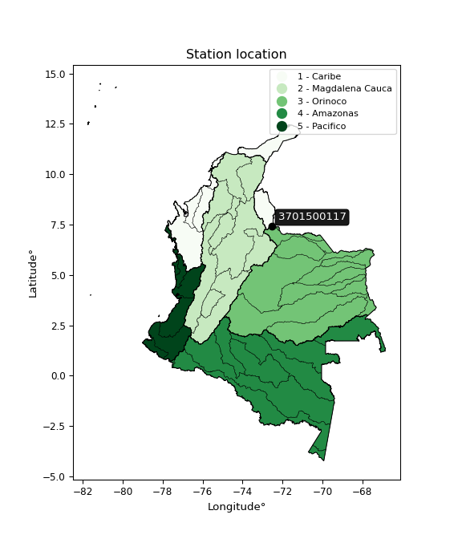

<div align="center">


</div>

# PMax24h Station (Rain): 3701500117

Maximum Precipitation in 24 hours (PMax24h) is the greatest amount of rainfall for a specific duration that is meteorologically possible for a given location, acting as a "worst-case" scenario for extreme storms, crucial for designing safety-critical infrastructure like bridges, river deviations, dams, spillways, and nuclear plants to prevent catastrophic failure. The PMax24h is related with the Probable Maximum Precipitation (PMP) and it is calculated by hydrologists using meteorological data to determine the upper limit of extreme rainfall, often leading to the Probable Maximum Flood (PMF) for flood control design, and is increasingly being studied for climate change impacts. Probable Maximum Precipitation (PMP) is the theoretical upper limit of rainfall, a deterministic estimate for extreme events, while probability distributions (like GEV, Gumbel) describe the likelihood and frequency of various precipitation amounts, including rare ones, showing how often events occur, with PMP representing the extreme end of these distributions, used for critical infrastructure design to ensure safety against the worst conceivable weather, unlike standard statistical forecasts which cover typical probabilities.

The most common probability distributions in hydrology, used for analyzing floods, rainfall, and streamflow, include the Normal, Log-Normal, Gumbel, Gamma (including Log-Pearson Type III), and Generalized Extreme Value (GEV) distributions, often chosen based on the data´s skewness and whether modeling extremes or general conditions, with Gumbel and GEV popular for extreme events like floods, while the Normal distribution serves as a baseline, though often requiring transformations for skewed hydrological data. These distributions help in designing water infrastructure, managing water resources, and forecasting hydrologic events.

> Hydrological data often isn´t perfectly normal (it´s skewed), so different distributions are needed for different applications, such as: **Flood Frequency Analysis**: Using Gumbel, GEV, or Log-Pearson Type III for predicting extreme flood magnitudes and their return periods, **Rainfall Analysis**: Normal for annual totals, but Log-Normal, Weibull, or GEV for intensity or extreme daily rainfall, **Streamflow Modeling**: Gamma and Log-Normal for maximum flows, GEV for minimum flows, and Kappa for daily flows.

<div align="center">

</img>

</div>


## A. General information


### 1. General running parameters

• app_version: _v20260225_. • runtime: _2026-02-28 16:54:07.457399_. • Python version: _3.14.0_. • SciPy version: _1.16.3_. • Pandas version: _2.3.3_. • NumPy version: _2.3.5_. • Stations dataset (station_dataset_file): _dataset/pmax24h_in/automatic_colombia_2003_2025.csv_. • Stations catalog (station_catalog_file): _dataset/CNE.xls_. • Minimum year to eval til year_max (date_min): _1900_. • Maximum year to eval since year_min (date_max): _2025_. • Creates, save and include plots into reports (create_plot): _False_. • Plot only fit distributions with Δo > Δ (plot_only_fit): _True_. • Plot only simple graphs avoiding multiple CDFs and multiple Extreme values plots (plot_only_simple): _False_. • Eval low extreme values, if False, evaluates high extreme values (low_extreme): _False_. • Eval every SciPy distribution as logarithmic (pdist_logarithmic_on): _True_. • Standard deviation normalized (ddof): _1.0_. • Return periods to eval in years (Tr): _[2, 2.33, 5, 10, 15, 20, 25, 50, 75, 100, 200, 250, 500, 750, 1000]_. • Minimum data sample per station, 0 means any (minimum_sample): _5_. • Z-Score maximum threshold to adjust a value, 0 means disable (zscore_max): _3.5_. • Z-Score minimum threshold to adjust a value, 0 means disable (zscore_min): _-2.5_. • Avoid zeros, e.g. rain = 0 (avoid_zeros): _True_. • Avoid null values (avoid_nans): _True_. 

:file_folder:Table: [dataset.csv](../../dataset/pmax24h_in/automatic_colombia_2003_2025.csv)

> Delta Degrees of Freedom (DDOF): is a parameter used in the formulas for calculating variance and standard deviation. When ddof=0, the divisor is $N$ (the total number of observations) and this is used when your data set is the entire population. When ddof=1, the divisor is $N-1$ and this is used when your data set is a sample drawn from a larger population. Using $N-1$ provides an unbiased estimate of the population variance (known as Bessel´s correction).


### 2. Station info and location

|   id |     CODIGO | NOMBRE                           | CATEGORIA               | TECNOLOGIA                | ESTADO           | FECHA_INSTALACION   |   FECHA_SUSPENSION |   ALTITUD |   LATITUD |   LONGITUD | DEPARTAMENTO       | MUNICIPIO   | AREA_OPERATIVA                         | ENTIDAD                                                     | AREA_HIDROGRAFICA   | ZONA_HIDROGRAFICA   | SUBZONA_HIDROGRAFICA   |   CORRIENTE | Catalogo   |   Version |
|-----:|-----------:|:---------------------------------|:------------------------|:--------------------------|:-----------------|:--------------------|-------------------:|----------:|----------:|-----------:|:-------------------|:------------|:---------------------------------------|:------------------------------------------------------------|:--------------------|:--------------------|:-----------------------|------------:|:-----------|----------:|
|    0 | 3701500117 | EL PORTILLO - AUT   [3701500117] | Climatológica Principal | Automática con Telemetría | En Mantenimiento | 03/07/2017          |                nan |      3926 |   7.40122 |   -72.5503 | Norte De Santander | Silos       | Area Operativa 08 - Santanderes-Arauca | INSTITUTO DE HIDROLOGIA METEOROLOGIA Y ESTUDIOS AMBIENTALES | Orinoco             | Arauca              | Río Chítaga            |         nan | CNE_IDEAM  |  20251226 |

<div align="center">

Dynamic map: [:earth_americas:Google](http://maps.google.com/maps?q=7.40122,-72.55028) [:earth_americas:OSM](https://www.openstreetmap.org/#map=18/7.40122/-72.55028&layers=P) [:earth_americas:Bing](https://www.bing.com/maps?cp=7.40122~-72.55028&lvl=18) [:earth_americas:Apple](https://maps.apple.com/frame?center=7.40122%2C-72.55028&span=0.003%2C0.006)

</div>


<div align="center">

```geojson
{
  "type": "Feature",
  "geometry": {
    "type": "Point", 
    "coordinates": [-72.55028, 7.40122]
  }, 
  "properties": {
    "Name": "3701500117"
  }
}
```

</div>


### 3. Discrete values table and plot

<div align="center">

|               |          0 |           1 |           2 |          3 |           4 |
|:--------------|-----------:|------------:|------------:|-----------:|------------:|
| Date          | 2019       | 2020        | 2021        | 2022       | 2025        |
| Value         |   35.4     |   34        |  285.6      |  315.6     |   24.8      |
| Value_initial |   35.4     |   34        |  285.6      |  315.6     |   24.8      |
| count         |    5       |    5        |    5        |    5       |    5        |
| mean          |  139.08    |  139.08     |  139.08     |  139.08    |  139.08     |
| std           |  147.884   |  147.884    |  147.884    |  147.884   |  147.884    |
| zscore        |   -0.70109 |   -0.710557 |    0.990777 |    1.19364 |   -0.772768 |


</div>


> The initial value (value_initial) correspond to the initial obtained or null completed value, and value (value) is adjusted only when the initial value is outside the valid range (outlier) definite through the Z-Score value. If Z-Score is active, values out of range or outliers are replaced with the station mean value. A Z-Score (or standard score) measures how many standard deviations a data point is from the mean of a dataset, indicating its relative position; positive scores mean above the mean, negative mean below, and a score of zero is exactly at the mean, allowing for comparison of values from different distributions. It´s calculated using the formula $z=(x–μ)/σ$, where $x$ is the data point, $μ$ is the mean, and $σ$ is the standard deviation, helping identify outliers and understand probability.
>
> <sub>**Note**: In this study, "completing" (filling gaps in) and "extending" (forecasting or lengthening the historical record) rainfall data series are avoided for certain critical analyses because they introduce artificial bias and uncertainty, which can distort the statistics of rare events (extremes), alter day-to-day variability, and compromise the integrity and homogeneity of the original data. Some reasons against Completing/Extending rainfall data are: **Distortion of Extremes and Variability**: The primary issue is that most gap-filling or extension methods rely on averaging or regression with nearby stations, which inherently smooths the data. Rainfall is highly variable in space and time, with a large percentage of zero values and occasional large storms. Infilling methods often underestimate the highest values and overestimate the lowest (zero) values, which severely distorts analyses focused on flood frequency, drought severity, and intensity-duration-frequency (IDF) curves, **Loss of Data Homogeneity**: Infilled or extended data are synthetic estimates, not actual measurements. Combining these estimates with observed data can violate the assumption of data homogeneity, which requires that the data properties do not change over time. Inhomogeneity can lead to incorrect conclusions about long-term trends or changes in climate patterns, **Propagation of Errors**: Errors and biases from the original data (e.g., wind-induced undercatch, instrument errors, site changes) or the data used for imputation can propagate through the analysis, leading to unreliable hydrological models and inaccurate predictions, **Compromised Statistical Integrity**: For statistical analyses, especially those involving the frequency of events, using artificial data can introduce time bias or autocorrelation that doesn´t exist in reality, making it difficult to assess the true probability of events, **Difficulty in Validation**: It is difficult to accurately validate the quality of filled or extended data, especially for past periods where ground-truth measurements are unavailable. The reliability of imputation techniques heavily depends on the density of the surrounding station network and the complexity of the local topography.</sub>


### 4. Active continuous probability distributions from SciPy (80 of 104 available)

A Probability Density Function (PDF) describes the relative likelihood of a continuous random variable falling within a specific range, where the total area under its curve equals 1, and the area over any interval gives the actual probability for that range. Unlike discrete probabilities (like rolling a die), a PDF shows density, not direct probability for a single point (which is zero), with higher points indicating higher likelihood, often visualized as a bell curve for normal distributions.

A log of a probability density function (log-PDF) is simply the logarithm of the PDF´s value, denoted as $log(f(x))$, useful for converting multiplication of probabilities into addition, improving numerical stability with tiny numbers, and connecting to information theory concepts like entropy. Instead of dealing with very small probabilities (e.g., 0.000001), log-PDFs use negative numbers (e.g., $log(0.00001) ≈ -11.51$ that are easier for computers to handle, preventing underflow errors and simplifying complex calculations. In this study, each active probability distribution from SciPy is also evaluated in the $log$ form.

[scipy.stats](https://docs.scipy.org/doc/scipy/reference/stats.html) is a Python´s powerful submodule within the SciPy library for comprehensive statistical analysis, offering over 130 probability distributions (like Normal, Poisson, etc.), functions for descriptive stats (mean, variance), hypothesis testing (t-tests, chi-square), random variable generation, and statistical tests, making it essential for data science, modeling, and research. It provides tools to explore, model, and draw conclusions from data efficiently, working seamlessly with [NumPy](https://numpy.org/).

<div align="center">

|   id | p_dist           |   n_parameter | fit_method   | label                                                                       | active   | ref                                                                                                      |
|-----:|:-----------------|--------------:|:-------------|:----------------------------------------------------------------------------|:---------|:---------------------------------------------------------------------------------------------------------|
|    0 | alpha            |             3 | MLE          | Alpha                                                                       | True     | [:mortar_board:](https://docs.scipy.org/doc/scipy/reference/generated/scipy.stats.alpha.html)            |
|    1 | anglit           |             2 | MM           | Anglit                                                                      | True     | [:mortar_board:](https://docs.scipy.org/doc/scipy/reference/generated/scipy.stats.anglit.html)           |
|    2 | arcsine          |             2 | MM           | Arcsine                                                                     | True     | [:mortar_board:](https://docs.scipy.org/doc/scipy/reference/generated/scipy.stats.arcsine.html)          |
|    3 | argus            |             3 | MLE          | Argus                                                                       | True     | [:mortar_board:](https://docs.scipy.org/doc/scipy/reference/generated/scipy.stats.argus.html)            |
|    4 | beta             |             4 | MLE          | Beta                                                                        | True     | [:mortar_board:](https://docs.scipy.org/doc/scipy/reference/generated/scipy.stats.beta.html)             |
|    5 | betaprime        |             4 | MLE          | Beta prime                                                                  | True     | [:mortar_board:](https://docs.scipy.org/doc/scipy/reference/generated/scipy.stats.betaprime.html)        |
|    6 | bradford         |             3 | MLE          | Bradford                                                                    | True     | [:mortar_board:](https://docs.scipy.org/doc/scipy/reference/generated/scipy.stats.bradford.html)         |
|    7 | burr             |             4 | MLE          | Burr (Type III)                                                             | True     | [:mortar_board:](https://docs.scipy.org/doc/scipy/reference/generated/scipy.stats.burr.html)             |
|    8 | burr12           |             4 | MLE          | Burr (Type III) 12                                                          | True     | [:mortar_board:](https://docs.scipy.org/doc/scipy/reference/generated/scipy.stats.burr12.html)           |
|    9 | cosine           |             2 | MLE          | Cosine                                                                      | True     | [:mortar_board:](https://docs.scipy.org/doc/scipy/reference/generated/scipy.stats.cosine.html)           |
|   10 | crystalball      |             4 | MLE          | Crystalball                                                                 | True     | [:mortar_board:](https://docs.scipy.org/doc/scipy/reference/generated/scipy.stats.crystalball.html)      |
|   11 | dgamma           |             3 | MLE          | Double gamma                                                                | True     | [:mortar_board:](https://docs.scipy.org/doc/scipy/reference/generated/scipy.stats.dgamma.html)           |
|   12 | dweibull         |             3 | MLE          | Double Weibull                                                              | True     | [:mortar_board:](https://docs.scipy.org/doc/scipy/reference/generated/scipy.stats.dweibull.html)         |
|   13 | erlang           |             3 | MLE          | Erlang                                                                      | True     | [:mortar_board:](https://docs.scipy.org/doc/scipy/reference/generated/scipy.stats.erlang.html)           |
|   14 | exponnorm        |             3 | MLE          | Exponentially modified Normal                                               | True     | [:mortar_board:](https://docs.scipy.org/doc/scipy/reference/generated/scipy.stats.exponnorm.html)        |
|   15 | exponpow         |             3 | MLE          | Exponential power                                                           | True     | [:mortar_board:](https://docs.scipy.org/doc/scipy/reference/generated/scipy.stats.exponpow.html)         |
|   16 | exponweib        |             4 | MLE          | Exponentiated Weibull                                                       | True     | [:mortar_board:](https://docs.scipy.org/doc/scipy/reference/generated/scipy.stats.exponweib.html)        |
|   17 | f                |             4 | MLE          | F                                                                           | True     | [:mortar_board:](https://docs.scipy.org/doc/scipy/reference/generated/scipy.stats.f.html)                |
|   18 | fatiguelife      |             3 | MLE          | Fatigue-life (Birnbaum-Saunders)                                            | True     | [:mortar_board:](https://docs.scipy.org/doc/scipy/reference/generated/scipy.stats.fatiguelife.html)      |
|   19 | foldnorm         |             3 | MM           | Fold Normal                                                                 | True     | [:mortar_board:](https://docs.scipy.org/doc/scipy/reference/generated/scipy.stats.foldnorm.html)         |
|   20 | gamma            |             3 | MLE          | Gamma                                                                       | True     | [:mortar_board:](https://docs.scipy.org/doc/scipy/reference/generated/scipy.stats.gamma.html)            |
|   21 | gausshyper       |             6 | MLE          | Gauss hypergeometric                                                        | True     | [:mortar_board:](https://docs.scipy.org/doc/scipy/reference/generated/scipy.stats.gausshyper.html)       |
|   22 | genexpon         |             5 | MLE          | Generalized exponential                                                     | True     | [:mortar_board:](https://docs.scipy.org/doc/scipy/reference/generated/scipy.stats.genexpon.html)         |
|   23 | genextreme       |             3 | MLE          | Generalized exponential                                                     | True     | [:mortar_board:](https://docs.scipy.org/doc/scipy/reference/generated/scipy.stats.genextreme.html)       |
|   24 | gengamma         |             4 | MLE          | Generalized gamma                                                           | True     | [:mortar_board:](https://docs.scipy.org/doc/scipy/reference/generated/scipy.stats.gengamma.html)         |
|   25 | genhalflogistic  |             3 | MLE          | Generalized half-logistic                                                   | True     | [:mortar_board:](https://docs.scipy.org/doc/scipy/reference/generated/scipy.stats.genhalflogistic.html)  |
|   26 | genlogistic      |             3 | MLE          | Generalized logistic                                                        | True     | [:mortar_board:](https://docs.scipy.org/doc/scipy/reference/generated/scipy.stats.genlogistic.html)      |
|   27 | gennorm          |             3 | MLE          | Generalized Normal                                                          | True     | [:mortar_board:](https://docs.scipy.org/doc/scipy/reference/generated/scipy.stats.gennorm.html)          |
|   28 | genpareto        |             3 | MLE          | Generalized Pareto                                                          | True     | [:mortar_board:](https://docs.scipy.org/doc/scipy/reference/generated/scipy.stats.genpareto.html)        |
|   29 | gompertz         |             3 | MLE          | Gompertz (or truncated Gumbel)                                              | True     | [:mortar_board:](https://docs.scipy.org/doc/scipy/reference/generated/scipy.stats.gompertz.html)         |
|   30 | gumbel_l         |             2 | MM           | Gumbel Left Skew                                                            | True     | [:mortar_board:](https://docs.scipy.org/doc/scipy/reference/generated/scipy.stats.gumbel_l.html)         |
|   31 | gumbel_r         |             2 | MM           | Gumbel Right Skew                                                           | True     | [:mortar_board:](https://docs.scipy.org/doc/scipy/reference/generated/scipy.stats.gumbel_r.html)         |
|   32 | halfgennorm      |             3 | MLE          | Upper half of a generalized normal                                          | True     | [:mortar_board:](https://docs.scipy.org/doc/scipy/reference/generated/scipy.stats.halfgennorm.html)      |
|   33 | halflogistic     |             2 | MM           | Half-logistic                                                               | True     | [:mortar_board:](https://docs.scipy.org/doc/scipy/reference/generated/scipy.stats.halflogistic.html)     |
|   34 | halfnorm         |             2 | MM           | Half Normal                                                                 | True     | [:mortar_board:](https://docs.scipy.org/doc/scipy/reference/generated/scipy.stats.halfnorm.html)         |
|   35 | hypsecant        |             2 | MM           | hyperbolic secant                                                           | True     | [:mortar_board:](https://docs.scipy.org/doc/scipy/reference/generated/scipy.stats.hypsecant.html)        |
|   36 | invgamma         |             3 | MLE          | Inverted gamma                                                              | True     | [:mortar_board:](https://docs.scipy.org/doc/scipy/reference/generated/scipy.stats.invgamma.html)         |
|   37 | invgauss         |             3 | MLE          | Inverse Gaussian                                                            | True     | [:mortar_board:](https://docs.scipy.org/doc/scipy/reference/generated/scipy.stats.invgauss.html)         |
|   38 | invweibull       |             3 | MLE          | Inverted Weibull                                                            | True     | [:mortar_board:](https://docs.scipy.org/doc/scipy/reference/generated/scipy.stats.invweibull.html)       |
|   39 | johnsonsb        |             4 | MLE          | Johnson SB                                                                  | True     | [:mortar_board:](https://docs.scipy.org/doc/scipy/reference/generated/scipy.stats.johnsonsb.html)        |
|   40 | johnsonsu        |             4 | MLE          | Johnson Su                                                                  | True     | [:mortar_board:](https://docs.scipy.org/doc/scipy/reference/generated/scipy.stats.johnsonsu.html)        |
|   41 | kappa3           |             3 | MLE          | Kappa 3                                                                     | True     | [:mortar_board:](https://docs.scipy.org/doc/scipy/reference/generated/scipy.stats.kappa3.html)           |
|   42 | kappa4           |             4 | MLE          | Kappa 4                                                                     | True     | [:mortar_board:](https://docs.scipy.org/doc/scipy/reference/generated/scipy.stats.kappa4.html)           |
|   43 | ksone            |             3 | MLE          | Kolmogorov-Smirnov one-sided test statistic distribution                    | True     | [:mortar_board:](https://docs.scipy.org/doc/scipy/reference/generated/scipy.stats.ksone.html)            |
|   44 | kstwobign        |             2 | MLE          | Limiting distribution of scaled Kolmogorov-Smirnov two-sided test statistic | True     | [:mortar_board:](https://docs.scipy.org/doc/scipy/reference/generated/scipy.stats.kstwobign.html)        |
|   45 | laplace          |             2 | MM           | Laplace                                                                     | True     | [:mortar_board:](https://docs.scipy.org/doc/scipy/reference/generated/scipy.stats.laplace.html)          |
|   46 | levy_l           |             2 | MLE          | Left-skewed Levy                                                            | True     | [:mortar_board:](https://docs.scipy.org/doc/scipy/reference/generated/scipy.stats.levy_l.html)           |
|   47 | loggamma         |             3 | MLE          | Log gamma                                                                   | True     | [:mortar_board:](https://docs.scipy.org/doc/scipy/reference/generated/scipy.stats.loggamma.html)         |
|   48 | logistic         |             2 | MM           | Logistic (or Sech-squared)                                                  | True     | [:mortar_board:](https://docs.scipy.org/doc/scipy/reference/generated/scipy.stats.logistic.html)         |
|   49 | loglaplace       |             3 | MLE          | Log-Laplace                                                                 | True     | [:mortar_board:](https://docs.scipy.org/doc/scipy/reference/generated/scipy.stats.loglaplace.html)       |
|   50 | lomax            |             3 | MLE          | Lomax (Pareto of the second kind)                                           | True     | [:mortar_board:](https://docs.scipy.org/doc/scipy/reference/generated/scipy.stats.lomax.html)            |
|   51 | maxwell          |             2 | MM           | Maxwell                                                                     | True     | [:mortar_board:](https://docs.scipy.org/doc/scipy/reference/generated/scipy.stats.maxwell.html)          |
|   52 | mielke           |             4 | MLE          | Mielke Beta-Kappa / Dagum                                                   | True     | [:mortar_board:](https://docs.scipy.org/doc/scipy/reference/generated/scipy.stats.mielke.html)           |
|   53 | moyal            |             2 | MM           | Moyal                                                                       | True     | [:mortar_board:](https://docs.scipy.org/doc/scipy/reference/generated/scipy.stats.moyal.html)            |
|   54 | nakagami         |             3 | MLE          | Nakagami                                                                    | True     | [:mortar_board:](https://docs.scipy.org/doc/scipy/reference/generated/scipy.stats.nakagami.html)         |
|   55 | ncf              |             5 | MLE          | Non-central F distribution                                                  | True     | [:mortar_board:](https://docs.scipy.org/doc/scipy/reference/generated/scipy.stats.ncf.html)              |
|   56 | nct              |             4 | MLE          | Non-central Student’s t                                                     | True     | [:mortar_board:](https://docs.scipy.org/doc/scipy/reference/generated/scipy.stats.nct.html)              |
|   57 | norm             |             2 | MM           | Normal                                                                      | True     | [:mortar_board:](https://docs.scipy.org/doc/scipy/reference/generated/scipy.stats.norm.html)             |
|   58 | pearson3         |             3 | MM           | Pearson type III                                                            | True     | [:mortar_board:](https://docs.scipy.org/doc/scipy/reference/generated/scipy.stats.pearson3.html)         |
|   59 | powerlaw         |             3 | MLE          | Power-function                                                              | True     | [:mortar_board:](https://docs.scipy.org/doc/scipy/reference/generated/scipy.stats.powerlaw.html)         |
|   60 | rayleigh         |             2 | MM           | Rayleigh                                                                    | True     | [:mortar_board:](https://docs.scipy.org/doc/scipy/reference/generated/scipy.stats.rayleigh.html)         |
|   61 | rdist            |             3 | MLE          | R-distributed (symmetric beta)                                              | True     | [:mortar_board:](https://docs.scipy.org/doc/scipy/reference/generated/scipy.stats.rdist.html)            |
|   62 | rice             |             3 | MLE          | Rice                                                                        | True     | [:mortar_board:](https://docs.scipy.org/doc/scipy/reference/generated/scipy.stats.rice.html)             |
|   63 | semicircular     |             2 | MM           | Semicircular                                                                | True     | [:mortar_board:](https://docs.scipy.org/doc/scipy/reference/generated/scipy.stats.semicircular.html)     |
|   64 | skewnorm         |             3 | MLE          | Skew normal                                                                 | True     | [:mortar_board:](https://docs.scipy.org/doc/scipy/reference/generated/scipy.stats.skewnorm.html)         |
|   65 | t                |             3 | MLE          | Student’s t                                                                 | True     | [:mortar_board:](https://docs.scipy.org/doc/scipy/reference/generated/scipy.stats.t.html)                |
|   66 | trapezoid        |             4 | MLE          | Trapezoid                                                                   | True     | [:mortar_board:](https://docs.scipy.org/doc/scipy/reference/generated/scipy.stats.trapezoid.html)        |
|   67 | triang           |             3 | MLE          | Triangular                                                                  | True     | [:mortar_board:](https://docs.scipy.org/doc/scipy/reference/generated/scipy.stats.triang.html)           |
|   68 | truncexpon       |             3 | MLE          | Truncated exponential                                                       | True     | [:mortar_board:](https://docs.scipy.org/doc/scipy/reference/generated/scipy.stats.truncexpon.html)       |
|   69 | truncnorm        |             4 | MLE          | Truncated normal                                                            | True     | [:mortar_board:](https://docs.scipy.org/doc/scipy/reference/generated/scipy.stats.truncnorm.html)        |
|   70 | truncpareto      |             4 | MLE          | Upper truncated Pareto                                                      | True     | [:mortar_board:](https://docs.scipy.org/doc/scipy/reference/generated/scipy.stats.truncpareto.html)      |
|   71 | truncweibull_min |             5 | MLE          | Doubly truncated Weibull minimum                                            | True     | [:mortar_board:](https://docs.scipy.org/doc/scipy/reference/generated/scipy.stats.truncweibull_min.html) |
|   72 | tukeylambda      |             3 | MLE          | Tukey-Lamdba                                                                | True     | [:mortar_board:](https://docs.scipy.org/doc/scipy/reference/generated/scipy.stats.tukeylambda.html)      |
|   73 | uniform          |             2 | MLE          | Uniform                                                                     | True     | [:mortar_board:](https://docs.scipy.org/doc/scipy/reference/generated/scipy.stats.uniform.html)          |
|   74 | vonmises         |             3 | MLE          | Von Mises                                                                   | True     | [:mortar_board:](https://docs.scipy.org/doc/scipy/reference/generated/scipy.stats.vonmises.html)         |
|   75 | vonmises_line    |             3 | MLE          | Von Mises line                                                              | True     | [:mortar_board:](https://docs.scipy.org/doc/scipy/reference/generated/scipy.stats.vonmises_line.html)    |
|   76 | wald             |             2 | MM           | Wald                                                                        | True     | [:mortar_board:](https://docs.scipy.org/doc/scipy/reference/generated/scipy.stats.wald.html)             |
|   77 | weibull_max      |             3 | MLE          | Weibull maximum                                                             | True     | [:mortar_board:](https://docs.scipy.org/doc/scipy/reference/generated/scipy.stats.weibull_max.html)      |
|   78 | weibull_min      |             3 | MLE          | Weibull minimum                                                             | True     | [:mortar_board:](https://docs.scipy.org/doc/scipy/reference/generated/scipy.stats.weibull_min.html)      |
|   79 | wrapcauchy       |             3 | MLE          | Wrapped  Cauchy                                                             | True     | [:mortar_board:](https://docs.scipy.org/doc/scipy/reference/generated/scipy.stats.wrapcauchy.html)       |

</div>

> **n_parameter:** # arguments & localization & scale.
>
> **Fit methods:** (MLE) maximum likelihood, (MM) L-moments.
>
>**Inactive** (With the only purpose of prevent loops, zero divisions, infinite values, over high estimated values or horizontal trending for recurrence intervals estimations, the follow distributions were disabled.)**:** lognorm, norminvgauss, powernorm, powerlognorm, cauchy, halfcauchy, foldcauchy, skewcauchy, chi2, expon, fisk, genhyperbolic, geninvgauss, gibrat, kstwo, laplace_asymmetric, levy, levy_stable, ncx2, pareto, rel_breitwigner, recipinvgauss, studentized_range, loguniform, 


## B. Probability (PDF) vs. Empirical (EDF) distributions functions

A continuous probability distribution (CPD) describes probabilities for variables that can take any value within a range (like rain any time), unlike discrete variables with specific outcomes (like temperature). It uses a Probability Density Function (PDF), a curve where the total area under it equals 1, and the probability of the variable falling within an interval (a to b) is found by calculating the area under the curve between those points. A key feature is that the probability of hitting any single exact value is zero, so probabilities are always expressed for ranges, e.g., $P(a ≤ X ≤ b)$.

<div align="center">

Distributions parameters from station values
|     |    station | p_dist              |   n |             loc |            scale | shape                  | shape1                 | shape2              | shape3             |
|----:|-----------:|:--------------------|----:|----------------:|-----------------:|:-----------------------|:-----------------------|:--------------------|:-------------------|
|   0 | 3701500117 | alpha               |   5 |     14.744      |     18.2822      | 7.296012580304088e-11  |                        |                     |                    |
|   1 | 3701500117 | anglit              |   5 |    139.08       |    386.947       |                        |                        |                     |                    |
|   2 | 3701500117 | arcsine             |   5 |    -47.9801     |    374.12        |                        |                        |                     |                    |
|   3 | 3701500117 | argus               |   5 |   -115.738      |    462.742       | 1.5874914477546636e-06 |                        |                     |                    |
|   4 | 3701500117 | beta                |   5 |     -4.38819    |    319.988       | 0.014997947966018737   | 0.02257675144256776    |                     |                    |
|   5 | 3701500117 | betaprime           |   5 |     24.6377     |      0.00014435  | 1311.8285173995025     | 0.2767279106112386     |                     |                    |
|   6 | 3701500117 | bradford            |   5 |    -66.6727     |    382.273       | 3.5371139887026764e-07 |                        |                     |                    |
|   7 | 3701500117 | burr                |   5 |     24.7926     |      1.10047e-05 | 0.290600986179435      | 28.37460668680383      |                     |                    |
|   8 | 3701500117 | burr12              |   5 |     -0.773774   |     25.1997      | 280.53627858715765     | 0.0031496007098620934  |                     |                    |
|   9 | 3701500117 | cosine              |   5 |    146.497      |    102.539       |                        |                        |                     |                    |
|  10 | 3701500117 | crystalball         |   5 |    139.065      |    132.258       | 4956.016328828028      | 3182.360039371696      |                     |                    |
|  11 | 3701500117 | dgamma              |   5 |    165.249      |      0.765986    | 175.52501038619107     |                        |                     |                    |
|  12 | 3701500117 | dweibull            |   5 |    169.636      |    139.935       | 17.328167215788902     |                        |                     |                    |
|  13 | 3701500117 | erlang              |   5 |     24.8        |     82.6666      | 0.6312764171203591     |                        |                     |                    |
|  14 | 3701500117 | exponnorm           |   5 |     24.6958     |      0.0311389   | 3646.147134372006      |                        |                     |                    |
|  15 | 3701500117 | exponpow            |   5 |     24.8        |    282.567       | 0.3212147023884344     |                        |                     |                    |
|  16 | 3701500117 | exponweib           |   5 |     24.8        |      4.04611     | 2.019575621296034      | 0.3093941252819423     |                     |                    |
|  17 | 3701500117 | f                   |   5 |     24.8        |      4.00053e-12 | 39554.479806419986     | 0.3622714204524983     |                     |                    |
|  18 | 3701500117 | fatiguelife         |   5 |     24.8        |      3.3762e-05  | 2004.4524966200247     |                        |                     |                    |
|  19 | 3701500117 | foldnorm            |   5 |    -85.6293     |    146.934       | 1.4660098481091657     |                        |                     |                    |
|  20 | 3701500117 | gamma               |   5 |     24.8        |     65.505       | 0.7605410751296429     |                        |                     |                    |
|  21 | 3701500117 | gausshyper          |   5 |    -53.7484     |    369.348       | 1.3448567236762372     | 0.7862103580934465     | 1.0954722981416443  | 1.058560749157392  |
|  22 | 3701500117 | genexpon            |   5 |     24.8        |    262.363       | 2.295792810080619      | 4.1369670243510145e-11 | 1.956522447822211   |                    |
|  23 | 3701500117 | genextreme          |   5 |     26.9992     |     11.6671      | -5.3049388292321495    |                        |                     |                    |
|  24 | 3701500117 | gengamma            |   5 |     24.8        |      7.58504     | 1.5142686595480659     | 0.28752430959418324    |                     |                    |
|  25 | 3701500117 | genhalflogistic     |   5 |   -123.122      |    484.469       | 1.1042725255203016     |                        |                     |                    |
|  26 | 3701500117 | genlogistic         |   5 |   -637.589      |     97.1298      | 1560.6110896442024     |                        |                     |                    |
|  27 | 3701500117 | gennorm             |   5 |     34          |      0.0103419   | 0.21185076458802607    |                        |                     |                    |
|  28 | 3701500117 | genpareto           |   5 |     -2.53745    |    445.286       | -1.3996659514863823    |                        |                     |                    |
|  29 | 3701500117 | gompertz            |   5 |     24.7958     | 217618           | 1929.8241313691092     |                        |                     |                    |
|  30 | 3701500117 | gumbel_l            |   5 |    198.609      |    103.132       |                        |                        |                     |                    |
|  31 | 3701500117 | gumbel_r            |   5 |     79.5508     |    103.132       |                        |                        |                     |                    |
|  32 | 3701500117 | halfgennorm         |   5 |     24.8        |      4.19588     | 0.39505962309717474    |                        |                     |                    |
|  33 | 3701500117 | halflogistic        |   5 |    -17.6924     |    113.087       |                        |                        |                     |                    |
|  34 | 3701500117 | halfnorm            |   5 |    -35.9956     |    219.425       |                        |                        |                     |                    |
|  35 | 3701500117 | hypsecant           |   5 |    139.08       |     84.2066      |                        |                        |                     |                    |
|  36 | 3701500117 | invgamma            |   5 |     24.8        |      3.21714e-06 | 0.2208454067804496     |                        |                     |                    |
|  37 | 3701500117 | invgauss            |   5 |     22.6034     |      8.54087     | 13.637565882544834     |                        |                     |                    |
|  38 | 3701500117 | invweibull          |   5 |     24.8        |      9.3488      | 0.04149113614164161    |                        |                     |                    |
|  39 | 3701500117 | johnsonsb           |   5 |     24.8        |    290.846       | 1.6012235190765227     | 0.0751423198260136     |                     |                    |
|  40 | 3701500117 | johnsonsu           |   5 |    315.6        |      3.28545e-12 | 2.8001801297639        | 0.10502708225220742    |                     |                    |
|  41 | 3701500117 | kappa3              |   5 |     24.8        |      0.0133826   | 0.1548154069025115     |                        |                     |                    |
|  42 | 3701500117 | kappa4              |   5 |    -78.0027     |    394.646       | 1.3518940216136401     | 0.9947320380826492     |                     |                    |
|  43 | 3701500117 | ksone               |   5 |    -90.0209     |    458.202       | 1.0                    |                        |                     |                    |
|  44 | 3701500117 | kstwobign           |   5 |   -252.198      |    446.951       |                        |                        |                     |                    |
|  45 | 3701500117 | laplace             |   5 |    139.08       |     93.53        |                        |                        |                     |                    |
|  46 | 3701500117 | levy_l              |   5 |    324.763      |     34.5073      |                        |                        |                     |                    |
|  47 | 3701500117 | loggamma            |   5 | -36329.7        |   5027.6         | 1413.8760338079883     |                        |                     |                    |
|  48 | 3701500117 | logistic            |   5 |    139.08       |     72.9251      |                        |                        |                     |                    |
|  49 | 3701500117 | loglaplace          |   5 |     -0.0810553  |     35.4811      | 1.0711417802326801     |                        |                     |                    |
|  50 | 3701500117 | lomax               |   5 |     24.8        |   5982.72        | 55.109827847778135     |                        |                     |                    |
|  51 | 3701500117 | maxwell             |   5 |   -174.348      |    196.412       |                        |                        |                     |                    |
|  52 | 3701500117 | mielke              |   5 |      9.81672    |      0.268585    | 321.7258095798592      | 1.2038232105124722     |                     |                    |
|  53 | 3701500117 | moyal               |   5 |     63.4387     |     59.5431      |                        |                        |                     |                    |
|  54 | 3701500117 | nakagami            |   5 |     24.8        |    220.667       | 0.12483252299083168    |                        |                     |                    |
|  55 | 3701500117 | ncf                 |   5 |     -0.0100264  |      6.91988e-08 | 4.131584595775506e-09  | 1.7051886324859913     | 2.9998027682890243  |                    |
|  56 | 3701500117 | nct                 |   5 |     23.1536     |      0.743175    | 0.3748730512312892     | 5.09875757727437       |                     |                    |
|  57 | 3701500117 | norm                |   5 |    139.08       |    132.271       |                        |                        |                     |                    |
|  58 | 3701500117 | pearson3            |   5 |    139.08       |    132.271       | 0.4216143410631362     |                        |                     |                    |
|  59 | 3701500117 | powerlaw            |   5 |     24.8        |    290.8         | 0.10912790225701186    |                        |                     |                    |
|  60 | 3701500117 | rayleigh            |   5 |   -113.963      |    201.899       |                        |                        |                     |                    |
|  61 | 3701500117 | rdist               |   5 |    138.343      |    177.257       | 1.0886818179925974     |                        |                     |                    |
|  62 | 3701500117 | rice                |   5 |    -73.965      |    177.319       | 0.001310003630988149   |                        |                     |                    |
|  63 | 3701500117 | semicircular        |   5 |    139.08       |    264.543       |                        |                        |                     |                    |
|  64 | 3701500117 | skewnorm            |   5 |     24.7999     |    174.792       | 8073713.204429204      |                        |                     |                    |
|  65 | 3701500117 | t                   |   5 |     35.7841     |     12.5936      | 0.2682532195256666     |                        |                     |                    |
|  66 | 3701500117 | trapezoid           |   5 |   -240.916      |    561.18        | 1.0                    | 1.0                    |                     |                    |
|  67 | 3701500117 | triang              |   5 |   -142.525      |    458.545       | 0.9990840163481541     |                        |                     |                    |
|  68 | 3701500117 | truncexpon          |   5 |     24.8        |    381.888       | 0.7614793422436057     |                        |                     |                    |
|  69 | 3701500117 | truncnorm           |   5 | -81727.7        |   3296.53        | 24.799556677030683     | 326.6068170991932      |                     |                    |
|  70 | 3701500117 | truncpareto         |   5 |     23.7481     |      1.05186     | 0.31596167547788184    | 277.4622025077386      |                     |                    |
|  71 | 3701500117 | truncweibull_min    |   5 |      6.01884    |    375.737       | 0.3904452166131367     | 0.04993232704469469    | 0.8239315031605412  |                    |
|  72 | 3701500117 | tukeylambda         |   5 |    170.293      |    165.427       | 1.1370085363413283     |                        |                     |                    |
|  73 | 3701500117 | uniform             |   5 |     24.8        |    290.8         |                        |                        |                     |                    |
|  74 | 3701500117 | vonmises            |   5 |      2.66134    |      1           | 0.6652676583987038     |                        |                     |                    |
|  75 | 3701500117 | vonmises_line       |   5 |    189.878      |     52.5888      | 5.09404849719944e-07   |                        |                     |                    |
|  76 | 3701500117 | wald                |   5 |      6.80855    |    132.271       |                        |                        |                     |                    |
|  77 | 3701500117 | weibull_max         |   5 |    315.6        |      1.72441     | 0.19402757614500887    |                        |                     |                    |
|  78 | 3701500117 | weibull_min         |   5 |     24.8        |    266.409       | 0.307656145550548      |                        |                     |                    |
|  79 | 3701500117 | wrapcauchy          |   5 |     24.8        |     46.2957      | 0.8895633422901148     |                        |                     |                    |
|  80 | 3701500117 | logalpha            |   5 |      2.94308    |      0.503573    | 5.413866130570138e-07  |                        |                     |                    |
|  81 | 3701500117 | loganglit           |   5 |      4.3426     |      3.27431     |                        |                        |                     |                    |
|  82 | 3701500117 | logarcsine          |   5 |      2.75971    |      3.16578     |                        |                        |                     |                    |
|  83 | 3701500117 | logargus            |   5 |      2.18646    |      3.87344     | 9.350048768954732e-05  |                        |                     |                    |
|  84 | 3701500117 | logbeta             |   5 |      3.20789    |      2.54659     | 0.03705407504492481    | 0.051438842253688985   |                     |                    |
|  85 | 3701500117 | logbetaprime        |   5 |      0.586647   |      0.262195    | 168.05484898137092     | 12.785337958585814     |                     |                    |
|  86 | 3701500117 | logbradford         |   5 |      3.21084    |      2.54365     | 1.1634467685416428     |                        |                     |                    |
|  87 | 3701500117 | logburr             |   5 |      3.09374    |      0.0103076   | 0.9238063738827771     | 28.955404214608336     |                     |                    |
|  88 | 3701500117 | logburr12           |   5 |      2.81353    |    381.435       | 1.6656529255592933     | 8313.681339967345      |                     |                    |
|  89 | 3701500117 | logcosine           |   5 |      4.39647    |      0.867533    |                        |                        |                     |                    |
|  90 | 3701500117 | logcrystalball      |   5 |      4.3426     |      1.11927     | 31.930488691721298     | 667.7894400616237      |                     |                    |
|  91 | 3701500117 | logdgamma           |   5 |      4.57851    |      0.0134788   | 84.33493597677911      |                        |                     |                    |
|  92 | 3701500117 | logdweibull         |   5 |      3.52636    |      0.986578    | 0.8357276102446718     |                        |                     |                    |
|  93 | 3701500117 | logerlang           |   5 |      3.21084    |      0.797675    | 0.6969572609919761     |                        |                     |                    |
|  94 | 3701500117 | logexponnorm        |   5 |      3.20946    |      0.00042529  | 2634.1352022997316     |                        |                     |                    |
|  95 | 3701500117 | logexponpow         |   5 |      3.21084    |      2.67819     | 0.5710839763693751     |                        |                     |                    |
|  96 | 3701500117 | logexponweib        |   5 |      3.21084    |      1.07258     | 0.9486026431785834     | 0.961452198171211      |                     |                    |
|  97 | 3701500117 | logf                |   5 |      3.04081    |      0.473188    | 797.0613807726859      | 2.2195779623145313     |                     |                    |
|  98 | 3701500117 | logfatiguelife      |   5 |      3.21084    |      1.58733e-07 | 2502.057411026457      |                        |                     |                    |
|  99 | 3701500117 | logfoldnorm         |   5 |      2.37413    |      1.22292     | 1.5584034569386889     |                        |                     |                    |
| 100 | 3701500117 | loggamma            |   5 |      3.21084    |      1.01632     | 0.26095593979496445    |                        |                     |                    |
| 101 | 3701500117 | loggausshyper       |   5 |      3.21084    |      2.6019      | 0.7472834315192233     | 1.0183874796642312     | 1.1991954100009998  | 1.0565338395117698 |
| 102 | 3701500117 | loggenexpon         |   5 |      3.21084    |      7.25426     | 6.3939490303649835     | 0.9505874888460444     | 0.10931302737501206 |                    |
| 103 | 3701500117 | loggenextreme       |   5 |      3.48313    |      0.42692     | -1.0660823367459553    |                        |                     |                    |
| 104 | 3701500117 | loggengamma         |   5 |      3.21084    |      1.19805     | 0.8574904184674504     | 0.943270792755419      |                     |                    |
| 105 | 3701500117 | loggenhalflogistic  |   5 |      2.29795    |      3.90672     | 1.1302454066743752     |                        |                     |                    |
| 106 | 3701500117 | loggenlogistic      |   5 |     -2.42724    |      0.843146    | 1638.135589626624      |                        |                     |                    |
| 107 | 3701500117 | loggennorm          |   5 |      3.52636    |      0.00795739  | 0.30962637227705647    |                        |                     |                    |
| 108 | 3701500117 | loggenpareto        |   5 |     -0.0129329  |     13.1057      | -2.272367024280177     |                        |                     |                    |
| 109 | 3701500117 | loggompertz         |   5 |      3.21084    |      2.15874     | 1.0307659415600017     |                        |                     |                    |
| 110 | 3701500117 | loggumbel_l         |   5 |      4.84633    |      0.872692    |                        |                        |                     |                    |
| 111 | 3701500117 | loggumbel_r         |   5 |      3.83887    |      0.872692    |                        |                        |                     |                    |
| 112 | 3701500117 | loghalfgennorm      |   5 |      3.21084    |      1.06179     | 0.947100842658332      |                        |                     |                    |
| 113 | 3701500117 | loghalflogistic     |   5 |      3.016      |      0.956937    |                        |                        |                     |                    |
| 114 | 3701500117 | loghalfnorm         |   5 |      2.86112    |      1.85676     |                        |                        |                     |                    |
| 115 | 3701500117 | loghypsecant        |   5 |      4.3426     |      0.71255     |                        |                        |                     |                    |
| 116 | 3701500117 | loginvgamma         |   5 |      3.04016    |      0.525177    | 1.109777434140485      |                        |                     |                    |
| 117 | 3701500117 | loginvgauss         |   5 |      3.09592    |      0.50479     | 2.469646073903607      |                        |                     |                    |
| 118 | 3701500117 | loginvweibull       |   5 |      3.08266    |      0.40047     | 0.9380074690826712     |                        |                     |                    |
| 119 | 3701500117 | logjohnsonsb        |   5 |      3.21084    |      8.30126     | 1.679555022990855      | 0.09532152922477184    |                     |                    |
| 120 | 3701500117 | logjohnsonsu        |   5 |      5.75448    |      8.48879e-15 | 3.3583166797914137     | 0.1165688709455121     |                     |                    |
| 121 | 3701500117 | logkappa3           |   5 |      3.21084    |      2.54251     | 3612.8320652583407     |                        |                     |                    |
| 122 | 3701500117 | logkappa4           |   5 |      2.99409    |      2.90943     | 1.0806737245810742     | 1.0529829043362167     |                     |                    |
| 123 | 3701500117 | logksone            |   5 |      2.40396    |      3.87727     | 1.0                    |                        |                     |                    |
| 124 | 3701500117 | logkstwobign        |   5 |      0.953949   |      3.86972     |                        |                        |                     |                    |
| 125 | 3701500117 | loglaplace          |   5 |      4.3426     |      0.791444    |                        |                        |                     |                    |
| 126 | 3701500117 | loglevy_l           |   5 |      5.79587    |      0.153775    |                        |                        |                     |                    |
| 127 | 3701500117 | logloggamma         |   5 |   -242.812      |     35.8006      | 996.3675568101944      |                        |                     |                    |
| 128 | 3701500117 | loglogistic         |   5 |      4.3426     |      0.617086    |                        |                        |                     |                    |
| 129 | 3701500117 | logloglaplace       |   5 |     -0.00546926 |      3.57218     | 4.741694510435737      |                        |                     |                    |
| 130 | 3701500117 | loglomax            |   5 |      3.21084    |     23.6736      | 21.87603270873709      |                        |                     |                    |
| 131 | 3701500117 | logmaxwell          |   5 |      1.69039    |      1.66202     |                        |                        |                     |                    |
| 132 | 3701500117 | logmielke           |   5 |      3.10273    |      0.0136266   | 18.704097997623293     | 0.9065738507296349     |                     |                    |
| 133 | 3701500117 | logmoyal            |   5 |      3.70253    |      0.503849    |                        |                        |                     |                    |
| 134 | 3701500117 | lognakagami         |   5 |      3.21084    |      1.91696     | 0.2742934624031941     |                        |                     |                    |
| 135 | 3701500117 | logncf              |   5 |      3.04062    |      0.194969    | 736.4777080242903      | 2.2196128907239236     | 1050.9941142502405  |                    |
| 136 | 3701500117 | lognct              |   5 |     -0.0694299  |      0.109974    | 8.935424720696421      | 36.839230789309994     |                     |                    |
| 137 | 3701500117 | lognorm             |   5 |      4.3426     |      1.11927     |                        |                        |                     |                    |
| 138 | 3701500117 | logpearson3         |   5 |      4.3426     |      1.11927     | 0.3725767753975334     |                        |                     |                    |
| 139 | 3701500117 | logpowerlaw         |   5 |      3.21084    |      2.54363     | 0.12382955399710857    |                        |                     |                    |
| 140 | 3701500117 | lograyleigh         |   5 |      2.20137    |      1.70845     |                        |                        |                     |                    |
| 141 | 3701500117 | logrdist            |   5 |      4.57531    |      1.36446     | 1.0929991029621604     |                        |                     |                    |
| 142 | 3701500117 | logrice             |   5 |      2.50701    |      1.50877     | 0.17459740569755028    |                        |                     |                    |
| 143 | 3701500117 | logsemicircular     |   5 |      4.3426     |      2.23854     |                        |                        |                     |                    |
| 144 | 3701500117 | logskewnorm         |   5 |      3.21084    |      1.59166     | 109909125.79699644     |                        |                     |                    |
| 145 | 3701500117 | logt                |   5 |      4.3426     |      1.11927     | 4643342146.3464365     |                        |                     |                    |
| 146 | 3701500117 | logtrapezoid        |   5 |      1.17682    |      4.74866     | 1.0                    | 1.0                    |                     |                    |
| 147 | 3701500117 | logtriang           |   5 |      1.17928    |      4.57523     | 0.9999953731209623     |                        |                     |                    |
| 148 | 3701500117 | logtruncexpon       |   5 |      3.21083    |      2.6284      | 0.9677540025542566     |                        |                     |                    |
| 149 | 3701500117 | logtruncnorm        |   5 |    -12.1518     |      4.46835     | 3.438115945119111      | 5.479459613370727      |                     |                    |
| 150 | 3701500117 | logtruncpareto      |   5 |      3.20202    |      0.00882849  | 0.268547961545227      | 289.11642550234154     |                     |                    |
| 151 | 3701500117 | logtruncweibull_min |   5 |      3.21084    |      2.25969     | 0.8503728150007862     | 1.8364663891566853e-16 | 1.1256674680555792  |                    |
| 152 | 3701500117 | logtukeylambda      |   5 |      4.48266    |      1.57646     | 1.2395371490694953     |                        |                     |                    |
| 153 | 3701500117 | loguniform          |   5 |      3.21084    |      2.54363     |                        |                        |                     |                    |
| 154 | 3701500117 | logvonmises         |   5 |     -2.10877    |      1           | 1.0216489511577331     |                        |                     |                    |
| 155 | 3701500117 | logvonmises_line    |   5 |      4.50145    |      0.410817    | 6.002098862679417e-06  |                        |                     |                    |
| 156 | 3701500117 | logwald             |   5 |      3.22333    |      1.11927     |                        |                        |                     |                    |
| 157 | 3701500117 | logweibull_max      |   5 |      5.75448    |      1.41534     | 0.9908895596565406     |                        |                     |                    |
| 158 | 3701500117 | logweibull_min      |   5 |      3.21084    |      0.928113    | 0.4448917719296008     |                        |                     |                    |
| 159 | 3701500117 | logwrapcauchy       |   5 |      3.21084    |      0.404832    | 0.5249999999999999     |                        |                     |                    |

</div>

> **loc** (Location parameter): This shifts the distribution along the x-axis. For many common distributions, like the normal (Gaussian) distribution, loc represents the mean $μ$. For others, like the uniform distribution, it might represent the minimum value, or for the beta distribution, the left end of the support interval.
>
> **scale** (Scale parameter): This determines the width or spread of the distribution. For the normal distribution, scale represents the standard deviation $σ$. For a uniform distribution, it defines the length of the interval (from $loc$ to $loc + scale$).
>
> **shape** (Shape parameters): Refers to parameters that define the specific form of a probability distribution, distinct from its location (loc) and scale (scale). These parameters are required arguments for most distribution functions. For example, a normal (Gaussian) distribution is fully defined by its location (mean) and scale (standard deviation), so it has no specific shape parameters beyond loc and scale. However, other distributions have intrinsic properties that need specification, as Gamma distribution that takes a shape parameter, often named $a$ or $alpha$.


### 0. Cumulative distribution values - CDF (160 evaluated)

Cumulative Distribution Function (CDF), denoted as $F$<sub>$X$</sub>$(x)$, is a function that gives the probability that a random variable $X$ will take a value less than or equal to a specific value, $x$ (i.e., $(P(X≥x)$. It essentially "accumulates" probabilities from a given point up to the far right (positive infinity), providing a complete picture of the distribution´s probabilities for both discrete (like rain) and continuous (like temperature) variables, helping to find probabilities over ranges or above certain values. Each station is evaluated separately ordering the $x$ values ascending, calculating the CDF and PDF values for the activated distributions and their logarithmic forms.

<div align="center">

CDF ordered by x ascending and calculating $log(f(x))$ separately
|   id |    Station |   date |     x |   count |   mean |     std |    zscore |   Value_initial |    station |   m |     alpha |   alpha_pdf |   anglit |   anglit_pdf |   arcsine |   arcsine_pdf |    argus |   argus_pdf |     beta |    beta_pdf |   betaprime |   betaprime_pdf |   bradford |   bradford_pdf |      burr |    burr_pdf |    burr12 |   burr12_pdf |   cosine |   cosine_pdf |   crystalball |   crystalball_pdf |   dgamma |   dgamma_pdf |   dweibull |   dweibull_pdf |      erlang |     erlang_pdf |   exponnorm |   exponnorm_pdf |    exponpow |   exponpow_pdf |   exponweib |   exponweib_pdf |         f |       f_pdf |   fatiguelife |   fatiguelife_pdf |   foldnorm |   foldnorm_pdf |       gamma |    gamma_pdf |   gausshyper |   gausshyper_pdf |    genexpon |   genexpon_pdf |   genextreme |   genextreme_pdf |   gengamma |   gengamma_pdf |   genhalflogistic |   genhalflogistic_pdf |   genlogistic |   genlogistic_pdf |   gennorm |   gennorm_pdf |   genpareto |   genpareto_pdf |    gompertz |   gompertz_pdf |   gumbel_l |   gumbel_l_pdf |   gumbel_r |   gumbel_r_pdf |   halfgennorm |   halfgennorm_pdf |   halflogistic |   halflogistic_pdf |   halfnorm |   halfnorm_pdf |   hypsecant |   hypsecant_pdf |   invgamma |    invgamma_pdf |   invgauss |   invgauss_pdf |   invweibull |   invweibull_pdf |   johnsonsb |   johnsonsb_pdf |   johnsonsu |   johnsonsu_pdf |     kappa3 |       kappa3_pdf |      kappa4 |   kappa4_pdf |    ksone |   ksone_pdf |   kstwobign |   kstwobign_pdf |   laplace |   laplace_pdf |   levy_l |   levy_l_pdf |    loggamma |   loggamma_pdf |   logistic |   logistic_pdf |   loglaplace |   loglaplace_pdf |      lomax |   lomax_pdf |   maxwell |   maxwell_pdf |   mielke |   mielke_pdf |    moyal |   moyal_pdf |    nakagami |   nakagami_pdf |      ncf |     ncf_pdf |       nct |     nct_pdf |     norm |   norm_pdf |   pearson3 |   pearson3_pdf |   powerlaw |   powerlaw_pdf |   rayleigh |   rayleigh_pdf |    rdist |      rdist_pdf |     rice |   rice_pdf |   semicircular |   semicircular_pdf |   skewnorm |   skewnorm_pdf |        t |       t_pdf |   trapezoid |   trapezoid_pdf |   triang |   triang_pdf |   truncexpon |   truncexpon_pdf |   truncnorm |   truncnorm_pdf |   truncpareto |   truncpareto_pdf |   truncweibull_min |   truncweibull_min_pdf |   tukeylambda |   tukeylambda_pdf |   uniform |   uniform_pdf |   vonmises |   vonmises_pdf |   vonmises_line |   vonmises_line_pdf |      wald |    wald_pdf |   weibull_max |   weibull_max_pdf |   weibull_min |   weibull_min_pdf |   wrapcauchy |   wrapcauchy_pdf |   logalpha |   logalpha_pdf |   loganglit |   loganglit_pdf |   logarcsine |   logarcsine_pdf |   logargus |   logargus_pdf |   logbeta |   logbeta_pdf |   logbetaprime |   logbetaprime_pdf |   logbradford |   logbradford_pdf |   logburr |   logburr_pdf |   logburr12 |   logburr12_pdf |   logcosine |   logcosine_pdf |   logcrystalball |   logcrystalball_pdf |   logdgamma |   logdgamma_pdf |   logdweibull |   logdweibull_pdf |   logerlang |   logerlang_pdf |   logexponnorm |   logexponnorm_pdf |   logexponpow |   logexponpow_pdf |   logexponweib |   logexponweib_pdf |      logf |   logf_pdf |   logfatiguelife |   logfatiguelife_pdf |   logfoldnorm |   logfoldnorm_pdf |   loggausshyper |   loggausshyper_pdf |   loggenexpon |   loggenexpon_pdf |   loggenextreme |   loggenextreme_pdf |   loggengamma |   loggengamma_pdf |   loggenhalflogistic |   loggenhalflogistic_pdf |   loggenlogistic |   loggenlogistic_pdf |   loggennorm |   loggennorm_pdf |   loggenpareto |   loggenpareto_pdf |   loggompertz |   loggompertz_pdf |   loggumbel_l |   loggumbel_l_pdf |   loggumbel_r |   loggumbel_r_pdf |   loghalfgennorm |   loghalfgennorm_pdf |   loghalflogistic |   loghalflogistic_pdf |   loghalfnorm |   loghalfnorm_pdf |   loghypsecant |   loghypsecant_pdf |   loginvgamma |   loginvgamma_pdf |   loginvgauss |   loginvgauss_pdf |   loginvweibull |   loginvweibull_pdf |   logjohnsonsb |   logjohnsonsb_pdf |   logjohnsonsu |   logjohnsonsu_pdf |   logkappa3 |   logkappa3_pdf |   logkappa4 |   logkappa4_pdf |   logksone |   logksone_pdf |   logkstwobign |   logkstwobign_pdf |   loglevy_l |   loglevy_l_pdf |   logloggamma |   logloggamma_pdf |   loglogistic |   loglogistic_pdf |   logloglaplace |   logloglaplace_pdf |    loglomax |   loglomax_pdf |   logmaxwell |   logmaxwell_pdf |   logmielke |   logmielke_pdf |   logmoyal |   logmoyal_pdf |   lognakagami |   lognakagami_pdf |    logncf |   logncf_pdf |   lognct |   lognct_pdf |   lognorm |   lognorm_pdf |   logpearson3 |   logpearson3_pdf |   logpowerlaw |   logpowerlaw_pdf |   lograyleigh |   lograyleigh_pdf |    logrdist |   logrdist_pdf |   logrice |   logrice_pdf |   logsemicircular |   logsemicircular_pdf |   logskewnorm |   logskewnorm_pdf |     logt |   logt_pdf |   logtrapezoid |   logtrapezoid_pdf |   logtriang |   logtriang_pdf |   logtruncexpon |   logtruncexpon_pdf |   logtruncnorm |   logtruncnorm_pdf |   logtruncpareto |   logtruncpareto_pdf |   logtruncweibull_min |   logtruncweibull_min_pdf |   logtukeylambda |   logtukeylambda_pdf |   loguniform |   loguniform_pdf |   logvonmises |   logvonmises_pdf |   logvonmises_line |   logvonmises_line_pdf |   logwald |   logwald_pdf |   logweibull_max |   logweibull_max_pdf |   logweibull_min |   logweibull_min_pdf |   logwrapcauchy |   logwrapcauchy_pdf |
|-----:|-----------:|-------:|------:|--------:|-------:|--------:|----------:|----------------:|-----------:|----:|----------:|------------:|---------:|-------------:|----------:|--------------:|---------:|------------:|---------:|------------:|------------:|----------------:|-----------:|---------------:|----------:|------------:|----------:|-------------:|---------:|-------------:|--------------:|------------------:|---------:|-------------:|-----------:|---------------:|------------:|---------------:|------------:|----------------:|------------:|---------------:|------------:|----------------:|----------:|------------:|--------------:|------------------:|-----------:|---------------:|------------:|-------------:|-------------:|-----------------:|------------:|---------------:|-------------:|-----------------:|-----------:|---------------:|------------------:|----------------------:|--------------:|------------------:|----------:|--------------:|------------:|----------------:|------------:|---------------:|-----------:|---------------:|-----------:|---------------:|--------------:|------------------:|---------------:|-------------------:|-----------:|---------------:|------------:|----------------:|-----------:|----------------:|-----------:|---------------:|-------------:|-----------------:|------------:|----------------:|------------:|----------------:|-----------:|-----------------:|------------:|-------------:|---------:|------------:|------------:|----------------:|----------:|--------------:|---------:|-------------:|------------:|---------------:|-----------:|---------------:|-------------:|-----------------:|-----------:|------------:|----------:|--------------:|---------:|-------------:|---------:|------------:|------------:|---------------:|---------:|------------:|----------:|------------:|---------:|-----------:|-----------:|---------------:|-----------:|---------------:|-----------:|---------------:|---------:|---------------:|---------:|-----------:|---------------:|-------------------:|-----------:|---------------:|---------:|------------:|------------:|----------------:|---------:|-------------:|-------------:|-----------------:|------------:|----------------:|--------------:|------------------:|-------------------:|-----------------------:|--------------:|------------------:|----------:|--------------:|-----------:|---------------:|----------------:|--------------------:|----------:|------------:|--------------:|------------------:|--------------:|------------------:|-------------:|-----------------:|-----------:|---------------:|------------:|----------------:|-------------:|-----------------:|-----------:|---------------:|----------:|--------------:|---------------:|-------------------:|--------------:|------------------:|----------:|--------------:|------------:|----------------:|------------:|----------------:|-----------------:|---------------------:|------------:|----------------:|--------------:|------------------:|------------:|----------------:|---------------:|-------------------:|--------------:|------------------:|---------------:|-------------------:|----------:|-----------:|-----------------:|---------------------:|--------------:|------------------:|----------------:|--------------------:|--------------:|------------------:|----------------:|--------------------:|--------------:|------------------:|---------------------:|-------------------------:|-----------------:|---------------------:|-------------:|-----------------:|---------------:|-------------------:|--------------:|------------------:|--------------:|------------------:|--------------:|------------------:|-----------------:|---------------------:|------------------:|----------------------:|--------------:|------------------:|---------------:|-------------------:|--------------:|------------------:|--------------:|------------------:|----------------:|--------------------:|---------------:|-------------------:|---------------:|-------------------:|------------:|----------------:|------------:|----------------:|-----------:|---------------:|---------------:|-------------------:|------------:|----------------:|--------------:|------------------:|--------------:|------------------:|----------------:|--------------------:|------------:|---------------:|-------------:|-----------------:|------------:|----------------:|-----------:|---------------:|--------------:|------------------:|----------:|-------------:|---------:|-------------:|----------:|--------------:|--------------:|------------------:|--------------:|------------------:|--------------:|------------------:|------------:|---------------:|----------:|--------------:|------------------:|----------------------:|--------------:|------------------:|---------:|-----------:|---------------:|-------------------:|------------:|----------------:|----------------:|--------------------:|---------------:|-------------------:|-----------------:|---------------------:|----------------------:|--------------------------:|-----------------:|---------------------:|-------------:|-----------------:|--------------:|------------------:|-------------------:|-----------------------:|----------:|--------------:|-----------------:|---------------------:|-----------------:|---------------------:|----------------:|--------------------:|
|    0 | 3701500117 |   2025 |  24.8 |       5 | 139.08 | 147.884 | -0.772768 |            24.8 | 3701500117 |   1 | 0.0690582 | 0.0276305   | 0.221539 |   0.00214646 |  0.290797 |    0.00214939 | 0.135115 |  0.00187595 | 0.58077  | 0.000327213 |   0.0602549 |      0.614855   |   0.239286 |     0.00261593 | 0.0186399 | 2.71493     | 0.0129849 |  0.0335638   | 0.16354  |   0.00213356 |      0.193807 |        0.00207685 | 0.135858 |          nan |  0.0813659 |     0.0176747  | 5.18859e-11 | 9219.53        | 0.000917705 |     0.00879602  | 3.72642e-06 |    3.3692e+08  | 3.90866e-10 | 68744.1         | 0.0260415 | 9.93783e+10 |     0.0218128 |       2.54676e+10 |   0.224181 |     0.00233576 | 4.62125e-13 | 98.9287      |     0.142365 |       0.00227451 | 2.32676e-12 |    0.00875043  |    0.0019758 |     17.2411      | 1.5766e-07 |    1.93212e+07 |          0.184077 |            0.00150428 |      0.182053 |       0.0031911   |  0.267129 |   0.00952333  |   0.0621754 |      0.00230411 | 3.72815e-05 |    0.00886763  |   0.169217 |     0.00149339 |   0.182604 |    0.00301078  |      0        |       0.0692711   |       0.185695 |        0.0042689   |   0.218272 |     0.00349933 |    0.160382 |     0.00182506  |   0.071438 | 26612.1         |  0.0523005 |    0.0551146   |     0.012738 |      6.49081e+11 |   0.0925676 |     3.50706e+12 |    0.25931  |     0.000116989 | 0.00208101 | 342613           | 1.57886e-12 |  35.9779     | 0.25059  |  0.00218244 |    0.162898 |     0.00318978  |  0.147342 |   0.00157534  | 0.265521 |  0.000425877 | 0.000108533 |    6.37762e+10 |   0.172632 |     0.00195859 |     0.119656 |         0.151187 | 1.1225e-14 | 0.0092115   |  0.205536 |    0.00249775 |      nan |          nan | 0.166578 |  0.00356028 | 5.25488e-05 |    3.69284e+09 | 0.418862 | 0.00601556  | 0.0569663 | 0.091503    | 0.193799 | 0.00207659 |   0.197285 |     0.0024001  |  0.0142665 |    4.38219e+11 |   0.210364 |     0.00268802 | 0.267142 |     0.00242181 | 0.143687 | 0.00268984 |       0.233797 |         0.00217036 |  0         |     0.00456475 | 0.361515 | 0.00746219  |    0.224198 |      0.0016875  | 0.133277 |   0.00159303 |  4.14207e-08 |       0.00491265 |   0         |     0.00753512  |   1.33611e-16 |       0.361498    |        0.000277137 |             0.0140167  |   7.10543e-15 |        0.00597611 | 0         |    0.00343879 |    4.01086 |      0.0740032 |     0.000407762 |           0.0030264 | 0.0172155 | 0.00386684  |     0.0669023 |       0.000120726 |   6.43139e-06 |       5.56941e+08 |  1.05229e-07 |       0.0588203  |  0.0600203 |      0.956049  |    0.181234 |        0.235293 |     0.24643  |         0.287634 |   0.103056 |       0.197536 |  0.453869 |   5.69036     |       0.145186 |           0.322979 |   1.45168e-07 |          0.592706 | 0.0541813 |     1.18549   |   0.0857072 |        0.343453 |    0.126637 |        0.220646 |         0.155972 |             0.213775 |   0.0184355 |        0.288119 |      0.339995 |         0.347327  | 2.57187e-11 |   40363.1       |     0.00123422 |          0.891029  |   1.44543e-09 |     929387        |    9.33654e-15 |         19.1747    | 0.0566356 |  0.992274  |         0.110142 |          6.83547e+12 |      0.17854  |          0.249006 |     4.10854e-12 |         3459.68     |   1.62832e-13 |         0.881406  |       0.0544001 |           1.1591    |   3.48283e-13 |       634.347     |             0.134839 |                 0.170755 |         0.129824 |             0.314157 |     0.224482 |        0.342258  |       0.302501 |        0.120673    |   8.29071e-08 |          0.477486 |      0.142297 |          0.150861 |      0.128261 |          0.301834 |      1.80559e-06 |            0.918913  |          0.101455 |              0.517122 |      0.149399 |          0.422165 |       0.128277 |           0.175192 |     0.0566318 |         0.992301  |     0.0533559 |         1.19069   |       0.0544075 |           1.15911   |       0.033942 |        8.08629e+12 |       0.271545 |         0.015196   | 2.22798e-10 |        0.392422 | 1.72362e-15 |        5.35808  |   0.208106 |       0.257914 |       0.114308 |           0.316754 |    0.192691 |       0.0365375 |      0.159367 |          0.211695 |      0.137759 |          0.192488 |        0.303995 |           0.448169  | 5.10664e-12 |      0.92407   |     0.159376 |         0.26439  |   0.0530589 |       1.21773   |   0.103327 |       0.342239 |   2.05872e-09 |       2.54315e+06 | 0.0566343 |    0.992276  | 0.135113 |     0.318225 |  0.155972 |      0.213775 |      0.153983 |          0.243679 |     0.0111865 |       3.11925e+12 |      0.160177 |          0.290454 | 1.57348e-09 |    1.89217e+06 |  0.101621 |      0.273572 |          0.192433 |              0.245367 |      0        |          0.50129  | 0.155972 |   0.213774 |       0.183472 |           0.180403 |    0.197168 |        0.194105 |     6.32637e-06 |            0.613578 |    1.17728e-11 |          0.826557  |      1.42029e-16 |           38.9138    |           3.65047e-15 |                125.953    |      1.45582e-07 |             0.620051 |     0        |         0.393139 |       1.21102 |          0.222998 |        6.90423e-06 |               0.387408 |  0        |     0         |         0.167359 |             0.116545 |      1.52827e-07 |          1.53103e+08 |        0        |            1.26218  |
|    1 | 3701500117 |   2020 |  34   |       5 | 139.08 | 147.884 | -0.710557 |            34   | 3701500117 |   2 | 0.342403  | 0.0250667   | 0.241594 |   0.00221244 |  0.31013  |    0.00205684 | 0.152877 |  0.00198498 | 0.583431 | 0.000257793 |   0.624679  |      0.010919   |   0.263353 |     0.00261593 | 0.586117  | 0.00979027  | 0.24764   |  0.019117    | 0.183755 |   0.00226017 |      0.213484 |        0.00220016 | 0.307573 |          nan |  0.279304  |     0.0207782  | 0.267051    |    0.0171063   | 0.0786809   |     0.00811469  | 0.326277    |    0.0109217   | 0.521679    |     0.0173671   | 1         | 9.0216e-05  |     0.602732  |       0.00545821  |   0.245953 |     0.00239718 | 0.229711    |  0.0175183   |     0.163526 |       0.0023245  | 0.0773487   |    0.0080736   |    0.466005  |      0.00729052  | 0.445608   |    0.0133197   |          0.198102 |            0.00154481 |      0.212335 |       0.00338587  |  0.5      |   0.644613    |   0.0834702 |      0.00232536 | 0.0783818   |    0.00817322  |   0.183464 |     0.00160473 |   0.211123 |    0.00318392  |      0.250701 |       0.0177145   |       0.224653 |        0.00419822  |   0.25027  |     0.00345588 |    0.177993 |     0.00200532  |   0.958911 |     0.000986342 |  0.415364  |    0.0223382   |     0.367635 |      0.0016591   |   0.910546  |     0.00136349  |    0.260405 |     0.000121074 | 0.701991   |      0.00406741  | 0.0774133   |   0.0062237  | 0.270669 |  0.00218244 |    0.193183 |     0.0033869   |  0.162572 |   0.00173818  | 0.269528 |  0.000445437 | 0.766872    |    0.494174    |   0.191401 |     0.00212227 |     0.178267 |         0.225243 | 0.0811944  | 0.00845059  |  0.229014 |    0.0026042  |      nan |          nan | 0.20039  |  0.00377937 | 0.370422    |    0.0100504   | 0.469372 | 0.00500669  | 0.470057  | 0.0179433   | 0.213473 | 0.00219988 |   0.219965 |     0.00252854 |  0.686008  |    0.00813724  |   0.235504 |     0.00277498 | 0.288893 |     0.00231106 | 0.169199 | 0.0028528  |       0.253943 |         0.0022085  |  0.0419769 |     0.00455844 | 0.469249 | 0.0167201   |    0.239991 |      0.00174592 | 0.148336 |   0.00168062 |  0.0446564   |       0.00479572 |   0.0669785 |     0.00703122  |   0.617327    |       0.0180645   |        0.11092     |             0.0104327  |   0.0357695   |        0.00371169 | 0.0316369 |    0.00343879 |    5.47854 |      0.277393  |     0.0282507   |           0.0030264 | 0.0688335 | 0.00697184  |     0.0680369 |       0.000125996 |   0.298856    |       0.00832463  |  0.331211    |       0.0151956  |  0.38795   |      0.813563  |    0.260915 |        0.268229 |     0.327546 |         0.234706 |   0.17401  |       0.251377 |  0.54221  |   0.0712859   |       0.260353 |           0.397106 |   0.174687    |          0.517957 | 0.40538   |     0.769557  |   0.211185  |        0.437248 |    0.206192 |        0.28212  |         0.232922 |             0.273207 |   0.373405  |        1.36038  |      0.5      |       140.584     | 0.493854    |       0.858116  |     0.246388   |          0.672704  |   0.290286    |          0.508591 |    0.284085    |          0.701061  | 0.384935  |  0.802906  |         0.713446 |          0.303942    |      0.262679 |          0.284122 |     0.288377    |            0.628148 |   0.242852    |         0.667825  |       0.403201  |           0.774271  |   0.315581    |         0.691864  |             0.191846 |                 0.191238 |         0.245482 |             0.408754 |     0.5      |        7.7867    |       0.34199  |        0.129962    |   0.149747    |          0.469877 |      0.197765 |          0.202563 |      0.239166 |          0.392063 |      0.247406    |            0.669369  |          0.260517 |              0.487039 |      0.279867 |          0.403006 |       0.196042 |           0.258061 |     0.384944  |         0.802923  |     0.402284  |         0.780614  |       0.403197  |           0.77425   |       0.914899 |        0.0489125   |       0.276688 |         0.0175094  | 0.123816    |        0.392422 | 0.138477    |        0.407509 |   0.289482 |       0.257914 |       0.231183 |           0.411933 |    0.205369 |       0.0442326 |      0.235323 |          0.269053 |      0.210365 |          0.269187 |        0.473779 |           0.636077  | 0.251463    |      0.682604  |     0.251853 |         0.318259 |   0.40852   |       0.765894  |   0.233641 |       0.463978 |   0.288583    |       0.498839    | 0.384938  |    0.802917  | 0.249911 |     0.398932 |  0.232922 |      0.273207 |      0.241249 |          0.306897 |     0.772248  |       0.303081    |      0.25973  |          0.336045 | 0.207089    |    0.371979    |  0.201308 |      0.35225  |          0.273122 |              0.264811 |      0.157136 |          0.491537 | 0.232922 |   0.273206 |       0.244806 |           0.208387 |    0.263167 |        0.22425  |     0.182432    |            0.544172 |    0.231369    |          0.64678   |      0.793263    |            0.402413  |           0.255479    |                  0.626036 |      0.134993    |             0.400249 |     0.124042 |         0.393139 |       1.29066 |          0.281107 |        0.122241    |               0.387409 |  0.134458 |     0.947542  |         0.208511 |             0.145377 |      0.461397    |          0.469931    |        0.293459 |            0.538635 |
|    2 | 3701500117 |   2019 |  35.4 |       5 | 139.08 | 147.884 | -0.70109  |            35.4 | 3701500117 |   3 | 0.376114  | 0.0231084   | 0.244698 |   0.00222205 |  0.313001 |    0.0020444  | 0.155668 |  0.00200134 | 0.583787 | 0.000250071 |   0.638673  |      0.00916339 |   0.267015 |     0.00261593 | 0.598756  | 0.0083378   | 0.273426  |  0.0177472   | 0.186933 |   0.00227896 |      0.216577 |        0.00221862 | 0.333824 |          nan |  0.307391  |     0.019304   | 0.290176    |    0.0159631   | 0.0899717   |     0.00801525  | 0.340793    |    0.00985829  | 0.544404    |     0.0151882   | 1         | 7.63172e-05 |     0.610084  |       0.00505883  |   0.249316 |     0.00240641 | 0.253562    |  0.016576    |     0.166785 |       0.00233153 | 0.0885828   |    0.00797529  |    0.475475  |      0.00628612  | 0.463124   |    0.0117673   |          0.200269 |            0.00155113 |      0.217094 |       0.00341226  |  0.596708 |   0.0380951   |   0.086728  |      0.00232867 | 0.0897536   |    0.00807242  |   0.185722 |     0.00162217 |   0.215598 |    0.00320755  |      0.274539 |       0.0163773   |       0.230522 |        0.00418641  |   0.255104 |     0.00344878 |    0.180821 |     0.0020337   |   0.960176 |     0.000829705 |  0.444618  |    0.0195516   |     0.369797 |      0.00143996  |   0.912315  |     0.00117176  |    0.260575 |     0.00012172  | 0.707256   |      0.00348356  | 0.085964    |   0.00599827 | 0.273724 |  0.00218244 |    0.197943 |     0.00341324  |  0.165023 |   0.00176439  | 0.270154 |  0.000448545 | 0.785567    |    0.43452     |   0.19439  |     0.00214744 |     0.187592 |         0.237024 | 0.092948   | 0.00834054  |  0.23267  |    0.00261937 |      nan |          nan | 0.205701 |  0.00380703 | 0.383753    |    0.00903634  | 0.476288 | 0.0048739   | 0.493217  | 0.015265    | 0.216566 | 0.00221833 |   0.223518 |     0.00254717 |  0.696695  |    0.00717253  |   0.239398 |     0.00278697 | 0.292118 |     0.00229633 | 0.173209 | 0.00287584 |       0.257038 |         0.00221397 |  0.0483573 |     0.00455637 | 0.493282 | 0.0174645   |    0.242442 |      0.00175482 | 0.150698 |   0.00169395 |  0.0513581   |       0.00477817 |   0.0767705 |     0.00695755  |   0.64056     |       0.015264    |        0.125259    |             0.0100564  |   0.0409478   |        0.00368654 | 0.0364512 |    0.00343879 |    5.8113  |      0.168257  |     0.0324876   |           0.0030264 | 0.0787911 | 0.00724546  |     0.0682139 |       0.000126832 |   0.309858    |       0.00742857  |  0.350312    |       0.0122364  |  0.41939   |      0.745688  |    0.27181  |        0.271747 |     0.336935 |         0.230712 |   0.184285 |       0.257869 |  0.544947 |   0.0646611   |       0.276483 |           0.402177 |   0.195421    |          0.509736 | 0.434942  |     0.697203  |   0.228956  |        0.443352 |    0.21772  |        0.289205 |         0.24409  |             0.280303 |   0.422137  |        1.04348  |      0.533406 |         0.668233  | 0.527004    |       0.786571  |     0.27305    |          0.648905  |   0.310204    |          0.4794   |    0.311709    |          0.668542  | 0.415987  |  0.737163  |         0.725223 |          0.28044     |      0.27423  |          0.288373 |     0.313117    |            0.598689 |   0.269327    |         0.644532  |       0.432963  |           0.702359  |   0.342709    |         0.653429  |             0.199622 |                 0.19415  |         0.262128 |             0.416091 |     0.593672 |        1.49143   |       0.347261 |        0.131299    |   0.168672    |          0.468087 |      0.206087 |          0.209948 |      0.255136 |          0.399345 |      0.273905    |            0.644246  |          0.28006  |              0.481519 |      0.296064 |          0.399786 |       0.206698 |           0.270121 |     0.415997  |         0.737176  |     0.432389  |         0.712924  |       0.432958  |           0.702342  |       0.916745 |        0.0428747   |       0.277402 |         0.0178548  | 0.13965     |        0.392422 | 0.154853    |        0.404222 |   0.299889 |       0.257914 |       0.247947 |           0.418739 |    0.207178 |       0.0454112 |      0.246319 |          0.275926 |      0.221433 |          0.279378 |        0.5      |           0.663697  | 0.278484    |      0.656858  |     0.264803 |         0.323511 |   0.437912  |       0.692579  |   0.252507 |       0.470776 |   0.308145    |       0.471507    | 0.415991  |    0.737173  | 0.266125 |     0.40455  |  0.24409  |      0.280303 |      0.25377  |          0.313666 |     0.783843  |       0.27275     |      0.273369 |          0.339899 | 0.221744    |    0.354924    |  0.215673 |      0.359608 |          0.283847 |              0.266762 |      0.176918 |          0.488916 | 0.24409  |   0.280302 |       0.253287 |           0.211965 |    0.272294 |        0.228106 |     0.204223    |            0.535882 |    0.257058    |          0.626582  |      0.80833     |            0.346795  |           0.280258    |                  0.602567 |      0.151079    |             0.397096 |     0.139906 |         0.393139 |       1.30214 |          0.287998 |        0.137873    |               0.387409 |  0.173012 |     0.958482  |         0.214461 |             0.149551 |      0.479419    |          0.424854    |        0.313769 |            0.47005  |
|    3 | 3701500117 |   2021 | 285.6 |       5 | 139.08 | 147.884 |  0.990777 |           285.6 | 3701500117 |   4 | 0.946185  | 0.000198382 | 0.843486 |   0.001878   |  0.786454 |    0.00273721 | 0.876658 |  0.00279892 | 0.620605 | 0.000313917 |   0.849926  |      0.00015905 |   0.921522 |     0.00261593 | 0.815985  | 0.000184234 | 0.883225  |  0.000360298 | 0.871425 |   0.00188209 |      0.866057 |        0.00163279 | 0.539222 |          nan |  0.518906  |     0.00277091 | 0.982049    |    0.000237563 | 0.899537    |     0.000884849 | 0.80796     |    0.000610873 | 0.947116    |     0.000224548 | 1         | 1.73644e-06 |     0.917214  |       0.000405537 |   0.855506 |     0.00154824 | 0.989464    |  0.00016888  |     0.862696 |       0.00363363 | 0.897932    |    0.000893142 |    0.665991  |      0.000195668 | 0.86065    |    0.000365193 |          0.838077 |            0.00449205 |      0.890241 |       0.00106557  |  0.970376 |   0.000131719 |   0.814933  |      0.00440742 | 0.901154    |    0.000877618 |   0.902165 |     0.00220509 |   0.873177 |    0.00114821  |      0.928355 |       0.000417574 |       0.871904 |        0.00106017  |   0.857251 |     0.00124224 |    0.889388 |     0.00128731  |   0.980369 |     1.66236e-05 |  0.912234  |    0.000266426 |     0.418529 |      5.79957e-05 |   0.961101  |     0.000234945 |    0.342036 |     0.00128569  | 0.808032   |      0.000100573 | 0.916321    |   0.00257892 | 0.819772 |  0.00218244 |    0.889494 |     0.00118939  |  0.895618 |   0.00111602  | 0.652105 |  0.00615486  | 0.98901     |    0.0134094   |   0.881758 |     0.0014297  |     0.904714 |         0.120395 | 0.904771   | 0.000840559 |  0.86039  |    0.00143569 |      nan |          nan | 0.87697  |  0.00102489 | 0.838       |    0.000686551 | 0.832639 | 0.000423186 | 0.838877  | 0.000230137 | 0.866009 | 0.00163303 |   0.864485 |     0.00143085 |  0.988188  |    0.000413493 |   0.858897 |     0.0013831  | 0.825687 |     0.00324703 | 0.87203  | 0.00146344 |       0.833635 |         0.00200367 |  0.864316  |     0.00149968 | 0.839946 | 0.000171801 |    0.880276 |      0.00334377 | 0.87252  |   0.00407601 |  0.928402    |       0.00248157 |   0.860304  |     0.00105598  |   0.992906    |       0.000254059 |        0.956821    |             0.00151228 |   0.888936    |        0.00350635 | 0.896836  |    0.00343879 |   45.5541  |      0.27445   |     0.789694    |           0.0030264 | 0.896625  | 0.000736729 |     0.175423  |       0.00197477  |   0.629712    |       0.000433965 |  0.554683    |       0.00191399 |  0.852667  |      0.0537141 |    0.859161 |        0.212475 |     0.811011 |         0.359448 |   0.911678 |       0.308825 |  0.643813 |   0.190279    |       0.879363 |           0.122057 |   0.972338    |          0.279875 | 0.837881  |     0.0533005 |   0.906811  |        0.129637 |    0.88881  |        0.205523 |         0.879439 |             0.179312 |   0.660923  |        1.50154  |      0.925309 |         0.0557639 | 0.976329    |       0.0320195 |     0.887255   |          0.100641  |   0.794683    |          0.117627 |    0.895339    |          0.0911641 | 0.855646  |  0.0556204 |         0.941581 |          0.0374293   |      0.869499 |          0.173475 |     0.972748    |            0.180241 |   0.884647    |         0.102219  |       0.839685  |           0.0535098 |   0.889914    |         0.0876385 |             0.916676 |                 0.707328 |         0.893522 |             0.119306 |     0.950131 |        0.0275845 |       0.832188 |        0.739352    |   0.885434    |          0.169687 |      0.919928 |          0.23166  |      0.882625 |          0.126276 |      0.878712    |            0.101588  |          0.880652 |              0.117276 |      0.867545 |          0.138572 |       0.899856 |           0.138236 |     0.855651  |         0.0556185 |     0.876757  |         0.062086  |       0.839679  |           0.053511  |       0.944781 |        0.00616876  |       0.408746 |         0.453352   | 0.95898     |        0.392422 | 0.956123    |        0.40714  |   0.838381 |       0.257914 |       0.895452 |           0.131216 |    0.70319  |       1.70958   |      0.876784 |          0.181865 |      0.893415 |          0.154313 |        0.943615 |           0.0472363 | 0.88341     |      0.0976568 |     0.87224  |         0.15885  |   0.836231  |       0.0529031 |   0.885411 |       0.112929 |   0.81292     |       0.127725    | 0.855651  |    0.0556195 | 0.87288  |     0.122831 |  0.879439 |      0.179312 |      0.876447 |          0.159937 |     0.995052  |       0.0504212   |      0.870327 |          0.153415 | 0.804423    |    0.387232    |  0.882751 |      0.159709 |          0.850493 |              0.230425 |      0.8753   |          0.154246 | 0.879438 |   0.179313 |       0.889162 |           0.397145 |    0.956802 |        0.427591 |     0.976266    |            0.242151 |    0.884876    |          0.108571  |      0.99699     |            0.0309106 |           0.981333    |                  0.190893 |      0.954091    |             0.432442 |     0.960732 |         0.393139 |       1.88074 |          0.136547 |        0.946742    |               0.387409 |  0.90269  |     0.0811474 |         0.930254 |             0.667199 |      0.785267    |          0.0601388   |        0.879407 |            1.10627  |
|    4 | 3701500117 |   2022 | 315.6 |       5 | 139.08 | 147.884 |  1.19364  |           315.6 | 3701500117 |   5 | 0.951545  | 0.00016086  | 0.895479 |   0.00158128 |  0.892636 |    0.00514195 | 0.952518 |  0.00218829 | 0.823003 | 5.62409e+10 |   0.854375  |      0.00013843 |   1        |     0.00261593 | 0.821151  | 0.000161131 | 0.893065  |  0.000298652 | 0.921139 |   0.00143064 |      0.909025 |        0.00123769 | 0.968744 |          nan |  0.937347  |     0.0154484  | 0.987913    |    0.000158758 | 0.922865    |     0.000679384 | 0.825109    |    0.000534927 | 0.953224    |     0.000184529 | 1         | 1.52689e-06 |     0.928424  |       0.000343845 |   0.89699  |     0.00122077 | 0.993479    |  0.000104078 |     1        |       5.37722    | 0.921498    |    0.00068693  |    0.671513  |      0.000173342 | 0.870815   |    0.000314508 |          1        |            0.132525   |      0.918172 |       0.000806989 |  0.973943 |   0.000107284 |   1         |     80.7412     | 0.924269    |    0.00067248  |   0.955366 |     0.00134565 |   0.903584 |    0.000888294 |      0.939561 |       0.000333553 |       0.900263 |        0.000837965 |   0.890922 |     0.00100721 |    0.922141 |     0.000915424 |   0.980835 |     1.45545e-05 |  0.919574  |    0.000224817 |     0.420176 |      5.19819e-05 |   0.988044  |     0.0506494   |    0.99715  |     2.63929e+08 | 0.81087    |      8.90497e-05 | 0.992292    |   0.00247651 | 0.885245 |  0.00218244 |    0.920711 |     0.000901297 |  0.92426  |   0.000809788 | 0.947693 |  0.0128542   | 0.990267    |    0.0117996   |   0.918382 |     0.00102785 |     0.916011 |         0.106121 | 0.926879   | 0.000642333 |  0.898727 |    0.001126   |      nan |          nan | 0.904217 |  0.00080044 | 0.857362    |    0.000606412 | 0.844372 | 0.000361457 | 0.845283  | 0.000198319 | 0.908985 | 0.00123798 |   0.902415 |     0.00110526 |  1         |    0.000375268 |   0.896    |     0.00109595 | 1        | 13739.6        | 0.910485 | 0.00110909 |       0.890732 |         0.0017924  |  0.903825  |     0.00114389 | 0.84474  | 0.000148799 |    0.983447 |      0.0035343  | 0.999084 |   0.00436163 |  1           |       0.00229409 |   0.888652  |     0.000841993 |   1           |       0.000220264 |        1           |             0.00137069 |   0.999156    |        0.00438331 | 1         |    0.00343879 |   50.2065  |      0.179539  |     0.880486    |           0.0030264 | 0.916222  | 0.000577415 |     0.997581  |       8.24631e+09 |   0.642034    |       0.000389061 |  0.995021    |       0.058806   |  0.857845  |      0.0500254 |    0.879702 |        0.198704 |     0.850672 |         0.444794 |   0.941041 |       0.277675 |  0.934233 |   5.98271e+12 |       0.890983 |           0.11077  |   0.999996    |          0.273965 | 0.843028  |     0.0498327 |   0.919031  |        0.115255 |    0.908288 |        0.184454 |         0.896423 |             0.160861 |   0.818331  |        1.48163  |      0.930657 |         0.0513827 | 0.979317    |       0.0279101 |     0.896872   |          0.0920563 |   0.806129    |          0.111602 |    0.904052    |          0.0834229 | 0.861006  |  0.0517715 |         0.945191 |          0.0348889   |      0.886036 |          0.157722 |     0.99031     |            0.170997 |   0.894419    |         0.0935797 |       0.844851  |           0.0500068 |   0.898313    |         0.0806504 |             1        |                35.2994   |         0.904831 |             0.10732  |     0.952777 |        0.0254455 |       1        |        6.54633e+07 |   0.901532    |          0.152751 |      0.941046 |          0.191246 |      0.894624 |          0.11415  |      0.888438    |            0.0932953 |          0.891842 |              0.106913 |      0.880834 |          0.127614 |       0.912779 |           0.120881 |     0.861011  |         0.0517697 |     0.882746  |         0.0578911 |       0.844846  |           0.0500079 |       0.945387 |        0.00597695  |       0.997667 |         2.1398e+09 | 0.998176    |        0.391885 | 0.99864     |        0.487654 |   0.864143 |       0.257914 |       0.907894 |           0.118073 |    0.946075 |       2.89907   |      0.894027 |          0.163508 |      0.907876 |          0.135535 |        0.948103 |           0.0427224 | 0.89275     |      0.089491  |     0.887379 |         0.144399 |   0.841342  |       0.0494839 |   0.89616  |       0.102463 |   0.825332    |       0.120857    | 0.861011  |    0.0517707 | 0.884584 |     0.111676 |  0.896423 |      0.160861 |      0.89164  |          0.144418 |     1         |       0.0486822   |      0.884977 |          0.140019 | 0.846445    |    0.462383    |  0.897887 |      0.143509 |          0.873032 |              0.220691 |      0.889979 |          0.139802 | 0.896421 |   0.160862 |       0.929273 |           0.406004 |    0.999988 |        0.437134 |     0.999999    |            0.233121 |    0.89525     |          0.0992931 |      1           |            0.0293843 |           0.999995    |                  0.182853 |      1           |             0.634072 |     1        |         0.393139 |       1.89371 |          0.123316 |        0.985437    |               0.387408 |  0.910417 |     0.0737247 |         1        |             0.963084 |      0.791125    |          0.0572115   |        1        |            1.26218  |


</div>

An Empirical Distribution Function (EDF) is a step-function estimate of a true cumulative distribution function (CDF) based on observed sample data, representing the proportion of data points less than or equal to a given value. It is calculated by ordering your data and jumping up by $1/n$ (where $n$ is sample size) at each unique data point, allowing analysis without assuming an underlying population distribution, and it gets closer to the true CDF as the sample size grows. For the empirical probability calculations, the parameter $m$ correspond to the order number which means the position of the $x$ values in an ascending order list.

The Kolmogorov-Smirnov (K-S) test is a non-parametric statistical test used to determine if a sample data set comes from a specific theoretical distribution (one-sample) or if two different samples come from the same underlying distribution (two-sample), by comparing their cumulative distribution functions (CDFs). It calculates the maximum vertical difference (D statistic) between these functions, with a small p-value indicating a significant difference and rejection of the null hypothesis (that the data/samples match).


### 1. EDF California (1923)

California´s estimates the true probability distribution of water-related data (like rainfall, streamflow) using observed samples, crucial for risk assessment.

<div align="center">


$P=m/n$


</div>


**1.1. Empirical values**

<div align="center">

|                | 0              | 1                  | 2              | 3                 | 4              |
|:---------------|:---------------|:-------------------|:---------------|:------------------|:---------------|
| date           | 2025           | 2020               | 2019           | 2021              | 2022           |
| x              | 24.8           | 34.0               | 35.4           | 285.6             | 315.6          |
| m              | 1              | 2                  | 3              | 4                 | 5              |
| empirical_dist | edf_california | edf_california     | edf_california | edf_california    | edf_california |
| empirical      | 0.2            | 0.4                | 0.6            | 0.8               | 1.0            |
| empirical_tr   | 1.25           | 1.6666666666666667 | 2.5            | 5.000000000000001 | inf            |

</div>


**1.2. Kolmogorov-Smirnov fit test (sorted by Δ)**


<div align="center">

|                | 0                  | 1                   | 2                   | 3                  | 4                   | 5                  | 6                   | 7                  | 8                  | 9                   | 10                  | 11                 | 12                 | 13                  | 14                 | 15                 | 16                 | 17                  | 18                  | 19                  | 20                  | 21                 | 22                  | 23                 | 24                  | 25                  | 26                  | 27                 | 28                  | 29                 | 30                  | 31                 | 32                 | 33                 | 34                 | 35                 | 36                 | 37                  | 38                  | 39                  | 40                  | 41                  | 42                 | 43                  | 44                  | 45                 | 46                 | 47                  | 48                  | 49                 | 50                  | 51                  | 52                  | 53                  | 54                 | 55                  | 56                  | 57                 | 58                 | 59                  | 60                  | 61                  | 62                 | 63                 | 64                 | 65                 | 66                  | 67                  | 68                 | 69                 | 70                 | 71                 | 72                 | 73                  | 74                  | 75                  | 76                 | 77                 | 78                 | 79                 | 80                  | 81                 | 82                 | 83                 | 84                 | 85                 | 86                 | 87                 | 88                  | 89                  | 90                 | 91                  | 92                 | 93                 | 94                 | 95                 | 96                 | 97                  | 98                 | 99                  | 100                | 101                 | 102                 | 103                | 104                | 105                 | 106                | 107                | 108                | 109                 | 110                | 111                 | 112                 | 113                | 114                | 115                | 116                | 117                | 118                | 119                | 120                 | 121                | 122                 | 123                | 124                 | 125                 | 126                | 127                 | 128                | 129                | 130                 | 131                | 132                | 133                 | 134                 | 135                | 136                | 137                | 138                | 139                | 140                | 141                | 142                | 143                | 144                | 145                | 146                | 147                | 148                | 149                | 150                | 151                | 152                | 153                | 154                | 155                | 156                | 157                | 158                | 159                |
|:---------------|:-------------------|:--------------------|:--------------------|:-------------------|:--------------------|:-------------------|:--------------------|:-------------------|:-------------------|:--------------------|:--------------------|:-------------------|:-------------------|:--------------------|:-------------------|:-------------------|:-------------------|:--------------------|:--------------------|:--------------------|:--------------------|:-------------------|:--------------------|:-------------------|:--------------------|:--------------------|:--------------------|:-------------------|:--------------------|:-------------------|:--------------------|:-------------------|:-------------------|:-------------------|:-------------------|:-------------------|:-------------------|:--------------------|:--------------------|:--------------------|:--------------------|:--------------------|:-------------------|:--------------------|:--------------------|:-------------------|:-------------------|:--------------------|:--------------------|:-------------------|:--------------------|:--------------------|:--------------------|:--------------------|:-------------------|:--------------------|:--------------------|:-------------------|:-------------------|:--------------------|:--------------------|:--------------------|:-------------------|:-------------------|:-------------------|:-------------------|:--------------------|:--------------------|:-------------------|:-------------------|:-------------------|:-------------------|:-------------------|:--------------------|:--------------------|:--------------------|:-------------------|:-------------------|:-------------------|:-------------------|:--------------------|:-------------------|:-------------------|:-------------------|:-------------------|:-------------------|:-------------------|:-------------------|:--------------------|:--------------------|:-------------------|:--------------------|:-------------------|:-------------------|:-------------------|:-------------------|:-------------------|:--------------------|:-------------------|:--------------------|:-------------------|:--------------------|:--------------------|:-------------------|:-------------------|:--------------------|:-------------------|:-------------------|:-------------------|:--------------------|:-------------------|:--------------------|:--------------------|:-------------------|:-------------------|:-------------------|:-------------------|:-------------------|:-------------------|:-------------------|:--------------------|:-------------------|:--------------------|:-------------------|:--------------------|:--------------------|:-------------------|:--------------------|:-------------------|:-------------------|:--------------------|:-------------------|:-------------------|:--------------------|:--------------------|:-------------------|:-------------------|:-------------------|:-------------------|:-------------------|:-------------------|:-------------------|:-------------------|:-------------------|:-------------------|:-------------------|:-------------------|:-------------------|:-------------------|:-------------------|:-------------------|:-------------------|:-------------------|:-------------------|:-------------------|:-------------------|:-------------------|:-------------------|:-------------------|:-------------------|
| station        | 3701500117         | 3701500117          | 3701500117          | 3701500117         | 3701500117          | 3701500117         | 3701500117          | 3701500117         | 3701500117         | 3701500117          | 3701500117          | 3701500117         | 3701500117         | 3701500117          | 3701500117         | 3701500117         | 3701500117         | 3701500117          | 3701500117          | 3701500117          | 3701500117          | 3701500117         | 3701500117          | 3701500117         | 3701500117          | 3701500117          | 3701500117          | 3701500117         | 3701500117          | 3701500117         | 3701500117          | 3701500117         | 3701500117         | 3701500117         | 3701500117         | 3701500117         | 3701500117         | 3701500117          | 3701500117          | 3701500117          | 3701500117          | 3701500117          | 3701500117         | 3701500117          | 3701500117          | 3701500117         | 3701500117         | 3701500117          | 3701500117          | 3701500117         | 3701500117          | 3701500117          | 3701500117          | 3701500117          | 3701500117         | 3701500117          | 3701500117          | 3701500117         | 3701500117         | 3701500117          | 3701500117          | 3701500117          | 3701500117         | 3701500117         | 3701500117         | 3701500117         | 3701500117          | 3701500117          | 3701500117         | 3701500117         | 3701500117         | 3701500117         | 3701500117         | 3701500117          | 3701500117          | 3701500117          | 3701500117         | 3701500117         | 3701500117         | 3701500117         | 3701500117          | 3701500117         | 3701500117         | 3701500117         | 3701500117         | 3701500117         | 3701500117         | 3701500117         | 3701500117          | 3701500117          | 3701500117         | 3701500117          | 3701500117         | 3701500117         | 3701500117         | 3701500117         | 3701500117         | 3701500117          | 3701500117         | 3701500117          | 3701500117         | 3701500117          | 3701500117          | 3701500117         | 3701500117         | 3701500117          | 3701500117         | 3701500117         | 3701500117         | 3701500117          | 3701500117         | 3701500117          | 3701500117          | 3701500117         | 3701500117         | 3701500117         | 3701500117         | 3701500117         | 3701500117         | 3701500117         | 3701500117          | 3701500117         | 3701500117          | 3701500117         | 3701500117          | 3701500117          | 3701500117         | 3701500117          | 3701500117         | 3701500117         | 3701500117          | 3701500117         | 3701500117         | 3701500117          | 3701500117          | 3701500117         | 3701500117         | 3701500117         | 3701500117         | 3701500117         | 3701500117         | 3701500117         | 3701500117         | 3701500117         | 3701500117         | 3701500117         | 3701500117         | 3701500117         | 3701500117         | 3701500117         | 3701500117         | 3701500117         | 3701500117         | 3701500117         | 3701500117         | 3701500117         | 3701500117         | 3701500117         | 3701500117         | 3701500117         |
| empirical_dist | edf_california     | edf_california      | edf_california      | edf_california     | edf_california      | edf_california     | edf_california      | edf_california     | edf_california     | edf_california      | edf_california      | edf_california     | edf_california     | edf_california      | edf_california     | edf_california     | edf_california     | edf_california      | edf_california      | edf_california      | edf_california      | edf_california     | edf_california      | edf_california     | edf_california      | edf_california      | edf_california      | edf_california     | edf_california      | edf_california     | edf_california      | edf_california     | edf_california     | edf_california     | edf_california     | edf_california     | edf_california     | edf_california      | edf_california      | edf_california      | edf_california      | edf_california      | edf_california     | edf_california      | edf_california      | edf_california     | edf_california     | edf_california      | edf_california      | edf_california     | edf_california      | edf_california      | edf_california      | edf_california      | edf_california     | edf_california      | edf_california      | edf_california     | edf_california     | edf_california      | edf_california      | edf_california      | edf_california     | edf_california     | edf_california     | edf_california     | edf_california      | edf_california      | edf_california     | edf_california     | edf_california     | edf_california     | edf_california     | edf_california      | edf_california      | edf_california      | edf_california     | edf_california     | edf_california     | edf_california     | edf_california      | edf_california     | edf_california     | edf_california     | edf_california     | edf_california     | edf_california     | edf_california     | edf_california      | edf_california      | edf_california     | edf_california      | edf_california     | edf_california     | edf_california     | edf_california     | edf_california     | edf_california      | edf_california     | edf_california      | edf_california     | edf_california      | edf_california      | edf_california     | edf_california     | edf_california      | edf_california     | edf_california     | edf_california     | edf_california      | edf_california     | edf_california      | edf_california      | edf_california     | edf_california     | edf_california     | edf_california     | edf_california     | edf_california     | edf_california     | edf_california      | edf_california     | edf_california      | edf_california     | edf_california      | edf_california      | edf_california     | edf_california      | edf_california     | edf_california     | edf_california      | edf_california     | edf_california     | edf_california      | edf_california      | edf_california     | edf_california     | edf_california     | edf_california     | edf_california     | edf_california     | edf_california     | edf_california     | edf_california     | edf_california     | edf_california     | edf_california     | edf_california     | edf_california     | edf_california     | edf_california     | edf_california     | edf_california     | edf_california     | edf_california     | edf_california     | edf_california     | edf_california     | edf_california     | edf_california     |
| p_dist         | logdweibull        | logloglaplace       | loggennorm          | nct                | invgauss            | t                  | logmielke           | logburr            | loggenextreme      | loginvweibull       | loginvgauss         | gennorm            | logalpha           | logdgamma           | loginvgamma        | logncf             | logf               | burr                | gengamma            | exponweib           | logerlang           | fatiguelife        | logweibull_min      | nakagami           | truncpareto         | ncf                 | alpha               | betaprime          | wrapcauchy          | loggenpareto       | logbeta             | loggengamma        | exponpow           | logarcsine         | dgamma             | powerlaw           | logwrapcauchy      | loggausshyper       | arcsine             | logexponweib        | logexponpow         | lognakagami         | dweibull           | logksone            | kappa3              | loghalfnorm        | rdist              | erlang              | logfatiguelife      | logsemicircular    | logtruncweibull_min | loghalflogistic     | loglomax            | logbetaprime        | halfgennorm        | logfoldnorm         | loghalfgennorm      | ksone              | burr12             | lograyleigh         | logexponnorm        | logtriang           | loganglit          | genextreme         | levy_l             | loggenexpon        | bradford            | lognct              | logmaxwell         | loggenlogistic     | logtruncnorm       | semicircular       | loggumbel_r        | halfnorm            | logpearson3         | gamma               | logtrapezoid       | logmoyal           | foldnorm           | logkstwobign       | logloggamma         | anglit             | logcrystalball     | lognorm            | logt               | trapezoid          | weibull_min        | rayleigh           | loggamma            | loggamma            | maxwell            | halflogistic        | logburr12          | logpowerlaw        | pearson3           | logrdist           | loglogistic        | beta                | logcosine          | genlogistic         | crystalball        | norm                | logrice             | gumbel_r           | logweibull_max     | logjohnsonsu        | loglevy_l          | logtruncpareto     | loghypsecant       | loggumbel_l         | moyal              | logtruncexpon       | genhalflogistic     | loggenhalflogistic | kstwobign          | logbradford        | logistic           | loglaplace         | loglaplace         | cosine             | gumbel_l            | logargus           | hypsecant           | logskewnorm        | rice                | logwald             | loggompertz        | gausshyper          | laplace            | argus              | logkappa4           | logtukeylambda     | triang             | johnsonsu           | loguniform          | logkappa3          | logvonmises_line   | truncweibull_min   | lomax              | exponnorm          | gompertz           | johnsonsb          | genexpon           | genpareto          | kappa4             | logjohnsonsb       | wald               | truncnorm          | truncexpon         | skewnorm           | invgamma           | tukeylambda        | uniform            | vonmises_line      | invweibull         | f                  | weibull_max        | logvonmises        | vonmises           | mielke             |
| delta          | 0.1399950265720155 | 0.14361498881517765 | 0.15013064994697878 | 0.1547170127729336 | 0.15538221050696754 | 0.1615152377920151 | 0.16208764247292834 | 0.1650583951222439 | 0.1670370182766021 | 0.16704216488091894 | 0.16761140428395893 | 0.1703761725264583 | 0.1806103430120356 | 0.18166904099447212 | 0.1840029366563093 | 0.184008631552052  | 0.184012597378031  | 0.18611697058850973 | 0.19999984233955798 | 0.19999999960913362 | 0.19999999997428133 | 0.2027319392437138 | 0.20887474297308217 | 0.21624699741762   | 0.21732704440583506 | 0.21886151839626083 | 0.22388613271562302 | 0.2246793431181674 | 0.24968826707666075 | 0.2527386208206248 | 0.25386863377649893 | 0.2572908387937994 | 0.2592066468945904 | 0.2630654501000325 | 0.2661760992396806 | 0.2860081174590523 | 0.2862314091860106 | 0.28688308190994444 | 0.28699882825252665 | 0.28829103261231653 | 0.28979607731888546 | 0.29185484118775884 | 0.2926090330073152 | 0.30011122119848604 | 0.30199059591459765 | 0.3039356911717146 | 0.3078816444254661 | 0.30982427179693567 | 0.31344644804729127 | 0.3161529610490703 | 0.31974163702627795 | 0.31994023425889895 | 0.32151646069929546 | 0.32351725909246115 | 0.3254605496460935 | 0.32577036960670225 | 0.32609484948243667 | 0.3262758667963982 | 0.3265737416739027 | 0.32663115129987674 | 0.32695022475758595 | 0.32770637355086457 | 0.3281897916091006 | 0.3284869618388069 | 0.3298463742528911 | 0.3306730610964989 | 0.33298463274875534 | 0.33387450011856296 | 0.3351973179185926 | 0.3378724011696334 | 0.3429418797014422 | 0.3429615241658803 | 0.3448635309987831 | 0.34489637345550395 | 0.34622985634366654 | 0.34643839657716324 | 0.3467127255409703 | 0.3474928433518235 | 0.3506844384268458 | 0.352053414692185  | 0.35368145817379304 | 0.3553022157503356 | 0.3559097342160819 | 0.3559097342589466 | 0.3559102270834566 | 0.3575580048521314 | 0.3579655048434618 | 0.3606021379899859 | 0.36687242182100765 | 0.36687242182100765 | 0.3673296671057955 | 0.36947805905443853 | 0.3710439151566655 | 0.3722483144947646 | 0.3764822893765314 | 0.3782559009809367 | 0.3785671542951829 | 0.38076980064759053 | 0.3822799434733012 | 0.38290626172987974 | 0.3834229662667721 | 0.38343376177906974 | 0.38432717990001486 | 0.3844024587117436 | 0.3855392556085845 | 0.39125395936569063 | 0.3928223110881476 | 0.3932634955320121 | 0.3933021882743158 | 0.39391337359794837 | 0.3942994643390768 | 0.39577749683511176 | 0.39973120416311636 | 0.4003784286126284 | 0.402056983437005  | 0.4045794177733444 | 0.4056099839580942 | 0.4124083865892756 | 0.4124083865892756 | 0.4130672028806065 | 0.41427750671208924 | 0.4157151557413    | 0.41917928214348155 | 0.4230820886099528 | 0.42679127863305066 | 0.42698811438267015 | 0.4313284036718331 | 0.43321466845149154 | 0.4349766021649848 | 0.4443322834393185 | 0.44514742147010566 | 0.4489211277900139 | 0.4493022752761674 | 0.45796376645423303 | 0.46009447280478566 | 0.4603495662190914 | 0.4621266838197915 | 0.4747407650263909 | 0.5070519510695681 | 0.5100282619249196 | 0.5102464174916066 | 0.5105464947916768 | 0.5114171736410253 | 0.5132719514913503 | 0.5140359660691707 | 0.5148985198046635 | 0.5212088634368615 | 0.5232294725077951 | 0.5486418890760161 | 0.5516427370031348 | 0.5589108240426575 | 0.5590521750502532 | 0.5635488308115543 | 0.5675123594238979 | 0.5798243873050719 | 0.6                | 0.624576832152029  | 1.0807438438387014 | 49.20645515456934  | nan                |
| deltao         | 0.5865427407550001 | 0.5865427407550001  | 0.5865427407550001  | 0.5865427407550001 | 0.5865427407550001  | 0.5865427407550001 | 0.5865427407550001  | 0.5865427407550001 | 0.5865427407550001 | 0.5865427407550001  | 0.5865427407550001  | 0.5865427407550001 | 0.5865427407550001 | 0.5865427407550001  | 0.5865427407550001 | 0.5865427407550001 | 0.5865427407550001 | 0.5865427407550001  | 0.5865427407550001  | 0.5865427407550001  | 0.5865427407550001  | 0.5865427407550001 | 0.5865427407550001  | 0.5865427407550001 | 0.5865427407550001  | 0.5865427407550001  | 0.5865427407550001  | 0.5865427407550001 | 0.5865427407550001  | 0.5865427407550001 | 0.5865427407550001  | 0.5865427407550001 | 0.5865427407550001 | 0.5865427407550001 | 0.5865427407550001 | 0.5865427407550001 | 0.5865427407550001 | 0.5865427407550001  | 0.5865427407550001  | 0.5865427407550001  | 0.5865427407550001  | 0.5865427407550001  | 0.5865427407550001 | 0.5865427407550001  | 0.5865427407550001  | 0.5865427407550001 | 0.5865427407550001 | 0.5865427407550001  | 0.5865427407550001  | 0.5865427407550001 | 0.5865427407550001  | 0.5865427407550001  | 0.5865427407550001  | 0.5865427407550001  | 0.5865427407550001 | 0.5865427407550001  | 0.5865427407550001  | 0.5865427407550001 | 0.5865427407550001 | 0.5865427407550001  | 0.5865427407550001  | 0.5865427407550001  | 0.5865427407550001 | 0.5865427407550001 | 0.5865427407550001 | 0.5865427407550001 | 0.5865427407550001  | 0.5865427407550001  | 0.5865427407550001 | 0.5865427407550001 | 0.5865427407550001 | 0.5865427407550001 | 0.5865427407550001 | 0.5865427407550001  | 0.5865427407550001  | 0.5865427407550001  | 0.5865427407550001 | 0.5865427407550001 | 0.5865427407550001 | 0.5865427407550001 | 0.5865427407550001  | 0.5865427407550001 | 0.5865427407550001 | 0.5865427407550001 | 0.5865427407550001 | 0.5865427407550001 | 0.5865427407550001 | 0.5865427407550001 | 0.5865427407550001  | 0.5865427407550001  | 0.5865427407550001 | 0.5865427407550001  | 0.5865427407550001 | 0.5865427407550001 | 0.5865427407550001 | 0.5865427407550001 | 0.5865427407550001 | 0.5865427407550001  | 0.5865427407550001 | 0.5865427407550001  | 0.5865427407550001 | 0.5865427407550001  | 0.5865427407550001  | 0.5865427407550001 | 0.5865427407550001 | 0.5865427407550001  | 0.5865427407550001 | 0.5865427407550001 | 0.5865427407550001 | 0.5865427407550001  | 0.5865427407550001 | 0.5865427407550001  | 0.5865427407550001  | 0.5865427407550001 | 0.5865427407550001 | 0.5865427407550001 | 0.5865427407550001 | 0.5865427407550001 | 0.5865427407550001 | 0.5865427407550001 | 0.5865427407550001  | 0.5865427407550001 | 0.5865427407550001  | 0.5865427407550001 | 0.5865427407550001  | 0.5865427407550001  | 0.5865427407550001 | 0.5865427407550001  | 0.5865427407550001 | 0.5865427407550001 | 0.5865427407550001  | 0.5865427407550001 | 0.5865427407550001 | 0.5865427407550001  | 0.5865427407550001  | 0.5865427407550001 | 0.5865427407550001 | 0.5865427407550001 | 0.5865427407550001 | 0.5865427407550001 | 0.5865427407550001 | 0.5865427407550001 | 0.5865427407550001 | 0.5865427407550001 | 0.5865427407550001 | 0.5865427407550001 | 0.5865427407550001 | 0.5865427407550001 | 0.5865427407550001 | 0.5865427407550001 | 0.5865427407550001 | 0.5865427407550001 | 0.5865427407550001 | 0.5865427407550001 | 0.5865427407550001 | 0.5865427407550001 | 0.5865427407550001 | 0.5865427407550001 | 0.5865427407550001 | 0.5865427407550001 |
| eval           | Δo > Δ             | Δo > Δ              | Δo > Δ              | Δo > Δ             | Δo > Δ              | Δo > Δ             | Δo > Δ              | Δo > Δ             | Δo > Δ             | Δo > Δ              | Δo > Δ              | Δo > Δ             | Δo > Δ             | Δo > Δ              | Δo > Δ             | Δo > Δ             | Δo > Δ             | Δo > Δ              | Δo > Δ              | Δo > Δ              | Δo > Δ              | Δo > Δ             | Δo > Δ              | Δo > Δ             | Δo > Δ              | Δo > Δ              | Δo > Δ              | Δo > Δ             | Δo > Δ              | Δo > Δ             | Δo > Δ              | Δo > Δ             | Δo > Δ             | Δo > Δ             | Δo > Δ             | Δo > Δ             | Δo > Δ             | Δo > Δ              | Δo > Δ              | Δo > Δ              | Δo > Δ              | Δo > Δ              | Δo > Δ             | Δo > Δ              | Δo > Δ              | Δo > Δ             | Δo > Δ             | Δo > Δ              | Δo > Δ              | Δo > Δ             | Δo > Δ              | Δo > Δ              | Δo > Δ              | Δo > Δ              | Δo > Δ             | Δo > Δ              | Δo > Δ              | Δo > Δ             | Δo > Δ             | Δo > Δ              | Δo > Δ              | Δo > Δ              | Δo > Δ             | Δo > Δ             | Δo > Δ             | Δo > Δ             | Δo > Δ              | Δo > Δ              | Δo > Δ             | Δo > Δ             | Δo > Δ             | Δo > Δ             | Δo > Δ             | Δo > Δ              | Δo > Δ              | Δo > Δ              | Δo > Δ             | Δo > Δ             | Δo > Δ             | Δo > Δ             | Δo > Δ              | Δo > Δ             | Δo > Δ             | Δo > Δ             | Δo > Δ             | Δo > Δ             | Δo > Δ             | Δo > Δ             | Δo > Δ              | Δo > Δ              | Δo > Δ             | Δo > Δ              | Δo > Δ             | Δo > Δ             | Δo > Δ             | Δo > Δ             | Δo > Δ             | Δo > Δ              | Δo > Δ             | Δo > Δ              | Δo > Δ             | Δo > Δ              | Δo > Δ              | Δo > Δ             | Δo > Δ             | Δo > Δ              | Δo > Δ             | Δo > Δ             | Δo > Δ             | Δo > Δ              | Δo > Δ             | Δo > Δ              | Δo > Δ              | Δo > Δ             | Δo > Δ             | Δo > Δ             | Δo > Δ             | Δo > Δ             | Δo > Δ             | Δo > Δ             | Δo > Δ              | Δo > Δ             | Δo > Δ              | Δo > Δ             | Δo > Δ              | Δo > Δ              | Δo > Δ             | Δo > Δ              | Δo > Δ             | Δo > Δ             | Δo > Δ              | Δo > Δ             | Δo > Δ             | Δo > Δ              | Δo > Δ              | Δo > Δ             | Δo > Δ             | Δo > Δ             | Δo > Δ             | Δo > Δ             | Δo > Δ             | Δo > Δ             | Δo > Δ             | Δo > Δ             | Δo > Δ             | Δo > Δ             | Δo > Δ             | Δo > Δ             | Δo > Δ             | Δo > Δ             | Δo > Δ             | Δo > Δ             | Δo > Δ             | Δo > Δ             | Δo > Δ             | Δo <= Δ            | Δo <= Δ            | Δo <= Δ            | Δo <= Δ            | Δo <= Δ            |
| fit            | 1                  | 1                   | 1                   | 1                  | 1                   | 1                  | 1                   | 1                  | 1                  | 1                   | 1                   | 1                  | 1                  | 1                   | 1                  | 1                  | 1                  | 1                   | 1                   | 1                   | 1                   | 1                  | 1                   | 1                  | 1                   | 1                   | 1                   | 1                  | 1                   | 1                  | 1                   | 1                  | 1                  | 1                  | 1                  | 1                  | 1                  | 1                   | 1                   | 1                   | 1                   | 1                   | 1                  | 1                   | 1                   | 1                  | 1                  | 1                   | 1                   | 1                  | 1                   | 1                   | 1                   | 1                   | 1                  | 1                   | 1                   | 1                  | 1                  | 1                   | 1                   | 1                   | 1                  | 1                  | 1                  | 1                  | 1                   | 1                   | 1                  | 1                  | 1                  | 1                  | 1                  | 1                   | 1                   | 1                   | 1                  | 1                  | 1                  | 1                  | 1                   | 1                  | 1                  | 1                  | 1                  | 1                  | 1                  | 1                  | 1                   | 1                   | 1                  | 1                   | 1                  | 1                  | 1                  | 1                  | 1                  | 1                   | 1                  | 1                   | 1                  | 1                   | 1                   | 1                  | 1                  | 1                   | 1                  | 1                  | 1                  | 1                   | 1                  | 1                   | 1                   | 1                  | 1                  | 1                  | 1                  | 1                  | 1                  | 1                  | 1                   | 1                  | 1                   | 1                  | 1                   | 1                   | 1                  | 1                   | 1                  | 1                  | 1                   | 1                  | 1                  | 1                   | 1                   | 1                  | 1                  | 1                  | 1                  | 1                  | 1                  | 1                  | 1                  | 1                  | 1                  | 1                  | 1                  | 1                  | 1                  | 1                  | 1                  | 1                  | 1                  | 1                  | 1                  | 0                  | 0                  | 0                  | 0                  | 0                  |
| n              | 5                  | 5                   | 5                   | 5                  | 5                   | 5                  | 5                   | 5                  | 5                  | 5                   | 5                   | 5                  | 5                  | 5                   | 5                  | 5                  | 5                  | 5                   | 5                   | 5                   | 5                   | 5                  | 5                   | 5                  | 5                   | 5                   | 5                   | 5                  | 5                   | 5                  | 5                   | 5                  | 5                  | 5                  | 5                  | 5                  | 5                  | 5                   | 5                   | 5                   | 5                   | 5                   | 5                  | 5                   | 5                   | 5                  | 5                  | 5                   | 5                   | 5                  | 5                   | 5                   | 5                   | 5                   | 5                  | 5                   | 5                   | 5                  | 5                  | 5                   | 5                   | 5                   | 5                  | 5                  | 5                  | 5                  | 5                   | 5                   | 5                  | 5                  | 5                  | 5                  | 5                  | 5                   | 5                   | 5                   | 5                  | 5                  | 5                  | 5                  | 5                   | 5                  | 5                  | 5                  | 5                  | 5                  | 5                  | 5                  | 5                   | 5                   | 5                  | 5                   | 5                  | 5                  | 5                  | 5                  | 5                  | 5                   | 5                  | 5                   | 5                  | 5                   | 5                   | 5                  | 5                  | 5                   | 5                  | 5                  | 5                  | 5                   | 5                  | 5                   | 5                   | 5                  | 5                  | 5                  | 5                  | 5                  | 5                  | 5                  | 5                   | 5                  | 5                   | 5                  | 5                   | 5                   | 5                  | 5                   | 5                  | 5                  | 5                   | 5                  | 5                  | 5                   | 5                   | 5                  | 5                  | 5                  | 5                  | 5                  | 5                  | 5                  | 5                  | 5                  | 5                  | 5                  | 5                  | 5                  | 5                  | 5                  | 5                  | 5                  | 5                  | 5                  | 5                  | 5                  | 5                  | 5                  | 5                  | 5                  |
| best_fit       | 1                  | 0                   | 0                   | 0                  | 0                   | 0                  | 0                   | 0                  | 0                  | 0                   | 0                   | 0                  | 0                  | 0                   | 0                  | 0                  | 0                  | 0                   | 0                   | 0                   | 0                   | 0                  | 0                   | 0                  | 0                   | 0                   | 0                   | 0                  | 0                   | 0                  | 0                   | 0                  | 0                  | 0                  | 0                  | 0                  | 0                  | 0                   | 0                   | 0                   | 0                   | 0                   | 0                  | 0                   | 0                   | 0                  | 0                  | 0                   | 0                   | 0                  | 0                   | 0                   | 0                   | 0                   | 0                  | 0                   | 0                   | 0                  | 0                  | 0                   | 0                   | 0                   | 0                  | 0                  | 0                  | 0                  | 0                   | 0                   | 0                  | 0                  | 0                  | 0                  | 0                  | 0                   | 0                   | 0                   | 0                  | 0                  | 0                  | 0                  | 0                   | 0                  | 0                  | 0                  | 0                  | 0                  | 0                  | 0                  | 0                   | 0                   | 0                  | 0                   | 0                  | 0                  | 0                  | 0                  | 0                  | 0                   | 0                  | 0                   | 0                  | 0                   | 0                   | 0                  | 0                  | 0                   | 0                  | 0                  | 0                  | 0                   | 0                  | 0                   | 0                   | 0                  | 0                  | 0                  | 0                  | 0                  | 0                  | 0                  | 0                   | 0                  | 0                   | 0                  | 0                   | 0                   | 0                  | 0                   | 0                  | 0                  | 0                   | 0                  | 0                  | 0                   | 0                   | 0                  | 0                  | 0                  | 0                  | 0                  | 0                  | 0                  | 0                  | 0                  | 0                  | 0                  | 0                  | 0                  | 0                  | 0                  | 0                  | 0                  | 0                  | 0                  | 0                  | 0                  | 0                  | 0                  | 0                  | 0                  |
| best_fit_sort  | 1                  | 2                   | 3                   | 4                  | 5                   | 6                  | 7                   | 8                  | 9                  | 10                  | 11                  | 12                 | 13                 | 14                  | 15                 | 16                 | 17                 | 18                  | 19                  | 20                  | 21                  | 22                 | 23                  | 24                 | 25                  | 26                  | 27                  | 28                 | 29                  | 30                 | 31                  | 32                 | 33                 | 34                 | 35                 | 36                 | 37                 | 38                  | 39                  | 40                  | 41                  | 42                  | 43                 | 44                  | 45                  | 46                 | 47                 | 48                  | 49                  | 50                 | 51                  | 52                  | 53                  | 54                  | 55                 | 56                  | 57                  | 58                 | 59                 | 60                  | 61                  | 62                  | 63                 | 64                 | 65                 | 66                 | 67                  | 68                  | 69                 | 70                 | 71                 | 72                 | 73                 | 74                  | 75                  | 76                  | 77                 | 78                 | 79                 | 80                 | 81                  | 82                 | 83                 | 84                 | 85                 | 86                 | 87                 | 88                 | 89                  | 90                  | 91                 | 92                  | 93                 | 94                 | 95                 | 96                 | 97                 | 98                  | 99                 | 100                 | 101                | 102                 | 103                 | 104                | 105                | 106                 | 107                | 108                | 109                | 110                 | 111                | 112                 | 113                 | 114                | 115                | 116                | 117                | 118                | 119                | 120                | 121                 | 122                | 123                 | 124                | 125                 | 126                 | 127                | 128                 | 129                | 130                | 131                 | 132                | 133                | 134                 | 135                 | 136                | 137                | 138                | 139                | 140                | 141                | 142                | 143                | 144                | 145                | 146                | 147                | 148                | 149                | 150                | 151                | 152                | 153                | 154                | 155                | 156                | 157                | 158                | 159                | 160                |

</div>


**1.3. Best fit**

<div align="center">

|   id |    station | empirical_dist   | p_dist      |    delta |   deltao | eval   |   fit |   n |   best_fit |   best_fit_sort |
|-----:|-----------:|:-----------------|:------------|---------:|---------:|:-------|------:|----:|-----------:|----------------:|
|    0 | 3701500117 | edf_california   | logdweibull | 0.139995 | 0.586543 | Δo > Δ |     1 |   5 |          1 |               1 |

</div>


### 2. EDF Hazen (1930)

Hazen method for plotting positions is a formula used to estimate the empirical cumulative probability distribution of flood events or other hydrological data. This formula often results in biased estimations, particularly when extrapolating to extreme events (high return periods).

<div align="center">


$P=(m-0.5)/n$


</div>


**2.1. Empirical values**

<div align="center">

|                | 0                  | 1                  | 2         | 3                 | 4                  |
|:---------------|:-------------------|:-------------------|:----------|:------------------|:-------------------|
| date           | 2025               | 2020               | 2019      | 2021              | 2022               |
| x              | 24.8               | 34.0               | 35.4      | 285.6             | 315.6              |
| m              | 1                  | 2                  | 3         | 4                 | 5                  |
| empirical_dist | edf_hazen          | edf_hazen          | edf_hazen | edf_hazen         | edf_hazen          |
| empirical      | 0.1                | 0.3                | 0.5       | 0.7               | 0.9                |
| empirical_tr   | 1.1111111111111112 | 1.4285714285714286 | 2.0       | 3.333333333333333 | 10.000000000000002 |

</div>


**2.2. Kolmogorov-Smirnov fit test (sorted by Δ)**


<div align="center">

|                | 0                   | 1                   | 2                   | 3                   | 4                  | 5                   | 6                   | 7                   | 8                  | 9                   | 10                  | 11                 | 12                  | 13                 | 14                  | 15                  | 16                  | 17                  | 18                 | 19                  | 20                  | 21                  | 22                  | 23                  | 24                  | 25                  | 26                 | 27                  | 28                  | 29                  | 30                  | 31                  | 32                  | 33                  | 34                  | 35                 | 36                  | 37                 | 38                  | 39                  | 40                  | 41                  | 42                 | 43                  | 44                  | 45                  | 46                  | 47                 | 48                  | 49                  | 50                 | 51                  | 52                  | 53                 | 54                  | 55                 | 56                  | 57                  | 58                  | 59                  | 60                  | 61                  | 62                 | 63                  | 64                 | 65                  | 66                  | 67                 | 68                  | 69                  | 70                 | 71                  | 72                  | 73                  | 74                  | 75                 | 76                  | 77                  | 78                 | 79                 | 80                 | 81                 | 82                  | 83                  | 84                 | 85                  | 86                 | 87                  | 88                 | 89                  | 90                 | 91                  | 92                  | 93                  | 94                 | 95                 | 96                 | 97                  | 98                 | 99                 | 100                | 101                 | 102                 | 103                | 104                 | 105                | 106                | 107                | 108                 | 109                 | 110                | 111                 | 112                 | 113                | 114                 | 115                | 116                 | 117                 | 118                 | 119                | 120                 | 121                | 122                 | 123                | 124                | 125                 | 126                | 127                | 128                | 129                | 130                 | 131                | 132                | 133                | 134                | 135                | 136                | 137                | 138                 | 139                | 140                | 141                | 142                 | 143                | 144                 | 145                | 146                | 147                | 148                | 149                 | 150                 | 151                 | 152                | 153                | 154                | 155                | 156                | 157                | 158                | 159                |
|:---------------|:--------------------|:--------------------|:--------------------|:--------------------|:-------------------|:--------------------|:--------------------|:--------------------|:-------------------|:--------------------|:--------------------|:-------------------|:--------------------|:-------------------|:--------------------|:--------------------|:--------------------|:--------------------|:-------------------|:--------------------|:--------------------|:--------------------|:--------------------|:--------------------|:--------------------|:--------------------|:-------------------|:--------------------|:--------------------|:--------------------|:--------------------|:--------------------|:--------------------|:--------------------|:--------------------|:-------------------|:--------------------|:-------------------|:--------------------|:--------------------|:--------------------|:--------------------|:-------------------|:--------------------|:--------------------|:--------------------|:--------------------|:-------------------|:--------------------|:--------------------|:-------------------|:--------------------|:--------------------|:-------------------|:--------------------|:-------------------|:--------------------|:--------------------|:--------------------|:--------------------|:--------------------|:--------------------|:-------------------|:--------------------|:-------------------|:--------------------|:--------------------|:-------------------|:--------------------|:--------------------|:-------------------|:--------------------|:--------------------|:--------------------|:--------------------|:-------------------|:--------------------|:--------------------|:-------------------|:-------------------|:-------------------|:-------------------|:--------------------|:--------------------|:-------------------|:--------------------|:-------------------|:--------------------|:-------------------|:--------------------|:-------------------|:--------------------|:--------------------|:--------------------|:-------------------|:-------------------|:-------------------|:--------------------|:-------------------|:-------------------|:-------------------|:--------------------|:--------------------|:-------------------|:--------------------|:-------------------|:-------------------|:-------------------|:--------------------|:--------------------|:-------------------|:--------------------|:--------------------|:-------------------|:--------------------|:-------------------|:--------------------|:--------------------|:--------------------|:-------------------|:--------------------|:-------------------|:--------------------|:-------------------|:-------------------|:--------------------|:-------------------|:-------------------|:-------------------|:-------------------|:--------------------|:-------------------|:-------------------|:-------------------|:-------------------|:-------------------|:-------------------|:-------------------|:--------------------|:-------------------|:-------------------|:-------------------|:--------------------|:-------------------|:--------------------|:-------------------|:-------------------|:-------------------|:-------------------|:--------------------|:--------------------|:--------------------|:-------------------|:-------------------|:-------------------|:-------------------|:-------------------|:-------------------|:-------------------|:-------------------|
| station        | 3701500117          | 3701500117          | 3701500117          | 3701500117          | 3701500117         | 3701500117          | 3701500117          | 3701500117          | 3701500117         | 3701500117          | 3701500117          | 3701500117         | 3701500117          | 3701500117         | 3701500117          | 3701500117          | 3701500117          | 3701500117          | 3701500117         | 3701500117          | 3701500117          | 3701500117          | 3701500117          | 3701500117          | 3701500117          | 3701500117          | 3701500117         | 3701500117          | 3701500117          | 3701500117          | 3701500117          | 3701500117          | 3701500117          | 3701500117          | 3701500117          | 3701500117         | 3701500117          | 3701500117         | 3701500117          | 3701500117          | 3701500117          | 3701500117          | 3701500117         | 3701500117          | 3701500117          | 3701500117          | 3701500117          | 3701500117         | 3701500117          | 3701500117          | 3701500117         | 3701500117          | 3701500117          | 3701500117         | 3701500117          | 3701500117         | 3701500117          | 3701500117          | 3701500117          | 3701500117          | 3701500117          | 3701500117          | 3701500117         | 3701500117          | 3701500117         | 3701500117          | 3701500117          | 3701500117         | 3701500117          | 3701500117          | 3701500117         | 3701500117          | 3701500117          | 3701500117          | 3701500117          | 3701500117         | 3701500117          | 3701500117          | 3701500117         | 3701500117         | 3701500117         | 3701500117         | 3701500117          | 3701500117          | 3701500117         | 3701500117          | 3701500117         | 3701500117          | 3701500117         | 3701500117          | 3701500117         | 3701500117          | 3701500117          | 3701500117          | 3701500117         | 3701500117         | 3701500117         | 3701500117          | 3701500117         | 3701500117         | 3701500117         | 3701500117          | 3701500117          | 3701500117         | 3701500117          | 3701500117         | 3701500117         | 3701500117         | 3701500117          | 3701500117          | 3701500117         | 3701500117          | 3701500117          | 3701500117         | 3701500117          | 3701500117         | 3701500117          | 3701500117          | 3701500117          | 3701500117         | 3701500117          | 3701500117         | 3701500117          | 3701500117         | 3701500117         | 3701500117          | 3701500117         | 3701500117         | 3701500117         | 3701500117         | 3701500117          | 3701500117         | 3701500117         | 3701500117         | 3701500117         | 3701500117         | 3701500117         | 3701500117         | 3701500117          | 3701500117         | 3701500117         | 3701500117         | 3701500117          | 3701500117         | 3701500117          | 3701500117         | 3701500117         | 3701500117         | 3701500117         | 3701500117          | 3701500117          | 3701500117          | 3701500117         | 3701500117         | 3701500117         | 3701500117         | 3701500117         | 3701500117         | 3701500117         | 3701500117         |
| empirical_dist | edf_hazen           | edf_hazen           | edf_hazen           | edf_hazen           | edf_hazen          | edf_hazen           | edf_hazen           | edf_hazen           | edf_hazen          | edf_hazen           | edf_hazen           | edf_hazen          | edf_hazen           | edf_hazen          | edf_hazen           | edf_hazen           | edf_hazen           | edf_hazen           | edf_hazen          | edf_hazen           | edf_hazen           | edf_hazen           | edf_hazen           | edf_hazen           | edf_hazen           | edf_hazen           | edf_hazen          | edf_hazen           | edf_hazen           | edf_hazen           | edf_hazen           | edf_hazen           | edf_hazen           | edf_hazen           | edf_hazen           | edf_hazen          | edf_hazen           | edf_hazen          | edf_hazen           | edf_hazen           | edf_hazen           | edf_hazen           | edf_hazen          | edf_hazen           | edf_hazen           | edf_hazen           | edf_hazen           | edf_hazen          | edf_hazen           | edf_hazen           | edf_hazen          | edf_hazen           | edf_hazen           | edf_hazen          | edf_hazen           | edf_hazen          | edf_hazen           | edf_hazen           | edf_hazen           | edf_hazen           | edf_hazen           | edf_hazen           | edf_hazen          | edf_hazen           | edf_hazen          | edf_hazen           | edf_hazen           | edf_hazen          | edf_hazen           | edf_hazen           | edf_hazen          | edf_hazen           | edf_hazen           | edf_hazen           | edf_hazen           | edf_hazen          | edf_hazen           | edf_hazen           | edf_hazen          | edf_hazen          | edf_hazen          | edf_hazen          | edf_hazen           | edf_hazen           | edf_hazen          | edf_hazen           | edf_hazen          | edf_hazen           | edf_hazen          | edf_hazen           | edf_hazen          | edf_hazen           | edf_hazen           | edf_hazen           | edf_hazen          | edf_hazen          | edf_hazen          | edf_hazen           | edf_hazen          | edf_hazen          | edf_hazen          | edf_hazen           | edf_hazen           | edf_hazen          | edf_hazen           | edf_hazen          | edf_hazen          | edf_hazen          | edf_hazen           | edf_hazen           | edf_hazen          | edf_hazen           | edf_hazen           | edf_hazen          | edf_hazen           | edf_hazen          | edf_hazen           | edf_hazen           | edf_hazen           | edf_hazen          | edf_hazen           | edf_hazen          | edf_hazen           | edf_hazen          | edf_hazen          | edf_hazen           | edf_hazen          | edf_hazen          | edf_hazen          | edf_hazen          | edf_hazen           | edf_hazen          | edf_hazen          | edf_hazen          | edf_hazen          | edf_hazen          | edf_hazen          | edf_hazen          | edf_hazen           | edf_hazen          | edf_hazen          | edf_hazen          | edf_hazen           | edf_hazen          | edf_hazen           | edf_hazen          | edf_hazen          | edf_hazen          | edf_hazen          | edf_hazen           | edf_hazen           | edf_hazen           | edf_hazen          | edf_hazen          | edf_hazen          | edf_hazen          | edf_hazen          | edf_hazen          | edf_hazen          | edf_hazen          |
| p_dist         | logdgamma           | logmielke           | logburr             | nakagami            | loginvweibull      | loggenextreme       | wrapcauchy          | logalpha            | logf               | logncf              | loginvgamma         | exponpow           | gengamma            | logweibull_min     | logarcsine          | dgamma              | nct                 | loginvgauss         | logwrapcauchy      | logexponpow         | loggengamma         | arcsine             | lognakagami         | dweibull            | logexponweib        | logksone            | loggenpareto       | loghalfnorm         | rdist               | invgauss            | logsemicircular     | loghalflogistic     | loglomax            | logbetaprime        | logfoldnorm         | loghalfgennorm     | ksone               | burr12             | lograyleigh         | logexponnorm        | loganglit           | halfgennorm         | genextreme         | levy_l              | loggenexpon         | bradford            | lognct              | logmaxwell         | loggenlogistic      | logdweibull         | logtruncnorm       | semicircular        | logloglaplace       | loggumbel_r        | halfnorm            | alpha              | logpearson3         | logtrapezoid        | exponweib           | logmoyal            | loggennorm          | foldnorm            | logkstwobign       | logloggamma         | anglit             | logcrystalball      | lognorm             | logt               | logtriang           | trapezoid           | weibull_min        | rayleigh            | t                   | maxwell             | halflogistic        | gennorm            | logburr12           | loggausshyper       | logerlang          | pearson3           | logrdist           | loglogistic        | logtruncweibull_min | erlang              | logcosine          | genlogistic         | crystalball        | norm                | logrice            | gumbel_r            | logweibull_max     | burr                | gamma               | logjohnsonsu        | loglevy_l          | loghypsecant       | loggumbel_l        | moyal               | logtruncexpon      | genhalflogistic    | loggenhalflogistic | kstwobign           | fatiguelife         | logbradford        | logistic            | loglaplace         | loglaplace         | cosine             | gumbel_l            | logargus            | truncpareto        | ncf                 | hypsecant           | logskewnorm        | betaprime           | rice               | logwald             | loggompertz         | gausshyper          | laplace            | argus               | logkappa4          | logtukeylambda      | triang             | logbeta            | johnsonsu           | loguniform         | logkappa3          | logvonmises_line   | truncweibull_min   | powerlaw            | kappa3             | lomax              | exponnorm          | gompertz           | genexpon           | genpareto          | logfatiguelife     | kappa4              | wald               | truncnorm          | truncexpon         | skewnorm            | tukeylambda        | uniform             | loggamma           | loggamma           | vonmises_line      | logpowerlaw        | invweibull          | beta                | logtruncpareto      | weibull_max        | johnsonsb          | logjohnsonsb       | invgamma           | f                  | logvonmises        | vonmises           | mielke             |
| delta          | 0.08166904099447214 | 0.13623110544735317 | 0.13788066803980303 | 0.13799974918898716 | 0.1396787420822434 | 0.13968463561396416 | 0.14968826707666077 | 0.15266725748831156 | 0.1556460739450557 | 0.15565083662042245 | 0.15565109433776192 | 0.1592066468945904 | 0.16065011883744584 | 0.1613967086124451 | 0.16306545010003254 | 0.16617609923968063 | 0.17005715752430955 | 0.17675739546111346 | 0.1862314091860106 | 0.18979607731888548 | 0.18991365424517204 | 0.19079700238379269 | 0.19185484118775886 | 0.19260903300731524 | 0.19533870784443308 | 0.20011122119848607 | 0.2025010369850472 | 0.20393569117171462 | 0.20788164442546614 | 0.21223363837774512 | 0.21615296104907034 | 0.21994023425889897 | 0.22151646069929548 | 0.22351725909246117 | 0.22577036960670227 | 0.2260948494824367 | 0.22627586679639822 | 0.2265737416739027 | 0.22663115129987677 | 0.22695022475758597 | 0.22818979160910063 | 0.22835475027190488 | 0.2284869618388069 | 0.22984637425289112 | 0.23067306109649893 | 0.23298463274875536 | 0.23387450011856298 | 0.2351973179185926 | 0.23787240116963343 | 0.23999502657201552 | 0.2429418797014422 | 0.24296152416588035 | 0.24361498881517774 | 0.2448635309987831 | 0.24489637345550397 | 0.2461853773238154 | 0.24622985634366656 | 0.24671272554097035 | 0.24711608218650083 | 0.24749284335182353 | 0.25013064994697887 | 0.25068443842684585 | 0.252053414692185  | 0.25368145817379306 | 0.2553022157503356 | 0.25590973421608193 | 0.25590973425894664 | 0.2559102270834566 | 0.25680209152432243 | 0.25755800485213143 | 0.2579655048434618 | 0.26060213798998594 | 0.26151523779201513 | 0.26732966710579553 | 0.26947805905443856 | 0.2703761725264584 | 0.27104391515666554 | 0.27274802255970887 | 0.2763287998572821 | 0.2764822893765314 | 0.2782559009809367 | 0.2785671542951829 | 0.2813334388686246  | 0.28204902901441165 | 0.2822799434733012 | 0.28290626172987976 | 0.2834229662667721 | 0.28343376177906976 | 0.2843271799000149 | 0.28440245871174363 | 0.2855392556085845 | 0.28611697058850977 | 0.28946358607352973 | 0.29125395936569054 | 0.2928223110881476 | 0.2933021882743158 | 0.2939133735979484 | 0.29429946433907683 | 0.2957774968351118 | 0.2997312041631164 | 0.3003784286126284 | 0.30205698343700504 | 0.30273193924371383 | 0.3045794177733444 | 0.30560998395809424 | 0.3124083865892756 | 0.3124083865892756 | 0.3130672028806065 | 0.31427750671208926 | 0.31571515574130005 | 0.3173270444058351 | 0.31886151839626087 | 0.31917928214348157 | 0.3230820886099528 | 0.32467934311816743 | 0.3267912786330507 | 0.32698811438267017 | 0.33132840367183314 | 0.33321466845149156 | 0.3349766021649848 | 0.34433228343931854 | 0.3451474214701057 | 0.34892112779001394 | 0.3493022752761674 | 0.3538686337764989 | 0.35796376645423295 | 0.3600944728047857 | 0.3603495662190914 | 0.3621266838197915 | 0.3747407650263909 | 0.38600811745905234 | 0.4019905959145977 | 0.4070519510695681 | 0.4100282619249196 | 0.4102464174916066 | 0.4114171736410253 | 0.4132719514913503 | 0.4134464480472913 | 0.41403596606917065 | 0.4212088634368614 | 0.423229472507795  | 0.4486418890760161 | 0.45164273700313484 | 0.4590521750502532 | 0.46354883081155435 | 0.4668724218210077 | 0.4668724218210077 | 0.4675123594238979 | 0.4722483144947646 | 0.47982438730507193 | 0.48076980064759056 | 0.49326349553201215 | 0.5245768321520289 | 0.6105464947916768 | 0.6148985198046635 | 0.6589108240426576 | 0.7                | 1.1807438438387015 | 49.30645515456934  | nan                |
| deltao         | 0.5865427407550001  | 0.5865427407550001  | 0.5865427407550001  | 0.5865427407550001  | 0.5865427407550001 | 0.5865427407550001  | 0.5865427407550001  | 0.5865427407550001  | 0.5865427407550001 | 0.5865427407550001  | 0.5865427407550001  | 0.5865427407550001 | 0.5865427407550001  | 0.5865427407550001 | 0.5865427407550001  | 0.5865427407550001  | 0.5865427407550001  | 0.5865427407550001  | 0.5865427407550001 | 0.5865427407550001  | 0.5865427407550001  | 0.5865427407550001  | 0.5865427407550001  | 0.5865427407550001  | 0.5865427407550001  | 0.5865427407550001  | 0.5865427407550001 | 0.5865427407550001  | 0.5865427407550001  | 0.5865427407550001  | 0.5865427407550001  | 0.5865427407550001  | 0.5865427407550001  | 0.5865427407550001  | 0.5865427407550001  | 0.5865427407550001 | 0.5865427407550001  | 0.5865427407550001 | 0.5865427407550001  | 0.5865427407550001  | 0.5865427407550001  | 0.5865427407550001  | 0.5865427407550001 | 0.5865427407550001  | 0.5865427407550001  | 0.5865427407550001  | 0.5865427407550001  | 0.5865427407550001 | 0.5865427407550001  | 0.5865427407550001  | 0.5865427407550001 | 0.5865427407550001  | 0.5865427407550001  | 0.5865427407550001 | 0.5865427407550001  | 0.5865427407550001 | 0.5865427407550001  | 0.5865427407550001  | 0.5865427407550001  | 0.5865427407550001  | 0.5865427407550001  | 0.5865427407550001  | 0.5865427407550001 | 0.5865427407550001  | 0.5865427407550001 | 0.5865427407550001  | 0.5865427407550001  | 0.5865427407550001 | 0.5865427407550001  | 0.5865427407550001  | 0.5865427407550001 | 0.5865427407550001  | 0.5865427407550001  | 0.5865427407550001  | 0.5865427407550001  | 0.5865427407550001 | 0.5865427407550001  | 0.5865427407550001  | 0.5865427407550001 | 0.5865427407550001 | 0.5865427407550001 | 0.5865427407550001 | 0.5865427407550001  | 0.5865427407550001  | 0.5865427407550001 | 0.5865427407550001  | 0.5865427407550001 | 0.5865427407550001  | 0.5865427407550001 | 0.5865427407550001  | 0.5865427407550001 | 0.5865427407550001  | 0.5865427407550001  | 0.5865427407550001  | 0.5865427407550001 | 0.5865427407550001 | 0.5865427407550001 | 0.5865427407550001  | 0.5865427407550001 | 0.5865427407550001 | 0.5865427407550001 | 0.5865427407550001  | 0.5865427407550001  | 0.5865427407550001 | 0.5865427407550001  | 0.5865427407550001 | 0.5865427407550001 | 0.5865427407550001 | 0.5865427407550001  | 0.5865427407550001  | 0.5865427407550001 | 0.5865427407550001  | 0.5865427407550001  | 0.5865427407550001 | 0.5865427407550001  | 0.5865427407550001 | 0.5865427407550001  | 0.5865427407550001  | 0.5865427407550001  | 0.5865427407550001 | 0.5865427407550001  | 0.5865427407550001 | 0.5865427407550001  | 0.5865427407550001 | 0.5865427407550001 | 0.5865427407550001  | 0.5865427407550001 | 0.5865427407550001 | 0.5865427407550001 | 0.5865427407550001 | 0.5865427407550001  | 0.5865427407550001 | 0.5865427407550001 | 0.5865427407550001 | 0.5865427407550001 | 0.5865427407550001 | 0.5865427407550001 | 0.5865427407550001 | 0.5865427407550001  | 0.5865427407550001 | 0.5865427407550001 | 0.5865427407550001 | 0.5865427407550001  | 0.5865427407550001 | 0.5865427407550001  | 0.5865427407550001 | 0.5865427407550001 | 0.5865427407550001 | 0.5865427407550001 | 0.5865427407550001  | 0.5865427407550001  | 0.5865427407550001  | 0.5865427407550001 | 0.5865427407550001 | 0.5865427407550001 | 0.5865427407550001 | 0.5865427407550001 | 0.5865427407550001 | 0.5865427407550001 | 0.5865427407550001 |
| eval           | Δo > Δ              | Δo > Δ              | Δo > Δ              | Δo > Δ              | Δo > Δ             | Δo > Δ              | Δo > Δ              | Δo > Δ              | Δo > Δ             | Δo > Δ              | Δo > Δ              | Δo > Δ             | Δo > Δ              | Δo > Δ             | Δo > Δ              | Δo > Δ              | Δo > Δ              | Δo > Δ              | Δo > Δ             | Δo > Δ              | Δo > Δ              | Δo > Δ              | Δo > Δ              | Δo > Δ              | Δo > Δ              | Δo > Δ              | Δo > Δ             | Δo > Δ              | Δo > Δ              | Δo > Δ              | Δo > Δ              | Δo > Δ              | Δo > Δ              | Δo > Δ              | Δo > Δ              | Δo > Δ             | Δo > Δ              | Δo > Δ             | Δo > Δ              | Δo > Δ              | Δo > Δ              | Δo > Δ              | Δo > Δ             | Δo > Δ              | Δo > Δ              | Δo > Δ              | Δo > Δ              | Δo > Δ             | Δo > Δ              | Δo > Δ              | Δo > Δ             | Δo > Δ              | Δo > Δ              | Δo > Δ             | Δo > Δ              | Δo > Δ             | Δo > Δ              | Δo > Δ              | Δo > Δ              | Δo > Δ              | Δo > Δ              | Δo > Δ              | Δo > Δ             | Δo > Δ              | Δo > Δ             | Δo > Δ              | Δo > Δ              | Δo > Δ             | Δo > Δ              | Δo > Δ              | Δo > Δ             | Δo > Δ              | Δo > Δ              | Δo > Δ              | Δo > Δ              | Δo > Δ             | Δo > Δ              | Δo > Δ              | Δo > Δ             | Δo > Δ             | Δo > Δ             | Δo > Δ             | Δo > Δ              | Δo > Δ              | Δo > Δ             | Δo > Δ              | Δo > Δ             | Δo > Δ              | Δo > Δ             | Δo > Δ              | Δo > Δ             | Δo > Δ              | Δo > Δ              | Δo > Δ              | Δo > Δ             | Δo > Δ             | Δo > Δ             | Δo > Δ              | Δo > Δ             | Δo > Δ             | Δo > Δ             | Δo > Δ              | Δo > Δ              | Δo > Δ             | Δo > Δ              | Δo > Δ             | Δo > Δ             | Δo > Δ             | Δo > Δ              | Δo > Δ              | Δo > Δ             | Δo > Δ              | Δo > Δ              | Δo > Δ             | Δo > Δ              | Δo > Δ             | Δo > Δ              | Δo > Δ              | Δo > Δ              | Δo > Δ             | Δo > Δ              | Δo > Δ             | Δo > Δ              | Δo > Δ             | Δo > Δ             | Δo > Δ              | Δo > Δ             | Δo > Δ             | Δo > Δ             | Δo > Δ             | Δo > Δ              | Δo > Δ             | Δo > Δ             | Δo > Δ             | Δo > Δ             | Δo > Δ             | Δo > Δ             | Δo > Δ             | Δo > Δ              | Δo > Δ             | Δo > Δ             | Δo > Δ             | Δo > Δ              | Δo > Δ             | Δo > Δ              | Δo > Δ             | Δo > Δ             | Δo > Δ             | Δo > Δ             | Δo > Δ              | Δo > Δ              | Δo > Δ              | Δo > Δ             | Δo <= Δ            | Δo <= Δ            | Δo <= Δ            | Δo <= Δ            | Δo <= Δ            | Δo <= Δ            | Δo <= Δ            |
| fit            | 1                   | 1                   | 1                   | 1                   | 1                  | 1                   | 1                   | 1                   | 1                  | 1                   | 1                   | 1                  | 1                   | 1                  | 1                   | 1                   | 1                   | 1                   | 1                  | 1                   | 1                   | 1                   | 1                   | 1                   | 1                   | 1                   | 1                  | 1                   | 1                   | 1                   | 1                   | 1                   | 1                   | 1                   | 1                   | 1                  | 1                   | 1                  | 1                   | 1                   | 1                   | 1                   | 1                  | 1                   | 1                   | 1                   | 1                   | 1                  | 1                   | 1                   | 1                  | 1                   | 1                   | 1                  | 1                   | 1                  | 1                   | 1                   | 1                   | 1                   | 1                   | 1                   | 1                  | 1                   | 1                  | 1                   | 1                   | 1                  | 1                   | 1                   | 1                  | 1                   | 1                   | 1                   | 1                   | 1                  | 1                   | 1                   | 1                  | 1                  | 1                  | 1                  | 1                   | 1                   | 1                  | 1                   | 1                  | 1                   | 1                  | 1                   | 1                  | 1                   | 1                   | 1                   | 1                  | 1                  | 1                  | 1                   | 1                  | 1                  | 1                  | 1                   | 1                   | 1                  | 1                   | 1                  | 1                  | 1                  | 1                   | 1                   | 1                  | 1                   | 1                   | 1                  | 1                   | 1                  | 1                   | 1                   | 1                   | 1                  | 1                   | 1                  | 1                   | 1                  | 1                  | 1                   | 1                  | 1                  | 1                  | 1                  | 1                   | 1                  | 1                  | 1                  | 1                  | 1                  | 1                  | 1                  | 1                   | 1                  | 1                  | 1                  | 1                   | 1                  | 1                   | 1                  | 1                  | 1                  | 1                  | 1                   | 1                   | 1                   | 1                  | 0                  | 0                  | 0                  | 0                  | 0                  | 0                  | 0                  |
| n              | 5                   | 5                   | 5                   | 5                   | 5                  | 5                   | 5                   | 5                   | 5                  | 5                   | 5                   | 5                  | 5                   | 5                  | 5                   | 5                   | 5                   | 5                   | 5                  | 5                   | 5                   | 5                   | 5                   | 5                   | 5                   | 5                   | 5                  | 5                   | 5                   | 5                   | 5                   | 5                   | 5                   | 5                   | 5                   | 5                  | 5                   | 5                  | 5                   | 5                   | 5                   | 5                   | 5                  | 5                   | 5                   | 5                   | 5                   | 5                  | 5                   | 5                   | 5                  | 5                   | 5                   | 5                  | 5                   | 5                  | 5                   | 5                   | 5                   | 5                   | 5                   | 5                   | 5                  | 5                   | 5                  | 5                   | 5                   | 5                  | 5                   | 5                   | 5                  | 5                   | 5                   | 5                   | 5                   | 5                  | 5                   | 5                   | 5                  | 5                  | 5                  | 5                  | 5                   | 5                   | 5                  | 5                   | 5                  | 5                   | 5                  | 5                   | 5                  | 5                   | 5                   | 5                   | 5                  | 5                  | 5                  | 5                   | 5                  | 5                  | 5                  | 5                   | 5                   | 5                  | 5                   | 5                  | 5                  | 5                  | 5                   | 5                   | 5                  | 5                   | 5                   | 5                  | 5                   | 5                  | 5                   | 5                   | 5                   | 5                  | 5                   | 5                  | 5                   | 5                  | 5                  | 5                   | 5                  | 5                  | 5                  | 5                  | 5                   | 5                  | 5                  | 5                  | 5                  | 5                  | 5                  | 5                  | 5                   | 5                  | 5                  | 5                  | 5                   | 5                  | 5                   | 5                  | 5                  | 5                  | 5                  | 5                   | 5                   | 5                   | 5                  | 5                  | 5                  | 5                  | 5                  | 5                  | 5                  | 5                  |
| best_fit       | 1                   | 0                   | 0                   | 0                   | 0                  | 0                   | 0                   | 0                   | 0                  | 0                   | 0                   | 0                  | 0                   | 0                  | 0                   | 0                   | 0                   | 0                   | 0                  | 0                   | 0                   | 0                   | 0                   | 0                   | 0                   | 0                   | 0                  | 0                   | 0                   | 0                   | 0                   | 0                   | 0                   | 0                   | 0                   | 0                  | 0                   | 0                  | 0                   | 0                   | 0                   | 0                   | 0                  | 0                   | 0                   | 0                   | 0                   | 0                  | 0                   | 0                   | 0                  | 0                   | 0                   | 0                  | 0                   | 0                  | 0                   | 0                   | 0                   | 0                   | 0                   | 0                   | 0                  | 0                   | 0                  | 0                   | 0                   | 0                  | 0                   | 0                   | 0                  | 0                   | 0                   | 0                   | 0                   | 0                  | 0                   | 0                   | 0                  | 0                  | 0                  | 0                  | 0                   | 0                   | 0                  | 0                   | 0                  | 0                   | 0                  | 0                   | 0                  | 0                   | 0                   | 0                   | 0                  | 0                  | 0                  | 0                   | 0                  | 0                  | 0                  | 0                   | 0                   | 0                  | 0                   | 0                  | 0                  | 0                  | 0                   | 0                   | 0                  | 0                   | 0                   | 0                  | 0                   | 0                  | 0                   | 0                   | 0                   | 0                  | 0                   | 0                  | 0                   | 0                  | 0                  | 0                   | 0                  | 0                  | 0                  | 0                  | 0                   | 0                  | 0                  | 0                  | 0                  | 0                  | 0                  | 0                  | 0                   | 0                  | 0                  | 0                  | 0                   | 0                  | 0                   | 0                  | 0                  | 0                  | 0                  | 0                   | 0                   | 0                   | 0                  | 0                  | 0                  | 0                  | 0                  | 0                  | 0                  | 0                  |
| best_fit_sort  | 1                   | 2                   | 3                   | 4                   | 5                  | 6                   | 7                   | 8                   | 9                  | 10                  | 11                  | 12                 | 13                  | 14                 | 15                  | 16                  | 17                  | 18                  | 19                 | 20                  | 21                  | 22                  | 23                  | 24                  | 25                  | 26                  | 27                 | 28                  | 29                  | 30                  | 31                  | 32                  | 33                  | 34                  | 35                  | 36                 | 37                  | 38                 | 39                  | 40                  | 41                  | 42                  | 43                 | 44                  | 45                  | 46                  | 47                  | 48                 | 49                  | 50                  | 51                 | 52                  | 53                  | 54                 | 55                  | 56                 | 57                  | 58                  | 59                  | 60                  | 61                  | 62                  | 63                 | 64                  | 65                 | 66                  | 67                  | 68                 | 69                  | 70                  | 71                 | 72                  | 73                  | 74                  | 75                  | 76                 | 77                  | 78                  | 79                 | 80                 | 81                 | 82                 | 83                  | 84                  | 85                 | 86                  | 87                 | 88                  | 89                 | 90                  | 91                 | 92                  | 93                  | 94                  | 95                 | 96                 | 97                 | 98                  | 99                 | 100                | 101                | 102                 | 103                 | 104                | 105                 | 106                | 107                | 108                | 109                 | 110                 | 111                | 112                 | 113                 | 114                | 115                 | 116                | 117                 | 118                 | 119                 | 120                | 121                 | 122                | 123                 | 124                | 125                | 126                 | 127                | 128                | 129                | 130                | 131                 | 132                | 133                | 134                | 135                | 136                | 137                | 138                | 139                 | 140                | 141                | 142                | 143                 | 144                | 145                 | 146                | 147                | 148                | 149                | 150                 | 151                 | 152                 | 153                | 154                | 155                | 156                | 157                | 158                | 159                | 160                |

</div>


**2.3. Best fit**

<div align="center">

|   id |    station | empirical_dist   | p_dist    |    delta |   deltao | eval   |   fit |   n |   best_fit |   best_fit_sort |
|-----:|-----------:|:-----------------|:----------|---------:|---------:|:-------|------:|----:|-----------:|----------------:|
|    0 | 3701500117 | edf_hazen        | logdgamma | 0.081669 | 0.586543 | Δo > Δ |     1 |   5 |          1 |               1 |

</div>


### 3. EDF Weibull (1939)

Weibull plotting position formula is an empirical method used to estimate the non-exceedance probability or plotting position for a set of observed data, is often recommended or widely used in practice, particularly in flood frequency analysis.

<div align="center">


$P=m/(n+1)$


</div>


**3.1. Empirical values**

<div align="center">

|                | 0                   | 1                  | 2           | 3                  | 4                  |
|:---------------|:--------------------|:-------------------|:------------|:-------------------|:-------------------|
| date           | 2025                | 2020               | 2019        | 2021               | 2022               |
| x              | 24.8                | 34.0               | 35.4        | 285.6              | 315.6              |
| m              | 1                   | 2                  | 3           | 4                  | 5                  |
| empirical_dist | edf_weibull         | edf_weibull        | edf_weibull | edf_weibull        | edf_weibull        |
| empirical      | 0.16666666666666666 | 0.3333333333333333 | 0.5         | 0.6666666666666666 | 0.8333333333333334 |
| empirical_tr   | 1.2                 | 1.4999999999999998 | 2.0         | 2.9999999999999996 | 6.000000000000002  |

</div>


**3.2. Kolmogorov-Smirnov fit test (sorted by Δ)**


<div align="center">

|                | 0                   | 1                   | 2                   | 3                   | 4                   | 5                   | 6                   | 7                   | 8                  | 9                   | 10                 | 11                  | 12                  | 13                  | 14                  | 15                  | 16                  | 17                  | 18                  | 19                  | 20                  | 21                  | 22                  | 23                  | 24                  | 25                  | 26                  | 27                  | 28                 | 29                  | 30                  | 31                  | 32                  | 33                  | 34                  | 35                  | 36                 | 37                  | 38                 | 39                  | 40                  | 41                  | 42                 | 43                  | 44                  | 45                  | 46                 | 47                  | 48                 | 49                  | 50                 | 51                  | 52                  | 53                  | 54                  | 55                  | 56                  | 57                 | 58                 | 59                  | 60                  | 61                 | 62                 | 63                  | 64                  | 65                 | 66                  | 67                 | 68                 | 69                  | 70                 | 71                  | 72                 | 73                  | 74                  | 75                 | 76                  | 77                 | 78                 | 79                  | 80                  | 81                 | 82                  | 83                 | 84                  | 85                 | 86                 | 87                  | 88                 | 89                  | 90                  | 91                 | 92                 | 93                 | 94                 | 95                  | 96                 | 97                 | 98                  | 99                  | 100                 | 101                | 102                | 103                | 104                | 105                | 106                | 107                | 108                 | 109                 | 110                 | 111                 | 112                 | 113                 | 114                | 115                | 116                 | 117                | 118                 | 119                 | 120                 | 121                | 122                 | 123                | 124                 | 125                | 126                | 127                | 128                | 129                | 130                 | 131                | 132                | 133                | 134                | 135                | 136                | 137                | 138                | 139                 | 140                | 141                | 142                | 143                 | 144                 | 145                | 146                | 147                 | 148                | 149                | 150                 | 151                | 152                 | 153                | 154                | 155                | 156                | 157                | 158                | 159                |
|:---------------|:--------------------|:--------------------|:--------------------|:--------------------|:--------------------|:--------------------|:--------------------|:--------------------|:-------------------|:--------------------|:-------------------|:--------------------|:--------------------|:--------------------|:--------------------|:--------------------|:--------------------|:--------------------|:--------------------|:--------------------|:--------------------|:--------------------|:--------------------|:--------------------|:--------------------|:--------------------|:--------------------|:--------------------|:-------------------|:--------------------|:--------------------|:--------------------|:--------------------|:--------------------|:--------------------|:--------------------|:-------------------|:--------------------|:-------------------|:--------------------|:--------------------|:--------------------|:-------------------|:--------------------|:--------------------|:--------------------|:-------------------|:--------------------|:-------------------|:--------------------|:-------------------|:--------------------|:--------------------|:--------------------|:--------------------|:--------------------|:--------------------|:-------------------|:-------------------|:--------------------|:--------------------|:-------------------|:-------------------|:--------------------|:--------------------|:-------------------|:--------------------|:-------------------|:-------------------|:--------------------|:-------------------|:--------------------|:-------------------|:--------------------|:--------------------|:-------------------|:--------------------|:-------------------|:-------------------|:--------------------|:--------------------|:-------------------|:--------------------|:-------------------|:--------------------|:-------------------|:-------------------|:--------------------|:-------------------|:--------------------|:--------------------|:-------------------|:-------------------|:-------------------|:-------------------|:--------------------|:-------------------|:-------------------|:--------------------|:--------------------|:--------------------|:-------------------|:-------------------|:-------------------|:-------------------|:-------------------|:-------------------|:-------------------|:--------------------|:--------------------|:--------------------|:--------------------|:--------------------|:--------------------|:-------------------|:-------------------|:--------------------|:-------------------|:--------------------|:--------------------|:--------------------|:-------------------|:--------------------|:-------------------|:--------------------|:-------------------|:-------------------|:-------------------|:-------------------|:-------------------|:--------------------|:-------------------|:-------------------|:-------------------|:-------------------|:-------------------|:-------------------|:-------------------|:-------------------|:--------------------|:-------------------|:-------------------|:-------------------|:--------------------|:--------------------|:-------------------|:-------------------|:--------------------|:-------------------|:-------------------|:--------------------|:-------------------|:--------------------|:-------------------|:-------------------|:-------------------|:-------------------|:-------------------|:-------------------|:-------------------|
| station        | 3701500117          | 3701500117          | 3701500117          | 3701500117          | 3701500117          | 3701500117          | 3701500117          | 3701500117          | 3701500117         | 3701500117          | 3701500117         | 3701500117          | 3701500117          | 3701500117          | 3701500117          | 3701500117          | 3701500117          | 3701500117          | 3701500117          | 3701500117          | 3701500117          | 3701500117          | 3701500117          | 3701500117          | 3701500117          | 3701500117          | 3701500117          | 3701500117          | 3701500117         | 3701500117          | 3701500117          | 3701500117          | 3701500117          | 3701500117          | 3701500117          | 3701500117          | 3701500117         | 3701500117          | 3701500117         | 3701500117          | 3701500117          | 3701500117          | 3701500117         | 3701500117          | 3701500117          | 3701500117          | 3701500117         | 3701500117          | 3701500117         | 3701500117          | 3701500117         | 3701500117          | 3701500117          | 3701500117          | 3701500117          | 3701500117          | 3701500117          | 3701500117         | 3701500117         | 3701500117          | 3701500117          | 3701500117         | 3701500117         | 3701500117          | 3701500117          | 3701500117         | 3701500117          | 3701500117         | 3701500117         | 3701500117          | 3701500117         | 3701500117          | 3701500117         | 3701500117          | 3701500117          | 3701500117         | 3701500117          | 3701500117         | 3701500117         | 3701500117          | 3701500117          | 3701500117         | 3701500117          | 3701500117         | 3701500117          | 3701500117         | 3701500117         | 3701500117          | 3701500117         | 3701500117          | 3701500117          | 3701500117         | 3701500117         | 3701500117         | 3701500117         | 3701500117          | 3701500117         | 3701500117         | 3701500117          | 3701500117          | 3701500117          | 3701500117         | 3701500117         | 3701500117         | 3701500117         | 3701500117         | 3701500117         | 3701500117         | 3701500117          | 3701500117          | 3701500117          | 3701500117          | 3701500117          | 3701500117          | 3701500117         | 3701500117         | 3701500117          | 3701500117         | 3701500117          | 3701500117          | 3701500117          | 3701500117         | 3701500117          | 3701500117         | 3701500117          | 3701500117         | 3701500117         | 3701500117         | 3701500117         | 3701500117         | 3701500117          | 3701500117         | 3701500117         | 3701500117         | 3701500117         | 3701500117         | 3701500117         | 3701500117         | 3701500117         | 3701500117          | 3701500117         | 3701500117         | 3701500117         | 3701500117          | 3701500117          | 3701500117         | 3701500117         | 3701500117          | 3701500117         | 3701500117         | 3701500117          | 3701500117         | 3701500117          | 3701500117         | 3701500117         | 3701500117         | 3701500117         | 3701500117         | 3701500117         | 3701500117         |
| empirical_dist | edf_weibull         | edf_weibull         | edf_weibull         | edf_weibull         | edf_weibull         | edf_weibull         | edf_weibull         | edf_weibull         | edf_weibull        | edf_weibull         | edf_weibull        | edf_weibull         | edf_weibull         | edf_weibull         | edf_weibull         | edf_weibull         | edf_weibull         | edf_weibull         | edf_weibull         | edf_weibull         | edf_weibull         | edf_weibull         | edf_weibull         | edf_weibull         | edf_weibull         | edf_weibull         | edf_weibull         | edf_weibull         | edf_weibull        | edf_weibull         | edf_weibull         | edf_weibull         | edf_weibull         | edf_weibull         | edf_weibull         | edf_weibull         | edf_weibull        | edf_weibull         | edf_weibull        | edf_weibull         | edf_weibull         | edf_weibull         | edf_weibull        | edf_weibull         | edf_weibull         | edf_weibull         | edf_weibull        | edf_weibull         | edf_weibull        | edf_weibull         | edf_weibull        | edf_weibull         | edf_weibull         | edf_weibull         | edf_weibull         | edf_weibull         | edf_weibull         | edf_weibull        | edf_weibull        | edf_weibull         | edf_weibull         | edf_weibull        | edf_weibull        | edf_weibull         | edf_weibull         | edf_weibull        | edf_weibull         | edf_weibull        | edf_weibull        | edf_weibull         | edf_weibull        | edf_weibull         | edf_weibull        | edf_weibull         | edf_weibull         | edf_weibull        | edf_weibull         | edf_weibull        | edf_weibull        | edf_weibull         | edf_weibull         | edf_weibull        | edf_weibull         | edf_weibull        | edf_weibull         | edf_weibull        | edf_weibull        | edf_weibull         | edf_weibull        | edf_weibull         | edf_weibull         | edf_weibull        | edf_weibull        | edf_weibull        | edf_weibull        | edf_weibull         | edf_weibull        | edf_weibull        | edf_weibull         | edf_weibull         | edf_weibull         | edf_weibull        | edf_weibull        | edf_weibull        | edf_weibull        | edf_weibull        | edf_weibull        | edf_weibull        | edf_weibull         | edf_weibull         | edf_weibull         | edf_weibull         | edf_weibull         | edf_weibull         | edf_weibull        | edf_weibull        | edf_weibull         | edf_weibull        | edf_weibull         | edf_weibull         | edf_weibull         | edf_weibull        | edf_weibull         | edf_weibull        | edf_weibull         | edf_weibull        | edf_weibull        | edf_weibull        | edf_weibull        | edf_weibull        | edf_weibull         | edf_weibull        | edf_weibull        | edf_weibull        | edf_weibull        | edf_weibull        | edf_weibull        | edf_weibull        | edf_weibull        | edf_weibull         | edf_weibull        | edf_weibull        | edf_weibull        | edf_weibull         | edf_weibull         | edf_weibull        | edf_weibull        | edf_weibull         | edf_weibull        | edf_weibull        | edf_weibull         | edf_weibull        | edf_weibull         | edf_weibull        | edf_weibull        | edf_weibull        | edf_weibull        | edf_weibull        | edf_weibull        | edf_weibull        |
| p_dist         | logdgamma           | logarcsine          | genextreme          | dgamma              | exponpow            | logweibull_min      | wrapcauchy          | loggenpareto        | logmielke          | logburr             | nakagami           | nct                 | loginvweibull       | loggenextreme       | logalpha            | arcsine             | logf                | logncf              | loginvgamma         | logexponpow         | weibull_min         | lognakagami         | dweibull            | gengamma            | t                   | logksone            | loghalfnorm         | rdist               | loginvgauss        | logwrapcauchy       | logsemicircular     | loghalflogistic     | loglomax            | loggengamma         | logbetaprime        | logfoldnorm         | loghalfgennorm     | ksone               | burr12             | lograyleigh         | logexponnorm        | loganglit           | logexponweib       | levy_l              | loggenexpon         | lognct              | logmaxwell         | loggenlogistic      | logtruncnorm       | semicircular        | loggumbel_r        | halfnorm            | invgauss            | logpearson3         | logtrapezoid        | logmoyal            | foldnorm            | logkstwobign       | ncf                | burr                | logloggamma         | bradford           | anglit             | logcrystalball      | lognorm             | logt               | trapezoid           | logjohnsonsu       | logdweibull        | rayleigh            | halfgennorm        | maxwell             | fatiguelife        | halflogistic        | logburr12           | pearson3           | logloglaplace       | logrdist           | loglogistic        | alpha               | exponweib           | logcosine          | genlogistic         | crystalball        | norm                | loggennorm         | logrice            | gumbel_r            | logweibull_max     | logbeta             | logtriang           | betaprime          | loglevy_l          | loghypsecant       | loggumbel_l        | moyal               | genhalflogistic    | loggenhalflogistic | kstwobign           | gennorm             | logistic            | logbradford        | loggausshyper      | logtruncexpon      | logerlang          | loglaplace         | loglaplace         | cosine             | gumbel_l            | logtruncweibull_min | erlang              | logargus            | hypsecant           | gamma               | logskewnorm        | johnsonsu          | truncpareto         | rice               | logwald             | loggompertz         | gausshyper          | laplace            | argus               | logkappa4          | logtukeylambda      | triang             | powerlaw           | loguniform         | logkappa3          | logvonmises_line   | kappa3              | truncweibull_min   | logfatiguelife     | lomax              | exponnorm          | gompertz           | genexpon           | invweibull         | genpareto          | kappa4              | beta               | wald               | truncnorm          | loggamma            | loggamma            | logpowerlaw        | truncexpon         | skewnorm            | tukeylambda        | logtruncpareto     | uniform             | vonmises_line      | weibull_max         | johnsonsb          | logjohnsonsb       | invgamma           | f                  | logvonmises        | vonmises           | mielke             |
| delta          | 0.14823117517951118 | 0.16306545010003254 | 0.16469086663179838 | 0.16617609923968063 | 0.16666294025037906 | 0.16666651383970787 | 0.16666656143719769 | 0.16666657141609598 | 0.1695644387806865 | 0.17121400137313636 | 0.1713330825223205 | 0.17220991376576078 | 0.17301207541557673 | 0.17301796894729748 | 0.18600059082164488 | 0.18699882825252667 | 0.18897940727838902 | 0.18898416995375578 | 0.18898442767109525 | 0.18979607731888548 | 0.19129883817679516 | 0.19185484118775886 | 0.19260903300731524 | 0.19398345217077917 | 0.19484857112534845 | 0.20011122119848607 | 0.20393569117171462 | 0.20788164442546614 | 0.2100907287944468 | 0.21274018640058134 | 0.21615296104907034 | 0.21994023425889897 | 0.22151646069929548 | 0.22324698757850536 | 0.22351725909246117 | 0.22577036960670227 | 0.2260948494824367 | 0.22627586679639822 | 0.2265737416739027 | 0.22663115129987677 | 0.22695022475758597 | 0.22818979160910063 | 0.2286720411777664 | 0.22984637425289112 | 0.23067306109649893 | 0.23387450011856298 | 0.2351973179185926 | 0.23787240116963343 | 0.2429418797014422 | 0.24296152416588035 | 0.2448635309987831 | 0.24489637345550397 | 0.24556697171107844 | 0.24622985634366656 | 0.24671272554097035 | 0.24749284335182353 | 0.25068443842684585 | 0.252053414692185  | 0.2521948517295942 | 0.25278363725517644 | 0.25368145817379306 | 0.2548552531827458 | 0.2553022157503356 | 0.25590973421608193 | 0.25590973425894664 | 0.2559102270834566 | 0.25755800485213143 | 0.2579206260323572 | 0.2586423641708282 | 0.26060213798998594 | 0.2616880836052382 | 0.26732966710579553 | 0.2693986059103805 | 0.26947805905443856 | 0.27104391515666554 | 0.2764822893765314 | 0.27694832214851106 | 0.2782559009809367 | 0.2785671542951829 | 0.27951871065714873 | 0.28044941551983416 | 0.2822799434733012 | 0.28290626172987976 | 0.2834229662667721 | 0.28343376177906976 | 0.2834639832803122 | 0.2843271799000149 | 0.28440245871174363 | 0.2855392556085845 | 0.28720196710983226 | 0.29013542485765575 | 0.2913460097848341 | 0.2928223110881476 | 0.2933021882743158 | 0.2939133735979484 | 0.29429946433907683 | 0.2997312041631164 | 0.3003784286126284 | 0.30205698343700504 | 0.30370950585979173 | 0.30560998395809424 | 0.3056715071488689 | 0.3060813558930422 | 0.3095993798610669 | 0.3096621331906154 | 0.3124083865892756 | 0.3124083865892756 | 0.3130672028806065 | 0.31427750671208926 | 0.31466677220195793 | 0.31538236234774497 | 0.31571515574130005 | 0.31917928214348157 | 0.32279691940686306 | 0.3230820886099528 | 0.3246304331208996 | 0.32623970260689206 | 0.3267912786330507 | 0.32698811438267017 | 0.33132840367183314 | 0.33321466845149156 | 0.3349766021649848 | 0.34433228343931854 | 0.3451474214701057 | 0.34892112779001394 | 0.3493022752761674 | 0.352674784125719  | 0.3600944728047857 | 0.3603495662190914 | 0.3621266838197915 | 0.36865726258126436 | 0.3747407650263909 | 0.380113114713958  | 0.4070519510695681 | 0.4100282619249196 | 0.4102464174916066 | 0.4114171736410253 | 0.4131577206384053 | 0.4132719514913503 | 0.41403596606917065 | 0.4141031339809239 | 0.4212088634368614 | 0.423229472507795  | 0.43353908848767436 | 0.43353908848767436 | 0.4389149811614313 | 0.4486418890760161 | 0.45164273700313484 | 0.4590521750502532 | 0.4599301621986788 | 0.46354883081155435 | 0.4675123594238979 | 0.49124349881869556 | 0.5772131614583436 | 0.5815651864713303 | 0.6255774907093241 | 0.6666666666666667 | 1.214077177172035  | 49.373121821236005 | nan                |
| deltao         | 0.5865427407550001  | 0.5865427407550001  | 0.5865427407550001  | 0.5865427407550001  | 0.5865427407550001  | 0.5865427407550001  | 0.5865427407550001  | 0.5865427407550001  | 0.5865427407550001 | 0.5865427407550001  | 0.5865427407550001 | 0.5865427407550001  | 0.5865427407550001  | 0.5865427407550001  | 0.5865427407550001  | 0.5865427407550001  | 0.5865427407550001  | 0.5865427407550001  | 0.5865427407550001  | 0.5865427407550001  | 0.5865427407550001  | 0.5865427407550001  | 0.5865427407550001  | 0.5865427407550001  | 0.5865427407550001  | 0.5865427407550001  | 0.5865427407550001  | 0.5865427407550001  | 0.5865427407550001 | 0.5865427407550001  | 0.5865427407550001  | 0.5865427407550001  | 0.5865427407550001  | 0.5865427407550001  | 0.5865427407550001  | 0.5865427407550001  | 0.5865427407550001 | 0.5865427407550001  | 0.5865427407550001 | 0.5865427407550001  | 0.5865427407550001  | 0.5865427407550001  | 0.5865427407550001 | 0.5865427407550001  | 0.5865427407550001  | 0.5865427407550001  | 0.5865427407550001 | 0.5865427407550001  | 0.5865427407550001 | 0.5865427407550001  | 0.5865427407550001 | 0.5865427407550001  | 0.5865427407550001  | 0.5865427407550001  | 0.5865427407550001  | 0.5865427407550001  | 0.5865427407550001  | 0.5865427407550001 | 0.5865427407550001 | 0.5865427407550001  | 0.5865427407550001  | 0.5865427407550001 | 0.5865427407550001 | 0.5865427407550001  | 0.5865427407550001  | 0.5865427407550001 | 0.5865427407550001  | 0.5865427407550001 | 0.5865427407550001 | 0.5865427407550001  | 0.5865427407550001 | 0.5865427407550001  | 0.5865427407550001 | 0.5865427407550001  | 0.5865427407550001  | 0.5865427407550001 | 0.5865427407550001  | 0.5865427407550001 | 0.5865427407550001 | 0.5865427407550001  | 0.5865427407550001  | 0.5865427407550001 | 0.5865427407550001  | 0.5865427407550001 | 0.5865427407550001  | 0.5865427407550001 | 0.5865427407550001 | 0.5865427407550001  | 0.5865427407550001 | 0.5865427407550001  | 0.5865427407550001  | 0.5865427407550001 | 0.5865427407550001 | 0.5865427407550001 | 0.5865427407550001 | 0.5865427407550001  | 0.5865427407550001 | 0.5865427407550001 | 0.5865427407550001  | 0.5865427407550001  | 0.5865427407550001  | 0.5865427407550001 | 0.5865427407550001 | 0.5865427407550001 | 0.5865427407550001 | 0.5865427407550001 | 0.5865427407550001 | 0.5865427407550001 | 0.5865427407550001  | 0.5865427407550001  | 0.5865427407550001  | 0.5865427407550001  | 0.5865427407550001  | 0.5865427407550001  | 0.5865427407550001 | 0.5865427407550001 | 0.5865427407550001  | 0.5865427407550001 | 0.5865427407550001  | 0.5865427407550001  | 0.5865427407550001  | 0.5865427407550001 | 0.5865427407550001  | 0.5865427407550001 | 0.5865427407550001  | 0.5865427407550001 | 0.5865427407550001 | 0.5865427407550001 | 0.5865427407550001 | 0.5865427407550001 | 0.5865427407550001  | 0.5865427407550001 | 0.5865427407550001 | 0.5865427407550001 | 0.5865427407550001 | 0.5865427407550001 | 0.5865427407550001 | 0.5865427407550001 | 0.5865427407550001 | 0.5865427407550001  | 0.5865427407550001 | 0.5865427407550001 | 0.5865427407550001 | 0.5865427407550001  | 0.5865427407550001  | 0.5865427407550001 | 0.5865427407550001 | 0.5865427407550001  | 0.5865427407550001 | 0.5865427407550001 | 0.5865427407550001  | 0.5865427407550001 | 0.5865427407550001  | 0.5865427407550001 | 0.5865427407550001 | 0.5865427407550001 | 0.5865427407550001 | 0.5865427407550001 | 0.5865427407550001 | 0.5865427407550001 |
| eval           | Δo > Δ              | Δo > Δ              | Δo > Δ              | Δo > Δ              | Δo > Δ              | Δo > Δ              | Δo > Δ              | Δo > Δ              | Δo > Δ             | Δo > Δ              | Δo > Δ             | Δo > Δ              | Δo > Δ              | Δo > Δ              | Δo > Δ              | Δo > Δ              | Δo > Δ              | Δo > Δ              | Δo > Δ              | Δo > Δ              | Δo > Δ              | Δo > Δ              | Δo > Δ              | Δo > Δ              | Δo > Δ              | Δo > Δ              | Δo > Δ              | Δo > Δ              | Δo > Δ             | Δo > Δ              | Δo > Δ              | Δo > Δ              | Δo > Δ              | Δo > Δ              | Δo > Δ              | Δo > Δ              | Δo > Δ             | Δo > Δ              | Δo > Δ             | Δo > Δ              | Δo > Δ              | Δo > Δ              | Δo > Δ             | Δo > Δ              | Δo > Δ              | Δo > Δ              | Δo > Δ             | Δo > Δ              | Δo > Δ             | Δo > Δ              | Δo > Δ             | Δo > Δ              | Δo > Δ              | Δo > Δ              | Δo > Δ              | Δo > Δ              | Δo > Δ              | Δo > Δ             | Δo > Δ             | Δo > Δ              | Δo > Δ              | Δo > Δ             | Δo > Δ             | Δo > Δ              | Δo > Δ              | Δo > Δ             | Δo > Δ              | Δo > Δ             | Δo > Δ             | Δo > Δ              | Δo > Δ             | Δo > Δ              | Δo > Δ             | Δo > Δ              | Δo > Δ              | Δo > Δ             | Δo > Δ              | Δo > Δ             | Δo > Δ             | Δo > Δ              | Δo > Δ              | Δo > Δ             | Δo > Δ              | Δo > Δ             | Δo > Δ              | Δo > Δ             | Δo > Δ             | Δo > Δ              | Δo > Δ             | Δo > Δ              | Δo > Δ              | Δo > Δ             | Δo > Δ             | Δo > Δ             | Δo > Δ             | Δo > Δ              | Δo > Δ             | Δo > Δ             | Δo > Δ              | Δo > Δ              | Δo > Δ              | Δo > Δ             | Δo > Δ             | Δo > Δ             | Δo > Δ             | Δo > Δ             | Δo > Δ             | Δo > Δ             | Δo > Δ              | Δo > Δ              | Δo > Δ              | Δo > Δ              | Δo > Δ              | Δo > Δ              | Δo > Δ             | Δo > Δ             | Δo > Δ              | Δo > Δ             | Δo > Δ              | Δo > Δ              | Δo > Δ              | Δo > Δ             | Δo > Δ              | Δo > Δ             | Δo > Δ              | Δo > Δ             | Δo > Δ             | Δo > Δ             | Δo > Δ             | Δo > Δ             | Δo > Δ              | Δo > Δ             | Δo > Δ             | Δo > Δ             | Δo > Δ             | Δo > Δ             | Δo > Δ             | Δo > Δ             | Δo > Δ             | Δo > Δ              | Δo > Δ             | Δo > Δ             | Δo > Δ             | Δo > Δ              | Δo > Δ              | Δo > Δ             | Δo > Δ             | Δo > Δ              | Δo > Δ             | Δo > Δ             | Δo > Δ              | Δo > Δ             | Δo > Δ              | Δo > Δ             | Δo > Δ             | Δo <= Δ            | Δo <= Δ            | Δo <= Δ            | Δo <= Δ            | Δo <= Δ            |
| fit            | 1                   | 1                   | 1                   | 1                   | 1                   | 1                   | 1                   | 1                   | 1                  | 1                   | 1                  | 1                   | 1                   | 1                   | 1                   | 1                   | 1                   | 1                   | 1                   | 1                   | 1                   | 1                   | 1                   | 1                   | 1                   | 1                   | 1                   | 1                   | 1                  | 1                   | 1                   | 1                   | 1                   | 1                   | 1                   | 1                   | 1                  | 1                   | 1                  | 1                   | 1                   | 1                   | 1                  | 1                   | 1                   | 1                   | 1                  | 1                   | 1                  | 1                   | 1                  | 1                   | 1                   | 1                   | 1                   | 1                   | 1                   | 1                  | 1                  | 1                   | 1                   | 1                  | 1                  | 1                   | 1                   | 1                  | 1                   | 1                  | 1                  | 1                   | 1                  | 1                   | 1                  | 1                   | 1                   | 1                  | 1                   | 1                  | 1                  | 1                   | 1                   | 1                  | 1                   | 1                  | 1                   | 1                  | 1                  | 1                   | 1                  | 1                   | 1                   | 1                  | 1                  | 1                  | 1                  | 1                   | 1                  | 1                  | 1                   | 1                   | 1                   | 1                  | 1                  | 1                  | 1                  | 1                  | 1                  | 1                  | 1                   | 1                   | 1                   | 1                   | 1                   | 1                   | 1                  | 1                  | 1                   | 1                  | 1                   | 1                   | 1                   | 1                  | 1                   | 1                  | 1                   | 1                  | 1                  | 1                  | 1                  | 1                  | 1                   | 1                  | 1                  | 1                  | 1                  | 1                  | 1                  | 1                  | 1                  | 1                   | 1                  | 1                  | 1                  | 1                   | 1                   | 1                  | 1                  | 1                   | 1                  | 1                  | 1                   | 1                  | 1                   | 1                  | 1                  | 0                  | 0                  | 0                  | 0                  | 0                  |
| n              | 5                   | 5                   | 5                   | 5                   | 5                   | 5                   | 5                   | 5                   | 5                  | 5                   | 5                  | 5                   | 5                   | 5                   | 5                   | 5                   | 5                   | 5                   | 5                   | 5                   | 5                   | 5                   | 5                   | 5                   | 5                   | 5                   | 5                   | 5                   | 5                  | 5                   | 5                   | 5                   | 5                   | 5                   | 5                   | 5                   | 5                  | 5                   | 5                  | 5                   | 5                   | 5                   | 5                  | 5                   | 5                   | 5                   | 5                  | 5                   | 5                  | 5                   | 5                  | 5                   | 5                   | 5                   | 5                   | 5                   | 5                   | 5                  | 5                  | 5                   | 5                   | 5                  | 5                  | 5                   | 5                   | 5                  | 5                   | 5                  | 5                  | 5                   | 5                  | 5                   | 5                  | 5                   | 5                   | 5                  | 5                   | 5                  | 5                  | 5                   | 5                   | 5                  | 5                   | 5                  | 5                   | 5                  | 5                  | 5                   | 5                  | 5                   | 5                   | 5                  | 5                  | 5                  | 5                  | 5                   | 5                  | 5                  | 5                   | 5                   | 5                   | 5                  | 5                  | 5                  | 5                  | 5                  | 5                  | 5                  | 5                   | 5                   | 5                   | 5                   | 5                   | 5                   | 5                  | 5                  | 5                   | 5                  | 5                   | 5                   | 5                   | 5                  | 5                   | 5                  | 5                   | 5                  | 5                  | 5                  | 5                  | 5                  | 5                   | 5                  | 5                  | 5                  | 5                  | 5                  | 5                  | 5                  | 5                  | 5                   | 5                  | 5                  | 5                  | 5                   | 5                   | 5                  | 5                  | 5                   | 5                  | 5                  | 5                   | 5                  | 5                   | 5                  | 5                  | 5                  | 5                  | 5                  | 5                  | 5                  |
| best_fit       | 1                   | 0                   | 0                   | 0                   | 0                   | 0                   | 0                   | 0                   | 0                  | 0                   | 0                  | 0                   | 0                   | 0                   | 0                   | 0                   | 0                   | 0                   | 0                   | 0                   | 0                   | 0                   | 0                   | 0                   | 0                   | 0                   | 0                   | 0                   | 0                  | 0                   | 0                   | 0                   | 0                   | 0                   | 0                   | 0                   | 0                  | 0                   | 0                  | 0                   | 0                   | 0                   | 0                  | 0                   | 0                   | 0                   | 0                  | 0                   | 0                  | 0                   | 0                  | 0                   | 0                   | 0                   | 0                   | 0                   | 0                   | 0                  | 0                  | 0                   | 0                   | 0                  | 0                  | 0                   | 0                   | 0                  | 0                   | 0                  | 0                  | 0                   | 0                  | 0                   | 0                  | 0                   | 0                   | 0                  | 0                   | 0                  | 0                  | 0                   | 0                   | 0                  | 0                   | 0                  | 0                   | 0                  | 0                  | 0                   | 0                  | 0                   | 0                   | 0                  | 0                  | 0                  | 0                  | 0                   | 0                  | 0                  | 0                   | 0                   | 0                   | 0                  | 0                  | 0                  | 0                  | 0                  | 0                  | 0                  | 0                   | 0                   | 0                   | 0                   | 0                   | 0                   | 0                  | 0                  | 0                   | 0                  | 0                   | 0                   | 0                   | 0                  | 0                   | 0                  | 0                   | 0                  | 0                  | 0                  | 0                  | 0                  | 0                   | 0                  | 0                  | 0                  | 0                  | 0                  | 0                  | 0                  | 0                  | 0                   | 0                  | 0                  | 0                  | 0                   | 0                   | 0                  | 0                  | 0                   | 0                  | 0                  | 0                   | 0                  | 0                   | 0                  | 0                  | 0                  | 0                  | 0                  | 0                  | 0                  |
| best_fit_sort  | 1                   | 2                   | 3                   | 4                   | 5                   | 6                   | 7                   | 8                   | 9                  | 10                  | 11                 | 12                  | 13                  | 14                  | 15                  | 16                  | 17                  | 18                  | 19                  | 20                  | 21                  | 22                  | 23                  | 24                  | 25                  | 26                  | 27                  | 28                  | 29                 | 30                  | 31                  | 32                  | 33                  | 34                  | 35                  | 36                  | 37                 | 38                  | 39                 | 40                  | 41                  | 42                  | 43                 | 44                  | 45                  | 46                  | 47                 | 48                  | 49                 | 50                  | 51                 | 52                  | 53                  | 54                  | 55                  | 56                  | 57                  | 58                 | 59                 | 60                  | 61                  | 62                 | 63                 | 64                  | 65                  | 66                 | 67                  | 68                 | 69                 | 70                  | 71                 | 72                  | 73                 | 74                  | 75                  | 76                 | 77                  | 78                 | 79                 | 80                  | 81                  | 82                 | 83                  | 84                 | 85                  | 86                 | 87                 | 88                  | 89                 | 90                  | 91                  | 92                 | 93                 | 94                 | 95                 | 96                  | 97                 | 98                 | 99                  | 100                 | 101                 | 102                | 103                | 104                | 105                | 106                | 107                | 108                | 109                 | 110                 | 111                 | 112                 | 113                 | 114                 | 115                | 116                | 117                 | 118                | 119                 | 120                 | 121                 | 122                | 123                 | 124                | 125                 | 126                | 127                | 128                | 129                | 130                | 131                 | 132                | 133                | 134                | 135                | 136                | 137                | 138                | 139                | 140                 | 141                | 142                | 143                | 144                 | 145                 | 146                | 147                | 148                 | 149                | 150                | 151                 | 152                | 153                 | 154                | 155                | 156                | 157                | 158                | 159                | 160                |

</div>


**3.3. Best fit**

<div align="center">

|   id |    station | empirical_dist   | p_dist    |    delta |   deltao | eval   |   fit |   n |   best_fit |   best_fit_sort |
|-----:|-----------:|:-----------------|:----------|---------:|---------:|:-------|------:|----:|-----------:|----------------:|
|    0 | 3701500117 | edf_weibull      | logdgamma | 0.148231 | 0.586543 | Δo > Δ |     1 |   5 |          1 |               1 |

</div>


### 4. EDF Beard (1943)

The Beard formula (or Beard´s plotting position formula) in hydrology is used to estimate the empirical non-exceedance probability _(P)_ of a flood event (or other extreme hydrological data point) within a given dataset.

<div align="center">


$P=(m-0.31)/(n+0.38)$


</div>


**4.1. Empirical values**

<div align="center">

|                | 0                   | 1                  | 2         | 3                  | 4                  |
|:---------------|:--------------------|:-------------------|:----------|:-------------------|:-------------------|
| date           | 2025                | 2020               | 2019      | 2021               | 2022               |
| x              | 24.8                | 34.0               | 35.4      | 285.6              | 315.6              |
| m              | 1                   | 2                  | 3         | 4                  | 5                  |
| empirical_dist | edf_beard           | edf_beard          | edf_beard | edf_beard          | edf_beard          |
| empirical      | 0.12825278810408922 | 0.3141263940520446 | 0.5       | 0.6858736059479554 | 0.8717472118959109 |
| empirical_tr   | 1.1471215351812367  | 1.4579945799457996 | 2.0       | 3.183431952662722  | 7.797101449275368  |

</div>


**4.2. Kolmogorov-Smirnov fit test (sorted by Δ)**


<div align="center">

|                | 0                   | 1                   | 2                   | 3                  | 4                   | 5                   | 6                   | 7                   | 8                   | 9                  | 10                  | 11                  | 12                  | 13                  | 14                  | 15                  | 16                 | 17                  | 18                  | 19                  | 20                 | 21                  | 22                  | 23                  | 24                  | 25                  | 26                  | 27                  | 28                  | 29                 | 30                  | 31                  | 32                  | 33                  | 34                  | 35                 | 36                  | 37                  | 38                 | 39                  | 40                  | 41                  | 42                  | 43                  | 44                  | 45                 | 46                  | 47                 | 48                  | 49                  | 50                 | 51                 | 52                 | 53                  | 54                 | 55                  | 56                  | 57                  | 58                  | 59                  | 60                 | 61                  | 62                 | 63                  | 64                  | 65                 | 66                  | 67                  | 68                 | 69                  | 70                  | 71                 | 72                  | 73                  | 74                  | 75                  | 76                  | 77                 | 78                 | 79                 | 80                 | 81                 | 82                  | 83                 | 84                  | 85                 | 86                  | 87                 | 88                 | 89                 | 90                 | 91                 | 92                 | 93                 | 94                 | 95                 | 96                  | 97                  | 98                 | 99                  | 100                | 101                | 102                 | 103                 | 104                | 105                 | 106                 | 107                | 108                | 109                | 110                | 111                 | 112                 | 113                 | 114                | 115                 | 116                | 117                 | 118                 | 119                 | 120                | 121                | 122                 | 123                | 124                 | 125                | 126                | 127                | 128                | 129                | 130                | 131                 | 132                 | 133                | 134                | 135                | 136                | 137                | 138                 | 139                | 140                | 141                | 142                | 143                 | 144                | 145                 | 146                 | 147                | 148                | 149                 | 150                | 151                | 152                | 153                | 154                | 155                | 156                | 157                | 158                | 159                |
|:---------------|:--------------------|:--------------------|:--------------------|:-------------------|:--------------------|:--------------------|:--------------------|:--------------------|:--------------------|:-------------------|:--------------------|:--------------------|:--------------------|:--------------------|:--------------------|:--------------------|:-------------------|:--------------------|:--------------------|:--------------------|:-------------------|:--------------------|:--------------------|:--------------------|:--------------------|:--------------------|:--------------------|:--------------------|:--------------------|:-------------------|:--------------------|:--------------------|:--------------------|:--------------------|:--------------------|:-------------------|:--------------------|:--------------------|:-------------------|:--------------------|:--------------------|:--------------------|:--------------------|:--------------------|:--------------------|:-------------------|:--------------------|:-------------------|:--------------------|:--------------------|:-------------------|:-------------------|:-------------------|:--------------------|:-------------------|:--------------------|:--------------------|:--------------------|:--------------------|:--------------------|:-------------------|:--------------------|:-------------------|:--------------------|:--------------------|:-------------------|:--------------------|:--------------------|:-------------------|:--------------------|:--------------------|:-------------------|:--------------------|:--------------------|:--------------------|:--------------------|:--------------------|:-------------------|:-------------------|:-------------------|:-------------------|:-------------------|:--------------------|:-------------------|:--------------------|:-------------------|:--------------------|:-------------------|:-------------------|:-------------------|:-------------------|:-------------------|:-------------------|:-------------------|:-------------------|:-------------------|:--------------------|:--------------------|:-------------------|:--------------------|:-------------------|:-------------------|:--------------------|:--------------------|:-------------------|:--------------------|:--------------------|:-------------------|:-------------------|:-------------------|:-------------------|:--------------------|:--------------------|:--------------------|:-------------------|:--------------------|:-------------------|:--------------------|:--------------------|:--------------------|:-------------------|:-------------------|:--------------------|:-------------------|:--------------------|:-------------------|:-------------------|:-------------------|:-------------------|:-------------------|:-------------------|:--------------------|:--------------------|:-------------------|:-------------------|:-------------------|:-------------------|:-------------------|:--------------------|:-------------------|:-------------------|:-------------------|:-------------------|:--------------------|:-------------------|:--------------------|:--------------------|:-------------------|:-------------------|:--------------------|:-------------------|:-------------------|:-------------------|:-------------------|:-------------------|:-------------------|:-------------------|:-------------------|:-------------------|:-------------------|
| station        | 3701500117          | 3701500117          | 3701500117          | 3701500117         | 3701500117          | 3701500117          | 3701500117          | 3701500117          | 3701500117          | 3701500117         | 3701500117          | 3701500117          | 3701500117          | 3701500117          | 3701500117          | 3701500117          | 3701500117         | 3701500117          | 3701500117          | 3701500117          | 3701500117         | 3701500117          | 3701500117          | 3701500117          | 3701500117          | 3701500117          | 3701500117          | 3701500117          | 3701500117          | 3701500117         | 3701500117          | 3701500117          | 3701500117          | 3701500117          | 3701500117          | 3701500117         | 3701500117          | 3701500117          | 3701500117         | 3701500117          | 3701500117          | 3701500117          | 3701500117          | 3701500117          | 3701500117          | 3701500117         | 3701500117          | 3701500117         | 3701500117          | 3701500117          | 3701500117         | 3701500117         | 3701500117         | 3701500117          | 3701500117         | 3701500117          | 3701500117          | 3701500117          | 3701500117          | 3701500117          | 3701500117         | 3701500117          | 3701500117         | 3701500117          | 3701500117          | 3701500117         | 3701500117          | 3701500117          | 3701500117         | 3701500117          | 3701500117          | 3701500117         | 3701500117          | 3701500117          | 3701500117          | 3701500117          | 3701500117          | 3701500117         | 3701500117         | 3701500117         | 3701500117         | 3701500117         | 3701500117          | 3701500117         | 3701500117          | 3701500117         | 3701500117          | 3701500117         | 3701500117         | 3701500117         | 3701500117         | 3701500117         | 3701500117         | 3701500117         | 3701500117         | 3701500117         | 3701500117          | 3701500117          | 3701500117         | 3701500117          | 3701500117         | 3701500117         | 3701500117          | 3701500117          | 3701500117         | 3701500117          | 3701500117          | 3701500117         | 3701500117         | 3701500117         | 3701500117         | 3701500117          | 3701500117          | 3701500117          | 3701500117         | 3701500117          | 3701500117         | 3701500117          | 3701500117          | 3701500117          | 3701500117         | 3701500117         | 3701500117          | 3701500117         | 3701500117          | 3701500117         | 3701500117         | 3701500117         | 3701500117         | 3701500117         | 3701500117         | 3701500117          | 3701500117          | 3701500117         | 3701500117         | 3701500117         | 3701500117         | 3701500117         | 3701500117          | 3701500117         | 3701500117         | 3701500117         | 3701500117         | 3701500117          | 3701500117         | 3701500117          | 3701500117          | 3701500117         | 3701500117         | 3701500117          | 3701500117         | 3701500117         | 3701500117         | 3701500117         | 3701500117         | 3701500117         | 3701500117         | 3701500117         | 3701500117         | 3701500117         |
| empirical_dist | edf_beard           | edf_beard           | edf_beard           | edf_beard          | edf_beard           | edf_beard           | edf_beard           | edf_beard           | edf_beard           | edf_beard          | edf_beard           | edf_beard           | edf_beard           | edf_beard           | edf_beard           | edf_beard           | edf_beard          | edf_beard           | edf_beard           | edf_beard           | edf_beard          | edf_beard           | edf_beard           | edf_beard           | edf_beard           | edf_beard           | edf_beard           | edf_beard           | edf_beard           | edf_beard          | edf_beard           | edf_beard           | edf_beard           | edf_beard           | edf_beard           | edf_beard          | edf_beard           | edf_beard           | edf_beard          | edf_beard           | edf_beard           | edf_beard           | edf_beard           | edf_beard           | edf_beard           | edf_beard          | edf_beard           | edf_beard          | edf_beard           | edf_beard           | edf_beard          | edf_beard          | edf_beard          | edf_beard           | edf_beard          | edf_beard           | edf_beard           | edf_beard           | edf_beard           | edf_beard           | edf_beard          | edf_beard           | edf_beard          | edf_beard           | edf_beard           | edf_beard          | edf_beard           | edf_beard           | edf_beard          | edf_beard           | edf_beard           | edf_beard          | edf_beard           | edf_beard           | edf_beard           | edf_beard           | edf_beard           | edf_beard          | edf_beard          | edf_beard          | edf_beard          | edf_beard          | edf_beard           | edf_beard          | edf_beard           | edf_beard          | edf_beard           | edf_beard          | edf_beard          | edf_beard          | edf_beard          | edf_beard          | edf_beard          | edf_beard          | edf_beard          | edf_beard          | edf_beard           | edf_beard           | edf_beard          | edf_beard           | edf_beard          | edf_beard          | edf_beard           | edf_beard           | edf_beard          | edf_beard           | edf_beard           | edf_beard          | edf_beard          | edf_beard          | edf_beard          | edf_beard           | edf_beard           | edf_beard           | edf_beard          | edf_beard           | edf_beard          | edf_beard           | edf_beard           | edf_beard           | edf_beard          | edf_beard          | edf_beard           | edf_beard          | edf_beard           | edf_beard          | edf_beard          | edf_beard          | edf_beard          | edf_beard          | edf_beard          | edf_beard           | edf_beard           | edf_beard          | edf_beard          | edf_beard          | edf_beard          | edf_beard          | edf_beard           | edf_beard          | edf_beard          | edf_beard          | edf_beard          | edf_beard           | edf_beard          | edf_beard           | edf_beard           | edf_beard          | edf_beard          | edf_beard           | edf_beard          | edf_beard          | edf_beard          | edf_beard          | edf_beard          | edf_beard          | edf_beard          | edf_beard          | edf_beard          | edf_beard          |
| p_dist         | logdgamma           | logweibull_min      | wrapcauchy          | logmielke          | logburr             | nakagami            | loginvweibull       | loggenextreme       | nct                 | exponpow           | logarcsine          | dgamma              | logalpha            | logf                | logncf              | loginvgamma         | loggenpareto       | gengamma            | arcsine             | logexponpow         | loginvgauss        | lognakagami         | dweibull            | logwrapcauchy       | logksone            | genextreme          | loghalfnorm         | loggengamma         | rdist               | logexponweib       | logsemicircular     | loghalflogistic     | loglomax            | logbetaprime        | logfoldnorm         | loghalfgennorm     | ksone               | invgauss            | burr12             | lograyleigh         | logexponnorm        | loganglit           | weibull_min         | levy_l              | loggenexpon         | t                  | lognct              | logmaxwell         | bradford            | loggenlogistic      | logdweibull        | halfgennorm        | logtruncnorm       | semicircular        | loggumbel_r        | halfnorm            | logpearson3         | logtrapezoid        | logmoyal            | foldnorm            | logkstwobign       | logloggamma         | anglit             | logcrystalball      | lognorm             | logt               | trapezoid           | logloglaplace       | alpha              | rayleigh            | exponweib           | loggennorm         | maxwell             | halflogistic        | logtriang           | logburr12           | burr                | pearson3           | logjohnsonsu       | logrdist           | loglogistic        | logcosine          | genlogistic         | crystalball        | norm                | logrice            | gumbel_r            | gennorm            | logweibull_max     | loggausshyper      | fatiguelife        | logerlang          | ncf                | loglevy_l          | loghypsecant       | loggumbel_l        | moyal               | logtruncweibull_min | logtruncexpon      | erlang              | genhalflogistic    | loggenhalflogistic | kstwobign           | gamma               | logbradford        | logistic            | truncpareto         | betaprime          | loglaplace         | loglaplace         | cosine             | gumbel_l            | logargus            | hypsecant           | logskewnorm        | logbeta             | rice               | logwald             | loggompertz         | gausshyper          | laplace            | johnsonsu          | argus               | logkappa4          | logtukeylambda      | triang             | loguniform         | logkappa3          | logvonmises_line   | powerlaw           | truncweibull_min   | kappa3              | logfatiguelife      | lomax              | exponnorm          | gompertz           | genexpon           | genpareto          | kappa4              | wald               | truncnorm          | truncexpon         | invweibull         | skewnorm            | beta               | loggamma            | loggamma            | logpowerlaw        | tukeylambda        | uniform             | vonmises_line      | logtruncpareto     | weibull_max        | johnsonsb          | logjohnsonsb       | invgamma           | f                  | logvonmises        | vonmises           | mielke             |
| delta          | 0.10981729661693374 | 0.14727031456040046 | 0.14968826707666077 | 0.1503574994993977 | 0.15200706209184756 | 0.15212614324103169 | 0.15380513613428792 | 0.15381102966600868 | 0.15593076347226492 | 0.1592066468945904 | 0.16306545010003254 | 0.16617609923968063 | 0.16679365154035608 | 0.16977246799710022 | 0.16977723067246697 | 0.16977748838980644 | 0.174248248880958  | 0.17477651288949037 | 0.18699882825252667 | 0.18979607731888548 | 0.190883789513158  | 0.19185484118775886 | 0.19260903300731524 | 0.19353324711929254 | 0.20011122119848607 | 0.20023417373471775 | 0.20393569117171462 | 0.20404004829721656 | 0.20788164442546614 | 0.2094651018964776 | 0.21615296104907034 | 0.21994023425889897 | 0.22151646069929548 | 0.22351725909246117 | 0.22577036960670227 | 0.2260948494824367 | 0.22627586679639822 | 0.22636003242978964 | 0.2265737416739027 | 0.22663115129987677 | 0.22695022475758597 | 0.22818979160910063 | 0.22971271673937266 | 0.22984637425289112 | 0.23067306109649893 | 0.2332624496879259 | 0.23387450011856298 | 0.2351973179185926 | 0.23564831390145702 | 0.23787240116963343 | 0.2394354248895394 | 0.2424811443239494 | 0.2429418797014422 | 0.24296152416588035 | 0.2448635309987831 | 0.24489637345550397 | 0.24622985634366656 | 0.24671272554097035 | 0.24749284335182353 | 0.25068443842684585 | 0.252053414692185  | 0.25368145817379306 | 0.2553022157503356 | 0.25590973421608193 | 0.25590973425894664 | 0.2559102270834566 | 0.25755800485213143 | 0.25774138286722226 | 0.2603117713758599 | 0.26060213798998594 | 0.26124247623854535 | 0.2642570439990234 | 0.26732966710579553 | 0.26947805905443856 | 0.27092848557636695 | 0.27104391515666554 | 0.27199057653646513 | 0.2764822893765314 | 0.277127565313646  | 0.2782559009809367 | 0.2785671542951829 | 0.2822799434733012 | 0.28290626172987976 | 0.2834229662667721 | 0.28343376177906976 | 0.2843271799000149 | 0.28440245871174363 | 0.2845025665785029 | 0.2855392556085845 | 0.2868744166117534 | 0.2886055451916692 | 0.2904551939093266 | 0.2906087302921716 | 0.2928223110881476 | 0.2933021882743158 | 0.2939133735979484 | 0.29429946433907683 | 0.29545983292066913 | 0.2957774968351118 | 0.29617542306645617 | 0.2997312041631164 | 0.3003784286126284 | 0.30205698343700504 | 0.30358998012557425 | 0.3045794177733444 | 0.30560998395809424 | 0.30703276332560325 | 0.3105529490661228 | 0.3124083865892756 | 0.3124083865892756 | 0.3130672028806065 | 0.31427750671208926 | 0.31571515574130005 | 0.31917928214348157 | 0.3230820886099528 | 0.32561584567240975 | 0.3267912786330507 | 0.32698811438267017 | 0.33132840367183314 | 0.33321466845149156 | 0.3349766021649848 | 0.3438373724021884 | 0.34433228343931854 | 0.3451474214701057 | 0.34892112779001394 | 0.3493022752761674 | 0.3600944728047857 | 0.3603495662190914 | 0.3621266838197915 | 0.3718817234070077 | 0.3747407650263909 | 0.38786420186255305 | 0.39932005399524667 | 0.4070519510695681 | 0.4100282619249196 | 0.4102464174916066 | 0.4114171736410253 | 0.4132719514913503 | 0.41403596606917065 | 0.4212088634368614 | 0.423229472507795  | 0.4486418890760161 | 0.4515715992009828 | 0.45164273700313484 | 0.4525170125435013 | 0.45274602776896306 | 0.45274602776896306 | 0.45812192044272   | 0.4590521750502532 | 0.46354883081155435 | 0.4675123594238979 | 0.4791371014799675 | 0.5104504380999844 | 0.5964201007396321 | 0.6007721257526188 | 0.6447844299906129 | 0.6858736059479553 | 1.194870237890746  | 49.33470794267343  | nan                |
| deltao         | 0.5865427407550001  | 0.5865427407550001  | 0.5865427407550001  | 0.5865427407550001 | 0.5865427407550001  | 0.5865427407550001  | 0.5865427407550001  | 0.5865427407550001  | 0.5865427407550001  | 0.5865427407550001 | 0.5865427407550001  | 0.5865427407550001  | 0.5865427407550001  | 0.5865427407550001  | 0.5865427407550001  | 0.5865427407550001  | 0.5865427407550001 | 0.5865427407550001  | 0.5865427407550001  | 0.5865427407550001  | 0.5865427407550001 | 0.5865427407550001  | 0.5865427407550001  | 0.5865427407550001  | 0.5865427407550001  | 0.5865427407550001  | 0.5865427407550001  | 0.5865427407550001  | 0.5865427407550001  | 0.5865427407550001 | 0.5865427407550001  | 0.5865427407550001  | 0.5865427407550001  | 0.5865427407550001  | 0.5865427407550001  | 0.5865427407550001 | 0.5865427407550001  | 0.5865427407550001  | 0.5865427407550001 | 0.5865427407550001  | 0.5865427407550001  | 0.5865427407550001  | 0.5865427407550001  | 0.5865427407550001  | 0.5865427407550001  | 0.5865427407550001 | 0.5865427407550001  | 0.5865427407550001 | 0.5865427407550001  | 0.5865427407550001  | 0.5865427407550001 | 0.5865427407550001 | 0.5865427407550001 | 0.5865427407550001  | 0.5865427407550001 | 0.5865427407550001  | 0.5865427407550001  | 0.5865427407550001  | 0.5865427407550001  | 0.5865427407550001  | 0.5865427407550001 | 0.5865427407550001  | 0.5865427407550001 | 0.5865427407550001  | 0.5865427407550001  | 0.5865427407550001 | 0.5865427407550001  | 0.5865427407550001  | 0.5865427407550001 | 0.5865427407550001  | 0.5865427407550001  | 0.5865427407550001 | 0.5865427407550001  | 0.5865427407550001  | 0.5865427407550001  | 0.5865427407550001  | 0.5865427407550001  | 0.5865427407550001 | 0.5865427407550001 | 0.5865427407550001 | 0.5865427407550001 | 0.5865427407550001 | 0.5865427407550001  | 0.5865427407550001 | 0.5865427407550001  | 0.5865427407550001 | 0.5865427407550001  | 0.5865427407550001 | 0.5865427407550001 | 0.5865427407550001 | 0.5865427407550001 | 0.5865427407550001 | 0.5865427407550001 | 0.5865427407550001 | 0.5865427407550001 | 0.5865427407550001 | 0.5865427407550001  | 0.5865427407550001  | 0.5865427407550001 | 0.5865427407550001  | 0.5865427407550001 | 0.5865427407550001 | 0.5865427407550001  | 0.5865427407550001  | 0.5865427407550001 | 0.5865427407550001  | 0.5865427407550001  | 0.5865427407550001 | 0.5865427407550001 | 0.5865427407550001 | 0.5865427407550001 | 0.5865427407550001  | 0.5865427407550001  | 0.5865427407550001  | 0.5865427407550001 | 0.5865427407550001  | 0.5865427407550001 | 0.5865427407550001  | 0.5865427407550001  | 0.5865427407550001  | 0.5865427407550001 | 0.5865427407550001 | 0.5865427407550001  | 0.5865427407550001 | 0.5865427407550001  | 0.5865427407550001 | 0.5865427407550001 | 0.5865427407550001 | 0.5865427407550001 | 0.5865427407550001 | 0.5865427407550001 | 0.5865427407550001  | 0.5865427407550001  | 0.5865427407550001 | 0.5865427407550001 | 0.5865427407550001 | 0.5865427407550001 | 0.5865427407550001 | 0.5865427407550001  | 0.5865427407550001 | 0.5865427407550001 | 0.5865427407550001 | 0.5865427407550001 | 0.5865427407550001  | 0.5865427407550001 | 0.5865427407550001  | 0.5865427407550001  | 0.5865427407550001 | 0.5865427407550001 | 0.5865427407550001  | 0.5865427407550001 | 0.5865427407550001 | 0.5865427407550001 | 0.5865427407550001 | 0.5865427407550001 | 0.5865427407550001 | 0.5865427407550001 | 0.5865427407550001 | 0.5865427407550001 | 0.5865427407550001 |
| eval           | Δo > Δ              | Δo > Δ              | Δo > Δ              | Δo > Δ             | Δo > Δ              | Δo > Δ              | Δo > Δ              | Δo > Δ              | Δo > Δ              | Δo > Δ             | Δo > Δ              | Δo > Δ              | Δo > Δ              | Δo > Δ              | Δo > Δ              | Δo > Δ              | Δo > Δ             | Δo > Δ              | Δo > Δ              | Δo > Δ              | Δo > Δ             | Δo > Δ              | Δo > Δ              | Δo > Δ              | Δo > Δ              | Δo > Δ              | Δo > Δ              | Δo > Δ              | Δo > Δ              | Δo > Δ             | Δo > Δ              | Δo > Δ              | Δo > Δ              | Δo > Δ              | Δo > Δ              | Δo > Δ             | Δo > Δ              | Δo > Δ              | Δo > Δ             | Δo > Δ              | Δo > Δ              | Δo > Δ              | Δo > Δ              | Δo > Δ              | Δo > Δ              | Δo > Δ             | Δo > Δ              | Δo > Δ             | Δo > Δ              | Δo > Δ              | Δo > Δ             | Δo > Δ             | Δo > Δ             | Δo > Δ              | Δo > Δ             | Δo > Δ              | Δo > Δ              | Δo > Δ              | Δo > Δ              | Δo > Δ              | Δo > Δ             | Δo > Δ              | Δo > Δ             | Δo > Δ              | Δo > Δ              | Δo > Δ             | Δo > Δ              | Δo > Δ              | Δo > Δ             | Δo > Δ              | Δo > Δ              | Δo > Δ             | Δo > Δ              | Δo > Δ              | Δo > Δ              | Δo > Δ              | Δo > Δ              | Δo > Δ             | Δo > Δ             | Δo > Δ             | Δo > Δ             | Δo > Δ             | Δo > Δ              | Δo > Δ             | Δo > Δ              | Δo > Δ             | Δo > Δ              | Δo > Δ             | Δo > Δ             | Δo > Δ             | Δo > Δ             | Δo > Δ             | Δo > Δ             | Δo > Δ             | Δo > Δ             | Δo > Δ             | Δo > Δ              | Δo > Δ              | Δo > Δ             | Δo > Δ              | Δo > Δ             | Δo > Δ             | Δo > Δ              | Δo > Δ              | Δo > Δ             | Δo > Δ              | Δo > Δ              | Δo > Δ             | Δo > Δ             | Δo > Δ             | Δo > Δ             | Δo > Δ              | Δo > Δ              | Δo > Δ              | Δo > Δ             | Δo > Δ              | Δo > Δ             | Δo > Δ              | Δo > Δ              | Δo > Δ              | Δo > Δ             | Δo > Δ             | Δo > Δ              | Δo > Δ             | Δo > Δ              | Δo > Δ             | Δo > Δ             | Δo > Δ             | Δo > Δ             | Δo > Δ             | Δo > Δ             | Δo > Δ              | Δo > Δ              | Δo > Δ             | Δo > Δ             | Δo > Δ             | Δo > Δ             | Δo > Δ             | Δo > Δ              | Δo > Δ             | Δo > Δ             | Δo > Δ             | Δo > Δ             | Δo > Δ              | Δo > Δ             | Δo > Δ              | Δo > Δ              | Δo > Δ             | Δo > Δ             | Δo > Δ              | Δo > Δ             | Δo > Δ             | Δo > Δ             | Δo <= Δ            | Δo <= Δ            | Δo <= Δ            | Δo <= Δ            | Δo <= Δ            | Δo <= Δ            | Δo <= Δ            |
| fit            | 1                   | 1                   | 1                   | 1                  | 1                   | 1                   | 1                   | 1                   | 1                   | 1                  | 1                   | 1                   | 1                   | 1                   | 1                   | 1                   | 1                  | 1                   | 1                   | 1                   | 1                  | 1                   | 1                   | 1                   | 1                   | 1                   | 1                   | 1                   | 1                   | 1                  | 1                   | 1                   | 1                   | 1                   | 1                   | 1                  | 1                   | 1                   | 1                  | 1                   | 1                   | 1                   | 1                   | 1                   | 1                   | 1                  | 1                   | 1                  | 1                   | 1                   | 1                  | 1                  | 1                  | 1                   | 1                  | 1                   | 1                   | 1                   | 1                   | 1                   | 1                  | 1                   | 1                  | 1                   | 1                   | 1                  | 1                   | 1                   | 1                  | 1                   | 1                   | 1                  | 1                   | 1                   | 1                   | 1                   | 1                   | 1                  | 1                  | 1                  | 1                  | 1                  | 1                   | 1                  | 1                   | 1                  | 1                   | 1                  | 1                  | 1                  | 1                  | 1                  | 1                  | 1                  | 1                  | 1                  | 1                   | 1                   | 1                  | 1                   | 1                  | 1                  | 1                   | 1                   | 1                  | 1                   | 1                   | 1                  | 1                  | 1                  | 1                  | 1                   | 1                   | 1                   | 1                  | 1                   | 1                  | 1                   | 1                   | 1                   | 1                  | 1                  | 1                   | 1                  | 1                   | 1                  | 1                  | 1                  | 1                  | 1                  | 1                  | 1                   | 1                   | 1                  | 1                  | 1                  | 1                  | 1                  | 1                   | 1                  | 1                  | 1                  | 1                  | 1                   | 1                  | 1                   | 1                   | 1                  | 1                  | 1                   | 1                  | 1                  | 1                  | 0                  | 0                  | 0                  | 0                  | 0                  | 0                  | 0                  |
| n              | 5                   | 5                   | 5                   | 5                  | 5                   | 5                   | 5                   | 5                   | 5                   | 5                  | 5                   | 5                   | 5                   | 5                   | 5                   | 5                   | 5                  | 5                   | 5                   | 5                   | 5                  | 5                   | 5                   | 5                   | 5                   | 5                   | 5                   | 5                   | 5                   | 5                  | 5                   | 5                   | 5                   | 5                   | 5                   | 5                  | 5                   | 5                   | 5                  | 5                   | 5                   | 5                   | 5                   | 5                   | 5                   | 5                  | 5                   | 5                  | 5                   | 5                   | 5                  | 5                  | 5                  | 5                   | 5                  | 5                   | 5                   | 5                   | 5                   | 5                   | 5                  | 5                   | 5                  | 5                   | 5                   | 5                  | 5                   | 5                   | 5                  | 5                   | 5                   | 5                  | 5                   | 5                   | 5                   | 5                   | 5                   | 5                  | 5                  | 5                  | 5                  | 5                  | 5                   | 5                  | 5                   | 5                  | 5                   | 5                  | 5                  | 5                  | 5                  | 5                  | 5                  | 5                  | 5                  | 5                  | 5                   | 5                   | 5                  | 5                   | 5                  | 5                  | 5                   | 5                   | 5                  | 5                   | 5                   | 5                  | 5                  | 5                  | 5                  | 5                   | 5                   | 5                   | 5                  | 5                   | 5                  | 5                   | 5                   | 5                   | 5                  | 5                  | 5                   | 5                  | 5                   | 5                  | 5                  | 5                  | 5                  | 5                  | 5                  | 5                   | 5                   | 5                  | 5                  | 5                  | 5                  | 5                  | 5                   | 5                  | 5                  | 5                  | 5                  | 5                   | 5                  | 5                   | 5                   | 5                  | 5                  | 5                   | 5                  | 5                  | 5                  | 5                  | 5                  | 5                  | 5                  | 5                  | 5                  | 5                  |
| best_fit       | 1                   | 0                   | 0                   | 0                  | 0                   | 0                   | 0                   | 0                   | 0                   | 0                  | 0                   | 0                   | 0                   | 0                   | 0                   | 0                   | 0                  | 0                   | 0                   | 0                   | 0                  | 0                   | 0                   | 0                   | 0                   | 0                   | 0                   | 0                   | 0                   | 0                  | 0                   | 0                   | 0                   | 0                   | 0                   | 0                  | 0                   | 0                   | 0                  | 0                   | 0                   | 0                   | 0                   | 0                   | 0                   | 0                  | 0                   | 0                  | 0                   | 0                   | 0                  | 0                  | 0                  | 0                   | 0                  | 0                   | 0                   | 0                   | 0                   | 0                   | 0                  | 0                   | 0                  | 0                   | 0                   | 0                  | 0                   | 0                   | 0                  | 0                   | 0                   | 0                  | 0                   | 0                   | 0                   | 0                   | 0                   | 0                  | 0                  | 0                  | 0                  | 0                  | 0                   | 0                  | 0                   | 0                  | 0                   | 0                  | 0                  | 0                  | 0                  | 0                  | 0                  | 0                  | 0                  | 0                  | 0                   | 0                   | 0                  | 0                   | 0                  | 0                  | 0                   | 0                   | 0                  | 0                   | 0                   | 0                  | 0                  | 0                  | 0                  | 0                   | 0                   | 0                   | 0                  | 0                   | 0                  | 0                   | 0                   | 0                   | 0                  | 0                  | 0                   | 0                  | 0                   | 0                  | 0                  | 0                  | 0                  | 0                  | 0                  | 0                   | 0                   | 0                  | 0                  | 0                  | 0                  | 0                  | 0                   | 0                  | 0                  | 0                  | 0                  | 0                   | 0                  | 0                   | 0                   | 0                  | 0                  | 0                   | 0                  | 0                  | 0                  | 0                  | 0                  | 0                  | 0                  | 0                  | 0                  | 0                  |
| best_fit_sort  | 1                   | 2                   | 3                   | 4                  | 5                   | 6                   | 7                   | 8                   | 9                   | 10                 | 11                  | 12                  | 13                  | 14                  | 15                  | 16                  | 17                 | 18                  | 19                  | 20                  | 21                 | 22                  | 23                  | 24                  | 25                  | 26                  | 27                  | 28                  | 29                  | 30                 | 31                  | 32                  | 33                  | 34                  | 35                  | 36                 | 37                  | 38                  | 39                 | 40                  | 41                  | 42                  | 43                  | 44                  | 45                  | 46                 | 47                  | 48                 | 49                  | 50                  | 51                 | 52                 | 53                 | 54                  | 55                 | 56                  | 57                  | 58                  | 59                  | 60                  | 61                 | 62                  | 63                 | 64                  | 65                  | 66                 | 67                  | 68                  | 69                 | 70                  | 71                  | 72                 | 73                  | 74                  | 75                  | 76                  | 77                  | 78                 | 79                 | 80                 | 81                 | 82                 | 83                  | 84                 | 85                  | 86                 | 87                  | 88                 | 89                 | 90                 | 91                 | 92                 | 93                 | 94                 | 95                 | 96                 | 97                  | 98                  | 99                 | 100                 | 101                | 102                | 103                 | 104                 | 105                | 106                 | 107                 | 108                | 109                | 110                | 111                | 112                 | 113                 | 114                 | 115                | 116                 | 117                | 118                 | 119                 | 120                 | 121                | 122                | 123                 | 124                | 125                 | 126                | 127                | 128                | 129                | 130                | 131                | 132                 | 133                 | 134                | 135                | 136                | 137                | 138                | 139                 | 140                | 141                | 142                | 143                | 144                 | 145                | 146                 | 147                 | 148                | 149                | 150                 | 151                | 152                | 153                | 154                | 155                | 156                | 157                | 158                | 159                | 160                |

</div>


**4.3. Best fit**

<div align="center">

|   id |    station | empirical_dist   | p_dist    |    delta |   deltao | eval   |   fit |   n |   best_fit |   best_fit_sort |
|-----:|-----------:|:-----------------|:----------|---------:|---------:|:-------|------:|----:|-----------:|----------------:|
|    0 | 3701500117 | edf_beard        | logdgamma | 0.109817 | 0.586543 | Δo > Δ |     1 |   5 |          1 |               1 |

</div>


### 5. EDF Chegodayev (1955)

The Chegodayev formula is an empirical plotting position formula used in hydrological frequency analysis to estimate the exceedance probability or return period of a specific event from a set of observed data. It is primarily used for plotting observed data points on probability paper to fit a theoretical distribution, particularly for analyzing extreme events like maximum flood flows or rainfall intensities. The constant _b_ value in the generalized plotting position formula is 0.3.

<div align="center">


$P=(m-b)/(n+1-2b)$


</div>


**5.1. Empirical values**

<div align="center">

|                | 0                   | 1                   | 2              | 3                  | 4                  |
|:---------------|:--------------------|:--------------------|:---------------|:-------------------|:-------------------|
| date           | 2025                | 2020                | 2019           | 2021               | 2022               |
| x              | 24.8                | 34.0                | 35.4           | 285.6              | 315.6              |
| m              | 1                   | 2                   | 3              | 4                  | 5                  |
| empirical_dist | edf_chegodayev      | edf_chegodayev      | edf_chegodayev | edf_chegodayev     | edf_chegodayev     |
| empirical      | 0.12962962962962962 | 0.31481481481481477 | 0.5            | 0.6851851851851851 | 0.8703703703703703 |
| empirical_tr   | 1.148936170212766   | 1.4594594594594594  | 2.0            | 3.1764705882352935 | 7.714285714285713  |

</div>


**5.2. Kolmogorov-Smirnov fit test (sorted by Δ)**


<div align="center">

|                | 0                   | 1                  | 2                   | 3                  | 4                   | 5                  | 6                   | 7                  | 8                   | 9                  | 10                  | 11                  | 12                 | 13                  | 14                 | 15                  | 16                 | 17                  | 18                  | 19                  | 20                 | 21                  | 22                  | 23                  | 24                  | 25                  | 26                  | 27                  | 28                  | 29                  | 30                  | 31                  | 32                  | 33                  | 34                  | 35                 | 36                  | 37                 | 38                  | 39                  | 40                  | 41                  | 42                  | 43                  | 44                  | 45                 | 46                  | 47                 | 48                  | 49                  | 50                 | 51                 | 52                  | 53                  | 54                 | 55                  | 56                  | 57                  | 58                  | 59                  | 60                 | 61                  | 62                 | 63                  | 64                  | 65                 | 66                  | 67                  | 68                  | 69                  | 70                  | 71                 | 72                  | 73                  | 74                  | 75                 | 76                  | 77                 | 78                 | 79                 | 80                 | 81                 | 82                  | 83                 | 84                  | 85                 | 86                  | 87                  | 88                 | 89                 | 90                  | 91                 | 92                  | 93                 | 94                 | 95                 | 96                  | 97                 | 98                  | 99                 | 100                | 101                | 102                 | 103                 | 104                | 105                 | 106                 | 107                 | 108                | 109                | 110                | 111                 | 112                 | 113                 | 114                | 115                 | 116                | 117                 | 118                 | 119                 | 120                | 121                | 122                 | 123                | 124                 | 125                | 126                | 127                | 128                | 129                 | 130                | 131                | 132                | 133                | 134                | 135                | 136                | 137                | 138                 | 139                | 140                | 141                | 142                 | 143                | 144                 | 145                | 146                | 147                 | 148                | 149                 | 150                | 151                 | 152                | 153                | 154                | 155                | 156                | 157                | 158                | 159                |
|:---------------|:--------------------|:-------------------|:--------------------|:-------------------|:--------------------|:-------------------|:--------------------|:-------------------|:--------------------|:-------------------|:--------------------|:--------------------|:-------------------|:--------------------|:-------------------|:--------------------|:-------------------|:--------------------|:--------------------|:--------------------|:-------------------|:--------------------|:--------------------|:--------------------|:--------------------|:--------------------|:--------------------|:--------------------|:--------------------|:--------------------|:--------------------|:--------------------|:--------------------|:--------------------|:--------------------|:-------------------|:--------------------|:-------------------|:--------------------|:--------------------|:--------------------|:--------------------|:--------------------|:--------------------|:--------------------|:-------------------|:--------------------|:-------------------|:--------------------|:--------------------|:-------------------|:-------------------|:--------------------|:--------------------|:-------------------|:--------------------|:--------------------|:--------------------|:--------------------|:--------------------|:-------------------|:--------------------|:-------------------|:--------------------|:--------------------|:-------------------|:--------------------|:--------------------|:--------------------|:--------------------|:--------------------|:-------------------|:--------------------|:--------------------|:--------------------|:-------------------|:--------------------|:-------------------|:-------------------|:-------------------|:-------------------|:-------------------|:--------------------|:-------------------|:--------------------|:-------------------|:--------------------|:--------------------|:-------------------|:-------------------|:--------------------|:-------------------|:--------------------|:-------------------|:-------------------|:-------------------|:--------------------|:-------------------|:--------------------|:-------------------|:-------------------|:-------------------|:--------------------|:--------------------|:-------------------|:--------------------|:--------------------|:--------------------|:-------------------|:-------------------|:-------------------|:--------------------|:--------------------|:--------------------|:-------------------|:--------------------|:-------------------|:--------------------|:--------------------|:--------------------|:-------------------|:-------------------|:--------------------|:-------------------|:--------------------|:-------------------|:-------------------|:-------------------|:-------------------|:--------------------|:-------------------|:-------------------|:-------------------|:-------------------|:-------------------|:-------------------|:-------------------|:-------------------|:--------------------|:-------------------|:-------------------|:-------------------|:--------------------|:-------------------|:--------------------|:-------------------|:-------------------|:--------------------|:-------------------|:--------------------|:-------------------|:--------------------|:-------------------|:-------------------|:-------------------|:-------------------|:-------------------|:-------------------|:-------------------|:-------------------|
| station        | 3701500117          | 3701500117         | 3701500117          | 3701500117         | 3701500117          | 3701500117         | 3701500117          | 3701500117         | 3701500117          | 3701500117         | 3701500117          | 3701500117          | 3701500117         | 3701500117          | 3701500117         | 3701500117          | 3701500117         | 3701500117          | 3701500117          | 3701500117          | 3701500117         | 3701500117          | 3701500117          | 3701500117          | 3701500117          | 3701500117          | 3701500117          | 3701500117          | 3701500117          | 3701500117          | 3701500117          | 3701500117          | 3701500117          | 3701500117          | 3701500117          | 3701500117         | 3701500117          | 3701500117         | 3701500117          | 3701500117          | 3701500117          | 3701500117          | 3701500117          | 3701500117          | 3701500117          | 3701500117         | 3701500117          | 3701500117         | 3701500117          | 3701500117          | 3701500117         | 3701500117         | 3701500117          | 3701500117          | 3701500117         | 3701500117          | 3701500117          | 3701500117          | 3701500117          | 3701500117          | 3701500117         | 3701500117          | 3701500117         | 3701500117          | 3701500117          | 3701500117         | 3701500117          | 3701500117          | 3701500117          | 3701500117          | 3701500117          | 3701500117         | 3701500117          | 3701500117          | 3701500117          | 3701500117         | 3701500117          | 3701500117         | 3701500117         | 3701500117         | 3701500117         | 3701500117         | 3701500117          | 3701500117         | 3701500117          | 3701500117         | 3701500117          | 3701500117          | 3701500117         | 3701500117         | 3701500117          | 3701500117         | 3701500117          | 3701500117         | 3701500117         | 3701500117         | 3701500117          | 3701500117         | 3701500117          | 3701500117         | 3701500117         | 3701500117         | 3701500117          | 3701500117          | 3701500117         | 3701500117          | 3701500117          | 3701500117          | 3701500117         | 3701500117         | 3701500117         | 3701500117          | 3701500117          | 3701500117          | 3701500117         | 3701500117          | 3701500117         | 3701500117          | 3701500117          | 3701500117          | 3701500117         | 3701500117         | 3701500117          | 3701500117         | 3701500117          | 3701500117         | 3701500117         | 3701500117         | 3701500117         | 3701500117          | 3701500117         | 3701500117         | 3701500117         | 3701500117         | 3701500117         | 3701500117         | 3701500117         | 3701500117         | 3701500117          | 3701500117         | 3701500117         | 3701500117         | 3701500117          | 3701500117         | 3701500117          | 3701500117         | 3701500117         | 3701500117          | 3701500117         | 3701500117          | 3701500117         | 3701500117          | 3701500117         | 3701500117         | 3701500117         | 3701500117         | 3701500117         | 3701500117         | 3701500117         | 3701500117         |
| empirical_dist | edf_chegodayev      | edf_chegodayev     | edf_chegodayev      | edf_chegodayev     | edf_chegodayev      | edf_chegodayev     | edf_chegodayev      | edf_chegodayev     | edf_chegodayev      | edf_chegodayev     | edf_chegodayev      | edf_chegodayev      | edf_chegodayev     | edf_chegodayev      | edf_chegodayev     | edf_chegodayev      | edf_chegodayev     | edf_chegodayev      | edf_chegodayev      | edf_chegodayev      | edf_chegodayev     | edf_chegodayev      | edf_chegodayev      | edf_chegodayev      | edf_chegodayev      | edf_chegodayev      | edf_chegodayev      | edf_chegodayev      | edf_chegodayev      | edf_chegodayev      | edf_chegodayev      | edf_chegodayev      | edf_chegodayev      | edf_chegodayev      | edf_chegodayev      | edf_chegodayev     | edf_chegodayev      | edf_chegodayev     | edf_chegodayev      | edf_chegodayev      | edf_chegodayev      | edf_chegodayev      | edf_chegodayev      | edf_chegodayev      | edf_chegodayev      | edf_chegodayev     | edf_chegodayev      | edf_chegodayev     | edf_chegodayev      | edf_chegodayev      | edf_chegodayev     | edf_chegodayev     | edf_chegodayev      | edf_chegodayev      | edf_chegodayev     | edf_chegodayev      | edf_chegodayev      | edf_chegodayev      | edf_chegodayev      | edf_chegodayev      | edf_chegodayev     | edf_chegodayev      | edf_chegodayev     | edf_chegodayev      | edf_chegodayev      | edf_chegodayev     | edf_chegodayev      | edf_chegodayev      | edf_chegodayev      | edf_chegodayev      | edf_chegodayev      | edf_chegodayev     | edf_chegodayev      | edf_chegodayev      | edf_chegodayev      | edf_chegodayev     | edf_chegodayev      | edf_chegodayev     | edf_chegodayev     | edf_chegodayev     | edf_chegodayev     | edf_chegodayev     | edf_chegodayev      | edf_chegodayev     | edf_chegodayev      | edf_chegodayev     | edf_chegodayev      | edf_chegodayev      | edf_chegodayev     | edf_chegodayev     | edf_chegodayev      | edf_chegodayev     | edf_chegodayev      | edf_chegodayev     | edf_chegodayev     | edf_chegodayev     | edf_chegodayev      | edf_chegodayev     | edf_chegodayev      | edf_chegodayev     | edf_chegodayev     | edf_chegodayev     | edf_chegodayev      | edf_chegodayev      | edf_chegodayev     | edf_chegodayev      | edf_chegodayev      | edf_chegodayev      | edf_chegodayev     | edf_chegodayev     | edf_chegodayev     | edf_chegodayev      | edf_chegodayev      | edf_chegodayev      | edf_chegodayev     | edf_chegodayev      | edf_chegodayev     | edf_chegodayev      | edf_chegodayev      | edf_chegodayev      | edf_chegodayev     | edf_chegodayev     | edf_chegodayev      | edf_chegodayev     | edf_chegodayev      | edf_chegodayev     | edf_chegodayev     | edf_chegodayev     | edf_chegodayev     | edf_chegodayev      | edf_chegodayev     | edf_chegodayev     | edf_chegodayev     | edf_chegodayev     | edf_chegodayev     | edf_chegodayev     | edf_chegodayev     | edf_chegodayev     | edf_chegodayev      | edf_chegodayev     | edf_chegodayev     | edf_chegodayev     | edf_chegodayev      | edf_chegodayev     | edf_chegodayev      | edf_chegodayev     | edf_chegodayev     | edf_chegodayev      | edf_chegodayev     | edf_chegodayev      | edf_chegodayev     | edf_chegodayev      | edf_chegodayev     | edf_chegodayev     | edf_chegodayev     | edf_chegodayev     | edf_chegodayev     | edf_chegodayev     | edf_chegodayev     | edf_chegodayev     |
| p_dist         | logdgamma           | logweibull_min     | wrapcauchy          | logmielke          | logburr             | nakagami           | loginvweibull       | loggenextreme      | nct                 | exponpow           | logarcsine          | dgamma              | logalpha           | logf                | logncf             | loginvgamma         | loggenpareto       | gengamma            | arcsine             | logexponpow         | loginvgauss        | lognakagami         | dweibull            | logwrapcauchy       | genextreme          | logksone            | loghalfnorm         | loggengamma         | rdist               | logexponweib        | logsemicircular     | loghalflogistic     | loglomax            | logbetaprime        | logfoldnorm         | loghalfgennorm     | ksone               | burr12             | lograyleigh         | logexponnorm        | invgauss            | loganglit           | weibull_min         | levy_l              | loggenexpon         | t                  | lognct              | logmaxwell         | bradford            | loggenlogistic      | logdweibull        | logtruncnorm       | semicircular        | halfgennorm         | loggumbel_r        | halfnorm            | logpearson3         | logtrapezoid        | logmoyal            | foldnorm            | logkstwobign       | logloggamma         | anglit             | logcrystalball      | lognorm             | logt               | trapezoid           | logloglaplace       | rayleigh            | alpha               | exponweib           | loggennorm         | maxwell             | halflogistic        | logburr12           | burr               | logtriang           | logjohnsonsu       | pearson3           | logrdist           | loglogistic        | logcosine          | genlogistic         | crystalball        | norm                | logrice            | gumbel_r            | gennorm             | logweibull_max     | loggausshyper      | fatiguelife         | ncf                | logerlang           | loglevy_l          | loghypsecant       | loggumbel_l        | moyal               | logtruncexpon      | logtruncweibull_min | erlang             | genhalflogistic    | loggenhalflogistic | kstwobign           | gamma               | logbradford        | logistic            | truncpareto         | betaprime           | loglaplace         | loglaplace         | cosine             | gumbel_l            | logargus            | hypsecant           | logskewnorm        | logbeta             | rice               | logwald             | loggompertz         | gausshyper          | laplace            | johnsonsu          | argus               | logkappa4          | logtukeylambda      | triang             | loguniform         | logkappa3          | logvonmises_line   | powerlaw            | truncweibull_min   | kappa3             | logfatiguelife     | lomax              | exponnorm          | gompertz           | genexpon           | genpareto          | kappa4              | wald               | truncnorm          | truncexpon         | invweibull          | beta               | skewnorm            | loggamma           | loggamma           | logpowerlaw         | tukeylambda        | uniform             | vonmises_line      | logtruncpareto      | weibull_max        | johnsonsb          | logjohnsonsb       | invgamma           | f                  | logvonmises        | vonmises           | mielke             |
| delta          | 0.11119413814247414 | 0.1465818937976303 | 0.14968826707666077 | 0.151045920262168  | 0.15269548285461787 | 0.152814564003802  | 0.15449355689705824 | 0.154499450428779  | 0.15524234270949477 | 0.1592066468945904 | 0.16306545010003254 | 0.16617609923968063 | 0.1674820723031264 | 0.17046088875987053 | 0.1704656514352373 | 0.17046590915257676 | 0.1728714073554176 | 0.17546493365226068 | 0.18699882825252667 | 0.18979607731888548 | 0.1915722102759283 | 0.19185484118775886 | 0.19260903300731524 | 0.19422166788206285 | 0.19885733220917723 | 0.20011122119848607 | 0.20393569117171462 | 0.20472846905998687 | 0.20788164442546614 | 0.21015352265924792 | 0.21615296104907034 | 0.21994023425889897 | 0.22151646069929548 | 0.22351725909246117 | 0.22577036960670227 | 0.2260948494824367 | 0.22627586679639822 | 0.2265737416739027 | 0.22663115129987677 | 0.22695022475758597 | 0.22704845319255995 | 0.22818979160910063 | 0.22833587521383214 | 0.22984637425289112 | 0.23067306109649893 | 0.2318856081623855 | 0.23387450011856298 | 0.2351973179185926 | 0.23633673466422733 | 0.23787240116963343 | 0.2401238456523097 | 0.2429418797014422 | 0.24296152416588035 | 0.24316956508671972 | 0.2448635309987831 | 0.24489637345550397 | 0.24622985634366656 | 0.24671272554097035 | 0.24749284335182353 | 0.25068443842684585 | 0.252053414692185  | 0.25368145817379306 | 0.2553022157503356 | 0.25590973421608193 | 0.25590973425894664 | 0.2559102270834566 | 0.25755800485213143 | 0.25842980362999257 | 0.26060213798998594 | 0.26100019213863024 | 0.26193089700131567 | 0.2649454647617937 | 0.26732966710579553 | 0.26947805905443856 | 0.27104391515666554 | 0.271302155773695  | 0.27161690633913727 | 0.2764391445508757 | 0.2764822893765314 | 0.2782559009809367 | 0.2785671542951829 | 0.2822799434733012 | 0.28290626172987976 | 0.2834229662667721 | 0.28343376177906976 | 0.2843271799000149 | 0.28440245871174363 | 0.28519098734127324 | 0.2855392556085845 | 0.2875628373745237 | 0.28791712442889905 | 0.2892318887666312 | 0.29114361467209693 | 0.2928223110881476 | 0.2933021882743158 | 0.2939133735979484 | 0.29429946433907683 | 0.2957774968351118 | 0.29614825368343944 | 0.2968638438292265 | 0.2997312041631164 | 0.3003784286126284 | 0.30205698343700504 | 0.30427840088834457 | 0.3045794177733444 | 0.30560998395809424 | 0.30772118408837357 | 0.30986452830335265 | 0.3124083865892756 | 0.3124083865892756 | 0.3130672028806065 | 0.31427750671208926 | 0.31571515574130005 | 0.31917928214348157 | 0.3230820886099528 | 0.32423900414686935 | 0.3267912786330507 | 0.32698811438267017 | 0.33132840367183314 | 0.33321466845149156 | 0.3349766021649848 | 0.3431489516394181 | 0.34433228343931854 | 0.3451474214701057 | 0.34892112779001394 | 0.3493022752761674 | 0.3600944728047857 | 0.3603495662190914 | 0.3621266838197915 | 0.37119330264423755 | 0.3747407650263909 | 0.3871757810997829 | 0.3986316332324765 | 0.4070519510695681 | 0.4100282619249196 | 0.4102464174916066 | 0.4114171736410253 | 0.4132719514913503 | 0.41403596606917065 | 0.4212088634368614 | 0.423229472507795  | 0.4486418890760161 | 0.45019475767544226 | 0.4511401710179609 | 0.45164273700313484 | 0.4520576070061929 | 0.4520576070061929 | 0.45743349967994984 | 0.4590521750502532 | 0.46354883081155435 | 0.4675123594238979 | 0.47844868071719737 | 0.509762017337214  | 0.595731679976862  | 0.6000837049898488 | 0.6440960092278427 | 0.6851851851851852 | 1.1955586586535163 | 49.33608478419897  | nan                |
| deltao         | 0.5865427407550001  | 0.5865427407550001 | 0.5865427407550001  | 0.5865427407550001 | 0.5865427407550001  | 0.5865427407550001 | 0.5865427407550001  | 0.5865427407550001 | 0.5865427407550001  | 0.5865427407550001 | 0.5865427407550001  | 0.5865427407550001  | 0.5865427407550001 | 0.5865427407550001  | 0.5865427407550001 | 0.5865427407550001  | 0.5865427407550001 | 0.5865427407550001  | 0.5865427407550001  | 0.5865427407550001  | 0.5865427407550001 | 0.5865427407550001  | 0.5865427407550001  | 0.5865427407550001  | 0.5865427407550001  | 0.5865427407550001  | 0.5865427407550001  | 0.5865427407550001  | 0.5865427407550001  | 0.5865427407550001  | 0.5865427407550001  | 0.5865427407550001  | 0.5865427407550001  | 0.5865427407550001  | 0.5865427407550001  | 0.5865427407550001 | 0.5865427407550001  | 0.5865427407550001 | 0.5865427407550001  | 0.5865427407550001  | 0.5865427407550001  | 0.5865427407550001  | 0.5865427407550001  | 0.5865427407550001  | 0.5865427407550001  | 0.5865427407550001 | 0.5865427407550001  | 0.5865427407550001 | 0.5865427407550001  | 0.5865427407550001  | 0.5865427407550001 | 0.5865427407550001 | 0.5865427407550001  | 0.5865427407550001  | 0.5865427407550001 | 0.5865427407550001  | 0.5865427407550001  | 0.5865427407550001  | 0.5865427407550001  | 0.5865427407550001  | 0.5865427407550001 | 0.5865427407550001  | 0.5865427407550001 | 0.5865427407550001  | 0.5865427407550001  | 0.5865427407550001 | 0.5865427407550001  | 0.5865427407550001  | 0.5865427407550001  | 0.5865427407550001  | 0.5865427407550001  | 0.5865427407550001 | 0.5865427407550001  | 0.5865427407550001  | 0.5865427407550001  | 0.5865427407550001 | 0.5865427407550001  | 0.5865427407550001 | 0.5865427407550001 | 0.5865427407550001 | 0.5865427407550001 | 0.5865427407550001 | 0.5865427407550001  | 0.5865427407550001 | 0.5865427407550001  | 0.5865427407550001 | 0.5865427407550001  | 0.5865427407550001  | 0.5865427407550001 | 0.5865427407550001 | 0.5865427407550001  | 0.5865427407550001 | 0.5865427407550001  | 0.5865427407550001 | 0.5865427407550001 | 0.5865427407550001 | 0.5865427407550001  | 0.5865427407550001 | 0.5865427407550001  | 0.5865427407550001 | 0.5865427407550001 | 0.5865427407550001 | 0.5865427407550001  | 0.5865427407550001  | 0.5865427407550001 | 0.5865427407550001  | 0.5865427407550001  | 0.5865427407550001  | 0.5865427407550001 | 0.5865427407550001 | 0.5865427407550001 | 0.5865427407550001  | 0.5865427407550001  | 0.5865427407550001  | 0.5865427407550001 | 0.5865427407550001  | 0.5865427407550001 | 0.5865427407550001  | 0.5865427407550001  | 0.5865427407550001  | 0.5865427407550001 | 0.5865427407550001 | 0.5865427407550001  | 0.5865427407550001 | 0.5865427407550001  | 0.5865427407550001 | 0.5865427407550001 | 0.5865427407550001 | 0.5865427407550001 | 0.5865427407550001  | 0.5865427407550001 | 0.5865427407550001 | 0.5865427407550001 | 0.5865427407550001 | 0.5865427407550001 | 0.5865427407550001 | 0.5865427407550001 | 0.5865427407550001 | 0.5865427407550001  | 0.5865427407550001 | 0.5865427407550001 | 0.5865427407550001 | 0.5865427407550001  | 0.5865427407550001 | 0.5865427407550001  | 0.5865427407550001 | 0.5865427407550001 | 0.5865427407550001  | 0.5865427407550001 | 0.5865427407550001  | 0.5865427407550001 | 0.5865427407550001  | 0.5865427407550001 | 0.5865427407550001 | 0.5865427407550001 | 0.5865427407550001 | 0.5865427407550001 | 0.5865427407550001 | 0.5865427407550001 | 0.5865427407550001 |
| eval           | Δo > Δ              | Δo > Δ             | Δo > Δ              | Δo > Δ             | Δo > Δ              | Δo > Δ             | Δo > Δ              | Δo > Δ             | Δo > Δ              | Δo > Δ             | Δo > Δ              | Δo > Δ              | Δo > Δ             | Δo > Δ              | Δo > Δ             | Δo > Δ              | Δo > Δ             | Δo > Δ              | Δo > Δ              | Δo > Δ              | Δo > Δ             | Δo > Δ              | Δo > Δ              | Δo > Δ              | Δo > Δ              | Δo > Δ              | Δo > Δ              | Δo > Δ              | Δo > Δ              | Δo > Δ              | Δo > Δ              | Δo > Δ              | Δo > Δ              | Δo > Δ              | Δo > Δ              | Δo > Δ             | Δo > Δ              | Δo > Δ             | Δo > Δ              | Δo > Δ              | Δo > Δ              | Δo > Δ              | Δo > Δ              | Δo > Δ              | Δo > Δ              | Δo > Δ             | Δo > Δ              | Δo > Δ             | Δo > Δ              | Δo > Δ              | Δo > Δ             | Δo > Δ             | Δo > Δ              | Δo > Δ              | Δo > Δ             | Δo > Δ              | Δo > Δ              | Δo > Δ              | Δo > Δ              | Δo > Δ              | Δo > Δ             | Δo > Δ              | Δo > Δ             | Δo > Δ              | Δo > Δ              | Δo > Δ             | Δo > Δ              | Δo > Δ              | Δo > Δ              | Δo > Δ              | Δo > Δ              | Δo > Δ             | Δo > Δ              | Δo > Δ              | Δo > Δ              | Δo > Δ             | Δo > Δ              | Δo > Δ             | Δo > Δ             | Δo > Δ             | Δo > Δ             | Δo > Δ             | Δo > Δ              | Δo > Δ             | Δo > Δ              | Δo > Δ             | Δo > Δ              | Δo > Δ              | Δo > Δ             | Δo > Δ             | Δo > Δ              | Δo > Δ             | Δo > Δ              | Δo > Δ             | Δo > Δ             | Δo > Δ             | Δo > Δ              | Δo > Δ             | Δo > Δ              | Δo > Δ             | Δo > Δ             | Δo > Δ             | Δo > Δ              | Δo > Δ              | Δo > Δ             | Δo > Δ              | Δo > Δ              | Δo > Δ              | Δo > Δ             | Δo > Δ             | Δo > Δ             | Δo > Δ              | Δo > Δ              | Δo > Δ              | Δo > Δ             | Δo > Δ              | Δo > Δ             | Δo > Δ              | Δo > Δ              | Δo > Δ              | Δo > Δ             | Δo > Δ             | Δo > Δ              | Δo > Δ             | Δo > Δ              | Δo > Δ             | Δo > Δ             | Δo > Δ             | Δo > Δ             | Δo > Δ              | Δo > Δ             | Δo > Δ             | Δo > Δ             | Δo > Δ             | Δo > Δ             | Δo > Δ             | Δo > Δ             | Δo > Δ             | Δo > Δ              | Δo > Δ             | Δo > Δ             | Δo > Δ             | Δo > Δ              | Δo > Δ             | Δo > Δ              | Δo > Δ             | Δo > Δ             | Δo > Δ              | Δo > Δ             | Δo > Δ              | Δo > Δ             | Δo > Δ              | Δo > Δ             | Δo <= Δ            | Δo <= Δ            | Δo <= Δ            | Δo <= Δ            | Δo <= Δ            | Δo <= Δ            | Δo <= Δ            |
| fit            | 1                   | 1                  | 1                   | 1                  | 1                   | 1                  | 1                   | 1                  | 1                   | 1                  | 1                   | 1                   | 1                  | 1                   | 1                  | 1                   | 1                  | 1                   | 1                   | 1                   | 1                  | 1                   | 1                   | 1                   | 1                   | 1                   | 1                   | 1                   | 1                   | 1                   | 1                   | 1                   | 1                   | 1                   | 1                   | 1                  | 1                   | 1                  | 1                   | 1                   | 1                   | 1                   | 1                   | 1                   | 1                   | 1                  | 1                   | 1                  | 1                   | 1                   | 1                  | 1                  | 1                   | 1                   | 1                  | 1                   | 1                   | 1                   | 1                   | 1                   | 1                  | 1                   | 1                  | 1                   | 1                   | 1                  | 1                   | 1                   | 1                   | 1                   | 1                   | 1                  | 1                   | 1                   | 1                   | 1                  | 1                   | 1                  | 1                  | 1                  | 1                  | 1                  | 1                   | 1                  | 1                   | 1                  | 1                   | 1                   | 1                  | 1                  | 1                   | 1                  | 1                   | 1                  | 1                  | 1                  | 1                   | 1                  | 1                   | 1                  | 1                  | 1                  | 1                   | 1                   | 1                  | 1                   | 1                   | 1                   | 1                  | 1                  | 1                  | 1                   | 1                   | 1                   | 1                  | 1                   | 1                  | 1                   | 1                   | 1                   | 1                  | 1                  | 1                   | 1                  | 1                   | 1                  | 1                  | 1                  | 1                  | 1                   | 1                  | 1                  | 1                  | 1                  | 1                  | 1                  | 1                  | 1                  | 1                   | 1                  | 1                  | 1                  | 1                   | 1                  | 1                   | 1                  | 1                  | 1                   | 1                  | 1                   | 1                  | 1                   | 1                  | 0                  | 0                  | 0                  | 0                  | 0                  | 0                  | 0                  |
| n              | 5                   | 5                  | 5                   | 5                  | 5                   | 5                  | 5                   | 5                  | 5                   | 5                  | 5                   | 5                   | 5                  | 5                   | 5                  | 5                   | 5                  | 5                   | 5                   | 5                   | 5                  | 5                   | 5                   | 5                   | 5                   | 5                   | 5                   | 5                   | 5                   | 5                   | 5                   | 5                   | 5                   | 5                   | 5                   | 5                  | 5                   | 5                  | 5                   | 5                   | 5                   | 5                   | 5                   | 5                   | 5                   | 5                  | 5                   | 5                  | 5                   | 5                   | 5                  | 5                  | 5                   | 5                   | 5                  | 5                   | 5                   | 5                   | 5                   | 5                   | 5                  | 5                   | 5                  | 5                   | 5                   | 5                  | 5                   | 5                   | 5                   | 5                   | 5                   | 5                  | 5                   | 5                   | 5                   | 5                  | 5                   | 5                  | 5                  | 5                  | 5                  | 5                  | 5                   | 5                  | 5                   | 5                  | 5                   | 5                   | 5                  | 5                  | 5                   | 5                  | 5                   | 5                  | 5                  | 5                  | 5                   | 5                  | 5                   | 5                  | 5                  | 5                  | 5                   | 5                   | 5                  | 5                   | 5                   | 5                   | 5                  | 5                  | 5                  | 5                   | 5                   | 5                   | 5                  | 5                   | 5                  | 5                   | 5                   | 5                   | 5                  | 5                  | 5                   | 5                  | 5                   | 5                  | 5                  | 5                  | 5                  | 5                   | 5                  | 5                  | 5                  | 5                  | 5                  | 5                  | 5                  | 5                  | 5                   | 5                  | 5                  | 5                  | 5                   | 5                  | 5                   | 5                  | 5                  | 5                   | 5                  | 5                   | 5                  | 5                   | 5                  | 5                  | 5                  | 5                  | 5                  | 5                  | 5                  | 5                  |
| best_fit       | 1                   | 0                  | 0                   | 0                  | 0                   | 0                  | 0                   | 0                  | 0                   | 0                  | 0                   | 0                   | 0                  | 0                   | 0                  | 0                   | 0                  | 0                   | 0                   | 0                   | 0                  | 0                   | 0                   | 0                   | 0                   | 0                   | 0                   | 0                   | 0                   | 0                   | 0                   | 0                   | 0                   | 0                   | 0                   | 0                  | 0                   | 0                  | 0                   | 0                   | 0                   | 0                   | 0                   | 0                   | 0                   | 0                  | 0                   | 0                  | 0                   | 0                   | 0                  | 0                  | 0                   | 0                   | 0                  | 0                   | 0                   | 0                   | 0                   | 0                   | 0                  | 0                   | 0                  | 0                   | 0                   | 0                  | 0                   | 0                   | 0                   | 0                   | 0                   | 0                  | 0                   | 0                   | 0                   | 0                  | 0                   | 0                  | 0                  | 0                  | 0                  | 0                  | 0                   | 0                  | 0                   | 0                  | 0                   | 0                   | 0                  | 0                  | 0                   | 0                  | 0                   | 0                  | 0                  | 0                  | 0                   | 0                  | 0                   | 0                  | 0                  | 0                  | 0                   | 0                   | 0                  | 0                   | 0                   | 0                   | 0                  | 0                  | 0                  | 0                   | 0                   | 0                   | 0                  | 0                   | 0                  | 0                   | 0                   | 0                   | 0                  | 0                  | 0                   | 0                  | 0                   | 0                  | 0                  | 0                  | 0                  | 0                   | 0                  | 0                  | 0                  | 0                  | 0                  | 0                  | 0                  | 0                  | 0                   | 0                  | 0                  | 0                  | 0                   | 0                  | 0                   | 0                  | 0                  | 0                   | 0                  | 0                   | 0                  | 0                   | 0                  | 0                  | 0                  | 0                  | 0                  | 0                  | 0                  | 0                  |
| best_fit_sort  | 1                   | 2                  | 3                   | 4                  | 5                   | 6                  | 7                   | 8                  | 9                   | 10                 | 11                  | 12                  | 13                 | 14                  | 15                 | 16                  | 17                 | 18                  | 19                  | 20                  | 21                 | 22                  | 23                  | 24                  | 25                  | 26                  | 27                  | 28                  | 29                  | 30                  | 31                  | 32                  | 33                  | 34                  | 35                  | 36                 | 37                  | 38                 | 39                  | 40                  | 41                  | 42                  | 43                  | 44                  | 45                  | 46                 | 47                  | 48                 | 49                  | 50                  | 51                 | 52                 | 53                  | 54                  | 55                 | 56                  | 57                  | 58                  | 59                  | 60                  | 61                 | 62                  | 63                 | 64                  | 65                  | 66                 | 67                  | 68                  | 69                  | 70                  | 71                  | 72                 | 73                  | 74                  | 75                  | 76                 | 77                  | 78                 | 79                 | 80                 | 81                 | 82                 | 83                  | 84                 | 85                  | 86                 | 87                  | 88                  | 89                 | 90                 | 91                  | 92                 | 93                  | 94                 | 95                 | 96                 | 97                  | 98                 | 99                  | 100                | 101                | 102                | 103                 | 104                 | 105                | 106                 | 107                 | 108                 | 109                | 110                | 111                | 112                 | 113                 | 114                 | 115                | 116                 | 117                | 118                 | 119                 | 120                 | 121                | 122                | 123                 | 124                | 125                 | 126                | 127                | 128                | 129                | 130                 | 131                | 132                | 133                | 134                | 135                | 136                | 137                | 138                | 139                 | 140                | 141                | 142                | 143                 | 144                | 145                 | 146                | 147                | 148                 | 149                | 150                 | 151                | 152                 | 153                | 154                | 155                | 156                | 157                | 158                | 159                | 160                |

</div>


**5.3. Best fit**

<div align="center">

|   id |    station | empirical_dist   | p_dist    |    delta |   deltao | eval   |   fit |   n |   best_fit |   best_fit_sort |
|-----:|-----------:|:-----------------|:----------|---------:|---------:|:-------|------:|----:|-----------:|----------------:|
|    0 | 3701500117 | edf_chegodayev   | logdgamma | 0.111194 | 0.586543 | Δo > Δ |     1 |   5 |          1 |               1 |

</div>


### 6. EDF Blom (1958)

The Blom formula is a specific "plotting position" formula used in hydrology and statistical analysis to estimate the empirical cumulative probability (or non-exceedance probability) of a data series. It is particularly recommended for data that are approximately normally distributed. The constant _a_ is set to 0.375 (or 3/8).

<div align="center">


$P=(m-a)/(n+1-2a)$


</div>


**6.1. Empirical values**

<div align="center">

|                | 0                   | 1                   | 2        | 3                  | 4                  |
|:---------------|:--------------------|:--------------------|:---------|:-------------------|:-------------------|
| date           | 2025                | 2020                | 2019     | 2021               | 2022               |
| x              | 24.8                | 34.0                | 35.4     | 285.6              | 315.6              |
| m              | 1                   | 2                   | 3        | 4                  | 5                  |
| empirical_dist | edf_blom            | edf_blom            | edf_blom | edf_blom           | edf_blom           |
| empirical      | 0.11904761904761904 | 0.30952380952380953 | 0.5      | 0.6904761904761905 | 0.8809523809523809 |
| empirical_tr   | 1.135135135135135   | 1.4482758620689655  | 2.0      | 3.230769230769231  | 8.399999999999999  |

</div>


**6.2. Kolmogorov-Smirnov fit test (sorted by Δ)**


<div align="center">

|                | 0                   | 1                   | 2                   | 3                   | 4                  | 5                   | 6                   | 7                   | 8                  | 9                  | 10                  | 11                  | 12                 | 13                  | 14                 | 15                  | 16                  | 17                  | 18                  | 19                  | 20                 | 21                  | 22                  | 23                  | 24                  | 25                  | 26                  | 27                  | 28                  | 29                 | 30                  | 31                  | 32                  | 33                 | 34                  | 35                  | 36                 | 37                  | 38                 | 39                  | 40                  | 41                  | 42                  | 43                  | 44                  | 45                  | 46                  | 47                 | 48                  | 49                  | 50                  | 51                  | 52                 | 53                  | 54                 | 55                  | 56                  | 57                  | 58                  | 59                  | 60                 | 61                 | 62                  | 63                 | 64                 | 65                  | 66                  | 67                 | 68                 | 69                  | 70                  | 71                  | 72                 | 73                  | 74                  | 75                  | 76                 | 77                 | 78                 | 79                 | 80                 | 81                  | 82                  | 83                 | 84                  | 85                 | 86                  | 87                 | 88                  | 89                 | 90                 | 91                  | 92                  | 93                 | 94                 | 95                 | 96                 | 97                  | 98                 | 99                 | 100                | 101                | 102                | 103                 | 104                | 105                 | 106                 | 107                | 108                | 109                | 110                 | 111                | 112                 | 113                 | 114                | 115                | 116                 | 117                 | 118                 | 119                 | 120                | 121                 | 122                | 123                 | 124                 | 125                | 126                | 127                | 128                | 129                | 130                | 131                 | 132                 | 133                | 134                | 135                | 136                | 137                | 138                 | 139                | 140                | 141                | 142                 | 143                 | 144                 | 145                | 146                 | 147                 | 148                | 149                 | 150                | 151                | 152                | 153                | 154                | 155                | 156                | 157                | 158                | 159                |
|:---------------|:--------------------|:--------------------|:--------------------|:--------------------|:-------------------|:--------------------|:--------------------|:--------------------|:-------------------|:-------------------|:--------------------|:--------------------|:-------------------|:--------------------|:-------------------|:--------------------|:--------------------|:--------------------|:--------------------|:--------------------|:-------------------|:--------------------|:--------------------|:--------------------|:--------------------|:--------------------|:--------------------|:--------------------|:--------------------|:-------------------|:--------------------|:--------------------|:--------------------|:-------------------|:--------------------|:--------------------|:-------------------|:--------------------|:-------------------|:--------------------|:--------------------|:--------------------|:--------------------|:--------------------|:--------------------|:--------------------|:--------------------|:-------------------|:--------------------|:--------------------|:--------------------|:--------------------|:-------------------|:--------------------|:-------------------|:--------------------|:--------------------|:--------------------|:--------------------|:--------------------|:-------------------|:-------------------|:--------------------|:-------------------|:-------------------|:--------------------|:--------------------|:-------------------|:-------------------|:--------------------|:--------------------|:--------------------|:-------------------|:--------------------|:--------------------|:--------------------|:-------------------|:-------------------|:-------------------|:-------------------|:-------------------|:--------------------|:--------------------|:-------------------|:--------------------|:-------------------|:--------------------|:-------------------|:--------------------|:-------------------|:-------------------|:--------------------|:--------------------|:-------------------|:-------------------|:-------------------|:-------------------|:--------------------|:-------------------|:-------------------|:-------------------|:-------------------|:-------------------|:--------------------|:-------------------|:--------------------|:--------------------|:-------------------|:-------------------|:-------------------|:--------------------|:-------------------|:--------------------|:--------------------|:-------------------|:-------------------|:--------------------|:--------------------|:--------------------|:--------------------|:-------------------|:--------------------|:-------------------|:--------------------|:--------------------|:-------------------|:-------------------|:-------------------|:-------------------|:-------------------|:-------------------|:--------------------|:--------------------|:-------------------|:-------------------|:-------------------|:-------------------|:-------------------|:--------------------|:-------------------|:-------------------|:-------------------|:--------------------|:--------------------|:--------------------|:-------------------|:--------------------|:--------------------|:-------------------|:--------------------|:-------------------|:-------------------|:-------------------|:-------------------|:-------------------|:-------------------|:-------------------|:-------------------|:-------------------|:-------------------|
| station        | 3701500117          | 3701500117          | 3701500117          | 3701500117          | 3701500117         | 3701500117          | 3701500117          | 3701500117          | 3701500117         | 3701500117         | 3701500117          | 3701500117          | 3701500117         | 3701500117          | 3701500117         | 3701500117          | 3701500117          | 3701500117          | 3701500117          | 3701500117          | 3701500117         | 3701500117          | 3701500117          | 3701500117          | 3701500117          | 3701500117          | 3701500117          | 3701500117          | 3701500117          | 3701500117         | 3701500117          | 3701500117          | 3701500117          | 3701500117         | 3701500117          | 3701500117          | 3701500117         | 3701500117          | 3701500117         | 3701500117          | 3701500117          | 3701500117          | 3701500117          | 3701500117          | 3701500117          | 3701500117          | 3701500117          | 3701500117         | 3701500117          | 3701500117          | 3701500117          | 3701500117          | 3701500117         | 3701500117          | 3701500117         | 3701500117          | 3701500117          | 3701500117          | 3701500117          | 3701500117          | 3701500117         | 3701500117         | 3701500117          | 3701500117         | 3701500117         | 3701500117          | 3701500117          | 3701500117         | 3701500117         | 3701500117          | 3701500117          | 3701500117          | 3701500117         | 3701500117          | 3701500117          | 3701500117          | 3701500117         | 3701500117         | 3701500117         | 3701500117         | 3701500117         | 3701500117          | 3701500117          | 3701500117         | 3701500117          | 3701500117         | 3701500117          | 3701500117         | 3701500117          | 3701500117         | 3701500117         | 3701500117          | 3701500117          | 3701500117         | 3701500117         | 3701500117         | 3701500117         | 3701500117          | 3701500117         | 3701500117         | 3701500117         | 3701500117         | 3701500117         | 3701500117          | 3701500117         | 3701500117          | 3701500117          | 3701500117         | 3701500117         | 3701500117         | 3701500117          | 3701500117         | 3701500117          | 3701500117          | 3701500117         | 3701500117         | 3701500117          | 3701500117          | 3701500117          | 3701500117          | 3701500117         | 3701500117          | 3701500117         | 3701500117          | 3701500117          | 3701500117         | 3701500117         | 3701500117         | 3701500117         | 3701500117         | 3701500117         | 3701500117          | 3701500117          | 3701500117         | 3701500117         | 3701500117         | 3701500117         | 3701500117         | 3701500117          | 3701500117         | 3701500117         | 3701500117         | 3701500117          | 3701500117          | 3701500117          | 3701500117         | 3701500117          | 3701500117          | 3701500117         | 3701500117          | 3701500117         | 3701500117         | 3701500117         | 3701500117         | 3701500117         | 3701500117         | 3701500117         | 3701500117         | 3701500117         | 3701500117         |
| empirical_dist | edf_blom            | edf_blom            | edf_blom            | edf_blom            | edf_blom           | edf_blom            | edf_blom            | edf_blom            | edf_blom           | edf_blom           | edf_blom            | edf_blom            | edf_blom           | edf_blom            | edf_blom           | edf_blom            | edf_blom            | edf_blom            | edf_blom            | edf_blom            | edf_blom           | edf_blom            | edf_blom            | edf_blom            | edf_blom            | edf_blom            | edf_blom            | edf_blom            | edf_blom            | edf_blom           | edf_blom            | edf_blom            | edf_blom            | edf_blom           | edf_blom            | edf_blom            | edf_blom           | edf_blom            | edf_blom           | edf_blom            | edf_blom            | edf_blom            | edf_blom            | edf_blom            | edf_blom            | edf_blom            | edf_blom            | edf_blom           | edf_blom            | edf_blom            | edf_blom            | edf_blom            | edf_blom           | edf_blom            | edf_blom           | edf_blom            | edf_blom            | edf_blom            | edf_blom            | edf_blom            | edf_blom           | edf_blom           | edf_blom            | edf_blom           | edf_blom           | edf_blom            | edf_blom            | edf_blom           | edf_blom           | edf_blom            | edf_blom            | edf_blom            | edf_blom           | edf_blom            | edf_blom            | edf_blom            | edf_blom           | edf_blom           | edf_blom           | edf_blom           | edf_blom           | edf_blom            | edf_blom            | edf_blom           | edf_blom            | edf_blom           | edf_blom            | edf_blom           | edf_blom            | edf_blom           | edf_blom           | edf_blom            | edf_blom            | edf_blom           | edf_blom           | edf_blom           | edf_blom           | edf_blom            | edf_blom           | edf_blom           | edf_blom           | edf_blom           | edf_blom           | edf_blom            | edf_blom           | edf_blom            | edf_blom            | edf_blom           | edf_blom           | edf_blom           | edf_blom            | edf_blom           | edf_blom            | edf_blom            | edf_blom           | edf_blom           | edf_blom            | edf_blom            | edf_blom            | edf_blom            | edf_blom           | edf_blom            | edf_blom           | edf_blom            | edf_blom            | edf_blom           | edf_blom           | edf_blom           | edf_blom           | edf_blom           | edf_blom           | edf_blom            | edf_blom            | edf_blom           | edf_blom           | edf_blom           | edf_blom           | edf_blom           | edf_blom            | edf_blom           | edf_blom           | edf_blom           | edf_blom            | edf_blom            | edf_blom            | edf_blom           | edf_blom            | edf_blom            | edf_blom           | edf_blom            | edf_blom           | edf_blom           | edf_blom           | edf_blom           | edf_blom           | edf_blom           | edf_blom           | edf_blom           | edf_blom           | edf_blom           |
| p_dist         | logdgamma           | logmielke           | logburr             | nakagami            | loginvweibull      | loggenextreme       | wrapcauchy          | logweibull_min      | exponpow           | nct                | logalpha            | logarcsine          | logf               | logncf              | loginvgamma        | dgamma              | gengamma            | loggenpareto        | loginvgauss         | arcsine             | logwrapcauchy      | logexponpow         | lognakagami         | dweibull            | loggengamma         | logksone            | loghalfnorm         | logexponweib        | rdist               | genextreme         | logsemicircular     | loghalflogistic     | loglomax            | invgauss           | logbetaprime        | logfoldnorm         | loghalfgennorm     | ksone               | burr12             | lograyleigh         | logexponnorm        | loganglit           | levy_l              | loggenexpon         | bradford            | lognct              | logdweibull         | logmaxwell         | loggenlogistic      | halfgennorm         | weibull_min         | t                   | logtruncnorm       | semicircular        | loggumbel_r        | halfnorm            | logpearson3         | logtrapezoid        | logmoyal            | foldnorm            | logkstwobign       | logloglaplace      | logloggamma         | anglit             | alpha              | logcrystalball      | lognorm             | logt               | exponweib          | trapezoid           | loggennorm          | rayleigh            | logtriang          | maxwell             | halflogistic        | logburr12           | pearson3           | burr               | logrdist           | loglogistic        | gennorm            | logjohnsonsu        | loggausshyper       | logcosine          | genlogistic         | crystalball        | norm                | logrice            | gumbel_r            | logweibull_max     | logerlang          | logtruncweibull_min | erlang              | loglevy_l          | fatiguelife        | loghypsecant       | loggumbel_l        | moyal               | logtruncexpon      | gamma              | genhalflogistic    | ncf                | loggenhalflogistic | kstwobign           | logbradford        | logistic            | truncpareto         | loglaplace         | loglaplace         | cosine             | gumbel_l            | betaprime          | logargus            | hypsecant           | logskewnorm        | rice               | logwald             | loggompertz         | gausshyper          | logbeta             | laplace            | argus               | logkappa4          | johnsonsu           | logtukeylambda      | triang             | loguniform         | logkappa3          | logvonmises_line   | truncweibull_min   | powerlaw           | kappa3              | logfatiguelife      | lomax              | exponnorm          | gompertz           | genexpon           | genpareto          | kappa4              | wald               | truncnorm          | truncexpon         | skewnorm            | loggamma            | loggamma            | tukeylambda        | invweibull          | beta                | logpowerlaw        | uniform             | vonmises_line      | logtruncpareto     | weibull_max        | johnsonsb          | logjohnsonsb       | invgamma           | f                  | logvonmises        | vonmises           | mielke             |
| delta          | 0.10061212756046356 | 0.14575491497116266 | 0.14740447756361252 | 0.14752355871279665 | 0.1492025516060529 | 0.14920844513777365 | 0.14968826707666077 | 0.15187289908863555 | 0.1592066468945904 | 0.1605333480005    | 0.16219106701212105 | 0.16306545010003254 | 0.1651698834688652 | 0.16517464614423194 | 0.1651749038615714 | 0.16617609923968063 | 0.17017392836125533 | 0.18345341793742817 | 0.18628120498492295 | 0.18699882825252667 | 0.1889306625910575 | 0.18979607731888548 | 0.19185484118775886 | 0.19260903300731524 | 0.19943746376898153 | 0.20011122119848607 | 0.20393569117171462 | 0.20486251736824257 | 0.20788164442546614 | 0.2094393427911878 | 0.21615296104907034 | 0.21994023425889897 | 0.22151646069929548 | 0.2217574479015546 | 0.22351725909246117 | 0.22577036960670227 | 0.2260948494824367 | 0.22627586679639822 | 0.2265737416739027 | 0.22663115129987677 | 0.22695022475758597 | 0.22818979160910063 | 0.22984637425289112 | 0.23067306109649893 | 0.23298463274875536 | 0.23387450011856298 | 0.23483284036130436 | 0.2351973179185926 | 0.23787240116963343 | 0.23787855979571437 | 0.23891788579584272 | 0.24246761874439607 | 0.2429418797014422 | 0.24296152416588035 | 0.2448635309987831 | 0.24489637345550397 | 0.24622985634366656 | 0.24671272554097035 | 0.24749284335182353 | 0.25068443842684585 | 0.252053414692185  | 0.2531387983389872 | 0.25368145817379306 | 0.2553022157503356 | 0.2557091868476249 | 0.25590973421608193 | 0.25590973425894664 | 0.2559102270834566 | 0.2566398917103103 | 0.25755800485213143 | 0.25965445947078836 | 0.26060213798998594 | 0.2663259010481319 | 0.26732966710579553 | 0.26947805905443856 | 0.27104391515666554 | 0.2764822893765314 | 0.2765931610647002 | 0.2782559009809367 | 0.2785671542951829 | 0.2798999820502679 | 0.28173014984188105 | 0.28227183208351836 | 0.2822799434733012 | 0.28290626172987976 | 0.2834229662667721 | 0.28343376177906976 | 0.2843271799000149 | 0.28440245871174363 | 0.2855392556085845 | 0.2858526093810916 | 0.2908572483924341  | 0.29157283853822114 | 0.2928223110881476 | 0.2932081297199043 | 0.2933021882743158 | 0.2939133735979484 | 0.29429946433907683 | 0.2957774968351118 | 0.2989873955973392 | 0.2997312041631164 | 0.2998138993486418 | 0.3003784286126284 | 0.30205698343700504 | 0.3045794177733444 | 0.30560998395809424 | 0.30780323488202554 | 0.3124083865892756 | 0.3124083865892756 | 0.3130672028806065 | 0.31427750671208926 | 0.3151555335943579 | 0.31571515574130005 | 0.31917928214348157 | 0.3230820886099528 | 0.3267912786330507 | 0.32698811438267017 | 0.33132840367183314 | 0.33321466845149156 | 0.33482101472887993 | 0.3349766021649848 | 0.34433228343931854 | 0.3451474214701057 | 0.34843995693042346 | 0.34892112779001394 | 0.3493022752761674 | 0.3600944728047857 | 0.3603495662190914 | 0.3621266838197915 | 0.3747407650263909 | 0.3764843079352428 | 0.39246678639078814 | 0.40392263852348176 | 0.4070519510695681 | 0.4100282619249196 | 0.4102464174916066 | 0.4114171736410253 | 0.4132719514913503 | 0.41403596606917065 | 0.4212088634368614 | 0.423229472507795  | 0.4486418890760161 | 0.45164273700313484 | 0.45734861229719814 | 0.45734861229719814 | 0.4590521750502532 | 0.46077676825745284 | 0.46172218159997147 | 0.4627245049709551 | 0.46354883081155435 | 0.4675123594238979 | 0.4837396860082026 | 0.5150530226282194 | 0.6010226852678673 | 0.605374710280854  | 0.649387014518848  | 0.6904761904761905 | 1.190267653362511  | 49.32550277361696  | nan                |
| deltao         | 0.5865427407550001  | 0.5865427407550001  | 0.5865427407550001  | 0.5865427407550001  | 0.5865427407550001 | 0.5865427407550001  | 0.5865427407550001  | 0.5865427407550001  | 0.5865427407550001 | 0.5865427407550001 | 0.5865427407550001  | 0.5865427407550001  | 0.5865427407550001 | 0.5865427407550001  | 0.5865427407550001 | 0.5865427407550001  | 0.5865427407550001  | 0.5865427407550001  | 0.5865427407550001  | 0.5865427407550001  | 0.5865427407550001 | 0.5865427407550001  | 0.5865427407550001  | 0.5865427407550001  | 0.5865427407550001  | 0.5865427407550001  | 0.5865427407550001  | 0.5865427407550001  | 0.5865427407550001  | 0.5865427407550001 | 0.5865427407550001  | 0.5865427407550001  | 0.5865427407550001  | 0.5865427407550001 | 0.5865427407550001  | 0.5865427407550001  | 0.5865427407550001 | 0.5865427407550001  | 0.5865427407550001 | 0.5865427407550001  | 0.5865427407550001  | 0.5865427407550001  | 0.5865427407550001  | 0.5865427407550001  | 0.5865427407550001  | 0.5865427407550001  | 0.5865427407550001  | 0.5865427407550001 | 0.5865427407550001  | 0.5865427407550001  | 0.5865427407550001  | 0.5865427407550001  | 0.5865427407550001 | 0.5865427407550001  | 0.5865427407550001 | 0.5865427407550001  | 0.5865427407550001  | 0.5865427407550001  | 0.5865427407550001  | 0.5865427407550001  | 0.5865427407550001 | 0.5865427407550001 | 0.5865427407550001  | 0.5865427407550001 | 0.5865427407550001 | 0.5865427407550001  | 0.5865427407550001  | 0.5865427407550001 | 0.5865427407550001 | 0.5865427407550001  | 0.5865427407550001  | 0.5865427407550001  | 0.5865427407550001 | 0.5865427407550001  | 0.5865427407550001  | 0.5865427407550001  | 0.5865427407550001 | 0.5865427407550001 | 0.5865427407550001 | 0.5865427407550001 | 0.5865427407550001 | 0.5865427407550001  | 0.5865427407550001  | 0.5865427407550001 | 0.5865427407550001  | 0.5865427407550001 | 0.5865427407550001  | 0.5865427407550001 | 0.5865427407550001  | 0.5865427407550001 | 0.5865427407550001 | 0.5865427407550001  | 0.5865427407550001  | 0.5865427407550001 | 0.5865427407550001 | 0.5865427407550001 | 0.5865427407550001 | 0.5865427407550001  | 0.5865427407550001 | 0.5865427407550001 | 0.5865427407550001 | 0.5865427407550001 | 0.5865427407550001 | 0.5865427407550001  | 0.5865427407550001 | 0.5865427407550001  | 0.5865427407550001  | 0.5865427407550001 | 0.5865427407550001 | 0.5865427407550001 | 0.5865427407550001  | 0.5865427407550001 | 0.5865427407550001  | 0.5865427407550001  | 0.5865427407550001 | 0.5865427407550001 | 0.5865427407550001  | 0.5865427407550001  | 0.5865427407550001  | 0.5865427407550001  | 0.5865427407550001 | 0.5865427407550001  | 0.5865427407550001 | 0.5865427407550001  | 0.5865427407550001  | 0.5865427407550001 | 0.5865427407550001 | 0.5865427407550001 | 0.5865427407550001 | 0.5865427407550001 | 0.5865427407550001 | 0.5865427407550001  | 0.5865427407550001  | 0.5865427407550001 | 0.5865427407550001 | 0.5865427407550001 | 0.5865427407550001 | 0.5865427407550001 | 0.5865427407550001  | 0.5865427407550001 | 0.5865427407550001 | 0.5865427407550001 | 0.5865427407550001  | 0.5865427407550001  | 0.5865427407550001  | 0.5865427407550001 | 0.5865427407550001  | 0.5865427407550001  | 0.5865427407550001 | 0.5865427407550001  | 0.5865427407550001 | 0.5865427407550001 | 0.5865427407550001 | 0.5865427407550001 | 0.5865427407550001 | 0.5865427407550001 | 0.5865427407550001 | 0.5865427407550001 | 0.5865427407550001 | 0.5865427407550001 |
| eval           | Δo > Δ              | Δo > Δ              | Δo > Δ              | Δo > Δ              | Δo > Δ             | Δo > Δ              | Δo > Δ              | Δo > Δ              | Δo > Δ             | Δo > Δ             | Δo > Δ              | Δo > Δ              | Δo > Δ             | Δo > Δ              | Δo > Δ             | Δo > Δ              | Δo > Δ              | Δo > Δ              | Δo > Δ              | Δo > Δ              | Δo > Δ             | Δo > Δ              | Δo > Δ              | Δo > Δ              | Δo > Δ              | Δo > Δ              | Δo > Δ              | Δo > Δ              | Δo > Δ              | Δo > Δ             | Δo > Δ              | Δo > Δ              | Δo > Δ              | Δo > Δ             | Δo > Δ              | Δo > Δ              | Δo > Δ             | Δo > Δ              | Δo > Δ             | Δo > Δ              | Δo > Δ              | Δo > Δ              | Δo > Δ              | Δo > Δ              | Δo > Δ              | Δo > Δ              | Δo > Δ              | Δo > Δ             | Δo > Δ              | Δo > Δ              | Δo > Δ              | Δo > Δ              | Δo > Δ             | Δo > Δ              | Δo > Δ             | Δo > Δ              | Δo > Δ              | Δo > Δ              | Δo > Δ              | Δo > Δ              | Δo > Δ             | Δo > Δ             | Δo > Δ              | Δo > Δ             | Δo > Δ             | Δo > Δ              | Δo > Δ              | Δo > Δ             | Δo > Δ             | Δo > Δ              | Δo > Δ              | Δo > Δ              | Δo > Δ             | Δo > Δ              | Δo > Δ              | Δo > Δ              | Δo > Δ             | Δo > Δ             | Δo > Δ             | Δo > Δ             | Δo > Δ             | Δo > Δ              | Δo > Δ              | Δo > Δ             | Δo > Δ              | Δo > Δ             | Δo > Δ              | Δo > Δ             | Δo > Δ              | Δo > Δ             | Δo > Δ             | Δo > Δ              | Δo > Δ              | Δo > Δ             | Δo > Δ             | Δo > Δ             | Δo > Δ             | Δo > Δ              | Δo > Δ             | Δo > Δ             | Δo > Δ             | Δo > Δ             | Δo > Δ             | Δo > Δ              | Δo > Δ             | Δo > Δ              | Δo > Δ              | Δo > Δ             | Δo > Δ             | Δo > Δ             | Δo > Δ              | Δo > Δ             | Δo > Δ              | Δo > Δ              | Δo > Δ             | Δo > Δ             | Δo > Δ              | Δo > Δ              | Δo > Δ              | Δo > Δ              | Δo > Δ             | Δo > Δ              | Δo > Δ             | Δo > Δ              | Δo > Δ              | Δo > Δ             | Δo > Δ             | Δo > Δ             | Δo > Δ             | Δo > Δ             | Δo > Δ             | Δo > Δ              | Δo > Δ              | Δo > Δ             | Δo > Δ             | Δo > Δ             | Δo > Δ             | Δo > Δ             | Δo > Δ              | Δo > Δ             | Δo > Δ             | Δo > Δ             | Δo > Δ              | Δo > Δ              | Δo > Δ              | Δo > Δ             | Δo > Δ              | Δo > Δ              | Δo > Δ             | Δo > Δ              | Δo > Δ             | Δo > Δ             | Δo > Δ             | Δo <= Δ            | Δo <= Δ            | Δo <= Δ            | Δo <= Δ            | Δo <= Δ            | Δo <= Δ            | Δo <= Δ            |
| fit            | 1                   | 1                   | 1                   | 1                   | 1                  | 1                   | 1                   | 1                   | 1                  | 1                  | 1                   | 1                   | 1                  | 1                   | 1                  | 1                   | 1                   | 1                   | 1                   | 1                   | 1                  | 1                   | 1                   | 1                   | 1                   | 1                   | 1                   | 1                   | 1                   | 1                  | 1                   | 1                   | 1                   | 1                  | 1                   | 1                   | 1                  | 1                   | 1                  | 1                   | 1                   | 1                   | 1                   | 1                   | 1                   | 1                   | 1                   | 1                  | 1                   | 1                   | 1                   | 1                   | 1                  | 1                   | 1                  | 1                   | 1                   | 1                   | 1                   | 1                   | 1                  | 1                  | 1                   | 1                  | 1                  | 1                   | 1                   | 1                  | 1                  | 1                   | 1                   | 1                   | 1                  | 1                   | 1                   | 1                   | 1                  | 1                  | 1                  | 1                  | 1                  | 1                   | 1                   | 1                  | 1                   | 1                  | 1                   | 1                  | 1                   | 1                  | 1                  | 1                   | 1                   | 1                  | 1                  | 1                  | 1                  | 1                   | 1                  | 1                  | 1                  | 1                  | 1                  | 1                   | 1                  | 1                   | 1                   | 1                  | 1                  | 1                  | 1                   | 1                  | 1                   | 1                   | 1                  | 1                  | 1                   | 1                   | 1                   | 1                   | 1                  | 1                   | 1                  | 1                   | 1                   | 1                  | 1                  | 1                  | 1                  | 1                  | 1                  | 1                   | 1                   | 1                  | 1                  | 1                  | 1                  | 1                  | 1                   | 1                  | 1                  | 1                  | 1                   | 1                   | 1                   | 1                  | 1                   | 1                   | 1                  | 1                   | 1                  | 1                  | 1                  | 0                  | 0                  | 0                  | 0                  | 0                  | 0                  | 0                  |
| n              | 5                   | 5                   | 5                   | 5                   | 5                  | 5                   | 5                   | 5                   | 5                  | 5                  | 5                   | 5                   | 5                  | 5                   | 5                  | 5                   | 5                   | 5                   | 5                   | 5                   | 5                  | 5                   | 5                   | 5                   | 5                   | 5                   | 5                   | 5                   | 5                   | 5                  | 5                   | 5                   | 5                   | 5                  | 5                   | 5                   | 5                  | 5                   | 5                  | 5                   | 5                   | 5                   | 5                   | 5                   | 5                   | 5                   | 5                   | 5                  | 5                   | 5                   | 5                   | 5                   | 5                  | 5                   | 5                  | 5                   | 5                   | 5                   | 5                   | 5                   | 5                  | 5                  | 5                   | 5                  | 5                  | 5                   | 5                   | 5                  | 5                  | 5                   | 5                   | 5                   | 5                  | 5                   | 5                   | 5                   | 5                  | 5                  | 5                  | 5                  | 5                  | 5                   | 5                   | 5                  | 5                   | 5                  | 5                   | 5                  | 5                   | 5                  | 5                  | 5                   | 5                   | 5                  | 5                  | 5                  | 5                  | 5                   | 5                  | 5                  | 5                  | 5                  | 5                  | 5                   | 5                  | 5                   | 5                   | 5                  | 5                  | 5                  | 5                   | 5                  | 5                   | 5                   | 5                  | 5                  | 5                   | 5                   | 5                   | 5                   | 5                  | 5                   | 5                  | 5                   | 5                   | 5                  | 5                  | 5                  | 5                  | 5                  | 5                  | 5                   | 5                   | 5                  | 5                  | 5                  | 5                  | 5                  | 5                   | 5                  | 5                  | 5                  | 5                   | 5                   | 5                   | 5                  | 5                   | 5                   | 5                  | 5                   | 5                  | 5                  | 5                  | 5                  | 5                  | 5                  | 5                  | 5                  | 5                  | 5                  |
| best_fit       | 1                   | 0                   | 0                   | 0                   | 0                  | 0                   | 0                   | 0                   | 0                  | 0                  | 0                   | 0                   | 0                  | 0                   | 0                  | 0                   | 0                   | 0                   | 0                   | 0                   | 0                  | 0                   | 0                   | 0                   | 0                   | 0                   | 0                   | 0                   | 0                   | 0                  | 0                   | 0                   | 0                   | 0                  | 0                   | 0                   | 0                  | 0                   | 0                  | 0                   | 0                   | 0                   | 0                   | 0                   | 0                   | 0                   | 0                   | 0                  | 0                   | 0                   | 0                   | 0                   | 0                  | 0                   | 0                  | 0                   | 0                   | 0                   | 0                   | 0                   | 0                  | 0                  | 0                   | 0                  | 0                  | 0                   | 0                   | 0                  | 0                  | 0                   | 0                   | 0                   | 0                  | 0                   | 0                   | 0                   | 0                  | 0                  | 0                  | 0                  | 0                  | 0                   | 0                   | 0                  | 0                   | 0                  | 0                   | 0                  | 0                   | 0                  | 0                  | 0                   | 0                   | 0                  | 0                  | 0                  | 0                  | 0                   | 0                  | 0                  | 0                  | 0                  | 0                  | 0                   | 0                  | 0                   | 0                   | 0                  | 0                  | 0                  | 0                   | 0                  | 0                   | 0                   | 0                  | 0                  | 0                   | 0                   | 0                   | 0                   | 0                  | 0                   | 0                  | 0                   | 0                   | 0                  | 0                  | 0                  | 0                  | 0                  | 0                  | 0                   | 0                   | 0                  | 0                  | 0                  | 0                  | 0                  | 0                   | 0                  | 0                  | 0                  | 0                   | 0                   | 0                   | 0                  | 0                   | 0                   | 0                  | 0                   | 0                  | 0                  | 0                  | 0                  | 0                  | 0                  | 0                  | 0                  | 0                  | 0                  |
| best_fit_sort  | 1                   | 2                   | 3                   | 4                   | 5                  | 6                   | 7                   | 8                   | 9                  | 10                 | 11                  | 12                  | 13                 | 14                  | 15                 | 16                  | 17                  | 18                  | 19                  | 20                  | 21                 | 22                  | 23                  | 24                  | 25                  | 26                  | 27                  | 28                  | 29                  | 30                 | 31                  | 32                  | 33                  | 34                 | 35                  | 36                  | 37                 | 38                  | 39                 | 40                  | 41                  | 42                  | 43                  | 44                  | 45                  | 46                  | 47                  | 48                 | 49                  | 50                  | 51                  | 52                  | 53                 | 54                  | 55                 | 56                  | 57                  | 58                  | 59                  | 60                  | 61                 | 62                 | 63                  | 64                 | 65                 | 66                  | 67                  | 68                 | 69                 | 70                  | 71                  | 72                  | 73                 | 74                  | 75                  | 76                  | 77                 | 78                 | 79                 | 80                 | 81                 | 82                  | 83                  | 84                 | 85                  | 86                 | 87                  | 88                 | 89                  | 90                 | 91                 | 92                  | 93                  | 94                 | 95                 | 96                 | 97                 | 98                  | 99                 | 100                | 101                | 102                | 103                | 104                 | 105                | 106                 | 107                 | 108                | 109                | 110                | 111                 | 112                | 113                 | 114                 | 115                | 116                | 117                 | 118                 | 119                 | 120                 | 121                | 122                 | 123                | 124                 | 125                 | 126                | 127                | 128                | 129                | 130                | 131                | 132                 | 133                 | 134                | 135                | 136                | 137                | 138                | 139                 | 140                | 141                | 142                | 143                 | 144                 | 145                 | 146                | 147                 | 148                 | 149                | 150                 | 151                | 152                | 153                | 154                | 155                | 156                | 157                | 158                | 159                | 160                |

</div>


**6.3. Best fit**

<div align="center">

|   id |    station | empirical_dist   | p_dist    |    delta |   deltao | eval   |   fit |   n |   best_fit |   best_fit_sort |
|-----:|-----------:|:-----------------|:----------|---------:|---------:|:-------|------:|----:|-----------:|----------------:|
|    0 | 3701500117 | edf_blom         | logdgamma | 0.100612 | 0.586543 | Δo > Δ |     1 |   5 |          1 |               1 |

</div>


### 7. EDF Tukey (1962)

In hydrology, the Tukey formula is used as a plotting position formula to estimate the empirical probability or frequency of a flood event (or other hydrological data). The formula parameter is given as _c=0.333_ (or 1/3).

<div align="center">


$P=(m-c)/(n+1-2c)$


</div>


**7.1. Empirical values**

<div align="center">

|                | 0                  | 1                  | 2         | 3         | 4         |
|:---------------|:-------------------|:-------------------|:----------|:----------|:----------|
| date           | 2025               | 2020               | 2019      | 2021      | 2022      |
| x              | 24.8               | 34.0               | 35.4      | 285.6     | 315.6     |
| m              | 1                  | 2                  | 3         | 4         | 5         |
| empirical_dist | edf_tukey          | edf_tukey          | edf_tukey | edf_tukey | edf_tukey |
| empirical      | 0.125              | 0.3125             | 0.5       | 0.6875    | 0.875     |
| empirical_tr   | 1.1428571428571428 | 1.4545454545454546 | 2.0       | 3.2       | 8.0       |

</div>


**7.2. Kolmogorov-Smirnov fit test (sorted by Δ)**


<div align="center">

|                | 0                   | 1                   | 2                   | 3                   | 4                  | 5                   | 6                   | 7                   | 8                   | 9                  | 10                  | 11                  | 12                  | 13                  | 14                 | 15                  | 16                 | 17                 | 18                  | 19                  | 20                  | 21                  | 22                  | 23                  | 24                  | 25                 | 26                  | 27                  | 28                  | 29                  | 30                  | 31                  | 32                  | 33                  | 34                  | 35                  | 36                 | 37                  | 38                 | 39                  | 40                  | 41                  | 42                  | 43                  | 44                 | 45                  | 46                  | 47                 | 48                 | 49                  | 50                  | 51                  | 52                 | 53                  | 54                 | 55                  | 56                  | 57                  | 58                  | 59                  | 60                 | 61                  | 62                 | 63                  | 64                  | 65                 | 66                 | 67                  | 68                  | 69                 | 70                  | 71                 | 72                  | 73                 | 74                  | 75                  | 76                  | 77                 | 78                 | 79                 | 80                 | 81                 | 82                  | 83                  | 84                 | 85                  | 86                 | 87                  | 88                 | 89                 | 90                  | 91                 | 92                 | 93                 | 94                  | 95                  | 96                 | 97                  | 98                 | 99                 | 100                | 101                | 102                | 103                 | 104                | 105                | 106                 | 107                | 108                | 109                | 110                | 111                 | 112                 | 113                 | 114                | 115                | 116                 | 117                 | 118                 | 119                 | 120                | 121                 | 122                | 123                | 124                 | 125                | 126                | 127                | 128                | 129                | 130                | 131                 | 132                | 133                | 134                | 135                | 136                | 137                | 138                 | 139                | 140                | 141                | 142                 | 143                | 144                | 145                | 146                 | 147                | 148                | 149                 | 150                | 151                 | 152                | 153                | 154                | 155                | 156                | 157                | 158                | 159                |
|:---------------|:--------------------|:--------------------|:--------------------|:--------------------|:-------------------|:--------------------|:--------------------|:--------------------|:--------------------|:-------------------|:--------------------|:--------------------|:--------------------|:--------------------|:-------------------|:--------------------|:-------------------|:-------------------|:--------------------|:--------------------|:--------------------|:--------------------|:--------------------|:--------------------|:--------------------|:-------------------|:--------------------|:--------------------|:--------------------|:--------------------|:--------------------|:--------------------|:--------------------|:--------------------|:--------------------|:--------------------|:-------------------|:--------------------|:-------------------|:--------------------|:--------------------|:--------------------|:--------------------|:--------------------|:-------------------|:--------------------|:--------------------|:-------------------|:-------------------|:--------------------|:--------------------|:--------------------|:-------------------|:--------------------|:-------------------|:--------------------|:--------------------|:--------------------|:--------------------|:--------------------|:-------------------|:--------------------|:-------------------|:--------------------|:--------------------|:-------------------|:-------------------|:--------------------|:--------------------|:-------------------|:--------------------|:-------------------|:--------------------|:-------------------|:--------------------|:--------------------|:--------------------|:-------------------|:-------------------|:-------------------|:-------------------|:-------------------|:--------------------|:--------------------|:-------------------|:--------------------|:-------------------|:--------------------|:-------------------|:-------------------|:--------------------|:-------------------|:-------------------|:-------------------|:--------------------|:--------------------|:-------------------|:--------------------|:-------------------|:-------------------|:-------------------|:-------------------|:-------------------|:--------------------|:-------------------|:-------------------|:--------------------|:-------------------|:-------------------|:-------------------|:-------------------|:--------------------|:--------------------|:--------------------|:-------------------|:-------------------|:--------------------|:--------------------|:--------------------|:--------------------|:-------------------|:--------------------|:-------------------|:-------------------|:--------------------|:-------------------|:-------------------|:-------------------|:-------------------|:-------------------|:-------------------|:--------------------|:-------------------|:-------------------|:-------------------|:-------------------|:-------------------|:-------------------|:--------------------|:-------------------|:-------------------|:-------------------|:--------------------|:-------------------|:-------------------|:-------------------|:--------------------|:-------------------|:-------------------|:--------------------|:-------------------|:--------------------|:-------------------|:-------------------|:-------------------|:-------------------|:-------------------|:-------------------|:-------------------|:-------------------|
| station        | 3701500117          | 3701500117          | 3701500117          | 3701500117          | 3701500117         | 3701500117          | 3701500117          | 3701500117          | 3701500117          | 3701500117         | 3701500117          | 3701500117          | 3701500117          | 3701500117          | 3701500117         | 3701500117          | 3701500117         | 3701500117         | 3701500117          | 3701500117          | 3701500117          | 3701500117          | 3701500117          | 3701500117          | 3701500117          | 3701500117         | 3701500117          | 3701500117          | 3701500117          | 3701500117          | 3701500117          | 3701500117          | 3701500117          | 3701500117          | 3701500117          | 3701500117          | 3701500117         | 3701500117          | 3701500117         | 3701500117          | 3701500117          | 3701500117          | 3701500117          | 3701500117          | 3701500117         | 3701500117          | 3701500117          | 3701500117         | 3701500117         | 3701500117          | 3701500117          | 3701500117          | 3701500117         | 3701500117          | 3701500117         | 3701500117          | 3701500117          | 3701500117          | 3701500117          | 3701500117          | 3701500117         | 3701500117          | 3701500117         | 3701500117          | 3701500117          | 3701500117         | 3701500117         | 3701500117          | 3701500117          | 3701500117         | 3701500117          | 3701500117         | 3701500117          | 3701500117         | 3701500117          | 3701500117          | 3701500117          | 3701500117         | 3701500117         | 3701500117         | 3701500117         | 3701500117         | 3701500117          | 3701500117          | 3701500117         | 3701500117          | 3701500117         | 3701500117          | 3701500117         | 3701500117         | 3701500117          | 3701500117         | 3701500117         | 3701500117         | 3701500117          | 3701500117          | 3701500117         | 3701500117          | 3701500117         | 3701500117         | 3701500117         | 3701500117         | 3701500117         | 3701500117          | 3701500117         | 3701500117         | 3701500117          | 3701500117         | 3701500117         | 3701500117         | 3701500117         | 3701500117          | 3701500117          | 3701500117          | 3701500117         | 3701500117         | 3701500117          | 3701500117          | 3701500117          | 3701500117          | 3701500117         | 3701500117          | 3701500117         | 3701500117         | 3701500117          | 3701500117         | 3701500117         | 3701500117         | 3701500117         | 3701500117         | 3701500117         | 3701500117          | 3701500117         | 3701500117         | 3701500117         | 3701500117         | 3701500117         | 3701500117         | 3701500117          | 3701500117         | 3701500117         | 3701500117         | 3701500117          | 3701500117         | 3701500117         | 3701500117         | 3701500117          | 3701500117         | 3701500117         | 3701500117          | 3701500117         | 3701500117          | 3701500117         | 3701500117         | 3701500117         | 3701500117         | 3701500117         | 3701500117         | 3701500117         | 3701500117         |
| empirical_dist | edf_tukey           | edf_tukey           | edf_tukey           | edf_tukey           | edf_tukey          | edf_tukey           | edf_tukey           | edf_tukey           | edf_tukey           | edf_tukey          | edf_tukey           | edf_tukey           | edf_tukey           | edf_tukey           | edf_tukey          | edf_tukey           | edf_tukey          | edf_tukey          | edf_tukey           | edf_tukey           | edf_tukey           | edf_tukey           | edf_tukey           | edf_tukey           | edf_tukey           | edf_tukey          | edf_tukey           | edf_tukey           | edf_tukey           | edf_tukey           | edf_tukey           | edf_tukey           | edf_tukey           | edf_tukey           | edf_tukey           | edf_tukey           | edf_tukey          | edf_tukey           | edf_tukey          | edf_tukey           | edf_tukey           | edf_tukey           | edf_tukey           | edf_tukey           | edf_tukey          | edf_tukey           | edf_tukey           | edf_tukey          | edf_tukey          | edf_tukey           | edf_tukey           | edf_tukey           | edf_tukey          | edf_tukey           | edf_tukey          | edf_tukey           | edf_tukey           | edf_tukey           | edf_tukey           | edf_tukey           | edf_tukey          | edf_tukey           | edf_tukey          | edf_tukey           | edf_tukey           | edf_tukey          | edf_tukey          | edf_tukey           | edf_tukey           | edf_tukey          | edf_tukey           | edf_tukey          | edf_tukey           | edf_tukey          | edf_tukey           | edf_tukey           | edf_tukey           | edf_tukey          | edf_tukey          | edf_tukey          | edf_tukey          | edf_tukey          | edf_tukey           | edf_tukey           | edf_tukey          | edf_tukey           | edf_tukey          | edf_tukey           | edf_tukey          | edf_tukey          | edf_tukey           | edf_tukey          | edf_tukey          | edf_tukey          | edf_tukey           | edf_tukey           | edf_tukey          | edf_tukey           | edf_tukey          | edf_tukey          | edf_tukey          | edf_tukey          | edf_tukey          | edf_tukey           | edf_tukey          | edf_tukey          | edf_tukey           | edf_tukey          | edf_tukey          | edf_tukey          | edf_tukey          | edf_tukey           | edf_tukey           | edf_tukey           | edf_tukey          | edf_tukey          | edf_tukey           | edf_tukey           | edf_tukey           | edf_tukey           | edf_tukey          | edf_tukey           | edf_tukey          | edf_tukey          | edf_tukey           | edf_tukey          | edf_tukey          | edf_tukey          | edf_tukey          | edf_tukey          | edf_tukey          | edf_tukey           | edf_tukey          | edf_tukey          | edf_tukey          | edf_tukey          | edf_tukey          | edf_tukey          | edf_tukey           | edf_tukey          | edf_tukey          | edf_tukey          | edf_tukey           | edf_tukey          | edf_tukey          | edf_tukey          | edf_tukey           | edf_tukey          | edf_tukey          | edf_tukey           | edf_tukey          | edf_tukey           | edf_tukey          | edf_tukey          | edf_tukey          | edf_tukey          | edf_tukey          | edf_tukey          | edf_tukey          | edf_tukey          |
| p_dist         | logdgamma           | logmielke           | logweibull_min      | wrapcauchy          | logburr            | nakagami            | loginvweibull       | loggenextreme       | nct                 | exponpow           | logarcsine          | logalpha            | dgamma              | logf                | logncf             | loginvgamma         | gengamma           | loggenpareto       | arcsine             | loginvgauss         | logexponpow         | lognakagami         | logwrapcauchy       | dweibull            | logksone            | loggengamma        | genextreme          | loghalfnorm         | logexponweib        | rdist               | logsemicircular     | loghalflogistic     | loglomax            | logbetaprime        | invgauss            | logfoldnorm         | loghalfgennorm     | ksone               | burr12             | lograyleigh         | logexponnorm        | loganglit           | levy_l              | loggenexpon         | weibull_min        | lognct              | bradford            | logmaxwell         | t                  | logdweibull         | loggenlogistic      | halfgennorm         | logtruncnorm       | semicircular        | loggumbel_r        | halfnorm            | logpearson3         | logtrapezoid        | logmoyal            | foldnorm            | logkstwobign       | logloggamma         | anglit             | logcrystalball      | lognorm             | logt               | logloglaplace      | trapezoid           | alpha               | exponweib          | rayleigh            | loggennorm         | maxwell             | logtriang          | halflogistic        | logburr12           | burr                | pearson3           | logrdist           | loglogistic        | logjohnsonsu       | logcosine          | gennorm             | genlogistic         | crystalball        | norm                | logrice            | gumbel_r            | loggausshyper      | logweibull_max     | logerlang           | fatiguelife        | loglevy_l          | loghypsecant       | logtruncweibull_min | ncf                 | loggumbel_l        | moyal               | erlang             | logtruncexpon      | genhalflogistic    | loggenhalflogistic | gamma              | kstwobign           | logbradford        | truncpareto        | logistic            | betaprime          | loglaplace         | loglaplace         | cosine             | gumbel_l            | logargus            | hypsecant           | logskewnorm        | rice               | logwald             | logbeta             | loggompertz         | gausshyper          | laplace            | argus               | logkappa4          | johnsonsu          | logtukeylambda      | triang             | loguniform         | logkappa3          | logvonmises_line   | powerlaw           | truncweibull_min   | kappa3              | logfatiguelife     | lomax              | exponnorm          | gompertz           | genexpon           | genpareto          | kappa4              | wald               | truncnorm          | truncexpon         | skewnorm            | loggamma           | loggamma           | invweibull         | beta                | tukeylambda        | logpowerlaw        | uniform             | vonmises_line      | logtruncpareto      | weibull_max        | johnsonsb          | logjohnsonsb       | invgamma           | f                  | logvonmises        | vonmises           | mielke             |
| delta          | 0.10656450851284452 | 0.14873110544735313 | 0.14889670861244508 | 0.14968826707666077 | 0.150380668039803  | 0.15049974918898712 | 0.15217874208224336 | 0.15218463561396411 | 0.15755715752430954 | 0.1592066468945904 | 0.16306545010003254 | 0.16516725748831151 | 0.16617609923968063 | 0.16814607394505565 | 0.1681508366204224 | 0.16815109433776187 | 0.1731501188374458 | 0.1775010369850472 | 0.18699882825252667 | 0.18925739546111342 | 0.18979607731888548 | 0.19185484118775886 | 0.19190685306724797 | 0.19260903300731524 | 0.20011122119848607 | 0.202413654245172  | 0.20348696183880688 | 0.20393569117171462 | 0.20783870784443303 | 0.20788164442546614 | 0.21615296104907034 | 0.21994023425889897 | 0.22151646069929548 | 0.22351725909246117 | 0.22473363837774507 | 0.22577036960670227 | 0.2260948494824367 | 0.22627586679639822 | 0.2265737416739027 | 0.22663115129987677 | 0.22695022475758597 | 0.22818979160910063 | 0.22984637425289112 | 0.23067306109649893 | 0.2329655048434618 | 0.23387450011856298 | 0.23402191984941245 | 0.2351973179185926 | 0.2365152377920151 | 0.23780903083749483 | 0.23787240116963343 | 0.24085475027190484 | 0.2429418797014422 | 0.24296152416588035 | 0.2448635309987831 | 0.24489637345550397 | 0.24622985634366656 | 0.24671272554097035 | 0.24749284335182353 | 0.25068443842684585 | 0.252053414692185  | 0.25368145817379306 | 0.2553022157503356 | 0.25590973421608193 | 0.25590973425894664 | 0.2559102270834566 | 0.2561149888151777 | 0.25755800485213143 | 0.25868537732381536 | 0.2596160821865008 | 0.26060213798998594 | 0.2626306499469788 | 0.26732966710579553 | 0.2693020915243224 | 0.26947805905443856 | 0.27104391515666554 | 0.27361697058850976 | 0.2764822893765314 | 0.2782559009809367 | 0.2785671542951829 | 0.2787539593656906 | 0.2822799434733012 | 0.28287617252645836 | 0.28290626172987976 | 0.2834229662667721 | 0.28343376177906976 | 0.2843271799000149 | 0.28440245871174363 | 0.2852480225597088 | 0.2855392556085845 | 0.28882879985728205 | 0.2902319392437138 | 0.2928223110881476 | 0.2933021882743158 | 0.29383343886862456 | 0.29386151839626085 | 0.2939133735979484 | 0.29429946433907683 | 0.2945490290144116 | 0.2957774968351118 | 0.2997312041631164 | 0.3003784286126284 | 0.3019635860735297 | 0.30205698343700504 | 0.3045794177733444 | 0.3054063692735587 | 0.30560998395809424 | 0.3121793431181674 | 0.3124083865892756 | 0.3124083865892756 | 0.3130672028806065 | 0.31427750671208926 | 0.31571515574130005 | 0.31917928214348157 | 0.3230820886099528 | 0.3267912786330507 | 0.32698811438267017 | 0.32886863377649894 | 0.33132840367183314 | 0.33321466845149156 | 0.3349766021649848 | 0.34433228343931854 | 0.3451474214701057 | 0.345463766454233  | 0.34892112779001394 | 0.3493022752761674 | 0.3600944728047857 | 0.3603495662190914 | 0.3621266838197915 | 0.3735081174590523 | 0.3747407650263909 | 0.38949059591459767 | 0.4009464480472913 | 0.4070519510695681 | 0.4100282619249196 | 0.4102464174916066 | 0.4114171736410253 | 0.4132719514913503 | 0.41403596606917065 | 0.4212088634368614 | 0.423229472507795  | 0.4486418890760161 | 0.45164273700313484 | 0.4543724218210077 | 0.4543724218210077 | 0.4548243873050719 | 0.45576980064759054 | 0.4590521750502532 | 0.4597483144947646 | 0.46354883081155435 | 0.4675123594238979 | 0.48076349553201214 | 0.5120768321520289 | 0.5980464947916768 | 0.6023985198046635 | 0.6464108240426575 | 0.6875             | 1.1932438438387014 | 49.33145515456934  | nan                |
| deltao         | 0.5865427407550001  | 0.5865427407550001  | 0.5865427407550001  | 0.5865427407550001  | 0.5865427407550001 | 0.5865427407550001  | 0.5865427407550001  | 0.5865427407550001  | 0.5865427407550001  | 0.5865427407550001 | 0.5865427407550001  | 0.5865427407550001  | 0.5865427407550001  | 0.5865427407550001  | 0.5865427407550001 | 0.5865427407550001  | 0.5865427407550001 | 0.5865427407550001 | 0.5865427407550001  | 0.5865427407550001  | 0.5865427407550001  | 0.5865427407550001  | 0.5865427407550001  | 0.5865427407550001  | 0.5865427407550001  | 0.5865427407550001 | 0.5865427407550001  | 0.5865427407550001  | 0.5865427407550001  | 0.5865427407550001  | 0.5865427407550001  | 0.5865427407550001  | 0.5865427407550001  | 0.5865427407550001  | 0.5865427407550001  | 0.5865427407550001  | 0.5865427407550001 | 0.5865427407550001  | 0.5865427407550001 | 0.5865427407550001  | 0.5865427407550001  | 0.5865427407550001  | 0.5865427407550001  | 0.5865427407550001  | 0.5865427407550001 | 0.5865427407550001  | 0.5865427407550001  | 0.5865427407550001 | 0.5865427407550001 | 0.5865427407550001  | 0.5865427407550001  | 0.5865427407550001  | 0.5865427407550001 | 0.5865427407550001  | 0.5865427407550001 | 0.5865427407550001  | 0.5865427407550001  | 0.5865427407550001  | 0.5865427407550001  | 0.5865427407550001  | 0.5865427407550001 | 0.5865427407550001  | 0.5865427407550001 | 0.5865427407550001  | 0.5865427407550001  | 0.5865427407550001 | 0.5865427407550001 | 0.5865427407550001  | 0.5865427407550001  | 0.5865427407550001 | 0.5865427407550001  | 0.5865427407550001 | 0.5865427407550001  | 0.5865427407550001 | 0.5865427407550001  | 0.5865427407550001  | 0.5865427407550001  | 0.5865427407550001 | 0.5865427407550001 | 0.5865427407550001 | 0.5865427407550001 | 0.5865427407550001 | 0.5865427407550001  | 0.5865427407550001  | 0.5865427407550001 | 0.5865427407550001  | 0.5865427407550001 | 0.5865427407550001  | 0.5865427407550001 | 0.5865427407550001 | 0.5865427407550001  | 0.5865427407550001 | 0.5865427407550001 | 0.5865427407550001 | 0.5865427407550001  | 0.5865427407550001  | 0.5865427407550001 | 0.5865427407550001  | 0.5865427407550001 | 0.5865427407550001 | 0.5865427407550001 | 0.5865427407550001 | 0.5865427407550001 | 0.5865427407550001  | 0.5865427407550001 | 0.5865427407550001 | 0.5865427407550001  | 0.5865427407550001 | 0.5865427407550001 | 0.5865427407550001 | 0.5865427407550001 | 0.5865427407550001  | 0.5865427407550001  | 0.5865427407550001  | 0.5865427407550001 | 0.5865427407550001 | 0.5865427407550001  | 0.5865427407550001  | 0.5865427407550001  | 0.5865427407550001  | 0.5865427407550001 | 0.5865427407550001  | 0.5865427407550001 | 0.5865427407550001 | 0.5865427407550001  | 0.5865427407550001 | 0.5865427407550001 | 0.5865427407550001 | 0.5865427407550001 | 0.5865427407550001 | 0.5865427407550001 | 0.5865427407550001  | 0.5865427407550001 | 0.5865427407550001 | 0.5865427407550001 | 0.5865427407550001 | 0.5865427407550001 | 0.5865427407550001 | 0.5865427407550001  | 0.5865427407550001 | 0.5865427407550001 | 0.5865427407550001 | 0.5865427407550001  | 0.5865427407550001 | 0.5865427407550001 | 0.5865427407550001 | 0.5865427407550001  | 0.5865427407550001 | 0.5865427407550001 | 0.5865427407550001  | 0.5865427407550001 | 0.5865427407550001  | 0.5865427407550001 | 0.5865427407550001 | 0.5865427407550001 | 0.5865427407550001 | 0.5865427407550001 | 0.5865427407550001 | 0.5865427407550001 | 0.5865427407550001 |
| eval           | Δo > Δ              | Δo > Δ              | Δo > Δ              | Δo > Δ              | Δo > Δ             | Δo > Δ              | Δo > Δ              | Δo > Δ              | Δo > Δ              | Δo > Δ             | Δo > Δ              | Δo > Δ              | Δo > Δ              | Δo > Δ              | Δo > Δ             | Δo > Δ              | Δo > Δ             | Δo > Δ             | Δo > Δ              | Δo > Δ              | Δo > Δ              | Δo > Δ              | Δo > Δ              | Δo > Δ              | Δo > Δ              | Δo > Δ             | Δo > Δ              | Δo > Δ              | Δo > Δ              | Δo > Δ              | Δo > Δ              | Δo > Δ              | Δo > Δ              | Δo > Δ              | Δo > Δ              | Δo > Δ              | Δo > Δ             | Δo > Δ              | Δo > Δ             | Δo > Δ              | Δo > Δ              | Δo > Δ              | Δo > Δ              | Δo > Δ              | Δo > Δ             | Δo > Δ              | Δo > Δ              | Δo > Δ             | Δo > Δ             | Δo > Δ              | Δo > Δ              | Δo > Δ              | Δo > Δ             | Δo > Δ              | Δo > Δ             | Δo > Δ              | Δo > Δ              | Δo > Δ              | Δo > Δ              | Δo > Δ              | Δo > Δ             | Δo > Δ              | Δo > Δ             | Δo > Δ              | Δo > Δ              | Δo > Δ             | Δo > Δ             | Δo > Δ              | Δo > Δ              | Δo > Δ             | Δo > Δ              | Δo > Δ             | Δo > Δ              | Δo > Δ             | Δo > Δ              | Δo > Δ              | Δo > Δ              | Δo > Δ             | Δo > Δ             | Δo > Δ             | Δo > Δ             | Δo > Δ             | Δo > Δ              | Δo > Δ              | Δo > Δ             | Δo > Δ              | Δo > Δ             | Δo > Δ              | Δo > Δ             | Δo > Δ             | Δo > Δ              | Δo > Δ             | Δo > Δ             | Δo > Δ             | Δo > Δ              | Δo > Δ              | Δo > Δ             | Δo > Δ              | Δo > Δ             | Δo > Δ             | Δo > Δ             | Δo > Δ             | Δo > Δ             | Δo > Δ              | Δo > Δ             | Δo > Δ             | Δo > Δ              | Δo > Δ             | Δo > Δ             | Δo > Δ             | Δo > Δ             | Δo > Δ              | Δo > Δ              | Δo > Δ              | Δo > Δ             | Δo > Δ             | Δo > Δ              | Δo > Δ              | Δo > Δ              | Δo > Δ              | Δo > Δ             | Δo > Δ              | Δo > Δ             | Δo > Δ             | Δo > Δ              | Δo > Δ             | Δo > Δ             | Δo > Δ             | Δo > Δ             | Δo > Δ             | Δo > Δ             | Δo > Δ              | Δo > Δ             | Δo > Δ             | Δo > Δ             | Δo > Δ             | Δo > Δ             | Δo > Δ             | Δo > Δ              | Δo > Δ             | Δo > Δ             | Δo > Δ             | Δo > Δ              | Δo > Δ             | Δo > Δ             | Δo > Δ             | Δo > Δ              | Δo > Δ             | Δo > Δ             | Δo > Δ              | Δo > Δ             | Δo > Δ              | Δo > Δ             | Δo <= Δ            | Δo <= Δ            | Δo <= Δ            | Δo <= Δ            | Δo <= Δ            | Δo <= Δ            | Δo <= Δ            |
| fit            | 1                   | 1                   | 1                   | 1                   | 1                  | 1                   | 1                   | 1                   | 1                   | 1                  | 1                   | 1                   | 1                   | 1                   | 1                  | 1                   | 1                  | 1                  | 1                   | 1                   | 1                   | 1                   | 1                   | 1                   | 1                   | 1                  | 1                   | 1                   | 1                   | 1                   | 1                   | 1                   | 1                   | 1                   | 1                   | 1                   | 1                  | 1                   | 1                  | 1                   | 1                   | 1                   | 1                   | 1                   | 1                  | 1                   | 1                   | 1                  | 1                  | 1                   | 1                   | 1                   | 1                  | 1                   | 1                  | 1                   | 1                   | 1                   | 1                   | 1                   | 1                  | 1                   | 1                  | 1                   | 1                   | 1                  | 1                  | 1                   | 1                   | 1                  | 1                   | 1                  | 1                   | 1                  | 1                   | 1                   | 1                   | 1                  | 1                  | 1                  | 1                  | 1                  | 1                   | 1                   | 1                  | 1                   | 1                  | 1                   | 1                  | 1                  | 1                   | 1                  | 1                  | 1                  | 1                   | 1                   | 1                  | 1                   | 1                  | 1                  | 1                  | 1                  | 1                  | 1                   | 1                  | 1                  | 1                   | 1                  | 1                  | 1                  | 1                  | 1                   | 1                   | 1                   | 1                  | 1                  | 1                   | 1                   | 1                   | 1                   | 1                  | 1                   | 1                  | 1                  | 1                   | 1                  | 1                  | 1                  | 1                  | 1                  | 1                  | 1                   | 1                  | 1                  | 1                  | 1                  | 1                  | 1                  | 1                   | 1                  | 1                  | 1                  | 1                   | 1                  | 1                  | 1                  | 1                   | 1                  | 1                  | 1                   | 1                  | 1                   | 1                  | 0                  | 0                  | 0                  | 0                  | 0                  | 0                  | 0                  |
| n              | 5                   | 5                   | 5                   | 5                   | 5                  | 5                   | 5                   | 5                   | 5                   | 5                  | 5                   | 5                   | 5                   | 5                   | 5                  | 5                   | 5                  | 5                  | 5                   | 5                   | 5                   | 5                   | 5                   | 5                   | 5                   | 5                  | 5                   | 5                   | 5                   | 5                   | 5                   | 5                   | 5                   | 5                   | 5                   | 5                   | 5                  | 5                   | 5                  | 5                   | 5                   | 5                   | 5                   | 5                   | 5                  | 5                   | 5                   | 5                  | 5                  | 5                   | 5                   | 5                   | 5                  | 5                   | 5                  | 5                   | 5                   | 5                   | 5                   | 5                   | 5                  | 5                   | 5                  | 5                   | 5                   | 5                  | 5                  | 5                   | 5                   | 5                  | 5                   | 5                  | 5                   | 5                  | 5                   | 5                   | 5                   | 5                  | 5                  | 5                  | 5                  | 5                  | 5                   | 5                   | 5                  | 5                   | 5                  | 5                   | 5                  | 5                  | 5                   | 5                  | 5                  | 5                  | 5                   | 5                   | 5                  | 5                   | 5                  | 5                  | 5                  | 5                  | 5                  | 5                   | 5                  | 5                  | 5                   | 5                  | 5                  | 5                  | 5                  | 5                   | 5                   | 5                   | 5                  | 5                  | 5                   | 5                   | 5                   | 5                   | 5                  | 5                   | 5                  | 5                  | 5                   | 5                  | 5                  | 5                  | 5                  | 5                  | 5                  | 5                   | 5                  | 5                  | 5                  | 5                  | 5                  | 5                  | 5                   | 5                  | 5                  | 5                  | 5                   | 5                  | 5                  | 5                  | 5                   | 5                  | 5                  | 5                   | 5                  | 5                   | 5                  | 5                  | 5                  | 5                  | 5                  | 5                  | 5                  | 5                  |
| best_fit       | 1                   | 0                   | 0                   | 0                   | 0                  | 0                   | 0                   | 0                   | 0                   | 0                  | 0                   | 0                   | 0                   | 0                   | 0                  | 0                   | 0                  | 0                  | 0                   | 0                   | 0                   | 0                   | 0                   | 0                   | 0                   | 0                  | 0                   | 0                   | 0                   | 0                   | 0                   | 0                   | 0                   | 0                   | 0                   | 0                   | 0                  | 0                   | 0                  | 0                   | 0                   | 0                   | 0                   | 0                   | 0                  | 0                   | 0                   | 0                  | 0                  | 0                   | 0                   | 0                   | 0                  | 0                   | 0                  | 0                   | 0                   | 0                   | 0                   | 0                   | 0                  | 0                   | 0                  | 0                   | 0                   | 0                  | 0                  | 0                   | 0                   | 0                  | 0                   | 0                  | 0                   | 0                  | 0                   | 0                   | 0                   | 0                  | 0                  | 0                  | 0                  | 0                  | 0                   | 0                   | 0                  | 0                   | 0                  | 0                   | 0                  | 0                  | 0                   | 0                  | 0                  | 0                  | 0                   | 0                   | 0                  | 0                   | 0                  | 0                  | 0                  | 0                  | 0                  | 0                   | 0                  | 0                  | 0                   | 0                  | 0                  | 0                  | 0                  | 0                   | 0                   | 0                   | 0                  | 0                  | 0                   | 0                   | 0                   | 0                   | 0                  | 0                   | 0                  | 0                  | 0                   | 0                  | 0                  | 0                  | 0                  | 0                  | 0                  | 0                   | 0                  | 0                  | 0                  | 0                  | 0                  | 0                  | 0                   | 0                  | 0                  | 0                  | 0                   | 0                  | 0                  | 0                  | 0                   | 0                  | 0                  | 0                   | 0                  | 0                   | 0                  | 0                  | 0                  | 0                  | 0                  | 0                  | 0                  | 0                  |
| best_fit_sort  | 1                   | 2                   | 3                   | 4                   | 5                  | 6                   | 7                   | 8                   | 9                   | 10                 | 11                  | 12                  | 13                  | 14                  | 15                 | 16                  | 17                 | 18                 | 19                  | 20                  | 21                  | 22                  | 23                  | 24                  | 25                  | 26                 | 27                  | 28                  | 29                  | 30                  | 31                  | 32                  | 33                  | 34                  | 35                  | 36                  | 37                 | 38                  | 39                 | 40                  | 41                  | 42                  | 43                  | 44                  | 45                 | 46                  | 47                  | 48                 | 49                 | 50                  | 51                  | 52                  | 53                 | 54                  | 55                 | 56                  | 57                  | 58                  | 59                  | 60                  | 61                 | 62                  | 63                 | 64                  | 65                  | 66                 | 67                 | 68                  | 69                  | 70                 | 71                  | 72                 | 73                  | 74                 | 75                  | 76                  | 77                  | 78                 | 79                 | 80                 | 81                 | 82                 | 83                  | 84                  | 85                 | 86                  | 87                 | 88                  | 89                 | 90                 | 91                  | 92                 | 93                 | 94                 | 95                  | 96                  | 97                 | 98                  | 99                 | 100                | 101                | 102                | 103                | 104                 | 105                | 106                | 107                 | 108                | 109                | 110                | 111                | 112                 | 113                 | 114                 | 115                | 116                | 117                 | 118                 | 119                 | 120                 | 121                | 122                 | 123                | 124                | 125                 | 126                | 127                | 128                | 129                | 130                | 131                | 132                 | 133                | 134                | 135                | 136                | 137                | 138                | 139                 | 140                | 141                | 142                | 143                 | 144                | 145                | 146                | 147                 | 148                | 149                | 150                 | 151                | 152                 | 153                | 154                | 155                | 156                | 157                | 158                | 159                | 160                |

</div>


**7.3. Best fit**

<div align="center">

|   id |    station | empirical_dist   | p_dist    |    delta |   deltao | eval   |   fit |   n |   best_fit |   best_fit_sort |
|-----:|-----------:|:-----------------|:----------|---------:|---------:|:-------|------:|----:|-----------:|----------------:|
|    0 | 3701500117 | edf_tukey        | logdgamma | 0.106565 | 0.586543 | Δo > Δ |     1 |   5 |          1 |               1 |

</div>


### 8. EDF Gringorten (1963)

Gringorten plotting position formula is essential for estimating the probability and return periods of extreme events like floods and heavy rainfall. The constant _a=0.44_.

<div align="center">


$P=(m-a)/(n+1-2a)$


</div>


**8.1. Empirical values**

<div align="center">

|                | 0                   | 1                  | 2              | 3                 | 4                  |
|:---------------|:--------------------|:-------------------|:---------------|:------------------|:-------------------|
| date           | 2025                | 2020               | 2019           | 2021              | 2022               |
| x              | 24.8                | 34.0               | 35.4           | 285.6             | 315.6              |
| m              | 1                   | 2                  | 3              | 4                 | 5                  |
| empirical_dist | edf_gringorten      | edf_gringorten     | edf_gringorten | edf_gringorten    | edf_gringorten     |
| empirical      | 0.10937500000000001 | 0.3046875          | 0.5            | 0.6953125         | 0.8906249999999999 |
| empirical_tr   | 1.1228070175438596  | 1.4382022471910112 | 2.0            | 3.282051282051282 | 9.142857142857133  |

</div>


**8.2. Kolmogorov-Smirnov fit test (sorted by Δ)**


<div align="center">

|                | 0                   | 1                   | 2                  | 3                   | 4                   | 5                   | 6                   | 7                   | 8                   | 9                  | 10                  | 11                 | 12                  | 13                  | 14                 | 15                  | 16                  | 17                  | 18                 | 19                  | 20                  | 21                  | 22                  | 23                 | 24                 | 25                  | 26                  | 27                  | 28                  | 29                  | 30                  | 31                  | 32                  | 33                  | 34                  | 35                  | 36                 | 37                  | 38                 | 39                  | 40                  | 41                  | 42                  | 43                  | 44                  | 45                  | 46                  | 47                  | 48                 | 49                  | 50                 | 51                  | 52                 | 53                  | 54                  | 55                  | 56                  | 57                 | 58                  | 59                  | 60                  | 61                 | 62                 | 63                 | 64                  | 65                 | 66                 | 67                  | 68                  | 69                 | 70                  | 71                  | 72                 | 73                  | 74                  | 75                  | 76                  | 77                 | 78                 | 79                 | 80                 | 81                  | 82                  | 83                 | 84                  | 85                 | 86                  | 87                 | 88                  | 89                 | 90                  | 91                 | 92                 | 93                 | 94                 | 95                 | 96                 | 97                  | 98                 | 99                 | 100                | 101                | 102                 | 103                | 104                 | 105                 | 106                | 107                | 108                | 109                | 110                 | 111                 | 112                 | 113                | 114                | 115                | 116                 | 117                 | 118                 | 119                | 120                 | 121                 | 122                | 123                 | 124                | 125                | 126                | 127                | 128                | 129                | 130                | 131                 | 132                | 133                | 134                | 135                | 136                | 137                | 138                 | 139                | 140                | 141                | 142                 | 143                | 144                | 145                | 146                 | 147                | 148                | 149                | 150                 | 151                 | 152                | 153                | 154                | 155                | 156                | 157                | 158                | 159                |
|:---------------|:--------------------|:--------------------|:-------------------|:--------------------|:--------------------|:--------------------|:--------------------|:--------------------|:--------------------|:-------------------|:--------------------|:-------------------|:--------------------|:--------------------|:-------------------|:--------------------|:--------------------|:--------------------|:-------------------|:--------------------|:--------------------|:--------------------|:--------------------|:-------------------|:-------------------|:--------------------|:--------------------|:--------------------|:--------------------|:--------------------|:--------------------|:--------------------|:--------------------|:--------------------|:--------------------|:--------------------|:-------------------|:--------------------|:-------------------|:--------------------|:--------------------|:--------------------|:--------------------|:--------------------|:--------------------|:--------------------|:--------------------|:--------------------|:-------------------|:--------------------|:-------------------|:--------------------|:-------------------|:--------------------|:--------------------|:--------------------|:--------------------|:-------------------|:--------------------|:--------------------|:--------------------|:-------------------|:-------------------|:-------------------|:--------------------|:-------------------|:-------------------|:--------------------|:--------------------|:-------------------|:--------------------|:--------------------|:-------------------|:--------------------|:--------------------|:--------------------|:--------------------|:-------------------|:-------------------|:-------------------|:-------------------|:--------------------|:--------------------|:-------------------|:--------------------|:-------------------|:--------------------|:-------------------|:--------------------|:-------------------|:--------------------|:-------------------|:-------------------|:-------------------|:-------------------|:-------------------|:-------------------|:--------------------|:-------------------|:-------------------|:-------------------|:-------------------|:--------------------|:-------------------|:--------------------|:--------------------|:-------------------|:-------------------|:-------------------|:-------------------|:--------------------|:--------------------|:--------------------|:-------------------|:-------------------|:-------------------|:--------------------|:--------------------|:--------------------|:-------------------|:--------------------|:--------------------|:-------------------|:--------------------|:-------------------|:-------------------|:-------------------|:-------------------|:-------------------|:-------------------|:-------------------|:--------------------|:-------------------|:-------------------|:-------------------|:-------------------|:-------------------|:-------------------|:--------------------|:-------------------|:-------------------|:-------------------|:--------------------|:-------------------|:-------------------|:-------------------|:--------------------|:-------------------|:-------------------|:-------------------|:--------------------|:--------------------|:-------------------|:-------------------|:-------------------|:-------------------|:-------------------|:-------------------|:-------------------|:-------------------|
| station        | 3701500117          | 3701500117          | 3701500117         | 3701500117          | 3701500117          | 3701500117          | 3701500117          | 3701500117          | 3701500117          | 3701500117         | 3701500117          | 3701500117         | 3701500117          | 3701500117          | 3701500117         | 3701500117          | 3701500117          | 3701500117          | 3701500117         | 3701500117          | 3701500117          | 3701500117          | 3701500117          | 3701500117         | 3701500117         | 3701500117          | 3701500117          | 3701500117          | 3701500117          | 3701500117          | 3701500117          | 3701500117          | 3701500117          | 3701500117          | 3701500117          | 3701500117          | 3701500117         | 3701500117          | 3701500117         | 3701500117          | 3701500117          | 3701500117          | 3701500117          | 3701500117          | 3701500117          | 3701500117          | 3701500117          | 3701500117          | 3701500117         | 3701500117          | 3701500117         | 3701500117          | 3701500117         | 3701500117          | 3701500117          | 3701500117          | 3701500117          | 3701500117         | 3701500117          | 3701500117          | 3701500117          | 3701500117         | 3701500117         | 3701500117         | 3701500117          | 3701500117         | 3701500117         | 3701500117          | 3701500117          | 3701500117         | 3701500117          | 3701500117          | 3701500117         | 3701500117          | 3701500117          | 3701500117          | 3701500117          | 3701500117         | 3701500117         | 3701500117         | 3701500117         | 3701500117          | 3701500117          | 3701500117         | 3701500117          | 3701500117         | 3701500117          | 3701500117         | 3701500117          | 3701500117         | 3701500117          | 3701500117         | 3701500117         | 3701500117         | 3701500117         | 3701500117         | 3701500117         | 3701500117          | 3701500117         | 3701500117         | 3701500117         | 3701500117         | 3701500117          | 3701500117         | 3701500117          | 3701500117          | 3701500117         | 3701500117         | 3701500117         | 3701500117         | 3701500117          | 3701500117          | 3701500117          | 3701500117         | 3701500117         | 3701500117         | 3701500117          | 3701500117          | 3701500117          | 3701500117         | 3701500117          | 3701500117          | 3701500117         | 3701500117          | 3701500117         | 3701500117         | 3701500117         | 3701500117         | 3701500117         | 3701500117         | 3701500117         | 3701500117          | 3701500117         | 3701500117         | 3701500117         | 3701500117         | 3701500117         | 3701500117         | 3701500117          | 3701500117         | 3701500117         | 3701500117         | 3701500117          | 3701500117         | 3701500117         | 3701500117         | 3701500117          | 3701500117         | 3701500117         | 3701500117         | 3701500117          | 3701500117          | 3701500117         | 3701500117         | 3701500117         | 3701500117         | 3701500117         | 3701500117         | 3701500117         | 3701500117         |
| empirical_dist | edf_gringorten      | edf_gringorten      | edf_gringorten     | edf_gringorten      | edf_gringorten      | edf_gringorten      | edf_gringorten      | edf_gringorten      | edf_gringorten      | edf_gringorten     | edf_gringorten      | edf_gringorten     | edf_gringorten      | edf_gringorten      | edf_gringorten     | edf_gringorten      | edf_gringorten      | edf_gringorten      | edf_gringorten     | edf_gringorten      | edf_gringorten      | edf_gringorten      | edf_gringorten      | edf_gringorten     | edf_gringorten     | edf_gringorten      | edf_gringorten      | edf_gringorten      | edf_gringorten      | edf_gringorten      | edf_gringorten      | edf_gringorten      | edf_gringorten      | edf_gringorten      | edf_gringorten      | edf_gringorten      | edf_gringorten     | edf_gringorten      | edf_gringorten     | edf_gringorten      | edf_gringorten      | edf_gringorten      | edf_gringorten      | edf_gringorten      | edf_gringorten      | edf_gringorten      | edf_gringorten      | edf_gringorten      | edf_gringorten     | edf_gringorten      | edf_gringorten     | edf_gringorten      | edf_gringorten     | edf_gringorten      | edf_gringorten      | edf_gringorten      | edf_gringorten      | edf_gringorten     | edf_gringorten      | edf_gringorten      | edf_gringorten      | edf_gringorten     | edf_gringorten     | edf_gringorten     | edf_gringorten      | edf_gringorten     | edf_gringorten     | edf_gringorten      | edf_gringorten      | edf_gringorten     | edf_gringorten      | edf_gringorten      | edf_gringorten     | edf_gringorten      | edf_gringorten      | edf_gringorten      | edf_gringorten      | edf_gringorten     | edf_gringorten     | edf_gringorten     | edf_gringorten     | edf_gringorten      | edf_gringorten      | edf_gringorten     | edf_gringorten      | edf_gringorten     | edf_gringorten      | edf_gringorten     | edf_gringorten      | edf_gringorten     | edf_gringorten      | edf_gringorten     | edf_gringorten     | edf_gringorten     | edf_gringorten     | edf_gringorten     | edf_gringorten     | edf_gringorten      | edf_gringorten     | edf_gringorten     | edf_gringorten     | edf_gringorten     | edf_gringorten      | edf_gringorten     | edf_gringorten      | edf_gringorten      | edf_gringorten     | edf_gringorten     | edf_gringorten     | edf_gringorten     | edf_gringorten      | edf_gringorten      | edf_gringorten      | edf_gringorten     | edf_gringorten     | edf_gringorten     | edf_gringorten      | edf_gringorten      | edf_gringorten      | edf_gringorten     | edf_gringorten      | edf_gringorten      | edf_gringorten     | edf_gringorten      | edf_gringorten     | edf_gringorten     | edf_gringorten     | edf_gringorten     | edf_gringorten     | edf_gringorten     | edf_gringorten     | edf_gringorten      | edf_gringorten     | edf_gringorten     | edf_gringorten     | edf_gringorten     | edf_gringorten     | edf_gringorten     | edf_gringorten      | edf_gringorten     | edf_gringorten     | edf_gringorten     | edf_gringorten      | edf_gringorten     | edf_gringorten     | edf_gringorten     | edf_gringorten      | edf_gringorten     | edf_gringorten     | edf_gringorten     | edf_gringorten      | edf_gringorten      | edf_gringorten     | edf_gringorten     | edf_gringorten     | edf_gringorten     | edf_gringorten     | edf_gringorten     | edf_gringorten     | edf_gringorten     |
| p_dist         | logdgamma           | logmielke           | logburr            | nakagami            | loginvweibull       | loggenextreme       | wrapcauchy          | logweibull_min      | logalpha            | exponpow           | logf                | logncf             | loginvgamma         | logarcsine          | gengamma           | nct                 | dgamma              | loginvgauss         | logwrapcauchy      | arcsine             | logexponpow         | lognakagami         | dweibull            | loggenpareto       | loggengamma        | logexponweib        | logksone            | loghalfnorm         | rdist               | logsemicircular     | invgauss            | genextreme          | loghalflogistic     | loglomax            | logbetaprime        | logfoldnorm         | loghalfgennorm     | ksone               | burr12             | lograyleigh         | logexponnorm        | loganglit           | levy_l              | logdweibull         | loggenexpon         | bradford            | halfgennorm         | lognct              | logmaxwell         | loggenlogistic      | logtruncnorm       | semicircular        | loggumbel_r        | halfnorm            | logpearson3         | logtrapezoid        | logmoyal            | logloglaplace      | weibull_min         | foldnorm            | alpha               | exponweib          | logkstwobign       | t                  | logloggamma         | loggennorm         | anglit             | logcrystalball      | lognorm             | logt               | trapezoid           | rayleigh            | logtriang          | maxwell             | halflogistic        | logburr12           | gennorm             | pearson3           | loggausshyper      | logrdist           | loglogistic        | logerlang           | burr                | logcosine          | genlogistic         | crystalball        | norm                | logrice            | gumbel_r            | logweibull_max     | logtruncweibull_min | logjohnsonsu       | erlang             | loglevy_l          | loghypsecant       | loggumbel_l        | gamma              | moyal               | logtruncexpon      | fatiguelife        | genhalflogistic    | loggenhalflogistic | kstwobign           | logbradford        | logistic            | ncf                 | loglaplace         | loglaplace         | truncpareto        | cosine             | gumbel_l            | logargus            | hypsecant           | betaprime          | logskewnorm        | rice               | logwald             | loggompertz         | gausshyper          | laplace            | argus               | logbeta             | logkappa4          | logtukeylambda      | triang             | johnsonsu          | loguniform         | logkappa3          | logvonmises_line   | truncweibull_min   | powerlaw           | kappa3              | lomax              | logfatiguelife     | exponnorm          | gompertz           | genexpon           | genpareto          | kappa4              | wald               | truncnorm          | truncexpon         | skewnorm            | tukeylambda        | loggamma           | loggamma           | uniform             | vonmises_line      | logpowerlaw        | invweibull         | beta                | logtruncpareto      | weibull_max        | johnsonsb          | logjohnsonsb       | invgamma           | f                  | logvonmises        | vonmises           | mielke             |
| delta          | 0.09093950851284452 | 0.14091860544735313 | 0.142568168039803  | 0.14268724918898712 | 0.14436624208224336 | 0.14437213561396411 | 0.14968826707666077 | 0.15670920861244508 | 0.15735475748831151 | 0.1592066468945904 | 0.16033357394505565 | 0.1603383366204224 | 0.16033859433776187 | 0.16306545010003254 | 0.1653376188374458 | 0.16536965752430954 | 0.16617609923968063 | 0.18144489546111342 | 0.1862314091860106 | 0.18699882825252667 | 0.18979607731888548 | 0.19185484118775886 | 0.19260903300731524 | 0.1931260369850472 | 0.194601154245172  | 0.20002620784443303 | 0.20011122119848607 | 0.20393569117171462 | 0.20788164442546614 | 0.21615296104907034 | 0.21692113837774507 | 0.21911196183880677 | 0.21994023425889897 | 0.22151646069929548 | 0.22351725909246117 | 0.22577036960670227 | 0.2260948494824367 | 0.22627586679639822 | 0.2265737416739027 | 0.22663115129987677 | 0.22695022475758597 | 0.22818979160910063 | 0.22984637425289112 | 0.23062002657201552 | 0.23067306109649893 | 0.23298463274875536 | 0.23304225027190484 | 0.23387450011856298 | 0.2351973179185926 | 0.23787240116963343 | 0.2429418797014422 | 0.24296152416588035 | 0.2448635309987831 | 0.24489637345550397 | 0.24622985634366656 | 0.24671272554097035 | 0.24749284335182353 | 0.2483024888151777 | 0.24859050484346168 | 0.25068443842684585 | 0.25087287732381536 | 0.2518035821865008 | 0.252053414692185  | 0.2521402377920151 | 0.25368145817379306 | 0.2548181499469788 | 0.2553022157503356 | 0.25590973421608193 | 0.25590973425894664 | 0.2559102270834566 | 0.25755800485213143 | 0.26060213798998594 | 0.2614895915243224 | 0.26732966710579553 | 0.26947805905443856 | 0.27104391515666554 | 0.27506367252645836 | 0.2764822893765314 | 0.2774355225597088 | 0.2782559009809367 | 0.2785671542951829 | 0.28101629985728205 | 0.28142947058850976 | 0.2822799434733012 | 0.28290626172987976 | 0.2834229662667721 | 0.28343376177906976 | 0.2843271799000149 | 0.28440245871174363 | 0.2855392556085845 | 0.28602093886862456 | 0.2865664593656906 | 0.2867365290144116 | 0.2928223110881476 | 0.2933021882743158 | 0.2939133735979484 | 0.2941510860735297 | 0.29429946433907683 | 0.2957774968351118 | 0.2980444392437138 | 0.2997312041631164 | 0.3003784286126284 | 0.30205698343700504 | 0.3045794177733444 | 0.30560998395809424 | 0.30948651839626085 | 0.3124083865892756 | 0.3124083865892756 | 0.3126395444058351 | 0.3130672028806065 | 0.31427750671208926 | 0.31571515574130005 | 0.31917928214348157 | 0.3199918431181674 | 0.3230820886099528 | 0.3267912786330507 | 0.32698811438267017 | 0.33132840367183314 | 0.33321466845149156 | 0.3349766021649848 | 0.34433228343931854 | 0.34449363377649894 | 0.3451474214701057 | 0.34892112779001394 | 0.3493022752761674 | 0.353276266454233  | 0.3600944728047857 | 0.3603495662190914 | 0.3621266838197915 | 0.3747407650263909 | 0.3813206174590523 | 0.39730309591459767 | 0.4070519510695681 | 0.4087589480472913 | 0.4100282619249196 | 0.4102464174916066 | 0.4114171736410253 | 0.4132719514913503 | 0.41403596606917065 | 0.4212088634368614 | 0.423229472507795  | 0.4486418890760161 | 0.45164273700313484 | 0.4590521750502532 | 0.4621849218210077 | 0.4621849218210077 | 0.46354883081155435 | 0.4675123594238979 | 0.4675608144947646 | 0.4704493873050718 | 0.47139480064759054 | 0.48857599553201214 | 0.5198893321520289 | 0.6058589947916768 | 0.6102110198046635 | 0.6542233240426575 | 0.6953125          | 1.1854313438387014 | 49.31583015456934  | nan                |
| deltao         | 0.5865427407550001  | 0.5865427407550001  | 0.5865427407550001 | 0.5865427407550001  | 0.5865427407550001  | 0.5865427407550001  | 0.5865427407550001  | 0.5865427407550001  | 0.5865427407550001  | 0.5865427407550001 | 0.5865427407550001  | 0.5865427407550001 | 0.5865427407550001  | 0.5865427407550001  | 0.5865427407550001 | 0.5865427407550001  | 0.5865427407550001  | 0.5865427407550001  | 0.5865427407550001 | 0.5865427407550001  | 0.5865427407550001  | 0.5865427407550001  | 0.5865427407550001  | 0.5865427407550001 | 0.5865427407550001 | 0.5865427407550001  | 0.5865427407550001  | 0.5865427407550001  | 0.5865427407550001  | 0.5865427407550001  | 0.5865427407550001  | 0.5865427407550001  | 0.5865427407550001  | 0.5865427407550001  | 0.5865427407550001  | 0.5865427407550001  | 0.5865427407550001 | 0.5865427407550001  | 0.5865427407550001 | 0.5865427407550001  | 0.5865427407550001  | 0.5865427407550001  | 0.5865427407550001  | 0.5865427407550001  | 0.5865427407550001  | 0.5865427407550001  | 0.5865427407550001  | 0.5865427407550001  | 0.5865427407550001 | 0.5865427407550001  | 0.5865427407550001 | 0.5865427407550001  | 0.5865427407550001 | 0.5865427407550001  | 0.5865427407550001  | 0.5865427407550001  | 0.5865427407550001  | 0.5865427407550001 | 0.5865427407550001  | 0.5865427407550001  | 0.5865427407550001  | 0.5865427407550001 | 0.5865427407550001 | 0.5865427407550001 | 0.5865427407550001  | 0.5865427407550001 | 0.5865427407550001 | 0.5865427407550001  | 0.5865427407550001  | 0.5865427407550001 | 0.5865427407550001  | 0.5865427407550001  | 0.5865427407550001 | 0.5865427407550001  | 0.5865427407550001  | 0.5865427407550001  | 0.5865427407550001  | 0.5865427407550001 | 0.5865427407550001 | 0.5865427407550001 | 0.5865427407550001 | 0.5865427407550001  | 0.5865427407550001  | 0.5865427407550001 | 0.5865427407550001  | 0.5865427407550001 | 0.5865427407550001  | 0.5865427407550001 | 0.5865427407550001  | 0.5865427407550001 | 0.5865427407550001  | 0.5865427407550001 | 0.5865427407550001 | 0.5865427407550001 | 0.5865427407550001 | 0.5865427407550001 | 0.5865427407550001 | 0.5865427407550001  | 0.5865427407550001 | 0.5865427407550001 | 0.5865427407550001 | 0.5865427407550001 | 0.5865427407550001  | 0.5865427407550001 | 0.5865427407550001  | 0.5865427407550001  | 0.5865427407550001 | 0.5865427407550001 | 0.5865427407550001 | 0.5865427407550001 | 0.5865427407550001  | 0.5865427407550001  | 0.5865427407550001  | 0.5865427407550001 | 0.5865427407550001 | 0.5865427407550001 | 0.5865427407550001  | 0.5865427407550001  | 0.5865427407550001  | 0.5865427407550001 | 0.5865427407550001  | 0.5865427407550001  | 0.5865427407550001 | 0.5865427407550001  | 0.5865427407550001 | 0.5865427407550001 | 0.5865427407550001 | 0.5865427407550001 | 0.5865427407550001 | 0.5865427407550001 | 0.5865427407550001 | 0.5865427407550001  | 0.5865427407550001 | 0.5865427407550001 | 0.5865427407550001 | 0.5865427407550001 | 0.5865427407550001 | 0.5865427407550001 | 0.5865427407550001  | 0.5865427407550001 | 0.5865427407550001 | 0.5865427407550001 | 0.5865427407550001  | 0.5865427407550001 | 0.5865427407550001 | 0.5865427407550001 | 0.5865427407550001  | 0.5865427407550001 | 0.5865427407550001 | 0.5865427407550001 | 0.5865427407550001  | 0.5865427407550001  | 0.5865427407550001 | 0.5865427407550001 | 0.5865427407550001 | 0.5865427407550001 | 0.5865427407550001 | 0.5865427407550001 | 0.5865427407550001 | 0.5865427407550001 |
| eval           | Δo > Δ              | Δo > Δ              | Δo > Δ             | Δo > Δ              | Δo > Δ              | Δo > Δ              | Δo > Δ              | Δo > Δ              | Δo > Δ              | Δo > Δ             | Δo > Δ              | Δo > Δ             | Δo > Δ              | Δo > Δ              | Δo > Δ             | Δo > Δ              | Δo > Δ              | Δo > Δ              | Δo > Δ             | Δo > Δ              | Δo > Δ              | Δo > Δ              | Δo > Δ              | Δo > Δ             | Δo > Δ             | Δo > Δ              | Δo > Δ              | Δo > Δ              | Δo > Δ              | Δo > Δ              | Δo > Δ              | Δo > Δ              | Δo > Δ              | Δo > Δ              | Δo > Δ              | Δo > Δ              | Δo > Δ             | Δo > Δ              | Δo > Δ             | Δo > Δ              | Δo > Δ              | Δo > Δ              | Δo > Δ              | Δo > Δ              | Δo > Δ              | Δo > Δ              | Δo > Δ              | Δo > Δ              | Δo > Δ             | Δo > Δ              | Δo > Δ             | Δo > Δ              | Δo > Δ             | Δo > Δ              | Δo > Δ              | Δo > Δ              | Δo > Δ              | Δo > Δ             | Δo > Δ              | Δo > Δ              | Δo > Δ              | Δo > Δ             | Δo > Δ             | Δo > Δ             | Δo > Δ              | Δo > Δ             | Δo > Δ             | Δo > Δ              | Δo > Δ              | Δo > Δ             | Δo > Δ              | Δo > Δ              | Δo > Δ             | Δo > Δ              | Δo > Δ              | Δo > Δ              | Δo > Δ              | Δo > Δ             | Δo > Δ             | Δo > Δ             | Δo > Δ             | Δo > Δ              | Δo > Δ              | Δo > Δ             | Δo > Δ              | Δo > Δ             | Δo > Δ              | Δo > Δ             | Δo > Δ              | Δo > Δ             | Δo > Δ              | Δo > Δ             | Δo > Δ             | Δo > Δ             | Δo > Δ             | Δo > Δ             | Δo > Δ             | Δo > Δ              | Δo > Δ             | Δo > Δ             | Δo > Δ             | Δo > Δ             | Δo > Δ              | Δo > Δ             | Δo > Δ              | Δo > Δ              | Δo > Δ             | Δo > Δ             | Δo > Δ             | Δo > Δ             | Δo > Δ              | Δo > Δ              | Δo > Δ              | Δo > Δ             | Δo > Δ             | Δo > Δ             | Δo > Δ              | Δo > Δ              | Δo > Δ              | Δo > Δ             | Δo > Δ              | Δo > Δ              | Δo > Δ             | Δo > Δ              | Δo > Δ             | Δo > Δ             | Δo > Δ             | Δo > Δ             | Δo > Δ             | Δo > Δ             | Δo > Δ             | Δo > Δ              | Δo > Δ             | Δo > Δ             | Δo > Δ             | Δo > Δ             | Δo > Δ             | Δo > Δ             | Δo > Δ              | Δo > Δ             | Δo > Δ             | Δo > Δ             | Δo > Δ              | Δo > Δ             | Δo > Δ             | Δo > Δ             | Δo > Δ              | Δo > Δ             | Δo > Δ             | Δo > Δ             | Δo > Δ              | Δo > Δ              | Δo > Δ             | Δo <= Δ            | Δo <= Δ            | Δo <= Δ            | Δo <= Δ            | Δo <= Δ            | Δo <= Δ            | Δo <= Δ            |
| fit            | 1                   | 1                   | 1                  | 1                   | 1                   | 1                   | 1                   | 1                   | 1                   | 1                  | 1                   | 1                  | 1                   | 1                   | 1                  | 1                   | 1                   | 1                   | 1                  | 1                   | 1                   | 1                   | 1                   | 1                  | 1                  | 1                   | 1                   | 1                   | 1                   | 1                   | 1                   | 1                   | 1                   | 1                   | 1                   | 1                   | 1                  | 1                   | 1                  | 1                   | 1                   | 1                   | 1                   | 1                   | 1                   | 1                   | 1                   | 1                   | 1                  | 1                   | 1                  | 1                   | 1                  | 1                   | 1                   | 1                   | 1                   | 1                  | 1                   | 1                   | 1                   | 1                  | 1                  | 1                  | 1                   | 1                  | 1                  | 1                   | 1                   | 1                  | 1                   | 1                   | 1                  | 1                   | 1                   | 1                   | 1                   | 1                  | 1                  | 1                  | 1                  | 1                   | 1                   | 1                  | 1                   | 1                  | 1                   | 1                  | 1                   | 1                  | 1                   | 1                  | 1                  | 1                  | 1                  | 1                  | 1                  | 1                   | 1                  | 1                  | 1                  | 1                  | 1                   | 1                  | 1                   | 1                   | 1                  | 1                  | 1                  | 1                  | 1                   | 1                   | 1                   | 1                  | 1                  | 1                  | 1                   | 1                   | 1                   | 1                  | 1                   | 1                   | 1                  | 1                   | 1                  | 1                  | 1                  | 1                  | 1                  | 1                  | 1                  | 1                   | 1                  | 1                  | 1                  | 1                  | 1                  | 1                  | 1                   | 1                  | 1                  | 1                  | 1                   | 1                  | 1                  | 1                  | 1                   | 1                  | 1                  | 1                  | 1                   | 1                   | 1                  | 0                  | 0                  | 0                  | 0                  | 0                  | 0                  | 0                  |
| n              | 5                   | 5                   | 5                  | 5                   | 5                   | 5                   | 5                   | 5                   | 5                   | 5                  | 5                   | 5                  | 5                   | 5                   | 5                  | 5                   | 5                   | 5                   | 5                  | 5                   | 5                   | 5                   | 5                   | 5                  | 5                  | 5                   | 5                   | 5                   | 5                   | 5                   | 5                   | 5                   | 5                   | 5                   | 5                   | 5                   | 5                  | 5                   | 5                  | 5                   | 5                   | 5                   | 5                   | 5                   | 5                   | 5                   | 5                   | 5                   | 5                  | 5                   | 5                  | 5                   | 5                  | 5                   | 5                   | 5                   | 5                   | 5                  | 5                   | 5                   | 5                   | 5                  | 5                  | 5                  | 5                   | 5                  | 5                  | 5                   | 5                   | 5                  | 5                   | 5                   | 5                  | 5                   | 5                   | 5                   | 5                   | 5                  | 5                  | 5                  | 5                  | 5                   | 5                   | 5                  | 5                   | 5                  | 5                   | 5                  | 5                   | 5                  | 5                   | 5                  | 5                  | 5                  | 5                  | 5                  | 5                  | 5                   | 5                  | 5                  | 5                  | 5                  | 5                   | 5                  | 5                   | 5                   | 5                  | 5                  | 5                  | 5                  | 5                   | 5                   | 5                   | 5                  | 5                  | 5                  | 5                   | 5                   | 5                   | 5                  | 5                   | 5                   | 5                  | 5                   | 5                  | 5                  | 5                  | 5                  | 5                  | 5                  | 5                  | 5                   | 5                  | 5                  | 5                  | 5                  | 5                  | 5                  | 5                   | 5                  | 5                  | 5                  | 5                   | 5                  | 5                  | 5                  | 5                   | 5                  | 5                  | 5                  | 5                   | 5                   | 5                  | 5                  | 5                  | 5                  | 5                  | 5                  | 5                  | 5                  |
| best_fit       | 1                   | 0                   | 0                  | 0                   | 0                   | 0                   | 0                   | 0                   | 0                   | 0                  | 0                   | 0                  | 0                   | 0                   | 0                  | 0                   | 0                   | 0                   | 0                  | 0                   | 0                   | 0                   | 0                   | 0                  | 0                  | 0                   | 0                   | 0                   | 0                   | 0                   | 0                   | 0                   | 0                   | 0                   | 0                   | 0                   | 0                  | 0                   | 0                  | 0                   | 0                   | 0                   | 0                   | 0                   | 0                   | 0                   | 0                   | 0                   | 0                  | 0                   | 0                  | 0                   | 0                  | 0                   | 0                   | 0                   | 0                   | 0                  | 0                   | 0                   | 0                   | 0                  | 0                  | 0                  | 0                   | 0                  | 0                  | 0                   | 0                   | 0                  | 0                   | 0                   | 0                  | 0                   | 0                   | 0                   | 0                   | 0                  | 0                  | 0                  | 0                  | 0                   | 0                   | 0                  | 0                   | 0                  | 0                   | 0                  | 0                   | 0                  | 0                   | 0                  | 0                  | 0                  | 0                  | 0                  | 0                  | 0                   | 0                  | 0                  | 0                  | 0                  | 0                   | 0                  | 0                   | 0                   | 0                  | 0                  | 0                  | 0                  | 0                   | 0                   | 0                   | 0                  | 0                  | 0                  | 0                   | 0                   | 0                   | 0                  | 0                   | 0                   | 0                  | 0                   | 0                  | 0                  | 0                  | 0                  | 0                  | 0                  | 0                  | 0                   | 0                  | 0                  | 0                  | 0                  | 0                  | 0                  | 0                   | 0                  | 0                  | 0                  | 0                   | 0                  | 0                  | 0                  | 0                   | 0                  | 0                  | 0                  | 0                   | 0                   | 0                  | 0                  | 0                  | 0                  | 0                  | 0                  | 0                  | 0                  |
| best_fit_sort  | 1                   | 2                   | 3                  | 4                   | 5                   | 6                   | 7                   | 8                   | 9                   | 10                 | 11                  | 12                 | 13                  | 14                  | 15                 | 16                  | 17                  | 18                  | 19                 | 20                  | 21                  | 22                  | 23                  | 24                 | 25                 | 26                  | 27                  | 28                  | 29                  | 30                  | 31                  | 32                  | 33                  | 34                  | 35                  | 36                  | 37                 | 38                  | 39                 | 40                  | 41                  | 42                  | 43                  | 44                  | 45                  | 46                  | 47                  | 48                  | 49                 | 50                  | 51                 | 52                  | 53                 | 54                  | 55                  | 56                  | 57                  | 58                 | 59                  | 60                  | 61                  | 62                 | 63                 | 64                 | 65                  | 66                 | 67                 | 68                  | 69                  | 70                 | 71                  | 72                  | 73                 | 74                  | 75                  | 76                  | 77                  | 78                 | 79                 | 80                 | 81                 | 82                  | 83                  | 84                 | 85                  | 86                 | 87                  | 88                 | 89                  | 90                 | 91                  | 92                 | 93                 | 94                 | 95                 | 96                 | 97                 | 98                  | 99                 | 100                | 101                | 102                | 103                 | 104                | 105                 | 106                 | 107                | 108                | 109                | 110                | 111                 | 112                 | 113                 | 114                | 115                | 116                | 117                 | 118                 | 119                 | 120                | 121                 | 122                 | 123                | 124                 | 125                | 126                | 127                | 128                | 129                | 130                | 131                | 132                 | 133                | 134                | 135                | 136                | 137                | 138                | 139                 | 140                | 141                | 142                | 143                 | 144                | 145                | 146                | 147                 | 148                | 149                | 150                | 151                 | 152                 | 153                | 154                | 155                | 156                | 157                | 158                | 159                | 160                |

</div>


**8.3. Best fit**

<div align="center">

|   id |    station | empirical_dist   | p_dist    |     delta |   deltao | eval   |   fit |   n |   best_fit |   best_fit_sort |
|-----:|-----------:|:-----------------|:----------|----------:|---------:|:-------|------:|----:|-----------:|----------------:|
|    0 | 3701500117 | edf_gringorten   | logdgamma | 0.0909395 | 0.586543 | Δo > Δ |     1 |   5 |          1 |               1 |

</div>


### 9. EDF Filliben (1975)

The specific values of the constants (0.3175) (often denoted as $alpha$) and (0.365) are derived from a method proposed by James J. Filliben in a 1975 paper. This particular formula is the mean value of the $i$-th order statistic of the normal distribution and is considered a robust and effective plotting position formula for the normal probability plot correlation coefficient test for normality.

<div align="center">


$P=(m-0.3175)/(n+0.365)$


</div>


**9.1. Empirical values**

<div align="center">

|                | 0                   | 1                  | 2            | 3                  | 4                  |
|:---------------|:--------------------|:-------------------|:-------------|:-------------------|:-------------------|
| date           | 2025                | 2020               | 2019         | 2021               | 2022               |
| x              | 24.8                | 34.0               | 35.4         | 285.6              | 315.6              |
| m              | 1                   | 2                  | 3            | 4                  | 5                  |
| empirical_dist | edf_filliben        | edf_filliben       | edf_filliben | edf_filliben       | edf_filliben       |
| empirical      | 0.12721342031686858 | 0.3136067101584343 | 0.5          | 0.6863932898415657 | 0.8727865796831314 |
| empirical_tr   | 1.1457554725040042  | 1.456890699253225  | 2.0          | 3.188707280832095  | 7.860805860805863  |

</div>


**9.2. Kolmogorov-Smirnov fit test (sorted by Δ)**


<div align="center">

|                | 0                  | 1                  | 2                   | 3                   | 4                   | 5                   | 6                  | 7                   | 8                   | 9                  | 10                  | 11                  | 12                  | 13                  | 14                  | 15                 | 16                  | 17                  | 18                  | 19                  | 20                  | 21                  | 22                  | 23                 | 24                  | 25                  | 26                  | 27                  | 28                  | 29                  | 30                  | 31                  | 32                  | 33                  | 34                  | 35                 | 36                 | 37                  | 38                 | 39                  | 40                  | 41                  | 42                  | 43                  | 44                  | 45                  | 46                  | 47                  | 48                 | 49                  | 50                  | 51                  | 52                 | 53                  | 54                 | 55                  | 56                  | 57                  | 58                  | 59                  | 60                 | 61                  | 62                 | 63                  | 64                  | 65                 | 66                 | 67                  | 68                 | 69                  | 70                 | 71                  | 72                  | 73                  | 74                 | 75                  | 76                 | 77                 | 78                  | 79                 | 80                 | 81                 | 82                  | 83                 | 84                  | 85                 | 86                 | 87                  | 88                 | 89                  | 90                  | 91                 | 92                 | 93                 | 94                 | 95                 | 96                  | 97                  | 98                  | 99                 | 100                | 101                | 102                 | 103                | 104                | 105                 | 106                | 107                 | 108                | 109                | 110                | 111                 | 112                 | 113                 | 114                | 115                 | 116                | 117                 | 118                 | 119                 | 120                | 121                 | 122                 | 123                | 124                 | 125                | 126                | 127                | 128                | 129                 | 130                | 131                | 132                | 133                | 134                | 135                | 136                | 137                | 138                 | 139                | 140                | 141                | 142                 | 143                 | 144                | 145                | 146                | 147                 | 148                | 149                 | 150                | 151                 | 152                | 153                | 154                | 155                | 156                | 157                | 158                | 159                |
|:---------------|:-------------------|:-------------------|:--------------------|:--------------------|:--------------------|:--------------------|:-------------------|:--------------------|:--------------------|:-------------------|:--------------------|:--------------------|:--------------------|:--------------------|:--------------------|:-------------------|:--------------------|:--------------------|:--------------------|:--------------------|:--------------------|:--------------------|:--------------------|:-------------------|:--------------------|:--------------------|:--------------------|:--------------------|:--------------------|:--------------------|:--------------------|:--------------------|:--------------------|:--------------------|:--------------------|:-------------------|:-------------------|:--------------------|:-------------------|:--------------------|:--------------------|:--------------------|:--------------------|:--------------------|:--------------------|:--------------------|:--------------------|:--------------------|:-------------------|:--------------------|:--------------------|:--------------------|:-------------------|:--------------------|:-------------------|:--------------------|:--------------------|:--------------------|:--------------------|:--------------------|:-------------------|:--------------------|:-------------------|:--------------------|:--------------------|:-------------------|:-------------------|:--------------------|:-------------------|:--------------------|:-------------------|:--------------------|:--------------------|:--------------------|:-------------------|:--------------------|:-------------------|:-------------------|:--------------------|:-------------------|:-------------------|:-------------------|:--------------------|:-------------------|:--------------------|:-------------------|:-------------------|:--------------------|:-------------------|:--------------------|:--------------------|:-------------------|:-------------------|:-------------------|:-------------------|:-------------------|:--------------------|:--------------------|:--------------------|:-------------------|:-------------------|:-------------------|:--------------------|:-------------------|:-------------------|:--------------------|:-------------------|:--------------------|:-------------------|:-------------------|:-------------------|:--------------------|:--------------------|:--------------------|:-------------------|:--------------------|:-------------------|:--------------------|:--------------------|:--------------------|:-------------------|:--------------------|:--------------------|:-------------------|:--------------------|:-------------------|:-------------------|:-------------------|:-------------------|:--------------------|:-------------------|:-------------------|:-------------------|:-------------------|:-------------------|:-------------------|:-------------------|:-------------------|:--------------------|:-------------------|:-------------------|:-------------------|:--------------------|:--------------------|:-------------------|:-------------------|:-------------------|:--------------------|:-------------------|:--------------------|:-------------------|:--------------------|:-------------------|:-------------------|:-------------------|:-------------------|:-------------------|:-------------------|:-------------------|:-------------------|
| station        | 3701500117         | 3701500117         | 3701500117          | 3701500117          | 3701500117          | 3701500117          | 3701500117         | 3701500117          | 3701500117          | 3701500117         | 3701500117          | 3701500117          | 3701500117          | 3701500117          | 3701500117          | 3701500117         | 3701500117          | 3701500117          | 3701500117          | 3701500117          | 3701500117          | 3701500117          | 3701500117          | 3701500117         | 3701500117          | 3701500117          | 3701500117          | 3701500117          | 3701500117          | 3701500117          | 3701500117          | 3701500117          | 3701500117          | 3701500117          | 3701500117          | 3701500117         | 3701500117         | 3701500117          | 3701500117         | 3701500117          | 3701500117          | 3701500117          | 3701500117          | 3701500117          | 3701500117          | 3701500117          | 3701500117          | 3701500117          | 3701500117         | 3701500117          | 3701500117          | 3701500117          | 3701500117         | 3701500117          | 3701500117         | 3701500117          | 3701500117          | 3701500117          | 3701500117          | 3701500117          | 3701500117         | 3701500117          | 3701500117         | 3701500117          | 3701500117          | 3701500117         | 3701500117         | 3701500117          | 3701500117         | 3701500117          | 3701500117         | 3701500117          | 3701500117          | 3701500117          | 3701500117         | 3701500117          | 3701500117         | 3701500117         | 3701500117          | 3701500117         | 3701500117         | 3701500117         | 3701500117          | 3701500117         | 3701500117          | 3701500117         | 3701500117         | 3701500117          | 3701500117         | 3701500117          | 3701500117          | 3701500117         | 3701500117         | 3701500117         | 3701500117         | 3701500117         | 3701500117          | 3701500117          | 3701500117          | 3701500117         | 3701500117         | 3701500117         | 3701500117          | 3701500117         | 3701500117         | 3701500117          | 3701500117         | 3701500117          | 3701500117         | 3701500117         | 3701500117         | 3701500117          | 3701500117          | 3701500117          | 3701500117         | 3701500117          | 3701500117         | 3701500117          | 3701500117          | 3701500117          | 3701500117         | 3701500117          | 3701500117          | 3701500117         | 3701500117          | 3701500117         | 3701500117         | 3701500117         | 3701500117         | 3701500117          | 3701500117         | 3701500117         | 3701500117         | 3701500117         | 3701500117         | 3701500117         | 3701500117         | 3701500117         | 3701500117          | 3701500117         | 3701500117         | 3701500117         | 3701500117          | 3701500117          | 3701500117         | 3701500117         | 3701500117         | 3701500117          | 3701500117         | 3701500117          | 3701500117         | 3701500117          | 3701500117         | 3701500117         | 3701500117         | 3701500117         | 3701500117         | 3701500117         | 3701500117         | 3701500117         |
| empirical_dist | edf_filliben       | edf_filliben       | edf_filliben        | edf_filliben        | edf_filliben        | edf_filliben        | edf_filliben       | edf_filliben        | edf_filliben        | edf_filliben       | edf_filliben        | edf_filliben        | edf_filliben        | edf_filliben        | edf_filliben        | edf_filliben       | edf_filliben        | edf_filliben        | edf_filliben        | edf_filliben        | edf_filliben        | edf_filliben        | edf_filliben        | edf_filliben       | edf_filliben        | edf_filliben        | edf_filliben        | edf_filliben        | edf_filliben        | edf_filliben        | edf_filliben        | edf_filliben        | edf_filliben        | edf_filliben        | edf_filliben        | edf_filliben       | edf_filliben       | edf_filliben        | edf_filliben       | edf_filliben        | edf_filliben        | edf_filliben        | edf_filliben        | edf_filliben        | edf_filliben        | edf_filliben        | edf_filliben        | edf_filliben        | edf_filliben       | edf_filliben        | edf_filliben        | edf_filliben        | edf_filliben       | edf_filliben        | edf_filliben       | edf_filliben        | edf_filliben        | edf_filliben        | edf_filliben        | edf_filliben        | edf_filliben       | edf_filliben        | edf_filliben       | edf_filliben        | edf_filliben        | edf_filliben       | edf_filliben       | edf_filliben        | edf_filliben       | edf_filliben        | edf_filliben       | edf_filliben        | edf_filliben        | edf_filliben        | edf_filliben       | edf_filliben        | edf_filliben       | edf_filliben       | edf_filliben        | edf_filliben       | edf_filliben       | edf_filliben       | edf_filliben        | edf_filliben       | edf_filliben        | edf_filliben       | edf_filliben       | edf_filliben        | edf_filliben       | edf_filliben        | edf_filliben        | edf_filliben       | edf_filliben       | edf_filliben       | edf_filliben       | edf_filliben       | edf_filliben        | edf_filliben        | edf_filliben        | edf_filliben       | edf_filliben       | edf_filliben       | edf_filliben        | edf_filliben       | edf_filliben       | edf_filliben        | edf_filliben       | edf_filliben        | edf_filliben       | edf_filliben       | edf_filliben       | edf_filliben        | edf_filliben        | edf_filliben        | edf_filliben       | edf_filliben        | edf_filliben       | edf_filliben        | edf_filliben        | edf_filliben        | edf_filliben       | edf_filliben        | edf_filliben        | edf_filliben       | edf_filliben        | edf_filliben       | edf_filliben       | edf_filliben       | edf_filliben       | edf_filliben        | edf_filliben       | edf_filliben       | edf_filliben       | edf_filliben       | edf_filliben       | edf_filliben       | edf_filliben       | edf_filliben       | edf_filliben        | edf_filliben       | edf_filliben       | edf_filliben       | edf_filliben        | edf_filliben        | edf_filliben       | edf_filliben       | edf_filliben       | edf_filliben        | edf_filliben       | edf_filliben        | edf_filliben       | edf_filliben        | edf_filliben       | edf_filliben       | edf_filliben       | edf_filliben       | edf_filliben       | edf_filliben       | edf_filliben       | edf_filliben       |
| p_dist         | logdgamma          | logweibull_min     | wrapcauchy          | logmielke           | logburr             | nakagami            | loginvweibull      | loggenextreme       | nct                 | exponpow           | logarcsine          | dgamma              | logalpha            | logf                | logncf              | loginvgamma        | gengamma            | loggenpareto        | arcsine             | logexponpow         | loginvgauss         | lognakagami         | dweibull            | logwrapcauchy      | logksone            | genextreme          | loggengamma         | loghalfnorm         | rdist               | logexponweib        | logsemicircular     | loghalflogistic     | loglomax            | logbetaprime        | logfoldnorm         | invgauss           | loghalfgennorm     | ksone               | burr12             | lograyleigh         | logexponnorm        | loganglit           | levy_l              | loggenexpon         | weibull_min         | lognct              | t                   | bradford            | logmaxwell         | loggenlogistic      | logdweibull         | halfgennorm         | logtruncnorm       | semicircular        | loggumbel_r        | halfnorm            | logpearson3         | logtrapezoid        | logmoyal            | foldnorm            | logkstwobign       | logloggamma         | anglit             | logcrystalball      | lognorm             | logt               | logloglaplace      | trapezoid           | alpha              | rayleigh            | exponweib          | loggennorm          | maxwell             | halflogistic        | logtriang          | logburr12           | burr               | pearson3           | logjohnsonsu        | logrdist           | loglogistic        | logcosine          | genlogistic         | crystalball        | norm                | gennorm            | logrice            | gumbel_r            | logweibull_max     | loggausshyper       | fatiguelife         | logerlang          | ncf                | loglevy_l          | loghypsecant       | loggumbel_l        | moyal               | logtruncweibull_min | erlang              | logtruncexpon      | genhalflogistic    | loggenhalflogistic | kstwobign           | gamma              | logbradford        | logistic            | truncpareto        | betaprime           | loglaplace         | loglaplace         | cosine             | gumbel_l            | logargus            | hypsecant           | logskewnorm        | logbeta             | rice               | logwald             | loggompertz         | gausshyper          | laplace            | argus               | johnsonsu           | logkappa4          | logtukeylambda      | triang             | loguniform         | logkappa3          | logvonmises_line   | powerlaw            | truncweibull_min   | kappa3             | logfatiguelife     | lomax              | exponnorm          | gompertz           | genexpon           | genpareto          | kappa4              | wald               | truncnorm          | truncexpon         | skewnorm            | invweibull          | loggamma           | loggamma           | beta               | logpowerlaw         | tukeylambda        | uniform             | vonmises_line      | logtruncpareto      | weibull_max        | johnsonsb          | logjohnsonsb       | invgamma           | f                  | logvonmises        | vonmises           | mielke             |
| delta          | 0.1087779288297131 | 0.1477899984540108 | 0.14968826707666077 | 0.14983781560578746 | 0.15148737819823732 | 0.15160645934742145 | 0.1532854522406777 | 0.15329134577239845 | 0.15645044736587527 | 0.1592066468945904 | 0.16306545010003254 | 0.16617609923968063 | 0.16627396764674585 | 0.16925278410348998 | 0.16925754677885674 | 0.1692578044961962 | 0.17425682899588013 | 0.17528761666817863 | 0.18699882825252667 | 0.18979607731888548 | 0.19036410561954775 | 0.19185484118775886 | 0.19260903300731524 | 0.1930135632256823 | 0.20011122119848607 | 0.20127354152193833 | 0.20352036440360632 | 0.20393569117171462 | 0.20788164442546614 | 0.20894541800286737 | 0.21615296104907034 | 0.21994023425889897 | 0.22151646069929548 | 0.22351725909246117 | 0.22577036960670227 | 0.2258403485361794 | 0.2260948494824367 | 0.22627586679639822 | 0.2265737416739027 | 0.22663115129987677 | 0.22695022475758597 | 0.22818979160910063 | 0.22984637425289112 | 0.23067306109649893 | 0.23075208452659324 | 0.23387450011856298 | 0.23430181747514653 | 0.23512863000784678 | 0.2351973179185926 | 0.23787240116963343 | 0.23891574099592916 | 0.24196146043033917 | 0.2429418797014422 | 0.24296152416588035 | 0.2448635309987831 | 0.24489637345550397 | 0.24622985634366656 | 0.24671272554097035 | 0.24749284335182353 | 0.25068443842684585 | 0.252053414692185  | 0.25368145817379306 | 0.2553022157503356 | 0.25590973421608193 | 0.25590973425894664 | 0.2559102270834566 | 0.257221698973612  | 0.25755800485213143 | 0.2597920874822497 | 0.26060213798998594 | 0.2607227923449351 | 0.26373736010541315 | 0.26732966710579553 | 0.26947805905443856 | 0.2704088016827567 | 0.27104391515666554 | 0.2725102604300755 | 0.2764822893765314 | 0.27764724920725625 | 0.2782559009809367 | 0.2785671542951829 | 0.2822799434733012 | 0.28290626172987976 | 0.2834229662667721 | 0.28343376177906976 | 0.2839828826848927 | 0.2843271799000149 | 0.28440245871174363 | 0.2855392556085845 | 0.28635473271814316 | 0.28912522908527954 | 0.2899355100157164 | 0.2916480980793923 | 0.2928223110881476 | 0.2933021882743158 | 0.2939133735979484 | 0.29429946433907683 | 0.2949401490270589  | 0.29565573917284593 | 0.2957774968351118 | 0.2997312041631164 | 0.3003784286126284 | 0.30205698343700504 | 0.303070296231964  | 0.3045794177733444 | 0.30560998395809424 | 0.306513079431993  | 0.31107263295973314 | 0.3124083865892756 | 0.3124083865892756 | 0.3130672028806065 | 0.31427750671208926 | 0.31571515574130005 | 0.31917928214348157 | 0.3230820886099528 | 0.32665521345963033 | 0.3267912786330507 | 0.32698811438267017 | 0.33132840367183314 | 0.33321466845149156 | 0.3349766021649848 | 0.34433228343931854 | 0.34435705629579866 | 0.3451474214701057 | 0.34892112779001394 | 0.3493022752761674 | 0.3600944728047857 | 0.3603495662190914 | 0.3621266838197915 | 0.37240140730061805 | 0.3747407650263909 | 0.3883838857561634 | 0.399839737888857  | 0.4070519510695681 | 0.4100282619249196 | 0.4102464174916066 | 0.4114171736410253 | 0.4132719514913503 | 0.41403596606917065 | 0.4212088634368614 | 0.423229472507795  | 0.4486418890760161 | 0.45164273700313484 | 0.45261096698820336 | 0.4532657116625734 | 0.4532657116625734 | 0.453556380330722  | 0.45864160433633033 | 0.4590521750502532 | 0.46354883081155435 | 0.4675123594238979 | 0.47965678537357787 | 0.5109701219935946 | 0.5969397846332425 | 0.6012918096462292 | 0.6453041138842233 | 0.6863932898415657 | 1.1943505539971357 | 49.33366857488621  | nan                |
| deltao         | 0.5865427407550001 | 0.5865427407550001 | 0.5865427407550001  | 0.5865427407550001  | 0.5865427407550001  | 0.5865427407550001  | 0.5865427407550001 | 0.5865427407550001  | 0.5865427407550001  | 0.5865427407550001 | 0.5865427407550001  | 0.5865427407550001  | 0.5865427407550001  | 0.5865427407550001  | 0.5865427407550001  | 0.5865427407550001 | 0.5865427407550001  | 0.5865427407550001  | 0.5865427407550001  | 0.5865427407550001  | 0.5865427407550001  | 0.5865427407550001  | 0.5865427407550001  | 0.5865427407550001 | 0.5865427407550001  | 0.5865427407550001  | 0.5865427407550001  | 0.5865427407550001  | 0.5865427407550001  | 0.5865427407550001  | 0.5865427407550001  | 0.5865427407550001  | 0.5865427407550001  | 0.5865427407550001  | 0.5865427407550001  | 0.5865427407550001 | 0.5865427407550001 | 0.5865427407550001  | 0.5865427407550001 | 0.5865427407550001  | 0.5865427407550001  | 0.5865427407550001  | 0.5865427407550001  | 0.5865427407550001  | 0.5865427407550001  | 0.5865427407550001  | 0.5865427407550001  | 0.5865427407550001  | 0.5865427407550001 | 0.5865427407550001  | 0.5865427407550001  | 0.5865427407550001  | 0.5865427407550001 | 0.5865427407550001  | 0.5865427407550001 | 0.5865427407550001  | 0.5865427407550001  | 0.5865427407550001  | 0.5865427407550001  | 0.5865427407550001  | 0.5865427407550001 | 0.5865427407550001  | 0.5865427407550001 | 0.5865427407550001  | 0.5865427407550001  | 0.5865427407550001 | 0.5865427407550001 | 0.5865427407550001  | 0.5865427407550001 | 0.5865427407550001  | 0.5865427407550001 | 0.5865427407550001  | 0.5865427407550001  | 0.5865427407550001  | 0.5865427407550001 | 0.5865427407550001  | 0.5865427407550001 | 0.5865427407550001 | 0.5865427407550001  | 0.5865427407550001 | 0.5865427407550001 | 0.5865427407550001 | 0.5865427407550001  | 0.5865427407550001 | 0.5865427407550001  | 0.5865427407550001 | 0.5865427407550001 | 0.5865427407550001  | 0.5865427407550001 | 0.5865427407550001  | 0.5865427407550001  | 0.5865427407550001 | 0.5865427407550001 | 0.5865427407550001 | 0.5865427407550001 | 0.5865427407550001 | 0.5865427407550001  | 0.5865427407550001  | 0.5865427407550001  | 0.5865427407550001 | 0.5865427407550001 | 0.5865427407550001 | 0.5865427407550001  | 0.5865427407550001 | 0.5865427407550001 | 0.5865427407550001  | 0.5865427407550001 | 0.5865427407550001  | 0.5865427407550001 | 0.5865427407550001 | 0.5865427407550001 | 0.5865427407550001  | 0.5865427407550001  | 0.5865427407550001  | 0.5865427407550001 | 0.5865427407550001  | 0.5865427407550001 | 0.5865427407550001  | 0.5865427407550001  | 0.5865427407550001  | 0.5865427407550001 | 0.5865427407550001  | 0.5865427407550001  | 0.5865427407550001 | 0.5865427407550001  | 0.5865427407550001 | 0.5865427407550001 | 0.5865427407550001 | 0.5865427407550001 | 0.5865427407550001  | 0.5865427407550001 | 0.5865427407550001 | 0.5865427407550001 | 0.5865427407550001 | 0.5865427407550001 | 0.5865427407550001 | 0.5865427407550001 | 0.5865427407550001 | 0.5865427407550001  | 0.5865427407550001 | 0.5865427407550001 | 0.5865427407550001 | 0.5865427407550001  | 0.5865427407550001  | 0.5865427407550001 | 0.5865427407550001 | 0.5865427407550001 | 0.5865427407550001  | 0.5865427407550001 | 0.5865427407550001  | 0.5865427407550001 | 0.5865427407550001  | 0.5865427407550001 | 0.5865427407550001 | 0.5865427407550001 | 0.5865427407550001 | 0.5865427407550001 | 0.5865427407550001 | 0.5865427407550001 | 0.5865427407550001 |
| eval           | Δo > Δ             | Δo > Δ             | Δo > Δ              | Δo > Δ              | Δo > Δ              | Δo > Δ              | Δo > Δ             | Δo > Δ              | Δo > Δ              | Δo > Δ             | Δo > Δ              | Δo > Δ              | Δo > Δ              | Δo > Δ              | Δo > Δ              | Δo > Δ             | Δo > Δ              | Δo > Δ              | Δo > Δ              | Δo > Δ              | Δo > Δ              | Δo > Δ              | Δo > Δ              | Δo > Δ             | Δo > Δ              | Δo > Δ              | Δo > Δ              | Δo > Δ              | Δo > Δ              | Δo > Δ              | Δo > Δ              | Δo > Δ              | Δo > Δ              | Δo > Δ              | Δo > Δ              | Δo > Δ             | Δo > Δ             | Δo > Δ              | Δo > Δ             | Δo > Δ              | Δo > Δ              | Δo > Δ              | Δo > Δ              | Δo > Δ              | Δo > Δ              | Δo > Δ              | Δo > Δ              | Δo > Δ              | Δo > Δ             | Δo > Δ              | Δo > Δ              | Δo > Δ              | Δo > Δ             | Δo > Δ              | Δo > Δ             | Δo > Δ              | Δo > Δ              | Δo > Δ              | Δo > Δ              | Δo > Δ              | Δo > Δ             | Δo > Δ              | Δo > Δ             | Δo > Δ              | Δo > Δ              | Δo > Δ             | Δo > Δ             | Δo > Δ              | Δo > Δ             | Δo > Δ              | Δo > Δ             | Δo > Δ              | Δo > Δ              | Δo > Δ              | Δo > Δ             | Δo > Δ              | Δo > Δ             | Δo > Δ             | Δo > Δ              | Δo > Δ             | Δo > Δ             | Δo > Δ             | Δo > Δ              | Δo > Δ             | Δo > Δ              | Δo > Δ             | Δo > Δ             | Δo > Δ              | Δo > Δ             | Δo > Δ              | Δo > Δ              | Δo > Δ             | Δo > Δ             | Δo > Δ             | Δo > Δ             | Δo > Δ             | Δo > Δ              | Δo > Δ              | Δo > Δ              | Δo > Δ             | Δo > Δ             | Δo > Δ             | Δo > Δ              | Δo > Δ             | Δo > Δ             | Δo > Δ              | Δo > Δ             | Δo > Δ              | Δo > Δ             | Δo > Δ             | Δo > Δ             | Δo > Δ              | Δo > Δ              | Δo > Δ              | Δo > Δ             | Δo > Δ              | Δo > Δ             | Δo > Δ              | Δo > Δ              | Δo > Δ              | Δo > Δ             | Δo > Δ              | Δo > Δ              | Δo > Δ             | Δo > Δ              | Δo > Δ             | Δo > Δ             | Δo > Δ             | Δo > Δ             | Δo > Δ              | Δo > Δ             | Δo > Δ             | Δo > Δ             | Δo > Δ             | Δo > Δ             | Δo > Δ             | Δo > Δ             | Δo > Δ             | Δo > Δ              | Δo > Δ             | Δo > Δ             | Δo > Δ             | Δo > Δ              | Δo > Δ              | Δo > Δ             | Δo > Δ             | Δo > Δ             | Δo > Δ              | Δo > Δ             | Δo > Δ              | Δo > Δ             | Δo > Δ              | Δo > Δ             | Δo <= Δ            | Δo <= Δ            | Δo <= Δ            | Δo <= Δ            | Δo <= Δ            | Δo <= Δ            | Δo <= Δ            |
| fit            | 1                  | 1                  | 1                   | 1                   | 1                   | 1                   | 1                  | 1                   | 1                   | 1                  | 1                   | 1                   | 1                   | 1                   | 1                   | 1                  | 1                   | 1                   | 1                   | 1                   | 1                   | 1                   | 1                   | 1                  | 1                   | 1                   | 1                   | 1                   | 1                   | 1                   | 1                   | 1                   | 1                   | 1                   | 1                   | 1                  | 1                  | 1                   | 1                  | 1                   | 1                   | 1                   | 1                   | 1                   | 1                   | 1                   | 1                   | 1                   | 1                  | 1                   | 1                   | 1                   | 1                  | 1                   | 1                  | 1                   | 1                   | 1                   | 1                   | 1                   | 1                  | 1                   | 1                  | 1                   | 1                   | 1                  | 1                  | 1                   | 1                  | 1                   | 1                  | 1                   | 1                   | 1                   | 1                  | 1                   | 1                  | 1                  | 1                   | 1                  | 1                  | 1                  | 1                   | 1                  | 1                   | 1                  | 1                  | 1                   | 1                  | 1                   | 1                   | 1                  | 1                  | 1                  | 1                  | 1                  | 1                   | 1                   | 1                   | 1                  | 1                  | 1                  | 1                   | 1                  | 1                  | 1                   | 1                  | 1                   | 1                  | 1                  | 1                  | 1                   | 1                   | 1                   | 1                  | 1                   | 1                  | 1                   | 1                   | 1                   | 1                  | 1                   | 1                   | 1                  | 1                   | 1                  | 1                  | 1                  | 1                  | 1                   | 1                  | 1                  | 1                  | 1                  | 1                  | 1                  | 1                  | 1                  | 1                   | 1                  | 1                  | 1                  | 1                   | 1                   | 1                  | 1                  | 1                  | 1                   | 1                  | 1                   | 1                  | 1                   | 1                  | 0                  | 0                  | 0                  | 0                  | 0                  | 0                  | 0                  |
| n              | 5                  | 5                  | 5                   | 5                   | 5                   | 5                   | 5                  | 5                   | 5                   | 5                  | 5                   | 5                   | 5                   | 5                   | 5                   | 5                  | 5                   | 5                   | 5                   | 5                   | 5                   | 5                   | 5                   | 5                  | 5                   | 5                   | 5                   | 5                   | 5                   | 5                   | 5                   | 5                   | 5                   | 5                   | 5                   | 5                  | 5                  | 5                   | 5                  | 5                   | 5                   | 5                   | 5                   | 5                   | 5                   | 5                   | 5                   | 5                   | 5                  | 5                   | 5                   | 5                   | 5                  | 5                   | 5                  | 5                   | 5                   | 5                   | 5                   | 5                   | 5                  | 5                   | 5                  | 5                   | 5                   | 5                  | 5                  | 5                   | 5                  | 5                   | 5                  | 5                   | 5                   | 5                   | 5                  | 5                   | 5                  | 5                  | 5                   | 5                  | 5                  | 5                  | 5                   | 5                  | 5                   | 5                  | 5                  | 5                   | 5                  | 5                   | 5                   | 5                  | 5                  | 5                  | 5                  | 5                  | 5                   | 5                   | 5                   | 5                  | 5                  | 5                  | 5                   | 5                  | 5                  | 5                   | 5                  | 5                   | 5                  | 5                  | 5                  | 5                   | 5                   | 5                   | 5                  | 5                   | 5                  | 5                   | 5                   | 5                   | 5                  | 5                   | 5                   | 5                  | 5                   | 5                  | 5                  | 5                  | 5                  | 5                   | 5                  | 5                  | 5                  | 5                  | 5                  | 5                  | 5                  | 5                  | 5                   | 5                  | 5                  | 5                  | 5                   | 5                   | 5                  | 5                  | 5                  | 5                   | 5                  | 5                   | 5                  | 5                   | 5                  | 5                  | 5                  | 5                  | 5                  | 5                  | 5                  | 5                  |
| best_fit       | 1                  | 0                  | 0                   | 0                   | 0                   | 0                   | 0                  | 0                   | 0                   | 0                  | 0                   | 0                   | 0                   | 0                   | 0                   | 0                  | 0                   | 0                   | 0                   | 0                   | 0                   | 0                   | 0                   | 0                  | 0                   | 0                   | 0                   | 0                   | 0                   | 0                   | 0                   | 0                   | 0                   | 0                   | 0                   | 0                  | 0                  | 0                   | 0                  | 0                   | 0                   | 0                   | 0                   | 0                   | 0                   | 0                   | 0                   | 0                   | 0                  | 0                   | 0                   | 0                   | 0                  | 0                   | 0                  | 0                   | 0                   | 0                   | 0                   | 0                   | 0                  | 0                   | 0                  | 0                   | 0                   | 0                  | 0                  | 0                   | 0                  | 0                   | 0                  | 0                   | 0                   | 0                   | 0                  | 0                   | 0                  | 0                  | 0                   | 0                  | 0                  | 0                  | 0                   | 0                  | 0                   | 0                  | 0                  | 0                   | 0                  | 0                   | 0                   | 0                  | 0                  | 0                  | 0                  | 0                  | 0                   | 0                   | 0                   | 0                  | 0                  | 0                  | 0                   | 0                  | 0                  | 0                   | 0                  | 0                   | 0                  | 0                  | 0                  | 0                   | 0                   | 0                   | 0                  | 0                   | 0                  | 0                   | 0                   | 0                   | 0                  | 0                   | 0                   | 0                  | 0                   | 0                  | 0                  | 0                  | 0                  | 0                   | 0                  | 0                  | 0                  | 0                  | 0                  | 0                  | 0                  | 0                  | 0                   | 0                  | 0                  | 0                  | 0                   | 0                   | 0                  | 0                  | 0                  | 0                   | 0                  | 0                   | 0                  | 0                   | 0                  | 0                  | 0                  | 0                  | 0                  | 0                  | 0                  | 0                  |
| best_fit_sort  | 1                  | 2                  | 3                   | 4                   | 5                   | 6                   | 7                  | 8                   | 9                   | 10                 | 11                  | 12                  | 13                  | 14                  | 15                  | 16                 | 17                  | 18                  | 19                  | 20                  | 21                  | 22                  | 23                  | 24                 | 25                  | 26                  | 27                  | 28                  | 29                  | 30                  | 31                  | 32                  | 33                  | 34                  | 35                  | 36                 | 37                 | 38                  | 39                 | 40                  | 41                  | 42                  | 43                  | 44                  | 45                  | 46                  | 47                  | 48                  | 49                 | 50                  | 51                  | 52                  | 53                 | 54                  | 55                 | 56                  | 57                  | 58                  | 59                  | 60                  | 61                 | 62                  | 63                 | 64                  | 65                  | 66                 | 67                 | 68                  | 69                 | 70                  | 71                 | 72                  | 73                  | 74                  | 75                 | 76                  | 77                 | 78                 | 79                  | 80                 | 81                 | 82                 | 83                  | 84                 | 85                  | 86                 | 87                 | 88                  | 89                 | 90                  | 91                  | 92                 | 93                 | 94                 | 95                 | 96                 | 97                  | 98                  | 99                  | 100                | 101                | 102                | 103                 | 104                | 105                | 106                 | 107                | 108                 | 109                | 110                | 111                | 112                 | 113                 | 114                 | 115                | 116                 | 117                | 118                 | 119                 | 120                 | 121                | 122                 | 123                 | 124                | 125                 | 126                | 127                | 128                | 129                | 130                 | 131                | 132                | 133                | 134                | 135                | 136                | 137                | 138                | 139                 | 140                | 141                | 142                | 143                 | 144                 | 145                | 146                | 147                | 148                 | 149                | 150                 | 151                | 152                 | 153                | 154                | 155                | 156                | 157                | 158                | 159                | 160                |

</div>


**9.3. Best fit**

<div align="center">

|   id |    station | empirical_dist   | p_dist    |    delta |   deltao | eval   |   fit |   n |   best_fit |   best_fit_sort |
|-----:|-----------:|:-----------------|:----------|---------:|---------:|:-------|------:|----:|-----------:|----------------:|
|    0 | 3701500117 | edf_filliben     | logdgamma | 0.108778 | 0.586543 | Δo > Δ |     1 |   5 |          1 |               1 |

</div>


### 10. EDF Jenkinson (1977)

The Jenkinson formula in hydrology is an empirical plotting position formula used to estimate the non-exceedance probability _(P)_ or return period _(T)_ of a given ordered observation within a sample. It is a widely used method in the frequency analysis of extreme events such as floods and rainfall, as it provides a distribution-free way to plot data. _a≈0.31_ and _b≈0.38_ are constants derived to approximate the median of the probability distribution for the given rank.

<div align="center">


$P=(m-a)/(n+b)$


</div>


**10.1. Empirical values**

<div align="center">

|                | 0                   | 1                  | 2             | 3                  | 4                  |
|:---------------|:--------------------|:-------------------|:--------------|:-------------------|:-------------------|
| date           | 2025                | 2020               | 2019          | 2021               | 2022               |
| x              | 24.8                | 34.0               | 35.4          | 285.6              | 315.6              |
| m              | 1                   | 2                  | 3             | 4                  | 5                  |
| empirical_dist | edf_jenkinson       | edf_jenkinson      | edf_jenkinson | edf_jenkinson      | edf_jenkinson      |
| empirical      | 0.12825278810408922 | 0.3141263940520446 | 0.5           | 0.6858736059479554 | 0.8717472118959109 |
| empirical_tr   | 1.1471215351812367  | 1.4579945799457996 | 2.0           | 3.183431952662722  | 7.797101449275368  |

</div>


**10.2. Kolmogorov-Smirnov fit test (sorted by Δ)**


<div align="center">

|                | 0                   | 1                   | 2                   | 3                  | 4                   | 5                   | 6                   | 7                   | 8                   | 9                  | 10                  | 11                  | 12                  | 13                  | 14                  | 15                  | 16                 | 17                  | 18                  | 19                  | 20                 | 21                  | 22                  | 23                  | 24                  | 25                  | 26                  | 27                  | 28                  | 29                 | 30                  | 31                  | 32                  | 33                  | 34                  | 35                 | 36                  | 37                  | 38                 | 39                  | 40                  | 41                  | 42                  | 43                  | 44                  | 45                 | 46                  | 47                 | 48                  | 49                  | 50                 | 51                 | 52                 | 53                  | 54                 | 55                  | 56                  | 57                  | 58                  | 59                  | 60                 | 61                  | 62                 | 63                  | 64                  | 65                 | 66                  | 67                  | 68                 | 69                  | 70                  | 71                 | 72                  | 73                  | 74                  | 75                  | 76                  | 77                 | 78                 | 79                 | 80                 | 81                 | 82                  | 83                 | 84                  | 85                 | 86                  | 87                 | 88                 | 89                 | 90                 | 91                 | 92                 | 93                 | 94                 | 95                 | 96                  | 97                  | 98                 | 99                  | 100                | 101                | 102                 | 103                 | 104                | 105                 | 106                 | 107                | 108                | 109                | 110                | 111                 | 112                 | 113                 | 114                | 115                 | 116                | 117                 | 118                 | 119                 | 120                | 121                | 122                 | 123                | 124                 | 125                | 126                | 127                | 128                | 129                | 130                | 131                 | 132                 | 133                | 134                | 135                | 136                | 137                | 138                 | 139                | 140                | 141                | 142                | 143                 | 144                | 145                 | 146                 | 147                | 148                | 149                 | 150                | 151                | 152                | 153                | 154                | 155                | 156                | 157                | 158                | 159                |
|:---------------|:--------------------|:--------------------|:--------------------|:-------------------|:--------------------|:--------------------|:--------------------|:--------------------|:--------------------|:-------------------|:--------------------|:--------------------|:--------------------|:--------------------|:--------------------|:--------------------|:-------------------|:--------------------|:--------------------|:--------------------|:-------------------|:--------------------|:--------------------|:--------------------|:--------------------|:--------------------|:--------------------|:--------------------|:--------------------|:-------------------|:--------------------|:--------------------|:--------------------|:--------------------|:--------------------|:-------------------|:--------------------|:--------------------|:-------------------|:--------------------|:--------------------|:--------------------|:--------------------|:--------------------|:--------------------|:-------------------|:--------------------|:-------------------|:--------------------|:--------------------|:-------------------|:-------------------|:-------------------|:--------------------|:-------------------|:--------------------|:--------------------|:--------------------|:--------------------|:--------------------|:-------------------|:--------------------|:-------------------|:--------------------|:--------------------|:-------------------|:--------------------|:--------------------|:-------------------|:--------------------|:--------------------|:-------------------|:--------------------|:--------------------|:--------------------|:--------------------|:--------------------|:-------------------|:-------------------|:-------------------|:-------------------|:-------------------|:--------------------|:-------------------|:--------------------|:-------------------|:--------------------|:-------------------|:-------------------|:-------------------|:-------------------|:-------------------|:-------------------|:-------------------|:-------------------|:-------------------|:--------------------|:--------------------|:-------------------|:--------------------|:-------------------|:-------------------|:--------------------|:--------------------|:-------------------|:--------------------|:--------------------|:-------------------|:-------------------|:-------------------|:-------------------|:--------------------|:--------------------|:--------------------|:-------------------|:--------------------|:-------------------|:--------------------|:--------------------|:--------------------|:-------------------|:-------------------|:--------------------|:-------------------|:--------------------|:-------------------|:-------------------|:-------------------|:-------------------|:-------------------|:-------------------|:--------------------|:--------------------|:-------------------|:-------------------|:-------------------|:-------------------|:-------------------|:--------------------|:-------------------|:-------------------|:-------------------|:-------------------|:--------------------|:-------------------|:--------------------|:--------------------|:-------------------|:-------------------|:--------------------|:-------------------|:-------------------|:-------------------|:-------------------|:-------------------|:-------------------|:-------------------|:-------------------|:-------------------|:-------------------|
| station        | 3701500117          | 3701500117          | 3701500117          | 3701500117         | 3701500117          | 3701500117          | 3701500117          | 3701500117          | 3701500117          | 3701500117         | 3701500117          | 3701500117          | 3701500117          | 3701500117          | 3701500117          | 3701500117          | 3701500117         | 3701500117          | 3701500117          | 3701500117          | 3701500117         | 3701500117          | 3701500117          | 3701500117          | 3701500117          | 3701500117          | 3701500117          | 3701500117          | 3701500117          | 3701500117         | 3701500117          | 3701500117          | 3701500117          | 3701500117          | 3701500117          | 3701500117         | 3701500117          | 3701500117          | 3701500117         | 3701500117          | 3701500117          | 3701500117          | 3701500117          | 3701500117          | 3701500117          | 3701500117         | 3701500117          | 3701500117         | 3701500117          | 3701500117          | 3701500117         | 3701500117         | 3701500117         | 3701500117          | 3701500117         | 3701500117          | 3701500117          | 3701500117          | 3701500117          | 3701500117          | 3701500117         | 3701500117          | 3701500117         | 3701500117          | 3701500117          | 3701500117         | 3701500117          | 3701500117          | 3701500117         | 3701500117          | 3701500117          | 3701500117         | 3701500117          | 3701500117          | 3701500117          | 3701500117          | 3701500117          | 3701500117         | 3701500117         | 3701500117         | 3701500117         | 3701500117         | 3701500117          | 3701500117         | 3701500117          | 3701500117         | 3701500117          | 3701500117         | 3701500117         | 3701500117         | 3701500117         | 3701500117         | 3701500117         | 3701500117         | 3701500117         | 3701500117         | 3701500117          | 3701500117          | 3701500117         | 3701500117          | 3701500117         | 3701500117         | 3701500117          | 3701500117          | 3701500117         | 3701500117          | 3701500117          | 3701500117         | 3701500117         | 3701500117         | 3701500117         | 3701500117          | 3701500117          | 3701500117          | 3701500117         | 3701500117          | 3701500117         | 3701500117          | 3701500117          | 3701500117          | 3701500117         | 3701500117         | 3701500117          | 3701500117         | 3701500117          | 3701500117         | 3701500117         | 3701500117         | 3701500117         | 3701500117         | 3701500117         | 3701500117          | 3701500117          | 3701500117         | 3701500117         | 3701500117         | 3701500117         | 3701500117         | 3701500117          | 3701500117         | 3701500117         | 3701500117         | 3701500117         | 3701500117          | 3701500117         | 3701500117          | 3701500117          | 3701500117         | 3701500117         | 3701500117          | 3701500117         | 3701500117         | 3701500117         | 3701500117         | 3701500117         | 3701500117         | 3701500117         | 3701500117         | 3701500117         | 3701500117         |
| empirical_dist | edf_jenkinson       | edf_jenkinson       | edf_jenkinson       | edf_jenkinson      | edf_jenkinson       | edf_jenkinson       | edf_jenkinson       | edf_jenkinson       | edf_jenkinson       | edf_jenkinson      | edf_jenkinson       | edf_jenkinson       | edf_jenkinson       | edf_jenkinson       | edf_jenkinson       | edf_jenkinson       | edf_jenkinson      | edf_jenkinson       | edf_jenkinson       | edf_jenkinson       | edf_jenkinson      | edf_jenkinson       | edf_jenkinson       | edf_jenkinson       | edf_jenkinson       | edf_jenkinson       | edf_jenkinson       | edf_jenkinson       | edf_jenkinson       | edf_jenkinson      | edf_jenkinson       | edf_jenkinson       | edf_jenkinson       | edf_jenkinson       | edf_jenkinson       | edf_jenkinson      | edf_jenkinson       | edf_jenkinson       | edf_jenkinson      | edf_jenkinson       | edf_jenkinson       | edf_jenkinson       | edf_jenkinson       | edf_jenkinson       | edf_jenkinson       | edf_jenkinson      | edf_jenkinson       | edf_jenkinson      | edf_jenkinson       | edf_jenkinson       | edf_jenkinson      | edf_jenkinson      | edf_jenkinson      | edf_jenkinson       | edf_jenkinson      | edf_jenkinson       | edf_jenkinson       | edf_jenkinson       | edf_jenkinson       | edf_jenkinson       | edf_jenkinson      | edf_jenkinson       | edf_jenkinson      | edf_jenkinson       | edf_jenkinson       | edf_jenkinson      | edf_jenkinson       | edf_jenkinson       | edf_jenkinson      | edf_jenkinson       | edf_jenkinson       | edf_jenkinson      | edf_jenkinson       | edf_jenkinson       | edf_jenkinson       | edf_jenkinson       | edf_jenkinson       | edf_jenkinson      | edf_jenkinson      | edf_jenkinson      | edf_jenkinson      | edf_jenkinson      | edf_jenkinson       | edf_jenkinson      | edf_jenkinson       | edf_jenkinson      | edf_jenkinson       | edf_jenkinson      | edf_jenkinson      | edf_jenkinson      | edf_jenkinson      | edf_jenkinson      | edf_jenkinson      | edf_jenkinson      | edf_jenkinson      | edf_jenkinson      | edf_jenkinson       | edf_jenkinson       | edf_jenkinson      | edf_jenkinson       | edf_jenkinson      | edf_jenkinson      | edf_jenkinson       | edf_jenkinson       | edf_jenkinson      | edf_jenkinson       | edf_jenkinson       | edf_jenkinson      | edf_jenkinson      | edf_jenkinson      | edf_jenkinson      | edf_jenkinson       | edf_jenkinson       | edf_jenkinson       | edf_jenkinson      | edf_jenkinson       | edf_jenkinson      | edf_jenkinson       | edf_jenkinson       | edf_jenkinson       | edf_jenkinson      | edf_jenkinson      | edf_jenkinson       | edf_jenkinson      | edf_jenkinson       | edf_jenkinson      | edf_jenkinson      | edf_jenkinson      | edf_jenkinson      | edf_jenkinson      | edf_jenkinson      | edf_jenkinson       | edf_jenkinson       | edf_jenkinson      | edf_jenkinson      | edf_jenkinson      | edf_jenkinson      | edf_jenkinson      | edf_jenkinson       | edf_jenkinson      | edf_jenkinson      | edf_jenkinson      | edf_jenkinson      | edf_jenkinson       | edf_jenkinson      | edf_jenkinson       | edf_jenkinson       | edf_jenkinson      | edf_jenkinson      | edf_jenkinson       | edf_jenkinson      | edf_jenkinson      | edf_jenkinson      | edf_jenkinson      | edf_jenkinson      | edf_jenkinson      | edf_jenkinson      | edf_jenkinson      | edf_jenkinson      | edf_jenkinson      |
| p_dist         | logdgamma           | logweibull_min      | wrapcauchy          | logmielke          | logburr             | nakagami            | loginvweibull       | loggenextreme       | nct                 | exponpow           | logarcsine          | dgamma              | logalpha            | logf                | logncf              | loginvgamma         | loggenpareto       | gengamma            | arcsine             | logexponpow         | loginvgauss        | lognakagami         | dweibull            | logwrapcauchy       | logksone            | genextreme          | loghalfnorm         | loggengamma         | rdist               | logexponweib       | logsemicircular     | loghalflogistic     | loglomax            | logbetaprime        | logfoldnorm         | loghalfgennorm     | ksone               | invgauss            | burr12             | lograyleigh         | logexponnorm        | loganglit           | weibull_min         | levy_l              | loggenexpon         | t                  | lognct              | logmaxwell         | bradford            | loggenlogistic      | logdweibull        | halfgennorm        | logtruncnorm       | semicircular        | loggumbel_r        | halfnorm            | logpearson3         | logtrapezoid        | logmoyal            | foldnorm            | logkstwobign       | logloggamma         | anglit             | logcrystalball      | lognorm             | logt               | trapezoid           | logloglaplace       | alpha              | rayleigh            | exponweib           | loggennorm         | maxwell             | halflogistic        | logtriang           | logburr12           | burr                | pearson3           | logjohnsonsu       | logrdist           | loglogistic        | logcosine          | genlogistic         | crystalball        | norm                | logrice            | gumbel_r            | gennorm            | logweibull_max     | loggausshyper      | fatiguelife        | logerlang          | ncf                | loglevy_l          | loghypsecant       | loggumbel_l        | moyal               | logtruncweibull_min | logtruncexpon      | erlang              | genhalflogistic    | loggenhalflogistic | kstwobign           | gamma               | logbradford        | logistic            | truncpareto         | betaprime          | loglaplace         | loglaplace         | cosine             | gumbel_l            | logargus            | hypsecant           | logskewnorm        | logbeta             | rice               | logwald             | loggompertz         | gausshyper          | laplace            | johnsonsu          | argus               | logkappa4          | logtukeylambda      | triang             | loguniform         | logkappa3          | logvonmises_line   | powerlaw           | truncweibull_min   | kappa3              | logfatiguelife      | lomax              | exponnorm          | gompertz           | genexpon           | genpareto          | kappa4              | wald               | truncnorm          | truncexpon         | invweibull         | skewnorm            | beta               | loggamma            | loggamma            | logpowerlaw        | tukeylambda        | uniform             | vonmises_line      | logtruncpareto     | weibull_max        | johnsonsb          | logjohnsonsb       | invgamma           | f                  | logvonmises        | vonmises           | mielke             |
| delta          | 0.10981729661693374 | 0.14727031456040046 | 0.14968826707666077 | 0.1503574994993977 | 0.15200706209184756 | 0.15212614324103169 | 0.15380513613428792 | 0.15381102966600868 | 0.15593076347226492 | 0.1592066468945904 | 0.16306545010003254 | 0.16617609923968063 | 0.16679365154035608 | 0.16977246799710022 | 0.16977723067246697 | 0.16977748838980644 | 0.174248248880958  | 0.17477651288949037 | 0.18699882825252667 | 0.18979607731888548 | 0.190883789513158  | 0.19185484118775886 | 0.19260903300731524 | 0.19353324711929254 | 0.20011122119848607 | 0.20023417373471775 | 0.20393569117171462 | 0.20404004829721656 | 0.20788164442546614 | 0.2094651018964776 | 0.21615296104907034 | 0.21994023425889897 | 0.22151646069929548 | 0.22351725909246117 | 0.22577036960670227 | 0.2260948494824367 | 0.22627586679639822 | 0.22636003242978964 | 0.2265737416739027 | 0.22663115129987677 | 0.22695022475758597 | 0.22818979160910063 | 0.22971271673937266 | 0.22984637425289112 | 0.23067306109649893 | 0.2332624496879259 | 0.23387450011856298 | 0.2351973179185926 | 0.23564831390145702 | 0.23787240116963343 | 0.2394354248895394 | 0.2424811443239494 | 0.2429418797014422 | 0.24296152416588035 | 0.2448635309987831 | 0.24489637345550397 | 0.24622985634366656 | 0.24671272554097035 | 0.24749284335182353 | 0.25068443842684585 | 0.252053414692185  | 0.25368145817379306 | 0.2553022157503356 | 0.25590973421608193 | 0.25590973425894664 | 0.2559102270834566 | 0.25755800485213143 | 0.25774138286722226 | 0.2603117713758599 | 0.26060213798998594 | 0.26124247623854535 | 0.2642570439990234 | 0.26732966710579553 | 0.26947805905443856 | 0.27092848557636695 | 0.27104391515666554 | 0.27199057653646513 | 0.2764822893765314 | 0.277127565313646  | 0.2782559009809367 | 0.2785671542951829 | 0.2822799434733012 | 0.28290626172987976 | 0.2834229662667721 | 0.28343376177906976 | 0.2843271799000149 | 0.28440245871174363 | 0.2845025665785029 | 0.2855392556085845 | 0.2868744166117534 | 0.2886055451916692 | 0.2904551939093266 | 0.2906087302921716 | 0.2928223110881476 | 0.2933021882743158 | 0.2939133735979484 | 0.29429946433907683 | 0.29545983292066913 | 0.2957774968351118 | 0.29617542306645617 | 0.2997312041631164 | 0.3003784286126284 | 0.30205698343700504 | 0.30358998012557425 | 0.3045794177733444 | 0.30560998395809424 | 0.30703276332560325 | 0.3105529490661228 | 0.3124083865892756 | 0.3124083865892756 | 0.3130672028806065 | 0.31427750671208926 | 0.31571515574130005 | 0.31917928214348157 | 0.3230820886099528 | 0.32561584567240975 | 0.3267912786330507 | 0.32698811438267017 | 0.33132840367183314 | 0.33321466845149156 | 0.3349766021649848 | 0.3438373724021884 | 0.34433228343931854 | 0.3451474214701057 | 0.34892112779001394 | 0.3493022752761674 | 0.3600944728047857 | 0.3603495662190914 | 0.3621266838197915 | 0.3718817234070077 | 0.3747407650263909 | 0.38786420186255305 | 0.39932005399524667 | 0.4070519510695681 | 0.4100282619249196 | 0.4102464174916066 | 0.4114171736410253 | 0.4132719514913503 | 0.41403596606917065 | 0.4212088634368614 | 0.423229472507795  | 0.4486418890760161 | 0.4515715992009828 | 0.45164273700313484 | 0.4525170125435013 | 0.45274602776896306 | 0.45274602776896306 | 0.45812192044272   | 0.4590521750502532 | 0.46354883081155435 | 0.4675123594238979 | 0.4791371014799675 | 0.5104504380999844 | 0.5964201007396321 | 0.6007721257526188 | 0.6447844299906129 | 0.6858736059479553 | 1.194870237890746  | 49.33470794267343  | nan                |
| deltao         | 0.5865427407550001  | 0.5865427407550001  | 0.5865427407550001  | 0.5865427407550001 | 0.5865427407550001  | 0.5865427407550001  | 0.5865427407550001  | 0.5865427407550001  | 0.5865427407550001  | 0.5865427407550001 | 0.5865427407550001  | 0.5865427407550001  | 0.5865427407550001  | 0.5865427407550001  | 0.5865427407550001  | 0.5865427407550001  | 0.5865427407550001 | 0.5865427407550001  | 0.5865427407550001  | 0.5865427407550001  | 0.5865427407550001 | 0.5865427407550001  | 0.5865427407550001  | 0.5865427407550001  | 0.5865427407550001  | 0.5865427407550001  | 0.5865427407550001  | 0.5865427407550001  | 0.5865427407550001  | 0.5865427407550001 | 0.5865427407550001  | 0.5865427407550001  | 0.5865427407550001  | 0.5865427407550001  | 0.5865427407550001  | 0.5865427407550001 | 0.5865427407550001  | 0.5865427407550001  | 0.5865427407550001 | 0.5865427407550001  | 0.5865427407550001  | 0.5865427407550001  | 0.5865427407550001  | 0.5865427407550001  | 0.5865427407550001  | 0.5865427407550001 | 0.5865427407550001  | 0.5865427407550001 | 0.5865427407550001  | 0.5865427407550001  | 0.5865427407550001 | 0.5865427407550001 | 0.5865427407550001 | 0.5865427407550001  | 0.5865427407550001 | 0.5865427407550001  | 0.5865427407550001  | 0.5865427407550001  | 0.5865427407550001  | 0.5865427407550001  | 0.5865427407550001 | 0.5865427407550001  | 0.5865427407550001 | 0.5865427407550001  | 0.5865427407550001  | 0.5865427407550001 | 0.5865427407550001  | 0.5865427407550001  | 0.5865427407550001 | 0.5865427407550001  | 0.5865427407550001  | 0.5865427407550001 | 0.5865427407550001  | 0.5865427407550001  | 0.5865427407550001  | 0.5865427407550001  | 0.5865427407550001  | 0.5865427407550001 | 0.5865427407550001 | 0.5865427407550001 | 0.5865427407550001 | 0.5865427407550001 | 0.5865427407550001  | 0.5865427407550001 | 0.5865427407550001  | 0.5865427407550001 | 0.5865427407550001  | 0.5865427407550001 | 0.5865427407550001 | 0.5865427407550001 | 0.5865427407550001 | 0.5865427407550001 | 0.5865427407550001 | 0.5865427407550001 | 0.5865427407550001 | 0.5865427407550001 | 0.5865427407550001  | 0.5865427407550001  | 0.5865427407550001 | 0.5865427407550001  | 0.5865427407550001 | 0.5865427407550001 | 0.5865427407550001  | 0.5865427407550001  | 0.5865427407550001 | 0.5865427407550001  | 0.5865427407550001  | 0.5865427407550001 | 0.5865427407550001 | 0.5865427407550001 | 0.5865427407550001 | 0.5865427407550001  | 0.5865427407550001  | 0.5865427407550001  | 0.5865427407550001 | 0.5865427407550001  | 0.5865427407550001 | 0.5865427407550001  | 0.5865427407550001  | 0.5865427407550001  | 0.5865427407550001 | 0.5865427407550001 | 0.5865427407550001  | 0.5865427407550001 | 0.5865427407550001  | 0.5865427407550001 | 0.5865427407550001 | 0.5865427407550001 | 0.5865427407550001 | 0.5865427407550001 | 0.5865427407550001 | 0.5865427407550001  | 0.5865427407550001  | 0.5865427407550001 | 0.5865427407550001 | 0.5865427407550001 | 0.5865427407550001 | 0.5865427407550001 | 0.5865427407550001  | 0.5865427407550001 | 0.5865427407550001 | 0.5865427407550001 | 0.5865427407550001 | 0.5865427407550001  | 0.5865427407550001 | 0.5865427407550001  | 0.5865427407550001  | 0.5865427407550001 | 0.5865427407550001 | 0.5865427407550001  | 0.5865427407550001 | 0.5865427407550001 | 0.5865427407550001 | 0.5865427407550001 | 0.5865427407550001 | 0.5865427407550001 | 0.5865427407550001 | 0.5865427407550001 | 0.5865427407550001 | 0.5865427407550001 |
| eval           | Δo > Δ              | Δo > Δ              | Δo > Δ              | Δo > Δ             | Δo > Δ              | Δo > Δ              | Δo > Δ              | Δo > Δ              | Δo > Δ              | Δo > Δ             | Δo > Δ              | Δo > Δ              | Δo > Δ              | Δo > Δ              | Δo > Δ              | Δo > Δ              | Δo > Δ             | Δo > Δ              | Δo > Δ              | Δo > Δ              | Δo > Δ             | Δo > Δ              | Δo > Δ              | Δo > Δ              | Δo > Δ              | Δo > Δ              | Δo > Δ              | Δo > Δ              | Δo > Δ              | Δo > Δ             | Δo > Δ              | Δo > Δ              | Δo > Δ              | Δo > Δ              | Δo > Δ              | Δo > Δ             | Δo > Δ              | Δo > Δ              | Δo > Δ             | Δo > Δ              | Δo > Δ              | Δo > Δ              | Δo > Δ              | Δo > Δ              | Δo > Δ              | Δo > Δ             | Δo > Δ              | Δo > Δ             | Δo > Δ              | Δo > Δ              | Δo > Δ             | Δo > Δ             | Δo > Δ             | Δo > Δ              | Δo > Δ             | Δo > Δ              | Δo > Δ              | Δo > Δ              | Δo > Δ              | Δo > Δ              | Δo > Δ             | Δo > Δ              | Δo > Δ             | Δo > Δ              | Δo > Δ              | Δo > Δ             | Δo > Δ              | Δo > Δ              | Δo > Δ             | Δo > Δ              | Δo > Δ              | Δo > Δ             | Δo > Δ              | Δo > Δ              | Δo > Δ              | Δo > Δ              | Δo > Δ              | Δo > Δ             | Δo > Δ             | Δo > Δ             | Δo > Δ             | Δo > Δ             | Δo > Δ              | Δo > Δ             | Δo > Δ              | Δo > Δ             | Δo > Δ              | Δo > Δ             | Δo > Δ             | Δo > Δ             | Δo > Δ             | Δo > Δ             | Δo > Δ             | Δo > Δ             | Δo > Δ             | Δo > Δ             | Δo > Δ              | Δo > Δ              | Δo > Δ             | Δo > Δ              | Δo > Δ             | Δo > Δ             | Δo > Δ              | Δo > Δ              | Δo > Δ             | Δo > Δ              | Δo > Δ              | Δo > Δ             | Δo > Δ             | Δo > Δ             | Δo > Δ             | Δo > Δ              | Δo > Δ              | Δo > Δ              | Δo > Δ             | Δo > Δ              | Δo > Δ             | Δo > Δ              | Δo > Δ              | Δo > Δ              | Δo > Δ             | Δo > Δ             | Δo > Δ              | Δo > Δ             | Δo > Δ              | Δo > Δ             | Δo > Δ             | Δo > Δ             | Δo > Δ             | Δo > Δ             | Δo > Δ             | Δo > Δ              | Δo > Δ              | Δo > Δ             | Δo > Δ             | Δo > Δ             | Δo > Δ             | Δo > Δ             | Δo > Δ              | Δo > Δ             | Δo > Δ             | Δo > Δ             | Δo > Δ             | Δo > Δ              | Δo > Δ             | Δo > Δ              | Δo > Δ              | Δo > Δ             | Δo > Δ             | Δo > Δ              | Δo > Δ             | Δo > Δ             | Δo > Δ             | Δo <= Δ            | Δo <= Δ            | Δo <= Δ            | Δo <= Δ            | Δo <= Δ            | Δo <= Δ            | Δo <= Δ            |
| fit            | 1                   | 1                   | 1                   | 1                  | 1                   | 1                   | 1                   | 1                   | 1                   | 1                  | 1                   | 1                   | 1                   | 1                   | 1                   | 1                   | 1                  | 1                   | 1                   | 1                   | 1                  | 1                   | 1                   | 1                   | 1                   | 1                   | 1                   | 1                   | 1                   | 1                  | 1                   | 1                   | 1                   | 1                   | 1                   | 1                  | 1                   | 1                   | 1                  | 1                   | 1                   | 1                   | 1                   | 1                   | 1                   | 1                  | 1                   | 1                  | 1                   | 1                   | 1                  | 1                  | 1                  | 1                   | 1                  | 1                   | 1                   | 1                   | 1                   | 1                   | 1                  | 1                   | 1                  | 1                   | 1                   | 1                  | 1                   | 1                   | 1                  | 1                   | 1                   | 1                  | 1                   | 1                   | 1                   | 1                   | 1                   | 1                  | 1                  | 1                  | 1                  | 1                  | 1                   | 1                  | 1                   | 1                  | 1                   | 1                  | 1                  | 1                  | 1                  | 1                  | 1                  | 1                  | 1                  | 1                  | 1                   | 1                   | 1                  | 1                   | 1                  | 1                  | 1                   | 1                   | 1                  | 1                   | 1                   | 1                  | 1                  | 1                  | 1                  | 1                   | 1                   | 1                   | 1                  | 1                   | 1                  | 1                   | 1                   | 1                   | 1                  | 1                  | 1                   | 1                  | 1                   | 1                  | 1                  | 1                  | 1                  | 1                  | 1                  | 1                   | 1                   | 1                  | 1                  | 1                  | 1                  | 1                  | 1                   | 1                  | 1                  | 1                  | 1                  | 1                   | 1                  | 1                   | 1                   | 1                  | 1                  | 1                   | 1                  | 1                  | 1                  | 0                  | 0                  | 0                  | 0                  | 0                  | 0                  | 0                  |
| n              | 5                   | 5                   | 5                   | 5                  | 5                   | 5                   | 5                   | 5                   | 5                   | 5                  | 5                   | 5                   | 5                   | 5                   | 5                   | 5                   | 5                  | 5                   | 5                   | 5                   | 5                  | 5                   | 5                   | 5                   | 5                   | 5                   | 5                   | 5                   | 5                   | 5                  | 5                   | 5                   | 5                   | 5                   | 5                   | 5                  | 5                   | 5                   | 5                  | 5                   | 5                   | 5                   | 5                   | 5                   | 5                   | 5                  | 5                   | 5                  | 5                   | 5                   | 5                  | 5                  | 5                  | 5                   | 5                  | 5                   | 5                   | 5                   | 5                   | 5                   | 5                  | 5                   | 5                  | 5                   | 5                   | 5                  | 5                   | 5                   | 5                  | 5                   | 5                   | 5                  | 5                   | 5                   | 5                   | 5                   | 5                   | 5                  | 5                  | 5                  | 5                  | 5                  | 5                   | 5                  | 5                   | 5                  | 5                   | 5                  | 5                  | 5                  | 5                  | 5                  | 5                  | 5                  | 5                  | 5                  | 5                   | 5                   | 5                  | 5                   | 5                  | 5                  | 5                   | 5                   | 5                  | 5                   | 5                   | 5                  | 5                  | 5                  | 5                  | 5                   | 5                   | 5                   | 5                  | 5                   | 5                  | 5                   | 5                   | 5                   | 5                  | 5                  | 5                   | 5                  | 5                   | 5                  | 5                  | 5                  | 5                  | 5                  | 5                  | 5                   | 5                   | 5                  | 5                  | 5                  | 5                  | 5                  | 5                   | 5                  | 5                  | 5                  | 5                  | 5                   | 5                  | 5                   | 5                   | 5                  | 5                  | 5                   | 5                  | 5                  | 5                  | 5                  | 5                  | 5                  | 5                  | 5                  | 5                  | 5                  |
| best_fit       | 1                   | 0                   | 0                   | 0                  | 0                   | 0                   | 0                   | 0                   | 0                   | 0                  | 0                   | 0                   | 0                   | 0                   | 0                   | 0                   | 0                  | 0                   | 0                   | 0                   | 0                  | 0                   | 0                   | 0                   | 0                   | 0                   | 0                   | 0                   | 0                   | 0                  | 0                   | 0                   | 0                   | 0                   | 0                   | 0                  | 0                   | 0                   | 0                  | 0                   | 0                   | 0                   | 0                   | 0                   | 0                   | 0                  | 0                   | 0                  | 0                   | 0                   | 0                  | 0                  | 0                  | 0                   | 0                  | 0                   | 0                   | 0                   | 0                   | 0                   | 0                  | 0                   | 0                  | 0                   | 0                   | 0                  | 0                   | 0                   | 0                  | 0                   | 0                   | 0                  | 0                   | 0                   | 0                   | 0                   | 0                   | 0                  | 0                  | 0                  | 0                  | 0                  | 0                   | 0                  | 0                   | 0                  | 0                   | 0                  | 0                  | 0                  | 0                  | 0                  | 0                  | 0                  | 0                  | 0                  | 0                   | 0                   | 0                  | 0                   | 0                  | 0                  | 0                   | 0                   | 0                  | 0                   | 0                   | 0                  | 0                  | 0                  | 0                  | 0                   | 0                   | 0                   | 0                  | 0                   | 0                  | 0                   | 0                   | 0                   | 0                  | 0                  | 0                   | 0                  | 0                   | 0                  | 0                  | 0                  | 0                  | 0                  | 0                  | 0                   | 0                   | 0                  | 0                  | 0                  | 0                  | 0                  | 0                   | 0                  | 0                  | 0                  | 0                  | 0                   | 0                  | 0                   | 0                   | 0                  | 0                  | 0                   | 0                  | 0                  | 0                  | 0                  | 0                  | 0                  | 0                  | 0                  | 0                  | 0                  |
| best_fit_sort  | 1                   | 2                   | 3                   | 4                  | 5                   | 6                   | 7                   | 8                   | 9                   | 10                 | 11                  | 12                  | 13                  | 14                  | 15                  | 16                  | 17                 | 18                  | 19                  | 20                  | 21                 | 22                  | 23                  | 24                  | 25                  | 26                  | 27                  | 28                  | 29                  | 30                 | 31                  | 32                  | 33                  | 34                  | 35                  | 36                 | 37                  | 38                  | 39                 | 40                  | 41                  | 42                  | 43                  | 44                  | 45                  | 46                 | 47                  | 48                 | 49                  | 50                  | 51                 | 52                 | 53                 | 54                  | 55                 | 56                  | 57                  | 58                  | 59                  | 60                  | 61                 | 62                  | 63                 | 64                  | 65                  | 66                 | 67                  | 68                  | 69                 | 70                  | 71                  | 72                 | 73                  | 74                  | 75                  | 76                  | 77                  | 78                 | 79                 | 80                 | 81                 | 82                 | 83                  | 84                 | 85                  | 86                 | 87                  | 88                 | 89                 | 90                 | 91                 | 92                 | 93                 | 94                 | 95                 | 96                 | 97                  | 98                  | 99                 | 100                 | 101                | 102                | 103                 | 104                 | 105                | 106                 | 107                 | 108                | 109                | 110                | 111                | 112                 | 113                 | 114                 | 115                | 116                 | 117                | 118                 | 119                 | 120                 | 121                | 122                | 123                 | 124                | 125                 | 126                | 127                | 128                | 129                | 130                | 131                | 132                 | 133                 | 134                | 135                | 136                | 137                | 138                | 139                 | 140                | 141                | 142                | 143                | 144                 | 145                | 146                 | 147                 | 148                | 149                | 150                 | 151                | 152                | 153                | 154                | 155                | 156                | 157                | 158                | 159                | 160                |

</div>


**10.3. Best fit**

<div align="center">

|   id |    station | empirical_dist   | p_dist    |    delta |   deltao | eval   |   fit |   n |   best_fit |   best_fit_sort |
|-----:|-----------:|:-----------------|:----------|---------:|---------:|:-------|------:|----:|-----------:|----------------:|
|    0 | 3701500117 | edf_jenkinson    | logdgamma | 0.109817 | 0.586543 | Δo > Δ |     1 |   5 |          1 |               1 |

</div>


### 11. EDF Cunnane (1978)

Cunnane´s work in statistical hydrology has focused on the performance and evaluation of different probability distributions (such as GEV, Gumbel, Lognormal) for flood frequency estimation. _b_ is a constant, typically set to 0.4.

<div align="center">


$P=(m-b)/(n+1-2b)$


</div>


**11.1. Empirical values**

<div align="center">

|                | 0                   | 1                  | 2           | 3                  | 4                  |
|:---------------|:--------------------|:-------------------|:------------|:-------------------|:-------------------|
| date           | 2025                | 2020               | 2019        | 2021               | 2022               |
| x              | 24.8                | 34.0               | 35.4        | 285.6              | 315.6              |
| m              | 1                   | 2                  | 3           | 4                  | 5                  |
| empirical_dist | edf_cunnane         | edf_cunnane        | edf_cunnane | edf_cunnane        | edf_cunnane        |
| empirical      | 0.11538461538461538 | 0.3076923076923077 | 0.5         | 0.6923076923076923 | 0.8846153846153845 |
| empirical_tr   | 1.1304347826086958  | 1.4444444444444444 | 2.0         | 3.25               | 8.666666666666655  |

</div>


**11.2. Kolmogorov-Smirnov fit test (sorted by Δ)**


<div align="center">

|                | 0                   | 1                   | 2                  | 3                   | 4                   | 5                   | 6                   | 7                   | 8                  | 9                   | 10                  | 11                  | 12                  | 13                  | 14                  | 15                  | 16                 | 17                  | 18                  | 19                  | 20                  | 21                  | 22                  | 23                  | 24                 | 25                  | 26                  | 27                  | 28                  | 29                  | 30                  | 31                  | 32                  | 33                  | 34                  | 35                  | 36                 | 37                  | 38                 | 39                  | 40                  | 41                  | 42                  | 43                  | 44                  | 45                  | 46                  | 47                 | 48                  | 49                  | 50                  | 51                 | 52                  | 53                 | 54                  | 55                  | 56                  | 57                  | 58                  | 59                  | 60                 | 61                 | 62                  | 63                  | 64                 | 65                 | 66                  | 67                  | 68                 | 69                  | 70                  | 71                  | 72                 | 73                  | 74                  | 75                  | 76                 | 77                  | 78                 | 79                  | 80                 | 81                  | 82                 | 83                  | 84                 | 85                  | 86                 | 87                  | 88                 | 89                  | 90                 | 91                  | 92                 | 93                 | 94                 | 95                 | 96                  | 97                 | 98                 | 99                 | 100                | 101                | 102                 | 103                | 104                | 105                 | 106                 | 107                | 108                | 109                | 110                 | 111                 | 112                | 113                 | 114                | 115                | 116                 | 117                 | 118                 | 119                | 120                | 121                 | 122                | 123                 | 124                | 125                | 126                | 127                | 128                | 129                | 130                | 131                 | 132                | 133                | 134                | 135                | 136                | 137                | 138                 | 139                | 140                | 141                | 142                 | 143                | 144                 | 145                 | 146                 | 147                | 148                | 149                | 150                | 151                 | 152                | 153                | 154                | 155                | 156                | 157                | 158                | 159                |
|:---------------|:--------------------|:--------------------|:-------------------|:--------------------|:--------------------|:--------------------|:--------------------|:--------------------|:-------------------|:--------------------|:--------------------|:--------------------|:--------------------|:--------------------|:--------------------|:--------------------|:-------------------|:--------------------|:--------------------|:--------------------|:--------------------|:--------------------|:--------------------|:--------------------|:-------------------|:--------------------|:--------------------|:--------------------|:--------------------|:--------------------|:--------------------|:--------------------|:--------------------|:--------------------|:--------------------|:--------------------|:-------------------|:--------------------|:-------------------|:--------------------|:--------------------|:--------------------|:--------------------|:--------------------|:--------------------|:--------------------|:--------------------|:-------------------|:--------------------|:--------------------|:--------------------|:-------------------|:--------------------|:-------------------|:--------------------|:--------------------|:--------------------|:--------------------|:--------------------|:--------------------|:-------------------|:-------------------|:--------------------|:--------------------|:-------------------|:-------------------|:--------------------|:--------------------|:-------------------|:--------------------|:--------------------|:--------------------|:-------------------|:--------------------|:--------------------|:--------------------|:-------------------|:--------------------|:-------------------|:--------------------|:-------------------|:--------------------|:-------------------|:--------------------|:-------------------|:--------------------|:-------------------|:--------------------|:-------------------|:--------------------|:-------------------|:--------------------|:-------------------|:-------------------|:-------------------|:-------------------|:--------------------|:-------------------|:-------------------|:-------------------|:-------------------|:-------------------|:--------------------|:-------------------|:-------------------|:--------------------|:--------------------|:-------------------|:-------------------|:-------------------|:--------------------|:--------------------|:-------------------|:--------------------|:-------------------|:-------------------|:--------------------|:--------------------|:--------------------|:-------------------|:-------------------|:--------------------|:-------------------|:--------------------|:-------------------|:-------------------|:-------------------|:-------------------|:-------------------|:-------------------|:-------------------|:--------------------|:-------------------|:-------------------|:-------------------|:-------------------|:-------------------|:-------------------|:--------------------|:-------------------|:-------------------|:-------------------|:--------------------|:-------------------|:--------------------|:--------------------|:--------------------|:-------------------|:-------------------|:-------------------|:-------------------|:--------------------|:-------------------|:-------------------|:-------------------|:-------------------|:-------------------|:-------------------|:-------------------|:-------------------|
| station        | 3701500117          | 3701500117          | 3701500117         | 3701500117          | 3701500117          | 3701500117          | 3701500117          | 3701500117          | 3701500117         | 3701500117          | 3701500117          | 3701500117          | 3701500117          | 3701500117          | 3701500117          | 3701500117          | 3701500117         | 3701500117          | 3701500117          | 3701500117          | 3701500117          | 3701500117          | 3701500117          | 3701500117          | 3701500117         | 3701500117          | 3701500117          | 3701500117          | 3701500117          | 3701500117          | 3701500117          | 3701500117          | 3701500117          | 3701500117          | 3701500117          | 3701500117          | 3701500117         | 3701500117          | 3701500117         | 3701500117          | 3701500117          | 3701500117          | 3701500117          | 3701500117          | 3701500117          | 3701500117          | 3701500117          | 3701500117         | 3701500117          | 3701500117          | 3701500117          | 3701500117         | 3701500117          | 3701500117         | 3701500117          | 3701500117          | 3701500117          | 3701500117          | 3701500117          | 3701500117          | 3701500117         | 3701500117         | 3701500117          | 3701500117          | 3701500117         | 3701500117         | 3701500117          | 3701500117          | 3701500117         | 3701500117          | 3701500117          | 3701500117          | 3701500117         | 3701500117          | 3701500117          | 3701500117          | 3701500117         | 3701500117          | 3701500117         | 3701500117          | 3701500117         | 3701500117          | 3701500117         | 3701500117          | 3701500117         | 3701500117          | 3701500117         | 3701500117          | 3701500117         | 3701500117          | 3701500117         | 3701500117          | 3701500117         | 3701500117         | 3701500117         | 3701500117         | 3701500117          | 3701500117         | 3701500117         | 3701500117         | 3701500117         | 3701500117         | 3701500117          | 3701500117         | 3701500117         | 3701500117          | 3701500117          | 3701500117         | 3701500117         | 3701500117         | 3701500117          | 3701500117          | 3701500117         | 3701500117          | 3701500117         | 3701500117         | 3701500117          | 3701500117          | 3701500117          | 3701500117         | 3701500117         | 3701500117          | 3701500117         | 3701500117          | 3701500117         | 3701500117         | 3701500117         | 3701500117         | 3701500117         | 3701500117         | 3701500117         | 3701500117          | 3701500117         | 3701500117         | 3701500117         | 3701500117         | 3701500117         | 3701500117         | 3701500117          | 3701500117         | 3701500117         | 3701500117         | 3701500117          | 3701500117         | 3701500117          | 3701500117          | 3701500117          | 3701500117         | 3701500117         | 3701500117         | 3701500117         | 3701500117          | 3701500117         | 3701500117         | 3701500117         | 3701500117         | 3701500117         | 3701500117         | 3701500117         | 3701500117         |
| empirical_dist | edf_cunnane         | edf_cunnane         | edf_cunnane        | edf_cunnane         | edf_cunnane         | edf_cunnane         | edf_cunnane         | edf_cunnane         | edf_cunnane        | edf_cunnane         | edf_cunnane         | edf_cunnane         | edf_cunnane         | edf_cunnane         | edf_cunnane         | edf_cunnane         | edf_cunnane        | edf_cunnane         | edf_cunnane         | edf_cunnane         | edf_cunnane         | edf_cunnane         | edf_cunnane         | edf_cunnane         | edf_cunnane        | edf_cunnane         | edf_cunnane         | edf_cunnane         | edf_cunnane         | edf_cunnane         | edf_cunnane         | edf_cunnane         | edf_cunnane         | edf_cunnane         | edf_cunnane         | edf_cunnane         | edf_cunnane        | edf_cunnane         | edf_cunnane        | edf_cunnane         | edf_cunnane         | edf_cunnane         | edf_cunnane         | edf_cunnane         | edf_cunnane         | edf_cunnane         | edf_cunnane         | edf_cunnane        | edf_cunnane         | edf_cunnane         | edf_cunnane         | edf_cunnane        | edf_cunnane         | edf_cunnane        | edf_cunnane         | edf_cunnane         | edf_cunnane         | edf_cunnane         | edf_cunnane         | edf_cunnane         | edf_cunnane        | edf_cunnane        | edf_cunnane         | edf_cunnane         | edf_cunnane        | edf_cunnane        | edf_cunnane         | edf_cunnane         | edf_cunnane        | edf_cunnane         | edf_cunnane         | edf_cunnane         | edf_cunnane        | edf_cunnane         | edf_cunnane         | edf_cunnane         | edf_cunnane        | edf_cunnane         | edf_cunnane        | edf_cunnane         | edf_cunnane        | edf_cunnane         | edf_cunnane        | edf_cunnane         | edf_cunnane        | edf_cunnane         | edf_cunnane        | edf_cunnane         | edf_cunnane        | edf_cunnane         | edf_cunnane        | edf_cunnane         | edf_cunnane        | edf_cunnane        | edf_cunnane        | edf_cunnane        | edf_cunnane         | edf_cunnane        | edf_cunnane        | edf_cunnane        | edf_cunnane        | edf_cunnane        | edf_cunnane         | edf_cunnane        | edf_cunnane        | edf_cunnane         | edf_cunnane         | edf_cunnane        | edf_cunnane        | edf_cunnane        | edf_cunnane         | edf_cunnane         | edf_cunnane        | edf_cunnane         | edf_cunnane        | edf_cunnane        | edf_cunnane         | edf_cunnane         | edf_cunnane         | edf_cunnane        | edf_cunnane        | edf_cunnane         | edf_cunnane        | edf_cunnane         | edf_cunnane        | edf_cunnane        | edf_cunnane        | edf_cunnane        | edf_cunnane        | edf_cunnane        | edf_cunnane        | edf_cunnane         | edf_cunnane        | edf_cunnane        | edf_cunnane        | edf_cunnane        | edf_cunnane        | edf_cunnane        | edf_cunnane         | edf_cunnane        | edf_cunnane        | edf_cunnane        | edf_cunnane         | edf_cunnane        | edf_cunnane         | edf_cunnane         | edf_cunnane         | edf_cunnane        | edf_cunnane        | edf_cunnane        | edf_cunnane        | edf_cunnane         | edf_cunnane        | edf_cunnane        | edf_cunnane        | edf_cunnane        | edf_cunnane        | edf_cunnane        | edf_cunnane        | edf_cunnane        |
| p_dist         | logdgamma           | logmielke           | logburr            | nakagami            | loginvweibull       | loggenextreme       | wrapcauchy          | logweibull_min      | exponpow           | logalpha            | nct                 | logarcsine          | logf                | logncf              | loginvgamma         | dgamma              | gengamma           | loginvgauss         | arcsine             | logwrapcauchy       | loggenpareto        | logexponpow         | lognakagami         | dweibull            | loggengamma        | logksone            | logexponweib        | loghalfnorm         | rdist               | genextreme          | logsemicircular     | invgauss            | loghalflogistic     | loglomax            | logbetaprime        | logfoldnorm         | loghalfgennorm     | ksone               | burr12             | lograyleigh         | logexponnorm        | loganglit           | levy_l              | loggenexpon         | bradford            | logdweibull         | lognct              | logmaxwell         | halfgennorm         | loggenlogistic      | weibull_min         | logtruncnorm       | semicircular        | loggumbel_r        | halfnorm            | t                   | logpearson3         | logtrapezoid        | logmoyal            | foldnorm            | logloglaplace      | logkstwobign       | logloggamma         | alpha               | exponweib          | anglit             | logcrystalball      | lognorm             | logt               | trapezoid           | loggennorm          | rayleigh            | logtriang          | maxwell             | halflogistic        | logburr12           | pearson3           | gennorm             | logrdist           | burr                | loglogistic        | loggausshyper       | logcosine          | genlogistic         | crystalball        | norm                | logjohnsonsu       | logerlang           | logrice            | gumbel_r            | logweibull_max     | logtruncweibull_min | erlang             | loglevy_l          | loghypsecant       | loggumbel_l        | moyal               | fatiguelife        | logtruncexpon      | gamma              | genhalflogistic    | loggenhalflogistic | kstwobign           | ncf                | logbradford        | logistic            | truncpareto         | loglaplace         | loglaplace         | cosine             | gumbel_l            | logargus            | betaprime          | hypsecant           | logskewnorm        | rice               | logwald             | loggompertz         | gausshyper          | laplace            | logbeta            | argus               | logkappa4          | logtukeylambda      | triang             | johnsonsu          | loguniform         | logkappa3          | logvonmises_line   | truncweibull_min   | powerlaw           | kappa3              | logfatiguelife     | lomax              | exponnorm          | gompertz           | genexpon           | genpareto          | kappa4              | wald               | truncnorm          | truncexpon         | skewnorm            | tukeylambda        | loggamma            | loggamma            | uniform             | invweibull         | logpowerlaw        | beta               | vonmises_line      | logtruncpareto      | weibull_max        | johnsonsb          | logjohnsonsb       | invgamma           | f                  | logvonmises        | vonmises           | mielke             |
| delta          | 0.09694912389745988 | 0.14392341313966084 | 0.1455729757321107 | 0.14569205688129483 | 0.14737104977455107 | 0.14737694330627182 | 0.14968826707666077 | 0.15370440092013737 | 0.1592066468945904 | 0.16035956518061922 | 0.16236484983200183 | 0.16306545010003254 | 0.16333838163736336 | 0.16334314431273012 | 0.16334340203006958 | 0.16617609923968063 | 0.1683424265297535 | 0.18444970315342113 | 0.18699882825252667 | 0.18709916075955568 | 0.18711642160043185 | 0.18979607731888548 | 0.19185484118775886 | 0.19260903300731524 | 0.1976059619374797 | 0.20011122119848607 | 0.20303101553674074 | 0.20393569117171462 | 0.20788164442546614 | 0.21310234645419135 | 0.21615296104907034 | 0.21992594607005278 | 0.21994023425889897 | 0.22151646069929548 | 0.22351725909246117 | 0.22577036960670227 | 0.2260948494824367 | 0.22627586679639822 | 0.2265737416739027 | 0.22663115129987677 | 0.22695022475758597 | 0.22818979160910063 | 0.22984637425289112 | 0.23067306109649893 | 0.23298463274875536 | 0.23300133852980254 | 0.23387450011856298 | 0.2351973179185926 | 0.23604705796421255 | 0.23787240116963343 | 0.24258088945884626 | 0.2429418797014422 | 0.24296152416588035 | 0.2448635309987831 | 0.24489637345550397 | 0.24613062240739975 | 0.24622985634366656 | 0.24671272554097035 | 0.24749284335182353 | 0.25068443842684585 | 0.2513072965074854 | 0.252053414692185  | 0.25368145817379306 | 0.25387768501612307 | 0.2548083898788085 | 0.2553022157503356 | 0.25590973421608193 | 0.25590973425894664 | 0.2559102270834566 | 0.25755800485213143 | 0.25782295763928653 | 0.26060213798998594 | 0.2644943992166301 | 0.26732966710579553 | 0.26947805905443856 | 0.27104391515666554 | 0.2764822893765314 | 0.27806848021876607 | 0.2782559009809367 | 0.27842466289620205 | 0.2785671542951829 | 0.28044033025201653 | 0.2822799434733012 | 0.28290626172987976 | 0.2834229662667721 | 0.28343376177906976 | 0.2835616516733829 | 0.28402110754958976 | 0.2843271799000149 | 0.28440245871174363 | 0.2855392556085845 | 0.2890257465609323  | 0.2897413367067193 | 0.2928223110881476 | 0.2933021882743158 | 0.2939133735979484 | 0.29429946433907683 | 0.2950396315514061 | 0.2957774968351118 | 0.2971558937658374 | 0.2997312041631164 | 0.3003784286126284 | 0.30205698343700504 | 0.3034769030116455 | 0.3045794177733444 | 0.30560998395809424 | 0.30963473671352737 | 0.3124083865892756 | 0.3124083865892756 | 0.3130672028806065 | 0.31427750671208926 | 0.31571515574130005 | 0.3169870354258597 | 0.31917928214348157 | 0.3230820886099528 | 0.3267912786330507 | 0.32698811438267017 | 0.33132840367183314 | 0.33321466845149156 | 0.3349766021649848 | 0.3384840183918836 | 0.34433228343931854 | 0.3451474214701057 | 0.34892112779001394 | 0.3493022752761674 | 0.3502714587619253 | 0.3600944728047857 | 0.3603495662190914 | 0.3621266838197915 | 0.3747407650263909 | 0.3783158097667446 | 0.39429828822228996 | 0.4057541403549836 | 0.4070519510695681 | 0.4100282619249196 | 0.4102464174916066 | 0.4114171736410253 | 0.4132719514913503 | 0.41403596606917065 | 0.4212088634368614 | 0.423229472507795  | 0.4486418890760161 | 0.45164273700313484 | 0.4590521750502532 | 0.45918011412869997 | 0.45918011412869997 | 0.46354883081155435 | 0.4644397719204564 | 0.4645560068024569 | 0.4653851852629752 | 0.4675123594238979 | 0.48557118783970443 | 0.5168845244597212 | 0.6028541870993691 | 0.6072062121123558 | 0.6512185163503498 | 0.6923076923076923 | 1.1884361515310091 | 49.321839769953954 | nan                |
| deltao         | 0.5865427407550001  | 0.5865427407550001  | 0.5865427407550001 | 0.5865427407550001  | 0.5865427407550001  | 0.5865427407550001  | 0.5865427407550001  | 0.5865427407550001  | 0.5865427407550001 | 0.5865427407550001  | 0.5865427407550001  | 0.5865427407550001  | 0.5865427407550001  | 0.5865427407550001  | 0.5865427407550001  | 0.5865427407550001  | 0.5865427407550001 | 0.5865427407550001  | 0.5865427407550001  | 0.5865427407550001  | 0.5865427407550001  | 0.5865427407550001  | 0.5865427407550001  | 0.5865427407550001  | 0.5865427407550001 | 0.5865427407550001  | 0.5865427407550001  | 0.5865427407550001  | 0.5865427407550001  | 0.5865427407550001  | 0.5865427407550001  | 0.5865427407550001  | 0.5865427407550001  | 0.5865427407550001  | 0.5865427407550001  | 0.5865427407550001  | 0.5865427407550001 | 0.5865427407550001  | 0.5865427407550001 | 0.5865427407550001  | 0.5865427407550001  | 0.5865427407550001  | 0.5865427407550001  | 0.5865427407550001  | 0.5865427407550001  | 0.5865427407550001  | 0.5865427407550001  | 0.5865427407550001 | 0.5865427407550001  | 0.5865427407550001  | 0.5865427407550001  | 0.5865427407550001 | 0.5865427407550001  | 0.5865427407550001 | 0.5865427407550001  | 0.5865427407550001  | 0.5865427407550001  | 0.5865427407550001  | 0.5865427407550001  | 0.5865427407550001  | 0.5865427407550001 | 0.5865427407550001 | 0.5865427407550001  | 0.5865427407550001  | 0.5865427407550001 | 0.5865427407550001 | 0.5865427407550001  | 0.5865427407550001  | 0.5865427407550001 | 0.5865427407550001  | 0.5865427407550001  | 0.5865427407550001  | 0.5865427407550001 | 0.5865427407550001  | 0.5865427407550001  | 0.5865427407550001  | 0.5865427407550001 | 0.5865427407550001  | 0.5865427407550001 | 0.5865427407550001  | 0.5865427407550001 | 0.5865427407550001  | 0.5865427407550001 | 0.5865427407550001  | 0.5865427407550001 | 0.5865427407550001  | 0.5865427407550001 | 0.5865427407550001  | 0.5865427407550001 | 0.5865427407550001  | 0.5865427407550001 | 0.5865427407550001  | 0.5865427407550001 | 0.5865427407550001 | 0.5865427407550001 | 0.5865427407550001 | 0.5865427407550001  | 0.5865427407550001 | 0.5865427407550001 | 0.5865427407550001 | 0.5865427407550001 | 0.5865427407550001 | 0.5865427407550001  | 0.5865427407550001 | 0.5865427407550001 | 0.5865427407550001  | 0.5865427407550001  | 0.5865427407550001 | 0.5865427407550001 | 0.5865427407550001 | 0.5865427407550001  | 0.5865427407550001  | 0.5865427407550001 | 0.5865427407550001  | 0.5865427407550001 | 0.5865427407550001 | 0.5865427407550001  | 0.5865427407550001  | 0.5865427407550001  | 0.5865427407550001 | 0.5865427407550001 | 0.5865427407550001  | 0.5865427407550001 | 0.5865427407550001  | 0.5865427407550001 | 0.5865427407550001 | 0.5865427407550001 | 0.5865427407550001 | 0.5865427407550001 | 0.5865427407550001 | 0.5865427407550001 | 0.5865427407550001  | 0.5865427407550001 | 0.5865427407550001 | 0.5865427407550001 | 0.5865427407550001 | 0.5865427407550001 | 0.5865427407550001 | 0.5865427407550001  | 0.5865427407550001 | 0.5865427407550001 | 0.5865427407550001 | 0.5865427407550001  | 0.5865427407550001 | 0.5865427407550001  | 0.5865427407550001  | 0.5865427407550001  | 0.5865427407550001 | 0.5865427407550001 | 0.5865427407550001 | 0.5865427407550001 | 0.5865427407550001  | 0.5865427407550001 | 0.5865427407550001 | 0.5865427407550001 | 0.5865427407550001 | 0.5865427407550001 | 0.5865427407550001 | 0.5865427407550001 | 0.5865427407550001 |
| eval           | Δo > Δ              | Δo > Δ              | Δo > Δ             | Δo > Δ              | Δo > Δ              | Δo > Δ              | Δo > Δ              | Δo > Δ              | Δo > Δ             | Δo > Δ              | Δo > Δ              | Δo > Δ              | Δo > Δ              | Δo > Δ              | Δo > Δ              | Δo > Δ              | Δo > Δ             | Δo > Δ              | Δo > Δ              | Δo > Δ              | Δo > Δ              | Δo > Δ              | Δo > Δ              | Δo > Δ              | Δo > Δ             | Δo > Δ              | Δo > Δ              | Δo > Δ              | Δo > Δ              | Δo > Δ              | Δo > Δ              | Δo > Δ              | Δo > Δ              | Δo > Δ              | Δo > Δ              | Δo > Δ              | Δo > Δ             | Δo > Δ              | Δo > Δ             | Δo > Δ              | Δo > Δ              | Δo > Δ              | Δo > Δ              | Δo > Δ              | Δo > Δ              | Δo > Δ              | Δo > Δ              | Δo > Δ             | Δo > Δ              | Δo > Δ              | Δo > Δ              | Δo > Δ             | Δo > Δ              | Δo > Δ             | Δo > Δ              | Δo > Δ              | Δo > Δ              | Δo > Δ              | Δo > Δ              | Δo > Δ              | Δo > Δ             | Δo > Δ             | Δo > Δ              | Δo > Δ              | Δo > Δ             | Δo > Δ             | Δo > Δ              | Δo > Δ              | Δo > Δ             | Δo > Δ              | Δo > Δ              | Δo > Δ              | Δo > Δ             | Δo > Δ              | Δo > Δ              | Δo > Δ              | Δo > Δ             | Δo > Δ              | Δo > Δ             | Δo > Δ              | Δo > Δ             | Δo > Δ              | Δo > Δ             | Δo > Δ              | Δo > Δ             | Δo > Δ              | Δo > Δ             | Δo > Δ              | Δo > Δ             | Δo > Δ              | Δo > Δ             | Δo > Δ              | Δo > Δ             | Δo > Δ             | Δo > Δ             | Δo > Δ             | Δo > Δ              | Δo > Δ             | Δo > Δ             | Δo > Δ             | Δo > Δ             | Δo > Δ             | Δo > Δ              | Δo > Δ             | Δo > Δ             | Δo > Δ              | Δo > Δ              | Δo > Δ             | Δo > Δ             | Δo > Δ             | Δo > Δ              | Δo > Δ              | Δo > Δ             | Δo > Δ              | Δo > Δ             | Δo > Δ             | Δo > Δ              | Δo > Δ              | Δo > Δ              | Δo > Δ             | Δo > Δ             | Δo > Δ              | Δo > Δ             | Δo > Δ              | Δo > Δ             | Δo > Δ             | Δo > Δ             | Δo > Δ             | Δo > Δ             | Δo > Δ             | Δo > Δ             | Δo > Δ              | Δo > Δ             | Δo > Δ             | Δo > Δ             | Δo > Δ             | Δo > Δ             | Δo > Δ             | Δo > Δ              | Δo > Δ             | Δo > Δ             | Δo > Δ             | Δo > Δ              | Δo > Δ             | Δo > Δ              | Δo > Δ              | Δo > Δ              | Δo > Δ             | Δo > Δ             | Δo > Δ             | Δo > Δ             | Δo > Δ              | Δo > Δ             | Δo <= Δ            | Δo <= Δ            | Δo <= Δ            | Δo <= Δ            | Δo <= Δ            | Δo <= Δ            | Δo <= Δ            |
| fit            | 1                   | 1                   | 1                  | 1                   | 1                   | 1                   | 1                   | 1                   | 1                  | 1                   | 1                   | 1                   | 1                   | 1                   | 1                   | 1                   | 1                  | 1                   | 1                   | 1                   | 1                   | 1                   | 1                   | 1                   | 1                  | 1                   | 1                   | 1                   | 1                   | 1                   | 1                   | 1                   | 1                   | 1                   | 1                   | 1                   | 1                  | 1                   | 1                  | 1                   | 1                   | 1                   | 1                   | 1                   | 1                   | 1                   | 1                   | 1                  | 1                   | 1                   | 1                   | 1                  | 1                   | 1                  | 1                   | 1                   | 1                   | 1                   | 1                   | 1                   | 1                  | 1                  | 1                   | 1                   | 1                  | 1                  | 1                   | 1                   | 1                  | 1                   | 1                   | 1                   | 1                  | 1                   | 1                   | 1                   | 1                  | 1                   | 1                  | 1                   | 1                  | 1                   | 1                  | 1                   | 1                  | 1                   | 1                  | 1                   | 1                  | 1                   | 1                  | 1                   | 1                  | 1                  | 1                  | 1                  | 1                   | 1                  | 1                  | 1                  | 1                  | 1                  | 1                   | 1                  | 1                  | 1                   | 1                   | 1                  | 1                  | 1                  | 1                   | 1                   | 1                  | 1                   | 1                  | 1                  | 1                   | 1                   | 1                   | 1                  | 1                  | 1                   | 1                  | 1                   | 1                  | 1                  | 1                  | 1                  | 1                  | 1                  | 1                  | 1                   | 1                  | 1                  | 1                  | 1                  | 1                  | 1                  | 1                   | 1                  | 1                  | 1                  | 1                   | 1                  | 1                   | 1                   | 1                   | 1                  | 1                  | 1                  | 1                  | 1                   | 1                  | 0                  | 0                  | 0                  | 0                  | 0                  | 0                  | 0                  |
| n              | 5                   | 5                   | 5                  | 5                   | 5                   | 5                   | 5                   | 5                   | 5                  | 5                   | 5                   | 5                   | 5                   | 5                   | 5                   | 5                   | 5                  | 5                   | 5                   | 5                   | 5                   | 5                   | 5                   | 5                   | 5                  | 5                   | 5                   | 5                   | 5                   | 5                   | 5                   | 5                   | 5                   | 5                   | 5                   | 5                   | 5                  | 5                   | 5                  | 5                   | 5                   | 5                   | 5                   | 5                   | 5                   | 5                   | 5                   | 5                  | 5                   | 5                   | 5                   | 5                  | 5                   | 5                  | 5                   | 5                   | 5                   | 5                   | 5                   | 5                   | 5                  | 5                  | 5                   | 5                   | 5                  | 5                  | 5                   | 5                   | 5                  | 5                   | 5                   | 5                   | 5                  | 5                   | 5                   | 5                   | 5                  | 5                   | 5                  | 5                   | 5                  | 5                   | 5                  | 5                   | 5                  | 5                   | 5                  | 5                   | 5                  | 5                   | 5                  | 5                   | 5                  | 5                  | 5                  | 5                  | 5                   | 5                  | 5                  | 5                  | 5                  | 5                  | 5                   | 5                  | 5                  | 5                   | 5                   | 5                  | 5                  | 5                  | 5                   | 5                   | 5                  | 5                   | 5                  | 5                  | 5                   | 5                   | 5                   | 5                  | 5                  | 5                   | 5                  | 5                   | 5                  | 5                  | 5                  | 5                  | 5                  | 5                  | 5                  | 5                   | 5                  | 5                  | 5                  | 5                  | 5                  | 5                  | 5                   | 5                  | 5                  | 5                  | 5                   | 5                  | 5                   | 5                   | 5                   | 5                  | 5                  | 5                  | 5                  | 5                   | 5                  | 5                  | 5                  | 5                  | 5                  | 5                  | 5                  | 5                  |
| best_fit       | 1                   | 0                   | 0                  | 0                   | 0                   | 0                   | 0                   | 0                   | 0                  | 0                   | 0                   | 0                   | 0                   | 0                   | 0                   | 0                   | 0                  | 0                   | 0                   | 0                   | 0                   | 0                   | 0                   | 0                   | 0                  | 0                   | 0                   | 0                   | 0                   | 0                   | 0                   | 0                   | 0                   | 0                   | 0                   | 0                   | 0                  | 0                   | 0                  | 0                   | 0                   | 0                   | 0                   | 0                   | 0                   | 0                   | 0                   | 0                  | 0                   | 0                   | 0                   | 0                  | 0                   | 0                  | 0                   | 0                   | 0                   | 0                   | 0                   | 0                   | 0                  | 0                  | 0                   | 0                   | 0                  | 0                  | 0                   | 0                   | 0                  | 0                   | 0                   | 0                   | 0                  | 0                   | 0                   | 0                   | 0                  | 0                   | 0                  | 0                   | 0                  | 0                   | 0                  | 0                   | 0                  | 0                   | 0                  | 0                   | 0                  | 0                   | 0                  | 0                   | 0                  | 0                  | 0                  | 0                  | 0                   | 0                  | 0                  | 0                  | 0                  | 0                  | 0                   | 0                  | 0                  | 0                   | 0                   | 0                  | 0                  | 0                  | 0                   | 0                   | 0                  | 0                   | 0                  | 0                  | 0                   | 0                   | 0                   | 0                  | 0                  | 0                   | 0                  | 0                   | 0                  | 0                  | 0                  | 0                  | 0                  | 0                  | 0                  | 0                   | 0                  | 0                  | 0                  | 0                  | 0                  | 0                  | 0                   | 0                  | 0                  | 0                  | 0                   | 0                  | 0                   | 0                   | 0                   | 0                  | 0                  | 0                  | 0                  | 0                   | 0                  | 0                  | 0                  | 0                  | 0                  | 0                  | 0                  | 0                  |
| best_fit_sort  | 1                   | 2                   | 3                  | 4                   | 5                   | 6                   | 7                   | 8                   | 9                  | 10                  | 11                  | 12                  | 13                  | 14                  | 15                  | 16                  | 17                 | 18                  | 19                  | 20                  | 21                  | 22                  | 23                  | 24                  | 25                 | 26                  | 27                  | 28                  | 29                  | 30                  | 31                  | 32                  | 33                  | 34                  | 35                  | 36                  | 37                 | 38                  | 39                 | 40                  | 41                  | 42                  | 43                  | 44                  | 45                  | 46                  | 47                  | 48                 | 49                  | 50                  | 51                  | 52                 | 53                  | 54                 | 55                  | 56                  | 57                  | 58                  | 59                  | 60                  | 61                 | 62                 | 63                  | 64                  | 65                 | 66                 | 67                  | 68                  | 69                 | 70                  | 71                  | 72                  | 73                 | 74                  | 75                  | 76                  | 77                 | 78                  | 79                 | 80                  | 81                 | 82                  | 83                 | 84                  | 85                 | 86                  | 87                 | 88                  | 89                 | 90                  | 91                 | 92                  | 93                 | 94                 | 95                 | 96                 | 97                  | 98                 | 99                 | 100                | 101                | 102                | 103                 | 104                | 105                | 106                 | 107                 | 108                | 109                | 110                | 111                 | 112                 | 113                | 114                 | 115                | 116                | 117                 | 118                 | 119                 | 120                | 121                | 122                 | 123                | 124                 | 125                | 126                | 127                | 128                | 129                | 130                | 131                | 132                 | 133                | 134                | 135                | 136                | 137                | 138                | 139                 | 140                | 141                | 142                | 143                 | 144                | 145                 | 146                 | 147                 | 148                | 149                | 150                | 151                | 152                 | 153                | 154                | 155                | 156                | 157                | 158                | 159                | 160                |

</div>


**11.3. Best fit**

<div align="center">

|   id |    station | empirical_dist   | p_dist    |     delta |   deltao | eval   |   fit |   n |   best_fit |   best_fit_sort |
|-----:|-----------:|:-----------------|:----------|----------:|---------:|:-------|------:|----:|-----------:|----------------:|
|    0 | 3701500117 | edf_cunnane      | logdgamma | 0.0969491 | 0.586543 | Δo > Δ |     1 |   5 |          1 |               1 |

</div>


### 12. EDF Adamowski (1981)

The Adamowski formula in hydrology refers to a specific plotting position formula used for estimating the non-parametric empirical distribution of hydrological events (like flood peaks) to calculate their return periods. This formula provides an alternative to traditional parametric methods (like the Gumbel or Log Pearson Type III distributions). 

<div align="center">


$P=(m-0.25)/(n+0.5)$


</div>


**12.1. Empirical values**

<div align="center">

|                | 0                   | 1                  | 2             | 3                  | 4                  |
|:---------------|:--------------------|:-------------------|:--------------|:-------------------|:-------------------|
| date           | 2025                | 2020               | 2019          | 2021               | 2022               |
| x              | 24.8                | 34.0               | 35.4          | 285.6              | 315.6              |
| m              | 1                   | 2                  | 3             | 4                  | 5                  |
| empirical_dist | edf_adamowski       | edf_adamowski      | edf_adamowski | edf_adamowski      | edf_adamowski      |
| empirical      | 0.13636363636363635 | 0.3181818181818182 | 0.5           | 0.6818181818181818 | 0.8636363636363636 |
| empirical_tr   | 1.1578947368421053  | 1.4666666666666666 | 2.0           | 3.1428571428571423 | 7.333333333333334  |

</div>


**12.2. Kolmogorov-Smirnov fit test (sorted by Δ)**


<div align="center">

|                | 0                   | 1                  | 2                   | 3                   | 4                   | 5                   | 6                   | 7                  | 8                   | 9                  | 10                  | 11                  | 12                  | 13                  | 14                  | 15                  | 16                 | 17                  | 18                  | 19                  | 20                  | 21                  | 22                  | 23                  | 24                 | 25                  | 26                  | 27                  | 28                  | 29                  | 30                  | 31                  | 32                  | 33                  | 34                  | 35                  | 36                  | 37                 | 38                  | 39                 | 40                  | 41                  | 42                  | 43                  | 44                 | 45                  | 46                  | 47                 | 48                  | 49                  | 50                 | 51                  | 52                  | 53                 | 54                  | 55                  | 56                  | 57                  | 58                  | 59                  | 60                 | 61                  | 62                 | 63                  | 64                  | 65                 | 66                  | 67                  | 68                 | 69                 | 70                 | 71                  | 72                 | 73                  | 74                  | 75                  | 76                  | 77                 | 78                 | 79                 | 80                 | 81                 | 82                 | 83                  | 84                 | 85                  | 86                 | 87                  | 88                  | 89                 | 90                 | 91                  | 92                 | 93                 | 94                 | 95                  | 96                 | 97                 | 98                  | 99                 | 100                 | 101                | 102                 | 103                | 104                 | 105                 | 106                | 107                | 108                | 109                | 110                | 111                 | 112                 | 113                | 114                 | 115                | 116                | 117                 | 118                 | 119                 | 120                | 121                 | 122                 | 123                | 124                 | 125                | 126                | 127                | 128                | 129                 | 130                | 131                | 132                | 133                | 134                | 135                | 136                | 137                | 138                 | 139                | 140                | 141                 | 142                | 143                | 144                | 145                | 146                 | 147                 | 148                | 149                 | 150                | 151                 | 152                | 153                | 154                | 155                | 156                | 157                | 158                | 159                |
|:---------------|:--------------------|:-------------------|:--------------------|:--------------------|:--------------------|:--------------------|:--------------------|:-------------------|:--------------------|:-------------------|:--------------------|:--------------------|:--------------------|:--------------------|:--------------------|:--------------------|:-------------------|:--------------------|:--------------------|:--------------------|:--------------------|:--------------------|:--------------------|:--------------------|:-------------------|:--------------------|:--------------------|:--------------------|:--------------------|:--------------------|:--------------------|:--------------------|:--------------------|:--------------------|:--------------------|:--------------------|:--------------------|:-------------------|:--------------------|:-------------------|:--------------------|:--------------------|:--------------------|:--------------------|:-------------------|:--------------------|:--------------------|:-------------------|:--------------------|:--------------------|:-------------------|:--------------------|:--------------------|:-------------------|:--------------------|:--------------------|:--------------------|:--------------------|:--------------------|:--------------------|:-------------------|:--------------------|:-------------------|:--------------------|:--------------------|:-------------------|:--------------------|:--------------------|:-------------------|:-------------------|:-------------------|:--------------------|:-------------------|:--------------------|:--------------------|:--------------------|:--------------------|:-------------------|:-------------------|:-------------------|:-------------------|:-------------------|:-------------------|:--------------------|:-------------------|:--------------------|:-------------------|:--------------------|:--------------------|:-------------------|:-------------------|:--------------------|:-------------------|:-------------------|:-------------------|:--------------------|:-------------------|:-------------------|:--------------------|:-------------------|:--------------------|:-------------------|:--------------------|:-------------------|:--------------------|:--------------------|:-------------------|:-------------------|:-------------------|:-------------------|:-------------------|:--------------------|:--------------------|:-------------------|:--------------------|:-------------------|:-------------------|:--------------------|:--------------------|:--------------------|:-------------------|:--------------------|:--------------------|:-------------------|:--------------------|:-------------------|:-------------------|:-------------------|:-------------------|:--------------------|:-------------------|:-------------------|:-------------------|:-------------------|:-------------------|:-------------------|:-------------------|:-------------------|:--------------------|:-------------------|:-------------------|:--------------------|:-------------------|:-------------------|:-------------------|:-------------------|:--------------------|:--------------------|:-------------------|:--------------------|:-------------------|:--------------------|:-------------------|:-------------------|:-------------------|:-------------------|:-------------------|:-------------------|:-------------------|:-------------------|
| station        | 3701500117          | 3701500117         | 3701500117          | 3701500117          | 3701500117          | 3701500117          | 3701500117          | 3701500117         | 3701500117          | 3701500117         | 3701500117          | 3701500117          | 3701500117          | 3701500117          | 3701500117          | 3701500117          | 3701500117         | 3701500117          | 3701500117          | 3701500117          | 3701500117          | 3701500117          | 3701500117          | 3701500117          | 3701500117         | 3701500117          | 3701500117          | 3701500117          | 3701500117          | 3701500117          | 3701500117          | 3701500117          | 3701500117          | 3701500117          | 3701500117          | 3701500117          | 3701500117          | 3701500117         | 3701500117          | 3701500117         | 3701500117          | 3701500117          | 3701500117          | 3701500117          | 3701500117         | 3701500117          | 3701500117          | 3701500117         | 3701500117          | 3701500117          | 3701500117         | 3701500117          | 3701500117          | 3701500117         | 3701500117          | 3701500117          | 3701500117          | 3701500117          | 3701500117          | 3701500117          | 3701500117         | 3701500117          | 3701500117         | 3701500117          | 3701500117          | 3701500117         | 3701500117          | 3701500117          | 3701500117         | 3701500117         | 3701500117         | 3701500117          | 3701500117         | 3701500117          | 3701500117          | 3701500117          | 3701500117          | 3701500117         | 3701500117         | 3701500117         | 3701500117         | 3701500117         | 3701500117         | 3701500117          | 3701500117         | 3701500117          | 3701500117         | 3701500117          | 3701500117          | 3701500117         | 3701500117         | 3701500117          | 3701500117         | 3701500117         | 3701500117         | 3701500117          | 3701500117         | 3701500117         | 3701500117          | 3701500117         | 3701500117          | 3701500117         | 3701500117          | 3701500117         | 3701500117          | 3701500117          | 3701500117         | 3701500117         | 3701500117         | 3701500117         | 3701500117         | 3701500117          | 3701500117          | 3701500117         | 3701500117          | 3701500117         | 3701500117         | 3701500117          | 3701500117          | 3701500117          | 3701500117         | 3701500117          | 3701500117          | 3701500117         | 3701500117          | 3701500117         | 3701500117         | 3701500117         | 3701500117         | 3701500117          | 3701500117         | 3701500117         | 3701500117         | 3701500117         | 3701500117         | 3701500117         | 3701500117         | 3701500117         | 3701500117          | 3701500117         | 3701500117         | 3701500117          | 3701500117         | 3701500117         | 3701500117         | 3701500117         | 3701500117          | 3701500117          | 3701500117         | 3701500117          | 3701500117         | 3701500117          | 3701500117         | 3701500117         | 3701500117         | 3701500117         | 3701500117         | 3701500117         | 3701500117         | 3701500117         |
| empirical_dist | edf_adamowski       | edf_adamowski      | edf_adamowski       | edf_adamowski       | edf_adamowski       | edf_adamowski       | edf_adamowski       | edf_adamowski      | edf_adamowski       | edf_adamowski      | edf_adamowski       | edf_adamowski       | edf_adamowski       | edf_adamowski       | edf_adamowski       | edf_adamowski       | edf_adamowski      | edf_adamowski       | edf_adamowski       | edf_adamowski       | edf_adamowski       | edf_adamowski       | edf_adamowski       | edf_adamowski       | edf_adamowski      | edf_adamowski       | edf_adamowski       | edf_adamowski       | edf_adamowski       | edf_adamowski       | edf_adamowski       | edf_adamowski       | edf_adamowski       | edf_adamowski       | edf_adamowski       | edf_adamowski       | edf_adamowski       | edf_adamowski      | edf_adamowski       | edf_adamowski      | edf_adamowski       | edf_adamowski       | edf_adamowski       | edf_adamowski       | edf_adamowski      | edf_adamowski       | edf_adamowski       | edf_adamowski      | edf_adamowski       | edf_adamowski       | edf_adamowski      | edf_adamowski       | edf_adamowski       | edf_adamowski      | edf_adamowski       | edf_adamowski       | edf_adamowski       | edf_adamowski       | edf_adamowski       | edf_adamowski       | edf_adamowski      | edf_adamowski       | edf_adamowski      | edf_adamowski       | edf_adamowski       | edf_adamowski      | edf_adamowski       | edf_adamowski       | edf_adamowski      | edf_adamowski      | edf_adamowski      | edf_adamowski       | edf_adamowski      | edf_adamowski       | edf_adamowski       | edf_adamowski       | edf_adamowski       | edf_adamowski      | edf_adamowski      | edf_adamowski      | edf_adamowski      | edf_adamowski      | edf_adamowski      | edf_adamowski       | edf_adamowski      | edf_adamowski       | edf_adamowski      | edf_adamowski       | edf_adamowski       | edf_adamowski      | edf_adamowski      | edf_adamowski       | edf_adamowski      | edf_adamowski      | edf_adamowski      | edf_adamowski       | edf_adamowski      | edf_adamowski      | edf_adamowski       | edf_adamowski      | edf_adamowski       | edf_adamowski      | edf_adamowski       | edf_adamowski      | edf_adamowski       | edf_adamowski       | edf_adamowski      | edf_adamowski      | edf_adamowski      | edf_adamowski      | edf_adamowski      | edf_adamowski       | edf_adamowski       | edf_adamowski      | edf_adamowski       | edf_adamowski      | edf_adamowski      | edf_adamowski       | edf_adamowski       | edf_adamowski       | edf_adamowski      | edf_adamowski       | edf_adamowski       | edf_adamowski      | edf_adamowski       | edf_adamowski      | edf_adamowski      | edf_adamowski      | edf_adamowski      | edf_adamowski       | edf_adamowski      | edf_adamowski      | edf_adamowski      | edf_adamowski      | edf_adamowski      | edf_adamowski      | edf_adamowski      | edf_adamowski      | edf_adamowski       | edf_adamowski      | edf_adamowski      | edf_adamowski       | edf_adamowski      | edf_adamowski      | edf_adamowski      | edf_adamowski      | edf_adamowski       | edf_adamowski       | edf_adamowski      | edf_adamowski       | edf_adamowski      | edf_adamowski       | edf_adamowski      | edf_adamowski      | edf_adamowski      | edf_adamowski      | edf_adamowski      | edf_adamowski      | edf_adamowski      | edf_adamowski      |
| p_dist         | logdgamma           | logweibull_min     | wrapcauchy          | logmielke           | logburr             | nakagami            | nct                 | loginvweibull      | loggenextreme       | exponpow           | logarcsine          | loggenpareto        | dgamma              | logalpha            | logf                | logncf              | loginvgamma        | gengamma            | arcsine             | logexponpow         | lognakagami         | genextreme          | dweibull            | loginvgauss         | logwrapcauchy      | logksone            | loghalfnorm         | rdist               | loggengamma         | logexponweib        | logsemicircular     | loghalflogistic     | loglomax            | weibull_min         | logbetaprime        | t                   | logfoldnorm         | loghalfgennorm     | ksone               | burr12             | lograyleigh         | logexponnorm        | loganglit           | levy_l              | invgauss           | loggenexpon         | lognct              | logmaxwell         | loggenlogistic      | bradford            | logtruncnorm       | semicircular        | logdweibull         | loggumbel_r        | halfnorm            | logpearson3         | halfgennorm         | logtrapezoid        | logmoyal            | foldnorm            | logkstwobign       | logloggamma         | anglit             | logcrystalball      | lognorm             | logt               | trapezoid           | rayleigh            | logloglaplace      | alpha              | exponweib          | maxwell             | burr               | loggennorm          | halflogistic        | logburr12           | logjohnsonsu        | logtriang          | pearson3           | logrdist           | loglogistic        | logcosine          | ncf                | genlogistic         | crystalball        | norm                | logrice            | gumbel_r            | fatiguelife         | logweibull_max     | gennorm            | loggausshyper       | loglevy_l          | loghypsecant       | loggumbel_l        | moyal               | logerlang          | logtruncexpon      | logtruncweibull_min | genhalflogistic    | erlang              | loggenhalflogistic | kstwobign           | logbradford        | logistic            | betaprime           | gamma              | truncpareto        | loglaplace         | loglaplace         | cosine             | gumbel_l            | logargus            | logbeta            | hypsecant           | logskewnorm        | rice               | logwald             | loggompertz         | gausshyper          | laplace            | johnsonsu           | argus               | logkappa4          | logtukeylambda      | triang             | loguniform         | logkappa3          | logvonmises_line   | powerlaw            | truncweibull_min   | kappa3             | logfatiguelife     | lomax              | exponnorm          | gompertz           | genexpon           | genpareto          | kappa4              | wald               | truncnorm          | invweibull          | beta               | truncexpon         | loggamma           | loggamma           | skewnorm            | logpowerlaw         | tukeylambda        | uniform             | vonmises_line      | logtruncpareto      | weibull_max        | johnsonsb          | logjohnsonsb       | invgamma           | f                  | logvonmises        | vonmises           | mielke             |
| delta          | 0.11792814487648087 | 0.1432148904306269 | 0.14968826707666077 | 0.15441292362917136 | 0.15606248622162122 | 0.15618156737080535 | 0.15705839861424564 | 0.1578605602640616 | 0.15786645379578235 | 0.1592066468945904 | 0.16306545010003254 | 0.16613740062141086 | 0.16617609923968063 | 0.17084907567012975 | 0.17382789212687388 | 0.17383265480224064 | 0.1738329125195801 | 0.17883193701926403 | 0.18699882825252667 | 0.18979607731888548 | 0.19185484118775886 | 0.19212332547517053 | 0.19260903300731524 | 0.19493921364293165 | 0.1975886712490662 | 0.20011122119848607 | 0.20393569117171462 | 0.20788164442546614 | 0.20809547242699022 | 0.21352052602625127 | 0.21615296104907034 | 0.21994023425889897 | 0.22151646069929548 | 0.22160186847982544 | 0.22351725909246117 | 0.22515160142837876 | 0.22577036960670227 | 0.2260948494824367 | 0.22627586679639822 | 0.2265737416739027 | 0.22663115129987677 | 0.22695022475758597 | 0.22818979160910063 | 0.22984637425289112 | 0.2304154565595633 | 0.23067306109649893 | 0.23387450011856298 | 0.2351973179185926 | 0.23787240116963343 | 0.23970373803123068 | 0.2429418797014422 | 0.24296152416588035 | 0.24349084901931306 | 0.2448635309987831 | 0.24489637345550397 | 0.24622985634366656 | 0.24653656845372307 | 0.24671272554097035 | 0.24749284335182353 | 0.25068443842684585 | 0.252053414692185  | 0.25368145817379306 | 0.2553022157503356 | 0.25590973421608193 | 0.25590973425894664 | 0.2559102270834566 | 0.25755800485213143 | 0.26060213798998594 | 0.2617968069969959 | 0.2643671955056336 | 0.265297900368319  | 0.26732966710579553 | 0.2679351524066916 | 0.26831246812879705 | 0.26947805905443856 | 0.27104391515666554 | 0.27307214118387235 | 0.2749839097061406 | 0.2764822893765314 | 0.2782559009809367 | 0.2785671542951829 | 0.2822799434733012 | 0.2824978820326245 | 0.28290626172987976 | 0.2834229662667721 | 0.28343376177906976 | 0.2843271799000149 | 0.28440245871174363 | 0.28455012106189564 | 0.2855392556085845 | 0.2885579907082766 | 0.29092984074152706 | 0.2928223110881476 | 0.2933021882743158 | 0.2939133735979484 | 0.29429946433907683 | 0.2945106180391003 | 0.2957774968351118 | 0.2995152570504428  | 0.2997312041631164 | 0.30023084719622983 | 0.3003784286126284 | 0.30205698343700504 | 0.3045794177733444 | 0.30560998395809424 | 0.30649752493634924 | 0.3076454042553479 | 0.3110881874553769 | 0.3124083865892756 | 0.3124083865892756 | 0.3130672028806065 | 0.31427750671208926 | 0.31571515574130005 | 0.3175049974128626 | 0.31917928214348157 | 0.3230820886099528 | 0.3267912786330507 | 0.32698811438267017 | 0.33132840367183314 | 0.33321466845149156 | 0.3349766021649848 | 0.33978194827241476 | 0.34433228343931854 | 0.3451474214701057 | 0.34892112779001394 | 0.3493022752761674 | 0.3600944728047857 | 0.3603495662190914 | 0.3621266838197915 | 0.36782629927723415 | 0.3747407650263909 | 0.3838087777327795 | 0.3952646298654731 | 0.4070519510695681 | 0.4100282619249196 | 0.4102464174916066 | 0.4114171736410253 | 0.4132719514913503 | 0.41403596606917065 | 0.4212088634368614 | 0.423229472507795  | 0.44346075094143556 | 0.4444061642839542 | 0.4486418890760161 | 0.4486906036391895 | 0.4486906036391895 | 0.45164273700313484 | 0.45406649631294643 | 0.4590521750502532 | 0.46354883081155435 | 0.4675123594238979 | 0.47508167735019396 | 0.5063950139702107 | 0.5923646766098587 | 0.5967167016228454 | 0.6407290058608393 | 0.6818181818181819 | 1.1989256620205198 | 49.342818790932974 | nan                |
| deltao         | 0.5865427407550001  | 0.5865427407550001 | 0.5865427407550001  | 0.5865427407550001  | 0.5865427407550001  | 0.5865427407550001  | 0.5865427407550001  | 0.5865427407550001 | 0.5865427407550001  | 0.5865427407550001 | 0.5865427407550001  | 0.5865427407550001  | 0.5865427407550001  | 0.5865427407550001  | 0.5865427407550001  | 0.5865427407550001  | 0.5865427407550001 | 0.5865427407550001  | 0.5865427407550001  | 0.5865427407550001  | 0.5865427407550001  | 0.5865427407550001  | 0.5865427407550001  | 0.5865427407550001  | 0.5865427407550001 | 0.5865427407550001  | 0.5865427407550001  | 0.5865427407550001  | 0.5865427407550001  | 0.5865427407550001  | 0.5865427407550001  | 0.5865427407550001  | 0.5865427407550001  | 0.5865427407550001  | 0.5865427407550001  | 0.5865427407550001  | 0.5865427407550001  | 0.5865427407550001 | 0.5865427407550001  | 0.5865427407550001 | 0.5865427407550001  | 0.5865427407550001  | 0.5865427407550001  | 0.5865427407550001  | 0.5865427407550001 | 0.5865427407550001  | 0.5865427407550001  | 0.5865427407550001 | 0.5865427407550001  | 0.5865427407550001  | 0.5865427407550001 | 0.5865427407550001  | 0.5865427407550001  | 0.5865427407550001 | 0.5865427407550001  | 0.5865427407550001  | 0.5865427407550001  | 0.5865427407550001  | 0.5865427407550001  | 0.5865427407550001  | 0.5865427407550001 | 0.5865427407550001  | 0.5865427407550001 | 0.5865427407550001  | 0.5865427407550001  | 0.5865427407550001 | 0.5865427407550001  | 0.5865427407550001  | 0.5865427407550001 | 0.5865427407550001 | 0.5865427407550001 | 0.5865427407550001  | 0.5865427407550001 | 0.5865427407550001  | 0.5865427407550001  | 0.5865427407550001  | 0.5865427407550001  | 0.5865427407550001 | 0.5865427407550001 | 0.5865427407550001 | 0.5865427407550001 | 0.5865427407550001 | 0.5865427407550001 | 0.5865427407550001  | 0.5865427407550001 | 0.5865427407550001  | 0.5865427407550001 | 0.5865427407550001  | 0.5865427407550001  | 0.5865427407550001 | 0.5865427407550001 | 0.5865427407550001  | 0.5865427407550001 | 0.5865427407550001 | 0.5865427407550001 | 0.5865427407550001  | 0.5865427407550001 | 0.5865427407550001 | 0.5865427407550001  | 0.5865427407550001 | 0.5865427407550001  | 0.5865427407550001 | 0.5865427407550001  | 0.5865427407550001 | 0.5865427407550001  | 0.5865427407550001  | 0.5865427407550001 | 0.5865427407550001 | 0.5865427407550001 | 0.5865427407550001 | 0.5865427407550001 | 0.5865427407550001  | 0.5865427407550001  | 0.5865427407550001 | 0.5865427407550001  | 0.5865427407550001 | 0.5865427407550001 | 0.5865427407550001  | 0.5865427407550001  | 0.5865427407550001  | 0.5865427407550001 | 0.5865427407550001  | 0.5865427407550001  | 0.5865427407550001 | 0.5865427407550001  | 0.5865427407550001 | 0.5865427407550001 | 0.5865427407550001 | 0.5865427407550001 | 0.5865427407550001  | 0.5865427407550001 | 0.5865427407550001 | 0.5865427407550001 | 0.5865427407550001 | 0.5865427407550001 | 0.5865427407550001 | 0.5865427407550001 | 0.5865427407550001 | 0.5865427407550001  | 0.5865427407550001 | 0.5865427407550001 | 0.5865427407550001  | 0.5865427407550001 | 0.5865427407550001 | 0.5865427407550001 | 0.5865427407550001 | 0.5865427407550001  | 0.5865427407550001  | 0.5865427407550001 | 0.5865427407550001  | 0.5865427407550001 | 0.5865427407550001  | 0.5865427407550001 | 0.5865427407550001 | 0.5865427407550001 | 0.5865427407550001 | 0.5865427407550001 | 0.5865427407550001 | 0.5865427407550001 | 0.5865427407550001 |
| eval           | Δo > Δ              | Δo > Δ             | Δo > Δ              | Δo > Δ              | Δo > Δ              | Δo > Δ              | Δo > Δ              | Δo > Δ             | Δo > Δ              | Δo > Δ             | Δo > Δ              | Δo > Δ              | Δo > Δ              | Δo > Δ              | Δo > Δ              | Δo > Δ              | Δo > Δ             | Δo > Δ              | Δo > Δ              | Δo > Δ              | Δo > Δ              | Δo > Δ              | Δo > Δ              | Δo > Δ              | Δo > Δ             | Δo > Δ              | Δo > Δ              | Δo > Δ              | Δo > Δ              | Δo > Δ              | Δo > Δ              | Δo > Δ              | Δo > Δ              | Δo > Δ              | Δo > Δ              | Δo > Δ              | Δo > Δ              | Δo > Δ             | Δo > Δ              | Δo > Δ             | Δo > Δ              | Δo > Δ              | Δo > Δ              | Δo > Δ              | Δo > Δ             | Δo > Δ              | Δo > Δ              | Δo > Δ             | Δo > Δ              | Δo > Δ              | Δo > Δ             | Δo > Δ              | Δo > Δ              | Δo > Δ             | Δo > Δ              | Δo > Δ              | Δo > Δ              | Δo > Δ              | Δo > Δ              | Δo > Δ              | Δo > Δ             | Δo > Δ              | Δo > Δ             | Δo > Δ              | Δo > Δ              | Δo > Δ             | Δo > Δ              | Δo > Δ              | Δo > Δ             | Δo > Δ             | Δo > Δ             | Δo > Δ              | Δo > Δ             | Δo > Δ              | Δo > Δ              | Δo > Δ              | Δo > Δ              | Δo > Δ             | Δo > Δ             | Δo > Δ             | Δo > Δ             | Δo > Δ             | Δo > Δ             | Δo > Δ              | Δo > Δ             | Δo > Δ              | Δo > Δ             | Δo > Δ              | Δo > Δ              | Δo > Δ             | Δo > Δ             | Δo > Δ              | Δo > Δ             | Δo > Δ             | Δo > Δ             | Δo > Δ              | Δo > Δ             | Δo > Δ             | Δo > Δ              | Δo > Δ             | Δo > Δ              | Δo > Δ             | Δo > Δ              | Δo > Δ             | Δo > Δ              | Δo > Δ              | Δo > Δ             | Δo > Δ             | Δo > Δ             | Δo > Δ             | Δo > Δ             | Δo > Δ              | Δo > Δ              | Δo > Δ             | Δo > Δ              | Δo > Δ             | Δo > Δ             | Δo > Δ              | Δo > Δ              | Δo > Δ              | Δo > Δ             | Δo > Δ              | Δo > Δ              | Δo > Δ             | Δo > Δ              | Δo > Δ             | Δo > Δ             | Δo > Δ             | Δo > Δ             | Δo > Δ              | Δo > Δ             | Δo > Δ             | Δo > Δ             | Δo > Δ             | Δo > Δ             | Δo > Δ             | Δo > Δ             | Δo > Δ             | Δo > Δ              | Δo > Δ             | Δo > Δ             | Δo > Δ              | Δo > Δ             | Δo > Δ             | Δo > Δ             | Δo > Δ             | Δo > Δ              | Δo > Δ              | Δo > Δ             | Δo > Δ              | Δo > Δ             | Δo > Δ              | Δo > Δ             | Δo <= Δ            | Δo <= Δ            | Δo <= Δ            | Δo <= Δ            | Δo <= Δ            | Δo <= Δ            | Δo <= Δ            |
| fit            | 1                   | 1                  | 1                   | 1                   | 1                   | 1                   | 1                   | 1                  | 1                   | 1                  | 1                   | 1                   | 1                   | 1                   | 1                   | 1                   | 1                  | 1                   | 1                   | 1                   | 1                   | 1                   | 1                   | 1                   | 1                  | 1                   | 1                   | 1                   | 1                   | 1                   | 1                   | 1                   | 1                   | 1                   | 1                   | 1                   | 1                   | 1                  | 1                   | 1                  | 1                   | 1                   | 1                   | 1                   | 1                  | 1                   | 1                   | 1                  | 1                   | 1                   | 1                  | 1                   | 1                   | 1                  | 1                   | 1                   | 1                   | 1                   | 1                   | 1                   | 1                  | 1                   | 1                  | 1                   | 1                   | 1                  | 1                   | 1                   | 1                  | 1                  | 1                  | 1                   | 1                  | 1                   | 1                   | 1                   | 1                   | 1                  | 1                  | 1                  | 1                  | 1                  | 1                  | 1                   | 1                  | 1                   | 1                  | 1                   | 1                   | 1                  | 1                  | 1                   | 1                  | 1                  | 1                  | 1                   | 1                  | 1                  | 1                   | 1                  | 1                   | 1                  | 1                   | 1                  | 1                   | 1                   | 1                  | 1                  | 1                  | 1                  | 1                  | 1                   | 1                   | 1                  | 1                   | 1                  | 1                  | 1                   | 1                   | 1                   | 1                  | 1                   | 1                   | 1                  | 1                   | 1                  | 1                  | 1                  | 1                  | 1                   | 1                  | 1                  | 1                  | 1                  | 1                  | 1                  | 1                  | 1                  | 1                   | 1                  | 1                  | 1                   | 1                  | 1                  | 1                  | 1                  | 1                   | 1                   | 1                  | 1                   | 1                  | 1                   | 1                  | 0                  | 0                  | 0                  | 0                  | 0                  | 0                  | 0                  |
| n              | 5                   | 5                  | 5                   | 5                   | 5                   | 5                   | 5                   | 5                  | 5                   | 5                  | 5                   | 5                   | 5                   | 5                   | 5                   | 5                   | 5                  | 5                   | 5                   | 5                   | 5                   | 5                   | 5                   | 5                   | 5                  | 5                   | 5                   | 5                   | 5                   | 5                   | 5                   | 5                   | 5                   | 5                   | 5                   | 5                   | 5                   | 5                  | 5                   | 5                  | 5                   | 5                   | 5                   | 5                   | 5                  | 5                   | 5                   | 5                  | 5                   | 5                   | 5                  | 5                   | 5                   | 5                  | 5                   | 5                   | 5                   | 5                   | 5                   | 5                   | 5                  | 5                   | 5                  | 5                   | 5                   | 5                  | 5                   | 5                   | 5                  | 5                  | 5                  | 5                   | 5                  | 5                   | 5                   | 5                   | 5                   | 5                  | 5                  | 5                  | 5                  | 5                  | 5                  | 5                   | 5                  | 5                   | 5                  | 5                   | 5                   | 5                  | 5                  | 5                   | 5                  | 5                  | 5                  | 5                   | 5                  | 5                  | 5                   | 5                  | 5                   | 5                  | 5                   | 5                  | 5                   | 5                   | 5                  | 5                  | 5                  | 5                  | 5                  | 5                   | 5                   | 5                  | 5                   | 5                  | 5                  | 5                   | 5                   | 5                   | 5                  | 5                   | 5                   | 5                  | 5                   | 5                  | 5                  | 5                  | 5                  | 5                   | 5                  | 5                  | 5                  | 5                  | 5                  | 5                  | 5                  | 5                  | 5                   | 5                  | 5                  | 5                   | 5                  | 5                  | 5                  | 5                  | 5                   | 5                   | 5                  | 5                   | 5                  | 5                   | 5                  | 5                  | 5                  | 5                  | 5                  | 5                  | 5                  | 5                  |
| best_fit       | 1                   | 0                  | 0                   | 0                   | 0                   | 0                   | 0                   | 0                  | 0                   | 0                  | 0                   | 0                   | 0                   | 0                   | 0                   | 0                   | 0                  | 0                   | 0                   | 0                   | 0                   | 0                   | 0                   | 0                   | 0                  | 0                   | 0                   | 0                   | 0                   | 0                   | 0                   | 0                   | 0                   | 0                   | 0                   | 0                   | 0                   | 0                  | 0                   | 0                  | 0                   | 0                   | 0                   | 0                   | 0                  | 0                   | 0                   | 0                  | 0                   | 0                   | 0                  | 0                   | 0                   | 0                  | 0                   | 0                   | 0                   | 0                   | 0                   | 0                   | 0                  | 0                   | 0                  | 0                   | 0                   | 0                  | 0                   | 0                   | 0                  | 0                  | 0                  | 0                   | 0                  | 0                   | 0                   | 0                   | 0                   | 0                  | 0                  | 0                  | 0                  | 0                  | 0                  | 0                   | 0                  | 0                   | 0                  | 0                   | 0                   | 0                  | 0                  | 0                   | 0                  | 0                  | 0                  | 0                   | 0                  | 0                  | 0                   | 0                  | 0                   | 0                  | 0                   | 0                  | 0                   | 0                   | 0                  | 0                  | 0                  | 0                  | 0                  | 0                   | 0                   | 0                  | 0                   | 0                  | 0                  | 0                   | 0                   | 0                   | 0                  | 0                   | 0                   | 0                  | 0                   | 0                  | 0                  | 0                  | 0                  | 0                   | 0                  | 0                  | 0                  | 0                  | 0                  | 0                  | 0                  | 0                  | 0                   | 0                  | 0                  | 0                   | 0                  | 0                  | 0                  | 0                  | 0                   | 0                   | 0                  | 0                   | 0                  | 0                   | 0                  | 0                  | 0                  | 0                  | 0                  | 0                  | 0                  | 0                  |
| best_fit_sort  | 1                   | 2                  | 3                   | 4                   | 5                   | 6                   | 7                   | 8                  | 9                   | 10                 | 11                  | 12                  | 13                  | 14                  | 15                  | 16                  | 17                 | 18                  | 19                  | 20                  | 21                  | 22                  | 23                  | 24                  | 25                 | 26                  | 27                  | 28                  | 29                  | 30                  | 31                  | 32                  | 33                  | 34                  | 35                  | 36                  | 37                  | 38                 | 39                  | 40                 | 41                  | 42                  | 43                  | 44                  | 45                 | 46                  | 47                  | 48                 | 49                  | 50                  | 51                 | 52                  | 53                  | 54                 | 55                  | 56                  | 57                  | 58                  | 59                  | 60                  | 61                 | 62                  | 63                 | 64                  | 65                  | 66                 | 67                  | 68                  | 69                 | 70                 | 71                 | 72                  | 73                 | 74                  | 75                  | 76                  | 77                  | 78                 | 79                 | 80                 | 81                 | 82                 | 83                 | 84                  | 85                 | 86                  | 87                 | 88                  | 89                  | 90                 | 91                 | 92                  | 93                 | 94                 | 95                 | 96                  | 97                 | 98                 | 99                  | 100                | 101                 | 102                | 103                 | 104                | 105                 | 106                 | 107                | 108                | 109                | 110                | 111                | 112                 | 113                 | 114                | 115                 | 116                | 117                | 118                 | 119                 | 120                 | 121                | 122                 | 123                 | 124                | 125                 | 126                | 127                | 128                | 129                | 130                 | 131                | 132                | 133                | 134                | 135                | 136                | 137                | 138                | 139                 | 140                | 141                | 142                 | 143                | 144                | 145                | 146                | 147                 | 148                 | 149                | 150                 | 151                | 152                 | 153                | 154                | 155                | 156                | 157                | 158                | 159                | 160                |

</div>


**12.3. Best fit**

<div align="center">

|   id |    station | empirical_dist   | p_dist    |    delta |   deltao | eval   |   fit |   n |   best_fit |   best_fit_sort |
|-----:|-----------:|:-----------------|:----------|---------:|---------:|:-------|------:|----:|-----------:|----------------:|
|    0 | 3701500117 | edf_adamowski    | logdgamma | 0.117928 | 0.586543 | Δo > Δ |     1 |   5 |          1 |               1 |

</div>


## C. Best fit & Estimate extreme values for specific return periods - Tr

Best fit in probability distribution analysis means finding the theoretical distribution (like Normal, Poisson, Exponential, etc.) that most accurately mirrors your real-world data´s patterns (shape, center, spread) for better predictions, using methods like visual checks (Q-Q plots), goodness-of-fit tests (Kolmogorov-Smirnov, Chi-Squared), and information criteria (AIC) to score and select the simplest, most representative model.


### 1. Best fit (ordered by delta Δ)

:file_folder:Table: [bestfit_3701500117.csv](table/bestfit_3701500117.csv)

<div align="center">

|   id |    station | empirical_dist   | p_dist      |     delta |   deltao | eval   |   fit |   n |   best_fit |   best_fit_sort |
|-----:|-----------:|:-----------------|:------------|----------:|---------:|:-------|------:|----:|-----------:|----------------:|
|    0 | 3701500117 | edf_hazen        | logdgamma   | 0.081669  | 0.586543 | Δo > Δ |     1 |   5 |          1 |               1 |
|    1 | 3701500117 | edf_gringorten   | logdgamma   | 0.0909395 | 0.586543 | Δo > Δ |     1 |   5 |          1 |               2 |
|    2 | 3701500117 | edf_cunnane      | logdgamma   | 0.0969491 | 0.586543 | Δo > Δ |     1 |   5 |          1 |               3 |
|    3 | 3701500117 | edf_blom         | logdgamma   | 0.100612  | 0.586543 | Δo > Δ |     1 |   5 |          1 |               4 |
|    4 | 3701500117 | edf_tukey        | logdgamma   | 0.106565  | 0.586543 | Δo > Δ |     1 |   5 |          1 |               5 |
|    5 | 3701500117 | edf_filliben     | logdgamma   | 0.108778  | 0.586543 | Δo > Δ |     1 |   5 |          1 |               6 |
|    6 | 3701500117 | edf_beard        | logdgamma   | 0.109817  | 0.586543 | Δo > Δ |     1 |   5 |          1 |               7 |
|    7 | 3701500117 | edf_jenkinson    | logdgamma   | 0.109817  | 0.586543 | Δo > Δ |     1 |   5 |          1 |               8 |
|    8 | 3701500117 | edf_chegodayev   | logdgamma   | 0.111194  | 0.586543 | Δo > Δ |     1 |   5 |          1 |               9 |
|    9 | 3701500117 | edf_adamowski    | logdgamma   | 0.117928  | 0.586543 | Δo > Δ |     1 |   5 |          1 |              10 |
|   10 | 3701500117 | edf_california   | logdweibull | 0.139995  | 0.586543 | Δo > Δ |     1 |   5 |          1 |              11 |
|   11 | 3701500117 | edf_weibull      | logdgamma   | 0.148231  | 0.586543 | Δo > Δ |     1 |   5 |          1 |              12 |

</div>


### 2. Extreme values and % difference analysis

In hydrology, a return period (or recurrence interval $Tr$) is the statistical average time between extreme events like floods or droughts of a specific magnitude, indicating how rare an event is, with a 100-year flood, for example, having a 1% chance of occurring in any given year, not that it happens exactly every century. It is a key tool for infrastructure design (like bridges or dams) and risk assessment, calculated from historical data to determine the probability of future events, although it is important to remember it is statistical average, and events can cluster or be missed.

The extreme value porcentage difference is evaluated as $pdiff = 1 - (ETrBf / ETr) * 100$, where _ETrBf_ correspond to the bestfit extreme value for a specific recurrence interval and _ETr_ correspond to the extreme value for one of the most used PDFsused in hydrology.

> risk_rate: assuming the return period as the project useful life.

:file_folder:Table: [extreme_3701500117.csv](table/extreme_3701500117.csv), all PDFs.  
:file_folder:Table: [extremepdiff_3701500117.csv](table/extremepdiff_3701500117.csv), % difference between bestfit and most used PDFs in Hydrology.

<div align="center">

Extreme values table for only best fit PDFs
|   id |      tr |   prob_l |     prob_g |      alpha |   anglit |   arcsine |   argus |      beta |        betaprime |   bradford |             burr |   burr12 |   cosine |   crystalball |   dgamma |   dweibull |   erlang |   exponnorm |   exponpow |   exponweib |          f |   fatiguelife |   foldnorm |    gamma |   gausshyper |   genexpon |       genextreme |   gengamma |   genhalflogistic |   genlogistic |   gennorm |   genpareto |   gompertz |   gumbel_l |   gumbel_r |   halfgennorm |   halflogistic |   halfnorm |   hypsecant |         invgamma |   invgauss |      invweibull |   johnsonsb |   johnsonsu |           kappa3 |   kappa4 |   ksone |   kstwobign |   laplace |   levy_l |   loggamma |   logistic |   loglaplace |   lomax |   maxwell |    mielke |   moyal |   nakagami |         ncf |              nct |    norm |   pearson3 |   powerlaw |   rayleigh |   rdist |    rice |   semicircular |   skewnorm |                t |   trapezoid |   triang |   truncexpon |   truncnorm |   truncpareto |   truncweibull_min |   tukeylambda |   uniform |   vonmises |   vonmises_line |      wald |   weibull_max |   weibull_min |   wrapcauchy |          logalpha |   loganglit |   logarcsine |   logargus |   logbeta |   logbetaprime |   logbradford |           logburr |   logburr12 |   logcosine |   logcrystalball |   logdgamma |   logdweibull |   logerlang |   logexponnorm |   logexponpow |   logexponweib |              logf |   logfatiguelife |   logfoldnorm |   loggausshyper |   loggenexpon |     loggenextreme |   loggengamma |   loggenhalflogistic |   loggenlogistic |       loggennorm |   loggenpareto |   loggompertz |   loggumbel_l |   loggumbel_r |   loghalfgennorm |   loghalflogistic |   loghalfnorm |   loghypsecant |       loginvgamma |      loginvgauss |     loginvweibull |   logjohnsonsb |   logjohnsonsu |   logkappa3 |   logkappa4 |   logksone |   logkstwobign |   loglevy_l |   logloggamma |   loglogistic |   logloglaplace |    loglomax |   logmaxwell |         logmielke |   logmoyal |   lognakagami |            logncf |     lognct |   lognorm |   logpearson3 |   logpowerlaw |   lograyleigh |   logrdist |   logrice |   logsemicircular |   logskewnorm |      logt |   logtrapezoid |   logtriang |   logtruncexpon |   logtruncnorm |   logtruncpareto |   logtruncweibull_min |   logtukeylambda |   loguniform |   logvonmises |   logvonmises_line |     logwald |   logweibull_max |   logweibull_min |   logwrapcauchy |    station |   n |   risk_rate |
|-----:|--------:|---------:|-----------:|-----------:|---------:|----------:|--------:|----------:|-----------------:|-----------:|-----------------:|---------:|---------:|--------------:|---------:|-----------:|---------:|------------:|-----------:|------------:|-----------:|--------------:|-----------:|---------:|-------------:|-----------:|-----------------:|-----------:|------------------:|--------------:|----------:|------------:|-----------:|-----------:|-----------:|--------------:|---------------:|-----------:|------------:|-----------------:|-----------:|----------------:|------------:|------------:|-----------------:|---------:|--------:|------------:|----------:|---------:|-----------:|-----------:|-------------:|--------:|----------:|----------:|--------:|-----------:|------------:|-----------------:|--------:|-----------:|-----------:|-----------:|--------:|--------:|---------------:|-----------:|-----------------:|------------:|---------:|-------------:|------------:|--------------:|-------------------:|--------------:|----------:|-----------:|----------------:|----------:|--------------:|--------------:|-------------:|------------------:|------------:|-------------:|-----------:|----------:|---------------:|--------------:|------------------:|------------:|------------:|-----------------:|------------:|--------------:|------------:|---------------:|--------------:|---------------:|------------------:|-----------------:|--------------:|----------------:|--------------:|------------------:|--------------:|---------------------:|-----------------:|-----------------:|---------------:|--------------:|--------------:|--------------:|-----------------:|------------------:|--------------:|---------------:|------------------:|-----------------:|------------------:|---------------:|---------------:|------------:|------------:|-----------:|---------------:|------------:|--------------:|--------------:|----------------:|------------:|-------------:|------------------:|-----------:|--------------:|------------------:|-----------:|----------:|--------------:|--------------:|--------------:|-----------:|----------:|------------------:|--------------:|----------:|---------------:|------------:|----------------:|---------------:|-----------------:|----------------------:|-----------------:|-------------:|--------------:|-------------------:|------------:|-----------------:|-----------------:|----------------:|-----------:|----:|------------:|
|    0 |    2    | 0.5      | 0.5        |    41.8492 |  139.08  |   139.08  | 165.752 |  -4.38671 |     27.861       |    124.464 |     28.5145      |  54.4454 |  146.497 |       139.065 |  165.249 |    169.636 |  53.2447 |     103.394 |    63.1718 |     32.8273 |    24.8    |       24.8    |    130.39  |  55.1996 |      165.945 |    104.013 |     40.1706      |    38.9795 |           185.188 |       112.168 |   34      |     195.021 |    102.945 |    160.81  |    117.35  |       55.918  |        106.547 |    112.004 |     139.08  |     24.8001      |    38.6491 | 64161.5         |     24.8    |     314.977 |     24.9007      |  139.487 | 139.08  |     117.687 |   139.08  |  248.912 |    26.0832 |    139.08  |      76.907  | 100.523 |   127.767 |   47.5611 | 110.335 |    55.4199 |     40.5028 |     35.8554      | 139.08  |    129.81  |    25.3071 |    123.755 | 138.343 | 134.812 |        139.08  |    142.696 |     35.7841      |     155.898 |  181.567 |      143.164 |     116.737 |       29.5026 |            95.8348 |       170.293 |   170.2   |    2.66134 |         189.878 |   96.2031 |       315.339 |       105.741 |      170.242 |     40.0318       |     76.907  |       76.907 |    93.9445 |   25.7306 |        61.4239 |       69.4286 |     39.3301       |     64.7463 |     81.1641 |          76.907  |     97.3696 |       34      |     34.2463 |        53.8377 |       59.267  |        49.5858 |     40.3187       |          24.8    |       72.4369 |         51.3218 |       54.411  |     39.4319       |       47.1774 |              116.27  |          61.6817 |     34           |        95.6485 |       75.2691 |       92.4322 |       63.9894 |          54.1378 |           58.3993 |       61.1594 |        76.907  |     40.3179       |     39.359       |     39.4323       |        24.8    |        311.276 |      24.8   |     86.4455 |     76.907 |        63.8429 |     234.593 |       77.3107 |        76.907 |         35.4    |     53.1414 |      69.8863 |     39.1553       |    60.3014 |       59.556  |     40.3184       |    62.7483 |   76.907  |       71.7536 |       25.0349 |       67.5534 |    97.0577 |   73.4791 |           76.907  |       72.5593 |   76.9073 |        93.1893 |     82.6365 |         65.7764 |        56.2737 |          25.9956 |               54.4145 |          88.4696 |      88.4697 |      0.121387 |            90.1474 |     53.5053 |          118.716 |     37.265       |         88.4697 | 3701500117 |   5 |    0.75     |
|    1 |    2.33 | 0.570815 | 0.429185   |    46.9962 |  166.574 |   180.353 | 188.063 |   5.41883 |     30.3466      |    151.534 |     32.5767      |  64.8642 |  169.405 |       162.667 |  288.858 |    295.19  |  62.0278 |     120.733 |    86.3653 |     37.2843 |    24.8    |       29.1198 |    156.345 |  63.3412 |      191.471 |    121.466 |     72.1472      |    49.1296 |           210.899 |       132.771 |   34.8131 |     218.227 |    120.16  |    181.346 |    139.222 |       66.5726 |        129.034 |    137.479 |     157.97  |     24.8002      |    44.4547 |     1.06398e+07 |     24.8    |     315.486 |     25.2236      |  162.018 | 171.528 |     138.568 |   153.364 |  269.554 |    27.0303 |    159.877 |      86.7879 | 117.336 |   152.29  |   54.8413 | 131.039 |    76.955  |     59.2563 |     42.323       | 162.684 |    153.506 |    26.507  |    148.641 | 175.291 | 156.668 |        168.568 |    162.989 |     40.1781      |     183.069 |  203.758 |      163.34  |     136.98  |       31.799  |           114.282  |       191.592 |   190.793 |    2.91798 |         213.277 |  111.68   |       315.513 |       179.416 |      292.275 |     46.1292       |     97.0524 |      109.055 |   113.234  |   63.6889 |        74.3537 |       83.1733 |     45.7421       |     76.9223 |     98.522  |          93.9095 |    265.965  |       37.7317 |     37.5577 |        63.8836 |       77.2811 |        58.4886 |     46.5611       |          25.5973 |       89.9893 |         61.1541 |       64.6831 |     45.8205       |       55.833  |              142.153 |          73.7612 |     34.9116      |       135.738  |       90.4059 |      109.974  |       76.9992 |          64.5549 |           70.6396 |       75.8721 |        90.2374 |     46.5599       |     45.3587      |     45.8214       |        24.8    |        314.659 |      24.8   |    104.311  |    101.207 |        76.4945 |     257.196 |       94.6384 |        91.705 |         39.7909 |     63.0636 |      86.0028 |     45.5558       |    71.8481 |       76.9092 |     46.5605       |    75.9749 |   93.9095 |       87.6928 |       25.4909 |       83.3875 |   128.892  |   88.6218 |           98.7037 |       87.2863 |   93.9099 |       117.278  |    103.128  |         78.1863 |        67.0786 |          26.6219 |               64.5064 |         106.875  |     105.931  |      0.149195 |           108.228  |     60.9924 |          143.326 |     46.8958      |        147.12   | 3701500117 |   5 |    0.729209 |
|    2 |    5    | 0.8      | 0.2        |    86.9066 |  263.58  |   290.415 | 259.627 | 315.6     |    116.984       |    239.145 |    214.05        | 154.989  |  251.954 |       250.376 |  302.028 |    308.867 | 110.785  |     207.427 |   272.947  |     81.0401 |    24.8    |      120.885  |    253.483 | 106.423  |      267.48  |    208.727 |   6305.42        |   170.807  |           276.834 |       222.272 |   53.471  |     282.158 |    206.209 |    247.688 |    234.242 |      138.705  |        230.786 |    245.208 |     233.743 |     24.8071      |   105.168  |     4.68675e+16 |     24.8118 |     315.6   |    217.837       |  241.644 | 276.541 |     227.268 |   224.781 |  303.752 |    36.6605 |    240.176 |     158.823  | 202.097 |   248.81  |  106.659  | 226.943 |   235.988  |    221.989  |    170.594       | 250.402 |    246.84  |    62.4317 |    248.269 | 277.269 | 244.167 |        269.199 |    248.805 |    144.565       |     261.019 |  267.422 |      237.076 |     238.114 |       57.1789 |           198.169  |       259.843 |   257.44  |    3.91831 |         289.005 |  198.323  |       315.599 |      1275.98  |      311.755 |    138.484        |    220.547  |      276.768 |   206.128  |  315.6    |       171.866  |      160.455  |    161.322        |    158.178  |    198.084  |         197.275  |    311.791  |       82.6778 |     61.8568 |       150.275  |      298.968  |       136.591  |    137.068        |          50.135  |      202.216  |        127.97   |      153.415  |    158.267        |      136.553  |              236.512 |         160.413  |     50.5049      |       271.96   |      188.906  |      192.795  |      172.061  |         157.666  |          167.102  |      188.792  |       171.336  |    137.059        |    120.285       |    158.28         |        24.8313 |        315.597 |      24.8   |    191.385  |    246.11  |       164.875  |     299.537 |      199.994  |       180.921 |         75.8087 |    151.138  |     194.635  |    163.952        |   161.756  |      258.821  |    137.061        |   177.996  |  197.275  |      192.23   |       37.7299 |      193.745  |   282.331  |  187.636  |          231.285  |      190.689  |  197.276  |       226.82   |    194.705  |        150.209  |       157.578  |          34.5934 |              129.439  |         195.227  |     189.758  |      0.334636 |           195.55   |    126.965  |          231.129 |    370.828       |        263.561  | 3701500117 |   5 |    0.67232  |
|    3 |   10    | 0.9      | 0.1        |   160.232  |  318.487 |   316.985 | 294.137 | 315.6     |   1156.72        |    277.373 |   2546.24        | inf      |  301.827 |       308.561 |  308.156 |    313.467 | 158.972  |     286.125 |   516.441  |    162.647  |    24.8    |      247.588  |    318.092 | 147.42   |      295.49  |    287.94  | 336472           |   434.231  |           298.614 |       295.165 |   99.3962 |     302.925 |    284.293 |    284.624 |    311.635 |      231.506  |        315.287 |    324.926 |     294.25  |     24.9639      |   245.249  |     3.35519e+24 |     28.8734 |     315.6   |  26113.6         |  279.294 | 322.361 |     294.802 |   289.611 |  312.009 |    54.8321 |    299.313 |     274.892  | 280.064 |   316.736 |  190.481  | 310.443 |   398.157  |    565.073  |    959.977       | 308.593 |    313.437 |   135.537  |    319.306 | 304.611 | 306.555 |        320.834 |    312.308 |   1478.47        |     291.466 |  292.29  |      274.323 |     329.813 |      106.096  |           250.335  |       288.747 |   286.52  |    4.63128 |         322.048 |  290.271  |       315.6   |      4032.43  |      313.927 |   1043.62         |    350.978  |      346.545 |   275.163  |  315.6    |       343.544  |      222.118  |   1971.59         |    271.396  |    302.066  |         322.789  |    336.265  |      194.395  |    100.263  |       326.68   |      960.906  |       300.943  |    882.515        |         126.837  |      346.266  |        196.861  |      335.54   |   1795.26         |      322.33   |              278.802 |         302.023  |     99.5129      |       306.026  |      312.467  |      263.534  |      331.207  |         359.759  |          341.601  |      370.632  |       285.898  |    882.406        |    440.124       |   1795.64         |        28.1205 |        315.6   |     245.745 |    248.049  |    362.674 |       295.863  |     310.763 |      327.592  |       298.412 |        149.959  |    343.261  |     345.817  |   2178.35         |   327.883  |      677.934  |    882.39         |   365.983  |  322.789  |      335.027  |       73.4867 |      353.418  |   348.727  |  320.321  |          358.018  |      339.983  |  322.792  |       293.477  |    249.565  |        212.114  |       331.414  |          55.6244 |              193.268  |         251.013  |     244.719  |      0.621055 |           253.139  |    276.433  |          272.71  |  10519.6         |        290.851  | 3701500117 |   5 |    0.651322 |
|    4 |   15    | 0.933333 | 0.0666667  |   233.295  |  341.933 |   322.052 | 307.257 | 315.6     |   4925.31        |    290.115 |  10872.7         | inf      |  324.545 |       337.596 |  311.02  |    315.345 | 188.151  |     332.16  |   680.538  |    234.804  |    24.8    |      330.455  |    350.344 | 171.874  |      303.561 |    334.276 |      3.1795e+06  |   683.212  |           304.951 |       336.289 |  144.025  |     308.414 |    329.956 |    301.352 |    355.299 |      298.103  |        363.106 |    366.411 |     328.781 |     25.8282      |   388.728  |     9.06473e+28 |     85.5064 |     315.6   | 409347           |  292.222 | 337.634 |     330.654 |   327.534 |  314.503 |    71.8637 |    331.533 |     378.903  | 326.129 |   351.588 |  266.643  | 358.903 |   488.893  |    940.212  |   2786.24        | 337.631 |    348.095 |   179.334  |    355.907 | 310.357 | 338.7   |        340.97  |    345.354 |   6576.27        |     301.235 |  300.269 |      287.592 |     383.406 |      142.76   |           270.474  |       298.116 |   296.213 |    4.96336 |         333.062 |  349.316  |       315.6   |      6814.45  |      314.534 |   7808.32         |    428.001  |      361.729 |   307.103  |  315.6    |       510.527  |      248.963  |  26998.4          |    361.037  |    366.08   |         412.699  |    348.462  |      332.854  |    134.004  |       514.509  |     1828.02   |       480.443  |   5153.47         |         232.746  |      452.896  |        231.778  |      530.023  |  22219.6          |      540.025  |              292.248 |         431.595  |    175.222       |       311.755  |      400.336  |      303.606  |      479.252  |         585.769  |          511.982  |      526.5    |       382.922  |   5152.6          |   1123.23        |  22227.6          |        74.9796 |        315.6   |     267.531 |    269.887  |    412.711 |       403.552  |     314.237 |      418.708  |       391.946 |        234.66   |    561.449  |     464.436  |  33581.2          |   494.09   |     1128.09   |   5152.24         |   556.856  |  412.699  |      446.757  |      106.476  |      481.724  |   364.623  |  421.945  |          424.526  |      459.353  |  412.703  |       318.769  |    270.255  |        240.572  |       505.473  |          77.6507 |              224.983  |         272.029  |     266.374  |      0.869003 |           275.884  |    455.594  |          286.919 | 150614           |        299.151  | 3701500117 |   5 |    0.644736 |
|    5 |   20    | 0.95     | 0.05       |   306.295  |  355.726 |   323.837 | 314.458 | 315.6     |  13884.2         |    296.486 |  30143.5         | inf      |  338.516 |       356.611 |  312.857 |    316.471 | 209.173  |     364.823 |   804.094  |    299.034  |    24.8    |      391.807  |    371.467 | 189.377  |      307.24  |    367.153 |      1.53226e+07 |   912.019  |           307.922 |       365.083 |  185.494  |     310.796 |    362.349 |    311.764 |    385.872 |      350.983  |        396.61  |    394.069 |     353.141 |     28.5827      |   525.715  |     1.14888e+32 |    211.294  |     315.6   |      2.80229e+06 |  298.759 | 345.271 |     354.805 |   354.441 |  315.78  |    88.0711 |    353.803 |     475.784  | 359.018 |   374.718 |  338.363  | 393.222 |   550.543  |   1337.95   |   5975.35        | 356.647 |    371.311 |   206.545  |    380.235 | 312.504 | 360.067 |        352.139 |    367.387 |  19150.1         |     306.055 |  304.205 |      294.404 |     421.41  |      169.336  |           281.124  |       302.718 |   301.06  |    5.15339 |         338.569 |  393.316  |       315.6   |      9451.61  |      314.828 |  58318.1          |    480.985  |      367.233 |   326.185  |  315.6    |       675.658  |      263.871  | 399043            |    437.549  |    412.012  |         484.75   |    356.554  |      494.093  |    165.028  |       710.163  |     2834.05   |       670.9    |  28363.3          |         364.815  |      539.947  |        252.6    |      732.912  | 291552            |      782.574  |              298.711 |         554.151  |    284.253       |       313.594  |      469.809  |      331.569  |      620.752  |         829.407  |          679.799  |      665.337  |       470.579  |  28357.3          |   2352.52        | 291702            |       745.609  |        315.6   |     279.138 |    281.323  |    440.261 |       497.407  |     316.03  |      491.558  |       473.225 |        330.261  |    800.466  |     564.843  | 572318            |   660.587  |     1586.48   |  28353.6          |   751.9    |  484.75   |      541.504  |      133.194  |      591.837  |   370.762  |  506.751  |          466.604  |      561.407  |  484.754  |       332.037  |    281.085  |        256.801  |       678.331  |          97.943  |              243.729  |         282.903  |     277.909  |      1.08213  |           288.012  |    661.116  |          294.075 |      1.38569e+06 |        303.252  | 3701500117 |   5 |    0.641514 |
|    6 |   25    | 0.96     | 0.04       |   379.268  |  365.073 |   324.665 | 319.102 | 315.6     |  31066.8         |    300.309 |  66148.5         | inf      |  348.313 |       370.608 |  314.195 |    317.257 | 225.632  |     390.158 |   903.271  |    357.129  |    24.8001 |      440.554  |    387.016 | 203.026  |      309.302 |    392.653 |      5.14522e+07 |  1123.11   |           309.633 |       387.262 |  224.019  |     312.085 |    387.472 |    319.173 |    409.421 |      395.263  |        422.423 |    414.648 |     371.993 |     35.1901      |   654.293  |     2.82056e+34 |    280.641  |     315.6   |      1.23121e+07 |  302.706 | 349.853 |     372.896 |   375.312 |  316.582 |   103.682  |    370.84  |     567.687  | 384.648 |   391.89  |  406.99   | 419.824 |   596.77   |   1753.41   |  10817.4         | 370.646 |    388.666 |   224.849  |    398.31  | 313.543 | 375.941 |        359.384 |    383.78  |  43951.8         |     308.926 |  306.55  |      298.55  |     450.876 |      189.118  |           287.71   |       305.443 |   303.968 |    5.27503 |         341.873 |  428.559  |       315.6   |     11931.2   |      315.001 | 435254            |    520.572  |      369.815 |   339.114  |  315.6    |       839.995  |      273.34   |      6.2498e+06   |    505.346  |    447.62   |         545.71   |    362.584  |      675.838  |    194.183  |       911.85   |     3943.22   |       870.118  | 149614            |         521.386  |      614.551  |        266.393  |      942.248  |      3.99836e+06  |     1046.04   |              302.471 |         671.801  |    434.779       |       314.39   |      527.824  |      353.023  |      757.634  |        1087.33   |          845.753  |      791.895  |       551.97   | 149578            |   4344.85        |      4.00109e+06  |      6919.15   |        315.6   |     286.343 |    288.326  |    457.666 |       581.746  |     317.161 |      553.081  |       546.607 |        436.86   |   1057.36   |     653.18   |      1.05298e+07  |   827.351  |     2045.57   | 149547            |   951.309  |  545.711  |      625.092  |      154.491  |      689.648  |   373.778  |  580.616  |          496.108  |      651.789  |  545.716  |       340.203  |    287.742  |        267.271  |       849.662  |         115.886  |              256.074  |         289.511  |     285.069  |      1.26257  |           295.543  |    890.83   |          298.382 |      9.41107e+06 |        305.709  | 3701500117 |   5 |    0.639603 |
|    7 |   50    | 0.98     | 0.02       |   744.022  |  388.081 |   325.771 | 329.631 | 315.6     | 380016           |    307.955 | 744958           | inf      |  373.968 |       410.691 |  317.981 |    319.337 | 277.442  |     468.856 |  1225.79   |    589.928  |    24.8027 |      596.956  |    431.545 | 245.751  |      312.989 |    471.866 |      2.14774e+09 |  1994.96   |           312.855 |       455.584 |  385.019  |     314.268 |    465.491 |    339.286 |    481.964 |      551.353  |        501.958 |    474.463 |     430.444 |    264.517       |  1187.08   |     6.50105e+41 |    314.943  |     315.6   |      1.16958e+09 |  310.662 | 359.017 |     426.017 |   440.142 |  318.387 |   176.37   |    422.891 |     982.556  | 464.925 |   441.691 |  722.269  | 502.405 |   731.946  |   4016.9    |  68605.1         | 410.732 |    439.616 |   266.454  |    450.779 | 315.024 | 422.022 |        375.936 |    431.428 | 581883           |     314.624 |  311.203 |      306.98  |     542.339 |      240.659  |           301.337  |       310.78  |   309.784 |    5.5329  |         348.482 |  543.628  |       315.6   |     22467.7   |      315.344 |      1.00477e+10  |    632.463  |      373.292 |   370.358  |  315.6    |      1662.06   |      293.55   |      1.05468e+13  |    772.107  |    556.13   |         766.089  |    380.292  |     1849.02   |    323.555  |      1982.25   |    10452.1    |      1960.88   |      4.11022e+08  |        1639.64   |      890.255  |        297.441  |     2054.64   |      3.01646e+12  |     2606.74   |              309.601 |        1215.66   |   2188.59        |       315.349  |      731.383  |      418.521  |     1399.76   |        2534.16   |         1657.79   |     1313.67   |       905.149  |      4.10871e+08  |  35814.2         |      3.02126e+12  |     85092.2    |        315.6   |     301.315 |    302.55   |    494.568 |       921.464  |     319.723 |      774.7    |       849.108 |       1138.47   |   2556.64   |     995.52   |      4.82214e+13  |  1664.08   |     4286.24   |      4.10609e+08  |  2010.88   |  766.089  |      951.695  |      215.2    |     1075.1    |   378.127  |  861.836  |          570.695  |     1005.87   |  766.097  |       357.008  |    301.425  |        290.051  |      1683.48   |         176.785  |              283.615  |         302.795  |     299.946  |      1.82316  |           311.202  |   2358.69   |          307.013 |      1.10432e+10 |        310.633  | 3701500117 |   5 |    0.63583  |
|    8 |   75    | 0.986667 | 0.0133333  |  1108.72   |  398.207 |   325.976 | 333.806 | 315.6     |      1.6448e+06  |    310.503 |      3.04303e+06 | inf      |  386.22  |       432.198 |  319.994 |    320.366 | 308.138  |     514.891 |  1422.1    |    767.746  |    24.8253 |      691.149  |    455.438 | 270.929  |      314.04  |    518.203 |      1.87898e+10 |  2679.53   |           313.853 |       495.295 |  513.042  |     314.845 |    511.116 |    349.457 |    524.129 |      655.943  |        548.191 |    507.023 |     464.603 |   1528.11        |  1593.93   |     1.23719e+46 |    315.565  |     315.6   |      1.64594e+10 |  313.334 | 362.072 |     455.245 |   478.065 |  319.129 |   243.967  |    452.954 |    1354.33   | 512.355 |   468.767 | 1010.41   | 550.698 |   805.648  |   6493.73   | 202300           | 432.242 |    467.724 |   281.943  |    479.324 | 315.326 | 447.092 |        382.548 |    457.366 |      2.63786e+06 |     316.51  |  312.744 |      309.832 |     595.794 |      262.482  |           306.019  |       312.509 |   311.723 |    5.62211 |         350.685 |  614.436  |       315.6   |     30948.5   |      315.458 |      2.31621e+14  |    689.045  |      373.94  |   383.532  |  315.6    |      2494.52   |      300.688  |      3.36805e+19  |    975.681  |    616.87   |         919.019  |    390.111  |     3401.37   |    437.465  |      3121.97   |    17885.5    |      3163.41   |      7.56094e+11  |        3269.02   |     1086.12   |        308.989  |     3239.91   |      3.67818e+18  |     4478.77   |              311.808 |        1716.01   |   7036.78        |       315.5    |      867.082  |      456.136  |     1999.9    |        4170.55   |         2451.51   |     1730.4    |      1208.51   |      7.55754e+11  | 139781           |      3.68767e+18  |     97000.4    |        315.6   |     306.478 |    307.303  |    507.519 |      1186.8    |     320.781 |      927.827  |      1095.07  |       2134.92   |   4341.8    |    1251.85   |      5.20289e+20  |  2504.07   |     6411.9    |      7.54889e+11  |  3164.43   |  919.02   |     1199.3    |      243.026  |     1368.84   |   379.027  | 1068.42   |          603.537  |     1273.85   |  919.029  |       362.753  |    306.096  |        298.24   |      2484.78   |         210.097  |              293.742  |         307.188  |     305.076  |      2.09518  |           316.603  |   4294.26   |          309.889 |      1.54645e+12 |        312.282  | 3701500117 |   5 |    0.634587 |
|    9 |  100    | 0.99     | 0.01       |  1473.41   |  404.228 |   326.048 | 336.137 | 315.6     |      4.65153e+06 |    311.777 |      8.23836e+06 | inf      |  393.899 |       446.744 |  321.352 |    321.032 | 330.058  |     547.554 |  1563.88   |    914.92   |    24.9238 |      758.924  |    471.599 | 288.861  |      314.518 |    551.079 |      8.72153e+10 |  3254.51   |           314.331 |       523.401 |  621.453  |     315.095 |    543.482 |    356.11  |    553.972 |      736.227  |        580.914 |    529.205 |     488.833 |   5555.49        |  1923.94   |     1.32211e+49 |    315.627  |     315.6   |      1.06877e+11 |  314.675 | 363.599 |     475.27  |   504.972 |  319.562 |   308.631  |    474.179 |    1700.61   | 546.219 |   487.209 | 1282.3    | 584.959 |   855.801  |   9120.15   | 435764           | 446.789 |    487.042 |   290.014  |    498.771 | 315.439 | 464.172 |        386.251 |    475.035 |      7.70897e+06 |     317.451 |  313.513 |      311.266 |     633.7   |      274.481  |           308.387  |       313.359 |   312.692 |    5.6671  |         351.786 |  666.062  |       315.6   |     38162.1   |      315.515 |      5.3375e+18   |    725.062  |      374.168 |   391.089  |  315.6    |      3340.8    |      304.335  |      1.65056e+26  |   1145.82   |    658.277  |        1039.41   |    396.896  |     5285.38   |    542.443  |      4309.18   |    25832.4    |      4446.61   |      1.08439e+15  |        5370.83   |     1242.49   |        315.028  |     4474.65   |      6.1772e+24   |     6593.97   |              312.861 |        2190.17   |  17928.1         |       315.548  |      970.912  |      482.551  |     2574.42   |        5946.69   |         3233.63   |     2087.67   |      1483.53   |      1.08384e+15  | 386382           |      6.19964e+24  |     98986.3    |        315.6   |     309.092 |    309.663  |    514.121 |      1411.48   |     321.402 |     1048.03   |      1310.52  |       3449.68   |   6360.07   |    1463.28   |      1.00328e+28  |  3346.23   |     8435.07   |      1.08201e+15  |  4401.22   | 1039.41   |     1405.54   |      258.833  |     1613.69   |   379.362  | 1236.85   |          622.747  |     1496.22   | 1039.42   |       365.652  |    308.453  |        302.454  |      3260.05   |         230.692  |              299      |         309.361  |     307.674  |      2.25138  |           319.339  |   6646.8    |          311.326 |      7.47599e+13 |        313.109  | 3701500117 |   5 |    0.633968 |
|   10 |  200    | 0.995    | 0.005      |  2932.14   |  415.603 |   326.117 | 340.189 | 315.6     |      5.69394e+07 |    313.689 |      9.02859e+07 | inf      |  409.513 |       479.74  |  324.427 |    322.464 | 383.275  |     626.252 |  1911.73   |   1349.46   |    30.4825 |      924.824  |    508.256 | 332.259  |      315.152 |    630.292 |      3.49409e+12 |  4983.66   |           315.011 |       590.971 |  951.515  |     315.409 |    621.445 |    370.57  |    625.717 |      950.827  |        659.584 |    579.937 |     547.205 | 127627           |  2850.19   |     2.52863e+56 |    315.646  |     315.6   |      9.58254e+12 |  316.695 | 365.89  |     521.393 |   569.802 |  320.384 |   551.397  |    525.095 |    2943.43   | 628.542 |   529.403 | 2277.71   | 667.505 |   970.175  |  20626      |      2.76854e+06 | 479.789 |    531.786 |   302.545  |    543.269 | 315.555 | 503.252 |        392.707 |    515.448 |      1.02136e+08 |     318.859 |  314.663 |      313.427 |     724.961 |      294.014  |           311.973  |       314.607 |   314.146 |    5.73491 |         353.438 |  794.657  |       315.6   |     60180     |      315.6   |      1.50383e+36  |    798.324  |      374.387 |   404.579  |  315.6    |      6864.34   |      309.908  |      1.46966e+54  |   1661.55   |    751.241  |        1374.23   |    412.756  |    15684      |    913.599  |      9367.63   |    60065.5    |     10135.9    |      1.06257e+27  |       18107.1    |     1685.75   |        324.464  |     9732.94   |      3.74159e+50  |    16887.7    |              314.349 |        3937.43   | 251372           |       315.589  |     1247.17   |      545.36   |     4724.32   |       14038.5    |         6292.15   |     3207.01   |      2431.16   |      1.06196e+27  |      5.21277e+06 |      3.77237e+50  |     99849.9    |        315.6   |     313.056 |    313.153  |    524.185 |      2104.28   |     322.58  |     1380.88   |      2016.31  |      12445.7    |  16292.8    |    2091.17   |      5.87954e+58  |  6728.4    |    15783.9    |      1.0576e+27   | 10058.8    | 1374.23   |     2028.32   |      285.307  |     2351.5    |   379.71   | 1728.91   |          657.711  |     2161.8    | 1374.24   |       370.035  |    312.015  |        308.931  |      6172.15   |         268.077  |              307.144  |         312.564  |     311.612  |      2.51303  |           323.487  |  19733      |          313.475 |      3.13948e+18 |        314.352  | 3701500117 |   5 |    0.633042 |
|   11 |  250    | 0.996    | 0.004      |  3661.5    |  418.498 |   326.125 | 341.137 | 315.6     |      1.2753e+08  |    314.071 |      1.94929e+08 | inf      |  413.793 |       489.824 |  325.366 |    322.882 | 400.511  |     651.587 |  2025.1    |   1515.6    |    44.2783 |      978.891  |    519.458 | 346.28   |      315.263 |    655.793 |      1.14444e+13 |  5654.27   |           315.14  |       612.694 | 1080.95   |     315.46  |    646.537 |    374.824 |    648.781 |     1026.39   |        684.875 |    595.544 |     565.996 | 350513           |  3184.68   |     5.54393e+58 |    315.646  |     315.6   |      4.06517e+13 |  317.1   | 366.348 |     535.667 |   590.672 |  320.597 |   667.019  |    541.441 |    3511.99   | 655.265 |   542.391 | 2740.72   | 694.079 |  1005.24   |  26811.8    |      5.02068e+06 | 489.873 |    545.717 |   305.113  |    556.966 | 315.57  | 515.281 |        394.221 |    527.881 |      2.34663e+08 |     319.141 |  314.892 |      313.86  |     754.319 |      298.159  |           312.695  |       314.851 |   314.437 |    5.74851 |         353.769 |  837.199  |       315.6   |     68811.9   |      315.617 |      7.98106e+44  |    818.123  |      374.413 |   407.803  |  315.6    |      8702.95   |      311.037  |      4.33931e+68  |   1864.86   |    778.945  |        1496.64   |    417.742  |    22420.1    |   1081.4    |     12028.1    |    77898.8    |     13227.7    |      5.96283e+32  |       26906.7    |     1850.49   |        326.414  |    12496.2    |      6.74954e+63  |    22911.7    |              314.628 |        4754.51   | 664948           |       315.594  |     1344.04   |      565.351  |     5742.51   |       18531.9    |         7793.71   |     3659.79   |      2850.16   |      5.95945e+32  |      1.25515e+07 |      6.82172e+63  |     99887.6    |        315.6   |     313.854 |    313.838  |    526.221 |      2381.09   |     322.888 |     1502.1    |      2315.41  |      19608.9    |  22196.9    |    2334.11   |      6.87314e+74  |  8424.98   |    19135.3    |      5.92736e+32  | 13262.9    | 1496.65   |     2273.23   |      291.041  |     2640.48   |   379.756  | 1916.66   |          666.193  |     2420.93   | 1496.66   |       370.917  |    312.731  |        310.25   |      7542.72   |         276.671  |              308.81   |         313.192  |     312.405  |      2.56944  |           324.323  |  28283.7    |          313.903 |      1.44063e+20 |        314.601  | 3701500117 |   5 |    0.632858 |
|   12 |  500    | 0.998    | 0.002      |  7308.28   |  425.677 |   326.136 | 343.317 | 315.6     |      1.5611e+09  |    314.835 |      2.12479e+09 | inf      |  425.183 |       519.726 |  328.152 |    324.073 | 454.322  |     730.285 |  2380.03   |   2122.55   |   919.04   |     1148.5    |    552.679 | 389.965  |      315.46  |    735.006 |      4.54828e+14 |  8136.6    |           315.386 |       680.116 | 1565.9    |     315.547 |    724.463 |    387.021 |    720.37  |     1281.71   |        763.374 |    642.078 |     624.365 |      8.08639e+06 |  4322.89   |     1.02234e+66 |    315.646  |     315.6   |      3.60388e+15 |  317.914 | 367.264 |     578.443 |   655.502 |  321.15  |  1215.85   |    592.135 |    6078.57   | 738.968 |   581.149 | 4870.89   | 776.624 |  1109.43   |  60514.1    |      3.18992e+07 | 519.779 |    587.743 |   310.314  |    597.834 | 315.592 | 551.174 |        397.708 |    564.949 |      3.10906e+09 |     319.703 |  315.351 |      314.729 |     845.446 |      306.703  |           314.144  |       315.331 |   315.018 |    5.77571 |         354.429 |  972.471  |       315.6   |    101054     |      315.651 |      3.35917e+88  |    869.359  |      374.448 |   415.313  |  315.6    |     18542.6    |      313.311  |      1.02283e+144 |   2639.06   |    857.747  |        1927.62   |    432.941  |    69420.9    |   1829.62   |     26147.5    |   169062      |     30327.3    |      1.42976e+60  |       93210.5    |     2439.86   |        330.391  |    27137.1    |      2.07745e+132 |    59482.1    |              315.156 |        8536.6    |      2.05072e+07 |       315.599  |     1669.89   |      626.815  |    10524.2    |       44053.6    |        15143.5    |     5425.82   |      4670.58   |      1.42947e+60  |      2.14841e+08 |      2.12754e+132 |     99915.4    |        315.6   |     315.458 |    315.182  |    530.318 |      3448.41   |     323.683 |     1927.07   |      3555.72  |      93000.3    |  59197.1    |    3240.07   |      2.4717e+159  | 16940.2    |    33951.2    |      1.41203e+60  | 32454.2    | 1927.62   |     3204.39   |      302.985  |     3731.4    |   379.821  | 2606.94   |          686.143  |     3392.94   | 1927.64   |       372.685  |    314.167  |        312.91   |     13828      |         295.169  |              312.183  |         314.426  |     313.999  |      2.68642  |           326.002  |  88850      |          314.757 |      7.45029e+25 |        315.1    | 3701500117 |   5 |    0.632489 |
|   13 |  750    | 0.998667 | 0.00133333 | 10955.1    |  428.855 |   326.138 | 344.193 | 315.6     |      6.75717e+09 |    315.09  |      8.58595e+09 | inf      |  430.703 |       536.337 |  329.702 |    324.705 | 485.965  |     776.32  |  2588.9    |   2546.81   |  8411.77   |     1248.71   |    571.133 | 415.598  |      315.517 |    781.343 |      3.91534e+15 |  9895.49   |           315.463 |       719.531 | 1914.42   |     315.57  |    770.034 |    393.539 |    762.221 |     1445.77   |        809.265 |    668.074 |     658.508 |      5.07113e+07 |  5050.73   |     1.80783e+70 |    315.646  |     315.6   |      4.95769e+16 |  318.186 | 367.57  |     602.473 |   693.426 |  321.411 |  1736.95   |    621.752 |    8378.53   | 788.421 |   602.826 | 6819.54   | 824.909 |  1167.38   |  97393.5    |      9.40839e+07 | 536.392 |    611.552 |   312.066  |    620.688 | 315.596 | 571.245 |        399.111 |    585.657 |      1.4095e+10  |     319.89  |  315.504 |      315.019 |     898.706 |      309.628  |           314.629  |       315.487 |   315.212 |    5.78478 |         354.65  | 1053.58   |       315.6   |    124095     |      315.662 |      1.41365e+132 |    893.056  |      374.455 |   418.37   |  315.6    |     29286.7    |      314.073  |      5.04887e+222 |   3210.33   |    898.754  |        2218.57   |    441.666  |   136269      |   2491.74   |     41181.4    |   260443      |     49362.6    |      1.41437e+86  |      194216      |     2844.92   |        331.745  |    42690.5    |      1.63708e+203 |   104364      |              315.319 |       12019.3    |      2.05823e+08 |       315.599  |     1878.18   |      662.36   |    14996.4    |       73268.5    |        22329.3    |     6760.85   |      6235.13   |      1.41499e+86  |      1.21231e+09 |      1.70065e+203 |     99917.5    |        315.6   |     315.996 |    315.617  |    531.69  |      4245.98   |     324.061 |     2212.55   |      4568.46  |     258374      | 106618      |    3892.4    |      4.23563e+248 | 25489.7    |    46747.8    |      1.3876e+86   | 56286      | 2218.57   |     3890.98   |      307.113  |     4527.49   |   379.834  | 3096.2    |          694.34   |     4097.06   | 2218.6    |       373.276  |    314.647  |        313.803  |     19451.3    |         301.752  |              313.319  |         314.828  |     314.531  |      2.72665  |           326.563  | 176490      |          315.04  |      4.06209e+29 |        315.267  | 3701500117 |   5 |    0.632366 |
|   14 | 1000    | 0.999    | 0.001      | 14601.8    |  430.749 |   326.139 | 344.685 | 315.6     |      1.91096e+10 |    315.218 |      2.31195e+10 | inf      |  434.185 |       547.774 |  330.771 |    325.13  | 508.48   |     808.982 |  2737.4    |   2881.43   | 41079      |     1320.2    |    583.839 | 433.816  |      315.542 |    814.219 |      1.8028e+16  | 11293.7    |           315.501 |       747.49  | 2194.04   |     315.58  |    802.362 |    397.926 |    791.907 |     1568.89   |        841.817 |    686.027 |     682.732 |      1.86567e+08 |  5591.64   |     1.8626e+73  |    315.646  |     315.6   |      3.18301e+17 |  318.322 | 367.723 |     619.121 |   720.333 |  321.576 |  2241.88   |    642.756 |   10520.8    | 823.731 |   617.809 | 8658.99   | 859.168 |  1207.29   | 136500      |      2.02674e+08 | 547.83  |    628.138 |   312.946  |    636.48  | 315.598 | 585.115 |        399.9   |    599.959 |      4.11923e+10 |     319.983 |  315.581 |      315.164 |     936.474 |      311.106  |           314.871  |       315.564 |   315.309 |    5.78932 |         354.76  | 1111.92   |       315.6   |    142492     |      315.668 |      5.94893e+175 |    907.485  |      374.457 |   420.096  |  315.6    |     40790.5    |      314.455  |      4.29532e+303 |   3678.51   |    925.625  |        2444.03   |    447.797  |   221124      |   3103.78   |     56841.6    |   350820      |     69795.5    |      1.93066e+111 |      327874      |     3162.26   |        332.429  |    58861.7    |      5.25569e+275 |   155785      |              315.397 |       15320.8    |      1.21791e+09 |       315.6    |     2033.96   |      687.411  |    19279      |      105215      |        29410.5    |     7870.07   |      7653.68   |      1.93306e+111 |      4.2533e+09  |      5.54232e+275 |     99918      |        315.6   |     316.269 |    315.831  |    532.378 |      4904.29   |     324.299 |     2433.07   |      5457.04  |     563544      | 162938      |    4418.53   |    inf            | 34061.6    |    58290.9    |      1.88148e+111 | 84283.8    | 2444.03   |     4453.79   |      309.206  |     5174.82   |   379.839  | 3486.95   |          698.988  |     4666.92   | 2444.06   |       373.572  |    314.887  |        314.251  |     24604.9    |         305.127  |              313.889  |         315.026  |     314.798  |      2.747    |           326.844  | 289150      |          315.181 |      2.75194e+32 |        315.35   | 3701500117 |   5 |    0.632305 |


</div>


<sub>**APP DISCLAIMER**: NO WARRANTY - This software is provided by [github.com/rcfdtools](https://github.com/rcfdtools) "as is", without any express or implied warranty, including warranties of merchantability, fitness for a particular purpose, or non-infringement. There is no guarantee that the software will be error-free or operate without interruption. LIMITATION OF LIABILITY - Neither the authors nor copyright holders will be liable for claims or damages arising from the software or its use. You are responsible for determining if the software is appropriate for your use and assume all associated risks, including errors, legal compliance, and data loss. NO PROFESSIONAL ADVICE - The software provides general information and does not offer professional advice. It should not replace consultation with professional advisors.</sub>